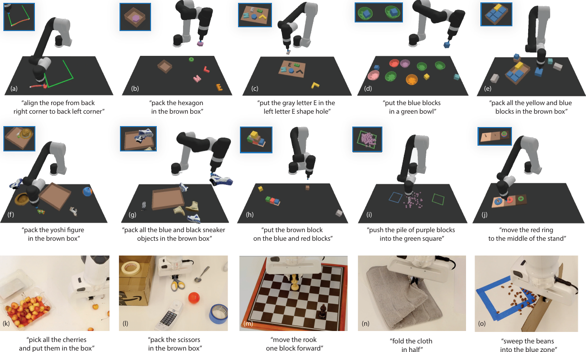
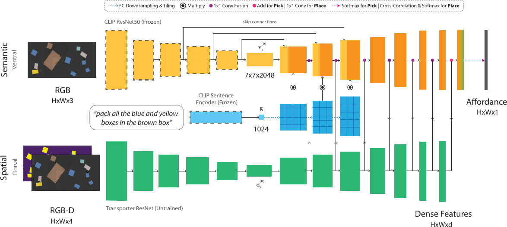
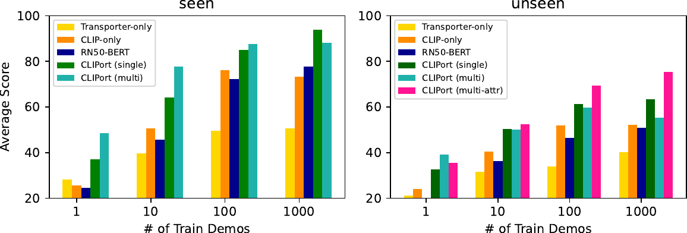
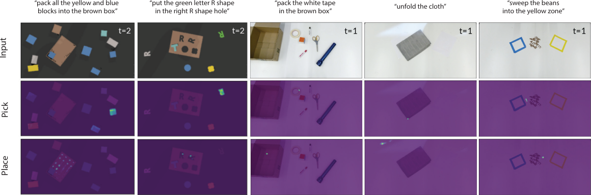
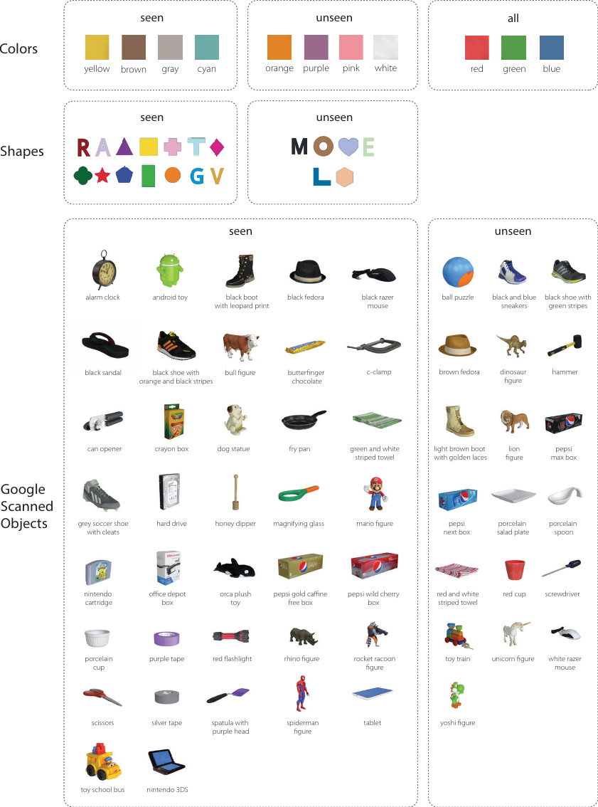
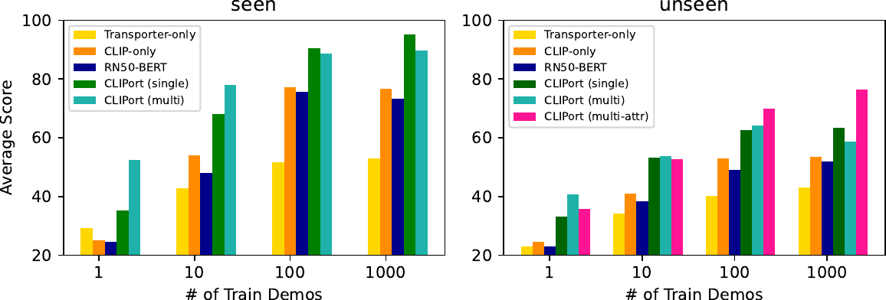
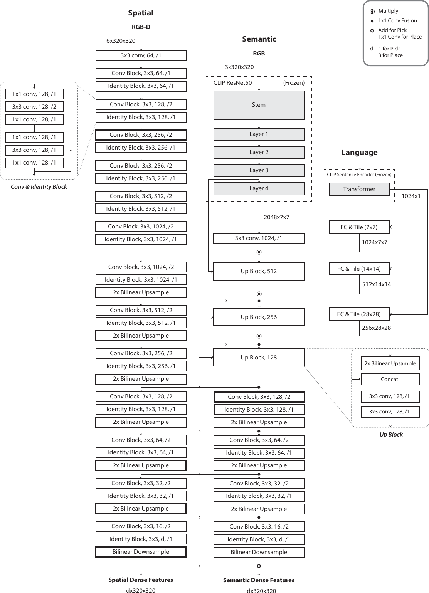
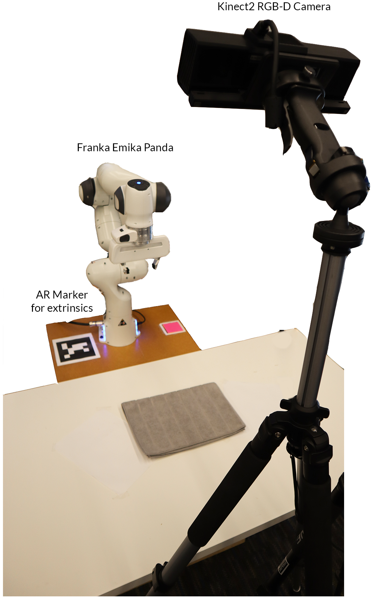
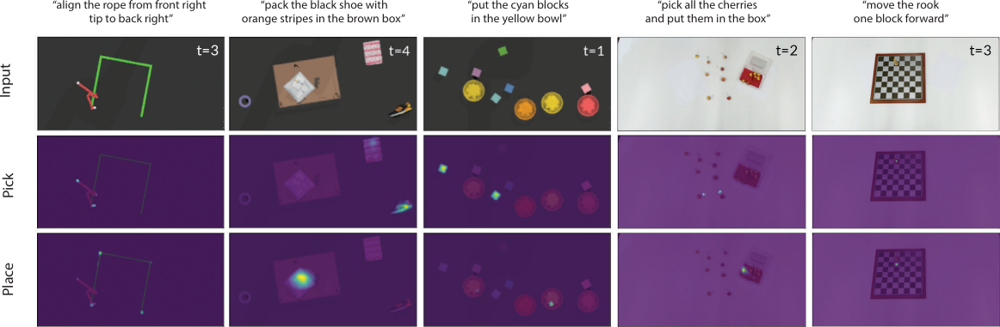
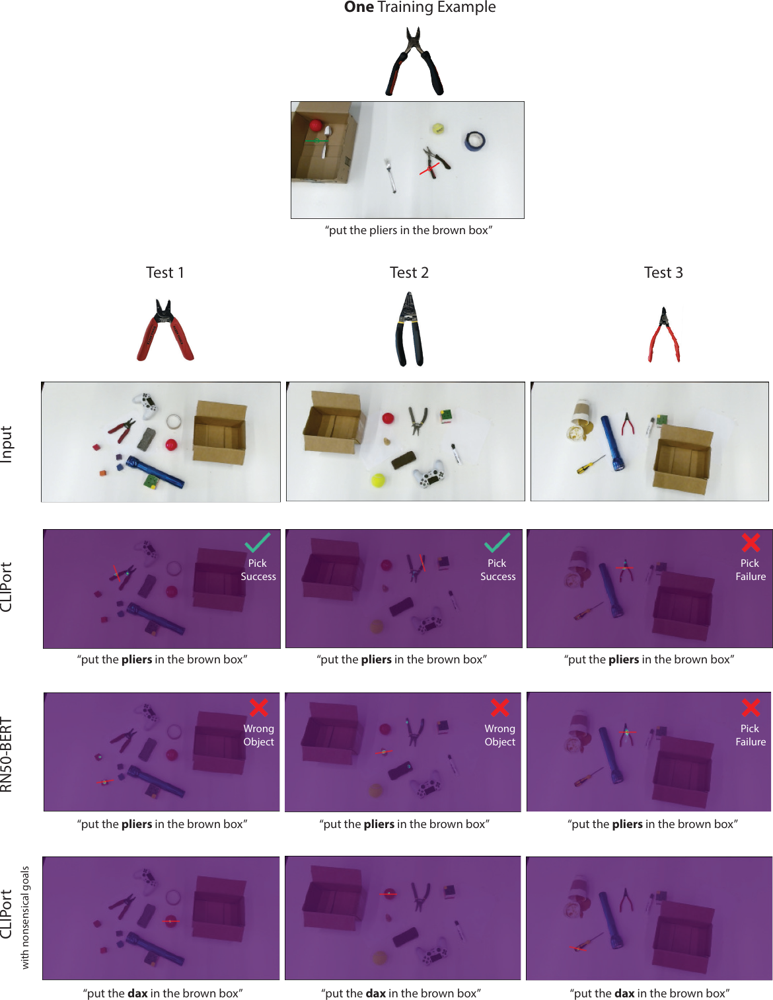

# 标题：CLIPort：机器人操作的“是什么”与“在哪里”通路

- ArXiv：2109.12098
- 作者：Mohit Shridhar, Lucas Manuelli, Dieter Fox，华盛顿大学，英伟达（NVIDIA）
- 章节数：31
- 估计词元数：29.4k

## 目录

- 1 引言
- 2 相关工作
- 3 CLIPort
  - 3.1 语言条件化操作
  - 3.2 实现细节
- 4 结果
  - 4.1 仿真设置
  - 4.2 仿真结果
  - 4.3 真实机器人实验
- 5 结论
  - 致谢
- 参考文献
- 附录 A 任务详情
  - A.1 对齐绳子
  - A.2 打包未见形状
  - A.3 顺序组装套件
  - A.4 将积木放入碗中
  - A.5 打包盒子对
  - A.6 顺序打包谷歌物体
  - A.7 分组打包谷歌物体
  - A.8 堆叠积木金字塔
  - A.9 分离堆
  - A.10 顺序汉诺塔
- 附录 B 评估流程与验证结果
- 附录 C 双流架构细节
- 附录 D 机器人设置
- 附录 E 数据增强
- 附录 F 消融实验与基线
- 附录 G 在演示条件化任务上的性能
- 附录 H 可供性预测示例
- 附录 I 局限性与风险

## 摘要

**摘要** 我们如何才能赋予机器人精确操作物体的能力，同时又能让它们根据抽象概念对物体进行推理？
最近在操作领域的研究表明，端到端网络可以学习需要精确空间推理的灵巧技能，但这些方法通常无法泛化到新目标，或难以跨任务快速学习可迁移的概念。
与此同时，通过在大规模互联网数据上进行训练，在学习和语言的可泛化语义表示方面取得了巨大进展，然而这些表示缺乏细粒度操作所需的空间理解能力。
为此，我们提出了一个结合两者优势的框架：一个用于基于视觉的操作的、包含语义和空间通路的 **双流架构（Two-stream architecture）** 。具体来说，我们提出了 **CLIPort** ，一个 **语言条件化模仿学习（Language-conditioned imitation-learning）** 智能体，它结合了 CLIP [1] 的广泛语义理解能力（“是什么”）与 Transporter [2] 的空间精度（“在哪里”）。
我们的端到端框架能够解决各种语言指定的桌面任务，从打包未见过的物体到折叠布料，所有这些都无需任何显式的物体姿态、实例分割、记忆、符号状态或句法结构表示。
在仿真和真实环境中的实验表明，我们的方法在 **少样本（Few-shot）** 设置下数据高效，并能有效地泛化到已见和未见的语义概念。我们甚至学习了一个用于 10 个仿真任务和 9 个真实世界任务的 **多任务策略（Multi-task policy）** ，其性能优于或与单任务策略相当。

## 1 引言（Introduction）

让一个人去“舀一勺咖啡豆”或“把布对折”，他们能自然地理解“舀”或“折”这类概念，并将其落实到厘米级精度的具体物理动作中。我们人类可以凭直觉做到这一点，而无需依赖咖啡豆或布的显式几何或运动学模型。此外，我们能够从关于需要达成目标的极少示例中，泛化到广泛的任务和概念。我们如何才能赋予机器人这种能力，使其能够高效地将抽象的语义概念落实到精确的空间推理中？

最近，一些用于基于视觉的操作的端到端框架被提出 [2, 3, 4, 5]。虽然这些方法不使用任何物体位姿、实例分割或符号状态的显式表示，但它们只能复现变化范围有限的演示，并且对任务底层的语义没有概念。从包装红笔切换到包装蓝笔，需要收集新的训练集 [2]；或者，如果使用目标条件策略，则需要用户提供场景中的目标图像 [5, 6]。在现实的人机交互场景中，收集额外的演示或提供目标图像通常是不可行且难以扩展的。解决这两个问题的一个自然方案是使用自然语言来条件化策略。语言为指定目标以及跨任务隐式传递概念提供了一个直观的接口。虽然过去已经探索了用于操作的语言接地 [7, 8, 9, 10]，但这些流程受限于以物体为中心的表示，无法处理颗粒状或可变形物体，并且通常不以集成的方式对感知和动作进行推理。

与此同时，通过在大规模互联网数据上进行训练，视觉表示学习模型 [11, 12] 以及视觉与语言表示对齐 [13, 14, 15] 方面取得了巨大进展。然而，这些模型缺乏对如何操作物体的细粒度理解，即物理可供性（Physical Affordances）。

> 图 1 | 语言条件操作任务：CLIPort 是一个广泛的框架，适用于桌面环境中的各种语言条件操作任务。我们在 Ravens [2] 中对 10 个模拟任务 (a-j) 进行了大规模实验，每个任务包含数千个独特实例。有关每个任务的挑战，请参见附录 [A](#A1)。CLIPort 甚至可以学习一个适用于所有 10 个任务的多任务模型，其性能达到或优于单任务模型。类似地，我们在 Franka Panda 机械臂上展示了我们的方法，仅用 179 个图像-动作对训练了一个适用于 9 个真实世界任务 (k-o；仅展示 5 个) 的多任务模型。

为此，我们提出了首个结合两者优势的框架： **用于细粒度操作的端到端学习** 与 **视觉语言接地系统的多目标和多任务泛化能力** 。我们引入了一种用于操作的双流架构，包含 **语义** 和 **空间** 通路，其灵感广泛来源于（或大致类比于）认知心理学中的双流假说 [16, 17, 18]。

具体来说，我们提出了 **CLIPort** ，这是一个语言条件的模仿学习智能体，它集成了 **CLIP** [1] 的语义理解能力（“是什么”）与 **Transporter** [2] 的空间精度（“在哪里”）。Transporter 已被应用于从工业包装 [2] 到操作可变形物体 [6] 的广泛重排任务。该方法的关键洞见在于将桌面操作表述为一系列抓放可供性预测，其目标是检测动作而非检测物体，然后再学习策略。这种以动作为中心的感知方法 [19] 数据效率高，并且能有效规避在学习表示中对显式“物体性”的需求。

然而，Transporter 是一个白板系统（Tabula Rasa System），它从零开始学习所有视觉表示，因此每个新目标或新任务都需要收集一组新的演示。为了解决这个问题，我们在学习策略时融入了一个强大的语义先验。我们使用来自预训练 CLIP 模型 [1] 的视觉和语言目标特征来条件化我们的 **语义** 流。由于 CLIP 经过预训练，能够对齐来自互联网数百万图像-标题对的图像和语言特征，它为跨任务通用的语义概念（如类别、部件、形状、颜色、文本和其他视觉属性）的接地提供了一个强大的先验，整个过程无需依赖需要边界框或实例分割的自顶向下流程 [13, 14, 15, 20]。这使我们能够将桌面重排任务表述为一系列语言条件的可供性预测，这是一个主要基于视觉的推理问题，从而受益于数据驱动范式的优势，如规模和泛化能力。

为研究这些优势，我们在 Ravens [2] 框架中使用一个模拟吸盘抓取机器人进行了大规模实验。我们提出了 **10 个语言条件化任务（language-conditioned tasks）** ，每个任务包含数千个独特实例，这些任务需要语义和空间推理能力（参见图 [1](#S1.F1) a-j）。CLIPort 不仅能有效解决这些任务，而且令人惊讶的是，它甚至能学习一个针对所有 10 个任务的 **多任务模型（multi-task model）** ，其性能达到或优于单任务模型。
此外，我们的评估表明，我们的多任务模型能够有效地跨任务迁移诸如“粉色方块”之类的属性，尽管在评估任务的上下文中从未见过粉色方块或“粉色”这个词。
我们还在一个 Franka Panda 机械臂上演示了我们的方法，仅使用 179 个图像-动作对训练的一个多任务模型即可处理 **9 个真实世界任务（real-world tasks）** （参见图 [1](#S1.F1) k-o）。

总而言之，我们的贡献如下：

- **一个扩展的基准测试（An extended benchmark）** ：用于 Ravens [2] 中操作任务的 **语言接地任务（language-grounding tasks）** 。
- **一种双流架构（Two-stream architecture）** ：用于利用互联网预训练的 **视觉-语言模型（vision-language models）** ，以语言目标为条件来制定精确的操作策略。
- **广泛的实证结果（Empirical results）** ：涵盖多种操作任务，包括多任务模型，并通过真实机器人实验进行了验证。

基准测试、代码和预训练模型可在以下网址获取：[cliport.github.io](https://cliport.github.io)。

## 2 相关工作（Related Work）

**基于视觉的操作（Vision-based Manipulation）** 。传统上，用于操作的感知主要围绕 **物体检测器（object detectors）** 、 **分割器（segmentors）** 和 **姿态估计器（pose estimators）** [21, 22, 23, 24, 25, 26] 展开。这些方法无法处理 **可变形物体（deformable objects）** 、 **颗粒介质（granular media）** ，也无法在没有物体特定训练数据的情况下泛化到未见过的物体。另一种方法是使用 **稠密描述符（dense descriptors）** [27, 28, 29] 和 **关键点表示（keypoint representations）** [30, 31, 32]，它们放弃了分割和姿态表示，但无法对 **序列动作（sequential actions）** 进行推理，并且难以表示物体数量可变的场景。另一方面， **端到端感知到动作模型（end-to-end perception-to-action models）** 可以学习精确的 **序列策略（sequential policies）** [2, 4, 6, 33, 34, 35]，但这些方法对 **语义概念（semantic concepts）** 的理解有限，并且依赖 **目标图像（goal-images）** 来 **条件化策略（condition policies）** 。相比之下，Yen-Chen 等人 [36] 的研究表明，在分类和分割等语义任务上进行 **预训练（pre-training）** 有助于提高抓取预测的效率和泛化能力。

**语义模型（Semantic Models）** 。
随着 **大规模模型（large-scale models）** [37, 38, 39] 的出现，人们提出了许多学习视觉和语言联合表示的方法 [13, 14, 15, 20, 40]。然而，这些方法仅限于 **边界框（bounding boxes）** 或 **实例分割（instance segmentations）** ，这使得它们无法检测诸如一堆咖啡豆或棋盘上的方格之类的事物。另一种方法是 **对比学习（contrastive learning）** 领域的工作，它们放弃了 **自上而下的物体检测（top-down object-detection）** ，通过在 **未标记数据（unlabeled data）** 上进行预训练来学习 **连续表示（continuous representations）** [11, 12]。最近， **CLIP（Contrastive Language-Image Pre-training）** [1] 应用了类似的方法，通过在互联网上数百万个图像-标题对上进行训练，来对齐视觉和语言表示。

**机器人语言接地（Language Grounding for Robotics）** 。
已有若干工作提出了使用 **自然语言（natural language）** 指导机器人的系统 [7, 8, 9, 10, 41, 42, 43, 44, 45, 46, 47]。然而，这些方法使用 **解耦的感知与动作流水线（disentangled pipelines for perception and action）** ，语言主要被用来指导感知。因此，这些流水线缺乏诸如叠衣服等任务所需的空间精度。
最近，Lynch 等人 [48] 提出了一种用于在 **连续控制（continuous control）** 中接地语言的端到端系统，但它需要数小时的 **人类遥操作数据（human teleoperation data）** 来适应单个模拟桌面环境。

**双流架构（Two-Stream Architectures）** 在 **动作识别网络（action-recognition networks）** [49, 50, 51] 和 **音频识别系统（audio-recognition systems）** [52, 53] 中很普遍。在机器人领域，Zeng 等人 [54] 和 Jang 等人 [55] 提出了用于 **新物体可供性预测（affordance predictions of novel objects）** 的双流流水线。前者需要目标图像，而后者则局限于具有单一类别目标的 **单步抓取（one-step grasps）** 。相比之下，我们的框架为序列任务提供了一个丰富且直观的接口，支持 **可组合的语言命令（composable language commands）** 。

## 3 CLIPort

CLIPort 是一种基于四个关键原则的模仿学习智能体：
(1) 通过一个两步基元进行操控，其中每个动作都涉及一个起始和最终末端执行器位姿。
(2) 对平移和旋转具有 **等变性（Equivariant）** [56, 57] 的动作视觉表征。
(3) 用于语义和空间信息的两条独立通路。
(4) 用于指定目标以及在任务间迁移概念的 **语言条件化策略（Language-conditioned policies）** 。
将来自 Transporter 的 (1) 和 (2) 与 (3) 和 (4) 相结合，使我们能够实现超越单纯模仿演示的 **可泛化策略（Generalizable policies）** 。

[3.1](#S3.SS1) 节描述了问题公式化，概述了 Transporter [2]，并介绍了我们的语言条件化模型。[3.2](#S3.SS2) 节提供了训练方法的详细信息。

> 图 2 | CLIPort 双流架构。语义流和空间流的概览。语义流使用一个冻结的 CLIP ResNet50 [1] 来编码 RGB 输入，其解码器层由来自 CLIP 句子编码器的平铺语言特征进行条件化。空间流编码 RGB-D 输入，其解码器层与语义流进行横向融合。最终输出是一个密集的逐像素特征图，用于拾取或放置可供性预测。这相同的双流架构用于所有三个 **全卷积网络（Fully-Convolutional-Networks, FCNs）** $f_{\text{pick}},\Phi_{\text{query}}$ 和 $\Phi_{\text{key}}$，其中 $f_{\text{pick}}$ 用于预测拾取动作，$\Phi_{\text{query}}$ 和 $\Phi_{\text{key}}$ 用于预测放置动作。具体架构见附录 [C](#A3)。

### 3.1 语言条件化操控

我们考虑学习一个 **目标条件化策略（Goal-conditioned policy）** $\pi$ 的问题，该策略在给定输入 $\gamma_{t}=(\mathbf{o}_{t},\mathbf{l}_{t})$ 时输出动作 $\mathbf{a}_{t}$，输入由一个视觉观测 $\mathbf{o}_{t}$ 和一个英语语言指令 $\mathbf{l}_{t}$ 组成：

$$
\pi(\bm{\gamma}_{t})=\pi(\mathbf{o}_{t},\mathbf{l}_{t})\to\mathbf{a}_{t}=(\mathcal{T}_{\text{pick}},\mathcal{T}_{\text{place}})\in\mathcal{A}(1)
$$

动作 $\mathbf{a}=(\mathcal{T}_{\text{pick}},\mathcal{T}_{\text{place}})$ 分别指定了用于拾取和放置的末端执行器位姿。我们考虑桌面任务，其中 $\mathcal{T}_{\text{pick}},\mathcal{T}_{\text{place}}\in\mathbf{SE}(2)$。视觉观测 $\mathbf{o}_{t}$ 是场景的俯视正交 RGB-D 重建，其中每个像素对应于三维空间中的一个点。
语言指令 $\mathbf{l}_{t}$ 要么指定逐步指令，例如 “pack the scissors” $\to$ “pack the purple tape” $\to$ 等，要么指定整个任务的单一目标描述，例如 “pack all the blue and yellow boxes in the brown box”。具体示例见图 [4](#S4.F4)。

我们假设可以访问一个包含 $n$ 个专家演示的数据集 $\mathcal{D}=\{\zeta_{1},\zeta_{2},\ldots,\zeta_{n}\}$，其中包含相关联的离散时间输入-动作对 $\zeta_{i}=\{(\mathbf{o}_{1},\mathbf{l}_{1},\mathbf{a}_{1}),(\mathbf{o}_{2},\mathbf{l}_{2},\mathbf{a}_{2}),\ldots\}$，其中 $\mathbf{a}_{t}=(\mathcal{T}_{\text{pick}},\mathcal{T}_{\text{place}})$ 对应于时间步 $t$ 的专家拾放坐标。这些专家演示用于监督策略 $\pi$。

用于拾放的 Transporter。策略 $\pi$ 使用 Transporter [2] 进行训练，以执行空间操控。模型首先 (i) 关注一个局部区域以决定在哪里拾取，
然后 (ii) 通过深度视觉特征的 **互相关（Cross-correlation）** 寻找最佳匹配来计算放置位置。

遵循 Transporter [2, 6]，策略 $\pi$ 由两个 **动作价值模块（Action-value modules）** （Q-函数）组成：拾取模块 $\mathcal{Q}_{\text{pick}}$ 决定在哪里拾取，并且以这个拾取动作为条件，放置模块 $\mathcal{Q}_{\text{place}}$ 决定在哪里放置。
这些模块被实现为 **全卷积网络（Fully-Convolutional-Networks, FCNs）** ，其设计上具有平移等变性。
正如我们将在下面更详细地描述的那样，我们将这些网络扩展为能够处理语言输入的双流架构。拾取 FCN $f_{\text{pick}}$ 接收输入 $\bm{\gamma}_{t}=(\mathbf{o}_{t},\mathbf{l}_{t})$ 并输出动作价值的密集逐像素预测 $\mathcal{Q}_{\text{pick}}\in\mathbb{R}^{H\times W}$，这些值用于预测拾取动作 $\mathcal{T}_{\text{pick}}$：

$$
\mathcal{T}_{\text{pick}}=\operatorname*{\arg\!\max}_{(u,v)}\mathcal{Q}_{\text{pick}}((u,v)|\bm{\gamma}_{t})(2)
$$

由于 $\mathbf{o}_{t}$ 是一个 **正射高度图（orthographic heightmap）** ，每个像素位置 $(u,v)$ 都可以利用已知的相机标定映射到一个三维拾取位置。$f_{\text{pick}}$ 以监督方式进行训练，以预测拾取动作 $\mathcal{T}_{\text{pick}}$，该动作在时间步 $t$ 模仿带有指定语言指令的专家演示。

第二个 **全卷积网络（Fully Convolutional Network, FCN）** $\Phi_{\text{query}}$ 接收 $\bm{\gamma}_{t}[\mathcal{T}_{\text{pick}}]$（即以 $\mathcal{T}_{\text{pick}}$ 为中心、从 $\mathbf{o}_{t}$ 裁剪出的 $c\times c$ 区域）以及语言指令 $\mathbf{l}_{t}$，并输出形状为 $\mathbb{R}^{c\times c\times d}$ 的查询特征嵌入。第三个 FCN $\Phi_{\text{key}}$ 接收完整的输入 $\bm{\gamma}_{t}$，并输出形状为 $\mathbb{R}^{H\times W\times d}$ 的键特征嵌入。然后，通过交叉关联查询特征和键特征来计算放置动作值 $\mathcal{Q}_{\text{place}}$：

$$
\mathcal{Q}_{\text{place}}(\Delta\tau|\gamma_{t},\mathcal{T}_{\text{pick}})=\big{(}\Phi_{\text{query}}(\bm{\gamma}_{t}[\mathcal{T}_{\text{pick}}])\ast\Phi_{\text{key}}(\bm{\gamma}_{t})\big{)}[\Delta\tau](3)
$$

其中 $\Delta\tau\in\bm{SE}(2)$ 表示一个潜在的放置位姿。由于 $\mathbf{o}_{t}$ 是正射高度图，放置位姿 $\Delta\tau$ 中的旋转可以通过在将裁剪区域输入查询网络 $\Phi_{\text{query}}$ 之前，堆叠 $k$ 个离散角度旋转来捕获。
然后 $\mathcal{T}_{\text{place}}=\operatorname*{\arg\!\max}_{\Delta\tau}\mathcal{Q}_{\text{place}}(\Delta\tau|\gamma_{t},\mathcal{T}_{\text{pick}})$，其中放置模块被训练以模仿专家演示中的放置动作。对于所有模型，我们使用 $c=64$、$k=36$ 和 $d=3$。与 Transporter [2, 6] 类似，我们的框架可以扩展以处理任何可由每个时间步的两个末端执行器位姿参数化的 **运动基元（motion primitive）** ，例如推动、滑动等。更多细节，请读者参阅原始论文 [2]。

**双流架构（Two-Stream Architecture）** 。
在 CLIPort 中，我们扩展了 Transporter [2] 中所有三个 FCN（$f_{\text{pick}}$、$\Phi_{\text{query}}$ 和 $\Phi_{\text{key}}$）的网络架构，以允许语言输入和对高级语义概念的推理。
我们将 FCN 扩展为两条通路： **语义流（semantic stream，腹侧通路）** 和 **空间流（spatial stream，背侧通路）** 。
语义流在瓶颈处以语言特征为条件，并与来自空间流的中间特征融合。有关架构概览，请参见图 [2](#S3.F2)。

**空间流（Spatial stream）** 与 Transporter [2] 中的 ResNet 架构相同——这是一个白板网络（Tabula rasa network），接收 RGB-D 输入 $\mathbf{o}_{t}$，并通过一个沙漏形编码器-解码器模型输出密集特征。

**语义流（Semantic stream）** 使用一个冻结的、预训练的 CLIP ResNet50 [1] 来编码 RGB 输入 $\tilde{\mathbf{o}}_{t}$（注 1：我们无法将深度信息与 CLIP 一起使用，因为它是使用来自互联网的纯 RGB 图像-标题对进行训练的。），直至倒数第二层 $\tilde{\mathbf{o}}_{t}\to\mathbf{v}^{(0)}_{t}:\mathbb{R}^{7\times 7\times 2048}$，然后引入解码层对特征张量进行上采样，以在每一层 $l$ 上模仿空间流 $\mathbf{v}^{(l-1)}_{t}\to\mathbf{v}^{(l)}_{t}:\mathbb{R}^{h\times w\times C}$。

语言指令 $\mathbf{l}_{t}$ 使用 CLIP 基于 Transformer 的句子编码器进行编码，以生成目标编码 $\mathbf{l}_{t}\to\mathbf{g}_{t}:\mathbb{R}^{1024}$。这个目标编码 $\mathbf{g}_{t}$ 通过全连接层进行下采样以匹配通道维度 $C$，并进行平铺（Tiled）以匹配解码器特征的空间维度，从而得到 $\mathbf{g}_{t}\to\mathbf{g}^{(l)}_{t}:\mathbb{R}^{h\times w\times C}$。然后，解码器特征通过逐元素乘积 $\mathbf{v}^{(l)}_{t}\odot\mathbf{g}^{(l)}_{t}$（哈达玛积，Hadamard product）与平铺后的目标特征进行条件化。由于 CLIP 是通过池化图像特征与语言编码之间的点积对齐的对比损失（Contrastive loss）进行训练的，逐元素乘积允许我们利用这种对齐，同时平铺操作保留了视觉特征的空间维度。受 LingUNet [58] 启发，我们在瓶颈层之后的三个后续层中重复这种语言条件化。我们还从 CLIP ResNet50 编码器向这些层添加了跳跃连接（Skip connections），以利用从形状到部件再到物体级概念的不同层次的语义信息 [59]。最后，遵循视频动作识别中现有的双流架构 [51]，我们添加了从空间流到语义流的横向连接（Lateral connections）。这些连接涉及拼接两个特征张量并应用 $1\times 1\ \texttt{conv}$ 来减少通道维度 $[\mathbf{v}^{(l)}_{t}\odot~{}\mathbf{g}^{(l)}_{t};\mathbf{d}^{(l)}_{t}]:\mathbb{R}^{h\times w\times C_{\mathbf{v}}+C_{\mathbf{d}}}\to\mathbb{R}^{h\times w\times C_{\mathbf{v}}}$，其中 $\mathbf{v}^{(l)}_{t}$ 和 $\mathbf{d}^{(l)}_{t}$ 分别是第 $l$ 层的语义张量和空间张量。对于密集特征的最终融合，经验上，对 $f_{\text{pick}}$ 使用加法融合，对 $\Phi_{\text{query}}$ 和 $\Phi_{\text{key}}$ 使用 $1\times 1\ \texttt{conv}$ 融合效果最佳。有关确切架构的详细信息，请参见附录 [C](#A3)。

### 3.2 Implementation Details（实现细节）

**从演示中训练（Training from demonstrations）。** 与 Transporter [2] 类似，我们通过模仿学习（Imitation learning）从一组专家演示 $\mathcal{D}=\{\zeta_{1},\zeta_{2},\ldots,\zeta_{n}\}$ 中训练 CLIPort，这些演示由离散时间输入-动作对 $\zeta_{i}=\{(\mathbf{o}_{1},\mathbf{l}_{1},\mathbf{a}_{1}),(\mathbf{o}_{2},\mathbf{l}_{2},\mathbf{a}_{2}),\ldots\}$ 组成。在训练期间，我们从数据集中随机采样一个输入-动作对，并使用演示动作的独热像素编码 $Y_{\textrm{pick}}:\mathbb{R}^{H\times W\times k}$ 和 $Y_{\textrm{place}}:\mathbb{R}^{H\times W\times k}$（其中 $k$ 为离散旋转数）对模型进行端到端监督。在使用吸盘夹具的模拟实验中，我们对于抓取动作使用 $k=1$，对于放置动作使用 $k=36$。模型使用交叉熵损失（Cross-entropy loss）进行训练：$\mathcal{L}=-\mathbb{E}_{Y_{\textrm{pick}}}[\textrm{log}\,\mathcal{V}_{\textrm{pick}}]-\mathbb{E}_{Y_{\textrm{place}}}[\textrm{log}\mathcal{V}_{\textrm{place}}]$，其中 $\mathcal{V}_{\textrm{pick}}=\text{softmax}(\mathcal{Q}_{\text{pick}}((u,v)|\bm{\gamma}_{t}))$ 且 $\mathcal{V}_{\textrm{place}}=\text{softmax}(\mathcal{Q}_{\text{place}}((u^{\prime},v^{\prime},\omega^{\prime})|\bm{\gamma}_{t},\mathcal{T}_{\text{pick}}))$。与原始 Transporter 模型训练 40K 次迭代相比，我们训练我们的模型 200K 次迭代（使用数据增强；参见附录 [E](#A5)），以应对任务中额外的语义变化——随机化的颜色、形状、物体。所有模型均在单个商用 GPU 上训练 2 天，批量大小为 1。

**训练多任务模型（Training multi-task models）。** 多任务训练与单任务训练几乎相同，除了训练数据的采样方式。首先，我们随机采样一个任务，然后从数据集中该任务的数据里选择一个随机的输入-动作对。使用这种策略，所有任务被采样的概率相等，但更长视界的任务更不可能覆盖数据集中所有可用的输入-动作对。为了弥补这一点，我们将所有多任务模型训练时间延长 $3\times$，即 600K 次迭代或 6 个 GPU 天。

## 4 结果（Results）

我们进行了仿真和硬件实验，旨在回答以下问题：

1.  与单流架构及其他更简单的基线方法相比， **语言条件化双流架构（language-conditioned two-stream architecture）** 对于细粒度操作的效果如何？
2.  是否可能为所有任务训练一个 **多任务模型（multi-task model）** ，其性能和泛化能力如何？
3.  这些模型对于已见和未见的语义属性（如颜色、形状和物体类别）的泛化能力如何？

### 4.1 仿真设置（Simulation Setup）

**环境（Environment）** 。所有仿真实验均基于配备 **吸盘夹具（suction gripper）** 的 **通用机器人 UR5e（Universal Robot UR5e）** 。该设置提供了一个系统且可复现的评估环境，尤其适用于对颜色和物体类别等语义概念 **接地（grounding）** 能力的基准测试。输入观测是由围绕矩形工作台放置的 3 个摄像头重建的 **俯视 RGB-D（top-down RGB-D）** 图像：一个在前方，一个在左肩，一个在右肩，所有摄像头均指向中心。每个摄像头的分辨率为 $640\times 480$ 且无噪声。

**语言条件化操作任务（Language-Conditioned Manipulation Tasks）** 。我们在基于 PyBullet [60] 的 Ravens 基准测试 [2] 基础上，扩展了 10 个语言条件化操作任务。示例参见图 [1](#S1.F1)，各任务相关的挑战参见表 [3](#A1.T3)。每个任务实例通过采样一组物体和属性来构建：位姿、颜色、尺寸和物体类别。10 个任务中有 8 个具有两个变体，分别标记为 **已见（seen）** 和 **未见（unseen）** ，取决于任务在测试时是否包含未见过的属性（例如颜色）。对于颜色：$\mathbb{T_{\text{seen colors}}}=\{\texttt{yellow, brown, gray, cyan}\}$，$\mathbb{T_{\text{unseen colors}}}=\{\texttt{orange, purple, pink, white}\}$，其中 3 种重叠颜色 $\mathbb{T_{\text{all}}}=\{\texttt{red, green, blue}\}$ 在已见和未见划分中均被使用。对于装箱物体，我们使用来自 **Google 扫描物体数据集（Google Scanned Objects dataset）** [61] 的 56 个桌面物体，并将其划分为 37 个已见物体和 19 个未见物体。语言指令通过模板为仿真实验构建，并为真实世界实验进行人工标注。有关各个任务的更多细节，请参见附录 [A](#A1)。

**评估指标（Evaluation Metric）** 。我们采用 Ravens 基准测试 [2] 提出的 0（失败）到 100（成功）评分。该评分根据任务分配部分得分，例如，对于指令中指定的 5 个物体成功装箱 3 个，得分为 $3/5\Rightarrow 60.0$；或者对于将 56 个颗粒中的 30 个推入正确区域，得分为 $30/56\Rightarrow 53.6$。每个任务使用的具体评估指标参见附录 [A](#A1)。在评估回合中，智能体持续与场景交互，直到一个 **预言机（oracle）** 指示任务完成。我们报告了使用 $n=1,10,100,1000$ 个演示训练的智能体在 100 次评估运行中的得分。

### 4.2 仿真结果（Simulation Results）

> 图 3 | 表 [1](#S4.T1) 中所有任务在已见和未见划分上的平均得分。

表 [1](#S4.T1) 展示了我们在 Ravens [2] 中进行的大规模实验结果，图 [3](#S4.F3) 通过已见和未见划分的平均得分总结了这些结果。

**基线方法（Baseline Methods）** 。为了研究我们双流架构的有效性，我们广泛地与两个基线方法进行比较： **仅 Transporter（Transporter-only）** 和 **仅 CLIP（CLIP-only）** 。仅 Transporter 是原始的 Transporter [2]，或者等效于 CLIPort 的 **空间流（spatial stream）** 配合 RGB-D 输入。尽管仅 Transporter 不接收任何语言目标，但它展示了通过利用训练期间看到的最可能动作，偶然能够实现的效果。另一方面，仅 CLIP 只是 CLIPort 的 **语义流（semantic stream）** 配合 RGB 和语言输入。仅 CLIP 展示了在没有空间信息（特别是深度信息）的情况下，通过微调一个预训练的语义模型用于操作所能达到的效果。

**双流性能（Two-Stream Performance）** 。图 [3](#S4.F3)（已见任务）捕捉了我们主要主张的精髓。
**仅使用 Transporter（Transporter-only）** 的性能在 $50\%$ 处饱和，因为它不使用语言指令来 **锚定（ground）** 期望的目标。 **仅使用 CLIP（CLIP-only）** 确实有一个目标，但缺乏完成“最后一英里”的空间精度，因此在 $76\%$ 处饱和。只有 **CLIPort（单任务）（CLIPort (single)）** 实现了超过 $90\%$ 的性能，这表明 **语义流（semantic stream）** 和 **空间流（spatial stream）** 对于细粒度操作都至关重要。此外， **CLIPort（单任务）** 在大多数任务上仅用 100 次演示就达到了 $86\%$ 的成功率，展示了其高效性。

除了这些基线模型，我们在附录 [F](#A6) 中展示了各种消融实验以及替代的单流和双流模型。
简要总结这些结果：对于 **小样本学习（few-shot learning）** （即 $n\geq 10$），CLIP 是必不可少的，可以替代其他语义流方案，例如使用 BERT [38] 的、在 ImageNet 上训练过的 ResNet50 [62]。 **图像目标模型（Image-goal models）** 在打包 Google 物体任务上优于 **CLIPort（单任务）** ，但这仅仅是因为它们不需要解决 **语言锚定（language-grounding）** 问题。

**多任务性能（Multi-Task Performance）** 。在现实场景中，我们希望机器人能够胜任任何任务，而不仅仅是单一任务。
我们通过表 [1](#S4.T1) 中的 **CLIPort（多任务）（CLIPort (multi)）** 来研究这一点，该模型是在所有 10 个任务上训练的一个多任务模型。
**CLIPort（多任务）** 模型仅在任务的 **已见划分（seen-splits）** 上进行训练，因此像“粉色（pink）”这样的 **未见属性（unseen attribute）** 在单任务和多任务设置中是一致的。令人惊讶的是，在表 [1](#S4.T1) 的评估中， **CLIPort（多任务）** 在 $41/72=57\%$ 的情况下优于单任务的 **CLIPort（单任务）** 模型。
这一趋势在图 [3](#S4.F3)（已见任务）中也很明显，尤其是在演示次数为 100 次或更少的实例中。
尽管 **CLIPort（多任务）** 是在来自其他任务的更多样化的数据上训练的，但 **CLIPort（多任务）** 和 **CLIPort（单任务）** 在每个任务上可访问的数据量是相同的。这支持了我们的前提： **语言是一种强大的条件调节机制，可以复用来自其他任务的概念，而无需从头学习** 。这也验证了 **数据驱动方法（data-driven approaches）** 的一个特性：在大量多样化数据上进行训练会产生更鲁棒和更具泛化能力的表征 [1, 63]。
然而， **CLIPort（多任务）** 在 **长时程任务（longer-horizon tasks）** 上表现较差，例如对齐绳子（align-rope）。我们假设这是因为长时程任务在数据集中获得的 **输入-动作对（input-action pairs）** 覆盖较少。未来的工作可以使用更好的采样方法，根据任务的平均时程来平衡任务。

**表 1：语言条件化测试结果（Table 1: Language-Conditioned Test Results）** 。基于 100 个评估实例的任务成功率（平均 %）与训练演示数量（1、10、100 或 1000）的对比。每个任务相关的挑战在附录 [A](#A1) 中描述。 **CLIPort（单任务，CLIPort (single)）** 模型在 **已见数据划分（seen splits）** 上训练，并在 **已见** 和 **未见数据划分（unseen splits）** 上评估。 **CLIPort（多任务，CLIPort (multi)）** 模型在所有 10 个任务的已见数据划分上训练，分别使用 $1\mathbb{T}$、$10\mathbb{T}$、$100\mathbb{T}$ 和 $1000\mathbb{T}$ 个演示，其中 $\mathbb{T}=10$。 **CLIPort（多任务-属性，CLIPort (multi-attr)）** 表示 CLIPort（多任务）模型在所有任务（除了某个特定的 **留出任务（heldout task）** ）的已见和未见数据划分上训练，而对于该留出任务，模型仅在已见数据划分上训练。平均分数概览见图 [3](#S4.F3)。

表 1 | 语言条件化测试结果。
| | packing-box-pairs seen-colors | packing-box-pairs unseen-colors | packing-seen-google objects-seq | packing-unseen-google objects-seq | packing-seen-google objects-group | packing-unseen-google objects-group | | | | | | | | | | | | | | | | | | |
| :--- | :---: | :---: | :---: | :---: | :---: | :---: | :---: | :---: | :---: | :---: | :---: | :---: | :---: | :---: | :---: | :---: | :---: | :---: | :---: | :---: | :---: | :---: | :---: | :---: |
| Method | 1 | 10 | 100 | 1000 | 1 | 10 | 100 | 1000 | 1 | 10 | 100 | 1000 | 1 | 10 | 100 | 1000 | 1 | 10 | 100 | 1000 | 1 | 10 | 100 | 1000 |
| Transporter-only [2] | 44.2 | 55.2 | 54.2 | 52.4 | 34.6 | 48.7 | 47.2 | 54.1 | 26.2 | 39.7 | 45.4 | 46.3 | 19.9 | 29.8 | 28.7 | 37.3 | 60.0 | 54.3 | 61.5 | 59.9 | 46.2 | 54.7 | 49.8 | 52.0 |
| CLIP-only | 38.6 | 69.7 | 88.5 | 87.1 | 33.0 | 65.5 | 68.8 | 61.2 | 29.1 | 67.9 | 89.3 | 95.8 | 37.1 | 49.4 | 60.4 | 57.8 | 52.5 | 62.0 | 89.6 | 92.7 | 43.4 | 65.9 | 73.1 | 70.0 |
| RN50-BERT | 36.2 | 64.0 | 94.7 | 90.3 | 31.4 | 52.7 | 65.6 | 72.1 | 32.9 | 48.4 | 87.9 | 94.0 | 29.3 | 48.5 | 48.3 | 56.1 | 46.4 | 52.9 | 76.5 | 86.4 | 43.2 | 52.0 | 66.3 | 73.7 |
| CLIPort (single) | 51.6 | 82.9 | 92.7 | 98.2 | 45.6 | 65.3 | 68.6 | 71.5 | 14.8 | 59.5 | 86.8 | 96.2 | 27.2 | 50.0 | 65.5 | 71.9 | 52.7 | 67.0 | 84.1 | 94.0 | 61.5 | 66.2 | 78.4 | 81.5 |
| CLIPort (multi) | 66.8 | 88.6 | 94.1 | 96.6 | 59.0 | 69.7 | 76.2 | 71.4 | 41.6 | 78.4 | 85.0 | 84.4 | 40.7 | 51.1 | 65.8 | 70.3 | 71.3 | 84.6 | 89.6 | 88.3 | 68.4 | 69.6 | 78.4 | 80.3 |
| CLIPort (multi-attr) | – | – | – | – | 46.2 | 72.0 | 86.2 | 80.3 | – | – | – | – | 35.4 | 45.1 | 78.9 | 87.4 | – | – | – | – | 48.6 | 69.3 | 84.8 | 89.1 |
| | stack-block-pyramid seq-seen-colors | stack-block-pyramid seq-unseen-colors | separating-piles seen-colors | separating-piles unseen-colors | towers-of-hanoi seq-seen-colors | towers-of-hanoi seq-unseen-colors | | | | | | | | | | | | | | | | | | |
| | 1 | 10 | 100 | 1000 | 1 | 10 | 100 | 1000 | 1 | 10 | 100 | 1000 | 1 | 10 | 100 | 1000 | 1 | 10 | 100 | 1000 | 1 | 10 | 100 | 1000 |
| Transporter-only [2] | 4.5 | 2.3 | 5.2 | 4.5 | 3.0 | 4.0 | 2.3 | 5.8 | 42.7 | 52.3 | 42.0 | 48.4 | 41.2 | 49.2 | 44.7 | 52.3 | 25.4 | 67.9 | 98.0 | 99.9 | 24.3 | 44.6 | 71.7 | 80.7 |
| CLIP-only | 6.3 | 28.7 | 55.7 | 54.8 | 2.0 | 12.2 | 18.3 | 19.5 | 43.5 | 55.0 | 84.9 | 90.2 | 59.9 | 49.6 | 73.0 | 71.0 | 9.4 | 52.6 | 88.6 | 45.3 | 24.7 | 47.0 | 67.0 | 58.0 |
| RN50-BERT | 5.3 | 35.0 | 89.0 | 97.5 | 6.2 | 12.2 | 21.5 | 30.7 | 31.8 | 47.8 | 46.5 | 46.5 | 33.4 | 44.4 | 41.3 | 44.9 | 28.0 | 66.1 | 91.3 | 92.1 | 17.4 | 75.1 | 85.3 | 89.3 |
| CLIPort (single) | 28.3 | 64.7 | 93.3 | 98.8 | 13.7 | 24.3 | 31.2 | 41.3 | 54.5 | 59.5 | 93.1 | 98.0 | 47.2 | 51.0 | 76.6 | 75.2 | 59.4 | 92.9 | 97.4 | 100 | 56.1 | 89.7 | 95.9 | 99.4

**向未见属性泛化（Generalizing to Unseen Attributes）** 。需要泛化到新颜色、形状和物体的任务更为困难，如图 [3](#S4.F3)（未见）所示，我们所有的智能体在这些任务上都取得了相对较低的性能。然而，CLIPort（单任务）模型的表现明显优于随机水平，即优于纯 Transporter 模型。
性能较低的原因在于，当智能体在物理环境上下文中从未遇到过“橙色”、“粉色”等词语或其对应的视觉特征时，将语言指令（如“将粉色积木放在橙色碗里”）中的“粉色”、“橙色”等未见属性 **落地（grounding）** 到具体情境中十分困难。尽管预训练的 CLIP 模型接触过“粉色”这一属性，但在物理环境中，它可能对应不同的概念，具体取决于光照条件等因素，因此至少需要少量示例来 **调节（condition）** 可训练的语义解码器层。
此外，我们注意到，与纯 Transporter 模型相比，CLIPort（单任务）模型也不易过拟合。
如表 [1](#S4.T1) 中的 towers-of-hanoi-seq-unseen-colors 任务所示，尽管汉诺塔问题可以不关注颜色而仅关注圆环大小来解决，但纯 Transporter 模型因为遇到未见颜色的圆环而出现了性能下降。
我们假设，由于 CLIP 是在多样化的互联网数据上训练的，它使我们的智能体能够专注于任务相关的概念，同时忽略任务中不相关的方面。

**跨任务属性迁移（Transferring Attributes across Tasks）** 。处理未见属性的一种解决方案是从其他任务中显式学习这些属性。我们通过表 [1](#S4.T1) 和图 [3](#S4.F3)（未见）中的 CLIPort（多属性）模型对此进行了研究。对于这些模型，CLIPort（多任务）模型在所有任务（除了正在评估的那个任务）的 **可见与未见数据划分（seen-and-unseen splits）** 上进行训练，而对于正在评估的任务，它仅在可见数据划分上进行训练。
因此，这项评估旨在衡量，在 put-blocks-in-bowl-unseen-colors 任务中见过粉色积木，是否有助于解决 packing-box-pairs-unseen-colors 任务中的“打包所有粉色和青色的盒子”。结果表明，这种显式的迁移带来了显著的性能提升。例如，在 $n=1000$ 的 put-blocks-in-bowls-unseen-colors 任务上，CLIPort（多任务）模型的性能从 $45.8$ 提升到了 $75.7$。

### 4.3 真实机器人实验（Real-Robot Experiments）

**表 2：在 9 个真实世界任务上训练和评估的多任务模型成功率（%）（参见图 [1](#S1.F1)）。样本数表示图像-动作对的总数，例如图 [9](#A5.F9) 中的 1 个样本。**
| Task | # Train (Samples) | # Test | Succ. % |
| :--- | :--- | :--- | :--- |
| Stack Blocks | 05 (13) | 10 | 70.0 |
| Put Blocks in Bowl | 05 (10) | 10 | 65.0 |
| Pack Objects | 10 (31) | 10 | 60.0 |
| Move Rook | 04 (29) | 10 | 70.0 |
| Fold Cloth | 9 (9) | 10 | 57.0 |
| Read Text | 02 (26) | 10 | 55.0 |
| Loop Rope | 04 (12) | 10 | 60.0 |
| Sweep Beans | 05 (23) | 5 | 60.6 |
| Pick Cherries | 04 (26) | 5 | 75.0 |

我们使用一台 **弗兰卡熊猫（Franka Panda）** 机械臂在硬件上验证了我们的结果。设置细节请参见附录 [D](#A4)。表 [2](#S4.T2) 报告了在 9 个真实世界任务上训练和评估的多任务模型成功率。

由于 COVID 限制，我们无法进行大规模用户研究，因此我们报告了每个任务的小型训练集（5-10 次演示）和测试集（5-10 次运行）。总体而言， **CLIPort（多任务）** 在仅使用 179 个样本的情况下，在 **小样本学习（few-shot learning）** 方面是有效的，其性能大致与模拟实验中的结果相对应，简单的积木操作任务达到了 $\sim 70\%$ 的成功率。我们估计，为了获得更稳健的真实世界性能，至少需要 50 到 100 次训练演示，这在图 [3](#S4.F3) 中显而易见。有趣的是，我们观察到模型有时会利用训练数据中的偏差，而不是学习 **理解指令（ground instructions）** 。例如，在“将积木放入碗中”任务中，训练集仅包含一个关于“黄色积木”被放入“蓝色碗”的数据点。这使得模型难以适应将“黄色积木”放入非蓝色碗中的情况。但是，只要有一两个彩色积木被放入不同颜色碗中的示例，就足以让模型关注语言指令。总之，包含良好覆盖预期技能和不变性，以及足够数量训练演示的 **无偏数据集（unbiased datasets）** ，对于获得良好的真实世界性能至关重要。

> 图 4：CLIPort（多任务）模型在模拟环境（左两图）和真实环境（右三图）中的 **可供性（Affordance）** 预测。更多示例见附录 [H](#A8)。

## 5 Conclusion (结论)

我们提出了 **CLIPort** ，一个用于 **语言条件化细粒度操作（language-conditioned fine-grained manipulation）** 的端到端框架。我们的实验，特别是针对多任务模型的实验，表明 **数据驱动（data-driven）** 的泛化方法在机器人学领域尚未得到充分利用。结合适当的 **动作抽象（action abstraction）** 和 **空间语义先验（spatio-semantic priors）** ，端到端方法能够快速学习新技能，而无需依赖那些需要针对具体任务进行工程设计的自上而下流水线。

尽管 CLIPort 能够解决一系列桌面任务，但将其扩展到超越两步基元的灵巧 **六自由度（6-Degrees-of-Freedom, 6-DOF）** 操作仍然是一个挑战。因此，它无法处理复杂的 **部分可观测场景（partially-observable scenes）** ，无法为多指手输出连续控制，也无法预测任务完成情况（详细讨论请参见附录 [I](#A9)）。但总体而言，我们对于数据和结构先验的融合在构建可扩展和可泛化的机器人系统方面的前景感到振奋。

#### Acknowledgments (致谢)

所有仿真实验均通过由华盛顿大学 STF 资助的 Hyak 计算集群完成。我们感谢 Mohak Bhardwaj 在华盛顿大学 Franka 机器人设置方面提供的帮助。我们也感谢我们的同事 Chris Xie、Jesse Thomason 和 Valts Blukis 对初稿提出的宝贵意见。此项工作部分由美国海军研究办公室（Office of Naval Research, ONR）资助，资助号为 #1140209-405780。

## 参考文献

- Radford 等人 [2021]
  A. Radford, J. W. Kim, C. Hallacy, A. Ramesh, G. Goh, S. Agarwal, G. Sastry, A. Askell, P. Mishkin, J. Clark, G. Krueger, 和 I. Sutskever.
  **从自然语言监督中学习可迁移的视觉模型（Learning Transferable Visual Models From Natural Language Supervision）** 。
  _arXiv:2103.00020 [cs]_, 2021 年 2 月。

- Zeng 等人 [2020]
  A. Zeng, P. Florence, J. Tompson, S. Welker, J. Chien, M. Attarian, T. Armstrong, I. Krasin, D. Duong, V. Sindhwani, 和 J. Lee.
  **转运网络：为机器人操作重新排列视觉世界（Transporter networks: Rearranging the visual world for robotic manipulation）** 。
  _机器人学习会议（Conference on Robot Learning, CoRL）_, 2020。

- Akkaya 等人 [2019]
  I. Akkaya, M. Andrychowicz, M. Chociej, M. Litwin, B. McGrew, A. Petron, A. Paino, M. Plappert, G. Powell, R. Ribas, 等。
  **用机械手解魔方（Solving rubik’s cube with a robot hand）** 。
  _arXiv 预印本 arXiv:1910.07113_, 2019。

- Kalashnikov 等人 [2018]
  D. Kalashnikov, A. Irpan, P. Pastor, J. Ibarz, A. Herzog, E. Jang, D. Quillen, E. Holly, M. Kalakrishnan, V. Vanhoucke, 等。
  **Qt-opt：用于基于视觉的机器人操作的可扩展深度强化学习（Qt-opt: Scalable deep reinforcement learning for vision-based robotic manipulation）** 。
  _机器人学习会议（Conference on Robot Learning, CoRL）_, 2018。

- Kalashnikov 等人 [2021]
  D. Kalashnikov, J. Varley, Y. Chebotar, B. Swanson, R. Jonschkowski, C. Finn, S. Levine, 和 K. Hausman。
  **Mt-opt：大规模连续多任务机器人强化学习（Mt-opt: Continuous multi-task robotic reinforcement learning at scale）** 。
  _arXiv 预印本 arXiv:2104.08212_, 2021。

- Seita 等人 [2021]
  D. Seita, P. Florence, J. Tompson, E. Coumans, V. Sindhwani, K. Goldberg, 和 A. Zeng。
  **学习用目标条件转运网络重新排列可变形线缆、织物和袋子（Learning to rearrange deformable cables, fabrics, and bags with goal-conditioned transporter networks）** 。
  载于 _IEEE 机器人与自动化国际会议（IEEE International Conference on Robotics and Automation, ICRA）_, 2021。

- Shridhar 和 Hsu [2018]
  M. Shridhar 和 D. Hsu。
  **用于人机交互的指代表达式的交互式视觉接地（Interactive visual grounding of referring expressions for human-robot interaction）** 。
  载于 _机器人学：科学与系统会议论文集（Proceedings of Robotics: Science and Systems, RSS）_, 2018。

- Matuszek 等人 [2014]
  C. Matuszek, L. Bo, L. Zettlemoyer, 和 D. Fox。
  **从非脚本化的指示性手势和语言中学习人机交互（Learning from unscripted deictic gesture and language for human-robot interactions）** 。
  载于 _AAAI 人工智能会议论文集（Proceedings of the AAAI Conference on Artificial Intelligence）_, 第 28 卷, 2014。

- Bollini 等人 [2013]
  M. Bollini, S. Tellex, T. Thompson, N. Roy, 和 D. Rus。
  **用烹饪机器人解释和执行食谱（Interpreting and executing recipes with a cooking robot）** 。
  载于 _实验机器人学（Experimental Robotics）_, 第 481–495 页。Springer, 2013。

- Misra 等人 [2016]
  D. K. Misra, J. Sung, K. Lee, 和 A. Saxena。
  **告诉我戴夫：自然语言到操作指令的上下文敏感接地（Tell me dave: Context-sensitive grounding of natural language to manipulation instructions）** 。
  _国际机器人研究杂志（The International Journal of Robotics Research, IJRR）_, 35(1-3):281–300, 2016。

- Chen 等人 [2020]
  T. Chen, S. Kornblith, M. Norouzi, 和 G. Hinton。
  **视觉表示对比学习的简单框架（A simple framework for contrastive learning of visual representations）** 。
  载于 _国际机器学习会议（International conference on machine learning）_, 第 1597–1607 页。PMLR, 2020。

- He 等人 [2020]
  K. He, H. Fan, Y. Wu, S. Xie, 和 R. Girshick。
  **用于无监督视觉表示学习的动量对比（Momentum contrast for unsupervised visual representation learning）** 。
  载于 _IEEE/CVF 计算机视觉与模式识别会议（The IEEE/CVF Conference on Computer Vision and Pattern Recognition, CVPR）_, 第 9729–9738 页, 2020。

- Lu 等人 [2019]
  J. Lu, D. Batra, D. Parikh, 和 S. Lee。
  **Vilbert：为视觉与语言任务预训练任务无关的视觉语言表示（Vilbert: Pretraining task-agnostic visiolinguistic representations for vision-and-language tasks）** 。
  载于 _神经信息处理系统进展（Advances in Neural Information Processing Systems, NeuRIPS）_, 2019。

- Chen 等人 [2020]
  Y. C. Chen, L. Li, L. Yu, A. El Kholy, F. Ahmed, Z. Gan, Y. Cheng, 和 J. Liu。
  **Uniter：通用图像-文本表示学习（Uniter: Universal image-text representation learning）** 。
  载于 _欧洲计算机视觉会议（European Conference on Computer Vision）_, 第 104–120 页。Springer, 2020。

- Tan 和 Bansal [2019]
  H. Tan 和 M. Bansal。
  **Lxmert：从 Transformer 学习跨模态编码器表示（Lxmert: Learning cross-modality encoder representations from transformers）** 。
  载于 _2019 年自然语言处理经验方法会议论文集（Proceedings of the 2019 Conference on Empirical Methods in Natural Language Processing, EMNLP）_, 2019。

- Hubel 和 Wiesel [1965]
  D. H. Hubel 和 T. N. Wiesel。
  **猫非纹状体视觉区（18 和 19 区）的感受野和功能结构（Receptive fields and functional architecture in two nonstriate visual areas (18 and 19) of the cat）** 。
  _神经生理学杂志（Journal of neurophysiology）_, 28(2):229–289, 1965。

- Livingstone 和 Hubel [1988]
  M. Livingstone 和 D. Hubel。
  **形状、颜色、运动和深度的分离：解剖学、生理学和感知（Segregation of form, color, movement, and depth: anatomy, physiology, and perception）** 。
  _科学（Science）_, 240(4853):740–749, 1988。

- Derrington 和 Lennie [1984]
  A. Derrington 和 P. Lennie。
  **猕猴外侧膝状体神经元的空间和时间对比敏感度（Spatial and temporal contrast sensitivities of neurones in lateral geniculate nucleus of macaque）** 。
  _生理学杂志（The Journal of physiology）_, 357(1):219–240, 1984。

- Gibson [2014]
  J. J. Gibson。
  **\*视觉感知的生态学方法：经典版（The ecological approach to visual perception: classic edition）** \*。
  Psychology Press, 2014。

- Kamath 等人 [2021]
  A. Kamath, M. Singh, Y. LeCun, I. Misra, G. Synnaeve, 和 N. Carion。
  **Mdetr–用于端到端多模态理解的调制检测（Mdetr–modulated detection for end-to-end multi-modal understanding）** 。
  _arXiv 预印本 arXiv:2104.12763_, 2021。

- He 等人 [2017]
  K. He, G. Gkioxari, P. Dollár, 和 R. Girshick。
  **Mask r-cnn** 。
  载于 _IEEE/CVF 计算机视觉与模式识别会议（The IEEE/CVF Conference on Computer Vision and Pattern Recognition, CVPR）_, 2017。

-

- Florence 等人 [2018]
  P. R. Florence, L. Manuelli, 和 R. Tedrake.
  **密集物体网络（Dense Object Nets）** ：为机器人操作学习密集视觉物体描述符。
  发表于 _机器人学习会议（Conference on Robot Learning, CoRL）_，2018 年。

- Florence 等人 [2019]
  P. Florence, L. Manuelli, 和 R. Tedrake.
  视觉运动策略学习中的自监督对应关系。
  _IEEE 机器人与自动化快报（IEEE Robotics and Automation Letters）_，5(2):492–499，2019 年。

- Sundaresan 等人 [2020]
  P. Sundaresan, J. Grannen, B. Thananjeyan, A. Balakrishna, M. Laskey, K. Stone, J. E. Gonzalez, 和 K. Goldberg.
  使用在合成深度数据上训练的密集物体描述符学习绳索操作策略。
  发表于 _2020 年 IEEE 国际机器人与自动化会议（International Conference on Robotics and Automation, ICRA）_，第 9411–9418 页。IEEE，2020 年。

- Manuelli 等人 [2019]
  L. Manuelli, W. Gao, P. Florence, 和 R. Tedrake.
  **KPAM（Keypoint Affordances for Manipulation）** ：用于类别级机器人操作的关键点可供性。
  发表于 _国际机器人研究研讨会（International Symposium on Robotics Research, ISRR）_，2019 年。

- Kulkarni 等人 [2019]
  T. D. Kulkarni, A. Gupta, C. Ionescu, S. Borgeaud, M. Reynolds, A. Zisserman, 和 V. Mnih.
  用于感知与控制的物体关键点无监督学习。
  _神经信息处理系统进展（Advances in Neural Information Processing Systems, NeuRIPS）_，32:10724–10734，2019 年。

- Liu 等人 [2020]
  X. Liu, R. Jonschkowski, A. Angelova, 和 K. Konolige.
  **KeyPose** ：用于透明物体的多视图 3D 标注与关键点估计。
  发表于 _IEEE/CVF 计算机视觉与模式识别会议（Conference on Computer Vision and Pattern Recognition, CVPR）_，第 11602–11610 页，2020 年。

- Zakka 等人 [2020]
  K. Zakka, A. Zeng, J. Lee, 和 S. Song.
  **Form2Fit** ：从拆卸中学习用于可泛化装配的形状先验。
  发表于 _2020 年 IEEE 国际机器人与自动化会议（International Conference on Robotics and Automation, ICRA）_，第 9404–9410 页。IEEE，2020 年。

- Song 等人 [2020]
  S. Song, A. Zeng, J. Lee, 和 T. Funkhouser.
  **Grasping in the Wild** ：从低成本演示中学习 6 自由度闭环抓取。
  _IEEE 机器人与自动化快报（IEEE Robotics and Automation Letters）_，5(3):4978–4985，2020 年。

- Wu 等人 [2020]
  Y. Wu, W. Yan, T. Kurutach, L. Pinto, 和 P. Abbeel.
  无需演示学习操作可变形物体。
  发表于 _机器人学：科学与系统会议（Proceedings of Robotics: Science and Systems, RSS）_，2020 年。

- Yen-Chen 等人 [2020]
  L. Yen-Chen, A. Zeng, S. Song, P. Isola, 和 T.-Y. Lin.
  先学习看，再学习动：用于操作的视觉预训练。
  发表于 _IEEE 国际机器人与自动化会议（International Conference on Robotics and Automation, ICRA）_，2020 年。

- Vaswani 等人 [2017]
  A. Vaswani, N. Shazeer, N. Parmar, J. Uszkoreit, L. Jones, A. N. Gomez, L. Kaiser, 和 I. Polosukhin.
  **注意力机制就是全部所需（Attention Is All You Need）** 。
  发表于 _神经信息处理系统进展（Advances in Neural Information Processing Systems, NeuRIPS）_，2017 年。

- Devlin 等人 [2018]
  J. Devlin, M. W. Chang, K. Lee, 和 K. Toutanova.
  **BERT（Bidirectional Encoder Representations from Transformers）** ：用于语言理解的深度双向 Transformer 预训练。
  发表于 _北美计算语言学协会会议（Conference of the North American Chapter of the Association for Computational Linguistics, NAACL）_，2018 年。

- Dosovitskiy 等人 [2020]
  A. Dosovitskiy, L. Beyer, A. Kolesnikov, D. Weissenborn, X. Zhai, T. Unterthiner, M. Dehghani, M. Minderer, G. Heigold, S. Gelly, 等。
  一张图像值 16x16 个词：用于大规模图像识别的 Transformer。
  发表于 _国际学习表征会议（International Conference on Learning Representations, ICLR）_，2020 年。

- Yu 等人 [2020]
  F. Yu, J. Tang, W. Yin, Y. Sun, H. Tian, H. Wu, 和 H. Wang.
  **ERNIE-ViL** ：通过场景图实现知识增强的视觉-语言表征。
  _arXiv 预印本 arXiv:2006.16934_，2020 年。

- Bisk 等人 [2016]
  Y. Bisk, D. Yuret, 和 D. Marcu.
  与机器人的自然语言交流。
  发表于 _北美计算语言学协会会议（Proceedings of the North American Chapter of the Association for Computational Linguistics, NAACL）_，第 751–761 页，2016 年。

- Thomason 等人 [2015]
  J. Thomason, S. Zhang, R. J. Mooney, 和 P. Stone.
  通过人机对话学习解释自然语言指令。
  发表于 _第二十四届国际人工智能联合会议（Twenty-Fourth International Joint Conference on Artificial Intelligence, IJCAI）_，2015 年。

- Hatori 等人 [2018]
  J. Hatori, Y. Kikuchi, S. Kobayashi, K. Takahashi, Y. Tsuboi, Y. Unno, W. Ko, 和 J. Tan.
  使用无约束口语指令交互式拾取真实世界物体。
  发表于 _国际机器人与自动化会议（Proceedings of International Conference on Robotics and Automation, ICRA）_，2018 年。

- Chen 等人 [2021]
  Y. Chen, R. Xu, Y. Lin, 和 P. A. Vela.
  一个基于自然语言指令的抓取检测联合网络。
  _arXiv:2104.00492 [cs]_，2021 年 4 月。

- Blukis 等人 [2020]
  V. Blukis, R. A. Knepper, 和 Y. Artzi.
  用于将自然语言指令映射到机器人控制的少样本物体定位。
  发表于 _机器人学习会议（Conference on Robot Learning, CoRL）_，2020 年。

- Paxton 等人 [2019]
  C. Paxton, Y. Bisk, J. Thomason, A. Byravan, 和 D. Fox.
  **Prospection** ：通过预测未来从语言生成可解释的计划。
  发表于 _国际机器人与自动化会议（International Conference on Robotics and Automation, ICRA）_，第 6942–6948 页。IEEE，2019 年。

- Tellex 等人 [2011]
  S. Tellex, T. Kollar, S. Dickerson, M. Walter, A. Banerjee, S. Teller, 和 N. Roy.
  理解用于机器人导航和移动操作的自然语言指令。
  发表于 _AAAI 人工智能会议（Proceedings of the AAAI Conference on Artificial Intelligence, AAAI）_，2011 年。

- Lynch 和 Sermanet [2020]
  C. Lynch 和 P. Sermanet.
  在游戏中落地语言。
  _arXiv 预印本 arXiv:2005.07648_，2020 年。

- Simonyan 和 Zisserman [2014]
  K. Simonyan 和 A. Zisserman.
  用于视频动作识别的双流卷积网络。
  _arXiv 预印本 arXiv:1406.2199_，2014 年。

- Feichtenhofer 等人 [2016]
  C. Feichtenhofer, A. Pinz, 和 A. Zisserman.
  用于视频动作识别的卷积双流网络融合。
  发表于 _IEEE/CVF 计算机视觉与模式识别会议（The IEEE/CVF Conference on Computer Vision and Pattern Recognition, CVPR）_，第 1933–1941 页，2016 年。

- Feichtenhofer 等人 [2019]
  C. Feichtenhofer, H. Fan, J. Malik, 和 K.

- Bender 等人 [2021]
  E. M. Bender, T. Gebru, A. McMillan-Major, 和 S. Shmitchell.
  On the dangers of stochastic parrots: Can language models be too big?
  In _ICASSP 2021-2021 IEEE International Conference on Acoustics, Speech and Signal Processing (ICASSP)_, pages 855–859. IEEE, 2021.
- Xiao 等人 [2020]
  F. Xiao, Y. J. Lee, K. Grauman, J. Malik, 和 C. Feichtenhofer.
  Audiovisual slowfast networks for video recognition.
  _arXiv preprint arXiv:2001.08740_, 2020.
- Zeng 等人 [2018]
  A. Zeng, S. Song, K.-T. Yu, E. Donlon, F. R. Hogan, M. Bauza, D. Ma, O. Taylor, M. Liu, E. Romo, 等.
  Robotic pick-and-place of novel objects in clutter with multi-affordance grasping and cross-domain image matching.
  In _2018 IEEE international conference on robotics and automation (ICRA)_, pages 3750–3757. IEEE, 2018.
- Jang 等人 [2017]
  E. Jang, S. Vijayanarasimhan, P. Pastor, J. Ibarz, 和 S. Levine.
  End-to-end learning of semantic grasping.
  In _Conference on Robot Learning (CoRL)_, Proceedings of Machine Learning Research. PMLR, 2017.
- Kondor 和 Trivedi [2018]
  R. Kondor 和 S. Trivedi.
  On the generalization of equivariance and convolution in neural networks to the action of compact groups.
  In _International Conference on Machine Learning (ICML)_, 2018.
- Cohen 和 Welling [2016]
  T. Cohen 和 M. Welling.
  Group equivariant convolutional networks.
  In _International conference on machine learning (ICML)_, 2016.
- Misra 等人 [2018]
  D. Misra, A. Bennett, V. Blukis, E. Niklasson, M. Shatkhin, 和 Y. Artzi.
  Mapping instructions to actions in 3d environments with visual goal prediction.
  In _Proceedings of the 2019 Conference on Empirical Methods in Natural Language Processing (EMNLP)_, 2018.
- Goh 等人 [2021]
  G. Goh, N. C. †, C. V. †, S. Carter, M. Petrov, L. Schubert, A. Radford, 和 C. Olah.
  Multimodal neurons in artificial neural networks.
  _Distill_, 2021.
  [doi:10.23915/distill.00030](http://dx.doi.org/10.23915/distill.00030).
  https://distill.pub/2021/multimodal-neurons.
- Coumans 和 Bai [2016]
  E. Coumans 和 Y. Bai.
  Pybullet, a python module for physics simulation for games, robotics and machine learning. 2016.
- goo [2020]
  Google scanned objects dataset, 2020.
  URL
  [https://app.ignitionrobotics.org/GoogleResearch/fuel/collections/Google%20Scanned%20Objects](https://app.ignitionrobotics.org/GoogleResearch/fuel/collections/Google%20Scanned%20Objects).
- He 等人 [2016]
  K. He, X. Zhang, S. Ren, 和 J. Sun.
  Deep residual learning for image recognition.
  In _The IEEE/CVF Conference on Computer Vision and Pattern Recognition (CVPR)_, pages 770–778, 2016.
- Lu 等人 [2020]
  J. Lu, V. Goswami, M. Rohrbach, D. Parikh, 和 S. Lee.
  12-in-1: Multi-task vision and language representation learning.
  In _The IEEE/CVF Conference on Computer Vision and Pattern Recognition (CVPR)_, June 2020.
- Paszke 等人 [2019]
  A. Paszke, S. Gross, F. Massa, A. Lerer, J. Bradbury, G. Chanan, T. Killeen, Z. Lin, N. Gimelshein, L. Antiga, 等.
  Pytorch: An imperative style, high-performance deep learning library.
  _arXiv preprint arXiv:1912.01703_, 2019.
- Sanh 等人 [2019]
  V. Sanh, L. Debut, J. Chaumond, 和 T. Wolf.
  Distilbert, a distilled version of bert: smaller, faster, cheaper and lighter.
  _arXiv preprint arXiv:1910.01108_, 2019.
- Deng 等人 [2009]
  J. Deng, W. Dong, R. Socher, L.-J. Li, K. Li, 和 L. Fei-Fei.
  Imagenet: A large-scale hierarchical image database.
  In _2009 IEEE conference on computer vision and pattern recognition_, pages 248–255. Ieee, 2009.
- Mao 等人 [2019]
  J. Mao, C. Gan, P. Kohli, J. B. Tenenbaum, 和 J. Wu.
  The neuro-symbolic concept learner: Interpreting scenes, words, and sentences from natural supervision.
  _arXiv preprint arXiv:1904.12584_, 2019.
- Ding 等人 [2020]
  D. Ding, F. Hill, A. Santoro, 和 M. Botvinick.
  Object-based attention for spatio-temporal reasoning: Outperforming neuro-symbolic models with flexible distributed architectures.
  _arXiv preprint arXiv:2012.08508_, 2020.
- Bender 等人 [2021]
  E. M. Bender, T. Gebru, A. McMillan-Major, 和 S. Shmitchell.
  On the dangers of stochastic parrots: Can language models be too big?
  In _ICASSP 2021-2021 IEEE International Conference on Acoustics, Speech and Signal Processing (ICASSP)_, pages 855–859. IEEE, 2021.
- Xiao 等人 [2020]
  F. Xiao, Y. J. Lee, K. Grauman, J. Malik, 和 C. Feichtenhofer.
  Audiovisual slowfast networks for video recognition.
  _arXiv preprint arXiv:2001.08740_, 2020.
- Zeng 等人 [2018]
  A. Zeng, S. Song, K.-T. Yu, E. Donlon, F. R. Hogan, M. Bauza, D. Ma, O. Taylor, M. Liu, E. Romo, 等.
  Robotic pick-and-place of novel objects in clutter with multi-affordance grasping and cross-domain image matching.
  In _2018 IEEE international conference on robotics and automation (ICRA)_, pages 3750–3757. IEEE, 2018.
- Jang 等人 [2017]
  E. Jang, S. Vijayanarasimhan, P. Pastor, J. Ibarz, 和 S. Levine.
  End-to-end learning of semantic grasping.
  In _Conference on Robot Learning (CoRL)_, Proceedings of Machine Learning Research. PMLR, 2017.
- Kondor 和 Trivedi [2018]
  R. Kondor 和 S. Trivedi.
  On the generalization of equivariance and convolution in neural networks to the action of compact groups.
  In _International Conference on Machine Learning (ICML)_, 2018.
- Cohen 和 Welling [2016]
  T. Cohen 和 M. Welling.
  Group equivariant convolutional networks.
  In _International conference on machine learning (ICML)_, 2016.
- Misra 等人 [2018]
  D. Misra, A. Bennett, V. Blukis, E. Niklasson, M. Shatkhin, 和 Y. Artzi.
  Mapping instructions to actions in 3d environments with visual goal prediction.
  In _Proceedings of the 2019 Conference on Empirical Methods in Natural Language Processing (EMNLP)_, 2018.
- Goh 等人 [2021]
  G. Goh, N. C. †, C. V. †, S. Carter, M. Petrov, L. Schubert, A. Radford, 和 C. Olah.
  Multimodal neurons in artificial neural networks.
  _Distill_, 2021.
  [doi:10.23915/distill.00030](http://dx.doi.org/10.23915/distill.00030).
  https://distill.pub/2021/multimodal-neurons.
- Coumans 和 Bai [2016]
  E. Coumans 和 Y. Bai.
  Pybullet, a python

## 附录 A（Appendix A）

## 附录 A 任务详情

**表 3：Ravens [2] 中的语言条件任务及其相关挑战。**
| | 精确放置 | 多模态放置 | 多步骤 | 未见位姿 | 未见颜色 | 未见物体 | 语言指令 |
| --- | --- | --- | --- | --- | --- | --- | --- |
| 任务 | precise | multimodal | multi-step | unseen | unseen | unseen | language |
| | placing | placing | sequencing | poses | colors | objects | instruction |
| put-blocks-in-bowls-seen-colors^∗ | ✗ | ✓ | ✗ | ✓ | ✗ | ✗ | goal |
| put-blocks-in-bowls-unseen-colors^∗ | ✗ | ✓ | ✗ | ✓ | ✓ | ✗ | goal |
| assembling-kits-seq-seen-colors | ✓ | ✓ | ✓ | ✓ | ✗ | ✓ | step |
| assembling-kits-seq-unseen-colors | ✓ | ✓ | ✓ | ✓ | ✓ | ✓ | step |
| packing-unseen-shapes | ✗ | ✓ | ✗ | ✓ | ✓ | ✓ | goal |
| stack-block-pyramid-seq-seen-colors | ✓ | ✓ | ✓ | ✓ | ✗ | ✗ | step |
| stack-block-pyramid-seq-unseen-colors | ✓ | ✓ | ✓ | ✓ | ✓ | ✗ | step |
| towers-of-hanoi-seq-seen-colors | ✓ | ✓ | ✓ | ✓ | ✗ | ✗ | step |
| towers-of-hanoi-seq-unseen-colors | ✓ | ✓ | ✓ | ✓ | ✓ | ✗ | step |
| packing-box-pairs-seen-colors^∗§ | ✓ | ✓ | ✓ | ✓ | ✗ | ✓ | goal |
| packing-box-pairs-unseen-colors^∗§ | ✓ | ✓ | ✓ | ✓ | ✓ | ✓ | goal |
| packing-seen-google-objects-seq^§ | ✗ | ✓ | ✓ | ✓ | ✗ | ✗ | step |
| packing-unseen-google-objects-seq^§ | ✗ | ✓ | ✓ | ✓ | ✓ | ✓ | step |
| packing-seen-google-objects-group^∗§ | ✗ | ✓ | ✗ | ✓ | ✗ | ✗ | goal |
| packing-unseen-google-objects-group^∗§ | ✗ | ✓ | ✗ | ✓ | ✓ | ✓ | goal |
| align-rope^∗† | ✓ | ✓ | ✓ | ✓ | ✗ | ✗ | goal |
| separating-piles-seen-colors^∗† | ✓ | ✓ | ✓ | ✓ | ✗ | ✗ | goal |
| separating-piles-unseen-colors^∗† | ✓ | ✓ | ✓ | ✓ | ✓ | ✗ | goal |

我们将 Ravens 基准测试 [2] 扩展至 10 个语言条件任务。其中 8 个任务有两个评估变体，其名称中的 `seen`（已见）和 `unseen`（未见）即表示此意。关于每个任务及其划分所关联的挑战概述，请参见表 [A](#A1)。图 [5](#A1.F5) 展示了所有已见和未见划分中的属性、形状和物体的完整列表。所有任务均使用 **手工编码的专家（hand-coded experts）** 来生成专家演示。这些专家利用来自模拟器的特权状态信息以及预设的启发式规则来完成任务。关于这些专家的详细信息，请读者参阅原始的 Transporter 论文 [2]。以下是对每个语言条件任务的描述：

> 图 5：属性与物体：已见与未见划分中的属性和物体。形状物体来自 Transporter [2]。其他桌面物体来自 Google Scanned Objects 数据集 [61]。

### A.1 对齐绳索（Align Rope）

示例：图 [1](#S1.F1)(a)。

任务：操纵一根可变形绳索，将其端点连接到三边正方形的两个角之间。对齐绳索有四种可能的组合：“前左端点到前右端点”、“前右端点到后右角”、“前左端点到后左角”以及“后右角到后左角”。这里的“前”和“后”指的是三边正方形上的规范位置。在每个任务实例中，绳索和三边正方形的位姿都是随机化的。

物体：所有 `align-rope` 实例都包含一根由 20 个铰接珠组成的绳索和一个三边正方形。

成功度量：所有珠子的位姿都与两个正确边之间的线段相匹配。

### A.2 包装未见形状（Packing Unseen Shapes）

示例：图 [1](#S1.F1)(b)。

任务：将一个指定形状放入棕色盒子中。每个任务实例包含 1 个待拾取的形状以及 4 个干扰形状。形状的颜色是随机的，但与任务无关。此任务不需要精确放置，主要是对智能体对任意形状的语义理解能力的测试。

物体：`packing-unseen-shapes` 使用已见形状进行训练，但使用图 [5](#A1.F5) 中的未见形状进行评估。

**成功指标（Success Metric）** ：正确的形状位于棕色盒子的边界内。

### **A.3 顺序组装套件（Assembling Kits Seq）**

示例：图 [1](#S1.F1)(c)。

任务：在每个时间步，按照语言指令规定的顺序，将每个指定的形状精确地放入指定的孔中。这是基准测试中最困难的任务之一，要求精确放置未见过的形状（具有未见过的颜色），并理解诸如“中间的正方形孔”或“底部的字母 R 孔”等空间关系。每个任务实例包含 5 个形状和一个具有随机姿态的套件。

对象：`assembling-kits-seq-seen-colors` 和 `assembling-kits-seq-unseen-colors` 均在见过的形状上进行训练，但在来自图 [5](#A1.F5) 的未见过的形状上进行评估。然而，对于颜色随机化，`assembling-kits-seq-seen-colors` 在见过的颜色上进行训练和评估，而 `assembling-kits-seq-unseen-colors` 使用见过的颜色进行训练，但在来自图 [5](#A1.F5) 的未见过的颜色上进行评估。

成功指标：每个形状的姿态在正确的时间步与指定的孔相匹配。最终得分是在正确时间步以正确姿态放置的形状总数，除以场景中的形状总数（始终为 5）。

### **A.4 将积木放入碗中（Put Blocks in Bowl）**

示例：图 [1](#S1.F1)(d)。

任务：将所有指定颜色的积木放入一个指定颜色的碗中。每个碗只能容纳一个积木，并且所有场景都包含足够多的碗来实现目标。每个任务实例包含几个具有随机颜色的干扰积木和碗。此任务的解决方案是多模态的，因为可能有多种方式来放置语言目标中指定的积木。此任务不需要精确放置，主要测试智能体对颜色属性的理解能力。

对象：`put-blocks-in-bowl-seen-colors` 对于积木和碗，均在来自图 [5](#A1.F5) 的见过的颜色上进行训练和评估。`put-blocks-in-bowl-unseen-colors` 在见过的颜色上进行训练，但对于积木和碗，均在来自图 [5](#A1.F5) 的未见过的颜色上进行评估。

成功指标：所有指定颜色的积木都在一个指定颜色碗的边界内。最终得分是放入正确碗中的正确积木总数，除以场景中相关颜色积木的总数。

### **A.5 成对装箱（Packing Box Pairs）**

示例：图 [1](#S1.F1)(e)。

任务：将所有两种指定颜色的盒子紧密地装入棕色盒子内。所有场景都包含恰好能完全填满盒子的相关颜色盒子数量，但也包含一些无关颜色的干扰盒子。盒子和棕色盒子的大小是随机的。干扰物体与相关物体大小相当，以使任务更加困难。有时场景中只包含两种指定颜色中的一种，智能体必须主动忽略缺失的颜色。总体而言，此任务既需要对颜色的语义理解，也需要对未知大小盒子进行紧密装箱的精确空间推理。

成功指标：正确的形状位于棕色盒子的边界内。

**对象（Objects）** ：具有随机宽度和长度的盒子以及一个棕色盒子。`packing-box-pairs-seen-colors` 使用图 [5](#A1.F5) 中的 **已见颜色（seen color）** 盒子进行训练和评估。`packing-box-pairs-unseen-colors` 使用已见颜色盒子进行训练，但使用图 [5](#A1.F5) 中的 **未见颜色（unseen color）** 盒子进行评估。

**成功度量（Success Metric）** ：所有指定两种颜色的方块都紧密地堆放在棕色盒子的边界内。最终得分是盒子内正确颜色方块的总体积，除以场景中相关颜色方块的总体积。

### A.6 顺序打包谷歌物体（Packing Google Objects Seq）

**示例（Example）** ：图 [1](#S1.F1)(f)。

**任务（Task）** ：按照语言指令在每个时间步规定的顺序，将指定物体放入棕色盒子中。此任务不需要精确放置，主要评估智能体对语义物体描述的 **接地（ground）** 能力。场景中的所有物体都是唯一的，没有重复。每个场景中物体和盒子的 **位姿（pose）** 都是随机的。

**对象（Objects）** ：`packing-seen-google-objects-seq` 使用图 [5](#A1.F5) 中的所有 56 个物体进行训练和评估。`packing-unseen-google-objects-seq` 使用 37 个已见物体进行训练，但使用图 [5](#A1.F5) 中的 19 个未见物体进行评估。

**成功度量（Success Metric）** ：每个指定物体在正确的时间步内位于棕色盒子的边界内。最终得分是在正确时间步放入盒子内的正确物体的总体积，除以相关物体的总体积。

### A.7 分组打包谷歌物体（Packing Google Objects Group）

**示例（Example）** ：图 [1](#S1.F1)(g)。

**任务（Task）** ：将指定类别的所有物体放入棕色盒子中。此任务不需要精确放置或遵循特定的动作序列。每个场景包含多个类别的物体，每个类别至少包含 2 个重复项。该任务无法通过计数物体数量来解决，因为存在 **干扰物体（distractor objects）** ，每个干扰物体也有 2 个或更多重复项。

**对象（Objects）** ：`packing-seen-google-objects-group` 使用图 [5](#A1.F5) 中的所有 56 个物体进行训练和评估。`packing-unseen-google-objects-group` 使用 37 个已见物体进行训练，但使用图 [5](#A1.F5) 中的 19 个未见物体进行评估。

**成功度量（Success Metric）** ：指定类别的所有指定物体都位于棕色盒子的边界内。最终得分是盒子内正确物体的总体积，除以场景中指定类别的相关物体的总体积。

### A.8 堆叠方块金字塔（Stack Block Pyramid）

**示例（Example）** ：图 [1](#S1.F1)(h)。

**任务（Task）** ：按照逐步语言指令指定的颜色序列，用彩色方块堆叠一个金字塔。每个任务包含 6 个颜色随机的方块和 1 个矩形底座，所有物体初始位姿随机放置。

**对象（Objects）** ：6 个方块和 1 个矩形底座。`stack-block-pyramid-seq-seen-colors` 使用图 [5](#A1.F5) 中的已见颜色方块进行训练和评估。`stack-block-pyramid-seq-unseen-colors` 使用已见颜色方块进行训练，但使用图 [5](#A1.F5) 中的未见颜色方块进行评估。

**成功度量（Success Metric）** ：每个方块在对应时间步的位姿与指定位置匹配。最终得分是在正确时间步处于正确位姿的方块总数，除以方块总数（始终为 6）。

### A.9 分离堆（Separating Piles）

**示例（Example）** ：图 [1](#S1.F1)(i)。

**任务（Task）** ：将方块堆扫入指定区域。每个场景包含两个方形区域：一个与任务相关，另一个作为干扰。方块堆和区域在桌子上的位姿随机放置。

**对象（Objects）** ：一堆彩色方块和两个正方形。`separating-piles-seen-colors` 对所有方块和正方形使用图 [5](#A1.F5) 中的已见颜色进行训练和评估。`separating-piles-unseen-colors` 使用已见颜色进行训练，但对所有方块和正方形使用图 [5](#A1.F5) 中的未见颜色进行评估。

**成功度量（Success Metric）** ：所有方块都位于指定区域的边界内。最终得分是位于正确区域内的方块总数，除以场景中的方块总数。

### A.10 顺序汉诺塔（Towers of Hanoi Seq）

**示例（Example）** ：图 [1](#S1.F1)(j)。

**任务（Task）** ：按照语言指令在每个时间步将圆环移动到指定的柱子上。圆环的放置顺序始终相同，即三环汉诺塔的完美解。此任务可以不使用颜色，仅通过观察圆环大小来解决。然而，它测试了智能体忽略与任务无关概念（本例中为颜色）的能力。该任务涉及将圆环从一根柱子移动到另一根柱子的精确 **拾放（pick and place）** 动作。

**对象（Objects）** ：1 个柱子底座和 3 个圆环（小号、中号、大号）。`towers-of-hanoi-seen-colors` 使用图 [5](#A1.F5) 中的已见圆环颜色进行训练和评估。`towers-of-hanoi-unseen-colors` 使用已见圆环颜色进行训练，但使用图 [5](#A1.F5) 中的未见圆环颜色进行评估。

**成功度量（Success Metric）** ：每个圆环在对应时间步的位姿与指定的柱子位置匹配。最终得分是正确放置圆环的总数，除以完美解的总步数（三环汉诺塔为 7 步）。

## 附录 B：评估流程与验证结果（Appendix B Evaluation Workflow and Validation Results）

**表 4：验证结果（Table 4: Validation Results）** 。基于 100 个评估实例的任务成功率（平均 %）与训练演示次数（1、10、100 或 1000）的对比。每个任务对应的挑战描述见附录 [A](#A1)。 **CLIPort（single）** 模型在 **已见（seen）** 数据划分上训练，并在 **已见（seen）** 和 **未见（unseen）** 数据划分上评估。 **CLIPort（multi）** 模型在所有 10 个任务的已见数据划分上训练，分别使用 $1\mathbb{T}$、$10\mathbb{T}$、$100\mathbb{T}$ 和 $1000\mathbb{T}$ 次演示，其中 $\mathbb{T}=10$。 **CLIPort（multi-attr）** 表示 CLIPort（multi）模型在所有任务（除一个特定的 **留出任务（heldout task）** 外）的已见和未见数据划分上训练，而对于该留出任务，仅在其已见数据划分上训练。平均分数概览见图 [6](#A2.F6)。

|                      | packing-box-pairs seen-colors       | packing-box-pairs unseen-colors       | packing-seen-google objects-seq | packing-unseen-google objects-seq | packing-seen-google objects-group | packing-unseen-google objects-group |      |      |      |      |      |      |      |      |      |      |      |      |      |      |      |      |      |      |
| -------------------- | -------------------------------------- | ---------------------------------------- | ---------------------------------- | ------------------------------------ | ------------------------------------ | -------------------------------------- | ---- | ---- | ---- | ---- | ---- | ---- | ---- | ---- | ---- | ---- | ---- | ---- | ---- | ---- | ---- | ---- | ---- | ---- |
| Method               | 1                                      | 10                                       | 100                                | 1000                                 | 1                                    | 10                                     | 100  | 1000 | 1    | 10   | 100  | 1000 | 1    | 10   | 100  | 1000 | 1    | 10   | 100  | 1000 | 1    | 10   | 100  | 1000 |
| Transporter-only [2] | 48.9                                   | 57.2                                     | 59.4                               | 60.6                                 | 37.8                                 | 52.3                                   | 54.5 | 60.7 | 30.2 | 41.6 | 42.4 | 46.3 | 26.3 | 37.1 | 42.9 | 40.8 | 56.3 | 52.8 | 55.6 | 54.5 | 30.8 | 55.3 | 53.6 | 56.0 |
| CLIP-only            | 37.1                                   | 72.3                                     | 87.4                               | 90.9                                 | 36.1                                 | 61.8                                   | 67.2 | 62.9 | 30.5 | 76.5 | 89.1 | 97.7 | 37.8 | 48.9 | 55.2 | 58.9 | 53.3 | 66.1 | 90.6 | 94.6 | 46.7 | 63.3 | 76.7 | 78.1 |
| RN50-BERT            | 40.0                                   | 64.4                                     | 94.7                               | 90.5                                 | 42.1                                 | 58.7                                   | 62.4 | 72.2 | 29.7 | 49.8 | 90.4 | 94.6 | 39.9 | 41.8 | 57.5 | 57.2 | 48.5 | 56.9 | 83.1 | 93.6 | 44.8 | 55.3 | 71.7 | 77.9 |
| CLIPort (single)     | 51.9                                   | 84.7                                     | 95.9                               | 98.0                                 | 47.1                                 | 66.9                                   | 70.0 | 71.9 | 14.4 | 63.9 | 95.3 | 96.9 | 25.0 | 50.6 | 62.7 | 62.0 | 53.3 | 72.5 | 90.3 | 95.6 | 54.9 | 68.5 | 78.3 | 73.3 |
| CLIPort (multi)      | 68.6                                   | 90.0                                     | 96.0                               | 96.3                                 | 55.9                                 | 70.3                                   | 76.6 | 72.9 | 45.7 | 78.4 | 83.8 | 83.4 | 50.8 | 60.8 | 65.1 | 68.8 | 69.4 | 86.2 | 92.2 | 93.2 | 66.9 | 73.4 | 82.0 | 81.7 |
| CLIPort (multi-attr) | –                                      | –                                        | –                                  | –                                    | 46.2                                 | 72.0                                   | 86.2 | 80.3 | –    | –    | –    | –    | 35.4 | 45.1 | 78.7 | 87.4 | –    | –    | –    | –    | 48.6 | 69.3 | 84.8 | 89.1 |
|                      | stack-block-pyramid seq-seen-colors | stack-block-pyramid seq-unseen-colors | separating-piles seen-colors    | separating-piles unseen-colors    | towers-of-hanoi seq-seen-colors   | towers-of-hanoi seq-unseen-colors   |      |      |      |      |      |      |      |      |      |      |      |      |      |      |      |      |      |      |
|                      | 1                                      | 10                                       | 100                                | 1000                                 | 1                                    | 10                                     | 100  | 1000 | 1    | 10   | 100  | 1000 | 1    | 10   | 100  | 1000 | 1    | 10   | 100  | 1000 | 1    | 10   | 100  | 1000 |
| Transporter-only [2] | 4.8                                    | 4.0                                      | 6.8                                | 5.7                                  | 4.8                                  | 5.3                                    | 5.0  | 5.0  | 42.8 | 52.9 | 54.7 | 55.6 | 47.8 | 53.4 | 52.6 | 54.8 | 25.1 | 74.4 | 100  | 100  | 25.6 | 46.4 | 77.0 | 81.7 |
| CLIP-only            | 5.5                                    | 30.0                                     | 58.7                               | 59.0                                 | 2.0                                  | 16.3                                   | 5.7  | 19.3 | 39.7 | 69.6 | 90.4 | 92.9 | 46.4 | 61.6 | 76.9 | 74.4 | 10.9 | 48.1 | 88.6 | 52.9 | 15.9 | 44.7 | 67.1 | 58.1 |
| RN50-BERT            | 5.7                                    | 35.5                                     | 94.0                               | 98.0                                 | 5.2                                  | 10.5                                   | 19.7 | 33.3 | 33.3 | 55.9 | 53.0 | 48.7 | 35.7 | 52.2 | 53.1 | 57.0 | 26.4 | 68.1 | 92.7 | 95.9 | 16.3 | 75.0 | 82.0 | 84.3 |
| CLIPort (single)     | 29.0                                   | 68.8                                     | 95.0                               | 99.3                                 | 15.8                                 | 29.0                                   | 32.7 | 41.8 | 45.1 | 58.6 | 96.8 | 99.9 | 50.7 | 56.5 | 83.8 | 83.0 | 55.3 | 94.1 | 99.9 | 100  | 66.6 | 91.9 | 96.4 | 100  |
| CLIPort (multi)      | 38.3                                   | 71.0                                     | 97.0                               | 97.3                                 | 27.8                                 | 31.8                                   | 39.3 | 33.3 | 53.2 | 73.0 | 92.7 | 89.2 | 55.5 | 71.2 | 79.5 | 76.7 | 67.6 | 94.0 | 99.1 | 100  | 55.6 | 68.6 | 79.1 | 67.0 |
| CLIPort (multi-attr) |

**评估工作流程（Evaluation Workflow）** 。第 [4.1](#S4.SS1) 节中的所有模拟实验均遵循一个四阶段工作流程：

1.  生成训练集、验证集和测试集。
2.  在训练集上训练智能体（agent）。
3.  在验证集上进行优化以找到最佳检查点（checkpoint）。
4.  在测试集上评估最佳检查点。

验证集和测试集各包含 100 个评估实例。我们发现， **验证损失（validation loss）** 是确定最佳检查点的较差指标，因为动作（action）通常是 **多模态（multi-modal）** 的。例如，在“将黄色积木放入红色碗中”这样的任务中，有三个可能的黄色积木可供选择。如果智能体选择了与专家不同的黄色积木，验证损失会很高，但实际上选择任何一个黄色积木都足以实现目标。我们通过在验证集上的 **任务执行性能（task execution performance）** 来确定最佳检查点，从而解决了这个问题。

**验证性能（Validation Performances）** 。在验证阶段，我们评估训练好的智能体（agent）在固定检查点（checkpoint）上的表现：对于单任务设置，检查点间隔为 1K 至 200K 次迭代（iteration）；对于多任务设置，间隔为 1K 至 600K 次迭代。然后，我们为每个任务选择性能最佳的检查点。表 [4](#A2.T4) 展示了第 [4.1](#S4.SS1) 节中所有测试的验证结果。遵循 Transporter [2] 的方法，我们使用 1e-4 的学习率（learning rate），未进行额外的超参数（hyperparameter）调优。我们注意到，更好的学习率调度（learning rate schedule）和其他超参数优化（hyperparameter optimization）可能会提升智能体的性能，尤其是在多任务设置中。

> 图 6 | 表 [4](#A2.T4) 中所有任务在已见（seen）和未见（unseen）数据划分（split）上的平均验证分数。

> 图 7 | CLIPort 双流架构（CLIPort Two-Stream Architecture）：语义（semantic）与空间（spatial）通路的详细架构图。

## **附录 C 双流架构详情（Appendix C Two Stream Architecture Details）**

图 [7](#A2.F7) 提供了 CLIPort 双流设计的详细架构图。
我们在每个卷积层和恒等块之后使用 **ReLU 激活函数（ReLU activations）** ，不使用任何 **批归一化（Batch Normalization）** 。
请注意，我们重复深度输入以匹配 RGB 图像的维度 $\mathbb{R}^{H\times W\times 1}\to\mathbb{R}^{H\times W\times 3}$，此做法遵循 Transporter [2]。所有模型均在 **PyTorch** [64] 中实现。对于 **CLIP（Contrastive Language-Image Pre-training）** ，我们使用了作者发布的实现和预训练检查点(^2^22[https://github.com/openai/CLIP](https://github.com/openai/CLIP))。

## **附录 D 机器人设置（Appendix D Robot Setup）**

> 图 8 | 真实机器人实验设置。

**硬件设置（Hardware Setup）** 。所有真实机器人实验均在配备 **平行夹爪（parallel-gripper）** 的 **Franka Panda** 机器人上进行。对于感知，我们使用一个安装在三脚架上的 **Kinect-2 RGB-D 相机** ，向下倾斜对准桌面。虽然 Kinect-2 提供 $1280\times 720$ 分辨率的图像，但我们使用下采样至 $960\times 540$ 的图像以获得更快的用户界面响应。相机与机器人基座坐标系之间的 **外参标定（extrinsic calibration）** 通过 **AR 标记（AR Marker）** 并使用 **ARUCO ROS** (^3^33[https://github.com/pal-robotics/aruco_ros](https://github.com/pal-robotics/aruco_ros)) 计算完成。设置概览见图 [8](#A4.F8)。

**演示与执行（Demonstrations and Execution）** 。为了使用 Franka Panda 收集演示数据，我们开发了一个 2D 交互工具，该工具利用 Kinect-2 的俯视 RGB 视图来指定拾取和放置位置。用户首先在实时 RGB 视频流上选择一个 2D 边界框，然后通过点击边界框周围选择一个离散的旋转角度。对于抓取，我们使用一个简单的启发式方法来确定闭合手指的高度。首先，我们对边界框所包围的 **点云（pointcloud）** 进行分割，然后垂直裁剪点云至夹爪手指的高度，最后通过取平均值计算所选点的 3D 质心。该 3D 质心用于通过 **RRT* 运动规划器（RRT* motion-planner）** 为末端执行器规划路径，以执行预定义的序列——下降、打开/闭合夹爪、上升。对于执行训练好的 CLIPort 模型，我们使用类似的抓取方法，但不再使用用户指定的边界框，而是以拾取和放置预测（即 **可供性（affordance）** 的 argmax）为中心，截取 $32\times 32$ 的图像块，从点云计算 3D 质心。只有清扫和折叠动作有所不同，其末端执行器在抓取后不会抬起。

**平行夹爪的拾取旋转（Pick Rotations for Parallel Grippers）** 。仿真中使用的 **吸盘夹爪（suction gripper）** 不需要拾取旋转，因为抓取被指定为精确的点位置。然而，对于 Franka Panda，平行夹爪需要特定的 **偏航旋转（yaw rotation）** 来抓取物体。为了解决这个问题，我们将拾取模块 $\mathcal{Q}_{\text{pick}}$ 分为两个组件：定位器和旋转器。定位器在给定完整观测和语言输入的情况下预测一个像素位置 $(u,v)$。旋转器以 $(u,v)$ 为中心截取 $64\times 64$ 的观测图像块，连同语言输入一起，通过从 $k$ 个旋转后的图像块中选择一个来预测离散的旋转角度。在我们所有的硬件实验中，我们使用 $k=36$。虽然可以使用单个模块同时预测位置和旋转，但这种解耦的方法使我们能够在单个 GPU（ **NVIDIA P100** ）上运行模型，并因使用裁剪旋转而减少了内存占用。

## 附录 E 数据增强

> 图 9：数据增强：应用于 RGB-D 输入的 $\mathbf{SE}(2)$ 变换。左图显示原始输入，右图显示变换后的输入以及专家 $\mathcal{T}_{\text{pick}}$（红色）和 $\mathcal{T}_{\text{place}}$（绿色）动作。

遵循常规做法及原始 Transporter [2] 的实现，我们通过应用随机 $\mathbf{SE}(2)$ 变换来增强训练样本。变换后 $\mathcal{T}_{\text{pick}}$ 或 $\mathcal{T}_{\text{place}}$ 超出画面范围的增强样本将被丢弃。这些增强对于使用 **全卷积网络（Fully Convolutional Networks, FCNs）** 学习 **空间等变表示（Spatially-equivariant representations）** 至关重要，可以避免模型对有限训练演示图像产生过拟合。

## 附录 F 消融研究与基线模型

**表 5：消融研究与基线模型。来自 100 次评估运行的 stack-block-pyramid-seq 和 packing-google-objects-seq 任务的评估得分（平均 %）。堆叠积木金字塔任务涉及语义和精确的空间推理，而打包物体任务主要涉及语义基础，无需任何精确放置。**
| | stack-block-pyramid seq-seen-colors | stack-block-pyramid seq-unseen-colors | packing-seen-google object-seq | packing-unseen-google object-seq | | | | | | | | | | | | |
| --- | --- | --- | --- | --- | --- | --- | --- | --- | --- | --- | --- | --- | --- | --- | --- | --- |
| 方法 | 1 | 10 | 100 | 1000 | 1 | 10 | 100 | 1000 | 1 | 10 | 100 | 1000 | 1 | 10 | 100 | 1000 |
| One-Stream Transporter-only | 4.5 | 2.3 | 5.2 | 4.5 | 3.0 | 4.0 | 2.3 | 5.8 | 26.2 | 39.7 | 45.4 | 46.3 | 19.9 | 29.8 | 28.7 | 37.3 |
| One-Stream CLIP-only | 6.3 | 28.7 | 55.7 | 54.8 | 2.0 | 12.2 | 18.3 | 19.5 | 52.5 | 62.0 | 89.6 | 92.7 | 43.4 | 65.9 | 73.1 | 70.0 |
| One-Stream Language Transporter | 0.0 | 0.0 | 0.0 | 0.0 | 0.0 | 0.0 | 0.0 | 0.0 | 0.0 | 0.0 | 0.0 | 0.2 | 0.1 | 0.1 | 0.0 | 0.0 |
| One-Stream Image-Goal Transporter | 1.8 | 1.3 | 7.0 | 6.8 | 2.5 | 4.7 | 4.2 | 4.8 | 64.5 | 67.0 | 81.8 | 85.4 | 47.7 | 62.8 | 71.0 | 83.3 |
| Two-Stream CLIP-Transporter w/o skips | 0.0 | 4.3 | 3.8 | 3.3 | 4.2 | 5.2 | 3.2 | 2.5 | 22.9 | 26.1 | 36.9 | 38.9 | 24.4 | 29.9 | 33.7 | 38.3 |
| Two-Stream Untrained-Sem-Transporter | 3.0 | 12.7 | 61.5 | 51.2 | 1.0 | 6.8 | 17.2 | 15.7 | 28.8 | 40.5 | 67.1 | 79.7 | 27.2 | 34.7 | 33.0 | 34.8 |
| Two-Stream RN50-BERT-Transporter | 5.3 | 35.0 | 89.0 | 97.5 | 6.2 | 12.2 | 21.5 | 30.7 | 32.9 | 48.4 | 87.9 | 94.0 | 29.3 | 48.5 | 48.3 | 56.1 |
| Two-Stream CLIP-Transporter (ours) | 28.3 | 64.7 | 93.3 | 98.8 | 13.7 | 24.3 | 31.2 | 41.3 | 14.8 | 59.5 | 86.8 | 96.2 | 27.2 | 50.0 | 65.5 | 71.9 |

表 [5](#A6.T5) 展示了我们仿真实验中的各种基线模型和消融研究。以下是对每个模型的描述：

- **One-Stream Transporter-only** 是原始的 Transporter [2]，使用 RGB-D 输入，或者等价于 CLIPort 的 **空间流（Spatial stream）** 。对于所有实验，我们使用 PyTorch 实现了自己的 Transporter 版本，并未使用原论文提供的建模代码。我们的 Transporter 模型也训练了 20 万次迭代，而不是 4 万次。
- **One-Stream CLIP-only** 是 CLIPort 的 **语义流（Semantic stream）** ，使用 RGB 和语言输入。
- **One-Stream Language Transporter** 是 Transporter [2]，但其瓶颈特征以类似于 CLIPort 中语义流的方式，用 CLIP 语言特征进行条件化。该模型表现非常差，因为高级语言特征破坏了精确抓放动作所需的低级空间特征。
- **One-Stream Image-Goal Transporter** 是 Transporter [6] 的一个目标条件化版本，接收目标图像作为输入。对于具有特定顺序的序列任务（其名称中标有 `seq`），我们提供下一时间步的目标图像；对于非序列任务，我们提供最终时间步的目标图像。实现遵循 [6] 中提出的目标条件化 Transporter，只是我们发现，在将目标图像特征与 $\mathcal{Q}_{\text{place}}$ 特征结合时，逐元素加法比逐元素乘法效果更好。
- **Two-Stream CLIP-Transporter w/o skips** 是 CLIPort 模型的一个变体，没有从 CLIP-ResNet 编码器到解码器层的 **跳跃连接（Skip connections）** 。表 [5](#A6.T5) 中的结果表明，这些跳跃连接对于良好性能尤为重要。我们假设，利用视觉编码器中不同层次的语义信息——模式、形状、部件、物体和高级概念——对于条件化语义流解码器至关重要。
- **Two-Stream RN50-BERT-Transporter** 具有与 CLIPort 相同的双流架构，不同之处在于，我们使用在 ImageNet 分类任务上预训练的标准 ResNet50 [62] 替代了 CLIP ResNet50。并且，我们使用预训练的 DistilBERT 模型 [65] 替代 CLIP 句子编码器来提取语言嵌入。CLIP 的优势在于提供了视觉和语言特征之间的多模态对齐，同时不受限于实例分割或边界框检测流程。
- **Two-Stream Untrained-Sem-Transporter** 为语义流使用未经训练的 ResNet50 和 Transformer 语言编码器。即使没有任何预训练，来自语义流的随机特征在一定程度上也有助于条件化策略。然而，其性能远逊于具有预训练多模态特征的模型。

## 附录 G：演示条件任务上的性能

**表 6：演示条件任务。基于 100 个评估实例的验证任务成功率（平均 %）与训练中使用的演示片段数量（1、10、100 或 1000）的对比。**
| | block-insertion | place-red-in-green | towers-of-hanoi | align-box-corner | stack-block-pyramid | | | | | | | | | | | | | | | |
| --- | --- | --- | --- | --- | --- | --- | --- | --- | --- | --- | --- | --- | --- | --- | --- | --- | --- | --- | --- | --- |
| Method | 1 | 10 | 100 | 1000 | 1 | 10 | 100 | 1000 | 1 | 10 | 100 | 1000 | 1 | 10 | 100 | 1000 | 1 | 10 | 100 | 1000 |
| Transporter [2] | 97.0 | 100 | 100 | 100 | 100 | 100 | 100 | 100 | 52.3 | 90.3 | 98.7 | 100 | 69.0 | 85.0 | 100 | 97.0 | 51.7 | 74.8 | 96.8 | 99.3 |
| CLIPort w/o Lang | 100 | 100 | 100 | 100 | 100 | 100 | 100 | 100 | 88.7 | 99.0 | 99.7 | 100 | 59.0 | 98.0 | 99.0 | 99.0 | 71.0 | 92.0 | 95.3 | 97.8 |
| Transporter (multi) [2] | 98.0 | 99.0 | 100 | 100 | 91.5 | 99.5 | 100 | 100 | 49.6 | 79.6 | 96.3 | 92.9 | 50.0 | 99.0 | 99.0 | 100 | 16.3 | 37.3 | 36.0 | 26.7 |
| CLIPort w/o Lang (multi) | 0.0 | 99.0 | 100 | 100 | 0.0 | 94.7 | 100 | 92.5 | 0.0 | 57.6 | 85.9 | 75.3 | 0.0 | 86.0 | 98.0 | 100 | 0.0 | 66.0 | 80.8 | 77.7 |
| | palletizing-boxes | assembling-kits | packing-boxes | manipulating-rope | sweeping-piles | | | | | | | | | | | | | | | |
| | 1 | 10 | 100 | 1000 | 1 | 10 | 100 | 1000 | 1 | 10 | 100 | 1000 | 1 | 10 | 100 | 1000 | 1 | 10 | 100 | 1000 |
| Transporter [2] | 91.6 | 99.0 | 99.9 | 99.9 | 33.2 | 67.4 | 98.2 | 100 | 88.6 | 96.0 | 98.2 | 100 | 62.7 | 78.5 | 93.7 | 97.8 | 98.8 | 100 | 99.9 | 99.8 |
| CLIPort w/o Lang | 89.4 | 98.6 | 99.6 | 99.4 | 52.8 | 83.2 | 92.8 | 97.8 | 96.9 | 99.5 | 100 | 100 | 69.4 | 93.6 | 97.9 | 100 | 99.2 | 100 | 100 | 100 |
| Transporter (multi) [2] | 90.7 | 98.7 | 99.7 | 99.1 | 22.6 | 58.6 | 66.8 | 68.8 | 93.4 | 96.6 | 100 | 100 | 34.3 | 68.7 | 87.2 | 83.7 | 92.5 | 97.0 | 95.6 | 97.3 |
| CLIPort w/o Lang (multi) | 0.0 | 61.1 | 94.9 | 86.4 | 0.0 | 86.6 | 95.2 | 89.0 | 0.4 | 98.8 | 99.3 | 100 | 0.4 | 90.0 | 85.2 | 93.2 | 6.5 | 99.8 | 100 | 100 |

为了探究我们的框架是否可以应用于不需要语言指令的 **演示条件任务（Demo-conditioned tasks）** ，我们在原始的 Transporter [2] 任务上进行了评估。表 [6](#A7.T6) 将我们无语言条件化的 **双流架构（Two-stream architecture）** 与 Transporter 进行了比较。

我们的方法在表 [6](#A7.T6) 中 $30/40=75\%$ 的评估中优于 Transporter，尤其是在演示数量为 100 或更少的 **低数据机制（Low-data regimes）** 下。

特别是在 **组装套件（Assembling-kits）** 和 **操控绳索（Manipulating-rope）** 任务中，双流架构显示出显著的性能提升。我们假设这是因为 **CLIP-ResNet 模型（CLIP-ResNet model）** 为学习可泛化的策略提供了关于物体表示的强大视觉先验。

## 附录 H 可供性预测示例

图 [10](#figure-10) 展示了更多来自训练好的 CLIPort（multi）模型的 **可供性（Affordance）** 预测示例。传统的以物体为中心的表示方法，如 **姿态（Pose）** 和 **实例分割（Instance Segmentation）** ，通常难以表示一堆豆子或棋盘上的方格。在这种情况下，需要训练一个单一的检测器（使用监督数据）来检测棋盘上的每一颗豆子和每一个方格，这通常是不可行的，尤其是在多任务设置中。

> 图 10 | CLIPort (multi) 的更多拾放可供性预测示例。左侧三列来自模拟任务，右侧两列来自真实世界任务。

## 附录 I 局限性与风险

尽管 **CLIPort** 能力很强，但它并非没有问题。在以下章节中，我们将讨论在现实世界操作中使用 **CLIPort** 的各种局限性与风险。

**平衡的数据集（Balanced Datasets）** 。 **CLIPort** 能够从极少数演示中学习可泛化的策略，但它严重依赖于一个平衡的训练数据集，该数据集需要良好地覆盖预期的技能和不变性。如第 [4.3](#S4.SS3) 节所述，模型会利用任何偏差，例如，如果提供给它的唯一示例是黄色积木，它就会总是将“黄色积木”放入“蓝色碗”中。有时这些偏差可能很难被发现，因为所有环节（从感知到动作）都是通过演示进行端到端训练的。在我们的现实世界实验中，我们在执行过程中发现此类偏差后，最终迭代地优化了一些数据集。

**手眼标定与闭环控制（Hand-Eye Calibration and Closed-Loop Control）** 。策略的执行对手眼标定的精度很敏感。 **CLIPort** 的动作空间是带有偏航旋转的 2D 像素。将这些像素坐标转换为末端执行器位姿，依赖于机器人基座坐标系与 RGB-D 相机之间经过仔细标定的外参。此外，虽然该框架在离散的拾取-放置时间步上采取闭环动作，但每个拾取和放置基元本身的执行是开环的。这限制了其使用范围，主要适用于准静态任务，并且如果机器人在执行拾取或放置基元时物体发生移动，就会导致问题。未来的工作可以集成一个独立的视觉伺服机制，以实现更稳健的抓取。

**灵巧操作（Dexterous Manipulation）** 。将 **CLIPort** 的动作空间扩展到 6 自由度（6-DOF）或 N 自由度（N-DOF）控制，以实现非准静态的灵巧操作，并非易事。$\mathbf{SE}(2)$ 动作空间是使 **Transporter** 和 **CLIPort** 具有极高数据效率的关键因素之一。由于实际的末端执行器控制被抽象掉了，模型可以轻松地在离散时间步上推理高层可供性，但代价是失去了灵巧性。类似地，将 $\mathbf{SE}(2)$ 等变性扩展到 $\mathbf{SE}(3)$ 等变性也非易事。在体素化的 3D 空间中进行互相关计算可能成本高昂且速度缓慢。

**抓取新物体（Grasping Novel Objects）** 。 **CLIPort** 在一次性（one-shot）或少样本（few-shot）设置下抓取未见过的物体实例的能力有限。虽然 **CLIP** 是一个纯粹的视觉-语言模型，不理解可供性、动作或物理属性，但在 **CLIPort** 中，我们在语义解码器层对 **CLIP** 的视觉表征进行了微调，以产生视觉可供性预测——例如通过手柄抓取钳子。我们在图 [11](#A9.F11) 中用一个一次性学习的例子说明了这一点。尽管只见过一个包含钳子的训练示例， **CLIPort** 能够正确抓取 2/3 个不同形状、大小和颜色的未见过的钳子的手柄。模型在测试 3 中失败了，因为该实例显著超出了训练分布。但即便如此，模型仍能在干扰物中正确定位钳子，并且如果有更多的训练示例，它可能能够正确抓取该实例。相比之下， **RN50-BERT** 仅凭一个示例很难识别钳子，因为钳子不属于 1000 个 ImageNet 类别 [66]。此外，如果没有适当的语言目标来调节策略，例如当提供像“dax”这样无意义的物体名称时，模型会退回到训练期间见过的最熟悉的物体。

**复杂物体关系的接地（Grounding Complex Object Relationships）** 。总的来说， **CLIPort** 在处理需要推理多个物体的复杂物体关系时存在困难。该模型在涉及将空间关系（如“中间”）与未见过的形状和语言进行接地的组装套件序列（assembling-kits-seq）任务上表现不佳。模型仅从密集的全局特征推断这些关系的能力可能有限。此外， **CLIPort** 无法计数物体，因为它不跨时间步维护历史或信念，因此将指令限制在“任何”或“所有”这类量词上。未来的工作可以探索神经符号 [67] 或基于注意力 [68] 的方法，以更好地泛化到新的物体关系。

**语言接地的范围（Scope of Language Grounding）** 。 **CLIPort** 对动词-名词短语的理解紧密地基于训练期间看到的演示和任务。例如，用户在演示任务时可能使用了“从堆里挑出所有的 Mars 巧克力棒，并把它们放进黄色的箱子里”。在这里，模型只理解在“从堆里分离某物并将其放入箱子”这个上下文中的‘sort’（挑出/分类），而不是适用于任何上下文的最通用意义，例如将编号的积木按降序排序。

**任务完成（Task Completion）** 。 **CLIPort** 依赖专家来指示任务完成。对于现实世界的任务，这意味着模型会持续采取行动，直到用户停止执行。未来的工作可以通过训练一个成功分类器 [2] 来从 RGB-D 观测中预测任务完成，从而解决这个问题。

**预训练模型带来的风险（Risks from Pre-Trained Models）** 。 **CLIP** 使用来自互联网的大量“野外”图像-标题对进行训练。这使其容易受到未经检查的偏见和关联 [59, 69] 的影响，这些偏见和关联可能对某些个人和群体有害。端到端框架也容易受到试图恶意影响模型行为的对抗性攻击 [59]。
我们使用 **CLIP** 的表征来控制物理机器人执行动作这一事实，进一步加剧了这些问题。
为了在现实世界中安全部署，在训练阶段和指导机器人时都保持人在回路中，可能有助于缓解其中一些问题及潜在风险。

> 图 11：一次性学习（One-Shot Learning）。使用 CLIPort、RN50-BERT 以及带有无意义目标的 CLIPort 抓取钳子的选定示例。
