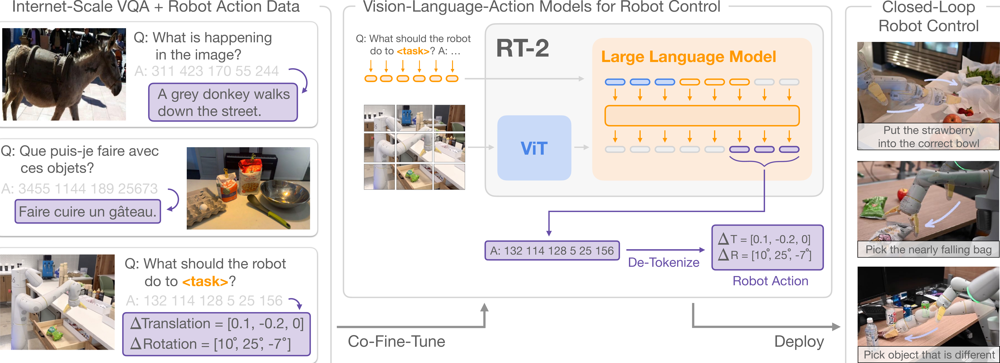
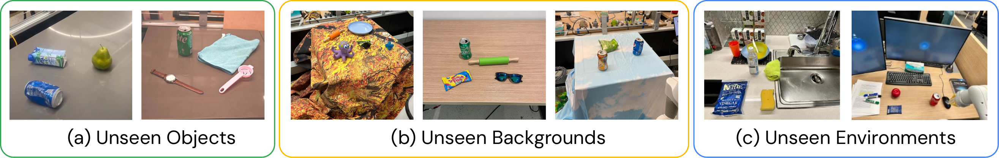
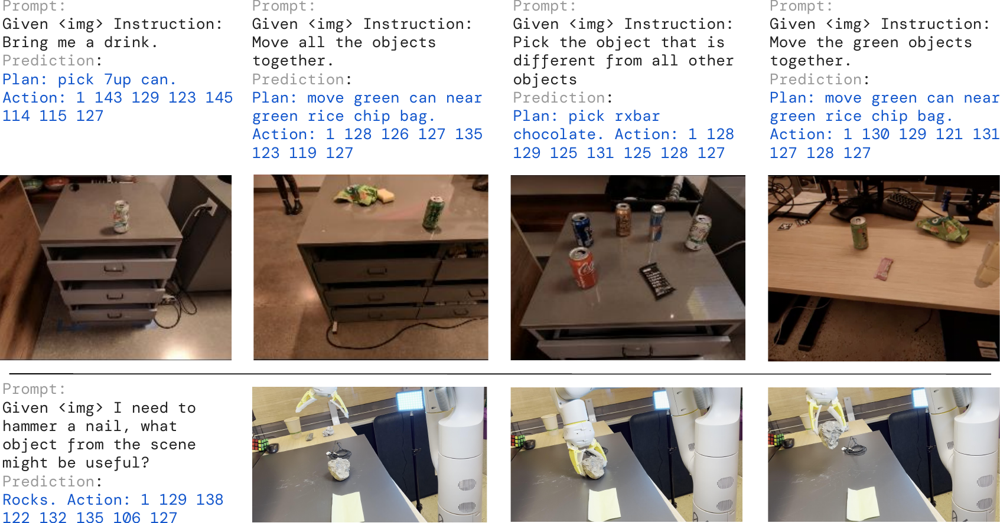
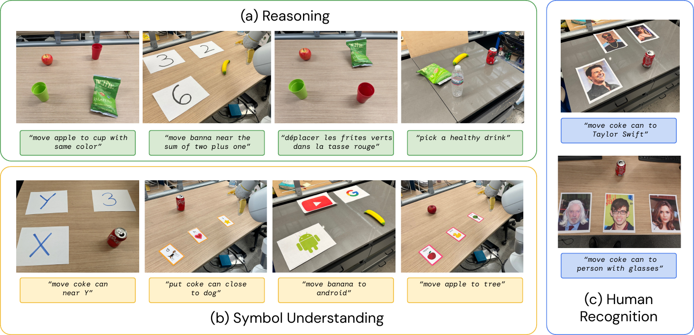
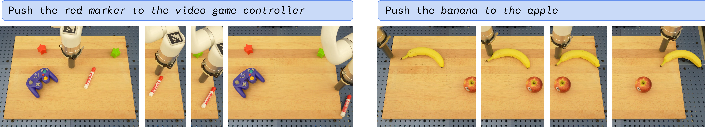

# Title: RT-2: Vision-Language-Action Models Transfer Web Knowledge to Robotic Control (RT-2：视觉-语言-动作模型将网络知识迁移至机器人控制)

- ArXiv: 2307.15818
- 作者: Anthony Brohan, Noah Brown, Justice Carbajal, Yevgen Chebotar, Xi Chen, Krzysztof Choromanski, Tianli Ding, Danny Driess, Avinava Dubey, Chelsea Finn, Pete Florence, Chuyuan Fu, Montse Gonzalez Arenas, Keerthana Gopalakrishnan, Kehang Han, Karol Hausman, Alexander Herzog, Jasmine Hsu, Brian Ichter, Alex Irpan, Nikhil Joshi, Ryan Julian, Dmitry Kalashnikov, Yuheng Kuang, Isabel Leal, Lisa Lee, Tsang-Wei Edward Lee, Sergey Levine, Yao Lu, Henryk Michalewski, Igor Mordatch, Karl Pertsch, Kanishka Rao, Krista Reymann, Michael Ryoo, Grecia Salazar, Pannag Sanketi, Pierre Sermanet, Jaspiar Singh, Anikait Singh, Radu Soricut, Huong Tran, Vincent Vanhoucke, Quan Vuong, Ayzaan Wahid, Stefan Welker, Paul Wohlhart, Jialin Wu, Fei Xia, Ted Xiao, Peng Xu, Sichun Xu, Tianhe Yu, Brianna Zitkovich
- 章节数: 29
- 估计词元数: 24.2k

## 目录

- 1 引言
- 2 相关工作
- 3 视觉-语言-动作模型
  - 3.1 预训练的视觉-语言模型
  - 3.2 机器人动作微调
  - 3.3 实时推理
- 4 实验
  - 4.1 RT-2 在已见任务上的表现如何，更重要的是，它如何泛化到新的物体、背景和环境？
  - 4.2 我们能否观察和测量 RT-2 的任何涌现能力？
  - 4.3 泛化能力如何随参数数量和其他设计决策而变化？
  - 4.4 RT-2 能否像视觉-语言模型一样展现出思维链推理的迹象？
- 5 局限性
- 6 结论
- 致谢
- 参考文献
- 附录 A 贡献
- 附录 B 数据集
- 附录 C 基线方法
- 附录 D 用于 RT-2 的视觉-语言模型
- 附录 E 训练细节
- 附录 F 评估细节
  - F.1 评估场景
  - F.2 评估指令
- 附录 G 失败案例示例
- 附录 H 定量实验结果
  - H.1 总体性能（对应第 4.1 节）
  - H.2 涌现能力评估（对应第 4.2 节）
  - H.3 模型规模与训练消融实验（对应第 4.3 节）
- 附录 I 额外的思维链推理结果

## 摘要

**摘要** 我们研究了如何将基于互联网规模数据训练的 **视觉-语言模型（Vision-Language Models, VLMs）** 直接整合到 **端到端（End-to-End）** 的机器人控制中，以提升泛化能力并实现涌现的语义推理。我们的目标是让一个单一的端到端训练模型既能学习将机器人观测映射到动作，又能享受来自网络的大规模语言和视觉-语言数据预训练带来的好处。为此，我们提出在机器人轨迹数据和互联网规模的视觉-语言任务（例如 **视觉问答（Visual Question Answering, VQA）** ）上共同微调最先进的视觉-语言模型。与其他方法不同，我们提出了一种简单、通用的方案来实现这一目标：为了将自然语言响应和机器人动作都适配到同一格式中，我们将动作表示为文本词元，并以与自然语言词元相同的方式直接将其纳入模型的训练集。我们将此类模型称为 **视觉-语言-动作模型（Vision-Language-Action Models, VLA）** ，并实例化了一个此类模型的示例，我们称之为 **RT-2** 。我们广泛的评估（6000 次评估试验）表明，我们的方法能产生高性能的机器人策略，并使 RT-2 能够从互联网规模的训练中获得一系列涌现能力。这包括：

- 对新物体的泛化能力显著提升。
- 能够解释机器人训练数据中不存在的指令（例如，将物体放到特定的数字或图标上）。
- 能够根据用户指令执行初步推理（例如，拾取最小或最大的物体，或最接近另一个物体的物体）。

我们进一步表明，融入 **思维链（Chain-of-Thought, CoT）** 推理使 RT-2 能够执行多阶段语义推理，例如，判断应该拾取哪个物体用作临时锤子（一块石头），或者哪种饮料最适合疲惫的人（能量饮料）。

## 1 引言（Introduction）

在广泛的网络规模数据集上预训练的高容量模型，为广泛的下游任务提供了一个有效且强大的平台： **大型语言模型（Large Language Models, LLMs）** 不仅能实现流畅的文本生成 [1, 2, 3]，还能实现 **涌现式问题解决（Emergent problem-solving）** [4, 5, 6] 以及散文 [7, 2] 和代码 [8] 的创造性生成；而 **视觉-语言模型（Vision-Language Models, VLMs）** 则能实现 **开放词汇视觉识别（Open-vocabulary visual recognition）** [9, 10, 11]，甚至能对图像中的物体-智能体交互进行复杂推理 [12, 13, 14, 15, 16, 17, 18]。这种语义推理、问题解决和视觉解释能力，对于必须在真实世界环境中执行各种任务的 **通用机器人（Generalist robots）** 来说将极其有用。然而，机器人应如何获得这些能力尚不清楚。虽然一种蛮力方法可能需要收集数百万次机器人交互试验，但能力最强的语言和视觉-语言模型是在来自网络的数十亿个词元和图像上进行训练的 [12, 15, 16, 18]——这个数量级在不久的将来不太可能用机器人数据来匹配。另一方面，直接将此类模型应用于机器人任务也很困难：此类模型推理的是语义、标签和文本提示，而机器人需要的是 **基础的低层动作（Grounded low-level actions）** ，例如笛卡尔末端执行器命令。尽管最近一些研究试图将语言模型和视觉-语言模型融入机器人学 [19, 17, 20]，但这些方法通常只解决机器人规划中“更高层次”的方面，本质上扮演着状态机的角色，解释命令并将其解析为独立的 **基元动作（Primitives）** （例如拾取和放置物体），然后由独立的低层控制器执行，而这些控制器本身在训练过程中并未受益于互联网规模模型丰富的语义知识。因此，在本文中我们提出疑问： **大型预训练视觉-语言模型能否直接集成到低层机器人控制中，以提升泛化能力并实现涌现式语义推理？**

> 图 1 | RT-2 概述：我们将机器人动作表示为另一种语言，可以将其转换为文本词元，并与互联网规模的视觉-语言数据集一同训练。在推理过程中，文本词元被解译为机器人动作，从而实现闭环控制。这使我们能够在学习机器人策略时利用视觉-语言模型的骨干网络和预训练，将其部分泛化能力、语义理解和推理能力迁移到机器人控制中。我们在项目网站上展示了 RT-2 的执行示例：[robotics-transformer2.github.io](https://robotics-transformer2.github.io/)。

为此，我们探索了一种既简单又出奇有效的方法：我们直接训练专为 **开放词汇视觉问答（open-vocabulary visual question answering）** 和 **视觉对话（visual dialogue）** 设计的 **视觉-语言模型（vision-language models）** ，使其能够输出低层级的机器人动作，同时解决其他互联网规模的视觉-语言任务。尽管这类模型通常被训练来生成自然语言词元，但我们可以通过将动作 **词元化（tokenizing）** 为文本词元，并创建“ **多模态句子（multimodal sentences）** ” [1] 来对机器人轨迹进行训练。这些句子通过产生相应的动作来“响应”与相机观测配对的机器人指令。

通过这种方式，视觉-语言模型可以被直接训练成遵循指令的机器人策略。这种简单的方法与先前将视觉-语言模型融入机器人策略 [2] 或从头设计新的视觉-语言-动作架构 [3] 的替代方案形成对比：相反，我们直接利用已有的、已摊销了巨大计算投资的视觉-语言模型，在不添加任何新参数的情况下，训练其输出文本编码的动作。我们将这类模型称为 **视觉-语言-动作模型（vision-language-action, VLA）** 。

我们基于为 RT-1 [4] 提出的方案实例化 VLA 模型，使用相似的数据集，但扩展模型以使用一个大型的视觉-语言骨干网络。因此，我们将我们的模型称为 **RT-2（Robotics Transformer 2）** 。我们在图 [1](#S1.F1) 中提供了概述。

我们观察到，从这类视觉-语言模型衍生出的机器人策略展现了一系列卓越的能力，它将从机器人数据中学到的物理动作与从网络数据中学到的图像和文本解释能力结合到了一个单一模型中。

除了显著提升对新物体和语义多样化指令的泛化能力这一预期收益外，我们还观察到了一些 **涌现能力（emergent capabilities）** 。虽然模型的物理技能仍然局限于机器人数据中观察到的技能分布，但模型通过利用从网络获取的知识来解释图像和语言指令，获得了以新方式部署这些技能的能力。

图 [2](#S3.F2) 展示了一些示例亮点。模型能够重新利用从机器人数据中学到的拾取和放置技能，将物体放置在语义指示的位置附近，例如特定的数字或图标，尽管这些线索并未出现在机器人数据中。模型还能解释物体之间的关系，以决定拾取哪个物体以及将其放置在何处，尽管机器人演示中并未提供此类关系。此外，如果我们通过 **思维链提示（chain of thought prompting）** 来增强指令，模型甚至能够进行更复杂的语义推理，例如找出哪个物体适合用作临时锤子（一块石头），或者哪种饮料最适合疲惫的人（能量饮料）。

我们的主要贡献是 **RT-2** ，这是一个模型家族，通过对在 **网络规模数据（web-scale data）** 上训练的大型视觉-语言模型进行微调而得到，使其能够直接作为可泛化且具有语义感知能力的机器人策略。我们的实验研究了参数高达 550 亿的模型，这些模型在互联网数据以及来自先前工作 [4] 的带指令标注的机器人轨迹上进行训练。在超过 6000 次机器人评估过程中，我们证明 RT-2 在物体、场景和指令的泛化方面实现了显著改进，并展现出从网络规模视觉-语言预训练中继承的广泛的涌现能力。

---

**参考文献**
[1] Driess, D., Xia, F., Sajjadi, M. S., Lynch, C., Chowdhery, A., Ichter, B., ... & Florence, P. (2023). PaLM-E: An embodied multimodal language model. _arXiv preprint arXiv:2303.03378_.
[2] Shridhar, M., Manuelli, L., & Fox, D. (2022a). CLIPort: What and where pathways for robotic manipulation. In _Conference on Robot Learning_ (pp. 894-906). PMLR.
[3] Reed, S., Zolna, K., Parisotto, E., Colmenarejo, S. G., Novikov, A., Barth-Maron, G., ... & de Freitas, N. (2022). A generalist agent. _arXiv preprint arXiv:2205.06175_.
[4] Brohan, A., Brown, N., Carbajal, J., Chebotar, Y., Dabis, J., Finn, C., ... & Levine, S. (2022). RT-1: Robotics transformer for real-world control at scale. _arXiv preprint arXiv:2212.06817_.

## 2 相关工作（Related Work）

**视觉-语言模型（Vision-Language Models, VLMs）** 。
_视觉-语言模型（Vision-Language Models, VLMs）_ [Gan et al., 2022] 有几种类别，其中可能最相关的有两类：(1) **表征学习模型（Representation-learning models）** ，例如 CLIP [Radford et al., 2021]，它为两种模态学习共同的嵌入表示；(2) 形式为 $\{\text{视觉},\text{文本}\}\rightarrow\{\text{文本}\}$ 的 **视觉语言模型（Visual language models）** ，它们学习将视觉和语言作为输入并提供自由形式的文本输出。这两类模型都已被用于为各种下游应用提供预训练，例如物体分类 [Radford et al., 2021]、检测 [Gu et al., 2021] 和分割 [Ghiasi et al., 2021]。在本工作中，我们专注于后一类模型 [Alayrac et al., 2022; Chen et al., 2023b, a; Driess et al., 2023; Li et al., 2019; Lu et al., 2019; Hao et al., 2022; Li et al., 2023]。这些模型通常在多种不同的任务上进行训练，例如图像描述、视觉问答（Vision-Question Answering, VQA）以及在多个数据集上同时进行的一般语言任务。虽然先前的工作研究了 VLMs 在包括机器人学在内的广泛问题和场景中的应用，但我们的重点在于如何通过赋予 VLMs 预测机器人动作的能力，将其能力扩展到机器人闭环控制中，从而利用 VLMs 中已有的知识实现新的泛化水平。

**机器人学习中的泛化（Generalization in robot learning）** 。开发能够在各种场景中广泛成功的机器人控制器是机器人学研究的一个长期目标 [Smith and Coles, 1973; Kaelbling, 2020]。在机器人操作中实现泛化的一个有前景的方法是从大规模多样化数据集中学习 [Pinto and Gupta, 2016; Levine et al., 2018; Dasari et al., 2019]。通过这样做，先前的方法已经展示了机器人如何能够泛化到新的物体实例 [Pinto and Gupta, 2016; Mahler et al., 2017; Levine et al., 2018; Finn and Levine, 2017; Young et al., 2021]、泛化到涉及物体和技能新组合的任务 [Finn et al., 2017; Yu et al., 2018; James et al., 2018; Dasari and Gupta, 2021; Jang et al., 2021]、泛化到新的目标或语言指令 [Pong et al., 2019; Nair et al., 2022a; Jang et al., 2021; Jiang et al., 2022; Mees et al., 2022; Liu et al., 2022]、泛化到具有新语义物体类别的任务 [Shridhar et al., 2021; Stone et al., 2023] 以及泛化到未见过的环境 [Hansen et al., 2020; Cui et al., 2022; Du et al., 2023a]。与大多数这些先前工作不同，我们的目标是开发和研究一个能够沿着所有这些维度泛化到未见条件的单一模型。我们方法的一个关键要素是利用 **预训练模型（Pre-trained models）** ，这些模型接触过的数据远比机器人所见的数据广泛得多。

**机器人操作的预训练（Pre-training for robotic manipulation）** 。预训练在机器人学习中有很长的历史。大多数工作集中在预训练的视觉表征上，这些表征可用于初始化机器人相机观测的编码器，方法包括通过监督式 ImageNet 分类 [Shah and Kumar, 2021]、数据增强 [Laskin et al., 2020a, b; Kostrikov et al., 2020; Pari et al., 2021] 或专门针对机器人控制的目标 [Nair et al., 2022b; Ma et al., 2022; Xiao et al., 2022b; Karamcheti et al., 2023; Majumdar et al., 2023b]。其他工作则整合了预训练的语言模型，通常用作指令编码器 [Hill et al., 2020; Lynch and Sermanet, 2020; Nair et al., 2022a; Jang et al., 2021; Jiang et al., 2022; Brohan et al., 2022; Shridhar et al., 2022b] 或用于高层规划 [Huang et al., 2022; Ahn et al., 2022; Driess et al., 2023; Singh et al., 2023; Wu et al., 2023; Mu et al., 2023]。我们不是使用预训练的视觉模型或预训练的语言模型，而是特别考虑使用 **预训练的视觉-语言模型（Pre-trained vision-language models, VLMs）** ，它们提供了关于世界的丰富且基于现实的知识。先前的工作已经研究了 VLMs 在机器人学中的应用 [Shridhar et al., 2021; Karamcheti et al., 2023; Stone et al., 2023; Driess et al., 2023; Gadre et al., 2022; Shah et al., 2023; Du et al., 2023b]，并构成了本工作的部分灵感来源。这些先前的方法将 VLMs 用于视觉状态表征 [Karamcheti et al., 2023]、用于识别物体 [Stone et al., 2023; Gadre et al., 2022]、用于高层规划 [Driess et al., 2023] 或用于提供监督或成功检测 [Xiao et al., 2022a; Du et al., 2023b; Sumers et al., 2023; Zhang et al., 2023; Ma et al., 2023]。虽然 CLIPort [Shridhar et al., 2021] 和 MOO [Stone et al., 2023] 将预训练的 VLMs 整合到端到端的视觉运动操作策略中，但两者都在策略中引入了显著的结构，这限制了它们的适用性。值得注意的是，我们的工作不依赖于受限的 2D 动作空间，也不需要标定相机。此外，一个关键区别在于，与这些工作不同，我们利用的是能够生成语言的 VLMs，并且我们公式的统一输出空间使得模型权重能够在语言和动作任务之间完全共享，而无需引入仅用于动作的模型层组件。

## 3 视觉-语言-动作模型（Vision-Language-Action Models）

在本节中，我们将介绍我们的模型系列以及为使 **视觉-语言模型（Vision-Language Models, VLMs）** 能够直接执行闭环机器人控制而做出的设计选择。首先，我们将描述我们模型的通用架构，以及它们如何从常用于视觉-语言任务的模型中衍生出来。然后，我们将介绍对在 **网络规模（web-scale）** 数据上预训练的大型 VLMs 进行微调，使其直接输出机器人动作，从而成为 **视觉-语言-动作模型（Vision-Language-Action Models, VLA Models）** 的方法与挑战。最后，我们将描述如何使这些模型适用于机器人任务，解决模型规模和推理速度方面的挑战，以实现实时控制。

### 3.1 预训练的视觉-语言模型（Pre-Trained Vision-Language Models）

本工作所基于的视觉-语言模型（Chen 等人，2023a；Driess 等人，2023）以一个或多个图像作为输入，并生成一个 **词元（tokens）** 序列，该序列通常代表自然语言文本。此类模型能够执行广泛的视觉解释和推理任务，从推断图像的构成到回答关于单个物体及其与其他物体关系的问题（Alayrac 等人，2022；Chen 等人，2023a；Driess 等人，2023；Huang 等人，2023）。要表示执行如此广泛任务所需的知识，需要大型模型和网络规模的数据集。在本工作中，我们改编了两个先前提出的 VLMs 作为 VLA 模型： **PaLI-X（Chen 等人，2023a）** 和 **PaLM-E（Driess 等人，2023）** 。我们将这些模型的视觉-语言-动作版本称为 **RT-2-PaLI-X** 和 **RT-2-PaLM-E** 。
我们利用了这些模型的实例，其参数规模从数十亿到数百亿不等。我们在附录 [D](#A4) 中提供了这两种模型架构的详细描述。

> 图 2 | RT-2 能够泛化到各种需要推理、符号理解和人类识别的现实世界场景。我们将在第 [4](#S4) 节详细研究这些具有挑战性的场景。

### 3.2 机器人动作微调（Robot-Action Fine-tuning）

为了使视觉-语言模型能够控制机器人，必须训练它们输出动作。我们采用了一种直接的方法来解决这个问题，即将动作表示为模型输出中的词元，并以与语言词元相同的方式进行处理。我们的动作编码基于 Brohan 等人（2022）为 RT-1 模型提出的离散化方法。动作空间包括机器人末端执行器的 **6 自由度（6-DoF）** 位置和旋转位移，以及机器人夹爪的伸展程度和一个用于终止任务片段的特殊离散指令（该指令应由策略触发以表示成功完成）。连续维度（除离散终止指令外的所有维度）被均匀地离散化为 256 个 **区间（bins）** 。因此，机器人动作可以用离散区间的序数表示为 8 个整数。为了使用这些离散化的动作将视觉-语言模型微调为视觉-语言-*动作*模型，我们需要将模型*现有*分词中的词元与离散动作区间关联起来。这需要预留 256 个词元作为动作词元。选择哪些词元取决于每个 VLM 使用的特定分词方案，我们将在本节后面讨论。为了定义 VLM 微调的目标，我们通过简单地用空格字符连接每个维度的动作词元，将动作向量转换为单个字符串：

$$
\displaystyle\text{``terminate}\enspace\Delta\text{pos}_{x}\enspace\Delta\text{pos}_{y}\enspace\Delta\text{pos}_{z}\enspace\Delta\text{rot}_{x}\enspace\Delta\text{rot}_{y}\enspace\Delta\text{rot}_{z}\enspace\text{gripper\_extension''}.
$$

该目标的一个可能实例化结果可以是：“1 128 91 241 5 101 127”。我们在实验中微调的两种 **视觉语言模型（Vision-Language Models, VLMs）** ， **PaLI-X** （Chen 等人，2023a）和 **PaLM-E** （Driess 等人，2023），使用了不同的 **词元化（Tokenization）** 方法。对于 PaLI-X，1000 以内的每个整数都有一个唯一的词元，因此我们只需将动作分箱（Action bins）与代表相应整数的词元关联起来。对于 PaLM-E 模型，它不提供这种方便的数字表示，我们直接覆盖使用频率最低的 256 个词元来表示动作词汇表。
值得注意的是，训练 VLMs 用动作词元覆盖现有词元是一种 **符号调优（Symbol tuning）** （Wei 等人，2023）形式，先前的研究已证明这对 VLMs 效果良好。

采用上述动作表示方法，我们将机器人数据转换为适合 VLM 模型微调的格式，其中输入包括机器人摄像头图像和文本任务描述（使用标准的 **视觉问答（Visual Question Answering, VQA）** 格式“Q: what action should the robot take to [任务指令]? A:”），输出则格式化为代表机器人动作的一串数字/最不常用词元。

**协同微调（Co-Fine-Tuning）** 。正如我们将在实验中展示的，提升机器人性能的训练方案中的一个关键技术细节是：将机器人数据与原始网络数据进行协同微调，而不是仅在机器人数据上进行简单的微调。
我们注意到，协同微调能产生更具泛化能力的策略，因为在微调过程中，策略既能接触到来自网络规模数据的抽象视觉概念，也能接触到低层级的机器人动作，而不仅仅是机器人动作。
在协同微调期间，我们通过增加机器人数据集的采样权重，来平衡每个训练批次中机器人数据和网络数据的比例。

**输出约束（Output Constraint）** 。RT-2 与标准 VLMs 的一个重要区别在于，RT-2 需要输出有效的动作词元以在真实机器人上执行。
因此，为确保 RT-2 在解码过程中输出有效的动作词元，我们通过仅在模型被提示执行机器人动作任务时采样有效动作词元来约束其输出词汇表，而对于标准的视觉-语言任务，模型仍被允许输出全部的自然语言词元。

### 3.3 实时推理（Real-Time Inference）

现代 VLMs 的规模可达数百亿甚至上千亿参数（Chen 等人，2023a；Driess 等人，2023）。本工作中训练的最大模型使用了 550 亿参数。直接在通常用于实时机器人控制的标准台式机或机器人搭载的 GPU 上运行此类模型是不可行的。据我们所知，我们的模型是有史以来用于直接闭环机器人控制的最大模型，规模超过以往一个数量级以上，因此需要一套新的解决方案来实现高效的实时推理。我们开发了一种协议，通过将 RT-2 模型部署在多 TPU 云服务中并通过网络查询该服务，使我们能够在机器人上运行 RT-2 模型。通过这种解决方案，我们可以实现合适的控制频率，并且可以使用同一个云服务为多个机器人提供服务。我们评估的最大模型，即 550 亿参数的 RT-2-PaLI-X-55B 模型，可以以 1-3 Hz 的频率运行。该模型的较小版本，包含 50 亿参数，可以以大约 5 Hz 的频率运行。

## 4 实验（Experiments）

我们的实验聚焦于 RT-2 在真实世界中的泛化能力及其涌现能力，旨在回答以下问题：

1.  RT-2 在已见任务上的表现如何，更重要的是，它如何泛化到新物体、新背景和新环境？
2.  我们能否观察并测量 RT-2 的任何涌现能力？
3.  泛化能力如何随参数数量及其他设计决策而变化？
4.  RT-2 能否像视觉-语言模型（Vision-Language Models, VLMs）那样展现出思维链（Chain-of-Thought）推理的迹象？

我们在多种条件下，使用约 6,000 条评估轨迹来评估我们的方法及若干基线模型，具体细节将在后续章节中描述。除非另有说明，我们使用一个 **七自由度移动机械臂（7DoF mobile manipulator）** ，其动作空间如第 [3.2](#S3.SS2) 节所述。我们还在项目网站 [robotics-transformer2.github.io](https://robotics-transformer2.github.io/) 上展示了 RT-2 的执行示例。

我们训练了两种利用预训练 VLMs 的 RT-2 具体实例：

1.  **RT-2-PaLI-X** ：基于 5B 和 55B 参数的 PaLI-X（Chen 等人，2023a）构建。
2.  **RT-2-PaLM-E** ：基于 12B 参数的 PaLM-E（Driess 等人，2023）构建。

对于训练，我们利用了 Chen 等人（2023a）和 Driess 等人（2023）的原始网络规模数据，这些数据包括视觉问答、图像描述以及非结构化的图文交织示例。我们将其与 Brohan 等人（2022）的机器人演示数据相结合，这些数据由 13 台机器人在一个办公室厨房环境中历时 17 个月收集而成。每条机器人演示轨迹都用一个描述所执行任务的 **自然语言指令（natural language instruction）** 进行标注，该指令由一个描述技能（例如“拾取”、“打开”、“放入”）的动词和一个或多个描述被操作物体（例如“七喜罐”、“抽屉”、“餐巾纸”）的名词组成（关于所用数据集的更多细节，请参见附录 [B](#A2)）。对于所有 RT-2 的训练运行，我们采用了原始 PaLI-X（Chen 等人，2023a）和 PaLM-E（Driess 等人，2023）论文中的超参数，包括学习率调度和正则化。更多训练细节可在附录 [E](#A5) 中找到。

**基线模型（Baselines）** 。我们将我们的方法与多个挑战我们方法不同方面的最先进基线模型进行比较。所有基线模型使用完全相同的机器人数据。

- 为了与最先进的策略进行比较，我们使用 **RT-1（RT-1）** （Brohan 等人，2022），这是一个拥有 3500 万参数的基于 **变换器（Transformer）** 的模型。
- 为了与最先进的预训练表示进行比较，我们使用 **VC-1（VC-1）** （Majumdar 等人，2023a）和 **R3M（R3M）** （Nair 等人，2022b），其策略通过训练一个 RT-1 主干网络来接收它们的表示作为输入而实现。
- 为了与其他利用 VLM 的架构进行比较，我们使用 **MOO（MOO）** （Stone 等人，2023），该方法使用一个 VLM 为语义图创建一个额外的图像通道，然后将其输入到一个 RT-1 主干网络中。

更多信息在附录 [C](#A3) 中提供。

### 4.1 RT-2 在已见任务上的表现如何，更重要的是，它如何泛化到新物体、新背景和新环境？

> 图 3 | 用于图 [4](#S4.F4) 和图 [7(b)](#S4.F7.sf2) 以及表 [3](#A8.T3) 和表 [5](#A8.T5) 评估的泛化场景示例。

为了评估 **分布内（in-distribution）** 性能以及泛化能力，我们将 RT-2-PaLI-X 和 RT-2-PaLM-E 模型与前面章节列出的四个基线模型进行比较。对于 **已见任务（seen tasks）** 类别，我们使用与 RT-1 (Brohan et al., 2022) 中相同的已见指令集，该评估包含超过 200 个任务：36 个用于抓取物体，35 个用于推倒物体，35 个用于将物体竖直放置，48 个用于移动物体，18 个用于打开和关闭各种抽屉，以及 36 个用于从抽屉中取出和放入物体。
然而，需要注意的是，这些“分布内”评估仍然会改变物体的放置位置以及诸如一天中的时间和机器人位置等因素，要求技能能够泛化到环境中真实存在的变化。

图 [3](#S4.F3) 展示了泛化评估的示例，这些评估被分为 **未见类别（unseen categories）** （物体、背景和环境），并进一步分为简单和困难案例。

- 对于 **未见物体（unseen objects）** ，困难案例包括更难抓握和更独特的物体（例如玩具）。
- 对于 **未见背景（unseen backgrounds）** ，困难案例包括更多样化的背景和新颖的物体。
- 最后，对于 **未见环境（unseen environments）** ，困难案例对应一个视觉上更独特的、带有显示器和配件的办公桌环境，而较简单的环境是厨房水槽。

这些评估包含超过 280 个任务，主要侧重于在许多不同场景中的抓取和放置技能。未见类别的指令列表在附录 [F.2](#A6.SS2) 中指定。

> 图 4 | RT-2 的两种实例化版本以及基线模型在已见训练任务以及衡量对新物体、新背景和新环境泛化能力的未见评估中的总体性能。附录表 [3](#A8.T3) 详述了完整结果。

评估结果如图 [4](#S4.F4) 和附录表 [3](#A8.T3) 所示。在已见任务上，RT-2 模型与 RT-1 的性能相似，其他基线模型的成功率较低。
RT-2 模型与基线模型之间的差异在各种泛化实验中最为明显，这表明 **视觉-语言-动作模型（vision-language-action models）** 的优势在于从其互联网规模的预训练数据中迁移更具泛化性的视觉和语义概念。在此，平均而言，RT-2 的两种实例化版本表现相似，相较于紧随其后的两个基线模型 RT-1 和 MOO 实现了约 2 倍的提升，而比其他基线模型提升了约 6 倍。RT-2 的 PaLM-E 版本似乎在更困难的泛化场景版本中表现优于 RT-2-PaLI-X，而在较简单的场景中表现稍逊，最终导致平均性能相似。

**开源语言表基准（Open Source Language Table Benchmark）** 。为了使用开源基线模型和环境提供一个额外的比较点，我们利用了来自 Lynch 等人 (2022) 的开源 Language-Table 仿真环境。我们在 Language-Table 数据集上对一个较小的 PaLI 3B 模型在多个预测任务（包括领域内 VQA 任务）上进行了联合微调，并在仿真中评估了所得策略。对于动作预测任务，我们将动作离散化并编码为“X Y”格式的文本，其中 X 和 Y 的取值范围是 {-10, -9, …, +9, +10}，代表末端执行器的二维笛卡尔增量设定点。由于其尺寸较小，所得模型可以与其他基线模型相似的速率（5 Hz）进行推理。
该实验的结果如表 [6](#S4.F6) 所示。我们观察到，与基线模型相比，使用我们的模型时性能有显著提升，这表明基于 VLM 的预训练与大型 PaLI 模型的表达能力相结合在其他场景中也可能是有益的，在本例中，即使用不同机器人进行仿真。
我们还在图 [6](#S4.F6) 中展示了定性的真实世界 **分布外（out-of-distribution）** 行为，演示了新颖的推动任务以及在此环境中前所未见的目标物体。
关于 Language Table 实验的更多细节可以在附录 [B](#A2) 和 [D](#A4) 中找到。

> 图 5 | Language Table 环境中的真实世界分布外行为。使用的 RT-2-PaLI-3B 模型检查点与表 [6](#S4.F6) 中相同。

### 4.2 我们能否观察和测量 RT-2 的任何涌现能力？（Can we observe and measure any emergent capabilities of RT-2?）

除了评估 **视觉-语言-动作模型（Vision-Language-Action models, VLA models）** 的泛化能力外，我们还旨在评估此类模型通过从网络迁移知识，能够在机器人数据所展示能力之外实现新能力的程度。我们将此类能力称为*涌现的*，其含义是它们通过迁移 **互联网规模的预训练（Internet-scale pretraining）** 而涌现。我们不期望这种迁移能实现新的机器人*动作*，但我们确实期望语义和视觉概念（包括关系和名词）能够有效迁移，即使这些概念未在机器人数据中出现过。

**定性评估（Qualitative Evaluations）** 。首先，我们使用我们的 RT-2-PaLI-X 模型进行实验，以确定从视觉-语言概念迁移而来的各种涌现能力。我们在图 [2](#S3.F2) 中展示了此类交互的一些示例。
通过探索，我们发现 RT-2 继承了在场景上下文中的语义理解和基本推理方面的新颖能力。
例如，完成“将草莓放入正确的碗中”这一任务，不仅需要对草莓和碗是什么有细致的理解，还需要在场景上下文中进行推理，以知道草莓应该与同类水果放在一起。
对于“捡起即将从桌子上掉落的袋子”这一任务，RT-2 展示了物理理解能力，以区分两个袋子并识别出放置不稳定的物体。
在这些场景中测试的所有交互都从未在机器人数据中出现过，这指向了从视觉-语言数据迁移语义知识。

**定量评估（Quantitative Evaluations）** 。
为了量化这些涌现能力，我们从之前的评估中选取了两个表现最佳的基线模型，RT-1 和 VC-1，并将它们与我们的两个模型进行比较：RT-2-PaLI-X 和 RT-2-PaLM-E。为了减少这些实验的方差，我们使用 **A/B 测试框架（A/B testing framework）** (Fisher, 1936) 评估所有方法，其中所有四个模型在完全相同的条件下依次进行评估。

我们将 RT-2 的涌现能力分为三类，涵盖推理和语义理解的维度（每类的示例见附录图 [9](#A6.F9)）。
第一类我们称之为 **符号理解（symbol understanding）** ，它明确测试 RT-2 的策略是否迁移了来自视觉-语言预训练、且在任何机器人数据中都不存在的语义知识。此类中的示例指令是“将苹果移到 3”或“将可乐罐推到心形图案上”。
第二类我们称之为 **推理（reasoning）** ，它展示了将底层 VLM 的各个方面推理能力应用于控制任务的能力。
这些任务需要视觉推理（“将苹果移到颜色相同的杯子中”）、数学（“将 X 移到二加一的和附近”）以及多语言理解（“mueve la manzana al vaso verde”）。
我们将最后一类称为 **人类识别任务（human recognition tasks）** ，其中包括诸如“将可乐罐移到戴眼镜的人那里”等任务，以展示以人为中心的理解和识别能力。
用于此评估的完整指令列表在附录 [F.2](#A6.SS2) 中指定。

我们在图 [7(a)](#S4.F7.sf1) 中展示了该实验的结果，所有数值结果见附录 [H.2](#A8.SS2)。我们观察到，我们的 VLA 模型在所有类别上都显著优于基线模型，我们最好的 RT-2-PaLI-X 模型的平均成功率比次佳基线（RT-1）高出 3 倍以上。我们还注意到，虽然基于更大 PaLI-X 的模型在符号理解、推理和人物识别方面的平均表现更好，但基于较小 PaLM-E 的模型在涉及数学推理的任务上具有优势。我们将这一有趣的结果归因于 PaLM-E 使用了不同的预训练数据混合，这使得该模型在数学计算方面比主要进行视觉预训练的 PaLI-X 能力更强。

> (a) RT-2 与两个基线在各种涌现技能评估（图 [9](#A6.F9)）上的性能比较。

### 4.3 泛化能力如何随参数量及其他设计决策变化？（How does the generalization vary with parameter count and other design decisions?）

为了进行此项比较，我们使用 **RT-2-PaLI-X** 模型，因为它在模型尺寸方面具有灵活性（由于 PaLM-E 的特性，RT-2-PaLM-E 仅限于特定尺寸的 PaLM 和 ViT 模型）。具体而言，我们比较了两种不同的模型尺寸（5B 和 55B）以及三种不同的训练方案：

- **从头开始训练（Training from scratch）** ：不使用任何来自 **视觉语言模型预训练（Vision-Language Model pre-training）** 的权重。
- **仅使用机器人动作数据进行微调（Fine-tuning with robot action data only）** ：仅使用机器人动作数据对预训练模型进行微调。
- **协同微调（Co-fine-tuning）** ：这是本文使用的主要方法，我们在 **视觉语言模型微调（VLM fine-tuning）** 过程中同时使用原始 VLM 训练数据和机器人数据。由于我们主要关注这些模型的泛化能力，因此在本系列实验中移除了对已见任务的评估。

消融实验的结果展示在图 [7(b)](#S4.F7.sf2) 和附录表 [5](#A8.T5) 中。首先，我们观察到，即使对于 5B 模型，从头开始训练一个非常大的模型也会导致性能非常差。基于此结果，我们决定跳过对更大的 55B PaLI-X 模型进行从头训练时的评估。其次，我们注意到，对模型（无论其大小）进行协同微调，其泛化性能优于仅使用机器人数据进行简单微调。我们将此归因于一个事实：在训练的微调阶段保留原始数据，可以使模型不会忘记在 VLM 训练期间学到的先前概念。最后，虽然有些意料之中，但我们注意到模型尺寸的增加会带来更好的泛化性能。

### 4.4 RT-2 能否像视觉语言模型一样展现出思维链推理的迹象？（Can RT-2 exhibit signs of chain-of-thought reasoning similarly to vision-language models?）

受 **大型语言模型（Large Language Models, LLMs）** 中 **思维链提示方法（Chain-of-Thought prompting method）** 的启发 [Wei et al., 2022]，我们对一个基于 PaLM-E 的 RT-2 变体进行了仅数百个梯度步的微调，以增强其联合利用语言和动作的能力，期望它能引发更复杂的推理行为。
我们对数据进行了增强，增加了一个额外的“计划（Plan）”步骤。该步骤首先用自然语言描述机器人即将执行的动作的目的，然后才是实际的动作词元，例如：“指令：我饿了。计划：拿起 rxbar 巧克力。动作：1 128 124 136 121 158 111 255。”
这种数据增强方案充当了 **视觉问答数据集（Visual Question Answering datasets, VQA datasets）** （视觉推理）和 **操作数据集（Manipulation datasets）** （生成动作）之间的桥梁。

我们定性观察到，具备思维链推理能力的 RT-2 能够响应更复杂的指令，因为它首先被赋予了一个用自然语言规划其动作的空间。这是一个有前景的方向，它提供了一些初步证据，表明将 LLMs 或 VLMs 用作规划器 [Ahn et al., 2022; Driess et al., 2023] 可以与单一 **视觉语言动作模型（Vision-Language-Action model, VLA model）** 中的低级策略相结合。
具备思维链推理能力的 RT-2 的执行过程展示在图 [8](#S4.F8) 和附录 [I](#A9) 中。

> 图 8 | 具备思维链推理能力的 RT-2 的执行过程，其中 RT-2 同时生成一个计划和一个动作。

## 5 Limitations（局限性）

尽管 RT-2 展现出良好的泛化特性，但该方法仍存在多重局限性。首先，虽然我们证明了通过 **视觉语言模型（Vision-Language Models, VLMs）** 进行网络规模预训练能提升对语义和视觉概念的泛化能力，但机器人并未因引入这些额外经验而获得执行新*动作*的能力。模型的物理技能仍然局限于机器人数据中所见的技能分布（参见附录 [G](#A7)），但它学会了以新的方式部署这些技能。
我们认为这是由于数据集在技能维度上变化不足所致。未来工作的一个令人兴奋的方向是研究如何通过新的数据收集范式（例如人类视频）来获取新技能。

其次，尽管我们展示了能够实时运行大型 **视觉语言动作模型（Vision-Language-Action models, VLAs）** ，但这些模型的计算成本很高，并且随着这些方法应用于需要高频控制的场景，实时推理可能成为一个主要瓶颈。未来研究的一个令人兴奋的方向是探索 **量化（Quantization）** 和 **蒸馏（Distillation）** 技术，这些技术可能使此类模型能够在更高频率或更低成本的硬件上运行。这也与当前的另一个局限性相关，即可用于创建 RT-2 的通用 VLM 模型数量很少。我们希望未来能有更多开源模型可用（例如 [https://llava-vl.github.io/](https://llava-vl.github.io/)），并且专有模型能开放其微调 API，这是构建 VLA 模型的充分条件。

## 6 Conclusions（结论）

在本文中，我们描述了如何通过将 **视觉语言模型（Vision-Language Model, VLM）** 预训练与机器人数据相结合来训练 **视觉语言动作模型（Vision-Language-Action models, VLAs）** 。随后，我们提出了基于 PaLM-E 和 PaLI-X 的两种 VLA 实例化模型，分别称之为 RT-2-PaLM-E 和 RT-2-PaLI-X。这些模型与机器人轨迹数据共同进行微调，以输出表示为文本词元的机器人动作。我们证明了我们的方法能产生性能优异的机器人策略，更重要的是，它带来了显著更好的泛化性能以及从网络规模视觉语言预训练中继承的 **涌现能力（Emergent capabilities）** 。我们相信，这种简单而通用的方法展现了机器人技术直接受益于更好的视觉语言模型的前景，这使机器人学习领域处于一个战略位置，能够随着其他领域的进步而进一步提升。

## Acknowledgments（致谢）

我们要感谢 Fred Alcober、Jodi Lynn Andres、Carolina Parada、Joseph Dabis、Rochelle Dela Cruz、Jessica Gomez、Gavin Gonzalez、John Guilyard、Tomas Jackson、Jie Tan、Scott Lehrer、Dee M、Utsav Malla、Sarah Nguyen、Jane Park、Emily Perez、Elio Prado、Jornell Quiambao、Clayton Tan、Jodexty Therlonge、Eleanor Tomlinson、Wenxuan Zhou 以及整个 Google DeepMind 团队提供的反馈和贡献。

## 参考文献（References）

- Ahn 等人（2022）
  M. Ahn, A. Brohan, N. Brown, Y. Chebotar, O. Cortes, B. David, C. Finn, K. Gopalakrishnan, K. Hausman, A. Herzog 等。
  **Do as I can, not as I say: Grounding language in robotic affordances（行我所行，非我所说：将语言扎根于机器人可供性中）** 。
  _arXiv 预印本 arXiv:2204.01691_，2022 年。

- Alayrac 等人（2022）
  J.-B. Alayrac, J. Donahue, P. Luc, A. Miech, I. Barr, Y. Hasson, K. Lenc, A. Mensch, K. Millican, M. Reynolds 等。
  **Flamingo: a visual language model for few-shot learning（Flamingo：一个用于小样本学习的视觉语言模型）** 。
  _arXiv 预印本 arXiv:2204.14198_，2022 年。

- Anil 等人（2023）
  R. Anil, A. M. Dai, O. Firat, M. Johnson, D. Lepikhin, A. Passos, S. Shakeri, E. Taropa, P. Bailey, Z. Chen 等。
  **Palm 2 technical report（PaLM 2 技术报告）** 。
  _arXiv 预印本 arXiv:2305.10403_，2023 年。

- Brohan 等人（2022）
  A. Brohan, N. Brown, J. Carbajal, Y. Chebotar, J. Dabis, C. Finn, K. Gopalakrishnan, K. Hausman, A. Herzog, J. Hsu 等。
  **Rt-1: Robotics transformer for real-world control at scale（RT-1：用于大规模现实世界控制的机器人 Transformer）** 。
  _arXiv 预印本 arXiv:2212.06817_，2022 年。

- Brown 等人（2020）
  T. Brown, B. Mann, N. Ryder, M. Subbiah, J. D. Kaplan, P. Dhariwal, A. Neelakantan, P. Shyam, G. Sastry, A. Askell 等。
  **Language models are few-shot learners（语言模型是小样本学习者）** 。
  _Advances in neural information processing systems（神经信息处理系统进展）_，
  33:1877–1901，2020 年。

- Cer 等人（2018）
  D. Cer, Y. Yang, S. Kong, N. Hua, N. Limtiaco, R. S. John, N. Constant, M. Guajardo-Cespedes, S. Yuan, C. Tar, Y. Sung, B. Strope, 和 R. Kurzweil。
  **Universal sentence encoder（通用句子编码器）** 。
  _CoRR_，abs/1803.11175，2018 年。
  网址 [http://arxiv.org/abs/1803.11175](http://arxiv.org/abs/1803.11175)。

- Chen 等人（2021）
  M. Chen, J. Tworek, H. Jun, Q. Yuan, H. P. d. O. Pinto, J. Kaplan, H. Edwards, Y. Burda, N. Joseph, G. Brockman 等。
  **Evaluating large language models trained on code（评估在代码上训练的大型语言模型）** 。
  _arXiv 预印本 arXiv:2107.03374_，2021 年。

- Chen 等人（2023a）
  X. Chen, J. Djolonga, P. Padlewski, B. Mustafa, S. Changpinyo, J. Wu, C. R. Ruiz, S. Goodman, X. Wang, Y. Tay, S. Shakeri, M. Dehghani, D. Salz, M. Lucic, M. Tschannen, A. Nagrani, H. Hu, M. Joshi, B. Pang, C. Montgomery, P. Pietrzyk, M. Ritter, A. Piergiovanni, M. Minderer, F. Pavetic, A. Waters, G. Li, I. Alabdulmohsin, L. Beyer, J. Amelot, K. Lee, A. P. Steiner, Y. Li, D. Keysers, A. Arnab, Y. Xu, K. Rong, A. Kolesnikov, M. Seyedhosseini, A. Angelova, X. Zhai, N. Houlsby, 和 R. Soricut。
  **Pali-x: On scaling up a multilingual vision and language model（PaLI-X：论扩展多语言视觉与语言模型）** ，
  2023a 年。

- Chen 等人（2023b）
  X. Chen, X. Wang, S. Changpinyo, A. Piergiovanni, P. Padlewski, D. Salz, S. Goodman, A. Grycner, B. Mustafa, L. Beyer, A. Kolesnikov, J. Puigcerver, N. Ding, K. Rong, H. Akbari, G. Mishra, L. Xue, A. Thapliyal, J. Bradbury, W. Kuo, M. Seyedhosseini, C. Jia, B. K. Ayan, C. Riquelme, A. Steiner, A. Angelova, X. Zhai, N. Houlsby, 和 R. Soricut。
  **Pali: A jointly-scaled multilingual language-image model（PaLI：一个联合扩展的多语言语言-图像模型）** ，
  2023b 年。

- Cobbe 等人（2021）
  K. Cobbe, V. Kosaraju, M. Bavarian, M. Chen, H. Jun, L. Kaiser, M. Plappert, J. Tworek, J. Hilton, R. Nakano 等。
  **Training verifiers to solve math word problems（训练验证器解决数学文字问题）** 。
  _arXiv 预印本 arXiv:2110.14168_，2021 年。

- Cui 等人（2022）
  Z. J. Cui, Y. Wang, N. Muhammad, L. Pinto 等。
  **From play to policy: Conditional behavior generation from uncurated robot data（从玩耍到策略：从未经筛选的机器人数据中生成条件行为）** 。
  _arXiv 预印本 arXiv:2210.10047_，2022 年。

- Dasari 和 Gupta（2021）
  S. Dasari 和 A. Gupta。
  **Transformers for one-shot visual imitation（用于单次视觉模仿的 Transformer）** 。
  载于 _Conference on Robot Learning（机器人学习会议）_，第 2071–2084 页。PMLR，2021 年。

- Dasari 等人（2019）
  S. Dasari, F. Ebert, S. Tian, S. Nair, B. Bucher, K. Schmeckpeper, S. Singh, S. Levine, 和 C. Finn。
  **Robonet: Large-scale multi-robot learning（RoboNet：大规模多机器人学习）** 。
  载于 _Conference on Robot Learning（机器人学习会议）_，2019 年。

- Dehghani 等人（2023）
  M. Dehghani, J. Djolonga, B. Mustafa, P. Padlewski, J. Heek, J. Gilmer, A. Steiner, M. Caron, R. Geirhos, I. Alabdulmohsin, R. Jenatton, L. Beyer, M. Tschannen, A. Arnab, X. Wang, C. Riquelme, M. Minderer, J. Puigcerver, U. Evci, M. Kumar, S. van Steenkiste, G. F. Elsayed, A. Mahendran, F. Yu, A. Oliver, F. Huot, J. Bastings, M. P. Collier, A. Gritsenko, V. Birodkar, C. Vasconcelos, Y. Tay, T. Mensink, A. Kolesnikov, F. Pavetić, D. Tran, T. Kipf, M. Lučić, X. Zhai, D. Keysers, J. Harmsen, 和 N. Houlsby。
  **Scaling vision transformers to 22 billion parameters（将视觉 Transformer 扩展到 220 亿参数）** ，2023 年。

- Driess 等人（2023）
  D. Driess, F. Xia, M. S. Sajjadi, C. Lynch, A. Chowdhery, B. Ichter, A. Wahid, J. Tompson, Q. Vuong, T. Yu 等。

- Ramakrishnan et al. (2022)
  S. Grauman, A. Westbury, E. Byrne, Z. Chavis, A. Furnari, R. Girdhar, J. Hamburger, H. Jiang, M. Liu, X. Liu, M. Martin, T. Nagrani, O. Neverova, A. Oliva, O. Park, M. Pinto, R. Potts, F. Rahman, S. Rezatofighi, A. Rohrbach, M. Rybak, A. Schwarcz, J. Sierra, A. Torralba, F. Xiao, K. Xu, E. Z. Xu, C. Zhao, S. Bansal, D. Batra, V. Cartillier, S. Crane, T. Do, M. Doulaty, A. Erapalli, C. Feichtenhofer, A. Fragomeni, Q. Fu, A. Gebreselasie, C. Gonzalez, J. Hillis, X. Huang, Y. Huang, W. Jia, W. Khoo, J. Kolar, S. Kottur, A. Kumar, F. Landini, C. Li, Y. Li, Z. Li, K. Mangalam, R. Modhugu, J. Munro, T. Murrell, T. Nishiyasu, W. Price, P. R. Puentes, M. Ramazanova, L. Sari, K. Somasundaram, A. Southerland, Y. Sugano, R. Tao, M. Vo, Y. Wang, X. Wu, T. Yagi, Z. Zhao, Y. Zhu, P. Arbelaez, D. Crandall, D. Damen, G. M. Farinella, C. Fuegen, B. Ghanem, V. K. Ithapu, C. V. Jawahar, H. Joo, K. Kitani, H. Li, R. Newcombe, A. Oliva, H. S. Park, J. M. Rehg, Y. Sato, J. Shi, M. Z. Shou, A. Torralba, L. Torresani, M. Yan, and J. Malik.
  Ego4d: Around the world in 3,000 hours of egocentric video, 2022.
- Gu et al. (2021)
  X. Gu, T.-Y. Lin, W. Kuo, and Y. Cui.
  Open-vocabulary object detection via vision and language knowledge distillation.
  _arXiv preprint arXiv:2104.13921_, 2021.
- Hansen et al. (2020)
  N. Hansen, R. Jangir, Y. Sun, G. Alenyà, P. Abbeel, A. A. Efros, L. Pinto, and X. Wang.
  Self-supervised policy adaptation during deployment.
  _arXiv preprint arXiv:2007.04309_, 2020.
- Hao et al. (2022)
  Y. Hao, H. Song, L. Dong, S. Huang, Z. Chi, W. Wang, S. Ma, and F. Wei.
  Language models are general-purpose interfaces.
  _arXiv preprint arXiv:2206.06336_, 2022.
- Hill et al. (2020)
  F. Hill, S. Mokra, N. Wong, and T. Harley.
  Human instruction-following with deep reinforcement learning via transfer-learning from text.
  _arXiv preprint arXiv:2005.09382_, 2020.
- Huang et al. (2023)
  S. Huang, L. Dong, W. Wang, Y. Hao, S. Singhal, S. Ma, T. Lv, L. Cui, O. K. Mohammed, Q. Liu, et al.
  Language is not all you need: Aligning perception with language models.
  _arXiv preprint arXiv:2302.14045_, 2023.
- Huang et al. (2022)
  W. Huang, P. Abbeel, D. Pathak, and I. Mordatch.
  Language models as zero-shot planners: Extracting actionable knowledge for embodied agents.
  In _International Conference on Machine Learning_, pages 9118–9147. PMLR, 2022.
- James et al. (2018)
  S. James, M. Bloesch, and A. J. Davison.
  Task-embedded control networks for few-shot imitation learning.
  In _Conference on robot learning_, pages 783–795. PMLR, 2018.
- Jang et al. (2021)
  E. Jang, A. Irpan, M. Khansari, D. Kappler, F. Ebert, C. Lynch, S. Levine, and C. Finn.
  Bc-z: Zero-shot task generalization with robotic imitation learning.
  In _Conference on Robot Learning_, pages 991–1002. PMLR, 2021.
- Jiang et al. (2022)
  Y. Jiang, A. Gupta, Z. Zhang, G. Wang, Y. Dou, Y. Chen, L. Fei-Fei, A. Anandkumar, Y. Zhu, and L. Fan.
  Vima: General robot manipulation with multimodal prompts.
  _arXiv preprint arXiv:2210.03094_, 2022.
- Kaelbling (2020)
  L. P. Kaelbling.
  The foundation of efficient robot learning.
  _Science_, 369(6506):915–916, 2020.
- Karamcheti et al. (2023)
  S. Karamcheti, S. Nair, A. S. Chen, T. Kollar, C. Finn, D. Sadigh, and P. Liang.
  Language-driven representation learning for robotics.
  _arXiv preprint arXiv:2302.12766_, 2023.
- Kirillov et al. (2023)
  A. Kirillov, E. Mintun, N. Ravi, H. Mao, C. Rolland, L. Gustafson, T. Xiao, S. Whitehead, A. C. Berg, W.-Y. Lo, et al.
  Segment anything.
  _arXiv preprint arXiv:2304.02643_, 2023.
- Kostrikov et al. (2020)
  I. Kostrikov, D. Yarats, and R. Fergus.
  Image augmentation is all you need: Regularizing deep reinforcement learning from pixels.
  _arXiv preprint arXiv:2004.13649_, 2020.
- Laskin et al. (2020a)
  M. Laskin, K. Lee, A. Stooke, L. Pinto, P. Abbeel, and A. Srinivas.
  Reinforcement learning with augmented data.
  _Advances in neural information processing systems_, 33:19884–19895, 2020a.
- Laskin et al. (2020b)
  M. Laskin, A. Srinivas, and P. Abbeel.
  Curl: Contrastive unsupervised representations for reinforcement learning.
  In _International Conference on Machine Learning_, pages 5639–5650. PMLR, 2020b.
- Levine et al. (2018)
  S. Levine, P. Pastor, A. Krizhevsky, J. Ibarz, and D. Quillen.
  Learning hand-eye coordination for robotic grasping with deep learning and large-scale data collection.
  _The International journal of robotics research_, 37(4-5):421–436, 2018.
- Lewkowycz et al. (2022)
  A. Lewkowycz, A. Andreassen, D. Dohan, E. Dyer, H. Michalewski, V. Ramasesh, A. Slone, C. Anil, I. Schlag, T. Gutman

_arXiv preprint arXiv:2306.00958_, 2023.

- Mahler 等人 (2017)
  J. Mahler, J. Liang, S. Niyaz, M. Laskey, R. Doan, X. Liu, J. A. Ojea, 和 K. Goldberg.
  Dex-net 2.0：使用合成点云和分析式抓取度量进行深度学习以规划鲁棒抓取。
  _arXiv preprint arXiv:1703.09312_, 2017.
- Majumdar 等人 (2023a)
  A. Majumdar, K. Yadav, S. Arnaud, Y. J. Ma, C. Chen, S. Silwal, A. Jain, V.-P. Berges, P. Abbeel, J. Malik, 等。
  我们在为具身智能（Embodied Intelligence）寻找人工视觉皮层（Artificial Visual Cortex）的道路上走到了哪里？
  _arXiv preprint arXiv:2303.18240_, 2023a.
- Majumdar 等人 (2023b)
  A. Majumdar, K. Yadav, S. Arnaud, Y. J. Ma, C. Chen, S. Silwal, A. Jain, V.-P. Berges, P. Abbeel, J. Malik, 等。
  我们在为具身智能（Embodied Intelligence）寻找人工视觉皮层（Artificial Visual Cortex）的道路上走到了哪里？
  _arXiv preprint arXiv:2303.18240_, 2023b.
- Mees 等人 (2022)
  O. Mees, L. Hermann, 和 W. Burgard。
  在非结构化数据上进行语言条件机器人模仿学习（Language Conditioned Robotic Imitation Learning）时，什么才是关键？
  _IEEE Robotics and Automation Letters_, 7(4):11205–11212, 2022.
- Minderer 等人 (2022)
  M. Minderer, A. Gritsenko, A. Stone, M. Neumann, D. Weissenborn, A. Dosovitskiy, A. Mahendran, A. Arnab, M. Dehghani, Z. Shen, 等。
  使用视觉变换器（Vision Transformers, ViT）进行简单的开放词汇目标检测（Open-vocabulary Object Detection）。
  _arXiv preprint arXiv:2205.06230_, 2022.
- Mu 等人 (2023)
  Y. Mu, Q. Zhang, M. Hu, W. Wang, M. Ding, J. Jin, B. Wang, J. Dai, Y. Qiao, 和 P. Luo。
  EmbodiedGPT：通过具身思维链（Embodied Chain of Thought）进行视觉-语言预训练。
  _arXiv preprint arXiv:2305.15021_, 2023.
- Nair 等人 (2022a)
  S. Nair, E. Mitchell, K. Chen, S. Savarese, C. Finn, 等。
  从离线数据和众包标注中学习语言条件机器人行为。
  In _Conference on Robot Learning_, pages 1303–1315. PMLR, 2022a.
- Nair 等人 (2022b)
  S. Nair, A. Rajeswaran, V. Kumar, C. Finn, 和 A. Gupta。
  R3M：用于机器人操作的通用视觉表示。
  _arXiv preprint arXiv:2203.12601_, 2022b.
- OpenAI (2023)
  OpenAI。
  GPT-4 技术报告，2023。
- Pari 等人 (2021)
  J. Pari, N. M. Shafiullah, S. P. Arunachalam, 和 L. Pinto。
  视觉模仿中表征学习（Representation Learning）的惊人有效性。
  _arXiv preprint arXiv:2112.01511_, 2021.
- Pinto 和 Gupta (2016)
  L. Pinto 和 A. Gupta。
  超大规模自监督（Supersizing Self-supervision）：从 5 万次尝试和 700 机器人小时中学习抓取。
  In _2016 IEEE International Conference on Robotics and Automation (ICRA)_, pages 3406–3413. IEEE, 2016.
- Polu 等人 (2022)
  S. Polu, J. M. Han, K. Zheng, M. Baksys, I. Babuschkin, 和 I. Sutskever。
  形式数学陈述课程学习（Formal Mathematics Statement Curriculum Learning）。
  _arXiv preprint arXiv:2202.01344_, 2022.
- Pong 等人 (2019)
  V. H. Pong, M. Dalal, S. Lin, A. Nair, S. Bahl, 和 S. Levine。
  Skew-Fit：状态覆盖的自监督强化学习（State-covering Self-supervised Reinforcement Learning）。
  _arXiv preprint arXiv:1903.03698_, 2019.
- Radford 等人 (2021)
  A. Radford, J. W. Kim, C. Hallacy, A. Ramesh, G. Goh, S. Agarwal, G. Sastry, A. Askell, P. Mishkin, J. Clark, 等。
  从自然语言监督中学习可迁移的视觉模型。
  In _International Conference on Machine Learning_, pages 8748–8763. PMLR, 2021.
- Reed 等人 (2022)
  S. Reed, K. Zolna, E. Parisotto, S. G. Colmenarejo, A. Novikov, G. Barth-Maron, M. Gimenez, Y. Sulsky, J. Kay, J. T. Springenberg, 等。
  一个通才智能体（Generalist Agent）。
  _arXiv preprint arXiv:2205.06175_, 2022.
- Ryoo 等人 (2021)
  M. Ryoo, A. Piergiovanni, A. Arnab, M. Dehghani, 和 A. Angelova。
  TokenLearner：用于视频的自适应时空标记化（Adaptive Space-Time Tokenization）。
  _Advances in Neural Information Processing Systems_, 34:12786–12797, 2021.
- Shah 等人 (2023)
  D. Shah, B. Osiński, b. ichter, 和 S. Levine。
  LM-Nav：使用大型预训练语言、视觉和动作模型进行机器人导航。
  In K. Liu, D. Kulic, 和 J. Ichnowski, 编辑, _Proceedings of The 6th Conference on Robot Learning_, volume 205 of _Proceedings of Machine Learning Research_, pages 492–504. PMLR, 14–18 Dec 2023.
  URL [https://proceedings.mlr.press/v205/shah23b.html](https://proceedings.mlr.press/v205/shah23b.html).
- Shah 和 Kumar (2021)
  R. Shah 和 V. Kumar。
  RRL：将 ResNet 作为强化学习的表征。
  _arXiv preprint arXiv:2107.03380_, 2021.
- Shridhar 等人 (2021)
  M. Shridhar, L. Manuelli, 和 D. Fox。
  CLIPort：用于机器人操作的“是什么”和“在哪里”通路。
  In _Proceedings of the 5th Conference on Robot Learning (CoRL)_, 2021.
- Shridhar 等人 (2022a)
  M. Shridhar, L. Manuelli, 和 D. Fox。
  CLIPort：用于机器人操作的“是什么”和“在哪里”通路。
  In _Conference on Robot Learning_, pages 894–906. PMLR, 2022a.
- Shridhar 等人 (2022b)
  M. Shridhar, L. Manuelli, 和 D. Fox。
  Perceiver-Actor：用于机器人操作的多任务变换器（Multi-task Transformer）。
  _arXiv preprint arXiv:2209.05451_, 2022b.
- Singh 等人 (2023)
  I. Singh, V. Blukis, A. Mousavian, A. Goyal, D. Xu, J. Tremblay, D. Fox, J. Thomason, 和 A. Garg。
  ProgPrompt：使用大型语言模型生成情境化机器人任务计划。
  In _ICRA_, 2023.
- Smith 和 Coles (1973)
  M. H. Smith 和 L. S. Coles。
  一种低成本通用机器人的设计。
  In _IJCAI_, pages 324–336, 1973.
- Stone 等人 (2023)
  A. Stone, T

- Liu 等人 (2022)
  C. Liu, C. Liu 和 L. Wang.
  **Git: 一种用于视觉与语言的生成式图像到文本转换器（Git: A generative image-to-text transformer for vision and language）** .
  _arXiv 预印本 arXiv:2205.14100_, 2022.
- Wei 等人 (2022)
  J. Wei, X. Wang, D. Schuurmans, M. Bosma, E. Chi, Q. Le 和 D. Zhou.
  **思维链提示激发大型语言模型中的推理（Chain of thought prompting elicits reasoning in large language models）** .
  _arXiv 预印本 arXiv:2201.11903_, 2022.
- Wei 等人 (2023)
  J. Wei, L. Hou, A. Lampinen, X. Chen, D. Huang, Y. Tay, X. Chen, Y. Lu, D. Zhou, T. Ma 和 Q. V. Le.
  **符号调优改进语言模型中的上下文学习（Symbol tuning improves in-context learning in language models）** , 2023.
- Wu 等人 (2023)
  J. Wu, R. Antonova, A. Kan, M. Lepert, A. Zeng, S. Song, J. Bohg, S. Rusinkiewicz 和 T. Funkhouser.
  **Tidybot: 利用大型语言模型实现个性化机器人辅助（Tidybot: Personalized robot assistance with large language models）** .
  _arXiv 预印本 arXiv:2305.05658_, 2023.
- Xiao 等人 (2022a)
  T. Xiao, H. Chan, P. Sermanet, A. Wahid, A. Brohan, K. Hausman, S. Levine 和 J. Tompson.
  **通过视觉-语言模型的指令增强实现机器人技能习得（Robotic skill acquisition via instruction augmentation with vision-language models）** .
  _arXiv 预印本 arXiv:2211.11736_, 2022a.
- Xiao 等人 (2022b)
  T. Xiao, I. Radosavovic, T. Darrell 和 J. Malik.
  **用于运动控制的掩码视觉预训练（Masked visual pre-training for motor control）** .
  _arXiv 预印本 arXiv:2203.06173_, 2022b.
- Young 等人 (2021)
  S. Young, D. Gandhi, S. Tulsiani, A. Gupta, P. Abbeel 和 L. Pinto.
  **视觉模仿变得简单（Visual imitation made easy）** .
  收录于 _机器人学习会议（Conference on Robot Learning）_, 第 1992–2005 页。PMLR, 2021.
- Yu 等人 (2016)
  K.-T. Yu, M. Bauza, N. Fazeli 和 A. Rodriguez.
  **超过一百万种被推动的方式：一个高保真的平面推动实验数据集（More than a million ways to be pushed. a high-fidelity experimental dataset of planar pushing）** .
  收录于 _2016 年 IEEE/RSJ 智能机器人与系统国际会议（2016 IEEE/RSJ international conference on intelligent robots and systems (IROS)）_, 第 30–37 页。IEEE, 2016.
- Yu 等人 (2018)
  T. Yu, C. Finn, A. Xie, S. Dasari, T. Zhang, P. Abbeel 和 S. Levine.
  **通过领域自适应元学习从观察人类进行单次模仿（One-shot imitation from observing humans via domain-adaptive meta-learning）** .
  _arXiv 预印本 arXiv:1802.01557_, 2018.
- Zhai 等人 (2022)
  X. Zhai, A. Kolesnikov, N. Houlsby 和 L. Beyer.
  **扩展视觉转换器（Scaling vision transformers）** .
  收录于 _IEEE/CVF 计算机视觉与模式识别会议论文集（Proceedings of the IEEE/CVF Conference on Computer Vision and Pattern Recognition）_, 第 12104–12113 页, 2022.
- Zhang 等人 (2023)
  X. Zhang, Y. Ding, S. Amiri, H. Yang, A. Kaminski, C. Esselink 和 S. Zhang.
  **通过视觉-语言模型实现经典任务规划器的落地（Grounding classical task planners via vision-language models）** .

**附录 A（Appendix A）**

## 附录 A 贡献者名单（Appendix A Contributions）

- **训练与评估（Training and Evaluations）** （设计并执行模型训练流程，在仿真和真实世界中评估模型，为算法设计选择进行消融实验）：Yevgen Chebotar, Krzysztof Choromanski, Tianli Ding, Danny Driess, Avinava Dubey, Pete Florence, Chuyuan Fu, Montse Gonzalez Arenas, Keerthana Gopalakrishnan, Kehang Han, Alexander Herzog, Brian Ichter, Alex Irpan, Isabel Leal, Lisa Lee, Yao Lu, Henryk Michalewski, Igor Mordatch, Karl Pertsch, Michael Ryoo, Anikait Singh, Quan Vuong, Ayzaan Wahid, Paul Wohlhart, Fei Xia, Ted Xiao, and Tianhe Yu.
- **网络架构（Network Architecture）** （设计并实现模型网络模块，研究动作的 **词元化（Tokenization）** ，在实验期间实现模型网络的推理）：Yevgen Chebotar, Xi Chen, Krzysztof Choromanski, Danny Driess, Pete Florence, Keerthana Gopalakrishnan, Kehang Han, Karol Hausman, Brian Ichter, Alex Irpan, Isabel Leal, Lisa Lee, Henryk Michalewski, Igor Mordatch, Kanishka Rao, Michael Ryoo, Anikait Singh, Quan Vuong, Ayzaan Wahid, Jialin Wu, Fei Xia, Ted Xiao, and Tianhe Yu.
- **数据收集（Data Collection）** （在真实机器人上收集数据，运行真实机器人评估，执行运行真实机器人所需的操作）：Noah Brown, Justice Carbajal, Tianli Ding, Krista Reymann, Grecia Salazar, Pierre Sermanet, Jaspiar Singh, Huong Tran, Stefan Welker, and Sichun Xu.
- **领导工作（Leadership）** （领导项目工作，管理项目人员，为项目方向提供建议）：Yevgen Chebotar, Chelsea Finn, Karol Hausman, Brian Ichter, Sergey Levine, Yao Lu, Igor Mordatch, Kanishka Rao, Pannag Sanketi, Radu Soricut, Vincent Vanhoucke, and Tianhe Yu.
- **论文撰写（Paper）** （参与论文手稿工作，设计论文可视化内容与图表）：Yevgen Chebotar, Danny Driess, Chelsea Finn, Pete Florence, Karol Hausman, Brian Ichter, Lisa Lee, Sergey Levine, Igor Mordatch, Karl Pertsch, Quan Vuong, Fei Xia, Ted Xiao, and Tianhe Yu.
- **基础设施（Infrastructure）** （构建训练模型、运行实验、存储和访问数据所需的基础设施与代码库骨干）：Anthony Brohan, Yevgen Chebotar, Danny Driess, Kehang Han, Jasmine Hsu, Brian Ichter, Alex Irpan, Nikhil Joshi, Ryan Julian, Dmitry Kalashnikov, Yuheng Kuang, Isabel Leal, Lisa Lee, Tsang-Wei Edward Lee, Yao Lu, Igor Mordatch, Quan Vuong, Ayzaan Wahid, Fei Xia, Ted Xiao, Peng Xu, and Tianhe Yu.

## 附录 B：数据集（Appendix B Datasets）

视觉-语言（Vision-language）数据集基于 Chen 等人（2023b）和 Driess 等人（2023）的数据集混合方案。这些数据的主体是 **WebLI 数据集（WebLI dataset）** ，该数据集包含约 100 亿个跨 109 种语言的图像-文本对，我们筛选出跨模态相似度得分最高的 10% 样本，从而得到 10 亿个训练样本。此外，还包含许多其他图像描述（Captioning）和视觉问答（Vision Question Answering）数据集。关于数据集混合的更多信息，可查阅 Chen 等人（2023b）关于 RT-2-PaLI-X 的论文，以及 Driess 等人（2023）关于 RT-2-PaLM-E 的论文。在对 RT-2-PaLI-X 进行协同微调（Co-fine-tuning）时，我们没有使用 Chen 等人（2023a）描述的 **情节式 WebLI 数据集（Episodic WebLI dataset）** 。

机器人（Robotics）数据集基于 Brohan 等人（2022）的数据集。该数据集包含使用移动操作机器人（Mobile Manipulation Robot）收集的演示片段（Demonstration Episodes）。每个演示都标注有一个来自以下七种技能之一的自然语言指令：“拾取物体（Pick Object）”、“将物体移至物体附近（Move Object Near Object）”、“竖直放置物体（Place Object Upright）”、“推倒物体（Knock Object Over）”、“打开抽屉（Open Drawer）”、“关闭抽屉（Close Drawer）”、“将物体放入容器（Place Object into Receptacle）”以及“从容器中取出物体并放在台面上（Pick Object from Receptacle and place on the counter）”。更多细节可参见 Brohan 等人（2022）的论文。

在协同微调时，RT-2-PaLI-X 对机器人数据集的加权使其约占训练混合数据的 50%。RT-2-PaLM-E 对机器人数据集的加权使其约占训练混合数据的 66%。

对于表 [6](#S4.F6) 中关于 **语言-桌面（Language-Table）** 的结果，我们的模型在 Lynch 等人（2022）的 Language-Table 数据集上进行训练。我们的模型在以下几个预测任务上进行了协同微调：

1.  给定两个连续图像帧和一个文本指令，预测动作。
2.  给定图像帧，预测指令。
3.  给定图像帧，预测机器人手臂位置。
4.  给定图像帧，预测它们之间的时间步数。
5.  给定图像帧和指令，预测任务是否成功。

## 附录 C 基准方法（Baselines）

我们将我们的方法与多个最先进的基准方法进行比较，这些方法挑战了我们方法的不同方面。所有基准方法都使用完全相同的机器人数据。

- **RT-1** ： **机器人学 Transformer 1（Robotics Transformer 1, RT-1）** [Brohan et al., 2022] 是一个基于 Transformer 的模型，在发布时在类似的任务套件上取得了最先进的性能。该模型不使用基于 **视觉语言模型（Vision-Language Model, VLM）** 的预训练，因此它提供了一个重要的数据点，用以证明基于 VLM 的预训练是否重要。
- **VC-1** ： **VC-1** [Majumdar et al., 2023a] 是一个视觉基础模型，它使用专门为机器人任务设计的预训练视觉表示。我们使用 VC-1 ViT-L 模型的预训练表示。由于 VC-1 不包含语言条件，我们通过 **通用句子编码器（Universal Sentence Encoder）** [Cer et al., 2018] 单独嵌入语言指令来添加此条件，以便与我们的方法进行比较。具体来说，我们将得到的语言嵌入词元与 VC-1 产生的图像词元拼接起来，并将拼接后的词元序列通过 **词元学习器（Token Learner）** [Ryoo et al., 2021]。然后，由词元学习器产生的词元序列被一个 RT-1 仅解码器 Transformer 模型使用，以预测机器人动作词元。我们对 VC-1 基线进行端到端训练，并在训练期间解冻 VC-1 的权重，因为这比使用冻结的 VC-1 权重带来了好得多的结果。
- **R3M** ： **R3M** [Nair et al., 2022b] 是一种与 VC-1 类似的方法，因为 R3M 使用预训练的视觉-语言表示来改进策略训练。在这种情况下，作者使用人类活动的 **Ego4D 数据集（Ego4D dataset）** [Grauman et al., 2022] 来学习策略所使用的表示。VC-1 和 R3M 都测试了不同的最先进的表示学习方法，作为使用 VLM 的替代方案。为了从 R3M 预训练表示中获得语言条件策略，我们遵循上述 VC-1 的相同流程，只是我们使用 R3M ResNet50 模型来获取图像词元，并在训练期间将其解冻。
- **MOO** ： **MOO** [Stone et al., 2023] 是一种以对象为中心的方法，其中首先使用 VLM 以原始图像中单个彩色像素的形式指定感兴趣的对象。然后，使用端到端策略训练这个经过像素修改的图像，以完成一组操作任务。这个基准对应于一种情况，即 VLM 被用作一个单独的模块来增强感知，但其表示不用于策略学习。

## 附录 D 用于 RT-2 的视觉语言模型（VLMs for RT-2）

**PaLI-X** 模型架构包含一个用于处理图像的 **ViT-22B** [Dehghani et al., 2023]，它可以接受 $n$ 个图像的序列，从而为每个图像产生 $n \times k$ 个词元，其中 $k$ 是每个图像的 **图像块（patch）** 数量。经过投影层的图像词元随后由一个具有 320 亿参数和 50 层的编码器-解码器主干网络处理，该主干网络类似于 **UL2** [Tay et al., 2023]，它以嵌入的形式联合处理文本和图像，并以自回归方式生成输出词元。文本输入通常包括任务类型和任何额外的上下文（例如，对于字幕生成任务是 "Generate caption in $\langle$lang$\rangle$"，对于 **视觉问答（Visual Question Answering, VQA）** 任务是 "Answer in $\langle$lang$\rangle$: question"）。

在 **Language-Table** （表 [6](#S4.F6)）上训练的 **PaLI-3B** 模型使用一个较小的 **ViT-G/14** [Zhai et al., 2022]（20 亿参数）来处理图像，并使用 **UL2-3B** [Tay et al., 2023] 作为编码器-解码器网络。

**PaLM-E** 模型基于一个仅解码器的 **大型语言模型（Large Language Model, LLM）** ，它将图像和文本等机器人数据投影到语言词元空间，并输出诸如高级计划之类的文本。在我们使用的 **PaLM-E-12B** 中，用于将图像投影到语言嵌入空间的视觉模型是一个 **ViT-4B** [Chen et al., 2023b]。将连续变量与文本输入拼接，使得 PaLM-E 能够完全多模态化，接受多种多样的输入，例如多种传感器模态、以对象为中心的表示、场景表示和对象实体引用。

## 附录 E：训练细节（Appendix E: Training Details）

我们对来自 **PaLI-X（Chen et al., 2023a）** 的 5B 和 55B 模型、 **PaLI（Chen et al., 2023b）** 的 3B 模型以及 **PaLM-E（Driess et al., 2023）** 的 12B 模型进行了 **协同微调（Co-fine-tuning）** 。具体参数如下：

- 对于 **RT-2-PaLI-X-55B** ，我们使用学习率 1e-3 和批量大小 2048，并对模型进行了 80K 梯度步的协同微调。
- 对于 **RT-2-PaLI-X-5B** ，我们使用相同的学习率（1e-3）和批量大小（2048），并对模型进行了 270K 梯度步的协同微调。
- 对于 **RT-2-PaLM-E-12B** ，我们使用学习率 4e-4 和批量大小 512，对模型进行了 1M 梯度步的协同微调。

所有模型均使用 **下一词元预测（Next-token prediction）** 目标进行训练，该目标对应于机器人学习中的 **行为克隆损失（Behavior Cloning Loss）** 。

对于表 [6](#S4.F6) 中用于 **Language-Table** 结果的 **RT-2-PaLI-3B** 模型，我们使用学习率 1e-3 和批量大小 128，对模型进行了 300K 梯度步的协同微调。

## 附录 F 评估细节

### F.1 评估场景

为了定量研究 RT-2 的涌现能力，我们研究了各种具有挑战性的语义评估场景，旨在衡量推理、符号理解和人类识别等能力。图 [9](#A6.F9) 提供了这些场景子集的视觉概览，用于定量评估的完整指令列表见表 [2](#A6.T2)。

> 图 9 | 用于研究 RT-2 涌现能力的一些评估场景概览。它们侧重于三大类别，分别是 (a) 推理，(b) 符号理解，以及 (c) 人类识别。图中可视化的指令是完整指令的一个子集，完整指令列于附录 [F.2](#A6.SS2)。

### F.2 评估指令（Evaluation Instructions）

表 [1](#A6.T1) 列出了在模型评估中用于未见过的物体、背景和环境的自然语言指令。每条指令根据该评估集中指令的总数，运行 1 至 5 次不等。

表 [2](#A6.T2) 列出了用于评估定量涌现评估的自然语言指令。每条指令均运行 5 次。

**表 1（Table 1）: 用于评估测试沿新物体、新环境和新背景维度受控分布偏移的自然语言指令。对于每个类别，我们引入了分布偏移较小和较大的评估设置。这些场景的可视化展示见图 [3](#S4.F3)。**
| 任务组 | 任务 |
| :--- | :--- |
| 未见物体（简单） | pick banana, move banana near coke can, move orange can near banana, pick oreo, move oreo near apple, move redbull can near oreo, pick pear, pick coconut water, move pear near coconut water, move pepsi can near pear |
| 未见物体（困难） | pick cold brew can, pick large orange plate, pick chew toy, pick large tennis ball, pick bird ornament, pick fish toy, pick ginger lemon kombucha, pick egg separator, pick wrist watch, pick green sprite can, pick blue microfiber cloth, pick yellow pear, pick pretzel chip bag, pick disinfectant wipes, pick pineapple hint water, pick green cup, pick pickle snack, pick small blue plate, pick small orange rolling pin, pick octopus toy, pick catnip toy |
| 未见背景（简单） | pick green jalapeno chip bag, pick orange can, pick pepsi can, pick 7up can, pick apple, pick blue chip bag, pick orange, pick 7up can, move orange near sink, pick coke can, pick sponge, pick rxbar blueberry |
| 未见背景（困难） | pick wrist watch, pick egg separator, pick green sprite can, pick blue microfiber cloth, pick yellow pear, pick pretzel chip bag, pick disinfectant wipes, pick pineapple hint water, pick green cup, pick pickle snack, pick small blue plate, pick small orange rolling pin, pick octopus toy, pick catnip toy, pick swedish fish bag, pick large green rolling pin, pick black sunglasses |
| 未见环境（简单） | pick coke can, pick apple, pick rxbar blueberry, move apple near coke can, move rxbar blueberry near apple, move coke can near rxbar blueberry, pick blue plastic bottle, pick sponge, pick blue chip bag, move sponge near blue plastic bottle, move blue chip bag near sponge, move blue plastic bottle near blue chip bag, move coke can near white mug, move sponge near white mug, move coke can near yellow bowl, move sponge near yellow bowl, move coke can near green cloth, move sponge near green cloth, move coke can near plate, move sponge near plate, move coke can near spoon, move sponge near spoon, move coke can near orange cup, move sponge near orange cup, pick white mug, pick yellow bowl, pick green cloth, move white mug near sponge, move yellow bowl near sponge, move green cloth near sponge, pick plate, pick spoon, pick orange cup, move plate near sponge, move spoon near sponge, move orange cup near sponge, put coke can into sink, drop coke can into sink, push coke can into sink, put sponge into sink, drop sponge into sink, push sponge into sink, put green cloth into sink, drop green cloth into sink, push green cloth into sink |
| 未见环境（困难） | pick coke can, pick apple, pick rxbar blueberry, move apple near coke can, move rxbar blueberry near apple, move coke can near rxbar blueberry, move coke can near stapler, move apple near stapler, move coke can near keyboard, move apple near keyboard, move coke can near tissue box, move apple near tissue box, move coke can near papers, move apple near papers, move coke can near mouse, move apple near mouse, move coke can near book, move apple near book, pick marker, pick stapler, pick mouse, move marker near apple, move stapler near apple, move mouse near apple, push coke can to the left, push coke can to the right, push sponge to the left, push sponge to the right, push tissue box to the left, push tissue box to the right, point at coke can, point at sponge, point at tissue box |

**表 2（Table 2）: 用于定量涌现评估的自然语言指令。**
| 任务组 | 任务 |
| :--- | :--- |
| 符号理解：符号 1 | move coke can near X, move coke can near 3, move coke can near Y |
| 符号理解：符号 2 | move apple to tree, move apple to duck, move apple to apple, move apple to matching card |
| 符号理解：符号 3 | put coke can close to dog, push coke can on top of heart, place coke can above star |
| 推理：数学 | move banana to 2, move banna near the sum of two plus one, move banana near the answer of three times two, move banana near the smallest number |
| 推理：标识 | move cup to google, move cup to android, move cup to youtube, move cup to a search engine, move cup to a phone |
| 推理：营养 | get me a healthy snack, pick a healthy drink, pick up a sweet drink, move the healthy snack to the healthy drink, pick up a salty snack |
| 推理：颜色与多语言 | move apple to cup with same color, move apple to cup with different color, move green chips to matching color cup, move apple to vaso verde, Bewegen Sie den Apfel in die rote Tasse, move green chips to vaso rojo, mueve la manzana al vaso verde, déplacer les frites verts dans la tasse rouge |
| 人物识别：名人 | move coke can to taylor swift, move coke can to tom cruise, move coke can to snoop dog |
| 人物识别：CelebA | move coke can to person with glasses, move coke can to the man with white hair, move coke can to the brunette lady |

## 附录 G 示例失败案例

在图 [10](#figure-10) 中，我们提供了 **语言桌面（Language Table）** 场景中一类显著失败案例的示例，即 **RT-2 模型（RT-2 model）** 未能泛化到未见过的物体动力学。在这些案例中，尽管模型能够正确关注语言指令并移动到第一个正确的物体，但它无法控制这些物体具有挑战性的动力学特性，这些特性与此环境中见过的少量方块物体（Lynch et al., 2022）的动力学特性有显著不同。笔只是简单地滚下桌子（图 [10](#figure-10)，左），而香蕉的质心远离机器人接触的位置（图 [10](#figure-10)，右）。我们注意到，推动动力学是出了名的难以预测和控制（Yu et al., 2016）。我们假设，通过进一步扩展包含不同环境和物体的数据集——例如，在此案例中，包含更多样化推动动力学类似类型的数据集（Dasari et al., 2019），可能在机器人-环境交互动力学方面实现更强的泛化能力。

此外，尽管 RT-2 在定性和定量的涌现评估中，在现实世界操作任务上表现出了有前景的性能，我们仍然发现了许多显著的失败案例。例如，在当前训练数据集的构成和训练方法下，RT-2 似乎在以下方面表现不佳：

- **抓取物体的特定部位** ，例如把手。
- **超出机器人数据所见范围的新颖动作** ，例如用毛巾擦拭或使用工具。
- **灵巧或精确的动作** ，例如折叠毛巾。
- **需要多层间接推理的扩展推理** 。

> 图 10 | 现实世界中未能泛化到未见物体动力学的定性示例失败案例。

## 附录 H 定量实验结果

### H.1 总体性能，对应第 4.1 节

表 [3](#table-3) 列出了我们的定量总体评估结果。我们发现，在已见任务上，RT-2 的表现与基线模型相当或更好；而在泛化到未见过的物体、背景和环境方面，RT-2 的表现显著优于基线模型。

**表 3：RT-2 的两种实例化版本与基线模型在已见训练任务以及衡量对新物体、新背景和新环境泛化能力的未见评估中的总体性能。**
| 模型 | 已见任务 | 未见物体 | 未见背景 | 未见环境 | 未见平均 | | | |
| :--- | :---: | :---: | :---: | :---: | :---: | :---: | :---: | :---: |
| | 简单 | 困难 | 简单 | 困难 | 简单 | 困难 | | |
| R3M (Nair 等人, 2022b) | 45 | 32 | 14 | 13 | 9 | 0 | 2 | 12 |
| VC-1 (Majumdar 等人, 2023a) | 63 | 34 | 10 | 13 | 3 | 0 | 0 | 10 |
| RT-1 (Brohan 等人, 2022) | 92 | 31 | 43 | 71 | 9 | 26 | 14 | 32 |
| MOO (Stone 等人, 2023) | 75 | 58 | 48 | 38 | 41 | 19 | 3 | 35 |
| RT-2-PaLI-X-55B (我们的) | 91 | 70 | 62 | 96 | 48 | 63 | 35 | 62 |
| RT-2-PaLM-E-12B1 (我们的) | 93 | 84 | 76 | 75 | 71 | 36 | 33 | 62 |

1 PaLM-E-12B 中使用的原始预训练数据混合（如 Driess 等人 (2023) 所述）包含了用于高级视觉问答（Visual Question Answering, VQA）规划任务的机器人图像，这些图像可能与泛化场景中遇到的图像相似。然而，这些训练示例中没有一个包含本实验评估的低级动作。

### H.2 涌现能力评估，对应第 4.2 节

表 [4](#table-4) 列出了我们所有的定量涌现能力评估结果。我们发现，在这些新指令上，RT-2 的表现比 RT-1 好 2 到 3 倍，且无需任何额外的机器人演示。这表明我们的方法如何能够利用在网络规模视觉-语言数据集上进行预训练所获得的能力。

**表 4：RT-2 与基线模型在定量涌现能力评估上的性能。**
| 模型 | 符号理解 | 推理 | 人物识别 | 平均 | | | | | | | | | |
| :--- | :---: | :---: | :---: | :---: | :---: | :---: | :---: | :---: | :---: | :---: | :---: | :---: | :---: |
| | 符号 1 | 符号 2 | 符号 3 | 平均 | 数学 | 标志 | 营养 | 颜色/多语言 | 平均 | 名人 | CelebA | 平均 | |
| VC-1 (Majumdar 等人, 2023a) | 7 | 25 | 0 | 11 | 0 | 8 | 20 | 13 | 10 | 20 | 7 | 13 | 11 |
| RT-1 (Brohan 等人, 2022) | 27 | 20 | 0 | 16 | 5 | 0 | 32 | 28 | 16 | 20 | 20 | 20 | 17 |
| RT-2-PaLI-X-55B (我们的) | 93 | 60 | 93 | 82 | 25 | 52 | 48 | 58 | 46 | 53 | 53 | 53 | 60 |
| RT-2-PaLM-E-12B (我们的) | 67 | 20 | 20 | 36 | 35 | 56 | 44 | 35 | 43 | 33 | 53 | 43 | 40 |

### H.3 模型规模与训练消融实验，对应第 4.3 节

表 [5](#table-5) 详细列出了针对模型规模和训练方法的消融实验的定量结果。在所有实验中，我们看到模型规模对性能起着重要作用，并且 **协同微调（Co-fine-tuning）** 优于 **微调（Fine-tuning）** ，而微调又优于 **从头训练（Training from scratch）** 。

**表 5：RT-2 的消融实验，展示了参数量和训练策略对泛化能力的影响。**
| 模型 | 规模 | 训练方式 | 未见物体 | 未见背景 | 未见环境 | 平均 | | | |
| :--- | :---: | :---: | :---: | :---: | :---: | :---: | :---: | :---: | :---: |
| | | | 简单 | 困难 | 简单 | 困难 | 简单 | 困难 | | |
| RT-2-PaLI-X | 5B | 从头训练 | 0 | 10 | 46 | 0 | 0 | 0 | 9 |
| RT-2-PaLI-X | 5B | 微调 | 24 | 38 | 79 | 50 | 36 | 23 | 42 |
| RT-2-PaLI-X | 5B | 协同微调 | 60 | 38 | 67 | 29 | 44 | 24 | 44 |
| RT-2-PaLI-X | 55B | 微调 | 60 | 62 | 75 | 38 | 57 | 19 | 52 |
| RT-2-PaLI-X | 55B | 协同微调 | 70 | 62 | 96 | 48 | 63 | 35 | 63 |

## 附录 I 额外的思维链推理结果

如第 [4.4](#S4.SS4) 节所述，我们在图 [11](#figure-11) 中展示了使用 RT-2-PaLM-E 完成的思维链推理推演的更多示例。

> 图 11：RT-2 进行思维链推理的更多示例
