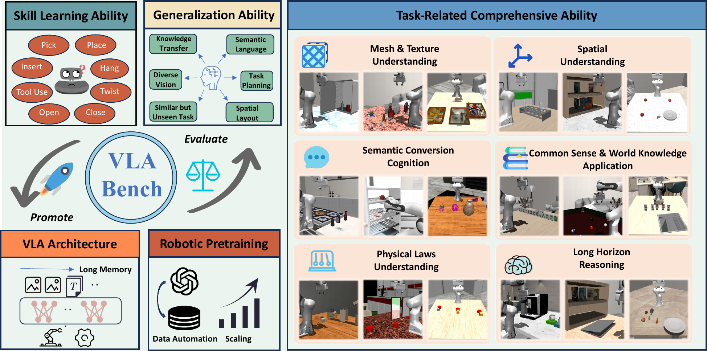
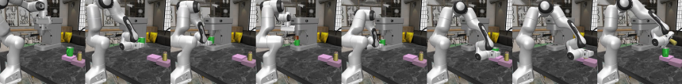
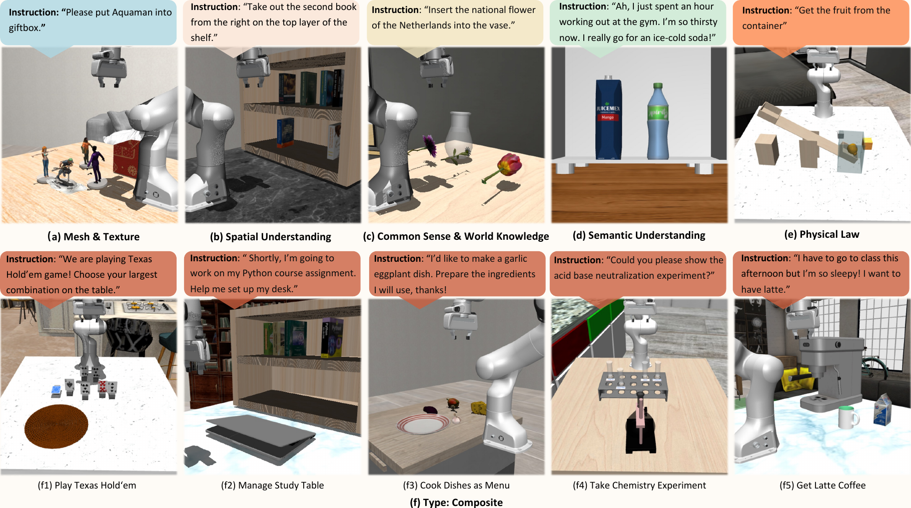
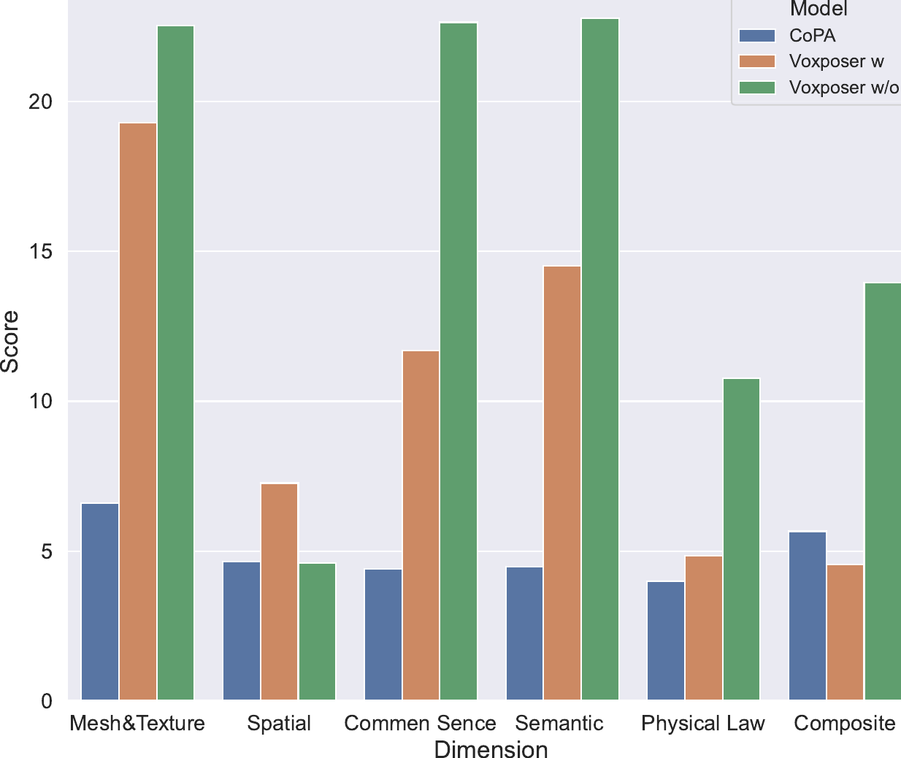
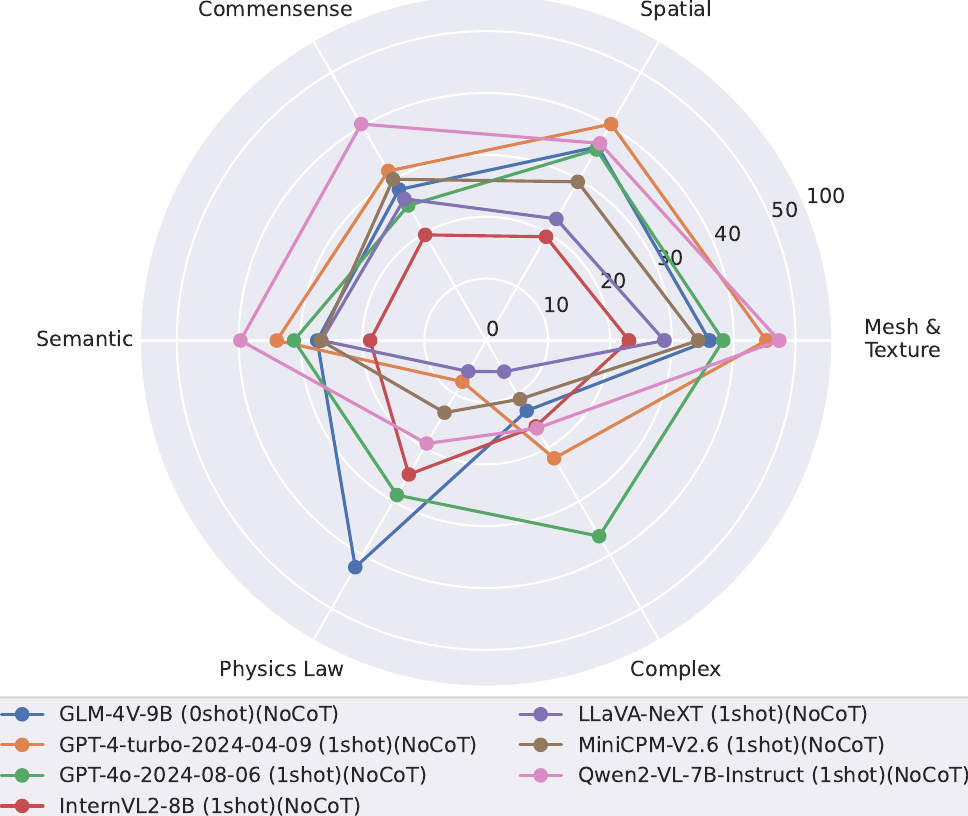
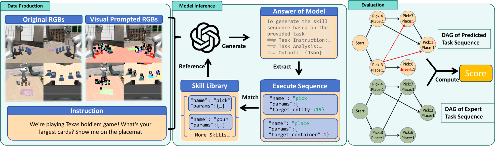
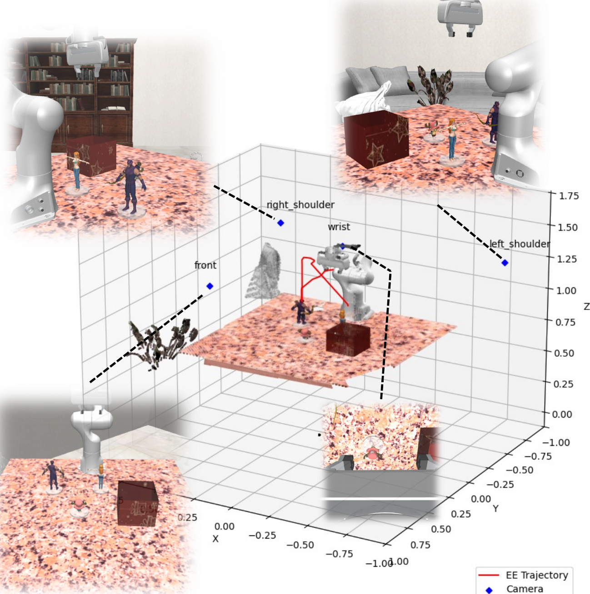
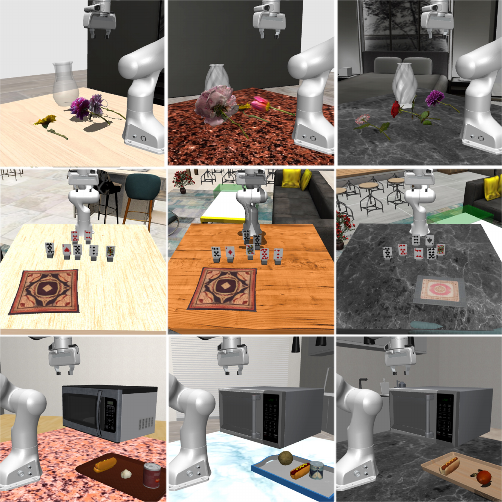
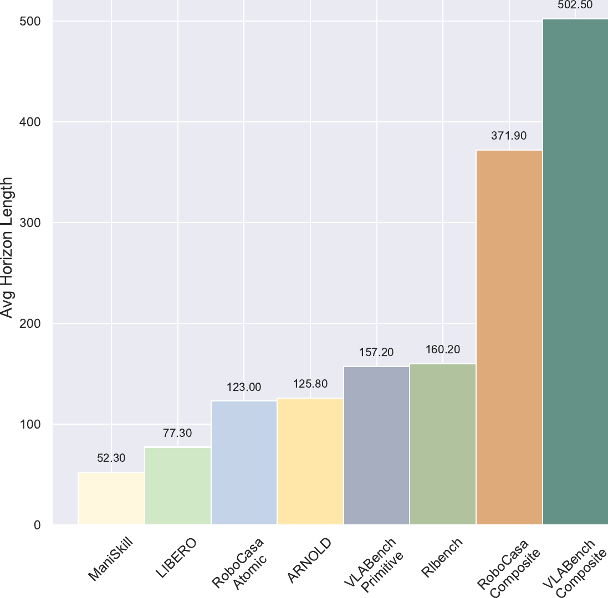
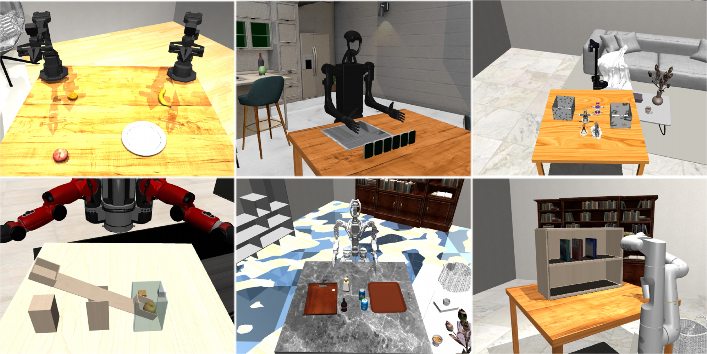

# 标题：VLABench：一个用于语言条件机器人操作与长时程推理任务的大规模基准测试

- ArXiv：2412.18194
- 作者：张世铎（Shiduo Zhang），徐哲（Zhe Xu），刘佩菊（Peiju Liu），于晓鹏（Xiaopeng Yu），李源（Yuan Li），高庆辉（Qinghui Gao），费兆晔（Zhaoye Fei），尹章越（Zhangyue Yin），吴祖煊（Zuxuan Wu），蒋宇刚（Yu-Gang Jiang），邱锡鹏（Xipeng Qiu），复旦大学计算机科学技术学院，项目网站：
- 章节数：34
- 估计词元数：28.8k

## 目录

- 1 引言
- 2 相关工作
- 3 VLABench
  - 3.1 任务描述
  - 3.2 基准测试
  - 3.3 仿真
  - 3.4 数据集构建
- 4 实验
  - 4.1 VLA（视觉语言动作模型）的泛化能力
  - 4.2 利用基础模型的工作流性能
  - 4.3 VLM（视觉语言模型）的综合能力
- 5 结论
- 参考文献
- 6 基准测试实现
  - 6.1 任务描述
  - 6.2 任务观察
  - 6.3 域随机化
- 7 仿真与框架
  - 7.1 场景
  - 7.2 跨具身
  - 7.3 资产
- 8 数据集构建
  - 8.1 作为领域特定语言的技能库
  - 8.2 数据收集过程
  - 8.3 交互式指令的提示
- 9 实验实现
  - 9.1 VLA 设置
  - 9.2 工作流评估
  - 9.3 VLM 评估
    - 精确匹配率（Precise Matching Rate, PM）。
- 10 详细分析与案例研究
  - 10.1 VLA 的消融实验与分析
  - 10.2 工作流的进一步分析
  - 10.3 VLM 的消融实验与分析

## 摘要（Abstract）

通用具身智能体（General-purposed embodied agents）旨在理解用户的自然指令或意图，并精确行动以完成通用任务。近年来，基于基础模型（Foundation models），特别是 **视觉-语言-动作模型（Vision-Language-Action models, VLAs）** 的方法，在解决 **语言条件操作（Language-conditioned manipulation, LCM）** 任务方面展现出巨大潜力。然而，现有的基准测试（Benchmarks）并不能充分满足 VLAs 及相关算法的需求。为了更好地在大型语言模型（Large Language Models, LLMs）的背景下定义此类通用任务，并推动 VLA 研究的发展，我们提出了 **VLABench** ，一个用于评估通用 LCM 任务学习的开源基准测试。VLABench 提供了 100 个精心设计的任务类别，每个任务类别内部具有强随机性，并包含总计 2000 多个物体。VLABench 在四个关键方面区别于以往的基准测试：

1.  任务需要世界知识（World knowledge）和常识迁移（Common sense transfer）。
2.  使用蕴含隐性人类意图的自然语言指令，而非模板化指令。
3.  包含需要多步推理（Multi-step reasoning）的长视野任务（Long-horizon tasks）。
4.  同时评估动作策略（Action policies）和语言模型能力。

该基准测试评估了多种能力，包括对网格与纹理（Mesh & texture）、空间关系（Spatial relationship）、语义指令（Semantic instruction）、物理定律（Physical laws）、知识迁移与推理（Knowledge transfer and reasoning）等的理解。为了支持下游微调（Finetuning），我们通过一个融合了启发式技能（Heuristic skills）和先验信息（Prior information）的自动化框架，提供了高质量的训练数据。实验结果表明，当前最先进的预训练 VLAs 以及基于视觉语言模型（Vision-Language Models, VLMs）的工作流程，在我们的任务中都面临着挑战。

## 1 引言（Introduction）

**语言条件操控（Language-conditioned manipulation）** 代表了具身人工智能（Embodied AI）中的一个根本性挑战，也是迈向 **人工通用智能（Artificial General Intelligence, AGI）** 的垫脚石 [4, 13, 1]。此类任务要求智能体掌握多种能力：解读自然语言指令、理解复杂环境、做出决策、制定计划以及执行精确动作。 **大型语言模型（Large Language Models, LLMs）** 和 **视觉-语言模型（Vision-Language Models, VLMs）** [1, 14] 的快速发展，凭借其在语义理解、编码、规划和推理方面令人印象深刻的通用能力，彻底改变了该领域。

这种强大的泛化能力催生了语言条件操控中的两种主要方法：一是使用大规模机器人数据进行预训练的 **视觉-语言-动作模型（Vision-Language-Action models, VLA）** ，如 RT-2 和 Palm-E [4, 13, 46] 所展示的；二是将 **基础模型（Foundation models）** 集成到智能体工作流中，例如 VoxPoser 和 CoPA [23, 22]，它们将 LLM/VLM 的输出与 **抓取预测（grasp prediction）** [15, 16] 和 **运动规划算法（motion planning algorithms）** [25] 相结合。

尽管现实世界的机器人实验提供了宝贵的见解，但其复杂性和环境多变性常常对可复现性构成挑战。基于仿真的评估已成为一种公平且实用的替代方案。现有的基准测试，如 RLBench、CALVIN 和 LIBERO [24, 41, 35]，提供了多样化的任务集，但在满足基于基础模型方法的独特需求方面存在不足。为契合基于基础模型的算法能力而设计的任务，应包含对用户意图的细致语义理解、常识知识的整合、对多样化视觉场景的强大解读能力，以及复杂多步推理能力。这类任务需要多模态理解的深度融合，以有效解读和响应复杂的现实世界情境。例如，RT-2 [4] 中的一个任务是“将可乐罐移到泰勒·斯威夫特（Taylor Swift）那里”，而 CoPA [22] 中的另一个任务是“给我做一杯手冲咖啡”。第一个任务挑战机器人运用常识来识别“泰勒”，这是一种先前策略难以实现的知识迁移能力。第二个任务进一步增加了难度，要求机器人将任务分解为子任务并执行步骤来操作咖啡机——这是一个以往单个策略难以完成的 **长视野（long-horizon）** 挑战。

为了更好地定义适合基础模型的语言条件操控任务类型，并为推进机器人学研究提供一个标准化的评估套件，我们提出了 **VLABench** 。VLABench 是一个专门为利用基础模型的方法设计的开源基准测试。VLABench 中的任务被精心划分为多个维度，以从不同方面评估模型，包括：1) **常识与世界知识掌握** ，2) **网格与纹理理解** ，3) **语义丰富指令理解** ，4) **空间理解** ，5) **物理规则掌握** ，以及 6) **推理能力** 。出于基准测试的目的，VLABench 提供了 100 个任务类别，并对各种方法进行全面评估。凭借超过 2,000 个 3D 物体和场景的多样化集合，VLABench 创造了广泛的视觉情境和任务。它能够通过跨多种技能的学习来评估泛化能力，提供涵盖视觉、语言、规划、知识迁移和动作维度的全面评估。

为确保公平比较和评估，我们开发了一个自动化数据收集框架，为每个任务构建标准化数据集，以支持模型训练和微调。利用该数据集，我们进行了广泛的实验，以评估和基准测试三种不同类型的方法：预训练的 VLA 模型、集成基础模型的工作流以及视觉-语言模型（VLMs）。实验结果表明，现有的 VLA 方法在我们的任务上表现不佳，并且没有展现出在大模型中观察到的泛化能力水平或“涌现”现象 [58]。我们将贡献总结如下：

- 我们提出了 **VLABench** ，这是首个旨在全面评估 VLA 和 VLM 在机器人操控任务中能力的基准测试，涵盖了技能、视觉、语言、任务执行、常识和推理等多个维度。
- 我们在一个标准化的评估框架内，定义了 100 个新颖的 **语言条件操控（Language-Conditioned Manipulation, LCM）** 任务，这些任务专门针对基础模型的能力而设计。这些任务要求对语义、视觉、空间推理和物理定律有深入理解，并具备规划长视野任务以及将世界知识和常识迁移到任务执行中的能力。
- 我们提供了一个可扩展的数据构建框架和一个标准化的评估数据集。这种自动化的数据构建方法有助于未来关于机器人数据预训练的研究。
- 我们的实验表明，当前预训练的 VLA 模型尚未展现出在 LLM 中观察到的强大泛化能力，并且现有的 **最先进（State-Of-The-Art, SOTA）** VLM 在具身场景中也表现出局限性。

## 2 相关工作（Related Works）

> 表 1 | 机器人学习领域流行基准测试对比。SemLang：语义丰富的语言指令。LogiReason：任务逻辑与相关信息推理。Knowledge：任务需要应用常识与世界知识。DR：强任务领域随机化。N-task：任务总数。Cate-obj：仿真中使用的资产类别数。N-obj：资产库中的对象总数。AI-Gen：使用生成式人工智能模型创建资产库。MultiCam：使用多摄像头。PCD：在三维方法中支持点云数据。Cross Emb：支持跨具身化。Auto Traj：支持自动化数据收集。

| Benchmarks            | SemLang | LogiReason | Knowledge | DR  | N-task | Cate-obj | N-obj | AI-Gen | MultiCam | PCD | Cross Emb | Auto Traj |
| :-------------------- | :------ | :--------- | :-------- | :-- | :----- | :------- | :---- | :----- | :------- | :-- | :-------- | :-------- |
| Alfred[49]            | ✗       | ✗          | ✗         | ✗   | 7      | -        | 3578  | ✗      | ✗        | ✗   | ✓         | ✗         |
| Rlbench[24]           | ✗       | ✗          | ✗         | ✗   | 100    | 28       | 28    | ✗      | ✓        | ✗   | ✗         | ✓         |
| Calvin[41]            | ✗       | ✗          | ✗         | ✗   | 34     | 5        | 30    | ✗      | ✓        | ✗   | ✗         | ✗         |
| ManiSkill[19, 42, 53] | ✗       | ✗          | ✗         | ✓   | 20     | 100      | 2600  | ✗      | ✓        | ✓   | ✓         | ✓         |
| LIBERO[35]            | ✗       | ✗          | ✗         | -   | 130    | 51       | 75    | ✗      | ✗        | ✗   | ✗         | ✗         |
| RoboCASA[43]          | ✗       | ✗          | ✗         | ✓   | 100    | 153      | 2509  | ✓      | ✓        | ✗   | ✓         | ✓         |
| ARNOLD[18]            | ✗       | ✗          | ✗         | -   | 8      | -        | 40    | ✓      | ✓        | ✓   | ✗         | ✓         |
| Behavior-1K[29]       | ✗       | ✗          | ✗         | ✓   | 1000   | 2211     | 9331  | ✗      | ✗        | ✗   | ✓         | ✗         |
| Habitat 2.0[52]       | ✗       | ✗          | ✗         | -   | 3      | 46       | 169   | ✗      | ✗        | ✗   | ✗         | ✗         |
| VLABench              | ✓       | ✓          | ✓         | ✓   | 100    | 163      | 2164  | ✓      | ✓        | ✓   | ✓         | ✓         |

### 基准测试与数据集（Benchmarks and Datasets）

已有大量基准测试，如 RLBench 和 LIBERO [24, 41, 35, 63, 32]，被提出来评估现实物理环境下的 **语言条件化操作策略（language-conditioned manipulation policies）** 。表 [1](#table-1) 提供了这些基准测试的对比。然而，其中大多数侧重于 **技能学习（skill learning）** ，未能充分解决 **长时程规划能力（long-horizon planning capabilities）** 。

与此同时，一些基准测试 [49, 52, 60] 处理房间尺度的 **移动操作任务（mobile manipulation tasks）** ，这些任务需要长期记忆或推理。然而，这些交互通常通过界面进行，而非直接物理操作，这限制了所学策略向现实世界场景的 **可迁移性（transferability）** 。此外，尽管一些工作 [43, 29, 35, 19] 在任务格式、难度和规模方面取得了进展，但这些基准测试在很大程度上忽视了语言在任务中的指导作用，通常依赖于明确指定机器人动作的模板指令。 **VLABench** 是首个将 **自然人类交互（natural human interaction）** 、 **隐式目标导向语义（implicit goal-oriented semantics）** 以及基于常识的要求等特征引入机器人操作任务的基准测试，如图 [2](#figure-2) 所示。在 **泛化评估（generalization evaluation）** 方面，先前的工作 [24, 41, 35] 通常在同一类别内的实例层面评估模型，这限制了它们评估跨不同对象类别或同一技能集内不同任务的泛化能力。相比之下， **VLABench** 是首个评估跨广泛任务、对象类型和任务类别的泛化能力的基准测试，为模型的 **多功能性（versatility）** 提供了更全面的评估。

为了进行大规模操作 **模仿学习（imitation learning）** ，已在现实世界和仿真环境中构建了大规模数据集 [46, 57, 43, 5]。然而，现实世界数据面临与 **可扩展性（scalability）** 相关的挑战，难以大规模收集足够的数据 [3]。仿真数据集虽然更具可扩展性，但通常在场景和任务多样性方面受限 [24, 41]，并且仍然需要 **遥操作（teleoperation）** [35, 18] 来收集数据。 **VLABench** 通过提供更广泛、更贴近现实世界条件的任务，覆盖视觉、语言、任务和技能等多个方面，解决了这些局限性。此外，它引入了一个高效且鲁棒的 **自动化仿真数据生成（automated generation of simulated data）** 流程，显著增强了任务的多样性和可扩展性。

> 图 2 | 需要推理的长视野任务。此任务涉及在一个交互场景中请求一杯拿铁。智能体需要识别出对加牛奶咖啡的需求，并整合多种技能，包括抓取、放置、工具使用、按压和倾倒。

**预训练的视觉-语言-动作模型（Pretrained Vision-Language-Action Models）**
近期 **多模态模型（Multimodal models）** [1, 62, 12, 37] 的兴起，以及操作数据集的收集与整理 [45, 57]，促使 **视觉-语言-动作模型（Vision-Language-Action models, VLAs）** [3, 13, 4, 27] 被整合到 **语言条件操作任务（language-conditioned manipulation tasks）** 中。虽然 VLA 一词通常指结合视觉和语言输入以进行策略学习的模型，但我们特别关注利用 **预训练模型（pre-trained models）** 的方法。一些研究工作 [13, 3, 27] 对预训练的 **视觉-语言模型（Vision-Language Models, VLMs）** 进行了进一步训练，以用于语言条件操作。这些模型在泛化到未见过的物体和任务方面表现出色，但其控制精度在一定程度上受到 **动作离散化（discretization of actions）** [47] 的限制。为了解决这一局限，一些方法探索了使用 **扩散模型（Diffusion models）** [47, 8] 作为策略网络，或使用 **扩散解码器（diffusion decoders）** [31, 59]。基于扩散模型的预训练模型 [40, 34] 在改进连续空间分布学习方面已显示出有前景的进展。VLABench 选取了这些代表性方法进行综合评估。

**利用基础模型的框架（Framework Utilizing Foundation Models）**
预训练的 **语言模型（Language Models）** [5, 50, 14] 和视觉-语言模型 [1, 39] 已展现出强大的泛化能力和多功能性。一些研究者 [23, 22, 36] 将这些预训练模型的通用感知和认知能力与传统的规划和控制算法相结合，以创建智能体工作流。这些框架使得机器人能够在无需额外训练的情况下执行复杂的 **零样本操作任务（zero-shot manipulation tasks）** 。
为了利用 **基础模型（Foundation Models）** 的能力进行操作，一些工作 [33, 23] 利用 **大型语言模型（Large Language Models, LLMs）** 的代码理解和生成能力，并结合 **运动规划优化算法（motion planning optimization algorithms）** 来处理基本的操作任务。
此外，一些方法 [22, 21] 利用大模型将 **长视野任务（long-horizon tasks）** 分解为子任务，然后集成感知和 **轨迹生成模块（trajectory generation modules）** 来构建完整的操作流程。然而，这类大多数零样本方法严重依赖于 **提示设计（prompt design）** [23]、每个模块的准确性，甚至所调用模型的具体参数 [22]。尽管这些方法展现出强大的泛化能力，但它们通常在准确性方面面临挑战。VLABench 提供了一个零样本评估框架来评估此类工作流的性能，并对其有效性提供见解。

## 3 VLABench

### 3.1 Task Description（任务描述）

> 图 3 | 各维度任务示例。第一行展示了来自章节 [3.1](#section-3-1) 的 **基础任务（Primitive tasks）** 示例，第二行展示了 **复合任务（Composite tasks）** 示例。

**VLABench** 由 60 个基础任务和 40 个复合任务组成，按任务难度和所需时间步长分类。这些任务旨在涵盖丰富的技能种类，同时覆盖充足的视觉和语言语义信息。在技能学习方面，VLABench 中的 100 个任务覆盖了广泛的范围，包括：

1.  拾取与放置（Pick&place）
2.  开关门（Open&close door）
3.  开关抽屉（Open&close drawer）
4.  将物体挂在墙上（Hang objects on the wall）
5.  使用工具，例如钉钉子（Use tool e.g. Hammer nail）
6.  按按钮（Press button）
7.  插入（Insert）
8.  倾倒（Pour）
9.  扭转（Twist）
10. 探索（Explore）

此外，VLABench 更加强调现实生活场景和必要的日常任务，这体现在更具交互性的语言指令、更多样化的任务设置、常识与社会知识的融合，以及需要逻辑规划的 **长视野任务（Long-horizon tasks）** ，如图 [3](#figure-3) 所示。值得注意的是，VLABench 采用了更严格的 **任务泛化（Task generalization）** 定义，这将在章节 [3.2](#section-3-2) 中详细阐述。完整的任务列表可在补充材料中找到。

**原始任务（Primitive Tasks）** 。
原始任务分为五个维度，每个维度对应一种特定能力维度的评估。

- **网格与纹理理解（Mesh & Texture Understanding）** 。此类任务要求模型识别不同的网格并理解各种纹理特征。以图 [3](#figure-3) (a) 所示的 SelectToy 任务为例，直接要求机器人将一个特定的玩具（例如 Aquaman）放入一个容器中。模型必须具备强大的视觉能力，以准确识别此类复杂的网格和纹理。
- **空间理解（Spatial Understanding）** 。空间理解任务涉及各种空间关系，例如第 n 个左/右位置、容器内部/外部、第 m 行第 n 列、近/远、以及特定物体旁边等，代表了相对位置关系。图 [3](#figure-3) (b) 展示了 PullBook 任务中的一个案例。如此复杂的相对位置关系对模型的多模态理解能力提出了极高的要求 [7]。
- **常识与世界知识（Common Sense & World Knowledge）** 。与常识/世界知识相关的任务要求智能体（Agent）将在预训练阶段获得的知识迁移以解决问题。图 [3](#figure-3) (c) 所示的任务要求智能体不仅要从视觉信息中识别不同类型的花，还要利用世界知识来确定“郁金香是荷兰的国花”。
- **语义理解（Semantic Understanding）** 。此类任务强调语言指令的复杂性、微妙性和自然交互性。任务目标通常通过自然对话隐含地传达。要在如图 [3](#figure-3) (d) 所示的 GetDrink 任务中表现出色，智能体必须从冗长的指令中捕捉隐含的请求：从冰箱中取出一罐冰镇可乐。
- **物理定律（Physical Law）** 。此类任务期望机器人整合视觉信息，并根据物理原理和实时观察采取正确的行动。在图 [3](#figure-3) (e) 的 UseSeesaw 任务中，机器人被命令抓取一个无法直接获取的物体。智能体必须认识到需要应用杠杆原理，使用足够的重量来抬起另一端的目标物体。

**复合任务（Composite Tasks）** 。
VLABench 中的复合任务涉及多种技能的组合、长期任务规划，以及从指令、场景甚至游戏规则中进行多步逻辑推理。图 [3](#figure-3) (f) 展示了各种具有挑战性的复杂任务。复合任务的轨迹视野（Trajectory horizon）显著更长，平均情节长度超过 500 个时间步（Timesteps）——远高于原始任务平均 120 个时间步的水平。在图 [3](#figure-3) (f1) 中，智能体不仅必须从视觉信息中正确识别所有扑克牌，并利用扑克规则的世界知识选择最佳手牌，还需要翻开面朝下的牌以获取完整信息。这种要求智能体有意识地满足先决条件的任务类型，此前从未被建模过。复合任务还需要从自然对话中提取用户的隐含需求。图 [3](#figure-3) (f2) 中的案例需要智能体将 Python 教科书放在桌子上并打开笔记本电脑，而无需直接指令。

### 3.2 基准测试（Benchmark）

**评估（Evaluation）** 。
VLABench 将评估组织为三个主要类别：对预训练或微调的视觉-语言-动作（Vision-Language-Action, VLA）模型的评估、将基础模型（Foundation Models）与各种算法集成的启发式工作流（Heuristic Workflow）的评估，以及对视觉-语言模型（Vision-Language Models, VLMs）的多维度评估。

- **VLA 模型的泛化能力（Generalization Ability of VLAs）** 。对于经过训练的视觉-语言-动作（VLA）模型，VLABench 中的评估包括两种设置：已见物体（Seen Objects）和未见物体（Unseen Objects）。已见物体评估与训练集的数据分布高度一致，主要测试模型的技能习得能力。同时，未见物体评估提出了更大的挑战，要求模型展现出强大的泛化能力。与之前的基准测试 [24, 41] 不同，VLABench 将未见物体定义为完全不同的类别。例如，在 PickFruit 任务中，已见评估的目标物体包括苹果、香蕉、梨和橙子，而未见物体则包括猕猴桃、芒果、草莓、柠檬等其他不同的水果。这种设置要求模型不仅要展示强大的视觉泛化能力，还要处理与不同类别物体相关的差异巨大的常识知识，以及处理包含陌生词元（Tokens）的长指令的挑战。
- **启发式工作流的零样本迁移能力（Zero-shot Transfer Ability of Heuristic Workflow）** 。免训练（Training-free）的工作流方法在单一设置下但在多个能力维度上进行评估。除了第 [3.1](#section-3-1) 节提到的原始任务能力点外，我们将评估扩展到涵盖各种技能和长视野（Long-horizon）任务，以评估工作流的整体能力和执行鲁棒性。
- **VLM 能力的综合评估（Comprehensive Evaluation of VLMs’ Capabilities）** 。与启发式工作流类似，对 VLM 的评估也是全面的。由于 VLM 缺乏内在的动作能力，我们组织了一个技能库（Skill Library）并将其集成到领域特定语言（Domain-Specific Language, DSL）[44, 51] 中，利用标注的资产信息作为先验知识。这个 DSL 充当一个 VLM 可以调用的简单 API，从而实现高效交互。整个评估流程将在第 [4.3](#section-4-3) 节讨论。

**指标（Metric）** 。
我们的评估侧重于泛化能力，但任务成功率指标仅限于 0/1 评分，更适合评估直接的技能学习。因此，我们引入 **进度得分（Progress Score, PS）** 作为分级指标，以进行更细致的评估。PS 的计算公式为：

$$
PS=\alpha\cdot\frac{n_{correct}}{N}+(1-\alpha)\cdot\frac{m_{done}}{M} \tag{1}
$$

其中，$N$ 表示目标物体和容器的总数，$n_{correct}$ 是正确选择的数量。$M$ 表示任务中子步骤的总数，$m_{done}$ 表示已完成的子步骤数量。这里，$\alpha$ 是分配给正确决策的权重，默认设置为 0.2，而 $1-\alpha$ 则代表分配给任务进度的权重。对于 **视觉语言模型（Vision-Language Models, VLMs）** 的评估，我们采用了更详细的评分方法，指标包括 **技能召回率（Skill Recall Rate）** 、 **参数召回率（Parameter Recall Rate）** 、 **技能与参数召回率（Skill&Parameter Recall Rate）** 以及 **精确匹配率（Precise Matching Rate）** 。更多细节请参阅章节 [9.3](#section-9-3)。

### 3.3 仿真（Simulation）

**仿真器（Simulator）** 。VLABench 基于 **Mujoco** [55] 及其控制套件 **dm_control** [56] 构建。我们选择 Mujoco 作为我们基准测试的核心仿真平台，因为它具有轻量级设计、高性能和卓越的物理真实性。这些优势使得能够方便、快速地评估各种算法。VLABench 框架高度模块化，这意味着各种物体实体可以灵活组合，以创建大规模和多样化的任务与场景。

**资产（Assets）** 。
为了满足多样化任务和能力评估的需求，我们构建了一个围绕多个任务主题的资产库。我们从 Robocasa [43] 继承了一些带注释的资产，并从 **Objaverse** [11] 检索了大量 3D 模型。对于新颖的任务，例如我们围绕玩具主题创建的一系列任务，我们精心从在线 3D 模型网站收集了各种高质量的角色模型。然后，使用 **obj2mjcf** [61] 工具将这些模型转换为 **MJCF** 格式。与之前的工作 [43, 29] 类似，我们使用生成式 AI 模型扩展了常见简单物体的数据集。具体来说，我们利用 **Tripo.ai** 的文本到 3D 和图像到 3D 功能来构建额外的 3D 物体，并使用 **Runaway.ai** 来生成多种材质纹理。
最终，我们构建的资产库包含 163 个类别的物体，总计 2164 个项目。大部分资产列在章节 [7.3](#section-7-3) 中。

**机器人（Robots）** 。
为确保多功能性和广泛适用性，我们集成了多种具身类型。这些包括但不限于各种型号的 6 轴和 7 轴机械臂、双臂机器人和人形机器人。在标准评估流程中，VLABench 使用一个配备平行夹爪的 **7 自由度（7-DoF）** **Franka Emika Panda** 机械臂。我们使用 3D 坐标表示位置、四元数表示方向，在欧几里得空间 $\mathbb{R}^{3}$ 中表示机器人末端执行器的位置和姿态。然后，利用 **逆运动学（Inverse Kinematics）** ，我们将这些末端执行器姿态解析为七个关节对应的旋转角度。

### 3.4 数据集构建（Dataset Construction）

**域随机化（Domain Randomization）** 。
为确保数据的多样性和丰富性，我们实施了多种类型的域随机化。这些随机化包括物体位置和方向、网格缩放、场景布局、背景和物体纹理（如墙壁、地板和桌面），以及光照参数。详情请参阅章节 [6.3](#section-6-3)。

**轨迹生成（Trajectory Generation）** 。
由于人工遥操作耗时且不可扩展 [35, 43]，我们基于自定义的技能库开发了一个高效、可扩展的自动化数据收集流程。受 [18] 启发，我们的数据收集框架利用了先验信息，包括环境的点云、实体的抓取点、当前步骤的目标实体等。该数据收集框架包含多个任务特定的运动规划器。这些运动规划器根据当前任务进度调用技能库中的技能，并通过结合先验信息来确定参数。随后，选定的技能使用 **RRT（快速探索随机树）** [26] 生成轨迹，并通过 **球面线性插值（Spherical Linear Interpolation, SLERP）** 实现四元数插值。最终轨迹使用 **贝塞尔曲线（Bezier curve）** 进行平滑处理，以优化路径质量。为了提高数据收集过程中的样本效率，我们应用了 **拒绝采样（Reject Sampling）** 和 **失败触发的提前终止（Failure-triggered Early Termination）** 。

**指令增强（Instruction Augmentation）** 。
我们使用 **GPT-4** [1] 来生成包含目标特定特征的描述，以及涵盖各种上下文和意图的交互式指令。补充材料提供了生成过程和完整提示词的详细信息。

## 4 实验（Experiments）

遵循第 [3.2](#section-3-2) 节，我们围绕 **预训练的视觉语言-动作模型（Vision-Language-Action models, VLAs）** 、包含多个算法模块的工作流程以及各种 **视觉语言模型（Vision-Language Models, VLMs）** 展开了实验。本节剩余部分将详细描述实验设置。

### 4.1 视觉语言-动作模型的泛化能力（Generalization Ability of VLAs）

> (a) 视觉泛化与知识迁移评估。

表 1 | 视觉泛化与知识迁移评估结果。
| 模型（Model） | 任务名称（Task Name） | 添加调味料（Add Condiment） | 插入花朵（Insert Flower） | 选择书籍（Select Book） | 选择饮品（Select Drink） | 选择玩具（Select Toy） | 选择试管（Select Tube） | 选择画作（Select Painting） | 选择水果（Select Fruit） | 平均（Average） | | | | | | | | | |
| :------------ | :-------------------- | :-------------------------: | :-----------------------: | :---------------------: | :----------------------: | :--------------------: | :---------------------: | :-------------------------: | :----------------------: | :-------------: | :--- | :----- | :---- | :----- | :---- | :----- | :---- | :----- | :--- |
| | | 已见（Seen） | 未见（Unseen） | 已见（Seen） | 未见（Unseen） | 已见（Seen） | 未见（Unseen） | 已见（Seen） | 未见（Unseen） | 已见（Seen） | 未见（Unseen） | 已见（Seen） | 未见（Unseen） | 已见（Seen） | 未见（Unseen） | 已见（Seen） | 未见（Unseen） | 已见（Seen） | 未见（Unseen） | |
| Octo | 基础（Base） | 3.08 | 3.08 | 1.54 | 0.00 | 0.00 | 1.54 | 0.00 | 0.00 | 0.00 | 0.00 | 1.54 | 0.00 | 6.15 | 1.54 | 0.00 | 0.00 | 1.34 | 0.77 |
| | 常识（Common Sense） | 1.54 | 3.08 | 0.00 | 0.00 | 0.00 | 0.00 | 0.00 | 3.08 | 1.54 | 1.54 | 3.08 | 3.08 | 0.00 | 0.00 | 0.00 | 1.16 | 0.96 | |
| OpenVLA | 基础（Base） | 12.38 | 8.23 | 13.85 | 7.69 | 7.69 | 4.62 | 8.46 | 4.61 | 3.08 | 4.62 | 7.69 | 6.15 | 40.20 | 28.26 | 4.62 | 3.07 | 11.74 | 7.93 |
| | 常识（Common Sense） | 8.23 | 3.08 | 9.24 | 4.61 | 0.00 | 0.00 | 8.46 | 4.61 | 0.00 | 0.00 | 6.15 | 3.08 | 34.06 | 25.48 | 1.54 | 0.00 | 8.46 | 5.11 |
| RDT-1B | 基础（Base） | 21.54 | 14.46 | 21.54 | 16.92 | 3.08 | 1.54 | 7.69 | 3.08 | 7.69 | 4.62 | 12.38 | 6.15 | 35.16 | 19.72 | 13.85 | 6.15 | 15.37 | 9.08 |
| | 常识（Common Sense） | 16.92 | 4.61 | 14.46 | 3.08 | 0.00 | 0.00 | 7.69 | 0.00 | 4.62 | 1.54 | 7.69 | 0.00 | 32.08 | 16.64 | 12.32 | 3.07 | 11.97 | 3.61 |

预训练的 **视觉语言-动作模型（VLAs）** 预期具备与 **大型语言模型（Large Language Models, LLMs）** 类似的强大泛化能力和通用性。相关实验旨在解决以下研究问题：

**Q1：** 预训练的 VLAs 在面对未见过的物体类别时，是否展现出更强的通用能力？

**Q2：** 预训练的 VLAs 能否将其通用知识和行为能力迁移到相似但未见过的任务上？

**Q3：预训练的视觉语言动作模型能否理解自然的用户交互和隐含的目标需求？**

**Q4：预训练的视觉语言动作模型是否具备将其世界知识迁移到相关任务的潜力？**

**Q5：现有的视觉语言动作模型架构能否准确支持长时程任务的完成？**

**实验设置（Experiment Setup）**
为了研究上述问题，我们在高质量数据集上对多种预训练的视觉语言动作模型（Vision-Language-Action models, VLAs）架构进行了微调，包括 OpenVLA、Octo 和 RDT-1B [27, 54, 40]。我们的复合任务要求模型在语言、视觉、常识和长时程推理方面具备泛化能力，需要整合多种技能。为了评估泛化能力，我们选择基础任务作为评估的基础。在每一类基础任务中，网格与纹理（基础）任务、常识与世界知识任务以及语义任务具有相似的任务设置和轨迹。因此，我们选择在每个任务类别中对基础和常识数据进行联合训练，并在不同设置下进行评估。在微调阶段，我们从每个任务类别中采样 100 条轨迹，总共 1,600 条轨迹，以确保任务间的均衡表示。对于复杂任务，我们在每个任务领域内分别进行微调，并独立进行评估。

**结果与分析（Result and Analysis）**
在评估阶段，我们应用了不同的任务设置以覆盖多种泛化能力。在表 [2(a)](https://arxiv.org/html/2412.18194v1#S4.T2.st1) 中，我们展示了通过评估已见和未见物体类别来比较视觉与常识泛化能力的实验结果。实验结果表明，当前大规模预训练的视觉语言动作模型并未表现出对下游任务的预期快速适应能力。微调后的模型在基础任务上表现不佳，尤其是在涉及拾取与放置（Pick&Place）技能的任务中，这一发现与 [43] 类似。受限于其离散化过程和单帧输入架构，OpenVLA 的技能学习能力低于 RDT-1B。然而，得益于预训练的视觉语言模型（Vision-Language Models, VLMs），OpenVLA 在涉及未见物体的常识任务上获得了比 RDT-1B 更高的分数。我们的分析表明，尽管 OpenVLA 在预训练期间仅拟合轨迹数据，但其基于 Llama2-7B 的基础为其提供了更大的泛化潜力。

在表 [2(b)](https://arxiv.org/html/2412.18194v1#S4.T2.st2)、[2(c)](https://arxiv.org/html/2412.18194v1#S4.T2.st3) 和 [2(d)](https://arxiv.org/html/2412.18194v1#S4.T2.st4) 中，分别对领域外语义丰富的语言、未见但相似的任务以及复合任务进行了评估。这些实验结果表明，当前的架构和预训练方法不足以赋予视觉语言动作模型更强的语义理解、技能迁移和长时程规划能力。类似于 GPT-3 时代大型语言模型（Large Language Models, LLMs）中经典的预训练-微调范式 [48]，仍然难以确定视觉语言动作模型从仅包含数百万个样本、质量参差不齐的稀缺数据集上的预训练中获得了多少收益。此外，如果主干网络已经经过大规模视觉-语言训练，那么评估将变得更加困难。类比大型语言模型的发展轨迹，当前视觉语言动作模型的状态仍远未达到可与 GPT-2 相媲美的水平。进一步的消融研究和分析见第 [10.1](#section-10-1) 节。

> 图 4 | Voxposer 和 CoPA 的评估结果。Voxposer w/o 指没有视觉感知的版本，其中直接提供真实标签用于物体选择。Voxposer w 使用 GPT-4V 作为视觉感知模块。

### 4.2 基于基础模型的工作流性能（Performance of Workflow Utilizing Foundation Model）

为了评估基于基础模型（Foundation Model）的算法，我们回顾了两个最先进的框架：Voxposer [23] 和 CoPA [22]，比较结果如图 [5](#figure-5) 所示。鉴于 Voxposer 对大型语言模型（Large Language Models, LLMs）的依赖，我们评估了其具备和不具备视觉感知能力时的性能。虽然 Voxposer 在基本任务上表现尚可，取得了 30-40 的进度分（Progress Scores），但其对 LLM 驱动的运动规划的依赖，常常由于有效抓取规划所需信息有限而导致抓取失败，尤其是在非视觉上下文中解释旋转时，这导致了较低的总体得分。

有趣的是，基础 LLM 本身在没有视觉输入的情况下，在语义理解和推理任务中保持了相对稳定的得分。然而，添加视觉感知略微降低了这些领域的性能，同时显著改善了空间推理能力——纯 LLM 设置由于缺乏空间信息而在空间准确性方面存在困难。

**缺乏闭环反馈** 限制了这些模型执行物理推理任务的能力，特别是那些涉及动态交互的任务，导致其在该维度上得分较低。两种模型都难以处理高复杂度任务，主要在实体识别方面成功，但在长视野任务（long horizon task）的合理分解方面表现不佳。这一发现强调了 **推进基于基础模型的框架以解决复杂推理问题的必要性** 。事实上，尽管上述方法强调了其零样本（zero-shot）能力和对新场景的泛化能力，但其模块化设计往往限制了其性能的上限。关于此点的更详细讨论，请参见第 [10.2](#section-10-2) 节。

> 图 6 | 视觉语言模型（Vision-Language Models, VLMs）的评估流程。步骤 1：从仿真环境中采样所需的四视角图像，以及带有数值信息的分割图像。同时，保存相应的指令和操作序列。步骤 2：将原始图像、标注图像和指令输入模型。然后，获取模型的输出并提取生成的操作序列。步骤 3：使用四个指标对两个操作序列进行评估，这些指标经过加权求和后产生最终得分。红色部分代表模型的错误输出，其中红色实线箭头表示错误产生的依赖关系，红色虚线箭头表示错误丢失的依赖关系。

### 4.3 视觉语言模型的综合能力（Comprehensive Ability of VLMs）

我们参考了 OpenCompass [10] 提供的多个系列 **视觉语言模型（Vision-Language Models, VLMs）** 的评估结果，并从中选择了来自不同家族、整体性能较强的几个模型。这些模型包括：GPT-4-turbo-2024-0409、GPT-4o-2024-08-06 [1]、GLM-4V-9B [17]、MiniCPM-V2.6 [20]、Qwen2-VL-7B [2]、InterVL2-8B [6] 和 LLaVA-NeXT [38]。我们使用一个源自模拟环境中自然自洽信息的数据集来评估这些模型的综合性能。该数据集包含一系列复杂的任务，旨在评估 VLM 感知视觉刺激和理解语言指令的能力。对 VLMs 的评估有两种方法：交互式和非交互式。下文我们将详细介绍这两种方法。

**非交互式评估（Non-interactive Evaluation）**
图 [6](#figure-6) 展示了 VLABench 中专门为 VLMs 设计的简化评估流程。首先，通过初始化一系列任务场景来生成评估数据集，每个场景关联两张四视图示意图：一张带有掩码和标签注释，用于识别不同的实体片段；另一张作为参考图像，没有注释，如图 [6](#figure-6) 中的数据生成模块所示。这些示意图会附带一条从 GPT4 中随机选取的、与任务相关的语言指令，共同构成 **视觉语言模型（Vision-Language Model, VLM）** 的输入。

在推理时，我们会提供技能库的详细描述、输出格式的要求以及不同设置下的几个 **少样本示例（few-shot examples）** 。这些元素共同构成了查询 VLM 的 **系统提示（system prompt）** 。VLM 需要生成由一系列技能组成的 **领域特定语言（Domain-Specific Language, DSL）** 输出，其中每个技能都包含名称和相关参数，并符合预定义的模式，以便进行系统性评估。

然后，根据生成的技能序列的逻辑依赖关系，将其构建成 **有向图（directed graph）** 。随后，将这些 **有向无环图（Directed Acyclic Graphs, DAGs）** 与参考图进行匹配，并在四个指标上进行评分。最后，使用加权聚合的方式合并分数，以计算每个模型的总分。更详细的指标计算请参阅补充材料中的第 [9.3](#section-9-3) 节。

**交互式评估（Interactive Evaluation）**
与前面章节提到的 **视觉语言智能体（Vision-Language Agent, VLA）** 和工作流评估过程类似，交互式评估基于与环境的交互来计算任务进度分数。VLABench 提供了一个控制器，将 VLM 输出的 DSL 动作序列解析为可执行的动作，然后在模拟环境中应用这些动作，与现实世界对象进行交互。这种方法是评估机器人操作任务的关键指标之一。然而，与非交互式方法相比，它更耗时，并且其评估维度相对有限，因为它无法区分技能选择错误和参数生成错误。

**性能比较与分析（Performance Comparison and Analysis）**
根据前一节概述的评估框架，我们在任务性能的六个维度上评估了这些模型。每个 VLM 模型在 1-shot1 设置下的结果总结在图 [5](#figure-5) 中。

尽管这些 VLMs 在大多数多模态任务甚至一些具身任务上表现良好 [10, 30]，但当面对更复杂的场景、指令和更具挑战性的任务时，包括 GPT-4o 在内的模型表现都不尽如人意。我们惊讶地发现，开源模型 Qwen2-VL-7B-Instruct 表现出了竞争力，在某些维度上甚至超越了 GPT-4-turbo-2024-04-09。然而，所有模型在处理复杂任务时都遇到了困难，尤其是那些需要长期任务分解和逻辑推理的任务。只有 GPT-4o 在推理维度上取得了与其他维度相当的分数，而其他模型的得分大约在 20 分左右。此外，当语言指令从直接语义转向抽象含义时，性能会显著下降，如语义维度所示。不同的模型似乎有各自擅长的领域，例如，LLaVA-NeXT 表现出较弱的空间感知能力，GLM-4V-9B 在空间甚至物理规律维度上表现出色，但在语义理解方面滞后。更多的消融实验和讨论见第 [10.3](#section-10-3) 节。总体而言，虽然这些模型展现出了有前景的能力，但它们在具身环境中的理解和规划能力仍然有限，突显了进一步发展的必要性。

---

1 由于 GLM-4V-9B 不支持多图像输入，因此采用了 0-shot 方法。

## 5 结论（Conclusion）

我们提出了 **VLABench** ，一个为 **长视野（long-horizon）** 和 **多维度推理（multi-dimensional reasoning）** 任务设计的大规模基准测试。这种推理和评估涉及多个维度，包括：

- 从视觉到预训练阶段获得的知识，
- 隐式语义目标提取能力，
- 结合任务要求和交互场景做出合理决策的能力，
- 逻辑推理能力，以及
- 制定长视野计划的能力。

我们所做的最重要的工作之一，是通过提供 **100 个标准化的任务设置** ，为具备真正认知能力的智能体（intelligent agents）应具备的能力及其应能执行的任务提供了一个 **正向定义（positive definition）** 。此外，VLABench 构建了一个可扩展的自动化数据收集框架，以适应未来潜在的更大规模预训练（pertaining），并提供了一个标准化的数据集，用于在当前及未来的发展中公平地比较 **视觉语言智能体（Vision-Language Agents, VLAs）** 。

我们多样化的多项实验表明，当前的 VLAs 和 **视觉语言模型（Vision-Language Models, VLMs）** 在我们的任务中面临着重大挑战，并且在机器人技术规模化（robotics scaling）的研究中仍然存在大量的不确定性。我们希望 VLABench 能够启发未来关于机器人技术相关方案（robotics pertaining recipe）的研究，并促进更鲁棒的 VLA 架构的发展。

## 参考文献（References）

- Achiam 等人 [2023]
  Josh Achiam, Steven Adler, Sandhini Agarwal, Lama Ahmad, Ilge Akkaya, Florencia Leoni Aleman, Diogo Almeida, Janko Altenschmidt, Sam Altman, Shyamal Anadkat, 等。
  GPT-4 技术报告。
  _arXiv 预印本 arXiv:2303.08774_, 2023。
- Bai 等人 [2023]
  白锦泽， 白帅， 杨树升， 王世杰， 谭思南， 王鹏， 林俊旸， 周畅， 周靖人。
  Qwen-VL： 一个具备多种能力的尖端大型视觉-语言模型。
  _arXiv 预印本 arXiv:2308.12966_, 2023。
- Brohan 等人 [2022]
  Anthony Brohan, Noah Brown, Justice Carbajal, Yevgen Chebotar, Joseph Dabis, Chelsea Finn, Keerthana Gopalakrishnan, Karol Hausman, Alex Herzog, Jasmine Hsu, 等。
  RT-1： 用于大规模现实世界控制的机器人 Transformer。
  _arXiv 预印本 arXiv:2212.06817_, 2022。
- Brohan 等人 [2023]
  Anthony Brohan, Noah Brown, Justice Carbajal, Yevgen Chebotar, 陈曦， Krzysztof Choromanski, 丁天立， Danny Driess, Avinava Dubey, Chelsea Finn, Pete Florence, 傅楚源， Montse Gonzalez Arenas, Keerthana Gopalakrishnan, 韩可航， Karol Hausman, Alex Herzog, Jasmine Hsu, Brian Ichter, Alex Irpan, Nikhil Joshi, Ryan Julian, Dmitry Kalashnikov, 匡宇恒， Isabel Leal, Lisa Lee, Tsang-Wei Edward Lee, Sergey Levine, 陆遥， Henryk Michalewski, Igor Mordatch, Karl Pertsch, Kanishka Rao, Krista Reymann, Michael Ryoo, Grecia Salazar, Pannag Sanketi, Pierre Sermanet, Jaspiar Singh, Anikait Singh, Radu Soricut, Huong Tran, Vincent Vanhoucke, Quan Vuong, Ayzaan Wahid, Stefan Welker, Paul Wohlhart, 吴佳霖， 夏飞， Ted Xiao, 徐鹏， 徐思春， 余天和， 以及 Brianna Zitkovich。
  RT-2： 将网络知识迁移到机器人控制的视觉-语言-动作模型。
  载于 _arXiv 预印本 arXiv:2307.15818_, 2023。
- Brown [2020]
  Tom B Brown。
  语言模型是小样本学习者。
  _arXiv 预印本 arXiv:2005.14165_, 2020。
- Chen 等人 [2024]
  陈哲， 吴建楠， 王文海， 苏炜杰， 陈果， 邢森， 钟慕言， 张青龙， 朱曦洲， 卢乐为， 等。
  InternVL： 扩展视觉基础模型并针对通用视觉-语言任务进行对齐。
  载于 \_IEEE/CVF 计算机视觉与模式识别会议论文集》， 第 24185–24198 页， 2024。
- Cheng 等人 [2024]
  An-Chieh Cheng, Hongxu Yin, 傅洋， 郭秋杉， 杨瑞涵， Jan Kautz, 王晓龙， 刘思飞。
  SpatialGPT： 视觉语言模型中的具身空间推理。
  _arXiv 预印本 arXiv:2406.01584_, 2024。
- Chi 等人 [2023]
  池成， 徐振佳， 冯思远， Eric Cousineau, 杜一伦， Benjamin Burchfiel, Russ Tedrake, 宋舒然。
  扩散策略： 通过动作扩散进行视觉运动策略学习。
  《国际机器人研究杂志》， 第 02783649241273668 页， 2023。
- Cobbe 等人 [2021]
  Karl Cobbe, Vineet Kosaraju, Mohammad Bavarian, 陈马克， Heewoo Jun, Lukasz Kaiser, Matthias Plappert, Jerry Tworek, Jacob Hilton, Reiichiro Nakano, 等。
  训练验证器解决数学文字问题。
  _arXiv 预印本 arXiv:2110.14168_, 2021。
- Contributors [2023]
  OpenCompass 贡献者。
  OpenCompass： 一个用于基础模型的通用评估平台。
  [https://github.com/open-compass/opencompass](https://github.com/open-compass/opencompass), 2023。
- Deitke 等人 [2023]
  Matt Deitke, Dustin Schwenk, Jordi Salvador, Luca Weihs, Oscar Michel, Eli VanderBilt, Ludwig Schmidt, Kiana Ehsani, Aniruddha Kembhavi, 以及 Ali Farhadi。
  Objaverse： 一个带标注的 3D 对象宇宙。
  载于 \_IEEE/CVF 计算机视觉与模式识别会议论文集》， 第 13142–13153 页， 2023。
- Dosovitskiy [2020]
  Alexey Dosovitskiy。
  一张图像值 16x16 个词： 用于大规模图像识别的 Transformer。
  _arXiv 预印本 arXiv:2010.11929_, 2020。
- Driess 等人 [2023]
  Danny Driess, 夏飞， Mehdi SM Sajjadi, Corey Lynch, Aakanksha Chowdhery, Brian Ichter, Ayzaan Wahid, Jonathan Tompson, Quan Vuong, 余天和， 等。
  PaLM-E： 一个具身多模态语言模型。
  _arXiv 预印本 arXiv:2303.03378_, 2023。
- Dubey 等人 [2024]
  Abhimanyu Dubey, Abhinav Jauhri, Abhinav Pandey, Abhishek Kadian, Ahmad Al-Dahle, Aiesha Letman, Akhil Mathur, Alan Schelten, Amy Yang, Angela Fan, 等。
  Llama 3 模型群。
  _arXiv 预印本 arXiv:2407.21783_, 2024。
- Fang 等人 [2020]
  方浩书， 王晨曦， 苟明浩， 卢策吾。
  GraspNet-1Billion： 一个用于通用物体抓取的大规模基准。
  载于 \_IEEE/CVF 计算机视觉与模式识别会议论文集》， 第 11444–11453 页， 2020。
- Fang 等人 [2023]
  方浩书， 苟明浩， 王晨曦， 卢策吾。
  跨不同传感器质量的鲁棒抓取： GraspNet-1Billion 数据集。
  《国际机器人研究杂志》， 2023。
- GLM 等人 [2024]
  GLM 团队， 曾傲寒， 徐斌， 王博文， 张晨晖， 尹达， 张丹， Diego Rojas, 冯冠宇， 赵翰林， 等。
  ChatGLM： 从 GLM-130B 到 GLM-4 All Tools 的大型语言模型家族。
  _arXiv 预印本 arXiv:2406.12793_, 2024。
- Gong 等人 [2023]
  龚然， 黄江勇， 赵一舟， 耿浩然， 高晓峰， 吴庆阳， 艾文思， 周子恒， Demetri Terzopoulos, 朱松纯， 等。
  Arnold： 一个用于在真实 3D 场景中进行基于语言的连续状态任务学习的基准。
  载于 \_IEEE/CVF 国际计算机视觉会议论文集》， 第 20483–20495 页， 2023。
- Gu 等人 [2023]
  顾家源， 向凡波， 李宣霖， 凌湛， 刘西强， 沐同舟， 唐一鹤， Stone Tao, 魏昕悦， 姚运超， 袁晓迪， 谢鹏伟， 黄志翱， 陈锐， 苏航。
  ManiSkill2： 一个用于可泛化操作技能的统一基准。
  载于 \_国际学习表征会议》， 2023。
- Hu 等人 [2024]
  胡胜鼎， 涂宇歌， 韩旭， 何超群， 崔淦渠， 龙翔， 郑直， 房叶未， 黄宇翔， 赵玮琳， 等。
  MiniCPM： 通过可扩展训练策略揭示小语言模型的潜力。

_arXiv 预印本 arXiv:2404.06395_, 2024.

- Hu 等人 [2023]
  胡英东（Yingdong Hu）， 林凡奇（Fanqi Lin）， 张彤（Tong Zhang）， 李黎（Li Yi）， 高阳（Yang Gao）。
  **三思而后行：揭示 GPT-4V 在机器人视觉-语言规划中的能力（Look before you leap: Unveiling the power of GPT-4V in robotic vision-language planning）** 。
  _arXiv 预印本 arXiv:2311.17842_, 2023.
- Huang 等人 [2024]
  黄浩旭（Haoxu Huang）， 林凡奇（Fanqi Lin）， 胡英东（Yingdong Hu）， 王圣杰（Shengjie Wang）， 高阳（Yang Gao）。
  **CoPa：通过基础模型对部件施加空间约束实现通用机器人操作（CoPa: General robotic manipulation through spatial constraints of parts with foundation models）** 。
  _arXiv 预印本 arXiv:2403.08248_, 2024.
- Huang 等人 [2023]
  黄文龙（Wenlong Huang）， 王晨（Chen Wang）， 张若涵（Ruohan Zhang）， 李云竹（Yunzhu Li）， 吴佳俊（Jiajun Wu）， 李飞飞（Li Fei-Fei）。
  **VoxPoser：利用语言模型进行机器人操作的可组合 3D 价值图（VoxPoser: Composable 3D value maps for robotic manipulation with language models）** 。
  _arXiv 预印本 arXiv:2307.05973_, 2023.
- James 等人 [2020]
  斯蒂芬·詹姆斯（Stephen James）， 马子聪（Zicong Ma）， 大卫·罗维克·阿罗霍（David Rovick Arrojo）， 安德鲁·J·戴维森（Andrew J Davison）。
  **RLBench：机器人学习基准与学习环境（RLBench: The robot learning benchmark & learning environment）** 。
  _IEEE 机器人与自动化快报（IEEE Robotics and Automation Letters）_, 5(2):3019–3026, 2020.
- Karaman 和 Frazzoli [2011]
  塞尔塔克·卡拉曼（Sertac Karaman）， 埃米利奥·弗拉佐利（Emilio Frazzoli）。
  **基于采样的最优运动规划算法（Sampling-based algorithms for optimal motion planning）** 。
  _国际机器人研究杂志（The international journal of robotics research）_, 30(7):846–894, 2011.
- Karaman 等人 [2011]
  塞尔塔克·卡拉曼（Sertac Karaman）， 马修·R·沃尔特（Matthew R Walter）， 亚历杭德罗·佩雷斯（Alejandro Perez）， 埃米利奥·弗拉佐利（Emilio Frazzoli）， 塞思·特勒（Seth Teller）。
  **使用 RRT 的任意时间运动规划（Anytime motion planning using the RRT）** 。
  载于《2011 年 IEEE 机器人与自动化国际会议（2011 IEEE international conference on robotics and automation）》， 第 1478–1483 页。 IEEE, 2011.
- Kim 等人 [2024]
  金茂镇（Moo Jin Kim）， 卡尔·佩奇（Karl Pertsch）， 西达尔特·卡拉姆切蒂（Siddharth Karamcheti）， 肖泰德（Ted Xiao）， 阿什温·巴拉克里希纳（Ashwin Balakrishna）， 苏拉杰·奈尔（Suraj Nair）， 拉斐尔·拉法伊洛夫（Rafael Rafailov）， 伊桑·福斯特（Ethan Foster）， 林格蕾丝（Grace Lam）， 潘纳格·桑凯蒂（Pannag Sanketi）等。
  **OpenVLA：一个开源的视觉-语言-动作模型（OpenVLA: An open-source vision-language-action model）** 。
  _arXiv 预印本 arXiv:2406.09246_, 2024.
- Kirillov 等人 [2023]
  亚历山大·基里洛夫（Alexander Kirillov）， 埃里克·明顿（Eric Mintun）， 尼基拉·拉维（Nikhila Ravi）， 毛汉子（Hanzi Mao）， 克洛伊·罗兰（Chloe Rolland）， 劳拉·古斯塔夫森（Laura Gustafson）， 肖特特（Tete Xiao）， 斯宾塞·怀特黑德（Spencer Whitehead）， 亚历山大·C·伯格（Alexander C Berg）， 卢婉燕（Wan-Yen Lo）等。
  **Segment Anything** 。
  载于《IEEE/CVF 计算机视觉国际会议论文集（Proceedings of the IEEE/CVF International Conference on Computer Vision）》， 第 4015–4026 页, 2023.
- Li 等人 [2023]
  李承书（Chengshu Li）， 张若涵（Ruohan Zhang）， 乔赛亚·黄（Josiah Wong）， 杰姆·格克门（Cem Gokmen）， 桑贾纳·斯里瓦斯塔瓦（Sanjana Srivastava）， 罗伯托·马丁-马丁（Roberto Martín-Martín）， 王晨（Chen Wang）， 加布里埃尔·莱文（Gabrael Levine）， 迈克尔·林格尔巴赫（Michael Lingelbach）， 孙建凯（Jiankai Sun）等。
  **Behavior-1K：一个包含 1000 种日常活动和真实模拟的具身人工智能基准（Behavior-1K: A benchmark for embodied AI with 1,000 everyday activities and realistic simulation）** 。
  载于《机器人学习会议（Conference on Robot Learning）》， 第 80–93 页。 PMLR, 2023.
- Li 等人 [2024a]
  李曼玲（Manling Li）， 赵诗宇（Shiyu Zhao）， 王启能（Qineng Wang）， 王康睿（Kangrui Wang）， 周宇（Yu Zhou）， 桑贾纳·斯里瓦斯塔瓦（Sanjana Srivastava）， 杰姆·格克门（Cem Gokmen）， 托尼·李（Tony Lee）， 李尔然（Li Erran Li）， 张若涵（Ruohan Zhang）等。
  **具身智能体接口：为具身决策评估大型语言模型（Embodied agent interface: Benchmarking LLMs for embodied decision making）** 。
  _arXiv 预印本 arXiv:2410.07166_, 2024a.
- Li 等人 [2024b]
  李启秀（Qixiu Li）， 梁耀波（Yaobo Liang）， 王泽宇（Zeyu Wang）， 罗琳（Lin Luo）， 陈曦（Xi Chen）， 廖墨铮（Mozheng Liao）， 魏芳云（Fangyun Wei）， 邓宇（Yu Deng）， 徐思成（Sicheng Xu）， 张一忠（Yizhong Zhang）等。
  **CogAct：一个协同认知与行动的机器人操作基础视觉-语言-动作模型（CogAct: A foundational vision-language-action model for synergizing cognition and action in robotic manipulation）** 。
  _arXiv 预印本 arXiv:2411.19650_, 2024b.
- Li 等人 [2024c]
  李宣霖（Xuanlin Li）， 凯尔·许（Kyle Hsu）， 顾家源（Jiayuan Gu）， 卡尔·佩奇（Karl Pertsch）， 奥耶尔·米斯（Oier Mees）， 霍默·里奇·沃克（Homer Rich Walke）， 傅楚源（Chuyuan Fu）， 伊什卡·卢纳瓦特（Ishikaa Lunawat）， 伊莎贝尔·西（Isabel Sieh）， 肖恩·基尔马尼（Sean Kirmani）， 谢尔盖·莱文（Sergey Levine）， 吴佳俊（Jiajun Wu）， 切尔西·芬恩（Chelsea Finn）， 苏浩（Hao Su）， 邝权（Quan Vuong）， 肖泰德（Ted Xiao）。
  **在仿真中评估真实世界机器人操作策略（Evaluating real-world robot manipulation policies in simulation）** 。
  _arXiv 预印本 arXiv:2405.05941_, 2024c.
- Liang 等人 [2023]
  梁杰基（Jacky Liang）， 黄文龙（Wenlong Huang）， 夏飞（Fei Xia）， 徐鹏（Peng Xu）， 卡罗尔·豪斯曼（Karol Hausman）， 布莱恩·伊克特（Brian Ichter）， 皮特·弗洛伦斯（Pete Florence）， 曾安迪（Andy Zeng）。
  **代码即策略：用于具身控制的语言模型程序（Code as policies: Language model programs for embodied control）** 。
  载于《2023 年 IEEE 机器人与自动化国际会议（2023 IEEE International Conference on Robotics

- O’Neill 等人 [2023]
  Abby O’Neill, Abdul Rehman, Abhinav Gupta, Abhiram Maddukuri, Abhishek Gupta, Abhishek Padalkar, Abraham Lee, Acorn Pooley, Agrim Gupta, Ajay Mandlekar, 等。
  Open x-embodiment: Robotic learning datasets and rt-x models.
  _arXiv 预印本 arXiv:2310.08864_, 2023.
- Padalkar 等人 [2023]
  Abhishek Padalkar, Acorn Pooley, Ajinkya Jain, Alex Bewley, Alex Herzog, Alex Irpan, Alexander Khazatsky, Anant Rai, Anikait Singh, Anthony Brohan, 等。
  Open x-embodiment: Robotic learning datasets and rt-x models.
  _arXiv 预印本 arXiv:2310.08864_, 2023.
- Pearce 等人 [2023]
  Tim Pearce, Tabish Rashid, Anssi Kanervisto, Dave Bignell, Mingfei Sun, Raluca Georgescu, Sergio Valcarcel Macua, Shan Zheng Tan, Ida Momennejad, Katja Hofmann, 等。
  Imitating human behaviour with diffusion models.
  _arXiv 预印本 arXiv:2301.10677_, 2023.
- Qiu 等人 [2020]
  邱锡鹏（Xipeng Qiu）, 孙天祥（Tianxiang Sun）, 徐一戈（Yige Xu）, 邵云帆（Yunfan Shao）, 戴宁（Ning Dai）, 黄萱菁（Xuanjing Huang）。
  Pre-trained models for natural language processing: A survey.
  _Science China technological sciences_, 63(10):1872–1897, 2020.
- Shridhar 等人 [2020]
  Mohit Shridhar, Jesse Thomason, Daniel Gordon, Yonatan Bisk, Winson Han, Roozbeh Mottaghi, Luke Zettlemoyer, Dieter Fox。
  Alfred: A benchmark for interpreting grounded instructions for everyday tasks.
  收录于《IEEE/CVF 计算机视觉与模式识别会议论文集》，第 10740–10749 页，2020。
- Sun 等人 [2024]
  孙天祥（Tianxiang Sun）, 张笑天（Xiaotian Zhang）, 何正夫（Zhengfu He）, 李鹏（Peng Li）, 程钦源（Qinyuan Cheng）, 刘向阳（Xiangyang Liu）, 严航（Hang Yan）, 邵云帆（Yunfan Shao）, 唐琼（Qiong Tang）, 张世铎（Shiduo Zhang）, 赵行健（Xingjian Zhao）, 陈珂（Ke Chen）, 郑一宁（Yining Zheng）, 周哲健（Zhejian Zhou）, 李瑞潇（Ruixiao Li）, 詹俊（Jun Zhan）, 周云骅（Yunhua Zhou）, 李林洋（Linyang Li）, 杨晓桂（Xiaogui Yang）, 吴玲玲（Lingling Wu）, 尹章越（Zhangyue Yin）, 黄萱菁（Xuanjing Huang）, 蒋宇刚（Yu-Gang Jiang）, 邱锡鹏（Xipeng Qiu）。
  Moss: An open conversational large language model.
  《机器智能研究（Machine Intelligence Research）》，2024。
- Sutherland 和 MacDonald [2019]
  Craig J Sutherland, Bruce MacDonald。
  Robolang: a simple domain specific language to script robot interactions.
  收录于《2019 年第 16 届普适机器人国际会议（UR）》，第 265–270 页。IEEE，2019。
- Szot 等人 [2021]
  Andrew Szot, Alexander Clegg, Eric Undersander, Erik Wijmans, Yili Zhao, John Turner, Noah Maestre, Mustafa Mukadam, Devendra Singh Chaplot, Oleksandr Maksymets, 等。
  Habitat 2.0: Training home assistants to rearrange their habitat.
  《神经信息处理系统进展》，第 34 卷：251–266 页，2021。
- Tao 等人 [2024]
  Stone Tao, 向凡博（Fanbo Xiang）, Arth Shukla, 秦宇哲（Yuzhe Qin）, Xander Hinrichsen, 袁晓迪（Xiaodi Yuan）, 鲍晨（Chen Bao）, 林新松（Xinsong Lin）, 刘雨霖（Yulin Liu）, Tse kai Chan, 高远（Yuan Gao）, 李玄霖（Xuanlin Li）, 沐同舟（Tongzhou Mu）, 肖楠（Nan Xiao）, Arnav Gurha, 黄志翱（Zhiao Huang）, Roberto Calandra, 陈锐（Rui Chen）, 罗山（Shan Luo）, 苏昊（Hao Su）。
  Maniskill3: Gpu parallelized robotics simulation and rendering for generalizable embodied ai.
  _arXiv 预印本 arXiv:2410.00425_, 2024。
- Team 等人 [2024]
  Octo 模型团队（Octo Model Team）, Dibya Ghosh, Homer Walke, Karl Pertsch, Kevin Black, Oier Mees, Sudeep Dasari, Joey Hejna, Tobias Kreiman, Charles Xu, 等。
  Octo: An open-source generalist robot policy.
  _arXiv 预印本 arXiv:2405.12213_, 2024。
- Todorov 等人 [2012]
  Emanuel Todorov, Tom Erez, Yuval Tassa。
  Mujoco: A physics engine for model-based control.
  收录于《2012 年 IEEE/RSJ 智能机器人与系统国际会议》，第 5026–5033 页。IEEE，2012。
- Tunyasuvunakool 等人 [2020]
  Saran Tunyasuvunakool, Alistair Muldal, Yotam Doron, 刘思齐（Siqi Liu）, Steven Bohez, Josh Merel, Tom Erez, Timothy Lillicrap, Nicolas Heess, Yuval Tassa。
  dm_control: Software and tasks for continuous control.
  《软件影响（Software Impacts）》，第 6 卷：100022，2020。
- Walke 等人 [2023]
  Homer Rich Walke, Kevin Black, Tony Z Zhao, Quan Vuong, 郑崇义（Chongyi Zheng）, Philippe Hansen-Estruch, Andre Wang He, Vivek Myers, Moo Jin Kim, Max Du, 等。
  Bridgedata v2: A dataset for robot learning at scale.
  收录于《机器人学习会议》，第 1723–1736 页。PMLR，2023。
- Wei 等人 [2022]
  Jason Wei, Yi Tay, Rishi Bommasani, Colin Raffel, Barret Zoph, Sebastian Borgeaud, Dani Yogatama, Maarten Bosma, Denny Zhou, Donald Metzler, Ed H. Chi, Tatsunori Hashimoto, Oriol Vinyals, Percy Liang, Jeff Dean, William Fedus。
  Emergent abilities of large language models.
  《机器学习研究汇刊（Transactions on Machine Learning Research）》，2022。
  调查认证。
- Wen 等人 [2024]
  文俊杰（Junjie Wen）, 朱奕辰（Yichen Zhu）, 李金明（Jinming Li）, 朱敏杰（Minjie Zhu）, 吴琨（Kun Wu）, 徐致远（Zhiyuan Xu）, 刘宁（Ning Liu）, 程然（Ran Cheng）, 沈超民（Chaomin Shen）, 彭亚欣（Yaxin Peng）, 等。
  Tinyvla: Towards fast, data-efficient vision-language-action models for robotic manipulation.
  _arXiv 预印本 arXiv:2409.12514_, 2024。
- Yenamandra 等人 [2023]
  Sriram Yenamandra, Arun Ramachandran, Karmesh Yadav, Austin Wang, Mukul Khanna, Theophile Gervet, Tsung-Yen Yang, Vidhi Jain, Alexander William Clegg, John Turner, 等。
  Homerobot: Open-vocabulary mobile manipulation.
  _arXiv 预印本 arXiv:2306.11565_, 2023。
- Zakka [2023]
  Kevin Zakka。
  obj2mjcf: Cli for processing composite wavefront obj files for use in mujoco。
  [https://github.com/kevinzakka/obj2mjcf](https://github.com/kevinzakka/obj2mjcf), 2023。
  版本 1.0。
- Zeng 等人 [2023]
  曾毅涵（Yihan Zeng）, 蒋陈翰（Chenhan Jiang）, 毛佳庚（Jiageng Mao）, 韩建华（Jianhua Han）, 叶超强（Chaoqiang Ye）, 黄庆秋（Qingqiu Huang）, 杨振（Dit-Yan Yeung）, 杨振（Z

## 6 基准实现 (Benchmark Implementation)

### 6.1 任务描述 (Task Descriptions)

**所有任务 (All Tasks)** 。 **VLABench** 包含了 60 个 **基础任务（Primitive tasks）** 和 40 个 **复合任务（Composite tasks）** 。这些任务涵盖了广泛的 **操作技能（Manipulation skills）** ，并涉及许多 **高级能力（High-level capabilities）** 。所涉及的技能包括：

1.  拾取与放置 (Pick&place)
2.  开关门 (Open&close door)
3.  开关抽屉 (Open&close drawer)
4.  在墙上悬挂物体 (Hang objects on the wall)
5.  使用工具，例如钉钉子 (Use tool e.g. Hammer nail)
6.  按压按钮 (Press button)
7.  插入 (Insert)
8.  倾倒 (Pour)
9.  扭转 (Twist)
10. 探索 (Explore)

对于更高级的智能，VLABench 的评估维度涵盖了 **复杂场景理解（Complex scene understanding）** 、 **隐式语义分析（Implicit semantic analysis）** 、 **世界知识迁移（World knowledge transfer）** 、 **物理定律理解（Understanding of physical laws）** 、 **相对空间感知（Relative spatial perception）** 、 **长期任务规划（Long-term task planning）** ，甚至 **多步逻辑推理（Multi-step logical reasoning）** 。表 LABEL:table:task_description 详细介绍了 VLABench 涉及的 100 个任务，包括每个任务的类型、涉及的操作技能、考察的高级智能范围、在 10Hz 控制频率下的平均 **片段长度（Episode length）** ，以及任务的详细描述和挑战性说明。为了表格的清晰性，我们将使用缩写来代表各种智能维度：M&T 对应 **网格与纹理理解（Mesh & Texture Understanding）** ，SP 对应 **空间理解（Spatial Understanding）** ，C&W 对应 **常识与世界知识（Common Sense & World Knowledge）** ，SEM 对应 **语义对话理解（Semantic Conversation Understanding）** ，PHY 对应 **物理定律理解（Physical Laws Understanding）** ，L&R 对应 **（逻辑）推理（(Logistic) Reasoning）** 。

**具有多步推理的长视野设计 (Long-horizon Design with Multistep Reasoning)** 。与之前的基准相比，VLABench 更强调全面的长期推理。这里定义的推理包括：将世界知识与视觉网格或纹理信息关联以解决任务、通过情感语言解释理解潜在任务需求、将空间描述映射到目标状态、为多步操作进行子任务规划、逻辑理解、计算和结果推导等。图 [9](#figure-9) 详细比较了所有任务的平均片段长度。VLABench 在基础任务和复合任务中都表现出最长的视野，分别超过 RoboCasa Atomic 和 RoboCasa Composite 27.0% 和 35.1%。此外，与其他任务集相比，VLABench 展现出显著更大的多步推理深度，包括子任务数量、推断用户的隐藏语义、整合视觉和常识信息、空间推理，甚至如解决数学问题所例示的逻辑推理。

**从任务类型到实例的一对多映射 (One-to-Many Mapping from Task Types to Instances)** 。在 VLABench 中，一个任务代表围绕特定 **资产（Assets）** 和智能体执行的动作设计的一大类活动。这些任务以与物体相关的主题为中心，需要多样化的视觉信息、相关的常识知识以及用户丰富的语义输入。为了确保可变性，每次 **推演（Rollout）** 都会引入不同的目标物体和 **容器（Receptacles）** ，从而创建独特的任务实例。与以往基准 [35] 中将类似活动视为独立任务不同，VLABench 将此类变体统一在一个单一的任务类别下。例如，“将苹果放在盘子上”和“将梨放入盒子中”在大多数任务集中是两个任务，但 VLABench 将它们视为同一个任务，因为它们共享相同的资产主题，并且涉及几乎相同的技能。这种方法侧重于资产的基本主题和智能体的动作，提供了更通用和灵活的任务定义。在图 [8](#figure-8) 中，我们展示了来自三个不同任务的三种不同推演。这些演示具有多样化的语言指令、完全不同的物体组合和目标物体、显著变化的视觉信息以及其他领域随机化，这些将在章节 [6.3](#section-6-3) 中进一步阐述。

> 表 3: 资产统计。N-cate 表示物体类别的总数，N-obj 表示物体实例的总数。此表列出了大部分资产。

| 抓取物体 (Grasp Obj)          | N-Cate | N-Obj | 容器 (Recep)              | N-Cate | N-Obj |
| :---------------------------- | :----: | :---: | :------------------------ | :----: | :---: |
| 台球 (Billiards)              |   2    |  24   | 台球桌 (Billiards Table)  |   1    |   1   |
| 书籍 (Books)                  |   8    |  52   | 架子 (Shelf)              |   1    |  10   |
| 烘焙食品 (Baked Goods)        |   5    |  60   | 微波炉 (Microwave)        |   1    |   5   |
| 调味品 (Condiment)            |   5    |  50   | 橱柜 (Cabinet)            |   1    |   5   |
| 甜点 (Dessert)                |   4    |  58   | 托盘 (Tray)               |   1    |  15   |
| 饮料 (Drink)                  |   9    |  130  | 冰箱 (Fridge)             |   1    |   5   |
| 花卉 (Flower)                 |   9    |  25   | 花瓶 (Vase)               |   1    |  10   |
| 水果 (Fruit)                  |   11   |  227  | 盒形容器 (Box Container)  |   2    |  10   |
| 食材 (Ingredient)             |   16   |  181  | 砧板 (Cutting Board)      |   1    |  15   |
| 麻将 (Mahjong)                |   1    |  38   | 柜台 (Counter)            |   1    |  20   |
| 数字方块 (Number Cube)        |   1    |  10   | 保险箱 (Safe)             |   1    |   5   |
| 绘画 (Painting)               |   1    |  286  | 炉灶 (Stove)              |   1    |   5   |
| 扑克牌 (Poker)                |   1    |  54   | 桌子 (Table)              |   1    |  20   |
| 零食 (Snack)                  |   8    |  97   | 榨汁机 (Juicer)           |   1    |   3   |
| 扁平餐具 (Flatware)           |   4    |  80   | 陶器 (Crockery)           |   7    |  136  |
| 工具 (Tool)                   |   9    |  49   | 咖啡机 (Coffee Machine)   |   1    |   5   |
| 玩具 (Toy)                    |   35   |  140  | 餐垫 (Placemat)           |   1    |  10   |
| 化学溶液 (Chemistry Solution) |   1    |  30   | 管形容器 (Tube Container) |   1    |   1   |
| 姓名标签 (Name Tag)           |   1    |  30   | 烧瓶 (Flask)              |   1    |   5   |

### 6.2 任务观测（Task Observation）

VLABench 中的每个任务都支持多视角 RGB-D 图像、语义分割图像和点云输入。图 [7](#figure-7) 展示了一个示例，呈现了可视化的点云数据以及来自多个视角的图像。与通用的标准 RLDS（Reinforcement Learning Datasets）格式数据集 [46] 类似，VLABench 中的每个演示（demonstration）不仅包含上述多视角 RGB-D 图像和点云，还包括：

- 语言指令列表
- 回合终止标志（episode terminal）
- 稀疏奖励（sparse reward）
- 动作（actions）
- 完整观测（full observations），包括：
  - 关节位置（joint positions）
  - 关节速度（joint velocities）
  - 末端执行器位置与朝向（end effector position and orientation）
  - 抓握状态（grasping state）
  - 等

### 6.3 领域随机化（Domain Randomization）

为确保任务多样性和广泛的数据分布，VLABench 中的每个任务都采用了多种领域随机化技术。这些多样化方法包括：

- **网格与纹理随机化（Mesh&Texture Randomization）** ：这指的是同一物体类别内不同实例的随机变化。例如，如果一个任务场景需要一个苹果，则该苹果的网格（mesh）会从一个包含 20 个不同实例的池中随机选择。
- **位置与朝向随机化（Position&Orientation Randomization）** ：此随机属性的默认值设置如下：位置偏移量是沿 x 和 y 方向在 $[-0.05,0.05]$ 范围内的随机值，朝向则通过偏航角（yaw angle）在 $[-\pi/10,\pi/10]$ 范围内随机化。
  在某些任务（包括 SelectFruit）中，采用网格采样（grid sampling）来实现场景对象的随机分布。对象被约束在基于最大距离限制的网格空间内分布，并进一步受到上述基本位姿偏移的影响。
- **网格尺度随机化（Mesh Scale Randomization）** ：对于相同的网格，VLABench 会在合理范围内缩放对象的大小，默认缩放范围设置为 $[0.95,1.05]$。
- **视觉干扰（Visual Disturbance）** ：VLABench 采用场景及其相对位置的随机变换，以及对桌子、地板、墙壁等元素的纹理随机化，以实现鲁棒的视觉扰动。除了上述色彩空间变换外，光照强度会在 $[0.8,1.2]$ 范围内随机增强。
- **随机干扰物（Random Distractors）** ：VLABench 需要不同的方法来解释场景并准确提取关键视觉信息。为了进一步增强任务设置的鲁棒性，我们引入了向任务中添加无关干扰物（distractor）对象的选项。例如，在 SelectToy 任务中，可以包含 1–2 个水果作为视觉干扰物。

> 图 10 | 跨具身化（Cross embodiment）。VLABench 支持多种不同的具身化（embodiment）。

## 7 仿真与框架

### 7.1 场景

为确保任务环境的多样性和视觉输入的丰富性，我们从现实生活情境和特定任务背景中汲取灵感，策划了超过 20 种不同的场景类型。这些场景涵盖了日常家居环境，如厨房、客厅和餐厅区域，以及动态社交场景，包括购物中心、超市、化学实验室和医疗室。图 [11](#figure-11) 展示了这些精心设计场景的一小部分。除了场景类型和结构的多样性之外，我们还为地板和墙壁融入了超过 20 种独特的材质纹理，进一步丰富了视觉复杂性，并增强了整体数据的多样性。

### 7.2 跨具身化

为了能够创建更多样化的任务类型和数据集，VLABench 支持多种具身化（Embodiment）形式，包括多种型号的单臂和双臂机器人、人形机器人（Humanoid robots）、配备末端执行器的四足机器人（Quadrupedal robots）以及移动机器人（Mobile robots）。图 [10](#figure-10) 展示了这些不同具身化形式在 VLABench 中的表现。

> 图 11 | 多样化场景。VLABench 支持多种不同的场景。

### 7.3 资产

在第 [3.3](#section-3-3) 节中，我们简要概述了我们的资产库。资产主要分为两类：待抓取物体（Objects-to-grasp）和容器（Receptacles）。对于待抓取物体，需要标注推荐的抓取点，并在 XML 文件中使用 `class=grasppoint` 的站点（site）表示。对于容器，则需要同时标注边界框（Bounding boxes）和推荐的放置点（Placement points）：前者使用 `class=keypoint` 的站点进行标注，而后者则使用 `class=placepoint` 表示。在粗略的大规模预标注过程中，我们使用 Graspnet [15, 16] 为所有待抓取物体标注了抓取点，并根据需要进行了手动细化。对于容器，我们使用 SAM [28] 辅助标注边界框，并将放置点默认设置在容器底部的上方。预标注之后，我们进行了后续的手动细化和后处理。表 [3](#table-3) 概述了资产的大致类别及其对应的数量。

## 8 数据集构建

### 8.1 作为领域特定语言的技能库

为了便于机器人操作中的任务描述与执行，我们为系统设计了一种量身定制的 **领域特定语言（Domain-Specific Language, DSL）** 。该 DSL 提供了一种结构化且人类可读的方式来定义操作技能、其参数以及执行序列。通过将底层命令抽象为高级指令，DSL 确保了各种任务的清晰性、模块化和易于解释性。DSL 由三个主要组成部分构成：

- **技能（Skills）** ：原子级的操作动作，如抓取（Pick）、放置（Place）、抬起（Lift）等。
- **参数（Parameters）** ：指定每个技能细节的参数，例如目标物体、朝向和夹爪状态。
- **任务执行序列（Task Execute Sequence）** ：技能的顺序或层次化组合，用于定义一个完整的操作任务。

### 8.2 数据收集进展

VLABench 中的自动数据收集流程建立在上述 DSL 封装的代码之上。对于每个设计的任务，都定义了一个对应的任务序列，用以表示完成任务所需的操作顺序。例如，在“选择水果（Select Fruit）”任务中，一个要求机器人拿起一个苹果并将其放入篮子的案例，可以用如下的 DSL 序列表示。诸如抓取位姿和目标位置等参数，是基于仿真环境和先验标注信息动态生成的。

所有任务都涉及使用 **运动规划算法（Motion Planning Algorithms）** 来执行技能以生成轨迹。值得注意的是，执行“抓取（Pick）”技能时，机械臂需要首先移动到一个预备位置。在此过程中，我们计算夹爪点云与从预备位置到抓取位置轨迹上的环境点云之间的重叠区域。该重叠区域被用作 **拒绝采样（Rejection Sampling）** 条件，以确定一个合适的抓取方向。

### 8.3 交互式指令的提示

我们为 VLABench 的数据集和评估任务生成了多样化的指令集。这些语言丰富的指令有效地评估了不同模型对任务场景实现全面理解的能力。所有任务类型，包括五类 **基础任务（Primitive tasks）** 和 **复合任务（Composite tasks）** ，共享以下系统提示（System Prompt）。在系统提示中，`{object list}` 和 `{target objects}` 应替换为每个任务场景中涉及的实际物体和目标物体。例如，在“插入花朵（Insert Flower）”任务中，物体列表可能是 `["rose", "tulip", "sunflower"]`，而目标物体则是 `["rose"]`。对于每个数据点或评估任务，我们要求生成十条不同的指令，它们都指向同一个目标物体，但表达方式完全不同。

对于涉及 **常识（Common Sense）** 和 **世界知识（World Knowledge）** 的任务，提示应额外包含以下描述，强调目标物体的独特特征。在“基于常识选择玩具（Select Toy with Common Sense）”任务中，`{Task-Specific Descriptions and Emphases}` 的一个示例如下：“目标实体是机械臂应该抓取、移动或执行其他操作的对象。我们的任务要求与目标物体的特性相关。指令应侧重于 IP，而不是直接说明选择哪个玩具。”。而少样本示例（Few-shot Examples）为：`["target_object: Donald, instruction: 'I want a toy in the Disney series.'", "target_object: Goku, instruction: 'Pick a toy which belongs to the dragon ball.'"]`。

对于需要语言丰富指令的任务，提示通过整合以下语义提示（Semantic Prompt）来扩展系统提示。“语义选择玩具（Select Toy Semantic）”任务中的少样本示例如下：`["target_object: batman, instruction: 'I'm a big fan of DC series, please help me choose a suitable toy.'", "target_object: Luffy, instruction: 'Today is my friend's birthday, and I want to buy a Luffy figure for him. Could you help me wrap it? Thank you!'"]`。

复合任务整合了基础任务所涉及的能力和技能，每个复合任务都有其独特的场景和上下文。在此设置中，虽然系统提示是共享的，但每个任务都附带一个特定的提示。在此，我们展示“整理书籍（Cluster Book）”任务的具体提示。

## 9 实验实现（Experiment Implementation）

### 9.1 VLA 设置（VLA Setting）

为了评估各种 **视觉语言-动作模型（Vision-Language-Action models, VLAs）** 的泛化能力，我们主要使用我们的数据集对 **OpenVLA** 、 **Octo** 和 **RDT-1B** 进行微调。我们使用原始的开源代码，并遵循作者设定的默认超参数。为了确保在不同规模数据集上的可比性，我们固定训练轮数（epochs），而非最大训练步数。鉴于 OpenVLA 拥有 70 亿参数，我们在所有实验中均采用其推荐的 **LoRA（Low-Rank Adaptation）** 策略，而非进行全参数微调。相比之下，其他两个模型则进行全参数微调。我们训练所有模型直至收敛。值得注意的是，Octo 表现出一定的收敛困难，这可能归因于其相对较低的通用性。因此，我们进行了超过 5 个轮次的训练以获得最佳拟合。请注意，我们遵循这些模型的默认配置：OpenVLA 和 Octo 处理单视角图像作为输入，而 RDT-1B 则利用三个不同的视角。所有实验均在配备 4 块 80GB 显存的 NVIDIA A800 GPU 上进行。

### 9.2 工作流评估（Evaluation of Workflows）

在评估基于基础模型的工作流算法时，我们采用与评估 VLAs 相同的评估流程和指标。对每个任务进行单独评估的流程概述如下：

1.  **运行基础模型工作流** 。在指定环境中执行基础工作流，并记录相应的输出，特别关注与模型目标实体检测信息相关的数据。
2.  **任务评估** 。一旦收集到相关信息，便评估任务的成功率和目标识别的准确性。具体而言，正确识别目标贡献总分的 20%，而任务成功将获得满分。
3.  **最终得分计算** 。在对单个任务进行多次评估后，将每次任务的得分汇总，得出模型在每种配置下的最终得分。

通过应用此评估框架，我们确保了对模型在不同任务和设置下的性能进行一致且全面的评估。

### 9.3 VLM 评估（Evaluation of VLMs）

如第 [4.3](#section-4-3) 节所述， **视觉语言模型（Vision-Language Models, VLMs）** 的整个评估过程可以简化为 **领域特定语言（Domain-Specific Language, DSL）** 生成，并且可以通过直接图匹配来计算得分。对 VLM 输出的技能序列的评估基于以下四个指标。

**技能召回率（Skill Recall Rate, SR）** 。
我们使用 SR 作为最粗粒度的指标，来评估模型识别和调用正确技能的能力。

$$
SR=\frac{|\textit{SL}_{\text{gt}}\cap\textit{SL}_{\text{pred}}|}{|\textit{SL}_ {\text{gt}}|}(2)
$$

其中，$\textit{SL}_{\text{gt}}$ 表示手动标注的用于完成任务所需的技能列表，而 $\textit{SL}_{\text{pred}}$ 指的是模型预测的技能列表。分母对应于数据集中相关技能的总数，而分子则统计相关技能与模型正确识别的技能之间的交集数量。

**参数召回率（Parameter Recall Rate, PR）** 。
PR 量化了模型正确识别与每个 **技能（skill）** 相关联的 **参数（parameters）** 的能力。在许多情况下，每个技能都依赖于特定的参数，这些参数通常由图像中相关对象的标签表示。因此，PR 衡量了模型识别和解释这些参数的准确性，这是确保任务正确执行的关键方面。准确的参数识别不仅对于技能调用至关重要，也是模型在现实应用中整体性能的基础。更高的 PR 表明模型预测的参数准确性更高，从而确保模型正确识别图中需要被赋值的实体。

$$
PR=\frac{|\textit{Param}_{\text{gt}}\cap\textit{Param}_{\text{pred}}|}{| \textit{Param}_{\text{gt}}|}(3)
$$

其中，$\textit{Param}_{\text{gt}}$ 指为每个技能手动标注的参数列表，$\textit{Param}_{\text{pred}}$ 表示模型预测的参数列表。

**技能与参数召回率（Skill&Parameter Recall Rate, SPR）** 。
与单独的指标 SR 和 PR 不同，SPR 要求模型同时识别出正确的技能以及与每个技能相关联的精确参数。它提供了一个更全面、更严格的评估，以衡量模型在真实场景下的 **场景理解（scene understanding）** 和 **任务规划（task planning）** 能力。该指标在评估那些技能及其上下文参数对任务执行都至关重要的场景时特别有用，例如在视觉识别任务中，动作与对象之间需要精确关联。

$$
SPR=\frac{|\textit{SP-Pair}_{\text{gt}}\cap\textit{SP-Pair}_{\text{pred}}|}{| \textit{SP-Pair}_{\text{gt}}|}(4)
$$

其中，$\textit{SP-Pair}_{\text{gt}}$ 表示所有手动标注的技能-参数组合的集合，$\textit{SP-Pair}_{\text{pred}}$ 指模型预测的相应组合。

#### **精确匹配率（Precise Matching Rate, PM）** 。

除了评估技能-参数匹配的正确性外，PM 更侧重于评估技能序列的逻辑依赖性，特别是对于具有严格时间要求的任务。该指标并非要求完全严格的顺序，而是侧重于确保满足成功执行任务所需的依赖关系。例如，在“制作果汁”任务中，模型必须确保在添加水果之前打开榨汁机，但添加苹果与橙子的顺序则无关紧要。

我们首先根据预定义的操作模式聚合技能序列，并构建一个带有指定源节点的 **有向无环图（Directed Acyclic Graph, DAG）** 来表示操作之间的逻辑依赖关系。匹配被定义为模型生成的图中与真实值图中对应节点具有相同技能名称和参数，并且同时满足逻辑依赖关系（例如，入边和出边）的节点。该指标的公式如下：

$$
PM=\frac{|\textit{Node}_{\text{matched}}|}{|\textit{Node}_{\text{total}}|}(5)
$$

其中，分子 $\textit{Node}_{\text{matched}}$ 表示模型生成的 DAG 中与真实值 DAG 中对应节点匹配的节点数量。$\textit{Node}_{\text{total}}$ 表示真实值 DAG 中的节点总数。

最后，使用预定的权重将这四项分数组合起来，计算每个模型的总分。该指标的公式如下：

$$
Score=w_{1}\cdot SR+w_{2}\cdot PR+w_{3}\cdot SPR+w_{4}\cdot PM(6)
$$

其中 $w_{1},w_{2},w_{3},w_{4}$ 是不同指标的权重，约束条件为 $w_{1}+w_{2}+w_{3}+w_{4}=1$。

## 10 详细分析与案例研究

> 图 12 | 缩放趋势。此结果在“将盒子放到画上”任务上评估，数据规模分别为 100、500、1000 和 2000。

> 表 4 | 从头开始微调与从预训练模型微调的消融研究。在已见过物体的基础任务上评估。

| Model   | From Scratch | From Pretrained |
| ------- | ------------ | --------------- |
| Octo    | 1.02         | 1.34            |
| OpenVLA | 3.02         | 11.74           |
| RDT-1B  | 6.26         | 15.37           |

### 10.1 视觉语言动作模型的消融与分析

实验结果表明，当前开源的 **视觉语言动作模型（Vision-Language-Action models, VLAs）** 在我们的任务上表现不佳。一方面，这可以归因于 VLABench 任务的高难度，这对模型的 **泛化能力（generalization capabilities）** 提出了严格要求。更重要的是，当前 VLAs 在架构和预训练过程中存在的局限与不足，使得它们在大规模预训练后难以有效地适应下游任务，尤其是在数据分布多样化的微调场景下。这与 **大型语言模型（Large Language Models, LLMs）** 形成了鲜明对比，后者擅长通过在小数据集上进行少量微调来适应下游任务。

> (a) 选择扑克牌

为了进一步说明上述问题，我们进行了几项消融实验：

- **数据规模（Data Scaling）** 。更多的数据意味着更多的视觉-语言到轨迹的映射。针对特定的原始任务，我们将数据集扩展到 2,000 个样本，并使用不同规模的数据集（100、500、1,000 和 2,000 个样本）对三个模型分别进行了评估。然而，实验结果表明，在多样化的数据分布下，所有三个模型在这四种规模下的任务成功率都持续偏低。这个问题主要体现在它们的操作精度上。如图 [12](#figure-12) 所示，虽然轨迹生成随着数据集增大而变得越来越平滑， **规划平滑度（Planning Smoothness, PS）** 略有改善，但整体任务成功率仍然显著偏低。
- **预训练效果（Pretrained Effect）** 。我们还评估了仅使用微调数据集从头开始训练的模型，结果总结在表 [5](#table-5) 中。研究结果表明，这种规模的模型难以在数据有限的情况下快速适应下游任务。可以合理推断，在大规模、领域相关的数据上进行预训练，可以显著促进 **视觉语言动作模型（Vision-Language-Action models, VLAs）** 更快地迁移到下游任务。
- **RDT 的闭环控制（Closed-loop for RDT）** 。遵循开源的 **RDT（Robotic Decision Transformer）** 框架，主要实验采用了包含 64 个轨迹点的单轨迹推理方案，并使用开环控制实现。然而，开环控制容易导致误差累积。为了解决这个问题，我们使用闭环控制对 RDT 进行了额外的评估。表 [5](#table-5) 中的结果显示，闭环控制的性能略优于开环控制。这表明任务执行的低成功率主要是由于模型本身固有的局限性。

为了分析这些模型表现不佳的原因，我们基于实验结果和观察，从两个关键角度展开讨论。

**模型架构的局限性（Limitation of Model Architecture）**

- **信息摄入不完整（Incomplete Information Intake）** 。模型架构中的一些缺陷导致了这个问题。例如，OpenVLA 和 Octo 仅处理分辨率为 224×224 的单张图像，这使它们在输入图像包含遮挡或需要更精细纹理细节时天生处于劣势。同样，由于视角和低分辨率问题，直接将视觉信息映射到精确的空间坐标点变得具有挑战性。
- **缺乏记忆（Lack of Memory）** 。当前的模型只接受代表当前状态的输入，缺乏用于捕获时间序列的 **位置嵌入（Position Embeddings）** 或用于表示历史动作的 **词元（Tokens）** 。这种限制可能导致模型的行为卡在特定状态。这个问题在 **长视野任务（Long-horizon tasks）** 中尤为明显，模型可能会“忘记”之前的动作，并重复执行相同的行为。
- **不同架构的固有缺陷（Inherent Flaws of Different Architecture）** 。我们使用的 VLAs 主要包括两种形式：基于 **Transformer** 的 **下一词元预测（Next-token prediction）** 架构和基于 **扩散模型（Diffusion models）** 的架构。前者利用 **视觉语言模型（Vision-Language Models, VLMs）** ，受益于对世界知识的预训练，但由于动作 **词元化（Tokenization）** 所需的离散化过程，天生存在精度损失。另一方面， **扩散策略（Diffusion policies）** 更适合连续的空间分布，但它们缺乏视觉和语言的预训练。此外，扩散模型依赖于多个大型编码器，例如 T5，这使得在统一训练期间联合微调参数具有挑战性。这一局限性导致了扩散策略在需要常识的 VLABench 任务中表现不佳。

**预训练的不足（Shortcomings of Pretrain）**
VLA 预训练已被证明对于高效迁移到下游任务是有效的。然而，当前的预训练方法可能存在某些问题。例如，RT-2 [4] 强调了一种预训练策略，即在多个文本任务和文本-视觉任务上进行联合训练，以保留模型固有的语言和推理能力，从而产生了令人印象深刻的泛化行为。相比之下，同样基于 VLM 的 OpenVLA 仅在轨迹数据集上进行预训练。这很可能导致 VLM 原有能力（如常识知识和推理技能）的退化。

此外，受限于数据集的可用性，当前 VLA 预训练数据的规模远小于语言模型。从语言模型中观察到的 **缩放定律（Scaling laws）** 和 **涌现行为（Emergent behaviors）** 中获得启发，模型参数规模和数据量之间很可能存在一个临界点和相关性。然而，VLA 预训练的缩放曲线仍然是未来研究的一个开放课题。

### 10.2 工作流进一步分析（Further Analysis for Workflows）

根据实验结果，我们观察到，尽管基于基础模型（Foundation Model）的框架算法在处理复杂语义场景时表现出一定程度的鲁棒性，但其整体成功率与 PS 分数（PS score）仍然相对较低。对失败案例的全面分析表明，其根本问题可大致归为以下几类。

**感知（Perception）** 。
主要挑战之一在于模型的图像与空间感知能力。由于 Voxposer 被实现为一个纯文本框架，其感知模块直接依赖于所有物品的 **真实标签（ground-truth labels）** ，这些标签作为输入供其选择。虽然这利用了 **大型语言模型（Large Language Models, LLMs）** 的理解与泛化能力来理解任务，但在需要空间感知和基于图像的推理场景中，它暴露了显著的局限性。具体而言，Voxposer 在处理涉及空间意识或详细图像描述的任务时表现出明显的能力不足。

为了解决这个问题，我们通过为 Voxposer 加入一个图像感知模块来增强实验设置。尽管这一调整提高了空间感知任务的成功率，但由于视觉感知模块引入的错误，整体性能反而下降。在 CoPA 中也观察到了类似的问题，其 SoM 系列模型对分割参数表现出高度敏感性，需要进行大量调优才能实现准确的实体识别。即使经过优化，仍有大量错误的目标识别案例持续存在，突显了感知组件中的根本性挑战。

**规划（Planning）** 。
另一个显著的限制出现在模型的规划能力上。在选定目标物体后，模型缺乏空间感知能力，常常使其无法认识到需要调整自身姿态，例如在抓取某些物体时旋转机械臂。这种缺陷导致任务频繁失败，尤其是在涉及纸板或书籍等物体的场景中，如图 [15](#figure-15) 所示。此外，模型所采用的基于点云的简单质心抓取策略，在与复杂形状物体（如玩具）交互时，表现出很高的失败概率，如图 [15](#figure-15) 所示。

对于 CoPA，在抓取网络模块（graspnet module）中也遇到了类似的挑战，其规划抓取动作的能力受到其不稳定性的阻碍。在许多情况下，该模块未能识别出有效的抓取点，导致任务失败，如图 [15](#figure-15) 所示。这些问题凸显了模型无法有效规划和执行涉及多样化及不规则形状物体的任务。

> (a) InternVL2-8B 的结果。

**模块连接（Module Connections）** 。
作为分层系统，此类算法依赖于多个独立模块的集成，这不可避免地会在组件之间的接口处引入错误。例如，大型语言模型可能生成错误的输出，例如未能定位到相应的物体；或者系统生成的约束可能无法被求解器（solver）成功转换为路径点（waypoints）。这些错误显著降低了系统在处理多样化任务条件时的鲁棒性。无法可靠地桥接约束与路径点，突显了框架在模块连接性方面的一个关键限制，进一步削弱了其适应不同操作场景的能力。

### 10.3 视觉语言模型的消融与分析（Ablations and Analysis for VLMs）

在对 **视觉语言模型（Vision-Language Models, VLMs）** 的评估中，我们进行了两项关键实验，以探究 **思维链提示（Chain-of-Thought, CoT）** 和 **少样本学习（Few-Shot Learning）** 对模型性能的影响。

**思维链提示的效果（Effect of CoT Prompting）** 。
我们对使用 **思维链提示（CoT）** 的调查显示，如图 [17](#figure-17) 所示，InternVL2 模型的整体性能有显著提升。同样地，LLaVA-NeXT 和 Qwen2-VL 模型在具有挑战性的任务中也表现出增强的性能，尤其是在那些需要对复杂场景和物理定律进行推理的任务上。然而，它们在语义常识任务上的性能则停滞不前或略有下降。相比之下，MiniCPM 模型表现出明显的局限性：当应用 **思维链提示（CoT）** 时，它无法在推理过程结束时输出答案，导致所有分数降至 0.0。

**少样本学习的效果（Effect of Few-Shot Learning）** 。
如图 [17](#figure-17) 所示，我们对 Qwen2-VL 模型进行 **少样本学习（Few-Shot Learning）** 的探索表明，增加少样本示例的数量（从 0 到 7）可以增强模型的多模态推理能力，尤其是在 **思维链提示（CoT）** 下。这种增强在基础场景和复杂场景中均被观察到。然而，我们发现，对于涉及多样化语义需求或空间推理的任务，超过两到三个示例后，性能提升的回报会递减。这表明额外示例的效用是依赖于上下文的，并且在某些领域中会相对快速地达到饱和。

> 图 18 | VLABench 中的部分任务。

**表 6：任务列表（Task List）** 。包含所有任务的名称、类型、所需能力及详细描述。

表 6 | 任务列表。
| 名称 | 类型 | 所需能力 | 详细描述 |
| :----- | :----- | :----- | :----- |
| | | | |

| 任务（Task）                  | 类型（Type）        | 能力维度（Ability Dimension） | 涉及技能（Skill Involved）          | 描述（Description）                                                        |
| :---------------------------- | :------------------ | :------------------------------- | :------------------------------------- | :------------------------------------------------------------------------- |
| 选择水果（Select Fruit）      | 基础型（Primitive） | 运动与操作（M&T）                | 拾取与放置（Pick&place）               | 将特定的水果放入指定的容器中，例如“将草莓放入篮子里”。                     |
| 选择饮料（Select Drink）      | 基础型（Primitive） | 运动与操作（M&T）                | 拾取与放置（Pick&place）、拉取（Pull） | 从特定容器中取出指定的饮料，例如“从冰箱里取出可乐”。                       |
| 选择玩具（Select Toy）        | 基础型（Primitive） | 运动与操作（M&T）                | 拾取与放置（Pick&place）               | 将特定的玩具放入指定的容器中，例如“从玩具中挑选钢铁侠并将其放入礼品盒中”。 |
| 选择书籍（Select Book）       | 基础型（Primitive） | 运动与操作（M&T）                | 拾取与放置（Pick&place）、拉取（Pull） | 从容器中取出特定的书籍，例如“从书架上取出《傲慢与偏见》”。                 |
| 选择食材（Select Ingredient） | 基础型（Primitive） | 运动与操作（M&T）                | 拾取与放置（Pick&place）               | 从特定容器中取出指定的食材，例如“从冰箱里取出甜椒并将其放在托盘上”。       |

| 任务名称（Task Name）                          | 任务类型（Task Type） | 所需技能（Required Skills）                                                | 子技能（Sub-skills）                         | 任务描述（Task Description）                                               |
| :--------------------------------------------- | :-------------------- | :------------------------------------------------------------------------- | :------------------------------------------- | :------------------------------------------------------------------------- |
| 插入花朵（Insert Flower）                      | 基础任务（Primitive） | 多模态与文本（Multimodal & Text, M&T）                                     | 拾取放置（Pick&place）、插入（Insert）       | 将指定的花朵插入容器中，例如“将玫瑰插入花瓶”。                             |
| 添加调味料（Add Condiment）                    | 基础任务（Primitive） | 多模态与文本（Multimodal & Text, M&T）                                     | 拾取放置（Pick&place）、倾倒（Pour）         | 将指定的调味料添加到菜肴中，例如“往锅里的菜中加些盐”。                     |
| 将盒子放在名画上（Put Box on Famous Painting） | 基础任务（Primitive） | 多模态与文本（Multimodal & Text, M&T）                                     | 拾取放置（Pick&place）                       | 将几何形状放置在指定的名画上，例如“在《星夜》这幅画前按下按钮”。           |
| 选取化学试管（Pick ChemistryTube）             | 基础任务（Primitive） | 多模态与文本（Multimodal & Text, M&T）                                     | 拾取放置（Pick&place）                       | 根据标签名称选取特定的溶液试管，例如“拿起 CuCl₂ 试管”。                    |
| 选取扑克牌（Select Poker）                     | 基础任务（Primitive） | 多模态与文本（Multimodal & Text, M&T）                                     | 拾取放置（Pick&place）                       | 选取特定的扑克牌，例如“选取红心 J”。                                       |
| 选取麻将牌（Select Mahjong）                   | 基础任务（Primitive） | 多模态与文本（Multimodal & Text, M&T）                                     | 拾取放置（Pick&place）                       | 选取特定的麻将牌，例如“选取麻将牌：二万，并将其放在餐垫上”。               |
| 选取台球（Select Billiards）                   | 基础任务（Primitive） | 多模态与文本（Multimodal & Text, M&T）                                     | 拾取放置（Pick&place）                       | 选取特定的台球，例如“选取黑 8 号球并将其放入任意球袋”。                    |
| 锤击松动的钉子（Hammer Loose Nail）            | 基础任务（Primitive） | 多模态与文本（Multimodal & Text, M&T）                                     | 拾取放置（Pick&place）、工具使用（Tool use） | 通过比较不同钉子的长度，使用锤子敲紧松动的钉子，例如“锤击墙上松动的钉子”。 |
| 选取水果-空间关系（Select Fruit-Spatial）      | 基础任务（Primitive） | 多模态与文本（Multimodal & Text, M&T）、空间感知（Spatial Perception, SP） | 拾取放置（Pick&place）                       | 在特定位置或具有某种空间关系处选取水果，例如“将最近的草莓放入盘中”。       |

| 任务名称（Task Name）      | 类型（Type） | 技能（Skills） | 动作（Actions）  | 描述（Description）                                                                                 |
| :------------------------- | :----------- | :------------- | :--------------- | :-------------------------------------------------------------------------------------------------- |
| Select Drink-Spatial       | Primitive    | M&T, SP        | Pick&place       | 从特定位置或某种空间关系中获取饮料，例如“拿起外面的那罐魔爪（Monster）”，而此时冰箱里也有一罐魔爪。 |
| Select Toy-Spatial         | Primitive    | M&T, SP        | Pick&place       | 从特定位置或某种空间关系中拿取玩具，例如“将路飞（Luffy）右手边的玩具放入盒子”。                     |
| Select Book-Spatial        | Primitive    | M&T, SP        | Pick&place       | 拿取位于特定位置或某种空间关系中的书，例如“取出顶层最左边的那本书”。                                |
| Select Ingredient-Spatial  | Primitive    | M&T, SP        | Pick&place       | 获取位于特定位置或某种空间关系中的食材，例如“将冰箱底层的那份食材放到托盘上”。                      |
| Insert Flower-Spatial      | Primitive    | M&T, SP        | Pick&place       | 将位于特定位置或某种空间关系中的花插入花瓶，例如“将最左边的那朵花插入花瓶。”                        |
| Add Condiment-Spatial      | Primitive    | M&T, SP        | Pick&place       | 添加位于特定位置或某种空间关系中的调味品，例如“将最远的香料添加到菜肴中”。                          |
| Hang Picture               | Primitive    | M&T, SP        | Pick&place, Hang | 将画挂在指定位置的钉子上，例如“将画挂在最高的钉子上”。                                              |
| Pick ChemistryTube-Spatial | Primitive    | M&T, SP        | Pick&Place       | 取出位于特定位置或某种空间关系中的化学溶液管，例如“拿取你面前第一行、第二列的那根试管”。            |
| Select Poker-Spatial       | Primitive    | M&T, SP        | Pick&Place       | 选择位于特定位置或某种空间关系中的扑克牌，例如“从左到右拿起第二张扑克牌”。                          |

| Select Mahjong- Spatial | Primitive | M&T, SP | Pick&Place | 选择位于特定位置或处于特定空间关系中的麻将牌，例如“Pick the mahjong on the right of six of sou”。 |
| Put Billiards in Pocket | Primitive | M&T, SP | Pick&Place | 将台球放入指定的球袋中，例如“Place the 8-ball into the pocket in the right front”。 |
| Select Fruit with Common Sense | Primitive | M&T, C&W | Pick&Place | 根据特定特征选择水果，包括营养特性、常见用途、是否成簇生长、是否易于剥皮等。示例：在橙子、香蕉和苹果中，“Put the fruit with the most vitamin C into the basket”。 |
| Select Drink with Common Sense | Primitive | M&T, C&W | Pick&Place | 根据特定特征选择饮料，包括饮料类型、饮料功能、饮料风味等。示例：在可乐、苹果汁和红牛中，“Get a can of energy drink from the fridge”。 |
| Select Toy with Common Sense | Primitive | M&T, C&W | Pick&Place | 根据特定特征选择玩具，包括相关的知识产权（Intellectual Property, IP）、角色性格、角色背景等。示例：在浩克（Hulk）、蝙蝠侠（Batman）和米老鼠（Mickey）中，“Put the toy from the Marvel series to the giftbox”。 |
| Select Book with Common Sense | Primitive | M&T, C&W | Pick&Place | 根据特定特征选择书籍，包括书籍类型、书籍内容、书籍传达的主要信息等。示例：在《史蒂夫·乔布斯传》（Steve Jobs）、《3D 计算机视觉》（3D Computer Vision）和《战争与和平》（War and Peace）中，“Get the book about computer science”。 |
| Select Ingredient with Common Sense | Primitive | M&T, C&W | Pick&Place | 根据特定特征选择食材，例如在鸡蛋、番茄和甜椒中，“Pick an ingredient full of protein from the fridge and put it on the tray”。 |
| Insert Flower with Common Sense | Primitive | M&T, C&W | Pick&Place | 将具有特定特征的花插入花瓶中，包括花语、花的象征品质、适合送花的场合等。示例：在玫瑰、向日葵和郁金香中，“Insert the flower suitable for Valentine’s Day into the vase”。 |
| Insert Bloomed Flower | Primitive | M&T, C&W | Pick&Place | 智能体应具备认知能力：插花应使用盛开的花朵，而非已经枯萎的花朵。示例：在枯萎的玫瑰、枯萎的雏菊和向日葵中，“Insert a proper flower into the vase”。

| **任务名称**                                                      | **类型**              | **模态与任务**                             | **动作**                             | **描述**                                                                                                                                                 |
| :---------------------------------------------------------------- | :-------------------- | :----------------------------------------- | :----------------------------------- | :------------------------------------------------------------------------------------------------------------------------------------------------------- |
| **基于常识添加调味品（Add Condiments with Common Sense）**        | 基础任务（Primitive） | 多模态与文本（M&T）、常识与世界知识（C&W） | 拾取与放置（Pick&Place）             | 根据特定特征（如独特风味、调味作用、适用于多种菜肴等）添加调味品。示例：从盐、番茄酱和沙拉酱中，“添加能让菜肴尝起来更咸的调味品”。                       |
| **基于常识选择画作（Select Painting with Common Sense）**         | 基础任务（Primitive） | 多模态与文本（M&T）、常识与世界知识（C&W） | 拾取与放置（Pick&Place）             | 按下具有特定风格或内容的画作前的按钮。示例：从《阅读者》、《星夜》和《金秋》等画作中，“选择洛可可风格的画作”。                                           |
| **基于常识选取化学试管（Pick Chemistry Tube with Common Sense）** | 基础任务（Primitive） | 多模态与文本（M&T）、常识与世界知识（C&W） | 拾取与放置（Pick&Place）             | 拾取无标签的特定溶液，并通过溶液颜色进行区分。示例：从蓝色、绿色和黄色的溶液中，“拾取 CuSO₄ 溶液”。                                                      |
| **选择第 n 大的扑克牌（Select nth Largest Poker）**               | 基础任务（Primitive） | 多模态与文本（M&T）、常识与世界知识（C&W） | 拾取与放置（Pick&Place）             | 根据特定扑克游戏规则选择最大的扑克牌。示例：从黑桃 A、红心 3 和梅花 Q 中，“根据德州扑克规则，选择单张最大的扑克牌”。                                     |
| **选择独特的麻将牌（Select Unique Mahjong）**                     | 基础任务（Primitive） | 多模态与文本（M&T）、常识与世界知识（C&W） | 拾取与放置（Pick&Place）             | 选择具有独特类型的麻将牌。示例：从东风、一万、九万中，“选择独特类型的麻将牌”。                                                                           |
| **基于常识选择台球（Select Billiards with Common Sense）**        | 基础任务（Primitive） | 多模态与文本（M&T）、常识与世界知识（C&W） | 拾取与放置（Pick&Place）             | 根据特定规则和特定分数选择具体的台球游戏。示例：从绿球、黄球和红球中，“将斯诺克比赛中的两分球放入任意球袋”。                                             |
| **语义选择水果（Select Fruit-Semantic）**                         | 基础任务（Primitive） | 多模态与文本（M&T）、语义（SEM）           | 拾取与放置（Pick&Place）             | 用户在语义丰富的对话或上下文中表达对某种水果的隐含需求，例如：“今天我突然想烘焙，计划做一个草莓蛋糕！你能帮我准备需要的水果吗？”                         |
| **语义选择饮品（Select Drink-Semantic）**                         | 基础任务（Primitive） | 多模态与文本（M&T）、语义（SEM）           | 拾取与放置（Pick&Place）、拉（Pull） | 用户在语义丰富的对话或上下文中表达对某种饮品的隐含需求，例如：“我刚在健身房锻炼了很久，现在有点脱水。你能帮我从冰箱里拿一瓶电解质饮料吗？”               |
| **语义选择玩具（Select Toy-Semantic）**                           | 基础任务（Primitive） | 多模态与文本（M&T）、语义（SEM）           | 拾取与放置（Pick&Place）             | 用户在语义丰富的对话或上下文中表达对特定玩具的隐含需求，例如：“我从小就喜欢迪士尼，尤其是《玩具总动员》系列！我想把巴斯光年放到架子的顶层，但我够不着！” |

| 选择书籍-语义（Select Book-Semantic） | 基础动作（Primitive） | 移动与操作（M&T, Move and Touch）， 语义（SEM, Semantic） | 拾取与放置（Pick&Place）， 拉取（Pull） | 用户在语义丰富的对话或上下文中表达对特定书籍的隐含需求，例如：“我正在准备复习我的 Python 期末考试。你能帮我准备好教材吗？” |
| 选择食材-语义（Select Ingredient-Semantic） | 基础动作（Primitive） | 移动与操作（M&T, Move and Touch）， 语义（SEM, Semantic） | 拾取与放置（Pick&Place） | 用户在语义丰富的对话或上下文中表达对特定食材的隐含需求，例如：“我正在健身，所以想吃富含蛋白质的东西。我想吃牛排作为午餐，你能帮我拿一块吗？” |
| 插入鲜花-语义（Insert Flower-Semantic） | 基础动作（Primitive） | 移动与操作（M&T, Move and Touch）， 语义（SEM, Semantic） | 拾取与放置（Pick&Place） | 用户在语义丰富的对话或上下文中表达对特定鲜花的隐含需求，例如：“今天是教师节，丽莎老师一直对我很好。我想送她一束康乃馨。你能帮我把它们放到她桌上的花瓶里吗？” |
| 添加调味品-语义（Add Condiment-Semantic） | 基础动作（Primitive） | 移动与操作（M&T, Move and Touch）， 语义（SEM, Semantic） | 拾取与放置（Pick&Place）， 倾倒（Pour） | 用户在语义丰富的对话或上下文中表达对特定调味品的隐含需求，例如：“我正在做番茄炖牛腩，但番茄味似乎不够浓。你能帮我加一些番茄酱吗？谢谢！” |
| 选择画作-语义（Select Painting-Semantic） | 基础动作（Primitive） | 移动与操作（M&T, Move and Touch）， 语义（SEM, Semantic） | 按压（Press） | 用户在语义丰富的对话或上下文中表达对特定解决方案的隐含需求，例如：“我是一个刚开始学画画的学生，不太会区分不同的绘画风格。你能帮我识别这三幅画中哪一幅是写实风格的吗？” |
| 选择化学试管-语义（Select ChemistryTube-Semantic） | 基础动作（Primitive） | 移动与操作（M&T, Move and Touch）， 语义（SEM, Semantic） | 拾取与放置（Pick&Place） | 用户在语义丰富的对话或上下文中表达对特定解决方案的隐含需求，例如：“我今天要演示一个酸碱中和实验，但我缺少酸碱指示剂。你能帮我拿一下酚酞溶液吗？” |
| 简单扑克 出牌（Simple Poker Play） | 基础动作（Primitive） | 移动与操作（M&T, Move and Touch）， 语义（SEM, Semantic） | 拾取与放置（Pick&Place） | 代理（Agent）在语义丰富的交互中代表玩家出应该出的扑克牌。示例：“我们正在玩斗地主，我上家刚出了一张 10。现在轮到我们了。请帮我出一张 2。” |
| 简单麻将 出牌（Simple Mahjong Play） | 基础动作（Primitive） | 移动与操作（M&T, Move and Touch）， 语义（SEM, Semantic） | 拾取与放置（Pick&Place） | 代理（Agent）在语义丰富的交互中代表玩家出应该出的麻将牌。示例：“剩下的‘万’字牌很难胡。继续打掉‘一万’吧。” |
| 简单斯诺克 击球（Simple Snooker Play） | 基础动作（Primitive） | 移动与操作（M&T, Move and Touch）， 语义（SEM, Semantic） | 拾取与放置（Pick&Place） | 代理（Agent）在语义丰富的交互中代表玩家选择应该击打的台球。“我们正在玩一局简单的斯诺克。” |

现在，让我们把黄球打进袋里。” |
| 摩擦力问答（Friction QA） | 基础任务（Primitive） | 材料与工具（M&T）、物理（PHY） | 按压（Press） | 运用滑动摩擦和滚动摩擦的相关物理知识，判断不同形状和材质的物体在斜坡上的滚动速度。示例：“在从斜坡上滚落最快的物体前按下按钮。” |
| 密度问答（Density QA） | 基础任务（Primitive） | 材料与工具（M&T）、物理（PHY） | 按压（Press） | 通过视觉判断物体的材质，并确定由不同材料制成的物体的相对密度。示例：“在能浮在水面上的物体前按下按钮。” |
| 磁性问答（Magnetism QA） | 基础任务（Primitive） | 材料与工具（M&T）、物理（PHY） | 按压（Press） | 通过视觉识别物体的材质，并判断由不同材料制成的物体是否具有磁性。示例：“在不具有磁性的物体前按下按钮。” |
| 重量问答（Weight QA） | 基础任务（Primitive） | 材料与工具（M&T）、物理（PHY） | 按压（Press） | 通过视觉识别物体的材质，并结合材料密度和形状（在实际设置中，这包括不同形状的立方体及其对应的内切球和外接球）来综合判断物体的质量。示例：“在重量最小的物体前按下按钮。” |
| 热膨胀问答（Thermal Expansion QA） | 基础任务（Primitive） | 材料与工具（M&T）、物理（PHY） | 按压（Press） | 通过视觉识别物体的材质，并判断由不同材料制成的物体的热膨胀特性。示例：“在具有中等热膨胀系数的物体前按下按钮。” |
| 声速问答（Speed of Sound QA） | 基础任务（Primitive） | 材料与工具（M&T）、物理（PHY） | 按压（Press） | 通过视觉识别物体的材质，并判断声音在不同材料制成的物体中的传播速度。示例：“在声音传播最快的物体前按下按钮。” |
| 镜面反射问答（Specular Reflection QA） | 基础任务（Primitive） | 材料与工具（M&T）、物理（PHY） | 按压（Press） | 根据视觉信息判断不同物体是否表现出镜面反射并进行选择。示例：“在能反射他人影像的物体前按下按钮。” |
| 阻力问答（Drag Force QA） | 基础任务（Primitive） | 材料与工具（M&T）、物理（PHY） | 按压（Press） | 根据物体的形状、纹理和材质判断其自由落体速度。这涉及空气阻力、卡门涡街效应等物理理论。示例：“在空气中最慢下落的物体前按下按钮”，从高尔夫球、篮球、足球中选择。 |
| 基础跷跷板使用（Basic Seesaw Usage） | 基础任务（Primitive） | 材料与工具（M&T）、物理（PHY） | 拾放（Pick&place）、 工具使用（Tool use） | 运用杠杆原理，在跷跷板的一侧放置重物以抬起另一侧。

| 任务名称（Task Name）                                                      | 类型（Type）      | 所需技能（Required Skills）                                                                      | 所需动作（Required Actions）                                                                                   | 任务描述（Task Description）                                                                                                                                                                                                                |
| :------------------------------------------------------------------------- | :---------------- | :----------------------------------------------------------------------------------------------- | :------------------------------------------------------------------------------------------------------------- | :------------------------------------------------------------------------------------------------------------------------------------------------------------------------------------------------------------------------------------------ |
| 平衡跷跷板（Balance Seesaw）                                               | 基础（Primitive） | 运动与轨迹（M&T）， 物理学（PHY）                                                                | 拾取与放置（Pick&place）                                                                                       | 利用杠杆原理平衡跷跷板。示例：“让跷跷板的另一端抬起来”。                                                                                                                                                                                    |
| 击打台球（Strike Billiards）                                               | 基础（Primitive） | 运动与轨迹（M&T）， 物理学（PHY）                                                                | 拾取与放置（Pick&place）， 工具使用（Tool use）                                                             | 利用碰撞定律执行一次简单的击打。示例：“用球杆击打白球，目标是让它击中其他彩球”。                                                                                                                                                            |
| 进行化学实验（Take Chemistry Experiment）                               | 复合（Composite） | 运动与轨迹（M&T）， 空间规划（SP）， 语义理解（SEM）， 颜色与形状（C&W）， 逻辑推理（L&R） | 拾取与放置（Pick&place）， 插入（Insert）， 倾倒（Pour）                                                    | 智能体（Agent）应首先根据用户对所需化学产物的请求，结合视觉观察和常识进行逻辑推理，确定反应所涉及的化学溶液。在通过名称标签识别出合适的溶液后，智能体应选择这些溶液并将其混合到烧瓶中。示例：“我想在烧瓶中获得 AgCl 沉淀。请进行这个实验。” |
| 寻找未见物体（Find Unseen Object）                                         | 复合（Composite） | 运动与轨迹（M&T）， 空间规划（SP）， 逻辑推理（L&R）                                          | 打开与关闭抽屉（Open&close drawer）， 拾取与放置（Pick&Place）， 探索（Explore）                            | 目标物体不可直接见，要求智能体打开多个抽屉并最终找到目标物体。示例：“在抽屉里给我找个零食”。                                                                                                                                                |
| 未告知寻找的 寻找未见物体（Find Unseen Object without Telling Find） | 复合（Composite） | 运动与轨迹（M&T）， 空间规划（SP）， 语义理解（SEM）， 颜色与形状（C&W）， 逻辑推理（L&R） | 打开与关闭抽屉（Open&close drawer）， 拾取与放置（Pick&Place）， 探索（Explore）                            | 其他设置与“寻找未见物体”相同，但需求是通过语义丰富的对话隐含传达的。智能体需要自行意识到探索和搜索的必要性。示例：“我有点饿了，你能给我弄点吃的吗？”                                                                                        |
| 用榨汁机制作果汁（Make Juice with Juicer）                              | 复合（Composite） | 运动与轨迹（M&T）， 语义理解（SEM）， 逻辑推理（L&R）                                         | 拾取与放置（Pick&place）， 工具使用（Tool use）， 按压（Press）                                          | 根据语义丰富的用户指令选择合适的水果，将其放入容器，并正确使用榨汁机。示例：“今天真热！我现在想喝一杯鲜榨的猕猴桃草莓汁。”                                                                                                                  |
| 寻找水果以 制作果汁（Find Fruit to Make Juice）                      | 复合（Composite） | 运动与轨迹（M&T）， 颜色与形状（C&W）， 语义理解（SEM）， 逻辑推理（L&R）                     | 拾取与放置（Pick&place）， 工具使用（Tool use）， 按压（Press）， 探索（Explore）                     | 水果并非直接可用且对智能体可见，因为水果储存在关闭的冰箱或橱柜中。智能体应首先找到合适的水果。示例同上。                                                                                                                                    |
| 插入电源线以 制作果汁（Plug-in Power Cord to Make Juice）            | 复合（Composite） | 运动与轨迹（M&T）， 颜色与形状（C&W）， 语义理解（SEM）， 逻辑推理（L&R）                     | 拾取与放置（Pick&place）， 工具使用（Tool use）， 按压（Press）， 探索（Explore）， 插入（Insert） | 其他基本设置同上。然而，榨汁机的电源线未插入。智能体需要首先观察到这一点，并利用常识插入电源线以供电。示例同上。                                                                                                                            |
| 取出冷饮（Take out Cool Drink）                                            | 复合（Composite） | 运动与轨迹（M&T）， 空间规划（SP）， 颜色与形状（C&W）， 语义理解（SEM）， 逻辑推理（L&R） | 打开与关闭门（Open&close door）， 拾取与放置（Pick&place）                                                  | 通过语义丰富的交互获取用户需求：用户想要一杯冷饮。考虑到桌面上有相同的目标饮料作为干扰，智能体应利用常识判断应选择来自冰箱的饮料。示例：“天气真热！我想喝杯冰镇汽水。”                                                                      |
| 冰箱中无饮料 & 冷藏饮料（No Drink in Fridge & Refrigerate Drink）    | 复合（Composite） | 运动与轨迹（M&T）， 空间规划（SP）， 颜色与形状（C&W）， 语义理解（SEM）， 逻辑推理（L&R） | 打开与关闭门（Open&close door）， 拾取与放置（Pick&place）， 探索（Explore）                             | 任务设置同上。然而，在智能体打开冰箱门后，发现目标物体不在里面。                                                                                                                                                                            |

| 任务名称 （Task Name）                                                | 任务类型 （Task Type） | 所需技能 （Required Skills） | 所需动作 （Required Actions）                                                                               | 任务描述 （Task Description）                                                                                                                                                                                   |
| :----------------------------------------------------------------------- | :------------------------ | :------------------------------ | :------------------------------------------------------------------------------------------------------------- | :----------------------------------------------------------------------------------------------------------------------------------------------------------------------------------------------------------------- |
| **将常温目标饮料冷藏**  （Refrigerate Room-Temperature Target Drink） | 复合 （Composite）     | M&T, C&W, SEM, L&R           | 开门/关门 （Open&close door）, 拾取与放置 （Pick&place）                                              | 在语义交互中，用户会指定一个目标饮料。 **智能体（Agent）** 需要意识到应首先将处于室温的目标饮料放入冰箱冷藏。                                                                                                      |
| **将合适玩具包装为礼物**  （Wrap Proper Toy as Gift）                 | 复合 （Composite）     | M&T, C&W, SEM, L&R           | 开门/关门 （Open&close door）, 拾取与放置 （Pick&place）                                              | 在与用户的语义交互过程中，从产品货架上为孩子挑选一个合适的玩具作为礼物，然后将其包装成礼物。示例：“我儿子是个超级英雄迷，但我不太了解。你能为他包装一份礼物吗？”                                                   |
| **按年份整理书籍**  （Rearrange Books by Year）                       | 复合 （Composite）     | M&T, C&W, SP, L&R            | 拾取与放置 （Pick&place）                                                                                   | 识别书名，并利用世界知识确定其出版年代，然后进行整理。示例：“按出版年份顺序整理书架顶层的书，最左边的是最早出版的。”                                                                                               |
| **按作者姓名整理书籍**  （Rearrange Books by Author Name）            | 复合 （Composite）     | M&T, C&W, SP, L&R            | 拾取与放置 （Pick&place）                                                                                   | 识别书名，并利用世界知识确定作者姓名，然后进行整理。示例：“按作者姓名整理书籍，最右边从字母顺序最大的名字开始。”                                                                                                   |
| **书籍分类**  （Classify the Books）                                  | 复合 （Composite）     | M&T, C&W, SP, L&R            | 拾取与放置 （Pick&place）                                                                                   | 识别书名，并根据书籍的流派或内容进行分类。 **智能体（Agent）** 需要自行推断分类标准，并将书籍正确分成两层放置。示例：“把这些书分成两类，一类放在顶层，另一类放在底层。”                                            |
| **按菜单烹饪菜肴**  （Cook Dishes Following Menu）                    | 复合 （Composite）     | M&T, C&W, SEM, L&R           | 拾取与放置 （Pick&place）                                                                                   | 根据语义指令提供的菜单，进行多轮拾取与放置，为一道菜准备正确的食材。示例：“我准备做一道西红柿炒鸡蛋，请把食材准备好放在托盘里。”                                                                                   |
| **妥善储存食物**  （Store Proper Food）                               | 复合 （Composite）     | M&T, C&W, SEM, L&R           | 开门/关门 （Open&close door）, 拾取与放置 （Pick&place）                                              | 将食材或水果放入冰箱储存，且不将包括零食在内的干扰物放入冰箱。示例：“我上一餐在桌上留了些食物，请妥善储存它们。”                                                                                                   |
| **用微波炉加热食物**  （Heat Food with Microwave）                    | 复合 （Composite）     | M&T, C&W, SEM, L&R           | 开门/关门 （Open&close door）, 拾取与放置 （Pick&place）, 按压 （Press）                        | 从语义丰富的交互中提取隐含目标：加热食物。运用常识选择合适的食物（例如热狗）用微波炉加热，同时避免加热罐头食品或生食材。最后，正确使用微波炉。示例：“我刚下课，现在肚子咕咕叫。你能帮我热点吃的，让我垫垫肚子吗？” |
| **插入电源线以加热食物**  （Plug-in Power Cord to Heat Food）         | 复合 （Composite）     | M&T, C&W, SEM, L&R           | 开门/关门 （Open&close door）, 拾取与放置 （Pick&place）, 按压 （Press）, 插入 （Insert） | 其他实验设置与上述任务相同。 **智能体（Agent）** 必须具备首先为设备插上电源才能使其工作的常识。示例同上。                                                                                                          |
| **更换枯萎花朵并丢弃**  （Replace Wilted Flower and Drop）            | 复合 （Composite）     | M&T, C&W, SEM, L&R           | 拾取与放置 （Pick&place）, 插入 （Insert）                                                            | 基于语义丰富的用户请求并运用常识，确定目标花朵。丢弃花瓶中的枯萎花朵，然后插入新的花朵。                                                                                                                           |

| 任务名称                                                          | 类型                  | 所需能力                                                                                                                                                                                                             | 基本技能                                                                               | 任务描述                                                                                                                                                                                 |
| :---------------------------------------------------------------- | :-------------------- | :------------------------------------------------------------------------------------------------------------------------------------------------------------------------------------------------------------------- | :------------------------------------------------------------------------------------- | :--------------------------------------------------------------------------------------------------------------------------------------------------------------------------------------- |
| **更换花瓶中的花（Replace Flower in Vase）**                      | 复合任务（Composite） | 记忆与跟踪（Memory and Tracking, M&T）、常识与世界知识（Common Sense and World Knowledge, C&W）、语义理解（Semantic Understanding, SEM）、空间感知（Spatial Perception, SP）、逻辑与推理（Logic and Reasoning, L&R） | 拾取与放置（Pick&Place）                                                               | 智能体（Agent）需要识别花瓶中的花已经枯萎，并主动更换为新鲜的花。示例：“今天是情人节，请更换花瓶里的花。”                                                                                |
| **寻找调味品并加入菜肴（Find Condiment and Add to Dish）**        | 复合任务（Composite） | 记忆与跟踪（M&T）、常识与世界知识（C&W）、语义理解（SEM）、空间感知（SP）、逻辑与推理（L&R）                                                                                                                         | 开关抽屉（Open&close drawer）、拾取与放置（Pick&Place）、探索（Explore）、倾倒（Pour） | 所有调味品都存放在橱柜中，智能体应首先主动找到它们，并将合适的调味品加入菜肴。示例：“这道菜的辣味不太够。你能再加点调料让它更美味吗？”                                                   |
| **钉钉子并挂画（Hammer Nail & Hang Picture）**                    | 复合任务（Composite） | 记忆与跟踪（M&T）、常识与世界知识（C&W）、语义理解（SEM）、逻辑与推理（L&R）                                                                                                                                         | 拾取与放置（Pick&place）、工具使用（Tool use）、悬挂（Hang）                           | 智能体需要观察并判断钉子是否松动，然后使用锤子将钉子钉紧。之后，智能体应将合适的画挂在墙上。示例：“把《星夜》稳稳地挂在墙上。”                                                           |
| **组装锤子并钉钉子（Assemble Hammer & Hammer Nail）**             | 复合任务（Composite） | 记忆与跟踪（M&T）、常识与世界知识（C&W）、逻辑与推理（L&R）                                                                                                                                                          | 拾取与放置（Pick&place）、插入（Insert）、工具使用（Tool Use）                         | 智能体需要观察并推理出在当前条件下无法完成任务。它必须首先精确组装锤柄和锤头，然后才能继续。示例：“把松动的钉子钉紧。”                                                                   |
| **重新排列化学试管（Rearrange Chemistry Tube）**                  | 复合任务（Composite） | 记忆与跟踪（M&T）、空间感知（SP）、常识与世界知识（C&W）、逻辑与推理（L&R）                                                                                                                                          | 拾取与放置（Pick&place）、插入（Insert）                                               | 根据颜色与名称标签之间的对应关系，重新排列多个试管，这是运用常识和推理能力的结果。示例：“重新排列溶液试管。”                                                                             |
| **玩德州扑克（Texas Holdem Play）**                               | 复合任务（Composite） | 记忆与跟踪（M&T）、常识与世界知识（C&W）、语义理解（SEM）、逻辑与推理（L&R）                                                                                                                                         | 拾取与放置（Pick&Place）                                                               | 根据通用的游戏规则和视觉信息，推断出最强的德州扑克手牌。然后执行多步拾取与放置操作。示例：“我们正在玩德州扑克，请把你最强的牌组合放在牌垫上。”                                           |
| **翻开扣牌并玩德州扑克（Flip Facing-downs & Play Texas Holdem）** | 复合任务（Composite） | 记忆与跟踪（M&T）、常识与世界知识（C&W）、语义理解（SEM）、逻辑与推理（L&R）                                                                                                                                         | 拾取与放置（Pick&Place）、翻转（Twist）、探索（Explore）                               | 基于前一个任务，部分纸牌是扣着的。智能体需要具备探索心态，主动获取所有观察信息，然后做出正确判断。示例同上。                                                                             |
| **玩麻将（Play Mahjong）**                                        | 复合任务（Composite） | 记忆与跟踪（M&T）、常识与世界知识（C&W）、语义理解（SEM）、逻辑与推理（L&R）                                                                                                                                         | 拾取与放置（Pick&Place）                                                               | 智能体基于麻将规则的世界知识结合视觉信息做出决策。它打出一张不需要的牌并摸一张需要的牌以获胜。示例：“我们似乎快要赢了。采取正确的行动帮助我们赢下这一局。”                               |
| **翻开扣牌并玩麻将（Flip Facing-downs & Play Mahjong）**          | 复合任务（Composite） | 记忆与跟踪（M&T）、常识与世界知识（C&W）、语义理解（SEM）、逻辑与推理（L&R）                                                                                                                                         | 拾取与放置（Pick&Place）、翻转（Twist）、探索（Explore）                               | 智能体需要具备探索心态，主动获取所有观察信息，然后做出正确判断。示例同上。                                                                                                               |
| **利用跷跷板抓取目标（Leverage SeeSaw to Grasp Target）**         | 复合任务（Composite） | 记忆与跟踪（M&T）、常识与世界知识（C&W）、语义理解（SEM）、物理常识（Physics, PHY）、逻辑与推理（L&R）                                                                                                               | 拾取与放置（Pick&place）、探索（Explore）、工具使用（Tool use）                        | 运用杠杆原理，在跷跷板一侧放置一个或多个重物，以抬起另一侧最初无法触及的目标物体。挑战在于，如果放置的重量不足，智能体将需要增加额外的重量。示例：“我想吃玻璃容器里的梨，但我拿不出来。” |

| 任务名称                                                    | 类型                | 所需能力                                                                                                                                                                                                                            | 所需技能                                                                                       | 任务描述                                                                                                                                                                                                                         |
| :---------------------------------------------------------- | :------------------ | :---------------------------------------------------------------------------------------------------------------------------------------------------------------------------------------------------------------------------------- | :--------------------------------------------------------------------------------------------- | :------------------------------------------------------------------------------------------------------------------------------------------------------------------------------------------------------------------------------- |
| **寻找配重以利用跷跷板（Find Weights to Leverage SeeSaw）** | 复合型（Composite） | 记忆与跟踪（Memory & Tracking, M&T）、因果与世界观（Cause & World, C&W）、语义理解（Semantic Understanding, SEM）、空间规划（Spatial Planning, SP）、物理常识（Physical Commonsense, PHY）、语言与推理（Language & Reasoning, L&R） | 开关抽屉（Open&close drawer）、拾取与放置（Pick&place）、探索（Explore）、工具使用（Tool use） | 所有配重都存放在橱柜中且不可见。智能体（Agent）需要探索多个抽屉以找到足够的配重，然后才能正确使用跷跷板。示例如上。                                                                                                              |
| **获取黑咖啡（Get Black Coffee）**                          | 复合型（Composite） | 记忆与跟踪（Memory & Tracking, M&T）、因果与世界观（Cause & World, C&W）、语义理解（Semantic Understanding, SEM）、语言与推理（Language & Reasoning, L&R）                                                                          | 拾取与放置（Pick&place）、工具使用（Tool use）、按压（Press）                                  | 智能体需要从语义丰富的交互中推导出任务目标：准备一杯不加奶和糖的咖啡。然后，它应正确放置杯子并操作咖啡机。示例：“我现在有点困。能给我一杯咖啡吗？美式就行。”                                                                     |
| **获取甜咖啡（Get Sweet Coffee）**                          | 复合型（Composite） | 记忆与跟踪（Memory & Tracking, M&T）、因果与世界观（Cause & World, C&W）、语义理解（Semantic Understanding, SEM）、语言与推理（Language & Reasoning, L&R）                                                                          | 拾取与放置（Pick&place）、工具使用（Tool use）、按压（Press）、倾倒（Pour）                    | 智能体需要额外首先推断：用户喜欢甜咖啡 -> 咖啡需要加糖制作。示例：“给我一杯甜咖啡提提神，谢谢！”                                                                                                                                 |
| **获取拿铁咖啡（Get Latte Coffee）**                        | 复合型（Composite） | 记忆与跟踪（Memory & Tracking, M&T）、因果与世界观（Cause & World, C&W）、语义理解（Semantic Understanding, SEM）、语言与推理（Language & Reasoning, L&R）                                                                          | 拾取与放置（Pick&place）、工具使用（Tool use）、按压（Press）、倾倒（Pour）                    | 智能体需要额外首先推断：拿铁咖啡由黑咖啡和牛奶组成。示例：“请给我一杯拿铁。很高兴在这里见到你，谢天谢地！”                                                                                                                       |
| **按菜单布置餐桌（Set Dining Table by Menu）**              | 复合型（Composite） | 记忆与跟踪（Memory & Tracking, M&T）、因果与世界观（Cause & World, C&W）、语义理解（Semantic Understanding, SEM）、空间规划（Spatial Planning, SP）、语言与推理（Language & Reasoning, L&R）                                        | 拾取与放置（Pick&place）                                                                       | 智能体需要根据语义交互和菜肴类型推断合适的餐具。例如，中餐用筷子，西餐用刀叉，如果有汤则用勺子。示例：“今天的主菜是牛排！请帮我布置一下餐桌。”                                                                                   |
| **为左撇子布置餐桌（Set Dining Table Left-Handed）**        | 复合型（Composite） | 记忆与跟踪（Memory & Tracking, M&T）、因果与世界观（Cause & World, C&W）、语义理解（Semantic Understanding, SEM）、空间规划（Spatial Planning, SP）、语言与推理（Language & Reasoning, L&R）                                        | 拾取与放置（Pick&place）                                                                       | 智能体需要首先从用户交互中提取关键信息：用户是左撇子。然后，运用常识，它应调整餐具的摆放位置，例如将原本的左刀右叉安排改为左叉右刀。示例：“今晚我们吃炒饭！记得给我拿个勺子。哦，别忘了我是左撇子。”                             |
| **打斯诺克（Play Snooker）**                                | 复合型（Composite） | 记忆与跟踪（Memory & Tracking, M&T）、因果与世界观（Cause & World, C&W）、语义理解（Semantic Understanding, SEM）、语言与推理（Language & Reasoning, L&R）                                                                          | 拾取与放置（Pick&place）                                                                       | 按照斯诺克顺序将球击入袋中：黄、绿、棕、蓝、粉、黑。智能体需要根据世界知识中的斯诺克规则做出正确的决策序列。示例：“按照斯诺克比赛中的分值顺序将彩色台球击入袋中。”                                                               |
| **玩具聚类（Cluster Toy）**                                 | 复合型（Composite） | 记忆与跟踪（Memory & Tracking, M&T）、因果与世界观（Cause & World, C&W）、空间规划（Spatial Planning, SP）、语言与推理（Language & Reasoning, L&R）                                                                                 | 拾取与放置（Pick&place）                                                                       | 基于常识、世界知识和视觉信息，根据玩具关联的知识产权（IP）、角色类型和其他属性对玩具进行聚类。示例：“将这些玩具分成两类。”这些玩具是蜘蛛侠（Spiderman）、鹰眼（Hawk Eye）、娜美（Nami）、乔巴（Chopper）。                       |
| **甜点分类（Classify Desserts）**                           | 复合型（Composite） | 记忆与跟踪（Memory & Tracking, M&T）、因果与世界观（Cause & World, C&W）、空间规划（Spatial Planning, SP）、语言与推理（Language & Reasoning, L&R）                                                                                 | 拾取与放置（Pick&place）                                                                       | 基于常识、世界知识和视觉信息，根据甜点的类型对其进行分类。示例：“对这些不同的甜点进行分类。”这些甜点是草莓甜甜圈（strawberry donut）、香蕉甜甜圈（banana donut）、可可纸杯蛋糕（coco cupcake）、普通纸杯蛋糕（common cupcake）。 |

| 任务名称                               | 任务类型            | 所需技能                          | 动作基元                   | 任务描述与示例                                                                                                                                                                                                                                                                                                                                              |
| :------------------------------------- | :------------------ | :-------------------------------- | :------------------------- | :---------------------------------------------------------------------------------------------------------------------------------------------------------------------------------------------------------------------------------------------------------------------------------------------------------------------------------------------------------- |
| **Setup Study Table（布置学习桌）**    | Composite（复合型） | M&T, C&W, SP, L&R              | Pick&place Open laptop  | 从语义丰富的交互中确定任务目标：用户需要一本特定的书并使用电脑。智能体（Agent）需要运用常识推断出正确的书并将其放在桌上，同时打开电脑。示例：“我后天有一场 Python 实践考试，打算稍后复习。你能帮我布置一下书桌吗？”                                                                                                                                         |
| **Organize Study Table（整理学习桌）** | Composite（复合型） | M&T, C&W, SP, L&R              | Pick&place Close laptop | 通过观察书桌并结合用户交互来确定任务目标：整理书桌。这需要按顺序完成子任务，包括整理书籍和合上笔记本电脑。示例：“今天就到这里。请帮我整理一下书桌。谢谢！”                                                                                                                                                                                                  |
| **Math Game（数学游戏）**              | Composite（复合型） | M&T, C&W, SEM, L&R             | Pick&place                 | 根据用户提供的数学问题，运用逻辑推理找到答案，并通过排列数字积木来展示解决方案。示例：“我们来玩个数学游戏，用数字积木展示答案。问题是：‘图卢兹（Toulouse）的绵羊数量是查尔斯顿（Charleston）的两倍。查尔斯顿的绵羊数量是西雅图（Seattle）的四倍。如果西雅图有 20 只绵羊，那么图卢兹、查尔斯顿和西雅图总共有多少只绵羊？’” 此数学问题来自 GSM8K 数据集 [9]。 |
| **Art Game（艺术游戏）**               | Composite（复合型） | M&T, C&W, SEM, SP, PHY, L&R | Pick&place                 | 将具有特定物理属性的几何物体放置到与用户提示内容或风格相符的画作上。示例：“我们来玩‘西蒙说（Simon Says）’游戏！将具有特定物理属性的几何物体放置到与用户提示内容或风格相符的画作上。”                                                                                                                                                                        |
| **Cluster Beverage（饮料聚类）**       | Composite（复合型） | M&T, C&W, SP, L&R              | Pick&place                 | 基于常识、世界知识和视觉信息，根据饮料的类型对其进行聚类。示例：“将这些饮料聚成两类。” 这些饮料是芒果汁、牛奶、伏特加（Vodka）、香槟（Champagne）。                                                                                                                                                                                                         |
