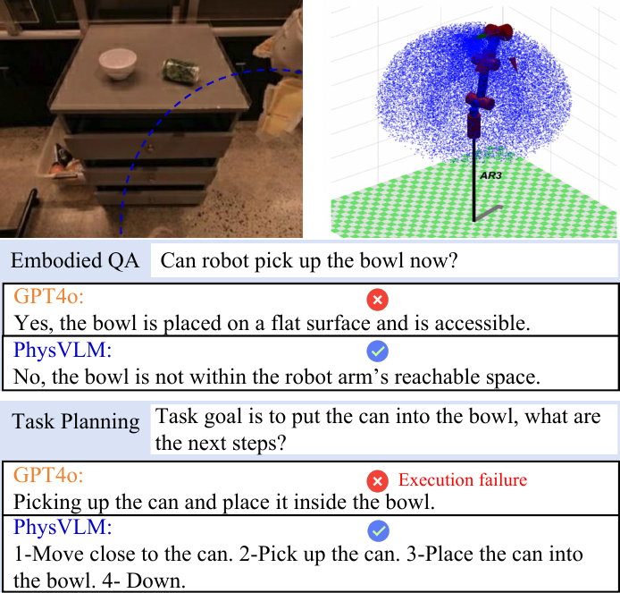
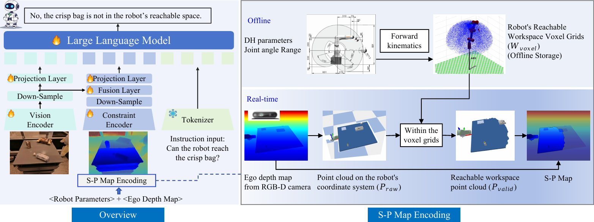
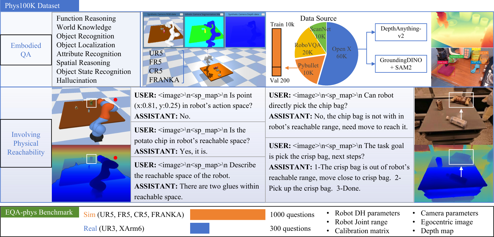
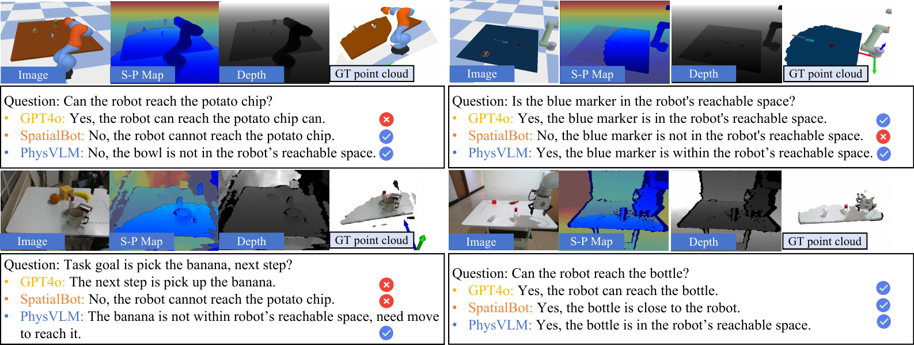

# Title: PhysVLM: Enabling Visual Language Models to Understand Robotic Physical Reachability （PhysVLM：使视觉语言模型能够理解机器人物理可达性）

- ArXiv: 2503.08481
- 作者：周伟杰（Weijie Zhou），陶曼丽（Manli Tao），赵朝阳（Chaoyang Zhao），郭海云（Haiyun Guo），董洪辉（Honghui Dong），唐明（Ming Tang），王金桥（Jinqiao Wang），北京交通大学交通运输学院，ObjectEye Inc.，广东省知识产权大数据重点实验室，广东技术师范大学
- 章节数：28
- 估计词元数：11.8k

## 目录

- 1 引言（Introduction）
- 2 相关工作（Related Work）
  - 2.1 机器人学中的视觉语言模型（VLMs in Robotics）
  - 2.2 理解物理可达性（Understanding Physical Reachability）
- 3 方法（Method）
  - 3.1 S-P 地图编码（S-P Map Encoding）
  - 3.2 模型架构（Model Architecture）
  - 3.3 训练（Training）
    - 训练数据构建（Training Data Construction）。
    - 训练流程（Training Pipeline）。
    - 实现细节（Implementation Details）。
  - 3.4 EQA-phys 基准测试（EQA-phys Benchmark）
- 4 实验（Experiments）
  - 4.1 实验设置（Experimental Setting）
    - 任务（Tasks）。
    - 基线模型（Baselines）。
    - 评估指标（Evaluation Metrics）。
  - 4.2 EQA-phys 上的结果（Results on EQA-phys）
  - 4.3 具身问答上的结果（Results on Embodied QA）
  - 4.4 机器人任务规划上的结果（Results on Robot Task Planning）
  - 4.5 消融研究（Ablation Study）
    - S-P 地图的有效性（The effectiveness of S-P Map）。
    - 额外特征编码器的有效性（Effectiveness of an additional feature encoder）。
    - 训练数据的有效性（Effectiveness of training data）。
  - 4.6 定性结果（Qualitative Results）
- 5 结论（Conclusion）
- 6 致谢（Acknowledgments）
- 参考文献（References）

## 摘要

###### 摘要

理解环境和机器人的 **物理可达性（Physical Reachability）** 对于任务执行至关重要。虽然最先进的 **视觉语言模型（Vision-Language Models, VLMs）** 在环境感知方面表现出色，但由于缺乏对机器人物理可达性的理解，它们在具身视觉推理任务中常常产生不准确或不切实际的响应。为了解决这个问题，我们提出了一种适用于不同机器人的统一物理可达性表示，即 **空间-物理可达性地图（Space-Physical Reachability Map, S-P Map）** ，以及 **PhysVLM** ——一个将这种可达性信息整合到视觉推理中的视觉语言模型。具体来说，S-P 地图将机器人的物理可达性抽象为一种与特定机器人配置无关的广义空间表示，使模型能够专注于可达性特征而非机器人特定参数。随后，PhysVLM 通过引入一个额外的特征编码器来处理 S-P 地图，从而扩展了传统的 VLM 架构，使模型能够在不损害其通用视觉语言能力的前提下对物理可达性进行推理。为了训练和评估 PhysVLM，我们构建了一个大规模多机器人数据集 **Phys100K** 和一个具有挑战性的基准测试 **EQA-phys** ，该基准包含了六种不同机器人在模拟和真实环境中的任务。实验结果表明，PhysVLM 优于现有模型，在 EQA-phys 上相比 GPT-4o 实现了 14% 的性能提升，并在 RoboVQA-val 和 OpenEQA 基准测试上超越了 RoboMamba 和 SpatialVLM 等先进的具身 VLMs。此外，S-P 地图显示出与各种 VLMs 的强大兼容性，将其集成到 GPT-4o-mini 中可带来 7.1% 的性能提升。

## 1 引言（Introduction）

> 图 1：现有的 **视觉语言模型（Vision-Language Models, VLMs）** ，如 GPT-4o，可能由于对机器人物理可达性的理解不足而生成不准确或不切实际的回答。所提出的 PhysVLM 将视觉-语言能力与对机器人物理可达性的理解相结合。

准确感知 **物理可达性（Physical reachability）** 对于机器人有效执行任务至关重要。类似于人类根据身体条件和环境因素调整行动，机器人必须考虑其在环境中的物理可达性，以确保高效可靠的任务执行。例如，在抓取任务中，一个未能评估自身可达性的机器人可能会尝试从一个无法到达的位置抓取物体，从而导致任务失败或设备损坏 [35, 32]。因此，增强机器人对物理可达性的理解对于在复杂环境中成功规划和执行任务至关重要 [31, 41]。

**视觉语言模型（Vision-Language Models, VLMs）** 在环境理解方面已显示出显著进展 [17, 21, 19, 6, 37]，许多研究已将这些模型应用于 **具身人工智能（Embodied AI）** ，以协助机器人感知环境和规划任务 [43, 18, 11, 36, 25]。然而，尽管 VLMs 在通用环境感知方面表现出色，但它们通常在需要理解机器人物理可达性的任务上表现不佳（见图 [1](#figure-1)）。我们确定了要使 VLMs 在机器人任务中有效必须解决的两个关键挑战：（1）如何开发一种统一且高效的物理可达性表示。机器人在尺寸、关节类型和其他特征上差异显著，这使得 VLMs 难以直接学习这些差异；（2）如何使 VLMs 能够在不损害通用视觉-语言能力的前提下，提高其对物理可达性的理解。现有的 VLMs 通常结合了针对视觉和语言任务的预训练单模态编码器。然而，引入像物理可达性这样的新模态需要仔细的架构和训练调整，以确保模型能够在保持其通用能力的同时对可达性进行推理。

为了解决这些挑战，我们提出了 **空间-物理可达性图（Space-Physical Reachability Map, S-P Map）** ，这是一种统一的表示方法，它将不同机器人的物理可达性抽象为一种广义的空间形式。S-P Map 通过结合机器人参数与 **自我中心深度图像（Egocentric depth images）** 生成，但关键在于，模型学习关注的是抽象的可达性特征（即 S-P Map 中的灰色区域），而非特定的机器人配置。这种抽象允许模型在不同机器人之间进行泛化，因为它只需要推理哪些区域是可到达的，而与机器人的具体特性无关。我们引入了 **PhysVLM** ，这是一个视觉语言模型，它通过引入一个额外的特征编码器来处理 S-P Map，从而扩展了传统的 VLM 架构。这种设计使 PhysVLM 能够将物理可达性信息整合到其推理过程中，而不损害其通用视觉-语言能力。为了训练和评估 PhysVLM，我们构建了一个大规模多机器人数据集 **Phys100K** 和一个具有挑战性的基准测试 **EQA-phys** ，该基准包含了在模拟和真实环境中针对六种不同机器人的任务。

我们将我们的贡献总结如下：

- 我们提出了一种统一且与机器人无关的表述—— **空间-物理可达性图（Space-Physical Reachability Map, S-P Map）** ，它以独立于特定机器人配置的方式抽象机器人的物理可达性，促进了广义特征的学习。
- 我们引入了 **PhysVLM** ，这是一个通过额外特征编码器将物理可达性与通用视觉-语言能力集成的视觉语言模型，提高了任务执行的可靠性。
- 我们发布了 **EQA-phys** 基准测试，它包含六种机器人和 1.3K 个问答对，旨在测试模型在模拟和真实环境中对物理可达性的理解。
- 我们的模型在 EQA-phys 基准测试上比 GPT-4o 实现了 14% 的性能提升。在 RoboVQA-val 和 OpenEQA 基准测试的具身视觉推理任务中，它超越了 RoboMamba 和 SpatialVLM 等先进的具身 VLMs。此外，S-P Map 显示出与各种 VLMs 的强大兼容性，将其集成到 GPT-4o-mini 中可带来 7.1% 的性能提升。

## 2 相关工作

### 2.1 机器人学中的视觉语言模型

**具身问答（Embodied Question Answering, EQA）** 任务要求智能体与环境交互以回答问题 [10, 38, 13]。RoboVQA 为机器人视觉问答提供了一个大规模、多样化的数据集。3D-VLA [44] 将 3D 感知与用于具身推理的生成式世界模型相结合，而 SpatialVLM [5] 则利用广泛的 3D 数据增强了 **视觉语言模型（Vision-Language Models, VLMs）** 的空间理解能力。

机器人任务规划涉及为实现目标而对子任务进行排序 [40, 3, 30]。 **代码即策略（Code as Policies, CaP）** [20] 使用 OpenAI 的 Codex (code-davinci-002) 来生成规划代码。SayCan [2] 将 **路径语言模型（Pathways Language Model, PaLM）** [7] 与机器人可供性（Affordances）相结合，基于机器人的能力创建可行的行动方案。然而，这些方法通常假设所有物体都在机器人的操作区域内，忽略了 **物理可达性（Physical Reachability）** ，可能导致次优或不可行的规划。

### 2.2 理解物理可达性

最近的研究使用 **体素网格（Voxel Grids）** 与 **开放词汇检测模型（Open-vocabulary Detection Models）** 来分配任务特定的属性，从而实现对环境约束的理解。ReKep [15] 使用体素网格和 VLMs 生成关键点提议和约束，而 VoxPoser [14] 则通过整合 OWL-ViT [26] 和 VLMs 与基于体素的环境表示来合成机器人轨迹。然而，这些方法侧重于环境建模，并未明确处理机器人的物理可达性。

明确表示可达工作空间仍然具有挑战性。 **可达性地图（Reachability Maps）** [41] 对空间能力进行建模， **占据栅格（Occupancy Grids）** [16] 则考虑障碍物以确保安全导航。此外，诸如结合离线工作空间分析的 **在线模型预测控制（Online Model Predictive Control）** [31] 和 **基于可达性表达式的运动规划（Reachability Expression-based Motion Planning, REMP）** [12] 等方法也处理工作空间约束。尽管取得了这些进展，将物理可达性整合到复杂具身任务的视觉推理中仍然有限，这主要是由于在 VLM 预训练中缺乏包含机器人物理参数的大规模数据集。

> 图 2 | PhysVLM 概览。从机器人参数和自我中心深度图开始，通过统一的物理可达性编码生成 S-P 地图。利用 S-P 地图、图像和指令文本，PhysVLM 在考虑机器人物理可达性的情况下生成文本输出。

## 3 方法（Method）

**PhysVLM** （Physical-aware Vision-Language Model）是一个为具身任务中考虑物理约束的视觉推理而设计的大规模视觉语言模型。如图 [2](#figure-2) 所示，PhysVLM 将指令文本、视觉输入（RGB 图像）以及一个将机器人物理可达性抽象为统一空间表示的 **S-P 图（S-P Map）** 集成在一起。通过结合这些输入，PhysVLM 生成既符合视觉上下文又与机器人物理可达性一致的响应，而不依赖于特定的机器人配置。S-P 图是使用统一的物理可达性编码方法构建的，该方法将各种机器人的物理参数及其以自我为中心的深度图抽象为一种通用形式。这种抽象使模型能够泛化到不同的机器人，以与机器人无关的方式解决学习和推理物理可达性的挑战。

本节将介绍 PhysVLM 的核心组成部分。[3.1 节](#section-3-1) 描述 S-P 图编码方法，[3.2 节](#section-3-2) 描述模型架构，[3.3 节](#section-3-3) 讨论训练流程。

### 3.1 S-P 图编码（S-P Map Encoding）

如图 [2](#figure-2) 所示，我们使用一种统一的方法对各种机器人的物理可达性进行建模，该方法将机器人特定的参数抽象为通用的空间表示。这种抽象使模型能够专注于物理上可达的空间区域，而与特定的机器人配置无关。

$$
\text{S-P Map}=F\left(\mathcal{P}_{\text{raw}},\{\theta_{i}^{\text{min}}, \theta_{i}^{\text{max}}\},\text{DH},\mathbf{E}\right),(1)
$$

其中 $\mathcal{P}_{\text{raw}}$ 表示来自机器人 RGB-D 相机的原始点云数据。$\{\theta_{i}^{\text{min}},\theta_{i}^{\text{max}}\}$ 表示每个关节 $i$ 的运动范围。DH 指描述每个关节几何结构的 **Denavit-Hartenberg 参数（Denavit-Hartenberg parameters）** ，$\mathbf{E}$ 是将坐标从相机坐标系转换到机器人坐标系的外参标定矩阵。函数 $F$ 将这些输入映射以生成 S-P 图，该图将机器人的物理可达性抽象为独立于特定机器人配置的空间形式。

考虑一个具有 $n$ 个自由度的机械臂，其中每个关节 $i$ 具有 DH 参数 $\{\theta_{i},d_{i},a_{i},\alpha_{i}\}$（$\theta_{i}$ 是关节角，$d_{i}$ 是沿 z 轴的偏移量，$a_{i}$ 是连杆长度，$\alpha_{i}$ 是扭转角）。每个关节的齐次变换矩阵定义为：

$$
\mathbf{T}_{i}=G(\theta_{i},d_{i},a_{i},\alpha_{i}),(2)
$$

其中 $G$ 是标准的 Denavit-Hartenberg 变换函数。通过将所有关节的变换矩阵相乘，我们得到从基坐标系到末端执行器坐标系的变换矩阵：

$$
\mathbf{T}=\mathbf{T}_{1}\mathbf{T}_{2}\dots\mathbf{T}_{n}.(3)
$$

为了生成关节构型，我们从各自的运动范围 $\theta_{i}\in[\theta_{i}^{\text{min}},\theta_{i}^{\text{max}}]$ 中对关节角 $\theta_{i}$ 进行采样，得到构型 $\{\theta_{1},\theta_{2},\dots,\theta_{n}\}$。通过将这些关节构型代入正运动学方程，我们计算相应的末端执行器位置：

$$
\mathcal{W}_{\text{voxel}}=\left\{\mathbf{p}\ \bigg{|}\ \mathbf{p}=\mathbf{T}( \theta_{1},\theta_{2},\dots,\theta_{n})\cdot\mathbf{p}_{0}\right\},(4)
$$

其中 $\mathbf{p}_{0}$ 是末端执行器坐标系中的原点。我们离线预计算这些关节构型，将工作空间离散化为体素网格 $\mathcal{W}_{\text{voxel}}$，并将其存储起来以便在后续步骤中进行高效计算。

接下来，如图 [2](#figure-2) 所示，机器人的原始点云 $\mathcal{P}_{\text{raw}}$ 从其以自我为中心的 RGB-D 相机在相机坐标系中捕获，并使用外参标定矩阵 $\mathbf{E}$ 转换到机器人坐标系，得到转换后的点云 $\mathcal{P}$：

$$
\mathcal{P}=\mathbf{E}\cdot\mathcal{P}_{\text{raw}}.(5)
$$

为了确保物理可行性，我们执行体素网格查找，以确定 $\mathcal{P}$ 中的每个点是否位于预计算的可达工作空间 $\mathcal{W}_{\text{voxel}}$ 内：

$$
\mathcal{P}_{\text{valid}}=\left\{\mathbf{p}\in\mathcal{P}\ \bigg{|}\ \mathbf{p}\in\mathcal{W}_{\text{voxel}}\right\}.(6)
$$

此步骤过滤点云，仅包含机器人可达工作空间内的点，从而将机器人的物理可达性抽象为通用的空间形式。

最后，我们将有效点云 $\mathcal{P}_{\text{valid}}$ 转换回相机坐标系，并使用相机的内参将这些点投影到图像平面上。然后，我们在原始深度图上标记符合物理可达性的区域。对于不可达的区域，我们应用灰色遮罩并勾勒其边界。生成的 S-P 图清晰地突出显示了超出机器人物理可达范围的区域，提供了独立于特定机器人配置的统一且抽象的可达性表示。这使得模型能够专注于任务的空间约束，而无需考虑每个机器人的详细物理参数。

### 3.2 模型架构（Model Architecture）

为了在保持 PhysVLM 视觉推理能力的同时，将机器人物理可达性无缝集成到模型中，我们设计了一种双分支架构：一个分支专用于视觉处理，另一个分支专用于物理可达性处理（见图 [2](#figure-2)）。这些分支独立运行，从各自的输入中提取特征，然后将这些特征融合并传递给统一的解码器，以进行最终的推理和响应生成。

视觉分支利用一个预训练的 **视觉变换器（Vision Transformer, ViT）** [9]，具体来说是 SigLip-400M 模型 [42]，从第一人称视角图像中提取高级视觉特征。为了减少计算开销，应用了一个 **最大池化层（Max Pooling layer）** ，随后是一个 **两层多层感知机（two-layer Multi-Layer Perceptron, MLP）** ，将视觉特征转换为适合多模态融合的 **词元表示（token representations）** 。

物理可达性分支处理 **S-P 图（S-P Map）** ，该图将机器人的物理可达性抽象为一种广义的空间形式。该分支同样使用 SigLip-400M 模型进行特征提取，随后进行最大池化和特征融合层操作。融合层将视觉特征和可达性特征结合起来，再由一个两层 MLP 将这些融合后的特征进一步精炼为特定于可达性的词元。

对于语言解码，我们采用 **Qwen-2.5-Instruct-3B 模型** [39, 33] 作为 PhysVLM 的 **大型语言模型（Large Language Model, LLM）** 解码器，并使用 Qwen-2.5 分词器处理自然语言指令。该解码器整合了来自视觉分支、S-P 图和语言输入的多模态词元，生成连贯且与上下文相关的文本响应，这些响应同时考虑了视觉信息和物理可达性信息。

### 3.3 训练（Training）

> 图 3 | Phys100K 数据集与 EQA-Phys 基准测试的细节。

#### 训练数据构建（Training Data Construction）

PhysVLM 的训练数据由我们的 Phys100K 数据集和通用的 **视觉问答（Visual Question Answering, VQA）** 数据集（如 LLaVA-Pretrain、ShareGPT4V 和 RoboVQA）组成。Phys100K 专注于与物理可达性相关的问答，汇集了来自 RoboVQA（20K 样本）、ScanNet [8]（10K 样本）、OpenX-Embodiment [27]（60K 样本）以及来自 PyBullet 的额外 10K 样本的数据。

深度图是生成 S-P 图的关键输入。对于缺乏深度图的数据集，我们使用 DepthAnything-v2 来生成它们。此外，我们采用 **Grounding DINO** [23] 和 **SAM2** [34] 来获取图像中物体的二维边界框和分割结果。在 PyBullet 中，我们使用四个机械臂（UR5、FR5、CR5 和 FRANKA）模拟工作场景，以收集 RGB 图像、深度图和分割结果。

对于 Phys100K 中的 PyBullet 数据，可以从模拟器中获得精确的机器人配置。因此，我们直接使用 [3.2](#section-3-2) 节中描述的方法生成 S-P 图，并通过模拟运动获得指示物体是否可达的标签。S-P 图的优势在于它将物理可达性抽象为基于区域的表示，使学习过程与特定的机器人配置解耦。这使我们能够为没有精确机器人参数的数据集生成伪标签。我们利用分割结果来近似可达性，根据深度值将区域及其内的物体标记为“可达”或“不可达”。接下来，我们为两个主要类别生成问答对：

- **具身问答（Embodied QA）** 。GPT-4 为 ScanNet 和 RoboVQA 生成问答对，涵盖的类别包括 **功能推理（Function Reasoning）** 、 **世界知识（World Knowledge）** 、 **物体识别（Object Recognition）** 、 **物体定位（Object Localization）** 、 **属性识别（Attribute Recognition）** 、 **空间推理（Spatial Reasoning）** 、 **物体状态识别（Object State Recognition）** 以及 **幻觉（Hallucination）** （参见图 [3](#figure-3)）。附录中提供了详细的提示词和示例，以指导生成过程。
- **涉及物理可达性的任务（Tasks Involving Physical Reachability）** 。我们使用带有五个固定任务模板的“可达（reachable）”标签来生成问答对，例如“USER:<image>\n<sp_map>\n 机器人能够到 [Object] 吗？ ASSISTANT: 是的，能够到。”。其中，[Object] 代表相关的物体类别，而 <image> 和 <sp_map> 分别作为图像块标记（image patch tokens）和 S-P 地图块标记（S-P Map patch tokens）的占位符。图 [3](#figure-3) 提供了每个物体类别的问答对示例。

#### 训练流程（Training Pipeline）

我们采用两阶段训练流程，以充分利用 S-P 地图（S-P Map），并确保 PhysVLM 能够泛化到不同的机器人。在第一阶段，我们使用来自 Phys100K 的 LLaVA-Pretrain 和 OpenX-Embodiment 数据集进行多模态特征对齐。此阶段仅训练投影层，使模型能够建立对视觉输入和物理可达性的基础理解，独立于特定的机器人配置。

在第二阶段，我们解冻所有参数，并使用来自 Phys100K、ShareGPT4V 和 RoboVQA 的数据训练整个模型。此阶段增强了 PhysVLM 处理具有物理可达性约束的复杂视觉推理任务的能力，确保模型能够在多样化的环境和机器人中泛化。

#### 实现细节（Implementation Details）

PhysVLM 使用八块 A800 GPU 训练了 48 小时。训练过程包含两个阶段，每个阶段持续一个轮次（epoch）。批次大小（batch size）和学习率（learning rate）在第一阶段分别设置为 128 和 1e-3，在第二阶段分别设置为 64 和 1e-5。最终模型为 PhysVLM-3B。

### 3.4 EQA-phys 基准测试（EQA-phys Benchmark）

如图 [3](#figure-3) 所示，我们引入了一个专注于物理可达性的具身问答任务，称为 **EQA-phys** ，它强调受物理限制约束的问答任务。该基准测试包括一个来自 PyBullet 验证集的模拟器数据集，包含 200 个样本和 1000 个问题，以及一个基于 UR3 和 XArm6 机器人在两种场景下的真实世界数据的零样本评估集。评估集包含 60 个样本和 300 个问题，全部由领域专家手动标注。

> 表 1: EQA-phys 的结果。PhysVLM-3B（我们的模型）与基于 API 的视觉语言模型（VLMs）和具身视觉语言模型（embodied VLMs）的比较。

|                                               |                       | 真实世界（Real-world）     | 模拟器（Simulator）        |                       |                       |                       |                       |                       |
| --------------------------------------------- | --------------------- | -------------------------- | -------------------------- | --------------------- | --------------------- | --------------------- | --------------------- | --------------------- |
|                                               |                       | UR3                        | XArm6                      | UR5                   | FR5                   | CR5                   | FRANKA                | 总计（ALL）           |
| **基于 API 的视觉语言模型（API-based VLMs）** | GPT-4o-mini           | 54.3                       | 56.0                       | 49.4                  | 55.4                  | 54.6                  | 47.1                  | 52.8                  |
|                                               | Claude-3.5            | 56.2                       | 60.5                       | 54.0                  | 58.1                  | 55.7                  | 54.3                  | 56.4                  |
|                                               | GPT-4o                | 56.7                       | 61.5                       | 55.7                  | 58.3                  | 57.5                  | 52.6                  | 57.0                  |
|                                               | GPT-4o-mini + S-P Map | $60.0_{\uparrow 5.7}$      | $60.5_{\uparrow 4.5}$      | $57.0_{\uparrow 7.6}$ | $59.1_{\uparrow 3.7}$ | $59.2_{\uparrow 4.6}$ | $53.3_{\uparrow 6.2}$ | $59.8_{\uparrow 7.0}$ |
|                                               | Claude-3.5 + S-P Map  | $65.3_{\uparrow 9.1}$      | $67.3_{\uparrow 6.8}$      | $54.9_{\uparrow 0.9}$ | $58.3_{\uparrow 0.2}$ | $58.2_{\uparrow 2.5}$ | $58.1_{\uparrow 3.8}$ | $60.3_{\uparrow 3.4}$ |
|                                               | GPT-4o + S-P Map      | $\bm{66.6}_{\uparrow 9.9}$ | $\bm{68.1}_{\uparrow 6.6}$ | $55.8_{\uparrow 0.1}$ | $60.7_{\uparrow 1.4}$ | $59.4_{\uparrow 1.9}$ | $57.6_{\uparrow 5.0}$ | $61.3_{\uparrow 4.1}$ |
| **具身视觉语言模型（Embodied VLMs）**         | SpatialVLM            | 56.3                       | 55.1                       | 54.6                  | 59.1                  | 52.0                  | 47.5                  | 54.1                  |
|                                               | SpatialBot            | 51.1                       | 50.2                       | 50.0                  | 48.1                  | 53.3                  | 54.4                  | 51.1                  |
|                                               | PhysVLM-3B            | 64.1                       | 63.0                       | 71.4                  | 75.7                  | 74.0                  | 78.1                  | 71.0                  |

## 4 实验（Experiments）

### 4.1 实验设置（Experimental Setting）

#### 任务（Tasks）。

我们在以下三类任务中比较 PhysVLM 与其他方法的性能：

- **EQA-phys** 。该基准测试模型将视觉推理与机器人物理可达性（Robotic Physical Reachability）相结合的能力。真实机器人组件用于评估 PhysVLM 的零样本泛化（Zero-shot Generalization）能力，突显其处理未见过的机器人和环境的能力。
- **具身问答（Embodied QA）** 。我们使用 OpenEQA [25] 和 RoboVQA-val [29] 基准测试，评估模型在具身任务中的通用视觉推理能力。
- **机器人任务规划（Robot Task Planning）** 。对于诸如“将 A 放入 B”之类的现实世界任务，我们评估模型理解机器人物理可达性并生成合理任务计划的能力。由于本研究不关注机器人控制策略，我们采用 [29] 中的自然语言规划方法。

#### 基线模型（Baselines）。

我们将我们的模型与多个基线进行比较，包括可通过 API 访问的 **视觉语言模型（Vision-Language Models, VLMs）** ，如 Claude 3.5 [28]、GPT-4o-mini [1] 和 GPT-4o [1]，以及具身视觉语言模型（Embodied VLMs），如 SpatialVLM [5]、SpatialBot [4]、3D-VLA [44] 和 RoboMamba [22]。SpatialVLM 和 SpatialBot 均使用 3B 版本，其参数量与我们的模型相近。由于 3D-VLA 和 RoboMamba 的可执行版本无法获取，我们比较它们在 RoboVQA-val 上报告的结果。

#### 评估指标（Evaluation Metrics）。

对于涉及物理可达性的任务，我们遵循现有研究 [25, 24] 的方法，使用 **大型语言模型（Large Language Model, LLM）** 进行评分。为完全正确的回答分配 5 分，为错误的回答分配 1 分，我们计算平均分并以百分比表示。对于具身问答，我们遵循相应数据集 [25, 29] 的基准设置。对于任务规划，每种任务类型执行 10 次，平均成功率作为评估指标。

### 4.2 EQA-phys 实验结果（Results on EQA-phys）

表 [1](#table-1) 显示了 EQA-phys 上的结果。无论是基于 API 的还是具身的视觉语言模型都无法处理机器人的参数约束，导致输出结果欠佳，得分在 55% 左右。相比之下，我们的模型成功完成了涉及物理可达性的视觉推理任务，获得了 71% 的平均分。如前所述，这些任务要求模型在理解机器人物理可达性的基础上进行视觉推理。模型只有真正理解机器人物理可达性，才能有效完成这些任务。

表 [1](#table-1) 中的结果表明，使用 **S-P 图（S-P Map）** （详见 [4](#figure-4)）提示基于 API 的视觉语言模型（如 GPT-4o）能显著提升其性能。这一改进源于 S-P 图能够将物理可达性抽象为一种与机器人无关的表示，使得视觉语言模型能够推理原本超出其能力范围的物理约束。通过将可达性与特定机器人参数解耦，S-P 图促进了跨不同环境的泛化，使模型即使在先前未见过的场景中也能更好地理解物理可达性。

表 [1](#table-1) 还表明，尽管在具有不同机器人参数的新环境中运行，PhysVLM-3B 在 UR3 和 XArm6 机器人的零样本评估中得分超过 63%。这一性能归因于两个关键因素：(1) **S-P 映射（S-P Map）** 将各种机器人参数抽象为一种统一的、可迁移的 **物理可达性（physical reachability）** 表示；(2) 模型的独立视觉和约束编码分支使其能够从多样化的图像-文本数据中学习可泛化的视觉特征，从而在新环境中进行有效推理。

> 表 2 | RoboVQA-val 数据集上的具身问答结果，PhysVLM（我们的方法）与现有方法的比较。星号 (\*) 表示未在 RoboVQA 数据集上进行预训练的模型。

|              | BLEU1 | BLEU2 | BLEU3 | BLEU4 |
| :----------- | :---- | :---- | :---- | :---- |
| SpatialVLM\* | 5.1   | 3.0   | 1.9   | 1.2   |
| SpatialBot\* | 12.4  | 9.3   | 8.0   | 7.2   |
| 3D-VLA       | 48.3  | 38.5  | 31.7  | 26.8  |
| RoboMamba    | 54.9  | 44.2  | 39.5  | 36.3  |
| PhysVLM-3B   | 65.3  | 62.4  | 50.9  | 43.5  |

> 表 3 | OpenEQA 基准测试上的具身问答结果，PhysVLM（我们的方法）与现有方法的比较。星号 (\*) 表示由于 API 限制，仅测试了前 200 个样本。

|            | EM-EQA (ScanNet) | EM-EQA (HM3D) | ALL  |
| :--------- | :------------------ | :--------------- | :--- |
| SpatialVLM | 42.9                | 44.3             | 43.8 |
| SpatialBot | 45.3                | 51.0             | 49.1 |
| GPT4V      | 57.4                | 51.3             | 55.3 |
| GPT-4o\*   | 68.2                | 65.2             | 66.7 |
| PhysVLM-3B | 60.7                | 51.2             | 57.4 |

### 4.3 具身问答结果（Results on Embodied QA）

我们证明了我们的模型在处理通用 **具身视觉推理（embodied visual reasoning）** 任务方面的有效性。此外，我们还表明，融入对物理约束的理解并不会削弱其通用视觉推理能力。我们将我们的模型与最先进的 **具身视觉语言模型（embodied VLMs）** 进行了比较（见表 [2](#table-2) 和 [3](#table-3)）。我们的模型在 RoboVQA-val 基准测试中取得了最佳性能，在 BLEU-4 指标上超过其他模型 7.2%。在 OpenEQA 基准测试中，我们的模型超越了现有的具身视觉语言模型和 GPT-4V，排名第二，仅次于 GPT-4o。

### 4.4 机器人任务规划结果（Results on Robot Task Planning）

表 [4](#table-4) 展示了 PhysVLM 和基线模型在真实世界任务规划场景中的性能。当所有物体都在机器人的物理可达范围内时，PhysVLM 的表现与其他模型相似，因为直接抓取或放置物体即可成功。然而，当某些物体超出物理可达范围时，模型必须建议机器人在抓取或放置它们之前先靠近。在这些情况下，我们的模型表现异常出色，而其他模型的任务成功率则显著下降。这归因于我们的模型对机器人物理可达性的理解及其将这种理解融入任务规划的能力。

表 4：任务规划结果。PhysVLM（我们的方法）与其他 **视觉语言模型（Vision-Language Models, VLMs）** 的对比。

|             | 所有物体 在范围内 | 部分物体 在范围内 |
| ----------- | -------------------- | -------------------- |
| GPT-4o-mini | 70.5                 | 23.2                 |
| Claude-3.5  | 73.6                 | 32.1                 |
| GPT-4o      | 75.9                 | 35.8                 |
| SpatialVLM  | 64.4                 | 21.5                 |
| SpatialBot  | 65.6                 | 25.3                 |
| PhysVLM-3B  | 69.2                 | 48.4                 |

表 5：关于 **空间-物理地图（Spatial-Physical Map, S-P Map）** 的消融研究。我们比较了约束编码器在使用 S-P Map、将其替换为深度图（Depth Map）或不提供任何输入时的性能。

| ID  | S-P 地图 | 深度 图 | EQA-phys 真实世界 | EQA-phys 仿真 |
| --- | ----------- | ---------- | -------------------- | ---------------- |
| 1   | ✓           |            | 63.5                 | 74.8             |
| 2   |             | ✓          | 58.1                 | 62.4             |
| 3   |             |            | 54.2                 | 58.8             |

### 4.5 消融研究（Ablation Study）

在本节中，我们进行消融研究，以评估 PhysVLM 中每个组件的贡献。我们报告了涉及 **物理可达性（physical reachability）** 任务上的平均 **大型语言模型（Large Language Model, LLM）** 分数。

#### S-P 地图的有效性。

为了证明 S-P 地图的贡献，我们比较了有和没有其输入时得到的结果。如表 [5](#table-5) 所示，实验 1 和 3 表明，省略 S-P 地图会导致 **零样本（zero-shot）** 真实世界机器人和仿真器的性能显著下降。具体而言，在仿真结果中，总体平均分数下降了 16%，在真实世界机器人评估中下降了 9.3%。没有 S-P 地图输入，模型难以处理机器人的物理可达性。

此外，实验 1 和 2 表明，用深度图替换 S-P 地图会显著降低模型在零样本任务上的性能。由于深度图不能准确表示机器人的物理可达性，模型无法仅依靠深度信息来理解它。

表 6：关于额外特征编码器有效性的消融研究。“共享（Share）”表示与视觉特征编码器共享网络和权重。

|                     | EQA-phys | OpenEQA |     |
| ------------------- | -------- | ------- | --- |
| 独立（Independent） | 71.0     | 57.4    |     |
| 共享（Share）       | 68.2     | 56.5    |     |

> 图 4：PhysVLM（我们的方法）、GPT-4o 和 SpatialBot 的视觉对比。

#### 额外特征编码器的有效性。

为了证明模型架构的有效性，我们比较了为 S-P 地图使用与视觉特征编码器共享权重的特征编码器的性能。在这些实验中，我们评估了在 EQA-phys 和 OpenEQA 基准测试上的平均分数。表 [6](#table-6) 中的结果表明，共享特征编码器不仅降低了在 EQA-phys 上的性能，还损害了一般的视觉推理能力。这是因为 S-P 地图的特征与图像不同，并且训练数据中包含的图像-文本对数量远多于 S-P 地图数据。

#### 训练数据的有效性。

为了评估 Phys100K 的有效性，我们通过有选择地从 Phys100K 中移除不同来源的数据来进行实验。如表 [7](#table-7) 所示，移除来自 PyBullet 或其他具身数据集的数据会导致整体性能下降，这突显了每个数据组件在模型性能中的关键作用。

表 7：关于训练数据有效性的消融研究。

| Phys100K 部分                        | EQA-phys 真实世界 | EQA-phys 仿真 |
| ------------------------------------ | -------------------- | ---------------- |
| 全部（All）                          | 63.5                 | 74.8             |
| 不含 Pybullet（w/o Pybullet）        | 62.1                 | 65.4             |
| 不含其他数据集（w/o Other Datasets） | 58.6                 | 71.5             |

### 4.6 定性结果（Qualitative Results）

图 [4](#figure-4) 将我们的方法与 SpatialBot 和 GPT-4o 进行了比较。SpatialBot 使用深度图和图像，而 GPT-4o 使用标准图像。两者在处理需要物理可达性的任务时都存在困难，导致视觉推理错误。相比之下，我们的方法能提供准确的结果。此外，将 S-P 地图整合到 GPT-4o 中，可以改善其对物理可达性的处理能力和回答的准确性。

## 5 结论（Conclusion）

我们提出了 **PhysVLM** ，一种将 **物理可达性（Physical reachability）** 融入机器人任务视觉推理的 **视觉语言模型（Vision-Language Model, VLM）** 。 **S-P 图（S-P Map）** 提供了机器人可达性的统一表示，促进了可泛化特征的学习。PhysVLM 通过增加一个物理可达性编码器，扩展了传统的 VLMs，使其能够同时处理视觉、可达性和文本信息。此外，我们提出了 **EQA-phys** ，一个用于评估涉及物理可达性的具身问答（Embodied Question Answering, EQA）任务的基准。我们的实验表明，PhysVLM 优于现有模型，在 EQA-phys 上的得分比 GPT-4o 高出 14%。一个局限性是，与仿真环境相比，其在真实机器人上的零样本（Zero-shot）性能有所下降，这可能是由于领域差距（Domain gap）造成的。未来的工作将集中于扩展数据集、提升真实世界性能，以及改进对 **视觉-语言-动作模型（Vision-Language-Action models）** 中物理可达性的理解。PhysVLM 的可达性感知能力支持在工业和辅助环境中做出更安全、更可靠的机器人决策，而其统一表示确保了实际部署中的跨平台适应性，弥合了环境感知与可执行的机器人智能之间的关键鸿沟。

## 6 致谢（Acknowledgments）

本研究得到了以下项目的资助：

- **国家重点研发计划（National Key R&D Program of China）** ，项目编号：2022ZD0160601、2022YFB4300400 和 2018B030322016。
- **国家自然科学基金（National Natural Science Foundation of China）** ，项目编号：62176254、62276260 和 U1701266。

## 参考文献（References）

- Achiam 等人 [2023]
  Josh Achiam, Steven Adler, Sandhini Agarwal, Lama Ahmad, Ilge Akkaya, Florencia Leoni Aleman, Diogo Almeida, Janko Altenschmidt, Sam Altman, Shyamal Anadkat, 等人。
  GPT-4 技术报告。
  _arXiv 预印本 arXiv:2303.08774_, 2023。
- Ahn 等人 [2022a]
  Michael Ahn, Brohan, 等人。
  按我能做的做，而非按我说的做：将语言 **扎根于机器人可供性（Robotic Affordances）** 中。
  _arXiv 预印本 arXiv:2204.01691_, 2022a。
- Ahn 等人 [2022b]
  Michael Ahn, Anthony Brohan, Noah Brown, Yevgen Chebotar, Omar Cortes, Byron David, Chelsea Finn, Chuyuan Fu, Keerthana Gopalakrishnan, Karol Hausman, 等人。
  按我能做的做，而非按我说的做：将语言扎根于机器人可供性中。
  _arXiv 预印本 arXiv:2204.01691_, 2022b。
- Cai 等人 [2024]
  Wenxiao Cai, Yaroslav Ponomarenko, Jianhao Yuan, Xiaoqi Li, Wankou Yang, Hao Dong, 和 Bo Zhao。
  SpatialBot：利用 **视觉语言模型（Vision Language Models, VLMs）** 实现精确的空间理解。
  _arXiv 预印本 arXiv:2406.13642_, 2024。
- Chen 等人 [2024a]
  Boyuan Chen, Zhuo Xu, Sean Kirmani, Brian Ichter, Dorsa Sadigh, Leonidas Guibas, 和 Fei Xia。
  SpatialVLM：赋予视觉语言模型空间推理能力。
  载于《IEEE/CVF 计算机视觉与模式识别会议论文集》，第 14455–14465 页，2024a。
- Chen 等人 [2024b]
  Zhe Chen, Jiannan Wu, Wenhai Wang, Weijie Su, Guo Chen, Sen Xing, Muyan Zhong, Qinglong Zhang, Xizhou Zhu, Lewei Lu, 等人。
  InternVL：扩展视觉基础模型并针对通用视觉-语言任务进行对齐。
  载于《IEEE/CVF 计算机视觉与模式识别会议论文集》，第 24185–24198 页，2024b。
- Chowdhery 等人 [2023]
  Aakanksha Chowdhery, Narang, 等人。
  PaLM：通过 Pathways 扩展语言建模。
  《机器学习研究杂志》，24(240):1–113, 2023。
- Dai 等人 [2017]
  Angela Dai, Angel X Chang, Manolis Savva, Maciej Halber, Thomas Funkhouser, 和 Matthias Nießner。
  ScanNet：室内场景的丰富注释 3D 重建。
  载于《IEEE 计算机视觉与模式识别会议论文集》，第 5828–5839 页，2017。
- Dosovitskiy [2020]
  Alexey Dosovitskiy。
  一张图像值 16x16 个词：用于大规模图像识别的 Transformers。
  _arXiv 预印本 arXiv:2010.11929_, 2020。
- Driess 等人 [2023]
  Danny Driess, Fei Xia, Mehdi SM Sajjadi, Corey Lynch, Aakanksha Chowdhery, Brian Ichter, Ayzaan Wahid, Jonathan Tompson, Quan Vuong, Tianhe Yu, 等人。
  PaLM-E：一个具身多模态语言模型。
  _arXiv 预印本 arXiv:2303.03378_, 2023。
- Ehsani 等人 [2024]
  Kiana Ehsani, Tanmay Gupta, Rose Hendrix, Jordi Salvador, Luca Weihs, Kuo-Hao Zeng, Kunal Pratap Singh, Yejin Kim, Winson Han, Alvaro Herrasti, 等人。
  SPOC：在仿真中模仿最短路径可实现现实世界中的有效导航与操作。
  载于《IEEE/CVF 计算机视觉与模式识别会议论文集》，第 16238–16250 页，2024。
- Gao 等人 [2022]
  Xiaofeng Gao, Luyao Yuan, Tianmin Shu, Hongjing Lu, 和 Song-Chun Zhu。
  展示你能做什么：面向人机协作的可达工作空间能力校准。
  《IEEE 机器人与自动化快报》，7(2):2644–2651, 2022。
- Hong 等人 [2024]
  Yining Hong, Zishuo Zheng, Peihao Chen, Yian Wang, Junyan Li, 和 Chuang Gan。
  Multiply：3D 世界中的多感官、以对象为中心的具身大型语言模型。
  载于《IEEE/CVF 计算机视觉与模式识别会议论文集》，第 26406–26416 页，2024。
- Huang 等人 [2023]
  Wenlong Huang, Chen Wang, Ruohan Zhang, Yunzhu Li, Jiajun Wu, 和 Li Fei-Fei。
  VoxPoser：用于语言模型机器人操作的可组合 3D 价值图。
  _arXiv 预印本 arXiv:2307.05973_, 2023。
- Huang 等人 [2024]
  Wenlong Huang, Chen Wang, Yunzhu Li, Ruohan Zhang, 和 Li Fei-Fei。
  ReKEP：面向机器人操作的关系关键点约束的时空推理。
  _arXiv 预印本 arXiv:2409.01652_, 2024。
- Jamone 等人 [2014]
  Lorenzo Jamone, Martim Brandao, Lorenzo Natale, Kenji Hashimoto, Giulio Sandini, 和 Atsuo Takanishi。
  工作空间运动表征的自主在线生成，用于智能全身抓取。
  《机器人与自主系统》，62(4):556–567, 2014。
- Lai 等人 [2024]
  Xin Lai, Zhuotao Tian, Yukang Chen, Yanwei Li, Yuhui Yuan, Shu Liu, 和 Jiaya Jia。
  LISA：通过大型语言模型进行推理分割。
  载于《IEEE/CVF 计算机视觉与模式识别会议论文集》，第 9579–9589 页，2024。
- Lei 等人 [2024]
  Xiaohan Lei, Min Wang, Wengang Zhou, Li Li, 和 Houqiang Li。
  面向实例图像目标导航的实例感知探索-验证-利用。
  载于《IEEE/CVF 计算机视觉与模式识别会议论文集》，第 16329–16339 页，2024。
- Li 等人 [2024]
  Feng Li, Renrui Zhang, Hao Zhang, Yuanhan Zhang, Bo Li, Wei Li, Zejun Ma, 和 Chunyuan Li。
  LLaVA-NeXT-Interleave：在大型多模态模型中处理多图像、视频和 3D 数据。
  _arXiv 预印本 arXiv:2407.07895_, 2024。
- Liang 等人 [2023]
  Jacky Liang, Wenlong Huang, Fei Xia, Peng Xu, Karol Hausman, Brian Ichter, Pete Florence, 和 Andy Zeng。
  代码即策略：用于具身控制的语言模型程序。
  载于《2023 年 IEEE 机器人与自动化国际会议 (ICRA)》，第 9493–9500 页。IEEE，2023。
- Liu 等人 [2024a]
  Haotian Liu, Chunyuan Li, Qingyang Wu, 和 Yong Jae Lee。
  视觉指令微调。
  《神经信息处理系统进展》，36, 2024a。
- Liu 等人 [2024b]
  Jiaming Liu, Mengzhen Liu, Zhenyu Wang, Lily Lee, Kaichen Zhou, Pengju An, Senqiao Yang, Renrui Zhang, Yandong Guo, 和 Shanghang Zhang。
  RoboMamba：用于高效机器人推理与操作的多模态状态空间模型。
  _arXiv 预印本 arXiv:2406.04339_, 2024b。
- Liu 等人 [2023]
  Shilong Liu, Zhaoyang Zeng, Tianhe Ren, Feng Li, Hao Zhang, Jie Yang, Qing Jiang, Chunyuan Li, Jianwei Yang, Hang Su, 等人。

- Liu 等人 [2023]
  Shilong Liu, Zhaoyang Zeng, Tianhe Ren, Feng Li, Hao Zhang, Jie Yang, Chunyuan Li, Jianwei Yang, Hang Su, Jun Zhu, 等。
  **Grounding DINO（Grounding DINO）** ：将 DINO 与接地预训练结合用于开放集目标检测。
  _arXiv 预印本 arXiv:2303.05499_，2023。
- Liu 等人 [2025]
  Yuan Liu, Haodong Duan, Yuanhan Zhang, Bo Li, Songyang Zhang, Wangbo Zhao, Yike Yuan, Jiaqi Wang, Conghui He, Ziwei Liu, 等。
  **MMBench（MMBench）** ：你的多模态模型是全能的吗？
  收录于《欧洲计算机视觉会议》，第 216–233 页。Springer，2025。
- Majumdar 等人 [2024]
  Arjun Majumdar, Ajay, 等。
  **OpenEQA（OpenEQA）** ：基础模型时代的具身问答。
  收录于《IEEE/CVF 计算机视觉与模式识别会议论文集》，第 16488–16498 页，2024。
- Minderer 等人 [2022]
  Matthias Minderer, Alexey Gritsenko, Austin Stone, 等。
  使用视觉变换器进行简单的开放词汇目标检测，2022。
- O’Neill 等人 [2024]
  Abby O’Neill, Rehman, 等。
  **Open X-Embodiment（Open X-Embodiment）** ：机器人学习数据集与 RT-X 模型：Open X-Embodiment 协作 0。
  收录于《2024 年 IEEE 机器人与自动化国际会议（ICRA）》，第 6892–6903 页。IEEE，2024。
- Radford 等人 [2021]
  Alec Radford, Kim, 等。
  从自然语言监督中学习可迁移的视觉模型。
  收录于《国际机器学习会议》，第 8748–8763 页。PMLR，2021。
- Sermanet 等人 [2024]
  Pierre Sermanet, Ding, 等。
  **RoboVQA（RoboVQA）** ：用于机器人的多模态长时程推理。
  收录于《2024 年 IEEE 机器人与自动化国际会议（ICRA）》，第 645–652 页。IEEE，2024。
- Shridhar 等人 [2020]
  Mohit Shridhar, Jesse Thomason, Daniel Gordon, Yonatan Bisk, Winson Han, Roozbeh Mottaghi, Luke Zettlemoyer, 和 Dieter Fox。
  **ALFRED（ALFRED）** ：一个用于解释日常任务中接地指令的基准。
  收录于《IEEE/CVF 计算机视觉与模式识别会议论文集》，第 10740–10749 页，2020。
- Song 和 Lau [2022]
  Chen Song 和 Darwin Lau。
  用于缆驱机器人的基于工作空间的模型预测控制。
  《IEEE 机器人与自动化汇刊》，38(4):2577–2596，2022。
- Sutanto 等人 [2020]
  Giovanni Sutanto, Austin Wang, Yixin Lin, Mustafa Mukadam, Gaurav Sukhatme, Akshara Rai, 和 Franziska Meier。
  在可微牛顿-欧拉算法中编码物理约束。
  收录于《第二届动态与控制学习会议论文集》，第 804–813 页。PMLR，2020。
- Team [2024]
  Qwen Team。
  **Qwen2.5（Qwen2.5）** ，2024。
- Thomas 等人 [1988]
  Dominique Thomas, Rodney Rothstein, Nathan Rosenberg, 和 Yolande Surdin-Kerjan。
  SAM2 编码酿酒酵母中的第二个甲硫氨酸 S-腺苷转移酶：两种酶的生理学与调控。
  《分子与细胞生物学》，8(12):5132–5139，1988。
- Tian 等人 [2024]
  Yunsheng Tian, Karl DD Willis, Bassel Al Omari, Jieliang Luo, Pingchuan Ma, Yichen Li, Farhad Javid, Edward Gu, Joshua Jacob, Shinjiro Sueda, 等。
  **ASAP（ASAP）** ：具有物理可行性的复杂机器人装配自动化序列规划。
  收录于《2024 年 IEEE 机器人与自动化国际会议（ICRA）》，第 4380–4386 页。IEEE，2024。
- Vuong 等人 [2024]
  An Dinh Vuong, Minh Nhat Vu, Baoru Huang, Nghia Nguyen, Hieu Le, Thieu Vo, 和 Anh Nguyen。
  语言驱动的抓取检测。
  收录于《IEEE/CVF 计算机视觉与模式识别会议论文集》，第 17902–17912 页，2024。
- Wang 等人 [2024]
  Peng Wang, Shuai Bai, Sinan Tan, Shijie Wang, Zhihao Fan, Jinze Bai, Keqin Chen, Xuejing Liu, Jialin Wang, Wenbin Ge, 等。
  **Qwen2-VL（Qwen2-VL）** ：增强视觉语言模型在任何分辨率下对世界的感知能力。
  _arXiv 预印本 arXiv:2409.12191_，2024。
- Wu 等人 [2020]
  Yu Wu, Lu Jiang, 和 Yi Yang。
  重新审视具身问答：一个简单基线及超越。
  《IEEE 图像处理汇刊》，29:3984–3992，2020。
- Yang 等人 [2024a]
  An Yang, Baosong Yang, Binyuan Hui, 等。
  **Qwen2 技术报告（Qwen2 technical report）** 。
  _arXiv 预印本 arXiv:2407.10671_，2024a。
- Yang 等人 [2024b]
  Yijun Yang, Tianyi Zhou, Kanxue Li, Dapeng Tao, Lusong Li, Li Shen, Xiaodong He, Jing Jiang, 和 Yuhui Shi。
  由大型语言模型在并行文本世界中训练的具身多模态智能体。
  收录于《IEEE/CVF 计算机视觉与模式识别会议论文集》，第 26275–26285 页，2024b。
- Zacharias 等人 [2007]
  Franziska Zacharias, Christoph Borst, 和 Gerd Hirzinger。
  捕捉机器人工作空间结构：表示机器人能力。
  收录于《2007 年 IEEE/RSJ 智能机器人与系统国际会议》，第 3229–3236 页。IEEE，2007。
- Zhai 等人 [2023]
  Xiaohua Zhai, Basil Mustafa, Alexander Kolesnikov, 和 Lucas Beyer。
  用于语言图像预训练的 Sigmoid 损失，2023。
- Zhao 等人 [2024]
  Ganlong Zhao, Guanbin Li, Weikai Chen, 和 Yizhou Yu。
  **Over-NAV（Over-NAV）** ：通过开放词汇检测和结构化表示提升迭代式视觉与语言导航。
  收录于《IEEE/CVF 计算机视觉与模式识别会议论文集》，第 16296–16306 页，2024。
- Zhen 等人 [2024]
  Haoyu Zhen, Xiaowen Qiu, Peihao Chen, Jincheng Yang, Xin Yan, Yilun Du, Yining Hong, 和 Chuang Gan。
  **3D-VLA（3D-VLA）** ：一个 3D 视觉-语言-动作生成世界模型。
  _arXiv 预印本 arXiv:2403.09631_，2024。
