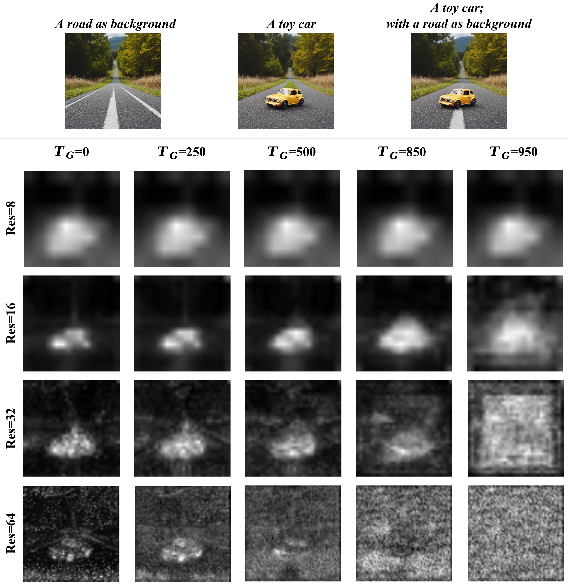

## Appendix A Multi-Layer Dataset

### A.1 Pipeline of Data Generation.

The detailed process for multi-layer data generation is illustrated in [Fig. 12](https://arxiv.org/html/2503.12838v1#A1.F12). First, a prompt is randomly selected from a large prompt dataset diffusiondb [35]. Subsequently, this prompt is processed by GPT-4 to generate corresponding foregrounds, backgrounds, and a complete descriptive prompt. The descriptive prompt is fed into generation models like Flux to create images with resolutions ranging from 892 to 1152. Next, GroundingDINO [17] and the foreground prompts are used to extract bounding boxes for the foreground objects from the generated image. Entity segmentation identifies all entities in the image. Based on the depth map [37], the foremost entity is selected. After matching it with the bounding box using IoU, the entity mask is linked to the text prompt. We then refine the entity mask using a matting segmentation model, producing more detailed alpha channels and foreground layers. Finally, an inpainting model uses the foreground mask to fill in the image. This process is repeated to decompose all foregrounds and backgrounds, resulting in complete foreground and background layers.

Through this process, we automatically generated millions of multi-layer images. After manual filtering, we remove low-quality layers, such as those with foreign objects in the completed backgrounds, inaccurate foreground segmentation, or poor foreground quality. Finally, $400k$ high-quality layer data is retained.

### A.2 Dataset Analysis

We provide a detailed comparison between our dataset and MuLAn [31] in [Tab. 5](#table-5). Compared to the MuLAn dataset, we have more images, higher resolution, more categories, and a greater number of instances. [Fig. 13](https://arxiv.org/html/2503.12838v1#A1.F13) illustrates the top ten most common categories across multi-layer images. In the two-layer data, “person” is the dominant category, largely due to the abundance of portrait examples in the prompts. We deliberately reduced the generation of “person” instances in the three-layer and four-layer datasets, resulting in a more balanced category distribution for these layers.

> Table 5: Dataset comparison between MuLAn and DreamLayer.

| Dataset     | Images  | Resolutions   | Classes | Instances |
| ----------- | ------- | ------------- | ------- | --------- |
| Dataset     | Images  | Resolutions   | Classes | Instances |
| Dataset     | Images  | Resolutions   | Classes | Instances |
| Dataset     | Images  | Resolutions   | Classes | Instances |
| Dataset     | Images  | Resolutions   | Classes | Instances |
| MuLAn [31]  | 44,860  | 600$\sim$800  | 759     | 101,269   |
| MuLAn [31]  | 44,860  | 600$\sim$800  | 759     | 101,269   |
| MuLAn [31]  | 44,860  | 600$\sim$800  | 759     | 101,269   |
| MuLAn [31]  | 44,860  | 600$\sim$800  | 759     | 101,269   |
| MuLAn [31]  | 44,860  | 600$\sim$800  | 759     | 101,269   |
| DreamLayer  | 408,187 | 896$\sim$1152 | 1453    | 525,388   |
| DreamLayer  | 408,187 | 896$\sim$1152 | 1453    | 525,388   |
| DreamLayer  | 408,187 | 896$\sim$1152 | 1453    | 525,388   |
| DreamLayer  | 408,187 | 896$\sim$1152 | 1453    | 525,388   |
| DreamLayer  | 408,187 | 896$\sim$1152 | 1453    | 525,388   |
| -TwoLayer   | 305,801 | 896$\sim$1152 | 1379    | 305,801   |
| -TwoLayer   | 305,801 | 896$\sim$1152 | 1379    | 305,801   |
| -TwoLayer   | 305,801 | 896$\sim$1152 | 1379    | 305,801   |
| -TwoLayer   | 305,801 | 896$\sim$1152 | 1379    | 305,801   |
| -TwoLayer   | 305,801 | 896$\sim$1152 | 1379    | 305,801   |
| -ThreeLayer | 87,571  | 896$\sim$1152 | 1322    | 175,142   |
| -ThreeLayer | 87,571  | 896$\sim$1152 | 1322    | 175,142   |
| -ThreeLayer | 87,571  | 896$\sim$1152 | 1322    | 175,142   |
| -ThreeLayer | 87,571  | 896$\sim$1152 | 1322    | 175,142   |
| -ThreeLayer | 87,571  | 896$\sim$1152 | 1322    | 175,142   |
| -FourLayer  | 14,815  | 896$\sim$1152 | 1045    | 44,445    |
| -FourLayer  | 14,815  | 896$\sim$1152 | 1045    | 44,445    |
| -FourLayer  | 14,815  | 896$\sim$1152 | 1045    | 44,445    |
| -FourLayer  | 14,815  | 896$\sim$1152 | 1045    | 44,445    |
| -FourLayer  | 14,815  | 896$\sim$1152 | 1045    | 44,445    |
|             |         |               |         |           |
|             |         |               |         |           |
|             |         |               |         |           |
|             |         |               |         |           |
|             |         |               |         |           |

> Figure 12: The pipeline of multi-layer data preparation.

  
  
  

> Figure 13: Top 10 most common categories in our Multi-Layer Dataset.

> Table 6: Quantitative comparison of background and foreground image generation.

| Methods (Bg)        | Two Layers     |                 | Three Layers |               | Four Layers    |                 |        |               |                |                 |         |
| ------------------- | -------------- | --------------- | ------------ | ------------- | -------------- | --------------- | ------ | ------------- | -------------- | --------------- | ------- |
| Methods (Bg)        | Two Layers     |                 | Three Layers |               | Four Layers    |                 |        |               |                |                 |         |
| Methods (Bg)        | Two Layers     |                 | Three Layers |               | Four Layers    |                 |        |               |                |                 |         |
| Methods (Bg)        | Two Layers     |                 | Three Layers |               | Four Layers    |                 |        |               |                |                 |         |
| Methods (Bg)        | Two Layers     |                 | Three Layers |               | Four Layers    |                 |        |               |                |                 |         |
| Methods (Bg)        | Two Layers     |                 | Three Layers |               | Four Layers    |                 |        |               |                |                 |         |
| AES$\uparrow$       | Clip$\uparrow$ | FID$\downarrow$ |              | AES$\uparrow$ | Clip$\uparrow$ | FID$\downarrow$ |        | AES$\uparrow$ | Clip$\uparrow$ | FID$\downarrow$ |         |
| AES$\uparrow$       | Clip$\uparrow$ | FID$\downarrow$ |              | AES$\uparrow$ | Clip$\uparrow$ | FID$\downarrow$ |        | AES$\uparrow$ | Clip$\uparrow$ | FID$\downarrow$ |         |
| AES$\uparrow$       | Clip$\uparrow$ | FID$\downarrow$ |              | AES$\uparrow$ | Clip$\uparrow$ | FID$\downarrow$ |        | AES$\uparrow$ | Clip$\uparrow$ | FID$\downarrow$ |         |
| AES$\uparrow$       | Clip$\uparrow$ | FID$\downarrow$ |              | AES$\uparrow$ | Clip$\uparrow$ | FID$\downarrow$ |        | AES$\uparrow$ | Clip$\uparrow$ | FID$\downarrow$ |         |
| AES$\uparrow$       | Clip$\uparrow$ | FID$\downarrow$ |              | AES$\uparrow$ | Clip$\uparrow$ | FID$\downarrow$ |        | AES$\uparrow$ | Clip$\uparrow$ | FID$\downarrow$ |         |
| AES$\uparrow$       | Clip$\uparrow$ | FID$\downarrow$ |              | AES$\uparrow$ | Clip$\uparrow$ | FID$\downarrow$ |        | AES$\uparrow$ | Clip$\uparrow$ | FID$\downarrow$ |         |
| AES$\uparrow$       | Clip$\uparrow$ | FID$\downarrow$ |              | AES$\uparrow$ | Clip$\uparrow$ | FID$\downarrow$ |        | AES$\uparrow$ | Clip$\uparrow$ | FID$\downarrow$ |         |
| AES$\uparrow$       | Clip$\uparrow$ | FID$\downarrow$ |              | AES$\uparrow$ | Clip$\uparrow$ | FID$\downarrow$ |        | AES$\uparrow$ | Clip$\uparrow$ | FID$\downarrow$ |         |
| AES$\uparrow$       | Clip$\uparrow$ | FID$\downarrow$ |              | AES$\uparrow$ | Clip$\uparrow$ | FID$\downarrow$ |        | AES$\uparrow$ | Clip$\uparrow$ | FID$\downarrow$ |         |
| AES$\uparrow$       | Clip$\uparrow$ | FID$\downarrow$ |              | AES$\uparrow$ | Clip$\uparrow$ | FID$\downarrow$ |        | AES$\uparrow$ | Clip$\uparrow$ | FID$\downarrow$ |         |
| AES$\uparrow$       | Clip$\uparrow$ | FID$\downarrow$ |              | AES$\uparrow$ | Clip$\uparrow$ | FID$\downarrow$ |        | AES$\uparrow$ | Clip$\uparrow$ | FID$\downarrow$ |         |
| LayerDiffusion [41] | 6.034          | 28.426          | 81.491       |               | 5.438          | 27.839          | 95.813 |               | 5.564          | 28.907          | 117.485 |
| LayerDiffusion [41] | 6.034          | 28.426          | 81.491       |               | 5.438          | 27.839          | 95.813 |               | 5.564          | 28.907          | 117.485 |
| LayerDiffusion [41] | 6.034          | 28.426          | 81.491       |               | 5.438          | 27.839          | 95.813 |               | 5.564          | 28.907          | 117.485 |
| LayerDiffusion [41] | 6.034          | 28.426          | 81.491       |               | 5.438          | 27.839          | 95.813 |               | 5.564          | 28.907          | 117.485 |
| LayerDiffusion [41] | 6.034          | 28.426          | 81.491       |               | 5.438          | 27.839          | 95.813 |               | 5.564          | 28.907          | 117.485 |
| LayerDiffusion [41] | 6.034          | 28.426          | 81.491       |               | 5.438          | 27.839          | 95.813 |               | 5.564          | 28.907          | 117.485 |
| LayerDiffusion [41] | 6.034          | 28.426          | 81.491       |               | 5.438          | 27.839          | 95.813 |               | 5.564          | 28.907          | 117.485 |
| LayerDiffusion [41] | 6.034          | 28.426          | 81.491       |               | 5.438          | 27.839          | 95.813 |               | 5.564          | 28.907          | 117.485 |
| LayerDiffusion [41] | 6.034          | 28.426          | 81.491       |               | 5.438          | 27.839          | 95.813 |               | 5.564          | 28.907          | 117.485 |
| LayerDiffusion [41] | 6.034          | 28.426          | 81.491       |               | 5.438          | 27.839          | 95.813 |               | 5.564          | 28.907          | 117.485 |
| LayerDiffusion [41] | 6.034          | 28.426          | 81.491       |               | 5.438          | 27.839          | 95.813 |               | 5.564          | 28.907          | 117.485 |
| LayerDiffusion [41] | 6.034          | 28.426          | 81.491       |               | 5.438          | 27.839          | 95.813 |               | 5.564          | 28.907          | 117.485 |
| DreamLayer          | 6.731          | 29.827          | 72.633       |               | 6.127          | 29.297          | 87.927 |               | 6.119          | 30.661          | 80.157  |
| DreamLayer          | 6.731          | 29.827          | 72.633       |               | 6.127          | 29.297          | 87.927 |               | 6.119          | 30.661          | 80.157  |
| DreamLayer          | 6.731          | 29.827          | 72.633       |               | 6.127          | 29.297          | 87.927 |               | 6.119          | 30.661          | 80.157  |
| DreamLayer          | 6.731          | 29.827          | 72.633       |               | 6.127          | 29.297          | 87.927 |               | 6.119          | 30.661          | 80.157  |
| DreamLayer          | 6.731          | 29.827          | 72.633       |               | 6.127          | 29.297          | 87.927 |               | 6.119          | 30.661          | 80.157  |
| DreamLayer          | 6.731          | 29.827          | 72.633       |               | 6.127          | 29.297          | 87.927 |               | 6.119          | 30.661          | 80.157  |
| DreamLayer          | 6.731          | 29.827          | 72.633       |               | 6.127          | 29.297          | 87.927 |               | 6.119          | 30.661          | 80.157  |
| DreamLayer          | 6.731          | 29.827          | 72.633       |               | 6.127          | 29.297          | 87.927 |               | 6.119          | 30.661          | 80.157  |
| DreamLayer          | 6.731          | 29.827          | 72.633       |               | 6.127          | 29.297          | 87.927 |               | 6.119          | 30.661          | 80.157  |
| DreamLayer          | 6.731          | 29.827          | 72.633       |               | 6.127          | 29.297          | 87.927 |               | 6.119          | 30.661          | 80.157  |
| DreamLayer          | 6.731          | 29.827          | 72.633       |               | 6.127          | 29.297          | 87.927 |               | 6.119          | 30.661          | 80.157  |
| DreamLayer          | 6.731          | 29.827          | 72.633       |               | 6.127          | 29.297          | 87.927 |               | 6.119          | 30.661          | 80.157  |
| Methods (Fg)        | Two Layers     |                 | Three Layers |               | Four Layers    |                 |        |               |                |                 |         |
| Methods (Fg)        | Two Layers     |                 | Three Layers |               | Four Layers    |                 |        |               |                |                 |         |
| Methods (Fg)        | Two Layers     |                 | Three Layers |               | Four Layers    |                 |        |               |                |                 |         |
| Methods (Fg)        | Two Layers     |                 | Three Layers |               | Four Layers    |                 |        |               |                |                 |         |
| Methods (Fg)        | Two Layers     |                 | Three Layers |               | Four Layers    |                 |        |               |                |                 |         |
| Methods (Fg)        | Two Layers     |                 | Three Layers |               | Four Layers    |                 |        |               |                |                 |         |
| AES$\uparrow$       | Clip$\uparrow$ | FID$\downarrow$ |              | AES$\uparrow$ | Clip$\uparrow$ | FID$\downarrow$ |        | AES$\uparrow$ | Clip$\uparrow$ | FID$\downarrow$ |         |
| AES$\uparrow$       | Clip$\uparrow$ | FID$\downarrow$ |              | AES$\uparrow$ | Clip$\uparrow$ | FID$\downarrow$ |        | AES$\uparrow$ | Clip$\uparrow$ | FID$\downarrow$ |         |
| AES$\uparrow$       | Clip$\uparrow$ | FID$\downarrow$ |              | AES$\uparrow$ | Clip$\uparrow$ | FID$\downarrow$ |        | AES$\uparrow$ | Clip$\uparrow$ | FID$\downarrow$ |         |
| AES$\uparrow$       | Clip$\uparrow$ | FID$\downarrow$ |              | AES$\uparrow$ | Clip$\uparrow$ | FID$\downarrow$ |        | AES$\uparrow$ | Clip$\uparrow$ | FID$\downarrow$ |         |
| AES$\uparrow$       | Clip$\uparrow$ | FID$\downarrow$ |              | AES$\uparrow$ | Clip$\uparrow$ | FID$\downarrow$ |        | AES$\uparrow$ | Clip$\uparrow$ | FID$\downarrow$ |         |
| AES$\uparrow$       | Clip$\uparrow$ | FID$\downarrow$ |              | AES$\uparrow$ | Clip$\uparrow$ | FID$\downarrow$ |        | AES$\uparrow$ | Clip$\uparrow$ | FID$\downarrow$ |         |
| AES$\uparrow$       | Clip$\uparrow$ | FID$\downarrow$ |              | AES$\uparrow$ | Clip$\uparrow$ | FID$\downarrow$ |        | AES$\uparrow$ | Clip$\uparrow$ | FID$\downarrow$ |         |
| AES$\uparrow$       | Clip$\uparrow$ | FID$\downarrow$ |              | AES$\uparrow$ | Clip$\uparrow$ | FID$\downarrow$ |        | AES$\uparrow$ | Clip$\uparrow$ | FID$\downarrow$ |         |
| AES$\uparrow$       | Clip$\uparrow$ | FID$\downarrow$ |              | AES$\uparrow$ | Clip$\uparrow$ | FID$\downarrow$ |        | AES$\uparrow$ | Clip$\uparrow$ | FID$\downarrow$ |         |
| AES$\uparrow$       | Clip$\uparrow$ | FID$\downarrow$ |              | AES$\uparrow$ | Clip$\uparrow$ | FID$\downarrow$ |        | AES$\uparrow$ | Clip$\uparrow$ | FID$\downarrow$ |         |
| AES$\uparrow$       | Clip$\uparrow$ | FID$\downarrow$ |              | AES$\uparrow$ | Clip$\uparrow$ | FID$\downarrow$ |        | AES$\uparrow$ | Clip$\uparrow$ | FID$\downarrow$ |         |
| LayerDiffusion [41] | 6.124          | 30.404          | 64.406       |               | 5.782          | 29.849          | 43.889 |               | 5.652          | 29.646          | 45.210  |
| LayerDiffusion [41] | 6.124          | 30.404          | 64.406       |               | 5.782          | 29.849          | 43.889 |               | 5.652          | 29.646          | 45.210  |
| LayerDiffusion [41] | 6.124          | 30.404          | 64.406       |               | 5.782          | 29.849          | 43.889 |               | 5.652          | 29.646          | 45.210  |
| LayerDiffusion [41] | 6.124          | 30.404          | 64.406       |               | 5.782          | 29.849          | 43.889 |               | 5.652          | 29.646          | 45.210  |
| LayerDiffusion [41] | 6.124          | 30.404          | 64.406       |               | 5.782          | 29.849          | 43.889 |               | 5.652          | 29.646          | 45.210  |
| LayerDiffusion [41] | 6.124          | 30.404          | 64.406       |               | 5.782          | 29.849          | 43.889 |               | 5.652          | 29.646          | 45.210  |
| LayerDiffusion [41] | 6.124          | 30.404          | 64.406       |               | 5.782          | 29.849          | 43.889 |               | 5.652          | 29.646          | 45.210  |
| LayerDiffusion [41] | 6.124          | 30.404          | 64.406       |               | 5.782          | 29.849          | 43.889 |               | 5.652          | 29.646          | 45.210  |
| LayerDiffusion [41] | 6.124          | 30.404          | 64.406       |               | 5.782          | 29.849          | 43.889 |               | 5.652          | 29.646          | 45.210  |
| LayerDiffusion [41] | 6.124          | 30.404          | 64.406       |               | 5.782          | 29.849          | 43.889 |               | 5.652          | 29.646          | 45.210  |
| LayerDiffusion [41] | 6.124          | 30.404          | 64.406       |               | 5.782          | 29.849          | 43.889 |               | 5.652          | 29.646          | 45.210  |
| LayerDiffusion [41] | 6.124          | 30.404          | 64.406       |               | 5.782          | 29.849          | 43.889 |               | 5.652          | 29.646          | 45.210  |
| DreamLayer          | 6.165          | 30.530          | 51.495       |               | 5.806          | 29.905          | 33.462 |               | 5.703          | 29.724          | 31.426  |
| DreamLayer          | 6.165          | 30.530          | 51.495       |               | 5.806          | 29.905          | 33.462 |               | 5.703          | 29.724          | 31.426  |
| DreamLayer          | 6.165          | 30.530          | 51.495       |               | 5.806          | 29.905          | 33.462 |               | 5.703          | 29.724          | 31.426  |
| DreamLayer          | 6.165          | 30.530          | 51.495       |               | 5.806          | 29.905          | 33.462 |               | 5.703          | 29.724          | 31.426  |
| DreamLayer          | 6.165          | 30.530          | 51.495       |               | 5.806          | 29.905          | 33.462 |               | 5.703          | 29.724          | 31.426  |
| DreamLayer          | 6.165          | 30.530          | 51.495       |               | 5.806          | 29.905          | 33.462 |               | 5.703          | 29.724          | 31.426  |
| DreamLayer          | 6.165          | 30.530          | 51.495       |               | 5.806          | 29.905          | 33.462 |               | 5.703          | 29.724          | 31.426  |
| DreamLayer          | 6.165          | 30.530          | 51.495       |               | 5.806          | 29.905          | 33.462 |               | 5.703          | 29.724          | 31.426  |
| DreamLayer          | 6.165          | 30.530          | 51.495       |               | 5.806          | 29.905          | 33.462 |               | 5.703          | 29.724          | 31.426  |
| DreamLayer          | 6.165          | 30.530          | 51.495       |               | 5.806          | 29.905          | 33.462 |               | 5.703          | 29.724          | 31.426  |
| DreamLayer          | 6.165          | 30.530          | 51.495       |               | 5.806          | 29.905          | 33.462 |               | 5.703          | 29.724          | 31.426  |
| DreamLayer          | 6.165          | 30.530          | 51.495       |               | 5.806          | 29.905          | 33.462 |               | 5.703          | 29.724          | 31.426  |
|                     |                |                 |              |               |                |                 |        |               |                |                 |         |
|                     |                |                 |              |               |                |                 |        |               |                |                 |         |
|                     |                |                 |              |               |                |                 |        |               |                |                 |         |
|                     |                |                 |              |               |                |                 |        |               |                |                 |         |
|                     |                |                 |              |               |                |                 |        |               |                |                 |         |
|                     |                |                 |              |               |                |                 |        |               |                |                 |         |
|                     |                |                 |              |               |                |                 |        |               |                |                 |         |
|                     |                |                 |              |               |                |                 |        |               |                |                 |         |
|                     |                |                 |              |               |                |                 |        |               |                |                 |         |
|                     |                |                 |              |               |                |                 |        |               |                |                 |         |
|                     |                |                 |              |               |                |                 |        |               |                |                 |         |
|                     |                |                 |              |               |                |                 |        |               |                |                 |         |

> Figure 14: Ablation Study on Layer-Shared Attention: “Normal Attention” refers to standard self-attention in SD15; “Shared Attention” involves layer interaction through concatenation and “Layer-Shared Attention” incorporating global layer information.

> Figure 15: The effectiveness of mask attention in Image to Layer.

### A.3 Visualization

[Fig. 20](https://arxiv.org/html/2503.12838v1#A6.F20), [Fig. 21](https://arxiv.org/html/2503.12838v1#A6.F21) and [Fig. 22](https://arxiv.org/html/2503.12838v1#A6.F22) showcase examples of multi-layer images generated by our data generation pipeline. With the support of multiple models, our multi-layer dataset achieve high quality and resolution. They also feature logical layer order and precise alpha channels. By leveraging the depth map and sequential inpainting process, our method effectively handles object occlusion. As a result, each layer is nearly complete.

> Figure 16: The context map results from global layer extracted at different resolutions and time steps.

## Appendix B Implement Details

During training, we scale and center-crop the images to a size of $512\times 512$ as input. The model is initialized with SD1.5 pre-trained weights. Intermediate results with a resolution of 16 are extracted from the four stages of the UNet as the attention maps. Layer-shared self-attention is applied between $T_{G}=850$ and $T=1000$, while shared self-attention is applied across all steps. All loss weight $\lambda_{noise},\lambda_{l},\lambda_{c}$ are set to 1. The initial learning rate is set to $2\times 10^{-6}$, with a contant rate scheduler applied for gradual decay. Training started with the two-layer data for 60,000 steps, followed by training on the three-layer and four-layer data based on the two-layer model. During inference, we use 50 steps with the DDIM sampling strategy. In the Information Retained Harmonization (IRH) process, latents between $T_{H}=400$ and $T_{H}^{\prime}=600$ are retained, and blending is performed at the latent level at $T_{H}$.

## Appendix C Quantitative comparison of Bg&Fg layer

In the main text, we quantitatively compare the quality of the final composite images. Here, we evaluate the generation quality of background and foreground layers in comparison to LayerDiffusion [41]. As shown in Tables [Tab. 6](#table-6), our method achieves higher aesthetic scores for background generation, particularly excelling in two-layer generation with an improvement of approximately 0.7. Similarly, for foreground generation, our method also outperforms LayerDiffusion, further highlighting the effectiveness in multi-layer generation tasks.

## Appendix D Ablation Study

### D.1 The Context Map

We conduct a detailed investigation into the stages and steps $T_{G}$ for extracting the Context Map from global image. As shown in , among the four stages of the Unet, the clearest context map for foreground object “toy car” is extracted at the resolution $res=16$. ther stages primarily capture texture details and image-specific patterns. At $res=16$, the focus is on the layout and general contours of objects.

For different $T_{G}$ steps, we observe that at $T_{G}=850$, the context map contains sufficiently clear information. When $T_{G}$ decreases, the context map becomes sharper. However, this increases the steps of Layer-Shared Self-Attention, introducing more global layer information. As a result, the foreground layer cannot be effectively distinguished from the global layer, leading to layer generation failure. To balance clarity and accuracy, we choose $T_{G}=850$.

### D.2 Layer-Shared Self-Attention

LSSA is primarily used to maintain consistency across different image layers, a feature already effective in the original SD15, as shown in [Fig. 14](https://arxiv.org/html/2503.12838v1#A1.F14). “Normal Attention” refers to standard self-attention without any inter-layer interaction, where each layer is generated solely based on its respective text prompt. “Shared Attention” involves layer interaction through concatenation, as described in [Eq. 14](https://arxiv.org/html/2503.12838v1#A5.E14), which brings a certain level of consistency—such as generating similar yellow cars across layers. “Layer-Shared Attention” further enhances consistency by incorporating global layer information into the foreground layer, as outlined in [Eq. 9](https://arxiv.org/html/2503.12838v1#S3.E9), resulting in better alignment of the size and placement of the toy car.

## Appendix E Image to Layer

In the Image to Layer process, we use DDIM inversion [18] to revert the input image into its initial latent. During this process, the input image is treated as a global image and duplicated $k+1$ times to form a layer batch. To ensure clarity, we apple mask attention during inversion to isolate the global layer from other layers, preventing information from other layers from interfering with the global layer during the inversion process. Specifically, in the Layer-Shared Self-Attention process, we first concatenate all the noisy latents $z_{t}\in\mathbb{R}^{h\times w}$ from different layers:

$$
\tilde{z}_{t}^{c}=\mathrm{concat}(\tilde{z}_{t}^{1},\cdots,\tilde{z}_{t}^{k+1}).(14)
$$

Next, we generate a mask $M\in\mathbb{R}^{h\times(k+1)w}$ based on $\tilde{z}_{t}^{c}$:

$$
M(i,j)=\begin{cases}0,&\mbox{if}j>kw\\ -\infty,&\mbox{otherwise}\end{cases}(15)
$$

After applying linear projections, we perform the masked attention operation, formally as:

$$
O_{s}^{i}=Softmax(\frac{Q_{s}^{i}(K_{s}^{c})^{T}+M}{\sqrt{d}})V_{s}^{c}.(16)
$$

By applying mask attention to block the influence of other layers on the global layer, we can decompose the input image into multiple layers. As shown in [Fig. 15](https://arxiv.org/html/2503.12838v1#A1.F15), without mask attention, information from the global layer mixes with other layers during inversion. This often results in foreground information remaining in the background layer.

## Appendix F More Qualitative Results

[Fig. 17](https://arxiv.org/html/2503.12838v1#A6.F17), [Fig. 18](https://arxiv.org/html/2503.12838v1#A6.F18) and [Fig. 19](https://arxiv.org/html/2503.12838v1#A6.F19) illustrate the results generated by our DreamLayer on two-layer, three-layer, and four-layer images, respectively. Under the guidance of the global layer, our generated multi-layer images exhibit well-organized layouts. The foreground objects align more naturally with the background images, resulting in composite images that are more harmonious. These composites also include detailed elements, such as shadows, enhancing their realism.

> Figure 17: Qualitative Results of two-layer images generated by DreamLayer.

> Figure 18: Qualitative Results of three-layer images generated by DreamLayer.

> Figure 19: Qualitative Results of four-layer images generated by DreamLayer.

> Figure 20: Visulization of two-layer images in our multi-layer dataset.

> Figure 21: Visulization of three-layer images in our multi-layer dataset.

> Figure 22: Visulization of four-layer images in our multi-layer dataset.
