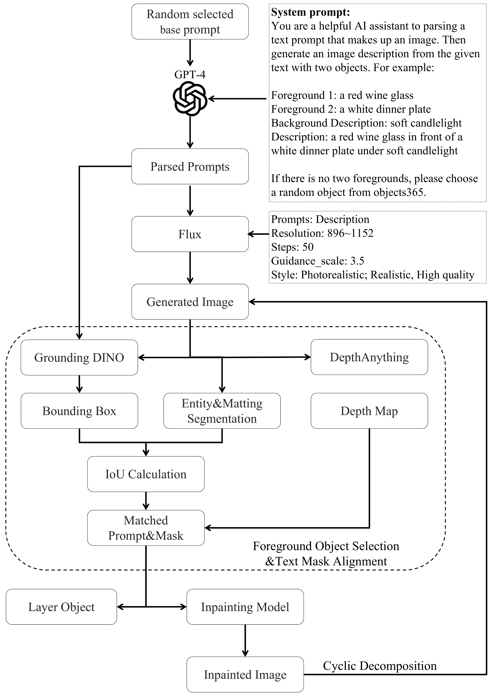
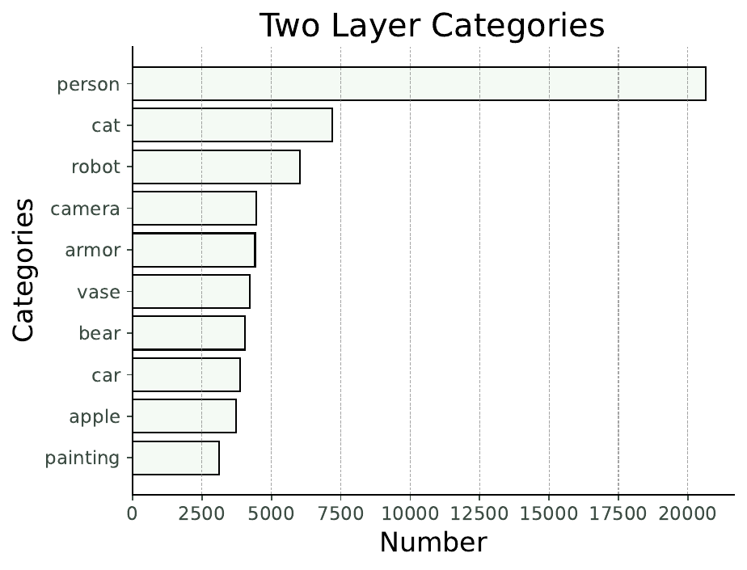
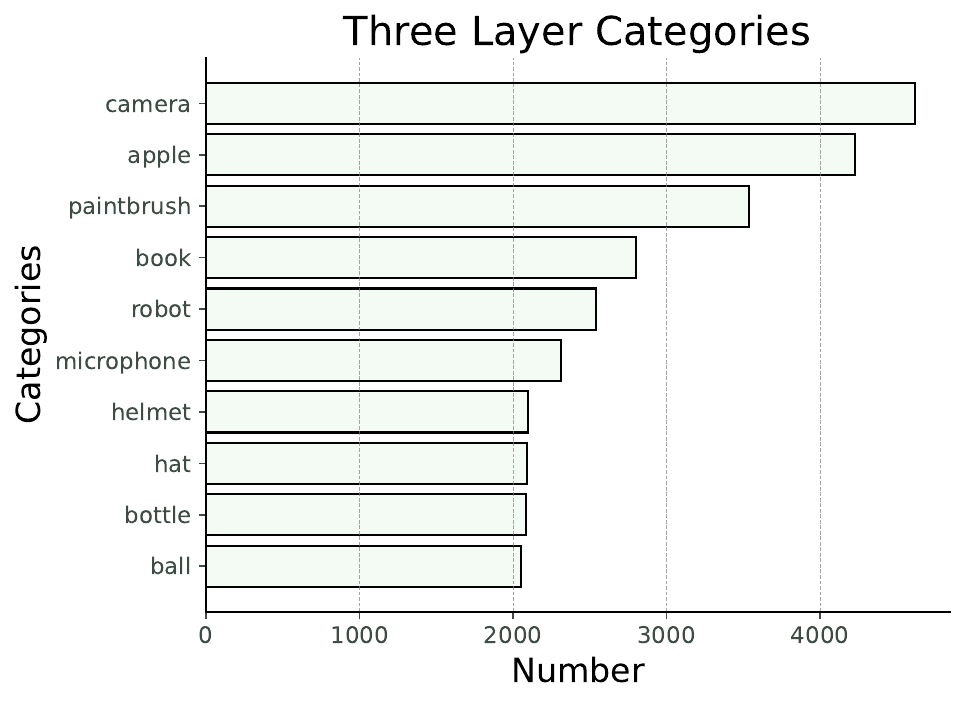
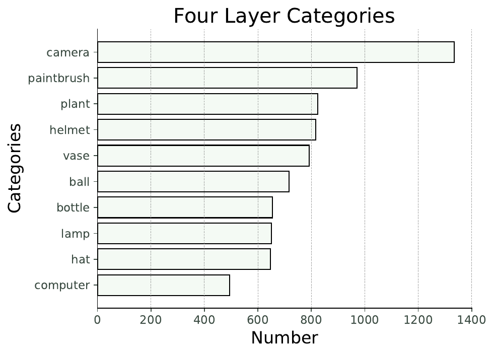
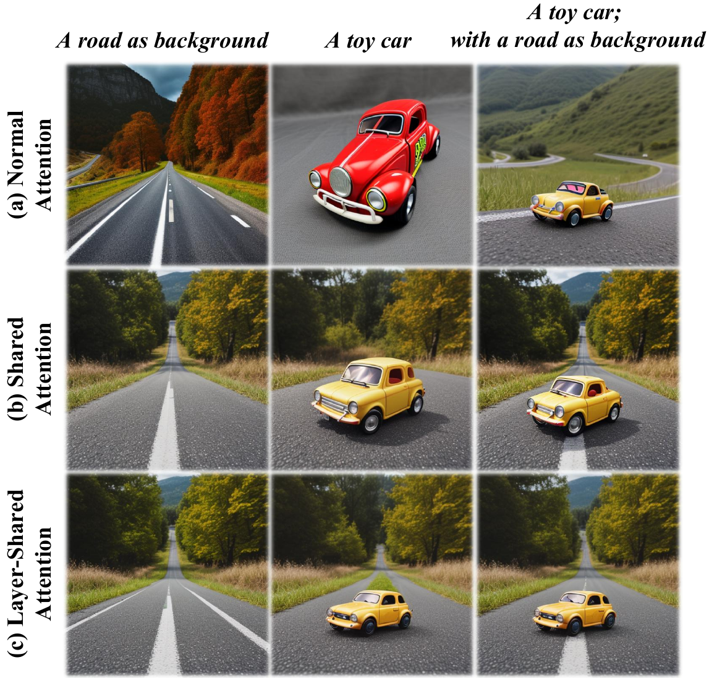
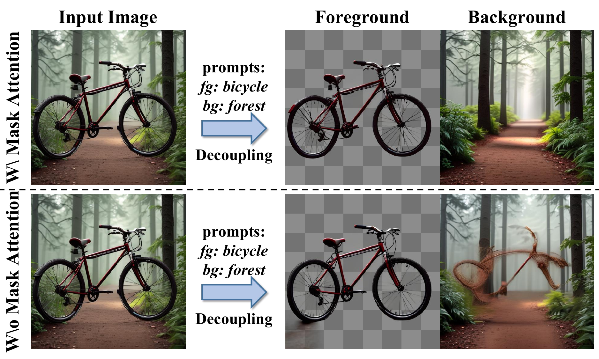
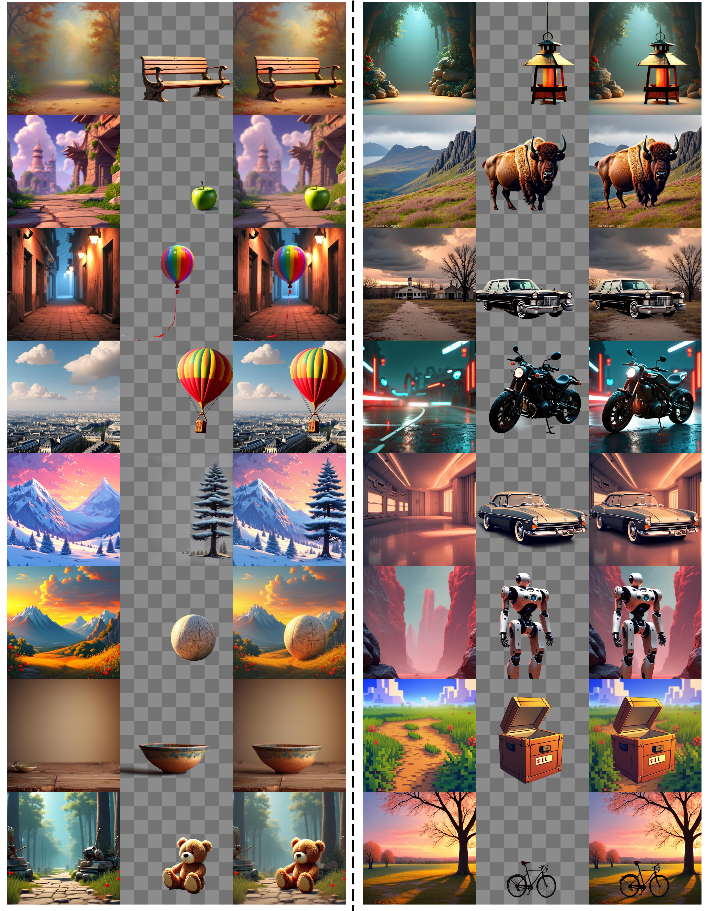
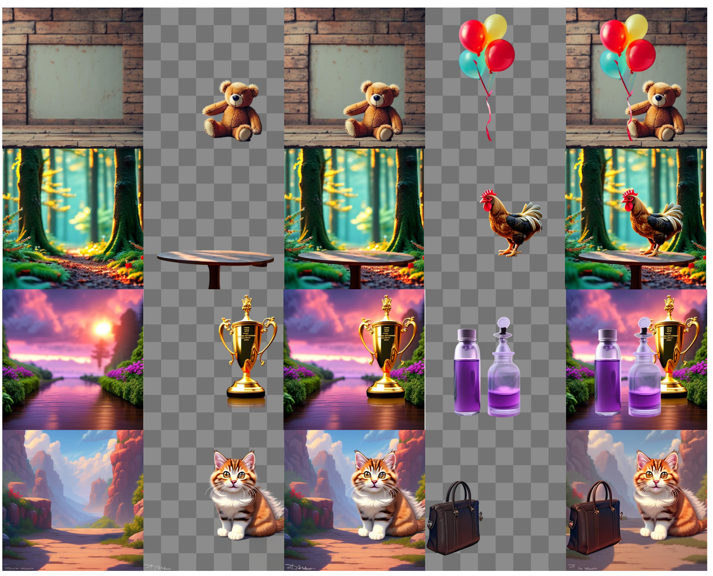
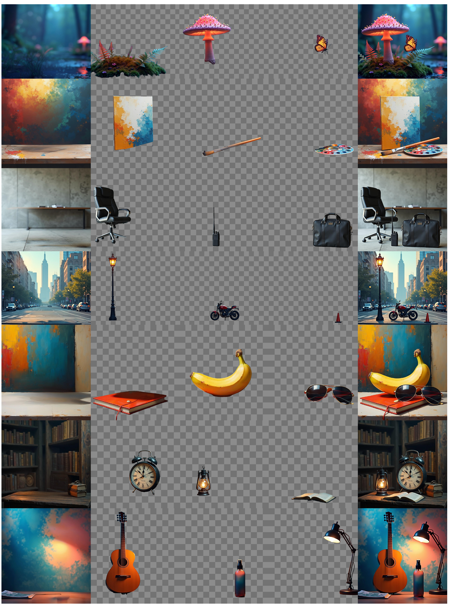

## 附录 A：多层数据集（Appendix A Multi-Layer Dataset）

### A.1 数据生成流程（Pipeline of Data Generation）

多层数据生成的详细流程如 [图 12](https://arxiv.org/html/2503.12838v1#A1.F12) 所示。首先，从一个大型提示词数据集 `diffusiondb` [35] 中随机选取一个提示词。随后，该提示词由 `GPT-4` 处理，生成相应的前景、背景和一个完整的描述性提示词。该描述性提示词被输入到如 `Flux` 等生成模型中，以创建分辨率在 892 到 1152 之间的图像。接下来，使用 `GroundingDINO` [17] 和前景提示词从生成的图像中提取前景对象的边界框。实体分割（Entity segmentation）识别图像中的所有实体。基于深度图（Depth map）[37]，选择最前面的实体。在使用交并比（Intersection over Union, IoU）将其与边界框匹配后，实体掩码（Entity mask）与文本提示词关联起来。然后，我们使用抠图分割模型（Matting segmentation model）细化实体掩码，生成更精细的阿尔法通道（Alpha channels）和前景层。最后，一个修复模型（Inpainting model）使用前景掩码填充图像。重复此过程以分解所有前景和背景，从而得到完整的前景层和背景层。

通过此流程，我们自动生成了数百万张多层图像。经过人工筛选后，我们移除了低质量的层，例如那些在补全的背景中包含异物、前景分割不准确或前景质量不佳的层。最终，保留了 $400k$ 个高质量层数据。

### A.2 数据集分析（Dataset Analysis）

我们在 [表 5](#table-5) 中提供了我们的数据集与 `MuLAn` [31] 之间的详细比较。与 `MuLAn` 数据集相比，我们的数据集拥有更多的图像、更高的分辨率、更多的类别以及更多的实例数量。[图 13](https://arxiv.org/html/2503.12838v1#A1.F13) 展示了多层图像中最常见的十个类别。在双层数据中，“人”是主导类别，这主要是由于提示词中肖像示例的丰富性。我们特意在三层和四层数据集中减少了“人”实例的生成，从而使这些层级的类别分布更加均衡。

> 表 5：MuLAn 与 DreamLayer 的数据集比较。

| 数据集      | 图像数量 | 分辨率        | 类别数 | 实例数  |
| :---------- | :------- | :------------ | :----- | :------ |
| MuLAn [31]  | 44,860   | 600$\sim$800  | 759    | 101,269 |
| DreamLayer  | 408,187  | 896$\sim$1152 | 1453   | 525,388 |
| -TwoLayer   | 305,801  | 896$\sim$1152 | 1379   | 305,801 |
| -ThreeLayer | 87,571   | 896$\sim$1152 | 1322   | 175,142 |
| -FourLayer  | 14,815   | 896$\sim$1152 | 1045   | 44,445  |

> 图 12：多层数据准备的流程。

  
  
  

> 图 13：我们多层数据集中最常见的 10 个类别。

> 表 6：背景与前景图像生成的定量比较。

表 1 | 背景层（Background Layer）生成定量评估结果。
| 方法（背景层） | 两层 | | 三层 | | 四层 | | | | | | |
| :--- | :---: | :---: | :---: | :---: | :---: | :---: | :---: | :---: | :---: | :---: | :---: |
| | **AES$\uparrow$** | **Clip$\uparrow$** | **FID$\downarrow$** | | **AES$\uparrow$** | **Clip$\uparrow$** | **FID$\downarrow$** | | **AES$\uparrow$** | **Clip$\uparrow$** | **FID$\downarrow$** |
| **LayerDiffusion** [41] | 6.034 | 28.426 | 81.491 | | 5.438 | 27.839 | 95.813 | | 5.564 | 28.907 | 117.485 |
| **DreamLayer** | **6.731** | **29.827** | **72.633** | | **6.127** | **29.297** | **87.927** | | **6.119** | **30.661** | **80.157** |

表 2 | 前景层（Foreground Layer）生成定量评估结果。
| 方法（前景层） | 两层 | | 三层 | | 四层 | | | | | | |
| :--- | :---: | :---: | :---: | :---: | :---: | :---: | :---: | :---: | :---: | :---: | :---: |
| | **AES$\uparrow$** | **Clip$\uparrow$** | **FID$\downarrow$** | | **AES$\uparrow$** | **Clip$\uparrow$** | **FID$\downarrow$** | | **AES$\uparrow$** | **Clip$\uparrow$** | **FID$\downarrow$** |
| **LayerDiffusion** [41] | 6.034 | 28.426 | 81.491 | | 5.438 | 27.839 | 95.813 | | 5.564 | 28.907 | 117.485 |
| **DreamLayer** | **6.731** | **29.827** | **72.633** | | **6.127** | **29.297** | **87.927** | | **6.119** | **30.661** | **80.157** |

| **AES$\uparrow$**   | **Clip$\uparrow$** | **FID$\downarrow$** |        | **AES$\uparrow$** | **Clip$\uparrow$** | **FID$\downarrow$** |        | **AES$\uparrow$** | **Clip$\uparrow$** | **FID$\downarrow$** |
| :------------------ | :----------------- | :------------------ | :----- | :---------------- | :----------------- | :------------------ | :----- | :---------------- | :----------------- | :------------------ | ------ |
| **AES$\uparrow$**   | **Clip$\uparrow$** | **FID$\downarrow$** |        | **AES$\uparrow$** | **Clip$\uparrow$** | **FID$\downarrow$** |        | **AES$\uparrow$** | **Clip$\uparrow$** | **FID$\downarrow$** |
| **AES$\uparrow$**   | **Clip$\uparrow$** | **FID$\downarrow$** |        | **AES$\uparrow$** | **Clip$\uparrow$** | **FID$\downarrow$** |        | **AES$\uparrow$** | **Clip$\uparrow$** | **FID$\downarrow$** |
| **AES$\uparrow$**   | **Clip$\uparrow$** | **FID$\downarrow$** |        | **AES$\uparrow$** | **Clip$\uparrow$** | **FID$\downarrow$** |        | **AES$\uparrow$** | **Clip$\uparrow$** | **FID$\downarrow$** |
| **AES$\uparrow$**   | **Clip$\uparrow$** | **FID$\downarrow$** |        | **AES$\uparrow$** | **Clip$\uparrow$** | **FID$\downarrow$** |        | **AES$\uparrow$** | **Clip$\uparrow$** | **FID$\downarrow$** |
| **AES$\uparrow$**   | **Clip$\uparrow$** | **FID$\downarrow$** |        | **AES$\uparrow$** | **Clip$\uparrow$** | **FID$\downarrow$** |        | **AES$\uparrow$** | **Clip$\uparrow$** | **FID$\downarrow$** |
| LayerDiffusion [41] | 6.124              | 30.404              | 64.406 |                   | 5.782              | 29.849              | 43.889 |                   | 5.652              | 29.646              | 45.210 |
| LayerDiffusion [41] | 6.124              | 30.404              | 64.406 |                   | 5.782              | 29.849              | 43.889 |                   | 5.652              | 29.646              | 45.210 |
| LayerDiffusion [41] | 6.124              | 30.404              | 64.406 |                   | 5.782              | 29.849              | 43.889 |                   | 5.652              | 29.646              | 45.210 |
| LayerDiffusion [41] | 6.124              | 30.404              | 64.406 |                   | 5.782              | 29.849              | 43.889 |                   | 5.652              | 29.646              | 45.210 |
| LayerDiffusion [41] | 6.124              | 30.404              | 64.406 |                   | 5.782              | 29.849              | 43.889 |                   | 5.652              | 29.646              | 45.210 |
| LayerDiffusion [41] | 6.124              | 30.404              | 64.406 |                   | 5.782              | 29.849              | 43.889 |                   | 5.652              | 29.646              | 45.210 |
| LayerDiffusion [41] | 6.124              | 30.404              | 64.406 |                   | 5.782              | 29.849              | 43.889 |                   | 5.652              | 29.646              | 45.210 |
| LayerDiffusion [41] | 6.124              | 30.404              | 64.406 |                   | 5.782              | 29.849              | 43.889 |                   | 5.652              | 29.646              | 45.210 |
| LayerDiffusion [41] | 6.124              | 30.404              | 64.406 |                   | 5.782              | 29.849              | 43.889 |                   | 5.652              | 29.646              | 45.210 |
| LayerDiffusion [41] | 6.124              | 30.404              | 64.406 |                   | 5.782              | 29.849              | 43.889 |                   | 5.652              | 29.646              | 45.210 |
| LayerDiffusion [41] | 6.124              | 30.404              | 64.406 |                   | 5.782              | 29.849              | 43.889 |                   | 5.652              | 29.646              | 45.210 |
| LayerDiffusion [41] | 6.124              | 30.404              | 64.406 |                   | 5.782              | 29.849              | 43.889 |                   | 5.652              | 29.646              | 45.210 |
| DreamLayer          | 6.165              | 30.530              | 51.495 |                   | 5.806              | 29.905              | 33.462 |                   | 5.703              | 29.724              | 31.426 |
| DreamLayer          | 6.165              | 30.530              | 51.495 |                   | 5.806              | 29.905              | 33.462 |                   | 5.703              | 29.724              | 31.426 |
| DreamLayer          | 6.165              | 30.530              | 51.495 |                   | 5.806              | 29.905              | 33.462 |                   | 5.703              | 29.724              | 31.426 |
| DreamLayer          | 6.165              | 30.530              | 51.495 |                   | 5.806              | 29.905              | 33.462 |                   | 5.703              | 29.724              | 31.426 |
| DreamLayer          | 6.165              | 30.530              | 51.495 |                   | 5.806              | 29.905              | 33.462 |                   | 5.703              | 29.724              | 31.426 |
| DreamLayer          | 6.165              | 30.530              | 51.495 |                   | 5.806              | 29.905              | 33.462 |                   | 5.703              | 29.724              | 31.426 |
| DreamLayer          | 6.165              | 30.530              | 51.495 |                   | 5.806              | 29.905              | 33.462 |                   | 5.703              | 29.724              | 31.426 |
| DreamLayer          | 6.165              | 30.530              | 51.495 |                   | 5.806              | 29.905              | 33.462 |                   | 5.703              | 29.724              | 31.426 |
| DreamLayer          | 6.165              | 30.530              | 51.495 |                   | 5.806              | 29.905              | 33.462 |                   | 5.703              | 29.724              | 31.426 |
| DreamLayer          | 6.165              | 30.530              | 51.495 |                   | 5.806              | 29.905              | 33.462 |                   | 5.703              | 29.724              | 31.426 |
| DreamLayer          | 6.165              | 30.530              | 51.495 |                   | 5.806              | 29.905              | 33.462 |                   | 5.703              | 29.724              | 31.426 |
| DreamLayer          | 6.165              | 30.530              | 51.495 |                   | 5.806              | 29.905              | 33.462 |                   | 5.703              | 29.724              | 31.426 |

> **图 14（Figure 14）** : **层共享注意力消融研究（Ablation Study on Layer-Shared Attention）** ：“Normal Attention（常规注意力）”指 SD15 中的标准自注意力；“Shared Attention（共享注意力）”涉及通过拼接进行层交互；而“Layer-Shared Attention（层共享注意力）”则融入了全局层信息。

> **图 15（Figure 15）** : **图像到图层（Image to Layer）** 中掩码注意力的有效性。

### **A.3 可视化（Visualization）**

[图 20（Fig. 20）](https://arxiv.org/html/2503.12838v1#A6.F20)、[图 21（Fig. 21）](https://arxiv.org/html/2503.12838v1#A

## 附录 D 消融研究

### D.1 上下文映射

我们对从全局图像中提取 **上下文映射（Context Map）** 的阶段和步数 $T_{G}$ 进行了详细研究。如图所示，在 Unet 的四个阶段中，前景物体“玩具车”最清晰的上下文映射是在分辨率 $res=16$ 时提取的。其他阶段主要捕获纹理细节和图像特定模式。在 $res=16$ 时，焦点在于物体的布局和大致轮廓。

对于不同的 $T_{G}$ 步数，我们观察到在 $T_{G}=850$ 时，上下文映射包含足够清晰的信息。当 $T_{G}$ 减小时，上下文映射变得更加锐利。然而，这会增加 **层共享自注意力（Layer-Shared Self-Attention, LSSA）** 的步数，引入更多的全局层信息。结果，前景层无法与全局层有效区分，导致分层生成失败。为了平衡清晰度和准确性，我们选择 $T_{G}=850$。

### D.2 层共享自注意力

**层共享自注意力（Layer-Shared Self-Attention, LSSA）** 主要用于保持不同图像层之间的一致性，这一特性在原始 SD15 中已证明有效，如 [图 14](https://arxiv.org/html/2503.12838v1#A1.F14) 所示。“正常注意力（Normal Attention）”指的是没有任何层间交互的标准自注意力，其中每一层仅基于其各自的文本提示生成。“共享注意力（Shared Attention）”涉及通过拼接实现的层交互，如 [公式 14](https://arxiv.org/html/2503.12838v1#A5.E14) 所述，这带来了一定程度的一致性——例如在不同层生成相似的黄色汽车。“层共享注意力（Layer-Shared Attention）”通过将全局层信息融入前景层，进一步增强了这种一致性，如 [公式 9](https://arxiv.org/html/2503.12838v1#S3.E9) 所述，从而使玩具车的大小和位置对齐得更好。

## 附录 E 图像到层

在 **图像到层（Image to Layer）** 过程中，我们使用 **DDIM 反转（DDIM inversion）** [18] 将输入图像还原为其初始潜在表示。在此过程中，输入图像被视为全局图像，并被复制 $k+1$ 次以形成一个层批次。为了确保清晰度，我们在反转过程中应用 **掩码注意力（mask attention）** ，以将全局层与其他层隔离开来，防止其他层的信息在反转过程中干扰全局层。具体来说，在层共享自注意力过程中，我们首先拼接来自不同层的所有噪声潜在表示 $z_{t}\in\mathbb{R}^{h\times w}$：

$$
\tilde{z}_{t}^{c}=\mathrm{concat}(\tilde{z}_{t}^{1},\cdots,\tilde{z}_{t}^{k+1}).(14)
$$

接下来，我们基于 $\tilde{z}_{t}^{c}$ 生成一个掩码 $M\in\mathbb{R}^{h\times(k+1)w}$：

$$
M(i,j)=\begin{cases}0,&\mbox{if}j>kw\\ -\infty,&\mbox{otherwise}\end{cases}(15)
$$

应用线性投影后，我们执行掩码注意力操作，形式化表示为：

$$
O_{s}^{i}=Softmax(\frac{Q_{s}^{i}(K_{s}^{c})^{T}+M}{\sqrt{d}})V_{s}^{c}.(16)
$$

通过应用掩码注意力来阻断其他层对全局层的影响，我们可以将输入图像分解为多个层。如 [图 15](https://arxiv.org/html/2503.12838v1#A1.F15) 所示，在没有掩码注意力的情况下，反转过程中全局层的信息会与其他层混合。这通常导致前景信息残留在背景层中。

## 附录 F 更多定性结果

[图 17](https://arxiv.org/html/2503.12838v1#A6.F17)、[图 18](https://arxiv.org/html/2503.12838v1#A6.F18) 和 [图 19](https://arxiv.org/html/2503.12838v1#A6.F19) 分别展示了我们的 **DreamLayer** 在双层、三层和四层图像上生成的结果。在全局层的指导下，我们生成的多层图像展现出组织良好的布局。前景物体与背景图像的对齐更加自然，从而产生更和谐的合成图像。这些合成图像还包含了诸如阴影等细节元素，增强了真实感。

> 图 17：由 DreamLayer 生成的双层图像的定性结果。

> 图 18：由 DreamLayer 生成的三层图像的定性结果。

> 图 19：由 DreamLayer 生成的四层图像的定性结果。

> 图 20：我们多层数据集中双层图像的可视化。

> 图 21：我们多层数据集中三层图像的可视化。

> 图 22：我们多层数据集中四层图像的可视化。
