# 标题：GR00T N1：一个面向通用人形机器人的开放基础模型（GR00T N1: An Open Foundation Model for Generalist Humanoid Robots）
- ArXiv: 2503.14734
- 作者：NVIDIA
- 章节数：61
- 估计词元数：32.7k

## 目录
- 1 引言（Introduction）
- 2 GR00T N1 基础模型（GR00T N1 Foundation Model）
  - 2.1 模型架构（Model Architecture）
    - 状态与动作编码器（State and Action Encoders）
    - 视觉-语言模块（系统 2）（Vision-Language Module (System 2)）
    - 扩散变换器模块（系统 1）（Diffusion Transformer Module (System 1)）
  - 2.2 训练数据生成（Training Data Generation）
    - 潜在动作（Latent Actions）
    - 神经轨迹（Neural Trajectories）
    - 仿真轨迹（Simulation Trajectories）
  - 2.3 训练细节（Training Details）
    - 预训练（Pre-training）
    - 后训练（Post-training）
    - 使用神经轨迹的后训练（Post-training with Neural Trajectories）
    - 训练基础设施（Training Infrastructure）
- 3 预训练数据集（Pre-Training Datasets）
  - 3.1 真实世界数据集（Real-World Datasets）
  - 3.2 合成数据集（Synthetic Datasets）
    - 仿真轨迹（Simulation Trajectories）
    - 神经轨迹（Neural Trajectories）
  - 3.3 人类视频数据集（Human Video Datasets）
- 4 评估（Evaluation）
  - 4.1 仿真基准测试（Simulation Benchmarks）
  - 4.2 真实世界基准测试（Real-World Benchmarks）
  - 4.3 实验设置（Experiment Setup）
    - 基线模型（Baselines）
    - 评估协议（Evaluation Protocol）
  - 4.4 定量结果（Quantitative Results）
    - 预训练评估（Pre-training Evaluations）
    - 后训练评估（Post-training Evaluations）
    - 使用神经轨迹的后训练评估（Post-training w/ Neural Trajectories Evaluations）
  - 4.5 定性结果（Qualitative Results）
  - 4.6 局限性（Limitations）
- 5 相关工作（Related Work）
- 6 结论（Conclusions）
- 附录 A 贡献者与致谢（Appendix A Contributors and Acknowledgments）
  - A.1 核心贡献者（Core Contributors）
    - 模型训练（Model Training）
    - 真实机器人及遥操作基础设施（Real-Robot and Teleoperation Infrastructure）
    - 真实机器人实验（Real-Robot Experiments）
    - 仿真基础设施（Simulation Infrastructure）
    - 仿真实验（Simulation Experiments）
    - 视频生成模型与潜在动作（Video Generation Models and Latent Actions）
    - 数据基础设施与整理（Data Infrastructure and Curation）
    - 计算基础设施与开源（Compute Infrastructure and Open-Sourcing）
    - 项目管理与运营（Program Management and Operations）
    - 产品负责人（Product Lead）
    - 研究负责人（Research Leads）
  - A.2 贡献者（Contributors）
  - A.3 致谢（Acknowledgments）
- 附录 B 详细实验结果（Appendix B Detailed Experiment Results）
- 附录 C 补充定性结果（Appendix C Additional Qualitative Results）
- 附录 D 超参数（Appendix D Hyperparameters）
- 附录 E 系统设计（Appendix E System Design）
  - E.1 数据集格式（Dataset Formats）
  - E.2 标准化动作空间（Standardized Action Spaces）
- 附录 F 补充训练细节（Appendix F Additional Training Details）
  - 辅助目标检测损失（Auxiliary Object Detection Loss）
  - 神经轨迹生成（Neural Trajectory Generation）
  - IDM 模型训练（IDM Model Training）
- 参考文献（References）

## 摘要（Abstract）

通用机器人需要一个 **多功能的身体（versatile body）** 和一个 **智能的头脑（intelligent mind）** 。近年来， **人形机器人（humanoid robots）** 的进展已显示出其作为在人类世界中构建通用自主性硬件平台的巨大潜力。一个在大量多样化数据源上训练的 **机器人基础模型（robot foundation model）** ，对于使机器人能够 **推理新情境（reason about novel situations）** 、稳健地处理现实世界的变异性并快速学习新任务至关重要。为此，我们推出了  **GR00T N1** ，一个面向人形机器人的 **开放基础模型（open foundation model）** 。GR00T N1 是一个采用 **双系统架构（dual-system architecture）** 的 **视觉-语言-动作模型（Vision-Language-Action model, VLA model）** 。其 **视觉-语言模块（vision-language module, System 2）** 通过视觉和语言指令来 **解读环境（interprets the environment）** 。随后的 **扩散变换器模块（diffusion transformer module, System 1）** 则实时生成流畅的 **运动动作（motor actions）** 。两个模块紧密耦合，并 **端到端联合训练（jointly trained end-to-end）** 。我们使用 **真实机器人轨迹（real-robot trajectories）** 、 **人类视频（human videos）** 和 **合成生成数据集（synthetically generated datasets）** 的异构混合数据来训练 GR00T N1。

我们证明，我们的通用机器人模型 GR00T N1 在多个机器人 **具身形态（embodiments）** 的标准仿真基准测试中，性能超越了 **最先进的模仿学习基线（state-of-the-art imitation learning baselines）** 。此外，我们将模型部署在  **Fourier GR-1**  人形机器人上，执行 **语言条件双手机器人操作任务（language-conditioned bimanual manipulation tasks）** ，实现了强大的性能和高数据效率。

## 1 引言（Introduction）

创造能够在人类世界中执行日常任务的 **自主机器人（Autonomous Robots）** ，长期以来一直是一个引人入胜的目标，同时也是一项重大的技术事业。 **机器人硬件（Robotic Hardware）** 、 **人工智能（Artificial Intelligence, AI）**  以及 **加速计算（Accelerated Computing）**  领域的最新进展，共同为开发通用机器人自主性奠定了基础。为了迈向人类水平的 **物理智能（Physical Intelligence）** ，我们倡导一种整合了三个关键要素的全栈解决方案： **硬件（Hardware）** 、 **模型（Models）**  和 **数据（Data）** 。首先，机器人是具身的物理智能体，其硬件决定了其能力边界。 **人形机器人（Humanoid Robots）**  因其类人的体格和多功能性，成为构建机器人智能的一个极具吸引力的形态。其次，现实世界的多样性和可变性要求机器人能够基于开放目标运行并执行广泛的任务。实现这一点需要一个表达能力足够强、能够处理各种任务的 **通用机器人模型（Generalist Robot Model）** 。第三，大规模获取真实世界的人形机器人数据成本高昂且耗时。我们需要一种有效的数据策略来训练大规模的机器人模型。

近年来， **基础模型（Foundation Models）**  在理解和生成视觉与文本数据方面带来了巨大突破。它们证明了在 **网络规模数据（Web-scale Data）**  上训练通用模型的有效性，能够实现强大的泛化能力和对下游任务的快速适应。基础模型在人工智能邻近领域的成功，为构建通用机器人的智能“ **主干（Backbone）** ”描绘了充满希望的路线图，赋予它们一套核心能力，并使它们能够在现实世界中快速学习和适应。

然而，与文字和像素的数字领域不同，并不存在用于大规模预训练的人形机器人数据集“互联网”。任何单一的人形机器人硬件可用的数据量都显得太小，相差数个数量级。机器人学习社区近期的努力（Open X-Embodiment Collaboration et al., 2024）探索了 **跨具身学习（Cross-embodied Learning）** ，通过汇集来自许多不同机器人的训练数据来扩大数据集。然而，机器人的 **具身形态（Embodiments）** 、 **传感器（Sensors）** 、 **执行器自由度（Actuator Degrees of Freedom）** 、 **控制模式（Control Modes）**  以及其他因素存在巨大差异，导致形成了一个“ **数据孤岛（Data Islands）** ”群岛，而非训练一个真正通用模型所需的、连贯的、互联网规模的数据集。

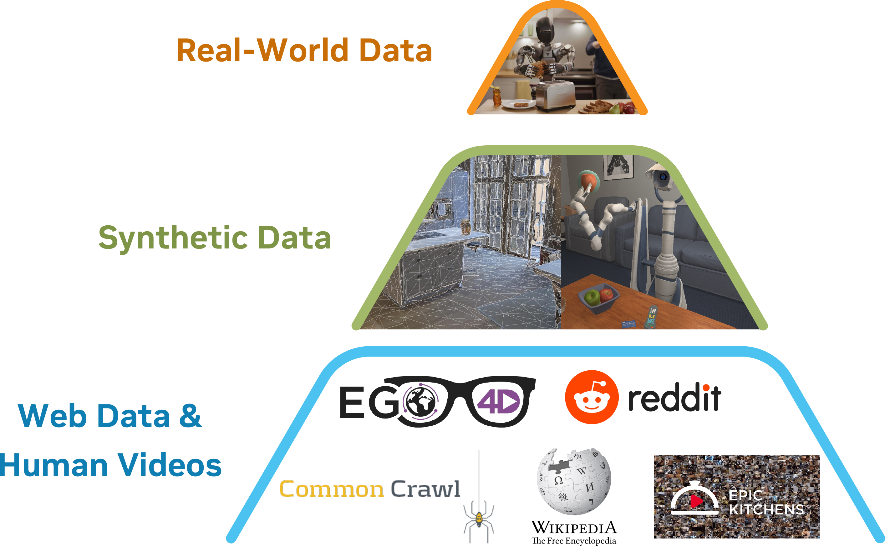

> 图 1 | 机器人基础模型训练的数据金字塔。GR00T N1 的异构训练语料可以表示为一个金字塔：从底部到顶部，数据量减少，而具身特异性增加。

我们介绍  **GR00T N1** ，一个面向通用人形机器人的开放基础模型（Foundation Model）。GR00T N1 模型是一个 **视觉-语言-动作模型（Vision-Language-Action Model, VLA Model）** ，它根据图像和语言指令输入生成动作。它具备跨具身（Cross-embodiment）支持，覆盖从桌面机械臂到灵巧人形机器人。它采用了一种受人类认知处理（Kahneman, 2011）启发的 **双系统组合架构（Dual-system Compositional Architecture）** 。 **系统 2（System 2）**  推理模块是一个预训练的 **视觉语言模型（Vision-Language Model, VLM）** ，在 NVIDIA L40 GPU 上以 10Hz 频率运行。它处理机器人的视觉感知和语言指令，以解释环境并理解任务目标。随后，一个使用动作流匹配（Action Flow-matching）训练的 **扩散变换器（Diffusion Transformer）**  作为 **系统 1（System 1）**  动作模块。它对 VLM 的输出词元进行交叉注意力（Cross-attends），并采用特定于具身（Embodiment-specific）的编码器和解码器来处理可变的状态和动作维度以进行运动生成。它以更高的频率（120Hz）生成闭环电机动作。系统 1 和系统 2 模块均实现为基于 **变换器（Transformer）**  的神经网络，在训练过程中紧密耦合并联合优化，以促进推理与执行之间的协调。

为了缓解前面提到的“数据孤岛（Data Island）”问题，我们将 VLA 训练语料库构建为一个数据金字塔（Data Pyramid），如图 [1](#figure-1) 所示。我们没有将训练数据集视为同质池，而是按规模组织异构数据源：大量的网络数据和人类视频构成了金字塔的基底；使用物理模拟生成和/或由现成神经模型增强的合成数据构成了中间层；在物理机器人硬件上收集的真实世界数据构成了顶层。金字塔的较低层提供了广泛的视觉和行为先验，而较高层则确保了在具身、真实机器人执行中的基础。

我们开发了一种有效的 **协同训练策略（Co-training Strategy）** ，以在预训练和训练后阶段在整个数据金字塔上进行学习。为了使用无动作（Action-less）数据源（如人类视频和神经生成的视频）训练我们的模型，我们学习了一个 **潜在动作码本（Latent-action Codebook）** （Ye et al., 2025），并使用一个训练好的 **逆动力学模型（Inverse Dynamics Model, IDM）**  来推断伪动作（Pseudo-actions）。这些技术使我们能够在无动作视频上标注动作，从而有效地将它们视为模型训练的额外机器人具身。通过统一数据金字塔中的所有数据源，我们构建了一个一致的数据集，其中输入包括机器人状态、视觉观察和语言指令，输出是对应的电机动作。我们通过在这种异构数据混合中采样训练批次，在三个数据层（即（已标注的）视频数据集、合成生成的数据集和真实机器人轨迹）上对我们的模型进行端到端预训练。

凭借统一的模型和单一的权重集，GR00T N1 能够使用单臂、双臂和人形具身生成多样化的操作行为。在标准仿真基准环境（Simulation Benchmark Environments）中评估，GR00T N1 相比最先进的模仿学习基线（State-of-the-art Imitation Learning Baselines）取得了更优的结果。我们还在 GR-1 人形机器人的真实世界实验中展示了 GR00T N1 的强大性能。我们的 GR00T-N1-2B 模型检查点（Checkpoint）、训练数据和仿真基准在此公开可用：[GitHub](http://github.com/NVIDIA/Isaac-GR00T) 和 [HuggingFace Datasets](https://huggingface.co/datasets/nvidia/PhysicalAI-Robotics-GR00T-X-Embodiment-Sim)。

## 2 GR00T N1 基础模型（GR00T N1 Foundation Model）

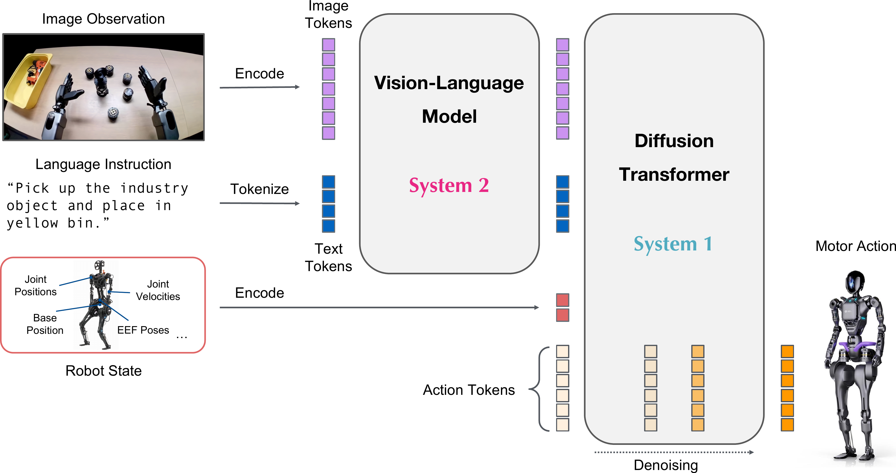
> 图 2 | GR00T N1 模型概览。我们的模型是一个采用双系统设计的 **视觉-语言-动作模型（Vision-Language-Action Model, VLA）** 。我们将图像观测和语言指令转换为一系列 **词元（Tokens）** ，由 **视觉语言模型（Vision-Language Model, VLM）**  主干处理。VLM 的输出与机器人状态和动作编码一起传递给 **扩散变换器（Diffusion Transformer, DiT）**  模块以生成电机动作。

GR00T N1 是一个基于多样化数据源训练的、用于人形机器人的 **视觉-语言-动作模型（Vision-Language-Action Model, VLA）** 。该模型包含一个编码语言和图像输入的视觉-语言主干，以及一个基于 DiT 的 **流匹配（Flow-matching）**  策略，用于输出高频动作。我们使用 NVIDIA 的 Eagle-2 VLM (Li et al., 2025) 作为视觉-语言主干。具体而言，我们公开发布的 GR00T-N1-2B 模型总共有 22 亿个参数，其中 VLM 部分占 13.4 亿个。在 L40 GPU 上使用 bf16 精度采样 16 个动作块（Chunk）的推理时间为 63.9 毫秒。图 [2](#figure-2) 提供了我们模型设计的高层概览。我们强调 GR00T N1 的三个关键特性：

- 我们设计了一个组合模型，在一个统一的学习框架中集成了基于 **视觉语言模型（Vision-Language Model, VLM）**  的推理模块（ **系统 2（System 2）** ）和基于 **扩散变换器（Diffusion Transformer, DiT）**  的动作模块（ **系统 1（System 1）** ）；
- 我们开发了一种有效的预训练策略，混合使用人类视频、仿真与神经生成数据以及真实机器人演示（见图 [1](#figure-1)），以实现泛化性和鲁棒性；
- 我们训练了一个大规模多任务、语言条件化的策略，该策略支持广泛的机器人 **具身形态（Embodiments）** ，并能通过数据高效的后训练快速适应新任务。

### 2.1 模型架构（Model Architecture）

在本节中，我们将描述 GR00T N1 的模型架构，如图 [3](#figure-3) 所示。GR00T N1 使用 **流匹配（Flow-matching）**  (Lipman et al.,) 来学习动作生成。一个 **扩散变换器（Diffusion Transformer, DiT）**  处理机器人的 **本体感知状态（Proprioceptive State）**  和动作，然后与来自 Eagle-2 VLM 主干的图像和文本词元进行 **交叉注意力（Cross-attention）** ，以输出 **去噪（Denoised）**  后的电机动作。下面，我们将详细阐述每个模块。

#### 状态与动作编码器（State and Action Encoders）

为了处理不同机器人具身形态下维度各异的状态和动作，我们为每种具身形态使用一个 **多层感知机（Multilayer Perceptron, MLP）** ，将它们投影到一个共享的嵌入维度，作为 DiT 的输入。与 Black 等人 (2024) 的工作类似，动作编码器 MLP 还将 **扩散时间步（Diffusion Timestep）**  与 **加噪动作向量（Noised Action Vector）**  一起编码。

我们使用 **动作流匹配（Action Flow Matching）** ，通过迭代去噪来采样动作。模型除了接收机器人本体感知状态、图像词元和文本词元的编码外，还将加噪动作作为输入。动作的处理采用分块方式，如 Zhao 等人 (2023) 所述，这意味着在任何给定时间 $t$，模型使用 $A_{t}=[a_{t},a_{t+1},\ldots,a_{t+H-1}]$，其中包含从时间步 $t$ 到 $t+H-1$ 的动作向量。在我们的实现中，设置 $H=16$。

#### 视觉-语言模块（系统 2）（Vision-Language Module (System 2)）

为了编码视觉和语言输入，GR00T N1 使用了在互联网规模数据上预训练的 Eagle-2 (Li et al., 2025)  **视觉语言模型（Vision-Language Model, VLM）** 。Eagle-2 是从一个 SmolLM2 (Allal et al., 2025)  **大型语言模型（Large Language Model, LLM）**  和一个 SigLIP-2 (Tschannen et al., 2025) 图像编码器微调而来。图像以 $224\times 224$ 的分辨率进行编码，随后进行 **像素重排（Pixel Shuffle）**  (Shi et al., 2016)，每帧产生 64 个图像词元嵌入。然后，这些嵌入与文本一起由 Eagle-2 VLM 的 LLM 组件进一步编码。LLM 和图像编码器在广泛的视觉-语言任务上按照 Li 等人 (2025) 的通用方法进行了对齐。

在策略训练期间，任务文本描述以及（可能多张）图像会以视觉-语言训练期间使用的聊天格式传递给 **视觉语言模型（Vision-Language Model, VLM）** 。随后，我们从 **大型语言模型（Large Language Model, LLM）** 中提取形状为（批量大小 $\times$ 序列长度 $\times$ 隐藏维度）的视觉-语言特征。
我们发现，使用中间层而非最终层的 LLM 嵌入（Embeddings），既能获得更快的推理速度，也能带来更高的下游策略成功率。
对于 GR00T-N1-2B，我们使用第 12 层的表示。

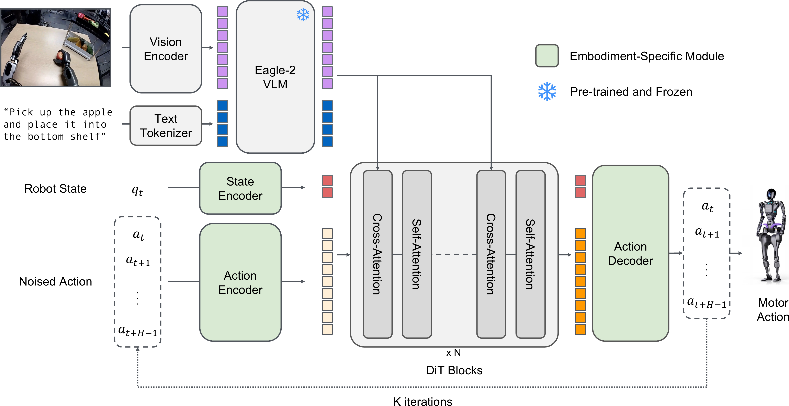
> 图 3 | GR00T N1 模型架构。GR00T N1 在从单臂机械臂到双手仿人灵巧手的一系列多样化 **具身（Embodiment）** 上进行训练。为了处理不同机器人具身的状态观测和动作，我们使用具有具身感知状态和动作编码器的  **DiT（Diffusion Transformer）**  块来嵌入机器人的状态和动作输入。GR00T N1 模型利用 Eagle-2 模型的潜在嵌入来整合机器人的视觉观测和语言指令。视觉语言词元随后通过交叉注意力层馈入 DiT 块。

#### Diffusion Transformer 模块（系统 1）

为了对动作进行建模，GR00T N1 使用了一种 DiT（Peebles and Xie, 2023）的变体，这是一种通过自适应层归一化进行去噪步骤条件化的 **Transformer（Transformer）** ，记作 $V_{\theta}$。
如图 [3](#figure-3) 所示，$V_{\theta}$ 由交替的交叉注意力（Cross-attention）和自注意力（Self-attention）块组成，类似于 Flamingo（Alayrac et al., 2022）和 VIMA（Jiang et al., 2023）。
自注意力块在加噪的动作词元嵌入 $A_{t}^{\tau}$ 和状态嵌入 $q_{t}$ 上操作，而交叉注意力块允许以 VLM 输出的视觉语言词元嵌入 $\phi_{t}$ 为条件。
在最后的 DiT 块之后，我们对最终的 $H$ 个词元应用一个具身特定的动作解码器（Action Decoder），即另一个 **多层感知机（Multilayer Perceptron, MLP）** ，来预测动作。

给定一个真实动作块 $A_{t}$、一个流匹配（Flow-matching）时间步 $\tau\in[0,1]$ 以及采样的噪声 $\epsilon\sim\mathcal{N}(\mathbf{0},\mathbf{I})$，加噪的动作块 $A_{t}^{\tau}$ 计算为 $A_{t}^{\tau}=\tau A_{t}+(1-\tau)\epsilon$。
模型预测 $V_{\theta}(\phi_{t},A_{t}^{\tau},q_{t})$ 旨在通过最小化以下损失来近似去噪向量场 $\epsilon-A_{t}$：

$$
\mathcal{L}_{\textit{fm}}(\theta)=\mathbb{E}_{\tau}\left[\|V_{\theta}(\phi_{t} ,A_{t}^{\tau},q_{t})-(\epsilon-A_{t})\|^{2}\right].(1)
$$

如 Black et al. (2024) 所述，我们使用 $p(\tau)=\text{Beta}(\frac{s-\tau}{s};1.5,1)$，$s=0.999$。
在推理过程中，我们使用 $K$ 步去噪生成动作块。
首先，随机采样 $A_{t}^{0}\sim\mathcal{N}(\mathbf{0},\mathbf{I})$，然后使用前向欧拉积分（Forward Euler integration）迭代生成动作块，更新如下：

$$
A_{t}^{\tau+1/K}=A_{t}^{\tau}+\frac{1}{K}V_{\theta}(\phi_{t},A_{t}^{\tau},q_{t }).
$$

在实践中，我们发现 $K=4$ 的推理步数在所有具身上都表现良好。

### 2.2 训练数据生成

为了训练 GR00T N1，我们使用多样化的数据源和目标来构建数据金字塔（图 [1](#figure-1)）。
我们首先从公开数据集中获取多样化的人类第一人称视频数据，这些数据与 VLM 预训练中使用的网络数据一起构成了金字塔的基座。
接下来，我们使用预训练的视频生成模型生成合成神经轨迹。
通过这种方式，我们利用具有新颖语言指令的多样化反事实（Counterfactual）机器人轨迹，将内部收集的遥操作轨迹——数据金字塔的“顶峰”——从 88 小时增加到约 827 小时（示例见图 [5](#figure-5)）。我们还生成了多样化的仿真轨迹，这也扩展了数据金字塔的中间部分。

在下一段中，我们首先描述如何从视频中提取 **潜在动作（Latent Actions）** ，我们将其用于为网络规模的人类第一视角数据集提取标签。接着，我们描述如何生成神经轨迹和模拟机器人轨迹，以及如何从这些数据源中获取动作。

####  **潜在动作（Latent Actions）** 

对于人类第一视角视频和神经轨迹，我们没有任何可以直接用于训练 GR00T N1 的动作。
对于这些数据，我们改为通过训练一个  **VQ-VAE（Vector Quantized Variational Autoencoder）**  模型来生成潜在动作，该模型用于从视频的连续图像帧中提取特征 [1]。
编码器接收视频的当前帧 $x_{t}$ 和未来帧 $x_{t+H}$（具有固定的窗口大小 $H$），并输出潜在动作 $z_{t}$。
解码器被训练为接收潜在动作 $z_{t}$ 和 $x_{t}$，并重建 $x_{t+H}$。该模型使用 VQ-VAE 目标进行训练，其中来自编码器的连续嵌入被映射到码本（Codebook）中最近的嵌入。
训练完成后，我们使用编码器作为逆动力学模型；给定一个 $x_{t}$ 和 $x_{t+H}$ 对，我们提取连续的预量化嵌入，并将其作为预训练期间的潜在动作标签，使用相同的流匹配损失，但将其视为一个独特的“LAPA”具身（Embodiment）。
在所有异构数据上共同训练 VQ-VAE 模型，使我们能够统一所有数据，共享同一个学习到的潜在动作空间，这有可能改善跨具身泛化能力。图 [4](#figure-4) 展示了来自 8 个不同具身（包括机器人和人类具身）的 $x_{t}$ 和 $x_{t+H}$ 对，它们都是从相似的潜在动作中检索出来的；第一个潜在动作显示所有具身都在将右臂向左移动，第二个潜在动作显示将右臂向右移动。

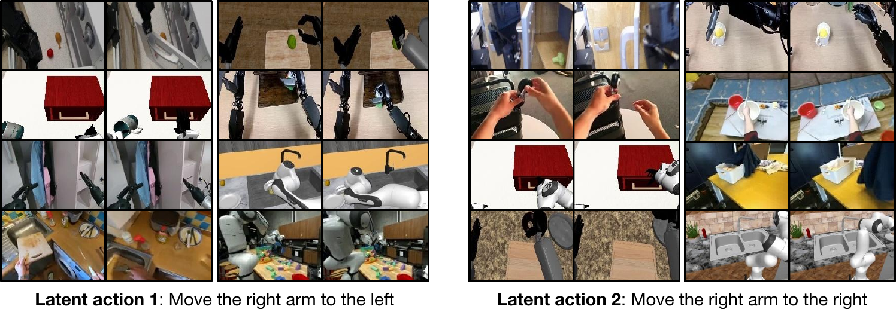
> 图 4 | 潜在动作。我们在不同具身中检索相似的潜在嵌入。左侧图像展示了对应于将右臂（或手）向左移动的潜在动作，而右侧图像展示了对应于将右臂（或手）向右移动的潜在动作。请注意，这种通用的潜在动作不仅在不同的机器人具身中保持一致，在人类具身中也保持一致。

####  **神经轨迹（Neural Trajectories）** 

机器人数据的规模与人力投入呈线性关系，因为这通常需要人类操作员通过遥操作（Teleoperation）机器人来生成每条轨迹。
最近， **视频生成模型（Video Generation Models）**  已展现出高质量可控视频生成的巨大潜力 [2, 3, 4, 5, 6, 7]，这为在机器人领域构建世界模型（World Models）铺平了道路。
为了利用这些模型，我们在所有 88 小时内部收集的遥操作数据上，对 **图像到视频生成模型（Image-to-Video Generation Models）**  [8, 3, 6] 进行微调，并在给定现有初始帧和新的语言提示（Language Prompts）下，生成了 827 小时的视频数据，将其数据量扩充了约 10 倍。
这使得我们能够生成捕捉现实世界中更多反事实场景的训练数据，而无需为每种情况实际收集遥操作数据（示例如图 [5](#figure-5) 所示；更多“梦境”生成示例见图 [13](https://arxiv.org/html/2503.14734v2#A3.F13)）。

为了增加我们 **神经轨迹（Neural Trajectories）** 的多样性，我们首先使用一个商用级 **多模态大型语言模型（Multimodal Large Language Model, MLLM）** ，根据给定的初始帧检测物体，并生成更多可能的“从 {位置 A} 拾取 {物体} 到 {位置 B}”组合，同时指示模型仅考虑物理上可行的组合。
我们还对生成的视频应用了后处理机制，包括过滤和重新标注。
为此，我们同样使用一个商用级多模态大型语言模型作为评判者，并输入下采样后的 8 帧图像，以过滤掉未精确遵循语言指令的神经轨迹。
然后，我们对过滤后的视频进行标注。（更多细节请参见附录 [F](https://arxiv.org/html/2503.14734v2#A6.SS0.SSS0.Px2)）。

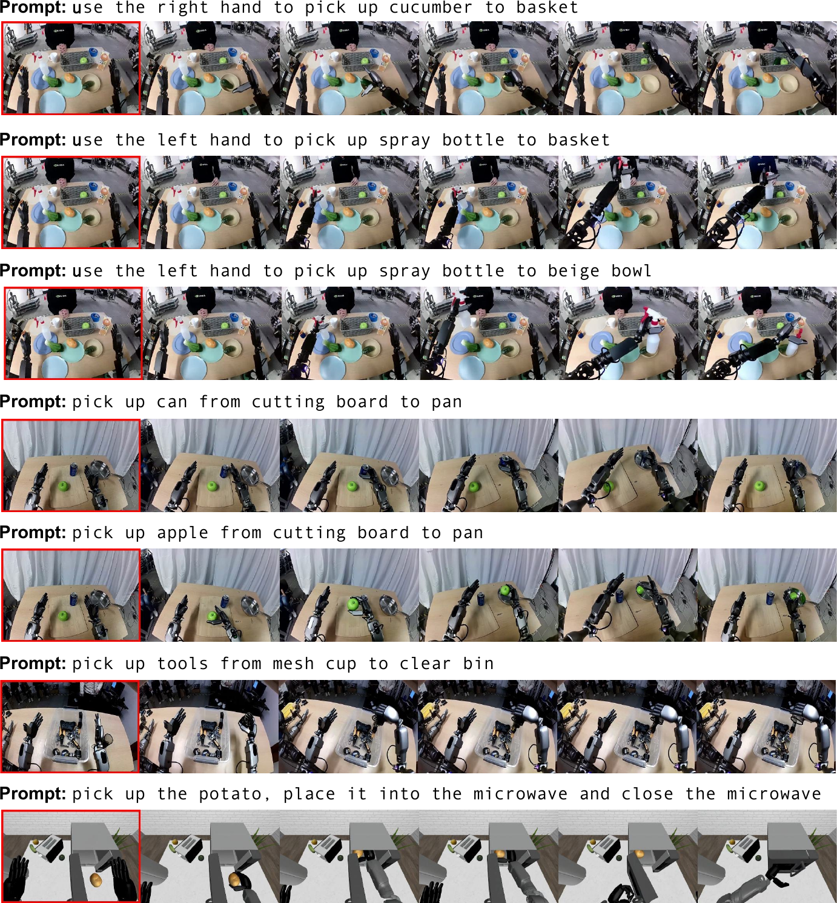
> 图 5：合成生成的视频。我们利用现成的视频生成模型来创建神经轨迹，以增加训练数据集的 **数量（Quantity）** 和 **多样性（Diversity）** 。这些生成的数据可用于我们 GR00T N1 的 **预训练（Pre-training）** 和 **后训练（Post-training）** 。(1) 前三行由相同的初始帧生成，但使用了不同的提示（改变左或右，放置物体的位置），(2) 接下来的两行来自相同的初始帧，但替换了要拾取的物体，(3) 下一行展示了视频模型生成一个在仿真中极难生成的机器人轨迹（将网眼杯内的内容物倒入垃圾桶），(4) 最后一行由仿真数据中的一帧初始图像生成。我们用红色矩形框标出了初始帧。

#### 仿真轨迹（Simulation Trajectories）

由于同时控制双臂和灵巧手极具挑战性，扩大人形机器人的真实世界数据收集成本极高。
近期研究 (Wang et al., 2024; Mandlekar et al., 2023; Jiang et al., 2024) 表明，在仿真中生成训练数据是一种实用的替代方案。
我们使用  **DexMimicGen**  (Jiang et al., 2024) 来合成大规模的机器人操作轨迹。

从少量人类演示开始，DexMimicGen 在仿真中应用 **演示转换（Demonstration Transformation）** 和 **回放（Replay）** 来自动扩展数据集。
每个任务被分解为一系列以物体为中心的 **子任务（Subtasks）** 。
初始的人类演示被分割成更小的操作序列，每个序列对应一个涉及单个物体的子任务。
然后，通过将这些片段与物体的位置对齐，并保持机器人 **末端执行器（End Effector）** 与物体之间的相对位姿，使它们适应新的环境。
为确保执行流畅，系统会在机器人当前状态与转换后的片段之间进行运动 **插值（Interpolation）** 。
随后，机器人逐步执行完整序列，并在最后验证任务是否成功。只有成功的演示才会被保留，从而确保数据的高质量。利用 DexMimicGen，我们将有限的人类演示扩展成了一个大规模的人形机器人操作数据集。考虑到预训练和后训练数据集，我们在短短 11 小时内生成了 780,000 条仿真轨迹——这相当于 6,500 小时，即连续九个月的人类演示数据。这些仿真数据以极低的人力成本，极大地补充了真实机器人数据。

### 2.3 训练细节（Training Details）

#### 预训练（Pre-training）

在预训练阶段，GR00T N1 模型通过 **流匹配损失（Flow-matching loss）** （公式 [1]）在一个多样化的 **具身（embodiment）** 和数据源集合上进行训练，涵盖各种真实和合成的机器人数据集以及人类运动数据。关于数据集的详细描述，请读者参阅第 [3](#section-3) 节。

对于人类视频，由于缺乏 **真实动作（ground-truth actions）** ，我们提取学习到的 **潜在动作（latent actions）** 并将其用作流匹配的目标（参见第 [2.2](#section-2-2) 节）。对于机器人数据集，例如我们的 GR-1 人形机器人数据或 Open X-Embodiment 数据，我们同时使用真实机器人动作和学习到的潜在动作作为流匹配目标。对于用于增强我们机器人数据集的 **神经轨迹（Neural trajectories）** （第 [2.2](https://arxiv.org/html/2503.14734v2#S2.SS2.SSS0.Px2) 节），我们同时使用潜在动作以及在真实机器人数据上训练的 **逆动力学模型（Inverse-dynamics model, IDM）** 预测的动作。预训练的 **超参数（hyper-parameters）** 列于附录的表 [6](#table-6) 中。

#### 后训练（Post-training）

在后训练阶段，我们在对应于每个单一具身的数据集上对预训练模型进行 **微调（fine-tune）** 。与预训练一样，我们保持 **视觉-语言骨干网络（VL backbone）** 的语言组件冻结，并微调模型的其余部分。后训练的超参数在附录的表 [6](#table-6) 中给出。

#### 结合神经轨迹的后训练（Post-training with Neural Trajectories）

为了克服后训练期间数据稀缺的挑战，我们探索通过生成神经轨迹来为每个下游任务增强数据，类似于第 [2.2](#section-2-2) 节中描述的过程。

*   对于以多视角为条件的下游任务，我们微调视频模型以在网格中生成多个子图像（图 [13](https://arxiv.org/html/2503.14734v2#A3.F13)）。
*   对于仿真任务，我们从随机初始化的环境中收集多样化的初始帧。
*   对于真实机器人任务，我们手动随机初始化物体姿态并记录机器人的初始观测。
*   新颖的初始帧也可以使用  **img2img 扩散（img2img diffusion）**  自动创建（示例如图 [13](https://arxiv.org/html/2503.14734v2#A3.F13) 所示），但我们将其进一步探索留作未来工作。

我们还展示了以下示例：(1) 用于生成由原子任务组成的 **长视野轨迹（long-horizon trajectories）** 的多轮视频生成；(2) 液体和铰接物体的神经轨迹，这些已知是仿真中极具挑战性的。不过，我们将下游任务的定量评估留作未来工作。

对于我们的神经轨迹后训练流程，我们限制自己仅使用仿真任务中人工收集的轨迹以及为后训练收集的真实世界基准数据中仅 10% 的数据来微调视频生成模型，以匹配我们只能访问有限数量遥操作数据的现实场景。由于生成的视频没有动作标签，我们使用潜在动作或 **逆动力学模型（Inverse Dynamics Model, IDM）** 标记的动作（Baker 等人，2022），并训练策略模型将这些 **伪动作（pseudo-actions）** 视为不同具身的动作标签。在低数据量场景下，我们也限制自己仅在低数据量上训练 IDM 模型，以促进现实场景。我们如何训练 IDM 模型的详细信息在附录 [F](https://arxiv.org/html/2503.14734v2#A6.SS0.SSS0.Px3) 中提供。潜在动作与 IDM 标记动作之间的一些经验比较在第 [4.4](#section-4-4) 节中进行。在后训练期间，我们以 1:1 的采样比例，将策略与真实世界轨迹和神经轨迹进行 **协同训练（co-train）** 。

#### 训练基础设施（Training Infrastructure）

我们在一个通过  **NVIDIA OSMO** （NVIDIA，2025）管理的集群上训练 GR00T N1，这是一个用于扩展复杂机器人工作负载的编排平台。训练集群配备了通过  **NVIDIA Quantum-2 InfiniBand**  以 **胖树拓扑（fat-tree topology）** 连接的 H100 NVIDIA GPU。我们通过一个构建在  **Ray 分布式计算库（Ray distributed computing library）** （Moritz 等人，2018）之上的自定义库，实现了 **容错多节点训练（fault-tolerant multi-node training）** 和数据摄取。我们为一个模型最多使用 1024 个 GPU。GR00T-N1-2B 的预训练大约使用了 50,000 个 H100 GPU 小时。

在单个 A6000 GPU 的背景下测试了计算受限的微调。
*   如果仅调整 **适配器层（adapter layers）** （动作和状态编码器 + 动作解码器）和  **DiT** ，可以使用高达 200 的 **批大小（batch size）** 。
*   当调整 **视觉编码器（vision encoder）** 时，可以使用高达 16 的批大小。

## 3 预训练数据集（Pre-Training Datasets）

我们将预训练语料库构建为三个主要类别： **真实机器人数据集（Real-robot datasets）** （第 [3.1](#section-3-1) 节）、 **合成数据集（Synthetic datasets）** （第 [3.2](#section-3-2) 节）和 **人类视频数据集（Human video datasets）** （第 [3.3](#section-3-3) 节）。它们大致分别对应于数据金字塔的顶部、中部和基座（图 [1](#figure-1)）。合成数据集包含 **仿真轨迹（Simulation trajectories）** 和 **神经轨迹（Neural trajectories）** 。表 [1](#table-1) 总结了我们在第 [2.2](#section-2-2) 节中的训练数据生成策略及其对应的适用数据源。我们在表 [7](#table-7) 中提供了预训练数据集的完整统计信息（帧数、小时数和相机视角数）。

 **表 1：训练数据生成。我们的数据生成策略利用了不同的数据源。潜在动作学习技术被广泛应用于各种视频数据集。神经轨迹可以从包含机器人动作的数据集生成，而仿真轨迹则依赖于物理模拟器并利用我们基于 DexMimicGen 的自动化数据生成系统。** 
| | 潜在动作（Latent Actions） | 神经轨迹（Neural Trajectories） | 仿真轨迹（Simulation Trajectories） |
| :--- | :---: | :---: | :---: |
| 真实机器人数据集（Real-Robot Datasets） | ✓ | ✓ | ✓ |
| 模拟机器人数据集（Simulated Robot Datasets） | ✓ | ✓ | |
| 人类视频数据集（Human Video Datasets） | ✓ | | |

### 3.1 真实世界数据集（Real-World Datasets）

我们使用以下真实世界机器人数据集：

1.   **GR00T N1 人形机器人预训练数据集（GR00T N1 Humanoid Pre-Training Dataset）** 。我们内部收集的数据集涵盖了广泛的通用操作任务，重点是通过 **遥操作（Teleoperation）**  控制傅里叶 GR1 机器人。我们利用  **VIVE Ultimate Tracker**  捕捉遥操作员的手腕位姿，同时使用  **Xsens Metagloves**  追踪手指运动。我们还探索了其他遥操作硬件选项，包括  **Apple Vision Pro**  和  **Leap Motion** （见图 [6](#figure-6)）。记录的人类运动随后通过 **逆运动学（Inverse Kinematics）**  重定向为人形机器人动作。实时遥操作以 20Hz 的控制频率运行。除了机器人的动作，我们在每一步还从头戴式相机捕获图像，以及人类的低维 **本体感觉（Proprioception）**  和动作。该数据集包含细粒度标注（详细描述了抓取、移动和放置等原子动作）和粗粒度标注（将细粒度动作序列聚合为更高级别的任务表示）。这种层次结构支持学习精确的运动控制和高层次的任务推理。

2.   **Open X-Embodiment** 。Open X-Embodiment Collaboration 等人（2024）是一个广泛使用的用于机器人操作的 **跨具身数据集（Cross-embodiment dataset）** 。我们纳入了  **RT-1** （Brohan 等人，2022a）、 **Bridge-v2** （Walke 等人，2023）、 **Language Table** （Lynch 等人，2022）、 **DROID** （Khazatsky 等人，2024）、 **MUTEX** （Shah 等人，2023）、 **RoboSet** （Bharadhwaj 等人，2024c）和  **Plex** （Thomas 等人，2023），这些数据集覆盖了各种操作任务、语言条件控制以及机器人-环境交互。

3.   **AgiBot-Alpha** 。AgiBot-World-Contributors 等人（2025）是一个包含 100 台机器人轨迹的大规模数据集。我们使用了启动训练时可用的 140,000 条轨迹。该数据集涵盖了细粒度操作、工具使用和多机器人协作。

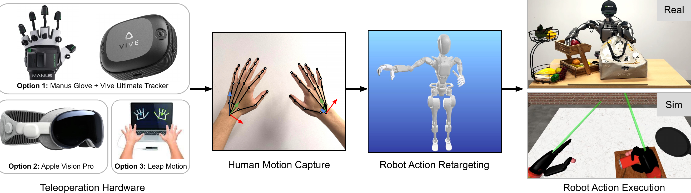
> 图 6：通过遥操作进行数据收集。我们的遥操作基础设施支持多种设备来捕捉人手运动，包括 6 自由度（6-DoF）手腕位姿和手部骨架。机器人动作通过重定向产生，并在真实和模拟环境中的机器人上执行。

### 3.2 合成数据集（Synthetic Datasets）

我们的合成数据集包括：1）在物理模拟器中，由少量人类演示自动倍增生成的 **仿真轨迹（Simulation trajectories）** ；以及 2）由现成的神经生成模型生成的视频衍生的 **神经轨迹（Neural trajectories）** 。

#### 仿真轨迹（Simulation Trajectories）

除了真实世界数据集，我们还包含如第 [2.2](#section-2-2) 节所述在仿真中生成的大规模合成数据集。我们的仿真任务包含人形机器人执行广泛的桌面重排任务，并包含大量逼真的 3D 资产。我们在 RoboCasa 仿真框架（Nasiriany et al., 2024）下构建这些任务。

总体而言，我们的任务遵循“将 A 从 B 重排到 C”的行为模式，其中 A 对应一个物体，B 和 C 代表环境中的源位置和目标位置。源位置和目标位置是诸如盘子、篮子、餐垫和架子之类的 **容器（Receptacles）** ，机器人必须跨不同的源容器和目标容器组合来重排物体。总的来说，我们的预训练仿真数据集包含 54 种独特的源容器和目标容器类别组合。我们将物体和容器随机放置在桌面上，并在场景中额外加入了 **干扰物体（Distractor objects）** 和干扰容器。这些干扰物要求模型必须关注任务语言描述才能执行期望的行为。

我们使用 DexMimicGen 大规模地生成多样化、高质量的训练数据集。我们的数据集以 GR-1 人形机器人为特色，但该系统可适用于多种机器人。我们首先使用 Leap Motion 设备通过遥操作收集几十个源演示。Leap Motion 设备跟踪 6 自由度（6-DoF）的手腕位姿和手指位姿，我们重新定位这些值并将其发送给基于 mink（Zakka, 2024）的全身逆运动学（Inverse Kinematics, IK）控制器。给定人类演示，DexMimicGen 将演示处理成以物体为中心的片段，然后转换并组合这些片段以生成新的演示。利用该系统，我们为预训练任务体系中的每个（源，目标）容器对生成了 10,000 个新演示，总计 54 万个演示。

#### 神经轨迹（Neural Trajectories）

为了生成神经轨迹，我们在真实世界的 GR00T N1 Humanoid Pre-Training 数据集上对开源的 **图像到视频模型（Image-to-video models）** 进行微调，如第 [2.2](#section-2-2) 节所述。我们在一个包含 3,000 个带语言标注的真实世界机器人数据样本的数据集上训练模型 100 个轮次（Epoch），每个样本以 480P 分辨率录制，包含 81 帧。如图 [5](#figure-5) 所示，我们的模型在给定新颖语言提示下能够生成高质量的反事实轨迹。此外，在互联网规模视频数据上训练的模型在处理未见过的初始帧、新物体和新运动模式方面表现出强大的泛化能力。这些视频进一步被标注了 **潜在动作（Latent actions）** 和基于 **逆动力学模型（Inverse Dynamics Model, IDM）** 的伪动作，用于模型训练。我们总共生成了约 827 小时的视频；在 L40 GPU 上生成一秒视频需要 2 分钟，在 3,600 块 L40 GPU 上总共需要约 105k L40 GPU 小时（$\sim$1.5 天）。

### 3.3 人类视频数据集（Human Video Datasets）

我们包含了一系列多样化的人类视频数据集。这些数据集不包含显式的动作标签，但包含了大量的人-物交互序列，捕捉了 **可供性（Affordances）** 、任务语义和自然运动模式。这些数据集涵盖了广泛的真实世界人类行为，包括抓握、工具使用、烹饪、组装以及在自然环境中执行的其他任务导向活动，并提供了手-物交互的详细第一人称视角（示例如图 [14](https://arxiv.org/html/2503.14734v2#A6.F14) 所示）。我们的视频数据集包括以下内容：

- Ego4D 是一个大规模自我中心视频数据集，包含日常活动的多样化记录（Grauman et al., 2022）；
- Ego-Exo4D 在第一人称记录的基础上增加了互补的 **他者中心（Exocentric）** （第三人称）视角（Grauman et al., 2024）；
- Assembly-101 通过提供逐步物体组装的详细视频，专注于复杂的组装任务（Sener et al., 2022）；
- EPIC-KITCHENS 包含烹饪活动的第一人称影像（Damen et al., 2018）；
- HOI4D 捕捉人-物交互，并提供逐帧的 **分割（Segmentation）** 、手部和物体位姿以及动作标注（Liu et al., 2022b）；
- HoloAssist 捕捉增强现实环境中的协作和辅助任务（Wang et al., 2023）；
- RH20T-Human 包含细粒度操作任务的记录，强调跨多样化真实世界场景的自然手-物交互（Fang et al., 2023）。

## 4 评估（Evaluation）

我们在多种模拟和现实世界基准测试中评估我们的  **GR00T N1**  模型。我们的模拟实验在三个不同的基准测试上进行，旨在系统性地评估我们的模型在各种机器人形态和操作任务中的有效性。在我们的现实世界实验中，我们使用  **GR-1**  人形机器人，在一系列桌面操作任务上探究模型的能力。这些实验旨在证明  **GR00T N1**  能够从有限数量的人类演示中习得新技能。

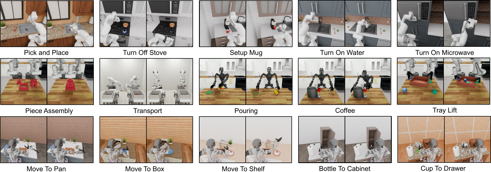
> 图 7 | 模拟任务。我们的模拟实验使用了来自两个开源基准测试的任务（顶行是 RoboCasa (Nasiriany 等人, 2024)，中间行是 DexMimicGen (Jiang 等人, 2024)），以及一套新开发的、与我们现实世界任务高度相似的桌面操作任务（底行）。我们提供了上述任务的 Omniverse 渲染图。

### 4.1 模拟基准测试（Simulation Benchmarks）

我们的仿真实验包含来自先前工作的两个开源基准测试 [1, 2]，以及一套新开发的桌面操作任务集，旨在紧密模拟我们的真实世界任务设置。我们精心选择这些基准测试，以评估我们的模型在不同机器人具身形态和多样化操作任务上的表现。我们的模型检查点，连同公开可用的仿真环境和数据集，确保了关键结果的可复现性。图 [7](#figure-7) 展示了来自这三个基准测试的一些示例任务。

-  **RoboCasa Kitchen（24 项任务，RoboCasa）** 
  RoboCasa [1] 包含一系列在模拟厨房环境中的任务。我们专注于 24 项“原子”任务，这些任务涉及基础的感知运动技能，例如拾放、开关门、按压按钮、转动水龙头等。对于每项任务，我们使用公开可用的、包含 3000 条演示的数据集，这些演示均使用 Franka Emika Panda 机械臂生成，全部由 MimicGen [3] 生成。
  观测空间包括从左、右和腕部摄像头捕获的三幅 RGB 图像。状态表示包括末端执行器和机器人基座的位置与旋转，以及夹爪的状态。动作空间由末端执行器的相对位置和旋转以及夹爪状态定义。
  我们遵循 Nasiriany 等人 [1] 概述的相同训练和评估协议。

-  **DexMimicGen 跨具身形态套件（9 项任务，DexMG）** 
  DexMimicGen [2] 包含一系列九项需要精确双臂协调的双手机器人灵巧操作任务。这些任务共同涵盖了三种双手机器人具身形态：
  1.   **配备平行夹爪的双 Panda 机械臂** ：任务包括穿线、部件组装和搬运。状态/动作空间包括双臂末端执行器的位置和旋转，以及夹爪状态。
  2.   **配备灵巧手的双 Panda 机械臂** ：任务包括清理盒子、清理抽屉和托盘搬运。状态/动作空间包括双臂和双手末端执行器的位置和旋转。
  3.   **配备灵巧手的 GR-1 人形机器人** ：任务包括倾倒、准备咖啡和分类罐头。状态/动作空间包括双臂和双手的关节位置与旋转，以及腰部和颈部。
  我们使用 DexMimicGen 数据生成系统为每项任务生成 1000 条演示，并评估模型泛化到新物体配置的能力。

-  **GR-1 桌面任务（24 项任务，GR-1）** 
  该数据集作为真实世界人形机器人数据集的数字对应物，能够进行系统性评估，为真实机器人部署的性能提供参考。该基准测试侧重于使用配备 Fourier 灵巧手的 GR-1 人形机器人进行灵巧手控制。与 DexMG 相比，该基准测试包含更多样化的物体和摆放位置。
  我们总共建模了 18 项重排任务，其结构与第 [3.2](#section-3-2) 节概述的预训练任务类似，即，将物体从一个源容器重排到目标容器。每项任务涉及独特的容器组合，这些组合在我们的预训练数据中未曾出现。
  与预训练任务类似，大多数任务涉及干扰物体和容器，要求模型关注任务语言描述。
  我们还设计了六项任务，涉及将物体放入铰接物体（即橱柜、抽屉和微波炉）并关闭它们。
  观测空间包括从机器人头部的一个以自我为中心的摄像头捕获的一幅 RGB 图像。
  状态/动作空间包括双臂和双手的关节位置与旋转，以及腰部和颈部。
  我们在数据集中可选地包含了基于末端执行器的动作来控制手臂，因为控制全身逆运动学（Inverse Kinematics, IK）控制器的原生动作空间是基于末端执行器的。
  我们使用 DexMimicGen 系统为每项任务生成 1000 条演示。

### 4.2 真实世界基准测试（Real-World Benchmarks）

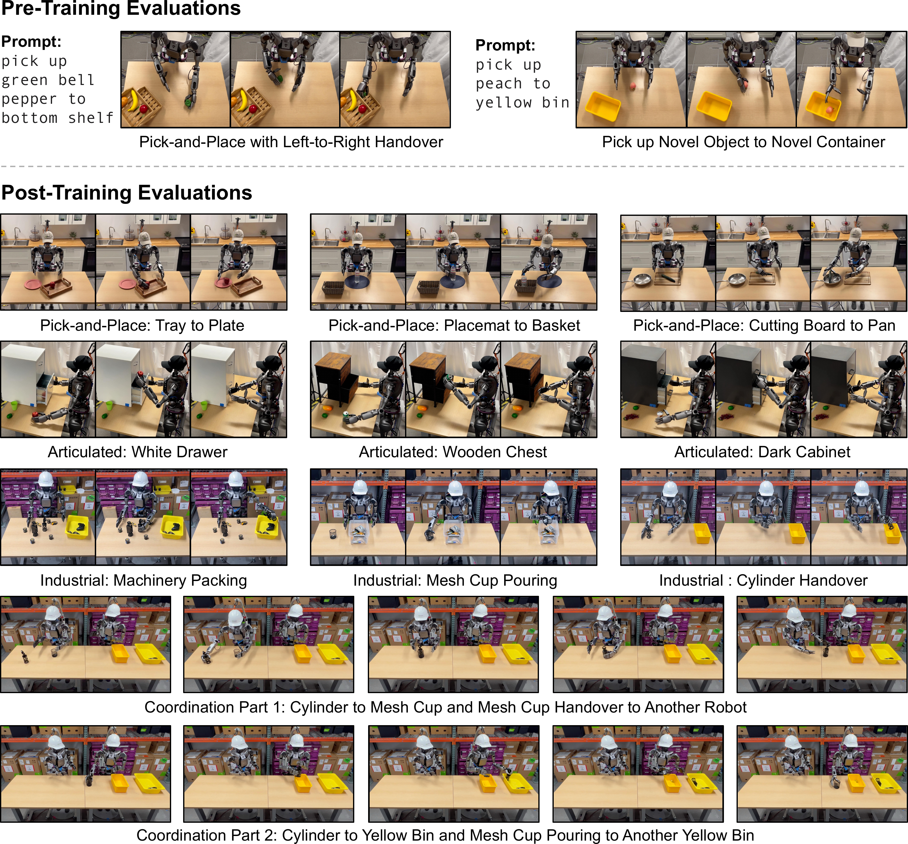
> 图 8：真实世界任务。所有图像均捕获自 GR00T-N1-2B 的策略执行过程以及基于 GR00T-N1-2B 进行后训练的模型。（上）预训练评估。我们设计了两项操作任务来评估我们的预训练模型。左图展示了从左到右的物体交接，右图展示了将新物体放入未见过的目标容器中。（下）后训练评估。我们引入了四个不同的任务类别。从上到下，我们展示了物体到容器的拾放、铰接物体操作、工业物体操作和多智能体协调的示例。

我们引入了一套多样化且精心设计的桌面操作任务，旨在基于人类演示来评估和进一步训练我们的模型。这些任务强调真实世界灵巧性的关键方面，包括精确的物体操作、空间推理、双手协调和多智能体协作。我们仔细地将基准测试分为四种不同的类型，以确保对模型性能进行严格评估。我们在图 [8](#figure-8) 中展示了来自我们真实世界基准测试的一些示例任务。

-    **物体到容器抓放（Object-to-Container Pick-and-Place，5 项任务，Pick-and-Place）** 
    此类别评估模型抓取物体并将其放入指定容器的能力，这是机器人操作的一项基本能力。任务包括在托盘、盘子、砧板、篮子、餐垫、碗和平底锅等常见家用容器之间转移物体。这些场景测试精细运动技能、空间对准能力以及对不同物体几何形状的适应性。为了严格评估泛化能力，我们在已见和未见物体上评估模型。
-    **铰接物体操作（Articulated Object Manipulation，3 项任务，Articulated）** 
    这些任务评估模型操作铰接式储物格的能力。模型必须抓取一个物体，将其放入储物单元（如木箱、深色柜子或白色抽屉），然后关闭储物格。这些任务带来了受限空间内运动控制和精确放置的挑战。泛化能力通过已见和未见物体进行测试。
-    **工业物体操作（Industrial Object Manipulation，3 项任务，Industrial）** 
    我们为工业场景设计了此类别，涉及三个结构化工作流程和基于工具的交互：
    1.   **机械零件打包（Machinery Packing）** ：拾取各种机械零件和工具，并将其放入指定的黄色箱子中；
    2.   **网杯倾倒（Mesh Cup Pouring）** ：抓取装有小型工业部件（例如，螺钉和螺栓）的网杯，将其内容物倒入塑料箱中；
    3.   **圆柱体交接（Cylinder Handover）** ：拾取一个圆柱形物体，将其从一只手转移到另一只手，然后放入黄色箱子中。
    这些任务紧密反映了现实世界的工业应用，使其成为评估结构化环境中灵巧性的高度相关基准。
-    **多智能体协调（Multi-Agent Coordination，2 项任务，Coordination）** 
    协作任务需要多个智能体之间的同步，强调角色协调和自适应决策：
    1.   **协调第一部分（Coordination Part 1）** ：拾取一个圆柱体，放入网杯中，然后将其交给另一个机器人；
    2.   **协调第二部分（Coordination Part 2）** ：接收机器人将圆柱体放入一个黄色箱子，然后将网杯中剩余的内容物倒入另一个黄色箱子。

这些精心设计的基准引入了结构化、目标驱动的交互，以测试模型是否能无缝适应现实世界的应用。为了构建高质量的后训练数据集，我们让人类操作员根据任务复杂性，收集持续时间为 15 分钟到 3 小时不等的任务特定数据。然后，我们过滤掉低质量的轨迹以保持数据完整性。通过纳入多样化的任务要求——从精确的单智能体操作到复杂的多智能体协调——我们的基准为评估类人操作任务中的泛化能力、适应性和精细控制提供了一个严格的测试平台。

### 4.3 实验设置（Experiment Setup）

我们的评估实验包括在数据有限设置下，对第 [2.3](#section-2-3) 节所述的 GR00T N1 和基线模型进行后训练，并分别在第 [4.1](#section-4-1) 节和第 [4.2](#section-4-2) 节描述的模拟和真实基准中评估策略成功率。
默认情况下，我们使用全局批次大小（global batch size）为 1024，训练 60k 步。
对于 DexMimicGen 跨具身套件（DexMimicGen Cross-Embodiment Suite），由于每个具身包含的任务相对较少且整体训练数据有限，我们对 GR00T-N1-2B 使用了较小的批次大小 128。

#### 基线方法（Baselines）

为了证明 GR00T N1 多样化预训练的有效性，我们与两个已建立的基线方法进行比较：BC-Transformer（Mandlekar 等人，2021）和 Diffusion Policy（Chi 等人，2024a）。我们在下面描述这两种方法的细节：

-    **BC-Transformer**  是 RoboMimic（Mandlekar 等人，2021）中一种基于 Transformer 的行为克隆策略。它由一个用于处理观测序列的 Transformer 架构和一个用于建模动作分布的高斯混合模型（Gaussian Mixture Model, GMM）模块组成。该策略以 10 个观测帧作为输入，并预测接下来的 10 个动作。
-    **Diffusion Policy** （Chi 等人，2024a）通过基于扩散的生成过程对动作分布进行建模。它采用 U-Net 架构，逐步从随机样本中去除噪声，以生成以观测序列为条件的精确机器人动作。它以单帧观测作为输入，在一次推理过程中产生 16 个动作步骤。

#### 评估协议（Evaluation Protocol）

对于模拟基准评估，我们报告 100 次试验的平均成功率，取最后 5 个检查点的最高分，其中检查点每 500 个训练步写入一次，遵循 RoboCasa（Nasiriany 等人，2024）的协议。

对于真实机器人评估，我们采用部分评分系统来捕捉模型在不同执行阶段的行为，确保对性能进行细粒度评估。我们报告每项任务 10 次试验的平均成功率，但“打包机械零件（Pack Machinery）”任务除外；对于该任务，我们报告在 30 秒时限内，5 个机械零件和工具中有多少个被放入箱子的成功率。由于时间限制，我们只进行了 5 次试验。此外，为了评估模型在低数据状态下的效率，我们对每项任务的完整数据集进行 10% 的子采样，并评估模型是否仍能学习到有效行为。

### 4.4 定量结果（Quantitative Results）

#### 预训练评估（Pre-training Evaluations）

为了评估我们预训练检查点（Pretrained Checkpoint）的泛化能力，我们在真实的 GR-1 人形机器人（Humanoid Robot）上设计了两个任务（图 [8](#figure-8)）。在第一个任务中，机器人被指示将一个物体放在底层架子上。然而，物体被故意放置在其左手左侧，这需要一种协调的双臂策略（Coordinated Bimanual Strategy）。机器人必须先用左手抓取物体，将其转移到右手可及的范围内，然后完成放置到架子上的动作。
在第二个任务中，机器人被指示将一个未见过的物体放入一个未见过的目标容器中。对于每个任务，我们使用五个不同的物体评估预训练的 GR00T-N1-2B 模型，每个物体进行三次试验。GR00T-N1-2B 在第一个协调设置中取得了 76.6%（11.5/15）的成功率，在涉及新物体操作的第二个设置中取得了 73.3%（11/15）的成功率。0.5 代表正确抓取了物体但未能将其放入容器。在这两种评估设置下的高性能表现，说明了大规模预训练的有效性。

#### 后训练评估（Post-training Evaluations）

在仿真环境中，我们将后训练（Post-trained）的 GR00T N1 模型的定量结果与三个仿真基准测试（Simulation Benchmarks）中从头训练（From-scratch）的基线模型进行了比较（表 [2](#table-2)）。
对于每个基准测试，我们使用每个任务 30、100 和 300 个演示（Demonstration）进行后训练（RoboCasa 为 24 个任务，DexMG 为 9 个任务，GR-1 为 24 个任务）。
我们观察到，GR00T N1 在所有基准任务和数据集规模上都持续优于基线模型。
在附录 [B](#appendix-b) 中，我们包含了完整的结果和一个用于比较的条形图（图 [10](https://arxiv.org/html/2503.14734v2#A2.F10)）。

  **表 2：仿真结果（Simulation Results）。三个仿真基准测试的平均成功率，每个任务使用 100 个演示。GR00T N1 优于两个基线，尤其是在 GR-1 任务上，其优势超过 17%。**  
|  | RoboCasa | DexMG | GR-1 | 平均（Average） |
| :--- | :---: | :---: | :---: | :---: |
| BC Transformer | 26.3% | 53.9% | 16.1% | 26.4% |
| Diffusion Policy | 25.6% | 56.1% | 32.7% | 33.4% |
| GR00T-N1-2B | 32.1% | 66.5% | 50.0% | 45.0% |

在真实机器人上，我们将 GR00T-N1-2B 与 Diffusion Policy 进行比较，分别在 10% 的人类遥操作（Human Teleoperation）数据集和完整数据集上进行训练（表 [3](#table-3) 和图 [9](#figure-9)）。
GR00T-N1-2B 在所有任务上都取得了显著更高的成功率，在 10% 数据设置下比 Diffusion Policy 高出 32.4%，在完整数据设置下高出 30.4%。值得注意的是，仅用 10% 数据训练的 GR00T-N1-2B 的性能仅比用完整数据集训练的 Diffusion Policy 低 3.8%，这突显了其数据效率（Data Efficiency）。

  **表 3：真实世界结果（Real-World Results）。在 GR-1 人形机器人真实世界任务上的平均策略成功率。GR00T N1 击败了 Diffusion Policy 基线，即使在数据极少的情况下也表现出强劲的结果。**  
|  | 抓放（Pick-and-Place） | 关节（Articulated） | 工业（Industrial） | 协调（Coordination） | 平均（Average） |
| :--- | :---: | :---: | :---: | :---: | :---: |
| Diffusion Policy (10% 数据) | 3.0% | 14.3% | 6.7% | 27.5% | 10.2% |
| Diffusion Policy (完整数据) | 36.0% | 38.6% | 61.0% | 62.5% | 46.4% |
| GR00T-N1-2B (10% 数据) | 35.0% | 62.0% | 31.0% | 50.0% | 42.6% |
| GR00T-N1-2B (完整数据) | 82.0% | 70.9% | 70.0% | 82.5% | 76.8% |

#### 结合神经轨迹的后训练评估（Post-training w/ Neural Trajectories Evaluations）

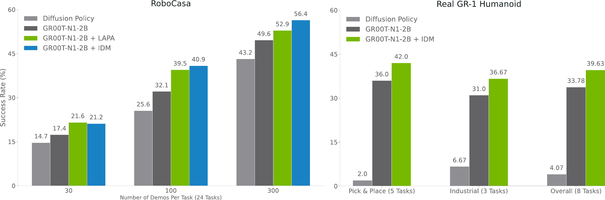
> 图 9：神经轨迹消融研究（Neural Trajectories Ablations）。在 RoboCasa 仿真中，我们展示了在三种数据规模（每个任务 30、100 和 300 个演示）下使用神经轨迹（Neural Trajectories）进行后训练的结果。在真实世界中，我们仅展示了低数据规模（10% 的演示）下的结果。我们为 RoboCasa 的每个任务联合训练（Co-train）了 3k 个神经轨迹，为真实世界任务的每个任务联合训练了 100 个神经轨迹。我们探索了在仿真中使用潜在（Latent）和 IDM 标记（IDM-labeled）的动作，在真实机器人上仅使用 IDM 标记的动作。

我们在图 [9](#figure-9) 中展示了在仿真评估的 RoboCasa 基准测试以及真实世界评估的 Pick-and-Place（已见）和 Industrial 任务中，于后训练阶段使用神经轨迹（neural trajectories）的一些初步结果。我们观察到，与仅使用真实世界轨迹训练的 GR00T N1 相比， **与神经轨迹联合训练（co-trained）的 GR00T N1 始终能带来显著的性能提升** ：在 RoboCasa 基准上，对于 30、100 和 300 数据规模（data-regimes），平均成功率分别提升了 +4.2%、+8.8% 和 +6.8%；在使用 GR-1 人形机器人（Humanoid）的 8 个任务中，平均提升了 +5.8%。

在 RoboCasa 中比较 LAPA（Language-Action Pre-training Alignment）和 IDM（Inverse Dynamics Model）标签时，出现了一个有趣的模式：在数据量相对较少（30）的情况下，LAPA 的表现略优于 IDM；但随着可用数据增多（100 和 300），LAPA 与 IDM 之间的性能差距逐渐扩大。这一趋势是符合直觉的——用于 IDM 训练的数据越多，其生成的伪动作标签（pseudo-action labels）就越能与真实世界动作对齐，从而产生更强的正向迁移（positive transfer）。由于 GR-1 人形机器人对我们而言属于相对“高数据”规模，我们在真实世界的神经轨迹联合训练中仅使用了 IDM 动作。

### 4.5 定性结果（Qualitative Results）

这种行为在定性上看起来如何？为了回答这个问题，我们以 RoboCasa 中的“转动水龙头（Turn Sink Spout）”任务为例——在 100 个样本的规模下， **扩散策略（Diffusion Policy, DP）**  基线的成功率仅为 11.8%，而 GR00T N1 达到了 42.2%。DP 基线经常对任务语义（semantics）感到困惑。
从表 [2](#table-2) 中，我们看到 GR00T N1 在低数据规模下表现强劲。可以预见，在微调数据集规模极大的极限情况下，预训练的效果会逐渐减弱。

当我们用任务指令“拿起红苹果并放入篮子”（这是我们后训练基准测试中的任务之一）来提示（prompt）预训练好的 GR00T N1 模型时，我们观察到了有趣的行为模式。在这个场景中，我们故意将苹果放置在人形机器人手的左侧。尽管在预训练期间很少见到类似任务，且动作略显生涩（jerkier motions），但预训练检查点（checkpoint）仍然使用左手抓起苹果，将其递交给右手，然后放入篮子。我们在图 [11](https://arxiv.org/html/2503.14734v2#A3.F11) 中提供了此行为的可视化。相比之下，后训练检查点在此场景中失败了。由于所有后训练数据都只涉及右手，没有任何手间传递（inter-hand transfer），后训练的策略（policy）丧失了执行此行为的能力。

对于后训练的 GR00T N1，我们观察到，与基线 Diffusion Policy 相比，其动作通常更加平滑，抓取精度也显著更高。
相比之下，Diffusion Policy 基线在初始帧存在不动（immobility）的问题，并且频繁出现抓取不准确的情况，导致其在我们真实世界的基准测试中成功率较低。我们在图 [12](https://arxiv.org/html/2503.14734v2#A3.F12) 中提供了两个策略展开（policy rollout）示例的可视化。

### 4.6 局限性（Limitations）

目前，我们的 GR00T N1 模型主要专注于短视界（short-horizon）桌面操作任务。在未来的工作中，我们旨在扩展其能力以应对长视界（long-horizon）移动操作（loco-manipulation），这将需要人形机器人硬件、模型架构和训练语料库（training corpora）方面的进步。我们预计，一个更强大的视觉-语言骨干网络（vision-language backbone）将增强模型的空间推理、语言理解和适应能力。我们的合成数据生成技术——利用视频生成模型和自动轨迹合成系统——已显示出巨大潜力。然而，现有方法在生成多样化且符合反事实（counterfactual）的数据，同时遵守物理定律方面仍然面临挑战，这限制了合成数据集的质量和多样性。我们旨在改进合成数据生成技术，以进一步丰富用于模型训练的 **数据金字塔（data pyramid）** 。此外，我们计划探索新颖的模型架构和预训练策略，以提高我们通用机器人模型（generalist robot models）的鲁棒性和泛化能力。

## 5 相关工作（Related Work）

### 机器人学中的基础模型（Foundation Models in Robotics）
近期，为机器人学开发和使用 **基础模型（Foundation Models）** [1] 引起了极大的兴趣。
一种常见方法是利用现有的预训练基础模型作为高级 **黑盒推理模块（black-box reasoning modules）** ，与低级的、机器人专用的 **策略（policies）**  结合使用 [2, 3, 4, 5, 6, 7, 8]。这种方法允许机器人使用预训练的基础模型来规划低级技能或动作序列。然而，它假设这些低级策略是可用的，并且存在足够的接口将它们连接到黑盒基础模型。
另一种方法是基于机器人数据对预训练的基础模型进行 **微调（finetune）** ，以构建 **视觉-语言-动作模型（Vision-Language-Action models, VLA）** [9, 10, 11, 12, 13, 14, 15, 16, 17, 18, 19, 20, 21]。这些 VLA 模型并非强制在高级 VLM 规划和低级控制之间建立严格的层级关系，而是允许针对下游部署任务进行端到端的优化。我们采用类似的方法来训练 GR00T N1，并使用 Eagle-2 模型 [22] 作为我们的基础 **视觉语言模型（Vision Language Model, VLM）** 。我们将 VLM 与一个结合了 **动作分块（action chunking）** [23] 的 **流匹配（flow-matching）** [24, 25, 26] 动作生成模型一同进行微调。与先前使用 **专家混合（mixture-of-experts）**  架构来桥接基础 VLM 模型与动作生成模型的 VLA 模型 [11] 不同，我们使用了一个简单的 **交叉注意力（cross-attention）**  机制。这种方法为我们可使用的 VLM 模型和动作生成模型的具体架构提供了灵活性。此外，我们使用了 **具身特定（embodiment-specific）**  的状态和动作投影器模块，这些模块支持不同的机器人具身，包括 **潜在动作（latent actions）** [21] 和 **基于 IDM 的动作（IDM-based actions）** [27]。这些投影器的使用与 Octo Model Team 等人 [28] 的工作类似，尽管该工作没有对 VLM 模型进行微调。

### 机器人学习的数据集（Datasets for Robot Learning）
机器人学习的一个核心挑战是缺乏训练通用机器人所必需的大规模、多样化且具身化的数据集。
一种常见方法是使用 **机器人遥操作（robot teleoperation）** [29, 30, 31, 32, 33, 34, 35, 36, 37, 38]，即人类使用智能手机或 **虚拟现实（Virtual Reality, VR）**  控制器等设备来控制机器人执行感兴趣的任务。操作期间的机器人传感器数据流和机器人控制指令被记录到数据集中，从而可以收集高质量的任务演示。
最近，这种方法通过利用大型人类操作员团队和机器人车队在较长时间（例如，数月）内进行规模化扩展，产生了包含数千小时演示的大规模机器人操作数据集 [39, 40, 41, 42, 43, 44]。然而，以这种方式收集数据需要大量的成本和人力的投入。
另一类工作，即 **仪器化人类演示（instrumented human demonstrations）** ，使用特殊硬件来捕获与机器人相关的观察和动作数据，而无需显式地遥操作目标机器人。例如，Chi 等人 [45]；Seo 等人 [46] 使用手持式机器人夹爪，Fang 等人 [47] 使用类似机器人的外骨骼，Kareer 等人 [48] 使用特殊眼镜来捕捉人手运动，这些运动随后被 **重定向（retargeted）**  为机器人动作数据。这些方法往往能实现更快的数据收集，但与直接的机器人遥操作相比，它们与下游机器人存在不匹配的问题。
另一类独立的工作利用 **人类视频数据集（human video datasets）** [49, 50, 51, 52, 53] 作为机器人的训练数据源，这些数据集数量庞大，且收集起来比机器人本体数据要容易得多。一些工作 [54, 55, 56] 使用人类视频数据集来预训练表征，然后将其用作在下游机器人数据集上训练策略的特征空间。其他工作 Bharadhwaj 等人 [57, 58]；Ren 等人 [59] 尝试通过视频中动作的中间表征来联合使用人类视频数据和机器人数据。Ye 等人 [21] 表明，仅使用人类视频中的潜在动作对 VLA 进行预训练，可以产生对下游机器人任务的 **正向迁移（positive transfer）** 。
我们并非依赖单一类型的训练数据，而是开发了能够有效地从多样化的真实世界机器人数据、人类视频数据和合成数据中学习的技术。

 **参考文献** 
[1] Bommasani et al., 2021
[2] Brohan et al., 2023c
[3] Huang et al.,
[4] Singh et al., 2023
[5] Driess et al., 2023
[6] Liang et al., 2023
[7] Lin et al., 2023
[8] Huang et al., 2023
[9] Brohan et al., 2022a
[10] Brohan et al., 2023a
[11] Black et al., 2024
[12] Kim et al., 2024
[13] Zheng et al., 2025
[14] Wen et al., 2024
[15] Cheang et al., 2024
[16] Li et al., 2023
[17] Zhen et al., 2024
[18] Huang et al., 2024
[19] Ye et al., 2025
[20] Yang et al., 2025a
[21] Ye et al., 2025
[22] Li et al., 2025
[23] Zhao et al., 2023
[24] Lipman et al.,
[25] Liu et al., 2022a
[26] Hu et al., 2024
[27] Baker et al., 2022
[28] Octo Model Team et al., 2024
[29] Zhang et al., 2018
[30] Mandlekar et al., 2018
[31] Mandlekar et al., 2019
[32] Mandlekar et al., 2020
[33] Wu et al., 2023b
[34] Zhao et al., 2023
[35] Aldaco et al., 2024
[36] Fu et al., 2024
[37] Iyer et al.,
[38] Dass et al., 2024
[39] Ebert et al., 2022
[40] Brohan et al., 2022b
[41] Brohan et al., 2023b
[42] Lynch et al., 2023
[43] O’Neill et al., 2024
[44] AgiBot-World-Contributors et al., 2025
[45] Chi et al., 2024b
[46] Seo et al., 2025
[47] Fang et al., 2024
[48] Kareer et al., 2024
[49] Grauman et al., 2024
[50] Grauman et al., 2022
[51] Goyal et al., 2017
[52] Damen et al., 2018
[53] Miech et al., 2019
[54] Nair et al., 2022
[55] Wu et al., 2023a
[56] Karamcheti et al., 2023
[57] Bharadhwaj et al., 2024a
[58] Bharadhwaj et al., 2024b
[59] Ren et al., 2025a

 **机器人学中的合成数据生成（Synthetic Data Generation in Robotics）** 
在现实世界中收集机器人数据需要大量时间和可观的人力成本。相比之下，在仿真环境中收集数据可以显著提高效率并减少人力投入，这使其成为一个极具吸引力的替代方案。
最近，多项研究 [1, 2, 3, 4, 5, 6, 7, 8, 9, 10, 11] 提出了自动化数据生成流程，能够利用仿真技术，以最少的人力投入生成数千个任务演示。
这使得生成大规模数据集变得容易；然而，由于 **仿真与现实之间的差距（simulation-to-reality gap）** ，利用这些数据集可能具有挑战性。

另一个有前景的方向是使用 **神经生成模型（neural generative models）**  来扩展现有的机器人演示数据集 [12, 13, 14]。然而，先前的工作仅限于利用 **图像修复（in-painting）**  或 **文本到图像扩散模型（text-to-image diffusion models）**  来增强训练数据。在我们的工作中，我们利用 **视频生成模型（video generative models）**  的最新进展 [15, 16] 来创建完整的 **神经轨迹（neural trajectories）** ，其规模前所未有：约 30 万条神经轨迹，相当于 827 小时的机器人轨迹。

在我们的模型中，我们利用了由 MimicGen [1] 和 DexMimicGen [8] 生成的大型合成仿真数据集，以及使用最先进的视频生成模型生成的神经视频数据集。我们这种将合成生成数据与真实世界数据 **协同训练（co-training）**  的方式，使我们有别于其他大规模的 **视觉语言动作模型（Vision-Language-Action, VLA）**  研究工作。

## 6 结论（Conclusions）

我们提出了  **GR00T N1** ，一个面向通用人形机器人（Generalist Humanoid Robots）的开放基础模型（Open Foundation Model）。GR00T N1 具有 **双系统模型（Dual-system Model）** 设计，利用了 **异构训练数据（Heterogeneous Training Data）** ，并支持多种机器人具身（Robot Embodiments）。我们将其作为通用策略（Generalist Policy），在仿真基准测试和真实的 GR-1 人形机器人上进行了系统性评估。我们的实验证明了其强大的泛化能力，使机器人能够以高数据效率学习多样化的操作技能。我们希望我们开源的  **GR00T-N1-2B**  模型，连同其训练数据集和仿真环境，能够加速社区在现实世界中构建和部署具备通用能力的人形机器人的进程。

## 附录 A 贡献者与致谢（Appendix A Contributors and Acknowledgments）

### A.1 核心贡献者（Core Contributors）

#### 模型训练（Model Training）
Scott Reed, Ruijie Zheng, Guanzhi Wang, Johan Bjorck, Joel Jang, Ao Zhang, Jing Wang, Yinzhen Xu, Fengyuan Hu, Seonghyeon Ye, Zongyu Lin, Jiannan Xiang, Loic Magne, Zhiding Yu, Zhiqi Li

#### 真实机器人及遥操作基础设施（Real-Robot and Teleoperation Infrastructure）
Zhenjia Xu, Zu Wang, Xinye (Dennis) Da, Fernando Castañeda, Yizhou Zhao

#### 真实机器人实验（Real-Robot Experiments）
Guanzhi Wang, Yinzhen Xu, Joel Jang, You Liang Tan, Ruijie Zheng

#### 仿真基础设施（Simulation Infrastructure）
Yu Fang, Nikita Cherniadev, Runyu Ding, Soroush Nasiriany, Zhenyu Jiang, Kevin Lin, Yuqi Xie

#### 仿真实验（Simulation Experiments）
Soroush Nasiriany, Zhenyu Jiang, Yuqi Xie, Kevin Lin, Yu Fang, Runyu Ding, Nikita Cherniadev, Johan Bjorck, Jing Wang

#### 视频生成模型与潜在动作（Video Generation Models and Latent Actions）
Joel Jang, Seonghyeon Ye, Zongyu Lin, Jiannan Xiang

#### 数据基础设施与整理（Data Infrastructure and Curation）
Fengyuan Hu, Yinzhen Xu, Avnish Narayan, Loic Magne

#### 计算基础设施与开源（Compute Infrastructure and Open-Sourcing）
Avnish Narayan, You Liang Tan, Kaushil Kundalia, Fengyuan Hu

#### 项目管理与运营（Program Management and Operations）
Qi Wang, Lawrence Lao

#### 产品负责人（Product Lead）
Spencer Huang

#### 研究负责人（Research Leads）
Linxi “Jim” Fan, Yuke Zhu

### A.2 贡献者（Contributors）
Ajay Mandlekar, Jan Kautz, Dieter Fox, Edith Llontop, Hao Zhang, Guilin Liu

### A.3 致谢（Acknowledgments）
我们感谢 1X 团队，包括 Bernt Børnich, Eric Jang, Jorge Milburn, Darien Sleeper, Ralf Mayet, Mohi Khansari, Austin Wang, Vlad Lialin, George Joseph 和 Turing Zelsnack，感谢他们提供的人形机器人硬件和技术支持。我们感谢傅里叶（Fourier）团队，包括 Jie Gu, Roger Cai, Yuxiang Gao, Victor Suen, Hengxin Chen 和 Fangzhou Shi，感谢他们对傅里叶 GR-1 机器人的硬件支持和维护。

我们感谢 Max Fu, Zhengyi Luo, Annika Brundyn, Aastha Jhunjhunwala, Jeff Smith, Yunze Man, Guo Chen, De-An Huang 和 Xin Dong 的技术讨论与协助，以及 Marco Pavone, Soha Pouya, Shiwei Sheng, Di Zeng, Yan Chang, Chirag Majithia, John Welsh, Stephan Pleines, Joydeep Biswas 对我们论文草稿的反馈。

我们感谢 Erwin Coumans, Billy Okal, John Welsh, Pulkit Goyal, Stephan Pleines, Vishal Kulkarni, Chirag Majithia, Di Zeng, Yan Chang, Soha Pouya, Wei Liu, Rushane Hua, Benjamin Butin, Lionel Gulich, Lakshmi Ramesh, Peter Mcaughan, Piyush Medikeri 对内部代码库的审查和测试。

我们感谢 Kyle Yumen, Jeremy Chimienti, Gianna Calderon, Isabel Zuluaga, Juan Zuluaga, Ivy Tam, Jazmin Sanchez, Jesse Yang, Leilee Naderi, Patrick Lee, Tri Cao, Jenna Diamond, Andrew Mathau, Marina Davila 和 Sarah Stoddard 与我们合作进行机器人遥操作数据收集和标注。

我们感谢 Andrew Tao, Padmavathy Subramanian, Bryan Catanzaro 和 Kari Briski 在商用视觉语言模型（Visual Language Model, VLM）训练方面的支持和指导，以及 Yao Lu, Sean Cha, Zaid Pervaiz Bhat, Subhashree Radhakrishnan, Yilin Zhao, Paris Zhang, Ratnesh Kumar, Vidya Murali, Yao Xu, Osvald Nitski, Dmitry Chichkov, Qing Miao, Elena Lantz 和 Jane Polak Scowcroft 对商用 VLM 数据整理的贡献。

我们感谢 Arun Shamanna Lakshmi, Eric Colter, Ryan Li, Trasha Dewan, Ethan Yu, Xutong Ren, Fernando Luo 提供的 OSMO 计算基础设施支持，Zhe Zhang 提供的训练基础设施支持，Alexis Bjorlin 提供的计算资源支持，以及 Amit Goel, Amit, Sandra, Leela Karumbunathan 提供的人形机器人生态系统支持。我们感谢 Ming-Yu Liu, Yen-Chen Lin, Jinwei Gu, Lyne Tchapmi, Qinsheng Zhang 提供的 Cosmos 技术支持，Madison Huang, Douglas Chang, Kalyan Vadrevu, Oyindamola Omotuyi 提供的市场支持，Sangeeta Subramanian, Shri Sundaram, Vishal Kulkarni 提供的 Isaac 产品支持，以及 Bill Dally 和 Jensen Huang 的领导力、远见和指导。

## 附录 B 详细实验结果

表 [4](#table-4) 和表 [5](#table-5) 分别展示了我们的 GR00T-N1-2B 模型与 Diffusion Policy 基线方法在我们的仿真基准测试和真实世界基准测试中，按任务进行的详细比较。我们在不同规模的数据集上训练了两种模型——对于仿真基准测试，分别使用 30、100 和 300 条演示数据；对于真实世界基准测试，则使用 10% 的数据和全部数据。正如预期的那样，随着数据集规模的增加，两种模型的性能都稳步提升。同时，我们的模型在所有基准测试和数据集规模下都持续优于基线模型，这表明了其 **更好的泛化能力和样本效率（better generalization and sample efficiency）** 。

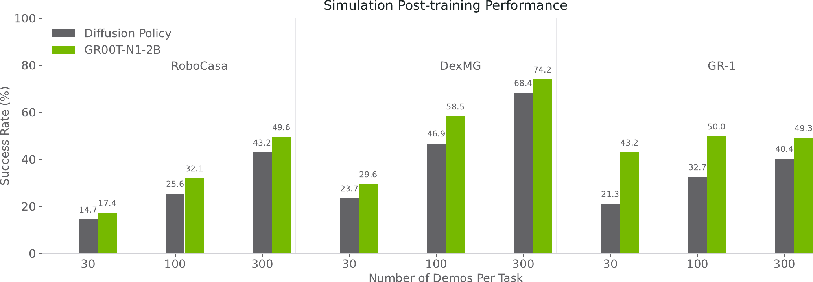
> 图 10 | 在不同演示数量下，模拟操作任务的平均策略成功率。

 **表 4：使用不同规模数据集训练的模型仿真评估结果（Table 4: Simulation Evaluation Results with Models Trained with Different Dataset Sizes）** 

| 任务（Task） | 扩散策略（Diffusion Policy） | GR00T-N1-2B | | | | |
| :--- | :--- | :--- | :--- | :--- | :--- | :--- |
| 30 次演示 | 100 次演示 | 300 次演示 | 30 次演示 | 100 次演示 | 300 次演示 | |
|  **RoboCasa Kitchen（24 项任务，PnP = 抓放（Pick-and-Place））**  | | | | | | |
| 关闭双开门（Close Double Door） | 1.7 | 26.5 | 60.8 | 0.0 | 43.1 | 74.5 |
| 关闭抽屉（Close Drawer） | 57.5 | 88.2 | 94.1 | 76.9 | 96.1 | 99.0 |
| 关闭单开门（Close Single Door） | 21.7 | 46.1 | 72.6 | 49.1 | 67.7 | 83.3 |
| 咖啡机按按钮（Coffee Press Button） | 32.5 | 46.1 | 91.2 | 27.8 | 56.9 | 85.3 |
| 咖啡机递送马克杯（Coffee Serve Mug） | 6.7 | 28.4 | 66.7 | 3.7 | 34.3 | 72.6 |
| 咖啡机放置马克杯（Coffee Setup Mug） | 0.0 | 19.6 | 32.4 | 0.0 | 2.0 | 22.6 |
| 打开双开门（Open Double Door） | 0.0 | 9.8 | 18.6 | 0.0 | 12.8 | 14.7 |
| 打开抽屉（Open Drawer） | 15.8 | 42.2 | 61.8 | 9.3 | 42.2 | 79.4 |
| 打开单开门（Open Single Door） | 36.7 | 42.2 | 57.8 | 20.4 | 54.9 | 58.8 |
| 从橱柜到台面抓放（PnP from Cab to Counter） | 2.5 | 4.9 | 9.8 | 0.9 | 3.9 | 19.6 |
| 从台面到橱柜抓放（PnP from Counter to Cab） | 0.0 | 2.9 | 10.8 | 1.9 | 6.9 | 36.3 |
| 从台面到微波炉抓放（PnP from Counter to Microwave） | 0.0 | 2.0 | 8.8 | 0.0 | 0.0 | 12.8 |
| 从台面到水槽抓放（PnP from Counter to Sink） | 0.0 | 0.0 | 13.7 | 0.0 | 1.0 | 9.8 |
| 从台面到炉灶抓放（PnP from Counter to Stove） | 0.0 | 1.0 | 17.7 | 0.0 | 0.0 | 23.5 |
| 从微波炉到台面抓放（PnP from Microwave to Counter） | 0.0 | 2.0 | 11.8 | 0.0 | 0.0 | 15.7 |
| 从水槽到台面抓放（PnP from Sink to Counter） | 4.2 | 8.8 | 42.2 | 0.0 | 5.9 | 33.3 |
| 从炉灶到台面抓放（PnP from Stove to Counter） | 1.7 | 2.9 | 23.5 | 0.0 | 0.0 | 29.4 |
| 关闭微波炉（Turn Off Microwave） | 63.3 | 53.9 | 52.0 | 47.2 | 57.8 | 70.6 |
| 关闭水龙头（Turn Off Sink Faucet） | 21.7 | 63.7 | 72.6 | 49.1 | 67.7 | 72.6 |
| 关闭炉灶（Turn Off Stove） | 5.0 | 10.8 | 19.6 | 4.6 | 15.7 | 26.5 |
| 打开微波炉（Turn On Microwave） | 30.0 | 51.0 | 75.5 | 55.6 | 73.5 | 78.4 |
| 打开水龙头（Turn On Sink Faucet） | 31.7 | 27.5 | 63.7 | 33.3 | 59.8 | 62.8 |
| 打开炉灶（Turn On Stove） | 12.5 | 22.6 | 36.3 | 14.8 | 25.5 | 55.9 |
| 转动水槽出水口（Turn Sink Spout） | 8.3 | 11.8 | 23.5 | 24.1 | 42.2 | 52.9 |
|  **RoboCasa 平均（RoboCasa Average）**  |  **14.7**  |  **25.6**  |  **43.2**  |  **17.4**  |  **32.1**  |  **49.6**  |
|  **DexMimicGen 跨具身套件（9 项任务）（DexMimicGen Cross-Embodiment Suite (9 tasks)）**  | | | | | | |
| 易拉罐分类（Can Sort） | 82.8 | 93.1 | 99.4 | 94.8 | 98.0 | 98.0 |
| 咖啡（Coffee） | 35.5 | 68.1 | 79.7 | 44.9 | 79.4 | 73.5 |
| 倾倒（Pouring） | 37.0 | 62.3 | 68.8 | 54.4 | 71.6 | 87.3 |
| 穿线（Threading） | 4.2 | 18.3 | 27.5 | 3.9 | 37.3 | 60.8 |
| 三部件组装（Three Piece Assembly） | 10.0 | 32.5 | 63.3 | 10.8 | 43.1 | 69.6 |
| 运输（Transport） | 7.5 | 25.0 | 53.3 | 7.8 | 48.0 | 61.8 |
| 盒子清理（Box Cleanup） | 30.0 | 80.8 | 97.5 | 33.3 | 29.4 | 95.1 |
| 抽屉清理（Drawer Cleanup） | 1.7 | 16.7 | 52.5 | 10.8 | 42.2 | 55.9 |
| 托盘抬起（Lift Tray） | 5.0 | 25.0 | 73.3 | 5.8 | 77.5 | 65.7 |
|  **DexMG 平均（DexMG Average）**  |  **23.7**  |  **46.9**  |  **68.4**  |  **29.6**  |  **58.5**  |  **74.2**  |
|  **GR-1 桌面任务（24 项任务）（GR-1 Tabletop (24 Tasks)）**  | | | | | | |
| 砧板到锅（Cutting Board to Pot） | 22.6 | 37.3 | 48.0 | 58.8 | 57.8 | 57.8 |
| 砧板到篮子（Cutting Board to Basket） | 19.6 | 42.2 | 29.4 | 43.1 | 61.8 | 56.9 |
| 砧板到分层篮子（Cutting Board to Tiered Basket） | 13.7 | 13.7 | 18.6 | 13.7 | 23.5 | 34.3 |
| 砧板到平底锅（Cutting Board to Pan） | 28.4 | 48.0 | 57.8 | 67.7 | 65.7 | 68.6 |
| 砧板到纸箱（Cutting Board to Cardboard Box） | 11.8 | 15.7 | 22.6 | 31.4 | 30.4 | 33.3 |

## 附录 C 补充定性结果

我们在图 [11] 和图 [12] 中提供了我们预训练和后训练的  **GR00T-N1-2B**  模型的定性展开示例。我们的模型展示了强大的语言遵循能力以及在双手操作任务中对未见情况的泛化能力。

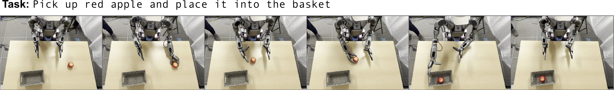

> 图 11 | 预训练定性示例。当我们使用一个后训练任务指令提示预训练的 GR00T-N1-2B 模型时，我们甚至通过将苹果放置在双手左侧来增加难度。尽管在训练期间未遇到过此设置，模型仍通过双手交接成功地将红苹果放入篮中，尽管动作略显生硬。

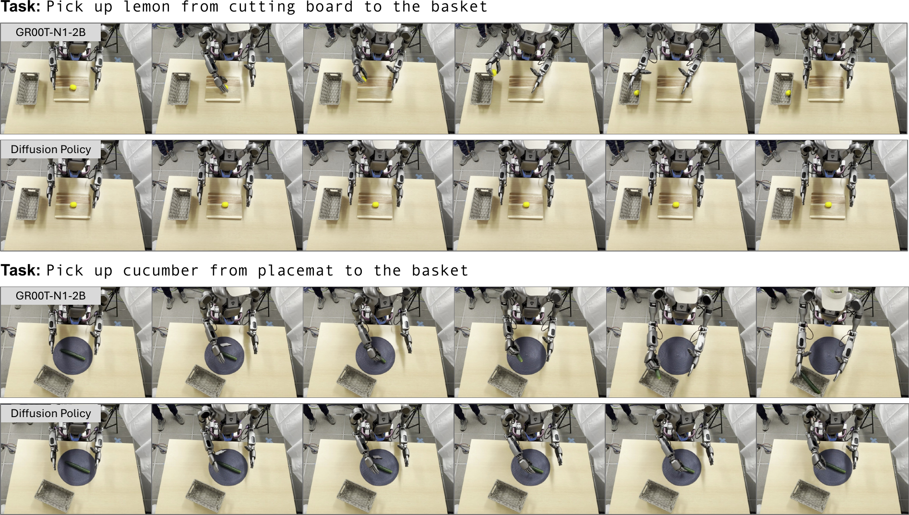

> 图 12 | 后训练定性示例。（上）后训练的 GR00T-N1-2B 成功地将黄瓜放入篮中，而 **扩散策略（Diffusion Policy）**  则因抓取不准确而失败。（下）后训练模型成功地从砧板上拿起柠檬并放入锅中，而扩散策略则停滞不前。

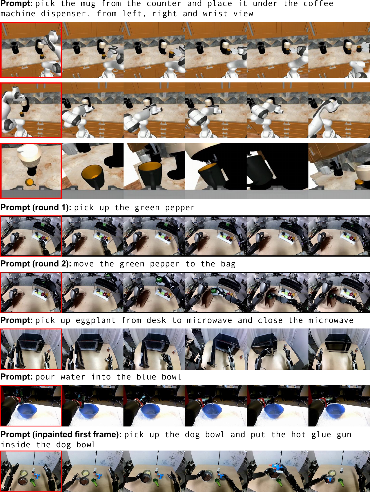

> 图 13 | 神经生成轨迹的更多示例。我们强调了神经轨迹的 4 个关键能力：（1）前三行展示了一个为 RoboCasa 中的后训练生成的多视角轨迹示例；我们通过在训练期间将视图拼接为 4 格视频来实现这一点。（2）接下来的两行展示了两个连续的序列，其中后者的初始帧来自前者的末尾，突显了为需要组合原子任务的任务生成轨迹的可能性。（3）接下来的两行说明了我们的模型生成包含 **铰接物体（articulated objects）**  和 **液体（liquids）**  的轨迹的能力，这在仿真中已知是非常具有挑战性的。（4）最后一行是从一个 **修复绘制（in-painted）**  的初始帧生成的，展示了我们无需在现实世界中收集新颖的初始帧并受限于人力即可生成更多样化的视频。我们使用红色矩形来指示初始帧。

## 附录 D：超参数（Appendix D: Hyperparameters）

我们在表 [6](#table-6) 中报告了用于 **预训练（pre-training）** 和 **后训练（post-training）** 阶段的重要超参数。总体而言，这两个阶段在大多数超参数上共享相同的值。
对于后训练，我们使用较小的 **批大小（batch size）** ，以避免在数据有限的情况下进行 **微调（fine-tuning）** 时出现过拟合。

 **表 6：训练超参数。除非特别说明，预训练与后训练使用相同的超参数。** 
| 超参数 | 预训练值 | 后训练值 |
| :--- | :--- | :--- |
| 学习率 | 1e-4 | |
| 优化器 | AdamW | |
| Adam beta1 | 0.95 | |
| Adam beta2 | 0.999 | |
| Adam epsilon | 1e-8 | |
| 权重衰减 | 1e-5 | |
| 学习率调度器 | cosine | |
| 预热比例 | 0.05 | |
| 批大小 | 16,384 | 128 或 1024 |
| 梯度步数 | 200,000 | 20,000 – 60,000 |
| 骨干网络的视觉编码器 | unfrozen | |
| 骨干网络的文本分词器 | frozen | |
| DiT | unfrozen | |

{
    "translation": "## 附录 E 系统设计（Appendix E System Design）\n\n### E.1 数据集格式（Dataset Formats）\n\n我们的训练语料库建立在  **LeRobot 数据集格式（LeRobot dataset format）**  [Cadene et al., 2024] 之上，这是开源机器人社区广泛采用的标准。由 Hugging Face 开发的 LeRobot 旨在通过提供用于存储、共享和利用机器人演示数据的标准化格式，降低机器人研究的入门门槛。由于其灵活性以及通过 Hugging Face 中心提供的大量预训练模型和数据集集合，该格式已获得显著关注。\n\n **LeRobot 数据集格式（LeRobot dataset format）**  的核心采用了一系列成熟的文件格式组合，以实现高效存储和访问：\n\n1.   **表格数据（Tabular Data）** ：机器人状态、动作和元数据存储在  **Parquet 文件（parquet files）**  中，这种格式提供高效的列式存储和快速数据检索。该格式支持对深度学习模型训练至关重要的快速过滤和切片操作。\n2.   **图像和视频数据（Image and Video Data）** ：视觉观测被编码为 MP4 视频文件（或作为 PNG 图像序列替代），其引用存储在 Parquet 文件中。这种方法在保持数据可访问性的同时，显著降低了存储需求。\n3.   **元数据（Metadata）** ：数据集统计信息、片段索引和其他元数据存储在结构化的  **JSON 文件（JSON files）**  中，提供关于数据集特征的机器可读信息。\n\n该格式将演示数据组织成片段，每个帧包含同步的观测-动作对。每个观测通常包括相机图像（`observation.images.*`）和机器人状态信息（`observation.state`），而动作则表示发送给机器人的控制命令。这种组织方式既便于 **模仿学习（imitation learning）** （模型学习从观测中预测动作），也便于 **强化学习（reinforcement learning）** （模型学习为特定结果进行优化）。\n\n虽然  **LeRobot 格式（LeRobot format）**  提供了坚实的基础，但我们在跨具身数据方面的工作需要额外的结构来支持更丰富的模态信息和更复杂的训练方案。我们已通过以下约束扩展了  **LeRobot 格式（LeRobot format）** ："
}

{
    "translation": "- 1.  **模态配置文件（Modality configuration file）** ：我们要求在元目录中提供一个 `modality.json` 配置文件，该文件明确定义状态和动作向量的结构，将每个维度映射到语义含义，并提供额外的模态特定信息。\n- 2.  **细粒度模态规范（Fine-grained modality specification）** ：与将状态和动作视为单一向量的标准 LeRobot 格式不同，我们的扩展将这些向量拆分为具有语义意义的字段（例如，末端执行器位置、朝向、夹爪状态），每个字段都有自己的元数据，包括数据类型、范围和转换规范。\n- 3.  **多注释支持（Multiple annotation support）** ：我们扩展了格式以支持单个数据集内的多种注释类型（例如，任务描述、有效性标志、成功指示器），遵循 LeRobot 的惯例，即在 parquet 文件中存储索引，而实际内容存储在单独的 JSON 文件中。\n- 4.  **旋转类型规范（Rotation type specification）** ：我们的格式明确指定了旋转数据使用的表示方法（例如，四元数、欧拉角、轴角），从而能够在训练期间正确处理旋转变换。\n\n我们的扩展格式为训练 VLA 模型提供了几个关键优势：\n\n- 1.  **语义清晰性（Semantic clarity）** ：通过明确定义状态和动作向量中每个维度的结构和含义，我们的格式增强了可解释性，并减少了数据预处理和模型训练期间的错误。\n- 2.  **灵活转换（Flexible transformations）** ：细粒度的模态规范使得在训练期间能够进行复杂的、特定于字段的归一化和转换。例如，旋转数据可以根据其特定表示进行适当的归一化和增强。\n- 3.  **多模态学习支持（Multi-modal learning support）** ：扩展格式自然地适应了 VLA 模型所需的各种数据类型，包括视觉观察、状态信息、动作命令和语言注释，同时保持这些模态之间的清晰关系。\n- 4.  **改进的数据验证（Improved data validation）** ：明确的结构使得能够对数据集进行更彻底的验证，降低了使用格式错误或不一致数据进行训练的风险。\n- 5.  **增强的互操作性（Enhanced interoperability）** ：在添加约束的同时，我们的格式保持了与 LeRobot 生态系统的向后兼容性，使我们能够利用现有工具和数据集，同时支持更复杂的建模方法。\n\n扩展格式在标准化和灵活性之间取得了平衡，为常见的机器人数据提供了清晰的结构，同时适应了 VLA 模型的特定需求。这种方法在我们的工作中被证明是有价值的，能够实现更高效的训练和改善的模型性能，同时保持与更广泛的机器人研究社区的兼容性。\n\n### E.2 标准化动作空间（Standardized Action Spaces）\n\n对于上述数据集，我们尽最大努力统一动作和状态空间，以确保跨不同具体实现和控制模态的一致性。应用了以下几个关键实践来实现这种标准化：\n\n- 1.  **末端执行器旋转状态归一化（End-effector rotation state normalization）** ：状态末端执行器旋转被转换为 6D 旋转表示，以避免传统欧拉角中的奇点和不连续性。\n- 2.  **末端执行器旋转动作标准化（End-effector rotation action standardization）** ：末端执行器旋转动作以轴角表示法表达，为旋转控制提供了紧凑且平滑的参数化。\n- 3.  **状态和动作缩放（State and action scaling）** ：对关节状态、关节动作、末端执行器状态位置以及末端执行器动作位置和旋转应用最小-最大归一化，确保不同机器人之间的值范围统一。\n- 4.  **一致排序（Consistent ordering）** ：状态和动作向量的排列遵循标准化顺序：末端执行器旋转、末端执行器位置和夹爪闭合度，从左臂到右臂排序（如果适用）。\n\n"
}

## 附录 F 附加训练细节

#### 辅助目标检测损失（Auxiliary Object Detection Loss）

为增强模型的空间理解能力，我们在训练中引入了 **辅助目标检测损失（auxiliary object detection loss）** 。除了预测动作外，模型还必须根据给定的语言指令定位感兴趣的目标物体。具体而言，对于轨迹片段中的每一帧，我们使用 OWL-v2 目标检测器（OWL-v2 object detector）[Minderer et al., 2023] 标注目标物体的边界框。然后，我们通过分别将其 $x$ 和 $y$ 坐标除以图像的宽度和高度，计算边界框的归一化中心坐标 $x_{gt}$。

为了预测二维坐标，我们在最终的视觉-语言嵌入词元（vision-language embedding tokens）之上添加了一个线性层，并使用平方损失进行优化：$L_{det}=\|\textbf{x}_{pred}-\textbf{x}_{gt}\|^{2}$。

因此，最终损失由下式给出：$L=L_{fm}+L_{det}$。

#### 神经轨迹生成（Neural Trajectory Generation）

我们在收集的遥操作轨迹上，使用 LoRA（Low-Rank Adaptation）[Hu et al., 2022] 对 WAN2.1-I2V-14B [Wan Team, 2025] 进行微调。这些轨迹被统一降采样至 81 帧、480P 分辨率以用于微调。得到的图像到视频模型（image-to-video model）生成的 **神经轨迹（neural trajectories）**  捕捉了现实世界中所有可能的“反事实场景（counterfactual scenarios）”。为确保质量，我们过滤掉未能准确遵循给定语言指令的生成视频。具体来说，我们从每个视频中采样 8 帧，并提示一个商用级多模态大型语言模型（multimodal LLM）来评估其是否遵循指令。未通过此标准的视频会进行重新标注（re-captioning），在此过程中视频被降采样至 16 帧、256P 分辨率。

#### IDM 模型训练（IDM Model Training）

我们通过以轨迹中的两幅图像（当前帧和未来帧）为条件，训练一个 **逆动力学模型（Inverse Dynamics Model, IDM）** ，以生成这两幅图像帧之间的动作块（action chunks）。根据初步实验，我们观察到添加状态信息或更多图像帧并未显著提高验证集上的动作预测性能。对于 IDM 模型架构，我们使用带有 SigLIP-2 视觉嵌入（SigLIP-2 vision embeddings）的扩散变换器模块（Diffusion Transformer module）（系统 1），并以流匹配（flow-matching）为目标进行训练。我们为每个具身（embodiment）训练 IDM 模型 30K 或 60K 步，具体取决于训练集的大小。训练完成后，我们根据两幅图像（使用与训练相同的动作范围）为神经轨迹的每一步生成伪标签动作（pseudo-label the actions）。

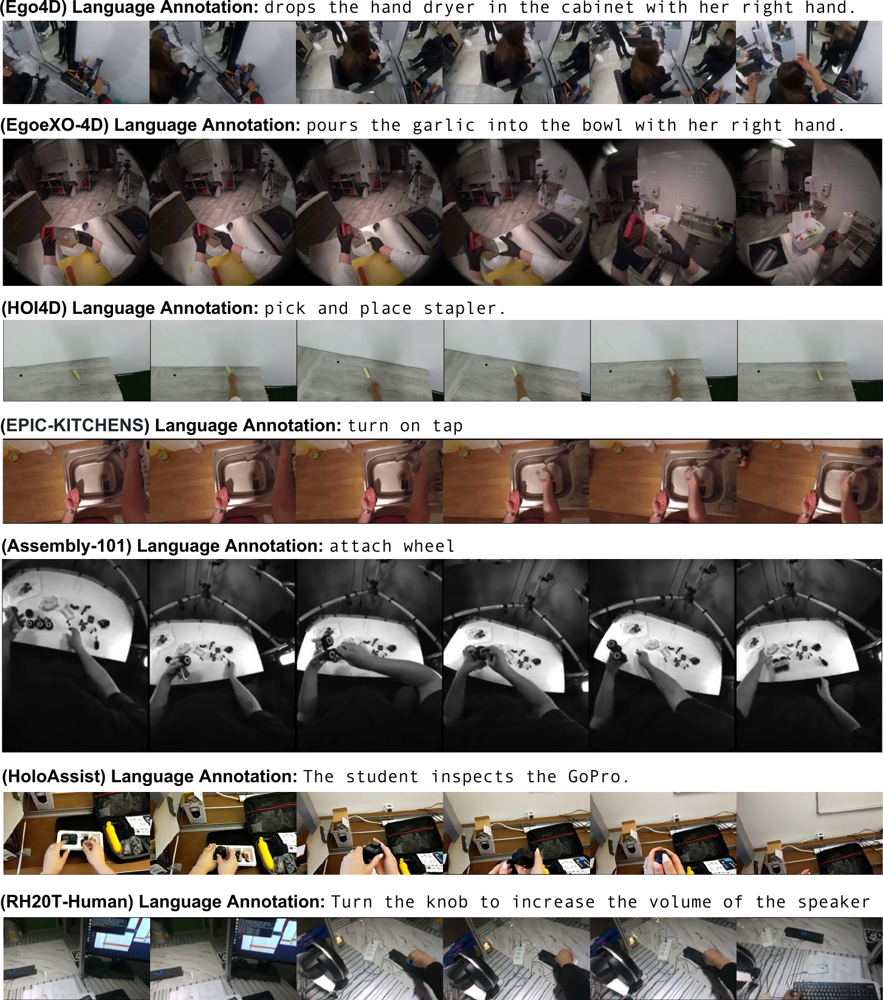

> 图 14 | 人类第一人称视频数据集样本。我们使用七个人类视频数据集进行预训练。上图展示了来自七个数据集中每个数据集的样本及其对应的语言标注。

 **表 7 | 预训练数据集统计信息** 
| Dataset | Length (Frames) | Duration (hr) | FPS | Camera View | Category |
| --- | --- | --- | --- | --- | --- |
| GR-1 Teleop Pre-Training | 6.4M | 88.4 | 20 | Egocentric | Real robot |
| DROID (OXE) | 23.1M | 428.3 | 15 | Left, Right, Wrist | Real robot |
| RT-1 (OXE) | 3.7M | 338.4 | 3 | Egocentric | Real robot |
| Language Table (OXE) | 7.0M | 195.7 | 10 | Front-facing | Real robot |
| Bridge-v2 (OXE) | 2.0M | 111.1 | 5 | Shoulder, left, right, wrist | Real robot |
| MUTEX (OXE) | 362K | 5.0 | 20 | Wrist | Real robot |
| Plex (OXE) | 77K | 1.1 | 20 | Wrist | Real robot |
| RoboSet (OXE) | 1.4M | 78.9 | 5 | Left, Right, Wrist | Real robot |
| Agibot-Alpha | 213.8M | 1,979.4 | 30 | Egocentric, left, right | Real robot |
| RH20T-Robot | 4.5M | 62.5 | 20 | Wrist | Real robot |
| Ego4D | 154.4M | 2,144.7 | 20 | Egocentric | Human |
| Ego-Exo4D | 8.9M | 123.0 | 30 | Egocentric | Human |
| Assembly-101 | 1.4M | 19.3 | 20 | Egocentric | Human |
| HOI4D | 892K | 12.4 | 20 | Egocentric | Human |
| HoloAssist | 12.2M | 169.6 | 20 | Egocentric | Human |
| RH20T-Human | 1.2M | 16.3 | 20 | Egocentric | Human |
| EPIC-KITCHENS | 2.3M | 31.7 | 20 | Egocentric | Human |
| GR-1 Simulation Pre-Training | 125.5M | 1,742.6 | 20 | Egocentric | Simulation |
| GR-1 Neural Videos | 23.8M | 827.3 | 8 | Egocentric | Neural-generated |
| Total robot data | 262.3M | 3,288.8 | – | – | – |
| Total human data | 181.3M | 2,517.0 | – | – | – |
| Total simulation data | 125.5M | 1,742.6 | – | – | – |
| Total neural data | 23.8M | 827.3 | – | – | – |
| Total | 592.9M | 8,375.7 | – | – | – |

## 参考文献

-   Agarwal et al. (2025)
    Niket Agarwal, Arslan Ali, Maciej Bala, Yogesh Balaji, Erik Barker, Tiffany Cai, Prithvijit Chattopadhyay, Yongxin Chen, Yin Cui, Yifan Ding, 等。
     **Cosmos 世界基础模型平台：面向物理人工智能（Cosmos world foundation model platform for physical ai）** 。
    *arXiv 预印本 arXiv:2501.03575*，2025年。

-   AgiBot-World-Contributors et al. (2025)
    AgiBot-World-Contributors 等。
     **AgiBot 世界竞技场：一个面向可扩展智能具身系统的大规模操作平台（AgiBot World Colosseo: A Large-scale Manipulation Platform for Scalable and Intelligent Embodied Systems）** 。
    *arXiv 预印本 arXiv:2503.06669*，2025年。

-   Alayrac et al. (2022)
    Jean-Baptiste Alayrac, Jeff Donahue, Pauline Luc, Antoine Miech, Iain Barr, Yana Hasson, Karel Lenc, Arthur Mensch, Katherine Millican, Malcolm Reynolds, Roman Ring, Eliza Rutherford, Serkan Cabi, Tengda Han, Zhitao Gong, Sina Samangooei, Marianne Monteiro, Jacob L Menick, Sebastian Borgeaud, Andy Brock, Aida Nematzadeh, Sahand Sharifzadeh, Mikoł aj Bińkowski, Ricardo Barreira, Oriol Vinyals, Andrew Zisserman, 和 Karén Simonyan。
     **Flamingo：一个用于小样本学习的视觉语言模型（Flamingo: a visual language model for few-shot learning）** 。
    载于 S. Koyejo, S. Mohamed, A. Agarwal, D. Belgrave, K. Cho, 和 A. Oh 编辑的《 **神经信息处理系统进展（Advances in Neural Information Processing Systems）** 》，2022年。

-   Aldaco et al. (2024)
    Jorge Aldaco, Travis Armstrong, Robert Baruch, Jeff Bingham, Sanky Chan, Kenneth Draper, Debidatta Dwibedi, Chelsea Finn, Pete Florence, Spencer Goodrich, 等。
     **Aloha 2：一种用于双手遥操作的增强型低成本硬件（Aloha 2: An enhanced low-cost hardware for bimanual teleoperation）** 。
    *arXiv 预印本 arXiv:2405.02292*，2024年。

-   Allal et al. (2025)
    Loubna Ben Allal, Anton Lozhkov, Elie Bakouch, Gabriel Martín Blázquez, Guilherme Penedo, Lewis Tunstall, Andrés Marafioti, Hynek Kydlíček, Agustín Piqueres Lajarín, Vaibhav Srivastav, 等。
     **Smollm2：当“小”模型变大时——一个小型语言模型的数据中心化训练（Smollm2: When smol goes big–data-centric training of a small language model）** 。
    *arXiv 预印本 arXiv:2502.02737*，2025年。

-   Baker et al. (2022)
    Bowen Baker, Ilge Akkaya, Peter Zhokov, Joost Huizinga, Jie Tang, Adrien Ecoffet, Brandon Houghton, Raul Sampedro, 和 Jeff Clune。
     **视频预训练（VPT）：通过观看未标记的在线视频学习行动（Video pretraining (vpt): Learning to act by watching unlabeled online videos）** 。
    《 **神经信息处理系统进展（Advances in Neural Information Processing Systems）** 》，
    第35卷：24639–24654页，2022年。

-   Bharadhwaj et al. (2024a)
    Homanga Bharadhwaj, Debidatta Dwibedi, Abhinav Gupta, Shubham Tulsiani, Carl Doersch, Ted Xiao, Dhruv Shah, Fei Xia, Dorsa Sadigh, 和 Sean Kirmani。
     **Gen2act：新场景中的人类视频生成实现可泛化的机器人操作（Gen2act: Human video generation in novel scenarios enables generalizable robot manipulation）** 。
    *arXiv 预印本 arXiv:2409.16283*，2024a。

-   Bharadhwaj et al. (2024b)
    Homanga Bharadhwaj, Roozbeh Mottaghi, Abhinav Gupta, 和 Shubham Tulsiani。
     **Track2act：从互联网视频预测点轨迹实现多样化的零样本机器人操作（Track2act: Predicting point tracks from internet videos enables diverse zero-shot robot manipulation）** 。
    *arXiv 电子版（arXiv e-prints）*，第 arXiv–2405 页，2024b。

-   Bharadhwaj et al. (2024c)
    Homanga Bharadhwaj, Jay Vakil, Mohit Sharma, Abhinav Gupta, Shubham Tulsiani, 和 Vikash Kumar。
     **Roboagent：通过语义增强和动作分块实现机器人操作中的泛化与效率（Roboagent: Generalization and efficiency in robot manipulation via semantic augmentations and action chunking）** 。
    载于《 **2024年 IEEE 机器人与自动化国际会议（2024 IEEE International Conference on Robotics and Automation (ICRA)）** 》，2024c。

-   Black et al. (2024)
    Kevin Black, Noah Brown, Danny Driess, Adnan Esmail, Michael Equi, Chelsea Finn, Niccolo Fusai, Lachy Groom, Karol Hausman, Brian Ichter, 等。
     **$\pi_{0}$：一个用于通用机器人控制的视觉-语言-动作流模型（$\pi_{0}$: A vision-language-action flow model for general robot control）** 。
    *arXiv 预印本 arXiv:2410.24164*，2024年。

-   Bommasani et al. (2021)
    Rishi Bommasani, Drew A Hudson, Ehsan Adeli, Russ Altman, Simran Arora, Sydney von Arx, Michael S Bernstein, Jeannette Bohg, Antoine Bosselut, Emma Brunskill, 等。
     **论基础模型的机遇与风险（On the opportunities and risks of foundation models）** 。
    *arXiv 预印本 arXiv:2108.07258*，2021年。

-   Brohan et al. (2022a)
    Anthony Brohan, Noah Brown, Justice Carbajal, Yevgen Chebotar, Joseph Dabis, Chelsea Finn, Keerthana Gopalakrishnan, Karol Hausman, Alex Herzog, Jasmine Hsu, Julian Ibarz, Brian Ichter, Alex Irpan, Tomas Jackson, Sally Jesmonth, Nikhil Joshi, Ryan Julian, Dmitry Kalashnikov, Yuheng Kuang, Isabel Leal, Kuang-Huei Lee, Sergey Levine, Yao Lu, Utsav Malla, Deeksha Manjunath, Igor Mordatch, Ofir Nachum, Carolina Parada, Jodilyn Peralta, Emily Perez, Karl Pertsch, Jornell Quiambao, Kanishka Rao, Michael Ryoo, Grecia Salazar, Pannag Sanketi, Kevin Sayed, Jaspiar Singh, Sumedh Sontakke, Austin Stone, Clayton Tan, Huong Tran, Vincent Vanhoucke, Steve Vega, Quan Vuong, Fei Xia, Ted Xiao, Peng Xu, Sichun Xu, Tianhe Yu, 和 Brianna Zitkovich。
     **RT-1：用于大规模真实世界控制的机器人 Transformer（Rt-1: Robotics transformer for real-world control at scale）** 。
    载于 *arXiv 预印本 arXiv:2212.06817*，2022a。

-   Brohan et al. (2022b)
    Anthony Brohan, Noah Brown, Justice Carbajal, Yevgen Chebotar, Joseph Dabis, Chelsea Finn, Keerthana Gopalakrishnan, Karol Hausman, Alex Herzog, Jasmine Hsu, 等。
     **RT-1：用于大规模真实世界控制的机器人 Transformer（Rt-1: Robotics transformer for real-world control at scale）** 。
    *arXiv 预印本 arXiv:2212.06817*，2022b。

-   Brohan et al. (2023a)
    Anthony Brohan, Noah Brown, Justice Carbajal, Yevgen Chebotar, Xi Chen, Krzysztof Choromanski, Tianli Ding, Danny Driess, Avinava Dubey, Chelsea Finn, Pete Florence, Chuyuan Fu, Montse Gonzalez Arenas, Keerthana Gopalakrishnan, Kehang Han, Karol Hausman, Alex Herzog, Jasmine Hsu, Brian Ichter, Alex Irpan, Nikhil Joshi, Ryan Julian, Dmitry Kalashnikov, Yuheng Kuang, Isabel Leal, Lisa Lee, Tsang-Wei Edward Lee,

-   (2023c)
    Anthony Brohan, Yevgen Chebotar, Chelsea Finn, Karol Hausman, Alexander Herzog,
    Daniel Ho, Julian Ibarz, Alex Irpan, Eric Jang, Ryan Julian, et al.
     **Do as I can, not as I say: Grounding language in robotic affordances（按我能做的做，而非按我说的做：将语言扎根于机器人可供性中）** 。
    载于 *机器人学习会议（Conference on robot learning）*，第 287–318 页。PMLR，
    2023c。

-   Brooks et al. (2024)
    Tim Brooks, Bill Peebles, Connor Holmes, Will DePue, Yufei Guo, Li Jing, David
    Schnurr, Joe Taylor, Troy Luhman, Eric Luhman, et al.
     **Video generation models as world simulators（作为世界模拟器的视频生成模型）** 。2024。
    *URL https://openai.com/research/video-generation-models-as-world-simulators*, 3:1,
    2024。

-   Cadene et al. (2024)
    Remi Cadene, Simon Alibert, Alexander Soare, Quentin Gallouedec, Adil Zouitine,
    and Thomas Wolf.
     **Lerobot: State-of-the-art machine learning for real-world robotics in PyTorch（Lerobot：用于现实世界机器人的 PyTorch 前沿机器学习）** 。
    [https://github.com/huggingface/lerobot](https://github.com/huggingface/lerobot), 2024。

-   Cheang et al. (2024)
    Chi-Lam Cheang, Guangzeng Chen, Ya Jing, Tao Kong, Hang Li, Yifeng Li, Yuxiao
    Liu, Hongtao Wu, Jiafeng Xu, Yichu Yang, Hanbo Zhang, and Minzhao Zhu.
     **GR-2: A generative video-language-action model with web-scale knowledge for robot manipulation（GR-2：一个具备网络规模知识的生成式视频-语言-动作模型，用于机器人操作）** 。
    *arXiv 预印本 arXiv:2410.06158*, 2024。

-   Chen et al. (2023)
    Zoey Chen, Sho Kiami, Abhishek Gupta, and Vikash Kumar.
     **Genaug: Retargeting behaviors to unseen situations via generative augmentation（Genaug：通过生成式增强将行为重定向到未见情境）** 。
    *arXiv 预印本 arXiv:2302.06671*, 2023。

-   Chi et al. (2024a)
    Cheng Chi, Zhenjia Xu, Siyuan Feng, Eric Cousineau, Yilun Du, Benjamin
    Burchfiel, Russ Tedrake, and Shuran Song.
     **Diffusion policy: Visuomotor policy learning via action diffusion（扩散策略：通过动作扩散进行视觉运动策略学习）** 。
    *国际机器人研究杂志（The International Journal of Robotics Research）*,
    2024a。

-   Chi et al. (2024b)
    Cheng Chi, Zhenjia Xu, Chuer Pan, Eric Cousineau, Benjamin Burchfiel, Siyuan
    Feng, Russ Tedrake, and Shuran Song.
     **Universal manipulation interface: In-the-wild robot teaching without in-the-wild robots（通用操作接口：无需野外机器人的野外机器人教学）** 。
    载于 *机器人学：科学与系统会议论文集（Proceedings of Robotics: Science and Systems (RSS)）*,
    2024b。

-   Dalal et al. (2023)
    Murtaza Dalal, Ajay Mandlekar, Caelan Reed Garrett, Ankur Handa, Ruslan
    Salakhutdinov, and Dieter Fox.
     **Imitating task and motion planning with visuomotor transformers（用视觉运动变换器模仿任务与运动规划）** 。
    载于 *机器人学习会议（Conference on Robot Learning）*, 第 2565–2593 页。PMLR, 2023。

-   Damen et al. (2018)
    Dima Damen, Hazel Doughty, Giovanni Maria Farinella, Sanja Fidler, Antonino
    Furnari, Evangelos Kazakos, Davide Moltisanti, Jonathan Munro, Toby Perrett,
    Will Price, et al.
     **Scaling egocentric vision: The epic-kitchens dataset（扩展自我中心视觉：EPIC-KITCHENS 数据集）** 。
    载于 *欧洲计算机视觉会议（ECCV）论文集（Proceedings of the European conference on computer vision (ECCV)）*，第 720–736 页，2018。

-   Dass et al. (2024)
    Shivin Dass, Wensi Ai, Yuqian Jiang, Samik Singh, Jiaheng Hu, Ruohan Zhang,
    Peter Stone, Ben Abbatematteo, and Roberto Martín-Martín.
     **Telemoma: A modular and versatile teleoperation system for mobile manipulation（Telemoma：一个用于移动操作的模块化多功能遥操作系统）** 。
    载于 *ICRA 2024 第二届移动操作与具身智能研讨会（2nd Workshop on Mobile Manipulation and Embodied Intelligence at ICRA 2024）*，2024。

-   Driess et al. (2023)
    Danny Driess, Fei Xia, Mehdi SM Sajjadi, Corey Lynch, Aakanksha Chowdhery,
    Brian Ichter, Ayzaan Wahid, Jonathan Tompson, Quan Vuong, Tianhe Yu, et al.
     **Palm-e: An embodied multimodal language model（Palm-e：一个具身多模态语言模型）** 。
    *arXiv 预印本 arXiv:2303.03378*, 2023。

-   Ebert et al. (2022)
    Frederik Ebert, Yanlai Yang, Karl Schmeckpeper, Bernadette Bucher, Georgios
    Georgakis, Kostas Daniilidis, Chelsea Finn, and Sergey Levine.
     **Bridge Data: Boosting Generalization of Robotic Skills with Cross-Domain Datasets（桥接数据：利用跨领域数据集提升机器人技能泛化能力）** 。
    载于 *机器人学：科学与系统会议论文集（Proceedings of Robotics: Science and Systems）*，纽约市，纽约州，美国，2022年6月。
    [10.15607/RSS.2022.XVIII.063](https:/doi.org/10.15607/RSS.2022.XVIII.063)。

-   Fang et al. (2023)
    Hao-Shu Fang, Hongjie Fang, Zhenyu Tang, Jirong Liu, Junbo Wang, Haoyi Zhu, and
    Cewu Lu.
     **RH20T: A robotic dataset for learning diverse skills in one-shot（RH20T：一个用于一次性学习多种技能的机器人数据集）** 。
    载于 *RSS 2023 任务与运动规划学习研讨会（RSS 2023 Workshop on Learning for Task and Motion Planning）*,
    2023。

-   Fang et al. (2024)
    Hongjie Fang, Hao-Shu Fang, Yiming Wang, Jieji Ren, Jingjing Chen, Ruo Zhang,
    Weiming Wang, and Cewu Lu.
     **Airexo: Low-cost exoskeletons for learning whole-arm manipulation in the wild（Airexo：用于在野外学习全臂操作的低成本外骨骼）** 。
    载于 *2024 IEEE 机器人与自动化国际会议（ICRA）（2024 IEEE International Conference on Robotics and Automation (ICRA)）*，第 15031–15038 页。IEEE, 2024。

-   Fu et al. (2024)
    Zipeng Fu, Tony Z Zhao, and Chelsea Finn.
     **Mobile aloha: Learning bimanual mobile manipulation with low-cost whole-body teleoperation（Mobile aloha：通过低成本全身遥操作学习双手移动操作）** 。
    载于 *2024 IEEE 机器人与自动化国际会议（ICRA）（2024 IEEE International Conference on Robotics and Automation (ICRA)）*，2024。

-   Garrett et al. (2024)
    Caelan Garrett, Ajay Mandlekar, Bowen Wen, and Dieter Fox.
     **Skillmimicgen: Automated demonstration generation for efficient skill learning and deployment（Skillmimicgen：用于高效技能学习与部署的自动化演示生成）** 。
    *arXiv 预印本 arXiv:2410.18907*, 2024。

-   Goyal et al. (2017)
    Raghav Goyal, Samira Ebrahimi Kahou, Vincent Michalski, Joanna Materzynska,
    Susanne Westphal, Heuna Kim, Valentin Haenel, Ingo Fruend, Peter Yianilos,
    Moritz Mueller-Freitag, et al.
    **The "something something" video database for learning and evaluating visual common sense（用于学习和评估视觉常识的 "something something" 视频数据库

-   (2023)
    Huy Ha, Pete Florence, and Shuran Song.
     **Scaling up and distilling down: Language-guided robot skill acquisition（规模化扩展与精炼压缩：语言引导的机器人技能获取）** .
    In *Conference on Robot Learning（机器人学习大会）*, pages 3766–3777. PMLR, 2023.
-   Hu et al. (2022)
    Edward J Hu, Yelong Shen, Phillip Wallis, Zeyuan Allen-Zhu, Yuanzhi Li, Shean Wang, Lu Wang, and Weizhu Chen.
     **LoRA: Low-rank adaptation of large language models（LoRA：大型语言模型的低秩自适应）** .
    In *International Conference on Learning Representations（国际学习表征会议）*, 2022.
-   Hu et al. (2024)
    Xixi Hu, Bo Liu, Xingchao Liu, and Qiang Liu.
     **Adaflow: Imitation learning with variance-adaptive flow-based policies（Adaflow：基于方差自适应流策略的模仿学习）** .
    *arXiv preprint arXiv:2402.04292*, 2024.
-   Huang et al. (2024)
    Jiangyong Huang, Silong Yong, Xiaojian Ma, Xiongkun Linghu, Puhao Li, Yan Wang, Qing Li, Song-Chun Zhu, Baoxiong Jia, and Siyuan Huang.
     **An embodied generalist agent in 3d world（三维世界中的具身通用智能体）** .
    In *Proceedings of the International Conference on Machine Learning (ICML)（国际机器学习大会论文集）*, 2024.
-   (40)
    Wenlong Huang, Fei Xia, Ted Xiao, Harris Chan, Jacky Liang, Pete Florence, Andy Zeng, Jonathan Tompson, Igor Mordatch, Yevgen Chebotar, et al.
     **Inner monologue: Embodied reasoning through planning with language models（内心独白：通过语言模型规划进行具身推理）** .
    In *6th Annual Conference on Robot Learning（第六届机器人学习年度大会）*.
-   Huang et al. (2023)
    Wenlong Huang, Fei Xia, Dhruv Shah, Danny Driess, Andy Zeng, Yao Lu, Pete Florence, Igor Mordatch, Sergey Levine, Karol Hausman, et al.
     **Grounded decoding: Guiding text generation with grounded models for embodied agents（接地解码：利用接地模型引导具身智能体的文本生成）** .
    *Advances in Neural Information Processing Systems（神经信息处理系统进展）*, 36:59636–59661, 2023.
-   (42)
    Aadhithya Iyer, Zhuoran Peng, Yinlong Dai, Irmak Guzey, Siddhant Haldar, Soumith Chintala, and Lerrel Pinto.
     **Open teach: A versatile teleoperation system for robotic manipulation（Open teach：用于机器人操作的通用遥操作系统）** .
    In *CoRL 2024 Workshop on Mastering Robot Manipulation in a World of Abundant Data（CoRL 2024 数据丰富世界中的机器人操作掌控研讨会）*.
-   James et al. (2020)
    Stephen James, Zicong Ma, David Rovick Arrojo, and Andrew J Davison.
     **Rlbench: The robot learning benchmark & learning environment（Rlbench：机器人学习基准与学习环境）** .
    *IEEE Robotics and Automation Letters（IEEE 机器人与自动化快报）*, 5(2):3019–3026, 2020.
-   Jiang et al. (2023)
    Yunfan Jiang, Agrim Gupta, Zichen Zhang, Guanzhi Wang, Yongqiang Dou, Yanjun Chen, Li Fei-Fei, Anima Anandkumar, Yuke Zhu, and Linxi Fan.
     **Vima: robot manipulation with multimodal prompts（Vima：基于多模态提示的机器人操作）** .
    In *Proceedings of the 40th International Conference on Machine Learning（第 40 届国际机器学习大会论文集）*, pages 14975–15022, 2023.
-   Jiang et al. (2024)
    Zhenyu Jiang, Yuqi Xie, Kevin Lin, Zhenjia Xu, Weikang Wan, Ajay Mandlekar, Linxi Fan, and Yuke Zhu.
     **Dexmimicgen: Automated data generation for bimanual dexterous manipulation via imitation learning（Dexmimicgen：通过模仿学习为双手灵巧操作自动生成数据）** .
    2024.
-   Kahneman (2011)
    Daniel Kahneman.
     ***Thinking, fast and slow（思考，快与慢）** *.
    2011.
-   Karamcheti et al. (2023)
    Siddharth Karamcheti, Suraj Nair, Annie S Chen, Thomas Kollar, Chelsea Finn, Dorsa Sadigh, and Percy Liang.
     **Language-driven representation learning for robotics（用于机器人学的语言驱动表征学习）** .
    *arXiv preprint arXiv:2302.12766*, 2023.
-   Kareer et al. (2024)
    Simar Kareer, Dhruv Patel, Ryan Punamiya, Pranay Mathur, Shuo Cheng, Chen Wang, Judy Hoffman, and Danfei Xu.
     **EgoMimic: Scaling imitation learning via egocentric video（EgoMimic：通过自我中心视频扩展模仿学习）** , 2024.
-   Khazatsky et al. (2024)
    Alexander Khazatsky, Karl Pertsch, Suraj Nair, Ashwin Balakrishna, Sudeep Dasari, Siddharth Karamcheti, Soroush Nasiriany, Mohan Kumar Srirama, Lawrence Yunliang Chen, Kirsty Ellis, Peter David Fagan, Joey Hejna, Masha Itkina, Marion Lepert, Yecheng Jason Ma, Patrick Tree Miller, Jimmy Wu, Suneel Belkhale, Shivin Dass, Huy Ha, Arhan Jain, Abraham Lee, Youngwoon Lee, Marius Memmel, Sungjae Park, Ilija Radosavovic, Kaiyuan Wang, Albert Zhan, Kevin Black, Cheng Chi, Kyle Beltran Hatch, Shan Lin, Jingpei Lu, Jean Mercat, Abdul Rehman, Pannag R Sanketi, Archit Sharma, Cody Simpson, Quan Vuong, Homer Rich Walke, Blake Wulfe, Ted Xiao, Jonathan Heewon Yang, Arefeh Yavary, Tony Z. Zhao, Christopher Agia, Rohan Baijal, Mateo Guaman Castro, Daphne Chen, Qiuyu Chen, Trinity Chung, Jaimyn Drake, Ethan Paul Foster, Jensen Gao, David Antonio Herrera, Minho Heo, Kyle Hsu, Jiaheng Hu, Donovon Jackson, Charlotte Le, Yunshuang Li, Kevin Lin, Roy Lin, Zehan Ma, Abhiram Maddukuri, Suvir Mirchandani, Daniel Morton, Tony Nguyen, Abigail O’Neill, Rosario Scalise, Derick Seale, Victor Son, Stephen Tian, Emi Tran, Andrew E. Wang, Yilin Wu, Annie Xie, Jingyun Yang, Patrick Yin, Yunchu Zhang, Osbert Bastani, Glen Berseth, Jeannette Bohg, Ken Goldberg, Abhinav Gupta, Abhishek Gupta, Dinesh Jayaraman, Joseph J Lim, Jitendra Malik, Roberto Martín-Martín, Subramanian Ramamoorthy, Dorsa Sadigh, Shuran Song, Jiajun Wu, Michael C. Yip, Yuke Zhu, Thomas Kollar, Sergey Levine, and Chelsea Finn.
     **Droid: A large-scale in-the-wild robot manipulation dataset（Droid：一个大规模真实世界机器人操作数据集）** .
    2024.
-   Kim et al. (2024)
    Moo Jin Kim, Karl Pertsch, Siddharth Karamcheti, Ted Xiao, Ashwin Balakrishna, Suraj Nair, Rafael Rafailov, Ethan Foster, Grace Lam, Pannag Sanketi, Quan Vuong, Thomas Kollar, Benjamin Burchfiel, Russ Tedrake, Dorsa Sadigh, Sergey Levine, Percy Liang, and Chelsea Finn.
     **Openvla: An open-source vision-language-action model（Openvla：一个开源视觉-语言-动作模型）** .
    *arXiv preprint arXiv:2406.09246*, 2024.
-   Li et al. (2023)
    Xinghang Li, Minghuan Liu, Hanbo Zhang, Cunjun Yu, Jie Xu, Hongtao Wu, Chilam Cheang, Ya Jing, Weinan Zhang, Huaping Liu, et al.
     **Vision-language foundation models as effective robot imitators（作为高效机器人模仿者的视觉-语言基础模型）** .
    *arXiv preprint arXiv:2311.01378*, 2023.
-   Li et al. (2025)
    Zhiqi Li, Guo Chen, Shilong Liu

-  **Lin et al. (2024)** 
  Zongyu Lin, Wei Liu, Chen Chen, Jiasen Lu, Wenze Hu, Tsu-Jui Fu, Jesse Allardice, Zhengfeng Lai, Liangchen Song, Bowen Zhang, et al.
   **STIV（Scalable Text and Image conditioned Video generation）** ：可扩展的文本与图像条件视频生成。
  *arXiv 预印本 arXiv:2412.07730*，2024年。

-  **(56)** 
  Yaron Lipman, Ricky TQ Chen, Heli Ben-Hamu, Maximilian Nickel, and Matthew Le.
   **流匹配（Flow Matching）** 用于生成建模。
  载于 *第十一届国际学习表征会议（The Eleventh International Conference on Learning Representations）*。

-  **Liu et al. (2022a)** 
  Xingchao Liu, Chengyue Gong, and Qiang Liu.
  笔直且快速的流：学习用 **修正流（Rectified Flow）** 生成和迁移数据。
  *arXiv 预印本 arXiv:2209.03003*，2022a年。

-  **Liu et al. (2022b)** 
  Yunze Liu, Yun Liu, Che Jiang, Kangbo Lyu, Weikang Wan, Hao Shen, Boqiang Liang, Zhoujie Fu, He Wang, and Li Yi.
   **HOI4D** ：一个用于类别级人-物交互的 **4D 自我中心（4D Egocentric）** 数据集。
  载于 *IEEE/CVF 计算机视觉与模式识别会议（CVPR）论文集*，第 21013–21022 页，2022年6月。

-  **Lynch et al. (2022)** 
  Corey Lynch, Ayzaan Wahid, Jonathan Tompson, Tianli Ding, James Betker, Robert Baruch, Travis Armstrong, and Pete Florence.
  交互式语言：与机器人实时对话，2022年。

-  **Lynch et al. (2023)** 
  Corey Lynch, Ayzaan Wahid, Jonathan Tompson, Tianli Ding, James Betker, Robert Baruch, Travis Armstrong, and Pete Florence.
  交互式语言：与机器人实时对话。
  *IEEE 机器人与自动化快报*，2023年。

-  **Mandi et al. (2022)** 
  Zhao Mandi, Homanga Bharadhwaj, Vincent Moens, Shuran Song, Aravind Rajeswaran, and Vikash Kumar.
   **CACTI** ：一个可扩展的多任务多场景视觉模仿学习框架。
  *arXiv 预印本 arXiv:2212.05711*，2022年。

-  **Mandlekar et al. (2018)** 
  Ajay Mandlekar, Yuke Zhu, Animesh Garg, Jonathan Booher, Max Spero, Albert Tung, Julian Gao, John Emmons, Anchit Gupta, Emre Orbay, Silvio Savarese, and Li Fei-Fei.
   **RoboTurk** ：一个通过模仿进行机器人技能学习的众包平台。
  载于 *机器人学习会议（Conference on Robot Learning）*，2018年。

-  **Mandlekar et al. (2019)** 
  Ajay Mandlekar, Jonathan Booher, Max Spero, Albert Tung, Anchit Gupta, Yuke Zhu, Animesh Garg, Silvio Savarese, and Li Fei-Fei.
  使用 RoboTurk 将机器人监督扩展到数百小时：通过人类推理和灵巧性构建的机器人操作数据集。
  载于 *2019年 IEEE/RSJ 智能机器人与系统国际会议（IROS）*，第 1048–1055 页。IEEE，2019年。

-  **Mandlekar et al. (2020)** 
  Ajay Mandlekar, Danfei Xu, Roberto Martín-Martín, Yuke Zhu, Li Fei-Fei, and Silvio Savarese.
  使用远程遥操作进行 **人在回路（Human-in-the-loop）** 模仿学习。
  *arXiv 预印本 arXiv:2012.06733*，2020年。

-  **Mandlekar et al. (2021)** 
  Ajay Mandlekar, Danfei Xu, Josiah Wong, Soroush Nasiriany, Chen Wang, Rohun Kulkarni, Li Fei-Fei, Silvio Savarese, Yuke Zhu, and Roberto Martín-Martín.
  从离线人类演示中学习机器人操作的关键因素。
  载于 *机器人学习会议（CoRL）*，2021年。

-  **Mandlekar et al. (2023)** 
  Ajay Mandlekar, Soroush Nasiriany, Bowen Wen, Iretiayo Akinola, Yashraj Narang, Linxi Fan, Yuke Zhu, and Dieter Fox.
   **MimicGen** ：一个利用人类演示进行可扩展机器人学习的数据生成系统。
  载于 *机器人学习会议*，2023年。

-  **Miech et al. (2019)** 
  Antoine Miech, Dimitri Zhukov, Jean-Baptiste Alayrac, Makarand Tapaswi, Ivan Laptev, and Josef Sivic.
   **HowTo100M** ：通过观看一亿个带旁白的视频片段学习文本-视频嵌入。
  载于 *IEEE/CVF 国际计算机视觉会议论文集*，第 2630–2640 页，2019年。

-  **Minderer et al. (2023)** 
  Matthias Minderer, Alexey A. Gritsenko, and Neil Houlsby.
  扩展 **开放词汇（Open-vocabulary）** 目标检测。
  载于 *第三十七届神经信息处理系统会议*，2023年。

-  **Moritz et al. (2018)** 
  Philipp Moritz, Robert Nishihara, Stephanie Wang, Alexey Tumanov, Richard Liaw, Eric Liang, Melih Elibol, Zongheng Yang, William Paul, Michael I Jordan, et al.
   **Ray** ：一个用于新兴 $\{$AI$\}$ 应用的分布式框架。
  载于 *第十三届 USENIX 操作系统设计与实现研讨会（OSDI 18）*，第 561–577 页，2018年。

-  **Nair et al. (2022)** 
  Suraj Nair, Aravind Rajeswaran, Vikash Kumar, Chelsea Finn, and Abhinav Gupta.
   **R3M** ：用于机器人操作的通用视觉表征。
  *arXiv 预印本 arXiv:2203.12601*，2022年。

-  **Nasiriany et al. (2024)** 
  Soroush Nasiriany, Abhiram Maddukuri, Lance Zhang, Adeet Parikh, Aaron Lo, Abhishek Joshi, Ajay Mandlekar, and Yuke Zhu.
   **RoboCasa** ：面向通用机器人的日常任务大规模仿真。
  载于 *机器人学：科学与系统会议（RSS）*，2024年。

-  **NVIDIA (2025)** 
  NVIDIA.
   **Osmo 平台** ，2025年。
  网址 [https://developer.nvidia.com/osmo](https://developer.nvidia.com/osmo)。
  访问日期：2025年3月12日。

-  **Octo Model Team et al. (2024)** 
  Octo Model Team, Dibya Ghosh, Homer Walke, Karl Pertsch, Kevin Black, Oier Mees, Sudeep Dasari, Joey Hejna, Charles Xu, Jianlan Luo, Tobias Kreiman, You Liang Tan, Lawrence Yunliang Chen, Pannag Sanketi, Quan Vuong, Ted Xiao, Dorsa Sadigh, Chelsea Finn, and Sergey Levine.
   **Octo** ：一个开源通用机器人策略。
  载于 *机器人学：科学与系统会议论文集*，荷兰代尔夫特，2024年。

-  **Open X-Embodiment Collaboration et al. (2024)** 
  Open X-Embodiment Collaboration et al.
   **Open X-Embodiment** ：机器人学习数据集与 RT-X 模型。
  国际机器人与自动化会议，2024年。

-  **O’Neill et al. (2024)** 
  Abby O’Neill, Abdul Rehman, Abhiram Maddukuri, Abhishek Gupta, Abhishek Padalkar, Abraham Lee, Acorn Pooley, Agrim Gupta, Ajay Mandlekar, Ajinkya Jain, et al.
   **Open X-Embodiment** ：机器人学习数据集与 RT-X 模型：Open X-Embodiment 协作 0。
  载于 *2024年 IEEE 国际机器人与自动化会议（ICRA）*，2024年。

-  **Peebles and Xie (2023)** 
  William Peebles and Saining Xie.
  使用 **Transformer** 的可扩展 **扩散模型（Diffusion Models）** 。
  载于 *IEEE/CVF 国际计算机视觉会议论文集*，第 4195–4205 页，2023年。

- **Ren

- Ren et al. (2025a)
  Zhongwei Ren, Yunchao Wei, Xun Guo, Yao Zhao, Bingyi Kang, Jiashi Feng, and Xiaojie Jin.
   **Motion tracks: A unified representation for human-robot transfer in few-shot imitation learning（运动轨迹：小样本模仿学习中用于人机迁移的统一表示）** .
  *arXiv preprint arXiv:2501.06994*, 2025a.

- Ren et al. (2025b)
  Zhongwei Ren, Yunchao Wei, Xun Guo, Yao Zhao, Bingyi Kang, Jiashi Feng, and Xiaojie Jin.
   **Videoworld: Exploring knowledge learning from unlabeled videos（Videoworld：探索从未标记视频中学习知识）** .
  *arXiv preprint arXiv:2501.09781*, 2025b.

- Sener et al. (2022)
  F. Sener, D. Chatterjee, D. Shelepov, K. He, D. Singhania, R. Wang, and A. Yao.
   **Assembly101: A large-scale multi-view video dataset for understanding procedural activities（Assembly101：用于理解程序性活动的大规模多视角视频数据集）** .
  *CVPR 2022*, 2022.

- Seo et al. (2025)
  Mingyo Seo, H. Andy Park, Shenli Yuan, Yuke Zhu, , and Luis Sentis.
   **Legato: Cross-embodiment imitation using a grasping tool（Legato：使用抓取工具的跨具身模仿）** .
  *IEEE Robotics and Automation Letters (RA-L)*, 2025.

- Shah et al. (2023)
  Rutav Shah, Roberto Martín-Martín, and Yuke Zhu.
   **Mutex: Learning unified policies from multimodal task specifications（Mutex：从多模态任务规范中学习统一策略）** .
  In *7th Annual Conference on Robot Learning（第七届机器人学习年会）*, 2023.

- Shi et al. (2016)
  Wenzhe Shi, Jose Caballero, Ferenc Huszár, Johannes Totz, Andrew P Aitken, Rob Bishop, Daniel Rueckert, and Zehan Wang.
   **Real-time single image and video super-resolution using an efficient sub-pixel convolutional neural network（使用高效的亚像素卷积神经网络实现实时单图像与视频超分辨率）** .
  In *Proceedings of the IEEE conference on computer vision and pattern recognition（IEEE 计算机视觉与模式识别会议论文集）*, 2016.

- Singh et al. (2023)
  Ishika Singh, Valts Blukis, Arsalan Mousavian, Ankit Goyal, Danfei Xu, Jonathan Tremblay, Dieter Fox, Jesse Thomason, and Animesh Garg.
   **Progprompt: Generating situated robot task plans using large language models（Progprompt：使用大型语言模型生成情境化机器人任务计划）** .
  In *2023 IEEE International Conference on Robotics and Automation (ICRA)（2023 年 IEEE 机器人与自动化国际会议）*, 2023.

- Thomas et al. (2023)
  Garrett Thomas, Ching-An Cheng, Ricky Loynd, Felipe Vieira Frujeri, Vibhav Vineet, Mihai Jalobeanu, and Andrey Kolobov.
   **Plex: Making the most of the available data for robotic manipulation pretraining（Plex：充分利用可用数据进行机器人操作预训练）** .
  In *CoRL（机器人学习会议）*, 2023.

- Tschannen et al. (2025)
  Michael Tschannen, Alexey Gritsenko, Xiao Wang, Muhammad Ferjad Naeem, Ibrahim Alabdulmohsin, Nikhil Parthasarathy, Talfan Evans, Lucas Beyer, Ye Xia, Basil Mustafa, et al.
   **SigLIP 2: Multilingual vision-language encoders with improved semantic understanding, localization, and dense features（SigLIP 2：具有改进的语义理解、定位和稠密特征的多语言视觉-语言编码器）** .
  *arXiv preprint arXiv:2502.14786*, 2025.

- Walke et al. (2023)
  Homer Walke, Kevin Black, Abraham Lee, Moo Jin Kim, Max Du, Chongyi Zheng, Tony Zhao, Philippe Hansen-Estruch, Quan Vuong, Andre He, Vivek Myers, Kuan Fang, Chelsea Finn, and Sergey Levine.
   **Bridgedata v2: A dataset for robot learning at scale（Bridgedata v2：用于大规模机器人学习的数据集）** .
  In *Conference on Robot Learning (CoRL)（机器人学习会议）*, 2023.

- Wan Team (2025)
  Wan Team.
   **Wan: Open and advanced large-scale video generative models（Wan：开放且先进的大规模视频生成模型）** .
  2025.

- Wang et al. (2023)
  Xin Wang, Taein Kwon, Mahdi Rad, Bowen Pan, Ishani Chakraborty, Sean Andrist, Dan Bohus, Ashley Feniello, Bugra Tekin, Felipe Vieira Frujeri, Neel Joshi, and Marc Pollefeys.
   **Holoassist: an egocentric human interaction dataset for interactive ai assistants in the real world（Holoassist：一个用于现实世界交互式 AI 助手的以自我为中心的人机交互数据集）** .
  In *Proceedings of the IEEE/CVF International Conference on Computer Vision (ICCV)（IEEE/CVF 国际计算机视觉会议论文集）*, 2023.

- Wang et al. (2024)
  Yufei Wang, Zhou Xian, Feng Chen, Tsun-Hsuan Wang, Yian Wang, Katerina Fragkiadaki, Zackory Erickson, David Held, and Chuang Gan.
   **Robogen: Towards unleashing infinite data for automated robot learning via generative simulation（Robogen：通过生成式模拟为自动化机器人学习释放无限数据）** .
  In *International Conference on Machine Learning（国际机器学习会议）*, 2024.

- Wen et al. (2024)
  Junjie Wen, Yichen Zhu, Jinming Li, Minjie Zhu, Kun Wu, Zhiyuan Xu, Ran Cheng, Chaomin Shen, Yaxin Peng, Feifei Feng, et al.
   **Tinyvla: Towards fast, data-efficient vision-language-action models for robotic manipulation（Tinyvla：面向机器人操作的快速、数据高效的视觉-语言-动作模型）** .
  *arXiv preprint arXiv:2409.12514*, 2024.

- Wu et al. (2023a)
  Hongtao Wu, Ya Jing, Chilam Cheang, Guangzeng Chen, Jiafeng Xu, Xinghang Li, Minghuan Liu, Hang Li, and Tao Kong.
   **Unleashing large-scale video generative pre-training for visual robot manipulation（释放大规模视频生成式预训练用于视觉机器人操作）** .
  *arXiv preprint arXiv:2312.13139*, 2023a.

- Wu et al. (2023b)
  Philipp Wu, Yide Shentu, Zhongke Yi, Xingyu Lin, and Pieter Abbeel.
   **Gello: A general, low-cost, and intuitive teleoperation framework for robot manipulators（Gello：一个通用、低成本且直观的机器人机械臂遥操作框架）** , 2023b.

- Xiang et al. (2024)
  Jiannan Xiang, Guangyi Liu, Yi Gu, Qiyue Gao, Yuting Ning, Yuheng Zha, Zeyu Feng, Tianhua Tao, Shibo Hao, Yemin Shi, et al.
   **Pandora: Towards general world model with natural language actions and video states（Pandora：迈向具有自然语言动作和视频状态的通用世界模型）** .
  *arXiv preprint arXiv:2406.09455*, 2024.

- Yang et al. (2025a)
  Jianwei Yang, Reuben Tan, Qianhui Wu, Ruijie Zheng, Baolin Peng, Yongyuan Liang, Yu Gu, Mu Cai, Seonghyeon Ye, Joel Jang, Yuquan Deng, Lars Liden, and Jianfeng Gao.
   **Magma: A foundation model for multimodal AI agents（Magma：多模态 AI 智能体的基础模型）** ,
  2025a.

- Yang et al. (2025b)
  Lujie Yang, HJ Suh, Tong Zhao, Bernhard Paus Graesdal, Tarik Kelestemur, Jiuguang Wang, Tao Pang, and Russ Tedrake.
   **Physics-driven data generation for contact-rich manipulation via trajectory optimization（通过轨迹优化为富含接触的操作生成物理驱动数据）** .
  *arXiv preprint arXiv:2502.20382*, 2025b.

- Yang et al. (2024)
  Zhuoyi Yang, Jiayan Teng, Wendi Zheng, Ming Ding, Shiyu Huang, Jiazheng Xu, Yuanming Yang, Wenyi Hong, Xiaohan Zhang,

(2018)
张天昊（Tianhao Zhang）、佐伊·麦卡锡（Zoe McCarthy）、欧文·乔（Owen Jow）、丹尼斯·李（Dennis Lee）、肯·戈德堡（Ken Goldberg）和彼得·阿比尔（Pieter Abbeel）。
基于虚拟现实遥操作的复杂操作任务深度模仿学习。
发表于 *2018年IEEE机器人与自动化国际会议（ICRA）*，2018年。

- 赵等人（2023）
托尼·Z·赵（Tony Z. Zhao）、维卡什·库马尔（Vikash Kumar）、谢尔盖·莱文（Sergey Levine）和切尔西·芬恩（Chelsea Finn）。
利用低成本硬件学习精细双手操作。
发表于 *机器人学：科学与系统会议论文集*，2023年。

- 甄等人（2024）
甄浩宇（Haoyu Zhen）、邱晓文（Xiaowen Qiu）、陈培浩（Peihao Chen）、杨金城（Jincheng Yang）、严鑫（Xin Yan）、杜一伦（Yilun Du）、洪一宁（Yining Hong）和甘创（Chuang Gan）。
3D-VLA：三维视觉-语言-动作生成世界模型。
*arXiv预印本 arXiv:2403.09631*，2024年。

- 郑等人（2025）
郑瑞杰（Ruijie Zheng）、梁永源（Yongyuan Liang）、黄帅毅（Shuaiyi Huang）、高剑峰（Jianfeng Gao）、哈尔·多姆三世（Hal Daumé III）、安德烈·科洛博夫（Andrey Kolobov）、黄芙蓉（Furong Huang）和杨建伟（Jianwei Yang）。
TraceVLA：视觉轨迹提示增强通用机器人策略的时空感知。