# 标题：视觉-语言-动作（Vision-Language-Action, VLA）模型：概念、进展、应用与挑战

- ArXiv: 2505.04769
- 作者：Ranjan Sapkota, Yang Cao, Konstantinos I. Roumeliotis, Manoj Karkee
  - a Cornell University, Biological & Environmental Engineering, Ithaca, New York, USA
  - b The Hong Kong University of Science and Technology, Department of Computer Science and Engineering, Hong Kong
  - c University of the Peloponnese, Department of Informatics and Telecommunications, Greece
  - [Ranjan Sapkota](https://agrobotics.cals.cornell.edu/ranjan-sapkota/)
  - [Yang Cao](https://ieeexplore.ieee.org/author/37090018230)
  - [Konstantinos I. Roumeliotis](https://applied-ai.gr/)
  - [Manoj Karkee](https://scholar.google.com/citations?user=ajjssGAAAAAJ&hl=en)
    - https://ieeexplore.ieee.org/author/37086206580
- 章节：42
- 估计词元数：81.0k

## 目录

- 关键词：
- 1 引言（Introduction）
- 2 视觉-语言-动作模型的概念（Concepts of Vision-Language-Action Models）
  - 2.1 演进与时间线（Evolution and Timeline）
  - 2.2 多模态整合：从孤立流水线到统一智能体（Multimodal Integration: From Isolated Pipelines to Unified Agents）
  - 2.3 词元化与表示：VLA 模型如何编码世界（Tokenization and Representation: How VLAs Encode the World）
  - 2.4 学习范式：数据源与训练策略（Learning Paradigms: Data Sources and Training Strategies）
  - 2.5 自适应控制与实时执行（Adaptive Control and Real-Time Execution）
- 3 视觉-语言-动作模型的进展（Progress in Vision-Language-Action Models）
  - 3.1 VLA 模型的架构创新（Architectural Innovations in VLA Models）
  - 3.2 视觉-语言-动作模型的训练效率提升（Training Efficiency Advancements in Vision–Language–Action Models）
  - 3.3 VLA 模型中的参数高效方法与加速技术（Parameter-Efficient Methods and Acceleration Techniques in VLA Models）
  - 3.4 视觉-语言-动作模型的应用（Applications of Vision-Language-Action Models）
    - 3.4.1 人形机器人（Humanoid Robotics）
    - 3.4.2 自动驾驶车辆系统（Autonomous Vehicle Systems）
    - 3.4.3 工业机器人（Industrial Robotics）
    - 3.4.4 医疗与医用机器人（Healthcare and Medical Robotics）
    - 3.4.5 精准与自动化农业（Precision and Automated Agriculture）
    - 3.4.6 基于视觉-语言-动作模型的交互式增强现实导航（Interactive AR Navigation with Vision-Language-Action Models）
- 4 视觉-语言-动作模型的挑战与局限（Challenges and Limitations of Vision-Language-Action Models）
  - 4.1 实时推理约束（Real-Time Inference Constraints）
  - 4.2 多模态动作表示与安全保障（Multi-modal Action Representation and Safety Assurance）
  - 4.3 数据集偏差、基础化与对未见任务的泛化（Dataset Bias, Grounding, and Generalization to Unseen Tasks）
  - 4.4 系统集成复杂性与计算需求（System Integration Complexity and Computational Demands）
  - 4.5 VLA 部署中的鲁棒性与伦理挑战（Robustness and Ethical Challenges in VLA Deployment）
- 5 讨论（Discussion）
  - 5.1 潜在解决方案（Potential Solutions）
  - 5.2 未来路线图（Future Roadmap）
    - 多模态基础模型作为具身感知的“大脑皮层”（Multi-modal foundation models as the “cortex” for embodied perception）：
    - 智能体化、自监督、终身学习与持续适应（Agentic, self-supervised, lifelong learning and continual adaptation）：
    - 分层、神经符号规划以实现可扩展性与可解释性（Hierarchical, neuro-symbolic planning for scalability and interpretability）：
    - 通过世界模型与物理/因果推理实现实时适应（Real-time adaptation via world models and physical/causal reasoning）：
    - 效率与可扩展性：在通用性与边缘部署之间架起桥梁（Efficiency and scalability: bridging generality with edge deployment）：
    - 跨具身迁移与形态无关的技能表示（Cross-embodiment transfer and morphology-agnostic skill representations）：
    - 超越任务成功的评估：安全性、恢复能力与资源感知指标（Evaluation beyond task success: safety, recovery, and resource-aware metrics）：
    - 将安全性、伦理和以人为本的对齐作为首要设计目标（Safety, ethics, and human-centered alignment as first-class design objectives）：
    - 交叉主题：持续学习、故障恢复、交互与控制保真度（Cross-cutting themes: continual learning, failure recovery, interaction, and control fidelity）：
- 6 结论（Conclusion）
- 资助声明（Funding Declaration）
- 声明（Declarations）
- 关于人工智能写作辅助的声明（Statement on AI Writing Assistance）
- 参考文献（References）

## 摘要（Abstract）

**视觉-语言-动作模型（Vision-Language-Action, VLA）** 标志着人工智能领域的一项变革性进步，其目标是在单一的计算框架内统一 **感知（perception）** 、 **自然语言理解（natural language understanding）** 和 **具身动作（embodied action）** 。这篇基础性综述对视觉-语言-动作模型的最新进展进行了全面综合，并围绕构建这一快速发展领域格局的五个主题支柱进行了系统性的组织。我们首先建立了 VLA 系统的概念基础，追溯了其从 **跨模态学习架构（cross-modal learning architectures）** 演变为紧密集成 **视觉-语言模型（Vision-Language Models, VLMs）** 、 **动作规划器（action planners）** 和 **分层控制器（hierarchical controllers）** 的 **通才智能体（generalist agents）** 的历程。我们的方法采用了严谨的文献综述框架，涵盖了在过去三年中发表的超过 80 个 VLA 模型。关键进展领域包括架构创新、高效训练策略和实时推理加速。我们探讨了多样化的应用领域，例如 **自动驾驶汽车（autonomous vehicles）** 、 **医疗与工业机器人（medical and industrial robotics）** 、 **精准农业（precision agriculture）** 、 **人形机器人（humanoid robotics）** 和 **增强现实（augmented reality）** 。本综述进一步探讨了在实时控制、多模态动作表示、系统可扩展性、对未见任务的泛化能力以及伦理部署风险等方面的主要挑战。基于最先进的技术，我们提出了针对性的解决方案，包括 **智能体人工智能适应（agentic AI adaptation）** 、 **跨具身泛化（cross-embodiment generalization）** 和统一的 **神经符号规划（neuro-symbolic planning）** 。我们勾勒了一个前瞻性的路线图，其中 VLA 模型、VLMs 和智能体人工智能将汇聚融合，以强化社会对齐、自适应和通用的具身智能体。因此，这项工作有望成为推动智能现实世界机器人和 **人工通用智能（Artificial General Intelligence, AGI）** 发展的基础性参考文献。项目代码库可在 GitHub 上获取（[[Source Link](https://github.com/Applied-AI-Research-Lab/Vision-Language-Action-Models-Concepts-Progress-Applications-and-Challenges)]）。

###### 关键词（keywords）：Vision-Language-Action, Action Tokenization, Artificial Intelligence, Robotics, Vision-Language Models

<a id="section-1"></a>

## 1 Introduction（引言）

在 **视觉-语言-动作模型（Vision-Language-Action models, VLA）** 发展起来之前，机器人学和人工智能的进展大多发生在各自独立的领域：能够获取、解释和识别图像的 **视觉系统（vision systems）** [55, 87, 176]；能够理解和生成文本的 **语言系统（language systems）** [213, 177]；以及能够控制运动的 **动作系统（action systems）** [60]。这些孤立的系统各自运行良好，但难以协同工作，难以泛化到新场景，也难以适应现实世界挑战的复杂性和不可预测性 [57, 22]。

<a id="figure-1"></a>
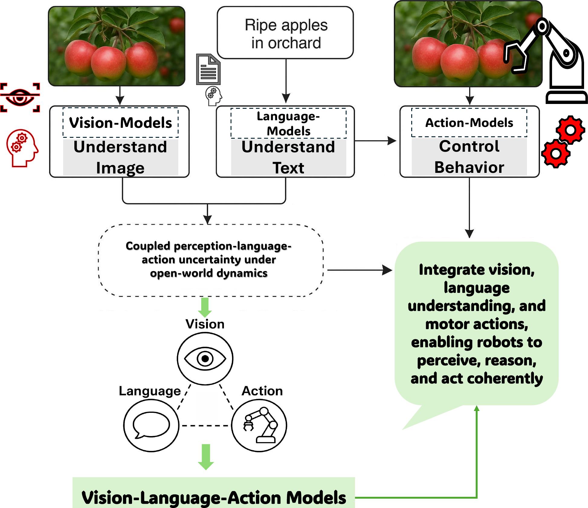

> 图 1 | 从孤立模态到统一视觉-语言-动作模型的演进。集成的感知、语言和动作能力，实现了自适应的、可泛化的具身智能。

如图 [1](#figure-1) 所示，传统的计算机视觉模型主要基于 **卷积神经网络（Convolutional Neural Networks, CNNs）** ，专为 **目标检测（object detection）** [25, 157, 26, 24, 174] 或 **分类（classification）** [205, 89, 95, 73] 等范围狭窄的特定任务而设计，需要大量标注数据集，并且即使环境或目标发生微小变化也需要进行繁琐的重新训练 [200, 77]。这些视觉模型能够“看见”（例如，识别果园中的苹果，如图 [1](#figure-1) 所示），但缺乏对语言的理解能力，也无法将视觉洞察转化为期望的动作。 **语言模型（Language Models, LMs）** ，特别是 **大型语言模型（Large Language Models, LLMs）** ，彻底改变了基于文本的理解和生成 [28]；然而，它们仍然局限于处理语言，不具备感知或推理物理世界的能力 [98]（图 [1](#figure-1) 中的“果园中的成熟苹果”正是这一局限性的例证）。与此同时，机器人学中基于动作的系统，严重依赖于手工设计的策略或 **强化学习（Reinforcement Learning, RL）** [158]，虽然实现了物体操作等特定行为，但需要耗费大量工程精力，并且无法泛化到专门设计的场景之外 [153]。

尽管 **视觉语言模型（Vision-Language Models, VLMs）** 通过结合视觉和语言取得了令人印象深刻的多模态理解能力 [190, 30, 298, 37, 10, 189]，但仍然存在一个明显的集成鸿沟： **无法基于多模态输入生成或执行连贯的动作** [156, 137]。如图 [1](#figure-1) 进一步可视化所示，大多数人工智能系统专精于一种或两种模态，例如视觉-语言、视觉-动作或语言-动作，它们难以将全部三种模态完全整合到一个统一的端到端框架中。因此，机器人可以视觉识别物体（“苹果”），理解相应的文本指令（“摘苹果”），或执行预定义的运动动作（抓取），但将这些能力整合并表现为流畅、适应性强的行为却一直缺失。其结果是一个无法灵活适应新任务或新环境的流程，导致泛化能力脆弱且工程工作繁重。这一局限性凸显了 **具身人工智能（Embodied AI）** 中的一个关键瓶颈： **如果没有能够联合感知、理解和行动的系统，智能自主行为就仍然是一个具有挑战性的目标。**

弥合这些差距的迫切需求催化了 **VLA 模型（Vision-Language-Action models）** 的出现。VLA 模型的概念大约在 2021-2022 年间形成，以 Google DeepMind 的 **Robotic Transformer 2（RT-2）** [299] 等开创性工作为代表，引入了一种变革性的架构，将感知、推理和控制统一在单一框架内。作为对图 [2](#figure-2) 所述局限性的解决方案，VLA 模型集成了视觉输入、语言理解和运动控制能力，使具身智能体能够感知周围环境、理解复杂指令并动态执行适当的动作。早期的 VLA 方法通过扩展视觉语言模型来实现这种集成，使其包含 **动作词元（action tokens）** ——机器人运动命令的数值或符号表示，从而使模型能够从配对的视觉、语言和轨迹数据中学习 [156]。这种方法论上的创新极大地提高了机器人泛化到未见物体、解释新语言指令以及在非结构化环境中执行多步推理的能力 [107]。

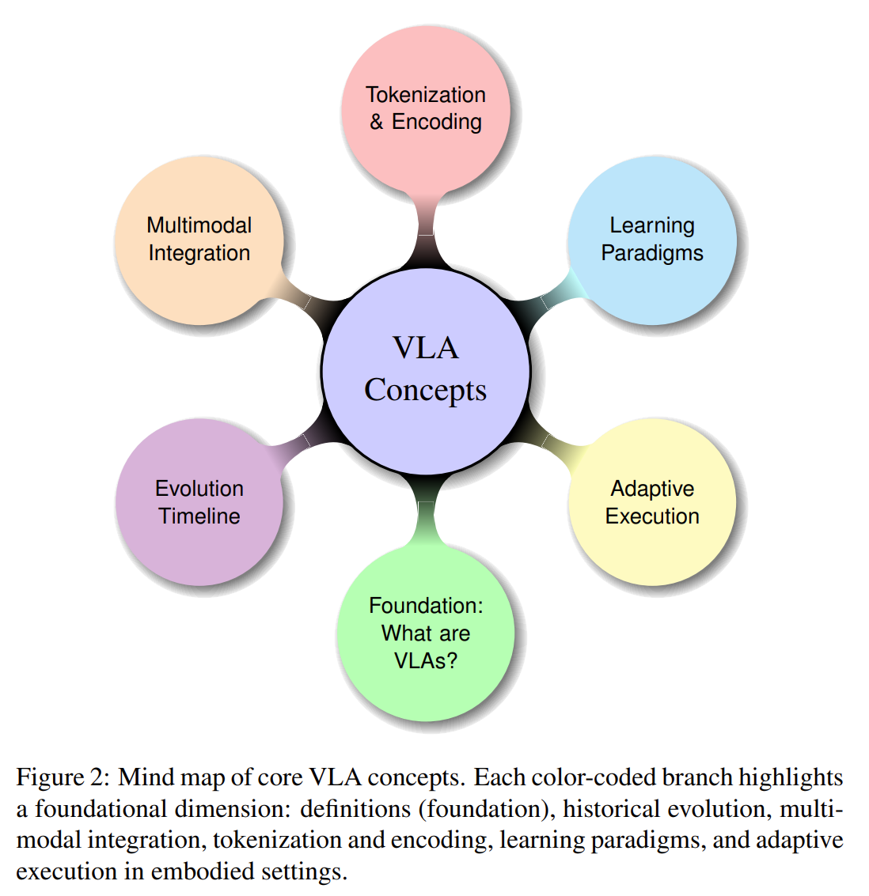

> Figure 2: Mind map of core VLA concepts. Each color-coded branch highlights a foundational dimension: definitions (foundation), historical evolution, multimodal integration, tokenization and encoding, learning paradigms, and adaptive execution in embodied settings.
> 图 2：核心 VLA 概念的思维导图。每个彩色编码分支突出一个基本维度：定义（基础）、历史演变、多模态整合、词元化和编码、学习范式以及在具身设置中的自适应执行。

VLA 模型代表了统一多模态智能发展中的变革性一步，克服了长期以来将视觉、语言和动作视为独立领域的局限 [156]。通过利用整合了视觉、语言和行为信息的互联网规模数据集，VLA 模型使机器人不仅能够识别和描述其环境，还能在复杂、动态的场景中进行情境推理并执行适当的动作 [254]。图 [2](#figure-2) 和图 [3](#figure-3) 所展示的从孤立的视觉、语言和动作系统到集成 VLA 范式的演进，捕捉了向开发真正自适应和可泛化的具身智能体的根本性转变。**鉴于这一范式的变革潜力，对当前文献进行全面且具有批判性的综述既是及时的，也是必要的。**

- 首先，这样的综述对于阐明区分 VLA 模型与其前身的基础概念和架构原理是必要的。
- 其次，它提供了对该领域快速进展和关键里程碑的结构化阐述，使研究人员和从业者能够理解算法和技术进步的轨迹。
- 第三，深入的综述对于梳理 VLA 模型已展现出变革潜力的多样化现实世界应用（从家用机器人到工业自动化和辅助技术）至关重要。
- 此外，通过批判性地审视当前的挑战，如数据效率、安全性、泛化能力和伦理考量，该综述指出了要实现广泛部署必须解决的障碍。最后，综合这些见解有助于向更广泛的人工智能和机器人社区通报新兴的研究方向和实际考量，促进合作与创新。

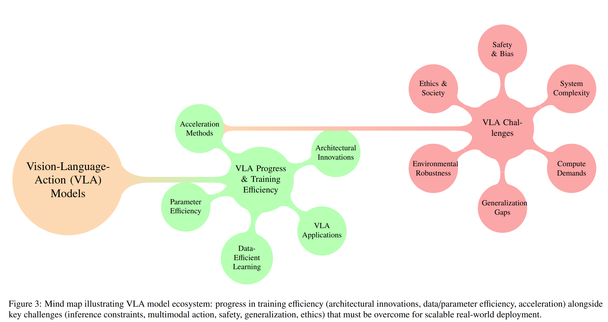

> Figure 3: Mind map illustrating VLA model ecosystem: progress in training efficiency (architectural innovations, data/parameter efficiency, acceleration) alongside key challenges (inference constraints, multimodal action, safety, generalization, ethics) that must be overcome for scalable real-world deployment.
> 图 3：VLA 模型生态系统的思维导图：训练效率的进展（架构创新、数据/参数效率、加速）与必须克服的关键挑战（推理约束、多模态动作、安全性、泛化、伦理），以实现可扩展的现实世界部署。

在本综述中，我们系统性地分析了 **视觉-语言-动作模型（Vision–Language–Action models, VLA models）** 的基础原理。此外，我们还讨论了它们的发展进程与技术挑战。我们的目标是整合当前对 VLA 的理解与应用，同时识别其局限性，并为其未来发展提出方向。

本综述首先详细审视了关键的概念基础（图 [2](#figure-2)），包括 VLA 模型的定义、其历史演变、多模态整合机制，以及跨越视觉、语言和动作的统一 **词元化（Tokenization）** 与 **表征（Representation）** 策略。这些概念性描述为理解 VLA 如何跨模态构建和运作奠定了基础。

基于此描述，我们提出了关于最新进展与训练效率策略的统一视图（图 [3](#figure-3)）。这包括 VLA 模型采用和扩展的架构创新，以及最初在更广泛的 **机器学习（Machine Learning）** 和 **机器人学（Robotics）** 背景下开发的 **数据高效学习框架（Data-efficient Learning Frameworks）** 、 **参数高效建模技术（Parameter-efficient Modeling Techniques）** 和 **模型加速策略（Model Acceleration Strategies）** 。这些进展共同对于将 VLA 系统扩展到现实世界应用至关重要。

随后，我们对 VLA 系统当前遇到的局限性进行了全面讨论（图 [3](#figure-3)），其中许多局限性反映了 **具身人工智能（Embodied AI）** 和机器人学领域更广泛的挑战，但由于视觉、语言和动作的紧密集成，它们以独特且复合的形式出现。将要讨论的局限性包括 **推理瓶颈（Inference Bottlenecks）** 、 **安全问题（Safety Concerns）** 、 **高计算需求（High Computational Demands）** 、 **有限的泛化能力（Limited Generalization）** 以及 **伦理影响（Ethical Implications）** 。我们不仅强调了这些紧迫的挑战，还就解决这些挑战的潜在方案提供了分析性讨论。

这三幅图共同提供了一个视觉描绘，勾勒出本综述的框架并支持文本分析。通过概述概念图景、近期创新和开放挑战，本工作旨在指导未来研究，并鼓励开发更稳健、高效且符合伦理的 VLA 系统。

图 [4](#figure-4) 总结了本综述的整体结构和逻辑流程，并说明了手稿是如何组织以提供对 VLA 研究的全面系统性分析的。如图所示，本文从基础概念推进到最新进展、应用、挑战和未来研究方向，确保了各章节之间连贯的叙述。为了构建这一架构，我们使用主要关键词“Vision–Language–Action”和“Vision–Language Models”以及常用缩写“VLA”进行了广泛而严谨的文献检索。这些关键词被用于从主要的学术和技术资料库中检索候选研究，包括 Hugging Face、arXiv、ScienceDirect、Nature、IEEE Xplore、Wiley 和 Springer Nature。通过人工筛选对得到的文献集进行了进一步精炼，以确保其相关性、技术深度以及与本综述范围的一致性。仅保留了直接有助于理解 VLA 概念、方法进展、应用领域和开放挑战的文章。这种多阶段筛选过程使得能够均衡覆盖基础性和最先进的工作，同时避免了边缘或松散相关的研究。因此，图 [4](#figure-4) 不仅反映了本文的主题组织，也体现了其背后的综述方法。

本文遵循一种结构化的、层次化的组织方式，系统性地阐述了 VLA 模型的基础、演变和影响，如图 [4](#figure-4) 所总结。

- 陈述始于**引言**，该部分阐述了具身智能的动机和 VLA 的出现，随后是概念部分，该部分确立了核心原则，包括多模态整合、词元化、学习范式和实时控制。
- 在这些基础上，**进展**部分审视了架构创新、训练与效率提升以及参数高效的加速策略。
- **应用**部分随后将这些发展置于现实世界领域中，包括人形机器人、自动驾驶汽车、医疗保健、农业、工业系统和交互式 AR 导航。
- 接着是对**关键挑战**的聚焦分析，包括实时推理、安全性、泛化能力、系统集成和伦理考量。
- 本文最后以一个**未来路线图**作结，提炼了在持续学习、可扩展性、可解释性和具身智能方面的跨领域研究方向。

> Figure 4: Flow and structure of this paper, from conclusion and future roadmap back through applications, progress, concepts, to introduction

- **Paper Architecture**
  - **Introduction**
  - **Concepts of VLA Models**
    - Evolution & timeline
    - Multimodal integration: from pipelines to unified agents
    - Tokenization & representation
    - Learning paradigms: data sources & training strategies
    - Adaptive control & real-time execution
  - **Progress in VLA Models**
    - Architectural innovations
    - Training & efficiency advancements
    - Parameter-efficient methods & acceleration
  - **Applications of VLA Models**
    - Humanoid robotics
    - Autonomous vehicle systems
    - Industrial robotics
    - Healthcare & medical robotics
    - Precision & agriculture
    - Interactive AR navigation
  - **Challenges & Limitations**
    - Real-time inference constraints
    - Multimodal action representation & safety assurance
    - Dataset bias, grounding, & generalization to unseen tasks
    - System integration complexity & computational demands
    - Robustness & ethical challenges in deployment
  - **Discussion**
    - Potential Solutions
  - **Future Roadmap**
    - Foundation models as 'cortex' for embodied perception
    - Agentic self-supervised lifelong learning & adaptation
    - Hierarchical neuro-symbolic planning for interpretability
    - World models for physical/causal reasoning
    - Efficiency & scalability for real-time edge deployment
    - Cross-embodiment transfer & morphology-agnostic skills
    - Evaluation beyond task success: safety/energy/recovery
    - Safety, ethics, & human-centered alignment
    - Cross-cutting themes: continual learning, recovery, interaction
  - **Conclusion**


```mermaid

graph LR
    %% Root
    Root["Paper Architecture"]

    %% Level 1 - Main Sections
    Root --> Intro["Introduction"]
    Root --> Concepts["Concepts of VLA Models"]
    Root --> Progress["Progress in VLA Models"]
    Root --> Apps["Applications of VLA Models"]
    Root --> Challenges["Challenges & Limitations"]
    Root --> Discuss["Discussion"]
    Root --> Future["Future Roadmap"]
    Root --> Conclusion["Conclusion"]

    %% Level 2 - Concepts subsections
    Concepts --> C1["Evolution & timeline"]
    Concepts --> C2["Multimodal integration: from pipelines to unified agents"]
    Concepts --> C3["Tokenization & representation"]
    Concepts --> C4["Learning paradigms: data sources & training strategies"]
    Concepts --> C5["Adaptive control & real-time execution"]

    %% Level 2 - Progress subsections
    Progress --> P1["Architectural innovations"]
    Progress --> P2["Training & efficiency advancements"]
    Progress --> P3["Parameter-efficient methods & acceleration"]

    %% Level 2 - Applications subsections
    Apps --> A1["Humanoid robotics"]
    Apps --> A2["Autonomous vehicle systems"]
    Apps --> A3["Industrial robotics"]
    Apps --> A4["Healthcare & medical robotics"]
    Apps --> A5["Precision & agriculture"]
    Apps --> A6["Interactive AR navigation"]

    %% Level 2 - Challenges subsections
    Challenges --> CH1["Real-time inference constraints"]
    Challenges --> CH2["Multimodal action representation & safety assurance"]
    Challenges --> CH3["Dataset bias, grounding, & generalization to unseen tasks"]
    Challenges --> CH4["System integration complexity & computational demands"]
    Challenges --> CH5["Robustness & ethical challenges in deployment"]

    %% Level 2 - Discussion subsections
    Discuss --> D1["Potential Solutions"]

    %% Level 2 - Future Roadmap subsections
    Future --> F1["Foundation models as 'cortex' for embodied perception"]
    Future --> F2["Agentic self-supervised lifelong learning & adaptation"]
    Future --> F3["Hierarchical neuro-symbolic planning for interpretability"]
    Future --> F4["World models for physical/causal reasoning"]
    Future --> F5["Efficiency & scalability for real-time edge deployment"]
    Future --> F6["Cross-embodiment transfer & morphology-agnostic skills"]
    Future --> F7["Evaluation beyond task success: safety/energy/recovery"]
    Future --> F8["Safety, ethics, & human-centered alignment"]
    Future --> F9["Cross-cutting themes: continual learning, recovery, interaction"]

    %% Styling with class definitions
    classDef rootStyle fill:#2c3e50,stroke:#2c3e50,stroke-width:2px,color:#fff,font-weight:bold
    classDef introStyle fill:#3498db,stroke:#2980b9,stroke-width:1px,color:#000
    classDef conceptStyle fill:#9b59b6,stroke:#8e44ad,stroke-width:1px,color:#000
    classDef progressStyle fill:#27ae60,stroke:#229954,stroke-width:1px,color:#000
    classDef appsStyle fill:#e67e22,stroke:#d35400,stroke-width:1px,color:#000
    classDef challengesStyle fill:#e74c3c,stroke:#c0392b,stroke-width:1px,color:#000
    classDef discussStyle fill:#f39c12,stroke:#d68910,stroke-width:1px,color:#000
    classDef futureStyle fill:#1abc9c,stroke:#16a085,stroke-width:1px,color:#000
    classDef conclusionStyle fill:#95a5a6,stroke:#7f8c8d,stroke-width:1px,color:#000
    classDef subStyle fill:#ecf0f1,stroke:#bdc3c7,stroke-width:1px,color:#000,font-size:12px

    %% Apply classes
    class Root rootStyle
    class Intro introStyle
    class Concepts conceptStyle
    class Progress progressStyle
    class Apps appsStyle
    class Challenges challengesStyle
    class Discuss discussStyle
    class Future futureStyle
    class Conclusion conclusionStyle

    class C1,C2,C3,C4,C5,P1,P2,P3,A1,A2,A3,A4,A5,A6,CH1,CH2,CH3,CH4,CH5,D1,F1,F2,F3,F4,F5,F6,F7,F8,F9 subStyle

```

<a id="section-2"></a>

## 2 视觉-语言-动作模型的概念（Concepts of Vision-Language-Action Models）

**视觉-语言-动作模型（Vision-Language-Action Models, VLA Models）** 代表了一类智能系统，它们能够 **联合处理（jointly process）** 视觉输入、 **解释（interpret）** 自然语言指令，并生成可在动态环境中运行的物理机器人硬件上 **实例化（instantiated）** 的 **可执行动作表示（executable action representations）** 。从技术上讲，VLA 模型结合了 **视觉编码器（vision encoders）** （例如， **卷积神经网络（Convolutional Neural Networks, CNNs）** 、 **视觉变换器（Vision Transformers, ViTs）** ）、 **语言模型（language models）** （例如， **大型语言模型（Large Language Models, LLMs）** 、 **变换器（Transformers）** ）以及 **策略模块（policy modules）** 或 **规划器（planners）** ，以实现 **任务条件控制（task-conditioned control）** 。这些模型通常建立在视觉-语言模型中已确立的 **多模态融合技术（multimodal fusion techniques）** 之上，例如 **交叉注意力（cross-attention）** 、 **拼接嵌入（concatenated embeddings）** 或 **词元统一（token unification）** ，并将其扩展以对齐 **感官观察（sensory observations）** 、 **语言指令（linguistic instructions）** 和 **动作表示（action representations）** 。

与传统的 **视觉运动管道（visuomotor pipelines）** 不同，VLA 模型支持 **语义基础（Semantic Grounding）** [154]，从而能够实现 **上下文感知推理（Context-Aware Reasoning）** [228]、 **可供性检测（Affordance Detection）** [79] 和 **时序规划（Temporal Planning）** [141]。一个典型的 VLA 模型通过摄像头或传感器数据观察环境，解释用语言表达的目标（例如，“捡起那个红苹果”）（图 [5](#figure-5)），并输出可由自动化系统执行以实现该动作的 **低级（low-level）** 或 **高级（high-level）** 动作序列。近期的进展整合了 **模仿学习（Imitation Learning）** 、 **强化学习（Reinforcement Learning）** 或 **检索增强模块（Retrieval-Augmented Modules）** ，以提高 **样本效率（sample efficiency）** 和 **泛化能力（generalization）** 。本综述探讨了 VLA 模型如何从基础的融合架构演变为能够在机器人学、导航和人机协作等领域进行现实世界部署的 **通用智能体（General-Purpose Agents）** 。

VLA 模型是 **多模态人工智能系统（Multi-modal Artificial Intelligence Systems）** ，它将 **视觉感知（Visual Perception）** 、 **语言理解（Language Comprehension）** 和 **物理动作生成（Physical Action Generation）** 统一到一个单一的框架中。这些模型使机器人或 AI 智能体能够 **解释（interpret）** 感官输入（例如，图像、文本）、 **理解（understand）** 上下文含义，并在现实世界环境中 **自主执行（autonomously execute）** 任务——所有这些都是通过 **端到端学习（End-to-End Learning）** 和动作完成，而非依赖孤立的子系统。如图 [5](#figure-5) 概念所示，VLA 模型弥合了历史上 **视觉识别（Visual Recognition）** 、 **语言理解（Language Comprehension）** 和/或 **运动执行（Motor Execution）** 之间的脱节，这种脱节曾限制了早期机器人和 AI 系统的能力。

<a id="figure-5"></a>
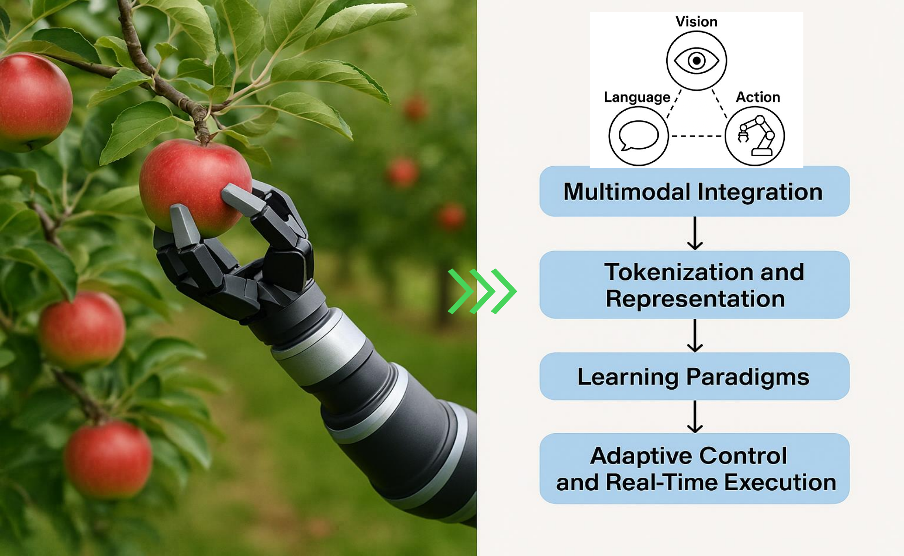

> 图 5 | VLA 模型的基础概念（以苹果采摘场景为例）此图描绘了一个由 VLA 模型引导的机械臂在果园中自主采摘成熟苹果的场景。右侧的流程图概述了 VLA 模型的四个关键阶段：多模态集成、词元化与表示、学习范式、自适应控制与实时执行。

<a id="section-2-1"></a>

### 2.1 Evolution and Timeline（演进与时间线）

2022 年至 2025 年间， **视觉语言动作模型（Vision-Language-Action models, VLA）** 的快速发展展现了三个不同的演进阶段：

1. **基础整合阶段 Foundational Integration（2022–2023 年）** 。
   - 早期的 VLA 通过 **多模态融合架构（multi-modal fusion architectures）** 建立了基本的 **视觉运动协调（visuomotor coordination）** 能力。
   - [202] 首次将 **CLIP（Contrastive Language-Image Pre-training）** 嵌入与 **运动基元（motion primitives）** 相结合，
   - [181] 则在 604 项任务中展示了通用能力。
   - [19] 通过 **规模化模仿学习（scaled imitation learning）** 在操作任务中实现了 97% 的成功率，
   - [112] 则通过基于 **Transformer** 的规划器引入了 **时序推理（temporal reasoning）** 。
   - 到 2023 年，[299] 实现了 **视觉思维链推理（visual chain-of-thought reasoning）** ，
   - [40] 通过 **扩散过程（diffusion processes）** 推进了 **随机动作预测（stochastic action prediction）** 。
   - 这些基础工作解决了低层次控制问题，但缺乏 **组合推理（compositional reasoning）** 能力，即无法将复杂任务分解为可重用、语义基础明确的子动作，并在新情境中重组它们——这促使了后续在 **可供性（Affordance）** 基础化方面的创新 [287, 100]。
2. **专业化与具身推理阶段 Specialization and Embodied Reasoning（2024 年）** 。
   - 第二代 VLA 融入了 **领域特定的归纳偏置（domain-specific inductive biases）** 。
   - [269] 通过 **检索增强训练（retrieval-augmented training）** 增强了 **少样本适应（few-shot adaptation）** 能力，
   - [280] 则通过 **3D 场景图（3D scene-graph）** 集成优化了导航。
   - [48] 引入了 **可逆架构（reversible architectures）** 以提高内存效率，
   - [239] 则利用 **物理信息注意力（physics-informed attention）** 解决了 **部分可观测性（partial observability）** 问题。
   - 同时，[5] 通过 **以对象为中心的解耦（object-centric disentanglement）** 改进了组合理解，
   - [293] 则通过 **多模态传感器融合（multi-modal sensor fusion）** 将应用扩展至自动驾驶。
   - 然而，这些进展需要新的 **基准测试方法（benchmarking methodologies）** [254]。
3. **泛化与安全关键部署阶段 Generalization and Safety-Critical Deployment（2025 年）** 。
   - 最新的系统优先考虑 **鲁棒性（robustness）** 和 **人类对齐（human alignment）** 。
   - [274] 集成了 **形式化验证（formal verification）** 以实现 **风险感知决策（risk-aware decisions）** ，而 [53] 则通过 **分层 VLA（hierarchical VLAs）** 展示了 **全身控制（whole-body control）** 能力。
   - [20] 针对 **嵌入式部署（embedded deployment）** 优化了计算效率，[131] 结合了 **神经符号推理（neural-symbolic reasoning）** 以进行 **因果推断（causal inference）** 。
   - 新兴范式如 [129] 的 **可供性链（affordance chaining）** 和 [14] 的 **仿真到现实迁移学习（sim-to-real transfer learning）** 解决了 **跨具身挑战（cross-embodiment challenges）** ，而 [139] 则通过 **自然语言基础化（natural language grounding）** 将 VLA 与 **人在回路接口（human-in-the-loop interfaces）** 连接起来。

图 [6](#figure-6) 展示了一个全面的时间线，突出了 2022 年至 2025 年间开发的 45 个 VLA 模型的演进历程。

- 最早的 VLA 系统，包括 CLIPort [202]、Gato [181]、RT-1 [19] 和 VIMA [112]，通过结合预训练的视觉-语言表征与任务条件策略来进行操作与控制，奠定了基础。
- 这些早期 VLA 系统之后是 ACT [287]、RT-2 [299] 和 VoxPoser [100]，它们集成了视觉思维链推理和可供性基础化。
  - 像 Diffusion Policy [40] 和 Octo [218] 这样的模型引入了 **随机建模（stochastic modeling）** 和 **可扩展数据管道（scalable data pipelines）** 。
  - 2024 年，Deer-VLA [269]、ReVLA [48] 和 Uni-NaVid [280] 等系统增加了领域专业化和内存高效设计，而 Occllama [239] 和 ShowUI [139] 则解决了部分可观测性和用户交互问题。
  - 这一发展轨迹随着 Quar-VLA [54] 和 RoboMamba [143] 等专注于机器人的 VLA 而延续。
- 近期的创新强调泛化与部署：
  - SafeVLA [274]、Humanoid-VLA [53] 和 MoManipVLA [246] 集成了验证、全身控制和记忆系统。
  - 像 Gr00t N1 [14] 和 SpatialVLA [175] 这样的模型进一步弥合了仿真到现实迁移和空间基础化。
- 这条时间线说明了 VLA 如何从模块化学习发展到通用、安全且具身的智能。

<a id="section-2-2"></a>

### 2.2 多模态集成：从孤立流水线到统一智能体（Multimodal Integration: From Isolated Pipelines to Unified Agents）

**视觉-语言-动作模型（Vision-Language-Action models, VLAs）** 兴起的一个核心进步在于其执行 **多模态集成（multimodal integration）** 的能力，即在统一架构内对视觉、语言和动作进行联合处理。传统的机器人系统将感知、自然语言理解和控制视为离散的模块，通常通过手动定义的接口或数据转换进行连接 [140, 21, 219]。例如，经典的基于流水线的框架要求感知模型输出符号标签，然后由规划器将这些标签映射到特定的动作，这一过程常常需要领域特定的手工工程 [178, 117]。这些方法缺乏适应性，在模糊或未见过的环境中会失败，并且无法泛化到预定义模板之外的指令。

相比之下，现代 VLAs 使用大规模预训练编码器和基于 **Transformer** 的架构，以端到端的方式融合多模态信息 [244]。这种转变使得模型能够在同一个计算空间内解释视觉观察和语言指令，从而实现灵活、上下文感知的推理 [128]。例如，在“ **Pick the ripe apples** ”任务（图 [5](#figure-5)）中，视觉编码器——通常是 **视觉 Transformer（Vision Transformer, ViT）** 或 **ConvNeXt** ——会解析场景以定位和分类相关物体（例如，水果、树叶、背景），并根据学习到的纹理、形状和上下文特征（而非固定的颜色假设）来推断与成熟度相关的视觉线索 [243]。与此同时，语言模型（通常是 **T5** 、 **GPT** 或 **BERT** 的变体）将指令编码成一个高维嵌入。然后，这些表征通过 **交叉注意力（cross-attention）** 或 **联合词元化（joint tokenization）** 方案进行融合，产生一个统一的潜在空间，为动作策略提供信息 [86]。

这种多模态协同效应首次在 **CLIPort** [202] 中得到有效展示。CLIPort 以桌面场景的 RGB 图像和自然语言指令（例如，“place the blue block on the red square”）作为输入，使用 **CLIP** 对它们进行编码以实现语义基础，并通过一个卷积传输解码器输出像素级的拾放动作分布。通过直接将视觉运动策略以语言嵌入为条件，CLIPort 消除了显式的语言解析，实现了端到端的语言条件操作。类似地， **VIMA** [112] 通过采用一个 Transformer 编码器来联合处理以物体为中心的视觉词元和指令词元，推进了这种方法，从而在空间推理任务中实现了 **少样本泛化（few-shot generalization）** 。

**近期进展通过融入时序与空间基础，进一步推动了这种融合。** VoxPoser [100] 采用 **体素级推理（voxel-level reasoning）** ，通过组合预训练的 **视觉-语言模型（vision-language models）** 和经典 **运动规划器（motion planners）** 来解决 3D 物体选择中的歧义，尤其值得注意的是，它在无需任务特定训练数据的情况下实现了 **零样本操作（zero-shot manipulation）** 。相比之下，RT-2 [299] 在一个统一的 **Transformer** 架构中融合了视觉-语言标记和动作表示，该模型在大规模互联网视觉-语言语料库以及来自 RT-1 数据集的超过 10 万条真实机器人演示数据上进行了联合训练，从而能够对未见过的指令进行 **零样本泛化（zero-shot generalization）** 。另一项值得注意的贡献是 Octo [218]，它引入了一种 **记忆增强型 Transformer（memory-augmented transformer）** ，该模型通过 Open X-Embodiment 数据集在跨多种机器人和环境收集的超过四百万条机器人轨迹上进行训练，支持 **长时程决策（long-horizon decision-making）** ，并展示了联合 **感知-语言-动作学习（perception–language–action learning）** 的可扩展性。

**至关重要的是，视觉-语言-动作模型为现实世界基础任务中面临的挑战提供了稳健的解决方案。** 例如，Occllama [239] 通过基于 **注意力机制（attention-based mechanisms）** 来处理被遮挡物体的指代问题，而 ShowUI [139] 展示了 **自然语言界面（natural language interfaces）** ，允许非专家用户通过语音或键入输入来指挥智能体。这些能力之所以成为可能，是因为其整合并不仅限于表面层次的融合；相反，它捕捉了跨模态的语义、空间和时序对齐。

<a id="section-2-3"></a>

### 2.3 词元化与表示：视觉语言架构如何编码世界 (Tokenization and Representation: How VLAs Encode the World)

**视觉-语言-动作模型（Vision-Language-Action models, VLAs）** 区别于传统 **视觉-语言架构（vision-language architectures）** 的一项核心创新在于其 **基于词元的表征框架（token-based representation framework）** 。该框架支持对 **感知空间（perceptual space）** [161, 286]、 **语言空间（linguistic space）** 和 **物理动作空间（physical action space）** [136] 进行整体推理。受 **变换器（Transformers）** 等 **自回归生成模型（autoregressive generative models）** 的启发，现代 VLA 模型使用 **离散词元（discrete tokens）** 对世界进行编码，将视觉、语言、状态和动作等所有模态统一到一个 **共享嵌入空间（shared embedding space）** 中 [142]。这使得模型不仅能够理解“需要做什么”（语义推理），还能以一种完全可学习且可组合的方式理解“如何去做”（控制策略执行）[248, 150, 221]。

**1. 前缀词元（Prefix Tokens）：编码上下文与指令**

前缀词元（Prefix Tokens）是 **视觉语言动作模型（Vision-Language-Action models, VLA models）** 的上下文主干 [252, 107]。这些词元将环境场景（通过图像或视频）以及伴随的自然语言指令编码成紧凑的嵌入，用以初始化模型的内部表征 [17]。
例如，如图 [7](#figure-7) 所示，在执行“将绿色积木堆叠在红色托盘上”这类任务时，杂乱的桌面图像通过 **视觉变换器（Vision Transformer, ViT）** 或 ConvNeXt 等视觉编码器处理，而指令则由一个 **大型语言模型（Large Language Model, LLM）** （例如 T5 或 LLaMA）进行嵌入。随后，它们被转换成一个前缀词元序列，从而建立模型对目标和环境布局的初步理解。这种共享表征实现了跨模态的 **基础化（grounding）** ，使系统能够解析跨模态的空间参照（例如，“在左侧”、“靠近蓝色杯子”）和对象语义（“绿色积木”）。

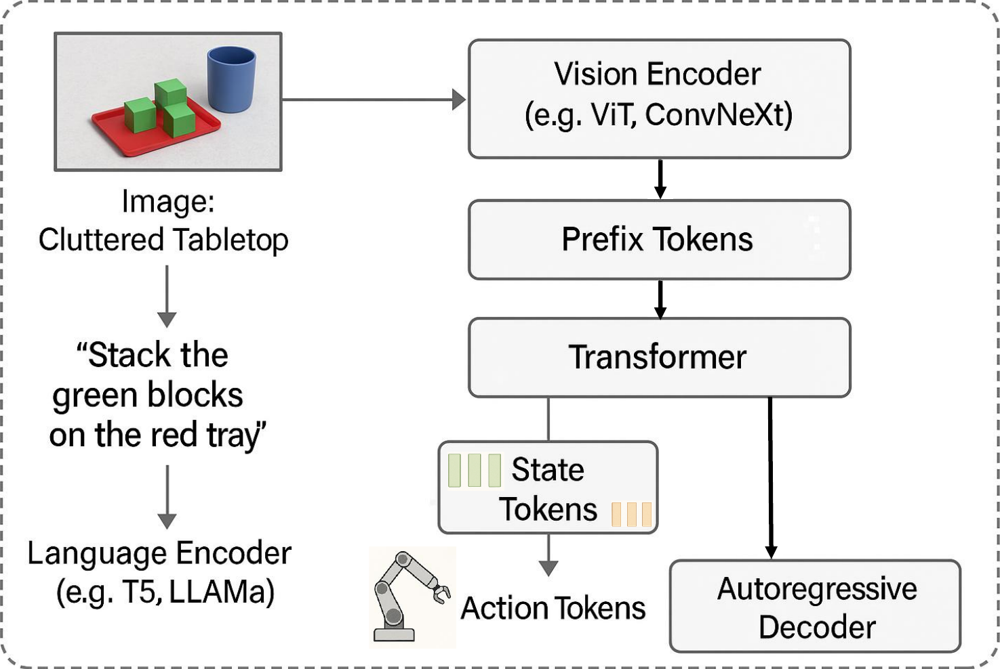

> 图 7 | 展示 VLA 模型中端到端词元化与表征过程的示意图。视觉输入（例如，杂乱的桌面）由视觉编码器（例如，ViT）编码，而自然语言指令（例如，“堆叠绿色积木”）由语言编码器（例如，T5）处理。系统通过一个 **变换器（Transformer）** 融合前缀、状态和动作词元，并以自回归方式预测运动动作。

**2. 状态词元（State Tokens）：嵌入机器人配置**

除了感知外部刺激，VLA 模型还必须了解其内部物理状态 [242, 143]。这是通过使用状态词元（State Tokens）实现的，这些词元编码了关于智能体配置的实时信息，包括关节位置、力-扭矩读数、夹爪状态、末端执行器位姿，甚至附近物体的位置 [126]。这些词元对于确保情境感知和安全性至关重要，尤其是在操作或移动过程中 [211, 105]。
图 [8](#figure-8) 展示了 VLA 模型如何利用状态词元在操作和导航场景中实现动态的、上下文感知的决策。在图 [8](#figure-8)a 中，一个机器人手臂部分伸展，靠近一个易碎物体。在此类场景中，状态词元通过编码实时本体感觉信息（如关节角度、夹爪位姿和末端执行器接近度）发挥着关键作用。这些词元与基于视觉和语言的前缀词元持续融合，使得变换器能够推理物理约束。因此，模型可以推断即将发生碰撞，并相应地调整电机指令，例如，重新规划手臂轨迹或调节力输出。在如图 [8](#figure-8)b 所示的移动机器人平台中，状态词元封装了空间特征，如里程计、激光雷达扫描和惯性传感器数据。这些对于地形感知移动和避障至关重要。变换器模型将这种状态表征与环境及指令上下文相结合，以生成能够动态适应变化环境的导航动作。无论是在杂乱环境中抓取物体，还是在崎岖地形上自主导航，状态词元都为情境感知提供了一种结构化机制，使自回归解码器能够生成精确的、基于上下文信息的动作序列，这些序列同时反映了机器人的内部配置和外部感知数据。

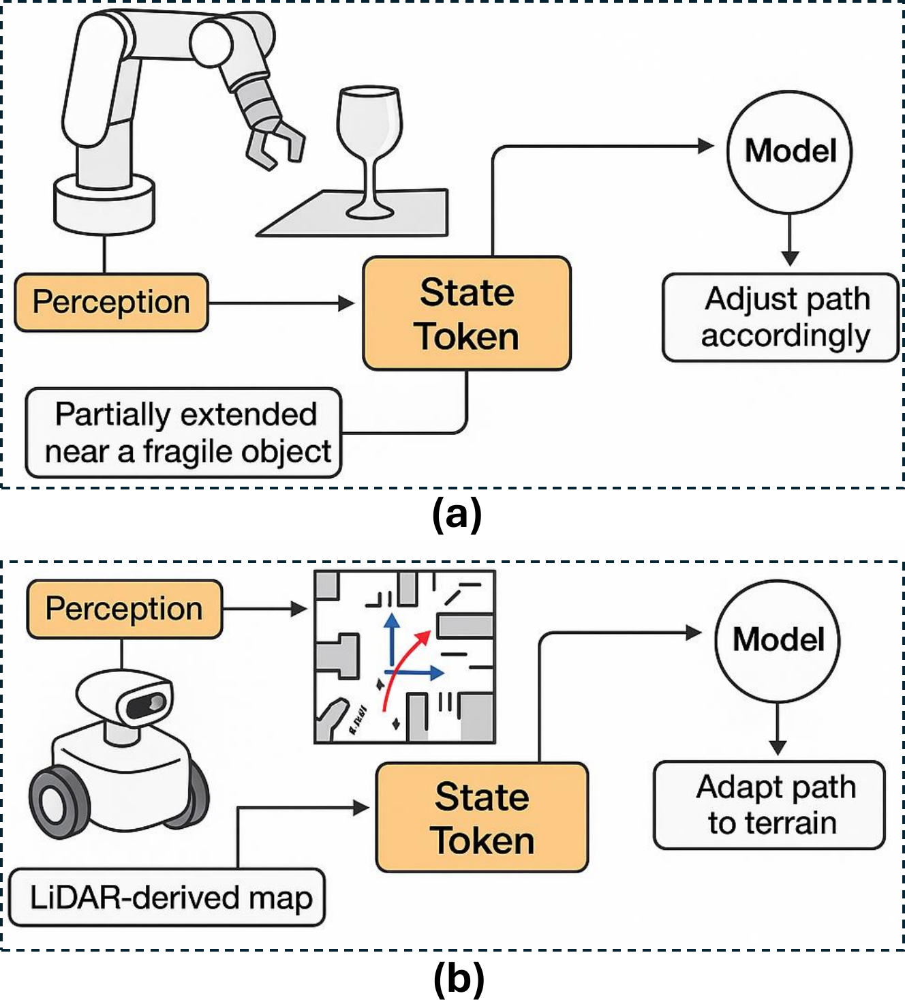

> 图 8 | 展示 VLA 模型在现实场景中如何利用前缀、状态和动作词元。在机器人操作中，状态词元检测靠近易碎物体的手臂伸展，从而调整路径。在导航中，它们代表 **激光雷达（LiDAR）** 和里程计数据。苹果采摘任务展示了前缀词元如何指导目标理解，而动作词元则生成用于目标抓取和执行的运动序列。

**3. 动作词元（Action Tokens）：自回归控制生成**

VLA 词元流程的最后一层涉及动作词元（Action Tokens）[121, 122]，它们由模型自回归生成，以表示运动控制中的下一步 [242]。每个词元对应一个低级控制信号，例如关节角度更新、扭矩值、轮速或高级运动基元 [81]。在推理过程中，模型以前缀和状态词元为条件，逐步解码这些词元，从而有效地将 VLA 模型转变为语言驱动的策略生成器 [67, 209]。这种形式允许与现实世界的驱动系统无缝集成，支持可变长度的动作序列 [11, 99]，并能够通过 **强化学习（Reinforcement Learning）** 或 **模仿学习（Imitation Learning）** 框架对模型进行微调 [285]。值得注意的是，像 RT-2 [299] 和 PaLM-E [58] 这样的模型体现了这种设计，其中感知、指令和具身被融合到一个统一的词元流中。

例如，在图 [9](#figure-9) 描绘的苹果采摘任务中，模型可能接收到包含果园图像和文本指令的前缀词元。状态词元描述了机器人当前的手臂姿态以及夹爪是张开还是闭合。随后，动作词元被一步步预测出来，以引导机械臂朝向苹果，调整夹爪方向，并以适当的力执行抓取。这种方法的美妙之处在于，它使得传统上用于文本生成的变换器，现在能够以一种类似于生成句子的方式来生成物理动作序列——只不过在这里，句子就是运动。

<a id="figure-9"></a>
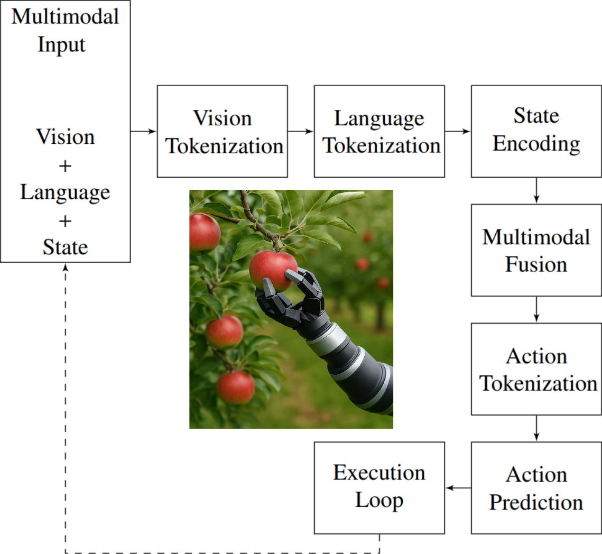

> 图 9 | 阐释 **视觉-语言-动作模型（Vision-Language-Action Models, VLAs）** 如何编码世界的过程。VLAs 通过将视觉、语言和传感器输入转换为词元（Tokens），通过交叉注意力（Cross-attention）进行融合，经由变换器（Transformers）预测动作序列，并利用实时反馈执行任务，从而使机器人能够解释场景、遵循指令并动态调整动作。

为了在机器人学中实现 VLA 范式，我们在图 [9](#figure-9) 中展示了一个结构化流程，具体说明了多模态信息——特别是视觉、语言和本体感觉状态（Proprioceptive state）——是如何被编码、融合并转换为可执行动作序列的。这个端到端（End-to-end）循环使机器人能够解释诸如“摘取绿叶附近那个成熟的苹果”之类的复杂任务，并执行精确的、上下文敏感的操作。系统始于多模态输入获取，在此阶段收集三种不同的数据流：

- 视觉观测（例如 RGB-D 帧）
- 自然语言指令
- 实时机器人状态信息（例如关节角度或速度）

这些数据流使用预训练模块 [51, 282] 被独立地 **词元化（Tokenized）** 为离散的嵌入（Embeddings）。如图所示，图像通过一个 **视觉变换器（Vision Transformer, ViT）** 骨干网络处理以生成视觉词元；指令由诸如 BERT 或 T5 的语言模型解析以产生语言词元；状态输入则通过一个轻量级的 **多层感知机（Multilayer Perceptron, MLP）** 编码器转换为紧凑的状态词元。

随后，这些词元通过一个 **跨模态注意力（Cross-modal attention）** 机制进行融合，模型在此过程中对物体语义、空间布局和物理约束进行联合推理 [76]。这种融合后的表征构成了决策的上下文基础 [96, 149]。在图 [9](#figure-9) 中，这被标记为 **多模态融合（Multi-modal fusion）** 步骤。融合后的嵌入被传递到一个 **自回归（Autoregressive）** 解码器（通常是一个变换器），该解码器生成一系列动作词元。这些词元可能对应于关节位移、夹持器力调节或高级运动基元（例如“移动到抓取位姿”、“旋转手腕”）。预测出的动作词元随后被翻译成低级控制命令，并由一个外部的、依赖于硬件的执行循环执行。该执行循环与机器人控制器交互，通过反馈更新后的状态观测以用于下一个 VLA 推理步骤，从而闭合感知-动作循环。这种 **闭环（Closed-loop）** 机制使模型能够实时动态适应扰动、物体移动或遮挡 [278, 155, 251]。

为了提供清晰具体的实现细节， **算法 1** 形式化了 VLA 的词元化过程。

- 给定一个 RGB-D 帧 $I$、自然语言指令 $T$ 和关节角度向量 $\theta$，该算法生成一组可以顺序执行的动作词元。
- 图像 $I$ 通过 ViT 处理，产生 $V$，即一组 400 个视觉词元。
- 同时，指令 $T$ 由 BERT 模型编码，生成 $L$，即一个包含 12 个语义语言词元的序列。
- 与此同时，机器人状态 $\theta$——包括关节角度、末端执行器位姿和本体感觉信号——由多层感知机编码成一个紧凑的 64 维状态嵌入 $S$，为模型在动作生成过程中提供对机器人配置和物理约束的实时感知。
- 然后，这些词元通过一个交叉注意力模块融合，产生一个共享的 512 维表征 $F$，它捕捉了执行具体动作所需的语义、意图和态势感知。
- 最后，一个策略解码器（例如 FAST [171]）将融合特征映射为 50 个离散的动作词元，这些词元随后可以被解码为电机命令 $\tau_{1:N}$。

<a id="algorithm-1"></a>
**算法 1 VLA 词元化流程**

- 1: **输入** : RGB-D 帧 $I$，文本命令 $T$，关节角度 $\theta$
  - 2: $V\leftarrow\text{ViT}(I)$ $\triangleright$ 400 个视觉词元
  - 3: $L\leftarrow\text{BERT}(T)$ $\triangleright$ 12 个语言词元
  - 4: $S\leftarrow\text{MLP}(\theta)$ $\triangleright$ 64 维状态编码
  - 5: $F\leftarrow\text{CrossAttention}(V,L,S)$ $\triangleright$ 512 维融合词元
  - 6: $A\leftarrow\text{FAST}(F)$ $\triangleright$ 50 个动作词元
- 7: **输出** : 电机命令 $\tau_{1:N}$

解码过程使用基于变换器的架构实现，如标题为“动作预测代码”的代码片段所示。

- 一个变换器解码器被实例化，具有 12 层、512 维模型维度和 8 个注意力头。
- 融合后的多模态词元作为上下文提供，解码器以自回归方式一次一步地预测动作词元，其中每个预测出的词元都代表在完整多模态上下文和所有先前生成动作条件下做出的下一个控制决策。
- 生成的动作词元序列随后被 **解词元化（Detokenized）** 为连续的电机命令轨迹以供执行。
- 这种实现方式反映了 **大型语言模型（Large Language Models, LLMs）** 中文本生成的工作原理，但这里的“句子”是一条运动轨迹——这是将自然语言生成技术重新用于物理动作合成的一种新颖方式。

Action Prediction Code

```python
# Python-like pseudocode
def predict_actions(fused_tokens):
    transformer = Transformer(
        num_layers=12,
        d_model=512,
        nhead=8
    )
    action_tokens = transformer.decode(
        fused_tokens,
        memory=fused_tokens
    )
    return detokenize(action_tokens)
```

总之，图 [9](#figure-9)、算法 [1](#algorithm-1) 和伪代码共同说明了 VLAs 如何在连贯且可解释的词元空间内统一感知、指令和具身（Embodiment）。这种模块化特性使得该框架能够泛化到不同的任务和机器人形态，促进在苹果采摘、家务劳动和移动导航等现实世界应用中的快速部署。重要的是，词元化步骤的清晰性和可分离性使得该架构具有可扩展性，为 VLA 系统中的词元学习、分层规划或符号接地（Symbolic grounding）等进一步研究提供了可能。

动作预测代码

<a id="section-2-4"></a>

### 2.4 学习范式：数据源与训练策略

训练 **视觉-语言-动作模型（Vision-Language-Action models, VLA models）** 需要一个混合学习范式，该范式需整合来自网络的语义知识和来自机器人数据集的任务基础信息 [35]。如前面章节所示，VLA 的多模态架构必须接触支持语言理解、视觉识别和运动控制的各种形式数据。这通常通过两个主要数据源实现。

首先，如图 [10](#figure-10) 所示，大规模互联网语料构成了模型 **语义先验（semantic prior）** 的支柱。这些数据集包括图像-标题对（例如，COCO、LAION-400M）、指令跟随数据集（例如，HowTo100M、WebVid）以及视觉问答语料库（例如，VQA、GQA）。此类数据集支持视觉和语言编码器的预训练，帮助模型获取关于物体、动作和概念的通用表征 [2]。此阶段通常使用对比或掩码建模目标，例如 CLIP 风格的对比学习或语言建模损失，以在共享的嵌入空间中对齐视觉和语言模态 [186, 262]。重要的是，这一阶段赋予 VLA 模型一个基础的“世界理解”，这有助于组合泛化、物体基础化和零样本迁移 [32, 16]。

<a id="figure-10"></a>
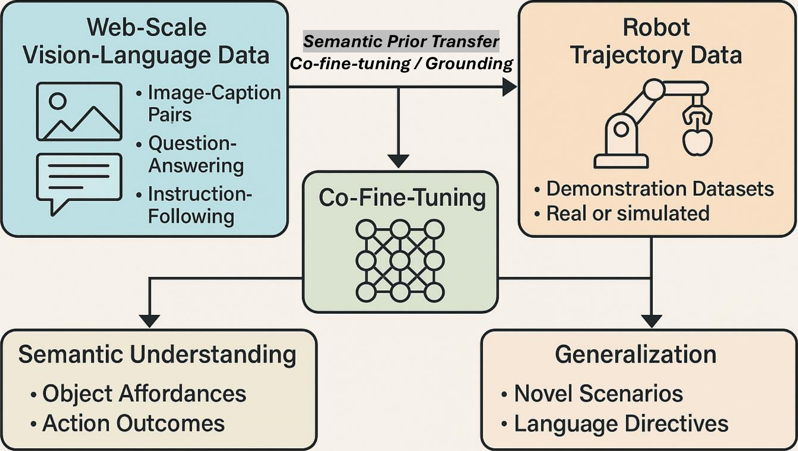

> 图 10 | VLA（Vision-Language-Action）模型的学习范式：数据源与训练策略。

然而，仅有语义理解不足以执行物理任务 [44, 231, 137]。因此，第二阶段侧重于将模型 **基础化（grounding）** 于具身体验中 [231]。从真实世界机器人或高保真模拟器收集的机器人轨迹数据集，用于教导模型如何将语言和感知转化为行动 [67]。这些数据集包括 RoboNet [45]、BridgeData [61] 和 RT-X [227] 等，它们提供了在自然语言指令下的视频-动作对、关节轨迹和环境交互 [159]。演示数据可能来自 **示教（kinesthetic teaching）** 、 **遥操作（teleoperation）** 或脚本策略 [115, 13]。此阶段通常采用监督学习（例如， **行为克隆（behavior cloning）** ）[68]、 **强化学习（Reinforcement Learning, RL）** 或 **模仿学习（imitation learning）** 来训练自回归策略解码器，使其基于融合的视觉-语言-状态嵌入来预测动作词元 [83]。

近期工作越来越多地采用多阶段或多任务训练策略。例如，模型通常先在视觉-语言数据集上使用掩码语言建模进行预训练，然后在机器人演示数据上使用词元级自回归损失进行微调 [122, 295, 252]。其他方法使用 **课程学习（curriculum learning）** ，即先进行较简单的任务（例如，推物体），再进行更复杂的任务（例如，多步操作）[288]。一些方法进一步利用 **领域自适应（domain adaptation）** （例如 OpenVLA [122] 中的方法）或 **仿真到现实迁移（sim-to-real transfer）** ，以弥合合成数据与现实世界数据分布之间的差距 [125]。通过将语义先验与任务执行数据统一起来，这些学习范式使得 VLA 模型能够在任务、领域和具体实现之间进行泛化，构成了可扩展、能够稳健执行现实世界操作的指令跟随智能体的核心。

通过 **协同微调（co-fine-tuning）** ，这些数据集被对齐 [232, 63]。模型学习从视觉和语言输入映射到适当的动作序列 [175]。这种训练范式不仅帮助模型理解 **物体可供性（object affordances）** （例如，苹果可以被抓握）和动作结果（例如，举起需要力和轨迹），还促进了向新场景的泛化 [129]。一个在厨房操作任务上训练的模型，如果它已经学会了物体定位、抓握和遵循语言指令的一般原则，就可能能够推断如何在户外果园中采摘苹果。

最近的架构，例如 Google DeepMind 的 **RT-2（Robotic Transformer 2）** [299]，已经在实践中证明了这一原理。RT-2 将动作生成视为一种文本生成形式，其中每个动作词元对应于机器人控制空间中的一个离散命令。由于该模型同时在网络规模的多模态数据和数千个机器人演示上进行训练，它能够灵活地解释新指令，并对新物体和任务执行 **零样本泛化（zero-shot generalization）** ——这在传统控制系统甚至早期的多模态模型中基本是不可能的。

<a id="section-2-5"></a>

### 2.5 自适应控制与实时执行（Adaptive Control and Real-Time Execution）

VLA 的另一个优势在于其执行 **自适应控制（adaptive control）** 的能力，即利用来自传感器的实时反馈来即时调整行为 [195]。这在动态、非结构化的环境（如果园、家庭或医院）中尤为重要，因为意外变化（例如，风吹动苹果、光照变化、人员出现）可能会改变任务参数。在执行过程中， **状态词元（state tokens）** 会实时更新，反映传感器输入和关节反馈 [252]。然后，模型可以相应地修改其计划好的动作。例如，在苹果采摘场景中，如果目标苹果轻微移动或另一个苹果进入视野，模型会动态地重新解释场景并调整抓取轨迹。这种能力模仿了类人的适应性，是 VLA 系统相较于基于流水线的机器人技术的核心优势。

<a id="section-3"></a>

## 3 视觉-语言-动作模型的进展

**视觉-语言-动作模型（Vision-Language-Action models, VLA）** 的诞生，是由基于 **Transformer 架构的大型语言模型（Large Language Models, LLMs）** 取得的显著成功所催化的，特别是 2022 年 11 月发布的 ChatGPT，它展示了前所未有的语义推理能力 [179]。这一突破激励了研究人员将语言模型扩展到多模态领域，为机器人技术整合感知与动作。到 2023 年，GPT-4 通过处理文本和图像引入了多模态能力，这推动了后续努力，将以语言为中心的多模态基础模型扩展到包含物理动作表示和控制接口的方向 [1]。与此同时，像 CLIP（2022）[202] 和 Flamingo（2022）[3] 这样的 **视觉语言模型（Vision-Language Models, VLMs）** 已经通过 **对比学习（Contrastive Learning）** 建立了稳健的视觉-文本对齐，实现了 **零样本物体识别（Zero-shot Object Recognition）** ，并为 VLM 模型（如 CLIP）奠定了基础。这些模型利用大规模标注数据集将图像与文本描述对齐，这是整合动作的关键先决条件。

一个关键的发展是创建了大规模机器人数据集，例如 RT-1 的 13 万次演示，这些数据为视觉、语言和动作组件的联合训练提供了必要的动作基础数据 [19]。这些数据集捕捉了多样化的任务和环境，使模型能够学习可泛化的行为。紧随其后的是架构上的突破，即谷歌在 2023 年推出的 RT-2 [18]，这是一个里程碑式的 VLA 模型，它统一了视觉、语言和动作词元，将机器人控制视为一个 **自回归序列预测（Autoregressive Sequence Prediction）** 任务。RT-2 使用 **离散余弦变换（Discrete Cosine Transform, DCT）** 压缩和 **字节对编码（Byte-Pair Encoding, BPE）** 对动作进行离散化处理，在新物体上的性能提升了 63%。多模态融合技术，例如 **交叉注意力 Transformer（Cross-attention Transformers）** ，将 **视觉 Transformer（Vision Transformer, ViT）** 处理的图像（例如，400 个图像块词元）与语言嵌入集成在一起，使机器人能够执行诸如“拿起碗左边的红杯子”这样的复杂指令。此外，加州大学伯克利分校的 Octo 模型（2023）引入了一种开源方法，拥有 9300 万个参数和 **扩散解码器（Diffusion Decoders）** ，并在来自 OpenX-Embodiment 数据集的 80 万次机器人演示上进行了训练，进一步拓宽了研究视野 [218]。

<a id="section-3-1"></a>

### 3.1 VLA 模型的架构创新

从 2023 年到 2024 年， **视觉语言-动作模型（Vision-Language-Action models, VLA）** 在**架构**和**训练方法**上取得了显著进展。

- **双系统架构（Dual-system architectures）** 成为一项关键创新，以英伟达（NVIDIA）的 GR00T N1 (2025) [14] 为例，它结合了 **系统 1（System 1）** （用于低级控制的快速扩散策略，延迟为 10 毫秒）和 **系统 2（System 2）** （用于高级任务分解的基于大型语言模型（Large Language Model, LLM）的规划器）。这种分离实现了战略规划与实时执行之间的高效协调，增强了在动态环境中的适应性。
- 其他模型，如斯坦福大学（Stanford）的 OpenVLA (2024) [122]，引入了基于 97 万次真实世界机器人演示训练的 70 亿参数开源 VLA，它使用了双视觉编码器（DINOv2 [164] 和 SigLIP [271]）和一个 Llama 2 语言模型 [223]，其性能超过了 RT-2-X (550 亿参数) [122] 等更大的模型。

训练范式也得到发展，开始利用网络规模的视觉-语言数据（例如 LAION-5B [194]）和机器人轨迹数据（例如 RT-X [227]）进行 **协同微调（Co-fine-tuning）** ，从而将语义知识与物理约束对齐 [194]。

- 像 UniSim 这样的合成数据生成工具通过创建逼真的场景（例如被遮挡的物体）来解决数据稀缺问题，这对于鲁棒性训练至关重要（UniSim [264]）。通过用于微调的 **低秩适应（Low-Rank Adaptation, LoRA）** 适配器 [93] 提高了参数效率，这使得无需完全重新训练即可进行领域适应，将 GPU 计算时间减少了 70%。
- 基于扩散的策略的引入，如 Physical Intelligence 的 pi 0 模型 (2024) [15] 所示，提供了改进的动作多样性，但需要大量的计算资源。这些进步使得 VLA 技术更加普及，促进了合作并加速了创新。

近期的 VLA 模型已趋同于三大主要架构范式，以平衡效率、模块化和鲁棒性： **早期融合模型（Early fusion models）** 、 **双系统架构（Dual-system architectures）** 和 **自校正框架（Self-correcting frameworks）** 。每一项创新都旨在解决现实世界机器人系统中在 **接地（Grounding）** 、 **泛化（Generalization）** 和动作可靠性方面的特定挑战。

#### 1. **早期融合模型（Early Fusion Models）** ：

- 一类 VLA 方法专注于在将视觉和语言表征传递给策略模块之前，在输入阶段就将它们融合。黄等人（Huang et al.）在 **国际学习表征会议（International Conference on Learning Representations, ICLR 2025）** 上提出的 EF-VLA 模型 [96] 是这一趋势的典范，它保留了由 CLIP [202] 建立起来的表征对齐。EF-VLA 接收图像-文本对，使用 CLIP 的冻结编码器对其进行编码，并在动作预测之前，在 Transformer 骨干网络的早期阶段融合得到的嵌入向量。这种设计确保了在 CLIP 预训练期间学到的语义一致性得以保留，减少了过拟合并增强了泛化能力。值得注意的是，EF-VLA 在组合操作任务上表现出 20% 的性能提升，并且在先前未见过的目标描述上达到了 85% 的成功率。通过保持视觉-语言骨干网络冻结，这种方法保持了计算效率并避免了灾难性遗忘，同时领域特定的训练被限制在轻量级的策略或动作模块中，从而实现了任务适应，而无需牺牲模型的通用视觉-语义表征。

#### 2. **双系统架构（Dual-System Architectures）** ：

- 受人类认知的双过程理论启发，像英伟达（NVIDIA）的 GR00T N1 (2025) [14] 这样的模型实现了两个互补的子系统：一个快速反应模块（系统 1）和一个慢速推理规划器（系统 2）。系统 1 包含一个基于扩散的控制策略，其运行延迟为 10 毫秒，非常适合精细的低级控制，例如末端执行器稳定或自适应抓取。相比之下，系统 2 使用一个 LLM 进行任务规划、技能组合和高级序列编排。规划器将长期目标（例如，“清理桌子”）解析为原子子任务，而低级控制器确保实时执行。这种分解实现了多时间尺度的推理并提高了安全性，尤其是在需要快速反应和审慎思考并存的环境中。在多阶段家庭操作任务的基准测试中，GR00T N1 的成功率比 RT-1、RT-2 和 OpenVLA 等单体模型高出 17%，并将碰撞失败率降低了 28%。

#### 3. **自校正框架（Self-Correcting Frameworks）** ：

- 第三个架构演进是自校正 VLA 模型的出现，它们通过显式的故障检测和恢复机制来增强传统的推理流程。SC-VLA (2024) 保留了类似于早期端到端或分层 VLA 设计的标准快速推理路径，但引入了一个额外的、更慢的校正路径。该路径在检测到执行失败或不一致时被选择性地激活，以重新评估决策并生成恢复动作。在此框架中，默认行为是使用一个轻量级 Transformer 直接从融合的嵌入向量中预测姿态或动作。当检测到失败时（例如，抓取不成功或与障碍物碰撞），模型会调用一个执行 **思维链（Chain-of-Thought）** 推理 [281, 270] 的次级过程。该路径查询一个内部 LLM（或外部专家系统）来诊断故障模式并生成校正策略 [59]。例如，如果机器人反复错误识别一个被遮挡的物体，LLM 可能会建议主动改变视角或重新调整夹爪方向。在闭环实验中，SC-VLA 将任务失败率降低了 35%，并显著提高了在杂乱和对抗性环境中的可恢复性。

#### **4. Architectural Design Space of VLA Models（视觉语言动作模型的设计空间）**

**视觉语言动作模型（Vision-Language-Action models, VLA models）** 展现出丰富的架构设计和功能侧重点多样性，可以沿着 **端到端（end-to-end）与模块化（modular）流水线** 、 **分层（hierarchical）与扁平（flat）策略结构** ，以及 **底层控制（low-level control）与高层规划（high-level planning）之间的平衡** 这几个维度进行系统化梳理（表 [1](#table-1)）。端到端的 VLA 模型，例如 CLIPort [202]、RT-1 [19] 和 OpenVLA [122]，通过单一的统一网络将原始感知输入直接处理为运动指令。相比之下，以组件为中心的模型，如 VLATest [237] 和 Chain-of-Affordance [129]，则将感知、语言基础（language grounding）和动作模块解耦，从而能够对各个子模块进行有针对性的改进。

分层架构的出现是为了通过将战略决策与反应式控制分离来处理复杂、长视野（long-horizon）的任务。例如，CogACT [131] 和 NaVILA [38] 采用了两层结构，其中一个基于 **大型语言模型（Large Language Model, LLM）** 的规划器向底层控制器发出子目标，从而结合了 **系统 2（System 2）** 推理和 **系统 1（System 1）** 执行的优势。类似地，ORION [69] 在一个统一的框架中，将用于长期上下文聚合的 QT-Former 与一个生成式轨迹规划器集成在一起。

强调底层策略的典型代表是基于 **扩散（diffusion）** 的控制器（例如 Pi-0 [15]、DexGraspVLA [291]），它们擅长生成平滑、多样的运动分布，但通常带来更高的计算成本。相比之下，高层规划器（例如 FAST Pi-0 Fast [171]、CoVLA [5]）专注于快速子目标生成或粗略轨迹预测，将细粒度控制委托给专用模块或传统的运动规划器。像 HybridVLA [142] 和 Helix [217] 这样的端到端双系统模型则模糊了这些区别，它们联合训练两个组件，同时保持了模块化的可解释性。

表 [1](#table-1) 进一步突显了近期 VLA 模型如何平衡这些权衡。像 OpenDriveVLA [293] 和 CombatVLA [34] 这样的模型在动态、安全关键（safety-critical）的领域中优先考虑分层规划，而像 Edge VLA [20] 和 TinyVLA [242] 这样的轻量级、面向边缘（edge-targeted）的系统则强调实时底层策略，牺牲了高层推理能力。这种分类框架不仅厘清了 VLA 的设计空间，还通过指出尚未充分探索的组合（例如，为嵌入式部署优化的、完全端到端的分层模型）来指导未来发展，这些组合有望提升 VLA 系统在机器人学、自动驾驶及其他领域的性能和适用性。

表 [1](#table-1) 中的分类具有重要意义，因为它为比较不同的 VLA 架构提供了一个清晰的框架，突出了诸如端到端集成与分层分解等设计选择如何影响任务性能、可扩展性和适应性。通过沿着底层策略执行和高层规划等维度对模型进行分类，研究人员可以更清晰地识别现有方法的优势和局限性，并发现架构创新的机会。例如，高速水果采摘或精准喷洒等农业机器人任务受益于强调快速、反应式底层控制器的架构，而果园导航、多行覆盖规划或长视野作物监测等应用则需要更强的高层规划和推理能力。因此，这种分类法有助于为特定用例选择合适的 VLA 架构，并指导未来发展朝着平衡响应性与认知规划的混合系统迈进，最终加速具身人工智能（embodied AI）的进步。

<a id="table-1"></a>

> **表 1：VLA 模型分类法（Table 1: Taxonomy of VLA models）** 展示了基于架构范式与科学优先级的结构化分类。我们根据模型对 **端到端执行（End-to-End execution）** 、 **分层规划-控制分解（Hierarchical planning–control decomposition）** 或 **组件聚焦模块化（Component-focused modularity）** 的支持来区分它们，并进一步根据其侧重于 **低级运动策略（Low-level motor policies）** 还是 **高级任务规划器（High-level task planners）** 进行划分。

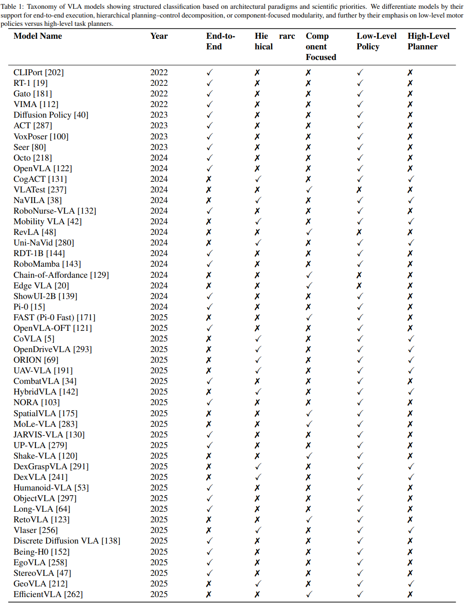

表 1 | VLA 模型分类法。

| 模型名称（Model Name）       | 年份（Year） | 端到端（End-to-End） | 分层（Hierarchical） | 组件聚焦（Component Focused） | 低级策略（Low-Level Policy） | 高级规划器（High-Level Planner） |
| :--------------------------- | :----------: | :------------------: | :------------------: | :---------------------------: | :--------------------------: | :------------------------------: |
| CLIPort [202]                |     2022     |          ✓           |          ✗           |               ✗               |              ✓               |                ✗                 |
| RT-1 [19]                    |     2022     |          ✓           |          ✗           |               ✗               |              ✓               |                ✗                 |
| Gato [181]                   |     2022     |          ✓           |          ✗           |               ✗               |              ✓               |                ✗                 |
| VIMA [112]                   |     2022     |          ✓           |          ✗           |               ✗               |              ✓               |                ✗                 |
| Diffusion Policy [40]        |     2023     |          ✓           |          ✗           |               ✗               |              ✓               |                ✗                 |
| ACT [287]                    |     2023     |          ✓           |          ✗           |               ✗               |              ✓               |                ✗                 |
| VoxPoser [100]               |     2023     |          ✓           |          ✗           |               ✗               |              ✓               |                ✗                 |
| Seer [80]                    |     2023     |          ✓           |          ✗           |               ✗               |              ✓               |                ✗                 |
| Octo [218]                   |     2024     |          ✓           |          ✗           |               ✗               |              ✓               |                ✗                 |
| OpenVLA [122]                |     2024     |          ✓           |          ✗           |               ✗               |              ✓               |                ✗                 |
| CogACT [131]                 |     2024     |          ✗           |          ✓           |               ✗               |              ✓               |                ✓                 |
| VLATest [237]                |     2024     |          ✗           |          ✗           |               ✓               |              ✗               |                ✗                 |
| NaVILA [38]                  |     2024     |          ✗           |          ✓           |               ✗               |              ✓               |                ✓                 |
| RoboNurse-VLA [132]          |     2024     |          ✓           |          ✗           |               ✗               |              ✓               |                ✗                 |
| Mobility VLA [42]            |     2024     |          ✗           |          ✓           |               ✗               |              ✓               |                ✓                 |
| RevLA [48]                   |     2024     |          ✗           |          ✗           |               ✓               |              ✗               |                ✗                 |
| Uni-NaVid [280]              |     2024     |          ✗           |          ✓           |               ✗               |              ✓               |                ✓                 |
| RDT-1B [145]                 |     2024     |          ✓           |          ✗           |               ✗               |              ✓               |                ✗                 |
| RoboMamba [143]              |     2024     |          ✓           |          ✗           |               ✗               |              ✓               |                ✗                 |
| Chain-of-Affordance [129]    |     2024     |          ✗           |          ✗           |               ✓               |              ✗               |                ✗                 |
| Edge VLA [20]                |     2024     |          ✗           |          ✗           |               ✓               |              ✗               |                ✗                 |
| ShowUI-2B [139]              |     2024     |          ✓           |          ✗           |               ✗               |              ✓               |                ✗                 |
| Pi-0 [15]                    |     2024     |          ✓           |          ✗           |               ✗               |              ✓               |                ✗                 |
| FAST (Pi-0 Fast) [171]       |     2025     |          ✗           |          ✗           |               ✓               |              ✓               |                ✗                 |
| OpenVLA-OFT [121]            |     2025     |          ✓           |          ✗           |               ✗               |              ✓               |                ✗                 |
| CoVLA [5]                    |     2025     |          ✗           |          ✓           |               ✗               |              ✓               |                ✓                 |
| OpenDriveVLA [293]           |     2025     |          ✗           |          ✓           |               ✗               |              ✓               |                ✓                 |
| ORION [69]                   |     2025     |          ✗           |          ✓           |               ✗               |              ✓               |                ✓                 |
| UAV-VLA [191]                |     2025     |          ✗           |          ✓           |               ✗               |              ✓               |                ✓                 |
| CombatVLA [34]               |     2025     |          ✓           |          ✗           |               ✗               |              ✓               |                ✗                 |
| HybridVLA [142]              |     2025     |          ✗           |          ✓           |               ✗               |              ✓               |                ✓                 |
| NORA [103]                   |     2025     |          ✓           |          ✗           |               ✗               |              ✓               |                ✗                 |
| SpatialVLA [175]             |     2025     |          ✗           |          ✗           |               ✓               |              ✓               |                ✗                 |
| MoLe-VLA [283]               |     2025     |          ✗           |          ✗           |               ✓               |              ✓               |                ✗                 |
| JARVIS-VLA [130]             |     2025     |          ✓           |          ✗           |               ✗               |              ✓               |                ✗                 |
| UP-VLA [279]                 |     2025     |          ✓           |          ✗           |               ✗               |              ✓               |                ✗                 |
| Shake-VLA [120]              |     2025     |          ✗           |          ✗           |               ✓               |              ✓               |                ✗                 |
| DexGraspVLA [291]            |     2025     |          ✗           |          ✓           |               ✗               |              ✓               |                ✓                 |
| DexVLA [241]                 |     2025     |          ✗           |          ✓           |               ✗               |              ✓               |                ✓                 |
| Humanoid-VLA [53]            |     2025     |          ✓           |          ✗           |               ✗               |              ✓               |                ✗                 |
| ObjectVLA [297]              |     2025     |          ✓           |          ✗           |               ✗               |              ✓               |                ✗                 |
| Long-VLA [64]                |     2025     |          ✓           |          ✗           |               ✗               |              ✓               |                ✗                 |
| RetoVLA [123]                |     2025     |          ✗           |          ✗           |               ✓               |              ✓               |                ✗                 |
| Vlaser [256]                 |     2025     |          ✗           |          ✓           |               ✗               |              ✓               |                ✓                 |
| Discrete Diffusion VLA [138] |     2025     |          ✓           |          ✗           |               ✗               |              ✓               |                ✗                 |
| Being-H0 [152]               |     2025     |          ✓           |          ✗           |               ✗               |              ✓               |                ✗                 |
| EgoVLA [257]                 |     2025     |          ✓           |          ✗           |               ✗               |              ✓               |                ✗                 |
| StereoVLA [47]               |     2025     |          ✓           |          ✗           |               ✗               |              ✓               |                ✗                 |
| GeoVLA [212]                 |     2025     |          ✗           |          ✓           |               ✗               |              ✓               |                ✓                 |
| EfficientVLA [260]           |     2025     |          ✗           |          ✗           |               ✓               |              ✓               |                ✗                 |

此外，为了综合近期 **视觉-语言-动作模型（Vision-Language-Action models, VLA）** 的进展，表 LABEL:tab:vla_models_compact 汇总了 2022 年至 2025 年间开发的重要系统。这些模型基于 **早期融合（early fusion）** 、 **双系统处理（dual-system processing）** 和 **自校正反馈循环（self-correcting feedback loops）** 等架构创新，融合了多样化的设计理念和训练策略。每个表格条目都明确列举了模型的架构组件——即 **视觉编码器（vision encoder）** 、 **语言编码器（language encoder）** 和 **动作解码器（action decoder）** ，以及用于支撑和评估模型能力的主要训练数据集。像 CLIPort [202] 和 RT-2 [299] 这样的模型通过将语义嵌入与动作策略对齐，奠定了早期基础；而更近期的框架，如 Pi-Zero、CogACT [131] 和 GR00T N1 [14]，则引入了具有 **基于扩散的控制器（diffusion-based controllers）** 或 **高频控制器（high-frequency controllers）** 的可扩展架构。多个模型利用互联网规模的 **视觉-语言语料库（vision-language corpora）** 和 **机器人轨迹数据集（robot trajectory datasets）** 进行 **多模态预训练（multi-modal pretraining）** ，从而增强了泛化能力和 **零样本能力（zero-shot capabilities）** [297, 291, 289, 258]。这份表格化的比较为研究人员提供了一个参考点，有助于理解 VLA 设计在真实与模拟环境中的功能多样性、领域适用性以及新兴趋势。

<a id="table-2"></a>

**表 2：代表性视觉-语言-动作（Vision–Language–Action, VLA）模型简明总结。每行列出了其主要编码器/解码器、训练数据和主要独特能力。**

| 模型 (参考文献)                           | 架构 (视觉 / 语言 / 动作)                                                                                    | 训练数据                                  | 关键优势 / 独特性                                                                                                                  |
| :---------------------------------------- | :----------------------------------------------------------------------------------------------------------- | :---------------------------------------- | :--------------------------------------------------------------------------------------------------------------------------------- |
| CLIPort [202]                             | CLIP-ResNet50 + Transporter-ResNet / CLIP-GPT / LingUNet                                                     | 自收集 [SC]                               | 将语义 CLIP 特征与 Transporter 空间推理对齐，实现精确的 SE(2) 操作。                                                               |
| RT-1 [19]                                 | EfficientNet / Universal Sentence Encoder / Transformer (离散化动作)                                         | RT-1-Kitchen [SC]                         | 早期用于多任务厨房操作、采用标记化动作的大规模 Transformer 策略。                                                                  |
| RT-2 [299]                                | ViT-22B 或 ViT-4B / PaLI-X 或 PaLM-E / 符号调优 (动作标记)                                                   | VQA + RT-1-Kitchen                        | 将互联网规模的 VQA 数据与机器人数据联合微调，为具身任务带来涌现泛化能力。                                                          |
| Gato [181]                                | ViT / SentencePiece / Transformer (统一标记流)                                                               | 自收集 [SC]                               | 通过共享标记化和单一 Transformer 统一机器人、语言和 Atari 的通用智能体。                                                           |
| VIMA [112]                                | ViT + Mask R-CNN / T5 / Transformer                                                                          | VIMA-Data [SC]                            | 跨多种组合任务类型（六种提示模态）的提示驱动视觉-语言（VL）基础。                                                                  |
| ACT [287]                                 | ResNet-18 / — / CVAE-Transformer                                                                             | ALOHA [SC]                                | 时间集成实现了具有精细控制精度的平滑双手模仿。                                                                                     |
| Octo [218]                                | CNN / T5-base / Diffusion Transformer                                                                        | Open X-Embodiment (OXE)                   | 在跨越多种机器人具身的 400 万+轨迹上训练的大型多机器人策略。                                                                       |
| VoxPoser [100]                            | ViLD + MDETR / GPT-4 / MPC (LLM 引导规划)                                                                    | 零样本                                    | 组合 LLM+VLM 进行约束感知的运动规划，无需任务特定训练。                                                                            |
| Diffusion Policy [40]                     | ResNet-18 / — / U-Net 或 Transformer 扩散                                                                    | 自收集 [SC]                               | 扩散建模捕获多模态动作分布，实现鲁棒的视觉运动控制。                                                                               |
| OpenVLA [122]                             | DINOv2 + SigLIP / Prismatic-7B / 符号调优                                                                    | OXE + DROID                               | 开源的类 RT-2 VLA；支持高效的 LoRA 适配和广泛的泛化。                                                                              |
| $\pi^{0}$ (Pi-Zero) [15]                  | PaliGemma VLM / PaliGemma (多模态) / 300M 扩散动作模型                                                       | Pi-Cross-Embodiment                       | 轻量级通用机器人控制器（据报道总计约 30 亿参数），具有强大的跨机器人、开放世界泛化能力和双手技能。                                 |
| $\pi^{0}$-Fast [171]                      | PaliGemma VLM / PaliGemma / 带 FAST 标记化的自回归 Transformer                                               | Pi-Cross-Embodiment                       | 通过压缩频率空间动作标记实现高频实时控制（据报道推理速度提升高达 15 倍）。                                                         |
| OpenVLA-OFT [121]                         | SigLIP + DINOv2 (多视角) / Llama-2 7B / 并行解码 + 动作分块 (L1 回归)                                        | LIBERO; 双手 ALOHA                        | 采用并行解码和分块动作的微调方案；据报道在 LIBERO 上达到 97.1% 成功率，并为高频双手控制带来 26 倍推理加速。                        |
| RDT-1B [145]                              | 多视角 RGB 编码器 / Transformer 语言模块 / Diffusion Transformer (统一动作空间)                              | 46 个数据集 (>100 万片段) + ALOHA 微调    | 用于灵巧双手操作的 12 亿参数扩散基础模型，具有强大的语言条件化和零样本迁移能力。                                                   |
| [Helix](https://www.figure.ai/news/helix) | 系统 2：用于多模态推理的开源 VLM (7–9 Hz) / 集成语义 / 系统 1：Transformer 视觉运动策略 (200 Hz，完整上半身) | Figure 机器人端到端 (像素+语言 → 动作)    | 专注于人形机器人的双速率 VLA，支持实时高自由度控制、灵巧性以及具有零样本泛化能力的协作多机器人操作。                               |
| CogACT [131]                              | DINOv2 ViT-L/14 + SigLIP ViT-So400M/14 / 通过 Prismatic-7B 的 Llama-2 / DiT-Base (300M 扩散)                 | OXE 子集；Realman & Franka 任务           | 采用扩散动作 Transformer 的组件化 VLA；据报道，在真实世界成功率上比 OpenVLA 高出 +59.1%，并对未见过的机器人/物体有很强的适应能力。 |
| Chain-of-Affordance (CoA) [129]           | 可供性感知视觉编码器 / Transformer 推理提示 / 自回归 + 扩散策略 (可供性条件化)                               | LIBERO；真实+仿真操作                     | 顺序可供性推理 (物体 → 抓取 → 空间 → 运动) 改进了空间规划和避障；据报道，LIBERO 性能强于 OpenVLA。                                 |
| Edge VLA (EVLA) [20]                      | SigLIP + DINOv2 / Qwen2 (0.5B) / 非自回归关节控制预测                                                        | Bridge; OXE; 120 万文本-图像对            | 针对边缘优化的 VLA（例如 Jetson 级），据报道推理速度达 30–50 Hz，在低功耗下性能与 OpenVLA 相当。                                   |
| ShowUI-2B [139]                           | UI 引导的视觉标记选择 / 交错 V–L–A 流 / Transformer GUI 动作预测器                                           | 256K GUI 指令跟随                         | 用于数字自动化的紧凑型 20 亿参数 VLA；具有强大的截图基础和高效的标记选择，适用于 GUI/网页导航。                                    |
| GR00T N1 [14]                             | NVIDIA Eagle-2 VLM / 集成高层规划 / 扩散 Transformer (DiT)                                                   | 人类演示 + 机器人轨迹 + 仿真 + 互联网视频 | 通用人形机器人双系统设计，结合规划和扩散执行，用于灵巧的多步控制和广泛的具身泛化。                                                 |
| Seer [80]                                 | 基础优化视觉主干 / Transformer 语言 / 自回归动作头                                                           | LIBERO                                    | 为操作任务提供强大的视觉基础；在 LIBERO 上具有竞争力，但通常低于较新的微调变体（例如 OpenVLA-OFT）。                               |
| DiffusionVLA [240]                        | Transformer 视觉编码器 / 自回归推理 / 扩散动作头                                                             | LIBERO；工厂分拣；零样本箱内拾取          | 扩散控制提高了鲁棒性和可解释性；据报道，在某些配置下空间泛化能力弱于 CoA。                                                         |

| 模型名称                     | 架构                                                                                                                                  | 数据集/任务                                                                  | 关键贡献/性能                                                                                                              |
| :--------------------------- | :------------------------------------------------------------------------------------------------------------------------------------ | :--------------------------------------------------------------------------- | :------------------------------------------------------------------------------------------------------------------------- |
| NaVILA [38]                  | CLIP + CNN / LLaMA-2 / 分层控制：拓扑规划器 + 强化学习运动控制                                                                        | 真实世界腿式机器人导航演示                                                   | 模块化层次结构实现地形泛化；报告了从自然语言指令出发，在真实世界导航任务中达到 **88%** 的成功率。                          |
| RoboNurse-VLA [132]          | SAM2 + RGB-D / LLaMA-2 + 语音转文本 / 姿态回归 + 夹爪分类器                                                                           | 手术器械交接视频 + 语音指令                                                  | 实时手术器械交接，对新型器械和动态手术室场景具有鲁棒性。                                                                   |
| Mobility VLA [42]            | 长上下文 ViT + 目标图像编码器 / 基于 T5 的指令编码器 / 图规划器 + 视觉目标定位                                                        | MINT 数据集（视觉-语言指令导览）                                             | 从多模态导览生成拓扑地图，实现在大型未见空间中的导航泛化。                                                                 |
| TinyVLA [242]                | FastViT / 紧凑 128 维语言模型 / 扩散解码器（50M 参数）                                                                                | Mini-ALOHA + SC 任务                                                         | 无需大规模预训练；在有限计算预算下，报告了更快的推理速度（ **5$\times$** ）和强精度。                                      |
| QUAR-VLA [54]                | CLIP + 本体感知嵌入 / BERT + 接地适配器 / 变换器全身解码器                                                                            | QUART（运动+操作）                                                           | 以四足机器人为中心的 VLA，具有强大的 **仿真到现实（sim-to-real）** 迁移能力和细粒度指令对齐。                              |
| ChatVLA [295]                | 相位对齐视觉编码器 / Prismatic MoE LLM / 统一 V–L–A 规划器                                                                            | 统一聊天-动作（网络+机器人）                                                 | 联合 **视觉问答（Visual Question Answering, VQA）** 与规划；缓解遗忘，支持通过操作执行对话式任务。                         |
| PointVLA [125]               | CLIP + 3D 点云融合 / LLaMA-2 / 带空间词元融合的变换器                                                                                 | 少样本空间任务（真实+仿真）                                                  | 通过注入 3D 结构同时保留预训练的 2D 知识，改进了长视野空间推理。                                                           |
| VLA-Cache [252]              | SigLIP + 词元记忆缓冲区 / Prismatic-7B / 带动态词元重用的变换器                                                                       | ALOHA + 仿真/真实融合                                                        | 缓存静态视觉词元以提高效率；报告推理速度提升 **40–50%** ，性能损失可忽略。                                                 |
| HybridVLA [142]              | CLIP + DINOv2 / LLaMA-2 / 混合扩散 + 自回归集成                                                                                       | RT-X + 合成融合                                                              | 动态集成提高了多臂设置下的鲁棒性，并支持更强的仿真到现实泛化。                                                             |
| MoLe-VLA [283]               | 多阶段 ViT + STAR 路由器 / CogKD 增强变换器 / 稀疏变换器（动态路由）                                                                  | RLBench + 真实世界操作                                                       | 选择性层激活带来效率提升（报告 **5.6$\times$** 加速）和更高的成功率（报告 **+8%** ）。                                     |
| UAV-VLA [191]                | 用于航空影像的 ViT / GPT 指令解析 / 变换器路径规划器                                                                                  | 卫星 + 无人机影像指令                                                        | 零样本航空任务规划，为大型未测绘环境提供可扩展的语言接地。                                                                 |
| DexGraspVLA [291]            | 以物体为中心的空间 ViT / 变换器抓取推理 / 扩散抓取控制器                                                                              | 灵巧抓取基准（仿真+真实）                                                    | 报告在不同物体上实现 **>90%** 的零样本成功率；对光照/背景变化和未见条件具有鲁棒性。                                        |
| GraspVLA [46]                | 多视角 DINOv2 + SigLIP / VLM 预测边界框+抓取位姿 / 流匹配动作专家（PAG）                                                              | SynGrasp-1B; GRIT                                                            | 合成数据预训练的抓取 VLA；改进了仿真到现实迁移，并支持对长尾物体类别和偏好的零/少样本泛化。                                |
| Interleave-VLA [62]          | InternVL2.5 + OWLv2 / Qwen2.5 / 连续动作预测器（OpenVLA+$\pi^{0}$ 风格，扩散控制器）                                                  | Open Interleaved X-Embodiment（210k 条轨迹，11 个数据集）                    | 端到端交错图像-文本指令跟随；报告了 **2–3$\times$** 的域外性能增益，并能从草图和新型多模态提示进行零样本执行。             |
| Long-VLA [64]                | 用于长视野任务的端到端 VLA / 相位感知输入掩码 + 变换器策略（子任务相位分割）                                                          | 长视野多步骤机器人操作演示（任务序列）                                       | 通过显式分离“移动”与“交互”阶段来针对长视野执行，提高了子任务兼容性和在扩展任务视野上的鲁棒性。                             |
| RetoVLA [123]                | 基于 VLM 的策略 / 将寄存器词元重用作动作预测的空间上下文                                                                              | 7 自由度机械臂真实机器人操作 + 任务特定演示                                  | 通过重新利用寄存器词元实现轻量级空间推理升级；报告在复杂操作任务上以最小的架构开销获得显著的成功率提升。                   |
| Vlaser [256]                 | VLM 到 VLA 的流水线 / 协同具身推理 + 策略学习（推理感知的 VLA 微调）                                                                  | Vlaser-6M 具身推理数据集 + VLA 微调数据（机器人演示）                        | 桥接具身推理与控制：在具身接地/问答/规划方面表现强劲，同时改进了在领域偏移下向策略学习的迁移。                             |
| Discrete Diffusion VLA [138] | 单变换器 VLA / 离散化动作块 + 离散扩散精炼（交叉熵训练；重掩码）                                                                      | LIBERO + SimplerEnv（Fractal/Bridge）风格 VLA 基准                           | 将扩散风格的精炼与离散词元接口统一：自适应解码顺序、通过重掩码进行错误校正、减少自回归瓶颈，并在基准测试中取得高成功率。   |
| Being-H0 [152]               | 从人类视频预训练的灵巧 VLA / 显式手部运动建模 + 动作的视觉-语言接地                                                                   | 大规模人类操作视频（第一人称/第三人称） + 迁移到机器人控制                   | 利用多样化的人类视频数据扩展灵巧操作；与仅使用少量遥操作机器人数据集相比，改进了对新任务/场景的泛化能力。                  |
| EgoVLA [257]                 | 在第一人称人类操作视频上进行 VLM 预训练 / 统一人-机器人动作空间 + 机器人微调                                                          | 大规模第一人称人类视频 + 少量机器人演示                                      | 利用丰富的第一人称视频进行可扩展的预训练，然后通过统一动作空间对齐具身形式，从而在有限的机器人数据下实现实用的机器人迁移。 |
| StereoVLA [47]               | 立体增强的视觉语言动作模型（Stereo-enhanced Vision-Language-Action, VLA） / 从立体图像对（+ 辅助深度线索）进行几何-语义融合以解码动作 | 立体机器人操作演示（立体 RGB 图像与语言条件化动作）                          | **显式利用立体几何来提高空间精度（对深度敏感的抓取/操作）以及对视点/相机变化的鲁棒性。**                                   |
| EfficientVLA [260]           | 无需训练的视觉语言动作模型（Vision-Language-Action, VLA）加速/压缩 / 跨 VLA 流水线的结构化冗余消除（词元/接口优化）                   | 适用于现有的视觉语言动作模型（在标准操作基准上评估；例如，SIMPLER 风格设置） | **实际可部署性：** 以最小的精度损失加速并减少大型 VLA 策略的计算量/内存占用，从而在受限硬件上实现更接近实时的推理。        |

<a id="section-3-2"></a>

### 3.2 视觉-语言-动作模型的训练效率进展（Training Efficiency Advancements in Vision–Language–Action Models）

**视觉-语言-动作模型（Vision–Language–Action Models, VLA）** 在训练和优化技术方面取得了快速进展，以协调多模态输入、降低计算需求并实现实时控制。关键的进展领域包括：

1.  **数据高效学习（Data-Efficient Learning）** 。
    - (a)**联合微调（Co-fine-tuning）** ：在大规模视觉-语言语料库（例如 LAION-5B）和机器人轨迹数据集（例如 Open X-Embodiment）上进行联合微调，将语义理解与运动技能对齐。OpenVLA（70 亿参数）相比一个 550 亿参数的 RT-2 变体实现了 16.5% 更高的成功率，这表明与单纯扩大模型规模相比，联合微调能以更少的参数实现强大的泛化能力 [194, 227, 122]。
    - (b)**合成数据生成（Synthetic Data Generation）** ：通过 UniSim 生成包含遮挡和动态光照的真实感场景，以增强罕见的边缘情况场景，在杂乱环境中将模型鲁棒性提升超过 20% [264, 218]。
    - (c)**自监督预训练（Self-Supervised Pretraining）** ：采用对比学习目标（类似 CLIP）在动作微调前学习联合视觉-文本嵌入，减少对任务特定标签的依赖。Qwen2-VL 利用自监督对齐，将下游抓取-放置任务的收敛速度加快了 12% [177, 98]。
2.  **参数高效适应（Parameter-Efficient Adaptation）** 。
    - **低秩适应（Low-Rank Adaptation, LoRA）** ：将轻量级适配器矩阵插入冻结的 Transformer 层中，在保持性能的同时，将可训练权重减少高达 70% [93]。Pi-0 Fast 变体在静态骨干网络上仅使用 1000 万个适配器参数，即可实现连续 200 Hz 的控制，且精度损失可忽略不计 [171]。
3.  **推理加速（Inference Acceleration）** 。
    - (a) **压缩动作词元（Compressed Action Tokens, FAST）** 和双系统框架（例如 GR00T N1）中的 **并行解码（parallel decoding）** ，可实现高达 2.5 倍的政策推理加速，将单步延迟降低至 5 毫秒以下。这是与在实时操作和人形机器人控制基准上评估的、采用标准自回归解码的单政策 VLA 相比的结果。这种加速以轨迹平滑度的适度下降为代价，表现为在高频控制下动作离散化误差略有增加，以及细粒度运动连续性降低 [14, 209]。

总之，这些方法已将 VLA 转变为能够在动态、真实世界环境中处理语言条件化、视觉引导任务的实用智能体。

<a id="section-3-3"></a>

### 3.3 VLA 模型中的参数高效方法与加速技术（Parameter-Efficient Methods and Acceleration Techniques in VLA Models）

除了数据高效学习策略，VLA 模型中另一条互补的研究路线专注于减少模型大小、内存占用和推理延迟，以便在计算和电源资源有限的实际机器人平台上部署。与前面讨论的以训练为中心的效率方法不同，本小节的技术主要针对 **适应时的参数效率（parameter efficiency at adaptation time）** 和 **政策推理期间的运行时加速（runtime acceleration during policy inference）** 。

**1. 通过低秩模块实现参数高效适配（Parameter-Efficient Adaptation via Low-Rank Modules）**
与完全微调（full fine-tuning）不同，许多 **视觉-语言-动作模型（Vision-Language-Action Models, VLAs）** 采用参数高效的适配机制，例如先前在训练效率背景下引入的 **低秩适配（Low-Rank Adaptation, LoRA）** 。在本节中，我们强调其在*减少部署时的有效参数量占用*方面的作用。例如，OpenVLA 在冻结的 70 亿参数骨干网络之上采用了轻量级的 LoRA 适配器（约 2000 万个参数），从而能以最小的内存开销进行任务适配，并避免在不同任务间复制完整的模型权重 [93, 122]。这种设计使得多个任务专用策略能够在资源受限的系统中共存，同时保留在预训练期间学到的通用视觉-语义表征。

**2. 面向边缘部署的量化（Quantization for Edge Deployment）**
模型量化（Model quantization）通过降低数值精度来提高推理吞吐量和内存效率。在 OpenVLA 上的实验表明，在 NVIDIA Jetson Orin 等嵌入式平台上进行 INT8 量化，可以在拾放（pick-and-place）基准测试中保持约 97% 的全精度任务成功率，在细粒度灵巧操作（fine-grained dexterous manipulation）方面仅有轻微的性能下降 [194, 122]。训练后量化（Post-training quantization）和逐通道校准（per-channel calibration）进一步减轻了在高动态范围（high-dynamic-range）感知输入下的精度损失 [164]。这些优化使得在移动机器人典型的严格功耗预算内，能够实现高达 30 Hz 的持续控制频率。

**3. 模型剪枝与架构精简（Model Pruning and Architectural Slimming）**
结构化剪枝（Structured pruning）通过移除冗余的架构组件（如注意力头或前馈子层）来减少内存和计算需求。尽管在 VLAs 中的探索少于独立的视觉或语言模型，但基于扩散的视觉运动策略（diffusion-based visuomotor policies）的早期研究表明，对卷积视觉编码器（convolutional vision encoders）进行高达 20% 的剪枝，对抓取稳定性（grasp stability）的影响可以忽略不计 [40]。类似的剪枝策略应用于基于 Transformer 的 VLAs（例如 RDT-1B）时，可以将内存占用减少约 25%，而任务成功率下降不到 2%，从而实现低于 4 GB 的部署 [145, 131]。

**4. 压缩动作标记化（Compressed Action Tokenization）**
为了解决由长时程控制序列（long-horizon control sequences）引起的推理瓶颈，人们提出了压缩的动作表征（compressed action representations）。FAST 将连续的动作轨迹（continuous action trajectories）重新表述为紧凑的频域标记（frequency-domain tokens），从而大幅减少了解码长度。Pi-0 Fast 变体通过将 1000 毫秒的动作窗口压缩为 16 个离散标记，实现了高达 15 倍的推理加速，从而在桌面 GPU 上实现了高达 200 Hz 的控制频率 [171]。该方法以最小的轨迹粒度损失换取大幅的速度提升，使其非常适合高频、反应式（reactive）的操作任务。

**5. 并行解码与动作分块（Parallel Decoding and Action Chunking）**
标准的自回归（autoregressive）VLAs 顺序解码动作，导致累积延迟。并行解码策略（Parallel decoding strategies），如 GR00T N1 等双系统架构（dual-system architectures）所采用的方法，可以同时生成时空动作标记（spatio-temporal action tokens）组，在运行于 100 Hz 的 7 自由度（7-DoF）机械臂上实现了端到端推理延迟（end-to-end inference latency）约 2.5 倍的降低 [14, 209]。动作分块（Action chunking）进一步将多步骤例程（例如*拾放*）抽象为单个高级别标记，在厨房工作流等长时程操作任务中，可将推理步骤减少高达 40% [112]。

**6. 硬件感知的编译与运行时优化（Hardware-Aware Compilation and Runtime Optimization）**
最后，硬件感知优化（hardware-aware optimizations）利用编译器级别的图重写（graph rewrites）、内核融合（kernel fusion）和特定于加速器的原语（accelerator-specific primitives）来最大化吞吐量。诸如 TensorRT-LLM 等框架利用张量核心（tensor cores）、融合注意力内核（fused attention kernels）和流水线内存传输（pipelined memory transfers）来加速 Transformer 推理和扩散采样（diffusion sampling）。在 OpenVLA-OFT 中，与标准的 PyTorch 执行相比，此类优化在 RTX 级 GPU 上可将推理延迟降低约 30%，并将每次推理的能耗降低 25% [121]。这些系统级优化对于在具有严格功耗限制的移动机器人、空中平台和人形系统上部署实时 VLAs 至关重要。

**讨论（Discussion）**
参数高效适配和推理加速技术共同推动了 VLA 部署的普及：

- 1. LoRA 和量化使较小的实验室和研发项目能够在消费级硬件上微调和运行数十亿参数的 VLAs，为机器人解锁了前沿的语义理解能力 [93, 122]。
- 2. 剪枝和 FAST 标记化压缩了模型和动作表征，实现了低于 4 GB、低于 5 毫秒的控制环路，且不牺牲灵巧任务的精度 [145, 171]。
- 3. 并行解码和动作分块克服了自回归策略的顺序瓶颈，支持敏捷操作和足式运动所需的 100–200 Hz 决策速率 [14, 209]。
- 4. 混合强化学习-监督学习（Hybrid RL-SL）训练稳定了复杂环境中的探索，而硬件感知编译确保了在边缘加速器上的实时性能 [159, 121]。

总之，这些进展使得将 VLA 模型嵌入到工业机械臂、辅助无人机和消费级机器人中变得切实可行，从而弥合了从研究原型到现实世界自主性之间的差距。

<a id="section-3-4"></a>

### 3.4 视觉-语言-动作模型的应用（Applications of Vision-Language-Action Models）

**视觉-语言-动作模型（Vision-Language-Action models, VLAs）** 正迅速成为 **具身智能（Embodied Intelligence）** 的基础构建模块，它将 **感知（Perception）** 、 **自然语言理解（Natural Language Understanding, NLU）** 和 **运动控制（Motor Control）** 集成在一个统一的架构中。通过将视觉和语言模态编码到共享的语义空间，并生成基于上下文的动作，VLA 模型实现了智能体与其环境之间的无缝交互 [131, 293]。这种多模态能力使 VLA 成为广泛现实应用领域中的变革性智能体。

在 **人形机器人（Humanoid Robotics）** 领域，诸如 Helix 和 RoboNurse-VLA 等系统结合了视觉、语言和灵巧操作，以协助完成家务和外科手术，展示了实时推理和安全感知控制能力 [132, 242]。在 **自动驾驶汽车（Autonomous Vehicles）** 领域，OpenDriveVLA 和 ORION 等模型处理动态视觉流和自然语言指令，在复杂的城市环境中做出透明、自适应的驾驶决策 [69, 293]。工业部署则利用 VLA 架构进行高精度装配、检测和协作制造 [131]。在农业领域，由 VLA 驱动的机器人系统可以实现视觉引导的水果采摘、植物监测和异常检测，从而减少对劳动力的依赖并提高可持续性。此外， **交互式增强现实系统（Interactive Augmented Reality Systems）** 的最新进展利用 VLA 模型进行实时的、基于语言条件的空间导航，根据语音或视觉线索在室内外环境中引导用户 [191, 74]。在这些领域中，VLA 为鲁棒、适应性强且语义对齐的任务执行提供了一个统一的框架，标志着向 **具身通用智能体（Embodied Generalist Agents）** 的关键转变。

表 [3](#table-3) 通过总结其方法、应用领域和关键创新，展示了近期的 VLA 模型。

<a id="table-3"></a>
**表 3（Table 3）: 代表性视觉-语言-动作（Vision-Language-Action, VLA）方法、应用领域及关键创新的比较。**
| 参考文献（年份） | VLA 方法 | 应用领域 | 优势 / 关键创新 |
| :--- | :--- | :--- | :--- |
| CogACT [131] (2024) | 模块化 VLA，具有基于扩散变换器（Diffusion Transformers）的专用动作模块。 | 工业机器人；语言引导操作。 | 鲁棒的动作建模，具有快速适应和强泛化能力，提升了多样化工业场景中的任务成功率。 |
| VLATest [237] (2024) | 用于 VLA 操作评估的自动化大规模测试框架。 | 机器人操作基准测试（鲁棒性/可靠性）。 | 系统的多场景、多任务评估，暴露鲁棒性差距并支持针对性的 VLA 改进。 |
| NaVILA [38] (2024) | 双层 VLA：高层视觉-语言生成中层导航指令；强化学习（Reinforcement Learning, RL）运动执行。 | 杂乱真实场景中基于自然语言的腿式导航。 | 模块化的高/低层分离，具有强泛化能力，在挑战性地形中实现高真实世界成功率。 |
| RoboNurse-VLA [132] (2024) | 视觉模块（SAM2）+ 语言模块（Llama2），具有实时语音到动作流水线。 | 手术辅助（器械抓取与传递）。 | 准确的实时辅助，对未见工具的鲁棒性，以及在动态手术室条件下的稳定性能。 |
| Mobility VLA [42] (2024) | 分层 VLA，使用长上下文 VLM 进行目标定位和拓扑图导航。 | 带有演示游览的多模态指令导航（MINT）。 | 利用演示实现大空间中的可扩展导航；对新颖的语言+图像查询具有鲁棒性。 |
| CoVLA [5] (2025) | 基于 CLIP 的视觉、Llama-2 语言、轨迹预测用于动作。 | 自动驾驶（数据集 + VLA 训练）。 | 大规模丰富标注数据集，实现了可解释的场景理解和鲁棒的路径规划。 |
| OpenDriveVLA [293] (2025) | 2D/3D 视觉词元（Visual Tokens）与语言嵌入（Language Embeddings）的分层对齐；自回归（Autoregressive）的智能体-环境-自我建模。 | 端到端自动驾驶。 | 统一的语义空间和交互建模，提升了复杂交通场景中的规划和问答（Question Answering, QA）性能。 |
| ORION [69] (2025) | 使用 QT-Former 处理历史上下文，LLM 推理，生成式规划器（Generative Planner）进行轨迹预测。 | 整体端到端自动驾驶。 | 对齐推理和动作空间，对 VQA 和规划进行统一优化，产生更强的闭环性能。 |
| QUAR-VLA [54] (2025) | 基于 QUART 的视觉与语言融合，用于动作生成。 | 四足机器人导航、操作、全身任务。 | 紧密的 VL-A 耦合和指令对齐，为腿式平台提供了强大的仿真到现实（Sim-to-Real）泛化能力。 |
| TinyVLA [242] (2025) | 紧凑的多模态骨干网络（Multimodal Backbone）与扩散策略解码器（Diffusion-policy Decoder）。 | 快速、数据高效的操作控制。 | 降低了推理成本并具有强泛化能力；无需繁重的预训练即可提升效率。 |
| UAV-VLA [191] (2025) | 模块化流水线：GPT 用于目标提取，VLM 用于目标搜索，GPT 用于动作生成。 | 基于语言 + 卫星图像的无人机（Unmanned Aerial Vehicle, UAV）任务规划。 | 高效的飞行/动作规划，所需先验训练极少；支持直观的人机交互和基准测试。 |
| Bi-VLA [74] (2025) | 连接视觉、语言和双手动作模块的多模态变换器（Multimodal Transformer）。 | 双手家庭操作。 | 通过显式的动作模块集成，实现了高适应性和鲁棒的双手真实世界执行。 |
| ChatVLA [295] (2025) | 采用专家混合（Mixture-of-Experts）进行分阶段对齐训练，以实现 VL-A 集成。 | 统一的多模态理解和机器人控制。 | 减少遗忘/干扰，通过高效专业化同时提升 VQA 和操作性能。 |
| RoboMamba [143] (2025) | 基于 Mamba/SSM 的 VLA，具有联合训练的视觉编码器和 SE(3) 动作建模。 | 高效的机器人推理与操作。 | 线性复杂度推理和最小化微调，实现了快速的姿态感知推理和高效控制。 |
| OTTER [97] (2025) | 使用冻结的预训练 VLMs 进行文本感知特征提取。 | 具有零样本（Zero-shot）泛化能力的操作。 | 通过任务相关特征选择，在不微调 VLM 的情况下保持 VL 语义对齐，实现强大的零样本迁移。 |
| PointVLA [125] (2025) | 通过模块化跳跃块（Skip-blocks）将 3D 点云特征注入冻结的 VLA。 | 空间推理；少样本（Few-shot）和长视界（Long-horizon）操作。 | 在保留 2D 知识的同时增加 3D 几何信息，无需完全重新训练即可改善空间基础（Spatial Grounding）。 |
| VLA-Cache [252] (2025) | 自适应词元缓存（Adaptive Token Caching），选择性重用静态视觉词元。 | 实时高效的操作推理。 | 分层词元重用带来显著加速且精度损失最小，适用于机器人上的实际部署。 |
| CombatVLA [34] (2025) | 视频-动作思维链（Chain-of-Thought, AoT）训练，采用截断 AoT 以实现快速推理。 | 3D 游戏中的实时战斗决策。 | 大幅推理加速，改进了战术推理能力，在实时交互环境中取得高成功率。 |
| HybridVLA [142] (2025) | 统一的 LLM，结合协作扩散（Collaborative Diffusion）和自回归动作策略。 | 跨仿真和真实任务的单/双臂操作。 | 自适应动作集成（Action Ensembling）提升了复杂操作的鲁棒性和泛化能力。 |
| NORA [103] (2025) | 使用 Qwen-2.5-VL-3B 骨干网络和 FAST+ 分词器的 30 亿参数 VLA。 | 通用具身机器人（仿真 + 真实）。 | 低开销，具有强大的视觉推理和快速动作解码能力；与更大的 VLA 相比具有竞争力。 |
| SpatialVLA [175] (2025) | 用于空间感知 VLA 的 Ego3D 位置编码（Position Encoding）和自适应动作网格（Adaptive Action Grids）。 | 跨机器人、多任务、零样本操作。 | 显式的 3D 空间集成和自适应离散化改善了迁移和泛化能力；已开源。 |
| MoLe-VLA [283] (2025) | 通过路由器和蒸馏实现动态层跳过的 **混合层（Mixture-of-Layers）** 。 | 在 RLBench 和真实机器人上的高效操作。 | **选择性层激活（Selective layer activation）** 在保持认知能力和提高成功率的同时，提供了显著的加速。 |
| JARVIS-VLA [130] (2025) | 经过后训练的大型 **视觉语言模型（Vision-Language Models, VLMs）** ，具备视觉语言引导和用于键盘/鼠标控制的操作头。 | 开放世界视觉游戏（例如，Minecraft），超过 1000 项任务。 | **自监督后训练（Self-supervised post-training）** 产生了强大的泛化能力和世界知识；开源了任务套件和模型。 |
| UP-VLA [279] (2025) | 具有联合多模态理解和未来预测目标的统一 **视觉语言动作模型（Vision-Language-Action, VLA）** 。 | 具备精确空间推理的具身操作。 | **联合语义+动力学学习（Joint semantics+dynamics learning）** 提升了在需要精细空间控制的长时程任务上的性能。 |
| Shake-VLA [120] (2025) | 包含视觉、语音转文本、 **检索增强生成（Retrieval-Augmented Generation, RAG）** 、异常检测和双臂的模块化堆栈。 | 在杂乱/嘈杂环境下的双手鸡尾酒调制。 | 具有可靠的配料处理、配方适应和真实世界任务完成能力的鲁棒端到端部署。 |
| MoRE [285] (2025) | 包含 **低秩适应（Low-Rank Adaptation, LoRA）** 模块和基于 **强化学习（Reinforcement Learning, RL）** 的 Q 函数训练的 **稀疏专家混合（Sparse Mixture of Experts, MoE）** 。 | 四足机器人的多任务运动、导航、操作。 | 在混合质量数据上进行可扩展的微调，在仿真和现实中均表现出强大的多任务和 **分布外（Out-Of-Distribution, OOD）** 泛化能力。 |
| DexGraspVLA [291] (2025) | 分层规划器（预训练的视觉语言模型）+ 扩散低级控制器。 | 多种条件下的通用灵巧抓取。 | **领域不变表征（Domain-invariant representations）** 支持跨物体、光照和背景的强大 **零样本泛化（Zero-shot generalization）** 。 |
| DexVLA [241] (2025) | 带有具身课程学习的插件式扩散动作专家。 | 通用机器人控制：单臂、双臂、灵巧手。 | **跨具身动作建模（Cross-embodiment action modeling）** 和快速适应能力，使得无需任务特定调优即可实现强大的长时程性能。 |

以下小节将按时间顺序深入探讨如图 [11](#figure-11) 所示的应用领域。

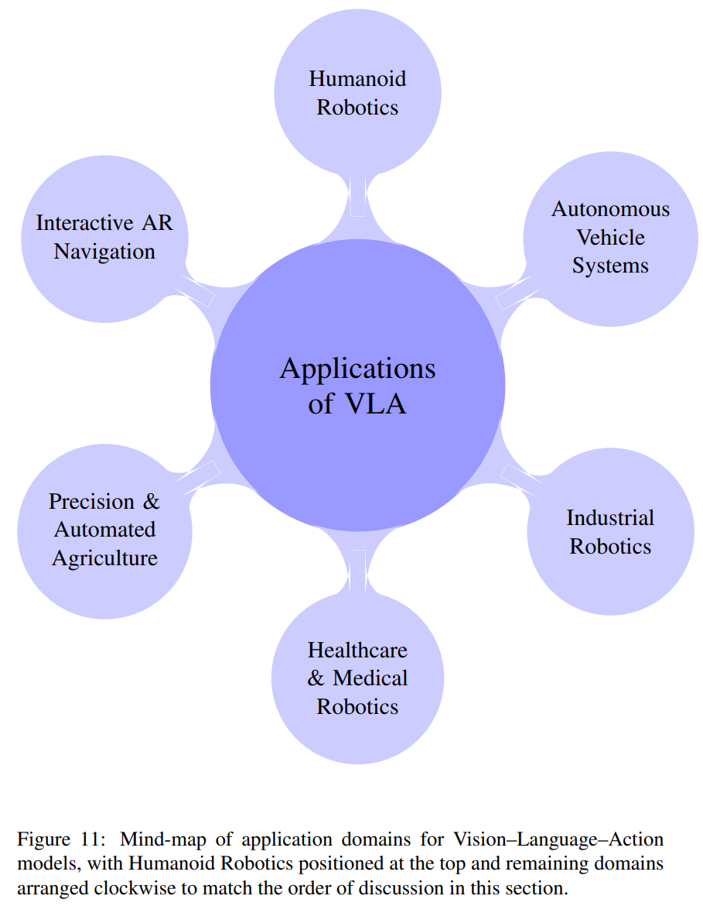

#### 3.4.1 人形机器人学（Humanoid Robotics）

**人形机器人（Humanoid robots）** ，旨在模仿人体的形态和功能，是部署 **视觉-语言-动作模型（Vision-Language-Action models, VLA models）** 最具挑战性也最具影响力的领域之一。这些平台必须无缝感知复杂环境、理解口头或书面的自然语言，并以人类水平的灵巧性执行复杂的物理任务 [184, 23]。VLA 模型的核心优势在于其能够将感知、认知和控制统一到一个单一的、端到端可训练的框架中，使人形机器人能够解释视觉输入（例如，杂乱场景的 RGB-D 图像）、理解语言指令（例如，“把勺子放进抽屉”），并生成精确的运动轨迹 [151, 296]。

最近的进展极大地加速了 VLA 在人形机器人领域的部署。例如，由 Figure AI 开发的 **人形机器人（humanoid robot）** Helix(^2^22[https://www.figure.ai/news/helix](https://www.figure.ai/news/helix))，利用一个完全集成的 VLA 模型以高频执行全身操控，实时控制手臂、手、躯干甚至精细的手指运动。其架构遵循双系统设计：一个 **多模态变换器（multimodal transformer）** 处理语言命令和视觉流等输入，而一个实时运动策略以 200 Hz 的频率输出密集的动作向量。这使得 Helix 能够泛化到先前未见过的物体和任务，流畅地适应不断变化的环境，而无需针对特定任务进行重新训练。

VLA 在人形系统中的关键优势在于其能够利用共享表示在不同任务间扩展 [8]。与依赖特定任务编程或模块化流水线的传统机器人系统不同，由 VLA 驱动的人形机器人在一个统一的、基于 **词元（token）** 的框架下运行。视觉输入通过预训练的视觉-语言模型（如 DINOv2 或 SigLIP）进行编码，而指令则使用 **大型语言模型（Large Language Models, LLMs）** （如 LLaMA 或 GPT 风格的编码器）进行处理。这些表示被融合成 **前缀词元（prefix tokens）** ，以捕捉场景和任务的完整上下文。随后，动作词元以自回归方式生成，类似于语言解码，但代表的是机器人关节和末端执行器的运动指令。

这种能力使人形机器人能够在以人为中心的空间中有效运行，例如家庭、医院和零售环境。在家庭环境中，由 VLA 驱动的机器人可以通过解释语音命令来清洁表面、准备简单餐食或整理物品 [151, 296]。在医疗保健领域，像 RoboNurse-VLA [132] 这样的系统已经展示了利用实时语音和视觉线索向外科医生进行精确器械传递的能力。在零售业，配备 VLA 的人形平台可以在无需显式预编程的情况下协助客户查询、补货和导航商店布局 [8]。

现代人形 VLA 的独特之处在于其能够在嵌入式、低功耗的硬件上运行，使得现实世界部署成为可能。例如，TinyVLA [242] 和 MoManipVLA [246] 等系统展示了在 Jetson 级 GPU 上运行的高效推理流水线，实现了移动部署且不牺牲性能。这些模型利用基于扩散的策略、基于 **低秩自适应（Low-Rank Adaptation, LoRA）** 的微调和动态词元缓存等技术，以最小化计算成本，同时保持高精度和泛化能力。

在物流和制造业中，支持 VLA 的人形机器人已经产生了商业影响。像 Figure 01 这样的机器人被部署在仓库中，与人类工人一起执行重复性、体力密集的任务，如拣选、分类和上架。它们处理新物体类别和动态变化场景的能力得益于 **持续学习（continual learning）** 和鲁棒的 **多模态基础（multimodal grounding）** [252, 131]。

随着 **视觉-语言-动作模型（Vision-Language-Action models, VLA models）** 在多样化动作生成、空间推理和实时适应能力方面的持续进步， **人形机器人（humanoid robots）** 正逐渐成为家庭、工业环境和公共场所中能力出众的助手。它们的优势在于能够通过一个共享的、基于 **词元（token）** 的架构，统一感知、语言理解和运动控制，从而在非结构化的人类环境中实现无缝、情境感知的行为。

<a id="figure-12"></a>
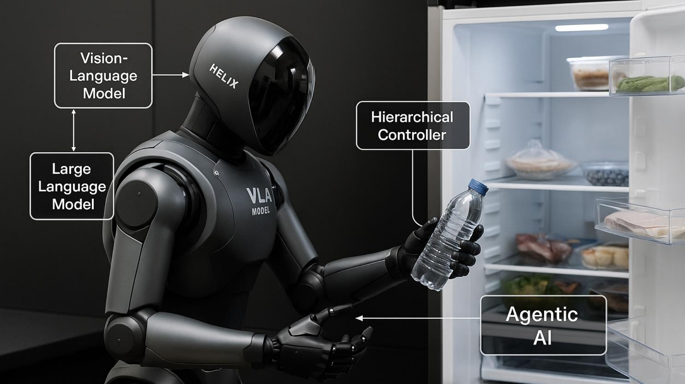

> 图 12 | 本图展示了“Helix”，一款使用 VLA 框架执行家庭任务的下一代人形机器人。在接收到语音指令后，Helix 集成了一个视觉-语言模型（例如 SigLIP）和一个语言模型（例如 LLaMA-4）来共同感知和解释环境。一个分层的 VLA 控制器规划并执行子任务（打开冰箱、抓取瓶子），同时一个具身智能模块实时调整动作。这展示了基于 VLA 的通用机器人技术，具备动态任务适应能力和安全、语义驱动的操作。

例如，如图 [12](#figure-12) 所示，考虑“Helix”，这是一款配备了下一代 VLA 模型的先进人形机器人。当接收到“请从冰箱里拿出水瓶”的语音指令时，Helix 会激活其集成的感知系统。在该系统中，一个基础视觉-语言模型（例如 SigLIP 或 DINOv2）对视觉场景进行分割，以识别冰箱、其把手和瓶子。语言输入则由一个大型语言模型（Large Language Model, LLM）（例如 LLaMA-4）处理，该模型将指令 **词元化（tokenizes）** 并与视觉上下文融合。这种融合后的表征被传递给一个分层控制器：高层策略规划任务序列（定位把手、拉门、识别瓶子、抓取），中层规划器定义运动基元，例如抓握类型和关节轨迹。低层 VLA 控制器（通常基于 **扩散策略网络（diffusion policy networks）** ）以亚秒级延迟执行这些动作。当遇到变化（例如瓶子倾斜或抓握打滑）时，Helix 的具身智能模块会实时进行微策略优化，根据反馈调整抓握。这个例子展示了具备 VLA 能力的人形机器人的变革潜力。从厨房到诊所，这些系统不仅能解读复杂指令并灵巧地执行物理任务，还能适应环境的不确定性。通过嵌入具身推理和安全对齐机制，由 VLA 驱动的现代人形机器人正在从执行单一任务的执行者转变为通用、可信赖的协作伙伴。随着 TinyVLA 和 MoManipVLA 等节能模型的成熟，在移动、低功耗平台上的部署变得越来越可行，从而开启了一个具身化、社会对齐人工智能的新时代。

#### 3.4.2 自动驾驶车辆系统（Autonomous Vehicle Systems）

**自动驾驶车辆（Autonomous vehicles, AVs）** ，包括自动驾驶汽车、卡车和空中无人机，是 VLA 模型的一个前沿应用领域，其中安全关键型决策需要紧密耦合的感知、语义理解和实时动作生成。与明确分离感知、规划和控制等模块的传统模块化自动驾驶流程不同，VLA 框架探索更紧密的架构耦合，在一个统一模型内联合处理视觉观测、高层语义线索和内部状态表征。尽管此类端到端架构在模拟环境和受控基准测试中，针对指令条件导航和推理任务已显示出有前景的结果，但大规模商业系统（例如特斯拉自动驾驶系统（Tesla Autopilot）([源链接](https://www.tesla.com/fsd))）仍然依赖模块化或混合流程。最近的行业努力主要集中在集成视觉-语言推理组件，而非在安全关键型驾驶中完全部署 VLA 风格的动作生成。

**视觉-语言-动作模型（Vision-Language-Action models, VLA）** 赋予 **自动驾驶车辆（Autonomous Vehicles, AVs）** 理解超越像素级物体识别的复杂环境的能力。例如，一辆在城市环境中行驶的自动驾驶汽车必须检测交通标志、理解行人行为，并解析诸如“在加油站后的第二个路口右转”之类的导航指令。这些任务涉及融合视觉和语言信号，以理解空间关系、预测意图并生成具有情境感知的驾驶动作。VLA 模型通过基于 **词元（token）** 的表征来编码这些信息，其中视觉编码器（如 ViT、CLIP）、语言模型（如 LLaMA-4）和轨迹解码器在一个连贯的语义空间中协同工作，使车辆能够推理高级目标并将其转化为低级运动。

该方向的一项显著贡献是 **CoVLA** [5]，它提供了一个全面的数据集，将超过 80 小时的真实世界驾驶视频与同步的传感器流（如激光雷达、里程计）、详细的自然语言标注以及高分辨率驾驶轨迹配对。该数据集使得训练 VLA 模型以对齐感知特征、语言特征与物理动作成为可能。CoVLA 采用 CLIP 进行视觉 **接地（grounding）** ，采用 LLaMA-2 进行指令嵌入，并采用轨迹解码器进行运动预测。这种配置使自动驾驶车辆能够解析语言提示（如“给救护车让行”）和环境条件（如并道车流），从而做出透明且安全的驾驶决策。

**OpenDriveVLA** [293] 通过整合 2D/3D 多视角视觉词元与自然语言输入的层次化对齐，推进了 VLA 建模的水平。其架构同时利用了以自我为中心的空间感知和外部场景理解，构建了一个动态的 **智能体-环境-自我（agent-environment-ego）** 交互模型。通过自回归解码，OpenDriveVLA 生成人类可理解的动作计划（如转向角、加速度）和轨迹可视化。其端到端框架在公开的自动驾驶基准测试中取得了领先性能，包括在 nuScenes 和 Waymo Open Motion 数据集上的规划与轨迹预测任务，以及针对驾驶场景的视觉-语言问答基准测试，展示了其在城市导航和行为预测方面的强大鲁棒性。

另一个开创性模型 **ORION** [69] 通过整合一个用于保留长时程视觉上下文的 **QT-Former** 、一个用于推理交通叙事的大型语言模型（Large Language Model, LLM）以及一个生成式轨迹规划器，推动了闭环自动驾驶的边界。ORION 擅长将视觉-语言模型的离散推理空间与自动驾驶车辆运动的连续控制空间对齐。这种统一的优化带来了精确的 **视觉问答（Visual Question Answering, VQA）** 和轨迹规划，这对于涉及模糊的人类指令或被遮挡障碍物（例如“在红色卡车后面的出口驶出”）的场景至关重要。

例如，如图 [13](#figure-13) 所示，考虑一辆名为“AutoNav”的自动驾驶配送车，它在一个密集的城市环境中使用下一代 VLA 架构运行。当 AutoNav 收到一条基于云的指令“将包裹送到面包店旁边红色雨棚附近，然后避开施工区域返回基地”时，其车载 **视觉语言模型（Vision-Language Model, VLM）** （如 CLIP 或 SigLIP）会解析来自多个摄像头的视觉流，识别动态地标，如面包店招牌、红色雨棚和交通锥。同时，基于 LLaMA-4 的 LLM 模块解码该指令，并将其与包括激光雷达、GPS 和惯性里程计在内的实时传感上下文融合。一个分层控制栈通过一个自回归 VLA 解码器处理这些多模态信号，该解码器整合以自我为中心的视图和以世界为中心的地图来规划自适应路径。当车辆接近配送地点时，意外的行人活动会触发一个 **智能体（agentic）** 子模块，使用受 **强化学习（Reinforcement Learning）** 启发的策略优化例程来启动轨迹重新规划。同时，AutoNav 会发出声音警告行人，并重新校准速度以保持安全距离。这种语义理解、感知接地和自适应控制之间的相互作用，展示了基于 VLA 的系统在安全关键场景中实现可解释、与人类行为一致的能力。

此场景展示了紧密集成的 **视觉语言动作模型（Vision-Language-Action, VLA）** 架构如何通过实现端到端的语义推理、快速的跨模块适应和可解释的决策制定，超越传统的感知-规划-控制流水线。与模块化流水线不同——在后者中，感知输出、规划器更新和控制调整由语义反馈有限的松散耦合组件处理——基于 VLA 的系统能够对语言意图、视觉上下文和具身状态进行联合推理，使其能够动态重新规划轨迹、向人类传达与安全相关的意图，并实时调整控制策略。因此，该系统在安全关键环境中展现出更高的自主性、通过人类可理解的输出改进的透明度，以及增强的决策敏捷性。

<a id="figure-13"></a>
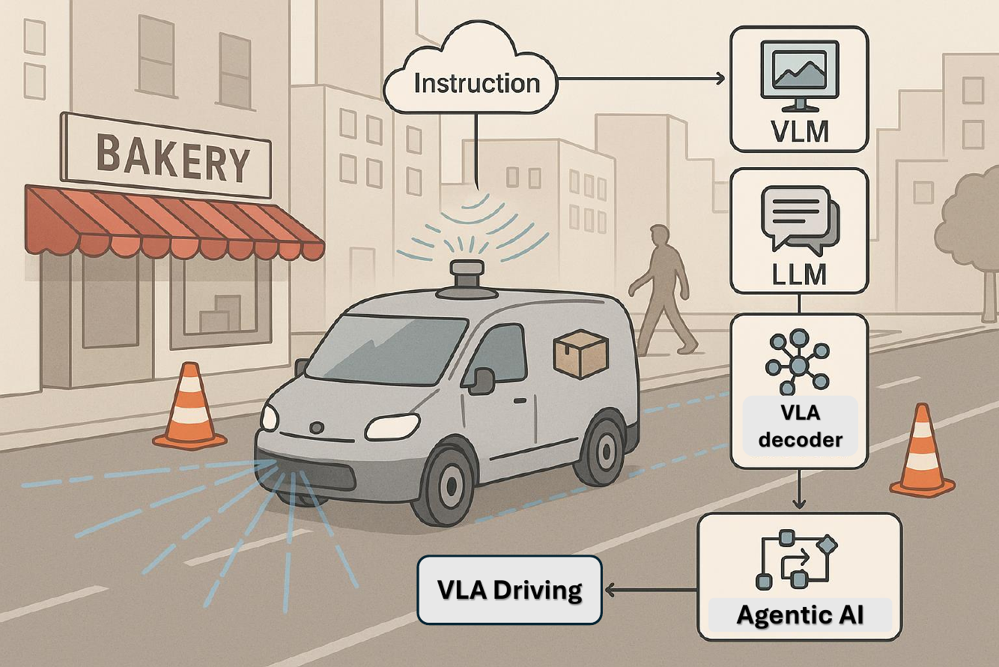

> 图 13 | 此图描绘了一辆由 VLA 系统驱动的自主配送车辆，该系统集成了用于视觉接地的 **视觉语言模型（Vision-Language Models, VLMs）** 、用于指令解析的 **大型语言模型（Large Language Models, LLMs）** ，以及用于路径规划的 VLA 解码器。 **智能体人工智能（Agentic AI）** 能够在动态环境中进行自适应轨迹优化，例证了多模态集成如何在现实世界的导航任务中驱动安全、可解释和自主的决策制定。

在航空机器人领域，VLA 增强了无人机（drones）或 **无人驾驶飞行器（Unmanned Aerial Vehicles, UAVs）** 在配送及其他任务中的能力。诸如 UAV-VLA [191] 等模型结合卫星图像、自然语言任务描述和机载传感来执行高级命令（例如，“递送到带有蓝色防水布的屋顶平台”）。这些系统采用模块化的 VLA 架构，其中视觉语言规划器解析全局上下文，飞行控制器执行精确的航点，支持物流、灾难响应和军事侦察等应用。

随着自主系统越来越多地在非结构化环境中运行，VLA 为传统流水线提供了一种可扩展、可解释且数据高效的替代方案。通过从大规模多模态数据集中学习并将决策制定建模为词元预测，VLA 将人类级别的语义与机器人运动对齐，为更安全、更智能的自动驾驶和导航技术铺平了道路。

#### 3.4.3 工业机器人学（Industrial Robotics）

随着 VLA 模型的集成，工业机器人学正在经历一场范式转变，催生了新一代能够进行高级推理、灵活执行任务并与人类操作员自然交流的智能机器人 [33, 7]。传统的工业机器人通常在高度结构化的环境中运行，使用刚性编程，在适应新的装配线或产品变体时通常需要大量的重新配置和人工干预 [6, 182]。此类系统缺乏现代动态制造环境所需的语义基础和适应性。

相比之下，VLA 模型提供了一个更易于人类理解且更具泛化性的框架。通过对视觉输入（例如，组件布局或传送带状态）、自然语言指令（例如，“拧紧红色模块上的螺丝”）和机器人状态进行联合嵌入，VLA 能够推断上下文并实时执行适当的控制命令 [134, 72, 156]。 **视觉变换器（Vision Transformers, ViTs）** （例如，ViT、DINOv2）、LLMs（例如，LLaMA-4）以及基于自回归或扩散的动作解码器构成了这些系统的核心，使机器人能够解析多模态指令并执行基于其环境的动作。

该领域最重要的贡献之一是 CogACT [131]，这是一个专为工业机器人操作设计的模块化 VLA 框架。与早期依赖冻结的语言-视觉嵌入然后进行直接动作量化的 VLA 不同，CogACT 引入了一个基于扩散的动作变换器，能够更稳健、更自适应地对动作序列进行建模。该系统使用视觉语言编码器（例如，Prismatic-7B）提取高级场景和指令嵌入，然后将其传递给扩散变换器（DiT-Base）以生成细粒度的运动动作。这种模块化分离使其能够对未见过的工具、零件和布局实现卓越的泛化能力，同时在现实世界的约束下保持可解释性和鲁棒性。

此外，CogACT 通过高效的微调，展示了在不同机器人具身（例如，6 自由度机械臂或双手系统）之间的快速适应能力，使其适合在异构工厂环境中部署 [131]。实证评估表明，CogACT 在现实世界任务成功率上比 OpenVLA 等先前模型高出 28% 以上 [122]，尤其是在复杂的、高精度的任务中，如多步骤装配、螺丝紧固和零件分拣 [131, 260]。

随着制造业向工业 4.0 范式转变，VLA 有望减少编程开销、支持语音指令的机器人编程，并促进在混合主动任务上的实时人机协作。虽然执行精度、安全保证和延迟优化仍然是活跃的研究领域，但 VLA 模型的使用标志着向自主、智能和适应性强的机器人转变迈出了实质性的一步，这些机器人正在改变工厂。

#### 3.4.4 医疗与医疗机器人学（Healthcare and Medical Robotics）

**医疗保健与医疗机器人（Healthcare and medical robotics）** 是一个高风险领域，其所需的 **精确性（precision）、安全性（safety）和适应性（adaptability）** 等关键品质，正是 **视觉-语言-动作模型（Vision-Language-Action models, VLA models）** 日益擅长提供的 [132, 193]。传统的医疗机器人系统严重依赖 **遥操作（teleoperation）** 或预编程行为 [166, 204]，这限制了其在动态手术或护理环境中的自主性和响应能力。相比之下，VLA 模型提供了一个灵活的框架，集成了实时视觉感知、语言理解和细粒度运动控制，使医疗机器人能够理解高级指令，并自主执行复杂的操作或辅助任务 [131, 54, 225]。

<a id="figure-14"></a>
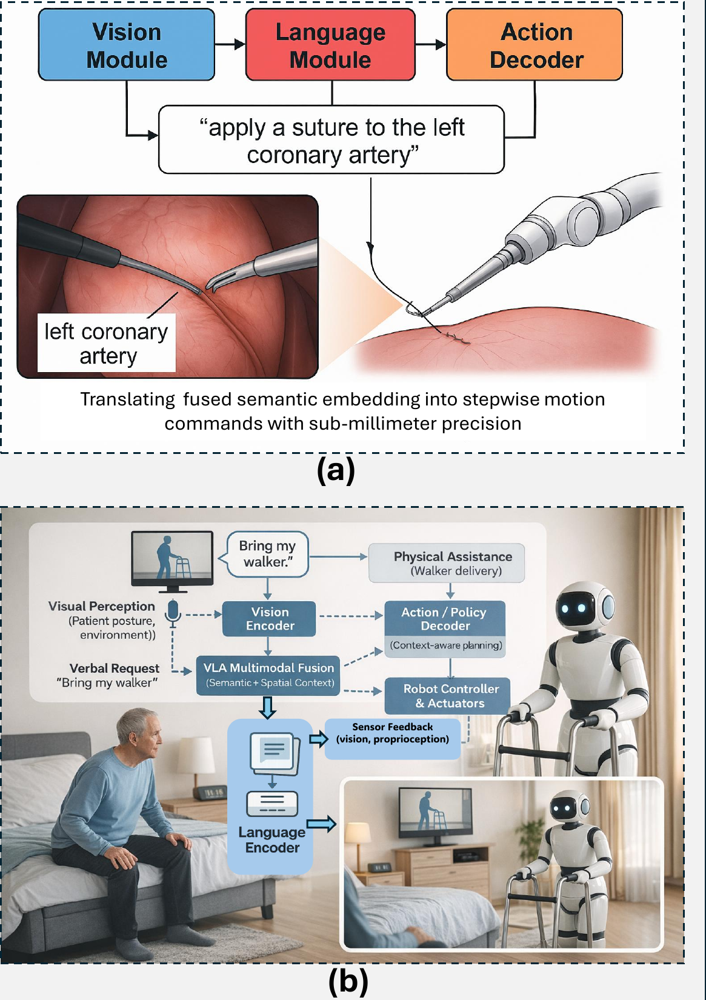

> **图 14（Figure 14）** | a) 本图展示了一个 VLA 手术系统执行“在左冠状动脉上缝合”的任务。视觉模块识别解剖目标，语言模型解析指令，动作解码器生成精确的运动指令，从而实现自适应工具控制、实时反馈和安全的自主操作；b) 一个由 VLA 驱动的辅助机器人感知患者行为，处理口头请求（例如，“把我的助行器拿来”），并自主执行情境感知的运动计划，从而在老年护理、康复和医院物流中提供实时协助，无需依赖预定义脚本或人工监督。

在手术机器人领域，VLA 可以显著增强 **微创手术（minimally invasive surgeries）** 的能力 [50, 230]。这些系统可以利用视觉编码器（例如， **视觉变换器（Vision Transformer, ViT）、SAM-2** ）和语言模型（例如， **LLaMA、T5** ），将腹腔镜视频流 [127]、解剖图谱 [146, 50] 和语音命令融合成统一的 **令牌化表示（tokenized representation）** [234]。例如，如图 [14](#figure-14)a 所示，在执行“在左冠状动脉上缝合”这类任务时，视觉模块识别解剖目标，而语言模块则对指令进行情境化理解。随后，动作解码器将融合后的语义嵌入转换为具有亚毫米精度的分步运动指令。这种视觉感知、基于语言的意图和动作级控制的闭环融合，使机器人能够自适应地重新定位工具、施加动态力反馈并避开关键解剖结构，从而减少对外科医生微观管理的需求，并最大限度地降低人为错误的风险。

在手术室之外，VLA 模型正在推动老年护理、康复和医院物流领域新一代患者辅助机器人的发展。这些系统能够自主感知患者行为，理解口头或手势输入，并执行响应性任务，例如取药、引导移动辅助设备或在紧急情况下通知护理人员。例如，如图 [14](#figure-14)b 所示，一个具备 VLA 能力的机器人可以视觉检测到患者试图从床上起身，理解“把我的助行器拿来”这样的口头请求，并生成符合情境的运动计划来提供协助，而无需预定义脚本或持续监督。

最近的 VLA 框架，如 **RoboNurse-VLA [132]** ，凸显了这种方法的现实可行性。RoboNurse 采用 SAM-2 进行语义场景分割，采用 LLaMA-2 进行指令理解，并将其集成到一个实时语音到动作的流程中，使机器人能够在手术室中协助进行手术器械的传递 [132]。该系统对不同的工具、变化的照明条件和嘈杂环境——这些临床环境中的常见挑战——都表现出了鲁棒性。

此外， **视觉语言-动作模型（Vision-Language-Action models, VLA）** 架构在 **可解释性（Explainability）** 和 **可审计性（Auditability）** 方面具有优势，这两点在受监管的医疗领域至关重要 [224, 147]。场景 **接地（Grounding）** 和轨迹预测可以进行事后可视化和审查 [277]，这有助于建立临床信任并支持类似 **美国食品药品监督管理局（Food and Drug Administration, FDA）** 风格的验证流程。基于 **低秩适应（Low-Rank Adaptation, LoRA）** 的微调允许以最少的数据和计算基础设施，适应特定的医院环境或手术流程 [9, 229, 146]。

重要的是，VLA 模型的多模态基础使其具备跨领域可迁移性：经过手术器械操作训练的同一模型，只需适度的再训练即可适应患者移动任务 [56]。与任务专用的自动化系统相比，这种模块化特性显著减少了开发时间和成本 [94]。随着医疗机器人技术从远程操作辅助向半自主和协作系统过渡，VLA 模型正处于这一转变的核心。

正如在其他应用领域早先讨论的那样，VLA 将高层语义理解与底层控制相结合的能力，对于为可扩展、符合人类意图且自适应的机器人医疗保健提供统一解决方案至关重要 [249, 295, 279]。随着医疗系统面临日益增长的需求和劳动力短缺，VLA 驱动的机器人技术将在提升医疗精度、运营效率和以患者为中心的护理方面发挥关键作用。

#### 3.4.5 精准与自动化农业（Precision and Automated Agriculture）

如图 [15](#figure-15) 所示，VLA 模型正在成为精准与自动化农业领域的变革性工具，为不同农业景观中的劳动密集型任务提供智能、自适应的解决方案 [70, 191]。与依赖僵化、传感器驱动的流程、需要为每项任务或环境变化手动重新编程的传统农业自动化系统不同 [220, 108]，VLA 在一个统一框架内集成了多模态感知、自然语言理解和实时动作生成 [167, 84]。这种统一的多模态集成使得自主地面机器人和无人机能够解读复杂的田间场景，遵循口头或文本形式的农业指令，并生成情境感知的动作，例如选择性水果采摘或自适应灌溉。VLA 能够动态适应遮挡、地形不规则、光照变化或不同作物类型，并结合在合成的、照片级真实感数据集上的训练，使其能够泛化到不同的作物类型、地理区域和季节。通过利用 **动作标记化（Action Tokenization）** [245]、基于 **Transformer** 的策略生成 [12, 85] 以及像 LoRA 微调 [93] 这样的技术，这些系统正在重新定义农业机器人技术的可扩展性和智能水平，以实现可持续和精准驱动的农业。

<a id="figure-15"></a>
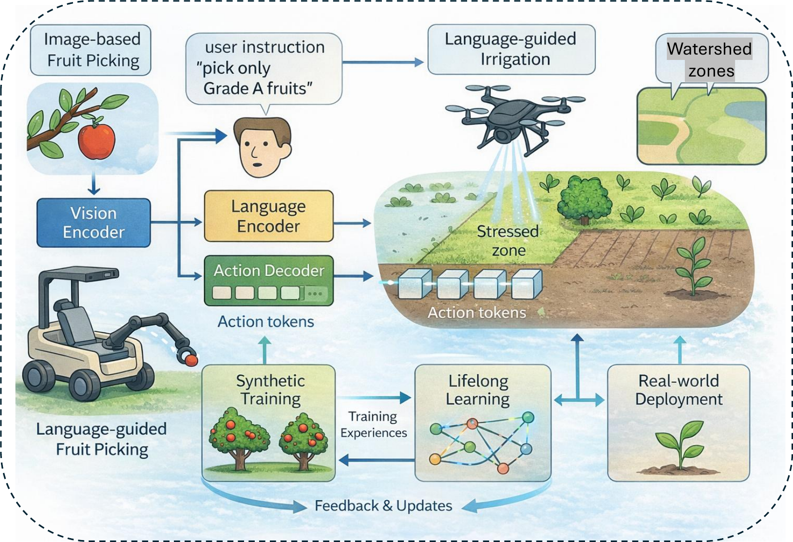

> 图 15 | VLA 模型在精准与自动化农业中的概念示意图。地面机器人结合视觉编码器和语言指令（例如，“只采摘 A 级水果”）来生成用于无损收获的动作标记，而空中机器人则利用 VLA 推理进行语言引导的灌溉。合成训练、基于 LoRA 的适应和终身反馈使其能够泛化到不同的作物、环境和地理区域，支持可持续的、数据驱动的农业自动化。

#### 3.4.6 基于视觉-语言-动作模型的交互式增强现实导航（Interactive AR Navigation with Vision-Language-Action Models）

在现代果园和其他农田中， **视觉-语言-动作模型（Vision-Language-Action Models, VLAs）** 可以处理来自 **RGB-D 相机（RGB-D cameras）** 、 **多光谱传感器（multispectral sensors）** 或 **无人机（drones）** 的视觉输入，以监测植物生长、检测病害并识别营养缺乏。 **视觉变换器（Vision Transformers）** （例如 ConvNeXt、DINOv2）从视觉场景中编码空间和语义信息，而 **大型语言模型（Large Language Models, LLMs）** （例如 T5、LLaMA）则解析自然语言指令，例如“检查东区地块的白粉病”或“收获灌溉沟渠附近的成熟苹果”。通过 **词元融合（token fusion）** ，这些模态在共享的表示空间中对齐，使机器人能够精确地执行细粒度、上下文感知的动作。

例如，在水果采摘任务中，如图 [15](#figure-15) 所示，配备 VLA 的地面机器人可以利用基于图像的成熟度线索识别成熟果实，解读用户指定的标准（如“只采摘 A 级水果”），并通过控制其末端执行器的 **动作词元（action tokens）** 执行运动序列。这种方法确保了最小的作物损伤，优化了采摘率，并允许实时适应意外变量，如遮挡或地形变化。在灌溉管理中，由 VLA 模型引导的无人机可以解读田间地图和口头指令，选择性地灌溉受胁迫区域，从而减少 % 的用水量。

除了即时任务执行，VLA 模型有望通过 **闭环反馈机制（closed-loop feedback mechanisms）** 支持动态重构和 **终身学习（lifelong learning）** 。具体而言，在部署期间收集的执行结果、感官观察和任务成功信号可以被记录，并定期纳入 VLA 策略的离线或增量更新中。当与通过作物环境的 **逼真模拟（photorealistic simulations）** （例如，3D 果园渲染）生成的 **合成训练数据（synthetic training data）** 相结合时，这种 **反馈驱动的适应（feedback-driven adaptation）** 可能使模型能够逐步提高对新作物品种、病虫害状况和季节变化的鲁棒性，而无需大量的人工标注。 **参数高效技术（Parameter-efficient techniques）** ，如 **LoRA 适配器（LoRA adapters）** 和 **基于扩散的策略优化（diffusion-based policy refinement）** ，预计将在促进这种持续适应的同时限制计算开销方面发挥关键作用。

总体而言，将 VLA 模型整合到农业工作流程中预计将带来多项长期效益，包括减少对熟练劳动力的依赖、通过针对性干预提高产量，以及通过优化投入品使用来增强环境可持续性。随着全球粮食系统日益面临气候多变性和资源限制，启用 VLA 的农业技术有望为可扩展、智能且具有上下文感知的农业实践做出贡献，从而更好地适应现实世界的复杂性。

**交互式增强现实（Augmented Reality, AR）导航（Interactive Augmented Reality (AR) navigation）** 代表了一个前沿领域，其中 **视觉-语言-动作模型（Vision-Language-Action models, VLA models）** 能够通过提供实时、智能且上下文感知的引导，显著增强人与环境的交互 [31, 104, 255]。在此范式中，VLA 模型处理来自智能眼镜或智能手机等 AR 设备的连续视觉数据流，并结合自然语言查询，生成直接叠加在用户物理世界视野上的动态导航提示。与依赖固定地图和有限用户输入的传统基于 GPS 的系统不同 [29, 207]，基于 VLA 的 AR 智能体能够解读复杂的视觉场景（例如，十字路口、室内走廊、标识），并响应自由形式的指令，如“带我到最近的有轮椅坡道的药店”或“显示到会议室最安静的路线”。

从技术上讲，这些模型集成了一个 **视觉编码器（Vision encoder）** （例如，ViT、DINOv2），用于从 RGB 相机帧中提取场景表征；一个 **语言编码器（Language encoder）** （例如，T5 或 LLaMA），用于处理用户提示或语音命令；以及一个 **动作解码器（Action decoder）** ，用于预测标记化的导航提示，如方向叠加层、路径点或语音指令。基于 **Transformer** 的架构融合了这些模态，以同时推理空间布局和语义意图，使得 AR 智能体能够直接在用户的视野范围内自适应地高亮显示路径、地标和危险物 [211, 165]。例如，如图 [16](#figure-16) 所示，在拥挤的机场中，VLA 智能体可以视觉识别自动扶梯、登机口或行李提取处，同时理解“我如何能不经过楼梯到达 22 号登机口？”这样的查询，并根据实时占用情况和障碍物调整路线。

VLA 模型有望支持 **交互式指令循环（Interactive instruction loops）** ，用户可以先发出高级命令（例如，“导航到药店”），随后通过附加约束（如“避开繁忙区域”或“走风景优美的路线”）来细化指令。通过上下文感知的反馈和迭代澄清，这种交互范式可以提高视力障碍或认知障碍人士的可访问性和可用性。在物流和室内导航中，这些系统可以与 **物联网（Internet of Things, IoT）** 传感器和 **数字孪生（Digital twins）** 集成，引导仓库工人、维护团队或配送机器人在复杂环境中穿行。此外，可以通过持续微调实现个性化导航，VLA 模型会随着时间的推移学习用户偏好和本地空间布局。

<a id="figure-16"></a>
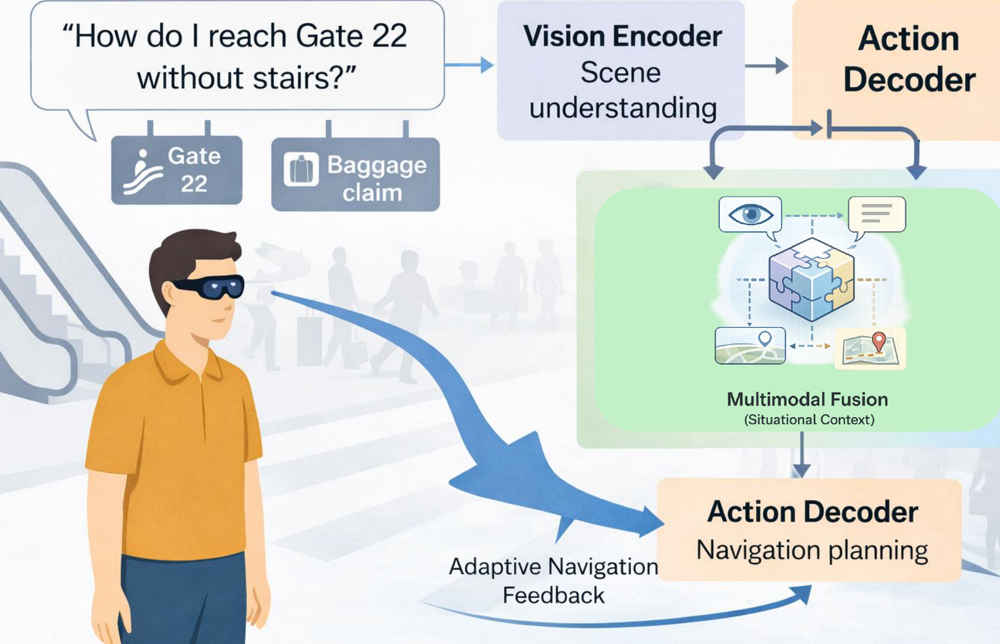

> 图 16 | 展示了 VLA 模型如何通过融合实时视觉感知、语言理解和动作规划来实现交互式 AR 导航。在机场等动态环境中，VLA 模型解读用户查询（如“避开楼梯前往 22 号登机口”），分析视觉场景（例如，检测自动扶梯），并相应地调整导航路径，从而支持个性化、可访问且上下文感知的移动引导。

随着 AR 硬件变得更加经济实惠并融入日常生活，由 VLA 驱动的导航系统将在公共、工业和辅助场景中实现无缝的空间理解、多模态交互和自主引导，重新定义人类感知、探索和与物理空间交互的方式。

<a id="section-4"></a>

## 4 视觉-语言-动作模型的挑战与局限性（Challenges and Limitations of Vision-Language-Action Models）

**视觉-语言-动作模型（Vision-Language-Action models, VLA models）** 面临一系列相互关联的挑战，阻碍了其从研究原型向稳健的现实世界系统的转化。首先，实现实时、资源感知的推理仍然困难：像 **DeeR-VLA** 这样的模型利用 **动态早期退出架构（dynamic early-exit architectures）** ，在操作基准测试中减少了 5-6 倍的计算量，同时保持了准确性，然而在复杂场景中其收益会减少 [269]。类似地， **Uni-NaVid** 为 5 Hz 的导航任务压缩了 **以自我为中心的视频词元（egocentric video tokens）** ，但在高度模糊的指令和更长的时间跨度下仍然表现不佳 [280]。此外，这些以效率为导向的设计常常暴露出计算速度与表征覆盖范围之间的权衡。在激进的压缩或早期退出约束下运行时，即使是先进的 **混合视觉-语言基础方法（hybrid vision-language grounding methods）** 也表现出有限的对象泛化能力；例如， **ObjectVLA** 仅能泛化到 64% 的新对象，这突显了实时优化如何可能加剧开放世界鲁棒性方面的差距 [297]。

其次，在极少监督下适应 VLA 模型，并确保在稀缺、嘈杂数据下进行稳定的策略更新，并非易事。 **ConRFT** 将 **行为克隆（behavior cloning）** 和 **Q-学习（Q-learning）** 与 **人在回路微调（human-in-the-loop fine-tuning）** 相结合，在八个接触丰富的任务上快速收敛到 96.3% 的成功率，但它严重依赖专家干预和 **奖励塑形（reward shaping）** [36]。诸如 **Hi Robot** 这样的 **分层框架（hierarchical frameworks）** 将高层推理与低层执行解耦，以提高指令保真度，但协调这些模块并理解模糊的反馈仍然具有挑战性 [199]。同样， **触觉-语言-动作模型（Tactile-language-action model）** 将触觉流与语言命令融合，在未见过的 **插孔任务（peg-in-hole tasks）** 上取得了超过 85% 的成功率，但数据集的广度以及实时多步解码仍然限制了更广泛的泛化 [88]。

此外，在动态环境中确保安全性、泛化能力和端到端的可靠性，需要新的建模和评估标准。像 **OccLLaMA** 这样的 **占据-语言-动作模型（Occupancy-Language-Action models）** 将 3D 场景理解与动作规划统一起来，但它们需要扩展到更丰富的场景动态和跨模态的语义一致性 [239]。 **RaceVLA** 通过 **量化、迭代控制循环（quantized, iterative control loops）** 推进了高速无人机导航；然而，与更大的 VLA 模型和专用推理模型相比，其有限的视觉-物理泛化能力，在未见或快速变化的环境中引发了安全担忧 [195]。 **ReVLA** 中的 **模型合并策略（model-merging strategies）** 恢复了丢失的 **域外视觉鲁棒性（out-of-domain visual robustness）** ，将 **面向对象检测（oriented object detection, OOD）** 的抓取成功率提高了高达 77%，但引入了额外的计算和复杂性 [48]。最后， **SafeVLA** 通过 **约束马尔可夫决策过程（constrained Markov decision processes）** 来制定约束，将不安全行为减少了超过 80%，然而，为多样化的现实世界任务定义全面且非限制性的安全规则，仍然是一个悬而未决的问题 [274]。解决这些相互交织的局限性，对于 VLA 模型在现实世界机器人技术完全复杂的条件下实现可靠、自主的运行至关重要。

基于上述关键局限性，必须将每个挑战映射到针对性的缓解策略，并评估其系统级影响。 **表 4** 展示了这一映射关系，识别了核心局限性、基于最新进展的潜在技术补救措施，并阐明了其对现实世界 **视觉语言动作模型（Vision-Language-Action, VLA）** 部署的预期效益。例如，解决实时推理约束可利用 **并行解码（Parallel decoding）** 和 **量化变换器（Quantized transformers）** 流水线结合硬件加速（例如 TensorRT），以维持无人机和机械臂的控制环路速度 [129, 122, 75, 142]。通过 **混合扩散-自回归策略（Hybrid diffusion–autoregressive policies）** 解决多模态动作表示问题，增强了模型为复杂任务生成多样化、上下文敏感的电机指令的能力 [171, 156]。为保证开放世界中的安全性，可以集成 **动态风险评估模块（Dynamic risk assessment modules）** 和 **自适应规划层（Adaptive planning layers）** ，确保在不可预测环境中具备鲁棒的紧急停止行为 [183, 233, 113]。同样，通过精心策划的去偏语料库和先进的 **对比微调（Contrastive fine-tuning）** ，可以最大程度地减少数据集偏差和 **语义接地（Grounding）** 问题，从而在泛化到新物体和场景时增强公平性和语义保真度 [185, 17, 175]。这些策略以及其他涵盖 **仿真到现实迁移（Simulation-to-real transfer）** 、触觉集成和能效架构的方法共同构成了一份全面的路线图，旨在将 VLA 研究转化为可靠、可扩展的自主系统。

<a id="table-4"></a>
**表 4：VLA 模型的挑战、潜在解决方案及预期影响。**
| 挑战 / 局限性 | 潜在解决方案 | 预期影响 |
| :--- | :--- | :--- |
| 实时推理约束 | 并行解码、量化变换器及硬件加速（例如 TensorRT）[129, 122]；减少自回归开销 [75, 142]。 | 实现对延迟敏感领域（例如无人机、机械臂）的实时控制与部署 [251, 191]。 |
| 多模态动作表示 | 结合扩散与自回归策略的混合标记化 [171]；在多样化演示和多模态输出上进行训练 [156]。 | 提升在具有多种有效解决模式的复杂动态操作任务上的性能 [74]。 |
| 开放世界中的安全保障 | 动态风险评估模块 [183, 233]；低延迟紧急停止与自适应规划层 [113]。 | 提高在不可预测环境（家庭、工厂、医疗）中的可靠性与安全性；增强用户接受度。 |
| 数据集偏差与语义接地 | 策划多样化/去偏数据集 [185]；更强的语义接地（例如，使用困难负样本进行 CLIP 微调）[282, 17]。 | 提高公平性与语义保真度 [109]，并增强对新颖现实世界输入的泛化能力 [227, 288, 175]。 |
| 有限的 3D 感知与推理 | 集成深度/LiDAR；开发 3D 感知架构；融合点云与视觉-语言特征。 | 为复杂环境中的操作与导航提供更强的空间推理能力 [129]。 |
| 跨具身泛化 | 在不同形态上进行训练；学习与具身无关的动作抽象；应用跨域适应 [266]。 | 促进策略在不同机器人平台和配置间的迁移 [279, 122]。 |
| 标注复杂性与成本 | 弱监督、主动学习和合成数据生成以减少人工标注 [148]。 | 降低开发成本，加速向新任务/领域的扩展 [233, 286]。 |
| 仿真到现实迁移差距 | 域适应、仿真到现实微调及现实世界校准 [210, 135]。 | 提高在仿真环境之外部署时的可靠性与一致性 [4, 66]。 |
| 物理知识集成 | 在训练流程中引入物理先验、仿真环境及动力学建模 [53]。 | 在真实物理约束下改进预测与规划 [106]。 |
| 多模态集成（触觉、音频） | 将触觉/音频与视觉和语言融合 [114]；扩展多模态变换器融合。 | 提高在遮挡/模糊情况下的鲁棒性，并扩展任务范围 [76, 136, 91]。 |
| 长视野多阶段任务 | 分层策略、记忆增强网络及轨迹规划模块 [136]。 | 改进顺序规划、记忆与组合式执行 [131, 286, 227, 175]。 |
| 系统集成复杂性 | 统一的变换器主干网络 [289]；时序对齐与仿真到现实迁移策略 [163, 276]。 | 实现更紧密的规划-控制协调，以及向物理机器人更鲁棒的迁移 [187, 208]。 |
| 能源与计算需求 | 剪枝、低秩适应（LoRA）、量化感知训练及低功耗加速器。 | 实现高效的嵌入式/移动端部署 [252, 283, 125, 246]。 |
| 对未见任务的泛化 | 组合泛化、少样本元学习及任务无关预训练 [173, 147]。 | 减少过拟合并增强零样本/少样本适应能力 [97, 242, 286]。 |
| 对环境变化的鲁棒性 | 域随机化、传感器融合、更广泛的训练数据集及在线重新校准 [156]。 | 提高在光照变化、杂乱和场景动态变化下的稳定性 [285, 242]。 |
| 伦理与社会影响 | 通过设备端处理/匿名化保护隐私 [149, 198, 252, 34]；公平性审计；监管与信任框架。 | 促进在社会、医疗和劳动领域的公平与可信赖的采用 [160, 180, 217, 172]。 |

本节其余部分分为五个重点小节，每一节都探讨文献中识别出的一个 **视觉语言-动作模型（Vision-Language-Action models, VLA）** 挑战集群。首先，我们分析 **实时推理约束（real-time inference constraints）** 以及应对这些约束的新兴方法。接着，我们探讨 **开放世界（open-world）** 环境下的 **多模态动作表示（multi-modal action representation）** 与 **安全保障（safety assurance）** 。然后，我们讨论 **数据集偏差（dataset bias）** 、 **基础策略（grounding strategies）** 以及对 **未见任务（unseen tasks）** 的 **泛化（generalization）** ，随后探讨 **系统集成复杂性（system integration complexity）** 与 **计算需求（computational demands）** 。最后，我们考虑在现实世界应用中部署 VLA 时的 **鲁棒性（robustness）** 与 **伦理影响（ethical implications）** 。

<a id="section-4-1"></a>

### 4.1 实时推理约束（Real-Time Inference Constraints）

尽管近期取得了进展，但在延迟关键型场景中部署 **视觉语言-动作模型（Vision-Language-Action models, VLA）** 仍然受到实时推理要求的制约，特别是在机器人操作、自动驾驶和空中控制等应用中。VLA 模型通常依赖于 **自回归解码（autoregressive decoding）** 策略，即根据先前的预测顺序生成动作词元。虽然这种方法对许多任务有效，但这种自回归解码范式极大地限制了推理速度，在基于标准 GPU 的研究平台（例如，单个高端消费级或数据中心 GPU）上进行端到端 VLA 推理时，通常只能达到 3-5 Hz [67]。这个速率远低于响应迅速且稳定的机器人操作通常所需的控制频率，后者根据任务和硬件平台的不同，通常从用于高层规划的数十赫兹到用于低层反馈控制的更高更新率不等。例如，当机械臂操作精细物体时，频繁的位置更新对于保持精度和防止损坏至关重要。像 OpenVLA [122] 和 Pi-0 [15] 这样的模型，由于其顺序词元生成方法，面临着固有的挑战，从而限制了它们在动态环境中的有效性。

新兴的解决方案，如以 NVIDIA 的 GR00T N1 模型 [14] 为代表的 **并行解码（parallel decoding）** ，旨在通过同时预测多个词元来加速推理。GR00T N1 相比传统解码方法实现了约 2.52 倍的加速；然而，这种并行性通常需要在轨迹平滑度上做出权衡，导致机器人运动不理想。这种运动在像手术机器人这样对精度、适应性和灵活性要求极高的敏感应用中是不可取的。因此，在不影响输出质量的前提下实现快速推理，仍然是一个悬而未决的挑战。

此外，硬件限制加剧了实时推理约束。例如，处理高维视觉嵌入（通常涉及超过 400 个视觉词元，每个维度为 512）需要大约 1.2 GB/s 的内存带宽。这一需求显著超过了当前嵌入式系统或边缘 AI 硬件（如 NVIDIA Jetson 平台）的能力，从而限制了实际部署 [82, 275]。即使采用高效的 **量化技术（quantization techniques）** （通过降低浮点运算精度来缓解内存限制），模型也经常会出现精度下降，尤其是在需要亚毫米级精度的任务中，例如 **双手机器人操作（bimanual robotic manipulation）** 或医疗机器人技术。

<a id="section-4-2"></a>

### 4.2 多模态动作表示与安全保障（Multi-modal Action Representation and Safety Assurance）

**多模态动作表示（Multi-modal Action Representation）** ：当前 VLA 模型的一个显著局限是难以准确表示多模态动作，尤其是在需要连续且精细控制的场景中 [62, 46]。传统的离散 **词元化（tokenization）** 方法（例如将动作划分为 256 个不同的区间）本质上缺乏精度，在精细任务（如精密的机器人抓取或复杂的外科手术）中会产生显著误差 [171]。例如，在装配任务中进行精确的机器人操作时，离散表示可能导致动作错位或不精确，从而损害性能和可靠性。另一方面，基于连续 **多层感知机（Multilayer Perceptron, MLP）** 的方法则面临 **模式坍塌（mode collapse）** 的风险 [162, 232]，即模型过早地收敛到单一的动作轨迹，尽管存在多个可行的路径。这削弱了在高度动态环境中进行自适应决策所需的灵活性。新兴的基于 **扩散（diffusion）** 的策略（以 Pi-Zero 和 RDT-1B [145] 等模型为代表）提供了更丰富的多模态动作表示，能够捕捉多样化的动作可能性。然而，它们巨大的计算开销（大约是传统基于 Transformer 的解码器的三倍）使得它们不适用于实时部署。因此，VLA 模型目前难以处理复杂的动态任务，例如在密集拥挤空间中的机器人导航或复杂的双手操作 [74, 247]，在这些任务中，多种策略性动作可能同样有效且依赖于具体情境。

**开放世界中的安全保障（Safety Assurance in Open World）** ：VLA 面临的另一个关键挑战是确保在现实世界场景所特有的动态、不可预测环境中的鲁棒安全性 [39, 274]。许多当前的实现严重依赖于预定义的、硬编码的力和扭矩阈值，这极大地限制了它们在遇到意外或新情况（如意外障碍物或环境突变）时的适应性 [156]。用于碰撞预测的模型在杂乱和动态的空间中通常只能达到约 82% 的准确率，这在安全裕度极小的应用（如仓库物流或家用机器人）中构成了严重风险 [288, 122]。此外，像紧急停止这样的关键安全机制，由于需要进行全面的安全验证，通常会产生 200 到 500 毫秒的显著延迟 [170, 122]。这种延迟虽然看似微小，但在高速操作或关键干预（如自动驾驶或紧急机器人响应）中可能被证明是危险的。

<a id="section-4-3"></a>

### 4.3 数据集偏差、基础对齐与对未见任务的泛化能力（Dataset Bias, Grounding, and Generalization to Unseen Tasks）

限制 **视觉-语言-动作模型（Vision-Language-Action models, VLA）** 有效性的一个主要障碍是普遍存在的 **数据集偏差（dataset bias）** 和 **基础对齐（grounding）** 缺陷。当前的训练数据集主要来源于网络爬取的资料库，常常表现出固有的偏见 [214, 119]。研究表明，标准数据集中大约 17% 的关联倾向于刻板印象的解释，例如，不成比例地将“医生”这类词汇与男性形象相关联 [222, 124]。这些偏差在训练过程中传播，导致部署在各种环境中的 VLA 模型产生语义错位或上下文不恰当的回答。例如，像 OpenVLA 这样的模型被记录到在全新环境中会忽略大约 23% 的对象指称 [122]，这严重限制了其在准确理解指令至关重要的现实应用中的实用性。这种基础对齐问题也延伸到了 **组合泛化（compositional generalization）** 的挑战中，VLA 模型在遇到罕见或非传统的组合时常常失败，例如，由于在训练语料库中代表性不足，无法正确解释“黄色的马”这样的短语。这些缺陷凸显了对精心策划、平衡且全面的领域特定数据集，以及旨在减轻偏见、增强跨不同上下文语义对齐的先进基础对齐算法的迫切需求。

与数据集偏差带来的挑战相辅相成的是更广泛的 **对未见任务的泛化（generalization to unseen tasks）** 问题，这是 VLA 模型实际部署的一个关键障碍。虽然现有模型在熟悉的环境或与其训练场景类似的任务中表现出色，但当遇到完全陌生的任务或不熟悉的变化时，其性能会显著下降，降幅通常高达 40%。例如，一个专门针对家庭任务训练的 VLA 模型，当被引入工业或农业环境时，可能会表现不佳或失败，这主要是由于对象类型、环境动态和操作约束的差异。这种局限性主要源于对范围狭窄的训练分布的 **过拟合（overfitting）** ，以及对多样化任务表征的接触不足。因此，当前的 VLA 模型在 **零样本（zero-shot）** 或 **少样本（few-shot）** 学习场景中表现出有限的泛化能力，阻碍了其适应性和可扩展性。

<a id="section-4-4"></a>

### 4.4 系统集成复杂性与计算需求（System Integration Complexity and Computational Demands）

将 VLA 模型集成到结合了高级认知规划（ **系统 2（System 2）** ）和实时物理控制（ **系统 1（System 1）** ）的 **双系统架构（dual-system architectures）** 中，在机器人应用中带来了显著的复杂性。一个主要挑战源于这两个系统之间的 **时间失配（temporal mismatches）** 。通常，系统 2 利用诸如 GPT 或 LLaMA-4 等 **大型语言模型（Large Language Models, LLMs）** 进行复杂的任务分解和战略规划。这些模型由于计算需求巨大，在常用于 LLM 部署的标准基于 GPU 的推理平台（例如，单个高端消费级或数据中心 GPU）上执行时，通常会产生约 $\sim$800 ms 或更长的推理延迟。相反，负责低级运动执行的系统 1 组件通常在由实时 CPU、微控制器或专用机器人控制器实现的严格受限的控制循环内运行，其更新间隔通常在几毫秒量级，具体取决于平台和任务。这种操作节奏的显著差异导致了同步困难，造成延迟并可能导致次优的执行轨迹。例如，英伟达（NVIDIA）的 GR00T N1 模型展示了这两个系统的有效集成，但由于异步交互，其运动仍然偶尔会出现卡顿，突显了这一内在挑战。

此外，高维视觉编码器（如 **视觉变换器（Vision Transformers, ViT）** ）与低维动作解码器之间的 **特征空间错位（feature space misalignment）** 加剧了集成的复杂性。当试图协调这些不同的嵌入表示时，感知理解与可执行命令之间的一致性可能会显著恶化。采用基于变换器的视觉处理及后续动作解码的 OpenVLA [122] 和 RoboMamba [143]，说明了这些集成挑战，导致模型从仿真环境迁移到物理硬件部署时性能下降。这种差异可能导致性能降低，主要归因于仿真动力学与真实世界传感器噪声或校准问题之间的不匹配 [122, 49, 92]。

**能耗与计算需求（Energy and compute demands）** 构成了 **视觉-语言-动作模型（Vision-Language-Action models, VLAs）** 部署的另一重大障碍，尤其是在 **自主无人机（autonomous drones）** 、 **移动机器人（mobile robots）** 和 **可穿戴机器人系统（wearable robotic systems）** 等典型的 **边缘计算（edge computing）** 场景中。先进的 VLA 模型通常具有庞大的参数量（例如，模型参数量超过 70 亿），这要求其原生形态下的计算资源通常超过 28 GB 的 **显存（Video Random Access Memory, VRAM）** 。这些要求远高于当前大多数面向边缘的处理器和 **图形处理器（Graphics Processing Units, GPUs）** 的能力，从而限制了复杂 VLA 模型在专业化、高资源环境之外的实际适用性。

<a id="section-4-5"></a>

### 4.5 VLA 部署中的鲁棒性与伦理挑战（Robustness and Ethical Challenges in VLA Deployment）

VLA 模型在现实世界部署的一个核心障碍在于其对环境变化的有限 **鲁棒性（robustness）** ，这进而引发了重要的伦理和安全考量。环境鲁棒性指的是一个系统在动态变化且部分可观测的条件下，维持可靠的感知、推理和动作生成的能力。在实践中，现实世界环境通过诸如光照波动、恶劣天气、传感器噪声和物体遮挡等因素引入了显著的不确定性。

实证证据突显了这些局限性在多个 VLA 组件中的存在。例如，在诸如 OpenDriveVLA [293] 等系统中采用的视觉模块，在低对比度或阴影主导的场景中，其精度会下降约 20–30%，这反映了当前视觉编码器对挑战性光照条件的敏感性。类似地，在诸如 CoVLA [5] 等 VLA 中的语言理解能力，在声学噪声大或语义模糊的环境中会恶化，其中指令误解可能传播导致错误的动作执行。在以操作为中心的场景中，启用 VLA 的机器人系统（如 RoboMamba [143]）在杂乱环境中表现不佳，经常错误估计部分被遮挡物体的 **位姿（pose）** 或朝向，从而降低了任务成功率。

这些鲁棒性限制在安全关键型部署中具有直接的伦理影响，因为在现实世界变化下的性能下降可能导致意外行为、可靠性降低以及用户信任的丧失。因此，解决鲁棒性问题不仅是一项技术挑战，也是在以人为本的环境中负责任且合乎伦理地部署 VLA 系统的先决条件。

<a id="figure-17"></a>
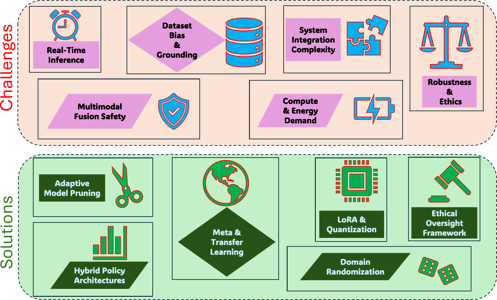

> 图 17 | 该图将六个核心 VLA 挑战（即实时推理、多模态融合安全、数据集偏差、集成复杂性、计算需求以及鲁棒性/伦理）与六项针对性解决方案（自适应剪枝、混合策略架构、元/迁移学习、LoRA/量化、领域随机化以及伦理监督）进行了映射。这种系统性的对应关系阐明了在更广泛的现实世界机器人领域中实现鲁棒、高效且安全的 VLA 部署的路径。

<a id="section-5"></a>

## 5 讨论（Discussion）

如图 [17](#figure-17) 所示， **视觉-语言-动作模型（Vision-Language-Action models, VLA models）** 面临着一系列跨越算法、计算和伦理维度的多层面挑战。首先，由于 **自回归解码器（autoregressive decoders）** 的序列特性和多模态输入的高维度，在资源受限的硬件上实现实时推理仍然困难。其次，将视觉、语言和动作融合为连贯的策略，在遇到未预料的环境变化时会引入安全漏洞。第三， **数据集偏差（dataset bias）** 和 **接地错误（grounding errors）** 会损害模型的泛化能力，常常导致模型在 **分布外任务（out-of-distribution tasks）** 上失败。第四，整合感知、推理和控制等多样化组件会产生难以优化和维护的复杂架构。第五，大型 VLA 系统的能耗和计算需求阻碍了其在嵌入式或移动平台上的部署。

最后，对环境变化的有限鲁棒性可能导致不安全或不可靠的行为，这进而引发了与 **安全保障（safety assurance）** 、 **责任归属（accountability）** 、 **隐私（privacy）** 和 **偏见缓解（bias mitigation）** 相关的伦理与监管问题。总体而言，这些限制制约了 VLA 模型在现实世界机器人、自主系统和交互应用中的实际采用。下文将讨论应对这些挑战的潜在解决方案。

<a id="figure-18"></a>
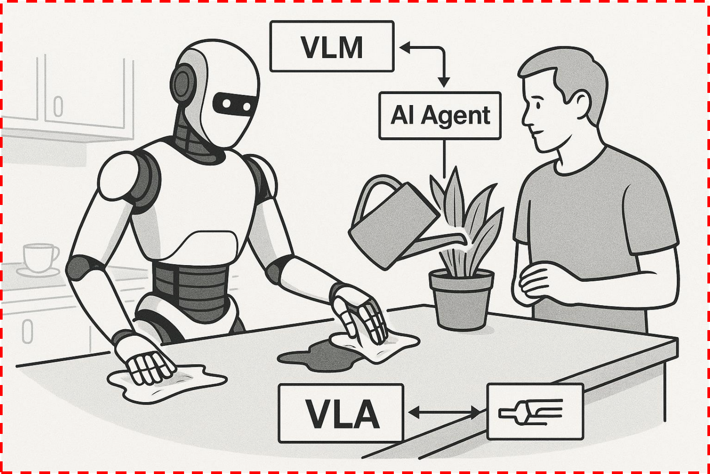

> 图 18 | 本概念图展示了“Eva”，一个由 **视觉-语言模型（Vision-Language Models, VLMs）** 、 **视觉-语言-动作框架（Vision-Language-Action frameworks, VLA frameworks）** 和 **智能体人工智能（Agentic AI）** 系统驱动的未来仿人助手。VLMs 实现了语义场景理解和物体可供性预测，而 VLAs 则将基于语言的指令转化为分层的运动计划。智能体 AI 模块确保了在开放环境中进行自适应学习、自我优化和交互式决策。这些组件共同构成了机器人领域 **人工通用智能（Artificial General Intelligence, AGI）** 的基础蓝图，其中感知、语言理解、规划和安全自主行为在现实世界、具有社会意识的任务中融合。

<a id="section-5-1"></a>

### 5.1 潜在解决方案（Potential Solutions）

**1. 实时推理约束（Real-Time Inference Constraints）**

未来的研究必须开发能够协调 **延迟（Latency）** 、 **吞吐量（Throughput）** 和任务特定 **准确率（Accuracy）** 的 **视觉-语言-动作模型（Vision-Language-Action Models, VLA）** 架构。一个有前景的方向是集成专用硬件加速器，例如基于 **现场可编程门阵列（Field-Programmable Gate Array, FPGA）** 的视觉处理器和针对 **稀疏矩阵运算（Sparse Matrix Operations）** 优化的 **张量核心（Tensor Cores）** ，以在亚毫秒级别执行卷积层和 **Transformer** 层 [122, 129]。诸如 **低秩适应（Low-Rank Adaptation, LoRA）** [93] 和 **知识蒸馏（Knowledge Distillation）** 等模型压缩技术可以将参数量减少高达 90%，在基准任务上保持超过 95% 原始性能的同时，减少内存占用和推理时间。结合 **混合精度运算（Mixed-Precision Arithmetic）** （例如 FP16/INT8）与 **分块校准（Block-wise Calibration）** 的 **渐进量化策略（Progressive Quantization Strategies）** 可以进一步将计算量减少 2-4 倍，且精度损失最小 [121]。能够根据输入复杂度动态调整网络深度或宽度的 **自适应推理架构（Adaptive Inference Architectures）** ，类似于 DeeR-VLA [269] 中的 **提前退出分支（Early-exit Branches）** ，可以在视觉场景或语言指令简单时选择性地绕过 Transformer 层，从而降低平均计算量。最后，利用 **子词块嵌入（Subword Patch Embeddings）** 和 **动态词汇分配（Dynamic Vocabulary Allocation）** 的高效 **词元化方案（Tokenization Schemes）** 可以将视觉和语言输入压缩为紧凑的表示，在不牺牲语义丰富性的前提下最小化词元数量 [171]。这些创新共同作用，可以在商用 **边缘 GPU（Edge GPUs）** 上实现低于 50 毫秒的端到端推理，为自主无人机飞行、实时遥操作和协作制造等对延迟敏感的应用铺平道路。

**2. 多模态动作表示与安全保障（Multi-modal Action Representation and Safety Assurance）**

解决多模态动作表示和鲁棒安全性问题，需要在严格的安全约束下统一感知、推理和控制的端到端框架。结合用于低级 **运动基元（Motion Primitives）** 的 **基于扩散的采样（Diffusion-based Sampling）** [40] 与 **自回归（Autoregressive）** 高级规划器 [242] 的 **混合策略架构（Hybrid Policy Architectures）** ，能够实现对多样化动作轨迹的紧凑随机表示，从而提高在动态环境中的适应性。安全性可以通过 **实时风险评估模块（Real-time Risk Assessment Modules）** 来强制执行，这些模块接收包括视觉、深度和本体感觉数据在内的多传感器融合流，以预测碰撞概率和关节应力阈值，并在预定义的安全边界被突破时触发紧急停止电路 [183, 233]。通过 **约束优化（Constrained Optimization）** （例如 SafeVLA [274] 中的 **拉格朗日方法（Lagrangian Methods）** ）增强的 **强化学习（Reinforcement Learning, RL）** 算法，可以学习在严格遵守安全约束的同时最大化任务成功率的策略。 **在线模型适应技术（Online Model Adaptation Techniques）** ，如 **基于规则的强化学习（Rule-based RL, GRPO）** 和 **直接偏好优化（Direct Preference Optimization, DPO）** ，可以在新的环境条件下进一步优化动作选择，确保跨场景的一致安全性能 [113]。至关重要的是，在执行前嵌入能够符号化分析规划器输出的 **形式化验证层（Formal Verification Layers）** ，可以保证符合安全不变量，即使对于基于神经网络的控制器也是如此。整合这些方法将产生不仅能执行复杂的多模态动作，而且能在非结构化、真实世界环境中提供可证明安全性的 VLA 系统。

**3. 数据集偏差、语义基础与对未见任务的泛化（Dataset Bias, Grounding, and Generalization to Unseen Tasks）**

鲁棒的泛化既需要拓宽数据多样性，也需要先进的学习范式。策划大规模、去偏的多模态数据集，将 LAION-5B [194] 等网络规模的图像-文本语料库与 Open X-Embodiment [227] 等以机器人为中心的轨迹档案相结合，为公平的 **语义基础（Semantic Grounding）** 奠定了基础。对视觉-语言骨干网络（例如 CLIP 变体）进行 **困难负样本采样（Hard-negative Sampling）** 和 **对比微调（Contrastive Fine-tuning）** ，可以减轻 **虚假相关性（Spurious Correlations）** 并增强语义保真度 [17, 282]。 **元学习框架（Meta-learning Frameworks）** 通过学习跨任务族的共享先验，实现了对新任务的快速适应，正如在视觉-语言机器人导航模型中所展示的那样 [175]。带有 **回放缓冲区（Replay Buffers）** 和 **正则化策略（Regularization Strategies）** 的 **持续学习算法（Continual Learning Algorithms）** 在整合新概念的同时保留旧知识，解决了 VLA 模型中的 **灾难性遗忘（Catastrophic Forgetting）** 问题 [48]。从 3D 感知领域（例如 3D-VLA [288] 中的点云推理）进行 **迁移学习（Transfer Learning）** ，可以赋予模型更强的空间归纳偏置，从而提高对 **分布外（Out-of-Distribution, OOD）** 场景的鲁棒性。最后，结合 **领域随机化（Domain Randomization）** 和真实世界校准（如动态光照、纹理和物理变化）的 **仿真到现实（Simulation-to-real, Sim2real）** 微调，确保了在合成环境中学习的策略能有效地迁移到物理机器人上 [4, 66]。这些组合策略将使 VLA 能够在真实世界部署中，自信地泛化到未见过的物体、场景和任务。

**4. 系统集成复杂性与计算需求（System Integration Complexity and Computational Demands）**

为了在紧张的计算预算下管理多模态流水线的复杂编排，研究人员必须采用 **模型模块化（Model Modularization）** 和 **软硬件协同设计（Hardware–Software Co-design）** 。 **低秩适应（Low-Rank Adaptation, LoRA）** 适配器可以被注入到预训练的 Transformer 层中，从而在不修改核心权重的情况下实现任务特定的微调 [93]。从大型“教师” VLA 到轻量级“学生”网络的 **知识蒸馏（Knowledge Distillation）** ，在基于 **互信息（Mutual Information）** 的目标指导下，鼓励学生匹配教师的中间表示和动作分布，从而产生参数量减少 5-10 倍，同时保留 90-95% 任务性能的紧凑模型 [121]。通过 **量化感知训练（Quantization-Aware Training）** 增强的 **混合精度量化（Mixed-precision Quantization）** 可以将权重压缩到 4-8 位，将内存带宽和能耗降低超过 60% [122]。专为 VLA 工作负载定制的硬件加速器，支持稀疏张量运算、动态词元路由和融合的视觉-语言内核，可以在 20-30 瓦的功耗范围内提供持续超过 100 **TOPS** 的吞吐量，满足嵌入式机器人平台的需求 [171, 242]。

诸如 **TensorRT-LLM** [129] 和 **TVM** 等工具链可以为特定的边缘设备优化端到端的 **视觉-语言-动作模型（Vision-Language-Action, VLA）** 计算图，通过层融合和预计算静态子图来实现。诸如 **TinyVLA** 等新兴架构表明，参数少于 10 亿的 VLA 模型能够在操作基准测试中实现接近最先进水平的性能，并具备实时推理能力，这为在资源受限环境中的广泛部署指明了道路。

**5. VLA 部署中对环境变化的鲁棒性（Robustness to Environmental Variability in VLA Deployment）**

要确保 VLA 在真实世界环境中的鲁棒性能，需要有针对性的技术干预来处理环境不确定性和长期系统漂移。 **领域随机化（Domain randomization）** 和 **合成数据增强（Synthetic data augmentation）** 流水线，例如 **UniSim** 的闭环传感器模拟器，可以生成光照、遮挡和传感器噪声方面的逼真变化，从而提高对 **分布偏移（Distributional shifts）** 的适应能力 [264]。此外，能够基于实时反馈动态调整感知阈值和控制增益的 **自适应重校准模块（Adaptive recalibration modules）** ，可以减轻因传感器老化或运行条件变化导致的性能下降。这些方法共同致力于提升 VLA 系统在各种动态部署场景下的稳定性和可靠性。

**6. VLA 部署中的伦理、隐私与社会考量（Ethical, Privacy, and Societal Considerations in VLA Deployment）**

除了技术鲁棒性之外，VLA 系统的部署还引发了重要的伦理和社会挑战，需要面向治理的解决方案。需要 **偏见审计工具（Bias auditing tools）** 来识别训练数据中倾斜的人口统计学或语义分布，随后采取纠正策略，例如 **对抗性去偏（Adversarial debiasing）** 和 **反事实数据增强（Counterfactual data augmentation）** [185, 282]。 **隐私保护推理机制（Privacy-preserving inference mechanisms）** ，包括设备端处理、针对敏感数据流的 **同态加密（Homomorphic encryption）** ，以及训练过程中的 **差分隐私（Differential privacy）** ，对于在医疗保健和智能家居等领域保护用户数据至关重要 [160, 180]。

<a id="section-5-2"></a>

### 5.2 Future Roadmap（未来路线图）

基于 **视觉-语言-动作模型（Vision-Language-Action models, VLA）** 的系统的未来，预计将在日益强大的多模态基础、智能体推理与具身持续学习的交叉点上演进。在未来十年，我们预计将出现几个汇聚的趋势，推动 VLA 从能力强但脆弱的任务专家，迈向可靠、通用的机器人智能。然而，这一发展轨迹将受到前文强调的持续存在的约束/限制所塑造：(i) 闭环控制中的实时推理瓶颈，(ii) 不完整的多模态动作表示和薄弱的安全保障，(iii) 分布偏移下的数据集偏见与 **语义落地失败（grounding failures）** ，(iv) 感知-记忆-推理-控制跨模块的集成复杂性，(v) 阻碍边缘部署的高计算与能源需求，以及 (vi) 开放世界环境中的鲁棒性、透明度和伦理关切。为了整体性地解决这些问题，图 [19](#figure-19) 总结了一个系统级的研究路线图，而图 [18](#figure-18) 则直观地展示了 **视觉-语言模型（Vision-Language Models, VLMs）** 、VLA 架构和智能体 AI 模块如何可能协同进化，迈向机器人领域的 **具身人工通用智能（embodied Artificial General Intelligence, embodied AGI）** 。

<a id="figure-19"></a>
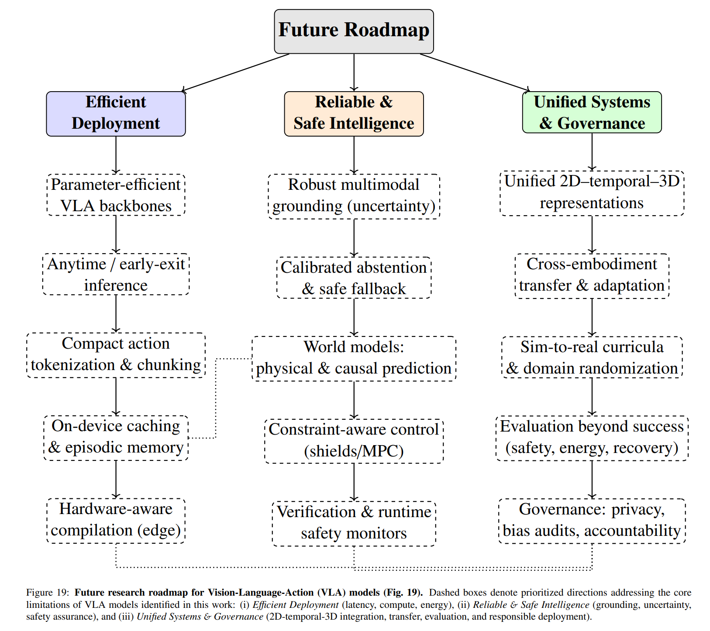

##### 多模态基础模型作为具身感知的“皮层”：

当前的 VLA 技术栈通常依赖于一个视觉-语言主干网络，并连接着任务特定的策略头，这限制了通用知识的复用，并增加了跨领域的再训练成本。一个合理的下一步是构建一个统一的多模态基础模型，该模型在互联网规模的图像、视频、文本以及交互/可供性轨迹上进行训练，以充当一个共享的“皮层”。这个皮层不仅编码静态语义，还编码动态信息、接触先验和常识性物理知识 [295, 289, 272]。通过将语言 **落地（grounding）** 于以物体为中心的表示和持久的场景结构中，这样的皮层可以减少由浅层相关性导致的失败模式 [206]。如图 [18](#figure-18) 所强调的，这种基础模型皮层将使机器人能够将环境分割为可操作的实体（物体、区域、可供性），并为下游的规划器和控制器提供稳定的语义锚点。然而，为了防止过度自信和幻觉式的落地，这些模型必须整合经过校准的不确定性以及证据关联推理，以确保感知驱动的计划在遮挡、杂乱和模糊指令下仍然是可验证的 [144]。

##### 智能体式、自监督、终身学习与持续适应：

当前 VLA 的一个决定性局限是其静态性：策略一旦训练完成，即使在不平稳的环境中运行，部署时也保持不变。未来的 VLA 应采用智能体式学习循环，在此循环中，模型提出探索目标、假设结果，并通过模拟和真实的推演进行自我纠正，从而实现数月或数年内技能的持续增长 [43, 90]。这一方向有望通过允许模型随时间适应，来缓解分布偏移、数据集偏见和长时程脆弱性；然而，持续的策略更新也带来了新的风险。特别是，重复的在线或增量学习可能会覆盖先前习得的能力（灾难性遗忘），引发非预期的行为退化，并增加对可能破坏已学习策略的噪声、对抗性或非预期环境反馈的敏感性 [292, 263]。因此，终身学习必须与回放和安全感知更新、模块化适配器以及基于验证的策略修订相结合 [121]。在图 [19](#figure-19) 的路线图中，这种智能体式终身学习范式自然地落在“可靠与安全智能”和“统一系统与治理”的交集处，在这里，持续学习被视为一个受控、可审计的生命周期过程，而非临时的微调步骤。

##### 用于可扩展性与可解释性的分层、神经符号规划：

从低级运动基元（Motor Primitives）扩展到长时程目标需要 **显式的层级结构** [261, 265]。下一代 **视觉-语言-动作系统（Vision-Language-Action systems, VLAs）** 可能会使用 **基于语言的规划器（Language-grounded planners）** （即针对可供性（Affordances）和约束条件进行微调的 **大型语言模型（Large Language Model, LLM）** 风格模块），将目标分解为结构化的子任务，然后由中级技能策略和低级控制器来确保顺应性运动 [94, 253]。这种 **神经符号混合（Neuro-symbolic blend）** 通过引入更易于调试、监控和认证的接口，有助于弥合集成复杂性 [201]。重要的是，层级结构还支持 **选择性验证（Selective verification）** ：可以检查高级计划是否存在约束违反（不安全步骤、禁止区域）[192, 71]，而低级轨迹则可以通过 **控制屏障函数（Control Barrier Functions, CBFs）** 、 **模型预测控制（Model Predictive Control, MPC）** 和运行时安全监控器来保护 [188, 196]。这些组件与图 [19](#figure-19) 中 **可靠与安全智能（Reliable & Safe Intelligence）** 支柱下的内容一致，其中安全性通过规划时约束和执行时防护共同强制执行，而非仅依赖事后评估 [101, 274]。

##### **通过世界模型和物理/因果推理实现实时适应（Real-time adaptation via world models and physical/causal reasoning）** ：

在非结构化环境中实现稳健部署，要求 VLAs 能够维护关于物体、接触和动力学的内部预测模型。能够预测近期状态转移和故障可能性的 **世界模型（World models）** 可以支持 **反事实评估（Counterfactual evaluation）** （“如果我推这里，什么会发生碰撞？”），并在现实偏离预期时（例如，抓握打滑、意外摩擦）支持快速纠正行动 [203]。这种能力对于安全操作、导航和人机交互至关重要，因为微小的错误会迅速累积 [156]。然而，世界模型必须足够高效以用于机载部署，并且与多传感器证据保持一致。因此，未来的一个重要方向是 **硬件感知（Hardware-aware）** 、 **内存高效（Memory-efficient）** 的预测建模，例如 **时序令牌压缩（Temporal token compression）** [267, 216]、 **事件驱动状态更新（Event-driven state updates）** [250, 226] 以及 **混合物理-学习模型（Hybrid physics-learning models）** ，后者将可微分物理模拟器与学习到的动力学相结合，以实现与控制相关的更新频率 [102, 52]。在图 [19](#figure-19) 中，这些需求共同出现在 **高效部署（Efficient Deployment）** 支柱（实时约束）和 **可靠与安全智能（Reliable & Safe Intelligence）** 支柱（用于落地决策的物理/因果推理）中。

##### **效率与可扩展性：连接通用性与边缘部署（Efficiency and scalability: bridging generality with edge deployment）** ：

VLA 采用的一个核心障碍仍然是大型多模态主干网络的计算足迹与闭环控制的延迟/能量约束之间的不匹配 [268, 238]。未来的 VLAs 应优先考虑 **参数高效设计（Parameter-efficient designs）** （结构化稀疏性、低秩适应、模块化专家），在保持泛化能力的同时降低推理成本 [65, 197]。除了训练时效率， **随时/提前退出策略（Anytime/early-exit policies）** 可以自适应地分配计算，确保安全关键步骤保持高保真度，而常规步骤则使用更廉价的路径 [41, 274]。同样重要的是 **动作空间效率（Action-space efficiency）** ：紧凑的动作令牌化和分块控制表示缩短了自回归的预测范围，从而在不牺牲时间平滑性的情况下实现更高的控制频率 [171]。这些模型层面的选择必须与跨 GPU/NPU/边缘加速器的 **硬件感知编译（Hardware-aware compilation）** 相结合，包括 **量化感知调度（Quantization-aware scheduling）** 和 **内存优化的注意力内核（Memory-optimized attention kernels）** [65, 168]。 **计算感知缓存（Compute-aware caching）** 和 **情景记忆（Episodic memory）** 进一步减少了冗余的前向传播，并提高了长时程任务中的响应性 [27, 133]。总的来说，这些方向实现了图 [19](#figure-19) 中 **高效部署（Efficient Deployment）** 支柱的目标，并直接解决了前文强调的计算/能量限制。

##### **跨具身迁移与形态无关的技能表示（Cross-embodiment transfer and morphology-agnostic skill representations）** ：

为每种机器人形态单独训练 VLAs 的方法不太可能扩展。未来的一个关键主题是 **形态无关的策略学习（Embodiment-agnostic policy learning）** ，其中技能在抽象的动作空间中表达（例如，接触目标、可供点操作、任务空间约束），这些表示可以在轮式平台、四足机器人和人形机器人之间迁移 [275, 118]。 **元学习（Meta-learning）** 和 **小样本校准（Few-shot calibration）** 可以允许在新机器人上仅用几分钟的数据而非数周的训练时间进行快速引导 [35]。这一方向还通过强制跨具身和跨环境的不变性来减轻数据集偏差，但它需要标准化的表示、通用接口和可复现的评估协议 [118, 275]。在图 [19](#figure-19) 中，这种形态无关的技能学习范式位于 **统一系统与治理（Unified Systems & Governance）** 之下，将架构统一与原则性迁移和基准测试联系起来。

##### **超越任务成功的评估：安全性、恢复能力与资源感知指标（Evaluation beyond task success: safety, recovery, and resource-aware metrics）**

**视觉-语言-动作智能体（Vision-Language-Action agents, VLA）** 的进展需要能反映实际部署现实的衡量标准。仅凭任务成功率无法清晰体现 **故障严重性（failure severity）** 、 **时间不一致性（temporal inconsistency）** 、 **不安全未遂事件（unsafe near-misses）** 以及 **能源效率低下（energy inefficiency）** 等问题。未来的基准测试应量化 **安全违规（safety violations）** 、 **不确定性校准（uncertainty calibration）** 、 **恢复行为（recovery behavior）** 、 **时间一致性（temporal coherence）** 、 **能耗（energy consumption）** 以及受人类约束下的 **下游效用（downstream utility）** [274, 78]。此外，评估应报告 **计算预算（compute budgets）** 、 **数据集构成（dataset composition）** 和 **部署条件（deployment conditions）** ，以实现公平比较并诊断由偏差驱动的性能提升 [215, 273, 118]。此类衡量不仅仅是 **科学严谨性（scientific hygiene）** 的要求：它是 **审计（auditing）** 与 **治理（governance）** 的基础，并决定一个系统能否负责任地进行大规模部署 [274, 275]。这一动机构成了图 [19](#figure-19) 中评估分支的基础，并与图 [18](#figure-18) 中的概念性部署叙述形成互补。

##### **将安全性、伦理与以人为本的对齐作为首要设计目标（Safety, ethics, and human-centered alignment as first-class design objectives）**

随着 VLA 获得更多自主性，内置的 **安全性（safety）** 和 **价值对齐（value alignment）** 变得至关重要。未来的系统应集成 **实时风险评估器（real-time risk estimators）** ，在执行高风险动作前评估潜在危害，在模糊情况下请求自然语言确认，并维护透明的日志以确保 **可问责性（accountability）** [274, 118]。 **隐私感知传感（privacy-aware sensing）** 、 **偏差审计（bias audits）** 和 **人在回路监督（human-in-the-loop oversight）** 必须嵌入整个生命周期，尤其是对于 **辅助机器人（assistive robotics）** 和 **安全关键自主系统（safety-critical autonomy）** [284, 236]。与法规对齐的 **评估协议（evaluation protocols）** 和 **标准化（standardization）** 工作，对于将 VLA 的进展转化为可信赖的现实世界系统至关重要 [169, 294, 235]。这一治理视角在图 [19](#figure-19) 中被明确捕捉，并隐含地反映在图 [18](#figure-18) 所描绘的具有社会意识的仿人机器人场景中。

##### **跨领域主题：持续学习、故障恢复、交互与控制保真度（Cross-cutting themes: continual learning, failure recovery, interaction, and control fidelity）**

在图 [19](#figure-19) 的所有支柱领域中，有几个跨领域主题预计将塑造未来十年的 VLA 研究。首先， **持续学习（continual learning）** 与 **终身学习（lifelong learning）** 必须是安全、可审计且 **抗遗忘（resistant to forgetting）** 的，能够在长期适应过程中不破坏已部署系统的稳定性 [290]。其次， **故障检测（failure detection）** 与 **恢复（recovery）** 应被视为首要能力，包含 **内省监控（introspective monitoring）** 、 **不确定性感知（uncertainty-aware perception）** ，以及在执行偏离预期结果时的 **结构化恢复行为（structured recovery behaviors）** [116, 259]。第三，提高 **动作生成（action generation）** 的精度和可靠性仍然至关重要：虽然基于 VLA 的 **规划器（planners）** 能够实现灵活的、 **语言条件化（language-conditioned）** 的决策，但其 **轨迹精度（trajectory accuracy）** 和 **控制稳定性（control stability）** 目前仍落后于传统的分析方法，如 **模型预测控制（model predictive control）** 、 **基于采样的运动规划（sampling-based motion planning）** 和 **反馈线性化控制器（feedback-linearized controllers）** 。因此，将 VLA 驱动的高层规划与经典或学习得到的低层控制器相结合的 **混合架构（hybrid architectures）** ，预计将在实现语义灵活性和控制级精度两方面发挥核心作用。最后， **人类对齐（human alignment）** 与 **交互（interaction）** 需要 **意图澄清（intent clarification）** 、 **共享自主权（shared autonomy）** 和 **可解释的动作理由（explainable action rationales）** 等机制，以支持在不同现实场景下的信任度和可用性 [111, 110]。

总而言之，图 [19](#figure-19) 强调，要弥合实验室演示与鲁棒的现实世界部署之间的差距，需要在效率、安全性、数据与泛化、系统集成、评估和治理方面取得协调一致的进展。作为补充，图 [18](#figure-18) 则说明了这些进展如何可能汇聚成跨多个平台的 **通用具身智能体（generalist embodied agents）** ，这些平台包括移动机器人、机械臂、辅助系统和仿人机器人，其中 **多模态感知（multi-modal perception）** 、 **分层规划（hierarchical planning）** 、 **持续适应（continual adaptation）** 和 **与人类对齐的安全性（human-aligned safety）** 被集成在一个统一的智能栈中。共同应对这些方向，有望将 VLA 从有前景的研究原型转变为可靠、广泛适用的具身系统，而非局限于任何单一机器人形态的解决方案。

<a id="section-6"></a>

## 6 结论（Conclusion）

在这篇全面的综述中，我们系统地评估了过去三年发表的 **视觉-语言-动作模型（Vision-Language-Action models, VLA）** 的最新进展、方法论和应用。我们的分析从 VLA 的基础概念开始，将其定义为在物理或模拟环境中统一视觉感知、自然语言理解和动作生成的多模态系统。我们追溯了其演变历程和时间线，详述了标志着从孤立的感知-动作模块向完全统一的、遵循指令的机器人智能体过渡的关键里程碑。我们重点阐述了多模态集成如何从松耦合的流水线，发展到基于 **Transformer** 的架构，从而实现模态间的无缝协调。

接下来，我们研究了 **词元化（Tokenization）** 和 **表征（Representation）** 技术，重点关注 VLA 如何编码视觉和语言信息，包括动作基元（Action Primitives）和空间语义。我们探讨了学习范式，详细介绍了从监督学习、模仿学习到强化学习和多模态预训练等塑造 VLA 性能的数据集和训练策略。在“自适应控制与实时执行”部分，我们讨论了现代 VLA 如何针对动态环境进行优化，分析了支持对延迟敏感任务的策略。随后，我们对主要的架构创新进行了分类，调研了超过 50 个近期的 VLA 模型。这部分讨论涵盖了模型设计、记忆系统和交互保真度方面的进展。我们进一步研究了提高训练效率的策略，包括 **低秩适应（Low-Rank Adaptation, LoRA）** 、 **量化（Quantization）** 和 **模型剪枝（Model Pruning）** 等参数高效方法，以及 **并行解码（Parallel Decoding）** 和 **硬件感知推理（Hardware-aware Inference）** 等加速技术。我们对现实世界应用的分析，凸显了 VLA 模型在六个领域（人形机器人、自动驾驶汽车、工业自动化、医疗保健、农业和增强现实导航）中的前景和当前局限性。在这些场景中，VLA 在高层语义推理、指令遵循和任务泛化方面表现出强大的能力，尤其是在结构化或部分受控的环境中。然而，与传统的解析式规划和控制流水线相比，其有效性常常受到实时推理延迟、环境变化下有限的鲁棒性，以及在长时程或安全关键控制中精度降低的制约。此外，为了实现可靠的性能，通常需要针对特定应用进行调整和大量的数据整理，这突显了在可扩展性和部署方面的挑战。这些发现表明，虽然 VLA 非常适合语义决策和灵活的任务指定，但将 VLA 推理与经典或学习到的低级控制器相结合的 **混合架构（Hybrid Architectures）** ，对于实际的现实世界操作仍然至关重要。

在应对挑战和局限性方面，我们聚焦于五个核心领域：实时推理、多模态动作表征与安全、偏差与泛化、系统集成与计算约束，以及伦理部署。我们基于现有文献提出了潜在的解决方案，包括模型压缩、跨模态对齐、领域适应和智能体学习框架。最后，我们的讨论和未来路线图阐述了 **视觉语言模型（Vision-Language Models, VLMs）** 、VLA 架构和智能体人工智能系统的融合，如何将机器人学引向 **人工通用智能（Artificial General Intelligence, AGI）** 。本综述提供了对 VLA 进展的统一理解，指出了尚未解决的挑战，并为未来开发智能的、具身的、与人类对齐的智能体勾勒了一条结构化的前进道路。

## 资助声明（Funding Declaration）

本研究部分得到了 **美国国家科学基金会（National Science Foundation, NSF）** 和 **美国农业部（United States Department of Agriculture, USDA）国家食品与农业研究所（National Institute of Food and Agriculture, NIFA）** 的资助，通过“农业人工智能研究所”项目（项目编号 AWD003473 和 AWD004595），以及项目“使用软体机械手进行机器人疏花”（USDA-NIFA 登录号 1029004）。额外支持由 USDA/NIFA 资助（资助号 2024-67022-41788，登录号 1031712）提供，项目名称为“将 UCF 人工智能研究扩展到新型农业工程应用”。

## Declarations（声明）

作者声明不存在利益冲突。

## 关于人工智能写作辅助的声明

在本文写作过程中，使用了 ChatGPT 和 Perplexity 来提升语法准确性并优化句子结构；所有由人工智能生成的修订内容均已进行彻底审查，并针对相关性进行了编辑。
