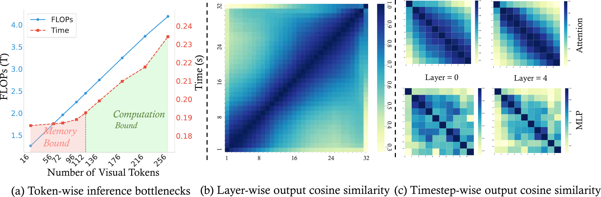
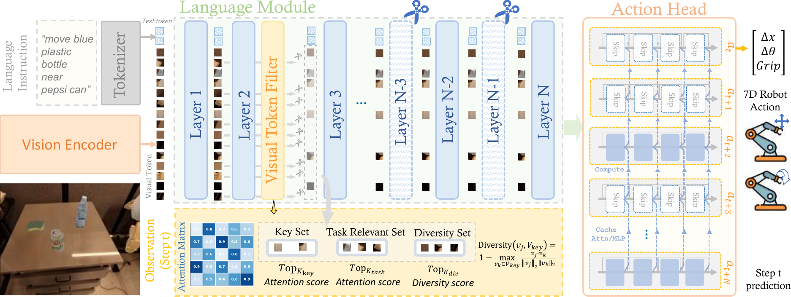
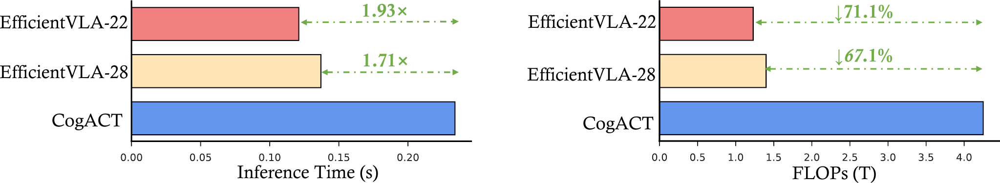
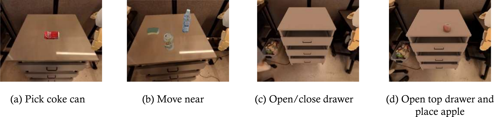

# Title: EfficientVLA: Training-Free Acceleration and Compression for Vision-Language-Action Models (EfficientVLA：面向视觉-语言-动作模型的无训练加速与压缩)
- ArXiv: 2506.10100
- 作者（Authors）: Chuan Wen, Linfeng Zhang
- 章节（Sections）: 28
- 估计词元数（Estimated tokens）: 15.9k

## 目录（Contents）
- 1 引言（Introduction）
- 2 相关工作（Related Work）
- 3 方法（Method）
  - 3.1 预备知识：视觉-语言-动作模型（Preliminaries: Vision-Language-Action Models）
  - 3.2 视觉-语言模型剪枝（Vision-Language Model Pruning）
    - 3.2.1 层冗余分析（Layer Redundancy Analysis）
    - 3.2.2 重要性驱动的非连续层剪枝（Importance-Driven Non-Contiguous Layer Pruning）
  - 3.3 任务相关性与多样性驱动的视觉词元剪枝（Task-Relevance and Diversity-Driven Visual Token Pruning）
    - 3.3.1 量化任务相关性（Quantifying Task Relevance）
    - 3.3.2 关键任务相关词元选择（Selection of Key Task-Relevant Tokens）
    - 3.3.3 平衡相关性与多样性的增强选择（Augmentative Selection Balancing Relevance and Diversity）
      - 任务驱动增强（Task-Driven Augmentation）。
      - 多样性驱动增强（Diversity-Driven Augmentation）。
      - 最终剪枝视觉词元集（Final Pruned Visual Token Set）。
  - 3.4 动作预测中的中间特征缓存（Caching Intermediate Features in Action Prediction）
    - 3.4.1 DiT 块中的特征生成与时序一致性（Feature Generation and Temporal Coherence in DiT Blocks）
    - 3.4.2 静态 N 步缓存实现（Static N-Step Caching Implementation）
- 4 实验（Experiment）
  - 4.1 实验设置（Experimental Settings）
  - 4.2 仿真环境结果（Results on Simulation Environment）
  - 4.3 消融研究（Ablation Study）
- 5 结论（Conclusion）
- 参考文献（References）
- 附录 A 实验设置（Appendix A Experimental Settings）
  - A.1 SIMPLER 环境（SIMPLER Environment）
  - A.2 基线方法（Baselines）
- 附录 B 影响声明（Appendix B Impact Statement）
- 附录 C 局限性（Appendix C Limitations）

## 摘要（Abstract）

 **摘要（Abstract）**   **视觉-语言-动作模型（Vision-Language-Action, VLA）** ，特别是基于 **扩散（Diffusion）** 的架构，展现了 **具身智能（Embodied Intelligence）** 的变革潜力，但因其广泛存在的固有冗余和推理时冗余所导致的高计算与内存需求而受到严重制约。现有的加速工作通常针对孤立的低效环节，此类零散解决方案往往无法整体解决整个 VLA 流程中多样的计算与内存瓶颈，从而限制了实际部署能力。我们提出了  **EfficientVLA** ，一个结构化、无需训练的推理加速框架，通过协同利用多方面的冗余，系统地消除这些障碍。EfficientVLA 协同整合了三种针对性策略：(1) 在层间冗余分析的指导下，剪枝语言模块中功能无关紧要的层；(2) 通过一种任务感知策略优化视觉处理通路，该策略选择一组紧凑且多样化的视觉词元，在任务关键性与信息覆盖度之间取得平衡；(3) 通过策略性地缓存和重用关键中间特征，减轻基于迭代扩散的动作头内部的时间计算冗余。
我们将我们的方法应用于标准 VLA 模型  **CogACT** ，在  **SIMPLER**  基准测试中实现了  **$1.93\times$**  的推理加速，并将 **浮点运算次数（Floating-Point Operations, FLOPs）**  降低至  **$28.9\%$** ，而成功率仅下降  **$0.6\%$** 。

## 1 Introduction（引言）

基于整合视觉与语言的模型在多模态理解方面取得的进展 [1, 2, 3, 4, 5]， **视觉-语言-动作模型（Vision-Language-Action, VLA）**  实现了变革性的具身智能。这些系统，例如 OpenVLA [6]、CogACT [7]、$\pi_{0}$ [8] 和 RT-2 [9]，能够直接将多模态输入转化为可执行的动作，并利用大规模数据集 [10, 11] 成功应对复杂的机器人操作与推理任务。许多前沿的 VLA 模型将用于场景和指令解析的 **视觉语言模型（Vision-Language Model, VLM）**  与处理多模态动作分布的 **扩散模型（Diffusion model）**  相结合 [7, 12, 13, 14]。然而，这些基于扩散的 VLA 架构在推理时产生的显著计算和内存开销，对其实际部署构成了关键障碍，尤其是在资源受限的机器人平台上进行实时交互时。

基于扩散的 VLA 架构通常包含一个用于提取特征的视觉编码器、一个用于多模态推理的 **大型语言模型（Large Language Model, LLM）**  核心 [15, 16, 17, 18, 19]，以及一个基于扩散的动作解码器，该解码器通过多个去噪步骤预测最终动作。虽然这种模块化设计是其强大能力的基础，但它本质上导致了大量的计算和内存开销。我们的发现（表 [1](#table-1)）表明，语言模块和迭代式扩散头是整体延迟和计算负载的主要贡献者。此外，如图 [1](#figure-1) (a) 所示，尽管视觉词元剪枝在计算受限的场景下最初能减少推理时间，但随着系统因 LLM 而变为内存受限时，其效果会迅速减弱。

先前的 VLA 加速工作主要集中在孤立的调整上，带来的整体收益微乎其微。这些零散的方法常常失败，因为它们忽略了 VLA 的集成特性，孤立地优化一个模块仅仅是将瓶颈转移到了别处。收益受到其他地方未解决的低效问题的限制，例如 LLM 的内存需求或动作头的计算强度。例如，像 TinyVLA [14] 和 DeeR-VLA [20] 这样的方法专注于专门的模型架构，而非针对预训练 VLA 的广泛适用的推理加速框架。其他方法，如 Mole-VLA [21]，解决了 LLM 层的冗余问题，但需要昂贵的重新训练，并且忽略了流水线的其他阶段。类似地，VLA-Cache [22] 缓存静态视觉词元，但提供的加速有限，受到 LLM 巨大内存占用和动作头计算需求的制约。因此，这些现有方法未能提供一个真正全面的解决方案来应对 VLA 低效性的复杂局面。

为了制定更有效的加速策略，我们系统地分析了每个 VLA 模块内的推理特性和多方面的冗余。在许多基于扩散的 VLA 中，扩散动作头作为一个独立的模块运行，由从 VLM 提取的特征引导。这种分离可能未能充分利用 VLM 的全部推理能力进行动作生成，从而对其整体规模的必要性提出了质疑。如图 [1](#figure-1) (b) 所示，语言模块表现出相当大的深度方向表示冗余，其层间隐藏状态相似性很高。视觉处理通路加剧了这个问题，它处理了过多的词元，这些词元的特点是任务相关性低或由于视觉相似性导致信息重叠度高，从而消耗了计算资源并加剧了 LLM 的内存受限状况。如图 [1](#figure-1) (c) 所示，迭代式扩散动作头显示出显著的时间冗余。其在相邻去噪步骤间的中间特征高度相似，意味着存在大量且近乎静态的重复计算。

 **表 1：基准 VLA 模型（CogACT，左）与我们提出的 EfficientVLA（右）的模块级推理特性对比。EfficientVLA 在整体推理速度和计算效率（FLOPs）上均展现出显著提升。** 
|  | 视觉模块 | 语言模块 | 动作模块 |
| --- | --- | --- | --- |
| #Param (M) | 802.3 | 6738.9 | 89.0 |
| Vision Token | 256 | 256 | - |
| Denoising Steps | - | - | 10 |
| Inference Time (ms) | 24.9 | 134.5 | 51.5 |
| FLOPs (G) | 405.50 | 3726.55 | 57.96 |

> 图 1：VLA 推理瓶颈与冗余分析：(a) 视觉词元剪枝对 FLOPs 和推理时间的影响，揭示了计算受限和内存受限两种状态。(b) LLM 隐藏状态的高层间余弦相似度，表明存在深度方向的冗余。(c) 扩散步骤中 MLP/注意力特征的时间余弦相似度，显示出计算冗余。

受此启发，我们提出了  **EfficientVLA** ，一个针对基于扩散的 **视觉-语言-动作模型（Vision-Language-Action models, VLAs）** 的结构化、免训练加速框架，旨在系统性地解决这些问题。
针对语言模块的主要内存瓶颈及其观察到的深度冗余（图 [1](#figure-1) (b)），EfficientVLA 采用一种基于相似性的重要性度量来剪枝功能上不重要的层，从而在不重新训练的情况下减少模型深度和对内存的需求。
为了在达到 LLM 内存限制之前，管理来自视觉输入的初始计算负载（图 [1](#figure-1) (a)），我们的视觉词元剪枝策略通过首先选择关键的任务对齐词元，然后扩充该集合以确保表征多样性，同时保持高任务相关性，从而同时处理任务相关和图像固有的冗余。
最后，EfficientVLA 通过缓存和重用中间注意力与 **多层感知机（Multi-Layer Perceptron, MLP）** 输出，解决了计算密集型动作生成器中的时间冗余问题（由跨时间步的高特征相似度凸显，图 [1](#figure-1) (c)），从而削减了冗余计算。
这种协同的、结构化的方法，相比孤立的优化，能更全面地缓解 GPU 计算和内存瓶颈。

本工作的主要贡献总结如下：

1.  我们提出了一项系统性分析，识别了当代基于扩散的 VLA 架构中的关键计算与内存瓶颈，以及多方面的冗余，从而论证了结构化加速的必要性。
2.  我们提出了  ***EfficientVLA** *，一种新颖的免训练、结构化推理加速框架。它协同地根据信息影响剪枝语言模块中的冗余层，并通过同时考虑 VLA 任务相关性和图像固有特征多样性，策略性地选择一个紧凑的、任务聚焦的视觉词元子集。
3.  我们的框架通过利用基于扩散的动作头中的时间冗余，进一步提升了效率，在迭代去噪过程中引入了针对中间注意力和 MLP 计算的缓存机制。
4.  我们在 SIMPLER 环境 [23] 中对 CogACT 模型进行了广泛的实验，证明了 EfficientVLA 的有效性，实现了 $1.93\times$ 的推理加速，并将 FLOPs 降低至 $28.9\%$，同时仅带来 $0.6\%$ 的最小精度损失。这将促进大规模 VLA 在现实世界资源受限的机器人平台上的应用。

## 2 相关工作（Related Work）

 **视觉-语言-动作模型（Vision-Language-Action Models）** 
 **视觉-语言-动作（Vision-Language-Action, VLA）**  模型 [6, 24, 20, 25] 通过融入动作生成，扩展了 **视觉-语言模型（Vision-Language Models, VLMs）**  [26, 27, 28, 29, 3]，从而弥合了感知与行动之间的鸿沟。这些模型使机器能够理解视觉和文本输入，并为诸如机器人操作和物体抓取等任务 [30, 24] 生成相应的动作。VLA 模型通常使用预训练的 VLM [27] 将视觉和语言数据编码成一个共享的表示，然后从中生成离散的词元或连续值形式的动作。VLA 领域近期的一个显著趋势是采用 **扩散模型（Diffusion models）**  来生成连贯的连续动作序列。这一范式的代表模型包括 CogACT [7]、DexVLA [13]、DiVLA [12]、$\pi_{0}$ [8] 和 TinyVLA [14]。许多此类基于扩散的 VLA 采用组件化设计：基础 VLM 处理视觉和语言输入以产生一个压缩的特征表示，该表示随后作为条件，输入到一个独立的、基于扩散的动作模块中，该模块负责迭代生成精确的动作轨迹。这通常涉及 VLM 的输出引导专用动作解码器内的去噪过程。

 **高效的视觉-语言-动作模型（Efficient Vision-Language-Action Models）** 
 **视觉-语言模型（Vision-Language Models）**  [31, 32] 的计算复杂性为其实时部署带来了重大挑战，尤其是在机器人控制等需要快速决策的应用中。为了解决这个问题，近期加速 VLA 模型的努力主要分为 **训练感知（training-aware）**  和 **训练无关（training-free）**  两类方法。训练感知方法，如 RoboMamba [33]、EfficientVLM [34] 和 DeeR-VLA [20]，侧重于优化模型架构或应用压缩技术后进行重新训练，在保持性能的同时实现显著的加速。例如，DeeR-VLA 通过利用动态重参数化和高效的剪枝策略来降低计算成本，从而实现更灵活和可扩展的模型部署。类似地，Mole-VLA [21] 通过根据任务特定需求动态激活模型层的子集来降低计算成本。相比之下，训练无关方法，如 VLA-Cache [22]，则通过重用连续帧之间未变化词元的先前计算结果来提高效率，这在视觉输入变化极小的场景中尤其有益。

## 3 方法

### 3.1 预备知识：视觉-语言-动作模型

 **视觉-语言-动作模型（Vision-Language-Action, VLA）** 代表了一类旨在连接感知、语言理解和机器人动作的多模态系统。这些模型通常通过一系列专用模块处理图像观测和自然语言指令，以生成可执行的动作序列。
我们基础 VLA 模型的初始阶段采用一个 **视觉模块（Vision Module）** ，该模块包含强大的预训练编码器 DINOv2 [35] 和 SigLIP [36]，用于将原始视觉输入 $O_{img}$ 转换为一组丰富的特征嵌入 $F_{V}$。
这些视觉特征 $F_{V}$ 与经过词元化的语言指令一起，随后被一个 **语言模型主干（language model backbone）** 所接收。这个 **大型语言模型（Large Language Model, LLM）** 执行多模态融合和上下文推理，以得出一个面向任务的表示或条件信号 $F_{VL}$，该信号封装了对场景和指令目标的理解。
最后，一个 **基于扩散的动作头（Diffusion-based Action Head）** 以从输出特征 $F_{VL}$ 中提取的认知特征作为输入，预测一个具有 7 个 **自由度（Degrees of Freedom, DoF）** 的夹持器的最终动作空间。

> 图 2 | EfficientVLA 框架概览，这是我们用于加速基于扩散的 VLA 的无训练、结构化方法。它采用：(1) 剪枝冗余的语言模块层；(2) 平衡任务相关性和信息多样性的 VLA 任务感知视觉词元选择；(3) 扩散动作头中中间特征的时序缓存。

### 3.2 视觉-语言模型剪枝

#### 3.2.1 层冗余分析

VLA 模型中的语言模块，通常是一个多层  **Transformer 解码器（Transformer decoder）** ，对于多模态推理至关重要，但往往会引入大量的计算开销。在此类 Transformer 中，每一层 $\ell$ 通过一个残差变换来更新其输入隐藏状态 $\boldsymbol{x}^{(\ell)}\in\mathbb{R}^{d\times S}$：$\boldsymbol{x}^{(\ell+1)}=\boldsymbol{x}^{(\ell)}+f(\boldsymbol{x}^{(\ell)},
\theta^{(\ell)})$，其中 $f(\cdot)$ 是具有参数 $\theta^{(\ell)}$ 的层特定函数，$d$ 是隐藏维度，$S$ 是序列长度。我们的实证分析（如图 [1](#figure-1) (b) 所示）揭示了该语言模块组件内部存在显著的深度方向表示冗余。具体来说，我们观察到许多层（尤其是更深层）的输入状态 $\boldsymbol{x}^{(\ell)}$ 和输出状态 $\boldsymbol{x}^{(\ell+1)}$ 之间具有很高的 **余弦相似度（cosine similarity）** 。这表明这些层施加的有效变换 $f(\boldsymbol{x}^{(\ell)},\theta^{(\ell)})$ 是微乎其微的，使得它们在功能上不那么关键，并成为剪枝以提升推理效率、同时对任务性能影响可忽略不计的主要候选对象。

#### 3.2.2 基于重要性的非连续层剪枝

为了解决在 VLA 模型语言模块中识别出的深度方向冗余问题，我们首先严格量化每一层的功能重要性。我们的方法旨在识别那些对隐藏状态表示变换贡献最小的层，使其成为剪枝的候选对象。我们基于以下原则为给定层 $\ell$ 定义重要性分数 $I^{(\ell)}$：一个对其输入产生显著变化的层比其输出与输入高度相似的层更为关键。具体而言，$I^{(\ell)}$ 被量化为 1 减去其输入和输出隐藏状态在 VLA 训练样本的代表性数据集 $\mathcal{D}$ 上以及每个样本内所有 $L$ 个词元位置上的平均余弦相似度：

$$
I^{(\ell)}=1-\frac{1}{|\mathcal{D}|}\sum_{i=1}^{|\mathcal{D}|}\left(\frac{1}{L }\sum_{j=1}^{L}\frac{\boldsymbol{x}^{(\ell)}_{i,j}\cdot\boldsymbol{x}^{(\ell+1 )}_{i,j}}{\|\boldsymbol{x}^{(\ell)}_{i,j}\|_{2}\|\boldsymbol{x}^{(\ell+1)}_{i, j}\|_{2}}\right)(1)
$$

其中 $\boldsymbol{x}^{(\ell)}_{i,j},\boldsymbol{x}^{(\ell+1)}_{i,j}\in\mathbb{R}^{d}$ 分别表示第 $\ell$ 层中样本 $i$ 在位置 $j$ 处的输入和输出隐藏状态向量。 **高余弦相似度（High cosine similarity）**  意味着层函数 $f(\boldsymbol{x}^{(\ell)},\theta^{(\ell)})$ 的变换效应最小，从而导致 **重要性分数（importance score）**  $I^{(\ell)}$ 较低，并表明存在 **功能冗余（functional redundancy）** 。

基于这些重要性分数，我们采用一种 **非连续剪枝策略（non-contiguous pruning strategy）** 。对于一个包含 $N$ 层的 **大型语言模型（Large Language Model, LLM）** ，为每一层 $\ell\in\{1,\dots,N\}$ 计算重要性分数 $I^{(\ell)}$。然后将这些分数按升序排序，得到一个有序的层索引列表 $\mathcal{L}_{ranked}=[\ell_{(1)},\ell_{(2)},\dots,\ell_{(N)}]$，使得 $I^{(\ell_{(1)})}\leq I^{(\ell_{(2)})}\leq\dots\leq I^{(\ell_{(N)})}$。随后，从该列表中选择前 $n$ 层，即 $\{\ell_{(1)},\ell_{(2)},\dots,\ell_{(n)}\}$，从模型中移除。

### 3.3 任务相关性与多样性驱动的视觉词元剪枝（Task-Relevance and Diversity-Driven Visual Token Pruning）

尽管 **视觉-语言-动作模型（Vision-Language-Action models, VLA models）**  处理的视觉词元流信息内容丰富，但常常表现出显著的冗余性，带来了巨大的计算和内存开销。这种冗余通常以两种主要形式表现出来：(i) 与特定 VLA 任务目标相关性低的词元；(ii) 由于输入中固有的视觉相似性而导致信息重复的词元。为了应对这两种不同的冗余形式，我们提出了一种新颖的、无需训练的、VLA 任务感知的视觉词元剪枝方法。我们的方法策略性地从初始的 $N_{total}$ 个词元嵌入集合 $V=\{v_{1},v_{2},\dots,v_{N_{total}}\}$（源自输入图像）中，蒸馏出一个紧凑但信息量最大的视觉词元子集 $V_{pruned}\subset V$，其大小为预定的 $K_{final}$。这是通过首先利用注意力分析识别出的任务关键词元来锚定选择，然后通过明智地平衡持续的任务相关性与通过相似性度量明确促进特征多样性，来扩充这个核心集实现的。推理时保留的视觉词元可在补充材料中找到。

#### 3.3.1 量化任务相关性（Quantifying Task Relevance）

为了指导视觉词元剪枝，我们利用来自选定 **视觉语言模型（Vision-Language Model, VLM）**  层的交叉注意力分数，来量化每个初始视觉词元 $v_{i}$（来自 $N_{total}$ 个词元的集合）的任务相关性。这些分数捕捉了 $v_{i}$ 对 $L_{ctx}$ 个定义任务的上下文嵌入（例如，语言指令）的注意力。令 $A^{(h)}_{i,j}$ 表示视觉词元 $v_{i}$ 对第 $h$ 个注意力头（共 $H$ 个头）中第 $j$ 个上下文词元的注意力。视觉词元 $v_{i}$ 的原始任务相关性分数 $r_{i}$ 的计算方法是：首先对每个视觉-上下文对 $(i,j)$ 在所有 $H$ 个头上的注意力贡献进行平均，然后将这些平均后的注意力在所有 $L_{ctx}$ 个上下文元素上求和：

$$
r_{i}=\sum_{j=1}^{L_{ctx}}\left(\frac{1}{H}\sum_{h=1}^{H}A^{(h)}_{i,j}\right)(2)
$$

这些原始分数 $r_{i}$ 表示每个词元与任务上下文的整体关联程度，随后被归一化（例如，通过最小-最大缩放）为标准化的分数 $s_{i}\in[0,1]$，以便进行稳健的比较和后续的词元选择。

#### 3.3.2 关键任务相关词元的选择（Selection of Key Task-Relevant Tokens）

借助归一化的任务相关性分数 $\{s_{i}\}$，剪枝的第一阶段识别出一组初始的 $K_{key}$ 个视觉词元（例如，$K_{key}$ 根据经验设置在 4 到 8 之间），这些词元表现出与 VLA 任务最高的相关性。这些词元构成了核心且不可或缺的视觉词元集合 $V_{key}$：

$$
V_{key}=\{v_{i}\in V\mid s_{i}\text{ 是 }\{s_{k}\}_{k=1}^{N_{total}}\text{ 中前 }K_{key}\text{ 个最高分数之一}\}(3)
$$

$V_{key}$ 中的词元被无条件地保留在 $V_{pruned}$ 中，构成了一个基础的视觉线索支架，这些线索被认为对于任务理解和成功执行至关重要。剩余待进一步考虑的候选词元集合记为 $V_{rem}=V\setminus V_{key}$。

#### 3.3.3 平衡相关性与多样性的增强选择（Augmentative Selection Balancing Relevance and Diversity）

为了补充核心集合 $V_{key}$ 并达到目标最终词元数量 $K_{final}$，需要从 $V_{rem}$ 中精心挑选额外的 $K_{aug}=K_{final}-K_{key}$ 个词元。这个关键的增强阶段由一个比率 $\alpha\in[0,1]$ 指导，它协调一种混合选择策略，该策略同时促进对任务相关性的持续强调和信息多样性的引入。

##### 任务驱动的增强（Task-Driven Augmentation）

从 $V_{rem}$ 中选取一部分增强配额，具体为 $K_{task}=\lfloor\alpha\cdot K_{aug}\rfloor$ 个词元，其选择依据是进一步优先考虑具有高任务相关性分数 $s_{i}$ 的词元。$V_{task}$ 通过纳入额外的词元来强化剪枝后表示的任务中心特性，这些词元虽然不是初始 $K_{key}$ 精英集合的一部分，但仍表现出很强的相关性信号。这些词元被添加到选择中，剩余候选池随之更新：$V_{rem}\leftarrow V_{rem}\setminus V_{task}$。

##### 多样性驱动的增强（Diversity-Driven Augmentation）

剩余的 $K_{div}=K_{aug}-K_{task}$ 个词元从更新后的 $V_{rem}$ 中选出，其明确目标是最大化相对于已选关键词元的特征多样性。这一步对于捕获更广泛的视觉信息以及减轻仅靠任务相关性无法解决的内在冗余至关重要。对于每个候选词元 $v_{j}\in V_{rem}$，计算其与集合 $V_{key}$ 的相异性。常用的度量是 **余弦距离（Cosine distance）** ，确保所选词元在嵌入空间中具有区分度：

$$
\text{Diversity}(v_{j},V_{key})=1-\max_{v_{k}\in V_{key}}\frac{v_{j}\cdot v_{k }}{\|v_{j}\|_{2}\|v_{k}\|_{2}}(4)
$$

从 $V_{rem}$ 中选出具有最高相异性分数（即与已选词元差异最大）的 $K_{div}$ 个词元，构成集合 $V_{div}$。这种有针对性地纳入多样化词元，确保了最终选择不会过度专业化，并保留了更丰富的上下文理解。

##### 最终剪枝后的视觉词元集合（Final Pruned Visual Token Set）

剪枝后保留的完整视觉词元集合是这些策略性选择组件的并集：

$$
V_{pruned}=V_{key}\cup V_{task}\cup V_{div}(5)
$$

这个最终集合 $V_{pruned}$，其基数（Cardinality）为 $K_{final}$，随后将在 **视觉-语言模型（Vision-Language Model, VLA）**  中用于所有下游处理。这种对视觉序列长度的系统性缩减，在保留关键任务特定信息和多样化视觉信息的同时，显著减轻了计算需求。

### 3.4 动作预测中的中间特征缓存（Caching Intermediate Features in Action Prediction）

使用基于 **扩散模型（Diffusion-based）** 的 **视觉-语言-动作模型（Vision-Language-Action, VLA）** 生成高保真动作序列，涉及一个迭代的去噪过程。由于需要在 $T$ 个时间步上重复进行 **自注意力（Self-attention）** 和 **多层感知机（Multilayer Perceptron, MLP）** 计算，该过程需要大量的计算资源。我们观察到，在动作生成过程中产生的中间特征具有很强的 **时间相干性（Temporal Coherence）** （图 [1](#figure-1) (c)），这表明不同时间步之间存在大量冗余。为了解决这种低效问题并加速动作生成阶段，我们提出了一种 **静态缓存机制（Static Caching Mechanism）** 。该策略以固定的间隔 $N$ 周期性地重新计算并缓存关键的中间注意力输出和 MLP 输出，并在生成动作序列的中间时间步中重用这些缓存值。这种选择性计算旨在显著降低生成动作序列相关的计算成本，同时保持其质量。

#### 3.4.1 DiT 块中的特征生成与时间相干性

令 $t$ 表示当前去噪时间步，通常从初始值 $T_{start}$ 迭代递减至 $1$。在时间步 $t$ 的每个 **扩散变换器块（Diffusion Transformer Block, DiT Block）** 内，输入特征 $\mathbf{z}_{t}$（可能包含来自上游 VLM 模块的认知特征 $\mathbf{f}_{t}$ 以及当前的噪声估计）会依次经过自注意力模块和 MLP 模块处理，以产生中间隐藏状态：

$$
\displaystyle\mathbf{h}_{t}^{\text{attn}} = \text{Self-Attn}(\mathbf{z}_{t}) \tag{6}
$$
$$
\displaystyle\mathbf{h}_{t}^{\text{mlp}} = \text{MLP}(\mathbf{h}_{t}^{\text{attn}}+\mathbf{z}_{t}) \tag{7}
$$

这些特征 $\mathbf{h}_{t}^{\text{attn}}$ 和 $\mathbf{h}_{t}^{\text{mlp}}$ 是扩散模型去噪能力的基础。我们观察到它们具有很高的时间相干性——即对于许多 $t$ 和模块类型，有 $\mathbf{h}_{t}^{\text{module}}\approx\mathbf{h}_{t-1}^{\text{module}}$——这促使我们对其进行周期性缓存和重用。

#### 3.4.2 静态 N 步缓存实现

我们定义一个缓存间隔 $N$（$1\leq N<T_{start}$）。在初始时间步 $t=T_{start}$，特征 $\mathbf{h}_{T_{start}}^{\text{attn}}$ 和 $\mathbf{h}_{T_{start}}^{\text{mlp}}$ 通过公式 [6] 和 [7] 计算得出，并存储在一个持久缓存中，分别记为 $\mathcal{C}_{attn}$ 和 $\mathcal{C}_{mlp}$。对于任何后续时间步 $t<T_{start}$， **当且仅当**  $t\pmod{N}=0$ 时（假设 $t>0$ 且 $t$ 与期望的缓存倍数对齐，例如 $T_{start},T_{start}-N,T_{start}-2N,\dots$），才会重新计算这些特征并更新缓存。因此，对于这些重新计算的时间步：

$$
\displaystyle\mathcal{C}_{attn} \leftarrow \text{Self-Attn}(\mathbf{z}_{t}) \tag{8}
$$
$$
\displaystyle\mathcal{C}_{mlp} \leftarrow \text{MLP}(\mathcal{C}_{attn}+\mathbf{z}_{t}) \tag{9}
$$

并且此步骤的输出为 $\mathbf{h}_{t}^{\text{attn}}=\mathcal{C}_{attn}$ 和 $\mathbf{h}_{t}^{\text{mlp}}=\mathcal{C}_{mlp}$。在所有其他时间步（即 $t\pmod{N}\neq 0$ 时），计算密集型的自注意力和 MLP 操作被完全绕过。相反，所需的特征直接从最近填充的缓存中检索：

$$
\displaystyle\mathbf{h}_{t}^{\text{attn}} \leftarrow \mathcal{C}_{attn} \quad (\text{当 }t\pmod{N}\neq 0\text{ 时}) \tag{10}
$$
$$
\displaystyle\mathbf{h}_{t}^{\text{mlp}} \leftarrow \mathcal{C}_{mlp} \quad (\text{当 }t\pmod{N}\neq 0\text{ 时}) \tag{11}
$$

这种静态缓存调度有效地剪枝了初始化后每 $N$ 个时间步中 $N-1$ 个时间步对这些核心模块的执行，从而为 VLA 的动作生成组件带来了 **浮点运算（Floating-point Operations）** 和 **延迟（Latency）** 的显著降低。$N$ 的选择允许在加速和生成动作的保真度之间进行可调的权衡，因为如果底层表示变化迅速，在更长的时间间隔内重用特征可能会引入轻微的偏差。

## 4 实验（Experiment）

 **表 2：EfficientVLA 在 SIMPLER 环境中与 CogACT 及其他基线方法的性能对比。设置根据保留的 LLM 层数（L）和视觉词元数（T）而变化。*随机丢弃（Random Dropping）* 表示一种随机保留 112 个视觉词元的方法。** 
| SIMPLER | 方法（Method） | 无需训练（Training-free） | PickCan | MoveNear | Drawer | DrawerApple | 平均（Average） | FLOPs$\downarrow$ | 加速比$\uparrow$ | 参数量（B） |
| :--- | :--- | :--- | :--- | :--- | :--- | :--- | :--- | :--- | :--- | :--- |
| 视觉匹配 （Visual Matching） | CogACT | - | 91.3% | 85.0% | 71.8% | 50.9% | 74.8% | 100.0% | 1.00$\times$ | 7.63 |
|  | 随机丢弃（Random Dropping） | ✓ | 9.7% | 20.4% | 53.5% | 0.0% | 20.9% | 58.5% | 1.20$\times$ | 7.63 |
|  | FastV | ✓ | 92.6% | 81.4% | 69.8% | 52.4% | 74.1% | 42.0% | 1.21$\times$ | 7.63 |
|  | VLA-Cache | ✓ | 92.0% | 83.3% | 70.5% | 51.6% | 74.4% | 80.1% | 1.38$\times$ | 7.63 |
|  | EfficientVLA (L=28, T=112) | ✓ | 95.3% | 83.3% | 70.3% | 56.5% | 76.4% | 45.1% | 1.59$\times$ | 5.87 |
|  | EfficientVLA (L=28, T=56) | ✓ | 94.7% | 82.4% | 69.8% | 55.4% | 75.5% | 32.9% | 1.71$\times$ | 5.87 |
|  | EfficientVLA (L=22, T=112) | ✓ | 94.0% | 82.1% | 69.2% | 54.6% | 75.0% | 38.2% | 1.78$\times$ | 4.86 |
|  | EfficientVLA (L=22, T=56) | ✓ | 93.3% | 81.3% | 68.2% | 53.8% | 74.2% | 28.9% | 1.93$\times$ | 4.86 |
| 变体聚合 （Variant Aggregation） | CogACT | - | 89.6% | 80.8% | 28.3% | 46.6% | 61.3% | 100.0% | 1.00$\times$ | 7.63 |
|  | 随机丢弃（Random Dropping） | ✓ | 4.0% | 16.1% | 15.6% | 0.0% | 8.9% | 58.5% | 1.20$\times$ | 7.63 |
|  | FastV | ✓ | 91.4% | 78.6% | 27.6% | 50.6% | 62.1% | 42.0% | 1.19$\times$ | 7.63 |
|  | VLA-Cache | ✓ | 91.7% | 79.3% | 32.5% | 45.8% | 62.3% | 82.6% | 1.37$\times$ | 7.63 |
|  | EfficientVLA(L=28, T=112) | ✓ | 94.8% | 77.6% | 28.4% | 51.9% | 63.2% | 45.1% | 1.57$\times$ | 5.87 |
|  | EfficientVLA (L=28, T=56) | ✓ | 94.4% | 77.2% | 27.6% | 51.3% | 62.6% | 32.9% | 1.69$\times$ | 5.87 |
|  | EfficientVLA (L=22, T=112) | ✓ | 93.9% | 76.4% | 27.3% | 50.6% | 62.1% | 38.2% | 1.76$\times$ | 4.86 |
|  | EfficientVLA (L=22, T=56) | ✓ | 93.2% | 75.8% | 26.9% | 49.2% | 61.2% | 28.9% | 1.91$\times$ | 4.86 |

### 4.1 实验设置（Experimental Settings）

 **仿真实现细节（Simulation Implementation Details）** 。
为了评估我们的 **视觉-语言-动作模型（Vision-Language-Action model, VLA model）** ，我们使用了  **SIMPLER**  环境 [23]，这是一个用于桌面操作的基于仿真的基准测试。SIMPLER 旨在紧密模拟诸如 Google Robot 和 WidowX 等机器人的真实世界动态，展示了仿真与真实世界性能之间的强一致性。
在此设置中，VLA 模型以 224$\times$224 的 RGB 图像观测和自然语言任务指令（例如，“Pick coke can”）作为输入，并在 7 自由度（7-DoF）笛卡尔空间中输出一系列动作序列。
SIMPLER 支持两种评估配置： ***视觉匹配（Visual Matching）** *，优先考虑对真实世界外观的保真度；以及  ***变体聚合（Variant Aggregations）** *，它包含了诸如变化的照明、背景和表面纹理等多种条件。对于 Google 机器人，SIMPLER 提供了这两种评估设置，每种设置都包含相同的四个任务：1) 拾取可乐罐（Pick coke can）；2) 靠近（Move near）；3) 打开/关闭抽屉（Open/close drawer）；4) 打开顶层抽屉并放置苹果（Open top drawer and place apple）。成功率被用作评估指标。

 **基线方法（Baselines）** 。我们对 EfficientVLA 的主要实验验证是在  ***CogACT** * [37] 上进行的，它集成了强大的视觉编码器（ **DINOv2**  [35] 和  **SigLIP**  [36]）、一个用于多模态推理的  **Llama2-7B**  [15] 语言模块，以及一个用于生成动作轨迹的 **扩散变换器（Diffusion Transformer, DiT）** 。我们与相关的基线方法进行了基准测试。这些方法包括一种  ***随机丢弃（Random Dropping）** * 方法，即均匀随机地保留 112 个视觉词元，以评估我们引导式视觉词元剪枝的优势。我们进一步与  ***FastV** * [38] 进行了比较，这是一种通过剪枝冗余视觉词元来加速推理的著名方法；以及  ***VLA-Cache** * [22]，它利用时间分析跨时间步缓存静态词元。

 **实现细节（Implementation Details）** 。
对于 EfficientVLA，除了层剪枝外，我们还通过采用  **PruneNet**  [39] 配置进行  **LLM（Large Language Model）**  压缩，进一步压缩了模型参数。具体来说，我们对所有 Transformer 块的  **MLP（Multilayer Perceptron）**  层应用了 25% 的稀疏度。对于视觉词元剪枝，我们从第 2 个 Transformer 层开始，关键任务词元的剪枝比例 $\alpha$ = 50%，$K_{key}$ = 4。此外，缓存间隔设置为 5。所有实验均在 NVIDIA A40 GPU 上进行，推理时间测量为平均单步推理时长。更多细节可在补充材料中找到。

### 4.2 仿真环境结果（Results on Simulation Environment）

 **SIMPLER 上的主要结果（Main Results on SIMPLER）** 。
表 [2](#table-2) 详细展示了我们结构化的、完全无需训练的剪枝方法在 SIMPLER 环境中的性能。我们的方法在保留 22/28 层和 56/112 个视觉词元的各种配置下均表现出色。例如，剪枝 10 层并保留 112 个词元的配置，在成功率和推理速度上都超过了 Cog

 **效率分析（Efficiency Analysis）** 
如表 [2](#table-2) 和图 [3](#figure-3) 所示，我们提出的方法显著优于之前的基线，实现了  **71.1%**  的 **浮点运算次数（Floating Point Operations, FLOPs）**  减少和  **1.93$\times$**  的推理速度提升。与此形成鲜明对比的是， **VLA-cache**  应用于  **CogACT**  模型时，仅减少了  **19.9%**  的 FLOPs，且仅实现了  **1.38$\times$**  的加速。这种差异证实了我们先前的分析： **VLA-cache**  仅作为相邻时间步之间视觉词元（Visual Tokens）的缓存，本质上受限于内存边界，从而限制了仅针对词元进行加速的效果。因此，我们系统的结构化框架提供了显著优势，凸显了我们方法在平衡计算效率与鲁棒性能方面的卓越能力。

 **表 3: 可扩展性分析（Scalability Analysis）** ：我们在视觉匹配的仿真环境中评估了不同模型尺寸下的平均成功率和推理时间。我们的  **EfficientVLA**  配置保持 L = 22 和 T = 56。
| SIMPLER | Model | Action-Params | Methods | Average | Inference time (s) | Total-Params (B) |
| :--- | :--- | :--- | :--- | :--- | :--- | :--- |
| Visual | CogACT-Small | 13M | CogACT | 73.3% | 0.2156 | 7.55 |
| EfficientVLA | 72.6% | 0.1173 | 4.78 |  |  |  |
| Matching | CogACT-Base | 89M | CogACT | 74.8% | 0.2342 | 7.63 |
| EfficientVLA | 74.2% | 0.1213 | 4.86 |  |  |  |
| CogACT-Large | 308M | CogACT | 76.7% | 0.2628 | 7.85 |  |
|  | EfficientVLA | 76.1% | 0.1312 | 5.08 |  |  |

> 图 3: 仿真环境中的效率分析，比较了我们  **EfficientVLA**  变体与原始模型骨干的 FLOPs 和推理时间。 **EfficientVLA-22**  和  **EfficientVLA-28**  分别表示保留 22 层和 28 层  **LLM**  的配置。

 **可扩展性评估（Scalability Evaluation）** 。表 [3](#table-3) 展示了我们提出的方法在不同尺寸  **CogACT**  模型上的可扩展性。三个模型之间的主要区别在于其动作模块的参数规模，结果表明，我们方法的有效性在更大的模型上更为显著。具体而言，在  **CogACT-Large**  模型上，我们的方法实现了  **2.0$\times$**  的推理加速，而性能仅从  **76.7%**  略微下降至  **76.1%** 。这种影响增强的原因是，更大模型中的动作模块拥有更多参数，其推理时间本身就更长，因此我们的方法能够产生更显著的加速效果。这些发现也强调了我们方法在不同规模模型上的鲁棒性。

 **词元缩减率与缓存间隔的影响（Impact of Token Reduction Ratio and Cache Interval）** 。表 [4](#table-4) 详述了我们在 *拾取可乐罐（pick coke can）* 任务上的实验，揭示了针对特定组件的优化具有不同的影响。积极剪枝视觉词元，直至仅保留  **22%** ，有效减轻了计算负载，实现了显著且近乎无损的加速。然而，超过此点后，推理速度的提升基本趋于饱和，进一步缩减词元仅带来边际改善，从而揭示了主导性的系统级性能瓶颈。另一方面，对于基于 **扩散模型（Diffusion Model）**  的动作生成器，我们观察到增加中间 **注意力（Attention）**  和  **MLP**  特征的缓存重用间隔 $N$，能够逐步且显著地加速动作轨迹的生成。

 **表 4: 在我们的 EfficientVLA 框架内应用不同视觉词元缩减率（左）和扩散动作头缓存间隔（右）的性能影响。** 
| Token | 56 | 72 | 96 | 112 | 256 |
| :--- | :--- | :--- | :--- | :--- | :--- |
| Ratio | 77.8% | 71.8% | 62.5% | 56.2% | 100.0% |
| Accuracy | 95.0% | 95.3% | 95.0% | 96.0% | 91.3% |
| Inference time (s) | 0.1866 | 0.1870 | 0.1889 | 0.1956 | 0.2342 |
| FLOPs (T) | 1.76 | 1.96 | 2.25 | 2.45 | 4.19 |

 **表 5: 对我们 EfficientVLA 的消融研究，其中“Layer”表示仅应用 LLM 层剪枝组件，“MLP”指在每层内压缩 25% MLP 权重的不同策略。** 
|  | Model Compression | Visual Token | Action | Success | Inference | Speedup$\uparrow$ |  |
| :--- | :--- | :--- | :--- | :--- | :--- | :--- | :--- |
|  | Layer | MLP | Pruning | Cache | Rate | Time (s) |  |
| Ex0 | ✗ | ✗ | ✗ | ✗ | 91.3% | 0.2342 | 1.00$\times$ |
| Ex1 | ✗ | ✗ | ✓ | ✗ | 95.6% | 0.1866 | 1.25$\times$ |
| Ex2 | ✗ | ✗ | ✗ | ✓ | 93.7% | 0.1909 | 1.23$\times$ |
| Ex3 | ✓ | ✗ | ✓ | ✗ | 85.7% | 0.1604 | 1.46$\times$ |
| Ex4 | ✓ | ✓ | ✗ | ✗ | 92.3% | 0.1638 | 1.43$\times$ |
| Ex5 | ✓ | ✓ | ✗ | ✓ | 93.3% | 0.1387 | 1.69$\times$ |
| Ex6 | ✗ | ✗ | ✓ | ✓ | 95.3% | 0.1592 | 1.47$\times$ |
| Ex7 | ✓ | ✓ | ✓ | ✓ | 93.3% | 0.1213 | 1.93$\times$ |

### 4.3 消融研究（Ablation Study）

我们对我们提出的框架的各个组件进行了消融研究，以 *拾取可乐罐（pick coke can）* 任务为例进行说明。正如先前分析（例如图 [1](#figure-1) (a)）所表明的，仅针对  **VLA**  推理任务优化视觉词元带来的加速有限；仅保留 56 个词元仅实现了  **1.23$\times$**  的加速，尽管成功率却从  **91.3%**  反常地上升至  **95.6%** 。这突显了以词元为中心的优化方法（如  **VLA-cache** ）的固有局限性，并证实了要实现适用于硬件部署的实质性  **VLA**  推理加速，需要一种更以模型为中心的策略。相比之下，我们的模型压缩方法——同时剪枝层并在剩余层中压缩  **MLP** ——实现了  **1.43$\times$**  的加速。至关重要的是，当所有组件集成时，实现了  **1.93$\times$**  的加速，并且整体任务成功率仍提升了  **2**  个百分点。这些综合结果凸显了采用结构化框架以实现有效  **VLA**  推理加速的必要性和重要性。

## 5 结论（Conclusion）

本文中，我们解决了阻碍强大的 **基于扩散的视觉-语言-动作模型（Diffusion-based Vision-Language-Action models, VLA）** 实际部署的关键挑战——高昂的计算和内存开销。我们提出了  **EfficientVLA** ，这是一种新颖的、无需训练的结构化框架，用于加速 VLA 模型。我们的框架通过协同优化提升了效率：
-  **协同剪枝语言模块冗余层** ：根据其对 **隐藏状态（hidden states）** 转换影响最小的原则，识别并剪除语言模块中的冗余层。
-  **策略性选择紧凑视觉词元集** ：策略性地选择一组紧凑的 **视觉词元（visual tokens）** ，以平衡 VLA 任务相关性与固有的特征多样性。

此外，该框架通过在其迭代去噪步骤中缓存关键的中间计算，优化了动作模块。我们在 SIMPLER 环境 [23] 中的 CogACT 数据集上进行了大量实验，证明了 EfficientVLA 的有效性，实现了  **$1.93\times$**  的推理加速，并将 **浮点运算次数（FLOPs）**  降低至  **$28.9\%$** ，同时仅带来  **$0.6\%$**  的最小精度损失。

## 参考文献（References）

- [1]
A. Awadalla, I. Gao, J. Gardner, J. Hessel, Y. Hanafy, W. Zhu, K. Marathe, Y. Bitton, S. Gadre, S. Sagawa, J. Jitsev, S. Kornblith, P. W. Koh, G. Ilharco, M. Wortsman, and L. Schmidt, “Openflamingo: An open-source framework for training large autoregressive vision-language models,” *arXiv preprint arXiv:2308.01390*, 2023.
- [2]
J. Li, D. Li, C. Xiong, and S. Hoi, “Blip: Bootstrapping language-image pre-training for unified vision-language understanding and generation,” in *International conference on machine learning*. PMLR, 2022, pp. 12 888–12 900.
- [3]
A. Radford, J. W. Kim, C. Hallacy, A. Ramesh, G. Goh, S. Agarwal, G. Sastry, A. Askell, P. Mishkin, J. Clark *et al.*, “Learning transferable visual models from natural language supervision,” in *International conference on machine learning*. PMLR, 2021, pp. 8748–8763.
- [4]
R. An, S. Yang, M. Lu, K. Zeng, Y. Luo, Y. Chen, J. Cao, H. Liang, Q. She, S. Zhang *et al.*, “Mc-llava: Multi-concept personalized vision-language model,” *arXiv preprint arXiv:2411.11706*, 2024.
- [5]
Y. Luo, R. An, B. Zou, Y. Tang, J. Liu, and S. Zhang, “Llm as dataset analyst: Subpopulation structure discovery with large language model,” in *European Conference on Computer Vision*. Springer, 2024, pp. 235–252.
- [6]
M. Kim, K. Pertsch, S. Karamcheti, T. Xiao, A. Balakrishna, S. Nair, R. Rafailov, E. Foster, G. Lam, P. Sanketi, Q. Vuong, T. Kollar, B. Burchfiel, R. Tedrake, D. Sadigh, S. Levine, P. Liang, and C. Finn, “Openvla: An open-source vision-language-action model,” *arXiv preprint arXiv:2406.09246*, 2024.
- [7]
Q. Li, Y. Liang, Z. Wang, L. Luo, X. Chen, M. Liao, F. Wei, Y. Deng, S. Xu, Y. Zhang, X. Wang, B. Liu, J. Fu, J. Bao, D. Chen, Y. Shi, J. Yang, and B. Guo, “Cogact: A foundational vision-language-action model for synergizing cognition and action in robotic manipulation,” 2024.
- [8]
K. Black, N. Brown, D. Driess, A. Esmail, M. Equi, C. Finn, N. Fusai, L. Groom, K. Hausman, B. Ichter *et al.*, “$\pi_{0}$: A vision-language-action flow model for general robot control,” *arXiv preprint arXiv:2410.24164*, 2024.
- [9]
A. Brohan, N. Brown, J. Carbajal, Y. Chebotar, X. Chen, K. Choromanski, T. Ding, D. Driess, A. Dubey, C. Finn, P. Florence, C. Fu, M. G. Arenas, K. Gopalakrishnan, K. Han, K. Hausman, A. Herzog, J. Hsu, B. Ichter, A. Irpan, N. Joshi, R. Julian, D. Kalashnikov, Y. Kuang, I. Leal, L. Lee, T.-W. E. Lee, S. Levine, Y. Lu, H. Michalewski, I. Mordatch, K. Pertsch, K. Rao, K. Reymann, M. Ryoo, G. Salazar, P. Sanketi, P. Sermanet, J. Singh, A. Singh, R. Soricut, H. Tran, V. Vanhoucke, Q. Vuong, A. Wahid, S. Welker, P. Wohlhart, J. Wu, F. Xia, T. Xiao, P. Xu, S. Xu, T. Yu, and B. Zitkovich, “Rt-2: Vision-language-action models transfer web knowledge to robotic control,” 2023. [Online]. Available: [https://arxiv.org/abs/2307.15818](https://arxiv.org/abs/2307.15818)
- [10]
H.-S. Fang, H. Fang, Z. Tang, J. Liu, C. Wang, J. Wang, H. Zhu, and C. Lu, “Rh20t: A comprehensive robotic dataset for learning diverse skills in one-shot,” in *2024 IEEE International Conference on Robotics and Automation (ICRA)*. IEEE, 2024, pp. 653–660.
- [11]
A. O’Neill, A. Rehman, A. Maddukuri, A. Gupta, A. Padalkar, A. Lee, A. Pooley, A. Gupta, A. Mandlekar, A. Jain *et al.*, “Open x-embodiment: Robotic learning datasets and rt-x models: Open x-embodiment collaboration 0,” in *2024 IEEE International Conference on Robotics and Automation (ICRA)*. IEEE, 2024, pp. 6892–6903.
- [12]
J. Wen, M. Zhu, Y. Zhu, Z. Tang, J. Li, Z. Zhou, C. Li, X. Liu, Y. Peng, C. Shen *et al.*, “Diffusion-vla: Scaling robot foundation models via unified diffusion and autoregression,” *arXiv preprint arXiv:2412.03293*, 2024.
- [13]
J. Wen, Y. Zhu, J. Li, Z. Tang, C. Shen, and F. Feng, “Dexvla: Vision-language model with plug-in diffusion expert for general robot control,” *arXiv preprint arXiv:2502.05855*, 2025.
- [14]
J. Wen, Y. Zhu, J. Li, M. Zhu, K. Wu, Z. Xu, N. Liu, R. Cheng, C. Shen, Y. Peng *et al.*, “Tinyvla: Towards fast, data-efficient vision-language-action models for robotic manipulation,” *arXiv preprint arXiv:2409.12514*, 2024.
- [15]
H. Touvron, L. Martin, K. Stone, P. Albert, A. Almahairi, Y. Babaei, N. Bashlykov, S. Batra, P. Bhargava, S. Bhosale *et al.*, “Llama 2: Open foundation and fine-tuned chat models,” *arXiv preprint arXiv:2307.09288*, 2023.
- [16]
L. Floridi and M. Chiriatti, “Gpt-3: Its nature, scope, limits, and consequences,” *Minds and Machines*, vol. 30, pp. 681–694, 2020.
- [17]
OpenAI *et al.*, “Gpt-4 technical report,” 2024. [Online]. Available: [https://arxiv.org/abs/2303.08774](https://arxiv.org/abs/2303.08774)
- [18]
Y. Liu, M. Ott, N. Goyal, J. Du, M. Joshi, D. Chen, O. Levy, M. Lewis, L. Zettlemoyer, and V. Stoyanov, “Roberta: A robustly optimized bert pretraining approach,” 2019. [Online]. Available: [https://arxiv.org/abs/1907.11692](https://arxiv.org/abs/1907.11692)
- [19]
S. Wang, Z. Wang, X. Jin, J. Wang, J. Zhang, K. Li, Z. Wen, Z. Li, C. He, X. Hu *et al.*, “Data whisperer: Efficient data selection for task-specific llm fine-tuning via few-shot in-context learning,” *arXiv preprint arXiv:2505.12212*, 2025.
- [20]
Y. Yue, Y. Wang, B. Kang, Y. Han, S. Wang, S. Song, J. Feng, and G. Huang, “Deer-vla: Dynamic inference of multimodal large language models for efficient robot execution,” in *The Thirty-eighth Annual Conference on Neural Information Processing Systems*, 2024.
- [21]
R. Zhang, M. Dong, Y. Zhang, L. Heng, X. Chi, G. Dai, L. Du, D. Wang, Y. Du, and S. Zhang, “M

Kirmani *等人*， “在仿真中评估真实世界机器人操作策略，” *arXiv 预印本 arXiv:2405.05941*， 2024。
- [24]
X. Li, M. Liu, H. Zhang, C. Yu, J. Xu, H. Wu, C. Cheang, Y. Jing, W. Zhang, H. Liu *等人*， “视觉-语言基础模型作为高效的机器人模仿器，” *arXiv 预印本 arXiv:2311.01378*， 2023。
- [25]
B. Zitkovich, T. Yu, S. Xu, P. Xu, T. Xiao, F. Xia, J. Wu, P. Wohlhart, S. Welker, A. Wahid *等人*， “Rt-2：视觉-语言-动作模型将网络知识迁移至机器人控制，” 载于 *机器人学习会议*。   PMLR， 2023， 第 2165–2183 页。
- [26]
J.-B. Alayrac, J. Donahue, P. Luc, A. Miech, I. Barr, Y. Hasson, K. Lenc, A. Mensch, K. Millican, M. Reynolds, R. Ring, E. Rutherford, S. Cabi, T. Han, Z. Gong, S. Samangooei, M. Monteiro, J. Menick, S. Borgeaud, A. Brock, A. Nematzadeh, S. Sharifzadeh, M. Binkowski, R. Barreira, O. Vinyals, A. Zisserman, 和 K. Simonyan， “Flamingo：一种用于小样本学习的视觉语言模型，” 2022。 [在线]。 可获取： [https://arxiv.org/abs/2204.14198](https://arxiv.org/abs/2204.14198)
- [27]
S. Karamcheti, S. Nair, A. Balakrishna, P. Liang, T. Kollar, 和 D. Sadigh， “Prismatic vlms：探索视觉条件语言模型的设计空间，” 2024。 [在线]。 可获取： [https://arxiv.org/abs/2402.07865](https://arxiv.org/abs/2402.07865)
- [28]
J. Li, D. Li, C. Xiong, 和 S. Hoi， “Blip：通过语言-图像预训练引导实现统一的视觉-语言理解与生成，” 2022。 [在线]。 可获取： [https://arxiv.org/abs/2201.12086](https://arxiv.org/abs/2201.12086)
- [29]
H. Liu, C. Li, Q. Wu, 和 Y. J. Lee， “视觉指令微调，” 2023。 [在线]。 可获取： [https://arxiv.org/abs/2304.08485](https://arxiv.org/abs/2304.08485)
- [30]
A. Awadalla, I. Gao, J. Gardner, J. Hessel, Y. Hanafy, W. Zhu, K. Marathe, Y. Bitton, S. Gadre, S. Sagawa, J. Jitsev, S. Kornblith, P. W. Koh, G. Ilharco, M. Wortsman, 和 L. Schmidt， “Openflamingo：一个用于训练大型自回归视觉语言模型的开源框架，” 2023。 [在线]。 可获取： [https://arxiv.org/abs/2308.01390](https://arxiv.org/abs/2308.01390)
- [31]
X. Liu, Z. Wen, S. Wang, J. Chen, Z. Tao, Y. Wang, X. Jin, C. Zou, Y. Wang, C. Liao *等人*， “将人工智能效率从以模型为中心转向以数据为中心的压缩，” *arXiv 预印本 arXiv:2505.19147*， 2025。
- [32]
Z. Wen, Y. Gao, S. Wang, J. Zhang, Q. Zhang, W. Li, C. He, 和 L. Zhang， “停止在多模态语言模型中寻找重要词元：复制更重要，” *arXiv 预印本 arXiv:2502.11494*， 2025。
- [33]
J. Liu, M. Liu, Z. Wang, P. An, X. Li, K. Zhou, S. Yang, R. Zhang, Y. Guo, 和 S. Zhang， “Robomamba：用于机器人推理与操作的高效视觉-语言-动作模型，” 2024。 [在线]。 可获取： [https://arxiv.org/abs/2406.04339](https://arxiv.org/abs/2406.04339)
- [34]
T. Wang, W. Zhou, Y. Zeng, 和 X. Zhang， “Efficientvlm：通过知识蒸馏和模态自适应剪枝实现快速准确的视觉语言模型，” 2022。 [在线]。 可获取： [https://arxiv.org/abs/2210.07795](https://arxiv.org/abs/2210.07795)
- [35]
M. Oquab, T. Darcet, T. Moutakanni, H. Vo, M. Szafraniec, V. Khalidov, P. Fernandez, D. Haziza, F. Massa, A. El-Nouby *等人*， “Dinov2：无需监督学习鲁棒的视觉特征，” *arXiv 预印本 arXiv:2304.07193*， 2023。
- [36]
X. Zhai, B. Mustafa, A. Kolesnikov, 和 L. Beyer， “用于语言图像预训练的 Sigmoid 损失，” 载于 *IEEE/CVF 国际计算机视觉会议论文集*， 2023， 第 11 975–11 986 页。
- [37]
Q. Li, Y. Liang, Z. Wang, L. Luo, X. Chen, M. Liao, F. Wei, Y. Deng, S. Xu, Y. Zhang, X. Wang, B. Liu, J. Fu, J. Bao, D. Chen, Y. Shi, J. Yang, 和 B. Guo， “Cogact：一种用于协同机器人操作中认知与行动的基础视觉-语言-动作模型，” 2024。 [在线]。 可获取： [https://arxiv.org/abs/2411.19650](https://arxiv.org/abs/2411.19650)
- [38]
L. Chen, H. Zhao, T. Liu, S. Bai, J. Lin, C. Zhou, 和 B. Chang， “一幅图像在第 2 层后值 1/2 个词元：大型视觉语言模型的即插即用推理加速，” 载于 *欧洲计算机视觉会议*。   Springer， 2025， 第 19–35 页。
- [39]
A. Sengupta, S. Chaudhary, 和 T.

 **附录 A（Appendix A）** 

## 附录 A 实验设置

### A.1 SIMPLER 环境

 **SIMPLER 仿真环境（SIMPLER simulation environment）**  是我们评估 **视觉-语言-动作模型（Vision-Language-Action models, VLA models）**  的主要基准。它专门设计用于紧密模拟真实世界的机器人设置，从而促进更真实的评估，并弥合真实到仿真的控制和视觉差距。

SIMPLER 提供两种不同的评估设置：

-  **视觉匹配（Visual Matching, VM）** ：此设置通过最小化仿真环境与真实环境之间的差异来紧密复现真实世界任务，优先保证对真实世界外观的保真度。
-  **变体聚合（Variant Aggregation, VA）** ：此设置在视觉匹配的基础上，引入了对背景、光照、干扰物和桌面纹理等元素的变体，挑战模型在不同条件下的泛化能力。

对于 Google 机器人设置，SIMPLER 提供了两种评估设置，每种设置都包含相同的四个任务：1) 拾取可乐罐，2) 靠近移动，3) 打开/关闭抽屉，以及 4) 打开顶层抽屉并放置苹果。Google 机器人的这四个任务也在图 [4] 中进行了说明。

> 图 4 | SIMPLER 环境中 Google 机器人的代表性机器人操作任务：(a) 拾取可乐罐，(b) 靠近移动，(c) 打开/关闭抽屉，(d) 打开顶层抽屉并放置苹果。

### A.2 基线方法

我们将我们的 EfficientVLA 与以下相关的基线和骨干方法进行基准测试：

-  **CogACT** ：该模型作为我们主要的实验验证平台。CogACT 集成了强大的视觉编码器（DINOv2 和 SigLIP）来处理原始视觉输入，一个用于多模态推理的 Llama2-7B 语言模块，以及一个作为专用动作模块的 **扩散变换器（Diffusion Transformer, DiT）**  用于生成精确的动作轨迹。它旨在通过将基于扩散的动作模块以 VLM 提取的特征为条件，来协同“认知”（VLM 输出）与“动作”能力，从而应对机器人动作的连续性、多模态性和时间相关性。
-  **VLA-Cache** ：这是一种无需训练的加速方法，旨在提高机器人操作中 VLA 模型的效率。VLA-Cache 的运行原理是，顺序机器人任务中的视觉输入在连续步骤之间通常表现出最小的变化，尤其是在背景区域。它包含一个 **令牌选择机制（token-selection mechanism）** ，用于识别与上一步相比变化最小的视觉静态令牌，并通过 **键值缓存（KV-cache）**  重用它们的计算结果。此外，它还包括一个细粒度选择方案，用于过滤掉关键的任务相关令牌，确保它们经过完整计算以保持准确性，并采用层自适应策略根据注意力集中度调整重用比率。
-  **FastV** ：该方法专注于通过剪枝冗余的视觉令牌来加速 **大型视觉-语言模型（Large Vision-Language Models, LVLMs）**  的推理。FastV 的核心洞见是识别了流行 LVLMs 深层中存在的低效注意力现象，即图像令牌尽管占输入令牌的很大一部分，却获得显著更少的注意力。它提出了一种即插即用的方法，在特定层之后，根据注意力分数动态剪枝一定比例的这些影响力较小的视觉令牌，以在不牺牲性能的情况下降低计算成本（ **浮点运算次数（Floating Point Operations, FLOPs）** ）。

## 附录 B 影响声明

本文介绍了 EfficientVLA，它通过一种新颖的无需训练框架直接应对 **视觉-语言-动作模型（Vision-Language-Action models, VLA models）**  巨大的计算和内存需求，是对该领域的重要贡献。EfficientVLA 协同剪枝冗余的语言层，为任务相关性和多样性优化视觉令牌选择，并在基于扩散的动作头中缓存中间特征，从而显著提升了 VLA 模型的效率和速度。这使得强大的 VLA 模型能够在资源受限的机器人平台上进行实际部署以实现实时交互，加速了机器人操作和推理任务的进展，并通过减少计算负载促进了更多开发。我们旨在将本工作用于合乎伦理的学术研究和授权的商业应用，并严格禁止将其用于有害、不道德或非法的机器人行为，这强调了我们有责任确保其社会效益符合基本伦理原则。

## 附录 C 局限性

尽管 EfficientVLA 显著推进了 VLA 模型的加速，但某些局限性值得讨论。我们的无需训练方法，可能无法达到基于训练的方法所能实现的最大压缩或加速比。动作头中固定的缓存间隔 $N$ 引入了加速与动作保真度之间的权衡，未来的工作可以探索自适应缓存。此外，由于开源的基于扩散的 VLA 模型可用性有限，我们当前的演示主要集中在 CogACT 上。未来，随着更多此类架构的出现，我们旨在更广泛的模型和任务上验证 EfficientVLA 的可扩展性和有效性。