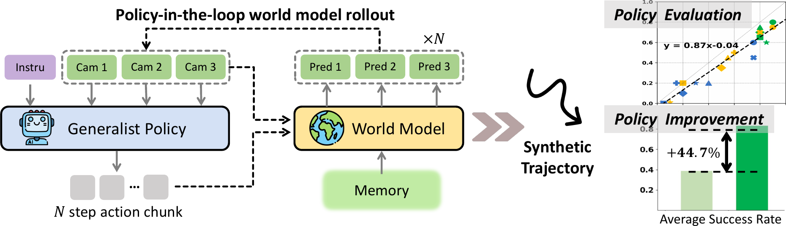
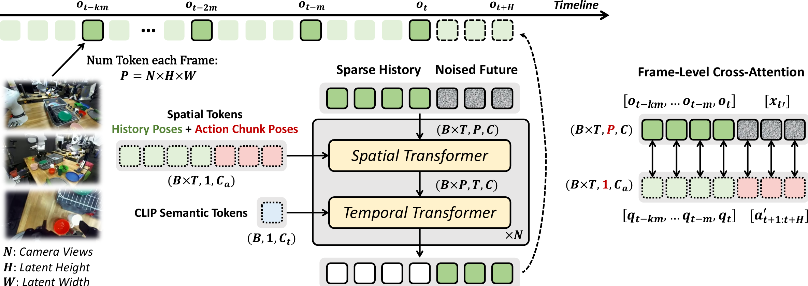
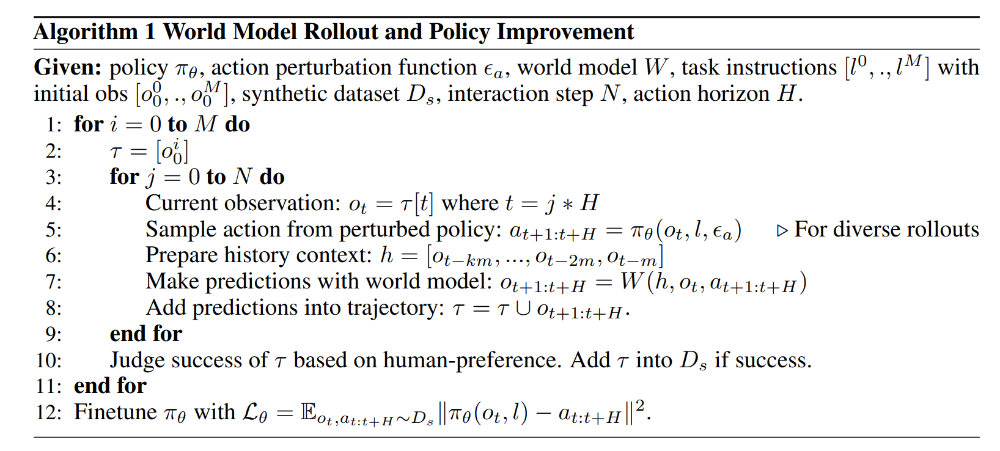
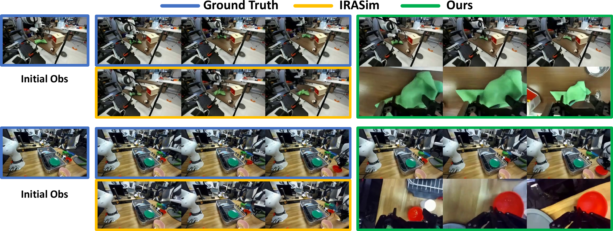
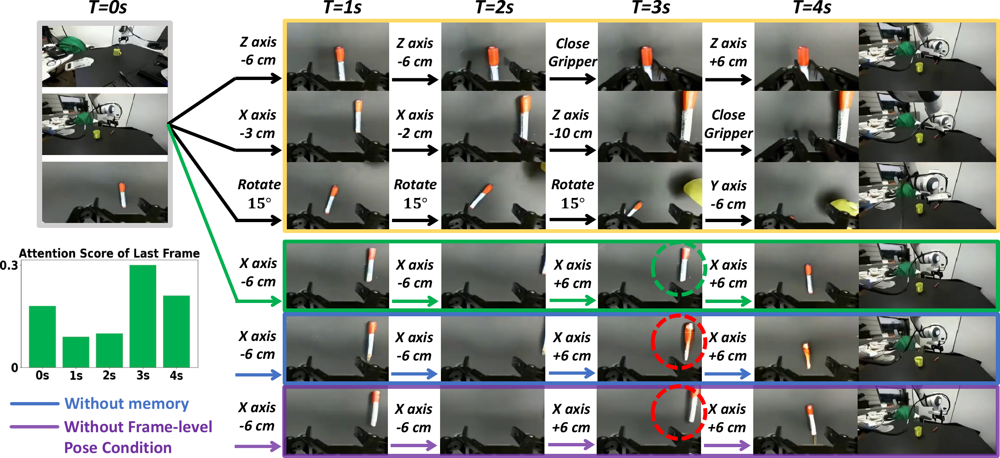
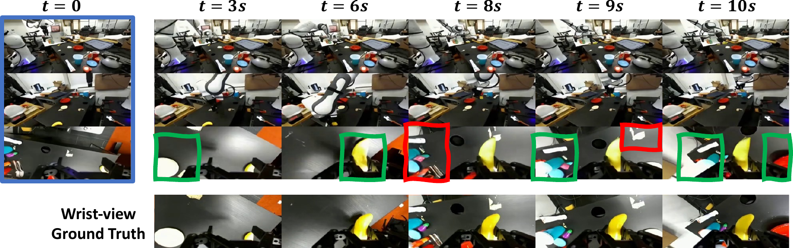
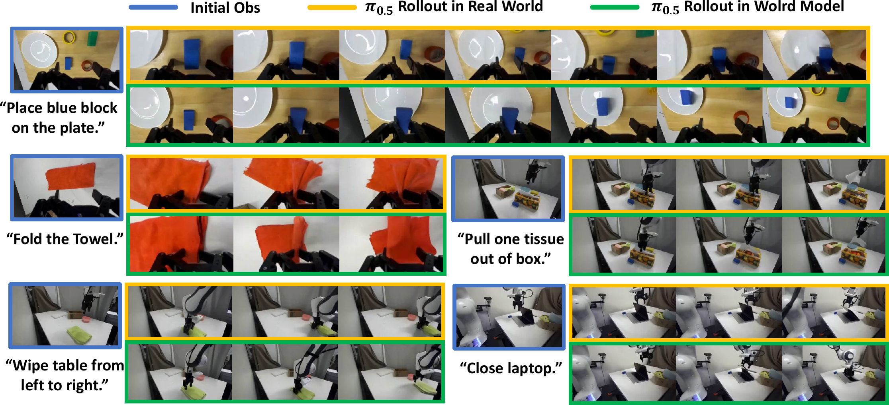
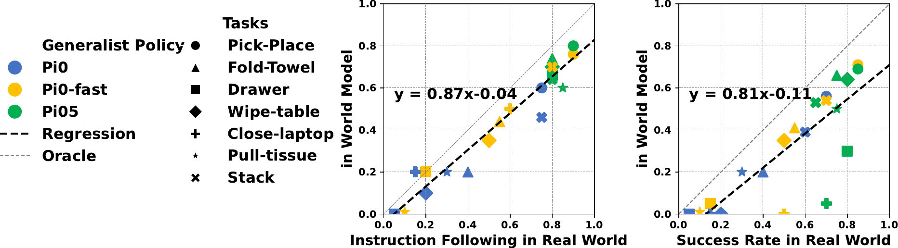
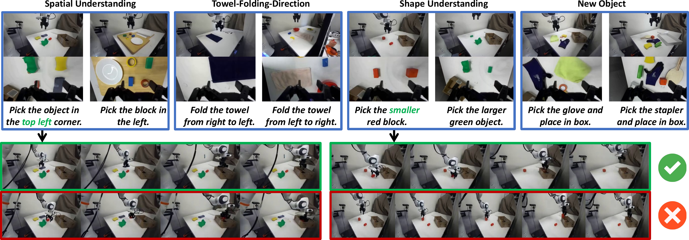
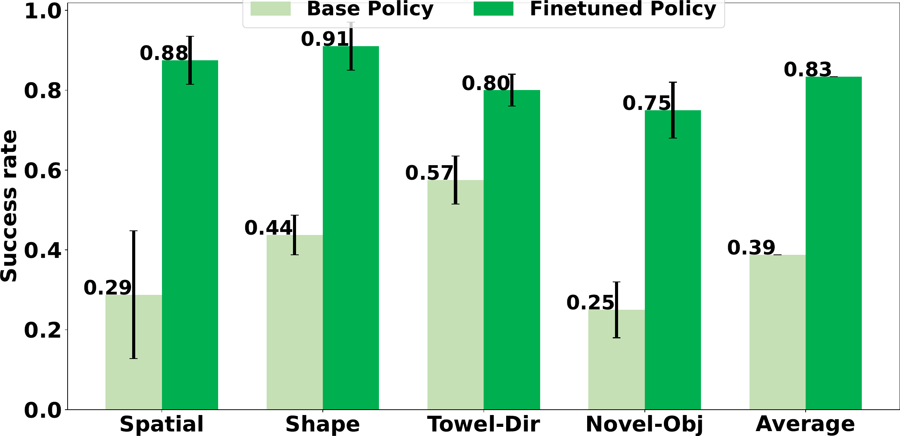

# 标题：Ctrl-World: A Controllable Generative World Model for Robot Manipulation （Ctrl-World：用于机器人操作的可控生成世界模型）

ArXiv：2510.10125
作者：Yanjiang Guo， Lucy Xiaoyang Shi， Jianyu Chen， Chelsea Finn， 斯坦福大学（Stanford University）， 清华大学（Tsinghua University）， 项目页面：
章节：17
估计词元数：16.6k

## 目录

- 1 引言（Introduction）
- 2 相关工作（Related Works）
- 3 问题表述（Problem Formulation）
- 4 用于机器人操作的可控世界模型（Controllable World Model for Robot Manipulation）
  - 4.1 学习世界模型 Ctrl-World（Learning World Model Ctrl-World）
  - 4.2 使用 Ctrl-World 进行策略评估与改进（Using Ctrl-World for Policy Evaluation and Improvement）
- 5 实验（Experiments）
  - 5.1 实验设置（Experiment Setups）
  - 5.2 世界模型质量分析（World Model Quality Analysis）
  - 5.3 用于策略评估的世界模型（World Model for Policy Evaluation）
  - 5.4 用于策略改进的世界模型（World Model for Policy Improvement）
- 6 结论（Conclusion）
- 7 致谢（ACKNOWLEDGMENTS）
- 参考文献（References）
- 附录 A 世界模型学习的更多细节（Appendix A More Details for World Model Learning）
- 附录 B 策略评估的更多细节（Appendix B More Details for Policy Evaluation）
- 附录 C 策略改进的更多细节（Appendix C More Details for Policy Improvement）

## 摘要（Abstract）

**通用机器人策略（Generalist robot policies）** 如今已能执行广泛的操控技能，但评估和提升其在面对陌生物体与指令时的能力，仍然是一个重大挑战。严格的评估需要大量的 **真实世界部署（real-world rollouts）** ，而系统性的改进则需要带有专家标签的额外校正数据。这两个过程都缓慢、昂贵且难以扩展。

**世界模型（World models）** 提供了一种前景广阔、可扩展的替代方案，它使得策略能够在 **想象空间（imagination space）** 中进行部署。然而，一个关键的挑战在于构建一个可控的世界模型，使其能够处理与通用机器人策略的多步交互。这要求世界模型与现代通用策略兼容，支持 **多视角预测（multi-view prediction）** 、 **细粒度动作控制（fine-grained action control）** 以及 **一致的长时程交互（consistent long-horizon interactions）** ，而先前的研究未能实现这些。

在本文中，我们向前迈进了一步，引入了一个可控的多视角世界模型，可用于评估和提升通用机器人策略的 **指令跟随能力（instruction-following ability）** 。我们的模型通过一个 **姿态条件记忆检索机制（pose-conditioned memory retrieval mechanism）** 来维持长时程一致性，并通过 **帧级动作条件化（frame-level action conditioning）** 实现精确的动作控制。在 DROID 数据集（95k 条轨迹，564 个场景）上训练后，我们的模型能够**在超过 20 秒的时间内，在新颖场景和新的相机摆放位置下，生成空间和时间上一致的轨迹**。我们证明，我们的方法无需进行真实世界的机器人部署，即可准确地对策略性能进行排序。此外，通过在想象中合成成功的轨迹并将其用于 **监督微调（supervised fine-tuning）** ，我们的方法可以将策略成功率提升 44.7%。

## 1 引言（Introduction）

**视觉-语言-动作模型（Vision-Language-Action, VLA）** 的最新进展已证明其在广泛的 **操作任务（manipulation tasks）** 和场景中的能力（Black et al., 2024; Wen et al., 2025; Brohan et al., 2023; Kim et al., 2024; Cui et al., 2025; Guo et al., 2025; Zhang et al., 2024）。尽管前景广阔，但**当前策略在开放世界环境中测试时仍然脆弱**（Shi et al., 2025）。一个核心挑战是 **策略评估（policy evaluation）** 。评估通用策略的性能通常需要大量真实世界的 **轨迹展开（rollouts）** ，并在任务和环境间仔细重复以获得统计显著性（Atreya et al., 2025）。此类方案在组织上要求高，会减慢迭代速度，并阻碍对当前策略能力的细致理解。同样关键的是 **策略改进（policy improvement）** ：一旦弱点暴露，现有方法除了收集更多专家数据外，几乎没有其他途径来强化策略在失败案例上的表现。尽管大规模预训练提供了一定的鲁棒性，但当策略遇到不熟悉的物体或指令时，往往仍然脆弱。**目前缺少的是一个快速、廉价的、基于反馈的机制来精炼通用模型：一种能够暴露失败案例、收集纠正经验并迭代改进策略的方法。**

**学习一个预测模型并在想象空间中迭代**是一种可扩展且有前景的替代方案。虽然先前的工作探索了 **动作条件世界模型（action-conditioned world models）** ，但大多数方法侧重于被动的视频预测设置，不足以与先进的通用策略进行主动交互（Li et al., 2025b; Zhu et al., 2024）。我们观察到几个重要的局限性阻碍了它们支持 **策略在环（policy-in-the-loop）** 轨迹展开的能力：

- 首先，这些模型通常只模拟单一的 **第三人称视角（third-person camera view）** ，这可能导致严重的 **部分可观测性（partial observability）** ，进而引发 **幻觉（hallucinations）** （例如，物体在没有物理接触的情况下突然被抓取器抓住）。
- 这种单视角输入也与许多现代 VLA 策略不兼容，这些策略需要同时输入第三人称视角和 **腕部视角（wrist-view）** 摄像头。
- 此外，现有模型通常缺乏捕捉高频动作因果效应所需的 **细粒度控制（fine-grained control）** 。
- 最后，它们难以在长时程视频生成中保持 **时间一致性（temporal consistency）** 。

在本文中，我们介绍了 **Ctrl-World** ，一个为 **策略在环（policy-in-the-loop）** 交互设计的 **可控（Controllable）** 、 **多视角（multi-view）** 生成世界模型，能够完全在想象空间中进行多步轨迹展开，如图 [1](https://arxiv.org/html/2510.10125v2#S1.F1) 所示。我们的设计依赖于三个关键组件：

1. **联合多视角预测（Joint multi-view prediction）** ：捕获场景更全面的视觉表示，并满足现代 VLA 策略的输入格式。值得注意的是，包含腕部摄像头预测显著减少了在接触密集的物体交互过程中的幻觉。
2. **帧级动作条件化（Frame-level action conditioning）** ：将视觉动态与控制信号紧密对齐，确保生成的轨迹展开反映每个动作的因果效应。
3. **记忆检索（Memory retrieval）** ：将稀疏的历史帧添加到上下文中，并将相应的 **姿态信息（pose information）** 投影到每一帧中，使模型能够关注相似的过去状态并检索相关信息。该机制稳定了长时程轨迹展开并保持了时间一致性。

这些机制共同使我们能够将预训练的被动视频生成器转变为与策略兼容的交互式模拟器。

本工作的核心贡献是一个用于机器人操作的 **可控世界模型（controllable world model）** 。在实验中，我们发现该模型支持一种新的基于想象的工作流程，其中策略既可以 **被评估** （其排名与真实世界轨迹展开对齐），也可以 **被改进** （通过提升成功率的针对性合成数据）。

- 具体而言，我们在 **DROID 数据集（DROID dataset）** （Khazatsky et al., 2024）上训练 Ctrl-World，并证明其能够泛化到新场景和摄像头布局，维持超过 20 秒的连贯轨迹展开。
- 我们进一步表明，**使用 Ctrl-World 进行的基于想象的评估能够忠实反映策略在真实世界中的指令遵循能力**。
- 最后，我们证明，通过**在世界模型内部合成成功轨迹**，并使用这些合成轨迹进行 **监督微调（supervised fine-tuning）** ，我们可以提升 **$\pi_{0.5}$-droid** （Intelligence et al., 2025）在包含未见物体和新指令的下游任务上的性能。

> 图 1：Ctrl-World 专为与通用机器人策略进行*策略在环（policy-in-the-loop）* 轨迹展开而设计。它生成联合多视角预测（包括腕部视角），通过帧级条件化强制执行细粒度动作控制，并通过姿态条件记忆检索维持连贯的长时程动态。这些组件使得能够（1）在想象空间中进行准确的策略*评估*，并与真实世界轨迹展开对齐，以及（2）通过合成轨迹进行有针对性的策略*改进*。

## 2 相关工作（Related Works）

### 机器人视频生成模型（Video Generation Models for Robotics）

近期 **视频生成模型（Video Generation Models）** 的进展（Agarwal 等人，2025；Wan 等人，2025；Blattmann 等人，2023a；Chi 等人，2025）使得创建逼真且时间一致的内容成为可能，这反映了对物理世界的深刻理解。

- 一些研究利用 **视频预测模型（Video Prediction Models）** 来合成带有虚假动作标签的机器人轨迹，这些合成轨迹随后可用于 **策略学习（Policy Learning）** （Jang 等人，2025；Bharadhwaj 等人，2024）。
- 另一些研究则直接将视频模型用作 **策略主干网络（Policy Backbones）** ，通过 **跟踪（Tracking）** 或 **逆动力学（Inverse Dynamics）** 来解码动作（Black 等人，2023；Du 等人，2024；Yang 等人，2023；Hu 等人，2024；Liang 等人，2024；Liao 等人，2025；Tan 等人，2025；Feng 等人，2025）。
- 一条互补的研究路线通过 **协同训练（Co-training）** 将未来预测目标整合到 **通用策略（Generalist Policies）** 中（Zhao 等人，2025；Li 等人，2025a；Zhu 等人，2025；Guo 等人，2024；Gao 等人，2024；Zhang 等人，2025；Zheng 等人，2025；Zhong 等人，2025），从而将物理知识融入策略。

与这些工作不同，我们利用视频生成来执行 **动作条件预测（Action-Conditioned Prediction）** ，这使得该模型能够同时用于 **策略评估（Policy Evaluation）** 和 **策略改进（Policy Improvement）** 。

### 动作条件世界模型（Action-Conditioned World Models）

尽管预训练的视频模型功能强大，但它们通常仅以 **高层级语言指令（High-Level Language Instructions）** 为条件。
尽管如此，一些先前的工作已经探索了在 **低维状态空间（Low-Dimensional State Spaces）** （Nagabandi 等人，2020）和 **图像观测（Image Observations）** （Hafner 等人，2019；2020；Hansen 等人，2022；Wu 等人，2023；Oh 等人，2015）中使用动作条件预测模型。这些方法中有许多学习的是 **任务特定模型（Task-Specific Models）** （Hafner 等人，2019），而我们的重点在于训练 **通用的（Generalist）** 、 **多任务（Multi-Task）** 的 **世界模型（World Models）** 。

基于早期工作（Finn & Levine，2017；Ebert 等人，2018；Xie 等人，2019；Dasari 等人，2019；Yang 等人，2023；Wu 等人，2024）以及近期利用 **扩散模型（Diffusion Models）** （Quevedo 等人，2025；Chen 等人，2024；Ball 等人，2025；Gao 等人，2025）和 **帧级动作条件化（Frame-Level Action Conditioning）** （Zhu 等人，2024）的方法，我们提出了一个融合了 **多视角预测（Multi-View Prediction）** 、 **长时域时间一致性（Long-Horizon Temporal Coherence）** 和 **细粒度可控性（Fine-Grained Controllability）** 的模型。我们的实验表明，这些能力能够实现对 **最先进的（State-of-the-Art）** 通用 **视觉语言动作（Vision-Language-Action, VLA）** 策略进行有效的评估和改进。

## 3 问题表述（Problem Formulation）

我们的目标是开发一个 **世界模型（World Model）** ，能够预测由 **通用机器人策略（Generalist Robot Policy）** 所提出的动作的未来结果。一个现代的通用策略 $\pi$ 通常将多视角观测和语言指令映射为一个动作序列（Zhao et al., 2023; Black et al., 2025）。
具体而言，机器人观测 $o_{t}=[I_{t}^{1},\ldots,I_{t}^{n},q_{t}]$ 包含 $n$ 个相机视角 $[I_{t}^{1},\ldots,I_{t}^{n}]$ 和机器人位姿 $q_{t}$，策略在给定指令 $l$ 时输出一个 $H$ 步的动作块：

$$
a_{t+1},a_{t+2},...,a_{t+H}\sim\pi(\cdot|o_{t},l)
$$

我们的目标是使用一个世界模型 $W$ 来预测执行动作序列 $A_{t}=[a_{t+1},\ldots,a_{t+H}]$ 中每一步的结果。为了在 **想象空间（Imagination Space）** 中实现与策略的多步交互，$W$ 必须生成未来的多视角观测：

$$
o_{t+1},...,o_{t+H}\sim W(\cdot|o_{t},A_{t})
$$

然后，最终的预测 $o_{t+H}$ 可以被送回策略 $\pi$，以生成下一个动作块 $A_{t+H}\sim\pi(\cdot|o_{t+H},l)$。通过这种方式，策略和世界模型以 **自回归（Auto-regressive）** 的方式交互，从而能够完全在想象空间内进行 **长时程推演（Long-horizon Rollouts）** 。

## 4 用于机器人操作的 **可控世界模型（Controllable World Model）**

### 4.1 学习世界模型 Ctrl-World

我们的目标是学习一个可用于评估和改进现代 **视觉-语言-动作（Vision-Language-Action, VLA）策略** 的世界模型。为此，该模型首先必须支持此类策略常用的**多视角观测**。同样重要的是，该模型必须是 **可控的** ——即使从一个缺乏此类控制的预训练主干网络初始化，也能可靠且紧密地遵循动作输入。最后，该模型必须在长时域内保持时间一致性，即使在存在遮挡的情况下，也能产生连贯的推演。我们从预训练的、采用 **时空变换器（Spatial-temporal transformers）** 的 **视频扩散（video diffusion）** 主干网络初始化我们的世界模型 [1]，并引入了三项关键改进，如图 [2] 所示。

**多视角联合预测（Multi-View Joint Predictions）** 。最先进的 VLA 模型通常依赖多个第三人称摄像头获取全局上下文，以及腕戴式摄像头进行精确交互 [2, 3, 4]。为了匹配这一点，世界模型必须在每一步生成所有视角在空间上一致的预测。先前工作表明，前馈变换器可以以可扩展的方式有效捕获多视角摄像头之间的空间关系 [5]。遵循先前工作，我们将 $N$ 个输入图像——每个包含 $H\times W$ 个词元（tokens）——沿词元维度拼接，并联合预测所有视角 $o_{t:t+H}$。在实验中，我们发现多视角联合预测还能提高一致性，并显著减少幻觉。

**姿态条件记忆检索机制（Pose-conditioned Memory Retrieval Mechanism）** 。世界模型中的预测误差倾向于在长推演中累积，导致漂移和不连贯。为了缓解这个问题，我们用过去的帧来增强模型输入。为了防止上下文变得过长，我们以步长 $m$ 采样 $k$ 个历史帧，使模型能够预测 $o_{t+1:t+H}\sim W(\cdot|o_{t-km},...,o_{t},l)$。此外，我们通过空间变换器内的 **逐帧交叉注意力（frame-wise cross-attention）** ，将对应的机器人手臂姿态 $[q_{t-km},...,q_{t}]$ 嵌入到帧 $[o_{t-km},...,o_{t}]$ 中。这使得模型能够利用手臂姿态从过去识别相关帧，从而有效地将未来预测锚定到相关历史信息上。

**帧级动作条件化（Frame-level Action Conditioning）** 。预训练的视频模型仅以文本和图像为条件，这限制了其控制精度。为了实现完全可控性，我们额外以策略输出的动作序列 $[a_{t+1:t+H}]$ 为模型提供条件。我们还将每个动作序列转换为 **笛卡尔空间（Cartesian-space）** 的机器人手臂姿态 $[a^{\prime}_{t+1:t+H}]$，并与过去的姿态 $[q_{t-km},...,q_{t-m},q_{t}]$ 拼接。随后在空间变换器内应用逐帧交叉注意力，使每一帧的视觉词元能够关注其关联的姿态嵌入。对于历史帧，此姿态对应于 $[q_{t-km},...,q_{t-m},q_{t}]$；而对于未来帧，则对应于 $[a^{\prime}_{t+1:t+H}]$。

**训练目标（Training Objective）** 。 我们使用预训练的 15 亿参数 **稳定视频扩散模型（Stable-Video-Diffusion, SVD）** (Blattmann et al., 2023a) 来初始化我们的模型。为了继承预训练视频模型中的知识和结构，我们仅新初始化一个用于输入动作的 **动作投影多层感知机（action-projection MLP）** ，并在初始化时保持其他参数不变。
随后，这个 **动作条件化的世界模型（action-conditioned world model）** 使用 **扩散损失（diffusion loss）** (Ho et al., 2020; Karras et al., 2022) 进行微调。

在训练过程中，预测目标 $x_{0}=o_{t+1:t+H}$ 在扩散步 ${t^{\prime}}\in[0,T^{\prime}]$ 处，通过调度器 $\overline{\alpha_{t^{\prime}}}$ 加入高斯噪声 $\epsilon\sim\mathcal{N}(0,I)$ 进行扰动，得到 $x_{t^{\prime}}=\sqrt{\overline{\alpha_{t^{\prime}}}}x_{0}+\sqrt{1-\overline{\alpha_{t^{\prime}}}}\epsilon_{t^{\prime}}$。

模型的输入是历史词元与加噪未来帧的拼接：$[o_{t-km},...,o_{t-m},o_{t},x_{t^{\prime}}]$。整体的训练目标为：

$$
\begin{split}\mathcal{L}=\mathbb{E}_{x_{0},\epsilon,{t^{\prime}}}\|\hat{x}_{0}(x_{t^{\prime}},{t^{\prime}},c)-x_{0}\|^{2}\end{split}(3)
$$

其中 $\hat{x}_{0}$ 表示模型的预测，$c=[q_{t-km},...,q_{t},a^{\prime}_{t+1:t+H},o_{t-km},...,o_{t}]$ 对应所有模型输入。模型的更多细节可在附录 [A](https://arxiv.org/html/2510.10125v2#A1) 中找到。

> 图 2 | Ctrl-World 从一个预训练的视频扩散模型初始化，并通过以下方式适配成一个可控、时序一致的世界模型：(1) **多视角输入与联合预测（Multi-view input and joint prediction）** ，用于统一信息理解。(2) **记忆检索机制（Memory retrieval mechanism）** ，它在上下文中添加稀疏的历史帧，并通过 **帧级交叉注意力（frame-level cross-attention）** 将姿态信息投影到每一帧，将预测重新锚定到相似的过去状态。(3) **帧级动作条件化（Frame-level action conditioning）** ，以更好地对齐高频动作与视觉动态。

### 4.2 使用 Ctrl-World 进行策略评估与改进

**世界模型内的策略评估（Policy Evaluation within World Model）** 。一旦训练出可控且一致的世界模型，我们就可以在想象空间中进行 **策略在环推演（policy-in-the-loop rollouts）** 。给定初始观测 $o_{0}$ 和指令 $l$，策略 $\pi$ 与世界模型 $W$ 可以共同生成一条合成轨迹 $\tau$。
初始观测可以从验证数据集中采样，或从真实世界设置中记录为快照。
在我们的实验中，我们基于人类偏好判断将每条轨迹标记为成功或失败。虽然近期工作 (Du et al., 2023) 探索了使用 **视觉语言模型（Vision-Language Models, VLMs）** 作为通用奖励模型，但我们将此类扩展留待未来工作。

**利用合成数据进行策略改进（Policy Improvement with Synthetic Data）** 。
除了评估，世界模型还支持搜索成功的合成轨迹以改进策略性能。我们观察到，在固定的初始观测和指令下，策略行为往往具有高度的确定性。
例如，策略倾向于在多次尝试中抓取同一个物体，而不是随机地尝试抓取不同物体。为了探索更大的搜索空间，我们引入 **结构化扰动（structured perturbations）** 以鼓励推演的多样性。具体而言，我们可以 (i) 改写指令，因为 **视觉语言动作策略（Vision-Language-Action policies, VLA policies）** 往往是可引导的，会对不同指令表现出不同的行为；或者 (ii) 在世界模型内将策略重置到随机的初始状态，这会导致多样化的初始观测。从一组带有语言指令 $[l^{0},\dots,l^{M}]$ 的下游任务出发，我们收集合成推演轨迹，并基于人类偏好对其进行评分。为了改进策略性能，我们在成功的轨迹上对策略进行微调。整体流程总结在算法 [1](https://arxiv.org/html/2510.10125v2#alg1) 中。

Algorithm 1 World Model Rollout and Policy Improvement

- **Given:**
  - Policy ${\pi }_{\theta }$
  - Action perturbation function ${\epsilon }_{a}$
  - World model $W$
  - Task instructions $\left[{{l}^{0},...,{l}^{M}}\right]$
  - Initial observations $\left[  {{o}_{0}^{0},...,{o}_{0}^{M}}\right]$
  - Synthetic dataset ${D}_{s}$
  - Interaction steps $N$
  - Action horizon $H$
- **For** $i = 0$ to $M$:
  - Initialize trajectory: $\tau  = \left[  {o}_{0}^{i}\right]$
  - **For** $j = 0$ to $N$:
    - **Current observation:** ${o}_{t} = \tau [t]$ where $t = j * H$
    - **Sample action from perturbed policy:** ${a}_{t + 1 : t + H} = {\pi }_{\theta }\left( {o}_{t}, l, {\epsilon }_{a} \right)$ (for diverse rollouts)
    - **Prepare history context:** $h = \left[ {{o}_{t - km}}, ..., {o}_{t - 2m}, {o}_{t - m} \right]$
    - **Make predictions with world model:** ${o}_{t + 1 : t + H} = W\left( h, {o}_{t}, {a}_{t + 1 : t + H} \right)$
    - **Add predictions into trajectory:** $\tau = \tau \cup {o}_{t + 1 : t + H}$
  - **End for**
  - **Judge success of $\tau$ based on human preference.** If successful, add $\tau$ to ${D}_{s}$
- **End for**
- **Finetune policy:** Update ${\pi}_{\theta}$ with loss: ${\mathcal{L}}_{\theta } = \mathbb{E}_{{o}_{t},{a}_{t : t + H} \sim  {D}_{s}}  \left\| {\pi}_{\theta}\left(o_{t},l\right) - {a}_{t : t + H}\right\|^{2}$

---

- **给定：**
  - 策略（Policy）${\pi }_{\theta }$
  - 动作扰动函数（Action perturbation function）${\epsilon }_{a}$
  - 世界模型（World model）$W$
  - 任务指令（Task instructions）$\left[{{l}^{0},...,{l}^{M}}\right]$
  - 初始观测（Initial observations）$\left[  {{o}_{0}^{0},...,{o}_{0}^{M}}\right]$
  - 合成数据集（Synthetic dataset）${D}_{s}$
  - 交互步数（Interaction steps）$N$
  - 动作视野（Action horizon）$H$
- **对于** $i = 0$ 到 $M$：
  - 初始化轨迹（Initialize trajectory）：$\tau  = \left[  {o}_{0}^{i}\right]$
  - **对于** $j = 0$ 到 $N$：
    - **当前观测（Current observation）：** ${o}_{t} = \tau [t]$，其中 $t = j * H$
    - **从扰动策略中采样动作（Sample action from perturbed policy）：** ${a}_{t + 1 : t + H} = {\pi }_{\theta }\left( {o}_{t}, l, {\epsilon }_{a} \right)$（用于多样化推演）
    - **准备历史上下文（Prepare history context）：** $h = \left[ {{o}_{t - km}}, ..., {o}_{t - 2m}, {o}_{t - m} \right]$
    - **使用世界模型进行预测（Make predictions with world model）：** ${o}_{t + 1 : t + H} = W\left( h, {o}_{t}, {a}_{t + 1 : t + H} \right)$
    - **将预测加入轨迹（Add predictions into trajectory）：** $\tau = \tau \cup {o}_{t + 1 : t + H}$
  - **结束循环**
  - **根据人类偏好判断 $\tau$ 是否成功（Judge success of $\tau$ based on human preference）。** 若成功，则将 $\tau$ 加入 ${D}_{s}$
- **结束循环**
- **微调策略（Finetune policy）：** 使用损失函数更新 ${\pi}_{\theta}$：${\mathcal{L}}_{\theta } = \mathbb{E}_{{o}_{t},{a}_{t : t + H} \sim  {D}_{s}}  \left\| {\pi}_{\theta}\left(o_{t},l\right) - {a}_{t : t + H}\right\|^{2}$

## 5 实验（Experiments）

在本节中，我们通过实验来评估 Ctrl-World。我们旨在回答以下问题：

1. Ctrl-World 能否生成在空间和时间上都一致的长视野推演，同时保持高可控性？
2. Ctrl-World 能否在想象空间中可靠地评估不同的通用机器人策略，忠实地复现它们在现实世界中的性能排名？
3. Ctrl-World 能否通过完全在其想象中发现和合成成功的轨迹，来改进策略的指令跟随能力？

### 5.1 实验设置（Experiment Setups）

**DROID 平台与数据集（DROID Platform and Dataset）** 。我们的实验使用 DROID 平台 [1]，该平台配备了一个搭载 Robotiq 夹爪的 Panda 机器人手臂。该平台包括一个腕部视角摄像头和两个随机放置的、用于观察工作空间的第三方视角摄像头。
DROID 数据集 [1] 包含从 564 个场景中收集的 95,599 条多样化轨迹，提供了对工作空间的高密度覆盖。这包括约 76k 条成功轨迹和约 19k 条失败轨迹。包含多样化的动作和失败数据至关重要，因为它使我们能够训练一个可控的世界模型，该模型可以模拟广泛的未来场景。

**训练细节（Training Details）** 。在训练期间，我们的模型联合预测来自所有三个摄像头的输出，每个摄像头的分辨率为 192x320。模型以 7 帧的历史帧为条件，帧之间的间隔为 1-2 秒。我们以接下来的 15 个未来动作为条件，这对应于 DROID 中一个持续一秒的动作块。
在交互过程中，如果策略的输出少于 15 步，我们使用虚拟动作填充动作块，并且仅对有效动作使用预测结果。我们在 2$\times$8 个 H100 GPU 上训练模型，总批次大小为 64。训练大约需要 2-3 天。

**表 1：在验证集上进行交互式长轨迹生成的定量结果。我们通过生成 10 秒的轨迹来评估世界模型的质量。给定一个随机采样的初始帧，模型在每次交互中接收一个 15 步的动作块（跨越 1 秒），并以自回归方式生成 10 轮。结果是在 256 个片段上平均得到的。**

| 评估摄像头              | 方法           | 基于计算的        | 基于模型的      |                 |       |       |
| :---------------------- | :------------- | :---------------- | :-------------- | :-------------- | :---- | :---- |
| PSNR$\uparrow$          | SSIM$\uparrow$ | LPIPS$\downarrow$ | FID$\downarrow$ | FVD$\downarrow$ |       |       |
| 第三方视角 ` `摄像头 | WPE            | 20.33             | 0.772           | 0.131           | 25.50 | 156.4 |
| IRASim                  | 21.36          | 0.774             | 0.117           | 26.46           | 138.1 |       |
| Ctrl-World-Third-View   | 21.27          | 0.793             | 0.110           | 23.47           | 127.5 |       |
| Ctrl-World (ours)       | 23.56          | 0.828             | 0.091           | 25.00           | 97.4  |       |

> 图 3 | 验证集上长时程推演的定性结果。先前模型依赖于单视角预测，受限于部分可观测性和幻觉（例如，未能移动绿色毛巾或抓取红色碗）。相比之下，Ctrl-World 联合预测第三视角和腕部视角相机，产生了与真实情况精确对齐的未来轨迹。

**表 2 | Ctrl-World 中关键组件的消融研究。移除记忆机制、帧级动作条件化或多视角联合预测均会导致性能下降。**

| 评估相机 ` `Camera                | 方法 Method                     | 基于计算的 ` `Computation-based | 基于模型的 ` `Model-based |                   |                 |                 |     |
| :----------------------------------- | :------------------------------ | :--------------------------------- | :--------------------------- | :---------------- | :-------------- | :-------------- | --- |
|                                      |                                 | PSNR$\uparrow$                     | SSIM$\uparrow$               | LPIPS$\downarrow$ | FID$\downarrow$ | FVD$\downarrow$ |     |
| 第三视角相机 ` `Third-view Camera | Ctrl-World                      | 23.56                              | 0.828                        | 0.091             | 25.00           | 97.4            |     |
|                                      | Ctrl-World w/o memory           | 23.06                              | 0.812                        | 0.099             | 26.14           | 105.5           |     |
|                                      | Ctrl-World w/o frame-level cond | 21.20                              | 0.789                        | 0.109             | 27.52           | 122.7           |     |
| 腕部视角相机 ` `Wrist-view Camera | Ctrl-World                      | 19.18                              | 0.665                        | 0.252             | 25.78           | 127.1           |     |
|                                      | Ctrl-World w/o memory           | 18.84                              | 0.655                        | 0.265             | 26.23           | 133.1           |     |
|                                      | Ctrl-World w/o frame-level cond | 15.69                              | 0.571                        | 0.375             | 33.51           | 179.1           |     |
|                                      | Ctrl-World w/o joint pred       | 15.94                              | 0.580                        | 0.345             | 26.46           | 158.1           |     |

### 5.2 世界模型质量分析（World Model Quality Analysis）

**基线模型与评估指标（Baselines and Evaluation Matrices）**
我们将我们的模型 Ctrl-World 与两个先前的动作条件化世界模型进行定量比较： **基于世界模型的策略评估（World-model-based Policy Evaluation, WPE）** (Quevedo et al., 2025) 和 **IRASim** (Zhu et al., 2024)。由于这些模型仅从单一第三人称相机视角进行预测，为了公平比较，我们训练了一个单视角版本 **Ctrl-World-third-view** ，它仅输入并预测单一第三人称相机视角。对于评估，我们留出 2% 的轨迹作为验证集，并随机采样 256 个视频片段，每个片段长度为 10 秒。在推演过程中，世界模型接收 15 步的动作块（对应 1 秒），并以自回归方式预测后续 10 步的帧，从而生成 10 秒长的轨迹。然后，我们使用基于计算的指标（ **峰值信噪比（Peak Signal-to-Noise Ratio, PSNR）** (Hore & Ziou, 2010) 和 **结构相似性指数（Structural Similarity Index, SSIM）** (Wang et al., 2004)）以及基于模型的指标（ **学习感知图像块相似度（Learned Perceptual Image Patch Similarity, LPIPS）** (Zhang et al., 2018)、 **弗雷歇起始距离（Fréchet Inception Distance, FID）** (Heusel et al., 2017) 和 **弗雷歇视频距离（Fréchet Video Distance, FVD）** (Unterthiner et al., 2018)）将预测视频与真实情况进行比较。

**多步交互轨迹的定量与定性结果（Quantitative and Qualitative Results on Multi-step Interaction Trajectories）**
如表 [1](https://arxiv.org/html/2510.10125v2#S5.T1) 所示，Ctrl-World-third-view 优于这些先前模型，而多视角联合预测进一步提高了生成质量。与先前工作的观察一致 (Quevedo et al., 2025; Zhu et al., 2024)，我们也发现这些基线模型难以捕捉 **机器人-物体交互（robot–object interactions）** ，并经常产生幻觉预测。例如，如图 [3](https://arxiv.org/html/2510.10125v2#S5.F3) 所示，单视角预测方法 WPE、IRASim 和 Ctrl-World-third-view 都未能移动绿色毛巾或红色碗。相比之下，Ctrl-World 通过对腕部相机视角的联合预测，精确地建模了机器人-物体交互，这提供了关于接触事件和物体状态变化的关键、细粒度信息。

> 图 4 | Ctrl-World 及其消融实验的可控性。不同的动作序列可以在 Ctrl-World 中产生厘米级精度的不同推演结果。移除记忆会导致预测模糊（蓝色），而移除帧级姿态条件化则会降低控制精度（紫色）。在预测 $t=4\ \mathrm{s}$ 帧时的注意力可视化（左侧）显示了对具有相同姿态的 $t=0\ \mathrm{s}$ 帧的强烈关注，说明了 **记忆检索（memory retrieval）** 的有效性。为清晰起见，每个动作块都用自然语言表达（例如，“Z 轴 -6 cm”）。由于空间限制，仅对中间帧的腕部视角进行了可视化。

> 图 5 | Ctrl-World 的一致性。由于腕部相机的视野在单个轨迹内变化剧烈，利用多视角信息和记忆检索对于生成一致的腕部视角预测至关重要。绿色框突出显示的预测是从其他相机视角推断出来的，而红色框突出显示的预测是从记忆中检索出来的。

**世界模型（World Model）的可控性（Controllability）**
世界模型的一个关键要求是能够根据不同的动作模拟多样化的未来结果。我们发现，我们的模型表现出 **细粒度可控性（fine-grained controllability）** ，即使对于仅相差几厘米的动作，也能产生精确的未来预测（见图 [4](https://arxiv.org/html/2510.10125v2#S5.F4)）。
我们假设这种可控性源于两个主要因素：第一，DROID 数据集中 **动作空间（action space）** 的密集覆盖；第二，我们使用的 **多视图预测（multi-view prediction）** 和 **帧级动作条件化（frame-level action conditioning）** ，我们的消融研究也支持这一点。在图 [4](https://arxiv.org/html/2510.10125v2#S5.F4) 的左侧，我们可视化了预测 $t=4\ \mathrm{s}$ 帧时的注意力权重，并观察到对具有相似姿态的 $t=0\ \mathrm{s}$ 帧有强烈的关注，这突显了我们 **记忆检索机制（memory retrieval mechanism）** 的有效性。

**世界模型的一致性（Consistency）**
对于腕部摄像头，由于摄像头的 **视场（field of view）** 在单个轨迹内会发生剧烈变化，模型要生成一致的长时预测具有挑战性。
如图 [5](https://arxiv.org/html/2510.10125v2#S5.F5) 所示，我们发现我们的模型有效地利用了来自其他摄像头视图和历史帧的相关信息，使其能够生成一致的腕部视图预测。关于记忆组件和帧级条件化的消融研究结果见表 [2](https://arxiv.org/html/2510.10125v2#S5.T2)，这些结果证实了每个组件的重要性。

### 5.3 用于策略评估的世界模型（World Model for Policy Evaluation）

在本节中，我们评估 Ctrl-World 是否可用于评估通用机器人策略（generalist robot policies）的指令遵循能力，并准确反映它们在现实世界中的性能排名。我们搭建了自己的 DROID 平台，并在工作空间周围随机放置了两个第三人称摄像头。与先前工作中观察到 DROID 策略能够泛化到新设置的情况类似（Pertsch 等人，2025），我们发现，仅使用开源 DROID 数据集预训练的 Ctrl-World，_能够在我们新配置的、具有新颖摄像头布局的场景中，以零样本（zero-shot）方式做出准确的未来预测。_

**策略与任务（Policies and Tasks）** 。我们评估了三个公开发布的策略：$\pi_{0}$（Black 等人，2023）、$\pi_{0}$-FAST（Pertsch 等人，2025）和 $\pi_{0.5}$（Intelligence 等人，2025），在我们的 DROID 平台上执行了包括拾取放置（Pick-and-Place）、折叠毛巾（Towel-Folding）、抽屉（Drawer）、擦桌子（Wipe-Table）、合上笔记本电脑（Close-Laptop）、抽纸巾（Pull-tissue）和堆叠（Stack）在内的多样化任务。
我们使用相同的初始观测初始化现实世界和世界模型的 **轨迹展开（rollouts）** ，并遵循算法 [1](https://arxiv.org/html/2510.10125v2#alg1) 执行每个策略。我们在图 [7](https://arxiv.org/html/2510.10125v2#S5.F7) 中报告了指令遵循率和成功率，并在图 [6](https://arxiv.org/html/2510.10125v2#S5.F6) 中可视化了真实与想象轨迹之间的定性比较。更多轨迹展开细节可在附录 [B](https://arxiv.org/html/2510.10125v2#A2) 中找到。

> 图 6：$\pi_{0.5}$ 在现实世界和世界模型中的轨迹展开对比。每条轨迹包含 $\pi_{0.5}$ 与 Ctrl-World 之间的 20 次交互。值得注意的是，通用策略和 Ctrl-World 都以零样本方式迁移到了我们新的 DROID 设置中。

> 图 7 | 真实世界与 **世界模型（World Model）** 推演的定量相关性。世界模型能可靠地捕捉指令跟随行为，但倾向于低估执行成功率。

**真实世界与世界模型推演的比较（Comparison Between Real-World and World Model Rollouts）**
我们的结果表明，策略在世界模型中的 **高层级指令跟随（high-level instruction-following）** 行为与在真实世界中观察到的行为高度相关。
然而，我们注意到在评估 **低层级执行（low-level execution）** 方面存在一些差距，特别是在对复杂物理动力学（如碰撞、物体滑移、旋转等）的精确建模上（例如，与笔记本电脑的交互在图 [6] 中不够精确）。
我们还观察到， **通用策略（Generalist policies）** 在真实世界中失败后倾向于不断重试，而世界模型有时未能捕捉到这一点。
尽管 DROID 数据集中包含了一些失败轨迹，但数据分布之外仍存在许多失败模式。我们预计，收集额外的 **领域内策略推演（in-domain policy rollout）** 数据将提高所学动力学的保真度并缩小这一差距 [Team, 2025]。

### 5.4 用于策略改进的世界模型

**使用合成数据进行策略后训练（Post-train Policy with Synthetic Data）**
我们现在评估 Ctrl-World 是否可用于生成合成后训练数据，以在不使用真实世界数据的情况下改进 **视觉-语言-动作模型（Vision-Language-Action models, VLA models）** 。我们使用 $\pi_{0.5}$ 作为基础策略，并遵循算法 [1]。如第 [4.2] 节所述，我们通过以下两种方式鼓励推演多样性：(1) 改写任务指令，或 (2) 将机械臂重置到新的初始状态。对于改写，我们调用一个 **大型语言模型应用程序接口（Large Language Model API, LLM API）** [Team et al., 2023] 来复述指令（例如，将“将手套放入盒子”转换为“拾取布料并将其放入盒子内”）。对于重置，我们在策略交互开始前，随机采样一个新的目标初始位置，并使用 **线性插值运动规划器（linear-interpolation motion planner）** 将机械臂移动到该位置。我们为每个任务生成 400 条轨迹，并根据人类偏好判断保留 25-50 条成功轨迹。此选择步骤可通过 **奖励模型（reward models）** 实现自动化，这是一个活跃的研究领域 [Ma, 2025]。最后，我们在精选的合成数据集上对策略进行 2k 步的 **微调（fine-tune）** ，从而提升基础模型在不熟悉指令和物体上的能力。

> 图 8 | 顶行展示了后训练任务的示例，底行展示了在世界模型内生成的合成轨迹。世界模型可以产生成功和失败的推演；我们保留成功的轨迹并将其用于策略微调。

> 图 9 | 策略改进。在合成数据上进行后训练，使策略的指令跟随能力平均提升了 44.7%。

**结果（Results）**
一些代表性的任务示例和合成轨迹在图 [8] 中可视化，定量结果报告于图 [9]。
虽然预训练的 $\pi_{0.5}$ 策略在不熟悉的物体和新颖指令上成功率较低，但后训练使模型与新指令对齐，并将这些下游任务的成功率从 38.7% 提升至 83.4%。我们在附录 [C] 中包含了任务详情。

## 6 结论（Conclusion）

我们提出了 **Ctrl-World** ，一个用于机器人操作的可控世界模型（Controllable World Model），它支持完全在模型的“想象”中进行 **闭环策略评估（Closed-loop Policy Evaluation）** 与改进。在 Ctrl-World 中评估的策略所表现出的指令跟随行为，与现实世界中的行为高度一致。值得注意的是，在生成数据上进行 **后训练（Post-training）** ，将预训练机器人策略在执行新指令时的成功率从 **38.7%** 提升到了 **83.4%** 。

尽管取得了这些令人鼓舞的结果，但重要的挑战依然存在。我们的模型在处理涉及 **精确交互（Precise Interactions）** 或 **长时程推理（Long-horizon Reasoning）** 的任务时可能会失败，并且其性能对初始观测敏感。随着视频主干网络（Video Backbones）在物理准确性和连贯性方面随时间不断提升（Ball 等人，2025；Agarwal 等人，2025），这些限制可能会减弱。此外，我们的实验侧重于改进指令跟随能力，我们预计我们的模型在其他方面（例如对已见过指令的底层成功率）的准确性尚不足以提升性能。通过 **迭代策略展开（Iterative Policy Roll-out）** 和 **微调（Fine-tuning）** 来改进模型，是一个令人兴奋的未来方向。

展望未来，我们相信 **生成式世界模型（Generative World Models）** 能够改变机器人获取新技能的方式，实现可扩展的策略评估，并使其不仅能够从现实世界经验中学习，还能安全、高效地从生成的经验中学习。

## 7 致谢（ACKNOWLEDGMENTS）

我们要感谢 Ajay Sridhar 和 Ke Wang 在硬件设置方面提供的帮助。同时感谢 Moo Jin Kim、James Qian 和 Yuejiang Liu 就相关想法进行的富有洞察力的讨论。本工作得到了丰田研究院（Toyota Research Institute, TRI）、美国海军研究办公室（Office of Naval Research, ONR）资助 N00014-22-1-2621 以及机器人学与人工智能研究所（Robotics and AI Institute）的支持。

## 参考文献（References）

- Agarwal 等人（2025）
  Niket Agarwal, Arslan Ali, Maciej Bala, Yogesh Balaji, Erik Barker, Tiffany Cai, Prithvijit Chattopadhyay, Yongxin Chen, Yin Cui, Yifan Ding, 等人。
  Cosmos：面向物理人工智能的世界基础模型平台。
  _arXiv 预印本 arXiv:2501.03575_，2025。
- Atreya 等人（2025）
  Pranav Atreya, Karl Pertsch, Tony Lee, Moo Jin Kim, Arhan Jain, Artur Kuramshin, Clemens Eppner, Cyrus Neary, Edward Hu, Fabio Ramos, 等人。
  Roboarena：通用机器人策略的分布式现实世界评估。
  _arXiv 预印本 arXiv:2506.18123_，2025。
- Ball 等人（2025）
  Philip J. Ball, Jakob Bauer, Frank Belletti, Bethanie Brownfield, Ariel Ephrat, Shlomi Fruchter, Agrim Gupta, Kristian Holsheimer, Aleksander Holynski, Jiri Hron, Christos Kaplanis, Marjorie Limont, Matt McGill, Yanko Oliveira, Jack Parker-Holder, Frank Perbet, Guy Scully, Jeremy Shar, Stephen Spencer, Omer Tov, Ruben Villegas, Emma Wang, Jessica Yung, Cip Baetu, Jordi Berbel, David Bridson, Jake Bruce, Gavin Buttimore, Sarah Chakera, Bilva Chandra, Paul Collins, Alex Cullum, Bogdan Damoc, Vibha Dasagi, Maxime Gazeau, Charles Gbadamosi, Woohyun Han, Ed Hirst, Ashyana Kachra, Lucie Kerley, Kristian Kjems, Eva Knoepfel, Vika Koriakin, Jessica Lo, Cong Lu, Zeb Mehring, Alex Moufarek, Henna Nandwani, Valeria Oliveira, Fabio Pardo, Jane Park, Andrew Pierson, Ben Poole, Helen Ran, Tim Salimans, Manuel Sanchez, Igor Saprykin, Amy Shen, Sailesh Sidhwani, Duncan Smith, Joe Stanton, Hamish Tomlinson, Dimple Vijaykumar, Luyu Wang, Piers Wingfield, Nat Wong, Keyang Xu, Christopher Yew, Nick Young, Vadim Zubov, Douglas Eck, Dumitru Erhan, Koray Kavukcuoglu, Demis Hassabis, Zoubin Gharamani, Raia Hadsell, Aäron van den Oord, Inbar Mosseri, Adrian Bolton, Satinder Singh, 和 Tim Rocktäschel。
  Genie 3：世界模型的新前沿。
  2025。
- Bharadhwaj 等人（2024）
  Homanga Bharadhwaj, Debidatta Dwibedi, Abhinav Gupta, Shubham Tulsiani, Carl Doersch, Ted Xiao, Dhruv Shah, Fei Xia, Dorsa Sadigh, 和 Sean Kirmani。
  Gen2act：新颖场景中的人类视频生成实现可泛化的机器人操作。
  _arXiv 预印本 arXiv:2409.16283_，2024。
- Black 等人（2023）
  Kevin Black, Mitsuhiko Nakamoto, Pranav Atreya, Homer Walke, Chelsea Finn, Aviral Kumar, 和 Sergey Levine。
  使用预训练图像编辑扩散模型进行零样本机器人操作。
  _arXiv 预印本 arXiv:2310.10639_，2023。
- Black 等人（2024）
  Kevin Black, Noah Brown, Danny Driess, Adnan Esmail, Michael Equi, Chelsea Finn, Niccolo Fusai, Lachy Groom, Karol Hausman, Brian Ichter, 等人。
  $\pi$0：用于通用机器人控制的视觉-语言-动作流模型。
  _arXiv 预印本 arXiv:2410.24164_，2024。
- Black 等人（2025）
  Kevin Black, Manuel Y Galliker, 和 Sergey Levine。
  动作分块流策略的实时执行。
  _arXiv 预印本 arXiv:2506.07339_，2025。
- Blattmann 等人（2023a）
  Andreas Blattmann, Tim Dockhorn, Sumith Kulal, Daniel Mendelevitch, Maciej Kilian, Dominik Lorenz, Yam Levi, Zion English, Vikram Voleti, Adam Letts, 等人。
  Stable Video Diffusion：将潜在视频扩散模型扩展到大型数据集。
  _arXiv 预印本 arXiv:2311.15127_，2023a。
- Blattmann 等人（2023b）
  Andreas Blattmann, Robin Rombach, Huan Ling, Tim Dockhorn, Seung Wook Kim, Sanja Fidler, 和 Karsten Kreis。
  Align your latents：使用潜在扩散模型进行高分辨率视频合成。
  载于 _IEEE/CVF 计算机视觉与模式识别会议论文集_，第 22563–22575 页，2023b。
- Brohan 等人（2023）
  Anthony Brohan, Noah Brown, Justice Carbajal, Yevgen Chebotar, Xi Chen, Krzysztof Choromanski, Tianli Ding, Danny Driess, Avinava Dubey, Chelsea Finn, 等人。
  RT-2：视觉-语言-动作模型将网络知识迁移到机器人控制。
  _arXiv 预印本 arXiv:2307.15818_，2023。
- Chen 等人（2024）
  Boyuan Chen, Diego Martí Monsó, Yilun Du, Max Simchowitz, Russ Tedrake, 和 Vincent Sitzmann。
  Diffusion forcing：下一词元预测与全序列扩散相遇。
  _神经信息处理系统进展_，37:24081–24125，2024。
- Chi 等人（2025）
  Xiaowei Chi, Peidong Jia, Chun-Kai Fan, Xiaozhu Ju, Weishi Mi, Kevin Zhang, Zhiyuan Qin, Wanxin Tian, Kuangzhi Ge, Hao Li, 等人。
  WOW：通过具身交互迈向全知世界模型。
  _arXiv 预印本 arXiv:2509.22642_，2025。
- Cui 等人（2025）
  Can Cui, Pengxiang Ding, Wenxuan Song, Shuanghao Bai, Xinyang Tong, Zirui Ge, Runze Suo, Wanqi Zhou, Yang Liu, Bofang Jia, 等人。
  OpenHelix：机器人操作的双系统 VLA 模型短综述、实证分析与开源实现。
  _arXiv 预印本 arXiv:2505.03912_，2025。
- Dasari 等人（2019）
  Sudeep Dasari, Frederik Ebert, Stephen Tian, Suraj Nair, Bernadette Bucher, Karl Schmeckpeper, Siddharth Singh, Sergey Levine, 和 Chelsea Finn。
  RoboNet：大规模多机器人学习。
  _arXiv 预印本 arXiv:1910.11215_，2019。
- Du 等人（2024）
  Yilun Du, Sherry Yang, Bo Dai, Hanjun Dai, Ofir Nachum, Josh Tenenbaum, Dale Schuurmans, 和 Pieter Abbeel。
  通过文本引导视频生成学习通用策略。
  _神经信息处理系统进展_，36，2024。
- Du 等人（2023）
  Yuqing Du, Ksenia Konyushkova, Misha Denil, Akhil Raju, Jessica Landon, Felix Hill, Nando De Freitas, 和 Serkan Cabi。
  视觉-语言模型作为成功检测器。
  _arXiv 预印本 arXiv:2303.07280_，2023。
- Ebert 等人（2018）
  Frederik Ebert, Chelsea Finn, Sudeep Dasari, Annie Xie, Alex Lee, 和 Sergey Levine。
  视觉预见：基于模型的深度强化学习用于基于视觉的机器人控制。
  _arXiv 预印本 arXiv:1812.00568_，2018。
- Feng 等人（2025）
  Yao Feng, Hengkai Tan, Xinyi Mao, Guodong Liu, Shuhe Huang, Chendong Xiang, Hang Su, 和 Jun Zhu。
  Vidar：用于通用双手操作的具身视频扩散模型。
  _arXiv 预印本 arXiv:2507.12898_，2025。
- Finn & Levine (2017)
  Chelsea Finn 和 Sergey Levine。
  用于规划机器人运动的深度视觉预见。
  载于 _2017 年 IEEE 机器人与自动化国际会议 (ICRA)_，第 2786–2793 页。IEEE，2017。
- Gao et al. (2024)
  Chongkai Gao, Haozhuo Zhang, Zhixuan Xu, Zhehao Cai, and Lin Shao.
  **Flip: 以流为中心的生成式规划作为通用操作世界模型（Flip: Flow-centric generative planning as general-purpose manipulation world model）** .
  _arXiv 预印本 arXiv:2412.08261_, 2024.
- Gao et al. (2025)
  Shenyuan Gao, Siyuan Zhou, Yilun Du, Jun Zhang, and Chuang Gan.
  **Adaworld: 使用潜在动作学习适应性世界模型（Adaworld: Learning adaptable world models with latent actions）** .
  _arXiv 预印本 arXiv:2503.18938_, 2025.
- Guo et al. (2024)
  Yanjiang Guo, Yucheng Hu, Jianke Zhang, Yen-Jen Wang, Xiaoyu Chen, Chaochao Lu, and Jianyu Chen.
  **预测与行动：通过联合去噪过程进行视觉策略学习（Prediction with action: Visual policy learning via joint denoising process）** .
  _神经信息处理系统进展（Advances in Neural Information Processing Systems）_, 37:112386–112410, 2024.
- Guo et al. (2025)
  Yanjiang Guo, Jianke Zhang, Xiaoyu Chen, Xiang Ji, Yen-Jen Wang, Yucheng Hu, and Jianyu Chen.
  **通过在线强化学习改进视觉-语言-动作模型（Improving vision-language-action model with online reinforcement learning）** .
  _arXiv 预印本 arXiv:2501.16664_, 2025.
- Hafner et al. (2019)
  Danijar Hafner, Timothy Lillicrap, Jimmy Ba, and Mohammad Norouzi.
  **梦想控制：通过潜在想象学习行为（Dream to control: Learning behaviors by latent imagination）** .
  _arXiv 预印本 arXiv:1912.01603_, 2019.
- Hafner et al. (2020)
  Danijar Hafner, Timothy Lillicrap, Mohammad Norouzi, and Jimmy Ba.
  **使用离散世界模型精通雅达利游戏（Mastering atari with discrete world models）** .
  _arXiv 预印本 arXiv:2010.02193_, 2020.
- Hansen et al. (2022)
  Nicklas Hansen, Xiaolong Wang, and Hao Su.
  **用于模型预测控制的时序差分学习（Temporal difference learning for model predictive control）** .
  _arXiv 预印本 arXiv:2203.04955_, 2022.
- Heusel et al. (2017)
  Martin Heusel, Hubert Ramsauer, Thomas Unterthiner, Bernhard Nessler, and Sepp Hochreiter.
  **通过双时间尺度更新规则训练的 GAN 收敛到局部纳什均衡（Gans trained by a two time-scale update rule converge to a local nash equilibrium）** .
  _神经信息处理系统进展（Advances in neural information processing systems）_, 30, 2017.
- Ho et al. (2020)
  Jonathan Ho, Ajay Jain, and Pieter Abbeel.
  **去噪扩散概率模型（Denoising diffusion probabilistic models）** .
  _神经信息处理系统进展（Advances in neural information processing systems）_, 33:6840–6851, 2020.
- Hore & Ziou (2010)
  Alain Hore and Djemel Ziou.
  **图像质量指标：PSNR 与 SSIM（Image quality metrics: Psnr vs. ssim）** .
  收录于 _2010 年第 20 届国际模式识别会议（2010 20th international conference on pattern recognition）_, 第 2366–2369 页。IEEE, 2010.
- Hu et al. (2024)
  Yucheng Hu, Yanjiang Guo, Pengchao Wang, Xiaoyu Chen, Yen-Jen Wang, Jianke Zhang, Koushil Sreenath, Chaochao Lu, and Jianyu Chen.
  **视频预测策略：一种具有预测性视觉表示的通用机器人策略（Video prediction policy: A generalist robot policy with predictive visual representations）** .
  _arXiv 预印本 arXiv:2412.14803_, 2024.
- Intelligence et al. (2025)
  Physical Intelligence, Kevin Black, Noah Brown, James Darpinian, Karan Dhabalia, Danny Driess, Adnan Esmail, Michael Equi, Chelsea Finn, Niccolo Fusai, et al.
  **$pi_${$0.5$}: 一个具有开放世界泛化能力的视觉-语言-动作模型（$pi_${$0.5$}: a vision-language-action model with open-world generalization）** .
  _arXiv 预印本 arXiv:2504.16054_, 2025.
- Jang et al. (2025)
  Joel Jang, Seonghyeon Ye, Zongyu Lin, Jiannan Xiang, Johan Bjorck, Yu Fang, Fengyuan Hu, Spencer Huang, Kaushil Kundalia, Yen-Chen Lin, et al.
  **Dreamgen: 通过神经轨迹解锁机器人学习中的泛化能力（Dreamgen: Unlocking generalization in robot learning through neural trajectories）** .
  _arXiv 电子版（arXiv e-prints）_, 第 arXiv–2505 页, 2025.
- Karras et al. (2022)
  Tero Karras, Miika Aittala, Timo Aila, and Samuli Laine.
  **阐明基于扩散的生成模型的设计空间（Elucidating the design space of diffusion-based generative models）** .
  _神经信息处理系统进展（Advances in neural information processing systems）_, 35:26565–26577, 2022.
- Khazatsky et al. (2024)
  Alexander Khazatsky, Karl Pertsch, Suraj Nair, Ashwin Balakrishna, Sudeep Dasari, Siddharth Karamcheti, Soroush Nasiriany, Mohan Kumar Srirama, Lawrence Yunliang Chen, Kirsty Ellis, et al.
  **Droid: 一个大规模的真实世界机器人操作数据集（Droid: A large-scale in-the-wild robot manipulation dataset）** .
  _arXiv 预印本 arXiv:2403.12945_, 2024.
- Kim et al. (2024)
  Moo Jin Kim, Karl Pertsch, Siddharth Karamcheti, Ted Xiao, Ashwin Balakrishna, Suraj Nair, Rafael Rafailov, Ethan Foster, Grace Lam, Pannag Sanketi, et al.
  **Openvla: 一个开源的视觉-语言-动作模型（Openvla: An open-source vision-language-action model）** .
  _arXiv 预印本 arXiv:2406.09246_, 2024.
- Li et al. (2025a)
  Shuang Li, Yihuai Gao, Dorsa Sadigh, and Shuran Song.
  **统一视频动作模型（Unified video action model）** .
  _arXiv 预印本 arXiv:2503.00200_, 2025a.
- Li et al. (2025b)
  Yaxuan Li, Yichen Zhu, Junjie Wen, Chaomin Shen, and Yi Xu.
  **Worldeval: 世界模型作为真实世界机器人策略评估器（Worldeval: World model as real-world robot policies evaluator）** .
  _arXiv 预印本 arXiv:2505.19017_, 2025b.
- Liang et al. (2024)
  Junbang Liang, Ruoshi Liu, Ege Ozguroglu, Sruthi Sudhakar, Achal Dave, Pavel Tokmakov, Shuran Song, and Carl Vondrick.
  **Dreamitate: 通过视频生成进行真实世界视觉运动策略学习（Dreamitate: Real-world visuomotor policy learning via video generation）** .
  _arXiv 预印本 arXiv:2406.16862_, 2024.
- Liao et al. (2025)
  Yue Liao, Pengfei Zhou, Siyuan Huang, Donglin Yang, Shengcong Chen, Yuxin Jiang, Yue Hu, Jingbin Cai, Si Liu, Jianlan Luo, et al.
  **Genie envisioner: 用于机器人操作的统一世界基础平台（Genie envisioner: A unified world foundation platform for robotic manipulation）** .
  _arXiv 预印本 arXiv:2508.05635_, 2025.
- Liu et al. (2025)
  Jiaming Liu, Hao Chen, Pengju An, Zhuoyang Liu, Renrui Zhang, Chenyang Gu, Xiaoqi Li, Ziyu Guo, Sixiang Chen, Mengzhen Liu, et al.
  **Hybridvla: 统一视觉-语言-动作模型中的扩散与自回归协作（Hybridvla: Collaborative diffusion and autoregression in a unified vision-language-action model）** .
  \*arXiv 预印本 arXiv:250
- Quevedo 等人（2025）
  Julian Quevedo、Percy Liang 和 Sherry Yang。
  在世界模型中评估机器人策略。
  _arXiv 预印本 arXiv:2506.00613_，2025。
- Shi 等人（2025）
  Lucy Xiaoyang Shi、Brian Ichter、Michael Equi、Liyiming Ke、Karl Pertsch、Quan Vuong、James Tanner、Anna Walling、Haohuan Wang、Niccolo Fusai 等。
  Hi robot：使用分层视觉-语言-动作模型进行开放式指令跟随。
  _arXiv 预印本 arXiv:2502.19417_，2025。
- Tan 等人（2025）
  Hengkai Tan、Yao Feng、Xinyi Mao、Shuhe Huang、Guodong Liu、Zhongkai Hao、Hang Su 和 Jun Zhu。
  Anypos：用于双手操作的自动化任务无关动作。
  _arXiv 预印本 arXiv:2507.12768_，2025。
- Team（2025）
  1X 世界模型团队。
  1x 世界模型：评估比特，而非原子。
  2025。
  网址 [https://www.1x.tech/1x-world-model.pdf](https://www.1x.tech/1x-world-model.pdf)。
- Team 等人（2023）
  Gemini 团队、Rohan Anil、Sebastian Borgeaud、Jean-Baptiste Alayrac、Jiahui Yu、Radu Soricut、Johan Schalkwyk、Andrew M Dai、Anja Hauth、Katie Millican 等。
  Gemini：一个高度能力的多模态模型家族。
  _arXiv 预印本 arXiv:2312.11805_，2023。
- Unterthiner 等人（2018）
  Thomas Unterthiner、Sjoerd Van Steenkiste、Karol Kurach、Raphael Marinier、Marcin Michalski 和 Sylvain Gelly。
  迈向准确的视频生成模型：新指标与挑战。
  _arXiv 预印本 arXiv:1812.01717_，2018。
- Wan 等人（2025）
  Wan 团队、Ang Wang、Baole Ai、Bin Wen、Chaojie Mao、Chen-Wei Xie、Di Chen、Feiwu Yu、Haiming Zhao、Jianxiao Yang 等。
  Wan：开放且先进的大规模视频生成模型。
  _arXiv 预印本 arXiv:2503.20314_，2025。
- Wang 等人（2025）
  Jianyuan Wang、Minghao Chen、Nikita Karaev、Andrea Vedaldi、Christian Rupprecht 和 David Novotny。
  Vggt：视觉几何基础 Transformer。
  载于《计算机视觉与模式识别会议论文集》，第 5294–5306 页，2025。
- Wang 等人（2004）
  Zhou Wang、Alan C Bovik、Hamid R Sheikh 和 Eero P Simoncelli。
  图像质量评估：从误差可见性到结构相似性。
  _IEEE 图像处理汇刊_，13(4):600–612，2004。
- Wen 等人（2025）
  Junjie Wen、Yichen Zhu、Jinming Li、Zhibin Tang、Chaomin Shen 和 Feifei Feng。
  Dexvla：用于通用机器人控制的带插件扩散专家的视觉-语言模型。
  _arXiv 预印本 arXiv:2502.05855_，2025。
- Wu 等人（2024）
  Jialong Wu、Shaofeng Yin、Ningya Feng、Xu He、Dong Li、Jianye Hao 和 Mingsheng Long。
  ivideogpt：交互式 videogpts 是可扩展的世界模型。
  _神经信息处理系统进展_，37:68082–68119，2024。
- Wu 等人（2023）
  Philipp Wu、Alejandro Escontrela、Danijar Hafner、Pieter Abbeel 和 Ken Goldberg。
  Daydreamer：用于物理机器人学习的世界模型。
  载于《机器人学习会议》，第 2226–2240 页。PMLR，2023。
- Xie 等人（2019）
  Annie Xie、Frederik Ebert、Sergey Levine 和 Chelsea Finn。
  通过物理理解进行即兴创作：使用新物体作为具有视觉预见性的工具。
  _arXiv 预印本 arXiv:1904.05538_，2019。
- Yang 等人（2023）
  Mengjiao Yang、Yilun Du、Kamyar Ghasemipour、Jonathan Tompson、Dale Schuurmans 和 Pieter Abbeel。
  学习交互式真实世界模拟器。
  _arXiv 预印本 arXiv:2310.06114_，1(2):6，2023。
- Zhang 等人（2024）
  Jianke Zhang、Yanjiang Guo、Xiaoyu Chen、Yen-Jen Wang、Yucheng Hu、Chengming Shi 和 Jianyu Chen。
  Hirt：使用分层机器人 Transformer 增强机器人控制。
  _arXiv 预印本 arXiv:2410.05273_，2024。
- Zhang 等人（2025）
  Jianke Zhang、Yanjiang Guo、Yucheng Hu、Xiaoyu Chen、Xiang Zhu 和 Jianyu Chen。
  Up-vla：用于具身智能体的统一理解与预测模型。
  _arXiv 预印本 arXiv:2501.18867_，2025。
- Zhang 等人（2018）
  Richard Zhang、Phillip Isola、Alexei A Efros、Eli Shechtman 和 Oliver Wang。
  深度特征作为感知度量指标的惊人有效性。
  载于《IEEE 计算机视觉与模式识别会议论文集》，第 586–595 页，2018。
- Zhao 等人（2025）
  Qingqing Zhao、Yao Lu、Moo Jin Kim、Zipeng Fu、Zhuoyang Zhang、Yecheng Wu、Zhaoshuo Li、Qianli Ma、Song Han、Chelsea Finn 等。
  Cot-vla：用于视觉-语言-动作模型的视觉思维链推理。
  载于《计算机视觉与模式识别会议论文集》，第 1702–1713 页，2025。
- Zhao 等人（2023）
  Tony Z Zhao、Vikash Kumar、Sergey Levine 和 Chelsea Finn。
  使用低成本硬件学习精细双手操作。
  _arXiv 预印本 arXiv:2304.13705_，2023。
- Zheng 等人（2025）
  Ruijie Zheng、Jing Wang、Scott Reed、Johan Bjorck、Yu Fang、Fengyuan Hu、Joel Jang、Kaushil Kundalia、Zongyu Lin、Loic Magne 等。
  Flare：通过隐式世界建模进行机器人学习。
  _arXiv 预印本 arXiv:2505.15659_，2025。
- Zhong 等人（2025）
  Zhide Zhong、Haodong Yan、Junfeng Li、Xiangchen Liu、Xin Gong、Wenxuan Song、Jiayi Chen 和 Haoang Li。
  Flowvla：在运动中思考的视觉思维链。
  _arXiv 预印本 arXiv:2508.18269_，2025。
- Zhu 等人（2025）
  Chuning Zhu、Raymond Yu、Siyuan Feng、Benjamin Burchfiel、Paarth Shah 和 Abhishek Gupta。
  统一世界模型：耦合视频和动作扩散以在大型机器人数据集上进行预训练。
  _arXiv 预印本 arXiv:2504.02792_，2025。
- Zhu 等人（2024）
  Fangqi Zhu、Hongtao Wu、Song Guo、Yuxiao Liu、Chilam Cheang 和 Tao Kong。
  Irasim：学习交互式真实机器人动作模拟器。
  _arXiv 预印本 arXiv:2406.14540_，2024。

## 附录 A：世界模型学习的更多细节

**模型架构（Model Architecture）**
我们的世界模型（World Model）紧密遵循 **稳定视频扩散模型（Stable Video Diffusion, SVD）** (Blattmann et al., 2023a) 的架构，并从 SVD 的预训练检查点（checkpoint）进行初始化。唯一新初始化的组件是一个 3 层 **多层感知机（Multilayer Perceptron, MLP）** ，它将 7 维笛卡尔空间（Cartesian-space）动作投影为一个 1024 维的潜在嵌入（latent embedding）。

输入图像首先由一个空间下采样率为 $8\times 8$ 的 **变分自编码器（Variational Autoencoder, VAE）** 编码。在实践中，我们使用 $k=7$ 个历史帧，每帧都添加了独立的随机噪声以增强鲁棒性（robustness）。我们将动作条件窗口（action conditioning window）设置为 1 秒，对应 15 个动作步。为了减少 GPU 内存消耗，我们在笛卡尔空间中对这 15 个动作进行变换（参见第 [B](https://arxiv.org/html/2510.10125v2#A2) 节），并在输入模型之前将其在时间维度上下采样为 5 步。

每帧包含三张 $192\times 320$ 的图像，它们被编码为形状为 $24\times 40$ 的潜在特征。最终的总输入词元（token）形状为 $B\times(7+5)\times(3\times 24\times 40)$，随后由时空变换器（spatial-temporal transformer）主干网络进行处理。

**训练数据集（Training Datasets）**
我们使用了 **DROID 数据集（DROID dataset）** 中全部的 95k 条轨迹（trajectory）。对于每个训练步，我们随机采样一条轨迹，然后在该轨迹内均匀采样一帧作为当前帧。接着，我们通过时间上向后采样的方式检索记忆帧，并将模型的预测目标设置为随后的未来帧。

**训练过程（Training Process）**
我们在 2×8 张 H100 GPU 上训练模型，总批次大小（batch size）为 64。学习率设置为 1e-5，我们训练了 100k 步，这大约需要 2–3 天完成。

## 附录 B：策略评估的更多细节

**策略与世界模型交互的细节**
我们直接使用来自 [https://github.com/Physical-Intelligence/openpi](https://github.com/Physical-Intelligence/openpi) 的官方 $\pi_{0}$-droid、$\pi_{0}$-fast-droid 和 $\pi_{0.5}$-droid 策略与 Ctrl-World 进行交互。据我们所知，Ctrl-World 是首个能够在最先进的 **视觉-语言-动作模型（Vision-Language-Action model, VLA model）** 之间实现 **策略在环（policy-in-the-loop）** 交互的世界模型。
这些开源策略以 **关节角度（joint angles）** 和两个视角的相机图像作为输入，并输出 **关节速度（joint velocities）** 。
相比之下，我们的世界模型以 **笛卡尔空间（Cartesian space）** 中的 **末端执行器位姿（end-effector pose）** 为条件。
为了弥合这种不匹配，我们在 DROID 数据集上训练了一个 **适配器（adapter）** ，它将当前关节角度 $q^{\text{joint}}_{t}$ 和预测的关节速度 $a^{\text{jv}}_{t+1:t+H}$ 映射到未来的 **关节构型（joint configurations）** $q^{\text{joint}}_{t+1:t+H}$。
然后，我们应用 Franka Panda 机器人的 **正向运动学（Forward Kinematics, FK）** 将这些关节构型转换为笛卡尔空间位姿 $q^{\text{cartesian}}_{t+1:t+H}$。
该适配器实现为一个简单的两层 **多层感知机（Multilayer Perceptron, MLP）** 。

整体流程如下：给定当前关节构型 $q^{\text{joint}}_{t}$、多视角观测 $o_{t}$ 和语言指令 $l$，策略输出 $H$ 步的关节速度：

$$
a^{\text{jv}}_{t+1:t+H}=\pi(q^{\text{joint}}_{t},o_{t},l).
$$

这些速度通过适配器预测未来的关节构型，随后通过 FK 计算笛卡尔位姿：

$$
q^{\text{joint}}_{t+1:t+H}=\text{Adapter}(q^{\text{joint}}_{t},a^{\text{jv}}_{t+1:t+H}),\qquad q^{\text{cartesian}}_{t+1:t+H}=FK(q^{\text{joint}}_{t+1:t+H}).
$$

最后，世界模型以当前观测、计算出的笛卡尔位姿以及历史笛卡尔位姿为条件，预测接下来的 $H$ 帧：

$$
o_{t+1:t+H}=WM(o_{t},q^{\text{cartesian}}_{t+1:t+H},q^{\text{cartesian}}_{\text{history}}).
$$

此设置实现了完全自回归的推演，使得官方 $\pi_{0}$-droid、$\pi_{0}$-fast-droid 和 $\pi_{0.5}$-droid 策略与 Ctrl-World 能够在想象空间中无缝交互。

**策略评估的细分结果**
我们在表 [3](https://arxiv.org/html/2510.10125v2#A2.T3) 中展示了指令遵循率和低级执行成功率。

**表 3：不同方法和任务间的指令遵循率与成功率对比。**

| Task         | Method         | Instruction Following | Success Rate |            |             |
| ------------ | -------------- | --------------------- | ------------ | ---------- | ----------- |
|              |                | Real world            | World Model  | Real world | World Model |
| Pick-Place   | $\pi_{0}$      | 0.75                  | 0.60         | 0.70       | 0.55        |
|              | $\pi_{0}$-fast | 0.90                  | 0.75         | 0.85       | 0.70        |
|              | $\pi_{0.5}$    | 0.90                  | 0.80         | 0.85       | 0.70        |
| Fold-Towel   | $\pi_{0}$      | 0.40                  | 0.20         | 0.40       | 0.20        |
|              | $\pi_{0}$-fast | 0.55                  | 0.45         | 0.55       | 0.40        |
|              | $\pi_{0.5}$    | 0.80                  | 0.75         | 0.75       | 0.65        |
| Drawer       | $\pi_{0}$      | 0.05                  | 0.00         | 0.05       | 0.00        |
|              | $\pi_{0}$-fast | 0.20                  | 0.20         | 0.15       | 0.05        |
|              | $\pi_{0.5}$    | 0.80                  | 0.65         | 0.80       | 0.30        |
| Wipe-table   | $\pi_{0}$      | 0.20                  | 0.10         | 0.20       | 0.00        |
|              | $\pi_{0}$-fast | 0.50                  | 0.35         | 0.50       | 0.35        |
|              | $\pi_{0.5}$    | 0.80                  | 0.70         | 0.80       | 0.65        |
| Close-laptop | $\pi_{0}$      | 0.15                  | 0.20         | 0.15       | 0.00        |
|              | $\pi_{0}$-fast | 0.60                  | 0.50         | 0.50       | 0.00        |
|              | $\pi_{0.5}$    | 0.80                  | 0.70         | 0.70       | 0.05        |
| Pull-tissue  | $\pi_{0}$      | 0.30                  | 0.20         | 0.30       | 0.20        |
|              | $\pi_{0}$-fast | 0.10                  | 0.0          | 0.10       | 0.0         |
|              | $\pi_{0.5}$    | 0.85                  | 0.60         | 0.75       | 0.50        |
| Stack        | $\pi_{0}$      | 0.75                  | 0.45         | 0.60       | 0.40        |
|              | $\pi_{0}$-fast | 0.80                  | 0.70         | 0.70       | 0.55        |
|              | $\pi_{0.5}$    | 0.80                  | 0.65         | 0.65       | 0.55        |

**任务细节与评判标准**
在我们的实验中，我们使用人工标注员来评估每条 **轨迹（trajectory）** 是成功还是失败。
尽管未来可以使用大型 **视觉-语言奖励模型（vision-language reward models）** 来自动化此评估过程，但本文的重点在于世界模型本身，因此我们依赖 **人类偏好（human preference）** 作为奖励信号。
我们提供了明确的标准来判断一条轨迹是仅仅遵循了指令，还是完全实现了任务成功：

- **拾放（Pick-place）** ：桌面上放置着若干物体和容器。指令形式为“拾取 A 并放入 B”。如果策略尝试抓取正确的物体 $A$，则认为该轨迹遵循了指令。如果物体 $A$ 被成功放入目标容器 $B$，则认为任务成功。
- **折叠毛巾（Fold the Towel）** ：一条毛巾平铺在桌面上，可能还有其他物体。指令是“折叠毛巾”。如果机械手移动到毛巾边缘并尝试提起和折叠它，则认为该轨迹遵循了指令。如果最终毛巾的表面积变为原来的一半，则认为该轨迹成功。
- **抽屉（Drawer）** ：指令是“将物体 A 放入抽屉”。如果机器人尝试将物体 A 放入抽屉内部，则认为该轨迹遵循了指令。如果物体 A 最终被放入抽屉，则认为任务成功。
- **擦桌子（Wipe Table）** ：指令是擦拭桌面。如果机械手与毛巾接触并进行清扫动作，则认为该轨迹遵循了指令。如果清扫动作覆盖了桌面的大部分区域，则认为该轨迹成功。
- **合上笔记本电脑（Close Laptop）** ：指令是合上打开的笔记本电脑。如果机械手接近笔记本电脑的屏幕盖，则认为该轨迹遵循了指令。如果屏幕盖完全合上，则认为该轨迹成功。
- **抽取纸巾（Pull Tissue）** ：指令是从纸巾盒中抽取一张纸巾。如果机械手接近纸巾槽并捏住一张纸巾，则认为该轨迹遵循了指令。如果至少有一张纸巾被完全抽出，则认为该轨迹成功。
- **堆叠（Stack）** ：指令是将一个物体堆叠在另一个物体之上。如果机械手抬起了正确的物体，则认为该轨迹遵循了指令。如果该物体被稳定地放置在目标物体之上，则认为任务成功。

## **附录 C：策略改进的更多细节**

**微调过程** 。我们基于官方代码库 [https://github.com/Physical-Intelligence/openpi](https://github.com/Physical-Intelligence/openpi) 对 $\pi_{0.5}$-DROID 策略进行微调。我们在我们的合成数据集上对预训练检查点进行微调，在 4 块 H100 GPU 上训练 2k 步。

**任务描述** ：

- **空间理解任务** ：桌面上放置 2–6 个随机物体。策略被指示拾取指定空间位置的物体并将其放入盒子中。示例指令包括：“拾取右上方的物体并将其放入盒子中”或“将最左侧的物体放入盒子中”。
- **形状理解任务** ：桌面上放置 2–3 个随机物体，其中一些物体属性相同但尺寸不同。策略必须根据尺寸区分物体。示例指令：“拾取较大的红色方块并将其放入盒子中”。
- **带方向的毛巾折叠** ：桌面上放置一条毛巾和其他干扰物，策略被给予指定特定折叠方向的指令（例如，“将毛巾从左向右折叠”）。
- **新物体** ：我们引入了未见过的物体，例如手套和订书机，预训练策略无法很好地识别这些物体。

**详细成功率** 。我们提供每个类别内的详细任务成功率：

**表 4：策略改进（空间理解）。**

|          |  左  |  右  |  下  |  上  | 左上 | 左下 | 右上 | 右下 |  平均  |
| :------- | :--: | :--: | :--: | :--: | :--: | :--: | :--: | :--: | :----: |
| 基础策略 | 0.50 | 0.45 | 0.30 | 0.45 | 0.15 | 0.20 | 0.05 | 0.20 | 0.2875 |
| 后训练后 | 0.85 | 0.90 | 1.00 | 0.80 | 0.85 | 0.90 | 0.90 | 0.80 | 0.875  |

**表 5：策略改进（形状理解）。**

|          | 大左 | 大右 | 小左 | 小右 |  平均  |
| :------- | :--: | :--: | :--: | :--: | :----: |
| 基础策略 | 0.40 | 0.45 | 0.40 | 0.50 | 0.4374 |
| 后训练后 | 0.85 | 0.95 | 0.95 | 0.90 | 0.9125 |

**表 6：策略改进（带方向的毛巾折叠）。**

|          | 毛巾-1 | 毛巾-2 | 毛巾-3 | 毛巾-4 | 平均  |
| :------- | :----: | :----: | :----: | :----: | :---: |
| 基础策略 |  0.60  |  0.50  |  0.55  |  0.65  | 0.575 |
| 后训练后 |  0.75  |  0.8   |  0.85  |  0.80  | 0.80  |

**表 7：策略改进（新物体）。**

|          | 新物体-手套 | 新物体-订书机 | 平均 |
| :------- | :---------: | :-----------: | :--: |
| 基础策略 |    0.20     |     0.30      | 0.25 |
| 后训练后 |    0.80     |     0.70      | 0.75 |
