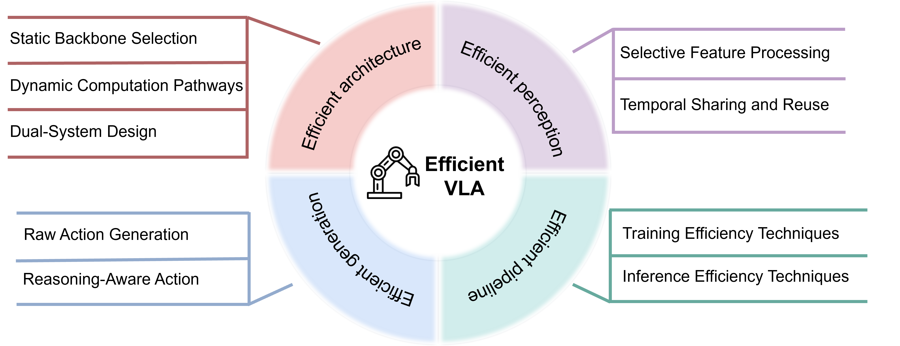

# **标题：面向具身操作的高效视觉-语言-动作模型：系统性综述（Efficient Vision-Language-Action Models for Embodied Manipulation: A Systematic Survey）**
**ArXiv：** 2510.17111
**作者：** 关伟凡（Weifan Guan），胡庆浩（Qinghao Hu）[1, †]，李傲升（Aosheng Li），程健（Jian Cheng）[1,3†]，中国科学院自动化研究所，中国科学院大学，南京信息工程大学 AiRiA 研究院，通讯作者
**章节：** 27
**估计词元数：** 23.1k

## 目录

- 1 引言
- 2 VLA 模型的基础与演进
- 3 高效模型架构
  - 3.1 静态骨干网络选择
  - 3.2 动态计算路径
  - 3.3 双系统设计
  - 3.4 总结与分析
- 4 高效感知特征
  - 4.1 选择性特征处理
  - 4.2 时序共享与复用
  - 4.3 总结与分析
- 5 高效动作生成
  - 5.1 原始动作生成
  - 5.2 推理感知的动作生成
  - 5.3 总结与分析
- 6 高效训练与推理
  - 6.1 训练效率技术
  - 6.2 推理效率技术
  - 6.3 总结与分析
- 7 未来展望
  - 7.1 模型与数据：从规模中心设计到协同优化的效率
  - 7.2 时空感知：从 2D 帧到高效的 3D 表示
  - 7.3 动作生成：从分块指令到紧凑的连续控制
  - 7.4 学习范式：从模仿到高效的强化适应
  - 7.5 评估标准：从零散指标到以效率为中心的基准测试
- 8 结论
- 参考文献

## 摘要

**摘要** **视觉-语言-动作（Vision-Language-Action, VLA）模型** 通过将自然语言指令和视觉观察映射到机器人动作，将 **视觉-语言模型（Vision-Language Models, VLMs）** 扩展到了具身控制领域。尽管功能强大，VLA 系统因其巨大的计算和内存需求而面临严峻挑战，这与需要实时性能的边缘平台（如机载移动机械臂）的约束相冲突。解决这一矛盾已成为近期研究的核心焦点。鉴于为构建更高效、可扩展的 VLA 系统所做的努力日益增多，本综述对提升 VLA 效率的方法进行了系统性回顾，重点在于降低延迟、内存占用以及训练和推理成本。我们将现有解决方案归类为四个维度： **模型架构（Model Architecture）** 、 **感知特征（Perception Feature）** 、 **动作生成（Action Generation）** 和 **训练/推理策略（Training/Inference Strategies）** ，并总结了每个类别中的代表性技术。最后，我们讨论了未来趋势和开放挑战，指明了推进高效具身智能发展的方向。本综述涵盖的论文已整理至一个 GitHub 仓库：Awesome Efficient VLA。

## 1 引言（Introduction）

传统的机器人系统依赖于任务专用算法和人工设计的规则，这些方法在结构化环境中表现良好，但难以泛化到非结构化的真实世界场景。深度学习的兴起改变了这一范式，它使得模型能够自动提取层次化和可迁移的特征。在此基础上， **视觉-语言模型（Vision-Language Models, VLMs）** 作为大型预训练多模态系统应运而生，它将视觉输入与自然语言对齐，提供了跨模态的统一语义表征。将这一概念扩展到具身控制领域， **视觉-语言-动作模型（Vision-Language-Action models, VLAs）** 建立了从语言和视觉到机器人动作的端到端映射，从而实现了跨不同场景和任务的通用控制。与传统方法相比，VLA 模型具有更优越的语义理解和泛化能力，为机器人领域的应用（包括操作、导航等）提供了一条新的技术路径。

尽管潜力巨大，VLA 模型仍面临严峻的效率挑战，限制了其实际部署。许多当代 VLA 系统复用大型语言模型和沉重的视觉骨干网络，导致参数量庞大、内存占用高、推理速度慢。此外，训练这些多模态模型的计算成本高昂。这些特性与机器人常见的约束条件相冲突，包括有限的车载计算能力、能量预算以及严格的实时延迟要求，从而阻碍了在移动机械臂等边缘平台上的部署。尽管效率优化在 VLM 领域已被广泛研究 [1]，但直接将这些技术应用于 VLA 系统并非易事。因为 VLA 引入了额外的挑战：它们必须生成时间上一致的动作序列，在实时约束下运行，并确保执行过程中的物理可靠性。因此，激进的压缩或剪枝很容易导致性能下降，其后果远比在 VLM 中更为关键。这些差异要求对 VLA 模型的效率进行专门审视，这超出了现有面向 VLM 的方法所能提供的范畴。

VLA 的快速发展已经催生了几篇综述。例如，[2] 对概念、架构、训练方法和应用进行了广泛的概述；[3] 详细分析了不同的动作表示方法，并比较了各自的优缺点；[4] 则聚焦于自动驾驶这一特定应用领域。然而，这些综述均未从效率角度提供系统性的回顾，而随着模型规模增长和实时需求增加，效率已成为实际应用的核心瓶颈。本文旨在填补这一空白，首次提出专门针对高效 VLA 模型的系统性综述。

我们的贡献有三方面：

1.  据我们所知，这是第一篇专门针对高效 VLA 的综述，我们将效率提升技术归纳为四个维度： **模型架构（model architecture）** 、 **感知特征（perception feature）** 、 **动作生成（action generation）** 以及 **训练/推理机制（training/inference mechanisms）** 。
2.  基于此分类法，我们总结了提升 VLA 效率的主流方法，并分析了其优缺点。
3.  我们讨论了 VLA 的未来发展趋势，并强调了在这些趋势下应优先关注的方面，以进一步提升效率。

> 图 1 | 综述结构概览。关于效率的讨论围绕四个核心维度组织：高效模型架构、高效感知特征、高效动作生成和高效训练-推理策略。

为实现这些贡献，本综述遵循 VLA 系统的处理流程，如图 [1] 所示，涵盖架构、感知特征、动作生成以及训练/推理，并对提升效率的技术进行了重点回顾，最后对开放挑战和前景方向进行了前瞻性讨论。本文其余部分组织如下：

- **第 2 节：VLA 模型的演进（Evolution of VLA Models）** 。我们回顾 VLA 模型的发展轨迹，追溯其演变过程，并总结塑造了其当前格局的代表性里程碑和技术改进。
- **第 3 节：高效模型架构（Efficient model architecture）** 。我们从两个角度探讨如何构建计算高效的 VLA 架构：静态骨干网络选择和动态计算路径规划。本节还讨论了双系统设计的潜在效率增益。
- **第 4 节：高效感知特征（Efficient perception feature）** 。我们综述了降低前端成本的方法，包括消除单帧内的空间冗余以及跨时间步复用感知特征。
- **第 5 节：高效动作生成（Efficient action generation）** 。我们分析并比较了两种主流的动作表示方法——原始动作和基于推理的动作，并回顾了加速其生成的方法。
- **第 6 节：高效训练与推理（Efficient training and inference）** 。我们回顾了模型全生命周期的优化技术，涵盖了经济高效的训练范式和面向部署的推理优化。
- **第 7 节：未来展望（Future prospects）** 。我们探讨 VLA 模型的未来发展，并概述了为适应这些新兴趋势而提升 VLA 效率所需的研究重点。

## 2 VLA 模型的基础与演进（Foundations and Evolution of VLA Models）

**视觉-语言-动作模型（Vision-Language-Action models, VLA）** 最近已成为机器人控制的一种端到端范式。其核心思想是设计一个统一的模型，将高维感知输入（视觉，Vision）和自然语言指令（语言，Language）直接映射为低层级的机器人控制信号（动作，Action）。通过采用这种数据驱动的方法，VLA 旨在增强泛化能力和语义理解能力，使机器人能够处理复杂和非结构化的任务。这一研究方向的发展大致可分为三个阶段。

> 图 2 | 典型 VLA 架构示意图。视觉观测、文本指令和机器人本体感知状态首先被编码和融合，然后传递给一个 LLM 主干网络进行推理。得到的、富含规划信息的潜在表征被输入到一个基于扩散的动作模型中，通过流匹配优化产生连续的动作输出。

**第一阶段：早期探索与奠基。** 在 VLA 这一术语正式确立之前，研究人员已经开始将深度学习模型直接应用于机器人控制。诸如 RT-1 [5] 和 Diffusion Policy [6] 等工作证明了使用 **变换器（Transformers）** 或 **扩散模型（Diffusion models）** 构建端到端策略的可行性。这些模型将原始 RGB 图像和文本指令映射为动作序列。然而，由于模型规模相对较小且数据集有限，它们的泛化能力仍然局限于特定任务和环境，难以处理超出训练分布范围的未见指令或物体。

**第二阶段：视觉语言模型的引入。** 一个转折点出现在预训练 **视觉语言模型（Vision-Language Models, VLMs）** 的整合。RT-2 [7] 正式引入了 VLA 的概念，并首次采用预训练的 VLM 作为主干网络。通过在大型机器人轨迹数据集上对 VLM 进行微调，并将机器人控制信号转换为离散的动作词元，RT-2 成功地将从互联网数据中获得的通用视觉和语义知识迁移到机器人控制任务中，实现了泛化能力的显著飞跃。这种“ **VLM 即策略（VLM-as-a-policy）** ”的范式迅速成为主流。OpenVLA [8] 的发布通过提供一个标准化架构进一步加速了其采用：使用强大的视觉编码器（如 SigLIP [9] 或 DINO-v2 [10]）进行视觉特征提取，使用 LLaMA 分词器 [11] 进行文本指令嵌入，以及使用大型语言模型（如 LLaMA-7B）进行高层级推理。LLM 的输出随后被用于预测离散的动作词元，这些词元与语言词元共享相同的词汇表。在此基础之上，出现了许多后续工作：Octo [12] 探索了将扩散模型作为策略头用于连续动作生成；GR 系列 [13, 14, 15] 和 VPP [16] 借鉴视频生成的思想来设计用于 VLA 优化的预训练任务；ConRFT [17] 研究了结合离线和在线 **强化学习（Reinforcement Learning）** 的训练范式。与此同时，大型多样的真实世界机器人数据集（如 Open X-Embodiment (OXE) [18] 和 DROID [19]）的发布，为训练日益增大的模型提供了所需的数据支持。

**第三阶段：架构收敛与性能优化。** 随着进一步的发展，VLA 架构开始趋于收敛。以 $\pi$0 [20] 为代表的新一代设计成为主流选择。通常，一个预训练的 LLM 通过整合视觉、语言和机器人状态信息来处理高层级规划和意图理解，并产生一个抽象的计划或策略表示。然后，这被传递给一个专用的动作专家模块（通常基于 **扩散变换器（Diffusion Transformers）** [21]），该模块通过诸如 **流匹配（Flow Matching）** [22] 等机制来细化计划并生成平滑、精确的连续动作。当前 VLA 架构的示意图如图 [2] 所示。然而，在此阶段，模型通常较大且推理速度仍然较慢。例如，OpenVLA 拥有 70 亿参数，运行频率为 5 Hz，而 $\pi$0 包含 30 亿参数，运行频率约为 10 Hz。这些速度甚至在强大的 GPU 上才能获得；在资源受限的边缘设备上，对内存、计算和延迟的此类要求将变得更加难以维持。这推动了近期对高效 VLA 模型研究的热潮，这些研究旨在减少参数规模并加速推理。其发展轨迹如图 [3] 所示。后续章节将详细审视这些发展。

> 图 3 | 高效 VLA 算法的发展轨迹。该图突出了过去几年中专注于提升 VLA 模型效率的代表性工作。

## 3 高效模型架构（Efficient Model Architectures）

模型架构是系统效率的主要决定因素：它直接影响训练成本、推理延迟和存储需求。因此，设计高效的基础架构仍然是研究的核心焦点。本节系统性地概述了 **视觉-语言-动作模型（Vision-Language-Action, VLA）** 中高效架构设计的主要方法，分为静态主干网络、动态计算路径和双系统设计。

### 3.1 静态主干网络选择（Static Backbone Selection）

当代 VLA 模型通常依赖于大规模预训练的 **视觉语言模型（Vision-Language Model, VLM）** 主干网络，以利用预训练期间获得的广泛世界知识。早期工作为了追求更广泛的泛化能力，通常采用参数量非常大的 VLM。虽然这种趋势提高了任务覆盖范围，但也导致了第一代 VLA 模型规模庞大且计算开销沉重。例如，RT-2 [7] 的参数量达到了 550 亿（55B），这对顺序性和低延迟的机器人任务构成了挑战，因为其推理速度仅为每秒约 3 帧（3 Hz）。实证研究表明，大部分延迟来自 **语言模型（Language Model, LM）** 组件，这促使采用更轻量的 LM 或以效率为导向的 LM 设计成为常见策略。

RoboMamba [23] 引入了 **状态空间模型（State-Space Model）** 架构 Mamba 作为其序列模型。参数量约为 27 亿（2.7B）的 Mamba [24]，相比基于 Transformer 的同等规模 **大型语言模型（Large Language Model, LLM）** ，能提供更高效的时序建模和并行推理能力，在任务性能损失最小的情况下降低了延迟。TinyVLA [25] 是早期追求 VLA 效率的尝试之一。通过使用 Pythia-1.3B [26] 等较小的 LM，它在保持核心任务能力的同时压缩了整体模型，使得边缘部署更加可行。SmolVLA [27] 采取了更直接的结构简化方法。它采用参数量分别为 2.4 亿（0.24B）、4.5 亿（0.45B）和 22.5 亿（2.25B）的 SmolVLM-2 [28]，并通过剪枝掉最后的几个 Transformer 层来进一步减少计算量。类似地，NORA [29] 将主干网络替换为 Qwen-2.5-VL-3B [30]，在保持强大性能的同时获得了更小的模型体积。

总体而言，这些努力都共同强调 **小型化（Downsizing）** ——用轻量级替代方案替换大规模主干网络，以在不牺牲基本任务能力的前提下获得效率提升。这种向紧凑架构发展的趋势日益显著，因为现代 VLA 系统正持续从数百亿参数量的模型转向约十亿甚至数亿参数量的模型，这反映了向实用和可部署的具身智能（Embodied Intelligence）更广泛的发展趋势。

### 3.2 动态计算路径（Dynamic Computation Pathways）

上一节强调了采用更紧凑的骨干网络以提升推理效率的策略。虽然这种方法直接且有效，但它不可避免地会限制模型的容量上限。另一研究方向则选择在训练时保留大规模骨干网络，但在推理时引入动态路径选择。这样，模型既保留了大型架构的表达能力，又能在特定任务上下文中舍弃冗余计算，从而在不完全牺牲能力的前提下实现更高的效率。

**SmolVLA** [27] 采用了一种简单的层剪枝策略，即永久性地移除语言模型中固定数量的最后几层。 **FLOWER** [31] 遵循一种基于语义动机的剪枝范式，其理论基础是大型语言模型的可解释性研究发现。它观察到，中间 Transformer 层捕获了丰富、通用的语义，而最后几层则倾向于过度专门化于下一词元预测。因此，FLOWER 剪除了冗余的上层，在编码器-解码器 VLA 模型中移除解码器，在仅解码器模型中移除最后几层，以平衡上下文表达能力和计算效率。

然而，这种剪枝形式是静态的，因为它既不适应输入的复杂性，也不考虑任务的具体需求。为了解决这一限制， **DEER-VLA** [32] 在 VLA 系统中引入了 **早退机制（Early-exit mechanism）** 。它在语言模型的各个中间层放置轻量级策略头，使得可以在多个深度进行动作预测。随后，使用一个输出相似性度量来决定是否提前退出。退出阈值通过一个平衡平均/峰值 FLOPs 和 GPU 内存使用的约束目标进行优化，而非手动调整。

尽管如此， **MoLE-VLA** [33] 认为深层特征对任务性能仍然至关重要，因此过早终止可能会损害模型的上限性能。为了缓解这个问题，MoLE-VLA 将语言模型的每一层都视为一个潜在的专家，并采用 **专家混合（Mixture-of-Experts, MoE）** 框架 [34]。一个门控机制动态地选择哪些层参与给定输入的计算，从而避免完全丢失更深层的信息。为了稳定训练，还进一步应用了 **自蒸馏（Self-distillation）** [35]，即完整的、未经剪枝的网络为缩减后的计算路径提供指导。

除了基于 MoE 的路由方法，另一项工作利用了基于相似性的跳过机制。 **Efficient-VLA** [36] 通过测量每层输入和输出特征向量之间的余弦相似度来评估其贡献。如果相似度超过一个阈值，表明表征变换有限，则在推理时跳过该层。与静态剪枝相比，这种方法能适应输入特征，并保留所有层的潜在可用性，使得模型在需要时能保持其完整的表征深度，同时在冗余情况下压缩计算。

### 3.3 Dual-System Design（双系统设计）

除了对骨干网络和推理路径的优化，另一条探索路线在于通过双系统设计进行架构重构。该方法受认知科学中的 **双系统理论（Dual-system theory）** [37] 启发，将模型划分为一个用于复杂推理和长期规划的慢系统，以及一个用于快速、直观响应的快系统。两个子系统协同工作，使 VLA 模型能够处理复杂的高层任务，同时确保在简单场景下的低延迟推理。该策略通常采用异构模型架构：慢系统依赖一个大规模多模态语言模型（Multimodal Language Model, MMLM）来满足语义理解和推理的需求，而快系统则采用一个轻量级模型来快速响应感知输入。两个系统通过潜在词元或嵌入交换信息，以协作完成任务。双系统 VLA 框架的示意图概览见图 [4]。遵循此思路的显著例子包括：

- **LCB** [38] 采用 **LLaVA** [39] 作为慢系统（Slow System）生成语言描述和动作提示，然后引导一个 **3D 扩散执行器（3D Diffuser Actor）** [40] 作为快系统（Fast System），通过一个可学习的 `<ACT>` 标记生成最终动作。
- **HiRT** [41] 采用 **InstructBLIP** [42] 作为慢系统生成表征，随后由一个 **EfficientNet-B3** [43] 快系统通过 **MAP 池化（MAP pooling）** [44] 进行处理，以实现高效控制。
- **RoboDual** [45] 将 **OpenVLA** [8] 作为慢系统与一个 **DiT** [21] 作为快系统相结合。慢系统输出潜在表征，快系统通过一个 **感知器重采样器（Perceiver Resampler）** [46] 进行精炼，以重建简化的动作输出。
- **OpenHelix** [47] 对主流双系统框架进行了系统性回顾与评估，并提出了一种优化的模块化配置。具体而言， **LLaVA-7B** [39] 作为慢系统， **3D 扩散执行器** [40] 作为快系统，并在输入序列后附加一个可学习的 `<ACT>` 标记。该标记的输出用于调节执行器。在训练期间，慢系统通过重建 3D 位置和旋转的辅助目标进行优化，而快系统则继续以动作去噪作为其主要任务进行训练。
- **FiS** [48] 将快慢系统集成到一个单一网络中，形成一种隐式的双系统通路。浅层网络构建中间语义表征，随后由最终层消耗这些表征来预测动作。
- **Hume** [49] 引入了一种级联式双系统结构。慢系统在多个噪声尺度上生成候选动作块，同时一个可学习的聚合标记输入到一个价值查询头（Value Query Head）中对候选块进行评分。最有希望的候选块随后由快系统进一步分解和去噪，以产生最终的动作序列。训练是联合进行的：策略头（Policy Head）和快系统通过 **流匹配（Flow Matching）** [22] 进行优化，而价值查询头则在带有奖励标注的数据集上通过离线强化学习进行训练。

近期研究探索了用于 **视觉-语言-动作模型（Vision-Language-Action models, VLA）** 的非标准双系统架构，其中两个互补的子系统以非传统方式交互。例如， **HyperVLA** [50] 提出了一个两阶段框架，其中 **超网络（HyperNetwork）** 根据语言指令和视觉输入动态生成任务特定的 **基础策略（Base Policy）** 参数。紧凑的基础策略随后利用视觉特征和一个可学习的动作词元执行单步动作生成，从而消除了对语言指令的需求，并降低了自回归或基于扩散的解码计算成本。从概念上讲，HyperVLA 可被视为一种 **参数传递式双系统 VLA** ：超网络（系统 2）将感知信息编码到基础策略（系统 1）的参数中，从而实现高效且语义一致的动作生成。

值得注意的是，上述大多数方法仍采用串行架构，其中快速系统的响应依赖于慢速系统的先期处理。为解决这一瓶颈， **SP-VLA** [51] 基于末端执行器速度区分了 **直觉性动作（intuitive actions）** 和 **审慎性动作（deliberate actions）** 。直觉性动作由轻量级模型（例如 **岭回归（ridge regression）** [52]）处理，而审慎性动作则由主 VLA 模型处理。仅当需要完整 VLA 级别处理的动作比例超过预设阈值时，轻量级通路才会被激活，从而确保响应性和可靠性。

表 [1] 总结了这些代表性的双系统 VLA 算法。此外，虽然 **RT-Cache** [53] 并非传统 VLA 架构，但它提供了一条基于 **经验回放（experience replay）** 的互补快速通路。视觉特征由 **SigLIP** [9] 和 **DINO-V2** [10] 提取，随后进行两阶段聚类和最近邻搜索，以高效检索历史轨迹。这使得系统能够在重复性或低变化性环境中快速生成动作。从认知角度看，这种基于经验的检索可被视为快速系统的一种替代实现，密切反映了人类如何利用先验经验进行快速决策。

表 1 | 代表性的双系统视觉-语言-动作模型。
| VLA | System 1 (Intuitive) | System 2 (Deliberative) | Communication |
| :--- | :--- | :--- | :--- |
| LCB[38] | 3D Diffuser Actor | LLaVA | Special token |
| HiRT[41] | EfficientNet-B3 | InstructBLIP | Latent vector |
| RoboDual[45] | DiT | OpenVLA | Latent vector |
| OpenHelix[47] | 3D Diffuser Actor | LLaVA-7B | Special token |
| FiS[48] | LLaMA2-7B (Deep-layer) | LLaMA2-7B (Shallow-layer) | Latent vector |
| Hume[49] | Transformer | Paligemma-4B | Noisy action |
| HyperVLA[50] | Transformer | T5 | Network parameter |
| SP-VLA[51] | Ridge Regression | LLaMA-7B | Adaptive routing |

### 3.4 总结与分析（Summary and Analysis）

在本节中，我们回顾了 VLA 模型中高效架构设计的三大策略： **静态模型骨干（static model backbones）** 、 **动态计算通路（dynamic computation pathways）** 和 **双系统架构（dual-system architectures）** 。静态骨干通过采用更紧凑的模型直接获得效率提升；动态计算通路在推理过程中实现灵活路由，平衡容量与成本；而受认知理论启发的双系统架构，则将推理和反应性分配到不同的子系统中，以实现分层协作。总的来说，这些方法勾勒出了当前高效 VLA 架构的格局。

然而，每种策略都存在显著局限性。静态骨干在过度压缩时会降低模型的容量上限并损害泛化能力，其性能在当前任务上可能表现强劲，但难以迁移到新场景；动态计算通路虽然灵活，但通常需要额外的分支模块、大量的训练开销，以及精心手动设计的选择标准和阈值；双系统架构虽然在平衡复杂推理和快速响应方面有效，但常以异步形式实现，这会在两个子系统的输出之间引入延迟，从而损害实时决策能力。这些挑战凸显了在效率与能力之间取得理想平衡的难度。

未来研究必须在几个方向上推进。首先，应通过在不同任务和实验条件下进行评估，探索适用于 VLA 模型的 **缩放定律（scaling laws）** ，以厘清模型规模、泛化能力和效率之间的权衡关系，并确定最适合当前数据可用性的骨干规模。其次，动态计算通路可以受益于自适应和自动化机制，例如用于层跳过的 **强化学习（reinforcement learning）** ，从而使执行的层数能够在线确定，而非由手动设计的启发式规则固定。最后，由于许多 VLA 应用场景需要 **边缘部署（edge deployment）** ，架构设计应明确考虑 **云-边划分（cloud-edge partitioning）** ：轻量级的快速子系统可部署在本地以确保低延迟控制，而较重的推理模块则在云端运行。此类框架必须考虑通信延迟、带宽限制和隐私要求，以确保稳健运行。

## 4 高效感知特征（Efficient Perception Feature）

**视觉-语言-动作系统（Vision-Language-Action, VLA）** 通常处理多模态输入，包括视觉观测、文本指令和机器人本体感知。其中，视觉输入对总词元序列长度的贡献最大，常常主导模型的 **内存（memory）** 和 **计算开销（compute footprint）** 。因此，对视觉词元进行密集处理是计算负担的主要来源，也是 VLA 模型效率优化的主要目标。

然而，并非所有视觉信息都与决策过程同等相关。在许多任务中，输入图像的很大一部分，例如背景区域、与任务无关的物体或时间不变的内容，并不会显著影响动作选择。这些区域会产生冗余计算，尤其是在高分辨率输入和长时程任务中，从而降低推理效率。为了解决这个问题，一系列研究应运而生，旨在构建紧凑且与任务相关的视觉表征。这些工作通常分为两个互补的方向：

1.  **单帧感知的选择性处理（Selective processing of single-frame perception）** ：在冗余信息到达下游策略网络之前，对其进行剪枝、压缩或转换。
2.  **时间共享与重用（Temporal sharing and reuse）** ：利用帧间相似性，避免对静态或缓慢变化的特征进行重复计算。

### 4.1 选择性特征处理（Selective Feature Processing）

部署 **视觉-语言-动作模型（Vision-Language-Action models, VLA models）** 时，一个主要的效率瓶颈在于其对高维视觉输入的密集处理。因此，大量研究工作集中于压缩感知表征，通常通过减少输入到下游策略网络的 **词元序列（token sequences）** 长度，同时保留任务相关信息。

一种直接的方法是在推理过程中对词元进行剪枝。示意图如图 [5] 所示。例如，FastV [54] 计算每个视觉词元在大型语言模型（Large Language Model, LLM）的某个中间层从所有词元处获得的平均注意力，并基于这些重要性分数应用 Top-K 剪枝。在此基础上，EfficientVLA [36] 进一步量化了视觉词元与任务指令之间的交互，选择捕捉语义相关性的关键词元，并用高注意力的任务驱动词元和多样性驱动词元对其进行增强，以确保表征的丰富性。SP-VLA [51] 强调，词元剪枝还应保留空间结构；除了通过注意力捕获的语义重要性外，还通过使用边缘检测的轮廓线索来衡量空间相关性，满足任一标准的词元都会被保留，从而确保场景完整性。SP-VLA 还引入了自适应剪枝，根据运动动态调整剪枝的激进程度，随着任务需求的变化在效率和保真度之间进行权衡。

> 图 5 | VLA 系统中的词元剪枝。

尽管简单有效，但这些基于注意力分数的策略依赖于中间注意力分数，而像 FlashAttention [55] 这样的高效实现并不暴露这些分数。为了解决这一限制，FlashVLA [56] 提出了一种基于特征的替代方案，即直接在注意力输出矩阵上应用 **奇异值分解（Singular Value Decomposition, SVD）** 来推导 **信息贡献分数（Information Contribution Score, ICS）** ，该分数衡量了每个词元在主导奇异方向上的投影。

动态且上下文感知的剪枝策略通过融入语言指令和动作信息，扩展了这些静态或基于注意力的方法。LightVLA [57] 针对的是视觉编码器产生的视觉词元，而非在 LLM 内部操作。它采用了一种 **查询驱动（query-driven）** 的词元选择机制，其中通过跨模态注意力动态生成的查询来识别信息最丰富的视觉词元。选择过程使用 **Gumbel-Softmax** 结合 **直通估计器（straight-through estimator）** 使其可微分，从而支持端到端训练，同时保留空间位置编码，无需手动预定义应保留多少词元。ADP [58] 引入了一种两阶段机制：首先，任务驱动的静态剪枝计算文本查询和跨模态注意力，以评估每个视觉词元的全局重要性，保留与指令最相关的词元；其次，一个动态的、动作感知的开关根据最近的末端执行器运动调整剪枝，使用 **滞后机制（hysteresis mechanism）** 来平衡粗粒度运动期间的压缩和精确操作期间的感知保真度。FASTDriveVLA [59] 同样将动作感知集成到词元剪枝中，但在训练期间增加了 **前景-背景对抗重建（foreground-background adversarial reconstruction）** ，确保模型能够区分关键的前景信息和冗余的背景信息。词元分数由一个轻量级评分器计算，该评分器通过 **哈达玛融合（Hadamard fusion）** 结合词元特征和一个可学习的查询，在推理时应用 Top-K 选择，同时保留位置信息。SpecPrune-VLA [60] 是一种免训练的剪枝方法，通过启发式控制执行两级词元约简。在动作层面，静态剪枝评估先前动作的全局词元冗余度和当前动作的局部词元相关性，在生成前减少视觉词元。在层层面，动态剪枝利用词元与模型层之间的相关性，基于层特定重要性进行剪枝。一个轻量级的、动作感知的控制器进一步根据当前动作的粒度调整剪枝——粗粒度动作可容忍更多剪枝，而细粒度动作则需要更高的保真度。

除了动态剪枝，在低精度量化下保持鲁棒性并确保空间覆盖对于实际部署至关重要。SQAP-VLA [61] 通过一个 **空间与量化感知（spatially and quantization-aware）** 的词元剪枝框架解决了这些挑战，该框架结合了三种互补机制：在量化下保留任务关键词元、保护机器人末端执行器附近的词元，以及采样词元以维持空间覆盖。这些策略共同确保了最终保留的词元集合在效率、稳定性和覆盖范围之间取得平衡，从而实现可靠的 **低位推理（low-bit inference）** 。不同类型的词元剪枝 VLA 策略总结见表 [2]。

**表 2：视觉-语言-动作模型中的代表性词元剪枝策略。**
| 方法 | 词元重要性标准 | 优点 | 缺点 |
| :--- | :--- | :--- | :--- |
| FastV [54] | 基于中间 LLM 层视觉词元平均接收注意力的 Top-K 注意力分数 | 简单有效；易于实现 | 需要中间注意力；忽略空间结构和动作动态 |
| EfficientVLA [36] | 由任务指令相关性和词元多样性加权的注意力分数 | 保留任务相关信息并确保表征丰富性 | 静态选择；对动态动作的适应有限 |
| SP-VLA [51] | 基于注意力的语义相关性和基于轮廓边缘的空间重要性 | 保持空间完整性和语义覆盖；自适应剪枝适应运动 | 额外的空间计算；增加实现复杂度 |
| FlashVLA [56] | 对注意力输出进行奇异值分解以计算信息贡献分数 | 兼容高效注意力；无需访问中间注意力 | 静态剪枝；SVD 计算增加开销 |
| LightVLA [57] | 使用 Gumbel-Softmax 可微分选择的跨模态注意力查询 | 可端到端训练；保留空间位置；自动确定保留词元数量 | 训练复杂；需要可微分选择机制 |
| ADP [58] | 任务驱动的注意力评分结合使用运动滞后的动作感知动态调整 | 平衡压缩和感知保真度；适应末端执行器运动 | 实现复杂；滞后参数需要调优 |
| FASTDriveVLA [59] | 结合词元特征和可学习查询的轻量级评分器；保留位置的 Top-K 选择 | 保留关键前景词元；动态且动作感知；评分高效 | 训练需要对抗目标；对背景变化敏感 |
| SpecPrune-VLA [60] | 静态动作级冗余和局部相关性结合层级的词元重要性 | 免训练；快速部署；适应粗粒度和细粒度动作 | 启发式规则可能限制泛化；对复杂任务不够优化 |
| SQAP-VLA [61] | 量化下保留任务关键词元、机器人邻近保护和空间采样 | 鲁棒的低位推理；保持空间覆盖和重要词元 | 静态剪枝；对动态动作响应较差；实现更复杂 |

与上述从原始词元集合中 **删减** 的方法不同，另一条研究路线探索更根本的 **表征变换（Representational Transformations）** ，旨在通过 **压缩（Compression）** 或 **统一（Unification）** 来提高效率。例如，OTTER [62] 从 Perceiver [46] 框架中汲取灵感，提出了一种 **交叉注意力池化机制（Cross-attention Pooling Mechanism）** 。该模块在文本指令的引导下，将视觉和文本词元压缩为固定长度的紧凑表征。这种强调压缩而非丢弃的思路，为处理长输入序列提供了一种新范式。UniVLA [63] 试图通过将所有输入转换为来自共享词汇表的离散词元，来统一视觉、文本和动作模态。这种同质表征实现了跨模态的无缝集成，并简化了下游任务（如 **感知接地（Perception Grounding）** 、 **世界建模（World Modeling）** 和 **策略学习（Policy Learning）** ）的训练，从而改善了多模态集成。虽然 **词元化（Tokenization）** 降低了视觉粒度，但它可以显著缩短序列长度并简化多任务训练。

### 4.2 Temporal Sharing and Reuse（时序共享与重用）

在讨论了优化单帧输入的策略之后，我们现在关注一个互补的维度：利用序列决策中的 **时序冗余（Temporal Redundancy）** 。在机器人任务执行中，相邻状态通常表现出强烈的时序相关性，使得在每个时间步进行完全重新计算变得不必要地昂贵。因此，一个有前景的方向是识别并重用那些随时间保持稳定的计算结果。这需要精确判断哪些组件可以重用、哪些需要更新，范围从低层感知到高层推理。

在视觉表征层面，VLA-cache [64] 是此类重用的一个范例。它通过重用基于 Transformer 架构中静态图像块的 **键值缓存（Key-Value Caches, KV Caches）** 来针对连续帧之间的冗余。这些 KV 缓存存储了 Transformer 的键值向量，使模型能够跳过对未变化图像块的重新计算。VLA-cache 估计跨帧的图像块级相似性，并为被视为静态的图像块重用 KV 缓存。为了避免性能下降，与任务高度相关的词元被排除在重用之外，并进行全新计算。此外，VLA-cache 引入了 **注意力熵（Attention Entropy）** 作为置信度度量，动态调整各层的重用比例，以平衡精度和效率。

作为对 KV 缓存策略的补充，TTF-VLA [65] 通过有选择地融合连续帧之间的视觉词元来利用时序冗余。它不是重用 Transformer 状态，而是维护一个图像块词元的历史记录，并通过一个 **二元重要性掩码（Binary Importance Mask）** 来更新它们，该掩码用于识别具有显著视觉或语义变化的区域。该掩码源自像素级差异和基于注意力的相关性，确保只有动态的或对任务关键的图像块被重新计算。周期性的 **关键帧更新（Keyframe Update）** 进一步防止了长期漂移，从而以最小的精度损失实现高效的时序融合。

在更抽象的层面，研究人员将重用扩展到驱动任务执行的高层感知表征。FlashVLA [56] 观察到，在许多场景中，尤其是当环境保持稳定时，指导动作选择的内部表征随时间变化极小。因此，它引入了一个轻量级触发器，用于检测连续感知驱动状态之间的相似性以及所选视觉词元之间的重叠。当满足这些条件时，模型会重用先前计算好的表征，在确保一致性的同时避免冗余的重新计算。

时序冗余也出现在动作推理的迭代过程中。基于扩散的架构，如 DiT [21]，通过重复去噪生成多步动作表征。由于迭代间的中间特征通常保持相似，EfficientVLA [36] 采用了一种 **固定间隔缓存策略（Fixed-interval Caching Strategy）** ：它每 N 步重新计算一次特征，并在其间重用缓存的表征。这种机制利用了生成过程本身（而非跨物理帧）的 **时序局部性（Temporal Locality）** ，在保持动作连贯性的同时，大幅降低了计算开销。

**重用原则（The reuse principle）** 同样适用于采用 **思维链（Chain-of-Thought, CoT）** [66] 提示的推理密集型 **视觉-语言-动作模型（Vision-Language-Action models, VLA models）** 。 **ECoT（Explicit Chain-of-Thought）** [67] 让视觉-语言模型在生成任务动作之前，先生成自然语言的子任务计划，这提高了可解释性，但也增加了推理延迟。 **Fast ECoT** [68] 发现，此类高级推理模块（尤其是规划模块）演化缓慢，并表现出强烈的 **时间局部性（temporal locality）** 。它提出了 **模块级缓存（module-level caching）** ，即如果未检测到显著变化，系统会重用先前的基于文本的计划。通过缓存计算成本高但变化缓慢的推理结果，并将其与 **连续批处理（continuous batching）** 等现代加速器相结合，Fast ECoT 在不牺牲准确性的情况下实现了显著的效率提升。

VLA 系统流程中时间重用的总结性说明如图 [6](https://arxiv.org/html/2510.17111v3#S4.F6) 所示。

> 图 6 | VLA 系统中的时间重用机制。现有方法利用跨时间步的相似性，包括补丁重用、KV 缓存重用和高级推理重用，因为这些表示通常会随时间缓慢变化。在基于扩散的动作模型中，时间重用也自然出现在迭代去噪过程中。

### **4.3 总结与分析（Summary and Analysis）**

在本节中，我们从两个互补的角度系统地审视了感知信息表示对 VLA 系统效率的影响。一方面，可以通过设计的指标评估 **词元（tokens）** 的重要性，从而修剪单帧视觉输入中的冗余信息，实现特征压缩和精炼。另一方面，重用跨帧的时间特征、中间计算结果和中间推理输出，可以减少冗余处理并提高整体效率。这些方法共同促进了感知信息的精简，使 VLA 系统能够在保持感知能力的同时，在推理和执行方面实现更高的效率。

尽管取得了这些进展，当前研究仍面临显著挑战。词元剪枝方法通常依赖于手动预定义的阈值或固定的剪枝比率，缺乏动态适应变化任务或环境的能力。因此，在一种场景下表现最优的剪枝策略，在另一种场景下可能会降低性能甚至导致任务失败。此外，大多数感知表示仍然局限于 2D RGB 输入。最近的研究尝试引入 3D 表示以提高空间感知能力。然而，3D 处理通常会产生巨大的计算开销，损害实时性能，从而限制了实际应用。

展望未来，预计研究将沿着两个方向推进。首先，开发用于动态调整剪枝比率和策略的自适应机制至关重要，这将使模型能够根据任务复杂性和环境变化来优化特征选择，从而在效率和性能之间实现更稳健的平衡。其次，对于 3D 视觉表示，进展将依赖于更高效的建模和压缩策略。有前景的方向包括：

- 从单目线索进行轻量级深度估计。
- 用于降低数据密度的 **体素（voxel）** 或 **点云（point-cloud）** 压缩。
- 利用基于图像特征的效率同时保留基本空间结构的混合 2D-3D 融合方法。

此类方法旨在保留 3D 感知的优势（如深度推理和空间一致性），同时避免产生过高的成本。

## 5 高效动作生成（Efficient Action Generation）

与 **视觉-语言模型（Vision-Language Models, VLMs）** 相比， **视觉-语言-动作模型（Vision-Language-Action model, VLA model）** 的关键结构区别在于 **动作（Action）** 作为一个核心组成部分。动作充当了模型与物理世界之间的 **闭环交互接口（Closed-loop interaction interface）** ，是连接 **高层语义推理（High-level semantic reasoning）** 与 **底层控制指令（Low-level control commands）** 的桥梁。因此，动作表示和生成策略的选择，强烈影响着长周期复杂任务中的控制精度、响应延迟和整体执行效率。

### 5.1 原始动作生成（Raw Action Generation）

在主流 VLA 系统中，常见的设计是直接输出一个 7 维向量的原始动作，包含 3 维平移偏移、3 维旋转偏移和一个二值夹爪状态。这种低维连续表示能够实现快速的端到端控制，并具有最小的推理延迟。然而，在生成长动作序列时，这种逐步预测方案不仅会遭受 **复合误差（Compound error）** ，导致执行轨迹偏离预定路径，还面临效率限制。因为 VLA 输入通常包含一个长的 **词元（Token）** 序列，如果一个输入词元仅对应一个短的动作词元，整体动作生成效率就会很低，推理速度成为瓶颈。

为了缓解这个问题， **动作分块（Action Chunk）** [69] 在一个推理步骤中生成一个连续的 **动作块（Block of consecutive actions）** 。如图 [7](https://arxiv.org/html/2510.17111v3#S5.F7) 所示，它应用了 **时间集成技术（Temporal-ensemble techniques）** ，如平滑或时间平均，以减少每步的方差。这减少了误差累积，提高了有效控制吞吐量，有利于高频操作。然而，在分块边界处仍然会出现不连续或异常运动。 **实时分块（Real-Time Chunking, RTC）** [70] 通过将分块生成重新表述为一个 **序列修复问题（Sequence inpainting problem）** 来解决此问题。它冻结每个新分块中已执行的前缀，并在重叠区域应用 **软掩码方案（Soft-masking scheme）** ，以强制跨分块的一致性，同时仍能纳入更新的观测信息。基于 **迭代去噪框架（Iterative denoising frameworks）** ，如 **扩散模型（Diffusion）** 或 **流匹配（Flow matching）** [22]，RTC 在不牺牲响应性的前提下，提供了跨分块的平滑策略转换，实现了鲁棒的实时控制。

动作分块显著增加了每次推理的动作词元长度。在双臂任务中，序列长度大约翻倍，这增加了 **自回归架构（Autoregressive architectures）** 的负载。为了解决这个问题， **FAST** [71] 在推理前压缩 **离散化动作序列（Discretized action sequences）** 。它应用 **离散余弦变换（Discrete Cosine Transform, DCT）** 将序列转换到频域，保留主要的低频系数，然后应用 **字节对编码（Byte-Pair Encoding, BPE）** 来减少词元长度。这降低了推理过程中的成本，同时允许对原始动作进行无损重建，实现了显著的计算节省。类似地， **OmniSAT** [72] 引入了一个统一的 **动作分词器（Action tokenizer）** ，将连续轨迹转换为紧凑的离散词元。它首先执行基于 **B 样条（B-spline）** [73] 的 **时间对齐（Temporal alignment）** ，以获得固定长度的 **控制点表示（Control-point representations）** ，然后应用 **残差向量量化（Residual Vector Quantization, RVQ）** [74] 将其离散化为多层 **码本索引（Codebook indices）** ，并进一步按位置、旋转和夹爪维度分组。这个过程产生了一个短的、具有语义结构的词元序列，既保留了轨迹保真度，又实现了跨不同 **具身（Embodiments）** 的高效自回归建模。

**VOTE** [75] 引入了一个单一的特殊词元 `<ACT>` 来表示整个动作块，然后通过一个轻量级的 **多层感知机（Multilayer Perceptron, MLP）** 将其映射为连续动作。这种设计大大减少了生成的词元数量和解码步骤，实现了更快的推理和更低的训练成本，同时保持了强大的任务性能。在推理过程中，VOTE 通过一个 **集成投票机制（Ensemble voting mechanism）** 进一步增强鲁棒性，其中来自先前步骤的候选动作组成一个委员会，其加权投票决定最终输出。 **SpatialVLA** [76] 将动作离散化与动作词元压缩相结合，将平移向量转换为 **极坐标（Polar coordinates）** 以解耦方向和距离，同时保留 **欧拉角（Euler angles）** 用于旋转，并对夹爪状态进行离散化。

总之，动作生成策略从直接预测原始动作，发展到通过分块平滑输出，再到压缩和重组动作词元。这些方法在满足高频控制需求、减少延迟和缓解误差累积方面相互补充。

### 5.2 推理感知的动作生成（Reasoning-Aware Action Generation）

上一节重点讨论了直接生成原始动作的 **纯动作视觉-语言-动作模型（Vision-Language-Action, VLA）** 系统。这种方法具有推理流程短、延迟低以及端到端训练的统一优化目标等优点，从而实现了高计算效率和部署简便性。直接动作生成还能在高频控制场景中保持流畅的执行。然而，它也面临一些局限性： **可解释性有限、跨任务泛化能力较弱** ，并且与原始 **视觉-语言模型（Vision-Language Model, VLM）** 的预训练目标存在显著的任务差距，导致模型潜力未能充分利用。

为了弥补这些不足，另一种范式在产生最终动作之前明确引入了推理阶段。典型的推理步骤包括：将目标分解为子任务、使用 **接地特征（Grounded features）** 表示机器人目标或运动，以及提取与任务相关的视觉语义特征，例如 **物体边界框（Object bounding boxes）** 或 **语义关键点（Semantic keypoints）** 。如图 [8] 所示，这些方法通常分为 **基于语言的推理（Language-based reasoning）** 和 **基于视觉的推理（Vision-based reasoning）** 两类。通过增加中间推理步骤，它们改善了长视野场景中的任务分解与规划能力，并缓解了持续学习中的 **灾难性遗忘（Catastrophic forgetting）** 问题。然而，推理会引入额外的计算成本和延迟，使得 **效率与能力的权衡（Efficiency-capability trade-offs）** 成为一个核心挑战。

**基于语言的推理（Language-based reasoning）** 将冗长复杂的任务指令分解为细粒度的子任务描述，以便分阶段执行。 **具身思维链推理（Embodied Chain-of-Thought Reasoning, ECoT）** [67] 应用 **思维链提示（Chain-of-thought prompting）** ，在生成原始动作序列之前将指令分解为结构化字段（例如：TASK、PLAN、SUBTASK、MOVE、GRIPPER、OBJECTS）。虽然这提供了清晰的任务分解，但它显著增加了序列长度（例如，从 OpenVLA [8] 中每步 7 个词元增加到 ECoT 中每步 350 个词元），从而放大了推理延迟。为了减轻这种开销并使基于推理的控制更具实用性，后续的变体旨在精简推理过程。 **快速 ECoT（Fast ECoT）** [68] 通过复用变化缓慢的高层计划并采用 **连续批处理（Continuous batching）** 来缓解可变长度序列带来的效率问题，进一步减少了运行时间。在大量实验中， **ECoT-Lite** [77] 训练模型联合预测推理和动作，但在测试时使用 **推理丢弃（Reasoning-dropout）** ，省略推理词元，仅输出动作以降低延迟，这显著提升了推理速度，且性能没有明显牺牲，从而在性能与效率之间实现了有效的权衡。

**基于视觉的推理（Vision-based reasoning）** 则从视觉输入中提取空间语义线索，例如 **可供性（Affordances）** 、 **关键点（Keypoints）** 、 **边界框（Bounding boxes）** 或 **目标状态（Goal states）** ，以指导动作选择。 **UniPi** [78] 训练一个用于视频预测的 **扩散模型（Diffusion model）** 作为视觉主干，首先预测一系列目标状态帧，然后应用预训练的 **逆动力学模型（Inverse dynamics model）** 来生成动作。这使得模型能够从大规模、无动作的人类视频数据集中学习。为了降低完整视频生成的高昂成本， **SuSIE** [79] 将输出简化为单个子目标图像，然后通过逆动力学模型将其转换为动作，从而减少了推理延迟。 **VPP** [16] 通过从预训练的 Stable Video Diffusion 模型的上采样层提取多尺度特征，对齐其分辨率，通过 VideoFormer 进行融合，并将其传递给扩散策略以生成动作，从而避免了完整的去噪过程。虽然单步去噪会产生更模糊的输出，但它捕捉到了足以用于规划的 **未来轨迹趋势（Future trajectory trends）** 。大多数此类方法采用两阶段流程——分别预训练视频生成模型，然后将其与逆动力学模型结合，这可能会限制跨场景的泛化能力。 **CoT-VLA** [80] 将子目标图像词元和动作词元统一到一个 **自回归模型（Autoregressive model）** 中，实现了端到端的视觉思维链推理。虽然这增加了感知与控制之间的耦合，但它除了预测动作外还需要预测 256 个图像词元，这使推理速度降低了约 7 倍。 **DreamVLA** [81] 通过 **基于动态区域的预测（Dynamic region-based forecasting）** 来解决这个问题，它使用 **光流（Optical flow）** 来检测与末端执行器或物体运动相关的图像区域，并仅预测这些动态区域，在保留任务相关信息的同时大大减少了计算量。

不同类型的基于推理的 VLA 策略总结见表 [3]。

**表 3：视觉-语言-动作（Vision-Language-Action, VLA）模型中基于语言和基于视觉的代表性推理策略。**
| 模态 | 方法 | 推理输出 | 核心思想 | 效率策略 |
| :--- | :--- | :--- | :--- | :--- |
| 基于语言 | ECoT [67] | 高层规划与动作 | 通过思维链（Chain-of-Thought, CoT）推理将指令分解为结构化任务字段 | 在多个步骤间复用部分推理链 |
| | Fast ECoT [68] | 高层规划与动作 | 遵循 ECoT 设置，同时优化推理生成速度 | 复用高层推理，并在时间步间并行化模块化推理步骤 |
| | ECoT-Lite [77] | 仅动作 | 实证研究推理 CoT 如何影响成功率与速度的权衡 | 应用推理丢弃（dropout）以减少推理延迟 |
| 基于视觉 | UniPi [78] | 目标状态视频帧 | 基于扩散的视频预测和逆动力学进行动作推断 | 无明确面向效率的设计，专注于生成准确的视觉轨迹 |
| | SuSIE [79] | 单帧子目标图像 | 预测单个子目标帧而非完整轨迹 | 通过直接预测中间子目标帧来降低成本 |
| | VPP [16] | 多尺度扩散特征 | 从预训练的视频扩散模型中提取并融合中间特征 | 利用上采样阶段特征，跳过完整去噪过程 |
| | CoT-VLA [80] | 目标图像词元与动作 | 用于统一感知与控制的端到端自回归推理 | 在训练和推理中统一推理，无冗余阶段 |
| | DreamVLA [81] | 动态图像区域 | 在光流引导下仅预测与运动相关的视觉区域 | 选择与运动相关的区域以减少视觉计算 |

### 5.3 总结与分析（Summary and Analysis）

在本节中，我们回顾了 **视觉-语言-动作（Vision-Language-Action, VLA）** 系统中用于高效输出生成的两种代表性范式： **直接原始动作生成（direct raw action generation）** 和 **基于推理的动作生成（reasoning-based action generation）** 。前者强调概念简单性、与机器人控制接口的直接兼容性以及更短的输出序列，使其特别适用于有严格频率要求的实时决策。相比之下，后者则融合了明确的任务规划和中间语义，从而增强了 **长视野推理（long-horizon reasoning）** 和跨场景泛化能力。基于语言的推理通过人类可读的规划提供可解释性，而基于视觉的推理则将空间语义直接从感知传递到动作，通常允许更多的并行处理。这两种范式共同勾勒出 VLA 系统在动作生成中旨在平衡效率、泛化性和可解释性的主要路径。

尽管取得了这些进展，但两种方法都存在明显的局限性。直接动作生成虽然在低延迟场景下效率高，但由于缺乏明确的推理信号，难以在不同 **具身（embodiment）** 之间迁移，并且在长视野任务中往往难以维持性能。另一方面，基于推理的方法由于需要生成长序列的中间词元，显著增加了计算负担。序列长度的这种延长不仅在高频场景中延迟了推理，也给实时控制环境中的部署带来了挑战。当前的解决方案，如 **异步推理（asynchronous reasoning）** 和 **部分步骤更新（partial-step updates）** ，在一定程度上缓解了这个问题，但它们仍然是临时性的，未能解决推理密集型范式中固有的结构性低效问题。

基于推理的 VLA 很可能成为主流范式——无论是显式的还是隐式的——因为推理极大地增强了对多样化场景的泛化能力，并提供了对现实世界决策至关重要的可解释性。展望未来，未来的研究应侧重于开发实用的加速机制，使其能够在 **不牺牲这些优势的前提下实现高效推理** 。一个核心挑战是协调推理的深度和灵活性与计算效率的限制。有前景的方向包括 **选择性推理（selective reasoning）** 、 **分层规划（hierarchical planning）** 以及平衡可解释性、泛化性和速度的 **混合架构（hybrid architectures）** ，从而为可扩展和可部署的推理驱动型 VLA 智能体铺平道路。

## 6 高效训练与推理（Efficient Training and Inference）

在前几节中，我们从模型架构设计、感知表示和动作生成三个角度回顾了效率策略。然而，仅靠结构压缩和表示优化对于大规模部署来说是不够的。在实际应用中，主要瓶颈来自于 **浮点运算次数（Floating Point Operations, FLOPs）** 、内存和推理延迟等计算资源，以及硬件限制。 **视觉语言动作模型（Vision-Language-Action, VLA）** 系统的效率还取决于如何精简训练流程以及如何加速推理。基于此，本节转向面向训练和推理的效率优化方法，重点关注 **知识蒸馏（Knowledge Distillation）** 、 **量化（Quantization）** 、 **并行解码（Parallel Decoding）** 以及其他决定 VLA 模型能否实际部署的机制。

### 6.1 训练效率技术（Training Efficiency Techniques）

由于模型适配的高成本和硬件资源的限制，VLA 模型的训练和部署带来了巨大挑战。因此，除了优化推理，还必须考虑一个覆盖 VLA 模型整个生命周期的更广泛的优化流程。最近的研究发展出了一些互补的策略： **参数高效微调（Parameter-Efficient Fine-Tuning, PEFT）** 、知识蒸馏、 **参数剪枝（Parameter Pruning）** 和量化，它们共同作用，在保持有竞争力的任务性能的同时，减少了资源消耗。

参数高效微调是一种有效的方法。Tiny-VLA [25] 表明，对大型预训练模型进行昂贵的全参数适配是不必要的。诸如 **低秩适配（Low-Rank Adaptation, LoRA）** [82] 等方法会冻结原始权重，并插入少量可训练的低秩矩阵来近似更新。这将可训练参数的数量和内存使用量减少了数个数量级。因此，模型只需使用小规模、特定领域的数据集即可完成适配，甚至可以部署在边缘设备或数据受限的环境中。

知识蒸馏通过将性能从较大的模型转移到较小的模型来进一步提高效率。虽然蒸馏本身不会降低训练成本，但它允许蒸馏后的模型在使用远少于教师模型参数的情况下，获得几乎相同的能力。例如：

- CEED-VLA [83] 使用 **一致性蒸馏（Consistency Distillation）** 来稳定 **非自回归推理（Non-Autoregressive Inference）** 。
- MoLE-VLA [33] 应用 **自蒸馏（Self-Distillation）** ，比直接剪枝更有效地传递语义和控制知识，从而在较小的模型中保留了性能。
- VITA-VLA [84] 将蒸馏表述为跨模型动作对齐：它将一个预训练的小型动作模型的运动控制专业知识转移到一个大型视觉语言骨干网络（VITA-1.5-7B [85]）中。该过程始于轻量级对齐，即通过 **均方误差损失（Mean Squared Error Loss, MSE Loss）** 将 VLA 中可学习动作标记的隐藏表示与专家模型的表示进行匹配。这使得可以重用专家模型的预训练动作解码器。随后的端到端微调阶段在动作和夹爪损失的监督下进一步优化多模态融合。通过这种两阶段蒸馏，VITA-VLA 以最少的额外参数有效地整合了视觉-语言推理和精确控制。

结构化参数剪枝可以减少 VLA 模型的内存占用和计算量，但简单的剪枝通常会导致任务成功率和安全性急剧下降。这是因为 VLA 的权重将重要信息分布在许多方向上，因此即使移除幅度较小的权重也可能丢弃关键的子空间。GLUESTICK [86] 通过一种事后、无需训练的恢复方法解决了这个问题：它计算原始权重与剪枝后权重之间的差值，从该差值中提取主导方向，并在推理时将其注入回剪枝后的模型中。这种低秩校正恢复了因剪枝而丢失的最重要信息，同时保持了效率，并在内存开销和恢复保真度之间提供了可调节的权衡。

量化对于在资源有限的硬件上部署 VLA 至关重要，但也带来了独特的挑战。直接的 **训练后量化（Post-Training Quantization, PTQ）** ，尤其是在低位宽下，通常会导致动作输出严重偏离，进而可能级联导致整个任务失败。为了缓解这个问题，SQIL [87] 引入了一种由 **状态重要性分数（State-Importance Score, SIS）** 引导的 **量化感知训练（Quantization-Aware Training, QAT）** 方法，该分数衡量了策略对每个状态扰动的敏感程度。在训练过程中，具有较高 SIS 值的状态会获得更大的蒸馏权重，使得量化模型能够在保持整体效率的同时，在关键决策状态中保持精度。基于此方向，BitVLA [88] 通过对骨干网络应用超低位宽 QAT，进一步提高了量化效率。通过在 BitNet [89] 和 SigLIP [9] 上进行渐进式蒸馏，它实现了显著的压缩，将内存使用量从 OpenVLA 的大约 15.1 GB 减少到大约 1.4 GB，同时保持了强大的性能。

### 6.2 推理效率技术（Inference Efficiency Techniques）

传统的 **视觉-语言-动作模型（Vision-Language-Action models, VLA）** 通常采用 **自回归（Autoregressive, AR）** 解码范式，顺序生成输出词元。这种方法实现简单、训练高效，但其固有的顺序依赖性带来了主要的计算瓶颈。在对延迟敏感的应用中，例如高频人机交互或实时机器人控制，并行性的缺乏严重限制了响应速度。除了自回归解码，另一个新兴的范式是基于 **扩散（Diffusion-based）** 的解码，它通过多步去噪过程生成输出。然而，由于需要多次迭代去噪步骤，扩散方法的推理速度也很慢，使其不适合实时应用。为了解决这一限制，最近的研究探索了 **非自回归（Non-Autoregressive, NAR）** 或并行解码范式，如图 [9](https://arxiv.org/html/2510.17111v3#S6.F9) 所示。这些方法旨在通过启用并行计算来减少推理延迟，同时采用特定的训练策略以保持性能。

> 图 9 | VLA 模型中的编码机制。子图 (a) 和 (b) 分别描述了基于自回归和扩散去噪的主流方法。子图 (c) 和 (d) 展示了旨在提高推理效率的更新设计，包括雅可比解码和推测解码。

一项更基础的研究路线重新设计了架构和动作表示，以更好地与并行推理对齐。例如，`openvla-oft` [90] 用 **双向注意力（Bidirectional attention）** 取代了 **因果注意力（Causal attention）** ，允许模型在编码时同时利用过去和未来的上下文。这种架构上的改变使得模型能够在单个并行步骤中预测整个动作序列。此外，它将动作表示从离散词元序列重新表述为连续回归，并将训练目标从针对下一词元的交叉熵损失转变为 L1 回归损失。

**推测解码（Speculative decoding）** [91] 提供了另一条有效的加速路径。`Spec-VLA` [92] 框架通过引入一个两阶段过程，将这一范式适配到 VLA 系统中。首先，一个轻量级的草稿模型并行生成候选动作序列。然后，完整的主模型一次性验证该草稿。这种方法将昂贵的逐步生成重构为快速的并行草拟和一次性验证。为了平衡速度和准确性，`Spec-VLA` 放宽了验证标准，接受行为上有效（即使与主模型的精确输出不同）的草稿。

并行解码也可以通过迭代精炼来实现。诸如 `PD-VLA` [93] 等方法从 **雅可比迭代（Jacobi iteration）** [94] 中汲取灵感，并行预测所有动作，并通过多次迭代对其进行精炼直至收敛。虽然这种方法提供了很高的理论并行度，但它面临两个挑战。首先，存在训练-推理差距，因为训练通常依赖于标准的自回归监督，这不会让模型接触到并行解码过程中产生的噪声上下文。其次，在复杂场景中，收敛可能需要多次迭代，从而降低了效率增益。`CEED-VLA` [83] 通过 **一致性蒸馏（Consistency distillation）** 解决了这些挑战。在训练期间，它使用高质量教师模型在雅可比解码下生成的轨迹作为监督，使学生模型学会从不完美的状态中进行自我纠正并可靠地收敛。一个辅助的自回归损失进一步确保学生的输出分布与教师的分布保持一致。为了提高效率，`CEED-VLA` 还引入了 **提前退出机制（Early-exit mechanism）** ，一旦更新低于预定义的阈值就停止精炼。这使得模型对于较简单的任务，仅需几次迭代即可完成解码。

### 6.3 总结与分析（Summary and Analysis）

本节概述了在提高训练和推理效率方面的最新进展。在训练方面， **参数高效微调（Parameter-efficient tuning）** 、 **知识蒸馏（Knowledge distillation）** 和 **量化（Quantization）** 降低了计算成本，同时保持了有竞争力的性能。在推理方面，研究正在超越纯粹的自回归解码，探索并行或混合生成方案以加速决策制定。

尽管取得了这些进展，但重要的差距仍然存在。大多数 VLA 框架是从多模态语言模型改编而来，其效率方法通常遵循通用视觉-语言研究的假设。它们很少解决机器人特有的需求，例如 **时序一致性（Temporal consistency）** 、 **具身约束（Embodiment constraints）** 或 **动作执行延迟（Action execution latency）** 。未来的工作应设计直接针对具身决策的效率技术，而不是将 VLA 优化视为 **视觉语言模型（Vision-Language Models, VLM）** 研究的次要成果。

## 7 未来展望（Future Prospects）

前文已系统性地回顾了在模型架构、感知特征、动作生成以及训练-推理范式等多个方面提升 **视觉-语言-动作模型（Vision-Language-Action models, VLA）** 效率的努力。尽管取得了显著进展，但当前模型在面对现实世界具身任务的复杂性、多变性和不确定性时，仍然受到诸多限制。在冗余数据使用、高维感官处理、碎片化动作序列以及低效学习策略等关键领域，局限性依然存在，这些都带来了巨大的计算和部署成本。

本节旨在提供一个前瞻性的视角，识别将塑造下一代高效 VLA 系统的主要因素。我们并非罗列具体技术，而是审视能力与效率之间的权衡，重点指出哪些方面的改进能最有效地降低计算需求，同时保持或提升任务性能。我们的讨论围绕五个相互关联的维度展开：

1.  模型与数据的协同优化
2.  高效时空感知的发展
3.  紧凑且连续的动作表示设计
4.  从模仿学习到资源感知的强化适应
5.  建立以效率为中心的评估框架

这些维度共同定义了一个系统性地平衡能力与效率的研究路线图，引导该领域朝着实用、可泛化且资源敏感的具身智能方向发展。

### 7.1 模型与数据：从以规模为中心的设计到协同优化的效率（Model and Data: from Scale-Centric Design to Co-Optimized Efficiency）

在 VLA 模型的演进过程中，“用更多数据训练更大模型”的历史范式正接近其饱和点。未来的进展将越来越依赖于模型与数据之间的协同演化，即模型的表征能力与其训练数据的结构组成被共同优化。这一转变认识到，效率和泛化能力不再仅仅取决于参数规模，而在于模型如何有效地利用、筛选和迁移来自视觉、语言和具身数据集等不同来源的信息。

然而，这种向模型-数据协同设计发展的趋势也暴露了新的效率瓶颈。核心挑战已不再是数据稀缺本身，而是 **数据低效（data inefficiency）** ——数据量的指数级增长与具身智能体有限的计算或内存预算之间的不平衡。当前的数据集形成了一个分层的“数据金字塔”，涵盖了互联网规模的语料库、仿真轨迹和真实世界机器人交互数据。虽然大规模数据提供了丰富的语义基础，但未经筛选地纳入冗余或低价值样本会引入不必要的计算、延长训练时间，并稀释高质量的物理反馈。此外， **仿真到现实的鸿沟（Sim-to-Real gap）** 加剧了这种低效：过量的仿真数据可能会掩盖真实世界交互样本有限但关键的贡献。因此，整体学习过程受到收益递减的影响，每增加一个单位的数据，相对于其计算成本所带来的增益会逐渐减小。

为解决这些低效问题，未来面向效率的研究应超越模型压缩，转向模型与数据的联合优化。有前景的方向包括：

- 开发以数据为中心的效率框架，以量化不同数据模态和来源的边际效用；
- 探索选择性或基于课程学习的数据流水线，以动态调整跨数据金字塔的采样频率；
- 研究联合缩放定律 [95]，该定律不仅建模性能如何随参数和数据规模缩放，还随数据质量和多样性缩放。

此类方法将使 **具身语言-动作模型（Vision-Language-Action models, VLA models）** 能够更智能地分配其有限的训练和推理预算，在数据量、模型复杂度和具身任务性能之间实现 **帕累托最优（Pareto-optimal）** 平衡。最终，这种协同进化的视角将效率重新定义为一种指导原则，而非约束，以实现具身智能的可持续扩展。

### 7.2 Spatio-Temporal Perception: from 2D Frames to Efficient 3D Representations（时空感知：从二维帧到高效三维表征）

当前的 VLA 模型受到两个基本感知限制的约束：一是源于二维图像输入占主导地位的空间限制，二是源于 **马尔可夫假设（Markovian assumption）** [96] 的时间短视，该假设认为决策仅依赖于当前帧。随着具身任务在空间和时间复杂性上的增长，需要对遮挡、体积关系和长期意图进行推理，这些简化假设日益失效。因此，自然的演进方向是转向更丰富、基于三维和时间的感知系统：显式或隐式的三维表征（点云、体素网格、神经场）、多视图融合，以及记录和总结交互历史的持久记忆结构。

然而，转向此类时空表征会引发一个实际的效率困境。增加的空间保真度和时间上下文会成倍增加输入下游 **大型语言模型（Large Language Model, LLM）** 骨干网络的感知词元数量（三维点、多视图块或逐帧嵌入）。在由 LLM 执行多模态推理和动作解码的 VLA 架构中，这种词元爆炸直接转化为注意力机制和前馈网络计算成本的增加、推理期间更大的激活内存占用以及更高的延迟，所有这些都威胁着实时控制。此外，不加选择地保留过去的观测会模糊信噪比：大量冗余或低价值的感知历史消耗了计算资源，却未带来任务成功率的相应提升。

鉴于这些限制，未来的研究应优先考虑在控制词元负担的同时保持时空理解的原则性策略。在空间层面，研究工作可以探索任务感知的三维摘要技术，仅在即将发生交互的相关区域编码高保真几何信息，并使用紧凑的隐式描述符来表示背景上下文。在时间层面，将短期密集状态跟踪与长期稀疏摘要（关键帧或情景草图）相结合的方法，可以在不无限增长历史记录的情况下保持连续性。跨模态方面，语义引导的过滤、使用语言或任务先验来门控感知，以及在融合过程中进行可学习的词元剪枝，可以在冗余信号进入昂贵的推理阶段之前将其移除。最后，评估应明确报告下游骨干网络成本（词元数量、注意力浮点运算次数、推理延迟）以及成功率，以揭示表征丰富度与可部署效率之间实际的帕累托前沿。

### 7.3 Action Generation: from Chunked Commands to Compact Continuous Control（动作生成：从分块指令到紧凑连续控制）

动作生成是 VLA 系统具身能力的核心。当前的模型主要在分块控制范式下运行，即模型输出离散的动作块片段来指导机器人运动。这种设计实现了高效的低频控制，适用于拾放任务。然而，随着机器人系统向高精度和高频操作（如装配或灵巧操作）发展，控制所需的时间粒度和动态连续性将不可避免地增加。因此，新兴趋势是从低速率、离散的指令生成转向连续且上下文感知的控制，在这种控制中，模型不仅决定做什么，还决定如何实时调整其动作。

这种演进带来了一类新的效率瓶颈。增加动作块长度或控制频率会直接扩大输出词元（token）的数量，将计算负担从感知侧转移到语言主干网络本身。自回归解码成本随序列长度非线性增长，使得在具身平台（embodied platform）上进行实时推理日益困难。此外，跨块（chunk）保持时间一致性也变得困难，因为连续输出段之间缺乏平滑过渡，常常导致执行中出现不连续运动或不稳定。嵌入显式推理（例如思维链（Chain-of-Thought, CoT）规划）的尝试，进一步加剧了延迟和内存需求，在思考深度与控制响应性之间造成了尖锐的张力。在控制周期以数十或数百赫兹运行的具身环境中，这种推理开销通常是难以承受的。

为了调和这些相互矛盾的需求，未来的研究必须探索能平衡表达力与效率的、紧凑且分层的动作表示。一个有前景的方向是将控制输出组织成多级抽象：由反应式（reactive）系统处理低级运动基元（motion primitive），而通过潜在（latent）或参数化词元编码更高级的意图，从而在不牺牲控制保真度的情况下压缩输出带宽。另一个关键途径是开发跨块时间连贯性机制，例如，在连续动作段之间缓存或重用隐藏状态，以确保动态平滑，同时避免冗余计算。最后， **视觉语言具身智能体（Vision-Language-Action, VLA）** 中的推理集成必须向 **反应式推理（reactive reasoning）** 演进：即轻量级、按需的内部规划，既能保持可解释性，又不会产生过高的延迟。此类设计指向一个未来，即 VLA 系统实现推理与控制的真正融合，思考与行动成为一个连贯、高效的过程。

### 7.4 学习范式：从模仿到高效的强化适应（Learning Paradigms: from Imitation to Efficient Reinforcement Adaptation）

**模仿学习（Imitation Learning, IL）** ，通常实例化为 **行为克隆（behavior cloning）** [97]，由于其简单性、稳定性和高样本效率，仍然是训练 VLA 模型的主导范式。通过利用专家演示，IL 允许模型学习稳健的视觉运动映射，而无需昂贵的试错交互。然而，这种范式从根本上限制了性能的上限：习得的策略无法超越演示数据集的覆盖范围和质量。随着 VLA 系统追求更高的自主性、适应性和泛化能力，该领域正逐渐转向融合 **强化学习（Reinforcement Learning, RL）** 元素的混合范式，使模型不仅能模仿，还能探索、优化和精炼其自身行为，超越专家先验。

然而，这一转变引入了一系列新的效率挑战。具身环境中的 RL 以样本效率低下而闻名，需要数百万次交互才能达到收敛，而这种广泛的探索在物理机器人上是不切实际或不安全的。此外，VLA 模型因其庞大的多模态主干网络而加剧了难度，这增加了每次策略更新的成本。为复杂的、语言条件化的操作任务指定奖励仍然是一个开放的瓶颈，常常产生稀疏或模糊的学习信号。 **仿真到现实迁移（Sim-to-real transfer）** 进一步放大了低效率：即使在高保真仿真器中精炼的策略，也往往会因动力学不匹配和传感噪声而在现实世界部署中性能下降。因此，尽管 RL 带来了自主性的希望，但将其简单应用于具身智能体，可能在数据和计算两方面都变得极其昂贵。

一个有前景的研究方向在于通过效率的视角重新定义 RL。未来的系统可能不会取代模仿学习，而是采用结合两种范式优势的渐进式训练流程。一个高效的学习层次结构可以从模仿学习开始，以初始化一个稳定的策略，随后使用预先收集的交互数据进行大规模的离线强化微调以增强泛化能力，最后在现实环境中进行一个有限阶段的、安全约束的在线适应。互补的效率技术，例如基于模型的推演（model-based rollout）、跨多模态情境的经验回放（experience replay）以及自适应奖励塑形（adaptive reward shaping），可能进一步提高样本利用率并减少硬件磨损。从这个角度看，VLA 训练的未来不在于最大化探索，而在于最优地分配交互预算，在严格的效率约束下实现自主学习。

### 7.5 评估标准：从碎片化度量到以效率为中心的基准测试（Evaluation Criteria: from Fragmented Measures to Efficiency-Centric Benchmarking）

一个共享且标准化的评估框架对于 **具身语言-动作模型（Vision-Language-Action, VLA）** 研究取得实质性进展至关重要，尤其是在效率成为核心关注点时。当前的 VLA 研究报告的指标各异，依赖的数据集多样，使用的硬件也各不相同，这使得跨研究比较变得困难，并掩盖了真实的效率提升。没有一个严谨、可复现的基准，几乎无法量化所提出的技术是否能在不损害任务性能的前提下真正降低计算成本。

我们认为，一个结构化、开放的基准测试生态系统可以直接推动以效率为导向的研究。一个以 **资源效率（Resource Efficiency）** 、 **任务性能（Task Performance）** 和 **可解释性（Interpretability）** 为中心的三维评估框架，可以指导模型的设计与比较，同时兼顾能力与计算成本：

- **资源与效率（Resource and Efficiency）** ：标准化报告模型大小、参数量、推理延迟和硬件配置，以及训练时间、内存占用和能耗。这种透明度允许在不同规模和平台之间进行公平的比较，并凸显计算需求与任务性能之间的权衡。
- **性能与鲁棒性（Performance and Robustness）** ：除了任务成功率，评估还应考虑 **长时程稳定性（Long-horizon Stability）** 、 **故障恢复能力（Recovery from Failure）** 以及对环境变化或传感器噪声的 **韧性（Resilience）** 。在分布偏移和现实世界扰动下进行测试，可以确保性能指标反映的是真正的具身能力，而非对狭窄基准的过拟合。
- **可解释性与可审计性（Interpretability and Auditability）** ：随着具身系统越来越多地与人类共享控制空间，理解模型为何采取行动与其采取何种行动同等重要。因此，评估应纳入 **人工判定的可解释性（Human-judged Interpretability）** 、 **动作依据的可视化（Visualization of Action Rationales）** 、 **决策归因机制（Decision Attribution Mechanisms）** 以及用于事后分析的 **透明动作日志记录（Transparent Action Logging）** ——这些是安全、问责和信任的基础。

我们希望研究界能够协作建立一个大规模、多场景、多任务的 VLA 开放基准，类似于 ImageNet [99] 在计算机视觉和 GLUE [100] 在自然语言处理中所扮演的角色。这样的平台应提供开放数据集、标准化仿真环境以及用于现实世界机器人测试的协议。一个开放、透明且可复现的研究生态系统对于衡量进展并推动高效具身智能取得实质性进步是必要的。

## 8 Conclusion（结论）

本文综述了 **视觉-语言-动作模型（Vision-Language-Action models, VLA models）** 中效率优化的相关研究。我们审视了从基础模型架构、感知表征到高层动作生成的演进过程，涵盖了训练与推理两个阶段。基于此结构，我们重点指出了几个扩展效率导向研究的新兴方向： **模型与数据的协同演化（co-evolution of models and data）** 、用于构建动态世界模型的 **时空感知（spatio-temporal perception）** 、用于智能动作生成的 **审慎推理（deliberative reasoning）** 、平衡模仿与强化策略的 **学习范式（learning paradigms）** ，以及用于可复现评估的 **统一评估框架（unified evaluation frameworks）** 。这些方向共同展示了效率提升如何能整体增强 VLA 系统。我们希望本综述能作为一个实用的参考，并支持开发出既高效又具备通用、可靠 **具身智能（embodied intelligence）** 的 VLA 系统。

## 参考文献（References）

- [1]
  朱寻宇（Xunyu Zhu）、李健（Jian Li）、刘勇（Yong Liu）、马灿（Can Ma）、王卫平（Weiping Wang）。
  大型语言模型模型压缩综述（A survey on model compression for large language models）。
  《计算语言学协会汇刊》（Transactions of the Association for Computational Linguistics），
  12:1556–1577，2024。
- [2]
  马跃恩（Yueen Ma）、宋子星（Zixing Song）、庄雨铮（Yuzheng Zhuang）、郝建业（Jianye Hao）、金国庆（Irwin King）。
  具身人工智能视觉-语言-动作模型综述（2024）（A survey on vision-language-action models for embodied ai (2024)）。
  arXiv 预印本 arXiv:2405.14093，1778。
- [3]
  钟逸凡（Yifan Zhong）、白丰硕（Fengshuo Bai）、蔡少飞（Shaofei Cai）、黄旭川（Xuchuan Huang）、陈璋（Zhang Chen）、张晓伟（Xiaowei Zhang）、王元飞（Yuanfei Wang）、郭绍阳（Shaoyang Guo）、关天瑞（Tianrui Guan）、雷嘉南（Ka Nam Lui）等。
  视觉-语言-动作模型综述：动作标记化视角（A survey on vision-language-action models: An action tokenization perspective）。
  arXiv 预印本 arXiv:2507.01925，2025。
- [4]
  蒋思聪（Sicong Jiang）、黄子麟（Zilin Huang）、钱康安（Kangan Qian）、罗子昂（Ziang Luo）、朱天泽（Tianze Zhu）、钟阳（Yang Zhong）、唐一弘（Yihong Tang）、孔梦琳（Menglin Kong）、王云龙（Yunlong Wang）、焦思文（Siwen Jiao）等。
  自动驾驶视觉-语言-动作模型综述（A survey on vision-language-action models for autonomous driving）。
  arXiv 预印本 arXiv:2506.24044，2025。
- [5]
  安东尼·布罗汉（Anthony Brohan）、诺亚·布朗（Noah Brown）、贾斯蒂斯·卡巴哈尔（Justice Carbajal）、叶夫根·切博塔尔（Yevgen Chebotar）、约瑟夫·达比斯（Joseph Dabis）、切尔西·芬恩（Chelsea Finn）、基尔塔纳·戈帕拉克里希南（Keerthana Gopalakrishnan）、卡罗尔·豪斯曼（Karol Hausman）、亚历克斯·赫尔佐格（Alex Herzog）、贾斯敏·许（Jasmine Hsu）等。
  RT-1：用于大规模现实世界控制的机器人变换器（Rt-1: Robotics transformer for real-world control at scale）。
  arXiv 预印本 arXiv:2212.06817，2022。
- [6]
  迟诚（Cheng Chi）、徐振佳（Zhenjia Xu）、冯思远（Siyuan Feng）、埃里克·库西诺（Eric Cousineau）、杜一伦（Yilun Du）、本杰明·伯奇菲尔（Benjamin Burchfiel）、拉斯·泰德雷克（Russ Tedrake）、宋书然（Shuran Song）。
  扩散策略：通过动作扩散的视觉运动策略学习（Diffusion policy: Visuomotor policy learning via action diffusion）。
  《国际机器人研究杂志》（The International Journal of Robotics Research），页码
  02783649241273668，2023。
- [7]
  布里安娜·齐特科维奇（Brianna Zitkovich）、余天合（Tianhe Yu）、徐思春（Sichun Xu）、徐鹏（Peng Xu）、肖泰德（Ted Xiao）、夏飞（Fei Xia）、吴佳霖（Jialin Wu）、保罗·沃尔哈特（Paul Wohlhart）、斯特凡·韦尔克（Stefan Welker）、阿伊赞·瓦希德（Ayzaan Wahid）等。
  RT-2：视觉-语言-动作模型将网络知识迁移到机器人控制（Rt-2: Vision-language-action models transfer web knowledge to robotic control）。
  载于《机器人学习会议》（Conference on Robot Learning），第 2165–2183 页。PMLR，2023。
- [8]
  金慕珍（Moo Jin Kim）、卡尔·佩奇（Karl Pertsch）、悉达多·卡拉姆切蒂（Siddharth Karamcheti）、肖泰德（Ted Xiao）、阿什温·巴拉克里希纳（Ashwin Balakrishna）、苏拉杰·奈尔（Suraj Nair）、拉斐尔·拉法伊洛夫（Rafael Rafailov）、伊桑·福斯特（Ethan Foster）、林格蕾丝（Grace Lam）、潘纳格·桑凯蒂（Pannag Sanketi）等。
  OpenVLA：一个开源的视觉-语言-动作模型（Openvla: An open-source vision-language-action model）。
  arXiv 预印本 arXiv:2406.09246，2024。
- [9]
  迈克尔·查宁（Michael Tschannen）、阿列克谢·格里岑科（Alexey Gritsenko）、王晓（Xiao Wang）、穆罕默德·费尔贾德·纳伊姆（Muhammad Ferjad Naeem）、易卜拉欣·阿拉卜杜勒莫辛（Ibrahim Alabdulmohsin）、尼希尔·帕塔萨拉西（Nikhil Parthasarathy）、塔尔凡·埃文斯（Talfan Evans）、卢卡斯·拜尔（Lucas Beyer）、夏晔（Ye Xia）、巴兹尔·穆斯塔法（Basil Mustafa）等。
  SigLIP 2：具有改进的语义理解、定位和密集特征的多语言视觉-语言编码器（Siglip 2: Multilingual vision-language encoders with improved semantic understanding, localization, and dense features）。
  arXiv 预印本 arXiv:2502.14786，2025。
- [10]
  马克西姆·奥卡布（Maxime Oquab）、蒂莫泰·达塞（Timothée Darcet）、泰奥·穆塔卡尼（Théo Moutakanni）、胡辉（Huy Vo）、马克·萨弗兰涅克（Marc Szafraniec）、瓦西尔·哈利多夫（Vasil Khalidov）、皮埃尔·费尔南德斯（Pierre Fernandez）、丹尼尔·哈齐扎（Daniel Haziza）、弗朗西斯科·马萨（Francisco Massa）、阿拉丁·埃尔努比（Alaaeldin El-Nouby）等。
  DINOv2：无需监督学习鲁棒的视觉特征（Dinov2: Learning robust visual features without supervision）。
  arXiv 预印本 arXiv:2304.07193，2023。
- [11]
  雨果·图夫龙（Hugo Touvron）、路易·马丁（Louis Martin）、凯文·斯通（Kevin Stone）、彼得·阿尔伯特（Peter Albert）、阿姆贾德·阿尔马海里（Amjad Almahairi）、雅斯敏·巴巴伊（Yasmine Babaei）、尼古拉·巴什利科夫（Nikolay Bashlykov）、索米亚·巴特拉（Soumya Batra）、普拉杰瓦尔·巴尔加瓦（Prajjwal Bhargava）、什鲁蒂·博萨莱（Shruti Bhosale）等。
  LLaMA 2：开放的基础和微调聊天模型（Llama 2: Open foundation and fine-tuned chat models）。
  arXiv 预印本 arXiv:2307.09288，2023。
- [12]
  Octo 模型团队（Octo Model Team）、迪比亚·戈什（Dibya Ghosh）、霍默·沃克（Homer Walke）、卡尔·佩奇（Karl Pertsch）、凯文·布莱克（Kevin Black）、奥伊尔·梅斯（Oier Mees）、苏迪普·达萨里（Sudeep Dasari）、乔伊·赫伊纳（Joey Hejna）、托比亚斯·克雷曼（Tobias Kreiman）、查尔斯·徐（Charles Xu）等。
  Octo：一个开源的通用机器人策略（Octo: An open-source generalist robot policy）。
  arXiv 预印本 arXiv:2405.12213，2024。
- [13]
  吴洪涛（Hongtao Wu）、荆雅（Ya Jing）、郑智霖（Chilam Cheang）、陈广增（Guangzeng Chen）、徐嘉峰（Jiafeng Xu）、李星航（Xinghang Li）、刘明环（Minghuan Liu）、李航（Hang Li）、孔涛（Tao Kong）。
  释放大规模视频生成预训练用于视觉机器人操作（Unleashing large-scale video generative pre-training for visual robot manipulation）。
  arXiv 预印本 arXiv:2312.13139，2023。
- [14]
  郑智霖（Chi-Lam Cheang）、陈广增（Guangzeng Chen）、荆雅（Ya Jing）、孔涛

- [25]
  文俊杰（Junjie Wen）、朱奕辰（Yichen Zhu）、李金明（Jinming Li）、朱敏杰（Minjie Zhu）、唐志斌（Zhibin Tang）、吴琨（Kun Wu）、徐致远（Zhiyuan Xu）、刘宁（Ning Liu）、程冉（Ran Cheng）、沈超敏（Chaomin Shen）等。
  **TinyVLA：迈向用于机器人操作的快速、数据高效的视觉-语言-动作模型（TinyVLA: Towards fast, data-efficient vision-language-action models for robotic manipulation）** 。
  《IEEE 机器人与自动化快报（IEEE Robotics and Automation Letters）》，2025 年。
- [26]
  斯特拉·比德曼（Stella Biderman）、海莉·舍尔科普夫（Hailey Schoelkopf）、昆汀·格雷戈里·安东尼（Quentin Gregory Anthony）、赫比·布拉德利（Herbie Bradley）、凯尔·奥布莱恩（Kyle O’Brien）、埃里克·哈拉汉（Eric Hallahan）、穆罕默德·阿夫拉·汗（Mohammad Aflah Khan）、希万舒·普罗希特（Shivanshu Purohit）、USVSN·赛·普拉桑特（USVSN Sai Prashanth）、爱德华·拉夫（Edward Raff）等。
  **Pythia：一套用于跨训练与规模分析大型语言模型的工具套件（Pythia: A suite for analyzing large language models across training and scaling）** 。
  载于《国际机器学习会议（International Conference on Machine Learning）》，第 2397–2430 页。PMLR，2023 年。
- [27]
  穆斯塔法·舒科尔（Mustafa Shukor）、达娜·奥巴基罗娃（Dana Aubakirova）、弗朗切斯科·卡普阿诺（Francesco Capuano）、佩皮恩·库伊曼斯（Pepijn Kooijmans）、史蒂文·帕尔马（Steven Palma）、阿迪尔·祖伊廷（Adil Zouitine）、米歇尔·阿拉克廷吉（Michel Aractingi）、卡罗琳·帕斯卡（Caroline Pascal）、马蒂诺·鲁西（Martino Russi）、安德烈斯·马拉菲奥蒂（Andres Marafioti）等。
  **SmolVLA：用于经济高效机器人的视觉-语言-动作模型（SmolVLA: A vision-language-action model for affordable and efficient robotics）** 。
  arXiv 预印本 arXiv:2506.01844，2025 年。
- [28]
  安德烈斯·马拉菲奥蒂（Andrés Marafioti）、奥尔·佐哈尔（Orr Zohar）、米克尔·法雷（Miquel Farré）、梅尔韦·诺扬（Merve Noyan）、埃利·巴库什（Elie Bakouch）、佩德罗·昆卡（Pedro Cuenca）、西里尔·扎卡（Cyril Zakka）、卢布纳·本·阿拉勒（Loubna Ben Allal）、安东·洛日科夫（Anton Lozhkov）、努阿曼·塔齐（Nouamane Tazi）等。
  **SmolVLM：重新定义小型高效多模态模型（SmolVLM: Redefining small and efficient multimodal models）** 。
  arXiv 预印本 arXiv:2504.05299，2025 年。
- [29]
  洪家瑜（Chia-Yu Hung）、孙琦（Qi Sun）、洪鹏飞（Pengfei Hong）、阿米尔·扎德（Amir Zadeh）、李川（Chuan Li）、U·谭（U Tan）、纳沃尼尔·马宗德（Navonil Majumder）、索贾尼亚·波里亚（Soujanya Poria）等。
  **Nora：用于具身任务的小型开源通用视觉语言动作模型（Nora: A small open-sourced generalist vision language action model for embodied tasks）** 。
  arXiv 预印本 arXiv:2504.19854，2025 年。
- [30]
  白锦泽（Jinze Bai）、白帅（Shuai Bai）、褚云飞（Yunfei Chu）、崔泽宇（Zeyu Cui）、党凯（Kai Dang）、邓晓东（Xiaodong Deng）、范扬（Yang Fan）、葛文斌（Wenbin Ge）、韩宇（Yu Han）、黄斐（Fei Huang）等。
  **Qwen 技术报告（Qwen technical report）** 。
  arXiv 预印本 arXiv:2309.16609，2023 年。
- [31]
  莫里茨·罗伊斯（Moritz Reuss）、周弘毅（Hongyi Zhou）、马塞尔·吕勒（Marcel Rühle）、厄梅尔·埃尔丁奇·亚穆尔卢（Ömer Erdinç Yağmurlu）、法比安·奥托（Fabian Otto）、鲁道夫·柳托夫（Rudolf Lioutikov）。
  **Flower：通过高效的视觉-语言-动作流策略实现通用机器人策略的民主化（Flower: Democratizing generalist robot policies with efficient vision-language-action flow policies）** 。
  arXiv 预印本 arXiv:2509.04996，2025 年。
- [32]
  岳杨（Yang Yue）、王玉林（Yulin Wang）、康秉一（Bingyi Kang）、韩一增（Yizeng Han）、王申之（Shenzhi Wang）、宋世绩（Shiji Song）、冯佳时（Jiashi Feng）、黄高（Gao Huang）。
  **Deer-VLA：用于高效机器人执行的多模态大语言模型动态推理（Deer-VLA: Dynamic inference of multimodal large language models for efficient robot execution）** 。
  《神经信息处理系统进展（Advances in Neural Information Processing Systems）》，第 37 卷：56619–56643 页，2024 年。
- [33]
  张荣宇（Rongyu Zhang）、董梦航（Menghang Dong）、张源（Yuan Zhang）、梁恒（Liang Heng）、迟晓伟（Xiaowei Chi）、戴高乐（Gaole Dai）、杜力（Li Du）、杜远（Yuan Du）、张商行（Shanghang Zhang）。
  **Mole-VLA：通过混合层实现高效机器人操作的动态层跳跃视觉-语言-动作模型（Mole-VLA: Dynamic layer-skipping vision language action model via mixture-of-layers for efficient robot manipulation）** 。
  arXiv 预印本 arXiv:2503.20384，2025 年。
- [34]
  罗伯特·A·雅各布斯（Robert A Jacobs）、迈克尔·I·乔丹（Michael I Jordan）、史蒂文·J·诺兰（Steven J Nowlan）、杰弗里·E·辛顿（Geoffrey E Hinton）。
  **自适应局部专家混合（Adaptive mixtures of local experts）** 。
  《神经计算（Neural computation）》，第 3 卷第 1 期：79–87 页，1991 年。
- [35]
  张林峰（Linfeng Zhang）、宋杰波（Jiebo Song）、高安妮（Anni Gao）、陈经纬（Jingwei Chen）、包成龙（Chenglong Bao）、马凯声（Kaisheng Ma）。
  **做你自己的老师：通过自蒸馏提升卷积神经网络性能（Be your own teacher: Improve the performance of convolutional neural networks via self distillation）** 。
  载于《IEEE/CVF 国际计算机视觉会议论文集（Proceedings of the IEEE/CVF international conference on computer vision）》，第 3713–3722 页，2019 年。
- [36]
  杨彦泰（Yantai Yang）、王宇豪（Yuhao Wang）、文梓宸（Zichen Wen）、罗中伟（Luo Zhongwei）、邹畅（Chang Zou）、张智鹏（Zhipeng Zhang）、温川（Chuan Wen）、张林峰（Linfeng Zhang）。
  **EfficientVLA：视觉-语言-动作模型的免训练加速与压缩（EfficientVLA: Training-free acceleration and compression for vision-language-action models）** 。
  arXiv 预印本 arXiv:2506.10100，2025 年。
- [37]
  丹尼尔·卡尼曼（Daniel Kahneman）。
  **思考，快与慢（Thinking, fast and slow）** 。
  麦克米伦出版社（macmillan），2011 年。
- [38]
  申天翼（Yide Shentu）、吴飞（Philipp Wu）、阿拉温德·拉杰斯瓦兰（Aravind Rajeswaran）、彼得·阿比尔（Pieter Abbeel）。
  **从 LLMs 到动作：潜在代码作为分层机器人控制中的桥梁（From llms to actions: Latent codes as bridges in hierarchical robot control）** 。
  载于《2024 年 IEEE/RSJ 智能机器人与系统国际会议（2024 IEEE/RSJ International Conference on Intelligent Robots and Systems (IROS)）》，第 8539–8546 页。IEEE，2024 年。
- [39]
  刘昊天（Haotian Liu）、李

- [50]
  郑雄（Zheng Xiong）、李康（Kang Li）、王子林（Zilin Wang）、马修·杰克逊（Matthew Jackson）、雅各布·弗尔斯特（Jakob Foerster）、西蒙·怀特森（Shimon Whiteson）。
  **HyperVLA：通过超网络实现视觉-语言-动作模型的高效推理（Hypervla: Efficient inference in vision-language-action models via hypernetworks）** 。
  arXiv 预印本 arXiv:2510.04898, 2025。
- [51]
  李晔（Ye Li）、孟元（Yuan Meng）、孙泽文（Zewen Sun）、季康业（Kangye Ji）、唐晨（Chen Tang）、范佳俊（Jiajun Fan）、马新竹（Xinzhu Ma）、夏树涛（Shutao Xia）、王志（Zhi Wang）、朱文武（Wenwu Zhu）。
  **SP-VLA：一种用于 VLA 模型加速的联合模型调度与词元剪枝方法（Sp-vla: A joint model scheduling and token pruning approach for vla model acceleration）** 。
  arXiv 预印本 arXiv:2506.12723, 2025。
- [52]
  加里·C·麦克唐纳（Gary C McDonald）。
  **岭回归（Ridge regression）** 。
  《威利跨学科评论：计算统计学（Wiley Interdisciplinary Reviews: Computational Statistics）》，
  1(1):93–100, 2009。
- [53]
  欧文·权（Owen Kwon）、亚伯拉罕·乔治（Abraham George）、艾莉森·巴奇（Alison Bartsch）、阿米尔·巴拉蒂·法里马尼（Amir Barati Farimani）。
  **RT-Cache：高效的机器人轨迹检索系统（Rt-cache: Efficient robot trajectory retrieval system）** 。
  arXiv 预印本 arXiv:2505.09040, 2025。
- [54]
  陈亮（Liang Chen）、赵浩哲（Haozhe Zhao）、刘天宇（Tianyu Liu）、白帅（Shuai Bai）、林俊旸（Junyang Lin）、周畅（Chang Zhou）、常宝宝（Baobao Chang）。
  **图像在第 2 层之后仅值 1/2 个词元：大型视觉-语言模型的即插即用推理加速（An image is worth 1/2 tokens after layer 2: Plug-and-play inference acceleration for large vision-language models）** 。
  载于《欧洲计算机视觉会议（European Conference on Computer Vision）》，第 19–35 页。
  施普林格（Springer），2024。
- [55]
  特里·道（Tri Dao）、傅丹（Dan Fu）、斯特凡诺·埃尔蒙（Stefano Ermon）、阿特里·鲁德拉（Atri Rudra）、克里斯托弗·雷（Christopher Ré）。
  **FlashAttention：具有 I/O 感知能力的快速且内存高效的精确实注意力机制（Flashattention: Fast and memory-efficient exact attention with io-awareness）** 。
  《神经信息处理系统进展（Advances in neural information processing systems）》，
  35:16344–16359, 2022。
- [56]
  谭旭东（Xudong Tan）、杨耀鑫（Yaoxin Yang）、叶鹏（Peng Ye）、郑佳霖（Jialin Zheng）、白碧哲（Bizhe Bai）、王欣怡（Xinyi Wang）、郝佳（Jia Hao）、陈涛（Tao Chen）。
  **三思而后行：面向视觉-语言-动作模型高效推理的词元感知压缩与动作重用（Think twice, act once: Token-aware compression and action reuse for efficient inference in vision-language-action models）** 。
  arXiv 预印本 arXiv:2505.21200, 2025。
- [57]
  蒋提通（Titong Jiang）、蒋雪峰（Xuefeng Jiang）、马原（Yuan Ma）、文欣（Xin Wen）、李柏霖（Bailin Li）、詹坤（Kun Zhan）、贾鹏（Peng Jia）、刘亚辉（Yahui Liu）、孙晟（Sheng Sun）、郎贤鹏（Xianpeng Lang）。
  **学得越好，剪得越巧：通过可微分词元剪枝实现高效的视觉-语言-动作模型（The better you learn, the smarter you prune: Towards efficient vision-language-action models via differentiable token pruning）** 。
  arXiv 预印本 arXiv:2509.12594, 2025。
- [58]
  裴晓欢（Xiaohuan Pei）、陈宇星（Yuxing Chen）、徐思雨（Siyu Xu）、王云柯（Yunke Wang）、石宇恒（Yuheng Shi）、徐畅（Chang Xu）。
  **面向高效视觉-语言-动作操作的动作感知动态剪枝（Action-aware dynamic pruning for efficient vision-language-action manipulation）** 。
  arXiv 预印本 arXiv:2509.22093, 2025。
- [59]
  曹佳俊（Jiajun Cao）、张启哲（Qizhe Zhang）、贾培东（Peidong Jia）、赵旭辉（Xuhui Zhao）、蓝波（Bo Lan）、张孝安（Xiaoan Zhang）、魏小保（Xiaobao Wei）、陈思翔（Sixiang Chen）、李卓（Zhuo Li）、王洋（Yang Wang）等。
  **FastDriveVLA：通过基于重建的即插即用词元剪枝实现高效的端到端驾驶（Fastdrivevla: Efficient end-to-end driving via plug-and-play reconstruction-based token pruning）** 。
  arXiv 预印本 arXiv:2507.23318, 2025。
- [60]
  王翰振（Hanzhen Wang）、徐佳明（Jiaming Xu）、潘佳怡（Jiayi Pan）、周永康（Yongkang Zhou）、戴国浩（Guohao Dai）。
  **SpecPrune-VLA：通过动作感知自推测剪枝加速视觉-语言-动作模型（Specprune-vla: Accelerating vision-language-action models via action-aware self-speculative pruning）** 。
  arXiv 预印本 arXiv:2509.05614, 2025。
- [61]
  方恒宇（Hengyu Fang）、刘一江（Yijiang Liu）、杜远（Yuan Du）、杜力（Li Du）、杨焕瑞（Huanrui Yang）。
  **SQAP-VLA：面向高性能视觉-语言-动作模型的协同量化感知剪枝框架（Sqap-vla: A synergistic quantization-aware pruning framework for high-performance vision-language-action models）** 。
  arXiv 预印本 arXiv:2509.09090, 2025。
- [62]
  黄煌（Huang Huang）、刘芳辰（Fangchen Liu）、傅乐天（Letian Fu）、吴廷帆（Tingfan Wu）、穆斯塔法·穆卡达姆（Mustafa Mukadam）、吉滕德拉·马利克（Jitendra Malik）、肯·戈德堡（Ken Goldberg）、彼得·阿比尔（Pieter Abbeel）。
  **Otter：一种具有文本感知视觉特征提取能力的视觉-语言-动作模型（Otter: A vision-language-action model with text-aware visual feature extraction）** 。
  arXiv 预印本 arXiv:2503.03734, 2025。
- [63]
  王雨琪（Yuqi Wang）、李星航（Xinghang Li）、王文轩（Wenxuan Wang）、张俊博（Junbo Zhang）、李映燕（Yingyan Li）、陈云涛（Yuntao Chen）、王鑫龙（Xinlong Wang）、张兆祥（Zhaoxiang Zhang）。
  **统一视觉-语言-动作模型（Unified vision-language-action model）** 。
  arXiv 预印本 arXiv:2506.19850, 2025。
- [64]
  徐思雨（Siyu Xu）、王云柯（Yunke Wang）、夏成昊（Chenghao Xia）、朱迪豪（Dihao Zhu）、黄涛（Tao Huang）、徐畅（Chang Xu）。
  **VLA-Cache：通过机器人操作中的自适应词元缓存实现高效的视觉-语言-动作模型（Vla-cache: Towards efficient vision-language-action model via adaptive token caching in robotic manipulation）** 。
  arXiv 预印本 arXiv:2502.02175, 2025。
- [65]
  刘成昊（Chenghao Liu）、张嘉宸（Jiachen Zhang）、李承轩（Chengxuan Li）、周志木（Zhimu Zhou）、吴世新（Shixin Wu）、黄松芳（Songfang Huang）、段慧玲（Huiling Duan）。
  **TTF-VLA：通过像素注意力集成实现视觉-语言-动作模型的时间词元融合（Ttf-vla: Temporal token fusion via pixel-attention integration for vision-language-action models）** 。
  arXiv 预印本 arXiv:2508.19257, 2025。
- [66]
  魏杰森（Jason Wei）、王学志（Xuezhi Wang）、戴尔·舒尔曼斯（Dale Schuurmans）、马腾·博斯马（Maarten Bosma）、夏飞（Fei Xia）、池毅德（Ed Chi）、乐魁克·V（Quoc V Le）、周丹尼（Denny Zhou）等。
  \*\*思维链提示激发大型语言模型中的推理

- [77]
  William Chen, Suneel Belkhale, Suvir Mirchandani, Oier Mees, Danny Driess, Karl Pertsch, and Sergey Levine.
  **高效具身推理的训练策略（Training strategies for efficient embodied reasoning）** .
  arXiv 预印本 arXiv:2505.08243, 2025.
- [78]
  Yilun Du, Sherry Yang, Bo Dai, Hanjun Dai, Ofir Nachum, Josh Tenenbaum, Dale Schuurmans, and Pieter Abbeel.
  **通过文本引导视频生成学习通用策略（Learning universal policies via text-guided video generation）** .
  《神经信息处理系统进展（Advances in neural information processing systems）》, 36:9156–9172, 2023.
- [79]
  Nicoleta Preda, Fabian Suchanek, Wenjun Yuan, and Gerhard Weikum.
  **Susie：使用服务和信息提取进行搜索（Susie: Search using services and information extraction）** .
  收录于《2013 年 IEEE 第 29 届国际数据工程会议（ICDE）》, 第 218–229 页. IEEE, 2013.
- [80]
  Qingqing Zhao, Yao Lu, Moo Jin Kim, Zipeng Fu, Zhuoyang Zhang, Yecheng Wu, Zhaoshuo Li, Qianli Ma, Song Han, Chelsea Finn, 等.
  **Cot-vla：视觉-语言-动作模型的视觉思维链推理（Cot-vla: Visual chain-of-thought reasoning for vision-language-action models）** .
  收录于《计算机视觉与模式识别会议论文集》, 第 1702–1713 页, 2025.
- [81]
  Wenyao Zhang, Hongsi Liu, Zekun Qi, Yunnan Wang, Xinqiang Yu, Jiazhao Zhang, Runpei Dong, Jiawei He, He Wang, Zhizheng Zhang, 等.
  **Dreamvla：一个蕴含全面世界知识的视觉-语言-动作模型（Dreamvla: a vision-language-action model dreamed with comprehensive world knowledge）** .
  arXiv 预印本 arXiv:2507.04447, 2025.
- [82]
  Edward J Hu, Yelong Shen, Phillip Wallis, Zeyuan Allen-Zhu, Yuanzhi Li, Shean Wang, Lu Wang, Weizhu Chen, 等.
  **Lora：大型语言模型的低秩自适应（Lora: Low-rank adaptation of large language models）** .
  《国际学习表征会议（ICLR）》, 1(2):3, 2022.
- [83]
  Wenxuan Song, Jiayi Chen, Pengxiang Ding, Yuxin Huang, Han Zhao, Donglin Wang, and Haoang Li.
  **Ceed-vla：具有提前退出解码的一致性视觉-语言-动作模型（Ceed-vla: Consistency vision-language-action model with early-exit decoding）** .
  arXiv 预印本 arXiv:2506.13725, 2025.
- [84]
  Shaoqi Dong, Chaoyou Fu, Haihan Gao, Yi-Fan Zhang, Chi Yan, Chu Wu, Xiaoyu Liu, Yunhang Shen, Jing Huo, Deqiang Jiang, 等.
  **Vita-vla：通过动作专家蒸馏高效教导视觉-语言模型执行动作（Vita-vla: Efficiently teaching vision-language models to act via action expert distillation）** .
  arXiv 预印本 arXiv:2510.09607, 2025.
- [85]
  Chaoyou Fu, Haojia Lin, Xiong Wang, Yi-Fan Zhang, Yunhang Shen, Xiaoyu Liu, Haoyu Cao, Zuwei Long, Heting Gao, Ke Li, 等.
  **Vita-1.5：迈向 GPT-4o 级别的实时视觉与语音交互（Vita-1.5: Towards gpt-4o level real-time vision and speech interaction）** .
  arXiv 预印本 arXiv:2501.01957, 2025.
- [86]
  Jason Jabbour, Dong-Ki Kim, Max Smith, Jay Patrikar, Radhika Ghosal, Youhui Wang, Ali Agha, Vijay Janapa Reddi, and Shayegan Omidshafiei.
  **不要拿着剪刀跑：剪枝会破坏 VLA 模型但它们可以被恢复（Don’t run with scissors: Pruning breaks vla models but they can be recovered）** .
  arXiv 预印本 arXiv:2510.08464, 2025.
- [87]
  Siddharth Reddy, Anca D Dragan, and Sergey Levine.
  **Sqil：通过稀疏奖励的强化学习进行模仿学习（Sqil: Imitation learning via reinforcement learning with sparse rewards）** .
  arXiv 预印本 arXiv:1905.11108, 2019.
- [88]
  Hongyu Wang, Chuyan Xiong, Ruiping Wang, and Xilin Chen.
  **Bitvla：用于机器人操作的 1 比特视觉-语言-动作模型（Bitvla: 1-bit vision-language-action models for robotics manipulation）** .
  arXiv 预印本 arXiv:2506.07530, 2025.
- [89]
  Hongyu Wang, Shuming Ma, Li Dong, Shaohan Huang, Huaijie Wang, Lingxiao Ma, Fan Yang, Ruiping Wang, Yi Wu, and Furu Wei.
  **Bitnet：为大型语言模型扩展 1 比特 Transformer（Bitnet: Scaling 1-bit transformers for large language models）** .
  arXiv 预印本 arXiv:2310.11453, 2023.
- [90]
  Moo Jin Kim, Chelsea Finn, and Percy Liang.
  **微调视觉-语言-动作模型：优化速度与成功率（Fine-tuning vision-language-action models: Optimizing speed and success）** .
  arXiv 预印本 arXiv:2502.19645, 2025.
- [91]
  Yaniv Leviathan, Matan Kalman, and Yossi Matias.
  **通过推测解码实现 Transformer 的快速推理（Fast inference from transformers via speculative decoding）** .
  收录于《国际机器学习会议》, 第 19274–19286 页. PMLR, 2023.
- [92]
  Songsheng Wang, Rucheng Yu, Zhihang Yuan, Chao Yu, Feng Gao, Yu Wang, and Derek F Wong.
  **Spec-vla：具有宽松接受条件的视觉-语言-动作模型推测解码（Spec-vla: speculative decoding for vision-language-action models with relaxed acceptance）** .
  arXiv 预印本 arXiv:2507.22424, 2025.
- [93]
  Wenxuan Song, Jiayi Chen, Pengxiang Ding, Han Zhao, Wei Zhao, Zhide Zhong, Zongyuan Ge, Jun Ma, and Haoang Li.
  **通过并行解码加速集成动作分块的视觉-语言-动作模型（Accelerating vision-language-action model integrated with action chunking via parallel decoding）** .
  arXiv 预印本 arXiv:2503.02310, 2025.
- [94]
  Andrea Santilli, Silvio Severino, Emilian Postolache, Valentino Maiorca, Michele Mancusi, Riccardo Marin, and Emanuele Rodolà.
  **通过并行解码加速 Transformer 翻译推理（Accelerating transformer inference for translation via parallel decoding）** .
  arXiv 预印本 arXiv:2305.10427, 2023.
- [95]
  Jared Kaplan, Sam McCandlish, Tom Henighan, Tom B Brown, Benjamin Chess, Rewon Child, Scott Gray, Alec Radford, Jeffrey Wu, and Dario Amodei.
  **神经语言模型的缩放定律（Scaling laws for neural language models）** .
  arXiv 预印本 arXiv:2001.08361, 2020.
- [96]
  Richard Bellman.
  **马尔可夫决策过程（A markovian decision process）** .
  《数学与力学杂志（Journal of mathematics and mechanics）》, 第 679–684 页, 1957.
- [97]
  Dean A Pomerleau.
  **Alvinn：神经网络中的自主陆地车辆（Alvinn: An autonomous land vehicle in a neural network）** .
  《神经信息处理系统进展》, 1, 1988.
- [98]
  Paul F Christiano, Jan Leike, Tom Brown, Miljan Martic, Shane Legg, and Dario Amodei.
  **基于人类偏好的深度强化学习（Deep reinforcement learning from human preferences）** .
  《神经信息处理系统进展》, 30, 2017.
- [99]
  Jia Deng, Wei Dong, Richard Socher, Li-Jia Li, Kai Li, and Li Fei-Fei.
  **Imagenet：一个大规模分层图像数据库（Imagenet: A large-scale hierarchical image database）** .
  收录于《2009 年 IEEE 计算机视觉与模式识别会议》,
