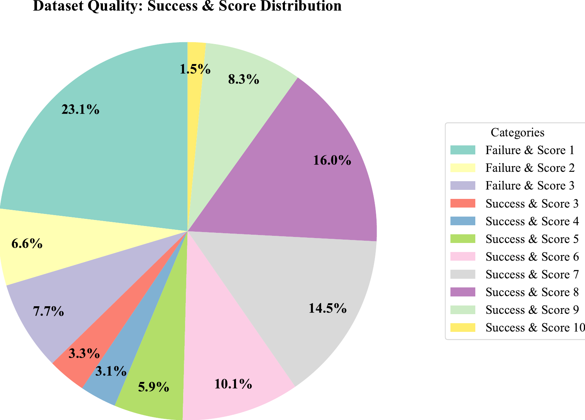

# Title: Trustworthy Evaluation of Robotic Manipulation: A New Benchmark and AutoEval Methods

- ArXiv: 2601.18723
- Authors: Mengyuan Liu, Juyi Sheng, , Peiming Li, Ziyi Wang, Tianming Xu, Tiantian Xu, Hong Liu, Corresponding author.
- Sections: 22
- Estimated tokens: 21.4k

## Contents

- I Introduction
- II Related Work
  - II-A Robotic Learning Datasets
  - II-B VA and VLA Models
  - II-C Action Quality Assessment (AQA)
- III The Eval-Actions Dataset
  - III-A Dataset Construction
  - III-B Data Annotation & Definition of Fine-Grained Action Quality
  - III-C Dataset Statistics
- IV Method
  - IV-A Rank-Guided Weight Optimization
  - IV-B AutoEval
- V Experiment
  - V-A Evaluation Metrics
    - V-A 1 Metrics for Fine-Grained Action Quality Assessment:
    - V-A 2 Success Classification Metrics
  - V-B Experimental Details.
  - V-C Experimental Results
  - V-D Cross-Embodiment Generalization
  - V-E Ablation Study.
- VI Conclusion
- References

## Abstract

###### Abstract

Driven by the rapid evolution of Vision-Action (VA) and Vision-Language-Action (VLA) models, imitation learning has significantly advanced robotic manipulation capabilities. However, evaluation methodologies have lagged behind, hindering the establishment of Trustworthy Evaluation for these behaviors. Current paradigms rely predominantly on binary success rates, failing to address the critical dimensions of trust: Source Authenticity (i.e., distinguishing genuine policy behaviors from human teleoperation) and Execution Quality (e.g., smoothness and safety). To bridge these gaps, we propose a comprehensive solution that combines the Eval-Actions benchmark and the AutoEval architecture. First, we construct the Eval-Actions benchmark to support trustworthiness analysis. Distinct from existing datasets restricted to successful human demonstrations, Eval-Actions innovatively integrates VA and VLA policy execution trajectories alongside human teleoperation data, explicitly including failure scenarios. This dataset is structured around three core supervision signals: Expert Grading (EG), Rank-Guided preferences (RG), and Chain-of-Thought (CoT). Building on this, we propose the AutoEval architecture: AutoEval Small (AutoEval-S) leverages Spatio-Temporal Aggregation for semantic assessment, augmented by an auxiliary Kinematic Calibration Signal to refine motion smoothness; AutoEval Plus (AutoEval-P) incorporates the Group Relative Policy Optimization (GRPO) paradigm to enhance logical reasoning capabilities. Experimental results demonstrate that AutoEval exhibits exceptional evaluation precision, achieving Spearman’s Rank Correlation Coefficients (SRCC) of 0.81 and 0.84 under the EG and RG protocols, respectively. Crucially, the framework possesses robust source discrimination capabilities, distinguishing between policy-generated and teleoperated videos with 99.6% accuracy, thereby establishing a rigorous standard for trustworthy robotic evaluation. Our project and code are available at https://term-bench.github.io/.

## I Introduction

Imitation Learning (IL) has emerged as a promising paradigm in robotics, enabling robots to autonomously perform tasks by mimicking human actions [34]. In recent years, significant advancements in artificial intelligence have propelled imitation learning to new heights. This progress has extended the applicability of robot learning to complex domains, such as biomimetic robotics [15, 41, 30] and wearable exoskeletons [24, 44]. The integration of deep learning techniques has further accelerated this development, yielding more powerful models that significantly enhance a robot’s ability to replicate human behaviors. Along with these technical advancements, the emergence of cost-effective data acquisition systems, such as ALOHA [13] and UMI [7], and the proliferation of open-source datasets like RLBench [19] and OpenX [8], have substantially lowered the barriers to implementing imitation learning. These innovations have laid the foundation for a diverse array of methods—including ACT [13], Diffusion Policy [5, 6], HDP [36], MP1 [29], RT-1 [3], RT-2 [4], RT-X [8], OpenVLA [21], and $\pi_{0}$ [2]—enabling robots to execute tasks with human-like dexterity or assist humans in achieving various objectives. Notably, these methods have demonstrated encouraging results on specific datasets and tasks, achieving success even in real-world applications.

> Figure 1: The Crisis of Evaluation Credibility and the Proposed Trustworthy Evaluation Solution. (Top) The Crisis: We identify two critical sources of ambiguity obstructing trustworthy evaluation: Gap 1 (Ambiguity in Execution Quality), where binary metrics mask shaky or unsafe execution (visualized as “Jerky Success” vs. “Smooth Success”), and Gap 2 (Ambiguity in Source Authenticity), where the provenance of “successful” demonstrations is unverifiable. (Bottom) Proposed Solution: Our Trustworthy Evaluation Framework bridges these gaps. Powered by the Eval-Actions Benchmark and the AutoEval Architecture (depicted as the green robot optimized via Supervised Fine-Tuning (SFT)), the system achieves precise Fine-Grained Action Quality assessment (SRCC 0.84) and robust Source Authenticity verification (99.6%), as shown in the green box. This significantly outperforms standard Vision-Language Models (VLMs) without SFT (red box) to ensure evaluation credibility.

> TABLE I: Comparison of Robotic Manipulation Datasets. Unlike training-centric datasets that maximize raw trajectory counts, Eval-Actions (Ours) maximizes annotation density, uniquely providing failure scenarios, hybrid trajectory sources, and Fine-Grained Quality Scoring for diagnostic assessment.

| Dataset                                                                                                         | Focus      | Raw     | Diagnostic Annotations | Arm | Collection | Modalities |                           |                     |
| --------------------------------------------------------------------------------------------------------------- | ---------- | ------- | ---------------------- | --- | ---------- | ---------- | ------------------------- | ------------------- |
| Traj.                                                                                                           | Failures   | Scoring | CoT                    |     |            |            |                           |                     |
| BridgeData V2 [35]                                                                                              | Training   | 60k     | ✗                      | ✗   | ✗          | Single     | Human+Script              | RGB-D, Text         |
| DobbE [27]                                                                                                      | Training   | 5.6k    | ✗                      | ✗   | ✗          | Single     | Tool-based                | RGB-D, Text         |
| Open X-Embodiment [8]                                                                                           | Training   | 1M+     | ✗                      | ✗   | ✗          | Mixed      | Aggregation               | RGB-D, PC, Text     |
| RH20T [11]                                                                                                      | Training   | 13k     | ✗                      | ✗   | ✗          | Single     | Teleop.                   | RGB-D, Force, Audio |
| DROID [20]                                                                                                      | Training   | 76k     | ✗                      | ✗   | ✗          | Single     | Teleop.                   | RGB-D, Text         |
| RoboMIND [38]                                                                                                   | Training   | 107k    | 1.6k                   | ✗   | ✗          | Mixed      | Teleop.                   | RGB-D, Text         |
| \rowcolorgray!15 Eval-Actions (Ours)                                                                         | Evaluation | 13k     | 2.8k                   | ✓   | ✓          | Mixed      | Hybrid (Teleop. & Policy) | RGB-D, Text         |
| ^∗Note: RoboMIND’s failure data primarily consists of re-grasping events rather than genuine terminal failures. |            |         |                        |     |            |            |                           |                     |

Despite these advancements, the field faces a crisis of credibility in evaluation. To truly validate a robot’s capability for real-world deployment, we must answer two fundamental questions: “How well is the task performed?” (Gap 1: Execution Quality) and “Is the performance genuinely autonomous?” (Gap 2: Authenticity). Current frameworks fail to provide definitive answers to either. As illustrated by Gap 1 in the Fig. [1](#figure-1), current evaluation metrics primarily overlook the quality of the robot’s actions during execution, focusing instead on binary task success or failure. Consider, for example, a task requiring a cup to be placed in a specific location. If Model A completes the task after numerous trial-and-error attempts accompanied by severe jittering, resulting in rigid and inefficient motions, while Model B executes the same task with smooth, refined, and stable actions, conventional metrics would indiscriminately deem both models a success (score 1). This simplistic binary approach fails to distinguish the superior trustworthiness of Model B, masking the potential safety risks hidden within Model A’s unstable behavior. Consequently, current benchmarks struggle to identify policies that are not only successful but also safe and reliable for real-world deployment. To address this limitation, we introduce “Fine-Grained Action Quality” as a core evaluation criterion. Unlike binary metrics, we define this metric as a comprehensive assessment of the execution process, explicitly quantifying smoothness, safety, and efficiency alongside task completion. To robustly measure this, our framework integrates Expert Grading (EG), Rank-Guided preferences (RG), and Chain-of-Thought (CoT) as three supervision signals to establish a holistic ground truth that aligns algorithmic scoring with human standards of trustworthy behavior. Furthermore, we introduce Eval-Actions, a benchmark enriched with these detailed annotations, providing a diagnostic basis for evaluating policy reliability. Complementing this, we propose AutoEval, a unified framework designed to assess robot learning strategies with precision by simultaneously verifying task success and evaluating the fine-grained quality of execution.

Beyond the ambiguity in execution quality (Gap 1), the trustworthiness of the evaluation is further compromised by the uncertainty of trajectory provenance (Gap 2). While recent learning methods report impressive results, verifying whether a “successful” demonstration originates from a robust autonomous policy or hidden human teleoperation remains an open challenge. This “Source Ambiguity”, combined with the aforementioned “Quality Ambiguity”, renders current benchmarks susceptible to manipulation and precludes fair comparison. As illustrated in Gap 2 of Fig. [1](#figure-1), visual success alone cannot guarantee the provenance of the behavior; distinguishing genuine policy execution from manual intervention remains a critical hurdle. To bridge this gap, we incorporate diverse policy-generated trajectories into our Eval-Actions dataset and introduce a specialized source discrimination mechanism within the AutoEval architecture. This integration enables the authoritative verification of Source Authenticity, ensuring that evaluated performances reflect genuine robotic autonomy rather than teleoperated counterfeits.

By addressing these challenges, we propose a holistic evaluation solution comprising the Eval-Actions benchmark and the AutoEval architecture. Our work aims to restore trust in robotic evaluation by establishing a comprehensive metric system that simultaneously verifies the fidelity of action (Quality) and the veracity of source (Authenticity), setting a new standard for transparent embodied intelligence. Our main contributions are as follows:

- •
  We establish a Trustworthy Evaluation Standard for robotic manipulation, shifting evaluation from opaque binary outcomes to fine-grained behavioral diagnosis. By quantifying smoothness, safety, and efficiency, we resolve the ambiguity where low-quality execution is mistaken for robust success.
- •
  We introduce Eval-Actions, the first dataset designed for evaluation integrity. Unlike training-centric corpora, it integrates failure scenarios and mixed trajectory sources (policy vs. human), supported by EG, RG, and CoT annotations to train trustworthy evaluators.
- •
  We propose the AutoEval framework, which achieves state-of-the-art (SOTA) scoring (0.84 SRCC) via Spatio-Temporal Aggregation and enhances physical reasoning using GRPO. Crucially, it provides an authoritative Authenticity Verification, distinguishing policy-generated actions from teleoperation with 99.6% accuracy.

> Figure 2: Overview of the Eval-Actions Benchmark. The figure visualizes the dataset structure: (Left) Task Diversity: Representative snapshots from our 150+ scenarios, covering both single-arm interactions (e.g., “Throw away trash”) and complex bimanual coordination (e.g., “Tidy medicine box”). (Middle) Detailed Case Study: A specific instantiation of the “Throw away trash” task shown on the left. Crucially, each task encompasses diverse demonstration data ranging from high-quality successes to failure scenarios—exemplified here by contrasting smooth teleoperation with jerky policy behaviors. (Right) Data Composition: The stack enumerates the dense multimodal signals encapsulated within each episode. This includes raw sensory data (RGB, Depth), precise kinematic records (7/14-DoF Joint Trajectories), and the Fine-Grained Quality Radar Chart, which explicitly quantifies the four core dimensions (Success, Smoothness, Safety, Efficiency) to enable diagnostic assessment.

## II Related Work

### II-A Robotic Learning Datasets

High-quality datasets have catalyzed the recent advancements in data-driven robotic manipulation. Pioneering efforts, such as BridgeData V1 and V2 [10, 35], established the importance of data scale for policy generalization by curating extensive single-arm teleoperation trajectories. Following this paradigm, project like DobbE [27], and DROID [20] expanded the diversity of manipulation data through distributed collection protocols. To tackle the challenge of cross-embodiment generalization, the Open X-Embodiment (OXE) dataset [8] aggregated over one million trajectories from laboratories worldwide, representing one of the greatest collaborative efforts to date. Furthermore, RH20T [11] enriched these resources by incorporating multi-modal signals, including force and audio, to facilitate dexterous manipulation tasks.

Despite these achievements, a critical gap remains: existing datasets are predominantly curated for imitation learning, focusing almost exclusively on successful expert demonstrations. As illustrated in Table [I](#table-1), mainstream benchmarks (e.g., OXE [8], DROID [20]) largely exclude failure scenarios, which are indispensable for learning error recovery and robust failure detection. While recent works like RoboMIND [38] have begun to introduce failure subsets, the field still lacks the fine-grained annotations necessary for diagnosing policy behaviors. Most evaluations rely solely on binary “Success Rate,” omitting dense supervision signals such as detailed Fine-Grained Action Quality Scoring and CoT reasoning.

To bridge this gap, we introduce the Eval-Actions benchmark. Distinct from training-centric datasets, Eval-Actions is designed for Trustworthy Evaluation. It comprises 13k trajectories spanning single and dual-arm tasks and, crucially, integrates a substantial volume of failure data (2.8k) and diverse trajectory sources (Teleoperation & Policy) alongside Action Quality Scoring and CoT annotations. This composition enables a shift from binary success metrics to a diagnostic assessment of both Execution Quality and Source Authenticity.

### II-B VA and VLA Models

The paradigm of robotic control has evolved from specialized primitives [22, 16, 12] to end-to-end learning. Early deep learning approaches transitioned towards Vision-Action (VA) policies, where neural networks directly map sensory observations to control commands. Recently, Generative AI has revolutionized this domain. Techniques such as Action Chunking with Transformers (ACT) [13] and Diffusion Policies [5] have demonstrated exceptional capabilities in modeling complex, multi-modal action distributions, enabling high-precision manipulation. Furthermore, methods like DP3 [43] and MP1 [29] have extended these capabilities by incorporating 3D point clouds, significantly enhancing spatial generalization.

Concurrent with these control advancements, the integration of linguistic semantics has catalyzed the emergence of Vision-Language-Action (VLA) models. Early language-conditioned approaches (e.g., PerAct [31], RVT [14]) trained policies from scratch on specific datasets (e.g., RLBench [19]). However, a paradigm shift occurred with the adoption of large-scale pre-trained VLMs. By grounding semantic reasoning in physical control, modern VLAs address open-ended tasks. RT-1 [3] and RT-2 [4] demonstrated that leveraging pre-trained backbones enables policies to inherit the generalization capabilities of internet-scale data. Recently, open-source initiatives—such as OpenVLA [21], Octo [32], and pi0 [2]—have democratized access by fine-tuning foundation models (e.g., Llama [33]) for robotics.

However, evaluation methodologies lag behind these model advancements. While VLAs approach human-like reasoning, validating their trustworthiness remains an unresolved challenge. Current assessments are predominantly restricted to binary success rates, which obscure critical factors necessary for real-world deployment. Specifically, this binary paradigm overlooks Fine-Grained Execution Quality, such as motion smoothness and safety assurances, and fails to verify Source Authenticity, leaving it ambiguous whether the observed behavior originates from a robust policy or hidden human teleoperation. Therefore, we propose a Trustworthy Evaluation framework to address these dual ambiguities specifically.

> Figure 3: Representative Task Statistics of the Eval-Actions. The top chart illustrates the distribution of the number of demonstrations for representative tasks, while the bottom chart displays the total duration (in seconds) for each corresponding task. These tasks cover diverse manipulation scenarios, including both single-arm and dual-arm operations.

### II-C Action Quality Assessment (AQA)

Action Quality Assessment (AQA) quantifies how well an action is executed, distinct from the classification task of action recognition. Extensively studied in computer vision, this domain finds robust applications in scoring competitive sports (e.g., diving, gymnastics, basketball) [40, 39, 45, 26] and evaluating surgical skills [23, 9].

However, in the realm of general-purpose robotic manipulation, AQA remains nascent. Unlike human sports where aesthetic execution is often the primary criterion, robotic AQA must prioritize functional metrics such as trajectory smoothness, safety margins, and execution efficiency. Current robotic evaluation methodologies are predominantly confined to binary success detection, failing to capture the granular quality of the execution process. The proposed Eval-Actions benchmark seeks to bridge this domain gap by formally adapting the AQA paradigm to robotics, enabling the precise quantification of Fine-Grained Action Quality to establish a rigorous standard for Trustworthy Evaluation.

## III The Eval-Actions Dataset

Our goal is to establish a Trustworthy Evaluation framework for VLA and VA policies by accurately assessing Fine-Grained Action Quality and verifying Source Authenticity. To this end, we construct Eval-Actions, a benchmark comprising human–robot demonstration videos enriched with fine-grained quality annotations.

### III-A Dataset Construction

To surmount the limitations of existing benchmarks regarding evaluation dimensions, we present the Eval-Actions dataset, as shown in Fig. [2](#figure-2). This dataset encompasses both single-arm and bimanual collaborative scenarios, such as bowl stacking and plate passing, as illustrated in our statistical analysis Fig. [3](#figure-3). Spanning a total duration of approximately 52 hours, Eval-Actions comprises over 13,000 demonstration episodes across more than 150 distinct tasks, utilizing heterogeneous manipulator configurations (e.g., ARX R5, UR5).

Distinguished from datasets such as RT-1 [3] or OXE [8], which primarily rely on successful human teleoperation data, Eval-Actions introduces two pivotal features. First, it employs a Hybrid Collection Strategy, aggregating data not only from 20 human operators with diverse professional backgrounds but also from execution trajectories generated by robotic policies across different architectures (including VA and VLA models), specifically to support Source Authenticity verification. Second, the dataset integrates Failure Data and Fine-Grained Quality Annotations. Unlike standard datasets restricted to successful demonstrations, Eval-Actions explicitly incorporates failure cases alongside Fine-Grained Action Quality scores. Critically, the dataset provides the CoT reasoning process behind these scores, establishing a foundation for training transparent and Trustworthy Evaluation models. Each sample is enriched with dense multimodal information, including RGB-D recordings (from both wrist-mounted and third-person perspectives), textual task descriptions, action trajectories, task success indicators, and three types of diagnostic annotations. Furthermore, to address the distribution of policy-generated data, we curated a specialized evaluation subset (Eval-Actions Small, EAS) designed to explicitly distinguish between teleoperated and policy-generated trajectories, as well as to verify task execution outcomes.

### III-B Data Annotation & Definition of Fine-Grained Action Quality

To mitigate subjectivity in manual evaluation, we established a standardized protocol for “Fine-Grained Action Quality”, anchored in four core dimensions: Success Rate, Smoothness, Safety, and Efficiency. Specifically, Success Rate serves as a binary indicator, while Smoothness is quantified via kinematic metrics, including joint angular velocity and acceleration variance. Safety is assessed by monitoring physical anomalies, specifically penalizing unintended collisions or hazardous interactions with the environment. Finally, Efficiency is determined by task completion time; to ensure fairness across varying initialization distances, we normalize these times against baseline operator performance within partitioned spatial zones. Based on these metrics, our annotation framework integrates three complementary methodologies to comprehensively quantify the Fine-Grained Action Quality:

Expert Grading (EG). As illustrated in Fig. [4](#figure-4), we engage 10 human experts to assess action quality, categorizing skills into three tiers (Excellent, Good, Poor) based on smoothness, safety, and efficiency. The final ground truth is derived from the average of these ratings to minimize individual bias.

Rank-Guided Weight Optimization (RG). This approach aligns computational metrics with human intuition. Experts first rank batches of execution videos. We then formulate a composite score—aggregating smoothness, success indicators, collision penalties, and human scores—and optimize the weights using Genetic Algorithm (GA) to minimize the discrepancy between the scores and expert rankings.

Chain-of-Thought Annotation (CoT). To enhance interpretability, domain experts provide not only numerical quality scores but also detailed Chain-of-Thought reasoning, offering explicit justifications for each evaluation.

> Figure 4: Distribution of Expert Grading across the Eval-Actions Small subset.

### III-C Dataset Statistics

Eval-Actions contains approximately 52 hours of manipulation videos across 150 distinct robotic tasks, including grasping, placing, pushing, and other fundamental actions. The dataset includes demonstrations from 20 human operators with diverse professional backgrounds (e.g., robotics engineers, students, and non-experts) as well as trajectories generated by multiple VLA and VA policies. In total, the dataset comprises 13k annotated action trajectories, with an average duration of 14 seconds per trajectory, as shown in Fig. [3](#figure-3).

In Eval-Actions, camera configurations vary according to the distinct robotic morphologies, encompassing perspectives such as head, front, and wrist views, as illustrated in the right of Fig. [2](#figure-2). Specifically, in Eval-Actions Small (EAS), each sample is accompanied by synchronized multi-view recordings: (1) a wrist-mounted camera view, (2) a head-mounted camera view, and (3) a static third-person view. Additionally, every trajectory includes the full 7-DoF joint angles and end-effector states, task description, binary success flag, deployment context (real-world or simulation), and a composite quality score derived from expert evaluation and objective metrics.

As illustrated in Fig. [4](#figure-4), the dataset exhibits a diverse score distribution (1–10) and success outcomes on EG. Specifically, 37.4% of trajectories are failures, primarily concentrated in the lowest quality tier (Score 1, 23.1%). The remaining 62.6% are successful executions displaying a wide quality spectrum. Notably, high-quality demonstrations are well-represented, with Score 8 alone comprising 16.0%, ensuring a robust balance between suboptimal and high-fidelity examples.

> Figure 5: Overview of the proposed AutoEval framework. The system processes a robot manipulation video sequence (e.g., 32 frames) alongside kinematic prompts. Top (AutoEval-S): Designed for Expert Grading and Rank-Guided tasks, this branch employs a Spatio-Temporal Aggregation Strategy to compress high-frequency motion details into composite visual tokens. It generates structured text predictions; following format decomposition, the model is optimized via Supervised Fine-Tuning (SFT) using Cross-Entropy Loss. Bottom (AutoEval-P): Tailored for Chain-of-Thought (CoT) reasoning, this branch adopts the Group Relative Policy Optimization (GRPO) [28, 17] paradigm. The policy model generates multiple reasoning paths (containing <think> tokens), optimized against a hybrid reward function comprising content accuracy ($r_{Content}$) and format constraints ($r_{Format}$) to enhance physical reasoning capabilities.

## IV Method

In this section, we present a comprehensive framework for automated robotic skill assessment. To mitigate subjectivity in manual annotation, we establish three core dimensions (EG, RG, CoT) of Fine-Grained Action Quality as the evaluation Ground Truth (GT). First, we introduce a Rank-Guided Weight Optimization strategy that employs a Genetic Algorithm (GA) to calibrate a kinematics-based scoring function, thereby generating reliable GT annotations for the dataset. Leveraging these high-quality supervision signals, we then propose AutoEval, comprising two variants: AutoEval Small (AutoEval-S) and AutoEval Plus (AutoEval-P). This VLM-based neural architecture is designed to extract spatio-temporal features from robot trajectories for robust and autonomous policy evaluation.

### IV-A Rank-Guided Weight Optimization

Determining the optimal relative importance of kinematic metrics and penalty factors is non-trivial. To align the automated assessment with human expert judgment, we formulated a hyperparameter optimization problem.

Let $\mathbf{\theta}=\{w_{vel},\dots,w_{len},\lambda_{coll},\lambda_{fail}\}$ represent the vector of tunable parameters. We first define the raw algorithmic score $S_{raw}$ as a weighted combination of normalized kinematic metrics. Crucially, if safety or success constraints are violated, the corresponding kinematic metrics $s_{i}$ are penalized by divisors $\lambda\in\mathbf{\theta}$ before aggregation:

$$
S_{raw}(\mathbf{\theta})=\frac{\sum w_{i}\cdot s^{\prime}_{i}}{\sum w_{i}},\quad s^{\prime}_{i}=\begin{cases}s_{i}/\lambda&\text{if violation}\\ s_{i}&\text{otherwise}\end{cases}(1)
$$

We employed a Genetic Algorithm (GA) to search for the optimal parameters $\boldsymbol{\theta}^{*}$ that minimize the ranking discrepancy between $S_{raw}$ and the ground-truth expert ranking $R_{human}$. The optimization utilizes real-valued encoding and tournament selection, with a loss function defined as the Mean Absolute Rank Difference:

$$
\mathcal{L}(\mathbf{\theta})=\frac{1}{N}\sum_{k=1}^{N}|R_{human}^{(k)}-R_{raw}^{(k)}(\mathbf{\theta})|(2)
$$

Since the optimization objective $\mathcal{L}$ focuses solely on relative ordering, the magnitude of $S_{raw}(\mathbf{\theta}^{*})$ may differ from the human scoring scale (e.g., 0-10). To ensure consistency, we perform a final Distribution Alignment via Z-score normalization. The final calibrated score $S_{final}$ is computed as:

$$
S_{final}=\mu_{human}+\sigma_{human}\cdot\left(\frac{S_{raw}(\mathbf{\theta}^{*})-\mu_{raw}}{\sigma_{raw}}\right)(3)
$$

where $\mu_{raw}$ and $\sigma_{raw}$ are the statistical mean and standard deviation of the raw scores across the dataset computed using the optimal weights $\mathbf{\theta}^{*}$, while $\mu_{human}$ and $\sigma_{human}$ are the corresponding statistics derived from expert annotations.

### IV-B AutoEval

To address the diverse granularity of the three GT labels, we establish a unified evaluation framework tailored to specific assessment objectives. Specifically, we employ the AutoEval-S architecture for EG and RG tasks, while reserving the enhanced AutoEval-P variant for the more complex CoT-based action quality assessment.

Task Formulation. For a given manipulation episode of temporal length $T$, the visual input is discretized into a sequence of $N$ keyframes $\mathcal{F}=\{f_{i}\}_{i=1}^{N},N\leq T$. To bridge the gap between kinematic data and semantic understanding, we formulate the action trajectory as a joint state matrix $\mathbf{Q}\in\mathbb{R}^{T\times J}$, where $J\in\{7,14\}$ denotes the degrees of freedom. We derive the instantaneous angular velocity $\mathbf{v}_{t}$ and angular acceleration $\boldsymbol{\alpha}_{t}$ via discrete first-order difference operations (assuming unit time intervals):

$$
\mathbf{v}_{t}=\mathbf{q}_{t}-\mathbf{q}_{t-1},\quad\boldsymbol{\alpha}_{t}=\mathbf{v}_{t}-\mathbf{v}_{t-1},(4)
$$

where $\mathbf{q}_{t}\in\mathbb{R}^{J}$ represents the joint configuration at time step $t$. To quantify motion smoothness and identify potential mechanical jitter, we compute the temporal variance vectors for velocity and acceleration, denoted as $\mathbf{s}_{v},\mathbf{s}_{\alpha}\in\mathbb{R}^{J}$. Adopting a worst-case formulation to capture instability, we define the uniformity metrics ($\mathcal{U}_{v},\mathcal{U}_{\alpha}$) as the maximum variance across all joints, and calculate the mean absolute velocity $\mu_{v}$ to represent global motion intensity:

$$
\begin{split}\mathcal{U}_{v}&=\max_{j\in\{1\dots J\}}(\mathbf{s}_{v}[j]),\quad\mathcal{U}_{\alpha}=\max_{j\in\{1\dots J\}}(\mathbf{s}_{\alpha}[j]),\\ \mu_{v}&=\frac{1}{T\cdot J}\sum_{t=1}^{T}\sum_{j=1}^{J}|v_{t,j}|.\end{split}(5)
$$

These derived physical metrics are serialized into a structured textual descriptor $I_{phys}$. We incorporate $I_{phys}$ as an auxiliary Kinematic Calibration Signal. It compensates for video compression artifacts by providing explicit motion statistics, ensuring precise smoothness quantification without dominating the semantic evaluation.
Consequently, the multimodal model $\Phi_{\theta}$, parameterized by $\theta$, processes both the visual keyframes and the physics-aware prompt to regress the action quality score $\hat{S}$, predict task success $\hat{O}$ (Success/Failure), and classify the trajectory source $\hat{C}$ (Policy vs. Teleoperation):

$$
(\hat{S},\hat{O},\hat{C})=\Phi_{\theta}\left(\mathcal{F},I_{phys}(\mathcal{U}_{v},\mathcal{U}_{\alpha},\mu_{v})\right).(6)
$$

> Figure 6: Qualitative Comparison of Fine-Grained Action Quality Assessment. The figure illustrates performance across two distinct tasks: bowl stacking and towel folding with handover. (Top) This section highlights the efficacy of the Spatio-Temporal Aggregation Strategy in AutoEval-S, which successfully captures subtle motion defects (e.g., “duplicate crawling”), whereas InternVL3.5-4B fails to detect such nuances. (Bottom) The baseline QwenVL3-4B suffers from severe hallucination, describing a failed handover as “seamless” and assigning an inflated quality score (8). In contrast, AutoEval-P accurately diagnoses the physical anomaly (“towel is dropped”), aligning its reasoning with visual evidence to penalize the score (5). This demonstrates that the GRPO paradigm effectively mitigates linguistic hallucinations, ensuring evaluation trustworthiness.

AutoEval-S. In the AutoEval-S framework, while increasing the number of sampled frames $N$ enhances temporal reasoning, it incurs a heavy computational burden, manifesting as excessive visual tokens and prohibitive VRAM usage. To mitigate the trade-off between temporal resolution and computational efficiency, we propose a Spatio-Temporal Aggregation Strategy, as illustrated in the top of Fig. [5](#figure-5). Instead of discarding dense frames between two consecutive keyframes $f_{i}$ and $f_{i+1}$, we spatially concatenate $k$ intermediate frames alongside the target keyframe $f_{i+1}$ into a composite image. This composite is then resized to the standard encoder resolution, yielding a refined sequence $\mathcal{F}^{\prime}=\{f^{\prime}_{i}\}_{i=1}^{N}$. Subsequently, the VLM is optimized via Supervised Fine-Tuning (SFT) on these aggregated inputs. This technique compresses high-frequency motion details into the fixed token budget, maximizing temporal information density to capture dynamic motion patterns without inflating parameter overhead.

For model optimization, we cast action quality assessment, success detection, and source classification as a unified conditional text generation task. We construct the ground-truth target sequence $\mathbf{Y}$ by serializing the scalar quality score $S$, the success label $O$, and the source label $C$ into a structured textual format. The model is trained to autoregressively generate this sequence, minimizing the Negative Log-Likelihood of the ground-truth tokens given the multimodal context:

$$
\mathcal{L}=-\sum_{t=1}^{L}\log P_{\theta}(y_{t}\mid y_{<t},\mathcal{F}^{\prime},I_{phys}),(7)
$$

where $L$ is the length of the target text sequence, $y_{t}$ represents the $t$-th token in $\mathbf{Y}$, $y_{<t}$ denotes the preceding context tokens, and $\theta$ parameterizes the VLM ($\Phi_{\theta}$). This formulation ensures that the model learns to explicitly map multimodal inputs to precise quantitative ($S$) and categorical ($O,C$) outputs in a coherent linguistic format.

AutoEval-P. Addressing the complexity of CoT generation, we adopt the Group Relative Policy Optimization (GRPO) paradigm [28, 17], integrating Reinforcement Learning (RL) to fortify the VLM’s physical reasoning capabilities. We formulate the training as a policy optimization problem, governed by a hybrid reward function $R_{total}$ designed to encourage logically self-consistent reasoning.

The reward architecture first addresses continuous action quality scoring. To mitigate the sparsity of binary rewards in regression tasks, we formulate a Gaussian kernel-based soft regression mechanism. Given the predicted score $\hat{S}$ (parsed from the CoT output) and the ground truth $S$, the score reward $R_{score}$ is defined as an exponentially decaying function of the squared error, modulated by a sensitivity hyperparameter $\sigma$:

$$
R_{score}=\exp\left(-\frac{(S-\hat{S})^{2}}{2\sigma^{2}}\right).(8)
$$

> TABLE II: Comparative Performance Analysis on the Eval-Actions Benchmark. We report results across three protocols: Expert Grading (EG), Rank-Guided (RG), and Chain-of-Thought (CoT). To quantify the domain gap, we include the zero-shot performance of representative VLMs without Supervised Fine-Tuning (w/o SFT). The near-zero correlations (e.g., SRCC $\approx$ 0.02) in these baselines highlight the necessity of our fine-tuning pipeline. Best results are highlighted in bold.

| Method                        | Label                         | Score Prediction | Success Prediction  | Source Prediction    |                      |                     |                      |      |      |
| ----------------------------- | ----------------------------- | ---------------- | ------------------- | -------------------- | -------------------- | ------------------- | -------------------- | ---- | ---- |
| SRCC ($\uparrow$)             | $R_{\ell_{2}}$ ($\downarrow$) | Acc ($\uparrow$) | F1 (%) ($\uparrow$) | AUC (%) ($\uparrow$) | Acc (%) ($\uparrow$) | F1 (%) ($\uparrow$) | AUC (%) ($\uparrow$) |      |      |
| InternVL3.5-4B (w/o SFT )[37] | EG                            | 0.01             | 31.90               | 56.2                 | 66.9                 | 51.2                | 46.6                 | 51.3 | 50.5 |
| RG                            | 0.02                          | 27.97            | 62.3                | 76.8                 | 50.0                 | 38.8                | 56.0                 | 50.0 |      |
| CoT                           | –                             | –                | –                   | –                    | –                    | –                   | –                    | –    |      |
| QwenVL3-4B (w/o SFT ) [42]    | EG                            | –                | –                   | –                    | –                    | –                   | –                    | –    | –    |
| RG                            | –                             | –                | –                   | –                    | –                    | –                   | –                    | –    |      |
| CoT                           | –                             | –                | –                   | –                    | –                    | –                   | –                    | –    |      |
| SmolVLM2.2B [25]              | EG                            | 0.41             | 9.70                | 69.3                 | 73.9                 | 68.2                | 83.9                 | 81.2 | 83.4 |
| RG                            | 0.39                          | 10.57            | 66.4                | 71.3                 | 65.5                 | 76.5                | 73.1                 | 76.1 |      |
| CoT                           | 0.31                          | 12.17            | 62.1                | 67.5                 | 61.0                 | 68.6                | 66.5                 | 68.8 |      |
| QwenVL2.5-3B [1]              | EG                            | 0.62             | 7.91                | 76.1                 | 81.2                 | 73.8                | 98.7                 | 98.4 | 98.7 |
| RG                            | 0.64                          | 10.21            | 78.4                | 83.2                 | 76.0                 | 98.7                | 98.4                 | 98.7 |      |
| CoT                           | 0.46                          | 9.25             | 69.1                | 74.3                 | 67.6                 | 80.6                | 78.1                 | 80.4 |      |
| InternVL3.5-4B [37]           | EG                            | 0.80             | 3.84                | 90.0                 | 92.1                 | 88.1                | 94.9                 | 93.3 | 94.9 |
| RG                            | 0.81                          | 4.93             | 90.6                | 92.5                 | 89.6                 | 98.7                | 98.3                 | 98.4 |      |
| CoT                           | 0.63                          | 5.68             | 81.7                | 84.2                 | 81.0                 | 85.0                | 83.6                 | 85.0 |      |
| QwenVL3-4B [42]               | EG                            | 0.78             | 4.69                | 90.2                 | 92.4                 | 88.2                | 96.8                 | 95.9 | 96.4 |
| RG                            | 0.82                          | 4.55             | 91.0                | 92.9                 | 88.8                 | 99.1                | 98.9                 | 96.4 |      |
| CoT                           | 0.64                          | 5.68             | 81.0                | 84.0                 | 80.3                 | 85.8                | 83.5                 | 85.4 |      |
| \rowcolorgray!20 AutoEval-S   | EG                            | 0.81             | 3.45                | 90.6                 | 92.8                 | 88.5                | 99.1                 | 98.7 | 99.0 |
| \rowcolorgray!20 AutoEval-S   | RG                            | 0.84             | 3.49                | 91.0                 | 93.0                 | 90.1                | 99.6                 | 99.5 | 99.5 |
| \rowcolorgray!20 AutoEval-P   | CoT                           | 0.70             | 4.45                | 83.0                 | 86.4                 | 81.2                | 86.9                 | 88.7 | 86.2 |

**Algorithm 1 GRPO Training for AutoEval-Plus**

- 0: Dataset $\mathcal{D}$ , Reference Policy $\pi_{ref}$ , Group Size $G$ , KL coef $\beta$
- 1: for each iteration do
- 2: Sample batch of inputs $x=(\mathcal{F},I_{phys})$ from $\mathcal{D}$
- 3: for each $x$ in batch do
- 4: Sample $G$ outputs $\{y_{1},...,y_{G}\}\sim\pi_{\theta}(\cdot|x)$
- 5: Compute Rewards $R_{i}=R_{total}(y_{i})$ using Eq. 10
- 6: Compute Advantage $A_{i}=(R_{i}-\text{mean}(R))/(\text{std}(R)+\epsilon)$
- 7: end for
- 8: Compute Loss $\mathcal{L}_{GRPO}$ with KL penalty (Eq. 12)
- 9: Update $\pi_{\theta}$ via gradient descent
- 10: end for

For the binary classification tasks, we evaluate the predicted task success $\hat{O}$ and source $\hat{C}$ against their respective ground truths $O$ and $C$. We employ indicator functions $\mathbb{I}(\cdot)$ to yield discrete rewards $R_{succ}=\mathbb{I}(\hat{O}=O)$ and $R_{src}=\mathbb{I}(\hat{C}=C)$. To balance the contribution of each sub-task, the consolidated Content Accuracy Reward $R_{acc}$ is formulated as a weighted summation, where $\omega_{score},\omega_{succ},\omega_{src}$ denote the task-specific weights:

$$
R_{acc}=\omega_{score}\cdot R_{score}+\omega_{succ}\cdot R_{succ}+\omega_{src}\cdot R_{src}.(9)
$$

Furthermore, to prevent structural degradation during the exploration phase, we introduce a Format Reward $R_{fmt}$ that imposes constraints on the generated text structure. The final global reward $R_{total}$ is computed as a linear combination of the content and format components, controlled by a balancing factor $\gamma$:

$$
R_{total}=(1-\gamma)\cdot R_{acc}+\gamma\cdot R_{fmt}.(10)
$$

Following the definition of the global reward, we employ the GRPO algorithm to update the model parameters $\theta$ efficiently. GRPO offers a distinct advantage over standard PPO by eliminating the need for a separate value network, thereby reducing the computational footprint. Specifically, for each input query $x=(\mathcal{F},I_{phys})$, we treat the VLM $\Phi_{\theta}$ as a stochastic policy $\pi_{\theta}$. We sample a group of $G$ distinct CoT outputs $\{y_{1},y_{2},\dots,y_{G}\}$ from the current policy $\pi_{\theta}$.

First, we compute the total reward for each output utilizing Eq. [10](https://arxiv.org/html/2601.18723v1#S4.E10) and derive the advantage value $A_{i}$. To stabilize training and reduce variance, the advantage is formulated via group-wise normalization:

$$
A_{i}=\frac{R_{total}(y_{i})-\mu_{group}}{\sigma_{group}+\epsilon},(11)
$$

where $\mu_{group}$ and $\sigma_{group}$ represent the mean and standard deviation of the rewards within the sampled group, and $\epsilon$ is a small constant for numerical stability. The final optimization objective is to maximize the expected policy gradient. To prevent the model from deviating excessively from its initial linguistic capabilities (catastrophic forgetting), we incorporate a Kullback-Leibler (KL) divergence penalty between the current policy $\pi_{\theta}$ and the reference policy $\pi_{ref}$. The GRPO objective function $\mathcal{J}_{GRPO}$ is formalized as:

$$
\begin{split}\mathcal{J}_{GRPO}(\theta)=\mathbb{E}_{x\sim\mathcal{D}}\bigg[\frac{1}{G}\sum_{i=1}^{G}\bigg(&\frac{\pi_{\theta}(y_{i}|x)}{\pi_{old}(y_{i}|x)}A_{i}\\ &-\beta\mathbb{D}_{KL}(\pi_{\theta}||\pi_{ref})\bigg)\bigg],\end{split}(12)
$$

where $\beta$ controls the strength of the KL regularization, ensuring that the enhanced reasoning capabilities do not compromise general language fluency.

## V Experiment

To evaluate performance across diverse dimensions, we benchmark three specific tasks: Fine-Grained Action Quality Assessment (Scoring), Source Identification (distinguishing between human teleoperation and policy-generated trajectories), and Success Detection. All experiments in this section are conducted on the EAS subset to ensure a balanced data distribution.

### V-A Evaluation Metrics

To comprehensively assess our model’s performance, we employ two distinct sets of metrics corresponding to continuous action quality scoring (regression) and binary task success classification.

#### V-A 1 Metrics for Fine-Grained Action Quality Assessment:

We utilize two metrics to evaluate the alignment between the predicted scores $s_{p}$ and the ground-truth human annotations $s_{g}$.

- •
  Spearman’s Rank Correlation Coefficient (SRCC):
  SRCC assesses the monotonic relationship between predictions and ground-truth labels, defined as the Pearson correlation computed on the variable ranks:
  $\rho=\frac{\sum_{i=1}^{N}(r_{g,i}-\bar{r}_{g})(r_{p,i}-\bar{r}_{p})}{\sqrt{\sum_{i=1}^{N}(r_{g,i}-\bar{r}_{g})^{2}}\sqrt{\sum_{i=1}^{N}(r_{p,i}-\bar{r}_{p})^{2}}},$
  (13)
  where $r_{g,i}$ and $r_{p,i}$ denote the ranks of the ground-truth and predicted scores, respectively. Unlike absolute error metrics (e.g., MSE), SRCC is insensitive to the numerical scale, making it robust to the inherent subjectivity and non-linearity of human grading. A value approaching 1.0 indicates that the model correctly captures the relative quality order of trajectories.
- •
  Relative L2 Error $R_{\ell_{2}}$:
  To quantify the magnitude of prediction error relative to the scoring scale, we report the range-normalized mean squared error:
  $R_{\ell_{2}}=\frac{100}{N}\sum_{i=1}^{N}\left(\frac{s_{g,i}-s_{p,i}}{s_{max}-s_{min}}\right)^{2},$
  (14)
  where $s_{max}$ and $s_{min}$ represent the boundaries of the ground-truth score range.

#### V-A 2 Success Classification Metrics

For the binary task of success determination, raw logits are converted to probabilities via a Sigmoid function and binarized with a 0.5 threshold. We report standard classification metrics:

- •
  Accuracy (Acc %): The overall proportion of correctly classified trajectories.
- •
  F1-Score (F1 %): The harmonic mean of Precision and Recall. We prioritize F1 over Accuracy to provide a robust assessment given the potential class imbalance in robotic datasets (e.g., scarcity of failure cases).
- •
  Area Under the ROC Curve (AUC %): The integral of the Receiver Operating Characteristic curve. AUC provides a comprehensive measure of the model’s discriminative ability independent of a decision threshold.

### V-B Experimental Details.

We employ SmolVLM2-2.2B [25], QwenVL2.5-3B [1], QwenVL3-4B [42], and InternVL3.5-4B [37] as baselines to conduct experiments on the three aforementioned dataset annotations. Each model is fine-tuned with LoRA [18] for only 20 epochs, and the checkpoint yielding the minimum $\text{R-}L_{2}$ loss is selected as the optimal model. The learning rate is uniformly set to 1e-4, the batch size is set to 4, and 8 frames are fed as the input.

> Figure 7: Evolution of Individual Reward Components during Training. The figure visualizes the trajectories of the cumulative reward and its constituent terms (Score, Source, Success, and Accuracy) across training steps. Notably, the score reward exhibits steady convergence, significantly contributing to the maximization of the overall objective and validating the alignment of reasoning with fine-grained quality standards.

### V-C Experimental Results

Table [II](#table-2) presents the comprehensive evaluation results across three label settings: EG, RG, and CoT.

Fine-Grained Action Quality Assessment (EG & RG).
In this task, we evaluate the model’s capacity to quantify Fine-Grained Action Quality under both Expert Grading (EG) and Rank-Guided (RG) protocols. As detailed in Table [II](#table-2), a significant domain gap is observed: representative VLMs without SFT fail to correlate with human judgments (SRCC $\approx$ 0.02), highlighting the necessity of domain-specific fine-tuning. Post-SFT, baseline performance generally scales with model size (e.g., InternVL3.5-4B exhibits competitive performance with an SRCC of 0.80). However, AutoEval-S consistently establishes a new SOTA. Specifically, under the EG protocol, it achieves a superior SRCC of 0.81 and the lowest regression error ($R_{\ell_{2}}=\textbf{3.45}$); under the RG protocol, it further elevates the SRCC to 0.84, demonstrating exceptional discriminative capability in discerning relative trajectory quality. Beyond scoring precision, AutoEval-S delivers robust diagnostic performance, achieving task Success Prediction accuracies of 90.6% (EG) and 91.0% (RG), alongside a near-perfect Source Prediction accuracy of 99.6% (RG).

This comprehensive performance gain stems directly from the Spatio-Temporal Aggregation Strategy. Unlike baselines restricted to sparse keyframes, this strategy preserves high-frequency motion dynamics within the feature space, enabling the detection of subtle mechanical instabilities. As illustrated in the top row of Fig. [6](#figure-6), AutoEval-S successfully captures fine-grained motion defects (e.g., “duplicate crawling”), whereas baselines fail to perceive such temporal nuances. This enhanced sensitivity ensures reliability across both absolute scoring and relative ranking, effectively establishing a stable physical grounding for trustworthy evaluation.

> TABLE III: Generalization Performance on Franka Embodiment.

| Method            | Label                         | Score | Success | Source |     |
| ----------------- | ----------------------------- | ----- | ------- | ------ | --- |
| SRCC ($\uparrow$) | $R_{\ell_{2}}$ ($\downarrow$) | Acc   | Acc     |        |     |
| AutoEval-S        | EG                            | 0.71  | 5.89    | 80     | 90  |
| AutoEval-S        | RG                            | 0.75  | 6.12    | 85     | 90  |
| AutoEval-P        | CoT                           | 0.54  | 8.65    | 75     | 80  |

> TABLE IV: Ablation study on input frame density: Evaluation results using 16 input frames under Expert Grading Labels (EG).

| Method                      | Score Prediction              | Success Prediction | Source Prediction   |                      |                      |                     |                      |      |
| --------------------------- | ----------------------------- | ------------------ | ------------------- | -------------------- | -------------------- | ------------------- | -------------------- | ---- |
| SRCC ($\uparrow$)           | $R_{\ell_{2}}$ ($\downarrow$) | Acc ($\uparrow$)   | F1 (%) ($\uparrow$) | AUC (%) ($\uparrow$) | Acc (%) ($\uparrow$) | F1 (%) ($\uparrow$) | AUC (%) ($\uparrow$) |      |
| SmolVLM2.2B [25]            | 0.55                          | 8.0                | 79.1                | 83.3                 | 77.5                 | 88.3                | 86.9                 | 88.4 |
| QwenVL2.5-3B [1]            | 0.71                          | 5.93               | 83.3                | 87.5                 | 80.1                 | 99.1                | 98.9                 | 99.2 |
| InternVL3.5-4B [37]         | 0.81                          | 3.45               | 92.3                | 93.9                 | 91.6                 | 99.8                | 99.7                 | 99.8 |
| QwenVL3-4B [42]             | 0.81                          | 3.57               | 90.8                | 92.9                 | 88.8                 | 99.4                | 99.2                 | 99.3 |
| \rowcolorgray!20 AutoEval-S | 0.82                          | 3.31               | 92.5                | 94.0                 | 92.0                 | 99.8                | 99.7                 | 99.8 |

> TABLE V: Ablation study on the number of Aggregation Frames: Evaluation results using 8 input frames under EG and RG.

| Stitched Frames                  | Label                         | Score Prediction | Success Prediction  | Source Prediction    |                      |                     |                      |      |      |
| -------------------------------- | ----------------------------- | ---------------- | ------------------- | -------------------- | -------------------- | ------------------- | -------------------- | ---- | ---- |
| SRCC ($\uparrow$)                | $R_{\ell_{2}}$ ($\downarrow$) | Acc ($\uparrow$) | F1 (%) ($\uparrow$) | AUC (%) ($\uparrow$) | Acc (%) ($\uparrow$) | F1 (%) ($\uparrow$) | AUC (%) ($\uparrow$) |      |      |
| \rowcolorgray!20                 | EG                            | 0.81             | 3.45                | 90.6                 | 92.8                 | 88.5                | 99.1                 | 98.7 | 99.0 |
| \rowcolorgray!20 2 $\times$ 2 | RG                            | 0.84             | 3.49                | 91.0                 | 93.0                 | 90.1                | 99.6                 | 99.5 | 99.5 |
| 3 $\times$ 3                     | EG                            | 0.76             | 4.61                | 85.9                 | 89.2                 | 83.5                | 97.6                 | 96.9 | 97.4 |
| RG                               | 0.77                          | 5.57             | 86.7                | 89.7                 | 84.7                 | 98.9                | 98.5                 | 98.7 |      |
| 4 $\times$ 4                     | EG                            | 0.60             | 8.28                | 76.4                 | 81.6                 | 74.0                | 97.3                 | 96.5 | 97.1 |
| RG                               | 0.61                          | 13.00            | 74.2                | 81.2                 | 69.1                 | 97.9                | 97.3                 | 97.5 |      |

CoT Annotation.
The CoT evaluation protocol imposes the most rigorous demands on cognitive reasoning, necessitating the generation of a logically self-consistent rationale prior to scoring. Experimental results reveal significant performance degradation across all baselines; notably, even the robust QwenVL3-4B suffers an SRCC drop to 0.64. We attribute this decline to the informational dilution effect, where the generation of lengthy reasoning tokens inevitably diverts the model’s attention resources away from the precise numerical regression task.
In contrast, AutoEval-P, empowered by the GRPO paradigm, exhibits remarkable resilience, securing a superior SRCC of 0.70 and a Success Prediction accuracy of 83.0%. While this correlation is numerically lower than the non-CoT variant (AutoEval-S), it represents a strategic trade-off: exchanging a marginal drop in regression precision for critical interpretability—transforming the metric from a “black box” into a transparent diagnostic tool.

As illustrated in Fig. [7](#figure-7), this resilience underscores the necessity of Reinforcement Learning: by maximizing a hybrid reward function with logical consistency constraints, GRPO incentivizes the model to causally align its physical observations with the final score during exploration. This alignment is vividly exemplified in the bottom row of Fig. [6](#figure-6), where AutoEval-P correctly diagnoses a “towel drop” anomaly in a dual-arm task and penalizes the score (5), whereas the baseline hallucinates a “seamless” transfer with an inflated score (8). Consequently, AutoEval-P maintains scoring fidelity even during complex long-horizon reasoning, effectively mitigating the hallucination and logic-score misalignment issues prevalent in standard baselines.

Summary and Analysis.
Synthesizing the experimental results across the three protocols (EG, RG, and CoT) yields critical insights regarding the establishment of Trustworthy Evaluation.
First, the superior performance of AutoEval-S under the EG and RG protocols (achieving an SRCC of up to 0.84) confirms that the proposed Spatio-Temporal Aggregation Strategy successfully bridges the gap in Fine-Grained Action Quality (Gap 1). By aligning closely with these expert standards, the model demonstrates the capacity to diagnose execution nuances, such as mechanical jitter, that binary metrics fail to capture.
Second, the consistent high precision in Source Prediction reaching 99.6% addresses the gap in Source Authenticity (Gap 2). This validates the framework’s ability to act as an authoritative verification mechanism, effectively distinguishing between human teleoperation and policy-generated behaviors.
Finally, the results under the CoT protocol demonstrate that AutoEval-P, empowered by GRPO, achieves a crucial balance between scoring fidelity and logical reasoning, thereby ensuring the transparency and interpretability of the evaluation process.
Furthermore, we extended our evaluation to include additional methodological verifications; these comprehensive analyses are detailed in the Supplementary Material.

### V-D Cross-Embodiment Generalization

To assess the generalizability of the AutoEval framework to out-of-distribution scenarios, we evaluated its performance on an unseen embodiment (i.e., the Franka robot).
As presented in Table [III](#table-3), despite the significant domain gap in visual morphology and kinematics compared to the training data, the framework demonstrates robust adaptability.
Specifically, AutoEval-S achieves SRCC values of 0.71 and 0.75 under the EG and RG protocols, respectively, indicating an effective transfer of action quality assessment capabilities.
Furthermore, the model maintains high performance in auxiliary tasks, reaching an accuracy of 85% in Success Prediction and maintaining a robust 90% in Source Prediction under the RG setting.
Even utilizing AutoEval-P under the challenging CoT protocol, the framework retains a correlation of 0.54 and achieves 80% accuracy in Source Prediction, suggesting promising potential for reasoning generalization.

### V-E Ablation Study.

In this subsection, we conduct a comprehensive set of ablation studies to systematically evaluate the effectiveness of key components within the AutoEval framework and assess the impact of hyperparameter settings on model performance. To validate the rationale behind our design choices and identify the optimal configuration, we investigate four critical dimensions: (1) Number of Input Frames, analyzing the influence of temporal resolution on capturing fine-grained motion dynamics; (2) Configuration of the Spatio-Temporal Aggregation Strategy, exploring the architectural trade-offs to maximize feature preservation in AutoEval-S;
(3) Impact of Core Mechanisms, quantifying the performance gains explicitly attributed to the Spatio-Temporal Aggregation Strategy and the GRPO paradigm by evaluating the model’s behavior in their absence;
(4) Reward Function Weight Ratios, evaluating the balance between logical consistency and scoring alignment within the GRPO paradigm for AutoEval-P; and (5) Modality Importance, verifying the necessity and complementarity of visual feedback and physics-aware prompts in establishing a holistic Trustworthy Evaluation system. The detailed experimental setups and analyses are presented below.

Number of Input Frames.
To investigate the impact of temporal resolution on assessing Fine-Grained Action Quality, we conducted an ablation study comparing the baseline 8-frame setting against a 16-frame configuration under the EG protocol. As detailed in Table [IV](#table-4), increasing the input frame density significantly enhances the model’s capacity to fine-grained motion dynamics, thereby improving accuracy in both score prediction and task success classification. Specifically, scaling the input from 8 to 16 frames yields consistent gains in SRCC and reductions in $R_{\ell_{2}}$ error across all evaluated models.
For models with fewer parameters, denser frame inputs effectively compensate for limited intrinsic temporal reasoning capacity. For instance, SmolVLM2.2B and QwenVL2.5-3B saw their SRCC rise from 0.41 and 0.62 to 0.55 and 0.71, respectively, accompanied by substantial reductions in prediction error. Even for stronger baselines like InternVL3.5-4B and QwenVL3-4B, increased frame density further refined prediction precision, yielding F1 score improvements of 1.8% and 0.5% in Success Prediction, respectively. Notably, our proposed AutoEval-S achieved SOTA performance with the 16-frame input, reaching an SRCC of 0.82, reducing $R_{\ell_{2}}$ to 3.31, and attaining 92.5% accuracy in Success Prediction. These findings validate that for tasks assessing action smoothness and coherence, richer temporal information facilitates the detection of subtle mechanical jitters and execution pauses, thereby yielding evaluations that align more closely with ground-truth expert standards.

Number of Spatio-Temporal Aggregation Strategy Frames.
We conducted an ablation study to investigate the impact of frame density within the Spatio-Temporal Aggregation Strategy of AutoEval-S, specifically comparing stitching configurations of $2\times 2$, $3\times 3$, and $4\times 4$ grids. As presented in Table [V](#table-5), the $2\times 2$ configuration yields the optimal performance, achieving an SRCC of 0.84 and a source prediction accuracy of 99.6% under the RG protocol. Conversely, increasing the grid density to $3\times 3$ and $4\times 4$ results in significant performance degradation; notably, with the $4\times 4$ setting, the SRCC for EG and RG plummets to 0.60 and 0.61, respectively. This trend suggests that while increasing the number of stitched frames theoretically augments temporal information, the requisite downsampling to fit the encoder’s input resolution drastically compromises the spatial fidelity of individual frames. This loss of fine-grained visual details impairs the model’s ability to discern subtle motion nuances, resulting in performance that falls significantly below the optimal baseline.

Impact of Core Mechanisms.
To quantify the explicit performance gains attributed to our architectural innovations, we conducted an ablation study under the CoT protocol, as detailed in Table [VI](#table-6).

Effect of Spatio-Temporal Aggregation. Removing this module leads to a performance drop, with SRCC decreasing from 0.70 to 0.67 and $R_{\ell_{2}}$ error increasing to 4.99. This indicates that without the dense temporal features aggregated from the full trajectory, the model relies solely on sparse keyframes. Consequently, it fails to capture high-frequency execution nuances (e.g., jitter or hesitation), which are essential for precise Fine-Grained Action Quality assessment.

Effect of GRPO. Ablating the GRPO paradigm (i.e., relying on standard Supervised Fine-Tuning) results in a decline to 0.68 SRCC and the highest regression error ($R_{\ell_{2}}=5.16$). This confirms that while SFT can teach the model to generate reasoning text, it struggles to enforce the causal dependency between the reasoning logic and the final numerical score. GRPO effectively bridges this gap by penalizing logic-score misalignment during exploration.

Consequently, the full AutoEval-Plus model, which synergizes detailed motion perception via Aggregation with rigorous logical alignment via GRPO, achieves the optimal balance. This validates the necessity of both components for Trustworthy Evaluation.

> TABLE VI: Ablation Study on Core Mechanisms under CoT Protocol. We evaluate the individual contributions of the Spatio-Temporal Aggregation Strategy and the GRPO paradigm to the final performance of AutoEval-Plus.

| Method                          | Score Prediction              |      |
| ------------------------------- | ----------------------------- | ---- |
| SRCC ($\uparrow$)               | $R_{\ell_{2}}$ ($\downarrow$) |      |
| w/o Spatio-Temporal Aggregation | 0.67                          | 4.99 |
| w/o GRPO                        | 0.68                          | 5.16 |
| AutoEval-Plus (Full)            | 0.70                          | 4.45 |

> TABLE VII: Ablation study on Weight Ratio of $\gamma$ under CoT.

| $\gamma$             | Score Prediction              |      |
| -------------------- | ----------------------------- | ---- |
| SRCC ($\uparrow$)    | $R_{\ell_{2}}$ ($\downarrow$) |      |
| 0.1                  | 0.66                          | 5.06 |
| \rowcolorgray!20 0.2 | 0.70                          | 4.45 |
| 0.5                  | 0.63                          | 5.77 |

Reward Function Weight Ratio.
We conducted ablation studies to evaluate the impact of reward balancing in AutoEval-P. First, regarding the format reward weight $\gamma$ in Eq. [10](https://arxiv.org/html/2601.18723v1#S4.E10), we experimented with varying ratios $\{0.1,0.2,0.5\}$. As presented in Table [VII](#table-7), $\gamma=0.2$ yields the optimal performance ($SRCC=0.70,R_{\ell_{2}}=4.45$). A value too low fails to enforce structural constraints, leading to format parsing failures, while an excessively high value causes the format reward to overshadow the critical ground-truth objectives (i.e., score, success, and source).
Second, we investigated the task-specific weights $\omega_{score},\omega_{succ},\omega_{src}$ in Eq. [9](https://arxiv.org/html/2601.18723v1#S4.E9), comparing a uniform distribution (1:1:1) against a weighted strategy (4:3:3). The results in Table [VIII](#table-8) indicate that the 4:3:3 ratio is superior. We attribute this to the fact that continuous score regression is inherently more challenging than binary classification tasks (such as success and source prediction); thus, assigning a higher weight to the scoring component effectively incentivizes the model to focus on this harder objective.

> TABLE VIII: Ablation study on Weight Ratio of $\omega_{score}:\omega_{succ}:\omega_{src}$ under CoT.

| $\omega_{score}:\omega_{succ}:\omega_{src}$ | Score Prediction              |      |
| ------------------------------------------- | ----------------------------- | ---- |
| SRCC ($\uparrow$)                           | $R_{\ell_{2}}$ ($\downarrow$) |      |
| \rowcolorgray!20 4:3:3                      | 0.70                          | 4.45 |
| 1:1:1                                       | 0.66                          | 5.11 |

> TABLE IX: Ablation study on input modalities using AutoEval-S under the RG label. We evaluate the individual contributions of the physics-aware prompt ($I_{phys}$) and visual context ($\mathcal{F}$).

| Method                             | Score Prediction              |       |
| ---------------------------------- | ----------------------------- | ----- |
| SRCC ($\uparrow$)                  | $R_{\ell_{2}}$ ($\downarrow$) |       |
| w/o Visual Context ($\mathcal{F}$) | 0.54                          | 11.79 |
| w/o Physics Prompt ($I_{phys}$)    | 0.81                          | 4.16  |
| AutoEval-S (Full)                  | 0.84                          | 3.49  |

Modality Importance.
As detailed in Table [IX](#table-9), removing the visual context (“w/o Visual Context $\mathcal{F}$”) leads to a substantial performance deterioration, with SRCC dropping from 0.84 to 0.54 and $R_{\ell_{2}}$ error surging to 11.79. This highlights that while kinematic statistics capture basic motion smoothness, visual feedback is the dominant factor for identifying task completion and safety violations (e.g., collisions) that are invisible to proprioceptive data.
Crucially, the model relying solely on vision (“w/o Physics Prompt $I_{phys}$”) maintains a high SRCC of 0.81. This result serves as strong evidence that AutoEval does not over-rely on the explicit physics prompt; rather, the VLM successfully extracts semantic action quality features from video frames. The inclusion of $I_{phys}$ further refines the SRCC to 0.84, serving as a fine-grained calibration mechanism for quantifying motion stability.

## VI Conclusion

In this work, we address the crisis of evaluation credibility in robotic manipulation by resolving the ambiguities in Fine-Grained Action Quality and Source Authenticity. To this end, we propose a holistic Trustworthy Evaluation solution comprising the Eval-Actions benchmark and the AutoEval framework. Through Eval-Actions, our solution transcends traditional success-only datasets by explicitly integrating failure scenarios and mixed-source trajectories (human vs. policy), establishing a robust data foundation for diagnostic assessment. Complementing this, the AutoEval component unifies precise scoring with rigorous verification: AutoEval-S captures high-frequency motion dynamics via the Spatio-Temporal Aggregation Strategy to quantify behavioral nuances, while AutoEval-P leverages the GRPO paradigm to align physical reasoning with logical consistency. Experimental results demonstrate that our framework not only aligns closely with human expert judgments (SRCC 0.84) but also serves as an authoritative Authenticity Verification mechanism, distinguishing policy-generated actions with 99.6% accuracy. Ultimately, this work establishes a rigorous standard for trustworthy embodied intelligence, guiding the field from opaque binary checks toward transparent, multi-dimensional evaluation.

Despite these contributions, we acknowledge certain limitations. First, while Eval-Actions provides a comprehensive assessment of fine-grained execution quality, it does not currently explicitly quantify generalization capabilities. Specific metrics for robustness against linguistic variations (text generalization score) and unseen scenarios (task-scope generalization score) are yet to be integrated. Second, although the benchmark includes trajectories from multiple baselines, the scale and diversity of policy-generated data remain relatively modest compared to the rapidly evolving landscape of manipulation algorithms. In future work, we aim to introduce multi-level generalization metrics and expand the repository with a broader spectrum of SOTA policy behaviors to further enhance the diagnostic precision of the framework.

## References

- [1]
  S. Bai, K. Chen, X. Liu, J. Wang, W. Ge, S. Song, K. Dang, P. Wang, S. Wang, J. Tang, et al. (2025)
  Qwen2. 5-vl technical report.
  arXiv preprint arXiv:2502.13923.
  Cited by: [TABLE II](https://arxiv.org/html/2601.18723v1#S4.T2.11.9.20.10.1.1),
  [§V-B](https://arxiv.org/html/2601.18723v1#S5.SS2.p1.1),
  [TABLE IV](https://arxiv.org/html/2601.18723v1#S5.T4.9.12.3.1).
- [2]
  K. Black, N. Brown, D. Driess, A. Esmail, M. Equi, C. Finn, N. Fusai, L. Groom, K. Hausman, B. Ichter, S. Jakubczak, T. Jones, L. Ke, S. Levine, A. Li-Bell, M. Mothukuri, S. Nair, K. Pertsch, L. X. Shi, J. Tanner, Q. Vuong, A. Walling, H. Wang, and U. Zhilinsky (2024)
  $\pi_{0}$: A vision-language-action flow model for general robot control.
  External Links: 2410.24164,
  [Link](https://arxiv.org/abs/2410.24164)
  Cited by: [§I](https://arxiv.org/html/2601.18723v1#S1.p1.1),
  [§II-B](https://arxiv.org/html/2601.18723v1#S2.SS2.p2.1).
- [3]
  A. Brohan and N. B. et al. (2022)
  RT-1: robotics transformer for real-world control at scale.
  In arXiv preprint arXiv:2212.06817,
  Cited by: [§I](https://arxiv.org/html/2601.18723v1#S1.p1.1),
  [§II-B](https://arxiv.org/html/2601.18723v1#S2.SS2.p2.1),
  [§III-A](https://arxiv.org/html/2601.18723v1#S3.SS1.p2.1).
- [4]
  A. Brohan and N. B. et al. (2023)
  RT-2: vision-language-action models transfer web knowledge to robotic control.
  In arXiv preprint arXiv:2307.15818,
  Cited by: [§I](https://arxiv.org/html/2601.18723v1#S1.p1.1),
  [§II-B](https://arxiv.org/html/2601.18723v1#S2.SS2.p2.1).
- [5]
  C. Chi, S. Feng, Y. Du, Z. Xu, E. Cousineau, B. Burchfiel, and S. Song (2023)
  Diffusion policy: visuomotor policy learning via action diffusion.
  In Proceedings of Robotics: Science and Systems (RSS),
  Cited by: [§I](https://arxiv.org/html/2601.18723v1#S1.p1.1),
  [§II-B](https://arxiv.org/html/2601.18723v1#S2.SS2.p1.1).
- [6]
  C. Chi, Z. Xu, S. Feng, E. Cousineau, Y. Du, B. Burchfiel, R. Tedrake, and S. Song (2024)
  Diffusion policy: visuomotor policy learning via action diffusion.
  The International Journal of Robotics Research.
  Cited by: [§I](https://arxiv.org/html/2601.18723v1#S1.p1.1).
- [7]
  C. Chi, Z. Xu, C. Pan, E. Cousineau, B. Burchfiel, S. Feng, R. Tedrake, and S. Song (2024)
  Universal manipulation interface: in-the-wild robot teaching without in-the-wild robots.
  In Proceedings of Robotics: Science and Systems (RSS),
  Cited by: [§I](https://arxiv.org/html/2601.18723v1#S1.p1.1).
- [8]
  E. Collaboration and A. O. et al. (2024)
  Open x-embodiment: robotic learning datasets and rt-x models.
  External Links: 2310.08864,
  [Link](https://arxiv.org/abs/2310.08864)
  Cited by: [TABLE I](https://arxiv.org/html/2601.18723v1#S1.T1.1.1.6.5.1),
  [§I](https://arxiv.org/html/2601.18723v1#S1.p1.1),
  [§II-A](https://arxiv.org/html/2601.18723v1#S2.SS1.p1.1),
  [§II-A](https://arxiv.org/html/2601.18723v1#S2.SS1.p2.1),
  [§III-A](https://arxiv.org/html/2601.18723v1#S3.SS1.p2.1).
- [9]
  X. Ding, X. Xu, and X. Li (2023)
  SEDSkill: surgical events driven method for skill assessment from thoracoscopic surgical videos.
  In Springer-Verlag,
  pp. 35–45.
  External Links: ISBN 978-3-031-43995-7,
  [Link](https://doi.org/10.1007/978-3-031-43996-4_4),
  [Document](https://dx.doi.org/10.1007/978-3-031-43996-4%5F4)
  Cited by: [§II-C](https://arxiv.org/html/2601.18723v1#S2.SS3.p1.1).
- [10]
  F. Ebert, Y. Yang, K. Schmeckpeper, B. Bucher, G. Georgakis, K. Daniilidis, C. Finn, and S. Levine (2021)
  Bridge data: boosting generalization of robotic skills with cross-domain datasets.
  arXiv preprint arXiv:2109.13396.
  Cited by: [§II-A](https://arxiv.org/html/2601.18723v1#S2.SS1.p1.1).
- [11]
  H. Fang, H. Fang, Z. Tang, J. Liu, C. Wang, J. Wang, H. Zhu, and C. Lu (2024)
  RH20T: a comprehensive robotic dataset for learning diverse skills in one-shot.
  In 2024 IEEE International Conference on Robotics and Automation (ICRA),
  Vol. , pp. 653–660.
  External Links: [Document](https://dx.doi.org/10.1109/ICRA57147.2024.10611615)
  Cited by: [TABLE I](https://arxiv.org/html/2601.18723v1#S1.T1.1.1.7.6.1),
  [§II-A](https://arxiv.org/html/2601.18723v1#S2.SS1.p1.1).
- [12]
  C. J. Ford, H. Li, M. G. Catalano, M. Bianchi, E. Psomopoulou, and N. F. Lepora (2025)
  Shear-based grasp control for multifingered underactuated tactile robotic hands.
  IEEE Transactions on Robotics 41 (), pp. 3113–3128.
  External Links: [Document](https://dx.doi.org/10.1109/TRO.2025.3563046)
  Cited by: [§II-B](https://arxiv.org/html/2601.18723v1#S2.SS2.p1.1).
- [13]
  Z. Fu, T. Z. Zhao, and C. Finn (2024)
  Mobile aloha: learning bimanual mobile manipulation with low-cost whole-body teleoperation.
  In Conference on Robot Learning (CoRL),
  Cited by: [§I](https://arxiv.org/html/2601.18723v1#S1.p1.1),
  [§II-B](https://arxiv.org/html/2601.18723v1#S2.SS2.p1.1).
- [14]
  A. Goyal, J. Xu, Y. Guo, V. Blukis, Y. Chao, and D. Fox (2023)
  Rvt: robotic view transformer for 3d object manipulation.
  In Conference on Robot Learning,
  pp. 694–710.
  Cited by: [§II-B](https://arxiv.org/html/2601.18723v1#S2.SS2.p2.1).
- [15]
  J. Gu, J. Wang, Z. Liu, M. Tan, J. Yu, and Z. Wu (2025)
  Deformation control and thrust analysis of a flexible fishtail with muscle-like actuation.
  IEEE Transactions on Robotics 41 (), pp. 159–179.
  External Links: [Document](https://dx.doi.org/10.1109/TRO.2024.3502203)
  Cited by: [§I](https://arxiv.org/html/2601.18723v1#S1.p1.1).
- [16]
  C. Guo, X. Chen, Z. Zeng, Z. Guo, Y. Li, H. Xiao, D. Hu, and H. Lu (2025)
  Grasp like humans: learning generalizable multifingered grasping from human proprioceptive sensorimotor integration.
  IEEE Transactions on Robotics 41 (), pp. 5700–5719.
  External Links: [Document](https://dx.doi.org/10.1109/TRO.2025.3613541)
  Cited by: [§II-B](https://arxiv.org/html/2601.18723v1#S2.SS2.p1.1).
- [17]
  D. Guo, D. Yang, H. Zhang, J. Song, R. Zhang, R. Xu, Q. Zhu, S. Ma, P. Wang, X. Bi, et al. (2025)
  Deepseek-r1: incentivizing reasoning capability in llms via reinforcement learning.
  arXiv preprint arXiv:2501.12948.
  Cited by: [Figure 5](#figure-5),
  [§IV-B](https://arxiv.org/html/2601.18723v1#S4.SS2.p10.1).
- [18]
  E. J. Hu, Y. Shen, P. Wallis, Z. Allen-Zhu, Y. Li, S. Wang, L. Wang, W. Chen, et al. (2022)
  Lora: low-rank adaptation of large language models..
  ICLR 1 (2), pp. 3.
  Cited by: [§V-B](https://arxiv.org/html/2601.18723v1#S5.SS2.p1.1).
- [19]
  S. James, Z. Ma, D. Rovick Arrojo, and A. J. Davison (2020)
  RLBench: the robot learning benchmark & learning environment.
  IEEE Robotics and Automation Letters.
  Cited by: [§I](https://arxiv.org/html/2601.18723v1#S1.p1.1),
  [§II-B](https://arxiv.org/html/2601.18723v1#S2.SS2.p2.1).
- [20]
  A. Khazatsky, K. Pertsch, S. Nair, A. Balakrishna, S. Dasari, S. Karamcheti, S. Nasiriany, M. K. Srirama, L. Y. Chen, K. Ellis, et al. (2024)
  DROID: a large-scale in-the-wild robot manipulation dataset.
  In Proceedings of Robotics: Science and Systems (RSS),
  Cited by: [TABLE I](https://arxiv.org/html/2601.18723v1#S1.T1.1.1.8.7.1),
  [§II-A](https://arxiv.org/html/2601.18723v1#S2.SS1.p1.1),
  [§II-A](https://arxiv.org/html/2601.18723v1#S2.SS1.p2.1).
- [21]
  M. J. Kim, K. Pertsch, S. Karamcheti, T. Xiao, A. Balakrishna, S. Nair, R. Rafailov, E. Foster, G. Lam, P. Sanketi, Q. Vuong, T. Kollar, B. Burchfiel, R. Tedrake, D. Sadigh, S. Levine, P. Liang, and C. Finn (2024)
  OpenVLA: an open-source vision-language-action model.
  arXiv preprint arXiv:2406.09246.
  Cited by: [§I](https://arxiv.org/html/2601.18723v1#S1.p1.1),
  [§II-B](https://arxiv.org/html/2601.18723v1#S2.SS2.p2.1).
- [22]
  S. Levine, P. Pastor, A. Krizhevsky, J. Ibarz, and D. Quillen (2018)
  Learning hand-eye coordination for robotic grasping with deep learning and large-scale data collection.
  The International journal of robotics research 37 (4-5), pp. 421–436.
  Cited by: [§II-B](https://arxiv.org/html/2601.18723v1#S2.SS2.p1.1).
- [23]
  D. Liu, Q. Li, T. Jiang, Y. Wang, R. Miao, F. Shan, and Z. Li (2021)
  Towards unified surgical skill assessment.
  In Proceedings of the IEEE/CVF conference on computer vision and pattern recognition,
  pp. 9522–9531.
  Cited by: [§II-C](https://arxiv.org/html/2601.18723v1#S2.SS3.p1.1).
- [24]
  W. Liu, V. Nalam, J. Si, and H. Huang (2026)
  Addressing human–robot symbiosis via bilevel optimization of robotic knee prosthesis control.
  IEEE Transactions on Robotics 42 (), pp. 170–183.
  External Links: [Document](https://dx.doi.org/10.1109/TRO.2025.3634368)
  Cited by: [§I](https://arxiv.org/html/2601.18723v1#S1.p1.1).
- [25]
  A. Marafioti, O. Zohar, M. Farré, M. Noyan, E. Bakouch, P. Cuenca, C. Zakka, L. B. Allal, A. Lozhkov, N. Tazi, et al. (2025)
  Smolvlm: redefining small and efficient multimodal models.
  arXiv preprint arXiv:2504.05299.
  Cited by: [TABLE II](https://arxiv.org/html/2601.18723v1#S4.T2.11.9.17.7.1.1),
  [§V-B](https://arxiv.org/html/2601.18723v1#S5.SS2.p1.1),
  [TABLE IV](https://arxiv.org/html/2601.18723v1#S5.T4.9.11.2.1).
- [26]
  Y. Pan, C. Zhang, and G. Bertasius (2025)
  BASKET: a large-scale video dataset for fine-grained skill estimation.
  In Proceedings of the Computer Vision and Pattern Recognition Conference,
  pp. 28952–28962.
  Cited by: [§II-C](https://arxiv.org/html/2601.18723v1#S2.SS3.p1.1).
- [27]
  N. M. M. Shafiullah, A. Rai, H. Etukuru, Y. Liu, I. Misra, S. Chintala, and L. Pinto (2023)
  On bringing robots home.
  arXiv preprint arXiv:2311.16098.
  Cited by: [TABLE I](https://arxiv.org/html/2601.18723v1#S1.T1.1.1.5.4.1),
  [§II-A](https://arxiv.org/html/2601.18723v1#S2.SS1.p1.1).
- [28]
  Z. Shao, P. Wang, Q. Zhu, R. Xu, J. Song, X. Bi, H. Zhang, M. Zhang, Y. Li, Y. Wu, et al. (2024)
  Deepseekmath: pushing the limits of mathematical reasoning in open language models.
  arXiv preprint arXiv:2402.03300.
  Cited by: [Figure 5](#figure-5),
  [§IV-B](https://arxiv.org/html/2601.18723v1#S4.SS2.p10.1).
- [29]
  J. Sheng, Z. Wang, P. Li, and M. Liu (2025)
  MP1: meanflow tames policy learning in 1-step for robotic manipulation.
  arXiv preprint arXiv:2507.10543.
  Cited by: [§I](https://arxiv.org/html/2601.18723v1#S1.p1.1),
  [§II-B](https://arxiv.org/html/2601.18723v1#S2.SS2.p1.1).
- [30]
  H. Shi, Y. Meng, W. Cui, M. Rao, S. Wang, and Y. Xie (2025)
  Biomimetic underwater soft snake robot: self-motion sensing and online gait control.
  IEEE Transactions on Robotics 41 (), pp. 1193–1210.
  External Links: [Document](https://dx.doi.org/10.1109/TRO.2025.3530349)
  Cited by: [§I](https://arxiv.org/html/2601.18723v1#S1.p1.1).
- [31]
  M. Shridhar, L. Manuelli, and D. Fox (2023)
  Perceiver-actor: a multi-task transformer for robotic manipulation.
  In Conference on Robot Learning,
  pp. 785–799.
  Cited by: [§II-B](https://arxiv.org/html/2601.18723v1#S2.SS2.p2.1).
- [32]
  O. M. Team, D. Ghosh, H. Walke, K. Pertsch, K. Black, O. Mees, S. Dasari, J. Hejna, T. Kreiman, C. Xu, et al. (2024)
  Octo: an open-source generalist robot policy.
  arXiv preprint arXiv:2405.12213.
  Cited by: [§II-B](https://arxiv.org/html/2601.18723v1#S2.SS2.p2.1).
- [33]
  H. Touvron, T. Lavril, G. Izacard, X. Martinet, M. Lachaux, T. Lacroix, B. Rozière, N. Goyal, E. Hambro, F. Azhar, et al. (2023)
  Llama: open and efficient foundation language models.
  arXiv preprint arXiv:2302.13971.
  Cited by: [§II-B](https://arxiv.org/html/2601.18723v1#S2.SS2.p2.1).
- [34]
  J. Urain, A. Mandlekar, Y. Du, N. Muhammad “Mahi” Shafiullah, D. Xu, K. Fragkiadaki, G. Chalvatzaki, and J. Peters (2026)
  A survey on deep generative models for robot learning from multimodal demonstrations.
  IEEE Transactions on Robotics 42 (), pp. 60–79.
  External Links: [Document](https://dx.doi.org/10.1109/TRO.2025.3631816)
  Cited by: [§I](https://arxiv.org/html/2601.18723v1#S1.p1.1).
- [35]
  H. R. Walke, K. Black, T. Z. Zhao, Q. Vuong, C. Zheng, P. Hansen-Estruch, A. W. He, V. Myers, M. J. Kim, M. Du, et al. (2023)
  Bridgedata v2: a dataset for robot learning at scale.
  In Conference on Robot Learning,
  pp. 1723–1736.
  Cited by: [TABLE I](https://arxiv.org/html/2601.18723v1#S1.T1.1.1.4.3.1),
  [§II-A](https://arxiv.org/html/2601.18723v1#S2.SS1.p1.1).
- [36]
  D. Wang, C. Liu, F. Chang, and Y. Xu (2025)
  Hierarchical diffusion policy: manipulation trajectory generation via contact guidance.
  IEEE Transactions on Robotics 41 (), pp. 2086–2104.
  External Links: [Document](https://dx.doi.org/10.1109/TRO.2025.3547272)
  Cited by: [§I](https://arxiv.org/html/2601.18723v1#S1.p1.1).
- [37]
  W. Wang, Z. Gao, L. Gu, H. Pu, L. Cui, X. Wei, Z. Liu, L. Jing, S. Ye, J. Shao, et al. (2025)
  Internvl3. 5: advancing open-source multimodal models in versatility, reasoning, and efficiency.
  arXiv preprint arXiv:2508.18265.
  Cited by: [TABLE II](https://arxiv.org/html/2601.18723v1#S4.T2.11.9.11.1.1.1),
  [TABLE II](https://arxiv.org/html/2601.18723v1#S4.T2.11.9.23.13.1.1),
  [§V-B](https://arxiv.org/html/2601.18723v1#S5.SS2.p1.1),
  [TABLE IV](https://arxiv.org/html/2601.18723v1#S5.T4.9.13.4.1).
- [38]
  K. Wu, C. Hou, J. Liu, Z. Che, X. Ju, Z. Yang, M. Li, Y. Zhao, Z. Xu, G. Yang, et al. (2025)
  Robomind: benchmark on multi-embodiment intelligence normative data for robot manipulation.
  In Proceedings of Robotics: Science and Systems (RSS),
  Cited by: [TABLE I](https://arxiv.org/html/2601.18723v1#S1.T1.1.1.9.8.1),
  [§II-A](https://arxiv.org/html/2601.18723v1#S2.SS1.p2.1).
- [39]
  J. Xu, S. Yin, and Y. Peng (2025)
  Human-centric fine-grained action quality assessment.
  IEEE Transactions on Pattern Analysis and Machine Intelligence 47 (8), pp. 6242–6255.
  External Links: [Document](https://dx.doi.org/10.1109/TPAMI.2025.3556935)
  Cited by: [§II-C](https://arxiv.org/html/2601.18723v1#S2.SS3.p1.1).
- [40]
  R. Xu, Y. Li, Y. Niu, H. Xu, Y. Chen, and T. Zhao (2024)
  Bilateral interaction for local-global collaborative perception in low-light image enhancement.
  IEEE Transactions on Multimedia 26 (), pp. 10792–10804.
  External Links: [Document](https://dx.doi.org/10.1109/TMM.2024.3413293)
  Cited by: [§II-C](https://arxiv.org/html/2601.18723v1#S2.SS3.p1.1).
- [41]
  Y. Xu, W. Zhang, L. Peng, Q. Zhou, Q. Li, and Q. Shi (2025)
  A locust-inspired robot capable of continuous crawl–jump–gliding locomotion with optimized transitional control.
  IEEE Transactions on Robotics 41 (), pp. 220–235.
  External Links: [Document](https://dx.doi.org/10.1109/TRO.2024.3502192)
  Cited by: [§I](https://arxiv.org/html/2601.18723v1#S1.p1.1).
- [42]
  A. Yang, A. Li, B. Yang, B. Zhang, B. Hui, B. Zheng, B. Yu, C. Gao, C. Huang, C. Lv, et al. (2025)
  Qwen3 technical report.
  arXiv preprint arXiv:2505.09388.
  Cited by: [TABLE II](https://arxiv.org/html/2601.18723v1#S4.T2.11.9.14.4.1.1),
  [TABLE II](https://arxiv.org/html/2601.18723v1#S4.T2.11.9.26.16.1.1),
  [§V-B](https://arxiv.org/html/2601.18723v1#S5.SS2.p1.1),
  [TABLE IV](https://arxiv.org/html/2601.18723v1#S5.T4.9.14.5.1).
- [43]
  Y. Ze, G. Zhang, K. Zhang, C. Hu, M. Wang, and H. Xu (2024)
  3d diffusion policy: generalizable visuomotor policy learning via simple 3d representations.
  arXiv preprint arXiv:2403.03954.
  Cited by: [§II-B](https://arxiv.org/html/2601.18723v1#S2.SS2.p1.1).
- [44]
  X. Zhang, E. Tricomi, X. Ma, M. Gomez-Correa, A. Ciaramella, F. Missiroli, L. Mišković, H. Su, and L. Masia (2025)
  A lower limb wearable exosuit for improved sitting, standing, and walking efficiency.
  IEEE Transactions on Robotics 41 (), pp. 127–140.
  External Links: [Document](https://dx.doi.org/10.1109/TRO.2024.3492452)
  Cited by: [§I](https://arxiv.org/html/2601.18723v1#S1.p1.1).
- [45]
  K. Zhou, H. P. Shum, F. W. Li, X. Zhang, and X. Liang (2025)
  PHI: bridging domain shift in long-term action quality assessment via progressive hierarchical instruction.
  IEEE Transactions on Image Processing.
  Cited by: [§II-C](https://arxiv.org/html/2601.18723v1#S2.SS3.p1.1).
