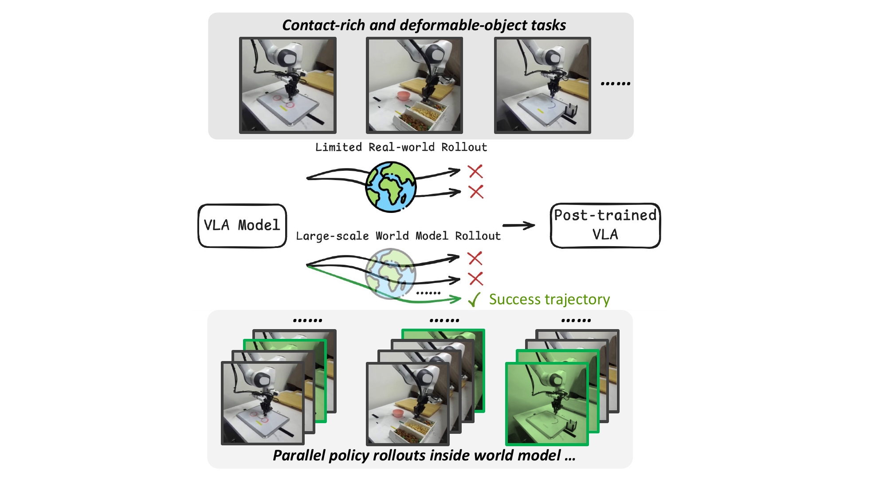
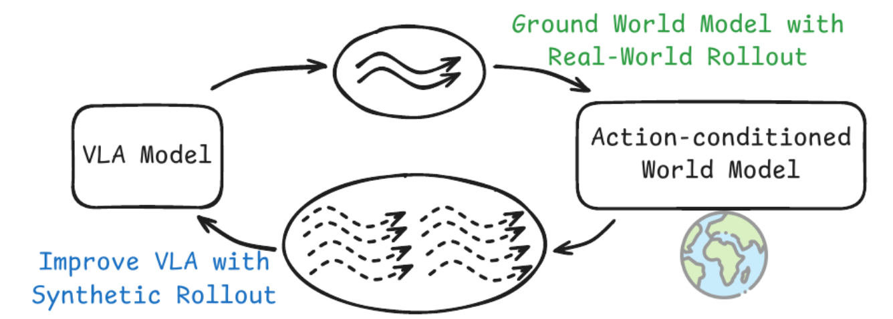
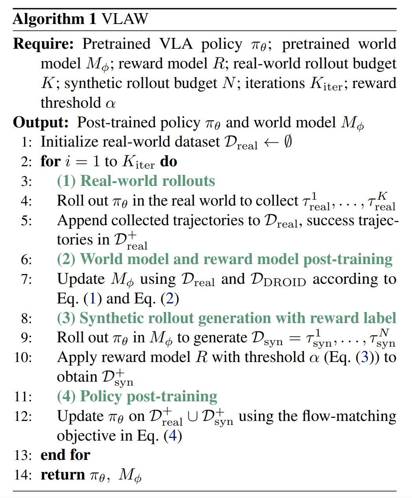
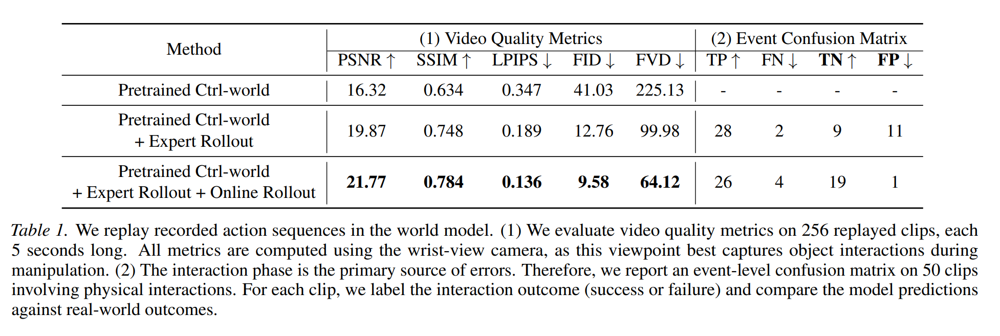
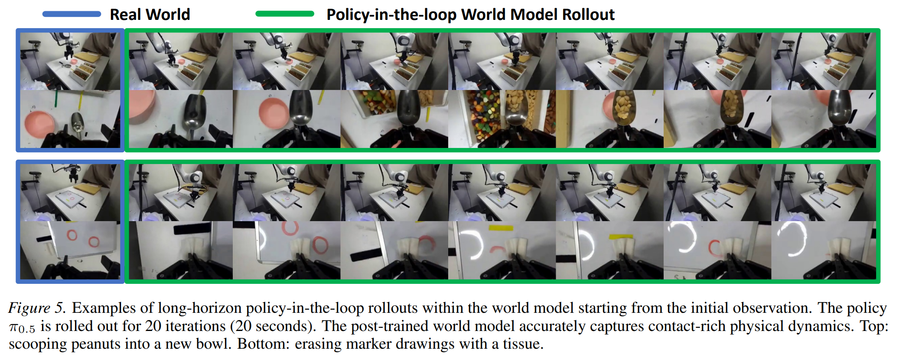
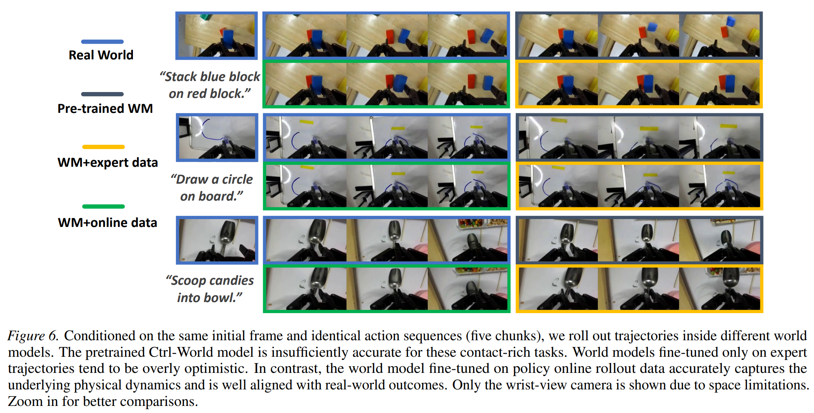
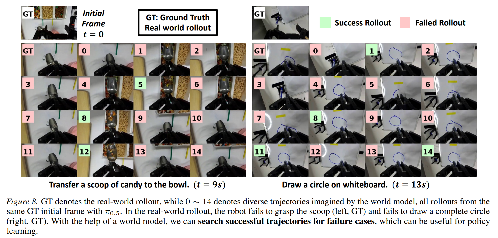
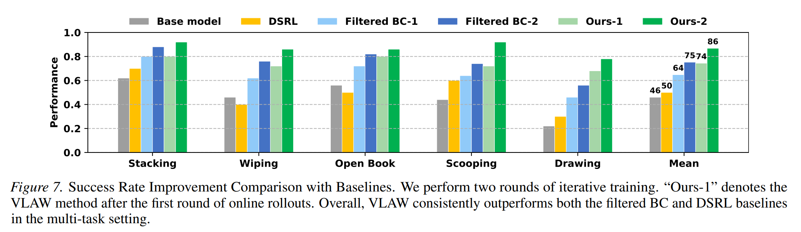
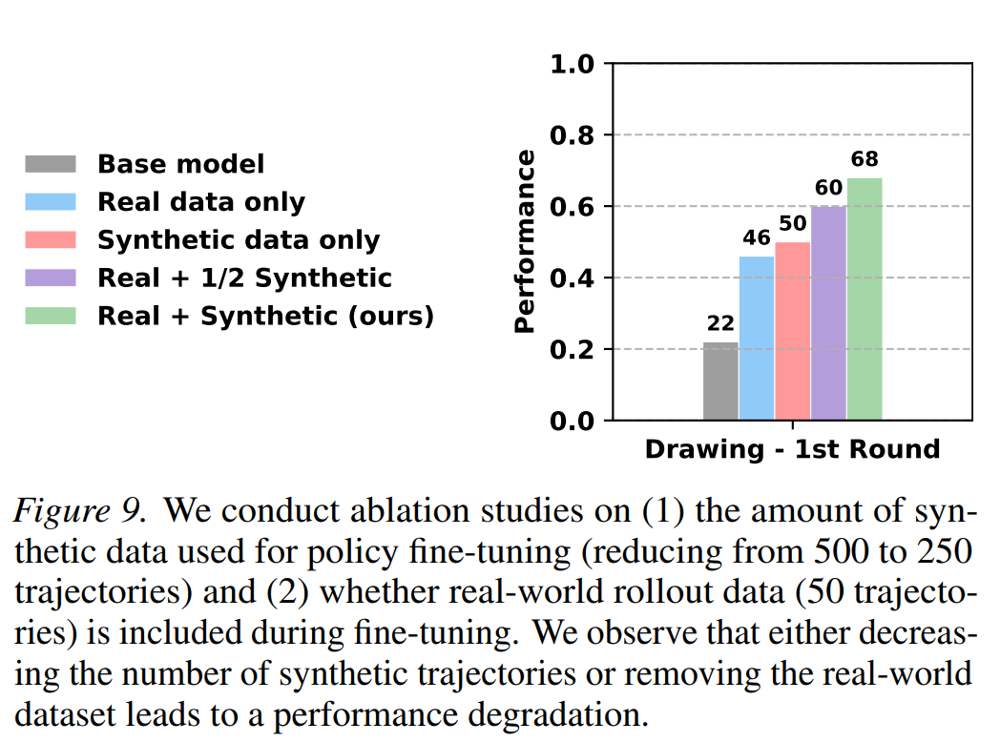
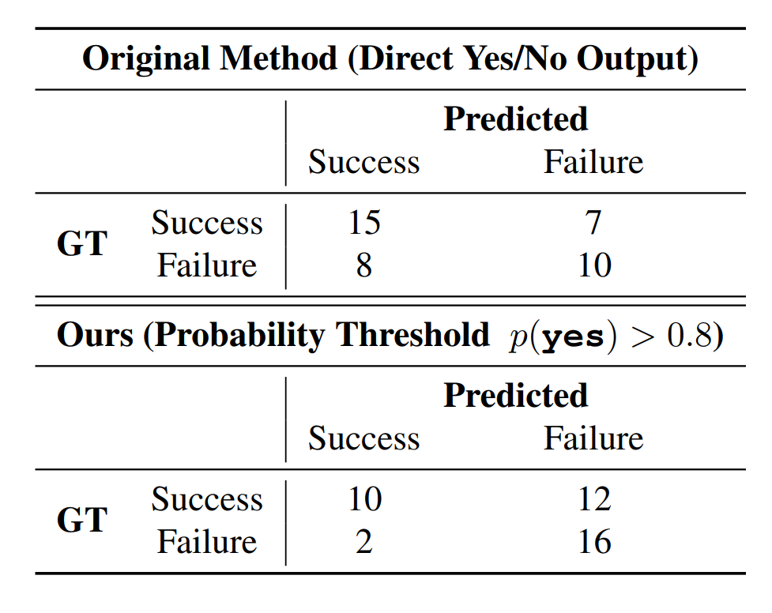

# 标题：VLAW：视觉-语言-动作策略与世界模型的迭代协同改进

- （VLAW: Iterative Co-Improvement of Vision-Language-Action Policy and World Model）
- ArXiv：2602.12063
- 作者：Yanjiang Guo, Tony Lee, Lucy Xiaoyang Shi, Jianyu Chen, Percy Liang, Chelsea Finn
- 章节数：23
- 估计词元数：17.8k

## 目录

- 1 引言（Introduction）
- 2 相关工作（Related Works）
  - 2.1 后训练视觉-语言-动作模型（Post-training Vision-Language-Action Models）
  - 2.2 用于决策的世界模型（World Models for Decision Making）
- 3 预备知识（Preliminaries）
  - 问题设定（Problem Setting）。
  - 世界模型生成的轨迹（World Model Generated Trajectories）。
- 4 VLA 与世界模型的协同改进（Co-Improvement of VLA and World Model）
  - 4.1 使用真实轨迹展开学习世界模型（World Model Learning with Real Roll-outs）
  - 4.2 VLA 策略的迭代改进（Iterative Improvement for VLA Policy）
  - 4.3 与正则化强化学习的关系（Relation to Regularized Reinforcement Learning）
- 5 实验（Experiments）
  - 5.1 实验设置（Experimental Settings）
  - 5.2 我们能否为接触丰富的任务学习一个准确的动作条件世界模型？（Can we learn an accurate action-conditioned world model for contact-rich tasks?）
  - 5.3 世界模型生成的数据能否改进 VLA 策略性能？（Can world model generated data improve VLA policy performance?）
- 6 结论与讨论（Conclusions and discussions）
- 影响声明（Impact Statement）
- 致谢（Acknowledgment）
- 参考文献（References）
- 附录 A 与正则化强化学习的关系（Appendix A Relation to Regularized Reinforcement Learning。）
- 附录 B 任务详情（Appendix B Task Details）
  - 成功标准（Success Criteria）。
- 附录 C 奖励模型详情（Appendix C Reward Model Details）

## 摘要（Abstract）

**摘要（Abstract）** 本文的目标是通过迭代式的在线交互来提升 **视觉-语言-动作模型（Vision-Language-Action models, VLA）** 的性能与可靠性。由于在现实世界中收集 **策略展开（policy rollouts）** 数据成本高昂，我们探究是否可以使用一个习得的模拟器——具体而言，一个 **动作条件视频生成模型（action-conditioned video generation model）** ——来生成额外的展开数据。遗憾的是，现有的 **世界模型（world models）** 缺乏策略改进所需的物理保真度：它们主要是在演示数据集上训练的，这些数据集缺乏对许多不同物理交互（尤其是失败案例）的覆盖，并且难以准确建模 **接触密集型物体操作（contact-rich object manipulation）** 中微小但关键的物理细节。我们提出了一种简单的迭代改进算法，该算法利用真实世界的展开数据来提升世界模型的保真度，进而可以利用该模型生成补充性的合成数据来改进 VLA 模型。在我们的真实机器人实验中，我们使用这种方法提升了一个最先进的 VLA 模型在多个下游任务上的性能。相较于基础策略，我们实现了 **39.2%** 的绝对成功率提升，而通过生成的合成展开数据进行训练则带来了 **11.6%** 的额外提升。视频可在此匿名网站查看： [link](https://sites.google.com/view/vlaw-arxiv)。

## 1 引言（Introduction）

> 图 1：VLA 模型在现实世界中的展开耗时且难以扩展。在 VLAW 中，我们首先利用**有限的真实世界在线展开数据** 学习一个**动作条件世界模型（Action-conditioned World Model）**，该模型进而在想象中生成大规模的合成数据。

**视觉-语言-动作模型（Vision-Language-Action models, VLA）** 通过在大规模演示数据上进行训练，在机器人操作领域取得了巨大成功（Intelligence 等人，2025b；Kim 等人，2024；Shi 等人，2025；Guo 等人，2025b；Zhang 等人，2024；Chen 等人，2025）。最近的研究进一步表明，VLA 模型可以从在线交互展开的后训练中显著获益（Intelligence 等人，2025a）。然而，**在现实世界的机器人场景中，收集在线策略展开轨迹需要大量人力**，例如重置环境和监控机器人执行，这既昂贵又耗时（Atreya 等人，2025；Jain 等人，2025）。因此，可用于 VLA 模型的在线展开**数据量通常有限**，限制了后训练的有效性和可扩展性。

与其仅仅依赖真实世界的策略展开，学习一个 **动作条件世界模型（action-conditioned world model）** 在想象中生成合成展开数据提供了一种有前景的替代方案（Team 等人，2025；Li 等人，2024；Team，2025a）。然而，我们发现**现有的世界模型缺乏有效策略改进（policy improvement）所需的物理保真度（physical fidelity）**。正如先前工作所指出的，这些模型往往对预测轨迹过于乐观，因为它们主要是在缺乏多样化物理交互（尤其是失败案例）覆盖的演示数据集上训练的（Quevedo 等人，2025）。此外，它们**难以准确建模接触密集型操作中微小但关键的物理细节**，并且**可能产生模糊的视觉预测**（Guo 等人，2025a）。因此，现有的动作条件世界模型主要集中于相对简单的拾放动作，并且常常无法为涉及频繁碰撞或 **可变形物体（deformable objects）** 的复杂任务生成可靠的合成数据。

在本文中，我们提出了一个简单但可扩展的框架 **VLAW** ，它通过世界模型展开迭代地改进 VLA 模型，如图 2 所示。我们首先通过在包含许多失败案例的在线展开数据上进行微调，学习一个 **物理基础世界模型（physically-grounded world model）** 。我们发现，在在线展开数据上训练后，世界模型学会了捕捉策略执行过程中遇到的复杂动态，从而显著提升了其对成功和失败案例的建模能力。改进后的世界模型随后被用于生成大规模、高保真度的合成轨迹，这些轨迹使用一个 **视觉-语言奖励模型（vision–language reward model）** （Lee 等人，2026）进行自动标注。在策略优化过程中，我们仅使用可以轻松扩展到大型表达能力强的模型的**稳定监督学习目标**（例如，具有难处理动作概率的 **流匹配策略（flow-matching policies）** （Intelligence 等人，2025b）），而不是动态规划/自举法或策略梯度。

本文的核心贡献是一个简单且可扩展的、基于世界模型的 **强化学习（reinforcement learning）** 框架，用于在现实世界中改进最先进的 VLA 策略。在我们的实验中，我们使用了广泛使用的真实机器人平台 **DROID** （Khazatsky 等人，2024）。我们从一个预训练的 VLA 策略 $\pi_{0.5}$（Intelligence 等人，2025b）和一个动作条件世界模型 **Ctrl-World** （Guo 等人，2025a）开始。我们首先验证，利用策略在线展开数据，我们学习到了一个物理基础的生成式世界模型，该模型能够准确建模成功和失败的轨迹，这对于生成有用的合成数据至关重要。此外，为了获得机器人任务的奖励模型，我们在真实机器人展开数据上对 **Qwen3-VL** （Team，2025b；Lee 等人，2026）进行了微调。最后，利用世界模型生成的合成数据，我们在一个涉及可变形物体的多任务设置中，改进了预训练的 $\pi_{0.5}$ 在多个下游接触密集型操作任务上的表现，以 **11.6%** 的优势超越了基线。

## 2 相关工作（Related Works）

### 2.1 训练后视觉-语言-动作模型（Post-training Vision-Language-Action Models）

**视觉-语言-动作（Vision–Language–Action, VLA）模型** 在机器人操作任务中取得了显著成功 [1, 2, 3, 4, 5, 6, 7]。一种常见的方法是在大规模数据上训练 VLA 模型，然后在目标任务上进行 **监督微调（Supervised Fine-tuning, SFT）** [8, 9, 10]。除了监督微调，利用 **在线推演数据（Online Rollout Data）** 改进 VLA 策略已成为一个有前景的方向 [11, 12, 13, 14, 15, 16]。一些先前的工作采用 **同策略强化学习（On-policy Reinforcement Learning）** 方法，例如 **近端策略优化（Proximal Policy Optimization, PPO）** [17] 或 **GRPO** [18]，来改进 VLA 策略。

然而，标准的同策略强化学习通常需要大量的推演，因此主要在仿真环境中进行验证 [19, 20, 21]。此外，最先进的 VLA 模型通常使用 **流匹配（Flow-matching）** 目标进行训练，这些目标不提供显式的策略似然，使得传统的 **策略梯度（Policy-gradient）** 方法难以应用。为了在现实世界环境中实现策略学习，$\pi^{*}_{0.6}$ [11] 转而采用了一种 **离线（Offline）** 或 **批量（Batch）强化学习** 的公式，并使用了 **优势条件监督学习（Advantage-conditioned Supervised Learning）** 目标。类似地，在我们的设定中，我们使用批量的现实世界推演数据以及 **世界模型（World Model）** 生成的合成数据来进行迭代策略改进，并仅通过稳定的监督微调目标来更新策略。

> 图 2 | 策略在线推演数据可以帮助将预训练的世界模型在下游任务中接地。一旦世界模型被接地，我们就可以为策略学习生成海量数据。

> 图 3 | VLAW 的详细流程：(1) 我们首先在现实世界中推演策略，以收集一小部分在线轨迹。(2) 然后，我们利用这些策略推演数据对一个预训练的动作条件世界模型进行微调，使世界模型在目标任务中接地，并提高其预测保真度。(3) 使用得到的世界模型，我们通过策略与世界模型之间的闭环交互生成大规模的合成轨迹。(4) 最后，我们利用现实世界和合成数据优化 VLA 策略，奖励由视觉-语言奖励模型自动评估。

### 2.2 用于决策的世界模型（World Models for Decision Making）

**动作条件世界模型（Action-conditioned World Models）** 在给定当前观测和动作的情况下预测未来结果，也被称为 **前向动力学模型（Forward Dynamics Models）** 。许多工作利用此类模型进行 **基于模型的强化学习（Model-based Reinforcement Learning）** [22, 23, 24, 25] 和 **视觉规划（Visual Planning）** [26, 27, 28, 29, 30]。其中，与我们的方法最密切相关的是 DayDreamer [31]、SOLAR [32] 和 World4rl [33]，它们同样在现实世界的视觉基于模型强化学习环境中运行。然而，由于模型能力和数据规模的限制，这些早期方法通常学习的是 **任务特定（Task-specific）** 的动力学模型。

随着 **视频扩散模型（Video Diffusion Models）** 的最新进展 [34, 35, 36]，训练能够生成逼真未来视觉观测的 **多任务（Multi-task）** 动作条件世界模型已成为可能 [37, 38, 39, 40, 41]。尽管取得了这些进展，精确建模复杂的物理动力学仍然是一个根本性挑战，正如先前世界模型文献中广泛观察到的那样 [42]，这可能是因为这些模型通常在主要由演示组成的离线机器人数据集上进行训练。为了应对这一挑战，我们利用 **在线策略推演数据（Online Policy Rollout Data）** 将预训练的世界模型在新的环境中 **接地（Ground）** ，从而提高其在策略的 **状态-动作分布（State–Action Distribution）** 附近的准确性。

## 3 预备知识（Preliminaries）

#### 问题设定（Problem Setting）。

我们研究一个 **多任务机器人操作（multi-task robotic manipulation）** 问题，其中每个任务由一个语言指令 $I$ 指定，并被建模为一个 **马尔可夫决策过程（Markov Decision Process, MDP）** $\mathcal{M}_{I}=(\mathcal{S},\mathcal{A},P,R_{I},\gamma)$。
这里，$\mathcal{S}$ 表示 **状态空间（state space）** ，$\mathcal{A}$ 表示 **动作空间（action space）** ，$P(s_{t+1}\mid s_{t},a_{t})$ 表示 **转移动态（transition dynamics）** ，$R_{I}$ 表示 **任务依赖的奖励函数（task-dependent reward function）** ，$\gamma$ 表示 **折扣因子（discount factor）** 。在训练开始时，我们被给定一个预训练的 **视觉-语言-动作（Vision–Language–Action, VLA）** 策略 $\pi_{\theta}$ 和一个 **动作条件的世界模型（action-conditioned world model）** $M_{\phi}$。
该策略将当前状态和指令映射到一个动作分布，$a_{t}\sim\pi_{\theta}(\cdot\mid s_{t},I)$；而世界模型则根据当前状态和动作预测下一个状态，$\hat{s}_{t+1}\sim M_{\phi}(\cdot\mid s_{t},a_{t})$，其中 $\hat{s}_{t+1}$ 表示预测的下一个状态。

该策略被允许在真实环境中进行 **在线推演（online roll-outs）** ，从而产生轨迹 $\tau^{i}_{\mathrm{real}}=\{s_{0},a_{0},\ldots,a_{T-1},s_{T}\}$。
每条轨迹都被标记一个 **任务级奖励（task-level reward）** $r_{i}$，指示成功或失败。
我们的目标是利用在线交互来迭代地改进策略，使其在所有任务中都能表现良好。

#### 世界模型生成的轨迹（World Model Generated Trajectories）。

除了真实世界的交互，我们还可以在世界模型内部推演策略。
从一个从真实轨迹中采样的初始状态 $s_{0}$ 开始，策略和世界模型通过 $a_{t}\sim\pi_{\theta}(\cdot\mid\hat{s}_{t},I)$ 和 $\hat{s}_{t+1}\sim M_{\phi}(\cdot\mid\hat{s}_{t},a_{t})$ 进行闭环交互。
通过迭代此过程，我们 **自回归地（auto-regressively）** 生成一条完整的 **想象轨迹（imagined trajectory）** $\tau^{j}_{\mathrm{syn}}=\{s_{0},a_{0},\hat{s}_{1},a_{1},\ldots,a_{T-1},\hat{s}_{T}\}$。

## 4 VLA 与世界模型的协同改进（Co-Improvement of VLA and World Model）

在本节中，我们将详细介绍我们的方法。整体流程包含以下步骤：

1.  **世界模型后训练（World model post-training）** （第 4.1 节）：
    - 我们使用真实世界 **推演数据（rollout data）** $\mathcal{D}_{\mathrm{real}}$ 对世界模型 $M$ 进行微调，同时将其与原始的 DROID 数据集 $\mathcal{D}_{\mathrm{DROID}}$ 联合训练，以保持广泛的覆盖范围。
    - 此外，我们在 $\mathcal{D}_{\mathrm{real}}$ 上微调 **视觉语言奖励模型（vision-language reward model）** $R$，以提高奖励的准确性。
2.  **VLA 策略后训练（VLA policy post-training）** （第 4.2 节）：
    - 使用更新后的世界模型，我们生成一个 **合成数据集（synthetic dataset）** $\mathcal{D}_{\mathrm{syn}}$，并应用奖励模型 $R$ 来识别成功的轨迹，从而得到一个过滤后的数据集 $\mathcal{D}^{+}_{\mathrm{syn}}$。该数据集随后被用于微调 VLA 策略。
3.  我们在步骤 1 和 2 之间交替进行，迭代地改进世界模型和策略。

整体流程总结在算法 [1] 和图 [3] 中。在第 4.3 节中，我们提供了一个详细的分析，表明我们的更新过程可以被解释为在正则化 **强化学习（Reinforcement Learning, RL）** 框架下进行策略优化的一种近似。

### 4.1 使用真实推演数据学习世界模型（World Model Learning with Real Roll-outs）

**真实世界策略推演（Real World Policy Roll-outs）** 。先前的研究已经指出了学习有效世界模型的两个主要挑战：
（1）_过度乐观（over-optimism）_，因为训练数据主要由成功的演示主导；
（2）_有限的物理保真度（limited physical fidelity）_，特别是在建模涉及频繁接触或可变形物体的复杂动力学时。

为了解决这些问题，我们通过在真实世界中推演策略来获得 $K$ 条轨迹，形成一个数据集 $\mathcal{D}_{\mathrm{real}}=\{\tau^{1}_{\mathrm{real}},...,\tau^{K}_{\mathrm{real}}\}$。每次重置机器人时，我们还为每条轨迹分配一个 **稀疏奖励（sparse reward）** $r_{\tau}\in\{0,1\}$ 来指示成功与否。

**训练目标（Training Objective）** 。$\mathcal{D}_{\mathrm{real}}$ 捕获了执行过程中遇到的各种物理交互，包括成功和失败的情况，并用于微调一个预训练的世界模型。
具体来说，我们从预训练的 Ctrl-World 模型（Guo 等人，2025a）初始化，这是一个在完整 DROID 数据集 $\mathcal{D}_{\mathrm{DROID}}$ 上训练的强大的基于 **扩散（diffusion）** 的世界模型。
在在线推演数据集 $\mathcal{D}_{\mathrm{real}}$ 上的微调遵循原始的扩散目标（Blattmann 等人，2023）：

$$ \mathcal{L}_{\mathcal{D}_{\mathrm{real}}}=\mathbb{E}_{x_{0},\,\epsilon,\,t^{\prime}}\left\|\hat{x}_{0}(x_{t^{\prime}},t^{\prime},c)-x\_{0}\right\|^{2}, \tag{1} $$

其中，预测目标 $x_{0}=o_{t+1:t+H}$ 是从 $\mathcal{D}_{\mathrm{real}}$ 中采样的，
$x_{t^{\prime}}=\sqrt{\bar{\alpha}_{t^{\prime}}}\,x_{0}+\sqrt{1-\bar{\alpha}_{t^{\prime}}}\,\epsilon_{t^{\prime}}$ 表示在噪声调度 $\bar{\alpha}_{t^{\prime}}$ 下，扩散步 $t^{\prime}\in[0,T^{\prime}]$ 处的带噪未来状态，而 $c$ 代表所有条件输入，包括 **动作块（action chunk）** $a_{t:t+H}$ 和当前观测 $o_{t}$。

**渐进增长的数据集与协同训练（Progressively Growing Dataset and Co-training）** 。在连续的迭代过程中，我们不断将新收集的真实世界轨迹追加到数据集中：$\mathcal{D}_{\mathrm{real}} = \mathcal{D}_{\mathrm{real}}\cup\tau_{\mathrm{real}}^{i}$。
为了防止对有限的在线推演数据过拟合，我们还与原始的 DROID 数据集 $\mathcal{D}_{\mathrm{DROID}}$ 进行协同训练以进行正则化。
最终的训练目标是：

$$ \mathcal{L}=\mathcal{L}_{\mathcal{D}_{\mathrm{real}}}+\lambda\,\mathcal{L}_{\mathcal{D}_{\mathrm{DROID}}} \tag{2} $$

其中 $\lambda$ 控制正则化的强度。

**微调奖励模型（Finetuning Reward Model）** 。为了保持我们流程的简单性和可扩展性，我们利用一个通用的 **视觉语言模型（Vision-Language Model, VLM）** ，即 Qwen3-VL-4B-Instruct（Team, 2025b; Lee 等人, 2026），来评估一条轨迹是否成功。然而，我们发现零样本 VLM 的准确性不够高，因此在第一次迭代中，我们使用 $\mathcal{D}_{\mathrm{real}}$ 中的成功标签 $r_{\tau}$ 对 VLM 进行微调。

在实现中，奖励模型将轨迹视频 $\tau^{i}_{\mathrm{real}}$ 与一个询问任务指令 $I^{i}$ 是否成功完成的查询一起作为输入。如果分配给“是”（`yes`）词元的概率超过阈值 $\alpha$，我们则将轨迹分类为成功。通过调整 $\alpha$，我们可以使奖励模型更加保守或宽松。

$$ R(\tau^{i})\;=\;\mathbf{1}\!\left[P(\texttt{`yes'}\mid\tau^{i},I^{i})>\alpha\right], \tag{3} $$

### 4.2 VLA 策略的迭代改进（Iterative Improvement for VLA Policy）

**可扩展训练流程（Scalable Training Pipeline）** 。一旦我们学习到了一个良好的 **世界模型（World Model）** 和 **奖励模型（Reward Model）** ，就可以利用它们低成本地生成大量合成数据。原则上，可以利用许多不同的算法来利用这些数据，包括各种复杂的 **强化学习（Reinforcement Learning, RL）** 方法。由于我们希望轻松扩展到基于 **流匹配（Flow Matching）** 的大型 **视觉语言动作（Vision-Language-Action, VLA）** 策略，因此选择使用可能最简单的方法之一来整合这些合成数据。

具体而言，我们通过在想象中展开策略来生成 $N$ 条轨迹：$\mathcal{D}_{\mathrm{syn}}=\{\tau^{1}_{syn},...,\tau^{N}_{syn}\}$。然后，我们应用微调后的奖励模型来识别成功的轨迹，并构建一个仅包含成功案例的过滤数据集：$\mathcal{D}^{+}_{\mathrm{syn}}=\{\tau^{i_{1}}_{syn},...,\tau^{i_{n}}_{syn}\}$，其中 $i_{1},...,i_{n}$ 是成功轨迹的索引。

**策略学习目标（Policy Learning Objective）** 。
我们使用一个加权流匹配目标来更新 $\pi_{0.5}$ 策略，该目标同时覆盖真实世界展开数据和世界模型生成的数据。在对成功轨迹进行过滤后，我们为来自成功轨迹的 **状态-动作转移（observation–action transition）** 分配二元权重 $w(o,a)=1$，为来自失败轨迹的转移分配权重 $w(o,a)=0$：

$$ \displaystyle\mathcal{L} = \mathbb{E}_{(o,a)\sim\mathcal{D}_{\mathrm{syn}}\cup\mathcal{D}_{\mathrm{real}}}\,w(o,a)\,\mathcal{L}_{\mathrm{FM}}(\theta;o,a) \tag{4} $$
$$ = \mathbb{E}_{(o,a)\sim\mathcal{D}_{\mathrm{syn}}^{+}\cup\mathcal{D}_{\mathrm{real}}^{+}}\,\mathcal{L}_{\mathrm{FM}}(\theta;o,a), $$

其中 $\mathcal{L}_{\mathrm{FM}}(\theta;o,a)$ 表示针对一个 **观测-动作对（observation–action pair）** $(o,a)$ 的流匹配损失。

> Alg 1 | VLAW 算法 1。

Algorithm 1 VLAW

- **Require**:
  - Pretrained VLA policy ${\pi }_{\theta }$ ;
  - pretrained world model ${M}_{\phi }$ ;
  - reward model $R$ ;
  - real-world rollout budget $K$ ;
  - synthetic rollout budget $N$ ;
  - iterations ${K}_{\text{iter }}$ ;
  - reward threshold $\alpha$
- **Output**: Post-trained policy ${\pi }_{\theta }$ and world model ${M}_{\phi }$
  - Initialize real-world dataset ${\mathcal{D}}_{\text{real }} \leftarrow  \varnothing$
  - for $i = 1$ to ${K}_{\text{iter }}$ do
    - > (1) Real-world rollouts
    - Roll out ${\pi }_{\theta }$ in the real world to collect ${\tau }_{\text{real }}^{1},\ldots ,{\tau }_{\text{real }}^{K}$
    - Append collected trajectories to ${\mathcal{D}}_{\text{real }}$ ,success trajectories in ${\mathcal{D}}_{\text{real }}^{ + }$
    - > (2) World model and reward model post-training
    - Update ${M}_{\phi }$ using ${\mathcal{D}}_{\text{real }}$ and ${\mathcal{D}}_{\text{DROID }}$ according to
      Eq. (1) and Eq. (2)
    - > (3) Synthetic rollout generation with reward label
    - Roll out ${\pi }_{\theta }$ in ${M}_{\phi }$ to generate ${\mathcal{D}}_{\text{syn }} = {\tau }_{\text{syn }}^{1},\ldots ,{\tau }_{\text{syn }}^{N}$
    - Apply reward model $R$ with threshold $\alpha$ (Eq. (3)) to obtain ${\mathcal{D}}_{\text{syn }}^{ + }$
    - > (4) Policy post-training
    - Update ${\pi }_{\theta }$ on ${\mathcal{D}}_{\text{real }}^{ + } \cup  {\mathcal{D}}_{\text{syn }}^{ + }$ using the flow-matching
      objective in Eq. (4)
  - end for
  - return ${\pi }_{\theta },{M}_{\phi }$

---

- **要求**：
  - 预训练的视觉语言动作（VLA）策略 ${\pi }_{\theta }$；
  - 预训练的世界模型（world model） ${M}_{\phi }$；
  - 奖励模型（reward model） $R$；
  - 真实世界（real-world）轨迹采样预算 $K$；
  - 合成（synthetic）轨迹采样预算 $N$；
  - 迭代次数 ${K}_{\text{iter }}$；
  - 奖励阈值（reward threshold） $\alpha$。
- **输出**：后训练（post-trained）策略 ${\pi }_{\theta }$ 与世界模型 ${M}_{\phi }$
  - 初始化真实世界数据集 ${\mathcal{D}}_{\text{real }} \leftarrow  \varnothing$
  - 对于 $i = 1$ 到 ${K}_{\text{iter }}$ 执行：
    - > (1) 真实世界轨迹采样
      - 在真实世界中执行 ${\pi }_{\theta }$ 以收集轨迹 ${\tau }_{\text{real }}^{1},\ldots ,{\tau }_{\text{real }}^{K}$
      - 将收集的轨迹添加至 ${\mathcal{D}}_{\text{real }}$，成功轨迹存入 ${\mathcal{D}}_{\text{real }}^{ + }$
    - > (2) 世界模型与奖励模型后训练
      - 根据公式（1）与公式（2），使用 ${\mathcal{D}}_{\text{real }}$ 与 ${\mathcal{D}}_{\text{DROID }}$ 更新 ${M}_{\phi }$
    - > (3) 带奖励标签的合成轨迹生成
      - 在世界模型 ${M}_{\phi }$ 中执行 ${\pi }_{\theta }$ 以生成合成数据集 ${\mathcal{D}}_{\text{syn }} = {\tau }_{\text{syn }}^{1},\ldots ,{\tau }_{\text{syn }}^{N}$
      - 应用奖励模型 $R$ 及阈值 $\alpha$（公式（3））以获取 ${\mathcal{D}}_{\text{syn }}^{ + }$
    - > (4) 策略后训练
      - 使用流匹配（flow-matching）目标（公式（4）），在 ${\mathcal{D}}_{\text{real }}^{ + } \cup  {\mathcal{D}}_{\text{syn }}^{ + }$ 上更新 ${\pi }_{\theta }$
  - 结束循环
  - 返回 ${\pi }_{\theta },{M}_{\phi }$

### 4.3 与正则化强化学习的关系（Relation to Regularized Reinforcement Learning）

在本小节中，我们证明方程 [4] 中的策略更新可以视为在 **正则化强化学习（Regularized Reinforcement Learning, RL）** 框架 [Peng et al., 2019] 下，经过某些近似后的策略优化。

在正则化 RL 设置下，我们在优化奖励的同时，约束学习到的策略保持接近一个 **参考策略（Reference Policy）** $\pi_{\mathrm{ref}}$。这产生了以下正则化目标：

$$ J(\theta)=\mathbb{E}_{\tau\sim\rho_{\pi*{\theta}}}\!\left[R(\tau)\right]\;-\;\beta\,\mathbb{E}*{o\sim\rho*{\pi*{\theta}}}\!\left[D\!\left(\pi_{\theta}(\cdot\mid o)\,\|\,\pi_{\mathrm{ref}}(\cdot\mid o)\right)\right] \tag{5} $$

其中 $D(\cdot\|\cdot)$ 表示 **KL 散度（Kullback–Leibler Divergence）** 度量，$\beta>0$ 控制正则化的强度。最优改进策略存在一个闭式解，由下式给出：

$$ \pi^{\star}(a\mid o)\propto w(o,a)\pi*{\mathrm{ref}}(a\mid o),\quad w(o,a)=\exp\!\left(\frac{A^{\pi*{\mathrm{ref}}}(o,a)}{\beta}\right) $$

其中 $\pi_{\mathrm{ref}}$ 表示参考策略，$A^{\pi_{\mathrm{ref}}}(o,a)$ 是相应的 **优势函数（Advantage Function）** ，$\beta$ 是控制正则化强度的 **温度参数（Temperature Parameter）** 。我们可以定义一个 **代理散度（Surrogate Divergence）** ，用于衡量在流匹配损失下 $\pi_{\theta}$ 与从 $\pi^{\star}$ 抽取的样本的匹配程度：

$$ D*{\mathrm{FM}}\!\left(\pi^{\star}(\cdot\mid o),\pi*{\theta}(\cdot\mid o)\right)\;\triangleq\;\mathbb{E}_{a\sim\pi^{\star}(\cdot\mid o)}\big[\mathcal{L}_{\mathrm{FM}}(\theta;o,a)\big], \tag{6} $$

利用这个散度，我们可以将策略投影到最优解：

$$ \displaystyle\theta^{\star} = \arg\min*{\theta}\;\mathbb{E}*{(o,a)\sim\mathcal{D}}\Big[w(o,a)\,\mathcal{L}_{\mathrm{FM}}(\theta;o,a)\Big], \tag{7} $$

这正是我们策略更新方程 [4] 中使用的加权回归目标。更详细的推导见附录 [A]。

## 5 Experiments（实验）

在本节中，我们对涉及频繁碰撞和可变形物体的复杂真实世界任务进行了广泛的实验。我们的实验旨在回答以下问题：

1.  我们能否为接触丰富和可变形物体任务学习一个高保真的动作条件世界模型，该模型能准确建模成功和失败的轨迹？
2.  世界模型生成的合成数据能否提升 **视觉-语言-动作（Vision-Language-Action, VLA）** 策略的性能？
3.  在多任务设置中，策略和世界模型能否通过迭代训练过程持续改进？

### 5.1 Experimental Settings（实验设置）

**设置与任务（Setups and Tasks）** 。
我们在 DROID 平台（Khazatsky 等人，2024）上进行实验。在 DROID 设置中，一个 Franka Panda 机械臂配备了一个 Robotiq 夹爪。观测使用两个第三人称摄像头和一个腕部安装摄像头捕获，如图 [4] 所示。我们在以下描述的五个类别的接触丰富任务上评估我们的方法。更多任务细节可在附录 [B] 中找到。

- **堆叠（Stacking）** ：在每个回合开始时，四个彩色积木块随机放置在桌面上。机器人收到指令：“将积木块 $A$ 堆叠在积木块 $B$ 上”，其中 $A,B\in\{\text{红色},\text{绿色},\text{蓝色},\text{黄色}\}$。
- **打开书本（Open Book）** ：在每个回合开始时，一本书随机放置在桌面上。我们评估了四种不同书本的性能。机器人被指示“打开书本封面”。
- **擦除标记（Erase Marks）** ：在白板上随机绘制一到三个马克笔涂鸦。机器人收到指令：“用纸巾擦除所有标记”。
- **舀取（Scooping）** ：机器人使用勺子将零食转移到碗中。勺子和碗都随机放置在工作空间内。指令是：“将一些 $A$ 转移到碗中”，其中 $A\in\{\text{花生},\text{糖果},\text{杏仁}\}$。
- **绘画（Drawing）** ：机器人被指示使用马克笔在白板上画一个完整的圆圈。

> 图 4 | 我们的实验在 DROID 平台上进行，涵盖五个任务类别，如图所示。这些任务涉及复杂的物理交互，包括频繁接触和可变形物体，这在传统仿真中难以建模。

**基础模型与超参数（Base Models and Hyperparameters）** 。
我们使用 $\pi_{0.5}$（Intelligence 等人，2025b）作为基础的 **视觉-语言-动作（Vision-Language-Action, VLA）** 模型，并使用 Ctrl-World（Guo 等人，2025a）作为基础的世界模型。对于每个任务类别，我们收集 25 个专家演示，并在此数据上微调 $\pi_{0.5}$ 以预热策略，该策略作为我们的基础策略。奖励模型从 Qwen3-VL-4B-Instruct（Team，2025b）初始化。

在每次迭代中，我们在真实世界中为每个任务类别推演 50 条轨迹。我们使用这些推演轨迹对世界模型进行 50K 训练步的微调。然后，我们使用更新后的世界模型为每个任务生成 500 条合成轨迹，形成合成数据集。奖励模型额外使用第一次迭代的推演数据进行微调，以提高奖励准确性。策略以 256 的批次大小更新 2k 步。我们总共执行两次此过程的迭代。

### 5.2 Can we learn an accurate action-conditioned world model for contact-rich tasks?（我们能否为接触丰富的任务学习一个准确的动作条件世界模型？）

**在世界模型内部进行动作回放（Action replay inside the world model）** 。
我们通过在世界模型内部回放真实世界的动作序列，来评估所学世界模型的保真度，并研究在线推演数据的贡献。
具体而言，我们从真实世界轨迹中随机选择一个起始帧，并从同一帧开始，将一段 5 秒长的记录动作块序列自回归地输入世界模型。
我们将后训练的世界模型与两个基线进行比较：原始的预训练世界模型和仅用专家演示数据微调的模型。

我们使用两类指标来定量评估视频预测质量：

- （1） **视频距离指标（Video distance metrics）** ：
  - 这些指标包括像素级指标（ **峰值信噪比（Peak Signal-to-Noise Ratio, PSNR）** [1] 和 **结构相似性指数（Structural Similarity Index Measure, SSIM）** [2]），以及学习到的感知和分布指标（ **学习感知图像块相似度（Learned Perceptual Image Patch Similarity, LPIPS）** [3]、 **弗雷歇起始距离（Fréchet Inception Distance, FID）** [4] 和 **弗雷歇视频距离（Fréchet Video Distance, FVD）** [5]）。
  - 像素级指标：
    - **峰值信噪比（Peak Signal-to-Noise Ratio, PSNR）** [ (Hore & Ziou, 2010) ]
    - **结构相似性指数（Structural Similarity Index Measure, SSIM）** (Wang et al., 2004)
  - 学习到的感知和分布指标：
    - **学习感知图像块相似度（Learned Perceptual Image Patch Similarity, LPIPS）**(Zhang et al., 2018)
    - **弗雷歇起始距离（Fréchet Inception Distance, FID）** (Heusel et al., 2017)
    - **弗雷歇视频距离（Fréchet Video Distance, FVD）** (Unterthiner et al., 2018)
- （2） **交互事件混淆矩阵（Interaction event confusion matrix）** ：
  - 正确预测物体交互的结果是动作条件世界建模中最具挑战性的方面。我们筛选出涉及物体交互的回放片段，并将每次交互分类为成功或失败。然后评估预测结果是否与现实世界的结果一致。

定量结果报告在表 [1] 中。
使用在线推演数据进行微调对世界模型的性能至关重要：与两个基线相比，所有视频质量指标均有显著提升。
此外，通过混合成功和失败的轨迹进行训练，世界模型在很大程度上消除了仅使用专家演示数据进行训练时观察到的过度乐观偏差。
特别是， **假阳性（false-positive）** 交互预测显著减少。
我们在图 [6] 中提供了交互回放的定性可视化。

> 表 1 | 我们在世界模型中回放记录的动作序列。
> (1) 我们在 256 个回放片段（每个长 5 秒）上评估视频质量指标。所有指标均使用腕部视角摄像头计算，因为该视角最能捕捉操作过程中的物体交互。
> (2) 交互阶段是误差的主要来源。因此，我们在 50 个涉及物理交互的片段上报告事件级混淆矩阵。对于每个片段，我们标注交互结果（成功或失败），并将模型预测与真实世界结果进行比较。

**策略在环推演（Policy-in-the-loop rollout）** 。
我们通过直接在已学习的模型内部推演策略来进一步评估世界模型。
尽管评估的任务涉及复杂、接触丰富的交互，但我们发现，即使对于长达 20 秒的长时程推演，后训练的世界模型仍能保持较高的视觉保真度和物理合理性。
示例推演如图 [5] 所示。
这种长时程稳定性使得能够有效地在世界模型内部搜索成功的轨迹，我们随后利用这一点进行策略改进。

> 图 5 | 从初始观测开始，在世界模型内进行长视界策略在环（policy-in-the-loop）推演的示例。策略 $\pi_{0.5}$ 被推演 20 次迭代（20 秒）。训练后的世界模型准确捕捉了接触丰富的物理动力学。上图：将花生舀入新碗中。下图：用纸巾擦除马克笔涂鸦。

> 图 6 | 在相同的初始帧和相同的动作序列（五个片段）条件下，我们在不同的世界模型内推演轨迹。预训练的 Ctrl-World 模型对于这些接触丰富的任务精度不足。仅在专家轨迹上微调的世界模型往往过于乐观。相比之下，在策略在线推演数据上微调的世界模型准确捕捉了底层物理动力学，并与真实世界结果良好对齐。由于空间限制，仅显示腕部视角摄像头。请放大以便更好地比较。

### 5.3 世界模型生成的数据能否提升 VLA 策略性能？

**基准方法（Baselines）**
我们的目标是利用真实世界的在线交互数据来改进 VLA（Vision-Language-Action）策略，同时最小化物理环境中的实际执行次数。在此设定下，我们将我们的方法与两种不使用世界模型（World Model）的基准方法进行比较：

- （1） **过滤式行为克隆（Filtered Behavior Cloning, Filtered BC）** ：该方法从真实世界执行轨迹中筛选出成功的轨迹，并对这些轨迹进行监督式微调。为了公平比较，我们控制其实世界执行次数与我们的方法相同（每类任务 50 次执行）。
- （2） **DSRL（Wagenmaker 等人，2025）** ：该方法通过在线探索优化其噪声空间来改进 $\pi_{0.5}$ 策略。我们控制其在线执行次数与其他方法相同。

**大规模执行轨迹可视化（Large-scale rollout visualizations）**
我们在图 [8] 中可视化了由世界模型生成的并行执行轨迹。从真实世界记录的一个初始帧（GT）开始，我们完全在世界模型内部搜索成功的轨迹。这些成功的想象轨迹为策略学习提供了额外的监督，使策略能够逐步克服失败案例并提升任务性能。

> 图 8: GT 表示真实世界推演，而 $0\sim 14$ 表示世界模型想象出的不同轨迹，所有推演均来自相同的 GT 初始帧，使用策略 $\pi_{0.5}$。在真实世界推演中，机器人未能抓取勺子（左，GT）且未能画出一个完整的圆（右，GT）。借助世界模型，我们可以为失败案例搜索成功的轨迹，这对策略学习可能很有用。

**奖励模型分析（Reward model analysis）**
我们使用一个学习到的奖励模型（Reward Model）来从世界模型生成的执行轨迹中筛选成功轨迹。如方法部分所述，仅当分配给“是”（‘yes’）词元的概率超过预设阈值时，一条轨迹才被视为成功。这种阈值策略显著减少了假阳性轨迹。关于奖励模型的更多细节和分析见附录 [C]。

**结果（Results）**
成功率提升情况如图 [7] 所示。DSRL 在我们的多任务设定中取得的增益有限。我们推测，这是因为 **强化学习（Reinforcement Learning）** 在多样化任务中变得显著难以优化，并且 DSRL 将优化约束在 $\pi_{0.5}$ 策略的噪声空间内，而非直接更新模型参数，这限制了策略的表达能力。过滤式行为克隆通过利用成功的真实世界轨迹，在两次迭代中提升了性能。相比之下，通过生成大规模合成执行轨迹并选择性筛选成功轨迹，VLAW 在所有任务上都取得了显著更大的性能提升。

> 图 7 | 与基线方法的成功率提升对比。我们进行了两轮迭代训练。“Ours-1”表示经过第一轮在线推演后的 VLAW 方法。总体而言，在多任务设置中，VLAW 始终优于过滤的行为克隆（Filtered BC）和 DSRL 基线。

**消融实验（Ablations）**
我们针对（1）世界模型执行轨迹的数量，以及（2）策略微调期间是否包含真实世界执行数据，进行了消融研究。我们在最具挑战性的绘图任务上评估这些消融实验，结果如图 [9] 所示。减少合成执行数据的数量会导致明显的性能下降，而在微调期间移除真实世界的成功轨迹会进一步损害性能，这凸显了这两个组成部分的重要性。

> 图 9：我们针对（1）用于策略微调的合成数据量（从 500 条轨迹减少到 250 条）和（2）微调期间是否包含真实世界执行数据（50 条轨迹）进行了消融研究。我们观察到，无论是减少合成轨迹的数量还是移除真实世界数据集，都会导致性能下降。

## 6 结论与讨论（Conclusions and discussions）

本文提出了 **VLAW** ，一个迭代改进的流程，它能同时增强 **视觉-语言-动作（Vision–Language–Action, VLA）** 策略和 **动作条件世界模型（action-conditioned world model）** 。我们证明，VLAW 在多个 **接触密集型操作任务（contact-rich manipulation tasks）** 上持续提升了性能。尽管学习到的世界模型在收集在线数据的下游任务上实现了高保真度，但我们当前的评估仅限于五个任务类别。将在线推演数据扩展到更广泛、更多样化的任务集合，是未来工作的一个前景广阔的方向。我们相信，随着基础视频模型不断进步以及大规模机器人交互数据日益可用， **基于世界模型的训练（world-model-based training）** 将为学习通用机器人策略提供一个强大的新范式。

## 影响声明（Impact Statement）

本文展示的工作旨在推动 **机器学习（Machine Learning）** 领域的发展。我们的工作可能带来许多潜在的社会影响，但我们认为在此无需特别强调任何一项。

## 致谢（Acknowledgment）

这项工作得到了 **机器人学与人工智能研究所（The Robotics and AI Institute）** 以及美国海军研究办公室（Office of Naval Research, ONR）资助 N00014-22-1-2621 的支持。

## 参考文献

- P. Atreya, K. Pertsch, T. Lee, M. J. Kim, A. Jain, A. Kuramshin, C. Eppner, C. Neary, E. Hu, F. Ramos, et al. (2025)
  **RoboArena: distributed real-world evaluation of generalist robot policies（RoboArena：通用机器人策略的分布式真实世界评估）** .
  arXiv preprint arXiv:2506.18123.
  引用章节：[§1](https://arxiv.org/html/2602.12063v2#S1.p1.1).
- P. J. Ball, J. Bauer, F. Belletti, B. Brownfield, A. Ephrat, S. Fruchter, A. Gupta, K. Holsheimer, A. Holynski, J. Hron, C. Kaplanis, M. Limont, M. McGill, Y. Oliveira, J. Parker-Holder, F. Perbet, G. Scully, J. Shar, S. Spencer, O. Tov, R. Villegas, E. Wang, J. Yung, C. Baetu, J. Berbel, D. Bridson, J. Bruce, G. Buttimore, S. Chakera, B. Chandra, P. Collins, A. Cullum, B. Damoc, V. Dasagi, M. Gazeau, C. Gbadamosi, W. Han, E. Hirst, A. Kachra, L. Kerley, K. Kjems, E. Knoepfel, V. Koriakin, J. Lo, C. Lu, Z. Mehring, A. Moufarek, H. Nandwani, V. Oliveira, F. Pardo, J. Park, A. Pierson, B. Poole, H. Ran, T. Salimans, M. Sanchez, I. Saprykin, A. Shen, S. Sidhwani, D. Smith, J. Stanton, H. Tomlinson, D. Vijaykumar, L. Wang, P. Wingfield, N. Wong, K. Xu, C. Yew, N. Young, V. Zubov, D. Eck, D. Erhan, K. Kavukcuoglu, D. Hassabis, Z. Gharamani, R. Hadsell, A. van den Oord, I. Mosseri, A. Bolton, S. Singh, and T. Rocktäschel (2025)
  **Genie 3: a new frontier for world models（Genie 3：世界模型的新前沿）** .
  外部链接：Link
  引用章节：[§2.2](https://arxiv.org/html/2602.12063v2#S2.SS2.p2.1).
- K. Black, N. Brown, D. Driess, A. Esmail, M. Equi, C. Finn, N. Fusai, L. Groom, K. Hausman, B. Ichter, et al. (2024)
  **$\pi_{0}$: A vision-language-action flow model for general robot control（$\pi_{0}$：用于通用机器人控制的视觉-语言-动作流模型）** .
  arXiv preprint arXiv:2410.24164.
  引用章节：[§2.1](https://arxiv.org/html/2602.12063v2#S2.SS1.p1.1).
- A. Blattmann, T. Dockhorn, S. Kulal, D. Mendelevitch, M. Kilian, D. Lorenz, Y. Levi, Z. English, V. Voleti, A. Letts, et al. (2023)
  **Stable video diffusion: scaling latent video diffusion models to large datasets（稳定视频扩散：将潜在视频扩散模型扩展到大型数据集）** .
  arXiv preprint arXiv:2311.15127.
  引用章节：[§4.1](https://arxiv.org/html/2602.12063v2#S4.SS1.p3.3).
- B. Chen, D. Martí Monsó, Y. Du, M. Simchowitz, R. Tedrake, and V. Sitzmann (2024)
  **Diffusion forcing: next-token prediction meets full-sequence diffusion（扩散强制：下一词元预测与全序列扩散相遇）** .
  Advances in Neural Information Processing Systems 37, pp. 24081–24125.
  引用章节：[§2.2](https://arxiv.org/html/2602.12063v2#S2.SS2.p2.1).
- X. Chen, H. Wei, P. Zhang, C. Zhang, K. Wang, Y. Guo, R. Yang, Y. Wang, X. Xiao, L. Zhao, et al. (2025)
  **Villa-x: enhancing latent action modeling in vision-language-action models（Villa-x：增强视觉-语言-动作模型中的潜在动作建模）** .
  arXiv preprint arXiv:2507.23682.
  引用章节：[§1](https://arxiv.org/html/2602.12063v2#S1.p1.1).
- B. Cheng, T. Liang, S. Huang, M. Shao, F. Zhang, B. Xu, Z. Xue, and H. Xu (2025)
  **MoE-dp: an moe-enhanced diffusion policy for robust long-horizon robotic manipulation with skill decomposition and failure recovery（MoE-dp：一种用于具有技能分解和故障恢复能力的鲁棒长程机器人操作的专家混合增强扩散策略）** .
  arXiv preprint arXiv:2511.05007.
  引用章节：[§2.1](https://arxiv.org/html/2602.12063v2#S2.SS1.p1.1).
- C. Cui, P. Ding, W. Song, S. Bai, X. Tong, Z. Ge, R. Suo, W. Zhou, Y. Liu, B. Jia, et al. (2025)
  **Openhelix: a short survey, empirical analysis, and open-source dual-system vla model for robotic manipulation（Openhelix：机器人操作的简短综述、实证分析与开源双系统 VLA 模型）** .
  arXiv preprint arXiv:2505.03912.
  引用章节：[§2.1](https://arxiv.org/html/2602.12063v2#S2.SS1.p1.1).
- S. Dasari, F. Ebert, S. Tian, S. Nair, B. Bucher, K. Schmeckpeper, S. Singh, S. Levine, and C. Finn (2019)
  **Robonet: large-scale multi-robot learning（Robonet：大规模多机器人学习）** .
  arXiv preprint arXiv:1910.11215.
  引用章节：[§2.2](https://arxiv.org/html/2602.12063v2#S2.SS2.p1.1).
- F. Ebert, C. Finn, S. Dasari, A. Xie, A. Lee, and S. Levine (2018)
  **Visual foresight: model-based deep reinforcement learning for vision-based robotic control（视觉预见：用于基于视觉的机器人控制的基于模型的深度强化学习）** .
  arXiv preprint arXiv:1812.00568.
  引用章节：[§2.2](https://arxiv.org/html/2602.12063v2#S2.SS2.p1.1).
- C. Finn and S. Levine (2017)
  **Deep visual foresight for planning robot motion（用于规划机器人运动的深度视觉预见）** .
  收录于 2017 IEEE 机器人与自动化国际会议 (ICRA),
  pp. 2786–2793.
  引用章节：[§2.2](https://arxiv.org/html/2602.12063v2#S2.SS2.p1.1).
- S. Gao, S. Zhou, Y. Du, J. Zhang, and C. Gan (2025)
  **Adaworld: learning adaptable world models with latent actions（Adaworld：使用潜在动作学习适应性世界模型）** .
  arXiv preprint arXiv:2503.18938.
  引用章节：[§2.2](https://arxiv.org/html/2602.12063v2#S2.SS2.p2.1).
- Y. Guo, Y. Hu, J. Zhang, Y. Wang, X. Chen, C. Lu, and J. Chen (2024)
  **Prediction with action: visual policy learning via joint denoising process（带动作的预测：通过联合去噪过程进行视觉策略学习）** .
  Advances in Neural Information Processing Systems 37, pp. 112386–112410.
  引用章节：[§2.1](https://arxiv.org/html/2602.12063v2#S2.SS1.p1.1).
- Y. Guo, L. X. Shi, J. Chen, and C. Finn (2025a)
  **Ctrl-world: a controllable generative world model for robot manipulation（Ctrl-world：用于机器人操作的可控生成世界模型）** .
  arXiv

- Y. Hu, Y. Guo, P. Wang, X. Chen, Y. Wang, J. Zhang, K. Sreenath, C. Lu, and J. Chen (2024)
  Video prediction policy: a generalist robot policy with predictive visual representations.
  arXiv preprint arXiv:2412.14803.
  被引用位置：[§2.1](https://arxiv.org/html/2602.12063v2#S2.SS1.p1.1).
- S. Huang, Z. Zhang, T. Liang, Y. Xu, Z. Kou, C. Lu, G. Xu, Z. Xue, and H. Xu (2024)
  Mentor: mixture-of-experts network with task-oriented perturbation for visual reinforcement learning.
  arXiv preprint arXiv:2410.14972.
  被引用位置：[§2.1](https://arxiv.org/html/2602.12063v2#S2.SS1.p1.1).
- P. Intelligence, A. Amin, R. Aniceto, A. Balakrishna, K. Black, K. Conley, G. Connors, J. Darpinian, K. Dhabalia, J. DiCarlo, et al. (2025a)
  $\pi^{*}_{0.6}$: A vla that learns from experience.
  arXiv preprint arXiv:2511.14759.
  被引用位置：[§1](https://arxiv.org/html/2602.12063v2#S1.p1.1),
  [§2.1](https://arxiv.org/html/2602.12063v2#S2.SS1.p1.1),
  [§2.1](https://arxiv.org/html/2602.12063v2#S2.SS1.p2.1).
- P. Intelligence, K. Black, N. Brown, J. Darpinian, K. Dhabalia, D. Driess, A. Esmail, M. Equi, C. Finn, N. Fusai, et al. (2025b)
  $\pi_{0.5}$: A vision-language-action model with open-world generalization.
  arXiv preprint arXiv:2504.16054.
  被引用位置：[§1](https://arxiv.org/html/2602.12063v2#S1.p1.1),
  [§1](https://arxiv.org/html/2602.12063v2#S1.p3.1),
  [§1](https://arxiv.org/html/2602.12063v2#S1.p4.3),
  [§2.1](https://arxiv.org/html/2602.12063v2#S2.SS1.p1.1),
  [§5.1](https://arxiv.org/html/2602.12063v2#S5.SS1.p2.2).
- A. Jain, M. Zhang, K. Arora, W. Chen, M. Torne, M. Z. Irshad, S. Zakharov, Y. Wang, S. Levine, C. Finn, et al. (2025)
  PolaRiS: scalable real-to-sim evaluations for generalist robot policies.
  arXiv preprint arXiv:2512.16881.
  被引用位置：[§1](https://arxiv.org/html/2602.12063v2#S1.p1.1).
- Z. Jiang, K. Liu, Y. Qin, S. Tian, Y. Zheng, M. Zhou, C. Yu, H. Li, and D. Zhao (2025)
  World4rl: diffusion world models for policy refinement with reinforcement learning for robotic manipulation.
  arXiv preprint arXiv:2509.19080.
  被引用位置：[§2.2](https://arxiv.org/html/2602.12063v2#S2.SS2.p1.1).
- A. Khazatsky, K. Pertsch, S. Nair, A. Balakrishna, S. Dasari, S. Karamcheti, S. Nasiriany, M. K. Srirama, L. Y. Chen, K. Ellis, et al. (2024)
  Droid: a large-scale in-the-wild robot manipulation dataset.
  arXiv preprint arXiv:2403.12945.
  被引用位置：[§1](https://arxiv.org/html/2602.12063v2#S1.p4.3),
  [§5.1](https://arxiv.org/html/2602.12063v2#S5.SS1.p1.1).
- M. J. Kim, K. Pertsch, S. Karamcheti, T. Xiao, A. Balakrishna, S. Nair, R. Rafailov, E. Foster, G. Lam, P. Sanketi, et al. (2024)
  OpenVLA: an open-source vision-language-action model.
  arXiv preprint arXiv:2406.09246.
  被引用位置：[§1](https://arxiv.org/html/2602.12063v2#S1.p1.1).
- T. Lee, A. Wagenmaker, K. Pertsch, P. Liang, S. Levine, and C. Finn (2026)
  RoboReward: general-purpose vision-language reward models for robotics.
  arXiv preprint arXiv:2601.00675.
  被引用位置：[§1](https://arxiv.org/html/2602.12063v2#S1.p3.1),
  [§1](https://arxiv.org/html/2602.12063v2#S1.p4.3),
  [§4.1](https://arxiv.org/html/2602.12063v2#S4.SS1.p5.2).
- H. Li, Y. Zuo, J. Yu, Y. Zhang, Z. Yang, K. Zhang, X. Zhu, Y. Zhang, T. Chen, G. Cui, et al. (2025a)
  Simplevla-rl: scaling vla training via reinforcement learning.
  arXiv preprint arXiv:2509.09674.
  被引用位置：[§2.1](https://arxiv.org/html/2602.12063v2#S2.SS1.p2.1).
- H. Li, P. Ding, R. Suo, Y. Wang, Z. Ge, D. Zang, K. Yu, M. Sun, H. Zhang, D. Wang, et al. (2025b)
  Vla-rft: vision-language-action reinforcement fine-tuning with verified rewards in world simulators.
  arXiv preprint arXiv:2510.00406.
  被引用位置：[§2.1](https://arxiv.org/html/2602.12063v2#S2.SS1.p2.1).
- X. Li, K. Hsu, J. Gu, K. Pertsch, O. Mees, H. R. Walke, C. Fu, I. Lunawat, I. Sieh, S. Kirmani, et al. (2024)
  Evaluating real-world robot manipulation policies in simulation.
  arXiv preprint arXiv:2405.05941.
  被引用位置：[§1](https://arxiv.org/html/2602.12063v2#S1.p2.1).
- J. Liu, H. Chen, P. An, Z. Liu, R. Zhang, C. Gu, X. Li, Z. Guo, S. Chen, M. Liu, et al. (2025a)
  Hybridvla: collaborative diffusion and autoregression in a unified vision-language-action model.
  arXiv preprint arXiv:2503.10631.
  被引用位置：[§2.1](https://arxiv.org/html/2602.12063v2#S2.SS1.p1.1).
- J. Liu, F. Gao, B. Wei, X. Chen, Q. Liao, Y. Wu, C. Yu, and Y. Wang (2025b)
  What can rl bring to vla generalization? an empirical study.
  arXiv preprint arXiv:2505.19789.
  被引用位置：[§2.1](https://arxiv.org/html/2602.12063v2#S2.SS1.p2.1).
- G. Lu, W. Guo, C. Zhang, Y. Zhou, H. Jiang, Z. Gao, Y. Tang, and Z. Wang (2025)
  Vla-rl: towards masterful and general robotic manipulation with scalable reinforcement learning.
  arXiv preprint arXiv:2505.18719.
  被引用位置：[§2.1](https://arxiv.org/html/2602.12063v2#S2.SS1.p1.1).
- Z. Mei, T. Yin, O. Shorinwa, A. Badithela, Z. Zheng, J. Bruno, M. Bland, L. Zha, A. Hancock, J. F. Fisac, et al. (2026)
  Video generation models in robotics-applications, research challenges, future directions.
  arXiv preprint arXiv:2601.07823.
  被引用位置：[§2.2](https://arxiv

- Yang (2025)
  在 **世界模型（World Model）** 中评估机器人策略。
  arXiv 预印本 arXiv:2506.00613。
  引用位置：[§1](https://arxiv.org/html/2602.12063v2#S1.p2.1)。
- X. Ren, Y. Lu, T. Cao, R. Gao, S. Huang, A. Sabour, T. Shen, T. Pfaff, J. Z. Wu, R. Chen, 等人. (2025)
  Cosmos-drive-dreams：利用 **世界基础模型（World Foundation Models）** 生成可扩展的合成驾驶数据。
  arXiv 预印本 arXiv:2506.09042。
  引用位置：[§2.2](https://arxiv.org/html/2602.12063v2#S2.SS2.p2.1)。
- J. Schulman, S. Levine, P. Abbeel, M. Jordan, 和 P. Moritz (2015)
  **信赖域策略优化（Trust Region Policy Optimization, TRPO）** 。
  发表于《国际机器学习会议》，
  第 1889–1897 页。
  引用位置：[附录 A](https://arxiv.org/html/2602.12063v2#A1.p6.2)。
- J. Schulman, F. Wolski, P. Dhariwal, A. Radford, 和 O. Klimov (2017)
  **近端策略优化算法（Proximal Policy Optimization Algorithms, PPO）** 。
  arXiv 预印本 arXiv:1707.06347。
  引用位置：[§2.1](https://arxiv.org/html/2602.12063v2#S2.SS1.p1.1)。
- Z. Shao, P. Wang, Q. Zhu, R. Xu, J. Song, X. Bi, H. Zhang, M. Zhang, Y. Li, Y. Wu, 等人. (2024)
  Deepseekmath：在开放语言模型中突破数学推理的极限。
  arXiv 预印本 arXiv:2402.03300。
  引用位置：[§2.1](https://arxiv.org/html/2602.12063v2#S2.SS1.p1.1)。
- A. K. Sharma, Y. Sun, N. Lu, Y. Zhang, J. Liu, 和 S. Yang (2026)
  World-gymnast：在世界模型中使用 **强化学习（Reinforcement Learning, RL）** 训练机器人。
  arXiv 预印本 arXiv:2602.02454。
  引用位置：[§2.2](https://arxiv.org/html/2602.12063v2#S2.SS2.p2.1)。
- L. X. Shi, B. Ichter, M. Equi, L. Ke, K. Pertsch, Q. Vuong, J. Tanner, A. Walling, H. Wang, N. Fusai, 等人. (2025)
  Hi robot：使用 **分层视觉-语言-动作模型（Hierarchical Vision-Language-Action Models）** 进行开放式指令跟随。
  arXiv 预印本 arXiv:2502.19417。
  引用位置：[§1](https://arxiv.org/html/2602.12063v2#S1.p1.1)。
- 1. W. M. Team (2025a)
     1X 世界模型：评估比特，而非原子。
     外部链接：[链接](https://www.1x.tech/1x-world-model.pdf)
     引用位置：[§1](https://arxiv.org/html/2602.12063v2#S1.p2.1)。
- G. R. Team, C. Devin, Y. Du, D. Dwibedi, R. Gao, A. Jindal, T. Kipf, S. Kirmani, F. Liu, A. Majumdar, 等人. (2025)
  在 VEO 世界模拟器中评估 Gemini 机器人策略。
  arXiv 预印本 arXiv:2512.10675。
  引用位置：[§1](https://arxiv.org/html/2602.12063v2#S1.p2.1)。
- Q. Team (2025b)
  Qwen3-VL：更锐利的视觉，更深邃的思考，更广泛的动作。
  Qwen 博客。访问日期：10 月 4 日。
  引用位置：[附录 C](https://arxiv.org/html/2602.12063v2#A3.p1.1),
  [§1](https://arxiv.org/html/2602.12063v2#S1.p4.3),
  [§4.1](https://arxiv.org/html/2602.12063v2#S4.SS1.p5.2),
  [§5.1](https://arxiv.org/html/2602.12063v2#S5.SS1.p2.2)。
- T. Unterthiner, S. Van Steenkiste, K. Kurach, R. Marinier, M. Michalski, 和 S. Gelly (2018)
  迈向准确的视频生成模型：新指标与挑战。
  arXiv 预印本 arXiv:1812.01717。
  引用位置：[第 1 项](https://arxiv.org/html/2602.12063v2#S5.I3.i1.p1.1)。
- A. Wagenmaker, M. Nakamoto, Y. Zhang, S. Park, W. Yagoub, A. Nagabandi, A. Gupta, 和 S. Levine (2025)
  通过 **潜在空间强化学习（Latent Space Reinforcement Learning）** 引导您的 **扩散策略（Diffusion Policy）** 。
  arXiv 预印本 arXiv:2506.15799。
  引用位置：[第 2 项](https://arxiv.org/html/2602.12063v2#S5.I4.i2.p1.1.1)。
- Z. Wang, A. C. Bovik, H. R. Sheikh, 和 E. P. Simoncelli (2004)
  图像质量评估：从误差可见性到结构相似性。
  《IEEE 图像处理汇刊》第 13 卷，第 4 期，第 600–612 页。
  引用位置：[第 1 项](https://arxiv.org/html/2602.12063v2#S5.I3.i1.p1.1)。
- J. Wu, S. Yin, N. Feng, X. He, D. Li, J. Hao, 和 M. Long (2024)
  Ivideogpt：交互式 VideoGPTs 是可扩展的世界模型。
  《神经信息处理系统进展》第 37 卷，第 68082–68119 页。
  引用位置：[§2.2](https://arxiv.org/html/2602.12063v2#S2.SS2.p1.1)。
- P. Wu, A. Escontrela, D. Hafner, P. Abbeel, 和 K. Goldberg (2023)
  Daydreamer：用于物理机器人学习的世界模型。
  发表于《机器人学习会议》，
  第 2226–2240 页。
  引用位置：[§2.2](https://arxiv.org/html/2602.12063v2#S2.SS2.p1.1)。
- A. Xie, F. Ebert, S. Levine, 和 C. Finn (2019)
  通过物理理解进行即兴创作：将新物体作为工具与视觉预见结合使用。
  arXiv 预印本 arXiv:1904.05538。
  引用位置：[§2.2](https://arxiv.org/html/2602.12063v2#S2.SS2.p1.1)。
- M. Yang, Y. Du, K. Ghasemipour, J. Tompson, D. Schuurmans, 和 P. Abbeel (2023)
  学习交互式真实世界模拟器。
  arXiv 预印本 arXiv:2310.06114 第 1 卷，第 2 期，第 6 页。
  引用位置：[§2.2](https://arxiv.org/html/2602.12063v2#S2.SS2.p1.1)。
- H. Zang, M. Wei, S. Xu, Y. Wu, Z. Guo, Y. Wang, H. Lin, L. Shi, Y. Xie, Z. Xu, 等人. (2025)
  RLinf-VLA：一个统一高效的 VLA+RL 训练框架。
  arXiv 预印本 arXiv:2510.06710。
  引用位置：[§2.1](https://arxiv.org/html/2602.12063v2#S2.SS1.p1.1)。
- J. Zhang, X. Chen, Q. Wang, M. Li, Y. Guo, Y. Hu, J. Zhang, S. Bai, J. Lin, 和 J. Chen (2026)
  VLM4

- Wang (2018)
  **深度特征作为感知度量指标的惊人有效性（The unreasonable effectiveness of deep features as a perceptual metric）** 。
  载于《IEEE 计算机视觉与模式识别会议论文集》（In Proceedings of the IEEE conference on computer vision and pattern recognition），
  第 586–595 页。
  被引于：[第一项](https://arxiv.org/html/2602.12063v2#S5.I3.i1.p1.1)。
- F. Zhu, H. Wu, S. Guo, Y. Liu, C. Cheang, and T. Kong (2024)
  **Irasim：学习交互式真实机器人动作模拟器（Irasim: learning interactive real-robot action simulators）** 。
  arXiv 预印本 arXiv:2406.14540。
  被引于：[§2.2](https://arxiv.org/html/2602.12063v2#S2.SS2.p2.1)。
- F. Zhu, Z. Yan, Z. Hong, Q. Shou, X. Ma, and S. Guo (2025)
  **Wmpo：面向视觉-语言-动作模型的世界模型策略优化（Wmpo: world model-based policy optimization for vision-language-action models）** 。
  arXiv 预印本 arXiv:2511.09515。
  被引于：[§2.2](https://arxiv.org/html/2602.12063v2#S2.SS2.p2.1)。

## 附录 A 与正则化强化学习的关系（Relation to Regularized Reinforcement Learning）

在本部分，我们将式 [4] 中的策略更新与 **正则化强化学习（Regularized Reinforcement Learning, RL）** 框架下经过一定近似的策略优化联系起来。我们的 **视觉语言-动作（Vision-Language-Action, VLA）** 策略使用 **流匹配（flow-matching）** 目标进行训练，不提供易处理的 **动作对数似然（action log-likelihood）** ，因此标准的基于 **KL 散度（Kullback-Leibler divergence）** 的推导无法直接应用。在正则化 RL 设定下，最优改进策略存在一个闭式解，由下式给出：

$$\pi^{\star}(a\mid o)\;\propto\;\pi_{\mathrm{ref}}(a\mid o)\,\exp\!\left(\frac{A^{\pi_{\mathrm{ref}}}(o,a)}{\beta}\right), \tag{8}$$

其中 $\pi_{\mathrm{ref}}$ 表示 **参考策略（reference policy）** ，$A^{\pi_{\mathrm{ref}}}(o,a)$ 是对应的 **优势函数（advantage function）** ，$\beta$ 是控制正则化强度的 **温度参数（temperature parameter）** 。

由于目标分布 $\pi^{\star}$ 通常无法在有限的参数化策略类中表示，策略改进通常通过一个 **投影步骤（projection step）** 来执行，该步骤通过最小化一个散度 $D$ 来将参数化策略 $\pi_{\theta}$ 拟合到 $\pi^{\star}$：

$$\theta^{\star}=\arg\min_{\theta}\;\mathbb{E}_{o\sim\mathcal{D}}\Big[D\!\left(\pi^{\star}(\cdot\mid o),\pi_{\theta}(\cdot\mid o)\right)\Big]. \tag{9}$$

**适用于流匹配策略的 AWR（AWR for flow-matching policies）** 。在标准的 **优势加权回归（Advantage-Weighted Regression, AWR）** (Peng et al., 2019) 中，散度 $D$ 被选为 KL 散度，这导致了一个加权对数似然目标。然而，由于我们的 VLA 策略是使用流匹配目标 $\mathcal{L}_{\mathrm{FM}}(\theta;o,a)$ 训练的，并且不提供显式的动作似然，因此该公式不直接适用。

相反，我们通过引入以下 **代理散度（surrogate divergence）** ，定义了一个与流匹配兼容的投影算子：

$$D_{\mathrm{FM}}\!\left(\pi^{\star}(\cdot\mid o),\pi_{\theta}(\cdot\mid o)\right)\;\triangleq\;\mathbb{E}_{a\sim\pi^{\star}(\cdot\mid o)}\big[\mathcal{L}_{\mathrm{FM}}(\theta;o,a)\big], \tag{10}$$

该散度衡量了在流匹配损失下，$\pi_{\theta}$ 与从 $\pi^{\star}$ 抽取的样本的匹配程度。

使用这个散度，投影步骤变为：

$$
\begin{aligned}
\theta^{\star} &= \arg\min_{\theta}\;\mathbb{E}_{o\sim\mathcal{D}}\;\mathbb{E}_{a\sim\pi^{\star}(\cdot\mid o)}\big[\mathcal{L}_{\mathrm{FM}}(\theta;o,a)\big] \tag{11} \\
&\approx\arg\min_{\theta}\;\mathbb{E}_{(o,a)\sim\mathcal{D}}\Big[w(o,a)\,\mathcal{L}_{\mathrm{FM}}(\theta;o,a)\Big],
\end{aligned}
$$

其中，该近似遵循一种标准的 **离线 RL（offline RL）** 实践，即用来自固定数据集的加权样本来替代从 $\pi^{\star}$ 中采样 (Schulman et al., 2015)。权重与指数化优势成正比：$w(o,a)\;\propto\;\exp\!\left(\frac{A^{\pi_{\mathrm{ref}}}(o,a)}{\beta}\right)$。

然后，通过将 **折扣因子（discount factor）** 设为 $\gamma\rightarrow 1$ 并为失败轨迹分配一个大的负奖励，式 [11] 可简化为式 [4]，这正是我们策略更新中使用的目标。

## 附录 B：任务详情

#### 成功标准（Success Criteria）。

我们使用简单的、基于结果的、可从最终状态（或一个短暂的动作后观察窗口）可靠判断的标准来定义任务成功：

- **堆叠（Stacking）** ：如果积木 $A$ 被稳定地放置在积木 $B$ 的顶部（$A$ 由 $B$ 支撑，而非桌子），并且该堆叠结构在短暂的保持期内保持直立，则判定为成功。
- **打开书本（Open Book）** ：如果书本的前封面打开角度超过预设值（例如，与书页明显分离并保持打开状态），并且在回合结束时保持打开，则判定为成功。
- **擦除标记（Erase Marks）** ：如果在回合结束时，白板区域所有可见的记号笔痕迹均被清除（即，没有明显可检测的痕迹残留），则判定为成功。
- **舀取（Scooping）** ：如果至少将目标物体 $A$ 的最小指定量转移到了碗中（且结束时碗中留有非微不足道的内容），并且转移物品的大部分在碗内而非洒在外面，则判定为成功。
- **绘图（Drawing）** ：如果机器人在指定的绘图区域内，在白板上绘制出一条单一的闭合曲线，形成一个视觉上完整的圆形（即，端点以较小的间隙容差相接），则判定为成功。

**详细成功率提升**
所有任务均评估 50 次，因为我们在每次迭代中收集 50 次在线推演（online rollouts）。DSRL（Deep Successor Representation Learning）基线评估 10 次，因为在在线更新期间评估过多推演过于耗时。

表 2 | 5 项操作任务的详细成功率。
| 方法 | Stacking | Wiping | Open Book | Scooping | Drawing | Mean |
| :--- | :---: | :---: | :---: | :---: | :---: | :---: |
| Base model | 0.62 | 0.46 | 0.56 | 0.44 | 0.22 | 0.460 |
| DSRL | 0.70 | 0.40 | 0.50 | 0.60 | 0.30 | 0.500 |
| Filtered BC-1 | 0.80 | 0.62 | 0.72 | 0.64 | 0.46 | 0.648 |
| Filtered BC-2 | 0.88 | 0.76 | 0.82 | 0.74 | 0.56 | 0.752 |
| Ours-1 | 0.80 | 0.72 | 0.80 | 0.72 | 0.68 | 0.744 |
| Ours-2 | 0.92 | 0.86 | 0.86 | 0.92 | 0.78 | 0.868 |

## 附录 C：奖励模型详情

我们使用 Qwen3-VL-4B-Instruct 模型 (Team, 2025b) 作为视觉-语言奖励模型（vision–language reward model）。每条轨迹（trajectory）在输入模型之前，会在时间维度上降采样为 16 帧的视频。我们以批次大小（batch size）128 对 Qwen3-VL-4B-Instruct 模型进行了 200 步的微调（finetune）。

我们观察到，直接提示奖励模型输出二元的“是/否”决策可能过于乐观，导致出现不可忽略数量的假阳性（false positives）。为了缓解这个问题，我们改为检查模型分配给“是”（“yes”）词元（token）的概率，并仅当该概率超过阈值 0.8 时才将一条轨迹标记为成功。使用此阈值后，模型在生成成功标签时更加保守。

我们将这种基于阈值（threshold-based）的标准与直接查询模型获取二元答案的朴素方法进行了比较。经验表明，使用更高的置信度阈值显著减少了假阳性轨迹的数量，从而为下游策略学习（policy learning）提供了更可靠的监督。

表 3 | 比较原始奖励模型决策与我们基于阈值标准的混淆矩阵。我们手动标注了 40 条轨迹的子集，并将每种方法的预测结果与人工标注的真实标签（ground-truth labels）进行比较。假阳性数量显著下降。

