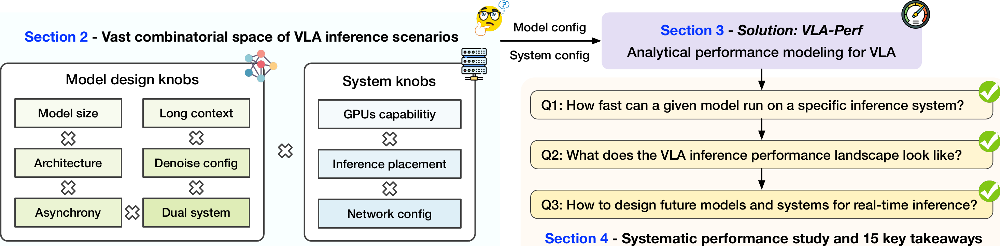
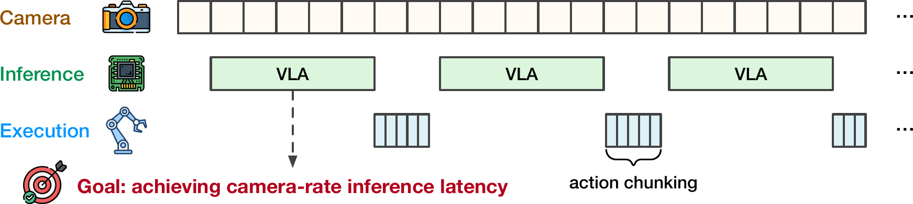
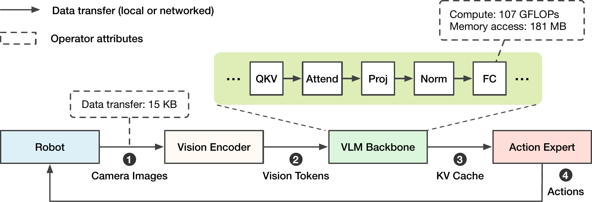
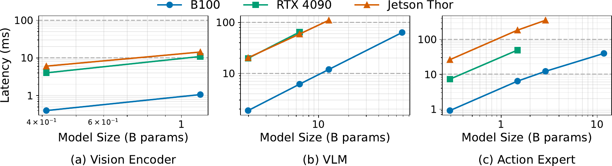
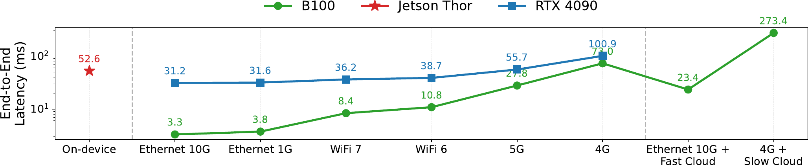
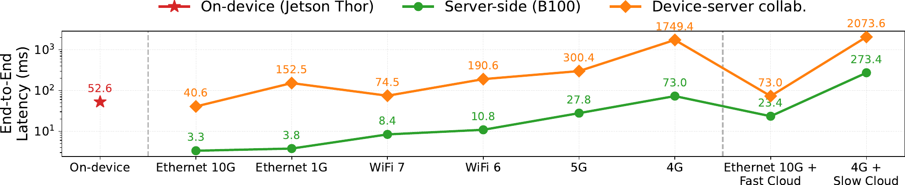

# 标题：我的 VLA 能跑多快？用 VLA-Perf 揭秘 VLA 推理性能

- ArXiv: 2602.18397
- 作者：Wenqi Jiang, NVIDIA Research, Jason Clemons, Karu Sankaralingam, Christos Kozyrakis
- 章节数：21
- 估计词元数：21.3k

## 目录

- 1 引言
- 2 背景与动机
  - 2.1 视觉-语言-动作模型
  - 2.2 高效的 VLA 推理
  - 2.3 研究空白：对 VLA 推理性能全景的综合分析
- 3 使用 VLA-Perf 分析 VLA 推理性能
- 4 评估与要点总结
  - 4.1 评估设置
  - 4.2 跨硬件后端的基线 $\pi\_{0}$ 推理延迟
  - 4.3 实时约束下的模型规模扩展
  - 4.4 长上下文 VLA 推理
  - 4.5 去噪步数与动作块大小的影响
  - 4.6 基于扩散的与自回归的动作预测
  - 4.7 设备端推理与服务器端推理
  - 4.8 设备-服务器协同推理
  - 4.9 异步推理
  - 4.10 双系统 VLA 流水线
  - 4.11 支持高达 100 Hz 的高性能 VLA 推理
- 5 结论与未来工作
- 参考文献
- 附录 A 详细的系统与模型参数

## 摘要

###### 摘要

**视觉-语言-动作模型（Vision-Language-Action models, VLA）** 最近在各种具身人工智能（Embodied AI）任务中展现了令人印象深刻的能力。然而，在真实世界的机器人上部署 VLA 模型施加了严格的实时推理约束，而由于模型架构和推理系统存在巨大的组合空间，VLA 的推理性能全景仍然鲜为人知。在本文中，我们提出了一个根本性的研究问题： **我们应该如何设计未来的 VLA 模型和系统以支持实时推理？** 为了解决这个问题，我们首先引入了 **VLA-Perf** ，这是一个分析性能模型，能够分析任意 VLA 模型与推理系统组合的推理性能。利用 VLA-Perf，我们首次对 VLA 推理性能全景进行了系统性研究。从模型设计的角度，我们研究了推理性能如何受到模型缩放、模型架构选择、长上下文视频输入、异步推理以及双系统模型流水线的影响。从部署的角度，我们分析了 VLA 推理应该在何处执行——在设备端、在边缘服务器上，还是在云端——以及硬件能力和网络性能如何共同决定端到端延迟。通过从我们全面的评估中提炼出 **15 个关键要点** ，我们希望这项工作能为未来 VLA 模型和推理系统的设计提供实用指导。

## 1 引言（Introduction）

**具身人工智能（Embodied AI）** 被广泛认为是人工智能下一个充满前景的发展阶段，其潜力在于能够创造出在现实世界中感知、推理和行动的物理智能体。值得注意的是， **视觉-语言-动作模型（Vision–Language–Action models, VLA）** 最近通过在动作生成过程中整合视觉感知和语言理解，在通用操作任务中展现出了强大的能力 [Zitkovich et al. (2023); Black et al. (2024); Intelligence et al.; Amin et al. (2025); Team et al. (2025); Bjorck et al. (2025)]。

为了响应物理世界的实时变化，VLA 推理必须以低延迟运行，这促使近期研究将 **推理性能** （^2^22 本文中，“性能”始终指推理延迟和吞吐量，而非任务成功率。）视为 VLA 模型设计的首要考量。此类努力包括：采用更小的模型 [Wen et al. (2025a); Shukor et al. (2025); Lin et al. (2025)] 和 **量化（Quantization）** 技术 [Kim et al. (2024); Wang et al. (2025a)]、跳过选定层 [Yue et al. (2024); Yang et al.]、在基于 **扩散（Diffusion）** 的模型中使用更少的去噪步骤 [Bjorck et al. (2025)]、实现模型推理与机器人执行之间的 **异步（Asynchrony）** [Black et al. (2025a, b); Sendai et al. (2025); Tang et al. (2025)]，以及采用包含两个不同规模模型的 **双系统（Dual-system）** 设计，其中仅较小的模型以高频运行 [Figure AI (2025); Zhang et al. (2024); Song et al. (2025)]。

尽管这些关于高效 VLA 模型设计的努力是重要的一步，我们仍然缺乏对 VLA 推理性能全景的全面理解，该全景由可能的（1）模型和（2）推理系统所构成的巨大组合空间决定。这里，一个推理系统是以下要素的组合：（a） **推理加速器（Inference accelerator）** ，范围从边缘 GPU 到数据中心级 GPU；（b）推理执行的位置——在设备上、在服务器上，或混合方式；（c）对于服务器端推理，连接机器人和服务器的有线或无线网络。正如我们将在评估中展示的，在不同的推理系统上执行相同的 VLA 模型可能导致数个数量级的性能差异。

在本文中，我们首次对 VLA 推理性能进行了系统性研究。本研究旨在回答一个简单但根本性的问题： **我们应如何设计 VLA 模型和系统以实现实时推理性能？** 鉴于标准 RGB 相机帧率通常在 24 到 60 Hz 之间，我们将 10 Hz 的推理频率定义为可接受的（与视频摄取速率相差不远），将 100 Hz 定义为高性能的（超过常见的摄取速率）。基于此假设，我们将研究问题进一步分解为一系列具体问题：

（1）从 VLA 模型的角度，我们提出：在实时性能约束下，未来的 VLA 模型应如何设计？具体而言，在实现实时推理的前提下，我们能够将模型规模扩大到何种程度（§[4.3](#section-4-3)）？拥有数千个视觉帧的 **长上下文（Long-context）** VLA 是否实际可行（§[4.4](#section-4-4)）？在 **自回归（Autoregressive）** 和基于扩散的动作专家之间的选择如何影响推理性能（§[4.6](#section-4-6)）？去噪步骤和 **动作块大小（Action chunk size）** 如何影响性能（§[4.5](#section-4-5)）？通过异步或双系统推理可以实现多大的性能增益（§[4.9](#section-4-9) 和 §[4.10](#section-4-10)）？

（2）从系统的角度，我们提出：我们应如何为各种 VLA 工作负载部署高效的推理系统？给定一个已验证准确性的模型，我们将部署问题分解为以下考虑因素：推理应在何处执行——在设备上、在服务器上，还是通过设备-服务器协作（§[4.7](#section-4-7) 和 §[4.8](#section-4-8)）？考虑到各种可用的 GPU 类型，如何选择推理硬件（§[4.7](#section-4-7)）？网络性能在服务器端推理系统中有多关键（§[4.7](#section-4-7)）？需要哪些模型和系统的组合来支持从 10 Hz 到 100 Hz 及以上速率的 VLA 推理（§[4.11](#section-4-11)）？

**VLA-Perf** 。为了能够在 VLA 模型和推理系统近乎无限的组合空间中进行此类系统性分析，我们开发了 **VLA-Perf** ，这是一个基于 **屋顶线（Roofline）** 的分析性能模型，可预测任意模型-系统组合的最优推理延迟和吞吐量（[图 1](#figure-1)）。VLA-Perf 支持广泛的 VLA 配置，包括不同的模型规模和架构、 **无状态（Stateless）** 和长上下文推理、不同的动作块大小、异步推理、双系统模型流水线。此外，VLA-Perf 支持多样化的部署场景，涵盖推理硬件、推理位置和网络配置。我们开源了 VLA-Perf，以便进行超出本文范围的进一步性能分析：[https://github.com/NVlabs/vla-perf](https://github.com/NVlabs/vla-perf)。

利用 VLA-Perf，我们在广泛的模型变体和系统设计空间中，对 VLA 推理性能进行了广泛的评估。根据结果，我们总结了 **15 个关键的性能要点** ，为未来 VLA 模型和推理系统的设计提供了实用指导。

> 图 1：VLA-Perf 实现了对 VLA 推理全景的全面性能分析。我们的系统性研究探索了模型架构与部署配置之间的相互作用，为设计未来的 VLA 模型和服务系统提供了 15 条可操作的见解。

## 2 背景与动机（Background and Motivation）

### 2.1 视觉-语言-动作模型（Vision-Language-Action Models）

**视觉-语言-动作模型（Vision-Language-Action Models, VLA）** 使具身智能体（Embodied Agents）能够通过视觉感知环境、基于语言指令进行推理，并生成物理动作。近期的 VLA 模型已在通用操作任务上展现出强大的性能，这些任务涉及使用机械臂 [Brohan et al. (2022); Black et al. (2024); Kim et al. (2024); Zhao et al. (2023)] 和人形机器人 [Bjorck et al. (2025); Figure AI (2025)]。

**模型架构（Model architecture）** 。
现有的 VLA 模型采用基于自回归（Autoregressive）或基于扩散（Diffusion-based，包括流匹配（Flow Matching））的动作生成方法。

- **自回归模型** 使用单一的 **变换器（Transformer）** 来整合视觉观察、解释语言指令并生成动作，以迭代方式一次生成一个动作维度（或词元）。该范式的代表性例子包括 RT 系列 [Brohan et al. (2022); Zitkovich et al. (2023); Gu et al. (2023)]、OpenVLA [Kim et al. (2024)] 和 Octo [Team et al. (2024)]。
- 最近，一种替代的 VLA 范式将 VLM 主干网络与一个独立的、通常更小的、基于扩散的动作专家模型相结合。在此范式中，VLM 主干网络接收视觉和语言输入，而基于扩散的动作专家模型则关注 VLM 的 KV 缓存（KV Cache），并通过一个迭代优化过程生成动作，其中 **去噪步数（Denoising Steps）** 3 作为一个可配置参数。基于扩散风格的 VLA 模型代表包括 $\pi_{0}$ 系列 [Amin et al. (2025); Intelligence et al.; Black et al. (2024)]、GR00T [Bjorck et al. (2025)]、SmolVLA [Shukor et al. (2025)] 和 TinyVLA [Wen et al. (2025a)]。

  **动作预测（Action prediction）** 。
  每个机器人动作通常包含多个维度，例如机械臂的关节位置、速度或扭矩，或人形机器人的全身关节配置。为了实现平滑稳定的执行，许多 VLA 模型采用 **动作分块（Action Chunking）** ，即模型在一次推理中预测未来的一系列动作 [Zhao et al. (2023); Kim et al. (2025); Jing et al. (2025)]，该序列长度被称为 **动作块大小（Action Chunk Size）** 。在动作分块机制下，可以指定一个 **执行视野（Execution Horizon）** ，其定义为在下一次推理执行之前实际执行的动作数量，该数量不大于块大小 [Black et al. (2025a, b)]。较大的执行视野可以提高动作平滑度并降低推理频率，但也会降低模型对外部环境变化做出快速反应的能力。

> 图 2 | 同步 VLA 推理的示例时间线。一个高效的推理系统应力求匹配相机摄取速率，以便为机器人提供实时动作指导。

### 2.2 高效的 VLA 推理（Efficient VLA Inference）

一个 **视觉-语言-动作模型（Vision-Language-Action， VLA）** 系统应致力于实现实时推理（10 到 100 毫秒的延迟），以匹配视觉信号摄入的速率，如 [图 2](#figure-2) 所示。为满足这一需求，越来越多的研究提出了在模型和系统层面提升 VLA 推理效率的技术 [Yu et al. (2025)]。

**减少计算量（Reduce computation）** 。
可以通过采用更小的模型 [Wen et al. (2025a); Shukor et al. (2025); Lin et al. (2025); Sun et al. (2026)] 和 **量化（Quantization）** [Kim et al. (2024); Wang et al. (2025a)]、跳过选定的 VLM 层 [Yue et al. (2024); Yang et al.]，或减少基于 **扩散模型（Diffusion models）** 的动作专家（Action Experts）的去噪步骤数 [Bjorck et al. (2025)] 来减少计算量。对于 **自回归（Autoregressive）** 的 VLA， **并行解码（Parallel decoding）** 可以通过为多词元预测复用 **KV 缓存（KV cache）** 来进一步加速推理 [Kim et al. (2025)]。最后， **动作分块（Action chunking）** 允许模型在单次推理调用中预测一系列要执行的动作，从而降低推理频率 [Zhao et al. (2023); Black et al. (2025a)]。

**异步推理与双系统 VLA（Asynchronous inference and dual-system VLAs）** 。
推理性能也可以通过多种形式的异步性来提升。例如，我们可以在机器人仍在执行先前动作时就开始推理 [Black et al. (2025a, b); Sendai et al. (2025); Tang et al. (2025)]。这种推理-执行重叠提高了 GPU 利用率，从而提高了推理吞吐量。或者，一种双系统 VLA 流水线以更高频率运行一个轻量级动作专家（系统 1），同时以较低频率调用一个更昂贵的 VLM 主干网络（系统 2）[Figure AI (2025); Zhang et al. (2024); Song et al. (2025)]，两个系统异步交换潜在状态。

**更好的推理系统（Better inference systems）** 。
虽然更高的推理频率可以通过更强大的硬件实现，但软件层面的优化对于 VLA 推理效率也至关重要。细致的 CUDA 层面优化，包括 **CUDA 图（CUDA graph）** 和 **算子融合（Operator fusion）** ，与朴素的 PyTorch 实现相比，可以将推理延迟降低多达 $5\times$ [Ma et al. (2025)]。对于采用动作分块的服务器端推理，网络延迟和机器人执行延迟可以重叠，以减少端到端执行时间 [Huang et al. (2025)]。

### 2.3 研究空白：对 VLA 推理性能格局的全面分析（Research Gap: Comprehensive Analysis of the VLA Inference Performance Landscape）

尽管上述高效 VLA 设计取得了进展，我们仍然缺乏对 VLA 推理性能格局的全面理解，这主要归因于：(1) 先前研究中推理系统配置的广泛多样性；(2) 受推理性能驱动的模型架构探索有限。从系统视角看，VLA 推理可以在集成于机器人内部的 **边缘 GPU（Edge GPUs）** 上执行（ **设备端（On-device）** ）[Figure AI (2025)]，在机器人附近的 GPU 服务器上执行（ **边缘服务器（Edge-server）** ）[Black et al. (2024); Amin et al. (2025)]，或卸载到云端的强大加速器上执行（ **云服务器（Cloud-server）** ）[Brohan et al. (2022); Zitkovich et al. (2023)]——正如我们将在评估中展示的，这些配置之间的性能差异可能非常显著。从模型设计视角看，虽然现有的 VLA 模型在设计时通常考虑了推理效率 [Shukor et al. (2025); Wen et al. (2025a)]，但它们往往针对特定的应用-系统配对。考虑到工作负载和推理硬件的快速演变，这种方法可能目光短浅，并可能限制对涉及更大模型或更长上下文等替代设计的探索。

## 3 使用 VLA-Perf 分析 VLA 推理性能（Analyzing VLA Inference Performance with VLA-Perf）

本文旨在对 **视觉-语言-动作模型（Vision-Language-Action, VLA）** 的推理性能进行全面分析，涵盖现有及未来（可能是假设的）VLA 模型与推理系统的组合。我们的评估 **仅关注性能特征** ——包括延迟（Latency）和吞吐量（Throughput）——前提是底层模型满足部署所需的精度阈值。

然而，进行如此全面的分析，远比分析一小部分现有模型和系统实现的推理性能更具挑战性。这是因为需要：（1）搭建具备各种 **加速器（Accelerator）** 能力、推理位置和网络配置的系统，如 §[2.3](#section-2-3) 所述；以及（2）不仅评估现有模型，还要评估未来可能出现的模型变体——由此产生的组合爆炸使得详尽的经验评估在成本和时间上都不可行。

为应对这一挑战，我们采用了一种基于建模的性能分析方法，该方法在先前关于 **大型语言模型（Large Language Model, LLM）** 推理和训练系统的研究中已显示出强大效力 [Davies et al. (2025); Bambhaniya et al. (2024); Agrawal et al. (2024); Cho et al. (2024); Yuan et al. (2024); Jiang et al. (2025)]。 **分析性能模型（Analytical performance models）** 侧重于捕捉模型（例如， **浮点运算次数（Floating-point Operations, FLOPs）** 和内存访问）和硬件（例如，峰值 **FLOP/s** 、内存带宽和网络带宽）的主要性能特征，并基于这些属性估算可实现的性能。这种方法能够快速、低成本地分析任意模型与硬件的组合，而无需部署真实系统。其缺点在于，分析模型并非完全精确，因为它们通常假设了乐观的软件实现，因此估算的是可实现性能的上限。例如，最近一项关于优化 VLA 推理性能的研究报告称，在真实系统上可以实现 **屋顶线模型（Roofline model）** 预测性能的 68$\sim$75% [Ma et al. (2025)]。虽然此类预测并不精确，但我们仍处于理解 VLA 推理性能的早期阶段，因此即使是粗粒度的估算也能为未来的模型和系统设计提供有价值的指导。

> 图 3 | VLA-Perf 将 VLA 推理抽象为与数据传输交错进行的模型组件。

**VLA-Perf 概述（VLA-Perf overview）** 。
我们构建了 **VLA-Perf** ，这是一个基于屋顶线的 VLA 推理分析性能模型。图 [3](#figure-3) 展示了一个 VLA 推理工作流示例，它由一个机器人（Robot）和多个模型组件组成。根据每个模型组件的放置位置（在机器人上或在服务器上），这些组件在本地或通过网络交换数据。此类数据传输可能包括原始图像、视觉词元（Vision tokens）、 **键值缓存（Key-Value cache, KV cache）** 或动作预测。每个模型组件被抽象为一系列算子（Operators），例如全连接层（Fully connected layers）、线性投影（Linear projections）和注意力块（Attention blocks）。VLA-Perf 假设每个独立的模型组件（例如，VLM 主干网络）的推理在单个加速器上执行，因为现代 GPU（包括近期的边缘加速器）已经提供了足够的内存容量来承载完整的 VLA 模型，例如 NVIDIA Jetson Thor 上高达 128 GB 的内存。相反，不同的模型组件可以在同一加速器或不同加速器上执行。

**输入参数（Input parameters）** 。
VLA-Perf 通过对模型和系统参数进行参数化，实现了对任意模型-系统组合的分析，示例见 LABEL:{fig:methodology:input_params}。在模型方面，这些参数包括视觉编码器（Vision encoder）、VLM 主干网络（VLM backbone）和动作专家（Action expert）的选择；每个模型的输入和输出序列长度；基于扩散（Diffusion）的动作专家的去噪步数；动作块大小（Action chunk size）；以及每个动作的维度。在系统方面，VLA-Perf 支持具有可配置峰值 FLOP/s 和内存带宽的各种推理加速器，以及以上传/下载带宽和延迟为特征的网络系统。

**延迟计算（Latency calculation）** 。
给定上述输入，VLA 系统的端到端推理延迟被建模为所有组件的模型推理延迟与数据移动延迟之和：

$$
T_{\text{total}}=\sum_{m\in\mathcal{M}}T_{m}+\sum_{d\in\mathcal{D}}T_{d},(1)
$$

其中 $\mathcal{M}$ 表示模型推理组件集合，$\mathcal{D}$ 表示数据移动阶段集合。

对于单个模型组件 $m$，其推理延迟 $T_{m}$ 被建模为其各组成算子延迟之和：

$$
T_{m}=\sum_{o\in\mathcal{O}_{m}}T_{o},(2)
$$

其中 $\mathcal{O}_{m}$ 表示模型 $m$ 中的 **算子（operator）** 序列。
对于每个算子 $o$， **VLA-Perf** 使用一个 **屋顶线模型（roofline model）** 对其执行延迟进行建模，该模型同时考虑了计算和内存访问延迟：

$$
T_{o}=\max\left(\frac{\text{FLOPs}_{o}}{\text{FLOP/s}_{h}},\frac{\text{Bytes}_{o}}{\text{MemBW}_{h}}\right),(3)
$$

其中 $\text{FLOPs}_{o}$ 和 $\text{Bytes}_{o}$ 分别表示算子 $o$ 执行的 **总浮点运算（total floating-point operations）** 和访问的 **内存字节数（memory bytes）** ，而 $\text{FLOP/s}_{h}$ 和 $\text{MemBW}_{h}$ 分别表示推理硬件 $h$ 的 **峰值计算吞吐量（peak compute throughput）** 和 **内存带宽（memory bandwidth）** 。

我们假设同一加速器上的本地数据移动速度足够快，可以忽略不计，而设备之间基于网络的数据移动则建模为：

$$
T_{d}^{\text{net}}=\text{NetLat}+\frac{\text{Bytes}_{d}}{\text{NetBW}},(4)
$$

其中 $\text{Bytes}_{d}$ 表示传输的数据量， **NetBW** 和 **NetLat** 分别表示 **单向网络带宽（single-directional network bandwidth）** 和 **网络延迟（network latency）** 。

> 表 1 | 在 RTX 4090 上，屋顶线模型与真实的 $\pi_{0}$ Triton 推理延迟的验证对比 Ma et al. (2025)。此评估使用 10 个流匹配步骤，动作块大小为 63，以及一个空的语言提示。

| 指标                     | 1 个摄像头 | 2 个摄像头 | 3 个摄像头 |
| ------------------------ | ---------- | ---------- | ---------- |
| Roofline (VLA-Perf)      | 14.7 ms    | 22.5 ms    | 30.4 ms    |
| Real Perf. (Triton)      | 20.0 ms    | 27.3 ms    | 36.8 ms    |
| Fidelity (Real/Roofline) | 73.3%      | 82.3%      | 82.6%      |

**建模保真度（Modeling fidelity）** 。
由于针对 **视觉语言动作模型（Vision-Language-Action, VLA）** 推理的优化框架稀缺，我们主要使用 Ma 等人 Ma et al. (2025) 的 $\pi_{0}$ 实现来验证 VLA-Perf 的保真度，这是一个专门为 RTX 4090 调优的基于 Triton 的实现。
[表 1](#table-1) 比较了 VLA-Perf 预测的性能与 Ma 等人 Ma et al. (2025) 进行的经验测量。
结果表明，一个优化的系统可以达到 VLA-Perf 报告的 **理论屋顶线（theoretical roofline）** 的 $73.3\sim 82.6\%$，且随着工作负载增加（例如，处理三个摄像头帧时），差距会缩小。

实际推理系统与 VLA-Perf 报告的屋顶线极限之间的性能差异源于硬件和软件两方面的因素。
首先，VLA-Perf 抽象掉了硬件特定的细节，包括 **微架构设计（microarchitectural design）** 、 **指令调度（instruction scheduling）** 和 **内存访问行为（memory-access behavior）** 。
相反，VLA-Perf 假设每个执行的算子都能达到最大的理论计算能力和内存带宽。
其次，现实世界的系统会产生 **软件开销（software overheads）** ，例如 **内核启动延迟（kernel launch latencies）** 、 **操作系统干扰（operating system interference）** 和 **运行时库开销（runtime library overhead）** ，这些在 VLA-Perf 中没有被明确建模。
尽管如此，我们认为超过 80% 的建模保真度足以为了解 VLA 性能格局提供有意义的见解，因此将 VLA-Perf 针对特定硬件和软件平台（例如 Davies et al. (2025); Jiang et al. (2025) 中的工作）的调优留待未来完成。

## 4 评估与要点（Evaluation and Takeaways）

在本节中，我们使用 **VLA-Perf** 对 **视觉语言-动作模型（Vision-Language-Action, VLA）** 的推理性能进行全面分析。我们的评估旨在回答以下两组研究问题。

**问题 1：** 我们应如何设计未来的 VLA 模型以满足实时延迟约束？

- 在仍能实现实时推理的前提下，模型规模可以扩展到多大（§[4.3](#section-4-3)）？
- 能够处理数千个视觉帧的 **长上下文 VLA（Long-context VLA）** 是否实际可行（§[4.4](#section-4-4)）？
- **自回归（Autoregressive）** 与 **基于扩散（Diffusion-based）** 的动作专家在性能上如何比较（§[4.6](#section-4-6)）？
- **去噪步数（Denoising steps）** 和 **动作块大小（Action chunk size）** 如何影响性能（§[4.5](#section-4-5)）？
- **异步（Asynchronous）** 或 **双系统（Dual-system）** 推理是否比 **同步推理（Synchronous inference）** 快得多（§[4.9](#section-4-9) 和 §[4.10](#section-4-10)）？

**问题 2：** 应如何为不同的 VLA 工作负载部署推理系统？

- 推理应在设备端、服务器端执行，还是通过设备-服务器协作进行（§[4.7](#section-4-7) 和 §[4.8](#section-4-8)）？
- 推理硬件必须具备多强的能力才能满足实时性能要求（§[4.7](#section-4-7)）？
- 网络性能对于服务器端推理系统有多关键（§[4.7](#section-4-7)）？
- 哪些模型-系统组合可以实现从 10 Hz 到 100 Hz 的推理速率（§[4.11](#section-4-11)）？

我们的实验组织如下：

- §[4.2](#section-4-2) 对 $\pi_{0}$ 模型进行基线分析。
- §[4.3](#section-4-3) $\sim$ [4.6](#section-4-6) 探索各种模型配置，以检验它们对推理性能的影响。
- §[4.7](#section-4-7) $\sim$ [4.11](#section-4-11) 额外考虑了推理部署位置和网络延迟，紧密反映了现实世界的部署情况。

### 4.1 评估设置（Evaluation Setup）

我们在此描述主要的模型和系统设置，更多细节见附录 [A](#appendix-a)。

**模型与机器人（Models and robot）。**
我们评估了一组源自 $\pi_{0}$ 架构 [Black et al. (2024)] 的模型变体，选择该架构是因为其在机器人任务上的强大性能以及在近期 VLA 系统中的广泛应用。原始的 $\pi_{0}$ 模型由一个 4 亿参数的 **SigLIP** 视觉编码器、一个 20 亿参数的 **Gemma** 语言模型和一个 3 亿参数的基于扩散的动作专家组成。

在整个实验中，我们考虑一个 **双臂机器人操作（Bimanual robotic manipulation）** 场景，这对于固定式机器人以及轮式或人形机器人等移动平台都很常见。使用 **UR5e** 机器人手臂时，该设置配备了三台相机和一个 14 **自由度（Degrees of Freedom, DoF）** 的动作空间。每台相机图像的分辨率为 $224 \times 224$，并被 **词元化（Tokenized）** 为 256 个视觉词元，三台相机总共产生 768 个视觉词元。假设每个任务有 32 个语言词元，则每次推理的总输入序列长度为 800 个词元。除非另有说明，我们使用动作块大小为 50 和 10 个去噪步数进行动作生成，这与原始 $\pi_{0}$ 配置相同。

> 表 2 | 我们考虑了具有不同（1）GPU 能力（行）和（2）推理位置（列）的系统。
> | 列 1 | 列 2 | 列 3 |
> | :-----: | :-----: | :-----: |
> | 数据 1 | 数据 2 | 数据 3 |
> | 数据 4 | 数据 5 | 数据 6 |

| 算力与部署位置    | 设备端 | 边缘服务器 | 云服务器 |
| :---------------- | :----: | :--------: | :------: |
| 移动端 (Thor)     |   ✓    |            |          |
| 消费级 (RTX 4090) |        |     ✓      |          |
| 数据中心 (B100)   |        |     ✓      |    ✓     |

**推理系统（Inference systems）** 。
我们评估了一系列加速器，涵盖高端边缘 GPU（例如，英伟达（NVIDIA）Jetson Thor）、研究实验中常用的消费级 GPU（例如，RTX 4090）以及高端数据中心 GPU，包括 A100、H100 和 B100。
这些 GPU 可以映射到不同的推理位置，如 [表 2](#table-2) 所示。
对于服务器端推理，我们评估了有线和无线网络配置，包括以太网（Ethernet）、WiFi 和蜂窝网络（4G/5G）。
所有实验均假设使用 BF16 进行推理，或在硬件不支持 BF16 时使用 FP16。

**性能指标（Performance metrics）** 。
我们报告 **视觉-语言-动作（Vision-Language-Action, VLA）系统延迟** ，其定义为从机器人感知到视觉观察到接收到相应动作预测所经过的时间。
我们还报告以赫兹（Hz）为单位的 **吞吐量** ，其定义为在批处理大小为 1（即单个机器人）时每秒可执行的推理次数。
对于同步推理，吞吐量是推理延迟的倒数；而对于异步推理，吞吐量可以超过延迟的倒数。
我们报告的推理性能独立于机器人执行延迟，因为后者高度依赖于具体的机器人。
此外，由于 **动作分块（Action chunking）** ，有效的动作执行频率可能超过推理频率——当分块大小为 5 时，机器人可以在单次推理后执行多达 5 个动作。

### 4.2 跨硬件后端的基线 $\pi_{0}$ 推理延迟（Baseline $\pi_{0}$ Inference Latency Across Hardware Backends）

在评估模型和系统变体之前，我们首先通过测量 $\pi_{0}$ 模型在一系列 GPU 上的推理性能来建立基线，不考虑网络延迟。

> 表 3：$\pi_{0}$ 在不同 GPU 上的推理性能（不考虑网络延迟）。

| 硬件        | 视觉延迟 | VLM 延迟 | 动作延迟 | 端到端延迟 | 端到端频率 |
| :---------- | :------: | :------: | :------: | :--------: | :--------: |
| Jetson Thor | 6.06 ms  | 20.30 ms | 26.20 ms |  52.57 ms  |  19.0 Hz   |
| RTX 4090    | 4.02 ms  | 19.79 ms | 7.25 ms  |  31.06 ms  |  32.2 Hz   |
| A100        | 2.13 ms  | 10.47 ms | 3.60 ms  |  16.20 ms  |  61.7 Hz   |
| H100        | 0.71 ms  | 3.30 ms  | 2.14 ms  |  6.15 ms   |  162.5 Hz  |
| B100        | 0.40 ms  | 1.87 ms  | 0.91 ms  |  3.18 ms   |  314.4 Hz  |

> 表 4：$\pi_{0}$ 在不同硬件上的计算与内存瓶颈分析。算子强度（Operator Intensity, OI）表示计算操作与内存访问的比率（FLOPs/Bytes）。平衡 OI（Balance OI）表示计算吞吐量和内存带宽同等受限时的硬件平衡点。

| 硬件        | 平衡 OI | 视觉 (OI=321.4) | VLM (OI=542.8) | 动作 (OI=54.0) |
| :---------- | :-----: | :-------------: | :------------: | :------------: |
| Jetson Thor | 1481.5  |    内存受限     |    内存受限    |    内存受限    |
| RTX 4090    |  163.7  |    计算受限     |    计算受限    |    内存受限    |
| A100        |  153.0  |    计算受限     |    计算受限    |    内存受限    |
| H100        |  295.2  |    计算受限     |    计算受限    |    内存受限    |
| B100        |  218.8  |    计算受限     |    计算受限    |    内存受限    |

**要点 1（Takeaway 1）** ：对于像 $\pi_{0}$ 这样的小型 VLA 模型，现有的数据中心 GPU 已经可以实现与相机帧率相当的推理频率，而边缘 GPU 的性能仍然受限。

[表 3](#table-3) 显示，A100、H100 和 B100 实现的推理频率范围在 61.7 Hz 到 314.4 Hz 之间， **这至少与常见 RGB 相机（24$\sim$60 Hz）的帧率相当** 。相比之下，Jetson Thor 的推理频率（19.0 Hz）要低得多， **低于大多数相机的帧率** 。

**关键发现 2：** 动作预测在所有硬件上都是 **内存受限（Memory-bound）** 的，而视觉和 **视觉语言模型（Vision-Language Model, VLM）** 推理在除 Jetson Thor 之外的大多数 **图形处理器（Graphics Processing Unit, GPU）** 上是 **计算受限（Compute-bound）** 的。

[表 4](#table-4) 总结了每个 VLA 模型组件的工作负载特征。与动作专家（54.0 FLOPs/Byte）相比，视觉编码器和 VLM 主干网络表现出显著更高的 **算子强度（Operator Intensity）** （分别为 321.4 和 542.8 FLOPs/Byte）。这是因为视觉编码器和 VLM 主干网络处理许多输入 **词元（Tokens）** （例如，SigLIP 为 768 个，Gemma 为 800 个），本质上跨词元进行批量计算，而基于 **扩散（Diffusion）** 的动作专家处理的词元数量要少得多（例如，与动作块大小 50 相同）。这种行为与 **大型语言模型（Large Language Model, LLM）** 推理非常相似，其中 **预填充阶段（Prefill phase，提示处理）是计算密集型的，而解码阶段（Decode phase，词元生成）是内存受限的** Patel 等人 (2024)。与其他评估的 GPU 相比，Jetson Thor 依赖于 **低功耗双倍数据率内存（Low-Power Double Data Rate memory, LPDDR memory）** ，这种内存优先考虑嵌入式设备的低功耗，但其带宽（270 GB/s）远低于 RTX 4090 上的 **图形双倍数据率内存（Graphics Double Data Rate memory, GDDR memory）** （1 TB/s）和 B100 上的 **高带宽内存（High Bandwidth Memory, HBM）** （8 TB/s）。因此， **即使在 Jetson Thor 上，视觉编码器和 VLM 主干网络也变成了内存受限的** 。

### 4.3 实时约束下的模型规模扩展（Scaling Model Sizes Under Real-Time Constraints）

接下来，我们研究推理延迟如何随着 VLA 模型规模的增加而扩展，模型规模与任务精度呈正相关 Team (2025)。具体来说，我们扩展 $\pi_{0}$ 模型的每个组件，并构建一系列更大的 VLA 模型。

- 对于视觉编码器，我们将 $\pi_{0}$ 中使用的原始 SigLIP-So400m 替换为具有 11 亿参数的更大的 SigLIP-Giant 模型。
- 对于 VLM，我们将 Gemma 替换为 Llama2 系列（7B、13B 和 70B），这提供了更广泛的模型规模范围。
- 对于动作专家，我们遵循 $\pi_{0}$ 的设计原则，将其实例化为相应 VLM 的缩小版本，通过将 **变换器（Transformer）** 的隐藏维度和中间维度分别减少 $2\times$ 和 $4\times$，使参数数量大约减少 $4\sim 8\times$。

通过组合这些组件，我们构建了一组假设的更大 VLA 模型，记为 $\pi_{0}$-L、$\pi_{0}$-XL 和 $\pi_{0}$-XXL，其配置总结在 [表 5](#table-5) 中。

> 表 5：不同硬件平台上扩展后 VLA 模型的推理性能。

| 模型                  | 视觉编码器          | VLM                | 动作专家        | Jetson Thor | RTX 4090 | B100     |
| --------------------- | ------------------- | ------------------ | --------------- | ----------- | -------- | -------- |
| $\pi_{0}$ (2.7B)      | SigLIP-So (0.4B)    | Gemma-2B (2.0B)    | Act-M (0.3B)    | 19.0 Hz     | 32.2 Hz  | 314.4 Hz |
| $\pi_{0}$-L (9.1B)    | SigLIP-Giant (1.1B) | Llama2-7B (6.5B)   | Act-L (1.5B)    | 3.9 Hz      | 8.0 Hz   | 73.6 Hz  |
| $\pi_{0}$-XL (16.7B)  | SigLIP-Giant (1.1B) | Llama2-13B (12.7B) | Act-XL (2.9B)   | 2.1 Hz      | N/A      | 39.7 Hz  |
| $\pi_{0}$-XXL (81.3B) | SigLIP-Giant (1.1B) | Llama2-70B (68.5B) | Act-XXL (11.7B) | N/A         | N/A      | 9.6 Hz   |

> 图 5：模型规模增加导致推理延迟成比例增加。

**关键发现 3：** 每个 VLA 组件的延迟随着模型规模的增加近似线性增长。

[图 5](#figure-5) 分解了随着模型规模增大，各个 **视觉语言-动作模型（Vision-Language-Action, VLA）** 组件的推理延迟，其中两个坐标轴均采用对数刻度。在所有组件中，更大的模型会按比例带来更高的计算成本，因此推理延迟大致随模型规模线性增长。

**要点 4：虽然边缘和消费级 GPU 在处理更大模型时面临困难，但数据中心 GPU 仍能支持比当前模型大一个数量级以上的 VLA 模型进行实时推理。**

[表 5](#table-5) 总结了不同模型规模的推理性能。即使对于最大的 81B 模型变体（比 $\pi_{0}$ 大 $30\times$），B100 仍能维持 9.6 Hz 的推理速度，这表明现代数据中心 GPU 能够在实时约束下容纳显著更大的 VLA 模型。相比之下，RTX 4090 在处理 $\pi_{0}$-XL（16.7B）时会耗尽内存，而 Jetson Thor 即使在有足够内存容量的情况下也难以提供实时性能，在 $\pi_{0}$-XL 上仅能达到 2.1 Hz 的推理频率。

### 4.4 长上下文视觉语言-动作模型推理（Long-Context VLA Inference）

虽然 $\pi_{0}$ 模型仅基于当前观测预测动作，但这种无记忆设计对于需要跨时间上下文进行推理的长视野任务来说是不够的 [Jang et al. (2025); Shi et al. (2025); Team et al. (2024); Wang et al. (2025b)]。在本节中，我们通过使 $\pi_{0}$ 能够将过去的视觉状态纳入 **视觉语言模型（Vision-Language Model, VLM）** 的 **KV 缓存（Key-Value cache）** 中，使其适应有状态设置。在每个新的时间步，最新的视觉输入（三个相机图像，对应 768 个视觉词元）会关注 VLM 累积的 KV 缓存，动作预测则基于这个长上下文进行。

**要点 5：数据中心 GPU 可以支持长达 1K 个过去时间步的实时长上下文 VLA 推理，而边缘和消费级 GPU 则被限制在大约 100 步。**

[表 6](#table-6) 报告了长上下文 VLA 在最多 10K 个过去时间步下的推理性能和内存消耗。B100 在 1K 个过去时间步下能维持 11.7 Hz 的推理速度，而在 10K 步时性能下降到 1.2 Hz，这不再满足实时要求。对于 Jetson Thor 和 RTX 4090，只有当上下文长度被限制在大约 100 个时间步时（约 8 Hz）才能实现实时性能。

> 表 6：长上下文 VLA 模型的推理性能和内存消耗。

| 时间步数 | 总内存   | KV 缓存大小 | Jetson Thor       | RTX 4090          | B100              |
| :------- | :------- | :---------- | :---------------- | :---------------- | :---------------- |
| 1        | 5.1 GB   | 0.01 GB     | 52.6 ms (19.0 Hz) | 31.1 ms (32.2 Hz) | 3.2 ms (314.4 Hz) |
| 10       | 5.3 GB   | 0.13 GB     | 58.4 ms (17.1 Hz) | 39.0 ms (25.7 Hz) | 3.9 ms (254.6 Hz) |
| 100      | 6.4 GB   | 1.3 GB      | 122.9 ms (8.1 Hz) | 117.3 ms (8.5 Hz) | 11.3 ms (88.4 Hz) |
| 1000     | 18.3 GB  | 13.2 GB     | 768.3 ms (1.3 Hz) | 900.6 ms (1.1 Hz) | 85.2 ms (11.7 Hz) |
| 10000    | 137.0 GB | 131.8 GB    | N/A               | N/A               | 823.7 ms (1.2 Hz) |

### 4.5 去噪步数和动作块大小的影响（Impact of Denoising Steps and Action Chunk Size）

对于一个基于 **扩散（Diffusion）** 的动作专家模型，有两个关键参数影响推理性能：(1) **去噪步数（Denoising steps）** ，每一步都会产生一次前向传播；(2) **动作块大小（Action chunk size）** ，即预测动作的数量。为此，我们将 $\pi_{0}$ 的扩散步数从 1 变化到 50（默认：10），将动作块大小从 5 变化到 250（默认：50），每个参数的变化范围均为 $50\times$。为简洁起见，我们在 B100 上展示结果，但下面观察到的趋势在所有评估的 GPU 上都是一致的。

**要点 6：去噪步数对动作专家延迟和端到端 VLA 延迟均有显著影响，而动作块大小的影响可忽略不计。**

[图˜6(a)](https://arxiv.org/html/2602.18397v1#S4.F6.sf1) 和 [图˜6(b)](https://arxiv.org/html/2602.18397v1#S4.F6.sf2) 分别报告了动作专家延迟和端到端 VLA 推理延迟。
一方面，动作预测延迟与扩散步数成线性比例关系，因此对整体 VLA 延迟有实质性影响。
例如，在默认动作块大小为 50 的情况下，将扩散步数从 10 增加到 50 会导致动作预测延迟成比例增加（$5\times$），并使整体 VLA 延迟增加 $2.15\times$。
另一方面，动作块大小对动作专家延迟和端到端 VLA 推理延迟仅有边际影响。
在默认设置 10 个去噪步的情况下，将动作块大小从 50 增加到 250（$5\times$）仅使动作预测延迟增加 40%，导致端到端 VLA 延迟仅增加 11%。
这是因为动作预测通常是 **内存受限（Memory-bound）** 的（[图˜6(c)](https://arxiv.org/html/2602.18397v1#S4.F6.sf3)）：性能受限于从内存加载模型参数和 KV 缓存，而给定更多动作令牌所带来的额外计算对整体延迟影响甚微。

> (a) 动作专家延迟。

### 4.6 Diffusion-Based vs. Autoregressive Action Prediction（基于扩散与自回归的动作预测）

**基于扩散（Diffusion-based）** 和 **自回归（Autoregressive）** 的动作预测是近期 VLA 模型中的两种主流范式。
自回归动作解码器通常使用同一个 Transformer（Transformer）来处理视觉和语言输入并生成动作 [Kim et al. (2024); Team et al. (2024)]。
相应地，我们将 $\pi_{0}$ 适配为一个自回归变体，该变体直接使用 VLM 主干进行动作预测。
相比之下，基于扩散的 VLA 通常采用一个独立的 **动作专家（Action expert）** ，其规模显著小于 VLM（例如，在 $\pi_{0}$ 中规模小 $6.7\times$）[Black et al. (2024); Bjorck et al. (2025)]。
为公平起见，我们还评估了一个基于扩散的变体，其动作专家与 VLM 规模相匹配，称为 Diffusion-Large。
经典的自回归 VLA 一次生成一个动作维度，这导致推理延迟很高，因为它需要许多顺序预测步骤（例如，在我们的案例中，具有 14 个自由度（Degree of Freedom, DoF）的动作空间和动作块大小为 50 时，需要 700 步）。
因此，我们还评估了一个更快的、采用 **并行解码（Parallel decoding）** 的自回归变体 [Kim et al. (2025)]，它在单次推理中预测所有动作，记为 Autoregressive-Parallel。

**要点 7：在使用动作分块的情况下，基于扩散的 VLA 推理比经典自回归 VLA 快一到两个数量级。**

[图˜7(a)](https://arxiv.org/html/2602.18397v1#S4.F7.sf1) 比较了在 B100 GPU 上不同架构的推理延迟。
在所有动作块大小下，基于扩散的模型（包括标准和大型变体）始终优于经典的自回归 VLA。
在默认块大小为 50 时，标准扩散模型实现了 3.2 ms 的推理延迟，比经典自回归模型（327.6 ms）快 $102.4\times$。

**要点 8：自回归 VLA 仅在生成少量动作令牌或启用并行解码时才具有竞争力。**

为了进一步分析自回归 VLA 可能高效的情景，我们评估了在常见动作维度下（不使用动作分块）的推理性能，范围从单个机器人手臂的 7 DoF [Black et al. (2024); Zitkovich et al. (2023)] 到两个灵巧手（Dexterous hands）的超过 40 DoF [Wen et al. (2025b); Christoph et al. (2025)]。
如 [图˜7(b)](https://arxiv.org/html/2602.18397v1#S4.F7.sf2) 所示，当生成的动作令牌数量较少时（例如 7 个），自回归模型可以略微超过大型基于扩散的模型，尽管标准规模的扩散模型仍然更快。
自回归推理变得具有竞争力的另一个情景是采用并行解码时。
如 [图˜7(a)](https://arxiv.org/html/2602.18397v1#S4.F7.sf1) 所示，对于动作块大小不超过 10 的情况，并行解码优于标准扩散模型。
然而，对于较大的块大小（例如 50），并行解码的延迟会显著增加，因为工作负载从内存受限转变为 **计算受限（Compute-bound）** （OI 从块大小 10 时的 135.9 增加到块大小 50 时的 477.7，超过了 B100 的平衡 OI 值 218.8）。
相比之下，基于扩散的动作专家保持内存受限（块大小为 50 时 OI = 54.0），从而在不同块大小下具有更稳定的推理性能。

> (a) 变化动作块大小。

### 4.7 设备端推理与服务器端推理（On-Device vs. Server-Side Inference）

我们评估了具有不同 **图形处理器（Graphics Processing Unit, GPU）** 和网络配置的三类 **视觉语言-动作模型（Vision-Language-Action, VLA）** 推理系统。
首先， **设备端推理（on-device inference）** ，即推理直接在集成到机器人内部的 **边缘 GPU（edge GPU）** 上执行（例如 Jetson Thor），如 Figure AI 的 Helix 等系统所展示的那样 [Figure AI (2025)]。
其次， **边缘服务器推理（edge-server inference）** ，即推理在靠近机器人的服务器上执行 [Black et al. (2024); Bjorck et al. (2025); Huang et al. (2025)]。
在此设置下，机器人与服务器之间的通信可能使用有线网络（以太网，Ethernet）（适用于固定基座机器人）或无线网络（WiFi 或蜂窝网络，cellular networks）（适用于移动机器人，例如轮式或人形机器人），而服务器端的加速器可能涵盖从消费级 GPU（例如 RTX 4090）到数据中心级 GPU（例如 B100）的范围。
第三， **云服务器推理（cloud-server inference）** ，即推理在高端数据中心 GPU 上运行。
在这种情况下，机器人首先通过有线或无线连接与附近的网关服务器通信，然后网关服务器将推理请求转发到云端，从而产生两个阶段的通信延迟。
需要注意的是，到云服务器的网络延迟可能会有很大差异，这取决于物理距离和路由拓扑等因素 [Mok et al. (2021); Sfiligoi et al. (2020)]；因此，我们考虑了两种具有不同性能的云网络配置。
我们在[表 7](#table-7)中总结了详细的网络性能参数。

**要点 9：** 除了在极端恶劣的网络条件下， **服务器端推理（server-side inference）** ，即使仅使用消费级 GPU，在大多数场景中也显著优于 **设备端推理（on-device inference）** 。

如[图 8](#figure-8)所示，即使使用通过 WiFi 连接的消费级 GPU（RTX 4090），服务器端推理也能实现比在 Jetson Thor 上进行设备端推理更低的端到端延迟。
使用更强大的 B100 GPU 时，即使部署在仅具备蜂窝网络（5G）连接的边缘服务器上，或部署在网络快速的云实例中，推理速度仍然快于设备端执行。
**设备端推理仅在网络条件受到极端限制时才更可取** ，例如：(i) 缓慢的蜂窝网络连接（4G 或以下），或 (ii) 数据中心距离机器人很远的云部署场景。

### 4.8 设备-服务器协同推理（Device-Server Collaborative Inference）

一些机器人已经配备了板载 GPU —— 因此一个自然的想法是将 VLA 工作负载在服务器和设备之间拆分，以 (1) 减少服务器工作负载，并 (2) 提高纯设备部署的性能。
由于 **动作专家模型（action expert model）** 通常比 **视觉语言模型主干（Vision-Language Model backbone, VLM backbone）** 小几倍 [Black et al. (2024); Shukor et al. (2025); Wen et al. (2025a)]，一个自然的想法是在服务器（B100）上运行 VLM 推理（包括视觉编码器），并在设备（Jetson Thor）上运行动作专家推理。
与纯设备或纯服务器解决方案相比，这里的设备-服务器协同涉及一个额外的通信步骤，即 VLM 的 **键值缓存（Key-Value cache, KV cache）** 必须在动作预测开始前下载到设备 GPU。

**要点 10：** 设备-服务器协同推理通常比纯设备推理更慢，并且总是比服务器端推理更慢，这使得该解决方案在实践中通常缺乏吸引力。

如[图 9](#figure-9)所示，与纯服务器推理相比，协同推理总是更慢 —— 这并不奇怪，因为现在动作专家运行在性能较弱的设备上。
我们发现有趣的是，在大多数情况下，它甚至比设备端推理更慢，除非是在快速有线网络（10G 以太网）下 —— 这是因为需要将 KV 缓存从服务器下载到设备，如果没有快速网络，这个过程可能非常缓慢（对于 10G 以太网、WiFi 7 和 5G 网络，分别需要 12.4、43.7 和 257.7 毫秒）。
然而，我们认为这种情况在实践中很少见：配备设备端 GPU 的机器人通常是依赖无线连接的移动平台，在这种情况下，单独使用设备端 GPU（而不是设备-服务器协同）是性能更优的选择。

> 表 7：网络配置规格。

| 指标     | 以太网 1G | 以太网 10G | WiFi 6   | WiFi 7  | 4G       | 5G       | 慢速云    | 快速云   |
| -------- | --------- | ---------- | -------- | ------- | -------- | -------- | --------- | -------- |
| 上传带宽 | 1 Gbps    | 10 Gbps    | 560 Mbps | 2 Gbps  | 19 Mbps  | 80 Mbps  | 1 Gbps    | 10 Gbps  |
| 下载带宽 | 1 Gbps    | 10 Gbps    | 800 Mbps | 3 Gbps  | 75 Mbps  | 500 Mbps | 1 Gbps    | 10 Gbps  |
| 基础延迟 | 0.10 ms   | 0.05 ms    | 3.50 ms  | 2.50 ms | 25.00 ms | 10.00 ms | 100.00 ms | 10.00 ms |

> 图 8 | 在设备、边缘服务器和云服务器上的推理性能。

> 图 9 | 设备-服务器协同推理与纯服务器和纯设备解决方案的对比。

### 4.9 异步推理（Asynchronous Inference）

在 **异步推理（Asynchronous Inference）** 中，模型基于过时的观测而非最新状态来预测动作，这使得模型推理与机器人动作执行可以部分重叠。虽然这种异步形式在无网络延迟的 **设备端推理（on-device inference）** 中不会增加最大推理吞吐量，但它可以通过允许网络传输与 **图形处理器（Graphics Processing Unit, GPU）** 计算并发进行，从而有益于 **服务器端推理（server-side inference）** 。因此，异步推理的吞吐量受限于 GPU 推理吞吐量与网络传输吞吐量中的较小值。

**要点 11** ：机器人执行与推理之间的异步性可以显著提升服务器端推理的系统吞吐量，尤其是在无线网络连接较慢的情况下。

[表 8](#table-8) 报告了不同网络配置下的服务器端推理吞吐量。在高速有线网络（例如 1 GbE 和 10 GbE 以太网）下，同步与异步推理实现了相近的吞吐量。相比之下，在较慢的无线网络（WiFi 7、5G 和 4G）下，异步推理将吞吐量提升了 $2.63 \sim 5.99$ 倍。对于 WiFi 7，推理瓶颈仍在 GPU，因此达到了与有线网络相同的吞吐量（314.4 Hz）。对于 5G 和 4G，瓶颈转移到了网络传输，导致异步吞吐量较低。需要注意的是，虽然异步推理提高了吞吐量，但并未降低端到端延迟；增加的观测陈旧度可能会降低动作质量，这需要从控制稳定性和任务成功率的角度进行进一步研究。

> 表 8 | 同步与异步系统的推理频率。

| 硬件 | 网络               | 延迟     | 频率（同步） | 频率（异步） | 加速比        |
| :--- | :----------------- | :------- | :----------- | :----------- | :------------ |
| B100 | Ethernet 10G       | 3.3 ms   | 301.4 Hz     | 314.4 Hz     | $1.04\times$  |
| B100 | Ethernet 1G        | 3.8 ms   | 266.5 Hz     | 314.4 Hz     | $1.18\times$  |
| B100 | WiFi 7             | 8.4 ms   | 119.7 Hz     | 314.4 Hz     | $2.63\times$  |
| B100 | 5G                 | 27.8 ms  | 35.9 Hz      | 215.3 Hz     | $5.99\times$  |
| B100 | 4G                 | 73.0 ms  | 13.7 Hz      | 50.5 Hz      | $3.68\times$  |
| B100 | Wired + Fast Cloud | 23.4 ms  | 42.8 Hz      | 314.4 Hz     | $7.34\times$  |
| B100 | 4G + Slow Cloud    | 273.4 ms | 3.7 Hz       | 50.5 Hz      | $13.79\times$ |

### 4.10 双系统 VLA 流水线（Dual-system VLA Pipelines）

近期研究提出了一种用于动作生成的 **系统 1 + 系统 2（System 1 + System 2）** 范式，其中负责高层推理的较慢系统 2（即 **视觉语言模型（Vision-Language Model, VLM）** ）以较低频率（例如 5–10 Hz）运行，而较快的系统 1（即动作模型）则使用最新的视觉输入以更高频率对环境做出反应 [Figure AI (2025); Zhang et al. (2024); Song et al. (2025)]。两个系统异步运行：动作专家将其预测条件建立在 VLM 的 **KV 缓存（Key-Value cache）** 上，该缓存由系统 2 以较低频率更新。虽然这种设计在概念上很有吸引力，但我们尚未见到一个被广泛采用、开源的、基于扩散风格的双系统 VLA 实现。因此，我们在评估中做了以下近似：
(1) 系统 1 的延迟包括图像上传、视觉编码、基于扩散的动作预测和动作下载，其中将视觉特征整合到动作专家中的成本假定为可忽略不计；以及
(2) 系统 2 的延迟等于 VLM 推理，其中包含了最近上传图像的视觉编码。

**要点 12** ：系统 1 与系统 2 之间的异步推理可以提升动作预测性能，其性能增益在很大程度上依赖于硬件能力和网络延迟。

[表 9](#table-9) 报告了不同系统配置和系统 2 频率上限（5 Hz 和 10 Hz）下的性能表现。
在 Jetson Thor 上，性能提升较为温和（5 Hz 上限时为 1.46$\times$，10 Hz 上限时为 1.30$\times$），因为其异步频率上限与同步 VLM（视觉语言模型，Vision-Language Model）频率 19 Hz 相当。
相比之下，在配备快速 10G 以太网连接的 B100 上，加速效果显著（10 Hz 上限时为 2.24$\times$）。
在这种情况下，异步执行将有效的 VLM 调用频率从 301.4 Hz 大幅降低至 10 Hz，从而释放了计算资源，这些资源可以重新分配给动作预测。
然而，在网络条件较慢（例如 5G）的情况下，其优势减弱，在 10 Hz 上限时仅产生 1.05$\times$ 的加速比。
这是因为网络延迟显著增加了系统 1 的延迟——从以太网的 1.5 ms 增加到 5G 的 26.0 ms——从而限制了可实现的性能，无论推理硬件能力如何。

> 表 9：使用双系统推理带来的性能提升。

| 硬件        | 网络       | S1 延迟 | S2 延迟 | 频率（同步） |     | S2 上限 = 5 Hz |              | S2 上限 = 10 Hz |              |              |
| ----------- | ---------- | ------- | ------- | ------------ | --- | -------------- | ------------ | --------------- | ------------ | ------------ |
|             |            |         |         |              |     | 频率（异步）   | 加速比       |                 | 频率（异步） | 加速比       |
| Jetson Thor | 设备端     | 32.3 ms | 20.3 ms | 19.0 Hz      |     | 27.8 Hz        | 1.46$\times$ |                 | 24.7 Hz      | 1.30$\times$ |
| B100        | 以太网 10G | 1.5 ms  | 1.9 ms  | 301.4 Hz     |     | 682.4 Hz       | 2.26$\times$ |                 | 676.0 Hz     | 2.24$\times$ |
| B100        | WiFi 7     | 6.5 ms  | 1.9 ms  | 119.7 Hz     |     | 152.6 Hz       | 1.28$\times$ |                 | 151.2 Hz     | 1.26$\times$ |
| B100        | 5G         | 26.0 ms | 1.9 ms  | 35.9 Hz      |     | 38.2 Hz        | 1.06$\times$ |                 | 37.8 Hz      | 1.05$\times$ |

### 4.11 支持高达 100 Hz 的高性能 VLA 推理（Supporting High-Performance VLA Inference up to 100 Hz）

在本节中，我们分析了如何在设备端、边缘服务器和云服务器推理系统中，使用 $\pi_{0}$ 模型实现 10 Hz 和 100 Hz 的性能目标（§[2](#section-2)）。
我们还讨论了当这些系统无法满足目标性能时，可能需要哪些算法层面的调整。

**要点 13** ：对于设备端推理，最先进的边缘 GPU（Jetson Thor）已经可以为 $\pi_{0}$ 实现 10 Hz 的推理，但要达到 100 Hz 需要进行模型层面的调整。

[表 3](#table-3) 显示，Jetson Thor 已经为 $\pi_{0}$ 实现了 19 Hz 的推理吞吐量，超过了 10 Hz 的目标。
然而，要达到 100 Hz 需要大约 $5\times$ 的提升。
这个差距必须通过模型层面的优化来弥补，例如减少模型大小（§[4.3](#section-4-3)）、减少扩散步骤数（§[4.5](#section-4-5)）或使用更低精度的量化（Quantization） Kim et al. (2024); Wang et al. (2025a)。

**要点 14** ：对于边缘服务器推理，使用消费级 GPU 和无线网络可以实现 10 Hz，而达到 100 Hz 则需要数据中心级 GPU 和更快的网络。

[图 8](#figure-8) 显示，即使使用较慢的 4G 网络，RTX 4090 也能实现 10 Hz 的推理。
然而，要实现低于 10 ms 的延迟（100 Hz），则需要更强大的加速器（如 B100）或上述的模型层面优化。
对于 B100，达到 100 Hz 还取决于网络性能，需要有线以太网或高质量的无线连接（例如 WiFi 7）。

**要点 15** ：对于云服务器推理，在良好的网络条件下 10 Hz 是可行的，而要实现 100 Hz 通常需要异步推理。

如[表 8](#table-8) 所示，即使在快速网络下，B100 在同步云推理中也仅能达到 42.8 Hz。
在这种模式下，仅网络延迟（每次上传或下载超过 10 ms）就阻碍了达到 100 Hz，使得单纯减少计算量变得不足，因此高频操作必须采用异步推理。
在快速网络（WiFi 7 或更好）下，异步执行可以实现 314.4 Hz 的吞吐量。
即使在网络条件较差、同步推理变得不可接受（3.7 Hz）的情况下，异步推理仍然可以恢复可接受的性能（50.5 Hz）。

## 5 结论与未来工作（Conclusion and Future Work）

我们首次对 **视觉-语言-动作模型（Vision-Language-Action models, VLA）** 的推理性能进行了全面研究。利用我们开发的 **分析性能建模工具（analytical performance modeling tool）** VLA-Perf，我们系统地探索了广泛的（1）模型配置，包括模型大小、上下文长度、架构选择以及同步与异步执行；以及（2）系统配置，涵盖不同的硬件平台、推理部署位置和网络条件。从这项性能研究中，我们提炼出 **15 项关键要点** ，为未来 VLA 模型和推理系统的设计提供了实用指导。

尽管这项工作代表了理解和构建下一代 VLA 系统的重要一步，但我们仅将其视为一个起点。首先，我们的研究主要关注用于 **操作任务（manipulation tasks）** 的 VLA 模型，并未考虑其他具身人工智能（Embodied AI）领域，例如 **自动驾驶（autonomous driving）** 、 **四足机器人（quadrupeds）** 或 **无人机（drones）** 。这些场景通常涉及不同的系统约束（例如，更强调 **设备端执行（on-device execution）** ）和额外的模型组件（例如， **同步定位与地图构建（Simultaneous Localization and Mapping, SLAM）** 和专用控制模块），这些超出了本工作的范围。其次，机器人系统是复杂的端到端流水线，不仅仅包含模型推理。在本工作中，我们没有考虑机器人执行延迟或传感器延迟（例如，摄像头），因为这些因素在不同平台间差异很大。一个整合了推理、感知和驱动的更全面的性能分析，将为端到端机器人系统行为提供更深入的见解。我们将这些方向留给未来的工作。

## 参考文献（References）

- [1]
  A. Agrawal, N. Kedia, J. Mohan, A. Panwar, N. Kwatra, B. S. Gulavani, R. Ramjee, and A. Tumanov (2024)
  Vidur: a large-scale simulation framework for llm inference.
  Proceedings of Machine Learning and Systems 6, pp. 351–366.
  被引用章节：[§3](https://arxiv.org/html/2602.18397v1#S3.p3.1).
- [2]
  A. Amin, R. Aniceto, A. Balakrishna, K. Black, K. Conley, G. Connors, J. Darpinian, K. Dhabalia, J. DiCarlo, D. Driess, et al. (2025)
  $\pi$0.6: a vla that learns from experience.
  arXiv preprint arXiv:2511.14759.
  被引用章节：[§1](https://arxiv.org/html/2602.18397v1#S1.p1.1),
  [§2.1](https://arxiv.org/html/2602.18397v1#S2.SS1.p2.1),
  [§2.3](https://arxiv.org/html/2602.18397v1#S2.SS3.p1.1).
- [3]
  A. Bambhaniya, R. Raj, G. Jeong, S. Kundu, S. Srinivasan, S. Subramanian, M. Elavazhagan, M. Kumar, and T. Krishna (2024)
  Demystifying ai platform design for distributed inference of next-generation llm models.
  arXiv preprint arXiv:2406.01698.
  被引用章节：[§3](https://arxiv.org/html/2602.18397v1#S3.p3.1).
- [4]
  J. Bjorck, F. Castañeda, N. Cherniadev, X. Da, R. Ding, L. Fan, Y. Fang, D. Fox, F. Hu, S. Huang, et al. (2025)
  Gr00t n1: an open foundation model for generalist humanoid robots.
  arXiv preprint arXiv:2503.14734.
  被引用章节：[§1](https://arxiv.org/html/2602.18397v1#S1.p1.1),
  [§1](https://arxiv.org/html/2602.18397v1#S1.p2.1),
  [§2.1](https://arxiv.org/html/2602.18397v1#S2.SS1.p1.1),
  [§2.1](https://arxiv.org/html/2602.18397v1#S2.SS1.p2.1),
  [§2.2](https://arxiv.org/html/2602.18397v1#S2.SS2.p2.1),
  [§4.6](https://arxiv.org/html/2602.18397v1#S4.SS6.p1.3),
  [§4.7](https://arxiv.org/html/2602.18397v1#S4.SS7.p1.1).
- [5]
  K. Black, N. Brown, D. Driess, A. Esmail, M. Equi, C. Finn, N. Fusai, L. Groom, K. Hausman, B. Ichter, et al. (2024)
  $\pi$0: A visionlanguage-action flow model for general robot control, 2024a.
  URL https://arxiv. org/abs/2410.24164.
  被引用章节：[§1](https://arxiv.org/html/2602.18397v1#S1.p1.1),
  [§2.1](https://arxiv.org/html/2602.18397v1#S2.SS1.p1.1),
  [§2.1](https://arxiv.org/html/2602.18397v1#S2.SS1.p2.1),
  [§2.3](https://arxiv.org/html/2602.18397v1#S2.SS3.p1.1),
  [§4.1](https://arxiv.org/html/2602.18397v1#S4.SS1.p2.4),
  [§4.6](https://arxiv.org/html/2602.18397v1#S4.SS6.p1.3),
  [§4.6](https://arxiv.org/html/2602.18397v1#S4.SS6.p5.1),
  [§4.7](https://arxiv.org/html/2602.18397v1#S4.SS7.p1.1),
  [§4.8](https://arxiv.org/html/2602.18397v1#S4.SS8.p1.1).
- [6]
  K. Black, M. Y. Galliker, and S. Levine (2025)
  Real-time execution of action chunking flow policies.
  arXiv preprint arXiv:2506.07339.
  被引用章节：[§1](https://arxiv.org/html/2602.18397v1#S1.p2.1),
  [§2.1](https://arxiv.org/html/2602.18397v1#S2.SS1.p3.1),
  [§2.2](https://arxiv.org/html/2602.18397v1#S2.SS2.p2.1),
  [§2.2](https://arxiv.org/html/2602.18397v1#S2.SS2.p3.1).
- [7]
  K. Black, A. Z. Ren, M. Equi, and S. Levine (2025)
  Training-time action conditioning for efficient real-time chunking.
  arXiv preprint arXiv:2512.05964.
  被引用章节：[§1](https://arxiv.org/html/2602.18397v1#S1.p2.1),
  [§2.1](https://arxiv.org/html/2602.18397v1#S2.SS1.p3.1),
  [§2.2](https://arxiv.org/html/2602.18397v1#S2.SS2.p3.1).
- [8]
  A. Brohan, N. Brown, J. Carbajal, Y. Chebotar, J. Dabis, C. Finn, K. Gopalakrishnan, K. Hausman, A. Herzog, J. Hsu, et al. (2022)
  Rt-1: robotics transformer for real-world control at scale.
  arXiv preprint arXiv:2212.06817.
  被引用章节：[§2.1](https://arxiv.org/html/2602.18397v1#S2.SS1.p1.1),
  [§2.1](https://arxiv.org/html/2602.18397v1#S2.SS1.p2.1),
  [§2.3](https://arxiv.org/html/2602.18397v1#S2.SS3.p1.1).
- [9]
  J. Cho, M. Kim, H. Choi, G. Heo, and J. Park (2024)
  Llmservingsim: a hw/sw co-simulation infrastructure for llm inference serving at scale.
  In 2024 IEEE International Symposium on Workload Characterization (IISWC),
  pp. 15–29.
  被引用章节：[§3](https://arxiv.org/html/2602.18397v1#S3.p3.1).
- [10]
  C. C. Christoph, M. Eberlein, F. Katsimalis, A. Roberti, A. Sympetheros, M. R. Vogt, D. Liconti, C. Yang, B. G. Cangan, R. J. Hinchet, et al. (2025)
  ORCA: an open-source, reliable, cost-effective, anthropomorphic robotic hand for uninterrupted dexterous task learning.
  arXiv preprint arXiv:2504.04259.
  被引用章节：[§4.6](https://arxiv.org/html/2602.18397v1#S4.SS6.p5.1).
- [11]
  M. Davies, N. Crago, K. Sankaralingam, and C. Kozyrakis (2025)
  LIMINAL: exploring the frontiers of llm decode performance.
  arXiv preprint arXiv:2507.14397.
  被引用章节：[§3](https://arxiv.org/html/2602.18397v1#S3.p10.1),
  [§3](https://arxiv.org/html/2602.18397v1#S3.p3.1).
- [12]
  Figure AI (2025)
  Helix: a vision-language-action model for generalist humanoid control.
  Note: [https://www.figure.ai/news/helix](https://www.figure.ai/news/helix)
  被引用章节：[§1](https://

- [15]
  $\pi$0.5: a vision-language-action model with open-world generalization. arxiv 2025.
  arXiv preprint arXiv:2504.16054.
  被引用位置：[§1](https://arxiv.org/html/2602.18397v1#S1.p1.1), [§2.1](https://arxiv.org/html/2602.18397v1#S2.SS1.p2.1).
- [16]
  H. Jang, S. Yu, H. Kwon, H. Jeon, Y. Seo, and J. Shin (2025)
  ContextVLA: vision-language-action model with amortized multi-frame context.
  arXiv preprint arXiv:2510.04246.
  被引用位置：[§4.4](https://arxiv.org/html/2602.18397v1#S4.SS4.p1.2).
- [17]
  W. Jiang, S. Subramanian, C. Graves, G. Alonso, A. Yazdanbakhsh, and V. Dadu (2025)
  Rago: systematic performance optimization for retrieval-augmented generation serving.
  In Proceedings of the 52nd Annual International Symposium on Computer Architecture,
  pp. 974–989.
  被引用位置：[§3](https://arxiv.org/html/2602.18397v1#S3.p10.1), [§3](https://arxiv.org/html/2602.18397v1#S3.p3.1).
- [18]
  D. Jing, G. Wang, J. Liu, W. Tang, Z. Sun, Y. Yao, Z. Wei, Y. Liu, Z. Lu, and M. Ding (2025)
  Mixture of horizons in action chunking.
  arXiv preprint arXiv:2511.19433.
  被引用位置：[§2.1](https://arxiv.org/html/2602.18397v1#S2.SS1.p3.1).
- [19]
  M. J. Kim, C. Finn, and P. Liang (2025)
  Fine-tuning vision-language-action models: optimizing speed and success.
  arXiv preprint arXiv:2502.19645.
  被引用位置：[§2.1](https://arxiv.org/html/2602.18397v1#S2.SS1.p3.1), [§2.2](https://arxiv.org/html/2602.18397v1#S2.SS2.p2.1), [§4.6](https://arxiv.org/html/2602.18397v1#S4.SS6.p1.3).
- [20]
  M. J. Kim, K. Pertsch, S. Karamcheti, T. Xiao, A. Balakrishna, S. Nair, R. Rafailov, E. Foster, G. Lam, P. Sanketi, et al. (2024)
  Openvla: an open-source vision-language-action model.
  arXiv preprint arXiv:2406.09246.
  被引用位置：[§1](https://arxiv.org/html/2602.18397v1#S1.p2.1), [§2.1](https://arxiv.org/html/2602.18397v1#S2.SS1.p1.1), [§2.1](https://arxiv.org/html/2602.18397v1#S2.SS1.p2.1), [§2.2](https://arxiv.org/html/2602.18397v1#S2.SS2.p2.1), [§4.11](https://arxiv.org/html/2602.18397v1#S4.SS11.p3.2), [§4.6](https://arxiv.org/html/2602.18397v1#S4.SS6.p1.3).
- [21]
  T. Lin, Y. Zhong, Y. Du, J. Zhang, J. Liu, Y. Chen, E. Gu, Z. Liu, H. Cai, Y. Zou, et al. (2025)
  Evo-1: lightweight vision-language-action model with preserved semantic alignment.
  arXiv preprint arXiv:2511.04555.
  被引用位置：[§1](https://arxiv.org/html/2602.18397v1#S1.p2.1), [§2.2](https://arxiv.org/html/2602.18397v1#S2.SS2.p2.1).
- [22]
  Y. Ma, Y. Zhou, Y. Yang, T. Wang, and H. Fan (2025)
  Running vlas at real-time speed.
  arXiv preprint arXiv:2510.26742.
  被引用位置：[§2.2](https://arxiv.org/html/2602.18397v1#S2.SS2.p4.1), [Table 1](#table-1), [Table 1](https://arxiv.org/html/2602.18397v1#S3.T1.2.1), [§3](https://arxiv.org/html/2602.18397v1#S3.p3.1), [§3](https://arxiv.org/html/2602.18397v1#S3.p9.2).
- [23]
  R. K. Mok, H. Zou, R. Yang, T. Koch, E. Katz-Bassett, and K. C. Claffy (2021)
  Measuring the network performance of google cloud platform.
  In Proceedings of the 21st ACM internet measurement conference,
  pp. 54–61.
  被引用位置：[§4.7](https://arxiv.org/html/2602.18397v1#S4.SS7.p1.1).
- [24]
  P. Patel, E. Choukse, C. Zhang, A. Shah, Í. Goiri, S. Maleki, and R. Bianchini (2024)
  Splitwise: efficient generative llm inference using phase splitting.
  In 2024 ACM/IEEE 51st Annual International Symposium on Computer Architecture (ISCA),
  pp. 118–132.
  被引用位置：[§4.2](https://arxiv.org/html/2602.18397v1#S4.SS2.p5.1).
- [25]
  K. Sendai, M. Alvarez, T. Matsushima, Y. Matsuo, and Y. Iwasawa (2025)
  Leave no observation behind: real-time correction for vla action chunks.
  arXiv preprint arXiv:2509.23224.
  被引用位置：[§1](https://arxiv.org/html/2602.18397v1#S1.p2.1), [§2.2](https://arxiv.org/html/2602.18397v1#S2.SS2.p3.1).
- [26]
  I. Sfiligoi, J. Graham, and F. Wuerthwein (2020)
  Characterizing network paths in and out of the clouds.
  In EPJ Web of Conferences,
  Vol. 245, pp. 07059.
  被引用位置：[§4.7](https://arxiv.org/html/2602.18397v1#S4.SS7.p1.1).
- [27]
  H. Shi, B. Xie, Y. Liu, L. Sun, F. Liu, T. Wang, E. Zhou, H. Fan, X. Zhang, and G. Huang (2025)
  Memoryvla: perceptual-cognitive memory in vision-language-action models for robotic manipulation.
  arXiv preprint arXiv:2508.19236.
  被引用位置：[§4.4](https://arxiv.org/html/2602.18397v1#S4.SS4.p1.2).
- [28]
  M. Shukor, D. Aubakirova, F. Capuano, P. Kooijmans, S. Palma, A. Zouitine, M. Aractingi, C. Pascal, M. Russi, A. Marafioti, et al. (2025)
  Smolvla: a vision-language-action model for affordable and efficient robotics.
  arXiv preprint arXiv:2506.01844.
  被引用位置：[§1](https://arxiv.org/html/2602.18397v1#S1.p2.1), [§2.1](https://arxiv.org/html/2602.18397v1#S2.SS1.p2.1), [§2.2](https://arxiv.org/html/2602.18397v1#S2.SS2.p2.1), [§2.3](https://arxiv.org/html/2602.18397v1#S2.SS3.p1.1), [§4.8](https://arxiv.org/html/2602.18397v1#S4.SS8.p1.1).
- [29]
  H. Song, D. Qu, Y. Yao, Q. Chen, Q. Lv, Y. Tang, M. Shi, G. Ren, M. Yao, B. Zhao, et al. (2025)
  Hume

- [32]
  Blokzijl, et al. (2025)
  **Gemini Robotics（Gemini 机器人学）** : Bringing AI into the Physical World（将人工智能带入物理世界）。
  arXiv preprint arXiv:2503.20020.
  被引用位置：[§1](https://arxiv.org/html/2602.18397v1#S1.p1.1)。

- [33]
  G. A. Team (2025)
  **GEN-0（GEN-0）** : Embodied Foundation Models that Scale with Physical Interaction（随物理交互扩展的具身基础模型）。
  Generalist AI Blog（通用人工智能博客）。
  备注：https://generalistai.com/blog/preview-uqlxvb-bb.html
  被引用位置：[§4.3](https://arxiv.org/html/2602.18397v1#S4.SS3.p1.9)。

- [34]
  O. M. Team, D. Ghosh, H. Walke, K. Pertsch, K. Black, O. Mees, S. Dasari, J. Hejna, T. Kreiman, C. Xu, et al. (2024)
  **Octo（Octo）** : An Open-Source Generalist Robot Policy（一个开源通用机器人策略）。
  arXiv preprint arXiv:2405.12213.
  被引用位置：[§2.1](https://arxiv.org/html/2602.18397v1#S2.SS1.p2.1)、[§4.4](https://arxiv.org/html/2602.18397v1#S4.SS4.p1.2)、[§4.6](https://arxiv.org/html/2602.18397v1#S4.SS6.p1.3)。

- [35]
  H. Wang, C. Xiong, R. Wang, and X. Chen (2025)
  **BitVLA（BitVLA）** : 1-Bit Vision-Language-Action Models for Robotics Manipulation（用于机器人操作的 1 比特视觉-语言-动作模型）。
  arXiv preprint arXiv:2506.07530.
  被引用位置：[§1](https://arxiv.org/html/2602.18397v1#S1.p2.1)、[§2.2](https://arxiv.org/html/2602.18397v1#S2.SS2.p2.1)、[§4.11](https://arxiv.org/html/2602.18397v1#S4.SS11.p3.2)。

- [36]
  Z. Wang, B. Yu, J. Zhao, W. Sun, S. Hou, S. Liang, X. Hu, Y. Han, and Y. Gan (2025)
  **Karma（Karma）** : Augmenting Embodied AI Agents with Long-and-Short Term Memory Systems（用长短时记忆系统增强具身人工智能体）。
  In 2025 IEEE International Conference on Robotics and Automation (ICRA)（发表于 2025 年 IEEE 机器人与自动化国际会议），
  pp. 1–8。
  被引用位置：[§4.4](https://arxiv.org/html/2602.18397v1#S4.SS4.p1.2)。

- [37]
  J. Wen, Y. Zhu, J. Li, M. Zhu, Z. Tang, K. Wu, Z. Xu, N. Liu, R. Cheng, C. Shen, et al. (2025)
  **TinyVLA（TinyVLA）** : Towards Fast, Data-Efficient Vision-Language-Action Models for Robotic Manipulation（迈向用于机器人操作的快速、数据高效的视觉-语言-动作模型）。
  IEEE Robotics and Automation Letters（IEEE 机器人与自动化快报）。
  被引用位置：[§1](https://arxiv.org/html/2602.18397v1#S1.p2.1)、[§2.1](https://arxiv.org/html/2602.18397v1#S2.SS1.p2.1)、[§2.2](https://arxiv.org/html/2602.18397v1#S2.SS2.p2.1)、[§2.3](https://arxiv.org/html/2602.18397v1#S2.SS3.p1.1)、[§4.8](https://arxiv.org/html/2602.18397v1#S4.SS8.p1.1)。

- [38]
  R. Wen, J. Zhang, G. Chen, Z. Cui, M. Du, Y. Gou, Z. Han, J. Hu, L. Huang, H. Niu, et al. (2025)
  **Dexterous Teleoperation of 20-DOF ByteDexter Hand via Human Motion Retargeting（通过人体运动重定向对 20 自由度 ByteDexter 手进行灵巧遥操作）** 。
  arXiv preprint arXiv:2507.03227.
  被引用位置：[§4.6](https://arxiv.org/html/2602.18397v1#S4.SS6.p5.1)。

- [39]
  Z. Yang, Y. Qi, T. Xie, B. Yu, S. Liu, and M. Li
  **DySL-VLA（DySL-VLA）** : Efficient Vision-Language-Action Model Inference via Dynamic-Static Layer-Skipping for Robot Manipulation（通过动态-静态层跳跃实现高效的视觉-语言-动作模型推理用于机器人操作）。
  被引用位置：[§1](https://arxiv.org/html/2602.18397v1#S1.p2.1)、[§2.2](https://arxiv.org/html/2602.18397v1#S2.SS2.p2.1)。

- [40]
  Z. Yu, B. Wang, P. Zeng, H. Zhang, J. Zhang, L. Gao, J. Song, N. Sebe, and H. T. Shen (2025)
  **A Survey on Efficient Vision-Language-Action Models（高效视觉-语言-动作模型综述）** 。
  arXiv preprint arXiv:2510.24795.
  被引用位置：[§2.2](https://arxiv.org/html/2602.18397v1#S2.SS2.p1.1)。

- [41]
  Z. Yuan, Y. Shang, Y. Zhou, Z. Dong, Z. Zhou, C. Xue, B. Wu, Z. Li, Q. Gu, Y. J. Lee, et al. (2024)
  **LLM Inference Unveiled: Survey and Roofline Model Insights（揭秘大语言模型推理：综述与屋顶模型洞见）** 。
  arXiv preprint arXiv:2402.16363.
  被引用位置：[§3](https://arxiv.org/html/2602.18397v1#S3.p3.1)。

- [42]
  Y. Yue, Y. Wang, B. Kang, Y. Han, S. Wang, S. Song, J. Feng, and G. Huang (2024)
  **Deer-VLA（Deer-VLA）** : Dynamic Inference of Multimodal Large Language Models for Efficient Robot Execution（用于高效机器人执行的多模态大语言模型动态推理）。
  Advances in Neural Information Processing Systems 37（神经信息处理系统进展 37），pp. 56619–56643。
  被引用位置：[§1](https://arxiv.org/html/2602.18397v1#S1.p2.1)、[§2.2](https://arxiv.org/html/2602.18397v1#S2.SS2.p2.1)。

- [43]
  J. Zhang, Y. Guo, X. Chen, Y. Wang, Y. Hu, C. Shi, and J. Chen (2024)
  **HIRT（HIRT）** : Enhancing Robotic Control with Hierarchical Robot Transformers（用分层机器人变换器增强机器人控制）。
  arXiv preprint arXiv:2410.05273.
  被引用位置：[§1](https://arxiv.org/html/2602.18397v1#S1.p2.1)、[§2.2](https://arxiv.org/html/2602.18397v1#S2.SS2.p3.1)、[§4.10](https://arxiv.org/html/2602.18397v1#S4.SS10.p1.1)。

- [44]
  T. Z. Zhao, V. Kumar, S. Levine, and C. Finn (2023)
  **Learning Fine-Grained Bimanual Manipulation with Low-Cost Hardware（利用低成本硬件学习精细双手操作）** 。
  arXiv preprint arXiv:2304.13705.
  被引用位置：[§2.1](https://arxiv.org/html/2602.18397v1#S2.SS1.p1.1)、[§2.1](https://arxiv.org/html/2602.18397v1#S2.SS1.p3.1)、[§2.2](https://arxiv.org/html/2602.18397v1#S2.SS2.p2.1)。

- [45]
  B. Zitkovich

**附录 A（Appendix A）**

## 附录 A：详细的系统与模型参数（Appendix A Detailed System and Model Parameters）

在本节中，我们将展示评估中使用的详细硬件性能配置以及 $\pi_{0}$ 模型在 LABEL:{tab:pi0_model_specs} 中的参数。

> 表 10 | 评估所用 GPU 的硬件规格。

| 硬件（Hardware） | FP32        | BF16/FP16    | INT8       | 显存（Memory） | 显存带宽（Memory BW） |
| :--------------- | :---------- | :----------- | :--------- | :------------- | :-------------------- |
| Jetson Thor      | 100 TFLOP/s | 400 TFLOP/s  | 800 TOP/s  | 128 GB         | 270 GB/s              |
| RTX 4090         | 83 TFLOP/s  | 165 TFLOP/s  | 330 TOP/s  | 24 GB          | 1008 GB/s             |
| A100             | 20 TFLOP/s  | 312 TFLOP/s  | 624 TOP/s  | 80 GB          | 2039 GB/s             |
| H100             | 67 TFLOP/s  | 989 TFLOP/s  | 1979 TOP/s | 80 GB          | 3350 GB/s             |
| B100             | 60 TFLOP/s  | 1750 TFLOP/s | 3500 TOP/s | 192 GB         | 8000 GB/s             |

> 表 11 | $\pi_{0}$ 模型各组件参数规格（不含词表）。

| 组件（Component）             | 层数（Layers） | 隐藏维度（Hidden Dim） | 中间维度（Interm. Dim） | 查询头数（Q Heads） | 键值头数（KV Heads） | 参数量（Params） |
| :---------------------------- | :------------- | :--------------------- | :---------------------- | :------------------ | :------------------- | :--------------- |
| 视觉编码器（Vision Encoder）  | 27             | 1,152                  | 4,304                   | 16                  | 16                   | 411.19M          |
| VLM 主干网络（VLM Backbone）  | 18             | 2,048                  | 16,384                  | 8                   | 1                    | 1.98B            |
| 动作专家网络（Action Expert） | 18             | 1,024                  | 4,096                   | 8                   | 1                    | 292.63M          |
