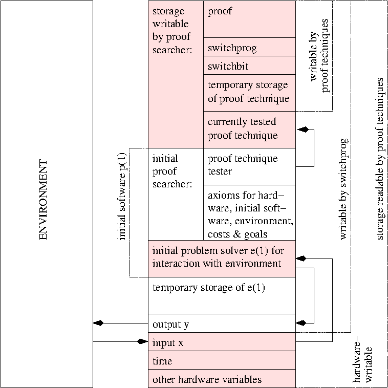

# 标题：哥德尔机（Goedel Machines）：可证明最优自我改进的自指通用问题求解器

- ArXiv: cs/0309048
- 章节数：36
- 估计词元数：22.4k

## 目录

- 1 引言与概述
- 2 概述 / 基本思想 / 局限性
  - 2.1 设定与形式化目标
  - 2.2 哥德尔机（Gödel Machine）的基本思想
  - 2.3 证明技术与一个 $O()$ 最优的初始证明搜索器
  - 2.4 哥德尔机的局限性
- 3 一个代表性哥德尔机的基本细节
  - 3.1 证明技术
  - 3.2 证明技术使用的重要指令
- 4 全局最优性定理
  - 4.1 给定编码在 $p$ 中的 $u$ 和 $\cal A$ 时的全局最优自我更改
    - 定理 4.1
  - 4.2 替代的宽松目标定理
  - 4.3 全局最优性与递归元层级
  - 4.4 证明目标定理有多难？
- 5 偏置最优证明搜索（Bias-Optimal Proof Search, BIOPS）
  - 5.1 证明空间中的在线通用搜索
    - 定义 5.1（偏置最优搜索器 [48]）
    - 方法 5.1（BIOPS）
    - 定理 5.1
  - 5.2 一个存活的证明搜索器如何利用最优有序问题求解器来解决剩余的证明搜索任务
- 6 讨论与先前工作
  - 6.1 哥德尔机自我改进的可能类型
  - 6.2 应用示例
    - 示例 6.1（时间受限的 NP 难优化问题）
    - 示例 6.2（快速定理证明）
    - 示例 6.3（资源有限下的期望奖励最大化）
    - 示例 6.4（优化任何次优问题求解器）
  - 6.3 概率哥德尔机硬件
  - 6.4 与先前工作的关系
  - 6.5 人类是概率哥德尔机吗？
  - 6.6 哥德尔机与意识
  - 6.7 常见问题解答
- 7 结论
- 8 致谢

## 摘要

我们提出了 **第一类数学上严谨、通用、完全自指、自我改进、最优高效的问题求解器** 。受库尔特·哥德尔（Kurt Gödel）著名的自指公式（1931）启发，此类问题求解器一旦找到证明表明重写是有用的，就会重写其自身代码的任何部分。其中，依赖于问题的 **效用函数（Utility Function）** 、硬件以及整个初始代码，都由编码在初始证明搜索器中的公理描述，该搜索器本身也是初始代码的一部分。该搜索器以渐近最优的高效方式，系统地测试可计算的 **证明技术（Proof Techniques）** （其输出为证明的程序），直到找到一个可证明有用、可计算的自我重写。我们证明，这样的自我重写是 **全局最优的** ——没有局部最优！——因为代码首先必须证明，继续搜索替代的自我重写是没有用的。与 Hutter 先前基于硬连线证明搜索器的非自指方法不同，我们的方法不仅拥有最优的复杂度阶，而且可以最优地减少 $O()$ 表示法所隐藏的任何减速，前提是此类加速的效用是可证明的。

**关键词** ：自指（Self-reference）、强化学习（Reinforcement Learning）、问题求解（Problem Solving）、证明技术（Proof Techniques）、最优通用搜索（Optimal Universal Search）、自我改进（Self-improvement）

截至 2006 年（库尔特·哥德尔诞辰 100 周年，及其奠定理论计算机科学基础的里程碑论文 [11] 发表 75 周年）的哥德尔机相关出版物：[45, 47, 48, 49, 50, 51]。

## 1 引言与概述

所有传统的用于 **问题求解（Problem Solving）** / **机器学习（Machine Learning）** / **强化学习（Reinforcement Learning）** [20] 的算法都是 **硬连线的（Hardwired）** 。其中一些算法旨在通过经验改进某种有限类型的策略，但它们本身并非可修改策略的一部分，并且无法以理论上可靠的方式进行自我改进。需要人类来创建新的/更好的问题求解算法，并在适当的假设下证明其有用性。

在此，我们将以最通用的方式消除对人类努力的这种限制性需求，将所有工作（包括证明搜索）留给一个能够以任意可计算的方式和最有效的方式重写和改进自身的系统。为了攻克这个“ **人工智能的重大问题（Grand Problem of Artificial Intelligence）** ” [46]，我们引入了一类新颖的、最优的、完全自指 [11] 的通用问题求解器，称为 **哥德尔机（Gödel Machines）** [45, 47, 49, 51, 50]。(^1^ 注：或写作‘Goedel machine’，以避免变音符号。但‘Godel machine’并不完全正确。请注意不要与彭罗斯（Penrose）在不同语境下所称的‘Gödel’s putative theorem-proving machine’ [30] 混淆！) 它们是 **通用问题求解系统（Universal Problem Solving Systems）** ，与某个（部分可观测的）环境交互，并且原则上可以修改自身，除了可计算性的限制外，没有本质上的限制。它们的初始算法不是硬连线的；它可以完全重写自身，但前提是嵌入在初始算法中的 **证明搜索器（Proof Searcher）** 能够首先证明该重写是有用的，这里给定的 **形式化效用函数（Formalized Utility Function）** 反映了计算时间和预期的未来成功（例如，奖励）。我们将看到，由于这种方法产生的自我重写实际上是 **全局最优的** （定理 [4.1](#S4.Thmtheorem1)，第 [4](#S4) 节），这是相对于哥德尔著名的可证明性基本限制 [11] 而言的。这些限制不应让我们担忧；如果某个自我重写的效用无法被证明，那么人类也做不了太多。

初始证明搜索器在定理 [5.1](#S5.Thmtheorem1)（第 [5](#S5) 节）的意义上是 **$O()$ 最优的** （具有最优的复杂度阶）。然而，与 Hutter [16, 17] 和 Levin [24, 26]（第 [6.4](#S6.SS4) 节）的硬连线系统不同，哥德尔机原则上可以加速其初始软件的任何部分，包括其证明搜索器，以满足超出 $O()$ 表示法可表达范围的任意可形式化的最优性概念。我们的方法产生了 **第一个理论上可靠、完全自指、最优、通用的问题求解器** 。

**概述** 。第 [2](#S2) 节介绍基本概念和根本局限性，第 [3](#S3) 节介绍一个自指公理系统的基本细节，第 [4](#S4) 节介绍 **全局最优性定理（Global Optimality Theorem）** [4.1](#S4.Thmtheorem1)，第 [5](#S5) 节介绍 $O()$ 最优的（定理 [5.1](#S5.Thmtheorem1)）初始证明搜索器。第 [6](#S6) 节提供示例以及与先前工作的关系，简要讨论了诸如意识的技术性证明等问题，并列出了关于哥德尔机的几个常见问题的答案。

## 2 概述 / 基本思想 / 局限性（Overview / Basic Ideas / Limitations）

计算机科学的许多传统问题在求解过程开始时只需要一个定义问题的输入。例如，初始输入可能是一个大整数，目标可能是对其进行因式分解。然而，在下文中，我们还将考虑更一般的情况，即问题求解需要与一个动态的、初始未知的环境进行交互，该环境会产生连续的输入流和反馈信号，例如在自主机器人控制任务中，其目标可能是最大化预期的未来累积奖励 [20]。这可能要求求解本质上任意的问题（[6.2](#S6.SS2) 节中的示例将传统问题表述为特例）。

### 2.1 设置与形式化目标（Set-up and Formal Goal）

我们的硬件（例如，通用或空间有界的图灵机（Turing machine）[61] 或个人计算机的抽象模型）具有单一的生命周期，由离散的周期或时间步 $t=1,2,\ldots$ 组成。其总寿命 $T$ 可能预先已知，也可能未知。在下文中，任何时变变量 $Q$ 在时间 $t$ 的值将用 $Q(t)$ 表示。

在每个周期中，我们的硬件执行一个基本操作，该操作会影响其可变状态 $s\in\cal S\subset B^{*}$（不失一般性，$B^{*}$ 是二进制字母表 $B=\{0,1\}$ 上可能的比特串集合），也可能影响可变环境状态 $Env\in\cal E$（这里我们尚不需要指定依赖于问题的集合 $\cal E$）。存在一个硬连线的状态转移函数 $F:\cal S\times\cal E\rightarrow\cal S$。对于 $t>1$，$s(t)=F(s(t-1),Env(t-1))$ 是在周期 $t-1$ 的硬件操作完成但周期 $t$ 的操作尚未开始时的状态。$Env(t)$ 可能依赖于编码在 $s(t-1)$ 中的过去输出动作，并由可能具有反应性的环境同时更新或（概率性地）计算。

为了便于讨论程序和数据，我们经常会给编码为 $s$ 的组成部分或子串的某些字符串变量附加名称。特别值得关注的是名为 `time`、`x`、`y` 和 `p` 的四个变量：

- 1. 在时间 $t$，变量 `time` 保存着 $t$ 的唯一二进制表示。我们初始化 $time(1)=`1\textrm{'}$，即仅由一个 `1` 组成的比特串。硬件从一个周期到下一个周期递增 `time`。这最多需要 $O(log~{}t)$ 个计算步骤，平均仅需 $O(1)$ 个计算步骤。
- 2. 变量 `x` 保存从环境到哥德尔机（Gödel machine）的输入。对于 $t>1$，仅当在哥德尔机上运行的程序在时间 $t-1$ 执行了一条特殊的输入请求指令时，$x(t)$ 才可能与 $x(t-1)$ 不同。一般来说，连续输入之间的延迟应足够大，以便程序能在下一个输入到达之前对输入执行某些基本计算，例如将其复制到内部存储器（$s$ 的保留部分）。
- 3. 变量 `y` 保存哥德尔机的输出。$y(t)$ 是一个输出比特串，随后可能影响环境，默认情况下 $y(1)=`0\textrm{'}$。例如，$y(t)$ 可被解释为操纵环境的机器人的控制信号，其动作可能对未来输入产生影响。
- 4. $p(1)$ 是初始软件：一个实现与环境交互的原始（次优）策略的程序，表示为 $p(1)$ 的一个子串 $e(1)$，加上原始的证明搜索策略。细节将在下文讨论。

在任何给定时间 $t$（$1\leq t\leq T$），目标是最大化未来的成功或效用。一个典型的“待实现价值”效用函数形式为 $u(s,Env):\cal S\times\cal E\rightarrow R$，其中 $\cal R$ 是实数集：

$$
u(s,Env)=E_{\mu}\left[\sum_{\tau=time}^{T}r(\tau)~{}~{}\Bigg{|}~{}~{}s,Env\right],(1)
$$

其中 $r(t)$ 是时间 $t$ 的实值奖励输入（编码在 $s(t)$ 内），$E_{\mu}(\cdot\mid\cdot)$ 表示关于来自可能分布集合 $M$ 的某个可能未知分布 $\mu$ 的条件期望算子（$M$ 反映了关于环境可能概率反应的已知信息），而上述 $time=time(s)$ 是状态 $s$ 的一个函数，它唯一标识当前周期。注意，我们考虑了通过适当行动延长预期寿命的可能性。

其他可形式化的效用函数可能倾向于改进最坏情况而非预期的未来性能，或提高单位时间间隔的奖励摄入量等。显然，计算机科学的大多数经典问题都可以在这个框架中表述——参见 [6.2](#S6.SS2) 节中的示例。

### 2.2 哥德尔机的基本思想（Basic Idea of Gödel Machine）

我们的机器通过加载一种特定形式的、依赖于机器的自修改代码 $p$ 而成为一个自指（Self-referential）[11] 的哥德尔机。时间步 1 的初始代码 $p(1)$ 包含一个（通常是次优的）用于与环境交互的问题求解子程序 $e(1)$（例如任何传统的强化学习（Reinforcement Learning）算法 [20]），以及一个通用的证明搜索器子程序（[5](#S5) 节），该系统性地生成对（`switchprog`, `proof`）（$s$ 的可变子串），直到找到一个目标定理的证明，该定理本质上陈述了：“在给定机器上通过当前程序 `switchprog` 立即重写 `p` 比保持 `p` 不变意味着更高的效用”。然后它执行 `switchprog`，后者可能完全重写 $p$，包括证明搜索器本身。[3](#S3) 节将解释编码在 $p(1)$ 中的必要初始公理系统 $\cal A$ 的细节。对比图 [1](#S2.F1)。

> 图 1：一个尚未自我改进的示例哥德尔机的存储快照，初始软件仍完好无损。详见正文。

全局最优性定理（定理 [4.1](#S4.Thmtheorem1)，[4](#S4) 节）表明这种自我改进策略并非贪婪的：因为“保持 $p$ 不变”的效用隐式评估了未修改的 $p$ 将来可能找到的所有可能替代 `switchprog`，所以我们获得了一个全局最优的自我更改——当前的 `switchprog` 代表了所有可能相关自我更改中的最佳者，相对于给定的资源限制和初始证明搜索策略而言。

### 2.3 证明技术与一个 $O()$-最优的初始证明搜索器（Proof Techniques and an $O()$-Optimal Initial Proof Searcher）

[5](#S5) 节将提出证明搜索器的一个 $O()$-最优初始化，即具有最优复杂度阶的初始化（定理 [5.1](#S5.Thmtheorem1)）。尽管如此，$O()$ 符号背后仍隐藏着大量自我改进的空间。该搜索器使用通用搜索（Universal Search）[24, 26] 的在线扩展来系统性地测试在线证明技术，这些证明技术是可能读取状态 $s$ 部分的证明生成程序（类似地，数学家通常对证明技术比对定理本身更感兴趣）。为了证明上述目标定理，证明技术可以调用特殊指令来生成公理并应用推理规则，通过定理来延长当前证明。这里，编码在 $p(1)$ 中的公理系统 $\cal A$ 包括描述以下内容的公理：(a) 在给定硬件上运行的程序所调用的任何指令将如何使机器的状态 $s$（包括指令指针等）从一个步骤变化到下一个步骤（使得证明技术能够推理包括证明搜索器在内的任何程序的效果），(b) 初始程序 $p(1)$ 本身（[3](#S3) 节将表明这是可能的，且不会引入循环性），(c) 随机环境属性，(d) 形式化效用函数 $u$，例如方程 ([1](#S2.E1))，它考虑了所有行动（包括证明搜索）的计算成本。

### 2.4 哥德尔机的局限性（Limitations of Gödel Machines）

其根本局限性与哥德尔关于自指公式的著名论文 [11] 首次指出的那些局限性密切相关。任何包含算术（或 ZFC 等）的形式系统要么是有缺陷的，要么允许存在不可证明但为真的陈述。因此，即使一个拥有无限计算资源的哥德尔机也必须忽略那些它无法证明其有效性的自我改进，例如，由于 $\cal A$ 中缺乏足够强大的公理。特别地，可以构造环境和效用函数的病态示例，使得机器永远无法证明一个目标定理。

**以下六条证明修改指令（仅此六条）的性质使得不可能将错误的定理插入证明中，从而使证明验证变得微不足道。** 首先，让我们简要概述最重要的指令： **get-axiom(n)** 将第 $n$ 个可能的公理附加到当前证明中， **apply-rule(k, m, n)** 将第 $k$ 条推理规则应用于当前证明中的第 $m$ 个和第 $n$ 个定理（并将结果附加到证明中）， **set-switchprog(m,n)** 设置 $switchprog:=s^{p}_{m:n}$，而 **check()** 则测试证明中的最后一个定理是否是一个目标定理，该定理表明通过 `switchprog` 进行的自我重写将是有用的。具体细节如下。

1.  **get-axiom(n)（获取公理）** 以一个整数 $n$ 作为参数，该整数由当前测试的证明技术的前缀通过算术指令（如先前工作中使用的那些 [48]）计算得出。然后，它将第 $n$ 条公理（如果存在，根据下述公理模式）作为定理追加到证明中当前的定理序列。初始公理模式编码了：
    (a) **硬件公理（Hardware axioms）** ：描述硬件，形式化地规定 $s$ 的某些组件（环境输入 $x$ 除外）如何从一个周期变化到下一个周期。例如，如果硬件是 **图灵机（Turing machine, TM）** [61]（^2^22 图灵用图灵机（TMs）[61] 重新表述了哥德尔的不可证明性结果，图灵机随后成为最广泛使用的抽象计算模型。众所周知，存在通用图灵机，在某种意义上可以模拟任何其他图灵机或任何其他已知的计算机。哥德尔基于整数的形式语言可用于描述任何通用图灵机，反之亦然。），那么 $s(t)$ 是一个 **比特串（bitstring）** ，编码了图灵机所有磁带的当前内容、其扫描头的位置以及图灵机有限状态自动机的当前内部状态，而 $F$ 指定了图灵机的查找表，该表将内部状态和扫描头上方比特的任何可能组合映射到一个新的内部状态和一个动作，例如：将某个扫描头的当前比特替换为 1/0，递增（右移）或递减（左移）某个扫描头，读取下一个输入比特并将其复制到输入磁带扫描头上方的单元，等等。或者，如果硬件由具有有限存储的现代微处理器的抽象模型给出，$s(t)$ 将编码当前的存储内容、寄存器值、指令指针等。例如，以下公理可以描述存储在 $s_{1:64}$ 中的某个 64 位硬件的指令指针如何在没有溢出且 $s_{65}$ 的值不指示应跳转到其他地址的情况下持续递增：$(\forall t\forall n:[(n<2^{64}-1)\wedge(n>0)\wedge(t>1)\wedge(t<T)$ $\wedge(string2num(s_{1:64}(t))=n)\wedge(s_{65}(t)=`0\textrm{'})]$ $\rightarrow(string2num(s_{1:64}(t+1))=n+1))$。这里使用的符号如 '('、'$>$' 和 '$\rightarrow$'（蕴含）的语义是传统的，而 '$string2num$' 象征着一个将比特串转换为数字的函数。显然，任何抽象硬件模型都可以以类似的方式完全公理化。
    (b) **奖励公理（Reward axioms）** ：定义任何硬件指令的计算成本，以及输出动作的物理成本，例如编码在 $s(t)$ 中的控制信号 $y(t)$。相关的公理为某些输入事件（编码在变量 $x$ 中，$x$ 是 $s$ 的一个子串）分配值，这些事件代表奖励或惩罚（例如，当哥德尔机控制的机器人撞到障碍物时）。额外的公理将哥德尔机生命的总价值定义为在周期 $1$ 到 $T$ 之间经历的所有奖励（例如它们的总和）和成本的标量值函数，等等。例如，假设 $s_{17:18}$ 只能通过外部输入改变；以下示例公理说明，每当此类输入等于 '11' 时，总奖励增加 3（未解释的符号具有明显含义）：$(\forall t_{1}\forall t_{2}:[(t_{1}<t_{2})\wedge(t_{1}\geq 1)\wedge(t_{2}\leq T)\wedge(s_{17:18}(t_{2})=`11\textrm{'})]$ $\rightarrow[R(t_{1},t_{2})=R(t_{1},t_{2}-1)+3]),$ 其中 $R(t_{1},t_{2})$ 被解释为时间 $t_{1}$ 和 $t_{2}$ 之间的累积奖励。显然，任何产生奖励的形式化方案都可以以类似的方式完全公理化。
    (c) **环境公理（Environment axioms）** ：限制环境产生新输入（编码在 $s$ 的某些子串内）的方式，以响应编码在 $s$ 中的输出序列 $y$。例如，可能事先知道环境是从包含在给定可能分布集合 $M$ 中的未知概率分布 $\mu$ 中采样的（比较方程 [1](#S2.E1)）。例如，$M$ 可能包含给定先前历史 [57, 58, 16] 可计算的所有分布，或者至少是 **极限可计算（limit-computable）** 的 [41, 42]。或者，更严格地说，环境可能是从 **速度先验（Speed Prior）** [43] 中采样的某个未知但确定性的计算机程序 [63, 39]，该先验为任何方法都难以计算的环境分配低概率。或者，与环境的接口是 **马尔可夫（Markovian）** 的 [35]，即当前输入总是唯一地标识环境状态——关于这种特殊情况已经做了大量工作 [33, 2, 60]。甚至更严格地说，环境可能以事先已知的完全可预测的方式演化。所有这些先验假设都可以在适当的 $\cal A$ 中完美地形式化（否则我们就无法撰写关于它们的科学论文）。
    (d) **不确定性公理（Uncertainty axioms）；字符串操作公理（String manipulation axioms）** ：算术、微积分、概率论 [21]、统计学和字符串操作的标准公理，这些公理（与硬件公理和环境公理一起）允许构造关于 $s(t)$ 未来值的（可能不确定的）属性以及给定某个时间 $\tau$ 和 $s(\tau)$ 组件的某些假设值等情况下预期剩余寿命/成本/奖励的界限的证明。一个关于未来输入 $x$ 预期属性的示例定理可能如下所示：$(\forall t_{1}\forall\mu\in M:[(1\leq t_{1})\wedge(t_{1}+15597<T)\wedge(s_{5:9}(t_{1})=`01011\textrm{'})$ $\wedge(x_{40:44}(t_{1})=`00000\textrm{'})]\rightarrow(\exists t:[(t_{1}<t<t_{1}+15597)$ $\wedge(P_{\mu}(x_{17:22}(t)=`011011\textrm{'}\mid s(t_{1}))>\frac{998}{1000})])),$ 其中 $P_{\mu}(.\mid.)$ 表示相对于一个公理化的先验分布 $\mu$ 的条件概率，$\mu$ 来自由环境公理（项目 [1c](#S3.I1.i1.I1.i3)）描述的一组分布 $M$。给定一个特定的可形式化硬件（项目 [1a](#S3.I1.i1.I1.i1)）和关于可能概率性环境的可形式化假设（项目 [1c](#S3.I1.i1.I1.i3)），显然可以完全公理化基于证明的关于过去和未来机器状态推理所需的一切。
    (e) **初始状态公理（Initial state axioms）** ：关于如何重建初始状态 $s(1)$ 或其部分的信息，使得证明搜索器可以构建包含 $(s_{{\bf m}:{\bf n}}(1)={\bf z})$ 类型公理的证明，例如：$(s_{7:9}(1)=`010\textrm{'})$。在本文此处及后续部分，我们在公式中使用粗体表示 **语法占位符（syntactic place holders）** （如 m, n, z），用于代表变量（如 m, n, z）的符号串，其语义在文本中解释——在当前上下文中 $z$ 是比特串 $s_{m:n}(1)$。注意，将硬件描述和初始硬件描述 $p$ 完全编码在 $p$ 自身内部并不是一个根本性问题。要理解这一点，可以观察到某些软件可能包含一个可以打印该软件的程序。
    (f) **效用公理（Utility axioms）** ：以效用函数 $u$ 的形式描述总体目标；例如，第 [2.1](#S2.SS1) 节中的方程 ([1](#S2.E1))。

2.  **apply-rule(k, m, n)（应用规则）** 以推理规则（如 **肯定前件（modus ponens）** ）的索引 $k$（如果存在，该规则存储在编码在 $p(1)$ 内的可能推理规则列表中）以及当前证明中两个先前已证明定理（按其创建顺序编号）的索引 $m, n$ 作为参数。如果适用，则将相应的推理规则应用于所寻址的定理，并将结果定理追加到证明中。否则，中断当前测试的证明技术。这确保了证明永远不会被输入无效的证明。

3.  **delete-theorem(m)（删除定理）** 删除当前存储证明中的第 $m$ 个定理，从而释放存储空间，使得 $s$ 中存储证明的部分可以被重用，并且最大证明大小不一定受存储限制。然而，从证明中删除

因此，我们可以利用环境输入所传达的信息，以及这样一个事实：有时（但并非总是）确定程序输出的最快方法就是运行它。然而，这种语法与语义之间的非传统在线接口需要特别小心。我们必须避免因读取 $s$ 中正在变化的部分而导致不一致的结果。例如，一个快速变化的指令指针 IP（由硬件持续更新）的当前值可能基本上是不可读的，因为执行读取子程序本身就会多次修改 IP。为了方便起见，（通常是有限的）硬件可以设置为每 $c$ 个周期将快速硬件变量的内容存储在 $s$ 的一个保留部分中，这样 `state2theorem()` 的适当变体至少可以将快速变量的某些最近值转换为定理。然而，这并不能消除与自我观察相关的所有问题。例如，要读取的 $s_{m:n}$ 也可能包含读取过程自身的、临时的、不断变化的字符串指针变量等。（^3^33 我们看到，当前 $s$ 的某些部分可能无法在不改变可观测对象本身的情况下直接观测到。然而，有时公理和先前的观测将允许哥德尔机（Gödel machine）推导出无法直接观测的、随时间变化的存储内容。例如，通过分析上述示例中通过指令指针 IP 正在执行的代码，IP 在某些时刻的值可能是可预测的（或事后可追溯的）。然而，给定时刻其他变量的值可能根本无法推导。这种自我可观测性的限制让人联想到海森堡著名的 **不确定性原理（Uncertainty principle）** [12]，该原理指出某些物理测量必然是不精确的，因为测量过程会影响被测量。）为了解决有限内存计算机上的此类问题，`state2theorem` 首先使用某种固定协议（当然编码在 $p(1)$ 中）来检查当前的 $s_{m:n}$ 是否可读，或者如果它被 `state2theorem` 的剩余代码读取是否可能会改变。如果是这样，或者 $m, n,$ 不在适当范围内，则该指令没有进一步效果。否则，它会将一个形式为 $(s_{{\bf m}:{\bf n}}({\bf t_{1}})={\bf z})$ 的观测定理附加到证明中。

公理系统 $\cal A$ 是给定哥德尔机的一个定义性参数。显然，$\cal A$ 必须足够强大，以允许目标定理的证明。特别是，不确定性公理理论（项目 [1d](#S3.I1.i1.I1.i4)）必须足够丰富。这不是根本性问题：我们只需插入概率论的所有传统公理 [21]。

## 4 全局最优性定理（Global Optimality Theorem）

直观地说，在任何给定时间 $p$ 应该仅当某个自修改算法（通过指令 `check()`——上面的项目 [5](#S3.I1.i5)）是所有可能自修改中“最好”的时才执行它，这里的“最好”取决于效用函数，而效用函数通常依赖于可用资源，例如存储大小和剩余寿命。然而，乍一看，目标定理 ([5](#S3.Ex10)) 似乎隐含地只讨论了一个单一的修改算法，即由系统化证明搜索器在时间 $t_{1}$ 设置的 `switchprog$(t_{1})$`。这种局部搜索不是贪婪的吗？它会不会导致局部最优而非全局最优？不，根据下面的全局最优性定理，它不会。

### 4.1 给定编码在 p 中的 u 和 𝒜 的全局最优自修改

###### 定理 4.1

给定任何可形式化的效用函数 $u$（项目 [1f](#S3.I1.i1.I1.i6)），并假设底层形式系统 $\cal A$ 的一致性，通过执行某个由目标定理 ([5](#S3.Ex10)) 证明所识别的程序 `switchprog` 而获得的 $p$ 的任何自修改，在以下意义上是全局最优的：开始执行当前 `switchprog` 的效用高于等待证明搜索器稍后产生替代 `switchprog` 的效用。

证明。目标定理 ([5](#S3.Ex10)) 隐含地讨论了证明搜索器未来可能产生的所有其他 `switchprog`。要理解这一点，考虑二元决策的两个备选方案：(1) 要么执行当前的 `switchprog`（设置 `switchbit` $=1$），或者 (2) 继续搜索证明和 `switchprog`（设置 `switchbit` $=0$），直到系统化搜索器找到一个更好的 `switchprog`。显然，第二个备选方案涉及所有（可能无限多）稍后要考虑的潜在 `switchprog`。也就是说，如果当前的 `switchprog` 不是“最好的”，那么在假设 $\cal A$ 一致性的前提下，证明搜索器将无法证明设置 `switchbit` 并执行 `switchprog` 将比丢弃 `switchprog` 带来更高的期望奖励。证毕。

第 [5](#S5) 节的初始证明搜索器已经以 $O()$ 最优的方式生成了所有可能的证明和 `switchprog`。然而，由于它是 $p(1)$ 的一部分，它的证明可以谈论证明搜索器本身，可能触发证明搜索器的重写，从而获得优于仅仅 $O()$ 最优的性能。

###### 定理 4.1

### 4.2 替代的宽松目标定理

我们可以用以下替代目标定理替换目标定理 ([5](#S3.Ex10))（项目 [5](#S3.I1.i5)）：

$$
(u[s({\bf t_{1}})\oplus(switchbit({\bf t_{1}})=`1\textrm{'}),Env({\bf t_{1}})]\geq
$$

$$
u[s({\bf t_{1}})\oplus(switchbit({\bf t_{1}})=`0\textrm{'}),Env({\bf t_{1}})])(3)
$$

与原始目标定理 ([5](#S3.Ex10)) 的唯一区别是“$>$”号变成了“$\geq$”号。也就是说，哥德尔机一旦找到证明表明修改不会使情况变差，就会立即修改自身。一个类似于定理 [4.1](#S4.Thmtheorem1) 的全局最优性定理成立；只需将定理 [4.1](#S4.Thmtheorem1) 中的最后一句话替换为：开始执行当前 `switchprog` 的效用至少与等待证明搜索器稍后产生替代 `switchprog` 的效用一样高。

### 4.3 全局最优性与递归元层级

我们完全自指设置的最重要方面之一是：任何目标定理的证明都会自动证明，相应的自修改以递归方式对所有受当前修改影响的进一步自修改都是有益的。从这个意义上说，自指系统所有可能的“元层级”都坍缩为一个。

### 4.4 证明目标定理有多难？

这当然取决于任务和初始公理 $\cal A$。设计简单的任务和相应的一致 $\cal A$，使得存在简短且平凡的目标定理证明，是直截了当的。

即使我们使用渐近最优的、相当通用的方法（如 Hutter 的 Aixi(t,l) [16, 19]）来初始化初始问题求解器 $e(1)$，也可能很容易证明切换到另一种策略是有用的，特别是当 $\cal A$ 包含超出 Aixi(t,l) 所做的公理假设形式的额外先验知识时。后者需要一个非常耗时但恒定的设置阶段，其成本在 $O()$ 表示法中消失，但在诸如方程 ([1](#S2.E1)) 中的 $u$ 这样的效用函数中不会消失。例如，只需构造一个环境，其中通过执行一个永无止境的简单但有回报的动作序列（例如，反复按压杠杆）来获得最大奖励，再加上一个非常简单的公理系统 $\cal A$，它允许一个简短的证明表明中断无回报的设置阶段并开始按压杠杆是有用的。

另一方面，可以构造一些不可能证明目标定理的情况，例如，利用不可判定性理论的结果，例如 [11, 32, 3, 4]。特别是，采用赖斯定理（Rice's theorem）[32] 所体现的极端平凡性概念（任何关于一般函数的非平凡性质都是不可判定的），只有给定策略的平凡改进才可能被证明是有用的。然而，这种平凡性概念显然没有反映科学家直觉上认为的平凡性。尽管机器学习文献乃至整个计算机科学文献中的许多定理都局限于赖斯意义上的平凡函数性质，但它们在直觉上被广泛认为是非平凡的。事实上，赖斯定理所涉及的函数类的无限域，不仅对处理现实世界问题的大多数科学家无关，而且对处理其有限生命周期内可能发生的有限数量事件的典型哥德尔机也无关。一般来说，在明显平凡和明显非平凡的情况之间，存在许多不那么明显的情况。关键在于：通常我们事先并不知道是否可能以可证明的良好方式改变给定的初始问题求解器。传统方法是投入人类研究努力去发现。然而，哥德尔机可以自行完成这项工作，除了可计算性和可证明性的限制外，没有本质的限制。

请注意，要证明一个目标定理，证明技术不一定需要计算切换与不切换的真实期望效用——它只需要确定哪个更高

## 5 偏置最优证明搜索（Bias-Optimal Proof Search, BIOPS）

这里我们构造一个初始的 $p(1)$，它在下面将要描述的某种有限意义上是 $O()$ 最优的，但仍然可能被改进，因为它不一定在给定的 $u$ 的意义上是最优的（例如，方程 ([1](#S2.E1)) 中的 $u$ 既未提及也不关心 $O()$ 最优性）。我们的 **偏置最优证明搜索（Bias-Optimal Proof Search, BIOPS）** 本质上是 **通用搜索（Universal Search）** [24, 26] 在证明搜索上的应用。然而，一个新颖之处在于：先前通用搜索的实际变体和扩展已被应用于 [38, 40, 55, 48] 离线程序搜索任务，其中程序输入是固定的，因此同一程序总是产生相同的结果。然而，在我们的在线设置中，BIOPS 必须考虑到，相同的证明技术在不同时间启动可能产生不同的证明，因为它可能读取 $s$ 中随着机器生命进程而改变的部分（例如，输入）。

### 5.1 证明空间中的在线通用搜索（Online Universal Search in Proof Space）

BIOPS 从一个关于证明技术 $w$ 的概率分布 $P$（初始偏置）开始，这些证明技术可以用 $\cal L$ 语言编写，例如，对于由 $K$ 种可能指令 [26] 组成的程序，$P(w)=K^{-l(w)}$。BIOPS 是 **近似偏置最优（near-bias-optimal）** [48] 的，其含义是：根据其概率偏置，它不会在任何证明技术上花费比其应得时间多得多的时间，即不会比其概率乘以总搜索时间多太多：

###### 定义 5.1 (偏置最优搜索器 [48] (Bias-Optimal Searchers [48]))

令 $\cal R$ 为一个问题类，$\cal C$ 为候选解的搜索空间（其中任何问题 $r\in\cal R$ 在 $\cal C$ 中应有一个解），$P(q\mid r)$ 是以候选解 $q\in\cal C$ 上的条件概率分布形式存在的任务相关偏置。假设我们还有一个预定义的过程，可以在时间 $t(q,r)$ 内（通常事先未知）在任何 $r\in\cal R$ 上创建和测试任何给定的 $q$。那么，一个搜索器是 $n$-偏置最优的（$n\geq 1$），如果对于任何最大总搜索时间 $T_{total}>0$，它保证能解决任何问题 $r\in\cal R$，只要该问题有一个解 $p\in\cal C$ 满足 $t(p,r)\leq P(p\mid r)~{}T_{total}/n$。如果 $n=1$，则它是偏置最优的。

###### 方法 5.1 (BIOPS)

在阶段 $(i=1,2,3,\ldots)$ 中执行：对于所有满足 $P(w)\geq 2^{-i}$ 的自定界（self-delimiting）[26] 证明技术 $w\in\cal L$ 执行：

- 1. 运行 $w$ 直到停机、出错（例如除零错误）或消耗完 $2^{i}P(w)$ 步。
- 2. 撤销 $w$ 对 $s^{p}$ 的影响（所花费的时间不会显著多于执行 $w$ 的时间）。

一个证明技术 $w$ 只能通过调用指令 `check()`（项目 [5](#S3.I1.i5)）来中断方法 [5.1](#S5.Thmmethod1)，该指令可能将控制权转移给 `switchprog`（它甚至可能删除或重写方法 [5.1](#S5.Thmmethod1)）。由于初始的 $p$ 运行在形式化的硬件上，并且由于被 $p$ 测试的证明技术可以读取 $p$ 和 $s$ 的其他部分，它们可以生成关于 $p$ 和 BIOPS 本身（预期）性能的证明。方法 [5.1](#S5.Thmmethod1) 至少在以下意义上具有最优的计算复杂度阶数。

###### 定理 5.1

如果独立于可变时间，某个未知的快速证明技术 $w$ 最多需要 $f(k)$ 步来生成一个难度度量 $k$（一个取决于待解决任务性质的整数）的证明，那么方法 [5.1](#S5.Thmmethod1) 最多需要 $O(f(k))$ 步。

**证明** 。很容易看出方法 [5.1](#S5.Thmmethod1) 最多需要 $O(f(k)/P(w))=O(f(k))$ 步——常数因子 $1/P(w)$ 不依赖于 $k$。证毕。

初始的证明搜索本身仅仅是 $O()$ 最优的。然而，再次注意，证明本身可能涉及由给定的、问题特定的、形式化的效用函数 $u$ 所体现的、相当不同的、任意可形式化的最优性概念（强于 $O()$ 表示法所能表达的），特别是方程 ([1](#S2.E1)) 意义上的最大未来奖励。尽管初始证明搜索器具有有限的（但流行且广泛使用的）$O()$ 最优性概念，但这可能引发对其有用的、影响常数的重写。一旦在哥德尔机器总寿命的某个初始阶段之后找到并执行了一个有用的重写，$O()$ 最优性的限制就不再是一个问题了。

###### 定义 5.1 (偏置最优搜索器 [48] (Bias-Optimal Searchers [48]))

###### 方法 5.1 (BIOPS)

###### 定理 5.1

### 5.2 一个存活的证明搜索器如何利用最优有序问题求解器解决剩余的证明搜索任务（How a Surviving Proof Searcher May Use the Optimal Ordered Problem Solver to Solve Remaining Proof Search Tasks）

以下内容对本文并非必需。让我们假设，对应于第一个找到的目标定理的 `switchprog` 的执行没有重写 $p$ 本身的代码——当前的 $p$ 仍然等于 $p(1)$——并且重置了 `switchbit` 并将控制权返回给 $p$，使得它可以从中断处继续执行。在这种情况下，$p(1)$ 的 Biops 子程序可以使用 **最优有序问题求解器（Optimal Ordered Problem Solver, Oops）** [48] 来加速对第 $n$ 个目标定理（$n>1$）的搜索，方法是在可能的情况下重用针对先前找到的目标定理的证明技术。基本思想如下（细节见 [48]）。

每当一个目标定理被证明，$p(1)$ 就会冻结相应的证明技术：它变得不可被后续证明搜索任务中待测试的证明技术写入，但保持可读，以便未来的证明技术可以对其进行复制编辑和/或作为子程序调用。我们还允许证明技术的前缀临时重写其后缀上的概率分布 [48]，从而基本上基于先前经验重写基于概率的搜索过程（方法 [5.1](#S5.Thmmethod1) 的增量扩展）。作为副作用，我们进行元搜索以寻找更快的搜索过程，这可以极大地加速新任务的学习 [48]。

给定一个新的证明搜索任务，Biops 执行 Oops 的方式是：将总搜索时间的一半用于方法 [5.1](#S5.Thmmethod1) 的一个变体，该变体仅在自定界 [25, 6] 的证明技术中搜索，这些证明技术以最近冻结的证明技术开头。其余时间则用于具有任意前缀的新证明技术（尽管它们可能重用先前冻结的证明技术）[48]。（我们也可以搜索一个能解决迄今为止所有证明搜索任务的泛化证明技术。在搜索的前半部分，我们不必在除最近任务外的其他任务上测试证明技术，因为我们已经知道它们的前缀解决了先前的任务 [48]。）

可以证明，给定初始偏置或由于先前任务的冻结解产生的中间偏置 [48]，Oops 本质上是 8-偏置最优的（见定义 [5.1](#S5.Thmdefinition1)）。这个结果立即适用于 Biops。总而言之，Biops 本质上将新任务的总搜索时间的一部分分配给那些以可计算方式利用先前成功证明技术的证明技术。如果通过复制编辑/调用先前冻结的证明技术比从头解决新的证明搜索任务能更快地解决新任务，那么 Biops 将发现这一点并从中获益。如果不能，那么至少它不会因为先前的解而显著减慢——Biops 将保持 8-偏置最优。

然而，请记住，Biops 并非初始化哥德尔机器证明搜索器的唯一可能方式。 **全局最优性定理（Global Optimality Theorem）** [4.1](#S4.Thmtheorem1)（第 [4](#S4) 节）表达了相对于我们选择的任何初始证明搜索器的最优性。

## 6 讨论与先前工作（Discussion & Previous Work）

在此，我们列举几种可能的自我改进类型（第 [6.1](#S6.SS1) 节）、 **哥德尔机（Gödel machine）** 在不同效用函数和环境定义的各种任务中的适用性（第 [6.2](#S6.SS2) 节）、 **概率硬件（Probabilistic hardware）** （第 [6.3](#S6.SS3) 节），以及与先前工作的关系（第 [6.4](#S6.SS4) 节）。我们还将简要讨论 **自指（Self-reference）** 与 **意识（Consciousness）** （第 [6.6](#S6.SS6) 节），并提供一份常见问题解答列表（第 [6.7](#S6.SS7) 节）。

### 6.1 哥德尔机可能的自我改进类型（Possible Types of Gödel Machine Self-Improvements）

哪些自我修改是可证明有用的？哥德尔机可能做的事情几乎没有限制。

1.  在最简单的情况下，它可能保持其基本 **证明搜索器（Proof searcher）** 不变，仅改变 **证明搜索子程序（Proof searching subroutine）** 与 **子策略（Subpolicy）** $e$（即 $p$ 中负责与环境交互的部分）之间的 **分时比率（Ratio of time-sharing）** 。
2.  或者，哥德尔机可能只修改 $e$。例如，初始的 $e(1)$ 可能是一个程序，定期将有限的过去事件记忆存储在 $s$ 的某处；这可能使 $p$ 推导出，修改 $e$ 以使其进行某些实验来增加对环境的知识，并利用所得信息增加奖励获取，将是有用的。从这个意义上说，哥德尔机体现了一种处理 **探索与利用问题（Exploration vs exploitation problem）** 的原则性方法 [20]。请注意，进行某些实验的 **期望效用（Expected utility）** （方程 ([1](#S2.E1))）可能超过不进行实验的期望效用，即使实验后的结果建议继续按照先前的 $e$ 行动。
3.  哥德尔机也可能修改其自身的 **公理（Axioms）** 以加速进程。例如，它可能找到一个证明，表明原始公理应被从原始公理可推导出的 **定理（Theorems）** 替换或增补。
4.  哥德尔机甚至可以改变其自身的 **效用函数（Utility function）** 和 **目标定理（Target theorem）** ，但只有当根据旧值可以证明新值更好时才能这样做。
5.  在许多情况下，我们不期望哥德尔机用完全放弃搜索证明的代码来替换其证明搜索器。相反，我们期望只会加速证明搜索器的某些子程序——参见第 [4.4](#S4.SS4) 节中的示例——或者可能仅以特定于问题的方式修改生成证明的顺序。这可以通过修改第 [5](#S5) 节中初始 **偏置最优证明搜索器（Bias-optimal proof searcher）** 的证明技术上的 **概率分布（Probability distribution）** 来实现。
6.  一般来说，有限重写的效用通常比完全重写的效用更容易证明。例如，假设现在是晚上 8:00，我们由哥德尔机控制的智能体的永久目标是使用（替代的）目标定理 ([3](#S4.E3)) 来最大化未来期望奖励。其中一部分是避免饥饿。它的冰箱里什么都没有，商店在晚上 8:30 关门。它没有时间优化去超市的每一个细节，但如果它不立即出发，今晚就会挨饿（原则上，这种行动的近期后果应该是容易证明的，甚至可能以类似于人类向自己证明潜在行动优势的方式）。也就是说，如果智能体先前的 **策略（Policy）** 尚未包含，例如，每天傍晚自动去超市的行程，那么该策略现在就应该被证明至少应以一种非常有限和简单的方式重写，趁还有时间，以确保智能体今晚肯定能获得一些食物，同时不影响那些可以稍后优化/决定的、不那么紧急的未来行为，例如去获取食物的路线细节，或明天的行动细节。
7.  在某些无趣的环境中，通过变得愚蠢可以最大化奖励。例如，给定的任务可能需要尽可能快地重复并永远执行相同的激活 **愉悦中心（Pleasure center）** 的动作。在这种情况下，哥德尔机可能会删除其大部分更耗时的初始软件，包括证明搜索器。
8.  请注意，没有理由认为哥德尔机不应该增强其自身的硬件。假设已知其寿命为 100 年。给定一个难题和限制环境可能行为的公理，哥德尔机可能会找到一个证明：如果它利用其环境的物理资源，投入 10 年时间构建更快的计算硬件，其期望累积奖励将会增加。

### 6.2 示例应用（Example Applications）

不涉及与概率环境显著交互的传统示例，在我们的基于奖励的框架中很容易处理：

###### 示例 6.1（时间受限的 NP 难优化，Time-limited NP-hard optimization）

哥德尔机的初始输入是一个连通图的表示，该图包含大量节点，由不同长度的边连接。在给定时间 $T$ 内，它应找到一个连接所有节点的循环路径。唯一的实值奖励将在时间 $T$ 出现。它等于 1 除以迄今为止找到的最佳路径的长度（如果未找到任何路径则为 0）。没有其他输入。最大化期望奖励的一个副产品是，在给定初始偏置的情况下，在有限时间内找到可找到的最短路径。

###### 示例 6.2（快速定理证明，Fast theorem proving）

尽可能快地证明或证伪所有大于 2 的偶数都是两个素数之和（ **哥德巴赫猜想（Goldbach’s conjecture）** ）。奖励是 $1/t$，其中 $t$ 是产生并验证第一个此类证明所需的时间。

更一般的情况是：

###### 示例 6.3（资源受限下的期望奖励最大化，Maximizing expected reward with bounded resources）

一个每小时至少需要 1 升汽油的机器人与一个部分未知的环境交互，试图找到隐藏的、有限的汽油库以偶尔为其油箱补充燃料。其奖励与其寿命成正比，并在最多 100 年后或油箱空时或掉下悬崖等情况下死亡。概率性的环境反应最初未知，但假定是从公理化的 **速度先验（Speed Prior）** [43] 中采样的，根据该先验，难以计算的环境反应不太可能发生。这允许一种可计算的策略来进行接近最优的预测 [43]。最大化期望奖励的一个副产品是最大化期望寿命。

###### 示例 6.4（优化任何次优问题求解器，Optimize any suboptimal problem solver）

给定任何可形式化的问题，将一个次优但已知的问题求解器作为软件实现在哥德尔机硬件上，并让第 [5](#S5) 节的证明搜索器并行运行。

### 6.3 概率哥德尔机硬件（Probabilistic Gödel Machine Hardware）

以上我们重点讨论了一个生活在可能为概率性环境中的示例确定性机器。将其扩展到其动作在当前状态下以概率方式计算的计算机是直接的。那么，用于环境概率方面的 **期望演算（Expectation calculus）** 只需扩展到硬件本身，并且验证证明的机制必须考虑到不存在确定的定理这样的东西——充其量只有以这样那样概率为真的形式陈述。事实上，这可能是最现实的方法，因为任何物理硬件都容易出错，现实的概率哥德尔机应考虑到这一点。

概率设置也自动避免了某些 **公理一致性（Axiomatic consistency）** 问题。例如，被证明以小于 1.0 的概率实现的预测，即使与观测结果不匹配，也不一定导致矛盾。

### 6.4 与先前工作的关系（Relations to Previous Work）

尽管（或许正是因为）自我改进机器（Self-improving machines）的雄心壮志和潜在能力，除了我们在 **IDSIA（Istituto Dalle Molle di Studi sull'Intelligenza Artificiale）** 和 **慕尼黑工业大学（Technische Universität München, TU München）** 的实验室之外，很少有其他研究沿着这一思路进行。在此，我们将列出 **哥德尔机（Gödel machine）** 与我们先前在“学会学习（learning to learn）”、“元学习（metalearning）”、自我改进（self-improvement）、自我优化（self-optimization）等方法之间的本质区别。

最密切相关的方法是 **赫特的 Hsearch（Hutter's Hsearch）** 和 **Aixi(t,l)** （见下文第 3 项）。然而，出于历史原因，我们将首先讨论 **莱文的通用搜索（Levin's Universal Search）** 和 **赫特的 Aixi（Hutter's Aixi）** 。

- 1.  **哥德尔机 vs 通用搜索**
      与完全自指（self-referential）的哥德尔机不同，莱文的通用搜索 [24, 26] 具有一个硬编码的、不可修改的元算法（meta-algorithm），无法自我改进。对于解可以在 $O(n)$ 时间内快速验证的求逆问题（inversion problems）（其中 $n$ 是解的大小），它是渐近最优的，但它总是会受到隐藏在 $O()$ 符号中的相同巨大常数减速因子（通常 $>>10^{1000}$）的影响。然而，哥德尔机的自我改进可以超越仅仅是 $O()$ 最优的，因为其效用函数（utility function）可以形式化一种更强的 **最优性（optimality）** 类型，这种类型不会仅仅因为常数巨大就忽略它们——请对比方程 ([1](#S2.E1)) 的效用函数。此外，哥德尔机适用于通用的终身 **强化学习（Reinforcement Learning, RL）** 任务 [20]，而通用搜索在此类任务中并非渐近最优，甚至不适用，因为在强化学习中，评估某个行为的价值原则上会消耗学习者的整个生命周期！因此，朴素地测试一个程序好坏会消耗整个生命。也就是说，我们只能测试一个程序；之后生命就结束了。因此，为了实现其目标，通用的强化学习机器必须做通用搜索不做的事情，例如预测未来的任务和奖励。这部分地激发了赫特的通用强化学习机器 **AIXI** ，接下来将进行讨论。

- 2.  **哥德尔机 vs Aixi**
      与哥德尔机不同，赫特近期的 Aixi 模型 [16, 19] 通常每次输入更新都需要无限的计算资源。它结合了 **所罗门诺夫的通用预测方案（Solomonoff's universal prediction scheme）** [57, 58] 和一个 **期望最大化（expectimax）** 计算。在离散周期 $k=1,2,3,\ldots$ 中，动作 $y(k)$ 导致感知 $x(k)$ 和奖励 $r(k)$，两者均从未知的（反应式）环境概率分布 $\mu$ 中采样。Aixi 定义一个混合分布 $\xi$，作为分布 $\nu\in\cal M$ 的加权和，其中 $\cal M$ 是包含真实环境 $\mu$ 的任何分布类。例如，$\cal M$ 可以是所有可计算分布（computable distributions）的和 [57, 58]，其中权重之和不超过 1。在周期 $k+1$ 中，Aixi 选择一个动作序列中的第一个动作作为下一个动作，该序列最大化在某个给定 **视野（horizon）** 内 $\xi$ 预测的奖励。近期工作 [18] 如下展示了 Aixi 对观测的最优利用。基于混合分布 $\xi$ 的 **贝叶斯最优策略（Bayes-optimal policy）** $p^{\xi}$ 是 **自优化（self-optimizing）** 的，因为对于所有 $\mu\in\cal M$，其平均效用值渐近收敛于（不可行的）贝叶斯最优策略 $p^{\mu}$ 所达到的最优值，而 $p^{\mu}$ 预先知道 $\mu$。$\cal M$ 允许自优化策略的必要条件也是充分的。此外，$p^{\xi}$ 是 **帕累托最优（Pareto-optimal）** 的，因为不存在其他策略能在所有环境 $\nu\in\cal M$ 中产生更高或相等的值，并且至少在一种环境中产生严格更高的值 [18]。虽然 Aixi 阐明了机器学习的某些理论极限，但它在计算上是难以处理的，特别是当 $\cal M$ 包含所有可计算分布时。这一缺点促使了对时间有界、渐近最优的 **Aixi(t,l)** 系统 [16] 和相关 **Hsearch** [17] 的研究，两者都将在接下来讨论。

- 3.  **哥德尔机 vs Hsearch 和 Aixi(t,l)**
      现在我们来讨论最密切相关的先前工作；因此我们将额外花些篇幅指出哥德尔机的主要新颖之处。赫特的非自指但仍是 $O()$ 最优的、针对所有良定义问题的“最快”算法 **Hsearch** [17] 使用一个硬编码的暴力证明搜索器（proof searcher），并忽略证明搜索的成本。假设离散的输入/输出域 $X/Y$，一个形式化的问题规约 $f:X\rightarrow Y$（例如，描述整数如何分解为其质因数的函数描述），以及一个特定的 $x\in X$（例如，一个待分解的整数）。Hsearch 按大小排序一个适当公理系统的所有证明，以寻找程序 $q$，这些程序 $q$ 对于所有 $z\in X$，可证明地在时间界限 $t_{q}(z)$ 内计算 $f(z)$。同时，它将其大部分时间用于执行当前已证明具有最佳时间界限 $t_{q}(x)$ 的 $q$。结果表明，Hsearch 的速度与可证明地为所有 $z\in X$ 计算 $f(z)$ 的最快算法一样快，除了一个小于 $1+\epsilon$（任意 $\epsilon>0$）的常数因子和一个 $f$ 特定但与 $x$ 无关的加性常数 [17]。不过，这个常数可能非常巨大。赫特的 **Aixi(t,l)** [16] 与此相关。在 Aixi(t,l) 生命周期的离散周期 $k=1,2,3,\ldots$ 中，动作 $y(k)$ 导致感知 $x(k)$ 和奖励 $r(k)$，其中所有量都可能依赖于完整的历史。使用通用计算机（如 **图灵机（Turing machine）** ），Aixi(t,l) 需要一个初始的离线设置阶段（在与环境交互之前），在此阶段它使用一个硬编码的暴力证明搜索器来检查所有长度至多为 $L$ 的证明，筛选出那些识别出程序（最大大小为 $l$，每周期最大运行时间为 $t$）的证明，这些程序不仅能够与环境交互，而且对于所有可能的交互历史，也能正确预测其自身期望未来奖励的下界。在周期 $k$ 中，Aixi(t,l) 然后运行在设置阶段识别的所有程序（最多 $2^{l}$ 个），找到自评分最高的那个，并执行其对应的动作。与问题无关的设置时间（几乎全部工作在此完成）是 $O(L\cdot 2^{L})$。每周期的在线时间是 $O(t\cdot 2^{l})$。两者都是常数，但通常非常巨大。
      **哥德尔机的优势与新颖性。** 哥德尔机与赫特的 Hsearch [17] 和 Aixi(t,l) [16] 之间存在主要差异，包括：
      (a) Hsearch 和 Aixi(t,l) 的定理证明器是硬编码的、非自指的、不可修改的元算法，无法自我改进。也就是说，它们将始终遭受隐藏在 $O()$ 符号中的相同巨大常数减速（通常 $\gg 10^{1000}$）。但原则上，没有任何东西能阻止哥德尔机真正的自指代码以可证明构成改进的最佳可能方式，证明并利用对这些常数的急剧减少（如果存在的话）。
      (b) Hsearch 和 Aixi(t,l) 的 $O()$ 最优性证明依赖于对其某些不可修改的元算法进行巧妙的计算时间分配。然而，我们的 **全局最优性定理（Global Optimality Theorem）** （定理 [4.1](#S4.Thmtheorem1)，第 [4](#S4) 节）是通过一种相当不同类型的推理来证明的，这种推理确实利用并关键依赖于一个事实：根本不存在不可修改的软件，并且证明搜索器本身是可读的、可修改的、可以改进的。这也是其自我改进可以超越仅仅是 $O()$ 最优的原因。
      (c) Hsearch 使用了一个“技巧”，即证明超出必要的内容，这个技巧有时也会消失在相当具有误导性的 $O()$ 符号中：它浪费时间寻找可证明为所有 $z\in X$ 计算 $f(z)$ 的程序，即使当前的 $f(x)(x\in X)$ 是唯一感兴趣的对象

### 6.5 人类是概率哥德尔机吗？（Are Humans Probabilistic Gödel Machines?）

我们不知道。但我们认为最好是。不过，他们处理不确定性的初始底层形式系统似乎与传统期望演算和逻辑的系统有很大不同——请比较第 [3.2](#S3.SS2) 节中的项目 [1c](#S3.I1.i1.I1.i3) 和 [1d](#S3.I1.i1.I1.i4)，以及超市示例（第 [6.1](#S6.SS1) 节中的项目 [6](#S6.I1.i6)）。

### 6.6 哥德尔机与意识（Gödel Machines and Consciousness）

近年来，意识（Consciousness）这一话题作为严肃的研究议题获得了一些可信度，至少在哲学和神经科学领域是如此，例如 [9]。然而，缺乏对意识的技术性论证：迄今为止，没有人证明意识对于解决问题确实有用，尽管解决问题在哲学中被认为是核心要务 [31]。

完全自指的哥德尔机（Gödel machine）可以被视为恰好提供了这样一种技术性论证 [50]。它是“有意识的”或“自我觉知的”，因为它的全部行为都开放给自我内省，并且是可修改的。它可以通过执行被证明是好的自我改变来“走出自身” [14]，其中证明搜索器（Proof Searcher）本身也会通过它测试的证明技术（Proof Techniques）受到分析和改变。而这种完全的自指性（Self-reference）正是其作为问题求解器具有最优性的原因，其意义如定理 [4.1](#S4.Thmtheorem1) 所述。

### 6.7 常见问题（Frequently Asked Questions）

在过去一年中，作者经常收到关于哥德尔机的问题。以下是对一些典型问题的回答列表。

- 1.  **问** ：在不确定的现实世界中，形式化证明搜索这种精确事务真的有意义吗？
      **答** ：是的，有意义。我们只需要在 $p(1)$ 中插入用于表示不确定性、处理概率设置和期望奖励等的标准公理。请比较第 [3.2](#S3.SS2) 节中的项目 [1d](#S3.I1.i1.I1.i4) 和 [1c](#S3.I1.i1.I1.i3)，以及方程 ([1](#S2.E1)) 中将效用（Utility）定义为期望值的定义。同时请注意，机器学习文献中充满了人类生成的、关于处理随机环境方法性质的证明。
- 2.  **问** ：目标定理 ([5](#S3.Ex10)) 似乎只涉及第一次自我改变，这可能会完全重写证明搜索子程序——这难道不会使定理 [4.1](#S4.Thmtheorem1) 的证明无效吗？是什么阻止了后续的自我改变具有破坏性？
      **答** ：这一点已完全考虑在内。请再次查看定理 [4.1](#S4.Thmtheorem1) 的证明，并注意，只有当第一次自我改变被证明对 **所有** 未来的自我改变（当前的自我改变为其奠定了基础）都是有用的（在当前效用函数 $u$ 的意义上）时，它才会被执行。这实际上是整个自指设置的主要观点之一。
- 3.  **问** （与上一项相关）：哥德尔机实现了一种元学习（Meta-learning）行为：那么元-元（Meta-meta）和元-元-元（Meta-meta-meta）层级呢？
      **答** ：美妙之处在于，所有元层级都会自动坍缩为一层：任何目标定理的证明都会自动证明，相应的自我修改对所有受当前修改影响的进一步自我修改都是有益的，这是以递归方式进行的。请回顾第 [4.3](#S4.SS3) 节。
- 4.  **问** ：哥德尔机软件只能产生从输入序列到输出序列的可计算映射（Computable Mappings）。如果环境是不可计算的（Non-computable）呢？
      **答** ：许多物理学家和其他科学家（例外：[63, 39]）实际上似乎假设现实世界使用了所有的实数（Real Numbers），而其中大多数是不可计算的。然而，定理和证明只是有限的符号串，所有物理学论著都只包含可计算的公理和定理，即使其中一些定理可以被解释为对不可数多对象（如实数全体）的陈述。（但请注意，勒文海姆-斯科伦定理（Löwenheim-Skolem Theorem）[28, 56] 意味着，任何具有不可数模型（如实数）的一阶理论（First Order Theory）也都有一个可数模型（Countable Model）。）一般来说，对不可计算对象的形-式描述根本不构成根本性问题——它们仍然可能允许找到一个被证明能最大化效用的策略。如果是这样，哥德尔机就可以利用这一点。如果不是，那么人类相对于哥德尔机也不会有根本性的优势。
- 5.  **问** ：自动定理证明（Automated Theorem-proving）不是非常困难吗？当前的人工智能系统无法在没有人类在关键决策点干预的情况下证明非平凡的定理。
      **答** ：越来越多重要的数学证明（四色定理（Four Color Theorem）等）严重依赖于自动证明搜索。而传统的定理证明器甚至没有利用我们新颖的证明技术和 $O()$ 最优证明搜索的概念。当然，有些证明确实很难找到，但在这方面，人类和哥德尔机面临着相同的基本限制。
- 6.  **问** ：“没有免费午餐定理（No Free Lunch Theorems）” [62] 不是说不可能构建通用问题求解器（Universal Problem Solvers）吗？
      **答** ：不，它们没有这么说。它们指的是从有限问题空间上的独立同分布（i.i.d.）均匀分布（Uniform Distributions）中采样问题的非常特殊的情况。请参阅早期论文 [48] 中对没有免费午餐定理的讨论。
- 7.  **问** ：哥德尔机难道不能切换到一个程序 `switchprog`，该程序将效用函数重写为一个“虚假的”效用函数，该函数毫无根据地承诺在不久的将来会有巨大奖励吗？
      **答** ：不，它不能。很明显，效用函数的重写只有在哥德尔机首先能够证明该重写根据当前效用函数是有用的情况下才会发生。
- 8.  **问** ：难道不存在不可判定性（Undecidability）的问题吗？例如，赖斯定理（Rice's Theorem）[32] 或布鲁姆加速定理（Blum's Speed-up Theorem）[3, 4] 不会带来问题吗？
      **答** ：完全不会。当然，哥德尔机无法从一个效用不可判定的、假设有用的自我改进中获益，因此会直接忽略它。请比较第 [2.4](#S2.SS4) 节关于哥德尔机（以及就此而言的人类）基本局限性的论述。然而，与先前的方法不同，哥德尔机原则上至少可以利用其初始软件任何部分的可证明的良好改进和加速。

## 7 结论（Conclusion）

1931年，库尔特·哥德尔（Kurt Gödel）奠定了理论计算机科学的基础，他使用初等算术构建了一种通用编程语言，用于在给定任意可枚举公理集的情况下编码任意证明。他进而构造了声称自身不可证性的自指形式陈述，利用康托尔的对角线化技巧（Cantor's Diagonalization Trick）[5] 证明了诸如传统数学等形式系统要么在某种意义上存在缺陷，要么包含不可证明但为真的陈述 [11]。自哥德尔揭示了证明和计算的基本极限，以及康拉德·楚泽（Konrad Zuse）随后构建了第一台可工作的可编程计算机（1935-1941）以来，人们已经对解决来自或多或少通用问题类的专门算法进行了大量研究。然而，显然有一个显著的事实迄今为止逃过了计算机科学家的注意： **可以利用自指证明系统来构建最优高效且在概念上非常简单的通用问题求解器** 。

我们的哥德尔机的初始软件 $p(1)$ 运行一个初始的、通常是次优的问题求解器，例如，胡特（Hutter）的至少具有最优复杂度阶的方法之一 [16, 17]，或一些通用性较差的方法 [20]。同时，它运行一个 $O()$ 最优的初始证明搜索器，使用通用搜索（Universal Search）的在线变体来测试证明技术，这些技术是基于编码在 $p(1)$ 中的公理系统 $\cal A$ 来计算关于系统自身未来性能证明的程序，$\cal A$ 描述了形式效用函数 $u$、硬件和 $p(1)$ 本身。如果根本不存在可证明良好、全局最优的重写 $p(1)$ 的方法，那么人类也找不到。但如果存在，那么 $p(1)$ 本身就能找到并利用它。这种方法产生了第一类理论上可靠、完全自指、最优高效、通用的问题求解器。

在第 [1](#S1)-[5](#S5) 节的理论讨论之后，一个实际问题仍然存在：为了构建一个特定的、尤其是实用的、具有较小初始常数开销的哥德尔机，应该将哪些普遍有用的定理作为公理添加到 $\cal A$ 中（作为初始偏置），以便初始搜索器不必从头开始证明它们？

