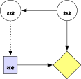
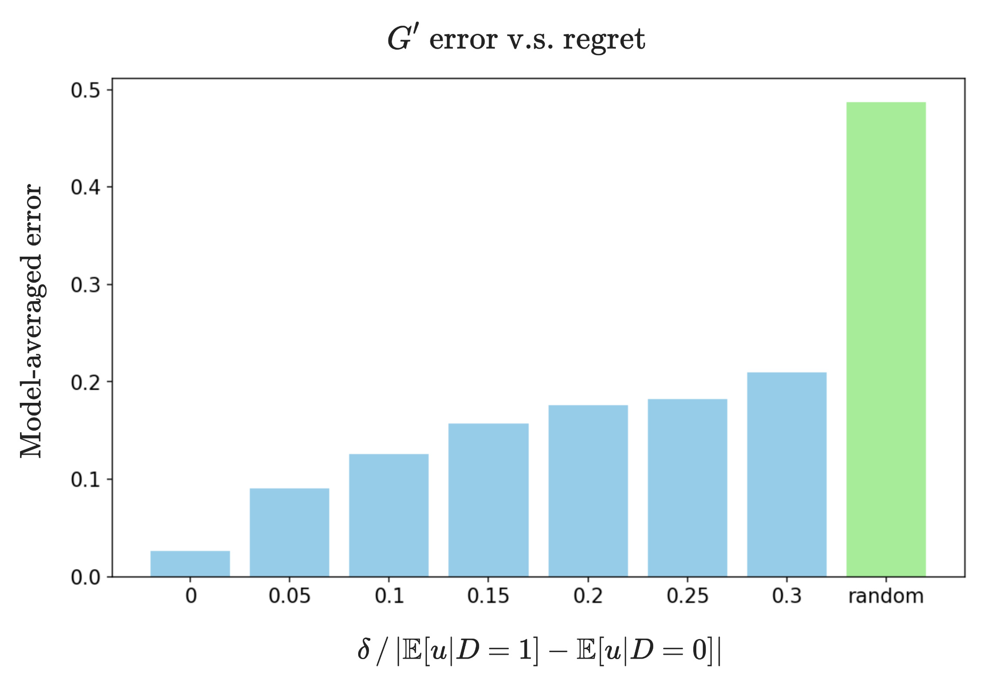
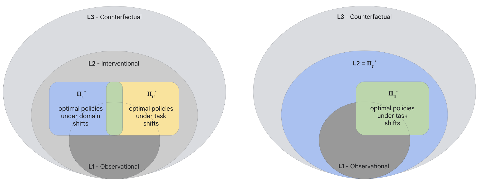
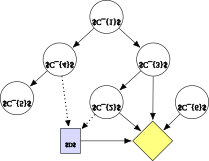
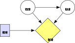
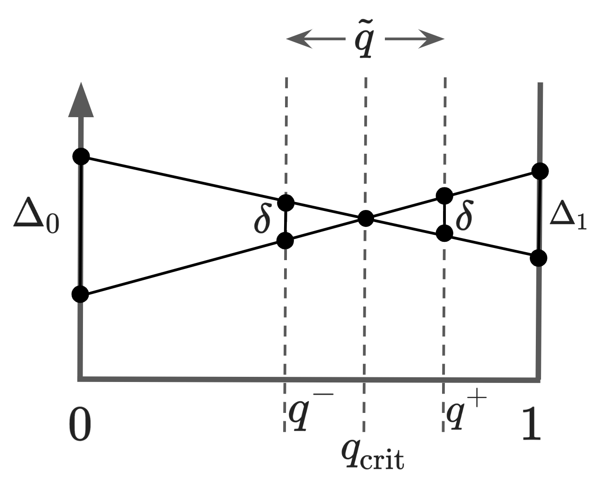

# Title: Robust agents learn causal world models

- ArXiv: 2402.10877
- Authors: Jonathan Richens, Google DeepMind, Tom Everitt
- Sections: 65
- Estimated tokens: 45.9k

## Contents

- 1 Introduction
  - Outline of paper.
- 2 Preliminaries
  - 2.1 Causal models
    - Definition 1 (Bayesian networks) .
    - Definition 2 (Local interventions) .
    - Definition 3 (Mixtures of interventions) .
  - 2.2 Decision tasks
    - Definition 4 (Causal influence diagram) .
    - Assumption 1 (Unmediated decision task) .
  - 2.3 Distributional shifts
    - Assumption 2 (Domain dependence) .
- 3 Causal models are necessary for robust adaptation
  - Theorem 1 .
  - 3.1 Relaxing the assumption of optimality
    - Theorem 2 .
    - Theorem 3 .
  - 3.2 Interpretation
    - Agents
      - Corollary 1 .
    - Transfer learning.
    - Causal inference.
- 4 Discussion
  - Causal representation learning.
  - Causal bounds on transfer learning.
  - Good regulator theorem.
  - Emergent capabilities.
  - Causal discovery.
  - No competence without understanding.
  - Applicability of causal methods.
  - Limitations.
- 5 Related work
- 6 Conclusion
  - Acknowledgements.
- References
- Appendix A Preliminaries
  - A.1 Setup and assumptions
    - Lemma 1 .
    - Proof.
  - A.2 Parameterisation of CIDs
    - Lemma 2 ( Okamoto, 1973 ) .
  - A.3 Distributional shifts & policy oracles
    - Definition 5 (Policy oracle) .
- Appendix B Appendix: Simplified proof
- Appendix C Proof of Theorem 1
  - Lemma 3 .
  - Proof.
  - Lemma 4 .
  - Proof.
  - Proof.
- Appendix D Proof of Theorem 2
  - Low-regret analysis.
    - Lemma 5 .
    - Proof.
    - Lemma 6 .
    - Proof.
    - Proof.
  - Estimating parameters of P 𝑃 P italic_P .
  - Learning graph structure.
- Appendix E Appendix: proof of Theorem 3
  - Proof.
- Appendix F Experiments
- Appendix G Appendix: transportability & Pearl’s causal hierarchy
  - Transportability.
  - Causal hierarchy’s theorem (CHT).

## Abstract

###### Abstract

It has long been hypothesised that causal reasoning plays a fundamental role in robust and general intelligence.
However, it is not known if agents must learn causal models in order to generalise to new domains, or if other inductive biases are sufficient.
We answer this question, showing that any agent capable of satisfying a regret bound for a large set of distributional shifts must have learned an approximate causal model of the data generating process, which converges to the true causal model for optimal agents.
We discuss the implications of this result for several research areas including transfer learning and causal inference.

## 1 Introduction

What capabilities are necessary for general intelligence (Legg & Hutter, 2007)?
One candidate is causal reasoning, which plays a foundational role in human cognition (Gopnik et al., 2007; Sloman & Lagnado, 2015).
It has even been argued that human-level AI is impossible without causal reasoning (Pearl, 2018).
However, recent years have seen the development of agents that do not explicitly learn or reason on causal models, but nonetheless are capable of adapting to a wide range of environments and tasks (Reed et al., 2022; Team et al., 2023; Brown et al., 2020).

This raises the question, do agents have to learn causal models in order to adapt to new domains, or are other inductive biases sufficient?
To answer this question, we have to be careful not to assume that agents use causal assumptions a priori.
For example, transportability theory determines what causal knowledge is necessary for transfer learning when all assumptions on the data generating process (inductive biases) can be expressed as constraints on causal structure (Bareinboim & Pearl, 2016).
However, deep learning algorithms can exploit a much larger set of inductive biases (Neyshabur et al., 2014; Battaglia et al., 2018; Rahaman et al., 2019; Goyal & Bengio, 2022) which in many real-world settings may be sufficient to identify low regret policies without requiring causal knowledge.

The main result of this paper is to answer this question by showing that,

> _Any agent capable of adapting to a sufficiently large set of distributional shifts must have learned a causal model of the data generating process._

Here, adapting to a distributional shift means learning a policy that satisfies a regret bound following
an intervention on the data generating process—for example, changing the distribution of features
or latent variables.
It is known that a causal model of the data generating process can be used to identify regret-bounded policies following a distributional shift (sufficiency), with more accurate models allowing lower regret policies to be found.
We prove the converse (necessity)—given regret-bounded policies for a large set of distributional shifts, we can learn an approximate causal model of the data generating process, with the approximation becoming exact for optimal policies.
Hence, learning a causal model of the data generating process is necessary for robust adaptation.

This has consequences for a number of fields and questions.
For one, it implies that causal identification laws also constrain domain adaptation.
For example, we show that adapting to covariate and label shifts is only possible if the causal relations between features and labels can be identified from the training data—a non-trivial causal discovery problem.
This provides further theoretical justification for causal representation learning (Schölkopf et al., 2021), showing that learning causal representations is necessary for achieving strong robustness guarantees.
Our result also implies that we can learn causal models from adaptive agents.
We demonstrate this by solving a causal discovery task on synthetic data by observing the policy of a regret-bounded agent under distributional shifts.
More speculatively, our results suggest that causal models could play a role in emergent capabilities.
Agents trained to minimise a loss function across many domains are incentivized to learn a causal world model, which could in turn enable them to solve a much larger set of decision tasks they were not explicitly trained on.

#### Outline of paper.

In [Section 2](#section-2) we introduce concepts from causality and decision theory used to derive our results. We present our main theoretical results in [Section 3](#section-3) and discuss their interpretation in terms of adaptive agents, transfer learning and causal inference. In [Section 4](#section-4) we discuss limitations, as well as implications for a number of fields and open questions. In section [5](#section-5) we discuss related work including transportability (Bareinboim & Pearl, 2016) and the causal hierarchy theorem (Bareinboim et al., 2022), and recent empirical work on emergent world models. In [Appendix B](#appendix-b) we describe experiments applying our theoretical results to causal discovery problems.

## 2 Preliminaries

### 2.1 Causal models

We use capital letters for random variables $V$, and lower case for their values $v\in\textit{dom}(V)$.
For simplicity, we assume each variable has a finite number of possible values, $|\textit{dom}(V)|<\infty$.
Bold face denotes sets of variables $\bm{V}=\{V_{1},\dots,V_{n}\}$, and their values $\bm{v}\in\textit{dom}(\bm{V})=\times_{i}\textit{dom}(V_{i})$.
A probabilistic model specifies the joint distribution $P(\bm{V})$ over a set of variables $\bm{V}$.
These models can support associative queries, for example $P(\bm{Y}=\bm{y}\mid\bm{X}=\bm{x})$ for $\bm{X},\bm{Y}\subseteq\bm{V}$.
Interventions describe external changes to the data generating process (and hence changing the joint distribution), for example a _hard_ intervention $\textrm{do}(\bm{X}=\bm{x})$ describes forcing the set of variables $\bm{X}\subseteq\bm{V}$ to take value $\bm{x}$.
This generates a new distribution $P(\bm{V}\mid\textrm{do}(X=x))=P(\bm{V}_{x})$ where $\bm{V}_{\bm{x}}$ refers to the variables $\bm{V}$ following this intervention.
The power of causal models is that they specify not only $P(\bm{V})$ but also the distribution of $\bm{V}$ under all interventions, and hence these models can be used to evaluate both associative and interventional queries e.g. $P(\bm{Y}=\bm{y}\mid\textrm{do}(\bm{X}=\bm{x}))$.

For the derivation of our results we focus on a specific class of causal models—causal Bayesian networks (CBNs).
There are several alternative models and formalisms that are studied in the literature, including structural equation models (Pearl, 2009) and the Neyman-Rubin causal models (Rubin, 2005), and results can be straightforwardly adapted to these.

###### Definition 1 (Bayesian networks) .

A _Bayesian network_ $M=(G,P)$ over a set of variables $\bm{V}=\{V_{1},\dots,V_{n}\}$ is a joint probability distribution $P(\bm{V})$ that factors according to a directed acyclic graph (DAG) $G$, i.e. $P(V_{1},\dots,V_{n})=\prod_{i=1}^{n}P(V_{i}\mid\textbf{Pa}_{V_{i}})$, where $\textbf{Pa}_{V_{i}}$ are the parents of $V_{i}$ in $G$.

A Bayesian network is _causal_ if the graph $G$ captures the causal relationships between the variables or, formally, if the result of any intervention $\textrm{do}(\bm{X}=\bm{x})$ for $\bm{X}\subseteq\bm{V}$ can be computed from the truncated factorisation formula:

$$
P(\bm{v}\mid\textrm{do}(\bm{x}))=\begin{cases}\prod_{i:v_{i}\not\in\bm{x}}P(v_ {i}\mid\textbf{pa}_{v_{i}})&\text{if \bm{v} consistent with \bm{x}}\\ 0&\text{otherwise.}\end{cases}
$$

More generally, a _soft_ intervention $\sigma_{v_{i}}=P^{\prime}(V_{i}\mid\textbf{Pa}^{*}_{i})$ replaces the conditional probability distribution for $V_{i}$ with a new distribution $P^{\prime}(V_{i}\mid\textbf{Pa}^{*}_{i})$, possibly resulting in a new parent set $\textbf{Pa}^{*}_{i}\neq\textbf{Pa}_{i}$ as long as no cycles are introduced in the graph. We refer to
$\sigma_{v_{i}}$ as a domain indicator (Correa & Bareinboim, 2020) (it has also been called an environment index, Arjovsky et al., 2019).
The updated distribution is denoted
$P(\bm{v};\sigma_{\bm{v}^{\prime}})=\prod_{i:v_{i}\in\bm{v}^{\prime}}P^{\prime}
(v_{i}\mid\textbf{pa}^{*}_{v_{i}})\prod_{i:v_{i}\not\in\bm{v}^{\prime}}P(v_{i}
\mid\textbf{pa}_{v_{i}})$.

In general, soft interventions cannot be defined without knowledge of $G$.
For example, the soft intervention $\sigma_{Y}=P^{\prime}(y\mid x)$ is incompatible with the causal structure $Y\rightarrow X$ as it would induce a causal cycle.
As our results are concerned with learning causal models (and hence causal structure), we focus our theoretical analysis on a subset of the soft interventions, local interventions, that are compatible with all causal structures and so can be used without tacitly assuming knowledge of $G$.

###### Definition 2 (Local interventions) .

Local intervention $\sigma$ on $V_{i}\in\bm{V}$ involves applying a map to the states of $V_{i}$ that is not conditional on any other endogenous variables, $v_{i}\mapsto f(v_{i})$.
We use the notation $\sigma=\textrm{do}(V_{i}=f(v_{i}))$ (variable $V_{i}$ is assigned the state $f(v_{i})$).
Formally, this is a soft intervention on $V_{i}$ that transforms the conditional probability distribution as,

$$
P(v_{i}\,|\,\textbf{pa}_{i};\sigma)=\sum_{v_{i}\textquoteright:f(v_{i}^{\prime})=v_{i}}P(v_{i}^{\prime}\,|\,\textbf{pa}_{i})(1)
$$

Example: Hard interventions $\textrm{do}(V_{i}=v^{\prime}_{i})$ are local interventions where $f(v_{i})$ is a constant function.

Example: Translations are local interventions as $\textrm{do}(V_{i}=v_{i}+k)=\textrm{do}(V_{i}=f(v_{i}))$ where $f(v_{i})=v_{i}+k$. Examples include changing the position of objects in RL environments (Shah et al., 2022) and images (Engstrom et al., 2019).

Example: Logical NOT operation $X\mapsto\neg X$ for Boolean $X$ is a local intervention.

We also consider stochastic interventions, noting that mixtures of local interventions can also be defined without knowledge of $G$.
For example, adding noise to a variable $X=X+\epsilon$, $\epsilon\sim\mathcal{N}(0,1)$, is a soft intervention on $X$ described by a mixture over local interventions (translations).

###### Definition 3 (Mixtures of interventions) .

A _mixed intervention_ $\sigma^{*}=\sum_{i}p_{i}\sigma_{i}$ for $\sum p_{i}=1$ performs intervention $\sigma_{i}$ with probability $p_{i}$.
Formally,
$P(\bm{v}\mid\sigma^{*})=\sum_{i}p_{i}P(\bm{v}\mid\sigma_{i})$.

###### Definition 1 (Bayesian networks) .

###### Definition 2 (Local interventions) .

###### Definition 3 (Mixtures of interventions) .

### 2.2 Decision tasks

Decision tasks involve a decision maker (agent) choosing a policy so as to optimise an objective function (utility).
To give a causal description of decision tasks we use the causal influence diagram (CID) formalism (Howard & Matheson, 2005; Everitt et al., 2021), which extend a CBN of the environment (chance) variables by introducing decision and utility nodes (see [Figure 1](#figure-1) for examples).
For simplicity we focus on tasks involving a single decision and a single utility function.

###### Definition 4 (Causal influence diagram) .

A (single-decision, single-utility) _causal influence diagram_ (CID) is a CBN $M=(G,P)$ where the variables $\bm{V}$ are partitioned into decision, utility, and chance variables, $\bm{V}=(\{D\},\{U\},\bm{C})$.
The utility variable is a real-valued function of its parents, $U(\textbf{pa}_{U})$.

Single-decision single-utility
CIDs can represent most decision tasks such as classification and regression as they specify what decision should be made ($d\in D$), based on what information ($\textbf{pa}_{D}$), with objective ($\mathbb{E}[U]$).
They can also describe some multi-decision tasks such as Markov decision processes(^1^11Note Markov decision processes can be formulated as a single-decision single-utility CID, by modelling the choice of policy as a single decision and the cumulative discounted reward as a single utility variable.).
The utility is any real-valued function including standard loss and reward functions.

We assume that the environment is described by a set of random variables $\bm{C}$ that interact via causal mechanisms(^2^22This assumption follows from Reichenbach (1956), and we discuss further in [Section A.3](https://arxiv.org/html/2402.10877v7#A1.SS3)), and where $\bm{C}$ satisfies causal sufficiency (Pearl, 2009) (includes all common causes),
noting that such a choice of $\bm{C}$ always exists.
We refer to the CBN over $\bm{C}$ as the ‘true’ or ‘underlying’ CBN.
Note we do not assume the agent has any knowledge of the underling CBN, nor do we assume which variables in $\bm{C}$ are observed or unobserved by the agent, beyond that the agent can observe $\textbf{Pa}_{D}\subseteq\bm{C}$.
We also assume knowledge of the utility function $U(\textbf{Pa}_{U})$.

The conditional probability distribution for the decision node $\pi(d\mid\textbf{pa}_{D})$ (the policy) is not a fixed parameter of the model but is set by the agent so as to maximise its expected utility, which for a policy $\pi$ is $\mathbb{E}^{\pi}[U]=\mathbb{E}[U\mid\textrm{do}(D=\pi(\textbf{pa}_{D}))]$.
A policy $\pi^{*}$ is _optimal_ if it maximises $\mathbb{E}^{\pi^{*}}[U]$.
Typically, agents do not behave optimally and incur some regret $\delta$, which is the decrease in expected utility compared to an optimal policy $\delta:=\mathbb{E}^{\pi^{*}}[U]-\mathbb{E}^{\pi}[U]$.

To simplify our theoretical analysis, we focus on a widely studied class of decision tasks where the agents decision does not causally influence the environment (e.g. [Figure 1](#figure-1)).

###### Assumption 1 (Unmediated decision task) .

$\textbf{Desc}_{D}\cap\textbf{Anc}_{U}=\emptyset$.

In unmediated decision tasks, the agent is provided some (partial) observations of the environment and chooses a policy, which is then evaluated using the utility function which is a function of the environment state and the agent’s decision.
Examples of unmediated decision tasks include prediction tasks such as classification and regression, whereas examples of mediated decision tasks that are not covered by our theorems include Markov decision processes where the agent’s decision (action) influences the utility via the environment state.

> (a) training

###### Definition 4 (Causal influence diagram) .

###### Assumption 1 (Unmediated decision task) .

### 2.3 Distributional shifts

We focus on generalisation that goes beyond the _iid_ assumption, where agents are evaluated in domains that are distributionally shifted from the training environment.
Distributional shifts can be changes to the environment (domain shifts), as in domain adaptation and domain generalisation (Farahani et al., 2021; Wilson & Cook, 2020), or changes to the objective (task shifts) as in zero shot learning (Xian et al., 2018), in-context learning (Brown et al., 2020) and multi-task reinforcement learning (Reed et al., 2022).
Our analysis focuses on domain shifts that involve changes to the causal data generating process, and hence can be modelled as interventions (Schölkopf et al., 2021).
This does not assume that all shifts an agent will encounter can be modelled as interventions, but requires that the agent is at least capable of adapting to these shifts.

Examples of interventionally generated shifts include translating objects in images (Engstrom et al., 2019), noising inputs and adversarial robustness (Hendrycks & Dietterich, 2019), and changes to the initial conditions or transition function in Markov decision processes (Peng et al., 2018).
Examples of shifts that are not naturally represented as interventions include changing the set of environment variables $\bm{C}$, and introducing selection biases (Shen et al., 2018).
See [Section A.3](https://arxiv.org/html/2402.10877v7#A1.SS3) for discussion.

Our main results restrict to local domain shifts, which correspond to local interventions on the chance variables $\bm{C}$.
We do not consider shifts that change the agent’s decision $D$, although we include shifts that drop inputs to the policy $\textbf{Pa}_{D}\rightarrow\textbf{Pa}_{D}^{\prime}\subseteq\textbf{Pa}_{D}$ (e.g. masking) as local interventions.
We do not consider task shifts i.e. changing the utility function.

As we are interested in determining the capabilities necessary for domain adaptation, we restrict our attention to decision tasks where domain adaptation is non-trivial, i.e. where the optimal policy depends on the environment distribution $P(\bm{C}=\bm{c})$.

###### Assumption 2 (Domain dependence) .

There exists $P(\bm{C}=\bm{c})$ and $P^{\prime}(\bm{C}=\bm{c})$ compatible with $M$ such that $\pi^{*}=\operatorname*{arg\,max}_{\pi}\mathbb{E}_{P}^{\pi}[U]$ implies $\pi^{*}\neq\operatorname*{arg\,max}_{\pi}\mathbb{E}_{P^{\prime}}^{\pi}[U]$.

Assumption 2 implies the existence of domain shifts that change the optimal policy.

###### Assumption 2 (Domain dependence) .

## 3 Causal models are necessary for robust adaptation

We now present our results in their most general form—an equivalence between learning the underlying CBN and learning regret bounded policies for local domain shifts.
Then in [Section 3.2](#section-3-2) we apply our theorems to three settings: adaptive agents, transfer learning, and causal inference, and show that robust agents must learn causal world models.

First we focus on the idealised case where we assume optimality. We show for almost all decision tasks the underlying CBN can be reconstructed given optimal policies for a large set of domain shifts.

###### Theorem 1 .

For almost all CIDs $M=(G,P)$ satisfying Assumptions 1 and 2, we can identify the directed acyclic graph $G$ and joint distribution $P$ over all ancestors of the utility $\textbf{Anc}_{U}$ given $\{\pi^{*}_{\sigma}(d\mid\textbf{pa}_{D})\}_{\sigma\in\Sigma}$ where $\pi^{*}_{\sigma}(d\mid\textbf{pa}_{D})$ is an optimal policy in the domain $\sigma$ and $\Sigma$ is the set of all mixtures of local interventions. Proof in [Appendix C](#appendix-c).

The parameters $P(v_{i}\mid\textbf{pa}_{i})$, $U(\textbf{pa}_{U})$ of the underlying CBN define a parameter space and the condition _for almost all CIDs_ means that the subset of the parameter space for which the [Theorem 1](https://arxiv.org/html/2402.10877v7#Thmtheorem1) does not hold is Lebesgue measure zero (see [Section A.2](https://arxiv.org/html/2402.10877v7#A1.SS2) for discussion).
This condition is necessary because there exist finely-tuned environments for which the CBN cannot be identified given the agent’s policy due to variables $X\in\textbf{Anc}_{U}$ that do not affect the expected utility.
For example consider $X\rightarrow Y\rightarrow U$, $Y=\mathcal{N}(0,x)$ and $U=D+Y$, then changing $X$ can only change the variance of $U$ while leaving its expected value (and hence the optimal policy) constant.
However, this only occurs for very specific choices of the parameters $P$ and $U$.

In [Appendix B](#appendix-b) we give a simplified overview of the proof with a worked example.
We assume access to an oracle for optimal policies $\pi^{*}_{\sigma}$ for any given local intervention on $\bm{C}$.
Note, this assumes the agent is robust to distributional shifts on a causally sufficient set of variables $\bm{C}$, not that the set of variables the agent observes is causally sufficient.
We devise an algorithm that queries this oracle with different mixtures of local interventions and identifies the mixtures for which the optimal policies changes.
We then show that these critical mixtures identify the parameters of the CBN, specifying both the graph $G(\textbf{Anc}_{U})$ and the joint distribution $P(\textbf{Anc}_{U})$.

###### Theorem 1 .

### 3.1 Relaxing the assumption of optimality

We now relax the assumption of optimality, considering the case where the policies $\pi_{\sigma}$ satisfy a regret bound $\mathbb{E}^{\pi_{\sigma}}[U]\geq\mathbb{E}^{\pi^{*}_{\sigma}}[U]-\delta$.
We show that for $\delta>0$ we can recover an approximation of the environment CBN, with error that grows linearly in $\delta$ for $\delta\ll\mathbb{E}^{\pi^{*}}[U]$.

###### Theorem 2 .

For almost all CIDs $M=(G,P)$ satisfying [Assumptions 1](https://arxiv.org/html/2402.10877v7#Thmassumption1) and [2](https://arxiv.org/html/2402.10877v7#Thmassumption2), we can identify an approximate causal model $M^{\prime}=(P^{\prime},G^{\prime})$ given $\{\pi_{\sigma}(d\mid\textbf{pa}_{D})\}_{\sigma\in\Sigma}$ where $\mathbb{E}^{\pi_{\sigma}}[U]\geq\mathbb{E}^{\pi^{*}_{\sigma}}[U]-\delta$ and $\Sigma$ is the set of mixtures of local interventions.
The parameters of $M^{\prime}$ satisfy $\left|P^{\prime}(v_{i}\mid\textbf{pa}_{i})-P(v_{i}\mid\textbf{pa}_{i})\right|
\leq\gamma(\delta)$ $\forall$ $V_{i}\in\bm{V}$ where $\gamma(0)=0$ and $\gamma(\delta)$ grows linearly in $\delta$ for small regret $\delta\ll\mathbb{E}^{\pi^{*}}[U]$. Proof in [Appendix D](#appendix-d).

The worst-case error bounds $\gamma(\delta)$ for the parameter errors are detailed in [Appendix D](#appendix-d).
For $\delta>0$ it may not be possible to identify $G$ perfectly as some weak causal relations cannot be resolved due to these error bounds.
We describe in [Appendix D](#appendix-d) how we can learn a sub-graph $G^{\prime}\subseteq G$ that may exclude directed edges corresponding to weak causal relations.

[Theorem 2](https://arxiv.org/html/2402.10877v7#Thmtheorem2) shows that we can learn a (sparse) approximate causal models of the data generating process from regret bounded policies under domain shifts, where the approximation becoming exact as $\delta\rightarrow 0$.
In [Appendix F](#appendix-f) we demonstrate learning the underlying CBN from regret-bounded policies using simulated data for randomly generated CIDs similar to [Figure 1](#figure-1), and explore how the accuracy of the approximate CBN scales with the regret bound ([Figure 2](#figure-2)).

> (a) Error rate for learned DAG v.s. regret bound

Finally, we prove sufficiency, i.e. that having an (approximate) causal model of the data generating process is sufficient to identify regret-bounded policies.
The result is well-known for the non-approximate case (Bareinboim & Pearl, 2016).

###### Theorem 3 .

Given the CBN $M=(P,G)$ that is causally sufficient we can identify optimal policies $\pi^{*}_{\sigma}(d\mid\textbf{pa}_{D})$ for any given $U$ where $\textbf{Pa}_{U}\subseteq\bm{C}$ and for all soft interventions $\sigma$.
Given an approximate causal model $M^{\prime}=(P^{\prime},G^{\prime})$ for which $\left|P^{\prime}(v_{i}\mid\textbf{pa}_{i})-P(v_{i}\mid\textbf{pa}_{i})\right|
\leq\epsilon\ll 1$, we can identify regret-bounded policies where the regret $\delta$ grows linearly in $\epsilon$. Proof in [Appendix E](#appendix-e).

Together, [Theorems 2](https://arxiv.org/html/2402.10877v7#Thmtheorem2) and [3](https://arxiv.org/html/2402.10877v7#Thmtheorem3) imply that learning an approximate causal model of the data generating process is necessary and sufficient for learning regret-bounded policies under local interventions.

###### Theorem 2 .

###### Theorem 3 .

### 3.2 Interpretation

In this section we interpret [Theorems 1](https://arxiv.org/html/2402.10877v7#Thmtheorem1), [2](https://arxiv.org/html/2402.10877v7#Thmtheorem2) and [3](https://arxiv.org/html/2402.10877v7#Thmtheorem3) through three lenses; agents, transfer learning and causal inference.
First, we derive our result that any agent capable of adapting to local domain shifts must have learned a causal model of the data generating process.

#### Agents

are adaptive goal-directed systems, meaning they choose actions to achieve some desired outcome, and would change their behaviour if they knew the consequences of their actions had changed (Dennett, 1989), i.e. following a domain shift (Kenton et al., 2023).
For example, a firm sets prices to maximise profit, and changes its pricing to adapt to changes in supply and demand.

We define adaptation as the ability to competently pursue goals (minimize regret) in a distributionally shifted environment.
Adaptation is achieved through a combination of generalisation—applying knowledge learned during training to the shifted environment—and through re-training in the shifted environment.
We are interested in the zero-shot setting (Kirk et al., 2023), which describes powerful agents capable of adapting without re-training, i.e. using only knowledge of the environment and what change (shift) has occurred.
Our aim is to determine precisely what knowledge of the environment is necessary to support this capability.
Hence we focus on the simplified task of adapting to known distributional shifts, i.e. the agent conditions(^3^33$\sigma$ is equivalent to an environment index for (in-context) invariant risk minimization (Gupta et al., 2023; Arjovsky et al., 2019), or the context variable for zero-shot reinforcement learning (Kirk et al., 2023)) their policy on $\sigma$, $\pi_{\sigma}=\pi(d\mid\textbf{pa}_{D},\sigma)$.
Note this is strictly easier than adapting to unknown distributional shifts, and so any knowledge necessary for adapting to known distributional shifts is also necessary for adapting to unknown shifts(^4^44Any agent capable of returning a regret-bounded policy without input $\sigma$ can do so given $\sigma$ simply by discarding $\sigma$. Hence, we can trivially extend this agent’s policy to include input $\sigma$ and the policy will still satisfy the regret bound, allowing [Theorem 2](https://arxiv.org/html/2402.10877v7#Thmtheorem2) to be applied. Likewise, if the agent does condition their policy but on an inferred $\sigma^{\prime}$ (see Kirk et al. (2023) for a review of implementations), and this $\sigma^{\prime}$-conditional policy satisfies a regret bound, we can apply [Theorem 2](https://arxiv.org/html/2402.10877v7#Thmtheorem2).).

###### Corollary 1 .

Let $\pi(d\mid\textbf{pa}_{D},\sigma)$ be the policy of an agent that satisfies a regret bound $\mathbb{E}^{\pi(\sigma)}[U]\geq\mathbb{E}^{\pi^{*}}[U]-\delta$ for all local domain shifts $\sigma$, in an environment described by the CID $M=(G,P)$ which satisfies [Assumptions 1](https://arxiv.org/html/2402.10877v7#Thmassumption1) and [2](https://arxiv.org/html/2402.10877v7#Thmassumption2).
By [Theorems 2](https://arxiv.org/html/2402.10877v7#Thmtheorem2) and [3](https://arxiv.org/html/2402.10877v7#Thmtheorem3), $\pi$ is informationally equivalent to an approximation $M^{\prime}$ of $M$, with $M^{\prime}\rightarrow M$ smoothly as $\delta\rightarrow 0$.

[Corollary 1](https://arxiv.org/html/2402.10877v7#Thmcorollary1) follows immediately from [Theorem 2](https://arxiv.org/html/2402.10877v7#Thmtheorem2) by replacing $\pi_{\sigma}(d\mid\textbf{pa}_{D})=\pi(d\mid\textbf{pa}_{D},\sigma)$.
If $\pi_{\sigma}$ satisfies a tight regret bound for all local shifts $\sigma$, we can reconstruct the underlying CBN from the agent’s policy alone (following the procedure in [Appendix C](#appendix-c)).
Therefore, any agent capable of generalising under known local domain shifts must have learned the underling CBN.
Precisely, the agent has learned the policy $\pi(d\mid\textbf{pa}_{D},\sigma)$, which is informationally equivalent to a causal model of the environment, as any associative or causal query that can be identified using the true causal model of the environment can be identified using $\pi(d\mid\textbf{pa}_{D},\sigma)$.

Example: Doctors are agents expected to make low regret decisions under a wide range of known distributional shifts, without re-training in the shifted environment.
For example, consider the task of risk-stratifying patients based on their signs and medical history.
The doctor may be transferred to a new ward where patients have received a treatment (known distributional shift) that has a stochastic effect on latent variables (mixed intervention) such as curing diseases and causing side effects.
The doctor cannot re-train in this new domain, e.g. taking random decisions and observing outcomes.
To be capable of this adaptivity, [Theorem 2](https://arxiv.org/html/2402.10877v7#Thmtheorem2) implies the doctor must know a good approximation of the causal relations between the relevant latent variables—how the treatment affects diseases, how these diseases and their symptoms are causally related, and so on.
Likewise, any medical AI that hopes to replicate this capability must have learned a similarly accurate causal model, and the better the agent’s performance the more accurate its causal model must be.

###### Corollary 1 .

#### Transfer learning.

In transfer learning (Zhuang et al., 2020), models are trained on a set of source domains and evaluated on held-out target domains where i) the data distribution differs from the source domains, and ii) the data available for training is restricted compared to the source domains (Wang et al., 2022).
For example, in unsupervised domain adaptation the learner is restricted to samples of the input features from the target domains $\textbf{pa}_{D}\sim P(\textbf{Pa}_{D};\sigma)$, whereas in domain generalisation typically no data from the target domain is available during training (Farahani et al., 2021).

Let $\mathcal{D}_{S}$ denote the training data from the source domains and $\mathcal{D}_{\sigma}$ denote the training data available from a given target domain $\sigma$.
Let there exist a transfer learning algorithm that returns a policy $\pi_{\sigma}$ satisfying a regret bound for a given target domain $\sigma$, provided this training data.
As $\pi_{\sigma}$ is a function of the training data, then by [Theorems 1](https://arxiv.org/html/2402.10877v7#Thmtheorem1) and [2](https://arxiv.org/html/2402.10877v7#Thmtheorem2) the existence of this algorithm implies that we can identify the underlying CBN from $\mathcal{D}_{S}\cup\{\mathcal{D}_{\sigma}\}_{\sigma\in\Sigma}$.
To see that this imparts non-trivial constraints on the existence of the transfer learning algorithm, we can consider the following simple example.

Example: Consider the CID for the supervised learning task depicted in [Figure 1](#figure-1).
Let $\mathcal{D}_{S}=\{(x^{i},y^{i})\sim P(X,Y)\}_{i=1}^{n}$, so for sufficiently large $n$ the agent can learn the $P(X,Y)$ from $\mathcal{D}_{S}$.
However, $Y\rightarrow X$ must also be identifiable from the training data $\mathcal{D}_{S}\cup\{\mathcal{D}_{\sigma}\}_{\sigma\in\Sigma}$.
In other words, the transfer learning problem contains a hidden causal discovery problem.
If $\mathcal{D}_{\sigma}=\emptyset$ then $Y\rightarrow X$ must be identifiable from $P(x,y)$ alone, which is impossible unless the causal data generating process obeys additional assumptions (see for example Hoyer et al., 2008).
If unlabelled features from the target domain are included in the training data $\mathcal{D}_{\sigma}=\{x^{i}\sim P(X;\sigma)\}_{i=1}^{n_{\sigma}}$, $Y\rightarrow X$ can in principle be identified as $P(X;\sigma_{Y})\neq P(X)$.

#### Causal inference.

[Theorem 1](https://arxiv.org/html/2402.10877v7#Thmtheorem1) can also be interpreted purely in terms of causal inference.
We can compare to the causal hierarchy theorem (CHT) (Bareinboim et al., 2022), which states that an oracle for L1 queries (observational) is almost always insufficient to evaluate all L2 queries (interventional).
Our [Theorem 1](https://arxiv.org/html/2402.10877v7#Thmtheorem1) can be stated in an analogous way; an oracle for optimal policies under mixtures of local interventions $\Pi^{*}_{\Sigma}:\sigma\mapsto\pi^{*}(\sigma)$, can evaluate all L2 queries, which follows from the fact that the oracle identifies the underlying CBN which in turn identifies all L2 queries.
Note $\Pi^{*}_{\Sigma}$ is a strict subset of L2, and we describe a subset of L2 as being _L2-complete_ if evaluating these queries is sufficient to evaluate all L2 queries.
Hence [Theorem 1](https://arxiv.org/html/2402.10877v7#Thmtheorem1) can be summarised as $\Pi^{*}_{\Sigma}$ is L2-complete.
It would be interesting in future work to determine what other strict subsets of L2 are L2-complete, as identifying these queries is sufficient to identify all interventional queries.

Why is this surprising?
Firstly, we may expect the optimal policies to encode a relatively small number of causal relations, as they can be computed from $\mathbb{E}[u\mid d,\textbf{pa}_{D};\sigma]$, which describes the response of a single variable $U$ to intervention $\sigma$.
However, [Theorem 1](https://arxiv.org/html/2402.10877v7#Thmtheorem1) shows that the optimal policies encode all causal and associative relations in $\textbf{Anc}_{U}$, including causal relations between latent variables, for example $P(\bm{Y}_{x})$ for any $\bm{X},\bm{Y}\subseteq\textbf{Anc}_{U}$.
Secondly, [Theorems 2](https://arxiv.org/html/2402.10877v7#Thmtheorem2) and [3](https://arxiv.org/html/2402.10877v7#Thmtheorem3) combined imply that learning to generalise under domain shifts is equivalent to learning a causal model of the data generating process—problems that on the surface are conceptually distinct.

> Figure 3: The left figure situates [Theorem 1](https://arxiv.org/html/2402.10877v7#Thmtheorem1) in Pearl’s causal hierarchy (Bareinboim et al., 2022). L2 contains all interventional queries. L2 includes the sets of optimal policy queries under domain shifts $\bm{\Pi}^{*}_{C}$ and task shifts $\bm{\Pi}^{*}_{U}$, as optimal policies can always be found from a finite number of interventional queries. [Theorem 1](https://arxiv.org/html/2402.10877v7#Thmtheorem1) surprisingly shows that $\bm{\Pi}^{*}_{C}$ contains L2, and therefore $\bm{\Pi}^{*}_{C}=\text{L2}$ (right). That is, learning optimal policies under all shifts for a single utility $U$ is sufficient to identify L2. This also implies that $\bm{\Pi}^{*}_{U}\subseteq\bm{\Pi}^{*}_{C}$, which implies that learning optimal policies for domain shifts is sufficient to identify optimal policies for task shifts.

## 4 Discussion

Here we discuss the consequences for several fields and open questions, as well as limitations.

#### Causal representation learning.

Causal representation learning (CRL) aims to learn representations of data that capture unknown causal structure (Schölkopf et al., 2021), with the aim of exploiting causal invariances to achieve better generalisation across domains.
[Theorems 1](https://arxiv.org/html/2402.10877v7#Thmtheorem1) and [2](https://arxiv.org/html/2402.10877v7#Thmtheorem2) show that any method that enables generalisation across many domains necessarily involves learning an (approximate) causal model of the data generating process—i.e. a causal representation.
Hence, our results provide theoretical justification for CRL by showing it is necessary for strong robustness guarantees.

#### Causal bounds on transfer learning.

As described in [Section 3.2](#section-3-2), [Theorems 1](https://arxiv.org/html/2402.10877v7#Thmtheorem1) and [2](https://arxiv.org/html/2402.10877v7#Thmtheorem2) imply fundamental causal constraints on certain transfer learning tasks.
For example in the supervised learning task depicted in [Figure 1](#figure-1), identifying regret-bounded policies under covariate and label shifts requires learning the causal relations between features and labels.
Causal discovery problems such as this are well understood in many settings (Vowels et al., 2022), and in general identifying this causal structure (e.g. that $Y\rightarrow X$ in [Figure 4](https://arxiv.org/html/2402.10877v7#A1.F4) a)) is impossible without interventional data and/or additional assumptions.
This connection allows us to convert (im)possibility results for causal discovery to (im)possibility results for transfer learning.
Future work could explore this for smaller sets of distributional shifts and derive more general causal bounds on transfer learning.

#### Good regulator theorem.

The good regulator theorem is often interpreted as saying that any good controller of a system must have a model of that system (Conant & Ross Ashby, 1970). However, some imagination is needed to take this lesson from the actual theorem, which technically only states that there exists an optimal regulator that is a deterministic function of the state of the system (which could be trivial, Wentworth (2021)).
Our theorem less ambiguously states that any robust agent must have learned an (approximate) causal model of the environment, as described in [Section 3.2](#section-3-2). It can therefore be interpreted as a more precise, causal good regulator theorem.

#### Emergent capabilities.

Causal models enable a kind of general competency—an agent can use a causal model of its environment to optimise for any given objective function $U(\textbf{Pa}_{U}\subseteq\bm{V})$ without additional data ([Theorem 3](https://arxiv.org/html/2402.10877v7#Thmtheorem3)).
This could explain how general competence can arise from narrow training objectives (Brown et al., 2020; Silver et al., 2021).
By [Theorems 1](https://arxiv.org/html/2402.10877v7#Thmtheorem1) and [2](https://arxiv.org/html/2402.10877v7#Thmtheorem2), agents trained to maximise reward across many environments are incentivized to learn a causal world model (as they cannot generalise without one), which can in turn be used to solve any other decision task in the same environment ([Theorem 3](https://arxiv.org/html/2402.10877v7#Thmtheorem3)).
This incentive does not imply that training an agent with a simple reward signal is sufficient to learn causal world models.
E.g. it will still be impossible for an agent to learn a causal model (and therefore to generalise) if the model is not identifiable from its training data.
The question is then if current methods and training schemes are sufficient for learning causal world models.
Early results suggest that transformer models can learn world models capable of out-of-distribution prediction (Li et al., 2022, see [Section 6](#section-6) for discussion).
While foundation models are capable of achieving state of the art accuracy on causal reasoning benchmarks (Kıcıman et al., 2023), how they achieve this (and if it constitutes bona fide causal reasoning) is debated (Zečević et al., 2023).

#### Causal discovery.

[Theorems 1](https://arxiv.org/html/2402.10877v7#Thmtheorem1) and [2](https://arxiv.org/html/2402.10877v7#Thmtheorem2) involve learning the causal structure of the environment by observing the agent’s policy under interventions.
It is perhaps surprising that the response of this single variable to interventions is sufficient to identify all associative and causal relations in $\textbf{Anc}_{U}$.
Typically, causal discovery algorithms involve measuring the response of many variables to interventions (Vowels et al., 2022).
Also, many causal discovery algorithms assume independent causal mechanisms (Schölkopf et al., 2021), which is equivalent to assuming no agents are present in the data generating process (Kenton et al., 2023).
However, our results suggest that agents could be powerful resources for causal discovery.
In [Appendix B](#appendix-b) we use the proof of [Theorem 2](https://arxiv.org/html/2402.10877v7#Thmtheorem2) to derive a causal discovery algorithm for learning causal structure over latents, and test it on synthetic data.

#### No competence without understanding.

Causal models are fundamental to how humans understand and explain the world (Gopnik et al., 2007; Pearl & Mackenzie, 2018).
Increasingly, deep learning models are used to predict and control complex systems we do not yet fully understand, such as inertially confined plasmas (Degrave et al., 2022) and biomoloecular systems (Abramson et al., 2024). These models arguably offer a shortcut to competence without understanding—solving problems without needing to develop richer models of the underlying systems, or understand how and why the solutions work.
For example, AlphaFold accurately predicts protein folding but was found not to improve understanding of the underlying biochemical processes (Outeiral et al., 2022).
It has been argued that a reliance on black-box models could greatly widen the gap between capabilities and understanding (Pasquale, 2015).
However, our result points to a potential solution.
If a controller is sufficiently capable and robust, we can always extract an interpretable causal model of the system it is controlling.
There is no robust control without ‘understanding’, in the sense of learning a causal model of the underlying system.
Future work could explore extending our results to develop efficient algorithms for eliciting causal models from robust agents.

#### Applicability of causal methods.

Causal models have been used to formally define concepts such as intent (Halpern & Kleiman-Weiner, 2018; Ward et al., 2024), harm (Richens et al., 2022), deception (Ward et al., 2023b), manipulation (Ward et al., 2023a)
and incentives (Everitt et al., 2021), and are required for approaches to explainability (Wachter et al., 2017) and fairness (Kusner et al., 2017).
Methods for designing safe and ethical AI systems that build on these definitions require causal models of the data generating process, which are typically hard to learn, leading some to doubt their practicality (Fawkes et al., 2022; Rahmattalabi & Xiang, 2022).
However, our results show that sufficiently capable agents must have learned a causal world model capable of supporting these methods, and demonstrate that these world models can be elicited from the agent.

#### Limitations.

[Theorems 1](https://arxiv.org/html/2402.10877v7#Thmtheorem1) and [2](https://arxiv.org/html/2402.10877v7#Thmtheorem2) require agents to be robust to a large set of domain shifts (local interventions on all environment variables).
[Theorem 2](https://arxiv.org/html/2402.10877v7#Thmtheorem2) shows that loosening regret bounds results in some causal relations being unidentifiable from the agent’s policy.
Hence, we expect it is still possible to learn some casual knowledge of the environment from agents that are robust to a smaller set of domain shifts, albeit less complete that the full underlying CBN.
Finally, our results only apply to unmediated decision tasks (Assumption 1).
We expect [Theorems 1](https://arxiv.org/html/2402.10877v7#Thmtheorem1) and [2](https://arxiv.org/html/2402.10877v7#Thmtheorem2) can be extended to active decision tasks, as Assumption 1 does not play a major role beyond simplifying the proofs.

## 5 Related work

Several recent empirical works have explored if deep learning models learn ‘surface statistics’ (e.g. correlations between inputs and outputs) or learn internal representations of the world (McGrath et al., 2022; Abdou et al., 2021; Li et al., 2022; Gurnee & Tegmark, 2023).
Our results offer some theoretical clarity to this discussion, tying an agents performance to the fidelity its world model, and showing that going beyond ‘surface statistics’ to learning causal relations is fundamentally necessary for robustness.
One study in particular (Li et al., 2022) found that a GPT model trained to predict legal next moves in the board game Othello learned a linear representation of the board
state (Nanda, 2023).
Further, this internal representation of the board state could be changed by intervening on the intermediate activations, with the model updating its predictions consistent with the intervention, including interventions that take the board state outside of the training distribution.
This indicates that the network is learning and utilising a representation of the data generating process that can support out-of-distribution generalisation under interventions—much like a causal model.

The problem of evaluating policies under distributional shifts has been studied extensively in causal transportability (CT) theory (Bareinboim & Pearl, 2016; Bellot & Bareinboim, 2022).
CT aims to provide necessary and sufficient conditions for policy evaluation under known domain shifts when all assumptions on the data generating process (i.e. inductive biases) can be expressed as constraints on causal structure (Bareinboim & Pearl, 2016).
However, deep learning algorithms can exploit a much larger set of inductive biases (Neyshabur et al., 2014; Battaglia et al., 2018; Rahaman et al., 2019; Goyal & Bengio, 2022) which in many real-world tasks may be sufficient to identify low regret policies without requiring causal knowledge.
Thus, CT does not imply that agents must learn causal models in order to generalise unless we assume agents only use causal assumptions to begin with, which would be proof by assumption.
See [Appendix G](#appendix-g) for further discussion.

A similar result to [Theorems 1](https://arxiv.org/html/2402.10877v7#Thmtheorem1) and [2](https://arxiv.org/html/2402.10877v7#Thmtheorem2) is the causal hierarchy theorem (CHT) (Bareinboim et al., 2022; Ibeling & Icard, 2021), which shows that observational data is almost always insufficient for identifying all causal relations between environment variables, whereas our results state that the set of optimal policies is almost always sufficient to identify all causal relations. In [Section 3.2](#section-3-2) we discuss the similarities between these theorems, and in [Appendix G](#appendix-g) we discuss their differences.

## 6 Conclusion

Causal reasoning is foundational to human intelligence, and has been conjectured to be necessary for achieving human level AI (Pearl, 2019).
In recent years, this conjecture has been challenged by the development of artificial agents capable of generalising to new tasks and domains without explicitly learning or reasoning on causal models.
And while the necessity of causal models for solving causal inference tasks has been established (Bareinboim et al., 2022), their role in decision tasks such as classification and reinforcement learning is less clear.

We have resolved this conjecture in a model-independent way, showing that any agent capable of robustly solving a decision task must have learned a causal model of the data generating process, regardless of how the agent is trained or the details of its architecture.
This hints at an even deeper connection between causality and general intelligence, as this causal model can be used to find policies that optimise any given objective function over the environment variables.
By establishing a formal connection between causality and generalisation, our results show that causal world models are a necessary ingredient for robust and general AI.

#### Acknowledgements.

We would like to thank Alexis Bellot, Damiano Fornasiere, Pietro Greiner, James Fox, Matt MacDermott, David Reber, David Watson and Philip Bachman for their helpful discussions and comments on the manuscript.

## References

- Abdou et al. (2021)
  Mostafa Abdou, Artur Kulmizev, Daniel Hershcovich, Stella Frank, Ellie Pavlick,
  and Anders Søgaard.
  Can language models encode perceptual structure without grounding? a
  case study in color.
  _arXiv preprint arXiv:2109.06129_, 2021.
- Abramson et al. (2024)
  Josh Abramson, Jonas Adler, Jack Dunger, Richard Evans, Tim Green, Alexander
  Pritzel, Olaf Ronneberger, Lindsay Willmore, Andrew J Ballard, Joshua
  Bambrick, et al.
  Accurate structure prediction of biomolecular interactions with
  alphafold 3.
  _Nature_, pp.  1–3, 2024.
- Arjovsky et al. (2019)
  Martin Arjovsky, Léon Bottou, Ishaan Gulrajani, and David Lopez-Paz.
  Invariant risk minimization.
  _arXiv preprint arXiv:1907.02893_, 2019.
- Bareinboim & Pearl (2012a)
  Elias Bareinboim and Judea Pearl.
  Controlling selection bias in causal inference.
  In _Artificial Intelligence and Statistics_, pp.  100–108.
  PMLR, 2012a.
- Bareinboim & Pearl (2012b)
  Elias Bareinboim and Judea Pearl.
  Transportability of causal effects: Completeness results.
  In _Proceedings of the AAAI Conference on Artificial
  Intelligence_, volume 26, pp.  698–704, 2012b.
- Bareinboim & Pearl (2016)
  Elias Bareinboim and Judea Pearl.
  Causal inference and the data-fusion problem.
  _Proceedings of the National Academy of Sciences_, 113(27):7345–7352, 2016.
- Bareinboim et al. (2022)
  Elias Bareinboim, Juan D Correa, Duligur Ibeling, and Thomas Icard.
  On pearl’s hierarchy and the foundations of causal inference.
  In _Probabilistic and Causal Inference: The Works of Judea
  Pearl_, pp.  507–556. 2022.
- Battaglia et al. (2018)
  Peter W Battaglia, Jessica B Hamrick, Victor Bapst, Alvaro Sanchez-Gonzalez,
  Vinicius Zambaldi, Mateusz Malinowski, Andrea Tacchetti, David Raposo, Adam
  Santoro, Ryan Faulkner, et al.
  Relational inductive biases, deep learning, and graph networks.
  _arXiv preprint arXiv:1806.01261_, 2018.
- Bellot & Bareinboim (2022)
  Alexis Bellot and Elias Bareinboim.
  Partial transportability for domain generalization.

2022.

- Brown et al. (2020)
  Tom Brown, Benjamin Mann, Nick Ryder, Melanie Subbiah, Jared D Kaplan, Prafulla
  Dhariwal, Arvind Neelakantan, Pranav Shyam, Girish Sastry, Amanda Askell,
  et al.
  Language models are few-shot learners.
  _Advances in neural information processing systems_,
  33:1877–1901, 2020.
- Castro et al. (2020)
  Daniel C Castro, Ian Walker, and Ben Glocker.
  Causality matters in medical imaging.
  _Nature Communications_, 11(1):3673, 2020.
- Cohen & Welling (2016)
  Taco Cohen and Max Welling.
  Group equivariant convolutional networks.
  In _International conference on machine learning_, pp. 2990–2999. PMLR, 2016.
- Conant & Ross Ashby (1970)
  Roger C Conant and W Ross Ashby.
  Every good regulator of a system must be a model of that system.
  _International journal of systems science_, 1(2):89–97, 1970.
- Correa & Bareinboim (2020)
  Juan Correa and Elias Bareinboim.
  A calculus for stochastic interventions: Causal effect identification
  and surrogate experiments.
  In _Proceedings of the AAAI conference on artificial
  intelligence_, volume 34, pp.  10093–10100, 2020.
- Dawid (2002)
  A P Dawid.
  Influence diagrams for causal modelling and inference.
  _International Statistical Review / Revue Internationale de
  Statistique_, 70:161–189, 2002.
- Degrave et al. (2022)
  Jonas Degrave, Federico Felici, Jonas Buchli, Michael Neunert, Brendan Tracey,
  Francesco Carpanese, Timo Ewalds, Roland Hafner, Abbas Abdolmaleki, Diego
  de Las Casas, et al.
  Magnetic control of tokamak plasmas through deep reinforcement
  learning.
  _Nature_, 602(7897):414–419, 2022.
- Dennett (1989)
  Daniel C Dennett.
  _The intentional stance_.
  MIT press, 1989.
- Engstrom et al. (2019)
  Logan Engstrom, Brandon Tran, Dimitris Tsipras, Ludwig Schmidt, and Aleksander
  Madry.
  Exploring the landscape of spatial robustness.
  In _International conference on machine learning_, pp. 1802–1811. PMLR, 2019.
- Everitt et al. (2021)
  Tom Everitt, Ryan Carey, Eric D Langlois, Pedro A Ortega, and Shane Legg.
  Agent incentives: A causal perspective.
  In _Proceedings of the AAAI Conference on Artificial
  Intelligence_, volume 35, pp.  11487–11495, 2021.
- Farahani et al. (2021)
  Abolfazl Farahani, Sahar Voghoei, Khaled Rasheed, and Hamid R Arabnia.
  A brief review of domain adaptation.
  _Advances in Data Science and Information Engineering:
  Proceedings from ICDATA 2020 and IKE 2020_, pp.  877–894, 2021.
- Fawkes et al. (2022)
  Jake Fawkes, Robin Evans, and Dino Sejdinovic.
  Selection, ignorability and challenges with causal fairness.
  In _Conference on Causal Learning and Reasoning_, pp. 275–289. PMLR, 2022.
- Gopnik et al. (2007)
  Alison Gopnik, Laura Schulz, and Laura Elizabeth Schulz.
  _Causal learning: Psychology, philosophy, and computation_.
  Oxford University Press, 2007.
- Goyal & Bengio (2022)
  Anirudh Goyal and Yoshua Bengio.
  Inductive biases for deep learning of higher-level cognition.
  _Proceedings of the Royal Society A_, 478(2266):20210068, 2022.
- Gupta et al. (2023)
  Sharut Gupta, Stefanie Jegelka, David Lopez-Paz, and Kartik Ahuja.
  Context is environment, 2023.
- Gurnee & Tegmark (2023)
  Wes Gurnee and Max Tegmark.
  Language models represent space and time.
  _arXiv preprint arXiv:2310.02207_, 2023.
- Halpern & Kleiman-Weiner (2018)
  Joseph Halpern and Max Kleiman-Weiner.
  Towards formal definitions of blameworthiness, intention, and moral
  responsibility.
  In _Proceedings of the AAAI Conference on Artificial
  Intelligence_, volume 32, 2018.
- Hendrycks & Dietterich (2019)
  Dan Hendrycks and Thomas Dietterich.
  Benchmarking neural network robustness to common corruptions and
  perturbations.
  _arXiv preprint arXiv:1903.12261_, 2019.
- Howard & Matheson (2005)
  Ronald A Howard and James E Matheson.
  Influence diagrams.
  _Decision Analysis_, 2(3):127–143, 2005.
- Hoyer et al. (2008)
  Patrik Hoyer, Dominik Janzing, Joris M Mooij, Jonas Peters, and Bernhard
  Schölkopf.
  Nonlinear causal discovery with additive noise models.
  _Advances in neural information processing systems_, 21, 2008.
- Ibeling & Icard (2021)
  Duligur Ibeling and Thomas Icard.
  A topological perspective on causal inference.
  _Advances in Neural Information Processing Systems_,
  34:5608–5619, 2021.
- Kenton et al. (2023)
  Zachary Kenton, Ramana Kumar, Sebastian Farquhar, Jonathan Richens, Matt
  MacDermott, and Tom Everitt.
  Discovering agents.
  _Artificial Intelligence_, pp.  103963, 2023.
- Kıcıman et al. (2023)
  Emre Kıcıman, Robert Ness, Amit Sharma, and Chenhao Tan.
  Causal reasoning and large language models: Opening a new frontier
  for causality.
  _arXiv preprint arXiv:2305.00050_, 2023.
- Kirk et al. (2023)
  Robert Kirk, Amy Zhang, Edward Grefenstette, and Tim Rocktäschel.
  A survey of zero-shot generalisation in deep reinforcement learning.
  _Journal of Artificial Intelligence Research_, 76:201–264, 2023.
- Kusner et al. (2017)
  Matt J Kusner, Joshua Loftus, Chris Russell, and Ricardo Silva.
  Counterfactual fairness.
  _Advances in neural information processing systems_, 30, 2017.
- Legg & Hutter (2007)
  Shane Legg and Marcus Hutter.
  Universal intelligence: A definition of machine intelligence.
  _Minds and machines_, 17:391–444, 2007.
- Li et al. (2022)
  Kenneth Li, Aspen K Hopkins, David Bau, Fernanda Viégas, Hanspeter Pfister,
  and Martin Wattenberg.
  Emergent world representations: Exploring a sequence model trained on
  a synthetic task.
  _arXiv preprint arXiv:2210.13382_, 2022.
- McGrath et al. (2022)
  Thomas McGrath, Andrei Kapishnikov, Nenad Tomašev, Adam Pearce, Martin
  Wattenberg, Demis Hassabis, Been Kim, Ulrich Paquet, and Vladimir Kramnik.
  Acquisition of chess knowledge in AlphaZero.
  _Proceedings of the National Academy of Sciences_, 119(47):e2206625119, 2022.
- Meek (2013)
  Christopher Meek.
  Strong completeness and faithfulness in bayesian networks.
  _arXiv preprint arXiv:1302.4973_, 2013.
- Meinshausen (2018)
  Nicolai Meinshausen.
  Causality from a distributional robustness point of view.
  In _2018 IEEE Data Science Workshop (DSW)_, pp.  6–10. IEEE,

2018.

- Mitrovic et al. (2018)
  Jovana Mitrovic, Dino Sejdinovic, and Yee Whye Teh.
  Causal inference via kernel deviance measures.
  _Advances in neural information processing systems_, 31, 2018.
- Mooij et al. (2016)
  Joris M Mooij, Jonas Peters, Dominik Janzing, Jakob Zscheischler, and Bernhard
  Schölkopf.
  Distinguishing cause from effect using observational data: methods
  and benchmarks.
  _The Journal of Machine Learning Research_, 17(1):1103–1204, 2016.
- Nanda (2023)
  Neel Nanda.
  Actually, othello-gpt has a linear emergent world model, Mar 2023.
  URL
  [<https://neelnanda.io/mechanistic-interpretability/othello>](https://neelnanda.io/mechanistic-interpretability/othello).
- Neyshabur et al. (2014)
  Behnam Neyshabur, Ryota Tomioka, and Nathan Srebro.
  In search of the real inductive bias: On the role of implicit
  regularization in deep learning.
  _arXiv preprint arXiv:1412.6614_, 2014.
- Okamoto (1973)
  Masashi Okamoto.
  Distinctness of the eigenvalues of a quadratic form in a multivariate
  sample.
  _The Annals of Statistics_, pp.  763–765, 1973.
- Outeiral et al. (2022)
  Carlos Outeiral, Daniel A Nissley, and Charlotte M Deane.
  Current structure predictors are not learning the physics of protein
  folding.
  _Bioinformatics_, 38(7):1881–1887, 2022.
- Pasquale (2015)
  Frank Pasquale.
  _The black box society: The secret algorithms that control money
  and information_.
  Harvard University Press, 2015.
- Pearl (2009)
  Judea Pearl.
  _Causality: Models, Reasoning, and Inference_.
  Cambridge University Press, 2 edition edition, 2009.
  ISBN 9780521895606.
- Pearl (2018)
  Judea Pearl.
  Theoretical impediments to machine learning with seven sparks from
  the causal revolution.
  _arXiv preprint arXiv:1801.04016_, 2018.
- Pearl (2019)
  Judea Pearl.
  The seven tools of causal inference, with reflections on machine
  learning.
  _Communications of the ACM_, 62(3):54–60,

2019.

- Pearl & Bareinboim (2011)
  Judea Pearl and Elias Bareinboim.
  Transportability of causal and statistical relations: A formal
  approach.
  In _Proceedings of the AAAI Conference on Artificial
  Intelligence_, volume 25, pp.  247–254, 2011.
- Pearl & Mackenzie (2018)
  Judea Pearl and Dana Mackenzie.
  _The book of why: the new science of cause and effect_.
  Basic books, 2018.
- Peng et al. (2018)
  Xue Bin Peng, Marcin Andrychowicz, Wojciech Zaremba, and Pieter Abbeel.
  Sim-to-real transfer of robotic control with dynamics randomization.
  In _2018 IEEE international conference on robotics and
  automation (ICRA)_, pp.  3803–3810. IEEE, 2018.
- Rahaman et al. (2019)
  Nasim Rahaman, Aristide Baratin, Devansh Arpit, Felix Draxler, Min Lin, Fred
  Hamprecht, Yoshua Bengio, and Aaron Courville.
  On the spectral bias of neural networks.
  In _International Conference on Machine Learning_, pp. 5301–5310. PMLR, 2019.
- Rahmattalabi & Xiang (2022)
  Aida Rahmattalabi and Alice Xiang.
  Promises and challenges of causality for ethical machine learning.
  _arXiv preprint arXiv:2201.10683_, 2022.
- Reed et al. (2022)
  Scott Reed, Konrad Zolna, Emilio Parisotto, Sergio Gomez Colmenarejo, Alexander
  Novikov, Gabriel Barth-Maron, Mai Gimenez, Yury Sulsky, Jackie Kay,
  Jost Tobias Springenberg, et al.
  A generalist agent.
  _arXiv preprint arXiv:2205.06175_, 2022.
- Reichenbach (1956)
  Hans Reichenbach.
  _The direction of time_, volume 65.
  Univ of California Press, 1956.
- Richens et al. (2022)
  Jonathan Richens, Rory Beard, and Daniel H Thompson.
  Counterfactual harm.
  _Advances in Neural Information Processing Systems_,
  35:36350–36365, 2022.
- Rubin (2005)
  Donald B Rubin.
  Causal inference using potential outcomes: Design, modeling,
  decisions.
  _Journal of the American Statistical Association_, 100(469):322–331, 2005.
- Schölkopf et al. (2012)
  Bernhard Schölkopf, Dominik Janzing, Jonas Peters, Eleni Sgouritsa, Kun
  Zhang, and Joris Mooij.
  On causal and anticausal learning.
  _arXiv preprint arXiv:1206.6471_, 2012.
- Schölkopf et al. (2021)
  Bernhard Schölkopf, Francesco Locatello, Stefan Bauer, Nan Rosemary Ke, Nal
  Kalchbrenner, Anirudh Goyal, and Yoshua Bengio.
  Toward causal representation learning.
  _Proceedings of the IEEE_, 109(5):612–634,

2021.

- Shah et al. (2022)
  Rohin Shah, Vikrant Varma, Ramana Kumar, Mary Phuong, Victoria Krakovna,
  Jonathan Uesato, and Zac Kenton.
  Goal misgeneralization: Why correct specifications aren’t enough for
  correct goals.
  _arXiv preprint arXiv:2210.01790_, 2022.
- Shen et al. (2018)
  Zheyan Shen, Peng Cui, Kun Kuang, Bo Li, and Peixuan Chen.
  Causally regularized learning with agnostic data selection bias.
  In _Proceedings of the 26th ACM international conference on
  Multimedia_, pp.  411–419, 2018.
- Silver et al. (2021)
  David Silver, Satinder Singh, Doina Precup, and Richard S Sutton.
  Reward is enough.
  _Artificial Intelligence_, 299:103535, 2021.
- Sloman & Lagnado (2015)
  Steven A Sloman and David Lagnado.
  Causality in thought.
  _Annual review of psychology_, 66:223–247, 2015.
- Spirtes et al. (2000)
  Peter Spirtes, Clark N Glymour, Richard Scheines, and David Heckerman.
  _Causation, prediction, and search_.
  MIT press, 2000.
- Team et al. (2023)
  Gemini Team, Rohan Anil, Sebastian Borgeaud, Yonghui Wu, Jean-Baptiste Alayrac,
  Jiahui Yu, Radu Soricut, Johan Schalkwyk, Andrew M Dai, Anja Hauth, et al.
  Gemini: a family of highly capable multimodal models.
  _arXiv preprint arXiv:2312.11805_, 2023.
- Vowels et al. (2022)
  Matthew J Vowels, Necati Cihan Camgoz, and Richard Bowden.
  D’ya like dags? a survey on structure learning and causal
  discovery.
  _ACM Computing Surveys_, 55(4):1–36, 2022.
- Wachter et al. (2017)
  Sandra Wachter, Brent Mittelstadt, and Chris Russell.
  Counterfactual explanations without opening the black box: Automated
  decisions and the GDPR.
  _Harv. JL & Tech._, 31:841, 2017.
- Wang et al. (2022)
  Jindong Wang, Cuiling Lan, Chang Liu, Yidong Ouyang, Tao Qin, Wang Lu, Yiqiang
  Chen, Wenjun Zeng, and Philip Yu.
  Generalizing to unseen domains: A survey on domain generalization.
  _IEEE Transactions on Knowledge and Data Engineering_, 2022.
- Ward et al. (2023a)
  Francis Rhys Ward, Tom Everitt, Francesco Belardinelli, and Francesca Toni.
  Honesty is the best policy: defining and mitigating AI deception.
  In _Thirty-seventh Conference on Neural Information Processing
  Systems_, 2023a.
- Ward et al. (2023b)
  Francis Rhys Ward, Francesca Toni, and Francesco Belardinelli.
  Defining deception in structural causal games.
  In _Proceedings of the 2023 International Conference on
  Autonomous Agents and Multiagent Systems_, pp.  2902–2904,
  2023b.
- Ward et al. (2024)
  Francis Rhys Ward, Matt MacDermott, Francesco Belardinelli, Francesca Toni, and
  Tom Everitt.
  The reasons that agents act: Intention and instrumental goals.
  _arXiv preprint arXiv:2402.07221_, 2024.
- Wentworth (2021)
  John Wentworth.
  Fixing the good regulator theorem.
  [https://www.alignmentforum.org/posts/Dx9LoqsEh3gHNJMDk/fixing-the-good-regulator-theorem](https://www.alignmentforum.org/posts/Dx9LoqsEh3gHNJMDk/fixing-the-good-regulator-theorem),

2021. Accessed: 2023-10-17.

- Wilson & Cook (2020)
  Garrett Wilson and Diane J Cook.
  A survey of unsupervised deep domain adaptation.
  _ACM Transactions on Intelligent Systems and Technology (TIST)_,
  11(5):1–46, 2020.
- Xian et al. (2018)
  Yongqin Xian, Christoph H Lampert, Bernt Schiele, and Zeynep Akata.
  Zero-shot learning—a comprehensive evaluation of the good, the bad
  and the ugly.
  _IEEE transactions on pattern analysis and machine
  intelligence_, 41(9):2251–2265, 2018.
- Zečević et al. (2023)
  Matej Zečević, Moritz Willig, Devendra Singh Dhami, and Kristian
  Kersting.
  Causal parrots: Large language models may talk causality but are not
  causal.
  _arXiv preprint arXiv:2308.13067_, 2023.
- Zhuang et al. (2020)
  Fuzhen Zhuang, Zhiyuan Qi, Keyu Duan, Dongbo Xi, Yongchun Zhu, Hengshu Zhu, Hui
  Xiong, and Qing He.
  A comprehensive survey on transfer learning.
  _Proceedings of the IEEE_, 109(1):43–76,

2020.

## Appendix A Preliminaries

### A.1 Setup and assumptions

The environment is described by a set of random variables $\bm{C}=\{C_{1},C_{2},\ldots,C_{N}\}$, which in combination with the decision $D$ and utility nodes $U$ define the state space for the CID $\bm{V}=\bm{C}\cup\{D,U\}$.
In out notation individual variables $C_{i}\in\bm{C}$ are given indexes, whereas set of variables are indexless and bold, and we use $\bm{V}=\bm{v}$ as short hand for the joint state of the variables in a set $\bm{C}$.
The joint probability distribution $P(\bm{C}=\bm{c},D=d,U=u)$ describes the statistical relations between environment variables.
Bayesian networks factorise joint probability distributions according to a graph $G$ (Pearl, 2009).

See [1](https://arxiv.org/html/2402.10877v7#Thmdfn1)

The distributions and statistical relationships between variables may change as a result of external _interventions_ applied to a system.
_Hard_ interventions set a subset $\bm{C}^{\prime}\subseteq\bm{C}$ of the variables to particular values $\bm{c}^{\prime}$, denoted $\textrm{do}(\bm{C}^{\prime}=\bm{c}^{\prime})$ or $\textrm{do}(\bm{c}^{\prime})$.
Naively, one joint probability distribution $P_{\textrm{do}(\bm{c}^{\prime})}$ would be needed to describe the updated relationship under each possible intervention $\textrm{do}(\bm{c}^{\prime})$.
Fortunately, all interventional distributions can be derived from a single Bayesian network, if $G$ matches the causal structure of the environment (i.e. has an edge $V_{i}\to V_{j}$ whenever an intervention on $V_{i}$ directly influences the value of another variable $Y$, and lacks unmodeled confounders; Spirtes et al., 2000; Pearl, 2009).
When this holds, we call the Bayesian network _causal_ and $G$ a _causal graph_.
With respect to the causal graph $G$ we denote the direct causes (parents) of $V_{i}$ as $\textbf{Pa}_{i}$, the set of all causes (ancestors) $\textbf{Anc}_{i}$, and the variables that $V_{i}$ directly causes (children) $\textbf{Ch}_{i}$ and descendants $\textbf{Desc}_{i}$ as the set of all downstream variables.
Note in particular that $\textbf{Anc}_{i}$ and $\textbf{Desc}_{i}$ refer to _proper_ ancestors and descendants, i.e. $V_{i}\not\in\textbf{Anc}_{i}$ and $V_{i}\not\in\textbf{Desc}_{i}$.
We denote a causal Bayesian network (CBN) as $M=(P,G)$ where $P$ is the joint and $G$ is the directed acyclic graph (DAG) describing the causal structure of the environment.
Further, the interventional distribution $P_{\textrm{do}(v^{\prime})}$ is given by the truncated factorisation

$$
P_{\textrm{do}(v^{\prime})}(\bm{v})=\begin{cases}\prod_{i:v_{i}\not\in\bm{v}^{\prime}}P(v_{i}\mid\textbf{pa}_{v_{i}})&\text{if \bm{v} consistent with \bm {v}^{\prime}}\\ 0&\text{otherwise.}\end{cases}
$$

Equivalently, the effect of interventions can be computed by adding an extra node $\hat{X}$ and edge $\hat{V}_{i}\to V_{i}$ for each node $V_{i}\in V$ (Correa & Bareinboim, 2020; Dawid, 2002).
Intervening on $V_{i}$ then corresponds to conditioning on $\hat{V}_{i}$ in the extended graph.
More general, soft interventions $\sigma=P^{\prime}(V_{i}\mid\textbf{Pa}^{*}_{i})$ replace the conditional probability distribution for $V_{i}$ with a new one, possibly using a new parent set $\textbf{Pa}^{*}_{o}$ as long as no cycles are introduced in the graph (Correa & Bareinboim, 2020).
The modified environment is denoted $M(\sigma)$.

General soft interventions cannot be defined without prior knowledge of the causal graph $G$.
For example, the soft intervention $\sigma_{Y}=P^{\prime}(y\mid x)$ is incompatible with the causal structure $Y\rightarrow X$ as it would introduce a causal cycle, and so an agent’s policy may not be well defined with respect to this intervention.
We therefore focus our theoretical analysis on a subset of the soft interventions, local interventions, that can be implemented without assuming knowledge of $G$.

See [2](https://arxiv.org/html/2402.10877v7#Thmdfn2)

Example: Fixing the value of a variable (hard intervention) is a local intervention as $\textrm{do}(V_{i}=v^{\prime}_{i})=\textrm{do}(V_{i}=f(v_{i}))$ where $f(v_{i})=v^{\prime}_{i}$.

Example: Translations are local interventions as $\textrm{do}(V_{i}=v_{i}+k)=\textrm{do}(V_{i}=f(v_{i}))$ where $f(v_{i})=v_{i}+k$. This includes changing the position of objects in RL environments (Shah et al., 2022).

Example: Logical NOT operation $X\rightarrow\neg X$ for Boolean $X$

We also consider mixtures of interventions, which can also be described without knowledge of $G$.

See [3](https://arxiv.org/html/2402.10877v7#Thmdfn3)

Example: Adding Gaussian noise is a mixture over local operations (translations) $\sigma_{\epsilon}=\textrm{do}(X=X+\epsilon)$ where $\epsilon\sim\mathcal{N}(0,1)$.

In common to most decision making tasks such as prediction, classification, and reinforcement learning, is that a decision should be outputted based on some information to optimise some objective.
The exact terms vary: decisions are sometimes called outputs, actions, predictions, or classifications; information is sometimes called features, context, or state; and objectives are sometimes called utility functions or loss functions.
However, all of these setups can be described within the causal influence diagram (CID) framework (Howard & Matheson, 2005; Everitt et al., 2021).
CIDs are causal Bayesian networks where the variables are divided into decision $D$, utility $U$, and chance variables $V$, and no conditional probability distribution is specified for the decision variables.
The task of the agent is to select the distribution $\pi=P(D=d\mid\textbf{Pa}_{D}=\textbf{pa}_{D})$, also known as the policy or decision rule.
An optimal policy $\pi^{*}$ is defined as a policy $\pi^{*}$ that maximizes the expected value of the utility $\mathbb{E}_{\pi^{*}}[U]$.

See [4](https://arxiv.org/html/2402.10877v7#Thmdfn4)

By convention, decision nodes are drawn square, utility nodes diamond, and chance nodes round.
The parents of $D$, $\textbf{Pa}_{D}$, can be interpreted as the information the decision is allowed to depend on, and are depicted as dashed lines.
See [Figure 4](https://arxiv.org/html/2402.10877v7#A1.F4) for an example.
In the following we restrict our attention to a class of CIDs we refer to as ‘unmediated decision tasks’, where where the agent’s decision does not causally influence any chance variables that go on to influence the utility.
This simplifies our theoretical analysis, although it is likely that our results extend to the general case.

See [1](https://arxiv.org/html/2402.10877v7#Thmassumption1)

Examples of unmediated decision tasks include all standard classification and regression tasks, and generative AI tasks where the output is not included in the training set.
For example, in classification typically the choice of label does not influence the data generating process.
Problems that are mediated rather than unmediated decision tasks includes most control and reinforcement learning tasks, where the agent’s decision is an action that influences the state of the environment.
Furthermore, we will focus on non-trivial unmediated decision tasks i.e. where $U\in\textbf{Ch}_{D}$, as the case $\textbf{Ch}_{D}=\emptyset$ describes trivial decision tasks (the agent’s action does not influence the utility). [Figure 4](https://arxiv.org/html/2402.10877v7#A1.F4) is an example of a non-trivial unmediated decision task.

In transfer learning we are typically interested in problems where generalising from the source to target domain(s) is non-trivial, and in the trivial case we cannot expect agents to have to learn anything about their environments in order to generalise.
If this is not the case, then generalising under distributional shifts is trivial.
Therefore we restrict our attention to decision tasks where the distribution of the environment is relevant to the agent when determining its policy.
Specifically, we say that a decision task is domain independent if there exists a single policy that is optimal for all choices of environment distribution $P(\bm{C}=c)$.

See [2](https://arxiv.org/html/2402.10877v7#Thmassumption2)

###### Lemma 1 .

Domain dependence implies that;

- i)
  There exists no $d\in\textit{dom}(D)$ such that $d\in\operatorname*{arg\,max}_{d}U(d,c)$ $\forall\bm{c}\in\textit{dom}(C)$.
- ii)
  $\textbf{Pa}_{D}\subsetneq\textbf{Anc}_{U}$
- iii)
  $D\in\textbf{Pa}_{U}$

###### Proof.

i) For any $P^{\prime}$ we have $\mathbb{E}_{P^{\prime}}[U\mid\textrm{do}(D=d),\textbf{pa}_{D}]=\sum_{\bm{c}}P^
{\prime}(\bm{C}_{d}=\bm{c}\mid\textbf{pa}_{D})U(d,\bm{c})$ $=\sum_{\bm{c}}P^{\prime}(\bm{C}=\bm{c}\mid\textbf{pa}_{D})U(d,c)$ where we have used $\textbf{Desc}_{D}\cap\textbf{Anc}_{U}=\emptyset$.
Therefore if $\exists$ $d^{*}$ s.t. $d^{*}=\operatorname*{arg\,max}_{d}U(d,\bm{c})$ $\forall$ $\bm{C}=\bm{c}$ then $\mathbb{E}_{P^{\prime}}[U\mid\textrm{do}(D=d^{*}),\textbf{pa}_{D}]\geq\sum_{
\bm{c}}P^{\prime}(\bm{C}=\bm{c}\mid\textbf{pa}_{D})U(d^{\prime},\bm{c})\mathbb
{E}_{P^{\prime}}[U\mid\textrm{do}(D=d),\textbf{pa}_{D}]$ $\forall$ $d\neq d^{*}$, and so $D=d^{*}$ is optimal for all $P^{\prime}(\bm{C}=\bm{c})$ and we violate domain dependence.

ii) As $D\in\textbf{Pa}_{U}$ (iii), then $\textbf{Pa}_{U}\subseteq\textbf{Anc}_{U}$.
If $\textbf{Anc}_{U}=\textbf{Pa}_{D}$ then $\mathbb{E}_{P}[u\mid d,\textbf{pa}_{D}]=U(d,\textbf{pa}_{D})$ which is independent of $P(\bm{C}=\bm{c})$, and hence there is a single optimal policy for all $P$ and we violate domain dependence.

iii) If $D\not\in\textbf{Anc}_{U}$ then the CID is trivial, in the sense that $\mathbb{E}[U\mid\textrm{do}(D=d)]=\mathbb{E}[U]$, and hence all decisions are optimal for all distributions $P(\bm{C})$, which violates domain dependence ([Assumption 2](https://arxiv.org/html/2402.10877v7#Thmassumption2)).
Therefore $D\in\textbf{Anc}_{U}$ which with $\textbf{Desc}_{D}\cap\textbf{Anc}_{U}=\emptyset$ implies $D\in\textbf{Pa}_{U}$.
∎

> Figure 4: The CID for an unmediated decision task, where $D$ has no causal influence on the environment state $\bm{C}$. Our main theorem implies that an agent that is robust to distributional shifts on $\bm{C}$ must learn the CBN over $\textbf{Anc}_{U}=\{C_{1},C_{2},C_{3},C_{4},C_{6}\}$, noting that $C_{5}\not\in\textbf{Anc}_{U}$. $C_{4}$ is an example of a variable that is only an ancestor of $U$ via $D$ and so has no direct causal effect on the utility, but is still relevant to the decision task as it is a proxy for $C_{1}$ which is a cause of $U$. $C_{6}$ is a cause of $U$ but not of $D$, and naively one might assume that distributional shifts on $C_{6}$ cannot influence the agent’s decision. However, the optimal policy can change under distributional shifts on $C_{6}$ as these effect the utility, and hence the agent will have to learn a CBN including $C_{6}$ if it is to be robust to shifts on $C_{6}$.

###### Lemma 1 .

###### Proof.

### A.2 Parameterisation of CIDs

The joint distribution $P$ is defined for all environment variables $\bm{C}$, and the CID is defined by the parameters for $P(\bm{C})$ and $U(\textbf{Pa}_{U})$.
We restrict our attention to $\bm{C}$ that are categorical, and without loss of generality we label states $c_{i}=0,1,\ldots,\text{dim}_{i}-1$ where $\text{dim}_{i}$ is the dimension of variable $C_{i}$.
Firstly, the joint $P(\bm{C})$ is parameterised by the conditional probability distributions (CPDs) in the Markov factorization with respect to $G$, $\theta_{P}=\{P(c_{i}\mid\textbf{pa}_{i})\,\forall\,c_{i}\in\{0,\ldots,\text{
dim}_{i}-2\},\textbf{pa}_{i}\in\textbf{Pa}_{i},\,C_{i}\in\bm{C}$.
Note that the CPDs $p(C_{i}=\text{dim}_{i}-1\mid\textbf{pa}_{i})$ are not included in $\theta_{P}$ as they are fully constrained by normalization $P(C_{i}=\text{dim}_{i}-1\mid\textbf{pa}_{i})=1-\sum_{j=0}^{\text{dim}_{i}-1}P(
c_{i}\mid\textbf{pa}_{i})$.
Secondly, the utility function is simply parameterised by its value given the state of its parents $\theta_{U}=\{U(\textbf{pa}_{U})\,\forall\,\textbf{Pa}_{U}=\textbf{pa}_{U}\}$.
For simplicity we work with the normalized utility function,

$$
U(\textbf{pa}_{U})\rightarrow\frac{U(\textbf{pa}_{U})-\min_{\textbf{pa}_{U}^{\prime}}U(\textbf{Pa}_{U}=\textbf{pa}^{\prime}_{U})}{\max_{\textbf{pa}_{U}^{\prime}}U(\textbf{Pa}_{U}=\textbf{pa}^{\prime}_{U})-\min_{\textbf{pa}_{U}^{\prime}}U(\textbf{Pa}_{U}=\textbf{pa}^{\prime}_{U})}(2)
$$

with values between 0 and 1. Noting that as this is a positive affine transformation of the utility function the set of optimal policies invariant, and we can re-scale regret bounds accordingly.
Let $\theta_{M}$ denote the set of all parameters for the CID, $\theta_{M}=\theta_{P}\cup\theta_{U}$, and note that the elements of $\theta_{M}$ in the $[0,1]$ interval and are logically independent, i.e. we can independently choose any $[0,1]$ value for each parameter and this defines a valid parameterization of the CID for the baseline environment.
In the following when we refer to ‘the parameters $P,U$’ we are referring to $\theta_{M}$.

We follow the method outlined in (Meek, 2013) to prove that certain constraints on $P,U$ hold ‘for almost all $P,U$’ and hence for almost all decision tasks.
This involves converting a given constraint into polynomial equations over $\theta_{M}$ and applying the following Lemma,

###### Lemma 2 ( Okamoto, 1973 ) .

The solutions to a (nontrivial) polynomial are Lebesgue measure zero over the space of the parameters of the polynomial.

A polynomial in $n$ variables is non-trivial (not an identity) if not all instantiations of the $n$ variables are solutions of the polynomial.
For example, the equation $\text{poly}(\theta_{M})=0$ is trivial if and only if all coefficients of the polynomial expression $\text{poly}(\theta_{M})$ are zero.
Therefore, any constraint on $P,U$ that can be converted into a polynomial equation over $\theta_{M}$ must either hold for all $\theta_{M}$ or for a Lebesgue measure zero subset of instantiations of $\theta_{M}$.

Operationally, this means that if we have any smooth distribution over the parameter space (for example, describing the distribution of environments we expect to encounter), the probability of drawing an environment from this distribution for which the condition does not hold is 0.

###### Lemma 2 ( Okamoto, 1973 ) .

### A.3 Distributional shifts & policy oracles

In the derivation of our results we restrict out attention to distributional shifts that can be modelled as (soft) interventions on the data generating process.
We note that by Reichenbach’s principle (Reichenbach, 1956), which states that all statistical associations are due to underlying causal structures, we can assume the existence of a causal data generating process that can be described in terms of a CBN $M=(P,G)$.
Therefore there is a causal factorization of the joint $P(\bm{C}=\bm{c})=\prod_{i}P(c_{i}\mid\textbf{Pa}_{i})$.
By allowing for mixtures of interventions, we can reach any distribution over $\bm{C}$, which can be seen trivially by noting that we can perform a soft intervention to achieve any deterministic distribution $P(\bm{C}=\bm{c})=\delta(\bm{C}=\bm{c}^{\prime})$, and then take a mixture over these deterministic distributions to achieve an arbitrary distribution over $\bm{C}$.
The set of distributions that cannot be generated by interventions include those that change the set of variables $\bm{V}$ including the decision and utility variables, and introducing selection biases (which are causally represented with the introduction of additional nodes that are conditioned on Bareinboim & Pearl, 2012a).
For further discussions on the relation between distributional shifts and interventions see Schölkopf et al. (2021); Meinshausen (2018).

In the following proofs we use policy oracles to formalise knowledge of regret-bounded behaviour under distributional shifts.

###### Definition 5 (Policy oracle) .

A _policy oracle_ for a set of interventions $\Sigma$ is a map $\Pi^{\delta}_{\Sigma}:\sigma\mapsto\pi_{\sigma}(d\mid\textbf{pa}_{D})$ $\forall$ $\sigma\in\Sigma$ where $\Sigma$ is a set of domains.
It is $\delta$-optimal if $\pi_{\sigma}(d\mid\textbf{pa}_{D})$ achieves an expected utility $\mathbb{E}^{\pi_{\sigma}}[U]\geq\mathbb{E}^{\pi^{*}}[U]-\delta$ in the CID $M(\sigma)$ where $\delta\geq 0$.

Here $\delta$ is the regret upper bound, which is satisfied under all distributional shifts $\sigma\in\Sigma$.
We refer to $\delta$-optimal policy oracles for $\delta=0$ as optimal policy oracles.
For the proof of our main result we restrict our attention to policy oracles with $\Sigma$ that includes mixtures over all local interventions ([def. 2](https://arxiv.org/html/2402.10877v7#Thmdfn2)).

Note that the policy oracle specifies only what policy the agent returns in a distributionally shifted environment $M(\sigma)$.
It does not specify how this policy is generated, which will depend on the specific setup.
For example, in domain generalisation that agent typically receives no additional data from the target domains, and is expected to produce a policy (decision boundary) that achieves a low regret across all target domains.
On the other hand in domain adaptation and few shot learning, the agent is provided with some new data from each target domain with which to adjust its policy.
As we hope to accommodate all of these perspectives we specify only the agent’s policy, not the data used to generate it.
This is discussed further in [Section 3.2](#section-3-2).

What distributional shifts do we consider? In our proofs, we assume the agent is robust to any domain shifts that can be described as a mixture of local interventions on the environment variables $\bm{C}$. We do not consider interventions that change the utility $U$ or the agent’s decision $D$, though we do include dropping inputs to the policy (masking) $\textbf{Pa}_{D}\rightarrow\textbf{Pa}_{D}^{\prime}\subseteq\textbf{Pa}_{D}$ as local interventions.

###### Definition 5 (Policy oracle) .

## Appendix B Appendix: Simplified proof

In this section we outline the proof of [Theorem 1](https://arxiv.org/html/2402.10877v7#Thmtheorem1) for a simple binary decision task with binary latent variables. As mentioned in [Section 4](#section-4), the method used to identify the CBN in [Theorem 1](https://arxiv.org/html/2402.10877v7#Thmtheorem1) can be viewed as an algorithm for learning the CBN over latent variables by observing the policy of a regret-bounded agent under various distributional shifts. To demonstrate this, in [Appendix F](#appendix-f) we use an implementation of the algorithm on randomly generated CIDs, showing empirically that we can learn the underlying CBN in this way, and explore how the agent’s regret bound affects the accuracy of the learned CBN.

Consider the CID in [Figure 5](https://arxiv.org/html/2402.10877v7#A2.F5), describing a binary decision task $D\in\{0,1\}$ with two binary latent variables $X,Y\in\textbf{Pa}_{U}$.

> Figure 5: Example CID describing a context-free mutli-armed bandit with binary latent variables $X,Y$.

Consider an agent that selects a policy $\pi_{D}$ such that it maximises the expected utility.
That is, the CID describes a context-free bandit problem, where $X,Y$ are latent variables that influence the arm values $\mathbb{E}[u\mid d]=\sum_{x,y}P(x,y)U(x,y,d)$.

Our aim is to learn this CID given only knowledge of the agent’s policy under distributional shifts, and knowledge that it satisfies a regret bound.
We assume knowledge of i) the set of chance variables $\bm{C}=\{X,Y\}$, ii) the utility function $U(d,x,y)$, and iii) the policy $\pi_{D}(\sigma)$ under distributional shifts $\sigma$ (other variables ($U,X,Y$) are unobserved).
To learn the CID the aim is therefore to learn the parameters of the joint distribution over latents $P(x,y)$ and the unknown causal structure.
As we know the utility function we know $D,X,Y\in\textbf{Pa}_{U}$, and by assuming the CID is unmediated ([Assumption 1](https://arxiv.org/html/2402.10877v7#Thmassumption1)) we know $X,Y\not\in\textbf{Desc}_{D}$.
Likewise the decision task is context free hence $D\not\in\textbf{Desc}_{X}\cup\textbf{Desc}_{Y}$.
Hence the only unknown causal structure is the DAG over the latent variables $\bm{C}=\{X,Y\}$.

The expected utility difference between $D=0$ and $D=1$ following a hard intervention on $X$ is given by

$$
\displaystyle\mathbb{E}[u\mid D=0;\textrm{do}(X=0)]-\mathbb{E}[u\mid D=1; \textrm{do}(X=0)]=\sum\limits_{y}P(Y_{X=0}=y)[U(0,0,y)-U(1,0,y)] (3) \displaystyle=P(Y_{X=0}=0)[U(0,0,Y=0)-U(1,0,0)]+(1-P(Y_{X=0}=0))[U(0,0,1)-U(1, 0,1)](4)
$$

As we know $U(d,x,y)$ we can therefore identify $P(Y_{X=0}=0)$ if we can identify this expected utility difference.
We do this using the agent’s policy under distributional shifts, and in this simple case we can restrict our attention to hard interventions.
Following the steps outlined in [Lemma 4](https://arxiv.org/html/2402.10877v7#Thmlemma4), domain dependence insures that we can identify a hard intervention $\sigma_{2}=\textrm{do}(X=x^{\prime},Y=y^{\prime})$ that results in a different optimal policy to the optimal policy under $\sigma_{1}=\textrm{do}(X=0)$.
For a mixture of these two interventions $\sigma_{3}=q\sigma_{1}+(1-q)\sigma_{2}$ the expected utility is $\mathbb{E}[u\mid d,\sigma_{3}]=q\mathbb{E}[u\mid d,\sigma_{1}]+(1-q)\mathbb{E}
[u\mid d,\sigma_{2}]$.
This is a linear function with respect to $q$, and for $q=1$ the optimal decision ($d_{1}$) is different than for $q=0$ ($d_{2}\neq d_{1}$).
Therefore, there is a single indifference point $q_{\text{crit}}$ for which both decisions are optimal.
It is simple to show that this indifference point is given by,

$$
q_{\text{crit}}=\left(1-\frac{\mathbb{E}[u\mid D=d_{1};\textrm{do}(X=0)]- \mathbb{E}[u\mid D=d_{2};\textrm{do}(X=0)]}{U(d_{1},x^{\prime},y^{\prime})-U(d _{2},x^{\prime},y^{\prime})}\right)^{-1}(5)
$$

$D=d_{1}$ is optimal for $q\leq q_{\text{crit}}$ and $D=d_{2}$ is optimal for $q\geq q_{\text{crit}}$.
We can estimate $q_{\text{crit}}$ by randomly sampling values of $q$ uniformly over $[0,1]$ and observing the optimal decision under the resulting mixed intervention ([Algorithm 1](#algorithm-1)).
That is, $q_{\text{crit}}$ is the probability that $D=d_{1}$ is returned by the policy oracle for a randomly sampled $q$. In this way we learn $q_{\text{crit}}$ and as we know $U(d,x,y)$ we can identify the expected utility difference under $\textrm{do}(X=0)$ in the numerator of [Equation 5](https://arxiv.org/html/2402.10877v7#A2.E5) and so identify $P(Y_{X=0}=0)$.

Similarly we identify $P(Y_{X=1}=0),P(X_{Y=0}=0)$ and $P(X_{Y=1}=0)$, which encode both the causal relation between $X$ and $Y$ (e.g. there is a directed path from $X$ to $Y$ if and only if $P(Y_{X=0})\neq P(Y_{X=1})$ for almost all CBNs), and determine the parameters of the CBN as $P(C_{i}=c_{i}\mid\textrm{do}(\bm{C}\setminus C_{i}))=P(C_{i}=c_{i}\mid\textbf{
Pa}_{i}=\textbf{pa}_{i})$.

## Appendix C Proof of Theorem 1

In this appendix we prove [Theorem 1](https://arxiv.org/html/2402.10877v7#Thmtheorem1).
For an informal overview of the proof see [Appendix B](#appendix-b).

First, we show that for a given distributional shift $\sigma$, for almost all $P,U$ there is a single optimal decision.
While this is not necessary for our proof, it simplifies our analysis.
And as our main theorem holds for almost all $P,U$, we can include any finite number of independent conditions that hold for almost all $P,U$ without strengthening this condition, as the union of Lebesgue measure zero sets is Lebesgue measure zero.

###### Lemma 3 .

For any given local intervention $\sigma$ there is a single deterministic optimal policy for almost all $P,U$.

###### Proof.

Following intervention $\sigma$ two decisions $d,d^{\prime}$ are simultaneously optimal in context $\textbf{pa}_{D}$ if,

$$
\mathbb{E}[u\mid\textbf{pa}_{D},\textrm{do}(D=d);\sigma]=\mathbb{E}[u\mid \textbf{pa}_{D},\textrm{do}(D=d^{\prime});\sigma](6)
$$

Let $\bm{Z}=[\textbf{Anc}_{U}\setminus\textbf{Pa}_{D}]$ and $\bm{X}=\textbf{Pa}_{U}\setminus\{D\}$.
Noting that

$$
\mathbb{E}[u\mid\textbf{pa}_{D},\textrm{do}(D=d);\sigma]=\sum_{\bm{z}}U(d,\bm{x})P(\bm{z},\textbf{pa}_{D}\mid\textrm{do}(D=d);\sigma)/P(\textbf{pa}_{D}\mid \textrm{do}(D=d);\sigma)(7)
$$

and that $P(\textbf{pa}_{D}\mid\textrm{do}(D=d);\sigma)=P(\textbf{pa}_{D};\sigma)$ and $P(\bm{z},\textbf{pa}_{D}\mid\textrm{do}(D=d);\sigma)=P(\bm{z},\textbf{pa}_{D};\sigma)$ which follows from $\textbf{Desc}_{D}\cap\textbf{Anc}_{U}=\emptyset$, we can multiple both sides of equation [6](https://arxiv.org/html/2402.10877v7#A3.E6) with $P(\textbf{pa}_{D};\sigma)$ giving,

$$
\sum_{\bm{z}}U(d,\bm{x})P(\bm{z},\textbf{pa}_{D};\sigma)=\sum_{\bm{z}}U(d^{\prime},\bm{x})P(\bm{z},\textbf{pa}_{D};\sigma)(8)
$$

and

$$
\sum_{\bm{z}}[U(d,\bm{x})-U(d^{\prime},\bm{x})]P(\bm{z},\textbf{pa}_{D};\sigma )=0(9)
$$

Let $\sigma=\textrm{do}(v_{1}=f_{1}(v_{1}),\ldots,v_{N}=f_{N}(v_{N}))$.
The joint $P(\bm{z},\textbf{pa}_{D};\sigma)=\prod_{i}P(c_{i}\mid\textbf{pa}_{i};\sigma)$ is polynomial, and the local interventions $P(c_{i}\mid\textbf{pa}_{i};\sigma)=\sum_{c^{\prime}_{i}:f_{i}(c^{\prime}_{i})=
c_{i}}P(c^{\prime}_{i}\mid\textbf{pa}_{i})$ keep it polynomial.
Therefore equation [9](https://arxiv.org/html/2402.10877v7#A3.E9) is a polynomial equation over the model parameters, and is certain to be non-trivial as $d\neq d^{\prime}$.
Therefore by [Lemma 2](https://arxiv.org/html/2402.10877v7#Thmlemma2) for almost all $P,U$ equation [9](https://arxiv.org/html/2402.10877v7#A3.E9) is not satisfied, and as there are a finite number of decisions this implies that for almost all $P,U$ there is a single optimal decision for a given $\sigma$, $\textbf{pa}_{D}$ and hence a single optimal policy.
∎

Next, we detail how a policy oracle can be used to identify a specific causal query in the shifted environment $M(\sigma)$, that we will later use to identify the model parameters.

###### Lemma 4 .

Using an optimal policy oracle $\Pi^{*}_{\Sigma}$ where $\Sigma$ includes all mixtures of local interventions on $\bm{C}$ including masking inputs $\textbf{Pa}_{D}^{\prime}\subseteq\textbf{Pa}_{D}$, then for any given $\textbf{Pa}_{D}^{\prime}=\textbf{pa}_{D}^{\prime}$ such that $\textbf{Pa}_{D}^{\prime}\cap\textbf{Pa}_{U}=\emptyset$ we can identify $\sum_{z}P(\bm{C}=\bm{c};\sigma)[U(d,\bm{c})-U(d^{\prime},\bm{c})]$, for $d$ and $d^{\prime}$ where $d\neq d^{\prime}$ and $\bm{Z}=\bm{C}\setminus\textbf{Pa}_{D}^{\prime}$.

###### Proof.

By [Lemma 3](https://arxiv.org/html/2402.10877v7#Thmlemma3) for almost all $P,U$ there is a single optimal decision following the shift $\sigma$.
Let $d_{1}=\operatorname*{arg\,max}_{d}\mathbb{E}[u\mid\textrm{do}(D=d),\textbf{pa}
_{D}^{\prime};\sigma]$ where $d_{1}=\pi^{*}(\sigma)$.
We can identify $d_{1}$ by querying the policy oracle with $\sigma$.

Consider a hard intervention on all $C_{i}\in\bm{C}$, $\sigma^{\prime}:=\textrm{do}(c^{\prime}_{1},c^{\prime}_{2},\ldots,c^{\prime}_{
N})$ where for all $C_{i}\in\textbf{Pa}_{D}^{\prime}$ we set $C_{i}=c_{i}$ to be the same state as in observation $\textbf{Pa}_{D}^{\prime}=\textbf{pa}_{D}^{\prime}$.
The expected utility under this intervention is $\mathbb{E}[u\mid\textrm{do}(D=d),\textbf{pa}_{D}^{\prime};\sigma^{\prime}]=U(d
,\bm{x}^{\prime})$ where $\bm{X}=\textbf{Pa}_{U}\setminus\{D\}$ (and we have that $D\in\textbf{Pa}_{U}$ from [Lemma 1](https://arxiv.org/html/2402.10877v7#Thmlemma1) iii)).

Next we show that there is a choice of hard intervention $\sigma^{\prime}$ such that the policy oracle must return different optimal decisions in the context $\textbf{Pa}_{D}^{\prime}=\textbf{pa}_{D}^{\prime}$ for $\sigma^{\prime}$ and $\sigma$.
As $\textbf{Pa}_{D}^{\prime}\cap\textbf{Pa}_{U}=\emptyset$ then we are free to choose any $X=x^{\prime}$ and the resulting $\sigma^{\prime}$ will be compatible with the evidence $\textbf{Pa}_{D}^{\prime}=\textbf{pa}_{D}^{\prime}$.
Note that by [Lemma 1](https://arxiv.org/html/2402.10877v7#Thmlemma1) i) $\exists$ $\bm{X}=\bm{x}^{\prime}$ s.t. $d_{1}\neq\operatorname*{arg\,max}_{d}U(d,x^{\prime})$, else $D=d_{1}$ is optimal for all $\bm{X}=\bm{x}$ which violates domain dependence.
We can determine this $\bm{X}=\bm{x}^{\prime}$ given the utility function and $d_{1}$.
Let $d_{2}=\operatorname*{arg\,max}_{d}U(d,\bm{x}^{\prime})$ and $\sigma^{\prime}=\textrm{do}(c^{\prime}_{1},c^{\prime}_{2},\ldots,c^{\prime}_{N})$ be the hard intervention for which $\bm{X}=\bm{x}^{\prime}$ and $\textbf{Pa}_{D}^{\prime}=\textbf{pa}_{D}^{\prime}$.

Consider the joint distribution over $\bm{C}$ under the mixed local intervention $\tilde{\sigma}(q)=q\sigma+(1-q)\sigma^{\prime}$,

$$
\displaystyle P(\bm{C}=\bm{c}\mid\textrm{do}(D=d);\tilde{\sigma}(q)) \displaystyle=P(\bm{C}=\bm{c};\tilde{\sigma}(q)) (10) \displaystyle=qP(\bm{C}=\bm{c};\sigma)+(1-q)P(\bm{C}=\bm{c};\sigma^{\prime})(11)
$$

where in the first line we have used $\textbf{Ch}_{D}=\{U\}$ to drop the intervention.
Note that $\bm{Z}=\bm{C}\setminus\textbf{Pa}_{D}\neq\emptyset$ by [Lemma 1](https://arxiv.org/html/2402.10877v7#Thmlemma1) i).
The expected utility is given by,

$$
\displaystyle\mathbb{E}[u\mid\textbf{pa}_{D},\textrm{do}(D=d);\tilde{\sigma}(q )]=\sum\limits_{\bm{z}}P(\bm{Z}=\bm{z}\mid\textbf{pa}_{D},\textrm{do}(D=d); \tilde{\sigma}(q))U(d,\bm{x}) (12) \displaystyle=\sum\limits_{\bm{z}}\frac{P(\bm{C}=\bm{c}\mid\textrm{do}(D=d); \tilde{\sigma}(q))}{P(\textbf{pa}_{D}\mid\textrm{do}(D=d);\tilde{\sigma}(q))}U (d,\bm{x}) (13) \displaystyle=\frac{1}{P(\textbf{pa}_{D};\tilde{\sigma}(q))}\sum\limits_{\bm{z}}P(\bm{C}=\bm{c};\tilde{\sigma}(q))U(d,\bm{x}) (14) \displaystyle=\frac{1}{P(\textbf{pa}_{D};\tilde{\sigma}(q))}\sum\limits_{\bm{z}}qP(\bm{C}=\bm{c};\sigma)U(d,\bm{x})+(1-q)P(\bm{C}=\bm{c};\sigma^{\prime})U(d ,\bm{x}^{\prime})(15)
$$

Note that for $q=1$ the optimal decision is $d_{1}$ and for $q=0$ the optimal decision returned by the policy oracle belongs to the set $\{d\text{s.t.}d=\operatorname*{arg\,max}_{d}U(d,\bm{x}^{\prime})\}$ which does not contain $d_{1}$.
Furthermore, the argmax of equation [15](https://arxiv.org/html/2402.10877v7#A3.E15) with respect to $d$ is a piecewise linear function with domain $q\in[0,1]$.
Therefore there must be some $q=q_{\text{crit}}$ that is the smallest value of $q$ such that for $q<q_{\text{crit}}$ the policy oracle returns an optimal decision in the set $\{d\text{s.t.}d=\operatorname*{arg\,max}_{d}U(d,\bm{x}^{\prime})\}$ and for $q\geq q_{\text{crit}}$ the optimal decision is not in this set.
The value of $q_{\text{crit}}$ is given by $\mathbb{E}[u\mid\textbf{pa}_{D},\textrm{do}(D=d);\tilde{\sigma}(q_{\text{crit}
})]=0$, which by equation [15](https://arxiv.org/html/2402.10877v7#A3.E15) is,

$$
q_{\text{crit}}\sum\limits_{\bm{z}}P(\bm{C}=\bm{c};\sigma)[U(d_{2},\bm{x})-U(d _{3},\bm{x})]+(1-q_{\text{crit}})[U(d_{2},\bm{x}^{\prime})-U(d_{3},\bm{x}^{\prime})]=0(16)
$$

where $d_{2}\in\{d\text{s.t.}d=\operatorname*{arg\,max}_{d}U(d,\bm{x}^{\prime})\}$ and $d_{3}\not\in\{d\text{s.t.}d=\operatorname*{arg\,max}_{d}U(d,\bm{x}^{\prime})\}$.
This yields the following expression for $q_{\text{crit}}$,

$$
q_{\text{crit}}=\left(1-\frac{\sum\limits_{\bm{z}}P(\bm{C}=\bm{c};\sigma)[U(d_ {2},\bm{x})-U(d_{3},\bm{x})]}{U(d_{2},\bm{x}^{\prime})-U(d_{3},\bm{x}^{\prime} )}\right)^{-1}(17)
$$

where we have used $\sum\limits_{\bm{z}}P(\bm{C}=\bm{c};\sigma^{\prime})[U(d_{2},\bm{c})-U(d_{3},
\bm{c})]=U(d_{2},\bm{x}^{\prime})-U(d_{3},\bm{x}^{\prime})$.
We can determine $\sum_{\bm{z}}P(\bm{C}=\bm{c};\sigma)[U(d_{2},\bm{x})-U(d_{3},\bm{x})]$ given $q_{\text{crit}}$ and the utility function $U(d,\bm{x})$.

Finally, we describe a [Algorithm 1](#algorithm-1) (below) that uses a policy oracle for the Monte Carlo estimation of $q_{\text{crit}}$, which can be used to determine $\sum_{\bm{z}}P(\bm{C}=\bm{c};\sigma)[U(d_{2},\bm{c})-U(d_{3},\bm{c})]$) in the asymptotic limit $N\rightarrow\infty$ as well as identifying $d_{2},d_{3}$.

**Algorithm 1 Identify $q_{\text{crit}},d_{2},d_{3}$ using policy oracle. Input: $(U,\Pi^{*}_{\Sigma},N,\sigma)$**

- $d_{1}\leftarrow\Pi^{*}_{\Sigma}(\sigma)$
- $\sigma^{\prime},d_{2}\leftarrow\text{any hard intervention on}\bm{C}\text{s .t.}d_{2}=\operatorname*{arg\,max}_{d}U(d,\bm{x})\neq d_{1}$
- $D(q=1)\leftarrow\{d\text{s.t.}d=\operatorname*{arg\,max}_{d}U(d,\bm{x}^{\prime})\}$
- $\theta=0$
- for $i\leftarrow 1$ to $N$ do
- $q\sim\text{Uniform}(0,1)$
- $\pi^{*}(d\mid\textbf{pa}_{D})\leftarrow\Pi^{*}_{\Sigma}(\sigma_{3}(q))$
- if $d\in D(q=1)$ $\forall$ $\pi^{*}(d\mid\textbf{pa}_{D})>0$ then
- $\theta\leftarrow\theta+1$
- end if
- end for
- $q_{\text{crit}}=\theta/N$
- $D(q_{\text{crit}})\leftarrow\Pi^{*}_{\Sigma}(q_{\text{crit}}\sigma+(1-q_{\text {crit}})\sigma^{\prime})$
- $d_{3}\in D(q_{\text{crit}})$ , $d_{3}\neq d_{2}$
- return $q_{\text{crit}},d_{2},d_{3}$

∎

We are now ready to derive [Theorem 1](https://arxiv.org/html/2402.10877v7#Thmtheorem1).

See [1](https://arxiv.org/html/2402.10877v7#Thmtheorem1)

###### Proof.

We learn the graph $G$ and parameters $P(c_{i}\mid\textbf{pa}_{i})$ by learning ‘leave-one-out’ interventional distributions $P(c_{i}\mid\textrm{do}(c_{1},\ldots,c_{i-1},c_{i+1},\ldots,c_{N}))$.
Note that under this intervention $C_{i}$ depends only on its parent set and hence $P(c_{i}\mid\textrm{do}(c_{1},\ldots,c_{i-1},c_{i+1},\ldots,c_{N})=P(c_{i}\mid
\textbf{pa}_{i})$ where $\textbf{Pa}_{i}=\textbf{pa}_{i}$ denotes the state of $\textbf{Pa}_{i}$ under the leave-one-out intervention.
Almost all $P$ are causally faithful (Meek, 2013).
Hence, for almost all $P$, these interventional distributions can be used to determine $\textbf{Pa}_{i}$ as in the interventional distribution $C_{i}\not\perp C_{j}$ if and only if $C_{j}\in\textbf{Pa}_{i}$.
Explicitly, for almost all environments, $C_{j}\in\textbf{Pa}_{i}$ if and only if there are two leave-one-out interventions that differ only on $C_{j}$ with $C_{j}=c_{j}$ and $C_{j}=c_{j}^{\prime}$ such that $P(c_{i}\mid\textrm{do}(c_{1},\ldots,c_{j},\ldots,c_{i-1},c_{i+1},\ldots,c_{N})
)\neq P(c_{i}\mid\textrm{do}(c_{1},\ldots,c^{\prime}_{j},\ldots,c_{i-1},c_{i+1
},\ldots,c_{N}))$.
For ease of notation we will use $P(c_{i}\mid\textbf{pa}_{i})$ interchangeably with $P(c_{i}\mid\textrm{do}(c_{1},\ldots,c_{j},\ldots,c_{i-1},c_{i+1},\ldots,c_{N}))$.

First we learn the parameters for chance variables that have a directed path to $U$ that does not include $D$, i.e. are ancestors of $U$ in the graph $G_{\hat{D}}$ where we intervene on $D$.

Case 1: learning parameters for $C_{i}\in\textbf{Anc}_{U}(G_{\hat{D}})$.

Consider a directed path $C_{k}\rightarrow\ldots\rightarrow C_{1}$ where $C_{1}\in\textbf{Pa}_{U}$ and all variables are chance nodes (the path does not include $D$).
Assume we know $\textbf{Pa}_{k-1},\ldots,\textbf{Pa}_{1}$ and the parameters $P(C_{i}\mid\textbf{pa}_{i})$ for $i=k-1,\ldots,1$.
We show that given these parameters we can identify the unknown parameters $P(c_{k}\mid\textbf{pa}_{k})$ (and hence $\textbf{Pa}_{k}$).
Define $\bm{Y}=\bm{C}\setminus\{C_{k},\ldots,C_{1}\}$ and consider the local intervention $\sigma=\textrm{do}(y_{1},\ldots,y_{N-k},c_{k}=f(c_{k}))$ where $\textrm{do}(c_{k}=f(c_{k}))$ is a local intervention on $C_{k}$ such that,

$$
f(C_{k})=\begin{cases}c_{k}^{\prime}\,,\,C_{k}=c_{k}^{\prime}\\ c_{k}^{\prime\prime}\,\text{otherwise}\end{cases}(18)
$$

I.e. $f(C_{k})$ maps $C_{k}$ to a 2 dimensional subspace where the image of $C_{k}=c_{k}^{\prime}$ is $C_{k}=c_{k}^{\prime}$ and all other states being mapped to $C_{k}=c_{k}^{\prime\prime}$, where $c_{k}^{\prime},c_{k}^{\prime\prime}\neq c_{k}^{\prime}$ are arbitrary states of $C_{k}$.
In the following we mask all inputs to the policy $\textbf{Pa}_{D}^{\prime}=\emptyset$.

By [Lemma 4](https://arxiv.org/html/2402.10877v7#Thmlemma4) we can identify,

$$
\displaystyle\sum_{\bm{c}}P(\bm{C}=\bm{c};\sigma)[U(d,\bm{c})-U(d^{\prime},\bm {c})] \displaystyle=\sum_{c_{k}}\ldots\sum_{c_{1}}P(c_{k}\mid\textbf{pa}_{k};\sigma) \ldots P(c_{1}\mid\textbf{pa}_{1};\sigma)[U(d,\bm{c})-U(d^{\prime},\bm{c})] \displaystyle=\sum_{c_{k}}P(c_{k}\mid\textbf{pa}_{k};\sigma)\beta(c_{k})(19)
$$

where

$$
\beta(c_{k}):=\sum_{c_{k-1}}\ldots\sum_{c_{1}}P(c_{k-1}\mid\textbf{pa}_{k-1}; \sigma)\ldots P(c_{1}\mid\textbf{pa}_{1};\sigma)[U(d,\bm{c})-U(d^{\prime},\bm{c})](20)
$$

and $\beta(c_{1}):=[U(d,\bm{c})-U(d^{\prime},\bm{c})]$.
Note that in equation [19](https://arxiv.org/html/2402.10877v7#A3.Ex5) $\beta(c_{k})$ is determined by the known parameters $P(c_{k-1}\mid\textbf{pa}_{k-1}),\dots,P(c_{1}\mid\textbf{pa}_{1})$ and $U(\textbf{pa}_{U})$, and $\beta(c_{k})$ are non-zero for almost all $P,U$ as $\beta(c_{k})=0$ is a polynomial equation in these parameters it is not satisfied for almost all $P,U$.

Using the definition of the local intervention in equation [18](https://arxiv.org/html/2402.10877v7#A3.E18) we have $P(C_{k}=c_{k}^{\prime}\mid\textbf{pa}_{k};\sigma)=P(C_{k}=c_{k}^{\prime}\mid
\textbf{pa}_{k})$, and $P(C_{k}=c_{k}^{\prime\prime}\mid\textbf{pa}_{k};\sigma)=1-P(C_{i}=c_{k}^{
\prime}\mid\textbf{pa}_{k};\sigma)=1-P(C_{k}=c_{k}^{\prime}\mid\textbf{pa}_{k})$.
Therefore the right hand side of equation [19](https://arxiv.org/html/2402.10877v7#A3.Ex5) has a single undetermined parameter $P(C_{k}=c_{k}^{\prime}\mid\textbf{pa}_{k})$ and the left hand side can be determined using the policy oracle ([Lemma 4](https://arxiv.org/html/2402.10877v7#Thmlemma4)), and we can solve for $P(C_{k}=c_{k}^{\prime}\mid\textbf{pa}_{k})$.
By repeating this procedure with different interventions, varying the hard intervention $\textrm{do}(\bm{Y}=\bm{y})$ and the choices of $c_{k}^{\prime},c_{k}^{\prime\prime}$, we can identify $P(c_{k}\mid\textbf{pa}_{k})$ for all $c_{k},\textbf{pa}_{k}$ and hence $\textbf{Pa}_{k}$.

We now learn the parameters for all $C_{i}\in\textbf{Anc}_{U}(G_{\hat{D}})$.
We know the set $\textbf{Pa}_{U}$ as this is the domain of the utility function $U(\textbf{Pa}_{U})$ which is known by assumption.
We can then proceed iteratively, first learning the parameters of $P,G$ that are $P(c_{1}\mid\textbf{pa}_{1})$ and $\textbf{Pa}_{1}$ for some $C_{1}\in\textbf{Pa}_{U}$.
We can do this as $\beta(c_{1})=U(d,\bm{x})-U(d^{\prime},\bm{x})$ with $d,d^{\prime}\bm{x}$ returned by [Algorithm 1](#algorithm-1) in [Lemma 4](https://arxiv.org/html/2402.10877v7#Thmlemma4) and $U(\textbf{Pa}_{U})$ is known. We can then determine the parameters for all $C_{j}\in\textbf{Pa}_{1}$, and so on until we have traversed $\textbf{Anc}_{1}$.
We repeat this for all $C_{i}\in\textbf{Pa}_{U}$ until we have covered all $\textbf{Anc}_{U}(G_{\hat{D}})$.

Case 2: learning parameters for $C_{i}\in\textbf{Anc}_{D}$, $C_{i}\not\in\textbf{Anc}_{U}(G_{\hat{D}})$.

Consider $C_{k}\in\textbf{Anc}_{U}$ for which all directed paths to $U$ are via $D$, $C_{k}\rightarrow C_{k-1}\rightarrow\ldots\rightarrow C_{1}$ where $C_{1}\in\tilde{P}a_{D}$.
As before, assume we know $\textbf{Pa}_{k-1},\ldots,\textbf{Pa}_{1}$ and the parameters $P(C_{i}\mid\textbf{pa}_{i})$ for $i=k-1,\ldots,1$.
We now show that given these parameters we can identify the unknown parameters $P(c_{k}\mid\textbf{pa}_{k})$ (and hence $\textbf{Pa}_{k}$).
Define $\bm{Y}=\bm{C}\setminus\{C_{k},\ldots,C_{1}\}$ and let $\sigma=\textrm{do}(y_{1},\ldots,y_{N-k},c_{k}=f(c_{k}))$ where $\textrm{do}(c_{k}=f(c_{k}))$ is a local intervention defined in equation [18](https://arxiv.org/html/2402.10877v7#A3.E18).
We now mask all evidence except $C_{1}$, i.e. $\textbf{Pa}_{D}^{\prime}=\{C_{1}\}$.
Note that as $C_{1}\not\in\textbf{Pa}_{U}$ we can apply [Lemma 4](https://arxiv.org/html/2402.10877v7#Thmlemma4), giving (for $k\geq 2$)

$$
\displaystyle\sum_{\bm{z}}P(\bm{C}=\bm{c};\sigma)[U(d,\bm{c})-U(d^{\prime},\bm {c})] \displaystyle=\sum_{c_{k}}\ldots\sum_{c_{2}}P(c_{k}\mid\textbf{pa}_{k};\sigma) \ldots P(c_{1}\mid\textbf{pa}_{1})[U(d,\bm{c})-U(d^{\prime},\bm{c})] (21) \displaystyle=\sum_{c_{k}}P(c_{k}\mid\textbf{pa}_{k})\alpha(c_{k})(22)
$$

where $\bm{Z}=\bm{C}\setminus\{C_{1}\}$ and,

$$
\alpha(c_{k}):=\sum_{c_{k-1}}\ldots\sum_{c_{2}}P(c_{k-1}\mid\textbf{pa}_{k-1}) \ldots P(c_{1}\mid\textbf{pa}_{1})[U(d,\bm{c})-U(d^{\prime},\bm{c})](23)
$$

and for $k=1$ we have,

$$
\sum_{\bm{z}}P(\bm{C}=\bm{c};\sigma)[U(d,\bm{c})-U(d^{\prime},\bm{c})]=P(C_{1} =c_{1}\mid\textbf{pa}_{1};\sigma)\alpha(1)(24)
$$

where $\alpha(1):=[U(d,\bm{x})-U(d^{\prime},\bm{x})]$.
We can determine $\alpha(c_{k})$ as we know the parameters for $C_{k-1},\ldots,C_{1}$ by assumption, and $\alpha(c_{k})\neq 0$ for almost all $P,U$ as the equation $\alpha(c_{k})=0$ is a polynomial in the model parameters by [Lemma 2](https://arxiv.org/html/2402.10877v7#Thmlemma2) it is not satisfied for almost all $P,U$.
Using the definition of the local intervention equation [18](https://arxiv.org/html/2402.10877v7#A3.E18) we have $P(C_{k}=c_{k}^{\prime}\mid\textbf{pa}_{k};\sigma)=P(C_{k}=c_{k}^{\prime}\mid
\textbf{pa}_{k})$, and $P(C_{k}=c_{k}^{\prime\prime}\mid\textbf{pa}_{k};\sigma)=1-P(C_{i}=c_{k}^{
\prime}\mid\textbf{pa}_{k};\sigma)=1-P(C_{k}=c_{k}^{\prime}\mid\textbf{pa}_{k})$.
Therefore the right hand side of equation [19](https://arxiv.org/html/2402.10877v7#A3.Ex5) has a single undetermined parameter $P(C_{k}=c_{k}^{\prime}\mid\textbf{pa}_{k})$ and the left hand side can be determined using the policy oracle (using [Lemma 4](https://arxiv.org/html/2402.10877v7#Thmlemma4), noting $\textbf{Pa}^{\prime}_{D}=\{C_{1}\}$ and $\{C_{1}\}\cap\textbf{Pa}_{U}=\emptyset$), and we can solve for $P(C_{k}=c_{k}^{\prime}\mid\textbf{pa}_{k})$.
By repeating this procedure with different interventions, varying the hard intervention $\textrm{do}(\bm{Y}=\bm{y})$ and the choices of $c_{k}^{\prime},c_{k}^{\prime\prime}$, we can identify $P(c_{k}\mid\textbf{pa}_{k})$ for all $c_{k},\textbf{pa}_{k}$ and hence $\textbf{Pa}_{k}$.

We now learn the parameters for all $C_{i}\in\textbf{Anc}_{D}\setminus\textbf{Anc}_{U}(G_{\hat{D}})$.
We know $\textbf{Pa}_{D}$ from the domain of the policy returned by the policy oracle.
If the parameters for all variables in $\textbf{Pa}_{D}$ have be learned in the previous set, we are finished.
Otherwise, there are variables that are in $\textbf{Anc}_{U}$ for which all directed paths to $U$ are via $D$.
Let this set of variables by $\tilde{\textbf{Pa}}_{D}\subseteq\textbf{Pa}_{D}$.
For any $C_{1}\in\tilde{\textbf{Pa}}_{D}$ we can determine $\alpha(c_{1})=U(d,\bm{x})-U(d^{\prime},\bm{x})$ with $d,d^{\prime},\bm{x}$ returned by [Algorithm 1](#algorithm-1) in [Lemma 4](https://arxiv.org/html/2402.10877v7#Thmlemma4), noting that $C_{1}\not\in\textbf{Pa}_{U}$.
We can then determine the parameters for all $C_{j}\in\textbf{Pa}_{1}$, and so on until we have traversed $\textbf{Anc}_{1}$, and repeat until we have learned the parameters for all $C_{i}\in\textbf{Anc}_{D}\setminus\textbf{Anc}_{U}(G_{\hat{D}})$.

∎

###### Lemma 3 .

###### Proof.

###### Lemma 4 .

###### Proof.

###### Proof.

## Appendix D Proof of Theorem 2

In this section we derive a version of [Lemma 4](https://arxiv.org/html/2402.10877v7#Thmlemma4) using a $\delta$-optimal policy oracle for $\delta>0$.
The reason we consider this case is that [Theorem 1](https://arxiv.org/html/2402.10877v7#Thmtheorem1) assumes optimality, which is a strong assumption that won’t be satisfied by realistic systems.
It is therefore important to determine if our main results are contingent on this assumption.
For example, it may be that we can only identify a causal model from the agent’s policy for $\delta=0$, and for $\delta>0$ no causal model can be learned.
Instead, what we find is that realistic agents with $\delta>0$ have to learn approximate causal models, with the fidelity of these approximations increasing in a reasonable way as $\delta\rightarrow 0$.

#### Low-regret analysis.

What is a reasonable way for the approximation errors to change with $\delta$?
Clearly, if an agent has an arbitrarily large regret bound we cannot expect to learn anything about the environment from its policy.
For example, a completely random policy can satisfy a large enough regret bound, and an agent does not need to learn anything about the environment to learn this policy.
Therefore we must still constrain the regret to be small in our analysis, and the standard way to do this by an order analysis.

We define ‘small regret’ as $\delta\ll\mathbb{E}^{\pi^{*}}[U]$.
As we work with the normalised utility function (see [Section A.1](https://arxiv.org/html/2402.10877v7#A1.SS1)), we have $\mathbb{E}^{\pi^{*}}[U]\leq 1$ and so we can define the small regret regime as $\delta\ll 1$.
What we find is that for small $\delta$ the order of the error in our estimation of the model parameters grows linearly with the order of increase in the regret for agents that incur only a small regret.
Therefore we get a linear trade-off between regret and accuracy for small $\delta$.

First we show that [Algorithm 1](#algorithm-1) allows us to estimate the value of $Q=\sum_{\bm{z}}P(\bm{C}=\bm{c};\sigma)[U(d,\bm{c})-U(d^{\prime},\bm{c})]$ with an approximate value $\tilde{Q}$, and estimate bounds $\tilde{Q}^{\pm}$ such that the true value of $Q$ is guaranteed to satisfy $\tilde{Q}^{-}\leq Q\leq\tilde{Q}^{+}$.

###### Lemma 5 .

Using a $\delta$-optimal policy oracle $\Pi^{\delta}_{\Sigma}$ where $\Sigma$ includes all mixtures of local interventions, including masking inputs $\textbf{Pa}_{D}^{\prime}\subseteq\textbf{Pa}_{D}$, then for any given $\textbf{Pa}_{D}^{\prime}=\textbf{pa}_{D}^{\prime}$ such that $\textbf{Pa}_{D}^{\prime}\cap\textbf{Pa}_{U}=\emptyset$, we can determine $d,d^{\prime},\bm{x}^{\prime}$ where $d\neq d^{\prime}$ and a point estimate $\tilde{Q}$ for $Q(\textbf{pa}_{D},d,d^{\prime}):=\sum_{\bm{z}}P(\bm{C}=\bm{c};\sigma)[U(d,\bm{
x})-U(d^{\prime},\bm{x})]<0$ and bounds $Q\in[\tilde{Q}^{-},\tilde{Q}^{+}]$ where $\bm{Z}=\bm{C}\setminus\textbf{Pa}_{D}$, $\bm{X}=\textbf{Pa}_{U}\setminus\{D\}$ and,

$$
\frac{1}{1-\xi}(Q-\delta)\leq\tilde{Q}\leq\frac{1}{1+\xi}(Q+\delta)(25)
$$

where

$$
\xi:=\delta/(U(d,\bm{x}^{\prime})-U(d^{\prime},\bm{x}^{\prime}))>0(26)
$$

and in the worst case these bounds scale with $\delta$ as

$$
\displaystyle\tilde{Q}^{+} \displaystyle\leq\left(\frac{1-\xi}{1+\xi}\right)Q+\frac{2\delta}{1+\xi} (27) \displaystyle\tilde{Q}^{-} \displaystyle\geq\left(\frac{1+\xi}{1-\xi}\right)Q-\frac{2\delta}{1-\xi}(28)
$$

###### Proof.

By [Lemma 3](https://arxiv.org/html/2402.10877v7#Thmlemma3) for almost all $P,U$ there is a single optimal decision following the shift $\sigma$.
Let $d_{1}$ be the decision returned by the policy returned by the policy oracle in the context $\textbf{Pa}_{D}^{\prime}=\textbf{pa}_{D}^{\prime}$, which must satisfy the bound $\mathbb{E}[u\mid d,\textbf{pa}_{D};\sigma]\leq\max_{d}\mathbb{E}[u\mid d,
\textbf{pa}_{D};\sigma]-\delta$.

Consider a hard intervention on all $C_{i}\in\bm{C}$, $\sigma^{\prime}:=\textrm{do}(c^{\prime}_{1},c^{\prime}_{2},\ldots,c^{\prime}_{
N})$ where for all $C_{i}\in\textbf{Pa}_{D}^{\prime}$ we set $C_{i}=c_{i}$ to be the same state as in observation $\textbf{Pa}_{D}^{\prime}=\textbf{pa}_{D}^{\prime}$.
The expected utility under this intervention is $\mathbb{E}[u\mid\textrm{do}(D=d),\textbf{pa}_{D}^{\prime};\sigma^{\prime}]=U(d
,\bm{x}^{\prime})$ where $\bm{X}=\textbf{Pa}_{U}\setminus\{D\}$ (and we have that $D\in\textbf{Pa}_{U}$ from [Lemma 1](https://arxiv.org/html/2402.10877v7#Thmlemma1) iii)).

Next we show that there is a choice of hard intervention $\sigma^{\prime}$ such that the policy oracle must return different optimal decisions in the context $\textbf{Pa}_{D}^{\prime}=\textbf{pa}_{D}^{\prime}$ for $\sigma^{\prime}$ and $\sigma$.
As $\textbf{Pa}_{D}^{\prime}\cap\textbf{Pa}_{U}=\emptyset$ then we are free to choose any $X=x^{\prime}$ and the resulting $\sigma^{\prime}$ will be compatible with the evidence $\textbf{Pa}_{D}^{\prime}=\textbf{pa}_{D}^{\prime}$.
Note that by [Lemma 1](https://arxiv.org/html/2402.10877v7#Thmlemma1) i) $\exists$ $\bm{X}=\bm{x}^{\prime}$ s.t. $d_{1}\neq\operatorname*{arg\,max}_{d}U(d,x^{\prime})$, else $D=d_{1}$ is optimal for all $\bm{X}=\bm{x}$ which violates domain dependence.
We can determine this $\bm{X}=\bm{x}^{\prime}$ given the utility function and $d_{1}$.
Let $d_{2}=\operatorname*{arg\,max}_{d}U(d,\bm{x}^{\prime})$ and $\sigma^{\prime}=\textrm{do}(c^{\prime}_{1},c^{\prime}_{2},\ldots,c^{\prime}_{N})$ be the hard intervention for which $\bm{X}=\bm{x}^{\prime}$ and $\textbf{Pa}_{D}^{\prime}=\textbf{pa}_{D}^{\prime}$.
Note, we do not use the policy oracle to determine $d_{2}$ which can be determined from $U(\textbf{Pa}_{U})$ alone, and hence there is no uncertainty if $d_{2}$ is in fact optimal under $\sigma^{\prime}$ for any regret bound, nor that $d_{1}$ is not optimal under $\sigma^{\prime}$.

Consider the joint distribution over $\bm{C}$ under the mixed local intervention $\tilde{\sigma}(q)=q\sigma+(1-q)\sigma^{\prime}$,

$$
\displaystyle P(\bm{C}=\bm{c}\mid\textrm{do}(D=d);\tilde{\sigma}(q)) \displaystyle=P(\bm{C}=\bm{c};\tilde{\sigma}(q)) (29) \displaystyle=qP(\bm{C}=\bm{c};\sigma)+(1-q)P(\bm{C}=\bm{c};\sigma^{\prime})(30)
$$

where in the first line we have used $\textbf{Ch}_{D}=\{U\}$ to drop the intervention.
Note that $\bm{Z}=\bm{C}\setminus\textbf{Pa}_{D}\neq\emptyset$ by [Lemma 1](https://arxiv.org/html/2402.10877v7#Thmlemma1) i).
The expected utility is given by,

$$
\displaystyle\mathbb{E}[u\mid\textbf{pa}_{D},\textrm{do}(D=d);\tilde{\sigma}(q )]=\sum\limits_{\bm{z}}P(\bm{Z}=\bm{z}\mid\textbf{pa}_{D},\textrm{do}(D=d); \tilde{\sigma}(q))U(d,\bm{x}) (31) \displaystyle=\sum\limits_{\bm{z}}\frac{P(\bm{C}=\bm{c}\mid\textrm{do}(D=d); \tilde{\sigma}(q))}{P(\textbf{pa}_{D}\mid\textrm{do}(D=d);\tilde{\sigma}(q))}U (d,\bm{x}) (32) \displaystyle=\frac{1}{P(\textbf{pa}_{D};\tilde{\sigma}(q))}\sum\limits_{\bm{z}}P(\bm{C}=\bm{c};\tilde{\sigma}(q))U(d,\bm{x}) (33) \displaystyle=\frac{1}{P(\textbf{pa}_{D};\tilde{\sigma}(q))}\sum\limits_{\bm{z}}qP(\bm{C}=\bm{c};\sigma)U(d,\bm{x})+(1-q)P(\bm{C}=\bm{c};\sigma^{\prime})U(d ,\bm{x}^{\prime})(34)
$$

Note that for $q=1$ the optimal decision is $d_{1}$ and for $q=0$ the optimal decision returned by the policy oracle belongs to the set $\{d\text{s.t.}d=\operatorname*{arg\,max}_{d}U(d,\bm{x}^{\prime})\}$ which does not contain $d_{1}$.
Furthermore, the argmax of equation [34](https://arxiv.org/html/2402.10877v7#A4.E34) with respect to $d$ is a piecewise linear function with domain $q\in[0,1]$.
Therefore there must be some $q=q_{\text{crit}}$ that is the smallest value of $q$ such that for $q<q_{\text{crit}}$ the policy oracle returns an optimal decision in the set $\{d\text{s.t.}d=\operatorname*{arg\,max}_{d}U(d,\bm{x}^{\prime})\}$ and for $q\geq q_{\text{crit}}$ the optimal decision is not in this set.
The value of $q_{\text{crit}}$ is given by $\mathbb{E}[u\mid\textbf{pa}_{D},\textrm{do}(D=d);\tilde{\sigma}(q_{\text{crit}
})]=0$, which by equation [34](https://arxiv.org/html/2402.10877v7#A4.E34) is,

$$
q_{\text{crit}}\sum\limits_{\bm{z}}P(\bm{C}=\bm{c};\sigma)[U(d_{2},\bm{x})-U(d _{3},\bm{x})]+(1-q_{\text{crit}})[U(d_{2},\bm{x}^{\prime})-U(d_{3},\bm{x}^{\prime})]=0(35)
$$

where $d_{2}\in\{d\text{s.t.}d=\operatorname*{arg\,max}_{d}U(d,\bm{x}^{\prime})\}$ and $d_{3}\not\in\{d\text{s.t.}d=\operatorname*{arg\,max}_{d}U(d,\bm{x}^{\prime})\}$.
This yields the following expression for $q_{\text{crit}}$,

$$
q_{\text{crit}}=\left(1-\frac{\sum\limits_{\bm{z}}P(\bm{C}=\bm{c};\sigma)[U(d_ {2},\bm{x})-U(d_{3},\bm{x})]}{U(d_{2},\bm{x}^{\prime})-U(d_{3},\bm{x}^{\prime} )}\right)^{-1}(36)
$$

where we have used $\sum\limits_{\bm{z}}P(\bm{C}=\bm{c};\sigma^{\prime})[U(d_{2},\bm{c})-U(d_{3},
\bm{c})]=U(d_{2},\bm{x}^{\prime})-U(d_{3},\bm{x}^{\prime})$.

While [Algorithm 1](#algorithm-1) identifies the smallest value of $q$ such that the optimal policy changes, as we no longer have an optimal policy oracle, the probability $\tilde{q}$ returned by [Algorithm 1](#algorithm-1) is no longer necessarily equal to $q_{\text{crit}}$.
Instead, there are minimal and maximal value of $\tilde{q}$ that [Algorithm 1](#algorithm-1) can return, which are determined by the regret bound (see [Figure 6](https://arxiv.org/html/2402.10877v7#A4.F6)).

Our first aim is to bound $q_{\text{crit}}$ using $\tilde{q}$ returned by the policy oracle.
The maximal (minimal) values $\tilde{q}$ can take while satisfying the regret bound are $q^{\pm}$, which are the solutions to the equations

$$
\displaystyle\delta \displaystyle\geq\mathbb{E}[u\mid\textbf{pa}_{D},\textrm{do}(D=d_{2});\tilde{\sigma}(q^{+})]-\mathbb{E}[u\mid\textbf{pa}_{D},\textrm{do}(D=d_{3});\tilde{\sigma}(q^{+})] (37) \displaystyle-\delta \displaystyle\leq\mathbb{E}[u\mid\textbf{pa}_{D},\textrm{do}(D=d_{2});\tilde{\sigma}(q^{-})]-\mathbb{E}[u\mid\textbf{pa}_{D},\textrm{do}(D=d_{3});\tilde{\sigma}(q^{-})](38)
$$

Using equation [34](https://arxiv.org/html/2402.10877v7#A4.E34) these simplify to

$$
\displaystyle\delta P(\textbf{pa}_{D};\sigma(q^{+})) \displaystyle\geq q^{+}\sum\limits_{\bm{z}}P(\bm{C}=\bm{c};\sigma)[U(d_{2},\bm {x})-U(d_{3},\bm{x})]+(1-q^{+})[U(d_{2},\bm{x}^{\prime})-U(d_{3},\bm{x}^{\prime})] (39) \displaystyle\delta P(\textbf{pa}_{D};\sigma(q^{-})) \displaystyle\leq q^{-}\sum\limits_{\bm{z}}P(\bm{C}=\bm{c};\sigma)[U(d_{2},\bm {x})-U(d_{3},\bm{x})]+(1-q^{-})[U(d_{2},\bm{x}^{\prime})-U(d_{3},\bm{x}^{\prime})](40)
$$

We can relax and simplify these bounds by taking the maximum possible values for the unknown quantity $P(\textbf{pa}_{D};\sigma(\tilde{q}))\rightarrow 1$ giving,

$$
\displaystyle\delta \displaystyle\geq q^{+}\sum\limits_{\bm{z}}P(\bm{C}=\bm{c};\sigma)[U(d_{2},\bm {x})-U(d_{3},\bm{x})]+(1-q^{+})[U(d_{2},\bm{x}^{\prime})-U(d_{3},\bm{x}^{\prime})] (41) \displaystyle\delta \displaystyle\leq q^{-}\sum\limits_{\bm{z}}P(\bm{C}=\bm{c};\sigma)[U(d_{2},\bm {x})-U(d_{3},\bm{x})]+(1-q^{-})[U(d_{2},\bm{x}^{\prime})-U(d_{3},\bm{x}^{\prime})](42)
$$

Let $\Delta_{1}:=\mathbb{E}[u\mid\textbf{pa}_{D},\textrm{do}(D=d_{2});\sigma]-
\mathbb{E}[u\mid\textbf{pa}_{D},\textrm{do}(D=d_{3});\sigma]$ and $\Delta_{0}:=U(d_{2},\bm{x}^{\prime})-U(d_{3},\bm{x}^{\prime})$.
Note that $\Delta_{0}>0$ as $d_{2}$ is optimal under $\sigma^{\prime}$, and $\Delta_{1}<0$ as by linearity we have $\mathbb{E}[u\mid\textbf{pa}_{D},\textrm{do}(D=d_{3});\tilde{\sigma}(q)]>
\mathbb{E}[u\mid\textbf{pa}_{D},\textrm{do}(D=d_{2});\tilde{\sigma}(q)]$ for $q>q_{\text{crit}}$ and $q_{\text{crit}}<1$ therefore $\mathbb{E}[u\mid\textbf{pa}_{D},\textrm{do}(D=d_{3});\tilde{\sigma}(1)]>
\mathbb{E}[u\mid\textbf{pa}_{D},\textrm{do}(D=d_{2});\tilde{\sigma}(1)]$.
We now define $q^{\pm}$ w.r.t the (relaxed) bounds equation [41](https://arxiv.org/html/2402.10877v7#A4.E41) and equation [42](https://arxiv.org/html/2402.10877v7#A4.E42), and simplifying these inequalities using equation [36](https://arxiv.org/html/2402.10877v7#A4.E36) gives

$$
\displaystyle\tilde{q} \displaystyle\leq q_{+}=\min\{1,q_{\text{crit}}(1+\xi)\} (43) \displaystyle\tilde{q} \displaystyle\geq q_{-}=\max\{0,q_{\text{crit}}(1-\xi)\}(44)
$$

where

$$
\xi:=\delta/\Delta_{0}>0(45)
$$

We therefore generate bounds on $q_{\text{crit}}$ using equation [44](https://arxiv.org/html/2402.10877v7#A4.E44) and equation [43](https://arxiv.org/html/2402.10877v7#A4.E43), i.e.

$$
\displaystyle q_{\text{crit}} \displaystyle\leq\tilde{q}/(1-\xi) (46) \displaystyle q_{\text{crit}} \displaystyle\geq\tilde{q}/(1+\xi)(47)
$$

We use $\tilde{q}$ in place of $q_{\text{crit}}$ in equation [36](https://arxiv.org/html/2402.10877v7#A4.E36), giving an estimate $\tilde{Q}$ for $Q=\sum_{\bm{z}}P(\bm{C}=\bm{c};\sigma)[U(d_{2},\bm{x})-U(d_{3},\bm{x})]$, yielding,

$$
\tilde{Q}=\Delta_{0}\left(1-1/\tilde{q}\right)(48)
$$

Finally, applying bounds equation [46](https://arxiv.org/html/2402.10877v7#A4.E46) and equation [47](https://arxiv.org/html/2402.10877v7#A4.E47) gives,

$$
\frac{1}{1-\xi}\left(\Delta_{0}-\delta\right)\leq\tilde{Q}\leq\frac{1}{1+\xi} \left(\Delta_{0}+\delta\right)(49)
$$

Next, we determine upper and lower bounds $Q^{\pm}(\tilde{q})$ using $Q=\Delta_{0}(1-1/q_{\text{crit}})$ and equation [46](https://arxiv.org/html/2402.10877v7#A4.E46) and equation [47](https://arxiv.org/html/2402.10877v7#A4.E47) giving,

$$
\displaystyle Q \displaystyle\leq\tilde{Q}^{+}(\tilde{q})=\Delta_{0}\left(1-\frac{1-\xi}{\tilde{q}}\right) (50) \displaystyle Q \displaystyle\geq\tilde{Q}^{-}(\tilde{q})=\Delta_{0}\left(1-\frac{1+\xi}{\tilde{q}}\right)(51)
$$

noting that as equation [48](https://arxiv.org/html/2402.10877v7#A4.E48) is monotonic in $q$ that the true value of $Q$ is guaranteed to fall between these bounds.
Finally, we derive expressions for the worst-case bounds in terms of the true value of $Q$, which are given by determining $\tilde{Q}^{\pm}$ for the max and min values of $\tilde{q}$ which are given by equation [47](https://arxiv.org/html/2402.10877v7#A4.E47) and equation [46](https://arxiv.org/html/2402.10877v7#A4.E46),

$$
\displaystyle Q^{+} \displaystyle=\max_{\tilde{q}}\tilde{Q}^{+}(\tilde{q})=\Delta_{0}\left(1-\frac {1-\xi}{1+\xi}\frac{1}{q_{\text{crit}}}\right) (52) \displaystyle=\left(\frac{1-\xi}{1+\xi}\right)Q+\frac{2\delta}{1+\xi} (53) \displaystyle Q^{-} \displaystyle=\min_{\tilde{q}}\tilde{Q}^{-}(\tilde{q})=\Delta_{0}\left(1-\frac {1+\xi}{1-\xi}\frac{1}{q_{\text{crit}}}\right) (54) \displaystyle=\left(\frac{1+\xi}{1-\xi}\right)Q-\frac{2\delta}{1-\xi}(55)
$$

> Figure 6: Overview of [Lemma 5](https://arxiv.org/html/2402.10877v7#Thmlemma5). $\Delta_{0}=U(d_{2},\bm{x}^{\prime})-U(d_{3},\bm{x}^{\prime})$ and $\Delta_{1}=\mathbb{E}[u\mid\textbf{pa}_{D},\textrm{do}(D=d_{2});\sigma]- \mathbb{E}[u\mid\textbf{pa}_{D},\textrm{do}(D=d_{3});\sigma]$. Using an optimal policy oracle we can identify $q_{\text{crit}}$ precisely as detailed in [Lemma 4](https://arxiv.org/html/2402.10877v7#Thmlemma4). For $\delta>0$ instead of returning $q_{\text{crit}}$ [Algorithm 1](#algorithm-1) returns $\tilde{q}$, as the agent can incur regret and so the value of $q$ for which the policy changes is no longer constrained to be $q_{\text{crit}}$. We use $\tilde{q}$ in place to $q_{\text{crit}}$ to calculate an approximate value of the target query, in the same way as in [Lemma 4](https://arxiv.org/html/2402.10877v7#Thmlemma4). The maximum and minimum values of $\tilde{q}$ can take are $q^{\pm}$ which result in maximal regret $\delta$, $\tilde{q}\geq q^{-}=q_{\text{crit}}(1-\delta/\Delta_{0})$ and $\tilde{q}\leq q^{+}=q_{\text{crit}}(1+\delta/\Delta_{0})$. We can therefore bound the amount that $\tilde{Q}$ deviates from the value of the target query $Q$.

∎

###### Lemma 6 .

For $\delta\ll\mathbb{E}^{\pi^{*}}[U]$, $\tilde{Q}$ and $\tilde{Q}^{\pm}$ (as defined in [Lemma 5](https://arxiv.org/html/2402.10877v7#Thmlemma5)) satisfy bounds,

$$
\left|\tilde{Q}-Q\right|\leq\delta(1-\frac{Q}{\Delta_{0}})+\mathcal{O}(\delta^ {2})(56)
$$

and

$$
\displaystyle\tilde{Q}^{+}-Q \displaystyle\leq 2\delta(1-\frac{Q}{\Delta_{0}})+\mathcal{O}(\delta^{2}) (57) \displaystyle Q-\tilde{Q}^{-} \displaystyle\geq-2\delta(1-\frac{Q}{\Delta_{0}})+\mathcal{O}(\delta^{2})(58)
$$

###### Proof.

As we work with the normalised utility function (see [Section A.1](https://arxiv.org/html/2402.10877v7#A1.SS1)), we have $\mathbb{E}^{\pi^{*}}[U]\leq 1$ and so we can define the small regret regime as $\delta\ll 1$.
We can Taylor expand the bounds on $\tilde{Q},\tilde{Q}^{\pm}$ about $\delta=0$ giving,

$$
Q-\delta(1-\frac{Q}{\Delta_{0}})+\mathcal{O}(\delta^{2})\leq\tilde{Q}\leq Q+ \delta(1-\frac{Q}{\Delta_{0}})+\mathcal{O}(\delta^{2})(59)
$$

and therefore,

$$
\left|\tilde{Q}-Q\right|\leq\delta(1-\frac{Q}{\Delta_{0}})+\mathcal{O}(\delta^ {2})(60)
$$

and

$$
\displaystyle\tilde{Q}^{+}-Q \displaystyle\leq 2\delta(1-\frac{Q}{\Delta_{0}})+\mathcal{O}(\delta^{2}) (61) \displaystyle Q-\tilde{Q}^{-} \displaystyle\geq-2\delta(1-\frac{Q}{\Delta_{0}})+\mathcal{O}(\delta^{2})(62)
$$

therefore for small $\delta$ the worst case error on our estimate $\tilde{Q}$ grows linearly in $\delta$, and our upper and lower bounds for $\tilde{Q}$ also grow linearly.
∎

See [2](https://arxiv.org/html/2402.10877v7#Thmtheorem2)

###### Proof.

We use the $\delta-$optimal policy oracle to estimate the model parameters following the same steps as in the proof of [Theorem 1](https://arxiv.org/html/2402.10877v7#Thmtheorem1) in [Appendix C](#appendix-c).
However, as the policy oracle is no longer optimal, the parameters estimates will have errors.
Here, we show that for the parameters of $P$ these errors grow linearly in $\delta$ for $\delta\ll 1$, and that we learn a sparse sub-graph of $G$.

###### Lemma 5 .

###### Proof.

###### Lemma 6 .

###### Proof.

###### Proof.

#### Estimating parameters of P 𝑃 P italic_P .

In the proof of [Theorem 1](https://arxiv.org/html/2402.10877v7#Thmtheorem1) we estimate the parameters $P(c_{i}\mid\textbf{pa}_{i})$ in two cases.

Case 1.

$$
Q_{k}=\sum_{\bm{c}}P(\bm{C}=\bm{c};\sigma)[U(d,\bm{c})-U(d^{\prime},\bm{c})]= \sum_{c_{k}}P(c_{k}\mid\textbf{pa}_{k};\sigma)\beta(c_{k})(63)
$$

where

$$
\beta(c_{k}):=\sum_{c_{k-1}}\ldots\sum_{c_{1}}P(c_{k-1}\mid\textbf{pa}_{k-1}; \sigma)\ldots P(c_{1}\mid\textbf{pa}_{1};\sigma)[U(d,\bm{c})-U(d^{\prime},\bm{c})](64)
$$

which we rearrange using $P(c^{\prime}_{k}\mid\textbf{pa}_{k};\sigma)=1-P(c^{\prime\prime}_{k}\mid
\textbf{pa}_{k};\sigma)$ to give,

$$
P(c^{\prime}_{k}\mid\textbf{pa}_{k};\sigma)=\frac{Q_{k}-\beta(c_{k}^{\prime \prime})}{\beta(c_{k}^{\prime})-\beta(c_{k}^{\prime\prime})}(65)
$$

Assume we have approximate values $\hat{P}(c^{\prime}_{k-1}\mid\textbf{pa}_{k-1};\sigma),\ldots,\hat{P}(c^{\prime
}_{1}\mid\textbf{pa}_{1};\sigma)$ where $\hat{P}(c^{\prime}_{k}\mid\textbf{pa}_{k};\sigma)=P(c^{\prime}_{k}\mid\textbf{
pa}_{k};\sigma)+\mathcal{O}(\delta)$, i.e. errors in our estimates for these parameters grow linearly in $\delta$ for $\delta\ll 1$.
As $\beta(c_{k})$ is a sum of products of these parameter estimates, then our estimate of $\beta(c_{k})$ also has linear error for $\delta\ll 1$, i.e. $\hat{\beta}(c_{k})=\beta(c_{k})+\mathcal{O}(\delta)$, and likewise,

$$
\hat{P}(c^{\prime}_{k}\mid\textbf{pa}_{k};\sigma)=\frac{Q_{k}-\beta(c_{k}^{\prime\prime})+\mathcal{O}(\delta)}{\beta(c_{k}^{\prime})-\beta(c_{k}^{\prime \prime})+\mathcal{O}(\delta)}=P(c^{\prime}_{k}\mid\textbf{pa}_{k};\sigma)\left (1+\mathcal{O}(\delta)\right)(66)
$$

Then for $k=1$ we know $\beta(c_{1})=U(d,\bm{c})-U(d^{\prime},\bm{c})$ precisely, and so

$$
\hat{P}(c^{\prime}_{1}\mid\textbf{pa}_{1};\sigma)=\frac{Q_{1}-\beta(c_{1}^{\prime\prime})+\mathcal{O}(\delta)}{\beta(c_{1}^{\prime})-\beta(c_{1}^{\prime \prime})}=P(c^{\prime}_{1}\mid\textbf{pa}_{1};\sigma)\left(1+\mathcal{O}( \delta)\right)(67)
$$

Which satisfies our assumption of $\mathcal{O}(\delta)$ error for $k=1$, $\delta\ll 1$.
Therefore for all $k$ we have error that grows linearly in $\delta$ for $\delta\ll 1$.

The expressions for $Q_{k},\alpha(c_{k})$ for case 2 in the proof of [Theorem 1](https://arxiv.org/html/2402.10877v7#Thmtheorem1) are similar, and it is trivial to show by the same method that for these parameters the error also grow linearly in $\delta$ for $\delta\ll 1$.

#### Learning graph structure.

In [Theorem 1](https://arxiv.org/html/2402.10877v7#Thmtheorem1) we determine $\textbf{Pa}_{k}$ from $P(c_{k}\mid\textrm{do}(\bm{C}\setminus\{C_{k}\}))$.
Assuming causal faithfulness, which is satisfied for almost all $P$ (Meek, 2013), $C_{j}\in\textbf{Pa}_{k}$ if and only if $P(c_{k}\mid\textrm{do}(\bm{C}\setminus\{C_{k}\}))$ differ for some $C_{j}=c_{j},C_{j}=c^{\prime}_{j}$.
However, as we now only have estimates $\hat{P}(c_{k}\mid\textrm{do}(\bm{C}\setminus\{C_{k}\}))$, any variation with respect to $C_{j}=c_{j}$ may be due to the varying errors in these estimates rather than variation in the conditional probability itself.
However, we have shown that we can learn any $P(c_{i}\mid\textbf{pa}_{i})$ within error bounds, and that these bounds scale linearly with $\delta$ for $\delta\ll 1$.
Let $C_{j}\in\textbf{Pa}_{i+n}$ and $\theta_{kj}=P(c_{k}\mid\textrm{do}(\bm{C}\setminus\{C_{k}\}))$, and denote the corresponding upper and lower bounds from [Lemma 6](https://arxiv.org/html/2402.10877v7#Thmlemma6) as $\theta_{kj}^{\pm}$.
If $\exists$ $\theta_{kj}\neq\theta_{kj^{\prime}}$ and either $\theta_{kj}^{+}<\theta_{kj^{\prime}}^{-}$ or $\theta_{kj^{\prime}}^{+}<\theta_{kj}^{-}$, non-overlapping bounds for $C_{j}=c_{j}$ and $C_{j}=c_{j}^{\prime}$, then we know with certainty that $C_{j}\in\textbf{Pa}_{k}$.
If there are no such non-overlapping bounds for all $j$, we do not know if $C_{j}\in\textbf{Pa}_{k}$ and so exclude it from the set.
This approach is guaranteed to identify a sub-graph of $G$ (i.e. no false positives—directed edges present in the approximate CBN that are not present in the environment).
Further, we only miss a parent if in the true underlying causal model for all $\textbf{Pa}_{k}=\textbf{pa}_{k}$ intervening to change $C_{j}$ gives $|P(c_{k}\mid\textbf{pa}_{k},\textrm{do}(c_{j}))-P(c_{k}\mid\textbf{pa}_{k},
\textrm{do}(c_{j}^{\prime}))|<\mathcal{O}(\delta)$.
Hence for $\delta\ll 1$ we only fail to learn causal relations that small in magnitude (with respected to the regret $\delta$), i.e. where the causal effect of the parent on the child is $\mathcal{O}(\delta)$.

In [Appendix F](#appendix-f) we explore the relation between the regret bound and the error in the learned causal graph using simulated data, and find that even agents that incur relatively high regret can be used to identify causal structure to a high accuracy compared to a random baseline.
∎

## Appendix E Appendix: proof of Theorem 3

See [3](https://arxiv.org/html/2402.10877v7#Thmtheorem3)

###### Proof.

First we consider the case where we know the exact model $M=(P,G)$.
As $M$ is causally sufficient we can identify $\mathbb{E}[u\mid d,\textbf{pa}_{D};\sigma]$ for any given soft interventions compatible with $G$ and which involve only variables in $G$ (which includes $\textbf{Anc}_{U}\cup\{U\}$).
Our policy oracle is constructed by i) estimating $\mathbb{E}[u\mid d,\textbf{pa}_{D};\sigma]$ for the input $\sigma$, ii) calculating $d^{*}=\operatorname*{arg\,max}_{d}\mathbb{E}[u\mid d,\textbf{pa}_{D};\sigma]$ and returning any $d^{*}$ satisfying this.

Next, consider the case where we know the approximate model $M^{\prime}=(P^{\prime},G^{\prime})$, for which $\left|P^{\prime}(v_{i}\mid\textbf{pa}_{i})-P(v_{i}\mid\textbf{pa}_{i})\right|
\leq\epsilon\ll 1$ which implies $P^{\prime}(v_{i}\mid\textbf{pa}_{i})=P(v_{i}\mid\textbf{pa}_{i})+c_{i}\,\epsilon$ where $|c_{i}|\leq 1$. First we show that for any soft intervention $\sigma$ we can approximate the post-intervention joint distribution $P^{\prime}(\bm{Z}=\bm{z}\mid\textrm{do}(D=d),\textbf{Pa}_{D}=\textbf{pa}_{D};
\sigma)=P(\bm{Z}=\bm{z}\mid\textrm{do}(D=d),\textbf{Pa}_{D}=\textbf{pa}_{D};
\sigma)+k\epsilon+\mathcal{O}(\epsilon^{2})$ where $\bm{Z}=\bm{C}\setminus\textbf{Pa}_{D}$ and $k$ is a function of the model parameters and constant in $\epsilon$.
Let $\sigma=\sum_{j}q_{j}\sigma_{j}$ where $\sigma_{j}$ are soft interventions.

$$
\displaystyle P^{\prime}(\bm{Z}=\bm{z}\mid\textrm{do}(D=d),\textbf{Pa}_{D}= \textbf{pa}_{D};\sigma)=\sum_{j}q_{j}\frac{P^{\prime}(\bm{C}=\bm{c}\mid\textrm {do}(D=d);\sigma)}{P^{\prime}(\bm{Z}=\bm{z}^{\prime},\textbf{Pa}_{D}=\textbf{pa}_{D};\sigma_{j})} (68) \displaystyle=\sum_{j}q_{j}\frac{\prod\limits_{i}P^{\prime}(C_{i}=c_{i}\mid \textrm{do}(D=d);\sigma_{j})}{\sum_{\bm{z}^{\prime}}\prod\limits_{i}P^{\prime} (C_{i}=c^{\prime}_{i}\mid\textrm{do}(D=d);\sigma_{j})} (69) \displaystyle=\sum_{j}q_{j}\frac{\prod\limits_{i}[P(C_{i}=c_{i}\mid\textrm{do} (D=d);\sigma_{j})+c_{i}\epsilon]}{\sum_{\bm{z}^{\prime}}\prod\limits_{i}[P(C_{i}=c^{\prime}_{i}\mid\textrm{do}(D=d);\sigma_{j})+c_{i}\epsilon]} (70) \displaystyle=\sum_{j}q_{j}\frac{\prod\limits_{i}P(C_{i}=c_{i}\mid\textrm{do}( D=d);\sigma_{j})(1+c^{\prime}_{ij}\epsilon)}{\sum_{\bm{z}^{\prime}}\prod \limits_{i}P(C_{i}=c^{\prime}_{ij}\mid\textrm{do}(D=d);\sigma_{j})(1+c^{\prime}_{i}\epsilon)} (71) \displaystyle=P(\bm{Z}=\bm{z}\mid\textrm{do}(D=d),\textbf{Pa}_{D}=\textbf{pa}_ {D};\sigma)+\epsilon f(\theta)+\mathcal{O}(\epsilon^{2})(72)
$$

where $c^{\prime}_{ij}:=c_{i}/P(C_{i}=c_{i}\mid\textrm{do}(D=d);\sigma_{j})$ and $f(\theta)$ is a polynomial in the model parameters $\theta_{i}=P(v_{i}\mid\textbf{pa}_{i})$.
Therefore the expected utility under intervention $\sigma$ evaluated using $M^{\prime}$ satisfies,

$$
\displaystyle\mathbb{E}_{P^{\prime}}[U\mid\textrm{do}(D=d),\textbf{Pa}_{D}= \textbf{pa}_{D}] \displaystyle=\sum_{\bm{z}}P^{\prime}(\bm{Z}=\bm{z}\mid\textrm{do}(D=d), \textbf{Pa}_{D}=\textbf{pa}_{D};\sigma) (73) \displaystyle=\sum_{\bm{z}}^{\prime}(\bm{Z}=\bm{z}\mid\textrm{do}(D=d),\textbf {Pa}_{D}=\textbf{pa}_{D};\sigma)+\epsilon g(\theta)+\mathcal{O}(\epsilon^{2}) (74) \displaystyle=\mathbb{E}[U\mid\textrm{do}(D=d),\textbf{Pa}_{D}=\textbf{pa}_{D} ]+\epsilon g(\theta)+\mathcal{O}(\epsilon^{2})(75)
$$

where $g(\theta)$ is a polynomial in the model parameters.
The decision $d^{*}=\operatorname*{arg\,max}_{d}\mathbb{E}_{P^{\prime}}[U\mid\textrm{do}(D=d
),\textbf{Pa}_{D}=\textbf{pa}_{D}]$ incurs at most $\epsilon g(\theta)$ regret, and therefore the regret is linear in $\epsilon$.
∎

###### Proof.

## Appendix F Experiments

As discussed in [Section 4](#section-4) the proofs of [Theorems 1](https://arxiv.org/html/2402.10877v7#Thmtheorem1) and [2](https://arxiv.org/html/2402.10877v7#Thmtheorem2) can be viewed as causal discovery algorithms where we assume i) knowledge of the set of environment variables $\bm{C}$, ii) knowledge of the utility function $U$, iii) the decision task is unmediated and iv) domain dependence.
Given these assumptions we can learn an approximation of the underlying CBN given only the policy of the agent $\pi(\sigma)$ under interventions $\sigma$, with the approximation being exact when $\pi(\sigma)$ are optimal.

To demonstrate this theoretical result we take the proof for simple Binary decision tasks outlined in [Appendix B](#appendix-b) and recast it as a causal discovery algorithm (Algorithm 2 below).
We test it on CIDs of the form shown in [Figure 5](https://arxiv.org/html/2402.10877v7#A2.F5) where we randomly choose the joint distribution over $X,Y$ and their causal structure $G$.
Note that Algorithm 2 is significantly simpler than the general method outlined in the proof of [Theorem 1](https://arxiv.org/html/2402.10877v7#Thmtheorem1), as it exploits the fact that $D,X,Y$ are binary variables and that $|\bm{C}|=2$. This causal discovery algorithm requires that we can intervene on the latent variables $X,Y$, but only requires that we can observe the response of a single variable (the decision) to these interventions.
To motivate this setting, we can imagine situations where the latents $X,Y$ cannot be directly observed but can be intervened on.

Example. Many diseases cannot be directly observed in patient physiology, but can only be indirectly observed through the presence of symptoms.
Let $X,Y\in\{0,1\}$ be two such diseases, for which there are treatments, i.e. we can intervene to ‘turn off’ $X$ and $Y$ but cannot observe them.
$D\in\{0,1\}$ represents a decision to provide a specific pain relief medication, which results in a change in the symptom severity (utility).
The response to pain relief depends on the presence or absence of the diseases (e.g pain relief is highly effective for patients with $X=T$, moderately effective for $Y=T$ and less effective for $X=F,Y=F$).
The doctor’s goal is to minimise symptom severity while avoiding unnecessary use of pain medication, e.g. $U(d,x,y)=d[s(x,y)-c]$ where $c$ is some cost associated with pain relief and $s(x,y)$ is the response to pain relief.
Following an intervention $\sigma$ (e.g. curing a disease $\sigma=\textrm{do}(X=F)$), the doctor adapts their treatment policy in the shifted population.
For example, this adaptation could occur by trial and error, with the doctor choosing random treatment decisions $D$ and observing the change in symptom severity—a context-free bandit problem.
Although we cannot directly observe the disease states $X,Y$, by intervening on the latent disease state and observing how the doctor’s policy adapts, we can learn both the joint distribution $P(X,Y)$ and the causal graph over $X,Y$.

> (a) Misclassification rate for G scaling with regret bound

[Figure 7](https://arxiv.org/html/2402.10877v7#A6.F7) shows the average error in the learned parameters $P(x,y)$ and $G$ when $\pi(\sigma)$ satisfy different regret bounds.
The results are averaged over 1000 randomly generated CBNs where i) the parameters of the joint distribution $P(x,y)$ are chosen at random, ii) the DAG $G$ over $X,Y$ is chosen at random from $X\rightarrow Y$ and $X\leftarrow Y$, iii) the utility function $U(d,x,y)\in[0,1]$ is chosen at random (see [Section A.2](https://arxiv.org/html/2402.10877v7#A1.SS2) for description of parameters).
To simulate the regret-bounded agent we calculate the optimal policy for each environment and if the sub-optimal decision satisfies the regret bound we choose randomly from the two decisions when sampling from the policy oracle in [Algorithm 1](#algorithm-1).
We also compare to a random baseline algorithm which estimates $P(x,y)=1/4$ and randomly selects from $X\rightarrow Y$ or $X\leftarrow Y$ with equal probability.
In a small number of cases Algorithm 1 fails to predict $P(x,y)\in[0,1]$ due to finite sample errors, and for these cases we replace the output of the causal discovery algorithm with a random guess.

From [Figure 7](https://arxiv.org/html/2402.10877v7#A6.F7) it appears that the error rate grows sub-linearly with regret.
Note that the relevant scale for the regret is the difference in expected utility between the two decisions, hence we plot the normalised regret bound where we divide $\delta$ by this expected utility difference.
Note that even for relatively large regret bounds, representing agents that generalise weakly, we can still identify the causal structure with a high accuracy.
For example when the regret bound is 30% of the expected utility difference, we can still identify the correct causal structure in $\sim 90\%$ of the randomly generated CIDs.
This describes an agent that is guaranteed to incur a regret of at most $30\%$ of the expected utility difference between the decisions before the domain shift.
If the domain shift results in the expected utility difference being less that $30\%$ of the unshifted expected utility difference, the agent can return a sub-optimal decision.

**Algorithm 2 Graph Learner for simple CID**

- 1: function graph learner ( $\Pi^{\delta}_{\Sigma}$ , $U$ , $\delta$ , $N$ )
- 2: $d_{1},d_{2},x^{\prime},y^{\prime},q_{\text{crit}}\leftarrow\text{Algorithm 1}( U,\Pi^{\delta}_{\Sigma},N,\sigma_{1}=\textrm{do}(Y=0))$ $\triangleright$ Identify $q_{\text{crit}}$ for $\textrm{do}(Y=0)$
- 3: Exp. U difference $=(U(d_{2},x^{\prime},y^{\prime})-U(d_{1},x^{\prime},y^{\prime}))*(1-1/q_{\text {crit}})$
- 4: $\Delta_{0}=U(0,0,d_{2})-U(0,0,d_{1})$
- 5: $\Delta_{1}=U(1,0,d_{2})-U(1,0,d_{1})$
- 6: $P(X_{Y=0}=0)=(\text{Exp. U difference}-\Delta_{1})/(\Delta_{0}-\Delta_{1})$
- 7:
- 8: $d_{1},d_{2},x^{\prime},y^{\prime},q_{\text{crit}}\leftarrow\text{Algorithm 1}( U,\Pi^{\delta}_{\Sigma},N,\sigma_{1}=\textrm{do}(Y=1))$ $\triangleright$ Identify $q_{\text{crit}}$ for $\textrm{do}(Y=1)$
- 9: Exp. U difference $=(U(d_{2},x^{\prime},y^{\prime})-U(d_{1},x^{\prime},y^{\prime}))*(1-1/q_{\text {crit}})$
- 10: $\Delta_{0}=U(0,1,d_{2})-U(0,1,d_{1})$
- 11: $\Delta_{1}=U(1,1,d_{2})-U(1,1,d_{1})$
- 12: $P(X_{Y=1}=0)=(\text{Exp. U difference}-\Delta_{1})/(\Delta_{0}-\Delta_{1})$
- 13:
- 14: $d_{1},d_{2},x^{\prime},y^{\prime},q_{\text{crit}}\leftarrow\text{Algorithm 1}( U,\Pi^{\delta}_{\Sigma},N,\sigma_{1}=\textrm{do}(X=0))$ $\triangleright$ Identify $q_{\text{crit}}$ for $\textrm{do}(X=0)$
- 15: Exp. U difference $=(U(d_{2},x^{\prime},y^{\prime})-U(d_{1},x^{\prime},y^{\prime}))*(1-1/q_{\text {crit}})$
- 16: $\Delta_{0}=U(0,0,d_{2})-U(0,0,d_{1})$
- 17: $\Delta_{1}=U(0,1,d_{2})-U(0,1,d_{1})$
- 18: $P(Y_{X=0}=0)=(\text{Exp. U difference}-\Delta_{1})/(\Delta_{0}-\Delta_{1})$
- 19:
- 20: $d_{1},d_{2},x^{\prime},y^{\prime},q_{\text{crit}}\leftarrow\text{Algorithm 1}( U,\Pi^{\delta}_{\Sigma},N,\sigma_{1}=\textrm{do}(X=1))$ $\triangleright$ Identify $q_{\text{crit}}$ for $\textrm{do}(X=1)$
- 21: Exp. U difference $=(U(d_{2},x^{\prime},y^{\prime})-U(d_{1},x^{\prime},y^{\prime}))*(1-1/q_{\text {crit}})$
- 22: $\Delta_{0}=U(1,0,d_{2})-U(1,0,d_{1})$
- 23: $\Delta_{1}=U(1,1,d_{2})-U(1,1,d_{1})$
- 24: $P(Y_{X=1}=0)=(\text{Exp. U difference}-\Delta_{1})/(\Delta_{0}-\Delta_{1})$
- 25:
- 26: if $P(Y_{X=0}=0)=P(Y_{X=1}=0)$ then $\triangleright$ Identify $G$ and $P$ from interventionals
- 27: if $P(X_{Y=0}=0)=P(X_{Y=1}=0)$ then
- 28: $G\leftarrow()$
- 29: $P(x,y)=P(X_{Y=0}=x)P(Y_{X=0}=y)$
- 30: else
- 31: $G\leftarrow(Y\rightarrow X)$
- 32: $P(x,y)=P(Y_{X=0}=y)P(X_{Y=y}=x)$
- 33: end if
- 34: else
- 35: $G\leftarrow(X\rightarrow Y)$
- 36: $P(x,y)=P(X_{Y=0}=x)P(Y_{X=x}=y)$
- 37: end if
- 38: return $G,P(x,y)$
- 39: end function

## Appendix G Appendix: transportability & Pearl’s causal hierarchy

#### Transportability.

The problem of evaluating policies under distributional shifts has been studied extensively in transportability theory (Pearl & Bareinboim, 2011; Bareinboim & Pearl, 2016; Bellot & Bareinboim, 2022).
For decision tasks as outlined in [Section 2.2](#section-2-2), transportability aims to provide necessary and sufficient conditions for identifying the expected utility following a distributional shift, $R=\mathbb{E}[u\mid d,\textbf{pa}_{D};\sigma]$, given (partial) knowledge of i) the joint $P$, causal graph $G$ and interventional distributions $I$ in the source domain, and ii) (partial) knowledge of the joint $P^{*}$ and causal graph $G^{*}$ in the target domain (Pearl & Bareinboim, 2011; Bareinboim & Pearl, 2012b).
Hence, these results differ from [Theorems 1](https://arxiv.org/html/2402.10877v7#Thmtheorem1) and [2](https://arxiv.org/html/2402.10877v7#Thmtheorem2) in that they restrict to the case where all assumptions on the data generating process (i.e. inductive biases) can be expressed as (partial) knowledge of the underlying CBN.
For example, Bareinboim & Pearl (2016) claim the problem is essentially solved in the case where ‘assumptions are expressible in DAG form’.
This does not constrain possible approaches to domain generalisation that make use of non-causal assumptions and heuristics(^5^55Indeed, notable examples of causal assumptions that go beyond those expressible in DAG form include restricting the classes of structural equations Mooij et al. (2016) and assuming cause-effect asymmetry (Mitrovic et al., 2018)), and indeed deep learning algorithms exploit a much wider set of inductive biases than causal assumptions alone (Neyshabur et al., 2014; Battaglia et al., 2018; Rahaman et al., 2019; Goyal & Bengio, 2022; Cohen & Welling, 2016).
In many real-world tasks these may be sufficient to identify ‘good enough’ (i.e. regret-bounded) policies without requiring knowledge of the causal structure of the data generating process.
Our aim has been to establish if learning causal models is necessary for domain generalisation in general.
Hence assuming that agents are restricted to using inductive biases that amount to (partial) knowledge of the underlying CBN would be begging the question.

#### Causal hierarchy’s theorem (CHT).

The celebrated causal hierarchy theorem (Bareinboim et al., 2022; Ibeling & Icard, 2021) shows that for almost all environments there are causal relations between environment variables that cannot be identified from observational data without additional assumptions.
Does this imply that a causal model is necessary for identifying optimal policies?

First, note that the CHT is an insufficiency result, and only implies trivial necessity results.
For example, is a causal model necessary for identifying all causal and associative relations between environment variables?
Yes, but only because this set of observational and interventional distributions is a causal model. Formally, we can identify the underlying causal model (up to latent confounders) by assuming causal faithfulness, which holds for almost all causal models (Meek, 2013).
The difference here is that the CHT is concerned with the identifiability of all causal and associative relations between environment variables.
This sets a much higher bar than domain generalisation, which focuses on identifying a strict subset of these (regret-bounded policies) ([Figure 3](#figure-3)).

Secondly, the CHT is concerned with the collapse (or lack thereof) of the causal hierarchy.
For example, that observational data is insufficient for identifying all causal queries.
We do not restrict agents to having observational training data—in fact, typically we assume that agents have access to both observational and interventional data in the online learning setting that we consider (e.g. agents can intervene to fix the decision node $D$ by assumption).

Finally, we can imagine a refinement of the CHT which states that observational data is insufficient for identifying regret-bounded policies without additional assumptions, bringing it in line with [Theorems 1](https://arxiv.org/html/2402.10877v7#Thmtheorem1) and [2](https://arxiv.org/html/2402.10877v7#Thmtheorem2).
If this was implied by the CHT, it would not imply our results unless we restrict to the case where all assumptions as constraints on the causal structure (similar to transportability).
Likewise, it is simple to show that [Theorem 1](https://arxiv.org/html/2402.10877v7#Thmtheorem1) does not imply the CHT.
In deriving [Theorem 1](https://arxiv.org/html/2402.10877v7#Thmtheorem1) we do not restrict to observational distributions (or make any restrictions on the data available to the agent when generating its policy).
