# **标题：DROID：一个大规模真实世界机器人操作数据集（DROID: A Large-Scale In-The-Wild Robot Manipulation Dataset）** https://droid-dataset.github.io

- **ArXiv（预印本）** ： 2403.12945
- **作者（Authors）** ： Alexander Khazatsky, , Karl Pertsch, , Suraj Nair, , Ashwin Balakrishna, , Sudeep Dasari, ,, Siddharth Karamcheti, , Soroush Nasiriany, , Mohan Kumar Srirama, , Lawrence Yunliang Chen, , Kirsty Ellis, Peter David Fagan, , Joey Hejna, , Masha Itkina, , Marion Lepert, , Jason Ma, , Patrick Tree Miller, Jimmy Wu, , Suneel Belkhale, , Shivin Dass, , Huy Ha, , Abraham Lee, , Youngwoon Lee, , Arhan Jain, Marius Memmel, , Sungjae Park, , Ilija Radosavovic, , Kaiyuan Wang, , Albert Zhan, , Kevin Black, Cheng Chi, , Kyle Hatch, , Shan Lin, , Jingpei Lu, , Abdul Rehman, , Pannag R Sanketi, Archit Sharma, , Cody Simpson, , Quan Vuong, , Homer Walke, , Blake Wulfe, , Ted Xiao, , Jonathan Yang, Arefeh Yavary, , Tony Z. Zhao, , Christopher Agia, , Rohan Baijal, , Mateo Guaman Castro, , Daphne Chen, Qiuyu Chen, , Trinity Chung, , Jaimyn Drake, , Ethan Paul Foster, , Jensen Gao, , Vitor Guizilini, David Antonio Herrera, , Minho Heo, , Kyle Hsu, , Jiaheng Hu, , Muhammad Zubair Irshad, , Donovon Jackson, Charlotte Le, , Yunshuang Li, , Kevin Lin, , Roy Lin, , Zehan Ma, , Abhiram Maddukuri, , Suvir Mirchandani, Daniel Morton, , Tony Nguyen, , Abby O’Neill, , Rosario Scalise, , Derick Seale, , Victor Son, , Stephen Tian, Andrew Wang, , Yilin Wu, , Annie Xie, , Jingyun Yang, , Patrick Yin, , Yunchu Zhang, Osbert Bastani, , Glen Berseth, , Jeannette Bohg, , Ken Goldberg, , Abhinav Gupta, , Abhishek Gupta, Dinesh Jayaraman, , Joseph J. Lim, , Jitendra Malik, , Roberto Martín-Martín, , Subramanian Ramamoorthy, Dorsa Sadigh, , Shuran Song, , Jiajun Wu, , Yuke Zhu, , Thomas Kollar, , Sergey Levine, , Chelsea Finn
- **章节（Sections）** ： 37
- **预估词元数（Estimated tokens）** ： 24.5k

## **目录（Contents）**

- **I 引言（Introduction）**
- **II 相关工作（Related Work）**
  - 机器学习中的大规模数据集（Large datasets in machine learning）
  - 机器人学习数据集（Robot learning datasets）
  - 可扩展的机器人策略学习（Scalable robot policy learning）
- **III DROID 数据收集设置（DROID Data Collection Setup）**
  - III-A DROID 机器人平台（DROID Robot Platform）
  - III-B 数据收集协议（Data Collection Protocol）
- **IV DROID 数据集分析（DROID Dataset Analysis）**
  - 任务多样性（Task diversity）
  - 物体多样性（Object diversity）
  - 场景多样性（Scene diversity）
  - 视角多样性（Viewpoint diversity）
  - 交互位置多样性（Interaction location diversity）
- **V 实验（Experiments）**
  - V-A 实验设置（Experimental Setup）
    - 任务（Tasks）
    - 策略训练（Policy training）
  - V-B DROID 是否提升了策略性能和鲁棒性？（Does DROID Improve Policy Performance and Robustness?）
  - V-C DROID 中的场景多样性有多重要？（How important is the scene diversity in DROID?）
- **VI 讨论（Discussion）**
- **致谢（ACKNOWLEDGMENT）**
- **参考文献（References）**
- **附录 A 贡献（Appendix A Contributions）**
- **附录 B DROID 数据特征（Appendix B DROID Data Features）**
- **附录 C 场景类型分类（Appendix C Scene Type Classification）**
- **附录 D 识别独特场景（Appendix D Identifying Unique Scenes）**
- **附录 E 评估流程（Appendix E Evaluation Procedure）**
- **附录 F 扩散策略细节（Appendix F Diffusion Policy Details）**
  - F-A 扩散策略架构与超参数（Diffusion Policy Architecture and Hyperparameters）
  - F-B 训练批次构建（Training Batch Construction）
- **附录 G 自动相机标定（Appendix G Automatic Camera Calibration）**
  - G-A 现有相机-机器人基座标定质量评估（Quality Assessment of Existing Camera-to-Robot Base Calibration）
  - G-B 自动相机-机器人基座标定（Automatic Camera-to-Robot Base Calibration）
  - G-C 自动相机-相机标定（Automatic Camera-to-Camera Calibration）
  - G-D 局限性与未来工作（Limitations and Future Work）
  - G-E 结论（Conclusion）

## Abstract

**摘要** † † 脚注：∗ 项目共同负责人，联系方式：alexkhaz@stanford.edu, pertsch@berkeley.edu

创建大规模、多样化、高质量的机器人操作数据集，是迈向更强大、更鲁棒的机器人操作策略道路上的重要基石。然而，创建此类数据集具有挑战性：在多样化环境中收集机器人操作数据会带来物流和安全方面的挑战，并且需要在硬件和人力方面进行大量投资。因此，即使当今最通用的机器人操作策略，也大多是在场景和任务多样性有限的少数环境中收集的数据上进行训练的。

在这项工作中，我们介绍了 **DROID（分布式机器人交互数据集，Distributed Robot Interaction Dataset）** ，这是一个多样化的机器人操作数据集，包含 7.6 万条演示轨迹或 350 小时的交互数据，由 50 名数据收集者在 12 个月的时间里，跨越北美、亚洲和欧洲的 564 个场景和 86 项任务收集而成。我们证明，使用 DROID 进行训练可以获得性能更高、泛化能力更强的策略。

我们开源了完整的数据集、策略学习代码以及用于复现我们机器人硬件设置的详细指南。

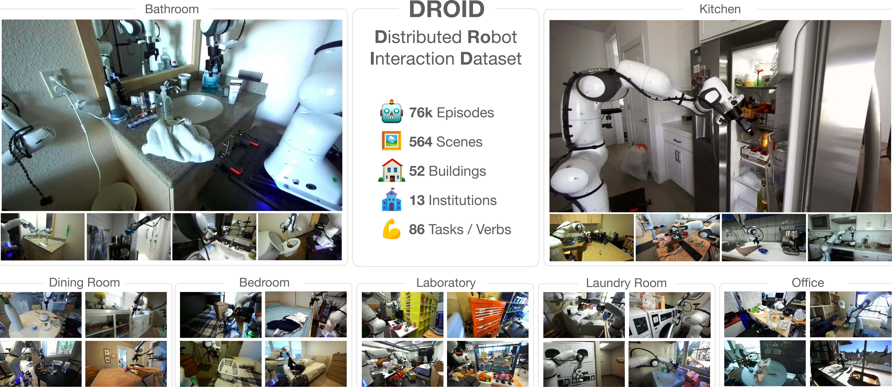

> 图 1：我们推出 DROID（分布式机器人交互数据集），这是一个“真实场景”机器人操作数据集，包含 7.6 万条轨迹或 350 小时交互数据，在 12 个月期间跨越 564 个场景、86 项任务和 52 栋建筑采集完成。每个 DROID 交互片段包含三条同步的 RGB 相机视频流、相机标定数据、深度信息以及自然语言指令。我们证明使用 DROID 进行训练能获得性能更高、鲁棒性更强、泛化能力更优的策略。我们开源了完整数据集、预训练模型检查点以及详细的机器人系统复现指南。

## I 引言（Introduction）

**表 I：与现有机器人操作数据集的比较。** “# 场景数”指独特的机器人工作空间数量，例如，不同的厨房算作不同的场景，但物体的重新排列不算。关于“任务”和“场景”定义的详细讨论，请参见[第 II 节](#section-2)。DROID 在动词数量和场景数量两方面都提供了高度的多样性。^∗ 非机器人、基于工具的数据收集，^† 本身并非数据集，而是现有数据集的*聚合*，包括本表中大部分先前行列。

| 数据集                   | # 轨迹数 | # 动词数 | # 场景数 | 语言指令 | 相机标定 | 公开机器人 | 收集方式              |
| :----------------------- | :------: | :------: | :------: | :------: | :------: | :--------: | :-------------------- |
| MIME [50]                |   8.3k   |    20    |    1     |    ✗     |    ✗     |     ✓      | 人类遥操作            |
| RoboTurk [36]            |   2.1k   |    2     |    1     |    ✗     |    ✗     |     ✓      | 人类遥操作            |
| RoboNet [8]              |   162k   |   n/a    |    10    |    ✗     |    ✗     |     ✓      | 脚本化                |
| MT-Opt [26, 27]          |   800k   |    2     |    1     |    ✗     |    ✗     |     ✓      | 脚本化 & 学习         |
| BridgeData [13]          |   7.2k   |    4     |    12    |    ✓     |    ✗     |     ✓      | 人类遥操作            |
| BC-Z [24]                |   26k    |    3     |    1     |    ✓     |    ✗     |     ✗      | 人类遥操作            |
| RT-1 [2]                 |   130k   |    2     |    2     |    ✓     |    ✗     |     ✗      | 人类遥操作            |
| RH20T [14]               |   13k    |    33    |    7     |    ✓     |    ✓     |     ✓      | 人类遥操作            |
| RoboSet [1]              |  98.5k   |    9     |    11    |    ✓     |    ✗     |     ✓      | 30% 人类 / 70% 脚本化 |
| BridgeData V2 [59]       |  60.1k   |    82    |    24    |    ✓     |    ✗     |     ✓      | 85% 人类 / 15% 脚本化 |
| DobbE [47]^∗             |   5.6k   |    6     |   216    |    ✓     |   n/a    |    (✓)     | 人类基于工具          |
| Open X-Embodiment [39]^† |   1.4M   |   217    |   311    |   (✓)    |    ✗     |    (✓)     | 数据集聚合            |
| DROID (ours)             |   76k    |    86    |   564    |    ✓     |    ✓     |     ✓      | 人类遥操作            |

(^2^22Fang 等人 [14] 报告 RH20T 有 110k 条轨迹，但分别计算了每个相机流——此处我们报告的是独特的多视角轨迹数量，以便与所有其他数据集进行公平比较。)

**机器人操作策略（Robot manipulation policies）** 的一个关键特性是其 **泛化能力（Generalization ability）** ，即在新光照条件、新环境或使用新物体的情况下执行期望操作任务的能力。训练出对此类变化具有鲁棒性的策略，是迈向机器人在日常环境中部署的关键一步，并可能使我们更接近每位机器人专家的梦想：能够下载并在新机器人设置上测试时“即插即用”的机器人模型。训练此类可泛化策略的一个核心要素是 **多样化的训练数据（Diverse training data）** ：在计算机视觉（Computer Vision）和自然语言处理（Natural Language Processing, NLP）领域，利用从互联网抓取的大规模多样化数据集进行训练，能够产生适用于广泛新任务的模型。
类似地，在机器人操作领域，最近的一系列工作已经证明，更大、更多样化的机器人训练数据集能够推动策略泛化的边界，包括对新物体、指令、场景和 **具身（Embodiments）** 的正向迁移 [1, 2, 14, 36, 38, 39, 47, 63]。
这表明，在迈向更强大、更鲁棒的机器人操作策略的道路上，一个重要的基石是创建大规模、多样化、高质量的机器人操作数据集。

然而，创建此类数据集具有挑战性：与视觉或语言数据不同，训练操作策略通常需要包含记录观测和动作的机器人操作数据，而这些数据无法轻易从互联网抓取。在多样化环境中收集机器人操作数据，当将机器人移出受控的实验室环境时，会带来物流和安全方面的挑战。此外，大规模收集数据需要在硬件和人力监督方面进行大量投入，特别是对于收集演示数据而言。
因此，即使当今最通用的机器人操作策略，也大多是在受控的、类似实验室的环境中收集的数据上训练的，这些数据的场景和任务多样性有限。为了实现下一代可泛化的机器人操作策略学习，机器人操作社区需要更多样化的数据集，这些数据集应在广泛的环境和任务中收集。

在这项工作中，我们介绍了 **DROID（分布式机器人交互数据集，Distributed Robot Interaction Dataset）** ，这是一个具有前所未有多样性的机器人操作数据集（见 图 1）。DROID 包含 76k 条演示轨迹或 350 小时的交互数据，在 564 个场景、52 栋建筑和 86 项任务中收集。DROID 由北美、亚洲和欧洲的 18 个研究实验室历时 12 个月收集完成。
为了简化分布式数据收集并确保最终数据集适用于广泛的研究场景，所有数据均基于流行的 Franka Panda 机器人手臂，在相同的机器人硬件栈上收集。每个 **片段（Episode）** 包含三个相机视角、深度信息、相机标定和语言标注。

在涵盖 6 项任务和 4 个地点（从实验室到办公室和真实家庭）的实验中，我们发现，与利用现有大规模机器人操作数据集 [39] 的最先进方法相比，DROID 平均将策略性能、鲁棒性和泛化能力提升了 20%。
我们在 CC-BY 4.0 许可下开源了完整的 DROID 数据集、使用该数据集训练策略的代码，以及一份用于复现我们完整机器人软硬件设置的详细指南。

## II 相关工作（Related Work）

#### 机器学习中的大型数据集（Large datasets in machine learning）

机器学习的快速发展与构建大规模、多样化数据集密切相关。例如，在计算机视觉领域有 **ImageNet** [11]、 **Kitti** [18]、 **Ego4D** [19] 和 **LAION** [46]；在自然语言处理领域有 **Common Crawl** [43] 和 **The Pile** [17]；在三维建模领域有 **ShapeNet** [5] 和 **Objaverse** [10, 9]。这些数据集影响力的关键在于其规模和多样性：通过支持在更大、更多样的数据上进行训练，它们推动了机器学习模型的能力和鲁棒性。通过 **DROID** （Diverse Robot Open-world Instruction-following Dataset）数据集，我们旨在延续这一趋势至机器人操作领域，提供一个大规模、多样化的机器人操作数据集，以促进可泛化策略学习的进展。

#### 机器人学习数据集（Robot learning datasets）

已有许多工作引入了不同规模和多样性水平的机器人学习数据集（参见[表 I](#table-1)）。大体上，这些数据集可分为两类：通过脚本化、半随机行为或学习到的智能体自主收集的数据集 [32, 40, 26, 20, 8, 3, 27]，以及通过人类遥操作收集的数据集 [36, 50, 13, 24, 2, 59, 14, 1]。多项工作专注于增加数据集多样性： **RH20T** [14] 在 7 个桌面场景中收集了 33 个任务的数据， **BridgeV2** [59] 在 24 个场景中收集了数据。虽然这些数据集增加了多样性，但它们的大部分数据是在单个研究实验室或建筑的少数场景中收集的。

> 1 注：先前的工作对“任务”和“场景”的定义各不相同。在本工作中，我们使用从语言指令中提取的唯一 **动词** 数量来表示任务数量，这比手动定义任务 [59] 更具可扩展性，并且通常比例如计算动词-宾语组合数量 [2] 更能反映行为多样性（以 DROID 的动词分布为例，参见[图 1](#figure-5)）。对于场景，我们仅在机器人的工作空间发生实质性变化时才将其计为新场景，例如，机器人被移动到厨房的新角落或全新的房间，但如果只是机器人面前物体的排列或桌布发生变化，则不视为新场景。

最近，人们投入了更多努力将现有的机器人数据集汇集为一种统一的格式，即 **开放 X-具身数据集（Open X-Embodiment dataset, OXE）** [39]。尽管 OXE 数据集在规模上比先前的机器人数据集更大，但它仍由场景数量较少的单个数据集组成，因此在撰写本文时总计约有 300 个场景。我们构建 DROID 数据集的目标是通过在广泛分布于不同地理位置的真实世界建筑中收集数据，显著增加场景多样性和场景真实感。因此，DROID 包含了来自 52 座建筑、564 个场景的数据，与任何现有的机器人操作数据集相比，这是一个显著的增加。

在“野外”收集此类数据在机器人导航和自动驾驶领域更为常见 [18, 4, 55, 64, 28, 57, 48, 49]，并且能够训练出可以零样本泛化到新环境甚至新具身形态的策略 [48, 49]。通过 DROID，我们朝着为机器人 **操作** 策略实现类似泛化能力的目标迈进了一步。最后，还有一些工作利用廉价、现成的工具（如拾取夹持器）进行数据收集，为机器人配备相同的工具以实现到机器人的零样本迁移 [53, 63, 47]。虽然这简化了数据收集过程，但它将数据限制在腕部相机视角，并且在从人类手臂收集的数据迁移到机器人手臂执行时，可能会受到形态差异的影响。此外，与先前基于工具收集的数据集 [47] 相比，DROID 具有更大的场景和任务多样性。

#### 可扩展的机器人策略学习（Scalable robot policy learning）

从日益庞大和多样化的数据集中学习机器人策略是过去几年众多工作的焦点。最初，这些工作主要集中在从脚本化或自主收集的数据中学习 [40, 32, 26, 8, 12, 20]。 **Transformer 模型（Transformer models）** [58] 在自然语言处理和计算机视觉领域的成功，激励了许多近期工作，它们收集大规模演示数据集并在其上训练基于 Transformer 的策略 [2, 51, 67, 39, 49, 42, 25, 65, 38, 16]。此外，近期研究表明， **扩散去噪模型（Diffusion denoising models）** [22] 是一种强大的参数化方法，用于表示多模态动作输出分布，它结合了表达能力和可扩展性 [7, 21, 54, 38, 16]。我们构建 DROID 的重点是引入一个新的数据集，而非新的策略学习算法。因此，在我们的所有策略学习实验中，我们基于 **现有的** 最先进的扩散策略 [7] 进行构建。

## III DROID 数据收集设置（DROID Data Collection Setup）

variability of scenes, tasks, and objects

在本工作中，我们介绍了 **DROID（分布式机器人交互数据集，Distributed Robot Interaction Dataset）** ，这是一个开源的机器人操作数据集，提供了 **场景、任务和对象** 的极高多样性与可变性（参见[表 I](#table-1)）。多样化和高质量的数据是训练 **可泛化策略（Generalizable Policies）** 的关键要素，而 DROID 旨在同时提供数量和质量：它包含 **7.6 万条** 机器人演示轨迹，涵盖 **86 项** 任务和 **564 个** 场景。这些数据是在 **12 个月** 的时间里，通过一项大规模的跨机构合作努力收集的，涉及 **13 个** 机构的 **18 台** 机器人和 **50 名** 数据收集者。所有数据均在一个共享的开源机器人平台上收集。

我们正在发布所有资源，以使研究人员能够在 DROID 的基础上进行构建，网址为 [https://droid-dataset.github.io](https://droid-dataset.github.io)。这包括采用 CC-BY 4.0 许可的完整数据集、一个交互式数据集可视化工具、在 DROID 上训练可泛化策略的代码、预训练的策略检查点，以及一份用于复现我们机器人硬件设置和控制栈的详细指南。在本节中，我们将介绍我们的硬件设置和数据收集协议。

### III-A DROID 机器人平台（DROID Robot Platform）

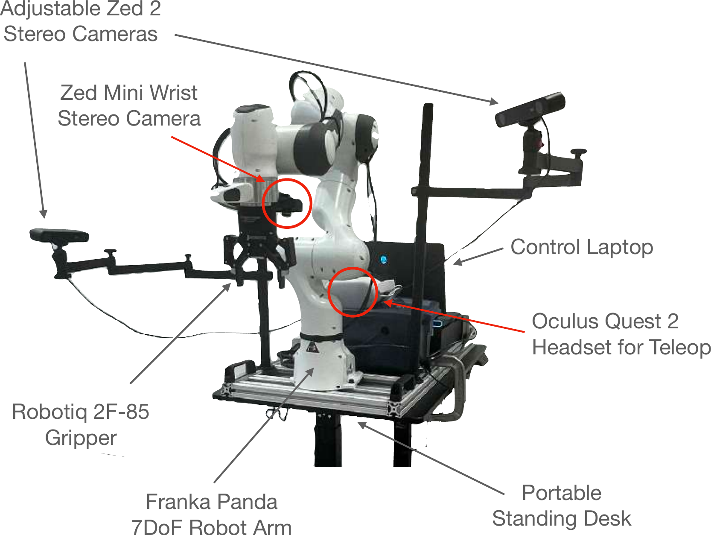

> 图 0 | DROID 机器人平台。我们在所有 13 个机构中使用相同的硬件设置，以简化数据收集，同时最大限度地提高可移植性和灵活性。该设置包括一个 Franka Panda 7 自由度（7DoF）机器人手臂、两个可调节的 Zed 2 立体相机、一个腕部安装的 Zed Mini 立体相机，以及一个带有控制器用于遥操作的 Oculus Quest 2 头戴式显示器。所有设备都安装在一个便携式、高度可调的桌子上，以便快速更换场景。

构建 DROID 数据集的一个关键组成部分是在全球 **13 个** 机构进行的分布式数据收集：正是这一点使我们能够收集跨越大量不同场景和任务的操作数据。在这种分布式设置中的一个关键挑战是机器人硬件：我们如何确保在如此多的设置、地点和时区之间实现 **一致且可复现的** 机器人控制？为了简化分布式数据收集过程，我们设计了 **DROID 机器人平台** （参见[图 0](#figure-0)），这是一个在所有机构之间共享的数据收集硬件平台，使我们能够快速建立新的数据收集单元，并在整个数据收集集群中推出更新。它的设计旨在支持场景间的轻松搬运以及对新场景和任务的快速调整。

我们选择 **弗兰卡·艾米卡 Panda 7 自由度机械臂（Franka Emika Panda 7 DoF robot arm）** 作为我们装置的基础，因为它在机器人研究社区中被广泛采用，可靠，相对经济，并且在大多数参与机构中都有配备。

该机械臂配备了一个 Robotiq 2F-85 夹爪，并安装在一个带轮子的高度可调站立桌上，以便于在不同场景和建筑物之间移动。我们使用三个同步的立体相机流记录图像观测：两个外部 Zed 2 相机，安装在可调三脚架上置于桌面，以快速适应新的场景布局；以及一个腕部安装的 Zed-Mini 相机。我们使用 Polymetis 控制器 [33]，并以 15Hz 的控制频率在机器人关节空间和末端执行器空间中记录动作。

该装置由弗兰卡机器人控制箱、一台运行 Polymetis 服务器的 NUC 以及一台运行我们数据采集图形用户界面（Graphical User Interface, GUI）的 Alienware 笔记本电脑完成（参见 [第 III-B 节](#section-3-2)）。所有设备由一根电源线供电，以进一步简化位置变更。

对于遥操作，我们使用 Meta Quest 2 头戴式显示器的控制器来控制机械臂在 6D 空间中的位姿以及夹爪在连续空间中的开合。在本项目过程中，我们已在北美、亚洲和欧洲的不同地点复制了 18 次此装置。我们提供了一份经过全面测试的指南，用于复制我们装置的硬件和软件。我们发现该装置非常适合在各种场景和任务中进行数据采集和策略学习。

### III-B 数据采集协议（Data Collection Protocol）

我们的数据集由来自不同研究机构的 50 名数据采集员收集。一个共享的数据采集协议有助于简化数据采集过程，特别是对于经验不足的数据采集员。在设计 DROID 的采集协议时，我们关注以下目标：(1) 防止常见的数据采集错误，如“相机看不到机器人”或“遥操作员出现在相机视野中”；(2) 鼓励采集多样化的数据；(3) 允许数据采集员创造性地选择场景和任务。

每次数据采集会话都从将机器人移动到新场景开始。我们鼓励数据采集员选择包含多个有趣任务、大量交互对象以及适量杂乱物品的场景（参见 [图 12] 中的示例场景）。

在新场景中设置好机器人后，数据采集员为第三人称相机选择能够捕捉场景中广泛有趣行为的视角。然后，他们使用棋盘格和 OpenCV 校准算法执行相机外参标定。接下来，数据采集员会将当前场景的所有潜在任务输入到连接到机器人的笔记本电脑上的数据采集 GUI 中，可以通过从任务选项列表中选择，也可以输入自由形式的任务指令（GUI 截图见 [图 11]）。在数据采集过程中，GUI 会为每个新的情节（episode）*随机*从该列表中采样一个任务来提示数据采集员。通过这种方式，我们确保了对多样化任务的高覆盖率，并且采集过程不会偏向于更容易的任务或更近的物体。

此外，GUI 会定期提示数据采集员执行随机采样的“场景增强”操作，例如轻推移动底座、移动并重新校准第三人称相机、改变房间照明，以及在场景内添加或移除物品。对于每条轨迹，我们记录所有 RGB 相机的输出、来自机器人的相关低级状态信息、来自各种流行动作空间的等效机器人控制命令、数据采集员 ID，以及在 GUI 中输入的元数据（关于我们记录的所有特征的详细列表，请参见 [附录 B](#appendix-b)）。数据采集员还会标记采集的序列是否成功，我们将其作为元数据的一部分记录。DROID 包含 76k 个成功的情节；在我们的数据采集中，大约有 16k 条轨迹被标记为“不成功”，我们将其包含在数据集发布中，但*不计入* DROID 的规模。数据采集员通常在每个场景中收集最多 100 条轨迹或大约 20 分钟的交互数据，然后转移到新场景。

在后处理过程中，我们通过 [tasq.ai](www.tasq.ai) 数据标注平台使用众包方式为每个情节标注自然语言指令。我们为每个情节提供最多三条来自不同众包工作者的独立标注指令，以确保标注的多样性。

由于通过上述详细描述的常规标定提供的初始外参标定参数可能并不总是准确，原因包括棋盘格未对齐、光照不一致或 OpenCV 标定方法固有的误差等，我们在 [附录 G](#appendix-g) 中解决了这些不准确性问题。我们详细讨论了自动事后标定过程，并为 DROID 数据集提供了三套全面的相机标定矩阵，每套都附有相应的质量评估指标。这些包括针对约 36k 个独特场景的相机到基座标定（其中一个相机相对于基座标定）、针对所有场景的相机到相机标定，以及一个精选的 24k 个场景的超集，涵盖了所有三种标定方法，且两个相机都相对于基座进行了标定。这些精细化的标定增强了数据集在机器人学和 3D 感知任务中用于鲁棒几何理解的适用性。更多详情，请参见 [附录 G](#appendix-g) 节。

## IV DROID 数据集分析（DROID Dataset Analysis）

尽管我们迄今为止将 DROID 和其他大规模机器人操作数据集称为“多样化”的，但构成一个多样化机器人数据集的内涵存在细微差别。数据多样性的不同维度会以不同方式影响基于该数据训练的模型的泛化能力： **场景多样性（scene diversity）** 可能有助于泛化到新场景，而 **任务（task）** 或 **相机视角多样性（camera viewpoint diversity）** 则允许更好地泛化到新指令和相机角度。我们将沿着多个重要的多样性维度分析 DROID，并将其与现有的大型机器人操作数据集进行比较。

在决定检查机器人操作数据集的哪些泛化维度时，重要的是要考虑问题的哪些方面可能在训练和下游使用场景之间发生变化，即我们希望操作策略能够泛化到哪些维度。这可能涉及场景、任务和机器人设置等方面。我们确定了以下重要的多样性维度以供深入分析： **任务多样性（task diversity）** 、 **物体多样性（object diversity）** 、 **场景多样性（scene diversity）** 、 **视角多样性（viewpoint diversity）** 和 **交互位置多样性（interaction location diversity）** 。后者指的是相对于机器人基座的、发生物体交互的 3D 位置的多样性，这是在泛化到新场景布局时的一个重要因素，因为交互通常需要泛化到新的桌面高度或机器人工作空间的新区域。

我们沿着这些维度分析 DROID，并将其与现有的大规模机器人操作数据集 [59, 2, 14] 进行比较。对于每个数据集，我们使用每个情节（episode）中随机采样的一帧第三人称相机图像以及提供的语言指令标注进行分析。我们发现，在随机采样的帧之间，结果是一致的。

我们将分析结果可视化在 [图 1](#figure-5)、[图 2](#figure-4)、[图 3](#figure-5) 和 [图 4](#figure-4) 中。总体而言，我们发现与现有的大规模机器人操作数据集相比，DROID 在任务、物体、场景、视角和交互位置方面的多样性显著增加。一个关键原因是 DROID 的数据收集协议（参见 [第 III-B 节](#section-3-2)）：通过在三大洲的 52 座建筑中，由 50 名数据收集员收集数据，在收集过程中大约每 20 分钟切换一次场景，并给予收集员自由选择适合场景的任务，我们能够大幅增加数据集中所包含的场景、任务和物体的多样性。接下来，我们将更详细地描述我们对每个类别的分析。

#### 任务多样性（Task diversity）

如 [第 II 节](#section-2) 所述，我们使用数据集中指令里经过去重处理的动词分布作为行为多样性的可扩展指标。我们使用一种 **语义解析算法（semantic parsing algorithm）** [23] 从语言指令中提取动词和引用的物体。然后，我们使用 GPT4 对动词进行去重，即移除同义词和拼写错误。我们在 [图 1](#figure-5) 顶部绘制了 DROID 的动词分布。DROID 具有多种多样的动词，且分布呈现 **长尾（long-tailed）** 特征。我们使用对数尺度进行这些可视化，因为多样性关乎覆盖广泛的任务范围，而不是将大量情节高度集中在少数几个任务上——也就是说，一个任务有 1000 条轨迹还是有 2000 条轨迹，不如它有 0 条还是有 10 条轨迹来得重要。我们还可视化了现有大型操作数据集 [59, 14, 2] 的相应动词分布，发现只有 Bridge V2 [59] 具有可比较的动词类别长尾，尽管其场景集合更为受限（参见下面的场景多样性分析）。[图 16](https://arxiv.org/html/2403.12945v2#A7.F16) 展示了所有数据集动词分布的详细视图。

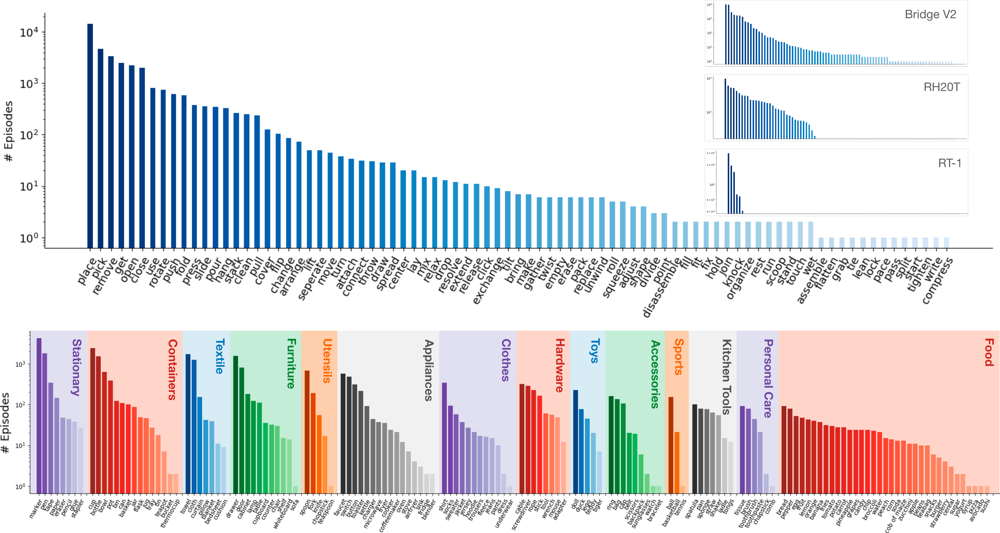

> 图 3 | DROID 中动词和对象的分布。顶部：使用 GPT-4 去重后的动词分布。DROID 拥有一个涵盖广泛行为的多样化任务长尾。我们还可视化了现有大型操作数据集的动词分布，发现只有 Bridge V2 [59] 具有可比拟的技能长尾（有关所有数据集动词分布的详细视图，请参见附录，[图 16](https://arxiv.org/html/2403.12945v2#A7.F16)）。底部：DROID 中机器人交互对象的分布，按类别排序（建议放大查看；详细视图请参见[图 17](https://arxiv.org/html/2403.12945v2#A7.F17)）。

#### 物体多样性（Object diversity）

一个包含对大量不同物体进行操作的数据集有助于向下游任务泛化到新物体。我们使用相同的语义解析流程 [23]，从语言指令标签中分析 DROID 中每个情节里机器人操作的物体，并将分布展示在 [图 3](#figure-5) 底部（建议放大查看，或参见放大版的 [图 17](https://arxiv.org/html/2403.12945v2#A7.F17)）。DROID 包含了与各种日常物体的交互，涵盖了多样化的类别。我们还在 [图 18](https://arxiv.org/html/2403.12945v2#A7.F18) 中绘制了最常见动词与交互物体的 **联合分布（joint distribution）** 。这表明 DROID 不仅包含多样化的物体，而且对大多数物体也包含多样化的交互方式。

#### 场景多样性（Scene diversity）

我们定义了 10 种场景类型（见 [图 2](#figure-4)），并使用 GPT-4V（Generative Pre-trained Transformer 4 Vision）来确定 DROID 中给定片段（episode）的场景类型（所用提示词见附录 [C](#appendix-c)）。我们发现这种方法能产生高质量的 **场景类型标注（scene type annotations）** （示例场景及其分类见 [图 10](https://arxiv.org/html/2403.12945v2#A2.F10)）。对于现有的机器人数据集，由于总场景数较少，我们手动确定了每个场景的类型。
DROID 包含 564 个独特场景，比现有的大型机器人操作数据集多出一个数量级。这些场景涵盖了从办公环境到家庭环境的广泛场景类型。从定性角度看，DROID 中的场景反映了具有自然存在的物体和背景的真实世界场景。我们强烈建议读者查阅 [图 10](https://arxiv.org/html/2403.12945v2#A2.F10) 中的场景定性示例以及补充视频。

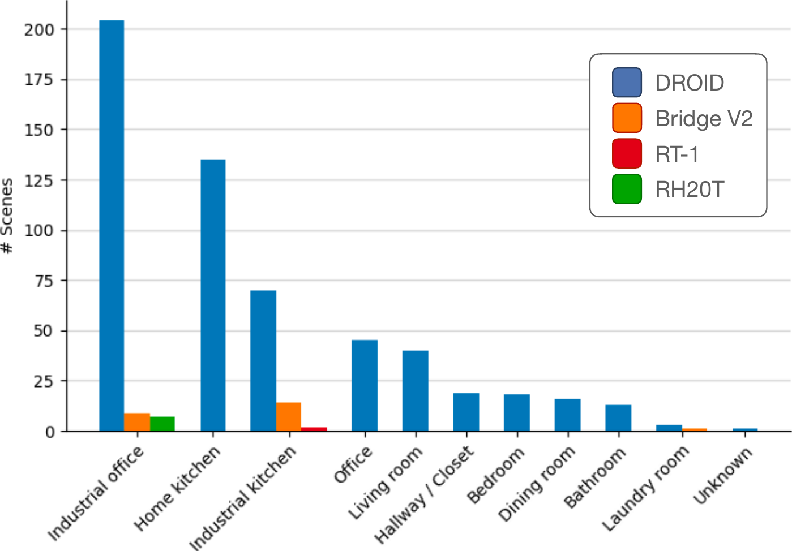

> 图 4 | 每种场景类型的场景数量。与其他大型机器人操作数据集相比，DROID 的场景数量多出一个数量级，涵盖的场景类型范围也广得多。我们已手动验证或与原作者确认，先前数据集的场景计数和类型报告是准确的。

#### 视点多样性（Viewpoint diversity）

现有的大规模机器人学习数据集通常只包含有限的相机视点集，因为相机相对于场景或机器人被固定在某个位置。相比之下，DROID 在数据收集过程中显著改变了相机视点，因此具有广泛的视点覆盖范围（见 [图 5](#figure-5)），数据集中包含 1417 个独特的视点。

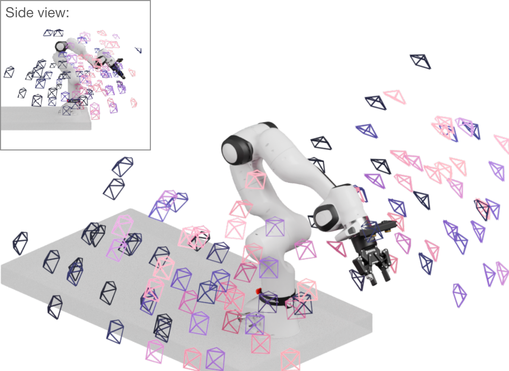

> 图 5 | DROID 中的第三人称相机视点（已下采样）。DROID 片段共覆盖 1417 个相机视点，并包含 **相机内参（intrinsic）** 和 **外参（extrinsic）** 的 **立体相机标定（stereo camera calibration）** 。颜色越亮表示视点密度越高的区域。

#### 交互位置多样性（Interaction location diversity）

机器人数据集的另一个微妙但重要的方面是 **交互位置（interaction location）** 的多样性：任务是否总是在工作空间的同一狭窄区域内执行（例如，在同一桌面高度）？或者数据是否涵盖了工作空间大部分区域的交互？我们使用每个片段中夹爪首次闭合的点作为数据集中交互的代理，并在 [图 6](#figure-6) 中可视化了不同数据集中这些交互点的 3D 位置。与通常将交互集中在机器人前方桌面表面的现有机器人操作数据集相比，DROID 的交互发生在工作空间更广的范围内。

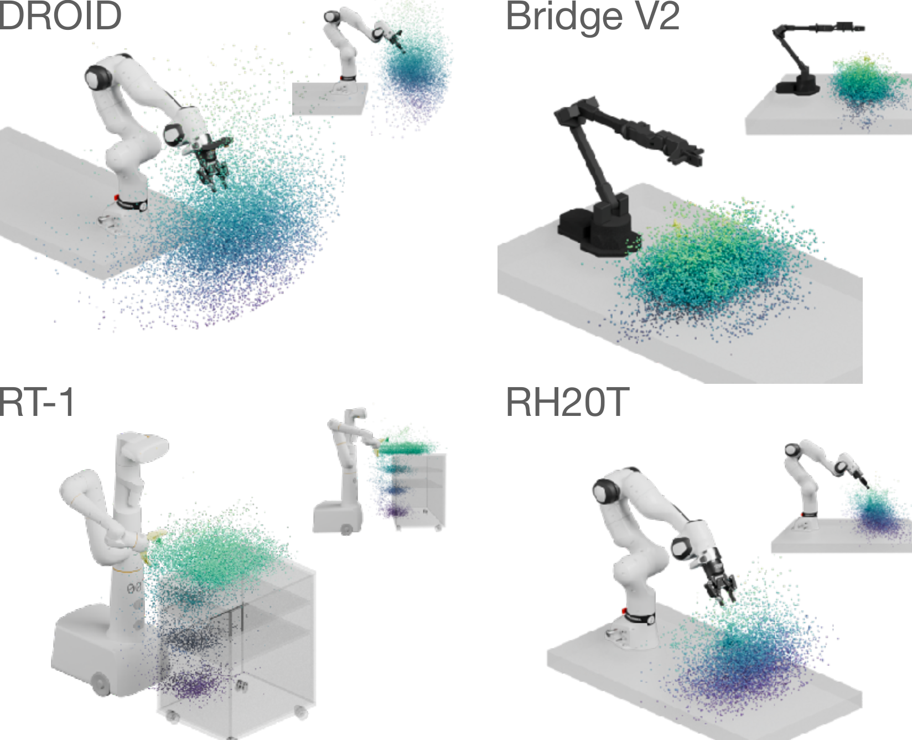

> 图 6 | 相对于机器人基座的 3D 交互点可视化。我们可视化了每条轨迹中 **夹爪（gripper）** 首次闭合时的 3D 位置，因为夹爪闭合通常表示有意义的物体交互。DROID 的交互覆盖了机器人工作空间（workspace）的更大范围，因为机器人在不同收集会话之间可以自由移动，而不是被放置在重复的桌面场景前。

## V 实验（Experiments）

上一节的分析强调了 DROID 数据集在任务、物体、场景和视角方面的多样性。
在本节中，我们研究这种多样化的数据资源是否可用于提升策略在广泛机器人操作任务和环境中的性能与鲁棒性。为此，我们在 4 个不同地点（包括实验室、办公室和家庭环境）的 6 个任务上训练策略，以反映真实世界机器人研究用例的多样性（参见 [图 7](#figure-7)）。所有实验均使用具有代表性的、最先进的机器人策略学习方法 [7]。总体而言，我们发现 DROID 提高了策略的成功率，同时增强了对干扰物或新物体实例等场景变化的鲁棒性。

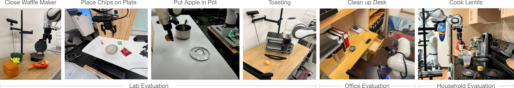

> 图 7 | 用于策略评估的机器人设置。我们涵盖了从实验室评估到办公室和真实家庭的各种任务和场景，以反映真实机器人研究中用例的多样性。根据任务不同，我们收集了 50 到 150 个演示（demonstrations）。我们在括号中描述了每个任务在 **分布外评估（out-of-distribution evaluation）** 时的修改，从左到右依次为：关闭华夫饼机：机器人需要关闭华夫饼机（干扰物体）。将薯片放在盘子上：机器人需要拿起薯片袋并将其放在提供的盘子上（未见过的薯片袋和干扰物体）。将苹果放入锅中：机器人需要拿起苹果，将其放入锅中，并盖上锅盖（未见过的干扰物体）。烤面包：机器人需要拿起物体，将其放入烤面包机，并关闭烤箱（烘烤新物体）。清理桌面：机器人需要打开抽屉，将桌面上的橡皮擦放入抽屉，然后关闭抽屉（桌面和抽屉内的干扰物体）。煮扁豆：机器人需要取下锅盖，拿起扁豆并倒入锅中，然后打开炉灶（添加干扰物体）。

### V-A 实验设置（Experimental Setup）

#### 任务（Tasks）

如 [图 5](#figure-5) 所示，我们在 4 个地点选择了 6 个任务，涵盖了真实机器人学习用例的代表性范围：从简单的拾放任务到多阶段烹饪任务；从洁净的实验室环境到真实的家庭环境。所有实验均使用 DROID 硬件栈进行策略评估。具体而言，我们评估以下 6 个任务，每个任务都有其各自的分布外变体：

- **关闭华夫饼机（Closing Waffle Maker）** ：实验室环境下的短视距任务（70 次演示），任务是关闭一台华夫饼机。华夫饼机的位置在每次试验（Episode）间随机化。分布外变体包括在桌子上添加几个干扰物体。
- **将薯片放在盘子上（Place Chips on Plate）** ：实验室环境下的短视距任务（50 次演示），任务是将一袋多力多滋（Doritos）薯片拾起并放置到一个盘子上，桌上有两个干扰物体。所有物体和盘子的位置在每次试验间于桌面上随机化。分布外变体包括 (a) 更换薯片类型或 (b) 在桌上添加更多干扰物体。
- **将苹果放入锅中（Put Apple in Pot）** ：实验室环境下的中等视距任务（60 次演示），任务是将一个苹果拾起放入锅中，然后盖上锅盖。苹果、锅和锅盖的位置在每次试验间于桌面上随机化。分布外变体涉及在桌上放置一个干扰用的盘子。
- **烤面包（Toasting）** ：实验室环境下的中等视距任务（150 次演示），任务是将一个物体放在烤面包机（Toaster Oven）托盘上，然后关闭烤面包机。物体和烤面包机的位置在每次试验间于桌面上随机化。分布外变体包括烘烤新物体。
- **清理桌面（Clean up Desk）** ：办公室环境下的长视距任务（50 次演示），任务是打开抽屉，拾起一块橡皮并将其放入抽屉，然后关闭抽屉。橡皮的位置固定。分布外变体包括在桌面上和抽屉内添加干扰物体。
- **烹饪扁豆（Cook Lentils）** ：厨房环境下的长视距任务（50 次演示），任务是取下锅盖，将扁豆倒入锅中，然后打开炉灶。物体位置固定。分布外变体包括添加几个干扰物体和一次相机视角偏移。

每个评估任务的更多细节见附录 [E](#appendix-e)。所有数据均使用 DROID 遥操作（Teleoperation）设置收集，训练使用相同的标准化策略学习主干网络。

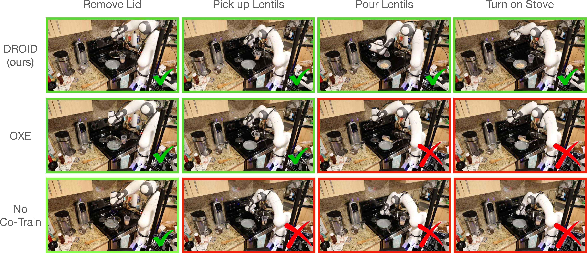

> 图 9 | 在最具挑战性的“烹饪扁豆”任务上的代表性策略执行（Policy Rollout）示例，该任务在一位作者的厨房中进行。定性地看，我们发现与 DROID 协同训练的策略执行更平滑、更精确的动作，使其即使在存在未见过的干扰物体时也能解决像烹饪扁豆这样的长视距任务。相比之下，仅用领域内（In-domain）演示数据训练或与 Open-X 数据 [39] 协同训练的策略在长视距任务和分布外评估设置中表现挣扎。请访问 [https://droid-dataset.github.io](https://droid-dataset.github.io) 查看执行视频。

#### **策略训练（Policy training）**

本工作的目标是引入一个新的机器人操作数据集， **而非** 引入一种新的策略学习方法。因此，在实验评估中，我们旨在利用一个被广泛采用、最先进的策略学习流程。为此，我们使用 **扩散策略（Diffusion policies）** [7, 21, 54, 38, 16]，该方法利用 **去噪扩散模型（Denoising Diffusion Models）** 进行动作预测，并已在多种应用中展现出强大的性能。我们的实现基于 Robomimic [37] 中的扩散策略实现，该库提供了多种不同 **模仿学习（Imitation Learning）** 和 **离线强化学习（Offline Reinforcement Learning, Offline RL）** 算法的高质量开源实现。

具体而言，我们所有的策略都以语言指令为条件，使用来自两个外部摄像头的 RGB 视频流以及 **机器人本体感知（Robot Proprioception）** 作为输入，并输出机器人末端执行器的绝对平移、旋转以及夹爪动作。我们首先将相机观测下采样至 $128\times 128$ 的分辨率，并使用在 ImageNet [11] 上预训练的 ResNet-50 视觉编码器对两个视觉输入进行编码。然后，我们将这些视觉嵌入与一个冻结的 DistilBERT [45] 语言嵌入以及机器人的本体感知状态进行拼接。这些拼接后的特征随后通过一个 **多层感知机（Multilayer Perceptron, MLP）** 并传递给一个 U-Net 扩散头，该头负责生成动作轨迹。与先前工作 [7] 一致，我们训练扩散策略生成 16 步的动作序列，在策略执行（Rollout）过程中，执行第 8 步的动作后（开环控制），会重新运行策略推理。

为了在策略训练中利用 DROID，我们简单地将小规模领域内数据集与完整的 DROID 数据集（但排除标记为“不成功”的轨迹）的训练批次以 50/50 的比例混合，我们发现这在实践中效果良好。关于策略训练的更多细节可在附录 [F](#appendix-f) 中找到。

### **V-B DROID 能否提升策略性能与鲁棒性？（Does DROID Improve Policy Performance and Robustness?）**

为了研究与 DROID 进行 **协同训练（Co-training）** 是否能实现更好的策略学习，我们为每个评估任务分别训练策略，并使用每种任务设置和方法进行 10 次策略执行，在 A/B 测试中直接比较所有策略。为了测试 DROID 和现有数据集如何影响策略鲁棒性，我们在两种设置下评估每个任务和方法：

- **“分布内（In-distribution）”** ：反映了领域内演示中的任务分布，并在初始机器人和物体位置上添加了噪声。
- **“分布外（Out-of-distribution, OOD）”** ：通过引入干扰物体或更换被操作物体等方式来测试策略鲁棒性。

我们评估了以下方法：

- **无协同训练（No Co-training）** ：仅使用领域内演示训练扩散策略 [7]。
- **DROID（我们的方法）** ：训练扩散策略，但在领域内演示和 DROID 演示之间以 50/50 的比例混合批次。
- **OXE [39]** ：训练扩散策略，但在领域内演示和来自 **Open X-Embodiment 数据集（Open X-Embodiment dataset, OXE）** [39] 的轨迹之间以 50/50 的比例混合批次。OXE 包含了我们在[第 IV 节](#section-4)中与 DROID 进行比较的大多数现有大型机器人操作数据集，以及大量其他机器人数据集，涵盖 22 种机器人形态，总计约 300 个场景。（^3^33 我们使用基于 Octo Model Team 等人 [38] 整理的 OXE 划分，该划分在先前工作 [38] 中已被证明对策略学习效果良好。我们移除了 **Language Table 数据集（Language Table dataset）** [35]（相当于 Octo 训练混合的 5%），原因是其场景布局和任务重复，且其原始数据规模对我们的训练基础设施处理起来具有挑战性。）

我们在[图 6](#figure-6) 中展示了策略评估的结果。在所有任务中，我们发现与仅使用领域内数据训练的扩散策略相比，DROID 显著提升了策略性能。与 DROID 协同训练的策略也比利用 Open X-Embodiment (OXE) 中多样化现有机器人数据集的策略表现更好。值得注意的是，在测试分布外性能时，无协同训练的基线表现相当差，而协同训练的策略则有效得多。当与 DROID 协同训练时，这种差异尤为明显，其整体性能最强。

> 图 6 | DROID 是否提升了策略性能与鲁棒性？我们发现，在所有评估任务中，与 DROID 进行协同训练（Co-training）相比无协同训练或与 Open-X 数据集协同训练，均能显著提升分布内（In-distribution）和分布外（Out-of-Distribution, OOD）性能。我们比较了所有任务的平均成功率（含标准误），发现 DROID 在分布内性能上以 22% 的绝对成功率优势超越次优方法，在分布外性能上以 17% 的优势超越。

从定性角度看，我们发现训练中利用 DROID 的策略明显比其他对比方法更平滑、更精确，尤其是在更具挑战性的分布外评估中。例如，在 Waffle Closing 任务的 OOD 设置中，DROID 是唯一能持续伸向华夫饼机的方 法，而其他方法则对任务感到困惑。类似地，在多步骤的 Cook Lentils 任务中，基线方法往往在两步或有时仅一步后就失败，而与 DROID 协同训练是唯一能持续完成所有三个步骤的方法。定性任务执行示例请参见[图 7](#figure-9)。

### V-C DROID 中的场景多样性有多重要？（How important is the scene diversity in DROID?）

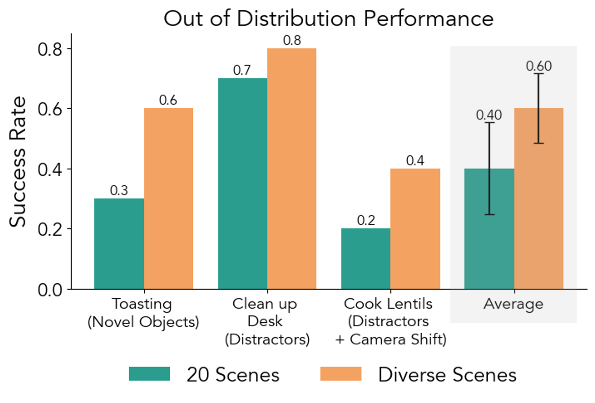

> 图 10 | DROID 中的场景多样性有多重要？我们发现，在具有多样场景的 DROID 子集上进行协同训练（Co-training），其 **分布外（Out-Of-Distribution, OOD）** 性能优于仅在 20 个场景的 DROID 子集上进行协同训练，这表明 DROID 的场景多样性是协同训练时策略性能强劲的驱动因素之一。

与现有的机器人数据集相比，DROID 的独特优势之一在于其 **场景多样性（Scene diversity）** 的数量。确实，我们在图 [2](#figure-4) 中看到，DROID 包含的场景多样性远超其他最具多样性的机器人操作数据集。虽然我们已经看到了使用 DROID 进行协同训练的好处，但 **我们能否量化场景多样性在提升策略鲁棒性中扮演了多大的角色？**

为了验证这一点，我们设计了一个实验，该实验使用第 [V-A](#section-5-1) 节中评估任务的具有挑战性的 OOD 版本，但比较以下两种设置：

- **DROID (7k, 20 Scenes)** ：从 DROID 中选取演示次数最多的 20 个场景，得到 7362 条轨迹，其场景多样性相对较低。
- **DROID (7k, Diverse Scenes)** ：从 DROID 数据集中均匀随机抽取 7362 个成功的演示，该子集在保持高场景多样性的同时，其数据集大小与上述方法相匹配。

这些比较使用了与先前实验相同的、结合个体任务数据的 50/50 协同训练范式。因此，这有助于确定在控制数据集大小的前提下，DROID 的场景多样性是否能带来比仅使用 20 个场景更好的策略性能。

在图 [8](#figure-8) 中，我们观察到，使用场景更多样的数据集划分在 OOD 评估设置中能产生更好的性能。通过比较图 [8](#figure-8) 中各个任务的性能与图 [6](#figure-6) 中的对应任务，我们还发现，使用完整 DROID 数据集进行协同训练的性能，在所有三个任务上均匹配或优于使用子采样数据集的性能。

这些结果表明，DROID 的优势在于其规模，尤其是其 **多样性（Diversity）** 。

## VI Discussion（讨论）

在本工作中，我们介绍了 **DROID（Distributed Robot Interaction Dataset，分布式机器人交互数据集）** ，这是一个在场景、任务、物体和视点方面具有高度多样性的新型机器人操作数据集。我们在 [第 IV 节](#section-4) 中的数据集分析表明，与现有的大型机器人操作数据集相比，DROID 的场景多样性高出一个数量级，并且拥有广泛的任务类型、众多的交互物体以及多样的视点。我们的策略学习评估表明，DROID 是提升策略性能和鲁棒性的宝贵数据资源，即使与现有的 **大型机器人数据源（large robot data sources）** ，如 **Open X-Embodiment 数据集（Open X-Embodiment dataset）** [39] 相比也是如此。

我们希望 DROID 能够成为推动 **通用机器人操作策略（general-purpose robot manipulation policies）** 研究的催化剂，这类策略应能泛化到广泛的任务和场景中。在本工作中，我们展示了一个利用 DROID 提升策略性能的示例，但关于如何最佳利用如此多样化的数据，仍存在许多开放性问题：我们应如何将 DROID 与现有的大规模机器人数据集结合？我们如何训练能够在 **没有任何（without _any_）** 域内数据的情况下，在新场景中执行任务的策略？DROID 中多样化的交互数据能否用于学习更好的机器人控制视觉表示？在何种情况下，使用完整数据集进行训练比使用数据切片更有帮助？我们希望 DROID 能够加速对这些问题的研究，并期待学术界如何利用这个数据集！我们也希望我们开源 **的硬件平台（open-sourced hardware platform）** ——它已存在于全球 18 个实验室且易于复现——能够提高机器人学习研究的可复现性，并促进未来对 DROID 数据集的扩充。

## ACKNOWLEDGMENT（致谢）

我们感谢丰田研究院（Toyota Research Institute, TRI）对本项目从数据收集到策略训练计算等各方面的支持。这项工作得到了谷歌 TPU 研究云（Google TPU Research Cloud）的支持。我们进一步感谢以下资助来源：

- Chelsea Finn 的研究小组得到了 TRI 以及美国海军研究办公室（Office of Naval Research, ONR）资助 N00014-20-1-2675 和 N00014-22-1-2621 的支持。
- Sergey Levine 的研究小组得到了 TRI、美国国家科学基金会（National Science Foundation, NSF）FRR IIS-2150826 以及 ONR N00014-20-1-2383 的支持。
- Ram Ramamoorthy 的研究小组得到了英国研究与创新署（United Kingdom Research and Innovation, UKRI）通过资助 EP/S023208/1 给予英国工程与物理科学研究理事会（Engineering and Physical Sciences Research Council, EPSRC）机器人学与自主系统（Robotics and Autonomous Systems, RAS）博士培训中心，以及资助 EP/V026607/1 给予 UKRI 可信自主系统治理与监管研究节点（UKRI Research Node on Trustworthy Autonomous Systems Governance and Regulation）的支持。
- Dorsa Sadigh 的研究小组得到了 TRI 以及 ONR 资助 N00014-22-1-2293 的支持。
- Glen Berseth 的研究小组感谢来自加拿大自然科学与工程研究理事会（Natural Sciences and Engineering Research Council of Canada, NSERC）和加拿大高等研究院（Canadian Institute for Advanced Research, CIFAR）的资助支持，以及来自加拿大数字研究联盟（Digital Research Alliance of Canada）、Mila IDT 和英伟达（NVidia）的计算支持。
- Jeannette Bohg 的研究小组得到了 TRI、Intrinsic、东芝（Toshiba）以及美国国家科学基金会（National Science Foundation, NSF）资助 2327974 的支持。
- Joseph Lim 的研究小组得到了韩国信息通信技术规划与评估研究所（Institute of Information & Communications Technology Planning & Evaluation, IITP）资助（编号 2019-0-00075，人工智能研究生院项目，韩国科学技术院（KAIST）；编号 2022-0-00077，面向异构数据的常识提取、推理与推断的人工智能技术开发）以及由韩国政府（科学和信息通信技术部（Ministry of Science and ICT, MSIT））资助的韩国国家研究基金会（National Research Foundation of Korea, NRF）资助（NRF-2021H1D3A2A03103683）的支持。

## 参考文献（References）

- Bharadhwaj 等人 [2023]
  Homanga Bharadhwaj, Jay Vakil, Mohit Sharma, Abhinav Gupta, Shubham Tulsiani, and Vikash Kumar.
  Roboagent: Generalization and efficiency in robot manipulation via semantic augmentations and action chunking.
  _arXiv preprint arXiv:2309.01918_, 2023.
- Brohan 等人 [2022]
  Anthony Brohan, Noah Brown, Justice Carbajal, Yevgen Chebotar, Joseph Dabis, Chelsea Finn, Keerthana Gopalakrishnan, Karol Hausman, Alex Herzog, Jasmine Hsu, et al.
  Rt-1: Robotics transformer for real-world control at scale.
  _arXiv preprint arXiv:2212.06817_, 2022.
- Cabi 等人 [2019]
  Serkan Cabi, Sergio Gomez Colmenarejo, Alexander Novikov, Ksenia Konyushkova, Scott Reed, Rae Jeong, Konrad Zolna, Yusuf Aytar, David Budden, Mel Vecerik, Oleg Sushkov, David Barker, Jonathan Scholz, Misha Denil, Nando de Freitas, and Ziyu Wang.
  Scaling data-driven robotics with reward sketching and batch reinforcement learning.
  _RSS_, 2019.
- Caesar 等人 [2019]
  Holger Caesar, Varun Bankiti, Alex H. Lang, Sourabh Vora, Venice Erin Liong, Qiang Xu, Anush Krishnan, Yu Pan, Giancarlo Baldan, and Oscar Beijbom.
  nuscenes: A multimodal dataset for autonomous driving.
  _preprint arXiv:1903.11027_, 2019.
- Chang 等人 [2015]
  Angel X Chang, Thomas Funkhouser, Leonidas Guibas, Pat Hanrahan, Qixing Huang, Zimo Li, Silvio Savarese, Manolis Savva, Shuran Song, Hao Su, et al.
  Shapenet: An information-rich 3d model repository.
  _arXiv preprint arXiv:1512.03012_, 2015.
- Chen 等人 [2024]
  Lawrence Yunliang Chen, Chenfeng Xu, Karthik Dharmarajan, Muhammad Zubair Irshad, Richard Cheng, Kurt Keutzer, Masayoshi Tomizuka, Quan Vuong, and Ken Goldberg.
  Rovi-aug: Robot and viewpoint augmentation for cross-embodiment robot learning.
  In _Conference on Robot Learning (CoRL)_, Munich, Germany, 2024.
- Chi 等人 [2023]
  Cheng Chi, Siyuan Feng, Yilun Du, Zhenjia Xu, Eric Cousineau, Benjamin Burchfiel, and Shuran Song.
  Diffusion policy: Visuomotor policy learning via action diffusion.
  In _Proceedings of Robotics: Science and Systems (RSS)_, 2023.
- Dasari 等人 [2019]
  Sudeep Dasari, Frederik Ebert, Stephen Tian, Suraj Nair, Bernadette Bucher, Karl Schmeckpeper, Siddharth Singh, Sergey Levine, and Chelsea Finn.
  Robonet: Large-scale multi-robot learning.
  _CoRL_, 2019.
- Deitke 等人 [2023a]
  Matt Deitke, Ruoshi Liu, Matthew Wallingford, Huong Ngo, Oscar Michel, Aditya Kusupati, Alan Fan, Christian Laforte, Vikram Voleti, Samir Yitzhak Gadre, et al.
  Objaverse-xl: A universe of 10m+ 3d objects.
  _arXiv preprint arXiv:2307.05663_, 2023a.
- Deitke 等人 [2023b]
  Matt Deitke, Dustin Schwenk, Jordi Salvador, Luca Weihs, Oscar Michel, Eli VanderBilt, Ludwig Schmidt, Kiana Ehsani, Aniruddha Kembhavi, and Ali Farhadi.
  Objaverse: A universe of annotated 3d objects.
  In _Proceedings of the IEEE/CVF Conference on Computer Vision and Pattern Recognition_, pages 13142–13153, 2023b.
- Deng 等人 [2009]
  Jia Deng, Wei Dong, Richard Socher, Li-Jia Li, Kai Li, and Li Fei-Fei.
  Imagenet: A large-scale hierarchical image database.
  In _2009 IEEE conference on computer vision and pattern recognition_, pages 248–255. Ieee, 2009.
- Ebert 等人 [2018]
  Frederik Ebert, Chelsea Finn, Sudeep Dasari, Annie Xie, Alex Lee, and Sergey Levine.
  Visual foresight: Model-based deep reinforcement learning for vision-based robotic control.
  _arXiv:1812.00568_, 2018.
- Ebert 等人 [2021]
  Frederik Ebert, Yanlai Yang, Karl Schmeckpeper, Bernadette Bucher, Georgios Georgakis, Kostas Daniilidis, Chelsea Finn, and Sergey Levine.
  Bridge data: Boosting generalization of robotic skills with cross-domain datasets.
  _arXiv preprint arXiv:2109.13396_, 2021.
- Fang 等人 [2023]
  Hao-Shu Fang, Hongjie Fang, Zhenyu Tang, Jirong Liu, Chenxi Wang, Junbo Wang, Haoyi Zhu, and Cewu Lu.
  Rh20t: A comprehensive robotic dataset for learning diverse skills in one-shot.
  _Towards Generalist Robots: Learning Paradigms for Scalable Skill Acquisition@ CoRL2023_, 3:5, 2023.
- Fischler and Bolles [1981]
  Martin A Fischler and Robert C Bolles.
  Random sample consensus: a paradigm for model fitting with applications to image analysis and automated cartography.
  _Communications of the ACM_, 24(6):381–395, 1981.
- Fu 等人 [2024]
  Zipeng Fu, Tony Z Zhao, and Chelsea Finn.
  Mobile aloha: Learning bimanual mobile manipulation with low-cost whole-body teleoperation.
  _arXiv preprint arXiv:2401.02117_, 2024.
- Gao 等人 [2020]
  Leo Gao, Stella Biderman, Sid Black, Laurence Golding, Travis Hoppe, Charles Foster, Jason Phang, Horace He, Anish Thite, Noa Nabeshima, et al.
  The pile: An 800gb dataset of diverse text for language modeling.
  _arXiv preprint arXiv:2101.00027_, 2020.
- Geiger 等人 [2012]
  Andreas Geiger, Philip Lenz, and Raquel Urtasun.
  Are we ready for autonomous driving? the kitti vision benchmark suite.
  In _2012 IEEE conference on computer vision and pattern recognition_, pages 3354–3361. IEEE, 2012.
- Grauman 等人 [2022]
  Kristen Grauman, Andrew Westbury, Eugene Byrne, Zachary Chavis, Antonino Furnari, Rohit Girdhar, Jackson Hamburger, Hao Jiang, Miao Liu, Xingyu Liu, et al.
  Ego4d: Around the world in 3,000 hours of egocentric video.
  In _Proceedings of the IEEE/CVF Conference on Computer Vision and Pattern Recognition_, pages 18995–19012, 2022.
- Gupta 等人 [2018]
  Abhinav Gupta, Adithyavairavan Murali, Dhiraj Prakashchand Gandhi, and Lerrel Pinto.
  Robot learning in homes: Improving generalization and reducing dataset bias.
  _Advances in neural information processing systems_, 31, 2018.
- Ha 等人 [2023]
  Huy Ha, Pete Florence, and Shuran Song.
  Scaling up and distilling down: Language-guided robot skill acquisition.
  In _Conference on Robot Learning_, pages 3766–3777. PMLR, 2023.
- Ho 等人 [2020]
  Jonathan Ho, Ajay Jain, and Pieter Abbeel.
  Denoising diffusion probabilistic models.
  _Advances in neural information processing systems_, 33:6840–6851, 2020.
- Honnibal and Montani [2017]
  Matthew Honnibal and Ines Montani.

**spaCy 2: Natural language understanding with Bloom embeddings, convolutional neural networks and incremental parsing（spaCy 2：使用 Bloom 嵌入、卷积神经网络和增量解析的自然语言理解）** 。
即将发表，2017 年。

- Jang 等人 [2022]
  Eric Jang, Alex Irpan, Mohi Khansari, Daniel Kappler, Frederik Ebert, Corey Lynch, Sergey Levine, and Chelsea Finn.
  BC-Z：通过机器人模仿学习实现零样本任务泛化。
  发表于 _机器人学习会议（Conference on Robot Learning）_，第 991–1002 页。PMLR，2022 年。
- Jiang 等人 [2023]
  Yunfan Jiang, Agrim Gupta, Zichen Zhang, Guanzhi Wang, Yongqiang Dou, Yanjun Chen, Li Fei-Fei, Anima Anandkumar, Yuke Zhu, and Linxi Fan.
  VIMA：基于多模态提示的机器人操作。
  载于 Andreas Krause, Emma Brunskill, Kyunghyun Cho, Barbara Engelhardt, Sivan Sabato, and Jonathan Scarlett 编辑的 _第 40 届国际机器学习会议论文集（Proceedings of the 40th International Conference on Machine Learning）_，第 202 卷 _机器学习研究论文集（Proceedings of Machine Learning Research）_，第 14975–15022 页。PMLR，2023 年 7 月 23–29 日。
  URL [https://proceedings.mlr.press/v202/jiang23b.html](https://proceedings.mlr.press/v202/jiang23b.html)。
- Kalashnikov 等人 [2018]
  Dmitry Kalashnikov, Alex Irpan, Peter Pastor, Julian Ibarz, Alexander Herzog, Eric Jang, Deirdre Quillen, Ethan Holly, Mrinal Kalakrishnan, Vincent Vanhoucke, 等人。
  QT-Opt：用于视觉机器人操作的可扩展深度强化学习。
  _arXiv 预印本 arXiv:1806.10293_，2018 年。
- Kalashnkov 等人 [2021]
  Dmitry Kalashnkov, Jake Varley, Yevgen Chebotar, Ben Swanson, Rico Jonschkowski, Chelsea Finn, Sergey Levine, and Karol Hausman.
  MT-Opt：大规模连续多任务机器人强化学习。
  _arXiv_，2021 年。
- Karnan 等人 [2022]
  Haresh Karnan, Anirudh Nair, Xuesu Xiao, Garrett Warnell, Sören Pirk, Alexander Toshev, Justin Hart, Joydeep Biswas, and Peter Stone.
  社会合规导航数据集（SCAND）：用于社会导航的大规模演示数据集。
  _IEEE 机器人与自动化快报（IEEE Robotics and Automation Letters）_，7(4):11807–11814，2022 年。
- Kirillov 等人 [2023a]
  Alexander Kirillov, Eric Mintun, Nikhila Ravi, Hanzi Mao, Chloe Rolland, Laura Gustafson, Tete Xiao, Spencer Whitehead, Alexander C. Berg, Wan-Yen Lo, Piotr Dollár, and Ross Girshick.
  Segment Anything，2023a。
  URL [https://arxiv.org/abs/2304.02643](https://arxiv.org/abs/2304.02643)。
- Kirillov 等人 [2023b]
  Alexander Kirillov, Eric Mintun, Nikhila Ravi, Hanzi Mao, Chloe Rolland, Laura Gustafson, Tete Xiao, Spencer Whitehead, Alexander C. Berg, Wan-Yen Lo, 等人。
  Segment Anything，2023 年 4 月。
- Lepetit 等人 [2009]
  Vincent Lepetit, Francesc Moreno-Noguer, and Pascal Fua.
  EPnP：PnP 问题的一个精确 O(n) 解法。
  _国际计算机视觉杂志（International journal of computer vision）_，81:155–166，2009 年。
- Levine 等人 [2016]
  Sergey Levine, Peter Pastor, Alex Krizhevsky, and Deirdre Quillen.
  通过大规模数据收集学习机器人抓取的手眼协调。
  载于 _实验机器人国际研讨会（International Symposium on Experimental Robotics）_。Springer，2016 年。
- Lin 等人 [2021]
  Yixin Lin, Austin S. Wang, Giovanni Sutanto, Akshara Rai, and Franziska Meier.
  Polymetis。
  [https://facebookresearch.github.io/fairo/polymetis/](https://facebookresearch.github.io/fairo/polymetis/)，2021 年。
- Lu 等人 [2024]
  Jingpei Lu, Zekai Liang, Tristin Xie, Florian Ritcher, Shan Lin, Sainan Liu, and Michael C Yip.
  CTRNet-X：在真实世界条件下使用单目相机进行相机到机器人的姿态估计。
  _arXiv 预印本 arXiv:2409.10441_，2024 年。
- Lynch 等人 [2023]
  Corey Lynch, Ayzaan Wahid, Jonathan Tompson, Tianli Ding, James Betker, Robert Baruch, Travis Armstrong, and Pete Florence.
  交互式语言：与机器人实时对话。
  _IEEE 机器人与自动化快报（IEEE Robotics and Automation Letters）_，2023 年。
- Mandlekar 等人 [2018]
  Ajay Mandlekar, Yuke Zhu, Animesh Garg, Jonathan Booher, Max Spero, Albert Tung, Julian Gao, John Emmons, Anchit Gupta, Emre Orbay, 等人。
  Roboturk：一个通过模仿进行机器人技能学习的众包平台。
  载于 _机器人学习会议（Conference on Robot Learning）_，第 879–893 页。PMLR，2018 年。
- Mandlekar 等人 [2021]
  Ajay Mandlekar, Danfei Xu, Josiah Wong, Soroush Nasiriany, Chen Wang, Rohun Kulkarni, Li Fei-Fei, Silvio Savarese, Yuke Zhu, and Roberto Martín-Martín.
  从离线人类演示中学习机器人操作的关键因素。
  载于 _arXiv 预印本 arXiv:2108.03298_，2021 年。
- Octo 模型团队 等人 [2023]
  Octo 模型团队, Dibya Ghosh, Homer Walke, Karl Pertsch, Kevin Black, Oier Mees, Sudeep Dasari, Joey Hejna, Charles Xu, Jianlan Luo, Tobias Kreiman, You Liang Tan, Dorsa Sadigh, Chelsea Finn, and Sergey Levine.
  Octo：一个开源通用机器人策略。
  [https://octo-models.github.io](https://octo-models.github.io)，2023 年。
- Open X-Embodiment 协作组 等人 [2023]
  Open X-Embodiment 协作组, Abhishek Padalkar, Acorn Pooley, Ajinkya Jain, Alex Bewley, Alex Herzog, Alex Irpan, Alexander Khazatsky, Anant Rai, Anikait Singh, Anthony Brohan, Antonin Raffin, Ayzaan Wahid, Ben Burgess-Limerick, Beomjoon Kim, Bernhard Schölkopf, Brian Ichter, Cewu Lu, Charles Xu, Chelsea Finn, Chenfeng Xu, Cheng Chi, Chenguang Huang, Christine Chan, Chuer Pan, Chuyuan Fu, Coline Devin, Danny Driess, Deepak Pathak, Dhruv Shah, Dieter Büchler, Dmitry Kalashnikov, Dorsa Sadigh, Edward Johns, Federico Ceola, Fei Xia, Freek Stulp, Gaoyue Zhou, Gaurav S. Sukhatme, Gautam Salhotra, Ge Yan, Giulio Schiavi, Hao Su, Hao-Shu Fang, Haochen Shi, Heni Ben Amor, Henrik I Christensen, Hiroki Furuta, Homer Walke, Hongjie Fang, Igor Mordatch, Ilija Radosavovic, Isabel Leal, Jacky Liang, Jaehyung Kim, Jan Schneider, Jasmine Hsu, Jeannette Bohg, Jeffrey Bingham, Jiajun Wu, Jialin Wu, Jianlan Luo, Jiayuan Gu, Jie Tan, Jihoon Oh, Jitendra Malik, Jonathan Tompson, Jonathan Yang, Joseph J.

Lim, João, Silvério, Junhyek Han, Kanishka Rao, Karl Pertsch, Karol Hausman, Keegan Go, Keerthana Gopalakrishnan, Ken Goldberg, Kendra Byrne, Kenneth Oslund, Kento Kawaharazuka, Kevin Zhang, Keyvan Majd, Krishan Rana, Krishnan Srinivasan, Lawrence Yunliang Chen, Lerrel Pinto, Liam Tan, Lionel Ott, Lisa Lee, Masayoshi Tomizuka, Maximilian Du, Michael Ahn, Mingtong Zhang, Mingyu Ding, Mohan Kumar Srirama, Mohit Sharma, Moo Jin Kim, Naoaki Kanazawa, Nicklas Hansen, Nicolas Heess, Nikhil J Joshi, Niko Suenderhauf, Norman Di Palo, Nur Muhammad Mahi Shafiullah, Oier Mees, Oliver Kroemer, Pannag R Sanketi, Paul Wohlhart, Peng Xu, Pierre Sermanet, Priya Sundaresan, Quan Vuong, Rafael Rafailov, Ran Tian, Ria Doshi, Roberto Martín-Martín, Russell Mendonca, Rutav Shah, Ryan Hoque, Ryan Julian, Samuel Bustamante, Sean Kirmani, Sergey Levine, Sherry Moore, Shikhar Bahl, Shivin Dass, Shuran Song, Sichun Xu, Siddhant Haldar, Simeon Adebola, Simon Guist, Soroush Nasiriany, Stefan Schaal, Stefan Welker, Stephen Tian, Sudeep Dasari, Suneel Belkhale, Takayuki Osa, Tatsuya Harada, Tatsuya Matsushima, Ted Xiao, Tianhe Yu, Tianli Ding, Todor Davchev, Tony Z. Zhao, Travis Armstrong, Trevor Darrell, Vidhi Jain, Vincent Vanhoucke, Wei Zhan, Wenxuan Zhou, Wolfram Burgard, Xi Chen, Xiaolong Wang, Xinghao Zhu, Xuanlin Li, Yao Lu, Yevgen Chebotar, Yifan Zhou, Yifeng Zhu, Ying Xu, Yixuan Wang, Yonatan Bisk, Yoonyoung Cho, Youngwoon Lee, Yuchen Cui, Yueh hua Wu, Yujin Tang, Yuke Zhu, Yunzhu Li, Yusuke Iwasawa, Yutaka Matsuo, Zhuo Xu, and Zichen Jeff Cui.
**Open X-Embodiment: Robotic learning datasets and RT-X models（开放 X-具身：机器人学习数据集与 RT-X 模型）** .
[https://arxiv.org/abs/2310.08864](https://arxiv.org/abs/2310.08864), 2023.

- Pinto and Gupta [2016]
  Lerrel Pinto and Abhinav Gupta.
  **Supersizing self-supervision: Learning to grasp from 50k tries and 700 robot hours（超大规模自监督：从 5 万次尝试与 700 机器人小时中学习抓取）** .
  In _2016 IEEE international conference on robotics and automation (ICRA)_（2016 年 IEEE 机器人与自动化国际会议）, pages 3406–3413. IEEE, 2016.

- Radford et al. [2021]
  Alec Radford, Jong Wook Kim, Chris Hallacy, Aditya Ramesh, Gabriel Goh, Sandhini Agarwal, Girish Sastry, Amanda Askell, Pamela Mishkin, Jack Clark, Gretchen Krueger, and Ilya Sutskever.
  **Learning transferable visual models from natural language supervision（从自然语言监督中学习可迁移的视觉模型）** , 2021.
  URL [https://arxiv.org/abs/2103.00020](https://arxiv.org/abs/2103.00020).

- Radosavovic et al. [2023]
  Ilija Radosavovic, Baifeng Shi, Letian Fu, Ken Goldberg, Trevor Darrell, and Jitendra Malik.
  **Robot learning with sensorimotor pre-training（基于感觉运动预训练的机器人学习）** .
  In _Conference on Robot Learning_（机器人学习会议）, 2023.

- Rana [2010]
  Ahad Rana.
  **Common crawl – building an open web-scale crawl using hadoop（Common Crawl – 使用 Hadoop 构建开放的网络规模爬虫）** , 2010.
  URL [https://www.slideshare.net/hadoopusergroup/common-crawlpresentation](https://www.slideshare.net/hadoopusergroup/common-crawlpresentation).

- Ravi et al. [2020]
  Nikhila Ravi, Jeremy Reizenstein, David Novotny, Taylor Gordon, Wan-Yen Lo, Justin Johnson, and Georgia Gkioxari.
  **Accelerating 3d deep learning with pytorch3d（使用 PyTorch3D 加速 3D 深度学习）** .
  _arXiv:2007.08501_, 2020.

- Sanh et al. [2019]
  Victor Sanh, Lysandre Debut, Julien Chaumond, and Thomas Wolf.
  **Distilbert, a distilled version of bert: smaller, faster, cheaper and lighter（DistilBERT，BERT 的蒸馏版本：更小、更快、更便宜、更轻量）** .
  _ArXiv_, abs/1910.01108, 2019.
  URL [https://api.semanticscholar.org/CorpusID:203626972](https://api.semanticscholar.org/CorpusID:203626972).

- Schuhmann et al. [2022]
  Christoph Schuhmann, Romain Beaumont, Richard Vencu, Cade Gordon, Ross Wightman, Mehdi Cherti, Theo Coombes, Aarush Katta, Clayton Mullis, Mitchell Wortsman, et al.
  **Laion-5b: An open large-scale dataset for training next generation image-text models（LAION-5B：用于训练下一代图文模型的大规模开放数据集）** .
  _Advances in Neural Information Processing Systems_, 35:25278–25294, 2022.

- Shafiullah et al. [2023]
  Nur Muhammad Mahi Shafiullah, Anant Rai, Haritheja Etukuru, Yiqian Liu, Ishan Misra, Soumith Chintala, and Lerrel Pinto.
  **On bringing robots home（关于将机器人带回家）** , 2023.

- Shah et al. [2023a]
  Dhruv Shah, Ajay Sridhar, Arjun Bhorkar, Noriaki Hirose, and Sergey Levine.
  **Gnm: A general navigation model to drive any robot（GNM：驱动任意机器人的通用导航模型）** .
  In _2023 IEEE International Conference on Robotics and Automation (ICRA)_（2023 年 IEEE 机器人与自动化国际会议）, pages 7226–7233. IEEE, 2023a.

- Shah et al. [2023b]
  Dhruv Shah, Ajay Sridhar, Nitish Dashora, Kyle Stachowicz, Kevin Black, Noriaki Hirose, and Sergey Levine.
  **ViNT: A foundation model for visual navigation（ViNT：视觉导航的基础模型）** .
  In _7th Annual Conference on Robot Learning_（第七届机器人学习年会）, 2023b.
  URL [https://arxiv.org/abs/2306.14846](https://arxiv.org/abs/2306.14846).

- Sharma et al. [2018]
  Pratyusha Sharma, Lekha Mohan, Lerrel Pinto, and Abhinav Gupta.
  **Multiple interactions made easy (mime): Large scale demonstrations data for imitation（轻松实现多交互（MIME）：用于模仿学习的大规模演示数据）** .
  In _Conference on robot learning_（机器人学习会议）, pages 906–915. PMLR, 2018.

- Shridhar et al. [2022]
  Mohit Shridhar, Lucas Manuelli, and Dieter Fox.
  **Perceiver-actor: A multi-task transformer for robotic manipulation（Perceiver-Actor：用于机器人操作的多任务 Transformer）** .
  In _Proceedings of the 6th Conference on Robot Learning (CoRL)_（第六届机器人学习会议论文集）, 2022.

- Shridhar et al. [2023]
  Mohit Shridhar, Lucas Manuelli, and Dieter Fox.
  **Perceiver-actor: A multi-task transformer for robotic manipulation（Perceiver-Actor：用于机器人操作的多任务 Transformer）** .
  In _Conference on Robot Learning_（机器人学习会议）, pages 785–799. PMLR, 2023.

- Song et al. [2020]
  Shuran Song, Andy Zeng, Johnny Lee, and Thomas Funkhouser.
  **Grasping in the wild: Learning 6dof closed-loop grasping from low-cost demonstrations（野外抓取：从低成本演示中学习 6 自由度闭环抓取）** .
  _IEEE Robotics and Automation Letters_, 5(3):4978–4985, 2020.

- Sridhar et al. [2023]
  Ajay Sridhar, Dhruv Shah, Catherine Glossop, and Sergey Levine.
  **Nomad: Goal masked diffusion policies for navigation and exploration（Nomad：用于导航与探索的目标掩码扩散策略）** .
  arXiv preprint arXiv

  **View-invariant policy learning via zero-shot novel view synthesis（通过零样本新视角合成的视点不变策略学习）** 。
  _arXiv_，2024。

- Triest 等人 [2022]
  Samuel Triest, Matthew Sivaprakasam, Sean J Wang, Wenshan Wang, Aaron M Johnson, 和 Sebastian Scherer。
  Tartandrive：一个用于学习越野动力学模型的大规模数据集。
  收录于 _2022 年 IEEE 机器人与自动化国际会议（ICRA）_，第 2546–2552 页。IEEE，2022。
- Vaswani 等人 [2017]
  Ashish Vaswani, Noam Shazeer, Niki Parmar, Jakob Uszkoreit, Llion Jones, Aidan N Gomez, Łukasz Kaiser, 和 Illia Polosukhin。
  注意力机制就是您所需要的全部。
  收录于 _神经信息处理系统进展_，第 5998–6008 页，2017。
- Walke 等人 [2023]
  Homer Walke, Kevin Black, Abraham Lee, Moo Jin Kim, Max Du, Chongyi Zheng, Tony Zhao, Philippe Hansen-Estruch, Quan Vuong, Andre He, Vivek Myers, Kuan Fang, Chelsea Finn, 和 Sergey Levine。
  Bridgedata v2：一个用于大规模机器人学习的数据集，2023。
- Wang 等人 [2025]
  Jianyuan Wang, Minghao Chen, Nikita Karaev, Andrea Vedaldi, Christian Rupprecht, 和 David Novotny。
  Vggt：视觉几何基础变换器。
  收录于 _IEEE/CVF 计算机视觉与模式识别会议论文集_，2025。
- Wang 等人 [2024]
  Shuzhe Wang, Vincent Leroy, Yohann Cabon, Boris Chidlovskii, 和 Jerome Revaud。
  Dust3r：让几何三维视觉变得简单，2024。
  URL [https://arxiv.org/abs/2312.14132](https://arxiv.org/abs/2312.14132)。
- Yang 等人 [2025]
  Jianing Yang, Alexander Sax, Kevin J. Liang, Mikael Henaff, Hao Tang, Ang Cao, Joyce Chai, Franziska Meier, 和 Matt Feiszli。
  Fast3r：迈向单次前向传播重建 1000+ 张图像的三维重建。
  收录于 _IEEE/CVF 计算机视觉与模式识别会议（CVPR）论文集_，2025 年 6 月。
- Young 等人 [2020]
  Sarah Young, Dhiraj Gandhi, Shubham Tulsiani, Abhinav Gupta, Pieter Abbeel, 和 Lerrel Pinto。
  让视觉模仿变得简单，2020。
- Yu 等人 [2020]
  Fisher Yu, Haofeng Chen, Xin Wang, Wenqi Xian, Yingying Chen, Fangchen Liu, Vashisht Madhavan, 和 Trevor Darrell。
  Bdd100k：一个用于异构多任务学习的多样化驾驶数据集。
  收录于 _IEEE/CVF 计算机视觉与模式识别会议论文集_，第 2636–2645 页，2020。
- Zhao 等人 [2023]
  Tony Z Zhao, Vikash Kumar, Sergey Levine, 和 Chelsea Finn。
  使用低成本硬件学习精细双手操作。
  _arXiv 预印本 arXiv:2304.13705_，2023。
- Zhen 等人 [2024]
  Haoyu Zhen, Xiaowen Qiu, Peihao Chen, Jincheng Yang, Xin Yan, Yilun Du, Yining Hong, 和 Chuang Gan。
  3d-vla：一个三维视觉-语言-动作生成世界模型。
  _arXiv 预印本 arXiv:2403.09631_，2024。
- Zitkovich 等人 [2023]
  Brianna Zitkovich, Tianhe Yu, Sichun Xu, Peng Xu, Ted Xiao, Fei Xia, Jialin Wu, Paul Wohlhart, Stefan Welker, Ayzaan Wahid, 等。
  Rt-2：视觉-语言-动作模型将网络知识迁移至机器人控制。

## 附录 A 贡献者名单（Appendix A Contributions）

**项目负责人（Project Leads）** ：

- 亚历山大·卡扎茨基（Alexander Khazatsky）
- 卡尔·佩奇（Karl Pertsch）

  **研究负责人（Research Leads）** （对数据收集设置、数据后处理和策略训练的开发有重大贡献）：

- 亚历山大·卡扎茨基（Alexander Khazatsky）
- 卡尔·佩奇（Karl Pertsch）
- 苏拉杰·奈尔（Suraj Nair）
- 阿什温·巴拉克里希纳（Ashwin Balakrishna）
- 苏迪普·达萨里（Sudeep Dasari）
- 西达尔特·卡拉姆切蒂（Siddharth Karamcheti）
- 索罗什·纳西里亚尼（Soroush Nasiriany）
- 莫汉·库马尔·斯里拉马（Mohan Kumar Srirama）

  **工程师（Engineers）** （协助实现数据收集、后处理和策略学习基础设施）：

- 亚历山大·卡扎茨基（Alexander Khazatsky）
- 卡尔·佩奇（Karl Pertsch）
- 苏拉杰·奈尔（Suraj Nair）
- 阿什温·巴拉克里希纳（Ashwin Balakrishna）
- 西达尔特·卡拉姆切蒂（Siddharth Karamcheti）
- 索罗什·纳西里亚尼（Soroush Nasiriany）
- 莫汉·库马尔·斯里拉马（Mohan Kumar Srirama）
- 劳伦斯·云亮·陈（Lawrence Yunliang Chen）
- 柯斯蒂·埃利斯（Kirsty Ellis）
- 彼得·戴维·费根（Peter David Fagan）
- 玛莎·伊特基娜（Masha Itkina）
- 马里恩·莱佩特（Marion Lepert）
- 贾森·马（Jason Ma）
- 帕特里克·特里·米勒（Patrick Tree Miller）
- 吉米·吴（Jimmy Wu）
- 胡海（Huy Ha）
- 李永云（Youngwoon Lee）
- 王开元（Kaiyuan Wang）
- 凯文·布莱克（Kevin Black）
- 程驰（Cheng Chi）
- 凯尔·哈奇（Kyle Hatch）
- 林山（Shan Lin）
- 卢景培（Jingpei Lu）
- 阿卜杜勒·拉赫曼（Abdul Rehman）
- 潘纳格·R·桑克蒂（Pannag R Sanketi）
- 科迪·辛普森（Cody Simpson）
- 全武（Quan Vuong）
- 布莱克·沃尔夫（Blake Wulfe）
- 特德·肖（Ted Xiao）
- 乔纳森·杨（Jonathan Yang）
- 阿雷菲·亚瓦里（Arefeh Yavary）
- 托尼·Z·赵（Tony Z. Zhao）

  **实验室负责人（Lab Leads）** （在各自实验室协调数据收集）：

- 苏拉杰·奈尔（Suraj Nair）
- 阿什温·巴拉克里希纳（Ashwin Balakrishna）
- 西达尔特·卡拉姆切蒂（Siddharth Karamcheti）
- 索罗什·纳西里亚尼（Soroush Nasiriany）
- 莫汉·库马尔·斯里拉马（Mohan Kumar Srirama）
- 劳伦斯·云亮·陈（Lawrence Yunliang Chen）
- 柯斯蒂·埃利斯（Kirsty Ellis）
- 彼得·戴维·费根（Peter David Fagan）
- 乔伊·海伊纳（Joey Hejna）
- 玛莎·伊特基娜（Masha Itkina）
- 马里恩·莱佩特（Marion Lepert）
- 贾森·马（Jason Ma）
- 帕特里克·特里·米勒（Patrick Tree Miller）
- 吉米·吴（Jimmy Wu）
- 苏尼尔·贝尔卡勒（Suneel Belkhale）
- 希文·达斯（Shivin Dass）
- 胡海（Huy Ha）
- 亚伯拉罕·李（Abraham Lee）
- 李永云（Youngwoon Lee）
- 阿尔汉·贾恩（Arhan Jain）
- 马里乌斯·梅梅尔（Marius Memmel）
- 朴成宰（Sungjae Park）
- 伊利贾·拉多萨沃维奇（Ilija Radosavovic）
- 王开元（Kaiyuan Wang）
- 阿尔伯特·詹（Albert Zhan）
- 阿奇特·夏尔马（Archit Sharma）
- 霍默·沃克（Homer Walke）

  **策略评估员（Policy Evaluators）** （为策略学习实验运行机器人评估）：

- 亚历山大·卡扎茨基（Alexander Khazatsky）
- 苏拉杰·奈尔（Suraj Nair）
- 阿什温·巴拉克里希纳（Ashwin Balakrishna）
- 苏迪普·达萨里（Sudeep Dasari）
- 莫汉·库马尔·斯里拉马（Mohan Kumar Srirama）
- 乔伊·海伊纳（Joey Hejna）
- 多诺万·杰克逊（Donovon Jackson）
- 托尼·阮（Tony Nguyen）
- 德里克·西尔（Derick Seale）

  **数据收集员（Data Collectors）** ：

- 亚历山大·卡扎茨基（Alexander Khazatsky）
- 莫汉·库马尔·斯里拉马（Mohan Kumar Srirama）
- 劳伦斯·云亮·陈（Lawrence Yunliang Chen）
- 柯斯蒂·埃利斯（Kirsty Ellis）
- 彼得·戴维·费根（Peter David Fagan）
- 玛莎·伊特基娜（Masha Itkina）
- 马里恩·莱佩特（Marion Lepert）
- 贾森·马（Jason Ma）
- 帕特里克·特里·米勒（Patrick Tree Miller）
- 吉米·吴（Jimmy Wu）
- 苏尼尔·贝尔卡勒（Suneel Belkhale）
- 希文·达斯（Shivin Dass）
- 亚伯拉罕·李（Abraham Lee）
- 阿尔汉·贾恩（Arhan Jain）
- 马里乌斯·梅梅尔（Marius Memmel）
- 朴成宰（Sungjae Park）
- 伊利贾·拉多萨沃维奇（Ilija Radosavovic）
- 阿尔伯特·詹（Albert Zhan）
- 克里斯托弗·阿吉亚（Christopher Agia）
- 罗汉·拜贾尔（Rohan Baijal）
- 马特奥·瓜曼·卡斯特罗（Mateo Guaman Castro）
- 达芙妮·陈（Daphne Chen）
- 陈秋雨（Qiuyu Chen）
- 崔妮蒂·钟（Trinity Chung）
- 杰米恩·德雷克（Jaimyn Drake）
- 伊桑·保罗·福斯特（Ethan Paul Foster）
- 詹森·高（Jensen Gao）
- 大卫·安东尼奥·埃雷拉（David Antonio Herrera）
- 许敏浩（Minho Heo）
- 凯尔·许（Kyle Hsu）
- 胡嘉恒（Jiaheng Hu）
- 多诺万·杰克逊（Donovon Jackson）
- 乐夏洛特（Charlotte Le）
- 李云霜（Yunshuang Li）
- 林凯文（Kevin Lin）
- 林罗伊（Roy Lin）
- 马泽涵（Zehan Ma）
- 阿比拉姆·马杜库里（Abhiram Maddukuri）
- 苏维尔·米尔昌达尼（Suvir Mirchandani）
- 丹尼尔·莫顿（Daniel Morton）
- 托尼·阮（Tony Nguyen）
- 艾比·奥尼尔（Abby O’Neill）
- 罗萨里奥·斯凯利斯（Rosario Scalise）
- 德里克·西尔（Derick Seale）
- 维克多·孙（Victor Son）
- 斯蒂芬·田（Stephen Tian）
- 安德鲁·王（Andrew Wang）
- 吴一林（Yilin Wu）
- 安妮·谢（Annie Xie）
- 杨景云（Jingyun Yang）
- 尹帕特里克（Patrick Yin）
- 张云初（Yunchu Zhang）

  **首席顾问（Lead Advisor）** ：

- 切尔西·芬恩（Chelsea Finn）

  **顾问（Advisors）** ：

- 奥斯伯特·巴斯塔尼（Osbert Bastani）
- 格伦·伯塞斯（Glen Berseth）
- 珍妮特·博格（Jeannette Bohg）
- 肯·戈德堡（Ken Goldberg）
- 阿比纳夫·古普塔（Abhinav Gupta）
- 阿布舍克·古

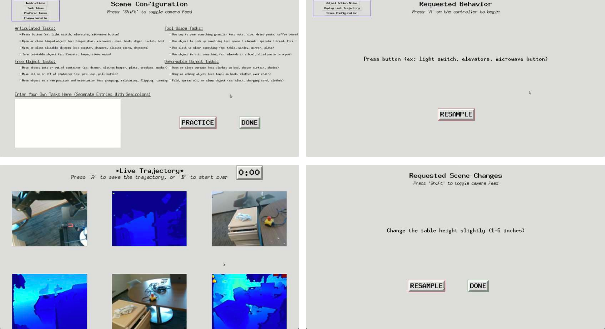

## 附录 C：场景类型分类（Appendix C Scene Type Classification）

我们使用 GPT4V API 以自动化方式标注场景类型。对于每个场景，我们从该场景中随机采样一个片段（episode），并从该片段中随机采样一张图像。将该图像连同清单 [1] 中所示的提示词（prompt）一起发送进行标注。随后，我们审阅了被标记为“其他（Other）”的样本，以确认我们没有遗漏任何主要类别，然后手动重新分配了这些标签。

## 附录 D：识别唯一场景（Appendix D Identifying Unique Scenes）

如论文正文所述，我们将 **唯一场景（unique scene）** 定义为一个对机器人工作空间的实质性改变。例如，一个家庭厨房可能关联多个唯一场景，在这些场景中，机器人被放置在冰箱前、水槽前、灶台前或操作台的不同区域前。我们认为，交互对象的变化或外部摄像机位姿（poses）的变化不足以构成一个唯一场景。

我们按以下方式标注唯一场景。在数据收集过程中，每当用户指示机器人或外部摄像机被移动时，就会生成一个场景 ID 号。数据集中总共有 2,080 个唯一的场景 ID。根据上述定义，其中许多场景 ID 对应的是同一个场景，因为用户可能错误地标记了场景变化，或者在将机器人移动到别处后又将其移回了同一场景。

为了识别这些重复项，我们将场景收集到共享相同 **机器人序列号（robot serial number）** 、数据收集实验室名称和建筑物名称的组中。在每个组内，我们按时间戳对场景进行排序。然后，我们按顺序遍历这些场景，识别那些场景变化不足以构成唯一场景的情况。最后，我们在每个组内剩余的这组场景中进行搜索，以识别机器人被两次放置在同一场景（尽管不是连续放置）的情况，并将这些也从唯一场景集合中移除。

这种标注方法存在一些局限性。例如，由于我们基于机器人序列号对场景进行分组，并且只在该组内识别重复项，如果两个不同的机器人被放置在同一场景，那么该场景将被计数两次。尽管如此，在标注过程中，我们对构成唯一场景的估计是保守的，因此我们认为论文中报告的数字代表了一个保守的估计。

## 附录 E 评估流程（Appendix E Evaluation Procedure）

我们在以下 6 个任务上评估学习到的策略（policies），每个任务都有其自身的分布外（out of distribution）变体。对于每次评估，我们确保每个策略在多次试验中看到的物体初始位置分布相似。

- **将薯片放在盘子上（Place Chips on Plate）** ：一个实验室环境下的短视界（short horizon）任务，任务目标是将一袋多力多滋（Doritos）薯片拾取并放置到一个盘子上，桌面上有两个干扰物（distractor objects）。所有物体和盘子的位置在每次试验（episodes）之间于桌面上随机化。我们收集了 50 次演示（demonstrations），如果薯片在盘子内则标记为成功。我们还考虑了两种分布外变体：

1.  将薯片类型更换为阳光薯片（Sun Chips，尺寸和颜色不同）。
2.  在桌上额外放置两个干扰物（一个苹果和一个橙子）。

- **将苹果放入锅中（Put Apple in Pot）** ：一个实验室环境下的中等视界（medium horizon）任务，任务目标是将一个苹果拾取并放入锅中，然后盖上锅盖。苹果、锅和锅盖的位置在每次试验之间于桌面上随机化。我们收集了 60 次演示，如果苹果在锅内且锅盖盖在锅上则标记为成功。分布外变体涉及在桌上额外放置一个盘子作为干扰物。

- **烤面包（Toasting）** ：一个实验室环境下的中等视界任务，任务目标是将一个物体放在烤面包机（toaster oven）的托盘上，然后关闭烤面包机。物体和烤面包机的位置在每次试验之间于桌面上随机化。我们收集了 150 次演示，如果物体在烤面包机内且烤面包机关闭则标记为成功。分布外变体包括考虑使用新的物体进行烘烤。

- **关闭华夫饼机（Closing Waffle Maker）** ：一个实验室环境下的短视界任务，任务目标是关闭一个华夫饼机（waffle maker）。华夫饼机的位置在每次试验之间随机化。我们收集了 70 次演示，如果华夫饼机关闭则标记为成功。分布外变体包括在桌上添加几个干扰物。

- **清理桌面（Clean up Desk）** ：一个办公室环境下的长视界（long horizon）任务，任务目标是打开抽屉，拾取并放置一块橡皮擦到抽屉内，然后关闭抽屉。橡皮擦的位置在每次试验开始时，按照预设的不同位置和朝向时间表进行变化。我们收集了 50 次演示，如果抽屉关闭且橡皮擦在其中则标记为成功。分布外变体包括在桌面上添加干扰物，具体是一个计算器、三支白板笔和一个夹子。我们发现，在抽屉内部添加干扰物会导致所有策略失败。

- **煮扁豆（Cook Lentils）** ：一个厨房环境下的长视界任务，任务目标是取下平底锅的盖子，将扁豆倒入锅中，然后打开炉灶。物体位置是固定的。我们收集了 50 次演示，如果任务的所有 3 个阶段都成功完成则标记为成功。分布外变体包括添加几个干扰物和一个相机视角偏移（camera shift）。

## 附录 F 扩散策略详情

在 [F-A](#f-a-diffusion-policy-architecture-and-hyperparameters) 节中，我们将讨论所有策略学习实验所使用的策略架构和超参数。随后在 [F-B](#f-b-training-batch-construction) 节中，我们将描述如何利用论文中的各种数据集来构建策略学习的训练批次。

### F-A 扩散策略架构与超参数

我们在 Robomimic 代码库 [37] 上构建了我们的 **扩散策略（Diffusion Policy）** [7] 训练流水线，该代码库提供了多种不同模仿学习和离线强化学习（Reinforcement Learning, RL）算法的高质量实现。给定相机观测和任务的语言指令后，在 Robomimic 框架内，我们定义了对应于两个外部相机观测的观测键、一个冻结的 DistilBERT [45] 语言嵌入、夹爪的 3D 笛卡尔坐标位置以及衡量夹爪闭合程度的夹爪状态。

对于每个相机观测，我们首先将每张图像下采样至 $128\times 128$ 的分辨率，并应用颜色抖动和随机裁剪作为一种数据增强形式。然后，我们使用在 ImageNet [11] 上预训练的 ResNet-50 视觉编码器为每个视觉输入生成嵌入。这些嵌入直接与所有其他观测键拼接。这些拼接后的特征随后送入一个 **观测处理多层感知机（Observation Processing Multilayer Perceptron, MLP）** ，其层定义见表 [II](#table-2)。该 MLP 的输出随后传递给一个 U-Net 扩散头，用于生成动作轨迹。我们使用观测时域为 2 来条件化扩散头，扩散出 16 步的动作序列，并在重新运行策略推理前以开环方式执行前 8 个动作。所有相关超参数均在表 [II](#table-2) 中定义。与先前工作 [7] 一致，我们使用 DDIM（Denoising Diffusion Implicit Models）来扩散动作轨迹以提高效率。

所有实验均使用表 [II](#table-2) 中的训练超参数，但有一个例外：对于烹饪扁豆任务的 **分布外（Out-Of-Distribution, OOD）** 实验，由于任务复杂性增加，我们使用 $50000$ 个训练步数来训练所有策略。

**表 II：训练超参数**
| 超参数 | 值 |
| :--- | :--- |
| 批次大小（Batch Size） | 128 |
| 优化器（Optimizer） | Adam |
| 学习率（Learning Rate） | 1e-4 |
| 学习率调度器（Learning Rate Scheduler） | Linear |
| 训练步数（Train Steps） | 25000 |
| 观测处理 MLP（Observation Processing MLP） | [1024, 512, 512] |
| 图像分辨率（Image Resolution） | (128, 128) |
| 裁剪高度（Crop Height） | 116 |
| 裁剪宽度（Crop Width） | 116 |
| 扩散方法（Diffusion Method） | DDIM |
| 指数移动平均幂（Exponential Moving Average Power, EMA Power） | 0.75 |
| U-Net 隐藏层尺寸（U-Net Hidden Layer Sizes） | [256, 512, 1024] |
| 观测时域（Observation Horizon） | 2 |
| 预测时域（Prediction Horizon） | 16 |
| 动作时域（Action Horizon） | 8 |

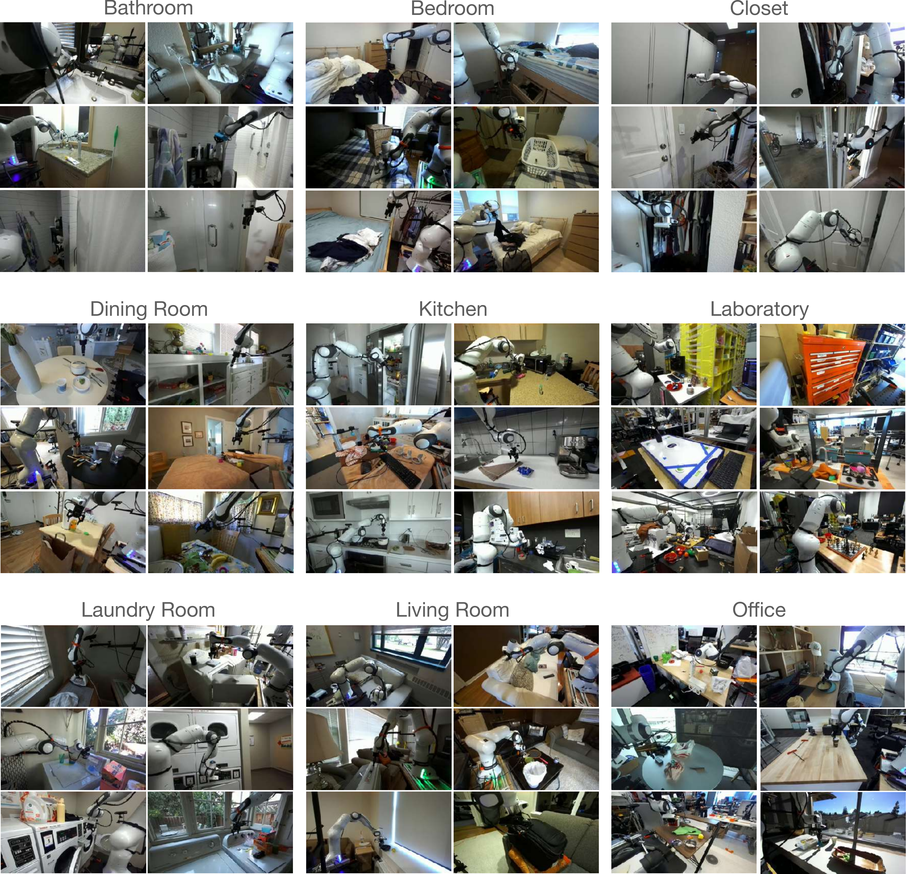

> 图 11：相机到机器人基座标定的定性结果，展示了使用 PyTorch3D [44] 合成渲染机器人掩膜的随机选取场景。渲染通过导入机器人 URDF 定义的网格和运动学结构，应用关节角度计算铰接姿态，并使用外参 $\textbf{T}_{\text{cam}\rightarrow\text{base}}$ 将网格变换到相机坐标系来生成。外参结果是基于自动质量评估过滤（概述于 [G-A](https://arxiv.org/html/2403.12945v2#A7.SS1) 节）和运行调优后的 CtRNet-X 模型 [34]（概述于 [G-B](https://arxiv.org/html/2403.12945v2#A7.SS2) 节）所得结果的结合。我们在发布的外参数据中为两种方法提供了质量评估指标。

### F-B 训练批次构建

对于每个评估任务，我们使用 3 种不同的训练批次构建方法来训练策略：

- **无协同训练（No Co-training）** ：仅使用来自域内演示的样本训练一个最先进的扩散策略 [7]。
- **DROID（我们的方法）** ：训练一个扩散策略，但在每个批次中按 50/50 的比例混合域内演示和 DROID 轨迹。对于此实验，我们考虑了 DROID 中前 40K 条在策略训练时具有可用语言标注的成功轨迹。对于场景多样性实验，我们使用这 40K 条轨迹中的一个包含 7362 条轨迹的子集。
- **OXE [39]** ：训练一个扩散策略，但在每个批次中按 50/50 的比例混合域内演示和来自 Octo Model Team 等人 [38] 所使用的 Open X-Embodiment 数据集 [39]（OXE）精选子集中的轨迹。我们还省略了 OXE 中语言表分割的数据，以将轨迹数量降至可管理的规模（40 万条轨迹）。

上述每种设置仅在用于构建每个训练批次的数据上有所不同：除此之外，所有策略都具有相同的架构，并使用 [F-A](#f-a-diffusion-policy-architecture-and-hyperparameters) 节中指定的相同训练参数进行训练。

用于策略训练的域内演示仅包含为 [E](#appendix-e) 节中每个评估任务收集的演示，但有一个例外：对于烤面包和关闭华夫饼机任务，一个多任务策略是在它们演示的组合上进行训练的。因此，在这种情况下，上述定义的无协同训练策略是在组合的域内演示上训练一个扩散策略，而协同训练实验则通过从这些组合的域内演示与来自 DROID 或 OXE [39] 的数据之间进行 50/50 分割来采样批次。

## 附录 G 自动相机标定（Automatic Camera Calibration）

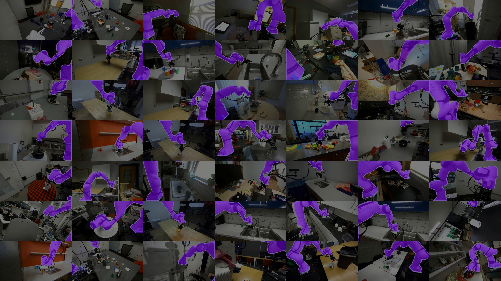

> 图 12 | 相机间标定的定性结果，展示了经过我们改进的离线事后相机标定（如第 [G-C](https://arxiv.org/html/2403.12945v2#A7.SS3) 节所述）后的图像、相机位姿和点云。场景是根据标定后的匹配数量从最高的 30% 分位数中选取的（参见图 [14](https://arxiv.org/html/2403.12945v2#A7.F14)）。外部相机以红色和蓝色显示。此处显示的是使用相机内参反投影深度图后，并利用两个相机之间的相对位姿进行累积后得到的两个视角的累积点云。

在本节中，我们为 DROID 数据集提供了三套全面的相机标定矩阵及其相应的质量评估指标，包括：

- 针对 36k 个独特场景的 **相机到基座标定（camera-to-base calibrations）** ，其中一台相机已相对于基座标定。
- 针对所有场景的 **相机间标定（camera-to-camera calibrations）** 。
- 一个精心筛选的、包含 24k 个场景的超集，涵盖了所有三种方法，并且两台相机都已相对于基座标定。

这些标定数据有助于在机器人学和三维感知任务中进行下游的鲁棒几何理解。

精确的 **相机标定（camera calibration）** 在机器人学和三维感知中非常有用，因为它能够从视觉数据中一致地编码空间几何信息。它是机器人操作中各种下游任务的支柱，例如学习 **视点不变表示（viewpoint invariant representations）** [6, 56] 或通过 **三维视觉-语言模型（3D vision-and-language models）** [52, 66] 来 **锚定动作（grounding actions）** ，从而使机器人智能体能够实现几何和视觉的泛化。在机器人应用中，标定通过将传感器观测对齐到一个共享的空间坐标系，实现了精确的场景理解和交互。

DROID 数据集提供了初始的 **外参（extrinsic parameters）** （第 [III](#section-3) 节），用于将坐标从相机坐标系转换到机器人基座坐标系。然而，这些标定并非总是准确的，这主要是由于手动标定过程中可能出现的微小误差，例如不完美的棋盘格放置、光照条件的变化，或在每次数据采集会话开始时执行的 OpenCV 标定程序的不准确性。

继第 [III](#section-3) 节概述的数据采集工作之后，我们还额外关注以离线、事后（off-line post-hoc）的方式为采集到的数据集提供鲁棒的标定值。此过程利用了基于深度学习的感知系统的最新进展 [30, 61, 41, 34]，以自动标定相关相机并以事后方式提供质量指标。

以下章节详细介绍了预采集的 DROID 数据集的自动事后标定。它侧重于两种关键类型的标定：

1.  **相机到机器人基座外参标定（camera-to-robot base extrinsic calibration）** ：计算固定相机与机器人运动基座之间的变换。
2.  **相机间外参标定（camera-to-camera extrinsic calibration）** ：估计两个外部相机之间的相对位姿，即方向和位置。

这两者对于融合多视角观测以及允许在三维空间中锚定机器人动作都至关重要，从而实现空间锚定的机器人行为。本节分为 3 个子节。我们首先详细评估第 [III](#section-3) 节数据采集阶段后提供的现有相机到机器人基座标定的质量指标（第 [G-A](https://arxiv.org/html/2403.12945v2#A7.SS1) 节）。这将使我们能够筛选数据采集期间提供的外参，并对已提供的标定提供一定的保证。然后，我们解释如何使用全自动流程 [34] 相对于基座标定额外的相机，同时也在质量指标（即 **重投影误差（reprojection error）** ）方面提供保证（第 [G-B](https://arxiv.org/html/2403.12945v2#A7.SS2) 节）。此外，我们在第 [G-C](https://arxiv.org/html/2403.12945v2#A7.SS3) 节讨论外部相机之间的相互标定。最后，我们在第 [G-D](https://arxiv.org/html/2403.12945v2#A7.SS4) 节包含了对局限性和未来工作的讨论。

### G-A 现有相机到机器人基座标定的质量评估（Quality Assessment of Existing Camera-to-Robot Base Calibration）

为评估现有 **相机到机器人基座变换（camera-to-robot base transformation）** （$\mathbf{T}_{\text{cam}\rightarrow\text{base}}$）的质量，我们利用外参矩阵 $\mathbf{T}_{\text{cam}\rightarrow\text{base}}$ 和相机内参 $\mathbf{K}$，将已知的 3D 关键点 $\mathbf{X}\in\mathbb{R}^{N\times 3}$（通过对给定关节角 $\theta$ 进行正向运动学获得）投影到图像平面上。二维投影 $\mathbf{x}\in\mathbb{R}^{N\times 2}$ 的计算公式为 $\mathbf{x}=\pi(\mathbf{K}\cdot\mathbf{T}_{\text{cam}\rightarrow\text{base}}\cdot\mathbf{X})$，其中 $\pi(\cdot)$ 表示透视投影后接归一化。

这些 2D 关键点用于引导一个 **Segment-Anything（SAM）** [29] 实例分割模型，该模型预测掩码 $\mathcal{M}_{\text{SAM}}$。同时，我们使用 PyTorch3D 通过导入机器人 **统一机器人描述格式（Unified Robot Description Format, URDF）** 中定义的网格几何和运动学结构来渲染合成机器人掩码 $\mathcal{M}_{\text{GT}}$。将每个关节角配置 $\theta$ 应用于 URDF 以计算机器人的 **铰接式 3D 网格姿态（articulated 3D mesh pose）** 。然后，使用相同的外参变换 $\mathbf{T}_{\text{cam}\rightarrow\text{base}}$ 将得到的网格变换到相机坐标系。接着，使用一个具有相应相机内参 $\mathbf{K}$ 的 **可微分渲染器（differentiable renderer）** 将姿态化网格 **栅格化（rasterized）** 为二值轮廓。这个渲染出的掩码作为 **真实投影（ground-truth projection）** ，用于评估预测分割的对齐质量。

我们计算预测掩码与真实掩码之间的 **交并比（Intersection-over-Union, IoU）** ：$\text{IoU}=\frac{|\mathcal{M}_{\text{SAM}}\cap\mathcal{M}_{\text{GT}}|}{|\mathcal{M}_{\text{SAM}}\cup\mathcal{M}_{\text{GT}}|}$。仅保留置信度分数大于 0.65 的 SAM 掩码。最终使用 $\text{IoU}\geq 0.7$ 的阈值来识别高质量投影，过滤掉对齐不佳的帧。我们报告视频序列中 5 个均匀子采样帧的平均 IoU，作为标定质量的度量。通过此流程，我们总共识别出约 3 万个场景，其中左相机或右相机相对于场景标定良好。整个过程在 8 块 A100 Nvidia-GPU 上耗时约 1 天。

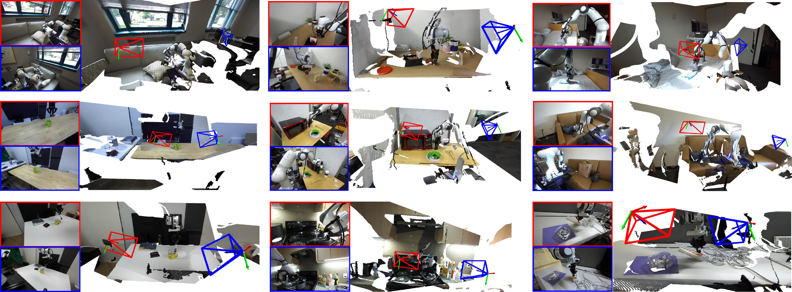

> 图 13 | **相机到相机标定（Camera-to-Camera calibration）** 对比图，展示了图像（_左_）、现有标定下的点云（_中_）以及我们改进标定后的点云（_右_），如第 [G-C](https://arxiv.org/html/2403.12945v2#A7.SS3) 节所述。我们改进的标定能够处理具有挑战性的场景，并从两个相机生成对齐良好的点云。请注意，此处未展示用于通过相机内参和外参进行反投影以生成点云的深度图。

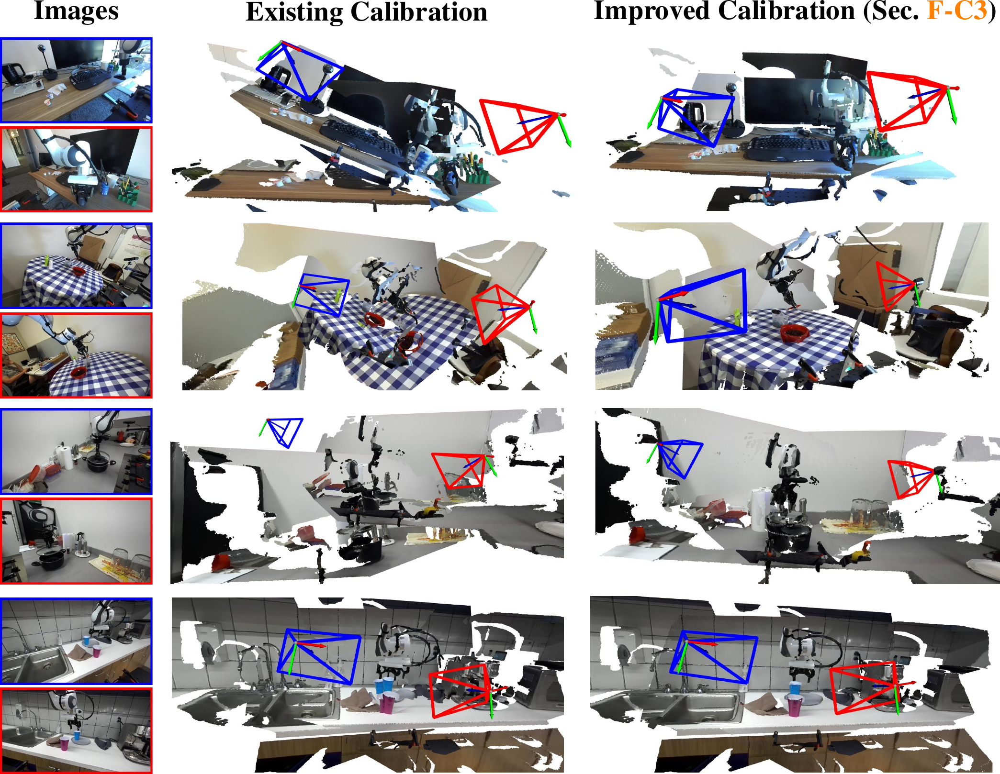

> 图 14 | 每个独立实验室在 **相机到相机标定（camera-to-camera calibration）** 后的匹配点分布及其累积分布。虽然一些实验室实现了高质量的对应关系，但其他实验室难以达到相同水平——这通常是由于具有挑战性的光照或杂乱环境所致。累积曲线（实曲线）突出了所有场景中匹配点的累积情况，有助于识别每个实验室内标定良好的相机对中的顶级分位数。这些高置信度匹配尤其重要，因为它们为下游选择可靠场景提供了依据。请注意，每个视频的第一帧图像被用于使用第 [G-C](https://arxiv.org/html/2403.12945v2#A7.SS3) 节描述的改进 DUSt3R [61] 流程进行姿态优化。

### G-B 自动相机到机器人基座标定（Automatic Camera-to-Robot Base Calibration）

为了补充第 [G-A](https://arxiv.org/html/2403.12945v2#A7.SS1) 节概述的过滤策略，并为相机到机器人基座标定引入更多相机，我们还在整个 DROID 数据集上额外运行了一个调优版的 **CtRNet-X** [34]（开箱即用）。我们使用了作者提供的原始代码库以及为 DROID 数据集调优的超参数。CtRNet-X 是一种 **前馈方法（feed-forward approach）** ，它使用神经网络检测机器人上的关键点，并将其与视频中的真实 3D 关键点轨迹进行匹配。此外，他们还利用 **CLIP** [41] 引导的机器人部件检测来动态选择可见关键点。遵循作者的实现，我们使用的置信度阈值为 0.08，CLIP [41] 模型的末端执行器置信度为 0.1，机器人基座置信度为 0.05。为了评估我们相机到基座标定的质量，我们使用估计的相机姿态和内参，计算检测到的 2D 关键点与其对应的 3D 投影之间的 **重投影误差（reprojection error）** 。为确保鲁棒性，我们首先基于固定阈值丢弃低置信度的 2D 观测值。然后，我们应用基于 **中位数绝对偏差（Median Absolute Deviation, MAD）** 的 **离群值剔除策略（outlier rejection strategy）** ：计算所有重投影误差的中位数，计算每个误差相对于中位数的绝对偏差，并将那些位于 2.5 倍 MAD 范围内的点识别为 **内点（inliers）** 。这种鲁棒的统计过滤有助于抑制大离群值的影响，从而获得更可靠的平均重投影误差估计。在最终过滤中，我们选择平均重投影误差小于或等于 20 的场景。

通过此过程，我们共识别出约 12k 个场景，其中左相机或右相机相对于基座已正确校准。此过程在 8 块 A100 Nvidia GPU 上耗时约 5 天。由于两种策略之间良好校准的场景数量存在重叠，我们能够使用第 [G-A](https://arxiv.org/html/2403.12945v2#A7.SS1) 节和第 [G](#appendix-g) 节概述的策略，校准约 36k 个独特的场景，使其左相机或右相机相对于场景得到良好校准。图 [11](https://arxiv.org/html/2403.12945v2#A6.F11) 展示了随机选取的场景，其中使用 PyTorch3D [44] 合成了机器人掩码，定性地证明了我们通过上述两种方法过滤得到的相机到机器人基座校准具有高精度。此外，我们展示了应用改进的校准策略和过滤后， **交并比（Intersection over Union, IoU）** 和重投影误差的分布。这些结果如图 [15](https://arxiv.org/html/2403.12945v2#A7.F15) 所示。

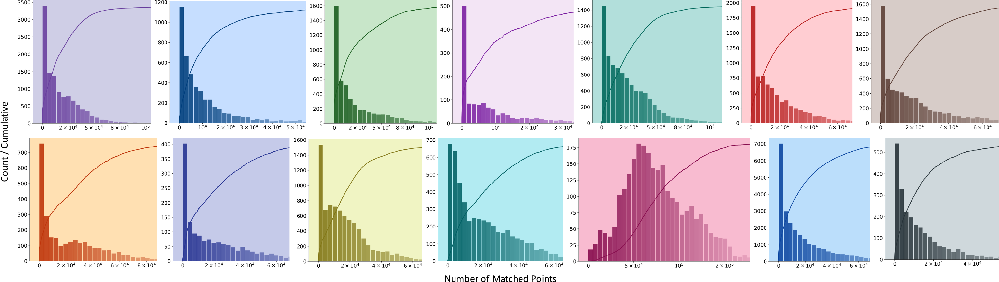

> 图 15 | 分别应用第 [G-A](https://arxiv.org/html/2403.12945v2#A7.SS1) 节和第 [G-B](https://arxiv.org/html/2403.12945v2#A7.SS2) 节概述的策略进行阈值化和过滤后，各指标（即 IoU 和平均重投影误差）的分布。

### G-C 自动相机到相机校准（Automatic Camera-to-Camera Calibration）

我们利用最近发布的 **DUSt3R（Dense and Unconstrained Stereo 3D Reconstruction）** [61] 框架来改进相机到相机校准。DUSt3R [61] 同时支持相对位姿估计和绝对位姿估计。对于相对位姿估计，DUSt3R 提出在查询图像 $I_{Q}$ 和参考图像 $I_{B}$ 之间获取 **2D-3D 对应关系（2D–3D correspondences）** ，然后使用已知或估计的内参进行 **PnP-RANSAC（Perspective-n-Point with RANSAC）** [15, 31]。$I_{Q}$ 和 $I_{B}$ 之间的相对位姿也可以通过将预测的点图（pointmap）对齐到已知尺度（通常通过 $I_{B}$ 的真值点图）转换为世界坐标系中的绝对位姿。然而，这种方法仍然需要在优化后进行尺度对齐，并且可能因预测几何中的噪声或不确定性而产生歧义。

我们修改了 DUSt3R [61] 的位姿优化流程，以利用深度图和已知相机内参作为优化流程的输入，从而在一致的度量尺度下恢复绝对位姿。具体来说，我们首先在图像对上运行 DUSt3R 推理以提取密集的 3D 点图。这些预测的点图与真值 3D 点云（由深度和内参构建）对齐，以计算全局尺度因子。然后，我们执行一个全局优化步骤，其中固定真值深度和内参，并优化相机位姿以最小化整个场景的 3D 对齐误差。这种方法能够实现精确的、尺度感知的绝对位姿估计，而无需依赖事后尺度对齐。

通过在优化过程中固定深度和内参，我们确保恢复的位姿具有全局一致性和度量精度。重要的是，我们的方法直接作用于未经修改的 DUSt3R [61] 输出，无需额外的训练或手动尺度校正。图 [12](https://arxiv.org/html/2403.12945v2#A7.F12) 和图 [13](https://arxiv.org/html/2403.12945v2#A7.F13) 展示了此优化步骤后点云对齐在质量上的改进。

为了评估恢复的相机到相机校准的质量，我们按照 [61] 的原始实现，报告视图之间的匹配点数量。对于每对图像，我们提取高置信度的 3D 点，使用已知内参将其投影到 2D，并在 3D 空间中识别互为最近邻的点作为可靠匹配。形式化地，给定点图 $P_{0}$ 和 $P_{1}$，我们定义匹配集 $\mathcal{M}=\left\{(i,j)\mid\mathrm{NN}(P_{0}[i])=j\text{ 且 }\mathrm{NN}(P_{1}[j])=i\right\}$。在实践中，我们定性观察到，更高数量的互为 3D 匹配在视觉上与估计位姿的几何质量相关（见图 [12](https://arxiv.org/html/2403.12945v2#A7.F12)）。尽管匹配数量可以作为评估估计位姿质量的合理代理指标，但我们在视觉杂乱的场景中观察到了一些误报。为了增强鲁棒性，可以降低过滤阈值，或结合第 [G-A](https://arxiv.org/html/2403.12945v2#A7.SS1) 节描述的质量评估来进一步细化过滤过程。图 [14](https://arxiv.org/html/2403.12945v2#A7.F14) 显示了各实验室的匹配数量分布。虽然一些实验室表现出很强的几何一致性，但其他实验室由于杂物或光照不良等挑战性条件而表现不佳。对于所有视频，我们使用第一帧通过我们修改后的 DUSt3R [61] 流程进行位姿优化。未来的改进可能包括跨帧集成预测、利用时间一致性来进一步稳定位姿估计，或在机器人操作环境中观察到的桌面杂乱数据集上微调类似 DUSt3R 的方法。

### G-D 局限性与未来工作（G-D Limitations and Future Work）

对 DROID 这样的大规模数据集进行标定是一项具有挑战性的任务。为确保准确性并在每一步提供保证，我们将标定过程划分为三个不同的阶段。由于整个过程是全自动的，因此仍存在一些误报，未来的工作可以着眼于进一步改进这些不一致之处。我们的一部分 **相机到基座标定（Camera-to-base calibration）** 依赖于运行一个在 Franka panda 机器人上训练的 **开箱即用模型（out-of-the-box model）** 。虽然取得了成功，但其对其他机器人的 **零样本泛化能力（zero-shot generalizability）** （无需进一步训练或微调）仍有待观察。

未来的工作可以着眼于使用 **基础模型（Foundation models）** 来分割出机器人或夹爪，并估计机器人特定部位上的 **关键点（keypoints）** 。这可以提供一种更具泛化性的解决方案，能够轻松应用于任何在真实环境中收集的机器人数据。我们的 **相机到相机标定（Camera-to-Camera calibration）** 依赖于三维深度学习中的一个新范式，即 **点图预测（prediction of point-maps）** 。尽管使用了 DUSt3R [61] 的修改版本（该版本利用特权深度信息进行位姿优化），但它依赖于作者提供的原始检查点，因此也继承了原始模型的局限性。尽管取得了不错的成功，但该模型有时会在场景杂乱、图像间几乎没有重叠的具有挑战性的桌面设置上失败。随着这些模型质量的不断提升 [62, 60]，我们认为利用这些改进后的模型进行更鲁棒的相机到相机标定将是一个有价值的方向，尤其是在传统特征匹配或早期模型难以处理的杂乱和低重叠场景中。

### G-E 结论（G-E Conclusion）

前述各节（即第 [G-A](https://arxiv.org/html/2403.12945v2#A7.SS1) 节、第 [G-B](https://arxiv.org/html/2403.12945v2#A7.SS2) 节和第 [G-C](https://arxiv.org/html/2403.12945v2#A7.SS3) 节）概述的方法在质量指标方面具有不同的保证。因此，在最终的标定发布中，我们提供了 3 组不同的相机标定矩阵。第一组包含来自 36k 个独特场景的 **相机到机器人基座标定（Camera-to-Robot base calibration）** ，其中左相机或右相机相对于机器人基座进行了标定。这包括了第 [G-A](https://arxiv.org/html/2403.12945v2#A7.SS1) 节和第 [G-B](https://arxiv.org/html/2403.12945v2#A7.SS2) 节概述的组合标定方法之后的结果。第二组标定包含所有 **相机到相机标定矩阵（Camera-to-Camera calibration matrices）** ，即使用第 [G-C](https://arxiv.org/html/2403.12945v2#A7.SS3) 节概述的方法得到的 DROID 数据集中所有场景的相对变换。最后，我们还发布了第三组标定，它包含了所有方法的超集，总计约 24k 个场景，其中两个相机均相对于基座进行了标定，并混合使用了 3 种不同的方法并各自提供保证。在这个超集中，我们使用了 0.6 的 **交并比阈值（IOU threshold）** 、20 的 **重投影误差（reprojection error）** ，并基于前面第 [G-A](https://arxiv.org/html/2403.12945v2#A7.SS1) 节、第 [G-B](https://arxiv.org/html/2403.12945v2#A7.SS2) 节和第 [G-C](https://arxiv.org/html/2403.12945v2#A7.SS3) 节描述的每个标定阶段的匹配数量，选取了前 30% 的分位数。我们希望这项工作对三维视觉和机器人操作研究有所助益，也能为真实世界机器人操作数据集的离线自动相机标定提供启发。

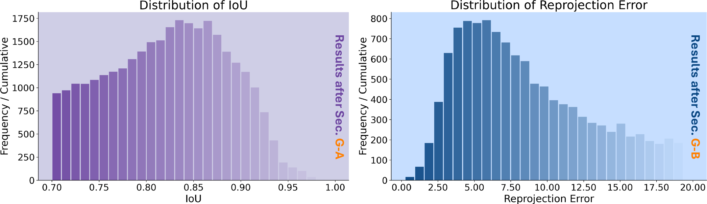

> 图 16 | DROID 与现有大型机器人操作数据集的技能（即动词）分布。从上到下：DROID、Bridge V2 [59]、RH20T [14]、RT-1 [2]。DROID 具有一个多样动词类别的长尾分布，这一点只有 Bridge V2 与之相当，而 RH20T 和 RT-1 数据集的技能集则更为受限。

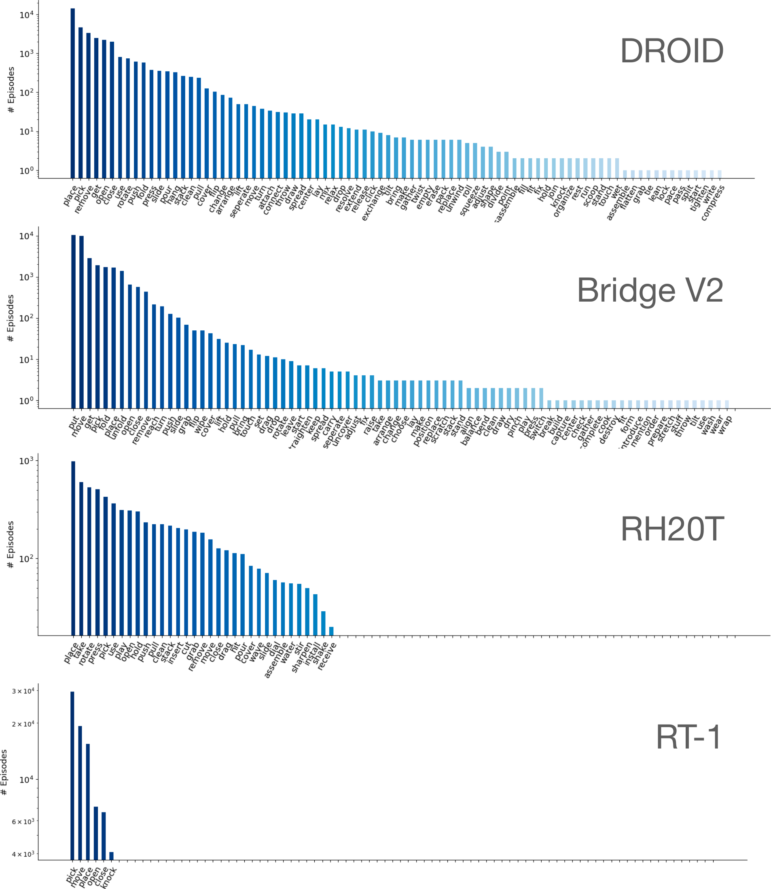

> 图 17 | DROID 中交互对象的分布，按类别分组。机器人交互的对象范围广泛，涵盖各种日常物品。

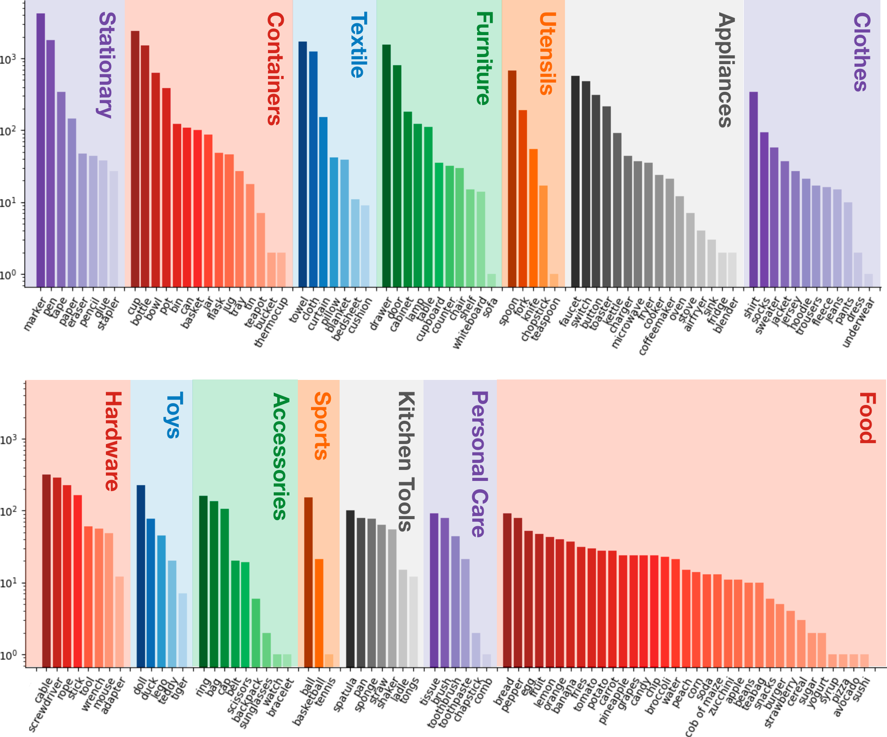

> 图 18 | DROID 中动词与交互对象的联合分布。大多数对象都对应着多种多样的交互操作。
