# 标题：RoboEval：机器人操作与结构化可扩展评估的交汇点

- ArXiv: 2507.00435
- 作者：Yi Ru Wang, Carter Ung, Grant Tannert, Jiafei Duan, Josephine Li, Amy Le, Rishabh Oswal, Markus Grotz, Wilbert Pumacay, Yuquan Deng, Ranjay Krishna, Dieter Fox, Siddhartha Srinivasa
- 章节：17
- 预估词元数：14.0k

## 目录

- [摘要](#abstract)
- [1 引言](#1-introduction)
- [2 相关工作](#2-related-works)
- [3 RoboEval 基准](#3-roboeval-benchmark)
  - [3.1 设计理念](#31-design-philosophy)
  - [3.2 任务](#32-tasks)
  - [3.3 任务与数据集统计](#33-task-and-dataset-statistics)
  - [3.4 评估计分](#34-evaluation-scoring)
- [4 实验](#4-experiments)
  - [4.1 实验设置](#41-experimental-setup)
  - [4.2 实验结果](#42-experimental-results)
    - [4.2.1 RQ1：行为指标如何补充策略成功率提供的信息？](#421-rq1-how-do-behavioral-metrics-complement-the-information-provided-by-policy-success-rates)
    - [4.2.2 RQ2：结果指标如何揭示反映策略局限或任务瓶颈的结构化失败模式？](#422-rq2-how-do-outcome-metrics-reveal-structured-failure-modes-that-reflect-policy-limitations-or-task-bottlenecks)
    - [4.2.3 RQ3：任务难度如何影响评估指标对策略性能的信息量？](#423-rq3-how-does-task-difficulty-influence-the-informativeness-of-evaluation-metrics-on-policy-performance)
- [5 讨论](#5-discussion)
- [6 局限性](#6-limitations)
  - [致谢](#acknowledgments)

## 摘要（Abstract）

我们提出了 **RoboEval** ，这是一个仿真基准和结构化评估框架，旨在揭示当前 **双手操作（bimanual manipulation）** 策略的局限性。虽然先前的基准仅报告二元任务成功率，但我们表明此类指标常常掩盖了策略行为中的关键弱点——例如协调性差、抓取时打滑或手臂使用不对称。RoboEval 引入了一套分层的、基于语义的任务，这些任务被分解为针对特定技能的阶段，并通过系统性地挑战空间、物理和协调能力的变体来增强。任务配有细粒度的诊断指标和 3000 多条人类演示，以支持模仿学习。我们的实验表明，成功率相近的策略在执行任务的方式上存在差异——有些在 **对齐（alignment）** 上挣扎，另一些则在时间上一致的双手控制方面存在困难。我们发现， **行为指标（behavioral metrics）** 在超过一半的任务-指标对中与成功率相关，并且即使在二元成功率饱和时仍能提供信息。通过精确定位策略何时以及如何失败，RoboEval 能够实现对机器人操作更深入、更具可操作性的理解——并凸显了超越单一成功率的评估工具的必要性。

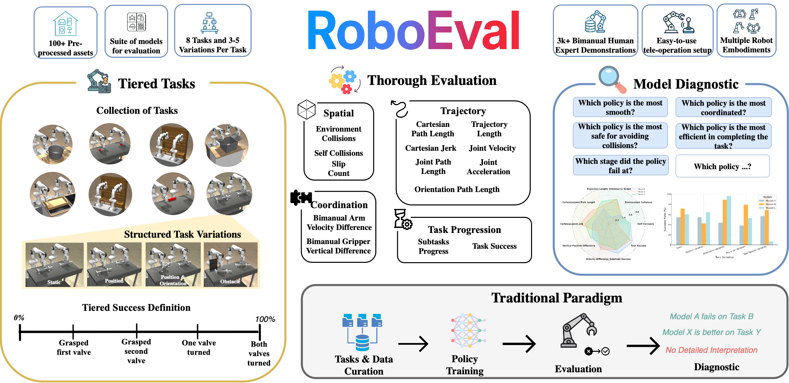

> 图 1：RoboEval 概览。RoboEval 是一个用于双手操作的结构化、可扩展的仿真基准，包含 8 个任务，每个任务有 3-5 种变体，共收集了 3000 多条人类演示。它包含一个标准化的资产库——碰撞网格、标注位点和可操作物体——用于通过空间扰动和干扰物来构建和增强任务。基于 VR 的遥操作界面支持真实的数据收集。为了进行分析，RoboEval 提供了丰富的评估工具，超越了二元成功率，能够测量任务进度、协调性、轨迹效率和空间接近度。

> 关键词：基准测试，机器人学习，双手操作

## 1 引言（Introduction）

通用机器人智能体的进步不仅依赖于更好的数据和模型，也依赖于系统性的工具来评估和理解其行为。计算机视觉 [1]、自然语言处理 [2] 和强化学习 [3, 4] 领域的基准通过标准化任务表述和实现可复现的比较，加速了进展。在机器人学中，诸如 RLBench [5]、Meta-World [6] 和 BiGym [7] 等基准测试了不同设置下的视觉运动策略。然而，这些工作通常将性能简化为二元成功率，对策略如何行为、为何失败或展现出何种能力提供有限的洞察。这种粗略的评估在操作领域尤其受限，因为失败可能源于感知、控制、协调或时序推理中的错误。随着任务变得更加复杂——跨越多个阶段、手臂和技能——理解中间能力变得至关重要。诊断工具对于识别瓶颈、评估泛化能力和指导有原则的算法设计至关重要。

为了弥补这些不足，我们引入了 **RoboEval** ，这是一个用于对双手机器人操作进行细粒度分析的仿真基准和评估框架。RoboEval 的特点是一套分层操作任务，每个任务都被分解为基于语义的阶段，针对特定技能，如推动、抓取、持握、旋转、举起等。RoboEval 基于三个核心设计原则。首先，它通过层次化的任务组织，在空间布局、协调性和物体属性上进行受控变化，强调结构化复杂性。其次，它通过捕获阶段性进展和任务成功率的 **结果指标（outcome metrics）** ，以及捕获空间和时间精度、轨迹特性和双手协调性的 **行为指标（behavior metrics）** ，实现诊断可解释性。第三，它通过 3000 多条人类收集的演示支持真实的监督，使得能够从专家行为中进行模仿和数据驱动的学习。

通过对最先进的视觉运动策略进行广泛实验，我们表明 RoboEval 揭示了仅靠二元成功率无法捕捉的行为和结构差异。行为指标在 59.4% 的任务-指标组合中与成功率显著相关，表明协调质量、轨迹平滑度和空间精度在大多数任务中可以预测策略的有效性。即使策略达到相似的成功率，行为指标也能揭示任务执行方式上的有意义差异。结果指标进一步暴露了结构化的失败模式：一些策略在特定子阶段（如举起或协调的双手动作）持续失败，并在双臂间表现出不对称的失败模式。我们还发现任务难度调节了指标的效用：对于非常简单或非常困难的任务，二元成功率变得信息不足，而行为和阶段性指标仍具有诊断性，能够对策略能力进行更细致的评估。

我们的贡献有三方面。(1) 我们引入了 **RoboEval** ，一个通过结构化、针对技能的任务来剖析操作能力的基准。(2) 我们提出了用于分析中间进展和协调性的细粒度评估指标。(3) 我们发布了一个模块化、可扩展的仿真框架，支持在模仿、强化和混合学习范式之间进行可复现的研究。这些组件共同将评估从二元结果转向对机器人行为的细致、技能层面的理解。

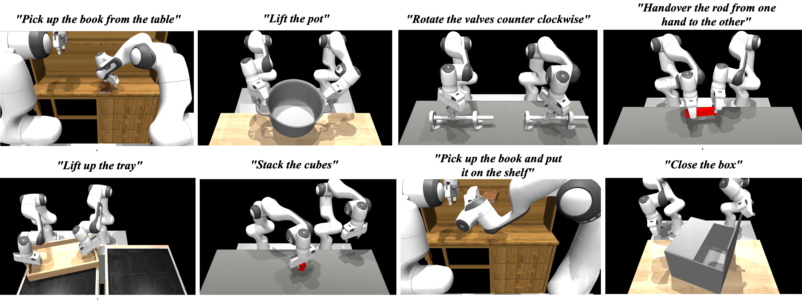

> 图 2：RoboEval 中的基础任务。RoboEval 引入了最初的 8 个双手操作任务套件，每个任务都配有 3-5 种结构化变体和超过 500 条人类演示。所有任务都配备了行为指标记录和任务阶段定义，以支持细粒度的进展和结果分析。该基准在设计上是模块化的，允许无缝集成新任务，以适应社区不断发展的研究需求。

## 2 相关工作（Related Works）

**机器人操作基准** 。在单臂操作基准方面已取得显著进展 [8, 9, 5, 10, 11]。HumanoidBench [12] 通过为灵巧的全身人形机器人操作基准测试强化学习算法，扩展到了双手操作之外。其他研究则对灵巧手使用的 RL 策略进行基准测试 [13]。同时，一些工作专注于现实场景中的评估协议，但这些通常仅限于单一任务，例如系鞋带 [14]，并且缺乏任务多样性。最近的努力，如 Peract2 [15]、BiGym [7] 和 RoboTwin [16]，已朝着可扩展和数据丰富的双手操作方向发展。Peract2 使用脚本化演示，BiGym 探索基于 VR 的演示，而 RoboTwin 则通过 3D 生成模型和 LLMs 引入合成数据生成。然而，这些方法在系统地表征协调的双手操作策略何时、何地以及为何失败方面仍然不足。我们的工作通过提供结构化评估的手段，以及将现有基准测试任务统一到共享框架中的路径，补充了现有双手操作基准测试的努力。我们在图 [1](#table-1) 中提供了与现有基准的比较。

**操作评估指标** 。稳健的评估指标对于量化机器人操作策略的能力至关重要，尤其是随着任务复杂性、真实性和可变性的增加。[17] 提供了机器人抓取和操作评估方法的广泛概述，涵盖了二元成功率、任务完成精度、空间和时间精度以及对环境扰动的鲁棒性等指标。导航智能体的评估框架，如 [18]，进一步强调了领域特定、细粒度指标的必要性。为了评估泛化能力，RB2 [19] 在不同的物理环境中对性能进行基准测试，突出了不同实验室条件下策略的鲁棒性。类似地，Colosseum Benchmark [10] 在受控扰动下评估操作方法，以量化对未见状态和动态的泛化能力。然而，尽管在单臂设置方面取得了进展，该领域仍缺乏针对双手操作量身定制的、有原则的细粒度评估框架。

## 3 RoboEval 基准测试

**RoboEval** 是一个用于评估不同任务设置下 **双手操作策略（bi-manual manipulation policies）** 的基准测试。其首个版本包含 8 个基础任务和 3000 多条人类演示。这些任务源自人类在不同场景中执行的常见任务，范围涵盖从服务类任务（如托起托盘）、仓储类任务（如关闭箱子）到工业类任务（如旋转手轮）。每个任务都包含多种变体——从静态设置到物体位姿和语义环境的动态变化——旨在以系统化的方式评估策略性能。为了促进模仿学习和演示驱动的策略训练研究，我们提供了一套原始的人类专家演示数据，以及细粒度的评估指标，如轨迹平滑度、环境碰撞等。我们在图 [1](#figure-1) 中概述了 RoboEval。本节将介绍该基准测试的设计理念（第 [3.1](#section-3-1) 节）、基准测试提供的基础任务（第 [3.2](#section-3-2) 节）、任务与数据集统计信息（第 [3.3](#section-3-3) 节）以及评估计分（第 [3.4](#section-3-4) 节）。

> 表 1：基准测试对比。我们从任务设计、评估和数据三个方面比较了六个操作基准测试。RoboEval 独特地整合了分层双手任务、行为指标、任务进展跟踪和人类演示。

| 基准测试        | 任务特性 | 评估特性 | 数据特性        |            |        |          |              |          |          |                |
| --------------- | -------- | -------- | --------------- | ---------- | ------ | -------- | ------------ | -------- | -------- | -------------- |
|                 | 任务时长 | 分层     | 技能            | 变体       | 成功率 | 行为指标 | 任务进展指标 | 人类演示 | 演示驱动 | # 专家人类演示 |
| RLBench         | 短–中    | ✗        | U, P, NP, QS    | P, R       | ✓      | ✗        | ✗            | ✗        | ✓        | 0              |
| Bigym           | 短–长    | ✗        | B, P, QS        | P, R       | ✓      | ✗        | ✗            | ✓        | ✓        | 2k             |
| DexMimicGen     | 短       | ✗        | B, P, QS        | P, R       | ✓      | ✗        | ✗            | ✓        | ✓        | 400            |
| PerAct2         | 短–中    | ✗        | B, P, NP, QS    | P, R       | ✓      | ✗        | ✗            | ✗        | ✓        | 0              |
| HumanoidBench   | 短–中    | ✗        | U, B, P, NP, QS | –          | ✓      | ✗        | ✗            | ✗        | ✗        | 0              |
| RoboTwin        | 短–中    | ✗        | U, B, P, NP, QS | P, R, S    | ✓      | ✗        | ✗            | ✓        | ✓        | 300            |
| RoboEval (Ours) | 短–长    | ✓        | U, B, P, NP, QS | P, R, Q, O | ✓      | ✓        | ✓            | ✓        | ✓        | 3k+            |

- [3.1 设计理念](#31-design-philosophy)
- [3.2 任务](#32-tasks)
- [3.3 任务与数据集统计](#33-task-and-dataset-statistics)
- [3.4 评估计分](#34-evaluation-scoring)

### 3.1 设计理念

RoboEval 的目标是作为一个全面的基准测试，用于评估基于学习的双手操作。其设计基于三个核心原则：

- **多样性** 。现实世界的双手操作涵盖了广泛的任务风格、物体几何形状和控制挑战。RoboEval 通过纳入具有不同时间复杂性、协调要求和语义内容的任务（从非抓握式推送到紧密耦合的托举和交接行为）来捕捉这种多样性。这确保了策略不仅在孤立的原始动作上得到评估，还能评估其在各种操作中的通用性。
- **可解释性** 。传统的二元成功指标对策略行为的洞察有限。RoboEval 通过多维评估指标支持结构化、细粒度的分析。这些指标有助于更深入地理解策略执行过程，识别故障模式、变体下的行为以及不同学习方法之间的定性差异。
- **可扩展性** 。该基准测试旨在实现面向未来的灵活性。任务、变体方案和评估协议都是模块化的，易于扩展。研究人员可以修改现有任务、创建新任务，或集成不同的机器人形态和感知模态，使 RoboEval 能够适应新兴的研究方向。

### 3.2 任务

RoboEval 中的任务设计旨在涵盖不同的场景和技能要求，为评估机器人操作能力提供一个系统化的测试平台。每个任务都被构建为一个 **目标条件化片段（goal-conditioned episode）** ，具有明确定义的成功标准，并在具有语义基础的环境（如家庭、工业或桌面环境）中进行物体交互。任务集既包括短期目标（例如，举起物体等），也包括长期、多步骤的任务（例如，通过将书放到书架上清理桌面等），并包含分阶段的进度检查。

**任务定义** 。RoboEval 中的每个任务由元组 $\mathcal{T}=(\mathcal{S},\mathcal{A},\mathcal{P},\mathcal{G},\rho_{0},\mathcal {S}_{\text{success}})$ 定义。状态空间 $\mathcal{S}$ 包括机器人关节状态、物体位姿和环境上下文；动作空间 $\mathcal{A}$ 由连续控制输入组成，如关节位置和末端执行器位移增量；$\mathcal{P}$ 表示由物理模拟器控制的转移动力学。目标空间 $\mathcal{G}$ 指定了任务的预期结果，而成功集合 $\mathcal{S}_{\text{success}}\subset\mathcal{S}$ 则基于阈值化的几何条件（例如，物体位姿对齐或接触）定义了二元完成状态。任务通过从初始状态分布 $\rho_{0}$ 中采样进行初始化。RoboEval 中的智能体从专家演示数据集 $\mathcal{D}_{\mathcal{T}}=\{(s_{0},a_{0},\ldots,s_{T})\}$ 中学习，这些数据通过人类遥操作收集。为了支持细粒度分析，每个任务都通过一个参数化的变体系列 $\mathcal{T}_{\theta}$ 进行实例化，其中 $\theta\in\Theta$ 调节场景布局或语义内容。

**技能多样性** 。表 [2](#table-2) 总结了各任务所需技能的分类。遵循 [20] 中的双手操作分类法，我们将任务分为协调类别： **单手操作（unimanual）** 、 **双手非协调操作（bimanual uncoordinated）** 、 **松散协调操作（loosely coordinated）** 、 **紧密协调对称操作（tightly coordinated symmetric）** 和 **紧密协调非对称操作（tightly coordinated asymmetric）** 。任务涵盖了广泛的运动和协调需求，包括单轴控制（例如，转动阀门）、长时程运动（例如，装箱）、高精度对齐（例如，将吐司插入烤面包机）以及同步双臂托举（例如，托起并平衡托盘）等。该基准测试旨在探测这些维度上的协调、精度和平滑执行轨迹的能力。

**任务变体** 。RoboEval 的初始版本包含一组精心设计的双手操作任务，并配有结构化变体，旨在探测策略的鲁棒性和泛化能力。具体来说，我们引入了空间扰动（例如物体位置和方向的变化）以及改变工作空间几何形状的物理障碍物。这些变体挑战视觉运动策略，使其在保持任务语义的同时调整协调策略。RoboEval 的未来扩展可以在此基础上引入额外的变体模式，包括视觉干扰物、光照变化和物体物理属性的扰动。

**任务设计** 。RoboEval 采用模块化的任务生成流程，便于以最小的代码开销高效创作和集成新的或外部任务。其统一的接口和内置的行为与结果指标支持原则性评估，并促进通用操作策略的开发。如表 [1](#table-1) 总结，RoboEval 通过提供分层任务变体、细粒度的行为和结果指标以及大规模的人类专家演示库，区别于现有基准测试，为双手操作基准测试提供了一个全面的平台。

> 表 2：RoboEval 中的基础任务集。我们总结了基础任务及其变体类型、演示统计、技能类别和协调结构。变体类型包括静态设置、位置（Pos）、旋转（Rot）、组合（PR）的空间扰动以及任务特定变体。协调结构涵盖非协调、松散协调和对称行为。

| 任务名称                    | 变体                           | # 演示 | 轨迹长度 | 技能                     | 协调类型       |
| --------------------------- | ------------------------------ | ------ | -------- | ------------------------ | -------------- |
| Cube Handover               | Static, Pos, Rot, PR, Vertical | 511    | 93.631   | grasp, hold              | Loosely Coord. |
| Lift Pot                    | Static, Pos, Rot , PR          | 390    | 58.561   | grasp, lift              | Tight Sym.     |
| Lift Tray                   | Static, Pos, Rot, PR, Drag     | 730    | 77.318   | grasp, lift              | Tight Sym.     |
| Pack Box                    | Static, Pos, Rot, PR           | 312    | 123.016  | push                     | Uncoord.       |
| Pick Single Book From Table | Static, Pos, Rot, PR           | 359    | 103.364  | grasp, lift              | Loosely Coord. |
| Rotate Valve                | Static, Pos, Rot, PR           | 456    | 112.484  | grasp, rotate along axis | Uncoord.       |
| Stack Single Book Shelf     | Static, Pos, PR                | 199    | 187.280  | push, grasp, lift, place | Loosely Coord. |
| Stack Two Block             | Static, Pos, Rot, PR           | 400    | 108.368  | grasp, hold, place       | Loosely Coord. |

### 3.3 任务与数据集统计（Task and Dataset Statistics）

总体而言， **RoboEval** 为双手操作引入了超过 3000 条高质量的人类专家演示，使其成为最大的自然遥操作双手演示数据集之一。这些演示是使用基于 VR 的遥操作系统收集的，能够在多样场景中对双臂机械臂进行精确灵巧的控制。表 [2](#table-2) 提供了任务类别、相关变化方案以及每项任务演示数量的细分。RoboEval 的初始任务套件涵盖了核心操作技能——包括抓握和提起等 **抓取动作（prehensile actions）** ，以及推动等 **非抓取策略（non-prehensile strategies）** 。这些任务进一步通过不同的空间复杂性以及任务特定的变化（例如障碍物）来表征。由于人类演示固有的自然变异性，该数据集在执行策略、运动轨迹和协调风格方面表现出显著的多样性。这种变异性对于鲁棒的学习和泛化至关重要。重要的是，RoboEval 不仅提供了规模，还通过捕获丰富的多模态信号——包括 **本体感觉（proprioception）** 、视觉观察和场景标注的交互状态——支持细粒度分析，从而能够在空间、时间和协调轴线上对策略行为进行详细诊断。

### 3.4 评估评分（Evaluation Scoring）

我们引入了四类指标来系统性地评估策略性能，涵盖行为质量和任务级结果。行为指标分为三个轴： **轨迹（trajectory）** 、 **空间（spatial）** 和 **协调（coordination）** 。结果驱动的指标包括 **任务进展（task progression）** 和 **二元任务成功率（binary task success）** 。

**基于轨迹的指标（Trajectory-Based Metrics）** 。我们计算 **关节路径长度（joint path length）** 和 **笛卡尔路径长度（Cartesian path length）** 作为沿轨迹的累积位移：

$$
\mathcal{L}_{\text{joint}}=\sum_{t=1}^{T-1}\|q_{t+1}-q_{t}\|_{2},\quad\mathcal {L}_{\text{cart}}=\sum_{t=1}^{T-1}\|x_{t+1}-x_{t}\|_{2},(1)
$$

其中 $q_{t}$ 表示时间步 $t$ 的关节配置，$x_{t}$ 表示笛卡尔末端执行器位置。我们还计算 **关节急动度（joint jerk）** 和 **笛卡尔急动度（Cartesian jerk）** ，定义为轨迹三阶有限差分的平均范数，并由控制时间步长 $\Delta t$ 归一化：

$$
\text{Jerk}_{\text{joint}}=\frac{1}{T-3}\sum_{t=1}^{T-3}\left\|\frac{q_{t+3}-3 q_{t+2}+3q_{t+1}-q_{t}}{(\Delta t)^{3}}\right\|_{2},\quad\text{Jerk}_{\text{cart}}=\frac{1}{T-3}\sum_{t=1}^{T-3}\left\|\frac{x_{t+3}-3x_{t+2}+3x_{t+1}-x_{t}}{(\Delta t)^{3}}\right\|_{2}.(2)
$$

**空间指标（Spatial Metrics）** 。为了评估物理交互质量和环境安全性，我们监测三个关键指标： **自碰撞（self-collisions）** （机器人自身连杆之间的接触）次数、 **环境碰撞（environment collisions）** （与固定场景元素如桌子或墙壁的接触）次数以及 **物体滑移（object slips）** （被抓握物体相对于夹持器无意中从接触状态变为非接触状态）次数。这些指标反映了空间精度、接触稳定性和控制可靠性。高值可能表明轨迹执行不佳或抓握不稳定。

**协调与双手指标（Coordination and Bimanual Metrics）** 。有效的双手操作需要双臂之间的空间对齐和时间同步。令 $x_{t}^{(L)},x_{t}^{(R)}\in\mathbb{R}^{3}$ 表示时间步 $t$ 时左右末端执行器的笛卡尔位置，$\Delta t$ 表示控制间隔。

(1) **高度差异（Height Discrepancy）** 。我们计算垂直（z 轴）位置的平均绝对差：

$$
\Delta z=\frac{1}{T}\sum_{t=1}^{T}\left|x_{t}^{(L)}[z]-x_{t}^{(R)}[z]\right|.(3)
$$

(2) **速度差异（Velocity Divergence）** 。令 $v_{t}^{(L)}=\frac{x_{t+1}^{(L)}-x_{t}^{(L)}}{\Delta t}$ 和 $v_{t}^{(R)}=\frac{x_{t+1}^{(R)}-x_{t}^{(R)}}{\Delta t}$。我们定义：

$$
\Delta v=\frac{1}{T-1}\sum_{t=1}^{T-1}\left\|v_{t}^{(L)}-v_{t}^{(R)}\right\|_{2}.(4)
$$

$\Delta z$ 和 $\Delta v$ 的值越低，分别表示空间和时间协调性越好。

**任务进展与结果指标（Task Progression and Outcome Metrics）** 。我们将 **分阶段成功指标（stage-wise success indicators）** 记录为与任务离散阶段相对应的二元标志。总体任务成功率则通过评估运行中成功完成的任务片段比例来衡量。

## 4 实验（Experiments）

为了验证我们的基准设计和指标框架，我们进行了旨在回答三个核心研究问题的实验。 **RQ1** 研究行为指标如何补充策略成功率所提供的信息。 **RQ2** 考察结果指标如何揭示反映策略局限性或任务瓶颈的失败模式。 **RQ3** 探讨任务难度如何影响评估指标的信息量。我们的实验评估了行为指标（空间、轨迹和协调）以及结果指标（如任务和子阶段成功率），涵盖了一系列具有不同难度的操作任务。分析结构旨在依次解决每个研究问题，强调多方面的指标和逐步具有挑战性的任务如何共同实现有意义的策略评估。

- [4.1 实验设置（Experimental Setup）](#41-experimental-setup)
- [4.2 实验结果（Experimental Results）](#42-experimental-results)

### 4.1 实验设置（Experimental Setup）

**模型（Models）** 。我们评估了四个模型： **ACT [21]** 、 **Diffusion Policy [22]** 、 **行为克隆（Behavior Cloning, BC）** 和 **OpenVLA [23]** 。ACT 和 Diffusion Policy 遵循其官方实现，使用 ResNet-18 视觉编码器并在 16 步的预测范围内进行自回归动作预测。BC 使用轻量级卷积编码器和 MLP 策略头。OpenVLA 是从预训练的 openvla-7b 检查点使用 LoRA 在我们任务特定的数据上进行微调得到的。除非另有说明，所有模型均使用 Adam 优化器并保持一致的超参数进行训练。完整的架构和训练细节在附录中提供。

**任务与变体（Tasks and Variations）** 。我们的主要实验集中在 8 个任务上（表 [3](#table-3)），每个任务有 3-5 个涉及空间或任务特定变化的变体。 **静态（Static）** 表示场景变化最小，而 **位置（position）** 和 **方向（orientation）** 则引入空间扰动。一些任务包含独特的变体——例如， **Lift Tray** 任务有一个拖拽-提起的设置，其中托盘起始于双手工作空间之外，需要一只手臂先将其重新定位再提起。 **Rotate Valve** 任务包含一个阻挡直接接触阀门的障碍物，模拟了现实世界中受阻的场景。

### 4.2 实验结果（Experimental Results）

> 表 3：带变体的双手任务性能。在静态、位置、方向、复合及任务特定扰动下，代表性任务的成功率（$\mu$ $\pm$ SE）。我们比较了 OpenVLA [23]、ACT [21]、Diffusion Policy [22] 和行为克隆（BC）。

| 方法（Method） | 整体指标（Overall Metrics）                   | 托起托盘（Lift Tray）                  | 堆叠两个立方体（Stack Two Cubes）      |                                        |                                        |                                        |                                        |                                        |                                        |                                        |                                        |                                        |
| -------------- | --------------------------------------------- | -------------------------------------- | -------------------------------------- | -------------------------------------- | -------------------------------------- | -------------------------------------- | -------------------------------------- | -------------------------------------- | -------------------------------------- | -------------------------------------- | -------------------------------------- | -------------------------------------- |
|                | 成功率（Success）                             | 排名（Rank）                           | SPL                                    | 静态（Static）                         | 位置（Pos）                            | 朝向（Ori）                            | 位置+朝向（P+O）                       | 时间（T）                              | 静态（Static）                         | 位置（Pos）                            | 朝向（Ori）                            | 位置+朝向（P+O）                       |
| ACT            | 0.397 $\pm$ 0.010                             | 1.15                                   | 0.290                                  | \cellcolor[HTML]00441B 1.00 $\pm$ 0.00 | \cellcolor[HTML]56B567 0.57 $\pm$ 0.06 | \cellcolor[HTML]1F8842 0.76 $\pm$ 0.05 | \cellcolor[HTML]087432 0.84 $\pm$ 0.04 | \cellcolor[HTML]B2E0AB 0.32 $\pm$ 0.05 | \cellcolor[HTML]F7FCF5 0.00 $\pm$ 0.00 | \cellcolor[HTML]EBF7E7 0.08 $\pm$ 0.03 | \cellcolor[HTML]EAF6E5 0.09 $\pm$ 0.03 | \cellcolor[HTML]C1E6BB 0.27 $\pm$ 0.05 |
| BC             | 0.090 $\pm$ 0.006                             | 3.06                                   | 0.067                                  | \cellcolor[HTML]37A055 0.67 $\pm$ 0.05 | \cellcolor[HTML]DDF1D7 0.16 $\pm$ 0.04 | \cellcolor[HTML]2D964D 0.71 $\pm$ 0.05 | \cellcolor[HTML]DDF1D7 0.16 $\pm$ 0.04 | \cellcolor[HTML]F7FCF5 0.00 $\pm$ 0.00 | \cellcolor[HTML]F7FCF5 0.00 $\pm$ 0.00 | \cellcolor[HTML]F7FCF5 0.00 $\pm$ 0.00 | \cellcolor[HTML]F7FCF5 0.00 $\pm$ 0.00 | \cellcolor[HTML]F7FCF5 0.00 $\pm$ 0.00 |
| DIFFUSION      | 0.211 $\pm$ 0.008                             | 2.24                                   | 0.161                                  | \cellcolor[HTML]37A055 0.67 $\pm$ 0.05 | \cellcolor[HTML]EDF8E9 0.07 $\pm$ 0.03 | \cellcolor[HTML]40AA5C 0.63 $\pm$ 0.06 | \cellcolor[HTML]BEE5B7 0.28 $\pm$ 0.05 | \cellcolor[HTML]F7FCF5 0.00 $\pm$ 0.00 | \cellcolor[HTML]F7FCF5 0.00 $\pm$ 0.00 | \cellcolor[HTML]F7FCF5 0.00 $\pm$ 0.00 | \cellcolor[HTML]F7FCF5 0.00 $\pm$ 0.00 | \cellcolor[HTML]EDF8E9 0.07 $\pm$ 0.03 |
| OPENVLA        | 0.116 $\pm$ 0.007                             | 2.30                                   | 0.047                                  | \cellcolor[HTML]7BC77C 0.48 $\pm$ 0.07 | \cellcolor[HTML]CEEBC7 0.22 $\pm$ 0.06 | \cellcolor[HTML]38A256 0.66 $\pm$ 0.07 | \cellcolor[HTML]9FD899 0.38 $\pm$ 0.07 | \cellcolor[HTML]F4FAF1 0.02 $\pm$ 0.02 | \cellcolor[HTML]F7FCF5 0.00 $\pm$ 0.00 | \cellcolor[HTML]F7FCF5 0.00 $\pm$ 0.00 | \cellcolor[HTML]F7FCF5 0.00 $\pm$ 0.00 | \cellcolor[HTML]F1F9EE 0.04 $\pm$ 0.03 |
| 方法（Method） | 在书架上堆叠单本书（Stack Single Book Shelf） | 杆件交接（Rod Handover）               | 提起锅具（Lift Pot）                   |                                        |                                        |                                        |                                        |                                        |                                        |                                        |                                        |                                        |
|                | 静态（Static）                                | 位置（Pos）                            | 位置+朝向（P+O）                       | 静态（Static）                         | 位置（Pos）                            | 朝向（Ori）                            | 位置+朝向（P+O）                       | 位置+朝向+时间（P+O+T）                | 静态（Static）                         | 位置（Pos）                            | 朝向（Ori）                            | 位置+朝向（P+O）                       |
| ACT            | \cellcolor[HTML]D0ECC9 0.21 $\pm$ 0.05        | \cellcolor[HTML]E0F3DA 0.15 $\pm$ 0.04 | \cellcolor[HTML]F1F9EE 0.04 $\pm$ 0.02 | \cellcolor[HTML]D6EFD0 0.19 $\pm$ 0.05 | \cellcolor[HTML]057130 0.85 $\pm$ 0.04 | \cellcolor[HTML]3DA75A 0.64 $\pm$ 0.06 | \cellcolor[HTML]C1E6BB 0.27 $\pm$ 0.05 | \cellcolor[HTML]61BA6C 0.55 $\pm$ 0.06 | \cellcolor[HTML]00441B 1.00 $\pm$ 0.00 | \cellcolor[HTML]40AA5C 0.63 $\pm$ 0.06 | \cellcolor[HTML]4BB061 0.60 $\pm$ 0.06 | \cellcolor[HTML]D0ECC9 0.21 $\pm$ 0.05 |
| BC             | \cellcolor[HTML]F7FCF5 0.00 $\pm$ 0.00        | \cellcolor[HTML]F7FCF5 0.00 $\pm$ 0.00 | \cellcolor[HTML]F7FCF5 0.00 $\pm$ 0.00 | \cellcolor[HTML]F7FCF5 0.00 $\pm$ 0.00 | \cellcolor[HTML]F7FCF5 0.00 $\pm$ 0.00 | \cellcolor[HTML]F7FCF5 0.00 $\pm$ 0.00 | \cellcolor[HTML]F7FCF5 0.00 $\pm$ 0.00 | \cellcolor[HTML]F7FCF5 0.00 $\pm$ 0.00 | \cellcolor[HTML]E6F5E1 0.12 $\pm$ 0.04 | \cellcolor[HTML]F7FCF5 0.00 $\pm$ 0.00 | \cellcolor[HTML]EFF9EC 0.05 $\pm$ 0.03 | \cellcolor[HTML]F7FCF5 0.00 $\pm$ 0.00 |
| DIFFUSION      | \cellcolor[HTML]F5FBF3 0.01 $\pm$ 0.01        | \cellcolor[HTML]F7FCF5 0.00 $\pm$ 0.00 | \cellcolor[HTML]F5FBF3 0.01 $\pm$ 0.01 | \cellcolor[HTML]EFF9EC 0.05 $\pm$ 0.03 | \cellcolor[HTML]F7FCF5 0.00 $\pm$ 0.00 | \cellcolor[HTML]EDF8E9 0.07 $\pm$ 0.03 | \cellcolor[HTML]F7FCF5 0.00 $\pm$ 0.00 | \cellcolor[HTML]F7FCF5 0.00 $\pm$ 0.00 | \cellcolor[HTML]006127 0.91 $\pm$ 0.03 | \cellcolor[HTML]EAF6E5 0.09 $\pm$ 0.03 | \cellcolor[HTML]005D25 0.92 $\pm$ 0.03 | \cellcolor[HTML]DDF1D7 0.16 $\pm$ 0.04 |
| OPENVLA        | \cellcolor[HTML]F7FCF5 0.00 $\pm$ 0.00        | \cellcolor[HTML]F4FAF1 0.02 $\pm$ 0.02 | \cellcolor[HTML]F7FCF5 0.00 $\pm$ 0.00 | \cellcolor[HTML]73C375 0.50 $\pm$ 0.07 | \cellcolor[HTML]E8F6E4 0.10 $\pm$ 0.04 | \cellcolor[HTML]F1F9EE 0.04 $\pm$ 0.03 | \cellcolor[HTML]EEF8EB 0.06 $\pm$ 0.03 | \cellcolor[HTML]DDF1D7 0.16 $\pm$ 0.05 | \cellcolor[HTML]E2F3DC 0.14 $\pm$ 0.05 | \cellcolor[HTML]E6F5E1 0.12 $\pm$ 0.05 | \cellcolor[HTML]EEF8EB 0.06 $\pm$ 0.03 | \cellcolor[HTML]F1F9EE 0.04 $\pm$ 0.03 |
| 方法（Method） | 装箱（Pack Box）                              | 从桌上取书（Pick Book from Table）     | 旋转阀门（Rotate Valve）               |                                        |                                        |                                        |                                        |                                        |                                        |                                        |                                        |                                        |
|                | 静态（Static）                                | 位置（Pos）                            | 朝向（Ori）                            | 位置+朝向（P+O）                       | 静态（Static）                         | 位置（Pos）                            | 朝向（Ori）                            | 位置+朝向（P+O）                       | 静态（Static）                         | 位置（Pos）                            | 位置+朝向（P+O）                       | 时间（T）                              |
| ACT            | \cellcolor[HTML]F7FCF5 0.00 $\pm$ 0.00        | \cellcolor[HTML]157E3A 0.80 $\pm$ 0.05 | \cellcolor[HTML]D6EFD0 0.19 $\pm$ 0.05 | \cellcolor[HTML]C6E8BF 0.25 $\pm$ 0.05 | \cellcolor[HTML]D6EFD0 0.19 $\pm$ 0.05 | \cellcolor[HTML]C1E6BB 0.27 $\pm$ 0.05 | \cellcolor[HTML]BEE5B7 0.28 $\pm$ 0.05 | \cellcolor[HTML]A1D99B 0.37 $\pm$ 0.06 | \cellcolor[HTML]00441B 1.00 $\pm$ 0.00 | \cellcolor[HTML]F7FCF5 0.00 $\pm$ 0.00 | \cellcolor[HTML]E0F3DA 0.15 $\pm$ 0.04 | \cellcolor[HTML]EDF8E9 0.07 $\pm$ 0.03 |
| BC             | \cellcolor[HTML]F7FCF5 0.00 $\pm$ 0.00        | \cellcolor[HTML]E7F6E3 0.11 $\pm$ 0.04 | \cellcolor[HTML]F7FCF5 0.00 $\pm$ 0.00 | \cellcolor[HTML]EFF9EC 0.05 $\pm$ 0.03 | \cellcolor[HTML]F7FCF5 0.00 $\pm$ 0.00 | \cellcolor[HTML]F7FCF5 0.00 $\pm$ 0.00 | \cellcolor[HTML]F7FCF5 0.00 $\pm$ 0.00 | \cellcolor[HTML]F7FCF5 0.00 $\pm$ 0.00 | \cellcolor[HTML]00441B 1.00 $\pm$ 0.00 | \cellcolor[HTML]F7FCF5 0.00 $\pm$ 0.00 | \cellcolor[HTML]F7FCF5 0.00 $\pm$ 0.00 | \cellcolor[HTML]F7FCF5 0.00 $\pm$ 0.00 |

| DIFFUSION | \cellcolor[HTML]F7FCF5 0.00 $\pm$ 0.00 | \cellcolor[HTML]278F48 0.73 $\pm$ 0.05 | \cellcolor[HTML]DDF1D7 0.16 $\pm$ 0.04 | \cellcolor[HTML]9DD798 0.39 $\pm$ 0.06 | \cellcolor[HTML]AADCA3 0.35 $\pm$ 0.06 | \cellcolor[HTML]F1F9EE 0.04 $\pm$ 0.02 | \cellcolor[HTML]D9F0D3 0.17 $\pm$ 0.04 | \cellcolor[HTML]F3FAF1 0.03 $\pm$ 0.02 | \cellcolor[HTML]004B1E 0.97 $\pm$ 0.02 | \cellcolor[HTML]F7FCF5 0.00 $\pm$ 0.00 | \cellcolor[HTML]F7FCF5 0.00 $\pm$ 0.00 | \cellcolor[HTML]F1F9EE 0.04 $\pm$ 0.02 |
| OPENVLA | \cellcolor[HTML]C9EAC2 0.24 $\pm$ 0.06 | \cellcolor[HTML]E6F5E1 0.12 $\pm$ 0.05 | \cellcolor[HTML]F4FAF1 0.02 $\pm$ 0.02 | \cellcolor[HTML]EEF8EB 0.06 $\pm$ 0.03 | \cellcolor[HTML]F4FAF1 0.02 $\pm$ 0.02 | \cellcolor[HTML]F7FCF5 0.00 $\pm$ 0.00 | \cellcolor[HTML]F4FAF1 0.02 $\pm$ 0.02 | \cellcolor[HTML]F7FCF5 0.00 $\pm$ 0.00 | \cellcolor[HTML]53B365 0.58 $\pm$ 0.07 | \cellcolor[HTML]F7FCF5 0.00 $\pm$ 0.00 | \cellcolor[HTML]F7FCF5 0.00 $\pm$ 0.00 | \cellcolor[HTML]F1F9EE 0.04 $\pm$ 0.03 |

我们的研究结果围绕三个核心问题展开：(1) **行为指标如何补充策略成功率所提供的信息？** (2) **结果指标如何揭示反映策略局限性或任务瓶颈的结构化失效模式？** (3) **任务难度如何影响评估指标对策略性能的信息价值？**

- [4.2.1 RQ1：行为指标如何补充策略成功率所提供的信息？](#421-rq1-how-do-behavioral-metrics-complement-the-information-provided-by-policy-success-rates)
- [4.2.2 RQ2：结果指标如何揭示反映策略局限性或任务瓶颈的结构化失效模式？](#422-rq2-how-do-outcome-metrics-reveal-structured-failure-modes-that-reflect-policy-limitations-or-task-bottlenecks)
- [4.2.3 RQ3：任务难度如何影响评估指标对策略性能的信息价值？](#423-rq3-how-does-task-difficulty-influence-the-informativeness-of-evaluation-metrics-on-policy-performance)

#### 4.2.1 RQ1：行为指标如何补充策略成功率所提供的信息？

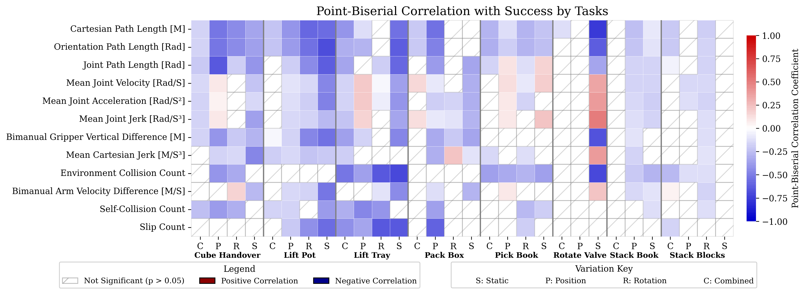

> **图 3：行为指标与轨迹成功率的点二列相关性。** 我们计算了不同任务变体中每个行为指标与二元轨迹成功率之间的点二列相关性（Point-Biserial Correlation），仅突出显示具有统计学显著性的相关性。行按每个指标的显著相关性数量（降序）排序，将与成功最一致相关的指标置于顶部。总体而言， **59.4% 的指标-任务对显示出统计学显著的相关性** ，这表明行为指标在大多数任务中与成功有意义地相关。

行为指标在 **59.4%** 的任务-指标对中与成功率存在统计学显著的相关性。图 [3](#figure-3) 展示了行为指标与二元任务成功率之间的点二列相关系数热力图，其中着色单元格表示具有统计学显著性的相关性（$p\leq 0.05$）。我们观察到 **59.4%** 的任务-指标组合产生了显著相关性，这表明行为指标对大多数任务的成功具有预测性。在未观察到统计学显著相关性的情况下，潜在因素包括成功轨迹样本有限，或者存在多模态解决方案策略，导致行为指标即使成功结果相似也表现出高度变异性。

不同的任务依赖不同的行为指标来解释成功，这反映了任务特定的需求。分析图 [3](#figure-3) 中的相关性热力图，我们观察到，虽然某些指标在多个任务中表现出一致的相关方向，但其他指标的相关强度和符号则因任务而异，变化很大。这种变异性表明，不同的任务为实现成功强调了不同的行为能力——例如协调性、效率或稳定性。跨任务的相关性模式差异表明， **没有任何单一的行为指标能普遍解释成功** ；相反，任务特定的需求决定了行为的哪些方面最具预测性。这凸显了 **多指标评估** 在理解多样化操作任务中策略性能的重要性。

  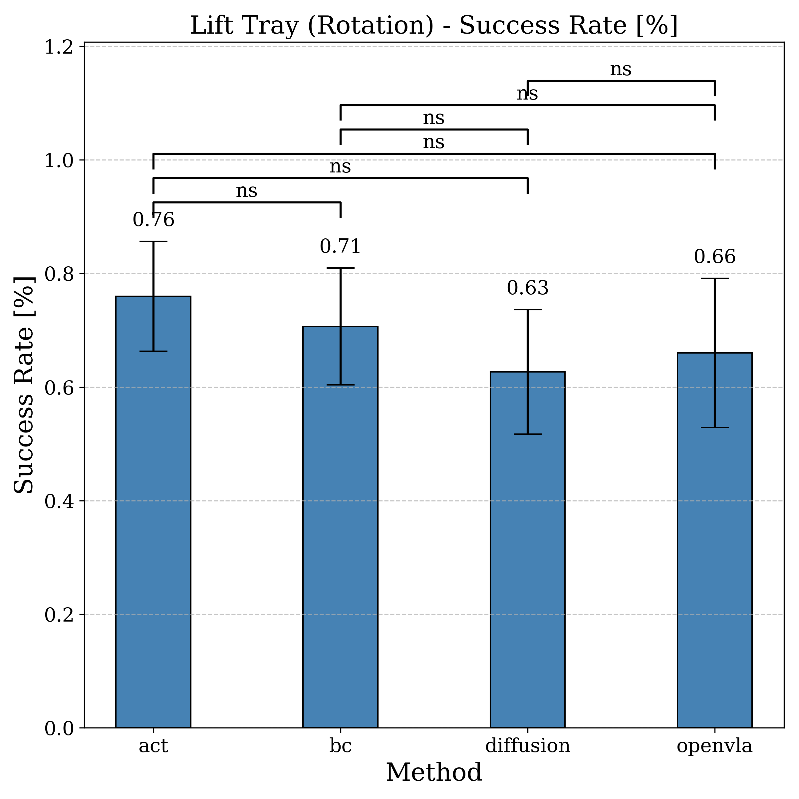
  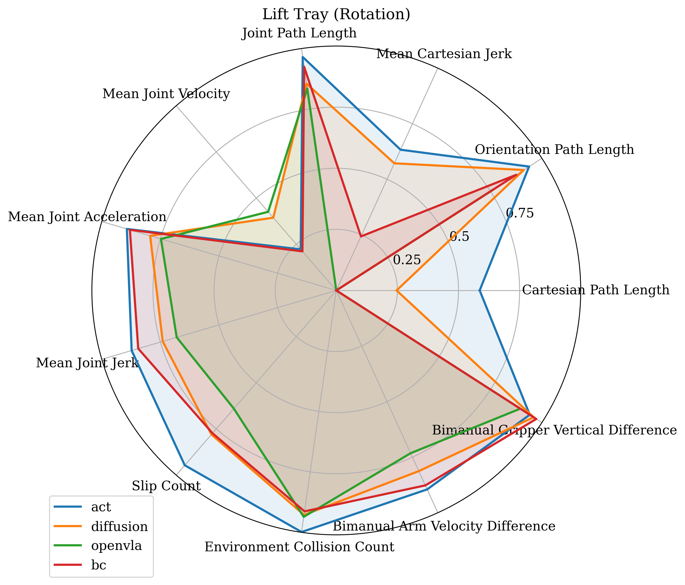
  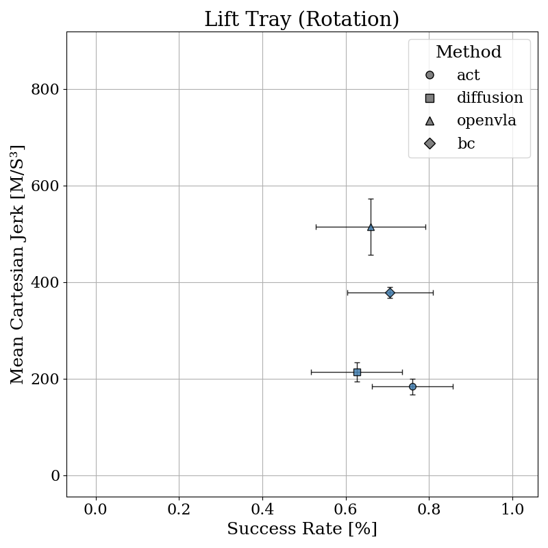
  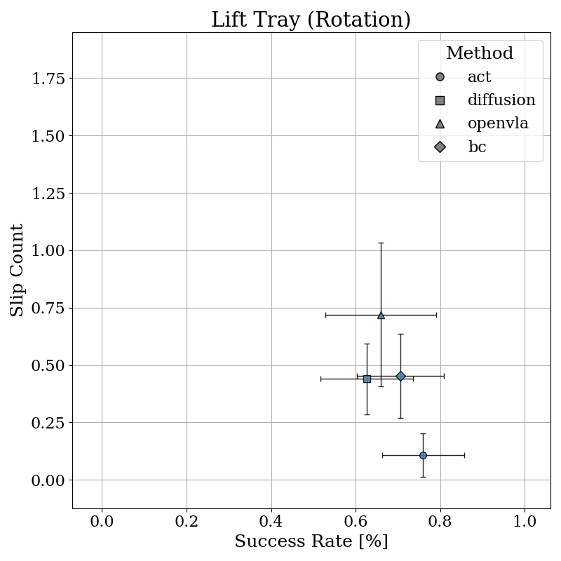

> **图 4：行为指标可区分成功率相近的策略。** (a) **托盘抬起（旋转）** （Lift Tray (Rotation)）任务的成功率条形图，各策略间未观察到统计学显著差异。(b) 沿多个行为指标维度比较策略的雷达图，数值已归一化并经极性调整至 $[0,1]$ 区间，数值越高表示性能越好。(c) 显示各策略平均笛卡尔加加速度（Cartesian jerk）的散点图。(d) 显示各策略平均滑动次数（slip count）的散点图。误差线表示 95% 置信区间；‘ns’ 表示 $p>0.05$ 的比较。

**即使成功率相近，行为指标也能区分策略性能。** 在某些情况下，行为指标与成功率之间的点二列相关性（point-biserial correlation）在统计学上并不显著，尤其是在策略取得相近成功率时。例如，在 **托盘抬起（旋转）** 任务中（图 [4](#figure-4)a），所有方法都取得了相似的成功率，导致相关性信号微弱。然而，如图 [4](#figure-4)b 所示，行为指标为策略提供了有意义的区分。通过使用归一化且极性调整后的雷达图，我们观察到 **ACT（Action Chunking Transformer）** 覆盖的面积最大，表明其整体行为性能更强。具体而言，ACT 和 **扩散策略（Diffusion Policy）** 都表现出较低的 **平均笛卡尔加加速度** ，意味着运动更平滑，而 ACT 相对于其他基线方法还实现了更低的 **滑动次数** 。这些差异无法被成功率单独捕捉，从而证明了行为指标在揭示策略细微能力方面的价值。

#### 4.2.2 RQ2：结果指标如何揭示反映策略局限或任务瓶颈的结构化失败模式？

  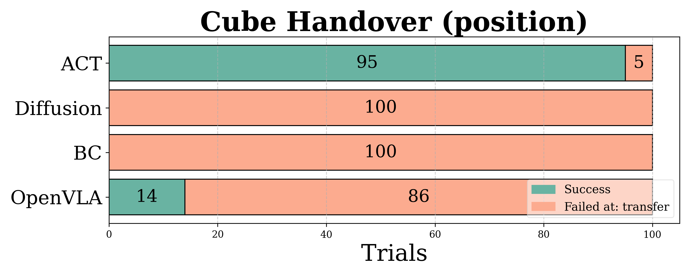
  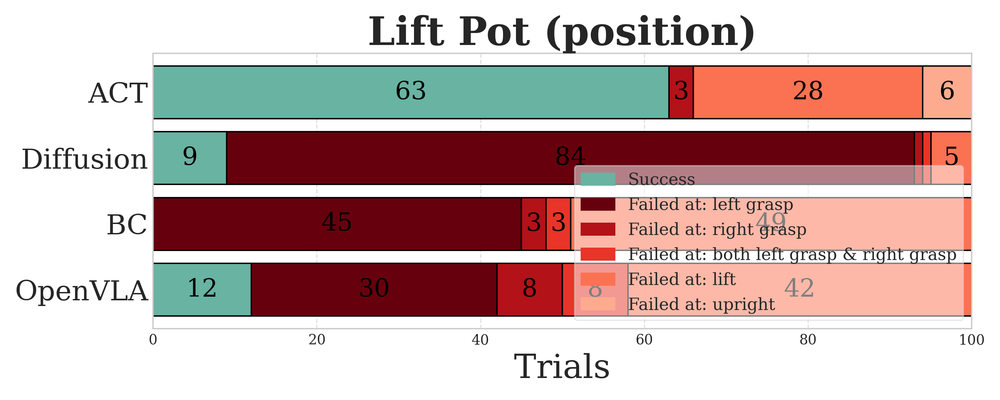
  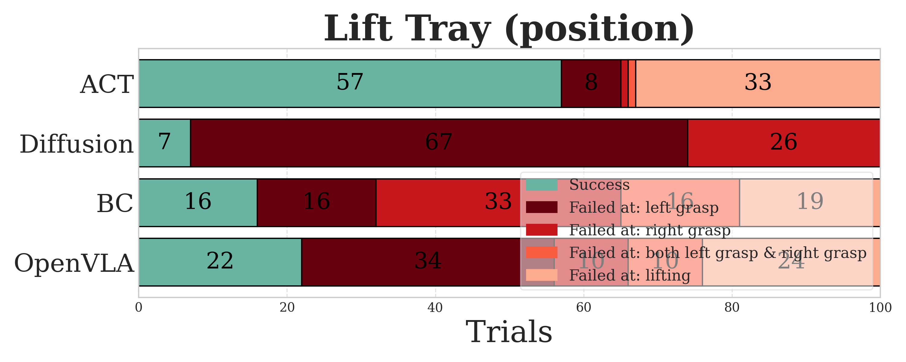
  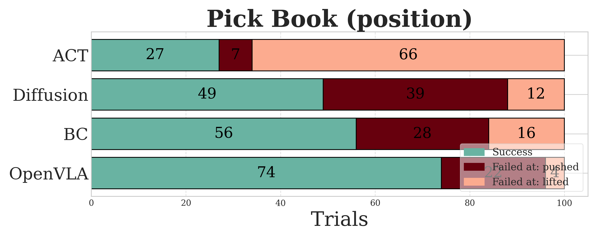
  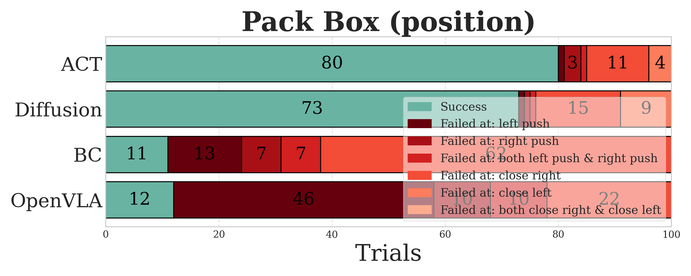
  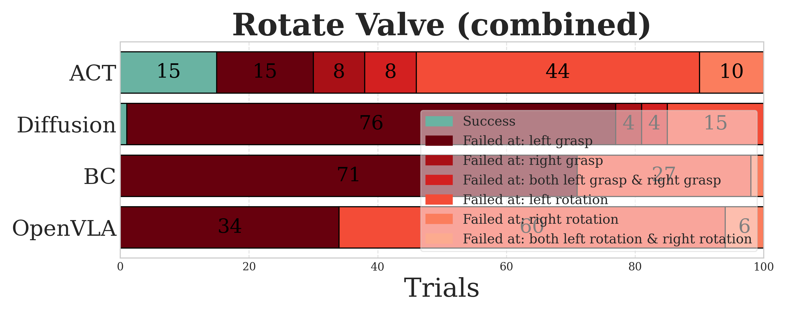

> **图 5：六个代表性任务的失败模式可视化。** (a) **方块交接（Cube Handover）** ：失败集中在传递阶段。(b) **抬起锅（Lift Pot）** ：多数失败发生在左把手抓取阶段。(c) **堆叠方块（Stack Blocks）** ：错误出现在第二个方块抓取阶段。(d) **拾取书本（Pick Book）** ：多数策略在推书阶段失败，而 ACT 在推书成功后于抬起阶段失败。(e) **装箱（Pack Box）** ：BC/OpenVLA 未能接触盒盖；ACT/扩散策略未能关闭盒盖。(f) **旋转阀门（Rotate Valve）** ：失败发生在左抓取和旋转阶段。

**结果指标分解了失败模式，并揭示了模型特定的优势和劣势。** 在图 [5](#figure-5) 中，我们使用结果指标对六个代表性任务进行了分阶段失败分解的可视化。这些分解表明，ACT 倾向于在操作的早期阶段（如接近和抓取）取得成功，但在需要持续控制的后期阶段（包括旋转、抬起或协调的双臂运动）中表现挣扎。对于其他策略，我们观察到不对称的失败模式，特别是左臂动作的失败发生率高于右臂。这一趋势在 **抬起锅（位置）** 、 **托盘抬起（位置）** 、 **装箱（位置）** 和 **旋转阀门（组合）** 等任务中尤为明显，表明某些方法可能因双臂协调的数据质量不平衡或策略表示欠佳而受到影响。这些分阶段诊断提供了对策略行为的可解释性洞察，超越了聚合成功率指标所能揭示的内容。

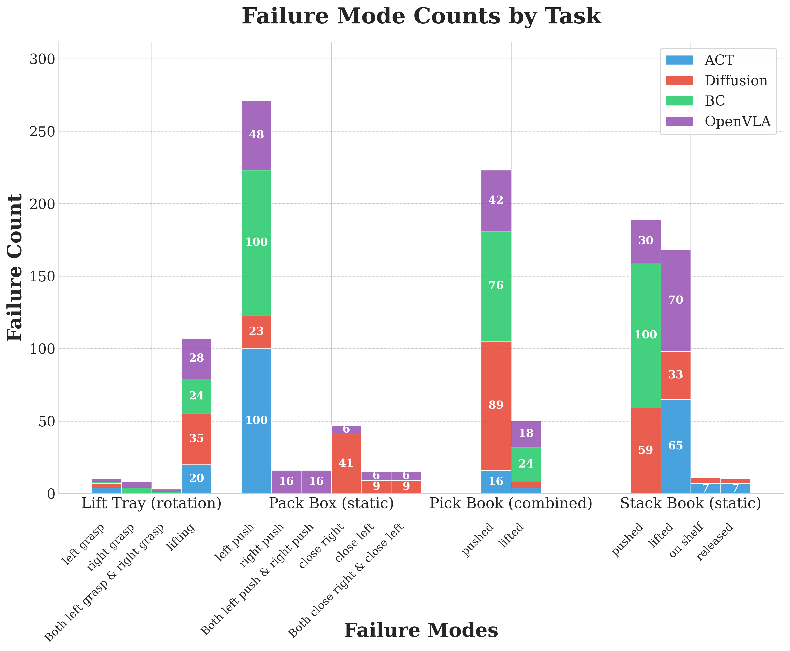

> **图 6：具有主导失败模式的任务示例。** 我们可视化了四个代表性任务中每个失败阶段的总失败次数，这些次数汇总自所有基线策略的 rollout。每个任务都表现出主导失败模式，表明任务中的特定阶段始终更具挑战性。这些集中的失败模式突显了任务执行中的瓶颈，可能有助于在训练期间进行聚焦分析或针对性干预。

**失败并非均匀分布在任务各阶段；某些步骤始终是主要的失败点。** 在图 [6](#figure-6) 中，我们观察到任务中的特定阶段在 rollout 中占据了不成比例的失败次数。这表明某些动作或转换对于策略的可靠执行更具挑战性。失败在这些阶段的集中表明它们代表了任务执行中的瓶颈，可能受益于针对这些子组件的定向数据增强或课程学习（curriculum learning）。此类分阶段洞察可以指导更高效的数据收集和策略优化策略。

#### 4.2.3 RQ3：任务难度如何影响评估指标对策略性能的信息量？

**对于过于简单或困难的任务，二元成功率不足以评估策略性能。** 表 [3](#table-3) 展示了多个策略在一组基础任务上的平均成功率。对于 **旋转阀门（静态）** 和 **抬起锅（静态）** 等任务，几乎所有策略都取得了完美的成功率，这为相对策略性能提供了有限的洞察。相反，对于更具挑战性的任务，所有策略都失败了，同样无法进行有意义的比较。在这两种情况下，由于缺乏变化，二元成功率变得信息不足。为了解决这个问题，我们引入了一个 **分层任务变体框架** ，通过系统调整结构复杂性来控制任务难度。随着复杂性的增加，我们观察到各策略的性能下降，揭示了它们在鲁棒性和泛化能力上的差异。类似地，简化最初困难的任务会导致非零的成功率，从而支持更细致的分析。这种方法通过确保任务落在能够区分策略能力的难度范围内，实现了更有效的基准测试。

  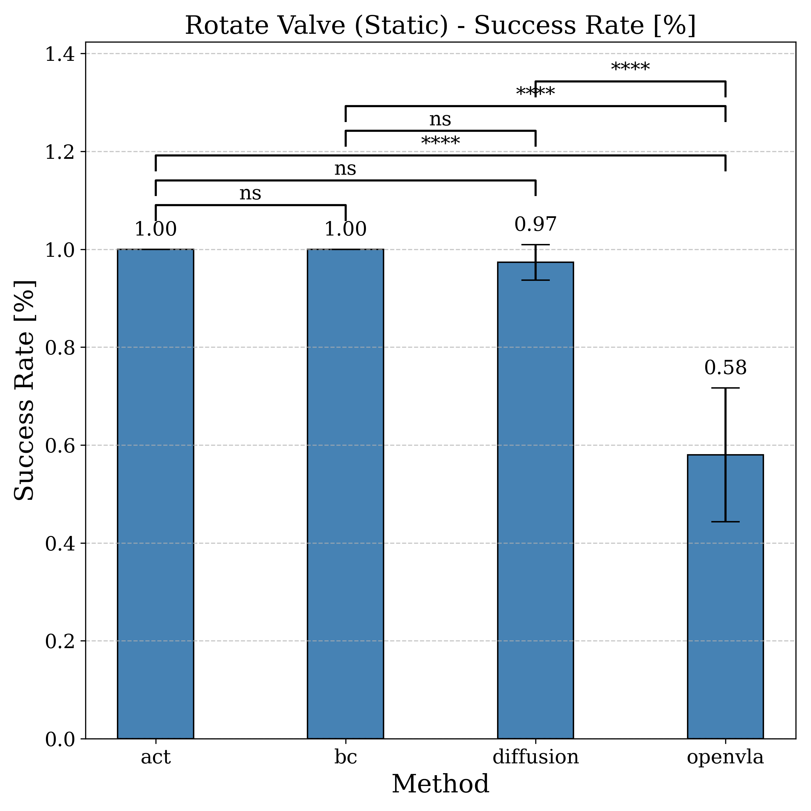
  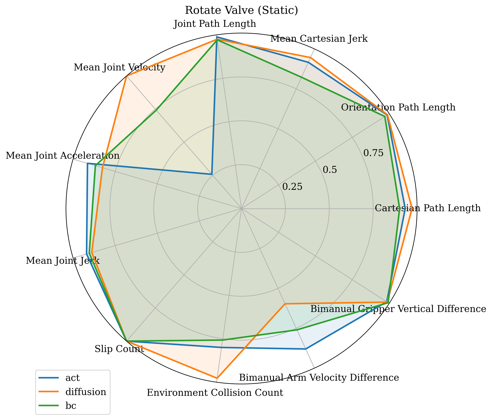
  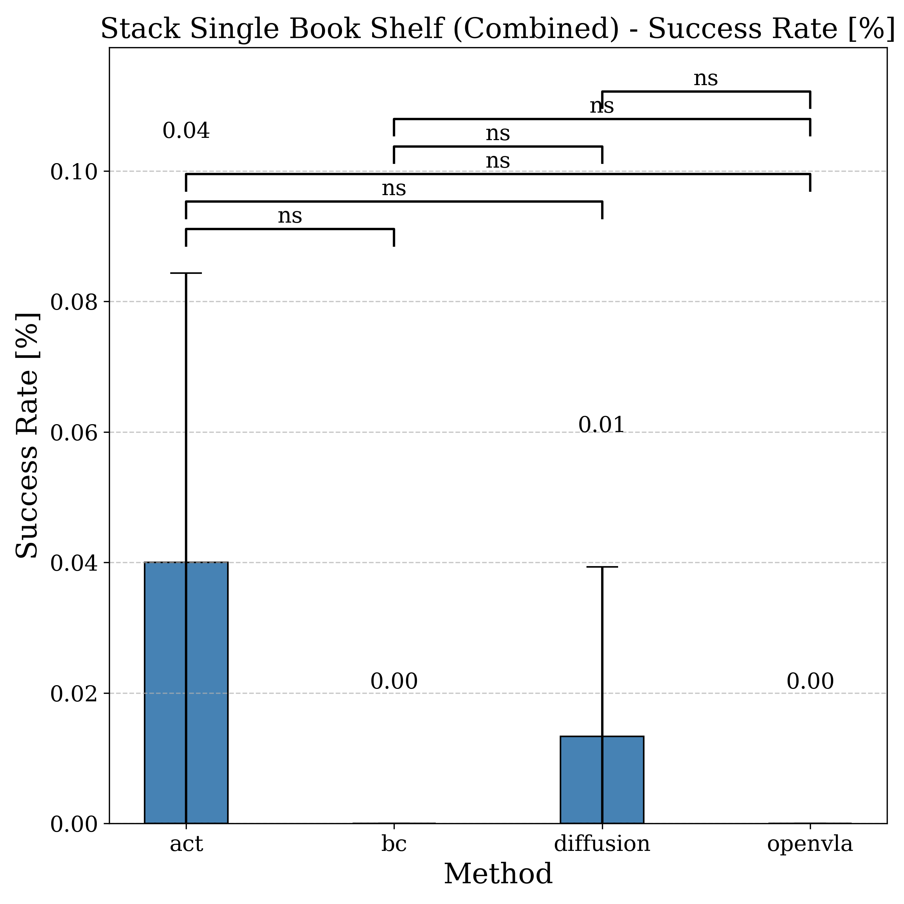
  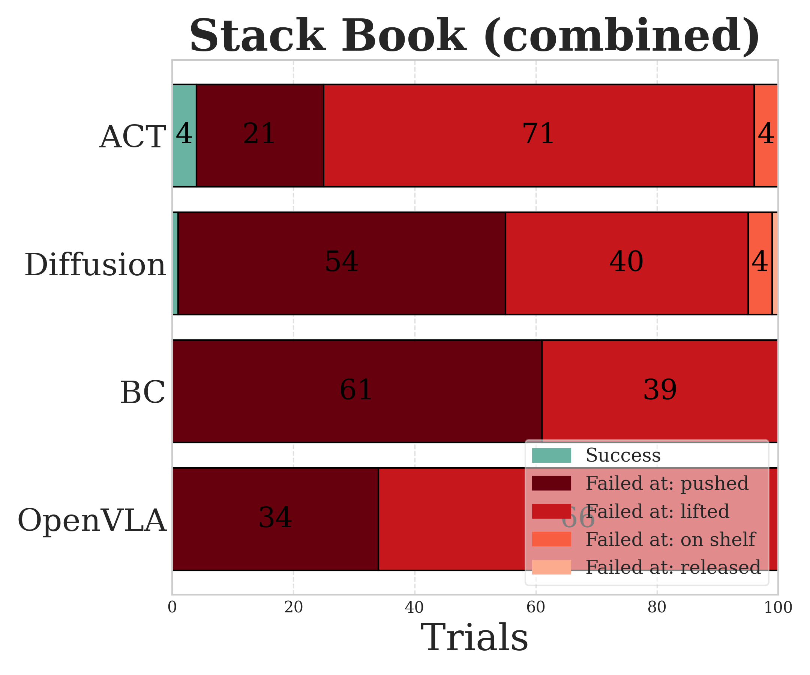

> **图 7：行为指标和结果指标在任务难度范围内提供了互补的洞察。** (a) 简单任务（旋转阀门（静态））的成功率显示出天花板效应，掩盖了性能差异。(b) 行为指标揭示了扩散策略在成功率相同的情况下具有更优的运动质量。(c) 在困难任务（堆叠单本书到书架（组合））中，普遍较低的成功率提供的信息很少。(d) 分阶段失败分析突显了“推到边缘”和“抬起”阶段是关键瓶颈，暴露了特定策略的短板。

**行为指标和结果指标在任务难度范围内提供了互补的洞察。** 对于大多数策略都能取得完美或接近完美成功率的简单任务，二元成功率的评估能力有限。在这些情况下，行为指标可以揭示策略质量上的有意义的差异。如图 [7](#figure-7) 所示，尽管三个策略在一个简单任务上取得了相似的成功率，但 ACT 在多个行为维度上表现出更优的性能，表明其执行更平滑、更稳定。在另一极端，对于所有策略都失败的困难任务，仅凭成功率无法传达进展。然而，结果指标（如分阶段任务进度）可以突显失败最常发生的地方。这些洞察有助于精确定位特定策略的弱点，并为策略的针对性改进提供信息。

## 5 讨论（Discussion）

我们提出了 **RoboEval** ，一个用于双臂操作的诊断性基准，它结合了结构化任务变体、人工收集的演示和细粒度的评估指标。我们的分析表明，任务难度源于长时程、多模态策略和协调需求——这些因素是二元成功率无法捕捉的。通过整合轨迹动力学、空间精度和协调指标，RoboEval 能够对策略在不同任务和变体机制下的行为进行原理性剖析。未来的扩展将纳入额外的变体模态、仿真到真实的验证，并托管一个包含可复现评估流程的公共基准套件。

## 6 局限性（Limitations）

尽管具备诊断能力，RoboEval 仍存在一些局限性。首先，作为一个基于仿真的基准，除非仔细调整参数，否则它容易受到物理伪影（如不稳定接触或未建模的动力学）的影响——这限制了其向硬件的直接迁移。其次，任务可扩展性受到需要人工策划资源和环境设置的限制；未来集成生成模型进行程序化资源生成可能缓解这一瓶颈。第三，虽然该基准提供了大规模的人类演示数据集，但数据收集仍然昂贵。扩展到更广泛的任务覆盖可能需要利用预训练的视觉运动模型或大规模未标记交互数据，以减少对专家演示的依赖。

- [致谢](#acknowledgments)

#### 致谢（Acknowledgments）

作者感谢个人机器人实验室（Personal Robotics Lab, PRL）和机器人学与状态估计实验室（Robotics and State Estimation Lab, RSELab）的成员对本文稿富有成果的讨论和深刻反馈。Yi Ru Wang 得到了加拿大自然科学与工程研究委员会（Natural Sciences and Engineering Research Council of Canada, NSERC）的支持。这项工作（部分）由美国国家科学基金会 NRI（#2132848）、DARPA RACER（#HR0011-21-C-0171）和海军研究办公室（#N00014-24-S-B001 和 #2022-016-01 UW）的资助支持。我们衷心感谢来自亚马逊、协作机器人公司（Collaborative Robotics）、Cruise 公司及其他机构的捐赠。
