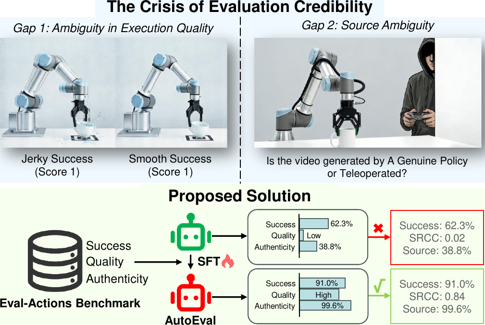
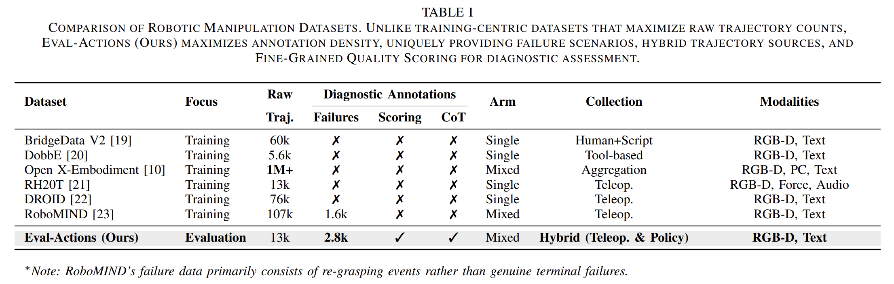
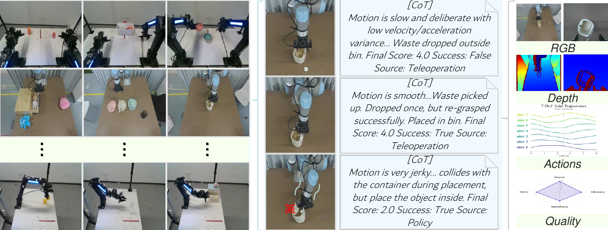
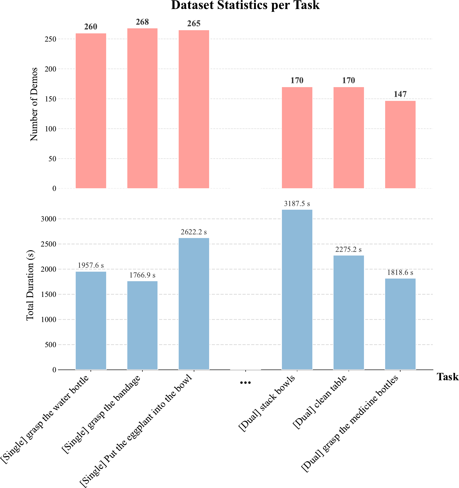
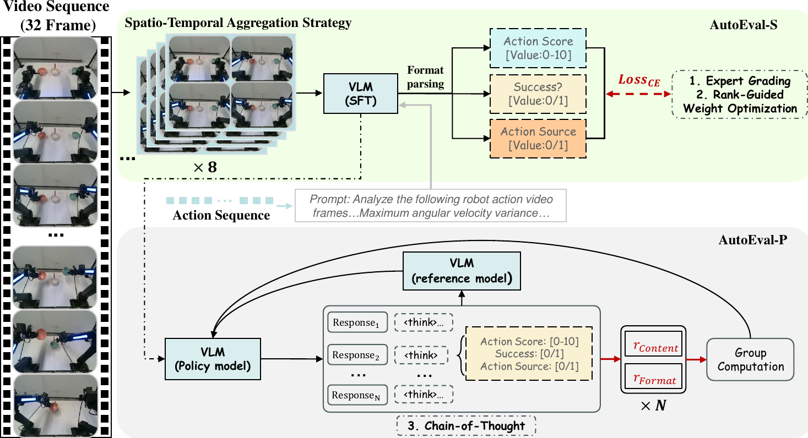
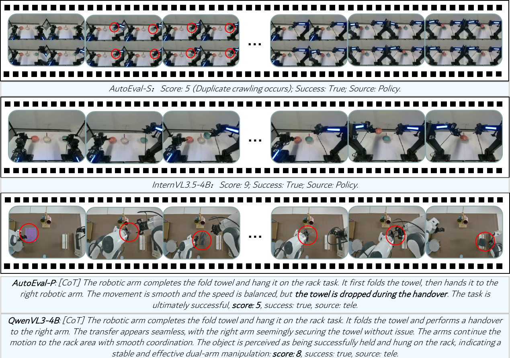
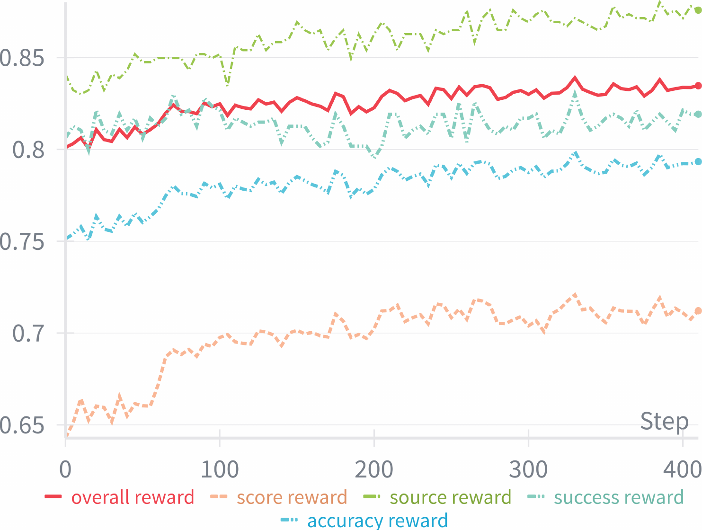
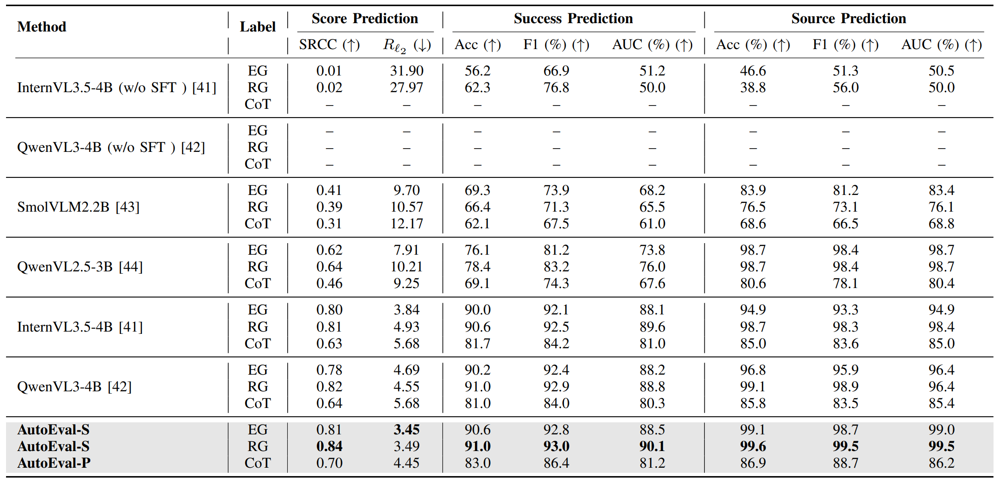
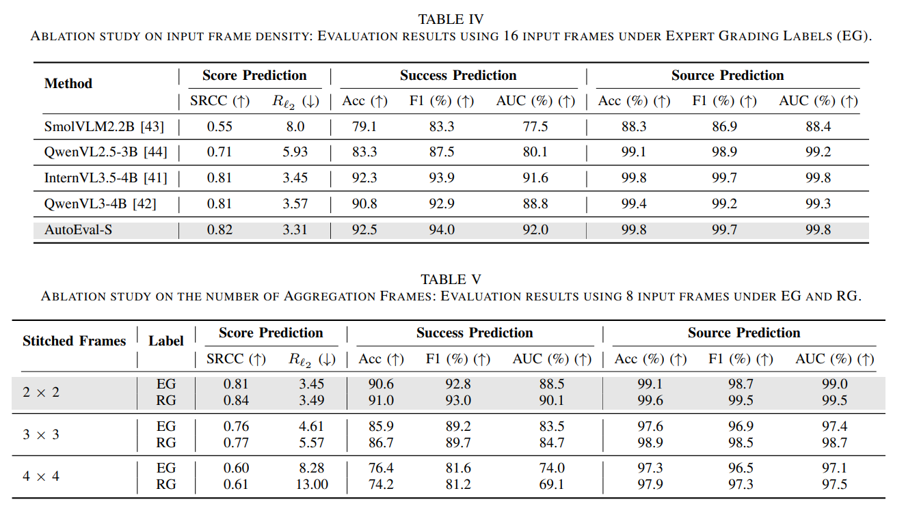

# 标题：机器人操作的可信评估：一个新基准与 AutoEval 方法

- ArXiv: 2601.18723
- 作者：Mengyuan Liu, Juyi Sheng, , Peiming Li, Ziyi Wang, Tianming Xu, Tiantian Xu, Hong Liu, 通讯作者。
- 北大、腾讯和中科院计算所
- 章节：22
- 估计词元数：21.4k

## 目录

- I 引言
- II 相关工作
  - II-A 机器人学习数据集
  - II-B 视觉-动作（VA）与视觉-语言-动作（VLA）模型
  - II-C 动作质量评估（AQA）
- III Eval-Actions 数据集
  - III-A 数据集构建
  - III-B 数据标注与细粒度动作质量定义
  - III-C 数据集统计
- IV 方法
  - IV-A 排序引导的权重优化
  - IV-B AutoEval
- V 实验
  - V-A 评估指标
    - V-A 1 细粒度动作质量评估指标：
    - V-A 2 成功分类指标
  - V-B 实验细节
  - V-C 实验结果
  - V-D 跨具身泛化
  - V-E 消融研究
- VI 结论
- 参考文献

## 摘要

在 **视觉-动作（Vision-Action, VA）** 和 **视觉-语言-动作（Vision-Language-Action, VLA）** 模型快速发展的推动下， **模仿学习（Imitation Learning）** 显著提升了机器人操作能力。然而，评估方法却相对滞后，阻碍了为这些行为建立 **可信评估（Trustworthy Evaluation）** 。当前范式主要依赖于二元的成功率，未能解决信任的关键维度： **来源真实性（Source Authenticity）** （即区分真实的策略行为与人类遥操作）和 **执行质量（Execution Quality）** （例如，流畅性与安全性）。为弥补这些差距，我们提出了一个结合 **Eval-Actions 基准** 和 **AutoEval 架构** 的综合解决方案。

首先，我们构建了 **Eval-Actions 基准** 以支持可信度分析。与现有仅限于成功人类演示的数据集不同，Eval-Actions 创新性地整合了 VA 和 VLA 策略执行轨迹以及人类遥操作数据，明确包含了失败场景。该数据集围绕三个核心监督信号构建： **专家评分（Expert Grading, EG）** 、 **排序引导偏好（Rank-Guided preferences, RG）** 和 **思维链（Chain-of-Thought, CoT）** 。

在此基础上，我们提出了 **AutoEval 架构** ：

- **AutoEval Small（AutoEval-S）** 利用 **时空聚合（Spatio-Temporal Aggregation）** 进行语义评估，并通过辅助的 **运动学校准信号（Kinematic Calibration Signal）** 来优化运动流畅度；
- **AutoEval Plus（AutoEval-P）** 则结合了 **组相对策略优化（Group Relative Policy Optimization, GRPO）** 范式以增强逻辑推理能力。

实验结果表明，AutoEval 展现出卓越的评估精度，在 EG 和 RG 协议下分别达到了 0.81 和 0.84 的 **斯皮尔曼等级相关系数（Spearman’s Rank Correlation Coefficients, SRCC）** 。至关重要的是，该框架具备强大的来源判别能力，能以 99.6% 的准确率区分策略生成的视频与遥操作视频，从而为可信的机器人评估建立了严格标准。我们的项目与代码可在 https://term-bench.github.io/ 获取。

Index Terms: Imitation Learning, Robotic Manipulation, Vision-Language-Action, Vision-Action, Action Quality Assessment.

## I 引言（Introduction）

**模仿学习（Imitation Learning, IL）** 已成为机器人学中一种前景广阔的范式，它使机器人能够通过模仿人类动作来自主执行任务 [34]。近年来，人工智能领域的重大进展将模仿学习推向了新的高度。这一进展将机器人学习的适用性扩展到了复杂领域，例如 **仿生机器人学（Biomimetic Robotics）** [15, 41, 30] 和 **可穿戴外骨骼（Wearable Exoskeletons）** [24, 44]。深度学习技术的融合进一步加速了这一发展，产生了更强大的模型，显著增强了机器人复制人类行为的能力。伴随着这些技术进步，经济高效的数据采集系统（如 ALOHA [13] 和 UMI [7]）的出现，以及开源数据集（如 RLBench [19] 和 OpenX [8]）的普及，极大地降低了实施模仿学习的门槛。这些创新为多种多样的方法奠定了基础——包括 ACT [13]、Diffusion Policy [5, 6]、HDP [36]、MP1 [29]、RT-1 [3]、RT-2 [4]、RT-X [8]、OpenVLA [21] 和 $\pi_{0}$ [2]——使机器人能够以类人的灵巧性执行任务或协助人类实现各种目标。值得注意的是，这些方法在特定数据集和任务上已展现出令人鼓舞的结果，甚至在实际应用中取得了成功。

``

> 图 1 | 评估可信度危机与提出的可信评估解决方案。
>
> - （上图）危机：我们识别出阻碍可信评估的两个关键模糊性来源：
> - **差距 1（执行质量模糊性，Gap 1 (Ambiguity in Execution Quality)）** ，其中二元指标掩盖了不稳定或不安全的执行（可视化为“抖动成功（Jerky Success）”与“流畅成功（Smooth Success）”）；
> - 以及 **差距 2（来源真实性模糊性，Gap 2 (Ambiguity in Source Authenticity)）** ，其中“成功”演示的来源无法验证。
> - （下图）提出的解决方案：我们的 **可信评估框架（Trustworthy Evaluation Framework）** 弥合了这些差距。在 **Eval-Actions 基准（Eval-Actions Benchmark）** 和 **AutoEval 架构（AutoEval Architecture）** （描绘为通过 **监督微调（Supervised Fine-Tuning, SFT）** 优化的绿色机器人）的支持下，该系统实现了精确的 **细粒度动作质量评估（Fine-Grained Action Quality assessment）** （SRCC 0.84）和鲁棒的 **来源真实性验证（Source Authenticity verification）** （99.6%），如绿色方框所示。这显著优于未经 SFT 的标准 **视觉-语言模型（Vision-Language Models, VLMs）** （红色方框），从而确保了评估的可信度。

> 表 I | 机器人操作数据集对比。与专注于最大化原始轨迹数量的以训练为中心的数据集不同，Eval-Actions（我们的）专注于最大化标注密度，独特地提供了用于诊断评估的失败场景、混合轨迹来源和细粒度质量评分。

表 1 | 机器人操作数据集对比。

| Dataset               | Focus      | Raw Traj. | Diagnostic Annotations |         |     | Arm    | Collection                | Modalities          |
| --------------------- | ---------- | --------- | ---------------------- | ------- | --- | ------ | ------------------------- | ------------------- |
|                       |            |           | Failures               | Scoring | CoT |        |                           |                     |
| BridgeData V2 [35]    | Training   | 60k       | ✗                      | ✗       | ✗   | Single | Human+Script              | RGB-D, Text         |
| DobbE [27]            | Training   | 5.6k      | ✗                      | ✗       | ✗   | Single | Tool-based                | RGB-D, Text         |
| Open X-Embodiment [8] | Training   | 1M+       | ✗                      | ✗       | ✗   | Mixed  | Aggregation               | RGB-D, PC, Text     |
| RH20T [11]            | Training   | 13k       | ✗                      | ✗       | ✗   | Single | Teleop.                   | RGB-D, Force, Audio |
| DROID [20]            | Training   | 76k       | ✗                      | ✗       | ✗   | Single | Teleop.                   | RGB-D, Text         |
| RoboMIND [38]         | Training   | 107k      | 1.6k                   | ✗       | ✗   | Mixed  | Teleop.                   | RGB-D, Text         |
| Eval-Actions (Ours)   | Evaluation | 13k       | 2.8k                   | ✓       | ✓   | Mixed  | Hybrid (Teleop. & Policy) | RGB-D, Text         |

^∗Note: RoboMIND’s failure data primarily consists of re-grasping events rather than genuine terminal failures.

尽管取得了这些进展，该领域在评估方面仍面临着可信度危机。要真正验证机器人实际部署的能力，我们必须回答两个基本问题：“**任务执行得有多好？**”（差距 1：执行质量）和“**该表现是否真正自主？**”（差距 2：真实性）。当前的框架未能对其中任何一个问题提供明确的答案。

如图 [1](#figure-1) 中的差距 1 所示，当前的评估指标主要忽视了机器人执行过程中的动作质量，而只关注二元化的任务成功或失败。例如，考虑一个要求将杯子放置在特定位置的任务。如果模型 A 在经历了多次试错尝试并伴有严重抖动后完成任务，导致动作僵硬且低效，而模型 B 则以流畅、精细且稳定的动作执行同一任务，传统的指标会不加区分地将两个模型都判定为成功（得分 1）。这种简单的二元化方法无法区分模型 B 更优越的可信度，掩盖了模型 A 不稳定行为中隐藏的潜在安全风险。因此，当前的基准测试难以识别那些不仅成功，而且对于实际部署而言安全可靠的策略。

为了解决这一局限，我们引入了“ **细粒度动作质量（Fine-Grained Action Quality）** ”作为核心评估标准。与二元化指标不同，我们将此指标定义为对执行过程的全面评估，在任务完成之外，明确量化 **流畅度（Smoothness）** 、 **安全性（Safety）** 和 **效率（Efficiency）** 。为了稳健地衡量这一点，我们的框架集成了 **专家评分（Expert Grading, EG）** 、 **排序引导偏好（Rank-Guided preferences, RG）** 和 **思维链（Chain-of-Thought, CoT）** 作为三种监督信号，以建立一个全面的 **基准真值（Ground Truth）** ，使算法评分与人类可信行为标准保持一致。此外，我们引入了 **Eval-Actions** 基准，该基准富含这些详细标注，为评估策略可靠性提供了诊断基础。作为补充，我们提出了 **AutoEval** ，一个旨在通过同时验证任务成功和评估执行的细粒度质量来精确评估机器人学习策略的统一框架。

> self eval?
> 如何明确量化 **流畅度（Smoothness）** 、 **安全性（Safety）** 和 **效率（Efficiency）**？？？
> 如何定义这些指标，如何评估这些指标？？？

除了执行质量上的模糊性（差距 1），**轨迹来源的不确定性**（差距 2）进一步损害了评估的可信度。尽管近期的学习方法报告了令人印象深刻的结果，但验证一个“成功”的演示是源于鲁棒的自主策略还是隐藏的人类遥操作，仍然是一个开放的挑战。这种“ **来源模糊性（Source Ambiguity）** ”，加上前述的“ **质量模糊性（Quality Ambiguity）** ”，使得当前的基准测试容易受到操纵，并阻碍了公平比较。如图 [1](#figure-1) 中的差距 2 所示，仅凭视觉上的成功无法保证行为的来源；区分真实的策略执行与人工干预仍然是一个关键障碍。为了弥合这一差距，我们将多种策略生成的轨迹纳入我们的 Eval-Actions 数据集，并在 AutoEval 架构中引入了一个**专门的来源判别机制**。这种整合实现了对 **来源真实性（Source Authenticity）** 的权威验证，确保评估的表现反映了真正的机器人自主性，而非遥操作伪造品。

> 为什么要验证”轨迹来源的不确定性“？？？只要轨迹足够好、足够完成任务不就可以了嘛？有什么意义？
> 用作测评 VLA 模型，确保 VLA 模型提交的轨迹是真正自主的，而不是通过遥操作伪造的。
> 什么“专门的判别机制”？？
> 如何从根本上区分轨迹的来源？？

通过应对这些挑战，我们提出了一个包含 Eval-Actions 基准和 AutoEval 架构的整体评估解决方案。我们的工作旨在通过建立一个全面的度量体系来恢复对机器人评估的信任，该体系同时验证动作的保真度（质量）和来源的真实性（真实性），为透明的具身智能设定新标准。我们的主要贡献如下：

- 我们为机器人操作建立了 **可信评估标准（Trustworthy Evaluation Standard）** ，**将评估从不透明的二元结果转向细粒度的行为诊断**。通过量化**流畅度**、**安全性**和**效率**，我们解决了**低质量执行**被误认为是鲁棒成功的**模糊性问题**。
- 我们引入了 **Eval-Actions** ，这是首个为评估完整性设计的数据集。与以训练为中心的语料库不同，它整合了失败场景和混合轨迹来源（策略 vs. 人类），并得到 EG、RG 和 CoT 标注的支持，以训练可信的评估器。
- 我们提出了 **AutoEval** 框架，该框架通过 **时空聚合（Spatio-Temporal Aggregation）** 实现了最先进的评分（0.84 SRCC），并利用 GRPO 增强了物理推理能力。至关重要的是，它提供了权威的 **真实性验证（Authenticity Verification）** ，能以 99.6% 的准确率区分策略生成的动作与遥操作。

``

> 图 2：Eval-Actions 基准概览。该图可视化了数据集结构：
>
> （左）任务多样性：来自我们 150 多个场景的代表性快照，涵盖单臂交互（例如“扔垃圾”）和复杂的双手协调（例如“整理药盒”）。
>
> （中）详细案例研究：左侧所示的“扔垃圾”任务的一个具体实例。关键的是，每个任务都包含从高质量成功到失败场景的多样化演示数据——此处通过流畅的遥操作与生硬的策略行为对比来示例说明。
>
> （右）数据构成：堆栈列举了每个片段中封装的密集多模态信号。这包括**原始感知数据（RGB、深度）**、**精确的运动学记录（7/14 自由度关节轨迹）**以及 **细粒度质量雷达图（Fine-Grained Quality Radar Chart）** ，该图明确量化了四个核心维度（成功、流畅度、安全性、效率），以实现诊断性评估。

## II 相关工作（Related Work）

### II-A 机器人学习数据集（Robotic Learning Datasets）

高质量数据集推动了数据驱动机器人操作（data-driven robotic manipulation）领域近期的进展。开创性的工作，如 BridgeData V1 和 V2 [10, 35]，通过整理大量单臂遥操作（Teleoperation）轨迹，确立了数据规模对于策略泛化（policy generalization）的重要性。遵循这一范式，诸如 DobbE [27] 和 DROID [20] 等项目通过分布式收集协议扩展了操作数据的多样性。为了应对跨具身泛化（cross-embodiment generalization）的挑战，Open X-Embodiment（OXE）数据集 [8] 汇集了来自全球实验室超过一百万条轨迹，代表了迄今为止最伟大的协作努力之一。此外，RH20T [11] 通过整合包括力和音频在内的多模态信号（multi-modal signals）来丰富这些资源，以促进灵巧操作任务。

尽管取得了这些成就，一个关键的差距仍然存在：**现有数据集主要为模仿学习（imitation learning）而构建，几乎完全专注于成功的专家演示**。如表 [I](#table-1) 所示，主流基准测试（例如 OXE [8]、DROID [20]）在很大程度上排除了失败场景，而这些场景对于学习错误恢复和鲁棒的失败检测是必不可少的。尽管最近像 RoboMIND [38] 这样的工作已经开始引入失败子集，但该领域仍然缺乏诊断策略行为所需的细粒度标注（fine-grained annotations）。大多数评估仅依赖于二元的“成功率（Success Rate）”，忽略了密集的监督信号，例如详细的 **细粒度动作质量评分（Fine-Grained Action Quality Scoring）** 和 **思维链推理（Chain-of-Thought reasoning, CoT）** 。

为了弥合这一差距，我们引入了 Eval-Actions 基准测试。与以训练为中心的数据集不同，Eval-Actions 专为 **可信评估（Trustworthy Evaluation）** 而设计。它包含 13k 条涵盖单臂和双臂任务的轨迹，并且关键的是，整合了大量失败数据（2.8k）和多样化的轨迹来源（遥操作与策略），同时伴有动作质量评分和 CoT 标注。这种构成使得评估能够从二元成功指标转向对 **执行质量（Execution Quality）** 和 **来源真实性（Source Authenticity）** 的诊断性评估。

### II-B 视觉-动作与视觉-语言-动作模型（VA and VLA Models）

机器人控制（robotic control）的范式已从专用基元（specialized primitives）[22, 16, 12] 演变为端到端学习（end-to-end learning）。早期的深度学习方法转向了 **视觉-动作策略（Vision-Action policies, VA policies）** ，其中神经网络直接将感官观测映射到控制指令。最近，生成式人工智能（Generative AI）彻底改变了这一领域。诸如 **基于 Transformer 的动作分块（Action Chunking with Transformers, ACT）** [13] 和 **扩散策略（Diffusion Policies）** [5] 等技术在建模复杂、多模态的动作分布方面展示了卓越的能力，实现了高精度操作。此外，像 DP3 [43] 和 MP1 [29] 这样的方法通过整合 3D 点云（3D point clouds）扩展了这些能力，显著增强了空间泛化（spatial generalization）。

与这些控制进展同时，语言语义的整合催化了 **视觉-语言-动作模型（Vision-Language-Action models, VLA models）** 的出现。早期的语言条件化方法（例如 PerAct [31]、RVT [14]）在特定数据集（例如 RLBench [19]）上从头开始训练策略。然而，随着大规模预训练视觉语言模型（Vision-Language Models, VLMs）的采用，发生了范式转变。通过将语义推理（semantic reasoning）建立在物理控制之上，现代 VLA 模型能够处理开放式任务。RT-1 [3] 和 RT-2 [4] 证明了利用预训练主干网络（pre-trained backbones）可以使策略继承互联网规模数据的泛化能力。最近，开源项目——例如 OpenVLA [21]、Octo [32] 和 pi0 [2]——通过为基础模型（例如 Llama [33]）进行机器人学微调，实现了技术的民主化访问。

然而，评估方法滞后于这些模型的进步。尽管 VLA 模型接近类人推理，但验证其可信度（trustworthiness）仍然是一个未解决的挑战。当前的评估主要局限于二元成功率，这掩盖了现实世界部署所需的关键因素。具体而言，这种二元范式忽略了 **细粒度执行质量（Fine-Grained Execution Quality）** ，例如运动平滑度和安全保障，并且未能验证 **来源真实性（Source Authenticity）** ，使得观察到的行为是源于鲁棒的策略还是隐藏的人类遥操作变得模糊不清。因此，我们提出了一个 **可信评估框架（Trustworthy Evaluation framework）** 来专门解决这双重模糊性。

``

> 图 3：Eval-Actions 的代表性任务统计。上图说明了代表性任务的演示次数分布，而下图显示了每个对应任务的总持续时间（以秒为单位）。这些任务涵盖了多样化的操作场景，包括单臂和双臂操作。

### II-C 动作质量评估（Action Quality Assessment, AQA）

**动作质量评估（Action Quality Assessment, AQA）** 量化动作的执行好坏，这与动作识别（action recognition）的分类任务不同。该领域在计算机视觉中得到了广泛研究，在竞技体育评分（例如跳水、体操、篮球）[40, 39, 45, 26] 和评估手术技能 [23, 9] 中有着坚实的应用。

然而，在通用机器人操作领域，AQA 仍处于起步阶段。与人类体育通常以美学执行为主要标准不同，机器人 AQA 必须优先考虑功能指标，例如轨迹平滑度（trajectory smoothness）、安全裕度（safety margins）和执行效率（execution efficiency）。当前的机器人评估方法主要局限于二元成功检测，未能捕捉执行过程的颗粒化质量。所提出的 Eval-Actions 基准测试旨在通过正式将 AQA 范式应用于机器人学来弥合这一领域差距，实现对 **细粒度动作质量（Fine-Grained Action Quality）** 的精确量化，从而为 **可信评估（Trustworthy Evaluation）** 建立严格的标准。

## III Eval-Actions 数据集

我们的目标是建立一个用于 **视觉-语言-动作模型（Vision-Language-Action, VLA）** 和 **视觉-动作模型（Vision-Action, VA）** 策略的 **可信评估（Trustworthy Evaluation）** 框架，通过准确评估 **细粒度动作质量（Fine-Grained Action Quality）** 并验证 **来源真实性（Source Authenticity）** 。为此，我们构建了 **Eval-Actions** ，这是一个包含人机演示视频的基准测试集，并附有丰富的细粒度质量标注。

### III-A Dataset Construction （数据集构建）

为了克服现有基准测试在评估维度上的局限性，我们提出了 **Eval-Actions** 数据集，如图 [2](#figure-2) 所示。该数据集涵盖了单臂和双臂协作场景，例如叠碗和递盘子，如我们的统计分析图 [3](#figure-3) 所示。 **Eval-Actions** 总时长约 52 小时，包含超过 13,000 个演示片段，覆盖 150 多个不同的任务，并使用了异构的机械臂配置（例如，ARX R5, UR5）。

与主要依赖成功的人类遥操作数据的 RT-1 [3] 或 OXE [8] 等数据集不同， **Eval-Actions** 引入了两个关键特性。首先，它采用了 **混合收集策略（Hybrid Collection Strategy）** ，不仅汇集了来自 20 位具有不同专业背景的人类操作员的数据，还收集了由不同架构（包括 VA 和 VLA 模型）的机器人策略生成的执行轨迹数据，专门用于支持 **来源真实性（Source Authenticity）** 验证。其次，该数据集整合了 **失败数据（Failure Data）** 和 **细粒度质量标注（Fine-Grained Quality Annotations）** 。与仅限于成功演示的标准数据集不同， **Eval-Actions** 明确包含了失败案例以及 **细粒度动作质量（Fine-Grained Action Quality）** 分数。至关重要的是，该数据集提供了这些分数背后的 **思维链（Chain-of-Thought, CoT）** 推理过程，为训练透明且 **可信的评估（Trustworthy Evaluation）** 模型奠定了基础。每个样本都富含密集的多模态信息，包括：

- RGB-D 记录（来自腕戴式和第三人称视角）
- 文本任务描述
- 动作轨迹
- 任务成功指示器
- 三种类型的诊断标注

此外，为了解决策略生成数据的分布问题，我们策划了一个专门的评估子集（ **Eval-Actions Small, EAS** ），旨在明确区分遥操作轨迹和策略生成轨迹，并验证任务执行结果。

### III-B Data Annotation & Definition of Fine-Grained Action Quality （数据标注与细粒度动作质量定义）

为了减轻人工评估的主观性，我们为“ **细粒度动作质量（Fine-Grained Action Quality）** ”建立了一个标准化协议，其核心围绕四个维度： **成功率（Success Rate）** 、 **平滑度（Smoothness）** 、 **安全性（Safety）** 和 **效率（Efficiency）** 。具体而言：

- **成功率（Success Rate）** 作为二元指标。
- **平滑度（Smoothness）** 通过运动学指标量化，包括关节角速度和加速度方差。
- **安全性（Safety）** 通过监测物理异常来评估，特别是对意外碰撞或与环境危险交互进行惩罚。
- **效率（Efficiency）** 由任务完成时间决定；为了确保在不同初始化距离下的公平性，我们在划分的空间区域内，将这些时间相对于基线操作员的性能进行归一化。

基于这些指标，我们的标注框架整合了三种互补的方法，以全面量化 **细粒度动作质量（Fine-Grained Action Quality）** ：

1. **专家评分（Expert Grading, EG）** 。如图 [4](#figure-4) 所示，我们聘请了 10 位人类专家来评估动作质量，根据平滑度、安全性和效率将技能分为三个等级（优秀、良好、差）。最终的 **真实标签（ground truth）** 由这些评分的平均值导出，以最小化个体偏差。
2. **排序引导的权重优化（Rank-Guided Weight Optimization, RG）** 。这种方法将计算指标与人类直觉对齐。专家首先对一批执行视频进行排序。然后，我们制定一个综合分数——聚合平滑度、成功指标、碰撞惩罚和人类评分——并使用 **遗传算法（Genetic Algorithm, GA）** 优化权重，以最小化分数与专家排序之间的差异。
3. **思维链标注（Chain-of-Thought Annotation, CoT）** 。为了增强可解释性，领域专家不仅提供数值质量分数，还提供详细的 **思维链（Chain-of-Thought, CoT）** 推理，为每次评估提供明确的理由。

``

> 图 4 | Eval-Actions Small 子集中专家评分（Expert Grading）的分布。

### III-C 数据集统计（Dataset Statistics）

**Eval-Actions** 数据集包含约 52 小时的机器人操作视频，涵盖 150 种不同的机器人任务，包括抓取（grasping）、放置（placing）、推动（pushing）及其他基本动作。该数据集包含了来自 20 位具有不同专业背景（例如，机器人工程师、学生和非专业人士）的人类操作员的演示，以及由多种 **视觉-语言-动作模型（Vision-Language-Action, VLA）** 和 **视觉-动作模型（Vision-Action, VA）** 策略生成的轨迹。总计，该数据集包含 13k 条带标注的动作轨迹，每条轨迹平均持续 14 秒，如图 [3](#figure-3) 所示。

在 Eval-Actions 中，相机配置根据不同的机器人形态而变化，涵盖了诸如头部视角、正面视角和腕部视角等，如图 [2](#figure-2) 右侧所示。具体而言，在 **Eval-Actions Small (EAS)** 子集中，每个样本都配有同步的多视角录像：(1) 腕部相机视角，(2) 头部相机视角，以及 (3) 静态第三人称视角。此外，每条轨迹都包含完整的 7 自由度（7-DoF）关节角度和末端执行器状态、任务描述、二元成功标志、部署环境（真实世界或仿真），以及一个源自专家评估和客观指标的综合质量评分。

如图 [4](#figure-4) 所示，该数据集在 **专家评分（Expert Grading, EG）** 上呈现出多样化的分数分布（1–10）和成功结果。具体而言， **37.4%** 的轨迹是失败的，主要集中在最低质量等级（评分 1，占 **23.1%** ）。其余 **62.6%** 是成功的执行，显示出广泛的质量谱系。值得注意的是，高质量演示得到了充分体现，仅评分 8 就占了 **16.0%** ，确保了次优示例与高保真示例之间的稳健平衡。

``

> 图 5 | 所提出的 AutoEval 框架概览。该系统处理机器人操作视频序列（例如 32 帧）以及运动学提示。
>
> - 上部（AutoEval-S）：专为专家评分（Expert Grading）和排名引导（Rank-Guided）任务设计，该分支采用 **时空聚合策略（Spatio-Temporal Aggregation Strategy）** 将高频运动细节压缩为复合视觉词元（composite visual tokens）。它生成结构化文本预测；经过格式分解后，模型通过使用 **交叉熵损失（Cross-Entropy Loss）** 的 **监督微调（Supervised Fine-Tuning, SFT）** 进行优化。
> - 下部（AutoEval-P）：专为 **思维链（Chain-of-Thought, CoT）** 推理定制，该分支采用 **组相对策略优化（Group Relative Policy Optimization, GRPO）** [28, 17] 范式。策略模型生成多个推理路径（包含 `<think>` 词元），针对一个包含内容准确性（$r_{Content}$）和格式约束（$r_{Format}$）的混合奖励函数进行优化，以增强物理推理能力。

## IV 方法（Method）

在本节中，我们提出一个用于 **自动化机器人技能评估（Automated Robotic Skill Assessment）** 的综合框架。为了减轻人工标注的主观性，我们确立了 **细粒度动作质量（Fine-Grained Action Quality）** 的三个核心维度（EG、RG、CoT）作为评估的 **真值（Ground Truth, GT）** 。首先，我们引入一种 **排序引导权重优化（Rank-Guided Weight Optimization）** 策略，该策略采用 **遗传算法（Genetic Algorithm, GA）** 来校准一个基于运动学的评分函数，从而为数据集生成可靠的 GT 标注。利用这些高质量监督信号，我们随后提出了 **AutoEval** ，它包含两个变体： **AutoEval Small（AutoEval-S）** 和 **AutoEval Plus（AutoEval-P）** 。这个基于 **视觉语言模型（Vision-Language Model, VLM）** 的神经架构旨在从机器人轨迹中提取时空特征，以实现鲁棒且自主的策略评估。

### IV-A 排序引导权重优化（Rank-Guided Weight Optimization）

确定**运动学指标**和**惩罚因子**的**最优相对重要性**并非易事。为了使自动化评估与人类专家判断保持一致，我们将其表述为一个超参数优化问题。

令 $\mathbf{\theta}=\{w_{vel},\dots,w_{len},\lambda_{coll},\lambda_{fail}\}$ 表示可调参数向量。我们首先将原始算法分数 $S_{raw}$ 定义为归一化运动学指标的加权组合。关键在于，如果违反了安全性或成功性约束，则在聚合之前，相应的运动学指标 $s_{i}$ 会通过除数 $\lambda\in\mathbf{\theta}$ 受到惩罚：

$$
S_{raw}(\mathbf{\theta})=\frac{\sum w_{i}\cdot s^{\prime}_{i}}{\sum w_{i}},\quad s^{\prime}_{i}=\begin{cases}s_{i}/\lambda&\text{if violation}\\ s_{i}&\text{otherwise}\end{cases}(1)
$$

我们采用 **遗传算法（Genetic Algorithm, GA）** 来搜索最优参数 $\boldsymbol{\theta}^{*}$，以最小化 $S_{raw}$ 与真值专家排序 $R_{human}$ 之间的排序差异。该优化使用实值编码和锦标赛选择，其损失函数定义为 **平均绝对排序差（Mean Absolute Rank Difference）** ：

$$
\mathcal{L}(\mathbf{\theta})=\frac{1}{N}\sum_{k=1}^{N}|R_{human}^{(k)}-R_{raw}^{(k)}(\mathbf{\theta})|(2)
$$

由于优化目标 $\mathcal{L}$ 仅关注相对顺序，$S_{raw}(\mathbf{\theta}^{*})$ 的量级可能与人类评分尺度（例如 0-10）不同。为确保一致性，我们通过 **Z 分数归一化（Z-score normalization）** 执行最终的 **分布对齐（Distribution Alignment）** 。最终校准后的分数 $S_{final}$ 计算如下：

$$
S_{final}=\mu_{human}+\sigma_{human}\cdot\left(\frac{S_{raw}(\mathbf{\theta}^{*})-\mu_{raw}}{\sigma_{raw}}\right)(3)
$$

其中，$\mu_{raw}$ 和 $\sigma_{raw}$ 是使用最优权重 $\mathbf{\theta}^{*}$ 计算出的数据集中原始分数的统计均值和标准差，而 $\mu_{human}$ 和 $\sigma_{human}$ 则是从专家标注中得出的相应统计量。

### IV-B AutoEval（自动评估）

为应对三种 **真实标签（Ground Truth, GT）** 在粒度上的多样性，我们建立了一个针对特定评估目标定制的统一评估框架。具体而言，我们采用 **AutoEval-S** 架构处理 专家评分（Expert Grading）和排名引导（Rank-Guided） 任务，同时将增强的 **AutoEval-P** 变体保留用于更复杂的基于 **思维链（Chain-of-Thought, CoT）** 的动作质量评估。

**任务形式化（Task Formulation）** 。对于一个时间长度为 $T$ 的给定操作片段，其视觉输入被离散化为一个包含 $N$ 个关键帧的序列 $\mathcal{F}=\{f_{i}\}_{i=1}^{N},N\leq T$。为了弥合运动学数据与语义理解之间的差距，我们将动作轨迹形式化为一个关节状态矩阵 $\mathbf{Q}\in\mathbb{R}^{T\times J}$，其中 $J\in\{7,14\}$ 表示 **自由度（Degrees of Freedom, DoF）** 。我们通过离散一阶差分运算（假设单位时间间隔）推导瞬时角速度 $\mathbf{v}_{t}$ 和角加速度 $\boldsymbol{\alpha}_{t}$：

$$
\mathbf{v}_{t}=\mathbf{q}_{t}-\mathbf{q}_{t-1},\quad\boldsymbol{\alpha}_{t}=\mathbf{v}_{t}-\mathbf{v}_{t-1},(4)
$$

其中 $\mathbf{q}_{t}\in\mathbb{R}^{J}$ 表示时间步 $t$ 的关节构型。为了量化运动平滑度并识别潜在的机械抖动，我们计算速度和加速度的时间方差向量，记为 $\mathbf{s}_{v},\mathbf{s}_{\alpha}\in\mathbb{R}^{J}$。采用最坏情况公式化以捕捉不稳定性，我们将均匀性度量 ($\mathcal{U}_{v},\mathcal{U}_{\alpha}$) 定义为所有关节中方差的最大值，并计算平均绝对速度 $\mu_{v}$ 来表示全局运动强度：

$$
\begin{split}\mathcal{U}_{v}&=\max_{j\in\{1\dots J\}}(\mathbf{s}_{v}[j]),\quad\mathcal{U}_{\alpha}=\max_{j\in\{1\dots J\}}(\mathbf{s}_{\alpha}[j]),\\ \mu_{v}&=\frac{1}{T\cdot J}\sum_{t=1}^{T}\sum_{j=1}^{J}|v_{t,j}|.\end{split}(5)
$$

这些推导出的物理指标被序列化为一个结构化的文本描述符 $I_{phys}$。我们将 $I_{phys}$ 作为一个辅助的 **运动学校准信号（Kinematic Calibration Signal）** 。它通过提供明确的运动统计信息来补偿视频压缩伪影，确保精确的平滑度量化，同时不主导语义评估。
因此，由参数 $\theta$ 参数化的多模态模型 $\Phi_{\theta}$ 同时处理视觉关键帧和物理感知提示，以回归动作质量分数 $\hat{S}$，预测任务成功与否 $\hat{O}$（成功/失败），并对轨迹来源 $\hat{C}$（策略 vs. 遥操作）进行分类：

$$
(\hat{S},\hat{O},\hat{C})=\Phi_{\theta}\left(\mathcal{F},I_{phys}(\mathcal{U}_{v},\mathcal{U}_{\alpha},\mu_{v})\right).(6)
$$

``

> 图 6 | 细粒度动作质量评估的定性比较。该图展示了在两个不同任务上的表现：碗堆叠和带交接的毛巾折叠。
>
> - （顶部）此部分突出了 **AutoEval-S** 中 **时空聚合策略（Spatio-Temporal Aggregation Strategy）** 的有效性，该策略成功捕捉了细微的运动缺陷（例如，“重复爬行”），而 **InternVL3.5-4B** 未能检测到此类细微差别。
> - （底部）基线模型 **QwenVL3-4B** 存在严重的 **幻觉（Hallucination）** ，将一次失败的交接描述为“无缝”并给出了虚高的质量分数（8）。相比之下， **AutoEval-P** 准确诊断了物理异常（“毛巾掉落”），使其推理与视觉证据保持一致，从而扣减了分数（5）。这表明 **GRPO（Group Relative Policy Optimization，组相对策略优化）** 范式有效缓解了语言幻觉，确保了评估的可信度。

**AutoEval-S（AutoEval-S）** 。在 AutoEval-S 框架中，虽然增加采样帧数 $N$ 能增强时序推理能力，但会带来沉重的计算负担，表现为视觉词元（visual tokens）过多和显存（VRAM）占用过高。为了缓解时序分辨率与计算效率之间的权衡，我们提出了一种 **时空聚合策略（Spatio-Temporal Aggregation Strategy）** ，如图 [5](#figure-5) 顶部所示。我们不再丢弃两个连续关键帧 $f_{i}$ 和 $f_{i+1}$ 之间的密集帧，而是将 $k$ 个中间帧与目标关键帧 $f_{i+1}$ 在空间上拼接成一张复合图像。随后，将此复合图像调整至标准编码器分辨率，从而得到一个精炼的序列 $\mathcal{F}^{\prime}=\{f^{\prime}_{i}\}_{i=1}^{N}$。接着，通过在这些聚合输入上进行 **监督微调（Supervised Fine-Tuning, SFT）** 来优化视觉语言模型（Vision-Language Model, VLM）。该技术将高频运动细节压缩到固定的词元预算内，最大化时序信息密度以捕捉动态运动模式，同时不增加参数开销。

对于模型优化，我们将动作质量评估、成功检测和来源分类统一为一个条件文本生成任务。我们通过将标量质量分数 $S$、成功标签 $O$ 和来源标签 $C$ 序列化为结构化文本格式，来构建真实目标序列 $\mathbf{Y}$。模型被训练以自回归方式生成此序列，最小化给定多模态上下文下真实词元的 **负对数似然（Negative Log-Likelihood）** ：

$$
\mathcal{L}=-\sum_{t=1}^{L}\log P_{\theta}(y_{t}\mid y_{<t},\mathcal{F}^{\prime},I_{phys}),(7)
$$

其中 $L$ 是目标文本序列的长度，$y_{t}$ 代表 $\mathbf{Y}$ 中的第 $t$ 个词元，$y_{<t}$ 表示先前的上下文词元，$\theta$ 是 VLM ($\Phi_{\theta}$) 的参数。此公式确保模型学习将多模态输入显式地映射为精确的定量（$S$）和分类（$O, C$）输出，并以连贯的语言格式呈现。

**AutoEval-P（AutoEval-P）** 。针对思维链（Chain-of-Thought, CoT）生成的复杂性，我们采用 **组相对策略优化（Group Relative Policy Optimization, GRPO）** 范式 [28, 17]，整合 **强化学习（Reinforcement Learning, RL）** 以增强 VLM 的物理推理能力。我们将训练表述为一个策略优化问题，由一个旨在鼓励逻辑自洽推理的混合奖励函数 $R_{total}$ 所主导。

奖励架构首先解决连续动作质量评分问题。为缓解回归任务中二元奖励的稀疏性，我们构建了一种基于高斯核的软回归机制。给定预测得分 $\hat{S}$（从思维链输出中解析得到）和真实值 $S$，得分奖励 $R_{score}$ 被定义为平方误差的指数衰减函数，并由一个灵敏度超参数 $\sigma$ 调节：

$$
R_{score}=\exp\left(-\frac{(S-\hat{S})^{2}}{2\sigma^{2}}\right).(8)
$$

``

**算法 1（Algorithm 1） AutoEval-Plus 的 GRPO 训练**

- 0: 数据集 $\mathcal{D}$，参考策略 $\pi_{ref}$，组大小 $G$，KL 系数 $\beta$
- 1: for each iteration do
    - 2: 从 $\mathcal{D}$ 中采样一批输入 $x=(\mathcal{F},I_{phys})$
    - 3: for each $x$ in batch do
        - 4: 从 $\pi_{\theta}(\cdot|x)$ 采样 $G$ 个输出 $\{y_{1},...,y_{G}\}$
        - 5: 使用公式 10 计算奖励 $R_{i}=R_{total}(y_{i})$
        - 6: 计算优势 $A_{i}=(R_{i}-\text{mean}(R))/(\text{std}(R)+\epsilon)$
    - 7: end for
    - 8: 计算带 KL 惩罚的损失 $\mathcal{L}_{GRPO}$（公式 12）
    - 9: 通过梯度下降更新 $\pi_{\theta}$
- 10: end for

对于二分类任务，我们根据其各自的真实值 $O$ 和 $C$ 来评估预测的任务成功 $\hat{O}$ 和来源 $\hat{C}$。我们使用指示函数 $\mathbb{I}(\cdot)$ 来产生离散奖励 $R_{succ}=\mathbb{I}(\hat{O}=O)$ 和 $R_{src}=\mathbb{I}(\hat{C}=C)$。为了平衡每个子任务的贡献，整合后的 **内容准确度奖励（Content Accuracy Reward）** $R_{acc}$ 被公式化为加权求和，其中 $\omega_{score},\omega_{succ},\omega_{src}$ 表示任务特定的权重：

$$
R_{acc}=\omega_{score}\cdot R_{score}+\omega_{succ}\cdot R_{succ}+\omega_{src}\cdot R_{src}。(9)
$$

此外，为了防止在探索阶段出现结构退化，我们引入了一个 **格式奖励（Format Reward）** $R_{fmt}$，它对生成的文本结构施加约束。最终的 **全局奖励（global reward）** $R_{total}$ 计算为内容和格式分量的线性组合，由平衡因子 $\gamma$ 控制：

$$
R_{total}=(1-\gamma)\cdot R_{acc}+\gamma\cdot R_{fmt}。(10)
$$

在定义了全局奖励之后，我们采用 **GRPO 算法（Group Relative Policy Optimization algorithm）** 来高效地更新模型参数 $\theta$。与标准的 **PPO（Proximal Policy Optimization）** 相比，GRPO 具有一个显著优势，即无需单独的价值网络，从而减少了计算开销。具体来说，对于每个输入查询 $x=(\mathcal{F},I_{phys})$，我们将 **VLM（Vision-Language Model）** $\Phi_{\theta}$ 视为一个随机策略 $\pi_{\theta}$。我们从当前策略 $\pi_{\theta}$ 中采样一组 $G$ 个不同的 **CoT（Chain-of-Thought）** 输出 $\{y_{1},y_{2},\dots,y_{G}\}$。

首先，我们利用公式 [10](https://arxiv.org/html/2601.18723v1#S4.E10) 计算每个输出的总奖励，并推导出优势值 $A_{i}$。为了稳定训练并减少方差，优势值通过组内归一化公式化：

$$
A_{i}=\frac{R_{total}(y_{i})-\mu_{group}}{\sigma_{group}+\epsilon},(11)
$$

其中 $\mu_{group}$ 和 $\sigma_{group}$ 代表采样组内奖励的均值和标准差，$\epsilon$ 是一个用于数值稳定性的小常数。最终的优化目标是最大化期望策略梯度。为了防止模型过度偏离其初始语言能力（即 **灾难性遗忘（catastrophic forgetting）** ），我们在当前策略 $\pi_{\theta}$ 和参考策略 $\pi_{ref}$ 之间加入了 **KL 散度（Kullback-Leibler divergence）** 惩罚。GRPO 目标函数 $\mathcal{J}_{GRPO}$ 形式化如下：

$$
\begin{split}\mathcal{J}_{GRPO}(\theta)=\mathbb{E}_{x\sim\mathcal{D}}\bigg[\frac{1}{G}\sum_{i=1}^{G}\bigg(&\frac{\pi_{\theta}(y_{i}|x)}{\pi_{old}(y_{i}|x)}A_{i} -\beta\mathbb{D}_{KL}(\pi_{\theta}||\pi_{ref})\bigg)\bigg],\end{split}(12)
$$

其中 $\beta$ 控制 **KL 正则化（KL regularization）** 的强度，确保增强的推理能力不会损害一般的语言流畅性。

## V 实验（Experiment）

为了评估模型在多个维度的性能，我们在三个具体任务上进行了基准测试： **细粒度动作质量评估（Fine-Grained Action Quality Assessment，评分）** 、 **来源识别（Source Identification，区分人类遥操作与策略生成的轨迹）** 以及 **成功检测（Success Detection）** 。本节所有实验均在 EAS（EAS）子集上进行，以确保数据分布的平衡性。

### V-A 评估指标（Evaluation Metrics）

为了全面评估我们模型的性能，我们采用了两组不同的指标，分别对应连续动作质量评分（回归）和二元任务成功分类。

#### V-A 1 细粒度动作质量评估指标（Metrics for Fine-Grained Action Quality Assessment）:

我们使用两个指标来评估预测分数 $s_{p}$ 与真实人工标注 $s_{g}$ 之间的一致性。

- **斯皮尔曼等级相关系数（Spearman’s Rank Correlation Coefficient, SRCC）** ：
  SRCC 评估预测值与真实标签之间的单调关系，定义为基于变量秩次计算的皮尔逊相关系数：

  $$
  \rho=\frac{\sum_{i=1}^{N}(r_{g,i}-\bar{r}_{g})(r_{p,i}-\bar{r}_{p})}{\sqrt{\sum_{i=1}^{N}(r_{g,i}-\bar{r}_{g})^{2}}\sqrt{\sum_{i=1}^{N}(r_{p,i}-\bar{r}_{p})^{2}}},
  $$

  (13)
  其中 $r_{g,i}$ 和 $r_{p,i}$ 分别表示真实分数和预测分数的秩次。与绝对误差指标（如均方误差，Mean Squared Error, MSE）不同，SRCC 对数值尺度不敏感，这使其对人类评分固有的主观性和非线性具有鲁棒性。值接近 1.0 表明模型正确捕捉了轨迹的相对质量顺序。

- **相对 L2 误差 $R_{\ell_{2}}$（Relative L2 Error）** ：
  为了量化预测误差相对于评分尺度的幅度，我们报告范围归一化的均方误差：

  $$
  R_{\ell_{2}}=\frac{100}{N}\sum_{i=1}^{N}\left(\frac{s_{g,i}-s_{p,i}}{s_{max}-s_{min}}\right)^{2},
  $$

  (14)
  其中 $s_{max}$ 和 $s_{min}$ 代表真实分数范围的边界。

#### V-A 2 成功分类指标（Success Classification Metrics）

对于任务成功判定的二元分类任务，原始逻辑值通过 Sigmoid 函数转换为概率，并以 0.5 为阈值进行二值化。我们报告标准分类指标：

- **准确率（Accuracy, Acc %）** ：正确分类轨迹的总体比例。
- **F1 分数（F1-Score, F1 %）** ：精确率（Precision）与召回率（Recall）的调和平均数。考虑到机器人数据集中可能存在的类别不平衡（例如，失败案例稀少），我们优先使用 F1 分数而非准确率，以提供更稳健的评估。
- **受试者工作特征曲线下面积（Area Under the ROC Curve, AUC %）** ：受试者工作特征（Receiver Operating Characteristic, ROC）曲线的积分。AUC 提供了一个独立于决策阈值的、衡量模型判别能力的综合指标。

### V-B 实验细节（Experimental Details）

我们采用 **SmolVLM2-2.2B** [25]、 **QwenVL2.5-3B** [1]、 **QwenVL3-4B** [42] 和 **InternVL3.5-4B** [37] 作为基线模型，在上述三个数据集标注上进行实验。每个模型仅使用 **LoRA（Low-Rank Adaptation）** [18] 进行 20 个轮次的微调，并选择产生最小 $\text{R-}L_{2}$ 损失的检查点作为最优模型。学习率统一设置为 1e-4，批大小（Batch Size）设置为 4，输入为 8 帧图像。

``

> 图 7 | 训练过程中个体奖励分量的演变。该图可视化了累积奖励及其构成项（分数、来源、成功率和准确率）在训练步数上的轨迹。值得注意的是， **分数奖励（Score reward）** 表现出稳定的收敛，对最大化总体目标贡献显著，并验证了推理过程与细粒度质量标准的对齐。

### V-C 实验结果（Experimental Results）

表 [II](#table-2) 展示了在三种标签设置下的综合评估结果： **专家评分（Expert Grading, EG）** 、 **排名引导（Rank-Guided, RG）** 和 **思维链（Chain-of-Thought, CoT）** 。

**细粒度动作质量评估（EG & RG）（Fine-Grained Action Quality Assessment）** 。
在此任务中，我们评估模型在 EG 和 RG 两种协议下量化 **细粒度动作质量（Fine-Grained Action Quality）** 的能力。如表 [II](#table-2) 详述，观察到一个显著的领域差距：未经 **监督微调（Supervised Fine-Tuning, SFT）** 的代表性 **视觉语言模型（Vision-Language Models, VLMs）** 无法与人类判断相关联（ **斯皮尔曼等级相关系数（Spearman's Rank Correlation Coefficient, SRCC）** $\approx$ 0.02），这凸显了领域特定微调的必要性。经过 SFT 后，基线性能通常随模型规模扩展（例如，InternVL3.5-4B 表现出具有竞争力的性能，SRCC 为 0.80）。然而， **AutoEval-S** 始终如一地确立了新的 **当前最优（State-Of-The-Art, SOTA）** 。具体而言，在 EG 协议下，它实现了优越的 SRCC 0.81 和最低的回归误差（$R_{\ell_{2}}=\textbf{3.45}$）；在 RG 协议下，它进一步将 SRCC 提升至 0.84，显示出在辨别相对轨迹质量方面的卓越判别能力。除了评分精度，AutoEval-S 还提供了稳健的诊断性能，实现了任务 **成功率预测（Success Prediction）** 准确率 90.6% (EG) 和 91.0% (RG)，以及接近完美的 **来源预测（Source Prediction）** 准确率 99.6% (RG)。

> 表 II | Eval-Actions 基准上的比较性能分析。我们报告了三种协议下的结果：专家评分（Expert Grading, EG）、排名引导（Rank-Guided, RG）和思维链（Chain-of-Thought, CoT）。为量化领域差距，我们包含了代表性视觉语言模型（Vision-Language Models, VLMs）在无监督微调（without Supervised Fine-Tuning, w/o SFT）情况下的零样本性能。这些基线中接近零的相关性（例如，SRCC $\approx$ 0.02）凸显了我们微调流程的必要性。最佳结果以粗体标出。

| Method                       | Label           | Score Prediction | Success Prediction | Source Prediction |          |         |          |      |      |
| :--------------------------- | :-------------- | :--------------- | :----------------- | :---------------- | :------- | :------ | :------- | :--- | :--- |
| SRCC↑                        | $R_{\ell_{2}}$↓ | Acc↑             | F1 (%)↑            | AUC (%)↑          | Acc (%)↑ | F1 (%)↑ | AUC (%)↑ |      |      |
| InternVL3.5-4B（无 SFT）[37] | EG              | 0.01             | 31.90              | 56.2              | 66.9     | 51.2    | 46.6     | 51.3 | 50.5 |
|                              | RG              | 0.02             | 27.97              | 62.3              | 76.8     | 50.0    | 38.8     | 56.0 | 50.0 |
|                              | CoT             | –                | –                  | –                 | –        | –       | –        | –    |      |
| QwenVL3-4B（无 SFT）[42]     | EG              | –                | –                  | –                 | –        | –       | –        | –    | –    |
|                              | RG              | –                | –                  | –                 | –        | –       | –        | –    |      |
|                              | CoT             | –                | –                  | –                 | –        | –       | –        | –    |      |
| SmolVLM2.2B [25]             | EG              | 0.41             | 9.70               | 69.3              | 73.9     | 68.2    | 83.9     | 81.2 | 83.4 |
|                              | RG              | 0.39             | 10.57              | 66.4              | 71.3     | 65.5    | 76.5     | 73.1 | 76.1 |
|                              | CoT             | 0.31             | 12.17              | 62.1              | 67.5     | 61.0    | 68.6     | 66.5 | 68.8 |
| QwenVL2.5-3B [1]             | EG              | 0.62             | 7.91               | 76.1              | 81.2     | 73.8    | 98.7     | 98.4 | 98.7 |
|                              | RG              | 0.64             | 10.21              | 78.4              | 83.2     | 76.0    | 98.7     | 98.4 | 98.7 |
|                              | CoT             | 0.46             | 9.25               | 69.1              | 74.3     | 67.6    | 80.6     | 78.1 | 80.4 |
| InternVL3.5-4B [37]          | EG              | 0.80             | 3.84               | 90.0              | 92.1     | 88.1    | 94.9     | 93.3 | 94.9 |
|                              | RG              | 0.81             | 4.93               | 90.6              | 92.5     | 89.6    | 98.7     | 98.3 | 98.4 |
|                              | CoT             | 0.63             | 5.68               | 81.7              | 84.2     | 81.0    | 85.0     | 83.6 | 85.0 |
| QwenVL3-4B [42]              | EG              | 0.78             | 4.69               | 90.2              | 92.4     | 88.2    | 96.8     | 95.9 | 96.4 |
|                              | RG              | 0.82             | 4.55               | 91.0              | 92.9     | 88.8    | 99.1     | 98.9 | 96.4 |
|                              | CoT             | 0.64             | 5.68               | 81.0              | 84.0     | 80.3    | 85.8     | 83.5 | 85.4 |
| AutoEval-S                   | EG              | 0.81             | 3.45               | 90.6              | 92.8     | 88.5    | 99.1     | 98.7 | 99.0 |
| AutoEval-S                   | RG              | 0.84             | 3.49               | 91.0              | 93.0     | 90.1    | 99.6     | 99.5 | 99.5 |
| AutoEval-P                   | CoT             | 0.70             | 4.45               | 83.0              | 86.4     | 81.2    | 86.9     | 88.7 | 86.2 |

这种全面的性能提升直接源于 **时空聚合策略（Spatio-Temporal Aggregation Strategy）** 。与局限于稀疏关键帧的基线方法不同，该策略在特征空间内保留了高频运动动态，从而能够检测细微的机械不稳定性。如图 [6](#figure-6) 顶行所示，AutoEval-S 成功捕获了细粒度的运动缺陷（例如，“重复爬行”），而基线方法未能感知到此类时间上的细微差别。这种增强的敏感性确保了在绝对评分和相对排名两方面的可靠性，有效地为可信评估建立了稳定的物理基础。

> 表 III | 在 Franka 实体上的泛化性能。

| 方法              | 标签                          | 分数   | 成功率 | 来源 |     |
| ----------------- | ----------------------------- | ------ | ------ | ---- | --- |
| SRCC ($\uparrow$) | $R_{\ell_{2}}$ ($\downarrow$) | 准确率 | 准确率 |      |     |
| AutoEval-S        | EG                            | 0.71   | 5.89   | 80   | 90  |
| AutoEval-S        | RG                            | 0.75   | 6.12   | 85   | 90  |
| AutoEval-P        | CoT                           | 0.54   | 8.65   | 75   | 80  |

> 表 IV | 输入帧密度的消融研究：在专家评分标签（EG）下使用 16 个输入帧的评估结果。

| 方法                | 分数预测        | 成功率预测 | 来源预测 |          |                         |                     |                      |      |
| ------------------- | --------------- | ---------- | -------- | -------- | ----------------------- | ------------------- | -------------------- | ---- |
| SRCC↑               | $R_{\ell_{2}}$↓ | 准确率 ↑   | F1 (%)↑  | AUC (%)↑ | 准确率 (%) ($\uparrow$) | F1 (%) ($\uparrow$) | AUC (%) ($\uparrow$) |      |
| SmolVLM2.2B [25]    | 0.55            | 8.0        | 79.1     | 83.3     | 77.5                    | 88.3                | 86.9                 | 88.4 |
| QwenVL2.5-3B [1]    | 0.71            | 5.93       | 83.3     | 87.5     | 80.1                    | 99.1                | 98.9                 | 99.2 |
| InternVL3.5-4B [37] | 0.81            | 3.45       | 92.3     | 93.9     | 91.6                    | 99.8                | 99.7                 | 99.8 |
| QwenVL3-4B [42]     | 0.81            | 3.57       | 90.8     | 92.9     | 88.8                    | 99.4                | 99.2                 | 99.3 |
| AutoEval-S          | 0.82            | 3.31       | 92.5     | 94.0     | 92.0                    | 99.8                | 99.7                 | 99.8 |

> 表 V | 聚合帧数量的消融研究：在 EG 和 RG 下使用 8 个输入帧的评估结果。

表 1 | 不同拼接帧配置下的模型性能比较。

| Stitched Frames | Label | Score Prediction | Success Prediction | Source Prediction |               |           |              |               |           |
| :-------------- | :---- | :--------------- | :----------------- | :---------------- | :------------ | :-------- | :----------- | :------------ | :-------- |
|                 |       | SRCC↑            | $R_{\ell_{2}}$↓    | 准确率（Acc）↑    | F1 分数（%）↑ | AUC（%）↑ | 准确率（%）↑ | F1 分数（%）↑ | AUC（%）↑ |
| 2 x2            | EG    | 0.81             | 3.45               | 90.6              | 92.8          | 88.5      | 99.1         | 98.7          | 99.0      |
|                 | RG    | 0.84             | 3.49               | 91.0              | 93.0          | 90.1      | 99.6         | 99.5          | 99.5      |
| 3$\times$ 3     | EG    | 0.76             | 4.61               | 85.9              | 89.2          | 83.5      | 97.6         | 96.9          | 97.4      |
|                 | RG    | 0.77             | 5.57               | 86.7              | 89.7          | 84.7      | 98.9         | 98.5          | 98.7      |
| 4$\times$ 4     | EG    | 0.60             | 8.28               | 76.4              | 81.6          | 74.0      | 97.3         | 96.5          | 97.1      |
|                 | RG    | 0.61             | 13.00              | 74.2              | 81.2          | 69.1      | 97.9         | 97.3          | 97.5      |

**思维链标注（CoT Annotation）** 。
**思维链（Chain-of-Thought, CoT）** 评估协议对认知推理提出了最严格的要求，需要在评分前生成逻辑自洽的推理过程。实验结果显示，所有基线模型的性能均出现显著下降；值得注意的是，即使是鲁棒的 **QwenVL3-4B** 模型，其 **斯皮尔曼等级相关系数（Spearman's Rank Correlation Coefficient, SRCC）** 也降至 0.64。我们将此下降归因于 **信息稀释效应（Informational Dilution Effect）** ：生成长篇推理词元不可避免地会将模型的注意力资源从精确的数值回归任务上分散开。

相比之下，得益于 **GRPO（Group Relative Policy Optimization）** 范式的赋能， **AutoEval-P** 展现出显著的鲁棒性，获得了 0.70 的优异 SRCC 和 83.0% 的成功预测准确率。虽然这一相关性在数值上低于非 CoT 变体（ **AutoEval-S** ），但这代表了一种战略性的权衡： **用回归精度的微小下降换取关键的可解释性** ——将度量指标从一个“黑箱”转变为透明的诊断工具。

如图 [7](#figure-7) 所示，这种鲁棒性凸显了 **强化学习（Reinforcement Learning, RL）** 的必要性：通过最大化一个带有逻辑一致性约束的混合奖励函数，GRPO 激励模型在探索过程中将其物理观察与最终评分进行因果对齐。这种对齐在图 [6](#figure-6) 的底行得到了生动的例证：AutoEval-P 正确诊断出双机械臂任务中的“毛巾掉落”异常并相应扣分（5 分），而基线模型则产生了“无缝”转移的幻觉并给出了虚高的分数（8 分）。因此，即使在复杂的 **长视野推理（Long-horizon Reasoning）** 过程中，AutoEval-P 也能保持评分的保真度，有效缓解了标准基线模型中普遍存在的 **幻觉（Hallucination）** 和逻辑-评分错位问题。

**总结与分析（Summary and Analysis）**
综合三种评估协议（专家评分（Expert Grading, EG）、相对评分（Relative Grading, RG）和思维链（Chain-of-Thought, CoT））的实验结果，我们获得了关于建立 **可信评估（Trustworthy Evaluation）** 的关键见解。

首先，AutoEval-S 在 EG 和 RG 协议下的卓越性能（斯皮尔曼等级相关系数（Spearman's Rank Correlation Coefficient, SRCC）高达 0.84）证实了所提出的 **时空聚合策略（Spatio-Temporal Aggregation Strategy）** 成功弥合了 **细粒度动作质量（Fine-Grained Action Quality）** 的差距（差距 1）。通过与这些专家标准紧密对齐，模型展示了诊断执行细节（例如，二元指标无法捕捉的机械抖动）的能力。

其次， **来源预测（Source Prediction）** 持续达到 99.6% 的高精度，解决了 **来源真实性（Source Authenticity）** 的差距（差距 2）。这验证了该框架作为权威验证机制的能力，能有效区分人类遥操作和策略生成的行为。

最后，CoT 协议下的结果表明，由 **GRPO（GRPO）** 赋能的 AutoEval-P 在评分保真度和逻辑推理之间取得了关键平衡，从而确保了评估过程的透明度和可解释性。

此外，我们扩展了评估范围，纳入了额外的方法学验证；这些综合分析详见补充材料。

### V-D 跨具身泛化（Cross-Embodiment Generalization）

为了评估 AutoEval 框架在分布外场景中的泛化能力，我们在未见过的具身形态（即 Franka 机器人）上评估了其性能。

如表 [III](#table-3) 所示，尽管与训练数据相比，在视觉形态学和运动学上存在显著的领域差距，但该框架展现了强大的适应性。

具体而言，AutoEval-S 在 EG 和 RG 协议下分别取得了 0.71 和 0.75 的 SRCC 值，表明其动作质量评估能力得到了有效迁移。

此外，该模型在辅助任务中保持了高性能，在 RG 设置下， **成功率预测（Success Prediction）** 准确率达到 85%， **来源预测（Source Prediction）** 则保持了稳健的 90%。

即使在具有挑战性的 CoT 协议下使用 AutoEval-P，该框架仍保持了 0.54 的相关性，并在来源预测中达到了 80% 的准确率，这表明其在推理泛化方面具有良好潜力。

### V-E 消融研究（Ablation Study）

在本小节中，我们进行了一系列全面的消融研究，以系统性地评估 AutoEval 框架内关键组件的有效性，并评估超参数设置对模型性能的影响。为了验证我们设计选择背后的原理并确定最优配置，我们研究了四个关键维度：

1. **输入帧数（Number of Input Frames）** ：分析时间分辨率对捕捉细粒度运动动态的影响；
2. **时空聚合策略配置（Configuration of the Spatio-Temporal Aggregation Strategy）** ：探索架构权衡，以最大化 AutoEval-S 中的特征保留；
3. **核心机制影响（Impact of Core Mechanisms）** ：通过评估模型在缺少这些机制时的行为，量化明确归因于时空聚合策略和 GRPO 范式的性能增益；
4. **奖励函数权重比（Reward Function Weight Ratios）** ：评估 AutoEval-P 中 GRPO 范式内逻辑一致性与评分对齐之间的平衡；
5. **模态重要性（Modality Importance）** ：验证视觉反馈和物理感知提示在建立整体可信赖评估系统中的必要性和互补性。

详细的实验设置和分析如下。

**输入帧数（Number of Input Frames）**
为了研究时间分辨率对评估 **细粒度动作质量（Fine-Grained Action Quality）** 的影响，我们在 EG 协议下进行了一项消融研究，比较了基线 8 帧设置与 16 帧配置。如表 [IV](#table-4) 所示，增加输入帧密度显著增强了模型捕捉细粒度运动动态的能力，从而提高了分数预测和任务成功分类的准确性。具体而言，在所有评估的模型中，将输入从 8 帧扩展到 16 帧均能带来 SRCC 的一致提升和 $R_{\ell_{2}}$ 误差的降低。
对于参数较少的模型，更密集的帧输入有效地补偿了其有限的内在时间推理能力。例如，SmolVLM2.2B 和 QwenVL2.5-3B 的 SRCC 分别从 0.41 和 0.62 上升到 0.55 和 0.71，同时预测误差大幅降低。即使对于像 InternVL3.5-4B 和 QwenVL3-4B 这样更强的基线模型，增加帧密度也进一步提高了预测精度，在 **成功预测（Success Prediction）** 中分别带来了 1.8% 和 0.5% 的 F1 分数提升。值得注意的是，我们提出的 AutoEval-S 在使用 16 帧输入时达到了 SOTA 性能，SRCC 达到 0.82，$R_{\ell_{2}}$ 误差降至 3.31，并在成功预测中获得了 92.5% 的准确率。这些发现证实，对于评估动作流畅性和连贯性的任务，更丰富的时间信息有助于检测细微的机械抖动和执行停顿，从而产生更符合真实专家标准的评估结果。

**时空聚合策略帧数（Number of Spatio-Temporal Aggregation Strategy Frames）**
我们进行了一项消融研究，以探究 AutoEval-S 的 **时空聚合策略（Spatio-Temporal Aggregation Strategy）** 中帧密度的影响，具体比较了 $2\times 2$、$3\times 3$ 和 $4\times 4$ 网格的拼接配置。如表 [V](#table-5) 所示，$2\times 2$ 配置产生了最佳性能，在 RG 协议下实现了 0.84 的 SRCC 和 99.6% 的来源预测准确率。相反，将网格密度增加到 $3\times 3$ 和 $4\times 4$ 会导致性能显著下降；值得注意的是，在 $4\times 4$ 设置下，EG 和 RG 的 SRCC 分别骤降至 0.60 和 0.61。这一趋势表明，虽然增加拼接帧数理论上增加了时间信息，但为适应编码器输入分辨率而进行的必要下采样会严重损害单个帧的空间保真度。这种细粒度视觉细节的损失削弱了模型辨别细微运动差异的能力，导致性能显著低于最优基线。

**核心机制影响（Impact of Core Mechanisms）**
为了量化归因于我们架构创新的明确性能增益，我们在 CoT 协议下进行了一项消融研究，详见表 [VI](#table-6)。

**时空聚合效果（Effect of Spatio-Temporal Aggregation）** 。移除该模块会导致性能下降，SRCC 从 0.70 降至 0.67，$R_{\ell_{2}}$ 误差增加至 4.99。这表明，如果没有从完整轨迹聚合的密集时间特征，模型将仅依赖于稀疏的关键帧。因此，它无法捕捉高频执行细节（例如，抖动或犹豫），而这些细节对于精确的 **细粒度动作质量（Fine-Grained Action Quality）** 评估至关重要。

**GRPO（Group Relative Policy Optimization）的效果** 。移除 GRPO 范式（即仅依赖标准监督微调（Supervised Fine-Tuning, SFT））会导致性能下降至 0.68 SRCC（斯皮尔曼等级相关系数（Spearman Rank Correlation Coefficient）），并产生最高的回归误差（$R_{\ell_{2}}=5.16$）。这证实了，虽然 SFT 可以教会模型生成推理文本，但它难以强制推理逻辑与最终数值分数之间的因果依赖关系。GRPO 通过在探索过程中惩罚逻辑-分数错位，有效地弥合了这一差距。

因此，完整的 AutoEval-Plus 模型通过 **聚合（Aggregation）** 策略实现详细的运动感知，并通过 GRPO 实现严格的逻辑对齐，两者协同作用，达到了最佳平衡。这验证了这两个组件对于 **可信评估（Trustworthy Evaluation）** 都是必要的。

> 表 VI | CoT（思维链（Chain-of-Thought））协议下核心机制的消融研究。我们评估了时空聚合策略和 GRPO 范式对 AutoEval-Plus 最终性能的各自贡献。

| 方法                            | 分数预测                      |      |
| ------------------------------- | ----------------------------- | ---- |
| SRCC ($\uparrow$)               | $R_{\ell_{2}}$ ($\downarrow$) |      |
| w/o Spatio-Temporal Aggregation | 0.67                          | 4.99 |
| w/o GRPO                        | 0.68                          | 5.16 |
| AutoEval-Plus (Full)            | 0.70                          | 4.45 |

> 表 VII | CoT 下 $\gamma$ 权重比例的消融研究。

| $\gamma$          | 分数预测                      |      |
| ----------------- | ----------------------------- | ---- |
| SRCC ($\uparrow$) | $R_{\ell_{2}}$ ($\downarrow$) |      |
| 0.1               | 0.66                          | 5.06 |
| 20 0.2            | 0.70                          | 4.45 |
| 0.5               | 0.63                          | 5.77 |

**奖励函数权重比例** 。
我们进行了消融研究，以评估 AutoEval-P 中奖励平衡的影响。首先，关于公式 [10] 中的格式奖励权重 $\gamma$，我们尝试了不同的比例 $\{0.1,0.2,0.5\}$。如表 [VII](#table-7) 所示，$\gamma=0.2$ 能产生最佳性能（$SRCC=0.70,R_{\ell_{2}}=4.45$）。值过低无法强制执行结构约束，导致格式解析失败；而值过高则会使格式奖励掩盖关键的真实目标（即分数、成功率和来源）。
其次，我们研究了公式 [9] 中的任务特定权重 $\omega_{score},\omega_{succ},\omega_{src}$，比较了均匀分布（1:1:1）与加权策略（4:3:3）。表 [VIII](#table-8) 中的结果表明 4:3:3 的比例更优。我们将此归因于连续分数回归本质上比二元分类任务（如成功率和来源预测）更具挑战性；因此，为评分组件分配更高的权重能有效激励模型专注于这个更困难的目标。

> 表 VIII | CoT 下 $\omega_{score}:\omega_{succ}:\omega_{src}$ 权重比例的消融研究。

| $\omega_{score}:\omega_{succ}:\omega_{src}$ | 分数预测                      |      |
| ------------------------------------------- | ----------------------------- | ---- |
| SRCC ($\uparrow$)                           | $R_{\ell_{2}}$ ($\downarrow$) |      |
| \rowcolorgray!20 4:3:3                      | 0.70                          | 4.45 |
| 1:1:1                                       | 0.66                          | 5.11 |

> 表 IX | 在 RG 标签下使用 AutoEval-S 对输入模态的消融研究。我们评估了物理感知提示（$I_{phys}$）和视觉上下文（$\mathcal{F}$）的各自贡献。

| 方法                               | 分数预测                      |       |
| ---------------------------------- | ----------------------------- | ----- |
| SRCC ($\uparrow$)                  | $R_{\ell_{2}}$ ($\downarrow$) |       |
| w/o Visual Context ($\mathcal{F}$) | 0.54                          | 11.79 |
| w/o Physics Prompt ($I_{phys}$)    | 0.81                          | 4.16  |
| AutoEval-S (Full)                  | 0.84                          | 3.49  |

**模态重要性** 。
如表 [IX](#table-9) 详述，移除视觉上下文（“w/o Visual Context $\mathcal{F}$”）会导致性能大幅下降，SRCC 从 0.84 降至 0.54，$R_{\ell_{2}}$ 误差激增至 11.79。这突显了，虽然运动学统计量捕捉了基本的运动平滑度，但 **视觉反馈（visual feedback）** 是识别任务完成情况和本体感觉数据无法察觉的安全违规（例如碰撞）的主导因素。
关键的是，仅依赖视觉的模型（“w/o Physics Prompt $I_{phys}$”）保持了 0.81 的高 SRCC。这一结果有力地证明 AutoEval 并不过度依赖显式的物理提示；相反， **视觉语言模型（Vision-Language Model, VLM）** 成功地从视频帧中提取了语义动作质量特征。包含 $I_{phys}$ 进一步将 SRCC 提升至 0.84，起到了量化运动稳定性的细粒度校准机制的作用。

## VI Conclusion (结论)

在本工作中，我们通过解决 **细粒度动作质量（Fine-Grained Action Quality）** 和 **来源真实性（Source Authenticity）** 中的模糊性问题，应对了机器人操作领域评估可信度的危机。为此，我们提出了一套全面的 **可信评估（Trustworthy Evaluation）** 解决方案，包含 **Eval-Actions 基准（Eval-Actions benchmark）** 和 **AutoEval 框架（AutoEval framework）** 。通过 Eval-Actions，我们的解决方案超越了仅包含成功案例的传统数据集，明确整合了失败场景和混合来源（人类 vs. 策略）的轨迹，为诊断性评估建立了坚实的数据基础。与此相辅相成，AutoEval 组件将精确评分与严格验证统一起来： **AutoEval-S** 通过 **时空聚合策略（Spatio-Temporal Aggregation Strategy）** 捕捉高频运动动态以量化行为细微差别，而 **AutoEval-P** 则利用 **GRPO 范式（GRPO paradigm）** 使物理推理与逻辑一致性保持一致。实验结果表明，我们的框架不仅与人类专家判断高度吻合（SRCC 0.84），还可作为一个权威的 **真实性验证（Authenticity Verification）** 机制，以 99.6% 的准确率区分策略生成的动作。最终，这项工作为可信的具身智能（Embodied Intelligence）建立了严格标准，引导该领域从模糊的二元检查转向透明、多维度的评估。

尽管有这些贡献，我们承认存在某些局限性。首先，虽然 Eval-Actions 提供了对细粒度执行质量的全面评估，但目前并未明确量化泛化能力。针对语言变化（文本泛化分数）和未见场景（任务范围泛化分数）的鲁棒性具体指标尚未集成。其次，尽管基准包含了来自多个基线的轨迹，但与快速发展的操作算法格局相比，策略生成数据的规模和多样性仍然相对有限。在未来的工作中，我们旨在引入多级泛化指标，并用更广泛的 **最先进（State-Of-The-Art, SOTA）** 策略行为扩展数据仓库，以进一步提升框架的诊断精度。

## 参考文献（References）

- [1]
  S. Bai, K. Chen, X. Liu, J. Wang, W. Ge, S. Song, K. Dang, P. Wang, S. Wang, J. Tang, et al. (2025)
  Qwen2.5-VL 技术报告。
  arXiv 预印本 arXiv:2502.13923。
  被引用：表 II，§V-B，表 IV。
- [2]
  K. Black, N. Brown, D. Driess, A. Esmail, M. Equi, C. Finn, N. Fusai, L. Groom, K. Hausman, B. Ichter, S. Jakubczak, T. Jones, L. Ke, S. Levine, A. Li-Bell, M. Mothukuri, S. Nair, K. Pertsch, L. X. Shi, J. Tanner, Q. Vuong, A. Walling, H. Wang, and U. Zhilinsky (2024)
  $\pi_{0}$：用于通用机器人控制的视觉-语言-动作流模型。
  外部链接：2410.24164，[链接](https://arxiv.org/abs/2410.24164)
  被引用：§I，§II-B。
- [3]
  A. Brohan and N. B. et al. (2022)
  RT-1：用于大规模真实世界控制的机器人变换器。
  载于 arXiv 预印本 arXiv:2212.06817，
  被引用：§I，§II-B，§III-A。
- [4]
  A. Brohan and N. B. et al. (2023)
  RT-2：将网络知识迁移到机器人控制的视觉-语言-动作模型。
  载于 arXiv 预印本 arXiv:2307.15818，
  被引用：§I，§II-B。
- [5]
  C. Chi, S. Feng, Y. Du, Z. Xu, E. Cousineau, B. Burchfiel, and S. Song (2023)
  扩散策略：通过动作扩散进行视觉运动策略学习。
  载于《机器人学：科学与系统会议（RSS）论文集》，
  被引用：§I，§II-B。
- [6]
  C. Chi, Z. Xu, S. Feng, E. Cousineau, Y. Du, B. Burchfiel, R. Tedrake, and S. Song (2024)
  扩散策略：通过动作扩散进行视觉运动策略学习。
  《国际机器人研究杂志》。
  被引用：§I。
- [7]
  C. Chi, Z. Xu, C. Pan, E. Cousineau, B. Burchfiel, S. Feng, R. Tedrake, and S. Song (2024)
  通用操作接口：无需真实机器人的野外机器人教学。
  载于《机器人学：科学与系统会议（RSS）论文集》，
  被引用：§I。
- [8]
  E. Collaboration and A. O. et al. (2024)
  Open X-Embodiment：机器人学习数据集与 RT-X 模型。
  外部链接：2310.08864，[链接](https://arxiv.org/abs/2310.08864)
  被引用：表 I，§I，§II-A，§II-A，§III-A。
- [9]
  X. Ding, X. Xu, and X. Li (2023)
  SEDSkill：基于手术事件的胸腔镜手术视频技能评估方法。
  载于 Springer-Verlag，第 35–45 页。
  外部链接：ISBN 978-3-031-43995-7，[链接](https://doi.org/10.1007/978-3-031-43996-4_4)，[文档](https://dx.doi.org/10.1007/978-3-031-43996-4%5F4)
  被引用：§II-C。
- [10]
  F. Ebert, Y. Yang, K. Schmeckpeper, B. Bucher, G. Georgakis, K. Daniilidis, C. Finn, and S. Levine (2021)
  桥接数据：利用跨领域数据集提升机器人技能泛化能力。
  arXiv 预印本 arXiv:2109.13396。
  被引用：§II-A。
- [11]
  H. Fang, H. Fang, Z. Tang, J. Liu, C. Wang, J. Wang, H. Zhu, and C. Lu (2024)
  RH20T：用于一次性学习多种技能的综合性机器人数据集。
  载于《2024 年 IEEE 机器人与自动化国际会议（ICRA）》，第 653–660 页。
  外部链接：[文档](https://dx.doi.org/10.1109/ICRA57147.2024.10611615)
  被引用：表 I，§II-A。
- [12]
  C. J. Ford, H. Li, M. G. Catalano, M. Bianchi, E. Psomopoulou, and N. F. Lepora (2025)
  基于剪切的多指欠驱动触觉机器人手抓取控制。
  《IEEE 机器人与自动化汇刊》第 41 卷，第 3113–3128 页。
  外部链接：[文档](https://dx.doi.org/10.1109/TRO.2025.3563046)
  被引用：§II-B。
- [13]
  Z. Fu, T. Z. Zhao, and C. Finn (2024)
  Mobile ALOHA：利用低成本全身遥操作学习双手移动操作。
  载于《机器人学习会议（CoRL）》，
  被引用：§I，§II-B。
- [14]
  A. Goyal, J. Xu, Y. Guo, V. Blukis, Y. Chao, and D. Fox (2023)
  RVT：用于三维物体操作的机器人视图变换器。
  载于《机器人学习会议》，第 694–710 页。
  被引用：§II-B。
- [15]
  J. Gu, J. Wang, Z. Liu, M. Tan, J. Yu, and Z. Wu (2025)
  具有类肌肉驱动的柔性鱼尾变形控制与推力分析。
  《IEEE 机器人与自动化汇刊》第 41 卷，第 159–179 页。
  外部链接：[文档](https://dx.doi.org/10.1109/TRO.2024.3502203)
  被引用：§I。
- [16]
  C. Guo, X. Chen, Z. Zeng, Z. Guo, Y. Li, H. Xiao, D. Hu, and H. Lu (2025)
  像人类一样抓取：从人类本体感觉感觉运动整合中学习可泛化的多指抓取。
  《IEEE 机器人与自动化汇刊》第 41 卷，第 5700–5719 页。
  外部链接：[文档](https://dx.doi.org/10.1109/TRO.2025.3613541)
  被引用：§II-B。
- [17]
  D. Guo, D. Yang, H. Zhang, J. Song, R. Zhang, R. Xu, Q. Zhu, S. Ma, P. Wang, X. Bi, et al.
- [17]
  (2025)
  Deepseek-r1: 通过强化学习激励大型语言模型的推理能力。
  arXiv 预印本 arXiv:2501.12948。
  引用位置：[图 5](#figure-5), [§IV-B](https://arxiv.org/html/2601.18723v1#S4.SS2.p10.1)。
- [18]
  E. J. Hu, Y. Shen, P. Wallis, Z. Allen-Zhu, Y. Li, S. Wang, L. Wang, W. Chen, 等. (2022)
  LoRA（Low-Rank Adaptation of Large Language Models）：大型语言模型的低秩自适应。
  ICLR 1 (2), 第 3 页。
  引用位置：[§V-B](https://arxiv.org/html/2601.18723v1#S5.SS2.p1.1)。
- [19]
  S. James, Z. Ma, D. Rovick Arrojo, 和 A. J. Davison (2020)
  RLBench：机器人学习基准与学习环境。
  IEEE 机器人与自动化快报。
  引用位置：[§I](https://arxiv.org/html/2601.18723v1#S1.p1.1), [§II-B](https://arxiv.org/html/2601.18723v1#S2.SS2.p2.1)。
- [20]
  A. Khazatsky, K. Pertsch, S. Nair, A. Balakrishna, S. Dasari, S. Karamcheti, S. Nasiriany, M. K. Srirama, L. Y. Chen, K. Ellis, 等. (2024)
  DROID：一个大规模的真实世界机器人操作数据集。
  收录于：机器人学：科学与系统会议论文集 (RSS)，
  引用位置：[表 I](https://arxiv.org/html/2601.18723v1#S1.T1.1.1.8.7.1), [§II-A](https://arxiv.org/html/2601.18723v1#S2.SS1.p1.1), [§II-A](https://arxiv.org/html/2601.18723v1#S2.SS1.p2.1)。
- [21]
  M. J. Kim, K. Pertsch, S. Karamcheti, T. Xiao, A. Balakrishna, S. Nair, R. Rafailov, E. Foster, G. Lam, P. Sanketi, Q. Vuong, T. Kollar, B. Burchfiel, R. Tedrake, D. Sadigh, S. Levine, P. Liang, 和 C. Finn (2024)
  OpenVLA：一个开源的视觉-语言-动作模型。
  arXiv 预印本 arXiv:2406.09246。
  引用位置：[§I](https://arxiv.org/html/2601.18723v1#S1.p1.1), [§II-B](https://arxiv.org/html/2601.18723v1#S2.SS2.p2.1)。
- [22]
  S. Levine, P. Pastor, A. Krizhevsky, J. Ibarz, 和 D. Quillen (2018)
  利用深度学习和大规模数据收集学习机器人抓取的手眼协调。
  国际机器人研究杂志 37 (4-5), 第 421–436 页。
  引用位置：[§II-B](https://arxiv.org/html/2601.18723v1#S2.SS2.p1.1)。
- [23]
  D. Liu, Q. Li, T. Jiang, Y. Wang, R. Miao, F. Shan, 和 Z. Li (2021)
  迈向统一的外科技能评估。
  收录于：IEEE/CVF 计算机视觉与模式识别会议论文集，
  第 9522–9531 页。
  引用位置：[§II-C](https://arxiv.org/html/2601.18723v1#S2.SS3.p1.1)。
- [24]
  W. Liu, V. Nalam, J. Si, 和 H. Huang (2026)
  通过机器人膝关节假体控制的双层优化解决人机共生问题。
  IEEE 机器人与自动化汇刊 42 (), 第 170–183 页。
  外部链接：[文档](https://dx.doi.org/10.1109/TRO.2025.3634368)
  引用位置：[§I](https://arxiv.org/html/2601.18723v1#S1.p1.1)。
- [25]
  A. Marafioti, O. Zohar, M. Farré, M. Noyan, E. Bakouch, P. Cuenca, C. Zakka, L. B. Allal, A. Lozhkov, N. Tazi, 等. (2025)
  SmolVLM：重新定义小型高效的多模态模型。
  arXiv 预印本 arXiv:2504.05299。
  引用位置：[表 II](https://arxiv.org/html/2601.18723v1#S4.T2.11.9.17.7.1.1), [§V-B](https://arxiv.org/html/2601.18723v1#S5.SS2.p1.1), [表 IV](https://arxiv.org/html/2601.18723v1#S5.T4.9.11.2.1)。
- [26]
  Y. Pan, C. Zhang, 和 G. Bertasius (2025)
  BASKET：一个用于细粒度技能评估的大规模视频数据集。
  收录于：计算机视觉与模式识别会议论文集，
  第 28952–28962 页。
  引用位置：[§II-C](https://arxiv.org/html/2601.18723v1#S2.SS3.p1.1)。
- [27]
  N. M. M. Shafiullah, A. Rai, H. Etukuru, Y. Liu, I. Misra, S. Chintala, 和 L. Pinto (2023)
  关于将机器人带回家。
  arXiv 预印本 arXiv:2311.16098。
  引用位置：[表 I](https://arxiv.org/html/2601.18723v1#S1.T1.1.1.5.4.1), [§II-A](https://arxiv.org/html/2601.18723v1#S2.SS1.p1.1)。
- [28]
  Z. Shao, P. Wang, Q. Zhu, R. Xu, J. Song, X. Bi, H. Zhang, M. Zhang, Y. Li, Y. Wu, 等. (2024)
  DeepSeekMath：在开放语言模型中突破数学推理的极限。
  arXiv 预印本 arXiv:2402.03300。
  引用位置：[图 5](#figure-5), [§IV-B](https://arxiv.org/html/2601.18723v1#S4.SS2.p10.1)。
- [29]
  J. Sheng, Z. Wang, P. Li, 和 M. Liu (2025)
  MP1：MeanFlow 在一步内驯服机器人操作策略学习。
  arXiv 预印本 arXiv:2507.10543。
  引用位置：[§I](https://arxiv.org/html/2601.18723v1#S1.p1.1), [§II-B](https://arxiv.org/html/2601.18723v1#S2.SS2.p1.1)。
- [30]
  H. Shi, Y. Meng, W. Cui, M. Rao, S. Wang, 和 Y. Xie (2025)
  仿生水下软体蛇形机器人：自运动感知与在线步态控制。
  IEEE 机器人与自动化汇刊 41 (), 第 1193–1210 页。
  外部链接：[文档](https://dx.doi.org/10.1109/TRO.2025.3530349)
  引用位置：[§I](https://arxiv.org/html/2601.18723v1#S1.p1.1)。
- [31]
  M. Shridhar, L. Manuelli, 和 D. Fox (2023)
  Perceiver-Actor：用于机器人操作的多任务 Transformer。
  收录于：机器人学习会议，
  第 785–799 页。
  引用位置：[§II-B](https://arxiv.org/html/2601.18723v1#S2.SS2.p2.1)。
- [32]
  O. M. Team, D. Ghosh, H. Walke, K. Pertsch, K. Black, O. Mees, S. Dasari, J. Hejna, T. Kreiman, C. Xu, 等. (2024)
  Octo：一个开源的通才机器人策略。
  arXiv 预印本 arXiv:2405.12213
- [35]
  (2023)
  **Bridgedata v2: a dataset for robot learning at scale.**
  于 **机器人学习会议（Conference on Robot Learning）** ，
  第 1723–1736 页。
  被引用：表 I，§II-A。
- [36]
  D. Wang, C. Liu, F. Chang, and Y. Xu (2025)
  **Hierarchical diffusion policy: manipulation trajectory generation via contact guidance.**
  **IEEE 机器人学汇刊（IEEE Transactions on Robotics）** 41 ()，第 2086–2104 页。
  外部链接：文档
  被引用：§I。
- [37]
  W. Wang, Z. Gao, L. Gu, H. Pu, L. Cui, X. Wei, Z. Liu, L. Jing, S. Ye, J. Shao, et al. (2025)
  **Internvl3. 5: advancing open-source multimodal models in versatility, reasoning, and efficiency.**
  arXiv 预印本 arXiv:2508.18265。
  被引用：表 II，表 II，§V-B，表 IV。
- [38]
  K. Wu, C. Hou, J. Liu, Z. Che, X. Ju, Z. Yang, M. Li, Y. Zhao, Z. Xu, G. Yang, et al. (2025)
  **Robomind: benchmark on multi-embodiment intelligence normative data for robot manipulation.**
  于 **机器人学：科学与系统会议（Proceedings of Robotics: Science and Systems, RSS）** ，
  被引用：表 I，§II-A。
- [39]
  J. Xu, S. Yin, and Y. Peng (2025)
  **Human-centric fine-grained action quality assessment.**
  **IEEE 模式分析与机器智能汇刊（IEEE Transactions on Pattern Analysis and Machine Intelligence）** 47 (8)，第 6242–6255 页。
  外部链接：文档
  被引用：§II-C。
- [40]
  R. Xu, Y. Li, Y. Niu, H. Xu, Y. Chen, and T. Zhao (2024)
  **Bilateral interaction for local-global collaborative perception in low-light image enhancement.**
  **IEEE 多媒体汇刊（IEEE Transactions on Multimedia）** 26 ()，第 10792–10804 页。
  外部链接：文档
  被引用：§II-C。
- [41]
  Y. Xu, W. Zhang, L. Peng, Q. Zhou, Q. Li, and Q. Shi (2025)
  **A locust-inspired robot capable of continuous crawl–jump–gliding locomotion with optimized transitional control.**
  **IEEE 机器人学汇刊（IEEE Transactions on Robotics）** 41 ()，第 220–235 页。
  外部链接：文档
  被引用：§I。
- [42]
  A. Yang, A. Li, B. Yang, B. Zhang, B. Hui, B. Zheng, B. Yu, C. Gao, C. Huang, C. Lv, et al. (2025)
  **Qwen3 technical report.**
  arXiv 预印本 arXiv:2505.09388。
  被引用：表 II，表 II，§V-B，表 IV。
- [43]
  Y. Ze, G. Zhang, K. Zhang, C. Hu, M. Wang, and H. Xu (2024)
  **3d diffusion policy: generalizable visuomotor policy learning via simple 3d representations.**
  arXiv 预印本 arXiv:2403.03954。
  被引用：§II-B。
- [44]
  X. Zhang, E. Tricomi, X. Ma, M. Gomez-Correa, A. Ciaramella, F. Missiroli, L. Mišković, H. Su, and L. Masia (2025)
  **A lower limb wearable exosuit for improved sitting, standing, and walking efficiency.**
  **IEEE 机器人学汇刊（IEEE Transactions on Robotics）** 41 ()，第 127–140 页。
  外部链接：文档
  被引用：§I。
- [45]
  K. Zhou, H. P. Shum, F. W. Li, X. Zhang, and X. Liang (2025)
  **PHI: bridging domain shift in long-term action quality assessment via progressive hierarchical instruction.**
  **IEEE 图像处理汇刊（IEEE Transactions on Image Processing）** 。
  被引用：§II-C。
