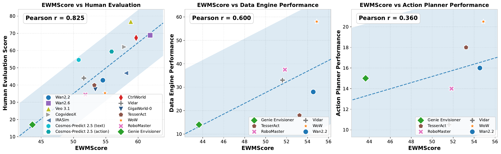
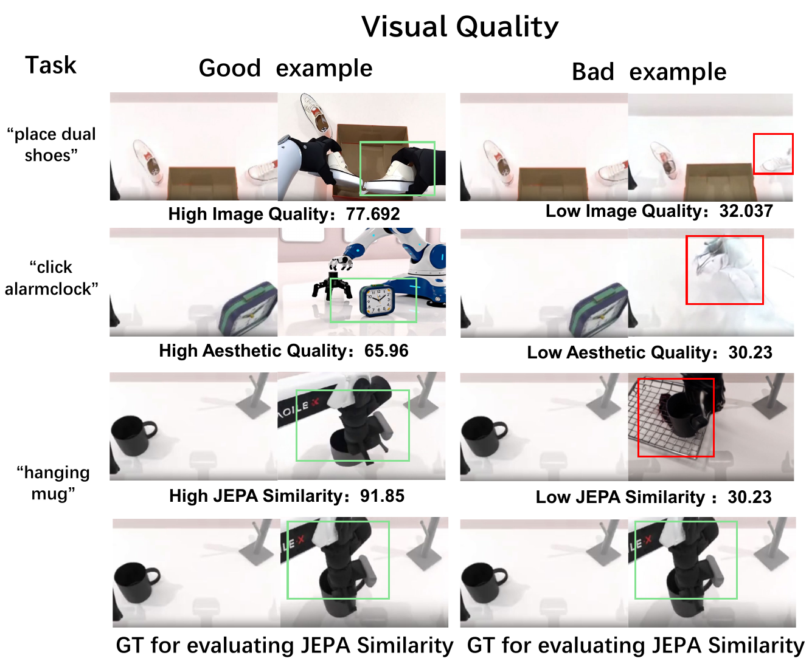
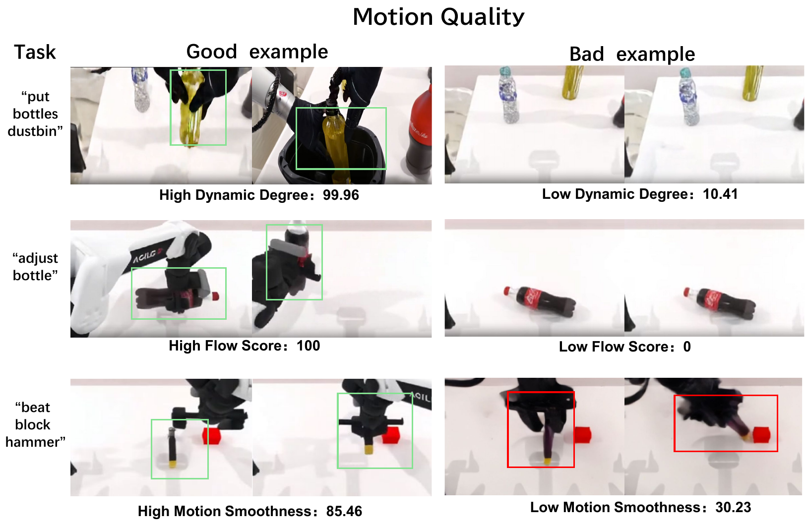
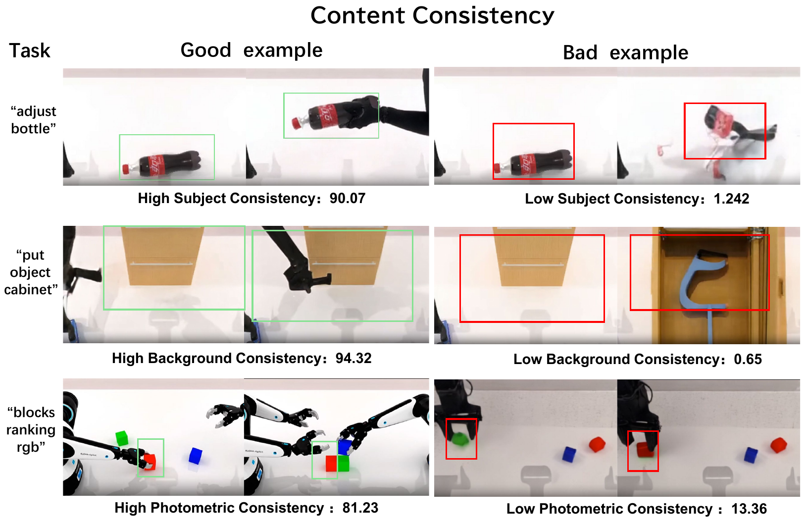
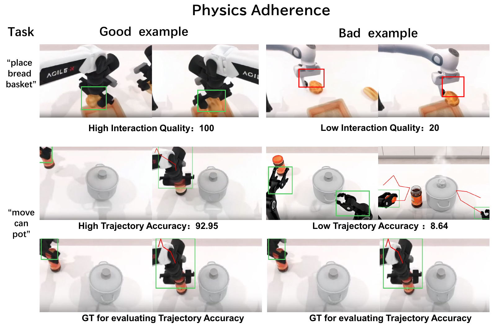
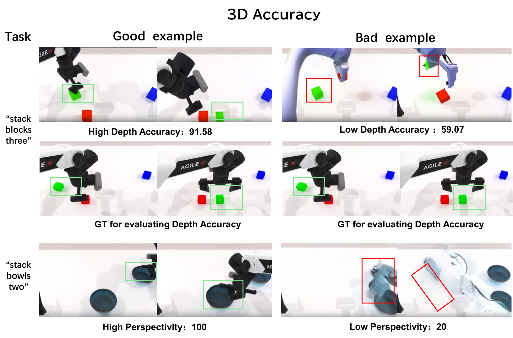

## Appendix A Additional Details on Metrics

### A.1 Image Quality

The per-frame sharpness of a generated video constitutes the foundation of its visual presentation. Unlike traditional reference-based metrics such as PSNR, which rely on ground-truth images, we adopt the MUSIQ (Multi-scale Image Quality Transformer) model (Ke et al., 2021) to evaluate technical distortions in a no-reference setting, including overexposure, sensor noise, and compression artifacts. MUSIQ leverages a multi-scale Transformer architecture to capture the relationships between local details and global composition.

For a video sequence $V=\{I_{1},I_{2},\dots,I_{T}\}$,where $V$represents a specific video and $I_{i}$ represents the $i$th frame of the video $V$, the image quality score $S_{\text{img}}$ is defined as:

$$
S_{\text{img}}=\frac{1}{T}\sum_{t=1}^{T}\Phi_{\text{musiq}}(I_{t})(1)
$$

where $\Phi_{\text{musiq}}(\cdot)$ denotes the pretrained quality prediction function. A higher value of $S_{\text{img}}$ indicates greater visual purity and clarity at the level of digital image (Huang et al., 2024).

### A.2 Aesthetic Quality

Beyond technical fidelity, generated videos are also required to conform to human aesthetic principles, such as harmonious lighting and visually pleasing color composition. We employ the LAION Aesthetic Predictor (LAION-AI, 2022) to perform aesthetic feature mapping for each frame. Similarly, for a video sequence $V=\{I_{1},I_{2},\dots,I_{T}\}$, the aesthetic quality score $S_{\text{aes}}$ is defined as:

$$
S_{\text{aes}}=\frac{1}{T}\sum_{t=1}^{T}\Psi_{\text{aes}}(I_{t})(2)
$$

where $\Psi_{\text{aes}}(\cdot)$ maps each image into a high-dimensional feature space and predicts an aesthetic score. This formulation ensures that the evaluation extends beyond pixel-level sharpness to encompass perceptual coherence and artistic consistency (Huang et al., 2024).

### A.3 JEPA Similarity

To evaluate video quality from a global feature-distribution perspective and detect high-level spatiotemporal collapse, we introduce the JEPA Similarity. Unlike traditional FVD metric, which relies on Gaussian assumptions, JEPA measures the maximum mean discrepancy (MMD) between feature distributions to provide evaluation results that better align with human perception:

$$
S_{\text{JEPA}}=\exp\left(-\alpha\cdot\widehat{\text{MMD}}^{2}_{\text{poly}}(\mathcal{F}_{\text{gen}},\mathcal{F}_{\text{ref}})\right)(3)
$$

where $\alpha=40$ is a scaling factor that enhances numerical distinguishability, $\mathcal{F}_{\text{gen}}$ and $\mathcal{F}_{\text{ref}}$denote the feature space distributions of the generated video set and the reference expert demonstration(GT) set, respectively, extracted by a pretrained V-JEPA encoder (Bardes et al., 2023) which is pre-trained via masked prediction tasks and enables the model to capture high‑level spatio‑temporal causality and physical logic in videos, offering greater robustness to temporal warping and content variations.$\widehat{\text{MMD}}^{2}_{\text{poly}}$represents the squared estimator of the Maximum Mean Discrepancy using a second‑order polynomial kernel, defined as $k(\mathbf{x},\mathbf{y})=(\gamma\langle\mathbf{x},\mathbf{y}\rangle+c_{0})^{2}$,with $\gamma=1,c_{0}=0$, It measures the distance between the two feature sets in the reproducing kernel Hilbert space (RKHS), computed as follows:

$$
\widehat{\text{MMD}}^{2}_{\text{poly}}(\mathcal{F}_{\text{gen}},\mathcal{F}_{\text{ref}})=\frac{1}{m(m-1)}\sum_{i\neq j}^{m}k(\mathbf{f}_{i}^{\text{gen}},\mathbf{f}_{j}^{\text{gen}})+\frac{1}{n(n-1)}\sum_{i\neq j}^{n}k(\mathbf{f}_{i}^{\text{ref}},\mathbf{f}_{j}^{\text{ref}})-\frac{2}{mn}\sum_{i=1}^{m}\sum_{j=1}^{n}k(\mathbf{f}_{i}^{\text{gen}},\mathbf{f}_{j}^{\text{ref}}),(4)
$$

where $m$ and $n$ denote the number of samples in the generated videos and the reference videos,$\mathbf{f}_{i}^{\text{gen}}$ and $\mathbf{f}_{i}^{\text{ref}}$ are the corresponding V‑JEPA feature vectors. Higher values indicate closer alignment to reference demonstrations (Luo et al., 2024).

This metric is not only sensitive to breakdowns in high‑level spatio‑temporal logic but also avoids the Gaussian distribution assumption, offering significantly better sample efficiency than conventional metrics. Moreover, it achieves a enormous improvement in correlation with human subjective assessments, especially when evaluating complex embodied operation logic, thereby more reliably reflecting the physical plausibility and spatio‑temporal consistency of the generated videos.

### A.4 Dynamic Degree

We employ the RAFT(Recurrent All-Pairs Field Transforms) (Teed and Deng, 2020) optical flow model to extract motion vector fields between adjacent frames. To accurately capture the most representative and salient motions in a video,such as robotic arm grasping,we focus on pixels whose optical flow magnitudes fall within the top $5\%$ (Huang et al., 2024).

Let $\mathbf{u}_{t,t+1}$ denote the two-dimensional optical flow field between consecutive frames. We define the average magnitude of the active pixel set as $\bar{v}_{\text{top5}}$. To obtain a smooth numerical mapping while introducing resolution adaptivity, we define the dynamic degree score as:

$$
S_{\text{dyn}}=\frac{1}{1+\exp\left(-\alpha\cdot\left(\frac{\bar{v}_{\text{top5}}}{\tau}-1\right)\right)}(5)
$$

where $\tau=\frac{6}{256}\times\min(H,W)$ is a resolution-adaptive threshold constant, $\alpha$ controls the steepness of the mapping curve, and $S_{\text{dyn}}\in(0,1)$. Values closer to $1$ indicate more pronounced dynamic responses in the video.

### A.5 Flow Score

To quantify overall physical motion intensity and dynamic activity, we compute an optical-flow-based motion score. Given a generated video $V=\{I_{1},\dots,I_{T}\}$ with frame width $W$ and height $H$, we use RAFT (Teed and Deng, 2020) to estimate dense optical flow fields $\mathbf{u}_{t}\in\mathbb{R}^{H\times W\times 2}$ between consecutive frames $I_{t}$ and $I_{t+1}$. By averaging the magnitude of optical flow across all pixels,the average motion intensity is defined as:

$$
S_{\text{flow_raw}}=\frac{1}{T-1}\sum_{t=1}^{T-1}\left(\frac{1}{H\cdot W}\sum_{i,j}\lVert\mathbf{u}_{t}(i,j)\rVert_{2}\right)(6)
$$

where $(i,j)$ indexes pixel locations,$\|\cdot\|_{2}$ denotes the Euclidean norm ($L_{2}$ norm), which quantifies the magnitude of pixel displacement per unit time (Liu et al., 2023). In the context of embodied intelligence tasks, this metric serves a dual evaluative purpose: on the one hand, it effectively identifies whether a video degenerates into ”static frames” or exhibits only ”minimal drift” due to insufficient generative capability of the model; on the other hand, it captures whether unnatural, non‑physical distortions are present in the overall scene.

Higher values of $S_{\text{flow_raw}}$ typically indicate more pronounced dynamic interaction and physically meaningful motion. Compared to Dynamic Degree, this metric focuses on assessing overall motion intensity and detecting implausible global dynamics. To ensure consistent interpretation and comparability with other metrics, we will normalize $S_{\text{flow_raw}}$ to the range $[0,1]$ in Section [A.17](https://arxiv.org/html/2602.08971v2#A1.SS17), denoting the normalized value as $S_{\text{flow}}$, while preserving the property that higher values correspond to better performance.

### A.6 Motion Smoothness

To evaluate whether motion is temporally coherent and consistent with physical inertia, we adopt a reconstruction-based strategy using a video frame interpolation model (VFI-Mamba)(Zhang et al., 2024). Given all frames of a video, we take the odd-indexed frames $\{I_{1},I_{3},\dots\}$ as inputs and predict the corresponding intermediate frames $I_{\text{mid}}$, which are then compared with the ground-truth(GT) frames. If the motion is physically plausible and smooth, the intermediate frame $I_{\text{mid}}$ should be accurately reconstructed from its surrounding frames $(I_{\text{prev}},I_{\text{next}})$ via nonlinear interpolation.

The key innovation lies in incorporating motion magnitude as a weighting factor to avoid overestimating static backgrounds. The final motion smoothness score is defined as:

$$
S_{\text{smooth_raw}}=\frac{1}{N}\sum\text{SSIM}(\hat{I}_{\text{pred}},I_{\text{mid}})\cdot\ln\left(1+\text{diff}(I_{\text{prev}},I_{\text{next}})\right)(7)
$$

where $N$ denotes the number of predicted intermediate frames (typically equal to or one less than the number of even-indexed frames), $\hat{I}_{\text{pred}}$ is the interpolated frame predicted by the model,$I_{\text{mid}}$ is the real frame between $I_{\text{prev}}$and$I_{\text{next}}$, and $\text{diff}(\cdot)$ represents the mean raw pixel-wise difference between two frames. The logarithmic weighting $\ln(1+x)$ compensates for the increased difficulty of interpolation under large motion, thereby assigning higher rewards to sequences that maintain high reconstruction fidelity even during rapid motion. For consistency with other evaluation metrics, $S_{\text{smooth_raw}}$ will be normalized to the range $[0,1]$ in Section [A.17](https://arxiv.org/html/2602.08971v2#A1.SS17), yielding the final smoothness score $S_{\text{smooth}}$, where higher values indicate superior temporal coherence and motion consistency.

### A.7 Subject Consistency

For a video sequence $V=\{I_{1},I_{2},\dots,I_{T}\}$, we extract frame-level features using DINO (Caron et al., 2021), denoted as $f_{i}=\text{DINO}(I_{i})$, which emphasize the spatial topological structure of objects. We compute the cosine similarity between the feature $f_{i}$ of the current frame and both the first-frame feature $f_{1}$ and the previous-frame feature $f_{i-1}$, and average the similarities across all frames (Huang et al., 2024):

$$
S_{\text{subj_raw}}=\sum_{t=2}^{T}\left(\frac{\cos(f_{i},f_{1})+\cos(f_{i},f_{i-1})}{2}\right)(8)
$$

However, a common “shortcut” phenomenon in video generation evaluation is that models may produce nearly static videos to obtain artificially high consistency scores. To faithfully reflect dynamic generation capability in embodied scenarios, we introduce the dynamic degree $S_{\text{dyn}}$ defined in Section [A.4](https://arxiv.org/html/2602.08971v2#A1.SS4) as a weighting factor for subject consistency. Specifically, when the video’s dynamic degree falls below a predefined threshold $\gamma$, the raw score is penalized as:

$$
S_{\text{subj}}=S_{\text{subj_raw}}\cdot\min(1,\frac{S_{\text{dyn}}}{\gamma})(9)
$$

This mechanism ensures that static or near-static videos cannot achieve high scores even when frame-level similarity is extremely high, leading to more reasonable evaluation in embodied tasks.

### A.8 Background Consistency

Analogous to subject consistency, for a video sequence $V=\{I_{1},I_{2},\dots,I_{T}\}$, we extract frame-level features using CLIP (Radford et al., 2021), denoted as $h_{i}=\text{CLIP}(I_{i})$, which place greater emphasis on global scene semantics and prevent uncontrolled background variation during generation. We compute the cosine similarity between $h_{i}$ and both $h_{1}$ and $h_{i-1}$, and average the results across all frames (Huang et al., 2024):

$$
S_{\text{bg_raw}}=\sum_{t=2}^{T}\left(\frac{\cos(h_{i},h_{1})+\cos(h_{i},h_{i-1})}{2}\right)(10)
$$

Similarly, the final background consistency score is adjusted using the dynamic degree:

$$
S_{\text{bg}}=S_{\text{bg_raw}}\cdot\min\left(1,\frac{S_{\text{dyn}}}{\gamma}\right)(11)
$$

### A.9 Photometric Consistency

Photometric consistency measures the physical stability of textures at the pixel level. For a video $V=\{I_{1},I_{2},\dots,I_{T}\}$, we use the forward optical flow field $\mathbf{u}_{t}$ between frames $I_{t}$ and $I_{t+1}$, as well as the backward flow field $\mathbf{u}^{\prime}_{t+1}$, to warp pixels from frame $t$ to frame $t+1$ and then back to frame $t$. The average end-point error (AEPE) is defined as (Duan et al., 2025):

$$
E_{\text{photo}}=\frac{1}{T}\sum_{t=1}^{T}\|\text{Warp}_{back}(\text{Warp}_{fwd}(I_{t},\mathbf{u_{t}}),\mathbf{u^{\prime}_{t+1}})-I_{t}\|_{2}(12)
$$

Since this metric quantifies pixel-level reconstruction error, lower values correspond to superior visual quality. To obtain a positively correlated measure that appropriately rewards sequences with meaningful motion while penalizing trivial solutions in static videos, we compute the pre-normalized photometric consistency score as:

$$
S_{\text{photo_raw}}=\frac{1}{E_{\text{photo}}}\cdot\min\left(1,\frac{S_{\text{dyn}}}{\gamma}\right)(13)
$$

where $S_{\text{dyn}}$ denotes the dynamic degree (formally defined in Section [A.4](https://arxiv.org/html/2602.08971v2#A1.SS4)), quantifying the overall motion intensity within a video sequence, and $\gamma$ serves as a dynamic threshold that modulates the penalty for insufficient motion. The inclusion of $S_{\text{dyn}}$ addresses a critical limitation of conventional photometric metrics: static or near-static sequences often achieve artificially high scores due to minimal frame-to-frame variations, even though they fail to demonstrate meaningful dynamic modeling.

By scaling the raw reciprocal score with the normalized dynamic degree, our formulation ensures that only videos with sufficient motion ($S_{\text{dyn}}\geq\gamma$) retain their full photometric consistency score, while static sequences are proportionally penalized. This encourages the model to maintain high reconstruction fidelity under actual motion rather than exploiting static scenarios. Subsequently, $S_{\text{photo_raw}}$ is normalized to the interval $[0,1]$ in Section [A.17](https://arxiv.org/html/2602.08971v2#A1.SS17), which produces the final photometric consistency metric $S_{\text{photo}}$, where higher values denote enhanced visual fidelity and temporal coherence.

### A.10 Interaction Quality

This metric evaluates the physical plausibility of interactions between the robotic arm and environmental objects, including contact behavior, force transmission, friction, inertia, and boundary integrity. We employ the pretrained multimodal model Qwen3-VL-8B (Bai et al., 2025a) as a VLM-based judge. Given $N_{\text{sample}}$ sampled frames and the task instruction, the model assigns a 1–5 Likert score, which is normalized to $[0,1]$ to yield the final interaction quality score,the prompt used to evaluate interaction quality can be found in [A.10](https://arxiv.org/html/2602.08971v2#A1.SS10).

### A.11 Trajectory Accuracy

In embodied intelligence tasks, the accuracy of the robotic arm’s grasping trajectory is a core indicator of whether the model generates _effective actions_. Trajectories encode not only low-level physical consistency but also high-level task logic and interaction constraints. To quantify this property, we first apply SAM3 (Segment Anything Model 3) (Carion et al., 2025) to extract bounding boxes of the robotic arm in each frame. After non-maximum suppression(nms) and confidence filtering, we construct the raw trajectory sequences using the centers of candidate boxes.

Let the ground-truth trajectory be $GT=(r_{1},r_{2},\dots,r_{|R|})$ and the generated trajectory be $P=(p_{1},p_{2},\dots,p_{|P|})$, where $|R|$ and $|P|$ denote the sequence lengths, respectively. To address missing detections caused by occlusion or tracking interruption, we apply linear interpolation to ensure temporal continuity. For a missing point $p_{i}$ with $i\notin M$, its position is computed as:

$$
p_{i}=(1-\alpha)p_{\text{prev}}+\alpha p_{\text{next}},\quad\alpha=\frac{i-\text{prev}}{\text{next}-\text{prev}}(14)
$$

where prev and next denote the nearest valid observation indices before and after $i$.

We then compute the normalized dynamic time warping distance (NDTW) (Müller, 2007) to evaluate global alignment between the generated trajectory and the ground-truth trajectory:

$$
\text{NDTW}(GT,P)=\min_{\pi}\frac{1}{|R|}\sqrt{\sum_{(i,j)\in\pi}\lVert r_{i}-p_{j}\rVert^{2}}(15)
$$

where $\pi$ denotes the optimal alignment path. This metric captures both temporal causality and task-stage ordering, enabling discrimination between correct and incorrect execution sequences such as ”approach-grasp-move.” Since lower NDTW values indicate better alignment, we first derive a pre-normalized trajectory alignment score (Yue et al., 2025):

$$
S_{\text{traj_raw}}=\frac{1}{\text{NDTW}(GT,P)}(16)
$$

where higher values correspond to more accurate spatial-temporal alignment with the real trajectory and more accurate actions. To ensure consistency with our evaluation framework and facilitate direct comparison with other metrics, we normalize $S_{\text{traj_raw}}$ to the range $[0,1]$ in Section [A.17](https://arxiv.org/html/2602.08971v2#A1.SS17), yielding the final trajectory alignment score $S_{\text{traj}}$. This normalized metric preserves the property that higher values indicate superior trajectory fidelity and task-stage adherence.

### A.12 Depth Accuracy

To evaluate whether the generated video preserves real-world spatial geometry, we compute depth discrepancies between the generated video and the ground-truth reference using the monocular depth estimation model Depth-Anything (Yang et al., 2024a). Since monocular depth prediction suffers from scale ambiguity, we adopt a median-based scaling strategy (Liang et al., 2025).

The procedure is as follows:

- 1. Uniform Sampling: We uniformly sample $T_{\text{target}}=40$ frames from both the generated video and the ground-truth video to ensure temporal alignment.
- 2. Scale Alignment: Depth maps $D_{\text{gen}}$ and $D_{\text{gt}}$ are estimated for the generated and ground-truth frames, respectively. Their medians are computed as $m_{\text{gen}}=\text{median}(D_{\text{gen}})$ and $m_{\text{gt}}=\text{median}(D_{\text{gt}})$. The scaling factor $\alpha=\frac{m_{\text{gt}}}{m_{\text{gen}}}$ is applied to obtain the aligned depth $\hat{D}_{\text{gen}}=D_{\text{gen}}\cdot\alpha$.
- 3. AbsRel Error: Within the valid pixel mask $\mathcal{M}$ (which typically filters out noise and distant regions with ground‑truth depth $D_{\text{gt}}<1e-3$), the absolute relative error is computed as follows:

$$
E_{\text{Depth}}=\frac{1}{|\mathcal{M}|}\sum_{p\in\mathcal{M}}\frac{|\hat{D}_{\text{gen}}(p)-D_{\text{gt}}(p)|}{D_{\text{gt}}(p)+\epsilon}(17)
$$

where $\epsilon$ is a small constant to prevent division by zero. Lower values indicate stronger depth accuracy with the real-world scene. To align this metric with our evaluation framework where higher scores correspond to better performance, we will normalize $E_{\text{Depth}}$ to the range $[0,1]$ and invert its direction in Section [A.17](https://arxiv.org/html/2602.08971v2#A1.SS17),such that higher values correspond to higher accuracy, resulting in the final normalized depth accuracy score $S_{\text{Depth}}$.

### A.13 Perspectivity

This metric evaluates three-dimensional geometric plausibility. The VLM examines perspective cues such as scale variation with depth, lighting consistency, and occlusion relationships during camera motion. We use Qwen3-VL-8B as a judge and normalize the Likert-scale output to $[0,1]$,which is normalized to $[0,1]$ to yield the final perspectivity score,the prompt used to evaluate perspectivity can be found in [A.10](https://arxiv.org/html/2602.08971v2#A1.SS10).

### A.14 Instruction Following

This metric evaluates the semantic consistency between each generated video $V_{i}$ and its corresponding instruction $Inst_{i}$, focusing on action type, target object, and final task state. We again use Qwen3-VL-8B as a VLM-based judge with a normalized 1–5 Likert scale, which is normalized to $[0,1]$ to yield the final instruction following score,the prompt used to evaluate instruction following can be found in [A.10](https://arxiv.org/html/2602.08971v2#A1.SS10).

### A.15 Semantic Alignment

To assess whether the generated video truly understands and executes the given textual instruction, we evaluate semantic alignment as follows:

$$
S_{\text{clip}}=w\cdot\max\left(\cos(f_{\text{gen}},f_{\text{gt}}),0\right)(18)
$$

where $f_{\text{gen}}\in\mathbb{R}^{d}$ denotes the semantic feature vector of the generated video. Specifically, we first employ a vision–language model (VLM), Qwen2.5-VL (Bai et al., 2025b), to produce a dense structured description $L_{\text{gen}}$ of the generated video under task-oriented prompting, covering both task summary and action sequence. This text is then encoded by the CLIP (Radford et al., 2021) text encoder $\Phi_{\text{txt}}$, yielding $f_{\text{gen}}=\Phi_{\text{txt}}(L_{\text{gen}})$.

Similarly, $f_{\text{gt}}\in\mathbb{R}^{d}$ denotes the semantic feature vector of the ground-truth(GT) video, obtained via the same pipeline as $f_{\text{gt}}=\Phi_{\text{txt}}(L_{\text{gt}})$, where $L_{\text{gt}}$ is the structured description of the reference video. The scaling factor $w$ ensures score normalization. A higher value of $S_{\text{clip}}$ indicates stronger semantic alignment between the generated video and the reference execution.

### A.16 Action Following

This metric evaluates the model’s ability to produce distinct and correct outcomes for different action instructions. In open-loop prediction tasks, a robust model should execute multiple instructions faithfully rather than collapsing into repetitive patterns. Given a single action instruction, we manually annotate or automatically generate multiple distinct action instructions and prompt the model to generate $N$ corresponding videos.

For each generated video $V_{k}$, we extract a global CLIP feature vector $f_{k}$. The action-following diversity score is computed as the average pairwise feature dissimilarity(1-cosine similarity between two vectors$f_{i}$and$f_{j}$ (Yue et al., 2025):

$$
S_{\text{div}}=\frac{1}{|\text{Pairs}(i,j)|}\sum_{i<j}\left(1-\frac{f_{i}\cdot f_{j}}{\lVert f_{i}\rVert\lVert f_{j}\rVert}\right)(19)
$$

A higher value of this metric indicates stronger capability of the model in correctly executing action instructions,which is already normalized.

### A.17 Score Normalization

Several metrics in our evaluation framework require normalization and direction alignment to ensure consistent interpretation and fair comparison across different models. Specifically, the Flow Score, Trajectory Accuracy, Photometric Consistency, and Motion Smoothness metrics are initially measured on different scales, while some metrics such as JEPA Similarity and Depth Accuracy represent error measures where lower values indicate better performance. To address these inconsistencies, we apply a two-step normalization procedure.

For the Flow Score, Trajectory Accuracy, Photometric Consistency, and Motion Smoothness metrics, we employ empirical min-max normalization based on the distribution of scores across all evaluated models. We compute the $99^{\text{th}}$ and $1^{\text{st}}$ percentiles of each metric across all videos generated by the 8 models, which serve as the empirical maximum and minimum bounds, respectively.And the specific numerical values for these empirical bounds are provided in Table [6](#table-6). The final normalized score is calculated as:

$$
S_{\text{final}}=\max\left(0,\min\left(1,\frac{S_{\text{raw}}-S_{\text{empirical}}^{\text{min}}}{S_{\text{empirical}}^{\text{max}}-S_{\text{empirical}}^{\text{min}}}\right)\right)(20)
$$

where $S_{\text{raw}}$ denotes the raw metric value, $S_{\text{empirical}}^{\text{max}}$ and $S_{\text{empirical}}^{\text{min}}$ represent the empirical bounds. This transformation ensures that all scores reside within the interval $[0,1]$, with higher values indicating better performance.

For Depth Accuracy, which originally measures reconstruction error (lower values are better), we apply the same normalization but invert the direction:

$$
S_{\text{final}}=1-\max\left(0,\min\left(1,\frac{S_{\text{raw}}-S_{\text{empirical}}^{\text{min}}}{S_{\text{empirical}}^{\text{max}}-S_{\text{empirical}}^{\text{min}}}\right)\right)(21)
$$

> Table 6: Empirical bounds for metric normalization. The values represent the $99^{\text{th}}$ percentile (maximum) and $1^{\text{st}}$ percentile (minimum) of each metric across all evaluated videos.

| Metric                                     | Empirical Maximum ($S_{\text{empirical}}^{\text{max}}$) | Empirical Minimum ($S_{\text{empirical}}^{\text{min}}$) |
| ------------------------------------------ | ------------------------------------------------------- | ------------------------------------------------------- |
| Metric                                     | Empirical Maximum ($S_{\text{empirical}}^{\text{max}}$) | Empirical Minimum ($S_{\text{empirical}}^{\text{min}}$) |
| Metric                                     | Empirical Maximum ($S_{\text{empirical}}^{\text{max}}$) | Empirical Minimum ($S_{\text{empirical}}^{\text{min}}$) |
| Photometric Consistency (Higher is Better) | 6.7899                                                  | 0.1257                                                  |
| Photometric Consistency (Higher is Better) | 6.7899                                                  | 0.1257                                                  |
| Photometric Consistency (Higher is Better) | 6.7899                                                  | 0.1257                                                  |
| Motion Smoothness (Higher is Better)       | 2.6413                                                  | 0.0000                                                  |
| Motion Smoothness (Higher is Better)       | 2.6413                                                  | 0.0000                                                  |
| Motion Smoothness (Higher is Better)       | 2.6413                                                  | 0.0000                                                  |
| Trajectory Accuracy (Higher is Better)     | 40.8540                                                 | 0.0000                                                  |
| Trajectory Accuracy (Higher is Better)     | 40.8540                                                 | 0.0000                                                  |
| Trajectory Accuracy (Higher is Better)     | 40.8540                                                 | 0.0000                                                  |
| Flow Score (Higher is Better)              | 8.9414                                                  | 0.0531                                                  |
| Flow Score (Higher is Better)              | 8.9414                                                  | 0.0531                                                  |
| Flow Score (Higher is Better)              | 8.9414                                                  | 0.0531                                                  |
| Depth Accuracy (Lower is Better)           | 4.3711                                                  | 0.2228                                                  |
| Depth Accuracy (Lower is Better)           | 4.3711                                                  | 0.2228                                                  |
| Depth Accuracy (Lower is Better)           | 4.3711                                                  | 0.2228                                                  |

This comprehensive normalization strategy ensures that all metrics are scaled to the unit interval $[0,1]$, aligned in direction (higher values always denote better performance), and comparable across different evaluation dimensions.

## Appendix B The Prompt of VLM-based Policy Success Judgement in Policy Evaluator Task

In the embodied policy evaluator task (Section [4.2.2](https://arxiv.org/html/2602.08971v2#S4.SS2.SSS2)), we assess whether world models can serve as proxy simulation environments for policy evaluation. To determine task success, we employ a VLM-based judge that compares the policy-generated video rollouts against ground-truth reference trajectories. The judge evaluates three critical aspects: (1) correct arm selection when specified in the instruction, (2) task completion by comparing final states between generated and ground-truth videos, and (3) overall action intent consistency. This evaluation approach accounts for visual artifacts inherent to world model rendering while focusing on functional correctness, enabling scalable and automated assessment of policy execution quality. The complete system prompt used for this VLM-based evaluation is provided below.

## Appendix C Case Comparison of Each Metric in EWMScore

> Figure 6: Typical examples of Visual Quality. Top:Image Quality. The bad example on the right-hand-side exhibits significant motion blur and noise, while the good example preserves sharp structural details. Middle:Aesthetic Quality. The bad example suffers from severe geometric distortion and artifacts. Conversely, the good example demonstrates superior contrast and realistic lighting with clear reflections. Bottom:JEPA Similarity. In the good example, the style and morphology closely align with the GT, while in the bad example, the robotic gripper shows color discrepancies and introduces unintended grid artifacts not present in the GT.

> Figure 7: Typical examples of Motion Quality. Top:Dynamic Degree. The good example shows the robotic arm exhibiting a complete and distinct motion sequence from picking up the bottle to placing it in the dustbin, while in the bad example, robotic arm remains static with only minor flickering of the bottle. Middle:Flow Score. The good example demonstrates a fluid manipulation of rotating the bottle with significant pixel-level movement and the bad example shows negligible motion, with only slight deformation at the top of the bottle. Bottom:Motion Smoothness. The good example features a stable and continuous translation of the hammer, but the bad example suffers from erratic shaking and disjointed,sharp movements immediately after grasping the object.

> Figure 8: Typical examples of Content Consistency. Top:Subjective Consistency. In the good example, the bottle’s shape, color, and packaging remain stable and coherent throughout the grasping process. In the bad example, the bottle suffers from severe deformation and structural chaos, losing its original identity. Middle:Background Consistency. The good example maintains a stable background and camera perspective during the cabinet interaction. Conversely, the bad example on the right exhibits a sudden camera shift to a top-down view, leading to an unstable and rapidly changing background. Bottom:Photometric Consistency. In the good example, the appearance and color of both the block and the robotic arm are consistently preserved. In the bad example, the grasped block undergoes an unnatural color transition from green to red, indicating poor photometric stability.

> Figure 9: Typical examples of Physics Adherence. Top:Interaction Quality. In the good example, the robotic gripper interacts with the bread appropriately. In the bad example, the bread is lifted without any physical contact with the gripper, violating the fundamental physics laws. Bottom:Trajectory Accuracy. The good example demonstrates a movement trajectory that highly aligns with GT. Conversely, the bad example exhibits significant deviations from the GT trajectory, characterized by anomalous movements and jitter.

> Figure 10: Typical examples of 3D Accuracy. Top:Depth Accuracy. In the good example, the generated depth map highly aligns with the GT, ensuring stable spatial and geometric structures, but the bad example suffers from severe geometric distortion, where the gripper unnaturally merges with the green block, leading to a collapse of spatial integrity. Bottom:Perspectivity. The good example maintains realistic perspective and lighting. Conversely, the bad example shows significant ghosting and blurring during movement, failing to preserve the object’s contour and exhibiting no shadow of robotic arm that deviate from physical reality.

> Figure 11: Typical examples of Controllability. Top:Instruction Following. In the good example, the model strictly adheres to the task instruction, but the bad example shows the movement of the incorrect object (knife), failing to execute instruction. Middle:Semantic Alignment. The good example demonstrates high semantic fidelity, but the bad example exhibits low alignment by transforming the QR code into a clothing tag and introducing irrational human hands not present in the target semantics. Bottom:Action Following. The good example successfully performs distinct actions based on varying prompts, placing the shoe at both the blue marker and to its left, but the bad example shows the model demonstrates limited discriminative ability, executing a singular action regardless of the instruction.
