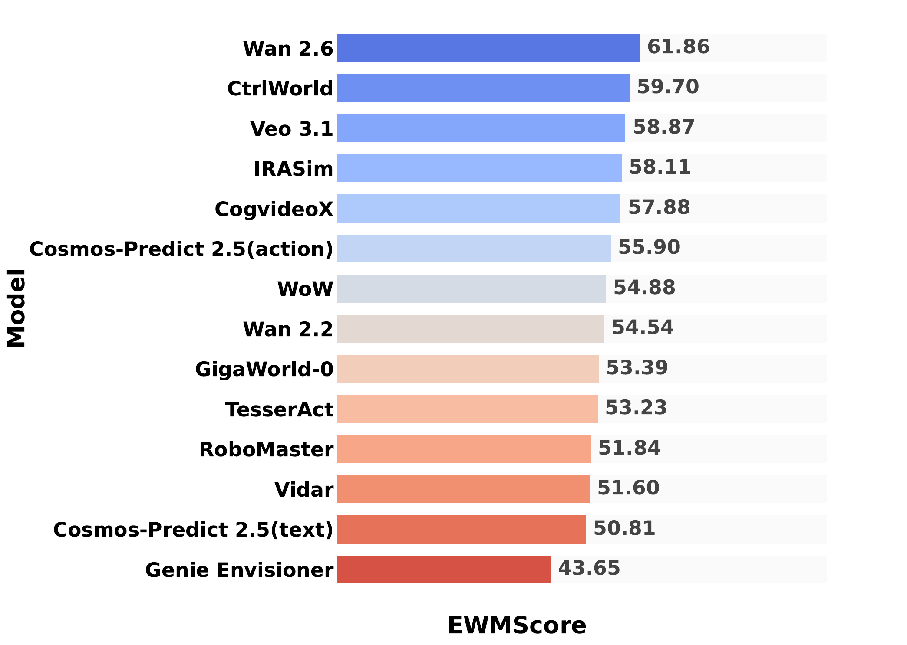
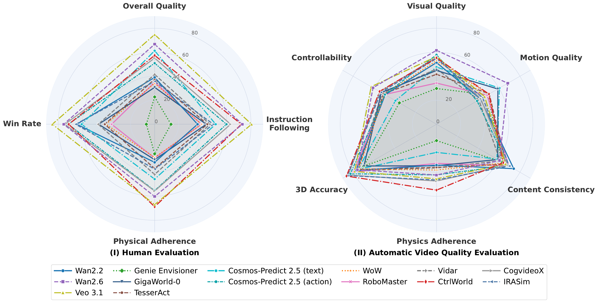
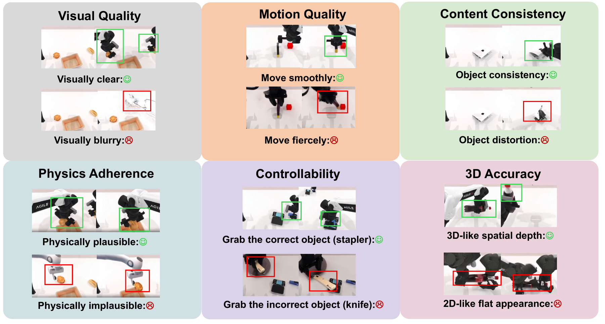
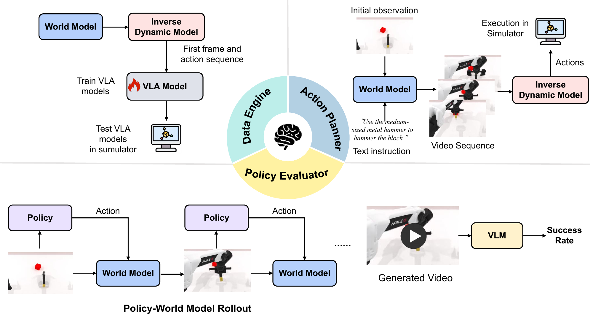
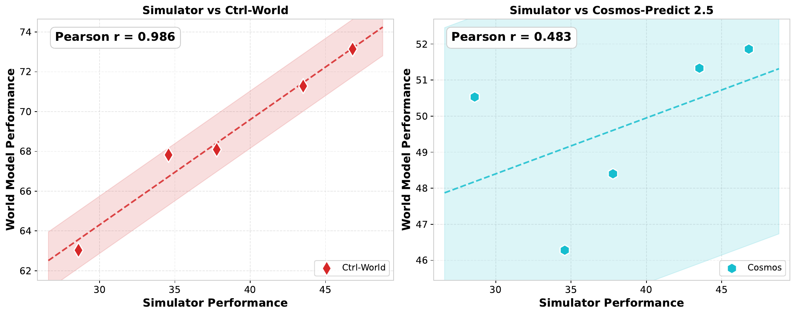

# 标题：WorldArena：一个用于评估具身世界模型感知与功能效用的统一基准

- ArXiv: 2602.08971
- 作者：Yu Shang, Zhuohang Li, Yiding Ma, Weikang Su, Xin Jin, Ziyou Wang, Lei Jin, Xin Zhang, Yinzhou Tang, Haisheng Su, Chen Gao, Wei Wu, Xihui Liu, Dhruv Shah, Zhaoxiang Zhang, Zhibo Chen, Jun Zhu, Yonghong Tian, Tat-Seng Chua, Wenwu Zhu, Yong Li
- 章节数：44
- 估计词元数：44.8k

## 目录

- 1 引言
- 2 相关工作
  - 2.1 具身世界模型
  - 2.2 世界模型基准
- 3 WorldArena 基准
  - 3.1 视频质量评估
    - 3.1.1 视觉质量
    - 3.1.2 运动质量
    - 3.1.3 内容一致性
    - 3.1.4 物理遵循性
    - 3.1.5 三维精度
    - 3.1.6 可控性
  - 3.2 具身任务评估
  - 3.3 人工评估
  - 3.4 EWMScore 指标
- 4 实验
  - 4.1 实验设置
  - 4.2 结果
    - 4.2.1 视觉质量评估
    - 4.2.2 具身任务评估
    - 4.2.3 人工评估
  - 4.3 指标间分析
- 5 结论与未来工作

## 摘要（Abstract）

###### 摘要

尽管**世界模型（World Models, WMs）**通过使智能体能够通过**动作条件预测（action-conditioned prediction）**来推理环境动态，已成为**具身智能（embodied intelligence）**的基石，但其评估仍然零散。当前对**具身世界模型（Embodied World Models, EWMs）**的评估主要侧重于**感知保真度（perceptual fidelity）**（例如，视频生成质量），而忽略了这些模型在下游决策任务中的**功能效用（functional utility）**。在这项工作中，我们引入了 **WorldArena**，一个旨在系统评估具身世界模型在感知和功能两个维度的统一基准。WorldArena 通过三个维度评估模型：**视频感知质量（video perception quality）**，使用涵盖六个子维度的 16 个指标进行衡量；**具身任务功能（embodied task functionality）**，评估世界模型作为**数据引擎（data engines）**、**策略评估器（policy evaluators）**和**动作规划器（action planners）**的能力，并结合主观人工评估。此外，我们提出了 **EWMScore**，这是一个将多维性能整合为单一可解释指数的整体性指标。通过对 14 个代表性模型进行广泛实验，我们揭示了一个显著的**感知-功能差距（perception–functionality gap）**，表明高视觉质量并不一定能转化为强大的具身任务能力。WorldArena 基准及其公开排行榜发布于 https://world-arena.ai，为追踪具身人工智能中真正功能性世界模型的进展提供了一个框架。

同等贡献^\* 同等贡献。同等贡献^$\ddagger$ 同等贡献。同等贡献^$\S$ 项目负责人。

## 1 引言（Introduction）

> (a)

近年来，**世界模型（World Models, WMs）**（Ding 等人，2025；Kong 等人，2025；Zhu 等人，2024b）已成为**具身智能（embodied intelligence）**的基础组成部分。世界模型学习根据当前观察和动作预测未来环境状态，使智能体能够推理动态和交互结果。**具身世界模型（Embodied World Model, EWM）**基于机器人动作和外部指令预测未来状态，有效地充当指导机器人动作规划和决策的**心智模拟器（mental simulator）**，或作为支持可扩展机器人训练和评估的**环境代理（environment proxy）**（Shang 等人，2025a；Long 等人，2025）。与通用视频生成模型不同，EWMs 不仅必须捕捉感知保真度，还必须捕捉物理基础、动作一致的动态，这对于下游具身任务至关重要。

然而，现有的评估方案存在显著局限性。首先，它们缺乏面向具身任务的全面评估，包括世界模型作为环境代理和具身智能体的角色。当前的基准（Yue 等人，2025；Li 等人，2025a；Lu 等人，2025）主要关注视频级质量指标，这些指标未能反映具身世界模型对于实际具身应用的真实价值，如表 [1](#table-1) 的比较所示。尽管最近的一些研究（Qin 等人，2024；Zhang 等人，2025；Fan 等人，2026）通过闭环动作执行来评估具身世界模型，但更广泛的具身能力，例如它们作为合成数据引擎或策略评估工具的角色，在很大程度上仍未得到评估。其次，评估模型的覆盖范围不足。大多数现有基准（Yue 等人，2025；Fan 等人，2026）侧重于通用文本条件视频生成模型（Wan 等人，2025；Yang 等人，2024b），而许多近期的机器人专用世界模型（Chi 等人，2025；Team 等人，2025；Liao 等人，2025；Zhen 等人，2025；Guo 等人，2025）很少受到系统性关注，且大多未得到评估。

为了弥合这一差距，我们提出了 **WorldArena**，这是第一个整合了感知评估和三项功能评估的具身世界模型基准，结合了客观和主观评估。WorldArena 提供了一个跨越三个互补方面的整体评估框架：（1）**多维度视频质量（multi-faceted video quality）**，包含涵盖 6 个关键子维度的 16 个数值指标，包括视觉质量、运动质量、内容一致性、物理遵循性、三维精度和可控性；（2）**具身任务效用（embodied task utility）**，评估模型在数据合成、策略评估和动作规划方面的性能；（3）**人工评估（human evaluation）**，通过捕捉难以量化的模型行为定性方面（如物理合理性和指令遵循性）来补充自动化指标。此外，我们引入了 **EWMScore**，这是一个将多维指标组合成单一指数的统一指标，为具身世界模型的生成性能提供全面评估。评估结果的概览如图 [1](#figure-1) 所示。

对于评估数据，我们选择**双臂机器人操作（bimanual robotic manipulation）**作为代表性具身场景，并基于 RobotTwin 2.0 数据集（Chen 等人，2025）进行评估，该数据集涵盖 50 个不同的机器人场景，确保了场景多样性和评估可靠性。我们对 14 个代表性世界模型进行了统一评估，包括通用视频生成世界模型和专用具身世界模型。结果揭示了视觉保真度与具身任务性能之间的显著差距，表明当前的视觉质量尚未达到有效支持具身任务所需的水平。总体而言，我们的主要贡献可总结如下：

- 我们引入了首个专为具身世界模型设计的全面基准，能够统一评估其感知和功能能力。
- 我们提出了用于具身世界模型的统一客观指标 **EWMScore**，并进行了广泛的人工研究以验证其有效性。结果表明，EWMScore 与主观判断高度一致，是一个可靠且可解释的指标。
- 我们对 14 个代表性具身世界模型进行了系统性评估，并对其优势和局限性进行了多维度分析，为未来研究提供了见解和指导。

## 2 相关工作（Related Works）

> 表 1：现有世界模型基准与 WorldArena 在三个关键评估维度上的比较。

| 基准（Benchmark） | 视频质量（Video Quality） | 具身任务（Embodied Tasks） | 人工（Human） | | | | | | | |
| :--- | :--- | :--- | :--- | :--- | :--- | :--- | :--- | :--- | :--- | :--- |
| 基准（Benchmark） | 视频质量（Video Quality） | 具身任务（Embodied Tasks） | 人工（Human） | | | | | | | |
| 基准（Benchmark） | 视频质量（Video Quality） | 具身任务（Embodied Tasks） | 人工（Human） | | | | | | | |
| 基准（Benchmark） | 视频质量（Video Quality） | 具身任务（Embodied Tasks） | 人工（Human） | | | | | | | |
| 视觉（Visual） | 运动（Motion） | 内容（Content） | 物理（Physics） | 控制（Control） | 三维（3D） | 数据（Data） | 策略（Policy） | 动作（Action） | | |
| 视觉（Visual） | 运动（Motion） | 内容（Content） | 物理（Physics） | 控制（Control） | 三维（3D） | 数据（Data） | 策略（Policy） | 动作（Action） | | |
| 视觉（Visual） | 运动（Motion） | 内容（Content） | 物理（Physics） | 控制（Control） | 三维（3D） | 数据（Data） | 策略（Policy） | 动作（Action） | | |
| 视觉（Visual） | 运动（Motion） | 内容（Content） | 物理（Physics） | 控制（Control） | 三维（3D） | 数据（Data） | 策略（Policy） | 动作（Action） | | |
| 视觉（Visual） | 运动（Motion） | 内容（Content） | 物理（Physics） | 控制（Control） | 三维（3D） | 数据（Data） | 策略（Policy） | 动作（Action） | | |
| 视觉（Visual） | 运动（Motion） | 内容（Content） | 物理（Physics） | 控制（Control） | 三维（3D） | 数据（Data） | 策略（Policy） | 动作（Action） | | |
| 视觉（Visual） | 运动（Motion） | 内容（Content） | 物理（Physics） | 控制（Control） | 三维（3D） | 数据（Data） | 策略（Policy） | 动作（Action） | | |
| 视觉（Visual） | 运动（Motion） | 内容（Content） | 物理（Physics） | 控制（Control） | 三维（3D） | 数据（Data） | 策略（Policy） | 动作（Action） | | |
| 视觉（Visual） | 运动（Motion） | 内容（Content） | 物理（Physics） | 控制（Control） | 三维（3D） | 数据（Data） | 策略（Policy） | 动作（Action） | | |
| | 质量（Quality） | 质量（Quality） | 一致性（Consist.） | 遵循性（Adher.） | 可控性（ability） | 精度（Acc.） | 引擎（Engine） | 评估（Eval.） | 规划器（Planner） | |
| | 质量（Quality） | 质量（Quality） | 一致性（Consist.） | 遵循性（Adher.） | 可控性（ability） | 精度（Acc.） | 引擎（Engine） | 评估（Eval.） | 规划器（Planner） | |
| | 质量（Quality） | 质量（Quality） | 一致性（Consist.） | 遵循性（Adher.） | 可控性（ability） | 精度（Acc.） | 引擎（Engine） | 评估（Eval.） | 规划器（Planner） | |
| | 质量（Quality） | 质量（Quality） | 一致性（Consist.） | 遵循性（Adher.） | 可控性（ability） | 精度（Acc.） | 引擎（Engine） | 评估（Eval.） | 规划器（Planner） | |
| | 质量（Quality） | 质量（Quality） | 一致性（Consist.） | 遵循性（Adher.） | 可控性（ability） | 精度（Acc.） | 引擎（Engine） | 评估（Eval.） | 规划器（Planner） | |
| | 质量（Quality） | 质量（Quality） | 一致性（Consist.） | 遵循性（Adher.） | 可控性（ability） | 精度（Acc.） | 引擎（Engine） | 评估（Eval.） | 规划器（Planner） | |
| | 质量（Quality） | 质量（Quality） | 一致性（Consist.） | 遵循性（Adher.） | 可控性（ability） | 精度（Acc.） | 引擎（Engine） | 评估（Eval.） | 规划器（Planner） | |
| | 质量（Quality） | 质量（Quality） | 一致性（Consist.） | 遵循性（Adher.） | 可控性（ability） | 精度（Acc.） | 引擎（Engine） | 评估（Eval.） | 规划器（Planner） | |
| | 质量（Quality） | 质量（Quality） | 一致性（Consist.） | 遵循性（Adher.） | 可控性（ability） | 精度（Acc.） | 引擎（Engine） | 评估（Eval.） | 规划器（Planner） | |
| | 质量（Quality） | 质量（Quality） | 一致性（Consist.） | 遵循性（Adher.） | 可控性（ability） | 精度（Acc.） | 引擎（Engine） | 评估（Eval.） | 规划器（Planner） | |
| | 质量（Quality） | 质量（Quality） | 一致性（Consist.） | 遵循性（Adher.） | 可控性（ability） | 精度（Acc.） | 引擎（Engine） | 评估（Eval.） |

### 2.1 具身世界模型（Embodied World Models）

**具身世界模型（Embodied world models）** 是预测涉及机器人移动和操作的物理场景未来观测的生成模型。这些模型可大致分为三类：
*   基于视频生成的模型（Liao et al., 2025; Shang et al., 2025b; Team et al., 2025）
*   基于三维重建的模型（Huang et al., 2025; Qian et al., 2025）
*   潜在空间世界模型（latent-space world models）（Assran et al., 2025; Liu and Chen, 2025; Hafner et al., 2025）

在实践中，具身世界模型扮演三个关键角色：
1.  作为**数据合成引擎（data synthesis engines）**（Jang et al., 2025），用于生成视频-动作序列以增强机器人策略训练；
2.  作为**策略评估环境（policy evaluation environments）**（Shang et al., 2025b; Li et al., 2025b），通过策略与世界模型的交互进行可扩展的虚拟测试；
3.  作为**动作规划器（action planners）**（Hu et al., 2024; Fan et al., 2026），将预测的状态解码为可执行的动作以控制机器人。

鉴于模型范式和功能角色的多样性，对具身世界模型进行全面评估本身具有挑战性，这突显了需要一个**从感知和功能两个维度系统评估它们的整体性基准**，以推动其未来发展。

### 2.2 世界模型基准（World Model Benchmarks）

现有的世界模型基准可大致分为通用基准和具身基准。**通用基准**（Duan et al., 2025; Li et al., 2025a; Lu et al., 2025）主要从感知和生成的角度评估世界模型，关注视频质量方面，如视觉保真度、运动真实性、内容一致性，以及在某些情况下的物理合理性或几何一致性。虽然这些基准在标准化生成评估方面是有效的，但它们很大程度上将世界模型视为视频生成器，并未评估其在决策或交互中的功能角色。**较新的具身世界模型基准**（Yue et al., 2025; Li et al., 2025b; Zhang et al., 2025; Fan et al., 2026）将评估范围扩展到可控性、动作条件化和有限的闭环交互。然而，现有的具身基准在范围上仍然有限，通常只关注单一的具身角色，且主要针对文本条件化的视频模型，对动作条件化和以机器人为中心的世界模型覆盖不足。此外，大多数现有基准评估的模型少于十个，这进一步限制了评估的范围和全面性。相比之下，**WorldArena** 提供了一个统一的基准，系统地评估具身世界模型在感知和功能两个维度上的表现，并将客观指标与人类主观评估相结合。

## 3 WorldArena 基准测试（The WorldArena Benchmark）

WorldArena 的评估框架由三个关键部分组成。首先，我们从 6 个维度、使用 16 个指标评估视频质量，重点关注世界模型（world model）的开环预测能力（第 [3.1](#section-3-1) 节）。其次，我们在 3 个典型的具身下游任务中评估世界模型的闭环性能（第 [3.2](#section-3-2) 节）。第三，为了用主观判断补充客观测量，我们收集人工标注来评估模型性能的定性方面（第 [3.3](#section-3-3) 节）。最后，我们将多维视频指标整合成一个可解释的指数 **EWMScore**，以反映整体性能（第 [3.4](#section-3-4) 节）。

### 3.1 视频质量评估（Video Quality Evaluation）

我们首先评估不同具身世界模型生成的视频质量，考虑了六个子维度下的 16 个视频指标，如图 [1](#figure-1) (b) 所示。详细的指标解释见附录 [A](#appendix-a)，案例可视化见附录 [C](#appendix-c)。

#### 3.1.1 视觉质量（Visual Quality）

视觉质量评估生成的视频对于具身场景是否具有感知上的可靠性，考虑低级保真度、感知吸引力和与真实数据的相似性。我们使用三个指标进行评估：

*   **图像质量（Image Quality）**：使用 MUSIQ 模型（Ke 等人，2021）测量帧的清晰度和锐度，该模型可检测过曝、噪声和压缩伪影等失真（Huang 等人，2024）。分数越高表示图像越清晰、越连贯。
*   **美学质量（Aesthetic Quality）**：评估视频的视觉吸引力，考虑光照和色彩构成。使用 LAION 美学预测器（LAION-AI，2022），我们将帧映射到美学特征空间并得出平均分数（Huang 等人，2024），捕捉感知一致性和艺术质量。
*   **JEPA 相似度（JEPA Similarity）**：使用预训练的 V-JEPA 编码器（Bardes 等人，2023）提取特征分布，并采用二阶多项式核的最大均值差异（Maximum Mean Discrepancy, MMD）来量化其相似性（Luo 等人，2024）。值越高表示与真实视频的相似度越高。

#### 3.1.2 运动质量（Motion Quality）

运动质量反映模型是否捕捉到物理上有意义且时间上连贯的动态。我们同时评估运动的强度及其时间连续性。为此，我们引入以下三个指标：

*   **动态程度（Dynamic Degree）**：量化视频内的运动强度。使用 RAFT 光流模型（Teed 和 Deng，2020），我们提取连续帧之间的运动矢量场，并关注前 5% 的活跃像素（Huang 等人，2024）。动态程度分数越高，表示视频中的运动越显著、越有意义，能捕捉关键区域（如机械臂手势）的运动强度。
*   **光流分数（Flow Score）**：通过随时间平均光流幅度来测量视频的整体运动强度（Liu 等人，2023）。该分数反映了动态交互的程度，值越高表示运动强度越大，整个视频的动力学行为在物理上越有意义。
*   **运动平滑度（Motion Smoothness）**：评估运动的时间连贯性，判断连续帧之间的运动是否平滑且符合物理惯性。使用帧插值模型（Zhang 等人，2024），我们预测中间帧并将其与真实帧进行比较（Duan 等人，2025）。该方法将运动幅度作为加权因子，以防止高估静态背景，并确保快速运动序列不会受到不公平的惩罚。

#### 3.1.3 内容一致性（Content Consistency）

内容一致性衡量整个视频中物体和场景的稳定性，在语义和外观两个层面使用三个指标进行评估：

*   **主体一致性（Subject Consistency）**：通过计算来自第一帧、当前帧和前一帧的 DINO 特征（Caron 等人，2021）之间的余弦相似度，来评估跨帧的对象一致性（Huang 等人，2024）。相似度分数越高表示一致性越好。
*   **背景一致性（Background Consistency）**：使用 CLIP 特征（Radford 等人，2021）评估场景稳定性，测量当前帧与第一帧及前一帧之间的余弦相似度以评估场景稳定性（Huang 等人，2024）。
*   **光度一致性（Photometric Consistency）**：通过使用光流计算平均端点误差（Average End-Point Error, AEPE）来测量像素级的纹理稳定性（Duan 等人，2025）。AEPE 越高表示对齐越差，而分数越高则反映一致性越好。

#### 3.1.4 物理遵循性（Physics Adherence）

物理遵循性评估生成的行为是否符合真实世界的物理约束，而不仅仅是视觉上看起来合理。因此，我们使用以下两个指标评估局部交互的真实性和全局运动的正确性：

*   **交互质量（Interaction Quality）**：评估机器人与物体之间交互的物理合理性。我们使用 Qwen3-VL（Bai 等人，2025a）来评估接触行为和力传递等因素，检查交互在物理上是否真实。交互质量分数基于 1-5 分制，归一化到 [0,1]，显示机器人的动作与预期物理行为的匹配程度。
*   **轨迹精度（Trajectory Accuracy）**：量化机械臂抓取轨迹的准确性。使用 SAM 3 模型（Carion 等人，2025），我们提取每帧中机械臂的边界框，并计算归一化动态时间规整（Normalized Dynamic Time Warping, NDTW）距离，以评估与真实轨迹的对齐情况（Yue 等人，2025）。分数越高反映时空对齐越好，轨迹预测越准确。

#### 3.1.5 三维精度（3D Accuracy）

三维精度评估生成的视频是否在图像外观之外保留了真实世界的空间结构。我们使用以下两个指标评估几何一致性和透视合理性：

*   **深度精度（Depth Accuracy）**：通过比较生成视频与真实视频之间的深度图，评估生成的视频是否保留了真实世界的空间几何结构。我们使用单目深度估计，并应用基于中值的缩放策略来解决尺度模糊性问题。深度精度分数越高，表示与真实世界场景的几何一致性越好。
*   **透视性（Perspectivity）**：评估视频的三维合理性，重点关注随深度变化的尺度、光照一致性和遮挡关系等因素。我们使用 Qwen3-VL 作为评判器来评估透视效果，判断视频是否遵循真实的三维几何。分数越高，表示与真实世界场景的透视对齐越好。

#### 3.1.6 可控性（Controllability）

可控性衡量模型响应外部指令的能力。我们使用三个指标评估生成的视频是否符合预期的动作和指令：

*   **指令遵循（Instruction Following）**：评估模型在遵循关于动作类型、目标对象和任务状态的指令方面的准确性，由基于 VLM 的评判器（Qwen3-VL）测量，分数归一化到 [0,1]。
*   **语义对齐（Semantic Alignment）**：通过计算 Qwen2.5-VL 生成的（Bai 等人，2025b）关于生成视频和参考视频的描述之间的余弦相似度，来衡量生成视频与指令语义含义的匹配程度。
*   **动作遵循（Action Following）**：评估响应不同指令的视频多样性。对于给定的初始帧，我们自动生成三个不同的指令，然后使用世界模型生成相应的视频。多样性分数是平均成对特征相异性，值越高表示多样性越大。

> 图 2：视频质量评估在六个维度上的图示：视觉质量、运动质量、内容一致性、物理遵循性、三维精度和可控性。

### 3.2 具身任务评估（Embodied Task Evaluation）

在本节中，我们通过三个具身任务评估世界模型的能力，如图 [3](#figure-3) 所示。

*   **具身数据引擎（Embodied Data Engine）**。世界模型可以根据外部指令生成未来的观测，从而实现合成数据生成，以补充下游具身策略模型的训练数据，缓解真实世界数据的稀缺性。在这一部分，我们将世界模型视为具身数据合成引擎，并通过测量它们为策略模型提供的增益来评估其性能。我们采用两阶段训练程序。在第一阶段，我们在 RobotTwin 2.0 数据集上微调世界模型，并根据第一帧和外部指令生成合成视频。在第二阶段，我们冻结世界模型的权重，并集成一个逆动力学模型（Inverse Dynamics Model, IDM）从视频特征中提取动作。具体来说，我们遵循 VPP（Hu 等人，2024）的扩散策略头设计，利用世界模型的中间特征引导动作去噪头进行动作预测。此过程产生配对的视频-动作序列。然后，我们通过使用不同数量的合成数据训练一个基线 $\pi_{0.5}$（Intelligence 等人，2025）策略模型，来评估世界模型生成的合成数据的影响。策略模型的性能增益反映了世界模型增强策略学习的能力。

*   **具身策略评估器（Embodied Policy Evaluator）**。在本节中，我们评估世界模型作为环境代理以评估策略性能的能力。我们使用 RoboTwin 2.0 数据集训练一系列具有不同能力的策略模型（$\pi_{0.5}$）。这些模型通过与动作可控的世界模型交互进行评估，通过一个推演过程生成观测视频，该过程持续进行，直到生成的帧数超过相应真实视频的 20% 以上。任务成功率使用 VLM 进行评估，VLM 判断具身任务是否成功执行。使用的 VLM 提示见附录 [B](#appendix-b)。将世界模型评估的成功率与 RoboTwin 模拟器的成功率进行比较。两者之间的高相关性表明对真实世界动态的有效模拟，而低相关性则表明环境转移模拟存在不匹配。

*   **具身动作规划器（Embodied Action Planner）**。通过预测未来的状态转移，世界模型可以充当具身代理的动作规划“大脑”。在这一部分，我们研究世界模型以闭环方式执行具身任务的能力。类似于数据合成引擎的设置，我们将世界模型与逆动力学模型配对，其中世界模型以文本指令和初始帧作为输入，并输出用于未来操作的相应动作序列。然后，该序列在 RoboTwin 模拟器中执行，并测量任务成功率以评估世界模型在闭环动作执行中的性能。

> 图 3：具身任务评估系统概览，包括将世界模型作为具身数据引擎（测量训练出的下游策略的成功率）、策略评估器（测量世界模型与真实世界评估结果之间的相关性）和动作规划器（测量基于世界模型的策略的成功率）进行评估。

### 3.3 人工评估（Human Evaluation）

由于仅凭视频质量指标无法完全捕捉物理合理性和指令遵循等方面，我们引入了两种类型的人工评估。第一种类型涉及对三个关键维度进行评分：整体视频质量、指令遵循和物理遵循性，采用 1 到 5 分制，然后归一化到 0-100 范围。第二种类型是头对头比较，标注者从相同提示中选择由两个不同模型生成的更优视频，从而得出胜率指标。我们招募了 70 名标注者，总共评估了 3500 个视频。

### 3.4 EWMScore 指标（EWMScore Metric）

在计算了涵盖六个感知维度的 16 个视频质量指标后，我们基于经验定义的指标边界应用线性归一化，将所有分数映射到 [0,1] 范围，随后缩放到 [0,100]。然后，我们计算所有归一化指标的算术平均值，得到一个单一的复合分数，称为 **EWMScore**。EWMScore 作为一个客观且自动化的指标，用于评估具身世界模型的整体生成质量。

## 4 实验（Experiments）

### 4.1 实验设置（Experimental Setup）

*   **数据集（Dataset）**。我们专注于机器人操作场景，使用 RoboTwin 2.0（Chen 等人，2025）数据集和模拟器进行评估，该数据集包含 50 个任务场景和 2500 个视频。对于视频质量评估，我们使用 2000 个视频训练世界模型，500 个视频用于测试。对于具身数据引擎任务，我们使用 10%、20%、30%、50% 和 100% 的数据训练 $\pi_{0.5}$ 策略模型，从而得到一系列性能各异的策略模型。对于策略评估和动作规划任务，我们在 RoboTwin 模拟器环境中进行评估。

**测试模型**。我们评估了 14 个具有代表性的世界模型（world models），涵盖了通用视频世界模型和具身专用模型。评估的通用视频世界模型包括 CogvideoX (Yang et al., 2024b)、Wan 2.2 (Wan et al., 2025)、Wan 2.6 (Wan et al., 2025) 和 Veo 3.1(^1^11https://aistudio.google.com/models/veo-3)。文本条件具身世界模型包括 Genie Envisioner (Liao et al., 2025)、GigaWorld (Team et al., 2025)、TesserAct (Zhen et al., 2025)、Cosmos-Predict 2.5 (Gu, 2025)、WOW (Chi et al., 2025)、RoboMaster(^2^22https://huggingface.co/datasets/robomaster2025/RoboMaster)、Cosmos-Predict 2.5 (text) (Gu, 2025) 以及 Vidar (Feng et al., 2025)。此外，我们还纳入了动作条件具身世界模型，即 IRASim (Zhu et al., 2024a)、Cosmos-Predict 2.5 (action) (Gu, 2025) 和 CtrlWorld (Guo et al., 2025)。为公平比较，所有提供训练代码的模型均根据其官方实现，在所用数据集上进行了后训练。

> 表 2：视频质量评估结果（涵盖视觉质量、运动质量和内容一致性维度）。

| 模型 | 视觉质量 | 运动质量 | 内容一致性 | | | | | | |
| :--- | :--- | :--- | :--- | :--- | :--- | :--- | :--- | :--- | :--- |
| 图像质量 | 美学质量 | JEPA 相似度 | 动态程度 | 光流分数 | 运动平滑度 | 主体一致性 | 背景一致性 | 光度一致性 | |
| 图像质量 | 美学质量 | JEPA 相似度 | 动态程度 | 光流分数 | 运动平滑度 | 主体一致性 | 背景一致性 | 光度一致性 | |
| 图像质量 | 美学质量 | JEPA 相似度 | 动态程度 | 光流分数 | 运动平滑度 | 主体一致性 | 背景一致性 | 光度一致性 | |
| 图像质量 | 美学质量 | JEPA 相似度 | 动态程度 | 光流分数 | 运动平滑度 | 主体一致性 | 背景一致性 | 光度一致性 | |
| 图像质量 | 美学质量 | JEPA 相似度 | 动态程度 | 光流分数 | 运动平滑度 | 主体一致性 | 背景一致性 | 光度一致性 | |
| 图像质量 | 美学质量 | JEPA 相似度 | 动态程度 | 光流分数 | 运动平滑度 | 主体一致性 | 背景一致性 | 光度一致性 | |
| 图像质量 | 美学质量 | JEPA 相似度 | 动态程度 | 光流分数 | 运动平滑度 | 主体一致性 | 背景一致性 | 光度一致性 | |
| 图像质量 | 美学质量 | JEPA 相似度 | 动态程度 | 光流分数 | 运动平滑度 | 主体一致性 | 背景一致性 | 光度一致性 | |
| 图像质量 | 美学质量 | JEPA 相似度 | 动态程度 | 光流分数 | 运动平滑度 | 主体一致性 | 背景一致性 | 光度一致性 |

> 表 3：视频质量评估结果（涵盖物理遵循性、3D 准确性和可控性维度）。

| 模型 | 物理遵循性 | 3D 准确性 | 可控性 | | | | |
| :--- | :--- | :--- | :--- | :--- | :--- | :--- | :--- |
| 交互质量 | 轨迹准确性 | 深度准确性 | 透视性 | 指令遵循 | 语义对齐 | 动作遵循 | |
| 交互质量 | 轨迹准确性 | 深度准确性 | 透视性 | 指令遵循 | 语义对齐 | 动作遵循 | |
| 交互质量 | 轨迹准确性 | 深度准确性 | 透视性 | 指令遵循 | 语义对齐 | 动作遵循 | |
| 交互质量 | 轨迹准确性 | 深度准确性 | 透视性 | 指令遵循 | 语义对齐 | 动作遵循 | |
| 交互质量 | 轨迹准确性 | 深度准确性 | 透视性 | 指令遵循 | 语义对齐 | 动作遵循 | |
| 交互质量 | 轨迹准确性 | 深度准确性 | 透视性 | 指令遵循 | 语义对齐 | 动作遵循 | |
| 交互质量 | 轨迹准确性 | 深度准确性 |

### 4.2 结果

#### 4.2.1 视觉质量评估

表 [2](#table-2) 和表 [3](#table-3) 总结了六个评估维度的视频质量评估结果。总体而言，**具身世界模型**在与结构和交互相关的指标上表现出更强的性能，而**通用视频模型**主要在感知质量方面表现出色。在具身模型中，CtrlWorld 和 TesserAct 在主体一致性、背景稳定性和轨迹准确性方面得分较高，表明它们与操作动态的对齐更好。WoW 显示出强大的动作遵循能力，而 RoboMaster 和 Vidar 在运动平滑度和内容一致性方面保持了均衡的性能。开源视频模型 CogvideoX 在视觉质量和内容一致性方面表现出色，但在物理遵循性和运动质量方面落后。闭源商业模型（Veo 3.1 和 Wan 2.6）获得了最高的视觉和美学分数，尽管它们在具身专用指标上的改进有限。定性结果表明，视觉上强大的模型往往存在语义漂移问题，而具身世界模型则能生成更连贯且与目标一致的动作序列。

#### 4.2.2 具身任务评估

> 表 4：使用不同世界模型生成的数据训练的下游策略模型的任务成功率。

| 模型 | 任务 1 | 任务 2 |
| :--- | :--- | :--- |
| $\pi_{0.5}$ 策略模型（零样本） | 2% | 5% |
| $\pi_{0.5}$ 策略模型（使用真实数据训练） | 77% | 66% |
| Genie Envisioner (Liao et al., 2025) | 7% | 21% |
| TesserAct (Zhen et al., 2025) | 1% | 35% |
| RoboMaster (37) | 7% | 68% |
| Vidar (Feng et al., 2025) | 13% | 53% |
| WoW (Chi et al., 2025) | 45% | 71% |
| Wan 2.2 (Wan et al., 2025) | 15% | 41% |

> **图 4：世界模型与物理仿真器中策略评估结果的相关性。**

> **表 5：不同世界模型在 RoboTwin 仿真器中直接作为动作规划器的任务成功率。**

| 模型                                | 任务 1 | 任务 2 |
| ----------------------------------- | ------ | ------ |
| $\pi_{0.5}$ 策略模型                | 77%    | 66%    |
| Genie Envisioner (Liao et al., 2025) | 10%    | 20%    |
| TesserAct (Zhen et al., 2025)       | 1%     | 35%    |
| RoboMaster (37)                     | 8%     | 20%    |
| Vidar (Feng et al., 2025)           | 2%     | 19%    |
| WoW (Chi et al., 2025)              | 20%    | 21%    |
| Wan 2.2 (Wan et al., 2025)          | 12%    | 20%    |

> **图 5：EWMScore 与人类评估及具身任务性能结果之间的相关性。**

在本节中，我们通过三项具身任务来评估世界模型的能力。

**具身数据引擎（Embodied Data Engine）**。我们评估了六个代表性世界模型作为数据合成引擎的能力，通过衡量它们对下游策略学习的影响。评估在两个操作任务上进行：调整瓶子（任务 1）和按铃（任务 2），每个任务执行 100 次，成功率取平均值。对于每个任务，我们使用每个世界模型生成的 25 条合成轨迹来训练一个 $\pi_{0.5}$ 策略。如表 [4](#table-4) 所示，我们观察到来自大多数世界模型的合成数据在两个任务上都带来了一定的性能提升，但仍落后于真实数据。只有 RoboMaster 和 WoW 生成的数据在任务 2 上超越了真实数据训练。这些结果表明，生成数据的质量仍不足以进行有效的策略训练，表明当前的具身世界模型尚不能作为下游学习的可靠数据源。

**具身策略评估器（Embodied Policy Evaluator）**。我们研究了世界模型是否可以作为策略评估的代理仿真环境。为此，我们训练了五个具有不同性能水平的策略模型 $\pi_{0.5}$。然后，每个策略通过与一个动作可控的世界模型交互进行评估，该世界模型根据策略的动作生成观测轨迹。如图 [4](#figure-4) 所示，CtrlWorld 与 RoboTwin 仿真器的评估结果表现出很强的相关性，表明它有效地捕捉了有意义的环境转移动态。相比之下，Cosmos-Predict 2.5 显示出较弱的相关性，表明它在准确建模环境动态方面存在困难。此外，两种模型在仿真器中的成功率都持续高于实测值，这表明它们部分过拟合于成功的轨迹。

**具身动作规划器（Embodied Action Planner）**。与数据引擎任务设置类似，我们评估了六个代表性世界模型作为端到端动作规划器的能力，方法是在 RoboTwin 仿真器中执行它们预测的动作序列。如表 [5](#table-5) 所示，尽管有几个世界模型在各项任务中取得了不错的成功率，但其整体性能仍远低于如 $\pi_{0.5}$ 这样的视觉-语言-动作（VLA）策略。这些结果表明，尽管当前的具身世界模型捕捉到了有用的预测结构，但它们仍然难以可靠地支持闭环任务执行，尤其是在长时程规划方面。这表明在利用世界模型进行自主具身控制方面仍有巨大的改进空间。

#### 4.2.3 人类评估

如图 [1](#figure-1) (b) 所示，人类评估显示，商业化和大规模通用视频模型（例如 Veo 3.1 和 Wan 2.6）在整体质量、指令遵循和物理一致性方面始终获得最高分，表明其具有强大的感知真实性和语义对齐性。在具身世界模型中，动作条件化方法（如 CtrlWorld）在物理一致性和胜率方面明显优于纯文本条件化模型，这表明显式的动作建模在产生物理上合理的交互中起着关键作用。相比之下，早期的文本条件化具身模型（例如 Genie Envisioner）在所有维度上的得分都显著较低，反映了其在长时程连贯性和指令遵循方面存在持续差距。

### 4.3 指标间分析

图 [5](#figure-5) 展示了将 EWMScore 与人类评估及具身任务性能相关联的跨维度分析。我们观察到 EWMScore 与人类判断之间存在强相关性（皮尔逊相关系数 $r=0.825$），表明其与主观感知评估高度一致。相比之下，EWMScore 与数据合成性能仅呈中等相关（$r=0.600$），与动作规划性能呈弱相关（$r=0.360$）。这些结果表明，虽然感知真实性是获得良好人类评估的必要条件，但它并不能直接转化为下游具身任务中的成比例收益。特别是，与动作规划的有限相关性表明，当前的合成数据尽管实现了较高的视觉保真度，但仍不足以为复杂的具身推理提供强大的预测或决策相关信号。

## 5 结论与未来工作

在这项工作中，我们提出了 **WorldArena**，一个用于从感知和功能角度系统评估具身世界模型的统一基准，它整合了多维视频质量指标、具身任务评估和人类评估。通过对 14 个代表性模型的广泛评估，我们揭示了感知质量与具身任务性能之间存在的持续差距，强调了仅凭强大的视觉生成能力不足以实现可靠的具身决策。我们进一步证明，EWMScore 能有效捕捉整体生成能力，并与人类判断良好相关。未来，我们将继续扩展 WorldArena，纳入更多模型，以支持开发感知能力强且功能可靠的具身世界模型。