# Title: High-Resolution Image Synthesis with Latent Diffusion Models （使用潜在扩散模型进行高分辨率图像合成）

- ArXiv: 2112.10752
- 作者：Robin Rombach, Andreas Blattmann, Dominik Lorenz, Patrick Esser, Björn Ommer, Ludwig Maximilian University of Munich & IWR, Heidelberg, University, Germany, Runway ML, https://github.com/CompVis/latent-diffusion, The first two authors contributed equally to this, work.
- 章节：48
- 估计词元数：27.3k

## 目录

- 1 引言
  - 普及高分辨率图像合成
  - 转向潜在空间
- 2 相关工作
- 3 方法
  - 3.1 感知图像压缩
  - 3.2 潜在扩散模型
  - 3.3 条件机制
- 4 实验
  - 4.1 关于感知压缩的权衡
  - 4.2 使用潜在扩散进行图像生成
  - 4.3 条件潜在扩散
    - 4.3.1 用于 LDMs 的 Transformer 编码器
    - 4.3.2 超越 $256^{2}$ 的卷积采样
  - 4.4 使用潜在扩散进行超分辨率
  - 4.5 使用潜在扩散进行图像修复
- 5 局限性与社会影响
  - 局限性
  - 社会影响
- 6 结论
- 参考文献
- 附录 A 更新日志
- 附录 B 去噪扩散模型的详细信息
- 附录 C 图像引导机制
- 附录 D 补充结果
  - D.1 为高分辨率合成选择信噪比
  - D.2 所有第一阶段模型的完整列表
  - D.3 布局到图像合成
  - D.4 ImageNet 上的类别条件图像合成
  - D.5 样本质量 vs. V100 天数（续自第 4.1 节）
  - D.6 超分辨率
    - D.6.1 LDM-BSR：通过多样化图像退化实现的通用 SR 模型
- 附录 E 实现细节与超参数
  - E.1 超参数
  - E.2 实现细节
    - E.2.1 条件 LDMs 中 $\tau_{\theta}$ 的实现
    - E.2.2 图像修复
  - E.3 评估细节
    - E.3.1 无条件与类别条件图像合成的定量结果
    - E.3.2 文本到图像合成
    - E.3.3 布局到图像合成
    - E.3.4 超分辨率
    - E.3.5 效率分析
    - E.3.6 用户研究
- 附录 F 计算需求
- 附录 G 自编码器模型细节
  - 潜在空间中的 DM 训练
- 附录 H 补充定性结果

## 摘要

###### 摘要

通过将图像形成过程分解为去噪自编码器（Denoising Autoencoders）的顺序应用， **扩散模型（Diffusion Models, DMs）** 在图像数据及其他领域实现了最先进的合成结果。
此外，其公式化允许一种引导机制来控制图像生成过程，而无需重新训练。
然而，由于这些模型通常直接在像素空间中运行，优化强大的 DMs 往往消耗数百个 GPU 天，并且由于顺序评估，推理过程成本高昂。
为了在有限的计算资源上实现 DM 训练，同时保持其质量和灵活性，我们将它们应用于强大的预训练自编码器（Autoencoders）的 **潜在空间（Latent Space）** 中。
与先前工作相比，在此类表示上训练扩散模型首次能够在复杂度降低与细节保留之间达到一个接近最优的点，从而极大地提升了视觉保真度。
通过将 **交叉注意力层（Cross-attention Layers）** 引入模型架构，我们将扩散模型转变为强大而灵活的生成器，适用于文本或边界框等通用条件输入，并且高分辨率合成能够以卷积方式实现。
我们的 **潜在扩散模型（Latent Diffusion Models, LDMs）** 在图像修复和类别条件图像合成上取得了新的最先进分数，并在包括文本到图像合成、无条件图像生成和超分辨率在内的各种任务上表现出极具竞争力的性能，同时与基于像素的 DMs 相比， **显著降低了计算需求** 。

## 1 引言（Introduction）

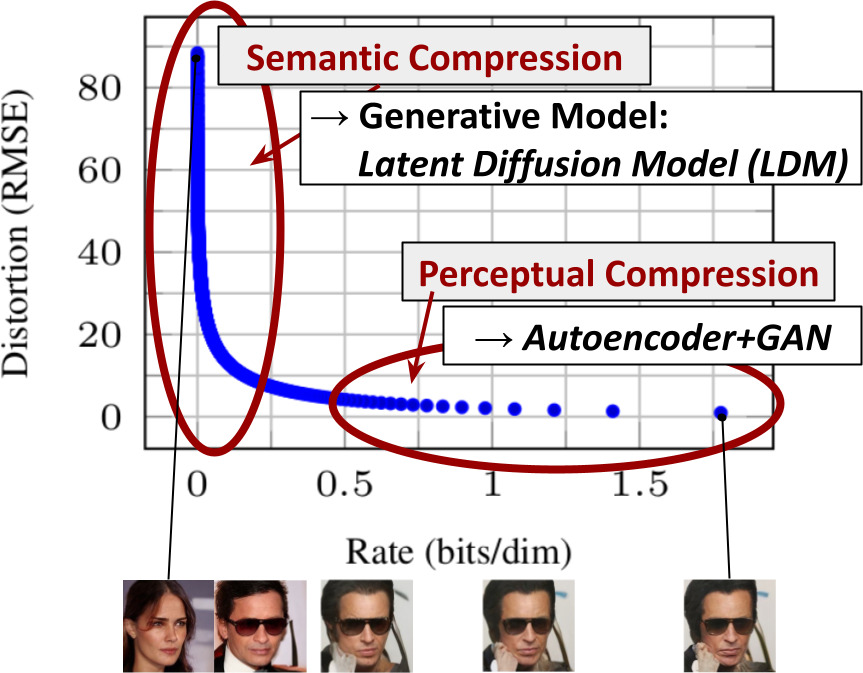

> 图 1：通过降低下采样强度来提升可达到质量的上限。由于 **扩散模型（Diffusion models, DMs）** 为空间数据提供了出色的 **归纳偏置（Inductive biases）** ，我们不需要像相关生成模型那样在 **隐空间（Latent space）** 中进行剧烈的空间下采样，但仍然可以通过合适的 **自编码模型（Autoencoding models）** 大幅降低数据的维度，详见第 [3](#S3) 节。图像来自 DIV2K [1] 验证集，评估分辨率为 $512^{2}$ 像素。我们用 $f$ 表示空间下采样因子。重建 **FID（Fréchet Inception Distance）** [29] 和 **PSNR（Peak Signal-to-Noise Ratio）** 在 ImageNet-val [12] 上计算；另见表格 [8](#A4.T8)。

**图像合成（Image synthesis）** 是计算机视觉领域近年来发展最为惊人的方向之一，同时也是计算需求最大的方向之一。特别是复杂自然场景的高分辨率合成，目前主要由扩大基于 **似然（Likelihood）** 的模型主导，这些模型可能包含数十亿参数，例如 **自回归（Autoregressive, AR）** 变换器 [66, 67]。

相比之下， **生成对抗网络（Generative Adversarial Networks, GANs）** [27, 3, 40] 所展现出的有前景的结果，已被揭示主要局限于变异性相对有限的数据，因为其 **对抗性学习（Adversarial learning）** 过程不易扩展到对复杂的、 **多模态分布（Multi-modal distributions）** 进行建模。最近，由一系列 **去噪自编码器（Denoising autoencoders）** 构建而成的 **扩散模型（Diffusion models, DMs）** [82]，已在图像合成 [30, 85] 及其他领域 [45, 7, 48, 57] 展现出令人印象深刻的结果，并在 **类条件图像合成（Class-conditional image synthesis）** [15, 31] 和 **超分辨率（Super-resolution）** [72] 方面定义了 **最先进（State-of-the-art）** 的技术水平。此外，与其他类型的生成模型 [46, 69, 19] 相比，即使是 **无条件扩散模型（Unconditional DMs）** 也能轻松应用于诸如 **图像修复（Inpainting）** 和 **着色（Colorization）** [85] 或 **基于笔触的合成（Stroke-based synthesis）** [53] 等任务。

作为基于似然的模型，它们不像 GANs 那样出现 **模式崩溃（Mode-collapse）** 和训练不稳定性，并且通过大量利用 **参数共享（Parameter sharing）** ，它们能够对自然图像的高度复杂分布进行建模，而无需像 AR 模型 [67] 那样涉及数十亿参数。

##### **高分辨率图像合成的民主化（Democratizing High-Resolution Image Synthesis）**

**扩散模型（Diffusion Models, DMs）** 属于 **基于似然的模型（likelihood-based models）** 类别，其 **模式覆盖（mode-covering）** 行为使得它们倾向于将过多的容量（以及计算资源）用于建模数据中难以察觉的细节 [16, 73]。尽管 **重加权变分目标（reweighted variational objective）** [30] 旨在通过 **欠采样（undersampling）** 初始去噪步骤来解决这个问题，但 DMs 在计算上仍然要求很高，因为训练和评估此类模型需要在 **RGB图像（RGB images）** 的高维空间中进行重复的函数评估（以及梯度计算）。例如，训练最强大的 DMs 通常需要数百个 **GPU天（GPU days）** （_例如_，在 [15] 中为 150 - 1000 个 V100 天），并且在输入空间的噪声版本上进行重复评估也使得推理过程变得昂贵，因此在单个 A100 GPU 上生成 5 万个样本大约需要 5 天 [15]。这对研究界和普通用户产生了两个后果：

- 首先，训练这样一个模型需要大量的计算资源，而这仅在该领域的一小部分人中可用，并且会留下巨大的 **碳足迹（carbon footprint）** [65, 86]。
- 其次，评估一个已经训练好的模型在时间和内存上也很昂贵，因为相同的模型架构必须按顺序运行大量步骤（_例如_，在 [15] 中为 25 - 1000 步）。

为了增加这一强大模型类别的可访问性，同时减少其巨大的资源消耗，需要一种能够降低训练和采样计算复杂度的方法。因此，在不损害其性能的前提下降低 DMs 的计算需求，是增强其可访问性的关键。

##### **转向潜在空间（Departure to Latent Space）**

我们的方法始于分析已在 **像素空间（pixel space）** 中训练好的扩散模型：图 [2](#S1.F2) 展示了一个已训练模型的 **率失真权衡（rate-distortion trade-off）** 。与任何基于似然的模型一样，学习过程可以大致分为两个阶段：第一阶段是 **感知压缩（perceptual compression）** 阶段，它去除了高频细节，但仍学习到很少的语义变化。在第二阶段，实际的 **生成模型（generative model）** 学习数据的语义和概念构成（ **语义压缩（semantic compression）** ）。因此，我们的目标是首先找到一个在感知上等价、但在计算上更合适的空间，然后在该空间中训练用于高分辨率图像合成的扩散模型。

遵循常见做法 [96, 67, 23, 11, 66]，我们将训练分为两个不同的阶段：首先，我们训练一个 **自编码器（autoencoder）** ，它提供一个 **低维（lower-dimensional）** （从而更高效）的表示空间，该空间在感知上与数据空间等价。重要的是，与之前的工作 [23, 66] 相比，我们不需要依赖过度的空间压缩，因为我们在学习到的 **潜在空间（latent space）** 中训练 DMs，该空间在空间维度方面表现出更好的 **缩放特性（scaling properties）** 。降低的复杂度还使得通过单次网络前向传播即可从潜在空间高效地生成图像。我们将由此产生的模型类别命名为 **潜在扩散模型（Latent Diffusion Models, LDMs）** 。

该方法的一个显著优势在于，我们只需训练一次 **通用自编码（Universal Autoencoding）** 阶段，因此可以将其重用于多次 **扩散模型（Diffusion Models, DMs）** 训练，或探索可能完全不同的任务 [81]。这使得我们能够高效地探索大量用于各种图像到图像和文本到图像任务的扩散模型。对于后者，我们设计了一种将 **变换器（Transformers）** 连接到 DM 的 **UNet 主干网络（UNet backbone）** [71] 的架构，并支持任意类型的基于词元（Token-based）的条件机制，详见第 [3.3](#S3.SS3) 节。

> 图 2：感知压缩与语义压缩示意图：数字图像中的大部分比特对应于人眼无法察觉的细节。虽然扩散模型（DMs）可以通过最小化相应的损失项来抑制这种语义上无意义的信息，但（训练期间的）梯度和神经网络主干（训练和推理）仍然需要在所有像素上进行评估，导致冗余计算以及不必要的昂贵优化和推理。我们提出 **潜在扩散模型（Latent Diffusion Models, LDMs）** 作为一种有效的生成模型，并引入一个独立的温和压缩阶段，该阶段仅消除不可察觉的细节。数据和图像来自 [30]。

总而言之，我们的工作做出了以下贡献：

(i) 与纯基于变换器的方法 [23, 66] 相比，我们的方法能更优雅地扩展到更高维度的数据，因此可以 (a) 在压缩级别上工作，提供比先前工作更忠实、更详细的 **重建（Reconstructions）** （见图 [1](#S1.F1)）；(b) 能够高效地应用于百万像素图像的高分辨率合成。

(ii) 我们在多个任务（无条件图像合成、修复、随机超分辨率）和数据集上取得了有竞争力的性能，同时显著降低了计算成本。与基于像素的扩散方法相比，我们还显著降低了推理成本。

(iii) 我们证明，与先前同时学习编码器/解码器架构和基于分数的先验的工作 [93] 不同，我们的方法不需要对重建能力和生成能力进行精细的权重平衡。这确保了极其忠实的重建，并且只需要对 **潜在空间（Latent Space）** 进行极少的正则化。

(iv) 我们发现，对于超分辨率、修复和语义合成等密集条件任务，我们的模型可以以卷积方式应用，并渲染出尺寸约为 $1024^{2}$ 像素的大尺寸、一致性图像。

(v) 此外，我们设计了一种基于 **交叉注意力（Cross-attention）** 的通用条件机制，支持多模态训练。我们用它来训练类条件、文本到图像和布局到图像模型。

(vi) 最后，我们在 [https://github.com/CompVis/latent-diffusion](https://github.com/CompVis/latent-diffusion) 发布了预训练的潜在扩散和自编码模型，这些模型除了用于训练扩散模型 [81] 外，还可能适用于各种其他任务。

## 2 相关工作（Related Work）

### 图像合成的生成模型（Generative Models for Image Synthesis）

图像的高维特性给生成建模带来了独特的挑战。

- **生成对抗网络（Generative Adversarial Networks, GAN）** [27] 能够高效地采样出具有良好感知质量的高分辨率图像 [3, 42]，但难以优化 [54, 2, 28]，并且难以捕获完整的数据分布 [55]。
- 相比之下， **基于似然的方法（likelihood-based methods）** 强调良好的密度估计，这使得优化过程更加稳定。
  - **变分自编码器（Variational Autoencoders, VAE）** [46] 和 **基于流的模型（flow-based models）** [18, 19] 能够高效地合成高分辨率图像 [9, 92, 44]，但其样本质量无法与 GANs 相媲美。
  - **自回归模型（Autoregressive Models, ARM）** [95, 94, 6, 10] 在密度估计方面表现出色，但其计算密集型的架构 [97] 和顺序采样过程限制了它们只能生成低分辨率图像。
  - 由于基于像素的图像表示包含几乎难以察觉的 **高频细节（high-frequency details）** [16, 73]， **最大似然训练（maximum-likelihood training）** 会花费不成比例的计算能力来建模这些细节，导致训练时间很长。为了扩展到更高分辨率，一些 **两阶段方法（two-stage approaches）** [101, 67, 23, 103] 使用 ARMs 来建模压缩的潜在图像空间，而不是原始像素。

最近， **扩散概率模型（Diffusion Probabilistic Models, DM）** [82] 在密度估计 [45] 和样本质量 [15] 方面都取得了最先进的结果。当这些模型的基础神经骨干网络实现为 **UNet** [71, 30, 85, 15] 时，其生成能力源于对图像类数据的 **归纳偏置（inductive biases）** 的自然契合。通常，当使用 **重新加权的目标函数（reweighted objective）** [30] 进行训练时，可以获得最佳的合成质量。在这种情况下，DM 对应于一个有损压缩器，允许在图像质量和压缩能力之间进行权衡。

然而，在像素空间中评估和优化这些模型的缺点是推理速度慢和训练成本非常高。虽然前者可以通过 **高级采样策略（advanced sampling strategies）** [84, 75, 47] 和 **分层方法（hierarchical approaches）** [31, 93] 得到部分解决，但在高分辨率图像数据上进行训练始终需要计算昂贵的梯度。

我们提出的 **LDM（Latent Diffusion Models）** 解决了这两个缺点，它在维度更低的压缩潜在空间中工作。这使得训练在计算上更便宜，并加快了推理速度，同时合成质量几乎没有下降（见图 [1](#S1.F1)）。

**两阶段图像合成（Two-Stage Image Synthesis）**
为了弥补单一生成方法的不足，大量研究 [11, 70, 23, 103, 101, 67] 致力于通过两阶段方法，将不同方法的优势结合到更高效、性能更强的模型中。 **矢量量化变分自编码器（Vector Quantized Variational Autoencoders, VQ-VAEs）** [101, 67] 使用 **自回归模型（Autoregressive Models）** 在离散化的潜在空间上学习一个富有表现力的先验分布。研究 [66] 通过在学习离散化的图像和文本表示上的联合分布，将这种方法扩展到 **文本到图像生成（Text-to-Image Generation）** 。更一般地说，研究 [70] 使用 **条件可逆网络（Conditionally Invertible Networks）** 来提供不同领域潜在空间之间的通用转换。

与 VQ-VAEs 不同， **矢量量化生成对抗网络（Vector Quantized Generative Adversarial Networks, VQGANs）** [23, 103] 在第一阶段采用了对抗性和感知性目标，以将自回归变换器（Autoregressive Transformers）扩展到更大的图像。然而，为进行可行的自回归模型（Autoregressive Model, ARM）训练所需的高压缩率，会引入数十亿的可训练参数 [66, 23]，这限制了此类方法的整体性能；而降低压缩率则需要付出高昂的计算成本代价 [66, 23]。

我们的工作避免了这种权衡，因为我们提出的 **潜在扩散模型（Latent Diffusion Models, LDMs）** 由于其卷积主干网络，能够更平缓地扩展到更高维的潜在空间。因此，我们可以自由选择压缩级别，以在以下两者之间实现最佳平衡：学习一个强大的第一阶段，同时又不将过多的感知压缩任务留给生成式扩散模型，同时保证高保真度的重建（见图 [1](#S1.F1)）。

虽然存在联合 [93] 或分别 [80] 学习编码/解码模型与基于分数的先验的方法，但前者仍然需要在重建能力和生成能力之间进行困难的权衡 [11]，并且其性能被我们的方法超越（见第 [4](#S4) 节）；而后者则专注于高度结构化的图像，例如人脸。

## 3 方法（Method）

为了降低训练 **扩散模型（Diffusion Models, DMs）** 以实现高分辨率图像合成的计算需求，我们观察到：尽管扩散模型允许通过对相应损失项进行欠采样来忽略感知上不相关的细节 [30]，但它们仍然需要在像素空间中进行代价高昂的函数评估，这导致了计算时间和能源资源的巨大需求。

我们提出通过引入 **压缩学习阶段（compressive learning phase）** 与 **生成学习阶段（generative learning phase）** 的显式分离来规避这一缺点（见图 [2](#S1.F2)）。为实现此目标，我们利用一种 **自编码模型（autoencoding model）** ，该模型学习一个在感知上与图像空间等效，但计算复杂度显著降低的空间。

这种方法具有以下几个优势：

1.  通过离开高维图像空间，我们获得的扩散模型在计算上效率更高，因为采样是在低维空间上进行的。
2.  我们利用了扩散模型从其 **UNet 架构（UNet architecture）** [71] 继承而来的 **归纳偏置（inductive bias）** ，这使得它们对具有空间结构的数据特别有效，从而减轻了先前方法 [23, 66] 所需的、会降低质量的激进压缩程度的需求。
3.  最后，我们获得了通用的压缩模型，其 **潜在空间（latent space）** 可用于训练多个生成模型，并且也可用于其他下游应用，例如 **单图像 CLIP 引导合成（single-image CLIP-guided synthesis）** [25]。

### 3.1 感知图像压缩（Perceptual Image Compression）

我们的感知压缩模型基于先前的工作 [23]，由一个 **自编码器（autoencoder）** 构成，该自编码器通过结合 **感知损失（perceptual loss）** [106] 和基于 **图像块（patch-based）** [33] 的 **对抗目标（adversarial objective）** [20, 23, 103] 进行训练。这确保了重建结果被限制在 **图像流形（image manifold）** 上，通过强制局部真实性，并避免了仅依赖像素空间损失（如 $L_{2}$ 或 $L_{1}$ 目标）所引入的模糊性。

更精确地说，给定 RGB 空间中的一幅图像 $x\in\mathbb{R}^{H\times W\times 3}$， **编码器（encoder）** $\mathcal{E}$ 将 $x$ 编码为 **潜在表示（latent representation）** $z=\mathcal{E}(x)$，而 **解码器（decoder）** $\mathcal{D}$ 从该潜在表示中重建图像，得到 $\tilde{x}=\mathcal{D}(z)=\mathcal{D}(\mathcal{E}(x))$，其中 $z\in\mathbb{R}^{h\times w\times c}$。重要的是，编码器对图像进行 **下采样（downsamples）** ，下采样因子为 $f=H/h=W/w$，我们研究了不同的下采样因子 $f=2^{m}$，其中 $m\in\mathbb{N}$。

为避免潜在空间方差任意增大，我们尝试了两种不同的正则化方法。第一种变体 **_KL 正则化（KL-reg.）_** 对学习到的潜在表示施加轻微的 **KL 散度（Kullback-Leibler divergence）** 惩罚，使其趋近于标准正态分布，类似于 **变分自编码器（Variational Autoencoder, VAE）** [46, 69]；而 **_VQ 正则化（VQ-reg.）_** 则在解码器内部使用一个 **向量量化层（Vector Quantization layer）** [96]。该模型可被理解为一种 **VQGAN（Vector Quantized Generative Adversarial Network）** [23]，但其量化层被解码器吸收。由于我们后续的 **扩散模型（Diffusion Model, DM）** 被设计为与我们学习到的二维结构潜在空间 $z=\mathcal{E}(x)$ 协同工作，因此我们可以使用相对温和的压缩率并获得非常好的重建效果。这与先前的工作 [23, 66] 形成对比，后者依赖于对学习到的空间 $z$ 进行任意的 **一维（1D）** 排序以自回归地建模其分布，从而忽略了 $z$ 的大部分固有结构。因此，我们的压缩模型能更好地保留 $x$ 的细节（参见表 [8](#A4.T8)）。完整的目标函数和训练细节可在补充材料中找到。

### 3.2 潜在扩散模型（Latent Diffusion Models）

**扩散模型（Diffusion Models）** [82] 是一种概率模型，旨在通过学习逐步去噪一个正态分布变量来学习数据分布 $p(x)$，这对应于学习一个固定长度为 $T$ 的 **马尔可夫链（Markov Chain）** 的逆向过程。对于图像合成，最成功的模型 [30, 15, 72] 依赖于 $p(x)$ 的 **变分下界（variational lower bound）** 的一个重新加权变体，这反映了 **去噪分数匹配（denoising score-matching）** [85]。这些模型可被解释为一组等权重的去噪自编码器序列 $\epsilon_{\theta}(x_{t},t);\,t=1\dots T$，它们被训练来预测其输入 $x_{t}$ 的一个去噪版本，其中 $x_{t}$ 是输入 $x$ 的含噪版本。相应的目标函数可简化为（见第 [B](#A2) 节）

$$
L_{DM}=\mathbb{E}_{x,\epsilon\sim\mathcal{N}(0,1),t}\Big{[}\|\epsilon-\epsilon_{\theta}(x_{t},t)\|_{2}^{2}\Big{]}\,,(1)
$$

其中 $t$ 从 $\{1,\dots,T\}$ 中均匀采样。

**潜在表示的生成式建模（Generative Modeling of Latent Representations）**
借助我们训练好的、由 $\mathcal{E}$ 和 $\mathcal{D}$ 组成的 **感知压缩模型（perceptual compression models）** ，我们现在可以访问一个高效、低维的潜在空间，其中高频、难以察觉的细节已被抽象掉。与高维像素空间相比，该空间更适合基于似然的生成模型，因为它们现在可以 (i) 专注于数据中重要的、语义性的部分，并且 (ii) 在一个更低维、计算效率高得多的空间中进行训练。

与先前工作在高度压缩的离散潜在空间中依赖基于自回归、注意力机制的 **变换器模型（transformer models）** [66, 23, 103] 不同，我们可以利用我们模型所提供的图像特定 **归纳偏置（inductive biases）** 。这包括能够主要使用 **二维卷积层（2D convolutional layers）** 构建底层的 **UNet** 网络，并利用重新加权的下界进一步将目标聚焦于感知上最相关的部分，该下界现在表示为

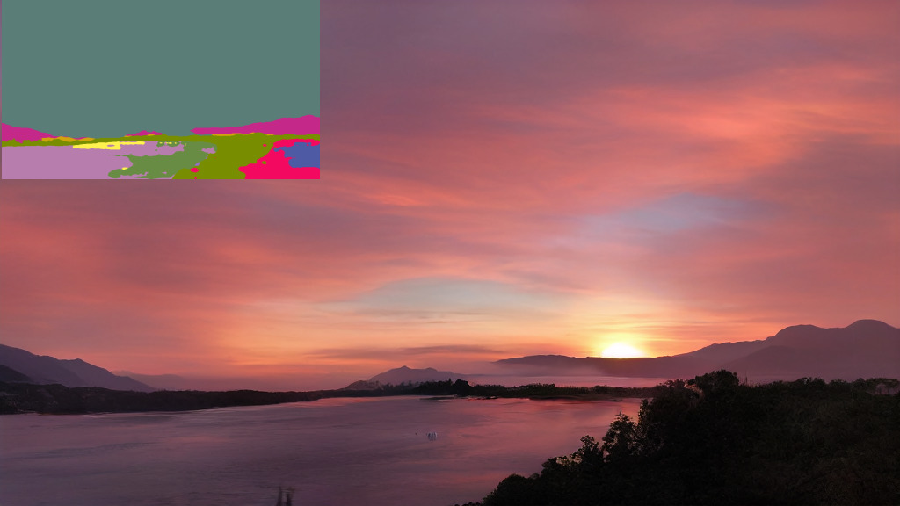

> 图 3：我们通过 **拼接（concatenation）** 或更通用的 **交叉注意力机制（cross-attention mechanism）** 来对 **潜在扩散模型（Latent Diffusion Models, LDMs）** 进行条件化。参见章节 [3.3](#S3.SS3)。

$$
L_{LDM}:=\mathbb{E}_{\mathcal{E}(x),\epsilon\sim\mathcal{N}(0,1),t}\Big{[}\|\epsilon-\epsilon_{\theta}(z_{t},t)\|_{2}^{2}\Big{]}\,.(2)
$$

我们模型的神经主干 $\epsilon_{\theta}(\circ,t)$ 实现为一个 **时间条件化的 UNet（time-conditional UNet）** [71]。
由于前向过程是固定的，在训练期间可以高效地从 $\mathcal{E}$ 获得 $z_{t}$，并且来自 $p(z)$ 的样本可以通过单次通过 $\mathcal{D}$ 解码回图像空间。

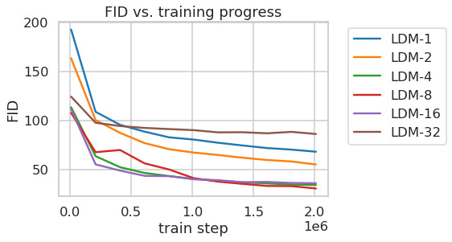

> 图 4：在 CelebAHQ [39]、FFHQ [41]、LSUN-Churches [102]、LSUN-Bedrooms [102] 和 **类别条件化的 ImageNet（class-conditional ImageNet）** [12] 上训练的 _LDMs_ 生成的样本，每个样本的分辨率为 $256\times 256$。放大查看效果更佳。更多样本请参见补充材料。

### 3.3 条件化机制（Conditioning Mechanisms）

与其他类型的 **生成模型（generative models）** [56, 83] 类似， **扩散模型（Diffusion Models, DMs）** 原则上能够对形式为 $p(z|y)$ 的 **条件分布（conditional distributions）** 进行建模。
这可以通过一个 **条件去噪自编码器（conditional denoising autoencoder）** $\epsilon_{\theta}(z_{t},t,y)$ 来实现，并为通过输入 $y$（如文本 [68]、语义图 [61, 33] 或其他图像到图像翻译任务 [34]）来控制合成过程铺平了道路。

然而，在图像合成的背景下，将 DMs 的生成能力与类别标签 [15] 或输入图像的模糊变体 [72] 之外的其他类型的条件化相结合，迄今为止仍是一个研究不足的领域。

我们通过用 **交叉注意力机制（cross-attention mechanism）** [97] 增强其底层的 UNet 主干，将 DMs 转变为更灵活的条件图像生成器，该机制对于学习基于各种输入模态的注意力模型是有效的 [36, 35]。
为了预处理来自各种模态（如语言提示）的 $y$，我们引入了一个 **领域特定的编码器（domain specific encoder）** $\tau_{\theta}$，它将 $y$ 投影到一个中间表示 $\tau_{\theta}(y)\in\mathbb{R}^{M\times d_{\tau}}$，然后通过一个实现为 $\text{Attention}(Q,K,V)=\text{softmax}\left(\frac{QK^{T}}{\sqrt{d}}\right)\cdot V$ 的交叉注意力层映射到 UNet 的中间层，其中

$$
Q=W^{(i)}_{Q}\cdot\varphi_{i}(z_{t}),\;K=W^{(i)}_{K}\cdot\tau_{\theta}(y),\;V=W^{(i)}_{V}\cdot\tau_{\theta}(y).
$$

这里，$\varphi_{i}(z_{t})\in\mathbb{R}^{N\times d^{i}_{\epsilon}}$ 表示实现 $\epsilon_{\theta}$ 的 UNet 的一个（展平的）中间表示，而 $W^{(i)}_{V}\in\mathbb{R}^{d\times d^{i}_{\epsilon}}$、$W^{(i)}_{Q}\in\mathbb{R}^{d\times d_{\tau}}$ 和 $W^{(i)}_{K}\in\mathbb{R}^{d\times d_{\tau}}$ 是 **可学习的投影矩阵（learnable projection matrices）** [97, 36]。可视化描述请参见图 [3](#S3.F3)。

基于图像-条件对，我们通过以下方式学习条件化的 LDM：

$$
L_{LDM}:=\mathbb{E}_{\mathcal{E}(x),y,\epsilon\sim\mathcal{N}(0,1),t}\Big{[}\|\epsilon-\epsilon_{\theta}(z_{t},t,\tau_{\theta}(y))\|_{2}^{2}\Big{]}\,,(3)
$$

其中 $\tau_{\theta}$ 和 $\epsilon_{\theta}$ 都通过方程 [3](#S3.E3) 进行联合优化。
这种条件化机制非常灵活，因为 $\tau_{\theta}$ 可以用领域特定的专家进行参数化，例如，当 $y$ 是文本提示时，可以使用（未掩码的） **变换器（Transformers）** [97]（参见章节 [4.3.1](#S4.SS3.SSS1)）。

## 4 实验（Experiments）

> 图 5：我们的文本到图像合成模型 _LDM-8 (KL)_ 根据用户定义文本提示生成的样本，该模型在 LAION [78] 数据库上训练。样本使用 200 步 DDIM 和 $\eta=1.0$ 生成。我们使用了无条件引导 [32]，其中 $s=10.0$。

> 图 6：在 ImageNet 数据集上，分析具有不同下采样因子 $f$ 的类别条件 _LDMs_ 在 2M 训练步数内的训练情况。基于像素的 _LDM-1_ 相比具有更大下采样因子的模型（_LDM-$\{$4-16$\}$_）需要显著更长的训练时间。如 _LDM-32_ 中过多的感知压缩会限制整体样本质量。所有模型均在单张 NVIDIA A100 上以相同的计算预算进行训练。结果使用 100 步 DDIM [84] 和 $\kappa=0$ 获得。

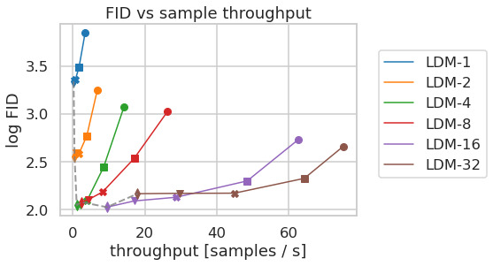

> 图 7：在 CelebA-HQ（左）和 ImageNet（右）数据集上比较具有不同压缩程度的 _LDMs_。不同标记表示使用 DDIM 的 $\{10,20,50,100,200\}$ 采样步数，沿每条线从右到左。虚线显示了 200 步的 FID 分数，表明 _LDM-$\{$4-8$\}$_ 的强劲性能。FID 分数基于 5000 个样本评估。所有模型均在 A100 上训练了 500k（CelebA）/ 2M（ImageNet）步。

**潜在扩散模型（Latent Diffusion Models, LDMs）** 为各种图像模态提供了灵活且计算上易于处理的基于扩散的图像合成方法，我们将在下文中通过实验展示这一点。然而，我们首先分析我们的模型与基于像素的扩散模型在训练和推理方面的优势。有趣的是，我们发现，在 **矢量量化（Vector Quantization, VQ）** 正则化的潜在空间中训练的 _LDMs_ 有时能获得更好的样本质量，尽管 VQ 正则化的第一阶段模型的重建能力略逊于其连续对应模型，参见表 [8](#A4.T8)。关于第一阶段正则化方案对 _LDM_ 训练的影响及其对分辨率 $>256^{2}$ 的泛化能力的视觉比较，可在附录 [D.1](#A4.SS1) 中找到。在 [E.2](#A5.SS2) 中，我们列出了本节所有结果在架构、实现、训练和评估方面的详细信息。

### 4.1 关于感知压缩权衡（On Perceptual Compression Tradeoffs）

本节分析了我们的 LDMs 在不同下采样因子 $f\in\{1,2,4,8,16,32\}$（缩写为 _LDM-_$f$，其中 _LDM-1_ 对应于基于像素的 DMs）下的行为。为了获得可比较的测试环境，我们将本节所有实验的计算资源固定为单张 NVIDIA A100，并以相同的步数和参数数量训练所有模型。

表 [8] 展示了本节所比较的 **潜在扩散模型（Latent Diffusion Models, LDMs）** 所用第一阶段模型的超参数与重建性能。

图 [6] 展示了在 ImageNet [12] 数据集上，类别条件模型训练 2M 步时，样本质量随训练进度的变化。我们可以看到：i) **LDM-{1,2}** 采用较小的下采样因子会导致训练进展缓慢；而 ii) 过大的 $f$ 值则会在相对较少的训练步数后导致保真度停滞不前。回顾上文的分析（图 [1] 和图 [2]），我们将此归因于：i) 将大部分感知压缩任务留给了扩散模型；以及 ii) 第一阶段压缩过强导致信息丢失，从而限制了可达到的质量。 **LDM-{4-16}** 在效率和感知忠实的结果之间取得了良好的平衡，这体现在经过 2M 训练步后，基于像素的扩散模型（ **LDM-1** ）与 **LDM-8** 之间存在高达 38 的显著 **FID（Fréchet Inception Distance）** [29] 差距。

在图 [7] 中，我们比较了在 CelebA-HQ [39] 和 ImageNet 上训练的模型，使用 **DDIM（Denoising Diffusion Implicit Models）** 采样器 [84] 在不同去噪步数下的采样速度，并将其与 **FID** 分数 [29] 进行对比绘图。 **LDM-{4-8}** 的性能优于感知压缩与概念压缩比例不合适的模型。特别是与基于像素的 **LDM-1** 相比，它们在显著提高样本吞吐量的同时，获得了低得多的 **FID** 分数。对于 ImageNet 这样的复杂数据集，需要降低压缩率以避免质量下降。总之， **LDM-4** 和 **-8** 为实现高质量的合成结果提供了最佳条件。

> 表 1：无条件图像合成的评估指标。CelebA-HQ 结果复现自 [63, 100, 43]，FFHQ 结果复现自 [42, 43]。^†: $N$-s 指使用 DDIM [84] 采样器进行 $N$ 步采样。^∗: 在 **KL（Kullback-Leibler）** 正则化的潜在空间中训练。更多结果见补充材料。

> 表 2：在 $256\times 256$ 大小的 MS-COCO [51] 数据集上进行的文本条件图像合成评估：在使用 250 步 DDIM [84] 采样时，我们的模型与最新的扩散模型 [59] 和自回归模型 [26] 方法性能相当，尽管使用的参数量显著更少。^†/^∗: 数字来自 [109]/ [26]。

### 4.2 使用潜在扩散进行图像生成（Image Generation with Latent Diffusion）

我们在 CelebA-HQ [39]、FFHQ [41]、LSUN-Churches 和 LSUN-Bedrooms [102] 数据集上训练了 $256^{2}$ 图像的无条件模型，并使用 i) **FID** [29] 和 ii) **精确率与召回率（Precision-and-Recall）** [50] 来评估 i) 样本质量和 ii) 它们对数据流形的覆盖情况。表 [1] 总结了我们的结果。在 CelebA-HQ 上，我们报告了新的最先进 **FID** 分数 $5.11$，优于之前的基于似然的模型以及 **GANs（Generative Adversarial Networks）** 。我们也优于 **LSGM（Latent Score-based Generative Model）** [93]，后者是将潜在扩散模型与第一阶段联合训练的。相比之下，我们在固定空间中训练扩散模型，避免了权衡重建质量与学习潜在空间先验的困难，见图 [1]-[2]。

除了在 LSUN-Bedrooms 数据集上，我们在所有数据集上的表现都优于先前的 **基于扩散的方法（diffusion-based approaches）** 。在该数据集上，尽管我们只使用了 ADM [15] 一半的参数，并且所需的训练资源减少了四倍（参见附录 [E.3.5](#A5.SS3.SSS5)），我们的得分仍与 ADM 接近。此外， **潜在扩散模型（Latent Diffusion Models, LDMs）** 在 **精确率（Precision）** 和 **召回率（Recall）** 上持续优于基于 **生成对抗网络（Generative Adversarial Networks, GANs）** 的方法，从而证实了其基于 **似然（likelihood）** 的、 **模式覆盖（mode-covering）** 训练目标相对于 **对抗性方法（adversarial approaches）** 的优势。在图 [4](#S3.F4) 中，我们还展示了每个数据集的 **定性结果（qualitative results）** 。

### 4.3 条件潜在扩散（Conditional Latent Diffusion）

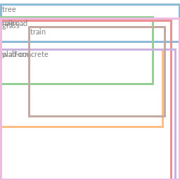

> 图 8：在 COCO 数据集 [4] 上使用 _LDM_ 进行 **布局到图像合成（Layout-to-image synthesis）** ，参见第 [4.3.1](#S4.SS3.SSS1) 节。定量评估见补充材料 [D.3](#A4.SS3)。

#### 4.3.1 用于 LDMs 的 Transformer 编码器

通过将 **基于交叉注意力的条件化（cross-attention based conditioning）** 引入 LDMs，我们为扩散模型开启了多种先前未被探索的条件化模态。对于 **文本到图像建模（text-to-image modeling）** ，我们在 LAION-400M [78] 数据集上训练了一个 1.45B 参数的、基于语言提示进行条件化的 **_KL_ 正则化（KL-regularized）** _LDM_。我们采用 **BERT 分词器（BERT-tokenizer）** [14]，并将 $\tau_{\theta}$ 实现为一个 **Transformer** [97]，用于推断一个 **潜在编码（latent code）** ，该编码通过（多头）交叉注意力映射到 **UNet** 中（第 [3.3](#S3.SS3) 节）。这种结合了用于学习语言表示的领域专家和视觉合成的组合，产生了一个强大的模型，能够很好地泛化到复杂的、用户定义的文本提示，参见图 [8](#S4.F8) 和 [5](#S4.F5)。为了进行定量分析，我们遵循先前工作，在 MS-COCO [51] 验证集上评估文本到图像生成任务。我们的模型优于强大的 **自回归（Autoregressive, AR）** [66, 17] 和基于 GAN [109] 的方法，参见表 [2](#S4.T2)。我们注意到，应用 **无分类器扩散引导（classifier-free diffusion guidance）** [32] 极大地提升了样本质量，使得经过引导的 _LDM-KL-8-G_ 在文本到图像合成任务上，与近期的 **最先进（state-of-the-art）** AR [26] 和扩散模型 [59] 性能相当，同时显著减少了参数量。为了进一步分析基于交叉注意力的条件化机制的灵活性，我们还训练了模型，以基于 OpenImages [49] 上的 **语义布局（semantic layouts）** 合成图像，并在 COCO [4] 上进行了微调，参见图 [8](#S4.F8)。定量评估和实现细节见第 [D.3](#A4.SS3) 节。

最后，遵循先前的工作 [15, 3, 23, 21]，我们在表 [3](#S4.T3)、图 [4](#S3.F4) 和章节 [D.4](#A4.SS4) 中评估了我们在章节 [4.1](#S4.SS1) 中表现最佳的类别条件 ImageNet 模型（$f\in\{4,8\}$）。在此，我们的模型超越了最先进的扩散模型 ADM [15]，同时显著降低了计算需求和参数量，参见表 [18](#A6.T18)。

> 表：表 3：类别条件 ImageNet LDM 与近期最先进的类别条件图像生成方法在 ImageNet [12] 上的比较。与更多基线的详细比较可在 [D.4](#A4.SS4) 章节、表 [10](#A4.T10) 和附录 [F](#A6) 中找到。_c.f.g._ 表示文献 [32] 中提出的、尺度为 $s$ 的 **无分类器引导（Classifier-Free Guidance）** 。

#### 4.3.2 超越 $256^{2}$ 的卷积采样（Convolutional Sampling Beyond $256^{2}$）

通过将空间对齐的条件信息与 $\epsilon_{\theta}$ 的输入进行拼接， **潜在扩散模型（Latent Diffusion Models, LDMs）** 可以作为高效的通用 **图像到图像转换（Image-to-Image Translation）** 模型。
我们利用这一点来训练用于 **语义合成（Semantic Synthesis）** 、 **超分辨率（Super-Resolution）** （章节 [4.4](#S4.SS4)）和 **图像修复（Inpainting）** （章节 [4.5](#S4.SS5)）的模型。
对于语义合成，我们使用与语义地图配对的景观图像 [61, 23]，并将下采样后的语义地图版本与 $f=4$ 模型（VQ-reg.，参见表 [8](#A4.T8)）的潜在图像表示进行拼接。
我们在 $256^{2}$（从 $384^{2}$ 裁剪）的输入分辨率上进行训练，但发现我们的模型能够泛化到更大的分辨率，并且当以卷积方式评估时，可以生成高达百万像素级别的图像（见图 [9](#S4.F9)）。
我们利用这一特性，将章节 [4.4](#S4.SS4) 中的超分辨率模型和章节 [4.5](#S4.SS5) 中的修复模型也应用于生成 $512^{2}$ 到 $1024^{2}$ 之间的大图像。
对于此应用， **信噪比（Signal-to-Noise Ratio）** （由潜在空间的尺度引起）会显著影响结果。
在章节 [D.1](#A4.SS1) 中，我们通过以下两种方式学习 LDM 来说明这一点：(i) 使用 $f=4$ 模型（KL-reg.，参见表 [8](#A4.T8)）提供的潜在空间；(ii) 使用按分量标准差缩放的重新缩放版本。

后者与 **无分类器引导（Classifier-Free Guidance）** [32] 相结合，也使得文本条件模型 _LDM-KL-8-G_ 能够直接合成 $>256^{2}$ 的图像，如图 [13](#A0.F13) 所示。

> 图片描述。

**图 9（Figure 9）** ：在 $256^{2}$ 分辨率上训练的 **潜在扩散模型（Latent Diffusion Model, LDM）** 可以泛化到更大的分辨率（此处为 $512\times 1024$），适用于空间条件任务，例如景观图像的语义合成。详见章节 [4.3.2](#S4.SS3.SSS2)。

### 4.4 基于潜在扩散的超分辨率（Super-Resolution with Latent Diffusion）

通过拼接（concatenation）直接以低分辨率图像为条件（参见章节 [3.3](#S3.SS3)），可以高效地训练 **潜在扩散模型（Latent Diffusion Models, LDMs）** 用于超分辨率任务。
在第一个实验中，我们遵循 SR3 [72] 的方法，将图像退化固定为使用 $4\times$ 下采样的双三次插值（bicubic interpolation），并按照 SR3 的数据处理流程在 ImageNet 上进行训练。我们使用在 OpenImages 上预训练的 $f=4$ 自编码模型（VQ-reg.，参见表 [8](#A4.T8)），并将低分辨率条件 $y$ 与输入拼接后送入 UNet，即 $\tau_{\theta}$ 为恒等映射。
我们的定性和定量结果（见图 [10](#S4.F10) 和表 [5](#S4.T5)）显示了具有竞争力的性能： **LDM-SR** 在 FID（Fréchet Inception Distance）指标上优于 SR3，而 SR3 在 IS（Inception Score）指标上表现更好。
一个简单的图像回归模型获得了最高的 PSNR（峰值信噪比）和 SSIM（结构相似性）分数；
然而，这些指标与人类感知 [106] 的一致性不佳，并且倾向于模糊而非未完美对齐的高频细节 [72]。
此外，我们进行了一项用户研究，将像素基线（pixel-baseline）与 LDM-SR 进行比较。我们遵循 SR3 [72] 的方法，向受试者展示一张低分辨率图像和两张高分辨率图像，并要求其选择偏好。表 [4](#S4.T4) 中的结果证实了 LDM-SR 的良好性能。
通过使用事后引导机制（post-hoc guiding mechanism）[15] 可以提升 PSNR 和 SSIM，我们通过感知损失（perceptual loss）实现了这种 **基于图像的引导器（image-based guider）** ，详见章节 [D.6](#A4.SS6)。

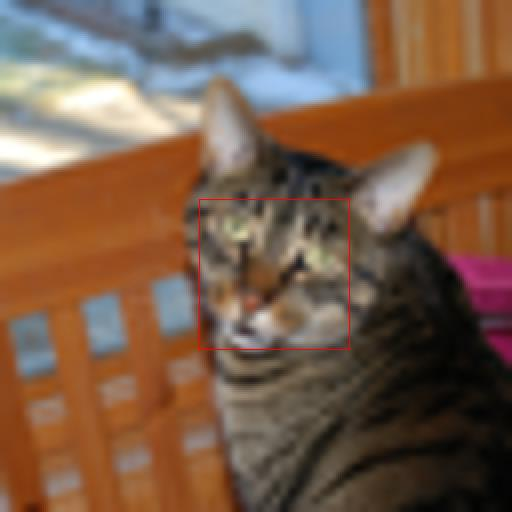

> **图 10（Figure 10）** ：ImageNet-Val 上的 ImageNet 64$\rightarrow$256 超分辨率。 **LDM-SR** 在渲染真实纹理方面具有优势，但 SR3 能合成更连贯的精细结构。更多样本和裁剪图见附录。SR3 结果来自 [72]。

> **表 4（Table 4）** ：任务 1：向受试者展示真实图像和生成图像，并要求选择偏好。任务 2：受试者必须在两张生成图像之间做出选择。更多细节见 [E.3.6](#A5.SS3.SSS6)。

由于双三次退化过程对于不遵循此预处理的图像泛化能力不佳，我们还通过使用更多样化的退化方式训练了一个通用模型，即 **_LDM-BSR_** 。结果展示于章节 [D.6.1](#A4.SS6.SSS1)。

> 表 5：ImageNet-Val 上的 $\times 4$ 超分辨率结果。($256^{2}$)；^†：FID 特征在验证集上计算，^‡：FID 特征在训练集上计算；^∗：在 NVIDIA A100 上评估。

### 4.5 使用潜在扩散进行图像修复（Inpainting with Latent Diffusion）

**图像修复（Inpainting）** 是指用新内容填充图像中被掩码区域的任务，其原因可能是图像部分区域已损坏，或是为了替换图像中现有但不希望保留的内容。我们评估了我们的条件图像生成通用方法与针对此任务的更专门、最先进的方法相比表现如何。我们的评估遵循 **LaMa** [88] 的协议，这是一个最近的图像修复模型，它引入了一种依赖于 **快速傅里叶卷积（Fast Fourier Convolutions）** [8] 的专门架构。在 **Places** [108] 数据集上的具体训练与评估协议在章节 [E.2.2](#A5.SS2.SSS2) 中描述。

我们首先分析了第一阶段不同设计选择的影响。

> 表 6：评估图像修复效率。^†：与图 [7](#S4.F7) 的偏差源于不同的 GPU 设置/批次大小，参见补充材料。

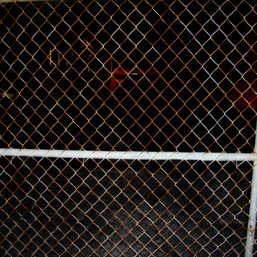

> 图 11：使用我们的 **big, w/ ft** 修复模型进行物体移除的定性结果。更多结果见图 [22](#A5.F22)。

具体而言，我们比较了 **LDM-1** （即基于像素的条件 **扩散模型（Diffusion Model, DM）** ）与 **LDM-4** 的修复效率，包括 **KL** 和 **VQ** 两种正则化方式，以及第一阶段不含任何注意力机制的 **VQ-LDM-4** （参见表 [8](#A4.T8)），后者减少了高分辨率解码时的 GPU 内存占用。为了可比性，我们固定了所有模型的参数量。表 [6](#S4.T6) 报告了在分辨率 $256^{2}$ 和 $512^{2}$ 下的训练与采样吞吐量、每轮训练的总时间（小时）以及六个训练轮次后在验证集上的 **FID（Fréchet Inception Distance）** 分数。总体而言，我们观察到基于潜在空间的扩散模型相比基于像素的扩散模型，速度至少提升了 $2.7\times$，同时 FID 分数至少改善了 $1.6\times$。

表 [7](#S4.T7) 中与其他修复方法的比较表明，我们带注意力机制的模型通过 FID 衡量的整体图像质量优于文献 [88] 的方法。未掩码图像与我们的样本之间的 **LPIPS（Learned Perceptual Image Patch Similarity）** 分数略高于文献 [88]。我们将此归因于文献 [88] 仅生成单一结果，倾向于恢复出更接近平均图像的输出，而我们的 **LDM（Latent Diffusion Model）** 能产生多样化的结果（参见图 [21](#A5.F21)）。此外，在一项用户研究（表 [4](#S4.T4)）中，人类受试者更青睐我们的结果而非文献 [88] 的结果。

基于这些初步结果，我们还在无注意力机制的 **VQ（Vector Quantization）** 正则化第一阶段的潜在空间中，训练了一个更大的扩散模型（即表 [7](#S4.T7) 中的 **big** ）。遵循文献 [15]，该扩散模型的 **UNet** 在其特征层次结构的三个层级上使用了注意力层，采用 **BigGAN（Large-scale Generative Adversarial Network）** [3] 的残差块进行上采样和下采样，参数量为 3.87 亿而非 2.15 亿。训练后，我们注意到在分辨率 $256^{2}$ 和 $512^{2}$ 下生成的样本质量存在差异，我们推测这可能是由额外的注意力模块引起的。然而，在分辨率 $512^{2}$ 下对模型进行半个轮次的 **微调（Fine-tuning）** ，使其能够适应新的特征统计量，并在图像修复任务上取得了新的最优 FID 分数（即表 [7](#S4.T7) 和图 [11](#S4.F11) 中的 **big, w/o attn, w/ ft** ）。

> 表：表 7：在从 Places [108] 测试图像中裁剪出的 3 万张 $512\times 512$ 尺寸图像上的修复性能比较。列 **40-50%** 报告了在困难示例（需要修复图像区域 40-50%）上计算的指标。^† 由于文献 [88] 使用的原始测试集不可用，此指标在我们的测试集上重新计算。

## 5 局限性与社会影响（Limitations & Societal Impact）

##### 局限性（Limitations）

与基于像素的方法相比， **潜在扩散模型（Latent Diffusion Models, LDMs）** 虽然显著降低了计算需求，但其顺序采样过程仍然比 **生成对抗网络（Generative Adversarial Networks, GANs）** 慢。此外，当需要高精度时，使用 LDMs 可能存在问题：尽管在我们的 $f=4$ 自编码模型中图像质量损失非常小（见图 [1](#S1.F1)），但其重建能力可能成为需要在像素空间实现细粒度精度的任务的瓶颈。我们推测，我们的 **超分辨率模型（Superresolution models）** （第 [4.4](#S4.SS4) 节）在这方面已经受到一定限制。

##### 社会影响（Societal Impact）

图像等媒体的 **生成模型（Generative models）** 是一把双刃剑：一方面，它们实现了各种创造性应用，特别是像我们这样降低训练和推理成本的方法，有潜力促进对该技术的获取并使其探索民主化。另一方面，这也意味着创建和传播被操纵的数据或散布错误信息和垃圾信息变得更加容易。特别是，对图像的蓄意操纵（“ **深度伪造（Deep fakes）** ”）在此背景下是一个普遍问题，而女性尤其受到其不成比例的影响 [13, 24]。

生成模型也可能泄露其训练数据 [5, 90]，当数据包含敏感或个人隐私信息且未经明确同意收集时，这一点尤其令人担忧。然而，这在多大程度上也适用于图像的 **扩散模型（Diffusion Models, DMs）** 尚未完全明了。

最后，深度学习模块倾向于复制或加剧数据中已经存在的偏见 [91, 38, 22]。虽然扩散模型比例如基于 GAN 的方法能更好地覆盖数据分布，但我们的两阶段方法（结合了 **对抗训练（Adversarial training）** 和基于 **似然（Likelihood）** 的目标）在多大程度上歪曲了数据，仍然是一个重要的研究问题。

关于深度生成模型伦理考量的更一般、详细的讨论，请参见例如 [13]。

## 6 结论（Conclusion）

我们提出了 **潜在扩散模型（Latent Diffusion Models）** ，这是一种在不降低质量的前提下，显著提高 **去噪扩散模型（Denoising Diffusion Models）** 训练和采样效率的简单而高效的方法。基于此以及我们的 **交叉注意力条件机制（Cross-attention conditioning mechanism）** ，我们的实验表明，在无需任务特定架构的情况下，我们的方法在广泛的 **条件图像合成（Conditional image synthesis）** 任务上，相比 **最先进（State-of-the-art）** 的方法取得了优异的结果。
(^†^†本研究得到了德国联邦经济事务和能源部在项目“KI-Absicherung - Safe AI for automated driving”以及德国研究基金会（German Research Foundation, DFG）项目 421703927 的支持。)

## 参考文献（References）

- [1]
  Eirikur Agustsson and Radu Timofte.
  NTIRE 2017 challenge on single image super-resolution: Dataset and
  study.
  In 2017 IEEE Conference on Computer Vision and Pattern
  Recognition Workshops, CVPR Workshops 2017, Honolulu, HI, USA, July 21-26,
  2017, pages 1122–1131. IEEE Computer Society, 2017.
- [2]
  Martin Arjovsky, Soumith Chintala, and Léon Bottou.
  Wasserstein gan, 2017.
- [3]
  Andrew Brock, Jeff Donahue, and Karen Simonyan.
  Large scale GAN training for high fidelity natural image synthesis.
  In Int. Conf. Learn. Represent., 2019.
- [4]
  Holger Caesar, Jasper R. R. Uijlings, and Vittorio Ferrari.
  Coco-stuff: Thing and stuff classes in context.
  In 2018 IEEE Conference on Computer Vision and Pattern
  Recognition, CVPR 2018, Salt Lake City, UT, USA, June 18-22, 2018, pages
  1209–1218. Computer Vision Foundation / IEEE Computer Society, 2018.
- [5]
  Nicholas Carlini, Florian Tramer, Eric Wallace, Matthew Jagielski, Ariel
  Herbert-Voss, Katherine Lee, Adam Roberts, Tom Brown, Dawn Song, Ulfar
  Erlingsson, et al.
  Extracting training data from large language models.
  In 30th USENIX Security Symposium (USENIX Security 21), pages
  2633–2650, 2021.
- [6]
  Mark Chen, Alec Radford, Rewon Child, Jeffrey Wu, Heewoo Jun, David Luan, and
  Ilya Sutskever.
  Generative pretraining from pixels.
  In ICML, volume 119 of Proceedings of Machine Learning
  Research, pages 1691–1703. PMLR, 2020.
- [7]
  Nanxin Chen, Yu Zhang, Heiga Zen, Ron J. Weiss, Mohammad Norouzi, and William
  Chan.
  Wavegrad: Estimating gradients for waveform generation.
  In ICLR. OpenReview.net, 2021.
- [8]
  Lu Chi, Borui Jiang, and Yadong Mu.
  Fast fourier convolution.
  In NeurIPS, 2020.
- [9]
  Rewon Child.
  Very deep vaes generalize autoregressive models and can outperform
  them on images.
  CoRR, abs/2011.10650, 2020.
- [10]
  Rewon Child, Scott Gray, Alec Radford, and Ilya Sutskever.
  Generating long sequences with sparse transformers.
  CoRR, abs/1904.10509, 2019.
- [11]
  Bin Dai and David P. Wipf.
  Diagnosing and enhancing VAE models.
  In ICLR (Poster). OpenReview.net, 2019.
- [12]
  Jia Deng, Wei Dong, Richard Socher, Li-Jia Li, Kai Li, and Fei-Fei Li.
  Imagenet: A large-scale hierarchical image database.
  In CVPR, pages 248–255. IEEE Computer Society, 2009.
- [13]
  Emily Denton.
  Ethical considerations of generative ai.
  AI for Content Creation Workshop, CVPR, 2021.
- [14]
  Jacob Devlin, Ming-Wei Chang, Kenton Lee, and Kristina Toutanova.
  BERT: pre-training of deep bidirectional transformers for language
  understanding.
  CoRR, abs/1810.04805, 2018.
- [15]
  Prafulla Dhariwal and Alex Nichol.
  Diffusion models beat gans on image synthesis.
  CoRR, abs/2105.05233, 2021.
- [16]
  Sander Dieleman.
  Musings on typicality, 2020.
- [17]
  Ming Ding, Zhuoyi Yang, Wenyi Hong, Wendi Zheng, Chang Zhou, Da Yin, Junyang
  Lin, Xu Zou, Zhou Shao, Hongxia Yang, and Jie Tang.
  Cogview: Mastering text-to-image generation via transformers.
  CoRR, abs/2105.13290, 2021.
- [18]
  Laurent Dinh, David Krueger, and Yoshua Bengio.
  Nice: Non-linear independent components estimation, 2015.
- [19]
  Laurent Dinh, Jascha Sohl-Dickstein, and Samy Bengio.
  Density estimation using real NVP.
  In 5th International Conference on Learning Representations,
  ICLR 2017, Toulon, France, April 24-26, 2017, Conference Track
  Proceedings. OpenReview.net, 2017.
- [20]
  Alexey Dosovitskiy and Thomas Brox.
  Generating images with perceptual similarity metrics based on deep
  networks.
  In Daniel D. Lee, Masashi Sugiyama, Ulrike von Luxburg, Isabelle
  Guyon, and Roman Garnett, editors, Adv. Neural Inform. Process. Syst.,
  pages 658–666, 2016.
- [21]
  Patrick Esser, Robin Rombach, Andreas Blattmann, and Björn Ommer.
  Imagebart: Bidirectional context with multinomial diffusion for
  autoregressive image synthesis.
  CoRR, abs/2108.08827, 2021.
- [22]
  Patrick Esser, Robin Rombach, and Björn Ommer.

- [22]
  关于生成模型中数据偏差的说明。
  arXiv 预印本 arXiv:2012.02516，2020年。
- [23]
  Patrick Esser、Robin Rombach 和 Björn Ommer。
  驯服 Transformer 以实现高分辨率图像合成。
  CoRR，abs/2012.09841，2020年。
- [24]
  Mary Anne Franks 和 Ari Ezra Waldman。
  性、谎言和录像带：深度伪造与言论自由的错觉。
  Md. L. Rev.，第78卷：892页，2018年。
- [25]
  Kevin Frans、Lisa B. Soros 和 Olaf Witkowski。
  Clipdraw：通过语言-图像编码器探索文本到绘图合成。
  ArXiv，abs/2106.14843，2021年。
- [26]
  Oran Gafni、Adam Polyak、Oron Ashual、Shelly Sheynin、Devi Parikh 和 Yaniv Taigman。
  Make-a-scene：基于场景并融入人类先验的文本到图像生成。
  CoRR，abs/2203.13131，2022年。
- [27]
  Ian J. Goodfellow、Jean Pouget-Abadie、Mehdi Mirza、Bing Xu、David Warde-Farley、Sherjil Ozair、Aaron C. Courville 和 Yoshua Bengio。
  生成对抗网络。
  CoRR，2014年。
- [28]
  Ishaan Gulrajani、Faruk Ahmed、Martin Arjovsky、Vincent Dumoulin 和 Aaron Courville。
  改进 Wasserstein GANs 的训练，2017年。
- [29]
  Martin Heusel、Hubert Ramsauer、Thomas Unterthiner、Bernhard Nessler 和 Sepp Hochreiter。
  通过双时间尺度更新规则训练的 GANs 收敛于局部纳什均衡。
  载于 Adv. Neural Inform. Process. Syst.，第6626–6637页，2017年。
- [30]
  Jonathan Ho、Ajay Jain 和 Pieter Abbeel。
  去噪扩散概率模型。
  载于 NeurIPS，2020年。
- [31]
  Jonathan Ho、Chitwan Saharia、William Chan、David J. Fleet、Mohammad Norouzi 和 Tim Salimans。
  用于高保真图像生成的级联扩散模型。
  CoRR，abs/2106.15282，2021年。
- [32]
  Jonathan Ho 和 Tim Salimans。
  无分类器扩散引导。
  载于 NeurIPS 2021 深度生成模型与下游应用研讨会，2021年。
- [33]
  Phillip Isola、Jun-Yan Zhu、Tinghui Zhou 和 Alexei A. Efros。
  使用条件对抗网络进行图像到图像翻译。
  载于 CVPR，第5967–5976页。IEEE 计算机学会，2017年。
- [34]
  Phillip Isola、Jun-Yan Zhu、Tinghui Zhou 和 Alexei A. Efros。
  使用条件对抗网络进行图像到图像翻译。
  2017年 IEEE 计算机视觉与模式识别会议 (CVPR)，第5967–5976页，2017年。
- [35]
  Andrew Jaegle、Sebastian Borgeaud、Jean-Baptiste Alayrac、Carl Doersch、Catalin Ionescu、David Ding、Skanda Koppula、Daniel Zoran、Andrew Brock、Evan Shelhamer、Olivier J. Hénaff、Matthew M. Botvinick、Andrew Zisserman、Oriol Vinyals 和 João Carreira。
  Perceiver IO：一种用于结构化输入和输出的通用架构。
  CoRR，abs/2107.14795，2021年。
- [36]
  Andrew Jaegle、Felix Gimeno、Andy Brock、Oriol Vinyals、Andrew Zisserman 和 João Carreira。
  Perceiver：通过迭代注意力实现通用感知。
  载于 Marina Meila 和 Tong Zhang 编辑，《第38届国际机器学习会议论文集，ICML 2021，2021年7月18-24日，虚拟会议》，《机器学习研究论文集》第139卷，第4651–4664页。PMLR，2021年。
- [37]
  Manuel Jahn、Robin Rombach 和 Björn Ommer。
  使用 Transformer 进行高分辨率复杂场景合成。
  CoRR，abs/2105.06458，2021年。
- [38]
  Niharika Jain、Alberto Olmo、Sailik Sengupta、Lydia Manikonda 和 Subbarao Kambhampati。
  不完美的想象：GANs 加剧面部数据增强和 Snapchat 自拍镜头偏见的启示。
  arXiv 预印本 arXiv:2001.09528，2020年。
- [39]
  Tero Karras、Timo Aila、Samuli Laine 和 Jaakko Lehtinen。
  渐进式增长的 GANs 以提升质量、稳定性和多样性。
  CoRR，abs/1710.10196，2017年。
- [40]
  Tero Karras、Samuli Laine 和 Timo Aila。
  一种用于生成对抗网络的基于风格的生成器架构。
  载于 IEEE Conf. Comput. Vis.

2019.

- [41]
  T. Karras, S. Laine, and T. Aila.
  **一种基于风格的生成对抗网络生成器架构（A style-based generator architecture for generative adversarial networks）** 。
  发表于 2019 IEEE/CVF 计算机视觉与模式识别会议（CVPR），2019。
- [42]
  Tero Karras, Samuli Laine, Miika Aittala, Janne Hellsten, Jaakko Lehtinen, and Timo Aila.
  **分析与改进 StyleGAN 的图像质量（Analyzing and improving the image quality of stylegan）** 。
  CoRR, abs/1912.04958, 2019。
- [43]
  Dongjun Kim, Seungjae Shin, Kyungwoo Song, Wanmo Kang, and Il-Chul Moon.
  **无界数据分数的得分匹配模型（Score matching model for unbounded data score）** 。
  CoRR, abs/2106.05527, 2021。
- [44]
  Durk P Kingma and Prafulla Dhariwal.
  **Glow：使用可逆 1x1 卷积的生成流（Glow: Generative flow with invertible 1x1 convolutions）** 。
  收录于 S. Bengio, H. Wallach, H. Larochelle, K. Grauman, N. Cesa-Bianchi, and R. Garnett 编辑的《神经信息处理系统进展》，2018。
- [45]
  Diederik P. Kingma, Tim Salimans, Ben Poole, and Jonathan Ho.
  **变分扩散模型（Variational diffusion models）** 。
  CoRR, abs/2107.00630, 2021。
- [46]
  Diederik P. Kingma and Max Welling.
  **自编码变分贝叶斯（Auto-Encoding Variational Bayes）** 。
  发表于第二届国际学习表征会议（ICLR），2014。
- [47]
  Zhifeng Kong and Wei Ping.
  **论扩散概率模型的快速采样（On fast sampling of diffusion probabilistic models）** 。
  CoRR, abs/2106.00132, 2021。
- [48]
  Zhifeng Kong, Wei Ping, Jiaji Huang, Kexin Zhao, and Bryan Catanzaro.
  **DiffWave：一种用于音频合成的通用扩散模型（Diffwave: A versatile diffusion model for audio synthesis）** 。
  发表于 ICLR。OpenReview.net, 2021。
- [49]
  Alina Kuznetsova, Hassan Rom, Neil Alldrin, Jasper R. R. Uijlings, Ivan Krasin, Jordi Pont-Tuset, Shahab Kamali, Stefan Popov, Matteo Malloci, Tom Duerig, and Vittorio Ferrari.
  **Open Images 数据集 V4：大规模统一的图像分类、目标检测和视觉关系检测（The open images dataset V4: unified image classification, object detection, and visual relationship detection at scale）** 。
  CoRR, abs/1811.00982, 2018。
- [50]
  Tuomas Kynkäänniemi, Tero Karras, Samuli Laine, Jaakko Lehtinen, and Timo Aila.
  **用于评估生成模型的改进精确率与召回率指标（Improved precision and recall metric for assessing generative models）** 。
  CoRR, abs/1904.06991, 2019。
- [51]
  Tsung-Yi Lin, Michael Maire, Serge J. Belongie, Lubomir D. Bourdev, Ross B. Girshick, James Hays, Pietro Perona, Deva Ramanan, Piotr Dollár, and C. Lawrence Zitnick.
  **Microsoft COCO：上下文中的常见物体（Microsoft COCO: common objects in context）** 。
  CoRR, abs/1405.0312, 2014。
- [52]
  Yuqing Ma, Xianglong Liu, Shihao Bai, Le-Yi Wang, Aishan Liu, Dacheng Tao, and Edwin Hancock.
  **面向大面积缺失区域的区域化生成对抗图像修复（Region-wise generative adversarial image inpainting for large missing areas）** 。
  ArXiv, abs/1909.12507, 2019。
- [53]
  Chenlin Meng, Yang Song, Jiaming Song, Jiajun Wu, Jun-Yan Zhu, and Stefano Ermon.
  **SDEdit：使用随机微分方程进行图像合成与编辑（Sdedit: Image synthesis and editing with stochastic differential equations）** 。
  CoRR, abs/2108.01073, 2021。
- [54]
  Lars M. Mescheder.
  **论 GAN 训练的收敛性（On the convergence properties of GAN training）** 。
  CoRR, abs/1801.04406, 2018。
- [55]
  Luke Metz, Ben Poole, David Pfau, and Jascha Sohl-Dickstein.
  **展开式生成对抗网络（Unrolled generative adversarial networks）** 。
  发表于第五届国际学习表征会议（ICLR 2017），法国土伦，2017年4月24-26日，会议论文集。OpenReview.net, 2017。
- [56]
  Mehdi Mirza and Simon Osindero.
  **条件生成对抗网络（Conditional generative adversarial nets）** 。
  CoRR, abs/1411.1784, 2014。
- [57]
  Gautam Mittal, Jesse H. Engel, Curtis Hawthorne, and Ian Simon.
  **使用扩散模型的符号音乐生成（Symbolic music generation with diffusion models）** 。
  CoRR, abs/2103.16091, 2021。
- [58]
  Kamyar Nazeri, Eric Ng, Tony Joseph, Faisal Z. Qureshi, and Mehran Ebrahimi.
  **EdgeConnect：通过对抗性边缘学习进行生成式图像修复（Edgeconnect: Generative image inpainting with adversarial edge learning）** 。
  ArXiv, abs/1901.00212, 2019。
- [59]
  Alex Nichol, Prafulla Dhariwal, Aditya Ramesh, Pranav Shyam, Pamela Mishkin, Bob McGrew, Ilya Sutskever, and Mark Chen.
  **GLIDE：迈向使用文本引导扩散模型进行逼真图像生成与编辑（GLIDE: towards photorealistic image generation and editing with text-guided diffusion models）** 。
  CoRR, abs/2112.10741, 2021。
- [60]
  Anton Obukhov, Maximilian Seitzer, Po-Wei Wu, Semen Zhydenko, Jonathan Kyl, and Elvis Yu-Jing Lin.
  **PyTorch 中生成模型的高保真性能指标（High-fidelity performance metrics for generative models in pytorch）** ，

2020. 版本：0.3.0, DOI: 10.5281/zenodo.4957738。

- [61]
  朴泰成（Taesung Park）、刘明宇（Ming-Yu Liu）、王廷春（Ting-Chun Wang）、朱俊彦（Jun-Yan Zhu）。
  基于空间自适应归一化的语义图像合成（Semantic image synthesis with spatially-adaptive normalization）。
  收录于《IEEE 计算机视觉与模式识别会议论文集》（Proceedings of the IEEE Conference on Computer Vision and Pattern Recognition），2019年。
- [62]
  朴泰成（Taesung Park）、刘明宇（Ming-Yu Liu）、王廷春（Ting-Chun Wang）、朱俊彦（Jun-Yan Zhu）。
  基于空间自适应归一化的语义图像合成（Semantic image synthesis with spatially-adaptive normalization）。
  收录于《IEEE/CVF 计算机视觉与模式识别会议论文集》（Proceedings of the IEEE/CVF Conference on Computer Vision and Pattern Recognition, CVPR），2019年6月。
- [63]
  高拉夫·帕尔马（Gaurav Parmar）、李大成（Dacheng Li）、李权俊（Kwonjoon Lee）、涂卓文（Zhuowen Tu）。
  双重对比生成自编码器（Dual contradistinctive generative autoencoder）。
  收录于《IEEE 计算机视觉与模式识别会议》（IEEE Conference on Computer Vision and Pattern Recognition, CVPR 2021），线上会议，2021年6月19-25日，第823–832页。计算机视觉基金会（Computer Vision Foundation）/ IEEE，2021年。
- [64]
  高拉夫·帕尔马（Gaurav Parmar）、张理查（Richard Zhang）、朱俊彦（Jun-Yan Zhu）。
  论有缺陷的图像缩放库与FID计算中令人惊讶的微妙之处（On buggy resizing libraries and surprising subtleties in fid calculation）。
  arXiv 预印本 arXiv:2104.11222，2021年。
- [65]
  大卫·A·帕特森（David A. Patterson）、约瑟夫·冈萨雷斯（Joseph Gonzalez）、乐奎·V·勒（Quoc V. Le）、梁晨（Chen Liang）、路易斯-米克尔·蒙吉亚（Lluis-Miquel Munguia）、丹尼尔·罗斯柴尔德（Daniel Rothchild）、大卫·R·索（David R. So）、莫德·特克西尔（Maud Texier）、杰夫·迪恩（Jeff Dean）。
  碳排放与大型神经网络训练（Carbon emissions and large neural network training）。
  CoRR，abs/2104.10350，2021年。
- [66]
  阿迪亚·拉梅什（Aditya Ramesh）、米哈伊尔·巴甫洛夫（Mikhail Pavlov）、加布里埃尔·高（Gabriel Goh）、斯科特·格雷（Scott Gray）、切尔西·沃斯（Chelsea Voss）、亚历克·拉德福德（Alec Radford）、马克·陈（Mark Chen）、伊利亚·苏茨克韦（Ilya Sutskever）。
  零样本文本到图像生成（Zero-shot text-to-image generation）。
  CoRR，abs/2102.12092，2021年。
- [67]
  阿里·拉扎维（Ali Razavi）、阿伦·范登奥德（Aäron van den Oord）、奥里奥尔·维尼亚尔斯（Oriol Vinyals）。
  使用VQ-VAE-2生成多样化的高保真图像（Generating diverse high-fidelity images with VQ-VAE-2）。
  收录于《神经信息处理系统大会》（NeurIPS），第14837–14847页，2019年。
- [68]
  斯科特·E·里德（Scott E. Reed）、泽伊内普·阿卡塔（Zeynep Akata）、严新辰（Xinchen Yan）、拉贾努根·洛格斯瓦兰（Lajanugen Logeswaran）、伯恩特·席勒（Bernt Schiele）、李洪乐（Honglak Lee）。
  生成对抗式文本到图像合成（Generative adversarial text to image synthesis）。
  收录于《国际机器学习大会》（ICML），2016年。
- [69]
  达尼洛·希门尼斯·雷森德（Danilo Jimenez Rezende）、沙基尔·穆罕默德（Shakir Mohamed）、丹·维尔斯特拉（Daan Wierstra）。
  深度生成模型中的随机反向传播与近似推断（Stochastic backpropagation and approximate inference in deep generative models）。
  收录于《第31届国际机器学习大会论文集》（Proceedings of the 31st International Conference on International Conference on Machine Learning, ICML），2014年。
- [70]
  罗宾·龙巴赫（Robin Rombach）、帕特里克·埃塞尔（Patrick Esser）、比约恩·奥默（Björn Ommer）。
  使用条件可逆神经网络的网络到网络翻译（Network-to-network translation with conditional invertible neural networks）。
  收录于《神经信息处理系统大会》（NeurIPS），2020年。
- [71]
  奥拉夫·龙内贝格尔（Olaf Ronneberger）、菲利普·菲舍尔（Philipp Fischer）、托马斯·布罗克斯（Thomas Brox）。
  U-Net：用于生物医学图像分割的卷积网络（U-net: Convolutional networks for biomedical image segmentation）。
  收录于《医学图像计算与计算机辅助干预国际会议（第三部分）》（MICCAI (3)），《计算机科学讲义》（Lecture Notes in Computer Science）第9351卷，第234–241页。施普林格（Springer），2015年。
- [72]
  奇特万·萨哈里亚（Chitwan Saharia）、乔纳森·何（Jonathan Ho）、威廉·陈（William Chan）、蒂姆·萨利曼斯（Tim Salimans）、大卫·J·弗利特（David J. Fleet）、穆罕默德·诺鲁齐（Mohammad Norouzi）。
  通过迭代细化的图像超分辨率（Image super-resolution via iterative refinement）。
  CoRR，abs/2104.07636，2021年。
- [73]
  蒂姆·萨利曼斯（Tim Salimans）、安德烈·卡帕西（Andrej Karpathy）、陈曦（Xi Chen）、迪德里克·P·金马（Diederik P. Kingma）。
  PixelCNN++：通过离散化逻辑混合似然及其他改进优化PixelCNN（Pixelcnn++: Improving the pixelcnn with discretized logistic mixture likelihood and other modifications）。
  CoRR，abs/1701.05517，2017年。
- [74]
  戴夫·萨尔瓦托（Dave Salvator）。
  NVIDIA 开发者博客（NVIDIA Developer Blog）。
  [https://developer.nvidia.com/blog/getting-immediate-speedups-with-a100-tf32](https://developer.nvidia.com/blog/getting-immediate-speedups-with-a100-tf32)。

2020.

- [75]
  罗宾·桑-罗曼（Robin San-Roman）、埃利亚·纳赫马尼（Eliya Nachmani）和利奥尔·沃尔夫（Lior Wolf）。
  生成扩散模型的噪声估计。
  CoRR，abs/2104.02600，2021。
- [76]
  阿克塞尔·绍尔（Axel Sauer）、卡什亚普·奇塔（Kashyap Chitta）、延斯·米勒（Jens Müller）和安德烈亚斯·盖格（Andreas Geiger）。
  投影生成对抗网络收敛更快。
  CoRR，abs/2111.01007，2021。
- [77]
  埃德加·舍恩费尔德（Edgar Schönfeld）、伯恩特·席勒（Bernt Schiele）和安娜·霍雷瓦（Anna Khoreva）。
  一种基于 U-Net 的生成对抗网络判别器。
  载于 2020 年 IEEE/CVF 计算机视觉与模式识别会议，CVPR 2020，美国华盛顿州西雅图，2020 年 6 月 13-19 日，第 8204–8213 页。计算机视觉基金会 / IEEE，2020。
- [78]
  克里斯托夫·舒曼（Christoph Schuhmann）、理查德·文丘（Richard Vencu）、罗曼·博蒙特（Romain Beaumont）、罗伯特·卡奇马尔奇克（Robert Kaczmarczyk）、克莱顿·穆利斯（Clayton Mullis）、阿鲁什·卡塔（Aarush Katta）、西奥·库姆斯（Theo Coombes）、杰尼亚·吉采夫（Jenia Jitsev）和阿兰·小松崎（Aran Komatsuzaki）。
  Laion-400m：包含 4 亿个经 CLIP 筛选的图像-文本对的开放数据集，2021。
- [79]
  卡伦·西蒙尼扬（Karen Simonyan）和安德鲁·齐泽曼（Andrew Zisserman）。
  用于大规模图像识别的极深度卷积网络。
  载于约书亚·本吉奥（Yoshua Bengio）和扬·勒昆（Yann LeCun）编辑的《国际学习表征会议》，2015。
- [80]
  阿布舍克·辛哈（Abhishek Sinha）、宋嘉明（Jiaming Song）、孟晨霖（Chenlin Meng）和斯特凡诺·埃尔蒙（Stefano Ermon）。
  D2C：用于少样本条件生成的扩散-去噪模型。
  CoRR，abs/2106.06819，2021。
- [81]
  查理·斯内尔（Charlie Snell）。
  外星梦：一个新兴的艺术场景。
  [https://ml.berkeley.edu/blog/posts/clip-art/](https://ml.berkeley.edu/blog/posts/clip-art/)，2021。
  [在线；访问于 2021 年 11 月]。
- [82]
  雅沙·索尔-迪克斯坦（Jascha Sohl-Dickstein）、埃里克·A·韦斯（Eric A. Weiss）、尼鲁·马赫什瓦拉坦（Niru Maheswaranathan）和苏里亚·甘古利（Surya Ganguli）。
  利用非平衡热力学进行深度无监督学习。
  CoRR，abs/1503.03585，2015。
- [83]
  孙基赫（Kihyuk Sohn）、李洪乐（Honglak Lee）和严新辰（Xinchen Yan）。
  使用深度条件生成模型学习结构化输出表示。
  载于 C·科尔特斯（C. Cortes）、N·劳伦斯（N. Lawrence）、D·李（D. Lee）、M·杉山（M. Sugiyama）和 R·加内特（R. Garnett）编辑的《神经信息处理系统进展》，第 28 卷。Curran Associates, Inc.，2015。
- [84]
  宋嘉明（Jiaming Song）、孟晨霖（Chenlin Meng）和斯特凡诺·埃尔蒙（Stefano Ermon）。
  去噪扩散隐式模型。
  载于 ICLR。OpenReview.net，2021。
- [85]
  宋扬（Yang Song）、雅沙·索尔-迪克斯坦（Jascha Sohl-Dickstein）、迪德里克·P·金马（Diederik P. Kingma）、阿布舍克·库马尔（Abhishek Kumar）、斯特凡诺·埃尔蒙（Stefano Ermon）和本·普尔（Ben Poole）。
  通过随机微分方程进行基于分数的生成建模。
  CoRR，abs/2011.13456，2020。
- [86]
  艾玛·斯特鲁贝尔（Emma Strubell）、阿南亚·加内什（Ananya Ganesh）和安德鲁·麦卡勒姆（Andrew McCallum）。
  现代深度学习研究的能源与政策考量。
  载于第三十四届 AAAI 人工智能会议，AAAI 2020，第三十二届人工智能创新应用会议，IAAI 2020，第十届 AAAI 人工智能教育进展研讨会，EAAI 2020，美国纽约州纽约市，2020 年 2 月 7-12 日，第 13693–13696 页。AAAI Press，2020。
- [87]
  孙伟（Wei Sun）和吴天福（Tianfu Wu）。
  学习布局和风格可重构的生成对抗网络以实现可控图像合成。
  CoRR，abs/2003.11571，2020。
- [88]
  罗曼·苏沃罗夫（Roman Suvorov）、伊丽莎维塔·洛加切娃（Elizaveta Logacheva）、安东·马希欣（Anton Mashikhin）、阿纳斯塔西娅·列米佐娃（Anastasia Remizova）、阿尔谢尼·阿舒哈（Arsenii Ashukha）、阿列克谢·西尔韦斯特罗夫（Aleksei Silvestrov）、孔内真（Naejin Kong）、哈什斯·戈卡（Harshith Goka）、朴基雄（Kiwoong Park）和维克托·S·伦皮茨基（Victor S. Lempitsky）。
  利用傅里叶卷积实现分辨率鲁棒的大掩码修复。
  ArXiv，abs/2109.07161，2021。
- [89]
  特里斯坦·西尔万（Tristan Sylvain）、张鹏川（Pengchuan Zhang）、约书亚·本吉奥（Yoshua Bengio）、R·德文·耶尔姆（R. Devon Hjelm）和希卡尔·夏尔马（Shikhar Sharma）。
  从布局生成以对象为中心的图像。
  载于第三十五届 AAAI 人工智能会议，AAAI 2021，第三十三届人工智能创新应用会议，IAAI 2021，第十一届人工智能教育进展研讨会，EAAI 2021，线上活动，2021 年 2 月 2-9 日，第 2647–2655 页。AAAI Press，2021。
- [90]
  帕特里克·廷斯利（Patrick Tinsley）、亚当·恰伊卡（Adam Czajka）和帕特里克·弗林（Patrick Flynn）。
  这张脸不存在……但它可能是你的！生成模型中的身份泄露。
  载于 IEEE/CVF 冬季计算机视觉应用会议论文集，第 1320–1328 页，2021。
- [91]
  安东尼奥·托拉尔巴（Antonio Torralba）和阿列克谢·A·埃夫罗斯（Alexei A Efros）。
  对数据集偏差的无偏审视。

- [92]
  Arash Vahdat and Jan Kautz.
  **NVAE：一种深度分层变分自编码器（NVAE: A Deep Hierarchical Variational Autoencoder）** 。
  发表于 NeurIPS，2020。
- [93]
  Arash Vahdat, Karsten Kreis, and Jan Kautz.
  **潜在空间中的基于分数的生成建模（Score-based Generative Modeling in Latent Space）** 。
  CoRR, abs/2106.05931, 2021。
- [94]
  Aaron van den Oord, Nal Kalchbrenner, Lasse Espeholt, Koray Kavukcuoglu, Oriol Vinyals, and Alex Graves.
  **使用 PixelCNN 解码器的条件图像生成（Conditional Image Generation with PixelCNN Decoders）** 。
  发表于《神经信息处理系统进展》，2016。
- [95]
  Aäron van den Oord, Nal Kalchbrenner, and Koray Kavukcuoglu.
  **像素循环神经网络（Pixel Recurrent Neural Networks）** 。
  CoRR, abs/1601.06759, 2016。
- [96]
  Aäron van den Oord, Oriol Vinyals, and Koray Kavukcuoglu.
  **神经离散表示学习（Neural Discrete Representation Learning）** 。
  发表于 NIPS，第 6306–6315 页，2017。
- [97]
  Ashish Vaswani, Noam Shazeer, Niki Parmar, Jakob Uszkoreit, Llion Jones, Aidan N. Gomez, Lukasz Kaiser, and Illia Polosukhin.
  **注意力机制就是你所需要的一切（Attention Is All You Need）** 。
  发表于 NIPS，第 5998–6008 页，2017。
- [98]
  Rivers Have Wings.
  **关于自回归模型的无分类器引导的推文（Tweet on Classifier-free Guidance for Autoregressive Models）** 。

2022.

- [99]
  Thomas Wolf, Lysandre Debut, Victor Sanh, Julien Chaumond, Clement Delangue,
  Anthony Moi, Pierric Cistac, Tim Rault, Rémi Louf, Morgan Funtowicz,
  and Jamie Brew.
  Huggingface’s transformers: State-of-the-art natural language
  processing.
  CoRR, abs/1910.03771, 2019.
- [100]
  Zhisheng Xiao, Karsten Kreis, Jan Kautz, and Arash Vahdat.
  VAEBM: A symbiosis between variational autoencoders and
  energy-based models.
  In 9th International Conference on Learning Representations,
  ICLR 2021, Virtual Event, Austria, May 3-7, 2021. OpenReview.net, 2021.
- [101]
  Wilson Yan, Yunzhi Zhang, Pieter Abbeel, and Aravind Srinivas.
  Videogpt: Video generation using VQ-VAE and transformers.
  CoRR, abs/2104.10157, 2021.
- [102]
  Fisher Yu, Yinda Zhang, Shuran Song, Ari Seff, and Jianxiong Xiao.
  LSUN: construction of a large-scale image dataset using deep
  learning with humans in the loop.
  CoRR, abs/1506.03365, 2015.
- [103]
  Jiahui Yu, Xin Li, Jing Yu Koh, Han Zhang, Ruoming Pang, James Qin, Alexander
  Ku, Yuanzhong Xu, Jason Baldridge, and Yonghui Wu.
  Vector-quantized image modeling with improved vqgan, 2021.
- [104]
  Jiahui Yu, Zhe L. Lin, Jimei Yang, Xiaohui Shen, Xin Lu, and Thomas S. Huang.
  Free-form image inpainting with gated convolution.
  2019 IEEE/CVF International Conference on Computer Vision
  (ICCV), pages 4470–4479, 2019.
- [105]
  K. Zhang, Jingyun Liang, Luc Van Gool, and Radu Timofte.
  Designing a practical degradation model for deep blind image
  super-resolution.
  ArXiv, abs/2103.14006, 2021.
- [106]
  Richard Zhang, Phillip Isola, Alexei A. Efros, Eli Shechtman, and Oliver Wang.
  The unreasonable effectiveness of deep features as a perceptual
  metric.
  In Proceedings of the IEEE Conference on Computer Vision and
  Pattern Recognition (CVPR), June 2018.
- [107]
  Shengyu Zhao, Jianwei Cui, Yilun Sheng, Yue Dong, Xiao Liang, Eric I-Chao
  Chang, and Yan Xu.
  Large scale image completion via co-modulated generative adversarial
  networks.
  ArXiv, abs/2103.10428, 2021.
- [108]
  Bolei Zhou, Àgata Lapedriza, Aditya Khosla, Aude Oliva, and Antonio
  Torralba.
  Places: A 10 million image database for scene recognition.
  IEEE Transactions on Pattern Analysis and Machine Intelligence,
  40:1452–1464, 2018.
- [109]
  Yufan Zhou, Ruiyi Zhang, Changyou Chen, Chunyuan Li, Chris Tensmeyer, Tong Yu,
  Jiuxiang Gu, Jinhui Xu, and Tong Sun.
  LAFITE: towards language-free training for text-to-image
  generation.
  CoRR, abs/2111.13792, 2021.

## 附录 A 更新日志（Appendix A Changelog）

此处列出了本文当前版本 ([https://arxiv.org/abs/2112.10752v2](https://arxiv.org/abs/2112.10752v2)) 与前一版本（即 [https://arxiv.org/abs/2112.10752v1](https://arxiv.org/abs/2112.10752v1)）之间的变更。

- •
  我们更新了第 [4.3](#S4.SS3) 节中关于 **文生图（Text-to-image synthesis）** 的结果，这些结果是通过训练一个更大规模的新模型（14.5B 参数）获得的。这还包括与近期在该任务上发表的竞争方法进行的新比较，这些方法与我们工作的发表同时（[59, 109]）或之后（[26]）发布于 arXiv。
- •
  我们更新了第 [4.1](#S4.SS1) 节和表 [3](#S4.T3) 中关于 ImageNet 上 **类条件合成（Class-conditional synthesis）** 的结果（另见第 [D.4](#A4.SS4) 节），这些结果是通过使用更大的 **批大小（Batch Size）** 重新训练模型获得的。图 [26](#A8.F26) 和图 [27](#A8.F27) 中相应的定性结果也已更新。更新后的文生图模型和类条件模型现在都使用了 **无分类器引导（Classifier-free guidance）** [32] 作为提高视觉保真度的措施。
- •
  我们进行了一项用户研究（遵循 Saharia 等人 [72] 建议的方案），为我们的 **图像修复（Inpainting）** （第 [4.5](#S4.SS5) 节）和 **超分辨率（Super-resolution）** 模型（第 [4.4](#S4.SS4) 节）提供了额外的评估。
- •
  将图 [5](#S4.F5) 添加至正文，将图 [18](#A4.F18) 移至附录，并将图 [13](#A0.F13) 添加至附录。

## 附录 B：关于去噪扩散模型的详细信息

扩散模型可以通过一个 **信噪比（Signal-to-Noise Ratio, SNR）** $\text{SNR}(t)=\frac{\alpha_{t}^{2}}{\sigma_{t}^{2}}$ 来定义，该信噪比由序列 $(\alpha_{t})_{t=1}^{T}$ 和 $(\sigma_{t})_{t=1}^{T}$ 构成。从一个数据样本 $x_{0}$ 开始，它们定义了一个前向扩散过程 $q$：

$$
q(x_{t}|x_{0})=\mathcal{N}(x_{t}|\alpha_{t}x_{0},\sigma_{t}^{2}\mathbb{I}) \quad (4)
$$

对于 $s<t$，其具有 **马尔可夫结构（Markov structure）** ：

$$
\begin{aligned}
\displaystyle q(x_{t}|x_{s}) & \displaystyle=\mathcal{N}(x_{t}|\alpha_{t|s}x_{s},\sigma_{t|s}^{2}\mathbb{I}) \quad (5) \\
\displaystyle\alpha_{t|s} & \displaystyle=\frac{\alpha_{t}}{\alpha_{s}} \quad (6) \\
\displaystyle\sigma_{t|s}^{2} & \displaystyle=\sigma_{t}^{2}-\alpha_{t|s}^{2}\sigma_{s}^{2} \quad (7)
\end{aligned}
$$

**去噪扩散模型（Denoising Diffusion Models）** 是生成模型 $p(x_{0})$，它们以类似但时间上反向运行的马尔可夫结构来逆转这个过程，即，它们被定义为：

$$
p(x_{0})=\int_{z}p(x_{T})\prod_{t=1}^{T}p(x_{t-1}|x_{t}) \quad (8)
$$

与此模型相关的 **证据下界（Evidence Lower Bound, ELBO）** 随后在离散时间步上分解为：

$$
-\log p(x_{0})\leq\mathbb{KL}(q(x_{T}|x_{0})|p(x_{T}))+\sum_{t=1}^{T}\mathbb{E}_{q(x_{t}|x_{0})}\mathbb{KL}(q(x_{t-1}|x_{t},x_{0})|p(x_{t-1}|x_{t})) \quad (9)
$$

先验分布 $p(x_{T})$ 通常选择为标准正态分布，此时 ELBO 的第一项仅取决于最终的信噪比 $\text{SNR}(T)$。为了最小化剩余项，参数化 $p(x_{t-1}|x_{t})$ 的一个常见选择是，根据真实后验分布 $q(x_{t-1}|x_{t},x_{0})$ 来指定它，但用基于当前步骤 $x_{t}$ 的估计值 $x_{\theta}(x_{t},t)$ 替换未知的 $x_{0}$。由此得到 [45]：

$$
\begin{aligned}
\displaystyle p(x_{t-1}|x_{t}) & \displaystyle\coloneqq q(x_{t-1}|x_{t},x_{\theta}(x_{t},t)) \quad (10) \\
& \displaystyle=\mathcal{N}(x_{t-1}|\mu_{\theta}(x_{t},t),\sigma_{t|t-1}^{2}\frac{\sigma_{t-1}^{2}}{\sigma_{t}^{2}}\mathbb{I}), \quad (11)
\end{aligned}
$$

其中均值可以表示为：

$$
\mu_{\theta}(x_{t},t)=\frac{\alpha_{t|t-1}\sigma_{t-1}^{2}}{\sigma_{t}^{2}}x_{t}+\frac{\alpha_{t-1}\sigma_{t|t-1}^{2}}{\sigma_{t}^{2}}x_{\theta}(x_{t},t). \quad (12)
$$

在这种情况下，ELBO 的和简化为：

$$
\sum_{t=1}^{T}\mathbb{E}_{q(x_{t}|x_{0})}\mathbb{KL}(q(x_{t-1}|x_{t},x_{0})|p(x_{t-1}))=\sum_{t=1}^{T}\mathbb{E}_{\mathcal{N}(\epsilon|0,\mathbb{I})}\frac{1}{2}(\text{SNR}(t-1)-\text{SNR}(t))\|x_{0}-x_{\theta}(\alpha_{t}x_{0}+\sigma_{t}\epsilon,t)\|^{2} \quad (13)
$$

遵循 [30]，我们使用 **重参数化（Reparameterization）** ：

$$
\epsilon_{\theta}(x_{t},t)=(x_{t}-\alpha_{t}x_{\theta}(x_{t},t))/\sigma_{t} \quad (14)
$$

将重构项表达为一个去噪目标：

$$
\|x_{0}-x_{\theta}(\alpha_{t}x_{0}+\sigma_{t}\epsilon,t)\|^{2}=\frac{\sigma_{t}^{2}}{\alpha_{t}^{2}}\|\epsilon-\epsilon_{\theta}(\alpha_{t}x_{0}+\sigma_{t}\epsilon,t)\|^{2} \quad (15)
$$

以及 **重新加权（Reweighting）** ，它为每一项分配相同的权重，并得到方程 ([1](#S3.E1))。

## **附录 C 图像引导机制**

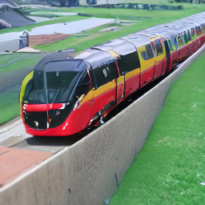

> **图 14** ：在风景图像上，使用无条件模型进行卷积采样可能导致同质化且不连贯的全局结构（见第 2 列）。使用低分辨率图像进行 **$L_{2}$ 引导** 有助于重建连贯的全局结构。

**扩散模型（Diffusion models）** 一个引人入胜的特性是， **无条件模型（unconditional models）** 可以在测试时被条件化 [85, 82, 15]。
具体而言，文献 [15] 提出了一种算法，利用一个在扩散过程的每个 $x_{t}$ 上训练的分类器 $\log p_{\Phi}(y|x_{t})$，来引导在 ImageNet 数据集上训练的无条件模型和条件模型。
我们直接基于此公式，并引入了事后 **图像引导** ：

对于一个具有固定方差的 **epsilon 参数化模型（epsilon-parameterized model）** ，文献 [15] 中介绍的引导算法如下：

$$
\hat{\epsilon}\leftarrow\epsilon_{\theta}(z_{t},t)+\sqrt{1-\alpha_{t}^{2}}\;\nabla_{z_{t}}\log p_{\Phi}(y|z_{t})\;.(16)
$$

这可以解释为利用条件分布 $\log p_{\Phi}(y|z_{t})$ 来修正“分数” $\epsilon_{\theta}$ 的一次更新。

迄今为止，这种方案仅应用于单类别分类模型。我们将引导分布 $p_{\Phi}(y|T(\mathcal{D}(z_{0}(z_{t}))))$ 重新解释为给定目标图像 $y$ 的通用 **图像到图像转换（image-to-image translation）** 任务，其中 $T$ 可以是适用于当前图像到图像转换任务的任何可微变换，例如恒等变换、下采样操作或类似操作。
举例来说，我们可以假设一个具有固定方差 $\sigma^{2}=1$ 的 **高斯引导器（Gaussian guider）** ，使得

$$
\log p_{\Phi}(y|z_{t})=-\frac{1}{2}\|y-T(\mathcal{D}(z_{0}(z_{t})))\|^{2}_{2}(17)
$$

成为一个 **$L_{2}$ 回归目标（$L_{2}$ regression objective）** 。

图 [14](#A3.F14) 展示了此公式如何能够作为一个在 $256^{2}$ 图像上训练的无条件模型的 **上采样机制（upsampling mechanism）** 。其中，大小为 $256^{2}$ 的无条件样本引导着 $512^{2}$ 图像的卷积合成，而 $T$ 是一个 $2\times$ 双三次下采样。
基于此动机，我们还尝试了 **感知相似性引导（perceptual similarity guiding）** ，并用 **LPIPS（Learned Perceptual Image Patch Similarity）** [106] 度量替换了 $L_{2}$ 目标，详见第 [4.4](#S4.SS4) 节。

## 附录 D 补充结果

### D.1 高分辨率合成的信噪比选择

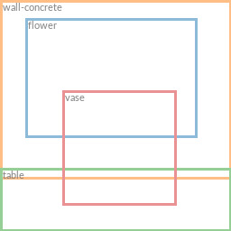

> 图 15：展示了潜在空间重缩放对卷积采样的影响，此处以风景语义图像合成为例。参见章节 [4.3.2](#S4.SS3.SSS2) 和章节 [D.1](#A4.SS1)。

如章节 [4.3.2](#S4.SS3.SSS2) 所述，由潜在空间方差引起的信噪比（Signal-to-Noise Ratio， SNR）（即 $\text{Var(z)}/\sigma^{2}_{t}$）对卷积采样的结果有显著影响。例如，当直接在 KL 正则化（KL-regularized）模型的潜在空间中训练一个 **潜在扩散模型（Latent Diffusion Model, LDM）** （参见表 [8](#A4.T8)）时，该比率非常高，导致模型在反向去噪过程的早期就分配了大量的语义细节。相反，如章节 [G](#A7) 所述，通过潜在分量的标准差对潜在空间进行重缩放时，信噪比会降低。我们在图 [15](#A4.F15) 中展示了这对语义图像合成的卷积采样的影响。请注意， **向量量化正则化（Vector Quantization-regularized, VQ-regularized）** 空间的方差接近 $1$，因此无需重缩放。

### D.2 所有第一阶段模型的完整列表

我们在表 [8](#A4.T8) 中提供了在 OpenImages 数据集上训练的各种 **自编码模型（Autoencoding models）** 的完整列表。

> 表 8：在 OpenImages 上训练、在 ImageNet-Val 上评估的完整自编码器集合。$\dagger$ 表示无注意力机制的自编码器。

### D.3 布局到图像合成

> 图 16：我们用于布局到图像合成的最佳模型 _LDM-4_ 的更多样本，该模型在 OpenImages 数据集上训练，并在 COCO 数据集上进行了微调。样本使用 100 步 DDIM 和 $\eta=0$ 生成。布局来自 COCO 验证集。

> 表 9：我们的布局到图像模型在 COCO [4] 和 OpenImages [49] 数据集上的定量比较。^†：在 COCO 上从头训练；^∗：从 OpenImages 模型微调。

在此，我们为章节 [4.3.1](#S4.SS3.SSS1) 中介绍的布局到图像模型提供定量评估和额外样本。我们在 COCO [4] 数据集上训练了一个模型，并在 OpenImages [49] 数据集上训练了另一个模型，随后又在 COCO 上对后者进行了额外的微调。表 [9](#A4.T9) 显示了结果。当遵循其训练和评估协议 [89] 时，我们的 COCO 模型达到了近期布局到图像合成领域最先进模型的性能。从 OpenImages 模型微调后，我们超越了这些工作。我们的 OpenImages 模型在 **弗雷歇起始距离（Fréchet Inception Distance, FID）** 上以近 11 分的优势超越了 Jahn 等人 [37] 的结果。在图 [16](#A4.F16) 中，我们展示了在 COCO 上微调后的模型的更多样本。

### D.4 ImageNet 上的类别条件图像合成

表 [10](#A4.T10) 包含了我们的类别条件 LDM 以 FID 和 **起始分数（Inception Score, IS）** 衡量的结果。 **LDM-8** 需要显著更少的参数和计算需求（参见表 [18](#A6.T18)）即可实现非常有竞争力的性能。与先前工作类似，我们可以通过在每个噪声尺度上训练一个分类器并用其进行引导来进一步提升性能，参见章节 [C](#A3)。与基于像素的方法不同，该分类器在潜在空间中训练成本非常低。更多定性结果请参见图 [26](#A8.F26) 和图 [27](#A8.F27)。

> 表 10：类别条件的 ImageNet _LDM_ 与近期最先进的类别条件图像生成方法在 ImageNet [12] 数据集上的比较。^∗：采用 [67] 中提出的具有给定拒绝率的分类器拒绝采样。

### D.5 样本质量 vs. V100 天（续接章节 4.1）

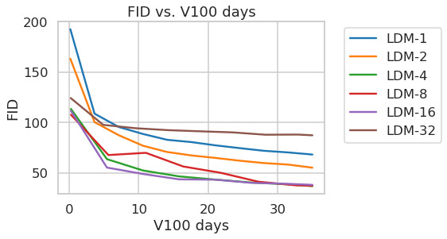

> **图 17（Figure 17）** ：为求完整，我们还报告了在 ImageNet 数据集上训练 **类别条件潜在扩散模型（class-conditional Latent Diffusion Models, LDMs）** 固定 35 V100 天（V100 days）的训练进度。结果使用 100 步 DDIM（Denoising Diffusion Implicit Models）[84] 和 $\kappa=0$ 获得。出于效率考虑，FID（Fréchet Inception Distance）基于 5000 个样本计算。

在 [4.1](#S4.SS1) 节中评估训练过程中的样本质量时，我们报告了 FID 和 IS（Inception Score）分数作为训练步数的函数。另一种可能性是报告这些指标相对于所用 V100 天资源的情况。图 [17](#A4.F17) 中额外提供了此类分析，显示了定性上相似的结果。

### D.6 超分辨率（Super-Resolution）

> **表 11（Table 11）** ：ImageNet-Val 上的 $\times 4$ 放大结果（$256^{2}$）；^†：FID 特征在验证集上计算，^‡：FID 特征在训练集上计算。我们还包含了一个接收与 **LDM-4** 相同计算量的像素空间基线。最后两行相较于之前的结果额外接受了 15 个轮次（epochs）的训练。

为了更好地比较 **潜在扩散模型（Latent Diffusion Models, LDMs）** 与像素空间中的 **扩散模型（Diffusion models）** ，我们扩展了表 [5](#S4.T5) 中的分析，将一个训练了相同步数且具有可比较参数数量（^1^11由于扩散模型在像素空间中运行，因此无法精确匹配两种架构）的扩散模型与我们的 LDM 进行比较。此比较的结果显示在表 [11](#A4.T11) 的最后两行，表明 LDM 在实现更好性能的同时，允许显著更快的采样。
图 [20](#A4.F20) 给出了定性比较，展示了来自 LDM 和像素空间扩散模型的随机样本。

#### D.6.1 LDM-BSR：通过多样化图像退化构建的通用超分辨率模型（General Purpose SR Model via Diverse Image Degradation）

> 图 18： **LDM-BSR** （Latent Diffusion Model with Blind Super-Resolution）能够泛化到任意输入，并可用作通用上采样器，将来自类别条件 **LDM** （Latent Diffusion Model）（图像参见图 [4](#S3.F4)）的样本上采样至 $1024^{2}$ 分辨率。相比之下，使用固定的退化过程（见第 [4.4](#S4.SS4) 节）会阻碍泛化。

为了评估我们的 **LDM-SR** （Latent Diffusion Model for Super-Resolution）的泛化能力，我们将其同时应用于来自类别条件 ImageNet 模型（第 [4.1](#S4.SS1) 节）的合成 LDM 样本以及从互联网爬取的图像。
有趣的是，我们观察到，仅使用如文献 [72] 中所述的双三次下采样条件进行训练的 LDM-SR，对于不遵循此预处理的图像泛化效果不佳。
因此，为了获得一个适用于广泛真实世界图像的超分辨率模型（这些图像可能包含相机噪声、压缩伪影、模糊和插值的复杂叠加），我们将 LDM-SR 中的双三次下采样操作替换为来自文献 [105] 的退化流程。 **BSR-退化过程** （Blind Super-Resolution Degradation Process）是一种退化流程，它以随机顺序对图像施加 JPEG 压缩噪声、相机传感器噪声、用于下采样的不同图像插值、高斯模糊核以及高斯噪声。我们发现，使用文献 [105] 中的原始参数的 bsr-退化过程会导致非常强烈的退化。由于一个更温和的退化过程似乎更适合我们的应用，我们调整了 bsr-退化的参数（我们调整后的退化过程可在我们的代码库中找到：[https://github.com/CompVis/latent-diffusion](https://github.com/CompVis/latent-diffusion)）。
图 [18](#A4.F18) 通过直接比较 **LDM-SR** 与 **LDM-BSR** 说明了该方法的有效性。后者生成的图像比局限于固定预处理的模型要清晰得多，使其适用于实际应用。
**LDM-BSR** 在 LSUN-cows 数据集上的更多结果如图 [19](#A4.F19) 所示。

> 图 19： **LDM-BSR** 能够泛化到任意输入，并可用作通用上采样器，将来自 LSUN-Cows 数据集的样本上采样至 $1024^{2}$ 分辨率。

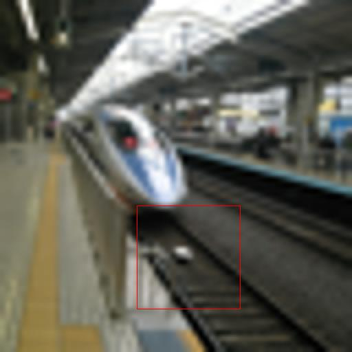

> 图 20：LDM-SR 与基线扩散模型在像素空间（Pixelspace）中对两个随机样本的定性超分辨率比较。在相同训练步数后，在 ImageNet 验证集上进行评估。

## 附录 E：实现细节与超参数（Appendix E: Implementation Details and Hyperparameters）

### E.1 超参数（Hyperparameters）

我们在表 [12](#A5.T12)、表 [13](#A5.T13)、表 [14](#A5.T14) 和表 [15](#A5.T15) 中提供了所有已训练的 **潜在扩散模型（Latent Diffusion Models, LDMs）** 的超参数概览。

> 表：表 12：用于生成表 [1](#S4.T1) 中所示数值的无条件 **潜在扩散模型（LDMs）** 的超参数。所有模型均在单块 NVIDIA A100 上训练。

> 表：表 13：在 ImageNet 数据集上训练的、用于第 [4.1](#S4.SS1) 节分析的条件 **潜在扩散模型（LDMs）** 的超参数。所有模型均在单块 NVIDIA A100 上训练。

> 表：表 14：在 CelebA 数据集上训练的、用于图 [7](#S4.F7) 分析的无条件 **潜在扩散模型（LDMs）** 的超参数。所有模型均在单块 NVIDIA A100 上训练。^∗：所有模型均训练了 50 万次迭代。如果提前收敛，我们使用最佳检查点来评估所提供的 FID 分数。

> 表：表 15：来自第 [4](#S4) 节的条件 **潜在扩散模型（LDMs）** 的超参数。除修复模型在八块 V100 上训练外，所有模型均在单块 NVIDIA A100 上训练。

### E.2 实现细节（Implementation Details）

#### E.2.1 条件 LDMs 中 $\tau_{\theta}$ 的实现（Implementations of $\tau_{\theta}$ for conditional LDMs）

对于文本到图像和布局到图像（第 [4.3.1](#S4.SS3.SSS1) 节）合成实验，我们将条件器 $\tau_{\theta}$ 实现为一个非掩码的 **变换器（Transformer）** 。该变换器处理输入 $y$ 的 **词元化（Tokenized）** 版本，并产生输出 $\zeta:=\tau_{\theta}(y)$，其中 $\zeta\in\mathbb{R}^{M\times d_{\tau}}$。

更具体地说，该变换器由 $N$ 个 **变换器块（Transformer Blocks）** 实现，每个块包含 **全局自注意力层（Global Self-attention Layers）** 、 **层归一化（Layer-normalization）** 和 **位置前馈多层感知机（Position-wise MLPs）** ，如下所示（^2^22 改编自 [https://github.com/lucidrains/x-transformers](https://github.com/lucidrains/x-transformers)）：

$$
\displaystyle\zeta\leftarrow\text{TokEmb}(y)+\text{PosEmb(y)} \quad (18) \displaystyle\text{for}i=1,\dots,N: \displaystyle\quad\zeta_{1}\leftarrow\text{LayerNorm}(\zeta) \quad (19) \displaystyle\quad\zeta_{2}\leftarrow\text{MultiHeadSelfAttention}(\zeta_{1})+\zeta \quad (20) \displaystyle\quad\zeta_{3}\leftarrow\text{LayerNorm}(\zeta_{2}) \quad (21) \displaystyle\quad\zeta\leftarrow\text{MLP}(\zeta_{3})+\zeta_{2} \quad (22) \displaystyle\zeta\leftarrow\text{LayerNorm}(\zeta) \quad (23)
$$

获得 $\zeta$ 后，条件信息通过 **交叉注意力机制（cross-attention mechanism）** 映射到 UNet 中，如图 [3] 所示。我们修改了“简化版 UNet（ablated UNet）” [15] 的架构，将其自注意力层替换为一个浅层（非掩码） **变换器（transformer）** ，该变换器由 $T$ 个块组成，每个块交替包含 (i) 自注意力层、(ii) 逐位置 **多层感知机（Multi-Layer Perceptron, MLP）** 和 (iii) 交叉注意力层；参见表 [16]。请注意，如果没有 (ii) 和 (iii)，此架构等同于“简化版 UNet”。

虽然可以通过额外加入时间步 $t$ 作为条件来增加 $\tau_{\theta}$ 的表征能力，但我们没有采用这一选择，因为它会降低推理速度。我们将对此修改的更详细分析留待未来工作。

对于 **文生图模型（text-to-image model）** ，我们依赖于一个公开可用的分词器 [99]（^3^33[https://huggingface.co/transformers/model_doc/bert.html#berttokenizerfast](https://huggingface.co/transformers/model_doc/bert.html#berttokenizerfast)）。
**布局到图像模型（layout-to-image model）** 将边界框的空间位置离散化，并将每个框编码为一个 $(l,b,c)$ 元组，其中 $l$ 表示（离散化的）左上角位置，$b$ 表示右下角位置。类别信息包含在 $c$ 中。
关于 $\tau_{\theta}$ 的超参数请参见表 [17]，关于上述两个任务中 UNet 的超参数请参见表 [13]。

请注意，第 [4.1] 节中描述的 **类别条件模型（class-conditional model）** 也是通过交叉注意力实现的，其中 $\tau_{\theta}$ 是一个维度为 512 的单一可学习嵌入层，将类别 $y$ 映射到 $\zeta\in\mathbb{R}^{1\times 512}$。

> 表：表 16：如第 [E.2.1] 节所述，用于替换标准“简化版 UNet”架构 [15] 中自注意力层的变换器块架构。其中，$n_{h}$ 表示注意力头的数量，$d$ 表示每个头的维度。

> 表：表 17：第 [4.3] 节中使用变换器编码器进行实验的超参数。

#### E.2.2 图像修复（Inpainting）

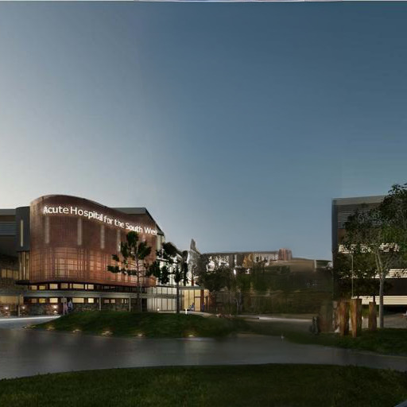

**图 21（Figure 21）：图像修复（Image inpainting）的定性结果。** 与 [88] 不同，我们的生成方法能够为给定输入生成多个多样化的样本。

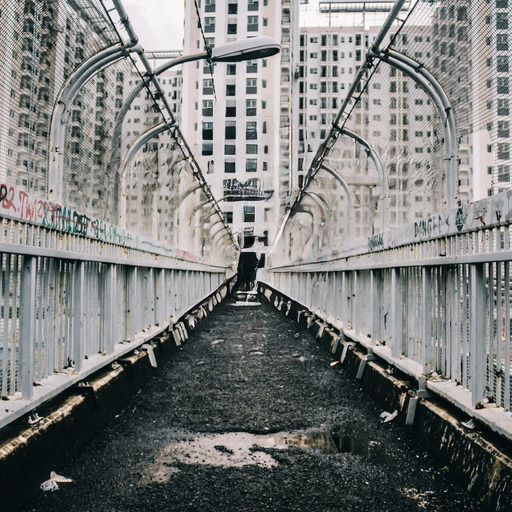

> **图 22（Figure 22）：** 如图 [11](#S4.F11) 所示物体移除（Object removal）的更多定性结果。

对于我们在第 [4.5](#S4.SS5) 节中进行的图像修复实验，我们使用了 [88] 的代码来生成合成掩码。我们使用了来自 Places [108] 数据集的固定集合，包含 2k 个验证样本和 30k 个测试样本。在训练期间，我们使用 $256\times 256$ 大小的随机裁剪，并在 $512\times 512$ 大小的裁剪上进行评估。这遵循了 [88] 中的训练和测试协议，并复现了他们报告的指标（参见表 [7](#S4.T7) 中的 ^†）。我们在图 [21](#A5.F21) 中包含了 **_LDM-4, w/ attn_** 的额外定性结果，并在图 [22](#A5.F22) 中包含了 **_LDM-4, w/o attn, big, w/ ft_** 的额外定性结果。

### E.3 评估细节（Evaluation Details）

本节为第 [4](#S4) 节中展示的实验提供评估方面的额外细节。

#### E.3.1 无条件与类条件图像合成（Unconditional and Class-Conditional Image Synthesis）的定量结果

我们遵循常规做法，基于我们模型生成的 5 万个样本以及每个所示数据集的整个训练集，来估计用于计算表 [1](#S4.T1) 和 [10](#A4.T10) 中所示的 **FID（Fréchet Inception Distance）** 分数、 **精确率（Precision）** 和 **召回率（Recall）** 分数 [29, 50] 的统计量。为了计算 FID 分数，我们使用了 torch-fidelity 包 [60]。然而，由于不同的数据处理流程可能导致不同的结果 [64]，我们也使用 Dhariwal 和 Nichol [15] 提供的脚本评估了我们的模型。我们发现结果基本一致，除了在 ImageNet 和 LSUN-Bedrooms 数据集上，我们注意到分数略有差异：7.76（torch-fidelity）对 7.77（Nichol 和 Dhariwal），以及 2.95 对 3.0。我们强调未来需要一个统一的样本质量评估程序的重要性。精确率和召回率也使用 Nichol 和 Dhariwal 提供的脚本进行计算。

#### E.3.2 文本到图像合成（Text-to-Image Synthesis）

遵循 [66] 的评估协议，我们通过将生成的样本与 MS-COCO 数据集 [51] 验证集中的 30000 个样本进行比较，来计算表 [2](#S4.T2) 中 **文生图（Text-to-Image）** 模型的 **FID（Fréchet Inception Distance）** 和 **Inception Score** 。FID 和 Inception Score 均使用 torch-fidelity 计算。

#### E.3.3 布局到图像合成（Layout-to-Image Synthesis）

为了评估表 [9](#A4.T9) 中我们的 **布局到图像（Layout-to-Image）** 模型在 COCO 数据集上的样本质量，我们遵循常见做法 [89, 37, 87]，在 COCO 分割挑战划分的 2048 个未增强样本上计算 FID 分数。为了获得更好的可比性，我们使用了与 [37] 中完全相同的样本。对于 OpenImages 数据集，我们同样遵循其协议，使用验证集中的 2048 张中心裁剪测试图像。

#### E.3.4 超分辨率（Super Resolution）

我们按照 [72] 建议的流程在 ImageNet 上评估超分辨率模型，即移除短边尺寸小于 $256$ 像素的图像（训练和评估均如此）。在 ImageNet 上，低分辨率图像是使用带抗锯齿的 **双三次插值（Bicubic Interpolation）** 生成的。FID 使用 torch-fidelity [60] 进行评估，我们在验证集划分上生成样本。对于 FID 分数，我们还额外与在训练集划分上计算得到的参考特征进行了比较，参见表 [5](#S4.T5) 和表 [11](#A4.T11)。

#### E.3.5 效率分析（Efficiency Analysis）

出于效率原因，我们基于 5k 个样本计算图 [6](#S4.F6)、[17](#A4.F17) 和 [7](#S4.F7) 中绘制的样本质量指标。因此，结果可能与表 [1](#S4.T1) 和 [10](#A4.T10) 中所示的存在差异。所有模型具有表 [13](#A5.T13) 和 [14](#A5.T14) 中提供的可比参数数量。我们最大化各个模型的 **学习率（Learning Rate）** ，使其仍能稳定训练。因此，不同运行之间的学习率略有差异，参见表 [13](#A5.T13) 和 [14](#A5.T14)。

#### E.3.6 用户研究（User Study）

对于表 [4](#S4.T4) 中呈现的用户研究结果，我们遵循 [72] 的协议，并使用 **二选一强制选择范式（2-alternative Force-choice Paradigm）** 来评估人类对两个不同任务的偏好分数。在任务 1 中，受试者会看到一张低分辨率/被遮挡的图像，位于对应的真实高分辨率/未遮挡版本和一张合成图像之间，该合成图像是使用中间图像作为条件生成的。对于超分辨率，询问受试者：_“哪一张图像是中间低分辨率图像更好的高质量版本？”_。对于图像修复，我们询问：_“哪一张图像包含了中间图像更真实的修复区域？”_。在任务 2 中，人类受试者同样会看到低分辨率/被遮挡版本，并被要求在两种竞争方法生成的两张对应图像之间选择偏好。与 [72] 一样，人类受试者在回答前会观看图像 3 秒钟。

## 附录 F：计算需求（Appendix F: Computational Requirements）

> 表：表 18：与最先进的生成模型比较训练期间的计算需求和推理吞吐量。训练计算量以 V100-天为单位，竞争方法的数值取自 [15]，除非另有说明；^∗：吞吐量以单个 NVIDIA A100 上的样本/秒为单位测量；^†：数值取自 [15]；^‡：假设在 2500 万个训练样本上进行训练；^††：R-FID 相对于 ImageNet 验证集。

在表 [18](#A6.T18) 中，我们对我们使用的计算资源进行了更详细的分析，并将我们在 CelebA-HQ、FFHQ、LSUN 和 ImageNet 数据集上表现最佳的模型与近期最先进的模型进行了比较，使用了它们提供的数值，参见 [15]。由于他们报告其使用的计算量以 V100-天为单位，而我们在单个 NVIDIA A100 GPU 上训练所有模型，我们通过假设 A100 相对于 V100 有 $\times 2.2$ 的加速比 [74]（^4^44 该因子对应于 [74] 中图 1 定义的 U-Net 上 A100 相对于 V100 的加速比），将 A100-天转换为 V100-天。为了评估样本质量，我们还在报告的数据集上额外报告了 FID 分数。我们 **在显著减少所需计算资源的同时，几乎达到了最先进方法（如 StyleGAN2 [42] 和 ADM [15]）的性能** 。

## 附录 G 关于自编码器模型的细节

我们遵循 [23] 以对抗方式训练我们所有的 **自编码器模型（Autoencoder models）** ，即优化一个基于图像块的 **判别器（discriminator）** $D_{\psi}$ 以区分原始图像与重建图像 $\mathcal{D}(\mathcal{E}(x))$。
为了避免潜在空间任意缩放，我们通过引入一个正则化损失项 $L_{reg}$ 来正则化潜在变量 $z$，使其零中心化并获得较小的方差。
我们研究了两种不同的正则化方法：(i) 在 $q_{\mathcal{E}}(z|x)=\mathcal{N}(z;\mathcal{E}_{\mu},\mathcal{E}_{\sigma^{2}})$ 与标准正态分布 $\mathcal{N}(z;0,1)$ 之间使用一个低权重的 **KL散度项（Kullback-Leibler term）** ，如标准 **变分自编码器（Variational Autoencoder, VAE）** [46, 69] 中那样；以及 (ii) 通过学习一个包含 $|\mathcal{Z}|$ 个不同样本的 **码本（codebook）** [96]，使用 **向量量化层（Vector Quantization layer）** 对潜在空间进行正则化。
为了获得高保真重建，我们对两种场景都只使用非常小的正则化，即，我们或者将 $\mathbb{KL}$ 项加权一个因子 $\sim 10^{-6}$，或者选择一个较高的码本维度 $|\mathcal{Z}|$。

训练自编码模型 $(\mathcal{E},\mathcal{D})$ 的完整目标函数如下：

$$
L_{\text{Autoencoder}}=\min_{\mathcal{E},\mathcal{D}}\max_{\psi}\Big{(}L_{rec}(x,\mathcal{D}(\mathcal{E}(x)))-L_{adv}(\mathcal{D}(\mathcal{E}(x)))+\log D_{\psi}(x)+L_{reg}(x;\mathcal{E},\mathcal{D})\Big{)}(25)
$$

##### 潜在空间中的扩散模型训练

请注意，为了在习得的潜在空间上训练 **扩散模型（Diffusion Models, DMs）** ，在学习 $p(z)$ 或 $p(z|y)$ 时（第 [4.3](#S4.SS3) 节），我们再次区分两种情况：
(i) 对于 KL 正则化的潜在空间，我们采样 $z=\mathcal{E}_{\mu}(x)+\mathcal{E}_{\sigma}(x)\cdot\varepsilon=:\mathcal{E}(x)$，其中 $\varepsilon\sim\mathcal{N}(0,1)$。
当重新缩放潜在变量时，我们从数据的第一批次中估计逐分量方差：

$$
\hat{\sigma}^{2}=\frac{1}{bchw}\sum_{b,c,h,w}(z^{b,c,h,w}-\hat{\mu})^{2}
$$

其中 $\hat{\mu}=\frac{1}{bchw}\sum_{b,c,h,w}z^{b,c,h,w}$。
$\mathcal{E}$ 的输出被缩放，使得重新缩放后的潜在变量具有单位标准差，即 $z\leftarrow\frac{z}{\hat{\sigma}}=\frac{\mathcal{E}(x)}{\hat{\sigma}}$。
(ii) 对于 VQ 正则化的潜在空间，我们在量化层 **之前** 提取 $z$，并将量化操作吸收到解码器中，即，它可以被解释为 $\mathcal{D}$ 的第一层。

## 附录 H 补充定性结果

最后，我们为我们的 **景观模型（landscapes model）** （图 [12](#A0.F12)、[23](#A8.F23)、[24](#A8.F24) 和 [25](#A8.F25)）、我们的 **类别条件 ImageNet 模型（class-conditional ImageNet model）** （图 [26](#A8.F26) - [27](#A8.F27)）以及我们在 CelebA-HQ、FFHQ 和 LSUN 数据集上的 **无条件模型（unconditional models）** （图 [28](#A8.F28) - [31](#A8.F31)）提供补充定性结果。

与第 [4.5](#S4.SS5) 节中的 **修复模型（inpainting model）** 类似，我们也直接在第 [4.3.2](#S4.SS3.SSS2) 节的 **语义景观模型（semantic landscapes model）** 上对 $512^{2}$ 图像进行了 **微调（fine-tuned）** ，并在图 [12](#A0.F12) 和图 [23](#A8.F23) 中描绘了定性结果。

对于那些在相对较小的数据集上训练的模型，我们在图 [32](#A8.F32) - [34](#A8.F34) 中额外展示了我们模型样本在 VGG [79] 特征空间中的 **最近邻（nearest neighbors）** 。

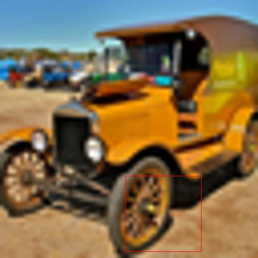

> 图 23：来自第 [4.3.2](#S4.SS3.SSS2) 节所述语义景观模型的卷积样本，在 $512^{2}$ 图像上进行了微调。

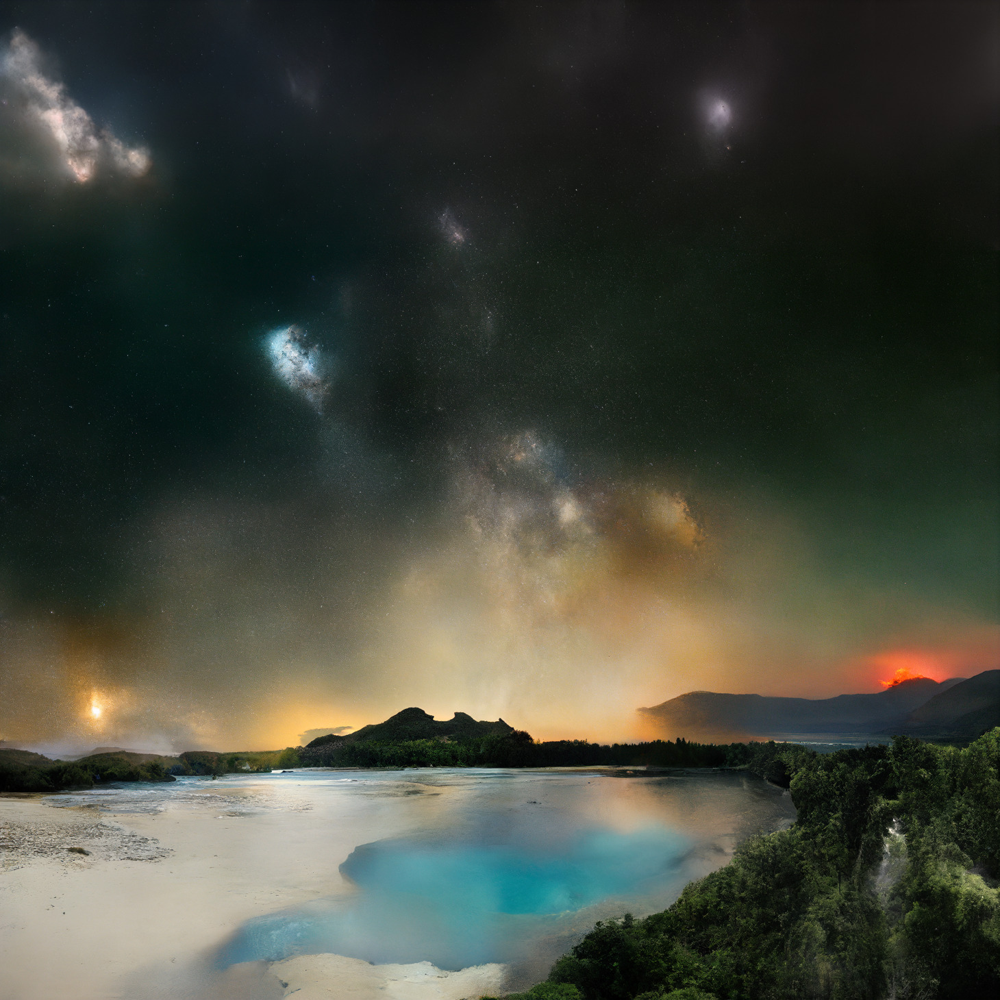

> 图 24：在 $256^{2}$ 分辨率上训练的 **潜在扩散模型（Latent Diffusion Model, LDM）** 可以泛化到更大的分辨率，用于诸如景观图像语义合成等空间条件任务。参见第 [4.3.2](#S4.SS3.SSS2) 节。

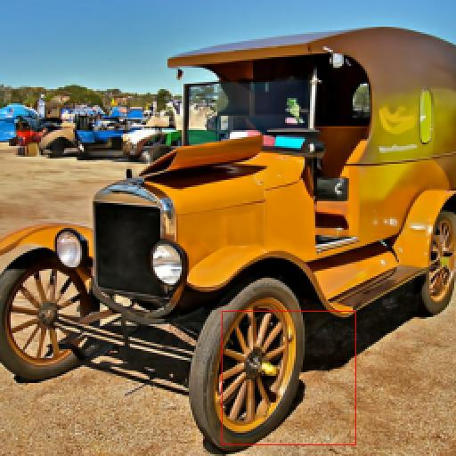

> 图 25：当提供语义图作为条件时，我们的 **潜在扩散模型（Latent Diffusion Models, LDMs）** 能够泛化到远大于训练所见的分辨率。尽管此模型是在尺寸为 $256^{2}$ 的输入上训练的，但它可用于创建高分辨率样本，例如此处展示的分辨率为 $1024\times 384$ 的样本。

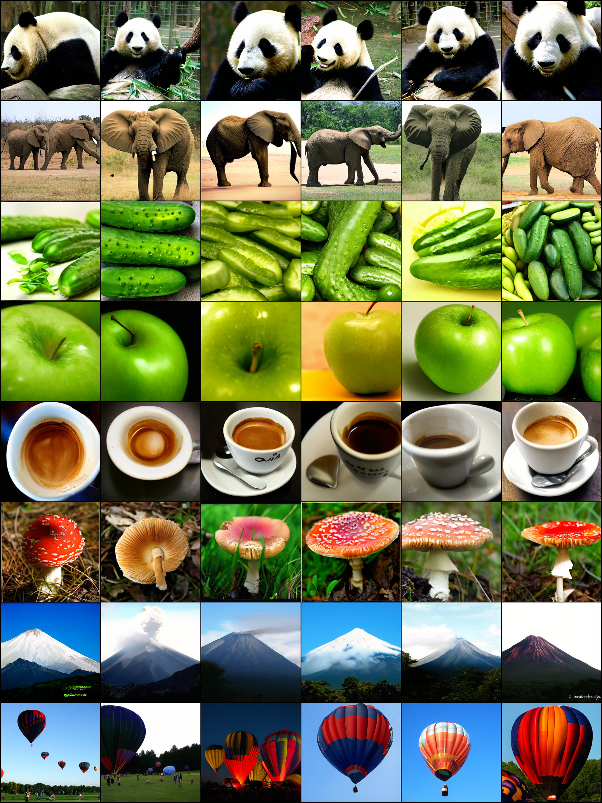

> 图 26：在 ImageNet 数据集上训练的 **_LDM-4_** 的随机样本。使用 **无分类器引导（classifier-free guidance）** [32] 比例 $s=5.0$ 和 200 步 DDIM（Denoising Diffusion Implicit Models）采样，$\eta=1.0$。

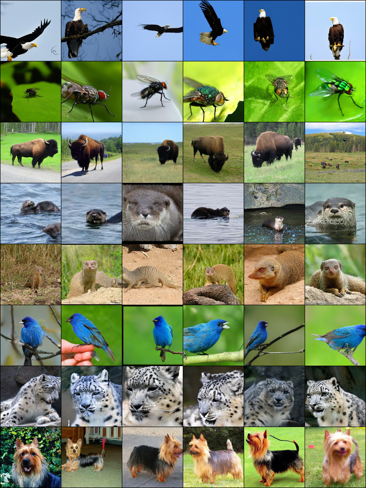

> 图 27：在 ImageNet 数据集上训练的 **_LDM-4_** 的随机样本。使用 **无分类器引导（classifier-free guidance）** [32] 比例 $s=3.0$ 和 200 步 DDIM 采样，$\eta=1.0$。

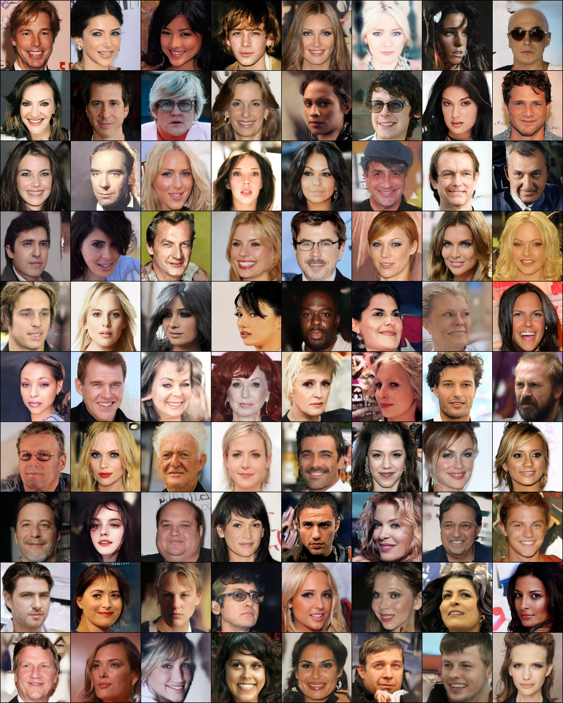

> 图 28：我们在 CelebA-HQ 数据集上性能最佳的模型 **_LDM-4_** 的随机样本。使用 500 步 DDIM 采样，$\eta=0$（FID = 5.15）。

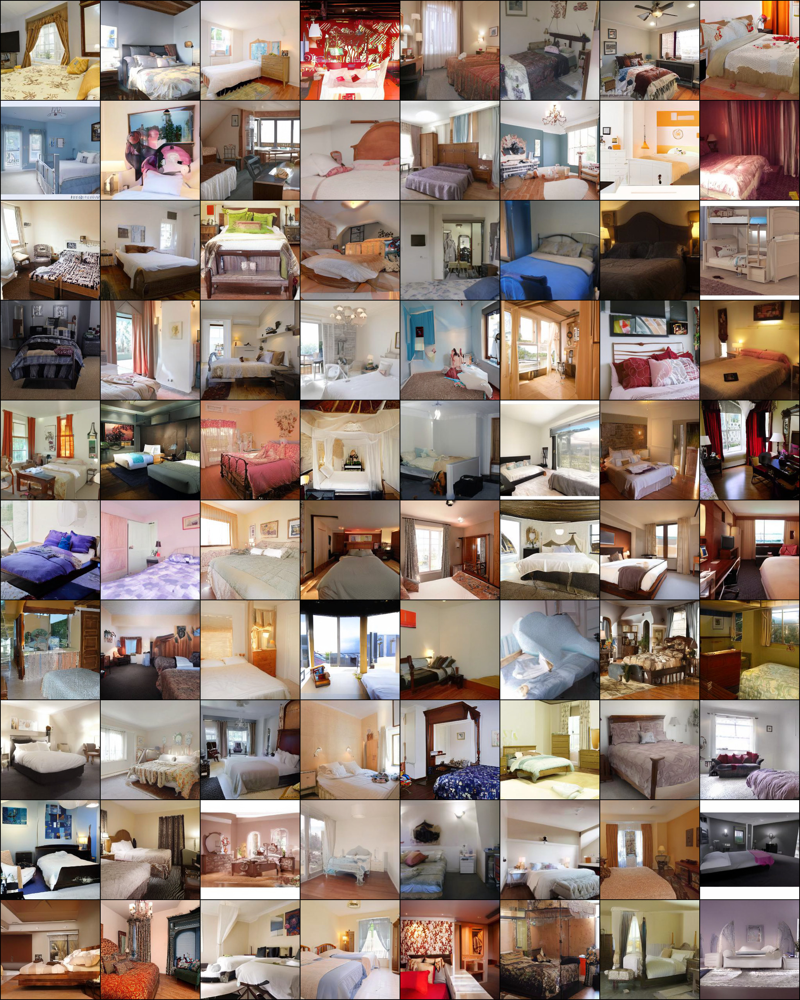

> 图 29：我们在 FFHQ 数据集上性能最佳的模型 **_LDM-4_** 的随机样本。使用 200 步 DDIM 采样，$\eta=1$（FID = 4.98）。

> 图 30：我们在 LSUN-Churches 数据集上性能最佳的模型 **_LDM-8_** 的随机样本。使用 200 步 DDIM 采样，$\eta=0$（FID = 4.48）。

> 图 31：我们在 LSUN-Bedrooms 数据集上性能最佳的模型 **_LDM-4_** 的随机样本。使用 200 步 DDIM 采样，$\eta=1$（FID = 2.95）。

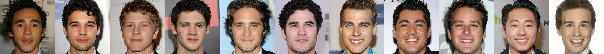

> 图 32：我们最佳 CelebA-HQ 模型的最近邻，在 VGG-16 [79] 的特征空间中计算。最左侧的样本来自我们的模型。每行中剩余的样本是其 10 个最近邻。

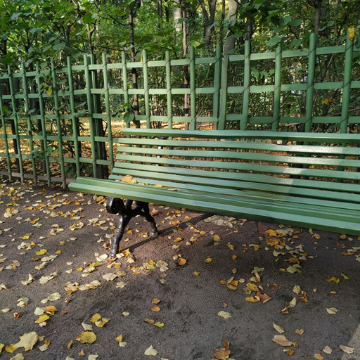

> 图 33：我们最佳 FFHQ 模型的最近邻，在 VGG-16 [79] 的特征空间中计算。最左侧的样本来自我们的模型。每行中剩余的样本是其 10 个最近邻。

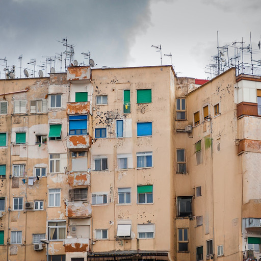

> 图 34：我们最佳 LSUN-Churches 模型的最近邻，在 VGG-16 [79] 的特征空间中计算。最左侧的样本来自我们的模型。每行中剩余的样本是其 10 个最近邻。
