# 标题：Stable Video Diffusion: Scaling Latent Video Diffusion Models to Large Datasets（稳定视频扩散：将潜在视频扩散模型扩展至大型数据集）

- ArXiv：2311.15127
- 作者：Andreas Blattmann, Tim Dockhorn, Sumith Kulal, Daniel Mendelevitch, Maciej Kilian Dominik Lorenz Yam Levi Zion English Vikram Voleti, Adam Letts Varun Jampani Robin Rombach, Stability AI
- 章节数：56
- 估计词元数：27.7k

## 目录（Contents）

- 1 引言（Introduction）
  - 一种通用的运动与多视角先验（A general motion and multi-view prior）
- 2 背景（Background）
  - 潜在视频扩散模型（Latent Video Diffusion Models）
  - 数据策展（Data Curation）
- 3 为高质量视频合成策展数据（Curating Data for HQ Video Synthesis）
  - 3.1 数据处理与标注（Data Processing and Annotation）
  - 3.2 阶段 I：图像预训练（Stage I: Image Pretraining）
  - 3.3 阶段 II：策展视频预训练数据集（Stage II: Curating a Video Pretraining Dataset）
  - 3.4 阶段 III：高质量微调（Stage III: High-Quality Finetuning）
- 4 大规模训练视频模型（Training Video Models at Scale）
  - 4.1 预训练基础模型（Pretrained Base Model）
  - 4.2 高分辨率文生视频模型（High-Resolution Text-to-Video Model）
  - 4.3 高分辨率图生视频模型（High Resolution Image-to-Video Model）
    - 4.3.1 相机运动低秩适应（Camera Motion LoRA）
  - 4.4 帧插值（Frame Interpolation）
  - 4.5 多视角生成（Multi-View Generation）
- 5 结论（Conclusion）
- 致谢（Acknowledgements）
- 参考文献（References）
- 附录（Appendix）
- 附录 A 更广泛的影响与局限性（Appendix A Broader Impact and Limitations）
- 附录 B 相关工作（Appendix B Related Work）
- 附录 C 数据处理（Appendix C Data Processing）
  - 动机（Motivation）
  - 级联镜头切换检测（Cascaded Cut Detection）
  - 关键帧感知剪辑（Keyframe-Aware Clipping）
  - 光流（Optical Flow）
  - 合成字幕生成（Synthetic Captioning）
  - 字幕相似性与美学（Caption similarities and Aesthetics）
  - 文本检测（Text Detection）
- 附录 D 模型与实现细节（Appendix D Model and Implementation Details）
  - D.1 扩散模型（Diffusion Models）
  - D.2 基础模型训练与架构（Base Model Training and Architecture）
  - D.3 高分辨率文生视频模型（High-Resolution Text-to-Video Model）
  - D.4 高分辨率图生视频模型（High-Resolution Image-to-Video Model）
    - D.4.1 线性增加的引导（Linearly Increasing Guidance）
    - D.4.2 相机运动低秩适应（Camera Motion LoRA）
  - D.5 插值模型细节（Interpolation Model Details）
  - D.6 多视角生成（Multi-view generation）
- 附录 E 实验细节（Appendix E Experiment Details）
  - E.1 人类偏好评估细节（Details on Human Preference Assessment）
    - E.1.1 实验设置（Experimental Setup）
    - E.1.2 Elo 分数计算（Elo Score Calculation）
  - E.2 第 3 节实验细节（Details on Experiments from Section 3）
    - E.2.1 架构细节（Architectural Details）
    - E.2.2 校准过滤阈值（Calibrating Filtering Thresholds）
    - E.2.3 微调实验（Finetuning Experiments）
  - E.3 人类评估 vs 当前最优技术（Human Eval vs SOTA）
  - E.4 UCF101 FVD
  - E.5 附加样本（Additional Samples）
    - E.5.1 附加文生视频样本（Additional Text-to-Video Samples）
    - E.5.2 附加图生视频样本（Additional Image-to-Video Samples）
    - E.5.3 附加相机运动低秩适应样本（Additional Camera Motion LoRA Samples）
    - E.5.4 通过时序交叉注意力层进行时序提示（Temporal Prompting via Temporal Cross-Attention Layers）
    - E.5.5 多视角合成的附加样本（Additional Samples on Multi-View Synthesis）

## 摘要（Abstract）

###### 摘要（Abstract）

我们提出了 **Stable Video Diffusion** —— 一个用于高分辨率、最先进的 **文本到视频（text-to-video）** 和 **图像到视频（image-to-video）** 生成的 **潜在视频扩散模型（latent video diffusion model）** 。最近，为 **二维（2D）图像合成（image synthesis）** 训练的 **潜在扩散模型（Latent Diffusion Models, LDMs）** 通过插入 **时序层（temporal layers）** 并在小型、高质量的视频数据集上进行 **微调（finetuning）** ，已被转化为 **生成式视频模型（generative video models）** 。然而，文献中的训练方法差异很大，该领域尚未就视频数据整理的统一策略达成共识。

在本文中，我们识别并评估了成功训练视频 LDMs 的三个不同阶段： **文本到图像预训练（text-to-image pretraining）** 、 **视频预训练（video pretraining）** 和 **高质量视频微调（high-quality video finetuning）** 。此外，我们论证了精心整理的预训练数据集对于生成高质量视频的必要性，并提出了一种系统性的整理流程来训练一个强大的基础模型，其中包括 **字幕生成（captioning）** 和 **过滤策略（filtering strategies）** 。

接着，我们探索了在高质量数据上微调我们基础模型的影响，并训练了一个可与闭源视频生成方案竞争的文本到视频模型。我们还展示了我们的基础模型为下游任务（如图像到视频生成）提供了强大的 **运动表征（motion representation）** ，并且能够适配于特定 **相机运动（camera motion）** 的 **LoRA（Low-Rank Adaptation）** 模块。

最后，我们证明了我们的模型提供了一个强大的 **多视图三维先验（multi-view 3D-prior）** ，并且可以作为基础来微调一个 **多视图扩散模型（multi-view diffusion model）** ，该模型以前馈方式联合生成物体的多个视图，其性能优于基于图像的方法，而计算预算仅为后者的一小部分。我们在 [https://github.com/Stability-AI/generative-models](https://github.com/Stability-AI/generative-models) 发布了代码和模型权重。

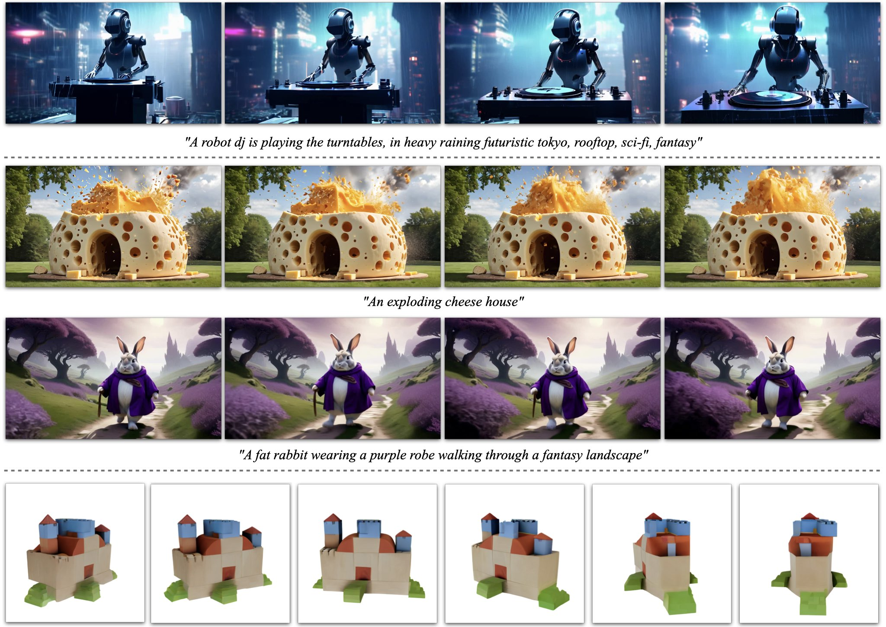

> 图 1：Stable Video Diffusion 样本。_顶部：_ 文本到视频生成。_中部：_ （文本到）图像到视频生成。_底部：_ 通过图像到视频微调进行的多视图合成。

## 1 Introduction（引言）

在 **扩散模型（Diffusion models）** [38, 68, 76, 71] 推动生成式图像建模取得进展的驱动下，近期在生成式视频模型领域，无论是研究 [42, 82, 95, 9] 还是实际应用 [74, 54] 方面，都取得了显著进展。总体而言，这些模型要么是 **从头开始训练（trained from scratch）** [41]，要么是在预训练的 **图像模型（image models）** 基础上，通过插入额外的 **时序层（temporal layers）** 进行（部分或完全） **微调（finetuned）** [9, 32, 43, 82]。训练通常在 **图像和视频数据集（image and video datasets）** 的混合上进行 [41]。

尽管围绕视频建模改进的研究主要集中于空间与时间层的精确排列 [43, 82, 41, 9]，但上述工作均未探究 **数据选择（data selection）** 的影响。这一点令人惊讶，尤其是考虑到训练数据分布对生成模型的显著影响已是公认的事实 [13, 105]。此外，在生成式图像建模领域，众所周知，在 **大规模多样化数据集（large and diverse dataset）** 上进行 **预训练（pretraining）** ，并在 **规模较小但质量更高的数据集（smaller but higher quality dataset）** 上进行 **微调（finetuning）** ，能显著提升性能 [71, 13]。由于以往许多视频建模方法已成功借鉴了图像领域的技术 [9, 42, 43]，值得注意的是， **数据与训练策略（data and training strategies）** 的影响——即在较低分辨率下进行视频预训练与高质量微调的分离——仍有待研究。 **本工作直接针对这些先前未探索的领域。**

我们认为， **数据选择（data selection）** 的重要贡献在当前的视频研究领域中严重未被充分体现，尽管在大规模训练视频模型时，从业者对此已有广泛认知。因此，与先前工作不同，我们借鉴了简单的 **潜空间视频扩散（latent video diffusion）** 基线模型 [9]，并固定其架构与训练方案，以评估 **数据整理（data curation）** 的影响。

为此，我们首先确定了三个对良好性能至关重要的不同视频训练阶段：

- **文本到图像预训练（text-to-image pretraining）**
- **视频预训练（video pretraining）** ：在低分辨率的大规模数据集上进行
- **高分辨率视频微调（high-resolution video finetuning）** ：在规模小得多但视频质量更高的数据集上进行

借鉴大规模图像模型训练的经验 [66, 64, 13]，我们引入了一种系统化的大规模视频数据整理方法，并对视频预训练阶段数据整理的效果进行了实证研究。我们的主要发现表明，在精心整理的数据集上进行预训练能带来显著的性能提升，且这种提升在经过高质量微调后依然保持。

##### 通用运动与多视角先验（A general motion and multi-view prior）

基于这些发现，我们将提出的数据筛选方案应用于一个包含约 **6 亿** 个样本的大型视频数据集，并训练了一个强大的预训练 **文生视频（text-to-video）** 基础模型，该模型提供了通用的运动表征。我们利用这一点，在一个更小、更高质量的数据集上对该基础模型进行微调，以用于高分辨率的下游任务，例如 **文生视频** （参见[图 1](#S0.F1) 顶行）和 **图生视频（image-to-video）** ——即从单个条件图像预测一系列帧（参见[图 1](#S0.F1) 中间行）。人类偏好研究表明，所得模型优于当前最先进的图生视频模型。

此外，我们还证明我们的模型提供了一个强大的 **多视角先验（multi-view prior）** ，可以作为基础来微调一个 **多视角扩散模型（multi-view diffusion model）** 。该模型以前馈方式生成一个物体的多个一致视角，其性能优于专门的 **新视角合成（novel view synthesis）** 方法，如 Zero123XL [57, 14] 和 SyncDreamer [58]。最后，我们证明我们的模型允许进行显式的运动控制，方法包括：通过运动线索专门提示时序层，以及仅在模拟特定运动的数据集上训练 **LoRA 模块（LoRA-modules）** [45, 32]，这些模块可以高效地插入模型中。

总而言之，我们的核心贡献有三方面：

1.  我们提出了一个系统化的数据筛选工作流，能够将大量未经筛选的视频集合转化为适用于生成式视频建模的高质量数据集。
2.  利用此工作流，我们训练出了当前最先进的文生视频和图生视频模型，其性能超越了所有先前的模型。
3.  最后，我们通过进行领域特定的实验，探究了模型中蕴含的强大运动与三维理解先验。具体而言，我们提供的证据表明，预训练的视频扩散模型可以转化为强大的多视角生成器，这可能有助于克服三维领域中通常存在的数据稀缺问题 [14]。

## 2 背景（Background）

近期大多数关于 **视频生成（video generation）** 的研究都依赖于 **扩散模型（Diffusion models）** [84, 38, 87]，以从文本或图像条件中联合合成多个一致的帧。扩散模型通过学习从正态分布中逐步对样本进行去噪，实现了一个迭代精炼过程，并已成功应用于高分辨率 **文本到图像（text-to-image）** [68, 75, 71, 64, 13] 和 **视频合成（video synthesis）** [41, 82, 95, 9, 29] 任务。

在本工作中，我们遵循这一范式，在我们的视频数据集上训练了一个 **潜在（latent）** [71, 92] **视频扩散模型（video diffusion model）** [9, 23]。我们将在下一段简要概述利用 **潜在视频扩散模型（Latent Video Diffusion Models, Video-LDMs）** 的相关工作；包含使用 **生成对抗网络（Generative Adversarial Networks, GANs）** [30, 10] 和 **自回归模型（autoregressive models）** [43] 方法的完整讨论可参见 [附录 B](#A2)。关于扩散模型的介绍可参见 [附录 D](#A4)。

##### 潜在视频扩散模型（Latent Video Diffusion Models）

**视频潜在扩散模型（Video-LDMs）** [35, 9, 31, 32, 97] 在计算复杂度降低的 **潜在空间（latent space）** [22, 71] 中训练主要的生成模型。
大多数相关工作利用预训练的 **文生图（text-to-image）模型** ，并在其预训练架构中插入各种形式的 **时序混合层（temporal mixing layers）** [1, 29, 9, 31, 32]。
Ge 等人 [29] 还额外依赖 **时序相关噪声（temporally correlated noise）** 来增强时间一致性并简化学习任务。
在本工作中，我们遵循 Blattmann 等人 [9] 提出的架构，在每个 **空间卷积（spatial convolution）** 和 **注意力层（attention layer）** 之后插入 **时序卷积（temporal convolution）** 和 **时序注意力层（temporal attention layers）** 。
与那些仅训练时序层 [32, 9] 或完全无需训练 [52, 114] 的工作不同，我们对整个模型进行 **微调（finetune）** 。
特别是对于 **文生视频（text-to-video synthesis）** ，大多数工作要么直接以 **文本提示（text prompt）** [9, 97] 为条件对模型进行调节，要么利用额外的 **文生图先验（text-to-image prior）** [23, 82]。

在我们的工作中，我们遵循前一种方法，并证明由此得到的模型是一个强大的通用运动先验，可以轻松地微调为 **图生视频（image-to-video）** 或 **多视图合成（multi-view synthesis）** 模型。
此外，我们引入了针对 **帧率（frame rate）** 的 **微调节（micro-conditioning）** [64]。
我们还采用了 **EDM 框架（EDM-framework）** [51]，并将 **噪声调度（noise schedule）** 显著地向更高的噪声值偏移，我们发现这对于 **高分辨率微调（high-resolution finetuning）** 至关重要。关于后者的详细讨论，请参见 [第 4 节](#S4)。

##### 数据整理（Data Curation）

在大规模数据集上进行预训练 [80] 是构建强大模型的关键要素，适用于多种任务，例如判别式文本-图像 [105, 66] 和语言建模 [27, 63, 67]。通过利用高效的 **语言-图像表征（Language-Image Representations）** ，如 CLIP [47, 66, 105]，数据整理同样已成功应用于生成式图像建模 [80, 13, 64]。然而，在视频生成领域的文献中 [41, 94, 43, 82]，关于此类数据整理策略的讨论在很大程度上是缺失的，其处理和过滤策略的引入也往往是临时性的。

在可公开访问的视频数据集中， **WebVid-10M** [7] 数据集尽管存在水印且规模并非最优，但已成为一个流行的选择 [82, 9, 115]。此外，WebVid-10M 通常与图像数据 [80] 结合使用，以实现图像-视频联合训练。然而，这加剧了区分图像数据和视频数据对最终模型影响的难度。

为了弥补这些不足，本文对视频数据整理方法进行了系统性研究，并进一步为生成式视频模型引入了一种通用的三阶段训练策略，从而产生了一个 **最先进的（State-of-the-Art, SOTA）** 模型。

## 3 面向高质量视频合成的数据策划（Curating Data for HQ Video Synthesis）

在本节中，我们介绍一种通用策略，用于在大型视频数据集上训练最先进的视频扩散模型（Video Diffusion Model）。为此，我们（i）介绍了数据处理与策划方法，并在 [第 3.3 节](#S3.SS3) 和 [第 3.4 节](#S3.SS4) 中系统分析了它们对最终模型质量的影响；以及（ii）确定了生成式视频建模的三种不同训练阶段。具体而言，这些阶段包括：

- **阶段 I：图像预训练（Image Pretraining）** ，即使用一个二维文本到图像扩散模型（2D Text-to-Image Diffusion Model）[71, 64, 13]。
- **阶段 II：视频预训练（Video Pretraining）** ，在大量视频上进行训练。
- **阶段 III：视频微调（Video Finetuning）** ，在一个小规模的高质量视频子集上，以更高分辨率对模型进行精炼。

我们将在 [第 3.2 节](#S3.SS2)、[第 3.3 节](#S3.SS3) 和 [第 3.4 节](#S3.SS4) 中分别研究每个阶段的重要性。

### 3.1 数据处理与标注（Data Processing and Annotation）

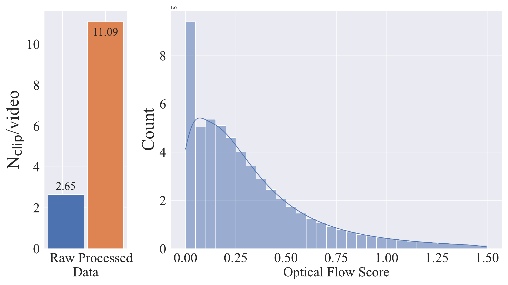

> **图 2** ：我们的初始数据集中包含许多静态场景和剪辑点，这会损害生成式视频模型的训练。 **左图** ：处理前后每个视频的平均剪辑片段数量，表明我们的处理流程检测到了大量额外的剪辑点。 **右图** ：我们展示了其中一个子集在处理前的平均光流（Optical Flow）分数分布，该子集包含许多静态剪辑片段。

我们收集了一个初始的长视频数据集，它构成了我们 **视频预训练（video pretraining）** 阶段的基础数据。为了避免剪辑和淡入淡出效果渗入合成视频，我们以级联方式在三种不同的 **帧率（Frames Per Second, FPS）** 级别上应用了一个 **镜头切换检测（cut detection）** 流程（^1^11[https://github.com/Breakthrough/PySceneDetect](https://github.com/Breakthrough/PySceneDetect)）。[图 2](#S3.F2) 左侧为镜头切换检测的必要性提供了证据：应用我们的镜头切换检测流程后，我们获得了显著更多（$\sim 4\times$）的片段，这表明未处理数据集中的许多视频片段包含超出从元数据中获得的镜头切换。

接下来，我们使用三种不同的合成字幕生成方法为每个片段添加标注：

1.  首先，我们使用 **图像字幕生成器（image captioner）** CoCa [108] 为每个片段的中间帧添加标注。
2.  然后，使用 V-BLIP [109] 获取基于视频的字幕。
3.  最后，通过基于 **大型语言模型（Large Language Model, LLM）** 对前两个字幕进行总结，生成该片段的第三个描述。

由此产生的初始数据集，我们称之为 **大型视频数据集（Large Video Dataset, LVD）** ，包含 5.8 亿个带标注的视频片段对，构成了 **212 年** 的内容。

> 表 1：我们的数据集在过滤前后与公开研究数据集的比较。

然而，进一步调查发现，生成的数据集中包含一些预计会降低我们最终视频模型性能的样本，例如运动较少、文本过多或整体美学价值较低的片段。因此，我们额外使用 **稠密光流（dense optical flow）** [24, 48] 对数据集进行标注，我们以 2 FPS 计算光流，并以此过滤掉静态场景，即移除平均光流幅度低于特定阈值的任何视频。确实，当通过光流得分考虑 _LVD_ 的运动分布时（见 [图 2](#S3.F2) 右侧），我们在其中识别出了一个接近静态的片段子集。

此外，我们应用 **光学字符识别（Optical Character Recognition, OCR）** [5] 来筛除包含大量书面文本的视频片段。
最后，我们使用 CLIP [66] 嵌入对每个视频片段的首帧、中间帧和末帧进行标注，并据此计算 **美学评分（Aesthetics scores）** [80] 以及文本-图像相似度。我们数据集的统计信息，包括片段总数量和平均时长，在 [表 1](#S3.T1) 中提供。

### 3.2 阶段 I：图像预训练（Stage I: Image Pretraining）

我们将图像预训练视为我们训练流程的第一阶段。
因此，与视频模型领域的同期工作 [82, 41, 9] 一致，我们将初始模型建立在预训练的 **图像扩散模型（Image Diffusion Model）** 之上——即 _Stable Diffusion 2.1_ [71]——以使其具备强大的视觉表征能力。

为了分析图像预训练的效果，我们在 _LVD_ 数据集的 10M 子集上训练并比较了两个完全相同的视频模型（详见 [附录 D](#A4)）：一个使用了预训练的空间权重，另一个则没有。
我们通过一项 **人类偏好研究（Human preference study）** （详见 [附录 E](#A5)）来比较这两个模型，结果如 [图 2(a)](#S3.F2.sf1) 所示，该图清晰地表明，在生成质量和提示跟随能力两方面，经过图像预训练的模型都更受青睐。

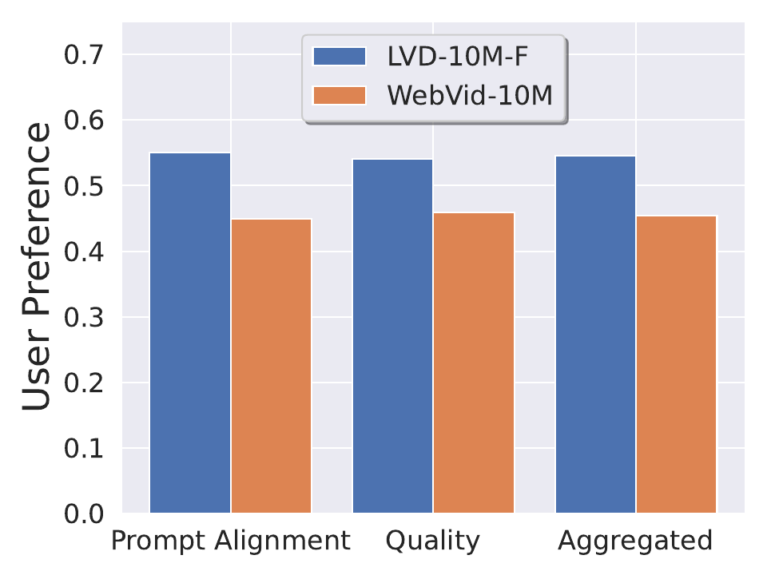

> (a) 从预训练图像模型初始化空间层能极大提升性能。

### 3.3 Stage II: Curating a Video Pretraining Dataset（第二阶段：构建视频预训练数据集）

一种系统化的视频数据构建方法。
对于多模态图像建模，数据构建是许多强大的 **判别式模型（Discriminative models）** [66, 105] 和 **生成式模型（Generative models）** [13, 40, 69] 的关键要素。
然而，由于在视频领域没有同样强大的现成表征可用于过滤不理想的样本，我们依赖 **人类偏好（Human preferences）** 作为信号来创建一个合适的预训练数据集。
具体而言，我们使用下文描述的不同方法构建 _LVD_ 的子集，然后考虑基于在这些数据集上训练的 **潜在视频扩散模型（Latent Video Diffusion Models）** 的人类偏好排名。

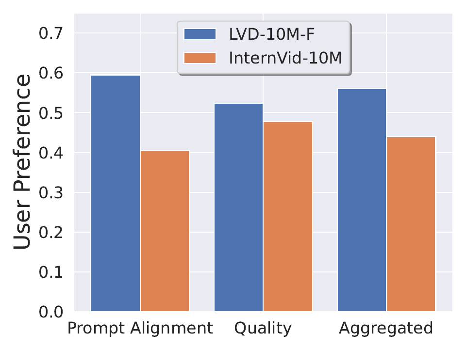

> (a) 用户对 _LVD-10M-F_ 与 WebVid [7] 的偏好。

更具体地说，对于[第 3.1 节](#S3.SS1)中引入的每种标注类型（即 CLIP 分数、美学分数、OCR 检测率、合成描述、光流分数），我们从 _LVD_ 的一个未经过滤、随机采样的 980 万规模子集 _LVD-10M_ 开始，并系统地移除排名靠后的 12.5%、25% 和 50% 的样本。需要注意的是，对于 **合成描述（synthetic captions）** ，我们无法按此意义进行过滤。相反，我们根据[第 3.1 节](#S3.SS1)中的不同描述方法，评估其 **埃洛等级分（Elo rankings）** [21]。

为了使总的子集数量可控，我们将此方案分别应用于每种标注类型。我们在每个经过过滤的子集上使用相同的训练超参数训练模型，并利用基于人类偏好投票的埃洛等级分 [21] 来比较同一标注类别内所有模型的结果。

基于这些投票结果，我们为每种标注类型选择了表现最佳的过滤阈值。该研究的细节在[附录 E](#A5) 中呈现并进行了讨论。

将此过滤方法应用于 _LVD_ 后，我们得到了一个包含 1.52 亿训练样本的最终预训练数据集，我们将其称为 _LVD-F_，参见[表 1](#S3.T1)。

**精选训练数据提升性能（Curated training data improves performance）**

在本节中，我们证明上述数据精选方法能改进我们 **视频扩散模型（video diffusion models）** 的训练。

为此，我们将上述筛选策略应用于 _LVD-10M_，得到一个规模小四倍的子集 _LVD-10M-F_。接着，我们使用该子集训练一个遵循我们标准架构和训练计划的基线模型，并与在未经筛选的 _LVD-10M_ 上训练的模型进行比较，评估其在视觉质量和提示-视频对齐方面的偏好得分。

我们在 [图 2(b)](#S3.F2.sf2) 中可视化了结果，从中可以看到筛选带来的益处：在这两个类别中，在规模小得多的 _LVD-10M-F_ 上训练的模型都更受青睐。为了进一步展示我们精选方法的有效性，我们将 _LVD-10M-F_ 上训练的模型与在 WebVid-10M [7]（最受认可的研究许可数据集）和 InternVid-10M [100]（专门为高美学质量筛选的数据集）上训练的类似视频模型进行比较。尽管 _LVD-10M-F_ 的规模也比这些数据集小四倍，但如 [图 3(b)](#S3.F3.sf2) 和 [图 3(b)](#S3.F3.sf2) 所示，人类评估者在时空质量和提示对齐两方面都更倾向于对应的模型。

**数据整理（Data curation）** 在大规模应用中同样有效。
为验证我们上述的数据整理策略在更大、更具实际意义的数据集上同样有效，我们重复了上述实验，分别在一个包含 5000 万个样本的经过筛选的子集和一个未经整理的同等规模数据集上训练了 **视频扩散模型（Video diffusion model）** 。
我们进行了一项 **人类偏好研究（Human preference study）** ，并将该研究的结果总结在 [图 3(c)](#S3.F3.sf3) 中。从图中可以看出，数据整理的优势在处理更大规模数据时依然显现。
最后，我们在 [图 3(d)](#S3.F3.sf4) 中表明，在使用整理后的数据进行训练时， **数据集规模（Dataset size）** 同样是一个关键因素：在训练步数相同的情况下，使用 5000 万个整理样本训练的模型，其性能优于在 _LVD-10M-F_ 数据集上训练的模型。

### 3.4 第三阶段：高质量微调（Stage III: High-Quality Finetuning）

在上一节中，我们展示了系统性数据筛选对 **视频预训练（video pretraining）** 的有益影响。然而，由于我们主要关注优化 **视频微调（video finetuning）** 后的性能，我们现在研究第二阶段后的这些差异如何转化为第三阶段后的最终性能。在此，我们借鉴了 **潜在图像扩散建模（latent image diffusion modeling）** [64, 13] 的训练技术，并提高了训练样本的分辨率。此外，我们使用了一个包含 25 万条预先标注、具有高视觉保真度的视频片段的小型微调数据集。

为了分析 **视频预训练（video pretraining）** 对这一最后阶段的影响，我们对三个结构相同、仅初始化方式不同的模型进行了微调。第一个模型的权重使用预训练的图像模型初始化，并跳过 **视频预训练（video pretraining）** ，这是许多近期视频建模方法中的常见选择 [9, 82]。其余两个模型则使用上一节中潜在视频模型的权重进行初始化，具体来说，是那些在 5000 万条经过筛选和未筛选的视频片段上训练的模型。我们对所有模型进行了 5 万步的微调，并在微调早期（1 万步）和结束时评估了人类偏好排名，以衡量性能差异在微调过程中的演变情况。我们在 [图 3(e)](#S3.F3.sf5) 中展示了获得的结果，其中我们绘制了用户偏好相对于排名最后的模型（即从图像模型初始化的那个模型）的 **埃洛等级分（Elo）** 提升。此外，从经过筛选的预训练权重恢复的微调模型，其排名始终高于从未经筛选训练后的视频权重初始化的模型。

基于这些结果，我们得出结论：i) 将视频模型训练分离为 **视频预训练（video pretraining）** 和 **视频微调（video finetuning）** 两个阶段，有利于微调后的最终模型性能；并且 ii) **视频预训练（video pretraining）** 理想情况下应在 **大规模、经过筛选的数据集（large scale, curated dataset）** 上进行，因为预训练阶段产生的性能差异在微调后依然存在。

> 图 5: $576\times 1024$ 分辨率下的样本。_顶部：_ 图像到视频样本（以最左侧帧为条件）。_底部：_ 文本到视频样本。

## 4 大规模训练视频模型（Training Video Models at Scale）

在本节中，我们借鉴了[第 3 节](#S3)的要点，并展示了大规模训练最先进视频模型的结果。我们首先使用从消融研究中推断出的 **最优数据策略（optimal data strategy）** ，在[第 D.2 节](#A4.SS2)中以 $320\times 576$ 的分辨率训练一个强大的 **基础模型（base model）** 。然后，我们执行 **微调（finetuning）** ，为不同的任务生成多个强大的最先进模型，例如[第 4.2 节](#S4.SS2)的 **文本到视频（text-to-video）** 、[第 4.3 节](#S4.SS3)的 **图像到视频（image-to-video）** 以及[第 4.4 节](#S4.SS4)的 **帧插值（frame interpolation）** 。

最后，我们通过在多视图生成任务上调整我们的图像到视频模型（[第 4.5 节](#S4.SS5)），证明了我们的 **视频预训练（video-pretraining）** 可以作为一个强大的 **隐式三维先验（implicit 3D prior）** ，并且在 **多视图一致性（multi-view consistency）** 方面超越了同期工作，特别是 Zero123XL [14, 57] 和 SyncDreamer [58]。

### 4.1 预训练基础模型（Pretrained Base Model）

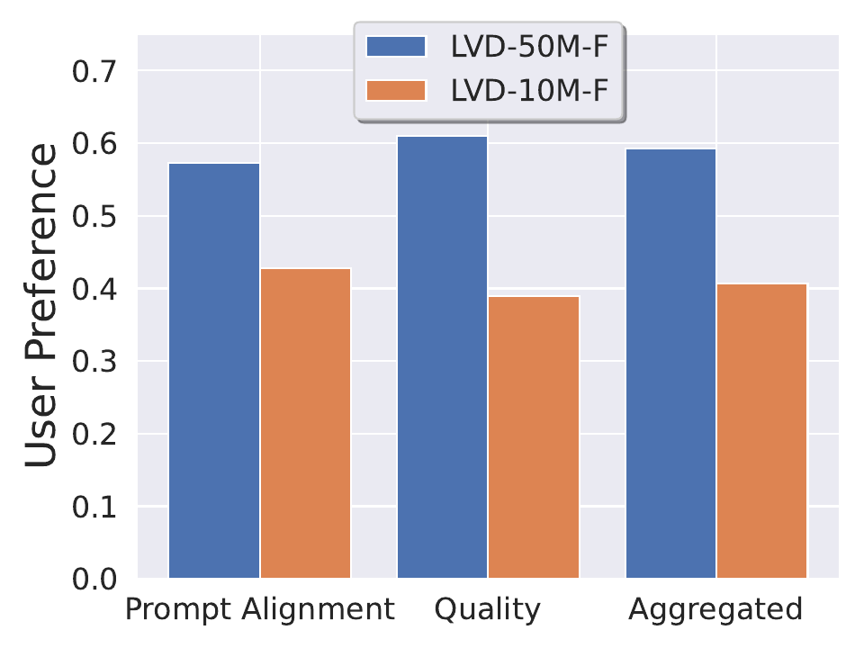

> 图 6：与 GEN-2 [74] 和 PikaLabs [54] 相比，人类投票者更青睐我们的 25 帧图像到视频模型。

如 [第 3.2 节](#S3.SS2) 所述，我们的视频模型基于 _Stable Diffusion 2.1_ [71]（SD 2.1）。
近期研究 [44] 表明，在训练图像扩散模型（Diffusion models）时，采用合适的 **噪声调度（noise schedule）** 至关重要，对于更高分辨率的图像，需要向更多噪声的方向调整。
作为第一步，我们使用 Karras 等人 [51] 提出的网络预处理方法，将图像模型中固定的离散噪声调度针对尺寸为 $256\times 384$ 的图像，微调为连续噪声 [87]。在插入时间层之后，我们在 _LVD-F_ 数据集上以 $256\times 384$ 的分辨率对模型进行 14 帧的训练。我们使用标准的 EDM 噪声调度 [51]，进行 150k 次迭代，批大小为 1536。接下来，我们将模型微调为生成 14 帧 $320\times 576$ 的视频，进行 100k 次迭代，批大小为 768。我们发现，在此训练阶段，将噪声调度向更多噪声的方向调整非常重要，这证实了 Hoogeboom 等人 [44] 在图像模型上的结果。更多训练细节，请参见 [附录 D](#A4)。
我们将此模型称为我们的 **基础模型（base model）** ，它可以轻松地针对各种任务进行微调，正如我们在后续章节中所展示的那样。
该基础模型已经学习到了强大的运动表征，例如，在 UCF-101 [88] 数据集上的零样本文本到视频生成任务中，它显著优于所有基线模型（[表 2](#S4.T2)）。
评估细节可在 [附录 E](#A5) 中找到。

### 4.2 高分辨率文本到视频模型（High-Resolution Text-to-Video Model）

我们在一个包含约 100 万样本的高质量视频数据集上对基础 **文生视频（text-to-video）模型** 进行了微调。该数据集中的样本通常包含大量物体运动、稳定的摄像机运动以及对齐良好的描述文本，并且整体具有较高的视觉质量。我们以 $576\times 1024$ 的分辨率（再次将噪声调度向更多噪声方向调整）和 768 的批次大小，对我们的基础模型进行了 5 万次迭代的微调。样本见 [图 5](#S3.F5)，更多样本可在 [附录 E](#A5) 中找到。

### 4.3 高分辨率图像到视频模型（High Resolution Image-to-Video Model）

除了文本到视频生成，我们还对基础模型进行了微调，用于 **图像到视频（image-to-video）** 生成，其中视频模型接收一张静态输入图像作为条件。
相应地，我们将输入基础模型的文本嵌入替换为条件图像的 **CLIP（Contrastive Language-Image Pre-training）** 图像嵌入。
此外，我们将条件帧经过 **噪声增强（noise-augmented）** [39] 的版本在通道维度上拼接至 **UNet（U-Net）** [73] 的输入。我们没有使用任何掩码技术，只是简单地将该帧沿时间轴复制。
我们微调了两个模型，一个预测 14 帧，另一个预测 25 帧；实现和训练细节可在 [附录 D](#A4) 中找到。
我们偶尔发现，标准的 **原始无分类器引导（vanilla classifier-free guidance）** [36] 可能会导致伪影：引导过少可能导致与条件帧不一致，而引导过多则可能导致过饱和。
我们发现，不使用恒定的引导尺度，而是沿帧轴线性增加引导尺度（从低到高）是有益的。细节可在 [附录 D](#A4) 中找到。样本见 [图 5](#S3.F5)，更多样本可在 [附录 E](#A5) 中找到。

在 [图 9](#S4.F9) 中，我们将我们的模型与最先进的闭源视频生成模型进行了比较，特别是 **GEN-2** [23, 74] 和 **PikaLabs** [54]，结果表明，在视觉质量方面，人类投票者更倾向于我们的模型。
关于该实验的详细信息，以及更多图像到视频的样本，可在 [附录 E](#A5) 中找到。

#### 4.3.1 相机运动低秩自适应（Camera Motion LoRA）

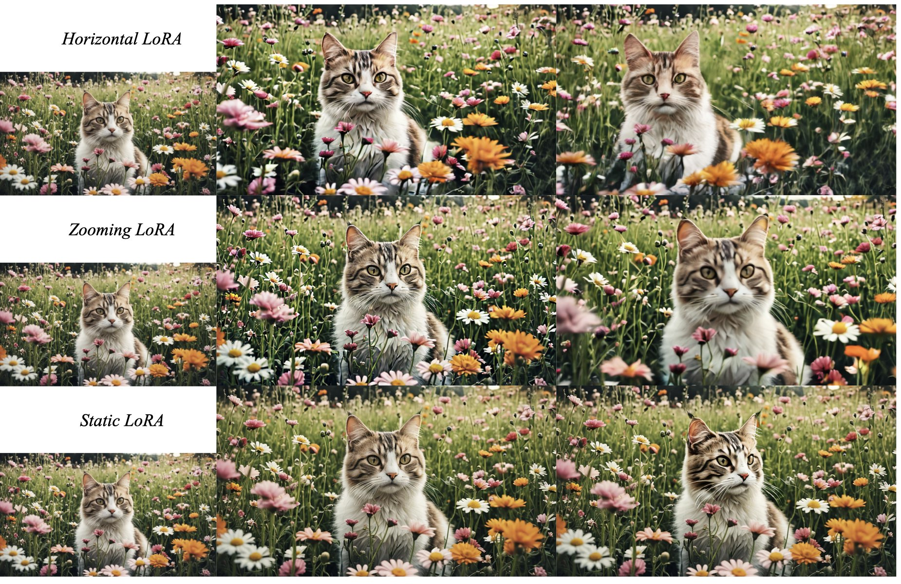

> 图 7：将三种相机运动低秩自适应（LoRA）（_水平移动_、_缩放_、_静态_）应用于相同的条件帧（左侧）。

为了在图像到视频生成中实现可控的相机运动，我们在模型的 **时序注意力块（temporal attention blocks）** 中训练了多种 **相机运动低秩自适应（Camera Motion LoRAs）** [32]；具体实现细节请参见[附录 D](#A4)。我们在一个包含丰富相机运动元数据的小型数据集上训练这些额外的参数。具体而言，我们使用了三个数据子集，其相机运动被分类为“水平移动”、“缩放”和“静态”。在[图 7](#S4.F7) 中，我们展示了这三种模型在相同条件帧下的生成样本；更多样本可在[附录 E](#A5) 中找到。

### 4.4 帧插值（Frame Interpolation）

为了在高帧率下获得流畅的视频，我们将我们的高分辨率文本到视频（text-to-video）模型微调为一个帧插值（frame interpolation）模型。我们遵循 Blattmann 等人 [9] 的方法，通过 **掩码（masking）** 将左右帧（left and right frames）连接到 UNet 的输入中。该模型学习在两个条件帧（conditioning frames）之间预测三个帧，从而有效地将帧率提高四倍。令人惊讶的是，我们发现只需极少量的迭代次数（$\approx 10k$）就足以获得一个良好的模型。具体细节和样本可分别在 [附录 D](#A4) 和 [附录 E](#A5) 中找到。

### 4.5 多视图生成（Multi-View Generation）

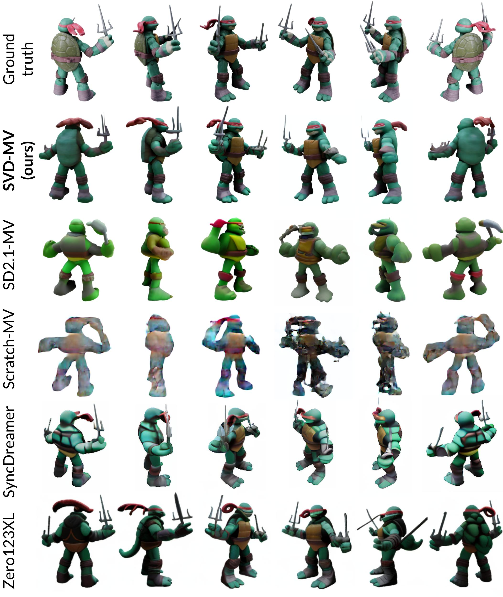

> 图 8：使用我们的 SVD-MV 模型（即针对多视图生成进行微调的 SVD）、SD2.1-MV [72]、Scratch-MV、SyncDreamer [58] 和 Zero123XL [14] 生成的 GSO 测试对象的多视图帧。

为了同时获得物体的多个新视角，我们在多视图数据集 [15, 14, 111] 上对我们的图像到视频 SVD 模型进行了微调。

**数据集（Datasets）**
我们在两个数据集上微调了我们的 SVD 模型，该模型接收单张图像并输出一系列多视图图像：

1.  **Objaverse** [15] 的一个子集，包含来自原始数据集 [15] 的 15 万个经过筛选且采用知识共享许可协议（Creative Commons license, CC-licensed）的合成 3D 物体。对于每个物体，我们渲染了 21 帧的 $360^{\circ}$ 环绕视频，使用了随机采样的高动态范围成像（High Dynamic Range Imaging, HDRI）环境贴图，且仰角在 $[-5^{\circ},30^{\circ}]$ 之间。我们在一个未见过的测试数据集上评估了所得模型，该测试集包含从谷歌扫描物体（Google Scanned Objects, GSO）数据集 [20] 中采样的 50 个物体。
2.  **MVImgNet** [111]，包含随意拍摄的普通家用物品的多视图视频。我们将视频分割为约 20 万个训练视频和 900 个测试视频。我们将以竖屏模式拍摄的帧旋转为横屏方向。

在 Objaverse 上训练的模型额外以输入图像的仰角为条件，并输出该仰角下的环绕视频。在 MVImgNet 上训练的模型不以姿态为条件，可以在其生成过程中选择任意的相机路径。关于姿态条件机制的详细信息，请参见[附录 E](#A5)。

**模型（Models）**  
我们将微调后的 **多视图（Multi-View）** 模型称为 **SVD-MV** 。我们对 **SVD** 的 **视频先验（video prior）** 在多视图生成中的重要性进行了 **消融研究（ablation study）** 。为此，我们将 **SVD-MV** （即基于视频先验）的结果与基于 **图像先验（image prior）** 微调的结果——即 **文本到图像（text-to-image）** 模型 **SD2.1（SD2.1-MV）** ——以及无先验训练（即从随机初始化开始训练）的结果（ **Scratch-MV** ）进行比较。此外，我们还与当前最先进的多视图生成模型 **Zero123 [57]** 、 **Zero123XL [14]** 和 **SyncDreamer [58]** 进行了对比。

**指标（Metrics）**  
我们在 50 个 **GSO** 测试对象上，使用 **峰值信噪比（Peak Signal-to-Noise Ratio, PSNR）** 、 **LPIPS [112]** 以及 **CLIP [66] 相似度分数（CLIP Similarity scores, CLIP-S）** 作为标准指标，计算 **真实帧（ground truth frames）** 与 **生成帧（generated frames）** 对应配对之间的度量值。

**训练（Training）** 。我们使用 8 块 80GB 的 A100 GPU，以总批次大小为 16、学习率为 $1e-5$ 的设置，对所有模型进行了 12k 步（约 16 小时）的训练。

**结果（Results）** 。
[图 10](#S4.F10)(a) 展示了在 GSO 测试数据集上的平均指标。与 SD2.1-MV 和 Scratch-MV 相比，SVD-MV 的更高性能清晰地证明了 SVD 模型中学习到的视频先验知识对于多视图生成的优势。此外，与从 SVD 微调的其他模型情况类似，我们发现只需极少量的迭代次数（约 12k 次）就足以获得一个良好的模型。而且，SVD-MV 在训练时间更短（16 小时内完成 12k 次迭代）的情况下，与最先进的技术相比仍具有竞争力；而现有模型通常需要更长的训练时间（例如，SyncDreamer 在 Objaverse 数据集上专门训练了四天）。[图 10](#S4.F10)(b) 展示了不同微调模型的收敛情况。仅经过 1k 次迭代，SVD-MV 的 CLIP-S 和 PSNR 分数就远优于其使用图像先验和无先验的对比模型。

[图 8](#S4.F8) 展示了一个 GSO 测试对象的多视图生成结果的定性比较，[图 11](#S4.F11) 则展示了一个 MVImgNet 测试对象的比较结果。可以看出，我们生成的帧具有多视图一致性和真实感。
有关实验的更多细节以及更多的多视图生成样本，请参见 [附录 E](#A5)。

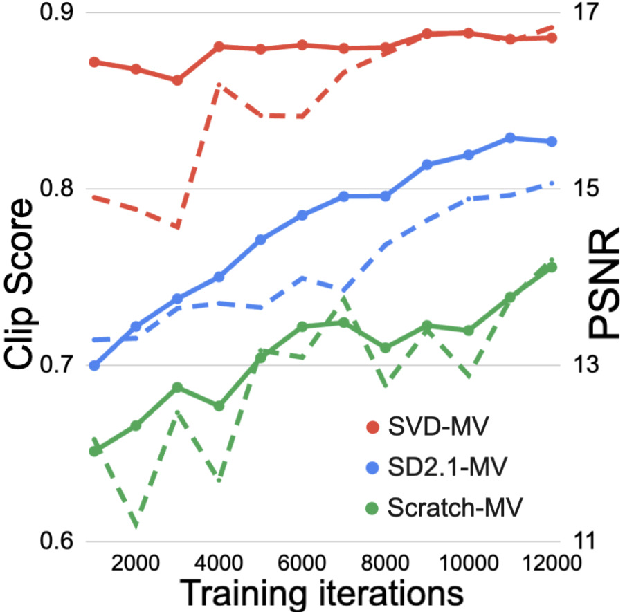

> (a)

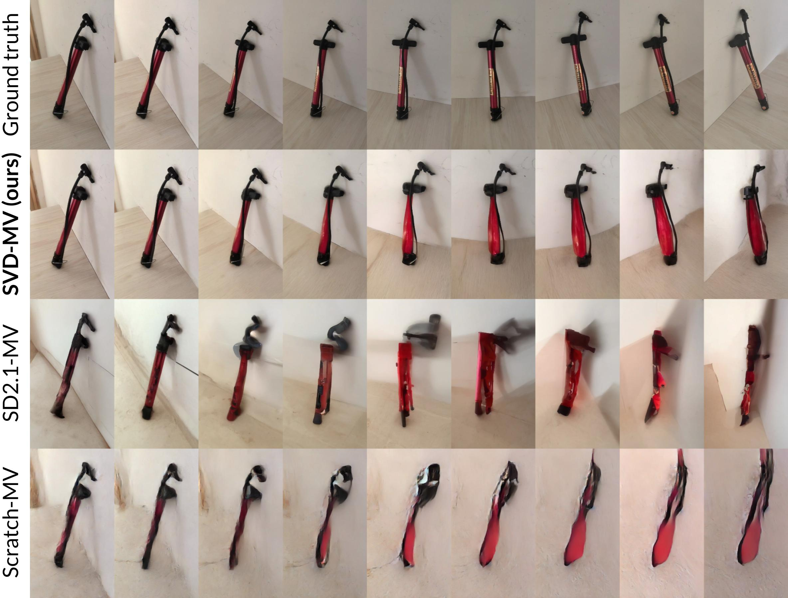

> **图 11（Figure 11）** ：使用我们的 SVD-MV 模型、SD2.1-MV [72] 以及 Scratch-MV 为 MVImgNet 数据集生成的新颖多视角帧。

## 5 结论（Conclusion）

我们提出了 **_Stable Video Diffusion_ (SVD)** ，一个用于高分辨率、最先进的 **文本到视频（text-to-video）** 和 **图像到视频（image-to-video）** 合成的 **潜在视频扩散模型（latent video diffusion model）** 。为了构建其预训练数据集，我们进行了一项系统的数据选择与规模扩展研究，并提出了一种方法来筛选海量视频数据，并将庞大且嘈杂的视频集合转化为适用于生成式视频模型的合适数据集。此外，我们介绍了视频模型训练的三个不同阶段，并分别对其进行分析，以评估它们对最终模型性能的影响。 **_Stable Video Diffusion_ (SVD)** 提供了一个强大的视频表征，基于此，我们对视频模型进行微调，以实现最先进的图像到视频合成以及其他高度相关的应用，例如用于相机控制的 **低秩适应（Low-Rank Adaptation, LoRA）** 。最后，我们提供了一项关于视频扩散模型多视图微调的开创性研究，并表明 SVD 构成了一个强大的 **三维先验（3D prior）** ，它在多视图合成中取得了最先进的结果，同时仅使用了先前方法计算量的一小部分。

我们希望这些发现能在生成式视频建模领域的研究中得到广泛应用。关于我们工作更广泛的影响和局限性的讨论，请参见 [附录 A](#A1)。

## Acknowledgements

特别感谢埃马德·莫斯塔克（Emad Mostaque）对本项目的卓越支持。衷心感谢我们的同事乔纳斯·米勒（Jonas Müller）、阿克塞尔·绍尔（Axel Sauer）、达斯汀·波德尔（Dustin Podell）和拉希姆·恩特扎里（Rahim Entezari）富有成效的讨论和宝贵意见。最后，我们感谢哈里·塞尼（Harry Saini）以及独一无二的理查德·文库（Richard Vencu）对我们数据和计算基础设施的维护与优化。

## 参考文献（References）

- An 等人 [2023]
  Jie An, Songyang Zhang, Harry Yang, Sonal Gupta, Jia-Bin Huang, Jiebo Luo, and Xi Yin.
  Latent-shift: Latent diffusion with temporal shift for efficient text-to-video generation.
  _arXiv preprint arXiv:2304.08477_, 2023.
- Anciukevičius 等人 [2023]
  Titas Anciukevičius, Zexiang Xu, Matthew Fisher, Paul Henderson, Hakan Bilen, Niloy J Mitra, and Paul Guerrero.
  Renderdiffusion: Image diffusion for 3d reconstruction, inpainting and generation.
  In _Proceedings of the IEEE/CVF Conference on Computer Vision and Pattern Recognition_, pages 12608–12618, 2023.
- Askell 等人 [2021]
  Amanda Askell, Yuntao Bai, Anna Chen, Dawn Drain, Deep Ganguli, Tom Henighan, Andy Jones, Nicholas Joseph, Ben Mann, Nova DasSarma, Nelson Elhage, Zac Hatfield-Dodds, Danny Hernandez, Jackson Kernion, Kamal Ndousse, Catherine Olsson, Dario Amodei, Tom Brown, Jack Clark, Sam McCandlish, Chris Olah, and Jared Kaplan.
  A general language assistant as a laboratory for alignment, 2021.
- Babaeizadeh 等人 [2018]
  Mohammad Babaeizadeh, Chelsea Finn, Dumitru Erhan, Roy H. Campbell, and Sergey Levine.
  Stochastic variational video prediction.
  In _International Conference on Learning Representations_, 2018.
- Baek 等人 [2019]
  Youngmin Baek, Bado Lee, Dongyoon Han, Sangdoo Yun, and Hwalsuk Lee.
  Character region awareness for text detection.
  In _Proceedings of the IEEE/CVF conference on computer vision and pattern recognition_, pages 9365–9374, 2019.
- Bai 等人 [2022]
  Yuntao Bai, Andy Jones, Kamal Ndousse, Amanda Askell, Anna Chen, Nova DasSarma, Dawn Drain, Stanislav Fort, Deep Ganguli, Tom Henighan, Nicholas Joseph, Saurav Kadavath, Jackson Kernion, Tom Conerly, Sheer El-Showk, Nelson Elhage, Zac Hatfield-Dodds, Danny Hernandez, Tristan Hume, Scott Johnston, Shauna Kravec, Liane Lovitt, Neel Nanda, Catherine Olsson, Dario Amodei, Tom Brown, Jack Clark, Sam McCandlish, Chris Olah, Ben Mann, and Jared Kaplan.

* **Training a helpful and harmless assistant with reinforcement learning from human feedback, 2022.**
* 利用人类反馈的强化学习训练一个有用且无害的助手，2022年。
* **Bain et al. [2022]**
* Max Bain, Arsha Nagrani, Gül Varol, and Andrew Zisserman.
* **Frozen in time: A joint video and image encoder for end-to-end retrieval, 2022.**
* 时间冻结：用于端到端检索的联合视频与图像编码器，2022年。
* **Blattmann et al. [2021]**
* Andreas Blattmann, Timo Milbich, Michael Dorkenwald, and Björn Ommer.
* **ipoke: Poking a still image for controlled stochastic video synthesis.**
* ipoke：戳刺静态图像以实现受控随机视频合成。
* In _2021 IEEE/CVF International Conference on Computer Vision, ICCV 2021, Montreal, QC, Canada, October 10-17, 2021_, 2021.
  - 发表于《2021年IEEE/CVF国际计算机视觉大会，ICCV 2021，加拿大魁北克省蒙特利尔，2021年10月10-17日》，2021年。
* **Blattmann et al. [2023]**
* Andreas Blattmann, Robin Rombach, Huan Ling, Tim Dockhorn, Seung Wook Kim, Sanja Fidler, and Karsten Kreis.
* **Align your Latents: High-Resolution Video Synthesis with Latent Diffusion Models.**
* 对齐你的潜变量：基于潜扩散模型的高分辨率视频合成。
* _arXiv:2304.08818_, 2023.
  - 《arXiv:2304.08818》，2023年。
* **Brooks et al. [2022]**
* Tim Brooks, Janne Hellsten, Miika Aittala, Ting-Chun Wang, Timo Aila, Jaakko Lehtinen, Ming-Yu Liu, Alexei A Efros, and Tero Karras.
* **Generating long videos of dynamic scenes.**
* 动态场景的长视频生成。
* In _NeurIPS_, 2022.
  - 发表于《神经信息处理系统大会（NeurIPS）》，2022年。
* **Carreira and Zisserman [2017]**
* Joao Carreira and Andrew Zisserman.
* **Quo vadis, action recognition? a new model and the kinetics dataset.**
* 动作识别，何去何从？一个新模型与Kinetics数据集。
* In _proceedings of the IEEE Conference on Computer Vision and Pattern Recognition_, pages 6299–6308, 2017.
  - 发表于《IEEE计算机视觉与模式识别会议论文集》，第6299–6308页，2017年。
* **Castrejon et al. [2019]**
* Lluis Castrejon, Nicolas Ballas, and Aaron Courville.
* **Improved conditional vrnns for video prediction.**
* 用于视频预测的改进型条件变分循环神经网络。
* In _The IEEE International Conference on Computer Vision (ICCV)_, 2019.
  - 发表于《IEEE国际计算机视觉大会（ICCV）》，2019年。
* **Dai et al. [2023]**
* Xiaoliang Dai, Ji Hou, Chih-Yao Ma, Sam Tsai, Jialiang Wang, Rui Wang, Peizhao Zhang, Simon Vandenhende, Xiaofang Wang, Abhimanyu Dubey, Matthew Yu, Abhishek Kadian, Filip Radenovic, Dhruv Mahajan, Kunpeng Li, Yue Zhao, Vladan Petrovic, Mitesh Kumar Singh, Simran Motwani, Yi Wen, Yiwen Song, Roshan Sumbaly, Vignesh Ramanathan, Zijian He, Peter Vajda, and Devi Parikh.
* **Emu: Enhancing image generation models using photogenic needles in a haystack, 2023.**
* Emu：利用草堆中的上镜针增强图像生成模型，2023年。

- Deitke 等人 [2023a]
  Matt Deitke, Ruoshi Liu, Matthew Wallingford, Huong Ngo, Oscar Michel, Aditya
  Kusupati, Alan Fan, Christian Laforte, Vikram Voleti, Samir Yitzhak Gadre,
  et al.
  Objaverse-XL：一个包含 1000 万+ 3D 对象的宇宙。
  _arXiv 预印本 arXiv:2307.05663_, 2023a.
- Deitke 等人 [2023b]
  Matt Deitke, Dustin Schwenk, Jordi Salvador, Luca Weihs, Oscar Michel, Eli
  VanderBilt, Ludwig Schmidt, Kiana Ehsani, Aniruddha Kembhavi, and Ali
  Farhadi.
  Objaverse：一个带标注的 3D 对象宇宙。
  载于《IEEE/CVF 计算机视觉与模式识别会议论文集》，第 13142–13153 页，2023b.
- Deng 等人 [2023]
  Congyue Deng, Chiyu Jiang, Charles R Qi, Xinchen Yan, Yin Zhou, Leonidas
  Guibas, Dragomir Anguelov, et al.
  Nerdi：使用语言引导扩散作为通用图像先验的单视角神经辐射场合成。
  载于《IEEE/CVF 计算机视觉与模式识别会议论文集》，第 20637–20647 页，2023.
- Denton 和 Fergus [2018]
  Emily Denton and Rob Fergus.
  使用学习先验的随机视频生成。
  载于《第 35 届国际机器学习会议论文集，ICML 2018，瑞典斯德哥尔摩，Stockholmsmässan，2018年7月10-15日》，2018.
- Dhariwal 和 Nichol [2021]
  Prafulla Dhariwal and Alex Nichol.
  扩散模型在图像合成上击败生成对抗网络。
  _arXiv:2105.05233_, 2021.
- Dorkenwald 等人 [2021]
  Michael Dorkenwald, Timo Milbich, Andreas Blattmann, Robin Rombach,
  Konstantinos G. Derpanis, and Björn Ommer.
  使用条件归一化流网络的随机图像到视频合成。
  载于《IEEE 计算机视觉与模式识别会议，CVPR 2021，线上，2021年6月19-25日》，2021.
- Downs 等人 [2022]
  Laura Downs, Anthony Francis, Nate Koenig, Brandon Kinman, Ryan Hickman, Krista
  Reymann, Thomas B McHugh, and Vincent Vanhoucke.
  Google 扫描对象：一个高质量的 3D 扫描家居物品数据集。

- Elo [1978]
  Arpad E. Elo.
  _The Rating of Chessplayers, Past and Present_.
  Arco Pub., New York, 1978.
- Esser et al. [2020]
  Patrick Esser, Robin Rombach, and Björn Ommer.
  Taming transformers for high-resolution image synthesis.
  _arXiv preprint arXiv:2012.09841_, 2020.
- Esser et al. [2023]
  Patrick Esser, Johnathan Chiu, Parmida Atighehchian, Jonathan Granskog, and
  Anastasis Germanidis.

2023.

2024.

- Farnebäck [2003]
  Gunnar Farnebäck（贡纳尔·法尔内贝克）。
  基于多项式展开的双帧运动估计。
  页码 363–370，2003年。
- Fox 等人 [2021]
  Gereon Fox（格雷翁·福克斯）、Ayush Tewari（阿尤什·特瓦里）、Mohamed Elgharib（穆罕默德·埃尔加里布）和 Christian Theobalt（克里斯蒂安·特奥博尔特）。
  StyleVideoGAN：一种使用预训练 StyleGAN 的时序生成模型。
  载于《英国机器视觉会议（British Machine Vision Conference, BMVC）》，2021年。
- Franceschi 等人 [2020]
  Jean-Yves Franceschi（让-伊夫·弗朗切斯基）、Edouard Delasalles（爱德华·德拉萨莱斯）、Mickaël Chen（米卡埃尔·陈）、Sylvain Lamprier（西尔万·朗普里耶）和 Patrick Gallinari（帕特里克·加利纳里）。
  随机潜在残差视频预测。
  载于《第37届国际机器学习会议论文集》，2020年。
- Gao 等人 [2020]
  Leo Gao（利奥·高）、Stella Biderman（斯特拉·比德曼）、Sid Black（锡德·布莱克）、Laurence Golding（劳伦斯·戈尔丁）、Travis Hoppe（特拉维斯·霍普）、Charles Foster（查尔斯·福斯特）、Jason Phang（杰森·潘）、Horace He（贺拉斯·何）、Anish Thite（阿尼什·泰特）、Noa Nabeshima（诺亚·纳贝希马）、Shawn Presser（肖恩·普雷瑟）和 Connor Leahy（康纳·莱希）。
  The Pile：一个用于语言建模的 800GB 多样化文本数据集。
  《arXiv 预印本 arXiv:2101.00027》，2020年。
- Ge 等人 [2022]
  Songwei Ge（葛颂威）、Thomas Hayes（托马斯·海斯）、Harry Yang（哈里·杨）、Xi Yin（殷曦）、Guan Pang（庞冠）、David Jacobs（大卫·雅各布斯）、Jia-Bin Huang（黄佳彬）和 Devi Parikh（德维·帕里克）。
  使用时间无关 VQGAN 和时间敏感 Transformer 生成长视频。
  载于《计算机视觉 – ECCV 2022》，页码 102–118，Cham，2022年。
  Springer Nature Switzerland。
- Ge 等人 [2023]
  Songwei Ge（葛颂威）、Seungjun Nah（罗承俊）、Guilin Liu（刘桂林）、Tyler Poon（潘泰来）、Andrew Tao（安德鲁·陶）、Bryan Catanzaro（布莱恩·卡坦扎罗）、David Jacobs（大卫·雅各布斯）、Jia-Bin Huang（黄佳彬）、Ming-Yu Liu（刘明宇）和 Yogesh Balaji（约格什·巴拉吉）。
  保持你自己的相关性：视频扩散模型的噪声先验。
  载于《IEEE/CVF 国际计算机视觉会议论文集》，页码 22930–22941，2023年。
- Goodfellow 等人 [2014]
  Ian Goodfellow（伊恩·古德费洛）、Jean Pouget-Abadie（让·普热-阿巴迪）、Mehdi Mirza（迈赫迪·米尔扎）、Bing Xu（徐冰）、David Warde-Farley（大卫·沃德-法利）、Sherjil Ozair（谢吉尔·奥扎尔）、Aaron Courville（亚伦·库维尔）和 Yoshua Bengio（约书亚·本吉奥）。
  生成对抗网络。
  《神经信息处理系统进展》，第27卷，2014年。
- Gu 等人 [2023]
  Jiaxi Gu（顾嘉熙）、Shicong Wang（王世聪）、Haoyu Zhao（赵浩宇）、Tianyi Lu（卢天一）、Xing Zhang（张星）、Zuxuan Wu（吴祖煊）、Songcen Xu（许松岑）、Wei Zhang（张伟）、Yu-Gang Jiang（蒋宇刚）和 Hang Xu（徐航）。

- Reuse and diffuse: Iterative denoising for text-to-video generation.
  _arXiv preprint arXiv:2309.03549_, 2023.
- Guo et al. [2023]
  郭宇伟（Yuwei Guo）、杨策源（Ceyuan Yang）、饶安怡（Anyi Rao）、王耀辉（Yaohui Wang）、乔宇（Yu Qiao）、林达华（Dahua Lin）、戴波（Bo Dai）。
  Animatediff: Animate your personalized text-to-image diffusion models without specific tuning.
  _arXiv preprint arXiv:2307.04725_, 2023.
- Gupta et al. [2022]
  索纳姆·古普塔（Sonam Gupta）、阿尔蒂·凯沙里（Arti Keshari）、苏肯杜·达斯（Sukhendu Das）。
  Rv-gan: Recurrent gan for unconditional video generation.
  收录于《IEEE/CVF 计算机视觉与模式识别会议（IEEE/CVF Conference on Computer Vision and Pattern Recognition, CVPR）研讨会论文集》，第 2024–2033 页，2022 年。
- Guttenberg and CrossLabs [2023]
  尼古拉斯·古滕贝格（Nicholas Guttenberg）与 CrossLabs。
  Diffusion with offset noise, 2023.
- He et al. [2023]
  何英清（Yingqing He）、杨天宇（Tianyu Yang）、张勇（Yong Zhang）、单瀛（Ying Shan）、陈启峰（Qifeng Chen）。
  Latent video diffusion models for high-fidelity long video generation, 2023.
- Ho and Salimans [2021]
  乔纳森·何（Jonathan Ho）与蒂姆·萨利曼斯（Tim Salimans）。
  Classifier-free diffusion guidance.
  收录于《NeurIPS 2021 深度生成模型与下游应用研讨会（NeurIPS 2021 Workshop on Deep Generative Models and Downstream Applications）》，2021 年。
- Ho and Salimans [2022]
  乔纳森·何（Jonathan Ho）与蒂姆·萨利曼斯（Tim Salimans）。
  Classifier-Free Diffusion Guidance.
  _arXiv:2207.12598_, 2022.
- Ho et al. [2020]
  乔纳森·何（Jonathan Ho）、阿贾伊·贾因（Ajay Jain）、彼得·阿比尔（Pieter Abbeel）。
  Denoising diffusion probabilistic models.
  收录于《神经信息处理系统进展（Advances in Neural Information Processing Systems）》，2020 年。
- Ho et al. [2021]
  乔纳森·何（Jonathan Ho）、奇特万·萨哈里亚（Chitwan Saharia）、威廉·陈（William Chan）、大卫·J·弗利特（David J Fleet）、穆罕默德·诺鲁齐（Mohammad Norouzi）、蒂姆·萨利曼斯（Tim Salimans）。
  Cascaded diffusion models for high fidelity image generation.
  _arXiv preprint arXiv:2106.15282_, 2021.
- Ho et al. [2022a]
  乔纳森·何（Jonathan Ho）、威廉·陈（William Chan）、奇特万·萨哈里亚（Chitwan Saharia）、杰·黄（Jay Whang）、高瑞琪（Ruiqi Gao）、阿列克谢·格里岑科（Alexey Gritsenko）、迪德里克·P·金马（Diederik P Kingma）、本·普尔（Ben Poole）、穆罕默德·诺鲁齐（Mohammad Norouzi）、大卫·J·弗利特（David J Fleet）、蒂姆·萨利曼斯（Tim Salimans）。
  Imagen Video: High Definition Video Generation with Diffusion Models.
  _arXiv:2210.02303_, 2022a.

- Ho 等人 [2022b]
  Jonathan Ho, William Chan, Chitwan Saharia, Jay Whang, Ruiqi Gao, Alexey Gritsenko, Diederik P. Kingma, Ben Poole, Mohammad Norouzi, David J. Fleet, 和 Tim Salimans.
  Imagen video: High definition video generation with diffusion models.
  _arXiv 预印本 arXiv:2210.02303_, 2022b.
- Ho 等人 [2022c]
  Jonathan Ho, Tim Salimans, Alexey Gritsenko, William Chan, Mohammad Norouzi, 和 David J. Fleet.
  Video diffusion models.
  _arXiv 预印本 arXiv:2204.03458_, 2022c.
- Hong 等人 [2022]
  Wenyi Hong, Ming Ding, Wendi Zheng, Xinghan Liu, 和 Jie Tang.
  Cogvideo: Large-scale pretraining for text-to-video generation via transformers, 2022.
- Hoogeboom 等人 [2023]
  Emiel Hoogeboom, Jonathan Heek, 和 Tim Salimans.
  simple diffusion: End-to-end diffusion for high resolution images.
  _arXiv 预印本 arXiv:2301.11093_, 2023.
- Hu 等人 [2021]
  Edward J Hu, Yelong Shen, Phillip Wallis, Zeyuan Allen-Zhu, Yuanzhi Li, Shean Wang, Lu Wang, 和 Weizhu Chen.
  Lora: Low-rank adaptation of large language models.
  _arXiv 预印本 arXiv:2106.09685_, 2021.
- Hyvärinen 和 Dayan [2005]
  Aapo Hyvärinen 和 Peter Dayan.
  Estimation of Non-Normalized Statistical Models by Score Matching.
  _Journal of Machine Learning Research_, 6(4), 2005.
- Ilharco 等人 [2021]
  Gabriel Ilharco, Mitchell Wortsman, Ross Wightman, Cade Gordon, Nicholas Carlini, Rohan Taori, Achal Dave, Vaishaal Shankar, Hongseok Namkoong, John Miller, Hannaneh Hajishirzi, Ali Farhadi, 和 Ludwig Schmidt.
  Openclip, 2021.
- Itseez [2015]
  Itseez.
  Open source computer vision library.
  [https://github.com/itseez/opencv](https://github.com/itseez/opencv), 2015.
- Jun 和 Nichol [2023]
  Heewoo Jun 和 Alex Nichol.
  Shap-e: Generating conditional 3d implicit functions, 2023.
- Kahembwe 和 Ramamoorthy [2020]
  Emmanuel Kahembwe 和 Subramanian Ramamoorthy.
  Lower dimensional kernels for video discriminators.
  _Neural Networks_, 132:506–520, 2020.
- Karras 等人

- [2022]
  Tero Karras, Miika Aittala, Timo Aila, and Samuli Laine.
  Elucidating the Design Space of Diffusion-Based Generative Models.
  _arXiv:2206.00364_, 2022.
- Khachatryan et al. [2023]
  Levon Khachatryan, Andranik Movsisyan, Vahram Tadevosyan, Roberto Henschel,
  Zhangyang Wang, Shant Navasardyan, and Humphrey Shi.
  Text2video-zero: Text-to-image diffusion models are zero-shot video
  generators, 2023.
- Kingma et al. [2021]
  Diederik Kingma, Tim Salimans, Ben Poole, and Jonathan Ho.
  Variational diffusion models.
  _Advances in neural information processing systems_,
  34:21696–21707, 2021.
- Labs [2023]
  Pika Labs.
  Pika labs, [https://www.pika.art/](https://www.pika.art/), 2023.
- Lee et al. [2018]
  Alex X. Lee, Richard Zhang, Frederik Ebert, Pieter Abbeel, Chelsea Finn, and
  Sergey Levine.
  Stochastic adversarial video prediction.
  _arXiv preprint arXiv:1804.01523_, 2018.
- Lin et al. [2023]
  Shanchuan Lin, Bingchen Liu, Jiashi Li, and Xiao Yang.
  Common Diffusion Noise Schedules and Sample Steps are Flawed.
  _arXiv:2305.08891_, 2023.
- Liu et al. [2023a]
  Ruoshi Liu, Rundi Wu, Basile Van Hoorick, Pavel Tokmakov, Sergey Zakharov, and
  Carl Vondrick.
  Zero-1-to-3: Zero-shot one image to 3d object, 2023a.
- Liu et al. [2023b]
  Yuan Liu, Cheng Lin, Zijiao Zeng, Xiaoxiao Long, Lingjie Liu, Taku Komura, and
  Wenping Wang.
  Syncdreamer: Generating multiview-consistent images from a
  single-view image.
  _arXiv preprint arXiv:2309.03453_, 2023b.
- Loshchilov and Hutter [2017]
  Ilya Loshchilov and Frank Hutter.
  Decoupled weight decay regularization.
  _arXiv preprint arXiv:1711.05101_, 2017.
- Luc et al. [2020]
  Pauline Luc, Aidan Clark, Sander Dieleman, Diego de Las Casas, Yotam Doron,
  Albin Cassirer, and Karen Simonyan.
  Transformation-based adversarial video prediction on large-scale
  data.
  _ArXiv_, 2020.
- Meng et al. [2023]
  Chenlin Meng, Robin Rombach, Ruiqi Gao, Diederik P.

- Kingma 等人 [2023]
  Diederik P. Kingma, Stefano Ermon, Jonathan Ho, 和 Tim Salimans.
  《关于引导扩散模型的蒸馏》，2023年。
- Nichol 等人 [2022]
  Alex Nichol, Heewoo Jun, Prafulla Dhariwal, Pamela Mishkin, 和 Mark Chen.
  《Point-e：一个从复杂提示生成 3D 点云的系统》，2022年。
- Penedo 等人 [2023]
  Guilherme Penedo, Quentin Malartic, Daniel Hesslow, Ruxandra Cojocaru, Alessandro Cappelli, Hamza Alobeidli, Baptiste Pannier, Ebtesam Almazrouei, 和 Julien Launay.
  《用于 Falcon LLM 的 RefinedWeb 数据集：仅用网络数据超越精选语料库》。
  _arXiv 预印本 arXiv:2306.01116_，2023年。
- Podell 等人 [2023]
  Dustin Podell, Zion English, Kyle Lacey, Andreas Blattmann, Tim Dockhorn, Jonas Müller, Joe Penna, 和 Robin Rombach.
  《SDXL：改进用于高分辨率图像合成的潜在扩散模型》。
  _arXiv:2307.01952_，2023年。
- Puccetti 等人 [2023]
  Giovanni Puccetti, Maciej Kilian, 和 Romain Beaumont.
  《训练对比式字幕生成器》。
  _LAION 博客_，2023年。
- Radford 等人 [2021]
  Alec Radford, Jong Wook Kim, Chris Hallacy, Aditya Ramesh, Gabriel Goh, Sandhini Agarwal, Girish Sastry, Amanda Askell, Pamela Mishkin, Jack Clark, Gretchen Krueger, 和 Ilya Sutskever.
  《从自然语言监督中学习可迁移的视觉模型》。
  _arXiv:2103.00020_，2021年。
- Raffel 等人 [2019]
  Colin Raffel, Noam Shazeer, Adam Roberts, Katherine Lee, Sharan Narang, Michael Matena, Yanqi Zhou, Wei Li, 和 Peter J. Liu.
  《探索使用统一的文本到文本转换器进行迁移学习的极限》。
  _arXiv e-prints_，2019年。
- Ramesh [2022]
  Aditya Ramesh.
  《DALL·E 2 如何工作》，2022年。
- Ramesh 等人 [2022a]
  Aditya Ramesh, Prafulla Dhariwal, Alex Nichol, Casey Chu, 和 Mark Chen.
  《使用 CLIP 潜在表示进行分层文本条件图像生成》。
  _arXiv 预印本 arXiv:2204.06125_，2022a年。
- Ramesh 等人 [2022b]
  Aditya Ramesh, Prafulla Dhariwal, Alex Nichol, Casey Chu, 和 Mark Chen.

- Rombach 等人 [2021a]
  Robin Rombach, Andreas Blattmann, Dominik Lorenz, Patrick Esser, and Björn
  Ommer.
  **基于 CLIP 潜空间的层次化文本条件图像生成（Hierarchical Text-Conditional Image Generation with CLIP Latents）** 。
  _arXiv:2204.06125_, 2022b.
- Rombach 等人 [2021a]
  Robin Rombach, Andreas Blattmann, Dominik Lorenz, Patrick Esser, and Björn
  Ommer.
  **基于潜扩散模型的高分辨率图像合成（High-Resolution Image Synthesis with Latent Diffusion Models）** 。
  _arXiv preprint arXiv:2112.10752_, 2021a.
- Rombach 等人 [2021b]
  Robin Rombach, Andreas Blattmann, Dominik Lorenz, Patrick Esser, and Björn
  Ommer.
  **基于潜扩散模型的高分辨率图像合成（High-resolution image synthesis with latent diffusion models）** 。
  _arXiv preprint arXiv:2112.10752_, 2021b.
- Ronneberger 等人 [2015]
  Olaf Ronneberger, Philipp Fischer, and Thomas Brox.
  **U-Net：用于生物医学图像分割的卷积网络（U-Net: Convolutional Networks for Biomedical Image Segmentation）** 。
  _arXiv:1505.04597_, 2015.
- RunwayML [2023]
  RunwayML.
  **Runway 的 Gen-2（Gen-2 by runway）** , [https://research.runwayml.com/gen2](https://research.runwayml.com/gen2), 2023.
- Saharia 等人 [2021]
  Chitwan Saharia, Jonathan Ho, William Chan, Tim Salimans, David J Fleet, and
  Mohammad Norouzi.
  **通过迭代优化的图像超分辨率（Image super-resolution via iterative refinement）** 。
  _arXiv preprint arXiv:2104.07636_, 2021.
- Saharia 等人 [2022]
  Chitwan Saharia, William Chan, Saurabh Saxena, Lala Li, Jay Whang, Emily
  Denton, Seyed Kamyar Seyed Ghasemipour, Burcu Karagol Ayan, S. Sara Mahdavi,
  Rapha Gontijo Lopes, Tim Salimans, Jonathan Ho, David J Fleet, and Mohammad
  Norouzi.
  **具有深度语言理解能力的逼真文本到图像扩散模型（Photorealistic text-to-image diffusion models with deep language understanding）** 。
  _arXiv preprint arXiv:2205.11487_, 2022.
- Saito 等人 [2017]
  Masaki Saito, Eiichi Matsumoto, and Shunta Saito.
  **采用奇异值裁剪的时序生成对抗网络（Temporal generative adversarial nets with singular value clipping）** 。
  载于 _ICCV（国际计算机视觉大会）_, 2017.
- Saito 等人 [2020]
  Masaki Saito, Shunta Saito, Masanori Koyama, and Sosuke Kobayashi.
  **稀疏训练，密集生成：高分辨率时序 GAN 的内存高效无监督训练（Train sparsely, generate densely: Memory-efficient unsupervised training of high-resolution temporal gan）** 。
  _International Journal of Computer Vision（国际计算机视觉杂志）_, 2020.
- Salimans 和 Ho [2022]
  Tim Salimans and Jonathan Ho.
  **用于扩散模型快速采样的渐进式蒸馏（Progressive Distillation for Fast Sampling of Diffusion Models）** 。

_arXiv preprint arXiv:2202.00512_, 2022.

- Schuhmann et al. [2022]
  Christoph Schuhmann, Romain Beaumont, Richard Vencu, Cade Gordon, Ross
  Wightman, Mehdi Cherti, Theo Coombes, Aarush Katta, Clayton Mullis, Mitchell
  Wortsman, et al.
  Laion-5b: An open large-scale dataset for training next generation
  image-text models.
  _Advances in Neural Information Processing Systems_,
  35:25278–25294, 2022.
- Shi et al. [2023]
  Yichun Shi, Peng Wang, Jianglong Ye, Mai Long, Kejie Li, and Xiao Yang.
  Mvdream: Multi-view diffusion for 3d generation.
  _arXiv preprint arXiv:2308.16512_, 2023.
- Singer et al. [2022]
  Uriel Singer, Adam Polyak, Thomas Hayes, Xi Yin, Jie An, Songyang Zhang, Qiyuan
  Hu, Harry Yang, Oron Ashual, Oran Gafni, Devi Parikh, Sonal Gupta, and Yaniv
  Taigman.
  Make-A-Video: Text-to-Video Generation without Text-Video Data.
  _arXiv:2209.14792_, 2022.
- Skorokhodov et al. [2022]
  Ivan Skorokhodov, Sergey Tulyakov, and Mohamed Elhoseiny.
  Stylegan-v: A continuous video generator with the price, image
  quality and perks of stylegan2.
  In _Proceedings of the IEEE/CVF Conference on Computer Vision
  and Pattern Recognition (CVPR)_, pages 3626–3636, 2022.
- Sohl-Dickstein et al. [2015]
  Jascha Sohl-Dickstein, Eric A Weiss, Niru Maheswaranathan, and Surya Ganguli.
  Deep Unsupervised Learning using Nonequilibrium Thermodynamics.
  _arXiv:1503.03585_, 2015.
- Somepalli et al. [2023]
  Gowthami Somepalli, Vasu Singla, Micah Goldblum, Jonas Geiping, and Tom
  Goldstein.
  Understanding and mitigating copying in diffusion models, 2023.
- Song and Ermon [2020]
  Yang Song and Stefano Ermon.
  Improved Techniques for Training Score-Based Generative Models.
  _arXiv:2006.09011_, 2020.
- Song et al. [2020]
  Yang Song, Jascha Sohl-Dickstein, Diederik P Kingma, Abhishek Kumar, Stefano
  Ermon, and Ben Poole.
  Score-Based Generative Modeling through Stochastic Differential
  Equations.
  _arXiv:2011.13456_, 2020.
- Soomro et al.

[2012]
Khurram Soomro, Amir Roshan Zamir, and Mubarak Shah.
UCF101：一个包含 101 个野外视频人类动作类别的数据集。
_arXiv 预印本 arXiv:1212.0402_, 2012.

- Teed and Deng [2020]
  Zachary Teed and Jia Deng.
  RAFT：用于光流的循环全对场变换。
  In _计算机视觉–ECCV 2020：第 16 届欧洲会议，英国格拉斯哥，2020 年 8 月 23–28 日，论文集，第二部分 16_, 第 402–419 页。
  Springer, 2020.
- Tian et al. [2021]
  Yu Tian, Jian Ren, Menglei Chai, Kyle Olszewski, Xi Peng, Dimitris N. Metaxas,
  and Sergey Tulyakov.
  一个好的图像生成器是您实现高分辨率视频合成所需的关键。
  In _国际学习表征会议_, 2021.
- Tomar [2006]
  Suramya Tomar.
  使用 ffmpeg 转换视频格式。
  _Linux 期刊_, 2006(146):10, 2006.
- Vahdat et al. [2021]
  Arash Vahdat, Karsten Kreis, and Jan Kautz.
  潜在空间中的基于分数的生成建模。
  In _神经信息处理系统进展_, 2021.
- Villegas et al. [2017]
  Ruben Villegas, Jimei Yang, Seunghoon Hong, Xunyu Lin, and Honglak Lee.
  分解运动与内容以实现自然视频序列预测。
  _ICLR_, 2017.
- Villegas et al. [2022]
  Ruben Villegas, Mohammad Babaeizadeh, Pieter-Jan Kindermans, Hernan Moraldo,
  Han Zhang, Mohammad Taghi Saffar, Santiago Castro, Julius Kunze, and Dumitru
  Erhan.
  Phenaki：基于开放域文本描述的可变长度视频生成。
  _arXiv:2210.02399_, 2022.
- Voleti et al. [2022]
  Vikram Voleti, Alexia Jolicoeur-Martineau, and Christopher Pal.
  MCVD：用于预测、生成和插值的掩码条件视频扩散。
  In _（NeurIPS）神经信息处理系统进展_, 2022.
- Vondrick et al. [2016]
  Carl Vondrick, Hamed Pirsiavash, and Antonio Torralba.
  利用场景动态生成视频。
  In _第 30 届神经信息处理系统国际会议论文集_, 2016.

- Wang et al. [2023a]
  Jiuniu Wang, Hangjie Yuan, Dayou Chen, Yingya Zhang, Xiang Wang, and Shiwei
  Zhang.
  **Modelscope 文本到视频技术报告（Modelscope text-to-video technical report）** .
  _arXiv 预印本 arXiv:2308.06571_, 2023a.
- Wang et al. [2020]
  Yaohui Wang, Piotr Bilinski, Francois Bremond, and Antitza Dantcheva.
  **G3an：解耦外观与运动以进行视频生成（G3an: Disentangling appearance and motion for video generation）** .
  收录于 _IEEE/CVF 计算机视觉与模式识别会议（IEEE/CVF Conference on Computer Vision and Pattern Recognition, CVPR）_, 2020.
- Wang et al. [2023b]
  Yaohui Wang, Xinyuan Chen, Xin Ma, Shangchen Zhou, Ziqi Huang, Yi Wang, Ceyuan
  Yang, Yinan He, Jiashuo Yu, Peiqing Yang, et al.
  **Lavie：基于级联潜在扩散模型的高质量视频生成（Lavie: High-quality video generation with cascaded latent diffusion models）** .
  _arXiv 预印本 arXiv:2309.15103_, 2023b.
- Wang et al. [2023c]
  Yi Wang, Yinan He, Yizhuo Li, Kunchang Li, Jiashuo Yu, Xin Ma, Xinyuan Chen,
  Yaohui Wang, Ping Luo, Ziwei Liu, Yali Wang, Limin Wang, and Yu Qiao.
  **Internvid：一个用于多模态理解与生成的大规模视频-文本数据集（Internvid: A large-scale video-text dataset for multimodal understanding and generation）** , 2023c.
- Watson et al. [2022]
  Daniel Watson, William Chan, Ricardo Martin-Brualla, Jonathan Ho, Andrea
  Tagliasacchi, and Mohammad Norouzi.
  **基于扩散模型的新视角合成（Novel view synthesis with diffusion models）** , 2022.
- Weissenborn et al. [2020]
  Dirk Weissenborn, Oscar Täckström, and Jakob Uszkoreit.
  **扩展自回归视频模型（Scaling autoregressive video models）** .
  收录于 _国际学习表征会议（International Conference on Learning Representations）_, 2020.
- Wu et al. [2021]
  Chenfei Wu, Lun Huang, Qianxi Zhang, Binyang Li, Lei Ji, Fan Yang, Guillermo
  Sapiro, and Nan Duan.
  **Godiva：根据自然描述生成开放域视频（Godiva: Generating open-domain videos from natural descriptions）** .
  _arXiv:2104.14806_, 2021.
- Wu et al. [2022]
  Chenfei Wu, Jian Liang, Lei Ji, Fan Yang, Yuejian Fang, Daxin Jiang, and Nan
  Duan.
  **Nüwa：用于神经视觉世界创建的视觉合成预训练（Nüwa: Visual synthesis pre-training for neural visual world creation）** .
  收录于 _欧洲计算机视觉会议（European Conference on Computer Vision）_, 第 720–736 页。
  Springer 出版社, 2022.
- Xu et al.

- Xu 等人（Hu Xu, Saining Xie, Xiaoqing Ellen Tan, Po-Yao Huang, Russell Howes, Vasu Sharma, Shang-Wen Li, Gargi Ghosh, Luke Zettlemoyer, and Christoph Feichtenhofer） [2023]
  **揭秘 CLIP 数据（Demystifying CLIP data）** , 2023.
- Xu 等人（Jun Xu, Tao Mei, Ting Yao, and Yong Rui） [2016]
  **MSR-VTT：一个用于连接视频与语言的大型视频描述数据集（MSR-VTT: A large video description dataset for bridging video and language）** .
  发表于 **国际计算机视觉与模式识别会议（International Conference on Computer Vision and Pattern Recognition, CVPR）** , 2016.
- Yan 等人（Wilson Yan, Yunzhi Zhang, Pieter Abbeel, and Aravind Srinivas） [2021]
  **VideoGPT：使用 VQ-VAE 和 Transformer 进行视频生成（VideoGPT: Video generation using VQ-VAE and transformers）** , 2021.
- Yu 等人（Jiahui Yu, Zirui Wang, Vijay Vasudevan, Legg Yeung, Mojtaba Seyedhosseini, and Yonghui Wu） [2022a]
  **CoCa：对比式描述生成器是图像-文本基础模型（CoCa: Contrastive captioners are image-text foundation models）** , 2022a.
- Yu（Keunwoo Peter Yu） [2023]
  **VideoBLIP** .
  [https://github.com/yukw777/VideoBLIP](https://github.com/yukw777/VideoBLIP), 2023.
  如果您使用 VideoBLIP，请按如下方式引用。
- Yu 等人（Sihyun Yu, Jihoon Tack, Sangwoo Mo, Hyunsu Kim, Junho Kim, Jung-Woo Ha, and Jinwoo Shin） [2022b]
  **使用动态感知隐式生成对抗网络生成视频（Generating videos with dynamics-aware implicit generative adversarial networks）** .
  发表于 **国际学习表征会议（International Conference on Learning Representations, ICLR）** , 2022b.
- Yu 等人（Xianggang Yu, Mutian Xu, Yidan Zhang, Haolin Liu, Chongjie Ye, Yushuang Wu, Zizheng Yan, Chenming Zhu, Zhangyang Xiong, Tianyou Liang, et al.） [2023]
  **MVImgNet：一个大规模多视角图像数据集（MVImgNet: A large-scale dataset of multi-view images）** .
  发表于 **IEEE/CVF 计算机视觉与模式识别会议论文集（Proceedings of the IEEE/CVF Conference on Computer Vision and Pattern Recognition, CVPR）** , 第 9150–9161 页, 2023.
- Zhang 等人（Richard Zhang, Phillip Isola, Alexei A. Efros, Eli Shechtman, and Oliver Wang） [2018]
  **深度特征作为感知度量不合理的有效性（The unreasonable effectiveness of deep features as a perceptual metric）** , 2018.
- Zhang 等人（Shiwei Zhang, Jiayu Wang, Yingya Zhang, Kang Zhao, Hangjie Yuan, Zhiwu Qin, Xiang Wang, Deli Zhao, and Jingren Zhou） [2023a]
  **I2VGen-XL：通过级联扩散模型实现高质量图像到视频合成（I2vgen-xl: High-quality image-to-video synthesis via cascaded diffusion models）** .

* Zhang 等人 [2023b]
  Yabo Zhang（张亚博）， Yuxiang Wei（魏宇翔）， Dongsheng Jiang（蒋东升）， Xiaopeng Zhang（张晓鹏）， Wangmeng Zuo（左旺孟）， and Qi Tian（田奇）。
  Controlvideo: Training-free controllable text-to-video generation（Controlvideo：免训练的可控文本到视频生成），
  2023b。
* Zhou 等人 [2022]
  Daquan Zhou（周大权）， Weimin Wang（王伟民）， Hanshu Yan（严汉书）， Weiwei Lv（吕伟伟）， Yizhe Zhu（朱一哲）， and Jiashi Feng（冯佳时）。
  Magicvideo: Efficient video generation with latent diffusion models（Magicvideo：基于潜在扩散模型的高效视频生成）。
  _arXiv preprint arXiv:2211.11018_， 2022。
* Zhou 和 Tulsiani [2023]
  Zhizhuo Zhou（周志卓） and Shubham Tulsiani。
  Sparsefusion: Distilling view-conditioned diffusion for 3d reconstruction（Sparsefusion：用于三维重建的视图条件扩散蒸馏）。
  收录于 _Proceedings of the IEEE/CVF Conference on Computer Vision and Pattern Recognition（IEEE/CVF 计算机视觉与模式识别会议论文集）_， 第 12588–12597 页， 2023。

## 附录

## 附录 A 更广泛的影响与局限性

**更广泛的影响（Broader Impact）** ：
面向不同模态的 **生成模型（Generative models）** 有望彻底改变媒体创作与使用的格局。在探索其创造性应用的同时， **在实际部署前，降低其被用于制造虚假信息和造成伤害的潜力是至关重要的方面** 。此外，风险分析需要强调并评估各类现有模型类型之间的差异，例如插值、文本到视频、动画以及长视频生成。在这些模型投入实际应用之前，对模型本身、其预期用途、安全性、相关风险以及潜在偏见进行全面调查是必不可少的。

**局限性（Limitations）** ：
虽然我们的方法在短视频生成方面表现出色，但在长视频合成方面存在一些根本性的不足：

- 尽管 **潜在方法（latent approach）** 具有效率优势，但一次性生成多个关键帧在训练和推理阶段都代价高昂。未来关于长视频合成的工作，要么应尝试采用级联式的极粗略帧生成策略，要么应为视频生成构建专用的 **分词器（tokenizers）** 。
- 此外，使用我们的方法生成的视频有时会存在生成运动过少的问题。
- 最后， **视频扩散模型（Video diffusion models）** 通常采样速度慢且对 **显存（VRAM）** 要求高，我们的模型也不例外。 **扩散蒸馏方法（Diffusion distillation methods）** [61, 79, 41] 是实现更快合成的有希望的候选方案。

## 附录 B 相关工作

## 附录 B 相关工作

**视频合成（Video Synthesis）**
许多基于各类模型的方法，例如 **变分循环神经网络（Variational Recurrent Neural Networks, Variational RNNs）** [4, 17, 55, 12, 26]、 **归一化流（Normalizing Flows）** [19, 8]、 **自回归变换器（Autoregressive Transformers）** [102, 107, 43, 103, 104, 28, 33] 以及 **生成对抗网络（Generative Adversarial Networks, GANs）** [96, 110, 90, 93, 60, 78, 10, 83, 50, 77, 98, 25]，都已致力于解决视频合成问题。然而，这些工作中的大多数，要么是在低分辨率下生成视频 [4, 17, 55, 12, 26, 19, 8, 96, 110, 90, 93, 60]，要么是在相对较小且噪声较多的数据集上生成视频 [11, 88, 106]，而这些数据集最初是为训练判别式模型而提出的。

在日益增多的可用计算资源以及更适用于生成建模的数据集（如 WebVid-10M [7]）的推动下，近期提出了更具竞争力的方法，这些方法主要基于可扩展性良好、基于显式似然的方法，例如 **扩散模型（Diffusion models）** [42, 82, 41] 和 **自回归模型（Autoregressive models）** [94]。由于缺乏可用的干净视频数据，所有这些方法都利用了 **联合图像-视频训练（Joint image-video training）** [82, 41, 115, 9]，并且大多数方法都将模型建立在 **预训练图像模型（Pretrained image models）** [82, 115, 9] 之上。这些方法与大多数后续的（文本到）视频合成方法 [29, 97, 99] 之间的另一个共同点是，都使用专用的专家模型以较粗的帧率生成实际的视觉内容，然后将这个低帧率视频在时间维度上 **超分（Upscale）** 至时间上平滑的 24-32 fps 最终输出 [82, 41, 9]。与图像领域类似，基于扩散的方法主要可分为遵循 [39, 29] 的 **级联方法（Cascaded approaches）** [41]，以及将 Rombach 等人 [71] 的方法迁移到视频领域的 **潜在扩散模型（Latent Diffusion Models, LDMs）** [9, 115, 113]。虽然这些工作中的大多数旨在学习通用的运动表示，并因此在大型多样的数据集上进行训练，但基于扩散的视频合成中另一个公认的分支则致力于 **个性化视频生成（Personalized video generation）** ，其方法是在为特定领域 [32] 或应用定制的、范围更窄的数据集上对预训练的文本到图像模型进行 **微调（Fine-tuning）** ，部分方法还包含了 **非深度运动先验（Non-deep motion priors）** [113]。最后，许多近期工作致力于解决 **图像到视频合成（Image-to-video synthesis）** 任务，即起始帧已给定，模型需要生成后续帧 [113, 97, 32]。重要的是，如我们的工作所示（参见 [图 1](#S0.F1)），当与现成的文本到图像模型结合时，图像到视频模型可用于获得一个完整的 **文本-（到图像）-到视频（Text-(to-image)-to-video）** 流程。

**多视角生成（Multi-View Generation）**

受其在 **二维（2D）图像生成** 领域成功的启发， **扩散模型（Diffusion models）** 也被应用于多视角生成。早期基于扩散模型的有前景的结果 [101, 116, 2, 62, 49, 16] 主要受限于缺乏可用的、有用的真实世界多视角训练数据。

为了解决这个问题，近期的工作如 Zero-123 [57]、MVDream [81] 和 SyncDreamer [58] 提出了技术方案，旨在针对多视角生成任务，对预训练的 **图像生成模型（Image generation models）** （如 Stable Diffusion (SD)）进行适配和微调，从而利用来自 SD 的图像先验知识。

Zero-123 [57] 存在的一个问题是，生成的多视角图像之间可能不一致，因为它们是 **基于姿态条件（Pose-conditioning）** 独立生成的。

一些后续工作试图通过联合合成多视角图像来解决这个 **视角一致性问题（View-consistency problem）** 。MVDream [81] 提出使用跨图像的共享注意力模块来联合生成一个物体的四个视角。SyncDreamer [58] 则提出在多视角图像扩散过程的同时，并行估计一个 **三维体素结构（3D voxel structure）** ，以保持生成视角间的一致性。

尽管多视角生成研究进展迅速，但这些方法都依赖于 SD 等单图像生成模型。我们认为，我们的 **视频生成模型（Video generative model）** 是多视角生成的一个更佳候选，因为多视角图像构成了一种特定形式的视频，即摄像机围绕一个物体移动。因此，相较于适配一个图像生成模型，适配一个视频生成模型用于多视角生成要容易得多。此外，我们视频模型中的 **时序注意力层（Temporal attention layers）** 自然地有助于生成物体一致的多视角图像，而无需像 [58] 中那样依赖任何显式的三维结构。

## 附录 C：数据处理（Appendix C Data Processing）

在本节中，我们将更详细地介绍我们的处理流程，包括其在几个公开视频示例上的输出，以供演示。

##### 动机（Motivation）

我们从大量原始视频数据开始，这些数据对于生成式文本-视频（预）训练 [70, 100] 并无用处，原因在于其具有以下不利特性：首先，与视频建模的判别式方法不同，生成式视频模型对运动不一致性（例如剪辑点）非常敏感，而原始未处理的视频数据中通常包含大量此类剪辑点，_参见_ [图 2](#S3.F2) 左侧。此外，我们的初始数据收集偏向于静态视频，如 [图 2](#S3.F2) 右侧零运动处的峰值所示。由于在此类数据上训练的生成模型显然会学会生成包含剪辑点和静态场景的视频，这凸显了进行剪辑点检测和运动标注以确保时序质量的必要性。训练生成式文本-视频模型的另一个关键要素是字幕——理想情况下每个视频应有多个字幕 [85]——这些字幕需要与视频内容良好对齐。我们在此考虑的生成式视频训练的最后一个基本组成部分是训练样本的高视觉质量。

我们的处理流程设计旨在解决上述问题。因此，为确保时序质量，我们在下载后立即采用级联方法检测剪辑点，相应地裁剪视频，并为每个生成的视频片段估算光流。之后，我们对每个片段应用三个合成字幕生成器，并进一步提取帧级别与所有这些文本提示的 CLIP 相似度，以便能够过滤掉异常值。最后，通过使用基于 CLIP 嵌入的美学评分 [80] 来评估帧级别的视觉质量。我们将在下文中更详细地描述每个步骤。

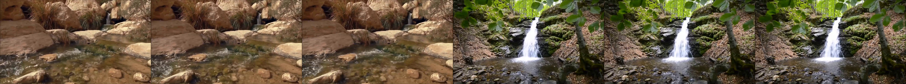

> 图片描述：左侧图像展示了原始视频数据中的剪辑点示例；右侧图表显示了初始数据集中视频运动分布的直方图，在零运动处有一个明显的峰值。

**图 12：比较通用切点检测器与我们的级联方法，展示了我们级联方法的优势** ：虽然普通的单帧率切点检测只能检测场景的突然变化，但更连续的过渡往往无法被检测到，这与我们的方法形成对比，我们的方法也能可靠地检测到后一种过渡。

##### **级联切点检测（Cascaded Cut Detection）**

与先前工作 [100] 类似，我们使用 PySceneDetect [22](https://github.com/Breakthrough/PySceneDetect) 来检测基础视频片段中的切点。然而，如 [图 12](#A3.F12) 定性所示，我们观察到连续场景之间存在许多 **淡入（fade-in）** 和 **淡出（fade-out）** ，这些在使用单一阈值和仅原生帧率运行切点检测器时无法被检测到。因此，与先前工作不同，我们应用了一个由 3 个切点检测器组成的级联，这些检测器以不同的帧率和不同的阈值运行，以同时检测突然的变化（如切点）和缓慢的变化（如淡入淡出）。

##### **关键帧感知剪辑（Keyframe-Aware Clipping）**

在切点检测之后，我们立即使用 FFMPEG [91] 对视频进行剪辑，具体方法是提取源视频中 **关键帧（keyframes）** 的时间戳，并将检测到的切点对齐到最接近的、不跨越检测切点的关键帧时间戳。这使我们能够通过 **寻道（seeking）** 快速提取无切点的片段，并且不会像在每个视频中插入新关键帧那样在大规模处理时慢得无法接受。

> **图 13：静态视频示例** 。由于此类静态场景可能对生成式视频-文本（预）训练产生负面影响，我们将其过滤掉。

##### Optical Flow（光流）

如 [3.1 节](#S3.SS1) 和 [图 2](#S3.F2) 所述，提供过滤静态场景的方法至关重要。为此，我们使用 OpenCV [48] 实现的 Farnebäck 算法 [24]，以每秒 2 帧的速率提取 **稠密光流图（Dense Optical Flow Maps）** 。为了进一步控制存储空间，我们对光流图进行空间下采样，使其最短边达到 16 像素分辨率。通过对这些光流图在时间和空间坐标上进行平均，我们进一步得到每个视频片段的 **全局运动分数（Global Motion Score）** ，并利用一个最小运动阈值来过滤静态场景，该阈值的选取方法详见 [E.2.2 节](#A5.SS2.SSS2)。由于这仅能得到粗略的近似，在最终的 **第三阶段微调（Stage III Finetuning）** 中，我们使用 RAFT [89] 算法以 $800\times 450$ 的分辨率计算更精确的稠密光流图。运动分数的计算方式类似。由于高质量微调数据集的规模相对预训练数据集要小得多，这使得基于 RAFT 的光流计算变得可行。

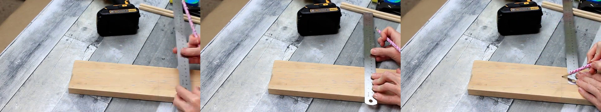

> 图 14：各种合成字幕生成器的比较。我们观察到 CoCa 通常能捕捉到良好的空间细节，而 VBLIP 则倾向于捕捉时间细节。我们使用一个 LLM 来结合这两者，并对所有三种类型的合成字幕进行了实验。

##### **合成字幕生成（Synthetic Captioning）**

在百万样本的规模上，手动为数据点添加提示（prompts）进行标注是不可行的。因此，我们采用 **合成字幕生成（Synthetic Captioning）** 来提取字幕。然而，鉴于最近关于字幕多样性重要性的见解 [85]，并考虑到这些合成字幕生成模型潜在的失败案例，我们为每个视频片段提取 **三** 个字幕，方法是使用：i) 仅处理图像的 **字幕生成模型（captioning model）** CoCa [65]，它能很好地描述空间方面；ii) 为了同时捕捉时间方面，使用 **视频字幕生成器（video-captioner）** VideoBLIP [109]；以及 iii) 为了结合这两个字幕，并以此克服它们各自潜在的缺陷，使用一个轻量级的 **大型语言模型（Large Language Model, LLM）** 。生成的字幕示例如 [图 14](#A3.F14) 所示。

##### 字幕相似性与美学（Caption similarities and Aesthetics）

提取 **CLIP（Contrastive Language–Image Pre-training）** [66] 的图像和文本表示已被证明在图像领域的数据整理中非常有帮助，因为计算两者之间的余弦相似度可以评估给定示例的文本-图像对齐程度 [80]，从而过滤掉带有错误字幕的示例。此外，还可以提取视觉美学评分 [80]。尽管 CLIP 只能处理图像，因此这只能在单帧级别上进行，但我们选择基于 CLIP 提取每个视频片段的 **首帧、中间帧和末帧** 的 i) 文本-图像相似度和 ii) 美学评分。如 [第 3.3 节](#S3.SS3) 和 [E.2.2 节](#A5.SS2.SSS2) 所示，与在未过滤数据上训练的模型相比，使用这些评分整理后的数据来训练文本-视频模型，能提高 i) 文本跟随能力和 ii) 生成样本的视觉质量。

##### 文本检测（Text Detection）

在早期实验中，我们注意到，在早期版本的 **_LVD-F_** 上训练的模型倾向于生成包含过多书面文本的视频，这对于一个文本到视频模型来说，无疑不是一个期望的特性。为此，我们应用了现成的文本检测器 **CRAFT（Character Region Awareness for Text Detection）** [5]，为我们数据集中的每个片段的起始帧、中间帧和结束帧标注所有书面文本的边界框信息。利用这些信息，我们过滤掉了所有检测到的边界框总面积超过 7% 的片段，以构建最终的 **_LVD-F_** 。

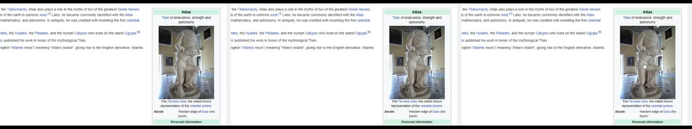

> 图 15：一个包含大量不需要文本的视频示例。我们应用文本检测，在文本周围标注边界框，然后计算所有框的面积与帧尺寸的比率。

## Appendix D Model and Implementation Details（模型与实现细节）

### D.1 Diffusion Models（扩散模型）

在本节中，我们对 **扩散模型（Diffusion Models, DMs）** 进行简要总结。我们利用了连续时间 DM 框架 [87, 51]。

令 $p_{\rm{data}}({\mathbf{x}}_{0})$ 表示数据分布，并令 $p({\mathbf{x}};\sigma)$ 表示通过向数据添加独立同分布（independent and identically distributed, i.i.d.）的 $\sigma^{2}$ 方差高斯噪声所得到的分布。注意，对于足够大的 $\sigma_{\mathrm{max}}$，有 $p({\mathbf{x}};\sigma_{\mathrm{max}^{2}})\approx{\mathcal{N}}\left(\bm{0},
\sigma_{\mathrm{max}^{2}}\right)$。DM 利用了这一事实，从高方差高斯噪声 ${\mathbf{x}}_{M}\sim{\mathcal{N}}\left(\bm{0},\sigma_{\mathrm{max}^{2}}\right)$ 出发，逐步去噪直至 $\sigma_{0}=0$。在实践中，这个迭代精炼过程可以通过数值模拟 **概率流常微分方程（Probability Flow ordinary differential equation, ODE）** [87] 来实现：

$$
\displaystyle d{\mathbf{x}}=-\dot{\sigma}(t)\sigma(t)\nabla_{\mathbf{x}}\log p ({\mathbf{x}};\sigma(t))\,dt,(1)
$$

其中 $\nabla_{\mathbf{x}}\log p({\mathbf{x}};\sigma)$ 是 **得分函数（score function）** [46]。 **扩散模型（Diffusion Model, DM）** 的训练可归结为为得分函数 $\nabla_{\mathbf{x}}\log p({\mathbf{x}};\sigma)$ 学习一个模型 ${\bm{s}}_{\bm{\theta}}({\mathbf{x}};\sigma)$。
例如，该模型可以参数化为 $\nabla_{\mathbf{x}}\log p({\mathbf{x}};\sigma)\approx s_{\bm{\theta}}({\mathbf{x}};\sigma)=(D_{\bm{\theta}}({\mathbf{x}};\sigma)-{\mathbf{x}})/\sigma^{2}$ [51]，其中 $D_{\bm{\theta}}$ 是一个可学习的 **去噪器（denoiser）** ，其目标是预测干净的 ${\mathbf{x}}_{0}$。
去噪器 $D_{\bm{\theta}}$ 通过 **去噪得分匹配（Denoising Score Matching, DSM）** 进行训练：

$$
\displaystyle\mathbb{E}_{\begin{subarray}{c}({\mathbf{x}}_{0},{\mathbf{c}}) \sim p_{\rm{data}}({\mathbf{x}}_{0},{\mathbf{c}}),(\sigma,{\mathbf{n}})\sim p( \sigma,{\mathbf{n}})\end{subarray}}\left[\lambda_{\sigma}\|D_{\bm{\theta}}({\mathbf{x}}_{0}+{\mathbf{n}};\sigma,{\mathbf{c}})-{\mathbf{x}}_{0}\|_{2}^{2} \right],(3)
$$

其中 $p(\sigma,{\mathbf{n}})=p(\sigma)\,{\mathcal{N}}\left({\mathbf{n}};\bm{0}, \sigma^{2}\right)$，$p(\sigma)$ 可以是噪声水平 $\sigma$ 上的概率分布或概率密度。既可以使用离散的噪声水平集合，也可以使用连续的噪声水平范围。在本工作中，我们同时使用了这两种选项，具体细节在 [D.2 节](#A4.SS2) 中进一步说明。

$\lambda_{\sigma}\colon\mathbb{R}_{+}\to\mathbb{R}_{+}$ 是一个加权函数，${\mathbf{c}}$ 是一个任意的条件信号。在本工作中，我们遵循 **EDM 预条件框架（EDM-preconditioning framework）** [51]，将可学习的去噪器 $D_{\bm{\theta}}$ 参数化为：

$$
\displaystyle D_{\bm{\theta}}({\mathbf{x}};\sigma)=c_{\mathrm{skip}}(\sigma){\mathbf{x}}+c_{\mathrm{out}}(\sigma)F_{\bm{\theta}}(c_{\mathrm{in}}(\sigma){\mathbf{x}};c_{\mathrm{noise}}(\sigma)),(4)
$$

其中 $F_{\bm{\theta}}$ 是待训练的网络。

**无分类器引导（Classifier-free guidance）** 。无分类器引导 [37] 是一种用于引导 **扩散模型（Diffusion Model, DM）** 的迭代优化过程朝向条件信号 ${\mathbf{c}}$ 的方法。其主要思想是混合一个条件模型和一个无条件模型的预测结果：

$$
\displaystyle D^{w}({\mathbf{x}};\sigma,{\mathbf{c}})=wD({\mathbf{x}};\sigma,{\mathbf{c}})-(w-1)D({\mathbf{x}};\sigma),(5)
$$

其中 $w\geq 0$ 为 **引导强度（guidance strength）** 。无条件模型可以与条件模型在一个单一网络中联合训练，方法是在 [式 3](#A4.E3) 中随机将条件信号 ${\mathbf{c}}$ 替换为一个空嵌入（null embedding），例如，以 10% 的概率进行替换 [37]。在本工作中，我们使用无分类器引导，例如，来引导视频生成朝向文本条件。

### D.2 基础模型训练与架构（Base Model Training and Architecture）

如 中所述，我们从公开可用的 **Stable Diffusion 2.1（SD 2.1）** [71] 模型开始。在 **EDM 框架（EDM-framework）** [51] 中，SD 2.1 具有以下预处理函数：

$$
\displaystyle c_{\mathrm{skip}}^{\mathrm{SD2.1}}(\sigma) \displaystyle=1, \quad (6) \\
\displaystyle c_{\mathrm{out}}^{\mathrm{SD2.1}}(\sigma) \displaystyle=-\sigma\,, \quad (7) \\
\displaystyle c_{\mathrm{in}}^{\mathrm{SD2.1}}(\sigma) \displaystyle=\frac{1}{\sqrt{\sigma^{2}+1}}\,, \quad (8) \\
\displaystyle c_{\mathrm{noise}}^{\mathrm{SD2.1}}(\sigma) \displaystyle=\operatorname*{arg\,min}_{j\in[1000]}(\sigma-\sigma_{j})\,, \quad (9)
$$

其中 $\sigma_{j+1}>\sigma_{j}$。原始 SD 2.1 训练中使用的噪声水平分布 $p(\sigma)$ 是在 1000 个 **离散（discrete）** 噪声水平 $\{\sigma_{j}\}_{j\in[1000]}$ 上的均匀分布。SD 2.1 训练（尤其是其噪声分布 $p(\sigma)$）存在的一个问题是，即使对于最大离散噪声水平 $\sigma_{1000}$，其 **信噪比（signal-to-noise ratio）** [53] 仍然相对较高，这会导致一些问题，例如在生成非常暗的图像时 [56, 34]。Guttenberg 和 CrossLabs [34] 提出了 **偏移噪声（offset noise）** ，这是对 [Eq. 3](#A4.E3) 中训练目标的一种修改，通过使 $p({\mathbf{n}}\mid\sigma)$ 成为非各向同性高斯分布来实现。在本工作中，我们选择直接修改预处理函数和训练噪声水平的分布。

**图像模型微调（Image model finetuning）** 。我们将上述预处理函数替换为

$$
\displaystyle c_{\mathrm{skip}}(\sigma) \displaystyle=\left(\sigma^{2}+1\right)^{-1}\,, \quad (11) \\
\displaystyle c_{\mathrm{out}}(\sigma) \displaystyle=\frac{-\sigma}{\sqrt{\sigma^{2}+1}}\,, \quad (12) \\
\displaystyle c_{\mathrm{in}}(\sigma) \displaystyle=\frac{1}{\sqrt{\sigma^{2}+1}}\,, \quad (13) \\
\displaystyle c_{\mathrm{noise}}(\sigma) \displaystyle=0.25\log\sigma, \quad (14)
$$

这些函数可以通过在 EDM（Elucidating Diffusion Models， 阐明扩散模型）框架 [51] 中设置 $\sigma_{\mathrm{data}}=1$ 来恢复；这些 **预条件函数（preconditioning functions）** 最初在 [79] 中提出。我们还采用了 Karras 等人 [51] 提出的噪声分布和加权函数，即 $\log\sigma\sim{\mathcal{N}}(P_{\mathrm{mean}},P_{\mathrm{std}}^{2})$ 和 $\lambda(\sigma)=(1+\sigma^{2})\sigma^{-2}$，其中 $P_{\mathrm{mean}}=-1.2$，$P_{\mathrm{std}}=1$。随后，我们使用此设置对 SD2.1（Stable Diffusion 2.1， 稳定扩散 2.1）的神经网络主干 $F_{\bm{\theta}}$ 进行了 31k 次迭代的微调。

在前 1k 次迭代中，我们冻结了 $F_{\bm{\theta}}$ 中除时间嵌入层外的所有参数，并在 SD2.1 原始的训练分辨率 $512\times 512$ 上进行训练。这使得模型能够适应新的预条件函数，而无需对 $F_{\bm{\theta}}$ 的内部表征进行不必要的过多修改。之后，我们在尺寸为 $256\times 384$ 的图像上对 $F_{\bm{\theta}}$ 的所有层进行了额外的 30k 次迭代训练，该分辨率是视频预训练初始阶段所使用的分辨率。

**视频预训练（Video pretraining）** 。我们将得到的模型用作视频模型的图像主干。随后，我们插入 **时序卷积（temporal convolution）** 和 **注意力层（attention layers）** 。具体而言，我们完全遵循 [9] 的设置，向 **UNet** 中插入了总计 6.56 亿个新参数，使其总参数量（空间层和时序层）增至 15.21 亿。接着，我们使用 **AdamW** [59] 优化器（学习率为 $10^{-4}$，批量大小为 1536），在分辨率为 $256\times 384$ 的 14 帧序列上对得到的 UNet 进行 15 万次迭代训练。我们为 **无分类器引导（classifier-free guidance）** [36] 训练该模型，并在 15% 的训练时间内丢弃文本条件。之后，我们将空间分辨率提升至 $320\times 576$，并额外训练 10 万次迭代，除批量大小减少至 768 以及噪声分布向更多噪声偏移（具体而言，我们将 $P_{\mathrm{mean}}$ 增加至 0）外，其余设置与低分辨率训练阶段相同。在训练过程中，基础模型和高分辨率 **文本/图像到视频（Text/Image-to-Video）** 模型均以输入视频的帧率和运动分数为条件。这使得我们能够在推理时调整生成视频中的运动量。

### D.3 高分辨率文本到视频模型（High-Resolution Text-to-Video Model）

视频预训练。我们将得到的模型用作视频模型的图像主干。随后，我们插入时序卷积和注意力层。具体而言，我们完全遵循 [9] 的设置，向 UNet 中插入了总计 6.56 亿个新参数，使其总参数量（空间层和时序层）增至 15.21 亿。接着，我们使用 AdamW [59] 优化器（学习率为 $10^{-4}$，批量大小为 1536），在分辨率为 $256\times 384$ 的 14 帧序列上对得到的 UNet 进行 15 万次迭代训练。我们为无分类器引导 [36] 训练该模型，并在 15% 的训练时间内丢弃文本条件。之后，我们将空间分辨率提升至 $320\times 576$，并额外训练 10 万次迭代，除批量大小减少至 768 以及噪声分布向更多噪声偏移（具体而言，我们将 $P_{\mathrm{mean}}$ 增加至 0）外，其余设置与低分辨率训练阶段相同。在训练过程中，基础模型和高分辨率文本/图像到视频模型均以输入视频的帧率和运动分数为条件。这使得我们能够在推理时调整生成视频中的运动量。

我们在一个包含约 100 万（$\sim$ 1M）个样本的高质量数据集上，以 $576\times 1024$ 的分辨率对我们的基础模型进行微调。我们训练了 5 万（$50k$）次迭代，批次大小为 768，学习率为 $3\times 10^{-5}$，并设置 $P_{\mathrm{mean}}=0.5$ 和 $P_{\mathrm{std}}=1.4$。此外，我们以 0.9999 的衰减率跟踪权重的指数移动平均值。最终检查点的选择结合了视觉检查和人工评估。

### D.4 高分辨率图像到视频模型（High-Resolution Image-to-Video Model）

我们在一个包含约 100 万（$\sim$ 1M）个样本的高质量数据集上，以 $576\times 1024$ 的分辨率对我们的基础模型进行微调。我们训练了 5 万（$50k$）次迭代，批次大小为 768，学习率为 $3\times 10^{-5}$，并设置 $P_{\mathrm{mean}}=0.5$ 和 $P_{\mathrm{std}}=1.4$。此外，我们以 0.9999 的衰减率跟踪权重的指数移动平均值。最终检查点的选择结合了视觉检查和人工评估。

### D.4 高分辨率图像到视频模型（High-Resolution Image-to-Video Model）

我们可以对我们的基础 **文生视频模型（text-to-video model）** 进行微调，以用于 **图生视频任务（image-to-video task）** 。具体而言，在训练过程中，我们使用一个额外的帧作为模型的 **条件输入（conditioning）** 。我们不使用 **文本条件（text-conditioning）** ，而是将输入基础模型的文本嵌入替换为条件帧的 CLIP 图像嵌入。此外，我们将条件帧经过 **噪声增强（noise-augmented）** [39] 的版本在通道维度上 **拼接（concatenate）** 到 UNet [73] 的输入中。具体来说，我们向条件帧添加少量强度为 $\log\sigma\sim{\mathcal{N}}(-3.0,0.5^{2})$ 的噪声，然后将其输入标准的 SD 2.1 编码器。随后，将编码器分布的均值拼接到 UNet 的输入中（沿时间轴复制）。

首先，我们在基础分辨率（$320\times 576$）上对基础模型进行图生视频任务的微调，共进行 50k 次迭代， **批量大小（batch size）** 为 768， **学习率（learning rate）** 为 $3\times 10^{-5}$。由于条件信号非常强，我们再次将 **噪声分布（noise distribution）** 向更多噪声的方向偏移，即设置 $P_{\mathrm{mean}}=0.7$ 和 $P_{\mathrm{std}}=1.6$。

之后，我们在一个包含约 100 万个样本的高质量数据集上，以 $576\times 1024$ 的分辨率对基础的图生视频模型进行微调。我们训练了两个版本：一个用于生成 14 帧，另一个用于生成 25 帧。两个模型均训练 $50k$ 次迭代，批量大小为 768，学习率为 $3\times 10^{-5}$，并设置 $P_{\mathrm{mean}}=1.0$ 和 $P_{\mathrm{std}}=1.6$。此外，我们以 0.9999 的 **衰减率（decay rate）** 跟踪权重的 **指数移动平均（exponential moving average）** 。最终的 **检查点（checkpoints）** 是通过结合 **视觉检查（visual inspection）** 和 **人工评估（human evaluation）** 来选择的。

#### D.4.1 线性递增引导（Linearly Increasing Guidance）

我们偶尔发现，标准的 **原始无分类器引导（vanilla classifier-free guidance）** [36]（参见 [方程 5](#A4.E5)）可能会导致伪影：引导过弱可能导致与条件帧不一致，而引导过强则可能导致过饱和。我们发现，与其使用恒定的引导尺度，不如沿着帧轴线性地增加引导尺度（从低到高）更为有效。这种新颖技术的 PyTorch 实现可以在 [图 16](#A4.F16) 中找到。

#### D.4.2 相机运动 LoRA（Camera Motion LoRA）

为了在图像到视频生成中实现可控的相机运动，我们在模型的时间注意力块中训练了多种 **相机运动 LoRA（Camera Motion LoRAs）** [32]。具体而言，我们训练了秩为 16 的低秩矩阵，共进行 5k 次迭代。更多样本可参见 [图 21](#A5.F21)。

### D.5 插值模型细节

与文本到视频和图像到视频模型类似，我们也是从基础的文本到视频模型开始微调我们的插值模型，参见 [第 D.2 节](#A4.SS2)。为了实现插值，我们将输出帧数从 14 减少到 5，并将第一帧和最后一帧用作条件帧。我们通过 **拼接条件机制（Concat-conditioning-mechanism）** [71] 将这些条件帧输入到模型的 **UNet** [73] 主干网络中。为此，我们将这些帧嵌入到自编码器的潜在空间中，得到两个图像编码 $z_{s},\,z_{e}\in\mathbb{R}^{c\times h\times w}$，其中 $c=4,\,h=52,\,w=128$。为了形成一个与 UNet 噪声输入形状相同的潜在帧序列，即 $\mathbb{R}^{5\times c\times h\times w}$，我们使用一个学习到的 **掩码嵌入（Mask embedding）** $z_{m}\in\mathbb{R}^{c\times h\times w}$，并构建一个潜在序列 $\bm{z}=\{z_{s},z_{m},z_{m},z_{m},z_{e}\}\in\mathbb{R}^{5\times c\times h\times
w}$。我们沿着通道维度将此序列与噪声输入进行拼接，同时还与一个二进制掩码进行拼接，其中 1 表示存在条件帧，0 表示存在掩码嵌入。因此，UNet 的最终输入形状为 $\left(5,9,52,128\right)$。与先前工作 [41, 82, 9] 一致，我们对两个条件帧使用噪声增强，并在潜在空间中进行应用。此外，我们将用于交叉注意力条件的 **CLIP** 文本表示替换为起始帧和结束帧对应的 CLIP 图像表示，并将它们拼接起来形成一个长度为 2 的条件序列。

我们使用 AdamW [59] 优化器，在空间分辨率为 $576\times 1024$ 的高质量数据集上训练模型，学习率设置为 $10^{-4}$，并结合衰减率为 0.9999 的 **指数移动平均（Exponential Moving Averaging, EMA）** 。同时，我们采用了一个平移的噪声调度，其参数为 $P_{\mathrm{mean}}=1$ 和 $P_{\mathrm{std}}=1.2$。令人惊讶的是，我们发现这个模型在仅使用 256 这样相对较小的 **批量大小（batch size）** 进行训练时，收敛速度极快，并且在仅 10k 次迭代后就能产生一致且平滑的输出。我们将此视为另一个证据，表明我们的基础 **文本到视频模型（text-to-video model）** 所学到的运动表示非常有用。

### D.6 多视图生成（Multi-view generation）

我们在我们对 Objaverse 数据集进行的特定渲染上，对高分辨率 **图像到视频模型（image-to-video model）** 进行了微调。我们以 $576\times 576$ 的分辨率，为数据集中的每个物体轨道渲染 21 帧，并微调 25 帧的图像到视频模型来生成这 21 帧。我们将物体的一个视图作为图像条件输入。此外，我们将摄像机的 **仰角（elevation）** 作为条件输入模型。我们首先将仰角通过一个 **时间步嵌入层（timestep embedding layer）** ，该层将仰角的正弦和余弦值嵌入到不同频率，并将它们连接成一个向量。最后，这个向量被连接到 UNet 的整体向量条件上。

我们使用 8 块 80GB 显存的 A100 GPU，以总批量大小 16 和学习率 $1\times 10^{-5}$ 训练了 12$k$ 次迭代。

## 附录 E 实验细节

### E.1 人类偏好评估细节

对于本文进行的大部分评估，我们采用了 **人类评估（Human Evaluation）** ，因为我们观察到它包含了最可靠的信号。对于 **文生视频（Text-to-Video）** 任务以及为基础模型进行的所有消融实验，我们从一个包含 64 个测试提示词的列表中生成视频样本。然后，我们聘请人类标注员在两个维度上收集偏好数据：i) **视觉质量（Visual Quality）** 和 ii) **提示跟随（Prompt Following）** 。关于研究如何进行的更多细节 [第 E.1.1 节](#A5.SS1.SSS1) 以及排名计算方式 [第 E.1.2 节](#A5.SS1.SSS2) 如下所述。

#### E.1.1 实验设置

给定一个消融轴中的所有模型（例如，具有不同美学或运动评分的四个模型），我们针对每对模型（1v1）比较每个提示词。对于每一次这样的比较，我们从不同的标注员那里为每项任务平均收集三票，即分别为视觉质量和提示跟随各收集三票。在所有成对比较之间进行完整评估，为我们提供了关于模型性能趋势和不同阈值影响的稳健且可靠的信号。

标注员交互的示例界面如 [图 17](#A5.F17) 所示。提示词的顺序以及模型之间的顺序是完全随机化的。我们设置了频繁的注意力检查以确保数据质量。

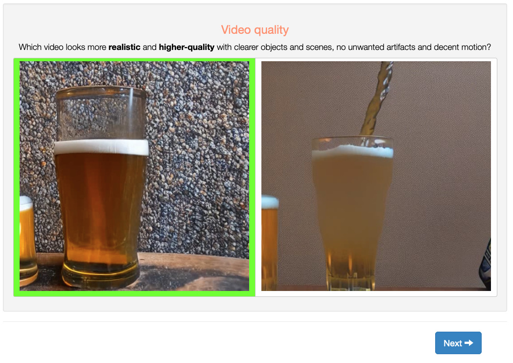

> (a) 用于评估视频视觉质量的示例说明。

#### E.1.2 Elo 分数计算

**Elo 评分（Elo Scores）** （分数越高越好）[21] 最初是作为国际象棋棋手的评分方法提出的，但最近也被应用于比较 **指令微调生成式大型语言模型（instruction-tuned generative LLMs）** [6, 3]。当需要基于 [第 E.1.1 节](#A5.SS1.SSS1) 中概述的 1v1 比较来对两个以上模型进行排名时，我们使用 Elo 评分。

对于一组初始评分为 $R_{\text{init}}$ 的竞争参与者（玩家）参与一系列零和博弈，Elo 评分系统会根据特定比赛的预期结果和实际结果来更新参与该场比赛的两位参与者的评分。在两位评分分别为 $R_{1}$ 和 $R_{2}$ 的参与者进行比赛前，两位参与者的预期结果计算如下：

$$
\displaystyle E_{1}=\frac{1}{1+10^{\frac{R_{2}-R_{1}}{400}}}\,, \quad (16) \qquad \displaystyle E_{2}=\frac{1}{1+10^{\frac{R_{1}-R_{2}}{400}}}\,.\quad (17)
$$

在观察到比赛结果后，评分 $R_{i}$ 通过以下规则更新：

$$
\displaystyle R^{{}^{\prime}}_{i}=R_{i}+K\cdot\left(S_{i}-E_{i}\right),\quad i \in\{1,2\}\quad (18)
$$

其中 $S_{i}$ 表示玩家 $i$ 的比赛结果。在我们的设定中，若玩家 $i$ 获胜则 $S_{i}=1$，若玩家 $i$ 失败则 $S_{i}=0$。常数 $K$ 可视为一个权重，用于强调最近的比赛。我们选择 $K=1$，并基于 **1000 次** 以随机打乱顺序进行的独立 **Elo 排名（Elo ranking）** 计算，通过 **自助法（bootstrap）** 得出给定一系列比较的最终 Elo 排名。在比较模型之前，我们将每个模型的初始评分设为 $R_{\text{init}}=1000$。

### E.2 第 3 节实验的详细信息（Details on Experiments from Section 3）

#### E.2.1 架构细节（Architectural Details）

在架构上，为[第 3 节](#S3)中所述分析所训练的所有模型都是相同的。为了基于现有的空间模型创建时间 UNet [73]，我们遵循 Blattmann 等人 [9] 的方法，在每个对应的空间层之后添加时间卷积层和（交叉）注意力层。作为基础的 2D-UNet，我们使用 **Stable Diffusion 2.1** 的架构，其权重被我们进一步用于初始化所有运行中的空间层，除了[图 2(a)](#S3.F2.sf1)中展示的第二个运行。在第二个运行中，我们有意跳过此初始化，以创建一个用于演示图像预训练效果的基线。

与 Blattmann 等人 [9] 不同，我们训练所有层，包括空间层，并且在初始化后不冻结空间层。所有模型均使用 **AdamW（AdamW）** [59] 优化器进行训练，学习率为 $1.e-4$，批量大小为 $256$。此外，与[第 4 节](#S4)中的模型相比，我们 **没有** 将噪声过程转换到连续时间，而是使用了 **Stable Diffusion 2.1** 中使用的标准线性调度，包括 **偏移噪声（offset noise）** [34]，并结合了 **v-参数化（v-parameterization）** [37]。我们在 10% 的情况下省略文本条件，以便在推理过程中启用 **无分类器引导（classifier-free guidance）** [37]。

为了生成用于评估的样本，我们对所有模型使用确定性 **DDIM 采样器（DDIM sampler）** [86] 进行 50 步采样，分类器引导尺度设为 12。

#### E.2.2 校准过滤阈值（Calibrating Filtering Thresholds）

> 图 18：为确定每个消融轴最有用的过滤阈值而进行的专项实验结果。对于这些消融研究，我们使用 [E.2.2 节](#A5.SS2.SSS2) 详述的架构，在 _LVD-10M_ 的不同子集上训练了四个相同的模型。这些子集是通过系统性地提高阈值创建的，这对应于过滤掉越来越多的样本。

在此，我们呈现了 [3.3 节](#S3.SS3) 中提出的关于过滤阈值的研究结果。如该节所述，我们针对每种标注类型的最佳过滤阈值进行了实验，同时不对任何其他类型进行过滤。此处唯一的区别在于我们对最合适的字幕生成方法的评估，我们只是简单地比较了所有使用过的字幕生成方法。我们使用分辨率为 $256\times 256$ 的 8 帧视频片段训练每个模型，精确训练 40k 步，批次大小为 256，这大致对应于训练期间观察到的 1000 万个训练样本。为了进行评估，我们基于每个模型的 64 个预选提示词生成样本，并按照 [E.1 节](#A5.SS1) 的详细说明进行了一项 **人类偏好研究（Human Preference Study）** 。[图 18](#A5.F18) 展示了这些人类偏好研究针对每个标注轴在时空样本质量和提示词跟随方面的排名结果。此外，我们还展示了一个平均的“聚合”分数。

在 **描述生成（captioning）** 方面，我们发现——令人惊讶的是——由 Yu 等人 [108] 提出的简单基于 **剪辑（clip-based）** 的图像描述生成方法 **CoCa（CoCa）** 所生成的描述，对模型产生了最明显的有益影响。然而，由于近期研究建议每个训练样本使用多个描述，我们在训练期间会从三种不同的描述中采样一个。尽管如此，我们通过将描述采样的分布向 CoCa 描述偏移来体现该实验的结果，具体采用 $p_{\text{CoCa}}=0.5;\,p_{\text{V-BLIP}}=0.25;\,p_{\text{LLM}}=0.25;\,$。

在 **运动过滤（motion filtering）** 方面，我们选择过滤掉 25% 最静态的样本。然而，使用此过滤方法训练的模型，其汇总偏好分数在人类偏好中的排名并不如未过滤的分数高。其背后的原因是，未过滤的样本排名最高，主要是因为在“ **提示跟随（prompt following）** ”类别中它排名最佳，而在评估运动过滤效果时，该类别的重要性低于“ **质量（quality）** ”类别。因此，如上所述，我们选择 25% 的阈值，因为它在“提示跟随”和“质量”两方面都取得了有竞争力的表现。

对于 **美学过滤（Aesthetics filtering）** ，与运动阈值处理类似，其中“质量”类别比“提示跟随”类别更重要，我们选择过滤掉美学评分最低的 25% 数据；而对于 **CLIP 分数阈值处理（CLIP-score thresholding）** ，我们甚至剔除了 50% 的数据，因为使用相应阈值训练的模型表现最佳。最后，我们过滤掉文本区域覆盖视频面积最大的 25% 样本，因为这类样本在“质量”类别和平均排名中均位列最高。

运用这些过滤方法，我们将 **LVD（Large Video Dataset）** 的规模缩减了超过三分之二（参见 [表 1](#S3.T1)），但获得了更为洁净的数据集，如 [第 3 节](#S3) 所示。对于 [第 3.3 节](#S3.SS3) 中的其余实验，我们使用与上述相同的架构和超参数，仅按照 [第 3.3 节](#S3.SS3) 的详细说明变更数据集。

#### E.2.3 微调实验（Finetuning Experiments）

对于 [第 3.4 节](#S3.SS4) 中展示的微调实验，我们再次遵循本节开头所述的架构、训练超参数和采样流程。唯一显著的差异是数据集的更换，以及分辨率从预训练时的 $256\times 256$ 提升至 $512\times 512$，同时生成的视频仍由 8 帧组成。本节中呈现的所有模型，我们均训练了 5 万步。

### E.3 人工评估 vs 最先进模型（Human Eval vs SOTA）

为了将我们的图像到视频模型与最先进模型（State-of-the-Art, SOTA）如 Gen-2 [74] 和 Pika [54] 进行比较，我们随机选取了 64 张由 SDXL [64] 在 $1024\times 576$ 分辨率下微调后生成的 **条件图像（conditioning images）** 。我们采用与 [第 E.1.1 节](#A5.SS1.SSS1) 相同的评估框架，来比较所生成样本与其他模型的视觉质量。

对于 Gen-2，我们从其 Web 界面（Web UI）中采样图像到视频（image-to-video）模型。我们固定了相同的种子值 23，使用了默认的运动值 5（量程为 0-10），并开启了“插值（Interpolate）”和“去除水印（Remove watermark）”功能。这产生了 $1408\times 768$ 分辨率、时长为 4 秒的样本。随后，我们将短边缩放至 $1056\times 576$，并进行中心裁剪以匹配我们的 $1024\times 576$ 分辨率。对于我们的模型，我们采样了经过图像到视频微调（image-to-video finetune）的 25 帧模型以生成 28 帧，并使用我们的插值模型进行插值，最终得到帧率为 28 FPS、时长为 3.89 秒的样本。我们将 Gen-2 的样本裁剪至 3.89 秒，以避免对标注者产生偏见。

对于 Pika，我们从其 Discord 机器人（Discord bot）中采样图像到视频模型。我们固定了相同的种子值 23，使用了运动值 2（量程为 0-4），并指定了 16:9 的宽高比（aspect ratio）。这产生了 $1024\times 576$ 分辨率、时长为 3 秒的样本，与我们的分辨率一致。对于我们的模型，我们采样了经过图像到视频微调的 25 帧模型以生成 28 帧，并使用我们的插值模型进行插值，最终得到帧率为 28 FPS、时长为 3.89 秒的样本。我们将我们的样本裁剪至 3 秒以匹配 Pika 的时长，并避免对标注者产生偏见。由于 Pika 样本的右下角有一个小的“Pika Labs”水印，我们为 Pika 和我们自己的样本在该区域填充了黑色像素，同样是为了避免偏见。

### E.4 UCF101 FVD（UCF101 FVD）

本节描述我们基础 **文生视频模型（text-to-video model）** 的 **零样本（zero-shot）** UCF101 FVD 计算。UCF101 数据集 [88] 包含 13,320 个视频片段，被分类为 101 个动作类别。所有视频的帧率为 25 FPS，分辨率为 $240\times 320$。为了计算 FVD，我们使用相同的动作类别分布生成 13,320 个视频（16 帧，25 FPS，使用尺度 $w=7$ 的 **无分类器引导（classifier-free guidance）** ），即，例如，生成 140 个“TableTennisShot”视频、105 个“PlayingPiano”视频等。我们直接以动作类别（“TableTennisShot”、“PlayingPiano”等）作为模型的条件，不使用任何文本修饰。我们的样本以模型的原生分辨率 $320\times 576$（16 帧）生成，然后使用带抗锯齿的 **双线性插值（bilinear interpolation）** 下采样至 $240\times 432$，接着进行中心裁剪至 $240\times 320$。我们使用一个预训练的 I3D 动作分类模型 [11] 来提取特征，具体来说，我们使用的是由 Brooks 等人 [10] 提供的 torchscript(^3^33[https://www.dropbox.com/s/ge9e5ujwgetktms/i3d_torchscript.pt](https://www.dropbox.com/s/ge9e5ujwgetktms/i3d_torchscript.pt) 脚本（附带关键字参数 rescale=True, resize=True, return_features=True）)。

### E.5 Additional Samples（附加样本）

在此，我们展示了 [D.2 节](#A4.SS2)、[4.2 节](#S4.SS2)、[4.3 节](#S4.SS3) 和 [4.5 节](#S4.SS5) 中介绍的模型的更多样本。

#### E.5.1 额外的文生视频样本

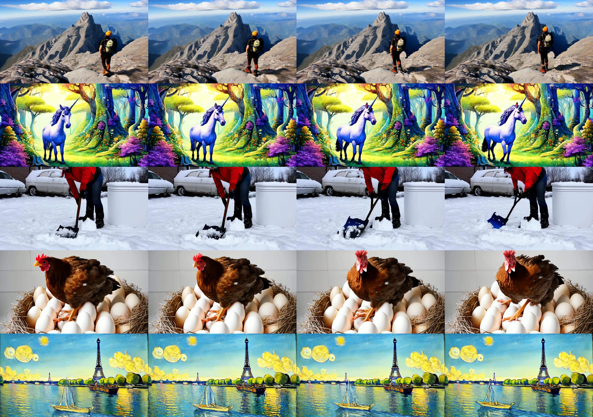

> 图 19：额外的文生视频样本。从上到下的描述文字依次为：“一名徒步旅行者正在到达山顶，欣赏大自然令人叹为观止的全景。”、“一只独角兽在魔法小树林中，细节极其丰富。”、“铲雪”、“一只美丽的毛茸茸的家养母鸡坐在棕色鸟巢里的白色鸡蛋上，鸡蛋在母鸡身下。”，以及“一艘船在塞纳河上悠闲地航行，背景是埃菲尔铁塔，文森特·梵高风格”。

在 [图 19](#A5.F19) 中，我们展示了 [4.2 节](#S4.SS2) 中介绍的我们的文生视频模型的更多样本。

#### E.5.2 额外的图生视频样本

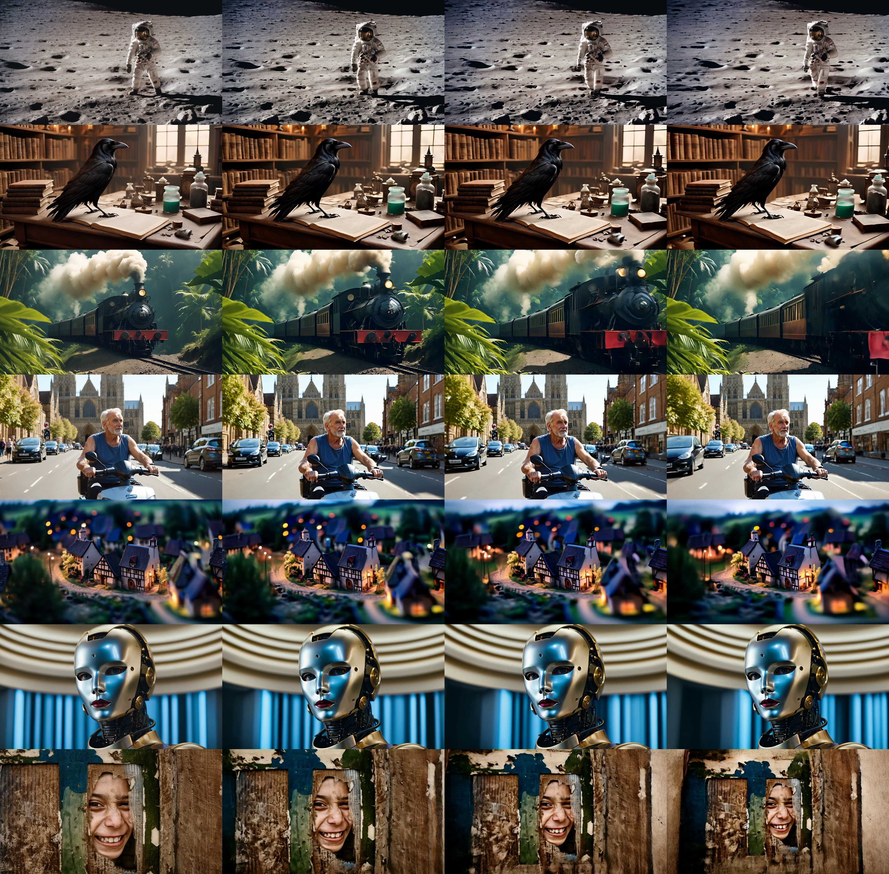

> 图 20：额外的图生视频样本。最左侧的帧用于条件生成。

在 [图 20](#A5.F20) 中，我们展示了 [4.3 节](#S4.SS3) 中介绍的我们的图生视频模型的更多样本。

#### E.5.3 额外的相机运动 LoRA 样本

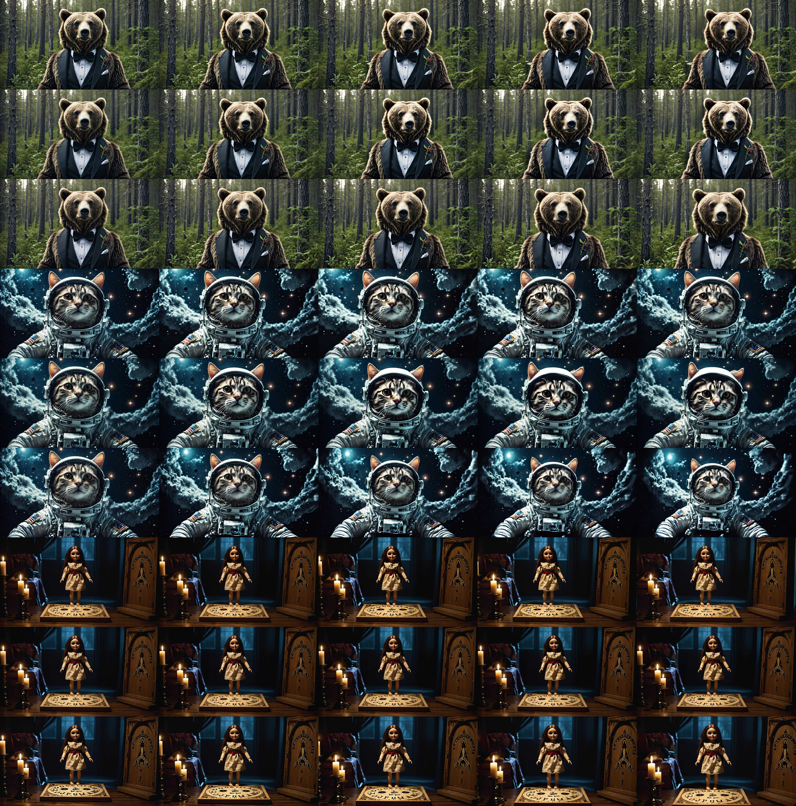

> 图 21：使用相机运动 LoRA（以最左侧帧为条件）的额外图生视频样本。第一、第二和第三行分别对应 _水平移动_、_静态_、_缩放_。

在 [图 21](#A5.F21) 中，我们展示了如 [4.3.1 节](#S4.SS3.SSS1) 所述，为相机控制调优的我们的运动 LoRA 的更多样本。

#### E.5.4 通过时序交叉注意力层进行时序提示

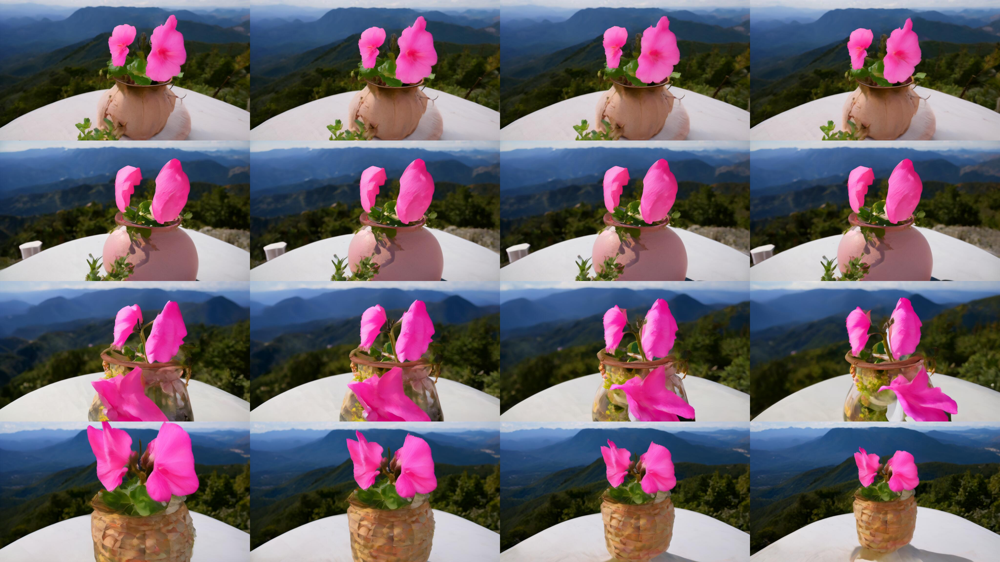

> **图 22（Figure 22）** ：使用提示词“山坡前花盆中的花”（用于空间交叉注意力）生成的文本到视频样本。我们通过替换时序注意力中的提示词来调整相机控制，分别使用“”、“平移（panning）”、“旋转（rotating）”和“缩放（zooming）”（从上到下）。尽管模型并未针对此推理任务进行训练，但其表现却出人意料地好。

我们的架构遵循 Blattmann 等人 [9] 的工作，他们引入了专用的 **时序交叉注意力层（temporal cross-attention layers）** ，这些层与标准 **2D-UNet（2D-UNet）** [18, 38] 的空间交叉注意力层交错使用。在探究我们 [4.2 节](#S4.SS2) 的 **文本到视频模型（Text-to-Video model）** 时，我们注意到，通过使用不同的文本提示词作为空间和时序交叉注意力条件化的输入，可以独立地在空间和时序上提示模型，参见 [图 22](#A5.F22)。为实现这一点，我们使用一个专用的 **空间提示词（spatial prompt）** 来描述要描绘场景的总体内容，而该场景的运动则通过一个单独的 **时序提示词（temporal prompt）** 输入模型，该提示词是时序交叉注意力层的输入。我们在 [图 22](#A5.F22) 中提供了这些初步实验的一个示例，表明运动和内容存在这种隐式的解耦。图中显示，在固定随机种子和空间提示词的情况下，改变时序提示词会导致生成空间上相似的场景，而这些场景获得的全局运动属性遵循时序提示词。

#### E.5.5 多视图合成的额外样本（Additional Samples on Multi-View Synthesis）

在 [图 23](#A5.F23)、[图 24](#A5.F24)、[图 25](#A5.F25) 和 [图 26](#A5.F26) 中，我们展示了 **SVD-MV** 的额外视觉示例。该模型基于我们对 **Objaverse** 和 **MVImageNet** 数据集的渲染结果进行训练，具体细节如 [第 4.5 节](#S4.SS5) 所述。

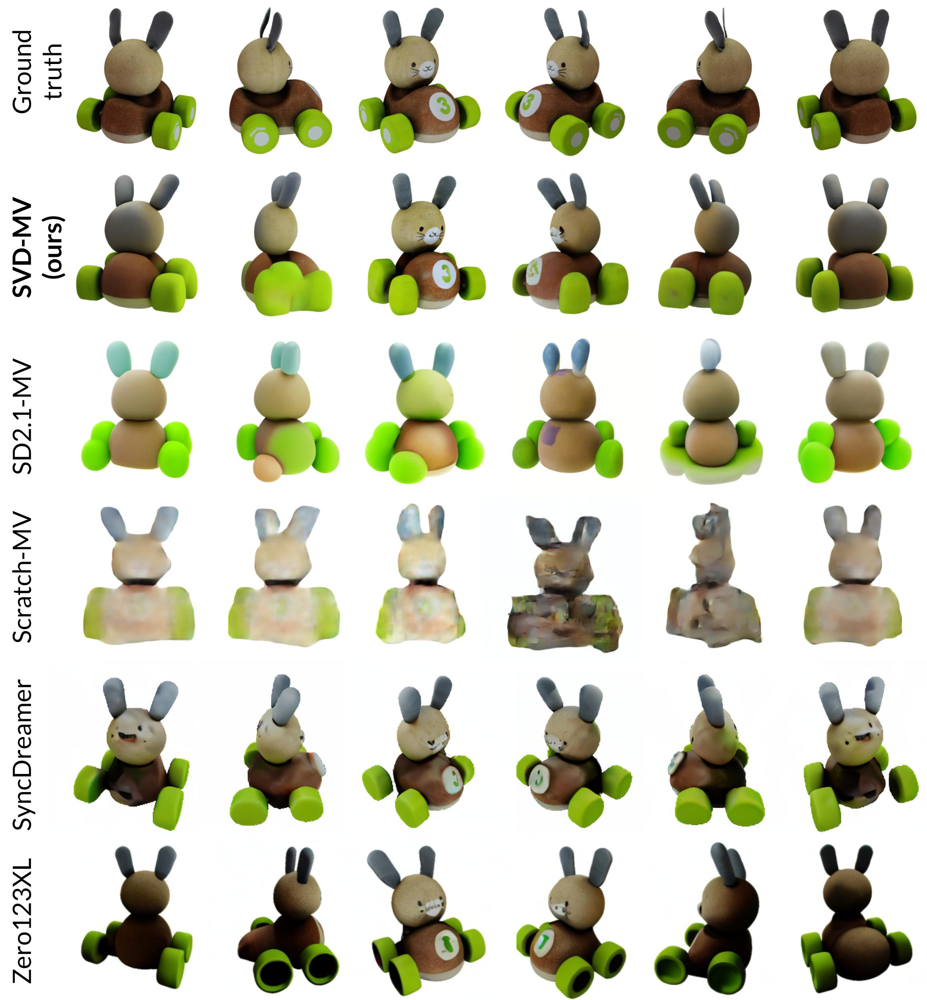

> 图 23：来自 **GSO** 测试数据集的额外图像到多视图生成样本，使用我们在 **Objaverse** 上训练的 **SVD-MV** 模型，并与其他方法进行比较。

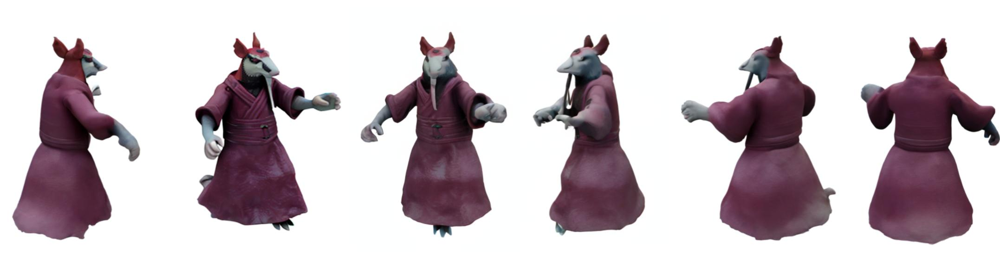

> 图 24：来自 GSO 测试数据集的额外图像到多视图生成样本，使用的是我们在 Objaverse 上训练的 SVD-MV 模型。

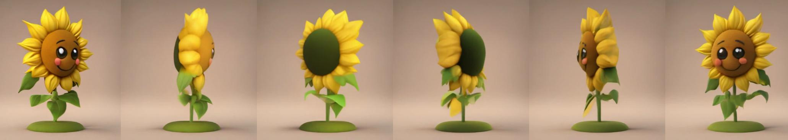

> 图 25：文本到图像到多视图生成样本：使用 SDXL 根据提示语“一个可爱拟人化向日葵角色的居中 3D 模型（纯色背景，虚幻引擎渲染 4k）”生成图像，然后使用我们在 Objaverse 上训练的 SVD-MV 模型进行图像到多视图生成。

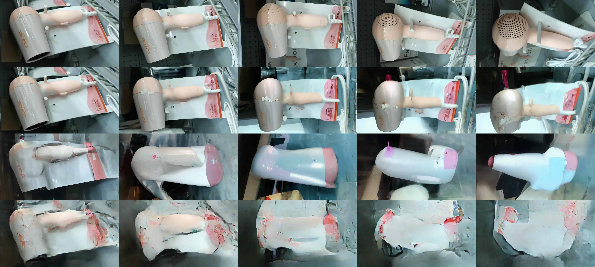

> 图 26：来自 MVI 数据集的额外多视图生成样本，使用的是我们在 MVImgNet 上训练的 SVD-MV 模型，并与其他方法进行比较。第一行是 **真实帧（Ground Truth Frames）** ，第二行是来自 SVD-MV（我们的方法）的样本帧，第三行来自 SD2.1-MV，最后一行来自 Scratch-MV。
