# 标题：DreamLayer：通过扩散模型实现同步多层生成（DreamLayer: Simultaneous Multi-Layer Generation via Diffusion Model）

- ArXiv：2503.12838
- 作者：Junjia Huang, Pengxiang Yan, Jinhang Cai, Jiyang Liu, Zhao Wang, Yitong Wang, Xinglong Wu, Guanbin Li
- 章节：25
- 估计词元数：25.2k

## 目录

- 1 引言
- 2 相关工作
- 3 方法
  - 3.1 上下文感知交叉注意力
  - 3.2 层共享自注意力
  - 3.3 信息保留协调
  - 3.4 数据集准备
- 4 实验
  - 4.1 实现细节
  - 4.2 多层图像生成对比
  - 4.3 消融研究
  - 4.4 进一步应用
- 5 结论

## 摘要

###### 摘要

使用 **扩散模型（Diffusion models）** 的文本驱动图像生成最近获得了广泛关注。为了实现更灵活的图像操作和编辑，近期的研究已从单张图像生成扩展到**透明层生成**和**多层组合**。然而，现有方法通常未能对多层结构进行深入探索，导致层间交互（如遮挡关系、空间布局和阴影）不一致。本文介绍了 **DreamLayer** ，这是一个新颖的框架，通过显式建模透明前景层和背景层之间的关系，实现了连贯的文本驱动多层图像生成。DreamLayer 包含三个关键组件：用于全局-局部信息交换的 **上下文感知交叉注意力（Context-Aware Cross-Attention, CACA）** 、用于建立鲁棒层间连接的 **层共享自注意力（Layer-Shared Self-Attention, LSSA）** ，以及用于在潜在空间层面精炼融合细节的 **信息保留协调（Information Retained Harmonization, IRH）** 。通过利用连贯的全图像上下文，DreamLayer 通过注意力机制建立层间连接，并应用协调步骤实现无缝的层融合。为了促进多层生成的研究，我们构建了一个高质量、多样化的多层数据集，包含 $400k$ 个样本。广泛的实验和用户研究表明，DreamLayer 能生成更连贯且对齐良好的层，并具有广泛的适用性，包括潜在空间图像编辑和图像到层分解。

## 1 引言

近年来，基于 **扩散模型（Diffusion models）** [23, 26, 1, 21, 4, 3, 39] 的 **文本到图像生成（Text-to-image generation）** 已展现出从文本提示生成高质量、细节丰富图像的强大能力。然而，大多数方法专注于生成单一的完整图像，这极大地限制了它们在内容编辑和图形设计等应用中的潜力，这些应用严重依赖于分层组合。分层结构对于包含多个对象的图像尤其有利，因为它们允许更灵活、更多样化的编辑和创意修改。本文研究了应用扩散模型通过简单的文本驱动过程生成连贯的多层图像。

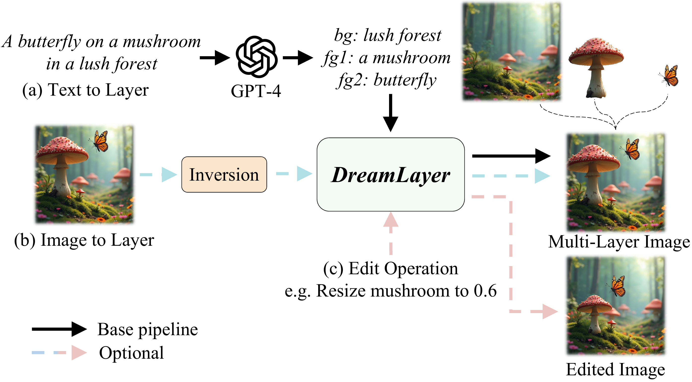

> 图 1：DreamLayer 可以处理多种任务：(a) **文本到层（Text-to-layer）** ：给定文本输入，我们使用 GPT-4 分解前景和背景元素，将其输入 DreamLayer 以生成多层图像。(b) **图像到层（Image-to-layer）** ：通过使用 **反转（Inversion）** 初始化起始潜在表示，DreamLayer 可以根据文本提示分解图像。(c) **潜在空间编辑（Latent-space editing）** ：在去噪过程中，DreamLayer 可以响应用户编辑指令，生成更和谐、一致的编辑后图像。

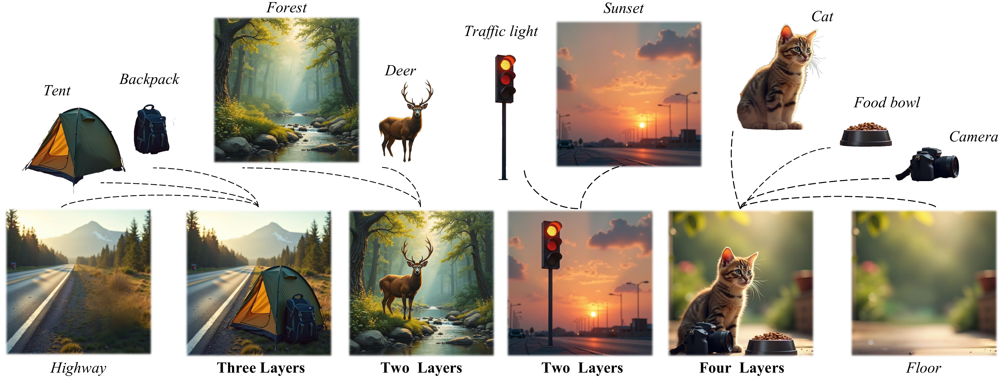

> 图 2：多层数据集：每张图像都包含一个多层结构，包括一个背景和多个前景对象，每个前景对象都表示为一个透明层。

最近的方法已开始探索同时生成分层图像结构，以更好地支持 AI 驱动的图像编辑工作流。大多数现有方法 [44, 41] 仅限于生成两层结构，即前景层和背景层。虽然某些方法 [41, 10] 尝试对多层生成任务进行建模，但它们缺乏对不同前景层与背景之间关系的考虑。例如， **LayerDiffusion** [41] 在添加新层时忽略了层之间的空间关系，导致层之间出现意外的重叠。 **LayerDiff** [10] 尝试同时生成多层复合图像，但它只能生成孤立的、非重叠的层。这些方法通常依赖于简单的堆叠进行层组合，忽略了阴影和遮挡等基本效果，而这些对于连贯的多层生成和编辑至关重要。此外，多层生成面临的一个重大挑战是缺乏大规模、高质量的开源数据集。当前的方法及其数据集通常依赖于随机堆叠的分割数据 [36]，存在数据量有限 [31] 或缺乏严格定义的多层图像 [10] 的问题。

为了应对这些挑战，我们提出了一个全面的多层数据生成流程，该流程分解由先进文本到图像模型生成的图像，创建了一个包含 $400k$ 个多层样本的数据集，如 [图 2](#figure-2) 所示。在现有的文本到图像生成模型中，当给定包含背景和多个前景的文本提示时，模型通常能够自动以合理的布局排列对象并生成和谐的构图。基于此，我们引入了 **DreamLayer** ，这是一个利用全局层信息来指导层间注意力并整合协调机制的框架。为了解决前景层中的布局问题，我们首先从完整文本提示生成一个连贯的全局图像。随后，我们采用 **上下文感知交叉注意力（Context-Aware Cross-Attention）** 从全局图像中提取上下文信息，指导前景层的生成。为了建立层之间的连接，我们采用了 **层共享自注意力（Layer-Shared Self-Attention）** ，它进一步促进了全局信息在独立层之间的共享。最后，我们应用 **信息保留协调（Information Retained Harmonization）** 在潜在空间融合复合图像，确保最终结果的和谐性，并提高后续编辑任务的灵活性和一致性。DreamLayer 能够生成具有连贯布局和层间无缝集成的多层图像。它还支持多种任务。如 [图 1](#figure-1) 所示，(a) DreamLayer 可以执行 **文本到层（Text-to-layer）** 任务，通过使用 GPT-4 自适应地分解用户文本提示来生成多层图像；(b) DreamLayer 支持 **图像到层（Image-to-layer）** 分解，通过反转初始化去噪潜在表示，并以无需训练的方式基于文本提示引导它；(c) DreamLayer 支持在去噪过程中进行用户驱动的编辑，确保生成稳定且和谐的编辑后图像。总之，我们的主要贡献有三点：

- 我们引入了 **DreamLayer** ，这是一个同步多层生成框架，通过层间交互增强了层间的和谐性与一致性。
- 我们提出了一种层级的协调方法，以实现更平滑的层间混合，使其更适应后续的编辑任务。
- 发布了一个大规模、高质量的多层数据集，包含 $400k$ 个精心策划的多层图像，涵盖多个对象和场景。

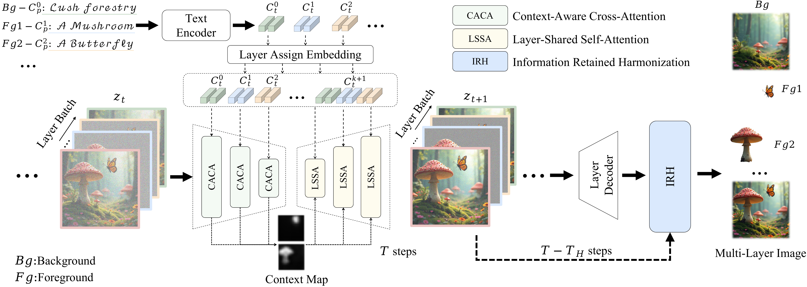

> 图 3：DreamLayer 多层图像生成框架：在生成过程中，背景和前景提示通过层分配嵌入组合，形成全局提示 $C_{t}^{k+1}$。在注意力阶段， **上下文感知交叉注意力（CACA）** 从全局层提取上下文映射。随后，基于全局上下文映射，通过 **层共享自注意力（LSSA）** 在层间融合上下文信息。最后， **信息保留协调（IRH）** 在去噪过程中使用潜在图像融合各层，实现和谐的结果。

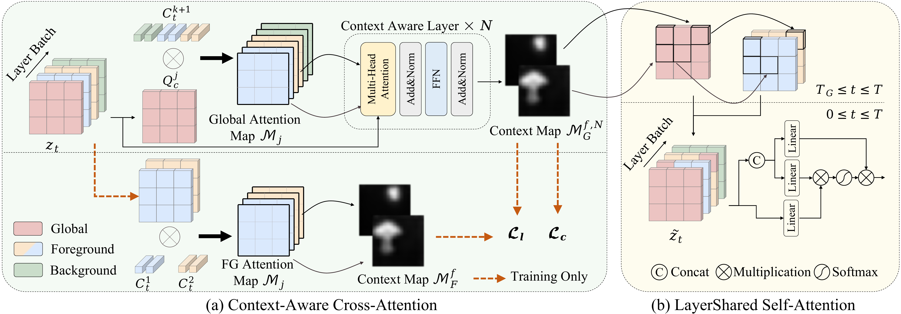

> 图 4：DreamLayer 中注意力机制概述：(a) **上下文感知交叉注意力（Context-Aware Cross-Attention）** 用于提取全局上下文映射并指导前景层布局；(b) **层共享自注意力（Layer-Shared Self-Attention）** 用于建立层间连接并确保一致性。

## 2 相关工作

**基于扩散的图像生成（Diffusion based Image Generation）** 。 **扩散模型（Diffusion models）** [9, 30] 在生成任务中表现出领先性能，包括图像生成 [47, 23, 40]、编辑 [2, 11]、修复 [16] 和视频生成 [46]。这些模型已从早期的 **像素空间去噪（Pixel-space denoising）** [27] 发展到 **潜在空间去噪（Latent-space denoising）** [23]，架构也从 **U-Net** [24] 发展到如 **DiT** [20, 4] 等先进设计。对于多层图像生成， **Text2Layer** [44] 使用 **潜在扩散模型（Latent Diffusion Model）** 对两层图像的 RGB 和 alpha 通道进行联合去噪和重建。 **LayerDiffusion** [41] 在潜在流形中对 alpha 通道进行编码，并在前景层和背景层之间共享注意力以生成多层图像。 **LayerDiff** [10] 提出使用

## 3 方法（Methodology）

**定义（Definitions）** 。直观上，一个 $k$ 层图像由一个背景层 $I^{1}$、$k-1$ 个前景层 $\{I^{i}\}_{i=2}^{k}$ 和一个全局层 $I^{k+1}$ 组成。每一层包含一个三通道彩色图像 $I_{c}\in\mathbb{R}^{H\times W\times 3}$ 和一个阿尔法通道（Alpha channel） $I_{\alpha}\in\mathbb{R}^{H\times W\times 1}$，其中阿尔法通道指示了彩色图像内像素的可见性。形式上，全局层图像 $I^{k+1}$ 可以表示为

$$
I^{k+1}=\sum_{i=1}^{k}(I_{\alpha}^{i}\cdot I_{c}^{i}\cdot\prod^{k}_{f=i+1}(1-I _{\alpha}^{f})).(1)
$$

每一层都关联着一个对应的文本描述作为文本提示（Text prompt） $\{C_{p}^{i}\}_{i=1}^{k+1}$。

**阿尔法通道的生成（Generation of Alpha Channel）** 。对于每个图层图像，我们根据其阿尔法通道用纯灰色背景填充图像，以获得一个 RGB 图层。然后，该 RGB 图层被编码为一个潜在图像（Latent image） $z\in\mathbb{R}^{hw\times D}$，并添加噪声扰动 $t$ 个时间步（Timesteps），以产生一个带噪声的潜在图像 $z_{t}$。以时间步 $t$ 和文本提示 $C$ 为条件，扩散模型（Diffusion model）训练一个网络 $\epsilon_{\theta}$ 来预测添加到带噪声潜在图像 $z_{t}$ 中的噪声，目标函数为：

$$
\mathcal{L}_{noise}=\mathbb{E}_{z_{t},t,C,\epsilon\sim\mathcal{N}(0,1)}\left[| |\epsilon-\epsilon_{\theta}(z_{t},t,C)||_{2}^{2}\right],(2)
$$

其中 $\mathcal{L}_{noise}$ 代表扩散模型的学习目标。经过 $T$ 个去噪步骤（Denoising steps）后，潜在图像 $z_{0}$ 由一个图层解码器（Layer decoder）解码，生成带有阿尔法通道的最终透明图层图像。图层解码器可以是多样的，一些方法 [44, 10] 训练一个 4 通道的 VAE 解码器（VAE decoder），而另一些方法 [41] 则利用 VAE 解码器结合灰背景分割模型（Gray-background segmentation model）。在本工作中，我们采用与 LayerDiffusion [41] 相同的图层解码器。值得注意的是，我们主要关注多层生成中的布局连贯性和整体和谐性，而非阿尔法通道生成的精确度。

**概述（Overview）** 。如 [图 3](#figure-3) 所示，对于多层生成，我们同时使用文本编码器（Text encoder）对背景层和每个前景层的提示进行编码，以获得文本嵌入（Text embedding） $\{C_{t}^{i}\in\mathbb{R}^{S\times D}\}_{i=1}^{k}$，其中 $S$ 表示分词化（Tokenization）后的序列长度。然后，一个可学习的层分配嵌入（Layer assign embedding）被添加到每个文本嵌入中。我们从每个文本嵌入中提取位于 [SOS] 和 [EOS] 标记（Tokens）之间的部分，并将它们拼接起来，形成一个全局嵌入 $C_{t}^{k+1}\in\mathbb{R}^{S\times D}$，它捕获了所有层的基本信息并指导全局层的生成。在扩散模型的注意力计算过程中，所有层都以批处理（Batch-wise）方式进行。为了充分利用来自全局层的信息，我们设计了三个关键组件： **上下文感知交叉注意力（Context-Aware Cross-Attention, CACA）** 、 **层共享自注意力（Layer-Shared Self-Attention, LSSA）** 和 **信息保留和谐化（Information Retained Harmonization, IRH）** 。这些组件利用全局层的指导来确保背景层和前景层之间的一致性，从而促进和谐的多层图像生成。

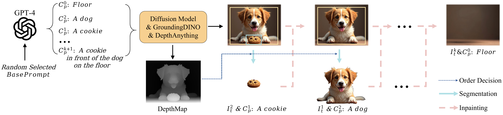

> 图 5：多层数据准备的流程。我们利用 GPT-4 处理一个随机选择的基础提示（Base prompt），将其结构化为一个背景提示和多个前景提示。使用扩散模型生成图像后，我们应用开放集检测模型 GroundingDINO 来识别前景对象的位置，并使用 DepthAnything 模型获取深度图。基于深度顺序，我们依次提取前景层，并使用修复模型（Inpainting model）填充缺失区域。

### 3.1 上下文感知交叉注意力（Context-Aware Cross-Attention）

多层生成的关键在于保持所有层之间布局和比例的一致性。在生成过程中，我们将其他层的布局位置与全局层对齐。利用每层的文本嵌入，我们从全局层的交叉注意力（Cross-attention）中提取相关信息。形式上，如 [图 4](#figure-4) (a) 所示，第 $j^{th}$ 个交叉注意力机制中的全局带噪声潜在图像 $z_{t}^{j,k+1}$ 被投影为一个查询矩阵 $Q_{c}^{j}=\ell_{Q}(z_{t}^{j,k+1})$，然后使用全局嵌入计算注意力图 $\mathcal{M}_{j}\in\mathbb{R}^{hw\times S}$：

$$
\mathcal{M}_{j}=Softmax(\frac{Q_{c}^{j}\ell_{K}(C_{t}^{k+1})^{T}}{\sqrt{d}}),(3)
$$

其中 $\ell_{Q},\ell_{K}$ 是线性投影（Linear projections），$d$ 是潜在维度（Latent dimension）。该注意力图保留了不同前景对象的空间布局和几何结构 [7, 43]。因此，我们从扩散模型中的 $J$ 个层中提取对应于每个前景对象的交叉注意力图。将这些图组合起来，创建 $f$ 个初始的空间感知全局注意力图 $\mathcal{M}_{G}^{f}$：

$$
\mathcal{M}_{G}^{f}=Norm(\sum_{s=1}^{S_{f}}\sum_{j=1}^{J}(\mathcal{M}_{j}^{s}) ),f=2,\cdots,k(4)
$$

其中 $Norm(\cdot)$ 表示最小-最大归一化（Min-Max Normalization），$S_{f}$ 表示全局嵌入中每个前景文本嵌入的标记长度。为了增强提取的注意力图中的前景层上下文，我们将初始图和 $J$ 个交叉注意力机制的全局带噪声潜在图像输入到 $N$ 个上下文感知层 $CAL(\cdot,\cdot)$ 中，以生成全局上下文图 $\mathcal{M}_{G}^{f,n+1}$：

$$
\mathcal{M}_{G}^{f,n+1}=CAL(\mathcal{M}_{G}^{f,n},\sum_{j=1}^{J}z_{t}^{j,k+1}).(5)
$$

每个上下文感知层由一个多头注意力（Multi-head attention） [33] 后接一个前馈网络（Feed-Forward Network, FFN）组成。该上下文图由前景图像的阿尔法通道监督，损失函数为：

$$
\mathcal{L}_{c}=\sum^{f}||\mathcal{R}(I^{f}_{\alpha})-\mathcal{M}_{G}^{f,N}||_ {2},(6)
$$

其中 $\mathcal{R}(\cdot)$ 表示带插值（Interpolation）的调整大小操作。

从全局层 $I^{k+1}$ 中提取了前景层的和谐布局和几何信息后，我们采用相同的方式从特定前景层 $(I^{i})_{i=2}^{k}$ 中提取相应的空间感知注意力图 $\mathcal{M}_{F}^{f}$。接下来，我们实现一个布局对齐损失 $\mathcal{L}_{layout}$，使全局层能够监督和指导局部前景层，促进它们之间的对齐和连贯性：

$$
\mathcal{L}_{layout}=\sum^{f}||\mathcal{M}_{G}^{f,N}-\mathcal{M}_{F}^{f}||_{2}.(7)
$$

最终的目标函数可以联合写为：

$$
\mathcal{L}=\lambda_{noise}\mathcal{L}_{noise}+\lambda_{c}\mathcal{L}_{c}+ \lambda_{layout}\mathcal{L}_{layout},(8)
$$

其中 $\lambda_{noise},\lambda_{c}$ 和 $\lambda_{layout}$ 是权重项。

### 3.2 层共享自注意力（Layer-Shared Self-Attention）

为了进一步加强层与层之间的联系，我们提出了层共享自注意力。这种方法首先通过注意力图将全局层信息整合到前景层中，然后在自注意力机制中同时处理所有层的信息，从而加强层间关系，并确保整个多层生成过程的一致性。

具体来说，如 [图 4](#figure-4) (b) 所示，给定时间步 $t$ 下的一个带噪声潜在图像层批次 $\{z_{t}^{i}\}_{i=1}^{k+1}$ 和全局上下文图 $\{\mathcal{M}_{G}^{i,t}\}^{k}_{i=2}$，我们基于全局上下文图将全局信息整合到前景层中，表达式为：

$$
\tilde{z}_{t}^{i}=z_{t}^{k+1}\cdot\mathcal{M}_{G}^{i,t

表 1 | 不同方法在两层、三层和四层图像生成任务上的定量评估结果。
| 方法（Methods） | 两层（Two Layers） | | 三层（Three Layers） | | 四层（Four Layers） | |
| :--- | :---: | :---: | :---: | :---: | :---: | :---: |
| |  **AES$\uparrow$**  |  **Clip$\uparrow$**  |  **FID$\downarrow$**  |  **AES$\uparrow$**  |  **Clip$\uparrow$**  |  **FID$\downarrow$**  |  **AES$\uparrow$**  |  **Clip$\uparrow$**  |  **FID$\downarrow$**  |
|  **SD v1.5**  [23] | 6.930 | 34.678 | 53.950 | 6.363 | 34.222 | 55.198 | 6.367 | 35.000 | 59.149 |
|  **LayerDiffusion**  [41] | 6.522 | 32.466 | 63.481 | 6.058 | 30.350 | 67.118 | 5.975 | 29.158 | 79.997 |
|  **DreamLayer w/o IRH**  | 6.967 | 34.587 | 51.957 | 6.351 | 34.696 | 58.812 | 6.340 | 34.993 | 57.073 |

| DreamLayer w/o IRH  | 6.967          | 34.587          | 51.957       |               | 6.351          | 34.696          | 58.812 |               | 6.340          | 34.993          | 57.073 |
| DreamLayer w/o IRH  | 6.967          | 34.587          | 51.957       |               | 6.351          | 34.696          | 58.812 |               | 6.340          | 34.993          | 57.073 |
| DreamLayer w/o IRH  | 6.967          | 34.587          | 51.957       |               | 6.351          | 34.696          | 58.812 |               | 6.340          | 34.993          | 57.073 |
| DreamLayer w/o IRH  | 6.967          | 34.587          | 51.957       |               | 6.351          | 34.696          | 58.812 |               | 6.340          | 34.993          | 57.073 |
| DreamLayer w/o IRH  | 6.967          | 34.587          | 51.957       |               | 6.351          | 34.696          | 58.812 |               | 6.340          | 34.993          | 57.073 |
| DreamLayer          | 7.013          | 34.835          | 50.761       |               | 6.441          | 35.267          | 54.508 |               | 6.422          | 35.723          | 53.598 |
| DreamLayer          | 7.013          | 34.835          | 50.761       |               | 6.441          | 35.267          | 54.508 |               | 6.422          | 35.723          | 53.598 |
| DreamLayer          | 7.013          | 34.835          | 50.761       |               | 6.441          | 35.267          | 54.508 |               | 6.422          | 35.723          | 53.598 |
| DreamLayer          | 7.013          | 34.835          | 50.761       |               | 6.441          | 35.267          | 54.508 |               | 6.422          | 35.723          | 53.598 |
| DreamLayer          | 7.013          | 34.835          | 50.761       |               | 6.441          | 35.267          | 54.508 |               | 6.422          | 35.723          | 53.598 |
| DreamLayer          | 7.013          | 34.835          | 50.761       |               | 6.441          | 35.267          | 54.508 |               | 6.422          | 35.723          | 53.598 |
| DreamLayer          | 7.013          | 34.835          | 50.761       |               | 6.441          | 35.267          | 54.508 |               | 6.422          | 35.723          | 53.598 |
| DreamLayer          | 7.013          | 34.835          | 50.761       |               | 6.441          | 35.267          | 54.508 |               | 6.422          | 35.723          | 53.598 |
| DreamLayer          | 7.013          | 34.835          | 50.761       |               | 6.441          | 35.267          | 54.508 |               | 6.422          | 35.723          | 53.598 |
| DreamLayer          | 7.013          | 34.835          | 50.761       |               | 6.441          | 35.267          | 54.508 |               | 6.422          | 35.723          | 53.598 |
| DreamLayer          | 7.013          | 34.835          | 50.761       |               | 6.441          | 35.267          | 54.508 |               | 6.422          | 35.723          | 53.598 |
| DreamLayer          | 7.013          | 34.835          | 50.761       |               | 6.441          | 35.267          | 54.508 |               | 6.422          | 35.723          | 53.598 |
|                     |                |                 |              |               |                |                 |        |               |                |                 |        |
|                     |                |                 |              |               |                |                 |        |               |                |                 |        |
|                     |                |                 |              |               |                |                 |        |               |                |                 |        |
|                     |                |                 |              |               |                |                 |        |               |                |                 |        |
|                     |                |                 |              |               |                |                 |        |               |                |                 |        |
|                     |                |                 |              |               |                |                 |        |               |                |                 |        |
|                     |                |                 |              |               |                |                 |        |               |                |                 |        |
|                     |                |                 |              |               |                |                 |        |               |                |                 |        |
|                     |                |                 |              |               |                |                 |        |               |                |                 |        |
|                     |                |                 |              |               |                |                 |        |               |                |                 |        |
|                     |                |                 |              |               |                |                 |        |               |                |                 |        |
|                     |                |                 |              |               |                |                 |        |               |                |                 |        |

具体而言，在标准的 $T$ 步去噪过程中，我们保留从第 $T_{H}$ 步到第 $T_{H}^{\prime}$ 步之间的含噪潜在图像，记为 $\{z_{t}\}_{t=T_{H}}^{T_{H}^{\prime}}$。完成 $T$ 步去噪后，我们通过 **层解码器（layer decoder）** 获得前景特定图层的  **Alpha 通道（Alpha channel）**  $\{I_{\alpha}^{i}\}_{i=2}^{k}$。随后，我们执行 $T-T_{H}$ 步的重新去噪作为 **协调过程（harmonization process）** ，并在第 $T_{H}$ 步到第 $T_{H}^{\prime}$ 步之间进行 **潜在层级图层融合（latent-level layer fusion）** 。其公式如下：

$$

\hat{z}_{t}^{m}=\hat{z}_{t}^{1}\cdot\prod*{i=2}^{k}(1-I*{\alpha}^{i})+\sum*{i= 2}^{k}(z*{t}^{i}\cdot I*{\alpha}^{i}\cdot\prod*{f=i+1}^{k}(1-I\_{\alpha}^{f})),(12)

$$

其中 $\hat{z}$ 表示在协调步骤中获得的含噪潜在图像。在 **迭代潜在协调（Iterative Refinement in the Harmonization process, IRH）** 过程中，融合后的潜在表示在整个去噪步骤中受到前景物体的影响，从而能够生成相应的阴影细节并增强图像的整体连贯性。同时，前景图层的信息在去噪过程中被逐渐保留，确保了生成前景图层的一致性。

此外，我们可以在 **潜在空间（latent space）** 内对图层进行编辑，确保图层之间更平滑、更和谐的融合。其表达如下：

$$

\displaystyle\hat{z}_{t}^{m}= \displaystyle\hat{z}_{t}^{1}\cdot\prod*{i=2}^{k}(1-op(I*{\alpha}^{i}))+ \displaystyle\sum*{i=2}^{k}(op(z*{t}^{i})\cdot op(I*{\alpha}^{i})\cdot\prod*{f =i+1}^{k}(1-op(I\_{\alpha}^{f}))),(13)

$$

其中 $op(\cdot)$ 表示诸如调整大小、翻转和移动等操作。

| DreamLayer w/o IRH  | 6.967          | 34.587          | 51.957       |               | 6.351          | 34.696          | 58.812 |               | 6.340          | 34.993          | 57.073 |
| DreamLayer w/o IRH  | 6.967          | 34.587          | 51.957       |               | 6.351          | 34.696          | 58.812 |               | 6.340          | 34.993          | 57.073 |
| DreamLayer w/o IRH  | 6.967          | 34.587          | 51.957       |               | 6.351

> 表 2：MuLAn 与 DreamLayer 的数据集对比。

| Dataset     | Images  | Resolutions   | Classes | Instances |
| :---------- | :------ | :------------ | :------ | :-------- |
| MuLAn [31]  | 44,860  | 600$\sim$800  | 759     | 101,269   |
| DreamLayer  | 408,187 | 896$\sim$1152 | 1453    | 525,388   |
| -TwoLayer   | 305,801 | 896$\sim$1152 | 1379    | 305,801   |
| -ThreeLayer | 87,571  | 896$\sim$1152 | 1322    | 175,142   |
| -FourLayer  | 14,815  | 896$\sim$1152 | 1045    | 44,445    |

### 3.4 数据集准备（Dataset Preparation）

[图 5](#figure-5) 展示了我们多层数据集的构建过程。为了处理复杂的图层关系，我们从全局图层开始，利用 **开放集目标检测（Open-set Object Detection）** 、 **深度图（Depth Maps）**  和 **图像修复（Inpainting）**  技术将其分解为多个图层。首先，我们从大规模提示词数据集 [35] 中随机采样一个提示词作为基础提示词。这个基础提示词随后由 GPT-4 模型处理，将其分解为一个背景提示词 $C_{p}^{0}$、若干个前景提示词以及一个完整的全局提示词 $C_{p}^{k+1}$。如果基础提示词缺乏足够的前景物体，GPT-4 会从 Object365 [29] 数据集中选择一个合适的类别。接着，全局提示词通过一个强大的图像生成 **扩散模型（Diffusion Model）** ，例如 Flux [14]、SD3 [15] 或 SDXL [21]，来生成一张完整的图像。然后，我们使用前景提示词和开放集检测模型 GroundingDINO [17] 将文本与图像中的物体进行匹配。同时，我们使用 DepthAnything [37] 模型生成完整图像的深度图。基于深度图，我们使用 **抠图模型（Matting Model）**  提取最前端的物体，并使用 **修复模型（Inpainting Model）**  填充缺失区域。重复此过程，我们利用深度图确定图层的顺序，并提取相应的前景图层。我们使用 **分割掩码（Segmentation Masks）**  和 **检测框（Detection Boxes）**  来匹配物体和文本，最终获得用于多图层的透明图像。当前的生成模型在生成大量物体时仍然存在困难，导致数据留存率较低。因此，我们将最终输出设置为 4 层。流程的详细信息见补充材料。

遵循此流程，我们生成了一个包含数百万张多层图像的数据集。随后，我们进行了人工审核，以筛选和选择符合特定标准的图像，例如清晰完整的前景、和谐无伪影的背景以及其他质量标准。最终的数据集包含 $300k$ 张双层图像、$85k$ 张三层图像和 $15k$ 张四层图像。如[表 5](#table-5) 所示，与现有数据集相比，我们的数据集包含更多样本，并且涵盖了更广泛的类别。

## 4 实验（Experiments）

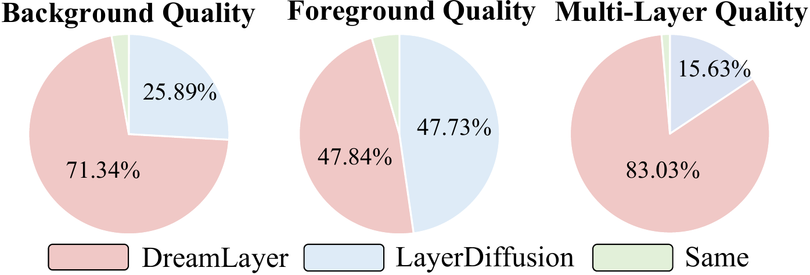

> 图 6：用户研究中投票偏好的百分比。我们从三个方面评估我们的方法和 LayerDiffusion：多层图像、前景和背景质量。

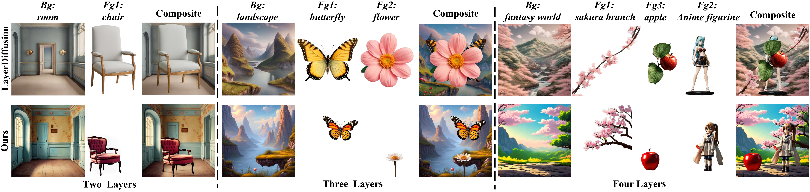

> 图 7：多层图像生成的定性比较。我们展示了 Layerdiffusion 和我们的方法在两层、三层和四层图像上的生成结果。

### 4.1 实现细节（Implementation Details）

 **训练（Training）** 。我们使用 Stable Diffusion v1.5（Stable Diffusion v1.5）[23] 的预训练权重初始化训练，并采用 Custom Diffusion（Custom Diffusion）[13] 策略，微调所有注意力层中的 K&V 线性层。对于前景层，额外的 K&V 层会单独进行训练。 **上下文感知交叉注意力（Context-Aware Cross-Attention, CACA）**  应用于分辨率为 16 的下采样层中，而 **层共享自注意力（Layer-Shared Self-Attention, LSSA）**  则用于所有上采样层。每个层批次使用相同的时序噪声初始化， **层嵌入（Layer Embedding）**  被初始化为零，以最小化对原始权重的干扰。训练在 2 块 A100 GPU 上进行，持续 4 天，批次大小为 4，学习率为 2e-6。更多细节请参见补充材料。

 **评估（Evaluation）** 。我们在从我们提出的数据集中抽取的 3k 张多层图像测试集上评估 DreamLayer。使用  **AES 分数（AES Score）**  [28] 评估美学质量，使用  **CLIP 分数（CLIP-Score）**  [22] 评估文本-图像对齐度，使用  **FID（Fréchet Inception Distance）**  [8] 评估分布相似性。

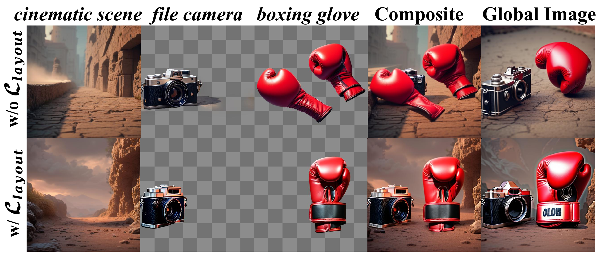

> 图 8：上下文感知交叉注意力的消融研究：使用 $\mathcal{L}_{layout}$ 监督从全局图像中提取布局信息，指导前景层的生成并减少重叠放置。

> 表 3：关于 LSSA 和 CACA 的消融研究。

| DreamLayer | Multi-Layers (Average) |               |                |                 |     |
| :--------- | :--------------------- | :------------ | :------------- | :-------------- | :-- |
| LSSA       | CACA                   | AES$\uparrow$ | Clip$\uparrow$ | FID$\downarrow$ |     |
|            |                        | 6.438         | 33.808         | 57.241          |     |
| ✓          |                        | 6.471         | 33.727         | 56.598          |     |
|            | ✓                      | 6.561         | 34.004         | 55.788          |     |
| ✓          | ✓                      | 6.625         | 35.275         | 52.956          |     |

### 4.2 多层图像生成比较（Comparisons of Multi-Layer Image Generation）

 **定量比较（Quantitative Comparisons）** 。如[表 1](#table-1)所示，我们将 DreamLayer 在生成完整图层方面的性能与 Stable Diffusion（Stable Diffusion）[23]（SD15）和 LayerDiffusion（LayerDiffusion）[41] 的结果进行了比较。在此设置中，SD15 仅基于全局提示生成单个完整图像。对于三层和四层图像，我们使用 LayerDiffusion 的从背景到前景的方法，顺序添加前景元素以模拟多层组合。如表所示，我们的方法在多层生成的所有三个指标上都优于 LayerDiffusion，其中美学分数显著提高了约 0.5。对于合成的多层图像，与 SD15 直接生成完整图像相比，我们的方法也实现了更高的美学质量和更好的文本对齐度。

 **定性比较（Qualitative Comparisons）** 。在[图 7](#figure-7)中，我们展示了多层图像生成的结果。与 Layerdiffusion [41] 相比，我们的方法生成了更连贯且尺寸更合适的前景层，并实现了前景与背景更和谐的融合。

 **用户研究（User Study）** 。如[图 6](#figure-6)所示，我们进行了一项用户研究，邀请 20 名参与者对 200 个样本进行评估，从多层图像、前景和背景质量三个方面比较我们的方法和 LayerDiffusion [41] 的多层生成质量。结果显示，我们的方法在上述三个方面的偏好百分比分别为 71.34%、47.84% 和 83.03%。这表明我们的方法能提供更连贯的布局和更高的质量，尤其是在背景和多层图像方面。

### 4.3 消融研究（Ablation Study）

 **上下文感知交叉注意力（Context-Aware Cross-Attention, CACA）** 。CACA 从全局层提取上下文映射信息，并利用 $\mathcal{L}_{layout}$ 来指导前景层的布局。如 [图 8](#figure-8) 所示，在没有布局对齐损失（w/o $\mathcal{L}_{l}$）的情况下，前景物体倾向于生成在相同位置，导致重叠和遮挡。我们在 [表 3](#table-3) 中报告了定量结果。移除 CACA 会显著降低图像质量，使多层生成的整体 AES 分数降低 0.154。

 **层共享自注意力（Layer-Shared Self-Attention, LSSA）** 。LSSA 主要用于保持不同图像层之间的一致性。如 [表 3](#table-3) 所示，缺少 LSSA 会导致 CLIP 分数显著下降，降低约 1.27。

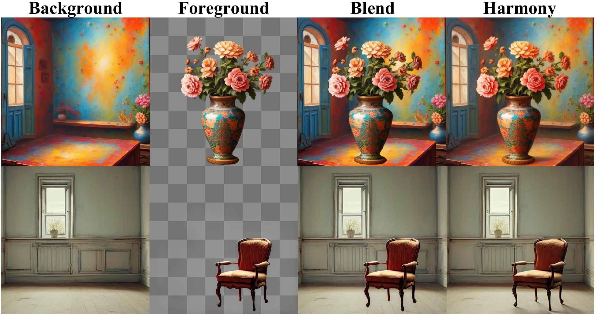

> 图 9：关于 IRH 的消融研究。我们的协调方法，与直接混合不同，能为前景物体生成合适的阴影，从而得到更具整体感的构图。

> 表 4：IBH 中 $T_{H}$ 和 $T_{H}^{\prime}$ 的探究。

| $T_{H}$           | 0     | 200   | 400   | 600   | 800   |
| :---------------- | :---- | :---- | :---- | :---- | :---- |
| $T_{H}^{\prime}$  | 0     | 0     | 200   | 400   | 600   |
| Avg AES$\uparrow$ | 6.553 | 6.568 | 6.600 | 6.625 | 6.615 |

 **信息保留协调（Information Retained Harmonization, IRH）** 。我们进一步研究了 IRH 在图层合成中的作用。如 [图 9](#figure-9) 所示，简单地堆叠前景和背景层（Blend）会产生不真实的合成图像，缺乏阴影等纹理细节。例如，[图 9](#figure-9) 中的椅子因没有阴影而显得漂浮，破坏了视觉协调性。然而，使用 IRH 后，背景中会生成阴影和其他细节以反映前景物体的存在，从而产生更自然、更具整体感的图层合成。定量结果如 [表 1](#table-1) 所示，“DreamLayer w/o IRH” 在美学分数上显示出明显下降，在没有 IRH 的情况下降低了 0.1。

 **IBH 中的 $T_{H}$ 和 $T_{H}^{\prime}$** 。我们研究了 IBH 中 $T_{H}$ 和 $T_{H}^{\prime}$ 的取值。我们实验了 $T_{H}$ 从 800 到 0 步的情况。如 [表 4](#table-4) 所示，当 $T_{H}^{\prime}<600$ 时，IBH 在去噪过程接近结束时应用，导致协调效果差且 AES 分数低。相反，当 $T_{H}$ 较大（例如 $T_{H}=800$）时，IBH 对背景的修改过度，降低了 AES 分数。基于这些观察，我们选择了 $T_{H}=600$ 和 $T_{H}^{\prime}=400$。

### 4.4 进一步应用（Further Application）

 **图像到图层（Image to Layer）**  在 DreamLayer 框架内，我们可以以无需训练的方式将其扩展到图像到图层任务。具体来说，我们将输入图像编码为潜在表示作为全局潜在，然后使用反转技术 [18] 逐步添加噪声直至 $T$ 步潜在，该潜在作为 DreamLayer 中所有图层的初始潜在。为了在此反转过程中获得更准确的初始潜在，我们使用掩码隔离全局图像信息，以最小化其他图层的影响。如 [图 10](#figure-10) 所示，这种方法使我们能够根据文本提示将输入图像分解为独立的图层。详细步骤在补充材料中提供。

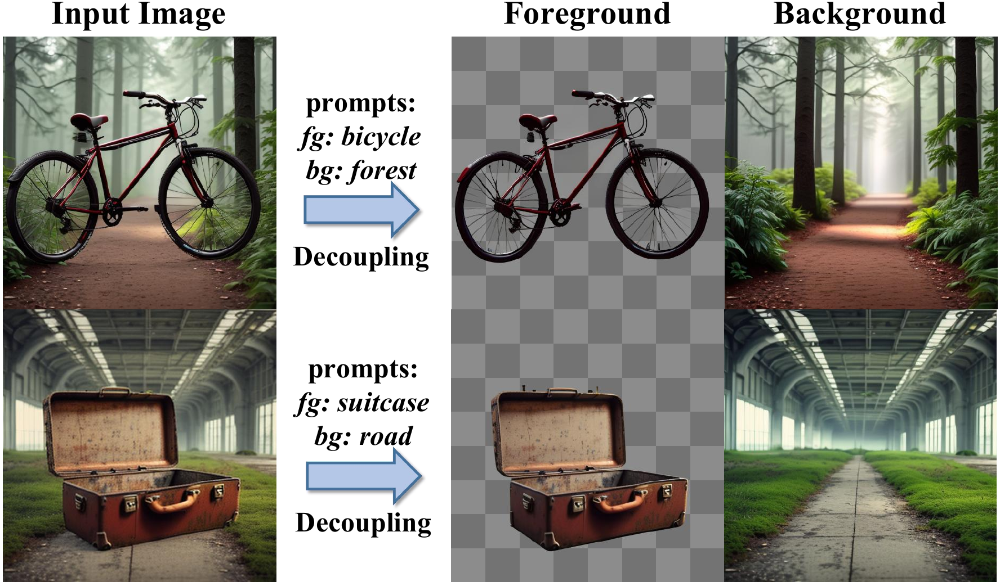

> 图 10：图像到图层可视化：通过利用反转将输入图像作为所有图层的初始噪声潜在，DreamLayer 可以根据文本提示分解输入。

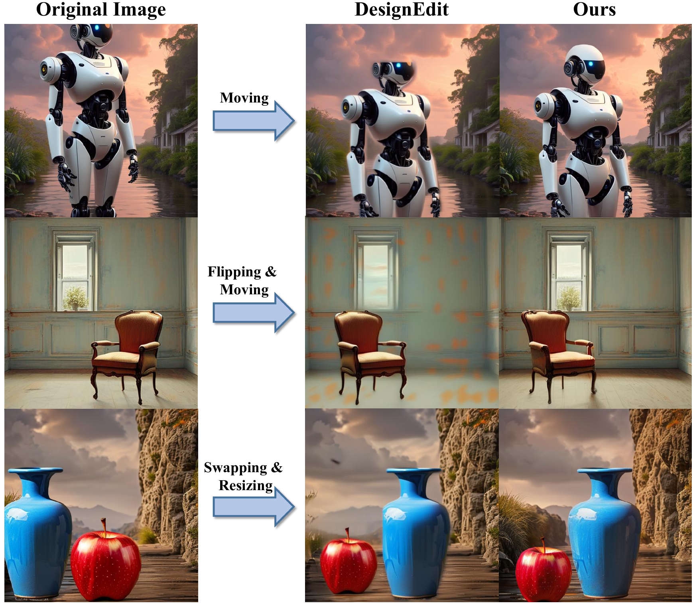

> 图 11：图层编辑可视化：与 DesignEdit 相比，DreamLayer 可以补全图像边缘的物体，并在物体翻转或移动时创建更具整体感的结果。

 **图层编辑（Layer Editing）**  在实际应用中，DreamLayer 可以生成多层图像，并允许用户对图层进行协调的编辑。如 [公式 13](https://arxiv.org/html/2503.12838v1#S3.E13) 所述，我们在 IRH 内在潜在级别执行这些编辑，确保调整更具整体感。例如，在 [图 11](#figure-11) 中，当椅子被翻转和移动时，地板阴影会更新以与其新位置对齐，从而增强了整体真实感。此外，当前景物体的部分超出图像边界时，DreamLayer 具备 **前景物体非模态补全（foreground object amodal completion）**  的能力，可以在物体重新定位时根据需要补全缺失部分。如 [图 11](#figure-11) 所示，与 DesignEdit [12] 等现有方法相比，DreamLayer 在机器人、蓝色花瓶等物体被移动后，成功地恢复了其出框区域。

## 5 结论（Conclusion）

本文中，我们引入了一个大规模、高质量的多层数据集，包含多样化的前景物体和背景。在此基础上，我们提出了 DreamLayer，一个用于同时生成多层图像的框架。为了解决前景层之间的布局一致性问题，我们引入了 **上下文感知交叉注意力（Context-Aware Cross-Attention）** ，它利用全局图像的协调布局来指导前景生成。为了增强层间连接，我们提出了 **层共享自注意力（Layer-Shared Self-Attention）** ，实现了层间的有效信息交换。最后，为了生成具有整体感的合成图像，我们提出了 **信息保留协调（Information Retained Harmonization）** ，它在潜在级别合并图层以实现无缝融合。DreamLayer 不仅支持多层生成，还支持通过反转进行图像到图层任务的图层分解，从而能够在潜在空间内进行灵活的编辑以实现协调调整。实验结果证明了 DreamLayer 在多层生成中的有效性。
$$
