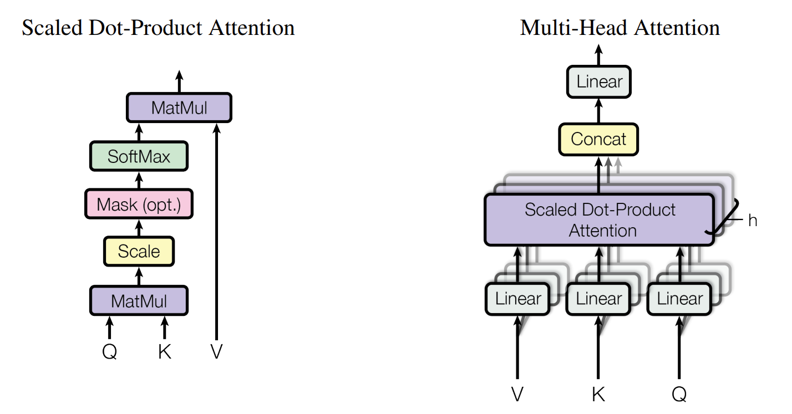
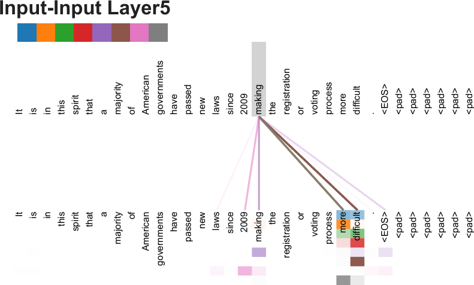
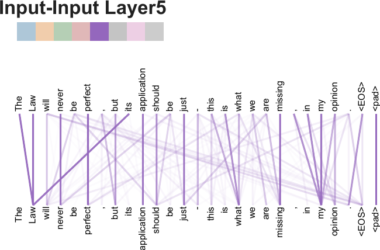

# 标题：Attention Is All You Need（注意力就是您所需的一切）

- ArXiv: 1706.03762
- 作者：阿希什·瓦斯瓦尼（Ashish Vaswani），谷歌大脑（Google Brain），诺姆·沙泽尔（Noam Shazeer），尼基·帕尔马（Niki Parmar），谷歌研究（Google Research），雅各布·乌兹科雷特（Jakob Uszkoreit），利昂·琼斯（Llion Jones），艾丹·N·戈麦斯（Aidan N. Gomez），多伦多大学（University of Toronto），乌卡什·凯泽（Łukasz Kaiser），伊利亚·波洛苏欣（Illia Polosukhin）
- 章节：29
- 估计词元数：11.1k

## 目录

- 1 引言
- 2 背景
- 3 模型架构
  - 3.1 编码器与解码器堆栈
    - 编码器：
    - 解码器：
  - 3.2 注意力
    - 3.2.1 缩放点积注意力
    - 3.2.2 多头注意力
    - 3.2.3 注意力机制在我们模型中的应用
  - 3.3 逐位置前馈网络
  - 3.4 嵌入与 Softmax
  - 3.5 位置编码
- 4 为何选择自注意力
- 5 训练
  - 5.1 训练数据与批处理
  - 5.2 硬件与训练计划
  - 5.3 优化器
  - 5.4 正则化
    - 残差丢弃
    - 标签平滑
- 6 结果
  - 6.1 机器翻译
  - 6.2 模型变体
  - 6.3 英语成分句法分析
- 7 结论
  - 致谢
- 参考文献
- 注意力可视化

## 摘要

###### 摘要

主流的序列转导模型基于包含编码器（Encoder）和解码器（Decoder）的复杂循环神经网络（Recurrent Neural Networks, RNNs）或卷积神经网络（Convolutional Neural Networks, CNNs）。性能最佳的模型还通过注意力机制（Attention Mechanism）连接编码器和解码器。我们提出了一种新的简单网络架构—— **Transformer（Transformer）** ，它完全基于注意力机制，彻底摒弃了循环和卷积。在两个机器翻译任务上的实验表明，这些模型在质量上更优，同时具有更高的并行性，并且所需的训练时间显著减少。我们的模型在 WMT 2014 英德翻译任务上取得了 28.4 的 BLEU 分数，比现有最佳结果（包括集成模型）提高了超过 2 BLEU。在 WMT 2014 英法翻译任务上，我们的模型在 8 个 GPU 上训练 3.5 天后，建立了新的单模型最先进 BLEU 分数 41.8，这仅是文献中最佳模型训练成本的一小部分。我们通过将 Transformer 成功应用于英语成分句法分析（English Constituency Parsing）任务（包括使用大量和有限训练数据的情况），证明了其能很好地泛化到其他任务。

## 1 引言（Introduction）

**循环神经网络（Recurrent Neural Networks, RNNs）** ，特别是 **长短期记忆网络（Long Short-Term Memory, LSTM）** [13] 和 **门控循环单元网络（Gated Recurrent Unit, GRU）** [7]，已被牢固确立为序列建模与转换问题（如语言建模和机器翻译 [35, 2, 5]）中的 **最先进（state of the art）** 方法。此后，众多研究持续推动着循环语言模型和编码器-解码器架构 [38, 24, 15] 的边界。

循环模型通常沿着输入和输出序列的符号位置分解计算。通过将位置与计算时间步对齐，它们生成一个隐藏状态序列 $h_{t}$，该状态是前一个隐藏状态 $h_{t-1}$ 和位置 $t$ 的输入的函数。这种固有的顺序性质阻碍了训练样本内部的并行化，这在序列长度较长时变得至关重要，因为内存限制会制约跨样本的批处理。最近的研究通过 **因子化技巧（factorization tricks）** [21] 和 **条件计算（conditional computation）** [32] 在计算效率上取得了显著提升，后者还同时提升了模型性能。然而，顺序计算的根本限制依然存在。

**注意力机制（Attention mechanisms）** 已成为各种任务中引人注目的序列建模与转换模型不可或缺的一部分，它允许对依赖关系进行建模，而无需考虑它们在输入或输出序列中的距离 [2, 19]。然而，除了少数情况外 [27]，此类注意力机制都是与循环网络结合使用的。

在这项工作中，我们提出了 **Transformer** ，这是一种摒弃了循环结构、完全依赖注意力机制来捕捉输入与输出之间全局依赖关系的模型架构。Transformer 允许实现显著更多的并行化，并且在仅使用 8 个 P100 GPU 训练 12 小时后，就能在翻译质量上达到新的最先进水平。

## 2 背景（Background）

减少 **顺序计算（Sequential Computation）** 的目标同样是 **扩展神经图形处理器（Extended Neural GPU）** [16]、 **字节网络（ByteNet）** [18] 和 **ConvS2S** [9] 的基础。这些模型均使用 **卷积神经网络（Convolutional Neural Networks, CNNs）** 作为基本构建块，并行地为所有输入和输出位置计算 **隐藏表示（Hidden Representations）** 。在这些模型中，关联来自两个任意输入或输出位置的信号所需的操作次数随位置间距离的增加而增长：对于 ConvS2S 是线性增长，对于 ByteNet 是对数增长。这使得学习远距离位置之间的依赖关系变得更加困难 [12]。在 **Transformer** 中，这一操作次数被减少到一个常数，尽管这是以因平均 **注意力加权位置（Attention-weighted Positions）** 而导致有效分辨率降低为代价的，我们通过 **多头注意力（Multi-Head Attention）** 机制来抵消这一影响，详见章节 [3.2](#S3.SS2)。

**自注意力（Self-attention）** ，有时也称为 **内部注意力（Intra-attention）** ，是一种关联单个序列中不同位置的注意力机制，目的是计算该序列的表示。自注意力已成功应用于多种任务，包括阅读理解、抽象摘要、文本蕴含和学习与任务无关的句子表示 [4, 27, 28, 22]。

**端到端记忆网络（End-to-end Memory Networks）** 基于 **循环注意力机制（Recurrent Attention Mechanism）** ，而非序列对齐的循环，并且已被证明在简单语言问答和语言建模任务上表现良好 [34]。

然而，据我们所知， **Transformer 是第一个完全依赖自注意力来计算其输入和输出表示，而不使用序列对齐的循环神经网络（Recurrent Neural Networks, RNNs）或卷积的转换模型（Transduction Model）** 。

在接下来的章节中，我们将描述 Transformer，阐述自注意力的动机，并讨论其相对于 [17, 18] 和 [9] 等模型的优势。

## 3 模型架构（Model Architecture）

> 图 1 | Transformer 模型架构。

大多数具有竞争力的 **神经序列转导模型（Neural Sequence Transduction Models）** 都采用 **编码器-解码器（Encoder-Decoder）** 结构 [5, 2, 35]。其中，编码器将符号表示的输入序列 $(x_{1},...,x_{n})$ 映射为一个连续表示序列 $\mathbf{z}=(z_{1},...,z_{n})$。给定 $\mathbf{z}$，解码器随后每次生成一个符号，逐步生成输出序列 $(y_{1},...,y_{m})$。在每一步，模型都是 **自回归（Auto-regressive）** 的 [10]，在生成下一个符号时，会将先前生成的符号作为额外输入。

Transformer 遵循这一整体架构，在编码器和解码器中均使用了堆叠的 **自注意力（Self-attention）** 和 **逐点全连接层（Point-wise, Fully Connected Layers）** ，分别如图 [1](#S3.F1) 的左半部分和右半部分所示。

### 3.1 编码器与解码器堆栈（Encoder and Decoder Stacks）

##### 编码器（Encoder）：

编码器由 $N=6$ 个相同的层堆叠而成。每一层包含两个子层。第一个是 **多头自注意力机制（Multi-head Self-attention Mechanism）** ，第二个是一个简单的 **逐位置全连接前馈网络（Position-wise Fully Connected Feed-forward Network）** 。我们在每个子层周围采用了 **残差连接（Residual Connection）** [11]，然后进行 **层归一化（Layer Normalization）** [1]。也就是说，每个子层的输出是 $\mathrm{LayerNorm}(x+\mathrm{Sublayer}(x))$，其中 $\mathrm{Sublayer}(x)$ 是该子层自身实现的函数。为了便于这些残差连接，模型中所有子层以及 **嵌入层（Embedding Layers）** 产生的输出维度均为 $d_{\text{model}}=512$。

##### 解码器（Decoder）：

解码器同样由 $N=6$ 个相同的层堆叠而成。除了每个编码器层中的两个子层外，解码器还插入了第三个子层，该子层对编码器堆栈的输出执行 **多头注意力（Multi-head Attention）** 。与编码器类似，我们在每个子层周围采用了残差连接，然后进行层归一化。我们还修改了解码器堆栈中的自注意力子层，以防止某个位置关注到后续的位置。这种 **掩码（Masking）** ，结合输出嵌入偏移一个位置的事实，确保了对于位置 $i$ 的预测只能依赖于位置小于 $i$ 的已知输出。

### 3.2 注意力（Attention）

一个 **注意力函数（Attention Function）** 可以描述为将一个 **查询（Query）** 和一组 **键-值对（Key-Value Pairs）** 映射到一个输出，其中查询、键、值和输出都是向量。输出是值的加权和，分配给每个值的权重由查询与对应键的 **兼容性函数（Compatibility Function）** 计算得出。

#### 3.2.1 缩放点积注意力（Scaled Dot-Product Attention）

我们将我们特定的注意力机制称为“ **缩放点积注意力（Scaled Dot-Product Attention）** ”（图 [2](#S3.F2)）。输入由维度为 $d_{k}$ 的查询和键，以及维度为 $d_{v}$ 的值组成。我们计算查询与所有键的点积，将每个点积除以 $\sqrt{d_{k}}$，然后应用一个 **softmax 函数（Softmax Function）** 来获得值的权重。

在实践中，我们同时对一组查询计算注意力函数，将它们打包成一个矩阵 $Q$。键和值也分别打包成矩阵 $K$ 和 $V$。我们按如下公式计算输出矩阵：

$$
\mathrm{Attention}(Q,K,V)=\mathrm{softmax}(\frac{QK^{T}}{\sqrt{d_{k}}})V \tag{1}
$$

两种最常用的注意力函数是 **加性注意力（Additive Attention）** [2] 和 **点积（乘性）注意力（Dot-product (Multiplicative) Attention）** 。点积注意力与我们的算法相同，除了缩放因子 $\frac{1}{\sqrt{d_{k}}}$。加性注意力使用一个具有单隐藏层的前馈网络来计算兼容性函数。尽管两者在理论复杂度上相似，但点积注意力在实践中要快得多且空间效率更高，因为它可以使用高度优化的矩阵乘法代码实现。

虽然对于较小的 $d_{k}$ 值，两种机制表现相似，但对于较大的 $d_{k}$ 值，未缩放的加性注意力优于点积注意力 [3]。我们推测，对于较大的 $d_{k}$ 值，点积的幅度会变得很大，从而将 softmax 函数推入其梯度极小的区域（^1^11 为了说明点积为何会变大，假设 $q$ 和 $k$ 的分量是均值为 0、方差为 $1$ 的独立随机变量。那么它们的点积 $q\cdot k=\sum_{i=1}^{d_{k}}q_{i}k_{i}$ 的均值为 0，方差为 $d_{k}$。）。为了抵消这种效应，我们将点积缩放 $\frac{1}{\sqrt{d_{k}}}$。

<!-- 

 -->

**图 2：** （左）缩放点积注意力（Scaled Dot-Product Attention）。

（右）多头注意力（Multi-Head Attention）由多个并行运行的注意力层组成。

#### 3.2.2 多头注意力（Multi-Head Attention）

我们发现，与其使用 $d_{\text{model}}$ 维的键（keys）、值（values）和查询（queries）执行单一的注意力函数，不如将查询、键和值分别用 $h$ 个不同的、可学习的线性投影（learned linear projections）线性投影到 $d_{k}$、$d_{k}$ 和 $d_{v}$ 维更为有益。然后，我们在这些投影后的查询、键和值版本上并行执行注意力函数，产生 $d_{v}$ 维的输出值。如图 [2](#S3.F2) 所示，这些输出值被拼接（concatenated）起来并再次投影，从而得到最终的值。

**多头注意力（Multi-head attention）** 允许模型在不同位置上共同关注来自不同表示子空间（representation subspaces）的信息。如果只有一个注意力头（attention head），平均化会抑制这种能力。

$$
\displaystyle\mathrm{MultiHead}(Q,K,V) \displaystyle=\mathrm{Concat}(\mathrm{head_{1}},...,\mathrm{head_{h}})W^{O} \displaystyle\text{其中}~\mathrm{head_{i}} \displaystyle=\mathrm{Attention}(QW^{Q}_{i},KW^{K}_{i},VW^{V}_{i})
$$

其中投影是参数矩阵 $W^{Q}_{i}\in\mathbb{R}^{d_{\text{model}}\times d_{k}}$, $W^{K}_{i}\in\mathbb{R}^{d_{\text{model}}\times d_{k}}$, $W^{V}_{i}\in\mathbb{R}^{d_{\text{model}}\times d_{v}}$ 和 $W^{O}\in\mathbb{R}^{hd_{v}\times d_{\text{model}}}$。

在本工作中，我们采用 $h=8$ 个并行注意力层，即头（heads）。对于每个头，我们使用 $d_{k}=d_{v}=d_{\text{model}}/h=64$。由于每个头的维度降低了，总计算成本与使用全维度的单头注意力相似。

#### 3.2.3 注意力机制在本模型中的应用

Transformer（Transformer）模型以三种不同的方式使用多头注意力：

- 在 **"编码器-解码器注意力（encoder-decoder attention）"** 层中，查询来自前一个解码器层，而记忆键和值来自编码器的输出。这使得解码器中的每个位置都可以关注输入序列中的所有位置。这模仿了序列到序列（sequence-to-sequence）模型中典型的编码器-解码器注意力机制，例如 [38, 2, 9]。
- 编码器包含 **自注意力（self-attention）** 层。在自注意力层中，所有的键、值和查询都来自同一个地方，在本例中，即编码器中前一层的输出。编码器中的每个位置都可以关注编码器前一层的所有位置。
- 类似地，解码器中的自注意力层允许解码器中的每个位置关注解码器中直到并包括该位置的所有位置。我们需要防止解码器中的向左信息流，以保持自回归（auto-regressive）特性。我们在缩放点积注意力内部通过掩码（masking out）来实现这一点，即将 softmax 输入中所有对应非法连接的值设置为 $-\infty$。参见图 [2](#S3.F2)。

### 3.3 逐位置前馈网络（Position-wise Feed-Forward Networks）

除了注意力子层外，我们的编码器和解码器中的每一层都包含一个全连接的前馈网络（fully connected feed-forward network），该网络被分别且相同地应用于每个位置。它由两个线性变换组成，中间有一个 ReLU 激活函数。

$$
\mathrm{FFN}(x)=\max(0,xW_{1}+b_{1})W_{2}+b_{2}(2)
$$

虽然线性变换在不同位置上是相同的，但它们在层与层之间使用不同的参数。另一种描述方式是将其视为两个卷积核大小为 1 的卷积。输入和输出的维度是 $d_{\text{model}}=512$，内层的维度是 $d_{ff}=2048$。

### 3.4 嵌入（Embeddings）与 Softmax

与其他序列转导（sequence transduction）模型类似，我们使用可学习的嵌入将输入词元（tokens）和输出词元转换为维度为 $d_{\text{model}}$ 的向量。我们还使用通常的可学习线性变换和 softmax 函数将解码器输出转换为预测的下一个词元概率。在我们的模型中，两个嵌入层和 softmax 前的线性变换共享相同的权重矩阵，类似于 [30]。在嵌入层中，我们将这些权重乘以 $\sqrt{d_{\text{model}}}$。

### 3.5 位置编码（Positional Encoding）

由于我们的模型不包含循环（recurrence）和卷积（convolution），为了让模型能够利用序列的顺序信息，我们必须注入一些关于序列中词元的相对或绝对位置的信息。为此，我们在编码器和解码器堆栈底部的输入嵌入中添加了 **"位置编码（positional encodings）"** 。位置编码与嵌入具有相同的维度 $d_{\text{model}}$，因此两者可以相加。位置编码有多种选择，可以是可学习的，也可以是固定的 [9]。

在这项工作中，我们使用不同频率的正弦和余弦函数：

$$
\displaystyle PE_{(pos,2i)}=sin(pos/10000^{2i/d_{\text{model}}}) \displaystyle PE_{(pos,2i+1)}=cos(pos/10000^{2i/d_{\text{model}}})
$$

其中 $pos$ 是位置，$i$ 是维度。也就是说，位置编码的每个维度对应一个正弦曲线。波长形成一个从 $2\pi$ 到 $10000\cdot 2\pi$ 的几何级数。我们选择这个函数是因为我们假设它能让模型轻松地学习基于相对位置进行关注，因为对于任何固定的偏移量 $k$，$PE_{pos+k}$ 都可以表示为 $PE_{pos}$ 的线性函数。

我们也尝试使用可学习的位置嵌入 [9]，发现两个版本产生了几乎相同的结果（见表 [3](#S6.T3) 行 (E)）。我们选择正弦版本是因为它可能允许模型外推到比训练中遇到的更长的序列长度。

## 4 为何选择自注意力（Why Self-Attention）

在本节中，我们将 **自注意力层（Self-Attention layers）** 的各个方面与常用于将一个可变长度的符号表示序列 $(x_{1},...,x_{n})$ 映射为另一个等长序列 $(z_{1},...,z_{n})$ 的 **循环层（Recurrent layers）** 和 **卷积层（Convolutional layers）** 进行比较，其中 $x_{i},z_{i}\in\mathbb{R}^{d}$，例如典型的序列转导编码器或解码器中的隐藏层。为了论证我们使用自注意力的动机，我们考虑了三个期望的特性。

其一是每层的 **总计算复杂度（total computational complexity）** 。
其二是可以并行化的计算量，以所需的最少 **顺序操作（sequential operations）** 数量来衡量。

第三是网络中 **长程依赖关系（long-range dependencies）** 之间的 **路径长度（path length）** 。学习长程依赖关系是许多序列转导任务中的一个关键挑战。影响学习此类依赖关系能力的一个关键因素是前向和后向信号在网络中必须遍历的路径长度。输入和输出序列中任意位置组合之间的这些路径越短，学习长程依赖关系就越容易 [12]。因此，我们还比较了由不同类型层组成的网络中，任意两个输入和输出位置之间的 **最大路径长度（maximum path length）** 。

> 表 1 | 不同层类型的最大路径长度、每层复杂度和最少顺序操作数。$n$ 是序列长度，$d$ 是表示维度，$k$ 是卷积的核大小，$r$ 是受限自注意力中邻域的大小。

| 层类型           | 每层复杂度               | 顺序操作数 | 最大路径长度    |
| ---------------- | ------------------------ | ---------- | --------------- |
| 自注意力         | $O(n^{2}\cdot d)$        | $O(1)$     | $O(1)$          |
| 循环层           | $O(n\cdot d^{2})$        | $O(n)$     | $O(n)$          |
| 卷积层           | $O(k\cdot n\cdot d^{2})$ | $O(1)$     | $O(log_{k}(n))$ |
| 自注意力（受限） | $O(r\cdot n\cdot d)$     | $O(1)$     | $O(n/r)$        |

如表 [1](#S4.T1) 所示，一个自注意力层以恒定数量的顺序执行操作连接所有位置，而一个循环层需要 $O(n)$ 个顺序操作。
在计算复杂度方面，当序列长度 $n$ 小于表示维度 $d$ 时，自注意力层比循环层更快，这在机器翻译中最先进模型使用的句子表示（例如 **词片（word-piece）** [38] 和 **字节对（byte-pair）** [31] 表示）中通常是成立的。
为了提高涉及超长序列任务的计算性能，可以将自注意力限制为仅考虑输入序列中围绕相应输出位置、大小为 $r$ 的邻域。这将使最大路径长度增加到 $O(n/r)$。我们计划在未来的工作中进一步研究这种方法。

一个核宽度 $k<n$ 的单一卷积层并不能连接所有输入和输出位置对。要做到这一点，在连续核的情况下需要堆叠 $O(n/k)$ 个卷积层，或者在 **空洞卷积（dilated convolutions）** [18] 的情况下需要 $O(log_{k}(n))$ 层，这会增加网络中任意两个位置之间最长路径的长度。
卷积层通常比循环层更昂贵，代价因子为 $k$。然而， **可分离卷积（Separable convolutions）** [6] 显著降低了复杂度，降至 $O(k\cdot n\cdot d+n\cdot d^{2})$。但即使 $k=n$，可分离卷积的复杂度也等于一个自注意力层加上一个 **逐点前馈层（point-wise feed-forward layer）** 的组合，这正是我们模型中采用的方法。

作为附带的好处，自注意力可能产生更具可解释性的模型。我们检查了模型中的注意力分布，并在附录中展示和讨论了示例。不仅各个 **注意力头（attention heads）** 明显学会了执行不同的任务，许多注意力头似乎还表现出与句子的句法和语义结构相关的行为。

## 5 训练（Training）

本节描述我们模型的训练方案。

### 5.1 训练数据与批处理（Training Data and Batching）

我们在标准的 WMT 2014 英德数据集上进行训练，该数据集包含约 450 万个句子对。句子使用 **字节对编码（Byte-Pair Encoding, BPE）** [3] 进行编码，其共享的源-目标词汇表包含约 37000 个词元（tokens）。对于英法翻译，我们使用了规模大得多的 WMT 2014 英法数据集，包含 3600 万个句子，并将词元切分为一个包含 32000 个词片（word-piece）的词汇表 [38]。句子对根据近似序列长度进行分批。每个训练批次包含一组句子对，其中大约包含 25000 个源词元和 25000 个目标词元。

### 5.2 硬件与训练计划（Hardware and Schedule）

我们在一台配备 8 块 NVIDIA P100 GPU 的机器上训练我们的模型。对于使用本文所述超参数的 **基础模型（base models）** ，每个训练步骤耗时约 0.4 秒。我们总共训练基础模型 100,000 步，即 12 小时。对于我们的 **大型模型（big models）** （在表 [3](#S6.T3) 底行描述），每个步骤耗时为 1.0 秒。大型模型训练了 300,000 步（3.5 天）。

### 5.3 优化器（Optimizer）

我们使用了 **Adam 优化器（Adam optimizer）** [20]，其参数为 $\beta_{1}=0.9$, $\beta_{2}=0.98$ 和 $\epsilon=10^{-9}$。我们根据以下公式在训练过程中动态调整学习率：

$$
lrate = d_{\text{model}}^{-0.5} \cdot \min({step\_num}^{-0.5}, {step\_num} \cdot {warmup\_steps}^{-1.5}) \tag{3}
$$

这对应于在前 $warmup\_steps$ 个训练步骤中线性增加学习率，之后则按步骤数的平方根的倒数比例递减。我们设置 $warmup\_steps=4000$。

### 5.4 正则化（Regularization）

我们在训练中采用了三种类型的正则化：

##### 残差丢弃（Residual Dropout）

我们将 **Dropout** [33] 应用于每个子层的输出，然后才将其添加到子层输入并进行归一化。此外，我们还在编码器和解码器堆栈中，对嵌入向量（embeddings）与位置编码（positional encodings）的和应用 Dropout。对于基础模型，我们使用的丢弃率为 $P_{drop}=0.1$。

##### 标签平滑（Label Smoothing）

在训练过程中，我们采用了值为 $\epsilon_{ls}=0.1$ 的 **标签平滑（Label Smoothing）** [36]。这会损害困惑度（perplexity），因为模型学会了更加不确定，但能提高准确率和 BLEU 分数。

## 6 结果（Results）

### 6.1 机器翻译（Machine Translation）

> 表 2 | Transformer 在英德和英法 newstest2014 测试集上以远低于其他模型的训练成本取得了更好的 BLEU 分数。

| 模型（Model）                   | BLEU 分数（BLEU） |               | 训练成本（FLOPs）（Training Cost (FLOPs)） |                    |                    |
| :------------------------------ | :---------------- | :------------ | :----------------------------------------- | :----------------- | :----------------- |
|                                 | 英德（EN-DE）     | 英法（EN-FR） | 英德（EN-DE）                              | 英法（EN-FR）      |                    |
| ByteNet [18]                    | 23.75             |               |                                            |                    |                    |
| Deep-Att + PosUnk [39]          |                   | 39.2          |                                            |                    | $1.0\cdot 10^{20}$ |
| GNMT + RL [38]                  | 24.6              | 39.92         |                                            | $2.3\cdot 10^{19}$ | $1.4\cdot 10^{20}$ |
| ConvS2S [9]                     | 25.16             | 40.46         |                                            | $9.6\cdot 10^{18}$ | $1.5\cdot 10^{20}$ |
| MoE [32]                        | 26.03             | 40.56         |                                            | $2.0\cdot 10^{19}$ | $1.2\cdot 10^{20}$ |
| Deep-Att + PosUnk Ensemble [39] |                   | 40.4          |                                            |                    | $8.0\cdot 10^{20}$ |
| GNMT + RL Ensemble [38]         | 26.30             | 41.16         |                                            | $1.8\cdot 10^{20}$ | $1.1\cdot 10^{21}$ |
| ConvS2S Ensemble [9]            | 26.36             | 41.29         |                                            | $7.7\cdot 10^{19}$ | $1.2\cdot 10^{21}$ |
| Transformer (base model)        | 27.3              | 38.1          |                                            | $3.3\cdot 10^{18}$ |                    |
| Transformer (big)               | 28.4              | 41.8          |                                            | $2.3\cdot 10^{19}$ |                    |

在 WMT 2014 英德翻译任务上，大型 Transformer 模型（表 [2](#S6.T2) 中的 Transformer (big)）比之前报道的最佳模型（包括集成模型）的 BLEU 分数高出 $2.0$ 分以上，建立了新的最先进 BLEU 分数 $28.4$。该模型的配置列于表 [3](#S6.T3) 的最后一行。训练在 $8$ 块 P100 GPU 上耗时 $3.5$ 天。即使是我们的基础模型（base model）也超越了所有先前发布的模型和集成模型，而其训练成本仅为任何竞争模型的一小部分。

在 WMT 2014 英法翻译任务上，我们的大型模型取得了 $41.0$ 的 BLEU 分数，优于所有先前发布的单一模型，且训练成本不到先前最先进模型的 $1/4$。用于英法翻译的 Transformer (big) 模型使用的丢弃率（Dropout rate）为 $P_{drop}=0.1$，而非 $0.3$。

对于基础模型，我们使用了通过平均最后 $5$ 个检查点（Checkpoint）得到的单一模型，这些检查点以 $10$ 分钟为间隔保存。对于大型模型，我们平均了最后 $20$ 个检查点。我们使用了集束搜索（Beam search），其集束宽度（Beam size）为 $4$，长度惩罚（Length penalty） $\alpha=0.6$ [38]。这些超参数（Hyperparameter）是在开发集（Development set）上经过实验后选定的。在推理（Inference）过程中，我们将最大输出长度设置为输入长度 + $50$，但会在可能时提前终止 [38]。

表 [2](#S6.T2) 总结了我们的结果，并将我们的翻译质量和训练成本与文献中的其他模型架构进行了比较。我们通过将训练时间、使用的 GPU 数量以及每块 GPU 的持续单精度浮点运算能力估计值相乘，来估算训练一个模型所使用的浮点运算次数（^2^22 我们为 K80、K40、M40 和 P100 GPU 分别使用了 2.8、3.7、6.0 和 9.5 TFLOPS 的估计值。）。

### 6.2 模型变体（Model Variations）

> 表 3 | Transformer 架构的变体。未列出的值与基础模型相同。所有指标均在英德翻译开发集 newstest2013 上计算。列出的困惑度（Perplexity）是基于我们的字节对编码（Byte-Pair Encoding, BPE）的每词片（Per-wordpiece）困惑度，不应与每词（Per-word）困惑度进行比较。

|      | $N$   | $d_{\text{model}}$                        | $d_{\text{ff}}$ | $h$             | $d_{k}$ | $d_{v}$ | $P_{\text{drop}}$ | $\epsilon_{\text{ls}}$ | train | PPL  | BLEU | params |
| ---- | ----- | ----------------------------------------- | --------------- | --------------- | ------- | ------- | ----------------- | ---------------------- | ----- | ---- | ---- | ------ |
|      | steps | (dev)                                     | (dev)           | $\times 10^{6}$ |         |         |                   |                        |       |      |      |        |
| base | 6     | 512                                       | 2048            | 8               | 64      | 64      | 0.1               | 0.1                    | 100K  | 4.92 | 25.8 | 65     |
| (A)  |       |                                           |                 | 1               | 512     | 512     |                   |                        |       | 5.29 | 24.9 |        |
|      |       |                                           | 4               | 128             | 128     |         |                   |                        | 5.00  | 25.5 |      |        |
|      |       |                                           | 16              | 32              | 32      |         |                   |                        | 4.91  | 25.8 |      |        |
|      |       |                                           | 32              | 16              | 16      |         |                   |                        | 5.01  | 25.4 |      |        |
| (B)  |       |                                           |                 |                 | 16      |         |                   |                        |       | 5.16 | 25.1 | 58     |
|      |       |                                           |                 | 32              |         |         |                   |                        | 5.01  | 25.4 | 60   |        |
| (C)  | 2     |                                           |                 |                 |         |         |                   |                        |       | 6.11 | 23.7 | 36     |
|      | 4     |                                           |                 |                 |         |         |                   |                        |       | 5.19 | 25.3 | 50     |
|      | 8     |                                           |                 |                 |         |         |                   |                        |       | 4.88 | 25.5 | 80     |
|      |       | 256                                       |                 | 32              | 32      |         |                   |                        | 5.75  | 24.5 | 28   |        |
|      |       | 1024                                      |                 | 128             | 128     |         |                   |                        | 4.66  | 26.0 | 168  |        |
|      |       |                                           | 1024            |                 |         |         |                   |                        | 5.12  | 25.4 | 53   |        |
|      |       |                                           | 4096            |                 |         |         |                   |                        | 4.75  | 26.2 | 90   |        |
| (D)  |       |                                           |                 |                 |         |         | 0.0               |                        |       | 5.77 | 24.6 |        |
|      |       |                                           |                 |                 |         |         | 0.2               |                        |       | 4.95 | 25.5 |        |
|      |       |                                           |                 |                 |         |         |                   | 0.0                    |       | 4.67 | 25.3 |        |
|      |       |                                           |                 |                 |         |         |                   | 0.2                    |       | 5.47 | 25.7 |        |
| (E)  |       | positional embedding instead of sinusoids |                 |                 |         |         |                   |                        |       | 4.92 | 25.7 |        |
| big  | 6     | 1024                                      | 4096            | 16              |         |         | 0.3               |                        | 300K  | 4.33 | 26.4 | 213    |

为了评估 **Transformer** （Transformer）不同组件的重要性，我们以不同方式改变基础模型，并测量其在开发集 newstest2013 上英德翻译性能的变化。我们使用了上一节描述的 **集束搜索（beam search）** ，但未使用 **检查点平均（checkpoint averaging）** 。我们在表 [3](#S6.T3) 中呈现了这些结果。

在表 [3](#S6.T3) 的行 (A) 中，我们改变了 **注意力头（attention heads）** 的数量以及注意力键和值的维度，同时保持计算量恒定，如章节 [3.2.2](#S3.SS2.SSS2) 所述。虽然单头注意力比最佳设置差 0.9 BLEU，但注意力头过多时质量也会下降。

在表 [3](#S6.T3) 的行 (B) 中，我们观察到减小注意力键大小 $d_{k}$ 会损害模型质量。这表明确定 **兼容性（compatibility）** 并不容易，并且比点积更复杂的兼容性函数可能是有益的。我们在行 (C) 和 (D) 中进一步观察到，正如预期的那样，更大的模型表现更好，并且 **丢弃法（dropout）** 对于避免 **过拟合（over-fitting）** 非常有帮助。在行 (E) 中，我们用 **学习到的位置嵌入（learned positional embeddings）** [9] 替换了我们的 **正弦位置编码（sinusoidal positional encoding）** ，并观察到与基础模型几乎相同的结果。

### 6.3 英语成分句法分析（English Constituency Parsing）

|      | $N$   | $d_{\text{model}}$ | $d_{\text{ff}}$ | $h$             | $d_{k}$ | $d_{v}$ | $P_{\text{drop}}$ | $\epsilon_{\text{ls}}$ | train | PPL  | BLEU | params |
| ---- | ----- | ------------------ | --------------- | --------------- | ------- | ------- | ----------------- | ---------------------- | ----- | ---- | ---- | ------ |
|      | steps | (dev)              | (dev)           | $\times 10^{6}$ |         |         |                   |                        |       |      |      |        |
| base | 6     | 512                | 2048            | 8               | 64      | 64      | 0.1               | 0.1                    | 100K  | 4.92 | 25.8 | 65     |
| (A)  |       |                    |                 | 1               | 512     | 512     |                   |                        |       | 5.29 | 24.9 |        |
|      |       |                    | 4               | 128             | 128     |         |                   |                        | 5.00  | 25.5 |      |        |
|      |       |                    | 16              | 32              | 32      |         |                   |                        | 4.91  | 25.8 |      |        |
|      |       |                    | 32              | 16              | 16      |         |                   |                        | 5.01  | 25.4 |      |        |
| (B)  |       |                    |                 |                 | 16      |         |                   |                        |       | 5.16 | 25.1 | 58     |
|      |       |                    |                 | 32              |         |         |                   |                        | 5.01  | 25.4 | 60   |        |
| (C)  | 2     |                    |                 |                 |         |         |                   |                        |       | 6.11 | 23.7 | 36     |
|      | 4     |                    |                 |                 |         |         |                   |                        |       | 5.19 | 25.3 | 50     |
|      | 8     |                    |                 |                 |         |         |                   |                        |       | 4.88 | 25.5 | 80     |
|      |       | 256                |                 | 32              | 32      |         |                   |                        | 5.75  | 24.5 | 28   |        |
|      |       | 1024               |                 | 128             | 128     |         |                   |                        | 4.66  | 26.0 | 168  |        |
|      |       |                    | 1024            |                 |         |         |                   |                        | 5.12  |

**表 4：Transformer 在英语成分句法分析上泛化良好（结果基于 WSJ 第 23 节）**

| 分析器（Parser）                  | 训练方式（Training）                       | WSJ 23 F1 |
| :-------------------------------- | :----------------------------------------- | :-------- |
| Vinyals & Kaiser 等人 (2014) [37] | 仅 WSJ，判别式（WSJ only, discriminative） | 88.3      |
| Petrov 等人 (2006) [29]           | 仅 WSJ，判别式（WSJ only, discriminative） | 90.4      |
| Zhu 等人 (2013) [40]              | 仅 WSJ，判别式（WSJ only, discriminative） | 90.4      |
| Dyer 等人 (2016) [8]              | 仅 WSJ，判别式（WSJ only, discriminative） | 91.7      |
| Transformer (4 层)                | 仅 WSJ，判别式（WSJ only, discriminative） | 91.3      |
| Zhu 等人 (2013) [40]              | 半监督（semi-supervised）                  | 91.3      |
| Huang & Harper (2009) [14]        | 半监督（semi-supervised）                  | 91.3      |
| McClosky 等人 (2006) [26]         | 半监督（semi-supervised）                  | 92.1      |
| Vinyals & Kaiser 等人 (2014) [37] | 半监督（semi-supervised）                  | 92.1      |
| Transformer (4 层)                | 半监督（semi-supervised）                  | 92.7      |
| Luong 等人 (2015) [23]            | 多任务（multi-task）                       | 93.0      |
| Dyer 等人 (2016) [8]              | 生成式（generative）                       | 93.3      |

为了评估 **Transformer** 是否能泛化到其他任务，我们在 **英语成分句法分析（English constituency parsing）** 上进行了实验。这项任务带来了特定的挑战：输出受到很强的结构约束，并且长度显著长于输入。此外， **循环神经网络序列到序列模型（RNN sequence-to-sequence models）** 在小数据量情况下未能取得最先进的结果 [37]。

我们在 **宾州树库（Penn Treebank）** [25] 的《华尔街日报》（Wall Street Journal, WSJ）部分（约 4 万条训练句子）上训练了一个 4 层 Transformer，其 $d_{model}=1024$。我们还在半监督（semi-supervised）设置下对其进行了训练，使用了来自 [37] 的更大的高置信度和 BerkeleyParser 语料库，包含约 1700 万条句子。对于仅 WSJ 的设置，我们使用了 16K 词符（tokens）的词汇表；对于半监督设置，我们使用了 32K 词符的词汇表。

我们仅进行了少量实验，在第 22 节开发集上选择了 **丢弃法（dropout）** （包括注意力丢弃和残差丢弃，见第 [5.4](#S5.SS4) 节）、学习率和 **集束大小（beam size）** ，所有其他参数均保持与英德基础翻译模型相同。在推理过程中，我们将最大输出长度增加到输入长度 + $300$。对于仅 WSJ 和半监督两种设置，我们均使用了集束大小为 $21$ 和 $\alpha=0.3$ 的参数。

我们在表 [4](#S6.T4) 中的结果表明，尽管缺乏针对任务的专门调优，我们的模型表现得出奇地好， **除了循环神经网络语法（Recurrent Neural Network Grammar）** [8] 之外，其效果优于所有先前报告的模型。

与 RNN 序列到序列模型 [37] 相比， **即使仅在包含 4 万条句子的 WSJ 训练集上进行训练，Transformer 的性能也超过了 BerkeleyParser** [29]。

## 7 结论（Conclusion）

在本工作中，我们提出了 **Transformer** ，这是第一个完全基于 **注意力机制（Attention mechanism）** 的序列转导模型，它用 **多头自注意力（Multi-headed self-attention）** 取代了编码器-解码器架构中最常用的循环层。

对于翻译任务，Transformer 的训练速度显著快于基于循环层或卷积层的架构。在 WMT 2014 英德翻译和 WMT 2014 英法翻译任务上，我们都取得了新的 **最佳性能（state of the art）** 。在前一个任务中，我们最好的模型甚至超越了所有先前报道的集成模型。

我们对基于注意力模型的未来感到兴奋，并计划将其应用于其他任务。我们计划将 Transformer 扩展到涉及文本以外的输入和输出模态的问题，并研究 **局部受限注意力机制（Local, restricted attention mechanisms）** ，以高效处理图像、音频和视频等大型输入和输出。 **使生成过程减少序列性** 是我们的另一个研究目标。

我们用于训练和评估模型的代码可在 [https://github.com/tensorflow/tensor2tensor](https://github.com/tensorflow/tensor2tensor) 获取。

##### 致谢（Acknowledgements）

我们感谢纳尔·卡尔克布伦纳（Nal Kalchbrenner）和斯蒂芬·高斯（Stephan Gouws）富有成果的评论、修正和启发。

## 参考文献

- [1]
  Jimmy Lei Ba, Jamie Ryan Kiros, and Geoffrey E Hinton.
  层归一化（Layer Normalization）。
  arXiv 预印本 arXiv:1607.06450, 2016.
- [2]
  Dzmitry Bahdanau, Kyunghyun Cho, and Yoshua Bengio.
  通过联合学习对齐与翻译的神经机器翻译（Neural Machine Translation by Jointly Learning to Align and Translate）。
  CoRR, abs/1409.0473, 2014.
- [3]
  Denny Britz, Anna Goldie, Minh-Thang Luong, and Quoc V. Le.
  神经机器翻译架构的大规模探索（Massive Exploration of Neural Machine Translation Architectures）。
  CoRR, abs/1703.03906, 2017.
- [4]
  Jianpeng Cheng, Li Dong, and Mirella Lapata.
  用于机器阅读的长短期记忆网络（Long Short-Term Memory-Networks for Machine Reading）。
  arXiv 预印本 arXiv:1601.06733, 2016.
- [5]
  Kyunghyun Cho, Bart van Merrienboer, Caglar Gulcehre, Fethi Bougares, Holger Schwenk, and Yoshua Bengio.
  使用 RNN 编码器-解码器学习短语表示以用于统计机器翻译（Learning Phrase Representations using RNN Encoder-Decoder for Statistical Machine Translation）。
  CoRR, abs/1406.1078, 2014.
- [6]
  Francois Chollet.
  Xception：使用深度可分离卷积的深度学习（Xception: Deep Learning with Depthwise Separable Convolutions）。
  arXiv 预印本 arXiv:1610.02357, 2016.
- [7]
  Junyoung Chung, Çaglar Gülçehre, Kyunghyun Cho, and Yoshua Bengio.
  门控循环神经网络在序列建模上的实证评估（Empirical Evaluation of Gated Recurrent Neural Networks on Sequence Modeling）。
  CoRR, abs/1412.3555, 2014.
- [8]
  Chris Dyer, Adhiguna Kuncoro, Miguel Ballesteros, and Noah A. Smith.
  循环神经网络语法（Recurrent Neural Network Grammars）。
  载于《北美计算语言学协会年会论文集》（Proc. of NAACL），2016。
- [9]
  Jonas Gehring, Michael Auli, David Grangier, Denis Yarats, and Yann N. Dauphin.
  卷积序列到序列学习（Convolutional Sequence to Sequence Learning）。
  arXiv 预印本 arXiv:1705.03122v2, 2017.
- [10]
  Alex Graves.
  使用循环神经网络生成序列（Generating Sequences with Recurrent Neural Networks）。
  arXiv 预印本 arXiv:1308.0850, 2013.
- [11]
  Kaiming He, Xiangyu Zhang, Shaoqing Ren, and Jian Sun.
  用于图像识别的深度残差学习（Deep Residual Learning for Image Recognition）。
  载于《IEEE 计算机视觉与模式识别会议论文集》（Proceedings of the IEEE Conference on Computer Vision and Pattern Recognition），第 770–778 页，2016。
- [12]
  Sepp Hochreiter, Yoshua Bengio, Paolo Frasconi, and Jürgen Schmidhuber.
  循环网络中的梯度流：学习长期依赖关系的困难（Gradient Flow in Recurrent Nets: The Difficulty of Learning Long-Term Dependencies），2001。
- [13]
  Sepp Hochreiter and Jürgen Schmidhuber.
  长短期记忆（Long Short-Term Memory）。
  《神经计算》（Neural Computation），9(8):1735–1780, 1997。
- [14]
  Zhongqiang Huang and Mary Harper.
  跨语言使用潜在标注自训练 PCFG 语法（Self-training PCFG Grammars with Latent Annotations Across Languages）。
  载于《2009 年自然语言处理经验方法会议论文集》（Proceedings of the 2009 Conference on Empirical Methods in Natural Language Processing），第 832–841 页。计算语言学协会（ACL），2009 年 8 月。
- [15]
  Rafal Jozefowicz, Oriol Vinyals, Mike Schuster, Noam Shazeer, and Yonghui Wu.
  探索语言建模的极限（Exploring the Limits of Language Modeling）。
  arXiv 预印本 arXiv:1602.02410, 2016。
- [16]
  Łukasz Kaiser and Samy Bengio.
  主动记忆能取代注意力吗？（Can Active Memory Replace Attention?）
  载于《神经信息处理系统进展》（Advances in Neural Information Processing Systems, (NIPS)），

2016.

- [17]
  Łukasz Kaiser（Łukasz Kaiser） and Ilya Sutskever（Ilya Sutskever）。
  Neural GPUs learn algorithms.
  In International Conference on Learning Representations
  (ICLR), 2016.
- [18]
  Nal Kalchbrenner（Nal Kalchbrenner）, Lasse Espeholt（Lasse Espeholt）, Karen Simonyan（Karen Simonyan）, Aaron van den Oord（Aaron van den Oord）, Alex
  Graves（Alex Graves）, and Koray Kavukcuoglu（Koray Kavukcuoglu）。
  Neural machine translation in linear time.
  arXiv preprint arXiv:1610.10099v2, 2017.
- [19]
  Yoon Kim（Yoon Kim）, Carl Denton（Carl Denton）, Luong Hoang（Luong Hoang）, and Alexander M. Rush（Alexander M. Rush）。
  Structured attention networks.
  In International Conference on Learning Representations, 2017.
- [20]
  Diederik Kingma（Diederik Kingma） and Jimmy Ba（Jimmy Ba）。
  Adam: A method for stochastic optimization.
  In ICLR, 2015.
- [21]
  Oleksii Kuchaiev（Oleksii Kuchaiev） and Boris Ginsburg（Boris Ginsburg）。
  Factorization tricks for LSTM networks.
  arXiv preprint arXiv:1703.10722, 2017.
- [22]
  Zhouhan Lin（Zhouhan Lin）, Minwei Feng（Minwei Feng）, Cicero Nogueira dos Santos（Cicero Nogueira dos Santos）, Mo Yu（Mo Yu）, Bing Xiang（Bing Xiang）, Bowen
  Zhou（Bowen Zhou）, and Yoshua Bengio（Yoshua Bengio）。
  A structured self-attentive sentence embedding.
  arXiv preprint arXiv:1703.03130, 2017.
- [23]
  Minh-Thang Luong（Minh-Thang Luong）, Quoc V. Le（Quoc V. Le）, Ilya Sutskever（Ilya Sutskever）, Oriol Vinyals（Oriol Vinyals）, and Lukasz Kaiser（Lukasz Kaiser）。
  Multi-task sequence to sequence learning.
  arXiv preprint arXiv:1511.06114, 2015.
- [24]
  Minh-Thang Luong（Minh-Thang Luong）, Hieu Pham（Hieu Pham）, and Christopher D Manning（Christopher D. Manning）。
  Effective approaches to attention-based neural machine translation.
  arXiv preprint arXiv:1508.04025, 2015.
- [25]
  Mitchell P Marcus（Mitchell P. Marcus）, Mary Ann Marcinkiewicz（Mary Ann Marcinkiewicz）, and Beatrice Santorini（Beatrice Santorini）。
  Building a large annotated corpus of english: The penn treebank.
  Computational linguistics, 19(2):313–330, 1993.
- [26]
  David McClosky（David McClosky）, Eugene Charniak（Eugene Charniak）, and Mark Johnson（Mark Johnson）。
  Effective self-training for parsing.
  In Proceedings of the Human Language Technology Conference of
  the NAACL, Main Conference, pages 152–159. ACL, June 2006.
- [27]
  Ankur Parikh（Ankur Parikh）, Oscar Täckström（Oscar Täckström）, Dipanjan Das（Dipanjan Das）, and Jakob Uszkoreit（Jakob Uszkoreit）。
  A decomposable attention model.
  In Empirical Methods in Natural Language Processing, 2016.
- [28]
  Romain Paulus（Romain Paulus）, Caiming Xiong（Caiming Xiong）, and Richard Socher（Richard Socher）。
  A deep reinforced model for abstractive summarization.
  arXiv preprint arXiv:1705.04304, 2017.
- [29]
  Slav Petrov（Slav Petrov）, Leon Barrett（Leon Barrett）, Romain Thibaux（Romain Thibaux）, and Dan Klein（Dan Klein）。
  Learning accurate, compact, and interpretable tree annotation.
  In Proceedings of the 21st International Conference on
  Computational Linguistics and 44th Annual Meeting of the ACL, pages
  433–440. ACL, July 2006.
- [30]
  Ofir Press（Ofir Press） and Lior Wolf（Lior Wolf）。
  Using the output embedding to improve language models.
  arXiv preprint arXiv:1608.05859, 2016.
- [31]
  Rico Sennrich（Rico Sennrich）, Barry Haddow（Barry Haddow）, and Alexandra Birch（Alexandra Birch）。
  Neural machine translation of rare words with subword units.
  arXiv preprint arXiv:1508.07909, 2015.
- [32]
  Noam Shazeer（Noam Shazeer）, Azalia Mirhoseini（Azalia Mirhoseini）, Krzysztof Maziarz（Krzysztof Maziarz）, Andy Davis（Andy Davis）, Quoc Le（Quoc Le）,
  Geoffrey Hinton（Geoffrey Hinton）, and Jeff Dean（Jeff Dean）。
  Outrageously large neural networks: The sparsely-gated
  mixture-of-experts layer.
  arXiv preprint arXiv:1701.06538, 2017.
- [33]
  Nitish Srivastava（Nitish Srivastava）, Geoffrey E Hinton（Geoffrey E. Hinton）, Alex Krizhevsky（Alex Krizhevsky）, Ilya Sutskever（Ilya Sutskever）, and
  Ruslan Salakhutdinov（Ruslan Salakhutdinov）。
  Dropout: a simple way to prevent neural networks from overfitting.
  Journal of Machine Learning Research, 15(1):1929–1958, 2014.
- [34]
  Sainbayar Sukhbaatar（Sainbayar Sukhbaatar）, Arthur Szlam（Arthur Szlam）, Jason Weston（Jason Weston）, and Rob Fergus（Rob Fergus）。
  End-to-end memory networks.
  In C. Cortes, N. D. Lawrence, D. D. Lee, M. Sugiyama, and R. Garnett,
  editors, Advances in Neural Information Processing Systems 28, pages
  2440–2448. Curran Associates, Inc., 2015.
- [35]
  Ilya Sutskever（Ilya Sutskever）, Oriol Vinyals（Oriol Vinyals）, and Quoc VV Le（Quoc V. V. Le）。
  Sequence to sequence learning with neural networks.
  In Advances in Neural Information Processing Systems, pages
  3104–3112, 2014.
- [36]
  Christian Szegedy（Christian Szegedy）, Vincent Vanhoucke（Vincent Vanhoucke）, Sergey Ioffe（Sergey Ioffe）, Jonathon Shlens（Jonathon Shlens）, and
  Zbigniew Wojna（Zbigniew Wojna）。
  Rethinking the inception architecture for computer vision.
  CoRR, abs/1512.00567, 2015.
- [37]
  Vinyals & Kaiser, Koo, Petrov, Sutskever, and Hinton.
  Grammar as a foreign language.
  In Advances in Neural Information Processing Systems, 2015.
- [38]
  Yonghui Wu（Yonghui Wu）, Mike Schuster（Mike Schuster）, Zhifeng Chen（Zhifeng Chen）, Quoc V Le（Quoc V. Le）, Mohammad Norouzi（Mohammad Norouzi）, Wolfgang
  Macherey（Wolfgang Macherey）, Maxim Krikun（Maxim Krikun）, Yuan Cao（Yuan Cao）, Qin Gao（Qin Gao）, Klaus Macherey（Klaus Macherey）, et al.
  Google’s neural machine translation system: Bridging the gap between
  human and machine translation.
  arXiv preprint arXiv:1609.08144, 2016.
- [39]
  Jie Zhou（Jie Zhou）, Ying Cao（Ying Cao）, Xuguang Wang（Xuguang Wang）, Peng Li（Peng Li）, and Wei Xu（Wei Xu）。
  Deep recurrent models with fast-forward connections for neural
  machine translation.
  CoRR, abs/1606.04199, 2016.
- [40]
  Muhua Zhu（Muhua Zhu）, Yue Zhang（Yue Zhang）, Wenliang Chen（Wenliang Chen）, Min Zhang（Min Zhang）, and Jingbo Zhu（Jingbo Zhu）。
  Fast and accurate shift-reduce constituent parsing.
  In Proceedings of the 51st Annual Meeting of the ACL (Volume 1:
  Long Papers), pages 434–443. ACL, August 2013.

## 注意力可视化（Attention Visualizations）

> 图 3 | 一个展示编码器自注意力机制（Encoder Self-Attention）中长距离依赖关系的示例，来自 6 层中的第 5 层。许多注意力头（Attention Heads）关注动词“making”的一个远距离依赖项，从而补全短语“making…more difficult”。此处仅显示了针对单词“making”的注意力。不同颜色代表不同的注意力头。建议彩色查看。

> 图 4 | 同样是 6 层中的第 5 层，两个显然参与指代消解（Anaphora Resolution）的注意力头。上图：注意力头 5 的完整注意力分布。下图：仅针对单词“its”，注意力头 5 和 6 的独立注意力分布。请注意，对于这个词，注意力分布非常集中。

> 图 5 | 许多注意力头表现出似乎与句子结构相关的行为。我们在上方给出了两个这样的示例，它们来自 6 层中第 5 层编码器自注意力的两个不同注意力头。这些头显然学会了执行不同的任务。
