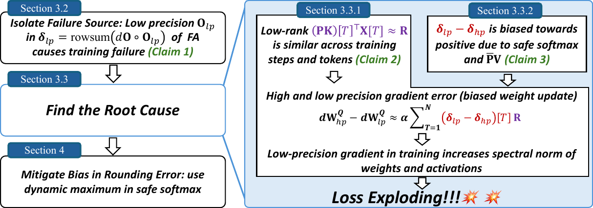
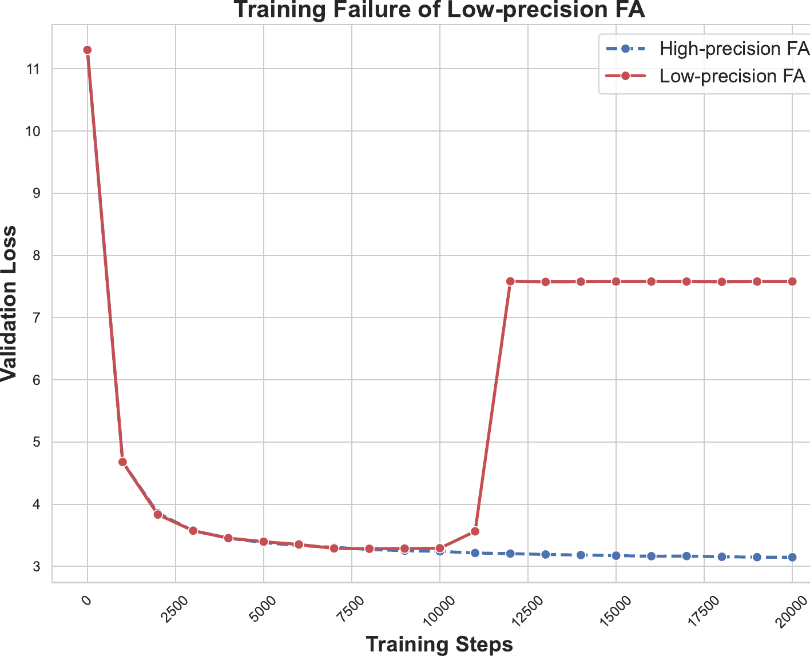
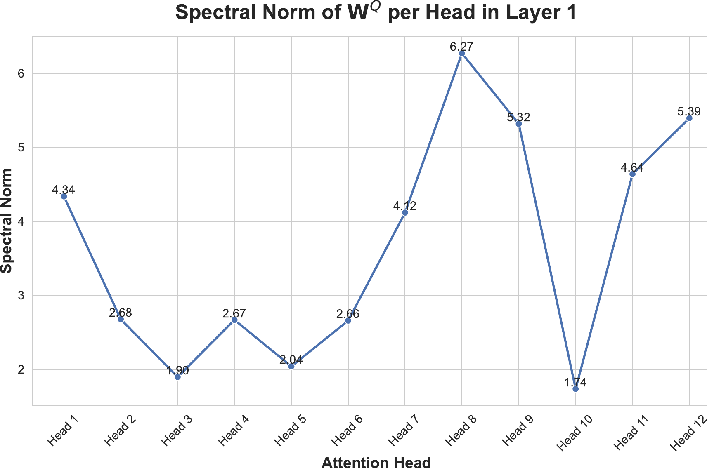
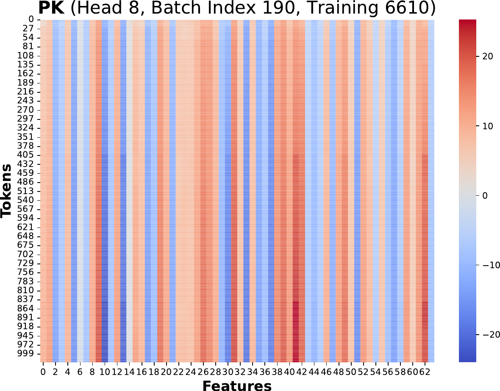
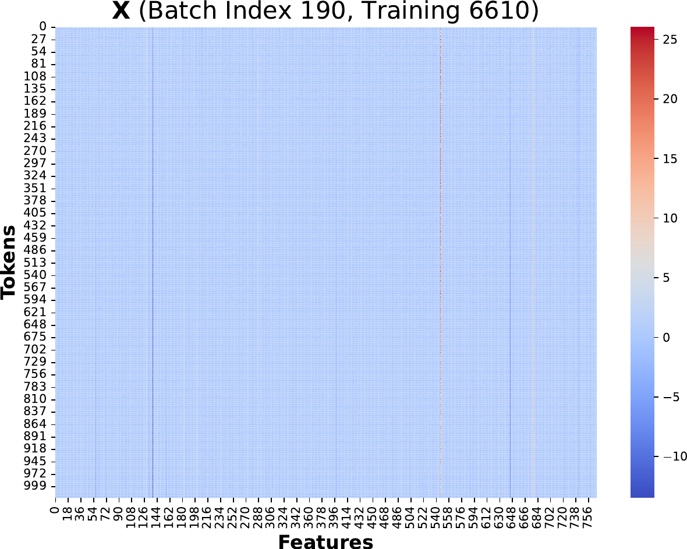
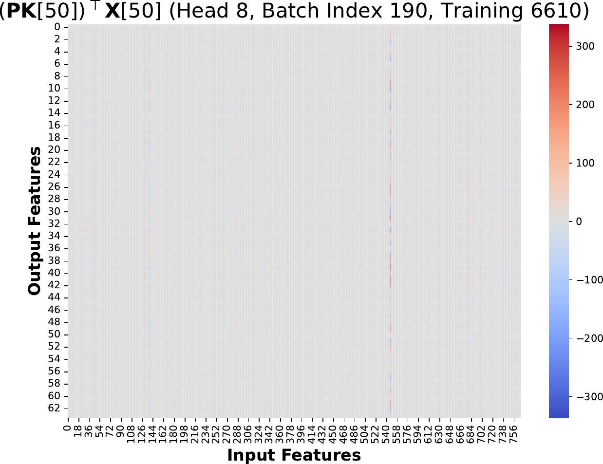
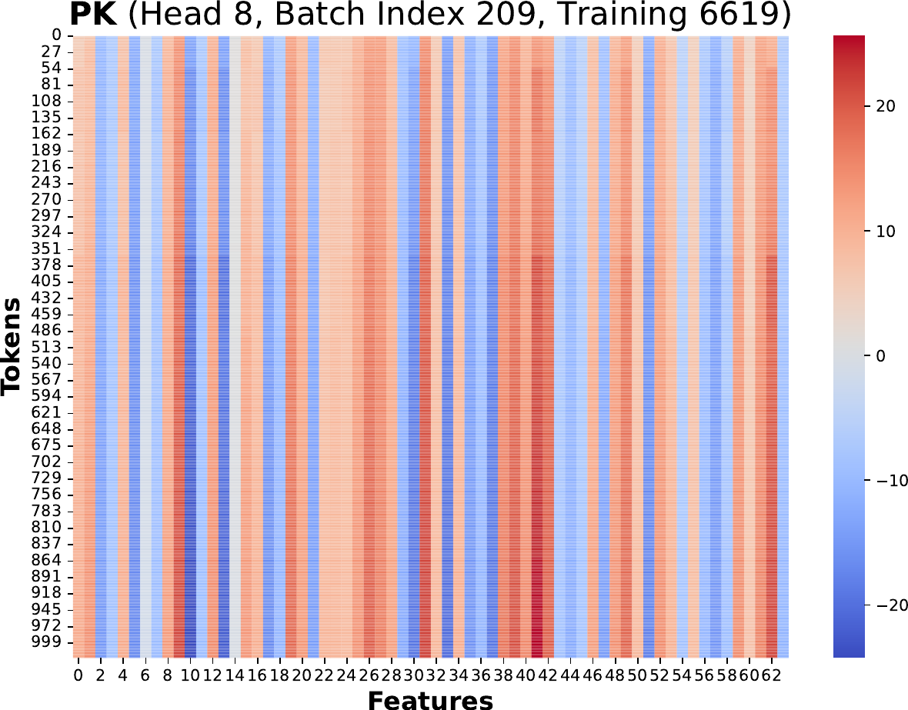
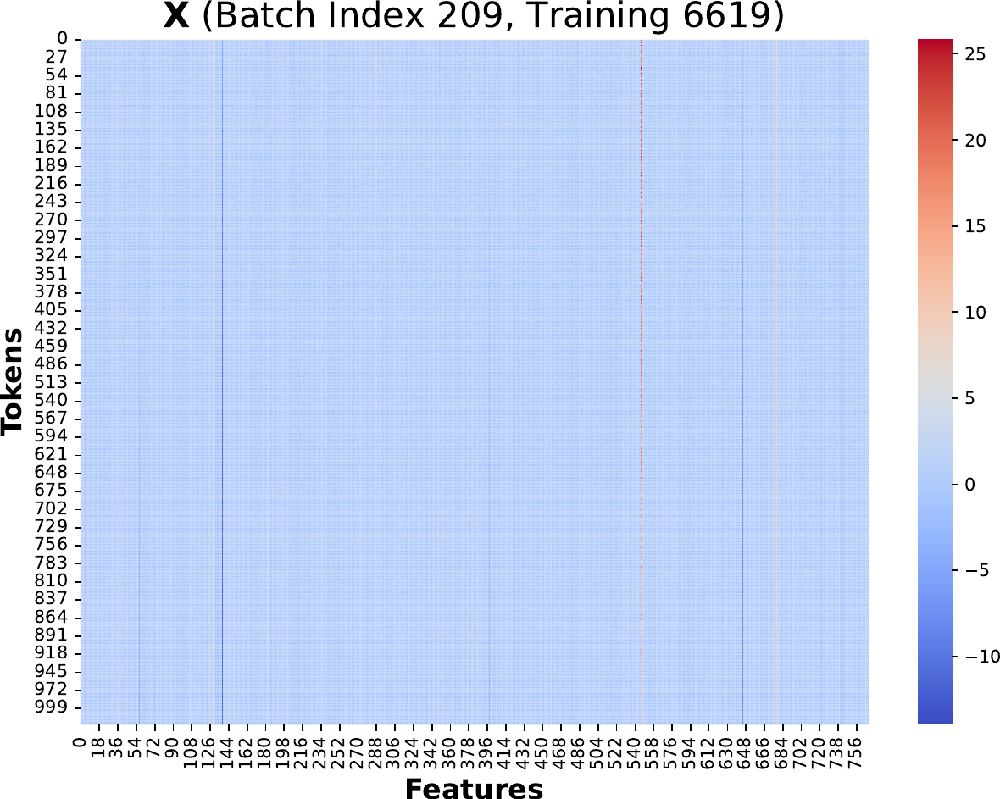
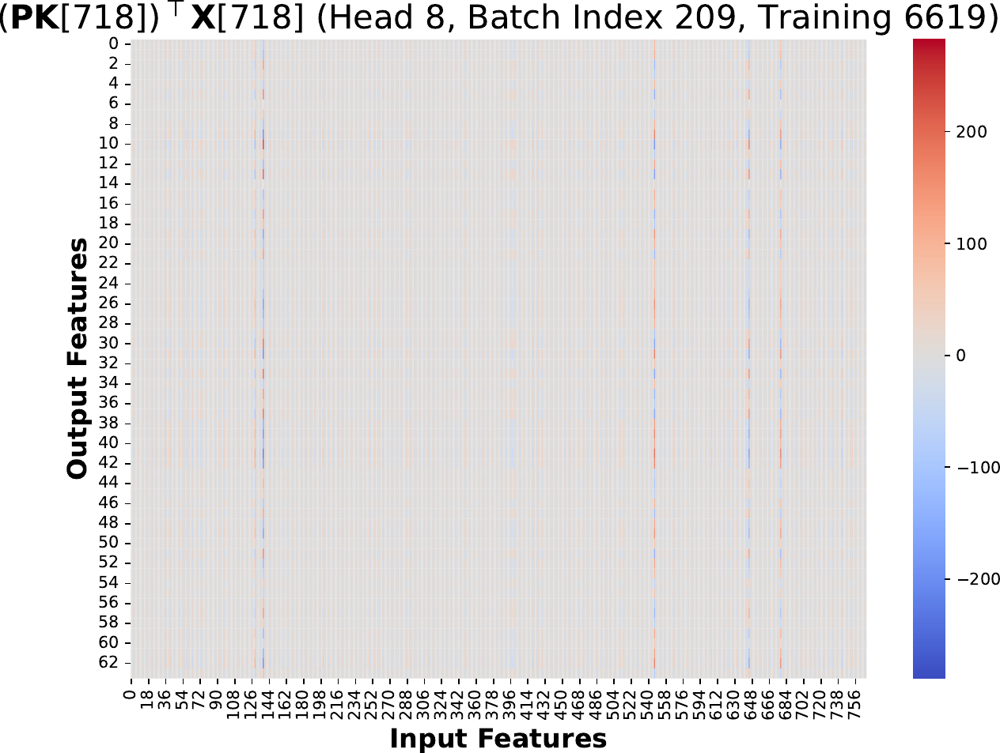
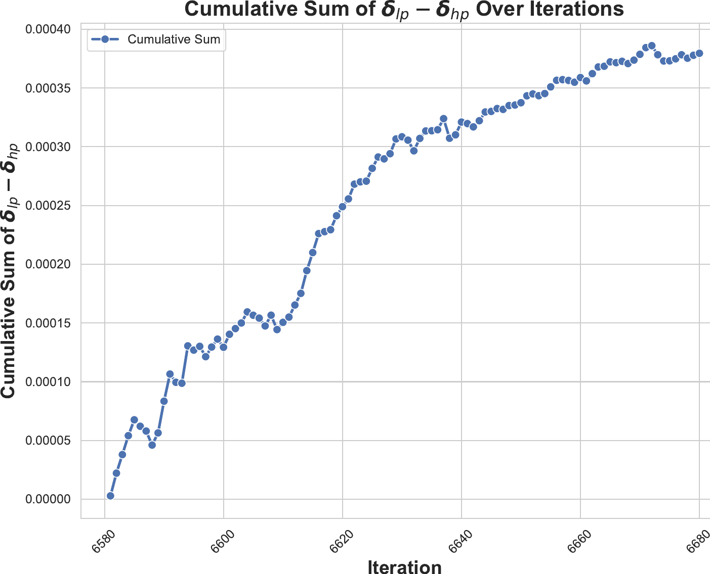

# Title: Why Low-Precision Transformer Training Fails: An Analysis on Flash Attention

- ArXiv: 2510.04212
- Authors: Haiquan Qiu Quanming Yao, Department of Electronic Engineering, Tsinghua University
- Sections: 42
- Estimated tokens: 21.5k

## Contents

- 1 Introduction
  - Notations
- 2 Preliminary
  - 2.1 Low-precision Training
  - 2.2 Flash Attention
- 3 Root Causes of Instability in Flash Attention
  - 3.1 The Failure Case of Low-Precision Flash Attention
  - 3.2 Isolating the Source of Failure within Flash Attention
    - Tiling is not the Source of Failure.
    - Failure Originates in a Single Layer.
    - Failure is Linked to the Computation of 𝜹 {\bm{\delta}} .
    - Numerical Errors in 𝐎 {\mathbf{O}} are the Source of Failure.
    - Failure is Localized to Specific Attention Heads.
      - Claim 1 .
  - 3.3 The Root Causes of Training Failure
    - 3.3.1 Cause 1. Similar Low-Rank Matrices Bias Weight Updates
      - Analysis of the Error between High and Low Precision Gradients
      - Similar Low-rank Updates of Weight Cause Training Failure
        - Claim 2 .
    - 3.3.2 Cause 2. Biased Rounding Error Leads to Positive ( 𝜹 l ​ p − 𝜹 h ​ p ) ​ [ T ] ({\bm{\delta}}_{lp}-{\bm{\delta}}_{hp})[T]
      - Locate the Large Error in ( 𝜹 l ​ p − 𝜹 h ​ p ) ​ [ T ] ({\bm{\delta}}_{lp}-{\bm{\delta}}_{hp})[T]
      - Analysis of Biased Rounding Error
        - Remark 1 .
      - Analysis of Rounding Error in Fig. 6
        - Claim 3 .
- 4 Experiment: Mitigate Bias in Rounding Error
- 5 Conclusion
  - Discussion
  - Limitations
- References
- Appendix A Related Work
  - A.1 Mixed-Precision BF16 Training.
  - A.2 Stabilizing Low-precision Training
    - Gradient Scaling.
    - Ultra-Low-Precision (FP8/INT8) Training.
    - Optimizer and Gradient Stabilization.
    - Activation and Architectural Techniques.
- Appendix B BF16 Addition
- Appendix C Design Considerations for Mitigating Biased Rounding Error in Flash Attention
  - Use Dynamic Maximum Value Rather Than Fixed Offset
  - Dynamic Maximum is Applied Conditionally
  - Explanation on Dealing Negative Repeated Row Maximum

## Abstract

###### Abstract

The pursuit of computational efficiency has driven the adoption of low-precision formats for training transformer models. However, this progress is often hindered by notorious training instabilities. This paper provides the first mechanistic explanation for a long-standing and unresolved failure case where training with flash attention in low-precision settings leads to catastrophic loss explosion. Our in-depth analysis reveals that the failure is not a random artifact but caused by two intertwined phenomena: the emergence of similar low-rank representations within the attention mechanism and the compounding effect of biased rounding errors inherent in low-precision arithmetic. We demonstrate how these factors create a vicious cycle of error accumulation that corrupts weight updates, ultimately derailing the training dynamics. To validate our findings, we introduce a minimal modification to the flash attention that mitigates the bias in rounding errors. This simple change stabilizes the training process, confirming our analysis and offering a practical solution to this persistent problem. Code is available at [https://github.com/ucker/why-low-precision-training-fails](https://github.com/ucker/why-low-precision-training-fails).

## 1 Introduction

The pursuit of training ever-larger and more powerful transformer models is a relentless drive for computational efficiency (Brown et al., 2020; Hoffmann et al., 2022). A key strategy in this endeavor is the adoption of low-precision numerical formats (Micikevicius et al., 2017; Wang et al., 2018; Kalamkar et al., 2019; Liu et al., 2024), which promise substantial reductions in memory footprint and significant boosts in training speed. In industrial practice, it is common to use BF16 for memory-bound operations like flash attention while pushing compute-bound operations like FFNs to even lower precisions such as FP8 (Liu et al., 2024; Qwen-Team, 2025). This highlights the heightened sensitivity of attention mechanisms to numerical precision. Despite the development of stabilization techniques like QK normalization (Henry et al., 2020; Qwen-Team, 2025), QK-clip (Kimi-Team, 2025) and Gated Attention (Qiu et al., 2025; Qwen-Team, 2025), the path to further reducing precision is often blocked by a lack of understanding of the underlying failure mechanisms.

This paper confronts this challenge by dissecting a notorious and long-standing failure issue involving flash attention. By reducing the memory complexity of the attention mechanism from quadratic to linear with respect to sequence length, flash attention has become a cornerstone algorithm for efficient transformer training, making it indispensable for handling the long contexts required by modern large-scale models (Dao et al., 2022; Dao, 2024; Shah et al., 2024). This failure, arising in low-precision settings (flash-attention Issue 337, 2024; nanoGPT Issue 303, 2023; nanoGPT Issue 524, 2024; nanoGPT Issue 554, 2024; Lee et al., 2024; Golden et al., 2024), presents a significant bottleneck. We focus on a specific, reproducible failure case reported by the community (nanoGPT Issue 303, 2023; nanoGPT Issue 524, 2024), which has remained unresolved for over two years. Our in-depth analysis provides the first mechanistic explanation for this failure, revealing that it is not a random artifact but a direct consequence of two intertwined phenomena: the emergence of similar low-rank representations across different training steps and tokens, and the compounding effect of biased rounding errors inherent in low-precision arithmetic. We demonstrate how these biased rounding errors act as coefficients for the low-rank representations, causing them to accumulate as a biased gradient update to the weights. This pushes the spectral norm of weights and activations to increase abnormally, ultimately overwhelming the training dynamics. To validate our analysis, we introduce a minimal modification to flash attention that mitigates the bias in rounding errors, allowing the low-rank weight updates to cancel out during training. This experiment confirms our analysis and stabilizes the training process, offering a practical solution to this persistent problem.

##### Notations

We use bold lowercase letters for vectors (e.g., ${\bm{\delta}},{\mathbf{m}},{\mathbf{r}}_{m}$) and bold uppercase letters for matrices (e.g., ${\mathbf{Q}},{\mathbf{K}},{\mathbf{V}}$). $\mathrm{diag}(\mathbf{v})$ denotes a diagonal matrix with the elements of vector ${\mathbf{v}}$ on its diagonal. $\circ$ denotes the element-wise product. We use Python-style indexing, e.g., ${\mathbf{M}}[i,:]$ denotes the $i$-th row of matrix ${\mathbf{M}}$. Subscripts $lp$ and $hp$ distinguish between low-precision (BF16) and high-precision (FP32) computations. Binary strings are represented using a typewriter font (e.g., $\mathtt{101010}$). The symbol $\equiv$ denotes an element-wise equality comparison, analogous to Python’s == operator, which returns a binary tensor. The $\mathrm{where}$ function mimics torch.where. Unless specified otherwise, operations follow PyTorch’s broadcasting rules. Key claims are highlighted in light cyan box at the end of some sections.

## 2 Preliminary

### 2.1 Low-precision Training

Low-precision training is a cornerstone of modern deep learning, enabling the development of increasingly large models by reducing memory usage and accelerating computation (Liu et al., 2024; Tseng et al., 2025; Hao et al., 2025). This is achieved by representing weights, activations, and gradients using numerical formats with fewer bits than the standard 32-bit single-precision (FP32). Mixed-precision training (Micikevicius et al., 2017) has been widely adopted in practice, which combines 16-bit formats like FP16 or bfloat16 (BF16) for most computations with an FP32 master copy of weights to maintain accuracy. While FP16 offers higher precision, its limited dynamic range often leads to gradient underflow, requiring techniques like loss scaling. In contrast, BF16, originally developed for Google’s TPUs and now widely supported, provides the same dynamic range as FP32, making it more robust against underflow and a preferred choice for training large language models (Kalamkar et al., 2019; Wang & Kanwar, 2019). However, the reduced precision of BF16 can still introduce numerical errors that lead to training failure, the focus of this paper.

The bfloat16 (BF16) format is a 16-bit floating-point representation with 1 sign, 8 exponent, and 7 significand bits. It matches the dynamic range of 32-bit single-precision (FP32) but has lower precision, making it a popular choice for balancing computation and numerical range in deep learning. Adding two BF16 numbers involves aligning their exponents, adding the significands, normalizing the sum, and rounding the result to fit the 7-bit fraction. This final rounding step, typically “round to nearest, ties to even”, is one of the primary sources of error. While this rounding method is designed to be unbiased for random data, a sequence of operations on data with a specific distribution could lead to a _biased rounding error_. This accumulation of error in one direction is a critical factor to the training failure observed in low-precision settings. See [Appendix B](#appendix-b) for details of BF16 addition.

### 2.2 Flash Attention

Flash Attention (FA) (Dao et al., 2022; Dao, 2024; Shah et al., 2024) is an I/O-aware exact attention algorithm designed to overcome the memory bottleneck of standard attention. Standard attention, defined as ${\mathbf{O}}=\mathrm{softmax}(\alpha{\mathbf{Q}}{\mathbf{K}}^{\top}){\mathbf{V}}$, requires materializing the $N\times N$ attention score matrix ${\mathbf{S}}=\alpha{\mathbf{Q}}{\mathbf{K}}^{\top}$, leading to a memory complexity of $\mathcal{O}(N^{2})$ with respect to the sequence length $N$. Flash attention reduces this to $\mathcal{O}(N)$ by partitioning the input matrices ${\mathbf{Q}},{\mathbf{K}},{\mathbf{V}}\in\mathbb{R}^{N\times d}$ into blocks and processing them iteratively. These blocks are loaded from high-bandwidth memory (HBM) into fast on-chip SRAM, minimizing costly memory transfers.

In this paper, we focus on analyzing flash attention 2. The forward pass of FA computes the output ${\mathbf{O}}$ and log-sum-exp statistics ${\mathbf{L}}$ using an online softmax method ([Algorithm 2](#algorithm-2)). It iterates through blocks of ${\mathbf{Q}}$ (outer loop) and blocks of ${\mathbf{K}},{\mathbf{V}}$ (inner loop). For each query block ${\mathbf{Q}}_{i}$, it maintains running statistics: the maximum score ${\mathbf{m}}_{i}$ and the normalization factor ${\bm{\ell}}_{i}$. In each inner loop step, it computes unnormalized attention scores $\bar{{\mathbf{P}}}_{i}^{(j)}=\exp({\mathbf{S}}_{i}^{(j)}-{\mathbf{m}}_{i}^{(j)})$ and updates an unnormalized output by accumulating the product $\bar{{\mathbf{P}}}_{i}^{(j)}{\mathbf{V}}_{j}$. This accumulation is a key focus of our analysis. After iterating through all key/value blocks, the final output block ${\mathbf{O}}_{i}$ is correctly normalized. This tiling strategy avoids materializing the full $N\times N$ score matrix.
The backward pass ([Algorithm 3](#algorithm-3)) leverages the same tiling strategy. _It first computes a key intermediate term, ${\bm{\delta}}=\mathrm{rowsum}(d{\mathbf{O}}\circ{\mathbf{O}})$, which is central to our investigation._ Then, it recomputes attention scores on-the-fly to calculate the gradient of the scores, $d{\mathbf{S}}_{i}^{(j)}={\mathbf{P}}_{i}^{(j)}\circ(d{\mathbf{P}}_{i}^{(j)}-{\bm{\delta}}_{i})$, where $d{\mathbf{P}}_{i}^{(j)}=d{\mathbf{O}}_{i}{\mathbf{V}}_{j}^{\top}$. The final gradients $d{\mathbf{Q}},d{\mathbf{K}},d{\mathbf{V}}$ are accumulated block-wise. This approach maintains I/O efficiency in both passes.

> Figure 1: Analysis in different sections. Our paper traces the causal chain of training failure (blue box) in reverse to identify the root causes.

## 3 Root Causes of Instability in Flash Attention

We first introduce the failure case in [Section 3.1](#section-3-1).
In [Section 3.2](#section-3-2), we narrow down the source of the numerical errors within the flash attention. Further analysis in [Section 3.3](#section-3-3) reveals that the failure stems from a combination of two factors: the emergence of low-rank representations and the accumulation of biased rounding errors inherent to BF16 arithmetic. The full process of such failure from root cause to loss exploding is shown in [Fig. 1](#figure-1).

### 3.1 The Failure Case of Low-Precision Flash Attention

> Figure 2: The failure case using BF16 and flash attention results in a sudden loss explosion, while the stable configuration converges.

Our investigation targets a well-documented and persistent failure: the catastrophic loss explosion that occurs when training Generative Pre-trained Transformer 2 (GPT-2) models with flash attention in BF16 precision (nanoGPT Issue 303, 2023; nanoGPT Issue 524, 2024; nanoGPT Issue 554, 2024). This failure case, reported for over two years, manifests as a sudden loss explosion after several thousand training steps (see [Fig. 8](https://arxiv.org/html/2510.04212v2#A3.F8)). While empirical workarounds like reverting to standard attention or using higher precision (FP32) stabilize training, they come at the cost of efficiency. This instability is not an isolated incident; the broader community has observed similar failures when training large language models (Kimi-Team, 2025; Qwen-Team, 2025). These failures are often empirically linked to phenomena such as large spectral norms of weights, large activations (Yang et al., 2023; Rybakov et al., 2024), and attention sinks (Xiao et al., 2023), leading to a suite of fixes including QK normalization (Henry et al., 2020; Qwen-Team, 2025), QK-clipping (Kimi-Team, 2025), and Gated Attention (Qiu et al., 2025; Qwen-Team, 2025). Despite these interventions, a fundamental understanding of the root causes has remained elusive. The absence of a clear causal chain from numerical error to loss explosion has left the community reliant on ad-hoc patches rather than principled solutions, hindering progress in robust low-precision training. This paper provides the first mechanistic explanation by reproducing the failure, dissecting its root causes, and proposing a practical, principled solution.

To reproduce the failure, we employ a GPT-2 architecture with 12 layers, 12 attention heads, an embedding dimension of 768, and a context length of 1024. The model is pre-trained on the OpenWebText dataset (Gokaslan et al., 2019).
For deterministic reproducibility, we deviate from a standard random data loader by recording and reusing the exact sequence of data batches from an initial run that led to the failure.
This ensures all subsequent experiments process identical data in the same order, isolating the failure from data-related randomness.

We train the model using the AdamW optimizer with $\beta_{1}=0.9$, $\beta_{2}=0.95$, and zero weight decay.
The learning rate follows a cosine schedule with a 2000-iteration linear warmup to a peak of $1\times 10^{-3}$, decaying to $1\times 10^{-5}$.
We apply global gradient clipping with a maximum norm of 1.0.
Training is conducted on 4 NVIDIA A100 (80GB) GPUs using PyTorch’s Distributed Data Parallel (DDP) module.
We use automatic mixed precision with BF16 for the forward pass and FP32 for the backward pass.
Each GPU processes a micro-batch size of 32, and with gradient accumulation over 4 steps,
the effective global batch size is 524,288 tokens per optimization step.

### 3.2 Isolating the Source of Failure within Flash Attention

To pinpoint the source of failure within flash attention, we conduct a series of targeted experiments. We systematically modify the algorithm—disabling tiling, selectively replacing flash attention with a standard implementation, and performing key computations in high precision—to narrow down the potential causes of instability. To accelerate this analysis, we monitor empirical indicators such as the spectral norm of weights to quickly identify failing configurations.

##### Tiling is not the Source of Failure.

To determine if the block-wise processing in flash attention was responsible for the failure, we conduct an experiment where we disabled tiling by setting the block size equal to the sequence length. This forces the algorithm to compute with the full matrices at once. The training process still failed, leading to the same loss explosion. This finding rules out the tiling strategy as the cause of the problem. For all subsequent experiments, we therefore use this non-tiled setup to simplify the analysis and focus on the core numerical computations.

##### Failure Originates in a Single Layer.

We first analyze the spectral norms of weights across all layers (Yang et al., 2023; Rybakov et al., 2024).
This reveals an anomalous spike specifically within the second layer’s attention (see [Fig. 9](https://arxiv.org/html/2510.04212v2#A3.F9)).
We confirm this finding with two targeted experiments:
(1) using flash attention only in layer 2 was sufficient to reproduce the training failure, and
(2) replacing flash attention with standard attention in layer 2, while retaining it in all other layers, restored training stability.
These results conclusively identify the flash attention in layer 2 as the origin of the failure. So, subsequent analysis focuses on this module to dissect the failure mechanism.

##### Failure is Linked to the Computation of 𝜹 {\bm{\delta}} .

The backward pass of flash attention uses the term ${\bm{\delta}}=\mathrm{rowsum}(d{\mathbf{O}}\circ{\mathbf{O}})\in\mathbb{R}^{N}$ for computational efficiency. An alternative, mathematically equivalent formulation computes this term as ${\bm{\delta}}=\mathrm{rowsum}(d{\mathbf{P}}\circ{\mathbf{P}})$, where $d{\mathbf{P}}=d{\mathbf{O}}{\mathbf{V}}^{\top}$. We find that replacing the efficient computation with this alternative formulation restored training stability. This experiment demonstrates that numerical errors introduced when computing ${\mathbf{O}}$ in BF16 is likely the primary source of failure, as the alternative formulation which avoids training failure is equivalent to use ${\mathbf{O}}$ computed in FP32.

> Figure 3: ${\mathbf{W}}^{Q}$ of attention head 8 has the largest spectral norm. Subsequent analysis focuses on this head.

##### Numerical Errors in 𝐎 {\mathbf{O}} are the Source of Failure.

Building on the finding that the computation of ${\bm{\delta}}$ is critical, we further isolate the source of error to the output matrix ${\mathbf{O}}_{lp}$ in low-precision ${\bm{\delta}}_{lp}=\mathrm{rowsum}(d{\mathbf{O}}\circ{\mathbf{O}}_{lp})$. We conduct two key experiments. First, instead of using the low-precision ${\mathbf{O}}$ from the forward pass to compute ${\bm{\delta}}$, we recomput it as ${\mathbf{P}}{\mathbf{V}}$ in FP32 within the backward pass; this change stabilize training. Second, we find that computing ${\mathbf{O}}$ in high precision (FP32) during the forward pass, i.e., ${\bm{\delta}}_{hp}=\mathrm{rowsum}(d{\mathbf{O}}\circ{\mathbf{O}}_{hp})$, while keeping all other operations in BF16, also restored stability. This evidence conclusively demonstrates that numerical errors introduced during the BF16 computation of ${\mathbf{O}}$ are the direct cause of the failure (refer to [1](https://arxiv.org/html/2510.04212v2#Thmclaim1)).

##### Failure is Localized to Specific Attention Heads.

To further narrow down the source of failure, we analyze individual attention heads by tracking the spectral norm (Yang et al., 2023; Rybakov et al., 2024) of their query projection matrices (${\mathbf{W}}^{Q}$), as shown in [Fig. 3](#figure-3). This reveals that a few heads exhibit disproportionately large spectral norms. We confirm their role by selectively computing the output ${\mathbf{O}}$ in high precision for these outlier heads (1, 7, 8, 9, 11, and 12), which is sufficient to restore training stability. _Since head 8 shows the largest spectral norm, we focus our subsequent analysis on this head to dissect the precise failure mechanism._

###### Claim 1 .

###### Claim 1 .

### 3.3 The Root Causes of Training Failure

Our investigation in this section uncovers the two interconnected root causes of the training failure. In [Section 3.3.1](https://arxiv.org/html/2510.04212v2#S3.SS3.SSS1), we demonstrate how low-precision ${\bm{\delta}}_{lp}$ drives the training failure by a biased weight update, and find that bias arises from the emergence of similar low-rank representations ${\mathbf{R}}$, whose coefficients $({\bm{\delta}}_{lp}-{\bm{\delta}}_{hp})[T]$ are biased towards positive values, causing the error to accumulate rather than cancel out. In [Section 3.3.2](https://arxiv.org/html/2510.04212v2#S3.SS3.SSS2), we trace the origin of these positive coefficients $({\bm{\delta}}_{lp}-{\bm{\delta}}_{hp})[T]$ to biased rounding errors inherent in the BF16 addition within the $\bar{{\mathbf{P}}}{\mathbf{V}}$ product.

#### 3.3.1 Cause 1. Similar Low-Rank Matrices Bias Weight Updates

This section traces the training failure to biased weight update. We first analyze the difference between the high and low precision gradients calculated with ${\bm{\delta}}_{hp}$ and ${\bm{\delta}}_{lp}$, respectively. Then we find that the low-rank representations and biased $({\bm{\delta}}_{lp}-{\bm{\delta}}_{hp})[T]$ lead to loss explosion.

##### Analysis of the Error between High and Low Precision Gradients

To understand how numerical errors propagate into the gradients, we analyze the difference between the high-precision ($hp$) and low-precision ($lp$) gradients for the query matrix, $d{\mathbf{Q}}$. The gradient $d{\mathbf{Q}}$ is computed from the gradient of the attention scores, $d{\mathbf{S}}$, as $d{\mathbf{Q}}=d{\mathbf{S}}{\mathbf{K}}$. The score gradient is given by $d{\mathbf{S}}=\alpha{\mathbf{P}}\circ(d{\mathbf{P}}-{\bm{\delta}})$, where ${\bm{\delta}}=\mathrm{rowsum}(d{\mathbf{O}}\circ{\mathbf{O}})$ is the only term that differs between the high- and low-precision backward passes based on [Section 3.2](#section-3-2), and $\alpha$ is a scaling factor in attention.

The difference between the high-precision and low-precision query gradients can be derived as:

$$
\begin{split}&d{\mathbf{Q}}_{hp}-d{\mathbf{Q}}_{lp}=(d{\mathbf{S}}_{hp}-d{\mathbf{S}}_{lp}){\mathbf{K}}\\ =&\left(\alpha{\mathbf{P}}\circ(d{\mathbf{P}}-{\bm{\delta}}_{hp})-\alpha{\mathbf{P}}\circ(d{\mathbf{P}}-{\bm{\delta}}_{lp})\right){\mathbf{K}}=\left(\alpha{\mathbf{P}}\circ({\bm{\delta}}_{lp}-{\bm{\delta}}_{hp})\right){\mathbf{K}}\\ =&\alpha\cdot\mathrm{diag}({\bm{\delta}}_{lp}-{\bm{\delta}}_{hp})({\mathbf{P}}{\mathbf{K}}).\end{split}(1)
$$

In the final step, we express the row-wise scaling operation ${\mathbf{P}}\circ({\bm{\delta}}_{lp}-{\bm{\delta}}_{hp})$ (follow broadcasting rule) as a matrix multiplication, where $\mathrm{diag}({\bm{\delta}}_{lp}-{\bm{\delta}}_{hp})$ is a diagonal matrix whose diagonal entries are the elements of the vector difference ${\bm{\delta}}_{lp}-{\bm{\delta}}_{hp}$. This formulation reveals that the gradient error is directly proportional to the error in ${\bm{\delta}}$ and is modulated by the term ${\mathbf{P}}{\mathbf{K}}$.

> Figure 4: ${\mathbf{P}}{\mathbf{K}}$, ${\mathbf{X}}$, and $({\mathbf{P}}{\mathbf{K}})[T]^{\top}{\mathbf{X}}[T]$ at different batch indices and training steps. (c) and (f) show that $({\mathbf{P}}{\mathbf{K}})[T]^{\top}{\mathbf{X}}[T]$ for different tokens and training steps have some similar columns in input features 546 and 678.

The gradient of the query projection matrix, $d{\mathbf{W}}^{Q}$, is given by the outer product of the input features ${\mathbf{X}}$ and the query gradient $d{\mathbf{Q}}$. The difference between the high-precision ($hp$) and low-precision ($lp$) gradients for ${\mathbf{W}}^{Q}$ can be expressed as:

$$
\displaystyle d{\mathbf{W}}^{Q}_{hp}-d{\mathbf{W}}^{Q}_{lp} $\displaystyle=(d{\mathbf{Q}}_{hp}-d{\mathbf{Q}}_{lp})^{\top}{\mathbf{X}}=\alpha({\mathbf{P}}{\mathbf{K}})^{\top}\mathrm{diag}({\bm{\delta}}_{lp}-{\bm{\delta}}_{hp}){\mathbf{X}},$ $\displaystyle=\alpha\sum\nolimits_{T=1}^{N}({\bm{\delta}}_{lp}-{\bm{\delta}}_{hp})[T]\cdot({\mathbf{P}}{\mathbf{K}})[T]^{\top}{\mathbf{X}}[T],$ (2)
$$

where $({\mathbf{P}}{\mathbf{K}})[T]$ and ${\mathbf{X}}[T]$ are the $T$-th row vectors of their matrices. This equation shows that the total gradient error is a weighted sum of rank-1 matrices, with weights given by the error in ${\bm{\delta}}$.

##### Similar Low-rank Updates of Weight Cause Training Failure

In [Fig. 4](#figure-4), the rows of ${\mathbf{P}}{\mathbf{K}}$ (panels a, d) and ${\mathbf{X}}$ (panels b, e) exhibit strong structural similarity across different training steps and token positions. This implies that the resulting rank-1 matrices, $({\mathbf{P}}{\mathbf{K}})[T]^{\top}{\mathbf{X}}[T]$, are also highly similar to one another. For instance, [Fig. 4](#figure-4) (panels c, f) shows this similarity for tokens 50 and 718 at training steps 6610 and 6619, respectively. Because these rank-1 error components are structurally consistent, we can approximate the total gradient difference as

$$
d{\mathbf{W}}^{Q}_{hp}-d{\mathbf{W}}^{Q}_{lp}\approx\alpha\sum\nolimits_{T=1}^{N}({\bm{\delta}}_{lp}-{\bm{\delta}}_{hp})[T]{\mathbf{R}}(3)
$$

where ${\mathbf{R}}$ denotes the common low-rank structure emerging across different tokens and training steps.

Eqn.([3](https://arxiv.org/html/2510.04212v2#S3.E3)) shows that the accumulation of the low-rank error direction ${\mathbf{R}}$ is governed by the scalar term $\sum_{T=1}^{N}({\bm{\delta}}_{lp}-{\bm{\delta}}_{hp})[T]$. If this sum is biased towards non-zero values, the error across different training steps will accumulate rather than cancel out. We track the cumulative sum of $\sum_{T=1}^{N}({\bm{\delta}}_{lp}-{\bm{\delta}}_{hp})[T]$ over a sequence of training steps (6580 to 6680) leading up to the failure, as shown in [Fig. 5](#figure-5)(a). The plot reveals that this sum is consistently positive, indicating a systematic bias. This bias causes the error in the low-rank direction ${\mathbf{R}}$ to compound with each training step. Because ${\mathbf{R}}$ is also similar for different steps, this ultimately corrupts the weight updates, increases the spectral norm ([Fig. 9](https://arxiv.org/html/2510.04212v2#A3.F9)) and activations (Yang et al., 2023; Rybakov et al., 2024), and causes the training failure (refer to [2](https://arxiv.org/html/2510.04212v2#Thmclaim2)). The following section finds the root cause of this positive bias by analyzing the weights and gradients at training step 6619, a point of significant positive contribution identified in [Fig. 5](#figure-5)(a).

###### Claim 2 .

> (a) Positively-biased $({\bm{\delta}}_{lp}\!-\!{\bm{\delta}}_{hp})[T]$

###### Claim 2 .

#### 3.3.2 Cause 2. Biased Rounding Error Leads to Positive ( 𝜹 l ​ p − 𝜹 h ​ p ) ​ [ T ] ({\bm{\delta}}_{lp}-{\bm{\delta}}_{hp})[T]

This section investigates the origin of the positive bias in $({\bm{\delta}}_{lp}-{\bm{\delta}}_{hp})[T]$. We trace this error to the interaction between $d{\mathbf{O}}$ and the numerical discrepancy in ${\mathbf{O}}_{lp}-{\mathbf{O}}_{hp}$, which itself arises from biased rounding errors in BF16 addition during the $\bar{{\mathbf{P}}}{\mathbf{V}}$ computation.

> (a) Most ${\mathbf{V}}[:,i]$ are negative

##### Locate the Large Error in ( 𝜹 l ​ p − 𝜹 h ​ p ) ​ [ T ] ({\bm{\delta}}_{lp}-{\bm{\delta}}_{hp})[T]

We first investigate the source of the positive bias in $\sum_{T=1}^{N}({\bm{\delta}}_{lp}-{\bm{\delta}}_{hp})[T]$. As analyzed in [Section 3.2](#section-3-2), the error in ${\bm{\delta}}$ stems from the product of the upstream gradient $d{\mathbf{O}}$ and the numerical error in the low-precision output, ${\mathbf{O}}_{lp}-{\mathbf{O}}_{hp}$. To dissect this, we focus on a token position $T=718$ where the error component $({\bm{\delta}}_{lp}-{\bm{\delta}}_{hp})[T]$ is positive.

In [Fig. 5](#figure-5)(b) and (c), we observe a strong sign correlation between the gradient $d{\mathbf{O}}[T,:]$ and the output error ${\mathbf{O}}_{lp}[T,:]-{\mathbf{O}}_{hp}[T,:]$ for specific feature dimensions such as 20 and 29 (also observed across other tokens). In these dimensions, both $d{\mathbf{O}}$ and the output error ${\mathbf{O}}_{lp}-{\mathbf{O}}_{hp}$ are consistently negative. This alignment ensures their product, which contributes to the error in ${\bm{\delta}}$, is positive. The fact that the output error tends to be negative (${\mathbf{O}}_{lp}[T,i]<{\mathbf{O}}_{hp}[T,i]$) indicates that the low-precision computation of ${\mathbf{O}}$ is systematically biased towards more negative values. Our subsequent analysis, therefore, focuses on identifying the origin of this computational bias.

The output ${\mathbf{O}}$ is computed from an intermediate unnormalized output, $\bar{{\mathbf{O}}}$. The computation involves a safe softmax followed by a matrix multiplication and normalization:

$$
\displaystyle\bar{{\mathbf{P}}} $\displaystyle=\exp({\mathbf{S}}-\mathrm{rowmax}({\mathbf{S}})),$ $\displaystyle\bar{{\mathbf{O}}}$ $\displaystyle=\bar{{\mathbf{P}}}{\mathbf{V}},$ $\displaystyle{\mathbf{O}}$ $\displaystyle=\bar{{\mathbf{O}}}/\mathrm{rowsum}(\bar{{\mathbf{P}}}).$
$$

Further experiments pinpoint the source of failure to the computation of the unnormalized output, $\bar{{\mathbf{O}}}=\bar{{\mathbf{P}}}{\mathbf{V}}$. We find that computing only this product in FP32 is sufficient to stabilize training. To understand the origin of this bias, we examine the difference between the low-precision and high-precision computation of a single element, $\bar{{\mathbf{O}}}[T,i]$ (for feature index $i=20$ in our analysis):

$$
\bar{{\mathbf{O}}}_{lp}[T,i]-\bar{{\mathbf{O}}}_{hp}[T,i]=(\bar{{\mathbf{P}}}_{lp}[T,:]{\mathbf{V}}[:,i])_{lp}-(\bar{{\mathbf{P}}}_{hp}[T,:]{\mathbf{V}}[:,i])_{hp}(4)
$$

where the inputs $\bar{{\mathbf{P}}}$ and ${\mathbf{V}}$ are themselves the results of prior BF16 operations. Specifically, the subscript $(\cdot)_{lp}$ here computes dot product in FP32 with the final result rounded to BF16, while $(\cdot)_{hp}$ computes entirely in FP32.

To understand how the error $\bar{{\mathbf{O}}}_{lp}[T,i]-\bar{{\mathbf{O}}}_{hp}[T,i]$ becomes systematically negative, we plot the cumulative error as the sum over token positions progresses in [Fig. 6](#figure-6)(b) and (c):

$$
\bar{{\mathbf{O}}}_{\text{error}}(t)=\left(\sum\nolimits_{t^{\prime}=1}^{t}\bar{{\mathbf{P}}}[T,t^{\prime}]{\mathbf{V}}[t^{\prime},i]\right)_{lp}-\left(\sum\nolimits_{t^{\prime}=1}^{t}\bar{{\mathbf{P}}}[T,t^{\prime}]{\mathbf{V}}[t^{\prime},i]\right)_{hp}.(5)
$$

The figure shows that the error accumulates in significant negative steps. These steps occur at token positions $t$ where the corresponding attention probability $\bar{{\mathbf{P}}}[T,t]$ is exactly 1 (also observed in other token positions). This happens when the pre-softmax score ${\mathbf{S}}[T,t]$ is the maximum value in its row, causing $\exp({\mathbf{S}}[T,t]-\max({\mathbf{S}}[T,:]))$ to evaluate to $\exp(0)=1$.

##### Analysis of Biased Rounding Error

Furthermore, the bias arises from the interaction of these unit values with the distribution of the value matrix ${\mathbf{V}}$. As observed in [Fig. 6](#figure-6)(a), for the problematic feature dimension $i=20$, the values of ${\mathbf{V}}[:,i]$ are predominantly negative. When $\bar{{\mathbf{P}}}[T,t]=1$, the product $\bar{{\mathbf{P}}}[T,t]{\mathbf{V}}[t,i]$ is simply ${\mathbf{V}}[t,i]$, a negative BF16 number.
_A systematic error then occurs when two such negative BF16 numbers are added._ In floating-point arithmetic, adding two numbers with the same sign can cause the resulting significand to overflow (e.g., $\mathtt{-1.xxxx}+\mathtt{-1.yyyy}=\mathtt{-10.zzzz}$), requiring a right shift and an exponent increment to re-normalize. The bits shifted out of the 7-bit BF16 fraction determine the rounding direction. When adding two negative numbers, the rounding operation (e.g., round-to-nearest) can introduce a consistent bias.

To illustrate how this rounding bias occurs, consider the addition of two significands that cause an overflow, requiring a right shift for normalization. The bit that is shifted out (the rounding bit) determines the rounding direction. We show all possible additions of the last two 2-bit numbers, where the green bit represents the bit that would be shifted out (the rounding bit):

Because the summation is performed in FP32, the accumulation of lower-order bits from the small numbers can activate the sticky bit. Consequently, this forces a rounding up when the subsequent BF16 number is added. Therefore, the rounding bit ${\color[rgb]{0,1,0}\definecolor[named]{pgfstrokecolor}{rgb}{0,1,0}\mathtt{1}}$ indicates that rounding up is required. Because the operands $\bar{{\mathbf{P}}}[T,t]{\mathbf{V}}[t,i]$ are negative and have a large exponent (because $\bar{{\mathbf{P}}}[T,t]=1$ does not make $\bar{{\mathbf{P}}}[T,t]{\mathbf{V}}[t,i]$ smaller), the error of rounding up is magnified, resulting a negative error. When the rounding bit is ${\color[rgb]{0,1,0}\definecolor[named]{pgfstrokecolor}{rgb}{0,1,0}\mathtt{0}}$, the result is rounded down, introducing a positive error.
Furthermore, the positive error is smaller compared to the negative error from rounding up, as the values being added are usually very small. This asymmetry leads to the rounding error dominated by the rounding up, resulting in negative rounding error as observed in our analysis. This systematic negative bias in the computation of $\bar{{\mathbf{O}}}$ is the ultimate source of the training failure.

###### Remark 1 .

For $\bar{{\mathbf{P}}}[T,t]<1$, its product with ${\mathbf{V}}[t,i]$ has non-zero least 16 bits. When rounding to BF16, this will not introduce biased rounding error.

###### Remark 1 .

##### Analysis of Rounding Error in Fig. 6

To make this concrete, we now analyze the specific BF16 number addition that causes the large negative error jump shown in [Fig. 6](#figure-6)(c). Because the summation is performed in FP32, the first BF16 value is added by some small values from other tokens before the second BF16 value is added. This can activate the sticky bit, which can force a round-up when adding the second BF16 value.
For this example, we start with the FP32 representations.
The first operand is the accumulated sum of previous terms, which includes a BF16 ($\mathtt{1}{{\color[rgb]{1,0,0}\definecolor[named]{pgfstrokecolor}{rgb}{1,0,0}\mathtt{10000000}}}{{\color[rgb]{0,0,1}\definecolor[named]{pgfstrokecolor}{rgb}{0,0,1}\mathtt{0011010}}}{\color[rgb]{.5,.5,.5}\definecolor[named]{pgfstrokecolor}{rgb}{.5,.5,.5}\pgfsys@color@gray@stroke{.5}\pgfsys@color@gray@fill{.5}\mathtt{0000000000000000}};-2.40625$) plus small residual ($\sim 0.00087$) that activate the sticky bit. The second operand is another BF16 value. Their FP32 representations are:

Since their exponents are identical, the addition is performed on their significands:

The result overflows the significand’s format, requiring normalization. The significand is shifted right by one bit, and the exponent is incremented:

The exact result in FP32 is $\mathtt{1}\,{\color[rgb]{1,0,0}\definecolor[named]{pgfstrokecolor}{rgb}{1,0,0}\mathtt{10000001}}\,{\color[rgb]{0,0,1}\definecolor[named]{pgfstrokecolor}{rgb}{0,0,1}\mathtt{0010110}}{\color[rgb]{0,1,0}\definecolor[named]{pgfstrokecolor}{rgb}{0,1,0}\mathtt{1}}{\color[rgb]{.5,.5,.5}\definecolor[named]{pgfstrokecolor}{rgb}{.5,.5,.5}\pgfsys@color@gray@stroke{.5}\pgfsys@color@gray@fill{.5}\mathtt{000011100010111}}$, which corresponds to $-4.703990459442139$. To store this result in BF16, it must be rounded to 7 fraction bits. The significand is $\mathtt{1.{\color[rgb]{0,0,1}\definecolor[named]{pgfstrokecolor}{rgb}{0,0,1}0010110}{\color[rgb]{0,1,0}\definecolor[named]{pgfstrokecolor}{rgb}{0,1,0}1}}$. The 7-bit fraction is ${\color[rgb]{0,0,1}\definecolor[named]{pgfstrokecolor}{rgb}{0,0,1}\mathtt{0010110}}$. Because the rounding bit is ${\color[rgb]{0,1,0}\definecolor[named]{pgfstrokecolor}{rgb}{0,1,0}\mathtt{1}}$ and there are nonzero bits after the rounding bit, the round-to-nearest (ties-to-even) rule rounds up (adding 1 to the last bit of the fraction):

The final BF16 result is $\mathtt{1}{\color[rgb]{1,0,0}\definecolor[named]{pgfstrokecolor}{rgb}{1,0,0}\mathtt{10000001}}{\color[rgb]{0,0,1}\definecolor[named]{pgfstrokecolor}{rgb}{0,0,1}\mathtt{0010111}}$, which represents $-4.71875$. This rounded value is more negative than the true sum of $-4.703990459442139$. The error introduced by this single addition is $\mathbf{-0.014759540557861328}$. When such rounding events occur systematically across many additions in the $\bar{{\mathbf{P}}}{\mathbf{V}}$ product, the errors accumulate, creating the negative bias in ${\mathbf{O}}$ that ultimately destabilizes training.

###### Claim 3 .

###### Claim 3 .

## 4 Experiment: Mitigate Bias in Rounding Error

Our analysis traces the failure to biased rounding errors in the $\bar{{\mathbf{P}}}{\mathbf{V}}$ computation. This occurs when multiple identical maxima in a row of the pre-softmax scores ${\mathbf{S}}$ cause corresponding elements in $\bar{{\mathbf{P}}}$ to become exactly 1. To validate our findings, we modify the softmax to detect this specific condition and adjust the normalization, ensuring all elements of $\bar{{\mathbf{P}}}$ are strictly less than 1. This prevents the biased rounding and restores training stability.

To prevent biased rounding, we introduce a targeted modification to the safe softmax computation. The core idea is to dynamically adjust the normalization factor ${\mathbf{m}}$ only when a row of the score matrix ${\mathbf{S}}$ contains multiple identical maximum values. This adjustment ensures that the argument to the exponential function, ${\mathbf{S}}-{\mathbf{m}}$, becomes strictly negative at these maximal positions, which in turn guarantees that all elements of $\bar{{\mathbf{P}}}=\exp({\mathbf{S}}-{\mathbf{m}})$ are less than 1. A naive approach, such as subtracting a small fixed constant, is insufficient as it introduces new systematic rounding errors (see [Appendix C](#appendix-c)); hence, a dynamic maximum strategy is required. Our modification is presented above.

> Figure 7: Comparison of the stabilized FA and the original FA.

This modification prevents elements of $\bar{{\mathbf{P}}}$ from becoming exactly 1. If a row’s maximum value, ${\mathbf{r}}_{m}$, is positive and repeated, the normalization factor is adjusted to ${\mathbf{m}}=\beta{\mathbf{r}}_{m}$ (with $\beta>1$). This makes the new maximum in the exponent $-(\beta-1){\mathbf{r}}_{m}$, which is strictly negative. If ${\mathbf{r}}_{m}$ is negative and repeated, we set ${\mathbf{m}}=0$, which also ensures the exponent’s maximum remains negative. In both scenarios, this adjustment guarantees that $\max({\mathbf{S}}-{\mathbf{m}})<0$ and thus $\max(\bar{{\mathbf{P}}})<1$, preventing the conditions that lead to biased rounding.

Crucially, this modification is mathematically equivalent to standard attention in exact arithmetic, as it leverages the shift-invariance property of the softmax function ($\mathrm{softmax}(\mathbf{z})=\mathrm{softmax}(\mathbf{z}-c)$). Our method simply chooses a different row-wise constant $c$ to ensure numerical stability. In our experiments, we set $\beta\in[2,8]$, as smaller values risk having the result round back to 1, while larger values risk underflow. This modification is integrated into the standard flash attention tiling algorithm (line with magenta in [Algorithm 1](#algorithm-1)) without altering the backward pass. As shown in [Fig. 7](#figure-7), this simple change ($\beta=7$) successfully stabilizes training, confirming our analysis. Further design details are provided in [Appendix C](#appendix-c).

## 5 Conclusion

This paper presents the first mechanistic explanation for a notorious loss explosion in low-precision flash attention training. We pinpoint the root cause to an interplay between emergent low-rank representations and biased BF16 rounding errors. A minimal, targeted modification to flash attention validates our analysis by restoring stability. Our analytical workflow provides a blueprint for diagnosing similar numerical instabilities in other architectures, scales, and low-precision formats, paving the way for more robust and efficient large-scale model training.

##### Discussion

Our findings are consistent across various hardware (NVIDIA A100, RTX 4090, Huawei Ascend 910B) and mechanistically explain empirical observations of training instability. The growth of weight spectral norms results from the accumulation of a low-rank error matrix in the gradients. We also clarify the role of attention sinks: by attracting high attention scores, they are more likely to produce attention probabilities of 1, which triggers the biased rounding error in the $\bar{{\mathbf{P}}}{\mathbf{V}}$ computation. This provides a direct numerical link between the architectural behavior of sinks and the arithmetic instability that derails training.

##### Limitations

Our analysis focuses on a specific failure case in a GPT-2 model. The generalizability of our findings to other architectures, larger scales, or different low-precision formats like FP8 requires further investigation. Additionally, our proposed mitigation is tailored to the specific rounding error identified and may not address other sources of numerical instability.

## References

- Ali et al. (2024)
  Sami Ben Ali, Silviu-Ioan Filip, and Olivier Sentieys.
  A stochastic rounding-enabled low-precision floating-point mac for
  dnn training.
  In _2024 Design, Automation & Test in Europe Conference &
  Exhibition (DATE)_, pp. 1–6. IEEE, 2024.
- Balança et al. (2024)
  Paul Balança, Sam Hosegood, Carlo Luschi, and Andrew Fitzgibbon.
  Scalify: scale propagation for efficient low-precision llm training.
  _arXiv preprint arXiv:2407.17353_, 2024.
- Blake et al. (2024)
  Charlie Blake, Constantin Eichenberg, Josef Dean, Lukas Balles, Luke Y Prince,
  Björn Deiseroth, Andres Felipe Cruz-Salinas, Carlo Luschi, Samuel
  Weinbach, and Douglas Orr.
  u-$\mu$p: The unit-scaled maximal update parametrization.
  _arXiv preprint arXiv:2407.17465_, 2024.
- Brown et al. (2020)
  Tom Brown, Benjamin Mann, Nick Ryder, Melanie Subbiah, Jared D Kaplan, Prafulla
  Dhariwal, Arvind Neelakantan, Pranav Shyam, Girish Sastry, Amanda Askell,
  et al.
  Language models are few-shot learners.
  _Advances in neural information processing systems_,
  33:1877–1901, 2020.
- Chowdhery et al. (2023)
  Aakanksha Chowdhery, Sharan Narang, Jacob Devlin, Maarten Bosma, Gaurav Mishra,
  Adam Roberts, Paul Barham, Hyung Won Chung, Charles Sutton, Sebastian
  Gehrmann, et al.
  Palm: Scaling language modeling with pathways.
  _Journal of Machine Learning Research_, 24(240):1–113, 2023.
- Dao (2024)
  Tri Dao.
  FlashAttention-2: Faster attention with better parallelism and work
  partitioning.
  In _International Conference on Learning Representations
  (ICLR)_, 2024.
- Dao et al. (2022)
  Tri Dao, Daniel Y. Fu, Stefano Ermon, Atri Rudra, and Christopher Ré.
  FlashAttention: Fast and memory-efficient exact attention with
  IO-awareness.
  In _Advances in Neural Information Processing Systems
  (NeurIPS)_, 2022.
- Fishman et al. (2024)
  Maxim Fishman, Brian Chmiel, Ron Banner, and Daniel Soudry.
  Scaling fp8 training to trillion-token llms.
  _arXiv preprint arXiv:2409.12517_, 2024.
- flash-attention Issue 337 (2024)
  flash-attention Issue 337.
  Discussion on flash-attention issue #337: pretraining loss blows up
  with triton flash attention.
  [https://github.com/Dao-AILab/flash-attention/issues/337](https://github.com/Dao-AILab/flash-attention/issues/337), 2024.
  Accessed: 2025-09-07.
- Gokaslan et al. (2019)
  Aaron Gokaslan, Vanya Cohen, Ellie Pavlick, and Stefanie Tellex.
  Openwebtext corpus.
  [http://Skylion007.github.io/OpenWebTextCorpus](http://Skylion007.github.io/OpenWebTextCorpus), 2019.
- Golden et al. (2024)
  Alicia Golden, Samuel Hsia, Fei Sun, Bilge Acun, Basil Hosmer, Yejin Lee,
  Zachary DeVito, Jeff Johnson, Gu-Yeon Wei, David Brooks, et al.
  Is flash attention stable?
  _arXiv preprint arXiv:2405.02803_, 2024.
- Hao et al. (2025)
  Zhiwei Hao, Jianyuan Guo, Li Shen, Yong Luo, Han Hu, Guoxia Wang, Dianhai Yu,
  Yonggang Wen, and Dacheng Tao.
  Low-precision training of large language models: Methods, challenges,
  and opportunities.
  _arXiv preprint arXiv:2505.01043_, 2025.
- He et al. (2022)
  Xin He, Jianhua Sun, Hao Chen, and Dong Li.
  Campo:$\{$Cost-Aware$\}$ performance optimization for
  $\{$Mixed-Precision$\}$ neural network training.
  In _2022 USENIX Annual Technical Conference (USENIX ATC 22)_,
  pp. 505–518, 2022.
- Henry et al. (2020)
  Alex Henry, Prudhvi Raj Dachapally, Shubham Pawar, and Yuxuan Chen.
  Query-key normalization for transformers.
  _arXiv preprint arXiv:2010.04245_, 2020.
- Hoffmann et al. (2022)
  Jordan Hoffmann, Sebastian Borgeaud, Arthur Mensch, Elena Buchatskaya, Trevor
  Cai, Eliza Rutherford, Diego de Las Casas, Lisa Anne Hendricks, Johannes
  Welbl, Aidan Clark, et al.
  Training compute-optimal large language models.
  _arXiv preprint arXiv:2203.15556_, 2022.
- Huang et al. (2025)
  Tianjin Huang, Ziquan Zhu, Gaojie Jin, Lu Liu, Zhangyang Wang, and Shiwei Liu.
  Spam: Spike-aware adam with momentum reset for stable llm training.
  _arXiv preprint arXiv:2501.06842_, 2025.
- Kalamkar et al. (2019)
  Dhiraj Kalamkar, Dheevatsa Mudigere, Naveen Mellempudi, Dipankar Das, Kunal
  Banerjee, Sasikanth Avancha, Dharma Teja Vooturi, Nataraj Jammalamadaka,
  Jianyu Huang, Hector Yuen, et al.
  A study of bfloat16 for deep learning training.
  _arXiv preprint arXiv:1905.12322_, 2019.
- Kimi-Team (2025)
  Kimi-Team.
  Kimi k2: Open agentic intelligence.
  _arXiv preprint arXiv:2507.20534_, 2025.
- Lee et al. (2024)
  Joonhyung Lee, Jeongin Bae, Byeongwook Kim, Se Jung Kwon, and Dongsoo Lee.
  To fp8 and back again: Quantifying the effects of reducing precision
  on llm training stability.
  _CoRR_, 2024.
- Liu et al. (2024)
  Aixin Liu, Bei Feng, Bing Xue, Bingxuan Wang, Bochao Wu, Chengda Lu, Chenggang
  Zhao, Chengqi Deng, Chenyu Zhang, Chong Ruan, et al.
  Deepseek-v3 technical report.
  _arXiv preprint arXiv:2412.19437_, 2024.
- Mellempudi et al. (2019)
  Naveen Mellempudi, Sudarshan Srinivasan, Dipankar Das, and Bharat Kaul.
  Mixed precision training with 8-bit floating point.
  _arXiv preprint arXiv:1905.12334_, 2019.
- Micikevicius et al. (2017)
  Paulius Micikevicius, Sharan Narang, Jonah Alben, Gregory Diamos, Erich Elsen,
  David Garcia, Boris Ginsburg, Michael Houston, Oleksii Kuchaiev, Ganesh
  Venkatesh, et al.
  Mixed precision training.
  _arXiv preprint arXiv:1710.03740_, 2017.
- Micikevicius et al. (2022)
  Paulius Micikevicius, Dusan Stosic, Neil Burgess, Marius Cornea, Pradeep Dubey,
  Richard Grisenthwaite, Sangwon Ha, Alexander Heinecke, Patrick Judd, John
  Kamalu, et al.
  Fp8 formats for deep learning.
  _arXiv preprint arXiv:2209.05433_, 2022.
- Molybog et al. (2023)
  Igor Molybog, Peter Albert, Moya Chen, Zachary DeVito, David Esiobu, Naman
  Goyal, Punit Singh Koura, Sharan Narang, Andrew Poulton, Ruan Silva, et al.
  A theory on adam instability in large-scale machine learning.
  _arXiv preprint arXiv:2304.09871_, 2023.
- nanoGPT Issue 303 (2023)
  nanoGPT Issue 303.
  Discussion on nanogpt issue #303: Gradient explosion when training
  with bfloat16.
  [https://github.com/karpathy/nanoGPT/issues/303](https://github.com/karpathy/nanoGPT/issues/303), 2023.
  Accessed: 2025-09-07.
- nanoGPT Issue 524 (2024)
  nanoGPT Issue 524.
  Discussion on nanogpt issue #524: Training loss becomes nan when
  using bfloat16.
  [https://github.com/karpathy/nanoGPT/issues/524](https://github.com/karpathy/nanoGPT/issues/524), 2024.
  Accessed: 2025-09-07.
- nanoGPT Issue 554 (2024)
  nanoGPT Issue 554.
  Discussion on nanogpt issue #554: Loss diverges when using bfloat16
  with flash attention.
  [https://github.com/karpathy/nanoGPT/issues/554](https://github.com/karpathy/nanoGPT/issues/554), 2024.
  Accessed: 2025-09-07.
- Noune et al. (2022)
  Badreddine Noune, Philip Jones, Daniel Justus, Dominic Masters, and Carlo
  Luschi.
  8-bit numerical formats for deep neural networks.
  _arXiv preprint arXiv:2206.02915_, 2022.
- Peng et al. (2023)
  Houwen Peng, Kan Wu, Yixuan Wei, Guoshuai Zhao, Yuxiang Yang, Ze Liu, Yifan
  Xiong, Ziyue Yang, Bolin Ni, Jingcheng Hu, et al.
  Fp8-lm: Training fp8 large language models.
  _arXiv preprint arXiv:2310.18313_, 2023.
- Perez et al. (2023)
  Sergio P Perez, Yan Zhang, James Briggs, Charlie Blake, Josh Levy-Kramer, Paul
  Balanca, Carlo Luschi, Stephen Barlow, and Andrew William Fitzgibbon.
  Training and inference of large language models using 8-bit floating
  point.
  _arXiv preprint arXiv:2309.17224_, 2023.
- Qiu et al. (2025)
  Zihan Qiu, Zekun Wang, Bo Zheng, Zeyu Huang, Kaiyue Wen, Songlin Yang, Rui Men,
  Le Yu, Fei Huang, Suozhi Huang, et al.
  Gated attention for large language models: Non-linearity, sparsity,
  and attention-sink-free.
  _arXiv preprint arXiv:2505.06708_, 2025.
- Qwen-Team (2025)
  Qwen-Team.
  Qwen3 technical report, 2025.
  URL [https://arxiv.org/abs/2505.09388](https://arxiv.org/abs/2505.09388).
- Radford et al. (2019)
  Alec Radford, Jeff Wu, Rewon Child, David Luan, Dario Amodei, and Ilya
  Sutskever.
  Language models are unsupervised multitask learners.

2019.

- Rae et al. (2021)
  Jack W Rae, Sebastian Borgeaud, Trevor Cai, Katie Millican, Jordan Hoffmann,
  Francis Song, John Aslanides, Sarah Henderson, Roman Ring, Susannah Young,
  et al.
  Scaling language models: Methods, analysis & insights from training
  gopher.
  _arXiv preprint arXiv:2112.11446_, 2021.
- Rajbhandari et al. (2020)
  Samyam Rajbhandari, Jeff Rasley, Olatunji Ruwase, and Yuxiong He.
  Zero: Memory optimizations toward training trillion parameter models.
  In _SC20: International Conference for High Performance
  Computing, Networking, Storage and Analysis_, pp. 1–16. IEEE, 2020.
- Rybakov et al. (2024)
  Oleg Rybakov, Mike Chrzanowski, Peter Dykas, Jinze Xue, and Ben Lanir.
  Methods of improving llm training stability.
  _arXiv preprint arXiv:2410.16682_, 2024.
- Shah et al. (2024)
  Jay Shah, Ganesh Bikshandi, Ying Zhang, Vijay Thakkar, Pradeep Ramani, and Tri
  Dao.
  Flashattention-3: Fast and accurate attention with asynchrony and
  low-precision.
  _Advances in Neural Information Processing Systems_,
  37:68658–68685, 2024.
- Touvron et al. (2023)
  Hugo Touvron, Thibaut Lavril, Gautier Izacard, Xavier Martinet, Marie-Anne
  Lachaux, Timothée Lacroix, Baptiste Rozière, Naman Goyal, Eric
  Hambro, Faisal Azhar, et al.
  Llama: Open and efficient foundation language models.
  _arXiv preprint arXiv:2302.13971_, 2023.
- Tseng et al. (2025)
  Albert Tseng, Tao Yu, and Youngsuk Park.
  Training llms with mxfp4.
  _arXiv preprint arXiv:2502.20586_, 2025.
- Wang et al. (2018)
  Naigang Wang, Jungwook Choi, Daniel Brand, Chia-Yu Chen, and Kailash
  Gopalakrishnan.
  Training deep neural networks with 8-bit floating point numbers.
  _Advances in neural information processing systems_, 31, 2018.
- Wang et al. (2025)
  Ruizhe Wang, Yeyun Gong, Xiao Liu, Guoshuai Zhao, Ziyue Yang, Baining Guo,
  Zhengjun Zha, and Peng Cheng.
  Optimizing large language model training using fp4 quantization.
  _arXiv preprint arXiv:2501.17116_, 2025.
- Wang & Kanwar (2019)
  Shibo Wang and Pankaj Kanwar.
  Bfloat16: The secret to high performance on cloud tpus.
  [https://cloud.google.com/blog/products/ai-machine-learning/bfloat16-the-secret-to-high-performance-on-cloud-tpus](https://cloud.google.com/blog/products/ai-machine-learning/bfloat16-the-secret-to-high-performance-on-cloud-tpus),
  August 2019.
  Accessed: 2025-09-07.
- Wortsman et al. (2023)
  Mitchell Wortsman, Tim Dettmers, Luke Zettlemoyer, Ari S. Morcos, Ali Farhadi,
  and Ludwig Schmidt.
  Stable and low-precision training for large-scale vision-language
  models.
  In _Thirty-seventh Conference on Neural Information Processing
  Systems_, 2023.
  URL [https://openreview.net/forum?id=sqqASmpA2R](https://openreview.net/forum?id=sqqASmpA2R).
- Xiao et al. (2023)
  Guangxuan Xiao, Yuandong Tian, Beidi Chen, Song Han, and Mike Lewis.
  Efficient streaming language models with attention sinks.
  _arXiv preprint arXiv:2309.17453_, 2023.
- Yang et al. (2022)
  Greg Yang, Edward J Hu, Igor Babuschkin, Szymon Sidor, Xiaodong Liu, David
  Farhi, Nick Ryder, Jakub Pachocki, Weizhu Chen, and Jianfeng Gao.
  Tensor programs v: Tuning large neural networks via zero-shot
  hyperparameter transfer.
  _arXiv preprint arXiv:2203.03466_, 2022.
- Yang et al. (2023)
  Greg Yang, James B Simon, and Jeremy Bernstein.
  A spectral condition for feature learning.
  _arXiv preprint arXiv:2310.17813_, 2023.
- Zhao et al. (2021)
  Ruizhe Zhao, Brian Vogel, Tanvir Ahmed, and Wayne Luk.
  Reducing underflow in mixed precision training by gradient scaling.
  In _Proceedings of the Twenty-Ninth International Conference on
  International Joint Conferences on Artificial Intelligence_, pp. 2922–2928, 2021.
- Zhou et al. (2025)
  Jiecheng Zhou, Ding Tang, Rong Fu, Boni Hu, Haoran Xu, Yi Wang, Zhilin Pei,
  Zhongling Su, Liang Liu, Xingcheng Zhang, et al.
  Towards efficient pre-training: Exploring fp4 precision in large
  language models.
  _arXiv preprint arXiv:2502.11458_, 2025.

## Appendix A Related Work

### A.1 Mixed-Precision BF16 Training.

Contemporary large language model (LLM) pretraining almost universally employs mixed-precision arithmetic. Early efforts by Micikevicius et al. (2017) demonstrated that FP16 training—using an FP32 master copy of weights and fixed loss scaling—could match FP32 accuracy for many models. However, the narrow exponent range of FP16 often causes many gradients to underflow, necessitating careful tuning. The bfloat16 (BF16) format, with an 8-bit exponent and 7-bit mantissa, retains the wide dynamic range of FP32 while halving storage cost. Kalamkar et al. (2019) showed that BF16 achieves convergence parity with FP32 on large models without specialized tuning. Since then, BF16 has become the default 16-bit format for many large-scale training frameworks, with native support in PyTorch and TensorFlow (Wang & Kanwar, 2019).

BF16 mixed precision has enabled training of landmark LLMs at unprecedented scales, including GPT-3 (175B) (Brown et al., 2020), Google PaLM (540B) (Chowdhery et al., 2023), DeepMind Gopher (280B) (Rae et al., 2021), Chinchilla (70B) (Hoffmann et al., 2022), and Meta’s LLaMA family (7B-65B) (Touvron et al., 2023). To handle the massive memory footprint, parallel training frameworks such as Megatron and DeepSpeed integrate BF16 training with techniques like the Zero Redundancy Optimizer (ZeRO) (Rajbhandari et al., 2020).

Despite its advantages, BF16 training can still exhibit instabilities. Empirical studies show that FP16 is highly unstable even with loss scaling, whereas BF16 eliminates most precision-related tuning and failures Wang & Kanwar (2019). However, Lee et al. (2024) report that roughly 10% of GPT-2 pretraining runs diverged under pure BF16, compared to 0% under TF32. This suggests that while BF16 substantially improves stability, complementary stabilization techniques remain necessary at scale.

### A.2 Stabilizing Low-precision Training

##### Gradient Scaling.

Early work by Micikevicius et al. (2017) introduced FP16 mixed-precision training, where weights, activations, and gradients are stored in half-precision while maintaining a master FP32 copy. They also proposed loss scaling to prevent FP16 underflows. Even with loss scaling, some underflow can still occur in deep networks. To address this, Zhao et al. (2021) introduced gradient scaling, which dynamically computes per-layer scaling factors to avoid both underflow and overflow.

##### Ultra-Low-Precision (FP8/INT8) Training.

To further reduce cost, recent works explore FP8 or INT8 precision for training and inference.
However, naive FP8 training tends to diverge. Lee et al. (2024) note that the direct application of FP8 to LLM training is unstable without additional stabilization techniques.
To address this, Perez et al. (2023) propose dynamically adjusted per-tensor scaling factors for FP8 matrix multiplications.
Using this scheme, they successfully train GPT- and LLaMA-style models up to 70B parameters entirely in FP8.
Similarly, Peng et al. (2023) introduce FP8-LM, a framework that progressively applies FP8 to gradients, optimizer states, and distributed communication, achieving a 39% memory reduction and 75% speedup compared to BF16.
Balança et al. (2024) present Scalify, which propagates scale factors throughout the computation graph to ensure stable FP8 operations without manual tuning.
These approaches collectively demonstrate that careful scaling management enables FP8 or INT8 training to match BF16 performance while reducing memory and compute requirements.

##### Optimizer and Gradient Stabilization.

Optimizer algorithms play a critical role in training stability.
Molybog et al. (2023) theoretically analyze Adam and show that catastrophic divergence often arises when the update direction becomes uncorrelated with the true descent direction in large-scale models.
To address gradient instability, Huang et al. (2025) propose SPAM (Spike-Aware Adam with Momentum Reset), which detects and mitigates rare but severe “gradient spikes” by resetting momentum and applying spike-aware clipping.
In parallel, Wortsman et al. (2023) investigate loss spikes in vision-language models and show that AdamW often underestimates the second moment before spikes occur.
They propose a hybrid AdamW-AdaFactor optimizer that adaptively corrects second-moment underestimation, outperforming gradient clipping alone.
These methods highlight how optimizer modifications directly mitigate divergence in low-precision regimes.

##### Activation and Architectural Techniques.

The choice of activation functions and initialization strategies also impacts stability.
Fishman et al. (2024) observe that the SwiGLU activation amplifies outliers during long FP8 training runs. They introduce Smooth-SwiGLU, a modified activation that prevents outlier amplification, enabling stable trillion-token FP8 training.
In the vision-language domain, Wortsman et al. (2023) show that “layer-scale zero” initialization and carefully designed low-precision linear layers (e.g., SwitchBack) further improve stability in int8 training.

## Appendix B BF16 Addition

The bfloat16 (Brain Floating-Point) format is a 16-bit floating-point representation widely used in deep learning for its balance between computational efficiency and numerical range. It consists of 1 sign bit, 8 exponent bits, and 7 fraction (or mantissa) bits. This structure gives bfloat16 the same dynamic range as the 32-bit single-precision format (FP32) but with significantly less precision.

The addition of two bfloat16 numbers, say $a$ and $b$, follows the standard procedure for floating-point arithmetic:

- 1.  Exponent Alignment: The exponents of the two numbers are compared. The number with the smaller exponent has its significand (the combination of the implicit leading bit and the fraction) shifted to the right until its exponent matches the larger one. Each right shift increases the exponent by one. Bits shifted past the available precision are lost, which is an initial source of error.
- 2.  Significand Addition: The aligned significands are added together. The sign of the result is determined by the signs and magnitudes of the operands.
- 3.  Normalization: The result is normalized to ensure it conforms to the $\mathtt{1.xxxx...}\times 2^{e}$ format. If the addition resulted in an overflow (e.g., $\mathtt{10.xxxx...}$), the significand is shifted right and the exponent is incremented. If it resulted in cancellation (e.g., $\mathtt{0.00xx...}$), the significand is shifted left and the exponent is decremented until the leading bit is $\mathtt{1}$.
- 4.  Rounding: The resulting significand, which may have more than 7 fraction bits after normalization, must be rounded. The standard mode is ”round to nearest, ties to even”. This means if the truncated part is greater than half the value of the last storable bit (LSB), the number is rounded up. If it is less, it is rounded down. If it is exactly half, it is rounded to the nearest value with an even LSB.

The key source of numerical error comes from steps 1 and 4. During exponent alignment, precision is lost from the smaller-magnitude number. After addition, the result must be rounded back to the 7-bit fraction, which introduces another rounding error. While “round to nearest, ties to even” is designed to be unbiased for random data, a sequence of additions on data with a specific distribution (e.g., mostly negative numbers being added together) can lead to a _biased rounding error_, where the accumulated error consistently pushes the result in one direction. This accumulation of biased error is a critical factor in the training failure observed in low-precision settings.

## Appendix C Design Considerations for Mitigating Biased Rounding Error in Flash Attention

##### Use Dynamic Maximum Value Rather Than Fixed Offset

A fixed offset would cause the computed values of $\bar{{\mathbf{P}}}$ to be consistently rounded in one direction during BF16 conversion, introducing a fixed error. Since the elements of ${\mathbf{V}}$ often share the same sign, this fixed rounding error in $\bar{{\mathbf{P}}}$ does not average out to zero when computing $\bar{{\mathbf{P}}}{\mathbf{V}}$. This leads to a biased error in the output ${\mathbf{O}}$, which in turn creates a biased term ${\bm{\delta}}$, reintroducing the very failure we aim to solve.

##### Dynamic Maximum is Applied Conditionally

Our modification is applied conditionally—only when a row contains multiple identical maximum values—to avoid introducing new numerical instabilities. An unconditional adjustment is not a better option. For example, if a row has a single, very large positive maximum value ${\mathbf{r}}_{m}$, applying our rule would mean calculating $\exp({\mathbf{S}}-\beta{\mathbf{r}}_{m})$. The largest term in the exponent would become $-(\beta-1){\mathbf{r}}_{m}$, and $\exp(-(\beta-1){\mathbf{r}}_{m})$ could underflow to zero. This would cause the normalization factor to become zero, leading to a division-by-zero error when computing the output ${\mathbf{O}}$. By applying the modification only in the specific case that causes biased rounding, we preserve the numerical stability of the standard online softmax in all other scenarios.

##### Explanation on Dealing Negative Repeated Row Maximum

We also explore alternative stabilization methods for the negative, repeated row maximum (${\mathbf{r}}_{m}<0$). One approach involves setting the normalization factor ${\mathbf{m}}=\gamma{\mathbf{r}}_{m}$ for some $\gamma\in(0,1)$. This makes the new maximum value in the exponent $(1-\gamma){\mathbf{r}}_{m}$. However, we observe that if $\gamma$ is close to 1, this new maximum approaches zero. In low-precision arithmetic, $\exp((1-\gamma){\mathbf{r}}_{m})$ can round to exactly 1, reintroducing the very failure we aim to prevent. Consequently, we found that setting $\gamma=0$ (i.e., ${\mathbf{m}}=0$) is a robust choice, as it ensures the maximum value in the exponent remains sufficiently negative.

**Algorithm 1 Stablized Flash Attention by Mitigating Biased Rounding Error: Forward Pass**

- 0: Matrices ${\mathbf{Q}},{\mathbf{K}},{\mathbf{V}}\in\mathbb{R}^{N\times d}$ , block sizes $B_{c}$ , $B_{r}$ , $\beta>1$ .
- 1: Divide ${\mathbf{Q}}$ into $T_{r}=\left\lceil\frac{N}{B_{r}}\right\rceil$ blocks ${\mathbf{Q}}_{1},\dots,{\mathbf{Q}}_{T_{r}}$ of size $B_{r}\times d$ each, and divide ${\mathbf{K}},{\mathbf{V}}$ in to $T_{c}=\left\lceil\frac{N}{B_{c}}\right\rceil$ blocks ${\mathbf{K}}_{1},\dots,{\mathbf{K}}_{T_{c}}$ and ${\mathbf{V}}_{1},\dots,{\mathbf{V}}_{T_{c}}$ , of size $B_{c}\times d$ each.
- 2: Divide the output ${\mathbf{O}}\in\mathbb{R}^{N\times d}$ into $T_{r}$ blocks ${\mathbf{O}}_{1},\dots,{\mathbf{O}}_{T_{r}}$ of size $B_{r}\times d$ each, and divide the logsumexp ${\mathbf{L}}$ into $T_{r}$ blocks ${\mathbf{L}}_{1},\dots,{\mathbf{L}}_{T_{r}}$ of size $B_{r}$ each.
- 3: for $1\leq i\leq T_{r}$ do
- 4: Initialize ${\mathbf{O}}_{i}^{(0)}=(0)_{B_{r}\times d}\in\mathbb{R}^{B_{r}\times d},{\bm{\ell}}_{i}^{(0)}=(0)_{B_{r}}\in\mathbb{R}^{B_{r}},{\mathbf{m}}_{i}^{(0)}=(-\infty)_{B_{r}}\in\mathbb{R}^{B_{r}}$ .
- 5: for $1\leq j\leq T_{c}$ do
- 6: Compute ${\mathbf{S}}_{i}^{(j)}={\mathbf{Q}}_{i}{\mathbf{K}}_{j}^{T}\in\mathbb{R}^{B_{r}\times B_{c}}$ .
- 7: ${\mathbf{r}}_{m}=\mathrm{rowmax}({\mathbf{S}}_{i}^{(j)})$ , ${\mathbf{r}}_{s}=\mathrm{rowsum}({\mathbf{S}}_{i}^{(j)}\equiv{\mathbf{r}}_{m})$
- 8: ${\mathbf{m}}_{i}^{(j)\prime}=\mathrm{where}({\mathbf{r}}_{m}>0\land{\mathbf{r}}_{s}>1,\beta{\mathbf{r}}_{m},{\mathbf{r}}_{m})$
- 9: ${\mathbf{m}}_{i}^{(j)}=\mathrm{where}({\mathbf{r}}_{m}<0\land{\mathbf{r}}_{s}>1,0,{\mathbf{m}}_{i}^{(j)\prime})$
- 10: Compute ${\mathbf{m}}_{i}^{(j)}=\mathrm{max}({\mathbf{m}}_{i}^{(j-1)},{\mathbf{r}}_{m})\in\mathbb{R}^{B_{r}}$ , $\bar{{\mathbf{P}}}_{i}^{(j)}=\exp({\mathbf{S}}_{i}^{(j)}-{\mathbf{m}}_{i}^{(j)})\in\mathbb{R}^{B_{r}\times B_{c}}$ (pointwise), ${\bm{\ell}}_{i}^{(j)}=e^{{\mathbf{m}}_{i}^{(j-1)}-{\mathbf{m}}_{i}^{(j)}}{\bm{\ell}}_{i}^{(j-1)}+\mathrm{rowsum}(\bar{{\mathbf{P}}}_{i}^{(j)})\in\mathbb{R}^{B_{r}}$ .
- 11: Compute ${\mathbf{O}}_{i}^{(j)}=\text{diag}(e^{{\mathbf{m}}_{i}^{(j-1)}-{\mathbf{m}}_{i}^{(j)}}){\mathbf{O}}_{i}^{(j-1)}+\bar{{\mathbf{P}}}_{i}^{(j)}{\mathbf{V}}_{j}$ .
- 12: end for
- 13: Compute ${\mathbf{O}}_{i}=\text{diag}({\bm{\ell}}_{i}^{(T_{c})})^{-1}{\mathbf{O}}_{i}^{(T_{c})}$ .
- 14: Compute ${\mathbf{L}}_{i}={\mathbf{m}}_{i}^{(T_{c})}+\log({\bm{\ell}}_{i}^{(T_{c})})$ .
- 15: Write ${\mathbf{O}}_{i}$ as the $i$ -th block of ${\mathbf{O}}$ .
- 16: Write ${\mathbf{L}}_{i}$ as the $i$ -th block of ${\mathbf{L}}$ .
- 17: end for
- 18: Return the output ${\mathbf{O}}$ and the logsumexp ${\mathbf{L}}$ .

**Algorithm 2 Flash Attention: Forward Pass**

- 0: Matrices ${\mathbf{Q}},{\mathbf{K}},{\mathbf{V}}\in\mathbb{R}^{N\times d}$ , block sizes $B_{c}$ , $B_{r}$ .
- 1: Divide ${\mathbf{Q}}$ into $T_{r}=\left\lceil\frac{N}{B_{r}}\right\rceil$ blocks ${\mathbf{Q}}_{1},\dots,{\mathbf{Q}}_{T_{r}}$ of size $B_{r}\times d$ each, and divide ${\mathbf{K}},{\mathbf{V}}$ in to $T_{c}=\left\lceil\frac{N}{B_{c}}\right\rceil$ blocks ${\mathbf{K}}_{1},\dots,{\mathbf{K}}_{T_{c}}$ and ${\mathbf{V}}_{1},\dots,{\mathbf{V}}_{T_{c}}$ , of size $B_{c}\times d$ each.
- 2: Divide the output ${\mathbf{O}}\in\mathbb{R}^{N\times d}$ into $T_{r}$ blocks ${\mathbf{O}}_{1},\dots,{\mathbf{O}}_{T_{r}}$ of size $B_{r}\times d$ each, and divide the logsumexp ${\mathbf{L}}$ into $T_{r}$ blocks ${\mathbf{L}}_{1},\dots,{\mathbf{L}}_{T_{r}}$ of size $B_{r}$ each.
- 3: for $1\leq i\leq T_{r}$ do
- 4: Initialize ${\mathbf{O}}_{i}^{(0)}=(0)_{B_{r}\times d}\in\mathbb{R}^{B_{r}\times d},{\bm{\ell}}_{i}^{(0)}=(0)_{B_{r}}\in\mathbb{R}^{B_{r}},{\mathbf{m}}_{i}^{(0)}=(-\infty)_{B_{r}}\in\mathbb{R}^{B_{r}}$ .
- 5: for $1\leq j\leq T_{c}$ do
- 6: Compute ${\mathbf{S}}_{i}^{(j)}={\mathbf{Q}}_{i}{\mathbf{K}}_{j}^{T}\in\mathbb{R}^{B_{r}\times B_{c}}$ .
- 7: Compute ${\mathbf{m}}_{i}^{(j)}=\mathrm{max}({\mathbf{m}}_{i}^{(j-1)},\mathrm{rowmax}({\mathbf{S}}_{i}^{(j)}))\in\mathbb{R}^{B_{r}}$ , $\bar{{\mathbf{P}}}_{i}^{(j)}=\exp({\mathbf{S}}_{i}^{(j)}-{\mathbf{m}}_{i}^{(j)})\in\mathbb{R}^{B_{r}\times B_{c}}$ (pointwise), ${\bm{\ell}}_{i}^{(j)}=e^{{\mathbf{m}}_{i}^{(j-1)}-{\mathbf{m}}_{i}^{(j)}}{\bm{\ell}}_{i}^{(j-1)}+\mathrm{rowsum}(\bar{{\mathbf{P}}}_{i}^{(j)})\in\mathbb{R}^{B_{r}}$ .
- 8: Compute ${\mathbf{O}}_{i}^{(j)}=\text{diag}(e^{{\mathbf{m}}_{i}^{(j-1)}-{\mathbf{m}}_{i}^{(j)}}){\mathbf{O}}_{i}^{(j-1)}+\bar{{\mathbf{P}}}_{i}^{(j)}{\mathbf{V}}_{j}$ .
- 9: end for
- 10: Compute ${\mathbf{O}}_{i}=\text{diag}({\bm{\ell}}_{i}^{(T_{c})})^{-1}{\mathbf{O}}_{i}^{(T_{c})}$ .
- 11: Compute ${\mathbf{L}}_{i}={\mathbf{m}}_{i}^{(T_{c})}+\log({\bm{\ell}}_{i}^{(T_{c})})$ .
- 12: Write ${\mathbf{O}}_{i}$ as the $i$ -th block of ${\mathbf{O}}$ .
- 13: Write ${\mathbf{L}}_{i}$ as the $i$ -th block of ${\mathbf{L}}$ .
- 14: end for
- 15: Return the output ${\mathbf{O}}$ and the logsumexp $L$ .

**Algorithm 3 Flash Attention: Backward Pass**

- 0: Matrices ${\mathbf{Q}},{\mathbf{K}},{\mathbf{V}},{\mathbf{O}},d{\mathbf{O}}\in\mathbb{R}^{N\times d}$ , vector $L\in\mathbb{R}^{N}$ , block sizes $B_{c}$ , $B_{r}$ .
- 1: Divide ${\mathbf{Q}}$ into $T_{r}=\left\lceil\frac{N}{B_{r}}\right\rceil$ blocks ${\mathbf{Q}}_{1},\dots,{\mathbf{Q}}_{T_{r}}$ of size $B_{r}\times d$ each, and divide ${\mathbf{K}},{\mathbf{V}}$ in to $T_{c}=\left\lceil\frac{N}{B_{c}}\right\rceil$ blocks ${\mathbf{K}}_{1},\dots,{\mathbf{K}}_{T_{c}}$ and ${\mathbf{V}}_{1},\dots,{\mathbf{V}}_{T_{c}}$ , of size $B_{c}\times d$ each.
- 2: Divide ${\mathbf{O}}$ into $T_{r}$ blocks ${\mathbf{O}}_{1},\dots,{\mathbf{O}}_{T_{r}}$ of size $B_{r}\times d$ each, divide $d{\mathbf{O}}$ into $T_{r}$ blocks $d{\mathbf{O}}_{1},\dots,d{\mathbf{O}}_{T_{r}}$ of size $B_{r}\times d$ each, and divide ${\mathbf{L}}$ into $T_{r}$ blocks ${\mathbf{L}}_{1},\dots,{\mathbf{L}}_{T_{r}}$ of size $B_{r}$ each.
- 3: Initialize $d{\mathbf{Q}}=(0)_{N\times d}$ and divide it into $T_{r}$ blocks $d{\mathbf{Q}}_{1},\dots,d{\mathbf{Q}}_{T_{r}}$ of size $B_{r}\times d$ each. Divide $d{\mathbf{K}},d{\mathbf{V}}\in\mathbb{R}^{N\times d}$ in to $T_{c}$ blocks $d{\mathbf{K}}_{1},\dots,d{\mathbf{K}}_{T_{c}}$ and $d{\mathbf{V}}_{1},\dots,d{\mathbf{V}}_{T_{c}}$ , of size $B_{c}\times d$ each.
- 4: Compute ${\bm{\delta}}=\mathrm{rowsum}(d{\mathbf{O}}\circ{\mathbf{O}})\in\mathbb{R}^{N}$ (pointwise multiply), and divide it into $T_{r}$ blocks ${\bm{\delta}}_{1},\dots,{\bm{\delta}}_{T_{r}}$ of size $B_{r}$ each.
- 5: for $1\leq j\leq T_{c}$ do
- 6: Initialize $d{\mathbf{K}}_{j}=(0)_{B_{c}\times d},d{\mathbf{V}}_{j}=(0)_{B_{c}\times d}$ .
- 7: for $1\leq i\leq T_{r}$ do
- 8: Compute ${\mathbf{S}}_{i}^{(j)}={\mathbf{Q}}_{i}{\mathbf{K}}_{j}^{T}\in\mathbb{R}^{B_{r}\times B_{c}}$ .
- 9: Compute ${\mathbf{P}}_{i}^{(j)}=\exp({\mathbf{S}}_{ij}-{\mathbf{L}}_{i})\in\mathbb{R}^{B_{r}\times B_{c}}$ .
- 10: Compute $d{\mathbf{V}}_{j}\leftarrow d{\mathbf{V}}_{j}+({\mathbf{P}}_{i}^{(j)})^{\top}d{\mathbf{O}}_{i}\in\mathbb{R}^{B_{c}\times d}$ .
- 11: Compute $d{\mathbf{P}}_{i}^{(j)}=d{\mathbf{O}}_{i}{\mathbf{V}}_{j}^{\top}\in\mathbb{R}^{B_{r}\times B_{c}}$ .
- 12: Compute $d{\mathbf{S}}_{i}^{(j)}={\mathbf{P}}_{i}^{(j)}\circ(d{\mathbf{P}}_{i}^{(j)}-{\bm{\delta}}_{i})\in\mathbb{R}^{B_{r}\times B_{c}}$ .
- 13: Update $d{\mathbf{Q}}_{i}\leftarrow d{\mathbf{Q}}_{i}+d{\mathbf{S}}_{i}^{(j)}{\mathbf{K}}_{j}\in\mathbb{R}^{B_{r}\times d}$ .
- 14: Compute $d{\mathbf{K}}_{j}\leftarrow d{\mathbf{K}}_{j}+{d{\mathbf{S}}_{i}^{(j)}}^{\top}d{\mathbf{Q}}_{i}\in\mathbb{R}^{B_{c}\times d}$ .
- 15: end for
- 16: end for
- 17: Return $d{\mathbf{Q}},d{\mathbf{K}},d{\mathbf{V}}$ .

> (a) Loss in nanoGPT Issue #303

> Figure 9: Spectral norm across layers and training steps.

> Figure 10: Token difference visualization
