# **标题：DualPath：打破智能体化大型语言模型推理中的存储带宽瓶颈（DualPath: Breaking the Storage Bandwidth Bottleneck in Agentic LLM Inference）**

- **ArXiv：** 2602.21548
- **作者：** Yongtong Wu, Shaoyuan Chen, Yinmin Zhong, Rilin Huang, Yixuan Tan, Wentao Zhang, Liyue Zhang, Shangyan Zhou, Yuxuan Liu, Shunfeng Zhou, Mingxing Zhang, Xin Jin, Panpan Huang, 北京大学计算机学院，清华大学，深度求索人工智能（DeepSeek-AI）
- **章节：** 35
- **预估词元数：** 21.1k

## **目录**

- 1. 引言（Introduction）
- 2. 背景（Background）
  - 2.1. 大型语言模型推理基础（LLM Inference Preliminary）
  - 2.2. 大型语言模型的智能体化应用（Agentic Use of LLMs）
  - 2.3. 现代人工智能数据中心架构（Modern AI Data Center Architecture）
- 3. 瓶颈与动机（Bottleneck & Motivation）
- 4. DualPath 系统概述（DualPath System Overview）
  - 4.1. 双路径加载（Dual-Path Loading）
  - 4.2. 无瓶颈分析（Bottleneck-Free Analysis）
  - 4.3. 实际挑战（Practical Challenges）
- 5. 以 CNIC 为中心的流量管理器（CNIC-Centric Traffic Manager）
  - 5.1. 流量隔离（Traffic Isolation）
  - 5.2. CNIC 辅助的键值缓存复制（CNIC-Assisted KV-Cache Copy）
- 6. 自适应请求调度器（Adaptive Request Scheduler）
  - 6.1. 引擎间调度（Inter-Engine Scheduling）
  - 6.2. 引擎内调度（Intra-Engine Scheduling）
- 7. 评估（Evaluation）
  - 7.1. 实现（Implementation）
  - 7.2. 实验设置（Experimental Setup）
  - 7.3. 离线批量推理（Offline Batch Inference）
  - 7.4. 在线服务（Online Serving）
  - 7.5. 消融研究（Ablation Study）
  - 7.6. 大规模可扩展性（Large-Scale Scalability）
- 8. 讨论（Discussion）
  - 8.1. 潜在的未来工作（Potential Future Work）
  - 8.2. 工作集分析（Working Set Analysis）
- 9. 相关工作（Related Work）
- 10. 结论（Conclusion）
- 参考文献（References）
- 附录 A 附录（Appendix A Appendix）
  - A.1. 流量隔离配置详情（Traffic Isolation Configuration Details）
  - A.2. 27B 模型规格（27B Model Specifications）
  - A.3. 智能体任务结构（Agent Task Structure）
  - A.4. 实验配置（Experimental Configurations）
  - A.5. 键值缓存块布局（KV-Cache Block Layout）

## Abstract

**摘要（Abstract）** 。多轮、智能体式大型语言模型（Large Language Model, LLM）推理的性能越来越受制于键值缓存（Key-Value Cache, KV-Cache）的存储输入/输出（Input/Output, I/O），而非计算本身。在普遍采用的 **解耦架构（Disaggregated Architecture）** 中，从外部存储加载海量的 KV-Cache 造成了一个根本性的不平衡：预填充引擎（Prefill Engine）上的存储网络接口卡（Network Interface Card, NIC）带宽达到饱和，而解码引擎（Decoding Engine）上的存储 NIC 却处于闲置状态。这种不对称性严重制约了整体系统吞吐量。我们提出了 **DualPath** ，一个通过引入双路径 KV-Cache 加载来打破此瓶颈的推理系统。除了传统的存储到预填充路径外，DualPath 还启用了一条新颖的存储到解码路径，其中 KV-Cache 被加载到解码引擎中，然后通过计算网络上的 **远程直接内存访问（Remote Direct Memory Access, RDMA）** 高效传输到预填充引擎。DualPath 将这条优化的数据路径——它本身避免了网络拥塞，并避免了对延迟敏感的模型执行通信的干扰——与一个全局调度器相结合，该调度器动态地平衡预填充和解码引擎之间的负载。我们在三种模型上使用真实的智能体工作负载进行的评估表明，DualPath 在我们的内部推理系统上，将离线推理吞吐量提升了最高达 **1.87 ×** 。它还能在不违反服务等级目标（Service Level Objective, SLO）的前提下，将在线服务吞吐量平均提升 **1.96 ×** 。

## 1. 引言（Introduction）

**大型语言模型（Large Language Models, LLMs）** 正迅速从单轮对话机器人（OpenAI, 2025b; DeepSeek-AI, 2025d）和独立的推理器（OpenAI, 2025b）演变为能够通过 **多轮交互（multi-turn interactions）** 自主规划、调用工具并解决现实世界任务的 **智能体系统（agentic systems）** （Chowa et al., 2026; Wang et al., 2024; Xi et al., 2025; Jiang et al., 2024; Mohammadi et al., 2025）。在这种场景下，LLM 不再服务于孤立的提示；相反，它参与到长时间运行的会话中，上下文会随时间累积（Lin et al., 2025）。随着智能体应用日益普及， **多轮 LLM 推理（multi-turn LLM inference）** 已成为生产系统中的关键工作负载，范围涵盖编码助手（Yang et al., 2024; Wu et al., 2023）到自主任务代理（Zhou et al., 2023; Li et al., 2024）。

应用领域的这种范式转变，驱动了 LLM 推理工作负载的重大变革：从传统的人-LLM 交互转向人-LLM-环境交互，即所谓的 **智能体范式（agentic paradigm）** 。典型的人-模型交互模式是用户提供输入，与 LLM 进行几轮交互，然后消费 LLM 生成的结果。相比之下，一个智能体 LLM 可能通过诸如网页浏览器和 Python 解释器等工具，与外部环境进行数十甚至数百轮的交互。尽管每次单独的工具调用或反馈都很短（通常为数百个词元），但上下文会在多轮中累积，并可能增长到极长的长度。因此，智能体工作负载变得高度 **I/O 受限（I/O-bound）** ：多轮、短追加的模式导致极高的 KV 缓存命中率——通常 $\geq 95\%$（Chen et al., 2026）——使得 KV 缓存加载的效率，而非纯粹的计算，成为主导性能的因素。

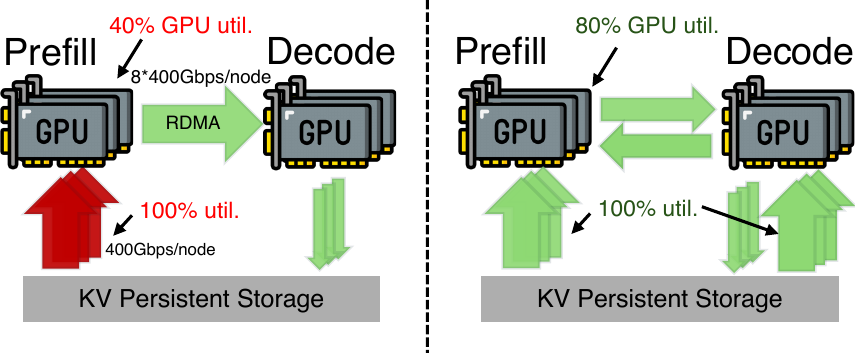

> 图 1 | 现有瓶颈（左）与 DualPath（右）。

为了提升智能体工作负载下的吞吐量，现有的 LLM 推理系统已趋同于一套共同的架构模式： **逐层预填充（layer-wise prefill）** （Xiong et al., 2024; Du et al., 2025）、 **预填充-解码解耦（prefill–decode (PD) disaggregation）** （Zhong et al., 2024; Patel et al., 2025; Zhao et al., 2025a）以及 **外部 KV 缓存存储（external KV-Cache storage）** （Gao et al., 2024; Liu et al., 2025; Qin et al., 2025）。在这些系统中，预填充引擎以逐层方式加载 KV 缓存，以便在单个批次内容纳尽可能多的请求。当预填充完成后，解码引擎通常通过高性能的 RDMA 网络从预填充引擎接收 KV 缓存。解码引擎随后生成词元，并将其 KV 缓存存储在分布式存储中，以实现跨轮次的重用。

然而，这种架构也引入了一个关键限制。如[图 1](#S1.F1)所示，预填充引擎必须从远程存储加载大量的 KV 缓存。因此， **预填充端存储网络带宽（prefill-side storage network bandwidth）** 成为整个系统的吞吐量瓶颈，尽管解码引擎通常拥有大量未使用的存储网络带宽。

This imbalance reveals a fundamental inefficiency in existing designs: storage network bandwidth is unevenly utilized across engines. The bandwidth of prefill engines are persistently saturated, while decoding engines remain underutilized.
Simply provisioning more bandwidth to prefill engines is costly and often impractical in general-purpose clusters. Therefore, it is promising to exploit and combine the available I/O bandwidth of all engines, rather than overloading prefill engines alone, to accelerate KV-Cache loading for agentic LLM workloads.

Prior studies have attempted to alleviate the KV-Cache loading bottleneck.
Mooncake (Qin et al., 2025) caches KV-Cache in a distributed DRAM pool and employs an affinity-aware scheduler to maximize the DRAM KV-Cache hit rate.
However, it cannot be used in memory-constrained scenarios, such as the rollout phase in RL, where DRAM is occupied to hold large training state that is offloaded from HBM.
It is also not cost-effective in scenarios with enormous working sets (e.g., online serving), considering the cost comparison between DRAM and SSD.
Other attempts reduce the amount of KV-Cache data to retrieve (Gao et al., 2025) and reduce the retrieval overhead (Hu et al., 2025; Yan et al., 2025).
However, they do not solve the inherent inefficiency caused by storage I/O imbalance between different engines.

In this paper, we present DualPath, a new LLM inference system that rethinks KV-Cache loading in modern inference architectures for agentic workloads. The key insight behind DualPath is that KV-Cache loading does not have to be prefill-centric. While existing systems always load KV-Cache directly from storage into prefill engines, they cannot utilize the remote storage bandwidth of decoding engines. DualPath leverages this observation by enabling dual-path KV-Cache loading: in addition to the conventional storage-to-prefill path, KV-Cache can be loaded into decoding engines and then transferred to prefill engines via high-performance RDMA. By dynamically selecting between these paths, DualPath redistributes network load and alleviates prefill-side bandwidth pressure.

Realizing this design raises two challenges.
First, introducing an extra loading path introduces complex traffic patterns and potential interference with collective primitives in model execution, which can degrade overall performance if unmanaged.
Second, the system must decide online which loading path to use under dynamic and heterogeneous workloads, and ensure load balance across both GPUs and NICs simultaneously.
To address these challenges, DualPath adopts (1) an optimized dual-path loading data path design, which introduces no inherent congestion under common P/D ratios, (2) a NIC-centric traffic management approach to isolate KV-Cache traffic from latency-sensitive model inference communications, and (3) a dynamic scheduling policy that jointly balances computation and network utilization across prefill and decoding engines.

We implement DualPath on top of a modern inference stack and evaluate it using representative agentic workloads with long contexts and high cache reuse.
Experiments show that DualPath significantly improves system throughput and the first token latency, while maintaining the latency between tokens. In agentic inference scenarios, DualPath increases end-to-end throughput by up to 1.87$\times$ for offline inference, and improves the online serving throughput by 1.96$\times$ on average.

In summary, this paper makes three contributions:

- •
  We identify the I/O-bound nature of multi-turn, agentic LLM workloads and show that KV-Cache loading dominates system performance under modern LLM inference architectures.
- •
  We present DualPath, an inference system that introduces dual-path KV-Cache loading and leverages decoding-engine bandwidth to resolve prefill-side bottlenecks.
- •
  We design and evaluate a workload-aware scheduling algorithm that dynamically balances computation and network resources, significantly improving balance on realistic workloads.

## 2. Background

### 2.1. LLM Inference Preliminary

LLM inference is becoming one of the most important system workloads recently.
Popular LLMs utilize decoder-only transformer architecture, comprising stacked blocks with attention layers and feed-forward networks (FFNs).
Attention layers enable token interactions within requests, while FFNs process tokens independently.
The model predicts subsequent tokens based on preceding ones, storing attention keys and values as _KV-Cache_ in HBM to avoid recomputations.

PD-disaggregated Inference. _Prefill–decode (PD) disaggregation_ (Zhong et al., 2024; Patel et al., 2025) separates the prefill phase from the decode phase, assigning them to dedicated prefill engines (PEs) and decode engines (DEs), respectively. The two phases exhibit distinct compute and memory patterns: prefill is compute-intensive and batched, while decode is memory-bound and latency-sensitive. With PD disaggregation, PEs load the hit KV-Cache and perform prefilling; then, they transfer the KV-Cache to DEs, which perform autoregressive decoding. This design reduces interference between phases, enables stage-specific optimizations, and improves scalability, making it the de facto architecture for modern LLM serving. To support multi-turn conversations, the KV-Cache is often stored in distributed storage for reuse across turns.

Layerwise Prefill. Long-context prefill is bottlenecked by HBM capacity, as both activations and the KV-Cache for the entire batch must reside within it, forcing limited batch sizes and leading to poor GPU utilization. LayerKV (Xiong et al., 2024) and PrefillOnly (Du et al., 2025) address this problem by exploiting the strong locality in prefill computations: each layer requires only its own layer-specific KV-Cache. Consequently, the KV-Cache can be allocated and freed per layer, and the GPU holds only one layer’s KV-Cache for the forward batch. This increases the effective batch size (in tokens) by approximately a factor equal to the number of layers, boosting prefill throughput.

### 2.2. Agentic Use of LLMs

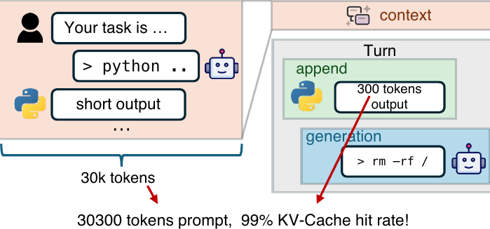

> Figure 2. Agent trajectory example.

LLMs increasingly power _agentic_ applications that perform multi-turn reasoning and interact with an environment (via e.g., terminal commands, code execution, or asking for human feedback) over long sessions.
As shown in [Figure 2](#S2.F2), in a typical _turn_, the model receives a prompt composed by the previous _context_ plus some newly _appended tokens_ (often tool output or user input) and _generates_ the next action or response. A single agent run is a _trajectory_ of dozens or even hundreds of turns: the context grows turn-by-turn and can reach up to one million tokens (Anthropic, 2026; DeepMind, 2026).
Because most of the context, typically ¿95% tokens in our traces, is reused across rounds, the vast majority of tokens in each round can hit the KV-Cache; only the newly appended context needs prefill computation. Due to the extreme length of agent trajectories, DRAM and HBM-based KV-Cache storage like Mooncake (Qin et al., 2025) can only store a small proportion of KV-Caches, necessitating the use of larger yet cheaper external SSD-based KV-Cache storage (DeepSeek-AI, 2025a).

The agentic LLM inference workload is also prevalent in agent LLM training, which often adopts _reinforcement learning_ (RL) approaches. In a typical RL training loop, the agent LLM first undergoes a _rollout_ phase, where it is prompted to generate a large number of multi-step agent trajectories. These trajectories are then scored by a separate reward model. Finally, the LLM parameters are updated to increase the likelihood of high-scoring outputs and reduce the likelihood of low-scoring ones. During the rollout phase, substantial data (like reward model and optimizer states) is offloaded to host DRAM, further constraining the available DRAM for KV-Cache. This reinforces the need for external, high-capacity KV-Cache storage that can accommodate long agentic rollout contexts efficiently.

### 2.3. Modern AI Data Center Architecture

Modern AI data centers are purpose-built logical supercomputers engineered to handle large-scale generative AI training and inference workloads. For example, in a standard NVIDIA DGX SuperPOD (NVIDIA, 2023), each node is equipped with 8 Hopper GPUs interconnected via high-speed NVLink. Each GPU is paired with a dedicated 400 Gbps compute NIC (_CNIC_, also known as east-west NIC), which maximizes inter-node communication bandwidth. Independent of the compute fabric, each node also features a storage NIC (_SNIC_, also known as south-north NIC) up to 400 Gbps, providing fast access to datasets, model checkpoints, and on-disk KV cache.

A fundamental principle of this architecture is that the compute network and the storage network are isolated from each other (Zhao et al., 2025a). This separation is essential to maximize both storage and application performance. By isolating high-intensity east-west compute traffic between GPUs from storage traffic, the architecture prevents interference between them, and drastically reduces compute communication latency. This design also ensures that the inter-GPU communication remains highly reliable and predictable even when performing data-intensive tasks such as reading large datasets or writing multi-terabyte model checkpoints.

## 3. Bottleneck & Motivation

We observe severe GPU underutilization during agentic inference tasks.
Our investigation reveals that KV-Cache loading speed is the bottleneck due to the limited bandwidth of the single storage NIC on each node.
Analysis demonstrates that three decisive factors jointly cause this bottleneck, as discussed below.

First, agentic workloads exhibit high KV-Cache hit rates, which _require more I/O and less computation_, thus creating a severe I/O bottleneck.
Agentic workloads are naturally long-context, short-append, and multi-turn.
On each turn, the GPU needs to read the KV-Cache of the entire context from persistent storage and perform prefill computation for appended tokens.
Our trace collected from representative coding tasks shows the mean number of rounds is 157, demonstrating the tendency of LLMs to engage in multi-turn interactions. The average context length is 32.7k, while the append length mean is only 429, which means a KV-Cache hit rate of 98.7%.
In such a scenario, the cache-compute ratio, defined as the ratio of KV-Cache to load and the computation needed, is approximately 22 GB/PFLOP for DeepSeek-V3.2 (DeepSeek-AI, 2025d), posing a significant bottleneck on storage bandwidth.
Note that the KV-Cache size of DeepSeek MLA model is already highly optimized; for models with larger KV-Cache sizes (see [Table 1](#S3.T1)), the situation is even worse.
The ratio of DeepSeek-V3.2 is higher than DeepSeek-V3 (DeepSeek-AI, 2025c), benefiting from its sparse attention design, lowering computation demands.

**Table 1. Cache-compute ratio with append length 429, across context lengths (16k–64k). KV-Cache data type defaults to FP8 unless specified.**  
| Model | GB/PFLOP (16K–64K) |
| --- | --- |
| Qwen2.5-32B (Team, 2025a) (FP16) | 117-267 |
| GPT-OSS-120B (OpenAI, 2025a) | 47–95 |
| Qwen3-235B-A22B (Team, 2025b) | 39–60 |
| DeepSeek-V3.2 660B (DeepSeek-AI, 2025d) | 13–36 |
| DeepSeek-V3 660B (DeepSeek-AI, 2025c) | 4.8–5.8 |

Second, the _hardware evolution trend_ is not well suited for agentic inference workloads.
In recent years, network bandwidth and HBM capacity have lagged behind the growth of GPU FLOPS, which drives us to run into memory and communication walls under agentic workloads.
As shown in [Figure 3](#S3.F3), from NVIDIA Ampere to Blackwell, the I/O-compute ratio decreases by 14.4$\times$.
Low NIC bandwidth limits KV-Cache loading speed, making GPUs idle.
In addition, small HBM capacity limits the token batch size for GPU kernels (Dao, 2024; Ye et al., 2025; DeepSeek-AI, 2025b; Li and Liu, 2025) to compute at the same time, hindering full utilization of compute units such as Tensor Core (Du et al., 2025).

Third, existing LLM inference systems exhibit severe _storage network utilization imbalance_ across different engine types. In prevalent PD-disaggregated systems, the KV-Cache for hit tokens is loaded exclusively by prefill engines directly from remote storage. This design centralizes all storage I/O pressure on the prefill-side SNICs, while the SNICs on decode engines remain largely idle. Consequently, the aggregate storage network bandwidth cannot be fully harnessed.

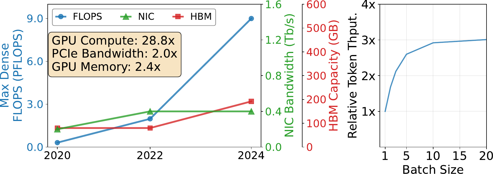

> Figure 3. Left: Hardware trends of NVIDIA GPUs. Right: Relative token throughput with varying request batch size (each request has 30K context with 300 tokens appended).

The above analysis demonstrates that the fundamental performance issue for agentic inference on PD-disaggregated architecture is the high I/O demand for KV-Cache retrieval and unbalanced storage network bandwidth utilization across inference engines. Meanwhile, we observe that the network traffic of the compute network, which has much larger aggregate bandwidth than the storage network, exhibits an intermittent pattern: collective operations used in model inference burst in sub-millisecond intervals. Therefore, an opportunity naturally emerges: we can utilize the SNIC bandwidth of decode nodes to load KV-Cache from storage, and transfer it back to the prefill nodes, utilizing the spare bandwidth of the faster compute network.

## 4. DualPath System Overview

To break the prefill-side storage I/O bottleneck, we propose a dual-path loading architecture that fundamentally rethinks how KV-Cache is retrieved in PD-disaggregated inference. Based on this architecture, we design and implement DualPath.
DualPath adopts two widely-adopted techniques demonstrated in [§ 2](#S2):
(1) PD Disaggregation (Zhong et al., 2024; Patel et al., 2025), which separates prompt and decode processing for better efficiency.
(2) Layerwise prefill, which avoids HBM bottlenecks recognized by LayerKV (Xiong et al., 2024) and PrefillOnly (Du et al., 2025) on prefill engines and improves GPU utilization.

Our system consists of the following components:

- •
  Inference Engines. Each engine manages one GPU.
  Engines are categorized into prefill engines (PEs) for prefill and decoding engines (DEs) for decode.
- •
  Traffic Manager ([§ 5](#S5)). Each engine contains a traffic manager to conduct (1) Host-Device memory copies (H2D & D2H), (2) KV-Cache transfers between PEs and DEs, and (3) KV-Cache reads/writes from/to storage via the storage NIC. We adopt a CNIC-centric traffic management approach, detailed in [§ 5](#S5), to prevent KV-Cache traffic from affecting communications in model inference.
- •
  Request Scheduler ([§ 6](#S6)). A central scheduler that receives client requests and distributes them across engines. It is also responsible for dynamically distributing data traffic between two paths ([Figure 4](#S4.F4)).

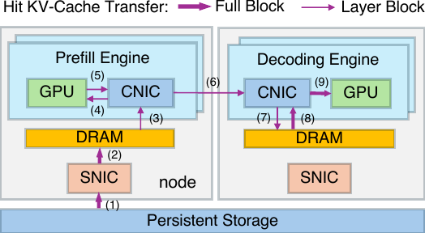

> (a) PE Read Path

### 4.1. Dual-Path Loading

In addition to the conventional _storage-to-prefill_ path, DualPath introduces a novel _storage-to-decode_ path, allowing KV-Cache to be loaded first into a decode engine and then transferred to the prefill engine via high-bandwidth RDMA over the compute network.
By dynamically distributing load across both paths, the system aggregates the storage NIC bandwidth of all engines — including otherwise-idle decode-side NICs — and eliminates the asymmetric bandwidth saturation that limits existing systems. This approach transforms the storage I/O from a single-bottleneck resource into a globally pooled and schedulable capacity. The exact data flows of the dual-path are described below.

To implement dual-path loading, DualPath allocates a small amount of DRAM as buffers on each PE and DE, called _PE buffer_ and _DE Buffer_.

Prefill PE read path.
First, the KV-Caches of hit tokens are read from persistent storage into the PE buffer (as Label 1 and 2 shown in [4(a)](#S4.F4.sf1)).
Before the computation of an attention layer, those KV-Caches of that layer are transferred to PE HBM (3 and 4) to compute the KV-Cache of cache-miss prompt tokens.
Then, all KV-Caches of both hit and miss tokens are transferred to the DE buffer to form the complete prompt KV-Cache (5-7). This process (3-7) repeats $n_{layer}$ times.
During the prefill forward pass, transfers overlap with computation.

Prefill DE read path. The KV-Caches of hit tokens are first read into DE buffer (as Label 1 and 2 shown in [4(b)](#S4.F4.sf2)).
During PE prefill, KV-Cache for the corresponding layer is read from the DE buffer, also overlapping with computation (3-5). This process repeats $n_{layer}$ times.
After a layer’s computation completes, only the KV-Caches of miss tokens are transferred to DE buffer and merged with the existing hit token KV-Cache.

Decode Phase. After receiving the complete prompt KV-Cache in DE buffer (including loaded KV-Cache via PE read path and the KV-Cache of newly appended tokens), the decode phase begins.
The DE first allocates HBM and performs host-to-device (H2D) transfers (Label 8 and 9 in [4(a)](#S4.F4.sf1); Label 6 and 7 in [4(b)](#S4.F4.sf2)), then releases CPU memory before starting decode.
The design of DE buffer imposes bandwidth pressure on DRAM and CNIC (an extra H2D), which could be avoided by directly bypassing it via GPU Direct RDMA.
However, since the generation length is typically short in this scenario, time-to-first-token (TTFT) accounts for a non-negligible portion of the total end-to-end request time.
Introducing DE buffer helps reduce GPU memory usage.
During decode, whenever a full block of tokens (e.g., 64 tokens) is accumulated, it is immediately persisted to disk.

Different Block Layouts.
We adopt two different block layouts: _Full Block_ and _Layer Block_, which contain all layers and a single layer, respectively.
Detailed layout can be found in [§ A.5](#A1.SS5).
For all interactions with storage, we adopt Full Blocks.
In the PE read case, KV-Cache loading to PE HBM and transfer to DE Buffer occur in a layerwise streaming fashion, both using Layer Blocks.
Similarly, for the DE read path, transfers from the DE Buffer to the PE HBM use Layer Blocks.

### 4.2. Bottleneck-Free Analysis

We demonstrate that the system can fully saturate all storage NICs without introducing compute-NIC or DRAM bottlenecks, under most reasonable P/D ratios.
We assume a well-configured PCIe topology (each pair of GPU–NIC is under the same PCIe switch), load-balanced task scheduling, no congestion on the computation network, and that storage read bandwidth is fully utilized.

Notation. Let $P$ and $D$ denote the number of prefill and decode nodes, respectively. Each node has $g$ GPUs, each with one compute NIC of bandwidth $B$. The storage bandwidth per machine is $s\times B$ (shared by all engines on that machine); $M$ is the memory bandwidth per machine.

Traffic per PE-DE pair. We assume that the storage read bandwidth is fully utilized and that task scheduling is load-balanced. Under load balancing, storage NIC bandwidth is evenly shared. The traffic per pair for the PE read path (all steps in [4(a)](#S4.F4.sf1)) is $T_{p}=Bs/(Dg^{2})$; for the DE read path ([4(b)](#S4.F4.sf2)) it is $T_{c}=Bs/(Pg^{2})$. Link traffic is the sum over all pairs using that link.

PE CNIC Bandwidth Analysis.
For PE CNIC, loopback traffic (i.e., H2D and D2H that does not traverse switches) exists, so the total traffic on the PCIe side is always greater than or equal to the switch-direction traffic, regardless of read or write operations.
Therefore, we only need to compute the pressure on the PCIe side.
Read operations include PE paths (3) and (5), with total traffic over all pairs:

$$
(1) $\displaystyle 2\times T_{p}\times Dg=2Bs/g\leq B$
$$

Since $s\leq g$ always holds in practice, the read direction is always bottleneck-free.
Write operations include PE path (4) and DE path (5), with total traffic:

$$
(2) $\displaystyle(T_{p}+T_{c})\times Dg=Bs/g\times(1+D/P)\leq B$
$$

Then, we obtain:

$$
(3) $\displaystyle P/D\geq\frac{s}{g-s}$
$$

DE CNIC Bandwidth Analysis.
For DE CNIC, read operations include PE path 8 and DE paths 3/6, with traffic:

$$
(4) $\displaystyle(T_{p}+T_{c}\times 2)\times Pg=s/g\times(P/D+2)\times B\leq B$
$$

Then, we obtain:

$$
(5) $\displaystyle P/D\leq\frac{g-2s}{s}$
$$

Write operations include PE paths 7/9 and DE path 7, with traffic:

$$
(6) $\displaystyle(2T_{p}+T_{c})\times Pg\leq B$
$$

This implies:

$$
(7) $\displaystyle P/D\leq\frac{g-s}{2s}$
$$

DRAM Pressure Analysis.
DRAM is half-duplex, so we sum the read and write pressures.
For PE MEM, the pressure is $2sB$, which generally does not exceed memory bandwidth.
For DE MEM, following the similar analysis above, we can get the pressure is $(3+2P/D)Bs$.
Requiring the DE MEM pressure to be less than or equal to $M$, we obtain:

$$
(8) $\displaystyle P/D\leq\frac{M/Bs-3}{2}$
$$

Summary. Combining all the above analyses, we have:

$$
(9) $\displaystyle\frac{s}{g-s}\leq P/D\leq\min\left\{\frac{g-2s}{s},\frac{g-s}{2s},\frac{M/Bs-3}{2}\right\}.$
$$

For $(g=8,s=1)$ with $M\approx 500$ GB/s and $Bs\approx 50$ GB/s, the bottleneck-free range is $\frac{1}{7}\leq$ P/D $\leq\frac{7}{2}$, which covers most practical configurations.

### 4.3. Practical Challenges

The dual-path architecture fundamentally reorients data movement: KV-Cache can be loaded either directly from storage into prefill engines or indirectly via decode engines, thereby aggregating storage bandwidth across all engines and breaking the prefill-side I/O bottleneck. However, realizing this high-level design in a practical system introduces three interrelated challenges. We briefly outline these challenges below and refer the reader to the corresponding sections for details.

Fine-grained data transfer ([§ 5](#S5)).
The layer-wise execution paradigm, while essential for overcoming HBM capacity limits, fragments the KV-Cache into numerous fine-grained blocks (Patel et al., 2025). Transferring this multitude of fine-grained data chunks between storage, host DRAM, and GPU HBM must incur minimal overhead and seamlessly overlap with computation to realize throughput gains.

Traffic isolation ([§ 5](#S5)).
The complex data path in DualPath introduces additional KV-Cache transfer traffic on both the compute network and PCIe links. A primary concern is that this traffic may interfere with existing latency-sensitive collective communication operations essential for model execution — such as AllToAll in expert parallel (Zhao et al., 2025b) and ReduceScatter/AllGather in tensor/context parallel. Since these collective communications are critical to end-to-end inference latency, a key challenge lies in exploiting spare I/O bandwidth without degrading model inference performance.

Dynamic load balancing ([§ 6](#S6)).
As we are adopting two different paths for KV-cache loading, the system must promptly decide which path to use for each request. A naive policy could overload one path, recreating the original bottleneck. The traffic scheduler must balance multiple factors in real-time: storage NIC queue lengths, computational load on GPUs, and request workload characteristics.

## 5. CNIC-Centric Traffic Manager

Modern LLM inference systems employ a range of advanced data transfer technologies — such as on-chip CUDA copy engine and GPUDirect Storage (NVIDIA, 2026b) — to move data efficiently between storage, host memory, and GPU HBM. However, all these mechanisms can interfere with latency-sensitive collective communications (e.g., EP AllToAll) during model execution. This arises for two primary reasons: (1) such transfer technologies often operate over separate paths that do not share the same QoS controls as the compute network, and (2) existing GPUs do not support PCIe QoS (Richter et al., 2016), making it difficult to shield model inference communication from other traffic contending for PCIe bandwidth. Additionally, because the collective communications occur in rapid, sub-millisecond-level bursts, it is impractical to rely on a software-based traffic shaper to interleave lower-priority I/O operations between these high-priority traffic windows.

To address this, we propose a CNIC–centric data transfer approach which is widely adopted in our production deployment: all data traffic in or out of a GPU, including local H2D/D2H copy, must go through the GPU’s paired CNIC with a GPUDirect RDMA (NVIDIA, 2026a) data path. By consolidating all traffic onto the compute network, we can leverage the native QoS capabilities of compute network to enforce strict traffic differentiation.

### 5.1. Traffic Isolation

For the InfiniBand-based network, we leverage virtual lanes (VLs) (Association, 2007) to enforce isolation between different traffic classes.
All model inference communication traffic is assigned to a dedicated high-priority VL, while all other traffic, including KV-Cache transfer, is mapped to a separate low-priority VL.
We configure the VL arbiters of all network switches and NICs with a weighted round-robin policy that reserves approximately 99% of total bandwidth to high-priority VL.
The remaining bandwidth is allocated to the low-priority VL to prevent starvation.
This configuration ensures that model execution traffic is virtually unaffected by KV-cache transfers, while still allowing KV-cache traffic to opportunistically utilize otherwise idle bandwidth in the compute network.
Detailed configurations are described in [§ A.1](#A1.SS1).

Although our experiments are conducted on an InfiniBand-based network, the same design principles naturally extend to other interconnect technologies.
DualPath can be conducted on RDMA over Converged Ethernet (RoCE) by leveraging Traffic Class (TC) and Differentiated Services Code Point (DSCP) markings (Guo et al., 2016; Carpenter and Nichols, 2002) in conjunction with hardware packet queues.
Emerging technologies such as UnifiedBus (43) and Ultra Ethernet (Consortium, 2026) are likewise converging on QoS mechanisms for heterogeneous traffic, which can directly support the requirements of DualPath.

### 5.2. CNIC-Assisted KV-Cache Copy

Existing GPU data transfer technologies include GPUDirect Storage (NVIDIA, 2026b), which loads KV-Cache from storage backend to GPU HBM, and CUDA copy engine, which directly copies host DRAM to GPU via PCIe. However, these methods fail to isolate KV-Cache traffic from high-priority latency-sensitive collective communications in model execution, severely degrading inference performance.

To solve the limitations of existing approaches, we adopt a CNIC-assisted H2D/D2H data path. For KV-Cache loading, we first read the KV-Cache into host DRAM from the storage backend. Then, we submit an RDMA Write request to the GPU’s paired CNIC to perform local H2D copy. Storing newly generated KV-Cache follows a symmetric process: it is first transferred to host DRAM via CNIC, then persisted to the storage backend over the storage network. This design establishes the CNIC as the central QoS scheduler for all GPU PCIe traffic, allowing its VL arbiter to prioritize the inference communication traffic and perform KV-Cache transfer using spare PCIe bandwidth.

Although this approach may appear to take a detour compared to GPUDirect Storage (which directly reads KV-Cache to GPU HBM) and CUDA copy engine (which directly copies host memory to GPU HBM), to our best knowledge, this is currently the only practical method to ensure that KV-Cache load/store does not degrade the performance of critical model–execution communication.

We also observe that CNIC-assisted H2D and D2H outperform the CUDA copy engine when handling a large number of small data chunks. Our measurements show that submitting a single copy operation via cudaMemcpyAsync incurs a latency overhead of approximately 5-7$\mu s$. We failed to further break down this overhead due to the closed-source nature of CUDA driver. In contrast, submitting one RDMA Write work request involves only a few mmio writes to NIC registers in user space and takes only around 1$\mu s$. Furthermore, the RDMA work submission overhead can be significantly amortized by leveraging _doorbell batching_ (Kalia et al., 2016).

## 6. Adaptive Request Scheduler

Although our theoretical analysis shows promising results, imbalanced load reduces hardware utilization, and in this scenario, we need to consider two dimensions of balance simultaneously: (1) NIC traffic, and (2) the utilization balance of GPUs.
We divide scheduling into two levels: inter-engine scheduling, which assigns requests to a (PE, DE) pair and selects the read path (PE or DE) for each request; and intra-engine scheduling, which determines which requests are included in each forward batch for computation.

### 6.1. Inter-Engine Scheduling

We organize engines into groups to reduce the scheduler pressure.
Only the engine rank 0, called _Leader Engine_, interacts with the scheduler.
All engines of a group are all PEs or all DEs.
All engines on one node are guaranteed to be in the same group.
All engines in one group proactively fetch tasks together regularly.
When fetching new requests, each engine $e$ reports (1) $seq_{e}$, the number of requests assigned to it that have not yet completed; (2) the total token count $tok_{e}$ over those $seq_{e}$ requests; and (3) the disk reading queue length $read_q_{n(e)}$ of the node $n(e)$ that engine $e$ belongs to.
GPU load, disk read load, and network load are all strongly correlated with token count. We therefore use token count as a proxy and aim to balance it across engines.

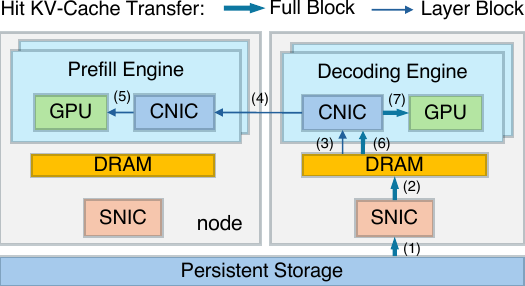

> Figure 5. An illustration of Inter-Engine PE Scheduling. All eight GPUs are in the same PE engine group and the scheduler will choose the best.

PE Scheduling. All requests arriving at the scheduler enter a waiting queue and are scheduled in a FIFO order. The scheduling algorithm is invoked when a PE group initiates a fetch request.
An illustration of the inter-engine scheduling process is shown in [Figure 5](#S6.F5).
We define two constants, short reading queue threshold $\alpha$, and unfinished token upper limit $\beta$, measured in tokens.
All engines are split into three categories:
(1) overloaded engines where $tok_{e}>\beta$;
(2) engines on nodes with short disk reading queues where $read_q_{n(e)}\leq\alpha$ and $tok_{e}\leq\beta$; and
(3) engines on nodes with longer disk reading queues where $read_q_{n(e)}>\alpha$ and $tok_{e}\leq\beta$.
We do not assign new requests to overloaded engines.
Second-category engines are prioritized over third-category engines because they reside on nodes with shorter disk reading queues, and lack of subsequent requests would easily lead to storage NIC underutilization.

We assign the current request to the PE with minimum $tok_{e}$ in the second category if non-empty, otherwise in the third category if non-empty.
After assignment, we update the selected PE’s $tok_{e}$, then proceed to the next request in the waiting queue.
If both categories are empty, we terminate this fetch request and return the already-assigned requests to the Leader Engine.

DE Scheduling Phase 1: across groups.
DE scheduling is two-level and does not preserve global FIFO. There is a global waiting queue and a private queue per DE engine group. Incoming requests first enter the global queue. When a DE group fetches, _group-level_ scheduling drains the global queue and assigns each request to the group whose total $tok_{e}$ (sum over its engines) is minimum; this balances token count across groups and thus NIC and GPU load.

**DE 调度阶段 2：组内调度**
然后，我们计算组内所有 DE（解码引擎，Decoding Engine）的剩余 HBM（高带宽内存，High-Bandwidth Memory）总和，并从私有队列的头部开始遍历，以计算在假设没有 HBM 碎片的情况下可以调度多少个请求。这些请求构成集合 $R$。这是一个可调度的理论上限。
接着，我们计算一个高令牌阈值 $Z=1.05\times(\sum_{r\in R}{len_{r}}+\sum_{e\in E}{tok_{e}})/|E|$。

接下来，我们尝试弹出私有队列的头部请求并将其调度到一个 DE。
在那些拥有足够剩余 HBM 来容纳该请求的 DE 中，我们将其划分为两类：(1) **高令牌 DE** ，其中 $tok_{e}+\text{len}(r)>Z$，以及 (2) 其余 DE。我们优先选择类别 (2) 以保持令牌数量平衡；类别 (1) 的 DE 已经承受了更高的 GPU 和 NIC（网络接口卡，Network Interface Card）压力。在类别 (2) 内部，我们选择 $seq_{e}$ 最小的 DE 以平衡请求数量；如果类别 (2) 为空，则选择类别 (1) 中 $tok_{e}$ 最小的 DE，以减少 HBM 耗尽和抢占风险。如果没有 DE 拥有足够的 HBM，则获取过程结束，并返回已分配的请求。

**KV-Cache 读取任务调度**
为一个请求选择好 PE（预填充引擎，Prefill Engine）和 DE 后，我们选择在读取队列较短的一侧进行读取。将请求分成两部分并从两侧读取可能更好，我们将其留作未来的工作。

### 6.2. 引擎内调度（Intra-Engine Scheduling）

只有 PE 需要引擎内调度，因为 DE 总是将所有请求放入前向批次中。
引擎内调度过程的图示见 [图 6](#figure-6)。
数据并行（Data parallelism）被广泛用于注意力层，尤其是对于 MLA（多头注意力，Multi-Head Attention）模型。
在这种并行配置下，每个 GPU 服务一组不同的请求。
这可能导致所有 GPU 之间的工作负载不平衡，而这些 GPU 必须在注意力阶段后同步并一起进入 FFN（前馈网络，Feed-Forward Network）阶段，从而导致 GPU 因等待其他对等节点而产生气泡（bubbles）。
因此，我们需要确保它们具有相似的注意力层执行时间，以最小化等待气泡。

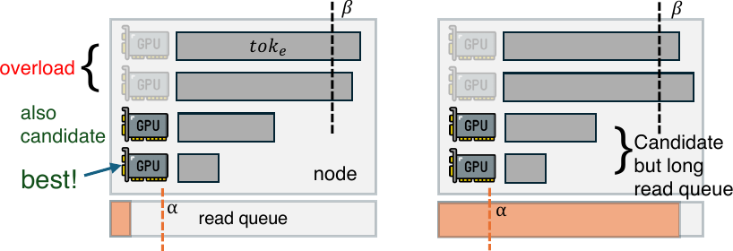

> 图 6. 引擎内调度。左：基于计算配额的批次选择。右：应用计算配额前后的 GPU 时间线。

**层时间估计** 。我们使用 FIFO（先进先出，First-In-First-Out）打包来决定在前向批次中包含多少个请求。
前向批次中的每个请求由一对 $(cached, bsz)$ 描述，其中 $cached$ 是 KV-Cache（键值缓存，Key-Value Cache）已可用（来自存储命中或先前的前向传递）的令牌数量，$bsz$ 是在此批次中需要计算 KV-Cache 的令牌数量。
从这些数据对中，我们计算注意力层的总理论计算量并估计其执行时间。
理论计算量与挂钟时间（wall-clock time）之间的关系取决于硬件和并行配置，可以像先前工作 (Du et al., 2025) 和 (Agrawal et al., 2024) 那样，通过性能分析（profiling）预先拟合。

**算法** 。只要预测的注意力层执行时间不超过预定义的上限（称为*计算配额*），我们就继续按 FIFO 顺序添加请求。
如果添加一个请求将超过此限制，则对 $bsz$ 执行二分搜索（binary search），找到一个更小的 $bsz^{\prime}$ 以适应剩余的计算配额，并对该请求执行分块预填充（chunked prefill）。

## 7. Evaluation

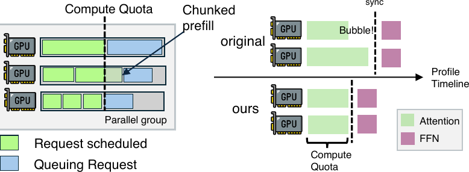

> Figure 7. Offline inference performance under varying numbers of agents and maximum agent context lengths. Top: DS 27B. Middle: DS 660B. Bottom: Qwen 32B. N/A for running into an error before finishing.

### 7.1. Implementation

We implement DualPath based on our in-house inference framework.
For CUDA kernels, our in-house framework adopt the combination of FlashMLA (Li and Liu, 2025), DeepGEMM (DeepSeek-AI, 2025b), and DeepEP (Zhao et al., 2025b), which aligns with the current mainstream open-source framework (Zheng et al., 2024; Kwon et al., 2023).
The DualPath implementation involves approximately 5K lines of modifications on top of it.
We adopt 3FS (DeepSeek-AI, 2025a) as distributed storage and use an io_uring-like interface for kernel bypass.

### 7.2. Experimental Setup

Testbed.
We conduct our experiments on a cluster of GPU servers with InfiniBand interconnection. Each server has 8 NVIDIA Hopper GPUs and dual processors. Additionally, each node is provisioned with eight 400Gbps RDMA NICs connected to InfiniBand network and one additional storage NIC connected to 3FS. The computation and storage networks are physically isolated. Our cluster-wide 3FS has no internal DRAM cache and can saturate the 400Gbps bandwidth of the storage NIC.

Models.
We evaluate on three models: (1) DeepSeek V3.2 (DeepSeek-AI, 2025d) 660B, an MoE model with DeepSeek Sparse Attention, denoted as _DS 660B_, (2) a 27B downscaled version of DS 660B, denoted as _DS 27B_, and (3) Qwen2.5-32B (Team, 2025a), a dense model with GQA, denoted as _Qwen 32B_.
DS 660B and Qwen 32B correspond to the publicly released checkpoint on HuggingFace.
DS 27B is our internal experimental model with a similar architecture to DS 660B.
Detailed specifications are provided in [§ A.2](#A1.SS2).

Datasets.
We collected three agent trace datasets from our production agentic RL training workloads with varying maximum context lengths (MaxLen). Each dataset contains 500 trajectories. The average interaction turns (Turns), average appended and generated tokens per turn (Append and Gen), average number of total tokens (Total), and average number of context tokens (Context) are summarized in [Table 2](#S7.T2).

**Table 2. Statistics of agent trace datasets.**  
| MaxLen | Turns | Append | Gen | Total | Context |
| --- | --- | --- | --- | --- | --- |
| 32K | 60 | 608 | 148 | 28639 | 17183 |
| 48K | 106 | 474 | 172 | 42607 | 25120 |
| 64K | 157 | 429 | 176 | 55958 | 32721 |

Baselines.
We compare DualPath, denoted as Ours, against the following baselines:

- •
  SGL(MC): SGLang (Zheng et al., 2024) (commit 19089aa) with HiCache (SGLang, 2026), Mooncake (Qin et al., 2025) Store enabled and 3FS as the storage backend, and Mooncake Transfer Engine for prefill-decode disaggregation.
  We did not run SGL(MC) for DS 27B because SGLang lacks support for this downscaled version.
- •
  Basic: Our unmodified internal inference framework (detailed in [§ 7.1](#S7.SS1)).
  Comparing DualPath and SGL(MC) is unfair due to implementation differences.
  Therefore, we only report performance improvements from Basic to Ours.
- •
  Oracle: Based on DualPath, we bypass all disk reads, D2H & H2D transfers, and inter-PD KV-Cache transfers.
  This configuration represents the theoretical performance upper bound assuming zero I/O overhead.

P/D Ratio and Parallelism.
We default to 2P4D for DS 660B, 1P2D for Qwen 32B, and 1P1D for DS 27B (where 1P1D means one node for each side).
For DS models, we use EP and DP.
For Qwen 32B, we use DP only in DualPath, while SGL(MC) uses TP=8 since DP attention is not supported for this model in SGLang.
Detailed configuration is provided in [§ A.4](#A1.SS4).

Metrics. For offline inference scenarios, we measure job completion time (JCT) for the entire task.
For online serving scenarios, we measure TTFT, TTST (Time to the second token), and TPOT.

### 7.3. Offline Batch Inference

This section evaluates throughput performance in offline batch inference, which is the case of the rollout phase in RL training.
In this scenario, $n$ agents start to rollout simultaneously, and we measure the JCT when all requests have finished.

Varying Agents Batch Size & Max Agent Length (MAL).
DualPath benefits more from larger batch sizes and longer MALs.
[Figure 7](#S7.F7) reports JCT under different batch sizes and MALs.
SGL(MC) encountered errors in our setup and failed to complete some large configurations (marked as N/A).
On DS 660B, DualPath achieves up to $1.87\times$ over Basic, and demonstrates performance with Oracle, indicating that KV-cache I/O is largely eliminated.
On DS 27B, DualPath improves over Basic by up to $1.78\times$ but remains $1.09$–$1.85\times$ slower than Oracle due to limited storage bandwidth in 1P1D ([Figure 8](#S7.F8)).
For Qwen 32B, it shows similar trends as DS 27B.

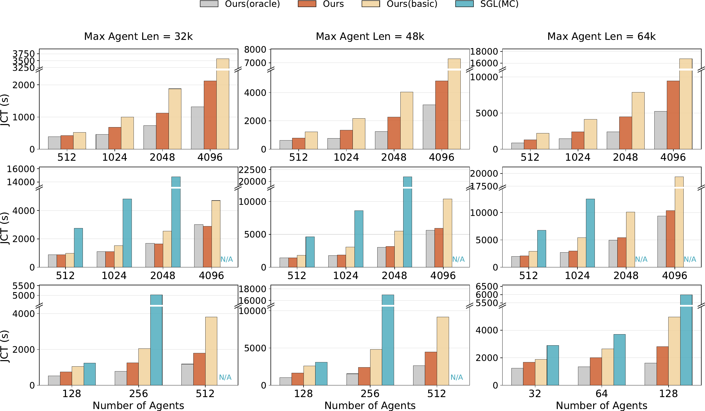

> Figure 8. Impact of prefill-decode ratio on offline inference performance (DS 27B).

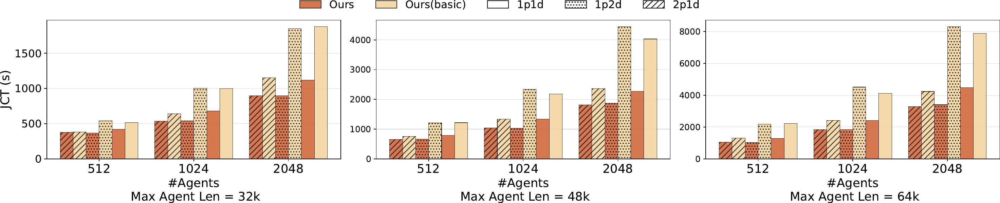

> Figure 9. Left: varying append lengths (DS 660B, 64K context, 1024 agents). Right: varying generation lengths (DS 660B, 64K, 1024 agents)

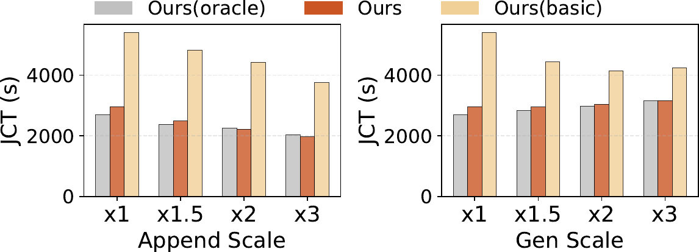

> Figure 10. TTFT, TTST, and TPOT as functions of agent arrival rate (APS). Shadow means the fluctuation in the last 150s before experiments finish. Top: DS 27B, Bottom: DS 660B.

Varying Append Length & Generation Length.
DualPath has more advantages when append and generation tokens are short.
Longer append lengths imply greater GPU compute pressure, and longer generation lengths lower KV-Cache loading pressure due to larger prefill gap time.
To investigate the impact of this factor, we scale each round’s append length by a constant factor, and then truncate the whole trajectory at given MAL.
The same holds for generation length.
As shown in [Figure 9](#S7.F9), with append length increases, Basic performance gradually approaches DualPath and Oracle, while DualPath and Oracle performance changes only slightly, indicating that the bottleneck consistently lies in GPU compute pressure.
Compared to Basic, DualPath achieves $1.82-1.99\times$ speedup at different append scales.
The trend for generation length scaling is similar.

Varying Prefill-Decode Ratio.
Across all ratios, DualPath demonstrates substantial performance gains compared to Basic.
We conduct rollout experiments on DS 27B with 1P1D, 2P1D, and 1P2D prefill-decode ratios to characterize the impact of resource allocation between prefill and decode stages on overall system performance.
As shown in [Figure 8](#S7.F8), DualPath achieves an average speedup of $1.64\times$ across all configurations (up to $2.46\times$).
Basic 1P1D and Basic 1P2D perform comparably;
so do DualPath 1P1D and Basic 2P1D,
as well as DualPath 2P1D and DualPath 1P2D.
This occurs because each pair of systems has equivalent available storage bandwidth (Basic can only use prefill node storage bandwidth, while DualPath can utilize all nodes), which confirms that storage bandwidth is the dominant bottleneck in agentic scenarios.

### 7.4. Online Serving

Methodology. We evaluate system latency characteristics under varying agent arrival rates per second (APS).
Agents arrive according to a Poisson process at a specified rate, with each agent commencing replay from round zero to its last round upon arrival.
For our experiments, the SLO is set as TTFT $\leq$ 4 seconds and TPOT $\leq$ 50ms.
In the TPOT and TTST figures, data points exceeding the SLO threshold are omitted.
Experiment termination is triggered when either: (1) TTFT exceeds 4 seconds, or (2) the system reaches steady state, defined as TTFT variation within a 150-second sliding window remaining below 5% compared to that 30 minutes prior.

As shown in [Figure 10](#S7.F10), DualPath achieves higher APS capacity than Basic (1.67$\times$ for DS 27B, 2.25$\times$ for DS 660B).
DualPath’s TTST is comparable to Basic, while TPOT shows that DualPath does not introduce additional decoding overhead compared to Basic.
SGL(MC) exhibits anomalously low TTST, likely due to implementation issues where the first two tokens arrive at the
client almost simultaneously.
For DS 27B, all metrics exhibit trends similar to DS 660B.
However, both Basic and DualPath show significantly higher TPOT than Oracle, suggesting the overhead of basic P-D transferring is considerable in small model cases. We leave it as future work.

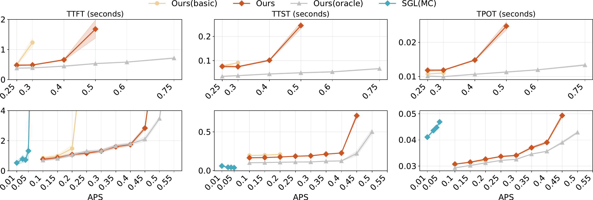

> Figure 11. Average completion time of all trajectories versus arrival rate for online serving.

Average JCT for both models are presented in [Figure 11](#S7.F11).
A detailed analysis of working set implications is discussed in [§ 8](#S8).
As shown in [Figure 12](#S7.F12) (left), DualPath maintains stable TTFT components across different APS, while Basic’s queuing time grows dramatically due to insufficient storage bandwidth.

### 7.5. Ablation Study

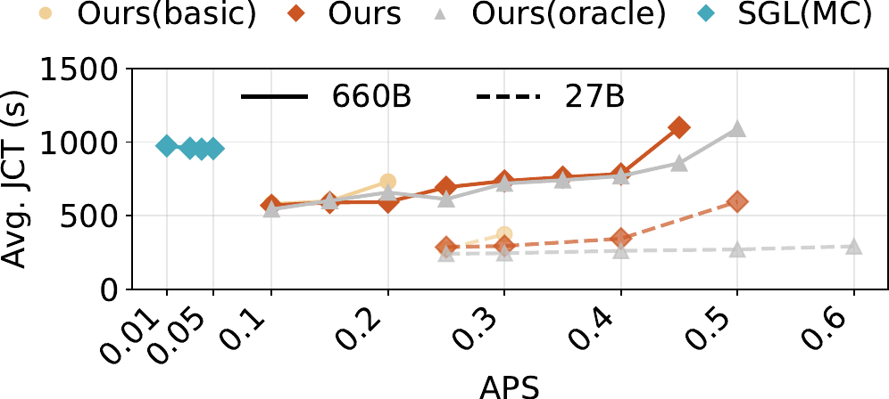

> Figure 12. Left ([§ 7.4](#S7.SS4)): TTFT breakdown for online serving (DS 660B) across APSs, Sch. for scheduling, A. for allocating, R. for reading KV-cache, PF. for prefill. In each pair of pillars, the first is for DualPath and the second is for Basic. Right ([§ 7.5](#S7.SS5)): Offline inference ablation results (DS 660B, 64K context length). Layer, DPL, Sched stands for Layerwise prefill, Dual-Path Loading, and scheduling, respectively.

We conduct an ablation study to quantify the contribution of each technical component in DualPath.
Experiments are performed under the offline inference setting with 64K MAL and agent batch size 1024 and 2048.
The differences between Basic and Ours are grouped into three techniques: layerwise prefill, dual-path loading, and scheduling algorithm.
We add the techniques gradually to demonstrate individual contribution.
As shown in [Figure 12](#S7.F12), compared to Basic, adding layerwise prefill reduces JCT by $17.21\%$ on average, alleviating PE HBM bottlenecks and hiding transfer overhead.
Adding Dual-path loading on top of layerwise prefill delivers the primary performance gains, reducing JCT by $38.19\%$ on average compared to Basic, as it enables requests to read KV-Cache from either PE or DE, fully utilizing distributed storage bandwidth.
Finally, employing our scheduling algorithm on top of dual-path loading to decide KV-Cache loading paths achieves the best performance, reducing JCT by $45.62\%$ compared to Basic, demonstrating the effectiveness of load-balanced scheduling across storage NICs.

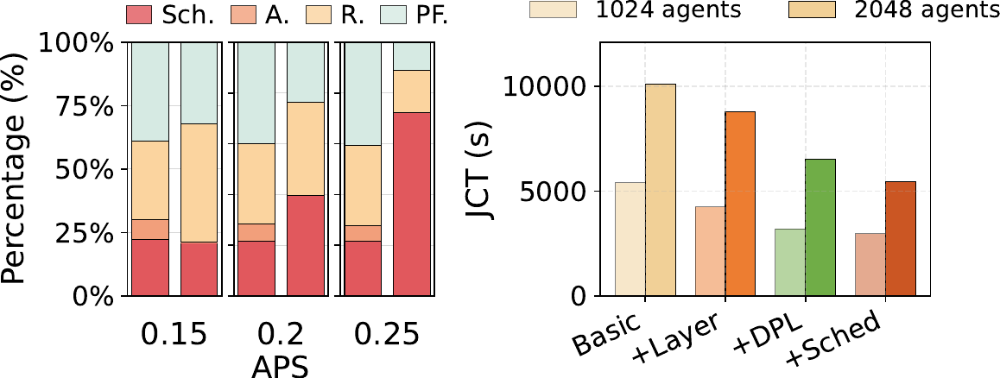

> Figure 13. Load balance of storage NICs traffic

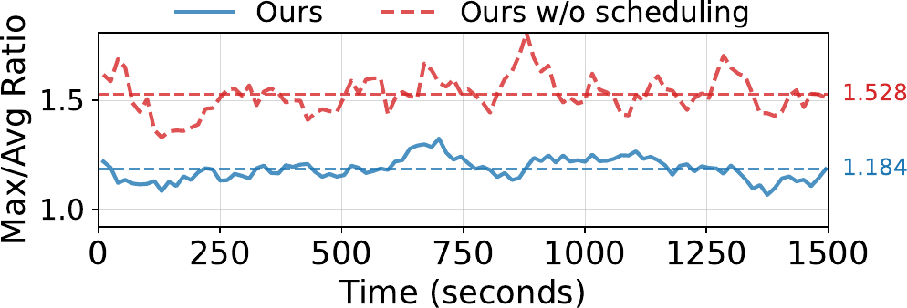

> Figure 14. Load balance of attention execution time.

Load Balance.
DualPath’s scheduling algorithm improves load balance for both storage NICs and attention layer execution times.
For storage NICs, our scheduling algorithm improves load balance from 1.53 to 1.18 compared to round robin scheduling ([Figure 13](#S7.F13)).
For attention layers, DualPath maintains the Max/Avg ratio as low as 1.06 during the first 5% of the task, reducing GPU idle bubbles ([Figure 14](#S7.F14)).
The storage NIC metric is the ratio of maximum to average traffic across all storage NICs on three machines within a small time window, where 1.0 represents perfect balance.
The attention layer metric is calculated among all GPUs in an expert parallel group for each forward.
As the task progresses, both ratios become meaningless due to underloaded system.
Therefore, we do not show the tail phase of the workload.

**Table 3. Large-scale experiment results.**  
| | Setting | JCT | TTFT | TTST | TPOT |
| --- | --- | --- | --- | --- | --- |
| Offline | 2P4D, 2K agents | 3,167s | – | – | – |
| 48P96D, 48K agents | 3,201s | – | – | – | |
| Online | 2P4D, 0.4 APS | – | 1.739s | 0.228s | 0.039s |
| 44P88D, 8.8 APS | – | 1.847s | 0.194s | 0.036s | |

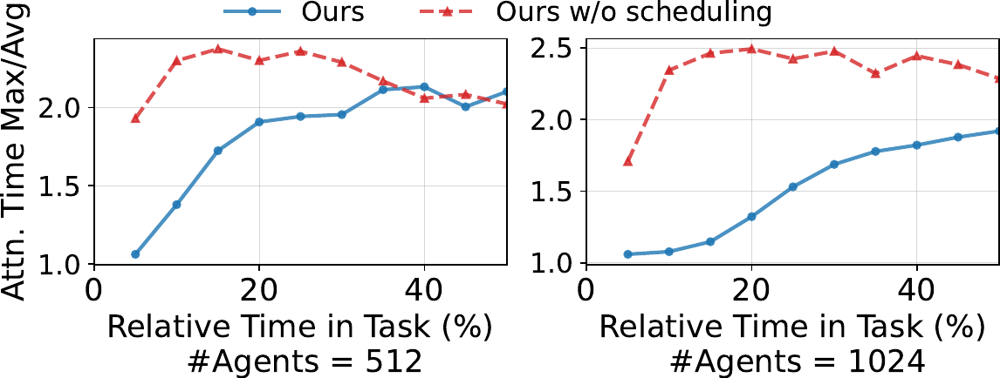

> Figure 15. 48P96D offline inference metrics. 1e7 is the scaling factor of Prompt TPS.

### 7.6. Large-Scale Scalability

We conduct both offline and online experiments using up to 1,152 GPUs to demonstrate large-scale scalability ([Table 3](#S7.T3)).
For offline inference, scaling from 2P4D (2K agents) to 48P96D (48K agents) achieves near-linear speedup with comparable JCT (3,167s vs. 3,201s).
For online serving, the 44P88D configuration achieves 22$\times$ throughput (8.8 vs. 0.4 APS) while maintaining similar latency.
Across all experiments, scheduler CPU usage remains below 10 cores, confirming it is not a bottleneck. Some detailed metrics over offline inference process are shown in [Figure 15](#S7.F15).

Due to the lack of fine-tuned parallelism settings and P/D ratios (which requires a substantial experimentation budget), the large-scale experiments do not demonstrate additional JCT or serving capacity gains compared to multiple small-scale units with equivalent cost.
However, large-scale setting remains important for the following reasons. First, it reduces fragmentation and provides greater flexibility for fine-tuning parallelism and P/D ratios. Second, large-scale deployment offers more scheduling opportunities to mitigate queuing latency under unpredictable bursty online requests. These observations suggest several directions for future work ([§ 8.1](#S8.SS1)).

## 8. 讨论（Discussion）

### 8.1. 潜在的未来工作（Potential Future Work）

离线推理（Offline inference）的工作负载是高度动态的。例如，在我们的智能体强化学习（Agentic Reinforcement Learning, RL）任务中，工作负载在很大程度上取决于研究人员的算法设计，并且预填充阶段（Prefill stage）在执行前半段通常承受的压力显著高于后半段。同时，对这些试探性实验进行性能剖析（Profiling）的成本很高，因为有些实验仅运行有限的次数。因此，需要更自适应和灵活的方法来进行并行度和 P/D 比（Prefill/Decode ratio）配置，例如模拟器（Simulators）或在线调整机制（Online adjustment mechanisms）。其次，调度算法仍有改进空间，因为我们期望在大规模部署下实现更低的 **首词元延迟（Time To First Token, TTFT）** 百分位数。

### 8.2. 工作集分析（Working Set Analysis）

如 [图 11](#S7.F11) 所示，给定到达率 $\lambda$（即每秒新轨迹数）和平均作业完成时间（Job Completion Time, JCT）$\bar{T}$， **键值缓存（Key-Value Cache, KV-Cache）** 的工作集（Working set）可以近似为 $\lambda\bar{T}\times total\_len\_{avg}/2$。
在我们服务 DS 660B 模型的设置中，DualPath 的该值范围从 APS 0.1 时的 69 GB 到 APS 0.45 时的 681 GB。

在实际场景中，工作集会更大，因为我们的评估假设了零到达间隔时间（Zero inter-arrival time）和零工具调用延迟（Zero tool call latency）。
如果 JCT 由于这些间隔而增加 $r$ 倍，系统的 APS 容量会增加 $r$ 倍（间隔不会给 LLM 推理带来压力），导致工作集扩大 $r^{2}$ 倍。
这将超出可用内存容量并降低分布式内存池（Distributed memory pool）的命中率。
此类实验需要 $r$ 倍的机器小时数和 $r^{2}$ 倍的存储空间（成本按 $r^{3}$ 比例增长），鉴于资源有限，我们无法承担。

## 9. 相关工作（Related Work）

**分布式内存缓存池（Distributed Memory Cache Pools）** 。
Mooncake（Qin 等人，2025）构建了一个用于 KV-Cache 的分布式 DRAM 池。
TokenLake（Wu 等人，2025）引入了一个统一的段级前缀缓存池。
与它们相比，DualPath 直接针对存储后端，在所有 SNIC（智能网卡）之间平衡流量，并在不损害性能的情况下大幅降低了 DRAM 使用量。
DualPath 也可以与中间 DRAM 缓存结合使用，但性能提升有限。

**KV-Cache I/O 优化（KV-Cache I/O Optimization）** 。
在解耦式 LLM 服务架构中，从其他缓存层级高效加载海量的 KV-Cache 是一个根本性的瓶颈。
先前的工作主要从单一数据路径的角度来处理这个问题。
Strata（Xie 等人，2025）通过协同设计 GPU 辅助 I/O 与缓存感知调度，解决了分层存储中的 I/O 瓶颈。
其他工作，如 KVPR（Jiang 等人，2025）和 TailorKV（Yao 等人，2025），则通过重计算重叠和层粒度混合量化来缓解此路径上的带宽限制（例如 PCIe）。

**LLM 推理系统（LLM Inference System）** 。
近年来出现了许多推理加速技术，例如分页注意力（paged attention）（Kwon 等人，2023）、分块预填充（chunked prefill）和混合批处理（hybrid batching）（Agrawal 等人，2024；Holmes 等人，2024）。预填充-解码解耦推理（Prefill-decode disaggregated inference）（Patel 等人，2025；Zhong 等人，2024）将预填充和解码阶段分离到不同的 GPU 上，减少了它们之间的性能干扰，并允许每个阶段采用不同的并行策略和硬件配置，这释放了巨大的优化机会。它已在很大程度上成为推理服务的 **事实标准（de facto standard）** 。

**注意力机制（Attention Mechanisms）** 。
注意力机制允许词元（tokens）与序列中先前的词元进行交互。
存在许多变体，例如多头注意力（Multi-Head Attention, MHA）（Vaswani 等人，2017）、多查询注意力（Multi-Query Attention, MQA）（Shazeer，2019）、分组查询注意力（Grouped-Query Attention, GQA）（Ainslie 等人，2023）以及多头潜在注意力（Multi-head Latent Attention, MLA）（DeepSeek-AI，2024）。
对于这些注意力机制（称为*密集注意力（dense attention）*），单个词元的计算量与 KV-Cache 大小之比是一个常数，因为两者都随序列长度线性增长。

## 10. 结论（Conclusion）

本文提出了 DualPath，一个 **智能体式 LLM（agentic LLM）** 推理框架，它通过 **双路径 KV-Cache 加载（dual-path KV-Cache loading）** 解决了 PD-解耦架构下 KV-Cache 读取不均衡的问题。通过使用 **工作负载感知调度（workload-aware scheduling）** 重新分配存储网络负载，DualPath 在离线推理中实现了高达 $1.87\times$ 的吞吐量提升。在在线服务中，它也平均实现了每秒 $1.96\times$ 更高的智能体运行次数。

## 参考文献（References）

- A. Agrawal, N. Kedia, A. Panwar, J. Mohan, N. Kwatra, B. Gulavani, A. Tumanov, and R. Ramjee (2024)
  Taming Throughput-Latency tradeoff in LLM inference with Sarathi-Serve.
  In 18th USENIX Symposium on Operating Systems Design and Implementation (OSDI 24),
  pp. 117–134.
  Cited by: [§6.2](#S6.SS2.p2.3),
  [§9](#S9.p3.1).
- J. Ainslie, J. Lee-Thorp, M. de Jong, Y. Zemlyanskiy, F. Lebron, and S. Sanghai (2023)
  GQA: training generalized multi-query transformer models from multi-head checkpoints.
  In Proceedings of the 2023 Conference on Empirical Methods in Natural Language Processing,
  pp. 4895–4901.
  Cited by: [§9](#S9.p4.1).
- Anthropic (2026)
  Introducing Claude Opus 4.6.
  Note: [https://www.anthropic.com/news/claude-opus-4-6](https://www.anthropic.com/news/claude-opus-4-6)
  Cited by: [§2.2](#S2.SS2.p1.1).
- I. T. Association (2007)
  InfiniBand Architecture Specification Volume 1, Release 1.2.1.
  Cited by: [§A.1](#A1.SS1.p1.1),
  [§5.1](#S5.SS1.p1.1).
- B. E. Carpenter and K. M. Nichols (2002)
  Differentiated services in the internet.
  Proc. IEEE 90, pp. 1479–1494.
  External Links: [Link](https://api.semanticscholar.org/CorpusID:1723205)
  Cited by: [§5.1](#S5.SS1.p2.1).
- Q. Chen, Z. Ye, T. Tang, P. Sun, B. Tian, G. Wang, S. Li, Y. Wen, Z. Han, and T. Zhang (2026)
  CONCUR: high-throughput agentic batch inference of llm via congestion-based concurrency control.
  External Links: 2601.22705,
  [Link](https://arxiv.org/abs/2601.22705)
  Cited by: [§1](#S1.p2.1).
- S. S. Chowa, R. Alvi, S. S. Rahman, M. A. Rahman, M. A. K. Raiaan, M. R. Islam, M. Hussain, and S. Azam (2026)
  From language to action: a review of large language models as autonomous agents and tool users.
  Artificial Intelligence Review.
  Cited by: [§1](#S1.p1.1).
- U. E. Consortium (2026)
  Ultra ethernet specification v1.0.2.
  Cited by: [§5.1](#S5.SS1.p2.1).
- T. Dao (2024)
  FlashAttention-2: faster attention with better parallelism and work partitioning.
  In International Conference on Learning Representations,
  pp. 35549–35562.
  Cited by: [§3](#S3.p3.1).
- G. DeepMind (2026)
  Gemini 3 Pro.
  Note: [https://deepmind.google/models/gemini/pro/](https://deepmind.google/models/gemini/pro/)
  Cited by: [§2.2](#S2.SS2.p1.1).
- DeepSeek-AI (2024)
  DeepSeek-V2: A Strong, Economical, and Efficient Mixture-of-Experts Language Model.
  External Links: 2405.04434
  Cited by: [§9](#S9.p4.1).
- DeepSeek-AI (2025a)
  3FS.
  Note: [https://github.com/deepseek-ai/3FS](https://github.com/deepseek-ai/3FS)
  Cited by: [§2.2](#S2.SS2.p1.1),
  [§7.1](#S7.SS1.p1.1).
- DeepSeek-AI (2025b)
  DeepGEMM.
  Note: [https://github.com/deepseek-ai/DeepGEMM](https://github.com/deepseek-ai/DeepGEMM)
  Cited by: [§3](#S3.p3.1),
  [§7.1](#S7.SS1.p1.1).
- DeepSeek-AI (2025c)
  DeepSeek-v3 technical report.
  External Links: 2412.19437,
  [Link](https://arxiv.org/abs/2412.19437)
  Cited by: [Table 1](#S3.T1.4.6.5.1),
  [§3](#S3.p2.1).
- DeepSeek-AI (2025d)
  DeepSeek-V3.2: Pushing the Frontier of Open Large Language Models.
  External Links: 2512.02556
  Cited by: [§1](#S1.p1.1),
  [Table 1](#S3.T1.4.5.4.1),
  [§3](#S3.p2.1),
  [§7.2](#S7.SS2.p2.1).
- K. Du, B. Wang, C. Zhang, Y. Cheng, Q. Lan, H. Sang, Y. Cheng, J. Yao, X. Liu, Y. Qiao, I. Stoica, and J. Jiang (2025)
  PrefillOnly: An Inference Engine for Prefill-only Workloads in Large Language Model Applications.
  In Proceedings of the ACM SIGOPS 31st Symposium on Operating Systems Principles,
  SOSP ’25, pp. 399–414.
  Cited by: [§1](#S1.p3.1),
  [§2.1](#S2.SS1.p3.1),
  [§3](#S3.p3.1),
  [§4](#S4.p1.1),
  [§6.2](#S6.SS2.p2.3).
- B. Gao, Z. He, P. Sharma, Q. Kang, D. Jevdjic, J. Deng, X. Yang, Z. Yu, and P. Zuo (2024)
  Cost-Efficient large language model serving for multi-turn conversations with CachedAttention.
  In 2024 USENIX Annual Technical Conference (USENIX ATC 24),
  pp. 111–126.
  Cited by: [§1](#S1.p3.1).
- S. Gao, Y. Chen, and J. Shu (2025)
  Fast State Restoration in LLM Serving with HCache.
  In Proceedings of the 20th European Conference on Computer Systems,
  pp. 128–143.
  Cited by: [§1](#S1.p6.1).
- C. Guo, H. Wu, Z. Deng, G. Soni, J. Ye, J. Padhye, and M. Lipshteyn (2016)
  RDMA over commodity ethernet at scale.
  In Proceedings of the 2016 ACM SIGCOMM Conference,
  SIGCOMM ’16, New York, NY, USA, pp. 202–215.
  External Links: ISBN 9781450341936,
  [Link](https://doi.org/10.1145/2934872.2934908),
  [Document](https://dx.doi.org/10.1145/2934872.2934908)
  Cited by: [§5.1](#S5.SS1.p2.1).
- C. Holmes, M. Tanaka, M. Wyatt, A. A. Awan, J. Rasley, S. Rajbhandari, R. Y. Aminabadi, H. Qin, A. Bakhtiari, L. Kurilenko, and Y. He (2024)
  DeepSpeed-FastGen: high-throughput text generation for llms via mii and deepspeed-inference.
  External Links: 2401.08671
  Cited by: [§9](#S9.p3.1).
- Y. Hu, S. Qiu, J. Yan, H. Chen, X. Wang, T. Lu, G. Xue, and Y. Zhang (2025)
  TARDIS: a gpu-centric kv cache service for efficient llm inference.
  In Proceedings of the 16th ACM SIGOPS Asia-Pacific Workshop on Systems,
  APSys ’25, New York, NY, USA, pp. 46–53.
  External Links: ISBN 9798400715723,
  [Link](https://doi.org/10.1145/3725783.3764393),
  [Document](https://dx.doi.org/10.1145/3725783.3764393)
  Cited by: [§1](#S1.p6.1).
- C. Jiang, L. Gao, H. E. Zarch, and M. Annavaram (2025)
  KVPR: efficient LLM inference with I/O-aware KV cache partial recomputation.
  In Findings of the Association for Computational Linguistics: ACL 2025,
  pp. 19474–19488.
  Cited by: [§9](#S9.p2.1).
- J. Jiang, F. Wang, J. Shen, S. Kim, and S. Kim (2024)
  A survey on large language models for code generation.
  ACM Transactions on Software Engineering and Methodology.
  Cited by: [§1](#S1.p1.1).
- A. Kalia, M. Kaminsky, and D. G. Andersen (2016)
  Design guidelines for high performance RDMA systems.
  In 2016 USENIX annual technical conference (USENIX ATC 16),
  pp. 437–450.
  Cited by: [§5.2](#S5.SS2.p4.2).
- W. Kwon, Z. Li, S. Zhuang, Y. Sheng, L. Zheng, C. H. Yu, J. Gonzalez, H. Zhang, and I. Stoica (2023)
  Efficient Memory Management for Large Language Model Serving with PagedAttention.
  In Proceedings of the 29th Symposium on Operating Systems Principles,
  pp. 611–626.

Cited by: [§7.1](#S7.SS1.p1.1),
[§9](#S9.p3.1).

- J. Li and S. Liu (2025)
  FlashMLA: Efficient Multi-head Latent Attention Kernels.
  GitHub.
  Note: [https://github.com/deepseek-ai/FlashMLA](https://github.com/deepseek-ai/FlashMLA)
  Cited by: [§3](#S3.p3.1),
  [§7.1](#S7.SS1.p1.1).
- Y. Li, H. Wen, W. Wang, X. Li, Y. Yuan, G. Liu, J. Liu, W. Xu, X. Wang, Y. Sun, R. Kong, Y. Wang, H. Geng, J. Luan, X. Jin, Z. Ye, G. Xiong, F. Zhang, X. Li, M. Xu, Z. Li, P. Li, Y. Liu, Y. Zhang, and Y. Liu (2024)
  Personal llm agents: insights and survey about the capability, efficiency and security.
  External Links: 2401.05459,
  [Link](https://arxiv.org/abs/2401.05459)
  Cited by: [§1](#S1.p1.1).
- W. Lin, H. Zhen, S. Yang, X. Wang, R. Liu, H. Chen, W. Zhang, C. Zhou, Y. Li, C. Chen, X. Li, Z. Yang, X. Li, X. Yu, Z. Dong, M. Yuan, and Y. Wang (2025)
  Towards efficient agents: a co-design of inference architecture and system.
  External Links: 2512.18337,
  [Link](https://arxiv.org/abs/2512.18337)
  Cited by: [§1](#S1.p1.1).
- Y. Liu, Y. Cheng, J. Yao, Y. An, X. Chen, S. Feng, Y. Huang, S. Shen, R. Zhang, K. Du, and J. Jiang (2025)
  LMCache: an efficient kv cache layer for enterprise-scale llm inference.
  External Links: 2510.09665
  Cited by: [§1](#S1.p3.1).
- M. Mohammadi, Y. Li, J. Lo, and W. Yip (2025)
  Evaluation and benchmarking of llm agents: a survey.
  In Proceedings of the 31st ACM SIGKDD Conference on Knowledge Discovery and Data Mining V. 2,
  pp. 6129–6139.
  Cited by: [§1](#S1.p1.1).
- NVIDIA (2023)
  SuperPOD: next generation scalable infrastructure for ai leadership.
  Note: [http://docs.nvidia.com/https:/docs.nvidia.com/dgx-superpod-reference-architecture-dgx-h100.pdf](http://docs.nvidia.com/https:/docs.nvidia.com/dgx-superpod-reference-architecture-dgx-h100.pdf)
  Cited by: [§2.3](#S2.SS3.p1.1).
- NVIDIA (2026a)
  Developing a linux kernel module using gpudirect rdma.
  Note: [https://docs.nvidia.com/cuda/gpudirect-rdma/index.html](https://docs.nvidia.com/cuda/gpudirect-rdma/index.html)
  Cited by: [§5](#S5.p2.1).
- NVIDIA (2026b)
  GPUDirect storage overview guide.
  Note: [https://docs.nvidia.com/gpudirect-storage/overview-guide/index.html](https://docs.nvidia.com/gpudirect-storage/overview-guide/index.html)
  Cited by: [§5.2](#S5.SS2.p1.1),
  [§5](#S5.p1.1).
- OpenAI (2025a)
  gpt-oss-120b $\&$ gpt-oss-20b Model Card.
  External Links: 2508.10925
  Cited by: [Table 1](#S3.T1.4.3.2.1).
- OpenAI (2025b)
  Introducing GPT-5.2.
  Note: [https://openai.com/index/introducing-gpt-5-2/](https://openai.com/index/introducing-gpt-5-2/)
  Cited by: [§1](#S1.p1.1).
- P. Patel, E. Choukse, C. Zhang, A. Shah, Í. Goiri, S. Maleki, and R. Bianchini (2025)
  Splitwise: efficient generative llm inference using phase splitting.
  In Proceedings of the 51st Annual International Symposium on Computer Architecture,
  pp. 118–132.
  Cited by: [§1](#S1.p3.1),
  [§2.1](#S2.SS1.p2.1),
  [§4.3](#S4.SS3.p2.1),
  [§4](#S4.p1.1),
  [§9](#S9.p3.1).
- R. Qin, Z. Li, W. He, J. Cui, F. Ren, M. Zhang, Y. Wu, W. Zheng, and X. Xu (2025)
  Mooncake: Trading More Storage for Less Computation — A KVCache-centric Architecture for Serving LLM Chatbot.
  In Proceedings of the 23rd USENIX Conference on File and Storage Technologies,
  pp. 155–170.
  Cited by: [§1](#S1.p3.1),
  [§1](#S1.p6.1),
  [§2.2](#S2.SS2.p1.1),
  [1st item](#S7.I1.i1.p1.1),
  [§9](#S9.p1.1).
- A. Richter, C. Herber, T. Wild, and A. Herkersdorf (2016)
  Resolving performance interference in sr-iov setups with pcie quality-of-service extensions.
  In 2016 Euromicro Conference on Digital System Design (DSD),
  Vol. , pp. 454–462.
  External Links: [Document](https://dx.doi.org/10.1109/DSD.2016.41)
  Cited by: [§5](#S5.p1.1).
- SGLang (2026)
  SGLang HiCache.
  Note: [https://docs.sglang.io/advanced_features/hicache.html](https://docs.sglang.io/advanced_features/hicache.html)
  Cited by: [1st item](#S7.I1.i1.p1.1).
- N. Shazeer (2019)
  Fast transformer decoding: one write-head is all you need.
  External Links: 1911.02150
  Cited by: [§9](#S9.p4.1).
- Q. Team (2025a)
  Qwen2.5 technical report.
  External Links: 2412.15115
  Cited by: [Table 1](#S3.T1.4.2.1.1),
  [§7.2](#S7.SS2.p2.1).
- Q. Team (2025b)
  Qwen3 technical report.
  External Links: 2505.09388,
  [Link](https://arxiv.org/abs/2505.09388)
  Cited by: [Table 1](#S3.T1.4.4.3.1).
- [43]
  (2026)
  UnifiedBus.
  Note: [https://www.unifiedbus.com/en](https://www.unifiedbus.com/en)
  Cited by: [§5.1](#S5.SS1.p2.1).
- A. Vaswani, N. Shazeer, N. Parmar, J. Uszkoreit, L. Jones, A. N. Gomez, Ł. Kaiser, and I. Polosukhin (2017)
  Attention is All You Need.
  In Proceedings of the 31st International Conference on Neural Information Processing Systems,
  pp. 6000–6010.
  Cited by: [§9](#S9.p4.1).
- L. Wang, C. Ma, X. Feng, Z. Zhang, H. Yang, J. Zhang, Z. Chen, J. Tang, X. Chen, Y. Lin, et al. (2024)
  A survey on large language model based autonomous agents.
  Frontiers of Computer Science 18 (6), pp. 186345.
  Cited by: [§1](#S1.p1.1).
- B. Wu, Z. Zhang, Y. Zhong, G. Huang, Y. Zhu, X. Liu, and X. Jin (2025)
  TokenLake: a unified segment-level prefix cache pool for fine-grained elastic long-context llm serving.
  External Links: 2508.17219,
  [Link](https://arxiv.org/abs/2508.17219)
  Cited by: [§9](#S9.p1.1).
- Q. Wu, G. Bansal, J. Zhang, Y. Wu, B. Li, E. Zhu, L. Jiang, X. Zhang, S. Zhang, J. Liu, A. H. Awadallah, R. W. White, D. Burger, and C. Wang (2023)
  AutoGen: enabling next-gen llm applications via multi-agent conversation.
  External Links: 2308.08155,
  [Link](https://arxiv.org/abs/2308.08155)
  Cited by: [§1](#S1.p1.1).
- Z. Xi, W. Chen, X. Guo, W. He, Y. Ding, B. Hong, M. Zhang, J. Wang, S. Jin, E. Zhou, et al. (2025)
  The rise and potential of large language model based agents: a survey.
  Science China Information Sciences 68 (2), pp. 121101.
  Cited by: [§1](#S1.p1.1).
- Z. Xie, Z. Xu, M. Zhao, Y. An, V. S. Mailthody, S. Mahlke, M. Garland, and C. Kozyrakis (2025)
  Strata: hierarchical context caching for long context language model serving.
  External Links: 2508.18572
  Cited by: [§9](#S9.p2.1).
- Y. Xiong, H. Wu, C. Shao, Z. Wang, R. Zhang, Y. Guo, J. Zhao, K.

Zhang, and Z. Pan (2024)
LayerKV: optimizing large language model serving with layer-wise kv cache management.
External Links: 2410.00428
Cited by: [§1](#S1.p3.1),
[§2.1](#S2.SS1.p3.1),
[§4](#S4.p1.1).

- J. Yan, S. Qiu, Y. Lv, Y. Hu, H. Chen, Z. Shen, X. Yao, R. Chen, J. Shu, G. Zhang, and Y. Zhang (2025)
  Phoenix: a refactored i/o stack for gpu direct storage without phony buffers.
  In Proceedings of the International Conference for High Performance Computing, Networking, Storage and Analysis,
  SC ’25, pp. 1267–1283.
  Cited by: [§1](#S1.p6.1).
- J. Yang, C. E. Jimenez, A. Wettig, K. Lieret, S. Yao, K. Narasimhan, and O. Press (2024)
  Swe-agent: agent-computer interfaces enable automated software engineering.
  Advances in Neural Information Processing Systems 37, pp. 50528–50652.
  Cited by: [§1](#S1.p1.1).
- D. Yao, B. Shen, Z. Lin, W. Liu, J. Luan, B. Wang, and W. Wang (2025)
  TailorKV: a hybrid framework for long-context inference via tailored KV cache optimization.
  In Findings of the Association for Computational Linguistics: ACL 2025,
  pp. 20340–20359.
  Cited by: [§9](#S9.p2.1).
- Z. Ye, L. Chen, R. Lai, W. Lin, Y. Zhang, S. Wang, T. Chen, B. Kasikci, V. Grover, A. Krishnamurthy, and L. Ceze (2025)
  FlashInfer: Efficient and Customizable Attention Engine for LLM Inference Serving.
  External Links: 2501.01005
  Cited by: [§3](#S3.p3.1).
- C. Zhao, C. Deng, C. Ruan, D. Dai, H. Gao, J. Li, L. Zhang, P. Huang, S. Zhou, S. Ma, et al. (2025a)
  Insights into deepseek-v3: scaling challenges and reflections on hardware for ai architectures.
  In Proceedings of the 52nd Annual International Symposium on Computer Architecture,
  pp. 1731–1745.
  Cited by: [§1](#S1.p3.1),
  [§2.3](#S2.SS3.p2.1).
- C. Zhao, S. Zhou, L. Zhang, C. Deng, Z. Xu, Y. Liu, K. Yu, J. Li, and L. Zhao (2025b)
  DeepEP: an efficient expert-parallel communication library.
  GitHub.
  Note: [https://github.com/deepseek-ai/DeepEP](https://github.com/deepseek-ai/DeepEP)
  Cited by: [§4.3](#S4.SS3.p3.1),
  [§7.1](#S7.SS1.p1.1).
- L. Zheng, L. Yin, Z. Xie, C. Sun, J. Huang, C. H. Yu, S. Cao, C. Kozyrakis, I. Stoica, J. E. Gonzalez, C. Barrett, and Y. Sheng (2024)
  SGLang: Efficient Execution of Structured Language Model Programs.
  In Proceedings of the 38th International Conference on Neural Information Processing Systems,
  Cited by: [1st item](#S7.I1.i1.p1.1),
  [§7.1](#S7.SS1.p1.1).
- Y. Zhong, S. Liu, J. Chen, J. Hu, Y. Zhu, X. Liu, X. Jin, and H. Zhang (2024)
  DistServe: disaggregating prefill and decoding for goodput-optimized large language model serving.
  In 18th USENIX Symposium on Operating Systems Design and Implementation (OSDI 24),
  pp. 193–210.
  Cited by: [§1](#S1.p3.1),
  [§2.1](#S2.SS1.p2.1),
  [§4](#S4.p1.1),
  [§9](#S9.p3.1).
- S. Zhou, F. F. Xu, H. Zhu, X. Zhou, R. Lo, A. Sridhar, X. Cheng, T. Ou, Y. Bisk, D. Fried, et al. (2023)
  Webarena: a realistic web environment for building autonomous agents.
  arXiv preprint arXiv:2307.13854.

## Appendix A Appendix

### A.1. Traffic Isolation Configuration Details

InfiniBand.
The InfiniBand QoS mechanism employs two arbitrators: high-priority and low-priority.
Traffic is scheduled using Weighted Round Robin (WRR) in the high-priority arbitrator, then steered to the low-priority arbitrator according to qos_high_limit; setting it to 255 disables the low-priority arbitrator entirely.
Detailed scheduling algorithm can be found in (Association, 2007).
Our configuration:

- •
  qos_max_vls 4
- •
  qos_high_limit 240
- •
  qos_vlarb_high 0:192,1:192,2:0,3:192
- •
  qos_vlarb_low 0:192,1:192,2:64,3:192

RoCE.
RoCE enforces QoS through DSCP-based traffic classification and hardware traffic classes (TC). Packets are first mapped from DSCP values to TCs, each backed by a dedicated hardware queue on NICs and switches (typically up to eight). To match the four-VL configuration in InfiniBand, we configure four lossless RDMA TCs with Priority Flow Control (PFC) enabled. Bandwidth isolation is achieved by assigning proportional scheduling weights to these TCs on both NICs and switches, reserving the majority of bandwidth for model inference traffic while allocating a small fraction to KV-cache traffic to prevent starvation.

### A.2. 27B Model Specifications

In terms of overall model scale,
the hidden dimension 2560,
the intermediate size of dense layers is 12288,
the number of hidden layers is 30,
the number of attention heads is 32,
the number of routed experts is 72,
the MoE intermediate size is 1536,
the number of activated experts per token is 6,
the number of shared experts is 2,
and the number of initial dense layer is 1.
Regarding the index attention mechanism,
the number of attention heads is 32,
the head dimension is 64,
the topk tokens for sparse attention is 1024.
The LoRA compression for the Q matrix of both indexer and main attention is removed.

### A.3. Agent Task Structure

To provide context for the dataset characteristics, we briefly describe the agent task structure, though this background is orthogonal to our system design.
Each agent operates within a sandbox environment containing a code repository with known bugs and associated error messages.
The agent is instructed via prompt to diagnose and fix the bug.
The model possesses tool-use capabilities, invoking bash commands in the sandbox by emitting structured outputs.
The agent and environment engage in multi-turn interactions, where each turn consists of a prompt (previous context concatenated with new information, most of which is tool output) and the model generating a subsequent tool invocation by decoding.

Each trajectory is a sequence of rounds; round $i$ consists of appended tokens $A_{i}$ and the number of generated tokens $g_{i}$.
We use $G_{i}$ to indicate the tokens generated in round $i$, which are not presented in our dataset.
We define $Context_{i+1}$ as the concatenated list of $A_{1},G_{1},A_{2},G_{2},...,A_{i},G_{i}$.
In round $i+1$ of our replay, the agent concatenates the prompt as $Context_{i+1}+A_{i+1}$, and then sets proper sampling parameters to ensure it generates exactly $g_{i+1}$ tokens, i.e., $G_{i+1}$.
To generate additional agent trajectories, we sample an existing trajectory and prepend a synthetic round with random tokens as $A_{1}$ and $g_{1}=1$.

### A.4. Experimental Configurations

Configuration Parameters.
For DeepSeek models, DualPath allocates 80GB DRAM each node, and SGL(MC) uses totally 1.5TB DRAM on every node.
For Qwen 32B, due to the larger KV-Cache, DualPath allocates 320GB.
Speculative decoding is disabled for all settings.
We use 3FS as the storage backend for all configurations.
The short reading queue threshold $\alpha$ (described in [§ 6](#S6)) is set to the number of tokens we can read during $3$ seconds, and the unfinished token upper limit $\beta$ is set to the number of tokens one GPU can process for $5$ seconds. Those values are profiled in advance.
Compute Quota Threshold is set to 300ms for all DualPath and Oracle baselines.

KV-Cache Hit Length Calculation.
For all systems except SGL(MC), we limit the KV-Cache hits to only occur within a trajectory, and the hit length is calculated in the client because no eviction is needed.
For SGL(MC), hit lengths are computed internally based on HiCache and Mooncake Store cache states.

### A.5. KV-Cache Block Layout

Layerwise prefill reduces KV-Cache block size to $1/layer$ of the original, and makes the number of blocks larger to $layer\times$, posing challenges to transfer and storage performance.
To overcome this, we design two distinct block types: _Layer Block_ and _Full Block_.
A Layer Block is a byte tensor with shape $[1,tokens,bytes]$ and stores one-layer KV-Cache for some tokens.
The number of tokens is called $block_size$.
$bytes$ indicates the cache bytes needed per layer per token.
Meanwhile, a Full Block has shape $[layer,tokens,bytes]$.
This design enables us to avoid manual KV-Cache memory layout conversion throughout inference by simply concatenating $n$ Layer Blocks to yield a Full Block.
KV-Cache is stored in distributed storage using a trie structure, where each tree node corresponds to a Full Block.
