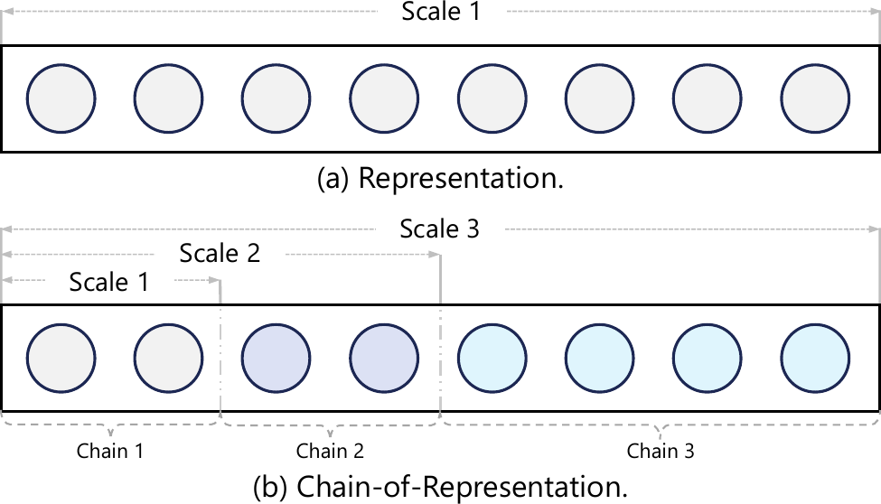
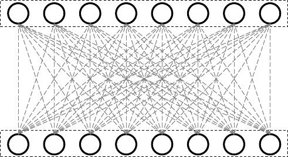
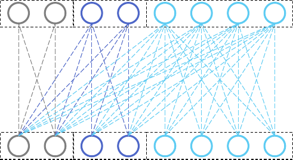
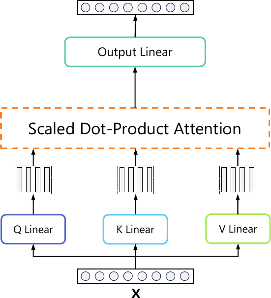
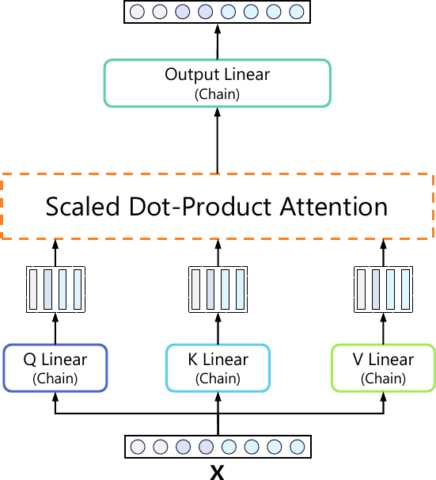
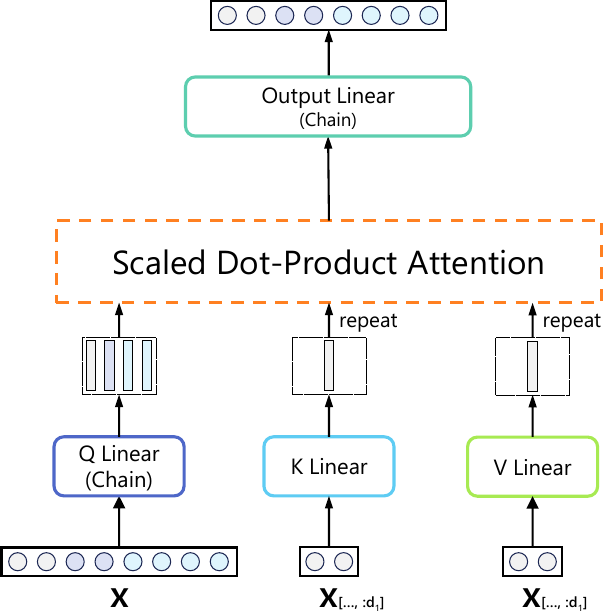
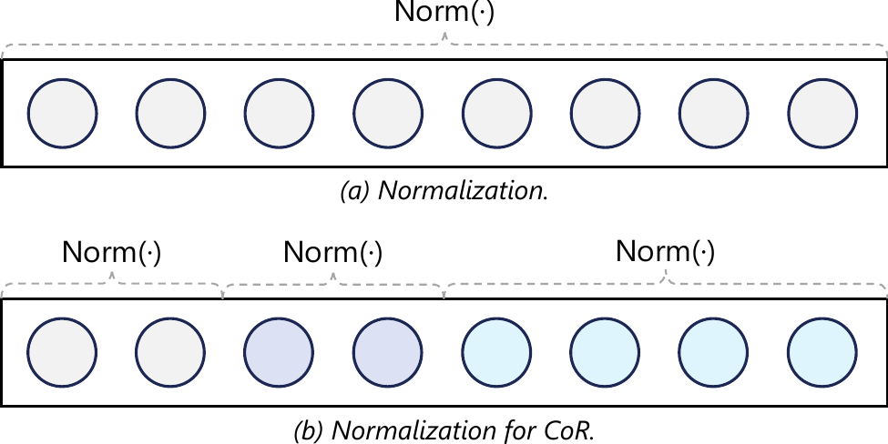
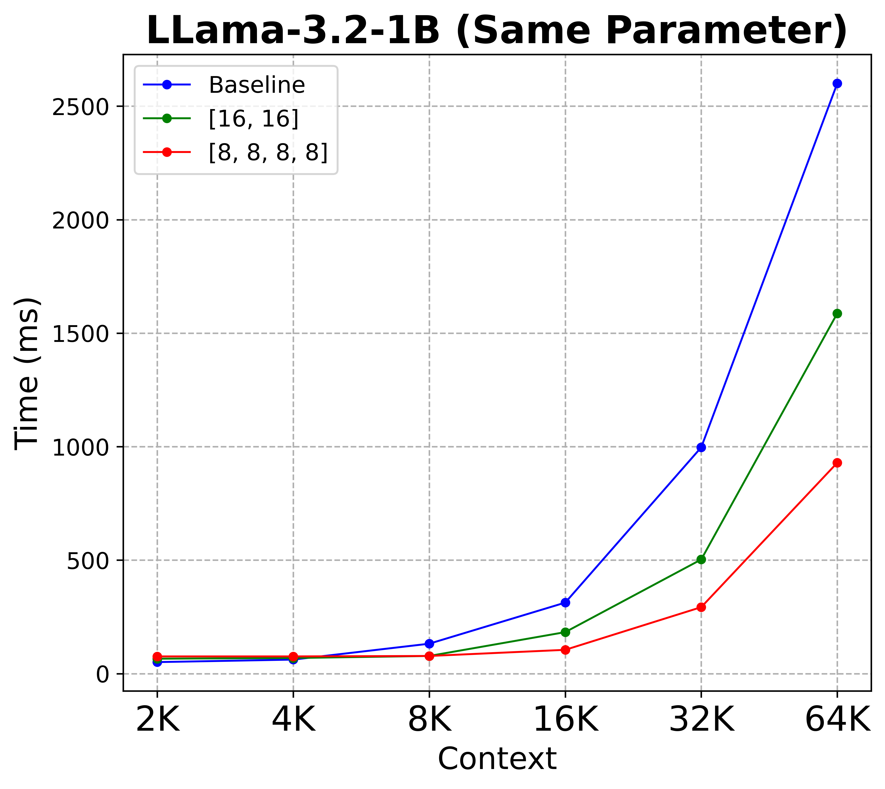
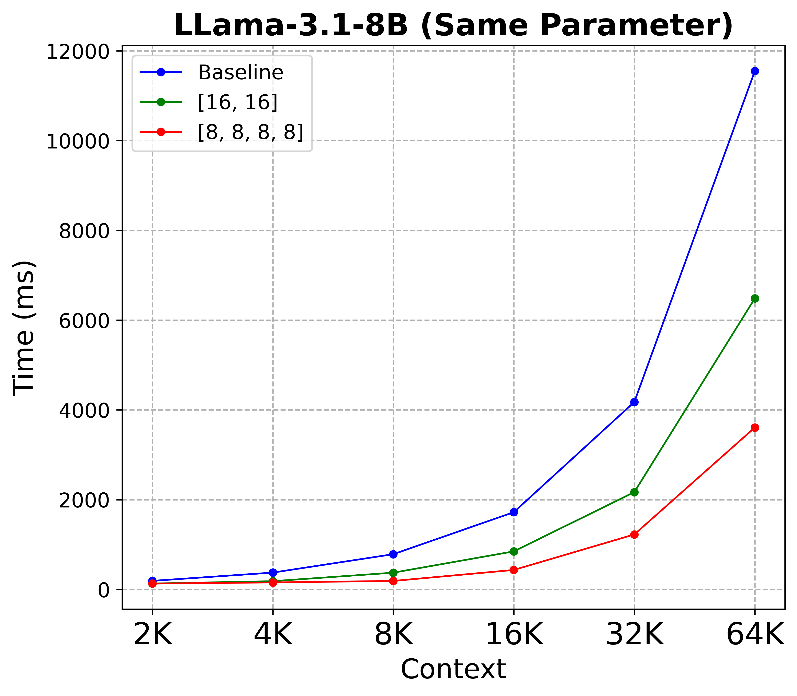
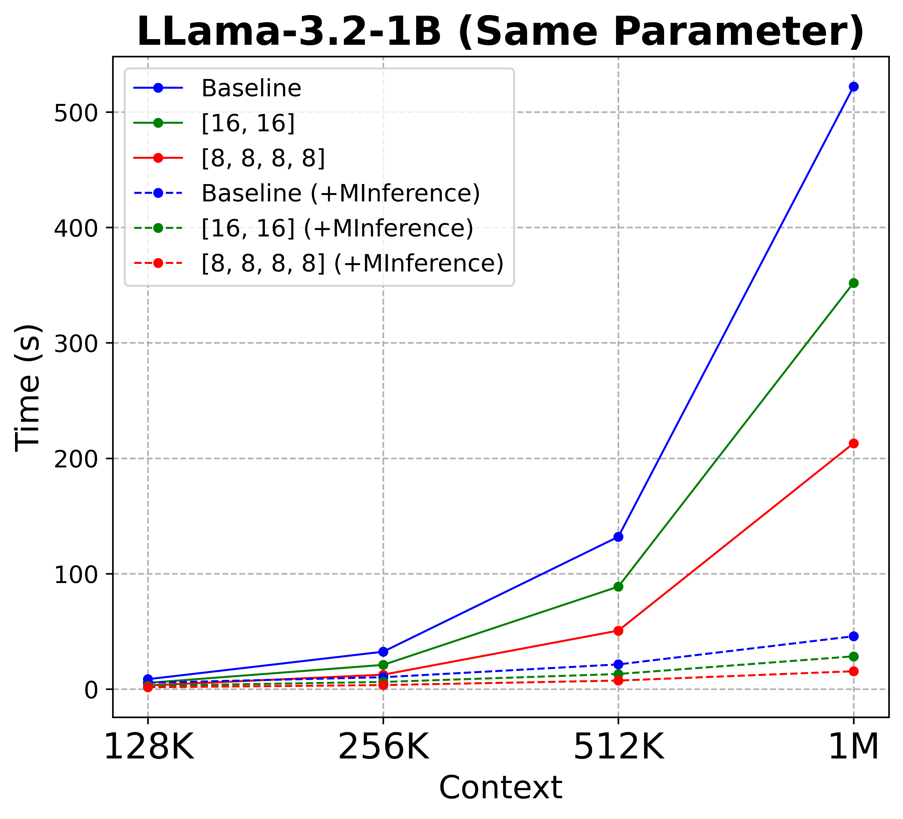

# Title: Chain-of-Model Learning for Language Model （面向语言模型的链式模型学习）

- ArXiv: 2505.11820
- 作者（Authors）: Yongliang Shen, Cen Lu, Zihao Li, Zifan Song, Caihua Shan, Yansen Wang, Kan Ren, Xiaoqing Zheng, Tao Qin, Yuqing Yang, Dongsheng Li, Lili Qiu
- 章节（Sections）: 53
- 估计词元数（Estimated tokens）: 23.4k

## 目录（Contents）

- 1 引言（Introduction）
- 2 链式模型学习（Chain-of-Model Learning）
  - 2.1 表示（Representation）
    - 定义 1（Chain-of-Representation）
  - 2.2 层（Layer）
    - 定义 2（Chain-of-Layer）
    - 推论 2.1（Generality）
    - 推论 2.2（Causality）
    - 推论 2.3（Compositionality）
  - 2.3 模型（Model）
    - 定义 3（Chain-of-Model）
- 3 架构（Architecture）
  - 3.1 线性层（Linear）
  - 3.2 Transformer
    - 3.2.1 多头注意力（Multi-head Attention）
    - 3.2.2 前馈网络（Feed-Forward Network）
    - 3.2.3 归一化（Normalization）
    - 3.2.4 嵌入（Embedding）
  - 3.3 KV 共享（KV Sharing）
  - 3.4 目标函数（Objective Function）
- 4 实验（Experiments）
  - 4.1 性能（Performance）
  - 4.2 链扩展（Chain Expansion）
  - 4.3 弹性推理（Elastic Inference）
  - 4.4 预填充（Prefilling）
  - 4.5 链调优（Chain Tuning）
- 5 相关工作（Related Works）
- 6 结论（Conclusion）
- 参考文献（References）
- 附录 A 附录（Appendix A Appendix）
  - A.1 实验细节（Experimental Details）
    - 数据集（Datasets）
    - 超参数（Hyperparameters）
    - 评估（Evaluation）
    - 模型配置（Model Configuration）
  - A.2 完整结果（Full Results）
    - A.2.1 预填充（Prefilling）
    - A.2.2 CIFAR-10 MLP 实验（CIFAR-10 MLP Experiments）
  - A.3 训练损失曲线（Training Loss Curves）
    - CoLM 配置对比（Comparison of CoLM Configurations）
    - 不同头的损失（Loss Across Different Heads）
    - KV 共享的效果（Effect of KV Sharing）
  - A.4 讨论（Discussion）
    - 问题 1（Question 1）
    - 问题 2（Question 2）
    - 问题 3（Question 3）
  - A.5 局限性（Limitations）
  - A.6 实现（Implementation）
    - A.6.1 线性层（Linear）
      - 块级稀疏核加速（Block-wise Sparse Kernel Acceleration）
    - A.6.2 注意力（Attention）
    - A.6.3 FFN
    - A.6.4 嵌入（Embedding）

## 摘要（Abstract）

###### 摘要（Abstract）

本文提出了一种新颖的学习范式，称为“ **链式模型（Chain-of-Model, CoM）** ”，它以链式风格将 **因果关系（Causal Relationship）** 融入每一层的 **隐藏状态（Hidden States）** 中，从而在模型训练中引入了显著的 **扩展效率（Scaling Efficiency）** ，并在部署时提供了 **推理灵活性（Inference Flexibility）** 。

我们引入了“ **链式表示（Chain-of-Representation, CoR）** ”的概念，它将每一层的隐藏状态表述为在隐藏维度级别上多个 **子表示（Sub-representations）** （即链）的组合。在每一层中，输出表示中的每个链只能查看输入表示中所有位于其之前的链。

因此，基于 CoM 框架构建的模型可以通过在先前模型（即链）的基础上增加链来逐步扩展模型规模，并且通过使用不同数量的链，可以提供多种不同大小的子模型用于 **弹性推理（Elastic Inference）** 。

基于这一原理，我们设计了 **链式语言模型（Chain-of-Language-Model, CoLM）** ，它将 CoM 的思想融入到 Transformer 架构的每一层中。基于 CoLM，我们进一步通过引入 **KV 共享（KV Sharing）** 机制提出了 CoLM-Air，该机制在第一个链内计算所有的 **键（Keys）** 和 **值（Values）** ，然后在所有链之间共享。这种设计展示了额外的可扩展性，例如实现无缝的 **语言模型切换（LM Switching）** 、 **预填充加速（Prefilling Acceleration）** 等。实验结果表明，我们的 CoLM 系列模型能够达到与标准 Transformer 相当的性能，同时提供更大的灵活性，例如通过渐进式扩展提高训练效率，并提供多种不同大小的模型用于弹性推理，为构建语言模型开辟了一条新途径。

我们的代码将在未来发布于：[https://github.com/microsoft/CoLM](https://github.com/microsoft/CoLM)。

<a id="section-1"></a>

## 1 引言（Introduction）

随着 **大型语言模型（Large Language Models, LLMs）** [OpenAI2023GPT4; Google2023Gemini; Meta2024LLama3; Alibaba2024Qwen; Deepseek2024DeepseekV3; Mistral2024MoE] 的出现，扩展 **Transformer 架构（Transformer architecture）** [Vaswani2017Transformer; Jared2020Scalinglaw; Jordan2022ChinchillaLaw] 已被视为革新现有 AI 格局并在广泛任务中实现最先进性能的事实标准方法。因此，工业界和学术界都日益关注探索扩展 Transformer 模型的策略。在此背景下，LLMs 的参数规模呈指数级增长，从数十亿级扩展到万亿级。其爆炸性增长的参数也给训练带来了极其昂贵的负担，并且无法为不同的部署环境提供可变的推理使用方式。鉴于这种 **扩展定律（scaling laws）** 日益增长的趋势，如何有效开发和利用 LLMs 以应对各种场景下的用户指令，已成为整个社区面临的一个开放且关键的挑战。

受 **弹性推理（elastic inference）** [Han2020OnceforAll; Devvrit2023MatFormer] 和 **持续训练（continual training）** [Andrei2016PNN; Liyuan2024CL] 的启发，我们认为现有的 LLM 架构扩展策略仍存在一些固有问题：

- 与人类智能能够增量式获取新知识不同，现有的扩展策略无法保留现有规模，总是需要从头开始训练，导致效率低下。
- 现有的 LLM 架构（例如， **稠密模型（Dense）** 或 **混合专家模型（Mixture of Experts, MoE）** [Robert1991MoE]）总是激活固定规模的参数，缺乏动态适应问题解决能力的机制。

<a id="figure-1"></a>


**图 1：一个包含 3 条链的 CoR 示例。**

在本文中，我们提出了一个称为 **“表示链（Chain-of-Representation, CoR）”** 的新概念，它将表示范式的范围推广到了更广泛的领域。具体来说，我们观察到任何表示总是可以在隐藏维度层面被视为多个子表示的组合。因此，我们将这种组合定义为 **表示链（Chain-of-Representation, CoR）** ，其中每个子表示对应一条链。基于此定义，通过使用不同数量的前序链，其对应的特征可用于编码不同的知识（我们称之为“尺度”），如图 [1](#S1.F1) 所示。因此，如何构建 CoR 特征之间的连接以确保跨每个尺度的特征转换，已成为关键一步。

为此，我们引入了 **“模型链（Chain-of-Model, CoM）”** ，这是一种用于建模 CoR 特征的新颖学习范式。其核心思想是在不同尺度之间引入因果依赖关系，确保每个尺度在表示层面只能使用其前序尺度的信息。为了实现这一点，我们提出了 **“层链（Chain-of-Layer, CoL）”** ，以基于 CoR 特征重新表述当前的网络层。具体而言，我们要求每个输出链 $i$ 仅以输入链 1 到 $i$ 为条件。图 [2](#S3.F2) 展示了将 CoL 应用于线性层的一个示例。CoL 具备三个重要特性： **通用性（Generality）** 、 **因果性（Causality）** 和 **组合性（Compositionality）** 。这意味着：1) 任何层都可以被视为 CoL（链数为 1）；2) 为了获得尺度 $i$ 的特征，CoL 允许我们仅激活其相关链的参数；3) 如果两个层都符合 CoL 设置，那么它们的组合也遵循 CoL 属性。遵循这一原则，我们可以堆叠多个 CoL 层，将其从层级别推广到模型级别，即 **模型链（Chain-of-Model, CoM）** 。CoM 的范围可以推广到任何机器学习模型，因为所有模型都可以被视为链数设为 1 的 CoM 特例。此外，CoM 的输出特征也符合 CoR 的特性，CoM 可以通过使用不同数量的链，在不同尺度上提供多个子模型。基于这些特性，CoM 在构建基础模型时可以展现出更大的灵活性。

在 CoM 框架的基础上，我们通过将 CoL 的思想应用于 Transformer 内的每一层，重新表述了语言模型的架构，并将其命名为 **“语言模型链（Chain-of-Language-Model, CoLM）”** 。CoLM 可以在单次前向传播中集成多尺度训练，为弹性推理提供多个子模型。它还使我们能够通过链扩展（即增加链的数量）来扩展语言模型，同时保留使用先前尺度的能力。此外，基于 CoL 准则，我们在注意力模块中进一步引入了一种 KV 共享机制，要求所有键和值都在第一条链内计算，并将其命名为 CoLM-Air。基于此机制，CoLM-Air 提供了更强的可扩展性和灵活性，包括允许我们在无需任何额外重新计算（例如，键和值）的情况下无缝切换任何不同尺度的 LLMs，在第一条链内加速预填充等。在多个基准测试上的实验结果也表明，我们的 CoLM 系列模型在实现可比性能的同时，展现出更好的可扩展性和灵活性。总的来说，本文的贡献可总结如下：

- 我们指出了现有 LLM 扩展方法的内在问题，并提出了 **表示链（Chain-of-Representation, CoR）** 的概念，该概念在单一表示中集成了多尺度能力。
- 为了建模 CoR 特征之间的关系，我们引入了 **模型链（Chain-of-Model, CoM）** 学习，并将其进一步扩展到语言模型中，称为 CoLM。CoLM 能够在一个统一的基础模型内提供不同尺度的多个子模型，从而实现更灵活和可扩展的扩展。
- 在多个基准测试上的实验结果表明，我们的 CoLM 系列模型能够达到与现有 LLM 框架相当的性能，同时在不同的场景（例如，预填充、调优等）中展现出更好的扩展可扩展性和灵活性。

<a id="section-2"></a>

## 2 链式模型学习（Chain-of-Model Learning）

在本节中，我们首先介绍 **链式表示（Chain-of-Representation, CoR）** 的概念，它将现有表示的范式推广到了更广的范围。之后，我们引入 **链式层（Chain-of-Layer, CoL）** 和 **链式模型（Chain-of-Model, CoM）** ，以从层级别到模型级别对 CoR 进行建模。

<a id="section-2-1"></a>

### 2.1 表示（Representation）

###### 定义 1（链式表示， Chain-of-Representation）

根据定义 [1](#Thmdefinition1)，CoR 中的每条链对应于每个子表示（即 $x_{i}$）。通过激活前几条链（即 $x_{\leq i}$），它可以用来编码 $\rm{scale}_{i}$ 的信息，其维度为 $\rm{sum}(d_{\leq i})$。因此，CoR 允许我们在一个表示中编码 n 个不同的尺度。如果 $n=1$，则 CoR 等同于原始表示。图 [1](#S1.F1) 展示了 CoR。

###### 定义 1（链式表示， Chain-of-Representation）

<a id="section-2-2"></a>

### 2.2 层（Layer）

然而，一个挑战随之出现：如何设计层以在 CoR 输入和 CoR 输出之间建立连接，从而实现多尺度特征变换，同时确保输出特征遵循定义 [1](#Thmdefinition1) 中的 CoR 标准。因此，我们需要保持每个尺度只能利用其所有先前尺度的信息，并引入 **链式层（Chain-of-Layer）** ，将因果关系纳入 CoR 的隐藏状态中，如下所示：

###### 定义 2（链式层， Chain-of-Layer）

CoL 具备三个基本属性—— **通用性（Generality）** 、 **因果性（Causality）** 和 **组合性（Compositionality）** ：

###### 推论 2.1（通用性， Generality）

如果 $n=1$，CoL 可被视为处理常规表示的标准网络层。换言之，任何网络层都可以推广为 CoL 的形式。因此，我们可以通过在现有链上引入额外的链来逐步增加层的维度。

###### 推论 2.2（因果性， Causality）

在 CoL 设计中，每个尺度可以聚合其所有先前尺度的信息，以增加可扩展性并有效避免灾难性遗忘（Catastrophic Forgetting）[1]。因此，为了获得 $\rm{Scale}_{i}$ 的信息，这种设计允许我们仅计算其前驱链（即 $\theta_{\leq i}$），而无需计算全部权重。因此，CoL 可以在一个表示内提供多尺度信息，并允许我们动态计算不同尺度的特征。

###### 推论 2.3（组合性， Compositionality）

更重要的是，CoL 还支持组合性，这意味着堆叠多个 CoL 层仍能保留 CoL 的特性。这一属性允许我们将 CoL 的范围从层级别推广到模型级别。

###### 定义 2（链式层， Chain-of-Layer）

###### 推论 2.1（通用性， Generality）

###### 推论 2.2（因果性， Causality）

###### 推论 2.3（组合性， Compositionality）

<a id="section-2-3"></a>

### 2.3 模型（Model）

###### 定义 3（链式模型， Chain-of-Model）

基于定义 [3](#Thmdefinition3)，如果一个模型满足 CoM 的标准，那么它也继承了所有 CoL 的属性，例如通用性和因果性。换句话说，任何模型都可以被视为一种 CoM（即 $n=1$）。并且，CoM 可以在一个模型内集成多个不同尺度的子模型，使我们能够基于先前的模型能力进行扩展。这种能力直接赋予了基础模型更好的可扩展性和灵活性。在下一节中，我们将探讨如何基于 CoM 框架构建语言模型。

###### 定义 3（链式模型， Chain-of-Model）

<a id="section-3"></a>

**参考文献**

1.  James, K., et al. (2016). Catastrophic forgetting in connectionist networks. _Trends in Cognitive Sciences_, 20(4), 245-257.

## 3 架构（Architecture）

在本节中，我们将详细描述如何将 **链式模型（Chain-of-Model, CoM）** 应用于语言模型，包括线性层、Transformer 内部的各个模块（例如嵌入层、自注意力、前馈网络、归一化层）以及目标函数。我们将其命名为 **语言模型链（Chain-of-Language-Model, CoLM）** 。此外，我们基于 CoLM 框架进一步引入了一种 **KV 共享机制（KV sharing mechanism）** ，并将其命名为 **CoLM-Air** ，它提供了更好的灵活性，例如 **预填充加速（prefilling speedup）** 和 **无缝 LLM 切换（seamless LLM switching）** （^1^11 切换不同的 LLM 通常需要重新计算键和值。）。



> (a) 线性层。

<a id="section-3-1"></a>

### 3.1 线性层（Linear）

线性层是神经网络中的基础层，它通过线性运算将输入特征转换为输出特征。线性层的数学表达式为 $\rm{y}=\rm{W}x+\rm{b}$，其中 $\rm{W}\in\mathbb{R}^{D_{y}\times D_{x}}$，$\rm{b}\in\mathbb{R}^{D_{y}}$。这里，$\rm{y}$ 的每个神经元都与输入特征 $\rm{x}$ 密集连接，因此我们总是需要计算 $\rm{W}$ 和 $\rm{b}$ 的所有元素以保持 $\rm{y}$ 的完整语义。遵循 **链式层（Chain-of-Layer, CoL）** 的设置，我们在线性层中引入一个新的超参数，称为“链（Chain）”，用于确定 $x$ 和 $y$ 中每个链的大小，如 **链式比率（Chain-of-Ratio, CoR）** 所示。这里，我们将超参数 $\mathcal{C}=\{c_{1},\dots,c_{n}\}$ 设为计算每个 $\rm{x}_{i}\in\mathbb{R}^{D_{x_{i}}}$ 和 $\rm{y}_{i}\in\mathbb{R}^{D_{y_{i}}}$ 维度的基础比率，其中 $\rm{D}_{x_{i}}=\frac{c_{i}}{\sum\mathcal{C}}\cdot D_{x}$，$\rm{D}_{y_{i}}=\frac{c_{i}}{\sum\mathcal{C}}\cdot D_{y}$。因此，其计算方式如下：

$$
\rm{y}=\big{\|}_{i=1}^{n}\,(y_{i})=\big{\|}_{i=1}^{n}\,(W_{i}x_{\leq i}+b_{i}),(1)
$$

其中 $\rm{W}_{i}\in\mathbb{R}^{D_{y_{i}}\times(\sum_{j=1}^{i}D_{x_{j}})}$，$\rm{b_{i}}\in\mathbb{R}^{D_{y_{i}}}$，$\|$ 表示拼接操作。基于此设计，该线性层也满足 CoL 准则，并且在 $n=1$ 时与标准线性层相同。我们将其称为 **链式线性层（Chain-of-Linear）** 或 **线性（链）层（Linear (Chain) layer）** ，它构成了构建语言模型的基础。图 [2](#S3.F2) 描绘了线性层与链式线性层之间的比较。为了便于大规模预训练，我们进一步提供了一个高效的实现，采用精心设计的块状稀疏核，优化了数据访问和全归约通信，详见附录 [A.6.1](#A1.SS6.SSS1)。

<a id="section-3-2"></a>

### 3.2 Transformer


> (a) 注意力。

#### 3.2.1 多头注意力（Multi-head Attention）

在 **多头注意力（Multi-head Attention, MHA）** 中，首先对输入特征应用线性运算以获得查询、键和值，并将每个部分分割成多个头。然后，我们在每个头（即查询、键和值）上执行注意力函数，并将所有头拼接起来，最后通过一个线性变换产生最终输出。总体而言，MHA 的数学表达式可表述为：

$$
\displaystyle\rm{MHA(x)}= \displaystyle\rm{O\big{(}\big{\|}_{i=1}^{h}Attention(q_{i},k_{i},v_{i})\big{)}}=\rm{O\big{(}\big{\|}_{i=1}^{h}\rm{softmax(\frac{q_{i}k_{i}^{T}}{\sqrt{d_{k}}})v_{i}}\big{)}}, (2) \displaystyle\rm{这里} \displaystyle\;\rm{\|_{i=1}^{h}q_{i}=Q(x),\|_{i=1}^{h}k_{i}=K(x),\|_{i=1}^{h}v_{i}=V(x)},
$$

其中 $\rm{h}$ 是头数，$\rm{d_{k}}$ 是头维度，$\rm{Q(\cdot)}$、$\rm{K(\cdot)}$、$\rm{V(\cdot)}$、$\rm{O(\cdot)}$ 代表用于获取查询（query）、键（key）、值（value）和输出的线性层（Linear layer）。为了在 MHA 中支持 CoR 建模，我们首先直接使用第 [3.1](#S3.SS1) 节描述的 **链式线性层（Chain-of-Linear layers）** 替换所有线性层（即 Q、K、V、O）。然而，由于 $\rm{Attention(q,k,v)}$ 内部存在点积运算，如果单个头（即 $q_{i}$、$k_{i}$、$v_{i}$）包含来自 2 条或更多链的信息，其输出将混合这些信息，然后分配到每条链，这无法满足 CoL 的设置。因此，我们希望每个头仅包含单一尺度的信息。为了实现这一点，我们设计了一个简单的技巧，要求 $\mathcal{C}$ 的总和等于 $\rm{h}$，这样每个 $c_{i}$ 就代表将为链 $i$ 分配多少个头。这种设计使得每条链都能保留其专用的查询、键和值，确保我们的注意力机制能够满足 CoL 的标准，我们将其称为 **链式注意力（Chain-of-Attention）** 或 **注意力（链）模块（Attention (Chain) module）** 。图 [3](#S3.F3) 说明了注意力与链式注意力之间的区别。

#### 3.2.2 前馈网络

**前馈网络（Feed-Forward Network, FFN）** 是 Transformer 的另一个关键组件，它由多个线性层与非线性激活函数（例如 ReLU [Vinod2010ReLU] 或 SiLU [Noam2020GLU]）交错组成。为了将 CoM 框架推广到 Transformer 中，FFN 也应遵循 CoL 的设置。为此，我们只需使用链式线性层替换 FFN 的每个线性层，并采用与注意力（链）模块相同的超参数 $\mathcal{C}$。这样，FFN 的输出特征也能符合 CoR 的要求。关于 FFN 的实现和示例可参考附录 [A.6.3](#A1.SS6.SSS3)。

<a id="figure-4"></a>



> 图 4 | 归一化（CoR）。

#### 3.2.3 归一化

**归一化（Normalization）** 是一种稳定逐层训练的技术。在 Transformer 中，我们在特征级别、注意力层或 FFN 层之前执行归一化 [Jimmy2016LayerNorm; Biao2019RMSNorm]。这里，我们使用一个简单的技巧，即分别对每条链应用归一化函数。此操作保证了归一化后的特征能够保留 CoR 属性，并且由于可以通过分组操作减少全归约（all-reduce）操作的数量，从而略微提高训练效率。图 [4](#S3.F4) 描绘了归一化层的设计。

#### 3.2.4 嵌入层

**嵌入层（Embedding）** $\mathbf{E}\in\mathbb{R}^{V\times D}$ 通常是语言模型中的第一层，它将原始数据 $\mathbf{I}$ 转换为输入嵌入 $x\in\mathbb{R}^{D}$。我们在训练期间不对嵌入层进行任何修改，但在编码尺度 $i$ 的信息时，我们只需要使用对应于前 $i$ 条链的嵌入 $\rm{x}[:{sum}_{j=1}^{i}D_{x_{j}}]$。详细的示例可以在附录 [A.6.4](#A1.SS6.SSS4) 中找到。

<a id="section-3-3"></a>

### 3.3 KV 共享

基于我们上述的设计，Transformer 可以提供跨不同模型尺度的多种能力，实现针对各种应用的灵活部署。然而，在注意力模块中，每条链也保留了其独特的键和值集合，无法在不同尺度之间建立连接。例如，当从小型语言模型（Small Language Model, SLM）切换到大型语言模型（Large Language Model, LLM）进行生成时，通常需要为前面的内容重新计算所有的键和值。为此，我们进一步提出了一项雄心勃勃的技术，称为 **_KV 共享（KV sharing）_** ，即所有的键和值仅在第一条链中计算，然后共享给所有其他链。如果键和值的数量少于查询头的数量，我们遵循 GQA [Joshua2023GQA] 的做法，通过重复键和值来匹配查询头的数量，如图 [3(c)](#S3.F3.sf3) 所示。该设计也符合 CoL 的标准（^2^22 可以认为 $y_{i}$ 仅以 $x_{1}$ 为条件，这属于定义 [2](#Thmdefinition2) 的一个子集。）。尽管它略微影响性能，但这种设计也展现出一些独特的特性，例如预填充加速，并允许我们从 CoLM 无缝切换到不同尺度的语言模型进行生成。据我们所知，这是首个实现此功能的工作，我们将带有 KV 共享的 CoLM 称为 **CoLM-Air** 。更详细的实现见附录 [A.6.2](#A1.SS6.SSS2)。

<a id="section-3-4"></a>

### 3.4 目标函数

基于上述各组件的设计，Transformer 网络的输出特征 $x\in\mathbb{R}^{D}$ 将遵循 CoR 形式 $\xi(x,n)$。最后，我们应用一个分类层 $\mathbf{W}\in\mathbb{R}^{D\times V}$，将特征维度映射到词汇表大小。通常，我们可以采用交叉熵损失（cross entropy loss）作为 CoLM 训练的目标函数。然而，为了实现多尺度预测，我们还需要为每个尺度构建独立的分类头。受 MRL [Aditya2022MRL] 启发，我们提出一种多链交叉熵损失来计算每个尺度：$\rm{Loss_{i}}={\cal L}(\rm{W}^{i}x_{\leq i})$，其中 $\rm{W}^{i}\in\mathbb{R}^{\rm{sum}_{j=1}^{i}(D_{x_{j}})\times V}$ 是 $\rm{W}$ 的一个子集，$\cal{L}$ 是交叉熵函数。尽管不同逻辑值（即 $\rm{W}^{i}x_{\leq i}$）的计算可以共享而无需额外成本，但在训练期间计算多个交叉熵损失仍会带来一些计算开销。由于资源限制，我们在预训练阶段应用交叉熵损失以加速收敛，然后使用提出的多链交叉熵损失对模型进行微调。

<a id="section-4"></a>

## 4 实验（Experiments）

<a id="section-4-1"></a>

### 4.1 性能（Performance）

在我们的实验中，我们使用 **SlimPajama 数据集（SlimPajama dataset）** [cerebras2023slimpajama] 作为预训练语料库，包含 6000 亿个词元。此处，我们使用 **LLaMA-2 分词器（LLaMA-2 tokenizer）** [^3^33] 处理语料，词汇表大小为 32000。我们利用 **全分片数据并行（Fully Sharded Data Parallel, FSDP2）** 进行分布式训练，由 **TorchTitan 框架（TorchTitan framework）** [Wanchao2024TorchTitan] 提供支持。我们的训练基于一个由 32 块 **NVIDIA A100 40GB GPU** 组成的集群，梯度累积步数为 4，从而得到 1024 的有效批大小。训练采用 **BFloat16** 精度，序列长度设置为 4096 个词元。我们选择 **AdamW 优化器（AdamW optimizer）** [Diederik2015Adam]，学习率为 $1.5\times 10^{-4}$。由于资源限制，我们的模型预训练了 50K 步，约 2000 亿个词元。对于模型配置，我们使用链 $\cal{C}$ 和维度 $D$ 来确定不同的模型。基线模型使用 ${\cal C}=\{32\}$，并采用与 **LLaMA-3.2-1B** 相同的配置，因此它等效于标准的语言模型。对于 **CoLM 系列（CoLM-series）** ，我们使用 ${\cal C}=\{16,16\}$ 和 ${\cal C}=\{8,8,8,8\}$ [^4^44]。为了与基线对齐，我们也增加了 CoLM 的维度，因为 **线性链（Chain-of-Linear）** 比 **线性层（Linear layer）** 使用的参数更少。我们使用 **EleutherAI 语言模型评估套件（EleutherAI Language Model Evaluation Harness）** [Gao2024Evaluation] 在零样本设置下评估模型在常识任务上的表现。更多细节可参考附录 [A.1](#A1.SS1)。

我们的结果报告在表 [1](#S4.T1) 中，并有以下观察：1) 采用 **KV 共享机制（KV sharing mechanism）** 的 **CoLM-Air** 会轻微影响模型性能，因为它仅在第一个链中计算键和值。然而，这种设计带来了更大的灵活性，这将在后续章节讨论；2) 与 $\{8,8,8,8\}$ 相比，使用 $\{16,16\}$ 可以获得更好的性能。当使用更宽尺寸的 $\{16,16\}$ 时，我们的方法可以达到与基线相当的性能。这可以被视为一种权衡，因为使用更多的链可以提供更多子模型供使用。
总体而言，CoLM 取得了与基线竞争性的结果，同时提供了显著更快的 **预填充速度（prefilling speeds）** 和更大的灵活性，这将在后续章节中讨论。

> 表 1 | 基线和 CoLM 在常识推理任务上的性能。模型训练了 50K 步。每个任务均报告 acc_norm 指标。

<a id="section-4-2"></a>

### 4.2 链扩展（Chain Expansion）

<a id="table-2"></a>

> 表 2 | 基线模型与扩展模型在常识推理任务上的性能对比。

| Model           | HellaSwag$\uparrow$ | Obqa$\uparrow$ | WinoGranda$\uparrow$ | ARC-e$\uparrow$ | ARC-c$\uparrow$ | Boolq$\uparrow$ | Piqa$\uparrow$ | Sciq$\uparrow$ | Avg$\uparrow$    |
| --------------- | ------------------- | -------------- | -------------------- | --------------- | --------------- | --------------- | -------------- | -------------- | ---------------- |
| Tiny-LLaMA-v1.1 |                     |                |                      |                 |                 |                 |                |                |                  |
| Baseline        | $61.47$             | $36.62$        | $59.43$              | $55.47$         | $32.68$         | $55.99$         | $73.56$        | $84.20$        | $57.43$          |
| + Expansion     | $61.66$             | $36.62$        | $60.62$              | $56.27$         | $32.94$         | $58.44$         | $74.05$        | $86.20$        | $\mathbf{58.35}$ |
| LLaMA-3.2-1B    |                     |                |                      |                 |                 |                 |                |                |                  |
| Baseline        | $63.78$             | $36.42$        | $59.83$              | $60.56$         | $36.03$         | $63.70$         | $74.37$        | $88.40$        | $60.39$          |
| + Expansion     | $63.19$             | $37.02$        | $60.69$              | $60.31$         | $36.69$         | $63.55$         | $74.65$        | $88.20$        | $\mathbf{60.53}$ |

鉴于 **链式混合专家模型（Chain of Mixture of Experts, CoM）** 的通用性和因果性，任何模型在链数为 1 时都可以被视为 CoM 的一个特例，并且可以扩展到多条链。因此，我们引入了 **链扩展（Chain Expansion）** ，该方法使用训练好的模型作为初始链，然后通过添加新的额外链来扩展它。从概念上讲，这类似于 **渐进式网络架构（Progressive Network Architectures）** [Andrei2016PNN]，允许我们在保留先验知识的同时增加额外的容量。然而， **链式语言模型（Chain of Language Models, CoLM）** 已将其扩展到 Transformer（Transformer）中进行训练。总体而言， **链扩展（Chain Expansion）** 使我们能够基于现有规模逐步增加模型规模，避免从头开始训练。

为了验证这一点，我们选择了两个 LLaMA（Large Language Model Meta AI）变体（即 TinyLLaMA-v1.1 [Peiyuan2024TinyLlama] 和 LLaMA-3.2-1B [Meta2024LLama3]）作为扩展的第一条链。由于这两个模型都使用了 **分组查询注意力（Group Query Attention, GQA）** [Joshua2023GQA]，其中查询（Query）数量为 32，键值（Key-Value, KV）头数为 8。遵循第 [3.2.1](#S3.SS2.SSS1) 节中的注意力（Attention）设置，我们设定 $c_{1}=32$，随后引入第二条链，其 $c_{2}=8$，这带来了近 0.8B 的参数增量。我们对扩展的分类头（Classification Head）进行零初始化，使其输出的逻辑值（Logits）从原始训练好的模型开始。由于资源限制，我们的扩展模型以 1024 的批次大小（Batch Size）训练了 20K 步，涉及近 80 亿个词元（Tokens）。此外，我们还冻结了第一条链以保留原始知识并加速训练。更多细节可参考附录 [A.1](#A1.SS1)。

所有结果均呈现在表 [2](#S4.T2) 中。与 Tiny-LLaMA-v1.1 和 LLaMA-3.2-1B 相比，我们分别取得了 $0.92$ 和 $0.14$ 的提升。由于 LLaMa-3.2-1B 是一个更强的基线，它需要更多的计算量才能获得显著收益，但我们的方法在有限的计算量下仍然能够改进它。
总体而言，这些结果也表明我们的方法在改进基线模型方面的有效性，即使在资源受限的情况下也是如此。

<a id="section-4-3"></a>

### 4.3 弹性推理（Elastic Inference）

**弹性推理（Elastic Inference）** 旨在提供动态的推理使用方式，以满足不同部署场景的需求。与先前需要额外采样策略的方法 [Han2020OnceforAll; Devvrit2023MatFormer] 相比， **链式语言模型（Chain-of-Language-Model, CoLM）** 在一个模型内集成了多个不同规模的子模型，从而能够通过单次前向传播实现统一的预训练。为了获得跨不同规模的子模型用于预测，我们使用第 [3.4](#S3.SS4) 节描述的损失函数进一步预训练了我们的 CoLM 模型。我们选择 CoLM-Air 的设置（其中 ${\cal C}=\{16,16\}$，维度（Dims）为 2048）进行验证。遵循先前的工作 [Aditya2022MRL]，我们冻结了 **Transformer** 主干网络，仅训练分类头以加速训练。表 [3](#S4.T3) 中的结果也凸显了 CoLM 在实现弹性推理方面的潜力。

> 表 3 | 通过使用不同数量的链来提供多个子模型的弹性推理。

<a id="section-4-4"></a>

### 4.4 预填充（Prefilling）

**预填充（Prefilling）** [Amey2023SARATHI] 是指在 **Transformer** 中生成键（Keys）和值（Values）以理解用户指令的提示（Prompt）。现有的 **大型语言模型（Large Language Model, LLM）** 范式总是要求我们部署完整模型进行计算，这带来了巨大的计算成本。对于 CoLM-Air，所有的键和值都在第一个链中计算，因此我们只需根据 **链式混合（Chain-of-Mixture, CoM）** 的因果性计算第一个链。请注意，第一个链仍然是一个标准的语言模型，我们可以进一步应用任何推理时技术（例如， **MInference** [Huiqiang2024MInference]）。在此，我们使用两个规模（LLama-3.2-1B 和 LLama-3.1-8B）进行评估，上下文长度从 2K 到 1M。我们选择了两个设置：${\cal C}=\{8,8,8,8\}$ 和 ${\cal C}=\{16,16\}$，其参数量与基线模型相似。我们的结果如图 [5](#S4.F5) 所示。更多实验细节和结果可参考附录 [A.2.1](#A1.SS2.SSS1)。

从图 [5](#S4.F5) 中，我们观察到，与参数量相似的 LLaMa 相比，CoLM-Air 实现了更快的预填充速度。随着序列长度的增加，CoLM-Air 在预填充阶段能实现更快的加速。具体而言，在处理 1M 个词元（Token）时，当 ${\cal C}$ 为 $\{16,16\}$ 和 $\{8,8,8,8\}$ 时，CoLM-Air 的预填充速度分别快了近 $1.6\times$ 和 $3.0\times$。并且，当与 **MInference** [Huiqiang2024MInference] 结合时，CoLM-Air 在图 [5(d)](#S4.F5.sf4) 中实现了高达 $27\times$ 的加速（1920 $\rightarrow$ 70.0）。这些结果都表明，我们的 CoLM-Air 能够有效加速预填充。



> (a) Llama-1B (2K - 64K).

<a id="section-4-5"></a>

### 4.5 链式调优（Chain Tuning）

得益于 CoM 架构的因果性，CoLM 由多个链组成，每个链都可以利用先前链的能力。因此，基于这一特性，我们提出了 **链式调优（Chain Tuning）** ，其目标是在冻结前几个链的同时，微调后面的链。链式调优可以部分降低调优成本，并通过保留前几个链来减轻灾难性遗忘（Catastrophic Forgetting）。此外，当我们采用 CoLM-Air 设置并冻结第一个链时，来自微调模型的键和值可以无缝迁移到原始模型，无需任何额外计算。在此，我们使用第 [4.2](#S4.SS2) 节中训练的扩展模型（具有两个链）作为基线，然后微调扩展的链。为了展示此能力，我们选择 **GLUE 基准（General Language Understanding Evaluation benchmark）** [Alex2019GLUE] 进行快速验证。我们在表 [4](#S4.T4) 中报告了结果，更多实验细节可参考附录 [A.1](#A1.SS1)。从表 [4](#S4.T4) 中，我们观察到链式调优仅通过微调大约 42% 的模型参数就能提升模型性能。此外，它与参数高效微调方法（例如 **LoRA（Low-Rank Adaptation）** [Edward2022LoRA]）兼容。

<a id="table-4"></a>

> 表 4 | GLUE 开发集结果。每个任务以准确率（Accuracy）报告。“+ CT” 表示链式调优，括号内的值表示微调的参数量和总参数量。

| 模型             | SST-2   | COLA    | MNLI    | MRPC    | QNLI    | QQP     | RTE     | WNLI    | 平均（Avg.）     |
| ---------------- | ------- | ------- | ------- | ------- | ------- | ------- | ------- | ------- | ---------------- |
| 基线（Baseline） | $67.89$ | $32.98$ | $35.87$ | $49.02$ | $51.77$ | $51.65$ | $54.87$ | $43.66$ | $48.46$          |
| + CT (0.8B/1.9B) | $92.32$ | $54.87$ | $82.26$ | $62.01$ | $82.87$ | $55.22$ | $59.21$ | $53.52$ | $\mathbf{67.79}$ |

<a id="section-5"></a>

## 5 相关工作（Related Works）

**基础模型（Foundation Models）** 在机器学习中扮演着关键角色，用于有效建模数据间的关系。从架构层面来看，我们认为现有的 **大型基础模型（Large Foundation Models, LFM）** 在概念上可以分解为两个部分： **基础架构（Base Architecture）** 和 **扩展架构（Scaling Architecture）** 。

- **基础架构（Base Architecture）** ：指的是执行从原始数据进行特征变换的 **骨干网络（backbone network）** （例如，Transformer [Vaswani2017Transformer]、Mamba [Albert2023Mamba]、RWKV [Bo2023RWKV]）。
- **扩展架构（Scaling Architecture）** ：代表用于提升模型能力的 **扩展策略（scaling strategies）** （例如，增加层数、维度或专家数量 [Noam2017MoE; Robert1991MoE]）。

在某种程度上， **链式模型（Chain of Models, CoM）** 也可以被视为一种通过增加链的数量来实现的扩展架构，因此它可以应用于任何基础架构。此外，与 **密集（Dense）** 或 **混合专家（Mixture of Experts, MoE）** 架构相比，CoM 的核心思想是 **整合不同规模的能力** ，并允许我们利用先前模型的继承知识来提高扩展效率并避免 **灾难性遗忘（catastrophic forgetting）** 。

**弹性推理（Elastic Inference）** 旨在提供多个子模型，以适应不同部署约束下的多样化用户指令。当前的大型语言模型（Large Language Models, LLMs）架构只能提供固定的推理能力，因此需要我们预训练多个不同规模的模型，导致效率低下。为此，Once-for-All [Han2020OnceforAll] 构建了一个超级网络，然后随机采样一个专门的子网络进行训练。其他一些工作 [Devvrit2023MatFormer; Abhinav2024MatMamba] 在网络块中引入了一些嵌套架构设计，以提供跨不同模型粒度的弹性推理，但也需要每个子网络的采样策略。通过在 CoR 中纳入子模型间的因果依赖关系，CoM 可以在单次前向传播中整合多尺度训练，展现出更高的效率。

**持续训练（Continual Training）** 是指从预训练模型继续训练过程，以提升其能力并避免灾难性遗忘。为了利用现有预训练模型的能力，最简单的方法是使用 **深度扩展方法（depth-up scaling method）** （即增加层数），例如 Solar 10.7B [Kim2024SOLAR]。深度扩展可以有效地重用先前层的权重进行初始化，但无法保留分类层的输出逻辑值（即概率）。CoM 可以被视为一种 **宽度扩展方法（width-up scaling method）** ，它可以完美地保留从第一层到最后一层的整个模型的知识。请注意，CoM 也与深度扩展方法兼容。此外， **渐进式神经网络（Progressive Neural Network, PNN）** [Andrei2016PNN] 是持续训练领域的开创性工作，它也启发了我们开发 CoM。PNN 通过侧向连接引入新参数来扩展多层感知机（Multilayer Perceptron, MLP）层，然后应用于强化学习任务。与 PNN 相比，CoM 将其范围扩展到更广泛的领域，并有效地证明了使用 Transformer 进行预训练的可行性。

<a id="section-6"></a>

## 6 结论（Conclusion）

本文中，我们引入了 **“表示链（Chain-of-Representation, CoR）”** 的概念，用于在隐藏表示中编码多尺度信息。随后，我们进一步提出了 **“模型链（Chain-of-Model, CoM）”** 学习，以捕获模型内部各层 CoR 特征之间跨不同尺度的因果关系。基于 CoM 框架构建的模型能够提供多尺度功能，并保留先前尺度的能力以供使用。因此，我们通过将 **模型链（Chain-of-Model, CoM）** 范式集成到 Transformer 架构的每一层，设计了 **“语言模型链（Chain-of-Language-Model, CoLM）”** 。最终，CoLM 可以在一个统一的语言模型内部，提供不同尺度的多尺度子模型。

此外，我们提出了一种 **KV 共享机制（KV sharing mechanism）** ，该机制在第一个链中计算所有的键（keys）和值（values）。这一设计极大地释放了语言模型的灵活性和可扩展性，包括预填充加速、动态大型语言模型（Large Language Model, LLM）切换等。在多个数据集上的实验结果表明，我们的 CoLM 系列模型在性能上与标准 Transformer 模型相当，同时在广泛的场景中提供了更优的可扩展性和适应性，为构建下一代基础模型（foundation models）开辟了一条新途径。

## 参考文献（References）

- [1]
  OpenAI.
  GPT-4 技术报告。
  CoRR, abs/2303.08774, 2023.
- [2]
  Google Gemini 团队。
  Gemini：一个能力强大的多模态模型家族。
  CoRR, abs/2312.11805, 2023.
- [3]
  Meta LLama 团队。
  Llama 3 模型群。
  CoRR, abs/2407.21783, 2024.
- [4]
  阿里巴巴 Qwen 团队。
  Qwen2.5 技术报告。
  CoRR, abs/2412.15115, 2024.
- [5]
  Deepseek 团队。
  Deepseek-v3 技术报告。
  CoRR, abs/2412.19437, 2024.
- [6]
  Mistral AI 团队。
  专家混合模型。
  CoRR, abs/2401.04088, 2024.
- [7]
  Ashish Vaswani, Noam Shazeer, Niki Parmar, Jakob Uszkoreit, Llion Jones, Aidan N. Gomez, Lukasz Kaiser, and Illia Polosukhin.
  注意力机制就是您所需要的全部。
  载于《神经信息处理系统进展 30：2017 年神经信息处理系统年度会议》，2017 年 12 月 4-9 日，美国加利福尼亚州长滩，第 5998–6008 页，2017。
- [8]
  Jared Kaplan, Sam McCandlish, Tom Henighan, Tom B. Brown, Benjamin Chess, Rewon Child, Scott Gray, Alec Radford, Jeffrey Wu, and Dario Amodei.
  神经语言模型的缩放定律。
  CoRR, abs/2001.08361, 2020.
- [9]
  Jordan Hoffmann, Sebastian Borgeaud, Arthur Mensch, Elena Buchatskaya, Trevor Cai, Eliza Rutherford, Diego de Las Casas, Lisa Anne Hendricks, Johannes Welbl, Aidan Clark, Tom Hennigan, Eric Noland, Katie Millican, George van den Driessche, Bogdan Damoc, Aurelia Guy, Simon Osindero, Karen Simonyan, Erich Elsen, Jack W. Rae, Oriol Vinyals, and Laurent Sifre.
  训练计算最优的大型语言模型。
  CoRR, abs/2203.15556, 2022.
- [10]
  Han Cai, Chuang Gan, Tianzhe Wang, Zhekai Zhang, and Song Han.
  一次训练，处处部署：训练一个网络并针对高效部署进行专业化。
  载于《第八届国际学习表征会议，ICLR 2020》，2020 年 4 月 26-30 日，埃塞俄比亚亚的斯亚贝巴。OpenReview.net, 2020。
- [11]
  Devvrit, Sneha Kudugunta, Aditya Kusupati, Tim Dettmers, Kaifeng Chen, Inderjit S. Dhillon, Yulia Tsvetkov, Hannaneh Hajishirzi, Sham M. Kakade, Ali Farhadi, and Prateek Jain.
  Matformer：用于弹性推理的嵌套 Transformer。
  CoRR, abs/2310.07707, 2023.
- [12]
  Andrei A. Rusu, Neil C. Rabinowitz, Guillaume Desjardins, Hubert Soyer, James Kirkpatrick, Koray Kavukcuoglu, Razvan Pascanu, and Raia Hadsell.
  渐进式神经网络。
  CoRR, abs/1606.04671, 2016.
- [13]
  Liyuan Wang, Xingxing Zhang, Hang Su, and Jun Zhu.
  持续学习综合综述：理论、方法与应用。
  IEEE Trans. Pattern Anal. Mach. Intell., 46(8):5362–5383, 2024.
- [14]
  Robert A. Jacobs, Michael I. Jordan, Steven J. Nowlan, and Geoffrey E. Hinton.
  局部专家的自适应混合。
  Neural Comput., 3(1):79–87, 1991.
- [15]
  James Kirkpatrick, Razvan Pascanu, Neil C. Rabinowitz, Joel Veness, Guillaume Desjardins, Andrei A. Rusu, Kieran Milan, John Quan, Tiago Ramalho, Agnieszka Grabska-Barwinska, Demis Hassabis, Claudia Clopath, Dharshan Kumaran, and Raia Hadsell.
  克服神经网络中的灾难性遗忘。
  CoRR, abs/1612.00796, 2016.
- [16]
  Vinod Nair and Geoffrey E. Hinton.
  修正线性单元改进受限玻尔兹曼机。
  载于《第 27 届国际机器学习会议论文集 (ICML-10)》，2010 年 6 月 21-24 日，以色列海法，第 807–814 页，2010。
- [17]
  Noam Shazeer.
  GLU 变体改进 Transformer。
  CoRR, abs/2002.05202, 2020.
- [18]
  Lei Jimmy Ba, Jamie Ryan Kiros, and Geoffrey E. Hinton.
  层归一化。
  CoRR, abs/1607.06450, 2016.
- [19]
  Biao Zhang and Rico Sennrich.
  均方根层归一化。
  载于《神经信息处理系统进展 32：2019 年神经信息处理系统年度会议，NeurIPS 2019》，2019 年 12 月 8-14 日，加拿大不列颠哥伦比亚省温哥华，第 12360–12371 页，2019。
- [20]
  Joshua Ainslie, James Lee-Thorp, Michiel de Jong, Yury Zemlyanskiy, Federico Lebrón, and Sumit Sanghai.
  GQA：从多头检查点训练广义多查询 Transformer 模型。
  载于《2023 年自然语言处理经验方法会议论文集，EMNLP 2023》，2023 年 12 月 6-10 日，新加坡，第 4895–4901 页，2023。
- [21]
  Aditya Kusupati, Gantavya Bhatt, Aniket Rege, Matthew Wallingford, Aditya Sinha, Vivek Ramanujan, William Howard-Snyder, Kaifeng Chen, Sham M. Kakade, Prateek Jain, and Ali Farhadi.
  套娃表征学习。
  载于《神经信息处理系统进展 35：2022 年神经信息处理系统年度会议，NeurIPS 2022》，2022 年 11 月 28 日 - 12 月 9 日，美国路易斯安那州新奥尔良，2022。
- [22]
  Daria Soboleva, Faisal Al-Khateeb, Robert Myers, Jacob R Steeves, Joel Hestness, and Nolan Dey.
  SlimPajama：RedPajama 的 6270 亿词元清洗和去重版本。
  [https://cerebras.ai/blog/slimpajama-a-627b-token-cleaned-and-deduplicated-version-of-redpajama](https://cerebras.ai/blog/slimpajama-a-627b-token-cleaned-and-deduplicated-version-of-redpajama), 2023 年 6 月。
- [23]
  Wanchao Liang, Tianyu Liu, Less Wright, Will Constable, Andrew Gu, Chien-Chin Huang, Iris Zhang, Wei Feng, Howard Huang, Junjie Wang, Sanket Purandare, Gokul Nadathur, and Stratos Idreos.
  Torchtitan：用于生产就绪 LLM 预训练的一站式 PyTorch 原生解决方案。
  CoRR, abs/2410.06511, 2024.
- [24]
  Diederik P. Kingma and Jimmy Ba.
  Adam：一种随机优化方法。
  载于《第三届国际学习表征会议，ICLR 2015》，2015 年 5 月 7-9 日，美国加利福尼亚州圣地亚哥，会议论文集，2015。
- [25]
  Leo Gao, Jonathan Tow, Baber Abbasi, Stella Biderman, Sid Black, Anthony DiPofi, Charles Foster, Laurence Golding, Jeffrey Hsu, Alain Le Noac’h, Haonan Li, Kyle McDonell, Niklas Muennighoff, Chris Ociepa, Jason Phang, Laria Reynolds, Hailey Schoelkopf, Aviya Skowron, Lintang Sutawika, Eric Tang, Anish Thite, Ben Wang, Kevin Wang, and Andy Zou.
  语言模型评估工具，2024 年 7 月。
- [26]
  Peiyuan Zhang, Guangtao Zeng, Tianduo Wang, and Wei Lu.

- [26]
  Tinyllama: An open-source small language model.
  CoRR, abs/2401.02385, 2024.
- [27]
  Amey Agrawal, Ashish Panwar, Jayashree Mohan, Nipun Kwatra, Bhargav S. Gulavani, and Ramachandran Ramjee.
  SARATHI: efficient LLM inference by piggybacking decodes with chunked prefills.
  CoRR, abs/2308.16369, 2023.
- [28]
  Huiqiang Jiang, Yucheng Li, Chengruidong Zhang, Qianhui Wu, Xufang Luo, Surin Ahn, Zhenhua Han, Amir Abdi, Dongsheng Li, Chin-Yew Lin, Yuqing Yang, and Lili Qiu.
  Minference 1.0: Accelerating pre-filling for long-context llms via dynamic sparse attention.
  In Advances in Neural Information Processing Systems 38: Annual Conference on Neural Information Processing Systems 2024, NeurIPS 2024, Vancouver, BC, Canada, December 10 - 15, 2024, 2024.
- [29]
  Alex Wang, Amanpreet Singh, Julian Michael, Felix Hill, Omer Levy, and Samuel R. Bowman.
  GLUE: A multi-task benchmark and analysis platform for natural language understanding.
  In 7th International Conference on Learning Representations, ICLR 2019, New Orleans, LA, USA, May 6-9, 2019. OpenReview.net, 2019.
- [30]
  Edward J. Hu, Yelong Shen, Phillip Wallis, Zeyuan Allen-Zhu, Yuanzhi Li, Shean Wang, Lu Wang, and Weizhu Chen.
  Lora: Low-rank adaptation of large language models.
  In The Tenth International Conference on Learning Representations, ICLR 2022, Virtual Event, April 25-29, 2022. OpenReview.net, 2022.
- [31]
  Albert Gu and Tri Dao.
  Mamba: Linear-time sequence modeling with selective state spaces.
  CoRR, abs/2312.00752, 2023.
- [32]
  Bo Peng, Eric Alcaide, Quentin Anthony, Alon Albalak, Samuel Arcadinho, Stella Biderman, Huanqi Cao, Xin Cheng, Michael Chung, Leon Derczynski, Xingjian Du, Matteo Grella, Kranthi Kiran GV, Xuzheng He, Haowen Hou, Przemyslaw Kazienko, Jan Kocon, Jiaming Kong, Bartlomiej Koptyra, Hayden Lau, Jiaju Lin, Krishna Sri Ipsit Mantri, Ferdinand Mom, Atsushi Saito, Guangyu Song, Xiangru Tang, Johan S. Wind, Stanislaw Wozniak, Zhenyuan Zhang, Qinghua Zhou, Jian Zhu, and Rui-Jie Zhu.
  RWKV: reinventing rnns for the transformer era.
  In Findings of the Association for Computational Linguistics: EMNLP 2023, Singapore, December 6-10, 2023, pages 14048–14077, 2023.
- [33]
  Noam Shazeer, Azalia Mirhoseini, Krzysztof Maziarz, Andy Davis, Quoc V. Le, Geoffrey E. Hinton, and Jeff Dean.
  Outrageously large neural networks: The sparsely-gated mixture-of-experts layer.
  CoRR, abs/1701.06538, 2017.
- [34]
  Abhinav Shukla, Sai Vemprala, Aditya Kusupati, and Ashish Kapoor.
  Matmamba: A matryoshka state space model.
  CoRR, abs/2410.06718, 2024.
- [35]
  Sanghoon Kim, Dahyun Kim, Chanjun Park, Wonsung Lee, Wonho Song, Yunsu Kim, Hyeonwoo Kim, Yungi Kim, Hyeonju Lee, Jihoo Kim, Changbae Ahn, Seonghoon Yang, Sukyung Lee, Hyunbyung Park, Gyoungjin Gim, Mikyoung Cha, Hwalsuk Lee, and Sunghun Kim.
  SOLAR 10.7b: Scaling large language models with simple yet effective depth up-scaling.
  In Proceedings of the 2024 Conference of the North American Chapter of the Association for Computational Linguistics: Human Language Technologies: Industry Track, NAACL 2024, Mexico City, Mexico, June 16-21, 2024, pages 23–35. Association for Computational Linguistics, 2024.
- [36]
  Tri Dao.
  Flashattention-2: Faster attention with better parallelism and work partitioning.
  In The Twelfth International Conference on Learning Representations, ICLR 2024, Vienna, Austria, May 7-11, 2024. OpenReview.net, 2024.
- [37]
  Yinmin Zhong, Shengyu Liu, Junda Chen, Jianbo Hu, Yibo Zhu, Xuanzhe Liu, Xin Jin, and Hao Zhang.
  Distserve: Disaggregating prefill and decoding for goodput-optimized large language model serving.
  In 18th USENIX Symposium on Operating Systems Design and Implementation, OSDI 2024, Santa Clara, CA, USA, July 10-12, 2024, pages 193–210. USENIX Association, 2024.
- [38]
  Pratyush Patel, Esha Choukse, Chaojie Zhang, Aashaka Shah, Íñigo Goiri, Saeed Maleki, and Ricardo Bianchini.
  Splitwise: Efficient generative LLM inference using phase splitting.
  In 51st ACM/IEEE Annual International Symposium on Computer Architecture, ISCA 2024, Buenos Aires, Argentina, June 29 - July 3, 2024, pages 118–132. IEEE, 2024.
- [39]
  Ruoyu Qin, Zheming Li, Weiran He, Mingxing Zhang, Yongwei Wu, Weimin Zheng, and Xinran Xu.
  Mooncake: A kvcache-centric disaggregated architecture for LLM serving.
  CoRR, abs/2407.00079, 2024.
- [40]
  Christian Szegedy, Wei Liu, Yangqing Jia, Pierre Sermanet, Scott E. Reed, Dragomir Anguelov, Dumitru Erhan, Vincent Vanhoucke, and Andrew Rabinovich.
  Going deeper with convolutions.
  In IEEE Conference on Computer Vision and Pattern Recognition, CVPR 2015, Boston, MA, USA, June 7-12, 2015, pages 1–9. IEEE Computer Society, 2015.
- [41]
  William Brandon, Mayank Mishra, Aniruddha Nrusimha, Rameswar Panda, and Jonathan Ragan-Kelley.
  Reducing transformer key-value cache size with cross-layer attention.
  In Advances in Neural Information Processing Systems 38: Annual Conference on Neural Information Processing Systems 2024, NeurIPS 2024, Vancouver, BC, Canada, December 10 - 15, 2024, 2024.
- [42]
  Zayd Muhammad Kawakibi Zuhri, Muhammad Farid Adilazuarda, Ayu Purwarianti, and Alham Fikri Aji.
  MLKV: multi-layer key-value heads for memory efficient transformer decoding.
  CoRR, abs/2406.09297, 2024.
- [43]
  Yutao Sun, Li Dong, Yi Zhu, Shaohan Huang, Wenhui Wang, Shuming Ma, Quanlu Zhang, Jianyong Wang, and Furu Wei.
  You only cache once: Decoder-decoder architectures for language models.
  In Advances in Neural Information Processing Systems 38: Annual Conference on Neural Information Processing Systems 2024, NeurIPS 2024, Vancouver, BC, Canada, December 10 - 15, 2024, 2024.
- [44]
  David Raposo, Samuel Ritter, Blake A. Richards, Timothy P. Lillicrap, Peter Conway Humphreys, and Adam Santoro.
  Mixture-of-depths: Dynamically allocating compute in transformer-based language models.
  CoRR, abs/2404.02258, 2024.

- [45]
  Dmitry Lepikhin, HyoukJoong Lee, Yuanzhong Xu, Dehao Chen, Orhan Firat, Yanping Huang, Maxim Krikun, Noam Shazeer, and Zhifeng Chen.
  **Gshard: Scaling giant models with conditional computation and automatic sharding.**
  CoRR, abs/2006.16668, 2020.
- [46]
  Damai Dai, Chengqi Deng, Chenggang Zhao, R. X. Xu, Huazuo Gao, Deli Chen, Jiashi Li, Wangding Zeng, Xingkai Yu, Y. Wu, Zhenda Xie, Y. K. Li, Panpan Huang, Fuli Luo, Chong Ruan, Zhifang Sui, and Wenfeng Liang.
  **Deepseekmoe: Towards ultimate expert specialization in mixture-of-experts language models.**

<a id="appendix-a"></a>

**附录 A（Appendix A）**

## 附录 A 附录

### A.1 实验细节

##### 数据集

SlimPajama [22] 是一个经过去重、多语料库、用于训练 **大型语言模型（Large Language Models, LLMs）** 的开源数据集。我们使用 SlimPajama 数据集（排除书籍语料库）作为预训练语料，总计约 6000 亿个 **词元（tokens）** 。我们所使用数据集的构成如表 [5](#A1.T5) 所示。

<a id="table-5"></a>

> 表 5: SlimPajama 数据集的统计信息。

| 数据集        | 比例  |
| :------------ | :---- |
| Commoncrawl   | 52.2% |
| C4            | 26.7% |
| GitHub        | 5.2%  |
| ArXiv         | 4.6%  |
| Wikipedia     | 3.8%  |
| StackExchange | 3.3%  |

##### 超参数

表 [6](#A1.T6) 展示了预训练中使用的超参数。此外，我们应用了 **FlashAttention-2** [36] 来加速注意力计算。对于扩展实验，我们将训练步数设置为 20,000，同时保持与预训练相同的配置。表 [7](#A1.T7) 展示了用于 **链式调优（Chain Tuning）** 的超参数。

##### 评估

在本项目中，我们使用了 **Eleuther AI 语言模型评估工具库（Eleuther AI Language Model Evaluation Harness library）** [25]。我们使用了默认的评估配置。对于链式调优，我们将提示模板设置为评估脚本中的默认模板。

<a id="table-6"></a>

> 表 6: 预训练中使用的超参数。

| 超参数             | 值       |
| :----------------- | :------- |
| 学习率             | $2e-4$   |
| 序列长度           | $4096$   |
| 每个设备的批量大小 | $8$      |
| 梯度累积步数       | $8$      |
| 优化器             | Adamw    |
| 学习率调度器类型   | Linear   |
| 预热步数           | $2000$   |
| 最大范数           | $1.0$    |
| 激活检查点         | full     |
| 参数的混合精度     | bfloat16 |
| 归约操作的混合精度 | float32  |

<a id="table-7"></a>

> 表 7：链式调优（Chain Tuning）中使用的超参数（Hyperparameters）。

| 超参数（Hyperparameter）                    | 值（Value） |
| :------------------------------------------ | :---------- |
| 学习率（Learning Rate）                     | $2e-4$      |
| 训练轮数（Epochs）                          | $1$         |
| 每设备批大小（Batch Size Per Device）       | $4$         |
| 梯度累积步数（Gradient Accumulation Steps） | $32$        |
| 优化器（Optimizer）                         | AdamW       |
| 学习率调度器类型（LR Scheduler Type）       | Cosine      |
| 预热比例（Warmup Ratio）                    | $0.1$       |
| 序列长度（Sequence Length）                 | $4096$      |

> 表 8：模型配置（Model Configuration）。

##### 模型配置（Model Configuration）

表 [8](#A1.T8) 展示了我们实验中使用的所有模型的详细配置。每个模型由其名称标识，并通过链设置（Chain setting）、维度（dim）、隐藏维度（hidden dim）、层数（number of layers）、注意力头数（attention heads）、键值头数（key-value heads）以及参数量（number of parameters）等配置进行描述。
图 [12](#A1.F12) 展示了为多尺度表示学习（Multi-scale Representation Learning）设计的链式变换器（Chain of Transformer）的结构。

### A.2 完整结果（Full Results）

#### A.2.1 预填充（Prefilling）

我们的预填充（Prefilling）评估在单个 NVIDIA A100 GPU 上进行，批大小（Batch Size）为 1。具体而言，对于 128K 到 1M 的序列长度，我们执行分块预填充（Chunk-wise Prefilling）（例如，对层计算进行分块操作）以避免内存不足（Out-of-Memory, OOM）问题，并且我们也评估和验证了我们的方法与 MInference [28] 结合时的效果。在此，我们通过使用不同的链设置（$\{16,16\}$, $\{8,8,8,8\}$, $\{8,8,16\}$, $\{8,24\}$）来评估六种配置，并增加层数以确保参数量具有可比性。表 [9](#A1.T9) 和表 [10](#A1.T10) 报告了我们的 CoLM-Air 设置（1B 和 8B）在序列长度从 2K 到 64K 的所有结果。表 [11](#A1.T11) 和表 [12](#A1.T12) 报告了我们的 CoLM-Air 设置（1B 和 8B）在序列长度从 128K 到 1M 的所有结果。从这些结果中，我们可以发现 CoLM 能够显著加速计算长上下文指令时的预填充（Prefilling）阶段。

此外，我们的 CoLM 也极其适合 PD 解耦架构（PD Disaggregation Architecture）[37, 38, 39]，因为它只需要我们在预填充服务器（Prefilling Server）上部署第一个链的全部权重来计算 KV 缓存（KV Caches），这显著降低了预填充服务器的计算负载。

<a id="table-9"></a>

> 表 9：基于 LLama-3.2-1B 设置的预填充结果（2K - 64K）。所有结果以毫秒（milliseconds）为单位报告。$\rm{D_{x_{1}}}$ 表示第一个链的维度。

|                        |     |                          | 长度（Length） |      |       |       |       |       |
| :--------------------- | :-- | :----------------------- | :------------- | :--- | :---- | :---- | :---- | :---- |
| 方法（Method）         | L   | $\rm{D}(\rm{D_{x_{1}})}$ | 2K             | 4K   | 8K    | 16K   | 32K   | 64K   |
| LLama-3.2-1B           | 16  | 2048 (2048)              | 51.0           | 62.0 | 132.0 | 313.0 | 997.0 | 2,600 |
| 相同配置（CoLM-Air）   |     |                          |                |      |       |       |       |       |
| {16,16}                | 16  | 2048 (1024)              | 47.0           | 47.6 | 60.0  | 140.0 | 380.0 | 1,189 |
| {8, 8, 8, 8}           | 16  | 2048 (512)               | 48.0           | 50.0 | 51.0  | 71.0  | 193.0 | 613.0 |
| 相似参数量（CoLM-Air） |     |                          |                |      |       |       |       |       |
| {16,16}                | 22  | 2048 (1024)              | 66.0           | 69.0 | 78.0  | 183.0 | 503.0 | 1,587 |
| {8, 8, 8, 8}           | 26  | 2048 (512)               | 76.0           | 76.0 | 78.0  | 105.0 | 293.0 | 929.0 |
| {8,8,16}               | 24  | 2048 (512)               | 68.0           | 69.0 | 73.0  | 99.0  | 272.0 | 863.0 |
| {8,24}                 | 21  | 2048 (512)               | 62.0           | 60.0 | 65.0  | 87.0  | 243.0 | 768.0 |

<a id="table-10"></a>

> 表 10：基于 LLama-3.1-8B 设置的预填充结果（2K - 64K）。所有结果以秒（seconds）为单位报告。$\rm{D_{x_{1}}}$ 表示第一个链的维度。

|                        |     |                          | 长度（Length） |      |      |      |      |       |
| :--------------------- | :-- | :----------------------- | :------------- | :--- | :--- | :--- | :--- | :---- |
| 方法（Method）         | L   | $\rm{D}(\rm{D_{x_{1}})}$ | 2K             | 4K   | 8K   | 16K  | 32K  | 64K   |
| LLama-3.1-8B           | 32  | 4096 (4096)              | 0.19           | 0.38 | 0.79 | 1.72 | 4.18 | 11.55 |
| 相同配置（CoLM-Air）   |     |                          |                |      |      |      |      |       |
| {16,16}                | 32  | 4096 (2048)              | 0.09           | 0.14 | 0.28 | 0.64 | 1.64 | 4.89  |
| {8, 8, 8, 8}           | 32  | 4096 (1024)              | 0.09           | 0.10 | 0.12 | 0.28 | 0.72 | 2.30  |
| 相同参数量（CoLM-Air） |     |                          |                |      |      |      |      |       |
| {16,16}                | 43  | 4096 (2048)              | 0.13           | 0.18 | 0.37 | 0.85 | 2.17 | 6.49  |
| {8, 8, 8, 8}           | 52  | 4096 (1024)              | 0.13           | 0.16 | 0.19 | 0.43 | 1.06 | 3.61  |
| {8,8,16}               | 48  | 4096 (1024)              | 0.13           | 0.15 | 0.17 | 0.34 | 0.94 | 3.35  |
| {8,24}                 | 40  | 4096 (1024)              | 0.11           | 0.14 | 0.15 | 0.85 | 2.17 | 2.82  |

<a id="table-11"></a>

> 表 11 | 在 LLama-3.2-1B 设置下（128K - 1M）的预填充（Prefilling）结果。所有结果均以秒为单位报告。括号内的值是使用了 MInference 技巧（MInference trick）的结果。$\rm{D_{x_{1}}}$ 表示第一条链（first chain）的维度。

|                                          |     |                          | 长度（Length） |             |              |               |
| ---------------------------------------- | --- | ------------------------ | -------------- | ----------- | ------------ | ------------- |
| 方法（Method）                           | L   | $\rm{D}(\rm{D_{x_{1}})}$ | 128K           | 256K        | 512K         | 1M            |
| LLama-3.2-1B                             | 16  | 2048 (2048)              | 8.6 (5.5)      | 32.4 (10.3) | 132.0 (21.4) | 522.0 (45.8)  |
| 相同配置（Same configuration, CoLM-Air） |     |                          |                |             |              |               |
| {16, 16}                                 | 16  | 2048 (1024)              | 4.0 (2.1)      | 15.4 (4.5)  | 63.2 (9.7)   | 265.0 (20.1)  |
| {8, 8, 8, 8}                             | 16  | 2048 (512)               | 1.9 (1.0)      | 7.5 (2.2)   | 30.6 (4.8)   | 124.0 (  9.9) |
| 相同参数量（Same parameters, CoLM-Air）  |     |                          |                |             |              |               |
| {16, 16}                                 | 22  | 2048 (1024)              | 5.4 (2.9)      | 21.0 (6.2)  | 88.8 (13.1)  | 352.0 (28.4)  |
| {8, 8, 8, 8}                             | 26  | 2048 (512)               | 3.2 (1.6)      | 12.5 (3.5)  | 50.7 (  7.4) | 213.0 (15.5)  |
| {8, 8, 16}                               | 24  | 2048 (512)               | 2.9 (1.5)      | 11.3 (3.1)  | 46.6 (  6.7) | 188.0 (14.5)  |
| {8, 24}                                  | 21  | 2048 (512)               | 2.6 (1.3)      | 9.9 (2.8)   | 40.7 (  6.0) | 165.0 (13.3)  |

<a id="table-12"></a>

> 表 12 | 在 LLama-3.1-8B 设置下（128K - 1M）的预填充（Prefilling）结果。所有结果均以秒为单位报告。括号内的值是使用了 MInference 技巧（MInference trick）的结果。$\rm{D_{x_{1}}}$ 表示第一条链（first chain）的维度。

|                                          |     |                          | 长度（Length） |              |               |              |
| ---------------------------------------- | --- | ------------------------ | -------------- | ------------ | ------------- | ------------ |
| 方法（Method）                           | L   | $\rm{D}(\rm{D_{x_{1}})}$ | 128K           | 256K         | 512K          | 1M           |
| LLama-3.1-8B                             | 32  | 4096 (4096)              | 36.0 (21.6)    | 134.0 (49.5) | 512.0 (106.0) | 1920 (186.0) |
| 相同配置（Same configuration, CoLM-Air） |     |                          |                |              |               |              |
| {16, 16}                                 | 32  | 4096 (2048)              | 15.6 (6.4)     | 60.0 (13.3)  | 244.8 (28.5)  | 927.0 (89.0) |
| {8, 8, 8, 8}                             | 32  | 4096 (1024)              | 7.3 (2.5)      | 28.1 (  5.1) | 117.3 (10.9)  | 472.0 (44.7) |
| 相同参数量（Same parameters, CoLM-Air）  |     |                          |                |              |               |              |
| {16, 16}                                 | 43  | 4096 (2048)              | 20.6 (10.8)    | 77.7 (23.5)  | 314.8 (45.6)  | 1293 (128.0) |
| {8, 8, 8, 8}                             | 52  | 4096 (1024)              | 12.0 (  6.2)   | 46.4 (12.5)  | 192.4 (25.4)  | 738 (  70.1) |
| {8, 8, 16}                               | 48  | 4096 (1024)              | 11.0 (  5.9)   | 40.5 (10.7)  | 167.4 (23.9)  | 680 (  65.0) |
| {8, 24}                                  | 40  | 4096 (1024)              | 9.2 (  4.2)    | 35.4 (  9.7) | 146.0 (19.6)  | 591 (  56.1) |

#### A.2.2 CIFAR-10 MLP 实验

我们在 CIFAR-10 数据集上比较了一个基线全连接多层感知机（Multilayer Perceptron, MLP）与几种链式模型多层感知机（Chain-of-Model MLP, CoM-MLP）变体。
基线模型采用一个 4 层架构，隐藏层大小为 [768, 1024, 512, 256]（一个维度为 768 的输入嵌入层，后接三个全连接层和一个 10 类输出层）。
CoM-MLP 模型通过“链设置（Chain-setting）”向量指定的多个顺序条件模块来增强每一层。模型使用 Adam 优化器（Adam optimizer）进行训练，初始学习率为 $10^{-3}$，批大小（batch size）为 64，总共训练 20 个轮次（epochs）。报告的准确率是 3 次独立运行的平均值 $\pm$ 标准差。

表 [13](#A1.T13) 总结了基线 MLP 和 CoM-MLP 配置的测试准确率和参数量。虽然所有模型都达到了相似的准确率（约 54–55%），但链设置（Chain-setting）为 $\{4,12\}$ 的 CoM-MLP 以更少的参数量实现了最佳准确率（$55.11\pm 0.21\%$），优于密集基线。

<a id="table-13"></a>

> 表 13 | 基线 MLP 和 CoM-MLP 变体在 CIFAR-10 上的分类准确率（平均值 $\pm$ 标准差）和参数量。

| 模型（Model）      | 链（Chains） | 参数量（#Params） | 准确率（Accuracy, %）    |
| ------------------ | ------------ | ----------------- | ------------------------ |
| MLP（密集，Dense） | -            | 3,806,218         | $54.93\pm 0.23$          |
| CoM-MLP            | {4, 4, 4, 4} | 3,263,754         | $54.60\pm 0.16$          |
| CoM-MLP            | {8, 8}       | 3,443,978         | $54.68\pm 0.04$          |
| CoM-MLP            | {4, 12}      | 3,534,090         | $\mathbf{55.11\pm 0.21}$ |
| CoM-MLP            | {4, 4, 8}    | 3,353,866         | $54.55\pm 0.36$          |

### A.3 训练损失曲线



> 图 6 | (a) 不同 CoLM 链配置的训练损失。(b) {8, 8, 8, 8} 模型中每个输出头（头 1–4）的训练损失。(c) {8, 8, 8, 8} 配置下，使用与不使用 KV 共享的训练损失对比。

##### CoLM 配置比较（Comparison of CoLM Configurations）

图 [6](#A1.F6)(a) 展示了四种链配置的训练损失曲线：等长的四链配置 {8, 8, 8, 8}、两个 16 单元的链配置 {16, 16}，以及两种混合配置 {8, 24} 和 {8, 8, 16}。 **16-16 配置收敛更快且达到最低损失** ，表明其训练效率更高。在这些条件下，该配置似乎能带来更快的收敛和更低的损失，这提示了链设计中的一种权衡。

##### 不同头的损失（Loss Across Different Heads）

我们还通过在 {8, 8, 8, 8} 的 CoLM 设置中同时优化每个链输出头，研究了按头训练的情况。图 [6](#A1.F6)(c) 绘制了四个头各自的训练损失。结果显示， **更大的链能有效利用先前链的输出，从而获得更强的容量和更好的性能** 。这一趋势表明，更深的链受益于先前链的累积计算，增强了其建模复杂特征的能力。中间的头表现出中等性能，反映了容量沿链深度逐渐增加。这些发现凸显了 CoLM 的层次结构，其中后续链通过建立在先前链提供的表征之上，实现了更强的能力。

##### KV 共享的效果（Effect of KV Sharing）

图 [6](#A1.F6)(c) 比较了 {8, 8, 8, 8} 设置在使用与不使用 KV 共享机制（CoLM-Plus）下的情况。虽然 KV 共享导致同一头的损失略有升高，但它 **显著提高了预填充速度** ，如第 [4.4](#S4.SS4) 节所述。这种权衡凸显了 KV 共享带来的效率提升，且对性能没有实质性影响。



> (a) 编码器

### A.4 讨论（Discussion）

###### 问题 1（Question 1）

模型链（Chain-of-model）架构似乎是语言模型宽度（即维度）方面的一项重大改进。它能否应用于语言模型的深度（即层数）？

是的，现有的模型链设计机制要求我们首先确定大型基础模型的深度，然后允许我们从维度（即宽度）的角度扩展其能力。实际上，我们也进行了初步实验，以探索将模型链思想应用于语言模型深度（即层数）的可行性。
在此，当将 CoM 应用于模型深度时，我们也要求它满足两个特性，以确保与我们当前版本（即 CoLM）的设置保持一致：

1.  模型应包含多个子模型，以实现动态选择和推理；
2.  每个子模型可以无缝地重用由不同子模型生成的过去状态（例如，Transformer 中的键和值）。

为满足这些要求，我们基于 **Transformer架构（Transformer architecture）** 做出了两项主要设计：(a) 我们选择一些中间层，然后将分类器附加到每一层作为子模型；(b) 我们限制键（keys）和值（values）仅由第一个子模型（即最底部的若干层）产生，并在后续层中共享。在我们的内部实验中，设置 (a) 可以保证模型能够被优化并达到收敛，同时我们也能获得多个嵌套的子模型。先前的研究（例如 GoogleNet [40]）也验证了这种解决方案的可行性。但这一设计也引入了额外的复杂性，因为我们需要维护多个分类器，这极其繁琐且冗余。虽然我们可以将每个分类器的权重绑定在一起以减少模型参数，但这也会对模型性能造成干扰，并且无法节省计算每个分类头的任何计算量。

然而，当进一步与设置 (b) 结合时——该设置将键和值从底层传递到顶层——我们发现它严重降低了模型性能。换言之， **仅使用底层状态（即键和值）为所有 Transformer 层服务，不足以生成用于下一词元预测的高层语义** 。现有的尝试 [41, 42] 也表明，我们只能将键和值的共享限制在相邻层之间，这突显了深度对于抽象高层特征状态（即键和值）的重要性。此外，一些近期工作（例如 YOCO [43]）探索了重用一半层输出的特征，这引入了结合高效自注意力（self-attention）和交叉注意力（cross-attention）机制的修改。然而，该技术仅限于预填充（prefilling）阶段的 KV 缓存（KV cache）减少，并不能实现多子模型推理。其他一些工作（例如 MoD [44]）引入了路由器（routers）来动态跳过某些层以实现更快推理。但这种设计要求我们将被跳过层的键和值重置为零，这可能在训练和推理之间引入差异。在我们的 **CoM方法（Chain-of-Model method）** 中，我们可以保留每一层的所有键和值，从而实现多尺度推理。

总的来说，为了在神经网络中抽象高层特征， **深度通常比宽度更重要** ，并且为基础模型（foundation models）保持不变的深度（即层数）是极其必要的。这也可以解释为什么我们当前的版本只能应用于宽度，而非深度。未来我们将继续探索将模型链（chain-of-model）思想扩展到宽度和深度两个维度的解决方案。

###### 问题 2

**模型链（Chain-of-Model, CoM）** 与 **专家混合（Mixture-of-Experts, MoE）** 架构之间有何区别？

<a id="table-14"></a>

> 表 14 | 从不同方面比较 MoE 与 CoM。

|                               | 专家混合（Mixture-of-Expert, MoE） | 模型链（Chain-of-Model, CoM）                    |
| ----------------------------- | ---------------------------------- | ------------------------------------------------ |
| 专家能力（Expert Capability） | 等效（Equivalent）                 | 弱 $\rightarrow$ 强（Weak $\rightarrow$ Strong） |
| 专家范围（Expert Range）      | 前馈网络（FFN）                    | 完整模型（Full Model）                           |
| 专家激活（Expert Activation） | 稀疏（Sparse）                     | 嵌套（Nested）                                   |

**专家混合（Mixture of Experts, MoE）** 的概念最早由 [14] 提出，其目标是创建多个专家网络，然后使用门控机制（gating mechanism）进行选择性激活。随着 Transformer 在可扩展性方面展现出巨大潜力，一些工作 [33, 45] 研究了如何将 MoE 架构应用于 Transformer 内部的 FFN 层以构建巨型网络。在此基础上，一些工作 [6, 46] 已成功将采用 MoE 架构的语言模型扩展到相当大的规模。我们认为 MoE 也可以被视为一种扩展架构。Transformer 中现有的 MoE 架构旨在在 FFN 层创建多个能力相似的专家，而每个词元预测仅激活少数专家。在 CoM 结构中，其目标是创建一个从弱到强能力递进的嵌套专家序列。具体来说，每个专家都包含其所有前驱专家（即较弱的专家）的能力。在表 [14](#A1.T14) 中，我们也展示了 CoM 与 MoE 架构的比较。因此，CoM 和 MoE 是从不同角度设计来构建专家的。换言之， **CoM 与 MoE 完全正交（orthogonal）** ，意味着两者可以应用于同一架构中，并相互继承优势。我们将探索如何结合 CoM 和 MoE 架构，并将其留作未来的工作。

###### Question 3

**何时需要模型链（Chain-of-Model, CoM）架构？**

一般而言， **模型链（Chain-of-Model, CoM）** 架构可被视为一种优化 **基础模型（Foundation Models）** 扩展架构（例如，提升模型能力）的创新设计，而非改变其 **骨干网络（Backbone Network）** （例如，Transformer）。因此，它可以推广到任何具有不同架构的模型，例如 **卷积神经网络（Convolutional Neural Networks, CNNs）** 或 **并行化循环神经网络（Parallelized Recurrent Neural Networks, RNNs）** 。然而，这并不意味着我们可以将 CoM 架构应用于任何场景。

基于 CoM 架构的设计，它可以被视为多个嵌套子模型的组合。每个子模型都将为后续模型的能力做出贡献。更具体地说， **链中的第一个（子）模型在 CoM 架构中起着至关重要的作用，因为它直接决定了整个模型的理解能力** 。因此，如果模型的容量不足以展现 **缩放定律（Scaling Law）** 的威力或缺乏足够的泛化能力，则没有必要使用模型链方法的架构。换言之，CoM 结构更适合大规模模型尺寸，而非较小的模型。这也表明 CoM 是一种优化扩展架构的先进设计。

### A.5 局限性

从方法论的角度来看， **模型链（Chain-of-Model, CoM）** 引入了一种创新且全新的解决方案，旨在彻底变革大规模基础模型的扩展架构。然而，在将其应用于实际场景时，CoM 仍然面临一些持续的挑战：

- 尽管 **链式模型（Chain-of-Model, CoM）** 架构在利用 **大型语言模型（Large Language Models, LLMs）** 方面提供了卓越的灵活性，但它也在基础设施层面为训练大规模 CoM 架构带来了新的挑战。
  具体而言， **链式线性层（Chain-of-Linear layer）** 与 **数据并行（Data Parallelism, DP）** 、 **流水线并行（Pipeline Parallelism, PP）** 和 **上下文并行（Context Parallelism, CP）** 兼容，但不太适合 **张量并行（Tensor Parallelism, TP）** 。在朴素的实现中（请参见图 [2(b)](#S3.F2.sf2) 或算法 [1](#algorithm1)），链式线性层可被视为多个子线性层的组合。因此，如果我们将张量并行应用于链式线性层内的每个子线性层，与标准的线性层相比，将显著增加 **全归约（all-reduce）** 操作和数据访问的次数。尽管 **块级稀疏核优化（block-wise sparse kernel optimization）** 可以帮助我们缓解这些问题，但在处理大型张量输入时，我们仍然需要设计一种新的流水线机制。在某种程度上，链式线性层可以被视为一种不平衡的 **分片式张量（split-wise tensor）** ，这要求我们为其专门设计一种张量并行机制。在此，我们将其留作未来的工作。

- 得益于 **链式模型设计（chain-of-model design）** ， **链式语言模型（Chain-of-Language Model, CoLM）** 是一种结合了多个不同规模的嵌套语言模型的新型架构。受益于此设计，每个模型都将继承其所有嵌套子模型并扩展它们的能力。换句话说，每个嵌套模型都会影响其后继模型。更具体地说，CoLM 进一步引入了 **KV 约简机制（KV-reduction mechanism）** ，以确保理解部分（例如，Transformer 中的 **键（keys）** 和 **值（values）** ）均由第一条链产生。这意味着第一条链在构建 CoLM 中扮演着非常重要的角色，因为它决定了整个模型的理解能力。因此，与其他链相比，我们期望第一条链相对于其生成能力，更多地关注于表达性和泛化的内容状态（即键和值）。因此，如何在 CoLM 框架中探索第一条链的最优设置可能非常重要。然而，由于资源限制，我们将其留作未来的工作。

<a id="algorithm-1"></a>

**算法 1 链式线性层的伪代码（Linear_chain.py）**

```python
class Linear(nn.Module):
    def __init__(
        self, dim: int, hidden_dim: int, chains: List[int], bias=False
    ):
        """
        dim : 输入特征的维度
        hidden_dim : 输出特征的维度
        chains : 每条链的基数
        bias : 是否使用偏置
        """
        super().__init__()
        self.num_chain = len(chains)
        self.in_dims = [dim * c // sum(chains) for c in np.cumsum(chains)]
        self.out_dims = [hidden_dim * c // sum(chains) for c in chains]
        self.mlps = nn.ModuleList([
            nn.Linear(indim, outdim, bias=bias)
            for indim, outdim in zip(self.in_dims, self.out_dims)
        ])

    def forward(self, x: torch.Tensor, chain: int = None) -> torch.Tensor:
        """
        x : 输入特征，形状 = (B, L, D)
        chain : 激活的链的数量 ([0, num_chain - 1])
        """
        if chain is None:
            chain = self.num_chain - 1

        assert (
            0 <= chain < self.num_chain
        ), f"The chain id should be in [0, {self.num_chain})."

        outputs = [
            self.mlps[i](x[..., :indim])
            for i, indim in enumerate(self.in_dims[: chain + 1])
        ]
        return torch.cat(outputs, dim=-1)
```

### A.6 实现

在本节中，我们将提供 CoLM 中使用的每个模块的详细实现，包括线性层、注意力、前馈网络、归一化等。

#### A.6.1 线性层

在 **算法 1** 中，我们提供了 **链式线性层（Chain-of-Linear layer）** 的朴素 PyTorch 实现。通常，所提出的链式线性层可以被视为多个子线性层的组合。在相同维度下，我们的实现（即 **算法 1** ）与标准线性层相比可以减少更多权重，但会增加数据加载和 **全归约通信（all-reduce communication）** 的次数。因此，我们进一步设计了一个 **块级稀疏核（block-wise sparse kernel）** 来加速链式线性结构的计算，其介绍如下。



> (a) 前向传播。

<a id="table-15"></a>

> 表 15：不同核之间的速度比较。“$\rm{fwd}$”、“$\rm{bwd_{w}}$”和“$\rm{bwd_{i}}$”分别代表前向传播、反向传播（权重）和反向传播（输入）的速度。链式线性层（朴素）指的是算法 [1]，链式线性层（Triton）对应我们的块级稀疏核实现。

|                                                                |            |        | 计算速度   |                |                |
| -------------------------------------------------------------- | ---------- | ------ | ---------- | -------------- | -------------- |
| 实现方式                                                       | $\rm{Dim}$ | 参数量 | $\rm{fwd}$ | $\rm{bwd_{w}}$ | $\rm{bwd_{i}}$ |
| $\mathcal{C}=\{8,8,8,8\}$, _张量尺寸为 (4096, 4096)。_         |            |        |            |                |                |
| 线性层                                                         | 4096       | 167K   | 0.67       | 0.62           | 0.64           |
| 链式线性层（朴素）                                             | 4096       | 104K   | 0.58       | 0.49           | 0.72           |
| 链式线性层（Triton）                                           | 4096       | 104K   | 0.47       | 0.46           | 0.56           |
| $\mathcal{C}=\{4,4,4,4,4,4,4,4\}$, _张量尺寸为 (8192, 8192)。_ |            |        |            |                |                |
| 线性层                                                         | 8192       | 671K   | 1.56       | 1.61           | 1.56           |
| 链式线性层（朴素）                                             | 8192       | 419K   | 0.96       | 0.84           | 1.82           |
| 链式线性层（Triton）                                           | 8192       | 419K   | 0.77       | 0.76           | 0.90           |

<a id="algorithm-2"></a>

**算法 2 注意力（链式）层的伪代码。**

```python
from flash_attn import flash_attn_func
from Linear_chain import Linear

class Attention(nn.Module):
    def __init__(
        self, dim: int, n_head: int, n_kv_head: int, chains: List[int]
    ):
        super().__init__()
        assert sum(chains) == n_head
        for chain in chains:
            assert chain <= n_kv_head
        self.head_dim = dim // n_head

        self.wq = Linear(dim, dim, chains)
        self.wk = Linear(dim, n_kv_head * self.head_dim, chains)
        self.wv = Linear(dim, n_kv_head * self.head_dim, chains)
        self.wo = Linear(dim, dim, chains)

    def forward(self,
                x: torch.Tensor,
                freqs_cis: torch.Tensor,
                chain: int = None) -> torch.Tensor:
        bsz, seqlen, dim = x.shape

        q, k, v = self.wq(x, chain), self.wk(x, chain), self.wv(x, chain)
        q = q.view(bsz, seqlen, -1, self.head_dim)
        k = k.view(bsz, seqlen, -1, self.head_dim)
        v = v.view(bsz, seqlen, -1, self.head_dim)

        q, k = apply_rotary_emb(q, k, freqs_cis)

        o = flash_attn_func(q, k, v, causal=True)
        o = o.view(bsz, seqlen, -1)
        return self.wo(o, chain=chain)
```

<a id="algorithm-3"></a>

**Algorithm 3 Pseudo Code for Attention (Chain) Layer with KV sharing.**

```python
import torch.nn as nn

from flash_attn import flash_attn_func
from Linear_chain import Linear

class Attention(nn.Module):
    def __init__(
        self, dim: int, n_head: int, n_kv_head: int, chains: List[int]
    ):
        super().__init__()
        assert sum(chains) == n_head
        for chain in chains:
            assert chain <= n_kv_head
        self.head_dim = dim // n_head
        self.kv_dim = chains[0] * self.head_dim

        self.wq = Linear(dim, dim, chains)
        self.wk = nn.Linear(self.kv_dim, n_kv_head * self.head_dim)
        self.wv = nn.Linear(self.kv_dim, n_kv_head * self.head_dim)
        self.wo = Linear(dim, dim, chains)

    def forward(self,
                x: torch.Tensor,
                freqs_cis: torch.Tensor,
                chain: int = None) -> torch.Tensor:
        bsz, seqlen, dim = x.shape
        x0 = x[..., :self.kv_dim]

        q, k, v = self.wq(x, chain), self.wk(x0), self.wv(x0)
        q = q.view(bsz, seqlen, -1, self.head_dim)
        k = k.view(bsz, seqlen, -1, self.head_dim)
        v = v.view(bsz, seqlen, -1, self.head_dim)

        q, k = apply_rotary_emb(q, k, freqs_cis)

        n_rep = q.shape[2] // k.shape[2]
        k = k.repeat(1, 1, n_rep, 1)
        v = v.repeat(1, 1, n_rep, 1)
        o = flash_attn_func(q, k, v, causal=True)
        o = o.view(bsz, seqlen, -1)
        return self.wo(o, chain=chain)
```

##### **分块稀疏核加速（Block-wise Sparse Kernel Acceleration）**

我们为 **线性链层（Chain-of-Linear layer）** 的前向和反向路径开发了一个分块稀疏矩阵乘法核。为了节省 GPU 内存，我们将线性链层的权重以 **块压缩稀疏行（Block-Compressed-Sparse-Row, BCSR）** 格式存储，并仅在阶梯形掩码上执行矩阵乘法以加速计算。该核的实现基于 Triton **通用矩阵乘法（General-Matrix-Multiplication, GeMM）** 核，并同时支持稀疏输入和稀疏输出。对于稀疏输入，每个线程块处理 BCSR 矩阵中的一行，跳过来自另一个密集输入矩阵的未映射数据。对于稀疏输出，位于掩码区域的线程块将立即退出。图 [8](#A1.F8) 展示了我们用于加速的分块稀疏核的细节。我们还在表 [15](#A1.T15) 中报告了我们的核与朴素实现之间的计算对比。从表 [15](#A1.T15) 中，我们观察到朴素实现在计算输入数据的反向传播梯度时极其缓慢，而我们的核显著减少了输入数据的计算量，从而提升了前向和反向阶段的速度。此外，我们的核还能减少分布式训练期间 **全归约（all-reduce）** 通信的次数。得益于这一设计，我们能够高效地进行大规模预训练。



> (a) _分组查询注意力（Group Query Attention, GQA）_.

#### A.6.2 注意力机制（Attention）

正如前文第 [3.2.1](#S3.SS2.SSS1) 节所述，我们可以通过使用 **线性链层（Chain-of-Linear layer）** 来替换所有线性层（即 $\rm{Q}$, $\rm{K}$, $\rm{V}$, $\rm{O}$）。对于 **多头注意力（Multi-Head Attention, MHA）** 设置 [7]，我们使用 $\mathcal{C}=\{c_{1},\dots,c_{n}\}$（其中 $\sum_{i}^{n}c_{i}=h$）来确定应为每个链分配多少个注意力头（即 $q_{i}$, $k_{i}$, $v_{i}$）。对于 **分组查询注意力（Group Query Attention, GQA）** 设置 [20]，我们要求 $c_{i}\times h_{kv}$ 应是 $\rm{sum}({\cal{C}})$ 的倍数。对于具有 **KV 共享机制（KV sharing mechanism）** 的 **链式注意力（Chain-of-Attention）** ，我们要求每个 $c_{i}$ 都应是 $h_{kv}$ 的倍数，因为所有的键（keys）和值（values）都在第一个链中计算，然后在剩余的链中共享。随后，我们将为每个链复制键和值，以确保其数量与查询（query）的数量相匹配。图 [9](#A1.F9) 阐释了 GQA 与具有 KV 共享机制的（链式）注意力之间的区别。我们还在算法 [2](#algorithm2) 中提供了链式注意力的 PyTorch 实现，并在算法 [3](#algorithm3) 中提供了其 KV 共享版本。



> (a) 前馈网络（ReLU / GELU）。

#### A.6.3 前馈网络（FFN）

在图 [10](#A1.F10) 中，我们阐释了原始 **前馈网络（Feed-Forward Network, FFN）** 与我们提出的 FFN 层之间的区别，后者仅需使用线性链层替换线性层。当链的数量 $\rm{n}=1$ 时，两者是等价的。我们使用注意力模块的相同超参数 $\cal{C}$ 来设置 FFN 层，使得 Transformer 块（即注意力 + FFN）的输出特征也遵循定义 [2](#Thmdefinition2) 中 **CoL（Chain-of-Linear）** 的标准。我们还提供了 FFN（GeLU）的 PyTorch 实现（算法 [4](#algorithm4)）和 FFN（SwiGLU）的 PyTorch 实现（算法 [5](#algorithm5)）以供参考。

<a id="algorithm-4"></a>

**算法 4 FFN 实现的伪代码（GeLU）。**

```python
import torch.nn.functional as F
# 导入链式线性层
from Linear_chain import Linear

class FFN(nn.Module):
    def __init__(
        self,
        dim: int,
        hidden_dim: int,
        chains: List[int]
    ):
        """
        dim: 输入特征维度
        hidden_dim: 输出特征维度
        chains: 每条链的基数
        """
        super().__init__()
        self.w1 = Linear(dim, hidden_dim, chains=chains)
        self.w2 = Linear(hidden_dim, dim, chains=chains)

    def forward(self, x: torch.Tensor, chain: int = None) -> torch.Tensor:
        return self.w2(F.gelu(self.w1(x, chain)), chain)
```

<a id="algorithm-5"></a>

**算法 5 FFN 实现的伪代码（SwiGLU）。**

```python
import torch.nn.functional as F
# 导入链式线性层
from Linear_chain import Linear

class FFN(nn.Module):
    def __init__(
        self,
        dim: int,
        hidden_dim: int,
        chains: List[int]
    ):
        """
        dim: 输入特征维度
        hidden_dim: 输出特征维度
        chains: 每条链的基数
        """
        super().__init__()
        self.w1 = Linear(dim, hidden_dim, chains)
        self.w2 = Linear(hidden_dim, dim, chains)
        self.w3 = Linear(dim, hidden_dim, chains)

    def forward(self, x: torch.Tensor, chain: int = None) -> torch.Tensor:
        return self.w2(F.silu(self.w1(x, chain)) * self.w3(x, chain), chain)
```

#### A.6.4 嵌入层（Embedding）

图 [11](#figure-11) 展示了在我们的 CoLM（Chain-of-Language-Model）架构中，如何通过激活不同数量的链来使用嵌入层。要使用不同的规模，我们只需要激活与其所有前置链对应的维度。

<a id="algorithm-6"></a>

**算法 6 嵌入层的伪代码。**

```python
import torch.nn as nn

class Embedding(nn.Embedding):
    def __init__(
        self,
        dim: int,
        vocab_size: int,
        chains: List[int],
        padding_idx: Optional[int] = None,
    ):
        super().__init__(vocab_size, dim, padding_idx)
        self.dims = [dim * c // sum(chains) for c in np.cumsum(chains)]
        self.num_chains = len(chains)

    def forward(self, x: torch.Tensor, chain: int = None):
        if chain is None:
            return F.embedding(x, self.weight, self.padding_idx)
        else:
            assert chain < self.num_chains
            dim = self.dims[chain]
            return F.embedding(x, self.weight[:, :dim], self.padding_idx)
```

<a id="figure-11"></a>



> 图 11 | CoLM 架构中嵌入层的示例。在此示例中，我们将链的数量设计为 3，每条链的维度设置为 $\{2,2,4\}$。如果我们希望使用前 2 条链，则只需激活嵌入层中每个词的前 4 个神经元。

<a id="figure-12"></a>



> 图 12 | 我们的 CoLM 架构。该模型使用 **表示链（Chain-of-Representation）** 来构建每一层，包括嵌入层、自注意力（Self-attention）、前馈网络（Feed-Forward Network, FFN）、归一化层（Normalization）。每个规模逐步贡献更精细的输出（例如，Output0、Output1、Output2）。
