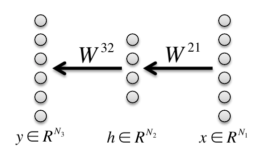

## 补充材料（Supplementary Material）

## 附录A 学习的双曲动力学（Hyperbolic dynamics of learning）

在正文第1.3节中，我们处理了三层网络中学习的动力学，其中每层中的 **模式强度（mode strengths）** 相等，即 $a=b$，这是在初始条件为小随机数时一个合理的极限。然而，更一般地，我们关心的是从任意初始条件出发，$ab$ 接近 $s$ 所需的时间。为了研究这一点，考虑到动力学的双曲性质，进行双曲坐标变换是很有用的：

$$
\displaystyle a=\sqrt{c_{0}}\cosh\frac{\theta}{2}\quad b=\sqrt{c_{0}}\sinh\frac{\theta}{2}\quad\textrm{对于}~{}~{}a^{2}>b^{2} (23) \displaystyle a=\sqrt{c_{0}}\sinh\frac{\theta}{2}\quad b=\sqrt{c_{0}}\cosh\frac{\theta}{2}\quad\textrm{对于}~{}~{}a^{2}<b^{2}.(24)
$$

因此，$\theta$ 参数化了动态不变流形 $a^{2}-b^{2}=\pm c_{0}$。对于任意 $c_{0}$ 和 $\theta$，该坐标系覆盖了区域 $a+b>0$，这是双曲线 $ab=s$ 右上分支的吸引域。对于 $a+b<0$ 存在对称的情况，它被吸引到双曲线 $ab=s$ 的左下分支。我们使用 $\theta$ 作为坐标来跟踪乘积 $ab$ 的动力学，并利用关系 $ab=c_{0}\sinh\theta$ 和 $a^{2}+b^{2}=c_{0}\cosh\theta$，得到：

$$
\tau\frac{d\theta}{dt}=s-c_{0}\sinh\theta.(25)
$$

该微分方程在 $\theta$ 和 $t$ 上是可分离的，可以积分得到：

$$
t=\tau\int_{\theta_{0}}^{\theta_{f}}\frac{d\theta}{s-c_{0}\sinh\theta}=\frac{\tau}{\sqrt{c^{2}_{0}+s^{2}}}\left[\ln\frac{\sqrt{c^{2}_{0}+s^{2}}+c_{0}+s\tanh\frac{\theta}{2}}{\sqrt{c^{2}_{0}+s^{2}}-c_{0}-s\tanh\frac{\theta}{2}}\right]_{\theta_{0}}^{\theta_{f}}.(26)
$$

这里 $t$ 是沿双曲线 $a^{2}-b^{2}=\pm c_{0}$ 从 $\theta_{0}$ 运动到 $\theta_{f}$ 所需的时间。不动点位于 $\theta=\sinh^{-1}s/c_{0}$，但动力学无法在有限时间内到达不动点。因此，我们引入一个截断 $\epsilon$ 来标记学习的终点，使得 $\theta_{f}$ 满足 $\sinh\theta_{f}=(1-\epsilon)s/c_{0}$（即 $ab$ 以因子 $1-\epsilon$ 接近 $s$）。然后，我们可以对初始条件 $c_{0}$ 和 $\theta_{0}$ 取平均，得到具有相关强度 $s$ 的输入-输出关系的期望学习时间。与其这样做，更容易的方法是在假设初始权重很小的条件下粗略估计学习的时间尺度，此时 $c_{0}$ 和 $\theta_{0}$ 接近 0。在这种情况下，$t=O(\tau/s)$（对截断有弱的对数依赖，即 $\ln(1/\epsilon)$）。这适度地推广了正文中给出的结果：即使 $a$ 和 $b$ 略有差异（即 $c_{0}$ 很小）， **相关矩阵 ${\Sigma^{31}}$ 的每个输入-输出模式 $\alpha$ 的学习时间尺度与该模式的相关强度 $s_{\alpha}$ 成反比** 。对于随机初始条件，这不是一个不合理的极限，因为 $|c_{0}|=|a\cdot a-b\cdot b|$，其中 $a$ 和 $b$ 是进入和离开隐藏单元的 $N_{2}$ 个突触权重的随机向量。因此，我们预期这两个随机向量的长度大致相等，因此 $c_{0}$ 相对于每个向量的长度会很小。

这些解明显不同于文献 [[20](#ref-20)] 中三层网络学习动力学的解。用我们的符号表示，在 [[20](#ref-20)] 中，已经证明如果初始向量 $a^{\alpha}$ 和 $b^{\alpha}$ 满足矩阵恒等式 $\sum_{\alpha}a^{\alpha}a^{\alpha^{T}}=\sum_{\alpha}b^{\alpha}b^{\alpha^{T}}$，那么学习动力学等价于一个 **矩阵Riccati方程（matrix Riccatti equation）** 。然而，这里导出的双曲动力学源于一组不满足 [[20](#ref-20)] 限制的初始条件，因此不是通过矩阵Riccati方程的解产生的。此外，超越矩阵Riccati解的表述，我们的分析提供了关于学习动力学展开时间尺度的直觉，并且关键的是，我们的方法扩展到超出三层网络的情况，适用于任意 $N_{l}$ 层的情况，这是 [[20](#ref-20)] 中未研究的。

## 附录 B：最优离散时间学习率（Optimal discrete time learning rates）

在第 2 节中，我们陈述了关于深度线性网络中作为深度函数的最优学习率的结果，此处我们将推导这些结果。从正文中给出的解耦初始条件出发，动力学源于对以下函数的梯度下降：

$$
E(a_{1},\cdots,a_{N_{l}-1})=\frac{1}{2\tau}\left(s-\prod_{k=1}^{N_{l}-1}a_{k}\right).(27)
$$

因此，对于每个 $a_{i}$，我们有：

$$
\frac{\partial E}{\partial a_{i}}=-\frac{1}{\tau}\left(s-\prod_{k=1}^{N_{l}-1}a_{k}\right)\left(\prod_{k\neq i}^{N_{l}-1}a_{k}\right)\equiv f(a_{i})(28)
$$

因此， **海森矩阵（Hessian）**  的元素为：

$$
\displaystyle\frac{\partial^{2}E}{\partial a_{i}a_{j}} \displaystyle= \displaystyle\frac{1}{\tau}\left(\prod_{k\neq j}^{N_{l}-1}a_{k}\right)\left(\prod_{k\neq i}^{N_{l}-1}a_{k}\right)-\frac{1}{\tau}\left(s-\prod_{k=1}^{N_{l}-1}a_{k}\right)\left(\prod_{k\neq i,j}^{N_{l}-1}a_{k}\right) (29) \displaystyle\equiv \displaystyle g(a_{i},a_{j})(30)
$$

对于 $i\neq j$，以及

$$
\frac{\partial^{2}E}{\partial a_{i}^{2}}=\frac{1}{\tau}\left(\prod_{k\neq i}^{N_{l}-1}a_{k}\right)^{2}\equiv h(a_{i})(31)
$$

对于 $i=j$。

现在我们假设从对称流形（symmetric manifold）开始，即对于所有 $i,j$ 都有 $a_{i}=a_{j}=a$。因此我们有：

$$
\displaystyle E(a) \displaystyle= \displaystyle\frac{1}{2\tau}\left(s-a^{N_{l}-1}\right), (32) \displaystyle f(a) \displaystyle= \displaystyle-\frac{1}{\tau}\left(s-a^{N_{l}-1}\right)a^{N_{l}-2}, (33) \displaystyle g(a) \displaystyle= \displaystyle\frac{2}{\tau}a^{2N_{l}-4}-\frac{1}{\tau}sa^{N_{l}-3} (34) \displaystyle h(a) \displaystyle= \displaystyle\frac{1}{\tau}a^{2N_{l}-4}(35)
$$

海森矩阵为：

$$
H(a)=\begin{bmatrix}h&g&\cdots&g&g\\ g&h&\cdots&g&g\\ \vdots&&\ddots&&\vdots\\ g&g&\cdots&h&g\\ g&g&\cdots&g&h\end{bmatrix}.(36)
$$

一个特征向量是 $v_{1}=[11\cdots 1]^{T}$，其特征值为 $\lambda_{1}=h+(N_{l}-2)g$，即：

$$
\displaystyle\lambda_{1}=(2N_{l}-3)\frac{1}{\tau}a^{2N_{l}-4}-(N_{l}-2)\frac{1}{\tau}sa^{N_{l}-3}.(37)
$$

现在考虑二阶更新（牛顿-拉夫森法，Newton-Raphson）（此处我们用 $1$ 表示全 1 向量）：

$$
\displaystyle a^{t+1}1 \displaystyle= \displaystyle a^{t}1-H^{-1}f(a^{t})1 (38) \displaystyle= \displaystyle a^{t}1-f(a^{t})H^{-1}1 (39) \displaystyle a^{t+1} \displaystyle= \displaystyle a^{t}-f(a^{t})/\lambda_{1}(a^{t})(40)
$$

注意，吸引域（basin of attraction）不包括较小的初始条件，因为对于较小的 $a$，海森矩阵不是正定的。

为了确定一阶梯度下降的最优学习率，我们计算 $\lambda_{1}$ 在学习过程中可能访问的模式强度（mode strengths）范围内的最大值，即 $a\in[0,s^{1/(N_{l}-1)}]$。该最大值出现在最优点 $a_{opt}=s^{1/(N_{l}-1)}$。因此，将其代入 ([37](#A2.E37))，我们得到：

$$
\lambda_{1}(a_{opt})=(N_{l}-1)\frac{1}{\tau}s^{\frac{2N_{l}-4}{N_{l}-1}}.(41)
$$

最优学习率 $\alpha$ 与 $1/\lambda_{1}(a_{opt})$ 成正比，因此其缩放比例为：

$$
\alpha\sim O\left(\frac{1}{N_{l}s^{2}}\right)(42)
$$

对于较大的 $N_{l}$。

- [B.1 使用优化学习率的学习速度](#b1-learning-speeds-with-optimized-learning-rate)

### B.1 使用优化学习率的学习速度（Learning speeds with optimized learning rate）

最优学习率如何影响学习速度？我们将三层学习时间与无限深度极限学习时间进行比较，学习率与公式 ([41](#A2.E41)) 成反比，比例常数为 $c$。

由此得到三层学习时间 $t_{3}$ 为：

$$
t_{3}=c\ln\frac{u_{f}(s-u_{0})}{u_{0}(s-u_{f})}(43)
$$

以及无限层学习时间 $t_{\infty}$ 为：

$$
t_{\infty}=c\left[\log\left(\frac{u_{f}(u_{0}-s)}{u_{0}(u_{f}-s)}\right)+\frac{s}{u_{0}}-\frac{s}{u_{f}}\right],(44)
$$

因此，差值为：

$$
t_{\infty}-t_{3}=\frac{cs}{u_{0}}-\frac{cs}{u_{f}}\approx\frac{cs}{\epsilon}(45)
$$

其中，最后的近似针对 $u_{0}=\epsilon, u_{f}=s-\epsilon$ 且 $\epsilon$ 很小的情况。因此，非常深的网络相对于浅层网络仅产生有限的延迟。

## 附录 C：MNIST 深度实验的实验设置（Experimental setup for MNIST depth experiment）

我们在  **MNIST 数据集（MNIST dataset）**  上训练了深度线性网络，使用了十五种不同的深度 $N_{l}=\{3,5,8,10,14,20,28,36,44,54,64,74,84,94,100\}$。给定一个 784 维的输入样本，网络尝试预测一个 10 维的输出向量，该向量在正确类别的索引处为 1，其余位置为 0。网络使用 **批量梯度下降（batch gradient descent）**  通过公式 ([13](#S2.E13)) 在 50,000 个样本的 MNIST 训练数据集上进行训练。我们注意到，公式 ([13](#S2.E13)) 利用了网络的线性特性来加速训练并减少内存需求。我们不对所有 50,000 个训练样本进行前向传播，而是预先计算 ${\Sigma^{31}}$ 并仅对其进行前向传播。这使得在非常深的网络上进行实验成为可能，否则这些实验在计算上是不可行的。实验使用 GPUmat 包在 GPU 硬件上加速进行。我们使用了大小为 1000 的过完备隐藏层。此处的过完备性只是为了证明该理论适用于这种情况；过完备性并不会提高网络的表示能力。网络使用解耦初始条件进行初始化，初始模式强度 $u_{0}=0.001$，如正文所述。随机正交矩阵 $R_{l}$ 通过生成随机高斯矩阵并计算  **QR 分解（QR decomposition）**  以获得正交矩阵来选取。学习时间计算为训练误差降至低于固定阈值 $1.3\times 10^{4}$（对应于几乎完全学习）时的迭代次数。请注意，这种性能水平远逊于使用非线性网络所能达到的效果，这反映了线性网络的能力有限。我们通过为每个深度分别优化学习率 $\lambda$，即使用在对数尺度上介于 $10^{-4}$ 和 $10^{-7}$ 之间的二十个学习率训练每个网络，并根据我们的阈值标准选择产生最小学习时间的学习率。通过初步实验选择 $10^{-4}$ 和 $10^{-7}$ 的范围，以确保对于所有深度，最优学习率始终位于该范围的内部。

## 附录 D：无监督预训练的有效性（Appendix D: Efficacy of unsupervised pretraining）

近期研究表明，从随机初始条件训练的深度网络已展现出高性能 [[21](#ref-21), [13](#ref-13), [22](#ref-22), [3](#ref-3), [4](#ref-4), [1](#ref-1), [23](#ref-23)]，这表明深度网络可能并不像先前认为的那样难以训练。这些结果说明， **预训练（pretraining）** 对于获得最先进的性能并非必需，并且为了实现这一目标，它们利用了多种技术，包括精心缩放的随机初始化、更复杂的二阶或基于动量的优化方法，以及专门的卷积架构。因此，评估无监督预训练在训练深度网络中是否仍然有用（即使不再是必需的）非常重要。特别是，当与这些新技术结合使用时，预训练是否仍然具有 **优化优势（optimization advantage）** 和 **泛化优势（generalization advantage）** ？在此，我们回顾了多篇论文的结果，这些结果共同表明，无监督预训练仍然具有优化优势和泛化优势。

- [D.1 优化优势](#d1-optimization-advantage)
- [D.2 泛化优势](#d2-generalization-advantage)

### D.1 优化优势（D.1 Optimization advantage）

预训练的优化优势指的是，与随机初始化相比，从预训练初始条件开始时能更快地收敛到局部最优（即更快的学习速度）。使用 **黑塞自由优化（Hessian free optimization）**  [[21](#ref-21), [22](#ref-22)] 一致发现，从预训练初始条件开始学习速度更快。这一发现适用于两种精心选择的随机初始化方案：[[21](#ref-21)] 的稀疏连接方案和 [[13](#ref-13)] 的密集缩放方案（如 [[22](#ref-22)] 所用）。因此，在使用二阶方法时，预训练仍然具有收敛速度优势。在使用 **随机梯度下降（stochastic gradient descent）**  进行优化时，预训练初始条件也比精心选择的随机初始化收敛得更快 [[22](#ref-22), [13](#ref-13)]。鉴于此，无论采用何种优化技术，预训练初始条件似乎都赋予了超越目前通过精心缩放随机初始化所能获得的优化优势。如果运行至收敛，二阶方法和精心选择的缩放可以消除预训练相对于随机初始化在训练集上获得的最终目标值之间的差异 [[21](#ref-21), [22](#ref-22)]。因此，优化优势纯粹是收敛速度上的优势，而非找到更好局部最小值上的优势。这与线性网络中的情况一致，所有方法最终都会达到相同的全局最小值，但收敛速度可能不同。我们的分析解释了为什么预训练带来的这种优化优势在精心选择的随机初始化面前仍然存在。

最后，我们注意到 Sutskever 等人表明，精心选择的随机初始化与精心调优的动量相结合可以获得出色的性能 [[23](#ref-23)]，但这些实验并未尝试预训练初始条件。Krizhevsky 等人使用了卷积架构，并未尝试预训练 [[1](#ref-1)]。因此，预训练与动量相结合，以及与卷积架构、 **丢弃法（dropout）**  和大规模监督数据集相结合的可能效用仍不清楚。

### D.2 泛化优势（D.2 Generalization advantage）

预训练还可以作为一种特殊的 **正则化器（regularizer）** ，在某些情况下改善 **泛化误差（generalization error）** 。这种泛化优势似乎在新的二阶方法 [[21](#ref-21), [22](#ref-22)] 中，以及与使用精心随机初始化的梯度下降 [[13](#ref-13), [22](#ref-22), [25](#ref-25), [4](#ref-4)] 相比时仍然存在。对深度线性网络中这种效应的分析超出了本文的范围，尽管已经为三层线性情况开发了有前景的工具 [[20](#ref-20)]。

## 附录 E：具有任务对齐输入相关性的学习动态（Appendix E: Learning dynamics with task-aligned input correlations）

在正文中，为简单起见并引出主要直觉，我们重点关注 **正交输入相关性（orthogonal input correlations）** （$\Sigma^{11}=I$）。然而，我们的分析可以扩展到具有非常特定结构的输入相关性。回顾一下，我们使用 **奇异值分解（SVD）**  将输入输出相关性分解为 ${\Sigma^{31}}={U^{33}}{S^{31}}{V^{11}}^{T}$。我们可以推广我们的解，以允许形式为 $\Sigma^{11}={V^{11}}D{V^{11}}^{T}$ 的输入相关性。直观地说，这个条件要求输入中的变化轴与输入输出任务中的变化轴一致，尽管方差可能不同。如果取 $D=I$，则我们恢复白化情况 $\Sigma^{11}=I$；如果取 $D=\Lambda$，则可以处理 **自编码（autoencoding）**  情况。权重的最终 **不动点（fixed points）**  由 ${\Sigma^{31}}(\Sigma^{11})^{-1}$ 的最佳秩 $N_{2}$ 近似给出。与方程 ([4](#S1.E4)) 中相同的变量变换，我们现在得到

$$
\tau\frac{d}{dt}{\overline{W}^{21}}={\overline{W}^{32}}^{T}({S^{31}}-{\overline{W}^{32}}{\overline{W}^{21}}D),\qquad\tau\frac{d}{dt}{\overline{W}^{32}}=({S^{31}}-{\overline{W}^{32}}{\overline{W}^{21}}D){\overline{W}^{21}}^{T}.(46)
$$

如果 ${\overline{W}^{32}}$ 和 ${\overline{W}^{21}}$ 起始为对角矩阵，则该方程再次解耦。基于此，我们可以直接推广我们关于学习动态的结果。

## 附录 F：MNIST 预训练实验（Appendix F: MNIST pretraining experiment）

我们在 MNIST 分类任务上训练了深度为 5 的网络，每层有 200 个隐藏单元，初始条件要么是小的随机初始条件（每个权重独立地从标准差为 0.01 的高斯分布中抽取），要么是贪心的逐层预训练初始条件。对于预训练网络，每一层被训练来重构下一较低层的输出。在 **微调（finetuning）**  阶段，网络试图预测一个 10 维的输出向量，该向量在正确类别的索引处包含 1，其余位置为 0。网络使用方程 ([13](#S2.E13)) 中的 **批量梯度下降（batch gradient descent）**  在 50,000 个样本的 MNIST 训练数据集上进行训练。由于网络是线性的，预训练用输入数据的 **主成分（principal components）**  初始化网络，并且，在方程 ([18](#S3.E18)) 的一致性条件成立的程度上，在整个深度网络中解耦这些模式，如正文所述。

## 附录 G：非线性正交网络中的神经动态分析（Appendix G: Analysis of Neural Dynamics in Nonlinear Orthogonal Networks）

我们可以推导出一个简单的、解析的递归关系，用于描述在非线性动态 ([20](#S4.E20)) 下，神经群体方差 $q^{l}$（在 ([21](#S4.E21)) 中定义）在层 $l$ 之间的传播。我们有

$$
q^{l+1}=\frac{1}{N}\sum_{i=1}^{N}(x^{l+1}_{i})^{2}=g^{2}\frac{1}{N}\sum_{i=1}^{N}\phi(x^{l}_{i})^{2},(47)
$$

这是由于 ([20](#S4.E20)) 中的动态以及 $W^{(l+1,l)}$ 的正交性。现在我们知道，根据定义，第 $l$ 层的群体 $x^{l}_{i}$ 具有归一化方差 $q^{l}$。如果我们进一步假设第 $l$ 层中跨神经元的活动分布可以很好地用高斯分布近似，我们可以将对神经元 $i$ 的求和替换为对零均值单位方差高斯变量 $z$ 的积分：

$$
q^{l+1}=g^{2}\,\int\mathcal{D}z\,\phi\big{(}\sqrt{q^{l}}z\big{)}^{2},(48)
$$

其中 $\mathcal{D}z\equiv\frac{1}{\sqrt{2\pi}}e^{-\frac{1}{2}z^{2}}\,dz$ 是标准高斯测度。

> 图 8：左图：对于 $g=1$ 且 $\phi(x)=\tanh(x)$，从输入层方差 $q^{in}=q^{l}$ 到输出层方差 $q^{out}=q^{l+1}$ 的映射（([48](#A7.E48)) 中）。右图：该映射的稳定不动点 $q^{\infty}(g)$ 作为增益 $g$ 的函数。红色曲线是通过数值求解 ([49](#A7.E49)) 得到的解析理论。蓝色点是通过对深度为 $N_{l}=30$、每层有 $N=1000$ 个神经元的网络进行 ([20](#S4.E20)) 中动态的数值模拟得到的。渐近群体方差 $q^{\infty}$ 是通过对最后 $5$ 层的群体方差取平均得到的。

这个从输入到输出方差的映射在图 [8](#A7.F8) 左图中针对 $g=1$ 和 $\phi(x)=\tanh(x)$ 进行了数值计算（$g$ 的其他值会对该映射产生简单的乘法缩放）。这个递归关系有一个稳定不动点 $q^{\infty}(g)$，通过求解非线性不动点方程得到

$$
q^{\infty}=g^{2}\,\int\mathcal{D}z\,\phi\big{(}\sqrt{q^{\infty}}z\big{)}^{2}.(49)
$$

从图形上看，求解这个方程对应于将图 [8](#A7.F8) 左图中的曲线按 $g^{2}$ 缩放，并寻找与单位线的交点。对于 $g<1$，唯一的解是 $q^{\infty}=0$。对于 $g>1$，这个解仍然存在，但在递归 ([48](#A7.E48)) 下是不稳定的。相反，对于 $g>1$，在 $q^{\infty}$ 的某个非零值处出现了一个新的稳定解。作为 $g$ 函数的整个稳定解集如图 [8](#A7.F8) 右图中的红色曲线所示。它构成了当深度趋于无穷时，非线性网络最深层群体方差的理论预测。例如，它与从深度为 $30$ 的非线性网络数值模拟中获得的经验群体方差（图 [8](#A7.F8) 右图中的蓝色点）吻合良好。

总的来说，这些结果表明，当 $g$ 跨越临界值 $g_{c}=1$ 时，通过非线性网络的神经活动传播存在一个 **动态相变（dynamical phase transition）** 。当 $g>1$ 时，活动以 **混沌（chaotic）**  方式传播，因此 $g=1$ 构成了 **混沌边缘（edge of chaos）** 。