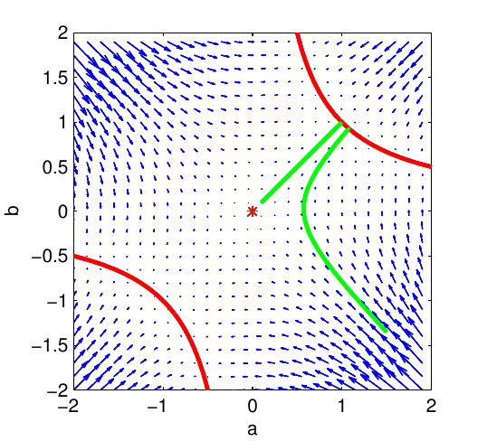

# Title: Exact solutions to the nonlinear dynamics of learning in deep linear neural networks
- ArXiv: 1312.6120
- Authors: Andrew M. Saxe, James L. McClelland, Surya Ganguli
- Sections: 20
- Estimated tokens: 20.6k

## 目录
- [摘要](#abstract)
- [1 梯度下降的一般学习动力学](#1-general-learning-dynamics-of-gradient-descent)
  - [1.1 正交输入下的学习动力学](#11-learning-dynamics-with-orthogonal-inputs)
  - [1.2 学习的最终结果](#12-the-final-outcome-of-learning)
  - [1.3 学习的时间进程](#13-the-time-course-of-learning)
- [2 更深层的多层动力学](#2-deeper-multilayer-dynamics)
- [3 寻找良好的权重初始化：关于贪婪性与随机性](#3-finding-good-weight-initializations-on-greediness-and-randomness)
- [4 在非线性网络中实现近似动态等距性](#4-achieving-approximate-dynamical-isometry-in-nonlinear-networks)
- [5 讨论](#5-discussion)

## 摘要（Abstract）

尽管深度学习方法在实际应用中取得了广泛成功，但我们对深度神经网络学习动力学的理论理解仍然相当有限。我们试图通过系统分析深度线性神经网络这一受限情况下的学习动力学，来弥合深度学习理论与实践之间的差距。尽管其输入-输出映射是线性的，但这类网络在权重上具有非线性的梯度下降动力学，并且随着每个新隐藏层的添加而发生变化。我们表明，深度线性网络表现出的非线性学习现象与非线性网络模拟中观察到的现象相似，包括长时间的平台期后快速过渡到更低误差的解，以及从贪婪无监督预训练初始条件出发比从随机初始条件出发收敛更快。我们通过找到深度学习非线性动力学的新的精确解，对这些现象进行了分析性描述。我们的理论分析还揭示了一个令人惊讶的发现：随着网络深度趋近于无穷大，学习速度仍可保持有限：对于一类特殊的权重初始条件，非常深的网络相对于浅层网络，在学习速度上仅会经历有限的、与深度无关的延迟。我们表明，在训练数据满足某些条件的情况下，无监督预训练可以找到这类特殊的初始条件，而经过缩放的随机高斯初始化则不能。我们进一步展示了一类新的权重随机正交初始条件，其与无监督预训练一样，享有与深度无关的学习时间。我们进一步表明，这些初始条件即使在深度非线性网络中也能导致梯度的忠实传播，只要它们运行在一个被称为 **混沌边缘（edge of chaos）** 的特殊机制下。

深度学习方法在从视觉对象分类 [[1](#ref-1), [2](#ref-2), [3](#ref-3)] 到语音识别 [[4](#ref-4)] 和自然语言处理 [[5](#ref-5), [6](#ref-6)] 等一系列应用中实现了令人瞩目的性能。尽管训练此类深度架构存在众所周知的困难 [[7](#ref-7), [8](#ref-8), [9](#ref-9), [10](#ref-10), [11](#ref-11)]，这些成功仍然得以实现。实际上，文献中已经提出了许多关于深度学习困难原因的解释，包括存在大量局部极小值、由于饱和非线性导致的低曲率区域，以及反向传播梯度的指数增长或衰减 [[12](#ref-12), [13](#ref-13), [14](#ref-14), [15](#ref-15)]。此外，许多神经网络模拟观察到了显著的非线性学习动力学，包括长时间几乎没有明显改进的平台期，随后几乎是阶段性地过渡到更好的性能。然而，对深度学习丰富动力学的定量、分析性理解仍然难以捉摸。例如，是什么决定了深度学习展开的时间尺度？训练速度如何随深度增加而减慢？在什么条件下，贪婪的无监督预训练会加速学习？最终学习到的内部表示如何依赖于训练数据中固有的统计规律？

在这里，我们为深度线性神经网络中的学习提供了一种精确的分析理论，该理论针对这一受限情况定量地回答了这些问题。由于其线性特性，深度线性网络的输入-输出映射总是可以重写为一个浅层网络。从这个意义上说，线性网络并未从深度中获得表达能力，因此在复杂的现实世界问题上会欠拟合且表现不佳。但是，虽然它缺乏实际深度学习系统这一重要方面，深度线性网络仍然可以表现出高度非线性的学习动力学，并且这些动力学随深度的增加而变化。实际上，作为网络权重函数的训练误差是非凸的，并且在这个非凸误差曲面上的梯度下降动力学表现出网络多个层中不同权重之间微妙的相互作用。因此，深度线性网络为理解深度学习动力学提供了一个重要的起点。

为了回答这些问题，我们推导并分析了一组描述权重空间上学习动力学的非线性耦合微分方程，这些方程是输入和输出统计结构的函数。我们找到了这些非线性方程精确的时间依赖解，并找到了由误差函数对称性引起的权重动力学中的守恒量。这些解提供了直观理解，说明深度网络如何逐步构建关于训练数据统计结构的信息，并将这些信息嵌入其权重和内部表示中。此外，我们将深度线性网络中学习动力学的解析解与深度非线性网络中学习动力学的数值模拟进行了比较，发现我们的解析解提供了合理的近似。我们的解也反映了模拟中观察到的非线性现象，包括交替出现的平台期和快速改善的急剧期。实际上，先前的研究 [[16](#ref-16)] 已经表明，深度线性网络中的这种非线性学习动力学足以定性地捕捉婴儿发展中概念结构的渐进、层级分化方面。接下来，我们应用这些解来研究训练深度网络时常用的贪婪逐层预训练策略 [[17](#ref-17), [18](#ref-18)]，并找出了此类预训练加速学习的条件。我们表明，对于 MNIST 数据集，这些条件近似满足，因此无监督预训练为应用于 MNIST 的深度线性网络带来了优化优势。最后，我们展示了一类新的权重随机正交初始条件，在线性网络中，它们提供了与深度无关的学习时间，并且我们表明这些初始条件即使在深度非线性网络中也能导致梯度的忠实传播。我们进一步表明，这些初始条件即使在深度非线性网络中也能导致梯度的忠实传播，只要它们运行在一个被称为混沌边缘的特殊机制下。在这种机制下，突触增益被调整，使得通过权重矩阵传播神经活动产生的线性放大，恰好平衡了由于饱和非线性导致的活动的衰减。特别地，我们表明，即使是在非线性网络中，运行在这种特殊机制下，参与反向传播误差信号的雅可比矩阵（Jacobians）表现得像近似等距映射。

## 1 梯度下降的通用学习动力学（General learning dynamics of gradient descent）

我们首先分析一个具有 **线性激活函数（linear activation functions）** 的三层网络（输入层、隐藏层和输出层）的学习过程（图 [1](#figure-1)）。设 $N_{i}$ 为第 $i$ 层的神经元数量。该网络的输入-输出映射为 $y={W^{32}}{W^{21}}x$。我们希望训练该网络，使其从一组 $P$ 个训练样本 $\left\{x^{\mu},y^{\mu}\right\},\mu=1,\ldots,P$ 中学习特定的输入-输出映射。训练通过 **梯度下降（gradient descent）**  在期望特征输出与网络特征输出之间的 **平方误差（squared error）**  $\sum_{\mu=1}^{P}\left\|y^{\mu}-{W^{32}}{W^{21}}x^{\mu}\right\|^{2}$ 上进行。该梯度下降过程产生了 **批量学习规则（batch learning rule）** 

> 图 1：本节分析的三层网络。

$$
\Delta{W^{21}}=\lambda\sum_{\mu=1}^{P}{W^{32}}^{T}\left(y^{\mu}x^{\mu T}-{W^{32}}{W^{21}}x^{\mu}x^{\mu T}\right),\qquad\Delta{W^{32}}=\lambda\sum_{\mu=1}^{P}\left(y^{\mu}x^{\mu T}-{W^{32}}{W^{21}}x^{\mu}x^{\mu T}\right){W^{21}}^{T},(1)
$$

其中 $\lambda$ 是一个较小的学习率。只要 $\lambda$ 足够小，我们可以取连续时间极限来得到动力学方程：

$$
\tau\frac{d}{dt}{W^{21}}={W^{32}}^{T}\left({\Sigma^{31}}-{W^{32}}{W^{21}}\Sigma^{11}\right),\qquad\tau\frac{d}{dt}{W^{32}}=\left({\Sigma^{31}}-{W^{32}}{W^{21}}\Sigma^{11}\right){W^{21}}^{T},(2)
$$

其中 $\Sigma^{11}\equiv\sum_{\mu=1}^{P}x^{\mu}x^{\mu T}$ 是一个 $N_{1}\times N_{1}$ 的 **输入相关矩阵（input correlation matrix）** ，${\Sigma^{31}}\equiv\sum_{\mu=1}^{P}y^{\mu}x^{\mu T}$ 是一个 $N_{3}\times N_{1}$ 的 **输入-输出相关矩阵（input-output correlation matrix）** ，并且 $\tau\equiv\frac{1}{\lambda}$。这里 $t$ 以迭代次数为单位衡量时间；当 $t$ 从 0 变化到 1 时，网络已经看到了对应于一次迭代的 $P$ 个样本。尽管网络的输入-输出映射是线性的，但公式 ([2](#S1.E2)) 中给出的 **梯度下降学习动力学（gradient descent learning dynamics）**  构成了一组复杂的耦合非线性微分方程，其中权重项最高可达三次相互作用。

- [1.1 正交输入下的学习动力学](#11-learning-dynamics-with-orthogonal-inputs)
- [1.2 学习的最终结果](#12-the-final-outcome-of-learning)
- [1.3 学习的时间进程](#13-the-time-course-of-learning)

### 1.1 正交输入下的学习动力学（Learning dynamics with orthogonal inputs）

我们的基本目标是理解 ([2](#S1.E2)) 中的学习动力学如何作为输入统计量 $\Sigma^{11}$ 和输入-输出统计量 ${\Sigma^{31}}$ 的函数而变化。通常，学习的结果将反映由 $\Sigma^{11}$ 描述的输入相关性以及由 ${\Sigma^{31}}$ 描述的输入-输出相关性之间的相互作用。不过，作为开端，我们通过关注 $\Sigma^{11}=I$ 的正交输入表示情形来进一步简化分析。这一假设对于经过白化处理的输入数据（一种广泛使用的预处理步骤）精确成立。

由于我们假设了正交输入表示（$\Sigma^{11}=I$）， **输入-输出相关矩阵（input-output correlation matrix）**  包含了学习所用数据集的所有信息，并且在学习动力学中起着关键作用。我们考虑其 **奇异值分解（Singular Value Decomposition, SVD）** 

$$
{\Sigma^{31}}={U^{33}}{S^{31}}{V^{11}}^{T}=\textstyle\sum_{\alpha=1}^{N_{1}}s_{\alpha}u_{\alpha}v_{\alpha}^{T},(3)
$$

这将在我们的分析中处于核心地位。这里 ${V^{11}}$ 是一个 $N_{1}\times N_{1}$ 的正交矩阵，其列包含输入分析奇异向量 $v_{\alpha}$，反映了输入中独立的变异模式；${U^{33}}$ 是一个 $N_{3}\times N_{3}$ 的正交矩阵，其列包含输出分析奇异向量 $u_{\alpha}$，反映了输出中独立的变异模式；${S^{31}}$ 是一个 $N_{3}\times N_{1}$ 的矩阵，其非零元素仅在对角线上；这些元素是奇异值 $s_{\alpha},\alpha=1,\ldots,N_{1}$，按 $s_{1}\geq s_{2}\geq\cdots\geq s_{N_{1}}$ 排序。

现在，对突触权重空间进行变量替换：${W^{21}}={\overline{W}^{21}}{V^{11}}^{T}$，${W^{32}}={U^{33}}{\overline{W}^{32}}$，则 ([2](#S1.E2)) 中的动力学简化为

$$
\tau\frac{d}{dt}{\overline{W}^{21}}={\overline{W}^{32}}^{T}({S^{31}}-{\overline{W}^{32}}{\overline{W}^{21}}),\qquad\tau\frac{d}{dt}{\overline{W}^{32}}=({S^{31}}-{\overline{W}^{32}}{\overline{W}^{21}}){\overline{W}^{21}}^{T}.(4)
$$

为了直观理解这些方程，请注意，虽然 ${W^{21}}$ 和 ${W^{32}}$ 的矩阵元素连接了一层的神经元与下一层的神经元，但我们可以将矩阵元素 ${\overline{W}^{21}}_{i\alpha}$ 视为连接输入模式 $v_{\alpha}$ 与隐藏神经元 $i$，而矩阵元素 ${\overline{W}^{32}}_{\alpha i}$ 视为连接隐藏神经元 $i$ 与输出模式 $u_{\alpha}$。设 $a^{\alpha}$ 为 ${\overline{W}^{21}}$ 的第 $\alpha^{\textrm{th}}$ 列，$b^{\alpha T}$ 为 ${\overline{W}^{32}}$ 的第 $\alpha^{\textrm{th}}$ 行。直观上，$a^{\alpha}$ 是一个 $N_{2}$ 维的列向量，表示来自输入模式 $\alpha$ 的、位于隐藏层前的突触权重；$b^{\alpha}$ 是一个 $N_{2}$ 维的列向量，表示通往输出模式 $\alpha$ 的、位于隐藏层后的突触权重。用这些变量（或称为连接模式）表示，([4](#S1.E4)) 中的学习动力学变为

$$
\tau\frac{d}{dt}a^{\alpha}=(s_{\alpha}-a^{\alpha}\cdot b^{\alpha})\,b^{\alpha}-\sum_{\gamma\neq\alpha}b^{\gamma}\,(a^{\alpha}\cdot b^{\gamma}),\qquad\tau\frac{d}{dt}b^{\alpha}=(s_{\alpha}-a^{\alpha}\cdot b^{\alpha})\,a^{\alpha}-\sum_{\gamma\neq\alpha}a^{\gamma}\,(b^{\alpha}\cdot a^{\gamma}).(5)
$$

注意，对于 $\alpha>N_{1}$，有 $s_{\alpha}=0$。这些动力学源于以下能量函数的梯度下降：

$$
E=\frac{1}{2\tau}\sum_{\alpha}(s_{\alpha}-a^{\alpha}\cdot b^{\alpha})^{2}+\frac{1}{2\tau}\sum_{\alpha\neq\beta}(a^{\alpha}\cdot b^{\beta})^{2},(6)
$$

并且表现出一种合作与竞争相互作用的有趣组合。考虑每个方程中的第一项。在这些项中，来自两个层的、与同一输入-输出模式（强度为 $s^{\alpha}$）相关联的连接模式 $a^{\alpha}$ 和 $b^{\alpha}$ 相互合作，驱动彼此增大模长，并在隐藏单元空间中指向相似的方向；通过这种方式，这些项驱动连接模式的点积 $a^{\alpha}\cdot b^{\alpha}$ 去反映输入-输出模式的强度 $s^{\alpha}$。第二项描述了与不同输入模式 $\alpha$ 和 $\beta$ 相关联的第一层（$a^{\alpha}$）和第二层（$b^{\beta}$）连接模式之间的竞争。这产生了一种对称的、成对存在的排斥力，作用于所有不同的第一层和第二层连接模式对之间，驱使网络进入一个解耦的状态，在此状态下不同的连接模式变得正交。

### 1.2 学习的最终结果（The final outcome of learning）

线性网络中梯度下降学习的 **不动点结构（fixed point structure）** 已在 [[19](#ref-19)] 中阐明。用连接模式的语言来说，不动点的一个必要条件是 $a^{\alpha}\cdot b^{\beta}=s_{\alpha}\delta_{\alpha\beta}$，而当 $s_{\alpha}=0$ 时，$a^{\alpha}$ 和 $b^{\alpha}$ 均为零。为了在 **欠完备隐藏层（undercomplete hidden layers）** （$N_{2}<N_{1},N_{2}<N_{3}$）下满足这些关系，最多只能有 $N_{2}$ 个 $\alpha$ 值使得 $a^{\alpha}$ 和 $b^{\alpha}$ 非零。由于 $\textrm{rank}({\Sigma^{31}})\equiv r$ 个非零的 $s_{\alpha}$ 值，存在 $\begin{pmatrix}r\\ N_{2}\end{pmatrix}$ 族不动点。然而，所有这些不动点都是不稳定的，除了只有前 $N_{2}$ 个最强模式（即 $\alpha=1,\ldots,N_{2}$ 对应的 $a^{\alpha}$ 和 $b^{\alpha}$）被激活的那一个。因此值得注意的是，([5](#S1.E5)) 中的动力学仅包含鞍点，而不存在任何非全局的局部极小值 [[19](#ref-19)]。用原始的突触变量 ${W^{21}}$ 和 ${W^{32}}$ 表示，所有全局稳定的不动点满足

$$
{W^{32}}{W^{21}}=\textstyle\sum_{\alpha=1}^{N_{2}}s_{\alpha}u_{\alpha}v_{\alpha}^{T}.(7)
$$

因此，当学习收敛时，网络将表示对真实输入-输出相关矩阵的最佳秩 $N_{2}$ 近似。在本文中，我们感兴趣的是理解导致这一最终不动点的动力学权重轨迹和学习时间尺度。

### 1.3 学习的时间进程（The time course of learning）

然而，由于不同输入-输出模式之间的竞争性相互作用，从任意初始条件精确求解（[5](#S1.E5)）是困难的。因此，为了理解一般动力学，我们将注意力限制在一类特殊的初始条件上，其形式为 $a^{\alpha}$ 和 $b^{\alpha}\propto r^{\alpha}$，其中 $\alpha=1,\ldots,N_{2}$，且 $r^{\alpha}\cdot r^{\beta}=\delta_{\alpha\beta}$，所有其他连接模式 $a^{\alpha}$ 和 $b^{\alpha}$ 设为零（关于部分重叠但不同的初始条件集合的解，参见 [[20](#ref-20)]，并在补充附录 [A](#appendix-a) 中进一步讨论）。

这里，$r^{\alpha}$ 是一个固定的 $N_{2}$ 个向量集合，这些向量构成了从输入或输出模式到隐藏单元集合的突触连接的标准正交基。因此，对于这组初始条件，对于每个 $\alpha$，$a^{\alpha}$ 和 $b^{\alpha}$ 指向相同的方向，仅在标量大小上有所不同，并且与所有其他连接模式正交。这种初始化可以通过计算 ${\Sigma^{31}}$ 的奇异值分解（SVD）并取 ${W^{32}}={U^{33}}D_{a}R^{T},{W^{21}}=RD_{b}{V^{11}}^{T}$ 来获得，其中 $D_{a},D_{b}$ 是对角矩阵，$R$ 是任意正交矩阵；然而，正如我们在后续实验中所展示的，我们找到的解也是对来自小随机初始条件的轨迹的极好近似。

不难验证，从这些初始条件开始，$a^{\alpha}$ 和 $b^{\alpha}$ 将在所有未来时刻保持与 $r^{\alpha}$ 平行。此外，由于不同的活跃模式彼此正交，它们不会竞争，甚至不会相互作用（（[5](#S1.E5)）-（[6](#S1.E6)）第二项中的所有点积均为 0）。

因此，这类条件在权重空间中定义了一个不变流形（invariant manifold），在该流形上，各模式独立演化。

令 $a=a^{\alpha}\cdot r^{\alpha}$，$b=b^{\alpha}\cdot r^{\alpha}$，以及 $s=s^{\alpha}$，则标量投影 $(a,b)$ 的动力学满足：

$$
\tau\frac{d}{dt}a=b\,(s-ab),\qquad\tau\frac{d}{dt}b=a\,(s-ab).(8)
$$

因此，我们解耦连接模式的能力产生了一个显著简化的二维非线性系统。这些方程可以通过注意到它们源于误差的梯度下降来求解：

$$
E(a,b)=\textstyle\frac{1}{2\tau}(s-ab)^{2}.(9)
$$

这意味着乘积 $ab$ 从其初始值单调地趋近于不动点 $s$。此外，$E(a,b)$ 在单参数缩放变换族 $a\rightarrow\lambda a$，$b\rightarrow\frac{b}{\lambda}$ 下满足对称性。根据诺特定理（Noether’s theorem），这一对称性意味着存在一个守恒量，即 $a^{2}-b^{2}$，它是一个运动常数。因此，动力学简单地沿着 $(a,b)$ 平面中 $a^{2}-b^{2}$ 为常数的双曲线进行，直到趋近于双曲线不动点流形 $ab=s$。原点 $a=0,b=0$ 也是一个不动点，但是不稳定的。图 [2](#figure-2) 显示了这些动力学的典型相图。

> 图 2：([8](#S1.E8)) 中 $a$ 和 $b$ 二维动力学的向量场（蓝色）、稳定流形（红色）和两条解轨迹（绿色），其中 $\tau=1,s=1$。

作为学习时间尺度的度量，我们关注从任意初始条件开始，$ab$ 趋近 $s$ 所需的时间。由于篇幅限制，$a$ 和 $b$ 不相等的情况在补充附录 [A](#appendix-a) 中处理。这里我们在假设 $a=b$ 的情况下寻求显式解，这是从小的随机初始条件开始时的一个合理极限。然后我们可以追踪 $u\equiv ab$ 的动力学，根据 ([8](#S1.E8))，它满足：

$$
\tau\frac{d}{dt}u=2u(s-u).(10)
$$

该方程是可分离的，可以积分得到：

$$
t=\tau\int_{u_{0}}^{u_{f}}\frac{du}{2u(s-u)}=\frac{\tau}{2s}\ln\frac{u_{f}(s-u_{0})}{u_{0}(s-u_{f})}.(11)
$$

这里，$t$ 是 $u$ 从 $u_{0}$ 变化到 $u_{f}$ 所需的时间。如果我们假设小的初始条件 $u_{0}=\epsilon$，并询问 $u_{f}$ 何时在 $\epsilon$ 范围内接近不动点 $s$，即 $u_{f}=s-\epsilon$，那么在极限 $\epsilon\rightarrow 0$ 下，学习时间尺度为 $t=\tau/s\ln\left(s/\epsilon\right)=O(\tau/s)$（对截止值有弱的对数依赖性）。这产生了一个关键结果：相关矩阵 ${\Sigma^{31}}$ 的每个输入-输出模式 $\alpha$ 的学习时间尺度与该模式的相关强度 $s_{\alpha}$ 成反比。因此，输入-输出关系越强，学习得越快。

我们还可以通过反转 ([11](#S1.E11)) 来找到学习的整个时间进程，得到：

$$
u_{f}(t)=\frac{se^{2st/\tau}}{e^{2st/\tau}-1+s/u_{0}}.(12)
$$

该时间进程描述了从输入模式（具有相关强度 $s$）进入隐藏层的所有权重大小的乘积，以及从隐藏层到同一输出模式的权重大小乘积的时间演化。如果该乘积从一个小值 $u_{0}<s$ 开始，则它呈现 S 形上升，并在 $t\rightarrow\infty$ 时渐近于 $s$。这个 S 形曲线可以表现出从无学习状态到完全学习状态的急剧转变。这个解析的 S 形学习曲线如图 [3](#figure-3) 所示，它能够合理近似线性网络中的学习曲线，这些线性网络从不在正交、解耦的不变流形上的随机初始条件开始——因此表现出连接模式之间的竞争动力学——以及解决相同任务的非线性网络中的学习曲线。我们注意到，尽管对于这个特定任务，非线性网络的行为与线性情况类似，但这可能依赖于具体问题。

  
  

> 图 3：左图：三层神经网络中的学习动力学。曲线显示了在学习过程中网络对输入-输出相关矩阵的七个模式的表示强度。红色迹线显示了来自方程 [12](#S1.E12) 的解析曲线。蓝色迹线显示了从小的随机初始条件开始的线性网络（方程 ([2](#S1.E2))）完整动力学的模拟。绿色迹线显示了具有 tanh 激活函数的非线性三层网络的模拟。为了生成非线性网络的模式强度，我们计算了非线性网络演化的输入-输出相关矩阵，并绘制了 ${U^{33}}^{T}{\Sigma^{31}}_{tanh}{V^{11}}$ 的对角元素随时间的变化。训练集由 32 个正交输入模式组成，每个模式与一个 1000 维特征向量相关联，该特征向量由 [[16](#ref-16)] 中描述的层次扩散过程生成，使用五级二叉树，翻转概率为 0.1。为了清晰起见，绘制了模式 1、2、3、5、12、18 和 31，其余模式被排除。网络训练参数为 $\lambda=0.5e^{-3},N_{2}=32,u_{0}=1e^{-6}$。右图：由于竞争动力学和 S 形非线性导致的学习延迟。纵轴显示模拟半学习时间与解析半学习时间之间的差异，作为解析半学习时间的分数。误差棒显示了 100 次随机初始化模拟的标准差。

## 2 更深层的多层动力学（Deeper multilayer dynamics）

第[1](#section-1)节分析的网络是 **多层网络（multilayer net）** 的最小示例，仅包含单层隐藏单元。 **梯度下降（gradient descent）** 在更深层网络中的作用机制如何？我们基于能够产生特别简单梯度下降动力学的初始条件，在这一方向上进行了初步尝试。

在一个具有 $N_{l}$ 层、因此包含 $N_{l}-1$ 个权重矩阵（由 $W^{l},l=1,\cdots,N_{l}-1$ 索引）的 **线性神经网络（linear neural network）** 中，梯度下降动力学可以写为：

$$
\tau\frac{d}{dt}W^{l}=\left(\prod_{i=l+1}^{N_{l}-1}W^{i}\right)^{T}\left[{\Sigma^{31}}-\left(\prod_{i=1}^{N_{l}-1}W^{i}\right)\Sigma^{11}\right]\left(\prod_{i=1}^{l-1}W^{i}\right)^{T},(13)
$$

其中 $\prod_{i=a}^{b}W^{i}=W^{b}W^{(b-1)}\cdots W^{(a-1)}W^{a}$，特殊情况是当 $a>b$ 时 $\prod_{i=a}^{b}W^{i}=I$，即单位矩阵。

为了描述初始条件，我们假设存在 $N_{l}$ 个 **正交矩阵（orthogonal matrices）**  $R_{l}$，它们能够对角化初始权重矩阵，即对于所有 $l$，有 $R_{l+1}^{T}W_{l}(0)R_{l}=D_{l}$，特殊情况是 $R_{1}={V^{11}}$ 和 $R_{N_{l}}={U^{33}}$。这一要求本质上要求第 $l$ 层的输出奇异向量是下一层 $l+1$ 的输入奇异向量，这样任何一层的模式强度的变化都能传播到输出，而不会混入其他模式。我们注意到，这一公式并不限制隐藏层的大小；每个隐藏层的大小可以不同，并且可以是欠完备或过完备的。通过变量变换 $W_{l}=R_{l+1}\overline{W}_{l}R_{l}^{T}$ 并假设 $\Sigma^{11}=I$，可以得到一组相互独立演化的解耦连接模式。与从([2](#S1.E2))到([8](#S1.E8))的三层网络中发生的简化类似，$N_{l}$ 层网络中的每个连接模式可以由 $N_{l}-1$ 个标量 $a^{1},\dots,a^{N_{l}-1}$ 描述，其动力学服从能量函数上的梯度下降（类似于([9](#S1.E9))）：

$$
E(a_{1},\cdots,a_{N_{l}-1})=\frac{1}{2\tau}\left(s-\prod_{i=1}^{N_{l}-1}a_{i}\right)^{2}.(14)
$$

该动力学也具有一组守恒量 $a_{i}^{2}-a_{j}^{2}$，这些量源于变换 $a_{i}\rightarrow\lambda a_{i}$，$a_{j}\rightarrow\frac{a_{j}}{\lambda}$ 下的能量对称性，因此可以精确求解。我们关注的是所有 $i$ 满足 $a_{i}(t=0)=a_{0}$ 的 **不变子流形（invariant submanifold）** ，并追踪 $u=\textstyle\prod_{i=1}^{N_{l}-1}a_{i}$（该模式的整体强度）的动力学，其服从（即([10](#S1.E10))的推广）：

$$
\displaystyle\tau\frac{d}{dt}u=(N_{l}-1)u^{2-2/(N_{l}-1)}(s-u).(15)
$$

对于任何正整数 $N_{l}$，该方程都可以积分，尽管表达式较为复杂。一旦整体强度充分增加，学习过程就会迅速爆发。

方程([15](#S2.E15))使我们能够研究当深度趋于无穷时的学习动力学。特别地，当 $N_{l}\rightarrow\infty$ 时，我们有动力学方程：

$$
\tau\frac{d}{dt}u=N_{l}u^{2}(s-u)(16)
$$

积分后可得：

$$
t=\frac{\tau}{N_{l}}\left[\frac{1}{s^{2}}\log\left(\frac{u_{f}(u_{0}-s)}{u_{0}(u_{f}-s)}\right)+\frac{1}{su_{0}}-\frac{1}{su_{f}}\right].(17)
$$

值得注意的是，这意味着对于固定的学习率，以所需迭代次数衡量的学习时间会随着 $N_{l}$ 趋于无穷而趋于零。然而，这一结果依赖于连续时间公式。任何实现都将在离散时间中运行，并且必须选择能够产生稳定动力学的有限学习率。最优学习率的估计可以从感兴趣区域内的 **海森矩阵（Hessian）** 的最大特征值推导得出。

对于满足 $a_{i}=a_{j}=a$ 的线性网络，当 $N_{l}$ 较大时，该最优学习率 $\alpha_{opt}$ 随深度以 $O\left(\frac{1}{N_{l}s^{2}}\right)$ 的速率衰减（见补充附录[B](#appendix-b)）。考虑到学习率对深度的这种依赖性，令人惊讶的是，当深度趋近无穷时，学习时间仍然保持有限：使用最优学习率，对于较小的 $\epsilon$，$N_{l}=3$ 网络与 $N_{l}=\infty$ 网络的学习时间差为 $t_{\infty}-t_{3}\sim O\left(s/\epsilon\right)$（见补充附录[B.1](#A2.SS1)）。我们强调，我们对学习速度的分析是基于所需的迭代次数，而非计算量——计算深度网络的一次迭代比浅层网络需要更多时间。

为了验证这些预测，我们在 MNIST 分类任务上训练了深度线性网络，深度范围从 $N_{l}=3$ 到 $N_{l}=100$。我们使用了大小为 1000 的隐藏层，并计算训练误差降至接近完全学习的固定阈值以下的迭代次数。我们通过使用 $10^{-4}$ 到 $10^{-7}$ 之间对数间隔的二十个学习率分别训练每个深度，并选择最快的学习率，从而为每个深度单独优化学习率。完整的实验细节见补充附录[C](#appendix-c)。网络使用解耦初始条件进行初始化，初始模式强度 $u_{0}=0.001$。图[4](#figure-4)显示了结果的学习时间（趋于饱和）和经验最优学习率（如预测的那样，按 $O(1/N_{l})$ 的比例缩放）。

> 图 4：左图：MNIST 上学习时间与深度的函数关系。右图：经验最优学习率与深度的函数关系。

因此，从解耦初始条件开始的深度线性网络中的学习时间，无论深度如何，仅比浅层网络慢有限量。此外，深度引起的延迟与关联初始强度的大小成反比。因此，找到一种将模式强度初始化为较大值的方法对于快速深度学习至关重要。

## 3 寻找良好的权重初始化：关于贪婪性与随机性（Finding good weight initializations: on greediness and randomness）

前一节揭示了权重空间中存在一个 **解耦子流形（decoupled submanifold）** ，在该子流形中， **连接模式（connectivity modes）** 在学习过程中彼此独立地演化，并且学习时间可以独立于深度，即使对于任意深度的网络也是如此，只要每个连接模式的初始复合端到端模式强度（上文中记为 $u$）为 $O(1)$。那么，什么样的数值权重初始化程序能够使我们接近这个权重流形，从而利用其快速学习的特性呢？

训练深度神经网络的一个突破始于以下发现： **贪婪逐层无监督预训练（greedy layer-wise unsupervised pretraining）** 可以显著加速标准梯度下降（standard gradient descent）并提高其泛化性能 [[17](#ref-17), 18](#ref-18)。无监督预训练已被证明可以加速深度网络的优化，并且作为一种特殊的正则化器，引导网络朝具有更好泛化性能的解方向收敛 [[18](#ref-18), 12](#ref-12), 13](#ref-13), 14](#ref-14)]。与此同时，最近的研究结果表明，从经过精心缩放的随机初始化（carefully-scaled random initializations）出发也能获得优异的性能，但有趣的是，预训练初始化仍然表现出更快的收敛速度 [[21](#ref-21), 13](#ref-13), 22](#ref-22), 3](#ref-3), 4](#ref-4), 1](#ref-1), 23](#ref-23)]（讨论请参见补充附录 [D](#appendix-d)）。在此，我们通过分析来探究无监督预训练如何实现优化优势（至少在深度线性网络中如此）：它找到了上一节中那类特殊的、正交化的、解耦的初始条件，从而允许在具有特定精确结构的输入-输出任务上进行快速的监督式深度学习。随后，我们分析了随机初始化的性质。

我们考虑以下预训练和微调（pretraining and finetuning）流程：首先，使用 **自编码器（autoencoders）** 作为无监督预训练模块 [[18](#ref-18), 12](#ref-12)]，训练网络将其输入作为输出（$y_{\textrm{pre}}^{\mu}=x^{\mu}$）。随后，在最终感兴趣的输入-输出任务（例如，分类任务）上对网络进行微调。为简化起见，下面我们考虑 $N_{2}=N_{1}$ 的情况。

在预训练阶段，输入-输出相关矩阵 ${\Sigma^{31}}_{\textrm{pre}}$ 就是输入相关矩阵 $\Sigma^{11}$。因此，对 ${\Sigma^{31}}_{\textrm{pre}}$ 进行奇异值分解（SVD）就是对输入相关矩阵进行 **主成分分析（Principal Component Analysis, PCA）** ，因为 ${\Sigma^{31}}_{\textrm{pre}}=\Sigma^{11}=Q\Lambda Q^{T}$，其中 $Q$ 是 $\Sigma^{11}$ 的特征向量，$\Lambda$ 是由方差组成的对角矩阵。我们在第 [1.1](#section-1-1) 节中对学习动力学的分析并不直接适用，因为这里的输入相关矩阵不是白化的。在补充附录 [E](#appendix-e) 中，我们将结果推广以处理这种情况。在预训练期间，权重趋近于 ${W^{32}}{W^{21}}={\Sigma^{31}}({\Sigma^{31}})^{-1}$，但由于它们在有限时间内未能达到不动点，最终将得到 ${W^{32}}{W^{21}}=QMQ^{T}$，其中 $M$ 是一个在学习过程中趋近于单位矩阵的对角矩阵。因此，一般情况下，${W^{32}}=QM^{1/2}C^{-1}$ 且 ${W^{21}}=CM^{1/2}Q^{T}$，其中 $C$ 是任意可逆矩阵。然而，当从小的随机权重开始时，每个权重矩阵最终将对整体映射做出大致平衡的贡献。这对应于 $C\approx R_{2}$，其中 $R_{2}$ 是正交矩阵。因此，在预训练阶段结束时，输入到隐藏层的映射将为 ${W^{21}}=R_{2}M^{1/2}Q^{T}$，其中 $R_{2}$ 是一个任意正交矩阵。

现在考虑微调阶段。在此阶段，权重在最终感兴趣的输入-输出相关矩阵为 ${\Sigma^{31}}={U^{33}}{S^{31}}{V^{11}}$ 的任务上进行训练。矩阵 ${W^{21}}$ 从预训练的初始条件 ${W^{21}}=R_{2}M^{1/2}Q^{T}$ 开始。对于微调任务，${W^{21}}$ 的一个解耦初始条件可以写为 ${W^{21}}=R_{2}D_{1}{V^{11}}^{T}$（参见第 [2](#section-2) 节）。显然，只有当满足以下条件时才有可能：

$$
Q={V^{11}}.(18)
$$

那么，从预训练获得的初始条件也将是微调阶段的一个解耦初始条件，其初始模式强度 $D_{1}=M^{1/2}$ 接近 1。因此，我们可以陈述在深度线性网络中成功进行贪婪预训练所需的基本条件：最终感兴趣的输入-输出任务的右奇异向量 ${V^{11}}$ 必须与输入数据的主成分 $Q$ 相似。这是对以下直观思想的精确量化：当且仅当输入的统计结构与待学习的输入-输出映射的结构一致时，无监督预训练才能有助于后续的监督学习任务。此外，这种直观思想的量化实例化为任何新数据集提供了一个简单的经验判据：给定输入-输出相关矩阵 ${\Sigma^{31}}$ 和输入相关矩阵 $\Sigma^{11}$，计算 ${\Sigma^{31}}$ 的右奇异向量 ${V^{11}}$，并检查 ${V^{11}}\Sigma^{11}{V^{11}}^{T}$ 是否近似为对角矩阵。如果方程 ([18](#S3.E18)) 中的条件成立，自编码器预训练将为 ${W^{21}}$ 正确设置解耦的初始条件，并具有接近 1 的显著初始关联强度。这一论证也直接适用于更深层网络的逐层预训练。图 [5](#figure-5) 显示，该一致性条件在 MNIST 数据集上经验性地成立，并且从预训练初始条件开始的深度线性网络比从小随机初始条件开始的网络学习得更快，即使考虑了预训练时间（实验细节请参见补充附录 [F](#appendix-f)）。我们注意到，这种分析不太可能完全推广到非线性网络。一些非线性网络（例如，使用 tanh 非线性激活函数的网络）在从小随机初始化开始后近似为线性，因此我们的解可能很好地描述了学习早期的这些动力学过程。然而，一旦网络进入其非线性区域，就不应期望我们的解仍然准确。

> 图 5：MNIST 满足贪婪预训练的一致性条件。左图：原始 MNIST 输入相关矩阵 $\Sigma^{11}$ 的子矩阵。中图：${V^{11}}\Sigma^{11}{V^{11}}^{T}$ 的子矩阵，如所需的那样近似为对角矩阵。右图：从随机（黑色）和预训练（红色）初始条件开始的五层线性网络在 MNIST 上的学习曲线。预训练曲线由于预训练时间而存在一个初始延迟。小随机初始条件对应于所有权重独立同分布地从均值为零、标准差为 0.01 的高斯分布中选取。

### 4 理论分析四：初始化方案（Theoretical Digression IV: Initialization Schemes）

作为贪心逐层预训练（greedy layerwise pre-training）的一种替代方案，文献 [[13](#ref-13)] 提出，在权重上选择适当缩放的初始条件，以在误差向量通过深度网络反向传播时保持其范数。在我们的背景下，对于一个连接任意两层的 $N \times N$ 连接矩阵 $W$，其初始条件的适当保范缩放对应于将每个权重独立同分布（i.i.d.）地从一个均值为零、标准差为 $1/\sqrt{N}$ 的高斯分布中选取。通过这种选择，有 $\langle v^{T}W^{T}Wv\rangle_{W}=v^{T}v$，其中 $\langle\cdot\rangle_{W}$ 表示对随机矩阵 $W$ 的分布取平均。此外，对于较大的 $N$，$v^{T}W^{T}Wv$ 的分布会集中在其均值附近。因此，通过这种缩放，在线性网络中， **活动的前向传播** 和 **梯度的反向传播** 通常都是保范的。然而，使用这种初始化方法，在 MNIST 数据集上训练的线性网络，其学习时间会随深度增加而增长（图 [6](#figure-6)A，左，蓝色曲线）。这一增长与上文基于 **复合模式强度（composite mode strength）** 为 $O(1)$ 的解耦子流形（decoupled submanifold）权重所做出的深度无关学习时间的理论预测明显矛盾。这表明，尽管具有保范性质，但缩放随机初始化方案并未在权重空间中找到这个子流形。相比之下，使用贪心逐层预训练的学习时间并不随深度增长（图 [6](#figure-6)A，左，隐藏在红色曲线下方的绿色曲线），这与我们理论的预测一致（作为一个技术细节：请注意，图 [6](#figure-6)A 中贪心预训练初始化下的学习时间比图 [4](#figure-4) 中通过显式选择解耦子流形上的一点所获得的学习时间更快，因为后者的初始模式强度被选得很小（$u=0.001$），而贪心预训练找到的复合模式强度更接近 $1$）。

>  **图 6：**  A 左图：对于不同的权重初始条件（根据 [[13](#ref-13)] 提出的、为保持传播梯度范数而选择的缩放独立同分布均匀权重（蓝色）、贪心无监督预训练（绿色）和随机正交矩阵（红色）），学习时间（在 MNIST 上使用与图 [4](#figure-4) 相同的架构和参数）作为深度的函数。红色曲线位于绿色曲线之上。中图：最优学习率作为不同权重初始化的深度函数。右图：一个随机 $100 \times 100$ 正交矩阵在复平面上的特征值谱。B 图：$N_{l}-1$ 个独立随机高斯 $N \times N$ 矩阵乘积的奇异值直方图，这些矩阵的元素本身是独立同分布地从均值为零、标准差为 $1/\sqrt{N}$ 的高斯分布中选取的。在所有情况下，$N=1000$，直方图取自 $500$ 个此类随机乘积矩阵的实现，每个直方图共产生 $5 \cdot 10^{5}$ 个奇异值。C 图：B 图中相同乘积矩阵在复平面上的特征值分布直方图。组距为 0.1，并且为了可视化，每种情况下都移除了包含原点的组；否则，该组将主导中间和右侧的直方图，因为它分别包含了 $32\%$ 和 $94\%$ 的特征值。

是否存在一种简单的随机初始化方案，能够拥有贪心逐层预训练的快速学习特性？我们通过实验证明（图 [6](#figure-6)A，左，红色曲线），如果我们将每一层的初始权重选为一个随机正交矩阵（满足 $W^{T}W=I$），而不是一个缩放随机高斯矩阵，那么这种 **正交随机初始化条件** 能够产生与贪心逐层预训练一样的深度无关学习时间（实际上红色和绿色曲线难以区分）。从理论上讲，为什么尽管都具有保范性质，但随机正交初始化能够产生深度无关的学习时间，而缩放随机高斯初始化却不能？

答案在于高斯随机矩阵与正交随机矩阵乘积的 **特征值谱** 和 **奇异值谱** 的差异。单个随机正交矩阵的特征值谱恰好位于复平面上的单位圆上（图 [6](#figure-6)A 右），而元素方差为 $1/N$ 的随机高斯矩阵的特征值谱，则在复平面上半径为 1 的实心圆盘上形成均匀分布（图 [6](#figure-6)C 左）。此外，正交矩阵的奇异值全部精确为 $1$，而缩放高斯随机矩阵的奇异值平方具有著名的 **马琴科-帕斯图尔分布（Marcenko-Pasteur distribution）** ，即使当 $N\rightarrow\infty$ 时，也存在非平凡的扩散（图 [6](#figure-6)B 左显示了奇异值本身的分布）。现在，考虑这些矩阵在所有 $N_{l}$ 层上的乘积，该乘积代表了跨越深度线性网络的活动端到端传播：

$$
W_{\text{Tot}}=\prod_{i=1}^{N_{l}-1}W^{(i+1,i)}.(19)
$$

由于每一层权重的随机选择，$W_{\text{Tot}}$ 本身是一个随机矩阵。平均而言，无论每层的矩阵是高斯矩阵还是正交矩阵，它都保持典型向量 $v$ 的范数。然而，在这两种情况下，$W_{\text{Tot}}$ 的奇异值谱存在显著差异。在每层使用随机正交初始化的情况下，$W_{\text{Tot}}$ 本身是一个正交矩阵，因此其所有奇异值都等于 $1$。然而，在每层使用随机高斯初始化的情况下，目前还没有 $W_{\text{Tot}}$ 的奇异值分布的完整理论刻画。我们在图 [6](#figure-6)B 中将其作为不同深度的函数进行了数值计算，并发现随着深度的增加，它呈现出 **高度尖峰（highly kurtotic）** 的性质。大多数奇异值变得非常小，而一个包含非常大奇异值的长尾则保留下来。因此，$W_{\text{Tot}}$ 保持了一个典型的、随机选择的向量 $v$ 的范数，但以一种高度各向异性的方式：它强烈放大 $v$ 在极小部分奇异向量上的投影，同时衰减 $v$ 在所有其他方向上的分量。直观地说，$W_{\text{Tot}}$，以及与其密切相关的、用于将梯度反向传播到早期层的线性算子 $W_{\text{Tot}}^{T}$，在大深度 $N_{l}$ 下充当了 **放大投影算子（amplifying projection operators）** 。相比之下，在缩放高斯情况下，$W_{\text{Tot}}$ 的所有特征值随着深度增加而更集中地靠近原点。$W_{\text{Tot}}$ 的特征值与奇异值行为之间的这种差异——一种只有当 $W_{\text{Tot}}$ 的特征向量高度非正交时才可能发生的现象——反映了随机高斯矩阵乘积的 **高度非正规性（highly non-normal nature）** （非正规矩阵的定义是其特征向量非正交）。

虽然在 $W_{\text{Tot}}$ 中同时存在放大和投影可以保持范数，但显然这不是一种良好的误差反向传播方式；误差向量在对应小奇异值的高维子空间上的投影会被强烈衰减，从而在早期层中产生对应这些方向的、极其微弱的梯度信号。这种效应在随机正交初始化或贪心预训练中并不存在，这自然可以解释图 [6](#figure-6)A 左图中，相对于其他初始化方法，从缩放随机高斯初始条件开始学习时间更长的原因。对于线性和非线性网络，产生快速学习时间的权重更可能适用的条件是 **动态等距（dynamical isometry）** 。我们所说的动态等距是指，与误差信号反向传播相关的 **雅可比矩阵（Jacobians）** 的乘积，在一个尽可能高维的子空间上，应该起到近似 **等距（isometry）** 的作用，允许存在某个全局 $O(1)$ 尺度因子。这等价于让尽可能多的雅可比矩阵乘积的奇异值落在一个 $O(1)$ 常数附近的小范围内，并且这与压缩感知和随机投影中的 **受限等距性质（restricted isometry）** 密切相关。如图 [6](#figure-6)B 所示，保持范数是在大深度下实现动态等距的必要但非充分条件，并且我们已经证明，对于线性网络，正交初始化实现了精确的动态等距，所有奇异值均为 1，而贪心预训练则近似地实现了它。

我们注意到，对于大规模应用中使用的约 $6$ 层深度，缩放高斯初始化与正交初始化或预训练初始化之间的学习时间差异并不大，但在更大深度下这种差异会被放大（图 [6](#figure-6)A 左）。这或许可以解释在应用中观察到的，贪心预训练相对于随机缩放高斯初始化在学习时间上的适度改进（见补充附录 [D](#appendix-d) 的讨论）。我们预测，即使在非线性网络中，这种适度的改进在更大深度下也会被放大。最后，我们注意到，在 **循环网络（recurrent networks）** 中——可以将其视为具有 **权重共享（tied weights）** 的无限深前馈网络——一种非常有前途的方法是对训练目标进行修改，以部分促进当前正在反向传播的梯度集实现动态等距 [[24](#ref-24)]。

## 4 在非线性网络中实现近似动力等距（Approximate Dynamical Isometry）

上文已证明，深度随机正交线性网络能够实现完美的 **动力等距（dynamical isometry）** 。此处我们将展示，这些网络的非线性版本也能获得良好的动力等距特性。考虑如下非线性前馈动力学：

$$
x^{l+1}_{i}=\sum_{j}\,g\,W^{(l+1,l)}_{ij}\,\phi(x^{l}_{j}), \tag{20}
$$

其中 $x^{l}_{i}$ 表示第 $l$ 层神经元 $i$ 的活动，$W^{(l+1,l)}_{ij}$ 是从第 $l$ 层到第 $l+1$ 层的随机正交连接矩阵，$g$ 是标量增益因子，$\phi(x)$ 是任意一种当 $x\rightarrow\pm\infty$ 时趋于饱和的非线性函数。我们在 **补充附录 [G](#appendix-g)**  中证明，存在一个增益 $g$ 的临界值 $g_{c}$，使得当 $g<g_{c}$ 时，活动在逐层传播过程中会衰减至零；而当 $g>g_{c}$ 时，较强的线性正增益会抵消饱和非线性带来的阻尼效应，活动将无限期传播而不会衰减，无论网络有多深。当非线性函数为奇函数（$\phi(x)=-\phi(-x)$）时，各层平均活动近似为 $0$，这些动力学特性可以通过第 $l$ 层的 **神经群体方差（neural population variance）**  定量刻画：

$$
q^{l}\equiv\frac{1}{N}\sum_{i=1}^{N}(x^{l}_{i})^{2}. \tag{21}
$$

因此，当 $g<g_{c}$ 时，$\lim_{l\rightarrow\infty}q^{l}\rightarrow 0$；当 $g>g_{c}$ 时，$\lim_{l\rightarrow\infty}q^{l}\rightarrow q^{\infty}(g)>0$。当 $\phi(x)=\tanh(x)$ 时，我们计算出 $g_{c}=1$，并在 **补充附录 [G](#appendix-g)**  的图 [8](#A7.F8) 中数值计算了 $q^{\infty}(g)$。因此，这些非线性前馈网络在临界增益处表现出相变；高于临界增益时，无限深网络表现出混沌渗透式的活动传播，故我们将临界增益 $g_{c}$ 称为 **混沌边缘（edge of chaos）** ，这与循环网络（recurrent networks）的术语类似。

现在我们关注的是，最终层 $N_{l}$ 的误差如何反向传播到更早的层，以及这些梯度是否会随深度增加而爆炸或衰减。为量化此问题，为简化起见，我们考虑端到端的 **雅可比矩阵（Jacobian）** ：

$$
J^{N_{l},1}_{ij}(x^{N_{l}})\equiv\frac{\partial x^{N_{l}}_{i}}{\partial x^{1}_{j}}\bigg{|}_{x^{N_{l}}}, \tag{22}
$$

该矩阵刻画了输入扰动如何传播到输出。如果该雅可比矩阵的奇异值分布表现良好，极少有极大或极小的奇异值，那么梯度的反向传播也将表现良好，几乎不会发生爆炸或衰减。该雅可比矩阵在输出层激活空间中的某个特定点 $x^{N_{l}}$ 处进行评估，而该点又是由初始输入层激活向量 $x^{1}$ 迭代（[20](#S4.E20)）得到的。因此，雅可比矩阵的奇异值分布不仅取决于增益 $g$，还取决于初始条件 $x^{1}$。根据旋转对称性，我们预期该分布仅通过其群体方差 $q^{1}$ 依赖于 $x^{1}$。因此，对于较大的 $N$，([22](#S4.E22)) 中端到端雅可比矩阵（即线性情况下 ([19](#S3.E19)) 中 $W_{\text{Tot}}$ 的类似物）的奇异值分布仅取决于两个参数：增益 $g$ 和输入群体方差 $q^{1}$。

我们在图 [7](#figure-7) 中，针对一个 $N=1000$、$N_{l}=100$ 的单一随机正交非线性网络，数值计算了该奇异值分布随这两个参数变化的情况。这些结果是典型的；对不同的随机网络和不同的初始条件（具有相同输入方差）重新绘制结果，会得到非常相似的分布。我们观察到，在混沌边缘以下，即 $g<1$ 时，经过多层的线性阻尼会导致极小的奇异值。在混沌边缘以上，即 $g>1$ 时，线性正放大与饱和非线性阻尼的结合产生了各向异性的奇异值分布。在混沌边缘处，即 $g=1$ 时，奇异值分布中有 $O(1)$ 比例的部分集中在一个范围内，尽管经过了 $100$ 层传播，该范围仍然保持 $O(1)$ 量级，这反映了近似的动力等距。此外，即使输入方差 $q^{1}$ 远大于 $1$（此时 $\tanh$ 函数进入其非线性区域），$g=1$ 时的这一优良性质仍然成立。因此，图 [7](#figure-7) 中 $g$ 接近 $1$ 的右列表明，上述随机正交线性网络的有用动力等距特性在非线性网络中得以保留，即使活动模式在输入层已深入非线性区域。有趣的是，奇异值谱对使 $g$ 从 $1$ 增加的扰动的鲁棒性，强于对使 $g$ 减小的扰动的鲁棒性。事实上，$g=1.1$ 时奇异值分布的各向异性，与具有缩放高斯初始条件的随机线性网络相比（比较图 [7](#figure-7) 的底行与图 [6](#figure-6) 中面板 B 的右列），相对温和。因此，总体而言，这些数值结果表明，恰好处于正交混沌边缘之外，可能是深度非线性网络学习的良好区域。

>  **图 7：**  端到端雅可比矩阵（定义见 ([22](#S4.E22))）的奇异值分布，对应于 ([20](#S4.E20)) 中增益 $g$ 和 ([21](#S4.E21)) 中输入层群体方差 $q=q^{1}$ 的不同取值。网络结构包含 $N_{l}=100$ 层，每层 $N=1000$ 个神经元，与图 [6](#figure-6)B 中的线性情况相同。

## 5 讨论（Discussion）

总之，尽管其输入-输出映射简单，但深度线性网络中的学习动态揭示了大量丰富的数学结构，包括非线性双曲动力学、平台期和突发的性能转变、鞍点的激增、对称性和守恒量、支持快速学习的独立演化连接模式的 **不变子流形（invariant submanifolds）** ，以及最重要的是，学习时间尺度对输入统计量、初始权重条件和网络深度具有敏感但可计算的依赖性。在正确的初始条件下，深度线性网络的速度仅比浅层网络慢有限量，而 **无监督预训练（unsupervised pretraining）**  可以为具有适当结构的任务找到这些初始条件。此外，我们引入了误差信号忠实反向传播的数学条件，即动力等距，并令人惊讶地发现，随机缩放的高斯初始化尽管具有范数保持特性，但无法满足该条件，而贪婪预训练和随机正交初始化则可以，从而实现与深度无关的学习时间。最后，我们证明了即使在恰好处于混沌边缘之外运行的极深非线性随机正交网络中，动力等距特性也能很好地近似保留。以表达性为代价，深度线性网络获得了理论可处理性，并可能为解决深度学习中的其他现象提供沃土，例如精心缩放初始化的影响 [[13](#ref-13), [23](#ref-23)]、动量 [[23](#ref-23)]、 **丢弃正则化（dropout regularization）**  [[1](#ref-1)] 和稀疏性约束 [[2](#ref-2)]。虽然深度非线性网络中学习的完整解析处理目前仍有待研究，但若不首先完全理解线性情况，就不可能合理地期望向这样的理论迈进。从这个意义上说，我们的工作为朝着通用的、定量的深度学习理论取得进展，满足了一个必要的先决条件。