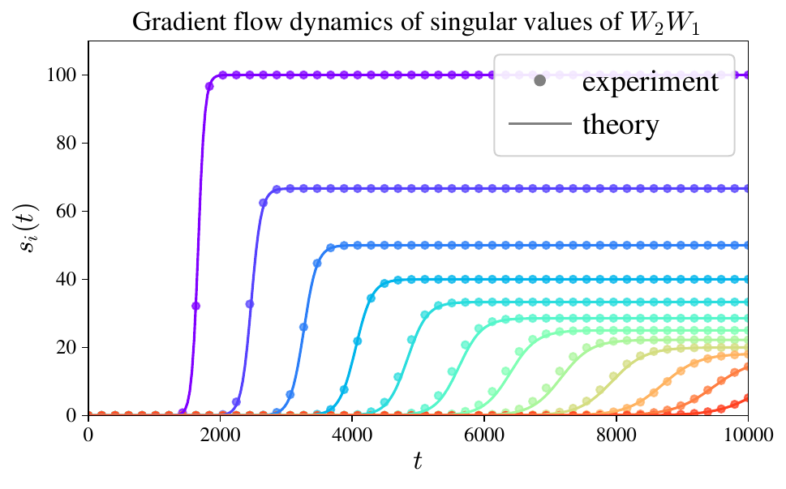
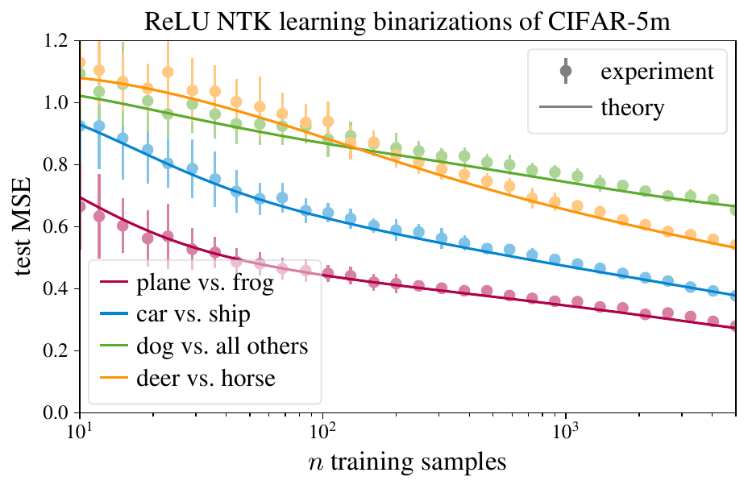
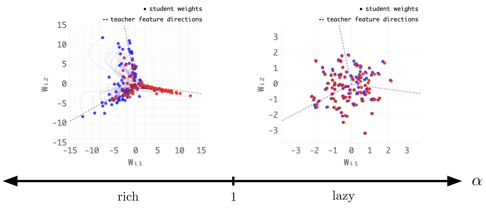
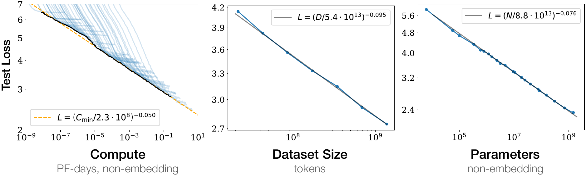
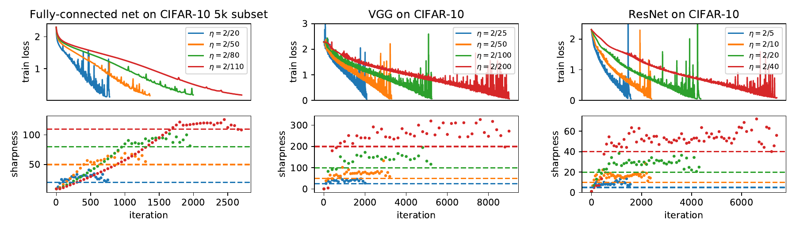
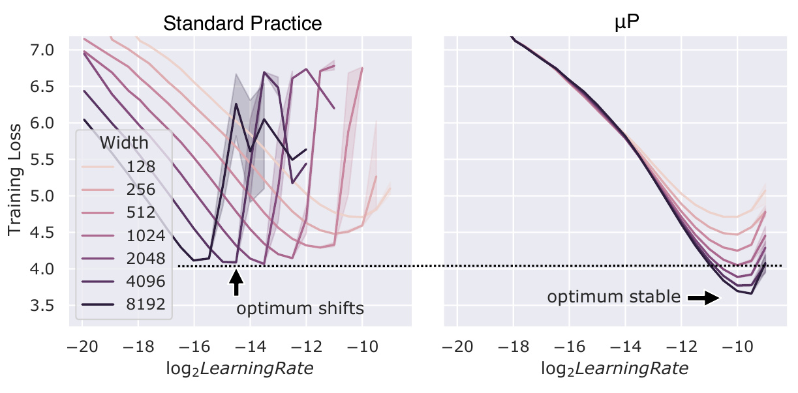
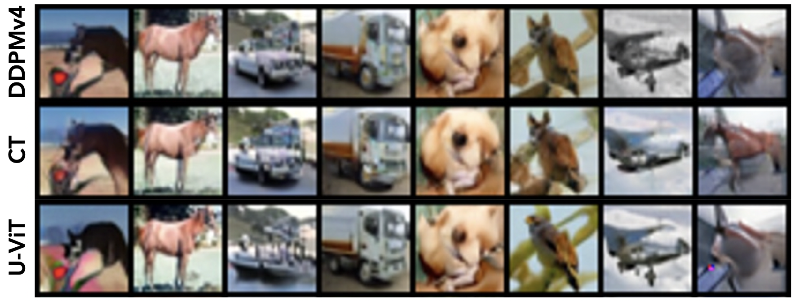
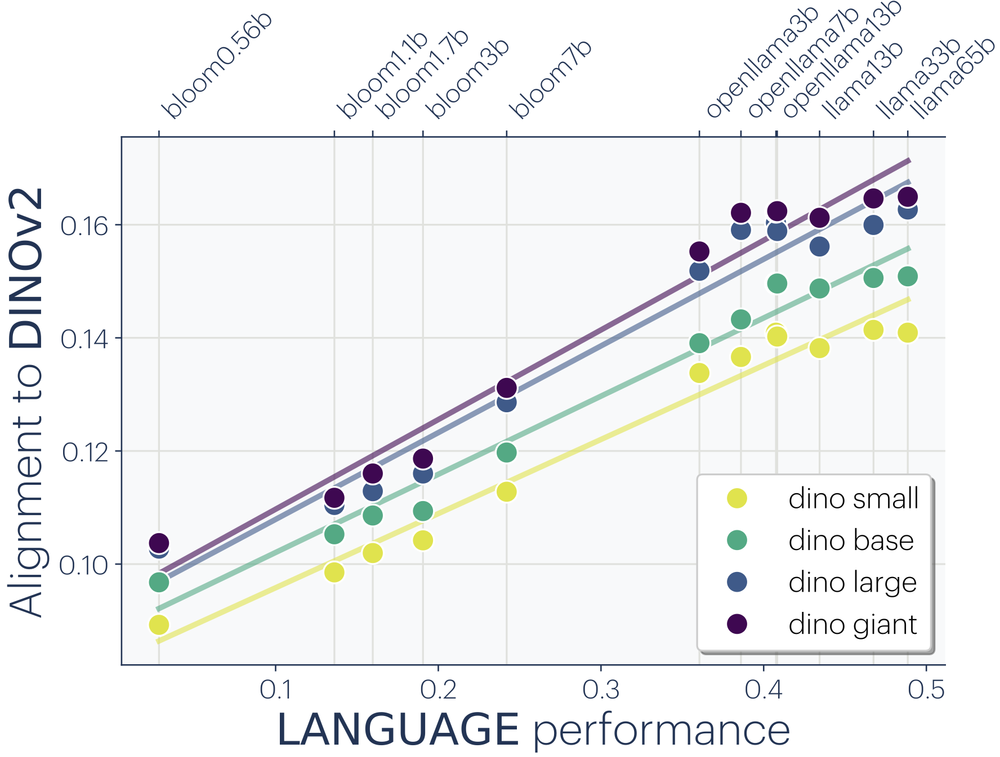

# Title: There Will Be a Scientific Theory of Deep Learning

- ArXiv: 2604.21691
- Authors: Jamie Simon, Daniel Kunin, Alexander Atanasov, Enric Boix-Adserà, Blake Bordelon, Jeremy Cohen, Nikhil Ghosh, Florentin Guth, Arthur Jacot, Mason Kamb, Dhruva Karkada, Eric J. Michaud, Berkan Ottlik, Joseph Turnbull
- Sections: 58
- Estimated tokens: 59.7k

## 目录（Contents）

- [摘要（Abstract）](#abstract)
- [1 引言（Introduction）](#1-introduction)
  - [1.1 何为力学？（What’s in a mechanics?）](#11-whats-in-a-mechanics)
    - [学习力学的七项期望（Seven desiderata for learning mechanics.）](#seven-desiderata-for-learning-mechanics)
  - [1.2 学习力学为何重要（Why learning mechanics matters）](#12-why-learning-mechanics-matters)
  - [1.3 本文规划（Plan for this paper）](#13-plan-for-this-paper)
- [2 学习力学正在涌现的证据（Evidence of an emerging mechanics of learning）](#2-evidence-of-an-emerging-mechanics-of-learning)
  - [2.1 存在可解析求解的设定（Analytically solvable settings exist）](#21-analytically-solvable-settings-exist)
    - [数据中的线性化（Linearization in the data.）](#linearization-in-the-data)
    - [参数中的线性化（Linearization in the parameters.）](#linearization-in-the-parameters)
    - [超越线性化（Beyond linearization.）](#beyond-linearization)
  - [2.2 富有洞察力的极限揭示基本行为（Insightful limits reveal fundamental behavior）](#22-insightful-limits-reveal-fundamental-behavior)
    - [无穷宽度极限与懒惰/丰富二分法（The infinite width limit and the lazy/rich dichotomy.）](#the-infinite-width-limit-and-the-lazyrich-dichotomy)
    - [无穷深度极限与其他超参数极限（The infinite depth limit and other hyperparameter limits.）](#the-infinite-depth-limit-and-other-hyperparameter-limits)
    - [联合缩放极限（Joint scaling limits.）](#joint-scaling-limits)
    - [离散化假说（The Discretization Hypothesis.）](#the-discretization-hypothesis)
  - [2.3 简单的经验定律捕捉有意义的宏观统计量（Simple empirical laws capture meaningful macroscopic statistics）](#23-simple-empirical-laws-capture-meaningful-macroscopic-statistics)
    - [神经缩放定律（Neural scaling laws.）](#neural-scaling-laws)
    - [稳定性边缘的权重动力学（Weight dynamics at the edge of stability.）](#weight-dynamics-at-the-edge-of-stability)
    - [隐藏表示与权重的粗略性质（Coarse properties of hidden representations and weights.）](#coarse-properties-of-hidden-representations-and-weights)
    - [对理论家的启示（Takeaways for theorists.）](#takeaways-for-theorists)
  - [2.4 超参数可被解耦并理解（Hyperparameters can be disentangled and understood）](#24-hyperparameters-can-be-disentangled-and-understood)
    - [理解优化超参数（Understanding optimization hyperparameters.）](#understanding-optimization-hyperparameters)
    - [将架构超参数与优化超参数解耦（Disentangling architecture hyperparameters from optimization hyperparameters.）](#disentangling-architecture-hyperparameters-from-optimization-hyperparameters)
  - [2.5 跨设定与任务的普遍现象（Universal phenomena appear across settings and tasks）](#25-universal-phenomena-appear-across-settings-and-tasks)
    - [普遍归纳偏置（Universal inductive biases.）](#universal-inductive-biases)
    - [数据中的普遍结构（Universal structure in data.）](#universal-structure-in-data)
    - [表示中的普遍性（Universality in representations.）](#universality-in-representations)
- [3 与其他视角的关系（Relation to other perspectives）](#3-relation-to-other-perspectives)
  - [统计视角（The statistical perspective.）](#the-statistical-perspective)
  - [信息论视角（The information-theoretic perspective.）](#the-information-theoretic-perspective)
  - [深度学习物理学（Physics of deep learning.）](#physics-of-deep-learning)
  - [神经科学视角（Perspectives from neuroscience.）](#perspectives-from-neuroscience)
  - [发展可解释性/奇异学习理论（Developmental interpretability/singular learning theory.）](#developmental-interpretabilitysingular-learning-theory)
  - [深度学习科学（Science of deep learning.）](#science-of-deep-learning)
  - [3.1 学习力学 ⇄ 机制可解释性（Learning mechanics ⇄ mechanistic interpretability）](#31-learning-mechanics-rightleftarrows-mechanistic-interpretability)
    - [学习力学 → 机制可解释性（Learning mechanics → mechanistic interpretability.）](#learning-mechanics-rightarrow-mechanistic-interpretability)
    - [学习力学 ← 机制可解释性（Learning mechanics ← mechanistic interpretability.）](#learning-mechanics-leftarrow-mechanistic-interpretability)
- [4 怀疑理由与回应（Reasons for skepticism and responses）](#4-reasons-for-skepticism-and-responses)
  - [有能力的数十年来一直试图建立深度学习理论，但我们尚未成功。如果存在理论，我们理应早已发现。](#competent-researchers-have-been-trying-to-develop-a-theory-of-deep-learning-for-decades-and-we-dont-have-one-surely-if-there-was-a-theory-we-would-have-already-found-it)
  - [当前理论所理解的物体（例如相比LLM）非常原始。从第一性原理理解大型模型显然过于沉重。](#the-objects-currently-understood-from-theory-are-very-primitive-compared-to-eg-llms-surely-first-principles-understanding-of-large-models-is-too-heavy-a-lift)
  - [重要的是模型的高层行为。微观理论过于放大，无法看到这一点。](#what-matters-is-a-models-high-level-behavior-microscopic-theories-are-too-zoomed-in-to-see-this)
  - [我们不需要深度学习理论，我们需要数据理论。](#we-dont-need-a-theory-of-deep-learning-we-need-a-theory-of-data)
  - [人工智能将在我们之前理解自己。为何要尝试构建理论？](#ai-will-understand-itself-before-we-do-why-try-to-build-theory)
- [5 学习力学的开放方向（Open directions in learning mechanics）](#5-open-directions-in-learning-mechanics)
  - [开放方向1：什么是真正深层、非线性学习的简单可解模型？](#open-direction-1-what-are-simple-solvable-models-of-genuinely-deep-nonlinear-learning)
  - [开放方向2：能够捕捉自然数据的理论会是什么样子？](#open-direction-2-what-would-a-theory-capable-of-capturing-natural-data-look-like)
  - [开放方向3：深度学习是否隐含地最小化某种函数复杂性的概念？](#open-direction-3-does-deep-learning-implicitly-minimize-some-notion-of-functional-complexity)
  - [开放方向4：我们如何正式定义神经网络学习的特征？](#open-direction-4-how-do-we-formally-define-the-features-learned-by-neural-networks)
  - [开放方向5：有限神经网络是否应被理解为对无穷极限的近似？](#open-direction-5-are-finite-neural-networks-properly-understood-as-approximations-to-infinite-limits)
  - [开放方向6：我们能否理解并消除所有超参数？](#open-direction-6-can-we-understand-and-eliminate-all-hyperparameters)
  - [开放方向7：我们能否先验地预测缩放律指数？](#open-direction-7-can-we-predict-scaling-law-exponents-a-priori)
  - [开放方向8：损失曲率如何与架构、特征和泛化相互作用？](#open-direction-8-how-does-loss-curvature-interplay-with-architecture-features-and-generalization)
  - [开放方向9：深度学习中的良好优化器由什么构成？](#open-direction-9-what-makes-for-a-good-optimizer-in-deep-learning)
  - [开放方向10：以不同方式训练的大型模型在何种意义上学习相似的表示？](#open-direction-10-in-what-sense-do-large-models-trained-differently-learn-similar-representations)
- [6 如何参与学习力学的发展（How to get involved in the development of learning mechanics）](#6-how-to-get-involved-in-the-development-of-learning-mechanics)
  - [6.1 入门原则（Tenets for getting started）](#61-tenets-for-getting-started)
- [致谢（Acknowledgements）](#acknowledgements)

## 摘要（Abstract）

在本文中，我们论证了 **深度学习的科学理论** 正在涌现。我们所说的理论是指能够表征 **训练过程** 、 **隐藏表示** 、 **最终权重** 以及 **神经网络性能** 的重要属性和统计量的理论。我们汇集了**深度学习理论**中正在进行的主要研究方向，并识别出指向这一理论的五个不断发展的研究领域：

- 1. 可解析求解的理想化设定，为现实系统中的学习动力学提供直觉；
- 2. 可处理的极限，揭示基本学习现象的洞见；
- 3. 简单的数学定律，捕捉重要的宏观可观测值；
- 4. 超参数理论，将它们与训练过程的其余部分解耦，留下更简单的系统；以及
- 5. 跨系统与设定共享的普遍行为，阐明哪些现象需要解释。
  6. solvable idealized settings that provide intuition for learning dynamics in realistic systems;
  7. tractable limits that reveal insights into fundamental learning phenomena;
  8. simple mathematical laws that capture important macroscopic observables;
  9. theories of hyperparameters that disentangle them from the rest of the training process, leaving simpler systems behind; and
  10. universal behaviors shared across systems and settings which clarify which phenomena call for explanation.

综合来看，这些研究领域具有某些广泛特征：它们关注训练过程的动力学；它们主要寻求描述粗略的聚合统计量；并且它们强调可证伪的定量预测。我们认为，这一涌现的理论最好被理解为 **学习过程的力学** ，并建议命名为 **学习力学（learning mechanics）** 。我们主张，学习力学应是一种 **数学理论** ，基于与经验密切吻合的第一性原理计算，依赖于经过充分检验的近似和假设，旨在成熟后对整个机器学习栈产生广泛影响。

我们讨论了这种力学视角与其他构建深度学习理论方法（包括统计和信息论视角）之间的关系。特别地，我们预期学习力学与正在发展的 **机制可解释性（mechanistic interpretability）** 学科之间将形成 **共生且相互支持的关系** 。机制可解释性旨在成为深度学习的生物学，而学习力学应立志成为其物理学，镜像自然科学中生物学与物理学之间的互补关系。

我们还回顾并回应了关于基本理论不可能或不重要的常见论点。最后，我们描绘了学习力学中的重要开放方向，并为初学者提供建议。我们在 [learningmechanics.pub](2604.21691v1/learningmechanics.pub) 上托管了进一步的介绍性材料、视角和开放问题。

``

## 1 引言（Introduction）

深度学习是著名的 **黑箱学习方法** ，是机器学习殿堂中最强大、最难以理解、如今在技术上最为重要的成员。经过适当训练， **神经网络（neural networks）**  能够以超人类的表现执行各种任务，但我们缺乏统一的科学框架来解释其原因或方式。出于科学好奇心以及实际工程效益的承诺，为这一应用学科提供严谨数学与科学支撑的努力已持续数十年。然而，尽管取得了一些进展，我们的理解仍然原始：神经网络的训练方法大多通过试错而非第一性原理发现，理论在深度学习的日常实践中几乎不起作用。随着实践的进步，这一挑战只会加剧，而在 **大语言模型（Large Language Models, LLMs）**  和 **扩散模型（diffusion models）**  时代，谜团比一二十年前可能更深。我们究竟能否理解？

推动深度学习理论的问题随时间而演变，要理解该领域的发展方向，首先回顾我们如何走到今天是有益的。深度学习理论与机器学习本身一样古老，其根源可追溯至上世纪中叶的 **麦卡洛克-皮茨神经元（McCulloch–Pitts neuron）**  和 **感知机（perceptron）** 。机器学习最早的理论问题涉及 **表达能力（expressivity）** ：简单模型能表示哪些函数，以及如何从数据中学习它们？随着学习被理解为统计问题，且简单学习系统取得实际成功，理论焦点转向：从有限样本中学习何时能够 **泛化（generalize）** ？这催生了经典学习理论，包括统计学习理论和计算/ **PAC学习理论（PAC learning theory）** 。结合经典优化理论，这些框架为简单学习系统的优化与泛化提供了清晰的全流程保证。与此同时，机器学习的 **统计物理学（statistical physics）**  经典传统也为简单模型的平均行为发展出了令人满意的理论。

尽管这些经典理论为理解学习奠定了坚实基础，但通过多层网络、 **反向传播（backpropagation）**  以及数据和计算规模日益扩大而兴起的深度学习，暴露了其解释力的局限性。神经网络是复杂、非凸且 **过参数化（overparameterized）**  的（与经典学习理论擅长的简单、凸、节俭模型形成对比），其优化和泛化表现优于经典方法所能保证或解释的范围。此外，人们逐渐认识到，神经网络不仅仅是在拟合数据或实现低训练误差，它们还在学习结构化的内部表示，并在不同任务和规模间展现出显著的规律性。关于性能与效率的经典问题仍然重要，但要回答这些问题，首先需要理解一系列新现象，这些现象既受神经网络训练动态的影响，也受训练数据结构的塑造。

这标志着一个转变：深度学习理论的性质从主要研究“可能性的数学”转变为真正科学性的努力，旨在描述、解释并最终预测复杂经验系统的行为。新的科学探索往往始于经验上的张力——自然界呈现出某些有趣的现象，而我们无法用现有工具预测或解释。尽管神经网络是人工计算系统，但同样的科学张力在此依然存在。因此，我们应当以科学家的态度来对待这项任务，拥抱经验研究，寻求统一原理，识别反复出现的主题。我们也应预期前进的道路更像一个科学领域的发展，而非数学领域的发展。

本文旨在让读者相信，这种科学张力正逐渐让位于一种能够解决它的科学理论。在[第2节](#section-2)中，我们综合了当前研究的主要脉络，并识别出表明这种理论正在形成的五条证据线：

1. 存在越来越多可解析求解的设置，其中学习过程完全由简单数学描述，包括但不限于 **深度线性网络（deep linear networks）**  和 **核方法（kernel methods）** （[第2.1节](#section-2-1)）；
2. 存在有用的极限，包括 **无限宽度（infinite width）**  和 **无限深度（infinite depth）**  极限，这些极限为基本学习行为提供了洞见（[第2.2节](#section-2-2)）；
3. 在许多情况下，简单的经验定律足以捕捉有意义的 **宏观统计量（macroscopic statistics）** ，包括测试时性能和 **损失景观（loss-landscape）**  的尖锐程度（[第2.3节](#section-2-3)）；
4. 许多控制优化的 **超参数（hyperparameters）**  可以被解耦和理解，留下一个更简单的有效动力系统（[第2.4节](#section-2-4)）；以及
5. 随着应用深度学习不断扩展规模并收敛于最佳实践， **普适现象（universal phenomena）**  越来越多地出现在不同设置和任务中（[第2.5节](#section-2-5)）。

这些研究方向普遍具有几个总体特征：它们关注训练过程的动力学；它们主要旨在描述学习的粗粒度聚合统计量；并且它们强调准确的 **平均情况预测（average-case predictions）**  而非严格的 **最坏情况界（worst-case bounds）** 。从这个意义上说，新兴的神经网络科学理论与物理学中的理论（如 **经典力学（classical mechanics）** 、 **连续介质力学（continuum mechanics）** 、 **统计力学（statistical mechanics）**  和 **量子力学（quantum mechanics）** ）有许多共同之处。我们认为，这种新兴理论最好被理解为一种 **学习力学（learning mechanics）** 。

- [1.1 力学是什么？](#11-whats-in-a-mechanics)
- [1.2 为什么学习力学很重要](#12-why-learning-mechanics-matters)
- [1.3 本文的规划](#13-plan-for-this-paper)

``

### 1.1 力学是什么？（What’s in a mechanics?）

力学是物理学的一个分支，研究作用在物体上的力如何决定它们在空间和时间中的运动。**神经网络学习可以这样理解：正如物体在物理空间中连续运动，学习涉及模型通过离散更新在参数空间中移动。**在物理科学中，力来自系统各组成部分之间的相互作用。类似地，深度学习过程由参数、数据集、任务和学习规则之间的相互作用所塑造。在物理学中，这些力通过场来传递；在深度学习中，它们通过梯度来传递。在物理学中，系统在由内部相互作用和外部约束决定的势能的局部最小值处达到平衡；类比地，神经网络收敛到由架构和训练数据塑造的损失景观的局部最小值。**尽管所研究的系统非常不同，但由于两者的关键问题本质上都涉及运动与相互作用，我们可以预期由此产生的科学会共享某些特征。**

这些类比并非仅仅是推测：我们可以在上述研究方向中看到这些相似性。

* **力学的所有分支（尤其是经典力学）都会建立一个可解析求解的设置库（a library of analytically solvable settings）以获取直觉；学习力学也是如此。**
* 力学的所有分支都使用极限作为简化工具；学习力学也是如此。
* **连续介质力学（Continuum mechanics）**  和 **统计力学（statistical mechanics）** ——直接处理大量相互作用组件的分支——描述的是宏观的汇总统计量，而非每个粒子的运动；在处理深度学习的复杂性时，这也被证明是一种有用的方法。
* 每个物理系统都有一个或多个影响其行为的系统参数（特征尺度、耦合常数等），处理这些参数的一些技术本质上与用于研究深度学习超参数的技术相同。
* 最后，物理学中充满同一现象在不同设置中出现的案例，同样，我们在深度学习系统中也看到了普适行为的涌现。

综上所述，新兴科学与力学的既有分支有着深刻的相似性。通过类比经典力学、连续介质力学、统计力学和量子力学，我们建议将这一预期理论称为 **学习力学（learning mechanics）** 。

- [ **学习力学的七个期望特征。** ](#seven-desiderata-for-learning-mechanics)

#### 学习力学的七项期望（Seven desiderata for learning mechanics）

我们首先应明确希望从学习力学中获得什么。通过评估力学成熟分支的动机、发展历程和成功经验，我们可以看出应追求何种目标。以下是这一研究项目的七项期望：

fundamental, mathematical, predictive, comprehensive, intuitive, useful, humble

- **1. 学习力学应是基础性的** ，从神经网络训练的**第一性原理**描述出发，**按逻辑推演**。关于网络权重、动态和性能的临时假设将是有用的工具，但它们最终应从第一性原理得到解释。
- **2. 学习力学应是数学性的** ，对神经网络的重要属性做出**明确、定量的陈述**。没有哪门力学是定性科学；学习力学也不会例外。
- **3. 学习力学应是预测性的** ，其主张应有简单、可重复的实验测量结果作为支撑。我们对系统拥有出色的实验控制能力，每一项重大进展都应在实验中得到明确验证。
- **4. 学习力学应是全面性的** ，在单一图景中描述神经网络的训练过程、隐藏表示和最终权重。**值得强调的是，这一理论不会——也不应——旨在描述一切。一张与真实世界等比例的地图必然和世界一样大，因而用处甚微。我们寻求的是一种在恰当分辨率层面运作的理论——一种为了洞见而牺牲细节的理论。**
- **5. 学习力学应是直观性的** ，在揭开深度学习的神秘面纱时，应做到简单、有启发性且令人满意。如同物理学一样，学习力学应力求**简单的洞见**，而非技术上的复杂性。
- **6. 学习力学应是*有用*的** ，作为应用深度学习的科学基础，正如物理学之于其他工程领域。具体目标应包括**大幅减少超参数调优的需求，为数据集设计提供预测性工具，并为人工智能安全（AI safety）工作提供严谨基础**。
- **7. 最后，学习力学应是谦逊的** ，对其所描述的内容要坚实可靠，对其无法描述的内容要明确说明。物理科学的每个分支都有其适用范围，超出该范围便会失效，而这些边界与科学本身一同被传授，以便可靠地使用。我们预计，适用于现实深度学习的力学将在许多小规模、手工制作或其他特殊情况下失效，这是为了在我们关心的领域中获取正确的简化图景而必须付出的代价。

一个具备这些优点的学习力学——即基础性、数学性、预测性、全面性、直观性、有用性和谦逊性——将是变革性的，并会确立新的范式。我们预期，这样的理论将能够解决长期悬而未决的重要开放性问题，正如我们在[第5节](#section-5)中所讨论的那样。

``

### 1.2 学习力学为何重要（Why learning mechanics matters）

构建学习力学并非易事。它需要智力与制度两方面的持续投入。因此，有必要明确这一项目为何重要。寻求学习力学的理由可分为三大类：科学层面的、实践层面的以及安全层面的。

**科学层面**的理由关乎**这样的理论能教会我们关于智能和自然世界的什么**。大型神经网络在工程上的惊人成功表明，它们利用了我们还尚未理解的关于学习和表示的深层原理。这在历史上有先例：**技术常常先于科学理论出现**，正如蒸汽机在推动热力学发展中所起的作用，而热力学后来解释的远不止是发动机效率。飞行领域也上演了类似的故事：通过试错和从自然界汲取灵感发展起来的飞机，帮助推动了空气动力学理论，而空气动力学理论反过来又促成了更好的飞机设计，以及对鸟类自身飞行方式的更深入理解。在我们的案例中，支配人工神经网络学习的原理也可能揭示我们自身的生物智能，对神经科学和认知科学具有潜在的重要影响。

**实践层面**的理由关乎现实世界人工智能系统的设计与开发。一个成熟的深度学习理论可以指导模型设计、优化、扩展和部署，用更可靠的原理取代试错法。理论已经在有限但日益增多的案例中开始发挥这种作用，包括 **经验缩放定律（empirical scaling laws）** （[第2.3节](#section-2-3)）、**超参数缩放的数学规范**（[第2.4节](#section-2-4)），以及**受理论启发的优化器和数据归因方法**（[第4节](#section-4)）。一个更深入、更完整的理论将提供更多此类指导，并使其更加精准、更具预测性。

**安全层面**的理由关乎我们描述、表征和治理日益强大的人工智能系统的能力。某种形式的监管可能是必要的，但监管一项我们无法清晰描述的技术是困难的。一个能够识别大型模型相关变量、机制和组织原理的理论，有助于提供可靠性、监督和控制所需的清晰度。基础理论可能有助于人工智能安全的一条途径是支持 **机制可解释性（mechanistic interpretability）** ，我们将在[第3节](#section-3)中回到这一点。

``

### 1.3 本文计划（Plan for this paper）

本文结构如下。

- 在[第2节](#section-2)中，我们提出五条证据线，表明深度学习的科学理论正在开始浮现。我们对每条证据线进行直观解释，并重点介绍说明其基本原理的研究成功案例。在[第3节](#section-3)中，我们讨论学习力学与深度学习科学其他视角之间的关系，包括学习力学与机制可解释性之间可能的共生关系。
- 在[第4节](#section-4)中，我们回顾并回应了关于基础理论不可能实现的常见论点。
- 在[第5节](#section-5)中，我们描绘了学习力学中十个重要的开放方向，从预测缩放定律到消除超参数，我们预计在未来几年内这些方向将取得重大进展。
- 最后，在[第6节](#section-6)中，我们为希望参与这一科学项目的年轻研究人员提供一些建议，并通过一些入门资源伸出援手。

本文面向广泛的读者。我们希望深度学习的资深科学家能在我们对有用方法和结果的综合论述中发现价值，并因我们对一门新兴科学的描绘而备受鼓舞。我们希望说服深度学习从业者相信，理论正在实现其长期承诺的实际效用，并鼓励他们以科学的眼光对其系统进行实验。我们希望说服人工智能安全或机制可解释性研究人员相信， **白盒理论（white-box theory）** 虽然困难但却是可能的——对动力学的第一性原理研究有助于为他们重要的工作奠定坚实基础，并且我们的社区应该合作（关于我们的共生愿景，请参见[第3节](#section-3)）。最后，我们希望让年轻学生和该领域的新手更容易参与进来。这是一个令人兴奋且重要的研究领域，虽然入门需要一定的数学成熟度，但我们相信入门门槛可以大大降低。关于这门科学的各种深刻直觉已经在理论社区内酝酿了一段时间，本文试图将这些直觉清晰地表述出来。我们希望让具备必要背景的人能够更快地跟上进度并做出贡献。

``

## 2 学习力学正在浮现的证据（Evidence of an emerging mechanics of learning）

对学习力学是可能的这一观点持乐观态度的一大理由是，深度学习的基本要素既是显式的，也是可测量的。一个深度学习系统由以下组件表征：

- Architecture: 一个神经网络 $f(\mathbf{x};\mathbf{\theta})$，由简单的线性和非线性变换组合而成。
- Data: 一个数据集 $\mathcal{D}=\{(\mathbf{x}_i,\mathbf{y}_i)\}_{i=1}^n$，包含来自未知数据生成分布的样本 $(\mathbf{x},\mathbf{y})\sim\mathcal{P}_{\mathrm{data}}$。
- Task: 一个目标函数 $\mathcal{L}(\mathbf{\theta})$，衡量网络 $f(\mathbf{x};\mathbf{\theta})$ 在数据集 $\mathcal{D}$ 上的性能。
- Learning rule: 一个基于梯度的更新方程，例如 $\mathbf{\theta}^{(t+1)}=\mathbf{\theta}^{(t)}-\eta\nabla\mathcal{L}(\mathbf{\theta}^{(t)})$，连同参数初始化，例如 $\mathbf{\theta}^{(0)}_i\sim\mathcal{N}(0,\alpha^2_{\mathrm{init}})$，以及优化超参数，例如学习率 $\eta$。

学习过程中没有任何隐藏的部分。与许多必须从观测中推断动力学方程的复杂系统不同，深度学习直接暴露了其“运动方程”。此外，这些动力学是极其可测量的：每一个权重、激活值、梯度和损失值都可以被记录，连同从它们推导出的任意统计量。因此，深度学习实验异常容易设计、复现和探究，使得发现经验规律和严格检验理论预测变得更加直接。很少有快速发展的科学领域能提供如此透明的支配方程，或如此自由的测量能力。

那么，是什么阻碍了深度学习科学理论的形成？核心挑战不是*不透明性*，而是*复杂性*。虽然我们可以直接访问架构、数据、任务和学习规则，但这些组件的相互作用产生了非线性、耦合且高维的学习动力学。这些动力学以微妙的方式依赖于超参数的选择。而且，即使我们可以检查每一个训练样本，数据分布也是复杂的，并且一直难以进行简单表征。

尽管如此，我们认为这种复杂性掩盖了潜在的规律性，并且深度学习确实将产生一门科学理论。接下来，我们提出五个广泛的观察结果，作为学习力学正在浮现的证据。每一个观察结果都与力学其他学科中的工具和思想有直接类比。这些内容总结在[表1](#table-1)中。

``

> 表1：新兴深度学习科学中的有用工具和思想，与物理学（特别是经典力学、连续介质力学、统计力学和量子力学）中的重要工具和思想高度相似。推而广之，这表明将存在一门学习力学，它为神经网络的训练过程、隐藏表示、最终权重和测试时性能提供一个统一的第一性原理理论。

| 章节             | 方法                                             | 深度学习中的例子                                                 | 物理学中的例子                                                                                                                   |
| ---------------- | ------------------------------------------------ | ---------------------------------------------------------------- | -------------------------------------------------------------------------------------------------------------------------------- |
| [2.1](#section-2-1) | 可解设定 （solvable settings）              | 深度线性网络、核回归、多指标模型                                 | 谐振子、氢原子、伊辛模型                                                                                                         |
| [2.2](#section-2-2) | 简化极限 （simplifying limits）             | 懒惰学习 vs. 丰富学习、宽度、深度$\rightarrow\infty$、小初始化 | 热力学极限$(n,V\rightarrow\infty)$、经典极限 $(\hbar\rightarrow 0)$、 流体动力学极限 $({\bm{k}},\omega\rightarrow 0)$ |
| [2.3](#section-2-3) | 简单经验定律 （simple empirical laws）      | 神经缩放定律、稳定性边缘、神经特征假设                           | 开普勒定律、斯涅尔定律、玻意耳定律、 胡克定律、牛顿定律、法拉第定律、 欧姆定律、泊肃叶定律、普朗克定律、哈勃定律等     |
| [2.4](#section-2-4) | 系统参数研究 （study of system parameters） | 步长作为锐度正则化、$\mu$P 和宽度缩放                          | 缩放分析、无量纲化、混沌 vs. 有序状态                                                                                            |
| [2.5](#section-2-5) | 普适现象 （universal phenomena）            | 跨模型的共同归纳偏置和表示                                       | 临界现象、重整化群流                                                                                                             |

- [2.1 存在解析可解设定](#21-analytically-solvable-settings-exist)
- [2.2 富有洞见的极限揭示基本行为](#22-insightful-limits-reveal-fundamental-behavior)
- [2.3 简单经验定律捕捉有意义的宏观统计量](#23-simple-empirical-laws-capture-meaningful-macroscopic-statistics)
- [2.4 超参数可以被解耦和理解](#24-hyperparameters-can-be-disentangled-and-understood)
- [2.5 跨设定和任务出现普适现象](#25-universal-phenomena-appear-across-settings-and-tasks)

``

### 2.1 存在解析可解设定（Analytically solvable settings exist）

**在复杂系统中建立科学理解的一个可靠方法是，研究那些虽经简化但仍具代表性、且能进行定量计算的设定。** 例如，物理学使用像谐振子和氢原子这样具有代表性的可解设定，作为理解更广泛系统类别的直觉来源。深度学习似乎特别适合这种方法：科学家们已经发现了丰富的极小模型（minimal models）图景，在这些模型中，学习动力学得以简化，许多感兴趣的量变得可解。这些解析可解的基石之所以有用，是因为它们揭示了当我们转向现实深度学习时，应寻找的现象和机制。(另一种观点是，任何最终的深度学习完整理论都必须涵盖这些简化设定。它们的解可能提供概念性脚手架，作为更一般理论结晶的成核位点。)

一个特别富有成效的简化是线性化。在这里，我们讨论这一思想的两种不同实例：

- 数据上的线性化，其中 $f({\bm{x}};{\bm{\theta}})$ 在 ${\bm{x}}$ 上变为线性；
- 以及参数上的线性化，其中 $f({\bm{x}};{\bm{\theta}})$ 在 ${\bm{\theta}}$ 上变为线性。

(a)  **数据中的线性化（Linearization in the data）**
(b) Linearization in the parameters

> 图1：线性化产生的精确解与实验吻合。
>
> （a）Saxe 等人 [2014] 的 **经典工作** 表明，在 **任务对齐初始化** ${\mathbf{\theta }}^{\left( 0\right) }$ 和 **白化输入** $\mathbf{x} \sim  \mathcal{N}\left( {0,\mathbf{I}}\right)$ 下，深层线性网络的 **梯度流学习动力学** 解耦为独立的可求解 **伯努利常微分方程**。这导致了奇异模式的 **顺序学习**，其中较大奇异值的模式先出现。子图（a）复制自 Saxe 等人 [2014] 的图 3。
>
> （b）通过在初始化附近截断其泰勒展开中的非线性项来 **对非线性网络进行线性化**，将 **最小二乘训练** 简化为 **核岭回归** 与 **神经正切核 (NTK)**。这一分析通过 **NTK 特征结构** 将网络的架构与其 **归纳偏置** 联系起来，从而能够准确预测这些网络的 **测试性能**。子图（b）基于 Simon 等人 [2023a] 的图 2。

- [数据中的线性化（Linearization in the data）](#linearization-in-the-data)
- [参数中的线性化（Linearization in the parameters）](#linearization-in-the-parameters)
- [超越线性化（Beyond linearization）](#beyond-linearization)

#### 数据中的线性化（Linearization in the data）

 **深度线性网络（Deep linear network）**  是通过移除神经网络架构中的所有非线性而得到的，从而产生一个对输入 ${\bm{x}}$ 为线性、但其参数 ${\bm{\theta}}$ 仍高度 **非线性** 的模型：

$$
f({\bm{x}};{\bm{\theta}})=\mathbf{W}_{L}\mathbf{W}_{L-1}\cdots\mathbf{W}_{1}{\bm{x}},\qquad\text{其中}{\bm{\theta}}:=\{\mathbf{W}_{\ell}\}_{\ell=1}^{L}\text{，每个}\mathbf{W}_{\ell}\text{是一个线性变换，并且}L\geq 2。(1)
$$

深度线性网络有着悠久的研究历史，因为尽管它们结构简单，却保留了深度学习的许多标志性行为 [Nam et al., [2025](#ref-51)]。这些行为包括：

- 以鞍点为主的损失景观 [Baldi and Hornik, [1989](#ref-128)]、
- 具有尖锐相变和时间尺度分离的动力学 [Gissin et al., [2019](#ref-137), Atanasov et al., [2021](#ref-138)]、
- 梯度下降下的稳定性边缘振荡 [Even et al., [2023](#ref-148)]，以及
- 依赖于初始化的强归纳偏置 [Woodworth et al., [2020](#ref-151), Kunin et al., [2024](#ref-141)]。

  对这些网络的分析通常是在对数据分布进行简化假设并精心选择初始化的条件下，采用 **梯度流（gradient flow）**  学习规则（梯度下降的连续时间极限）进行的 [Fukumizu, [1998](#ref-131), Saxe et al., [2014](#ref-127), Tarmoun et al., [2021](#ref-132), Dominé et al., [2025](#ref-142)]。在这些设定下，学习动力学通常可以被精确求解，或简化为低维动力系统。

在众多此类分析中，一个一致的结论浮现出来：学习表现出一种 **贪心（greedy）**  的**低秩偏置**，即**先获取任务的某些成分，再获取其他成分**。

Saxe 等人 [[2014](#ref-127)] 的开创性工作首次展示了**深度线性网络如何在训练过程中顺序学习输入-输出相关的奇异向量，学习优先级偏向于与最大奇异值相关的模态**，如[图 1](#figure-1) 所示。这种偏置被认为通过将信号与噪声分离来有利于泛化 [Lampinen and Ganguli, [2018](#ref-129)]，并且与非线性网络中观察到的行为高度吻合——在非线性网络中，更简单的函数通常先于更复杂的函数被学习 [Kalimeris et al., [2019](#ref-149), Simon et al., [2023b](#ref-147)]。

此外，一系列因素——包括 **小初始化（small initializations）**  [Gidel et al., [2019](#ref-136), Li et al., [2021a](#ref-143), Jacot et al., [2021](#ref-139), Pesme and Flammarion, [2023](#ref-146)]、 **增加深度（increased depth）**  [Gunasekar et al., [2018](#ref-257), Arora et al., [2018](#ref-134), [2019b](#ref-135)]、 **更强的小批量噪声（stronger mini-batch noise）**  [Pesme et al., [2021](#ref-144), Chen et al., [2024](#ref-145)]，以及显式的 $\ell_{2}$  **正则化（regularization）**  [Ziyin et al., [2022](#ref-140), Wang and Jacot, [2024](#ref-150)]——都已被证明可以进一步增强这种贪心学习偏置。

#### 参数中的线性化（Linearization in the parameters）

 **线性化网络（Linearized network）**  是**通过截断网络在其初始参数附近泰勒展开中的非线性项而得到的**。这产生了一个对参数 ${\bm{\theta}}$ 为线性、但对数据 ${\bm{x}}$ 仍高度 **非线性** 的模型：

$$
f_{\text{lin}}({\bm{x}};{\bm{\theta}})=f({\bm{x}};{\bm{\theta}}_{0})+\nabla_{{\bm{\theta}}}f({\bm{x}};{\bm{\theta}}_{0})^{\top}({\bm{\theta}}-{\bm{\theta}}_{0}),\qquad\text{其中}\nabla_{{\bm{\theta}}}f(\cdot;{\bm{\theta}}_{0})\text{是初始化时的梯度。}(2)
$$

这并非某种人为构造：事实上，在某些设定下，模型在整个训练过程中都可以被其线性化很好地近似，即 $\forall t,\ f({\bm{x}};{\bm{\theta}}_{t})\approx f_{\text{lin}}({\bm{x}};{\bm{\theta}}_{t})$。例如，任何神经网络架构都可以通过取适当的极限被推入线性化区域 [Jacot et al., [2018](#ref-174), Lee et al., [2019](#ref-173), Chizat et al., [2019](#ref-172), Liu et al., [2020](#ref-175)]，如[第 2.2 节](#section-2-2)所述。此外，最近的证据表明，语言模型的微调发生在接近线性化的区域 [Malladi et al., [2023](#ref-49), Ren and Sutherland, [2025](#ref-50)]。

由于线性化网络在其参数上是线性的，其学习动力学与线性回归完全相同，但有一个关键区别：线性回归的动力学由 **格拉姆核（Gram kernel）**  $K_{\text{Gram}}({\bm{x}},{\bm{x}}^{\prime})={\bm{x}}^{\top}{\bm{x}}^{\prime}$ 驱动，而线性化网络则由 **神经正切核（Neural Tangent Kernel, NTK）**  $K_{\text{NTK}}({\bm{x}},{\bm{x}}^{\prime})\coloneqq\nabla_{{\bm{\theta}}}f({\bm{x}};{\bm{\theta}}_{0})^{\top}\nabla_{{\bm{\theta}}}f({\bm{x}}^{\prime};{\bm{\theta}}_{0})$ 描述。当任务是最小二乘回归且训练使用小步长梯度下降时，动力学是解析可处理的，最终预测器由使用 NTK 的 **核岭回归（kernel ridge regression）**  给出 [Jacot et al., [2018](#ref-174)]。

这一设定为多种深度学习现象提供了洞见。

- 例如，由于网络架构的细节通过固定的特征映射 $\nabla_{{\bm{\theta}}}f(\cdot;{\bm{\theta}}_{0})$ 影响 NTK 的数学结构，我们可以了解线性化模型的归纳偏置如何源自其架构 [Arora et al., [2019c](#ref-177), Geifman et al., [2020](#ref-176)]。
- 此外，通过考虑输入数据的结构，可以准确预测模型在任意目标 $f^{\star}$ 上的期望泛化误差 [Jacot et al., [2020](#ref-194), Canatar et al., [2021](#ref-179), Loureiro et al., [2021](#ref-219), Hastie et al., [2022](#ref-220), Wei et al., [2022](#ref-48), Simon et al., [2023a](#ref-178)]，如[图 1](#figure-1) 所示。将该框架应用于真实数据分布，揭示了典型模型倾向于学习简单且具有泛化能力的函数的起源 [Basri et al., [2020](#ref-180), Karkada et al., [2025](#ref-181)]。
- 线性化模型还捕捉到了相关现象，例如 **双重下降（double descent）**  [Belkin et al., [2019](#ref-261), Advani et al., [2020](#ref-130)] 和 **缩放定律（scaling laws）**  [Caponnetto and de Vito, [2007](#ref-87), Pillaud-Vivien et al., [2018](#ref-86), Cui et al., [2023](#ref-88), Atanasov et al., [2024](#ref-89)]。

然而，尽管有这些理论上的优点，线性化网络在几个关键方面并不现实。最值得注意的是，它们没有捕捉到通用神经网络所表现出的强大 **特征学习（feature-learning）**  能力，这常常导致对样本复杂度的预测过于悲观 [Ghorbani et al., [2020](#ref-182), Vyas et al., [2022](#ref-183)]。此外，通过将训练简化为一个可处理的线性问题，这些模型绕过了深度学习固有的 **非凸优化（nonconvex optimization）**  现象。为了描述深度学习的这些方面及其他方面，我们必须超越线性化。

#### 超越线性化（Beyond linearization）

理论上的一个重要前沿在于开发在数据和参数上均保持真正非线性的、可解析处理的 **玩具模型（toy models）** （见 [1](#Thmopendirectionthm1)）。在这些设定下，数据分布的影响变得更加复杂，使得获得统一且通用的框架变得困难。然而，越来越多的研究正朝着这个方向推进，通过隔离特定的非线性机制，并在对数据做出假设的条件下使其可解。

一系列研究致力于分析高斯输入与结构化目标（例如单指标模型和多指标模型）。

* **全非线性神经网络** 能够以更少的样本 **可证明地超越核方法** ，因为它们利用了目标函数中的结构来学习相关特征 [Abbe et al., [2022](#ref-159), Damian et al., [2022b](#ref-158), Bietti et al., [2022](#ref-191), Ba et al., [2022](#ref-192), Dandi et al., [2023](#ref-305)]。
* 作为补充，来自统计物理学的方法能够计算这些模型中 **贝叶斯最优推断和学习动力学的精确渐近行为**  [Barbier et al., [2019](#ref-60), Aubin et al., [2018](#ref-16), Mignacco et al., [2020](#ref-59)]。
* 另一个相关设定是使用 **二次激活函数的两层神经网络** ，近期的结果刻画了其精确渐近行为、训练动力学和缩放定律 [Erba et al., [2025](#ref-55), Ben Arous et al., [2025](#ref-56), Defilippis et al., [2025](#ref-15), Ren et al., [2025](#ref-296)]。
* 其他几条研究路线则孤立地考察不同的非线性现象：
  * 在逻辑损失函数上训练的 **齐次网络收敛到最大间隔解**  [Soudry et al., [2018b](#ref-154), Lyu and Li, [2020](#ref-155)]，
  * 在 **师生模型（teacher-student models）** 中训练动力学约化为低维汇总统计量 [Saad and Solla, [1995](#ref-156), Goldt et al., [2019](#ref-157), Ben Arous et al., [2022](#ref-53), Veiga et al., [2022](#ref-54), Zavatone-Veth et al., [2025](#ref-52)]，
  * **联想记忆模型（associative memory models）** 中的记忆化 [Nichani et al., [2025](#ref-161)]，
  * 模算术任务中 **习得的算法结构**  [Morwani et al., [2023](#ref-203), Gromov, [2023](#ref-249), Kunin et al., [2025](#ref-162)]，
  * **注意力机制的非线性可解模型**  [Zhang et al., [2025](#ref-304), Boncoraglio et al., [2025](#ref-303)]，
  * 以及 **来自非线性特征学习改进的缩放定律**  [Bordelon et al., [2025](#ref-104)]。

综上所述，这些方法既展示了当前非线性玩具模型（toy models）的前景，也揭示了其局限性：每一个模型都捕捉了 **全非线性学习动力学的一个侧面** ，但尚未出现统一的框架。我们将此领域视为一个 **开放且快速发展的方向** ，并在 [第5节](#section-5) 关于开放性问题的讨论中再次回到这些挑战。

一个研究方向关注**高斯输入和结构化目标**（例如，单索引和多索引模型）。在这些模型中，完全非线性神经网络被证明能以更少的样本优于核方法，因为它们利用目标函数中的结构来学习相关特征 [Abbe et al., [2022](#ref-159), Damian et al., [2022b](#ref-158), Bietti et al., [2022](#ref-191), Ba et al., [2022](#ref-192), Dandi et al., [2023](#ref-305)]。作为补充，来自统计物理学的方法使得在这些模型中计算**贝叶斯最优推断**和学习动力学的精确渐近性成为可能 [Barbier et al., [2019](#ref-60), Aubin et al., [2018](#ref-16), Mignacco et al., [2020](#ref-59)]。一个相关设定是使用**二次激活函数的两层神经网络**，最近的研究结果刻画了其精确渐近性、训练动态和缩放定律 [Erba et al., [2025](#ref-55), Ben Arous et al., [2025](#ref-56), Defilippis et al., [2025](#ref-15), Ren et al., [2025](#ref-296)]。其他几个研究方向则分离出不同的非线性现象：

- 在逻辑损失上训练的同质网络收敛到最大间隔解 [Soudry et al., [2018b](#ref-154), Lyu and Li, [2020](#ref-155)]。
- 师生模型中训练动态简化为低维汇总统计量 [Saad and Solla, [1995](#ref-156), Goldt et al., [2019](#ref-157), Ben Arous et al., [2022](#ref-53), Veiga et al., [2022](#ref-54), Zavatone-Veth et al., [2025](#ref-52)]。
- 联想记忆模型中的记忆化 [Nichani et al., [2025](#ref-161)]。
- 模运算任务中习得的算法结构 [Morwani et al., [2023](#ref-203), Gromov, [2023](#ref-249), Kunin et al., [2025](#ref-162)]。
- 注意力的非线性可解模型 [Zhang et al., [2025](#ref-304), Boncoraglio et al., [2025](#ref-303)]。
- 非线性特征学习带来的改进的缩放定律 [Bordelon et al., [2025](#ref-104)]。

``

### 2.2 富有洞察力的极限揭示基本行为（Insightful limits reveal fundamental behavior）

现代深度学习系统规模巨大：它们通常包含数百个相互作用的架构组件，由数千亿个参数组成，并在数万亿个词元（tokens）上进行训练。面对如此多的相互作用自由度，构建能够追踪实际系统中每个单独参数的详细微观理论似乎几乎无望。

幸运的是，当复杂系统被近似为 **有效“无限”大** 时，其行为往往会简化，揭示出简单的数学结构，即使对于原始的有限系统，这种结构也仍然具有信息量。这一策略在统计物理和化学物理中已得到充分确立：例如，理想气体定律 $PV=nRT$ 是在 **粒子数无穷大** 的极限下（通常称为热力学极限（thermodynamic limit））推导出来的，却能准确地描述有限体积的真实气体团块。极限是管理深度学习复杂性的核心数学工具，并且它们在此方面反复取得的成功为一种新兴理论提供了强有力的证据。

在此，我们详细讨论 **无限宽度极限** 。最后，我们将提及其他极限并提供一些统一性的观点。

- [无限宽度极限与“惰性/丰富”二分法。](#the-infinite-width-limit-and-the-lazyrich-dichotomy)
- [无限深度极限与其他超参数极限。](#the-infinite-depth-limit-and-other-hyperparameter-limits)
- [联合缩放极限。](#joint-scaling-limits)
- [离散化假设。](#the-discretization-hypothesis)

#### 无限宽度极限与“惰性/丰富”二分法（The infinite width limit and the lazy/rich dichotomy）

当将每个隐藏层中的 **神经元数量取为无穷大** 时，深度神经网络的动力学通常会简化。这样的极限通常会导致所谓的 **平均场行为（mean-field behavior）** ，我们**只需描述神经元群体作为一个整体的演化（例如，作为一个概率分布），而可以忽略每个单独神经元的行为**。然而，要达到这个极限，需要随着宽度的增加 **缩小初始化尺度** ，以防止更深层的激活值发散。取无限宽度极限的关键微妙之处在于，我们抑制这些初始权重的 **速率** 会强烈影响最终的训练动力学，从而导致两种性质截然不同的极限行为之一。

> 类似于统计力学？？

 **惰性（Lazy）、核（Kernel）或线性化（Linearized）区域** 。对无限宽度领域的早期探索仅研究了网络在 **初始化时** 的统计特性，而非其训练动力学 [Neal, [1996](#ref-222), Poole et al., [2016](#ref-223)]。这些工作发现，为了使输入到隐藏神经元的信号在宽度增加时既不消失也不爆炸，初始化时的参数尺度必须按 $\text{[width]}^{-1/2}$ 衰减。这并不令人惊讶：它正是著名的 **LeCun 初始化规则**  [Lecun et al., [1998](#ref-224)]，可以通过中心极限定理轻松推导出来。后来的工作试图朴素地训练这些无限宽度网络的参数，发现了一个令人惊讶的事实：网络的权重和隐藏表示几乎 **没有变化** ，但这些微小的变化累积起来却会在输出函数上产生显著的变化。因此，训练动力学在参数上是 **线性的** （如 [第2.1节](#section-2-1) 所讨论的），并且目标函数的演化可以完全用 **神经正切核（Neural Tangent Kernel, NTK）**  来表达 [Jacot et al., [2018](#ref-174), Lee et al., [2019](#ref-173)]。虽然处于此极限的网络在分析上非常易于处理，但其隐藏表示几乎不发生变化的事实意味着它 **未能表现出特征学习** 。尽管特征学习的定义仍存在广泛争论（参见 [4](#Thmopendirectionthm4)），但所有人都同意，它至少要求网络在给定数据样本上的隐藏激活值相对于其初始化时的值发生变化，而这在此极限下并未发生。这表明 **NTK 无限宽度极限并非正确的研究对象** 。处于此线性化区域的网络后来被 Chizat 等人 [[2019](#ref-172)] 称为“惰性”网络。

 **丰富（Rich）、主动（Active）或特征学习（Feature-learning）区域** 。针对这一点，几位作者确定了另一种 **能够诱导特征学习的无限宽度极限** 。关键的洞见本质上是将 **最后一层权重缩小 $\text{[width]}^{-1}$ 倍** ，而不是之前的 $\text{[width]}^{-1/2}$ 倍，从而迫使网络权重发生更大的变化以进行补偿。(惰性与丰富二分法在概念上类似于材料中的弹性变形与塑性变形。材料在响应小力时会发生线性变形，其内部原子结构不会改变。响应更大的力时，它会非线性变形，其内部结构发生变化。) 虽然这使得函数在初始化时是平凡的（在无限宽度下它均匀为零），但它在训练过程中仍然可以产生非平凡的增长，每次梯度步长改变一个数量级为 1 的量。

这种 **缩小网络输出** 的想法首次出现在 Mei 等人 [[2019](#ref-33)]、Rotskoff 和 Vanden-Eijnden [[2018](#ref-226)] 以及 Chizat 和 Bach [[2018](#ref-301)] 的浅层“平均场网络”中。Geiger 等人 [[2020](#ref-47)] 以及 Yang 和 Hu [[2021](#ref-91)] 发现，这个想法同样适用于任意深度的网络，并将由此产生的超参数缩放因子整合到著名的 **最大更新参数化（Maximal Update Parameterization, μP）**  中，这将在 [第2.4节](#section-2-4) 讨论。现在人们普遍认为， **无限宽度的神经网络可以学习特征** 。

处于这种“丰富”区域的宽网络展现出其“惰性”对应物所不具备的 **大量有趣行为** 。其中最重要的是，这些网络的 **隐藏特征随时间变化** ，适应输入数据中的结构，在训练过程中改变了隐藏表示的内部几何结构 [Bordelon and Pehlevan, [2022](#ref-35)]。神经元子群发生 **特化（specialize）** ，学会关注数据中潜在的不同特征 [Aubin et al., [2018](#ref-16), Goldt et al., [2019](#ref-157), Ren et al., [2025](#ref-296)]。例如，在最优预测涉及高维数据中低维子空间的任务中，第一层权重的分布会演化，以放大感兴趣子空间中的权重 [Mei et al., [2018](#ref-85), Abbe et al., [2022](#ref-159), Moniri et al., [2023](#ref-14), Cui et al., [2024](#ref-23), Defilippis et al., [2025](#ref-15), Erba et al., [2025](#ref-55), Montanari and Wang, [2026](#ref-20)]。当初始化尺度变得更小时，它们通常表现出 [第2.1节](#section-2-1) 中讨论的 **贪心低秩偏差（greedy low-rank bias）** ，即先于其他分量学习任务的某些分量 [Saxe, [2015](#ref-25), Atanasov et al., [2021](#ref-138), [2025](#ref-64)]。(^3^33还有一条发展完善的研究路线，从贝叶斯角度研究大宽度网络中特征学习的标志。朴素地看，无限宽度网络具有由高斯过程给出的简单贝叶斯统计特性 [Lee et al., [2017](#ref-336)]，这类似于传统训练网络的“惰性”极限。这种观点将此高斯过程极限视为一个可解的参考点 [Cohen et al., [2021b](#ref-333), Lavie et al., [2024](#ref-332)]，然后重新引入有限宽度，使用平均场和变分技术来刻画特征对数据适应性的各个方面 [Cohen et al., [2021b](#ref-333), Seroussi et al., [2023](#ref-331), Rubin et al., [2023](#ref-335), [2025b](#ref-334), [2025a](#ref-330)]。也可以通过重新缩放总似然来诱导特征学习（例如，参见 Yang 等人 [[2023a](#ref-337)]），这类似于在传统训练中产生丰富极限的最后一层缩小操作。)

 **懒–富二分法（lazy–rich dichotomy）** 及其对 **初始化尺度（initialization scale）** 的依赖性，成为无限宽度分析的核心发现。后续工作表明，即使在有限宽度下也会出现类似行为：缩小网络输出会促进 **特征学习（feature learning）** ，将模型推向 **富机制（rich regime）** ，而增大输出尺度则倾向于线性化训练动力学并诱导 **懒行为（lazy behavior）** [Chizat et al., [2019](#ref-172)]。这种对初始化尺度的敏感性与更广泛的 **归纳偏置（inductive bias）** 文献相关联，其中学习设置看似微小的变化可能将训练引向根本不同的解类别 [Maennel et al., [2018](#ref-234), Woodworth et al., [2020](#ref-151)]。[图 2](#figure-2) 展示了相同的有限网络，在使用不同输出尺度训练时，如何表现出懒或富的学习动力学。

``

> **图 2：大和小网络输出乘子足以诱导懒和富的训练动力学。**
>
> 我们训练一个浅层学生网络 $\hat{f}({\bm{x}})=\frac{\alpha}{n}\sum_{i=1}^{n}a_{i}\text{ReLU}({\bm{w}}_{i}^{\top}{\bm{x}})$，宽度 $n=200$，以匹配一个在二维输入数据上的教师网络 $f^{*}({\bm{x}})=\sum_{i=1}^{3}a^{*}_{i}\text{ReLU}(({\bm{w}}^{*}_{i})^{\top}{\bm{x}})$。我们绘制了学生权重 $w_{i}$ 的训练轨迹（颜色表示 $\mathrm{sgn}(a_{i})$）与教师特征方向的关系。
>
> 左图：当 $\alpha=0.1$ 时，动力学是富的：学生权重显著增长并在角度上聚集在教师特征方向周围。
>
> 右图：当 $\alpha=30$ 时，动力学是懒的：尽管损失下降，学生权重在训练过程中几乎不变。实验重现自 Chizat et al. [[2019](#ref-172)]。

#### 无限深度极限及其他超参数极限（The infinite depth limit and other hyperparameter limits）

与无限宽度类似，**通过降低每层的贡献，使得残差流不会发散，可以得到深度残差网络的稳定无限深度极限**。同样，根据这个降尺度因子的大小，存在不同的极限行为：

- 以 $\text{[深度]}^{-1}$ 的因子抑制每层，会导致**残差流随深度平滑变化的极限动力学** [Bordelon et al., [2024b](#ref-230), Chizat, [2025](#ref-13), Chaintron et al., [2026](#ref-313)]（类似于神经 ODE（Neural ODEs）[Chen et al., [2018](#ref-12)]）；
- 而以 $\text{[深度]}^{-1/2}$ 的因子抑制每层，则会导致**残差流如同由随机微分方程驱动一样扩散的极限动力学** [Bordelon et al., [2023](#ref-95), Yang et al., [2023b](#ref-94)]。
- 处于这两个极限的网络，在诸如 Transformer [Dey et al., [2025](#ref-96)] 等现实架构中，会收敛到性质不同的解。目前尚不清楚哪个极限更值得研究。

某些深度学习架构除了大宽度或大深度之外，还允许其他尺寸极限。除了增加尺寸或不同前馈层的总数，还可以使用类似的 **平均场（mean-field）** 思想来分析循环架构的无限极限 [Clark et al., [2026](#ref-30), Bauer et al., [2026](#ref-29)]。最先进的 Transformer 模型包含更具表达力的组成模块，例如多头自注意力层和混合专家多层感知机。这些层具有多个缩放方向，包括注意力机制的头数、头大小和上下文长度 [Hron et al., [2020](#ref-231), Bordelon et al., [2024b](#ref-230)]，以及混合专家模型的专家数量、专家大小和稀疏性 [Małaśnicki et al., [2025](#ref-233), Jiang et al., [2026](#ref-232)]。阐明这些模型中不同无限极限的相互作用，对于联系现代实践以及理清与初始化和优化相关的各种超参数至关重要（参见第 [2.4](#section-2-4) 节）。

最后，大多数优化超参数都有一个相关的极限。当 **批量大小（batch siz）** 趋近无穷大时，我们得到 **总体梯度下降（population gradient descent）** 。当我们将 **学习率（learning rate）** 设为零时，我们恢复为 **梯度流（gradient flow）** 。如果我们添加一个无穷小的 **权重衰减（weight decay）** 并将训练时间取为无穷大，我们首先优化损失至收敛，然后根据损失的最终值执行参数范数最小化。我们将在[第 2.4 节](#section-2-4) 讨论如何理解由这些超参数取有限值所引入的修正。

#### 联合缩放极限（Joint scaling limits）

有时，多个变量（$\nu_{1},\nu_{2}$）的缩放极限能很好地协同，即 $\displaystyle\lim_{\nu_{1}\to\infty}\,\lim_{\nu_{2}\to\infty}$ 与 $\displaystyle\lim_{\nu_{2}\to\infty}\,\lim_{\nu_{1}\to\infty}$ 给出相同的结果。例如，只要采用合理的参数化，残差网络中的无限宽度和深度极限通常以这种方式交换 [Hayou and Yang, [2023](#ref-251)]。然而，在许多理论机器学习设置中，不同的缩放维度不可交换，极限行为可能取决于极限比率 $\nu_{2}/\nu_{1}$。这种联合/比例缩放极限在 **随机矩阵理论（random matrix theory）** 中很常见：例如，考虑一个具有 $P$ 行和 $N$ 列的随机矩阵的 SVD，其中 $N,P\to\infty$ 且 $P/N$ 保持不变。在机器学习理论中，使用随机数据训练的神经网络通常可以通过一个联合缩放极限来描述，其中数据集大小和参数数量都趋近于无穷大，但比率 $\frac{\text{[数据]}}{\text{[输入维度]}}$、$\frac{\text{[数据]}}{\text{[宽度]}}$ 或 $\frac{\text{[数据]}}{\text{[参数]}}$ 中的一个或多个为有限值 [Seung et al., [1992](#ref-239), Saad and Solla, [1995](#ref-156), Zdeborová and Krzakala, [2016](#ref-238), Li and Sompolinsky, [2021](#ref-329), Maillard et al., [2024](#ref-27), Martin et al., [2024](#ref-26), Barbier et al., [2025](#ref-28)]。这种联合缩放很可能在以下研究中是必要的：计算最优的神经缩放定律（其中训练范围，即数据集大小，与总参数线性缩放）[Hoffmann et al., [2022](#ref-198)]，以及从理论上表征超参数迁移现象 [Bordelon and Pehlevan, [2025](#ref-22)]。这些联合（数据与模型大小）极限可能很重要，因为在固定数据集大小下的无限参数极限能够完美插值，并且无法捕捉不同模型大小下的缩放定律行为（参见第 [2.3](#section-2-3) 节）。其他被充分研究的联合缩放量包括：非残差网络中的比率 $\frac{\text{[宽度]}}{\text{[深度]}}$ [Hanin and Nica, [2019](#ref-19), Li et al., [2022](#ref-24), Noci et al., [2023](#ref-32), Hanin and Jiang, [2025](#ref-31)]、富机制中的比率 $\frac{\text{[学习率]}}{\text{[输出乘子]}}$ [Atanasov et al., [2025](#ref-64)]，以及“SGD 噪声温度” $\frac{\text{[学习率]}}{\text{[批量大小]}}$ [Mandt et al., [2017](#ref-235), Jastrzebski et al., [2017](#ref-112)]。

#### 离散化假说（The Discretization Hypothesis）

总的来说，广泛使用极限来管理深度学习的复杂性，反映了贯穿科学学科的一个反复出现的主题：适当的渐近视角常常能使原本棘手的系统在分析上易于处理。许多理论家持有一种启发性信念，即大多数实际神经网络可以被理解为无限大模型的有噪、有限近似。(^4^44 研究无限极限有限尺寸修正的工作包括 [Hanin and Nica, [2019](#ref-19), Roberts et al., [2022](#ref-44), Zavatone-Veth et al., [2021](#ref-18), Segadlo et al., [2022](#ref-17), Bordelon and Pehlevan, [2023](#ref-34), Glasgow et al., [2025](#ref-21)]。) 通过类比，人们通过在空间和时间上离散化来数值求解偏微分方程，且离散化越精细，与期望连续过程的数值误差就越小。这很可能也适用于深度神经网络，其中宽度和深度取代了空间和时间。其他有限超参数，例如学习率、批量大小和数据集大小，也可能以这种方式理解。

我们可以将这种信念称为 **离散化假说（Discretization Hypothesis）** 。尽管它尚未被精确阐述或证明（见 [5](#Thmopendirectionthm5)），但这一假说已隐含地支撑了许多重要工作，并且没有它，对大型模型的分析研究几乎毫无意义。

离散化假说大体上陈述，来自极限的有限尺寸修正通常会在节省数据、时间、内存和计算成本的同时，降低性能。证明这些有限尺寸效应能带来任何其他方式无法实现的一般性益处，将证伪这一假说。

``

### 2.3 简单的经验定律捕捉有意义的宏观统计量（Simple empirical laws capture meaningful macroscopic statistics）

 **深度学习（Deep learning）** 具有高度的可测量性：在训练前、训练中和训练后，追踪大量指标都相对容易。虽然任何指标都可以被测量，但最具规律性的通常是那些涉及许多权重和样本的聚合性宏观统计量。例如，训练损失和测试损失就是多个样本的聚合值。这些量有时可以通过简单的经验定律来描述彼此之间的关系。这类定律在塑造我们对深度学习的理解和实践中已经发挥了重要作用。

这种模式在定量科学中有大量的先例。许多重要的物理和化学定律最初都是作为经验规律被发现的，后来才根据更深层的原理被理解，包括开普勒（Kepler）、斯涅尔（Snell）、玻意耳（Boyle）、胡克（Hooke）、法拉第（Faraday）、欧姆（Ohm）、泊肃叶（Poiseuille）和普朗克（Planck）提出的定律。考虑到科学领域经常以这种方式发展，随着深度学习科学的成熟，它很可能会继续产生经验定律。在此，我们重点介绍几个例子，并总结出对理论家们的启示。

- [神经缩放定律（Neural scaling laws）。](#神经缩放定律)
- [稳定性边缘的权重动力学（Weight dynamics at the edge of stability）。](#稳定性边缘的权重动力学)
- [隐藏表示和权重的粗粒度属性（Coarse properties of hidden representations and weights）。](#隐藏表示和权重的粗粒度属性)
- [对理论家的启示（Takeaways for theorists）。](#对理论家的启示)

#### 神经缩放定律（Neural scaling laws）。

任何机器学习系统最重要的单一衡量指标就是其测试损失。考虑到大型深度学习系统的复杂性，人们可能会认为测试损失是其超参数的一个复杂、不可知的函数。但事实并非如此：对 **神经缩放定律（neural scaling laws）** 的研究 [Kaplan et al., [2020](#ref-106), Hestness et al., [2017](#ref-108)] 表明，在同一个架构家族内，最终损失遵循一个可预测的幂律函数，该函数仅由三个标量变量决定：计算量、数据量和网络规模。这些幂律函数如 [图 3](#figure-3) 所示。

``

> 图 3（Figure 3）：大型神经网络的损失根据可预测的神经缩放定律衰减。这些神经缩放定律表现为关于计算量、数据集规模和参数数量的幂律形式（在对数-对数图上呈线性）。图片转载自 [Kaplan et al., [2020](#ref-106)]。

为什么测试损失会随着这些变量呈幂律衰减？又是什么决定了缩放定律的指数？我们仍然不得而知！虽然缩放定律通常归因于数据中的结构，候选解释包括数据流形的维度 [Sharma and Kaplan, [2022](#ref-248), Bahri et al., [2024](#ref-107)]、特征叠加 [Liu et al., [2025](#ref-185)] 以及任务结构中潜在的幂律关系 [Cui et al., [2021](#ref-195), Bordelon et al., [2024a](#ref-196), Michaud et al., [2023](#ref-169), Ren et al., [2025](#ref-296), Defilippis et al., [2025](#ref-15)]，但它们也可能依赖于架构和优化器的细节 [Barkeshli et al., [2026](#ref-254)]。目前，还没有一个框架能够根据数据集和架构属性，在实际场景中稳健地先验预测观察到的指数（见 [7](#Thmopendirectionthm7)），尽管最近的进展已经开始朝这个方向努力 [Cagnetta et al., [2026](#ref-255)]。测试损失如此可预测这一事实强烈表明，一个简单的潜在解释仍有待发现。

#### 稳定性边缘的权重动力学（Weight dynamics at the edge of stability）。

由于每个模型都是训练过程的结果，我们希望**理解模型权重在训练过程中的动态和轨迹**。虽然存在一些简单情况，这些动力学是可以精确求解的（见 [2.1 节](#section-2-1)），但这通常是遥不可及的。损失景观决定了网络的动力学，但如 Li 等人 [[2018](#ref-103)] 所做的那样，对损失进行直接可视化，显示出一个极其复杂的景观，不太可能存在规律性的模式。

尽管如此，在权重轨迹的粗粒度、聚合属性方面，已经发现了一些稳健的模式。其中之一是网络损失曲面的 **锐度（sharpness）** ，定义为关于参数的 **海森矩阵（Hessian）** 的最大特征值。**当使用学习率为 $\eta$ 的全批量梯度下降训练一个典型网络时，锐度会经历两个不同的阶段：逐渐增加（称为渐进锐化），然后稳定在 $2/\eta$ 附近**（Cohen et al. [[2021a](#ref-114)]；见 [图 4](#figure-4)），这个稳定点被称为 **稳定性边缘（edge of stability）** 。

``

> 图 4（Figure 4）：梯度下降发生在稳定性边缘附近。三种架构在 CIFAR-10 上使用全批量梯度下降和不同的学习率 $\eta$ 进行训练。图中显示了训练损失（上行）和海森锐度（下行）。对于每个步长 $\eta$，观察锐度上升到 $2/\eta$（水平虚线）并徘徊在该值或略高于该值。图片转载自 Cohen et al. [[2021a](#ref-114)]。

识别出这些规律后，我们可以开始理解它们。**渐进锐化**在深度线性网络中已被证明会发生 [Even et al., [2023](#ref-148), Yoo et al., [2025](#ref-256)]，但适用于现实非线性网络的定量解释仍有待发现（见 [8](#Thmopendirectionthm8)）。关于锐度为何稳定在 $2/\eta$ 这一点，人们了解更多。特别是，$2/\eta$ 是凸优化中能达到的最大稳定锐度——任何大于 $2/\eta$ 的锐度都会导致参数振荡幅度增大。在更一般的情况下，Damian 等人 [[2022a](#ref-188)] 展示了三阶损失曲率的粗粒度属性如何导致（二阶）锐度稳定在 $2/\eta$。后续工作揭示了稳定性边缘的损失动态可以分解为平滑的、时间平均的梯度流动态加上不稳定方向上的振荡 [Cohen et al., [2025](#ref-105)]。这些工作对参数轨迹做出了与实验高度吻合的定量预测。

#### 隐藏表示和权重的粗粒度属性（Coarse properties of hidden representations and weights）。

还有其他一些情况已知神经网络的隐藏表示和权重的粗粒度属性遵循简单方程。我们将简要提及其中三个。

 **神经坍缩（Neural collapse）** 。考虑一个训练用于在 $C$ 个类别中进行选择的神经网络分类器。Papyan 等人 [[2020](#ref-124)] 发现，在训练结束时，来自每个类别的样本在最终隐藏层的表示倾向于紧密聚集在其类别均值周围。此外，这 $C$ 个类别均值向量构成了一个规则的单纯形。后来的理论工作将此几何排列解释为当 (a) 使用的损失是 **交叉熵（cross-entropy）** 且 (b) 应用了少量 **权重衰减（weight decay）** 时的自然能量最小化配置 [Zhu et al., [2021](#ref-81)]。(^5^55这与可分离逻辑回归上的梯度下降在方向上收敛到最大间隔分离器类似 [Soudry et al., [2018a](#ref-197)]。)

 **神经特征假设（The neural feature ansatz）** 。在网络另一端，关于第一层权重存在一些稳健的规律。Radhakrishnan 等人 [[2024](#ref-122)] 表明，在训练后，第一层权重的 **格拉姆矩阵（Gram matrix）**  ${\bm{W}}_{1}^{\top}{\bm{W}}_{1}$ 与平均梯度外积对齐：

$$
{\bm{W}}_{1}^{\top}{\bm{W}}_{1}\propto\mathbb{E}_{{\bm{x}}\sim\mathcal{P}_{\text{data}}}\!\left[\nabla_{{\bm{x}}}f({\bm{x}};{\bm{\theta}})\nabla_{{\bm{x}}}f({\bm{x}};{\bm{\theta}})^{\top}\right],(3)
$$

其中 $\nabla_{{\bm{x}}}f({\bm{x}};{\bm{\theta}})$ 表示网络关于 ${\bm{x}}$ 的 **雅可比矩阵（Jacobian）** 。虽然这个规则是启发式的且不精确，但它通常能对诸如 ${\bm{W}}_{1}^{\top}{\bm{W}}_{1}$ 的主特征向量等量做出惊人的准确预测。类似的启发式规则在更深层也成立。在撰写本文时，对此现象仅有部分理论解释；参见 Ziyin et al. [[2024](#ref-187)], Boix-Adsera et al. [[2025](#ref-123)]。

 **梯度流守恒定律（Gradient flow conservation laws）** 。在线性网络中发现的一个显著规律是，连续层的协方差矩阵和格拉姆矩阵之差 ${\bm{W}}_{\ell}{\bm{W}}_{\ell}^{\top}-{\bm{W}}_{\ell+1}^{\top}{\bm{W}}_{\ell+1}$ 在梯度流下是守恒的 [Saxe et al., [2014](#ref-127), Du et al., [2018](#ref-152), Arora et al., [2019a](#ref-294)]。最初看似线性网络的一个奇特现象，后来被证明源于参数化的连续对称性——这是 **诺特定理（Noether principle）** 的一个实例——因此可用于识别非线性网络中的类似守恒量 [Kunin et al., [2021](#ref-153), Tanaka and Kunin, [2021](#ref-259), Marcotte et al., [2024a](#ref-293), [b](#ref-295)]。例如，具有齐次非线性（如 ReLU）的网络中的重缩放对称性、归一化层（如批量归一化）之前的尺度对称性、softmax 之前的 logits 中的平移对称性，以及注意力机制中键和查询矩阵之间的旋转对称性，都导致了参数中特定于对称性的统计量，这些统计量在梯度流下守恒，并且以可预测的方式被 **随机梯度下降（Stochastic Gradient Descent, SGD）** 微弱地破坏。

#### 对理论家的启示（Takeaways for theorists）。

理论可以“自下而上”地构建，从 [2.1 节](#section-2-1) 和 [2.2 节](#section-2-2) 那样的第一性原理数学出发；也可以“自上而下”地构建，从经验观察出发并试图解释它们。在本节中，我们重点介绍了一些自上而下理论的显著例子。我们期待更多这样的理论出现。深度学习的可测量性使得观察和经验主义成为一种特别富有成效的方法，因为实验可以快速迭代，同时揭示训练模型中数学上简单的关系和结构。当然，也需要一些谨慎：大多数宏观统计量并不遵循简单而通用的数学定律——或者至少在绘制出与正确量的关系图之前看起来并非如此——因此挑战在于找到那些确实遵循规律的统计量。我们鼓励深度学习的理论家主动利用实验来寻找神经网络中的规律性模式。

``

### 2.4 超参数可以被解耦和理解（Hyperparameters can be disentangled and understood）

训练深度学习系统涉及许多数值调节旋钮，称为 **超参数（hyperparameters）** 。这些包括优化超参数，如学习率、批量大小、动量和初始化方差，以及架构超参数，如宽度和深度。深度学习中大量的超参数不仅对从业者提出了挑战——他们必须仔细调整这些参数以获得最佳性能，也对研究人员提出了挑战——他们在试图解释科学实验结果时必须应对许多混杂因素。直到最近几年，理论界才逐渐认识到超参数可以被解耦和理解，并且由此产生的数学结果往往对从业者有用，对理论家也有澄清作用。

对超参数的研究与对控制物理动力系统行为的常数参数的研究有相似之处。例如，在流经管道的流体中，一个由管道直径和流体速度、密度、粘度计算得出的无量纲数—— **雷诺数（Reynolds number）** ——决定了流动是层流还是湍流。虽然求解湍流流体的轨迹极其困难，但能够快速预测流动是否会变为湍流——以及如果放大管道直径或增加流体流量，情况会如何变化——仍然非常有帮助。类似地，虽然求解神经网络的优化动力学非常困难，但快速获得关于改变一个或多个超参数时情况如何变化的粗略图景通常非常有帮助。在本节中，我们重点介绍两方面的研究工作，其中超参数已被发现可以提供解释性理论。

- [理解优化超参数](#understanding-optimization-hyperparameters)
- [解耦架构超参数与优化超参数](#disentangling-architecture-hyperparameters-from-optimization-hyperparameters)

#### 理解优化超参数（Understanding optimization hyperparameters）

 **随机梯度下降（Stochastic Gradient Descent, SGD）**  有两个超参数：**学习率**和**批量大小**。该算法的动力学通常在两者同时重新缩放时保持不变。也就是说，如果同时将学习率和批量大小加倍，并将优化器步数减半（或者等价地，保持处理的训练样本数量不变），那么轨迹几乎保持不变。这个所谓的 **线性缩放规则（linear scaling rule）**  [Goyal et al., [2017](#ref-267)] 对于将针对一个批量大小调整好的学习率迁移到另一个批量大小非常有用。一系列理论工作通过将SGD解释为底层 **随机微分方程（Stochastic Differential Equation, SDE）**  的离散化来阐明这一经验法则，这种视角预测了线性缩放规则 [Mandt et al., [2017](#ref-235), Jastrzebski et al., [2017](#ref-112), Chaudhari and Soatto, [2018](#ref-307), Li et al., [2019](#ref-306), [2021b](#ref-268)]。Malladi 等人 [[2022](#ref-269)] 将这项工作从SGD扩展到自适应优化器，他们主张学习率应与批量大小的平方根成比例缩放。

这种不变性视角**解释了如何跨不同批量大小调整超参数，但没有解释如何选择批量大小本身**。该选择涉及两种资源之间的固有权衡： **串行时间（serial time）** （连续训练步骤的数量）和 **总计算量（overall compute）** （总计算量，通常与成本密切相关）[Ma et al., [2018](#ref-270), Jain et al., [2018](#ref-271), McCandlish et al., [2018](#ref-84), Shallue et al., [2019](#ref-272)]。对于只关心串行时间而完全不关心成本的从业者来说，最优批量大小是整个数据集。相反，对于只关心成本而完全不关心串行时间的从业者来说，最优批量大小是1。实际上，没有从业者完全属于其中一类；一个从业者可能更关心一种资源而不是另一种，但通常愿意接受一些松弛，以换取第二种资源上的更好交易。一个经常讨论的概念是 **临界批量大小（critical batch size）** ，它是在这两种关注点之间进行权衡的批量大小。McCandlish 等人 [[2018](#ref-84)] 提出了一个关于这种权衡的简单模型，在该模型下，串行时间和计算量之间的 **帕累托前沿（Pareto frontier）**  呈现双曲线形式。

深度学习中的优化超参数不仅影响训练的速度和成本，还影响训练所遵循的轨迹。这反过来又影响学习网络的各种属性，包括 **泛化性能（generalization performance）**  [Keskar et al., [2016](#ref-111), Schulman and Lab, [2025](#ref-119)] 和 **可压缩性（compressibility）**  [Catalan-Tatjer et al., [2025](#ref-120), Barsbey et al., [2025](#ref-121)]。一系列富有成效的工作试图通过以下假设来解释这些效应：优化器超参数的许多隐式效应可以理解为 **损失函数曲率的隐式正则化（implicit regularization of loss function curvature）** 。(^6^66另一个但明显较弱的效应由梯度范数的隐式正则化捕获 [Barrett and Dherin, [2020](#ref-309), Smith et al., [2021](#ref-310)]。) 实证研究最初观察到，一阶优化器正则化了损失函数的曲率（即Hessian矩阵），较大的学习率和较小的批量大小会产生更强的正则化强度 [Keskar et al., [2016](#ref-111), Jastrzebski et al., [2017](#ref-112), [2020](#ref-113), Cohen et al., [2021a](#ref-114)]。与此同时，在简化设置下的理论工作表明，这种效应可以通过将目标函数泰勒展开到三阶来解释，因为这样的计算揭示了振荡或波动动力学会自动诱发曲率正则化 [Blanc et al., [2020](#ref-115), Li et al., [2021c](#ref-116), Damian et al., [2021](#ref-117), Wen et al., [2022](#ref-118), Li et al., [2025](#ref-308)]。基于这些工作，Cohen 等人 [[2025](#ref-105)] 最近表明，对于全批量设置中的几种优化器，在现实神经网络上的整个训练轨迹可以被一个带有曲率惩罚的梯度流很好地建模，其中超参数的作用是调节曲率惩罚的形式和强度。因此，我们现在对全批量梯度下降中的学习率有了数学上的理解，并且基本上可以自由地转而研究梯度流加上损失曲率惩罚的更简单动力学。(^7^77这种视角让人联想到随机微积分中的伊藤修正：经过非线性变换后，噪声可以贡献额外的确定性漂移。同样，随机或振荡的优化动力学可以通过修正损失上的有效流来描述。) 其他分析已在更专门的设置中开发了随机动力学的类似表征 [Pesme et al., [2021](#ref-144), Chen et al., [2024](#ref-145)]。将这种表征完全扩展到随机和自适应优化器，将为我们提供一个共同的语言来推理优化超参数对训练轨迹的隐式影响。接下来仍然需要理解这些对训练轨迹的修改如何影响学习网络的属性（参见 [8](#Thmopendirectionthm8)）。

#### 解耦架构超参数与优化超参数（Disentangling architecture hyperparameters from optimization hyperparameters）

有一系列非常成功的工作旨在将架构超参数（如宽度、深度和输出乘数，参见[第2.2节](#section-2-2)中的惰性/丰富二分法）与优化超参数（如学习率和初始化方差）解耦。 **张量程序框架（Tensor Programs framework）**  [Yang and Hu, [2021](#ref-91), Yang and Littwin, [2023](#ref-92)] 明确地进行了这种分离，将学习率等超参数写成形式 $\eta=\eta_{0}\cdot[\mathrm{width}]^{c}$，将尺度无关的系数 $\eta_{0}$ 与指数为 $c$ 的宽度相关因子分开。这一系列工作接着提出：我们如何设置这些指数，以便在无限宽度下仍能保留有趣的训练行为？该分析的一个显著洞见是，所有非平凡且非爆炸性的缩放都给出两种极限行为之一，类似于[第2.2节](#section-2-2)中的丰富/惰性二分法：在 **神经正切参数化（Neural Tangent Parameterization, NTP）**  中，特征在训练期间被冻结；在 **最大更新参数化（Maximal Update Parameterization, $\mu$P）**  中，特征会演化。由于特征学习对于大多数任务至关重要，该分析告诉我们 $\mu$P 是应该使用的缩放方式，从而解决了超参数应如何随模型宽度缩放的问题。这种理解使得超参数迁移成为可能：我们可以在小型代理模型上调整超参数，然后将它们迁移到大型生产级模型，当两个模型都足够宽时，这些超参数仍保持接近最优（[Yang et al., [2022](#ref-93)]；[图5](#figure-5)）。

``

> 图5：网络参数化理论允许跨宽度的学习率迁移。在标准参数化（左）和$\mu$P（右）下，在WikiText-2上训练的不同宽度的Transformer。在标准参数化下，最优学习率随着模型宽度的增加而降低。相比之下，在$\mu$P下，最优学习率在不同宽度下几乎保持不变，这使得从更窄、更便宜的模型上的实验来预测宽网络的学习率成为可能。摘自 Yang 等人 [[2022](#ref-93)]。

与此同时，支撑这一结果的理论是渐近性的，并未完全解释其经验有效性。在实践中，模型在远小于数据集大小的宽度下进行训练，迁移的有效性取决于最优超参数随宽度稳定的速度。Noci 等人 [[2024](#ref-61)]、Ghosh 等人 [[2025](#ref-193)] 和 Hayou [[2025](#ref-328)] 朝着缩小这一差距迈出了步伐，提供了证据表明，在 $\mu$P 下，一小组谱统计量在不同宽度下迅速稳定，并大致控制着最优超参数。这种以缩放为中心的超参数方法后来被扩展到深度缩放 [Yang et al., [2023b](#ref-94), Bordelon et al., [2023](#ref-95), Dey et al., [2025](#ref-96)]，并且利用这种方法处理其他缩放维度仍然是一个重要的未来方向（参见 [6](#Thmopendirectionthm6)）。

``

### 2.5 跨设置与任务的普适现象（Universal phenomena appear across settings and tasks）

<!-- 

 -->

  
  

> (a) 跨架构的普适性（Universality across architectures）

深度学习并非每次都被严格遵循的单一配方：不同系统使用截然不同的架构、数据集、训练算法和目标，并以创造性的方式组合各种要素。这种多功能性使其在视觉、语言、语音、时间序列、蛋白质序列和游戏等众多任务和模态上取得了成功，但由此产生的模型多样性也使得发展科学理论的方法变得不那么清晰。这些多样化的设置是否共享我们可能希望科学地捕捉到的深层共性？

在此，我们回顾了越来越多的证据，表明在这些多样化的设置中确实存在普适现象。这对理论来说是个好消息：**当许多不同的复杂系统表现出相同的普适行为时，表明可能存在一个简单的底层解释**。我们通过三个不同的视角来强调这种普适性：

(1) 不同的架构在许多任务上能达到同样好的性能；

(2) 不同的数据集共享相似的统计特性；

(3) 不同架构和数据集上学到的表示和权重惊人地相似。

这大致呼应了普适性的例子，在这些例子中，不同的物理系统共享深层共性或在大尺度上表现出相似的行为。 最后，我们重点介绍了一些在建模普适现象方面的理论成功案例。

(^8^88物理系统中的普适行为通常可以通过重正化群（renormalization group）来理解，该技术形式化了这样一个概念：当人们从越来越宏观的角度审视一个系统时，大多数细节会“被洗掉”，只有少数聚合效应仍然重要。我们注意到，深度学习中普适性的另一个恰当类比来自生物学，即趋同进化（convergent evolution）：那些“解决相似问题”的物种，经过许多代后，往往“找到相似的解决方案”。)

- [普适性归纳偏置](#universal-inductive-biases)
- [数据中的普适性结构](#universal-structure-in-data)
- [表示中的普适性](#universality-in-representations)

#### 普适性归纳偏置（Universal inductive biases）。

给定任务上的性能通常对架构、训练算法和目标的差异具有鲁棒性，这意味着许多其他选择仍然可以产生能够解决该任务的模型。一个众所周知的例子是计算机视觉任务中 **卷积网络（convolutional networks）** 和 **变换器（transformers）** 之间的选择，经过大量争论，已表明在匹配计算量、数据规模和训练方案时，它们能获得相似的性能 [Liu et al., [2022](#ref-39), Smith et al., [2023](#ref-40)]。在扩散模型中，这种相似性进一步被证明在输入-输出映射层面成立，即当输入相同的噪声样本时， **变换器（Transformers）** 和 **UNet（UNets）** 会生成几乎相同的图像 [Zhang et al., [2024](#ref-70)]，如[图 6](#figure-6)所示。这些结果强烈表明，不同的架构尽管存在明显差异，但共享相似的归纳偏置。作为部分解释，最近的研究表明，假设归纳偏置倾向于局部性和对几何结构的自适应性，能够对扩散生成模型的行为进行准确的定量预测 [Kadkhodaie et al., [2024](#ref-320), Kamb and Ganguli, [2025](#ref-66), Niedoba et al., [2025](#ref-41)]。

#### 数据中的普适性结构（Universal structure in data）。

 **没有免费午餐定理（No-free-lunch theorem）** 指出，使用通用的学习策略无法对完全任意的数据进行泛化 [Wolpert, [1996](#ref-37)]。因此，深度学习必须依赖于其成功应用的所有数据集和模态中普遍存在的数据的特定特征。例如，许多类别的图像和音频信号共享 **幂律谱特性（power-law spectral properties）** 、稀疏模式和 **多尺度结构（multiscale structures）** ，并且可以使用通用的小波基进行分析 [Olshausen and Field, [1996](#ref-11), Mallat, [1999](#ref-36)]。文本数据中的一个类似现象是 **齐普夫定律（Zipf’s law）** （词频服从幂律分布）的普遍存在，该定律适用于许多自然语言和人工语言 [Li, [2002](#ref-71), Piantadosi, [2014](#ref-72)]。 **层次化组合结构（Hierarchical, compositional structure）** 也常被用于对图像和文本进行建模，有时可以通过一个通用模型联系起来 [Cagnetta et al., [2024](#ref-160), Sclocchi et al., [2025](#ref-73), Cagnetta et al., [2025](#ref-250)]。这些共享的统计特性部分解释了为什么单个学习算法（例如，使用 **随机梯度下降（Stochastic Gradient Descent, SGD）** 训练的变换器）能够处理看似无关的数据集，而只需学习它们之间更细微的差异。

#### 表示中的普适性（Universality in representations）。

深入网络内部，人们观察到不同网络学习到的表示在随机初始化、宽度和架构之间可能是相似的 [Raghu et al., [2017](#ref-100), Kornblith et al., [2019](#ref-99), Bansal et al., [2021](#ref-98), Huh et al., [2024](#ref-101), Moschella et al., [2022](#ref-6)]。已有研究表明，为解决不同任务而训练的网络，能在不同训练数据集（ImageNet 和 Places-365, Lenc and Vedaldi [[2015](#ref-69)]）、目标（监督或自监督，[Bansal et al., [2021](#ref-98)]）和模态（视觉或语言，[Huh et al., [2024](#ref-101)]）上学习到相似的表示。此外，这种相似性随着模型规模和性能的增加而增长，暗示神经激活趋向于一种通用的（“柏拉图式的”）表示 [Bansal et al., [2021](#ref-98), Huh et al., [2024](#ref-101)]，如[图 6](#figure-6)所示。在简化的设置中，如随机特征表示，这种收敛是大数定律应用于特征核的结果 [Rahimi and Recht, [2007](#ref-253), Guth et al., [2024](#ref-67)]；在深度线性网络中，可以证明它源于 SGD 的隐式正则化 [Ziyin and Chuang, [2025](#ref-312)]；在更多样化的设置中，最近的证据表明，表示的普适性最终可能源于数据中的普适性结构 [Huh et al., [2024](#ref-101), Karkada et al., [2026](#ref-240)]。 **可辨识性理论（Identifiability theory）** 的最新进展 [Hyvärinen et al., [2024](#ref-8)] 也表明，在合适的数据生成过程下 [Reizinger et al., [2025](#ref-5)]，表示收敛发生在无监督 [Klindt et al., [2020](#ref-9)]、自监督 [Zimmermann et al., [2021](#ref-10)] 和监督 [Reizinger et al., [2024](#ref-7)] 目标函数的全局最优解处。几项工作还从经验上表明，这种相似性可以扩展到单个神经元的层面 [Li et al., [2015](#ref-321), Dravid et al., [2023](#ref-322), Khosla et al., [2024](#ref-323)]。在某些情况下，在人工神经网络和生物神经网络中都发现了相似的表示 [Olshausen and Field, [1996](#ref-11), Yamins et al., [2014](#ref-3), McIntosh et al., [2016](#ref-2)]，尽管这种对应关系的程度仍存在争议 [Bowers et al., [2023](#ref-1)]。虽然趋向于相似性的总体趋势正在显现，但应注意，观察到这种收敛的设置范围及其程度尚未完全明了（见 [10](#Thmopendirectionthm10)）。特别是，最近的研究表明，这种向通用表示的表观收敛关键取决于所选用的跨相似性比较度量 [Gröger et al., [2026](#ref-252)]。越来越多的文献致力于理解在不同情况下应选择哪种表示相似性度量 [Sucholutsky et al., [2023](#ref-324), Klabunde et al., [2025](#ref-325)]，并强调它们可以统一的案例 [Harvey et al., [2024](#ref-327), Williams, [2024](#ref-326)]。

如果大型模型学到的机制确实是普适的，这对理论来说是非常令人鼓舞的：跨*许多*系统共享的行为应主要依赖于*所有*此类系统的共同特征，因此其描述应比任何孤立的特定模型更简单。此外，如果训练后神经网络的内部结构主要反映了数据的结构，那么研究神经网络最终可能就是在研究数据及其生成过程的结构（见 [2](#Thmopendirectionthm2)）。特别是，由于语言数据直接来自人类，理解其结构可能会教给我们一些关于我们自身的新且根本的东西。

``

## 3 与其他视角的关系（Relation to other perspectives）

目前有多种方法致力于发展深度学习（deep learning）的解释性科学理论，每种方法都采用不同的视角并使用不同的工具集。我们认为这些视角本质上是互补的：它们要么直接寻求一种 **学习机制（mechanics of learning）** ，要么会从这种机制中获益并与之共生。

- [统计视角（The statistical perspective）](#the-statistical-perspective)
- [信息论视角（The information-theoretic perspective）](#the-information-theoretic-perspective)
- [深度学习物理学（Physics of deep learning）](#physics-of-deep-learning)
- [神经科学视角（Perspectives from neuroscience）](#perspectives-from-neuroscience)
- [发展可解释性/奇异学习理论（Developmental interpretability/singular learning theory）](#developmental-interpretabilitysingular-learning-theory)
- [深度学习科学（Science of deep learning）](#science-of-deep-learning)
- [3.1 学习机制 ⇄ \rightleftarrows 机制可解释性（Learning mechanics ⇄ mechanistic interpretability）](#31-learning-mechanics-rightleftarrows-mechanistic-interpretability)

#### 统计视角（The statistical perspective）

经典学习理论的丰富传统至今仍有重要影响。(^9^99西蒙斯计算理论研究所（Simons Institute for the Theory of Computing）通过[合作](https://deepfoundations.ai/)和[研讨会](https://simons.berkeley.edu/workshops/deep-learning-theory)为发展深度学习的统计视角提供了重要基础。) Bartlett 等人 [[2021](#ref-273)] 对其核心框架给出了清晰的总结：任何统计预测方法都必须在 **表达性（expressivity）** （以表征真实数据的丰富性）、 **复杂度控制（complexity control）** （以充分利用有限训练数据）和 **计算效率（computational efficiency）** （以产生实用算法）之间取得平衡。显然，深度学习具有足够的表达性，但尚不清楚如何从如此庞大的函数类中选出好的函数，也不清楚为何简单的梯度方法就足以训练如此复杂的模型。现代统计观点提出了两种答案：深度学习对简单且泛化良好的函数存在隐式归纳偏置（implicit inductive bias）[Wilson, [2025](#ref-266)]，并且尽管神经网络具有非凸性，但其极高的维度（过参数化，overparameterization）使得优化变得容易。

这些问题问得很好，我们认为这些答案基本正确。现在的挑战在于，针对神经网络的具体情况，将它们精确化。显然，这需要仔细审视训练过程的本质。只有做到了这一点，我们才能反向推导出这种隐式偏置是如何产生的，以及为何梯度方法足以完成优化。我们认为这些答案不会是泛泛的陈述，而是关键性地依赖于深度学习与自然数据的重要特性。因此，统计视角自然引向了对训练机制进行严肃的科学研究。

#### 信息论视角（The information-theoretic perspective）

一种密切相关的方法试图用信息论（information-theoretic）的思想来解释深度学习。在这种观点中，学习是一个从数据集中提取信息的过程，当学习系统提取出对预测有用的信息同时丢弃无关信息时，它就能正常工作。该视角希望将学习理解为将数据集压缩到模型参数或其隐藏表示中，当这种压缩成功时，就会产生良好的泛化能力 [Shwartz-Ziv and Tishby, [2017](#ref-282), Xu and Raginsky, [2017](#ref-283)]。

我们认为这个视角富有洞见，并且这种图景很可能是成立的。与统计视角一样，一个主要的遗留问题是如何使这种观点变得具体可行：深度学习的架构和训练过程如何相互作用来实际实现这种压缩？哪些因素会使其更成功或更不成功？要做到这一点，同样需要仔细审视训练过程、架构、数据及其相互作用的本质。因此，信息论视角也自然引向了对训练机制进行严肃的科学研究。

#### 深度学习物理学（Physics of deep learning）

该领域源自更早期的机器学习物理学谱系 [Hopfield, [1982](#ref-298), Amit et al., [1985](#ref-300), Gardner, [1988](#ref-299)]，本质上寻求令人满意的神经网络学习的 **平均情况理论（average-case theories）**  [Zdeborová, [2020](#ref-264), Bahri et al., [2020](#ref-265), Michaud, [2024](#ref-278), Ringel et al., [2025](#ref-279)]。物理学与机器学习之间的密切关系已通过[2024年诺贝尔物理学奖](https://www.nobelprize.org/prizes/physics/2024/summary/)得到认可。这种方法与本文提出的视角是一致的（并且在很大程度上塑造了它），该领域的工作可以说就是发展一种 **学习机制** 。当前的挑战在于澄清重要问题并协调努力以取得高效进展。

(^10^1010在现代，该领域的一部分交流通过[卡弗里理论物理研究所（Kavli Institute for Theoretical Physics）](https://www.kitp.ucsb.edu/activities/deeplearning23)、[阿斯彭理论物理中心（Aspen Center for Theoretical Physics）](https://aspenphys.org/event/theoretical-physics-for-artificial-intelligence)、[莱苏什物理学院（Les Houches School of Physics）](https://leshouches2022.github.io/)的定期活动，以及[美国国家科学基金会人工智能与基本相互作用研究所（NSF AI Institute for Artificial Intelligence and Fundamental Interactions）](https://iaifi.org/)和[西蒙斯学习物理与神经计算合作项目（Simons collaboration on the physics of learning and neural computation）](https://www.physicsoflearning.org/)等组织进行。)

#### 神经科学视角（Perspectives from neuroscience）

几种发展脑科学的方法也为发展深度学习科学提供了思路。一种方法从关于神经系统的假设出发——例如，认为其计算相当于某种形式的近似概率推理（approximate probabilistic inference）——并试图从该假设中推导出结论和预测 [Dayan et al., [1995](#ref-316), Friston, [2010](#ref-315)]。其中一些预测似乎在深度学习中也惊人地成立：例如，视觉皮层中的边缘选择性细胞 [Olshausen and Field, [1996](#ref-11)] 和卷积网络中的边缘选择性感受野 [例如 Zeiler and Fergus, [2014](#ref-4)] 的情况。另一种称为 **系统神经科学（systems neuroscience）** 的方法，试图直接将大脑的子系统分解为可解释的回路，并逆向工程（reverse-engineer）其学习表示的结构 [Chung and Abbott, [2021](#ref-317), Bernardi et al., [2020](#ref-318), Kriegeskorte et al., [2008](#ref-319)]。这种方法类似于 **机制可解释性（mechanistic interpretability）** ，后者已经借鉴了它的一些方法和直觉。

我们期望并鼓励这种对话继续下去，并且似乎有可能的是，关于大脑的这些高层假设中的一部分——例如，大脑至少可以部分分解为可解释的回路，并且局部回路隐式地解决推理任务——最终也会被证明适用于深度学习。这些事实之所以成立（如果它们确实成立的话），其原因必然与学习实际发生的动态方式密切相关。因此，对学习机制的研究对于继续探索这些思想至关重要。

#### 发展可解释性/奇异学习理论（Developmental interpretability/singular learning theory）

这种方法源于机制可解释性领域，旨在基于 Watanabe [[2009](#ref-284)] 的 **奇异学习理论（singular learning theory）** 框架，建立神经网络学习的第一性原理预测理论。它强调贝叶斯视角（Bayesian perspective），旨在将训练理解为一个由损失景观（loss landscape）几何结构介导的、连续的相变（sequential phase transitions）过程 [Hoogland et al., [2023](#ref-199)]。我们认为该领域与我们在此提出的目标相同——即寻求一种基本的学习机制，以及为可解释性奠定严格基础——但其使用的工具集与所列的其他视角不同。这些不同方法之间具有进行富有成效的交叉授粉和工具共享的潜力。

#### 深度学习科学（Science of deep learning）

从业者长期以来一直认识到，机器学习在很大程度上是一门 **试错（trial and error）** 的实践，而将其系统化可能是可能的，也是有益的 [Langley, [1988](#ref-277), Gal, [2015](#ref-262), Rahimi, [2017](#ref-285), Baraniuk et al., [2020](#ref-263)]。事实上，过去十年中许多快速的实证进展都源于围绕公认的基准任务（benchmark tasks）进行的系统化组织 [Donoho, [2024](#ref-275)]。尽管如此，大型模型的训练和应用仍然更像是 **炼金术（alchemy）** 而非科学。我们相信，学习过程的基本 **力学（mechanics）** 是最终建立这门科学的基石。

``

### 3.1 学习力学（Learning mechanics）⇄ \rightleftarrows 机械可解释性（Mechanistic interpretability）

我们特别讨论 **机械可解释性（Mechanistic interpretability）** ，是因为这里存在独特的合作机会。机械可解释性旨在通过识别产生其行为的内部机制—— **特征（features）** 、 **电路（circuits）** 和 **学习到的算法（learned algorithms）** ——来理解训练后的神经网络。其核心是相信神经网络可以被人类理解，具有可以通过仔细的实证逆向工程（empirical reverse engineering）揭示的机械描述。这种方法已经取得了成果：迄今为止，在大型模型中已经发现了许多视觉上引人注目或可解释的机制 [Olah et al., [2020](#ref-209), Templeton et al., [2024](#ref-287), Engels et al., [2024](#ref-217), Gurnee et al., [2025](#ref-280), Lindsey et al., [2025](#ref-166)]。

(^11^1111 机械可解释性社区尚未就“机械描述”的构成达成正式定义，不过可参见 Geiger 等人 [[2025](#ref-167)] 最近提出的因果框架。非正式地说，许多研究人员遵循一套工作假设：(1) 神经网络在其激活（activations）中编码内部计算变量的状态，通常称为“特征”；(2) 连续的层在结构化的“电路”中转换和组合这些特征；(3) 综合起来，这些电路实现了具有一定程度人类可理解描述的算法。)

(^12^1212 机械可解释性与 [Anthropic](https://anthropic.com) 以及 [AI 安全](https://www.alignmentforum.org/) 和 **有效利他主义（Effective Altruism）** 社区密切相关，尽管它越来越多地在学术实验室中进行。我们还注意到，机械可解释性最近分裂为一个雄心勃勃的阵营，希望发展完整的、解释性的科学理论，以及一个务实的阵营，主要对特定案例进行有针对性的干预。另请参见 Saphra 和 Wiegreffe [[2024](#ref-288)] 关于“机械可解释性”一词的起源及其社区动态的讨论。)

这与我们的视角是互补的，并提供了一个极好的 **共生（symbiosis）** 机会。在撰写本文时，机械可解释性在很大程度上仍然是一门 **定性科学（qualitative science）** ，更多依赖于人类判断的经验，而非简洁的数学原理或简单的支配定律。这很自然：具有语义意义的函数难以进行数学刻画。(^13^1313 例如，尝试编写一个能够根据图像像素值区分猫和狗的函数。用数学表达此类函数的困难正是我们首先发明深度学习的原因！) 另一方面，学习力学按其定义将是 **定量的（quantitative）** ，但同样地，它过于底层，无法独自回答关于语义意义的重要问题。这些方法在不同的抽象层次上研究同一个系统——即深度学习，因此它们当然可以（并且应该）为了共同利益而合作。对可解释性严格基础（rigorous foundations）的呼声一直在稳步增长 [Sharkey et al., [2025](#ref-164), Joshi et al., [2026](#ref-276), Greenspan et al., [2026](#ref-274)]，这正是学习力学可以并且应该努力提供帮助的一个方面。反过来，机械可解释性为学习力学提供了一个丰富且不断增长的实证现象图景，这些现象已准备好用于发展解释性的数学理论。

- [学习力学 →  机械可解释性。](#learning-mechanics-rightarrow-mechanistic-interpretability)
- [学习力学 ← 机械可解释性。](#learning-mechanics-leftarrow-mechanistic-interpretability)

#### 学习力学 → 机械可解释性。

我们强调学习力学可以支持机械可解释性的两个互补途径： **形式化核心假设（formalizing core assumptions）** 和 **解释机制如何在训练中发展（explaining how mechanisms develop through training）** 。

*形式化核心假设。* 学习力学可以使指导可解释性研究的核心且通常是隐含的假设变得明确、形式化，并在必要时提出挑战。这些假设包括：

- **线性可表示性（linear representability）** ——特征对应于激活空间中有意义的方向 [Mikolov et al., [2013](#ref-204), Park et al., [2023a](#ref-205), Nanda et al., [2023b](#ref-341), Marks and Tegmark, [2023](#ref-340), Jiang et al., [2024](#ref-206), Csordás et al., [2024](#ref-221)]；
- **局部性（locality）** ——特征和电路可定位于模型组件的特定子集 [Meng et al., [2022](#ref-338), Wang et al., [2022](#ref-339), Conmy et al., [2023](#ref-292), Arora et al., [2025](#ref-208)]；
- **稀疏性（sparsity）** ——单个特征和电路仅在输入的一小部分上被激活或具有功能相关性 [Cunningham et al., [2023](#ref-210), Bricken et al., [2023](#ref-211)]；以及
- **组合性（compositionality）** ——复杂的网络表示和计算源于更简单的、模块化的子机制的组合 [Thorpe, [1989](#ref-212), Smolensky, [1990](#ref-213), Lepori et al., [2023](#ref-291), Schug et al., [2023](#ref-289), Ramesh et al., [2023](#ref-290)]。

这些核心假设支撑着机械可解释性研究中识别、隔离和分析训练后神经网络内部机制的工作。学习的数学理论提供了一种方式，用于阐明这些假设成立的 **区域（regimes）** 、它们失效的条件，以及它们可以从训练动态（training dynamics）和数据统计（data statistics）中推导出来的意义（参见 [4](#Thmopendirectionthm4)）。

*解释机制如何在训练中发展。* 机械可解释性通常优先描述训练后的神经网络 **学到了什么** 机制，而对于解释这些机制 **最初是如何以及为什么会形成** 的工作，仍然存在丰富的机会。在可解释性社区的某些部分，对这种动态/理论视角已有相当大的兴趣，包括关于 **归纳头（induction heads）** 形成的工作 [Elhage et al., [2021](#ref-281), Olsson et al., [2022](#ref-168)]、 **顿悟（grokking）** 和 **进展度量（progress measures）**  [Nanda et al., [2023a](#ref-170)]、电路形成中的 **突然相变（sudden phase transitions）**  [Elhage et al., [2022](#ref-90), Chen et al., [2023](#ref-286), Gopalani et al., [2024](#ref-297), Park et al., [2024](#ref-311)]，以及之前讨论过的 **发展可解释性（developmental interpretability）** 研究计划 [Hoogland et al., [2023](#ref-199), [2025](#ref-200)]。我们的目标不是取代这些努力，而是鼓励机械可解释性与学习力学中更广泛的、基于数学的思想和工具之间进行更深入的接触。响应 Saphra [[2022](#ref-202)] 的观点，我们希望学习力学能扮演类似于生物学中 **进化（evolution）** 的角色：正如 *“除非以进化论为背景，否则生物学中没有任何东西是有意义的”*，训练后网络的内部机制可能最自然地是在产生它们的过程的背景下被理解。

#### 学习力学 ← 机械可解释性。

反之，学习力学深受机械可解释性实证发现的影响，这些发现常常识别出具体的现象，从而引发基于第一性原理的解释。机械可解释性将数据的结构置于其分析的中心，揭示了输入结构与学习到的机制之间关系特别清晰的设置 [Nanda et al., [2023a](#ref-170), Shai et al., [2024](#ref-214)]。相比之下，许多经典的深度学习理论依赖于高度简化的数据模型，在理论预测与实际观察到的行为之间留下了差距。通过这种方式，机械可解释性通过为学习力学提供具体、明确的理论建模目标，帮助弥合了这一差距。

一些此类观察已被证明在激发学习力学方面的工作方面具有影响力，包括用于 **上下文学习（in-context learning）** 的归纳头的出现 [Bietti et al., [2023](#ref-302), Reddy, [2023](#ref-163), Nichani et al., [2024](#ref-216)]、 **傅里叶特征（Fourier features）** 在代数任务中的作用 [Morwani et al., [2023](#ref-203), Kunin et al., [2025](#ref-162), Marchetti et al., [2026](#ref-218)]，以及由数据中相关性结构产生的特征的 **几何（geometry）**  [Engels et al., [2024](#ref-217), Prieto et al., [2025](#ref-215), Karkada et al., [2026](#ref-240)]。正如物理学的发展常常受到邻近领域实证发现的推动一样，我们期望学习力学的进展将由那些认真对待实证现象（包括机械可解释性社区揭示的现象）并寻求对其进行解释的理论家来推动。

``

## 4 怀疑的理由与回应（4 Reasons for skepticism and responses）

我们已论证，构建一门雄心勃勃的 **深度学习（deep learning）** 数学理论是可能的，并且发展这一理论是一项有价值的努力。但这远非普遍观点，因此我们在此回应常见的反对意见，即深度学习理论要么不可能实现，要么不值得投入努力。

- [有能力的研究人员数十年来一直试图发展深度学习理论，但我们尚未成功。如果存在这样一种理论，我们理应早已发现它。](#competent-researchers-have-been-trying-to-develop-a-theory-of-deep-learning-for-decades-and-we-dont-have-one-surely-if-there-was-a-theory-we-would-have-already-found-it)
- [目前从理论上理解的模型对象与例如大语言模型（LLMs）相比非常原始。从第一性原理理解大型模型显然过于困难。](#the-objects-currently-understood-from-theory-are-very-primitive-compared-to-eg-llms-surely-first-principles-understanding-of-large-models-is-too-heavy-a-lift)
- [重要的是模型的高层行为。微观理论过于聚焦细节，无法看到这一点。](#what-matters-is-a-models-high-level-behavior-microscopic-theories-are-too-zoomed-in-to-see-this)
- [我们不需要深度学习理论，我们需要的是数据理论。](#we-dont-need-a-theory-of-deep-learning-we-need-a-theory-of-data)
- [人工智能会先于我们理解自身。为何还要尝试构建理论？](#ai-will-understand-itself-before-we-do-why-try-to-build-theory)

#### 有能力的研究人员数十年来一直试图发展深度学习理论，但我们尚未成功。如果存在这样一种理论，我们理应早已发现它。

确实， **机器学习理论（machine learning theory）** 是一个历史悠久的领域，某些理论发展路径已被深入探索。为何现在会有所不同？

有几个理由令人乐观。首先，深度学习的实际成功相对较新，我们拥有大量新的经验系统可供研究，并从中挖掘可解释的现象。其中一些现象，例如[第 2.5 节](#section-2-5)讨论的向 **通用表征（universal representations）** 的明显收敛，直到最近几年模型规模扩展（model scaling）后才被揭示。这些发展将深度学习理论的探索从数学问题转变为 **经验科学（empirical science）** （并且是一个不乏有趣事物可测量的科学）。我们现在拥有更好的手段，可以在紧密的反馈循环中提出问题并检验答案。

其次，该领域规模更大：实际成功吸引了来自物理学、数学、神经科学及其他相关领域的研究人员，因此我们有更多且更多元化的头脑致力于此。第三，值得指出的是，重大科学的发展通常至少需要几十年时间，因此我们不应因尚未拥有所有答案而过于气馁。

#### 目前从理论上理解的模型对象与例如大语言模型（LLMs）相比非常原始。从第一性原理理解大型模型显然过于困难。

确实，我们预计要构建理解LLMs的理论将是一项艰巨任务，需要相当长的时间。近期的希望反而是，即使没有解释整个模型的建构性理论，对深度学习基本构建模块的某些理解也能证明是有用的。我们已经在一些孤立领域看到了这种情况，包括经验标度律（[第 2.3 节](#section-2-3)）、超参数缩放（hyperparameter scaling）的数学规则（[第 2.4 节](#section-2-4)）、基于 **神经正切核（neural tangent kernel）** 的数据归因方法 [Park et al., [2023b](#ref-109)]，以及理论驱动的优化器 [Gupta et al., [2018](#ref-189), Jordan et al., [2024](#ref-110)]。这些针对深度学习堆栈中微小片段的“局部理论”（local theories），即使远非模型的全面理论，对于大型模型中的超参数缩放也是有用的！人们可以期待类似有用的“局部理论”来处理诸如训练不稳定性、数据集选择与归因，或归一化层（normalization layers）的影响等主题。

同样重要的是要强调，在科学领域中识别出正确的基本对象，通常能让我们以更合理的方式提出应用性问题。例如，考虑一下，理解所有物质都由原子构成，是如何成为几乎所有其他基础科学的基础的；而电磁学知识又是如何为无数应用学科提供光学和放射学工具的。正如[第 3.1 节](#section-3-1)所讨论的，我们希望 **学习力学（learning mechanics）** 能够为诸如 **机制可解释性（mechanistic interpretability）** 等邻近领域提供工具，使其能够更好地开展工作。通过这种方式，即使在缺乏一个能完整构建所有层次的严格理论的情况下，针对基本对象的严谨工作也能为大型模型的应用科学提供帮助。

#### 重要的是模型的高层行为。微观理论过于聚焦细节，无法看到这一点。

模型的高层行为确实重要。这与深度学习较低层次的科学如何契合？我们认为，深度学习可以在物理学、生物学或心理学层面进行研究，其中后者包括对模型能力、 **人格（personality）** [Betley et al., [2026](#ref-242)] 和目标的研究。很可能所有层面的研究都是必要的。 **学习力学（learning mechanics）** （深度学习的物理学）距离模型心理学最远，而 **机制可解释性（mechanistic interpretability）** （生物学）位于两者之间，并连接二者。(^14^1414我们注意到，深度学习的这三个研究层面大致类似于 **马尔（Marr）** 对计算系统的分析层级：计算的物理实现、计算如何算法执行，以及计算什么 [Marr, [2010](#ref-314)]。

#### 我们不需要深度学习理论，我们需要的是数据理论。

我们认为两者都需要：我们需要关于数据中结构的理论，也需要关于参数化模型如何学习这些结构的理论。我们在[第 2.5 节](#section-2-5)和[第 2 节](#Thmopendirectionthm2)中触及了发展有用数据理论的必要性。这些都是发展学习力学这一项目的组成部分。

#### 人工智能会先于我们理解自身。为何还要尝试构建理论？

这是当前人类智力活动普遍面临的一个担忧。我们的回应包含三个部分。首先，理论已经有用，并且随着其发展将继续产生更大影响，因此这项科学工作很可能在短期内产生影响。其次，孤立运行的人工智能似乎不太可能突然且单独地“解决深度学习理论问题”。更可能的情况是，在过渡时期的突破性进展将来自使用或与人工智能合作的人类科学家，而专家人类仍将参与其中。第三，如果目标是 **人工智能安全（AI safety）** ，那么对人工智能系统进行一定的人类监督将是必要的（除非人们信任人工智能能够完全自我监管），而拥有一个人类可解析的深度学习理论，能为我们提供一个切入点。

``

## 5 学习机制中的开放方向（Open directions in learning mechanics）

对于任何领域而言，无论处于何种发展阶段，明确其重要的开放性问题和目标都至关重要。在本节中，我们精选了一系列开放方向，预计这些方向有望在未来十年内通过 **学习机制理论（theory of the mechanics of learning）** 得到解答。这些方向大致按照其与[第2节](#section-2)所引证线索的关联程度排序。我们希望这有助于形成一个清晰、共同的研究议程。更长的目录及社区讨论论坛，请参见 [learningmechanics.pub/openquestions](2604.21691v1/learningmechanics.pub/openquestions)。

- [开放方向 1：是否存在简单且可解的真正深层非线性学习模型？](#open-direction-1-what-are-simple-solvable-models-of-genuinely-deep-nonlinear-learning)
- [开放方向 2：能够捕捉自然数据的理论会是什么样子？](#open-direction-2-what-would-a-theory-capable-of-capturing-natural-data-look-like)
- [开放方向 3：深度学习是否隐式地最小化了某种函数复杂度的概念？](#open-direction-3-does-deep-learning-implicitly-minimize-some-notion-of-functional-complexity)
- [开放方向 4：我们如何正式定义神经网络学到的特征？](#open-direction-4-how-do-we-formally-define-the-features-learned-by-neural-networks)
- [开放方向 5：有限神经网络是否应被理解为对无限极限的近似？](#open-direction-5-are-finite-neural-networks-properly-understood-as-approximations-to-infinite-limits)
- [开放方向 6：我们能否理解并消除所有超参数？](#open-direction-6-can-we-understand-and-eliminate-all-hyperparameters)
- [开放方向 7：我们能否先验地预测标度律指数？](#open-direction-7-can-we-predict-scaling-law-exponents-a-priori)
- [开放方向 8：损失曲率如何与架构、特征和泛化相互作用？](#open-direction-8-how-does-loss-curvature-interplay-with-architecture-features-and-generalization)
- [开放方向 9：深度学习中的优秀优化器具备哪些特质？](#open-direction-9-what-makes-for-a-good-optimizer-in-deep-learning)
- [开放方向 10：以不同方式训练的大型模型在何种意义上学习到相似的表示？](#open-direction-10-in-what-sense-do-large-models-trained-differently-learn-similar-representations)

###### 开放方向 1：是否存在简单且可解的真正深层非线性学习模型？（Open Direction 1: What are simple, solvable models of genuinely deep, nonlinear learning?）

如[第2.1节](#section-2-1)所述， **深度线性网络（deep linear networks）** 和 **核方法（kernel methods）** 是学习机制中两个主要的可解工作模型。前者捕捉了参数的非线性动力学，后者则学习了数据的非线性函数。尽管已知少数特殊情况下的可解模型同时具备这两种非线性形式，但尚未出现统一的框架。

能否在保持一定普适性的同时，兼得两者的优势？是否存在一类可解模型，既能捕捉深层非线性动力学，又能进行非线性函数学习？这类模型能否揭示关于 **特征学习（feature learning）** 、深度作用、优化现象（例如 **渐进锐化（progressive sharpening）** ）以及架构创新（例如 **归一化层（normalization layers）** 、 **残差流（residual streams）** 、 **自注意力（self-attention）** 和 **门控非线性（gated nonlinearities）** ）的新见解？它能否有效应用于现代学习范式，如 **自监督学习（self-supervised learning）** 、 **强化学习（reinforcement learning）** 和 **去噪扩散（denoising diffusion）** ？

###### 开放方向 2：能够捕捉自然数据的理论会是什么样子？（Open Direction 2: What would a theory capable of capturing natural data look like?）

深度神经网络能够发现并利用自然数据中的结构。这意味着数据的结构必须以某种方式纳入我们的理论。这个结构是什么？我们如何找到它？

尽管数据复杂，但在许多情况下，模型似乎从一小部分 **充分统计量（sufficient statistics）** 中获取其学习信号。这些最小的数据统计量是什么？它们如何进入一个能够预测模型学习内容的框架？对于不同的模型以及训练的不同阶段，这些统计量是否不同？我们能否通过一个自由参数通过经验拟合得到的模型来描述数据集中相关的结构？

###### 开放方向 3：深度学习是否隐式地最小化了某种函数复杂度的概念？（Open Direction 3: Does deep learning implicitly minimize some notion of functional complexity?）

人们普遍认为，由传统优化器训练的深度网络具有某种偏向于学习简单函数的倾向。这一观点以不同名称多次出现（例如 **隐式正则化（implicit regularization）** 、 **最大间隔偏差（maximum margin bias）** 、 **简单性偏差（simplicity bias）** 和 **谱偏差（spectral bias）** ），但仅在高度特定的设定下才被精确刻画，尚未形成总体图景。深度神经网络是否普遍倾向于在低损失函数中最小化某种精确的复杂度概念？

如果是这样，那么合适的复杂度概念是什么——是 **柯尔莫哥洛夫复杂度（Kolmogorov complexity）** 、 **电路复杂度（circuit complexity）** 、 **权重范数（weight norm）** ，还是其他概念？在何种设定或极限下，这种最小化是精确的？何时只是近似的？ **机制可解释性（mechanistic interpretability）** 所研究的稀疏特征和电路是否会自然地作为该最小化问题的解而出现？

###### 开放方向 4：我们如何正式定义神经网络学到的特征？（Open Direction 4: How do we formally define the features learned by neural networks?）

 **机制可解释性（Mechanistic interpretability）** 旨在识别并解耦神经网络学到的特征、电路和机制。能否基于第一性原理为这些概念赋予精确的数学定义？从这样的定义中会自然涌现出哪些形式结构？我们能否利用这些概念来评估和形式化机制可解释性的核心假设，包括如[第3节](#section-3)所讨论的 **线性可表征性（linear representability）** 、 **局部性（locality）** 、 **稀疏性（sparsity）** 和 **组合性（compositionality）** ？这些思想如何与[第2.2节](#section-2-2)讨论的、语义意义较弱但更精确的“丰富 vs. 懒惰”（rich vs. lazy）特征学习图景联系起来？

###### 开放方向 5：有限神经网络是否应被理解为对无限极限的近似？（Open Direction 5: Are finite neural networks properly understood as approximations to infinite limits?）

在[第2.2节](#section-2-2)中，我们阐述了 **离散化假说（Discretization Hypothesis）** ，即有限神经网络仅仅是无限网络的离散化近似，类似于使用时空离散化来数值近似微分方程的解。对于网络宽度，极限连续对象是隐藏层中神经元活动的测度，而残差网络中的有限深度可被视为 **神经随机微分方程（neural SDE）** 或 **神经常微分方程（neural ODE）** 的离散化。小步长可以使随机优化算法近似等价于某种流。根据这种观点，增加模型大小（以及减小学习率并相应增加步数）本质上是通过减少离散化误差来提高模型性能，代价是增加计算量。这是理解深度学习中的宽度、深度、学习率及其他有限超参数的正确方式吗？极限连续系统看起来是什么样子？

###### 开放方向 6：我们能否理解并消除所有超参数？（Open Direction 6: Can we understand and eliminate all hyperparameters?）

在[第2.2节](#section-2-2)和[第2.4节](#section-2-4)中，我们概述了一个研究计划，即系统地分析、解耦，并在某些情况下通过取适当极限来消除超参数。这个计划能走多远？我们能否达到零超参数，还是某些超参数是不可约的？如果我们消除了所有超参数，还剩下什么？

###### 开放方向 7：我们能否先验地预测标度律指数？（Open Direction 7: Can we predict scaling law exponents a priori?）

如[第2.3节](#section-2-3)所述，大型模型在损失与模型大小、数据和计算量之间表现出稳健的 **幂律标度（power-law scaling）** 。观察到的指数是非平凡的：它们似乎不是可能由基本维度论证得出的简单分数。人们普遍认为，这些值主要受数据集中潜在结构驱动，但也可能依赖于架构和优化器的细节。尽管已经提出了许多对标度律的解释，但对任何这类理论的决定性检验是其能否从第一性原理定量预测这些指数。目前，没有任何框架能在现实设定下稳健地做到这一点。我们能否发展出一套标度律理论，既能解释幂律产生的原因，又能先验地预测其指数？为此需要对数据集、架构和优化进行哪些测量？

###### 开放方向 8：损失曲率如何与架构、特征和泛化相互作用？（Open Direction 8: How does loss curvature interplay with architecture, features, and generalization?）

如[第2.3节](#section-2-3)和[第2.4节](#section-2-4)所述，深度学习优化的一个重要特征是，优化器通过引导轨迹走向损失景观中曲率较低的区域，从而隐式地正则化其轨迹上的 **曲率（即 Hessian 矩阵）** 。尽管在使用 **曲率惩罚梯度流（curvature-penalized gradient flows）** 形式化这一效应方面取得了进展，但这些曲率动力学如何与深度学习理论中的其他关注点相关联仍不清楚。为什么在没有任何此类隐式正则化的情况下，曲率往往会上升？这种“渐进锐化”是否可以归因于架构或数据分布的某些属性？隐式曲率正则化如何影响学到的特征？为什么它有时能导致更好的泛化？

###### 开放方向 9：深度学习中的优秀优化器具备哪些特质？（Open Direction 9: What makes for a good optimizer in deep learning?）

为什么某些深度学习优化器比其他优化器效果更好，这从根本上仍不清楚。为什么像 Adam 和 Muon 这样的自适应方法在训练大型语言模型时始终优于像 SGD 这样更简单的替代方案？这些优化器中的 **自适应预处理（adaptive preconditioning）** 如何与网络的架构和损失景观相互作用，从而实现更快、更稳定的训练？我们能否识别出解释现代优化器成功的基本原理，预测它们何时会失败，并指导新优化器的设计？

###### 开放方向 10：以不同方式训练的大型模型在何种意义上学习到相似的表示？（Open Direction 10: In what sense do large models trained differently learn similar representations?）

在[第2.5节](#section-2-5)中，我们讨论了证据表明，从不同随机种子（有时甚至使用不同宽度、架构、数据或目标）训练的大型模型倾向于学习相似的内部表示。这一论断的精确版本将非常强大：理解表示学习是 **普适的（universal）** ，将使我们有信心认为针对一个模型和设定发展的理论能够迁移到许多其他模型和设定。

这里的核心困难在于方法论：我们如何评估“相似性”？没有单一的方法来比较高维表示——基于 **核对齐（kernel alignment）** 、 **最近邻（nearest-neighbors）** 、 **模型拼接（model stitching）** 等的度量比较了表示几何的不同方面。哪些度量在不同训练方案下是稳定的？量化这种相似性的合适度量是什么？观察到收敛的实验设定范围最大的是什么——即表示普适性类（representation universality classes）是什么？

``

## 6 如何参与学习力学的发展（How to get involved in the development of learning mechanics）

进入一个新领域开展研究总是困难的。因此，我们希望尽可能地为新人降低入门门槛。在本节中，我们将提供一些鼓励和建议。

从事该领域有价值的工作并不需要特定的学术背景。深度学习理论领域备受尊敬的研究者来自物理学、数学、计算机科学、神经科学、统计学等多个学科背景。此外，精通另一个领域也大有裨益，来自其他领域的成熟思想可以某种形式应用于深度学习，正如深度学习理论视角的多样性所证明的那样（[第3节](#section-3)）。交叉融合能催生优秀成果。扎实的本科数学基础、对深度学习的熟悉程度以及学习的渴望，是唯一明确的前提条件。

- [6.1 入门原则](#61-tenets-for-getting-started)

``

### 6.1 入门原则（Tenets for getting started）

如果你想加入这个领域，我们热烈欢迎。虽然构建理论没有唯一正确的方法，但我们在起步时都遇到过许多陷阱。为了帮助避免其中一些问题，我们整理了一份在该领域进行研究的指导原则清单。这些原则并非旨在短期内最大化你的引用次数，遵循它们可能需要逆学术潮流而行。相反，它们旨在长期最大化你的影响力，以及你融入社区并为社区做出贡献的能力。

- 1. **频繁进行实验** 。正如[第2.3节](#section-2-3)所讨论的，深度学习是一个实验成本相对较低、周转速度快的领域。善加利用这一点！实验用于检验假设、为理论模型提供信息、揭示理论的局限性、超越理论所涵盖的案例进行探索，并首先发现值得研究的趣味现象。尽量在每篇论文中都包含实验，并使其尽可能简单且具有启发性。
- 2. **简洁与洞见比技术复杂性更重要** 。如果你想做对他人有用的工作，他们需要理解它，而不仅仅是印象深刻。花时间简化你的发现，识别其背后的直觉，并通过简单实验进行验证。一个思考某类问题的有用想法通常比一个困难的定理或某个特定问题的解决方案更有价值，因此在展示你的工作时，要强调这些有用的想法。这将使你的成果更易于理解，也便于他人扩展和应用。你的会议审稿人可能不同意这一理念——会议体系往往奖励技术复杂性而低估简洁性——但从长远来看，这会使你的工作更具影响力。
- 3. **重视科学理解胜于追求最先进性能** 。应用深度学习是一个工程领域，其进展通过基准测试来衡量。对于深度学习的科学家来说，游戏规则不同：你的贡献取决于你对集体理解的贡献。很容易感到压力，试图在科学论文中附加一些工程效益，以使论文看起来更相关、更及时，但这通常会削弱论文的科学贡献，而实际上并不会影响实践。当然，基础科学最终应该能提升最先进的性能，当这自然地从科学中涌现时，它是证明你已理解所研究内容的强有力方式。(^15^1515一个很好的例子，参见 Yang 等人 [[2022](#ref-93)]。) 然而，当情况并非如此时，也无需强求：暂时将基准测试放在一边，寻求理解本身。
- 4. **不要试图单打独斗** 。深度学习是一个历史悠久、已知结果众多的领域，来自活生生的人的指导将会帮助你。从在线资料和与人工智能对话中你可以学到很多，但这无法取代人类的合作与指导。你应该寻找对此领域感兴趣的人，征求他们的反馈，并请求与他们合作。一个较弱的推论是：如果存在的话，除了阅读论文，还应观看其演讲版本。项目的更多细微之处是通过现场演示传达的。[Physics Meets ML](http://physicsmeetsml.org/) 和 [Physics of Learning](https://www.physicsoflearning.org/webinar-series) 系列是寻找关于我们在此称为学习力学的演讲的好去处。
- 5. **在深入研究一个问题之前，先尝试几个不同的问题** 。深度学习理论有太多未解之谜，你可能不知道从何入手。这没关系——尽管开始，并随时在早期阶段更换问题。(^16^1616本文的大多数作者都这样做过，从我们各自的研究记录中可以看出！) 无论如何，了解多个领域对于产生高层次想法至关重要，而在一个领域内工作是学习它的最佳方式。
- 6. **投资于基础工具和技术** 。与更成熟的科学、数学和工程领域相比，深度学习非常年轻。这些其他领域已经识别出深刻的思想，并开发出适用于广泛问题的强大工具。当深度学习中出现类似问题时，学习这些基础工具会派上用场。例如，统计物理学和随机矩阵理论为思考高维相互作用系统提供了强大工具，当取无限极限时，这些工具在学习力学中非常有用。经典优化理论的许多核心思想在神经网络优化研究中经常出现。统计信号处理中的其他概念，如小波分解、图模型和信息论，迄今为止利用相对较少，但可能被证明是学习力学的有用且互补的工具。

我们将尽可能多地将有用的入门材料放在 [learningmechanics.pub](2604.21691v1/learningmechanics.pub) 上，并鼓励在那里进行讨论。我们也鼓励尝试[第5节](#section-5)中的开放方向。努力工作，享受乐趣，祝你好运——我们期待在未来几年看到更多关于深度学习的重大基础科学成果！

## 致谢（Acknowledgements）

我们感谢来自多个重叠群体的许多人对本文的反馈：从事机器学习理论的研究人员、从事人工智能安全与机制可解释性的研究人员、实践者与应用深度学习科学家、神经科学家以及物理学家。这包括 Alberto Bietti、Alex Infanger、Alex Williams、Amil Dravid、Anthony Thomas、Avrajit Ghosh、Bin Yu、Bruno Loureiro、Chandan Singh、Clémentine Dominé、David Berman、David Klindt、Denny Wu、Ev Gunter、Honam Wong、Itay Lavie、Jacob Yates、Jacob Zavatone-Veth、Jeff Gore、Jesse Hoogland、Jiechao Feng、Jingfeng Wu、Kaden Tro、Lauren Greenspan、Lenka Zdeborová、Lily Stelling、Lukas Bongartz、Nina Miolane、Noa Rubin、Peter Bartlett、Raymond Fan、Samyak Jain、Soufiane Hayou、Sultan Daniels、Wanyu Lei、Yasaman Bahri 和 Zohar Ringel。
