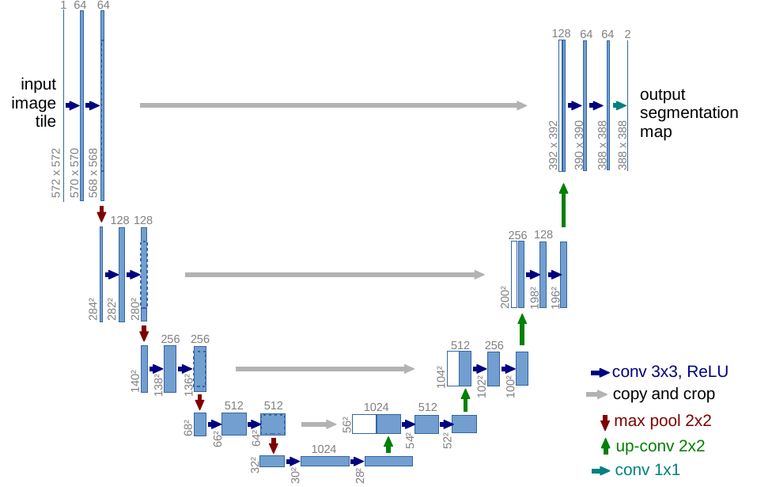
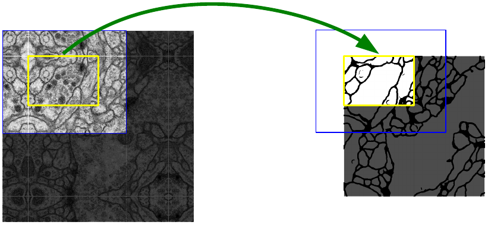
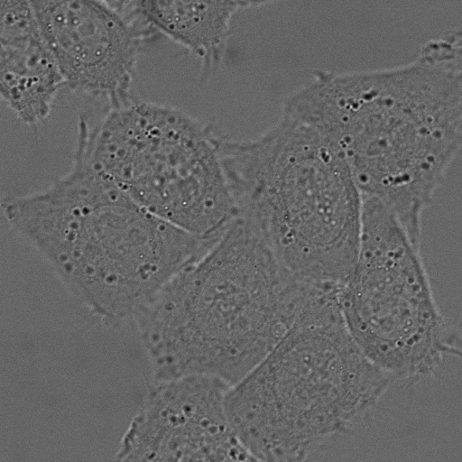
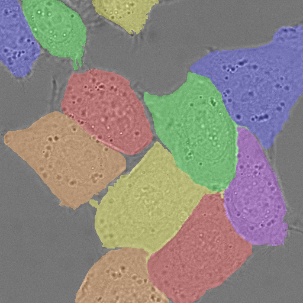

# Title: U-Net: Convolutional Networks for Biomedical Image Segmentation (U-Net：用于生物医学图像分割的卷积网络)

- ArXiv: 1505.04597
- 作者：奥拉夫·罗内贝格尔（Olaf Ronneberger）、菲利普·菲舍尔（Philipp Fischer）、托马斯·布罗克斯（Thomas Brox）
- 章节：8
- 估计词元数：5.3k

## 目录

- 1 引言
- 2 网络架构
- 3 训练
  - 3.1 数据增强
- 4 实验
- 5 结论
- 致谢
- 参考文献

## 摘要

###### 摘要

人们普遍认为，成功训练深度网络需要数千个带标注的训练样本。在本文中，我们提出了一种网络和训练策略，该策略 **强烈依赖于数据增强（Data Augmentation）** ，以更有效地利用可用的标注样本。该架构由一个用于捕获上下文的 **收缩路径（Contracting Path）** 和一个实现精确定位的 **对称扩展路径（Symmetric Expanding Path）** 组成。我们证明，这种网络可以从极少的图像进行端到端训练，并且在 ISBI 挑战赛（用于电子显微镜堆栈中神经元结构分割）中，其性能超越了先前的最佳方法（一种滑动窗口卷积网络）。使用在透射光显微镜图像（相差显微镜和微分干涉相差显微镜）上训练的相同网络，我们在这些类别中以巨大优势赢得了 2015 年 ISBI 细胞追踪挑战赛。此外，该网络速度很快。在最新的 GPU 上，分割一张 512x512 的图像耗时不到一秒。完整的实现（基于 Caffe）以及训练好的网络可在 [http://lmb.informatik.uni-freiburg.de/people/ronneber/u-net](http://lmb.informatik.uni-freiburg.de/people/ronneber/u-net) 获取。

## 1 引言（Introduction）

在过去两年中， **深度卷积网络（Deep Convolutional Networks）** 在许多视觉识别任务中超越了当时的最先进水平，例如 [7, 3]。尽管卷积网络早已存在 [8]，但其成功受限于可用训练集的规模以及所考虑网络的规模。Krizhevsky 等人 [7] 的突破在于，在拥有 100 万张训练图像的 ImageNet 数据集上，对一个具有 8 层和数百万参数的大型网络进行了 **监督训练（Supervised Training）** 。此后，人们训练了规模更大、深度更深的网络 [12]。

卷积网络的典型应用是分类任务，其输出是单个 **类别标签（Class Label）** 。然而，在许多视觉任务中，尤其是在 **生物医学图像处理（Biomedical Image Processing）** 领域，期望的输出应包含 **定位（Localization）** 信息，即需要为每个像素分配一个类别标签。此外，在生物医学任务中，通常难以获取数千张训练图像。因此，Ciresan 等人 [1] 采用 **滑动窗口（Sliding-window）** 设置训练了一个网络，通过将每个像素周围的局部区域（ **图像块（Patch）** ）作为输入来预测该像素的类别标签。首先，该网络能够实现定位。其次，以图像块为单位的训练数据量远大于训练图像的数量。由此训练出的网络在 ISBI 2012 的 **电子显微镜图像分割挑战赛（EM Segmentation Challenge）** 中以显著优势获胜。

显然，Ciresan 等人 [1] 的策略存在两个缺点。首先，速度相当慢，因为网络必须为每个图像块单独运行，并且由于图像块重叠会产生大量冗余。其次，在定位精度和上下文利用之间存在权衡。更大的图像块需要更多的 **最大池化层（Max-pooling Layers）** ，这会降低定位精度；而小的图像块则使网络只能看到很少的上下文信息。更近期的研究 [11, 4] 提出了一种分类器输出，能够综合考虑来自多个层的特征。这使得同时实现良好的定位和充分的上下文利用成为可能。

> 图 1：U-net 架构（以最低分辨率 32x32 像素为例）。每个蓝色框对应一个多通道特征图。通道数标注在框的顶部。x-y 尺寸标注在框的左下角。白色框表示复制的特征图。箭头表示不同的操作。

在本文中，我们基于一种更优雅的架构——即所谓的“ **全卷积网络（Fully Convolutional Network, FCN）** ” [9]——进行构建。我们修改并扩展了该架构，使其能够在训练图像极少的情况下工作，并产生更精确的分割结果；参见[图 1](#figure-1)。[9] 中的主要思想是通过连续的层来补充一个常规的 **收缩网络（Contracting Network）** ，其中 **池化算子（Pooling Operators）** 被 **上采样算子（Upsampling Operators）** 所取代。因此，这些层提高了输出的分辨率。为了实现定位，来自收缩路径的高分辨率特征与上采样后的输出相结合。随后，一个连续的 **卷积层（Convolution Layer）** 可以基于此信息学习组装出更精确的输出。

我们架构中的一项重要修改是，在上采样部分我们也使用了大量的特征通道，这使得网络能够将上下文信息传播到更高分辨率的层中。因此，扩展路径与收缩路径大致对称，从而形成了一个 **U形架构（U-shaped architecture）** 。该网络没有任何全连接层，并且只使用每个卷积的有效部分，即分割图仅包含那些在输入图像中具有完整上下文的像素。这种策略允许通过 **重叠平铺策略（overlap-tile strategy）** （参见[图 2](#S1.F2)）对任意大的图像进行无缝分割。为了预测图像边界区域的像素，缺失的上下文通过镜像输入图像来外推。这种平铺策略对于将网络应用于大图像非常重要，否则分辨率将受到 **图形处理器内存（GPU memory）** 的限制。

> 图 2：用于任意大图像无缝分割的重叠平铺策略（此处为电子显微镜堆栈中神经元结构的分割）。预测黄色区域的分割，需要蓝色区域内的图像数据作为输入。缺失的输入数据通过镜像进行外推。

由于我们的任务可用的训练数据非常少，我们通过对可用的训练图像应用 **弹性形变（elastic deformations）** 来进行过度的 **数据增强（data augmentation）** 。这使得网络能够学习对此类形变的不变性，而无需在标注的图像语料库中看到这些变换。这在生物医学分割中尤其重要，因为形变曾经是组织中最常见的变化，并且可以有效地模拟真实的形变。数据增强对于学习不变性的价值已在 Dosovitskiy 等人 [2] 关于 **无监督特征学习（unsupervised feature learning）** 的研究中得到证明。

许多细胞分割任务中的另一个挑战是分离同一类别中相互接触的物体；参见[图 3](#S3.F3)。为此，我们建议使用 **加权损失（weighted loss）** ，其中接触细胞之间的分隔背景标签在损失函数中获得较大的权重。

由此产生的网络适用于各种生物医学分割问题。在本文中，我们展示了在电子显微镜堆栈中分割神经元结构的结果（这是自 2012 年 ISBI 会议开始的一项持续竞赛），我们的表现优于 Ciresan 等人 [1] 的网络。此外，我们还展示了来自 2015 年 ISBI 细胞追踪挑战赛的光学显微镜图像中细胞分割的结果。在此，我们在两个最具挑战性的二维透射光数据集上以较大优势获胜。

## 2 网络架构（Network Architecture）

网络架构如[图 1](#S1.F1)所示。它由一个 **收缩路径（contracting path）** （左侧）和一个 **扩展路径（expansive path）** （右侧）组成。收缩路径遵循 **卷积网络（convolutional network）** 的典型架构。它由重复应用两个 3x3 卷积（无填充卷积，unpadded convolutions）组成，每个卷积后接一个 **修正线性单元（Rectified Linear Unit, ReLU）** 和一个步长为 2 的 2x2 **最大池化（max pooling）** 操作以进行下采样。在每个下采样步骤，我们将特征通道的数量加倍。扩展路径中的每一步都包括对特征图进行上采样，然后是一个 2x2 卷积（“上卷积”，up-convolution），该操作将特征通道数减半，接着与来自收缩路径的相应裁剪后的特征图进行 **拼接（concatenation）** ，最后是两个 3x3 卷积，每个卷积后接一个 ReLU。由于每次卷积都会丢失边界像素，因此裁剪是必要的。在最后一层，使用一个 1x1 卷积将每个 64 维的特征向量映射到所需的类别数量。整个网络共有 23 个卷积层。

为了实现输出分割图的无缝平铺（参见[图 2](#S1.F2)），重要的是选择输入图块的大小，使得所有 2x2 最大池化操作都应用于 x 和 y 尺寸均为偶数的层。

## 3 训练（Training）

输入图像及其对应的分割图用于训练网络，训练采用了 Caffe [6] 实现的 **随机梯度下降（Stochastic Gradient Descent）** 。由于使用了无填充卷积，输出图像会比输入图像小一个恒定的边界宽度。为了最小化开销并最大化利用 GPU 内存，我们倾向于使用大的输入图块（tile）而非大的批次大小，因此将批次大小减少为单张图像。相应地，我们使用了较高的动量（0.99），使得大量先前见过的训练样本能够决定当前优化步骤中的更新。

能量函数通过结合 **交叉熵损失函数（Cross Entropy Loss Function）** 对最终特征图进行逐像素 **Soft-max** 计算得到。Soft-max 定义为 ${p}_{k}(\boldsymbol{\mathbf{x}})=\exp({a_{k}(\boldsymbol{\mathbf{x}})})/\left(\sum_{k^{\prime}=1}^{K}\exp(a_{k^{\prime}}(\boldsymbol{\mathbf{x}}))\right)$，其中 $a_{k}(\boldsymbol{\mathbf{x}})$ 表示在像素位置 $\boldsymbol{\mathbf{x}}\in\Omega$（$\Omega\subset\mathbb{Z}^{2}$）处特征通道 $k$ 的激活值。$K$ 是类别数，${p}_{k}(\boldsymbol{\mathbf{x}})$ 是近似的最大值函数。即，对于具有最大激活值 $a_{k}(\boldsymbol{\mathbf{x}})$ 的 $k$，${p}_{k}(\boldsymbol{\mathbf{x}})\approx 1$；对于所有其他 $k$，${p}_{k}(\boldsymbol{\mathbf{x}})\approx 0$。然后，交叉熵在每个位置使用下式惩罚 ${p}_{\ell(\boldsymbol{\mathbf{x}})}(\boldsymbol{\mathbf{x}})$ 与 1 的偏差：

$$
E=\sum_{\boldsymbol{\mathbf{x}}\in\Omega}w(\boldsymbol{\mathbf{x}})\log({p}_{\ell(\boldsymbol{\mathbf{x}})}(\boldsymbol{\mathbf{x}}))(1)
$$

其中 $\ell:\Omega\rightarrow\{1,\dots,K\}$ 是每个像素的真实标签，$w:\Omega\rightarrow\mathds{R}$ 是我们引入的权重图，用于在训练中赋予某些像素更高的重要性。

我们为每个 **真实分割（Ground Truth Segmentation）** 预计算权重图，以补偿训练数据集中来自特定类别的像素的不同频率，并迫使网络学习我们在接触细胞之间引入的小分隔边界（参见[图 3](#figure-3)c 和 d）。

**图 3：使用 DIC（微分干涉相差，Differential Interference Contrast）显微镜记录的玻璃上的 HeLa（海拉）细胞。** (a) 原始图像。(b) 与 **真实分割（ground truth segmentation）** 的叠加。不同颜色表示 HeLa 细胞的不同实例。(c) 生成的分割掩码（白色：前景，黑色：背景）。(d) 带有逐像素损失权重的图，用于强制网络学习边界像素。

分离边界是使用 **形态学操作（morphological operations）** 计算的。权重图随后计算如下：

$$
w(\boldsymbol{\mathbf{x}})=w_{c}(\boldsymbol{\mathbf{x}})+w_{0}\cdot\exp\left(-\frac{(d_{1}(\boldsymbol{\mathbf{x}})+d_{2}(\boldsymbol{\mathbf{x}}))^{2}}{2\sigma^{2}}\right)(2)
$$

其中 $w_{c}:\Omega\rightarrow\mathds{R}$ 是用于平衡类别频率的权重图，$d_{1}:\Omega\rightarrow\mathds{R}$ 表示到最近细胞边界的距离，$d_{2}:\Omega\rightarrow\mathds{R}$ 表示到第二近细胞边界的距离。在我们的实验中，我们设置 $w_{0}=10$ 和 $\sigma\approx 5$ 像素。

在具有许多 **卷积层（convolutional layers）** 和不同网络路径的深度网络中，良好的权重初始化极其重要。否则，网络的某些部分可能会产生过度的激活，而其他部分则从不贡献。理想情况下，初始权重应进行调整，使得网络中的每个 **特征图（feature map）** 都具有近似单位方差。对于具有我们架构（交替的卷积层和 ReLU 层）的网络，这可以通过从标准差为 $\sqrt{2/N}$ 的 **高斯分布（Gaussian distribution）** 中抽取初始权重来实现，其中 $N$ 表示一个神经元的输入节点数 [5]。例如，对于一个 3x3 卷积且前一层有 64 个特征通道的情况，$N=9\cdot 64=576$。

### 3.1 数据增强（Data Augmentation）

当只有少量训练样本可用时， **数据增强（Data Augmentation）** 对于教会网络所需的 **不变性（invariance）** 和 **鲁棒性（robustness）** 属性至关重要。对于显微图像，我们主要需要平移和旋转不变性，以及对形变和灰度值变化的鲁棒性。特别是训练样本的 **随机弹性形变（random elastic deformations）** ，似乎是使用极少标注图像训练分割网络的关键概念。
我们使用粗粒度 3x3 网格上的随机位移向量来生成平滑形变。位移从标准差为 10 像素的高斯分布中采样。然后使用 **双三次插值（bicubic interpolation）** 计算逐像素位移。 **收缩路径（contracting path）** 末端的 **Drop-out（丢弃）层** 执行进一步的隐式数据增强。

## 4 实验（Experiments）

我们展示了 **U-Net** 在三个不同分割任务上的应用。第一个任务是电子显微镜记录中神经元结构的分割。数据集的一个示例以及我们获得的分割结果展示在 [图 2](#S1.F2) 中。我们将完整结果作为补充材料提供。该数据集由 **EM 分割挑战赛（EM segmentation challenge）** [14] 提供，该挑战赛始于 2012 年的 **ISBI（International Symposium on Biomedical Imaging）** ，目前仍接受新的提交。训练数据是一组来自黑腹果蝇（Drosophila）一龄幼虫腹神经索（Ventral Nerve Cord, VNC）连续切片透射电子显微镜的 30 张图像（512x512 像素）。每张图像都附有对应的、完全标注的细胞（白色）和细胞膜（黑色）的 **真实分割图（ground truth segmentation map）** 。测试集是公开可用的，但其分割图是保密的。通过将预测的细胞膜概率图发送给组织者，可以获得评估结果。评估通过对概率图在 10 个不同水平进行阈值化，并计算 **“翘曲误差（warping error）”** 、 **“兰德误差（Rand error）”** 和 **“像素误差（pixel error）”** 来完成 [14]。

**U-Net** （对输入数据的 7 个旋转版本取平均）在没有任何额外预处理或后处理的情况下，实现了 0.0003529 的翘曲误差（新的最佳分数，见 [表 1](#S4.T1)）和 0.0382 的兰德误差。

> 表 1：EM 分割挑战赛 [14]（2015年3月6日）排名，按翘曲误差排序。

| 排名     | 组名             | 翘曲误差（Warping Error） | 兰德误差（Rand Error） | 像素误差（Pixel Error） |
| :------- | :--------------- | :------------------------ | :--------------------- | :---------------------- |
|          | ** 人工标注值 ** | 0.000005                  | 0.0021                 | 0.0010                  |
| 1.       | u-net            | 0.000353                  | 0.0382                 | 0.0611                  |
| 2.       | DIVE-SCI         | 0.000355                  | 0.0305                 | 0.0584                  |
| 3.       | IDSIA [1]        | 0.000420                  | 0.0504                 | 0.0613                  |
| 4.       | DIVE             | 0.000430                  | 0.0545                 | 0.0582                  |
| $\vdots$ |                  |                           |                        |                         |
| 10.      | IDSIA-SCI        | 0.000653                  | 0.0189                 | 0.1027                  |

这显著优于 Ciresan 等人 [1] 的 **滑动窗口卷积网络（sliding-window convolutional network）** 结果，他们最佳提交的翘曲误差为 0.000420，兰德误差为 0.0504。
就兰德误差而言，在该数据集上表现更好的唯一算法使用了高度数据集特定的后处理方法（^1^11该算法的作者提交了 78 种不同的解决方案以获得此结果。），这些方法应用于 Ciresan 等人 [1] 的概率图。

我们还将 **U-Net** 应用于光学显微镜图像中的细胞分割任务。该分割任务是 **ISBI 细胞追踪挑战赛（ISBI cell tracking challenge）** 2014 和 2015 的一部分 [10, 13]。第一个数据集 **“PhC-U373”** （^2^22数据集由加州大学伯克利分校生物工程系的 Sanjay Kumar 博士提供。美国加州伯克利）包含在多聚丙烯酰胺基底上、通过 **相差显微镜（phase contrast microscopy）** 记录的胶质母细胞瘤-星形细胞瘤 U373 细胞（参见 [图 4](#S4.F4)a,b 及补充材料）。它包含 35 张部分标注的训练图像。

> **图 4（Figure 4）** ：ISBI 细胞追踪挑战赛的结果。(a) “PhC-U373” 数据集的部分输入图像。(b) 分割结果（青色掩膜）与人工标注真值（黄色边框）。(c) “DIC-HeLa” 数据集的输入图像。(d) 分割结果（随机颜色掩膜）与人工标注真值（黄色边框）。

我们在此实现了 92% 的平均 **交并比（Intersection over Union, IOU）** ，这显著优于第二佳算法的 83%（参见[表 2](#S4.T2)）。

> **表 2（Table 2）** ：2015 年 ISBI 细胞追踪挑战赛的分割结果（IOU）。

| 名称（Name）     | PhC-U373 | DIC-HeLa |
| :--------------- | :------- | :------- |
| IMCB-SG (2014)   | 0.2669   | 0.2935   |
| KTH-SE (2014)    | 0.7953   | 0.4607   |
| HOUS-US (2014)   | 0.5323   | -        |
| second-best 2015 | 0.83     | 0.46     |
| u-net (2015)     | 0.9203   | 0.7756   |

第二个数据集 “DIC-HeLa”3（注3：该数据集由荷兰鹿特丹伊拉斯姆斯医学中心（Erasmus Medical Center）的 Gert van Cappellen 博士提供）是通过 **微分干涉相差显微镜（Differential Interference Contrast, DIC microscopy）** 记录的平铺玻璃上的 **海拉细胞（HeLa cells）** （参见[图 3](#S3.F3)、[图 4](#S4.F4)c,d 及补充材料）。它包含 20 张部分标注的训练图像。我们在此实现了 77.5% 的平均 IOU，这显著优于第二佳算法的 46%。

## 5 结论（Conclusion）

**U-Net 架构（U-Net architecture）** 在多种不同的生物医学分割应用中均取得了非常优异的性能。得益于 **弹性形变（elastic deformations）** 数据增强技术，它仅需要极少量的标注图像，并且在 **NVIDIA Titan GPU（6 GB）** 上的训练时间非常合理，仅为 10 小时。
我们提供了完整的、基于 **Caffe [6]** 的实现以及训练好的网络（U-Net 实现、训练好的网络及补充材料可在 [http://lmb.informatik.uni-freiburg.de/people/ronneber/u-net](http://lmb.informatik.uni-freiburg.de/people/ronneber/u-net) 获取）。我们确信，U-Net 架构可以轻松应用于更多任务。

## 致谢（Acknowlegements）

本研究得到了德国联邦与各州政府卓越计划（EXC 294）以及德国联邦教育与研究部（BMBF，项目号 Fkz 0316185B）的支持。

## 参考文献（References）

- [1] Ciresan, D.C., Gambardella, L.M., Giusti, A., Schmidhuber, J.: Deep neural networks segment neuronal membranes in electron microscopy images. In: NIPS. pp. 2852–2860 (2012)
- [2] Dosovitskiy, A., Springenberg, J.T., Riedmiller, M., Brox, T.: Discriminative unsupervised feature learning with convolutional neural networks. In: NIPS (2014)
- [3] Girshick, R., Donahue, J., Darrell, T., Malik, J.: Rich feature hierarchies for accurate object detection and semantic segmentation. In: Proceedings of the IEEE Conference on Computer Vision and Pattern Recognition (CVPR) (2014)
- [4] Hariharan, B., Arbeláez, P., Girshick, R., Malik, J.: Hypercolumns for object segmentation and fine-grained localization (2014), arXiv:1411.5752 [cs.CV]
- [5] He, K., Zhang, X., Ren, S., Sun, J.: Delving deep into rectifiers: Surpassing human-level performance on imagenet classification (2015), arXiv:1502.01852 [cs.CV]
- [6] Jia, Y., Shelhamer, E., Donahue, J., Karayev, S., Long, J., Girshick, R., Guadarrama, S., Darrell, T.: Caffe: Convolutional architecture for fast feature embedding (2014), arXiv:1408.5093 [cs.CV]
- [7] Krizhevsky, A., Sutskever, I., Hinton, G.E.: Imagenet classification with deep convolutional neural networks. In: NIPS. pp. 1106–1114 (2012)
- [8] LeCun, Y., Boser, B., Denker, J.S., Henderson, D., Howard, R.E., Hubbard, W., Jackel, L.D.: Backpropagation applied to handwritten zip code recognition. Neural Computation 1(4), 541–551 (1989)
- [9] Long, J., Shelhamer, E., Darrell, T.: Fully convolutional networks for semantic segmentation (2014), arXiv:1411.4038 [cs.CV]
- [10] Maska, M., (…), de Solorzano, C.O.: A benchmark for comparison of cell tracking algorithms. Bioinformatics 30, 1609–1617 (2014)
- [11] Seyedhosseini, M., Sajjadi, M., Tasdizen, T.: Image segmentation with cascaded hierarchical models and logistic disjunctive normal networks. In: Computer Vision (ICCV), 2013 IEEE International Conference on. pp. 2168–2175 (2013)
- [12] Simonyan, K., Zisserman, A.: Very deep convolutional networks for large-scale image recognition (2014), arXiv:1409.1556 [cs.CV]
- [13] WWW: Web page of the cell tracking challenge, [http://www.codesolorzano.com/celltrackingchallenge/Cell_Tracking_Challenge/Welcome.html](http://www.codesolorzano.com/celltrackingchallenge/Cell_Tracking_Challenge/Welcome.html)
- [14] WWW: Web page of the em segmentation challenge, [http://brainiac2.mit.edu/isbi_challenge/](http://brainiac2.mit.edu/isbi_challenge/)
