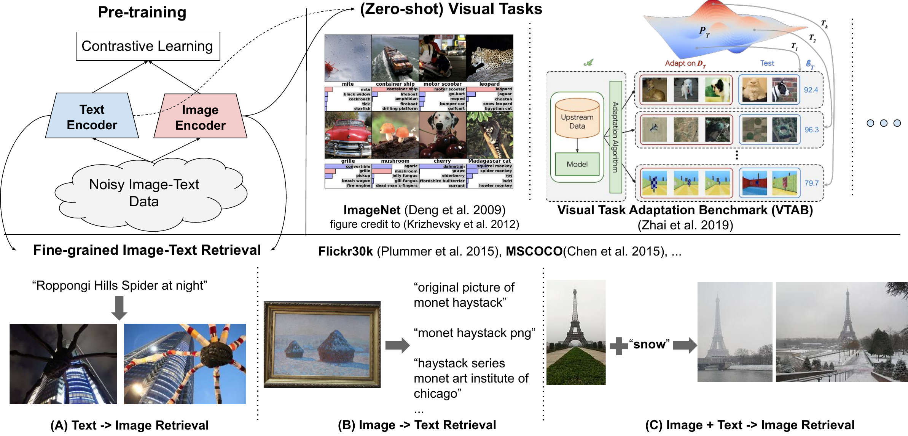

# Title: Scaling Up Visual and Vision-Language Representation Learning With Noisy Text Supervision

- ArXiv: 2102.05918
- Authors:
  - Chao Jia — Google (United States), Google Research,
  - Yinfei Yang — Google (United States), Google Research,
  - Ye Xia — Google (United States), Google,,,,,
  - Yi-Ting Chen — Google (United States), Google,,,,,
  - Zarana Parekh — Google (United States), Google,,,,,
  - Hieu Pham — Google (United States), Google,,,,,
  - Quoc V. Le — Google (United States), [Google Brain]
  - Yunhsuan Sung — Google (United States), Google Research,
  - Zhen Li — Google (United States), Google,,,,,
  - Tom Duerig — Google (United States), Google,,,,,
- Sections: 24
- Estimated tokens: 17.6k

## 摘要（Abstract）

**预训练表示（Pre-trained representations）** 正成为许多自然语言处理（NLP）和感知任务的关键。虽然自然语言处理中的表示学习已转向在无人工标注的原始文本上进行训练，但视觉和视觉-语言表示仍严重依赖昂贵的策展训练数据集或需要专家知识。对于视觉应用，表示主要使用具有显式类标签的数据集（如 ImageNet 或 OpenImages）进行学习。对于视觉-语言，流行的数据集（如 Conceptual Captions、MSCOCO 或 CLIP）都涉及非平凡的数据收集（和清洗）过程。这种昂贵的策展过程限制了数据集的规模，从而阻碍了训练模型的扩展。在本文中，我们利用了一个包含超过十亿图像替代文本对的 **噪声数据集（noisy dataset）** ，该数据集无需 Conceptual Captions 数据集中昂贵的过滤或后处理步骤即可获得。一个简单的 **双编码器架构（dual-encoder architecture）** 使用 **对比损失（contrastive loss）** 学习对齐图像和文本对的视觉与语言表示。我们表明，语料库的规模可以弥补其噪声，即使采用如此简单的学习方案，也能产生最先进的表示。我们的视觉表示在迁移到 ImageNet 和 VTAB 等分类任务时表现出强大的性能。对齐的视觉和语言表示实现了 **零样本图像分类（zero-shot image classification）** ，并在 Flickr30K 和 MSCOCO 图像-文本检索基准测试中创下了新的最先进结果，即使与更复杂的交叉注意力模型相比也是如此。这些表示还支持使用复杂文本和文本+图像查询的 **跨模态搜索（cross-modality search）** 。

## 1 引言（Introduction）

在现有文献中，视觉和视觉-语言表示学习大多使用不同的训练数据源分别进行研究。在视觉领域，在大规模监督数据（如 ImageNet (Deng et al., [2009](#ref-8))、OpenImages (Kuznetsova et al., [2020](#ref-34)) 和 JFT-300M (Sun et al., [2017](#ref-63); Kolesnikov et al., [2020](#ref-31))）上进行预训练已被证明对于通过迁移学习提高下游任务的性能至关重要。此类预训练数据集的策展需要在数据收集、采样和人工标注方面投入大量工作，因此难以扩展。

预训练也已成为视觉-语言建模的事实标准方法 (Lu et al., [2019](#ref-41); Chen et al., [2020c](#ref-7); Li et al., [2020](#ref-38))。然而，诸如 Conceptual Captions (Sharma et al., [2018](#ref-61))、Visual Genome Dense Captions (Krishna et al., [2016](#ref-33)) 和 ImageBERT (Qi et al., [2020](#ref-55)) 等视觉-语言预训练数据集在人工标注、语义解析、清洗和平衡方面需要更多的工作。因此，这些数据集的规模仅在 $\sim$1000 万示例的范围内。这至少比视觉领域的数据集小一个数量级，并且远小于用于自然语言处理预训练的互联网大型文本语料库（例如，Devlin et al. ([2019](#ref-10)); Radford et al. ([2019](#ref-56)); Yang et al. ([2019](#ref-70)); Liu et al. ([2019b](#ref-40)); Raffel et al. ([2020](#ref-58))）。

在这项工作中，我们利用一个包含超过十亿噪声图像替代文本对的数据集来扩展视觉和视觉-语言表示学习。我们遵循 Conceptual Captions 数据集 (Sharma et al., [2018](#ref-61)) 中描述的过程来获取一个大型噪声数据集。但我们没有应用 (Sharma et al., [2018](#ref-61)) 提出的复杂过滤和后处理步骤来清洗数据集，而是仅应用简单的基于频率的过滤。由此产生的数据集虽然是噪声的，但其规模比 Conceptual Captions 数据集大两个数量级。我们表明，在我们这个超大规模数据集上预训练的视觉和视觉-语言表示在广泛的任务上取得了非常强大的性能。

为了训练我们的模型，我们使用一个目标函数，该函数通过一个简单的 **双编码器架构（dual-encoder architecture）** 在共享的潜在嵌入空间中对齐视觉和语言表示。类似的目标函数已被应用于学习视觉-语义嵌入（Visual-Semantic Embeddings, VSE）(Frome et al., [2013](#ref-16); Faghri et al., [2018](#ref-14))。我们将我们的模型命名为 **ALIGN** ： **A** **L** arge-scale **I** ma **G** e and **N** oisy-text embedding（大规模图像与噪声文本嵌入）。图像和文本编码器通过 **对比损失（contrastive loss）** （公式化为归一化 softmax）进行学习，该损失将匹配的图像-文本对的嵌入拉近，同时将不匹配的图像-文本对的嵌入推远。这是自监督 (Chen et al., [2020b](#ref-5)) 和监督 (Zhai & Wu, [2019](#ref-74); Musgrave et al., [2020](#ref-47)) 表示学习中最有效的损失函数之一。将配对的文本视为图像的细粒度标签，我们的图像到文本对比损失类似于传统的基于标签的分类目标函数；关键区别在于文本编码器生成“标签”权重。图 [1](#figure-1) 的左上角总结了我们在 ALIGN 中使用的方法。

对齐的图像和文本表示自然适用于跨模态匹配/检索任务，并在相应的基准测试中取得了最先进（State-of-the-Art, SOTA）的结果。例如，ALIGN 在 Flickr30K 和 MSCOCO 的大多数零样本和微调 R@1 指标上优于之前的最先进方法超过 7%。此外，这种跨模态匹配自然实现了零样本图像分类：当将类别名称输入文本编码器时，ALIGN 在 ImageNet 上达到了 76.4% 的 top-1 准确率，而无需使用任何训练样本。图像表示本身也在各种下游视觉任务中取得了卓越的性能。例如，ALIGN 在 ImageNet 上达到了 88.64% 的 top-1 准确率。图 [1](#figure-1) 底部展示了来自 ALIGN 构建的真实检索系统的跨模态检索示例。

## 2 相关工作（Related Work）

用于分类或检索的高质量视觉表示通常在大规模标记数据集上进行预训练 (Mahajan et al., [2018](#ref-42); Kolesnikov et al., [2020](#ref-31); Dosovitskiy et al., [2021](#ref-11); Juan et al., [2020](#ref-26))。最近， **自监督学习（self-supervised learning）** (Chen et al., [2020b](#ref-5); Tian et al., [2020](#ref-65); He et al., [2020](#ref-19); Misra & Maaten, [2020](#ref-46); Li et al., [2021](#ref-36); Grill et al., [2020](#ref-18); Caron et al., [2020](#ref-3)) 和 **半监督学习（semi-supervised learning）** (Yalniz et al., [2019](#ref-69); Xie et al., [2020](#ref-68); Pham et al., [2020](#ref-53)) 已被研究作为替代范式。然而，到目前为止，通过这些方法训练的模型对下游任务的迁移能力有限 (Zoph et al., [2020](#ref-78))。

利用图像和自然语言描述是学习视觉表示的另一个方向。Joulin et al. ([2015](#ref-25)); Li et al. ([2017](#ref-35)); Desai & Johnson ([2020](#ref-9)); Sariyildiz et al. ([2020](#ref-60)); Zhang et al. ([2020](#ref-76)) 表明，通过从图像预测描述可以学习到良好的视觉表示，这启发了我们的工作。然而，这些工作仅限于小型数据集，如 Flickr (Joulin et al., [2015](#ref-25); Li et al., [2017](#ref-35)) 和 COCO Captions (Desai & Johnson, [2020](#ref-9); Sariyildiz et al., [2020](#ref-60))，并且产生的模型并未提供跨模态检索等任务所需的视觉-语言表示。

在视觉-语言表示学习领域，已经提出了 **视觉-语义嵌入（Visual-Semantic Embeddings, VSE）** (Frome et al., [2013](#ref-16); Faghri et al., [2018](#ref-14)) 及其改进版本（例如，利用目标检测器、密集特征图或多注意力层）(Socher et al., [2014](#ref-62); Karpathy et al., [2014](#ref-28); Kiros et al., ; Nam et al., [2017](#ref-48); Li et al., [2019](#ref-37); Messina et al., [2020](#ref-43); Chen et al., [2020a](#ref-4))。最近，出现了带有 **跨模态注意力层（cross-modal attention layers）** 的更先进模型 (Liu et al., [2019a](#ref-39); Lu et al., [2019](#ref-41); Chen et al., [2020c](#ref-7); Huang et al., [2020b](#ref-24))，并在图像-文本匹配任务中展现出卓越的性能。然而，它们的速度慢了几个数量级，因此在现实世界的图像-文本检索系统中不实用。相比之下，我们的模型继承了最简单的 VSE 形式，但在图像-文本匹配基准测试中仍然优于所有先前的交叉注意力模型。

与我们的工作密切相关的是 CLIP (Radford et al., [2021](#ref-57))，它提出了在类似的对比学习设置中通过自然语言监督进行视觉表示学习。除了使用不同的视觉和语言编码器架构外，关键区别在于训练数据：ALIGN 遵循来自原始替代文本数据的图像-文本对的自然分布，而 CLIP 通过首先从英文维基百科构建高频视觉概念的允许列表来收集数据集。我们证明了，使用不需要专家知识来策展的数据集可以学习到强大的视觉和视觉-语言表示。

## 3 一个大规模噪声图像-文本数据集（A Large-Scale Noisy Image-Text Dataset）

我们工作的重点是扩大视觉和视觉-语言表示学习的规模。为此，我们求助于一个比现有数据集大得多的数据集。具体来说，我们遵循构建 Conceptual Captions 数据集 (Sharma et al., [2018](#ref-61)) 的方法，获取原始英文替代文本数据（图像和替代文本对）的一个版本。Conceptual Captions 数据集通过大量过滤和后处理进行了清洗。在这里，为了扩展的目的，我们通过放宽原始工作中的大部分清洗步骤来用质量换取规模。相反，我们仅应用下面详述的最小基于频率的过滤。结果是一个更大（18 亿图像-文本对）但噪声更大的数据集。图 [2](#figure-2) 展示了数据集中的一些示例图像-文本对。

> 图 2：从 ALIGN 训练数据集中随机采样的示例图像-文本对。一个明显有噪声的文本注释用*斜体*标记。

#### 基于图像的过滤（Image-based filtering）。

遵循 Sharma et al. ([2018](#ref-61))，我们移除色情图像，仅保留较短边大于 200 像素且宽高比小于 3 的图像。丢弃与超过 1000 个替代文本关联的图像。为确保我们不在测试图像上进行训练，我们还移除了所有下游评估数据集（例如，ILSVRC-2012、Flickr30K 和 MSCOCO）中测试图像的重复或近似重复图像。更多细节见附录 [A](#A1)。

#### 基于文本的过滤（Text-based filtering）。

我们排除被超过 10 张图像共享的替代文本。这些替代文本通常与图像内容无关（例如，“1920x1080”、“alt_img”和“cristina”）。我们还丢弃包含任何罕见词元（不在原始数据集中最频繁的 1 亿个单字词和双字词中）的替代文本，以及那些要么太短（$<$3 个单字词）要么太长（$>$20 个单字词）的替代文本。这移除了像“image_tid 25&id mggqpuweqdpd&cache 0&lan_code 0”这样的噪声文本，或者过于通用而无用的文本。

## 4 预训练与任务迁移（Pre-training and Task Transfer）

### 4.1 基于噪声图像-文本对的预训练（Pre-training on Noisy Image-Text Pairs）

我们采用 **双编码器架构（dual-encoder architecture）** 对 **ALIGN** 进行预训练。该模型由一对图像编码器和文本编码器组成，顶部带有 **余弦相似度组合函数（cosine-similarity combination function）** 。我们使用带有全局池化的 **EfficientNet** （不训练分类头中的 1x1 卷积层）作为图像编码器，并使用带有 `[CLS]` 词元嵌入（token embedding）的 **BERT** 作为文本嵌入编码器（我们从训练数据集中生成 10 万个词片（wordpiece）词汇表）。在 BERT 编码器顶部添加一个具有线性激活函数的全连接层，以匹配来自图像塔的维度。图像编码器和文本编码器均从头开始训练。

图像和文本编码器通过 **归一化 softmax 损失（normalized softmax loss）** （Zhai & Wu, [2019](#ref-74)）进行优化。在训练中，我们将匹配的图像-文本对视为正样本，而将一个训练批次中所有其他可形成的随机图像-文本对视为负样本。

我们最小化两个损失之和：一个用于图像到文本的分类

$$
\small L_{i2t}=-\frac{1}{N}\sum_{i}^{N}\log{\frac{\exp(x_{i}^{\top}y_{i}/\sigma)}{\sum_{j=1}^{N}\exp(x_{i}^{\top}y_{j}/\sigma)}} \tag{(1)}
$$

另一个用于文本到图像的分类

$$
\small L_{t2i}=-\frac{1}{N}\sum_{i}^{N}\log{\frac{\exp(y_{i}^{\top}x_{i}/\sigma)}{\sum_{j=1}^{N}\exp(y_{i}^{\top}x_{j}/\sigma)}} \tag{(2)}
$$

这里，$x_{i}$ 和 $y_{j}$ 分别是第 $i$ 个图像对中图像的归一化嵌入和第 $j$ 个文本对中文本的归一化嵌入。$N$ 是批次大小，$\sigma$ 是用于缩放 logits 的 **温度（temperature）** 。为了使批次内负样本更有效，我们连接所有计算核心的嵌入以形成更大的批次。温度变量至关重要，因为图像和文本嵌入都是 L2 归一化的。我们发现，无需手动搜索最佳温度值，它可以与所有其他参数一起有效地学习。

### 4.2 迁移至图像-文本匹配与检索（Transferring to Image-Text Matching & Retrieval）

我们在图像到文本和文本到图像的检索任务上评估 ALIGN 模型，包括有微调和无微调两种情况。考虑了两种基准数据集： **Flickr30K** （Plummer 等，[2015](#ref-54)）和 **MSCOCO** （Chen 等，[2015](#ref-6)）。我们还在 **Crisscrossed Captions (CxC)** （Parekh 等，[2021](#ref-50)）上评估了 ALIGN，该数据集是 MSCOCO 的扩展，增加了关于描述-描述、图像-图像和图像-描述对的人工语义相似度判断。借助扩展的标注，CxC 支持四种模态内和跨模态检索任务，包括图像到文本、文本到图像、文本到文本和图像到图像的检索，以及三种语义相似度任务，包括 **语义文本相似度（Semantic Textual Similarity, STS）** 、 **语义图像相似度（Semantic Image Similarity, SIS）** 和 **语义图像-文本相似度（Semantic Image-Text Similarity, SITS）** 。由于训练集与原始 MSCOCO 相同，我们可以直接在 CxC 标注上评估经过 MSCOCO 微调的 ALIGN 模型。

### 4.3 迁移至视觉分类（Transferring to Visual Classification）

我们首先将 ALIGN 的 **零样本迁移（zero-shot transfer）** 应用于 **ImageNet ILSVRC-2012** 基准（Deng 等，[2009](#ref-8)）及其变体上的视觉分类任务，这些变体包括 **ImageNet-R(endition)** （Hendrycks 等，[2020](#ref-20)）（非自然图像，如艺术、卡通、素描）、 **ImageNet-A(dversarial)** （Hendrycks 等，[2021](#ref-21)）（对机器学习模型更具挑战性的图像）和 **ImageNet-V2** （Recht 等，[2019](#ref-59)）。所有这些变体都遵循 ImageNet 的相同类别集（或其子集），而 ImageNet-R 和 ImageNet-A 中的图像采样自与 ImageNet 分布截然不同的分布。

我们还将图像编码器迁移到下游的视觉分类任务。为此，我们使用了 ImageNet 以及一些较小的细粒度分类数据集，例如 **Oxford Flowers-102** （Nilsback & Zisserman, [2008](#ref-49)）、 **Oxford-IIIT Pets** （Parkhi 等，[2012](#ref-51)）、 **Stanford Cars** （Krause 等，[2013](#ref-32)）和 **Food101** （Bossard 等，[2014](#ref-2)）。对于 ImageNet，报告了两种设置的结果：仅训练顶层分类层（冻结 ALIGN 图像编码器）和完全微调。对于细粒度分类基准，仅报告后一种设置。遵循 Kolesnikov 等人（[2020](#ref-31)）的方法，我们还在 **视觉任务适应基准（Visual Task Adaptation Benchmark, VTAB）** （Zhai 等，[2019](#ref-75)）上评估了我们模型的鲁棒性，该基准包含 19 个不同的视觉分类任务（涵盖自然、专业和结构化图像分类任务的子组），每个任务有 1000 个训练样本。

## 5 实验与结果（Experiments and Results）

我们从零开始训练 **ALIGN** 模型，使用开源的 **EfficientNet** 实现作为图像编码器， **BERT** 作为文本编码器。除消融研究外，我们使用图像编码器为 **EfficientNet-L2** 、文本编码器为 **BERT-Large** 的 ALIGN 结果。无论使用何种 EfficientNet 变体，图像编码器均在 $289 \times 289$ 像素的分辨率下训练。我们首先将输入图像调整为 $346 \times 346$ 分辨率，然后在训练中进行随机裁剪（附带额外的随机水平翻转），在评估中进行中心裁剪。对于 BERT，我们使用最多 64 个词元的 **词片（WordPiece）** 序列，因为输入文本不超过 20 个 **一元组（unigrams）** 。 **Softmax 温度变量（softmax temperature variable）** 初始化为 1.0（该温度变量在图像到文本损失和文本到图像损失之间共享），我们在 softmax 损失中使用 0.1 作为 **标签平滑（label smoothing）** 参数。我们使用 **LAMB 优化器（LAMB optimizer）** (You et al., [2020](#ref-71))^1，权重衰减率为 1e-5。学习率在 10k 步内从零线性预热至 1e-3，然后在 1.2M 步（约 12 个 **周期（epochs）** ）内线性衰减至零。我们在 1024 个 **Cloud TPUv3 核心** 上训练模型，每个核心有 16 个正样本对。因此，总有效 **批次大小（batch size）** 为 16384。

> 脚注 1：我们尝试了已知对 CNN 和 BERT 分别效果良好的带动量的 SGD 和 ADAM。LAMB 似乎是同时训练图像和文本编码器的更好选择。

|            |           | Flickr30K (1K 测试集) | MSCOCO (5K 测试集) |                  |                  |          |          |          |          |          |          |          |      |
| ---------- | --------- | --------------------- | ------------------ | ---------------- | ---------------- | -------- | -------- | -------- | -------- | -------- | -------- | -------- | ---- |
|            |           | image $\to$ text      | text $\to$ image   | image $\to$ text | text $\to$ image |          |          |          |          |          |          |          |      |
|            |           | R@1                   | R@5                | R@10             | R@1              | R@5      | R@10     | R@1      | R@5      | R@10     | R@1      | R@5      | R@10 |
| Zero-shot  | ImageBERT | 70.7                  | 90.2               | 94.0             | 54.3             | 79.6     | 87.5     | 44.0     | 71.2     | 80.4     | 32.3     | 59.0     | 70.2 |
| UNITER     | 83.6      | 95.7                  | 97.7               | 68.7             | 89.2             | 93.9     | -        | -        | -        | -        | -        | -        |      |
| CLIP       | 88.0      | 98.7                  | 99.4               | 68.7             | 90.6             | 95.2     | 58.4     | 81.5     | 88.1     | 37.8     | 62.4     | 72.2     |      |
| **ALIGN**  | **88.6**  | **98.7**              | **99.7**           | **75.7**         | **93.8**         | **96.8** | **58.6** | **83.0** | **89.7** | **45.6** | **69.8** | **78.6** |      |
| Fine-tuned | GPO       | 88.7                  | 98.9               | 99.8             | 76.1             | 94.5     | 97.1     | 68.1     | 90.2     | -        | 52.7     | 80.2     | -    |
| UNITER     | 87.3      | 98.0                  | 99.2               | 75.6             | 94.1             | 96.8     | 65.7     | 88.6     | 93.8     | 52.9     | 79.9     | 88.0     |      |
| ERNIE-ViL  | 88.1      | 98.0                  | 99.2               | 76.7             | 93.6             | 96.4     | -        | -        | -        | -        | -        | -        |      |
| VILLA      | 87.9      | 97.5                  | 98.8               | 76.3             | 94.2             | 96.8     | -        | -        | -        | -        | -        | -        |      |
| Oscar      | -         | -                     | -                  | -                | -                | -        | 73.5     | 92.2     | 96.0     | 57.5     | 82.8     | **89.8** |      |
| **ALIGN**  | **95.3**  | **99.8**              | **100.0**          | **84.9**         | **97.4**         | **98.6** | **77.0** | **93.5** | **96.9** | **59.9** | **83.3** | **89.8** |      |

|            | image $\to$ text | text $\to$ image | text $\to$ text | image $\to$ image |          |          |          |          |          |          |          |          |
| ---------- | ---------------- | ---------------- | --------------- | ----------------- | -------- | -------- | -------- | -------- | -------- | -------- | -------- | -------- |
|            | R@1              | R@5              | R@10            | R@1               | R@5      | R@10     | R@1      | R@5      | R@10     | R@1      | R@5      | R@10     |
| VSE++      | 43.1             | 74.3             | 84.2            | 32.5              | 62.7     | 75.4     | 38.7     | 62.3     | 72.2     | 36.4     | 70.4     | 81.3     |
| VSRN       | 52.4             | 81.9             | 90.0            | 40.1              | 71.1     | 81.5     | 41.0     | 64.8     | 74.5     | 44.2     | 76.7     | 86.2     |
| DE_I2T     | 53.9             | 82.7             | 91.2            | 39.8              | 70.2     | 80.9     | 26.0     | 47.1     | 57.5     | 38.3     | 74.1     | 85.0     |
| DE_T2T+I2T | 55.9             | 84.2             | 91.8            | 41.7              | 72.3     | 83.0     | 42.4     | 64.9     | 74.0     | 38.5     | 73.6     | 84.9     |
| **ALIGN**  | **78.1**         | **94.3**         | **97.4**        | **61.8**          | **84.9** | **91.1** | **45.4** | **66.8** | **75.2** | **49.4** | **81.4** | **89.1** |

| **Model**  | **STS**          | **SIS**          | **SITS**         | **Mean Avg** |
| ---------- | ---------------- | ---------------- | ---------------- | ------------ |
| VSE++      | **74.4$\pm$0.4** | 73.3$\pm$0.9     | 55.2$\pm$1.5     | 67.6         |
| VSRN       | 73.0$\pm$0.4     | 70.1$\pm$1.0     | 60.4$\pm$1.3     | 67.8         |
| DE_I2T     | 50.9$\pm$0.6     | **81.3$\pm$0.7** | 61.6$\pm$1.4     | 64.6         |
| DE_T2T+I2T | 74.2$\pm$0.4     | 74.5$\pm$0.9     | 61.9$\pm$1.3     | 70.2         |
| **ALIGN**  | 72.9$\pm$0.4     | 77.2$\pm$0.8     | **67.6$\pm$1.2** | **72.6**     |

### 5.1 图像-文本匹配与检索（Image-Text Matching & Retrieval）

我们在 **Flickr30K** 和 **MSCOCO** 跨模态检索基准上评估 ALIGN，包括 **零样本（zero-shot）** 和 **完全微调（fully fine-tuned）** 两种设置。我们遵循 (Karpathy & Fei-Fei, [2015](#ref-27)) 及大多数现有工作来获取训练/测试划分。具体来说，对于 Flickr30K，我们在标准 1K 测试集上评估，并在 30k 训练集上微调。对于 MSCOCO，我们在 5K 测试集上评估，并在 82K 训练图像加上 30K 额外验证图像（这些图像不在 5K 验证集或 5K 测试集中）上微调。

在微调过程中，使用相同的损失函数。但当批次大小与训练样本总数相当时，可能存在 **假负样本（false negatives）** 。因此，我们将全局批次大小从 16384 减少到 2048。我们还将初始学习率降低至 1e-5，并分别在 Flickr30K 和 MSCOCO 上训练 3K 和 6K 步（使用线性衰减）。所有其他 **超参数（hyper-parameters）** 与预训练保持一致。

表 [1](#table-1) 显示，与先前工作相比，ALIGN 在 Flickr30K 和 MSCOCO 基准的所有指标上均取得了 **最先进（SOTA）** 结果。在零样本设置下，与之前的 SOTA 方法 CLIP (Radford et al., [2021](#ref-57)) 相比，ALIGN 在图像检索任务上取得了超过 7% 的提升。通过微调，ALIGN 以较大优势超越了所有现有方法，包括那些采用更复杂跨模态注意力层的方法，如 **ImageBERT** (Qi et al., [2020](#ref-55))、 **UNITER** (Chen et al., [2020c](#ref-7))、 **ERNIE-ViL** (Yu et al., [2020](#ref-73))、 **VILLA** (Gan et al., [2020](#ref-17)) 和 **Oscar** (Li et al., [2020](#ref-38))。

表 [2](#table-2) 报告了 ALIGN 在 **Crisscrossed Captions (CxC)** 检索任务上的表现。同样，ALIGN 在所有指标上均达到了 SOTA 结果，尤其是在图像到文本（+22.2% R@1）和文本到图像（20.1% R@1）任务上以较大优势领先。
表 [3](#table-3) 显示，ALIGN 在 **SITS** 任务上也优于之前的 SOTA，提升了 5.7%。
一个有趣的观察是，尽管在跨模态任务上表现更好，ALIGN 在 **模态内任务（intra-modal tasks）** 上并不那么突出。
例如，与图像到文本和文本到图像任务相比，文本到文本和图像到图像检索任务（尤其是前者）的改进不那么显著。
在 **STS** 和 **SIS** 任务上的表现也略逊于 VSE++ 和 DE_I2T。
我们怀疑这是因为 ALIGN 的训练目标侧重于跨模态（图像-文本）匹配，而非模态内匹配。
Parekh 等人 ([2021](#ref-50)) 建议 **多任务学习（multitask learning）** 可以产生更平衡的表示。
我们将此留待未来工作。

### 5.2 零样本视觉分类（Zero-shot Visual Classification）

### 5.3 仅使用图像编码器的视觉分类（Visual Classification w/ Image Encoder Only）

如果我们直接将类别名称的文本输入到文本编码器中， **ALIGN** 能够通过 **图像-文本检索（image-text retrieval）** 将图像分类到候选类别中。表 [4](#table-4) 在 **ImageNet** 及其变体上比较了 ALIGN 与 **CLIP** 。与 CLIP 类似，ALIGN 在不同图像分布的分类任务上表现出强大的 **鲁棒性（robustness）** 。为了进行公平比较，我们使用了与 CLIP 相同的 **提示集成方法（prompt ensembling method）** 。每个类别名称通过一组由 CLIP 定义的提示模板（例如“A photo of a {classname}”）进行扩展。 **类别嵌入（class embedding）** 通过计算所有模板嵌入的平均值并随后进行 **L2 归一化（L2-normalization）** 得到。我们发现，这种集成方法在 ImageNet 的 top-1 准确率上带来了 **2.9%** 的提升。

| 模型      | ImageNet | ImageNet-R | ImageNet-A | ImageNet-V2 |
| --------- | -------- | ---------- | ---------- | ----------- |
| CLIP      | 76.2     | 88.9       | **77.2**   | **70.1**    |
| **ALIGN** | **76.4** | **92.2**   | 75.8       | **70.1**    |

| 模型（主干网络）                     | 使用冻结特征的 Acc@1 | Acc@1    | Acc@5    |
| ------------------------------------ | -------------------- | -------- | -------- |
| WSL (ResNeXt-101 32x48d)             | 83.6                 | 85.4     | 97.6     |
| CLIP (ViT-L/14)                      | 85.4                 | -        | -        |
| BiT (ResNet152 x 4)                  | -                    | 87.54    | 98.46    |
| NoisyStudent (EfficientNet-L2)       | -                    | 88.4     | 98.7     |
| ViT (ViT-H/14)                       | -                    | 88.55    | -        |
| Meta-Pseudo-Labels (EfficientNet-L2) | -                    | **90.2** | **98.8** |
| **ALIGN** (EfficientNet-L2)          | **85.5**             | 88.64    | 98.67    |

### 5.3 仅使用图像编码器的视觉分类（Visual Classification w/ Image Encoder Only）

在 **ImageNet** 基准测试中，我们首先冻结学习到的视觉特征，仅训练分类头。之后，我们对所有层进行 **微调（fine-tuning）** 。我们使用了基本的 **数据增强（data augmentation）** 方法，包括随机裁剪（与 Szegedy 等人 ([2015](#ref-64)) 相同）和水平翻转。在评估中，我们应用了比例为 0.875 的单次中心裁剪。遵循 Touvron 等人 ([2019](#ref-66)) 的方法，我们在训练和评估之间使用了 0.8 的尺度比例，以缓解随机裁剪带来的分辨率差异。具体来说，冻结视觉特征时的训练/评估分辨率为 289/360，而微调所有变量时为 475/600。

在两个训练阶段中，我们使用全局批量大小为 1024、动量为 0.9 的 SGD 优化器，以及每 30 个 epoch 衰减 0.2 的学习率（总共 100 个 epoch）。 **权重衰减（weight decay）** 设置为零。在冻结视觉特征时，我们使用初始学习率 0.1。在微调所有层时，我们使用初始学习率 0.01，并且主干网络的学习率比分类头小 10 倍。

表 [5](#table-5) 在 ImageNet 基准测试上比较了 ALIGN 与先前的方法。在冻结特征的情况下，ALIGN 略微优于 CLIP，并达到了 **85.5%** top-1 准确率的 **最先进（SOTA）** 结果。经过微调后，ALIGN 的准确率高于 BiT 和 ViT 模型，仅低于 **Meta Pseudo Labels** ，后者需要在 ImageNet 训练和大规模未标注数据之间进行更深层次的交互。与同样使用 EfficientNet-L2 的 NoisyStudent 和 Meta-Pseudo-Labels 相比，ALIGN 通过使用更小的测试分辨率（600 而非 800）节省了 **44%** 的 **FLOPS** 。

在 **VTAB** 评估中，我们遵循 (Zhai 等人, [2019](#ref-75)) 附录 I 中所示的 **超参数搜索（hyper-parameter sweep）** 方法，每个任务进行 50 次试验。每个任务在 800 张图像上进行训练，并使用 200 张图像的验证集选择超参数。搜索完成后，选定的超参数用于在合并后的 1000 张训练和验证图像上进行训练。表 [6](#table-6) 报告了三次微调运行的平均准确率（包括每个子组的细分结果）及其标准差，并显示 ALIGN 在应用了类似超参数选择方法的情况下优于 BiT-L (Kolesnikov 等人, [2020](#ref-31))。

| 模型      | 所有任务           | 自然  | 专业  | 结构化 |
| --------- | ------------------ | ----- | ----- | ------ |
| Bit-L     | 78.72              | -     | -     | -      |
| **ALIGN** | **79.99$\pm$0.15** | 83.38 | 87.56 | 73.25  |

为了在更小的 **细粒度分类（fine-grained classification）** 基准上进行评估，我们对所有任务采用了一种简单的微调策略。我们使用了与 ImageNet 微调相同的数据增强和优化器。类似地，我们首先训练分类头，然后微调所有层，但冻结 **批归一化（batch norm）** 统计信息。训练/评估分辨率固定为 289/360。我们使用批量大小 256 和权重衰减 1e-5。初始学习率分别设置为 1e-2 和 1e-3，并在 20k 步内采用余弦学习率衰减。表 [7](#table-7) 比较了 ALIGN 与 BiT-L (Kolesnikov 等人, [2020](#ref-31)) 和 **SAM** (Foret 等人, [2021](#ref-15))，后两者对所有任务应用了相同的微调超参数。^2 对于这样的小型任务，微调的细节至关重要。因此，我们列出了 (Foret 等人, [2021](#ref-15)) 中未使用 SAM 优化的基线结果，以便进行更公平的比较。我们的结果（三次运行的平均值）与未调整优化算法的 SOTA 结果相当。

> 脚注 2：ViT (Dosovitskiy 等人, [2021](#ref-11)) 对不同任务使用了不同的超参数，因此未纳入比较。

| 模型         | Oxford    | Oxford    | Stanford  | Food101   |
| ------------ | --------- | --------- | --------- | --------- |
| BiT-L        | 99.63     | 96.62     | -         | -         |
| SAM-baseline | 99.60     | 96.92     | 95.07     | 96.03     |
| SAM-final    | **99.65** | **97.10** | 95.96     | **96.18** |
| **ALIGN**    | **99.65** | 96.19     | **96.13** | 95.88     |

## 6 消融实验（Ablation Study）

在消融实验中，我们主要在 **MSCOCO 零样本检索（zero-shot retrieval）** 和 **ImageNet K 近邻（K-Nearest-Neighbor, KNN）** 任务上比较模型性能 ³。我们发现这两个指标具有代表性，并且与上一节中报告的其他指标相关性良好。除非另有说明，除被消融因素外的超参数均与基线模型保持一致。

> 脚注 3：对于 ImageNet 验证集中的每张图像，我们使用预训练的图像编码器从训练集中检索其最近邻。 **Recall@K 指标** 根据查询图像的真实标签是否出现在前 K 个检索图像中来计算。

### 6.1 模型架构（Model Architectures）

我们首先研究了使用不同图像和文本骨干网络（backbones）的 **ALIGN 模型** 的性能。我们为图像编码器训练了从 EfficientNet B1 到 L2 的模型，为文本编码器训练了从 BERT-Mini 到 BERT-Large 的模型。我们在 B1、B3、B5 和 L2 的全局池化特征之上添加了一个额外的、具有线性激活函数的全连接层，以匹配 B7（640）的输出维度。所有文本编码器上也添加了类似的线性层。为了节省运行时间，我们在消融实验中将训练步数减少到 **1M** 。

图 [3](#figure-3) 展示了使用不同图像和文本骨干网络组合时的 MSCOCO 零样本检索和 ImageNet KNN 结果。模型质量随着骨干网络规模的增大而显著提升，但使用 EfficientNet-B7 和 EfficientNet-L2 时，ImageNet KNN 指标从 BERT-Base 到 BERT-Large 开始趋于饱和。正如预期，扩大图像编码器的容量对于视觉任务更为重要（例如，即使使用 BERT-Mini 文本塔，L2 的表现也优于搭配 BERT-Large 的 B7）。在图像-文本检索任务中，图像和文本编码器的容量同等重要。基于图 [3](#figure-3) 中展示的良好缩放特性，我们仅对使用 EfficientNet-L2 + BERT-Large 的模型进行微调，如第 [5](#section-5) 节所述。

> 图 3：不同图像和文本编码器大小下的零样本图像-文本检索和 ImageNet KNN 准确率@1。

接着，我们研究了关键的架构超参数，包括 **嵌入维度（embedding dimensions）** 、批次中的随机负样本数量以及 **Softmax 温度（softmax temperature）** 。表 [8](#table-8) 将多个模型变体与一个基线模型（第一行）进行了比较，该基线模型使用以下设置进行训练：EfficientNet-B5 图像编码器、BERT-Base 文本编码器、嵌入维度 640、批次中所有负样本以及一个可学习的 Softmax 温度。

表 [8](#table-8) 的第 2-4 行显示，模型性能随着嵌入维度的提高而提升。因此，我们让维度随更大的 EfficientNet 骨干网络（L2 使用 1376）进行缩放。
第 5 行和第 6 行显示，在 Softmax 损失中使用较少的批次内负样本（50% 和 25%）会降低性能。
第 7-9 行研究了 Softmax 损失中温度参数的影响。与学习温度参数（收敛到约 1/64）的基线模型相比，一些手动选择的固定温度可能略好。然而，我们选择使用可学习的温度，因为它性能有竞争力且使学习更容易。我们还注意到，温度通常在前 **100k** 步内迅速下降到仅约为收敛值的 **1.2 倍** ，然后缓慢收敛直至训练结束。

| **模型**              | **MSCOCO** | **ImageNet KNN** |          |
| --------------------- | ---------- | ---------------- | -------- |
| B5 + BERT-base        | 51.7       | **37.5**         | 64.6     |
| w/ embedding dim=320  | 50.3       | 34.1             | 64.0     |
| w/ embedding dim=160  | 47.0       | 34.4             | 63.7     |
| w/ embedding dim=80   | 42.0       | 29.3             | 61.9     |
| w/ 50% in-batch negs  | 50.2       | 37.0             | 63.8     |
| w/ 25% in-batch negs  | 48.7       | 35.8             | 63.3     |
| w/ softmax temp=1/128 | **52.2**   | 36.5             | **64.8** |
| w/ softmax temp=1/64  | **52.2**   | 37.3             | **64.8** |
| w/ softmax temp=1/32  | 39.6       | 26.9             | 61.2     |

### 6.2 预训练数据集（Pre-training Datasets）

理解模型在使用不同规模的数据集进行训练时的表现也至关重要。为此，我们在三个不同的数据集上训练了两个模型：EfficientNet-B7 + BERT-base 和 EfficientNet-B3 + BERT-mini。这三个数据集是：完整的 ALIGN 训练数据、随机采样的 **10%** ALIGN 训练数据以及 **Conceptual Captions（CC-3M，约 300 万张图像）** 。CC-3M 规模小得多，因此我们使用默认步数的 **1/10** 来训练模型。所有模型均从头开始训练。如表 [9](#table-9) 所示，大规模的训练集对于扩展模型规模并实现更优性能至关重要。例如，在 ALIGN 数据上训练的模型明显优于在 CC-3M 数据上训练的模型。在 CC-3M 上，B7+BERT-base 开始过拟合，性能甚至比 B3+BERT-mini 更差。相反，需要更大的模型来充分利用更大的数据集——较小的 B3+BERT-mini 在使用 **10%** 的 ALIGN 数据时几乎饱和，而使用更大的 B7+BERT-base，在完整的 ALIGN 数据上则有明显的提升。

| **模型 + 数据**   | **MSCOCO** | **ImageNet KNN** |      |
| ----------------- | ---------- | ---------------- | ---- |
| B7 + BERT-base    |            |                  |      |
| + ALIGN full data | 55.4       | 41.7             | 69.3 |
| + ALIGN 10% data  | 52.0       | 39.2             | 68.8 |
| + CC-3M data      | 18.9       | 15.5             | 48.7 |
| B3 + BERT-mini    |            |                  |      |
| + ALIGN full data | 37.4       | 24.5             | 56.5 |
| + ALIGN 10% data  | 36.7       | 24.4             | 55.8 |
| + CC-3M data      | 22.1       | 17.3             | 48.9 |

为了更清楚地理解数据规模如何胜过增加的噪声，我们进一步随机采样了 **3M** 、 **6M** 和 **12M** 的 ALIGN 训练数据，并在 B7+BERT-base 模型上将它们与经过清洗的 CC-3M 数据进行比较。表 [10](#table-10) 显示，虽然相同规模（3M）下 ALIGN 数据的表现远逊于 CC 数据，但在 **6M** 和 **12M** ALIGN 数据上训练的模型质量迅速追赶上来。尽管存在噪声，ALIGN 数据仅需 **4 倍** 的规模即可超越 Conceptual Captions。

| **模型 + 数据**  | **MSCOCO** | **ImageNet KNN** |      |
| ---------------- | ---------- | ---------------- | ---- |
| B7 + BERT-base   |            |                  |      |
| + ALIGN 12M data | 23.8       | 17.5             | 51.4 |
| + ALIGN 6M data  | 15.8       | 11.9             | 47.9 |
| + ALIGN 3M data  | 8.1        | 6.3              | 41.3 |
| + CC-3M data     | 18.9       | 15.5             | 48.7 |

## 7 学习到的嵌入分析（Analysis of Learned Embeddings）

我们构建了一个简单的图像检索系统，用于研究 ALIGN 训练出的 **嵌入向量（embeddings）** 的行为。为便于演示，我们使用了一个包含 1.6 亿张 CC-BY 许可图像的索引，这些图像与我们的训练集是分开的。图 [4](#figure-4) 展示了针对训练数据中未出现的少量文本查询的 top-1 文本到图像检索结果。ALIGN 能够根据场景的详细描述，或根据地标、艺术品等细粒度或实例级概念，检索出精确的图像。这些示例表明，我们的 ALIGN 模型能够对齐具有相似语义的图像和文本，并且 ALIGN 可以泛化到新颖的复杂概念。

> 图 4：使用 ALIGN 的嵌入向量进行基于细粒度文本查询的图像检索。

> 图 5：使用图像 $\pm$ 文本查询进行图像检索。我们将文本查询嵌入向量与图像查询嵌入向量相加（或相减），然后使用得到的嵌入向量通过 **余弦相似度（cosine similarity）** 检索相关图像。

此前， **word2vec** (Mikolov et al., [2013a](#ref-44), [b](#ref-45)) 表明，词向量之间的线性关系是在训练它们预测句子和段落中相邻词的过程中产生的。我们证明，图像和文本嵌入向量之间的线性关系在 ALIGN 中同样存在。我们使用组合的图像+文本查询执行图像检索。具体来说，给定一个查询图像和一个文本字符串，我们将它们的 ALIGN 嵌入向量相加，并用其结果检索相关图像。^4 图 [5](#figure-5) 展示了多种图像+文本查询的结果。这些示例不仅展示了 ALIGN 嵌入向量在视觉和语言领域之间出色的组合性，还展示了一种新的“多模态查询检索（search with multi-modal query）”范式的可行性，而这种检索仅使用文本查询或图像查询是很难实现的。例如，现在可以查找熊猫在“澳大利亚”或“马达加斯加”的对应物，或者将一双黑鞋变成外观相同但颜色为“米色”的鞋。最后，如图 5 的最后三行所示，通过在嵌入空间中进行减法运算，可以从场景中移除物体/属性。

> 脚注 4：我们在相加之前对文本和图像嵌入向量进行了归一化。我们还尝试了不同的缩放因子，发现文本嵌入向量缩放因子为 2、图像嵌入向量缩放因子为 1 时，如图所示能得到最佳结果，不过 1:1 的效果也很好。
> 

## 8 多语言 ALIGN 模型（Multilingual ALIGN Model）

ALIGN 的一个优势在于，该模型是在经过非常简单过滤的嘈杂网络图像文本数据上训练的，并且这些过滤都不是语言特定的。鉴于此，我们进一步放宽了概念字幕数据处理流程的语言限制，将数据集扩展到多语言（涵盖 100 多种语言），并将其规模与英文数据集（18 亿图像-文本对）相匹配。使用这些数据训练了一个多语言模型 **ALIGN_mling** 。我们创建了一个大小为 25 万的新 **多语言词片词汇表（multilingual wordpiece vocabulary）** 以覆盖所有语言。模型训练完全遵循英文配置。

我们在 **Multi30k** 上测试了该多语言模型，这是一个多语言图像文本检索数据集，它将 **Flickr30K** (Plummer et al., [2015](#ref-54)) 扩展到了德语 (de) (Elliott et al., [2016](#ref-12))、法语 (fr) (Elliott et al., [2017](#ref-13)) 和捷克语 (cs) (Barrault et al., [2018](#ref-1))。该数据集包含 31,783 张图像，每张图像在英语和德语中有 5 条字幕，在法语和捷克语中有 1 条字幕。训练集/验证集/测试集的划分定义在 Young et al. ([2014](#ref-72)) 中。我们评估了 ALIGN 的 **零样本（zero-shot）** 模型性能，并与 **M^3P** (Huang et al., [2020a](#ref-23)) 和 **UC2** (Zhou et al., [2021](#ref-77)) 进行了比较。评估指标是 **平均召回率（mean Recall, mR）** ，它计算图像到文本检索和文本到图像检索任务中 Recall@1、Recall@5 和 Recall@10 的平均得分。

表 [11](#table-11) 显示，ALIGN_mling 的零样本性能在所有语言上均大幅优于 M^3P，在法语上取得了最大的 +57.8 绝对 mR 提升。除了捷克语外，ALIGN_mling 的零样本性能甚至与经过微调（使用训练集划分）的 M^3P 和 UC2 相当。在英语上，ALIGN_mling 的性能略逊于其对应的 ALIGN_EN（仅在英语数据上训练）。

| **Model**         | **en**   | **de**   | **fr**   | **cs**   |
| ----------------- | -------- | -------- | -------- | -------- |
| _zero-shot_       |          |          |          |          |
|       M^3P        | 57.9     | 36.8     | 27.1     | 20.4     |
| **ALIGN_EN**      | **92.2** | -        | -        | -        |
| **ALIGN_mling**   | 90.2     | 84.1     | **84.9** | 63.2     |
| _ w/ fine-tuning_ |          |          |          |          |
|       M^3P        | 87.7     | 82.7     | 73.9     | 72.2     |
|       UC2         | 88.2     | **84.5** | 83.9     | **81.2** |

## 9 结论（Conclusion）

我们提出了一种利用大规模嘈杂图像-文本数据来扩展视觉和视觉-语言表征学习的简单方法。我们的方法避免了繁重的数据整理和标注工作，仅需要基于频率的最小程度清洗。在此数据集上，我们使用 **对比损失（contrastive loss）** 训练了一个简单的 **双编码器模型（dual-encoder model）** 。由此产生的模型名为 ALIGN，能够进行跨模态检索，并显著优于 **最先进的（state-of-the-art, SOTA）** VSE 和 **交叉注意力（cross-attention）** 视觉-语言模型。在纯视觉下游任务中，ALIGN 也与使用大规模标注数据训练的 SOTA 模型相当或更优。

## 10 社会影响与未来工作（Social Impacts and Future Work）

虽然这项工作从方法论角度通过简单的数据收集方法展示了有希望的结果，但在模型实际应用之前，有必要对数据及由此产生的模型进行额外分析。例如，应考虑在替代文本中使用有害文本数据可能加剧此类危害的潜在风险。在公平性方面，可能需要进行数据平衡工作，以防止网络数据加剧刻板印象。应针对敏感的宗教或文化项目进行额外的测试和训练，以理解和减轻可能由错误标记数据造成的影响。

还应进行进一步分析，以确保人类及相关文化物品（如服装、食物和艺术）的人口统计分布不会导致模型性能出现偏差。如果此类模型将用于生产环境，则需要进行分析和平衡。

最后，应禁止将此模型滥用于监控或其他恶意目的。

## 致谢（Acknowledgements）

这项工作得到了谷歌同事们的宝贵帮助。我们要感谢 Jan Dlabal 和 Zhe Li 在训练基础设施方面的持续支持，感谢 Simon Kornblith 在 ImageNet 变体上构建零样本和鲁棒性模型评估，感谢 Xiaohua Zhai 在开展 VTAB 评估方面的帮助，感谢 Mingxing Tan 和 Max Moroz 在 EfficientNet 训练方面的建议，感谢 Aleksei Timofeev 提出的多模态查询检索的早期想法，感谢 Aaron Michelony 和 Kaushal Patel 在数据生成方面的早期工作，以及感谢 Sergey Ioffe、Jason Baldridge 和 Krishna Srinivasan 提供的富有洞察力的反馈和讨论。
