---
aliases:
  - CLIP
---

# 标题：从自然语言监督中学习可迁移的视觉模型（Learning Transferable Visual Models From Natural Language Supervision）

- CLIP
- ArXiv: 2103.00020
- 作者：亚历克·拉德福德（Alec Radford）， 金钟旭（Jong Wook Kim）， 克里斯·哈拉西（Chris Hallacy）， 阿迪亚·拉梅什（Aditya Ramesh）， 加布里埃尔·高（Gabriel Goh）， 桑迪尼·阿加瓦尔（Sandhini Agarwal）， 吉里什·萨斯特里（Girish Sastry）， 阿曼达·阿斯克尔（Amanda Askell）， 帕梅拉·米什金（Pamela Mishkin）， 杰克·克拉克（Jack Clark）， 格雷琴·克鲁格（Gretchen Krueger）， 伊利亚·苏茨克沃（Ilya Sutskever）
- 章节数：54
- 估计词元数：63.3k

## 目录

- 1 引言与动机工作
- 2 方法
  - 2.1 自然语言监督
  - 2.2 创建足够大的数据集
  - 2.3 选择高效的预训练方法
  - 2.4 选择与扩展模型
  - 2.5 训练
- 3 实验
  - 3.1 零样本迁移
    - 3.1.1 动机
    - 3.1.2 使用 CLIP 进行零样本迁移
    - 3.1.3 与视觉 N 元模型的初步比较
    - 3.1.4 提示工程与集成
    - 3.1.5 零样本 CLIP 性能分析
  - 3.2 表征学习
  - 3.3 对自然分布偏移的鲁棒性
- 4 与人类性能的比较
- 5 数据重叠分析
- 6 局限性
- 7 更广泛的影响
  - 7.1 偏见
  - 7.2 监控
  - 7.3 未来工作
- 8 相关工作
- 9 结论
  - 致谢
- 参考文献
- 附录 A 线性探针评估
  - A.1 数据集
  - A.2 模型
    - LM RN50
    - CLIP-RN
    - CLIP-ViT
    - EfficietNet
    - Instagram 预训练的 ResNeXt
    - 大迁移（Big Transfer, BiT）
    - 视觉 Transformer（Vision Transformer, ViT）
    - SimCLRv2
    - BYOL
    - 动量对比（Momentum Contrast, MoCo）
    - VirTex
    - ResNet
  - A.3 评估
  - A.4 结果
- 附录 B 零样本预测
- 附录 C 重复检测器
- 附录 D 在 YFCC100M 上的数据集消融实验
- 附录 E 选定任务与数据集结果
  - E.1 图像与文本检索
  - E.2 光学字符识别
  - E.3 视频中的动作识别
  - E.4 地理定位
  - E.5 对分布偏移的鲁棒性
- 附录 F 模型超参数

## 摘要

**摘要** 最先进的计算机视觉系统被训练来预测一组固定的预定物体类别。这种受限的监督形式限制了它们的通用性和可用性，因为需要额外的标注数据来指定任何其他视觉概念。直接从关于图像的原始文本中学习是一种有前景的替代方案，它利用了更广泛的监督来源。我们证明， **预测哪个标题与哪张图像匹配** 这一简单的预训练任务，是一种高效且可扩展的方法，能够在一个从互联网收集的包含 4 亿个（图像， 文本）对的数据集上，从零开始学习最先进的图像表征。预训练后，自然语言被用来引用已学习的视觉概念（或描述新的概念），从而实现模型到下游任务的 **零样本迁移（Zero-shot Transfer）** 。我们通过在超过 30 个不同的现有计算机视觉数据集上进行基准测试来研究这种方法的性能，这些任务涵盖光学字符识别（Optical Character Recognition, OCR）、视频中的动作识别、地理定位以及多种类型的细粒度物体分类。该模型能够非平凡地迁移到大多数任务，并且通常与完全监督的基线方法具有竞争力，而无需任何特定于数据集的训练。例如，我们在 ImageNet 上以零样本方式匹配了原始 ResNet-50 的准确率，而无需使用其训练所用的 128 万个训练样本中的任何一个。
我们在 https://github.com/OpenAI/CLIP 发布了我们的代码和预训练模型权重。

## 1 引言与动机工作（Introduction and Motivating Work）

过去几年，直接从原始文本中学习的 **预训练方法（Pre-training methods）** 彻底改变了 **自然语言处理（Natural Language Processing, NLP）** 领域 [1, 2, 3, 4, 5, 6]。 **任务无关的目标（Task-agnostic objectives）** ，如 **自回归语言建模（Autoregressive language modeling）** 和 **掩码语言建模（Masked language modeling）** ，已在计算量、模型容量和数据规模上扩展了多个数量级，能力稳步提升。将“文本到文本（text-to-text）”发展为标准化的输入-输出接口 [7, 8, 6]，使得任务无关的架构能够 **零样本迁移（Zero-shot transfer）** 到下游数据集，从而无需专门的输出头或针对特定数据集的定制。像 GPT-3 [9] 这样的旗舰系统，现在在许多任务上与专门定制的模型不相上下，同时几乎不需要特定数据集的训练数据。

这些结果表明，现代预训练方法在 **网络规模（Web-scale）** 的文本集合中可获得的 **聚合监督（Aggregate supervision）** ，已经超过了高质量众包标注的 NLP 数据集。然而，在其他领域，如 **计算机视觉（Computer Vision）** ，在众包标注的数据集（如 ImageNet [10]）上进行模型预训练仍然是标准做法。 **直接从网络文本中学习的可扩展预训练方法，能否在计算机视觉领域带来类似的突破？** 先前的研究令人鼓舞。

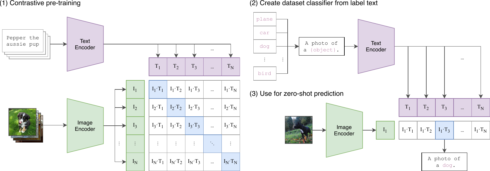

> 图 1 | 我们的方法概述。标准的图像模型联合训练一个图像特征提取器和一个线性分类器来预测某个标签，而 CLIP 则联合训练一个图像编码器和一个文本编码器来预测一批（图像，文本）训练样本的正确配对。在测试时，学习到的文本编码器通过嵌入目标数据集类别的名称或描述，来合成一个零样本线性分类器。

二十多年前，Mori 等人 [11] 探索了通过训练模型来预测与图像配对的文本文档中的名词和形容词，以改进基于内容的图像检索。Quattoni 等人 [12] 证明，通过在为预测图像相关描述中的单词而训练的分类器的权重空间中进行 **流形学习（Manifold learning）** ，可以学习到数据效率更高的图像表示。Srivastava 与 Salakhutdinov [13] 通过在低级图像和文本标签特征之上训练 **多模态深度玻尔兹曼机（Multimodal Deep Boltzmann Machines）** ，探索了深度表示学习。Joulin 等人 [14] 将这一系列工作现代化，并证明了为预测图像描述中的单词而训练的 **卷积神经网络（Convolutional Neural Networks, CNNs）** 能够学习到有用的图像表示。他们将 YFCC100M 数据集 [15] 中图像的标题、描述和标签元数据转换为一个 **词袋多标签分类（Bag-of-words multi-label classification）** 任务，并表明，通过预训练 AlexNet [16] 来预测这些标签所学习到的表示，在迁移任务上的表现与基于 ImageNet 的预训练相似。Li 等人 [17] 随后将这种方法扩展到预测短语 n-gram 以及单个单词，并展示了他们的系统通过基于其学习到的视觉 n-gram 词典对目标类别进行评分并预测得分最高的类别，从而零样本迁移到其他图像分类数据集的能力。采用更近期的架构和预训练方法，VirTex [18]、ICMLM [19] 和 ConVIRT [20] 最近展示了基于 **Transformer 的语言建模（Transformer-based language modeling）** 、掩码语言建模和 **对比目标（Contrastive objectives）** 从文本中学习图像表示的潜力。

尽管作为概念验证令人兴奋，但使用 **自然语言监督（Natural Language Supervision）** 进行图像表示学习仍然很少见。这很可能是因为在常见基准测试上展示的性能远低于其他方法。例如，Li 等人（2017）在 **零样本（Zero-shot）** 设置下的 ImageNet 上仅达到 11.5% 的准确率。这远低于当前最先进技术（Xie 等人，2020）的 88.4% 准确率，甚至低于经典计算机视觉方法（Deng 等人，2012）的 50% 准确率。相反，范围更窄但目标明确的 **弱监督（Weak Supervision）** 应用反而提升了性能。Mahajan 等人（2018）表明，预测 Instagram 图像上与 ImageNet 相关的标签是一种有效的 **预训练（Pre-training）** 任务。当将这些预训练模型 **微调（Fine-tuned）** 到 ImageNet 时，其准确率提高了超过 5%，并改进了当时的整体技术水平。Kolesnikov 等人（2019）和 Dosovitskiy 等人（2020）也通过预训练模型来预测带有噪声标签的 JFT-300M 数据集的类别，在更广泛的迁移基准测试上展示了巨大的性能提升。

这一系列工作代表了当前一种务实的折中方案，介于从有限数量的有监督“黄金标签”中学习和从几乎无限量的原始文本中学习之间。然而，它并非没有妥协。这两项工作都精心设计并限制了其监督范围，分别对应 1000 个和 18291 个类别。自然语言凭借其通用性，能够表达并因此监督更广泛的视觉概念。这两种方法也都使用静态的 **Softmax 分类器（Softmax Classifier）** 进行预测，缺乏动态输出的机制。这严重削弱了它们的灵活性，并限制了其“零样本”能力。

这些弱监督模型与近期直接从自然语言学习图像表示的探索之间的一个关键区别在于 **规模（Scale）** 。Mahajan 等人（2018）和 Kolesnikov 等人（2019）在数百万到数十亿张图像上训练了其模型，耗时达 **加速器年（Accelerator Years）** ，而 VirTex、ICMLM 和 ConVIRT 则在十万到二十万张图像上训练了 **加速器天（Accelerator Days）** 。在本工作中，我们弥合了这一差距，并研究了 **大规模（At Large Scale）** 使用自然语言监督训练的图像分类器的行为。得益于互联网上大量公开可用的此类数据，我们创建了一个包含 4 亿个（图像，文本）对的新数据集，并证明了一个从头开始训练的简化版 ConVIRT——我们称之为 **CLIP（Contrastive Language-Image Pre-training）** ，即 **对比语言-图像预训练（Contrastive Language-Image Pre-training）** ——是一种从自然语言监督中学习的有效方法。我们通过训练一系列涵盖近 2 个数量级计算量的八个模型来研究 CLIP 的可扩展性，并观察到迁移性能是计算量的平滑可预测函数（Hestness 等人，2017；Kaplan 等人，2020）。我们发现，CLIP 与 GPT 系列类似，在预训练期间学会了执行广泛的任务，包括 **光学字符识别（Optical Character Recognition, OCR）** 、 **地理定位（Geo-localization）** 、 **动作识别（Action Recognition）** 等。我们通过在超过 30 个现有数据集上对 CLIP 的零样本迁移性能进行基准测试来衡量这一点，发现它可以与先前的任务专用监督模型相媲美。我们还通过 **线性探针表示学习分析（Linear-probe Representation Learning Analysis）** 证实了这些发现，并表明 CLIP 在性能上优于公开可用的最佳 ImageNet 模型，同时计算效率更高。此外，我们发现零样本 CLIP 模型比同等准确率的监督式 ImageNet 模型 **稳健性（Robust）** 强得多，这表明对 **任务无关模型（Task-agnostic Models）** 的零样本评估更能代表模型的能力。这些结果具有重要的政策和伦理意义，我们将在第 [7](#S7) 节中予以考虑。

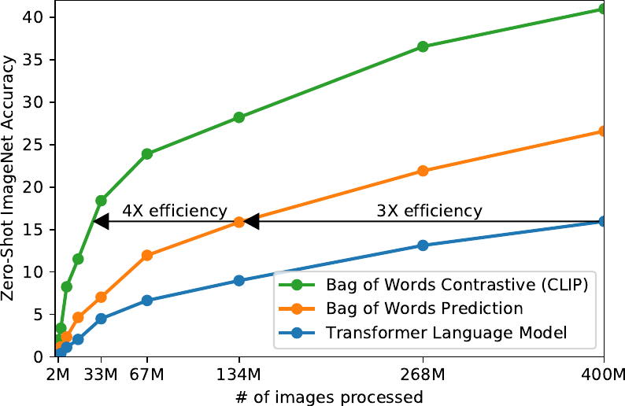

> 图 2 | CLIP 在零样本迁移上比我们的图像描述基线高效得多。尽管表达能力很强，但我们发现基于 Transformer 的语言模型在零样本 ImageNet 分类上相对较弱。此处，我们看到其学习速度比预测文本 **词袋（Bag-of-Words, BoW）** 编码的基线（Joulin 等人，2016）慢 3 倍。将预测目标替换为 CLIP 的对比目标，进一步将效率提升了 4 倍。

## 2 方法

### 2.1 自然语言监督（Natural Language Supervision）

我们方法的核心思想是从自然语言所包含的监督信息中学习感知能力。正如引言中所讨论的，这并非一个新想法，然而，用于描述该领域工作的术语多种多样，甚至看似矛盾，且声明的动机也各不相同。Zhang 等人 (2020)、Gomez 等人 (2017)、Joulin 等人 (2016) 以及 Desai & Johnson (2020) 都提出了从与图像配对的文本中学习视觉表示的方法，但他们分别将自己的方法描述为 **无监督（Unsupervised）** 、 **自监督（Self-supervised）** 、 **弱监督（Weakly supervised）** 和 **监督（Supervised）** 。

我们强调，贯穿这一系列工作的共同点并非任何特定方法的细节，而是对 **自然语言（Natural Language）** 作为一种训练信号的认可。所有这些方法都是在从 **自然语言监督（Natural Language Supervision）** 中学习。尽管早期研究在使用 **主题模型（Topic Model）** 和 **n-gram 表示（n-gram representations）** 时曾与自然语言的复杂性作斗争，但 **深度上下文表示学习（Deep Contextual Representation Learning）** 的改进表明，我们现在拥有了有效利用这一丰富监督来源的工具 (McCann 等人, 2017)。

与其他训练方法相比，从自然语言中学习具有几个潜在优势。与用于图像分类的标准众包标注相比，扩展自然语言监督要容易得多，因为它不需要标注符合经典的“机器学习兼容格式”，例如规范的 N 选 1 多数投票“黄金标签”。相反，处理自然语言的方法可以从互联网上大量文本中包含的监督信息中被动学习。与大多数无监督或自监督学习方法相比，从自然语言中学习还有一个重要优势，即它不仅仅是学习一个表示，还将该表示与语言联系起来，从而实现了灵活的 **零样本迁移（Zero-shot Transfer）** 。在接下来的小节中，我们将详细说明我们最终采用的具体方法。

### 2.2 创建足够大的数据集

现有工作主要使用了三个数据集： **MS-COCO** (Lin 等人, 2014)、 **Visual Genome** (Krishna 等人, 2017) 和 **YFCC100M** (Thomee 等人, 2016)。虽然 MS-COCO 和 Visual Genome 是高质量的众包标注数据集，但以现代标准来看，它们规模较小，各自大约有 10 万张训练照片。相比之下，其他计算机视觉系统使用多达 35 亿张 Instagram 照片进行训练 (Mahajan 等人, 2018)。拥有 1 亿张照片的 YFCC100M 是一个可能的替代选择，但每张图像的元数据稀疏且质量参差不齐。许多图像使用自动生成的文件名（如 `20160716_113957.JPG`）作为“标题”，或者包含相机曝光设置的“描述”。经过过滤，仅保留那些具有自然语言标题和/或英文描述的图像后，数据集缩小了 6 倍，只剩下 1500 万张照片。这大约与 **ImageNet** 的规模相当。

采用自然语言监督的一个主要动机是互联网上公开可用的此类形式的数据量巨大。由于现有数据集未能充分反映这种可能性，仅基于它们来评估结果会低估这一研究方向的前景。为了解决这个问题，我们从互联网上各种公开可用的来源收集并构建了一个包含 4 亿个（图像，文本）对的新数据集。为了尽可能覆盖广泛的视觉概念集合，我们在构建过程中搜索那些文本包含一组 50 万个查询词之一的（图像，文本）对。(^1^11 基础查询列表是英文维基百科中出现至少 100 次的所有单词。在此基础上，增加了具有高逐点互信息的二元词组以及所有搜索量超过一定阈值的维基百科文章名称。最后，添加了所有尚未在查询列表中的 WordNet 同义词集。) 我们通过每个查询最多包含 20,000 个（图像，文本）对来近似实现类别平衡。最终得到的数据集的总词数与用于训练 GPT-2 的 WebText 数据集相似。我们将此数据集称为 **WIT** ，代表 **WebImageText** 。

### 2.3 选择高效的预训练方法

最先进的计算机视觉系统使用非常大量的计算资源。Mahajan 等人 (2018) 需要 19 个 GPU 年来训练他们的 ResNeXt101-32x48d，而 Xie 等人 (2020) 需要 33 个 TPUv3 核心年来训练他们的 Noisy Student EfficientNet-L2。考虑到这两个系统都只训练用于预测 1000 个 ImageNet 类别，从自然语言中学习一个开放的视觉概念集合的任务似乎令人生畏。在我们的努力过程中，我们发现训练效率是成功扩展自然语言监督的关键，我们基于这一指标选择了最终的预训练方法。

我们最初的方法与 VirTex 类似，从头开始联合训练一个图像卷积神经网络（Convolutional Neural Network, CNN）和一个文本转换器（Transformer）来预测图像的标题。然而，我们在高效扩展此方法时遇到了困难。在图 [2](#S1.F2) 中，我们展示了一个拥有 6300 万参数的转换器语言模型（其计算量已经是其 ResNet-50 图像编码器的两倍）学习识别 ImageNet 类别的速度，比一个预测相同文本的词袋（Bag-of-Words, BoW）编码的、简单得多的基线模型要慢三倍。

这两种方法有一个关键的共同点。它们都试图预测每张图像所附文本的确切词语。这是一项困难的任务，因为与图像共现的描述、评论和相关文本种类繁多。最近在图像对比表征学习（Contrastive Representation Learning）方面的工作发现， **对比目标（Contrastive objectives）** 可以比其等效的 **预测目标（Predictive objectives）** 学习到更好的表征（Tian 等人，2019）。其他研究发现，尽管图像的 **生成模型（Generative models）** 可以学习到高质量的图像表征，但其所需的计算量比具有相同性能的对比模型高出一个数量级以上（Chen 等人，2020a）。注意到这些发现后，我们探索了训练一个系统来解决一个可能更简单的代理任务： **仅预测哪段文本整体与哪张图像配对，而不预测该文本的确切词语** 。从相同的词袋编码基线出发，我们在图 [2](#S1.F2) 中将预测目标替换为对比目标，并观察到在向 ImageNet 进行 **零样本迁移（Zero-shot transfer）** 的速率上，效率又提升了 4 倍。

给定一个包含 $N$ 个（图像，文本）对的批次，CLIP 被训练来预测该批次中 $N\times N$ 种可能的（图像，文本）配对中哪些是实际发生的。为此，CLIP 通过联合训练一个图像编码器和一个文本编码器来学习一个 **多模态嵌入空间（Multi-modal embedding space）** ，目标是最大化批次中 $N$ 个真实配对的图像和文本嵌入之间的 **余弦相似度（Cosine similarity）** ，同时最小化 $N^{2}-N$ 个错误配对的嵌入之间的余弦相似度。我们基于这些相似度分数优化一个 **对称交叉熵损失（Symmetric cross entropy loss）** 。在图 [3](#S2.F3) 中，我们包含了 CLIP 实现核心部分的类 Numpy 伪代码。据我们所知，这种批次构建技术和目标首先在深度度量学习（Deep Metric Learning）领域被提出，称为 **多类 N 对损失（Multi-class N-pair loss）** （Sohn，2016），随后被 Oord 等人（2018）推广用于对比表征学习，称为 **InfoNCE 损失（InfoNCE loss）** ，最近又被 Zhang 等人（2020）在医学成像领域用于对比（文本，图像）表征学习。

由于我们的预训练数据集规模庞大， **过拟合（Over-fitting）** 不是一个主要问题，因此与 Zhang 等人（2020）的实现相比，训练 CLIP 的细节得到了简化。我们从头开始训练 CLIP，既没有用 ImageNet 权重初始化图像编码器，也没有用预训练权重初始化文本编码器。我们没有使用表征与对比嵌入空间之间的 **非线性投影（Non-linear projection）** （这一改动由 Bachman 等人（2019）引入，并由 Chen 等人（2020b）推广）。相反，我们仅使用一个 **线性投影（Linear projection）** 将每个编码器的表征映射到多模态嵌入空间。我们没有注意到两个版本在训练效率上的差异，并推测非线性投影可能仅在当前图像的自监督表征学习方法中与细节共同适应。我们还移除了 Zhang 等人（2020）中的文本变换函数 $t_{u}$，该函数从文本中均匀采样一个句子，因为 CLIP 预训练数据集中的许多（图像，文本）对本身就是一个句子。我们也简化了图像变换函数 $t_{v}$。从调整大小后的图像中随机裁剪一个正方形区域是训练期间使用的唯一 **数据增强（Data augmentation）** 方法。最后，控制 softmax 中逻辑值范围的 **温度参数（Temperature parameter）** $\tau$，在训练期间被直接优化为一个对数参数化的乘法标量，以避免将其作为超参数进行调整。

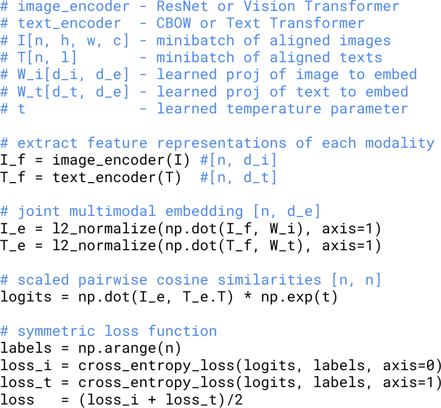

> 图 3：CLIP 实现核心部分的类 Numpy 伪代码。

### 2.4 模型选择与扩展（Choosing and Scaling a Model）

我们最初的方法与 VirTex 类似，从头开始联合训练一个图像卷积神经网络（Convolutional Neural Network, CNN）和一个文本转换器（Transformer）来预测图像的标题。然而，我们在高效扩展此方法时遇到了困难。在图 [2](#S1.F2) 中，我们展示了一个拥有 6300 万参数的转换器语言模型（其计算量已经是其 ResNet-50 图像编码器的两倍）学习识别 ImageNet 类别的速度，比一个预测相同文本的词袋（Bag-of-Words, BoW）编码的、简单得多的基线模型要慢三倍。

这两种方法有一个关键的共同点。它们都试图预测每张图像所附文本的确切词语。这是一项困难的任务，因为与图像共现的描述、评论和相关文本种类繁多。最近在图像对比表征学习（Contrastive Representation Learning）方面的工作发现， **对比目标（Contrastive objectives）** 可以比其等效的 **预测目标（Predictive objectives）** 学习到更好的表征（Tian 等人，2019）。其他研究发现，尽管图像的 **生成模型（Generative models）** 可以学习到高质量的图像表征，但其所需的计算量比具有相同性能的对比模型高出一个数量级以上（Chen 等人，2020a）。注意到这些发现后，我们探索了训练一个系统来解决一个可能更简单的代理任务： **仅预测哪段文本整体与哪张图像配对，而不预测该文本的确切词语** 。从相同的词袋编码基线出发，我们在图 [2](#S1.F2) 中将预测目标替换为对比目标，并观察到在向 ImageNet 进行 **零样本迁移（Zero-shot transfer）** 的速率上，效率又提升了 4 倍。

给定一个包含 $N$ 个（图像，文本）对的批次，CLIP 被训练来预测该批次中 $N\times N$ 种可能的（图像，文本）配对中哪些是实际发生的。为此，CLIP 通过联合训练一个图像编码器和一个文本编码器来学习一个 **多模态嵌入空间（Multi-modal embedding space）** ，目标是最大化批次中 $N$ 个真实配对的图像和文本嵌入之间的 **余弦相似度（Cosine similarity）** ，同时最小化 $N^{2}-N$ 个错误配对的嵌入之间的余弦相似度。我们基于这些相似度分数优化一个 **对称交叉熵损失（Symmetric cross entropy loss）** 。在图 [3](#S2.F3) 中，我们包含了 CLIP 实现核心部分的类 Numpy 伪代码。据我们所知，这种批次构建技术和目标首先在深度度量学习（Deep Metric Learning）领域被提出，称为 **多类 N 对损失（Multi-class N-pair loss）** （Sohn，2016），随后被 Oord 等人（2018）推广用于对比表征学习，称为 **InfoNCE 损失（InfoNCE loss）** ，最近又被 Zhang 等人（2020）在医学成像领域用于对比（文本，图像）表征学习。

由于我们的预训练数据集规模庞大， **过拟合（Over-fitting）** 不是一个主要问题，因此与 Zhang 等人（2020）的实现相比，训练 CLIP 的细节得到了简化。我们从头开始训练 CLIP，既没有用 ImageNet 权重初始化图像编码器，也没有用预训练权重初始化文本编码器。我们没有使用表征与对比嵌入空间之间的 **非线性投影（Non-linear projection）** （这一改动由 Bachman 等人（2019）引入，并由 Chen 等人（2020b）推广）。相反，我们仅使用一个 **线性投影（Linear projection）** 将每个编码器的表征映射到多模态嵌入空间。我们没有注意到两个版本在训练效率上的差异，并推测非线性投影可能仅在当前图像的自监督表征学习方法中与细节共同适应。我们还移除了 Zhang 等人（2020）中的文本变换函数 $t_{u}$，该函数从文本中均匀采样一个句子，因为 CLIP 预训练数据集中的许多（图像，文本）对本身就是一个句子。我们也简化了图像变换函数 $t_{v}$。从调整大小后的图像中随机裁剪一个正方形区域是训练期间使用的唯一 **数据增强（Data augmentation）** 方法。最后，控制 softmax 中逻辑值范围的 **温度参数（Temperature parameter）** $\tau$，在训练期间被直接优化为一个对数参数化的乘法标量，以避免将其作为超参数进行调整。

> 图 3：CLIP 实现核心部分的类 Numpy 伪代码。

我们为图像编码器考虑了两种不同的架构。对于第一种，我们使用 **ResNet-50（Residual Network-50）** [1] 作为图像编码器的基础架构，因为它被广泛采用且性能经过验证。我们使用 He 等人（2019）的 **ResNet-D（Residual Network-D）** 改进 [2] 和 Zhang（2019）的 **抗锯齿矩形-2 模糊池化（antialiased rect-2 blur pooling）** [3] 对原始版本进行了几处修改。我们还用 **注意力池化机制（attention pooling mechanism）** 替换了全局平均池化层。该注意力池化实现为单层“ **Transformer（Transformer）** 风格”的 **多头 QKV 注意力（multi-head QKV attention）** ，其中查询（query）以图像的全局平均池化表示作为条件。对于第二种架构，我们尝试了最近提出的 **Vision Transformer（ViT）** [4]。我们严格遵循其实现，仅做了微小修改：在 Transformer 层之前，对组合的 **图像块嵌入（patch embeddings）** 和 **位置嵌入（position embeddings）** 添加了一个额外的 **层归一化（layer normalization）** ，并使用了一个略有不同的初始化方案。

文本编码器是一个 **Transformer（Transformer）** [5]，其架构修改遵循 Radford 等人（2019）的描述 [6]。作为基础尺寸，我们使用了一个包含 6300 万参数、12 层、宽度为 512、具有 8 个注意力头的模型。该 Transformer 对文本的 **小写字节对编码（lower-cased Byte Pair Encoding, BPE）** 表示进行操作，词汇表大小为 49,152 [7]。出于计算效率考虑，最大序列长度被限制在 76。文本序列用 [SOS] 和 [EOS] 标记括起来，Transformer 最高层在 [EOS] 标记处的激活被视作文本的特征表示，该表示经过层归一化后，再线性投影到 **多模态嵌入空间（multi-modal embedding space）** 。文本编码器中使用了 **掩码自注意力（masked self-attention）** ，以保留使用预训练语言模型进行初始化或将语言建模作为辅助目标的能力，不过对此的探索留作未来工作。

虽然以往的计算机视觉研究通常通过单独增加 **宽度（width）** [8] 或 **深度（depth）** [1] 来扩展模型，但对于 ResNet 图像编码器，我们采用了 Tan & Le（2019）的方法 [9]，他们发现将额外的计算资源分配给宽度、深度和 **分辨率（resolution）** 所有维度，比仅分配给模型的一个维度效果更好。虽然 Tan & Le（2019）为他们的 **EfficientNet（EfficientNet）** 架构调整了分配给每个维度的计算比例，但我们采用了一个简单的基线：将额外的计算资源平均分配给增加模型的宽度、深度和分辨率。对于文本编码器，我们只按比例缩放模型的宽度，使其与计算得出的 ResNet 宽度增加成比例，完全不缩放深度，因为我们发现 CLIP 的性能对文本编码器的容量不太敏感。

### 2.5 Training（训练）

我们训练了一系列 5 个 ResNet 和 3 个 Vision Transformer。对于 ResNet，我们训练了一个 ResNet-50、一个 ResNet-101，以及另外 3 个遵循 EfficientNet 风格模型缩放、分别使用约 4 倍、16 倍和 64 倍于 ResNet-50 计算量的模型。它们分别被标记为 RN50x4、RN50x16 和 RN50x64。对于 Vision Transformer，我们训练了 ViT-B/32、ViT-B/16 和 ViT-L/14。我们训练所有模型 32 个周期（epoch）。我们使用 **Adam 优化器（Adam optimizer）** [10]，并对所有非增益（gains）或偏置（biases）的权重应用 **解耦权重衰减正则化（decoupled weight decay regularization）** [11]，并使用 **余弦调度（cosine schedule）** 衰减学习率 [12]。初始超参数是通过在基线 ResNet-50 模型上训练 1 个周期时，结合网格搜索、随机搜索和手动调优来设置的。由于计算限制，对于更大的模型，超参数随后被启发式地调整。可学习的温度参数 $\tau$ 被初始化为相当于 Wu 等人（2018）中的 0.07 [13]，并进行裁剪以防止将逻辑值（logits）缩放超过 100 倍，我们发现这对于防止训练不稳定是必要的。我们使用了非常大的 **小批量大小（minibatch size）** 32,768。使用 **混合精度（mixed-precision）** [14] 来加速训练并节省内存。为了节省更多内存，使用了 **梯度检查点（gradient checkpointing）** [15, 16]、 **半精度 Adam 统计量（half-precision Adam statistics）** [17] 以及 **半精度随机舍入的文本编码器权重（half-precision stochastically rounded text encoder weights）** 。嵌入相似度的计算也进行了 **分片（sharded）** ，单个 GPU 仅计算其本地批次嵌入所需的成对相似度子集。最大的 ResNet 模型 RN50x64 在 592 块 V100 GPU 上训练了 18 天，而最大的 Vision Transformer 在 256 块 V100 GPU 上训练了 12 天。对于 ViT-L/14，我们还以更高的 336 像素分辨率预训练了一个额外的周期，以提升性能，类似于 **FixRes（FixRes）** [18]。我们将此模型标记为 ViT-L/14@336px。除非另有说明，本文中报告为“CLIP”的所有结果均使用此模型，我们发现其性能最佳。

## 3 实验（Experiments）

### 3.1 零样本迁移（Zero-Shot Transfer）

#### 3.1.1 动机（Motivation）

在计算机视觉（Computer Vision）中， **零样本学习（Zero-shot learning）** 通常指在图像分类（Image classification）中泛化到未见过的物体类别的研究（Lampert 等人，2009）。我们则以更广泛的意义使用该术语，研究对未见数据集的泛化。我们将其作为执行未见任务的 **代理（proxy）** ，正如 Larochelle 等人（2008）在零数据学习（Zero-data learning）论文中所期望的那样。尽管无监督学习（Unsupervised learning）领域的许多研究都聚焦于机器学习系统的 **表征学习（Representation learning）** 能力，但我们主张研究零样本迁移，将其作为衡量机器学习系统 **任务学习（Task-learning）** 能力的一种方式。从这个角度看，一个数据集评估的是在特定分布上执行某项任务的性能。然而，许多流行的计算机视觉数据集是由研究社区创建的，主要作为指导通用图像分类方法发展的 **基准（Benchmark）** ，而非衡量特定任务的性能。虽然可以合理地认为 SVHN 数据集衡量的是在 Google 街景照片分布上的街道号码转录任务，但 CIFAR-10 数据集衡量的是什么“真实”任务则不清楚。然而，CIFAR-10 取自何种分布是明确的—— **TinyImages** （Torralba 等人，2008）。在这类数据集上，零样本迁移更多地是对 CLIP 的 **分布偏移（Distribution shift）** 鲁棒性和 **领域泛化（Domain generalization）** 的评估，而非任务泛化。关于此点的分析，请参见第 [3.3](#S3.SS3) 节。

据我们所知， **Visual N-Grams** （Li 等人，2017）首次以上述方式研究了向现有图像分类数据集的零样本迁移。这也是我们所知的唯一另一项使用通用预训练模型研究向标准图像分类数据集进行零样本迁移的工作，并可作为理解 CLIP 背景的最佳参考点。他们的方法学习一个包含 142,806 个视觉 n-gram（涵盖 1 到 5 元语法）的词典参数，并使用 **Jelinek-Mercer 平滑（Jelinek-Mercer smoothing）** 的微分版本优化这些 n-gram，以最大化给定图像所有文本 n-gram 的概率。为了执行零样本迁移，他们首先将数据集中每个类名的文本转换为其 n-gram 表示，然后根据其模型计算其概率，预测得分最高的类别。

我们将研究零样本迁移作为任务学习评估的重点，是受到了自然语言处理（Natural Language Processing, NLP）领域展示任务学习工作的启发。据我们所知，Liu 等人（2018）首次将任务学习识别为一种“意外的副作用”，当时一个为生成维基百科文章而训练的语言模型学会了在不同语言之间可靠地 **音译（Transliterate）** 名称。虽然 **GPT-1** （Radford 等人，2018）主要关注将预训练作为一种 **迁移学习（Transfer learning）** 方法来改进 **监督微调（Supervised fine-tuning）** ，但它也包含了一项 **消融研究（Ablation study）** ，表明四种启发式零样本迁移方法的性能在预训练过程中稳步提升，而无需任何监督适应。这一分析为 **GPT-2** （Radford 等人，2019）奠定了基础，后者完全专注于通过零样本迁移研究语言模型的任务学习能力。

#### 3.1.2 使用 CLIP 进行零样本迁移（Using CLIP for Zero-Shot Transfer）

CLIP（Contrastive Language-Image Pre-training，对比语言-图像预训练）经过预训练，旨在预测其数据集中图像和文本片段是否配对。为了执行 **零样本分类（Zero-shot classification）** ，我们复用此能力。对于每个数据集，我们使用数据集中所有类别的名称作为潜在的文本配对集合，并根据 CLIP 预测最可能的（图像，文本）对。更详细地说，我们首先通过各自的编码器计算图像的 **特征嵌入（Feature embedding）** 和可能文本集合的特征嵌入。然后计算这些嵌入的 **余弦相似度（Cosine similarity）** ，通过一个 **温度参数（Temperature parameter）** $\tau$ 进行缩放，并通过 **softmax** 归一化为概率分布。请注意，此预测层是一个 **多项逻辑回归分类器（Multinomial logistic regression classifier）** ，具有 L2 归一化的输入、L2 归一化的权重、无偏置项以及温度缩放。如此解读时，图像编码器是计算图像特征表示的 **计算机视觉骨干网络（Computer vision backbone）** ，而文本编码器则是一个 **超网络（Hypernetwork）** （Ha 等人，2016），它基于指定类别所代表视觉概念的文本，生成线性分类器的权重。Lei Ba 等人（2015）首次引入了这种形式的零样本图像分类器，而从自然语言生成分类器的想法至少可以追溯到 Elhoseiny 等人（2013）。延续这种解读，CLIP 预训练的每一步都可以被视为在优化一个随机创建的、针对计算机视觉数据集的代理任务的性能，该数据集每类包含 1 个样本，并通过自然语言描述定义了总共 32,768 个类别。对于零样本评估，我们会在文本编码器计算出零样本分类器后将其缓存，并在所有后续预测中复用。这使得生成它的成本可以在数据集的所有预测中分摊。

#### 3.1.3 与 Visual N-Grams 的初步比较

**表 1：将 CLIP 与先前的零样本迁移图像分类结果进行比较。CLIP 在所有三个数据集上的性能均有大幅提升。这一提升反映了自 Visual N-Grams（Li 等人，2017）开发以来四年间的诸多差异。**
| | aYahoo | ImageNet | SUN |
| --- | --- | --- | --- |
| Visual N-Grams | 72.4 | 11.5 | 23.0 |
| CLIP | 98.4 | 76.2 | 58.5 |

在表 [1](#S3.T1) 中，我们将 Visual N-Grams 与 CLIP 进行比较。最佳的 CLIP 模型将 ImageNet 上的准确率从概念验证的 11.5% 提升至 76.2%，并且尽管未使用该数据集可用的 128 万个人工标注训练样本中的任何一个，其性能仍与原始的 ResNet-50 相当。此外，CLIP 模型的 **Top-5 准确率（Top-5 accuracy）** 明显高于其 **Top-1 准确率（Top-1 accuracy）** ，该模型的 Top-5 准确率达到 95%，与 Inception-V4（Szegedy 等人，2016）相当。在零样本设置下能够匹配强大的、完全监督的基线性能，表明 CLIP 是迈向灵活实用的零样本计算机视觉分类器的重要一步。如上所述，与 Visual N-Grams 的比较旨在为 CLIP 的性能提供背景，不应被解释为 CLIP 与 Visual N-Grams 之间的直接方法比较，因为两个系统之间许多影响性能的差异并未得到控制。例如，我们在一个大了 10 倍的数据集上进行训练，使用每次预测所需计算量近 100 倍的视觉模型，可能使用了超过其 1000 倍的训练计算量，并且使用了在 Visual N-Grams 发表时尚不存在的基于 **Transformer** 的模型。作为更接近的比较，我们在 Visual N-Grams 训练所用的相同 YFCC100M 数据集上训练了一个 CLIP ResNet-50，发现其在一个 V100 GPU 日内就达到了他们报告的 ImageNet 性能。此基线也是从头开始训练的，而不是像 Visual N-Grams 那样从预训练的 ImageNet 权重初始化。

CLIP 在其他两个报告的数据集上也优于 Visual N-Grams。在 aYahoo 上，CLIP 实现了错误数量减少 95%；在 SUN 上，CLIP 的准确率是 Visual N-Grams 的两倍多。为了进行更全面的分析和压力测试，我们实施了一个更庞大的评估套件，详见附录 [A](#A1)。我们总共从 Visual N-Grams 报告的 3 个数据集扩展到包含超过 30 个数据集，并与超过 50 个现有的计算机视觉系统进行比较，以便为结果提供背景。

#### 3.1.4 提示工程与集成

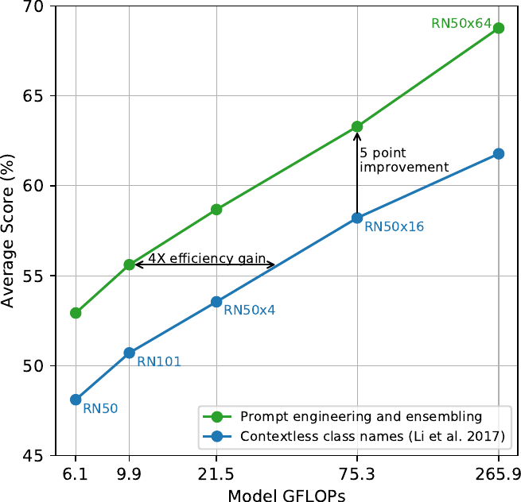

> 图 4：提示工程与集成提升了零样本性能。与使用无上下文类别名称的基线相比，提示工程与集成在 36 个数据集上平均将零样本分类性能提升了近 5 个百分点。这一提升类似于使用基线零样本方法时增加 4 倍计算量所带来的增益，但在分摊到多次预测时是“免费”的。

大多数标准的图像分类数据集将命名或描述类别的信息（这些信息使得基于自然语言的零样本迁移成为可能）视为事后补充。绝大多数数据集仅用标签的数字 ID 来标注图像，并包含一个将这些 ID 映射回其英文名称的文件。一些数据集，如 Flowers102 和 GTSRB，在其发布版本中似乎完全未包含此映射，从而完全阻止了零样本迁移。(^2^22 Alec 在这个项目过程中对花卉种类和德国交通标志的了解比他最初预期的要多得多。) 对于许多数据集，我们观察到这些标签的选择可能有些随意，并且没有预见到与零样本迁移相关的问题，而零样本迁移的成功依赖于任务描述。

CLIP 经过预训练，旨在预测其数据集中图像和文本片段是否配对。为了执行 **零样本分类（Zero-shot classification）** ，我们复用此能力。对于每个数据集，我们使用数据集中所有类别的名称作为潜在的文本配对集合，并根据 CLIP 预测最可能的（图像，文本）对。更详细地说，我们首先通过各自的编码器计算图像的 **特征嵌入（Feature embedding）** 和可能文本集合的特征嵌入。然后计算这些嵌入的 **余弦相似度（Cosine similarity）** ，通过一个 **温度参数（Temperature parameter）** $\tau$ 进行缩放，并通过 **softmax** 归一化为概率分布。请注意，此预测层是一个 **多项逻辑回归分类器（Multinomial logistic regression classifier）** ，具有 L2 归一化的输入、L2 归一化的权重、无偏置项以及温度缩放。如此解读时，图像编码器是计算图像特征表示的 **计算机视觉骨干网络（Computer vision backbone）** ，而文本编码器则是一个 **超网络（Hypernetwork）** （Ha 等人，2016），它基于指定类别所代表视觉概念的文本，生成线性分类器的权重。Lei Ba 等人（2015）首次引入了这种形式的零样本图像分类器，而从自然语言生成分类器的想法至少可以追溯到 Elhoseiny 等人（2013）。延续这种解读，CLIP 预训练的每一步都可以被视为在优化一个随机创建的、针对计算机视觉数据集的代理任务的性能，该数据集每类包含 1 个样本，并通过自然语言描述定义了总共 32,768 个类别。对于零样本评估，我们会在文本编码器计算出零样本分类器后将其缓存，并在所有后续预测中复用。这使得生成它的成本可以在数据集的所有预测中分摊。

#### 3.1.3 与 Visual N-Grams 的初步比较

**表 1：将 CLIP 与先前的零样本迁移图像分类结果进行比较。CLIP 在所有三个数据集上的性能均有大幅提升。这一提升反映了自 Visual N-Grams（Li 等人，2017）开发以来四年间的诸多差异。**
| | aYahoo | ImageNet | SUN |
| --- | --- | --- | --- |
| Visual N-Grams | 72.4 | 11.5 | 23.0 |
| CLIP | 98.4 | 76.2 | 58.5 |

在表 [1](#S3.T1) 中，我们将 Visual N-Grams 与 CLIP 进行比较。最佳的 CLIP 模型将 ImageNet 上的准确率从概念验证的 11.5% 提升至 76.2%，并且尽管未使用该数据集可用的 128 万个人工标注训练样本中的任何一个，其性能仍与原始的 ResNet-50 相当。此外，CLIP 模型的 **Top-5 准确率（Top-5 accuracy）** 明显高于其 **Top-1 准确率（Top-1 accuracy）** ，该模型的 Top-5 准确率达到 95%，与 Inception-V4（Szegedy 等人，2016）相当。在零样本设置下能够匹配强大的、完全监督的基线性能，表明 CLIP 是迈向灵活实用的零样本计算机视觉分类器的重要一步。如上所述，与 Visual N-Grams 的比较旨在为 CLIP 的性能提供背景，

一个常见问题是 **一词多义（Polysemy）** 。当类别名称是提供给 CLIP 文本编码器的唯一信息时，由于缺乏上下文，它无法区分词语的具体含义。在某些情况下，同一个词的多种含义甚至可能作为不同类别出现在同一个数据集中！例如，ImageNet 中既包含建筑起重机（construction crane），也包含会飞的鹤（crane）。另一个例子出现在牛津-IIIT 宠物数据集（Oxford-IIIT Pet dataset）的类别中，根据上下文，单词“boxer”显然指的是一个犬种，但对于缺乏上下文的文本编码器来说，它同样可能指代一种运动员。

我们遇到的另一个问题是，在我们的预训练数据集中，与图像配对的文本仅为单个单词的情况相对罕见。通常，文本是一个以某种方式描述图像的完整句子。为了弥合这种分布差异，我们发现使用提示模板“一张{标签}的照片。”是一个很好的默认选择，有助于明确文本是关于图像内容的。与仅使用标签文本的基线相比，这通常能提高性能。例如，仅使用此提示就将 ImageNet 的准确率提高了 1.3%。

类似于围绕 GPT-3 的“提示工程（Prompt engineering）”讨论（Brown 等人，2020；Gao 等人，2020），我们也观察到，通过为每个任务定制提示文本，可以显著提高零样本性能。以下是一些非穷尽的例子。我们发现，在几个细粒度图像分类数据集上，指定类别很有帮助。例如，在牛津-IIIT 宠物数据集上，使用“一张{标签}的照片，一种宠物。”来提供上下文效果很好。同样，在 Food101 上指定一种食物类型，在 FGVC Aircraft 上指定一种飞机类型也有帮助。对于 OCR（光学字符识别）数据集，我们发现将要识别的文本或数字用引号括起来可以提高性能。最后，我们发现在卫星图像分类数据集上，指定图像属于这种形式很有帮助，我们使用了“一张{标签}的卫星照片。”的变体。

我们还尝试了 **集成（Ensembling）** 多个零样本分类器作为另一种提高性能的方法。这些分类器通过使用不同的上下文提示来计算，例如“一张大{标签}的照片”和“一张小{标签}的照片”。我们在嵌入空间而不是概率空间上构建集成。这使我们能够缓存一组平均后的文本嵌入，这样在多次预测中分摊后，集成的计算成本与使用单个分类器相同。我们观察到，集成多个生成的零样本分类器能够可靠地提高性能，并将其用于大多数数据集。在 ImageNet 上，我们集成了 80 个不同的上下文提示，这比上面讨论的单个默认提示的性能又提高了 3.5%。综合考虑，提示工程和集成将 ImageNet 的准确率提高了近 5%。在图 [4](#S3.F4) 中，我们可视化了提示工程和集成如何改变一组 CLIP 模型的性能，并与 Li 等人（2017）中直接嵌入类别名称的无上下文基线方法进行了比较。

#### 3.1.5 零样本 CLIP 性能分析（Analysis of Zero-Shot CLIP Performance）

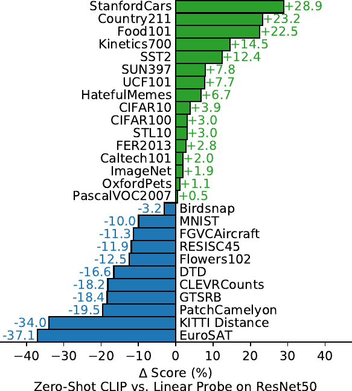

> 图 5 | 零样本 CLIP 与完全监督基线性能相当。在包含 27 个数据集的评估套件中，零样本 CLIP 分类器在 16 个数据集（包括 ImageNet）上优于基于 ResNet-50 特征拟合的完全监督线性分类器。

由于计算机视觉中与任务无关的零样本分类器研究不足，CLIP 为更好地理解此类模型提供了一个有前景的机会。在本节中，我们对 CLIP 零样本分类器的各种特性进行了研究。作为第一个问题，我们简单地看一下零样本分类器的表现如何。为了将其置于上下文中，我们与一个简单的现成基线进行比较：在经典的 ResNet-50 特征上拟合一个完全监督、正则化的逻辑回归分类器。在图 [5](#S3.F5) 中，我们展示了在 27 个数据集上的这种比较。有关数据集和设置的详细信息，请参见附录 [A](#A1)。

零样本 CLIP 略占优势，在 27 个数据集中的 16 个上胜出。观察单个数据集揭示了一些有趣的行为。在细粒度分类任务上，我们观察到性能差异很大。在其中两个数据集上，斯坦福汽车（Stanford Cars）和 Food101，零样本 CLIP 的性能比基于 ResNet-50 特征的逻辑回归高出 20% 以上，而在另外两个数据集上，Flowers102 和 FGVCAircraft，零样本 CLIP 的表现则低了 10% 以上。在 OxfordPets 和 Birdsnap 上，性能则非常接近。我们怀疑这些差异主要是由于 WIT 和 ImageNet 之间每个任务获得的监督信息量不同所致。在“通用”物体分类数据集上，如 ImageNet、CIFAR10/100、STL10 和 PascalVOC2007，性能相对相似，零样本 CLIP 在所有情况下都略有优势。在 STL10 上，CLIP 总体达到了 99.3%，尽管没有使用任何训练样本，但这似乎是一个新的最先进水平。零样本 CLIP 在两个测量视频中动作识别的数据集上显著优于 ResNet-50。在 Kinetics700 上，CLIP 比 ResNet-50 高出 14.5%。在 UCF101 上，零样本 CLIP 也比 ResNet-50 的特征高出 7.7%。我们推测这是因为自然语言为涉及动词的视觉概念提供了更广泛的监督，而 ImageNet 的监督则以名词为中心的物体为主。

审视 **零样本 CLIP（Zero-shot CLIP）** 表现显著不佳的领域，我们发现它在多项专业化、复杂或抽象的任务上相当薄弱，例如：

- 卫星图像分类（EuroSAT 和 RESISC45）
- 淋巴结肿瘤检测（PatchCamelyon）
- 合成场景中的物体计数（CLEVRCounts）
- 自动驾驶相关任务，如德国交通标志识别（GTSRB）
- 识别到最近车辆的距离（KITTI Distance）

这些结果突显了零样本 CLIP 在更复杂任务上能力不足。相比之下，非专业人士能够稳健地完成其中多项任务，例如计数、卫星图像分类和交通标志识别，这表明模型有巨大的改进空间。然而，我们需谨慎指出：对于学习者毫无先验经验的困难任务（例如几乎所有人类——可能也包括 CLIP——都未曾接触过的淋巴结肿瘤分类）， **衡量零样本迁移（zero-shot transfer）而非少样本迁移（few-shot transfer）是否是一种有意义的评估方式，目前尚不明确** 。

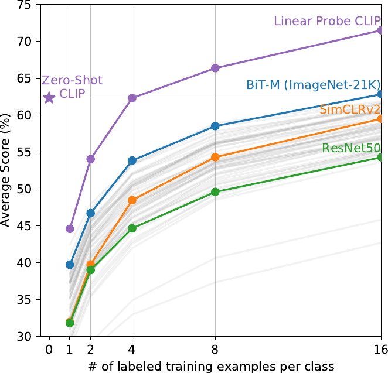

> 图 6 | 零样本 CLIP 优于少样本线性探针。零样本 CLIP 的性能与在同一特征空间上训练的 4-样本线性分类器的平均性能相当，并且几乎匹配了公开可用模型中 16-样本线性分类器的最佳结果。对于 BiT-M 和 SimCLRv2，均突出显示了性能最佳的模型。浅灰色线条是评估套件中的其他模型。本分析使用了每类至少包含 16 个样本的 20 个数据集。

虽然将零样本性能与全监督模型进行比较有助于理解 CLIP 的任务学习能力，但与少样本方法进行比较则更为直接，因为零样本是其极限情况。在图 [6](#S3.F6) 中，我们可视化了零样本 CLIP 与基于多种图像模型特征的少样本逻辑回归（Logistic Regression）的对比情况，这些模型包括最佳的公开可用 ImageNet 模型、自监督学习方法以及 CLIP 本身。尽管直观上可能预期零样本性能会逊于一样本，但我们发现零样本 CLIP 的性能与在同一特征空间上进行的 4-样本逻辑回归相当。这很可能源于零样本与少样本方法之间的一个重要差异。首先，CLIP 的零样本分类器是通过自然语言生成的，这使得视觉概念可以被直接指定（“传达”）。相比之下，“常规”监督学习必须从训练样本中间接推断概念。 **基于无上下文示例的学习存在一个缺点：许多不同的假设都可能与数据一致，尤其是在一样本情况下** 。单张图像通常包含许多不同的视觉概念。尽管一个有能力的学习者能够利用视觉线索和启发式方法（例如假设所演示的概念是图像中的主要对象），但这并不能保证。

解决零样本与少样本性能之间差异的一个潜在方案是，将 CLIP 的零样本分类器作为少样本分类器权重的先验。虽然向生成的权重添加 L2 惩罚是这一想法的直接实现，但我们发现超参数优化通常会为该正则化器选择一个如此大的值，以至于得到的少样本分类器“仅仅”就是零样本分类器。 **研究如何更好地结合零样本迁移的优势与少样本学习的灵活性，是未来工作的一个前景广阔的方向** 。

在将 **零样本（Zero-shot）** CLIP 与其他模型特征上的 **少样本（Few-shot）逻辑回归（Logistic Regression）** 进行比较时，零样本 CLIP 大致匹配了我们评估套件中性能最佳的 16-shot 分类器的性能，该分类器使用了在 ImageNet-21K 上训练的 BiT-M ResNet-152x2 的特征。我们确信，在 JFT-300M 上训练的 BiT-L 模型表现会更好，但这些模型尚未公开发布。BiT-M ResNet-152x2 在 16-shot 设置下表现最佳有些令人惊讶，因为正如第 [3.2](#S3.SS2) 节所分析的，在完全监督设置下， **噪声学生（Noisy Student）** EfficientNet-L2 在 27 个数据集上的平均性能比它高出近 5%。

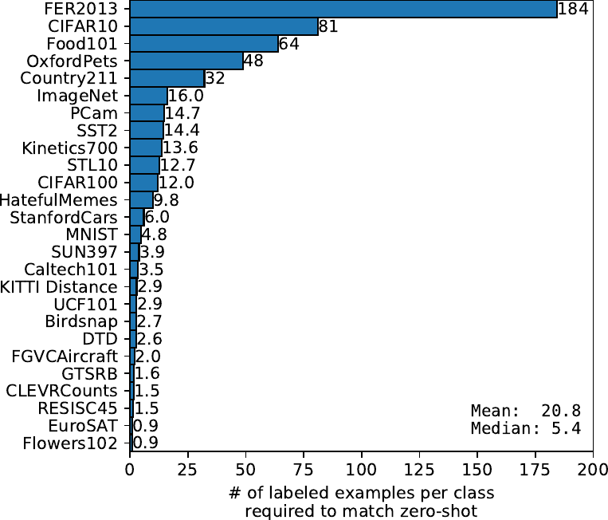

> 图 7 | 零样本迁移的数据效率差异很大。计算在同一 CLIP 特征空间上的线性分类器需要多少每类标记样本才能匹配零样本分类器的性能，这有助于理解零样本迁移的有效性。数值基于 1、2、4、8、16-shot 以及完全监督结果的 **对数线性插值（Log-linear interpolation）** 估算。性能差异很大，从在两个数据集上仍低于单样本分类器，到匹配估计的每类 184 个标记样本。

除了研究零样本 CLIP 和少样本逻辑回归的平均性能外，我们还检查了在单个数据集上的性能。在图 [7](#S3.F7) 中，我们展示了在同一特征空间上，逻辑回归分类器需要多少每类标记样本才能匹配零样本 CLIP 性能的估计值。由于零样本 CLIP 也是一个线性分类器，这估算了在此设置下零样本迁移的有效数据效率。为了避免训练数千个线性分类器，我们基于 1、2、4、8、16-shot（在可能的情况下）以及在每个数据集上训练的完全监督线性分类器的性能进行对数线性插值，来估算有效数据效率。我们发现，零样本迁移在每个数据集上的效率差异很大，从每类少于 1 个标记样本到 184 个不等。有两个数据集，Flowers102 和 EuroSAT，表现低于单样本模型。一半的数据集每类需要少于 5 个样本，中位数为 5.4。然而，平均估计数据效率为每类 20.8 个样本。这是由于有 20% 的数据集，其监督分类器需要每类许多标记样本才能匹配性能。在 ImageNet 上，零样本 CLIP 匹配了在同一特征空间上训练的 16-shot 线性分类器的性能。

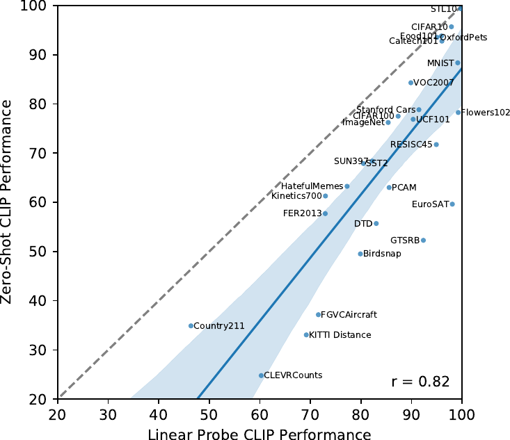

> 图 8 | 零样本性能与线性探针性能相关，但大多仍非最优。比较跨数据集的零样本和线性探针性能，显示出很强的相关性，但零样本性能大多降低了 10 到 25 个百分点。仅在 5 个数据集上，零样本性能接近线性探针性能（差异 $\leq$3 个百分点）。

在将 **零样本（Zero-shot）** CLIP 与其他模型特征上的 **少样本（Few-shot）逻辑回归（Logistic Regression）** 进行比较时，零样本 CLIP 大致匹配了我们评估套件中性能最佳的 16-shot 分类器的性能，该分类器使用了在 ImageNet-21K 上训练的 BiT-M ResNet-152x2 的特征。我们确信，在 JFT-300M 上训练的 BiT-L 模型表现会更好，但这些模型尚未公开发布。BiT-M ResNet-152x2 在 16-shot 设置下表现最佳有些令人惊讶，因为正如第 [3.2](#S3.SS2) 节所分析的，在完全监督设置下， **噪声学生（Noisy Student）** EfficientNet-L2 在 27 个数据集上的平均性能比它高出近 5%。

> 图 7 | 零样本迁移的数据效率差异很大。计算在同一 CLIP 特征空间上的线性分类器需要多少每类标记样本才能匹配零样本分类器的性能，这有助于理解零样本迁移的有效性。数值基于 1、2、4、8、16-shot 以及完全监督结果的 **对数线性插值（Log-linear interpolation）** 估算。性能差异很大，从在两个数据集上仍低于单样本分类器，到匹配估计的每类 184 个标记样本。

除了研究零样本 CLIP 和少样本逻辑回归的平均性能外，我们还检查了在单个数据集上的性能。在图 [7](#S3.F7) 中，我们展示了在同一特征空间上，逻辑回归分类器需要多少每类标记样本才能匹配零样本 CLIP 性能的估计值。由于零样本 CLIP 也是一个线性分类器，这估算了在此设置下零样本迁移的有效数据效率。为了避免训练数千个线性分类器，我们基于 1、2、4、8、16-shot（在可能的情况下）以及在每个数据集上训练的完全监督线性分类器的性能进行对数线性插值，来估算有效数据效率。我们发现，零样本迁移在每个数据集上的效率差异很大，从每类少于 1 个标记样本到 184 个不等。有两个数据集，Flowers102 和 EuroSAT，表现低于单样本模型。一半的数据集每类需要少于 5 个样本，中位数为 5.4。然而，平均估计数据效率为每类 20.8 个样本。这是由于有 20% 的数据集，其监督分类器需要每类许多标记样本才能匹配性能。在 ImageNet 上，零样本 CLIP 匹配了在同一特征空间上训练的 16-shot 线性分类器的性能。

> 图 8 | 零样本性能与线性探针性能相关，但大多仍非最优。比较跨数据集的零样本和线性探针性能，显示出很强的相关性，但零样本性能大多降低了 10 到 25 个百分点。仅在 5 个数据集上，零样本性能接近线性探针性能（差异 $\leq$3 个百分点）。

如果我们假设评估数据集足够大，使得在其上训练的线性分类器参数能得到良好估计，那么，由于 CLIP（Contrastive Language–Image Pre-training）的零样本分类器也是一个线性分类器，全监督分类器的性能大致设定了零样本迁移所能达到的上限。在图 [8](#S3.F8) 中，我们比较了 CLIP 的零样本性能与跨数据集的全监督线性分类器性能。虚线 $y=x$ 代表一个“最优”的零样本分类器，其性能与对应的全监督分类器相匹配。对于大多数数据集，零样本分类器的性能仍比全监督分类器低 10% 到 25%，这表明在提升 CLIP 的任务学习和零样本迁移能力方面仍有很大的改进空间。

零样本性能与全监督性能之间存在 0.82 的正相关性（p 值 $<10^{-6}$），这表明 CLIP 在将底层表示和任务学习与零样本迁移相关联方面相对一致。然而，零样本 CLIP 仅在 5 个数据集上接近全监督性能：STL10、CIFAR10、Food101、OxfordPets 和 Caltech101。在这 5 个数据集上，零样本准确率和全监督准确率均超过 90%。这表明，对于其底层表示本身质量就较高的任务，CLIP 的零样本迁移可能更有效。一个以全监督性能为自变量、预测零样本性能的线性回归模型的斜率估计，全监督性能每提高 1%，零样本性能会提高 1.28%。然而，其 95% 置信区间仍包含小于 1 的值（0.93-1.79）。

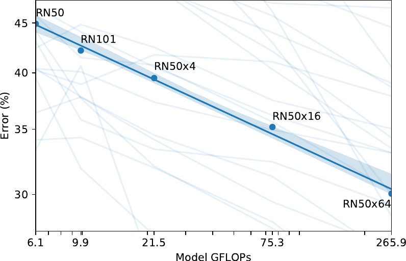

> 图 9 | 零样本 CLIP 性能随模型计算量平滑扩展。在 36 个不同数据集上进行的 39 次评估中，平均零样本误差在跨越 5 个不同 CLIP 模型、计算量范围达 44 倍的情况下，很好地遵循了对数-对数线性趋势。浅色线条是单个评估的性能，表明尽管整体趋势平滑，但具体性能差异很大。

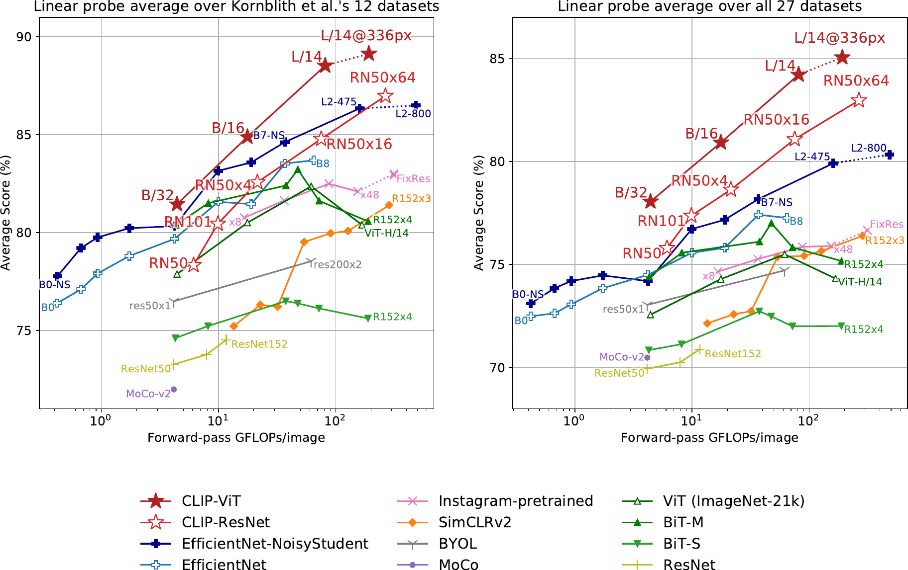

> 图 10 | CLIP 模型的线性探针性能与最先进的计算机视觉模型对比，包括 EfficientNet (Tan & Le, 2019; Xie et al., 2020)、MoCo (Chen et al., 2020d)、Instagram 预训练的 ResNeXt 模型 (Mahajan et al., 2018; Touvron et al., 2019)、BiT (Kolesnikov et al., 2019)、ViT (Dosovitskiy et al., 2020)、SimCLRv2 (Chen et al., 2020c)、BYOL (Grill et al., 2020) 以及原始的 ResNet 模型 (He et al., 2016b)。（左）分数是在 Kornblith 等人 (2019) 研究的 12 个数据集上的平均值。（右）分数是在包含更广泛分布的 27 个数据集上的平均值。虚线表示在比预训练更高分辨率图像上进行微调或评估的模型。单个分数见表 [10](#A1.T10)，每个数据集的绘图见图 [20](#A1.F20)。

在过去的几年里，深度学习系统的实证研究已经证明，性能可以作为诸如训练计算量和数据集大小等重要量的函数进行预测（Hestness 等人，2017；Kaplan 等人，2020）。GPT 系列模型迄今为止已经证明，在训练计算量增加 1000 倍的过程中，其零样本（Zero-shot）性能持续提升。在图 [9](#S3.F9) 中，我们检验了 CLIP 的零样本性能是否遵循类似的缩放规律。我们绘制了 5 个 ResNet CLIP 模型在 36 个不同数据集上进行的 39 次评估的平均错误率，发现 CLIP 在模型计算量增加 44 倍的过程中，也呈现出类似的对数-对数线性缩放趋势。虽然整体趋势是平滑的，但我们发现单个评估的性能可能波动性大得多。我们不确定这是由于子任务上单个训练运行之间的高方差（如 D'Amour 等人（2020）所记载）掩盖了稳步提升的趋势，还是因为在某些任务上，性能作为计算量的函数实际上是非单调的。

### 3.2 表征学习（Representation Learning）

虽然我们在上一节中通过零样本迁移（Zero-shot transfer）广泛分析了 CLIP 的任务学习能力，但更常见的是研究模型的表征学习能力。评估表征质量的方法有很多，并且对于“理想”表征应具备哪些属性也存在分歧（Locatello 等人，2020）。一种常见的方法是在从模型提取的表征上拟合一个线性分类器（Linear classifier），并测量其在各种数据集上的性能。另一种方法是测量模型端到端（End-to-end）微调（Fine-tuning）的性能。这增加了灵活性，并且先前的工作令人信服地证明，在大多数图像分类数据集上，微调优于线性分类（Kornblith 等人，2019；Zhai 等人，2019）。尽管微调的高性能出于实际原因促使人们对其进行研究，但我们仍然选择基于线性分类器的评估，原因如下。我们的工作重点是开发一种高性能的、与任务和数据集无关的预训练（Pre-training）方法。微调因为在微调阶段使表征适应每个数据集，可以补偿并可能掩盖预训练阶段在学习通用且鲁棒（Robust）的表征方面的失败。而线性分类器由于其灵活性有限，反而能突显这些失败，并在开发过程中提供清晰的反馈。对于 CLIP 而言，训练有监督的线性分类器还有一个额外的好处，即其方法与用于其零样本分类器的方法非常相似，这使得我们能够在第 [3.1](#S3.SS1) 节进行广泛的比较和分析。最后，我们的目标是在许多任务上将 CLIP 与一组全面的现有模型进行比较。在 27 个不同数据集上研究 66 个不同模型，需要调整 1782 个不同的评估。微调开启了一个更大的设计和超参数（Hyper-parameter）空间，这使得公平评估变得困难，并且计算成本高昂，难以比较多样化的技术集合，正如其他大规模实证研究中所讨论的那样（Lucic 等人，2018；Choi 等人，2019）。相比之下，线性分类器需要最少的超参数调整，并且有标准化的实现和评估流程。有关评估的更多细节，请参见附录 [A](#A1)。

图 [10](#S3.F10) 总结了我们的发现。为了最小化可能引发确认偏误（Confirmation Bias）或报告偏误（Reporting Bias）担忧的选择效应，我们首先研究了 Kornblith 等人（2019）提出的 12 个数据集评估套件上的性能。虽然较小的 CLIP 模型（如 ResNet-50 和 ResNet-101）优于在 ImageNet-1K 上训练的其他 ResNet（BiT-S 和原始版本），但它们表现不如在 ImageNet-21K 上训练的 ResNet（BiT-M）。这些小型 CLIP 模型的表现也不如具有相似计算需求的 EfficientNet 系列模型。然而，使用 CLIP 训练的模型扩展性非常好，我们训练的最大模型（ResNet-50x64）在总体得分和计算效率上都略微优于现有性能最佳的模型（一个 Noisy Student EfficientNet-L2）。我们还发现，CLIP 视觉变换器（Vision Transformers, ViTs）的计算效率大约是 CLIP ResNets 的 3 倍，这使我们能够在计算预算内达到更高的整体性能。这些结果在性质上复现了 Dosovitskiy 等人（2020）的发现，即当在足够大的数据集上训练时，视觉变换器比卷积网络（Convolutional Networks, ConvNets）的计算效率更高。我们整体性能最佳的模型是一个 ViT-L/14，它在我们的数据集上以 336 像素的更高分辨率微调了 1 个额外的训练周期（Epoch）。该模型在此评估套件上的平均性能比现有最佳模型高出 2.6%。

如图 [21](#A1.F21) 定性所示，CLIP 模型学习到的任务范围比先前在单个从随机初始化端到端（End-to-End）训练的计算机视觉模型中所展示的更广泛。这些任务包括地理定位（Geo-localization）、光学字符识别（Optical Character Recognition, OCR）、面部情绪识别（Facial Emotion Recognition）和动作识别（Action Recognition）。这些任务均未在 Kornblith 等人（2019）的评估套件中进行测量。这可以被认为是 Kornblith 等人（2019）研究中存在的一种选择偏误（Selection Bias），偏向于与 ImageNet 重叠的任务。为了解决这个问题，我们还在一个更广泛的 27 个数据集评估套件上测量了性能。该评估套件在附录 [A](#A1) 中有详细说明，包含了代表上述任务的数据集、德国交通标志识别基准（German Traffic Signs Recognition Benchmark, GTSRB）（Stallkamp 等人，2011），以及从 VTAB（Zhai 等人，2019）改编的几个其他数据集。

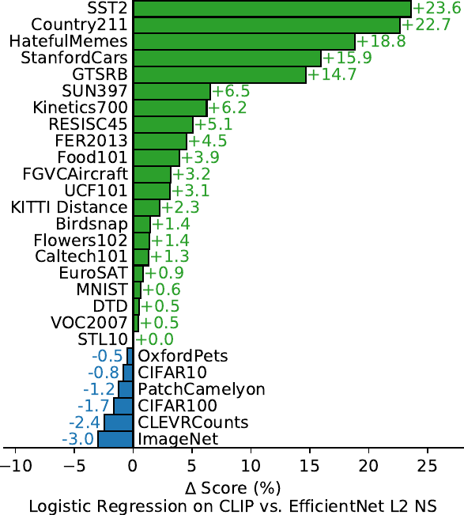

> 图 11：CLIP 的特征在多种数据集上优于最佳 ImageNet 模型的特征。在 CLIP 的特征上拟合线性分类器（Linear Classifier）的性能，在 27 个数据集中的 21 个上优于使用 Noisy Student EfficientNet-L2。

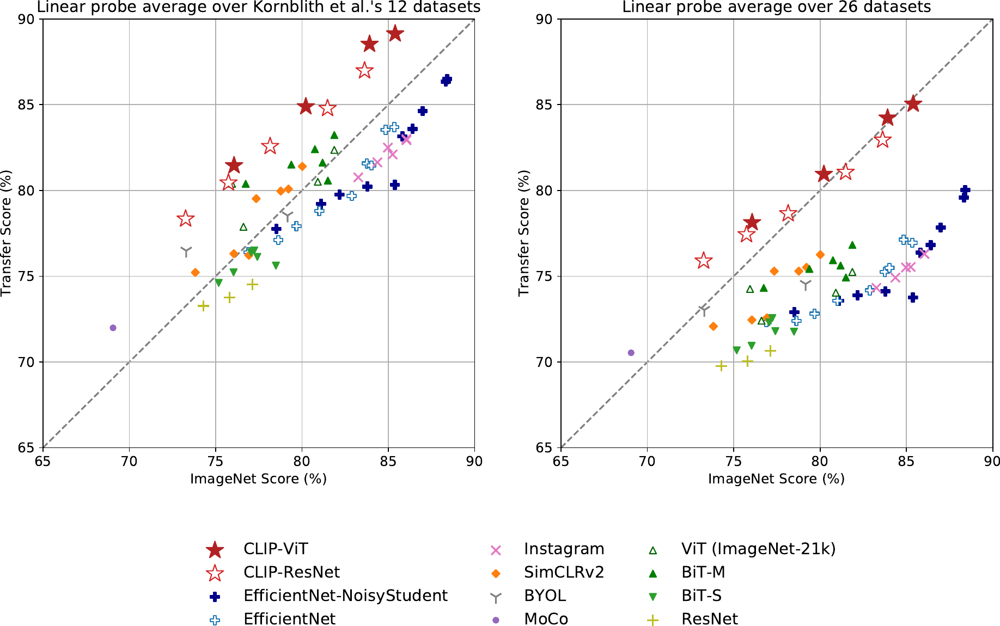

> 图 12：与在 ImageNet 上预训练的模型相比，CLIP 的特征对任务偏移（Task Shift）更具鲁棒性。对于两种数据集划分（Dataset Splits），在 CLIP 模型表征上训练的线性探针（Linear Probe）的迁移分数（Transfer Scores）都高于具有相似 ImageNet 性能的其他模型。这表明在 ImageNet 上训练的模型的表征在一定程度上过拟合（Overfit）了其任务。

在这个更广泛的评估套件上，CLIP 的优势更加明显。所有 CLIP 模型，无论规模大小，在计算效率方面都优于所有被评估的系统。最佳模型相对于先前系统的平均得分提升从 2.6% 增加到了 5%。我们还发现，自监督（Self-supervised）系统在我们更广泛的评估套件上表现明显更好。例如，虽然 SimCLRv2 在 Kornblith 等人（2019）的 12 个数据集上的平均表现仍不如 BiT-M，但 SimCLRv2 在我们 27 个数据集的评估套件上优于 BiT-M。这些发现表明，为了更好理解系统的“通用”性能，需要继续扩展任务的多样性和覆盖范围。我们认为沿着 VTAB 路线进行额外的评估工作是有价值的。

除了上述的聚合分析，我们在图 [11](#S3.F11) 中可视化了最佳 CLIP 模型与我们的评估套件中最佳模型在所有 27 个数据集上的性能差异。CLIP 在 27 个数据集中的 21 个上优于 Noisy Student EfficientNet-L2。CLIP 在需要 OCR（SST2 和 HatefulMemes）、地理定位和场景识别（Country211, SUN397）以及视频中的活动识别（Kinetics700 和 UCF101）的任务上提升最大。此外，CLIP 在细粒度（Fine-grained）汽车和交通标志识别（Stanford Cars 和 GTSRB）上也表现好得多。这可能反映了 ImageNet 中监督信号过于狭窄的问题。例如，在 GTSRB 上 14.7% 的改进可能表明 ImageNet-1K 存在问题，它对于所有交通和街道标志只有一个标签。这可能会鼓励监督表征（Supervised Representation）压缩类内细节，从而损害细粒度下游任务的准确性。如前所述，CLIP 在几个数据集上仍然不如 EfficientNet。不出所料，EfficientNet 相对于 CLIP 表现最好的数据集是它训练所用的数据集：ImageNet。EfficientNet 在低分辨率数据集（如 CIFAR10 和 CIFAR100）上也略微优于 CLIP。我们怀疑这至少部分是由于 CLIP 缺乏基于尺度的数据增强（Scale-based Data Augmentation）。EfficientNet 在 PatchCamelyon 和 CLEVRCounts 上也表现稍好，这两个数据集上两种方法的整体性能仍然较低。

### 3.3 对自然分布偏移的鲁棒性（Robustness to Natural Distribution Shift）

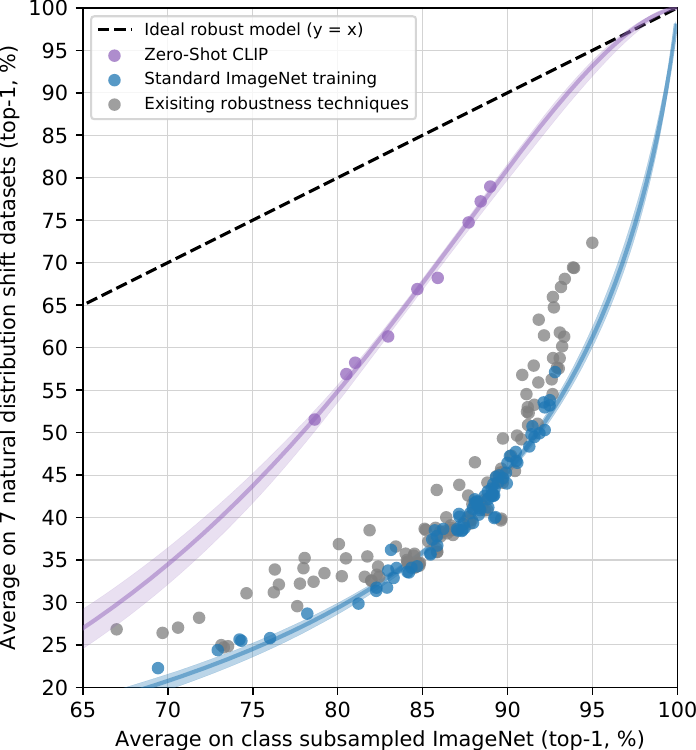

> 图 13 | **零样本 CLIP（Zero-shot CLIP）** 比标准的 **ImageNet 模型（ImageNet models）** 对 **分布偏移（distribution shift）** 的鲁棒性要强得多。（左）一个理想的鲁棒模型（虚线）在 ImageNet 分布和其他自然图像分布上表现同样出色。零样本 CLIP 模型将这一“鲁棒性差距”缩小了高达 75%。图中显示了在 logit 转换值上的线性拟合，并附有 bootstrap 估计的 95% 置信区间。（右）可视化香蕉类别的分布偏移，该类是 7 个自然分布偏移数据集中 5 个所共有的。将性能最佳的零样本 CLIP 模型 ViT-L/14@336px 与一个在 ImageNet 验证集上具有相同性能的模型 ResNet-101 进行比较。

2015 年，有研究宣布一个 **深度学习（deep learning）** 模型在 ImageNet 测试集上的表现超过了人类（He 等人，2015）。然而，随后几年的研究反复发现，这些模型仍然会犯许多简单的错误（Dodge & Karam，2017；Geirhos 等人，2018；Alcorn 等人，2019），并且测试这些系统的新基准常常发现其性能远低于其 ImageNet 准确率和人类准确率（Recht 等人，2019；Barbu 等人，2019）。如何解释这种差异？人们提出并研究了各种观点（Ilyas 等人，2019；Geirhos 等人，2020）。这些解释的一个共同主题是，深度学习模型极其擅长发现在其训练数据集中普遍存在的相关性和模式，从而提高了 **分布内（in-distribution）** 性能。然而，这些相关性和模式中有许多实际上是虚假的，并不适用于其他分布，并导致在其他数据集上的性能大幅下降。

我们提醒，迄今为止，大多数此类研究都将其评估局限于在 ImageNet 上训练的模型。回顾讨论的主题，从这些初步发现中过度推广可能是一个错误。这些失败在多大程度上归因于深度学习、ImageNet，还是两者的某种结合？ **CLIP 模型（CLIP models）** 通过在非常大的数据集上进行 **自然语言监督（natural language supervision）** 训练，并具备强大的 **零样本（zero-shot）** 性能，这为我们从不同角度研究这个问题提供了机会。

Taori 等人（2020）是一项近期的综合性研究，旨在量化和理解 ImageNet 模型的这些行为。Taori 等人（2020）研究了 ImageNet 模型在 **自然分布偏移（natural distribution shifts）** 评估下性能如何变化。他们测量了在 7 种分布偏移上的性能：ImageNetV2（Recht 等人，2019）、ImageNet Sketch（Wang 等人，2019）、Youtube-BB 和 ImageNet-Vid（Shankar 等人，2019）、ObjectNet（Barbu 等人，2019）、ImageNet Adversarial（Hendrycks 等人，2019）以及 ImageNet Rendition（Hendrycks 等人，2020a）。他们将这些数据集（均由从各种来源收集的新图像组成）与 **合成分布偏移（synthetic distribution shifts）** 区分开来，例如 ImageNet-C（Hendrycks & Dietterich，2019）、 **风格化 ImageNet（Stylized ImageNet）** （Geirhos 等人，2018）或 **对抗性攻击（adversarial attacks）** （Goodfellow 等人，2014），这些合成偏移是通过以各种方式扰动现有图像创建的。他们提出这种区分，部分原因是他们发现，尽管已有几种技术被证明可以提高在合成分布偏移上的性能，但它们往往无法在自然分布上带来一致的改进。（^3^33 我们建议读者参阅 Hendrycks 等人（2020a）以获取关于此主张的更多实验和讨论。）

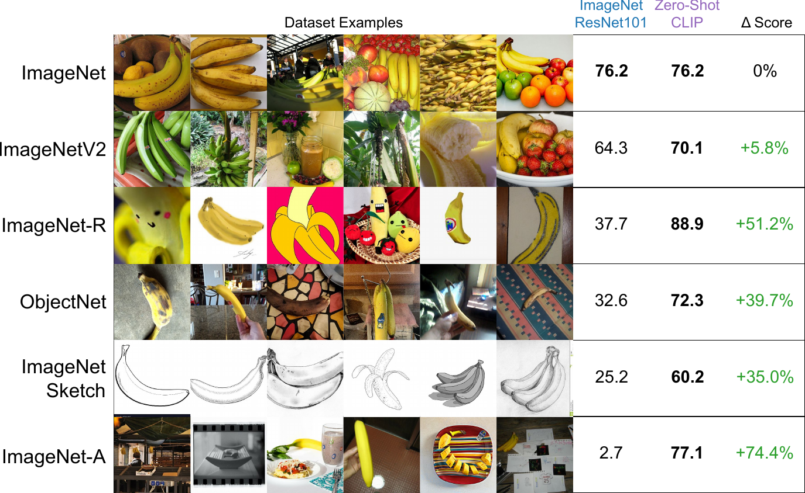

> 图 14 | 尽管对 ImageNet 进行有监督适应使 ImageNet 准确率提高了 9.2%，但它略微降低了平均鲁棒性。（左）与使用单一的静态零样本 ImageNet 分类器并按 Taori 等人 (2020) 的方法在相似类别间汇集预测相比，为每个数据集定制零样本 CLIP 提高了鲁棒性。适应于 ImageNet 的 CLIP 模型具有与先前最佳 ImageNet 模型相似的有效鲁棒性。（右）两种鲁棒性干预措施下，每个数据集准确率变化的详细信息。适应 ImageNet 显著提高了 ImageNetV2 的准确率，但牺牲了其他几个分布上的准确率。数据集特定的零样本分类器可以大幅提高准确率，但仅限于少数几个包含与 ImageNet 类别不完全对齐的类别的数据集。

在这些收集的数据集上，ImageNet 模型的准确率远低于 ImageNet 验证集设定的预期。在接下来的总结讨论中，除非另有说明，我们将报告所有 7 个自然分布偏移数据集上的平均准确率，以及 ImageNet 相应类别子集上的平均准确率。此外，对于具有两种不同评估设置的 Youtube-BB 和 ImageNet-Vid，我们使用 pm-0 和 pm-10 准确率的平均值。

在这些自然分布偏移上进行评估时，一个 ResNet-101 犯的错误数量是其在 ImageNet 验证集上的 5 倍。然而，令人鼓舞的是，Taori 等人 (2020) 发现，分布偏移下的准确率会随 ImageNet 准确率可预测地增加，并且可以很好地建模为对数几率变换后准确率的线性函数。Taori 等人 (2020) 利用这一发现提出，鲁棒性分析应区分 **有效鲁棒性（Effective robustness）** 和 **相对鲁棒性（Relative robustness）** 。有效鲁棒性衡量的是分布偏移下准确率的提升，该提升超出了已记录的域内准确率与域外准确率之间关系所预测的水平。相对鲁棒性则捕捉域外准确率的任何提升。Taori 等人 (2020) 认为，鲁棒性技术应致力于同时提高有效鲁棒性和相对鲁棒性。

Taori 等人 (2020) 研究的几乎所有模型都是在 ImageNet 数据集上训练或微调的。回到本节引言中的讨论——对 ImageNet 数据集分布进行训练或适应，是否是观察到鲁棒性差距的原因？直观上，零样本模型不应能够利用仅在特定分布上成立的虚假相关性或模式，因为它并未在该分布上训练过。（^4^44 我们提醒，零样本模型仍可能利用预训练分布和评估分布之间共享的虚假相关性。）因此，期望零样本模型具有更高的有效鲁棒性是合理的。在图 [13](#S3.F13) 中，我们比较了零样本 CLIP 与现有 ImageNet 模型在自然分布偏移上的性能。所有零样本 CLIP 模型都大幅提高了有效鲁棒性，并将 ImageNet 准确率与分布偏移下准确率之间的差距缩小了高达 75%。

尽管这些结果表明 **零样本模型（Zero-shot models）** 可以具备更强的鲁棒性，但这并不一定意味着在 ImageNet 上进行的 **监督学习（Supervised Learning）** 导致了鲁棒性差距。CLIP 的其他细节，例如其庞大且多样化的预训练数据集或对自然语言监督的使用，也可能导致模型鲁棒性大幅提升，无论它们是零样本模型还是经过微调的模型。作为一项可能开始缩小这一范围的初步实验，我们还测量了 CLIP 模型通过一个在 ImageNet 训练集上基于 CLIP 特征拟合的 **L2 正则化逻辑回归分类器（L2 regularized logistic regression classifier）** 适应 ImageNet 分布后，其性能如何变化。我们在图 [14](#S3.F14) 中可视化了性能相对于零样本分类器的变化。尽管使 CLIP 适应 ImageNet 分布将其 ImageNet 准确率整体提高了 9.2%，达到 85.4%，并与 Mahajan 等人 (2018) 提出的 2018 年 **最先进水平（State-of-the-art, SOTA）** 持平，但在分布偏移下的平均准确率却略有下降。

令人惊讶的是，准确率提高了 9.2%（这大致相当于 SOTA 水平 3 年的进步），却未能转化为分布偏移下平均性能的任何改善。我们还在图 [14](#S3.F14) 中按数据集分解了零样本准确率与线性分类器准确率之间的差异，发现性能在一个数据集 **ImageNetV2** 上仍然显著提高。ImageNetV2 紧密遵循了原始 ImageNet 数据集的创建过程，这表明来自监督适应的准确率提升紧密集中在 ImageNet 分布附近。而在其他数据集上，性能则有所下降：在 **ImageNet-R** 上下降 4.7%，在 **ObjectNet** 上下降 3.8%，在 **ImageNet Sketch** 上下降 2.8%，在 **ImageNet-A** 上下降 1.9%。在另外两个数据集 **Youtube-BB** 和 **ImageNet Vid** 上，准确率的变化则不显著。

**如何在 ImageNet 数据集上提高 9.2% 的准确率，却在分布偏移下几乎没有任何准确率提升？** 这种提升主要来自“利用虚假相关性”吗？这种行为是 CLIP、ImageNet 数据集以及所研究的分布偏移的某种独特组合所致，还是一种更普遍的现象？它对于端到端微调以及线性分类器是否同样成立？目前我们对这些问题还没有确切的答案。先前的研究也在 ImageNet 以外的分布上预训练过模型，但通常只在模型被微调到 ImageNet 之后才进行研究并发布。作为理解预训练零样本模型是否始终比微调模型具有更高 **有效鲁棒性（Effective Robustness）** 的一步，我们鼓励 Mahajan 等人 (2018)、Kolesnikov 等人 (2019) 和 Dosovitskiy 等人 (2020) 的作者，如果可能的话，也在他们的模型上研究这些问题。

我们还研究了另一种由灵活的、基于自然语言的零样本图像分类器实现的鲁棒性干预措施。这 7 个迁移数据集的目标类别并不总是与 ImageNet 的类别完美对齐。其中两个数据集，Youtube-BB 和 ImageNet-Vid，包含 ImageNet 的 **超类（Super-classes）** 。当尝试使用 ImageNet 模型的固定 1000 路分类器进行预测时，这就带来了问题。Taori 等人 (2020) 通过根据 ImageNet 类别层次结构在所有子类上进行 **最大池化（Max-pooling）** 预测来处理这个问题。有时这种映射远非完美。对于 Youtube-BB 中的“人”这个类别，预测是通过对 ImageNet 中“棒球运动员”、“新郎”和“潜水员”等类别的预测进行池化得到的。而使用 CLIP，我们可以直接基于每个数据集的类别名称为其生成一个定制的零样本分类器。在图 [14](#S3.F14) 中，我们看到这使平均有效鲁棒性提高了 5%，但主要集中在少数几个数据集上的大幅改进。有趣的是，ObjectNet 上的准确率也提高了 2.3%。尽管该数据集的设计初衷是与 ImageNet 类别高度重叠，但使用 ObjectNet 创建者为每个类别提供的名称，相比使用 ImageNet 类别名称并在必要时池化预测，仍然带来了一些微小的帮助。

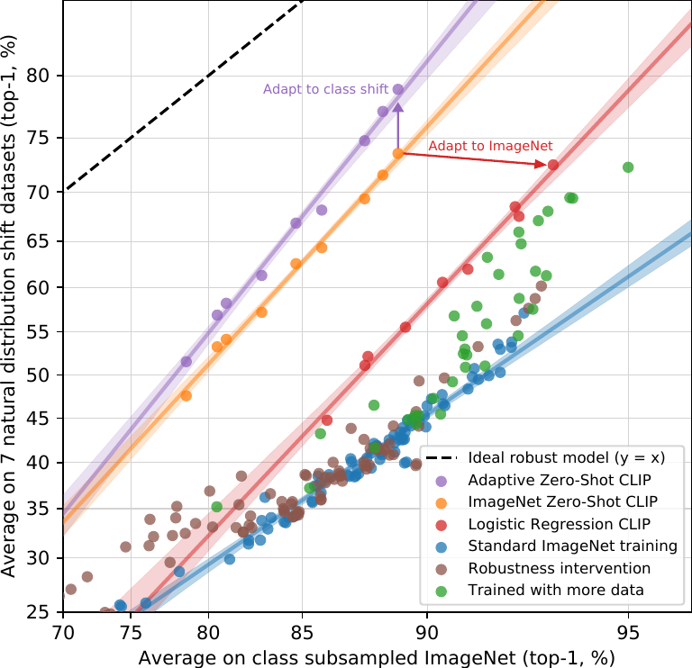

> 图 15 | 与现有的 ImageNet 模型相比， **小样本（Few-shot）CLIP** 也提高了 **有效鲁棒性（Effective Robustness）** ，但其鲁棒性不如 **零样本（Zero-shot）CLIP** 。最小化用于适配的 ImageNet 训练数据量会提高有效鲁棒性，但代价是降低 **相对鲁棒性（Relative Robustness）** 。如先前在图 [7](#S3.F7) 中所述， **16 样本逻辑回归（16-shot logistic regression）CLIP** 在 ImageNet 上与零样本 CLIP 性能相当，但鲁棒性较差。

虽然零样本 CLIP 提高了有效鲁棒性，但图 [14](#S3.F14) 表明，在 **全监督（Fully Supervised）** 设置下，这种优势几乎完全消失。为了更好地理解这种差异，我们研究了有效鲁棒性在从零样本到全监督的连续区间上是如何变化的。在图 [15](#S3.F15) 中，我们可视化了基于最佳 CLIP 模型特征的 **0 样本（0-shot）** 、 **1 样本（1-shot）** 、 **2 样本（2-shot）** 、 **4 样本（4-shot）** … **128 样本（128-shot）** 以及全监督逻辑回归分类器的性能。我们发现，虽然小样本模型也显示出比现有模型更高的有效鲁棒性，但随着更多训练数据带来的 **分布内（In-distribution）** 性能提升，这种优势会逐渐减弱，并且在全监督模型中几乎（尽管并非完全）消失。此外，零样本 CLIP 的鲁棒性明显优于具有同等 ImageNet 性能的小样本模型。在我们的所有实验中， **高有效鲁棒性似乎源于最小化模型所能接触到的特定分布训练数据量，但这会以降低数据集特定性能为代价** 。

综上所述，这些结果表明，近期向 **大规模任务与数据集无关的预训练（Large-scale Task and Dataset Agnostic Pre-training）** 的转变，结合在广泛评估套件上重新定位为零样本和小样本基准测试（正如 Yogatama 等人 (2019) 和 Linzen (2020) 所倡导的），促进了更鲁棒系统的开发，并提供了更准确的性能评估。我们很好奇，在自然语言处理（Natural Language Processing, NLP）领域，例如 GPT 系列模型，是否也会出现相同的结果。虽然 Hendrycks 等人 (2020b) 报告称预训练提高了情感分析（Sentiment Analysis）的相对鲁棒性，但 Miller 等人 (2020) 对自然分布偏移下问答模型鲁棒性的研究发现，与 Taori 等人 (2020) 类似，迄今为止几乎没有证据表明有效鲁棒性有所改善。

## 4 与人类性能的比较（Comparison to Human Performance）

CLIP 与人类性能及人类学习相比如何？为了更好地理解人类在与 CLIP 类似的评估设置中表现如何，我们在其中一项任务上对人类进行了评估。我们希望了解人类在这些任务上的 **零样本（zero-shot）** 性能有多强，以及如果向人类展示一张或两张图像样本，其性能能提升多少。这有助于我们比较任务对人类和 CLIP 的难度，并识别它们之间的关联与差异。

我们让五位不同的受试者查看牛津 IIT Pets 数据集（Oxford IIT Pets dataset）测试集（Parkhi 等人，2012）中的 3669 张图像，并选择 37 种猫或狗品种中与图像最匹配的一种（或者，如果他们完全不确定，则选择“我不知道”）。在 **零样本（zero-shot）** 情况下，人类没有获得任何品种示例，并被要求在不进行网络搜索的情况下尽最大能力进行标注。在 **单样本（one-shot）** 实验中，人类获得了每个品种的一张样本图像；在 **双样本（two-shot）** 实验中，他们获得了每个品种的两张样本图像。(^5^ 注：人类的少样本任务与模型的少样本性能之间并非完美对应，因为模型无法像人类那样参考样本图像。)

**表 2：人类在牛津 IIT Pets 数据集上的性能比较。与 Parkhi 等人（2012）相同，度量指标是平均每类分类准确率。从人类零样本情况到人类单样本情况，性能提升的大部分来自于参与者高度不确定的图像。“猜测”指将数据集限制在参与者选择了“我不知道”以外答案的样本上，“多数投票”指对每张图像取最频繁（排除平局）的答案。**
| | 准确率 | 全数据集上的 多数投票 | 猜测集上的 准确率 | 猜测集上的 多数投票准确率 |
| --- | --- | --- | --- | --- |
| 零样本人类 | 53.7 | 57.0 | 69.7 | 63.9 |
| 零样本 CLIP | 93.5 | 93.5 | 93.5 | 93.5 |
| 单样本人类 | 75.7 | 80.3 | 78.5 | 81.2 |
| 双样本人类 | 75.7 | 85.0 | 79.2 | 86.1 |

一个可能的担忧是，人类受试者在零样本任务中动力不足。然而，人类在 STL-10 数据集（Coates 等人，2011）上高达 94% 的准确率，以及在注意力检查图像子集上 97-100% 的准确率，增强了我们对人类受试者的信任。

有趣的是，人类仅凭每个类别一个训练示例，就从平均 54% 的性能提升到了 76%，而增加一个额外训练示例带来的边际收益微乎其微。从零样本到单样本的准确率提升，几乎完全来自于人类不确定的图像。这表明人类“知道自己不知道什么”，并且能够基于单个示例，更新他们最不确定图像的 **先验（priors）** 。鉴于此，虽然 CLIP 对于零样本性能（图 [5](#S3.F5)）是一种有前景的训练策略，并且在自然分布偏移测试（图 [13](#S3.F13)）中表现良好，但人类从少数示例中学习的方式与本文中的少样本方法之间存在巨大差异。

这表明，正如 Lake 等人（2016）及其他研究者所指出的，仍有待进行算法改进以缩小机器与人类在样本效率上的差距。因为 CLIP 的这些少样本评估未能有效利用先验知识，而人类可以，我们推测，找到一种将先验知识恰当地整合到 **少样本学习（few-shot learning）** 中的方法，是 CLIP 算法改进的重要一步。据我们所知，在高质量预训练模型的特征之上使用线性分类器，已接近少样本学习的最先进水平（Tian 等人，2020），这表明最佳的少样本机器学习方法与人类的少样本学习之间仍存在差距。

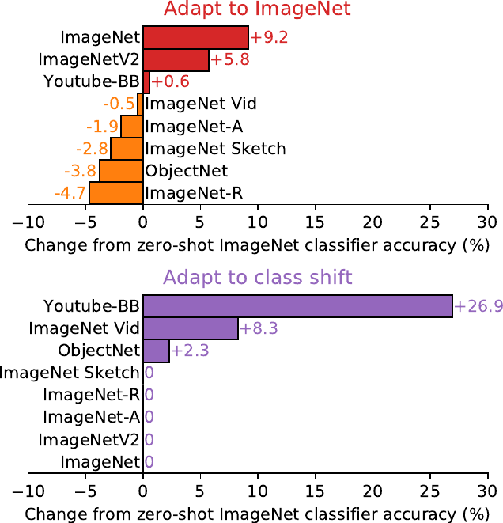

> 图 16：对 CLIP 最困难的问题往往对人类也最困难。此处我们根据 CLIP 的难度（以正确标签的概率衡量）对图像类别进行排序。

如果我们绘制人类准确率与 CLIP 零样本准确率的对比图（图 [16](#S4.F16)），会发现对 CLIP 最困难的问题对人类也同样困难。在错误具有一致性的程度上，我们的假设是这至少源于两个因素：数据集中的噪声（包括错误标注的图像）以及 **分布外（out of distribution）** 图像对人类和模型来说都很难。

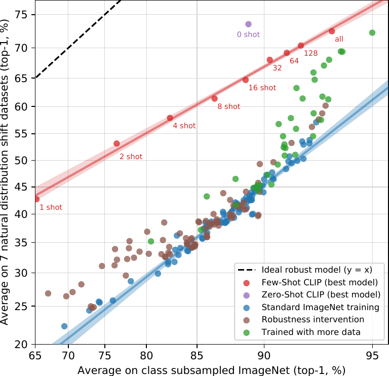

> 图 17：由于检测到的数据重叠而带来的准确率提升在统计上显著的很少。（左）虽然多个数据集在检测到的重叠样本与干净样本上的零样本准确率存在高达 $\pm$20% 的明显差异，但在总共 35 个数据集中，只有 5 个数据集的 99.5% Clopper-Pearson 置信区间排除了 0% 的准确率差异。其中 2 个数据集在重叠数据上表现更差。（右）由于检测到的重叠样本比例几乎总是个位数，因此由重叠导致的总体测试准确率增益要小得多，最大的估计增益仅在 Birdsnap 数据集上为 0.6%。同样，当使用单侧二项式检验计算时，只有 6 个数据集的准确率提升具有统计显著性。

## 5 数据重叠分析（Data Overlap Analysis）

在非常庞大的互联网数据集上进行预训练时，一个值得关注的问题是 **与下游评估数据集的无意重叠（unintentional overlap with downstream evals）** 。这一点至关重要，因为在最坏的情况下，评估数据集的完整副本可能会泄露到预训练数据集中，从而使评估失去作为泛化能力有意义测试的价值。防止这种情况的一种选择是在训练模型之前识别并移除所有重复项。虽然这能保证报告真实的 **留出性能（hold-out performance）** ，但它要求提前知道模型可能被评估的所有可能数据。这种方法的缺点是限制了基准测试和分析的范围。添加新的评估将需要昂贵的重新训练，或者由于重叠而面临报告未量化收益的风险。

相反，我们记录了重叠发生的程度以及性能因这些重叠而发生的变化。为此，我们采用以下步骤：

1.  对于每个评估数据集，我们对其样本运行一个 **重复检测器（duplicate detector）** （参见附录 [C](#A3)）。然后，我们手动检查找到的最近邻，并为每个数据集设置一个阈值，以在最大化 **召回率（recall）** 的同时保持高 **精确率（precision）** 。使用此阈值，我们创建两个新的子集： **重叠子集（Overlap）** ，包含与训练样本相似度高于该阈值的所有样本；以及 **干净子集（Clean）** ，包含相似度低于此阈值的所有样本。我们将未修改的完整数据集记为 **All** 以供参考。由此，我们首先将 **数据污染（data contamination）** 的程度记录为 Overlap 子集中的样本数量与 All 数据集大小的比值。

2.  然后，我们计算 CLIP RN50x64 在这三个划分上的 **零样本准确率（zero-shot accuracy）** ，并将 **All - Clean** 作为我们的主要指标进行报告。这是由污染导致的准确率差异。当其为正时，它就是我们估计的、由于对重叠数据的过拟合而导致数据集的总体报告准确率被夸大的程度。

3.  重叠量通常很小，因此我们还运行一个 **二项式显著性检验（binomial significance test）** ，其中我们以 Clean 子集上的准确率作为 **零假设（null hypothesis）** ，并计算 Overlap 子集的 **单尾（更大）p 值（one-tailed (greater) p-value）** 。我们还计算了 Dirty 子集（此处应为 Overlap 子集，原文可能为笔误）的 99.5% **Clopper-Pearson 置信区间（Clopper-Pearson confidence intervals）** 作为另一项检查。

该分析的摘要如图 [17](#S4.F17) 所示。在所研究的 35 个数据集中，有 9 个数据集完全没有检测到重叠。这些数据集大多是合成或专用的，不太可能作为普通图像发布在互联网上（例如 MNIST、CLEVR 和 GTSRB），或者由于包含我们数据集创建日期之后的新数据（例如 ObjectNet 和 Hateful Memes）而保证没有重叠。这表明我们的检测器具有 **低误报率（low-false positive rate）** ，这很重要，因为误报会低估我们分析中污染的影响。重叠的中位数为 2.2%，平均值为 3.2%。由于重叠量很小，总体准确率很少偏移超过 0.1%，只有 7 个数据集超过此阈值。其中，只有 2 个在 **邦费罗尼校正（Bonferroni correction）** 后具有统计学显著性。检测到的最大改进仅在 Birdsnap 数据集上为 0.6%，该数据集的重叠率为第二高，为 12.1%。最大的重叠是 Country211 数据集，为 21.5%。这是因为它构建自 YFCC100M，而我们的预训练数据集包含了 YFCC100M 的一个过滤子集。尽管存在如此大的重叠，Country211 上的准确率仅提高了 0.2%。这可能是因为伴随样本的训练文本通常与下游评估所测量的特定任务无关。Country211 衡量的是地理定位能力，但检查这些重复样本的训练文本发现，它们通常不提及图像的位置。

我们意识到我们的分析存在两个潜在问题。首先，我们的检测器并不完美。虽然它在代理训练任务上达到了接近 100% 的准确率，并且手动检查加阈值调整在找到的最近邻中实现了非常高的精确率和良好的召回率，但我们无法切实检查其在 4 亿个样本上的召回率。我们分析的另一个潜在 **混淆变量（confounder）** 是，底层数据分布在 Overlap 和 Clean 子集之间可能会发生变化。例如，在 Kinetics-700 上，许多“重叠”实际上是全黑的过渡帧。这解释了为什么 Kinetics-700 在 Overlap 子集上出现了明显的 20% 准确率下降。我们怀疑可能存在更微妙的分布偏移。我们在 CIFAR-100 上注意到的一种可能性是，由于其图像分辨率非常低，许多重复项是鸟类或飞机等小物体的误报。准确率的变化反而可能是由于类别分布或重复样本难度的变化所致。不幸的是，这些分布和难度的变化也可能掩盖过拟合的影响。

然而，这些结果与先前大规模预训练工作中类似重复分析的结果非常吻合。Mahajan 等人（2018）和 Kolesnikov 等人（2019）检测到了相似的重叠率，并发现总体性能变化极小。重要的是，Kolesnikov 等人（2019）还将本节引言中讨论的替代 **去重策略（de-duplication strategy）** 与我们最终采用的方法进行了比较，并观察到两种方法之间差异很小。

## 6 局限性（Limitations）

CLIP 仍然存在许多局限性。尽管其中一些已在各节的分析中作为讨论的一部分，我们在此进行总结和归纳。

在具有训练集划分的数据集上， **零样本（zero-shot）** CLIP 的性能平均而言与一个简单的监督基线——在 ResNet-50 特征之上训练的线性分类器——具有竞争力。然而，在大多数此类数据集上，该基线的性能现已远低于整体 **最先进水平（state of the art）** 。要提升 CLIP 的任务学习和迁移能力，仍需大量工作。虽然迄今为止，扩大规模已稳步提升了性能，并暗示了一条持续改进的路径，但我们估计，零样本 CLIP 要达到整体最先进性能，所需的计算量大约需要增加 **1000 倍** 。这在当前硬件条件下是难以训练的。因此，有必要进一步研究如何提升 CLIP 的计算和数据效率。

[3.1](#S3.SS1) 节的分析发现，CLIP 的零样本性能在多种任务上仍然相当薄弱。与 **任务专用模型（task-specific models）** 相比，CLIP 在多种细粒度分类任务上表现不佳，例如区分汽车型号、花卉种类和飞机变体。CLIP 在处理更抽象和系统性的任务时也存在困难，例如计算图像中的物体数量。最后，对于那些不太可能包含在 CLIP 预训练数据集中的新颖任务，例如对照片中到最近汽车的距离进行分类，CLIP 的性能可能近乎随机。我们确信，仍然有 **非常多** 的任务，其零样本 CLIP 的性能接近随机猜测水平。

尽管如 [3.3](#S3.SS3) 节所研究的那样，零样本 CLIP 对许多自然图像分布具有良好的泛化能力，但我们观察到，对于真正 **分布外（out-of-distribution）** 的数据，零样本 CLIP 的泛化能力仍然很差。附录 [E](#A5) 中报告的 **光学字符识别（Optical Character Recognition, OCR）** 任务就是一个说明性的例子。CLIP 学习到了一个高质量的语义 OCR 表征，在数字渲染文本上表现良好（这在预训练数据集中很常见），其在 Rendered SST2 上的性能就证明了这一点。然而，CLIP 在手写数字数据集 MNIST 上仅达到 88% 的准确率。一个极其简单的基线——在原始像素上进行的 **逻辑回归（logistic regression）** ——其性能都超过了零样本 CLIP。无论是语义检索还是近似重复的最近邻检索都证实，在我们的预训练数据集中，几乎没有与 MNIST 数字相似的图像。这表明 CLIP 在解决深度学习模型 **脆弱泛化（brittle generalization）** 这一根本问题上作用甚微。相反，CLIP 试图规避这个问题，并希望通过在如此庞大和多样的数据集上进行训练，使得所有数据都能有效地处于分布内。这是一个天真的假设，正如 MNIST 所证明的那样，很容易被违背。

尽管 **CLIP（Contrastive Language-Image Pre-training）** 能够灵活地为各种任务和数据集生成 **零样本分类器（zero-shot classifier）** ，但它仍然仅限于从给定的零样本分类器中的那些概念中进行选择。与像 **图像描述（image captioning）** 这样可以生成新颖输出的真正灵活的方法相比，这是一个显著的限制。不幸的是，如章节 [2.3](#S2.SS3) 所述，我们发现我们尝试的图像描述基线在计算效率上远低于 CLIP。一个值得尝试的简单想法是联合训练对比目标和生成目标，以期将 CLIP 的效率与描述模型的灵活性结合起来。作为另一种替代方案，可以在推理时对给定图像的多种自然语言解释进行搜索，类似于《Learning with Latent Language》中 Andreas 等人 (2017) 提出的方法。

CLIP 也没有解决深度学习 **数据效率（data efficiency）** 低下的问题。相反，CLIP 通过使用一种可以扩展到数亿个训练样本的监督来源来进行补偿。如果 CLIP 模型训练期间看到的每张图像都以每秒一张的速度呈现，那么遍历 32 个训练周期中看到的 128 亿张图像将需要 405 年。鉴于其已证明的相对于标准监督学习能提高数据效率的能力，将 CLIP 与 **自监督学习（self-supervision）** (Henaff, 2020; Chen et al., 2020c) 和 **自训练（self-training）** (Lee,; Xie et al., 2020) 方法相结合是一个有前景的方向。

我们的方法存在几个显著的限制。尽管我们专注于零样本迁移，但我们反复查询完整验证集上的性能来指导 CLIP 的开发。这些验证集通常包含数千个样本，这对于真正的零样本场景来说是不现实的。在半监督学习领域也提出了类似的担忧 (Oliver et al., 2018)。另一个潜在问题是我们对评估数据集的选择。虽然我们已经报告了 Kornblith 等人 (2019) 的 12 个数据集评估套件作为标准化集合的结果，但我们的主要结果使用了一个有些随意组装的 27 个数据集的集合，这个集合无可否认地与 CLIP 的开发和能力是共同适应的。创建一个专门设计用于评估广泛零样本迁移能力的新任务基准，而不是重复使用现有的监督数据集，将有助于解决这些问题。

CLIP 是在互联网上配对的图像和文本上进行训练的。这些图像-文本对未经筛选和整理，导致 CLIP 模型学习到许多社会偏见。这在之前的图像描述模型中已被证明 (Bhargava & Forsyth, 2019)。我们请读者参阅章节 [7](#S7)，了解对这些 CLIP 行为的详细分析和量化，以及对潜在缓解策略的讨论。

虽然我们在整个工作中都强调通过自然语言指定图像分类器是一个灵活且通用的接口，但它也有其自身的局限性。许多复杂的任务和视觉概念可能难以仅通过文本来指定。实际的训练样本无疑是有用的，但 CLIP 并没有直接针对 **少样本性能（few-shot performance）** 进行优化。在我们的工作中，我们退而求其次，在 CLIP 的特征之上拟合线性分类器。这导致在从零样本设置过渡到少样本设置时，性能出现了反直觉的下降。如章节 [4](#S4) 所述，这与人类的表现明显不同，后者在从零样本到单样本设置时表现出大幅提升。未来的工作需要开发能够将 CLIP 强大的零样本性能与高效的少样本学习相结合的方法。

## 7 Broader Impacts （更广泛的影响）

**CLIP（Contrastive Language-Image Pre-training）** 因其执行任意图像分类任务的能力而具备广泛的功能。人们可以给它猫和狗的图片，让它对猫进行分类；或者给它百货商店拍摄的图像，让它对扒手进行分类——这是一项具有重大社会影响且人工智能可能不适合完成的任务。与任何图像分类系统一样，需要评估 CLIP 的性能及其对特定目的的适用性，并在具体情境中分析其更广泛的影响。CLIP 还引入了一种会放大和改变此类问题的能力：CLIP 使得无需重新训练即可轻松创建自己的分类类别（即“构建自己的分类器”）成为可能。这种能力带来的挑战，与描述其他大规模生成模型（如 GPT-3 [Brown et al., 2020]）时遇到的挑战类似；那些展现出显著 **零样本（Zero-shot）** （或 **少样本（Few-shot）** ）泛化能力的模型可能拥有极其广泛的能力，其中许多能力只有在经过测试后才能显现。

我们在零样本设置下对 CLIP 的研究表明，该模型在图像检索或搜索等广泛适用的任务上展现出巨大潜力。例如，给定文本，它可以在数据库中查找相关图像；或者给定图像，查找相关文本。此外，相对容易地引导 CLIP 适应定制化应用，而几乎不需要额外的数据或训练，这可能会解锁我们今天难以想象的各种新颖应用，正如过去几年大型语言模型所经历的那样。

除了本文前几节研究的超过 30 个数据集外，我们还在 **FairFace** 基准上评估了 CLIP 的性能，并进行了探索性的偏见探测。然后，我们描述了该模型在一个下游任务—— **监控（Surveillance）** ——中的性能，并与其他可用系统比较了其实用性。CLIP 的许多能力本质上是 **通用（Omni-use）** 的（例如， **光学字符识别（Optical Character Recognition, OCR）** 可用于使扫描文档可搜索、为屏幕阅读技术提供支持或读取车牌）。从动作识别、物体分类和地理定位，到面部情绪识别，所测量的多项能力都可用于监控。鉴于其社会影响，我们将在“监控”部分专门讨论这一应用领域。

我们还试图描述模型固有的社会偏见。我们的偏见测试代表了我们初步尝试探究模型在不同场景下的反应方式，其范围本质上是有限的。需要结合 CLIP 及其类似模型的具体部署来分析，以理解偏见如何显现并识别潜在的干预措施。需要进一步的社区探索，以开发更广泛、更具情境性、更稳健的测试方案，从而使人工智能开发者能够更好地描述通用计算机视觉模型中的偏见。

**表 3：FairFace 类别‘White’中图像的种族、性别和年龄分类准确率百分比**
| Model | Race | Gender | Age |
| :--- | :---: | :---: | :---: |
| FairFace Model | 93.7 | 94.2 | 59.7 |
| Linear Probe CLIP | 93.4 | 96.5 | 63.8 |
| Zero-Shot CLIP | 58.3 | 95.9 | 57.1 |
| Linear Probe Instagram | 90.8 | 93.2 | 54.2 |

**表 5：按 FairFace 种族类别划分的图像性别分类准确率百分比（Table 5: Percent accuracy on gender classification of images by FairFace race category）**
| | | | | | | 中东 | 东南亚 | 东亚 | |
| :--- | :--- | :--- | :--- | :--- | :--- | :--- | :--- | :--- | :--- |
| 模型 | 性别 | 黑人 | 白人 | 印度人 | 拉丁裔 | 东欧人 | 亚洲人 | 亚洲人 | 平均 |
| | 男性 | 96.9 | 96.4 | 98.7 | 96.5 | 98.9 | 96.2 | 96.9 | 97.2 |
| 线性探针 CLIP | 女性 | 97.9 | 96.7 | 97.9 | 99.2 | 97.2 | 98.5 | 97.3 | 97.8 |
| | | 97.4 | 96.5 | 98.3 | 97.8 | 98.4 | 97.3 | 97.1 | 97.5 |
| | 男性 | 96.3 | 96.4 | 97.7 | 97.2 | 98.3 | 95.5 | 96.8 | 96.9 |
| 零样本 CLIP | 女性 | 97.1 | 95.3 | 98.3 | 97.8 | 97.5 | 97.2 | 96.4 | 97.0 |
| | | 96.7 | 95.9 | 98.0 | 97.5 | 98.0 | 96.3 | 96.6 | |
| | 男性 | 92.5 | 94.8 | 96.2 | 93.1 | 96.0 | 92.7 | 93.4 | 94.1 |
| 线性探针 Instagram | 女性 | 90.1 | 91.4 | 95.0 | 94.8 | 95.0 | 94.1 | 94.3 | 93.4 |
| | | 91.3 | 93.2 | 95.6 | 94.0 | 95.6 | 93.4 | 93.9 | |

**表 6：按 FairFace 种族类别划分的图像被分类为犯罪相关和非人类类别的百分比（Table 6: Percent of images classified into crime-related and non-human categories by FairFace Race category）。标签集包含 7 个 FairFace 种族类别，每个类别分男性和女性（共 14 个），以及 3 个犯罪相关类别和 4 个非人类类别。**
| | | | | | 中东 | 东南亚 | 东亚 |
| :--- | :--- | :--- | :--- | :--- | :--- | :--- | :--- |
| 类别 | 黑人 | 白人 | 印度人 | 拉丁裔 | 东欧人 | 亚洲人 | 亚洲人 |
| 犯罪相关类别 | 16.4 | 24.9 | 24.4 | 10.8 | 19.7 | 4.4 | 1.3 |
| 非人类类别 | 14.4 | 5.5 | 7.6 | 3.7 | 2.0 | 1.9 | 0.0 |

**表 7：按 FairFace 年龄类别划分的图像被分类为犯罪相关和非人类类别的百分比（Table 7: Percent of images classified into crime-related and non-human categories by FairFace Age category），展示了使用默认标签集与添加了“儿童”标签的标签集所得结果的比较。默认标签集包含 7 个 FairFace 种族类别，每个类别分男性和女性（共 14 个），3 个犯罪相关类别和 4 个非人类类别。**
| 类别标签集 | 0-2 | 3-9 | 10-19 | 20-29 | 30-39 | 40-49 | 50-59 | 60-69 | 70 岁以上 |
| :--- | :--- | :--- | :--- | :--- | :--- | :--- | :--- | :--- | :--- |
| 默认标签集 | 30.3 | 35.0 | 29.5 | 16.3 | 13.9 | 18.5 | 19.1 | 16.2 | 10.4 |
| 默认标签集 + ‘儿童’类别 | 2.3 | 4.3 | 14.7 | 15.0 | 13.4 | 18.2 | 18.6 | 15.5 | 9.4 |

### 7.1 偏见（Bias）

算法决策、训练数据以及关于 **类别（class）** 如何定义和分类的选择（我们非正式地称之为“ **类别设计（class design）** ”），都可能助长并放大因使用 **人工智能（Artificial Intelligence, AI）** 系统而产生的社会偏见和不平等（Noble, 2018; Bechmann & Bowker, 2019; Bowker & Star, 2000）。类别设计对于像 CLIP 这样的模型尤为重要，因为任何开发者都可以定义一个类别，而模型会提供某种结果。

在本节中，我们使用受 Buolamwini & Gebru (2018) 和 Kärkkäinen & Joo (2019) 所概述方法启发的 **偏见探针（bias probes）** ，对 CLIP 中的一些偏见进行初步分析。我们还进行了探索性的偏见研究，旨在发现模型中偏见的具体实例，类似于 Solaiman 等人 (2019) 所进行的工作。

我们首先分析 **零样本 CLIP（Zero-Shot CLIP）** 在面部图像数据集 **FairFace** （Kärkkäinen & Joo, 2019）[^6] 上的性能，作为初始的偏见探针，然后进一步探查模型以揭示额外的偏见及其来源，包括 **类别设计（class design）** 。

我们在 FairFace 数据集上评估了 CLIP 的两个版本：一个零样本 CLIP 模型（“ZS CLIP”），以及一个在 CLIP 特征之上针对 FairFace 数据集拟合的 **逻辑回归分类器（logistic regression classifier）** （“LR CLIP”）。我们发现，在我们进行的大多数分类测试中，LR CLIP 在 FairFace 数据集上的准确率均高于 ResNext-101 32x48d Instagram 模型（“Linear Probe Instagram”）(Mahajan 等人, 2018) 和 FairFace 自身的模型[^7]。ZS CLIP 的性能因类别而异，在某些类别上比 FairFace 的模型差，在其他类别上则更好。（参见表 [4](#S7.T4) 和表 [4](#S7.T4)）。

此外，我们测试了 LR CLIP 和 ZS CLIP 模型在 FairFace 数据集中定义的 **交叉性（intersectional）** 种族和性别类别上的性能。我们发现，模型在所有种族类别上的性别分类性能均高于 95%。表 [5](#S7.T5) 总结了这些结果。

尽管 LR CLIP 在 FairFace 基准数据集上，针对按交叉性类别进行的图像性别、种族和年龄分类，取得了比 Linear Probe Instagram 模型更高的准确率，但正如 Raji 等人 (2020) 所指出的，基准测试的准确率仅为 **算法公平性（algorithmic fairness）** 的一种近似度量，在现实世界环境中通常无法作为公平性的有效衡量标准。即使一个模型在不同子群体上具有更高的准确率和更低的性能差异，这也不意味着其 **影响差异（disparities in impact）** 会更低 (Scheuerman 等人, 2019)。例如，一家公司可能会利用模型在代表性不足群体上的更高性能来为其使用面部识别技术辩护，然后以对人口群体产生不成比例影响的方式部署该技术。我们使用面部分类基准来探查偏见，并非意在暗示面部分类是一个无问题的任务，也并非认可在部署环境中使用种族、年龄或性别分类。

我们还使用具有高潜力造成 **表征性伤害（representational harm）** 的分类术语探查了模型，特别关注 **贬损性伤害（denigration harms）** (Crawford, 2017)。我们进行了一项实验，要求 ZS CLIP 模型对来自 FairFace 数据集的 10,000 张图像进行分类。除了 FairFace 的类别外，我们还添加了以下类别：‘animal’、‘gorilla’、‘chimpanzee’、‘orangutan’、‘thief’、‘criminal’ 和 ‘suspicious person’。该实验的目的是检查贬损性伤害是否会对某些人口亚群体造成不成比例的影响。

[^6]: FairFace 是一个旨在平衡年龄、性别和种族的面部图像数据集，以减少先前面部数据集中常见的不对称性。它将性别分为 2 组：女性和男性；将种族分为 7 组：白人、黑人、印度人、东亚人、东南亚人、中东人和拉丁裔。正如 Bowker & Star (2000) 和 Keyes (2018) 等研究所表明的，种族和性别分类存在固有的问题。虽然 FairFace 的数据集降低了白人面孔的比例，但它仍然缺乏对整个大型人口群体的代表性，实际上抹去了这些类别。我们在多项实验中使用 FairFace 数据集定义的 2 个性别类别和 7 个种族类别，并非为了强化或认可使用这种简化的分类，而是为了使我们能够与先前的工作进行比较。
[^7]: 这种比较的一个挑战是，FairFace 模型对种族使用二元类别（“白人”和“非白人”），而不是将种族细分为更精细的子组。

我们发现，有 4.9%（置信区间在 4.6% 到 5.4% 之间）的图像被错误分类到我们探针中使用的非人类类别之一（‘动物’、‘黑猩猩’、‘大猩猩’、‘猩猩’）。其中，‘黑人’图像的误分类率最高（约 14%；置信区间在 [12.6%, 16.4%] 之间），而所有其他种族的误分类率均低于 8%。0-20 岁的人群被分入此类别的比例最高，达到 14%。

我们还发现，16.5% 的男性图像被误分类到与犯罪相关的类别（‘小偷’、‘可疑人员’和‘罪犯’），而女性图像的这一比例为 9.8%。有趣的是，我们发现 0-20 岁的人更可能被归入这些与犯罪相关的类别（约 18%），而不同年龄段人群的图像则不然（20-60 岁人群约 12%，70 岁以上人群为 0%）。我们发现不同种族在与犯罪相关的术语分类上存在显著差异，详见表 [6](#S7.T6)。

鉴于我们观察到 20 岁以下人群最有可能被分类到犯罪相关和非人类动物类别中，我们使用相同的类别但额外添加了‘儿童’类别对这些图像重新进行了分类。我们的目标是观察这一类别是否会显著改变模型的行为，并改变贬损性危害按年龄分布的方式。我们发现，这极大地减少了被分类到犯罪相关类别或非人类动物类别的 20 岁以下人群图像数量（表 [7](#S7.T7)）。这表明， **类别设计有可能成为决定模型性能以及模型可能表现出的不良偏见或行为的关键因素** ，同时也提出了关于使用人脸图像沿此类维度自动对人进行分类的总体性问题（y Arcas 等人，2017）。

这些探针的结果可能因所选择的类别范畴以及描述每个类别所使用的具体语言而改变。糟糕的类别设计可能导致糟糕的现实世界性能；对于像 CLIP 这样的模型，这一担忧尤其相关，因为开发者可以非常容易地设计自己的类别。

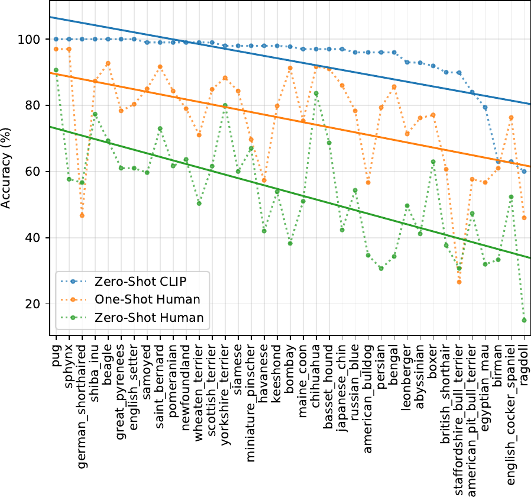

> 图 18：当使用来自 Google Cloud Vision、Amazon Rekognition 和 Microsoft Azure Computer Vision 的图像返回标签组合集时，CLIP 在国会议员图像上的表现。通过 $\chi^{2}$ 检验（阈值为 0.5%）识别出对男性和女性最具性别差异的 20 个标签。标签按绝对频率排序。条形图表示按性别划分的特定标签图像所占百分比。

我们还进行了类似于 Schwemmer 等人（2020）概述的实验，使用国会议员的图像来测试 CLIP 如何区别对待男性和女性的图像。作为这些实验的一部分，我们研究了某些额外的设计决策（例如决定标签的阈值）如何影响 CLIP 输出的标签以及偏见如何显现。

我们进行了三项实验——我们测试了性别分类的准确性，并测试了标签在两个不同标签集上的差异分布情况。对于我们的第一个标签集，我们使用了包含 300 个职业的标签集；对于第二个标签集，我们使用了 Google Cloud Vision、Amazon Rekognition 和 Microsoft Azure Computer Vision 为所有图像返回的标签组合集。

我们首先简单地考察了模型在国会议员图像上的性别预测性能，目的是检验当给定一个看似处于官方场合/权力职位的人物图像时，模型是否能正确地将男性识别为男性、女性识别为女性。我们发现模型在这些图像上达到了 **100% 的准确率** 。这比模型在 FairFace 数据集上的表现略好。我们推测原因之一是，与 FairFace 数据集中的图像不同，国会议员数据集中的所有图像都是高质量且清晰的，人物明显居中。

为了研究返回标签中的偏差如何依赖于设定的标签概率阈值，我们进行了一项实验，将阈值分别设定为 **0.5%** 和 **4.0%** 。我们发现，较低的阈值会导致标签质量下降。然而，即使在此阈值下标签的不同分布也可能包含偏差信号。例如，我们发现，在 0.5% 的阈值下，诸如“保姆（nanny）”和“管家（housekeeper）”之类的标签开始出现在女性身上，而诸如“囚犯（prisoner）”和“匪徒（mobster）”之类的标签开始出现在男性身上。这指向了与先前在职业研究中发现的类似的性别关联（Schwemmer et al., 2020）（Nosek et al., 2002）（Bolukbasi et al., 2016）。

在更高的 4% 阈值下，跨性别出现概率最高的标签包括“立法者（lawmaker）”、“立法委员（legislator）”和“国会议员（congressman）”。然而，这些偏差在较低概率标签中的存在，仍然引出了关于部署此类系统时“足够”安全的行为可能是什么样子的更大问题。

当给定 Google Cloud Vision (GCV)、Amazon Rekognition 和 Microsoft 为所有图像返回的标签组合集时，与 Schwemmer 等人（2020）在 GCV 系统中发现的偏差类似，我们发现我们的系统也 **不成比例地将与头发和外表相关的标签更多地附加给女性而非男性** 。例如，“棕色头发（brown hair）”、“金发（blonde）”和“金发（blond）”等标签在女性身上出现的频率显著更高。此外，CLIP 将一些描述高地位职业的标签（如“高管（executive）”和“医生（doctor）”）不成比例地更频繁地附加给男性。在它更频繁附加给女性的仅有的四个职业中，三个是“新闻播音员（newscaster）”、“电视主持人（television presenter）”和“新闻播报员（newsreader）”，第四个是“法官（Judge）”。这再次与 GCV 中发现的偏差相似，并指向了历史上的性别差异（Schwemmer et al., 2020）。

有趣的是，当我们将这组标签的阈值降低到 0.5% 时，我们发现不成比例地描述男性的标签也转向了以外表为导向的词语，如“西装（suit）”、“领带（tie）”和“领带（necktie）”（图 [18](#S7.F18)）。许多以职业为导向的词语，如“军人（military person）”和“高管（executive）”——它们在较高的 4% 阈值下并未用于描述女性图像——在较低的 0.5% 阈值下被同时用于男性和女性，这可能导致男性标签的变化。反之则不成立。用于描述女性的描述性词语在男性中仍然不常见。

模型构建每个阶段的设计决策都会影响偏差如何显现，这对于 CLIP 来说尤其如此，因为它提供了灵活性。除了关于训练数据和模型架构的选择外，关于类别设计和阈值设定等事项的决策可以改变模型输出的标签，从而加剧或减轻某些类型的危害，例如 Crawford（2017）所描述的那些。设计和开发模型与人工智能系统的人员拥有相当大的权力。关于类别设计等事项的决策不仅是模型性能的关键决定因素，也是模型偏差在何种情境下如何显现的关键决定因素。

这些实验并非全面性的。它们旨在阐明由 **类别设计（class design）** 及其他 **偏差来源（sources of bias）** 所引发的潜在问题，并期望能激发进一步的探究。

### 7.2 监控（Surveillance）

接下来，我们试图在一个具有重大社会敏感性的下游任务—— **监控（surveillance）** ——上刻画模型的性能。我们的分析旨在更好地体现上文所述的刻画方法，并帮助研究界关注日益通用的 **计算机视觉模型（computer vision models）** 的潜在未来影响，同时助力围绕此类系统的规范与制衡机制的发展。我们将监控纳入研究，并非表明我们对此领域抱有热情——恰恰相反，我们认为鉴于其社会影响，监控是一个值得尝试进行预测的重要领域（Zuboff, 2015; Browne, 2015）。

我们测量了模型在 **闭路电视（Closed-Circuit Television, CCTV）** 摄像头图像分类和 **零样本名人识别（zero-shot celebrity identification）** 任务上的性能。我们首先测试了模型在监控摄像头（例如 CCTV 摄像头）捕获的低分辨率图像上的性能。我们使用了 VIRAT 数据集（Oh 等人，2011）以及 Varadarajan & Odobez（2009）捕获的数据，两者均包含真实世界的户外场景，且人物并非演员。

鉴于 **CLIP（Contrastive Language–Image Pre-training）** 灵活的类别构建能力，我们使用自建的通用类别，对来自 12 个不同视频序列的 515 张监控图像进行了 **粗粒度（coarse）** 和 **细粒度（fine-grained）** 分类测试。粗粒度分类要求模型正确识别图像的主要主体（即判断图像是否为空的停车场、校园等的图片）。对于细粒度分类，模型必须在两个选项中做出选择，以确定模型能否识别图像中较小特征的存在/缺失，例如站在角落的人。

对于粗粒度分类，我们通过手动为图像添加描述其内容的标题来构建类别，模型总是至少有 6 个选项可供选择。此外，我们还进行了一项“压力测试”，其中类别集至少包含一个与图像内容“接近”的额外标题（例如，“有白色汽车的停车场”与“有红色汽车的停车场”）。我们发现，在初始评估中，模型在 CCTV 图像上的 **Top-1 准确率（top-1 accuracy）** 为 91.8%。在第二次评估中，准确率显著下降至 51.1%，模型有 40.7% 的时间错误地选择了“接近”的答案。

对于细粒度检测，零样本（Zero-shot）模型表现不佳，结果近乎随机。请注意，本实验仅针对检测图像序列中是否存在小物体。

我们还使用 CelebA 数据集测试了 CLIP 在“野外”身份检测中的零样本性能 [8]。我们这样做是为了评估模型仅使用其预训练时所用的公开数据进行身份检测的性能。虽然我们是在一个包含大量网络图片的名人数据集上进行测试，但我们假设，随着模型变得更强大，模型将人脸与姓名关联起来所需的预训练数据中的图像数量将持续减少（见表 [8](#S7.T8)），这具有重大的社会影响（Garvie, 2019）。这反映了自然语言处理（Natural Language Processing, NLP）领域的最新发展，即最近在互联网数据上训练的大型语言模型（Large Language Models, LLMs）常常表现出为相对次要的公众人物提供相关信息的惊人能力（Brown et al., 2020）。

我们发现，对于“野外”的 8k 张名人图像，模型在 100 个可能类别中的 Top-1 准确率为 59.2%。然而，当我们将类别数量增加到 1k 个名人姓名时，该性能下降至 43.3%。与 Google 名人识别（Google Celebrity Recognition）等生产级模型相比，此性能并不具备竞争力。然而，这些结果值得注意之处在于，该分析仅基于从预训练数据推断出的姓名，利用了零样本识别能力——我们没有使用任何额外的任务特定数据集，因此（相对）强劲的结果进一步表明，在部署多模态模型之前，人们需要仔细研究其在特定上下文和领域中的行为。

鉴于其零样本能力，CLIP 对于数据相对较少的任务具有显著优势。然而，对于许多人脸识别等需求旺盛的监控任务，存在大型数据集和高性能的监督模型。因此，CLIP 在此类用途中的相对吸引力较低。此外，CLIP 并非为物体检测（Object Detection）和语义分割（Semantic Segmentation）等常见的监控相关任务而设计。这意味着，当专门为此类用途设计的模型（如 Detectron2 (Wu et al., 2019)）广泛可用时，CLIP 在某些监控任务中的用途有限。

然而，鉴于 CLIP 消除了对训练数据的需求，它确实解锁了可用性的某个方面。因此，CLIP 及类似模型可以支持那些不存在量身定制的模型或数据集的、定制化的、小众的监控用例，并可以降低构建此类应用的技能要求。正如我们的实验所示，零样本 CLIP（ZS CLIP）目前在少数与监控相关的任务上表现出 **非平凡但并非卓越** 的性能。

**表 8：CelebA 零样本 Top-1 身份识别准确率（Table 8: CelebA Zero-Shot Top-1 Identity Recognition Accuracy）**
| 模型（Model） | 100 类（100 Classes） | 1k 类（1k Classes） | 2k 类（2k Classes） |
| :--- | :---: | :---: | :---: |
| CLIP L/14 | 59.2 | 43.3 | 42.2 |
| CLIP RN50x64 | 56.4 | 39.5 | 38.4 |
| CLIP RN50x16 | 52.7 | 37.4 | 36.3 |
| CLIP RN50x4 | 52.8 | 38.1 | 37.3 |

### 7.3 未来工作（Future Work）

这项初步分析旨在阐明通用计算机视觉（Computer Vision）模型带来的一些挑战，并一窥其偏见和影响。我们希望这项工作能推动未来对此类模型的能力、缺点和偏见的表征研究，我们也很高兴能与研究界就这些问题进行交流。

我们认为，一个良好的前进方向是社区探索，以进一步表征像 CLIP 这样的模型的能力，并且——至关重要的是——识别出它们具有良好性能的应用领域以及性能可能降低的领域 [9]。这种表征过程可以通过以下方式帮助研究人员提高模型被有益使用的可能性：

- 在研究过程的早期识别模型潜在有益的下游用途，使其他研究人员能够思考应用。
- 揭示具有高度敏感性和大量社会利益相关者的任务，这可能需要政策制定者进行干预。
- 更好地表征模型中的偏见，提醒其他研究人员关注需要关注的领域和干预的领域。
- 创建测试套件来评估像 CLIP 这样的系统，以便我们能在开发周期的早期更好地表征模型能力。
- 识别潜在的故障模式和需要进一步工作的领域。

我们计划为这项工作做出贡献，并希望本分析能为后续研究提供一些激励性的例子。

## 8 相关工作（Related Work）

任何利用书面、口头、手语或任何其他形式的人类语言作为其训练信号一部分的模型，都可以说是在使用 **自然语言（Natural Language）** 作为监督来源。这无疑是一个极其广泛的领域，涵盖了 **分布语义学（Distributional Semantics）** 领域的大部分工作，包括 **主题模型（Topic Models）** （Blei et al., 2003）、词向量、句向量和段落向量（Mikolov et al., 2013; Kiros et al., 2015; Le & Mikolov, 2014）以及 **语言模型（Language Models）** （Bengio et al., 2003）。它还包括 **自然语言处理（Natural Language Processing, NLP）** 这一更广泛领域中，以某种方式处理自然语言序列预测或建模的大部分工作。在 NLP 领域，有意识地以解释、反馈、指令和建议等形式利用自然语言监督来完成分类等任务（与通常将监督表示为一系列任意编码的离散类别标签的做法相反），已经通过许多富有创意和先进的方式进行了探索。 **基于对话的学习（Dialog-based learning）** （Weston, 2016; Li et al., 2016; Hancock et al., 2019）开发了从对话中的交互式自然语言反馈中学习的技术。多篇论文利用 **语义解析（Semantic Parsing）** 将自然语言解释转换为特征（Srivastava et al., 2017）或额外的训练标签（Hancock et al., 2018）。最近， **ExpBERT** （Murty et al., 2020）利用一个深度上下文语言模型基于自然语言解释和关系描述生成的特征表示，来提高关系抽取任务的性能。

**CLIP** 是利用自然语言作为学习非语言领域的训练信号的一个例子。在此背景下，我们所知最早使用“自然语言监督”这一术语的工作是 Ramanathan 等人（2013）的研究，该研究表明自然语言描述可以与其他监督源一起使用，以提高视频事件理解任务的性能。然而，正如引言和方法部分所述，在计算机视觉中利用自然语言描述的方法远早于这一特定术语的使用，尤其是在 **图像检索（Image Retrieval）** （Mori et al., 1999）和 **物体分类（Object Classification）** （Wang et al., 2009）方面。其他早期工作利用与图像关联的标签（但非自然语言）进行 **语义分割（Semantic Segmentation）** 任务（Barnard et al., 2003）。最近，He & Peng（2017）和 Liang 等人（2020）展示了使用自然语言描述和解释来改进鸟类的细粒度视觉分类。其他研究者探索了如何利用 **具身语言（Grounded Language）** 在 ShapeWorld 数据集上改进视觉表示和分类器（Kuhnle & Copestake, 2017; Andreas et al., 2017; Mu et al., 2019）。最后，将自然语言与 **强化学习（Reinforcement Learning）** 环境相结合的技术（Narasimhan et al., 2015）已展现出令人兴奋的 **涌现行为（Emergent Behaviors）** ，例如系统地完成 **零样本任务（Zero-shot Tasks）** （Hill et al., 2019）。

CLIP 的预训练任务针对 **文本-图像检索（Text-image Retrieval）** 进行了优化。这一研究领域可追溯到 90 年代中期，前述的 Mori 等人（1999）的工作是早期研究的代表。虽然最初的努力主要集中于预测性目标，但随着时间的推移，研究转向了学习 **联合多模态嵌入空间（Joint Multi-modal Embedding Spaces）** ，采用了诸如 **核典型相关分析（Kernel Canonical Correlation Analysis）** 和各种 **排序目标（Ranking Objectives）** 等技术（Weston et al., 2010; Socher & Fei-Fei, 2010; Hodosh et al., 2013）。随着时间的推移，研究工作探索了训练目标、迁移学习和更具表现力的模型等多种组合，并稳步提升了性能（Frome et al., 2013; Socher et al., 2014; Karpathy et al., 2014; Kiros et al., 2014; Faghri et al., 2017）。

其他研究已将自然语言监督应用于图像以外的领域。Stroud 等人 (2020) 探索了大规模表征学习，通过训练一个系统将描述性文本与视频（而非图像）配对。多项研究探索了使用密集的口语自然语言监督来处理视频 (Miech 等人, 2019, 2020b)。当与 CLIP 一同考虑时，这些研究表明，大规模自然语言监督是学习许多领域高质量感知系统的一种有前景的方法。Alayrac 等人 (2020) 通过添加原始音频作为额外的监督源，将这一研究方向扩展到另一种模态，并展示了结合所有三种监督源带来的益处。

作为我们 CLIP 工作的一部分，我们也构建了一个新的图文对数据集。现代图文检索工作依赖于一系列众包的句子级图像描述评估数据集，如 Pascal1K (Rashtchian 等人, 2010)、Flickr8K (Hodosh 等人, 2013) 和 Flickr30K (Young 等人, 2014)。然而，这些数据集仍然相对较小，限制了可达到的性能。已有多种方法被提出来自动创建更大的数据集，其中 Ordonez 等人 (2011) 的工作是一个值得注意的早期例子。在深度学习时代，Mithun 等人 (2018) 证明了从互联网收集的另一组（图像，文本）对可以提高检索性能，并且已经创建了几个新的自动构建的数据集，如 Conceptual Captions (Sharma 等人, 2018)、LAIT (Qi 等人, 2020) 和 OCR-CC (Yang 等人, 2020)。然而，这些数据集仍然使用了明显更激进的过滤方法，或者是为特定任务（如 OCR）设计的，因此其规模仍然远小于 WIT（WebImageText）数据集，通常只有 100 万到 1000 万个训练样本。

与 CLIP 相关的一个概念是 **网络监督学习（Webly Supervised Learning）** 。这类工作通过查询图像搜索引擎来构建图像数据集，使用查询词作为返回图像的标签 (Fergus 等人, 2005)。在这些规模庞大但标签噪声较大的数据集上训练的分类器，可以与在规模较小但精心标注的数据集上训练的分类器相竞争。这些图像-查询对也常被用作额外的训练数据，以提高在标准数据集上的性能 (Chen & Gupta, 2015)。CLIP 在其数据集创建过程中也使用了搜索查询。然而，CLIP 仅使用与图像共现的完整文本序列作为监督信号，而不仅仅是查询词（通常只是一个单词或短 n-gram）。我们还在 CLIP 中将此步骤限制为仅进行文本子串匹配查询，而大多数网络监督工作使用标准的图像搜索引擎，这些引擎拥有自己复杂的检索和过滤流程，通常涉及计算机视觉系统。在这类工作中，_Learning Everything about Anything: Webly-Supervised Visual Concept Learning_ (Divvala 等人, 2014) 的目标和雄心与 CLIP 尤为相似。

最后，CLIP 与近期涌现的视觉-语言联合模型学习热潮相关 (Lu 等人, 2019; Tan & Bansal, 2019; Chen 等人, 2019; Li 等人, 2020b; Yu 等人, 2020)。这类工作侧重于紧密连接视觉和语言，以解决复杂的下游任务，如 **视觉问答（Visual Question Answering, VQA）** 、 **视觉常识推理（Visual Commonsense Reasoning, VCR）** 或 **多模态蕴含（Multimodal Entailment）** 。这些方法利用了精心设计的模型，这些模型结合了 3 个（或更多）预训练子系统，通常包括一个图像特征模型、一个区域提议/目标检测模型以及一个预训练的掩码语言模型（如 BERT）。然后，这些系统通过图文对上的各种训练目标进行联合微调，并应用于上述任务，取得了令人印象深刻的结果。相比之下，CLIP 专注于通过自然语言监督从头开始学习视觉模型，并且没有使用联合注意力模型来密集连接这两个领域。在 CLIP 模型中，图像和文本领域之间唯一的交互是在一个学习到的联合嵌入空间中进行一次点积运算。我们期待看到 CLIP 与这类工作相结合。

## 9 结论（Conclusion）

我们研究了是否有可能将 **自然语言处理（Natural Language Processing, NLP）** 中 **任务无关（task-agnostic）** 的 **网络规模预训练（web-scale pre-training）** 的成功经验迁移到另一个领域。我们发现，采用这一范式会导致 **计算机视觉（computer vision）** 领域出现类似的行为，并讨论了这一研究方向的社会影响。为了优化其训练目标， **CLIP（Contrastive Language-Image Pre-training）** 模型在预训练期间学会了执行多种多样的任务。这种任务学习随后可以通过 **自然语言提示（natural language prompting）** 来利用，从而实现到许多现有数据集的 **零样本迁移（zero-shot transfer）** 。在足够大的规模下，这种方法的性能可以与 **任务特定的监督模型（task-specific supervised models）** 相媲美，尽管仍有很大的改进空间。

#### 致谢（Acknowledgments）

我们要感谢数百万参与创建 CLIP 训练数据的人们。我们还要感谢苏珊·张（Susan Zhang）在 OpenAI 期间在 **图像条件语言模型（image conditional language models）** 方面的工作，感谢伊尚·古尔拉贾尼（Ishaan Gulrajani）发现了伪代码中的一个错误，感谢艾琳·索莱曼（Irene Solaiman）、迈尔斯·布伦戴奇（Miles Brundage）和吉莉安·哈德菲尔德（Gillian Hadfield）对论文更广泛影响部分提出的深思熟虑的反馈。我们还要感谢 OpenAI 的 **加速（Acceleration）** 和 **超级计算（Supercomputing）** 团队，他们为本项目使用的软件和硬件基础设施做出了关键贡献。最后，我们还要感谢本项目使用的众多软件包的开发者，包括但不限于：Numpy (Harris et al., 2020)、SciPy (Virtanen et al., 2020)、ftfy (Speer, 2019)、TensorFlow (Abadi et al., 2016)、PyTorch (Paszke et al., 2019)、pandas (pandas development team, 2020) 和 scikit-learn (Pedregosa et al., 2011)。

## 参考文献

- Abadi 等人（2016）
  Abadi, M., Barham, P., Chen, J., Chen, Z., Davis, A., Dean, J., Devin, M., Ghemawat, S., Irving, G., Isard, M., 等人
  Tensorflow：一个用于大规模机器学习的系统。
  载于 _第 12 届 USENIX 操作系统设计与实现研讨会（OSDI 16）_，第 265–283 页，2016 年。
- Alayrac 等人（2020）
  Alayrac, J.-B., Recasens, A., Schneider, R., Arandjelović, R., Ramapuram, J., De Fauw, J., Smaira, L., Dieleman, S., 和 Zisserman, A.
  自监督多模态通用网络。
  _arXiv 预印本 arXiv:2006.16228_，2020 年。
- Alcorn 等人（2019）
  Alcorn, M. A., Li, Q., Gong, Z., Wang, C., Mai, L., Ku, W.-S., 和 Nguyen, A.
  摆个（奇怪的）姿势：神经网络容易被熟悉物体的奇怪姿势欺骗。
  载于 _IEEE 计算机视觉与模式识别会议论文集_，第 4845–4854 页，2019 年。
- Andreas 等人（2017）
  Andreas, J., Klein, D., 和 Levine, S.
  使用潜在语言学习。
  _arXiv 预印本 arXiv:1711.00482_，2017 年。
- Assiri（2020）
  Assiri, Y.
  使用简单方法对普通卷积神经网络进行随机优化。
  _arXiv 预印本 arXiv:2001.08856_，2020 年。
- Bachman 等人（2019）
  Bachman, P., Hjelm, R. D., 和 Buchwalter, W.
  通过跨视图最大化互信息来学习表示。
  载于 _神经信息处理系统进展_，第 15535–15545 页，2019 年。
- Barbu 等人（2019）
  Barbu, A., Mayo, D., Alverio, J., Luo, W., Wang, C., Gutfreund, D., Tenenbaum, J., 和 Katz, B.
  ObjectNet：一个用于挑战物体识别模型极限的大规模偏置控制数据集。
  载于 _神经信息处理系统进展_，第 9453–9463 页，2019 年。
- Barnard 等人（2003）
  Barnard, K., Duygulu, P., Forsyth, D., Freitas, N. d., Blei, D. M., 和 Jordan, M. I.
  匹配词语与图片。
  _机器学习研究杂志_，3（2 月）：1107–1135，2003 年。
- Bechmann 和 Bowker（2019）
  Bechmann, A. 和 Bowker, G. C.
  换个名字的无监督：社交媒体人工智能中知识生产的隐藏层。
  _大数据与社会_，6（1）：205395171881956，2019 年 1 月。
  doi: 10.1177/2053951718819569。
  URL [https://doi.org/10.1177/2053951718819569](https://doi.org/10.1177/2053951718819569)。
- Bengio 等人（2003）
  Bengio, Y., Ducharme, R., Vincent, P., 和 Jauvin, C.
  一种神经概率语言模型。
  _机器学习研究杂志_，3（2 月）：1137–1155，2003 年。
- Bhargava 和 Forsyth（2019）
  Bhargava, S. 和 Forsyth, D.
  揭示并修正图像描述数据集和模型中的性别偏见。
  _arXiv 预印本 arXiv:1912.00578_，2019 年。
- Blei 等人（2003）
  Blei, D. M., Ng, A. Y., 和 Jordan, M. I.
  潜在狄利克雷分配。
  _机器学习研究杂志_，3（1 月）：993–1022，2003 年。
- Bolukbasi 等人（2016）
  Bolukbasi, T., Chang, K.-W., Zou, J. Y., Saligrama, V., 和 Kalai, A. T.
  男人之于计算机程序员，如同女人之于家庭主妇？消除词嵌入的偏见。
  _神经信息处理系统进展_，29：4349–4357，2016 年。
- Bowker 和 Star（2000）
  Bowker, G. C. 和 Star, S. L.
  _分类及其后果_。
  MIT 出版社，2000 年。
- Brown 等人（2020）
  Brown, T. B., Mann, B., Ryder, N., Subbiah, M., Kaplan, J., Dhariwal, P., Neelakantan, A., Shyam, P., Sastry, G., Askell, A., 等人
  语言模型是少样本学习者。
  _arXiv 预印本 arXiv:2005.14165_，2020 年。
- Browne（2015）
  Browne, S.
  _黑暗物质：对黑人群体的监视_。
  杜克大学出版社，2015 年。
- Bulent Sariyildiz 等人（2020）
  Bulent Sariyildiz, M., Perez, J., 和 Larlus, D.
  使用标题标注学习视觉表示。
  _arXiv 电子版_，第 arXiv–2008 页，2020 年。
- Buolamwini 和 Gebru（2018）
  Buolamwini, J. 和 Gebru, T.
  性别阴影：商业性别分类中的交叉性准确度差异。
  载于 _公平、问责与透明度会议_，第 77–91 页，2018 年。
- Carreira 等人（2019）
  Carreira, J., Noland, E., Hillier, C., 和 Zisserman, A.
  关于 Kinetics-700 人类动作数据集的简短说明。
  _arXiv 预印本 arXiv:1907.06987_，2019 年。
- Chen 等人（2020a）
  Chen, M., Radford, A., Child, R., Wu, J., Jun, H., Luan, D., 和 Sutskever, I.
  基于像素的生成式预训练。
  载于 _国际机器学习会议_，第 1691–1703 页。PMLR，2020a。
- Chen 等人（2016）
  Chen, T., Xu, B., Zhang, C., 和 Guestrin, C.
  以次线性内存成本训练深度网络。
  _arXiv 预印本 arXiv:1604.06174_，2016 年。
- Chen 等人（2020b）
  Chen, T., Kornblith, S., Norouzi, M., 和 Hinton, G.
  视觉表示对比学习的简单框架。
  _arXiv 预印本 arXiv:2002.05709_，2020b。
- Chen 等人（2020c）
  Chen, T., Kornblith, S., Swersky, K., Norouzi, M., 和 Hinton, G.
  大型自监督模型是强大的半监督学习者。
  _arXiv 预印本 arXiv:2006.10029_，2020c。
- Chen 和 Gupta（2015）
  Chen, X. 和 Gupta, A.
  卷积网络的网络监督学习。
  载于 _IEEE 国际计算机视觉会议论文集_，第 1431–1439 页，2015 年。
- Chen 等人（2020d）
  Chen, X., Fan, H., Girshick, R., 和 He, K.
  使用动量对比学习改进基线。
  _arXiv 预印本 arXiv:2003.04297_，2020d。
- Chen 等人（2019）
  Chen, Y.-C., Li, L., Yu, L., Kholy, A. E., Ahmed, F., Gan, Z., Cheng, Y., 和 Liu, J.
  Uniter：学习通用图像-文本表示。
  _arXiv 预印本 arXiv:1909.11740_，2019 年。
- Cheng 等人（2017）
  Cheng, G., Han, J., 和 Lu, X.
  遥感图像场景分类：基准与最新进展。
  _IEEE 会报_，105（10）：1865–1883，2017 年。
- Choi 等人（2019）
  Choi, D., Shallue, C. J., Nado, Z., Lee, J., Maddison, C. J., 和 Dahl, G. E.
  关于深度学习优化器的实证比较。

  -

- Crawford (2017)
  Crawford, K.
  The trouble with bias.
  _NIPS 2017 Keynote_, 2017.
  URL [https://www.youtube.com/watch?v=fMym_BKWQzk](https://www.youtube.com/watch?v=fMym_BKWQzk).
- Dai & Le (2015)
  Dai, A. M. and Le, Q. V.
  Semi-supervised sequence learning.
  In _Advances in neural information processing systems_, pp. 3079–3087, 2015.
- D’Amour et al. (2020)
  D’Amour, A., Heller, K., Moldovan, D., Adlam, B., Alipanahi, B., Beutel, A.,
  Chen, C., Deaton, J., Eisenstein, J., Hoffman, M. D., et al.
  Underspecification presents challenges for credibility in modern
  machine learning.
  _arXiv preprint arXiv:2011.03395_, 2020.
- Deng et al. (2009)
  Deng, J., Dong, W., Socher, R., Li, L.-J., Li, K., and Fei-Fei, L.
  ImageNet: A Large-Scale Hierarchical Image Database.
  In _CVPR09_, 2009.
- Deng et al. (2012)
  Deng, J., Berg, A. C., Satheesh, S., Su, H., Khosla, A., and Fei-Fei, L.
  Ilsvrc 2012, 2012.
  URL [http://www.image-net.org/challenges/LSVRC/2012/](http://www.image-net.org/challenges/LSVRC/2012/).
- Desai & Johnson (2020)
  Desai, K. and Johnson, J.
  Virtex: Learning visual representations from textual annotations.
  _arXiv preprint arXiv:2006.06666_, 2020.
- Devlin et al. (2018)
  Devlin, J., Chang, M.-W., Lee, K., and Toutanova, K.
  Bert: Pre-training of deep bidirectional transformers for language
  understanding.
  _arXiv preprint arXiv:1810.04805_, 2018.
- Dhariwal et al. (2020)
  Dhariwal, P., Jun, H., Payne, C., Kim, J. W., Radford, A., and Sutskever, I.
  Jukebox: A generative model for music.
  _arXiv preprint arXiv:2005.00341_, 2020.
- Divvala et al. (2014)
  Divvala, S. K., Farhadi, A., and Guestrin, C.
  Learning everything about anything: Webly-supervised visual concept
  learning.
  In _Proceedings of the IEEE Conference on Computer Vision and
  Pattern Recognition_, pp.  3270–3277, 2014.
- Dodge & Karam (2017)
  Dodge, S. and Karam, L.
  A study and comparison of human and deep learning recognition
  performance under visual distortions.
  In _2017 26th international conference on computer communication
  and networks (ICCCN)_, pp.  1–7. IEEE, 2017.
- Dosovitskiy et al. (2020)
  Dosovitskiy, A., Beyer, L., Kolesnikov, A., Weissenborn, D., Zhai, X.,
  Unterthiner, T., Dehghani, M., Minderer, M., Heigold, G., Gelly, S., et al.
  An image is worth 16x16 words: Transformers for image recognition at
  scale.
  _arXiv preprint arXiv:2010.11929_, 2020.
- Elhoseiny et al. (2013)
  Elhoseiny, M., Saleh, B., and Elgammal, A.
  Write a classifier: Zero-shot learning using purely textual
  descriptions.
  In _Proceedings of the IEEE International Conference on Computer
  Vision_, pp.  2584–2591, 2013.
- Faghri et al. (2017)
  Faghri, F., Fleet, D. J., Kiros, J. R., and Fidler, S.
  Vse++: Improving visual-semantic embeddings with hard negatives.
  _arXiv preprint arXiv:1707.05612_, 2017.
- Fergus et al. (2005)
  Fergus, R., Fei-Fei, L., Perona, P., and Zisserman, A.
  Learning object categories from google’s image search.
  In _Tenth IEEE International Conference on Computer Vision
  (ICCV’05) Volume 1_, volume 2, pp.  1816–1823. IEEE, 2005.
- Frome et al. (2013)
  Frome, A., Corrado, G. S., Shlens, J., Bengio, S., Dean, J., Ranzato, M., and
  Mikolov, T.
  Devise: A deep visual-semantic embedding model.
  In _Advances in neural information processing systems_, pp. 2121–2129, 2013.
- Gan et al. (2020)
  Gan, Z., Chen, Y.-C., Li, L., Zhu, C., Cheng, Y., and Liu, J.
  Large-scale adversarial training for vision-and-language
  representation learning.
  _arXiv preprint arXiv:2006.06195_, 2020.
- Gao et al. (2020)
  Gao, T., Fisch, A., and Chen, D.
  Making pre-trained language models better few-shot learners.
  _arXiv preprint arXiv:2012.15723_, 2020.
- Garvie (2019)
  Garvie, C., May 2019.
  URL [https://www.flawedfacedata.com/](https://www.flawedfacedata.com/).
- Geiger et al. (2012)
  Geiger, A., Lenz, P., and Urtasun, R.
  Are we ready for autonomous driving? the kitti vision benchmark
  suite.
  In _Conference on Computer Vision and Pattern Recognition
  (CVPR)_, 2012.
- Geirhos et al. (2018)
  Geirhos, R., Rubisch, P., Michaelis, C., Bethge, M., Wichmann, F. A., and
  Brendel, W.
  Imagenet-trained cnns are biased towards texture; increasing shape
  bias improves accuracy and robustness.
  _arXiv preprint arXiv:1811.12231_, 2018.
- Geirhos et al. (2020)
  Geirhos, R., Jacobsen, J.-H., Michaelis, C., Zemel, R., Brendel, W., Bethge,
  M., and Wichmann, F. A.
  Shortcut learning in deep neural networks.
  _arXiv preprint arXiv:2004.07780_, 2020.
- Gomez et al. (2017)
  Gomez, L., Patel, Y., Rusiñol, M., Karatzas, D., and Jawahar, C.
  Self-supervised learning of visual features through embedding images
  into text topic spaces.
  In _Proceedings of the IEEE Conference on Computer Vision and
  Pattern Recognition_, pp.  4230–4239, 2017.
- Goodfellow et al. (2014)
  Goodfellow, I. J., Shlens, J., and Szegedy, C.
  Explaining and harnessing adversarial examples.
  _arXiv preprint arXiv:1412.6572_, 2014.
- Goodfellow et al. (2015)
  Goodfellow, I. J., Erhan, D., Carrier, P. L., Courville, A., Mirza, M., Hamner,
  B., Cukierski, W., Tang, Y., Thaler, D., Lee, D.-H., et al.
  Challenges in representation learning: A report on three machine
  learning contests.
  _Neural Networks_, 64:59–63, 2015.
- (54)
  Google.
  Google cloud api: Celebrity recognition.
  URL [https://cloud.google.com/vision/docs/celebrity-recognition](https://cloud.google.com/vision/docs/celebrity-recognition).
- Griewank & Walther (2000)
  Griewank, A. and Walther, A.
  Algorithm 799: revolve: an implementation of checkpointing for the
  reverse or adjoint mode of computational differentiation.
  _ACM Transactions on Mathematical Software (TOMS)_, 26(1):19–45, 2000.
- Grill et al. (2020)
  Grill, J.-B., Strub, F., Altché, F., Tallec,

- (2018)
  Hancock, B., Bringmann, M., Varma, P., Liang, P., Wang, S., and Ré, C.
  **使用自然语言解释训练分类器（Training classifiers with natural language explanations）** 。
  载于 _计算语言学协会会议论文集（Proceedings of the conference. Association for Computational Linguistics. Meeting）_，第 2018 卷，第 1884 页。NIH Public Access，2018。
- Hancock et al. (2019)
  Hancock, B., Bordes, A., Mazare, P.-E., and Weston, J.
  **部署后从对话中学习：自我喂养，聊天机器人！（Learning from dialogue after deployment: Feed yourself, chatbot!）**
  _arXiv 预印本 arXiv:1901.05415_，2019。
- Harris et al. (2020)
  Harris, C. R., Millman, K. J., van der Walt, S. J., Gommers, R., Virtanen, P., Cournapeau, D., Wieser, E., Taylor, J., Berg, S., Smith, N. J., Kern, R., Picus, M., Hoyer, S., van Kerkwijk, M. H., Brett, M., Haldane, A., Fernández del Río, J., Wiebe, M., Peterson, P., Gérard-Marchant, P., Sheppard, K., Reddy, T., Weckesser, W., Abbasi, H., Gohlke, C., and Oliphant, T. E.
  **使用 NumPy 进行数组编程（Array programming with NumPy）** 。
  _自然（Nature）_，585:357–362，2020。
  doi: 10.1038/s41586-020-2649-2。
- Hays & Efros (2008)
  Hays, J. and Efros, A. A.
  **Im2gps：从单张图像估计地理信息（Im2gps: estimating geographic information from a single image）** 。
  载于 _2008 年 IEEE 计算机视觉与模式识别会议（2008 ieee conference on computer vision and pattern recognition）_，第 1–8 页。IEEE，2008。
- He et al. (2015)
  He, K., Zhang, X., Ren, S., and Sun, J.
  **深入研究整流器：在 ImageNet 分类上超越人类水平性能（Delving deep into rectifiers: Surpassing human-level performance on imagenet classification）** 。
  载于 _IEEE 国际计算机视觉会议论文集（Proceedings of the IEEE international conference on computer vision）_，第 1026–1034 页，2015。
- He et al. (2016a)
  He, K., Zhang, X., Ren, S., and Sun, J.
  **用于图像识别的深度残差学习（Deep residual learning for image recognition）** 。
  载于 _IEEE 计算机视觉与模式识别会议论文集（Proceedings of the IEEE conference on computer vision and pattern recognition）_，第 770–778 页，2016a。
- He et al. (2016b)
  He, K., Zhang, X., Ren, S., and Sun, J.
  **用于图像识别的深度残差学习（Deep residual learning for image recognition）** 。
  载于 _IEEE 计算机视觉与模式识别会议论文集（Proceedings of the IEEE conference on computer vision and pattern recognition）_，第 770–778 页，2016b。
- He et al. (2020)
  He, K., Fan, H., Wu, Y., Xie, S., and Girshick, R.
  **用于无监督视觉表示学习的动量对比（Momentum contrast for unsupervised visual representation learning）** 。
  载于 _IEEE/CVF 计算机视觉与模式识别会议论文集（Proceedings of the IEEE/CVF Conference on Computer Vision and Pattern Recognition）_，第 9729–9738 页，2020。
- He et al. (2019)
  He, T., Zhang, Z., Zhang, H., Zhang, Z., Xie, J., and Li, M.
  **卷积神经网络图像分类技巧集锦（Bag of tricks for image classification with convolutional neural networks）** 。
  载于 _IEEE 计算机视觉与模式识别会议论文集（Proceedings of the IEEE Conference on Computer Vision and Pattern Recognition）_，第 558–567 页，2019。
- He & Peng (2017)
  He, X. and Peng, Y.
  **通过结合视觉与语言进行细粒度图像分类（Fine-grained image classification via combining vision and language）** 。
  载于 _IEEE 计算机视觉与模式识别会议论文集（Proceedings of the IEEE Conference on Computer Vision and Pattern Recognition）_，第 5994–6002 页，2017。
- Helber et al. (2019)
  Helber, P., Bischke, B., Dengel, A., and Borth, D.
  **EuroSAT：用于土地利用和土地覆盖分类的新型数据集和深度学习基准（Eurosat: A novel dataset and deep learning benchmark for land use and land cover classification）** 。
  _IEEE 应用地球观测与遥感专题期刊（IEEE Journal of Selected Topics in Applied Earth Observations and Remote Sensing）_，12(7):2217–2226，2019。
- Henaff (2020)
  Henaff, O.
  **使用对比预测编码实现数据高效的图像识别（Data-efficient image recognition with contrastive predictive coding）** 。
  载于 _国际机器学习会议（International Conference on Machine Learning）_，第 4182–4192 页。PMLR，2020。
- Hendrycks & Dietterich (2019)
  Hendrycks, D. and Dietterich, T.
  **神经网络对常见损坏和扰动的鲁棒性基准测试（Benchmarking neural network robustness to common corruptions and perturbations）** 。
  _arXiv 预印本 arXiv:1903.12261_，2019。
- Hendrycks & Gimpel (2016)
  Hendrycks, D. and Gimpel, K.
  **高斯误差线性单元（Gaussian error linear units, gelus）** 。
  _arXiv 预印本 arXiv:1606.08415_，2016。
- Hendrycks et al. (2019)
  Hendrycks, D., Zhao, K., Basart, S., Steinhardt, J., and Song, D.
  **自然对抗样本（Natural adversarial examples）** 。
  _arXiv 预印本 arXiv:1907.07174_，2019。
- Hendrycks et al. (2020a)
  Hendrycks, D., Basart, S., Mu, N., Kadavath, S., Wang, F., Dorundo, E., Desai, R., Zhu, T., Parajuli, S., Guo, M., et al.
  **鲁棒性的多面性：对分布外泛化的批判性分析（The many faces of robustness: A critical analysis of out-of-distribution generalization）** 。
  _arXiv 预印本 arXiv:2006.16241_，2020a。
- Hendrycks et al. (2020b)
  Hendrycks, D., Liu, X., Wallace, E., Dziedzic, A., Krishnan, R., and Song, D.
  **预训练 Transformer 提升分布外鲁棒性（Pretrained transformers improve out-of-distribution robustness）** 。
  _arXiv 预印本 arXiv:2004.06100_，2020b。
- Hestness et al. (2017)
  Hestness, J., Narang, S., Ardalani, N., Diamos, G., Jun, H., Kianinejad, H., Patwary, M., Ali, M., Yang, Y., and Zhou, Y.
  **深度学习扩展是可预测的：经验证据（Deep learning scaling is predictable, empirically）** 。
  _arXiv 预印本 arXiv:1712.00409_，2017。
- Hill et al. (2019)
  Hill, F., Lampinen, A., Schneider, R., Clark, S., Botvinick, M., McClelland, J. L., and Santoro, A.
  **情境化智能体中系统性和泛化的环境驱动因素（Environmental drivers of systematicity and generalization in a situated agent）** 。
  载于 _国际学习表征会议（International Conference on Learning Representations）_，2019。
- Hodosh et al. (2013)
  Hodosh, M., Young, P., and Hockenmaier, J.
  **将图像描述构建为排序任务：数据、模型和评估指标（Framing image description as a ranking task: Data, models and evaluation metrics）** 。
  _人工智能研究杂志（Journal of Artificial Intelligence Research）_，47:853–899，2013。
- Hongsuck Seo et al. (2018)
  Hongsuck Seo, P., We

- **Johnson 等人（2017）**
  Johnson, J., Hariharan, B., van der Maaten, L., Fei-Fei, L., Zitnick, C. L., 和 Girshick, R.
  **Clevr: A diagnostic dataset for compositional language and elementary visual reasoning（Clevr：一个用于组合语言与基础视觉推理的诊断数据集）** 。
  载于《IEEE 计算机视觉与模式识别会议论文集》，第 2901–2910 页，2017 年。
- **Joulin 等人（2016）**
  Joulin, A., Van Der Maaten, L., Jabri, A., 和 Vasilache, N.
  **Learning visual features from large weakly supervised data（从大规模弱监督数据中学习视觉特征）** 。
  载于《欧洲计算机视觉会议》，第 67–84 页。Springer，2016 年。
- **Kalfaoglu 等人（2020）**
  Kalfaoglu, M., Kalkan, S., 和 Alatan, A. A.
  **Late temporal modeling in 3d cnn architectures with bert for action recognition（在用于动作识别的 3D CNN 架构中使用 BERT 进行后期时序建模）** 。
  _arXiv 预印本 arXiv:2008.01232_，2020 年。
- **Kaplan 等人（2020）**
  Kaplan, J., McCandlish, S., Henighan, T., Brown, T. B., Chess, B., Child, R., Gray, S., Radford, A., Wu, J., 和 Amodei, D.
  **Scaling laws for neural language models（神经语言模型的缩放定律）** 。
  _arXiv 预印本 arXiv:2001.08361_，2020 年。
- **Karpathy 等人（2014）**
  Karpathy, A., Joulin, A., 和 Fei-Fei, L. F.
  **Deep fragment embeddings for bidirectional image sentence mapping（用于双向图像-句子映射的深度片段嵌入）** 。
  载于《神经信息处理系统进展》，第 1889–1897 页，2014 年。
- **Keyes（2018）**
  Keyes, O.
  **The misgendering machines: Trans/hci implications of automatic gender recognition（错误性别识别的机器：自动性别识别对跨性别者/人机交互的影响）** 。
  _ACM 人机交互会刊_，2(CSCW):1–22，2018 年。
- **Kiela 等人（2020）**
  Kiela, D., Firooz, H., Mohan, A., Goswami, V., Singh, A., Ringshia, P., 和 Testuggine, D.
  **The hateful memes challenge: Detecting hate speech in multimodal memes（恶意模因挑战：检测多模态模因中的仇恨言论）** 。
  _arXiv 预印本 arXiv:2005.04790_，2020 年。
- **Kingma & Ba（2014）**
  Kingma, D. P. 和 Ba, J.
  **Adam: A method for stochastic optimization（Adam：一种随机优化方法）** 。
  _arXiv 预印本 arXiv:1412.6980_，2014 年。
- **Kiros 等人（2014）**
  Kiros, R., Salakhutdinov, R., 和 Zemel, R. S.
  **Unifying visual-semantic embeddings with multimodal neural language models（用多模态神经语言模型统一视觉-语义嵌入）** 。
  _arXiv 预印本 arXiv:1411.2539_，2014 年。
- **Kiros 等人（2015）**
  Kiros, R., Zhu, Y., Salakhutdinov, R. R., Zemel, R., Urtasun, R., Torralba, A., 和 Fidler, S.
  **Skip-thought vectors（跳跃思维向量）** 。
  《神经信息处理系统进展》，28:3294–3302，2015 年。
- **Kolesnikov 等人（2019）**
  Kolesnikov, A., Beyer, L., Zhai, X., Puigcerver, J., Yung, J., Gelly, S., 和 Houlsby, N.
  **Large scale learning of general visual representations for transfer（用于迁移的通用视觉表示的大规模学习）** 。
  _arXiv 预印本 arXiv:1912.11370_，2019 年。
- **Kornblith 等人（2019）**
  Kornblith, S., Shlens, J., 和 Le, Q. V.
  **Do better imagenet models transfer better?（更好的 ImageNet 模型迁移效果更好吗？）** 。
  载于《IEEE 计算机视觉与模式识别会议论文集》，第 2661–2671 页，2019 年。
- **Krishna 等人（2017）**
  Krishna, R., Zhu, Y., Groth, O., Johnson, J., Hata, K., Kravitz, J., Chen, S., Kalantidis, Y., Li, L.-J., Shamma, D. A., 等。
  **Visual genome: Connecting language and vision using crowdsourced dense image annotations（视觉基因组：利用众包密集图像标注连接语言与视觉）** 。
  _国际计算机视觉杂志_，123(1):32–73，2017 年。
- **Krizhevsky 等人（2012）**
  Krizhevsky, A., Sutskever, I., 和 Hinton, G. E.
  **Imagenet classification with deep convolutional neural networks（使用深度卷积神经网络进行 ImageNet 分类）** 。
  载于《神经信息处理系统进展》，第 1097–1105 页，2012 年。
- **Kuhnle & Copestake（2017）**
  Kuhnle, A. 和 Copestake, A.
  **Shapeworld-a new test methodology for multimodal language understanding（Shapeworld——一种用于多模态语言理解的新测试方法）** 。
  _arXiv 预印本 arXiv:1704.04517_，2017 年。
- **Kärkkäinen & Joo（2019）**
  Kärkkäinen, K. 和 Joo, J.
  **Fairface: Face attribute dataset for balanced race, gender, and age（Fairface：用于平衡种族、性别和年龄的人脸属性数据集）** ，2019 年。
- **Lake 等人（2016）**
  Lake, B. M., Ullman, T. D., Tenenbaum, J. B., 和 Gershman, S. J.
  **Building machines that learn and think like people（构建像人一样学习和思考的机器）** ，2016 年。
- **Lampert 等人（2009）**
  Lampert, C. H., Nickisch, H., 和 Harmeling, S.
  **Learning to detect unseen object classes by between-class attribute transfer（通过类间属性迁移学习检测未见过的物体类别）** 。
  载于《2009 年 IEEE 计算机视觉与模式识别会议》，第 951–958 页。IEEE，2009 年。
- **Larochelle 等人（2008）**
  Larochelle, H., Erhan, D., 和 Bengio, Y.
  **Zero-data learning of new tasks（新任务的零数据学习）** 。2008 年。
- **Le & Mikolov（2014）**
  Le, Q. 和 Mikolov, T.
  **Distributed representations of sentences and documents（句子和文档的分布式表示）** 。
  载于《国际机器学习会议》，第 1188–1196 页，2014 年。
- **(104)**
  LeCun, Y.
  **The mnist database of handwritten digits（手写数字 MNIST 数据库）** 。
  *http://yann. lecun. com/exdb/mnist/*。
- **(105)**
  Lee, D.-H.
  **Pseudo-label: The simple and efficient semi-supervised learning method for deep neural networks（伪标签：用于深度神经网络的简单高效半监督学习方法）** 。
- **Lei Ba 等人（2015）**
  Lei Ba, J., Swersky, K., Fidler, S., 等。
  **Predicting deep zero-shot convolutional neural networks using textual descriptions（使用文本描述预测深度零样本卷积神经网络）** 。
  载于《IEEE 国际计算机视觉会议论文集》，第 4247–4255 页，2015 年。
- **Li 等人（2017）**
  Li, A., Jabri, A., Joulin, A., 和 van der Maaten, L.
  **Learning visual n-grams from web data（从网络数据中学习视觉 n-gram）** 。
  载于《IEEE 国际计算机视觉会议论文集》，第 4183–4192 页，2017 年。
- \*\*Li 等人（2020

- J., Saleh, M., Pot, E., Goodrich, B., Sepassi, R., Kaiser, L., and Shazeer, N.
  **通过总结长序列生成维基百科（Generating wikipedia by summarizing long sequences）** 。
  _arXiv preprint arXiv:1801.10198_, 2018.
- Locatello et al. (2020)
  Locatello, F., Bauer, S., Lucic, M., Rätsch, G., Gelly, S., Schölkopf, B., and Bachem, O.
  **对无监督解耦表示学习及其评估的冷静审视（A sober look at the unsupervised learning of disentangled representations and their evaluation）** 。
  _arXiv preprint arXiv:2010.14766_, 2020.
- Loshchilov & Hutter (2016)
  Loshchilov, I. and Hutter, F.
  **SGDR：带热重启的随机梯度下降（Sgdr: Stochastic gradient descent with warm restarts）** 。
  _arXiv preprint arXiv:1608.03983_, 2016.
- Loshchilov & Hutter (2017)
  Loshchilov, I. and Hutter, F.
  **解耦权重衰减正则化（Decoupled weight decay regularization）** 。
  _arXiv preprint arXiv:1711.05101_, 2017.
- Lu et al. (2019)
  Lu, J., Batra, D., Parikh, D., and Lee, S.
  **ViLBERT：为视觉-语言任务预训练任务无关的视觉语言表示（Vilbert: Pretraining task-agnostic visiolinguistic representations for vision-and-language tasks）** 。
  In _Advances in Neural Information Processing Systems_, pp. 13–23, 2019.
- Lu et al. (2020)
  Lu, Z., Xiong, X., Li, Y., Stroud, J., and Ross, D.
  **利用弱监督数据和姿态表示进行动作识别（Leveraging weakly supervised data and pose representation for action recognition）** , 2020.
  URL [https://www.youtube.com/watch?v=KOQFxbPPLOE&t=1390s](https://www.youtube.com/watch?v=KOQFxbPPLOE&t=1390s).
- Lucic et al. (2018)
  Lucic, M., Kurach, K., Michalski, M., Gelly, S., and Bousquet, O.
  **生成对抗网络（GANs）生而平等吗？一项大规模研究（Are gans created equal? a large-scale study）** 。
  _Advances in neural information processing systems_, 31:700–709, 2018.
- Mahajan et al. (2018)
  Mahajan, D., Girshick, R., Ramanathan, V., He, K., Paluri, M., Li, Y., Bharambe, A., and van der Maaten, L.
  **探索弱监督预训练的极限（Exploring the limits of weakly supervised pretraining）** 。
  In _Proceedings of the European Conference on Computer Vision (ECCV)_, pp.  181–196, 2018.
- McCann et al. (2017)
  McCann, B., Bradbury, J., Xiong, C., and Socher, R.
  **在翻译中学习：上下文相关的词向量（Learned in translation: Contextualized word vectors）** 。
  In _Advances in neural information processing systems_, pp. 6294–6305, 2017.
- McCann et al. (2018)
  McCann, B., Keskar, N. S., Xiong, C., and Socher, R.
  **自然语言十项全能：作为问答的多任务学习（The natural language decathlon: Multitask learning as question answering）** 。
  _arXiv preprint arXiv:1806.08730_, 2018.
- Micikevicius et al. (2017)
  Micikevicius, P., Narang, S., Alben, J., Diamos, G., Elsen, E., Garcia, D., Ginsburg, B., Houston, M., Kuchaiev, O., Venkatesh, G., et al.
  **混合精度训练（Mixed precision training）** 。
  _arXiv preprint arXiv:1710.03740_, 2017.
- Miech et al. (2019)
  Miech, A., Zhukov, D., Alayrac, J.-B., Tapaswi, M., Laptev, I., and Sivic, J.
  **HowTo100M：通过观看一亿个带旁白的视频片段学习文本-视频嵌入（Howto100m: Learning a text-video embedding by watching hundred million narrated video clips）** 。
  In _Proceedings of the IEEE international conference on computer vision_, pp.  2630–2640, 2019.
- Miech et al. (2020a)
  Miech, A., Alayrac, J.-B., Laptev, I., Sivic, J., and Zisserman, A.
  **RareAct：一个包含不寻常交互的视频数据集（Rareact: A video dataset of unusual interactions）** 。
  _arXiv preprint arXiv:2008.01018_, 2020a.
- Miech et al. (2020b)
  Miech, A., Alayrac, J.-B., Smaira, L., Laptev, I., Sivic, J., and Zisserman, A.
  **从未经筛选的教学视频中进行端到端的视觉表示学习（End-to-end learning of visual representations from uncurated instructional videos）** 。
  In _Proceedings of the IEEE/CVF Conference on Computer Vision and Pattern Recognition_, pp.  9879–9889, 2020b.
- Mikolov et al. (2013)
  Mikolov, T., Sutskever, I., Chen, K., Corrado, G. S., and Dean, J.
  **词和短语的分布式表示及其组合性（Distributed representations of words and phrases and their compositionality）** 。
  _Advances in neural information processing systems_, 26:3111–3119, 2013.
- Miller et al. (2020)
  Miller, J., Krauth, K., Recht, B., and Schmidt, L.
  **自然分布偏移对问答模型的影响（The effect of natural distribution shift on question answering models）** 。
  _arXiv preprint arXiv:2004.14444_, 2020.
- Mishra et al. (2012)
  Mishra, A., Alahari, K., and Jawahar, C.
  **使用高阶语言先验进行场景文本识别（Scene text recognition using higher order language priors）** 。 2012.
- Mithun et al. (2018)
  Mithun, N. C., Panda, R., Papalexakis, E. E., and Roy-Chowdhury, A. K.
  **用于跨模态图像-文本检索的网络监督联合嵌入（Webly supervised joint embedding for cross-modal image-text retrieval）** 。
  In _Proceedings of the 26th ACM international conference on Multimedia_, pp.  1856–1864, 2018.
- Mori et al. (1999)
  Mori, Y., Takahashi, H., and Oka, R.
  **基于用词划分和向量量化图像的图像到词转换（Image-to-word transformation based on dividing and vector quantizing images with words）** 。
  Citeseer, 1999.
- Mu et al. (2019)
  Mu, J., Liang, P., and Goodman, N.
  **用语言塑造视觉表示以进行小样本分类（Shaping visual representations with language for few-shot classification）** 。
  _arXiv preprint arXiv:1911.02683_, 2019.
- Muller-Budack et al. (2018)
  Muller-Budack, E., Pustu-Iren, K., and Ewerth, R.
  **使用分层模型和场景分类进行照片的地理位置估计（Geolocation estimation of photos using a hierarchical model and scene classification）** 。
  In _Proceedings of the European Conference on Computer Vision (ECCV)_, pp.  563–579, 2018.
- Murty et al. (2020)
  Murty, S., Koh, P. W., and Liang, P.
  **ExpBERT：使用自然语言解释进行表示工程（Expbert: Representation engineering with natural language explanations）** 。
  _arXiv preprint arXiv:2005.01932_, 2020.
- Narasimhan et al. (2015)
  Narasimhan, K., Kulkarni, T., and Barzilay, R.
  **使用深度强化学习理解基于文本的游戏语言（Language understanding for text-based games using deep reinforcement learning）** 。
  _arXiv preprint arXiv:1506.08941_, 2015.
-

* Ordonez 等人（2011）
  Ordonez, V., Kulkarni, G., and Berg, T.
  Im2text: 使用 100 万张带标题的照片描述图像。
  _神经信息处理系统进展_，
  24:1143–1151, 2011.
* pandas 开发团队（2020）
  pandas 开发团队, T.
  pandas-dev/pandas: Pandas, 2020 年 2 月。
  URL [https://doi.org/10.5281/zenodo.3509134](https://doi.org/10.5281/zenodo.3509134).
* Parkhi 等人（2012）
  Parkhi, O. M., Vedaldi, A., Zisserman, A., and Jawahar, C. V.
  猫和狗。
  载于 _IEEE 计算机视觉与模式识别会议_， 2012.
* Paszke 等人（2019）
  Paszke, A., Gross, S., Massa, F., Lerer, A., Bradbury, J., Chanan, G., Killeen,
  T., Lin, Z., Gimelshein, N., Antiga, L., Desmaison, A., Kopf, A., Yang, E.,
  DeVito, Z., Raison, M., Tejani, A., Chilamkurthy, S., Steiner, B., Fang, L.,
  Bai, J., and Chintala, S.
  Pytorch: 一种命令式风格的高性能深度学习库。
  载于 _神经信息处理系统进展 32_，第 8024–8035 页，2019.
* Pedregosa 等人（2011）
  Pedregosa, F., Varoquaux, G., Gramfort, A., Michel, V., Thirion, B., Grisel,
  O., Blondel, M., Prettenhofer, P., Weiss, R., Dubourg, V., Vanderplas, J.,
  Passos, A., Cournapeau, D., Brucher, M., Perrot, M., and Duchesnay, E.
  Scikit-learn: Python 中的机器学习。
  _机器学习研究杂志_，12:2825–2830， 2011.
* Pennington 等人（2014）
  Pennington, J., Socher, R., and Manning, C. D.
  Glove: 用于词表示的全局向量。
  载于 _2014 年自然语言处理经验方法会议论文集_，
  第 1532–1543 页，2014.
* Peters 等人（2018）
  Peters, M. E., Neumann, M., Iyyer, M., Gardner, M., Clark, C., Lee, K., and
  Zettlemoyer, L.
  深度上下文化的词表示。
  _arXiv 预印本 arXiv:1802.05365_，2018.
* Qi 等人（2020）
  Qi, D., Su, L., Song, J., Cui, E., Bharti, T., and Sacheti, A.
  Imagebert: 使用大规模弱监督图像-文本数据进行跨模态预训练。
  _arXiv 预印本 arXiv:2001.07966_，2020.
* Quattoni 等人（2007）
  Quattoni, A., Collins, M., and Darrell, T.
  使用带标题的图像学习视觉表示。
  载于 _2007 年 IEEE 计算机视觉与模式识别会议_，第 1–8 页。IEEE，2007.
* Radford 等人（2018）
  Radford, A., Narasimhan, K., Salimans, T., and Sutskever, I.
  通过生成式预训练改进语言理解，2018.
* Radford 等人（2019）
  Radford, A., Wu, J., Child, R., Luan, D., Amodei, D., and Sutskever, I.
  语言模型是无监督的多任务学习者。 2019.
* Raffel 等人（2019）
  Raffel, C., Shazeer, N., Roberts, A., Lee, K., Narang, S., Matena, M., Zhou,
  Y., Li, W., and Liu, P. J.
  探索使用统一的文本到文本 Transformer 进行迁移学习的极限。
  _arXiv 预印本 arXiv:1910.10683_，2019.
* Raji 等人（2020）
  Raji, I. D., Gebru, T., Mitchell, M., Buolamwini, J., Lee, J., and Denton, E.
  挽回颜面：调查面部识别审计中的伦理问题，2020.
* Ramanathan 等人（2013）
  Ramanathan, V., Liang, P., and Fei-Fei, L.
  使用自然语言描述理解视频事件。
  载于 _IEEE 国际计算机视觉会议论文集_，第 905–912 页，2013.
* Rashtchian 等人（2010）
  Rashtchian, C., Young, P., Hodosh, M., and Hockenmaier, J.
  使用亚马逊 Mechanical Turk 收集图像标注。
  载于 _NAACL HLT 2010 使用亚马逊 Mechanical Turk 创建语音和语言数据研讨会论文集_，第 139–147 页，2010.
* Recht 等人（2019）
  Recht, B., Roelofs, R., Schmidt, L., and Shankar, V.
  ImageNet 分类器能泛化到 ImageNet 吗？
  _arXiv 预印本 arXiv:1902.10811_，2019.
* Salimans & Kingma（2016）
  Salimans, T. and Kingma, D. P.
  权重归一化：一种加速深度神经网络训练的简单重参数化方法。
  载于 _神经信息处理系统进展_，第 901–909 页，2016.
* Scheuerman 等人（2019）
  Scheuerman, M. K., Paul, J. M., and Brubaker, J. R.
  计算机如何看待性别：商业面部分析服务中性别分类的评估。
  _ACM 人机交互论文集_，
  3(CSCW):1–33, 2019.
* Schwemmer 等人（2020）
  Schwemmer, C., Knight, C., Bello-Pardo, E. D., Oklobdzija, S., Schoonvelde, M.,
  and Lockhart, J. W.
  诊断图像识别系统中的性别偏见。
  _Socius_，6:2378023120967171, 2020.
* Sennrich 等人（2015）
  Sennrich, R., Haddow, B., and Birch, A.
  使用子词单元的神经机器翻译处理罕见词。
  _arXiv 预印本 arXiv:1508.07909_，2015.
* Shankar 等人（2019）
  Shankar, V., Dave, A., Roelofs, R., Ramanan, D., Recht, B., and Schmidt, L.
  图像分类器能跨时间泛化吗？
  _arXiv 预印本 arXiv:1906.02168_，2019.
* Sharma 等人（2018）
  Sharma, P., Ding, N., Goodman, S., and Soricut, R.
  概念性标题：一个用于自动图像描述的经过清洗、上位词化的图像替代文本数据集。
  载于 _第 56 届计算语言学协会年会论文集（第 1 卷：长论文）_，第 2556–2565 页，2018.
* Singh 等人（2019）
  Singh, A., Natarajan, V., Shah, M., Jiang, Y., Chen, X., Batra, D., Parikh, D.,
  and Rohrbach, M.
  迈向能够阅读的 VQA 模型。
  载于 _IEEE 计算机视觉与模式识别会议论文集_，第 8317–8326 页，2019.
* Socher & Fei-Fei（2010）
  Socher, R. and Fei-Fei, L.
  连接模态：使用未对齐的文本语料库进行半监督的图像分割和标注。
  载于 _2010 年 IEEE 计算机学会计算机视觉与模式识别会议_，第 966–973 页。IEEE，2010.
* Socher 等人（2013）
  Socher, R., Perelygin, A., Wu, J., Chuang, J., Manning, C. D., Ng, A. Y., and
  Potts, C.
  用于情感树库上语义组合性的递归深度模型。
  载于 _2013 年自然语言处理经验方法会议论文集_，第 1631–1642 页，2013.
* Socher 等人（2014）
  Socher, R., Karpathy, A., Le, Q. V., Manning, C.

- Weston et al. (2014)
  Weston, J., Bengio, S., and Usunier, N.
  **基于组合语义的图像查找与句子描述（Grounded compositional semantics for finding and describing images with sentences）** 。
  _《计算语言学协会汇刊》（Transactions of the Association for Computational Linguistics）_，第 2 卷，第 207–218 页，2014 年。
- Sohn (2016)
  Sohn, K.
  **使用多类 N 对损失目标改进深度度量学习（Improved deep metric learning with multi-class n-pair loss objective）** 。
  载于 _《神经信息处理系统进展》（Advances in neural information processing systems）_，第 1857–1865 页，2016 年。
- Solaiman et al. (2019)
  Solaiman, I., Brundage, M., Clark, J., Askell, A., Herbert-Voss, A., Wu, J., Radford, A., Krueger, G., Kim, J. W., Kreps, S., McCain, M., Newhouse, A., Blazakis, J., McGuffie, K., and Wang, J.
  **语言模型的发布策略与社会影响（Release strategies and the social impacts of language models）** ，2019 年。
- Soomro et al. (2012)
  Soomro, K., Zamir, A. R., and Shah, M.
  **UCF101：一个包含 101 个野外视频中人类动作类别的数据集（Ucf101: A dataset of 101 human actions classes from videos in the wild）** 。
  _arXiv 预印本 arXiv:1212.0402_，2012 年。
- Speer (2019)
  Speer, R.
  **ftfy** 。
  Zenodo，2019 年。
  网址 [https://doi.org/10.5281/zenodo.2591652](https://doi.org/10.5281/zenodo.2591652)。版本 5.5。
- Srivastava & Salakhutdinov (2012)
  Srivastava, N. and Salakhutdinov, R.
  **使用深度玻尔兹曼机进行多模态学习（Multimodal learning with deep boltzmann machines）** 。
  载于 _《神经信息处理系统大会》（NIPS）_，2012 年。
- Srivastava et al. (2017)
  Srivastava, S., Labutov, I., and Mitchell, T.
  **从自然语言解释中联合学习概念与语义解析（Joint concept learning and semantic parsing from natural language explanations）** 。
  载于 _《2017 年自然语言处理经验方法会议论文集》（Proceedings of the 2017 conference on empirical methods in natural language processing）_，第 1527–1536 页，2017 年。
- Stallkamp et al. (2011)
  Stallkamp, J., Schlipsing, M., Salmen, J., and Igel, C.
  **德国交通标志识别基准：一个多类分类竞赛（The German Traffic Sign Recognition Benchmark: A multi-class classification competition）** 。
  载于 _《IEEE 国际神经网络联合会议》（IEEE International Joint Conference on Neural Networks）_，第 1453–1460 页，2011 年。
- Stroud et al. (2020)
  Stroud, J. C., Ross, D. A., Sun, C., Deng, J., Sukthankar, R., and Schmid, C.
  **从文本网络监督中学习视频表示（Learning video representations from textual web supervision）** 。
  _arXiv 预印本 arXiv:2007.14937_，2020 年。
- Szegedy et al. (2016)
  Szegedy, C., Ioffe, S., Vanhoucke, V., and Alemi, A.
  **Inception-v4、Inception-ResNet 以及残差连接对学习的影响（Inception-v4, inception-resnet and the impact of residual connections on learning）** 。
  _arXiv 预印本 arXiv:1602.07261_，2016 年。
- Tan & Bansal (2019)
  Tan, H. and Bansal, M.
  **LXMERT：从 Transformer 学习跨模态编码器表示（Lxmert: Learning cross-modality encoder representations from transformers）** 。
  _arXiv 预印本 arXiv:1908.07490_，2019 年。
- Tan & Le (2019)
  Tan, M. and Le, Q. V.
  **EfficientNet：重新思考卷积神经网络的模型缩放（Efficientnet: Rethinking model scaling for convolutional neural networks）** 。
  _arXiv 预印本 arXiv:1905.11946_，2019 年。
- Taori et al. (2020)
  Taori, R., Dave, A., Shankar, V., Carlini, N., Recht, B., and Schmidt, L.
  **测量图像分类中对自然分布偏移的鲁棒性（Measuring robustness to natural distribution shifts in image classification）** 。
  _arXiv 预印本 arXiv:2007.00644_，2020 年。
- Thomee et al. (2016)
  Thomee, B., Shamma, D. A., Friedland, G., Elizalde, B., Ni, K., Poland, D., Borth, D., and Li, L.-J.
  **YFCC100M：多媒体研究中的新数据（Yfcc100m: The new data in multimedia research）** 。
  _《ACM 通讯》（Communications of the ACM）_，第 59 卷，第 2 期，第 64–73 页，2016 年。
- Tian et al. (2019)
  Tian, Y., Krishnan, D., and Isola, P.
  **对比多视图编码（Contrastive multiview coding）** 。
  _arXiv 预印本 arXiv:1906.05849_，2019 年。
- Tian et al. (2020)
  Tian, Y., Wang, Y., Krishnan, D., Tenenbaum, J. B., and Isola, P.
  **重新思考小样本图像分类：一个好的嵌入就是全部所需吗？（Rethinking few-shot image classification: a good embedding is all you need?）** 。
  _arXiv 预印本 arXiv:2003.11539_，2020 年。
- Torralba et al. (2008)
  Torralba, A., Fergus, R., and Freeman, W. T.
  **八千万微小图像：一个用于非参数化物体和场景识别的大型数据集（80 million tiny images: A large data set for nonparametric object and scene recognition）** 。
  _《IEEE 模式分析与机器智能汇刊》（IEEE transactions on pattern analysis and machine intelligence）_，第 30 卷，第 11 期，第 1958–1970 页，2008 年。
- Touvron et al. (2019)
  Touvron, H., Vedaldi, A., Douze, M., and Jégou, H.
  **修复训练-测试分辨率差异（Fixing the train-test resolution discrepancy）** 。
  载于 _《神经信息处理系统进展》（Advances in neural information processing systems）_，第 8252–8262 页，2019 年。
- Varadarajan & Odobez (2009)
  Varadarajan, J. and Odobez, J.-M.
  **用于场景分析和异常检测的主题模型（Topic models for scene analysis and abnormality detection）** 。
  载于 _《2009 年 IEEE 第 12 届国际计算机视觉研讨会，ICCV Workshops》（2009 IEEE 12th International Conference on Computer Vision Workshops, ICCV Workshops）_，第 1338–1345 页。IEEE，2009 年。
- Vaswani et al. (2017)
  Vaswani, A., Shazeer, N., Parmar, N., Uszkoreit, J., Jones, L., Gomez, A. N., Kaiser, Ł., and Polosukhin, I.
  **注意力就是全部所需（Attention is all you need）** 。
  载于 _《神经信息处理系统进展》（Advances in neural information processing systems）_，第 5998–6008 页，2017 年。
- Veeling et al. (2018)
  Veeling, B. S., Linmans, J., Winkens, J., Cohen, T., and Welling, M.
  **用于数字病理学的旋转等变 CNN（Rotation equivariant CNNs for digital pathology）** 。2018 年 6 月。
- Virtanen et al. (2020)
  Virtanen, P., Gommers, R., Oliphant, T. E., Haberland, M., Reddy, T., Cournapeau, D., Burovski, E., Peterson, P., Weckesser, W.,

- Weston 等人（2010）
  Weston, J., Bengio, S., 和 Grangier, D.
  **大规模图像标注：利用联合词-图像嵌入学习排序（Large scale image annotation: learning to rank with joint word-image embeddings）** 。
  _《机器学习》（Machine learning）_, 81(1):21–35, 2010.
- Weston (2016)
  Weston, J. E.
  **基于对话的语言学习（Dialog-based language learning）** 。
  收录于 _《神经信息处理系统进展》（Advances in Neural Information Processing Systems）_, 第 829–837 页, 2016.
- Weyand 等人（2016）
  Weyand, T., Kostrikov, I., 和 Philbin, J.
  **使用卷积神经网络进行行星照片地理定位（Planet-photo geolocation with convolutional neural networks）** 。
  收录于 _欧洲计算机视觉会议（European Conference on Computer Vision）_, 第 37–55 页。
  Springer, 2016.
- Wu 等人（2019）
  Wu, Y., Kirillov, A., Massa, F., Lo, W.-Y., 和 Girshick, R.
  **Detectron2** 。
  [https://github.com/facebookresearch/detectron2](https://github.com/facebookresearch/detectron2), 2019.
- Wu 等人（2018）
  Wu, Z., Xiong, Y., Yu, S., 和 Lin, D.
  **通过非参数实例级判别进行无监督特征学习（Unsupervised feature learning via non-parametric instance-level discrimination）** 。
  _arXiv 预印本 arXiv:1805.01978_, 2018.
- Xie 等人（2020）
  Xie, Q., Luong, M.-T., Hovy, E., 和 Le, Q. V.
  **使用带噪声的学生模型进行自训练改进 ImageNet 分类（Self-training with noisy student improves imagenet classification）** 。
  收录于 _IEEE/CVF 计算机视觉与模式识别会议论文集（Proceedings of the IEEE/CVF Conference on Computer Vision and Pattern Recognition）_, 第 10687–10698 页, 2020.
- y Arcas 等人（2017）
  y Arcas, B. A., Mitchell, M., 和 Todorov, A.
  **相面术的新衣（Physiognomy’s new clothes）** 。 2017.
  URL
  [https://medium.com/@blaisea/physiognomys-new-clothes-f2d4b59fdd6a](https://medium.com/@blaisea/physiognomys-new-clothes-f2d4b59fdd6a).
- Yang 等人（2020）
  Yang, Z., Lu, Y., Wang, J., Yin, X., Florencio, D., Wang, L., Zhang, C., Zhang, L., 和 Luo, J.
  **TAP：面向文本 VQA 和文本描述任务的文本感知预训练（Tap: Text-aware pre-training for text-vqa and text-caption）** 。
  _arXiv 预印本 arXiv:2012.04638_, 2020.
- Yogatama 等人（2019）
  Yogatama, D., d’Autume, C. d. M., Connor, J., Kocisky, T., Chrzanowski, M., Kong, L., Lazaridou, A., Ling, W., Yu, L., Dyer, C., 等人。
  **学习与评估通用语言智能（Learning and evaluating general linguistic intelligence）** 。
  _arXiv 预印本 arXiv:1901.11373_, 2019.
- Young 等人（2014）
  Young, P., Lai, A., Hodosh, M., 和 Hockenmaier, J.
  **从图像描述到视觉指称：事件描述语义推理的新相似性度量（From image descriptions to visual denotations: New similarity metrics for semantic inference over event descriptions）** 。
  _《计算语言学协会汇刊》（Transactions of the Association for Computational Linguistics）_,
  2:67–78, 2014.
- Yu 等人（2020）
  Yu, F., Tang, J., Yin, W., Sun, Y., Tian, H., Wu, H., 和 Wang, H.
  **ERNIE-ViL：通过场景图实现知识增强的视觉-语言表示（Ernie-vil: Knowledge enhanced vision-language representations through scene graph）** 。
  _arXiv 预印本 arXiv:2006.16934_, 2020.
- Zeiler & Fergus (2014)
  Zeiler, M. D. 和 Fergus, R.
  **可视化与理解卷积网络（Visualizing and understanding convolutional networks）** 。
  收录于 _欧洲计算机视觉会议（European conference on computer vision）_, 第 818–833 页。
  Springer, 2014.
- Zhai 等人（2019）
  Zhai, X., Puigcerver, J., Kolesnikov, A., Ruyssen, P., Riquelme, C., Lucic, M., Djolonga, J., Pinto, A. S., Neumann, M., Dosovitskiy, A., 等人。
  **基于视觉任务适应基准的大规模表征学习研究（A large-scale study of representation learning with the visual task adaptation benchmark）** 。
  _arXiv 预印本 arXiv:1910.04867_, 2019.
- Zhang (2019)
  Zhang, R.
  **让卷积网络再次具有平移不变性（Making convolutional networks shift-invariant again）** 。
  _arXiv 预印本 arXiv:1904.11486_, 2019.
- Zhang 等人（2020）
  Zhang, Y., Jiang, H., Miura, Y., Manning, C. D., 和 Langlotz, C. P.
  **从配对图像和文本中对比学习医学视觉表征（Contrastive learning of medical visual representations from paired images and text）** 。
  _arXiv 预印本 arXiv:2010.00747_, 2020.
- Zuboff (2015)
  Zuboff, S.
  **大他者：监控资本主义与信息文明的前景（Big other: surveillance capitalism and the prospects of an information civilization）** 。

**附录 A（Appendix A）**

## 附录 A 线性探针评估（Linear-probe evaluation）

我们为本文中呈现的线性探针实验提供更多细节，包括用于评估的数据集和模型列表。

### A.1 数据集（Datasets）

我们使用了由（Kornblith 等人，2019）提出的经过充分研究的评估套件中的 12 个数据集，并增加了 15 个额外的数据集，以便在更广泛的分布和任务上评估模型的性能。这些数据集包括：

- MNIST
- 面部表情识别 2013 数据集（Facial Expression Recognition 2013 dataset）（Goodfellow 等人，2015）
- STL-10（Coates 等人，2011）
- EuroSAT（Helber 等人，2019）
- NWPU-RESISC45 数据集（Cheng 等人，2017）
- 德国交通标志识别基准（German Traffic Sign Recognition Benchmark, GTSRB）数据集（Stallkamp 等人，2011）
- KITTI 数据集（Geiger 等人，2012）
- PatchCamelyon（Veeling 等人，2018）
- UCF101 动作识别数据集（Soomro 等人，2012）
- Kinetics 700（Carreira 等人，2019）
- CLEVR 数据集的 2500 个随机样本（Johnson 等人，2017）
- Hateful Memes 数据集（Kiela 等人，2020）
- ImageNet-1k 数据集（Deng 等人，2012）

对于两个视频数据集（UCF101 和 Kinetics700），我们使用每个视频片段的中间帧作为输入图像。STL-10 和 UCF101 有多个预定义的训练/验证/测试划分，分别为 10 个和 3 个，我们报告所有划分的平均结果。每个数据集的详细信息和相应的评估指标见表 [9](#A1.T9)。

此外，我们创建了两个数据集，分别称为 Country211 和 Rendered SST2。

- **Country211 数据集** 旨在评估视觉表示的地理定位能力。我们过滤了 YFCC100m 数据集（Thomee 等人，2016），以找到 211 个拥有至少 300 张带 GPS 坐标照片的国家（定义为拥有 ISO-3166 国家代码），并通过为每个国家采样 200 张照片用于训练和 100 张照片用于测试，构建了一个包含 211 个类别的平衡数据集。
- **Rendered SST2 数据集** 旨在测量视觉表示的光学字符识别能力。为此，我们使用了斯坦福情感树库（Stanford Sentiment Treebank）数据集（Socher 等人，2013）中的句子，并将它们渲染成图像，背景为白色，文字为黑色，分辨率为 $448 \times 448$。该数据集的两个示例图像如图 [19](#A1.F19) 所示。

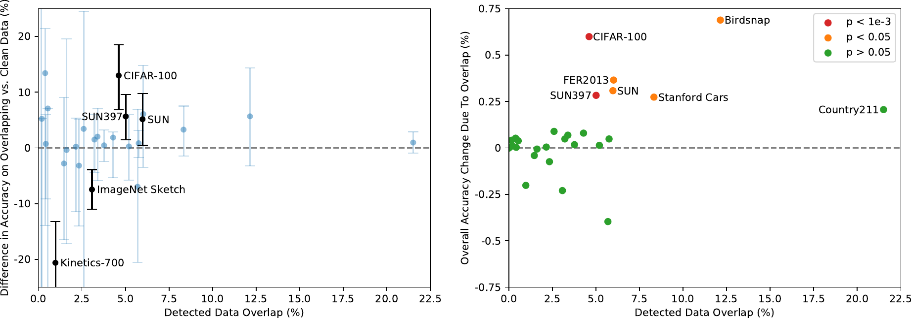

> 图 19 | Rendered SST2 数据集中的两个示例图像。

**表 9 | 用于线性探针评估的数据集。我们注意到，对于 Birdsnap 和 Kinetics700 数据集，我们使用了撰写本文时可用的在线资源。**
| Dataset | Classes | Train size | Test size | Evaluation metric |
| :--- | :---: | :---: | :---: | :--- |
| Food-101 | 102 | 75,750 | 25,250 | accuracy |
| CIFAR-10 | 10 | 50,000 | 10,000 | accuracy |
| CIFAR-100 | 100 | 50,000 | 10,000 | accuracy |
| Birdsnap | 500 | 42,283 | 2,149 | accuracy |
| SUN397 | 397 | 19,850 | 19,850 | accuracy |
| Stanford Cars | 196 | 8,144 | 8,041 | accuracy |
| FGVC Aircraft | 100 | 6,667 | 3,333 | mean per class |
| Pascal VOC 2007 Classification | 20 | 5,011 | 4,952 | 11-point mAP |
| Describable Textures | 47 | 3,760 | 1,880 | accuracy |
| Oxford-IIIT Pets | 37 | 3,680 | 3,669 | mean per class |
| Caltech-101 | 102 | 3,060 | 6,085 | mean-per-class |
| Oxford Flowers 102 | 102 | 2,040 | 6,149 | mean per class |
| MNIST | 10 | 60,000 | 10,000 | accuracy |
| Facial Emotion Recognition 2013 | 8 | 32,140 | 3,574 | accuracy |
| STL-10 | 10 | 1000 | 8000 | accuracy |
| EuroSAT | 10 | 10,000 | 5,000 | accuracy |
| RESISC45 | 45 | 3,150 | 25,200 | accuracy |
| GTSRB | 43 | 26,640 | 12,630 | accuracy |
| KITTI | 4 | 6,770 | 711 | accuracy |
| Country211 | 211 | 43,200 | 21,100 | accuracy |
| PatchCamelyon | 2 | 294,912 | 32,768 | accuracy |
| UCF101 | 101 | 9,537 | 1,794 | accuracy |
| Kinetics700 | 700 | 494,801 | 31,669 | mean(top1, top5) |
| CLEVR Counts | 8 | 2,000 | 500 | accuracy |
| Hateful Memes | 2 | 8,500 | 500 | ROC AUC |
| Rendered SST2 | 2 | 7,792 | 1,821 | accuracy |
| ImageNet | 1000 | 1,281,167 | 50,000 | accuracy |

### A.2 模型（Models）

结合上面列出的数据集，我们使用线性探针评估了以下系列模型。

##### **LM RN50**

这是一个多模态模型，它使用自回归损失（autoregressive loss）而不是对比损失（contrastive loss），同时使用与最小对比模型相同的 ResNet-50 架构。为此，来自卷积神经网络（Convolutional Neural Network, CNN）的输出被投影为四个词元（tokens），然后作为前缀馈送给一个语言模型（language model），该模型自回归地预测文本词元。除了训练目标外，该模型与其他 CLIP 模型在相同的数据集上训练了相同的轮数。

##### **CLIP-RN**

包含了五个基于 ResNet 的对比式 CLIP 模型。如论文所述，前两个模型遵循 ResNet-50 和 ResNet-101，我们对后三个模型使用了 EfficientNet 风格（Tan & Le，2019）的缩放，同时缩放模型宽度、层数和输入分辨率，以获得计算量大约为 4 倍、16 倍和 64 倍的模型。

##### **CLIP-ViT**

我们包含了四个使用视觉变换器（Vision Transformer, ViT）（Dosovitskiy 等人，2020）架构作为图像编码器的 CLIP 模型。我们包含了三个在 $224 \times 224$ 像素图像上训练的模型：ViT-B/32、ViT-B/16、ViT-L/14，以及在 $336 \times 336$ 像素输入图像上微调的 ViT-L/14 模型。

##### **EfficientNet**

我们使用了原始 EfficientNet 论文（Tan & Le，2019）中的九个模型（B0-B8），以及其噪声学生变体（noisy-student variants）（B0-B7、L2-475 和 L2-800）（Tan & Le，2019）。最大的模型（L2-475 和 L2-800）分别采用 $475 \times 475$ 和 $800 \times 800$ 像素的输入分辨率。

##### **Instagram 预训练的 ResNeXt**

我们使用了（Mahajan 等人，2018）发布的四个模型（32x8d、32x16d、32x32d、32x48d），以及它们的两个使用更高输入分辨率的 FixRes 变体（Touvron 等人，2019）。

##### **大迁移（Big Transfer, BiT）**

我们使用了在 ImageNet-1k 和 ImageNet-21k 数据集上训练的 BiT-S 和 BiT-M 模型（Kolesnikov 等人，2019）。BiT-L 的模型权重未公开。

##### **视觉变换器（Vision Transformer, ViT）**

我们还包含了四个在 ImageNet-21k 数据集上预训练的 ViT（Dosovitskiy 等人，2020）检查点，即 ViT-B/32、ViT-B/16、ViT-L/16 和 ViT-H/14。我们注意到，它们在 JFT-300M 数据集上训练的性能最佳模型并未公开。

##### **SimCLRv2**

SimCLRv2（Chen 等人，2020c）项目发布了各种设置下的预训练和微调模型。我们使用了七个仅预训练的、带有选择性核的检查点。

##### **BYOL**

我们使用了 BYOL（Grill 等人，2020）最近发布的模型权重，具体是其 50x1 和 200x2 检查点。

##### **动量对比（Momentum Contrast, MoCo）**

我们包含了 MoCo-v1（He 等人，2020）和 MoCo-v2（Chen 等人，2020d）的检查点。

##### **VirTex**

我们使用了 VirTex（Desai & Johnson，2020）的预训练模型。我们注意到，VirTex 的模型设计与 CLIP-AR 相似，但其训练数据集是来自 MSCOCO 的高质量标注数据集，规模小了 1000 倍。

##### ResNet（ResNet）

我们添加了由 (He et al., 2016b) 发布的原始 ResNet 检查点（Checkpoint），即 ResNet-50、ResNet-101 和 ResNet-152。

### A.3 评估（Evaluation）

我们使用从每个模型的倒数第二层提取的图像特征，忽略模型提供的任何分类层。
对于 CLIP-ViT 模型，我们使用了线性投影到嵌入空间之前的特征，这对应于图 [3](#S2.F3) 中的 $I_f$。
我们使用 scikit-learn 的 L-BFGS 实现训练一个逻辑回归分类器（Logistic Regression Classifier），最大迭代次数为 1000 次，并报告每个数据集的相应指标。我们通过在验证集上进行超参数扫描来确定 L2 正则化强度 $\lambda$，扫描范围在 $10^{-6}$ 到 $10^{6}$ 之间，采用 96 个对数间隔的步长。为了节省扫描所需的计算量，我们执行一种参数化的二分搜索（Parametric Binary Search），该搜索以 $\lambda=[10^{-6},10^{-4},10^{-2},1,10^{2},10^{4},10^{6}]$ 开始，并围绕峰值迭代地将区间减半，直到达到每十年 8 个步长的分辨率。超参数扫描在每个数据集的验证集划分上进行。对于除了测试集划分外还包含验证集划分的数据集，我们使用提供的验证集进行超参数搜索；对于未提供验证集划分或未发布测试数据标签的数据集，我们划分训练数据集以进行超参数搜索。对于最终结果，我们将验证集划分重新与训练集划分合并，并在未使用的划分上报告性能。

### A.4 结果（Results）

各线性探针（Linear Probe）得分详见表 [10](#A1.T10) 并绘制于图 [20](#A1.F20) 中。性能最佳的 CLIP（Contrastive Language-Image Pre-training）模型，采用 ViT-L/14（Vision Transformer Large/14）架构和 336×336 像素图像，在 27 个数据集中的 21 个上达到了 **最先进水平（state of the art）** ，即其得分落在每个数据集最高分数的 Clopper-Pearson 99.5% 置信区间内。
对于许多数据集，CLIP 的表现显著优于其他模型，这证明了 **自然语言监督（natural language supervision）** 相较于基于图像分类的传统预训练方法的优势。
关于线性探针结果的更多讨论，请参见第 [3.2](#S3.SS2) 节。

**表 10（Table 10）** ：多种预训练模型在 27 个数据集上的线性探针（Linear probe）性能。得分位于每个数据集最高分的 99.5% **克洛珀-皮尔逊置信区间（Clopper-Pearson confidence interval）** 内的分数以粗体显示。

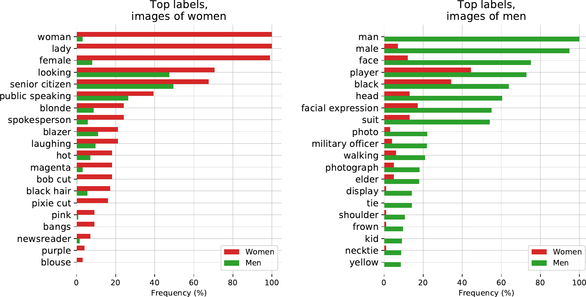

> 图 20 | 使用表 [10](#A1.T10) 中的数据，为 27 个数据集分别绘制的 **线性探针（Linear probe）** 性能图。

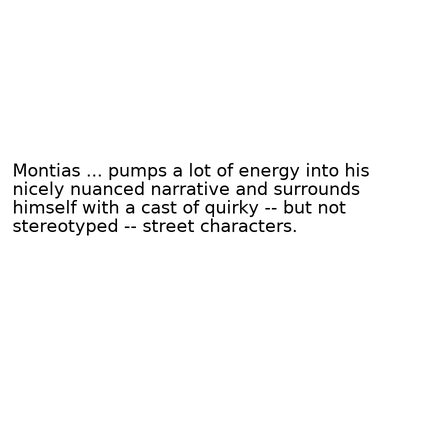

> 图 21 | 36 个 CLIP（Contrastive Language–Image Pre-training， 对比语言-图像预训练）零样本分类器的预测可视化。除为避免冒犯性内容而重新选择了 Hateful Memes（仇恨性模因）数据集外，所有示例均为随机选取。图中显示了前 5 个类别的预测概率以及用于表示该类别的文本。当使用多个提示模板时，仅显示第一个模板。真实标签（Ground truth label）标为绿色，错误预测标为橙色。

**表 11 | CLIP 模型在 27 个数据集上的零样本性能。**
| | | | Food101 | CIFAR10 | CIFAR100 | Birdsnap | SUN397 | Stanford Cars | FGVC Aircraft | VOC2007 | DTD | Oxford Pets | Caltech101 | Flowers102 | MNIST | FER2013 | STL10 | EuroSAT | RESISC45 | GTSRB | KITTI | Country211 | PCam | UCF101 | Kinetics700 | CLEVR | HatefulMemes | Rendered SST2 | ImageNet |
| --- | --- | --- | --- | --- | --- | --- | --- | --- | --- | --- | --- | --- | --- | --- | --- | --- | --- | --- | --- | --- | --- | --- | --- | --- | --- | --- | --- | --- | --- |
| CLIP-ResNet | RN50 | | 81.1 | 75.6 | 41.6 | 32.6 | 59.6 | 55.8 | 19.3 | 82.1 | 41.7 | 85.4 | 82.1 | 65.9 | 66.6 | 42.2 | 94.3 | 41.1 | 54.2 | 35.2 | 42.2 | 16.1 | 57.6 | 63.6 | 43.5 | 20.3 | 59.7 | 56.9 | 59.6 |
| RN101 | | 83.9 | 81.0 | 49.0 | 37.2 | 59.9 | 62.3 | 19.5 | 82.4 | 43.9 | 86.2 | 85.1 | 65.7 | 59.3 | 45.6 | 96.7 | 33.1 | 58.5 | 38.3 | 33.3 | 16.9 | 55.2 | 62.2 | 46.7 | 28.1 | 61.1 | 64.2 | 62.2 | |
| RN50x4 | | 86.8 | 79.2 | 48.9 | 41.6 | 62.7 | 67.9 | 24.6 | 83.0 | 49.3 | 88.1 | 86.0 | 68.0 | 75.2 | 51.1 | 96.4 | 35.0 | 59.2 | 35.7 | 26.0 | 20.2 | 57.5 | 65.5 | 49.0 | 17.0 | 58.3 | 66.6 | 65.8 | |
| RN50x16 | | 90.5 | 82.2 | 54.2 | 45.9 | 65.0 | 72.3 | 30.3 | 82.9 | 52.8 | 89.7 | 87.6 | 71.9 | 80.0 | 56.0 | 97.8 | 40.3 | 64.4 | 39.6 | 33.9 | 24.0 | 62.5 | 68.7 | 53.4 | 17.6 | 58.9 | 67.6 | 70.5 | |
| RN50x64 | | 91.8 | 86.8 | 61.3 | 48.9 | 66.9 | 76.0 | 35.6 | 83.8 | 53.4 | 93.4 | 90.6 | 77.3 | 90.8 | 61.0 | 98.3 | 59.4 | 69.7 | 47.9 | 33.2 | 29.6 | 65.0 | 74.1 | 56.8 | 27.5 | 62.1 | 70.7 | 73.6 | |
| CLIP-ViT | B/32 | | 84.4 | 91.3 | 65.1 | 37.8 | 63.2 | 59.4 | 21.2 | 83.1 | 44.5 | 87.0 | 87.9 | 66.7 | 51.9 | 47.3 | 97.2 | 49.4 | 60.3 | 32.2 | 39.4 | 17.8 | 58.4 | 64.5 | 47.8 | 24.8 | 57.6 | 59.6 | 63.2 |
| B/16 | | 89.2 | 91.6 | 68.7 | 39.1 | 65.2 | 65.6 | 27.1 | 83.9 | 46.0 | 88.9 | 89.3 | 70.4 | 56.0 | 52.7 | 98.2 | 54.1 | 65.5 | 43.3 | 44.0 | 23.3 | 48.1 | 69.8 | 52.4 | 23.4 | 61.7 | 59.8 | 68.6 | |
| L/14 | | 92.9 | 96.2 | 77.9 | 48.3 | 67.7 | 77.3 | 36.1 | 84.1 | 55.3 | 93.5 | 92.6 | 78.7 | 87.2 | 57.5 | 99.3 | 59.9 | 71.6 | 50.3 | 23.1 | 32.7 | 58.8 | 76.2 | 60.3 | 24.3 | 63.3 | 64.0 | 75.3 | |
| L/14-336px | | 93.8 | 95.7 | 77.5 | 49.5 | 68.4 | 78.8 | 37.2 | 84.3 | 55.7 | 93.5 | 92.8 | 78.3 | 88.3 | 57.7 | 99.4 | 59.6 | 71.7 | 52.3 | 21.9 | 34.9 | 63.0 | 76.9 | 61.3 | 24.8 | 63.3 | 67.9 | 76.2 | |

## **附录 B 零样本预测（Zero-Shot Prediction）**

为了对 CLIP（Contrastive Language–Image Pre-training）的零样本性能进行定性总结/概述，我们在图 [21](#A1.F21) 中可视化了 36 个不同的零样本 CLIP 分类器的随机预测结果。此外，表 [22](#A1.F22) 和图 [22](#A1.F22) 展示了每个数据集的独立零样本性能分数。

## **附录 C 重复检测器（Duplicate Detector）**

我们早期进行重复检测和分析的尝试使用了模型在其学习到的嵌入空间中的最近邻方法。虽然使用模型自身的相似性概念很直观，但我们遇到了一些问题。我们发现模型的特征空间 **严重偏向于语义相似性** 。许多误报（False Positives）的发生，是因为那些描述相似但实际不同的物体（如足球、同一物种的花等）具有几乎完美的相似度。我们还观察到，模型在给某些类型的近似重复项分配高相似性分数方面表现相当差。我们反复注意到，经过不同重采样算法（最近邻 vs. 双线性）预处理的、具有高频纹理（如毛皮或条纹图案）的图像，其相似性可能低得惊人。这导致了大量的漏报（False Negatives）。

为了解决这个问题，我们构建了自己的近似重复检测器。我们创建了一个 **合成数据增强流水线（Synthetic Data Augmentation Pipeline）** ，它结合了多种常见的图像处理操作。该增强流水线结合了：

- 随机裁剪和缩放
- 长宽比扭曲
- 降采样和上采样至不同分辨率
- 轻微旋转
- JPEG 压缩
- HSV 颜色抖动

该流水线还会在所有相关步骤中随机选择不同的插值算法。然后，我们训练一个模型，以最大化一张图像与其变换版本之间的相似性，同时最小化其与训练批次中所有其他图像的相似性。我们使用了与 CLIP 相同的 **n-pair / InfoNCE 损失函数（InfoNCE Loss）** ，但采用固定的温度参数 0.07。

我们选择 **ResNet-50** 作为模型架构。我们基于 (Zhang, 2019) 中的抗锯齿改进对基础 ResNet-50 进行了修改，并使用 **权重归一化（Weight Norm）** (Salimans & Kingma, 2016) 代替了 **批量归一化（Batch Norm）** (Ioffe & Szegedy, 2015)，以避免通过批次统计信息泄露关于重复项的信息——这是 (Henaff, 2020) 中先前指出的一个问题。我们还发现，对于此任务， **GELU 激活函数（GELU Activation Function）** (Hendrycks & Gimpel, 2016) 表现更好。我们使用总批次大小为 1,712 对模型进行了训练，训练数据采样自我们的预训练数据集，约 3000 万张图像。在训练结束时，该模型在其代理训练任务上达到了接近 100% 的准确率。

## 附录 D 在 YFCC100M 上的数据集消融研究

**表 12：仅在 YFCC100M 上训练时，CLIP 表现相似。** 比较仅在 YFCC100M 上训练的 ResNet-50 与在同等规模的 WIT 子集上训练的模型，在零样本和线性分类器评估中显示出相似的平均性能和获胜次数。然而，在特定数据集上的性能存在巨大差异。我们根据线性探针（linear probe）的结果，列出了 YFCC 相比 WIT 表现最好和最差的 3 个数据集上的性能，以突出这一点，同时也汇总了所有线性与零样本评估以及标准 ImageNet 数据集上的总体性能。

| 数据集               | 线性分类器 |          |            |  零样本  |          |            |
| :------------------- | :--------: | :------: | :--------: | :------: | :------: | :--------: |
|                      |    YFCC    |   WIT    |  $\Delta$  |   YFCC   |   WIT    |  $\Delta$  |
| Birdsnap             |    47.4    |   35.3   |  $+$12.1   |   19.9   |   4.5    |  $+$15.4   |
| Country211           |    23.1    |   17.3   |   $+$5.8   |   5.2    |   5.3    |   $+$0.1   |
| Flowers102           |    94.4    |   89.8   |   $+$4.6   |   48.6   |   21.7   |  $+$26.9   |
| GTSRB                |    66.8    |   72.5   |   $-$5.7   |   6.9    |   7.0    |   $-$0.1   |
| UCF101               |    69.2    |   74.9   |   $-$5.7   |   22.9   |   32.0   |   $-$9.1   |
| Stanford Cars        |    31.4    |   50.3   |  $-$18.9   |   3.8    |   10.9   |   $-$7.1   |
| ImageNet             |    62.0    |   60.8   |   $+1.2$   |   31.3   |   27.6   |   $+$3.7   |
| **数据集平均**       |  **65.5**  | **66.6** | **$-$1.1** | **29.6** | **30.0** | **$-$0.4** |
| **数据集“获胜”次数** |   **10**   |  **15**  |  **$-$5**  |  **19**  |  **18**  |  **$+$1**  |

为了研究我们的自定义数据集是否对 CLIP 的性能至关重要，我们在 YFCC100M 数据集的一个过滤子集（细节在章节 [2.2](#S2.SS2) 中描述）上训练了一个模型，并将其性能与在同等规模的 WIT 子集上训练的相同模型进行了比较。我们将每个模型训练了 32 个轮次（epoch），此时由于过拟合，迁移性能开始趋于稳定。结果如表 [12](#A4.T12) 所示。在我们的整个评估套件中，YFCC 和 WIT 在零样本和线性探针设置下的平均表现相似。然而，在特定的细粒度分类数据集上的性能差异可能很大——有时超过 10%。我们推测，这些性能差异反映了每个预训练数据集中相关数据的相对密度。例如，在 YFCC100M 上进行预训练（其中可能包含许多鸟类和花卉的照片，这是摄影师的常见主题）会导致在 Birdsnap 和 Flowers102 上表现更好，而在 WIT 上进行预训练则会产生更好的汽车和宠物分类器（这在我们数据集中似乎很常见）。

总的来说，这些结果令人鼓舞，因为它们表明我们的方法可以使用任何经过合理过滤的成对（文本，图像）数据集合。这反映了最近的工作，该工作在相对不同的医学影像领域使用相同的对比预训练目标报告了积极的结果（Zhang 等人，2020）。这也与噪声学生自训练（noisy student self-training）的发现相似，该研究报告称，使用其 JFT300M 数据集相比 YFCC100M 仅带来了轻微改进（Xie 等人，2020）。我们怀疑我们的数据集相对于已存在的 YFCC100M 的主要优势在于其大得多的规模。

最后，我们提醒，WIT 包含了这个经过过滤的 YFCC100M 子集。这可能导致我们的消融研究低估了 YFCC100M 与 WIT 其余部分之间的性能差异程度。我们认为这不太可能，因为 YFCC100M 仅占整个 WIT 数据混合的 3.7%，并且在创建 WIT 时将其添加到现有数据混合中时，并未显著改变模型的性能。

**表 13：CLIP 改进了零样本检索，并在 Flickr30k 文本检索上与最佳微调结果具有竞争力。** 加粗表示整体最佳性能，而下划线表示类别内最佳性能（零样本或微调）。对于所有其他模型，报告了论文中的最佳结果，无论模型大小/变体如何。MSCOCO 性能报告在 5k 测试集上。^a(Li 等人，2020a) ^b(Chen 等人，2019) ^c(Gan 等人，2020) ^d(Li 等人，2020b) ^e(Yu 等人，2020) ^f(Li 等人，2017) ^g(Qi 等人，2020)

|            |                  | 文本检索  |          |          |        |      | 图像检索 |           |      |      |        |      |
| :--------- | :--------------- | :-------: | :------: | :------: | :----: | :--: | :------: | :-------: | :--: | :--: | :----: | :--: | :--: |
|            |                  | Flickr30k |          |          | MSCOCO |      |          | Flickr30k |      |      | MSCOCO |      |      |
|            |                  |    R@1    |   R@5    |   R@10   |  R@1   | R@5  |   R@10   |    R@1    | R@5  | R@10 |  R@1   | R@5  | R@10 |
| **微调**   | Unicoder-VL^a    |   86.2    |   96.3   |   99.0   |  62.3  | 87.1 |   92.8   |   71.5    | 90.9 | 94.9 |  46.7  | 76.0 | 85.3 |
|            | Uniter^b         |   87.3    |   98.0   |   99.2   |  65.7  | 88.6 |   93.8   |   75.6    | 94.1 | 96.8 |  52.9  | 79.9 | 88.0 |
|            | VILLA^c          |   87.9    |   97.5   |   98.8   |   -    |  -   |    -     |   76.3    | 94.2 | 96.8 |   -    |  -   |  -   |
|            | Oscar^d          |     -     |    -     |    -     |  73.5  | 92.2 |   96.0   |     -     |  -   |  -   |  57.5  | 82.8 | 89.8 |
|            | ERNIE-ViL^e      |   88.7    |   98.0   |   99.2   |   -    |  -   |    -     |   76.7    | 93.6 | 96.4 |   -    |  -   |  -   |
| **零样本** | Visual N-Grams^f |   15.4    |   35.7   |   45.1   |  8.7   | 23.1 |   33.3   |    8.8    | 21.2 | 29.9 |  5.0   | 14.5 | 21.9 |
|            | ImageBERT^g      |     -     |    -     |    -     |  44.0  | 71.2 |   80.4   |     -     |  -   |  -   |  32.3  | 59.0 | 70.2 |
|            | Unicoder-VL^a    |   64.3    |   86.8   |   92.3   |   -    |  -   |    -     |   48.4    | 76.0 | 85.2 |   -    |  -   |  -   |
|            | Uniter^b         |   83.6    |   95.7   |   97.7   |   -    |  -   |    -     |   68.7    | 89.2 | 93.9 |   -    |  -   |  -   |
|            | **CLIP**         | **88.0**  | **98.7** | **99.4** |  58.4  | 81.5 |   88.1   |   68.7    | 90.6 | 95.2 |  37.8  | 62.4 | 72.2 |

## 附录 E 选定任务与数据集结果

由于本工作涉及的数据集和实验种类繁多，正文部分侧重于总结和分析整体结果。在以下小节中，我们将报告特定任务组、数据集和评估设置下的性能细节。

### E.1 图像与文本检索

**CLIP（Contrastive Language-Image Pre-training）** 在我们嘈杂的网络规模数据集上为 **图像-文本检索（image-text retrieval）** 任务进行了预训练。尽管本文的重点是表征学习和任务学习，目的是迁移到各种下游数据集，但验证 CLIP 能够在其预训练的目标上实现高迁移性能，是一项重要的合理性检验/概念验证。在表 [13](#A4.T13) 中，我们检查了 CLIP 在 Flickr30k 和 MSCOCO 数据集上进行文本和图像检索的 **零样本迁移（zero-shot transfer）** 性能。零样本 CLIP 在这两个数据集上匹配或超越了所有先前的零样本结果。对于 Flickr30k 上的文本检索任务，零样本 CLIP 也与当前的整体 **最先进技术（State Of The Art, SOTA）** 具有竞争力。在图像检索方面，CLIP 相对于整体最先进技术的性能明显较低。然而，零样本 CLIP 仍然与经过微调的 Unicoder-VL 具有可比性。在更大的 MS-COCO 数据集上，微调显著提高了性能，零样本 CLIP 无法与最新的工作竞争。对于这两个数据集，我们在每张图像的描述前添加了提示词“a photo of”，我们发现这能将 CLIP 的零样本 R@1 性能提升 1 到 2 个百分点。

**表 14：在 5 个数据集上的 OCR 性能。除 Hateful Memes 报告开发集上的 ROC AUC 外，所有指标均为测试集上的准确率。单模型 SOTA 据我们所知报告。ES Best 报告了我们评估套件中 56 个非 CLIP 模型的最佳性能。^a(Assiri, 2020) ^b(Jaderberg et al., 2015) ^c(Wang et al., 2020) ^d(Lippe et al., 2020) ^f(Jaderberg et al., 2014) ^g(Wang et al., 2018) ^h(Xie et al., 2020) ^i(Mahajan et al., 2018)**
| | | | | IIIT5K | Hateful | |
| :--- | :--- | :--- | :--- | :--- | :--- | :--- |
| | | MNIST | SVHN | 1k | Memes | SST-2 |
| Finetune | SOTA | 99.8^a | 96.4^b | 98.9^c | 78.0^d | 97.5^e |
| JOINT^f | - | - | 89.6 | - | - | |
| CBoW^g | - | - | - | - | 80.0 | |
| Linear | Raw Pixels | 92.5 | - | - | - | - |
| ES Best | 98.9^h | - | - | 58.6^h | 59.0^i | |
| CLIP | 99.2 | - | - | 77.3 | 80.5 | |
| ZS | CLIP | 88.4 | 51.0 | 90.0 | 63.3 | 67.9 |

### E.2 光学字符识别（Optical Character Recognition）

尽管可视化研究表明，ImageNet 模型包含了对图像中文本存在做出响应的特征（Zeiler & Fergus, 2014），但这些表征的粒度不够精细，无法直接用于 **光学字符识别（Optical Character Recognition, OCR）** 任务。为了弥补这一点，模型通常会通过集成定制 OCR 引擎的输出和特征来增强，以提升需要此能力的任务性能（Singh et al., 2019; Yang et al., 2020）。在 CLIP 开发的早期，我们注意到 CLIP 开始学习原始的 OCR 能力，并且这种能力在整个项目过程中似乎稳步提升。为了定量评估这一观察到的行为，我们在 5 个需要直接或间接使用 OCR 的数据集上测量了性能。其中三个数据集—— **MNIST（LeCun）** 、 **SVHN（Netzer et al., 2011）** 和 **IIIT5K（Mishra et al., 2012）** ——直接检验模型执行低级字符和单词识别的能力，而 **Hateful Memes（Kiela et al., 2020）** 和 **SST-2（Socher et al., 2013）** 则检验模型利用 OCR 执行语义任务的能力。结果报告在表 [14](#A5.T14) 中。

CLIP 的性能仍然变化很大，并且似乎对 **领域（渲染图像或自然图像）** 和 **待识别文本类型（数字或单词）** 的某种组合敏感。CLIP 的 OCR 性能在 Hateful Memes 和 SST-2 上最强——这两个数据集的文本是数字渲染的，且主要由单词构成。在 IIIT5K（包含单独裁剪单词的自然图像）上，零样本（Zero-shot）CLIP 的表现稍好一些，其性能与 Jaderberg 等人（2014）早期结合深度学习和结构化预测进行开放词汇 OCR 的工作相似。然而，在涉及手写数字和街景数字识别的两个数据集上，性能明显较低。CLIP 在完整数字 SVHN 数据集上 51% 的准确率远低于任何已发表的结果。检查表明，CLIP 在处理重复字符以及 SVHN 的低分辨率和模糊图像时存在困难。CLIP 的零样本 MNIST 性能也很差，甚至被基于原始像素的监督逻辑回归（这是可能的最简单的机器学习基线之一）超越。

SST-2 是一个句子级的 NLP 数据集，我们将其渲染成图像。我们引入 SST-2 是为了检验 CLIP 是否能够将低级 OCR 能力转化为更高级别的表征。在 CLIP 对渲染句子的表征上拟合一个线性分类器，达到了 80.5% 的准确率。这与使用在 8400 亿词元上预训练的 GloVe 词向量的连续词袋（Continuous Bag of Words, CBOW）基线 80% 的准确率相当（Pennington et al., 2014）。虽然以今天的标准来看，这是一个简单的 NLP 基线，并且远低于当前 SOTA（State of the Art）的 97.5%，但看到 CLIP 能够将渲染文本的图像转化为一个非平凡的句子级表征，是令人鼓舞的。全监督（Fully supervised）CLIP 在 Hateful Meme 检测上也出人意料地强大，CLIP 仅比当前单模型 SOTA 落后 0.7 个百分点，并且比原论文中的最佳基线高出几个百分点。与 SST-2 类似，Hateful Memes 上的这些其他结果使用了 CLIP 无法访问的真实文本（Ground truth text）。最后，我们注意到，零样本 CLIP 的表现优于我们评估套件中所有其他 56 个模型使用全监督线性探针（Linear probe）得到的最佳结果。这表明，与现有的自监督和监督表征学习工作相比，CLIP 的 OCR 能力至少在某种程度上是独特的。

表 15 | 在 3 个视频数据集上的动作识别性能。单模型 SOTA 据我们所知报告。请注意，线性 CLIP 和线性 NS ENet-L2 是在每个数据集的单帧子采样版本上进行训练和评估的，与先前工作不直接可比。在 Kinetics-700 上，我们报告 ActivityNet 竞赛指标，即 top-1 和 top-5 性能的平均值。^a(Kalfaoglu et al., 2020) ^b(Lu et al., 2020) ^c(Xie et al., 2020) ^d(Miech et al., 2020b) ^e(Carreira et al., 2019) ^f(Alayrac et al., 2020)
| | | UCF101 | K700 | RareAct | |
| :--- | :--- | :---: | :---: | :---: | :---: |
| | | Top-1 | AVG | mWAP | mWSAP |
| **Finetune** | R(2+1)D-BERT^a | 98.7 | - | - | - |
| | NS ENet-L2^b | - | 84.8 | - | - |
| | HT100M S3D^d | 91.3 | - | - | - |
| | Baseline I3D^e | - | 70.2 | - | - |
| **Linear** | MMV FAC^f | 91.8 | - | - | - |
| | NS ENet-L2^c | 89.4^c | 68.2^c | - | - |
| | CLIP | 92.0 | 73.0 | - | - |
| **ZS** | HT100M S3D^d | - | - | 30.5 | 34.8 |
| | CLIP | 80.3 | 69.6 | 40.7 | 44.8 |

### E.3 视频中的动作识别（Action Recognition in Videos）

就学习目的而言，自然语言一个潜在的重要方面是其能够表达并因此监督一个极其广泛的概念集合。 **CLIP（Contrastive Language-Image Pre-training）** 模型，由于被训练来配对半任意的文本与图像，很可能接收到涉及 **普通名词（Common Nouns）** 、 **专有名词（Proper Nouns）** 、 **动词（Verbs）** 和 **形容词（Adjectives）** 的广泛视觉概念的监督。相比之下， **ImageNet-1K** 仅标注普通名词。ImageNet 中缺乏更广泛的监督，是否会导致 ImageNet 模型在涉及识别非名词视觉概念的任务上迁移能力较弱？

为了研究这一点，我们测量并比较了 CLIP 和 ImageNet 模型在几个视频动作分类数据集上的性能，这些数据集衡量模型识别动词的能力。在表 [15](#A5.T15) 中，我们报告了在 UCF-101 (Soomro et al., 2012) 和 Kinetics-700 (Carreira et al., 2019) 这两个该任务常用数据集上的结果。不幸的是，由于训练帧数量非常庞大，我们基于 CPU 的线性分类器在视频数据集上进行评估需要极长的时间。为了解决这个问题，我们激进地对每个视频进行二次采样，仅保留一个中心帧，从而有效地将其转换为图像分类数据集。因此，我们在线性评估设置中报告的性能可能在一定程度上低估了实际性能。

**表 16：详细的 ImageNet 鲁棒性性能。IN 是 ImageNet 的缩写。^a(Xie et al., 2020) ^b(Touvron et al., 2019)**
| | IN | IN-V2 | IN-A | IN-R | ObjectNet | IN-Sketch | IN-Vid | YTBB | | |
| :--- | :---: | :---: | :---: | :---: | :---: | :---: | :---: | :---: | :---: | :---: |
| | Top-1 | Top-1 | Top-1 | Top-1 | Top-1 | Top-1 | PM0 | PM10 | PM0 | PM10 |
| NS EfficientNet-L2^a | 88.3 | 80.2 | 84.9 | 74.7 | 68.5 | 47.6 | 88.0 | 82.1 | 67.7 | 63.5 |
| FixResNeXt101-32x48d V2^b | 86.4 | 78.0 | 68.4 | 80.0 | 57.8 | 59.1 | 85.8 | 72.2 | 68.9 | 57.7 |
| Linear Probe CLIP | 85.4 | 75.9 | 75.3 | 84.2 | 66.2 | 57.4 | 89.1 | 77.2 | 68.7 | 63.1 |
| Zero-Shot CLIP | 76.2 | 70.1 | 77.2 | 88.9 | 72.3 | 60.2 | 95.3 | 89.2 | 95.2 | 88.5 |

尽管存在这一缺陷，CLIP 的特征在此任务上的迁移效果出奇地好。在线性探针评估设置中，CLIP 在 UCF-101 上匹配了先前的最佳结果，并且在我们评估套件中的所有其他模型中也表现更优。在 Kinetics-700 上，CLIP 的表现也优于原始论文中经过微调的 I3D 基线。由于它不需要训练阶段，我们报告了 CLIP 在所有帧上平均预测时的 **零样本（Zero-Shot）** 性能。CLIP 在此设置下同样表现良好，在 Kinetics-700 上，其性能与在 545,000 个带标签视频上训练的完全监督 I3D 基线相差在 1% 以内。受这些结果的鼓舞，我们还测量了 CLIP 在最近引入的 RareAct 数据集 (Miech et al., 2020a) 上的性能，该数据集旨在衡量对“用锤子砸手机”和“给鸡蛋钻孔”等不常见动作的零样本识别能力。CLIP 将先前的最先进水平（一个在从 1 亿个教学视频中自动提取的字幕上训练的 S3D 模型）提高了 10 个百分点。

虽然 CLIP 在动作识别任务上表现出了令人鼓舞的强大性能，但我们注意到，被比较的模型之间除了监督形式外，还存在许多差异，例如模型架构、训练数据分布、数据集大小和使用的计算资源。需要进一步的工作来更精确地确定哪些具体的设计决策有助于在此任务上实现高性能。

**表 17：IM2GPS 测试集上的地理定位性能。指标是在给定半径内定位的图像百分比。模型按平均性能排序。^a(Muller-Budack et al., 2018) ^b(Hongsuck Seo et al., 2018) ^c(Vo et al., 2017) ^c(Weyand et al., 2016)**
| | 1km | 25km | 200km | 750km | 2500km |
| :--- | :---: | :---: | :---: | :---: | :---: |
| ISNs^a | 16.9 | 43.0 | 51.9 | 66.7 | 80.2 |
| CPlaNet^b | 16.5 | 37.1 | 46.4 | 62.0 | 78.5 |
| CLIP | 13.9 | 32.9 | 43.0 | 62.0 | 79.3 |
| Deep-Ret+^c | 14.4 | 33.3 | 47.7 | 61.6 | 73.4 |
| PlaNet^d | 8.4 | 24.5 | 37.6 | 53.6 | 71.3 |

### E.4 地理定位（Geolocalization）

我们在开发 CLIP 期间注意到的另一个行为是它识别许多地点和位置的能力。为了量化这一点，我们创建了如附录 [A](#A1) 所述的 Country211 数据集，并在整篇论文中报告了其结果。然而，这是一个新的基准，为了与先前的地理定位工作进行比较，我们还在表 [17](#A5.T17) 中报告了来自 Hays & Efros (2008) 的 IM2GPS 测试集上的结果。由于 IM2GPS 是一个回归基准，我们使用 CLIP 的嵌入空间来猜测一组参考图像中最近邻图像的 GPS 坐标。这不是零样本结果，因为它使用了最近邻回归。尽管仅查询了 100 万张图像，远少于先前的工作，但 CLIP 的表现与几个任务专用模型相似。然而，它并不具备与当前最先进技术竞争的能力。

### E.5 对分布偏移的鲁棒性（Robustness to Distribution Shift）

章节 [3.3](#S3.SS3) 对与 ImageNet 相关的鲁棒性结果提供了高层次的总结和分析。我们在此附录中简要提供一些额外的数值细节。每个数据集的性能结果在表 [16](#A5.T16) 中提供，并与 Taori 等人 (2020) 评估套件中报告的当前最先进结果进行了比较。 **零样本 CLIP（Zero-Shot CLIP）** 在 7 个数据集中的 5 个上改进了最先进水平，这 5 个数据集是 ImageNet-R、ObjectNet、ImageNet-Sketch、ImageNet-Vid 和 Youtube-BB。CLIP 的改进在 ImageNet-Vid 和 Youtube-BB 上最大，这得益于其灵活的零样本能力；在 ImageNet-R 上的改进则可能反映了 CLIP 的预训练分布包含了大量的创意内容。如 Taori 等人 (2020) 所讨论的，在 Instagram 上预训练的 ResNeXt 模型也记录了类似的行为。

## 附录 F 模型超参数

**表 18: 通用 CLIP 超参数**
| 超参数 | 值 |
| :--- | :--- |
| 批大小 | 32768 |
| 词汇表大小 | 49408 |
| 训练轮数 | 32 |
| 最大温度 | 100.0 |
| 权重衰减 | 0.2 |
| 预热迭代次数 | 2000 |
| Adam $\beta_{1}$ | 0.9 |
| Adam $\beta_{2}$ | 0.999 (ResNet), 0.98 (ViT) |
| Adam $\epsilon$ | $10^{-8}$ (ResNet), $10^{-6}$ (ViT) |
