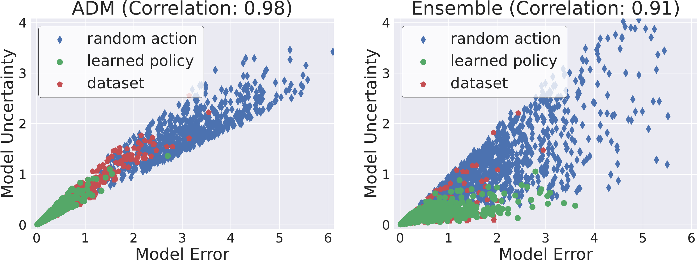
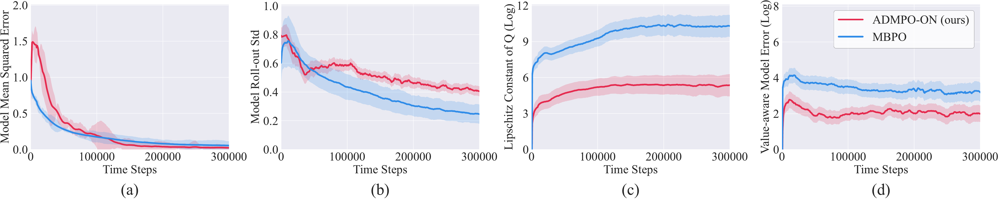

<a id="appendix-a"></a>

## 附录 A 悲观价值迭代（Pessimistic Value Iteration, PEVI）补充介绍

**悲观价值迭代（Pessimistic Value Iteration, PEVI）** [23] 是一种用于离线强化学习（Offline RL）设置的元算法。它基于给定的数据集 $\mathcal{D}_{\mathrm{env}}$ 构造一个估计的贝尔曼算子 $\hat{\mathcal{T}}^{\pi}$，以逼近满足下式的真实贝尔曼算子 $\mathcal{T}^{\pi}$：

$$
\mathcal{T}^{\pi}V_{h+1}(s_{h},a_{h})=\mathbb{E}_{(s_{h+1},r_{h+1})\sim T( \cdot|s_{h},a_{h})}\left[r_{h+1}+V_{h+1}(s_{h+1})\right],\tag{9}
$$

其中 $h$ 是小于时间范围 $\mathcal{H}$ 的步长索引。然后，状态-动作价值函数按以下方式更新：

$$
Q_{h}(s_{h},a_{h})\leftarrow\hat{\mathcal{T}}^{\pi}V_{h+1}(s_{h},a_{h})- \Lambda_{h}(s_{h},a_{h})\tag{10}
$$

对每个 $(s_{h},a_{h})$ 执行，其中 $\Lambda_{h}$ 是保证所学策略保守性的惩罚函数。特别地，$\Lambda_{h}$ 应是一个如下定义的 $\xi$-不确定性量化器。

###### 定义 A.1 ( $\xi$-不确定性量化器（由 [23] 提出）) .

惩罚集合 $\{\Lambda_{h}\}_{h\in[\mathcal{H}]}$ 构成一个 $\xi$-不确定性量化器，如果对于所有 $(s_{h},a_{h})\in\mathcal{S}\times\mathcal{A}$，下式以至少 $1-\xi$ 的概率成立：

$$
\left|\hat{\mathcal{T}}^{\pi}V_{h+1}(s_{h},a_{h})-\mathcal{T}^{\pi}V_{h+1}(s_{h},a_{h})\right|\leq\Lambda_{h}(s_{h},a_{h})\tag{11}
$$

以下定理刻画了 PEVI 的次优性。

###### 定理 A.2 (PEVI 的次优性（由 [23] 提出）) .

假设 PEVI 中的 $\{\Lambda_{h}\}_{h=1}^{\mathcal{H}}$ 是一组 $\xi$-不确定性量化器。那么推导出的策略 $\hat{\pi}$ 满足：对于所有起始状态 $s_{1}\in\mathcal{S}$，以至少 $1-\xi$ 的概率有

$$
\left|V_{1}^{\pi^{*}}(s_{1})-V_{1}^{\hat{\pi}}(s_{1})\right|\leq 2\sum_{h=1}^{\mathcal{H}}\mathbb{E}_{\rho^{\pi^{*}}}\left[\Lambda_{h}(s_{h},a_{h})\right]\tag{12}
$$

这里 $\mathbb{E}_{\rho^{\pi^{*}}}$ 是关于在给定固定函数 $\Lambda_{h}$ 的情况下，由底层 MDP 中最优策略 $\pi^{*}$ 诱导出的轨迹的期望。

###### 证明.

详见 PEVI [23] 的详细证明。 ∎

<a id="appendix-b"></a>

## 附录 B 理论结果

###### 定理 B.1 .

$\beta\cdot\mathcal{U}^{\mathrm{ADM}}$ 是一个有效的 $\xi$-不确定性量化器，其中 $\beta=b\frac{\gamma r_{\mathrm{max}}}{1-\gamma}$。具体而言，

$$
\left|\hat{\mathcal{T}}^{\pi}Q(s_{t},a_{t})-\mathcal{T}^{\pi}Q(s_{t},a_{t}) \right|\leq\beta\cdot\mathcal{U}^{\mathrm{ADM}}(s_{t},a_{t}),\tag{13}
$$

其中 $\hat{\mathcal{T}}^{\pi}$ 是由 ADM 诱导的、用于估计真实贝尔曼算子 $\mathcal{T}^{\pi}$ 的代理贝尔曼算子。

###### 证明.

首先，我们定义 $y(\hat{s}_{t+1},\hat{r}_{t+1})=\hat{r}_{t+1}+\gamma\mathbb{E}_{a\sim\pi(\cdot| \hat{s}_{t+1})}\left[Q(\hat{s}_{t+1},a)\right]$，并将这两个贝尔曼算子展开为：

$$
\displaystyle\hat{\mathcal{T}}^{\pi}Q(s_{t},a_{t}) \tag{14} \displaystyle= \displaystyle\mathbb{E}_{(s_{t-m+1:t-1},a_{t-m+1:t-1})\sim\Gamma^{m-1}_{\pi}( \cdot|s_{t})}\left[\frac{1}{m}\sum_{k=1}^{m}\mathbb{E}_{(\hat{s}_{t+1},\hat{r} _{t+1})\sim\hat{T}_{\theta}(\cdot|s_{t-k+1},a_{t-k+1:t})}\left[y(\hat{s}_{t+1} ,\hat{r}_{t+1})\right]\right] \displaystyle= \displaystyle\sum_{\begin{subarray}{c}s_{t-m+1}\\ a_{t-m+1:t-1}\end{subarray}}\Gamma^{m-1}_{\pi}(s_{t-m+1},a_{t-m+1:t-1}|s_{t}) \left[\frac{1}{m}\sum_{k=1}^{m}\sum_{\begin{subarray}{c}\hat{s}_{t+1}\\ \hat{r}_{t+1}\end{subarray}}\hat{T}_{\theta}(\cdot|s_{t-k+1},a_{t-k+1:t})y( \hat{s}_{t+1},\hat{r}_{t+1})\right] \displaystyle= \displaystyle\frac{1}{m}\sum_{k=1}^{m}\left[\sum_{\begin{subarray}{c}s_{t-k+1} \\ a_{t-k+1:t-1}\end{subarray}}\Gamma^{k-1}_{\pi}(s_{t-k+1},a_{t-k+1:t-1}|s_{t}) \sum_{\begin{subarray}{c}\hat{s}_{t+1}\\ \hat{r}_{t+1}\end{subarray}}\hat{T}_{\theta}(\cdot|s_{t-k+1},a_{t-k+1:t}))y( \hat{s}_{t+1},\hat{r}_{t+1})\right] \displaystyle= \displaystyle\sum_{\hat{s}_{t+1},\hat{r}_{t+1}}\bar{T}_{\theta,m}(\hat{s}_{t+1},\hat{r}_{t+1}|s_{t},a_{t})y(\hat{s}_{t+1},\hat{r}_{t+1}),
$$

以及

$$
\displaystyle\mathcal{T}^{\pi}Q(s_{t},a_{t}) \tag{15} \displaystyle= \displaystyle\mathbb{E}_{\hat{s}_{t+1},\hat{r}_{t+1}\sim T(\cdot|s_{t},a_{t})} \left[y(\hat{s}_{t+1},\hat{r}_{t+1})\right] \displaystyle= \displaystyle\sum_{\hat{s}_{t+1},\hat{r}_{t+1}}T(\hat{s}_{t+1},\hat{r}_{t+1}|s _{t},a_{t})y(\hat{s}_{t+1},\hat{r}_{t+1}).
$$

然后，我们可以得到：

$$
\displaystyle\left|\hat{\mathcal{T}}^{\pi}Q(s_{t},a_{t})-\mathcal{T}^{\pi}Q(s_ {t},a_{t})\right| \tag{16} \displaystyle= \displaystyle\sum_{\hat{s}_{t+1},\hat{r}_{t+1}}\left|\bar{T}_{\theta,m}(\hat{s}_{t+1},\hat{r}_{t+1}|s_{t},a_{t})-T(\hat{s}_{t+1},\hat{r}_{t+1}|s_{t},a_{t}) \right|\cdot\left|y(\hat{s}_{t+1},\hat{r}_{t+1})\right| \displaystyle= \displaystyle\gamma\sum_{\hat{s}_{t+1},\hat{r}_{t+1}}\left|\bar{T}_{\theta,m}( \hat{s}_{t+1},\hat{r}_{t+1}|s_{t},a_{t})-T(\hat{s}_{t+1},\hat{r}_{t+1}|s_{t},a _{t})\right|\cdot\left|\mathbb{E}_{a\sim\pi(\cdot|\hat{s}_{t+1})}\left[Q(\hat{s}_{t+1},a)\right]\right| \displaystyle\leq \displaystyle\dfrac{\gamma r_{\mathrm{max}}}{1-\gamma}\sum_{\hat{s}_{t+1},\hat {r}_{t+1}}\left|\bar{T}_{\theta,m}(\hat{s}_{t+1},\hat{r}_{t+1}|s_{t},a_{t})-T( \hat{s}_{t+1},\hat{r}_{t+1}|s_{t},a_{t})\right| \displaystyle= \displaystyle\dfrac{\gamma r_{\mathrm{max}}}{1-\gamma}D_{\mathrm{TV}}(\bar{T}_ {\theta,m}(\cdot|s_{t},a_{t}),T(\cdot|s_{t},a_{t})) \displaystyle\leq \displaystyle b\dfrac{\gamma r_{\mathrm{max}}}{1-\gamma}\mathcal{U}^{\mathrm{ADM}}(s_{t},a_{t}).
$$

因此，令 $\beta=b\frac{\gamma r_{\mathrm{max}}}{1-\gamma}$，我们可以说 $\beta\cdot\mathcal{U}^{\mathrm{ADM}}$ 是一个有效的 $\xi$-不确定性量化器，如定义 [A.1](https://arxiv.org/html/2405.17031v1#A1.Thmtheorem1) 所定义。 ∎

<a id="appendix-c"></a>

## 附录 C 实现细节（Appendix C Implementation Details）

### C.1 ADMPO-ON

我们的 **ADMPO-ON** 算法遵循 **MBPO** [21] 的框架，如算法 [2](#algorithm-2) 所示。 **ADMPO-ON** 与 **MBPO** 的唯一区别在于 **动力学模型（dynamics model）** 的训练和使用方式，这在伪代码中已用蓝色高亮部分标出。

<a id="algorithm-2"></a>

**算法 2 ADMPO-ON**

```text
1:  在环境中探索 $U$ 步，并将数据添加到 $\mathcal{D}_{\mathrm{env}}$
2:  for $N$ 个训练周期 do
3:     通过最大化公式 ([2](https://arxiv.org/html/2405.17031v1#S3.E2))，在 $\mathcal{D}_{\mathrm{env}}$ 上训练 ADM $\hat{T}_{\theta}$
4:     for $t=1$ 到 $E$ do
5:        根据 $\pi_{\phi}(\cdot|s_{t})$ 采样动作 $a_{t}$
6:        在环境中执行 $a_{t}$，并将真实样本 $(s_{t},a_{t},r_{t+1},s_{t+1})$ 添加到 $\mathcal{D}_{\mathrm{env}}$
7:        for $M$ 次模型展开 do
8:           从 $\mathcal{D}_{\mathrm{env}}$ 中采样初始的 $m$ 步状态-动作序列 $(s_{i:i+m-1},a_{i:i+m-2})$
9:           通过 ADM-Roll($\hat{T}_{\theta}$, $\pi_{\phi}$, $H$, $m$, $(s_{i:i+m-1},a_{i:i+m-2})$) 在 $\hat{T}_{\theta}$ 中展开 $H$ 步，并将模型展开数据添加到 $\mathcal{D}_{\mathrm{model}}$
10:        end for
11:        for $G$ 次策略更新 do
12:           使用来自 $\mathcal{D}_{\mathrm{env}}\cup\mathcal{D}_{\mathrm{model}}$ 的样本更新当前策略 $\pi_{\phi}$
13:        end for
14:     end for
15:  end for
```

### C.2 ADMPO-OFF

我们的 **ADMPO-OFF** 算法遵循 **MOPO** [51] 的框架，如算法 [3](#algorithm-3) 所示。 **ADMPO-OFF** 与 **MOPO** 的唯一区别在于 **动力学模型（dynamics model）** 的训练和使用方式，这在伪代码中已用蓝色高亮部分标出。

<a id="algorithm-3"></a>

**算法 3 ADMPO-OFF**

```text
1:  通过最大化公式 ([2](https://arxiv.org/html/2405.17031v1#S3.E2))，在 $\mathcal{D}_{\mathrm{env}}$ 上训练 ADM $\hat{T}_{\theta}$
2:  for $N$ 次迭代 do
3:     for $M$ 次模型展开 do
4:        从 $\mathcal{D}_{\mathrm{env}}$ 中采样初始的 $m$ 步状态-动作序列 $(s_{i:i+m-1},a_{i:i+m-2})$
5:        通过 ADM-Roll($\hat{T}_{\theta}$, $\pi_{\phi}$, $H$, $m$, $(s_{i:i+m-1},a_{i:i+m-2})$) 在 $\hat{T}_{\theta}$ 中展开 $H$ 步
6:        对每个展开步的奖励进行惩罚：$\tilde{r}=r-\beta\mathcal{U}^{\mathrm{ADM}}(s,a)$
7:        将惩罚后的模型展开数据添加到 $\mathcal{D}_{\mathrm{model}}$
8:     end for
9:     for $G$ 次策略更新 do
10:        使用来自 $\mathcal{D}_{\mathrm{env}}\cup\mathcal{D}_{\mathrm{model}}$ 的样本更新当前策略 $\pi_{\phi}$
11:     end for
12:  end for
```

### C.3 策略优化（Policy Optimization）

我们的 **ADMPO-ON** 和 **ADMPO-OFF** 中使用的策略优化方法是 **SAC** [20]，遵循 **MBPO** [21] 和 **MOPO** [51] 的做法。关于 **SAC** 的超参数遵循其标准实现，如表 [3](#table-3) 所列。

<a id="table-3"></a>

> 表 3: ADMPO-ON 和 ADMPO-OFF 中策略优化的超参数。

| 超参数（Hyper-parameter）        | 值（Value）       | 描述（Description）                                             |
| -------------------------------- | ----------------- | --------------------------------------------------------------- |
| $N_{Q}$                          | 2                 | **评论家（critics）** 的数量。                                  |
| **行动者网络（actor network）**  | FC(256,256)       | 具有 ReLU 激活函数的 **全连接（fully connected, FC）** 层。     |
| **评论家网络（critic network）** | FC(256,256)       | 具有 ReLU 激活函数的 **全连接（fully connected, FC）** 层。     |
| $\tau$                           | $5\times 10^{-3}$ | **目标网络平滑系数（target network smoothing coefficient）** 。 |
| $\gamma$                         | 0.99              | **折扣因子（discount factor）** 。                              |
| $lr_{\textrm{actor}}$            | $1\times 10^{-4}$ | **行动者（actor）** 的学习率。                                  |
| $lr_{\textrm{critic}}$           | $3\times 10^{-4}$ | **评论家（critics）** 的学习率。                                |
| **优化器（optimizer）**          | Adam              | 行动者和评论家的优化器。                                        |
| **批大小（batch size）**         | 256               | 每次更新的批大小。                                              |

<a id="appendix-d"></a>

## 附录 D 实验细节

### D.1 资源需求

所有实验仅需一张 NVIDIA GeForce RTX 2080 Ti 或任何其他具有更大显存的 GPU 即可完成。没有额外的资源需求。每个任务的执行时间约为 24 小时。

### D.2 ADMPO-ON 设置

我们在 [4.2](#section-4-2) 节中提出的 **ADMPO-ON** 的实验设置列于表 [4](#table-4) 中。

<a id="table-4"></a>

> 表 4: 图 [3](#figure-3) 中展示的 ADMPO-ON 结果的超参数设置。$x\rightarrow y$ over $a\rightarrow b$ 表示一个带阈值的线性递增调度，即在步骤 $t$ 时模型展开的长度由 $f(t)=\min\left(\max\left(x+\frac{t-a}{b-a}\cdot(y-x),x\right),y\right)$ 计算。

| 环境                          | Hopper                | Walker2d              | Ant                  | Humanoid              |
| ----------------------------- | --------------------- | --------------------- | -------------------- | --------------------- |
| 步数                          | 50k                   | 200k                  | 300k                 |                       |
| 更新-数据比率                 | 20                    |                       |                      |                       |
| 最大回溯长度 $\boldsymbol{m}$ | 5                     | 2                     |                      |                       |
| 模型展开调度                  | 1$\rightarrow$15 over | 1$\rightarrow$10 over | 1$\rightarrow$5 over | 1$\rightarrow$10 over |
| 0$\rightarrow$50k             | 0$\rightarrow$100k    | 10k$\rightarrow$100k  | 10k$\rightarrow$100k |                       |
| 目标熵                        | -1                    | -3                    | -4                   | -8                    |

### D.3 ADMPO-OFF 设置

我们在 [4.3](#section-4-3) 节中提出的 **ADMPO-OFF** 的实验设置列于表 [5](#table-5) 中。

<a id="table-5"></a>

> 表 5: [4.3](#section-4-3) 节中展示的 ADMPO-OFF 结果的超参数设置。

| 领域名称     | 任务名称                  | $\boldsymbol{m}$ | $\boldsymbol{H}$ | $\boldsymbol{\beta}$ |
| ------------ | ------------------------- | ---------------- | ---------------- | -------------------- |
| D4RL MuJoCo  | hopper-random             | 5                | 50               | 5                    |
|              | halfcheetah-random        | 2                | 10               | 2.5                  |
|              | walker2d-random           | 2                | 50               | 2.5                  |
|              | hopper-medium             | 5                | 10               | 1                    |
|              | halfcheetah-medium        | 2                | 5                | 2.5                  |
|              | walker2d-medium           | 5                | 10               | 5                    |
|              | hopper-medium-replay      | 5                | 5                | 0.1                  |
|              | halfcheetah-medium-replay | 2                | 5                | 2.5                  |
|              | walker2d-medium-replay    | 5                | 5                | 0.1                  |
|              | hopper-medium-expert      | 2                | 20               | 20                   |
|              | halfcheetah-medium-expert | 2                | 50               | 10                   |
|              | walker2d-medium-expert    | 3                | 2                | 6                    |
| NeoRL MuJoCo | neorl-hopper-low          | 5                | 20               | 5                    |
|              | neorl-halfcheetah-low     | 2                | 20               | 10                   |
|              | neorl-walker2d-low        | 5                | 10               | 2.5                  |
|              | neorl-hopper-medium       | 5                | 20               | 50                   |
|              | neorl-halfcheetah-medium  | 2                | 5                | 20                   |
|              | neorl-Walker2d-medium     | 5                | 10               | 5                    |
|              | neorl-hopper-high         | 5                | 20               | 50                   |
|              | neorl-halfcheetah-high    | 2                | 10               | 50                   |
|              | neorl-walker2d-high       | 5                | 10               | 2.5                  |

### D.4 基线结果来源

对于 D4RL [16] 基准测试的评估，对比基线的结果来自两个来源：

- 使用 OfflineRL-Kit [43] 在 D4RL 数据集 v2 版本上重新训练，适用于那些原始论文只报告了 v0 版本性能的算法，例如 CQL [27]、MOPO [51]。
- 引用其论文中的分数，适用于那些原始论文报告了 v2 版本性能的算法，例如 TD3+BC [17]、EDAC [1]、RAMBO [40]、CBOP [22] 和 MOBILE [44]，或者未提供源代码的算法，例如 COMBO [50]。

对于 NeoRL [39] 基准测试的评估，我们报告了 NeoRL 原始论文中 BC、CQL 和 MOPO 的分数，并使用 OfflineRL-Kit [43] 重新训练了 TD3+BC 和 EDAC。

<a id="appendix-e"></a>

## 附录 E 补充实验

### E.1 研究 ADMPO-ON 在在线设置中表现良好的原因

**价值感知模型误差（Value-aware model error）** [14] 是衡量动力学模型学习质量和基于模型的强化学习（Model-Based Reinforcement Learning, MBRL）算法次优性的可靠指标。我们进行了一项研究，以验证 ADMPO-ON 在调节价值感知模型误差方面的效果。在不失严谨性的前提下，我们仅选择 MBPO 进行比较，因为大多数其他基于模型的方法遵循相同的方式学习和使用集成动力学模型。图 [5](https://arxiv.org/html/2405.17031v1#A5.F5) 展示了在最困难的 Humanoid 任务上的结果。ADMPO-ON 中学习到的 **自适应动力学模型（Adaptive Dynamics Model, ADM）** 与 MBPO 中的集成动力学模型实现了相似的均方误差，表明它们具有相似的拟合能力。然而，ADMPO-ON 在不同状态预测上提供了更大的模型展开标准差，迫使智能体探索更多不确定的区域。因此，由于状态预测的变化有助于平滑 Q 目标，ADMPO-ON 中的 Q 网络具有显著更小的 **利普希茨常数（Lipschitz constant）** ，随后，衡量 MBRL 次优性的价值感知模型误差也变得更小。这一现象解释了为什么 ADMPO-ON 在图 [3](#figure-3) 中的表现显著优于 MBPO。有关本实验所用指标的详细信息，请参阅 [52]。

<a id="figure-5"></a>



> 图 5: ADMPO-ON 与 MBPO 在 Humanoid 任务上的比较，涉及 (a) 模型均方误差，(b) 不同预测上的模型展开标准差，(c) Q 的估计利普希茨常数 [52]，以及 (d) 价值感知模型误差 [14]。结果是五次随机种子的平均值。

### E.2 最大回溯长度研究

<a id="figure-6"></a>



> 图 6: 不同最大回溯长度下 ADMPO-OFF 性能的图示。

最大回溯长度 $m$ 是我们算法中的一个重要超参数。图 [5](https://arxiv.org/html/2405.17031v1#A5.F5) 分别展示了 $m$ 对 hopper-medium-v2 和 walker2d-medium-v2 任务性能的影响。我们观察到 ADMPO-OFF 的性能对超参数 $m$ 不是很敏感。
