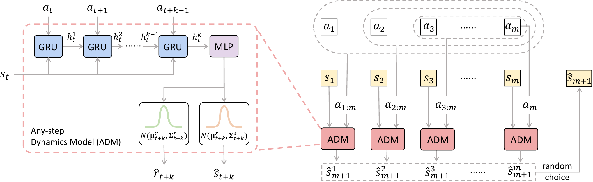
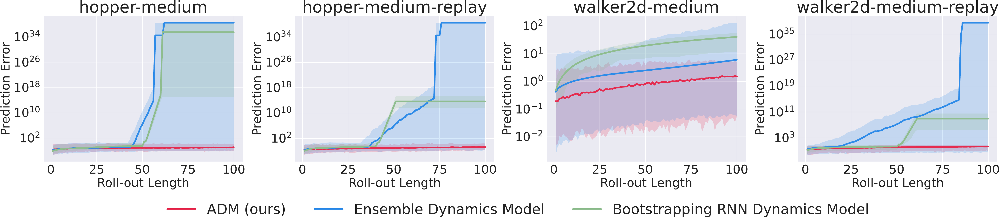
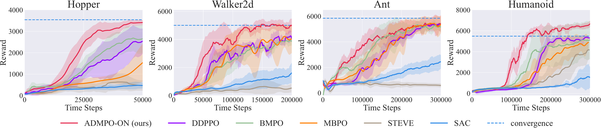
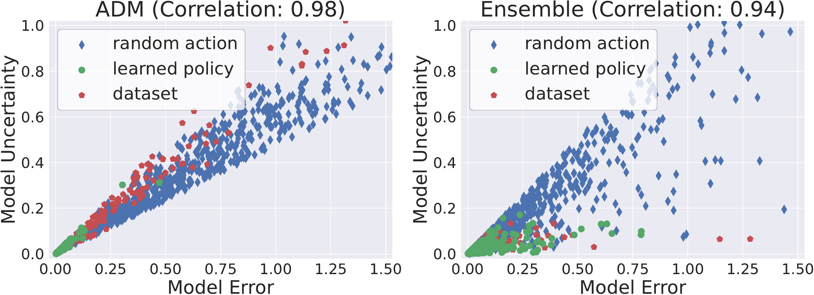

# 标题：任意步数动力学模型改进在线与离线强化学习的未来预测

- ArXiv: 2405.17031
- 作者：贾成兴，叶俊吟，张嘉吉，余阳，通讯作者
- 章节数：44
- 估计词元数：20.3k

## 目录

- 1 引言
- 2 预备知识
  - 2.1 马尔可夫决策过程与强化学习
  - 2.2 基于模型的强化学习
- 3 方法
  - 3.1 任意步数动力学模型
    - 定义 3.1（任意步数动力学模型）。
  - 3.2 ADMPO-ON：在线设置中用于策略优化的 ADM
  - 3.3 ADMPO-OFF：离线设置中用于策略优化的 ADM
    - 定义 3.2（ADM-不确定性量化器）。
    - 假设 3.3（可容许误差估计器）。
    - 定理 3.4。
    - 证明。
- 4 实验
  - 4.1 动力学模型评估
  - 4.2 在线设置评估
  - 4.3 离线设置评估
    - 4.3.1 D4RL 基准测试结果
    - 4.3.2 NeoRL 基准测试结果
    - 4.3.3 不确定性量化
- 5 相关工作
  - 5.1 在线基于模型的强化学习
  - 5.2 离线基于模型的强化学习
- 6 结论

## 摘要（Abstract）

###### 摘要

强化学习中的 **基于模型的方法（Model-based methods）** 通过促进在动力学模型内进行策略探索，为提高数据效率提供了一种有前景的途径。然而，由于 **自举预测（bootstrapping prediction）** 将下一个状态归因于对当前状态的预测，在动力学模型中准确预测连续步骤仍然是一个挑战。这导致在模型展开过程中误差不断累积。在本文中，我们提出了 **任意步数动力学模型（Any-step Dynamics Model, ADM）** ，通过将自举预测简化为直接预测来减轻 **复合误差（compounding error）** 。ADM 允许使用可变长度的计划作为输入来预测未来状态，而无需频繁的自举。我们设计了两种算法， **ADMPO-ON** 和 **ADMPO-OFF** ，分别将 ADM 应用于在线和离线的基于模型框架中。在在线设置中，与先前最先进的方法相比，ADMPO-ON 展示了改进的样本效率。在离线设置中，ADMPO-OFF 不仅与近期最先进的离线方法相比表现出优越的性能，而且仅使用单个 ADM 就能更好地量化模型不确定性。

<a id="section-1"></a>

## 1 引言（Introduction）

**基于模型的强化学习（Model-based Reinforcement Learning, MBRL）** [34] 在在线 [15, 6, 11, 35, 21, 31] 和离线 [51, 25, 50, 40, 44, 33] 设置中都取得了实证上的成功。MBRL 的核心在于动力学模型，智能体可以在其中进行广泛的探索和评估，从而减少对真实世界样本的依赖。嵌入在基于模型的框架中，在线策略优化可以利用较大的 **更新数据比（Update-To-Data ratio, UTD）** [8] 来提高样本效率，而离线策略优化则可以使用超出数据集的模型增强数据来完成。

尽管一些努力旨在提出高保真度的动力学模型，例如大多数 MBRL 算法采用的 **对抗模型（adversarial models）** [9, 5]、 **因果模型（causal models）** [53] 和 **集成动力学模型（ensemble dynamics models）** [11, 21, 51]，但通过长视野模型展开生成高质量的想象样本仍然具有挑战性。在常见形式的动力学模型中，时间步 $t$ 的状态-动作对 $(s_{t},a_{t})$ 被用作输入来预测下一个状态 $s_{t+1}$。因此，在动力学模型中展开状态时，不可避免地要使用将下一个状态归因于当前状态预测的自举预测。生成状态的偏差误差随着展开长度的增加而增加，因为在想象中状态转移时误差会逐渐累积。如果在具有较大复合误差的不可靠样本上进行更新，策略将被有偏的策略梯度误导。

在在线设置中，复合误差 [49] 对策略优化的影响限制了模型的利用，从而阻碍了样本效率的进一步提高。在离线设置中，复合误差影响了当前基于集成的模型不确定性估计的准确性。例如，使用与数据集对应的行为策略在模型中进行长视野展开仍然会导致很大的复合误差，并且不同学习器累积的偏差不可能相似。在这种情况下，集成的分歧将不可避免地很大，这与实际轨迹处于数据集覆盖区域内的情况不一致。因此，在在线和离线设置中减少复合误差至关重要。

处理复合误差问题的一个潜在方法是，考虑执行多步动作序列后的直接状态转移，将自举预测简化为直接预测 [2, 3, 7, 36]。尽管在马尔可夫性质 [46] 的假设下，状态 $s_{t+1}$ 仅依赖于状态-动作对 $(s_{t},a_{t})$，但对 $s_{t+1}$ 的预测实际上可以利用更早的信息。回溯一个先前的 $k$ 步计划，$s_{t+1-k}$ 和中间的 $k$ 步动作 $(a_{t+1-k},a_{t+2-k},\cdots,a_{t})$ 足以构成对 $s_{t+1}$ 的归因预测。

为了处理可变长度的计划，我们引入了一种特殊的 **任意步数动力学模型（Any-step Dynamics Model, ADM）** ，它允许使用指定范围内任意整数 $k$ 对应的 $s_{t+1-k}$ 和 $(a_{t+1-k},a_{t+2-k},\cdots,a_{t})$ 作为输入来预测 $s_{t+1}$。当智能体面临轨迹分布中发生的变化时，来自不同回溯长度的状态预测将表现出明显的分歧。这一特性自然使得 ADM 能够在无需集成的情况下估计模型不确定性。我们用 ADM 替换集成动力学模型，设计了一种独特的带有随机回溯的模型展开方法，该方法可以插入任何现有的 MBRL 算法框架中。在本文中，我们的主要目的是展示由 ADM 生成的增强数据如何在改进未来预测和测量模型不确定性方面都表现出卓越的有效性。

总的来说，我们的贡献总结如下。(1) 我们提出了一种称为 ADM 的广义动力学模型，以替代现有在线和离线 MBRL 算法中使用的动力学模型，并证明了其在减少复合误差方面的优越性。(2) 我们提出了一种基于 ADM 的新在线 MBRL 算法，称为 ADMPO-ON，并表明它在 MuJoCo [47] 基准测试上保持竞争力的同时，在样本效率方面可以超越近期最先进的在线基于模型算法。(3) 我们提出了一种基于 ADM 的新离线 MBRL 算法，称为 ADMPO-OFF，并表明它能够有效量化模型不确定性，在 D4RL [16] 和 NeoRL [39] 基准测试上，与近期最先进的离线算法相比取得了更优越的性能。

<a id="section-2"></a>

## 2 预备知识（Preliminaries）

<a id="section-2-1"></a>

### 2.1 马尔可夫决策过程与强化学习（Markov Decision Process and Reinforcement Learning）

我们考虑一个由元组 $\mathcal{M}=(\mathcal{S},\mathcal{A},T,\rho_{0},\gamma)$ 指定的标准 **马尔可夫决策过程（Markov Decision Process, MDP）** ，其中 $\mathcal{S}$ 是状态空间，$\mathcal{A}$ 是动作空间，$T(s_{t+1},r_{t+1}|s_{t},a_{t})$ 是给定 $(s_{t},a_{t})$ 计算 $s_{t+1}\in\mathcal{S}$ 和 $r_{t+1}\in\mathbb{R}$ 条件分布的动力学函数，$\rho_{0}$ 是初始状态分布，$\gamma$ 是折扣因子。我们用 $\rho^{\pi}$ 表示由动力学函数 $T$ 和策略 $\pi$ 诱导的关于状态的 **同策略分布（on-policy distribution）** 。从多步的角度来看，状态 $s_{t+1}$ 和奖励 $r_{t+1}$ 的归因可以追溯到更早的 $k$ 步计划，即 $s_{t-k+1}$ 以及中间的动作序列 $a_{t-k+1:t}=(a_{t-k+1},a_{t-k+2},\cdots,a_{t})$。这种关系可以用 $k$ 步动力学模型表示：

$$
T^{k}(s_{t+1},r_{t+1}|s_{t-k+1},a_{t-k+1:t})=\sum_{(s_{t-k+2:t},r_{t-k+2:t})} \prod_{i=0}^{k-1}T(s_{t-i+1},r_{t-i+1}|s_{t-i},a_{t-i}).(1)
$$

我们用 $\Gamma^{k}_{\pi}(s_{t-k+1:t},a_{t-k+1:t}|s_{t+1})$ 表示由动力学函数 $T$ 和策略 $\pi$ 诱导的、以 $s_{t+1}$ 为条件的 $(s_{t-k+1:t},a_{t-k+1:t})$ 的分布。

**强化学习（Reinforcement Learning, RL）** 的优化目标是找到一个策略 $\pi$，以最大化期望折扣回报 $\mathbb{E}_{\rho^{\pi}}\left[\sum_{t=1}^{\infty}\gamma^{t-1}r_{t}\right]$。这样的策略可以从 **状态-动作价值函数（state-action value function）** $Q^{\pi}(s_{t},a_{t})=\mathbb{E}_{(s_{t+1},r_{t+1})\sim T(\cdot|s_{t},a_{t})} \left[r_{t+1}+\gamma V^{\pi}(s_{t+1})\right]$ 的估计中推导出来，其中 $V^{\pi}(s_{t+1})=\mathbb{E}_{a_{t+1}\sim\pi(\cdot|s_{t+1})}\left[Q^{\pi}(s_{t+ 1},a_{t+1})\right]$ 是 **状态价值函数（state value function）** 。

<a id="section-2-2"></a>

### 2.2 基于模型的强化学习（Model-based Reinforcement Learning）

MBRL 旨在找到最优策略，同时将智能体的探索和评估从环境转移到学习到的动力学模型中。给定通过真实环境交互收集的数据集 $\mathcal{D}_{\mathrm{env}}$，动力学模型 $\hat{T}$ 通常被训练以最大化期望似然 $\mathbb{E}_{(s_{t},a_{t},r_{t+1},s_{t+1})\sim\mathcal{D}_{\mathrm{env}}}[\log \hat{T}(s_{t+1},r_{t+1}|s_{t},a_{t})]$。估计的动力学模型定义了一个 **代理 MDP（surrogate MDP）** $\hat{\mathcal{M}}=(\mathcal{S},\mathcal{A},\hat{T},\rho_{0},\gamma)$。然后，任何 RL 算法都可以使用增强数据集 $\mathcal{D}_{\mathrm{env}}\cup\mathcal{D}_{\mathrm{model}}$ 来恢复最优策略，其中 $\mathcal{D}_{\mathrm{model}}$ 是在 $\hat{\mathcal{M}}$ 中展开的合成数据。

上述范式被在线设置中的 **基于模型的策略优化（Model-based Policy Optimization, MBPO）** [21] 及其许多后续工作 [31, 30, 38, 12] 所采用。这些工作不需要考虑 **模型覆盖（model coverage）** 问题，因为智能体可以在线探索以填补动力学模型不确定的区域。然而，在离线设置中，有限的数据集导致 $\hat{T}$ 仅覆盖状态-动作空间的一部分。一旦智能体在 $\hat{\mathcal{M}}$ 中展开时遇到 **分布外样本（out-of-distribution samples）** ，学习过程可能会崩溃。因此，MOPO [51] 及其一些后续的离线 MBRL 算法 [25, 44] 在奖励函数中加入了一个惩罚项来衡量模型不确定性，允许智能体在 $\hat{T}$ 的安全区域内采样。

<a id="section-3"></a>

## 3 方法（Method）

在本节中，我们提出了一种特殊的 **任意步数动力学模型（Any-step Dynamics Model, ADM）** ，以取代主流的集成动力学模型。将 ADM 应用于现有的基于模型的强化学习（Model-Based Reinforcement Learning, MBRL）框架进行策略优化，我们引入了两种算法，即在线 ADMPO-ON 和离线 ADMPO-OFF。ADM 通过回溯可变长度的计划，将自举预测简化为直接预测，从而改进了对未来状态的预测。因此，ADMPO-ON 可以提高在线设置中的样本效率，而 ADMPO-OFF 可以在离线设置中准确估计模型的不确定性。

<a id="section-3-1"></a>

### 3.1 任意步数动力学模型（Any-step Dynamics Model）

目前，主流的动力学模型通常以单步方式运行，以 $s_{t}$ 和 $a_{t}$ 作为输入来预测 $s_{t+1}$ 和 $r_{t+1}$。在更广泛的背景下，动力学模型也可以是 **多步（multi-step）** 的 [2, 3, 7]，其输入包括 $s_{t}$ 以及一个 $k$ 步的动作序列 $(a_{t},a_{t+1},\cdots,a_{t+k-1})$，以预测 $s_{t+k}$ 和 $r_{t+k}$。为了在模型回溯长度上引入灵活性，我们进一步扩展了多步动力学模型的定义，允许 $k$ 在指定范围内为任意正整数，如定义 [3.1](https://arxiv.org/html/2405.17031v1#S3.Thmtheorem1) 所述。

###### 定义 3.1（任意步数动力学模型）.

给定最大回溯长度 $m$，一个任意步数动力学模型 $\hat{T}(s_{t+k},r_{t+k}|s_{t},a_{t:t+k-1})$ 是在给定 $k$ 步计划 $(s_{t},a_{t:t+k-1})=(s_{t},a_{t},a_{t+1},\cdots,a_{t+k-1})\in\mathcal{S}\times \mathcal{A}^{k}$ 的条件下，$s_{t+k}\in\mathcal{S}$ 和 $r_{t+k}\in\mathbb{R}$ 的分布，其中 $k$ 可以是 $[1,m]$ 之间的任意整数。

<a id="figure-1"></a>



> 图 1：使用 RNN 构建的任意步数动力学模型示意图（左）及其通过随机回溯进行下一步预测的应用（右）。

为了处理可变步长的输入，我们使用带有 GRU [10] 单元的 RNN [13] 来实现任意步数动力学模型，如图 [1](#figure-1) 左侧所示。当然，Transformer [48] 也是一个可行的选择，但我们不考虑它，因为模型结构超出了本研究范围。由于输入状态仅包含一步，而动作可能是多步序列，我们将状态复制以匹配动作序列的长度，然后顺序地将其输入 RNN。输入 $(s_{t},a_{t:t+k-1})$ 经过 RNN 表示后，得到隐藏状态 $h^{k}_{t}$，随后将其输入一个 MLP 以获得 $s_{t+k}$ 和 $r_{t+k}$ 的均值和标准差，即 $(\boldsymbol{\mu}^{s}_{t+k},\boldsymbol{\Sigma}^{s}_{t+k})$ 和 $(\boldsymbol{\mu}^{r}_{t+k},\boldsymbol{\Sigma}^{r}_{t+k})$。与之前的基于模型的方法 [21, 38, 31] 类似，我们将 $s_{t+k}$ 和 $r_{t+k}$ 的分布建模为高斯分布，并通过采样进行预测。我们将此任意步数动力学模型称为 ADM，并记作 $\hat{T}_{\theta}(s_{t+k},r_{t+k}|s_{t},a_{t:t+k-1})$，其中 $\theta$ 代表神经网络的参数。利用来自环境的真实样本，训练 $\hat{T}_{\theta}$ 以最大化期望似然：

$$
J_{T}(\theta)=\frac{1}{m}\sum_{k=1}^{m}\mathbb{E}_{(s_{t},a_{t:t+k-1},r_{t+k}, s_{t+k})\sim\mathcal{D}_{\textrm{env}}}\left[\log\hat{T}_{\theta}(s_{t+k},r_{t +k}|s_{t},a_{t:t+k-1})\right].(2)
$$

利用 $\hat{T}_{\theta}$，可以减少模型展开过程中频繁的自举操作。具体来说，给定最大回溯长度 $m$，从数据缓冲区中采样一个长度为 $m$ 的状态-动作序列 $(s_{1},a_{1},s_{2},a_{2},\cdots,s_{m},a_{m})$ 以在 $\hat{T}_{\theta}$ 中开始展开。为了预测 $s_{m+1}$，从 $[1,m]$ 中均匀随机选择一个整数作为回溯长度。如果只选择回溯一步，则将 $(s_{m},a_{m})$ 输入 $\hat{T}_{\theta}$ 以获得预测结果；如果选择回溯 $m-1$ 步，则将 $(s_{2},a_{2:m})$ 输入 $\hat{T}_{\theta}$，依此类推。图 [1](#figure-1) 右侧展示了基于随机回溯的上述过程。进一步预测 $s_{m+2}$ 时，最多应回溯到 $(s_{2},a_{2:m+1})$，因为 $\hat{T}_{\theta}$ 是在最大序列长度为 $m$ 步的条件下训练的。类似地，后续的状态预测最多也只能回溯 $m$ 步。回溯的状态作为下一状态预测归因的一部分，在期望上位于前面若干步。因此，ADM 减少了展开轨迹的实际自举次数。ADM 中完整的 $H$ 步展开过程在算法 [1](#algorithm-1) 中描述。

<a id="algorithm-1"></a>

**算法 1 ADM 中的展开过程：ADM-Roll($\hat{T}_{\theta}$, $\pi_{\phi}$, $H$, $m$, $(s_{1},a_{1},s_{2},a_{2},\cdots,s_{m-1},a_{m-1},s_{m})$)**

```text

1:  for $\tau=0$ to $H-1$ do

2:     Sample $a_{m+\tau}\sim\pi_{\phi}(\cdot|s_{m+\tau})$

3:     Randomly sample an integer $k$ from $[1,m]$ uniformly

4:     Roll out the next step in ADM via $(s_{m+\tau+1},r_{m+\tau+1})\sim\hat{T}_{\theta}(\cdot|s_{m+\tau+1-k},a_{m+\tau
+1-k:m+\tau})$

5:  end for

6:  return  $(s_{m},a_{m},r_{m+1},s_{m+1},\cdots,s_{m+H-1},a_{m+H-1},r_{m+H},s_{m+H})$
```

与现有的 MBRL 算法类似，在 ADM 中进行策略展开可以生成大量用于策略更新的模拟样本。我们将这种新的基于 ADM 的类 Dyna 风格策略优化框架称为 **ADMPO（ADM-based Policy Optimization）** 。任何策略优化算法都可以插入到此框架中。在后续小节中，我们将分别介绍用于在线和离线设置的两种基础算法 AMRPO-ON 和 ADMPO-OFF。

###### 定义 3.1（任意步数动力学模型）.

<a id="section-3-2"></a>

### 3.2 ADMPO-ON：在线设置中基于 ADM 的策略优化（ADM for Policy Optimization in Online Setting）

在在线设置中，智能体在与真实环境交互的同时优化策略。与 MBPO [21] 类似，ADMPO-ON 可以分为两个交替的阶段，即使用持续收集的样本更新动力学模型，以及额外利用通过模型展开生成的样本进行策略优化。ADMPO-ON 用 ADM 取代了 MBPO 框架中的集成动力学模型。它使用公式 ([2](https://arxiv.org/html/2405.17031v1#S3.E2)) 所示的优化目标训练 ADM，并使用算法 [1](#algorithm-1) 描述的展开方法生成大量模拟样本。详细的伪代码由附录 [C.1](https://arxiv.org/html/2405.17031v1#A3.SS1) 中的算法 [2](#algorithm-2) 提供。

在展开过程中，ADM 在每一步随机选择一个回溯长度，并将待预测的状态归因于可变长度的计划。当回溯 $k$ 步时，我们将采样过程 $(\hat{s}_{t+1},\hat{r}_{t+1})\sim\hat{T}_{\theta}(\cdot|s_{t-k+1},a_{t-k+1:t})$ 视为 $(\hat{s}_{t+1},\hat{r}_{t+1})=\mu_{\theta}(s_{t-k+1},a_{t-k+1:t})+\eta_{t+1}$，其中 $\eta_{t+1}\sim\mathcal{N}(0,\Sigma_{\theta}(s_{t-k+1},a_{t-k+1:t}))$，$\mu_{\theta}$ 是确定性动力学函数，$\Sigma_{\theta}$ 是用于构建零均值噪声分布的标准差函数。在期望上，$Q(s_{t},a_{t})$ 的目标值估计为

$$
\mathbb{E}_{(s_{t-m+1:t-1},a_{t-m+1:t-1})\sim\Gamma^{m-1}_{\pi}(\cdot|s_{t})} \left[\frac{1}{m}\sum_{k=1}^{m}\mathbb{E}_{(\hat{s}_{t+1},\hat{r}_{t+1})\sim \hat{T}_{\theta}(\cdot|s_{t-k+1},a_{t-k+1:t})}\left[y(\hat{s}_{t+1},\hat{r}_{t +1})\right]\right],(3)
$$

其中 $y(\hat{s}_{t+1},\hat{r}_{t+1})=\hat{r}_{t+1}+\gamma\mathbb{E}_{a\sim\pi(\cdot| \hat{s}_{t+1})}\left[Q(\hat{s}_{t+1},a)\right]$。通过我们的 ADM 展开生成的数据可以看作是一种隐式增强。这种增强源于两个来源：(i) 应用学习到的 ADM 预测下一状态时回溯长度的变化，以及 (ii) 在每个回溯长度 $k$ 处由分布 $\mathcal{N}(0,\Sigma_{\theta}(s_{t-k+1},a_{t-k+1:t}))$ 引入的噪声。根据 [52]，状态预测的变化可以有效地隐式正则化 Q 网络在模型预测不确定区域周围的局部 Lipschitz 条件，从而调节 **价值感知模型误差（value-aware model error）** [14]。

<a id="section-3-3"></a>

### 3.3 ADMPO-OFF：离线设置中用于策略优化的 ADM

在离线设置中，由于数据集对应的行为策略存在局限性，学习到的 **自回归动力学模型（Autoregressive Dynamics Model, ADM）** 只能覆盖状态-动作空间的某些区域。在这些安全区域之外，是模型不确定且无法修正的风险区域，因为智能体无法进行在线探索。为了防止策略优化崩溃，对已学习模型的利用需要集中在安全区域内。同时，应努力探索风险区域的边界之外，以发现有助于获得比行为策略更优策略的样本。实现这种保守性与泛化性之间的平衡通常需要度量模型的不确定性。基于 ADM，接下来我们将介绍一种新的不确定性量化方法。

在我们的 ADM 中，使用不同回溯长度预测的状态存在差异。直观上，这些差异与数据分布密切相关。当智能体处于安全区域时，差异较小。随着智能体逐渐向风险区域探索，差异趋于增大。通过不同回溯长度 $k$ 获得的概率预测 $\hat{T}_{\theta}(\cdot|s_{t-k+1},a_{t-k+1:t})$ 之间的差异，可作为模型不确定性的自然度量，可以使用方差（或标准差）进行量化，如定义 [3.2](https://arxiv.org/html/2405.17031v1#S3.Thmtheorem2) 所述。

###### 定义 3.2 (ADM-不确定性量化器) .

对于任意最大回溯长度 $m$ 及其对应的已学习 ADM $\hat{T}_{\theta}$，$\hat{T}_{\theta}$ 在 $(s_{t},a_{t})$ 处的不确定性量化为

$$
\displaystyle\mathcal{U}^{\mathrm{ADM}}(s_{t},a_{t})= \displaystyle\mathbb{E}_{\Gamma^{m-1}_{\pi}(\cdot|s_{t})}\left[\left\|\mathrm{Var}_{k\sim\mathrm{Uniform}(m),\hat{s}_{t+1}\sim\hat{T}_{\theta}(\cdot|s_{t-k+ 1},a_{t-k+1:t})}\left[\hat{s}_{t+1}\right]\right\|_{1}\right] (4) \displaystyle= \displaystyle\mathbb{E}_{\Gamma^{m-1}_{\pi}(\cdot|s_{t})}\left[\left\|\frac{1} {m}\sum_{k=1}^{m}\left((\Sigma_{\theta}^{k})^{2}+(\mu_{\theta}^{k})^{2}\right) -(\bar{\mu})^{2}\right\|_{1}\right]
$$

其中 $s_{t}\in\mathcal{S}$，$a_{t}\in\mathcal{A}$，为方便起见，记 $\Sigma_{\theta}^{k}=\Sigma_{\theta}(s_{t-k+1},a_{t-k+1:t})$，$\mu_{\theta}^{k}=\mu_{\theta}(s_{t-k+1},a_{t-k+1:t})$，且 $\bar{\mu}=\frac{1}{m}\sum_{k=1}^{m}\mu_{\theta}^{k}$。

此不确定性项对应于 **认知不确定性（epistemic uncertainty）** 与 **偶然不确定性（aleatoric uncertainty）** 的组合，其形式与集成标准差 [32, 29] 类似。然而，多样性的来源已从集成转变为可变回溯长度。由于通过认知或偶然不确定性来估计近似误差已在许多工作中应用 [51, 4, 44, 32]，我们假设我们的 ADM 不确定性 ([4](https://arxiv.org/html/2405.17031v1#S3.E4)) 是一个 **可接受的误差估计器（admissible error estimator）** [51]，如假设 [3.3](https://arxiv.org/html/2405.17031v1#S3.Thmtheorem3) 所述。

###### 假设 3.3 (可接受的误差估计器) .

假设存在一个正数 $b\in\mathbb{R}^{+}$，使得对于任意最大回溯长度 $m$ 和任意 $s_{t}\in\mathcal{S}$，$a_{t}\in\mathcal{A}$，以下不等式 ([5](https://arxiv.org/html/2405.17031v1#S3.E5)) 成立。

$$
D_{\mathrm{TV}}(\bar{T}_{\theta,m}(\cdot|s_{t},a_{t}),T(\cdot|s_{t},a_{t})) \leq b\cdot\mathcal{U}^{\mathrm{ADM}}(s_{t},a_{t}),(5)
$$

其中 $\bar{T}_{\theta,m}$ 是来自下式的整体条件分布

$$
\bar{T}_{\theta,m}(\cdot|s_{t},a_{t})=\frac{1}{m}\sum_{k=1}^{m}\left[\sum_{\begin{subarray}{c}s_{t-k+1}\\ a_{t-k+1:t-1}\end{subarray}}\Gamma^{k-1}_{\pi}(s_{t-k+1},a_{t-k+1:t-1}|s_{t}) \hat{T}_{\theta}(\cdot|s_{t-k+1},a_{t-k+1:t}))\right].(6)
$$

在假设 [3.3](https://arxiv.org/html/2405.17031v1#S3.Thmtheorem3) 和 PEVI [23] 提出的 $\xi$-不确定性量化器定义（详见附录 [A](#appendix-a)）下，我们提出以下定理，证明 $\mathcal{U}^{\mathrm{ADM}}$ 可以作为一个 $\xi$-不确定性量化器来界定贝尔曼误差。

###### 定理 3.4 .

$\beta\cdot\mathcal{U}^{\mathrm{ADM}}$ 是一个有效的 $\xi$-不确定性量化器，其中 $\beta=b\frac{\gamma r_{\mathrm{max}}}{1-\gamma}$。具体而言，

$$
\left|\hat{\mathcal{T}}^{\pi}Q(s_{t},a_{t})-\mathcal{T}^{\pi}Q(s_{t},a_{t}) \right|\leq\beta\cdot\mathcal{U}^{\mathrm{ADM}}(s_{t},a_{t}),(7)
$$

其中 $\hat{\mathcal{T}}^{\pi}$ 是由 ADM 导出的、用于估计真实贝尔曼算子 $\mathcal{T}^{\pi}$ 的代理贝尔曼算子。

###### 证明.

见附录 [B](#appendix-b)。 ∎

根据 PEVI [23] 提出的次优性定理（详见附录 [A](#appendix-a)），通过 **悲观值迭代（pessimistic value iteration）** 导出的策略 $\hat{\pi}$（该迭代将任何 $\xi$-不确定性量化器作为惩罚项纳入值迭代过程 [46]），其与最优策略 $\pi^{*}$ 之间的最优性差距是有界的。该最优性差距主要由贝尔曼误差和不确定性量化决定。直观上，在动力学模型已用丰富数据训练过的安全区域，贝尔曼误差通常较小，且在不同回溯长度下往往具有高一致性；而在数据稀缺的风险区域，误差通常较大，且通过不同回溯长度进行的预测变得不一致。惩罚机制阻止策略采取会使其进入风险区域的动作，否则模型将对这些动作产生不准确的价值估计。因此，我们可以通过惩罚贝尔曼算子来获得悲观价值估计：

$$
\hat{\mathcal{T}}^{\mathrm{ADM}}Q(s_{t},a_{t}):=\hat{\mathcal{T}}^{\pi}Q(s_{t} ,a_{t})-\beta\cdot\mathcal{U}^{\mathrm{ADM}}(s_{t},a_{t}).(8)
$$

我们希望惩罚项 $\beta\cdot\mathcal{U}^{\mathrm{ADM}}(s_{t},a_{t})$ 尽可能小，从而约束最优性差距。虽然我们的假设 [3.3](https://arxiv.org/html/2405.17031v1#S3.Thmtheorem3) 缺乏理论保证，且定理 [3.4](https://arxiv.org/html/2405.17031v1#S3.Thmtheorem4) 中界（bound）的紧致性尚不明确，但我们在第 [4.3.3](https://arxiv.org/html/2405.17031v1#S4.SS3.SSS3) 节中提供了充分证据，表明我们的不确定性量化能有效估计模型误差。

总体而言，ADMPO-OFF 是 ADMPO-ON 的离线版本，它遵循 MOPO [51] 的算法框架，将惩罚贝尔曼算子 ([8](https://arxiv.org/html/2405.17031v1#S3.E8)) 引入到 ADMPO-ON 的策略优化过程中。详细的伪代码由附录 [C.2](https://arxiv.org/html/2405.17031v1#A3.SS2) 中的算法 [3](#algorithm-3) 提供。

###### 定义 3.2 (ADM-不确定性量化器) .

###### 假设 3.3 (可接受的误差估计器) .

###### 定理 3.4 .

###### 证明.

<a id="section-4"></a>

## 4 实验（Experiments）

在本节中，我们进行了多项实验以回答以下问题：(1) **ADM（Any-step backtracking Diffusion Model）** 生成的轨迹样本是否比集成动力学模型具有更小的复合误差？(2) **ADMPO-ON** 在在线设置下表现如何？(3) **ADMPO-OFF** 在离线设置下表现如何？ADM 是否比集成动力学模型能更好地量化模型不确定性？

<a id="section-4-1"></a>

### 4.1 动力学模型评估（Dynamics Model Evaluation）

评估动力学模型质量的一个关键指标是 **复合误差（compounding error）** ，它会随着轨迹展开长度的增加而增大。我们选择了四个 D4RL [16] 数据集——hopper-medium-v2、hopper-medium-replay-v2、walker2d-medium-v2 和 walker2d-medium-replay-v2——来比较 ADM 与常用的集成动力学模型之间的复合误差。为了消除 RNN 结构的影响，我们还比较了 **自举 RNN 动力学模型（bootstrapping RNN dynamics model）** ，该模型与 ADM 结构相同，但使用历史状态-动作序列 $(s_{t},a_{t},\cdots,s_{t+m},a_{t+m})$ 作为输入来预测 $s_{t+m+1}$。图 [2](#figure-2) 展示了复合误差随轨迹展开长度增加的增长曲线。我们观察到，ADM 的曲线始终接近于零，而另外两个模型在轨迹展开长度超过某个阈值后呈现出指数级增长。这一现象表明，由于 ADM 在模型展开过程中具有 **任意步回溯机制（any-step backtracking mechanism）** ，因此能够改善对未来状态的预测。

<a id="figure-2"></a>



> 图 2：ADM、集成动力学模型与自举 RNN 动力学模型在离线学习后，复合误差随轨迹展开长度增加的增长曲线对比。溢出值被视为 float32 的最大值。

<a id="figure-3"></a>



> 图 3：ADMPO-ON（红色）与其他五个基线方法在四个 MuJoCo-v3 任务上的在线学习曲线。蓝色虚线表示 SAC 的渐近性能以供参考。实线表示均值，阴影区域表示在五个不同随机种子上的标准误差。

<a id="section-4-2"></a>

### 4.2 在线设置评估（Evaluation in Online Setting）

我们在四个困难的 MuJoCo 连续控制任务 [47] 上评估 ADMPO-ON，包括 Hopper、Walker2d、Ant 和 Humanoid。所有任务均采用 v3 版本并遵循默认设置。我们选择了四个基于模型的方法和一个无模型方法作为基线。这些方法包括：

- **SAC（Soft Actor-Critic）** [20]：最先进的无模型强化学习算法。
- **STEVE** [6]：将集成模型融入基于模型的价值扩展的方法。
- **MBPO（Model-Based Policy Optimization）** [21]：使用真实环境样本与分支展开数据的混合来更新策略的方法。
- **BMPO** [28]：基于 MBPO，并用双向动力学模型替换了原动力学模型。
- **DDPPO** [30]：采用一种基于双模型的学习方法来控制预测误差和梯度误差。

图 [3](#figure-3) 展示了 ADMPO-ON 与其他五个基线的学习曲线，以及 SAC 的渐近性能。ADMPO-ON 在比基线方法更少的环境交互步数后，就取得了具有竞争力的性能。以最困难的 Humanoid 任务为例，ADMPO-ON 在 15 万步后即达到了 SAC 收敛性能（约 6000 分）的 100%，而 DDPPO 需要约 20 万步，其他四种方法甚至在 30 万步时也无法接近蓝色虚线。在 Humanoid 任务上，ADMPO-ON 的学习效率比 DDPPO 快约 1.33 倍，并显著优于其他基线。训练结束后，ADMPO-ON 在所有四个 MuJoCo 任务上都能达到接近 SAC 渐近性能的最终表现。这些结果表明，ADMPO-ON 兼具 **高样本效率（high sample efficiency）** 和 **有竞争力的性能（competitive performance）** 。关于 ADMPO-ON 在在线设置下表现良好的进一步研究，请参见附录 [E.1](https://arxiv.org/html/2405.17031v1#A5.SS1)。

<a id="section-4-3"></a>

### 4.3 离线设置评估（Evaluation in Offline Setting）

#### 4.3.1 D4RL 基准测试结果（D4RL Benchmark Results）

我们将 **ADMPO-OFF** 与四种无模型方法进行比较： **BC（行为克隆，behavioral cloning）** ，它简单地模仿数据集中的行为策略； **CQL [27]** ，它对分布外（out-of-the-distribution）状态-动作对的 Q 值施加同等惩罚； **TD3+BC [17]** ，它简单地将一个 BC 项纳入 TD3 [19] 的策略优化目标中；以及 **EDAC [1]** ，它通过集成（ensemble）来量化 Q 值的不确定性。同时，我们还比较了五种基于模型的方法： **MOPO [51]** ，它将模型预测的不确定性作为惩罚项添加到奖励函数中； **COMBO [50]** ，它将 CQL 的惩罚函数引入到基于模型的框架中； **RAMBO [40]** ，它对抗性地训练动力学模型和策略； **CBOP [22]** ，它采用一组动力学模型下价值（value）的方差，在 MVE [15] 机制下保守地估计 Q 值；以及 **MOBILE [44]** ，它提出了模型-贝尔曼不一致性（Model-Bellman inconsistency）来估计贝尔曼误差（Bellman error）。

表 [1](#table-1) 报告了在十二个 D4RL [16] MuJoCo 数据集（v2 版本）上的结果。每个数据集的归一化分数是通过离线学习后的在线评估获得的。所报告性能的数据来源见附录 [D.4](https://arxiv.org/html/2405.17031v1#A4.SS4)。我们观察到， **ADMPO-OFF** 在大多数任务中优于其他九个基线方法，并取得了最高的平均分数。

<a id="table-1"></a>

> 表 1：在 D4RL MuJoCo 任务上离线学习后的归一化分数，取五个随机种子的平均值。

| 任务名称（Task Name）     | BC   | CQL   | TD3+BC | EDAC  | MOPO  | COMBO | RAMBO | CBOP  | MOBILE | ADMPO-OFF (ours) |
| :------------------------ | :--- | :---- | :----- | :---- | :---- | :---- | :---- | :---- | :----- | :--------------- |
| hopper-random             | 3.7  | 5.3   | 8.5    | 25.3  | 31.7  | 17.9  | 25.4  | 31.4  | 31.9   | 32.7$\pm$0.2     |
| halfcheetah-random        | 2.2  | 31.3  | 11.0   | 28.4  | 38.5  | 38.8  | 39.5  | 32.8  | 39.3   | 45.4$\pm$2.8     |
| walker2d-random           | 1.3  | 5.4   | 1.6    | 16.6  | 7.4   | 7.0   | 0.0   | 17.8  | 17.9   | 22.2$\pm$0.2     |
| hopper-medium             | 54.1 | 61.9  | 59.3   | 101.6 | 62.8  | 97.2  | 87.0  | 102.6 | 106.6  | 107.4$\pm$0.6    |
| halfcheetah-medium        | 43.2 | 46.9  | 48.3   | 65.9  | 73.0  | 54.2  | 77.9  | 74.3  | 74.6   | 72.2$\pm$0.6     |
| walker2d-medium           | 70.9 | 79.5  | 83.7   | 92.5  | 84.1  | 81.9  | 84.9  | 95.5  | 87.7   | 93.2$\pm$1.1     |
| hopper-medium-replay      | 16.6 | 86.3  | 60.9   | 101.0 | 103.5 | 89.5  | 99.5  | 104.3 | 103.9  | 104.4$\pm$0.4    |
| halfcheetah-medium-replay | 37.6 | 45.3  | 44.6   | 61.3  | 72.1  | 55.1  | 68.7  | 66.4  | 71.7   | 67.6$\pm$3.4     |
| walker2d-medium-replay    | 20.3 | 76.8  | 81.8   | 87.1  | 85.6  | 56.0  | 89.2  | 92.7  | 89.9   | 95.6$\pm$2.1     |
| hopper-medium-expert      | 53.9 | 96.9  | 98.0   | 110.7 | 81.6  | 111.1 | 88.2  | 111.6 | 112.6  | 112.7$\pm$0.3    |
| halfcheetah-medium-expert | 44.0 | 95.0  | 90.7   | 106.3 | 90.8  | 90.0  | 95.4  | 105.4 | 108.2  | 103.7$\pm$0.2    |
| walker2d-medium-expert    | 90.1 | 109.1 | 110.1  | 114.7 | 112.9 | 103.3 | 56.7  | 117.2 | 115.2  | 114.9$\pm$0.3    |
| 平均值（Average）         | 36.5 | 61.6  | 58.2   | 76.0  | 70.3  | 66.8  | 67.7  | 79.3  | 80.0   | 81.0             |

#### 4.3.2 NeoRL 基准测试结果（NeoRL Benchmark Results）

**NeoRL [39]** 是一个离线强化学习基准，其数据收集方式更为保守，更接近真实世界的数据收集场景。我们重点关注在 Hopper-v3、HalfCheetah-v3 和 Walker2d-v3 这三个环境中，分别使用三种不同质量（低、中、高）的策略收集的九个数据集。在我们的评估中，每个数据集包含 1000 条轨迹。

我们将我们的 **ADMPO-OFF** 与六个基线方法进行比较，包括 BC、CQL、TD3+BC、EDAC、MOPO 和 MOBILE。表 [2](#table-2) 展示了这些方法的归一化分数。由于 NeoRL 数据的覆盖范围狭窄且有限，所有基线方法的性能均有所下降。相比之下，我们的 **ADMPO-OFF** 保持了相对较高的平均分数，在大多数任务中仍然取得了优越的性能。这一显著的优异表现表明我们的算法在更具挑战性的现实世界任务中具有潜力。

<a id="table-2"></a>

> 表 2：在 NeoRL 任务上离线学习后的归一化分数，取五个随机种子的平均值。

| 任务名称（Task Name）    | BC   | CQL  | TD3+BC | EDAC | MOPO | MOBILE | ADMPO-OFF (ours) |
| :----------------------- | :--- | :--- | :----- | :--- | :--- | :----- | :--------------- |
| neorl-hopper-low         | 15.1 | 16.0 | 15.8   | 18.3 | 6.2  | 17.4   | 22.3$\pm$0.1     |
| neorl-halfcheetah-low    | 29.1 | 38.2 | 30.0   | 31.3 | 40.1 | 54.7   | 52.8$\pm$1.2     |
| neorl-walker2d-low       | 28.5 | 44.7 | 43.0   | 40.2 | 11.6 | 37.6   | 55.9$\pm$3.8     |
| neorl-hopper-medium      | 51.3 | 64.5 | 70.3   | 44.9 | 1.0  | 51.1   | 51.5$\pm$5.0     |
| neorl-halfcheetah-medium | 49.0 | 54.6 | 52.3   | 54.9 | 62.3 | 77.8   | 69.3$\pm$1.7     |
| neorl-walker2d-medium    | 48.7 | 57.3 | 58.5   | 57.6 | 39.9 | 62.2   | 70.1$\pm$2.4     |
| neorl-hopper-high        | 43.1 | 76.6 | 75.3   | 52.5 | 11.5 | 87.8   | 87.6$\pm$4.9     |
| neorl-halfcheetah-high   | 71.3 | 77.4 | 75.3   | 81.4 | 65.9 | 83.0   | 84.0$\pm$0.8     |
| neorl-walker2d-high      | 72.6 | 75.3 | 69.6   | 75.5 | 18.0 | 74.9   | 82.2$\pm$1.9     |
| 平均值（Average）        | 45.4 | 56.1 | 54.5   | 50.7 | 28.5 | 60.7   | 64.0             |

#### 4.3.3 不确定性量化（Uncertainty Quantification）

在我们的分析中，我们分别在学得的 ADM 和集成动力学模型中采样了大量状态-动作对。这些样本是通过使用三种策略进行模型推演（model roll-out）获得的：随机动作选择、离线训练后学得的策略以及数据集的行为策略。随后，我们测量了它们的模型不确定性和模型误差。在 D4RL 的两个任务（hopper-medium-replay-v2 和 walker2d-medium-replay-v2）上得到的散点图如图 [4](#figure-4) 所示。我们观察到，我们的 **ADM** 为模型不确定性提供了更好的量化。一方面，在 ADM 中采样的、具有较大模型误差的点往往表现出更大的量化模型不确定性。在这两个任务中观察到的 0.98 的相关系数超过了集成动力学模型。另一方面，ADM 比集成模型能更好地区分来自不同策略的样本。由随机动作生成的样本偏离了数据集分布，其不确定性在期望上应该是最大的。相反，当学得的策略在数据集覆盖的安全区域内进行优化时，模型不确定性预期是最小的。ADM 的实验图更清晰地说明了这一现象。



> (a) hopper-medium-replay-v2

<a id="section-5"></a>

## 5 相关工作（Related Work）

本工作与在线和离线类 Dyna 风格的 **基于模型的强化学习（Model-based Reinforcement Learning, MBRL）** [45] 相关。

<a id="section-5-1"></a>

### 5.1 在线基于模型的强化学习（Online Model-based Reinforcement Learning）

在在线设置中，MBRL 算法旨在利用模型推演数据来加速价值估计或策略优化。 **模型价值扩展（Model-based Value Expansion, MVE）** [15] 通过允许使用动力学模型进行固定深度的短期想象，来增强 Q 值目标估计。 **随机集成价值扩展（Stochastic Ensemble Value Expansion, STEVE）** [6] 在 MVE 的基础上，将集成方法纳入价值扩展中以更好地估计 Q 值。 **随机潜在模型引导优化（Stochastic Latent Model-based Optimization, SLBO）** [35] 直接利用 **信赖域策略优化（Trust Region Policy Optimization, TRPO）** [41]，通过使用在动力学模型中推演至轨迹末端生成的合成数据来优化策略。 **基于模型的策略优化（Model-based Policy Optimization, MBPO）** [21] 提出了一种分支推演方案来截断不可靠样本，从而减少 **复合误差（compounding error）** [49] 的影响，并采用 **软演员-评论家（Soft Actor-Critic, SAC）** [20] 结合真实世界数据和模型生成的数据来更新策略。

近期工作主要从两个角度提升 MBRL 性能。其一是专注于学习更好的动力学模型，例如 **双向模型（bidirectional models）** [28]、 **对抗模型（adversarial models）** [9, 5]、 **因果模型（causal models）** [53] 和 **多步模型（multi-step models）** [2, 3, 7]。其二是追求更好地利用已学习的模型，例如增强模型生成样本的可靠性 [38] 或应用基于模型的多步规划技术 [11, 12, 24, 37, 42, 31]。

<a id="section-5-2"></a>

### 5.2 离线基于模型的强化学习（Offline Model-based Reinforcement Learning）

尽管一些 **无模型强化学习（model-free RL）** 算法 [26, 18, 17, 27, 1, 4] 对离线强化学习研究做出了重要贡献，但 MBRL 算法对于离线设置似乎更有前景，因为它们可以利用动力学模型扩展数据集并大幅提高数据效率。

离线 MBRL 的核心问题在于如何有效利用模型。 **模型离线策略优化（Model-based Offline Policy Optimization, MOPO）** [51] 和 **MOReL** [25] 将模型预测的不确定性作为惩罚项添加到原始奖励函数中，以实现悲观的价值估计。 **MOBILE** [44] 通过将 **模型-贝尔曼不一致性（Model-Bellman inconsistency）** 引入离线基于模型的框架中，改进了不确定性量化。 **COMBO** [50] 应用 **保守 Q 学习（Conservative Q-Learning, CQL）** [27] 来迫使 Q 值在模型生成的分布外样本上保持较小。 **RAMBO** [40] 通过对抗性模型学习来实现保守主义，以最小化价值，同时保持对转移函数的拟合。 **CBOP** [22] 将短视界推演的自适应加权引入 MVE [15] 技术，并采用动力学模型集成下的价值方差来保守地估计 Q 值。 **MOREC** [33] 设计了一个使用对抗判别器的 **奖励一致性动力学模型（reward-consistent dynamics model）** ，以使模型生成的样本更加可靠。

<a id="section-6"></a>

## 6 结论（Conclusion）

在这项工作中，我们提出了一种用于环境模型学习和利用的新方法，即 **任意步动力学模型（Any-step Dynamics Model, ADM）** 。ADM 可同时应用于在线和离线 MBRL 框架，并分别产生了两种算法： **ADMPO-ON** 和 **ADMPO-OFF** 。多项分析和实验表明，ADM 的性能优于先前 MBRL 方法中广泛应用的集成动力学模型。唯一的问题是 RNN 在训练过程中可能消耗更多资源。我们相信 ADM 具有超越本文所展示能力的强大潜力。未来，我们将探索 ADM 在非马尔可夫视觉强化学习场景中的可扩展性，同时考虑在线和离线设置。
