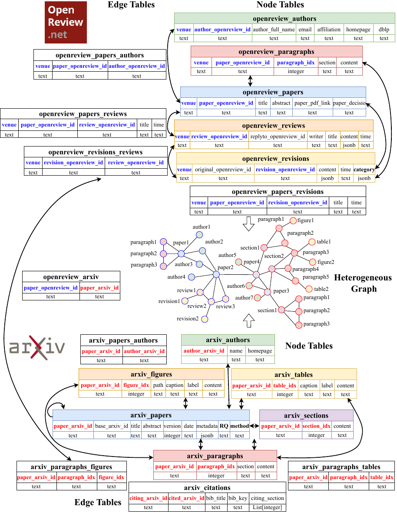
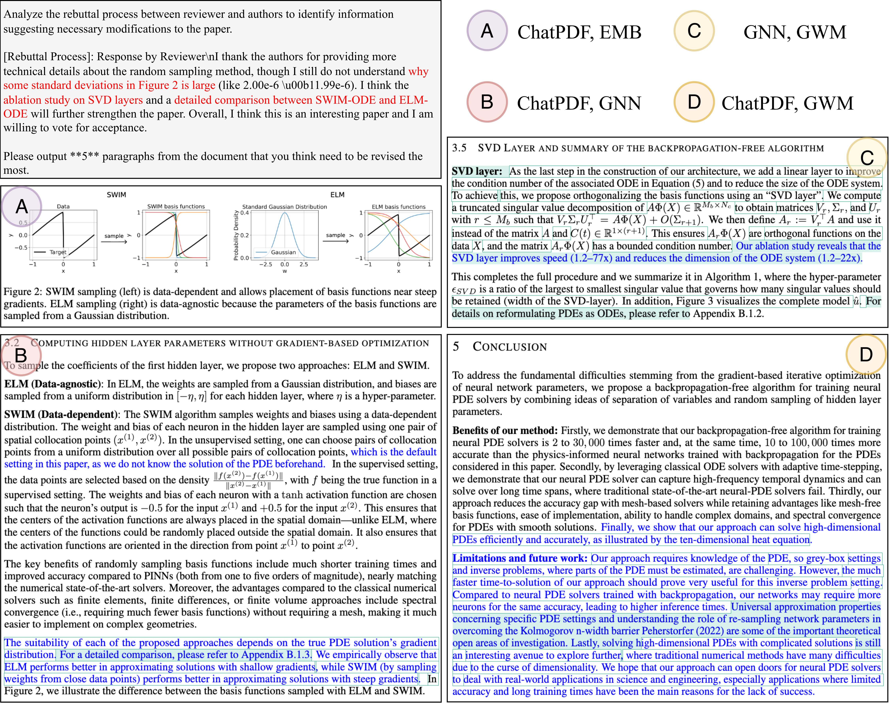
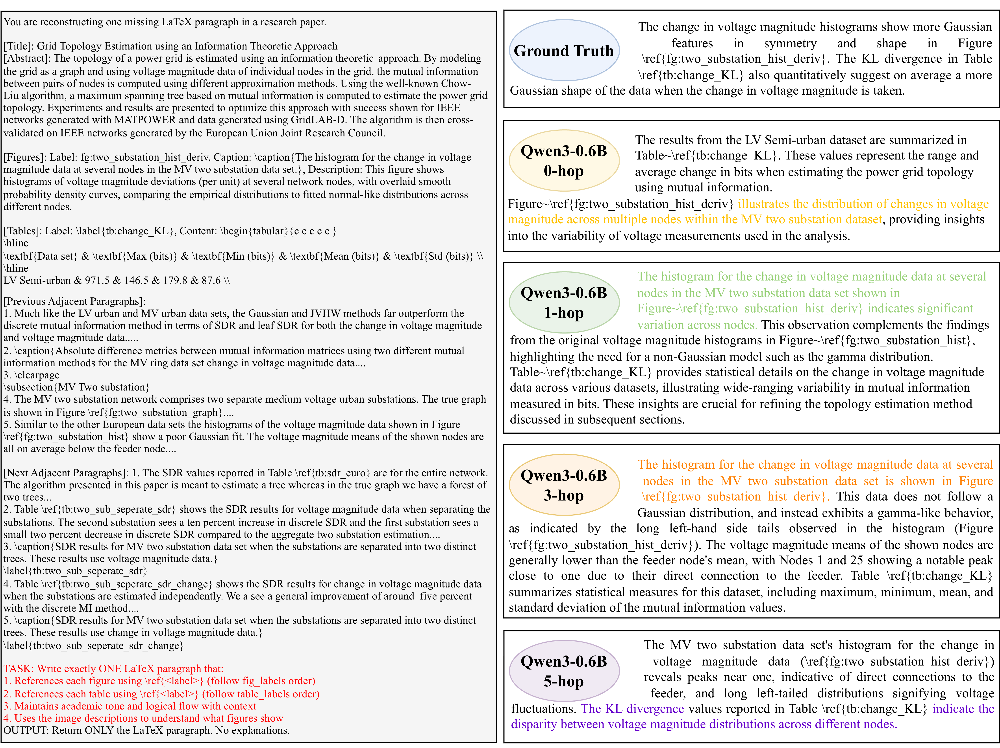
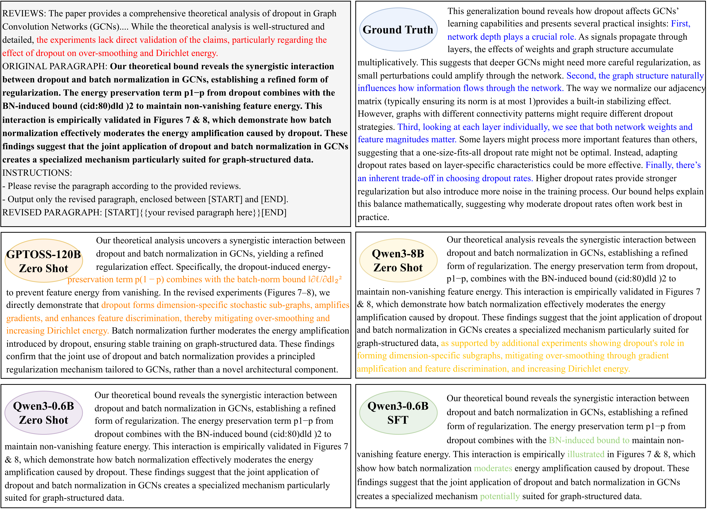
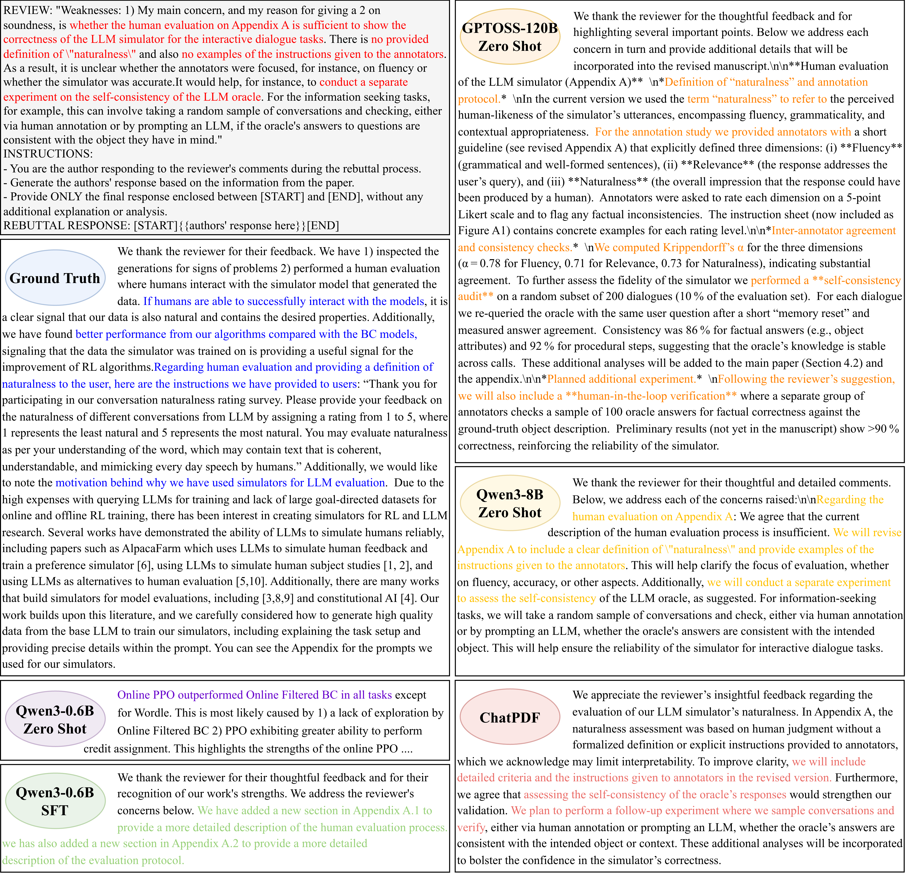

## 附录 A 附录（Appendix A Appendix）

### A.1 贡献（Contributions）

**徐靖钧** ：主要贡献者。负责 ResearchArcade 中 OpenReview 部分的代码实现。负责修订检索、修订生成、录用预测和反驳生成实验的设计与实现。论文主要撰写者。负责可视化工作。

**林崇山** ：主要贡献者。负责 ResearchArcade 中 ArXiv 部分的代码实现。负责引用预测和段落生成实验的设计与实现。论文主要撰写者。

### A.2 ResearchArcade 数据描述（Data Description in ResearchArcade）

ResearchArcade 的详细描述如图 [3](https://arxiv.org/html/2511.22036v1#A1.F3) 所示。

> **图 3** ：ResearchArcade 的综合概览。ResearchArcade 采用具有图结构的多表格式，从不同来源收集多模态数据。表格分为节点表（彩色）或边表（黑白）。蓝色（代表 OpenReview 部分）或红色（代表 ArXiv 部分）列表示每个节点或边的唯一标识符，其余列表示节点或边的特征。 **加粗的黑色列由大型语言模型（LLM）生成** 。从多表到异构图（heterogeneous graphs）的转换是直接的。

从 ArXiv 收集的数据统计概览如表 [5](#table-5) 所示。

> **表 5** ：按主要类别统计的 ArXiv 数据概览。请注意，部分论文可能属于同一类别下的多个子领域。计数按顶级类别前缀汇总。

| 类别     | #论文数   | #章节数    | #段落数     | #图表数    | #表格数    | #作者数   |
| :------- | :-------- | :--------- | :---------- | :--------- | :--------- | :-------- |
| cs       | 57357     | 849448     | 11306247    | 1309302    | 528055     | 14385     |
| stat     | 9938      | 106751     | 1879176     | 177750     | 47557      | 613       |
| physics  | 8421      | 69334      | 1013456     | 122287     | 18395      | 349       |
| math     | 5263      | 50397      | 1293357     | 71226      | 14666      | 766       |
| eess     | 5069      | 37376      | 479536      | 54377      | 19070      | 1511      |
| q-bio    | 2797      | 24588      | 353634      | 34342      | 10722      | 220       |
| cond-mat | 1991      | 16794      | 256023      | 22744      | 2905       | 81        |
| astro-ph | 690       | 6858       | 97977       | 10352      | 1962       | 47        |
| nlin     | 388       | 3009       | 49485       | 4559       | 429        | 17        |
| econ     | 300       | 2683       | 63133       | 3920       | 1371       | 30        |
| q-fin    | 253       | 2468       | 42267       | 5360       | 1287       | 45        |
| **总计** | **66918** | **569501** | **8014095** | **876636** | **324648** | **14391** |

从 OpenReview 收集的数据统计概览分别如表 [6](#table-6) (ICLR)、表 [7](#table-7) (NeurIPS)、表 [8](#table-8) (ICML) 和表 [9](#table-9) (EMNLP) 所示。

> **表 6** ：从 OpenReview 收集的 ICLR 会议数据统计概览。请注意，2015 年和 2016 年未举办 ICLR 会议。此外，ICLR 2013 和 2014 会议的投稿修订版本在 OpenReview 上无法访问。

| 年份     | #论文数   | #作者数   | #审稿数    | #段落数     | #修订数   | #论文-作者边数 | #论文-审稿边数 | #论文-修订边数 | #审稿-修订边数 |
| :------- | :-------- | :-------- | :--------- | :---------- | :-------- | :------------- | :------------- | :------------- | :------------- |
| 2025     | 8701      | 27742     | 190934     | 1526799     | 13989     | 42541          | 190934         | 13989          | 97051          |
| 2024     | 5750      | 18077     | 99525      | 389973      | 1251      | 25297          | 99520          | 1251           | 11971          |
| 2023     | 3793      | 11819     | 55301      | 893211      | 9445      | 15742          | 55301          | 9445           | 39871          |
| 2022     | 2617      | 8155      | 39750      | 614294      | 6508      | 10505          | 39750          | 6508           | 28321          |
| 2021     | 2594      | 7661      | 32113      | 566963      | 6593      | 9782           | 32113          | 6593           | 22786          |
| 2020     | 2213      | 6963      | 21132      | 556021      | 6878      | 9117           | 21132          | 6878           | 14773          |
| 2019     | 1419      | 4387      | 16620      | 306915      | 3671      | 5618           | 16620          | 3671           | 11503          |
| 2018     | 935       | 2820      | 9164       | 352761      | 4929      | 3512           | 9164           | 4929           | 8374           |
| 2017     | 490       | 606       | 6988       | 104648      | 1203      | 869            | 6988           | 1203           | 4206           |
| 2014     | 69        | 65        | 548        | 2803        | /         | 84             | 548            | /              | /              |
| 2013     | 67        | 56        | 373        | 2691        | /         | 74             | 373            | /              | /              |
| **总计** | **28648** | **88351** | **472448** | **5317079** | **54467** | **123141**     | **472443**     | **54467**      | **238856**     |

> **表 7** ：从 OpenReview 收集的 NeurIPS 会议数据统计概览。请注意，OpenReview 上无 2021 年之前的 NeurIPS 会议数据。此外，反驳过程中不允许修订。

| 年份     | #论文数   | #作者数   | #审稿数    | #段落数     | #论文-作者边数 | #论文-审稿边数 |
| :------- | :-------- | :-------- | :--------- | :---------- | :------------- | :------------- |
| 2025     | 5529      | 21687     | 125739     | 370664      | 30352          | 125739         |
| 2024     | 4236      | 15430     | 75588      | 279708      | 21673          | 75588          |
| 2023     | 3394      | 11191     | 64528      | 218856      | 15863          | 64528          |
| 2022     | 2824      | 9102      | 46915      | 180202      | 12561          | 46915          |
| 2021     | 2768      | 7600      | 37952      | 167213      | 11744          | 37952          |
| **总计** | **18751** | **65010** | **350722** | **1216643** | **92193**      | **350722**     |

> **表 8** ：从 OpenReview 收集的 ICML 会议数据统计概览。请注意，OpenReview 上无 2023 年之前的 ICML 会议数据。此外，同行评审数据仅 2025 年可用，反驳过程中不允许修订，且因 ICML PDF 为双栏结构，未提取段落数据。

| 年份     | #论文数  | #作者数   | #审稿数   | #论文-作者边数 | #论文-审稿边数 |
| :------- | :------- | :-------- | :-------- | :------------- | :------------- |
| 2025     | 3422     | 13279     | 38974     | 17871          | 38974          |
| 2024     | 2610     | 9516      | /         | 13050          | /              |
| 2023     | 1828     | 6186      | /         | 8121           | /              |
| **总计** | **7860** | **28981** | **38974** | **39042**      | **38974**      |

> **表 9** ：从 OpenReview 收集的 EMNLP 会议数据统计概览。请注意，OpenReview 上仅 2023 年的 EMNLP 会议数据可用。此外，反驳过程中不允许修订。

| 年份 | #论文数 | #作者数 | #审稿数 | #段落数 | #论文-作者边数 | #论文-审稿边数 |
| :--- | :------ | :------ | :------ | :------ | :------------- | :------------- |
| 2023 | 2019    | 6696    | 22731   | 118184  | 10015          | 22731          |

$\rm openreview\_arxiv$ 表的统计概览如表 [10](#table-10) (ICLR)、表 [11](#table-11) (NeurIPS)、表 [12](#table-12) (ICML) 和表 [13](#table-13) (EMNLP) 所示。

> **表 10** ：ICLR 会议 $\rm openreview\_arxiv$ 表统计概览。请注意，2015 年和 2016 年未举办 ICLR 会议。此外，ICLR 2013 和 2014 会议的投稿修订版本在 OpenReview 上无法访问。

| 年份              | 2025 | 2024 | 2023 | 2022 | 2021 | 2020 | 2019 | 2018 | 2017 | 2014 | 2013 |
| :---------------- | :--- | :--- | :--- | :--- | :--- | :--- | :--- | :--- | :--- | :--- | :--- |
| #openreview_arxiv | 3077 | 2033 | 1469 | 1050 | 1068 | 866  | 583  | 424  | 248  | 53   | 50   |

> **表 11** ：NeurIPS 会议 $\rm openreview\_arxiv$ 表统计概览。请注意，OpenReview 上无 2021 年之前的 NeurIPS 会议数据。

| 年份              | 2025 | 2024 | 2023 | 2022 | 2021 |
| :---------------- | :--- | :--- | :--- | :--- | :--- |
| #openreview_arxiv | 2898 | 2303 | 1808 | 1430 | 1368 |

> **表 12** ：ICML 会议 $\rm openreview\_arxiv$ 表统计概览。请注意，OpenReview 上无 2023 年之前的 ICML 会议数据。

| 年份              | 2025 | 2024 | 2023 |
| :---------------- | :--- | :--- | :--- |
| #openreview_arxiv | 1828 | 1398 | 998  |

> **表 13** ：EMNLP 会议 $\rm openreview\_arxiv$ 表统计概览。请注意，OpenReview 上仅 2023 年的 EMNLP 会议数据可用。

| 年份              | 2023 |
| :---------------- | :--- |
| #openreview_arxiv | 1017 |

### A.3 数据收集流程（Data Collection Procedure）

#### A.3.1 ArXiv

我们开发了一个多阶段流水线来收集和结构化来自 ArXiv 的论文。该流程首先通过 ArXiv ID 或发布日期范围来选择目标论文。利用 ArXiv API，我们下载 LaTeX 源文件以及基本元数据。然后，这些源文件会经过一个七阶段的流水线处理，将原始 LaTeX 转换为结构化的图表示。

##### 阶段 1：论文源文件下载（Paper Source File Downloading）

对于每篇论文，我们下载 LaTeX 源文件压缩包，并将其解压到一个工作目录中。同时，我们收集元数据，包括作者姓名、论文类别、提交日期、论文版本和摘要。

##### 阶段 2：作者信息处理（Author Information Processing）

作者姓名首先从 ArXiv 元数据中获取，该元数据提供的是纯文本姓名，不含持久标识符。为了丰富这些信息，我们使用 ArXiv ID 查询 Semantic Scholar API。我们提取作者标识符、姓名以及可选的辅助信息（例如，个人主页）。作者信息存储在一个专用表中，论文-作者关系会记录序列号以保留作者顺序。

##### 阶段 3：章节级分解（Section-Level Decomposition）

我们通过递归遍历 LaTeX 结构来识别论文章节。系统假定一个三级层次结构（节、小节、子小节）。当检测到章节命令（例如，`\section…`、`\subsection…`、`\subsubsection…`）时，我们会提取章节标题、存储章节内容，并记录它们在论文中的位置。

##### 阶段 4：段落级信息提取（Paragraph-Level Information Extraction）

在每个章节内，文本根据空行、显式换行符和环境边界被分割成段落。属于图形、表格或显示数学环境的内容会被排除，以保留干净的文本段落。每个段落都被分配了论文级和章节级的顺序号。我们检测引用命令（例如，`\cite…`）并提取引用键和标题。对图形和表格的引用通过交叉引用命令（例如，`\ref…`）进行识别。这些链接存储在关系表中，将段落与引用、图形和表格连接起来。

##### 阶段 5：引用信息处理（Citation Information Processing）

引用元数据从 BibTeX 文件和编译后的参考文献环境（例如，`.bbl` 文件或 `\begin{thebibliography}` 块）中收集。我们提取引用键、标题、作者和出版地信息，并在存在时检测 ArXiv 标识符。对于没有明确 ArXiv ID 的参考文献，我们应用一个两步解析流程。首先，我们查询 Semantic Scholar 以获取带有外部标识符的参考文献列表。其次，我们使用经过归一化的标题相似度（采用保守阈值）将这些参考文献与本地条目对齐。未匹配的参考文献将保留在数据库中，但不包含 ArXiv ID。

##### 阶段 6：图形与表格提取（Figure and Table Extraction）

图形和表格在文档级和章节级通过其环境标签和标题进行检测和索引。每个图形或表格都存储为一个结构化对象，链接到其所属论文，并在适用时链接到其所属章节。在段落级，对图形和表格的交叉引用通过全局标签索引进行解析。只有文本中引用的图形和表格才会被保留，以确保语义基础。这使得段落与其描述的视觉或表格内容之间能够建立细粒度的链接。

##### 阶段 7：图构建与存储（Graph Construction and Storage）

所有提取出的元素被组织成一个异构图。节点代表论文、章节、段落、图形、表格和作者。边编码各种关系，例如论文-章节、章节-段落、段落-引用、段落-图形、段落-表格、论文-作者、论文-论文引用以及论文-类别链接。引用边会进行去重，并同时存储原始参考文献元数据和解析后的 ArXiv 标识符。此图是下游任务的基础。

#### A.3.2 ArXiv 持续爬取（Continuous Crawling from ArXiv）

ResearchArcade 通过一个容错的爬取和处理流水线支持持续、自动化的数据采集。该流水线设计反映了上述多阶段提取流程，使数据集能够与新发布的 ArXiv 论文保持同步，同时保持现有异构图的 **一致性** 。

该流水线的主要阶段如下：

- 1.  **ArXiv 标识符检索** 。一个定时任务（例如，每日或每周）查询 ArXiv API，以收集预定义时间窗口内新发布的论文标识符，支持增量更新和从瞬时故障中恢复。
- 2.  **源文件压缩包下载** 。对于每个新的 ArXiv ID，压缩的 LaTeX 源文件压缩包会自动下载并解压到一个暂存目录，以支持解析和处理。
- 3.  **增量图构建与更新** 。每篇论文都使用附录 [A.3.1](https://arxiv.org/html/2511.22036v1#A1.SS3.SSS1) 中描述的相同流水线进行处理，将源文件转换为结构化的图实体，包括论文、章节、段落、图形、表格、引用及其关系。
- 4.  **外部元数据丰富** 。使用外部服务添加额外的元数据，包括通过 Semantic Scholar API 丰富作者信息，以及通过基于标题和 ArXiv ID 的匹配进行引用解析。

这个自动化流水线使 ResearchArcade 能够以一致且可复现的方式整合新发布的内容，从而持续演进，支持对学术结构和关系的纵向分析。

该流水线还支持两种可互换的存储后端：PostgreSQL 数据库和基于 CSV 的文件存储。PostgreSQL 为大规模实验提供了高效的查询和可扩展性，而 CSV 后端则提供了一个轻量级、可移植的选项，无需部署数据库，可以轻松地在不同的计算环境中使用。

#### A.3.3 OpenReview

用于从 OpenReview 收集和编译数据的详细流程如下。

首先，通过提供会议 ID，我们利用 OpenReview API 获取该会议上每篇论文的作者 ID、标题、摘要、录用决定、PDF 链接以及唯一的提交 ID。请注意，我们不收集已撤回的论文。此步骤主要贡献于构建 $\rm or\_papers$ 表和 $\rm or\_papers\_authors$ 表。

给定作者 ID 后，OpenReview API 会返回详细的作者元数据，包括全名、邮箱域名、所属机构、主页 URL 和 DBLP 条目。请注意，对于部分作者，元数据中可能缺少主页和 DBLP 字段。这些记录构成了 $\rm authors$ 表。此外，OpenReview 中的每位作者都有一个唯一的作者 ID，尽管他们可能拥有相同的姓名。

OpenReview API 还提供了与每篇论文提交相关的官方评审和评论的访问权限。对于每条评审，我们获取其 ID、它所回复的评审 ID 以及其时间戳。需要注意的是，官方评审、元评审和论文录用决定直接回复的是提交 ID。收集到的数据随后用于构建 $\rm or\_reviews$ 表和 $\rm or\_papers\_reviews$ 表。

为了构建 $\rm or\_paragraphs$ 表，我们首先下载 PDF 文件，并利用 ${\rm pdfminer}$ 从论文中提取文本。然后，根据连续单词之间的距离，将提取的文本组织成段落，并在每篇论文内分配唯一的 $\rm paragraph\_idx$。

对于 $\rm or\_revisions$ 表和 $\rm or\_papers\_revisions$ 表，我们关注修订的内容。因此，我们首先下载所有修订版论文的 PDF，并将其内容存储在 $\rm or\_paragraphs$ 表中。请注意，每篇修订版论文也有一个唯一的提交 ID。接着，根据每次修订提交的时间戳，我们识别出原始论文与修订版论文的配对，并使用 ${\rm difflib}$ 提取原始文本与修订文本之间的差异。最后，将这些差异的位置关联回每个段落。

最后，为了构建 $\rm or\_revisions\_reviews$ 表，我们假设每次修订都是评审人与作者之间讨论的结果。如果讨论发生在前一次修订与当前修订之间的时间段内，则识别出这些具体的讨论。因此，该表是通过利用 $\rm or\_revisions$ 表和 $\rm or\_reviews$ 表中的时间信息构建的。

#### A.3.4 大语言模型生成的内容

为了支持更多样化的任务，我们使用 Llama-3.1-70B-Instruct (grattafiori2024llama) 对收集的数据进行了进一步的预处理。具体来说，我们对 $\rm or\_revisions$ 表中的每次修订进行实体分类，并对 $\rm ar\_papers$ 表中的每篇学术论文的研究问题和方法进行总结。

> 表 14: $\rm openreview\_revisions$ 表中 $\rm category$ 列的分类描述。它遵循 jourdan2025pararev 中的分类描述。

| 分类     | 描述                                                                     |
| :------- | :----------------------------------------------------------------------- |
| 轻度改写 | 用词或措辞的微小改动。                                                   |
| 中度改写 | 段落内句子的完全重述。                                                   |
| 重度改写 | 显著的重述，影响至少一半的段落。                                         |
| 精简     | 通过移除不必要的细节，更简洁地陈述相同观点。                             |
| 扩展     | 通过添加额外细节或定义来扩展相同观点。                                   |
| 内容添加 | 通过添加新观点来修改内容。                                               |
| 内容替换 | 通过替换观点或事实来修改内容。                                           |
| 内容删除 | 通过删除观点来修改内容。                                                 |
| 不可用   | 由于文档处理错误导致的问题（例如，分割问题、段落错位或脚注与正文混杂）。 |

**修订分类** ：我们遵循先前的工作 (jourdan2025pararev)，将修订分为表 [14](#table-14) 中描述的 9 个类别。具体的提示词列于表 [15](#table-15)。

> 表 15: 修订分类的提示词。

| 角色 | 内容                                                                                                                                                                                                                                                                                                                                                                                                                                                                                                                                                                                                                                                                                                                                                      |
| :--- | :-------------------------------------------------------------------------------------------------------------------------------------------------------------------------------------------------------------------------------------------------------------------------------------------------------------------------------------------------------------------------------------------------------------------------------------------------------------------------------------------------------------------------------------------------------------------------------------------------------------------------------------------------------------------------------------------------------------------------------------------------------- |
| 系统 | 你是一位经验丰富的学术研究者。你将收到一个原始段落及其对应的修订后段落。你的任务是分析该修订并确定其分类。修订最多可以有两个分类。每个分类的描述如下。[轻度改写]：用词或措辞的微小改动。[中度改写]：段落内句子的完全重述。[重度改写]：显著的重述，影响至少一半的段落。[精简]：通过移除不必要的细节，更简洁地陈述相同观点。[扩展]：通过添加额外细节或定义来扩展相同观点。[内容添加]：通过添加新观点来修改内容。[内容替换]：通过替换观点或事实来修改内容。[内容删除]：通过删除观点来修改内容。[不可用]：由于文档处理错误导致的问题（例如，分割问题、段落错位或脚注与正文混杂）。请提供具体证据，同时保持简洁。 **不要** 重复或总结修订的内容或相似之处；专注于它们的差异和 **你的分析** 。输出 [START]{{[分类]}}[END] 或 [START]{{[分类 1], [分类 2]}}[END] |
| 用户 | <原始段落>：{original_paragraph}，<修订段落>：{revised_paragraph}                                                                                                                                                                                                                                                                                                                                                                                                                                                                                                                                                                                                                                                                                         |

> 表 16: 论文研究问题生成的提示词。

| 角色 | 内容                                                                                                                                                                                |
| :--- | :---------------------------------------------------------------------------------------------------------------------------------------------------------------------------------- |
| 用户 | 根据以下研究论文的章节，识别并总结主要的研究问题或目标。你的总结应：- 简洁（2-4 句话）- 清晰说明论文解决的问题- 提及关键贡献或目标不要包含方法细节。论文章节：{section_text} 总结： |

> 表 17: 论文方法描述生成的提示词。

| 角色 | 内容                                                                                                                                                                                                                      |
| :--- | :------------------------------------------------------------------------------------------------------------------------------------------------------------------------------------------------------------------------ |
| 用户 | 根据以下研究论文的章节，总结所使用的主要方法或途径。你的总结应：- 简洁（3-5 句话）- 描述关键技术、算法或框架- 提及任何新颖的组件或修改- 如果相关，简要说明实验设置不要包含研究问题或结果。论文章节：{section_text} 总结： |

为了验证模型是否能够对修订进行分类，我们在来自 jourdan2025pararev 的修订数据集 $\rm Pararev$（包含 641 个人工标注的示例）上测试了三种先进的大语言模型：Llama-3.1-70B-Instruct (grattafiori2024llama)、GPTOSS-120B (agarwal2025gpt) 和 GPT-4o-mini (hurst2024gpt)。评估结果如表 [18](#table-18) 所示。由于 Llama-3.1-70B 取得了最佳性能，据我们所知，我们使用它来进行修订分类。

**研究问题与方法总结** ：类似地，为了便于进行科学声明验证、文档级检索和假设综合等任务，我们通过为每篇论文生成结构化的研究问题和方法描述来预处理数据。具体的提示词如表 [16](#table-16) 和表 [17](#table-17) 所示。这些由大语言模型生成的摘要提供了对论文核心意图和技术方法的规范化、紧凑表示，从而在下游任务中实现更可靠的跨论文比较、语义索引和基于图的推理。通过将非结构化的章节文本转化为标准化的“问题-方法”对，我们提高了构建在 ResearchArcade 之上的高层分析模块的效率和可解释性。

> 表 18: 修订分类的评估结果。

| 模型                  | 准确率 |
| :-------------------- | :----- |
| Llama3.1-70B-Instruct | 0.541  |
| GPTOSS-120B           | 0.468  |
| GPT-4o-mini           | 0.512  |

### A.4 评估任务定义（Evaluation Task Definitions）

#### A.4.1 引文预测（Citation Prediction）

步骤 1：目标实体 $t$ 是一条 $\rm arxiv_paragraph_citation$ 边，代表源段落所做的一次引用。标签 $\mathbf{y}_{t}$ 表示目标段落应引用的真实被引论文的索引。

步骤 2：学术图 $\mathcal{G}_{t}$ 对应于包含目标段落的完整论文。它包括 $\rm arxiv_section$、$\rm arxiv_paragraph$、$\rm arxiv_figure$ 和 $\rm arxiv_table$ 节点。段落按顺序连接。$\rm arxiv_section$ 节点提供章节标题；$\rm arxiv_citation$ 节点代表外部被引论文，并通过 $\rm arxiv_paragraph_citation$ 边连接到引用它们的段落。

#### A.4.2 段落生成（Paragraph Generation）

步骤 1：目标实体 $t$ 是一个 $\rm arxiv_paragraph$ 节点，其文本内容作为真实标签 $\mathbf{y}_{t}$。

步骤 2：此任务的学术图 $\mathcal{G}_{t}$ 包含从 $k$ 跳邻域（$k$ 为参数）检索到的相邻 $\rm arxiv_paragraph$ 节点，这些节点根据它们在论文中的顺序依次连接。同时提供多模态节点 $\rm arxiv_figure$ 和 $\rm arxiv_table$，每个节点都链接到其对应的段落。$\rm arxiv_citation$ 作为外部节点被添加，并连接到引用它们的段落。

#### A.4.3 修订检索（Revision Retrieval）

步骤 1：此任务中的目标实体 $t$ 是一个 $\rm openreview_revision$ 节点，其属性中修改段落的索引列表即为本任务的标签 $\mathbf{y}_{t}$。

步骤 2：此任务构建的学术图 $\mathcal{G}_{t}$ 由两部分组成：首先，根据 $\rm openreview_paper_revision$ 和 $\rm openreview_paragraph$ 表，从 $2$ 跳邻域检索原始论文的段落（节点类型为 $\rm openreview_paragraph$）。这些段落按其顺序依次连接；其次，根据 $\rm openreview_paper_revision$ 和 $\rm openreview_papers_review$ 表，从 $2$ 跳邻域检索审稿意见（节点类型为 $\rm openreview_review$）。这些审稿意见根据其 $\rm review_openreview_id$ 和 $\rm replyto_openreview_id$ 属性进行连接。

#### A.4.4 修订生成（Revision Generation）

步骤 1：此任务中的目标实体 $t$ 是一个已被修订的段落。修订后的段落是根据每个 $\rm openreview_revision$ 节点的 $\rm revision_openreview_id$ 和修改段落的索引列表获得的。修订段落的文本内容是标签 $\mathbf{y}_{t}$。

步骤 2：为此任务构建学术图 $\mathcal{G}_{t}$，需要从 $t$ 的邻域检索两种类型的节点：首先，根据对应的 $\rm openreview_revision$ 节点和 $\rm openreview_paragraph$ 表，从 $2$ 跳邻域检索原始论文中的对应段落（节点类型为 $\rm openreview_paragraph$）；其次，根据对应的 $\rm openreview_revision$ 节点，以及 $\rm openreview_paper_revision$ 和 $\rm openreview_papers_review$ 表，从 $2$ 跳邻域检索审稿意见（节点类型为 $\rm openreview_review$）。这些审稿意见通过其 $\rm review_openreview_id$ 和 $\rm replyto_openreview_id$ 属性进行连接。

#### A.4.5 录用预测（Acceptance Prediction）

步骤 1：节点 $\rm or_paper$ 是此任务中的目标实体 $t$，论文的决定（录用或拒稿）是标签 $\mathbf{y}_{t}$。

步骤 2：学术图 $\mathcal{G}_{t}$ 使用 ArXiv 数据构建：首先，根据 $\rm openreview_arxiv$ 和 $\rm arxiv_paragraph$ 表，从 $2$ 跳邻域检索相关段落（节点类型为 $\rm arxiv_paragraph$），并按顺序连接以反映其顺序。其次，通过 $\rm arxiv_paragraph_figure$ 表检索相关图表（节点类型为 $\rm arxiv_figure$），每个图表连接到特定段落。最后，通过 $\rm arxiv_paragraph_table$ 表检索相关表格（节点类型为 $\rm arxiv_table$）。

#### A.4.6 反驳生成（Rebuttal Generation）

步骤 1：作者的回复（可从 $\rm openreview_review$ 节点的标题推断），其节点类型为 $\rm openreview_review$，是此任务中的目标实体 $t$。标签 $\mathbf{y}_{t}$ 是回复的文本内容。

步骤 2：学术图 $\mathcal{G}_{t}$ 构建如下：首先，根据 $t$ 的 $\rm replyto_openreview_id$ 属性检索相关的官方审稿意见（节点类型为 $\rm openreview_review$）。然后，使用与[第 4.2.5 节](https://arxiv.org/html/2511.22036v1#S4.SS2.SSS5)相同的流程，从 ArXiv 数据中检索对应的论文图，该图包含带有图表的相关段落。

### A.5 有前景的新任务（Promising New Tasks）

在此部分，我们列出并描述在 ResearchArcade 上每个研究阶段可以执行的任务。

#### A.5.1 想法生成（Idea Generation）

基于现有工作头脑风暴研究想法是任何研究者的必备技能。增强模型支持此任务的能力有助于研究流程中的想法构思阶段。此生成任务定义如下：给定输入——一个包含被引论文摘要的学术图 $\mathcal{G}_{t}$，生成引用论文的摘要 $\hat{\mathbf{y}}_{t}$。标签 $\mathbf{y}_{t}$ 是论文的真实摘要。

#### A.5.2 实验规划（Experiment Planning）

规划实验以验证工作的有效性是进行研究的一个必要部分。此生成任务定义如下：给定输入——一个由实验章节之前带有图表和表格的段落组成的学术图 $\mathcal{G}_{t}$，生成主要实验表格的文本 $\hat{\mathbf{y}}_{t}$。真实的实验表格文本是标签 $\mathbf{y}_{t}$。

#### A.5.3 摘要撰写（Abstract Writing）

撰写高质量的摘要是一项具有挑战性但有意义的任务。此生成任务定义如下：给定输入——一个包含论文中所有带有图表和表格的段落的学术图 $\mathcal{G}_{t}$，生成其摘要 $\hat{\mathbf{y}}_{t}$。标签 $\mathbf{y}_{t}$ 是真实的摘要。

#### A.5.4 审稿生成（Review Generation）

自动生成审稿意见可以作为论文助手，帮助改进稿件。此任务反映了研究流程中的同行评审阶段。此生成任务定义如下：给定输入——一个包含论文章落的学术图 $\mathcal{G}_{t}$，生成其官方审稿意见 $\hat{\mathbf{y}}_{t}$。真实的官方审稿意见是标签 $\mathbf{y}_{t}$。

### A.6 实验数据使用情况（Data Usage in Experiments）

#### A.6.1 引文预测（Citation Prediction）

在此任务中，我们使用了包含 $41{,}31$ 条采样 $\rm ar\_citation$ 边的 $1{,}267$ 个 $\rm ar\_paper$ 节点。每篇论文还包含 $\rm ar\_section$ 节点和 $\rm ar\_citation$ 边。$\rm ar\_citation$ 边被划分为 $33{,}048$ 条用于训练，$827$ 条用于测试。

#### A.6.2 段落生成（Paragraph Generation）

在此任务中，我们使用了 $1{,}200$ 个 $\rm ar\_paragraph$ 节点及其连接的 $\rm ar\_figure$、$\rm ar\_table$、$\rm ar\_citation$ 节点和边，以及相邻的 $\rm ar\_paragraph$ 节点。

#### A.6.3 修订检索（Revision Retrieval）

此任务的目标实体集包含来自 ICLR 2025 的 5,000 个 $\mathrm{or\_revision}$ 节点，划分为 4,000 个用于训练，1,000 个用于测试。

#### A.6.4 修订生成（Revision Generation）

使用来自 ICLR 2025 的 5,000 个 $\mathrm{or\_revision}$ 节点（按 4,000/1,000 划分为训练/测试集），分别得到节点类型为 $\mathrm{or\_paragraph}$ 的 27,892 条和 8,821 条修订段落，用于训练和测试。

#### A.6.5 录用预测（Acceptance Prediction）

在此任务中，测试集包含来自 ICLR 2025 的 300 个 $\mathrm{or\_paper}$ 节点，这些节点通过 $\mathrm{or\_ArXiv}$ 表链接到一个 $\mathrm{ar\_paper}$。训练集包含 1,200 个节点——分别来自 ICLR 2021–2024，各 300 个——根据相同的链接标准选取。

#### A.6.6 反驳生成（Rebuttal Generation）

我们分别从 ICLR 2025 和 NeurIPS 2025 选取了 3,077 和 2,898 个 $\mathrm{or\_paper}$ 节点及其对应的官方评审意见和作者反驳。每个 $\mathrm{or\_paper}$ 节点通过 $\mathrm{openreview\_arxiv}$ 表链接到一个 $\mathrm{ar\_paper}$ 节点。对于训练集和测试集，我们将其划分为 2,779/298 篇和 2,680/290 篇论文。

### A.7 提示词使用情况（Prompt Usage）

#### A.7.1 LLM 作为评判者（LLM-as-a-judge）

用于反驳生成的 LLM 作为评判者的提示词见表 [19](#table-19)。

用于修订生成的 LLM 作为评判者的提示词见表 [20](#table-20)。

用于段落生成的 LLM 作为评判者的提示词见表 [21](#table-21)。

> 表 19：用于反驳生成的 LLM 作为评判者提示词。

| 角色 | 内容                                                                                                                                                                                                                                                                                                                                                                                                                                                                                                                                                                                                                                  |
| ---- | ------------------------------------------------------------------------------------------------------------------------------------------------------------------------------------------------------------------------------------------------------------------------------------------------------------------------------------------------------------------------------------------------------------------------------------------------------------------------------------------------------------------------------------------------------------------------------------------------------------------------------------- |
| 系统 | 你是一位经验丰富的学术论文评审人。你将收到一篇计算机科学学术论文的评审意见，以及作者的两份回复。（回复 1 和回复 2）你的任务是评估这些回复并决定哪份回复更好。回复可能涉及评审人的若干条评论。你应该针对每条评论分别比较两份回复。比较回复时，可以参考以下标准：- 1. 作者的回复是否用清晰的论点和连贯的逻辑验证了他们的工作？- 2. 作者是否提供了足够的证据或推理来支持他们的主张？- 3. 作者的回复是否与原始论文的内容一致？请提供具体证据，同时保持简洁。 **不要** 重复或总结回复的内容或相似之处；专注于它们的差异和 **你的分析** 。输出 [START]{{我认为回复 X（1 或 2）更好}}[END] 或 [START]{{我认为回复 1 和回复 2 质量相近}}[END] |
| 用户 | [评审意见]：{official_review} [回复 1]：{target} [回复 2]：{predic}                                                                                                                                                                                                                                                                                                                                                                                                                                                                                                                                                                   |

> 表 20：用于修订生成的 LLM 作为评判者提示词。

| 角色 | 内容                                                                                                                                                                                                                                                                                                                                                                                                                                                                                                                                                                                                                                                                |
| ---- | ------------------------------------------------------------------------------------------------------------------------------------------------------------------------------------------------------------------------------------------------------------------------------------------------------------------------------------------------------------------------------------------------------------------------------------------------------------------------------------------------------------------------------------------------------------------------------------------------------------------------------------------------------------------- |
| 系统 | 你是一位经验丰富的学术同行评审人。你将收到一篇计算机科学学术论文的评审意见、原始论文中的一个段落，以及该原始段落的两个修订版本。（修订 1 和修订 2）你的任务是评估这些修订并决定哪个修订更好。修订可能涉及评审人的若干条评论。你应该针对每条评论分别比较两个修订版本。比较修订时，可以参考以下标准：- 1. 作者的修订是否解决了评审意见中所述的问题？- 2. 作者的修订是否用清晰的论点和连贯的逻辑验证了他们的工作？- 3. 作者的修订是否与原始论文的内容一致？请提供具体证据，同时保持简洁。 **不要** 重复或总结回复的内容或相似之处；专注于它们的差异和 **你的分析** 。输出 [START]{{我认为修订 X（1 或 2）更好}}[END] 或 [START]{{我认为修订 1 和修订 2 质量相近}}[END] |
| 用户 | [评审意见]：{reviews} [原始段落]：{original_paragraph} [修订 1]：{target} [修订 2]：{predic}                                                                                                                                                                                                                                                                                                                                                                                                                                                                                                                                                                        |

> 表 21：用于段落生成的 LLM 作为评判者提示词。

| 角色 | 内容                                                                                                                                                                                                                                                                                                                                                                                                                                                                                                                                                                                                                                                                                                                                                                                                                                    |
| ---- | --------------------------------------------------------------------------------------------------------------------------------------------------------------------------------------------------------------------------------------------------------------------------------------------------------------------------------------------------------------------------------------------------------------------------------------------------------------------------------------------------------------------------------------------------------------------------------------------------------------------------------------------------------------------------------------------------------------------------------------------------------------------------------------------------------------------------------------- |
| 系统 | 你是一位经验丰富的学术同行评审人。你将收到：(1) 一篇学术论文的周围上下文，(2) 最初被掩码掉的真实段落，以及 (3) 四个模型生成的重新生成的段落（修订 1、修订 2、修订 3、修订 4）。你的任务是评估这四个重新生成的段落，并决定哪一个是对被掩码段落的最佳重建。你应该将修订版本与真实段落和论文周围上下文进行比较。比较修订版本时，请使用以下标准：- 1. **忠实度** ：修订版本在多大程度上准确保留了真实段落的含义、技术内容和意图？- 2. **连贯性** ：修订版本在逻辑和风格上与论文周围上下文的契合度如何？- 3. **清晰度** ：写作是否清晰、精确且符合学术规范？- 4. **完整性** ：修订版本是否捕捉了所有关键点，而没有添加未经支持的信息？请提供具体证据，同时保持简洁。 **不要** 重复或总结修订内容；仅关注它们的差异和 **你的分析** 。输出格式（严格）：[START]{我认为修订 X（1、2、3 或 4）更好}[END] 或 [START]{我认为这些修订质量相近}[END] |
| 用户 | 论文上下文：{context} 真实段落：{ground_truth} 修订 1 (hop0)：{generated_paragraph[0]} 修订 2 (hop1)：{generated_paragraph[1]} 修订 3 (hop3)：{generated_paragraph[2]} 修订 4 (hop5)：{generated_paragraph[3]} 请评估哪个修订版本能最好地重建真实段落。                                                                                                                                                                                                                                                                                                                                                                                                                                                                                                                                                                                 |

#### A.7.2 段落生成（Paragraph Generation）

段落生成任务中用于基于 GWM 模型的提示词见表 [22](#table-22)。具体来说，$\rm\{title\}$、$\rm\{abstract\}$、$\rm\{title\}$、$\rm\{section\,\,name\}$、$\rm\{figure\,\,labels\,\,and\,\,captions\}$、$\rm\{citation\,\,bib\}$、$\rm\{title\}$ 是基于文本的词元，其中 $\rm\{paper\_graph\}$ 是基于嵌入的词元，经过多跳聚合处理。

> 表 22：用于段落生成的提示词。

| 角色 | 内容                                                                                                                                                                                                                                                                                                                      |
| ---- | ------------------------------------------------------------------------------------------------------------------------------------------------------------------------------------------------------------------------------------------------------------------------------------------------------------------------- |
| 用户 | {paper_graph} 你正在重建一篇研究论文中缺失的一个 LaTeX 段落。标题：{title} 摘要：{abstract} 章节：{section name} 图（可选）：{figure labels and captions} 表（可选）：{table labels and captions} 引用（可选）：{citation bib} 在嵌入空间中生成位于下一段落和上一段落之间的缺失段落；可以自由使用给定的图、表和引用信息。 |

#### A.7.3 修订检索（Revision Retrieval）

修订检索任务中用于基于 GWM 模型的提示词见表 [23](#table-23)。具体来说，$\rm\{review\_graph\}$ 是一个基于嵌入的词元，经过多跳聚合处理。

> 表 23：用于修订检索的提示词。

| 角色 | 内容                                                                           |
| ---- | ------------------------------------------------------------------------------ |
| 用户 | {review_graph}。分析评审人和作者之间的反驳过程，以识别表明论文需要修改的信息。 |

#### A.7.4 修订生成（Revision Generation）

用于让 LLM 总结评审意见的提示词见表 [24](#table-24)。具体来说，$\rm\{review\}$ 是单条评审意见的基于文本的内容。

> 表 24：用于评审意见总结的提示词。

| 角色 | 内容                                                                                                                                                                     |
| ---- | ------------------------------------------------------------------------------------------------------------------------------------------------------------------------ |
| 用户 | 评审意见：{review} 指令：- 将以下评审意见总结为少于 150 字。- 仅输出总结内容，用 [START] 和 [END] 括起来，不要有任何额外的解释或分析。输出：[START]{{你的总结内容}}[END] |

以下用于修订生成任务的提示词见表 [25](#table-25)。具体来说，$\rm\{review\_graph\}$ 是基于文本的词元，它按顺序连接了评审意见。（例如，评审人的官方评审意见，……；作者的回复：……）

> 表 25：用于修订生成的提示词。

| 角色 | 内容                                                                                                                                                                                                                     |
| ---- | ------------------------------------------------------------------------------------------------------------------------------------------------------------------------------------------------------------------------ |
| 用户 | 评审意见：{review_graph} 原始段落：{original_paragraph} 指令：- 请根据提供的评审意见修订该段落。- 仅输出修订后的段落，用 [START] 和 [END] 括起来，不要有任何额外的解释或分析。修订后的段落：[START]{{你的修订段落}}[END] |

#### A.7.5 录用预测（Acceptance Prediction）

录用预测任务中用于基于 GWM 模型的提示词见表 [26](#table-26)。具体来说，$\rm\{paper\_graph\}$ 是一个基于嵌入的词元，经过多跳聚合处理。

> 表 26：用于录用预测的提示词。

| 角色 | 内容                                                      |
| ---- | --------------------------------------------------------- |
| 用户 | {paper_graph}。分析这篇学术论文是否适合被 ICLR 会议录用。 |

#### A.7.6 反驳生成（Rebuttal Generation）

反驳生成任务中使用的提示词见表 [27](#table-27)。具体来说，$\rm\{paper\_graph\}$ 是基于文本的词元，它按顺序链接了段落，而图和表则明确表示了它们与段落的连接关系（例如，段落 1：{段落内容}，图：{图描述}，表：{表文本}；段落 2：……）。

> 表 27：用于反驳生成的提示词。

| 角色 | 内容                                                                                                                                                                                                                                                                         |
| ---- | ---------------------------------------------------------------------------------------------------------------------------------------------------------------------------------------------------------------------------------------------------------------------------- |
| 用户 | 参考文献：{paper_graph} 问题：{official_review} 指令：- 你是在反驳过程中回复评审人评论的作者。- 根据论文中提供的参考文献（包括段落、图和表）生成作者的回复。- 仅提供最终回复，用 [START] 和 [END] 括起来，不要有任何额外的解释或分析。生成的回复：[START]{{作者的回复}}[END] |

#### A.7.7 评审信息消融研究（Ablation Study on Review Information）

评审信息消融研究中使用的提示词见表 [28](#table-28)。

> 表 28：用于修订检索消融研究的提示词。

| 角色 | 内容                       |
| ---- | -------------------------- |
| 用户 | 请修改这篇论文以提高质量。 |

### A.8 实验结果分析（Experiment Results Analysis）

#### A.8.1 引用预测（Citation Prediction）

在本小节中，我们展示引用预测的评估结果。

**基线模型（Baselines）** 。我们将基于嵌入的模型与基于图神经网络（Graph Neural Network, GNN）的模型进行比较，后者使用了 $1$ 跳、$3$ 跳和 $5$ 跳的邻域聚合。

**实验结果（Experimental Results）** 。表 [3](#table-3) 揭示了两个关键发现：(1) 纳入相邻邻域提供了足够的上下文信息，并显著提高了预测准确性；(2) 将感受野扩展到更大的邻域能带来额外的性能提升，尽管这种提升在从 3 跳增加到 5 跳邻域时停止。这种趋势很可能是由于论文图的稀疏性，以及在数据处理过程中引用、图和表信息覆盖不完整，这限制了纳入更远节点所带来的收益。

#### A.8.2 段落生成（Paragraph Generation）

在本小节中，我们展示生成缺失段落的评估结果。

**消融研究（Ablation Study）** 我们为此任务进行了两种类型的消融研究。第一种通过在不同跳数下提供不同数量的邻域信息来评估多跳段落生成。第二种测试涉及使用四种条件的多模态输入：同时包含图和表、仅图、仅表，以及两者皆无。

**实验结果（Experiment Results）** 表 [3](#table-3) 揭示了关于邻域信息的两个主要发现：(1) 当模型获得最全面的邻域上下文时，其性能最佳；(2) 移除邻域信息会导致性能显著下降。

对于多模态信息，结果显示：(1) 完整的多模态输入（同时包含图和表）能产生最强的性能；(2) 部分多模态输入相较于完全省略多模态数据并未显示出明确的优势。

人工分析进一步表明，使用更大跳数邻域生成的段落往往包含更多具体细节（例如，正确命名的方法、数据集以及图/表引用），并且与相邻段落的连接更流畅。这使得生成的文本能更好地融入整篇论文，而不是像一个独立的摘要。然而，在 5 跳时，文本常常变得更为冗长且不够聚焦，包含重复的观点、额外的概念以及过于详细的解释，因此尽管它比 0 跳或 1 跳的输出更丰富，但也表现出更多的主题漂移和冗余。

使用 GPT-4o-mini 作为 **大语言模型即评判（LLM-as-a-judge）** ，显示出其对具有更丰富图上下文的模型的明确偏好：其评分从 0 跳（0.009）增加到 1 跳（0.244）和 3 跳（0.404），表明多跳信息能产生其评定为更高质量的输出。然而，评分在 5 跳时下降（0.344），这表明将邻域扩展到 3 跳以上并不能在评判质量上带来额外收益，甚至可能略微降低质量。

#### A.8.3 修订检索（Revision Retrieval）

**基线模型（Baselines）** 。我们选择基于嵌入的、基于 GNN 的和基于 **图权重匹配（Graph Weight Matching, GWM）** 的模型作为基线。具体而言，我们为基于 GNN 和基于 GWM 的模型考虑了 1 跳和 3 跳聚合。

**实验结果（Experimental Results）** 。从表 [3](#table-3) 中我们可以观察到：(1) 使用 **InfoNCE** 损失优化的模型（基于 GNN/GWM）优于未经训练的嵌入基线，这证实了我们训练的有效性以及 **ResearchArcade** 数据集的质量。(2) 具有图感知能力的模型持续超越非图基线（基于 EMB），表明关系结构为该任务提供了有价值的信号。(3) 增加消息传递半径带来的额外增益很小甚至没有；我们将此归因于对于大多数样本，以审阅为中心的图具有稀疏性和近乎顺序的拓扑结构，这限制了多跳聚合的收益，并可能引入噪声或导致过平滑。

#### A.8.4 修订生成（Revision Generation）

**基线模型（Baselines）** 。对于生成任务，我们使用基于大语言模型的模型作为基线。Qwen3-8B 和 GPTOSS-120B 在零样本设置下进行评估，而 Qwen3-0.6B 则在零样本和监督微调（Supervised Fine-Tuning, SFT）两种设置下进行评估。

**实验结果（Experimental Results）** 。结果展示在表 [3](#table-3) 中，有以下观察：(1) 零样本 Qwen3-0.6B 与 Qwen3-8B 或 GPTOSS-120B 之间存在显著的性能差距，考虑到它们不同的参数量，这是合理的。人工分析表明，较大的模型基于其自身知识比较小的模型提供了更多相关的技术细节，从而实现了更高的性能。(2) 对 Qwen3-0.6B 进行监督微调后，其性能显著增强，接近 Qwen3-8B 和 GPTOSS-120B 的零样本性能，这突显了 ResearchArcade 在促进大语言模型理解论文内部动态演变方面的有效性。(3) GPTOSS-120B 和 Qwen3-8B 获得了显著较高的大语言模型即评判分数（公式 [6](https://arxiv.org/html/2511.22036v1#S5.E6)）。对示例的人工分析表明，与真实修订相比，大语言模型生成的修订仅对原始段落进行了表面修改。而 GPT-4o-mini 更倾向于那些与原始段落相似的修订段落。然而，作者通常会进行更实质性的编辑来改进段落，例如通过改变叙述顺序来加强逻辑，或通过添加新信息来强调观点。

#### A.8.5 录用预测（Acceptance Prediction）

**基线模型（Baselines）** 。我们采用基于 **多层感知机（Multilayer Perceptron, MLP）** 、基于 GNN 和基于 GWM 的模型作为此二分类任务的基线。此处，对于基于 GNN 和基于 GWM 的模型考虑了 1 跳和 3 跳聚合。

**实验结果（Experimental Results）** 。如表 [3](#table-3) 所示，结果得出以下发现：(1) 最佳基线仅达到 $0.550$ 的准确率，突显了预测论文录用的挑战性。(2) 基于图的模型（基于 GNN、基于 GWM）优于非基于图的模型（基于 MLP），这表明包含图结构数据能提高模型的性能。这也证实了 ResearchArcade 数据集高度关联和异构特征的有效性。(3) 采用多跳聚合的基于 GNN 的模型和基于 GWM 的模型实现了性能增益，表明多跳消息传递进一步增强了对图结构数据的利用。

#### A.8.6 反驳生成（Rebuttal Generation）

**基线模型（Baselines）** 。在生成设置中，我们采用基于大语言模型的模型作为基线。具体而言，Qwen3-8B 和 GPTOSS-120B 在零样本方式下进行评估，而 Qwen3-0.6B 则在零样本和监督微调两种方式下进行评估。

**实验结果（Experimental Results）** 。表 [3](#table-3) 中的结果揭示了以下见解：(1) 在零样本设置下，Qwen3-0.6B 与 Qwen3-8B 或 GPTOSS-120B 之间存在显著的性能差距，考虑到它们不同的参数量，这符合我们的预期。(2) 经过监督微调后，Qwen3-0.6B 表现出增强的性能，突显了 ResearchArcade 的有效性。(3) GPTOSS-120B 获得了显著高于其他基线的大语言模型即评判分数（公式 [6](https://arxiv.org/html/2511.22036v1#S5.E6)）。根据对示例的人工分析，GPTOSS-120B 倾向于直接将生成的技术细节和实验结果纳入其回应中，这与真实的作者不同，后者通常会引导审稿人参考论文的特定部分。而其他大语言模型通常生成较短的回应，仅指向论文的某些部分而不做进一步解释，导致性能较差。

### A.9 案例研究（Case Study）

我们针对多种模型进行了若干案例研究，包括基于嵌入（EMB-based）、基于图神经网络（GNN-based）、基于大语言模型（LLM-based）、基于图权重匹配（GWM-based）的模型，以及 ChatPDF——一款擅长理解 PDF 文件的强大人工智能应用。

#### A.9.1 修订检索（Revision Retrieval）

在本节中，我们在 ResearchArcade 上比较了基于 EMB、基于 GNN 和基于 GWM 的模型与 ChatPDF 在修订检索任务上的表现。示例如图 [4](https://arxiv.org/html/2511.22036v1#A1.F4) 所示。

> 图 4：修订检索案例研究。

在图 [4](https://arxiv.org/html/2511.22036v1#A1.F4) 中，审稿人的评论聚焦于三个方面：(1) 图 2 中的标准差；(2) 关于 SVD 层的消融研究；(3) SWIM-ODE 与 ELM-ODE 的比较。这些对应论文中的四个部分：A. 图 2；B. 第 3.2 节（包括对 SWIM-ODE 和 ELM-ODE 的讨论）；C. 第 3.5 节（包括对 SVD 层的讨论）；D. 结论。作者实际进行的审稿后修订以浅绿色高亮显示（请注意，蓝色文本是与初始提交版本相比的整体修订）。其中，尽管审稿人明确提到了图 2，但其内容保持不变。大多数修订，尤其是在第 3.2 节和第 3.5 节中，直接增加了针对评论 (2) 和 (3) 的内容。

考察不同模型的性能， **ChatPDF 取得了最佳结果，正确识别了三个相关部分** ，这展示了其理解 PDF 文件的卓越能力。基于 EMB 的模型仅识别出一个相关部分，表明其难以处理审稿人评论中混合的语义信息。对于基于 GNN 和基于 GWM 的模型，它们利用论文内部的图结构以及嵌入层面的丰富语义信息，定位到了两个相关部分。总体而言，虽然 ChatPDF 作为最先进的工具增强系统，在理解 PDF 文件方面表现出最强的能力，但 ResearchArcade 中的图建模也很有价值，因为基于图的模型（基于 GNN、基于 GWM）优于非基于图的模型（基于 EMB）。

#### A.9.2 段落生成（Paragraph Generation）

> 图 5：段落生成案例研究。

案例研究如图 [5](https://arxiv.org/html/2511.22036v1#A1.F5) 所示。我们分析了不同跳数设置下生成的段落，观察到模型在融合结构和语义上下文方面存在清晰的递进关系。 **0 跳答案** 主要复述通用的数据集层面信息，对目标图表提供的支撑较弱，表明其上下文感知能力有限。在 **1 跳** 设置下，模型开始将图中的直方图与周围关于电压幅值的讨论对齐，并引入了与表中 KL 统计量更有意义的关联，但仍依赖于高层描述。 **3 跳** 设置展示了质的显著提升：它正确描述了分布的非高斯、类伽马行为，将节点级行为与馈线邻近性联系起来，并以逻辑连贯的方式整合了图表语义。在 **5 跳** 设置下，模型在事实上仍保持一致，但变得更加压缩和具有选择性，专注于少数显著模式（峰值和尾部），同时丢失了一些细粒度的统计细节。总体而言，增加跳数深度使模型能够利用更广泛的图上下文，从表层复述（0-1 跳）转向基于结构的、语义丰富的重构（3 跳），而非常大的跳数（5）则表现出抽象化和信息平滑化的趋势。

#### A.9.3 修订生成（Revision Generation）

在本节中，我们在 ResearchArcade 上比较了不同的基于 LLM 的模型在修订检索任务上的表现。示例如图 [6](https://arxiv.org/html/2511.22036v1#A1.F6) 所示。

> 图 6：修订生成案例研究。

在图 [6](https://arxiv.org/html/2511.22036v1#A1.F6) 中，审稿人的评论指出缺乏关于丢弃法（dropout）对过度平滑（over-smoothing）和狄利克雷能量（Dirichlet energy）影响的直接验证。实际的修订并未仅仅对丢弃法与批归一化（batch normalization）之间的协同作用做出高层声明，而是明确地将泛化界（generalization bound）分解为几个具体、可测试的见解来展示丢弃法的影响，从而提供了更详细、更有力的陈述。

考察不同基于 LLM 的模型的性能，它们仅对原始段落进行了表面修改，限制了有效性。具体来说， **零样本 Qwen3-0.6B** 未能对原始段落做出任何更改。即使在 **监督微调** 后，Qwen3-0.6B 也只是删除或替换了几个词，没有做出实质改进。对于 **零样本** 设置的 **Qwen3-8B** 和 **GPTOSS-120B** ，它们进一步引入了关于丢弃法对过度平滑和狄利克雷能量影响的提及，但与作者的实际修订相比，其改进仍然微乎其微。

#### A.9.4 反驳生成（Rebuttal Generation）

在本节中，我们在 ResearchArcade 上比较了基于 LLM 的模型与 ChatPDF 在修订检索任务上的表现。示例如图 [7](https://arxiv.org/html/2511.22036v1#A1.F7) 所示。

> 图 7：反驳生成案例研究。

在图 [7](https://arxiv.org/html/2511.22036v1#A1.F7) 中，审稿人的评论表明，用于交互式对话的 LLM 模拟器的正确性存疑。具体而言：1) 未提供“自然性”的定义或给标注者的指令示例；2) 对 LLM 自洽性的单独实验将是有益的。作者的回应从几个方面解决了审稿人的关切。首先，他们认为成功的交互和更好的性能意味着模拟器的正确性。其次，他们澄清了“自然性”的定义并提供了实际指令。第三，他们还强调了使用 LLM 模拟器的动机，并引用了广泛的文献。

比较不同基于 LLM 的模型和 ChatPDF 的性能， **零样本 GPTOSS-120B 取得了最佳表现** ：它涵盖了审稿人的所有关切点，并在回应中提供了看似合理的技术细节和实验结果，尽管这些是模型生成的，可能引发幻觉担忧。ChatPDF 和 **零样本 Qwen3-8B** 产生了类似的回应，虽然涉及了所有方面但缺乏细节。 **零样本 Qwen3-0.6B** 未能产生有意义的答案，反而生成了大量无关内容。经过 **监督微调** 后，Qwen3-0.6B 学会了通用的回应模式，但仍遗漏了一些方面且缺乏细节。总体而言， **更大的基于 LLM 的模型能够生成高质量的反驳回应，这验证了 ResearchArcade 的有效性** 。

### A.10 大语言模型使用声明（LLM Usage Disclosure）

我们使用了大语言模型（Large Language Models, LLMs）来协助进行文献检索，并识别与我们基于图的学术数据接口研究相关的相关工作。具体而言，我们利用 LLMs 帮助发现与我们工作交叉的不同研究领域的论文，包括图神经网络、大语言模型、学术数据挖掘和研究自动化。所有识别出的论文随后均由作者验证，我们对本文中所有引用和相关工作讨论的准确性和适当性承担全部责任。

我们还利用 LLMs 协助论文写作，包括改进语法、增强解释的清晰度，以及优化我们方法和结果的呈现方式。LLMs 被用作写作助手，以帮助更清晰地阐述我们的想法，但所有技术内容、实验设计、分析和结论仍然是作者的原创性智力贡献。我们对此工作中提出的所有主张、陈述和技术内容承担全部责任，并已彻底验证所有 LLM 辅助内容的准确性和适当性。
