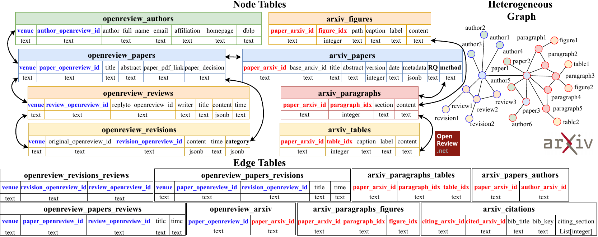
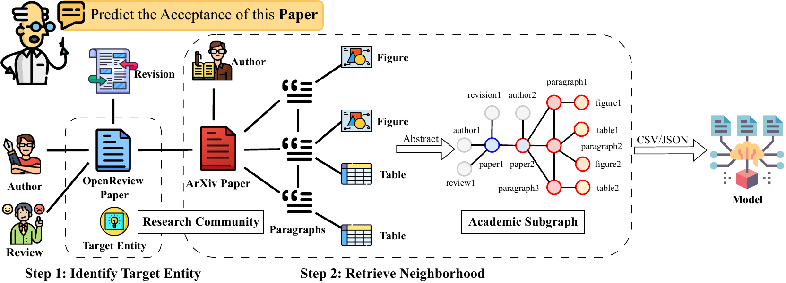

# Title: ResearchArcade : Graph Interface for Academic Tasks

- ArXiv: 2511.22036
- Authors: Jingjun Xu, Chongshan Lin, Haofei Yu, Tao Feng, Jiaxuan You
- Sections: 83
- Estimated tokens: 12.9k

## Contents

- 1 Introduction
- 2 Related Work
- 3 ResearchArcade Data Description
  - 3.1 Multi-source & Multi-Modal
  - 3.2 Highly Relational and Heterogeneous
  - 3.3 Dynamically Evolving
- 4 Academic Tasks on ResearchArcade
  - 4.1 Academic Graph as A Heterogeneous Graph
  - 4.2 Unified Academic Task Definition
    - 4.2.1 Citation Prediction
    - 4.2.2 Academic Task 2: Paragraph Generation
    - 4.2.3 Academic Task 3: Revision Retrieval
    - 4.2.4 Academic Task 4: Revision Generation
    - 4.2.5 Academic Task 5: Acceptance Prediction
    - 4.2.6 Academic Task 6: Rebuttal Generation
  - 4.3 Promising New Tasks Enabled by ResearchArcade
- 5 Experiment
  - 5.1 Experiment Setup
  - 5.2 Experiment Results
    - 5.2.1 ResearchArcade is General
    - 5.2.2 ResearchArcade Models Dynamic Evolution
    - 5.2.3 Relational Graph Structure Delivers Consistent Gains
    - 5.2.4 Multi-Modal Information Is Critical
    - 5.2.5 Review Information could be Ambiguous
- 6 Conclusion
- Ethics Statement
- Reproducibility Statement
- Acknowledgments

## Abstract

###### Abstract

Academic research generates diverse data sources. As researchers increasingly use machine learning to assist research tasks, a crucial question arises: Can we build a unified data interface to support the development of machine learning models for various academic tasks? Models trained on such a unified interface can better support human researchers throughout the research process and eventually accelerate knowledge discovery. In this work, we introduce ResearchArcade, a graph-based interface that connects multiple academic data sources, unifies task definitions, and supports a wide range of base models to address key academic challenges. ResearchArcade utilizes a coherent multi-table format with graph structures to organize data from different sources, including academic corpora from ArXiv and peer reviews from OpenReview, while capturing information with multiple modalities, such as text, figures, and tables. ResearchArcade also preserves temporal evolution at both the manuscript and community levels, supporting the study of paper revisions as well as broader research trends over time. Additionally, ResearchArcade unifies diverse academic task definitions and supports various models with distinct input requirements. Our experiments across six academic tasks demonstrate that combining cross-source and multi-modal information enables a broader range of tasks, while incorporating graph structures consistently improves performance over baseline methods. This highlights the effectiveness of ResearchArcade and its potential to advance research progress. Our code is available at [https://github.com/ulab-uiuc/research-arcade](https://github.com/ulab-uiuc/research-arcade).

## 1 Introduction

Academic research represents a pinnacle of human knowledge discovery. Diverse research tasks such as forecasting research trends and debugging scientific papers (sundar2024cpapers; paper_copilot; tian2025mmcr; agi; feng2025grapheval; guide) demand access to comprehensive data from multiple sources. To accomplish these tasks, various models are employed. These complexities raise an important research question: Can we build a unified data interface to support the development of machine learning models for various academic tasks?

Building such an interface for research tasks is challenging. In terms of data, firstly, academic data is sourced from diverse platforms such as ArXiv and OpenReview, encompassing complex relationships among entities like authors, papers, citations, and reviews. This requires a flexible framework capable of managing highly relational data. Secondly, the data representations themselves span multiple modalities—from textual content to visual and tabular data. Holistically integrating these varied representations is a significant challenge. Additionally, the dynamic and ever-evolving nature of academic data further complicates the task, as continuous growth and maintenance of the framework are required to keep pace with ongoing research developments. In terms of tasks, defining different academic tasks demands significant effort in data preprocessing and task formulation. In terms of models, different types of models require distinct interfaces. For example, Large Language Models (LLMs) require text-based data as input, while Graph Neural Networks (GNNs) utilize graph-structured data.

Despite existing efforts to benchmark scientific research, developing a unified and dynamic representation of research activities remains an open challenge. While existing academic datasets have systematically collected and organized academic data (kang2018dataset; lo2019s2orc), they mainly focus on single-source data, such as academic corpora or peer reviewing conversations. Although multi-modal data (e.g., figures and tables within scientific papers) have been incorporated to construct valuable datasets (xia2024docgenome; tian2025mmcr), these approaches do not fully exploit the multi-modal relations among different data types. Recent works have used graphs to model academic data and define academic tasks (li2023scigraphqa; zhang2024oag). However, each academic task is still formulated individually, requiring repetitive developmental efforts.

In this paper, we propose ResearchArcade, a graph-based interface that links diverse academic data sources, with unified task definitions, and supports a large variety of base models to solve valuable academic tasks. Overall, ResearchArcade exhibits four core features that make it ideal for solving academic tasks: Multi-Source, Multi-Modal, Highly Structural and Heterogeneous, and Dynamically Evolving. ResearchArcade integrates academic data from multiple sources, including research papers from ArXiv and peer reviews with revisions from OpenReview, while collecting multi-modal information, including text, figures, and tables. These distinct entities are organized in a coherent multi-table format, with selected tables designated as nodes and edges, enabling ResearchArcade to efficiently handle the highly relational and heterogeneous data as graphs within academic communities. Moreover, ResearchArcade models academic evolution at two scales: microscopically, it preserves paper revisions with temporal information to track individual manuscript development, and macroscopically, its extensible framework enables continuous data incorporation, supporting analysis of research trends over time. Furthermore, we unify diverse academic tasks within the academic graphs in ResearchArcade, enabling straightforward formulation of new tasks across both predictive and generative paradigms. Additionally, the structured knowledge in ResearchArcade can be easily exported to standardized formats, such as CSV and JSON, facilitating integration with various models, including LLMs and GNNs.

To demonstrate the key advantages of ResearchArcade, we define six academic tasks: figure/table insertion, paragraph generation, revision retrieval, revision generation, acceptance prediction, and rebuttal generation. Extensive experiments show that models benefit from the multi-source, multi-modal, heterogeneous, and dynamic information in ResearchArcade.

Overall, our key contributions include: First, ResearchArcade enables diverse task definitions by integrating multiple data sources, multi-modal information, and supporting the inclusion of temporal and up-to-date data. Second, ResearchArcade facilitates the academic task solving by unifying the task formulations and supporting the training of various models. Finally, ResearchArcade shows that incorporating graph structures consistently enhances model’s performance compared to baseline approaches.

## 2 Related Work

Academic data as graphs. Existing research on academic graphs employs various decompositions on academic data. OAG-Bench (zhang2024oag) defines nodes such as authors, papers, and affiliations, modeling academic communities as heterogeneous graphs. unarXive (Saier_2023) and DocGenome (xia2024docgenome) create finer-grained graphs by further decomposing academic corpora into paragraphs. unarXive focuses on paragraph-level citations and DocGenome considers multi-modal elements (e.g., figures and tables). In ResearchArcade, we integrate all these heterogeneous entities and extend them with comprehensive and elaborated graphs.

Dynamic modeling of academic data. Academic data are evolving dynamically, and their evolution is broadly classified into two parts: community research trends and individual manuscript evolution. For inter-paper evolution, gollapalli-li-2015-emnlp analyzes twenty years of ACL and EMNLP proceedings using topic distributions to trace venue convergence and divergence, while tian2023predicting models scientific subcommunity evolution as event prediction, detecting growth, splits, and merges in collaboration graphs. For intra-paper evolution, kuznetsov2022revise; d2024aries align revisions at the sentence level while jourdan2025pararev focuses on the paragraph level. In ResearchArcade, both evolutions are modeled simultaneously.

Solving academic tasks with deep learning. Various deep learning models are utilized to solve the academic tasks. yu2025researchtownsimulatorhumanresearch; tinyscientist conducted end-to-end scientific discovery based on LLMs. zhang2024oag leveraged CNNs, GNNs, and LLMs to solve diverse academic tasks. However, their efforts are scattered and require specialized data for different models. ResearchArcade offers a general graph interface to unify input data and task definitions for academic tasks.

## 3 ResearchArcade Data Description

ResearchArcade is an inclusive mapping of real-world research knowledge, featuring four key attributes: (1) multi-source, (2) multi-modal, (3) highly relational and heterogeneous, (4) dynamically evolving. An overview is illustrated in Figure [1](#figure-1), with further details in Appendix Figure [3](https://arxiv.org/html/2511.22036v1#A1.F3).

> Figure 1: ResearchArcade uses a multi-table format with graph structures to collect data from different sources with multiple modalities. Tables are classified into node tables (colored) or edge tables (black and white). The blue (denoting the OpenReview part) or red (denoting the ArXiv part) columns represent the unique identification of each node or edge, and the remaining columns represent the features of the nodes or edges. And the black bold columns are generated by LLM. The conversion from the multiple tables to heterogeneous graphs is straightforward.

### 3.1 Multi-source & Multi-Modal

ResearchArcade is primarily sourced from computer science papers in ArXiv and available peer review data from conferences in OpenReview. Beyond text-based data, ResearchArcade also integrates multi-modal data (e.g., figures and tables), supporting more complex multi-modal tasks.

ArXiv: ResearchArcade includes 66,918 papers from ArXiv across 11 scientific fields, comprising 569,501 sections, 8,014,095 paragraphs, 876,636 figures, 324,648 tables. Relevant connections between these entities are also captured by ResearchArcade. Detailed statistics are provided in Table [5](#table-5), and the procedure of data collection is in Appendix [A.3.1](https://arxiv.org/html/2511.22036v1#A1.SS3.SSS1). Research Arcade also supports continuous crawling, which updates the ArXiv dataset on a routine basis (e.g. weekly, daily). The detailed description is included in Appendix [A.3.2](https://arxiv.org/html/2511.22036v1#A1.SS3.SSS2)

OpenReview: ResearchArcade also includes data from OpenReview, which comprises 57,278 submissions from ICLR, NeurIPS, ICML, and EMNLP conferences, contributed by 189,038 authors. We have also explored CVPR, ECCV, AAAI, IJCAI, ACL, and NAACL conferences, but their peer review data are unavailable. In addition, the corresponding 884,875 reviews and 54,467 submission revisions during the rebuttal process are included. These entities are enriched with valuable connections. Detailed statistics are given in Table [6](#table-6) to Table [9](#table-9), and the step-by-step data collection procedure is described in Appendix [A.3.3](https://arxiv.org/html/2511.22036v1#A1.SS3.SSS3).

Connect ArXiv and OpenReview: Connecting the data from the ArXiv and OpenReview contributes to more comprehensive academic graphs, allowing the definition of more diverse academic tasks. To achieve this goal, each submission in OpenReview is associated with its corresponding paper in ArXiv based on the title. Note that 25,969 (about 45.34%) submissions from OpenReview are successfully connected to papers from ArXiv. The statistics are shown in Table [10](#table-10) to Table [13](#table-13).

LLM-Generated Content: To facilitate the use of ResearchArcade for more academic tasks (e.g., Contradiction Detection, Theory Synthesis), we used Llama-3.1-70B-Instruct (grattafiori2024llama) for data preprocessing. The submission revisions are classified according to the categories outlined in jourdan2025pararev. The detailed descriptions of these categories are provided in Table [14](#table-14). Additionally, we apply the same model to generate research question summaries and method descriptions for ArXiv papers. The specific prompts used are listed in Table [15](#table-15) to Table [17](#table-17).

### 3.2 Highly Relational and Heterogeneous

Research activities in academic communities are modeled by interactions among typed entities. ResearchArcade stores data in a multi-table node–edge schema, consisting of node tables and edge tables, which directly map to heterogeneous graphs. An illustration is shown in Figure [1](#figure-1).

Using data from ArXiv, ResearchArcade constructs a two-scale graph representation of the literature. At the intra-paper level, each paper is decomposed into a paragraph-scale content graph including paper, paragraphs, figures, and tables nodes, linked by typed edges (e.g., paper-paragraph, paragraph-figure/table). At the macro inter-paper level, we include authors, subject categories, and citation links, adding edges for authorship, category assignment, and paper-to-paper citations.

The academic graphs built on data from OpenReview mainly model the academic activities that happen during the peer review process. It encompasses diverse types of nodes, such as papers, authors, paragraphs, reviews, and revisions. Some key relationships are also included: the authorship, which connects papers and authors; the comment-under-paper relation, which connects papers and reviews; the revision-of-paper relation, which connects papers and revisions; the revision-caused-by-review relation, which connects reviews and revisions, etc.

### 3.3 Dynamically Evolving

As the academic community continuously evolves, ResearchArcade records temporal information (e.g., paper upload dates and paper revision timestamps), enabling a realistic simulation of scholarly dynamics. This includes tracing the evolution of research trends and modeling paper updates driven by the rebuttal process. Moreover, ResearchArcade can be continuously updated to reflect the ongoing development in the academic community.

## 4 Academic Tasks on ResearchArcade

> Figure 2: ResearchArcade unifies the academic task definitions in a two-step scheme: (i) Label: Identify the task’s target entity and assign its attribute as label; (ii) Input: Retrieve the target entity’s neighborhood to construct an academic graph that supports task solving.

Defining different academic tasks often requires repetitive work, such as data collection, cleaning, and task specification. With ResearchArcade, these tasks can be unified and conveniently defined on our academic graphs.

### 4.1 Academic Graph as A Heterogeneous Graph

A heterogeneous graph can be defined as $\mathcal{G}=(\mathcal{V},\,\mathcal{E})$, where each node $v\in\mathcal{V}$ and each edge $e\in\mathcal{E}$ is assigned a type through mapping functions. Specifically, the node type is defined by $\tau(v):\mathcal{V}\rightarrow\mathcal{C}$, and the edge type is defined by $\phi(e):\mathcal{E}\rightarrow\mathcal{D}$, where $c\in\mathcal{C}$ and $d\in\mathcal{D}$ represent the set of node types and the set of edge types. An edge $e$ connecting a pair of nodes is denoted as $e=(v,\,u)$.

Data from ResearchArcade can be represented as an academic graph $\mathcal{G}=(\mathcal{V},\,\mathcal{E})$, which is heterogeneous. In this context, each node $v\in\mathcal{V}$ corresponds to a row in the node table, while each edge $e$ corresponds to a row in the edge table. Furthermore, each node table $V_{c}$ is associated with a unique node type $c$, and each edge table $E_{d}$ is linked to a unique edge type $d$.

### 4.2 Unified Academic Task Definition

As is shown in Figure [2](#figure-2), ResearchArcade unifies the academic task definitions in the following two steps: (1) identifying the target entity and (2) retrieving the neighborhood of the target entity.

Step 1: Identifying the target entity of an academic task. The target entity is either a node $v$ or an edge $e$, with attributes that define the labels for the task. Let $t$ denote the target entity with attributes $\mathbf{a}_{t}$. Its certain attributes, denoted as $\mathbf{y}_{t}\subseteq\mathbf{a}_{t}$, are the labels implied in the task.

Step 2: Retrieving the neighborhood of the target entity. To support the academic task solving, the multi-hop neighborhood of the target entity $t$ is retrieved, constructing an academic graph $\mathcal{G}_{t}$ centered at $t$. The one-hop neighborhood $\mathcal{N}_{t}^{(1)}$ of $t$ consists of entities directly connected to $t$. If $t\in\mathcal{V}$, then $\mathcal{N}_{t}^{(1)}=\{k\,|\,k\in\mathcal{V},\,(t,\,k)\in\mathcal{E}\}$. If $t\in\mathcal{E}$, then $\mathcal{N}_{t}^{(1)}=\{k,\,u\,|\,k,\,u\in\mathcal{V},\,t=(k,\,u)\}$. For $i>1$, the $i$-hop neighborhood is defined as $\mathcal{N}_{t}^{(i)}=\{k\,|\,k\in\mathcal{V},\,k^{\prime}\in\mathcal{N}_{t}^{(i-1)},\,(k,k^{\prime})\in\mathcal{E}\}$, which extends the $(i-1)$-hop neighborhood by one additional hop. Hence, the academic graph is constructed as $\mathcal{G}_{t}=(\mathcal{V}_{t},\,\mathcal{E}_{t})$, where $\mathcal{V}_{t}$ contains nodes in the multi-hop neighborhood of $t$, and $\mathcal{E}_{t}$ represents the edges between these nodes. Thus, an academic task is defined as follows:

$$
f_{\theta}(\mathcal{G}_{t})\rightarrow\mathbf{y}_{t},(1)
$$

where $f_{\theta}$ represents a model with parameters $\theta$. Furthermore, the academic tasks are broadly classified into predictive and generative tasks. If the label $\mathbf{y}_{t}$ is from a limited set of possible outcomes, this task is categorized as a predictive task; If the label $\mathbf{y}_{t}$ is in an open-ended output space, this task is categorized as a generative task. For predictive tasks, models (specified in Section [5.1](#section-5-1)) are considered as MLP-based, Embedding-based, GNN-based, or GWM-based, where the GWM framework efficiently integrates graph-structured data with LLM (feng2025graph). The training loss varies across different predictive tasks. For generative tasks, models are primarily based on LLMs. Supervised fine-tuning (SFT) is used for training, with the loss defined as follows:

$$
\mathcal{L}_{\rm SFT}(\theta)=-\frac{1}{\sum_{t=1}^{T}L_{t}}\sum_{t=1}^{T}\sum_{i=1}^{L_{t}}\log p_{\theta}\!\big(y_{t,i}\,\big|\,y_{t,<i},\,\mathcal{G}_{t}\big),(2)
$$

where $L_{t}$ is the length of $\mathbf{y}_{t}=[y_{t,\,1},\,...,\,y_{t,\,L_{t}}]$, and $\log p$ is the log-likelihood. In this paper, six academic tasks are defined to demonstrate the four key features of ResearchArcade. Table [1](#table-1) summarizes the tasks under the two-step scheme with detailed task definitions in Appendix [A.4](https://arxiv.org/html/2511.22036v1#A1.SS4).

> Table 1: Summary of six academic tasks studied with ResearchArcade. Abbreviations include “or”: openreview, “ar”: ArXiv, CE: Cross-entropy Loss, BCE: Binary Cross-entropy Loss.

| Task                  | Target Entity (Step 1)                                      | Neighborhood (Step 2)                                                                                                      | Loss    | Type       |
| --------------------- | ----------------------------------------------------------- | -------------------------------------------------------------------------------------------------------------------------- | ------- | ---------- |
| Citation Prediction   | ar_citation edge: content of the citing paragraph           | ar_section nodes, ar_paragraph nodes, ar_figure nodes, ar_table nodes, ar_paragraph nodes, ar_paper nodes                  | CE      | Predictive |
| Paragraph Generation  | ar_paragraph node: Textual content of the paragraph         | ar_paragraph nodes, ar_table nodes, ar_figure nodes, ar_citation edges                                                     | SFT     | Generative |
| Revision Retrieval    | or_revision node: Index list of modified paragraphs         | or_paragraph nodes from the original paper, or_review nodes                                                                | InfoNCE | Predictive |
| Revision Generation   | or_paragraph node: Textual content of the revised paragraph | or_paragraph node of the original paper, or_review nodes                                                                   | SFT     | Generative |
| Acceptance Prediction | or_paper node: Paper decision                               | or_paper nodes, ar_paper nodes, ar_paragraph nodes, ar_figure nodes, ar_table nodes                                        | BCE     | Predictive |
| Rebuttal Generation   | or_review node: Textual content of the author’s response    | or_review node of the official review being replied to, ar_paper node, ar_paragraph nodes, ar_figure nodes, ar_table nodes | SFT     | Generative |

#### 4.2.1 Citation Prediction

Citation prediction requires the model to identify the appropriate paper to cite for a given paragraph, reflecting real-world needs like reference recommendation. While previous work (citation*recommendation) focuses on paper-level citation, we conduct the task at the paragraph level using the fine-grained academic graphs in ResearchArcade. We formulate this task as a multi-class classification problem. Given an academic graph $\mathcal{G}*{t}$ that contains all paragraphs and existing citations of a paper, along with a candidate paragraph, the model predicts the paper $\hat{{y}}_{t}$ that should be cited by the target paragraph $\mathbf{y}_{t}$. The ground truth $\mathbf{y}_{t}$ corresponds to the paper that was actually cited in the target paragraph. Here, we optimize the model using the contrastive cross-entropy loss:

$$
\mathcal{L}_{\rm CE}(\theta)=-\log\frac{\exp\big(\mathrm{sim}({h}_{t},{z}_{\mathbf{y}_{t}})/\tau\big)}{\sum_{j=1}^{M}\exp\big(\mathrm{sim}({h}_{t},{z}_{j})/\tau\big)},(3)
$$

where $\theta$ denotes the model parameters, ${h}_{t}$ is the embedding of the target paragraph, ${z}_{j}$ is the embedding of the $j$-th candidate cited paper, $M$ is the total number of candidate cited papers, $\mathbf{y}_{t}$ is the index of the ground-truth cited paragraph, $\tau$ is a temperature hyperparameter, and $\mathrm{sim}(\cdot,\cdot)$ denotes cosine similarity between $\ell_{2}$-normalized embeddings. This objective encourages the model to assign higher similarity to the true cited paper than to other candidate papers.

#### 4.2.2 Academic Task 2: Paragraph Generation

Understanding how to generate specific paragraphs within their proper context in academic corpora is essential for assisting scientific writing. The inherent graph structures within ResearchArcade offer relational signals among paragraphs, which are valuable for models to comprehend structural dependencies within corpora. This generative task is defined as follows: given the input, an academic graph $\mathcal{G}_{t}$ including surrounding paragraphs, referenced figures and tables, and cited literature, generate the missing paragraph content $\hat{\mathbf{y}}_{t}$. The original paragraph content serves as the ground truth label $\mathbf{y}_{t}$. To train the LLM, SFT loss (Eq. [2](https://arxiv.org/html/2511.22036v1#S4.E2)) is utilized. The prompt designed to help the LLM better understand the document completion task is shown in Table [22](#table-22).

#### 4.2.3 Academic Task 3: Revision Retrieval

Identifying the precise location of revisions from reviewers’ comments is essential for paper refinement. This captures intra-paper dynamics during peer review and demonstrates ResearchArcade’s ability to model evolving content based on graph structures. We formulate this as a top-$k$ ranking task: given an academic graph $\mathcal{G}_{t}$ containing paper paragraphs and reviews, predict the top-$k$ modified paragraphs $\hat{\mathbf{y}}_{t}$, with ground truth $\mathbf{y}_{t}$ denoting the actual revised paragraphs. Training employs the InfoNCE loss (he2020momentum), which minimizes embedding distance between reviews and revised paragraphs while maximizing distance from unchanged ones:

$$
\mathcal{L}_{\rm InfoNCE}(\theta)=-\frac{1}{R}\sum_{r=1}^{R}\log\frac{\sum_{i=1}^{M^{+}}\exp\big(\mathrm{sim}(q_{r},k_{i}^{+})/\tau\big)}{\sum_{i=1}^{M^{+}}\exp\big(\mathrm{sim}(q_{r},k_{i}^{+})/\tau\big)+\sum_{j=1}^{M^{-}}\exp\big(\mathrm{sim}(q_{r},k_{j}^{-})/\tau\big)},(4)
$$

where $\theta$ denotes the model parameters; $q_{r}$ is the model-generated embedding of the $r$-th review ($r=1,...,R$); $k_{i}^{+}$ and $k_{j}^{-}$ are the embeddings of the $i$-th modified and $j$-th unchanged paragraph, respectively; $M^{+}$ and $M^{-}$ are their counts; ${\rm sim}(\cdot,\cdot)$ is the similarity function; and $\tau$ is the temperature in the InfoNCE loss.

#### 4.2.4 Academic Task 4: Revision Generation

Building on Section [4.2.3](https://arxiv.org/html/2511.22036v1#S4.SS2.SSS3), this task focuses on generating quality-enhancing revisions of localized paragraphs conditioned on reviewer feedback, further demonstrating ResearchArcade’s dynamic evolution capability based on graph structures. Unlike previous works on revision generation (d2024aries; jourdan2025pararev), based on the academic graphs in ResearchArcade, we can conveniently retrieve the corresponding comments from the reviewer to facilitate the task. Formally, given an academic graph $\mathcal{G}_{t}$ containing the original paragraph and its reviews, the goal is to generate a revised paragraph $\hat{\mathbf{y}}_{t}$, with the actual revision $\mathbf{y}_{t}$ as the label. Training uses SFT loss (Eq. [2](https://arxiv.org/html/2511.22036v1#S4.E2)), supported by a task-specific prompt (Table [25](#table-25)) to guide the LLM in leveraging graph structures. Since LLMs have limited context length, reviews are first summarized using Qwen3-8B with the prompt in Table [24](#table-24).

#### 4.2.5 Academic Task 5: Acceptance Prediction

Predicting the acceptance of academic papers is a meaningful but challenging task. Different from previous work (feng2025grapheval), which focuses only on text-based academic graphs, we fuse ArXiv’s comprehensive multi-modal paper graph with OpenReview’s ground-truth acceptance labels and temporal information to define the task. This reflects ResearchArcade’s multi-source, multi-modal, and dynamically evolving nature. We design the task as a binary classification problem: given the input, an academic graph $\mathcal{G}_{t}$ containing papers from conferences in previous years and their corresponding paragraphs with figures and tables, predict the paper acceptance $\hat{\mathbf{y}}_{t}$ (Accept or Reject) for the future year. The real paper acceptance is the label $\mathbf{y}_{t}$. Binary cross-entropy loss is utilized as the training loss:

$$
\mathcal{L}_{\rm BCE}(\theta)=-\frac{1}{T}\sum_{t=1}^{T}\Big[\mathbf{y}_{t}\log\hat{\mathbf{y}}_{t}+(1-\mathbf{y}_{t})\log(1-\hat{\mathbf{y}}_{t})\Big].(5)
$$

where $\theta$ represents the model’s parameters and $T$ the total number of papers.

#### 4.2.6 Academic Task 6: Rebuttal Generation

Generating rebuttal responses to official reviews is critical, as response quality strongly influences paper acceptance. Based on the academic graph in ResearchArcade, this task conveniently leverages textual and multi-modal information from ArXiv along with official reviews from OpenReview. Formally, given an academic graph $\mathcal{G}_{t}$ containing the review and its related paragraphs with figures and tables from ArXiv, the goal is to generate the author’s response $\hat{\mathbf{y}}_{t}$, with the true response $\mathbf{y}_{t}$ as the label. Training uses SFT loss (Eq. [2](https://arxiv.org/html/2511.22036v1#S4.E2)), guided by a task-specific prompt (Table [27](#table-27)) to help the LLM capture graph structure and task requirements. To address token length limits, only the top-$3$ related paragraphs, selected via cosine similarity between review and paragraph embeddings using Qwen3-Embedding-0.6B, are included.

### 4.3 Promising New Tasks Enabled by ResearchArcade

The versatility of ResearchArcade extends beyond the tasks defined above, supporting additional stages of the research pipeline such as idea brainstorming, experiment planning, scientific writing, and peer reviewing—core activities in the academic process. These promising new tasks are illustrated in Table [2](#table-2), with detailed specifications provided in Appendix [A.5](https://arxiv.org/html/2511.22036v1#A1.SS5).

> Table 2: Promising new tasks enabled by ResearchArcade for future works.

| Task                | Target Entity (Step 1)                                 | Neighborhood (Step 2)                                                                | Loss | Type       |
| ------------------- | ------------------------------------------------------ | ------------------------------------------------------------------------------------ | ---- | ---------- |
| Idea Generation     | ar_paper node: Abstract                                | ar_citation edges, ar_paper nodes                                                    | SFT  | Generative |
| Experiment Planning | ar_table node: Table text in experiment section        | ar_paper node, ar_section nodes, ar_paragraph nodes, ar_figure nodes, ar_table nodes | SFT  | Generative |
| Abstract Writing    | ar_paper node: Abstract                                | ar_paper node, ar_section nodes, ar_paragraph nodes, ar_figure nodes, ar_table nodes | SFT  | Generative |
| Review Generation   | or_review node: Textual content of the official review | or_paper node, or_paragraph nodes                                                    | SFT  | Generative |

## 5 Experiment

### 5.1 Experiment Setup

Dataset: We conduct experiments based on a subset of data in ResearchArcade. For data from ArXiv, we mainly focus on papers in the Computer Science field and published within the last two years. For data collected from OpenReview, we primarily focus on the ICLR conferences within the past five years. Further detailed information is provided in Appendix [A.6](https://arxiv.org/html/2511.22036v1#A1.SS6).

Base Models: To demonstrate the compatibility of ResearchArcade with diverse models, experiments are conducted across various base models.

(1) Embedding model (EMB): Considering the relatively long token input for our academic tasks, we utilize Longformer (beltagy2020longformer), a model designed for processing long documents.

(2) Graph neural network (GNN): Since the academic graphs constructed from our database are highly relational and heterogeneous, we consider HANConv (wang2019heterogeneous), a heterogeneous graph attention neural network, as our GNN-based model.

(3) Large language model (LLM): We mainly leverage Qwen3-0.6B and Qwen3-8B (qwen3technicalreport) as our LLM-based models, as they outperform models with an approximate number of parameters and are comparable to larger models in various evaluation tasks. We also validate our tasks on GPTOSS-120B (agarwal2025gpt), a larger state-of-the-art model.

(4) Graph world model (GWM): To efficiently integrate graph-structured data with LLMs, we employ the embedding-based GWM (feng2025graph). It adopts a multi-hop aggregation to perform an embedding-level message passing, yielding an enhanced graph representation, which facilitates better LLM comprehension of the graph-structured data. Qwen3-0.6B (qwen3technicalreport) is utilized as the LLM module for the GWM-based models.

Encoders: For the text modality, we represent text data as vector embeddings for integration with GNN-based and GWM-based models. Specifically, Longformer (beltagy2020longformer) is used for downstream GNNs, while Qwen3-Embedding-0.6B (qwen3embedding) is adopted in GWM-based models to align with the Qwen3 LLM module. For the visual modality, LLaVA-1.5-7B (liu2024improved) converts figures into textual descriptions, which are then encoded using the same text encoders. While we experimented with CLIP, our current approach is more effective and simpler to implement. This encoding framework remains flexible and can accommodate alternative multi-modal encoders.

Evaluation Metrics: To systematically evaluate the performance of different models on our academic tasks, different evaluation metrics are considered for each task.

(1) Predictive Tasks: For the top-$k$ ranking task, we report the top-$5$ precision, top-$5$ recall, and top-$5$ F-1 score to assess the model’s performance. For the classification task, accuracy, AUC-ROC score, and Matthews correlation coefficient (MCC) are computed for evaluation.

(2) Generative Tasks: The semantic similarity between generated and reference answers is measured using the SBERT similarity score (reimers2019sentence). Lexical overlap is assessed with Rouge-L (lin2004rouge). Moreover, we leverage GPT-4o-mini (hurst2024gpt) to judge the clarity and the appropriateness of the output. Instead of hand-crafted evaluation metrics, we ask LLM to express pairwise preferences between the generated output and the ground truth and define the quantitative score as the preference proportion in which the generated output is preferred (including ties) over the reference.

$$
\text{LLM-as-a-judge Score}=\frac{N_{\rm generated}+N_{\rm tied}}{N_{\rm generated}+N_{\rm tied}+N_{\rm truth}}.(6)
$$

The specific prompt usages are shown in Appendix [A.7.1](https://arxiv.org/html/2511.22036v1#A1.SS7.SSS1).

### 5.2 Experiment Results

The conclusive analysis of the experiment results is as follows, with detailed analysis of each task provided in Appendix [A.8](https://arxiv.org/html/2511.22036v1#A1.SS8) and case studies provided in Appendix [A.9](https://arxiv.org/html/2511.22036v1#A1.SS9).

> Table 3: Evaluation results across six academic tasks. Each base model follows ($\rm Backbone$, $\rm Training$, $\rm Hop$), where $\rm Backbone$ is the specific model, $\rm Training$ is Fixed or Trained, and #-hop is the number of hops of neighbors that a model can observe. (0-hop indicates no neighbors are observed)

| Citation Prediction              | Paragraph Generation  |           |             |                                  |          |           |             |
| -------------------------------- | --------------------- | --------- | ----------- | -------------------------------- | -------- | --------- | ----------- |
| Model\Metric                     | Accuracy              | AUC - ROC | MCC         | Model\Metric                     | SBERT    | Rouge-L   | GPT-4o-mini |
| EMB (Longformer, Fixed, 1-hop)   | 0.970                 | 0.427     | 0.050       | GWM (Qwen3-0.6B, Trained, 0-hop) | 0.581    | 0.163     | 0.009       |
| GNN (HANConv, Trained, 1-hop)    | 0.989                 | 0.995     | 0.396       | GWM (Qwen3-0.6B, Trained, 1-hop) | 0.624    | 0.167     | 0.244       |
| GNN (HANConv, Trained, 3-hop)    | 0.987                 | 0.993     | 0.705       | GWM (Qwen3-0.6B, Trained, 3-hop) | 0.638    | 0.166     | 0.404       |
| GNN (HANConv, Trained, 5-hop)    | 0.989                 | 0.993     | 0.705       | GWM (Qwen3-0.6B, Trained, 5-hop) | 0.642    | 0.165     | 0.344       |
| Revision Retrieval               | Acceptance Prediction |           |             |                                  |          |           |             |
| Model\Metric                     | Precision@5           | Recall@5  | F-1@5       | Model\Metric                     | Accuracy | AUC - ROC | MCC         |
| EMB (Longformer, Fixed, 1-hop)   | 0.183                 | 0.154     | 0.145       | MLP (Linear, Trained, 1-hop)     | 0.513    | 0.479     | 0.025       |
| GNN (HANConv, Trained, 1-hop)    | 0.307                 | 0.325     | 0.265       | GNN (HANConv, Trained, 1-hop)    | 0.507    | 0.465     | 0.000       |
| GNN (HANConv, Trained, 3-hop)    | 0.307                 | 0.324     | 0.265       | GNN (HANConv, Trained, 3-hop)    | 0.550    | 0.526     | 0.115       |
| GWM (Qwen3-0.6B, Trained, 1-hop) | 0.304                 | 0.325     | 0.264       | GWM (Qwen3-0.6B, Trained, 1-hop) | 0.470    | 0.478     | -0.063      |
| GWM (Qwen3-0.6B, Trained, 3-hop) | 0.306                 | 0.326     | 0.265       | GWM (Qwen3-0.6B, Trained, 3-hop) | 0.527    | 0.524     | 0.052       |
| Revision Generation              | Rebuttal Generation   |           |             |                                  |          |           |             |
| Model\Metric                     | SBERT                 | Rouge-L   | GPT-4o-mini | Model\Metric                     | SBERT    | Rouge-L   | GPT-4o-mini |
| LLM (Qwen3-0.6B, Fixed, 1-hop)   | 0.321                 | 0.210     | 0.447       | LLM (Qwen3-0.6B, Fixed, 1-hop)   | 0.604    | 0.125     | 0.011       |
| LLM (Qwen3-0.6B, Trained, 1-hop) | 0.733                 | 0.554     | 0.572       | LLM (Qwen3-0.6B, Trained, 1-hop) | 0.638    | 0.131     | 0.022       |
| LLM (Qwen3-8B, Fixed, 1-hop)     | 0.704                 | 0.446     | 0.889       | LLM (Qwen3-8B, Fixed, 1-hop)     | 0.700    | 0.154     | 0.208       |
| LLM (GPTOSS-120B, Fixed, 1-hop)  | 0.669                 | 0.265     | 0.999       | LLM (GPTOSS-120B, Fixed, 1-hop)  | 0.703    | 0.152     | 0.884       |

#### 5.2.1 ResearchArcade is General

Table [3](#table-3) shows that ResearchArcade enables diverse tasks by integrating academic corpora with multi-modal information from ArXiv and peer reviews with revisions from OpenReview, while supporting various models by converting the data into CSV or JSON formats. EMB-based, GNN-based, and GWM-based models are capable of performing predictive tasks, while LLM-based models handle generative tasks. Furthermore, the data quality in ResearchArcade is validated, with trained smaller LLMs approaching the performance of larger ones. In Revision Generation, Qwen3-0.6B’s SBERT similarity score and LLM-as-a-judge score (Eq. [6](https://arxiv.org/html/2511.22036v1#S5.E6)) improve from $0.321$ to $0.733$ and $0.447$ to $0.572$, approaching the scores of Qwen3-8B and GPTOSS-120B. And in Rebuttal Generation, Qwen3-0.6B’s SBERT similarity score and LLM-as-a-judge score improve from $0.604$ to $0.638$ and $0.011$ to $0.022$, approaching the scores of Qwen3-8B and GPTOSS-120B.

#### 5.2.2 ResearchArcade Models Dynamic Evolution

As shown in Table [3](#table-3), ResearchArcade effectively captures dynamic evolution at both the intra-paper and inter-paper levels by incorporating temporal data from ArXiv and OpenReview. The tasks of Revision Retrieval and Revision Generation highlight ResearchArcade’s ability to model intra-paper evolution, predicting and generating revisions that reflect the continuous development of manuscripts. In particular, the top-$5$ F1 scores achieved by GNN-based and GWM-based models ($0.265$ each) outperform the EMB-based model ($0.145$), underscoring the framework’s effectiveness. In contrast, the Acceptance Prediction task reflects inter-paper evolution, aiming to identify promising papers for acceptance by learning from historical data. Here, performance was much poorer, with the best accuracy reaching only $0.55$, barely above random chance. This emphasizes the inherent difficulty of predicting research trends.

#### 5.2.3 Relational Graph Structure Delivers Consistent Gains

To assess the effectiveness of ResearchArcade’s graph-centric design, we compare graph-based models (GNN-based and GWM-based) with non-graph models (EMB-based and MLP-based) across two tasks, observing performance gains of $67\%$, and $7.2\%$ in Revision Retrieval, and Acceptance Prediction, respectively, in Table [3](#table-3). Multi-hop aggregation further improves performance, particularly in Acceptance Prediction: while $1$-hop aggregation yields weak results (accuracies of $0.507$ and $0.47$), expanding to $3$ hops raises both GNN-based and GWM-based models to $0.55$, surpassing the MLP baseline ($0.513$). This indicates that acceptance decisions depend on higher-order context, such as venue affiliation and temporal trends, captured by multi-hop neighborhoods. The Citation Prediction task also investigates the impact of varying hops of aggregation. For Citation Prediction, although 1-hop performance is already high, expanding the neighborhood substantially improves robustness, as MCC score increases by $30.9\%$. However, for other tasks (e.g., Revision Retrieval, Paragraph Generation), additional hops provide little benefit or even make performance fluctuate. In Paragraph Generation, GPT-4o-mini score declines from $40.4\%$ (3-hop) to $34.4\%$ (5-hop), as larger neighborhoods may introduce irrelevant or noisy information.

#### 5.2.4 Multi-Modal Information Is Critical

> Table 4: Ablation Study on multi-model and review information. Each base model follows ($\rm Backbone$, $\rm Training$, $\rm Modality$), where $\rm Backbone$ is the specific model, $\rm Training$ is Fixed or Trained, $\rm Modality$ is with Figure & Table, with Figure, with Table, without Figure & Table, with Review, or without Review.

| Rebuttal Generation              | Citation Prediction |          |             |                                        |          |         |             |
| -------------------------------- | ------------------- | -------- | ----------- | -------------------------------------- | -------- | ------- | ----------- |
| Model\Metric                     | SBERT               | Rouge-L  | GPT-4o-mini | Model\Metric                           | Accuracy | AUC-ROC | MCC         |
| LLM (Qwen3-8B, Fixed, w/o F&T)   | 0.671               | 0.140    | 0.134       | GNN (HANConv, Trained, 5-hop, w/o F&T) | 0.977    | 0.990   | 0.542       |
| LLM (Qwen3-8B, Fixed, w F)       | 0.692               | 0.150    | 0.178       | GNN (HANConv, Trained, 5-hop, w F)     | 0.977    | 0.990   | 0.542       |
| LLM (Qwen3-8B, Fixed, w T)       | 0.693               | 0.152    | 0.191       | GNN (HANConv, Trained, 5-hop, w T)     | 0.980    | 0.990   | 0.564       |
| LLM (Qwen3-8B, Fixed, w F&T)     | 0.700               | 0.154    | 0.208       | GNN (HANConv, Trained, 5-hop, w F&T)   | 0.989    | 0.993   | 0.705       |
| Revision Retrieval               | Revision Generation |          |             |                                        |          |         |             |
| Model\Metric                     | Precision@5         | Recall@5 | F-1@5       | Model\Metric                           | SBERT    | Rouge-L | GPT-4o-mini |
| EMB (Longformer, Fixed, w/o R)   | 0.067               | 0.043    | 0.046       | LLM (Qwen3-0.6B, Fixed, w/o R)         | 0.570    | 0.401   | 0.596       |
| EMB (Longformer, Fixed, w R)     | 0.183               | 0.154    | 0.145       | LLM (Qwen3-0.6B, Fixed, w R)           | 0.321    | 0.210   | 0.447       |
| GNN (HANConv, Trained, w/o R)    | 0.290               | 0.329    | 0.260       | LLM (Qwen3-8B, Fixed, w/o R)           | 0.712    | 0.473   | 0.873       |
| GNN (HANConv, Trained, w R)      | 0.307               | 0.324    | 0.265       | LLM (Qwen3-8B, Fixed, w R)             | 0.704    | 0.446   | 0.889       |
| GWM (Qwen3-0.6B, Trained, w/o R) | 0.301               | 0.320    | 0.260       | LLM (GPTOSS-120B, Fixed, w/o R)        | 0.672    | 0.369   | 0.924       |
| GWM (Qwen3-0.6B, Trained, w R)   | 0.306               | 0.326    | 0.265       | LLM (GPTOSS-120B, Fixed, w R)          | 0.669    | 0.265   | 0.999       |

Table [4](#table-4) shows that incorporating figures and tables consistently enhances model performance compared to text-only baselines for the Rebuttal Generation and Citation Prediction tasks. Specifically, both figures and tables are critical, as adding either alone yields consistent gains, while using both together gives the best performance. This suggests that the inclusion of visual and tabular data augments the model’s understanding of textual content, leading to clear performance gains. For Rebuttal Generation, SBERT similarity score and LLM-as-a-judge score (Eq. [6](https://arxiv.org/html/2511.22036v1#S5.E6)) increase from $0.671$ to $0.700$ and from $0.134$ to $0.208$. Similarly, in Citation Prediction, the MCC increased from 0.542 to 0.705 when full modalities are included. These results validate ResearchArcade’s multi-modal design and highlight the effectiveness of its approach to encoding multi-modal information.

#### 5.2.5 Review Information could be Ambiguous

We conduct ablation studies on the review information in Revision Retrieval and Revision Generation. For Revision Retrieval, we remove the review information by replacing all the review content with the same prompt listed in Table [28](#table-28). According to results in Table [4](#table-4), incorporating specific review content delivers gains for all models. In particular, the EMB-based model exhibits a larger performance gain compared to the GNN-based and GWM-based models. The GNN-based model can exploit the review graph structure for better predictions, and the GWM-based model can further leverage the reasoning ability of its LLM module to achieve higher absolute performance. For the ablation study for Revision Generation, we directly prompt the model to produce a revised paragraph from the original, without incorporating the review information. Surprisingly, Qwen3-0.6B performs even worse when reviews are included, likely because the small model struggles with the longer context. And the larger models, such as Qwen3-8B and GPTOSS-120B, only show modest improvements. One reason is that many reviews lack explicit revision instructions, so the models tend to make superficial edits rather than substantial changes that would markedly improve the paragraph. In addition, some requested revisions require the author to add domain-specific content, which is difficult for the models to generate.

## 6 Conclusion

We introduced ResearchArcade, a graph-based interface that unifies multi-source (ArXiv, OpenReview), multi-modal (text, figures, tables), and temporally evolving academic data into a coherent multi-table format. Furthermore, ResearchArcade demonstrates strong scalability and supports the continuous crawling of new data on a routine basis. Building on a simple two-step scheme, (i) identify the target entity (label) and (ii) retrieve a task-specific academic graph (neighborhood), ResearchArcade standardizes the definition of both predictive and generative academic tasks. ResearchArcade is compatible with various models, serving as a valuable platform for studying research progress and developing models that facilitate automated scientific research. Experiments across six representative tasks show that the graph structure delivers consistent gains.

## Ethics Statement

We developed this work in accordance with the ICLR Code of Ethics and have carefully considered its broader impacts on the academic research community. Our system aims to contribute positively to research automation by providing tools for paper discovery, review assistance, and research trend analysis that could democratize access to academic insights and support researchers across different resource levels.

Potential Risks and Mitigation: We acknowledge several areas of concern regarding our academic task automation capabilities. Automated features such as paper completion and response drafting could potentially be misused for academic misconduct. We emphasize that our system is intended as a research assistance tool to augment human judgment, not replace academic thinking or writing. Additionally, our reliance on existing academic data sources (ArXiv, OpenReview) may perpetuate existing biases in publication patterns and review processes. The acceptance prediction capabilities could inadvertently influence submission strategies in ways that prioritize predicted acceptance over scientific merit rather than encouraging methodological rigor and novelty.

Data and Privacy: Our system uses exclusively publicly available academic data from ArXiv and OpenReview platforms. We respect the existing terms of use for these platforms and do not attempt to de-anonymize review processes or access private information. No human subjects are directly involved in our research process, and no additional ethical approvals were required.

Transparency and Responsible Use: We acknowledge that our graph construction and task formulation choices embed assumptions about academic workflows that may not generalize across all research domains. We encourage users to employ our system as an exploratory and assistance tool rather than for automated decision making, particularly for high-stakes academic decisions. Any research assistance provided should be subject to appropriate human oversight and verification to maintain research integrity.

## Reproducibility Statement

To ensure reproducibility of our results, we have made extensive efforts to document our methodology and provide necessary resources. Complete implementation details for our graph construction process, including multi-source data integration from ArXiv and OpenReview, are provided in [A.3.1](https://arxiv.org/html/2511.22036v1#A1.SS3.SSS1) and [A.3.3](https://arxiv.org/html/2511.22036v1#A1.SS3.SSS3). The two-step task formulation scheme is fully specified in Section 4 with concrete examples. All experimental configurations, hyperparameters, and model architectures used across the six representative tasks are detailed in [5.1](#section-5-1) and [A.6](https://arxiv.org/html/2511.22036v1#A1.SS6). We provide comprehensive ablation studies and statistical significance testing procedures in [5.2](#section-5-2). Code for data processing, graph construction, model implementation, and evaluation will be made available upon publication. The constructed heterogeneous graph dataset, along with task-specific splits and evaluation protocols, will also be released to facilitate future research.

## Acknowledgments

We sincerely appreciate the support from an Amazon research grant and research gifts from Meta and Lenovo.
