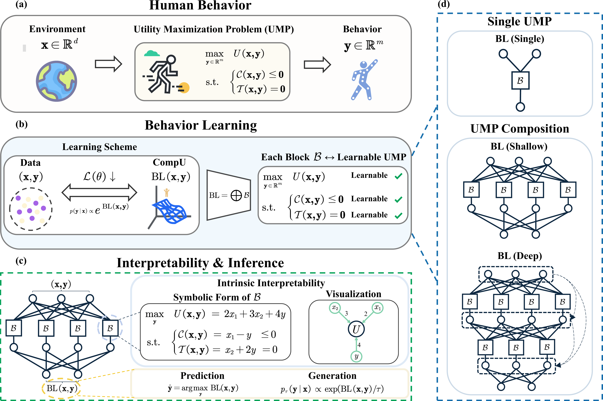
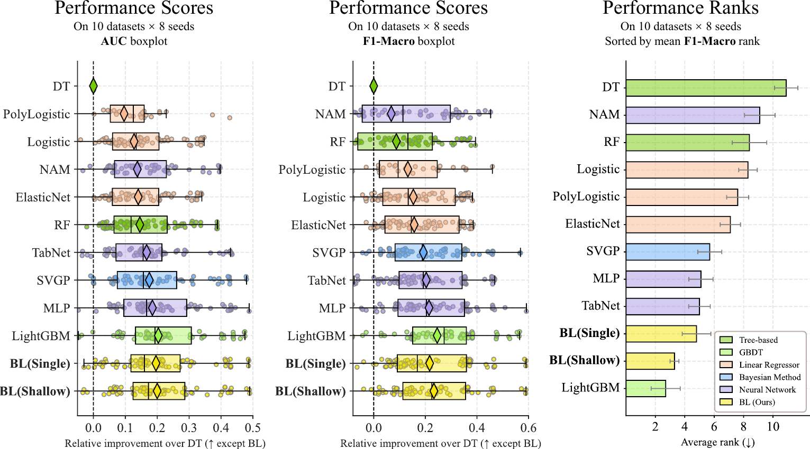
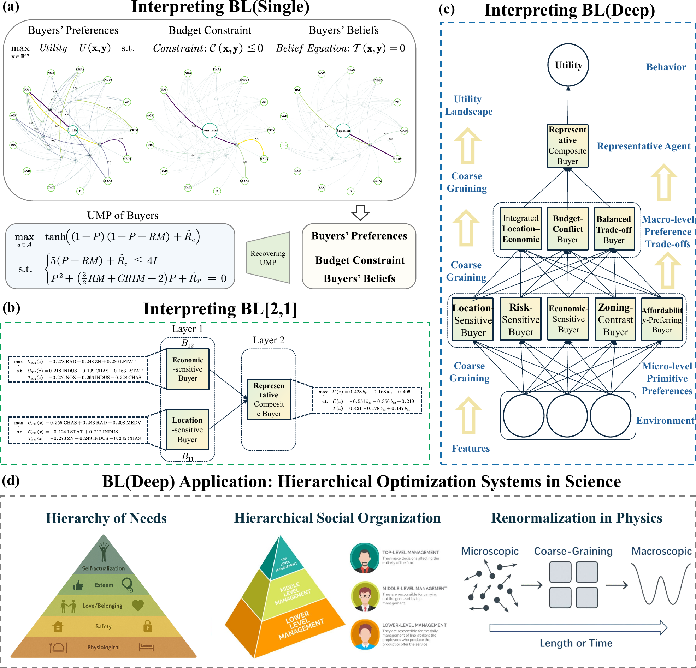
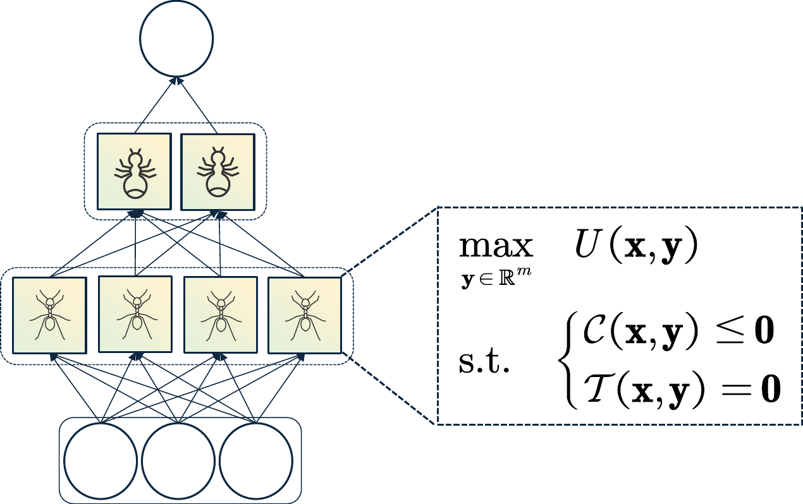
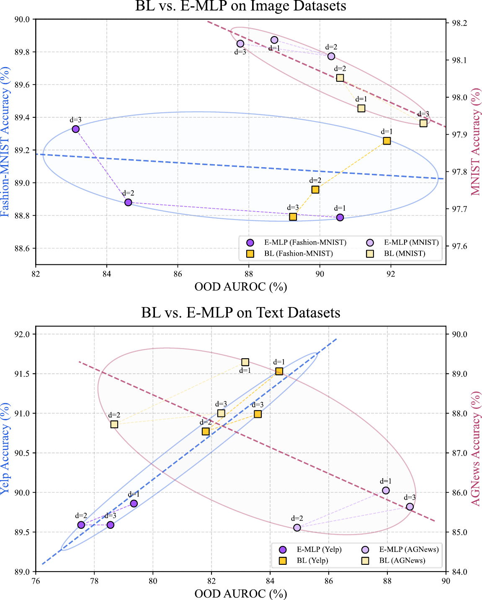
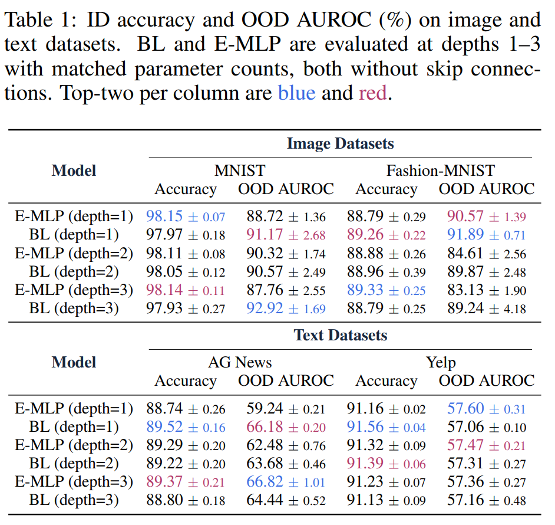
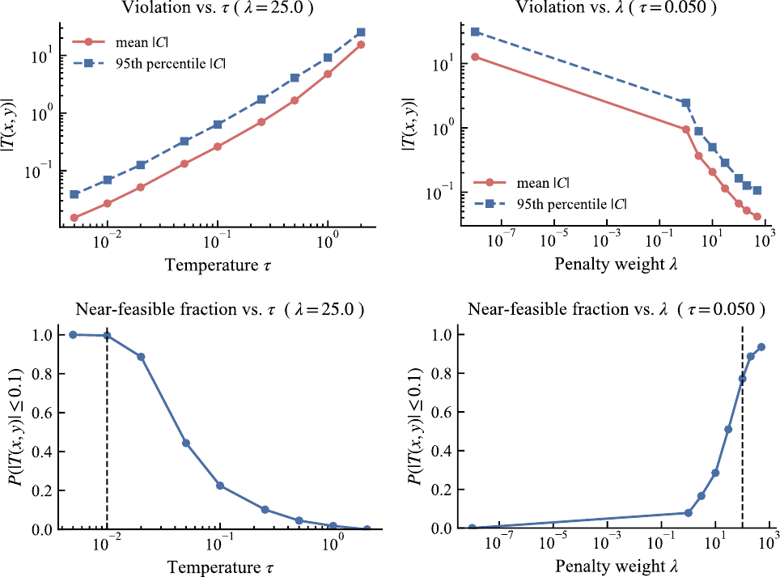

# 标题：行为学习（Behavior Learning, BL）：从数据中学习层次化优化结构

- ArXiv：2602.20152
- 作者：马振尧（Zhenyao Ma），厦门大学；梁越（Yue Liang），图宾根大学；李东旭（Dongxu Li），西安交通大学
- 章节数：136
- 估计词元数：60.2k

## 目录

- 1 引言（Introduction）
- 2 行为学习（Behavior Learning, BL）
  - 2.1 效用最大化问题（Utility Maximization Problem, UMP）
    - 定理 2.1（UMP 的局部精确惩罚重构，Local Exact Penalty Reformulation for UMP）。
    - 定理 2.2（UMP 的普适性，Universality of UMP）。
  - 2.2 BL 架构（BL Architecture）
    - BL 函数 $\mathrm{BL}(\mathbf{x},\mathbf{y})$ 的模型结构（Model Structure of BL）。
    - 学习目标（Learning Objective）。
    - 实现细节（Implementation Details）。
    - 理论保证（Theoretical Guarantees）。
      - 定理 2.3（BL 的通用逼近性，Universal Approximation of BL）。
    - 可解释性（Interpretability）。
  - 2.3 可识别行为学习（Identifiable Behavior Learning, IBL）
    - 理论基础（Theoretical Foundation）。
      - 假设 2.1（Assumption 2.1）。
      - 定理 2.4（IBL 的可识别性，Identifiability of IBL）。
      - 定理 2.5（IBL 的损失可识别性，Loss Identifiability of IBL）。
      - 定理 2.6（IBL 的一致性，Consistency of IBL）。
      - 定理 2.7（IBL 的普适一致性，Universal Consistency of IBL）。
- 3 实验（Experiments）
  - 3.1 标准预测任务（Standard Prediction Tasks）
    - 预测性能（Predictive Performance）。
  - 3.2 解释 BL：一个案例研究（Interpreting BL: A Case Study）
    - BL(Single) 作为 UMP 的符号形式（Symbolic Form of BL(Single) as a UMP）。
    - 通过模型可视化解释 BL(Single)（Interpreting BL(Single) via Model Visualization）。
    - 解释 BL(Deep)（Interpreting BL(Deep)）。
  - 3.3 高维输入预测（Prediction on High-Dimensional Inputs）
    - 在高维输入上的可扩展性（Scalability on High-Dimensional Inputs）。
    - 帕累托前沿的下移（Downward Shift of the Pareto Frontier）。
  - 3.4 约束强制执行测试：高维能量守恒（Constraint Enforcement Test: High-Dimensional Energy Conservation）
    - 实验设置（Experiment setup）。
    - 约束强制执行（Constraint enforcement）。
- 4 BL(Deep) 的科学解释（Scientific Explanation of BL(Deep)）
- 5 讨论（Discussion）
  - 理论假设的可扩展性（Scalability of theoretical assumptions）。
  - 基函数的选择（Choice of basis functions）。
  - 可解释的生成式建模（Interpretable generative modeling）。
  - 用于部分可解释性的混合架构（Hybrid architectures for partial interpretability）。
  - 用于科学和社会科学建模的 BL（BL for scientific and social-scientific modeling）。
- 6 相关工作（Related Work）
  - 6.1 可解释性（Interpretability）
    - 性能-可解释性权衡（Performance–Interpretability Trade-off）。
    - 在科学可信建模中的局限性（Limitations in Scientifically Credible Modeling）。
    - 与 BL 的关系（Relation to BL）。
  - 6.2 数据驱动的逆优化（Data-Driven Inverse Optimization）
    - 与 BL 的关系（Relation to BL）。
  - 6.3 基于能量的模型（Energy-based Models, EBMs）
    - 与 BL 的关系（Relation to BL）。
- 7 致谢（Acknowledgements）
- 参考文献（References）
- 附录 A 架构细节（Appendix A Architecture Details）
  - A.1 学习方案细节（Learning Scheme Details）
    - BL 函数的输入和输出（Input and output of the BL function）。
    - 条件吉布斯模型（Conditional Gibbs model）。
    - 监督式、无监督式和生成式用途（Supervised, unsupervised, and generative uses）。
    - 学习目标（Learning objective）。
  - A.2 模型结构细节（Model Structure Details）
    - 固定基函数和头部预激活（Fixed bases and head pre-activations）。
    - 单个 BL 块（Single BL block）。
    - 并行块层（Layer of parallel blocks）。
    - 浅层/深层组合与最终仿射读出（Shallow/Deep composition and final affine readout）。
  - A.3 实现细节（Implementation Details）
    - A.3.1 函数实例化（Function Instantiation）
      - 默认实例化（Default instantiation）。
      - 变体与简化（Variants and simplifications）。
    - A.3.2 多项式特征映射与线性约简（Polynomial Feature Maps and Linear Reductions）
      - BL(Single) — 多项式实例化（BL(Single) — polynomial instantiation）。
      - BL (Shallow/Deep) — 逐层线性实例化（BL (Shallow/Deep) — linear-by-layer instantiation）。
      - 按需高阶项（On-demand higher-order terms）。
    - A.3.3 跳跃连接（Skip Connections）
      - 密集跳跃连接（DenseNet 风格，拼接，Dense skip connections (DenseNet-style, concatenation)）。
      - 残差跳跃连接（ResNet 风格，加法，Residual skip connections (ResNet-style, addition)）。
      - 跳跃连接与可解释性（Skip Connections and Interpretability）。
- 附录 B 定理证明（Appendix B Proofs of Theorems）
  - B.1 效用最大化问题（Utility Maximization Problem, UMP）
    - 证明（Proof）。
    - 证明（Proof）。
  - B.2 BL 架构（BL Architecture）
    - 证明（Proof）。
  - B.3 可识别行为学习（Identifiable Behavior Learning, IBL）
    - B.3.1 设置与假设（Setup and Assumption）
      - 输入-输出空间与数据（Input–output space and data）。
      - 参数空间与多项式特征映射（Parameter space and polynomial feature maps）。
      - 可识别基础块（Identifiable base block）。
      - 架构（Architectures）。
      - 诱导的条件模型（Induced conditional model）。
      - 商参数空间（Quotient parameter space）。
        - 定义 B.1（对称商空间，Symmetry Quotient Space）。
        - 定义 B.2（尺度不变商空间，Scale-Invariant Quotient Space）。
      - 损失函数（Loss Functions）。
      - 关键假设（Key Assumptions）。
        - 假设 B.1（全局原子独立性与单射性，Global Atomic Independence and Injectivity）。
    - B.3.2 定理证明（Proof of Theorems）
      - 引理 B.1（线性组合的可识别性，Identifiability of Linear Combinations）。
      - 证明（Proof）。
      - 定理 B.1（IBL(Single) 的可识别性，Identifiability of IBL(Single)）。
      - 证明（Proof）。
      - 定理 B.2（IBL(Shallow) 的可识别性，Identifiability of IBL(Shallow)）。
      - 证明（Proof）。
      - 定理 B.3（IBL(Deep) 的可识别性，Identifiability of IBL(Deep)）。
      - 证明（Proof）。
      - 证明（Proof）。
      - 证明（Proof）。
      - 定理 B.4（一致 M-估计一致性（Newey & McFadden, 1994，定理 2.1），Uniform M-estimation consistency (Newey & McFadden, 1994 , Theorem 2.1)）。
      - 定理 B.5（IBL 的一致性，Consistency of IBL）。
      - 证明（Proof）。
      - 定理 B.6（IBL 的通用逼近性，Universal Approximation of IBL）。
      - 证明（Proof）。
      - 引理 B.2（筛逼近引理，Sieve Approximation Lemma）。
      - 证明（Proof）。
      - 定理 B.7（IBL 的普适一致性，Universal Consistency of IBL）。
      - 证明（Proof）。
      - 定理 B.8（极值估计量的渐近正态性（Newey & McFadden, 1994，定理 3.1），Asymptotic normality of extremum estimators (Newey & McFadden, 1994 , Theorem 3.1)）。
      - 定理 B.9（IBL 的渐近正态性，Asymptotic Normality of IBL）。
      - 证明（Proof）。

## 摘要（Abstract）

受 **行为科学（Behavioral Science）** 的启发，我们提出了 **行为学习（Behavior Learning, BL）** ，这是一种新颖的通用机器学习框架，能够从数据中学习可解释且可识别的优化结构，其范围涵盖从单一优化问题到分层组合。它统一了 **预测性能（Predictive Performance）** 、 **内在可解释性（Intrinsic Interpretability）** 和 **可识别性（Identifiability）** ，并广泛适用于涉及优化的科学领域。BL 对由内在可解释的模块化构建块组成的 **组合效用函数（Compositional Utility Function）** 进行参数化，该函数导出一个用于预测和生成的数据分布。每个构建块都代表一个 **效用最大化问题（Utility Maximization Problem, UMP）** ，并可写成其符号形式；UMP 是行为科学的基础范式，也是优化的通用框架。BL 支持的架构范围从单一 UMP 到分层组合，后者用于建模分层优化结构。其平滑且单调的变体（ **IBL** ）保证了可识别性。理论上，我们建立了 BL 的 **通用逼近性质（Universal Approximation Property）** ，并分析了 IBL 的 **M-估计（M-estimation）** 性质。实证上，BL 展示了强大的预测性能、内在可解释性以及对高维数据的可扩展性。代码：GitHub 上的 MoonYLiang/Behavior-Learning；可通过 `pip install blnetwork` 安装。

> 图 1 | 行为学习（BL）。(a) 将人类行为建模为 UMP。(b) BL 的学习方案，其中 CompU 表示组合效用函数。(c) BL 提供内在可解释性（通过作为分层优化结构的符号形式）、可识别性和推理能力。(d) BL 的三种架构变体，从单一 UMP 到深度组合。

## 1 引言（Introduction）

科学研究常常需要处理那些难以被精确形式化的现象（Anderson, 1972; Mitchell, 2009），包括人类和社会领域（Simon, 1955; Arthur, 2009）。这类现象难以预测，仅凭理论甚至更难证伪。 **可解释机器学习（Interpretable Machine Learning, Interpretable ML）** （Molnar, 2020）凭借其强大的近似能力和内置的透明性，为对此类现象建模提供了一种有前景的替代方案。然而，一个长期存在的矛盾仍未解决：模型的预测性能与内在可解释性常常此消彼长——这一挑战通常被称为 **性能-可解释性权衡（performance–interpretability trade-off）** （Arrieta et al., 2020）。高性能模型，如 **深度神经网络（Deep Neural Networks, DNNs）** （LeCun et al., 2015），通常缺乏透明性；而内在可解释的模型则难以捕捉复杂的非线性模式。

已有一些努力试图缓解性能-可解释性权衡。例如，Hastie (2017); Alvarez Melis & Jaakkola (2018); Angelino et al. (2018); Nori et al. (2019); Koh et al. (2020); Agarwal et al. (2021); Kraus et al. (2024); Liu et al. (2024b); Plonsky et al. (2025) 展示了各自不同的优势。然而，两个根本性的局限仍然存在，限制了它们的科学适用性：

1.  **与科学理论的对齐不足** 。大多数方法侧重于扩展现有的机器学习方法以实现可解释性，而非开发一个基于科学原理的框架（例如，基于优化问题或微分方程）。这常常阻碍了与科学理论的对齐，并限制了从已学模型中提取科学知识的能力（Roscher et al., 2020; Bereska & Gavves, 2024; Longo et al., 2024）。
2.  **解释的非唯一性** 。大多数模型是 **不可识别的（non-identifiable）** ——在数学意义上，它们的解释并非由可观测的预测唯一确定（Ran & Hu, 2017; Méloux et al., 2025）。因此，这类模型无法支持对真实参数的可靠估计（Newey & McFadden, 1994; Van der Vaart, 2000），甚至可能缺乏 **波普尔式可证伪性（Popperian falsifiability）** （Popper, 2005），最终限制了其科学可信度。这些局限自然引出了一个关键问题： **我们能否设计一个可解释的机器学习框架，既能缓解性能-可解释性权衡，又具有科学基础且可识别？**

受 **行为科学（Behavioral Science）** 的启发，我们提出了 **行为学习（Behavior Learning, BL）** ：一个通用的机器学习框架，它从数据中学习可解释且可识别的（分层）优化结构。它统一了高预测性能、内在可解释性和可识别性，并广泛适用于涉及优化的科学领域。如图 [1](#figure-1) 所示，BL 建立在行为科学中最基本的范式之一—— **效用最大化（Utility Maximization）** ——之上，该范式认为人类行为源于解决一个 **效用最大化问题（Utility Maximization Problem, UMP）** （Samuelson, 1948; Debreu, 1959; Mas-Colell et al., 1995）。受此范式驱动，BL 从数据中学习可解释的优化结构。它将响应（$y$）建模为从一个由 UMP 或多个相互作用的 UMP 组合所诱导的概率分布中抽取的样本。该分布由一个组合效用函数 $\mathrm{BL}(\mathbf{x},\mathbf{y})$ 参数化，该函数由内在可解释的模块化块 $\mathcal{B}(\mathbf{x},\mathbf{y})$ 构建而成。每个块都是一个可学习的、基于惩罚的公式，代表一个优化问题（UMP），可以写成符号形式，并提供与线性回归相当的透明性。

**行为学习（Behavior Learning, BL）** 允许层次化结构，主要体现为三种架构变体：由单个块定义的 **BL（单层）（BL(Single)）** ；由块适度分层组合而成的 **BL（浅层）（BL(Shallow)）** ；以及由多个块深度分层组合而成的 **BL（深层）（BL(Deep)）** 。后两种模型可以符号化地解释为层次化优化结构。所有变体都经过端到端训练，以诱导出一个用于预测和生成的 **条件吉布斯分布（Conditional Gibbs Distribution）** 。通过将每个块中的惩罚函数精炼为平滑且单调的形式，我们开发了 **可识别行为学习（Identifiable BL, IBL）** ，即 BL 的可识别变体。在温和条件下，IBL 保证了 **唯一的本质可解释性（Unique Intrinsic Interpretability）** 。这一特性确保了其解释的科学可信度，并进一步支持在适当条件下恢复真实模型。

虽然 BL 的动机源于行为科学，但它并非领域特定的。它广泛适用于任何观测结果作为优化问题解出现的科学领域——例如 **宏观经济学（Macroeconomics）** （Ramsey, 1928; Ljungqvist & Sargent, 2018）、 **统计物理学（Statistical Physics）** （Gibbs, 1902; Landau & Lifshitz, 2013）或 **进化生物学（Evolutionary Biology）** （Wright et al., 1932; Fisher, 1999）。这种普适性得到了一个关键理论见解（定理 [2.2](https://arxiv.org/html/2602.20152v1#S2.Thmtheorem2)）的支持： **任何优化问题都可以等价地写成一个效用最大化问题（Utility Maximization Problem, UMP）** 。这使得 BL 成为一个适用于跨学科 **数据驱动的逆优化（Data-driven Inverse Optimization）** （Ahuja & Orlin, 2001）的通用建模框架。

我们从理论和实证两方面研究 BL。理论上，我们证明在温和假设下，BL 和 IBL 都允许 **通用逼近（Universal Approximation）** （第 [2.2](#section-2-2) 节）。对于 IBL，我们进一步确立了其 **M-估计（M-estimation）** 性质（第 [2.3](#section-2-3) 节），包括可识别性、一致性、通用一致性、渐近正态性和渐近有效性。实证方面，我们在四个任务上评估 BL。标准预测任务（第 [3.1](#section-3-1) 节）展示了其强大的预测性能。定性案例研究（第 [3.2](#section-3-2) 节）阐释了其本质可解释性。对高维输入的预测（第 [3.3](#section-3-3) 节）进一步证明了其对高维数据的可扩展性。
进一步的讨论和相关工作分别在第 [5](#section-5) 节和第 [6](#section-6) 节中提供。我们还在第 [4](#section-4) 节和第 [A](#appendix-a) 节中分别提供了如何科学解释 BL(Deep) 的指导以及架构细节。

总的来说，我们的主要贡献有三方面。(i) 我们提出了 **行为学习（Behavior Learning, BL）** ，这是一种受行为科学启发的新型通用机器学习框架，它统一了高预测性能、本质可解释性、可识别性和可扩展性。(ii) 对于科学研究，BL 提供了一种科学基础扎实、可解释且可识别的机器学习方法，用于对难以精确形式化的复杂现象进行建模。BL 广泛适用于涉及优化的科学学科。(iii) 在范式层面，BL 通过分布建模，从数据中学习单个优化问题或问题层次组合的优化结构，为数据驱动的逆优化贡献了一种新的方法论。

## 2 行为学习（Behavior Learning, BL）

### 2.1 效用最大化问题（Utility Maximization Problem, UMP）

对人类行为，尤其是在行为科学和决策理论中的建模，通常始于一个假设：观察到的结果源于一个潜在的优化过程。这一思想的一个经典表述是 **效用最大化问题（Utility Maximization Problem, UMP）** (Mas-Colell 等人，1995)，其中智能体通过求解以下问题，根据上下文特征 $\mathbf{x}\in\mathcal{X}$ 选择行动 $\mathbf{y}\in\mathcal{Y}$：

$$
\max_{\mathbf{y}\in\mathcal{Y}}\,U(\mathbf{x},\mathbf{y})\quad\text{s.t.}\quad\mathcal{C}(\mathbf{x},\mathbf{y})\leq 0,\;\;\mathcal{T}(\mathbf{x},\mathbf{y})=0(1)
$$

这里，$U(\cdot)$ 表示一个主观的 **效用函数（Utility function）** ，编码了智能体的内在偏好或目标。不等式约束 $\mathcal{C}(\cdot)$ 捕获了资源约束，而等式约束 $\mathcal{T}(\cdot)$ 则编码了内生的信念一致性或外生的守恒定律。

UMP 可以重新表述为一个成本-收益框架，其中智能体在效用收益与约束违反之间进行权衡。形式上，在温和的正则性条件下，它在局部最优性层面允许一个无约束的惩罚重构 (Han & Mangasarian, 1979)，如下所述。

##### 定理 2.1 (UMP 的局部精确惩罚重构) .

设 $\mathcal{X}\subset\mathbb{R}^{d_{x}}$ 和 $\mathcal{Y}\subset\mathbb{R}^{d_{y}}$ 为非空紧集，并设 $U:\mathcal{X}\times\mathcal{Y}\to\mathbb{R}$、$\mathcal{C}:\mathcal{X}\times\mathcal{Y}\to\mathbb{R}^{m}$ 和 $\mathcal{T}:\mathcal{X}\times\mathcal{Y}\to\mathbb{R}^{p}$ 为 $C^{1}$ 函数。

假设对于给定的 $\mathbf{x}\in\mathcal{X}$， **Han-Mangasarian 约束品性（Han-Mangasarian constraint qualification）** 在 UMP 的任意严格局部极大值点 $\mathbf{y}^{\star}$ 处成立。

则存在 $\lambda_{0}>0$、$\lambda_{1}\in\mathbb{R}^{m}_{++}$ 和 $\lambda_{2}\in\mathbb{R}^{p}_{++}$，使得 $\mathbf{y}^{\star}$ 是下式的局部极大值点：

$$
\max_{\mathbf{y}\in\mathcal{Y}}\;\lambda_{0}\,\phi\!\bigl(U(\mathbf{x},\mathbf{y})\bigr)-\lambda_{1}^{\top}\rho\!\bigl(\mathcal{C}(\mathbf{x},\mathbf{y})\bigr)-\lambda_{2}^{\top}\psi\!\bigl(\mathcal{T}(\mathbf{x},\mathbf{y})\bigr).(2)
$$

这里 $\phi:\mathbb{R}\to\mathbb{R}$ 是严格递增且 $C^{1}$ 的，$\rho(z):=\max\{z,0\}$，且 $\psi(z):=|z|$。

证明见附录 [B.1](https://arxiv.org/html/2602.20152v1#A2.SS1)。这种无约束重构为理论分析和模型训练提供了更好的可处理性。

尽管 UMP 公式的动机源于行为建模，但它并非领域特定的。它适用于任何观察到的结果是（显式或潜在）优化问题解的场景。这是因为任何优化问题都可以等价地表述为一个 UMP。我们在以下结果中陈述这一点，正式陈述和证明见附录 [B.1](https://arxiv.org/html/2602.20152v1#A2.SS1)。

##### 定理 2.2 (UMP 的普适性) .

任何形式为 $\max_{\mathbf{y}\in\mathcal{Y}}f(\mathbf{x},\mathbf{y})$ 或 $\min_{\mathbf{y}\in\mathcal{Y}}f(\mathbf{x},\mathbf{y})$，并受等式和不等式约束的优化问题，都等价于一个 UMP。

### 2.2 BL 架构

图 [1](#figure-1)(b–d) 展示了 BL 的架构。我们考虑样本 $(\mathbf{x},\mathbf{y})\sim\mathcal{D}$，其中 $\mathbf{x}\in\mathbb{R}^{d}$ 表示上下文特征，$\mathbf{y}$ 是响应，表示为 $(\mathbf{y}^{\mathrm{disc}},\mathbf{y}^{\mathrm{cont}})\in\mathcal{Y}_{\mathrm{disc}}\times\mathbb{R}^{m_{c}}$，以捕捉其混合结构。假设响应是通过求解多个相互作用的 UMP 随机生成的，每个 UMP 都有一个基于惩罚的公式，它们共同构成了一个组合效用函数 $\mathrm{BL}(\mathbf{x},\mathbf{y})$。在此基础上，我们使用由 $\mathrm{BL}_{\Theta}(\mathbf{x},\mathbf{y})$ 参数化的 **条件吉布斯分布（Conditional Gibbs distribution）** (Gibbs, 1902) 对数据进行建模：

$$
p_{\tau}(\mathbf{y}\mid\mathbf{x};{\Theta})=\frac{\exp\!\bigl(\text{BL}_{\Theta}(\mathbf{x},\mathbf{y})/\tau\bigr)}{Z_{\tau}(\mathbf{x};{\Theta})},\quad Z_{\tau}(\mathbf{x};{\Theta})=\int_{\mathcal{Y}}\!\exp\!\bigl(\text{BL}_{\Theta}(\mathbf{x},\mathbf{y}^{\prime})/\tau\bigr)\,d\mathbf{y}^{\prime}(3)
$$

此处温度参数 $\tau>0$ 控制响应的随机性。当 $\tau\to 0$ 时，方程 [3] 中的分布收敛到一个支撑在 $\arg\max_{\mathbf{y}}\mathrm{BL}(\mathbf{x},\mathbf{y})$ 上的狄拉克测度（Dirac measure），从而恢复通过求解组合 UMPs（Utility Maximization Problems，效用最大化问题）得到的确定性最佳响应。

#### **$\mathrm{BL}(\mathbf{x},\mathbf{y})$ 的模型结构（Model Structure of $\mathrm{BL}(\mathbf{x},\mathbf{y})$）**

为了表示多个 UMPs 的组合，我们通过组合基本模块块 $\mathcal{B}(\mathbf{x},\mathbf{y})$ 来构建 $\mathrm{BL}(\mathbf{x},\mathbf{y})$。每个块提供了一个基于惩罚的单个 UMP 公式，它们共同构成了整体的组合效用函数。受定理 [2.1] 启发，我们将 $\mathcal{B}(\mathbf{x},\mathbf{y})$ 参数化为：

$$
\mathcal{B}(\mathbf{x},\mathbf{y};\theta):=\lambda_{0}^{\!\top}\phi\big(U_{\theta_{U}}(\mathbf{x},\mathbf{y})\big)-\lambda_{1}^{\top}\rho\big(\mathcal{C}_{\theta_{C}}(\mathbf{x},\mathbf{y})\big)-\lambda_{2}^{\top}\psi\big(\mathcal{T}_{\theta_{T}}(\mathbf{x},\mathbf{y})\big) \tag{4}
$$

其中 $\theta:=(\lambda_{0},\lambda_{1},\lambda_{2},\theta_{U},\theta_{C},\theta_{T})$ 表示完整的可学习参数集。根据定理 [2.1]，$\phi$ 是一个递增函数；$\rho$ 惩罚不等式违反；$\psi$ 捕捉对称偏差。每个块都可以写成一个定义良好的 UMP。

然后，我们通过层次化组合将 $\mathrm{BL}(\mathbf{x},\mathbf{y})$ 由多个 $\mathcal{B}$-块组合而成，以提高其对优化结构的表示能力，从而产生三种主要的架构变体，如图 [1](#figure-1)(d) 所示。

- **BL(Single)** 应用方程 [4] 中定义的单个 $\mathcal{B}(\mathbf{x},\mathbf{y})$ 实例，没有任何附加层。它可以被视为学习单个 UMP，并提供最大的可解释性。
- **BL(Shallow)** 使用 $\mathcal{B}(\mathbf{x},\mathbf{y})$ 作为基本模块块来构建一个浅层网络。它引入了一到两个中间计算层。
  - 每一层 $\mathbb{B}_{\ell}$ 堆叠多个并行的 $\mathcal{B}_{\ell,i}$ 块以产生 $\mathbb{R}^{d_{\ell}}$ 中的一个向量，即 $\mathbb{B}_{\ell}(\mathbf{x},\mathbf{y};\theta_{\ell}):=[\mathcal{B}_{\ell,1}(\mathbf{x},\mathbf{y};\theta_{\ell,1}),\ldots,\mathcal{B}_{\ell,d_{\ell}}(\mathbf{x},\mathbf{y};\theta_{\ell,d_{\ell}})]^{\top}$。
  - $\mathbb{B}_{\ell}$ 的输出直接馈入下一层 $\mathbb{B}_{\ell+1}$，并且只有最终输出会经过一个可学习的仿射变换。
- **BL(Deep)** 将 BL(Shallow) 架构扩展到两层以上，在保持相同递归结构的同时，实现更丰富的 UMPs 层次化组合。如前所述，只有最终输出经过仿射变换。

BL(Shallow) 和 BL(Deep) 的整体结构可以用统一的形式表示，其中浅层情况对应 $L\leq 2$，深层情况对应 $L>2$：

$$
\mathrm{BL}(\mathbf{x},\mathbf{y}):=\mathbf{W}_{L}\cdot\mathbb{B}_{L}\big(\cdots\mathbb{B}_{2}(\mathbb{B}_{1}(\mathbf{x},\mathbf{y}))\cdots\big) \tag{5}
$$

#### **学习目标（Learning Objective）**

响应 $\mathbf{y}$ 可能同时包含离散和连续分量。

- 对于离散响应，我们直接在 $\mathbf{y}^{\mathrm{disc}}$ 上应用交叉熵（Cross-entropy）[1]。
- 对于连续响应，由于组合效用函数类似于能量函数（Energy function）[2]，我们在 $\mathbf{y}^{\mathrm{cont}}$ 上采用去噪分数匹配（Denoising Score Matching）[3]。
- 最终目标将两者与非负权重 $\gamma_{\mathrm{d}},\gamma_{\mathrm{c}}$ 相结合：

$$
\mathcal{L}(\theta)=\gamma_{\mathrm{d}}\,\mathbb{E}\bigl[-\log p_{\tau}(\mathbf{y}^{\mathrm{disc}}\mid\mathbf{x})\bigr]+\gamma_{\mathrm{c}}\,\mathbb{E}\left\|\nabla_{\tilde{\mathbf{y}}^{\mathrm{cont}}}\log p_{\tau}(\tilde{\mathbf{y}}^{\mathrm{cont}}\mid\mathbf{x})+\sigma^{-2}(\tilde{\mathbf{y}}^{\mathrm{cont}}-\mathbf{y}^{\mathrm{cont}})\right\|^{2}(6)
$$

#### **实现细节（Implementation Details）**

此处，我们描述 **BL（Bounded Lagrangian）** 通用形式的关键实现选择，除非另有说明，均作为默认设置。更多细节见附录 [A.3](https://arxiv.org/html/2602.20152v1#A1.SS3)。

- **函数实例化（Function Instantiation）** 。遵循方程 [4](https://arxiv.org/html/2602.20152v1#S2.E4)，我们将函数 $\mathcal{B}(\mathbf{x},\mathbf{y})$ 实例化为：

  $$
  \mathcal{B}(\mathbf{x},\mathbf{y})=\lambda_{0}^{\!\top}\tanh\bigl(\mathbf{p}_{u}(\mathbf{x},\mathbf{y})\bigr)-\lambda_{1}^{\!\top}\mathrm{ReLU}\bigl(\mathbf{p}_{c}(\mathbf{x},\mathbf{y})\bigr)-\lambda_{2}^{\!\top}\bigl|\mathbf{p}_{t}(\mathbf{x},\mathbf{y})\bigr| (7)
  $$

  - 其中 $\mathbf{p}_{u},\mathbf{p}_{c},\mathbf{p}_{t}$ 是有界次数的多项式特征映射，分别提供了效用（Utility）、不等式（Inequality）和等式（Equality）项的可解释表示。
  - 有界的 $\tanh$ 反映了 **边际效用递减原理（Principle of Diminishing Marginal Utility）** （Jevons, 2013），这是行为科学中一个普遍假设的原理，而 $\mathrm{ReLU}$ 和 $|\cdot|$ 则为违反约束引入了软惩罚。

- **多项式映射（Polynomial Maps）** 。在 BL(Single) 中，多项式映射的结构是可选的。在 BL(Shallow) 和 BL(Deep) 中，每个 $\mathcal{B}$-块（block）使用仿射变换作为其多项式映射，为了计算效率，默认省略了高次项和交互项。
- **跳跃连接（Skip Connections）** 。对于深度变体，可以可选地引入跳跃连接以提高表示效率。

本节更详细的架构描述见附录 [A](#appendix-a)。

#### **理论保证（Theoretical Guarantees）**

在给定架构下，BL 框架具有 **通用逼近能力（Universal Approximation Power）** ：只要 BL 具有足够的容量，它可以任意好地逼近任何连续条件分布，如下所述。证明见附录 [B.2](https://arxiv.org/html/2602.20152v1#A2.SS2)。

##### **定理 2.3（BL 的通用逼近性， Universal Approximation of BL）**

令 $\mathcal{X}\subset\mathbb{R}^{d}$ 和 $\mathcal{Y}\subset\mathbb{R}^{m}$ 为紧集，并令 $p^{\star}(\mathbf{y}\mid\mathbf{x})$ 为任意连续条件密度，使得对所有 $(\mathbf{x},\mathbf{y})\in\mathcal{X}\times\mathcal{Y}$ 有 $p^{\star}(\mathbf{y}\mid\mathbf{x})>0$。那么对于任意 $\tau>0$ 和 $\varepsilon>0$，存在一个有限的 BL 架构（其深度和宽度取决于 $\varepsilon$）和一个参数 $\theta^{\star}$，使得方程 [3](https://arxiv.org/html/2602.20152v1#S2.E3) 中的 **吉布斯分布（Gibbs Distribution）** 满足：

$$
\sup_{\mathbf{x}\in\mathcal{X}}\mathrm{KL}\bigl(p^{\star}(\cdot\mid\mathbf{x})\,\|\,p_{\tau}(\cdot\mid\mathbf{x};\theta^{\star})\bigr)<\varepsilon. (8)
$$

##### **定理 2.3（BL 的通用逼近性）** 。

#### **可解释性（Interpretability）** 。

除了其表达能力， **行为学习（Behavior Learning, BL）** 还展现出强大的内在可解释性。

- 每个 $\mathcal{B}$- **块（block）** 都可以用符号形式表达为一个优化问题（ **效用最大化问题（Utility Maximization Problem, UMP）** ）：$\tanh$ 项定义了目标函数，$\operatorname{ReLU}$ 项对应一个不等式约束，而绝对值项对应一个等式约束。因此， **BL(单层)（BL(Single)）** 可以直接表达为一个符号化的 UMP，而更深的架构可以被解释为 UMP 的组合，每个块都保留了可解释性。
- 多项式基确保了与线性回归相当的透明度，因为目标和约束都可以表示为多项式特征的线性组合。它还可以进一步可视化为一个 **计算图（computational graph）** （图 [7](https://arxiv.org/html/2602.20152v1#A1.F7)），其中每个输入对每个 $\mathcal{B}$-块的影响都可以通过组合路径进行追踪。
- **BL(深层)（BL(Deep)）** 以分层方式组合 $\mathcal{B}$-块，形成一个 **分层优化结构（hierarchical optimization structure）** 。解释过程以自底向上的方式进行，其中任意两个连续层之间的关系可以被视为 **聚合（aggregation）** 或 **粗粒度观测（coarse-grained observation）** 。总体而言，解释路径是：
  原始输入特征 $\rightarrow$ 微观层面优化块 $\rightarrow$
  宏观层面聚合或粗粒度行为构造 $\rightarrow$
  宏观层面优化系统。
  第 [4](#section-4) 节详细描述了这个解释过程。
- BL 还提供了多个架构自由度，这些自由度提供了灵活性，但同时也影响了最终的可解释性。
  在深层变体中， **跳跃连接（skip connections）** 引入了跨层依赖结构，这在统计物理学中已有建模 [1]。
  用仿射变换替换多项式映射保留了底层的优化语义，但降低了符号粒度，从而对每个块产生更定性而非符号化的解释。
- 当最后一层仅包含一个 $\mathcal{B}$-块时，BL 可以被解释为单个 UMP，因为所有低层结构聚合为一个统一的优化问题。当最后一层包含多个 $\mathcal{B}$-块时，BL 对应于多个优化问题之间的线性权衡。

### 2.3 可识别行为学习（Identifiable Behavior Learning, IBL）

除了预测和可解释性，BL 框架还支持第三个基本目标：_识别真实参数_，这反过来赋予了 BL 进行科学可信建模的能力。我们将此设置称为 **可识别行为学习（Identifiable Behavior Learning, IBL）** 。在 IBL 设置中，我们将模块化块定义为

$$
\mathcal{B}^{\mathrm{id}}(\mathbf{x},\mathbf{y};\theta):=\lambda_{0}^{\!\top}\phi^{\mathrm{id}}\big(U_{\theta_{U}}(\mathbf{x},\mathbf{y})\big)-\lambda_{1}^{\top}\rho^{\mathrm{id}}\big(\mathcal{C}_{\theta_{C}}(\mathbf{x},\mathbf{y})\big)-\lambda_{2}^{\top}\psi^{\mathrm{id}}\big(\mathcal{T}_{\theta_{T}}(\mathbf{x},\mathbf{y})\big)(9)
$$

与使用一般非线性函数的 BL 不同，IBL 架构施加了更严格的结构约束：$\phi^{\mathrm{id}}$ 和 $\rho^{\mathrm{id}}$ 是严格递增的，而 $\psi^{\mathrm{id}}$ 是对称的且在 $|\cdot|$ 上严格递增。此外，所有三个函数都是 $C^{1}$ 的。这些性质确保每个 UMP 块保持响应性并能平滑地适应目标和约束。在实践中，我们将方程 [9](https://arxiv.org/html/2602.20152v1#S2.E9) 实例化为

$$
\mathcal{B}^{\mathrm{id}}(\mathbf{x},\mathbf{y})=\lambda_{0}^{\!\top}\tanh\bigl(\mathbf{p}_{u}(\mathbf{x},\mathbf{y})\bigr)-\lambda_{1}^{\!\top}\operatorname{softplus}\bigl(\mathbf{p}_{c}(\mathbf{x},\mathbf{y})\bigr)-\lambda_{2}^{\!\top}\bigl(\mathbf{p}_{t}(\mathbf{x},\mathbf{y})\bigr)^{\odot 2}(10)
$$

其中 $(\cdot)^{\odot 2}$ 表示逐元素平方。

我们设计了三种架构形式的 IBL。与 BL 类似， **IBL(单层)（IBL(Single)）** 直接使用 $\mathcal{B}^{\mathrm{id}}(\mathbf{x},\mathbf{y})$ 作为组合效用函数。 **IBL(浅层)（IBL(Shallow)）** 和 **IBL(深层)（IBL(Deep)）** 变体递归地定义为

$$
\mathrm{IBL}(\mathbf{x},\mathbf{y}):=\mathbf{W}^{\circ}_{L}\cdot\mathbb{B}^{\mathrm{id}}_{L}\big(\cdots\mathbb{B}^{\mathrm{id}}_{2}\big(\mathbb{B}^{\mathrm{id}}_{1}(\mathbf{x},\mathbf{y})\big)\cdots\big),\quad L\geq 1(11)
$$

其中 $\mathbb{B}^{\mathrm{id}}_{\ell}$ 堆叠了多个并行块 $\mathcal{B}^{\mathrm{id}}_{\ell,i}(\mathbf{x},\mathbf{y})$，而 $\mathbf{W}^{\circ}_{L}$ 是一个可学习的无偏置仿射变换。所有其他设计选择遵循 BL 设置。

#### **理论基础（Theoretical Foundation）** 。

IBL 对于真实参数识别具有有利的性质。我们首先建立 **可识别性（identifiability）** ，这是统计推断的基础。我们首先陈述我们的关键假设（详见假设 [B.1](https://arxiv.org/html/2602.20152v1#A2.Thmassumption1)）。

##### **假设 2.1** 。

令 $\bar{\Psi}$ 表示原子参数的商空间。我们假设映射 $\bar{\Psi}\to\mathbb{R}^{\mathcal{X}\times\mathcal{Y}}$, $\bar{\psi}\mapsto g_{\bar{\psi}}$ 是单射的，并且任何有限个不同原子的集合都是线性无关的。我们进一步将注意力限制在没有重复原子且具有固定规范顺序的最小表示上。

##### **定理 2.4（IBL 的可识别性）** 。

在假设 [B.1](https://arxiv.org/html/2602.20152v1#A2.Thmassumption1) 下，架构 **IBL(单层)（IBL(Single)）** 、 **IBL(浅层)（IBL(Shallow)）** 和 **IBL(深层)（IBL(Deep)）** 在参数商空间 $\bar{\Theta}$ 中是可识别的。

##### **定理 2.5（IBL 的损失可识别性）** 。

**IBL** 模型由参数 $\theta\in\Theta$ 参数化。假设 $\Theta$ 是紧致的。则在假设 [B.1] 下，由方程 [6] 定义的总体损失 $\mathcal{L}$ 满足：

- 若 $\gamma_{c}>0$，它在商空间 $\bar{\Theta}$ 中存在唯一极小值点；
- 若 $\gamma_{c}=0$，它在尺度不变的商空间 $\widetilde{\Theta}$ 中存在唯一极小值点。

定理 [2.4] 和 [2.5] 共同确立了 **IBL** 的可识别性（Identifiability）。定理 [2.4] 表明，如果两个相同结构的 **IBL** 模型导出相同的组合效用，那么它们的参数在等价类意义下一致。定理 [2.5] 进一步将此结果推广到基于损失的可识别性。这些结果共同意味着 **IBL** 在等价类意义下允许唯一的参数估计，从而产生在相同等价类意义下唯一的 **内在可解释性（Intrinsic Interpretability）** 。

基于可识别性，定理 [2.6] 确立了 **IBL** 的 **统计一致性（Statistical Consistency）** ：在参数空间紧致的条件下，当样本量 $n\to\infty$ 时，学习到的参数依概率收敛到总体损失的一个极小值点。如果模型设定正确，估计量会进一步收敛到真实参数，恢复出真实的底层模型，从而赋予 **IBL** 恢复真实模型的潜力。

##### **定理 2.6（IBL 的一致性）** .

令 $\Xi$ 表示相关的参数商空间：若 $\gamma_{c}>0$，则 $\Xi=\bar{\Theta}$；若 $\gamma_{c}=0$，则 $\Xi=\widetilde{\Theta}$。令 $\hat{\theta}_{n}\in\arg\min_{\theta\in\Theta}\mathcal{M}_{n}(\theta)$ 表示经验极小值点，令 $\theta^{\bullet}\in\arg\min_{\theta\in\Theta}\mathcal{M}(\theta)$ 表示总体极小值点。则在定理 [B.5] 的条件下，

$$
\hat{\theta}_{n}\;\xrightarrow{p}\;\theta^{\bullet}\quad\text{在 }\Xi \text{ 中},\qquad\mathcal{M}(\hat{\theta}_{n})\;\xrightarrow{p}\;\mathcal{M}(\theta^{\bullet}).
$$

此外，如果模型设定正确（即数据分布由某个 $\theta^{\star}\in\Theta$ 实现），那么在 $\Xi$ 中 $\theta^{\bullet}=\theta^{\star}$，因此 $\hat{\theta}_{n}\xrightarrow{p}\theta^{\star}$。

正确设定是一个强且通常不现实的假设。幸运的是， **IBL** 框架——与 **BL（Bayesian Learning，贝叶斯学习）** 类似——也享有 **通用近似保证（Universal Approximation Guarantee）** （定理 [B.6]）。基于此结果，我们进一步确立了 **IBL** 的 **通用一致性（Universal Consistency）** ：即使在设定错误的情况下，只要有足够大的样本量， **IBL** 也能够恢复真实模型。

##### **定理 2.7（IBL 的通用一致性）** .

在定理 [B.7] 的条件下，对于任何满足定理 [B.6] 正则性假设的容许数据生成分布 $p^{\dagger}$， **IBL** 后验序列 $\{p_{\hat{\theta}_{n}}\}$ 满足

$$
\sup_{x\in\mathcal{X}}\mathrm{KL}\!\big(p^{\dagger}(\cdot\mid\mathbf{x})\,\|\,p_{\hat{\theta}_{n}}(\cdot\mid\mathbf{x})\big)\xrightarrow{p}0,
$$

即，学习到的条件分布 $\{p_{\hat{\theta}_{n}}\}$ 在 $\mathbf{x}$ 上一致地依 **KL 散度（Kullback-Leibler Divergence）** 收敛到 $p^{\dagger}$。

具体而言，这一结果表明，即使在模型设定错误的情况下，只要 **IBL** 架构的容量随样本量 $n$ 增长，由 **IBL** 模型参数化的学习到的预测分布 $p_{\hat{\theta}_{n}}$ 也会在 **KL 散度** 意义下一致地收敛到真实条件分布 $p^{\dagger}$。

我们还确立了 **IBL** 估计量的 **渐近正态性（Asymptotic Normality）** （定理 [B.9]），表明随着样本量增加，参数估计依分布收敛于正态分布。此外，在额外的正则性条件下，渐近方差达到 **有效信息界（Efficient Information Bound）** （定理 [B.10]），证明了 **IBL** 的统计最优性。

本部分所有定理的形式化陈述和证明均推迟到附录 [B.3]。

## 3 实验（Experiments）

在本节中，我们进行了四组实验，以系统性地评估 BL（Basis Learner）的能力。由于篇幅限制，详细内容见附录 [C](#appendix-c)。

### 3.1 标准预测任务（Standard Prediction Tasks）

> 图 3 | BL 与基线模型的预测性能。
>
> - 左/中：相对于决策树（Decision Tree, DT）的相对 AUC 和 F1-Macro 增益，按均值排序（不包括 BL）。
> - 右：平均 F1-Macro 排名（↓ 表示更好）。
> - BL 在两项指标上均达到第一梯队性能。其变体在平均 F1-Macro 排名中位列第二和第三，其中 BL(Shallow) 与最先进的模型相比没有统计学上的显著差异。

BL 对于标准预测任务是否足够准确？在这一部分，我们在 10 个数据集（表 [4](#table-4)）上评估 BL 的预测性能，这些数据集涵盖了不同的样本量、特征维度和科学领域。为了公平比较，我们考虑了两种 BL 变体——BL(Single) 和 BL(Shallow)——并将它们与来自五个方法家族的 10 个基线模型（表 [5](#table-5)）进行比较，这些家族包括：神经网络、基于树的模型、梯度提升方法、贝叶斯方法和线性回归器。所有方法共享统一的预处理和调优流程。

#### 预测性能（Predictive Performance）。

图 [3](#figure-3) 表明，BL 总体上达到了第一梯队的预测性能，在本质可解释的模型中取得了最佳结果。值得注意的是，BL(Shallow) 超越了多层感知机（Multilayer Perceptron, MLP），这突显了 BL 能够在 **不牺牲性能的前提下提供可解释性** 。

### 3.2 解读 BL：一个案例研究（Interpreting BL: A Case Study）

在实践中如何解读 BL？本部分使用波士顿房价（Boston Housing）数据集进行案例研究。我们训练了一个使用 2 次多项式基的监督式 BL(Single) 模型、一个 BL[2,1] 模型（即第一层有两个 B 块、第二层有一个 B 块的两层 BL）以及一个架构为 [5,3,1] 的 BL(Deep) 模型，用于预测房价中位数。我们将说明如何将 BL 的内部结构解读为显式优化问题及其分层版本，并辅以补充的可视化。更多细节见附录 [C.3](https://arxiv.org/html/2602.20152v1#A3.SS3) 和 [C.5](https://arxiv.org/html/2602.20152v1#A3.SS5)。

#### 作为 UMP 的 BL(Single) 的符号形式（Symbolic Form of BL(Single) as a UMP）。

如图 [2](#figure-2) 所示，训练好的 **BL(Single)** 模型可以解释为波士顿住房市场中一个代表性买家的 **效用最大化问题（Utility Maximization Problem, UMP）** ，包含一个目标项、一个不等式项和一个等式项。每一项都由一个估计的二次多项式表示。为简洁起见，我们通过仅保留具有最大（2-5 个）绝对系数的单项式，同时将其余项（包括常数项）收集到一个残差项 $\tilde{R}$ 中，来提取近似的符号表达式。例如，效用项可以写为：

$$
\displaystyle\mathbf{p}_{u}=-0.56\cdot P^{2}-0.6\cdot\mathrm{RM}+0.57\cdot\mathrm{RM}\cdot P+\tilde{R}_{u}\approx(1-P)(1+P-\mathrm{RM})+\tilde{R}_{u}
$$

我们类似地简化预算项和信念项，以恢复买家的近似 UMP。

完整的符号形式如图 [2](#figure-2) 底部所示。

> **图 2（Figure 2）** ：
>
> - (a) 在波士顿住房数据集上训练的 BL(Single) 的可视化与符号形式，它模拟了波士顿住房市场中一个代表性买家的 **效用最大化问题（Utility Maximization Problem, UMP）** （$\max U\;\;\text{s.t.}\;\mathcal{C}\leq 0,\;\mathcal{T}=0$）（细节见第 [3.2](#section-3-2) 节）。
>   - 顶部：三个惩罚函数内部多项式的计算图——$\tanh$（偏好）、$\mathrm{ReLU}$（预算）和 $|\cdot|$（信念）。
>   - 每个图从左到右分别以 $\tanh^{-1}(U)$、$\mathcal{C}$ 和 $\mathcal{T}$ 为中心，周围的节点代表输入特征。
>   - 有向边（仅当系数 $\geq 0.3$ 时显示）指示每个特征如何贡献于相应的项。
>   - 底部：将训练好的 BL 模型近似表示为 UMP 的符号公式。
> - (b) BL[2,1] 架构。
>   - 第 1 层识别出两种关键的微观偏好类型： **经济敏感型买家（Economic-sensitive Buyer）** 和 **位置敏感型买家（Location-sensitive Buyer）** 。
>   - 第 2 层将这两个组成部分聚合成一个有效的代表性买家。
> - (c) BL(Deep) [5,3,1] 架构。
>   - 第 1 层恢复了五种不同的微观住房偏好类型。
>   - 第 2 层识别出三种宏观权衡类型，捕捉了这些原始偏好相互作用的不同方式。
>   - 第 3 层将它们聚合成整体的代表性买家。
>   - 表 [10](#table-10) 提供了每种类型的详细描述。
>   - BL(Deep) 提供了一个与统计物理学中的 **粗粒化原理（Coarse-graining Principle）** （Kadanoff, 1966）一致的分层解释，重建了完整的微观到宏观优化层次结构。
>   - 此外，BL(Deep) 揭示的偏好和权衡模式在经典经济学文献中有充分记载（见表 [11](#table-11)）。
> - (d) BL 可以应用于科学中一大类分层优化结构，包括 **分层需求结构（Hierarchical Need Structures）** 、 **分层社会-组织结构（Hierarchical Social–Organizational Structures）** 以及物理学中的 **重整化风格粗粒化结构（Renormalization-style Coarse-grained Structures）** 。

#### 通过模型可视化解释 BL(Single)。

各项多项式的可视化揭示了特征如何构成 UMP。从图 [2](#figure-2) 的可视化中，我们得出三点见解：

1.  房屋价格中位数（Median housing price, MEDV）和平均房间数（Average number of rooms, RM）在所有项中占主导地位——MEDV 以近似二次的形式对效用产生负面影响，而 RM 则调节其边际效应。
2.  低收入居民比例（Proportion of lower-income residents, LSTAT）在预算约束中显著出现，反映了隐含的资源限制。
3.  犯罪率（Crime rate, CRIM）仅出现在信念项中，表明买家将其视为影响他人行为而非自身偏好的因素。

#### 解释 BL(Deep)。

1.  图 [2](#figure-2) (b) 展示了 **BL[2,1]** 模型学习到的优化问题。
    - 第 1 层识别出两种微观偏好类型：一个 **经济敏感型买家（Economic-sensitive Buyer）** ，其效用和约束项主要加载于 ZN（大面积住宅用地比例）和 LSTAT（低收入居民比例）；以及一个 **位置敏感型买家（Location-sensitive Buyer）** ，主要由 CHAS（查尔斯河指示变量）和 RAD（高速公路可达性）驱动。
    - 第 2 层聚合了这些基本偏好，产生了一个整合了这两种偏好类型的有效“代表性买家”。
2.  图 [2](#figure-2) (c) 展示了 **BL[5,3,1]** 模型的内部结构。
    - 在第 1 层，BL 恢复了五种不同的 **微观偏好（micro-level preference）** 类型，刻画了住房市场中的异质模式。
    - 第 2 层识别出三个宏观层面的代表性智能体，每个智能体捕捉了基本偏好之间不同的 **宏观权衡（macro-level trade-off）** 。
    - 第 3 层然后将这些组件聚合为一个单一的高层机制，产生整体的代表性买家。表 [10](#table-10) 提供了每种类型的详细描述。
3.  除了可解释性之外，我们发现 BL(Deep) 恢复的每种偏好模式和权衡都与经济学文献中的既定发现相符（见表 [11](#table-11)）。这表明 BL 成功地重建了潜在的科学知识。

### 3.3 高维输入预测（Prediction on High-Dimensional Inputs）

BL 能否扩展到高维输入？我们在网络深度 $d\in\{1,2,3\}$ 范围内，将 BL 与基于能量的 MLP（Energy-based MLP, E-MLP）基线进行比较，所有模型均未使用跳跃连接实现。实验在涵盖图像和文本领域的四个数据集上进行，并使用六个指标进行评估：分布内准确率、校准指标（ECE 和 NLL）以及分布外鲁棒性指标（AUROC、AUPR 和 FPR@95）。对于 OOD 评估，我们采用对称的 ID$\leftrightarrow$OOD 划分，使用 MNIST (LeCun et al., 2002) 和 Fashion-MNIST (Xiao et al., 2017) 作为一对，AG News 和 Yelp Polarity (Zhang et al., 2015) 作为另一对。E-MLP 和 BL 被控制为具有可比较的参数数量。

> 图 4 | 将更深的 BL 架构解释为交互智能体的层次结构。每个块 $\mathcal{B}$ 代表一个可解释的智能体，解决其自身的 UMP，而一个层则对应一组并行操作的异质智能体。下一层则聚合并重新分配来自前一层的负能量，从而在智能体之间执行更高层次的协调。这种分层组织为深度 BL 提供了一个自然的组合解释：底层模块编码局部目标，而上层则将这些目标综合为集体结果。类似的结 构出现在生物和社会系统中——例如，在蚁群中，单个蚂蚁（第一层智能体）遵循简单的局部规则，但其集体行为通过更高层次的交互（第二层聚合）进行协调，从而产生全局高效的资源分配和任务分工。

#### 高维输入上的可扩展性（Scalability on High-Dimensional Inputs）。

图 [5] 和表 [1] 展示了 BL（Bottleneck Layer）和 E-MLP（Ensemble Multi-Layer Perceptron）在不同网络深度下的结果。在图像数据集上，两种模型表现出相当的 **分布内（In-Distribution, ID）** 准确率，而在相近的准确率水平下，BL 通常在 Fashion-MNIST 上实现了更强的 **分布外（Out-Of-Distribution, OOD）** 检测性能。在文本数据集上，BL 在不同深度下始终比 E-MLP 具有更高的 ID 准确率。然而，OOD 检测行为因数据集而异：BL 在 Yelp 上优于 E-MLP，而 E-MLP 在 AG News 上表现出更好的 OOD 区分能力。BL 还取得了更好的 **校准指标（Calibration Metrics）** （ECE 和 NLL；见表 [2](#table-2)）。

#### 帕累托前沿的下移（Downward Shift of the Pareto Frontier）。

表 [13](#table-13) 报告了 BL 和 E-MLP 在四个任务上的参数量，表 [3](#table-3) 总结了它们的运行时间。两种模型的参数量高度可比。在所有数据集上，BL 的训练时间略高于 E-MLP。结合这些结果，以及它们可比的预测性能和 BL 固有的可解释性（与黑盒 E-MLP 形成对比），表明 BL 实现了 **帕累托前沿（Pareto frontier）** 的*下移*。

> 图 5：BL 和 E-MLP 在图像和文本数据集上的比较；$d$ 表示模型深度。

$\pm$

> **表 2：图像和文本数据集上的 ECE 和 NLL。BL 和 E-MLP 在深度 1–3 且参数量匹配的情况下进行评估。每列前两名用蓝色和红色标出。**

| Model           |      MNIST      |                 |  Fashion-MNIST  |                 |
| --------------- | :-------------: | :-------------: | :-------------: | :-------------: |
|                 |       ECE       |       NLL       |       ECE       |       NLL       |
| E-MLP (depth=1) | 0.02 $\pm$ 0.00 | 0.20 $\pm$ 0.02 | 0.08 $\pm$ 0.00 | 0.74 $\pm$ 0.01 |
| BL (depth=1)    | 0.02 $\pm$ 0.00 | 0.26 $\pm$ 0.01 | 0.05 $\pm$ 0.00 | 0.36 $\pm$ 0.01 |
| E-MLP (depth=2) | 0.02 $\pm$ 0.00 | 0.23 $\pm$ 0.02 | 0.09 $\pm$ 0.00 | 0.89 $\pm$ 0.03 |
| BL (depth=2)    | 0.02 $\pm$ 0.00 | 0.16 $\pm$ 0.01 | 0.07 $\pm$ 0.00 | 0.44 $\pm$ 0.01 |
| E-MLP (depth=3) | 0.02 $\pm$ 0.00 | 0.16 $\pm$ 0.02 | 0.09 $\pm$ 0.00 | 0.85 $\pm$ 0.04 |
| BL (depth=3)    | 0.02 $\pm$ 0.00 | 0.13 $\pm$ 0.02 | 0.07 $\pm$ 0.00 | 0.49 $\pm$ 0.02 |

| Model           |     AG News     |                 |      Yelp       |                 |
| --------------- | :-------------: | :-------------: | :-------------: | :-------------: |
|                 |       ECE       |       NLL       |       ECE       |       NLL       |
| E-MLP (depth=1) | 0.02 $\pm$ 0.00 | 0.40 $\pm$ 0.01 | 0.01 $\pm$ 0.00 | 0.24 $\pm$ 0.00 |
| BL (depth=1)    | 0.02 $\pm$ 0.00 | 0.31 $\pm$ 0.01 | 0.00 $\pm$ 0.00 | 0.20 $\pm$ 0.00 |
| E-MLP (depth=2) | 0.02 $\pm$ 0.00 | 0.42 $\pm$ 0.01 | 0.00 $\pm$ 0.00 | 0.25 $\pm$ 0.00 |
| BL (depth=2)    | 0.06 $\pm$ 0.01 | 0.43 $\pm$ 0.03 | 0.02 $\pm$ 0.00 | 0.23 $\pm$ 0.01 |
| E-MLP (depth=3) | 0.01 $\pm$ 0.00 | 0.41 $\pm$ 0.02 | 0.00 $\pm$ 0.00 | 0.25 $\pm$ 0.01 |
| BL (depth=3)    | 0.05 $\pm$ 0.01 | 0.39 $\pm$ 0.02 | 0.02 $\pm$ 0.00 | 0.22 $\pm$ 0.00 |

> **表 3：BL 与 E-MLP 在高维数据集上的训练时间（秒）（均值 $\pm$ 标准差）。**

| Model           | MNIST             | FashionMNIST      | AG News          | Yelp              |
| --------------- | ----------------- | ----------------- | ---------------- | ----------------- |
| E-MLP (depth=1) | 100.59 $\pm$ 0.29 | 73.57 $\pm$ 1.20  | 14.69 $\pm$ 0.40 | 179.37 $\pm$ 0.73 |
| BL (depth=1)    | 110.63 $\pm$ 3.34 | 96.52 $\pm$ 2.90  | 17.20 $\pm$ 0.06 | 181.07 $\pm$ 1.80 |
| E-MLP (depth=2) | 102.64 $\pm$ 0.26 | 78.25 $\pm$ 0.28  | 15.76 $\pm$ 0.06 | 179.22 $\pm$ 0.66 |
| BL (depth=2)    | 122.85 $\pm$ 3.95 | 114.43 $\pm$ 3.72 | 21.78 $\pm$ 0.08 | 180.38 $\pm$ 1.44 |
| E-MLP (depth=3) | 104.52 $\pm$ 0.30 | 85.57 $\pm$ 1.19  | 16.95 $\pm$ 0.05 | 178.99 $\pm$ 1.42 |
| BL (depth=3)    | 140.17 $\pm$ 4.42 | 130.03 $\pm$ 4.96 | 26.29 $\pm$ 0.24 | 180.36 $\pm$ 0.91 |

### 3.4 约束执行测试：高维能量守恒（Constraint Enforcement Test: High-Dimensional Energy Conservation）

为了评估 BL 中的可学习惩罚项是否能够在有限温度下强制执行接近硬性的约束，我们隔离了惩罚机制，并在一个高维能量守恒约束上对其进行测试。这个诊断性实验移除了效用项，仅关注惩罚项，从而描述了惩罚项如何作为温度 $\tau$ 和惩罚尺度 $\lambda$ 的函数来控制约束违反。

#### 实验设置（Experiment setup）。

我们从标准高斯分布 $x\sim\mathcal{N}(0,I_{64})$ 中独立同分布地采样 $x\in R^{64}$，并定义一个纯惩罚组合效用函数：

$$
T(x,y)\;=\;\|y\|^{2}-\|x\|^{2},\qquad\text{BL}(x,y)\;=\;-\lambda\,T(x,y)^{2},
$$

其作用是作为能量守恒残差及其二次惩罚项。

我们以吉布斯分布（Gibbs distribution）为目标：

$$
p(y\mid x)\;\propto\;\exp\!\big(\text{BL}(x,y)/\tau\big)
$$

使用步长 $\eta=10^{-4}$ 的过阻尼朗之万动力学（overdamped Langevin dynamics）：

$$
y_{k+1}=y_{k}+\eta\,\nabla_{y}BL(x,y_{k})/\tau+\sqrt{2\eta\tau}\,\xi_{k},\qquad\xi_{k}\sim\mathcal{N}(0,I_{64}).
$$

对于每一对参数 $(\lambda,\tau)$，我们运行 $512$ 条并行链，每条链进行 $1500$ 步朗之万采样（其中 500 步为预烧期）。我们在固定惩罚权重 $\lambda=25$ 时，扫描温度 $\tau\in\{2.0,1.0,0.5,0.25,0.1,0.05,0.02,0.01,0.005\}$；在固定温度 $\tau=0.05$ 时，扫描惩罚权重 $\lambda\in\{0,1,3,10,30,100,200,500\}$。

对于每种配置，我们从每条链的最终状态记录残差大小 $|T(x,y)|$。然后，我们报告三个汇总统计量：(i) 平均违反量 $E[|T(x,y)|]$，(ii) $|T(x,y)|$ 的第 $95$ 百分位数，以及 (iii) 近似可行样本的经验概率。我们声明一个样本近似满足约束，如果

$$
|T(x,y)|\;\leq\ \varepsilon_{\text{tol}}\quad\text{其中}\quad\varepsilon_{\text{tol}}=10^{-1},
$$

并跨链估计 $P(|T(x,y)|\leq\varepsilon_{\text{tol}})$。选择此容差尺度是相对于典型的无约束残差而言较小的，因此近似可行区域对应于实际严格的能量守恒约束。

> 图 6 | BL 惩罚块在能量守恒约束上的约束执行测试。该图报告了变化温度 $\tau$（图左侧）和惩罚权重 $\lambda$（图右侧）时的违反统计量 $|T(x,y)|$。

#### 约束执行（Constraint enforcement）。

图 [6](#figure-6) 表明，在有限温度和惩罚缩放下，BL 实现了接近硬约束的执行。违反量随着 $\tau$ 减小或 $\lambda$ 增加而显著减少。
在 $\lambda\approx 25$ 和 $\tau\approx 0.01$ 附近，64 维能量守恒约束的执行误差在 $10^{-2}$ 以内。
曲线在 64 维空间中基本保持平滑和单调，表明朗之万采样稳定且惩罚执行有效。

## 4 BL(Deep) 的科学解释（Scientific Explanation of BL(Deep)）

BL(Deep) 提供了一种与 **分层优化结构（hierarchical optimization structures）** 相一致的 **可解释性（interpretability）** 形式。在 BL 中，每一层都对下一层实现的优化结构进行 **粗粒化（coarse-graining）** 。一个直观的类比是公司的组织层级：基层管理者解决他们自己局部的优化问题，而高层管理者则汇总并协调许多此类基层问题的结果，以实现更广泛的组织目标。BL(Deep) 遵循相同的原则——更高层对更低层形成的解进行总结、重组和协调。

这一视角与许多以多层次复杂性为特征的科学研究领域相一致，包括：

- (i) 行为科学中代表性行为主体的形成，以及
- (ii) 统计物理学中的 **重整化（renormalization）** ，其中精细尺度的相互作用被压缩为有效的粗尺度势。

我们在下面描述解释过程。为了建立直观理解，让我们首先考虑一个通用的分层优化结构——这可能指由个体主体组成的多层组织结构，或由相互作用的粒子组成的多尺度物理系统。

**步骤 1：底层解释。**

每个底层模块都是一个直接从环境接收输入的优化问题。这些模块对应于 **微观行为机制（micro-level behavioral mechanisms）** ，例如组织中执行面向环境任务的个体主体的决策规则，或统计物理学中支配单个粒子运动的定律。检查这些底层模块可以揭示所有直接与环境交互的单元所遵循的基本优化原则。

**步骤 2：逐层粗粒化与微观到宏观的聚合。**

下一层的模块通过一个新的优化步骤聚合下层优化问题的输出，产生一个 **粗粒化的行为摘要（coarse-grained behavioral summary）** 。每个更高层级的模块代表从许多低层级单元的相互作用中涌现出的有效优化系统，从而捕捉从微观机制中提炼出的宏观规律。

这种从微观到宏观的转变与许多公认的科学原理相一致，包括：

- (i) **聚合与协调（Aggregation and coordination）** ：在分层组织中，低层级主体的输出被高层级主体聚合、重新分配和协调，以实现改进的组织目标。
- (ii) **粗粒化观测（Coarse-grained observation）** ：在分层行为系统中，个体主体被分组为共享特征性优化模式的类别；在统计物理学中，许多粒子共同形成系统，其粗粒化行为由微观相互作用诱导的有效势所支配。

**步骤 3：自底向上重构。**

通过沿着模型的微观到宏观抽象路径向上追溯层级，可以获得全局解释：

原始输入特征 → 微观优化模块 → 宏观聚合与协调或粗粒化行为结构 → 宏观优化系统。

在每一层，我们检查每个模块的特征及其相关的优化目标，以及这些优化问题如何跨层演化。这揭示了每个更高层如何聚合、协调或粗粒化其下层的输出。这些观察结果共同产生了一个紧凑的多尺度解释，其中 BL 被理解为一个分层优化结构。

## 5 讨论（Discussion）

接下来，我们将从理论基础、架构和应用的角度，讨论 **行为学习（Behavior Learning, BL）** 的局限性和未来方向。

#### **理论假设的可扩展性（Scalability of theoretical assumptions）** 。

与 **可识别性（Identifiability）** 相关的统计定理构成了 **可解释行为学习（Interpretable Behavior Learning, IBL）** 的核心理论支柱，确保了可解释性的唯一性并支持其科学可信度。尽管这些结果在温和条件下成立，但它们在 **大规模、高度过参数化（large-scale, highly over-parameterized）** 架构中的行为仍然不甚明了。这凸显了当这些理论保证应用于现代大规模学习系统时，需要对其 **鲁棒性（Robustness）** 、潜在的失效模式以及经验边界进行系统性研究的必要性。

#### **基函数的选择（Choice of basis functions）** 。

多项式基函数在 BL（Single）中增强了表达能力，同时保留了符号可解释性。然而，高阶多项式可能会引入 **优化不稳定性（Optimization instability）** ，加剧对初始化和归一化的敏感性，并使训练动态复杂化。未来的工作可以探索替代的基函数族——例如 **三角函数（Trigonometric）** 、 **基于样条（Spline-based）** 或 **神经基函数（Neural basis functions）** ——并开发能够提高数值稳定性而不牺牲可解释性的 **条件化（Conditioning）** 或 **归一化（Normalization）** 策略。

#### **可解释生成建模（Interpretable generative modeling）** 。

BL 整合了来自 **基于能量的模型（Energy-based models）** 的多种训练技术，同时保留了内在的可解释性，从而实现了面向视觉（例如，图像或视频生成）和语言（例如，大型语言模型）的可解释生成建模。将 BL 扩展到 **显式生成架构（Explicitly generative architectures）** ，使其输出直接对应于人类可理解且具有科学意义的模块，代表了一个引人注目的方向。与传统的 **黑盒模型（Black-box models）** 相比，此类扩展可能产生具有更高透明度、可控性和科学可信度的生成系统。

#### **用于部分可解释性的混合架构（Hybrid architectures for partial interpretability）** 。

未来工作的一个前景广阔的方向是开发 **混合架构（Hybrid architectures）** ，以原则性的方式将 BL 与黑盒模型集成，以实现 **部分可解释性（Partial interpretability）** 。以下三种途径尤其值得探索：
(i) **特征级集成（Feature-level integration）** 。
黑盒神经网络可以作为高容量的特征提取器，而 BL 则在由此学习到的表征上运行，以施加结构化的、基于优化的语义。
(ii) **决策关键集成（Decision-critical integration）** 。
BL 模块可以专门插入到模型的高风险或决策关键组件中，从而显著降低与纯黑盒架构相关的可解释性和可靠性风险。
(iii) **机制级集成（Mechanism-level integration）** 。
由于 BL 提供了一种与许多现实世界机制相一致的、由优化驱动的 **归纳偏置（Inductive bias）** ，选择性地将 BL 应用于系统中此类归纳偏置至关重要的部分，可能会产生能够更好地捕捉底层真实过程、同时保留深度网络灵活性的模型，从而提高 **泛化性能（Generalization performance）** 。

#### **用于科学和社会科学建模的 BL（BL for scientific and social-scientific modeling）** 。

BL 将数据表示为优化问题的组合，这与自然科学和社会科学中的建模范式紧密契合。其具有竞争力的性能、内在的可解释性和统计严谨性，使 BL 成为一个有前景的 **科学机器学习（Scientific machine learning）** 框架。未来的研究可以将 BL 应用于诸如 **统计物理学（Statistical physics）** 、 **进化生物学（Evolutionary biology）** 、 **计算神经科学（Computational neuroscience）** 和 **气候动力学（Climate dynamics）** 等领域，以及 **行为科学（Behavioral science）** 、 **经济学（Economics）** 、 **社会学（Sociology）** 和 **政治学（Political science）** ——尤其是在涉及复杂的、部分形式化的或具有认知意义结构的场景中。

## 6 相关工作（Related Work）

### 6.1 可解释性（Interpretability）

可解释性（Interpretability）在机器学习（Machine Learning）中已变得日益重要 [1, 2]，尤其是在科学领域 [3, 4]。确保可解释性有助于提高透明度和可复现性，并可能进一步为理解潜在的科学原理提供洞见。可解释性的理想形式是 **内在可解释性（Intrinsic Interpretability）** ，即模型的结构或参数可以直接被人理解。然而，在一些广泛使用的高容量模型（如深度神经网络（Deep Neural Networks, DNNs）[5]）中，实现内在可解释性颇具挑战。这催生了 **事后可解释性方法（Post-hoc Interpretability Methods）** [6, 7]，旨在解释预训练的黑盒模型。尽管这类方法适用性更广，但它们通常被认为不太适合科学研究 [8]，因为它们可能损害解释的稳定性以及对模型决策过程的忠实度。

#### 性能-可解释性权衡（Performance–Interpretability Trade-off）。

高容量模型中观察到的有限内在可解释性长期以来被视为一个核心挑战。这通常被表述为 **性能-可解释性权衡（Performance–Interpretability Trade-off）** [8, 9]，它假设预测性能与内在可解释性之间存在张力。高性能模型（如深度神经网络）通常缺乏透明度，而内在可解释的模型则难以捕捉复杂的非线性模式。已有多种努力试图缓解这种权衡，可大致分为四类：

- **（i）加性模型（Additive Models）** 。经典的 **广义加性模型（Generalized Additive Models, GAMs）** [10]、现代的 **GA2Ms/EBMs** [11, 12] 及其神经变体（如 **NAM** [13] 和 **NODE-GAM** [14]）通过将预测分解为主效应和低阶交互作用来保持可解释性。
- **（ii）基于概念的模型（Concept-based Models）** 。 **概念瓶颈模型（Concept Bottleneck Models, CBMs）** [15]、 **TCAV** [16] 和 **SENN** [17] 将输入映射到人类可解释的潜在概念，并将其用作中间预测器。
- **（iii）基于规则和评分的系统（Rule- and Score-based Systems）** 。 **SLIM** [18] 和 **CORELS** [19] 生成具有可证明最优性保证的透明评分函数或规则列表。
- **（iv）形状约束网络（Shape-constrained Networks）** 。 **深度格网络（Deep Lattice Networks）** [20] 及相关单调架构通过施加单调性和校准约束来编码领域先验，同时保持灵活性。

#### 科学可信建模的局限性（Limitations in Scientifically Credible Modeling）。

上述方法展现了各自的优势，但两个根本性的局限性限制了它们在科学研究中的适用性。
首先，大多数方法是对机器学习架构进行以工具为中心的修改，而非基于科学理论（例如，优化、动力系统、守恒定律）的框架。正如近期综述所强调的 [4, 21, 22, 23, 24, 25, 26]，真正的科学洞见需要与机制原理相关联的模型，然而许多可解释性技术仍与这些原理脱节。
其次，这些方法通常是 **不可识别的（Non-identifiable）** [27, 28]，意味着多种不同的参数化方式可以解释相同的数据。这种唯一性的缺失削弱了它们用于恢复真实机制的可靠性，并且在统计意义上，使一致性保证变得复杂。因此，随着样本量增加，训练出的模型可能无法收敛到真实的数据生成过程 [29, 30]。

#### 与 BL 的关系（Relation to BL）。

**行为学习（Behavior Learning, BL）** 同样旨在缓解性能-可解释性权衡。与先前方法不同，它是 **原则驱动（Principle-driven）** 且 **科学基础坚实（Scientifically Grounded）** 的，直接从数据中学习可解释的潜在优化结构。该框架广泛适用于那些结果产生于（显式或隐式）优化问题解的领域。它也是 **可识别的（Identifiable）** ：其平滑单调变体—— **可识别行为学习（Identifiable Behavior Learning, IBL）** ，在温和条件下保证了可识别性，从而确保其解释的科学可信度，并在适当条件下支持对真实模型的恢复。

### 6.2 数据驱动的逆优化（Data-Driven Inverse Optimization）

**逆优化（Inverse Optimization, IO）** (Ahuja & Orlin, 2001; Chan et al., 2025) 是从观测数据中学习潜在优化问题的核心范式。传统的逆优化旨在构建能够精确合理化一小部分确定性决策的目标或约束。相比之下， **数据驱动的逆优化（Data-Driven Inverse Optimization）** (Keshavarz et al., 2011; Aswani et al., 2018) 侧重于从大规模、有噪声的观测数据中统计性地恢复底层问题。 **逆最优控制（Inverse Optimal Control, IOC）** (Kalman, 1964; Freeman & Kokotovic, 1996) 将这一范式扩展到动态设置，旨在从专家轨迹中推断序贯决策过程。在机器学习领域， **逆强化学习（Inverse Reinforcement Learning, IRL）** (Ng et al., 2000; Wulfmeier et al., 2015) 和 **逆约束强化学习（Inverse Constrained Reinforcement Learning, ICRL）** (Malik et al., 2021; Liu et al., 2024a) 是数据驱动逆最优控制的突出实例：通常，逆强化学习假设约束固定并学习奖励函数，而逆约束强化学习则反转了这一角色。两者都需要反复求解（近似）最优策略并与专家演示进行匹配——这带来了高昂的计算成本。在行为科学，特别是经济学中，大量研究可被视为数据驱动逆优化范式的实例。奠基性工作 (McFadden, 1972; Dubin & McFadden, 1984; Hanemann, 1984; Berry et al., 1993) 及相关研究通常设定具有理论基础的参数化 **效用最大化问题（Utility Maximization Problems, UMPs）** ，并根据观测到的行为估计其结构参数。

#### 与 BL 的关系。

BL 框架也属于数据驱动逆优化的范式，但与机器学习和行为科学领域的先前相关工作有显著不同。与逆强化学习和逆约束强化学习相比，BL 不依赖于匹配专家演示的策略，其目的并非提升特定任务的性能。相反，它被提出为一个 **通用、科学基础坚实且本质可解释的框架** ，通过低成本的端到端训练和混合的交叉熵-去噪分数匹配目标来运行。它 **联合学习效用函数和约束** ——这一方向在逆强化学习和逆约束强化学习中很少受到关注 (Park et al., 2020; Jang et al., 2023; Liu & Zhu, 2024)。同时，在行为科学中，相关工作通常针对特定决策情境，在不同假设下构建不同的效用最大化模型，并相应地估计其参数。然而，据我们所知，尚无现有工作提出一种 **无结构的、可跨情境泛化的学习效用最大化问题的框架** 。BL 以不依赖固定效用最大化问题结构的、无结构的数据驱动方法填补了这一空白。

### 6.3 基于能量的模型（Energy-based Models, EBMs）

**基于能量的模型（Energy-based Models, EBMs）** (LeCun et al., 2006) 是一种重要的数据驱动逆优化方案，其根源在于统计物理学中的能量最小化原理。它们学习一个能量函数 $E_{\theta}(x,y)$，该函数参数化了输入与输出之间的兼容性，并导出一个吉布斯分布 $p_{\theta}(y\mid x)\propto\exp\{-E_{\theta}(x,y)\}$，该分布倾向于对应于低能量解的结果。在实践中，这个能量函数几乎总是由高容量的神经网络实例化，这赋予了学习到的能量景观强大的表达能力，但也带来了黑盒特性。训练基于能量的模型通常依赖于规避难处理的配分函数的目标，经典方法包括 **对比散度（Contrastive Divergence）** (Hinton, 2002)、 **持续性对比散度（Persistent Contrastive Divergence）** (Tieleman, 2008) 和 **噪声对比估计（Noise-Contrastive Estimation）** (Gutmann & Hyvärinen, 2010)。一个特别有影响力的研究方向是 **分数匹配（Score Matching）** (Hyvärinen & Dayan, 2005) 及其去噪变体 **DSM（Denoising Score Matching）** (Vincent, 2011)，它们支撑了基于分数的生成建模 (Song & Ermon, 2019; 2020) 的突破，并为现代扩散方法 (Song et al., 2020) 奠定了基础。

#### 与 BL 的关系。

BL 和基于能量的模型展现出一种原理上的对应关系：BL 植根于行为科学，基于效用最大化；而基于能量的模型植根于统计物理学，基于能量最小化。BL 采用了基于能量的模型中常见的几种训练技术，例如吉布斯分布建模和去噪分数匹配。然而，这两个框架在模型结构上存在本质差异。基于能量的模型主要关注生成质量，通常使用黑盒神经网络来学习一个不透明的能量函数，很少考虑可解释性。相比之下，BL 建立在效用最大化问题及其与惩罚公式的等价性之上，产生了一个有原则且科学基础坚实的框架。其架构由本质可解释的模块组成，每个模块都可以明确地用符号形式表达为一个效用最大化问题——这是行为科学中的基础范式，也是一个通用的优化框架。这些特性使 BL 能够 **同时实现高预测性能、本质可解释性和可识别性** ，从而支持超越单纯生成能力的、科学可信的建模。

## 7 Acknowledgements（致谢）

我们衷心感谢菲利普·亨尼希教授博士（Prof. Dr. Philipp Hennig）、刘舒（Shu Liu）和耿森教授博士（Prof. Dr. Sen Geng）富有启发性的讨论和宝贵建议。

同时，我们也感谢 **西安交通大学（Xi’an Jiaotong University）** 研讨会参与者的建设性反馈。

我们感谢 **蒂宾根大学（University of Tübingen）** 提供的公共计算资源。

最后，我们诚挚感谢所有匿名审稿人富有洞察力的评论。

特别感谢审稿人 sGAR 极具建设性的建议。根据审稿人 sGAR 的建议，我们补充了能量守恒约束实验。

文中若仍有任何错误，责任完全在于我们。
