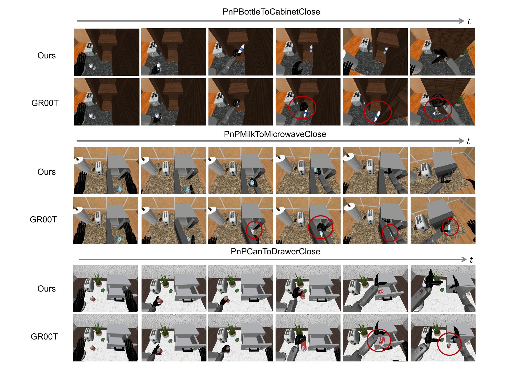
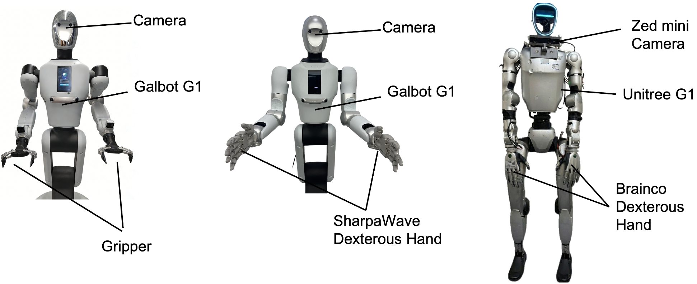
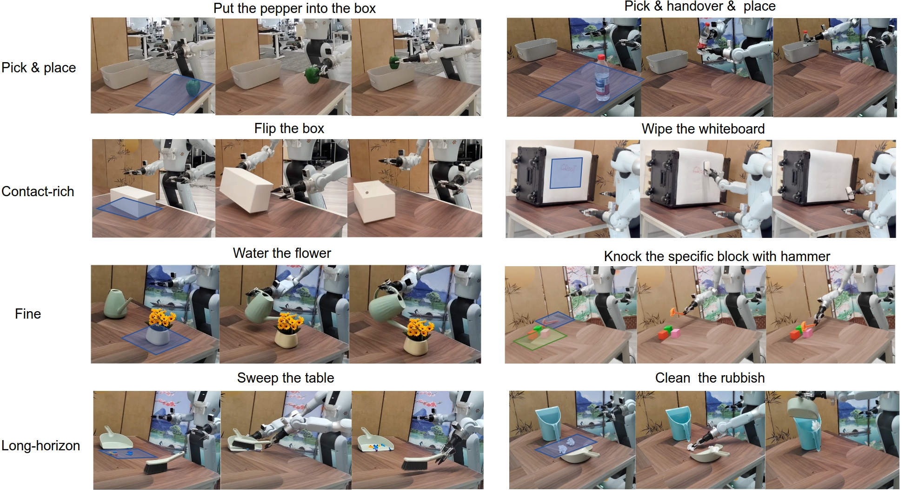
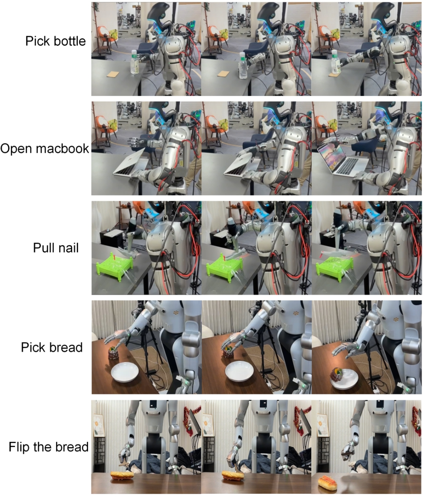

## 附录 A 模型细节（Appendix A Details of Model）

我们采用  **Qwen3-VL-4B-Instruct**  [[52](#ref-35)] 作为联合语言与视觉编码器，以提取高层语义表示。视觉观测使用  **DINOv3-ViT-s**  [[46](#ref-13)] 进行编码。在预训练阶段，我们冻结了  **视觉语言模型（Vision-Language Model, VLM）**  和 DINOv3 图像编码器，以利用预训练语言与视觉模型的强先验知识，同时让  **多模态扩散Transformer（Multimodal Diffusion Transformer, MM-DiT）**  在下游结构上得到充分训练。在后续的微调阶段，我们解冻 VLM 以实现端到端适配，并进一步提升整体性能。

此外，MM-DiT 以两个时间步的短历史信息为条件，包括过去的 DINO 编码观测和动作，以有效捕捉时间动态。表 [V](https://arxiv.org/html/2602.12215v1#A1.T5) 展示了模型的详细配置及训练过程中使用的超参数。

|   **参数（Parameter）**   |   **数值（Value）**   |
| --- | --- |
|   **模型（Model）**   |  |
| VLM | Qwen3-VL [[52](#ref-35)] |
| 观测编码器（Observation Encoder） | DINOv3-ViT-s [[46](#ref-13)] |
| 隐藏层大小（Hidden Size） | 1536 |
| 层数（Layers） | 16 |
| 注意力头数（Attention Heads） | 32 |
| 图像形状（Image Shape） | (224, 224, 3) |
| 潜变量图像形状（Latent Image Shape） | (14, 14, 384) |
| 动作块大小（Action Chunk） | 16 |
|   **训练（Training）**   |  |
| 批大小（Batch Size） | 32 * 48 (预训练) |
|  | 12 * 8 (微调) |
| 学习率（Learning Rate） | $1e^{-4}$ |
| 优化器（Optimizer） | AdamW |
| 权重衰减（Weight Decay） | $1e^{-5}$ |
| Betas | [0.9, 0.95] |
| Epsilon | $1e^{-8}$ |
| 学习率调度（LR Schedule） | 余弦退火（带最小学习率） |
| 最小学习率（Min LR） | $5e^{-7}$ |

> 图 12：我们的模型与 GR00T [[40](#ref-34)] 在 RoboCasa-GR1 [[39](#ref-33)] 操作任务上的定性比较。
三个代表性任务展示了我们的模型在物体抓取和放置精度方面的卓越鲁棒性。GR00T 的关键失败模式，包括抓取滑动、物体放置错位以及操作过程中的碰撞，已用圆圈标出，而我们的模型始终能成功完成任务。

| model | UWM | UWM-XL | UWM+MMDiT | GR00T | StarVLA | GR00T-EI10k | LDA(DiT) | LDA |
| --- | --- | --- | --- | --- | --- | --- | --- | --- |
| PnP Bottle To Cabinet Close | 27 | 41 | 49 | 51.5 | 46 |   **69**   |   **65**   |   **76**   |
| PnP Can To Drawer Close | 22 | 53 | 55 | 13 |   **80**   |   **61**   | 59 |   **71**   |
| PnP Cup To Drawer Close | 18 | 12 | 43 | 8.5 |   **54**   |   **47**   | 40 | 41 |
| PnP Milk To Microwave Close | 22 | 25 | 33 | 14 |   **48**   |   **75**   | 47 |   **52**   |
| PnP Potato To Microwave Close | 16 | 29 | 18 |   **41.5**   | 28 |   **41**   | 39 |   **41**   |
| PnP Wine To Cabinet Close | 31 | 24 | 25 | 16.5 | 46 |   **51**   | 49 |   **57**   |
| PnP Novel From Cuttingboard To Basket | 8 | 18 | 10 |   **58**   | 48 | 43 | 55 |   **65**   |
| PnP Novel From Cuttingboard To Cardboardbox | 8 | 14 | 16 | 46.5 | 40 | 39 |   **57**   |   **69**   |
| PnP Novel From Cuttingboard To Pan | 24 | 20 | 27 |   **68.5**   |   **68**   | 67 | 65 |   **75**   |
| PnP Novel From Cuttingboard To Pot | 16 | 25 | 20 |   **65**   | 52 | 53 |   **57**   |   **61**   |
| PnP Novel From Cuttingboard To Tieredbasket | 10 | 10 | 6 | 46.5 |   **56**   | 29 | 39 |   **51**   |
| PnP Novel From Placemat To Basket | 8 | 16 | 14 |   **58.5**   | 42 | 45 | 37 |   **53**   |
| PnP Novel From Placemat To Bowl | 12 | 10 | 14 |   **57.5**   | 44 |   **55**   | 53 |   **55**   |
| PnP Novel From Placemat To Plate | 10 | 12 | 10 |   **63**   | 48 |   **57**   | 51 |   **59**   |
| PnP Novel From Placemat To Tieredshelf | 2 | 2 | 2 |   **28.5**   | 18 |   **20**   | 22 |   **24**   |
| PnP Novel From Plate To Bowl | 12 | 8 | 14 |   **57**   |   **60**   | 49 |   **57**   | 53 |
| PnP Novel From Plate To Cardboardbox | 2 | 10 | 8 | 43.5 |   **50**   |   **61**   | 43 | 43 |
| PnP Novel From Plate To Pan | 10 | 20 | 16 | 51 |   **54**   | 51 | 49 |   **55**   |
| PnP Novel From Plate To Plate | 22 | 27 | 25 |   **78.7**   |   **70**   | 67 | 59 | 61 |
| PnP Novel From Tray To Cardboardbox | 20 | 25 | 20 |   **51.5**   | 38 | 49 |   **59**   |   **65**   |
| PnP Novel From Tray To Plate | 12 | 18 | 16 |   **71**   | 56 | 57 |   **57**   |   **63**   |
| PnP Novel From Tray To Pot | 18 | 25 | 20 |   **64.5**   | 50 |   **63**   | 53 | 55 |
| PnP Novel From Tray To Tieredbasket | 6 | 16 | 16 |   **57**   | 36 |   **55**   | 39 | 51 |
| PnP Novel From Tray To Tieredshelf | 4 | 2 | 4 |   **31.5**   | 16 |   **31**   | 22 |   **33**   |
| Average | 14.3 | 19.3 | 20.0 | 47.6 | 47.8 |   **51.3**   | 48.9 |   **55.4**   |

## 附录 B 仿真基准测试的详细结果（Appendix B Detailed Results on the Simulation Benchmark）

### B-A 评估设置与模型描述（Evaluation Setup and Model Description）

所有方法均在完整的 24 个 RoboCasa-GR1 [[39](#ref-33)] 任务集上进行评估，每个任务包含 51 次评估试验。
除非另有说明，模型均使用每个任务 1,000 条演示进行微调，并在相同的训练范式下优化，以隔离架构差异。

我们对评估的模型总结如下：

-  **UWM** ：一个 1.4 亿参数的统一世界模型（Unified World Model, UWM）[[60](#ref-24)]，作为轻量级基线。
-  **UWM-XL** ：一个 10 亿参数的 UWM 变体，配备 Qwen3-VL [[52](#ref-35)] 进行联合语言-视觉编码。
-  **UWM+MM-DiT** ：UWM-L，其 DiT 骨干网络被替换为我们的 MM-DiT 架构。
-  **GR00T-N1.6**  [[40](#ref-34)]：原始的 GR00T 策略模型，不包含显式动力学建模。
-  **StarVLA** ：遵循 StarVLA [[47](#ref-72)] 的 GR00T 变体，将原始 VLM 替换为 Qwen3-VL，并在 RoboCasa 上从头开始训练。
-  **GR00T-EI10k** ：一个强大的复现基线，在我们的 EI-10k 高质量子集上使用 Qwen3-VL 进行预训练，在微调期间 VLM 参数被解冻。
-  **LDA (DiT)** ：LDA 的消融版本，将 MM-DiT 替换为标准 DiT 骨干网络。
-  **LDA-1B** ：完整的潜变量动力学动作模型（Latent Dynamics Action model, LDA），采用 MM-DiT，旨在结构化的潜变量空间中建模动作引发的状态转移。

### B-B 任务级结果与分析（Task-Level Results and Analysis）

表 [VI](https://arxiv.org/html/2602.12215v1#A1.T6) 报告了详细的每个任务成功率。
LDA 在接触密集和杂乱的重排任务中始终优于 GR00T，在需要精确放置和闭合动作的场景中尤其取得了显著提升，例如：
 **PnP Bottle To Cabinet Close** （76% 对比 51.5%）、
 **PnP Can To Drawer Close** （71% 对比 13%）、
以及  **PnP Milk To Microwave Close** （52% 对比 14%）。

如图 [12](https://arxiv.org/html/2602.12215v1#A1.F12) 所示，GR00T 由于缺乏对动作后后果的预判而频繁失败。
例如，在将物体放入容器后，GR00T 经常沿着一条会与物体碰撞的轨迹收回其手臂，导致物体倾倒。
相比之下，LDA 能够预判此类交互，并生成在整个操作序列中保持物体稳定性的轨迹。

最大的改进体现在涉及跨表面和容器转移的新颖物体重排任务中
（例如，*Cuttingboard*$\rightarrow$*Basket*/*Cardboardbox*、
*Placemat*$\rightarrow$*Plate*/*Tieredshelf*、
以及 *Tray*$\rightarrow$*Cardboardbox*/*Plate*/*Pot*）。
这些任务需要在杂乱环境下进行自适应接触处理和轨迹修正，LDA 在此显示出明显优势。
虽然 GR00T 在一小部分与环境交互最少的简单拾取与放置任务上仍具有竞争力，但这些情况是有限的。
总体而言，LDA 更高的平均成功率（55.4% 对比 47.6%）反映了其在复杂且接触密集的操作场景中的系统性优势，而非孤立的性能提升。

> 图 13：我们物理实验中使用的真实世界机器人平台。从左到右：
(1) 配备标准两指平行夹爪用于基本抓取任务的 Galbot G1；
(2) 配备 SharpaWave 灵巧手（22 自由度）用于精细操作的 Galbot G1；
(3) 配备 BrainCo 灵巧手（10 自由度）和 Zed Mini 摄像头的 Unitree G1。
这种多平台设置展示了我们的 LDA 模型在多种机器人形态和末端执行器上的泛化能力。

> 图 14：配备标准两指平行爪式夹持器的 Galbot G1 机器人的任务描述，涵盖四类操作任务。

## 附录 C：关于真实世界实验的细节

### C-A 真实世界实验设置（Real-world Setup）

我们在两款人形机器人平台上进行了真实世界实验： **Galbot G1**  和  **宇树 G1（Unitree G1）** ，如图 [13](https://arxiv.org/html/2602.12215v1#A2.F13) 所示。Galbot G1 配备了两个  **7 自由度（7-DoF）**  的机械臂，并有两个可互换的末端执行器：二指平行夹爪和  **22 自由度（22-DoF）**  的  **SharpaWave 灵巧手（SharpaWave dexterous hands）** 。宇树 G1 则使用  **10 自由度（10-DoF）**  的  **BrainCo 灵巧手（BrainCo hands）** 。在所有真实机器人配置中，策略仅从安装在头部的 **第一人称视角（egocentric）**  摄像头获取视觉输入，提供工作空间的 **第一人称视角（first-person view）** 。

### C-B 任务描述与评估协议（Task description and evaluation protocol）

为了验证我们方法在物理系统上的有效性，我们评估了八个代表性的操作任务，涉及 **单臂操作、双臂协调、工具使用和富含接触的交互** 。
对于 **物体泛化** ，可移动物体在预定义的空间区域内随机放置，而若干支撑物体（如篮子、簸箕和垃圾桶）保持固定，以隔离特定任务的操作挑战，而非叠加来自初始抓取失败的复合错误。所有实验均在领域内（in-domain）进行，每次试验若在200秒内未成功则终止。
 **任务成功**  使用特定任务的标准来定义，例如成功放置物体、执行完整程序步骤，或针对长时域任务中的部分完成度采用标准化评分指标。
我们对每个任务进行独立试验评估。每个任务对应的训练数据量和成功标准总结于 **表 VII** 。

> 图15： 两个机器人平台上的灵巧操作任务描述。上三行：配备 BrainCo 灵巧手的宇树机器人执行放置瓶子、打开 MacBook 和拔钉子。下两行：利用 SharpaWave 灵巧手的 Galbot 机器人执行放置面包和翻转面包任务。

|   **任务缩写**   |   **描述**   |   **测试协议**   |
| --- | --- | --- |
| 拾取蔬菜 | 用左手夹爪拾取一个塑料辣椒并将其放入篮子中。辣椒在 15$\times$30 cm 区域内随机放置。 | 10 次试验；若放入篮子则视为成功 |
| 交接 | 左手夹爪抓取一个瓶子并将其传递给右手夹爪，右手夹爪将其放入篮子中。瓶子在 15$\times$30 cm 区域内随机放置。 | 10 次试验；若放入篮子则视为成功 |
| 擦白板 | 使用板擦擦除白板上的马克笔笔迹。书写区域在 25$\times$40 cm 区域内随机。 | 10 次试验；根据清洁完整度按 0-5 分评分 |
| 翻转盒子 | 使用双手操作将一个倒置的收纳盒翻转至直立。盒子在 2$\times$4 cm 区域内随机放置。 | 10 次试验；若完全翻转则视为成功 |
| 浇花（倒水） | 抓取一个浇水壶并向花盆中倒水。花盆在 15$\times$15 cm 区域内随机放置。 | 10 次试验；若实现壶嘴位于花盆上方的倒水姿势则视为成功 |
| 用锤子敲击积木 | 抓取一个手柄非常细的锤子，然后敲击特定的积木块。锤子在 15$\times$15 cm 区域内随机放置。 | 60 次试验；仅当抓取和敲击均成功时视为成功。 |
| 清扫桌面 | 使用扫帚和簸箕将十颗钉子扫入簸箕中。钉子位置在 10$\times$25 cm 区域内随机。 | 10 次试验；成功率计算为收集到簸箕中的钉子比例。 |
| 扔垃圾 | 拾取纸团，将其放入簸箕中，然后倒入垃圾桶。纸团在 20$\times$25 cm 区域内随机放置。 | 10 次试验；成功率计算为成功倒入垃圾桶的纸团比例。 |

### C-C 更多分析（More Analysis）

为了验证我们提出方法的有效性，我们与两个基线策略进行了全面比较： **GR00T-N1.6**  [[40](#ref-34)] 和  **$\pi_{0.5}$**  [[23](#ref-15)]。我们的方法（ **LDA** ）在所有四个评估类别中均展现出优越性能： **拾取与放置、富含接触的操作、精细操作和长时域操作** 。

 **在基本抓取任务上的表现** 。在标准的“拾取与放置”场景中，LDA 达到了显著的成功率，在“交接”任务上达到  **90.0%** ，显著优于 $\pi_{0.5}$ [[23](#ref-15)]（70.0%），并几乎是 GR00T-N1.6 [[40](#ref-34)]（50.0%）成功率的两倍。这表明，得益于更大规模的跨具身学习（cross-embodiment learning），我们的策略学到了更鲁棒的抓取基元，并在未见过的 Galbot 机器人上实现了更好的少样本适应（few-shot adaptation）。

 **在富含接触和精细操作中的鲁棒性** 。在需要精确动态交互的任务中，LDA 的优势愈发明显。
在“富含接触的操作”中，例如“翻转盒子”，LDA 实现了  **60.0%**  的成功率，而 GR00T-N1.6 [[40](#ref-34)] 仅为 20.0%。这表明 LDA 有效地建模了操作物体所需的复杂接触动力学，避免了打滑或不稳定，而基线方法很可能难以应对接触力的非连续性质。
类似地，在诸如“倒水”等需要连续闭环反馈的“精细操作”任务中，我们的方法保持了  **80.0%**  的成功率，超过最佳基线（$\pi_{0.5}$ [[23](#ref-15)]）20 个百分点。

 **在长时域规划中的能力** 。
最显著的区别出现在“长时域操作”类别。基线方法在相对简单的“清扫桌面”任务中取得了中等程度的成功，但在更复杂的“扔垃圾”任务中完全失败，成功率为  **0.0%** 。与此形成鲜明对比的是，LDA 实现了  **35.0%**  的成功率，展示了在多阶段、时间延展场景中的鲁棒性。
这一性能差距揭示了现有方法的一个根本局限性：由于缺乏显式的动力学建模，它们无法管理长时间动作序列中的复合错误。LDA 的成功源于其能够推理动作随时间推移的物理后果，在潜在状态中保持时间一致性，并从中间偏差中恢复——这些能力对于现实世界中的多步骤操作至关重要。关键在于，这一优势植根于 LDA 的 **动力学感知架构（dynamics-aware architecture）** ，该架构将预测的视觉特征与底层的物理转变对齐，并通过结构化时间建模减轻协变量偏移（covariate shift）。
总的来说，这些结果验证了在复杂、现实世界环境中，显式建模潜在动力学不仅是有益的，而且是实现 **可靠、可泛化的机器人操作** 所*必需的*。

|   **任务缩写**   |   **描述**   |   **测试协议**   |
| --- | --- | --- |
| 拾取瓶子 | 用右手拾取一个塑料瓶并将其放置到一个固定的目标区域。瓶子位置随机。 | 20 次试验；若瓶子直立且其底部至少有一半与目标区域重叠则视为成功 |
| 打开 MacBook | 左手固定底座，右手通过推动上边缘打开铰链。初始打开角度随机。 | 20 次试验；若打开角度超过最大角度的 75% 则视为成功 |
| 拔钉子 | 用右手握持的羊角锤将钉子从表面拔出。锤子姿态随机。 | 10 次试验；部分得分：定位得 0.25，单爪移除得 0.5，完全移除得 1.0 |
| 拾取面包 | 用右手拾取一个面包并将其放入盘子中。使用三种面包类型，分布均匀。 | 10 次试验；若面包放入盘子则视为成功 |
| 翻转面包 | 用右手握持的锅铲翻转一个长面包。面包姿态在较大区域内随机。 | 10 次试验；第一次尝试成功得 1.0，第二次得 0.5，否则得 0 |

 **在灵巧操作中的能力。** 
LDA 在低自由度（低-DoF）和高自由度（高-DoF）的灵巧手上均持续优于基线方法，且随着任务难度和灵巧度要求的增加，性能差距变得更加显著。
对于低自由度手，LDA 在涉及工具使用和力敏感交互的任务上已展现出强大的鲁棒性。在*拾取瓶子*任务上，LDA 实现了  **90%**  的成功率，远高于 $\pi_{0.5}$（20%）和 GR00T-N1.6（75%）。在需要精确力方向和稳定接触维持的*拔钉子*任务上，LDA 达到了  **80%**  的成功率，而 $\pi_{0.5}$ 完全失败，GR00T-N1.6 仅达到 40%。值得注意的是，所有方法在*打开 MacBook* 任务上表现良好，这表明对于具有强几何可供性（geometric affordances）和有限接触模糊性的任务，即使是基线策略也较容易应对。
LDA 的优势在使用高自由度手时更加明显，因为这类手的动作空间更大，控制误差更容易累积。在*拾取面包*任务上，LDA 获得了  **70%**  的成功率，优于 GR00T-N1.6（20%）和 $\pi_{0.5}$（10%）。在*翻转面包*任务上，差距进一步扩大，这是一个需要协调手指运动和连续接触推理的高度灵巧任务，LDA 实现了  **90%**  的成功率，而两个基线均仅为 10%。
这些结果凸显了 LDA 在高维控制（high-dimensional control）和富含接触的灵巧操作方面的卓越能力。与主要依赖反应式策略的基线方法不同，LDA 受益于 **动力学感知的潜在表示（dynamics-aware latent representations）** ，能够捕捉随时间变化的细粒度物理交互。这使得控制更稳定、接触推理能力更强，并能有效从瞬时故障中恢复——这些能力对于使用复杂的多自由度机器人手进行灵巧操作至关重要。

## 附录 D：EI-30k 数据集详情

### D-A 机器人与人类数据集的数据处理流程

为确保异构机器人与人类数据集之间的一致性和可用性，我们设计了一个标准化的数据处理流程，将原始记录转换为适用于策略与动力学有效学习的统一表示。该流程包含三个主要阶段： **数据集标准化（Dataset Standardization）** 、 **坐标对齐与清洗（Coordinate Alignment and Cleaning）** ，以及 **面向训练的后处理（Post-processing for Training）** 。

#### 数据集标准化（Dataset Standardization）

所有原始数据集首先被转换为通用的  **LeRobot**  [[8](#ref-31)] 2.1 格式。该格式包含：

-  **末端执行器位姿（End-effector poses）** ：双手（人类）或操作臂（机器人）的 6D 位置与朝向；
-  **手部关节（Hand articulation）** ：人类手部的 21 点  **MANO 关键点（MANO keypoints）** （若可用）以及机器人的二进制或连续夹爪状态；
-  **相机参数（Camera parameters）** ：内参和外参矩阵，支持跨坐标系的 **重投影（reprojection）** ；
-  **任务与时间元数据（Task and temporal metadata）** ：任务标识符、片段边界和时间戳。

在此阶段，所有序列被统一重采样至 10 Hz，并生成结构化的元数据文件，以保持帧与其语义标注之间的对齐，确保时间连贯性和任务感知的数据组织，供后续训练使用。

在完成 LeRobot 格式标准化后，我们实现了一个易于使用的  **Dataset 类** ，用于后续数据处理流程，以协调来自不同数据集的异构动作数据。

<a download="" href="data:text/plain;base64,ICAgIGRlZiBfX2luaXRfXyhzZWxmLCBkYXRhc2V0OiBzdHIsIGVlZl9pbl93b3JsZDoKICAgIGludCwgaGFzX21hbm86IGJvb2wpOgogICAgICAgIHNlbGYuZGF0YXNldCA9IGRhdGFzZXQKICAgICAgICBzZWxmLmVlZl9pbl93b3JsZCA9IGVlZl9pbl93b3JsZAogICAgICAgICMgMSBpZiB3cmlzdCBpbiB3b3JsZCBjb29yZGluYXRlcwogICAgICAgIHNlbGYuaGFzX21hbm8gPSBoYXNfbWFubwogICAgICAgIHNlbGYuZWVmX29mZnNldCA9IHtoYW5kOiBucC5leWUoNCkgZm9yIGhhbmQKICAgICAgICBpbiBIQU5EX0tFWVN9CiAgICAgICAgc2VsZi5lZWZfa2V5cyA9IEhBTkRfS0VZUwoKICAgIGRlZiBnZXRfd3Jpc3Qoc2VsZiwgZGY6IHBkLkRhdGFGcmFtZSkgLT4KICAgIGRpY3Rbc3RyLCBucC5uZGFycmF5XToKICAgICAgICBwYXNzCgogICAgZGVmIGdldF9tYW5vX29yX2dyaXBwZXIoc2VsZiwgZGY6IHBkLkRhdGFGcmFtZSk6CiAgICAgICAgcGFzcwo=">⬇</a>

def

__init__

(

self

,

dataset

:

str

,

eef_in_world

:

int

,

has_mano

:

bool

)

:

self

.

dataset

=

dataset

self

.

eef_in_world

=

eef_in_world

#

1

if

wrist

in

world

coordinates

self

.

has_mano

=

has_mano

self

.

eef_offset

=

{

hand

:

np

.

eye

(

4

)

for

hand

in

HAND_KEYS

}

self

.

eef_keys

=

HAND_KEYS

def

get_wrist

(

self

,

df

:

pd

.

DataFrame

)

-

>

dict

[

str

,

np

.

ndarray

]

:

pass

def

get_mano_or_gripper

(

self

,

df

:

pd

.

DataFrame

)

:

pass

#### 坐标对齐与数据清洗（Coordinate Alignment and Data Cleaning）

人类与机器人数据集通常采用不一致的坐标系定义。为统一它们，特别是 **末端执行器（end-effector, EEF）** 表示，我们应用以下对齐与清洗步骤：

-  **末端执行器坐标对齐（End-effector coordinate alignment）** ：对于每个数据集，我们定义一个标准 EEF 坐标系（例如，位于手腕或夹爪中心）。所有记录的手部或操作臂位姿通过数据集特定的刚性偏移量（通过几何检查或视觉验证估计）变换到该公共坐标系。
-  **相机运动解耦（Camera motion decoupling）** ：对于在移动相机坐标系中捕获的序列，手部轨迹被重投影到固定的世界坐标系中，以消除由相机运动引起的伪影。
-  **关键点标准化（Keypoint standardization）** ：没有原生 MANO 关键点的人类手部位姿被转换为标准的 21 点 MANO 表示，并相对于对齐后的手腕坐标系进行表达。
-  **数据验证（Data validation）** ：使用现成的检测器验证手部可见性；丢弃包含遮挡、截断或运动学无效手部数据的帧，以确保标注的可靠性。

对于机器人数据集，我们进一步归一化驱动信号：夹爪宽度被缩放到一致的范围（例如，`$[0,1]$`），并且关节编码被协调以匹配统一的运动学约定。

#### 数据清洗（Data Cleaning）

文本标注被统一为一种结构化格式，明确描述环境上下文、每只手的动作（左/右）以及高层次的任务目标。当原始标注不一致或缺失时，我们利用 **视觉-语言模型（vision-language models）** 生成连贯、语义对齐的指令。
最后，所有处理过的数据集按代理类型（人类或机器人）进行组织，并附带全面的元数据文件，详细说明任务定义、片段边界和数据集统计信息。这种标准化流程确保了跨领域的、一致且可互操作的数据表示——使得能够进行鲁棒、可扩展的灵巧操作策略训练，这些策略可泛化到不同的具身形态和任务复杂度。

|   **数据类型**   |   **来源/子数据集**   |   **时长（小时）**   |
| --- | --- | --- |
|   **真实世界机器人**   | Open X-Embodiment [[12](#ref-36)] | 3000 |
| Agibot World [[6](#ref-37)] | 3276 |  |
| RoboMIND [[50](#ref-38)] | 305 |  |
| Humanoid Everyday [[57](#ref-39)] |  30 |  |
| RoboCOIN [[51](#ref-40)] | 500 |  |
| Galaxea [[48](#ref-41)] | 500 |  |
| LET [[28](#ref-51)] | 1000 |  |
|   **模拟机器人**   | InternData-A1 [[11](#ref-16)] | 7433 |
| Behavior-1k [[29](#ref-53)] | 1200 |  |
|   **第一人称人类（含动作）**   | Ego4D [[18](#ref-54)] | 3670 |
| Epic-Kitchens [[13](#ref-55)] | 100 |  |
| Ego-Exo4d [[19](#ref-56)] | 1286 |  |
| SSV2 [[17](#ref-69)] | 240 |  |
| EgoDex [[21](#ref-57)] | 830 |  |
| HOT3D [[2](#ref-70)] | 16 |  |
| HoloAssist [[49](#ref-58)] | 166 |  |
| OAKINK2 [[54](#ref-59)] | 6.5 |  |
| TACO [[33](#ref-61)] | 3.2 |  |
| HOI4D [[34](#ref-62)] | 7.6 |  |
| ARCTIC [[15](#ref-63)] | 2.3 |  |
|   **第一人称人类（无动作）**   | Egocentric-10k [[1](#ref-64)] | 10000 |
| RH20T-human [[16](#ref-60)] | 100 |  |
| Egome [[44](#ref-66)] | 80 |  |
|  | Taste-Rob [[55](#ref-65)] | 130 |
|  |   **总计**   |   **30k+**   |

> 图 16：DINO 特征预测可视化。左列：原始 RGB 输入图像。中列：由 DINOv3 [[46](#ref-13)] 提取的 ground-truth DINO 特征。右列：由我们的模型预测的 DINO 特征。

### D-B 数据构成

我们的训练数据涵盖四个互补类别，总计超过 30,000 小时的第一人称经验：

#### 真实世界机器人数据（Real-world Robot Data）

该类别包含大规模物理机器人执行日志。我们主要利用 *Open X-Embodiment* [[12](#ref-36)] 和 *Agibot World* [[6](#ref-37)] 进行通用操作任务。为增强硬件特定能力，我们引入 *Humanoid Everyday* [[57](#ref-39)] 用于双足运动动力学，以及 *Galaxea* [[48](#ref-41)] 用于高保真度灵巧任务。此外，我们还包括 *RoboCOIN* [[51](#ref-40)]，尽管其动作标签噪声较大，但它提供了有价值的多样化环境探索数据。

#### 模拟机器人数据（Simulated Robot Data）

为提供密集、无噪声的监督信号，我们使用高质量的模拟轨迹。大部分数据来自 *InternData-A1* [[11](#ref-16)]，它提供了大规模自动生成的移动和基本操作序列。*Behavior-1k* [[29](#ref-53)] 进一步贡献了模拟家庭环境中的长时域任务演示，使模型能够学习复杂的任务层级结构。

#### 带动作的第一人称人类数据（Egocentric Human Data with Actions）

该子集连接了人类意图与机器人可执行动作。我们借鉴了大规模数据集，如 *Ego4D* [[18](#ref-54)]、*Epic-Kitchens* [[13](#ref-55)]、*Ego-Exo4d* [[19](#ref-56)] 和 *SSV2* [[17](#ref-69)]，重点关注物体交互片段。高精度来源如 *EgoDex* [[21](#ref-57)] 和 *HOT3D* [[2](#ref-70)] 提供了精细的 3D 手部位姿和接触信息，这对于学习外在灵巧性至关重要。

#### 无动作的第一人称人类数据（Egocentric Human Data without Actions）

作为视觉多样性的最大来源，该类别由第一人称观察组成。*Egocentric-10k* [[1](#ref-64)] 是主要来源，涵盖了广泛的日常活动。其他数据集，如 *RH20T-human* [[16](#ref-60)] 和 *Taste-Rob* [[55](#ref-65)]，贡献了领域特定的视觉先验知识。尽管这些轨迹缺乏明确的动作标签，但它们为学习世界动力学、视觉可交互性和时间结构提供了强大的自监督信号。

## 附录E：其他实验的详细信息

### E-A 动作条件注意力图可视化（Action-Conditioned Attention Visualization）

我们提供了关于如何计算和解释 **动作条件注意力图（action-conditioned attention maps）** 的更多细节。
我们的可视化基于 **扩散Transformer（Diffusion Transformer, DiT）** 骨干网络 [[43](#ref-30)]，其中 **视觉词元（visual tokens）** 和 **动作嵌入（action embeddings）** 通过共享的自注意力层进行交互。

对于给定的观测，我们从中间Transformer模块中提取注意力图，这些模块中的高层语义和几何信息最为突出。
在以一个活跃的动作原语（例如“向右推”）为条件的情况下，我们计算注意力权重 $A_{1}$，该权重量化了每个空间词元对预测的 **潜在状态转移（latent transition）** 的影响。
为了建立参考基准，我们通过将动作嵌入替换为*无操作（No-Op）*（静态）指令来生成一个基线注意力图 $A_{2}$。

然后，我们计算绝对差值：

$$
\Delta A=|A_{1}-A_{2}|, \tag{(3)}
$$

该差值分离了仅由动作条件引起的注意力变化。
这种减法有效地去除了通用的视觉显著性（例如，高对比度边缘或背景物体），并突出了仅在应用特定动作时其相关性才显现的区域。

如图 [11](https://arxiv.org/html/2602.12215v1#S5.F11) 所示，所得的差异图一致地强调了 **接触区域（contact regions）** 、 **力作用点（force application points）** 和 **预期运动轨迹（anticipated motion trajectories）** 。
例如，在“向右推”任务中，注意力转向了 **夹爪-物体接触界面（gripper–object contact interface）** 和预期位移的方向。
这种行为表明， **扩散Transformer（DiT）** 会根据动作所蕴含的物理特性动态地重新加权视觉词元，而不是被动地编码静态外观。

### E-B 潜在前向动力学可视化（Visualization of Latent Forward Dynamics）

我们提供了额外的定性可视化结果，以说明 **潜在动力学分析器（Latent Dynamics Analyzer, LDA）** 学习到的 **前向动力学（forward dynamics）** 。
这些定性结果补充了定量分析，并提供了进一步的证据，表明 **潜在动力学分析器（LDA）** 学习到了结构化、具有动力学意识的潜在表示，适用于 **长时域推理（long-horizon reasoning）** 和 **控制（control）** 。