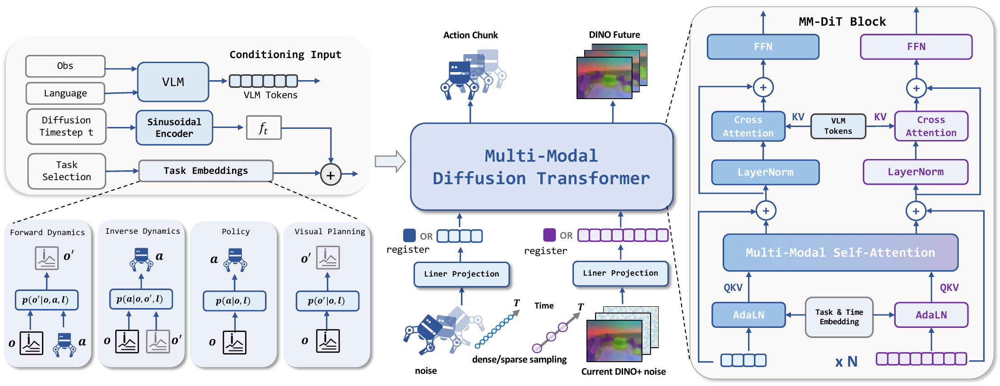
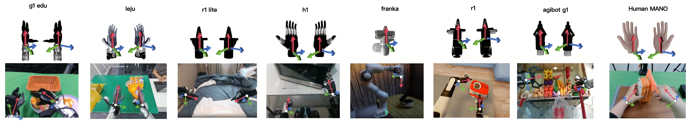
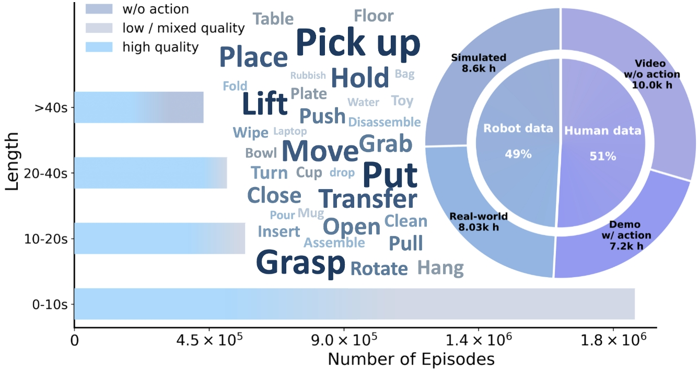
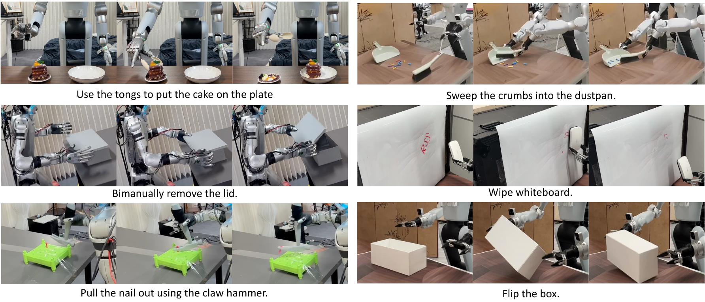
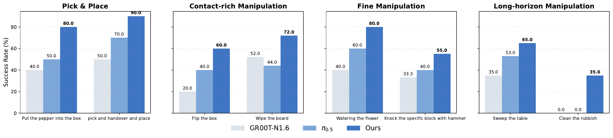
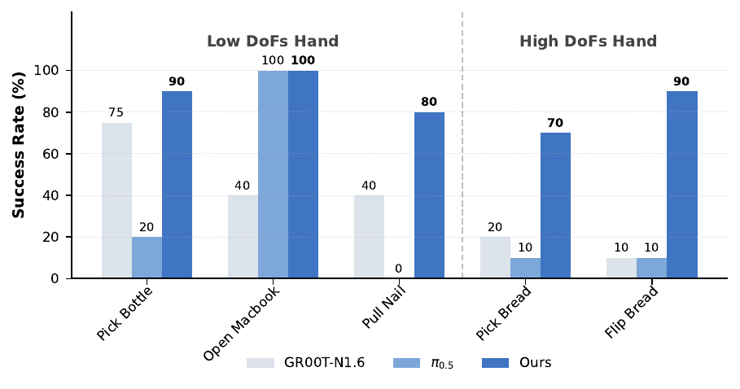
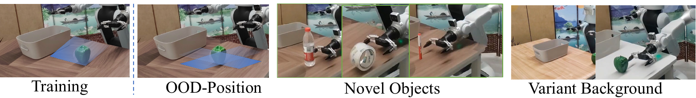
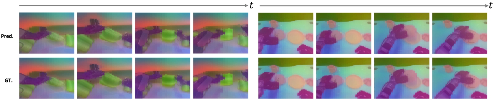
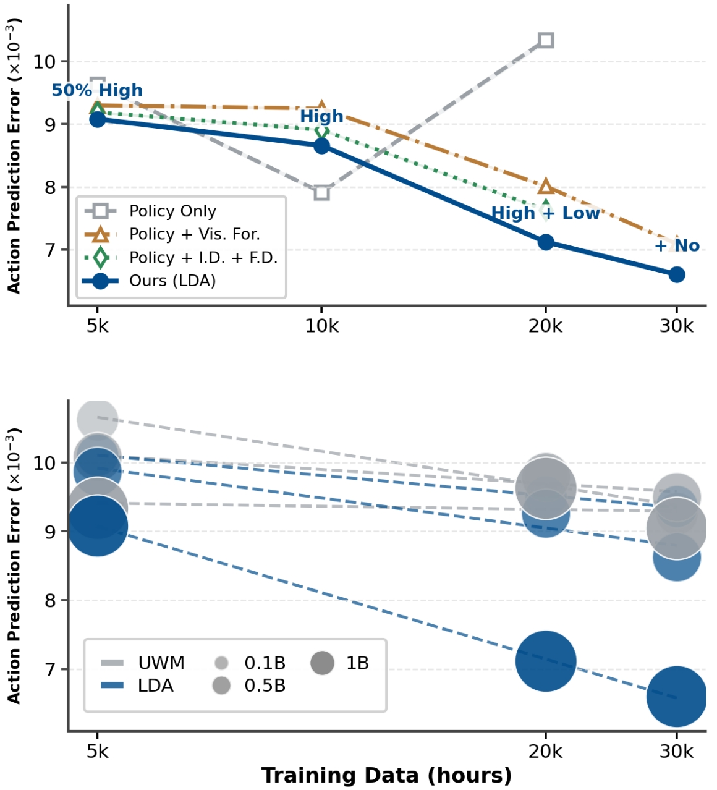
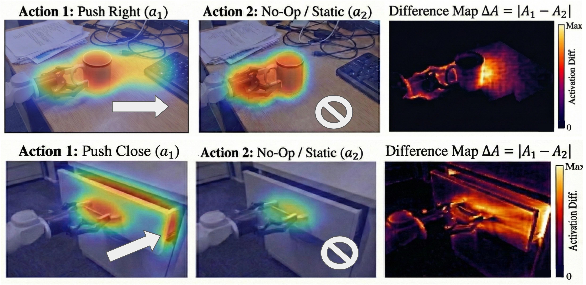

# Title: LDA-1B: Scaling L atent D ynamics A ction Model via Universal Embodied Data Ingestion
- ArXiv: 2602.12215
- Authors:
  - Jiangran Lyu — , Kai Liu
  - Jiayi Chen — , Jiazhao Zhang
  - Xuesong Shi — , Haoran Li
- Sections: 38
- Estimated tokens: 28.2k

## 摘要（Abstract）

最近的机器人基础模型主要依赖于大规模行为克隆（behavior cloning），该方法模仿专家动作，但丢弃了嵌入在异构具身数据中的可迁移动力学知识。虽然统一世界模型（Unified World Model, UWM）框架具有利用此类多样化数据的潜力，但现有的实例化方法由于数据使用粗放和数据集碎片化，难以扩展到基础模型级别。

我们提出  **LDA-1B** ，一个通过 **通用具身数据摄入** 实现扩展的机器人基础模型，该模型联合学习动力学（dynamics）、策略（policy）和视觉预测（visual forecasting），并为不同质量的数据分配不同的角色。为了支持这种大规模训练机制，我们整理并标准化了  **EI-30k** ，一个具身交互数据集，包含超过  **3万小时**  的以统一格式记录的人类和机器人轨迹。

通过在一个结构化的 DINO 潜在空间（latent space）中进行预测，实现了对此类异构数据的可扩展动力学学习，这避免了冗余的像素空间外观建模。作为这种表示的补充，LDA-1B 采用了一个多模态扩散变换器（multi-modal diffusion transformer）来处理异步的视觉和动作流，从而在  **10亿参数**  规模下实现稳定训练。

在仿真和现实世界的实验表明，LDA-1B 在接触密集型（contact-rich）、灵巧操作（dexterous）和长时域（long-horizon）任务上，分别比先前方法（例如 $\pi_{0.5}$）高出高达  **21%** 、 **48%**  和  **23%** 。值得注意的是，LDA-1B 实现了数据高效的微调，通过利用通常有害且被丢弃的 30% 的低质量轨迹，获得了 10% 的性能提升。

## I 引言（Introduction）

受大语言模型（Large Language Models, LLMs）和视觉语言模型（Vision-Language Models, VLMs）成功的启发，机器人领域越来越倾向于通过大规模预训练来追求通用机器人基础模型 [[5](#ref-6), [41](#ref-14)]。大多数现有方法都集中在扩展行为克隆（BC），该方法模仿专家动作，但从根本上将学习限制在高质量的演示数据上。因此，大部分异构的具身数据 [[42](#ref-44)] 被丢弃或仅被弱利用，尽管这些数据包含丰富的物理交互动力学信息 [[26](#ref-45)]。

统一世界模型（UWM）框架 [[30](#ref-25), [60](#ref-24)] 提供了一种替代方案，它在一个单一模型中联合优化动力学、策略和视频生成，从而可以利用不仅仅是专家数据。尽管具有潜在价值，但现有的 UWM 实例化方法远未达到基础模型级别的扩展。一个主要的限制在于粗放的数据使用：异构的具身数据通常被统一处理，没有根据其质量或监督信号区分其角色，这导致可迁移的动力学知识未被充分利用。此外，该领域缺乏现成的大规模数据集，能够以一致的格式和对齐的动作表示来统一不同质量的数据。

此外，UWM 在像素空间中表示未来状态，将动力学学习与冗余的外观建模纠缠在一起。光照、纹理、背景杂乱或相机视角的细微变化都可能主导训练目标，使得大规模训练效率低下，并阻碍与交互相关的动力学学习。

为了克服这些限制，我们提出了  **LDA-1B** ，一个通过*通用具身数据摄入*实现扩展的机器人基础模型。在这个框架中，异构数据扮演着不同但互补的角色：无动作的人类视频监督视觉预测 [[38](#ref-48), [37](#ref-49), [25](#ref-50)]，较低质量的轨迹主要提供动力学学习信息，而高质量的轨迹则同时支持策略和动力学学习。为了大规模实现这种方法，我们整理了  **EI-30k** ，一个大规模具身交互数据集，包含超过 3 万小时的跨现实和仿真环境的人类及机器人轨迹，格式标准化且动作表示对齐。在此类多样化数据上的可扩展学习得益于结构化的  **DINO 潜在空间**  [[46](#ref-13), [59](#ref-2), [22](#ref-20)]（减少了冗余的外观建模 [[38](#ref-48), [25](#ref-50)]）以及一个多模态扩散变换器（对齐异步的视觉和动作预测）。通过结合这种摄入策略、数据集、潜在表示和模型架构，LDA-1B 在 10 亿参数规模下实现了稳定训练，同时最大化数据利用率。

我们在具有挑战性的 RoboCasa-GR1 基准测试以及一组涉及夹爪和高自由度（DoF）灵巧手的多样化现实世界任务 [[56](#ref-47)] 上评估了 LDA-1B。LDA-1B 持续优于 $\pi_{0.5}$，在接触密集型操作任务上实现了  **21%**  的性能提升（得益于改进的动力学理解），在灵巧操作任务上实现了  **48%**  的性能提升（得益于对人类数据的有效利用）。此外，在混合质量的微调设置下，LDA-1B 通过利用对基线方法有害的低质量轨迹，将数据效率提高了  **10%** 。这些结果突显了通用具身数据摄入和统一潜在动力学学习作为以行为克隆为中心的机器人预训练的可扩展替代方案。

总之，我们的贡献有三点：

- 我们提出了 LDA-1B，一个可扩展的机器人基础模型，通过统一潜在动力学预训练学习可泛化的交互动力学。
- 我们构建了 EI-30k，一个大规模具身交互数据集，涵盖了多种具身形态、环境、数据质量，并具有对齐的末端执行器坐标系。
- 我们证明了 LDA-1B 在广泛的任务设置中实现了卓越的泛化能力和鲁棒性，包括仿真和现实世界环境、接触密集型操作、灵巧操作以及长时域操作。

> 图 2： **LDA 的架构。** 
LDA 在多个联合训练目标下联合去噪动作块和未来视觉潜在表示，这些目标包括策略学习、前向动力学、逆向动力学和视觉预测。
模型以 VLM 令牌、扩散时间步长和任务嵌入为条件，采用多模态扩散变换器架构，其中动作和视觉专家被解耦，并通过一个共享的自注意力层进行交互。

## II 相关工作（Related Work）

| 模型 | 数据来源 | 数据量 | 动作质量 | 训练方式 | 参数量 |
| --- | --- | --- | --- | --- | --- |
| $\pi_{0.5}$[[23](#ref-15)] | 遥操作 | 10k+ | 高 | BC | 3B |
| RDT [[32](#ref-7)] | 遥操作 | <10k | 高 | BC | 1B |
| GraspVLA [[14](#ref-17)] | 仿真 | 20k+ | 高 | BC | 2B |
| InternVLA-M1 [[11](#ref-16)] | 仿真 | <10k | 高 | BC | 3B |
| Being-H0 [[35](#ref-28)] | 人类 | <10k | 混合 | 对齐 + BC | 14B |
| InternVLA-A1 [[9](#ref-71)] | 异构 | 10k+ | 高 | VF + BC | 3B |
| GR00T-N1.6 [[40](#ref-34)] | 异构 | <10k | 混合 | LA + BC | 1B |
| UniVLA [[7](#ref-8)] | 异构 | <10k | 混合 | LA + BC | 7B |
| LDA-1B | 异构 |  **30k+**  | 混合 | UWM[[60](#ref-24)] | 1B |

 **机器人基础模型。**  最近的机器人基础模型主要采用行为克隆范式。如表 I 所总结，代表性方法——包括 $\pi_{0}$[[4](#ref-12)]、RDT [[32](#ref-7)]] 和 InternVLA [[11](#ref-16)]]——严重依赖高质量的遥操作或仿真数据，这从根本上限制了它们的可扩展性。混合方法如 Being-H0 [[35](#ref-28)]] 和 UniVLA [[7](#ref-8)]] 试图整合具有混合质量的异构数据；然而，它们很大程度上依赖于动作对齐或辅助的预训练潜在动作模型，将有效数据规模限制在大约 6k 小时的具身数据。相比之下，LDA-1B 通过采用统一世界模型框架打破了这一上限，能够高效摄入多达 3 万小时的混合质量具身数据。

 **统一视频动作模型。**  最近的工作探索了具身决策的联合动力学和策略建模。诸如 DyWA [[36](#ref-21)]]、FLARE [[58](#ref-22)]] 和 WorldVLA 系列 [[10](#ref-23), [24](#ref-5)]] 等方法表明，联合训练下一状态预测和策略学习可以提高交互环境中的泛化能力。为了丰富动力学建模，UWM [[60](#ref-24)]] 和 UVA [[30](#ref-25)]] 进一步提出联合优化多个目标，包括视频生成、前向和逆向动力学以及动作预测。与我们的工作同期，Motus [[3](#ref-19)]] 采用了 UWM 范式并整合了来自预训练 VLM 和视频生成模型的先验知识。尽管取得了有希望的结果，这些方法通常直接在像素空间中操作，并且在训练过程中没有明确考虑数据质量、规模或异构性的作用，这限制了它们充分利用大规模、混合质量交互数据进行鲁棒动力学学习的能力。

 **大规模具身交互数据集。**  具身人工智能的进展依赖于大规模具身数据集。许多广泛使用的数据集是通过对真实机器人进行遥操作收集的 [[4](#ref-12), [23](#ref-15), [27](#ref-11), [31](#ref-10)]] 或在仿真环境中生成的 [[14](#ref-17), [11](#ref-16)]]，提供了高质量的动作标记轨迹。除了机器人收集的数据之外，最近的工作还探索了以人为中心的具身数据集，例如带有手部动作的自我中心记录 [[53](#ref-27), [35](#ref-28)]]。虽然这些数据集显著扩展了数据多样性，但许多数据集要么未公开发布，要么仅提供有限的动作监督，这使得它们难以直接集成到机器人学习流程中。更广泛地说，现有的具身数据集高度碎片化：有些是闭源的，有些是开源的，但在数据格式、传感器配置、动作表示和注释质量方面差异很大。这种标准化的缺失对大规模数据聚合和统一训练构成了主要障碍。相比之下，我们的工作引入了 EI-30k，一个大规模具身交互数据集，它统一了多样化的数据源——包括来自现实世界和仿真环境中的机器人和人类轨迹——采用一致的数据格式和对齐的动作表示。

## III 潜在动力学动作模型（Latent Dynamics Action Model）

### III-A 预备知识：统一世界模型（Unified World Models）

给定当前观测 $o_{t}$（通常为RGB图像）， **统一世界模型（Unified World Model, UWM）**  [[60](#ref-24)] 联合建模了未来观测 $\boldsymbol{o}_{t+1:t+k}$ 和 **动作块（action chunk）**  $\boldsymbol{a}_{t+1:t+k}$ 上的多个条件分布，从而实现了以下目标的统一学习：

1.   **策略（Policy）** : $p(\boldsymbol{a}_{t+1:t+k}\mid\boldsymbol{o}_{t})$
2.   **正向动力学（Forward Dynamics）** : $p(\boldsymbol{o}_{t+1:t+k}\mid\boldsymbol{o}_{t},\boldsymbol{a}_{t+1:t+k})$
3.   **逆向动力学（Inverse Dynamics）** : $p(\boldsymbol{a}_{t+1:t+k}\mid\boldsymbol{o}_{t:t+k})$
4.   **视觉规划（Visual Planning）** : $p(\boldsymbol{o}_{t+1:t+k}\mid\boldsymbol{o}_{t})$

具体而言，UWM [[60](#ref-24)] 使用一个联合扩散模型来实例化该框架，该模型同时预测动作和未来观测的噪声：

$$
(\epsilon_{a}^{\theta},\epsilon_{o}^{\theta})=s_{\theta}\!\left(o,\,a_{t_{a}},\,o^{\prime}_{t_{o}},\,t_{a},\,t_{o^{\prime}}\right), \tag{(1)}
$$

其中 $t_{a}$ 和 $t_{o}$ 分别是为动作和观测独立采样的扩散时间步，$\tilde{a}_{t_{a}}$、$\tilde{o}_{t_{o}}$ 表示它们对应的含噪输入。该模型使用标准的  **去噪扩散概率模型（Denoising Diffusion Probabilistic Model, DDPM）**  [[20](#ref-29)] 目标进行训练，以 $o_{t}$ 为条件联合去噪未来的动作和观测。
我们进一步扩展了该公式，通过 **视觉语言模型（Vision-Language Model, VLM）**  引入语言 $\ell$ 条件，从而实现指令引导的动作和观测预测。

### III-B 通过多任务协同训练（Multi-task Co-training）实现通用数据摄取（Universal Data Ingestion）

我们采用一种*通用数据摄取*机制来联合训练上述统一目标，允许异构的具身数据根据其自身的监督质量做出贡献。
具体来说，高质量的机器人和人类演示数据与所有目标共同训练，同时支持动作策略学习和动力学建模。
质量较低的轨迹可能包含次优或带噪声的动作，它们被专门用于动力学和视觉预测，因为在这些任务中不需要精确的动作最优性。
此外，我们利用大规模的无动作标注的人类操作视频来训练视觉预测目标，为指令条件下的未来状态预测提供监督。
这种基于角色感知的数据使用方式防止了对专家行为模式的过拟合，并实现了可迁移的动力学和动作表示的可扩展学习。

为了在单个扩散模型中实现差异化的目标，我们引入了四个可学习的*任务嵌入（task embeddings）* 和两个可学习的*注册令牌（register tokens）*。
每个任务嵌入对应一个特定的训练目标（策略、正向动力学、逆向动力学或视觉预测），并被添加到扩散时间步嵌入 $f_{t}$ 中，以调节去噪过程。
可学习的注册令牌——一个用于动作，一个用于视觉状态——作为给定任务中缺失模态的占位符。
例如，在策略训练期间，模型接收含噪的动作令牌以及一个表示未观测未来状态的视觉注册令牌；相比之下，视觉预测则使用含噪的未来视觉令牌和一个动作注册令牌。
这种设计使得一个统一的架构能够灵活地支持不同的输入-输出结构，而无需修改网络拓扑结构。
总的来说，该模型在不同任务条件下预测一个去噪向量场 $v_{a}^{\theta}$，并使用 **流匹配（flow-matching）**  目标进行训练：

$$
\displaystyle l_{\mathrm{action}}^{\theta} \displaystyle=\mathbb{E}_{\begin{subarray}{c}(\boldsymbol{o}_{t:t+k},\boldsymbol{a}_{t+1:t+k},\ell)\sim\mathcal{D}\\
\tau_{a}\sim\mathcal{U}(0,T_{\tau})\\
\epsilon_{a}\sim\mathcal{N}(\boldsymbol{0},\boldsymbol{I})\end{subarray}}\left\|v_{a}^{\theta}-(\epsilon_{a}-\boldsymbol{a}_{t+1:t+k})\right\|_{2}^{2}, \displaystyle l_{\mathrm{obs}}^{\theta} \displaystyle=\mathbb{E}_{\begin{subarray}{c}(\boldsymbol{o}_{t:t+k},\boldsymbol{a}_{t+1:t+k},\ell)\sim\mathcal{D}\\
\tau_{o}\sim\mathcal{U}(0,T_{\tau})\\
\epsilon_{o}\sim\mathcal{N}(\boldsymbol{0},\boldsymbol{I})\end{subarray}}\left\|v_{o}^{\theta}-(\epsilon_{o}-\boldsymbol{o}_{t+1:t+k})\right\|_{2}^{2}, \displaystyle l^{\theta} \displaystyle=l_{\mathrm{action}}^{\theta}+l_{\mathrm{obs}}^{\theta}. \tag{(2)}
$$

在训练过程中，动作损失和视觉损失根据任务规范被选择性激活，允许异构数据在适当的监督下做出贡献。
在推理时，通过指定任务嵌入和相应的输入，可以灵活地调用同一个模型来实现不同的目标。

### III-C 预测目标的表示（Representation of Predictive Targets）

我们以统一的格式表示预测目标——未来的视觉状态和动作，以最大化跨异构数据集的知识共享。
对于视觉预测，我们采用从预训练的  **DINO**  [[46](#ref-13)] 编码器中提取的潜在特征，而不是基于 **变分自编码器（Variational Autoencoder, VAE）**  的像素空间表示。DINO 潜在特征编码了高级的语义和空间结构，同时抑制了背景噪声和低层次的视觉变化，这有助于学习能够泛化到不同环境和物体配置的场景动力学。

对于动作，我们定义了一个基于末端执行器运动的统一手部中心动作空间，由增量腕部姿态和手指配置组成。对于平行爪夹持器，手指状态由单自由度的夹持器宽度表示；而对于多指灵巧手，手指配置则使用在腕部坐标系中表示的关键点来描述。这种设计能够在不同的具身形态和操作平台上实现一致的动作建模。

为了建模时间动态，视觉状态和动作被组织成两个具有不同采样率的同步时间流。视觉观测以 3Hz 的频率采样，低于动作的 10Hz 频率。这减少了来自高度相关连续帧的冗余计算，同时保留了细粒度的动作动态，使模型能够在快速变化的控制信号和较慢演变的视觉状态之间保持连贯的时间对齐。

### III-D 架构：多模态扩散Transformer（Multi-Modal Diffusion Transformer, MM-DiT）

我们采用 **多模态扩散Transformer（MM-DiT）**  在统一的扩散框架内联合去噪动作块并预测未来视觉特征（图 2）。
该模型在异构令牌上运行，同时共享一个通用的 Transformer 主干网络。
条件输入包括当前观测、语言指令、扩散时间步和任务规范。
观测和语言由一个预训练的 VLM 编码为条件令牌。
扩散时间步使用正弦嵌入进行编码，任务信息由一个可学习的任务嵌入表示。
所有条件信号通过 **自适应层归一化（Adaptive Layer Normalization, AdaLN）**  [[43](#ref-30)] 注入到每个 Transformer 块中。

动作被组织成固定长度的块，并添加高斯噪声进行破坏。
未来的视觉特征（DINO [[46](#ref-13)] 特征）被并行地加噪。
两种模态都通过特定于模态的线性层投影到令牌嵌入中，并由 MM-DiT 联合处理。
每个 MM-DiT 块对连接的动作和视觉令牌应用多模态自注意力，从而实现跨模态交互。
保留了特定于模态的 QKV 投影和前馈网络（Feed-Forward Networks, FFNs）以保持归纳偏置，而注意力则在模态间共享。
语言令牌通过交叉注意力被整合进来，以提供高级语义指导。
最后，特定于模态的输出头预测去噪后的动作序列和未来视觉特征。

### III-E 预训练（Pre-training）和后训练（Post-training）

  **预训练配置。**  
我们的模型在一个配备 48 块 NVIDIA H800 GPU 的服务器集群上进行训练。训练过程包含 400k 次迭代，总计计算成本为 4,608 GPU 小时。为了保持预训练基础模型的泛化能力和视觉表示质量，我们在整个预训练过程中冻结了 VLM [[52](#ref-35)] 和 DINO [[46](#ref-13)] 编码器的参数，仅更新 MM-DiT 以及动作编码器/解码器。这种设计确保了模型能够从新数据中学习，而不会降低基础模型在跨模态理解和细粒度视觉特征提取方面的核心能力。

  **数据高效微调（Data-Efficient Finetuning）。**  为了使模型适应目标具身形态和任务以进行实际部署，我们引入了一个轻量级的后训练阶段。该阶段遵循与预训练相同的数据机制，并有效地利用了自然收集的混合质量的遥操作数据，无需专家级别的演示。与先前依赖精心策划的专家数据集的微调流程相比，我们的方法直接使用未经过滤的遥操作数据，显著提高了数据效率并降低了数据收集和标注的成本，从而促进了实际部署。

> 图 3：  **对齐的末端执行器坐标系（Aligned End Effector Coordinate Systems）。**  我们手动对齐了不同机器人和人类具身形态之间的坐标框架以确保一致性。这种共享的表示使得能够从异构的交互数据中进行联合学习。

> 图 4：  **EI-30K 数据集统计信息。**  该数据集包含超过 3 万小时的各种人类和机器人交互数据（右图）。它涵盖了不同的片段长度（左图）和丰富的操作任务集合（中图）。

## IV 具身交互数据集（Embodied Interaction Dataset, EI-30K）

我们引入了 **具身交互数据集（Embodied Interaction Dataset, EI-30K）** ，这是一个大规模的具身交互轨迹集合，总计超过 3 万小时。
它包含 8,030 小时的现实世界机器人数据、8,600 小时的模拟机器人数据、7,200 小时的带动作人类演示数据以及 1 万小时的无动作人类视频数据。
所有子数据集都标注有明确的质量标签，从而能够跨不同保真度级别进行系统分析，并支持质量感知学习。

  **数据统一化（Data Unification）。**  
EI-30K 整合了来自异构平台和任务的数据集，这些数据集在存储格式、传感器模态和标注方面各不相同。
所有数据都被转换为 LeRobot 格式，提供了观测、动作和语言的统一表示。
这种标准化促进了即插即用的训练、灵活的数据组合以及额外标注的无缝集成，同时大大减少了处理多样化数据源的工程开销。

  **对齐的动作表示（Aligned Action Representation）。**  
为了支持跨具身形态的一致性物理交互建模，所有可用的动作标注都被表示为共享坐标框架中的手部中心运动（图 [3](https://arxiv.org/html/2602.12215v1#S3.F3)）。
对于机器人，这包括 6 自由度末端执行器姿态加上夹持器宽度或灵巧手关节。对于人类，则记录 6 自由度腕部姿态和完整的  **MANO**  [[45](#ref-32)] 手部参数。
相机外参被保留以将手部运动与第一人称头部运动解耦。所有坐标框架都被手动对齐，以确保跨数据集的空间几何一致性，从而能够从人类和机器人轨迹中进行联合学习。

  **质量标注与清洗（Quality Annotation and Cleaning）。**  
EI-30K 应用了系统性的清洗和质量感知标注。
使用视觉语言模型对语言标注进行规范化，以确保语义一致性。移除没有意义的手-物体交互的运动片段，例如第一人称视频中仅包含头部运动或空闲的片段。
每条轨迹根据动作准确性和标注完整性被分配一个质量标签。
与激进的过滤不同，低质量的轨迹被保留下来，允许下游模型通过质量感知训练来利用数据的全频谱。

## V 实验（Experiments）

### V-A 仿真实验（Simulation Experiments）

 **基准与基线方法（Benchmark and Baselines）。**   
我们在  **RoboCasa-GR1**  [[39](#ref-33)] 上评估我们的方法，这是一个模拟厨房基准，包含  **24 个桌面重排和铰接物体操作任务** ，使用  **GR-1 人形机器人**  和  **傅里叶灵巧手** 。该基准提供了具有挑战性和真实感的设置，要求从安装在头部的摄像头获取的 **以自我为中心的 RGB 观测** 中进行 **高自由度（High-DoF）灵巧操作** 。遵循  **GR00T**  [[40](#ref-34)] 评估协议，我们使用每个任务  **1000 条轨迹**  微调所有模型，并对每个任务进行  **51 次试验**  评估，报告平均成功率。我们将  **LDA**  与  **GR00T**  及其强变体，以及  **UWM**  [[60](#ref-24)]，在匹配的训练范式和数据下进行比较。为确保在模型容量和预训练方面的公平比较，我们复现了一个强大的  **GR00T 基线（记为 GR00T-EI10k）** ，其参数量为 1B，在我们精选的  **EI-30k**  高质量子集上预训练，并使用  **Qwen3-VL**  作为  **视觉语言模型（VLM）编码器** 。

| 模型 | 视觉表示 | MMDiT | VLM | 成功率 $\uparrow$ |
| --- | --- | --- | --- | --- |
| GR00T-N1.6[[40](#ref-34)] | - | - | Cosmos | 47.6 |
| StarVLA[[47](#ref-72)] | - | - | Qwen3vl[[52](#ref-35)] | 47.8 |
| GR00T-EI30k | - | - | Qwen3vl | 51.3 |
| UWM-0.1B[[60](#ref-24)] | VAE | ✗ | - | 14.2 |
| UWM-1B | VAE | ✗ | Qwen3vl | 19.3 |
| UWM(MM-DiT) | VAE | ✓ | Qwen3vl | 20.0 |
| LDA(DiT) | DINO | ✗ | Qwen3vl | 48.9 |
| LDA-0.5B | DINO | ✓ | Qwen3vl | 50.7 |
| LDA-1B | DINO | ✓ | Qwen3vl |   **55.4**   |

> 图 5：跨多个机器人平台和末端执行器的真实世界操作演示。
配备 Sharpa 灵巧手的 Galbot G1（左上）、配备 BrainCo 灵巧手的 Unitree G1（中和左下）以及配备两指夹爪的 Galbot G1（右）。

> 图 6： **真实世界夹爪操作任务的成功率比较。** 
所有模型在 Galbot 上进行少样本微调，并在涵盖拾取与放置、接触丰富、精细和长程操作等八项任务上进行评估。LDA 始终优于 GR00T-N1.6 [[40](#ref-34)] 和 $\pi_{0.5}$[[23](#ref-15)]。

 **与基线方法的比较（Comparison with Baselines）。**   
如表 [II](https://arxiv.org/html/2602.12215v1#S5.T2) 所示，原始的  **GR00T-N1.6**  [[40](#ref-34)]（参数量 3B）成功率为 47.6%。当在我们精选的  **EI-30k**  数据集上预训练后，复现的  **GR00T-EI10k** （参数量 1B）显示出明显的改进，达到 51.3%，突显了高质量具身数据的影响。在相同的参数预算下， **LDA**  进一步将成功率提升至  **55.4%** 。这些结果表明，除了数据质量和参数规模之外，在混合质量数据上预训练时，在统一模型中 **联合学习动作和动力学** 能带来额外收益。

 **消融研究（Ablation Study）。**   
我们进一步在相同的训练数据和优化设置下分析关键设计选择。 **UWM**  [[60](#ref-24)] 尽管联合预测动作和动力学，但由于模型容量有限和使用 **纠缠的变分自编码器（VAE）潜在表示** ，仅达到 14.2% 的成功率。将 UWM 扩展到 1B 参数或将其  **DiT 骨干网络** 替换为我们的  **MM-DiT**  仅带来微小的改进（分别为 19.3% 和 20.0%），这表明 **架构约束** 从根本上限制了其性能。相比之下，将 **像素空间 VAE 潜在变量** 替换为  **DINO**  [[46](#ref-13)] 表示带来了显著的性能提升（20.0% $\rightarrow$ 55.4%），突显了 **语义结构化的潜在空间** 对于有效扩展的重要性。最后，移除所提出的  **MM-DiT 架构** 或将模型大小缩减至 0.5B 参数，分别导致性能下降  **6.5%**  和  **4.7%** ，证实了 **多专家设计** 的有效性及其良好的 **扩展行为** 。

### V-B 真实世界实验（Real-world Experiments）

为了验证  **LDA-1B**  的可扩展性和鲁棒性，我们进行了广泛的实际世界实验，重点关注 **对新形态的少样本适应** 、 **灵巧操作** 以及 **混合质量监督下的数据效率** 。

 **真实世界机器人与任务设置（Real-World Robot and Task Setup）。**   
我们在两个 **人形机器人平台** 上评估我们的方法： **Galbot G1**  和  **Unitree G1** 。Galbot G1 配备 **两指夹爪** 或  **22 自由度（DoF）Sharpa 灵巧手** ，而 Unitree G1 使用  **10 自由度（DoF）BrainCo 灵巧手** 。在所有配置中，策略仅接收来自 **头部摄像头** 的 **以自我为中心的 RGB 观测** 。我们在夹爪设置下评估四类操作任务： **拾取与放置（Pick and Place）** 、 **接触丰富操作（Contact-rich Manipulation）** 、 **精细操作（Fine Manipulation）**  和 **长程操作（Long-horizon Manipulation）** ——涵盖了多样的 **接触动力学** 和 **时间跨度** 。代表性任务包括 **敲击积木、翻转盒子、交接、拾取与放置（胡椒瓶）、清扫桌面、清理垃圾、浇花** 和 **擦黑板** 。灵巧操作还包括 **工具使用任务** ，如用锤子拔钉子和用锅铲翻面包，这需要精确的力控制和协调的手指运动。定性演示如图 [5](https://arxiv.org/html/2602.12215v1#S5.F5) 所示。对于每个任务，我们收集  **100 条遥操作轨迹** ，不强制执行专家级执行。因此，数据集自然呈现出 **混合质量** ：大约  **50-80%**  的轨迹对应于专家行为，而其余部分包含次优动作，如暂停、重试或低效的运动模式。

 **基线方法与微调协议（Baselines and Finetuning Protocol）。**   
我们将  **LDA-1B**  与两个强基线进行比较：$\pi_{0.5}$[[23](#ref-15)] 和  **GR00T**  [[40](#ref-34)]。为确保稳定和有竞争力的性能，基线模型 **仅** 在过滤后的专家子集上进行微调。相比之下， **LDA-1B**  利用所有收集的轨迹，并通过我们的 **通用具身数据摄取（Universal Embodied Data Ingestion）机制** 直接从完整的混合质量分布中学习。

> 图 7： **真实世界灵巧操作任务的成功率比较**   
我们在 3 个低自由度（DoF）手（BrainCo）任务和 2 个高自由度（DoF）手（Sharpa）任务上，评估我们的模型与基线方法（GR00T-N1.6 和 $\pi_{0.5}$）的实际性能。我们的方法（深蓝色）始终优于基线，尤其是在精细灵巧任务（拔钉子）和高自由度任务上。

> 图 8：拾取与放置任务的泛化评估设置

| 方法 | 抓取与放置 | | |
| --- | --- | --- | --- |
| $\pi_{0.5}$ | 26.7 | 20.0 | 6.7 |
| GR00T | 40.0 | 40.0 | 20.0 |
| 我们的方法 |  **60.0**  |  **60.0**  |  **40.0**  |

 **夹爪操作结果。** 
我们首先通过在 Galbot G1 上部署 LDA-1B 来评估少样本适应能力，该机器人未包含在我们的 EI-30k 预训练数据集中。
如图 [6](https://arxiv.org/html/2602.12215v1#S5.F6) 所示，LDA-1B 在各个任务类别中始终优于所有基线方法。
在简单的抓取与放置任务中，LDA-1B 的成功率达到 80%–90%，表明其能够有效地进行少样本适应，适配新的机器人形态。
在接触密集和长时域场景中，性能差距显著扩大。
例如，*清理垃圾*任务需要协调的双臂操作、工具使用（簸箕）以及将物体顺序转移到垃圾箱中，在此过程中错误很容易随时间累积。
在此设定下，LDA-1B 达到了 35% 的成功率，而 GR00T 和 $\pi_{0.5}$ 则完全失败（0%）。
这一结果表明， **潜在动力学建模（latent dynamics modeling）**  使 LDA 能够更好地预测动作引发的状态转换，保持时间一致性，并在扩展操作序列中从中期失败中恢复。

 **灵巧操作结果。** 
我们进一步在低自由度（low-DoF）和高自由度（high-DoF）灵巧操作任务上评估了 LDA-1B，结果如图 [7](https://arxiv.org/html/2602.12215v1#S5.F7) 所示。
在低自由度任务（如*拔钉子*）中，该任务需要精确的运动方向以及锤子与钉子之间稳定的接触保持，LDA-1B 达到了 80% 的成功率，能够可靠地定位目标并调整敏感动作，而 $\pi_{0.5}$ 则基本失败。
在高自由度任务（如*翻面包*）中，该任务涉及高维控制、连续接触和协调的手腕运动，LDA-1B 达到了 90% 的成功率，而 $\pi_{0.5}$ 仅达到 10%。
这些结果表明，在大规模人类数据上的预训练为灵巧控制提供了强大的 **潜在先验（latent priors）** ，使得在有限机器人数据下也能实现精确的手指协调和物体重新定向。
相比之下，基线策略在动作维度和接触复杂性增加时难以泛化。

> 图 9:  **潜在前向动力学可视化。**  我们的模型生成准确的未来视觉表示（上图），与各时间步的真实值（下图）对齐，捕捉了语义物体结构和运动动力学。

> 图 10: LDA 的缩放分析，通过在未见测试集上的动作预测误差进行评估。上图：使用 30k 小时的训练数据，动作预测误差降至 6.6，表明有效利用了多样化的数据源。下图：随着训练数据的增加，LDA 在所有模型规模（0.1B$\rightarrow$1B）上均持续优于 UWM，而基线方法则迅速饱和。

 **泛化能力。** 
为了评估我们策略的泛化能力，我们在三种条件下测试了抓取与放置任务：新物体、未见背景以及分布外（Out-of-Distribution, OOD）起始位置，如图 [8](https://arxiv.org/html/2602.12215v1#S5.F8) 所示。
如表 [III](https://arxiv.org/html/2602.12215v1#S5.T3) 所总结，尽管存在视觉和空间扰动，我们的模型仍保持了高成功率。大规模的潜在动力学预训练使模型能够忽略视觉干扰（背景变化），同时专注于相关的物体可供性，展现出相较于基线方法更强的泛化能力。

 **数据高效的微调。** 

| 方法 | 将笔放入盒子 | 双手移除盖子 | | |
| --- | --- | --- | --- | --- |
| 63 高 | 63 高 + 37 低 | 66 高 | 66 高 + 34 低 | |
| $\pi_{0.5}$ | 60 | 40 (20$\downarrow$) | 50 | 40 (10$\downarrow$) |
| 我们的方法 |  **70**  |  **80 (10$\uparrow$)**  |  **50**  |  **60 (10 $\uparrow$)**  |

我们通过在微调阶段对两个数据划分进行后训练，分析了混合质量数据摄入的价值：（1）仅高质量数据（专家数据），和（2）高 + 低质量数据（全部 100 条轨迹）。
如表 [IV](https://arxiv.org/html/2602.12215v1#S5.T4) 所示，当添加低质量数据时，基线模型性能下降，而 LDA-1B 则有效利用了这些含噪声的轨迹，将性能提升了 10%，显著提高了数据效率，并降低了实际部署中数据收集和标注的成本。

### V-C 缩放效应分析

为了分析 LDA 的缩放行为，我们系统地改变了模型容量、数据组成和训练目标。
所有模型均在从 *Agibot World*[[6](#ref-37)] 中保留的未见子集上采样得到的测试集上进行评估。
我们报告动作预测 L1 误差作为主要指标，该指标是真实世界性能的一个稳定且可重现的代理指标。
图 [10](https://arxiv.org/html/2602.12215v1#S5.F10) 总结了四种训练配置下的结果：
(i) *仅策略*，
(ii) *策略 + 视觉预测*，
(iii) *策略与前向及逆向动力学*，以及
(iv) 完整的联合训练框架（*我们的方法*）。
这些实验共同揭示了 LDA 在异构监督和不断增加的模型容量下如何缩放。

 **通用数据摄入的有效性。** 
有效利用异构具身数据需要同时缩放数据源和训练目标。
如图 [10](https://arxiv.org/html/2602.12215v1#S5.F10) 所示，只有当所有监督信号——策略学习、动力学建模和视觉预测——被联合优化时，LDA 才能达到最佳性能。
当数据规模或训练目标被缩减时，性能会显著下降。
仅使用带有动作标签的轨迹和*仅策略*目标（灰线），增加数据集大小会导致不稳定的行为：虽然适度的缩放最初会降低误差，但纳入较低质量的数据会导致性能退化。
类似地，排除动力学或视觉预测目标的联合训练变体（绿线和棕线）提高了鲁棒性，但未能充分利用可用数据。
相比之下，完整的联合训练框架（蓝线）在引入额外的异构数据时表现出持续改进。
值得注意的是，即使在所有带动作标签的轨迹被用尽之后，添加 10k 条无动作视频仍能继续降低预测误差。
这表明 LDA 能够通过潜在动力学和视觉预测从低质量数据和无动作数据中提取有用的监督信号，而不是将此类数据视为噪声。
总体而言，这些结果表明，当异构数据和联合训练目标共同缩放时， **通用数据摄入（Universal Data Ingestion）**  最为有效，使 LDA 能够充分利用混合质量的监督信息。

 **潜在表示的有效性。** 
尽管 LDA 和 UWM 都引入了与动力学相关的监督，但由于其潜在空间结构的差异，它们的缩放行为存在显著差异。
如图 [10](https://arxiv.org/html/2602.12215v1#S5.F10) 所示，随着数据规模和模型容量的增加，UWM 迅速饱和，额外的监督带来的收益递减甚至为负。
这表明，当潜在空间无法支持组合和因果推理时，仅仅增加数据或参数是不够的。
这一局限性源于 UWM 基于 VAE 的潜在表示，该表示在低层特征粒度上纠缠了外观、几何和动力学。
这种纠缠限制了模型分解动作引发状态转换的能力，并阻止了在缩放过程中有效重用异构监督。
相比之下，LDA 在从大规模视觉预训练获得的语义结构化潜在空间中运行。
这种表示保留了物体级别的语义和空间一致性，使得动力学学习能够随着模型容量的增加、更丰富的训练目标和更多样化的数据集而平滑缩放。

 **模型缩放的有效性。** 
除了数据规模，LDA 在模型容量增加时表现出持续且可预测的改进。
如图 [10](https://arxiv.org/html/2602.12215v1#S5.F10) 所示，在完整的联合训练框架下，将模型从 0.1B 缩放至 0.5B 并进一步至 1B 参数，会导致动作预测误差单调递减。
这表明，当存在足够的异构监督时，LDA 能够有效吸收额外的容量来建模日益复杂的动作-动力学关系。
这些结果突显了一个有前景的缩放范式，在该范式中，模型容量、训练目标和异构具身数据被联合对齐，从而实现可靠的性能提升。

### V-D 动力学学习分析

 **潜在前向动力学的定性分析。** 
除了定量的预测误差，我们还通过 DINO 特征嵌入的 PCA 投影可视化，定性地检查了 LDA 学习到的前向动力学。
如图 [16](https://arxiv.org/html/2602.12215v1#A4.F16) 所示，模型产生了连贯的未来状态预测，这些预测遵循物理约束，如物体恒存性、接触连续性和在施加动作下的运动一致性。
值得注意的是，预测的动力学聚焦于任务相关物体，同时对不影响控制回路的视觉干扰保持不变。
这表明 LDA 学习了一个 **动力学感知的潜在世界模型（dynamics-aware latent world model）** ，捕捉动作如何因果性地在场景中传播，而不仅仅是外推视觉外观。

> 图 11: 注意力热力图：“向右推”（上图）高亮了杯子的前缘和轨迹；“推近”（下图）则集中于接触面。模型仅关注可移动区域，同时忽略无关的背景杂乱。

 **动作条件注意力。** 
为了解释 LDA 如何推理动作引发的状态转换，我们可视化了以不同动作原语为条件的注意力图。
如图 [11](https://arxiv.org/html/2602.12215v1#S5.F11) 所示，我们比较了由主动运动指令（$a_{1}$）引发的注意力模式与静态*无操作*指令（$a_{2}$）下的模式，并计算它们的差异以揭示动作特定的视觉定位。
在各个任务中，LDA 始终关注与指令交互因果相关的区域。
在*向右推*场景中，注意力差异高亮了杯子的前缘和预期的运动方向，反映了对物体位移的感知。
在*推近*任务中，注意力集中在预期发生接触和施力的抽屉表面。
重要的是，背景杂乱以及视觉上显著但不交互的区域在很大程度上被抑制。
这些结果表明，LDA 将视觉注意力条件化为动作的物理后果，选择性地关注驱动状态转换的区域，而不是静态外观。

## VI 结论、局限性与未来方向

我们提出了  **LDA-1B** ，一个通过通用具身数据摄入来缩放潜在动力学学习的 **机器人基础模型（robot foundation model）** 。通过为异构数据分配不同的角色，并利用 EI-30k 数据集中超过  **30k 小时**  的人类与机器人轨迹，LDA-1B 在结构化的 DINO 潜在空间中学习动力学，并采用了一种 **混合频率多模态扩散变换器（mixed-frequency multimodal diffusion transformer）** ，从而在  **1B 参数**  规模上实现了稳定训练。实验表明，该模型在多种操作任务和长时域任务中表现出色，并且能够在非完美轨迹上进行数据高效的微调。
局限性包括依赖固定的 DINO 视觉特征和主要的第一人称视角，这可能限制其泛化到新的视觉视角和多模态信号。未来的工作包括联合学习视觉表示和潜在动力学、扩展到更丰富的感官模态、自动优化数据角色，以及推动更广泛的社区采用可扩展的、基于异构数据的机器人基础模型。

## 致谢

我们感谢曹伟孟（Caowei Meng）收集遥操作数据；刘浩然（Haoran Liu）和苏嘉怡（Jiayi Su）在早期探索阶段的协助；赵宇伟（Yu-Wei Chao）和邓胜亮（Shengliang Deng）进行富有成果的讨论；以及赵俊凯（Junkai Zhao）提供实验设备。