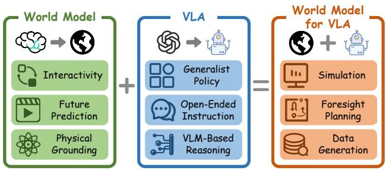
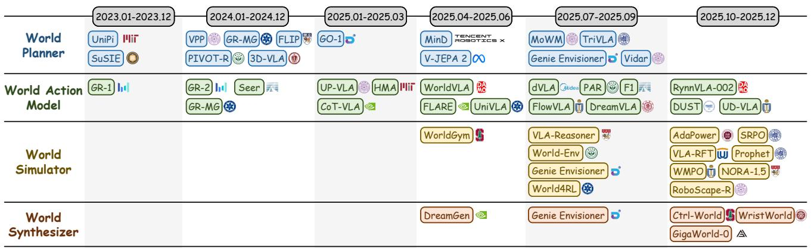
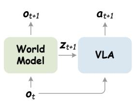
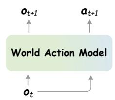
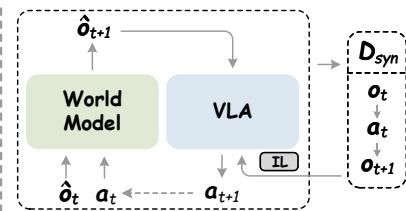
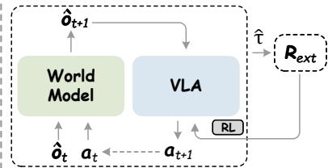

Wentao Tan1, Lei Zhu1, Bowen Wang1, Enci Xie $^ {- 1}$ , Baixu Ji $^ {1}$ , Zengrong Lin1, Wenjie Yang1, Jingjing Li $^ 2$ , and Heng Tao Shen11School of Computer Science and Technology, Tongji University 2School of Computer Science and Engineering, UESTCJanuary 27, 2026

_Posted on 27 Jan 2026 - CC-BY 4.0 - https://doi.org/10.36227/techrxiv.176948355.54623875/v1 - e-Prints posted on TechRxiv are preliminary reports that are not peer reviewed. They should not be_

# Towards Generalist Embodied AI: A Survey on World Models for VLA Agents

Wentao Tan1 , Lei $\mathbf {Z} \mathbf {h} \mathbf {u}^{1 *}$ , Bowen Wang1 , Enci Xie1 , Baixu $\mathbf {J i}^{1}$ , Zengrong $\mathbf {L i n}^{1}$ , Wenjie Yang1 , Jingjing $\mathbf {L i}^{2}$ , Heng Tao Shen11School of Computer Science and Technology, Tongji University2School of Computer Science and Engineering, UESTC{tan.wt.lucky, leizhu0608, wbw1090809192}@gmail.com,{elect, baixuji, zengronglin, blankyang, shenhengtao}@tongji.edu.cn, lijin117@yeah.net

# Abstract

Vision-language-action (VLA) models represent a critical milestone toward generalist embodied AI. However, they often struggle to precisely capture physical dynamics, verify plan executability, and overcome data scarcity. To address these limitations, world models are introduced as future predictors that incorporate rich physical priors to effectively guide VLA agents toward physically grounded action generation. While this paradigm is emerging as a pivotal research direction, the field currently lacks a systematic overview. Therefore, we present the first survey specifically dedicated to world models for VLA agents. We propose a unified taxonomy that organizes existing methods into four paradigms: world planner, world action model, world synthesizer, and world simulator, and review their respective evolutionary trajectories. Furthermore, we summarize the ecosystem of foundation models, benchmarks, and evaluation metrics to support future research. Finally, we highlight key challenges and promising directions to facilitate the advancement of world models for generalist VLA agents.

# 1 Introduction

Background. Recent progress in general-purpose embodied agents has shifted toward vision-language-action (VLA) architectures [Ma et al., 2024], a key milestone toward artificial general intelligence (AGI). Unlike conventional visual policies confined to specialized tasks and scenes, VLA agents integrate large language models (LLMs) [Touvron et al., 2023] and their multimodal variants to utilize internetscale knowledge, aligning high-level semantic instructions with low-level control policies. This semantic grounding enables robots to follow open-ended instructions and generalize in open-world environments.While LLMs serve as discrete world models empowering VLA agents with text-centric reasoning, they struggle to capture continuous physical dynamics due to constraints of

> Figure 1: Overview of world models for VLA agents. The integration empowers VLA agents with capabilities for high-fidelity simulation, long-horizon foresight, and scalable data generation.

discrete text generation. To address this limitation, embodied world models [Liu et al., 2024] simulate spatiotemporal evolution of complex environments by predicting continuous future states. Consequently, these models function as efficient simulators for predictive synthesis [Liao et al., 2025; Guo et al., 2025b] and foundation models for planning executable actions [Wu et al., 2024; Cen et al., 2025b].Definition: World Models for VLA. This direction aims to treat world models as general-purpose future predictors to facilitate generalist VLA agents [Zitkovich et al., 2023]. This definition distinguishes it from traditional paradigms: world models for policy [Hafner et al., 2025] establish a generalpurpose framework for decision-making via predictive environment simulation, whereas world models for robotic manipulation [Zhang et al., 2025c] specialize this paradigm to tackle contact-rich manipulation tasks. Differently, this topic shifts the research focus toward large-scale foundation models, centering on scalable world dynamics and VLA agents to establish a universal framework for embodied intelligence beyond isolated skills.Motivation: Why World Models for VLA? While VLA models excel in task generalization, they face significant gaps in real-world deployment. First, they suffer from physical hallucination where generated actions lack physical grounding. Second, although LLMs provide long-horizon planning, they cannot inherently verify the physical executability of abstract strategies. Finally, scarcity of high-quality robotic data and safety risks inherent in real-world RL severely limit gen-

> Figure 2: Taxonomy of world models for VLA agents. We categorize existing works into world planner, world action model, world simulator, and world synthesizer. The timeline traces the evolution from preliminary explorations in 2023 to an explosive growth in 2025. This rapid growth, especially seen in world simulators and world synthesizers, benefits from the rapid development of generative models.

eralization. World models can mitigate these issues by simulating physical consequences to verify plan feasibility and enabling safe simulation for scalable training.Development Trends. We categorize world models for VLA agents into four paradigms: world planner, world action model, world synthesizer, and world simulator. Early development primarily focuses on planners and action models to enhance reasoning and control capabilities. Recently, driven by the rise of video generation models, research has pivoted toward synthesizers and simulators. These emerging paradigms leverage high-fidelity video synthesis to generate scalable data for imitation learning and provide safe environments for reinforcement learning, effectively mitigating data scarcity and safety constraints.Compared with Existing Surveys. Recent reviews typically diverge into broad embodied AI and specific robotic manipulation. Surveys on embodied AI [Liu et al., 2024] prioritize general planning and navigation, while those on robotic manipulation [Zhang et al., 2025c] focus on general robot policies. In contrast, this survey focuses on world models for VLA, an emerging and high-potential direction that builds upon large foundation models to handle open-ended scenarios with generalist capabilities. We systematically cover detailed primary and secondary taxonomies, foundation models, evaluation metrics, benchmarks, and future directions, aiming to serve as a foundational reference for future research.Contributions. To systematically organize this emerging field, we present the first comprehensive survey centered on world models for VLA agents. Our contributions are summarized as follows:

- Primary Taxonomy: We propose the first unified taxonomy that categorizes existing methods into four distinct paradigms: world planner, world action model, world synthesizer, and world simulator.
- Secondary Taxonomy: We establish a detailed secondary taxonomy for each paradigm, coherently reviewing the developmental history and representative works

within each branch.

- Ecosystem and Evaluation: We summarize the ecosystem of foundation models, evaluation metrics, and benchmarks. Then, we provide a quantitative performance report on the CALVIN and LIBERO benchmarks to establish a reference baseline.
- Future Directions: We identify fundamental challenges and outline promising perspectives for future research to facilitate the advancement of generalist VLA agents.

# 2 Preliminaries

Vision-Language-Action Model. Unlike basic taskspecific policies, VLA models $\pi_{\theta}$ employ pre-trained vision-language models (VLMs) as backbones to acquire rich semantic priors and reasoning capabilities. While these models demonstrate promising open-world generalization by grounding instructions into trajectories, they often struggle to translate high-level semantic understanding into physically consistent control signals. As a result, effectively bridging multimodal reasoning and low-level execution remains a key bottleneck in realizing general-purpose robotic control.World Model. The world model $\mathcal {W}_{\phi}$ captures the environmental dynamics by approximating the transition distribution $P ( s_{t + 1} \ \mathbf {\bar {|}} \ s_{t} , \cdot )$ . It adopts generative backbones to model the spatiotemporal evolution of complex scenes, synthesizing high-fidelity future states conditioned on multimodal contexts. By distilling latent physical laws from large-scale data, $\mathcal {W}_{\phi}$ enables the generation of physically consistent actions.

# 3 Taxonomy of World Models for VLA

In this section, we propose a unified taxonomy to organize world models for VLA agents, classifying existing methodologies into four paradigms (Figure 3): World Action Model, World Planner, World Synthesizer, and World Simulator. For each paradigm, we provide a formal definition, a fine-grained secondary taxonomy, and a comprehensive survey of recent

> (a) World Planner

> (b) World Action Model

> (c) World Synthesizer

> (d) World Simulator Figure 3: Four paradigms of world models for VLA agents. IL and RL denote imitation learning and reinforcement learning, respectively.

developments in Sections 3.1 to 3.4. In the formulations below, explicit notations for history and text instructions are omitted for brevity, assuming the world model $\mathcal {W}_{\phi}$ and the VLA model $\pi_{\theta}$ are implicitly conditioned on them.

# 3.1 World Planner

Definition. This paradigm adopts the world model $\mathcal {W}_{\phi}$ as a forward dynamics model to synthesize future guidance in the form of explicit future observations or latent features, thereby providing semantic conditioning for the policy $\pi_{\theta}$ :

$$
\max _{\theta} \mathbb {E}_{z_{t + 1} \sim \mathcal {W}_{\phi} (\cdot | o_{t})} \left[ \sum_ {t} \log \pi_ {\theta} \left(a_{t + 1} \mid o_{t}, z_{t + 1}\right) \right]. \tag {1}
$$

Table 1: Taxonomy of world planners. Para. indicates planning paradigm: explicit (Exp.), implicit (Imp.), or hybrid (Hyb.). Signal indicates guidance signal: predicted images (Pred. Image), latent embeddings (Embedding), or hybrid.

<table><tr><td>Para.</td><td>Signal</td><td>Methods</td></tr><tr><td>Exp.</td><td>Pred. Image</td><td>UniPi, SuSIE, GR-MG, Vidar, 3D-VLA, FLIP</td></tr><tr><td>Imp.</td><td>Embedding</td><td>V-JEPA 2, PIVOT-R</td></tr><tr><td>Exp.</td><td>Embedding</td><td>VPP, MinD, TriVLA, GO-1, Genie Envisioner</td></tr><tr><td>Hyb.</td><td>Hybrid</td><td>MoWM</td></tr></table>

Evolution. Unlike standard multimodal large language models (MLLMs) that lack physical foresight, world models serve as planners to ensure that actions are grounded in predicted physical dynamics rather than just semantic associations (Table 1). Several works treat planning as a highfidelity video generation task. For instance, UniPi [Du et al., 2023], SuSIE [Black et al., 2023], GR-MG [Li et al., 2025b], Vidar [Feng et al., 2025], 3D-VLA [Zhen et al., 2024], and FLIP [Gao et al., 2025] utilize image/video diffusion models to synthesize pixel-level future states, which are subsequently processed by an inverse dynamics model $\pi_{\theta} ( a_{t + 1} \mid z_{t} , z_{t + 1} )$ to generate actions. To mitigate interference from dynamicsirrelevant visual details (e.g., lighting and texture) in pixellevel synthesis, subsequent works such as V-JEPA 2 [Assran et al., 2025] and PIVOT-R [Zhang et al., 2024] have shifted toward implicit planning without reconstructing images. These methods employ representation models to predict future states directly within the latent space to facilitate action derivation.Despite the trend toward implicit modeling, video diffusion models (VDMs) remain the prevailing backbone due to their superior capacity to capture complex world dynamics, providing rich latent signals for planning. Unlike early methods that relied on explicit image reconstruction to derive actions, current approaches treat pixel-level synthesis as a proxy task to distill world dynamics from the denoising process, leveraging latent features to guide policies. Specifically, VPP [Hu et al., 2025], MinD [Chi et al., 2025], TriVLA [Liu et al., 2025], and Genie Envisioner [Liao et al., 2025] utilize such latent embeddings to condition diffusion-based policies. The scalability of this paradigm is further enhanced by GO-1’s [Team, 2025a] discrete latent representation. This evolution leads to hybrid foundation architectures like MoWM [Shang et al., 2025], which combine different dynamic priors to simplify the process of action derivation. Overall, this trend marks the transition from MLLM-based discrete planning toward world models that serve as active planners using learned dynamics for complex tasks.

# 3.2 World Action Model

Definition. This paradigm employs generative modeling to approximate the joint distribution of future observations and actions, predicting the coupled dynamics of vision and control based on the given context:

$$
\max _{\phi} \mathbb {E}_{\tau \sim \mathcal {D}} \left[ \sum_ {t} \log \mathcal {W}_{\phi} \left(o_{t + 1}, a_{t + 1} \mid o_{t}\right) \right]. \tag {2}
$$

Table 2: Taxonomy of world action models. Para. denotes modeling paradigm: autoregressive (AR) or diffusion-based (Diff.). Mechanism indicates implementation strategy: video pretraining, reasoning, or discrete/real-valued modeling, etc.

<table><tr><td>Para.</td><td>Mechanism</td><td>Methods</td></tr><tr><td rowspan="4">AR.</td><td>Video Pretrain</td><td>GR-1, HMA, UniVLA, GR-2</td></tr><tr><td>Unified</td><td>WorldVLA, RynnVLA-002, UP-VLA</td></tr><tr><td>Foresight</td><td>Seer, F1, GR-MG, PAR</td></tr><tr><td>Reason</td><td>FlowVLA, CoT-VLA, DreamVLA</td></tr><tr><td rowspan="2">Diff.</td><td>Discrete</td><td>UD-VLA, dVLA</td></tr><tr><td>Real-valued</td><td>DUST, FLARE</td></tr></table>

Evolution. World action models integrate image prediction and action generation within a unified framework, incorpo-rating environmental dynamics to provide a physical grounding for policy (Table 2). By constructing a joint distribution model for future observations and actions, it ensures actions are semantically aligned and physically constrained, maintaining spatiotemporal consistency during long-horizon tasks.Benefiting from the scalability of MLLMs, the autoregressive paradigm initially serves as the foundational methodology for world action modeling. Pioneering works such as GR-1 [Wu et al., 2024], HMA [Wang et al., 2025b], UniVLA [Wang et al., 2025c], and GR-2 [Cheang et al., 2024] utilize large-scale video pretraining to model physical dynamics temporally. WorldVLA [Cen et al., 2025b], RynnVLA-002 [Cen et al., 2025a], and UP-VLA [Zhang et al., 2025b] integrate actions and observations into a unified token stream, ensuring embodied consistency through endto-end sequence modeling. To enforce physical grounding, Seer [Tian et al., 2025], F1 [Lv et al., 2025], GR-MG [Li et al., 2025b], and PAR [Song et al., 2025] directly employ predictive foresight to guide action execution based on imagined future states. In addition, reasoning-augmented methods such as FlowVLA [Zhong et al., 2025] and CoT-VLA [Zhao et al., 2025] employ multimodal chain-of-thought to structure decision-making. DreamVLA [Zhang et al., 2025d] uses multimodal world knowledge prediction, including depth and semantics, to enhance physical reasoning.While autoregressive multimodal modeling is effective, they are inherently limited by quantization loss and multistep compounding errors, driving the research focus towards diffusion-based world action models. Discrete diffusion frameworks like UD-VLA [Chen et al., 2025] and dVLA [Wen et al., 2025] integrate iterative refinement to enhance token generation quality, whereas realvalued approaches such as DUST [Won et al., 2025] and FLARE [Zheng et al., 2025] exploit joint diffusion mechanisms to enable high-precision control, effectively mitigating the information loss associated with action discretization. Overall, this evolution moves toward joint environmentaction modeling, utilizing learned dynamics to strengthen physical grounding for action generation.

# 3.3 World Synthesizer

Definition. This paradigm constructs a scalable data engine by synthesizing interleaved observation-action trajectories $\hat {\tau}$ via a joint generator $\mathcal {G}_{\theta , \phi}$ to support imitation learning:

$$
\mathcal {D}_{\mathrm {s y n}} \triangleq \left\{\hat {\tau} \sim p \left(o_{0}\right) \prod_ {t} \mathcal {G}_{\theta , \phi} \left(\hat {o}_{t + 1}, a_{t + 1} \mid \hat {o}_{t}\right) \right\}, \tag {3}
$$

where $\mathcal {G}_{\theta , \phi}$ factorizes according to the conditional dependence structure: (i) Action-conditioned: $\mathcal {G}_{\theta , \phi} = \mathcal {W}_{\phi} ( \hat {o}_{t + 1} \ |$ $\hat {o}_{t} , a_{t} \in \partial \pi_{\theta} \left( a_{t + 1} \enspace \middle | \enspace \hat {o}_{t + 1} \right)$ , predicting observations conditioned on actions from a rollout policy $\pi_{\theta}$ ; (ii) Action-free: $\mathcal {G}_{\theta , \phi} =$ $\mathcal {W}_{\phi} ( \hat {o}_{t + 1} \mid \hat {o}_{t} ) \mathcal {T}_{\psi} ( a_{t + 1} \mid \hat {o}_{t} , \hat {o}_{t + 1} )$ , where inverse dynamics $\mathcal {T}_{\psi}$ infers actions from visual trajectories generated by $\mathcal {W}_{\phi}$ .Evolution. World models are evolving into scalable data engines for policy learning (Table 3). For instance, Wrist-World [Qian et al., 2025] focuses on augmenting existing views with wrist views for egocentric foresight. Other frameworks aim to synthesizing interleaved observation-action trajectories to overcome data scarcity and scale VLA capabilities. Specifically, Genie Envisioner [Liao et al., 2025] and

**Table 3: Taxonomy of world synthesizers. Para. denotes synthesis paradigm: view augmentation (View Aug.) or generative data pipelines (Gen. Data). Mechanism indicates generation strategy: wrist-view foresight, action-conditioned, or action-free synthesis.**

<table><tr><td>Para.</td><td>Mechanism</td><td>Methods</td></tr><tr><td>View Aug.</td><td>Wrist-view Foresight</td><td>WristWorld</td></tr><tr><td>Gen. Data</td><td>Action-conditioned Action-free</td><td>Genie Envisioner, Ctrl-World DreamGen, GigaWorld-0</td></tr></table>

Ctrl-World [Guo et al., 2025b] employ action-conditioned world models to roll out future observations based on specific action sequences. In contrast, DreamGen [Jang et al., 2025] and GigaWorld-0 [Team, 2025b] first synthesize visual trajectories and then infer the underlying actions via inverse dynamics.

# 3.4 World Simulator

Definition. This paradigm uses the action-conditioned world model $\mathcal {W}_{\phi}$ as a virtual simulator to generate synthetic future states. By integrating with external reward evaluators, it enables policy improvement by optimizing the expected reward on imagined outcomes:

$$
\max _{\theta} \mathbb {E}_{\substack {a \sim \pi_ {\theta} (\cdot | o) \\ \hat {\sigma} \sim \mathcal {W}_{\phi} (\cdot | o, a)}} \left[ \mathcal {R}_{\text {ext}} (\hat {\sigma}, a) \right]. \tag{4}
$$

**Table 4: Taxonomy of world simulators. Para. denotes simulation paradigm: evaluator (Eva.), reinforcement learning (RL), or testtime adaptation (TTA). Mechanism indicates implementation strategy: task success, sparse/dense reward.**

<table><tr><td>Para.</td><td>Mechanism</td><td>Methods</td></tr><tr><td>Eva.</td><td>Task Success</td><td>WorldGym, Genie Envisioner</td></tr><tr><td rowspan="2">RL</td><td>Sparse Reward</td><td>World4RL, WMPO, Prophet</td></tr><tr><td>Dense Reward</td><td>World-Env, VLA-RFT, RoboScape-R, SRPO, NORA-1.5</td></tr><tr><td>TTA</td><td>-</td><td>VLA-Reasoner, AdaPower</td></tr></table>

Evolution. World models increasingly operate as interactive virtual environments to support closed-loop policy improvement and verification, overcoming real-world constraints such as data scarcity and operational risks in reinforcement learning (Table 4). One branch treats world models solely as evaluators to assess VLA models. For instance, WorldGym [Quevedo et al., 2025] and Genie Envisioner [Liao et al., 2025] employ action-conditioned video generation to automatically evaluate task success.Expanding beyond static evaluation, world models further serve as training simulators that provide synthetic feedback for policy improvement. The feedback mechanism has evolved from the sparse outcome supervision of World4RL [Jiang et al., 2025] to the denser guidance found in World-Env [Xiao et al., 2025] and SRPO [Fei et al., 2025], which utilize step-wise rewards or latent distance optimization. Beyond this, NORA-1.5 [Hung et al., 2025] fur-

**Table 5: Overview of foundation models serving as world models towards VLA systems. Params. denotes the model parameters. Methods lists representative applications utilizing these models.**

<table><tr><td>Model</td><td>Params.</td><td>Methods</td></tr><tr><td colspan="3">Image/Video Generation Models</td></tr><tr><td>iVideoGPT</td><td>0.6B</td><td>VLA-RFT, VLA-Reasoner</td></tr><tr><td>NOVA</td><td>0.6B</td><td>PAR</td></tr><tr><td>OpenSora</td><td>0.7B</td><td>WMPO</td></tr><tr><td>InstructPix2Pix</td><td>1B</td><td>SuSIE, GR-MG</td></tr><tr><td>WAN2.1</td><td>1.3B</td><td>WristWorld, DreamGen</td></tr><tr><td>DynamiCrafter</td><td>1.4B</td><td>MinD</td></tr><tr><td>Stable Video Diffusion</td><td>1.5B</td><td>TriVLA, Ctrl-World, MoWM, HMA, VPP</td></tr><tr><td>Cosmos-Predict2</td><td>2B</td><td>AdaPower, Prophet</td></tr><tr><td colspan="3">Unified Understanding and Generation Models</td></tr><tr><td>Show-o</td><td>1.3B</td><td>UP-VLA</td></tr><tr><td>VILA-U</td><td>7B</td><td>CoT-VLA</td></tr><tr><td>Chameleon</td><td>7B</td><td>WorldVLA, RynnVLA-002</td></tr><tr><td>MMaDA</td><td>8B</td><td>dVLA</td></tr><tr><td>Emu3</td><td>8.5B</td><td>FlowVLA, UniVLA, UD-VLA</td></tr><tr><td colspan="3">Representation Models</td></tr><tr><td>V-JEPA 2</td><td>1B</td><td>NORA-1.5, MoWM, SRPO</td></tr></table>

ther enhances alignment by incorporating V-JEPA 2 [Assran et al., 2025] features within a DPO [Rafailov et al., 2023] framework. To address physical plausibility, several methods including WMPO [Zhu et al., 2025], VLA-RFT [Li et al., 2025a], and RoboScape-R [Tang et al., 2025] adopt GRPO [Shao et al., 2024] to ensure trajectory consistency. Building on this, Prophet [Zhang et al., 2025a] introduces flow–action-GRPO to refine reward allocation. Finally, world models support test-time adaptation by MCTS planning in VLA-Reasoner [Guo et al., 2025a] or test-time training in AdaPower [Huang et al., 2025], allowing models to optimize decisions through dynamic updates. In summary, by providing a safe and scalable path for autonomous improvement, world models represent a key foundation for future embodied agents.

# 4 Foundation Models

We categorize the foundation backbones underlying world models for VLA agents into three paradigms: Image/Video Generation Models, Unified Understanding and Generation Models, and Representation Models (Table 5).Image/Video Generation Models (e.g., WAN2.1 [Wang et al., 2025a], Stable Video Diffusion [Blattmann et al., 2023]) serve as the imagination engine, modeling future video evolution under text, image, or action conditions. These models span from lightweight (0.6B) to standard scales (2B), capturing complex physical dynamics to generate controllable videos.Unified Understanding and Generation Models (e.g., Emu3 [Wang et al., 2024]) integrate perception and generation within a single framework. Unlike standard multimodal large language models limited to text output, they natively

**Table 6: Comparison of different methods on the LIBERO benchmark. Success rates $( \% )$ are reported, and the best results are highlighted in bold.**

<table><tr><td>Method</td><td>Spatial</td><td>Object</td><td>Goal</td><td>Long</td><td>Avg.</td></tr><tr><td>World-Env</td><td>87.6</td><td>86.6</td><td>86.4</td><td>57.8</td><td>79.6</td></tr><tr><td>VLA-Reasoner</td><td>91.2</td><td>90.6</td><td>82.4</td><td>59.8</td><td>81.0</td></tr><tr><td>CoT-VLA</td><td>87.5</td><td>91.6</td><td>87.6</td><td>69.0</td><td>81.1</td></tr><tr><td>WorldVLA</td><td>87.6</td><td>96.2</td><td>83.4</td><td>60.0</td><td>81.8</td></tr><tr><td>TriVLA</td><td>91.2</td><td>93.8</td><td>89.8</td><td>73.2</td><td>87.0</td></tr><tr><td>FlowVLA</td><td>93.2</td><td>95.0</td><td>91.6</td><td>72.6</td><td>88.1</td></tr><tr><td>VLA-RFT</td><td>94.4</td><td>94.4</td><td>95.4</td><td>80.2</td><td>91.1</td></tr><tr><td>SRPO (Offline)</td><td>92.5</td><td>96.8</td><td>92.0</td><td>88.7</td><td>92.5</td></tr><tr><td>DreamVLA</td><td>97.5</td><td>94.0</td><td>89.5</td><td>89.5</td><td>92.6</td></tr><tr><td>UD-VLA</td><td>94.1</td><td>95.7</td><td>91.2</td><td>89.6</td><td>92.7</td></tr><tr><td>UniVLA</td><td>95.4</td><td>98.8</td><td>93.6</td><td>94.0</td><td>95.5</td></tr><tr><td>dVLA</td><td>97.4</td><td>97.9</td><td>98.2</td><td>92.2</td><td>96.4</td></tr><tr><td>RynnVLA-002</td><td>99.0</td><td>99.8</td><td>96.4</td><td>94.4</td><td>97.4</td></tr><tr><td>SRPO (Online)</td><td>98.8</td><td>100.0</td><td>99.4</td><td>98.6</td><td>99.2</td></tr></table>

**Table 7: Comparison of different methods on the CALVIN ABC $ \mathrm {D}$ benchmark, presenting Success Rate $( \% )$ and the average number of consecutively completed instructions (Avg. Len.). The best results are highlighted in bold.**

<table><tr><td rowspan="2">Method</td><td colspan="5">Task completed in a row</td><td rowspan="2">Avg. Len. ↑</td></tr><tr><td>1</td><td>2</td><td>3</td><td>4</td><td>5</td></tr><tr><td>GR-1</td><td>85.4</td><td>71.2</td><td>59.6</td><td>49.7</td><td>40.1</td><td>3.06</td></tr><tr><td>GR-MG</td><td>96.8</td><td>89.3</td><td>81.5</td><td>72.7</td><td>64.4</td><td>4.04</td></tr><tr><td>UP-VLA</td><td>92.8</td><td>86.5</td><td>81.5</td><td>76.9</td><td>69.9</td><td>4.08</td></tr><tr><td>MoWM</td><td>94.3</td><td>87.3</td><td>81.2</td><td>75.0</td><td>67.5</td><td>4.10</td></tr><tr><td>Seer</td><td>96.3</td><td>91.6</td><td>86.1</td><td>80.3</td><td>74.0</td><td>4.28</td></tr><tr><td>VPP</td><td>95.7</td><td>91.2</td><td>86.3</td><td>81.0</td><td>75.0</td><td>4.29</td></tr><tr><td>TriVLA</td><td>96.8</td><td>92.4</td><td>86.8</td><td>83.2</td><td>81.8</td><td>4.37</td></tr><tr><td>UniVLA</td><td>98.9</td><td>94.8</td><td>89.0</td><td>82.8</td><td>75.1</td><td>4.41</td></tr><tr><td>DreamVLA</td><td>98.2</td><td>94.6</td><td>89.5</td><td>83.4</td><td>78.1</td><td>4.44</td></tr></table>

support image generation, enabling both instruction reasoning and visual generative planning for multimodal tasks.Representation Models encode sensory inputs into compact, transferable state representations instead of generating pixels. By extracting essential structural and temporal features, approaches like V-JEPA 2 [Assran et al., 2025] significantly improve sample efficiency and robustness.

# 5 Evaluation Metrics

We categorize the evaluation metrics used in world models for VLA agents into four paradigms: Video Generation Quality, Flow Accuracy, Robot Tasks, and Benchmark Metrics (Table 8).Video Generation Quality Metrics evaluate generated videos by combining low-level reconstruction fidelity (e.g., PSNR, SSIM) and high-level perceptual realism (e.g., LPIPS, FVD). These metrics quantify performance ranging from pixel-wise errors to deep feature distances, serving as a fundamental validation for the model’s ability to synthesize plausible and coherent future states.

**Table 8: Overview of evaluation metrics utilized in world models towards VLA systems. Abbr. lists the abbreviations. Freq. indicates usage frequency in related works. Tr. indicates the optimal trend (▲ for higher is better, ▼ for lower is better). GT indicates the reliance on ground truth. Methods lists representative applications employing these metrics.**

<table><tr><td>Metric</td><td>Abbr.</td><td>Freq. Tr.</td><td>Description</td><td>GT</td><td>Methods</td></tr><tr><td colspan="6">Video Generation Quality</td></tr><tr><td>Mean Squared Error</td><td>MSE</td><td>★★▼</td><td>Evaluates reconstruction fidelity by computing mean squared pixel error.</td><td>✓</td><td>VLA-RFT, GR-MG</td></tr><tr><td>Peak Signal-to-Noise Ratio</td><td>PSNR</td><td>★★▲</td><td>Evaluates reconstruction quality using the logarithmic ratio of peak signal to noise.</td><td>✓</td><td>WristWorld, Ctrl-World</td></tr><tr><td>Structural Similarity Index Measure</td><td>SSIM</td><td>★★▲</td><td>Evaluates perceptual similarity by analyzing luminance, contrast, and structure.</td><td>✓</td><td>WristWorld, Ctrl-World</td></tr><tr><td>Learned Perceptual Image Patch Similarity</td><td>LPIPS</td><td>★★▼</td><td>Evaluates perceptual similarity by calculating the distance between deep features.</td><td>✓</td><td>WristWorld, Ctrl-World</td></tr><tr><td>Fréchet Inception Distance</td><td>FID</td><td>★★▼</td><td>Evaluates realism by measuring the Fréchet distance between image distributions.</td><td>✓</td><td>Ctrl-World, World4RL</td></tr><tr><td>Fréchet Video Distance</td><td>FVD</td><td>★★▼</td><td>Evaluates realism by measuring the Fréchet distance between video distributions.</td><td>✓</td><td>Ctrl-World, World4RL</td></tr><tr><td colspan="6">Flow Accuracy</td></tr><tr><td>Average Distance Error</td><td>ADE</td><td>★▼</td><td>Evaluates flow accuracy by computing the average pixel-wise flow distance across all query points.</td><td>✓</td><td>FLIP</td></tr><tr><td>Less Than Delta Ratio</td><td>LTDR</td><td>★▲</td><td>Evaluates flow accuracy by computing the average percentage of points within distance thresholds.</td><td>✓</td><td>FLIP</td></tr><tr><td>End Point Error</td><td>EPE</td><td>★▼</td><td>Evaluates flow accuracy by measuring magnitude agreement with the end-point error.</td><td>✓</td><td>Prophet</td></tr><tr><td colspan="6">Robot Tasks</td></tr><tr><td>Success Rate</td><td>SR</td><td>★★▲</td><td>Evaluates policy quality by calculating the percentage of trials that achieve the goal.</td><td>×</td><td>NORA-1.5, F1</td></tr><tr><td>Average Task Progress</td><td>-</td><td>★★▲</td><td>Evaluates long-horizon tasks by measuring the average progress of sub-task completion.</td><td>×</td><td>VPP, DreamVLA</td></tr><tr><td colspan="6">Benchmark Metrics</td></tr><tr><td>Progress Reward Benchmark</td><td>-</td><td>★-</td><td>Evaluates reward quality by measuring alignment with progress (SC/Mono) and goal discrimination (MMD/JS/SMD).</td><td>-</td><td>SRPO</td></tr><tr><td>VBench</td><td>-</td><td>★-</td><td>Evaluates video generation quality by measuring temporal quality, frame-wise quality, semantics, style, and overall consistency.</td><td>-</td><td>Vidar</td></tr><tr><td>PAI-Bench-Predict-Text2World</td><td>PBench</td><td>★-</td><td>Evaluates text-to-world generation performance by measuring quality score and domain score.</td><td>-</td><td>GigaWorld-0</td></tr><tr><td>EWMBench</td><td>-</td><td>★-</td><td>Evaluates physical scene simulation by measuring scene, motion, and semantic quality.</td><td>-</td><td>Genie Envisioner</td></tr><tr><td>DreamGen Bench</td><td>-</td><td>★-</td><td>Evaluates controllable video generation by assessing instruction following and physical alignment.</td><td>-</td><td>DreamGen, GigaWorld-0</td></tr></table>

Flow Accuracy Metrics measure generated dynamics by combining temporal motion consistency and spatial trajectory precision (e.g., ADE, EPE). By quantifying performance from instantaneous optical flow errors to accumulated trajectory deviations, these metrics ensure the physical consistency required for dynamic scenes.Robot Task Metrics assess VLA performance by combining binary goal achievement (e.g., Success Rate) and continuous execution progress (e.g., Average Task Progress). These metrics measure the policy’s execution results to verify how well the world model contributes to successful robot actions.Benchmark Metrics focus on overall model capabilities by combining overall generation quality and control accuracy. These frameworks integrate evaluations ranging from fundamental physical consistency to complex semantic alignment,establishing a unified standard to assess the model’s generalizability across diverse scenarios.

# 6 Benchmarks

To systematically evaluate world models within VLA agents, we categorize existing benchmarks into Simulation Environments and Real-world Datasets (Table 9).Simulation vs. Real-world. The distinction between these environments defines the scope of world model evaluation. Simulation provides a controlled, scalable setting suitable for assessing the decision-making ability of world planners and world action models. However, it is insufficient for world synthesizers or simulators. As these generative paradigms focus on alleviating real-world data scarcity and the safety risks of on-robot exploration, their validation requires the visual

**Table 9: Overview of benchmarks utilized in world models towards VLA systems. LH. denotes the long-horizon setting. Config. includes fixed and mobile single-arm (S-Arm) setups. Camera views are categorized as exocentric (Exo.), egocentric (Ego.), and wrist-mounted (Wrist). The symbol # denotes the number of corresponding entries. The symbol s denotes the number of skills.**

<table><tr><td>Benchmark</td><td>Domain</td><td>LH.</td><td>Config.</td><td>Platform</td><td>Camera</td><td># Traj.</td><td># Scenes</td><td># Obj.</td><td># Tasks</td></tr><tr><td colspan="10">Simulation Environments</td></tr><tr><td>LIBERO</td><td>Tabletop</td><td>✓</td><td>Fixed S-Arm</td><td>Franka Panda</td><td>Exo., Wrist</td><td>6.5k</td><td>20</td><td>-</td><td>130</td></tr><tr><td>CALVIN</td><td>Tabletop</td><td>✓</td><td>Fixed S-Arm</td><td>Franka Panda</td><td>Exo., Wrist</td><td>24k</td><td>4</td><td>7</td><td>34</td></tr><tr><td>RLBench</td><td>Tabletop</td><td>✓</td><td>Fixed S-Arm</td><td>Franka Panda</td><td>Exo., Wrist</td><td>1.8k</td><td>1</td><td>28</td><td>100</td></tr><tr><td>ManiSkill 2</td><td>Indoor</td><td>X</td><td>Fixed S-Arm</td><td>Franka Panda</td><td>Exo., Wrist</td><td>30k+</td><td>-</td><td>2,144</td><td>20</td></tr><tr><td>Meta-World</td><td>Tabletop</td><td>X</td><td>Fixed S-Arm</td><td>Sawyer</td><td>Exo.</td><td>25k</td><td>1</td><td>-</td><td>50</td></tr><tr><td>RoboCasa</td><td>Indoor</td><td>✓</td><td>Mobile S-Arm</td><td>Franka Panda</td><td>Exo., Wrist</td><td>100k+</td><td>120</td><td>2.5k</td><td>100</td></tr><tr><td>SimplerEnv</td><td>Indoor</td><td>✓</td><td>Fixed S-Arm</td><td>Google Robot, Widow X</td><td>Exo., Ego.</td><td>-</td><td>-</td><td>-</td><td>8</td></tr><tr><td colspan="10">Real-World Datasets</td></tr><tr><td>BridgeData</td><td>Tabletop</td><td>X</td><td>Fixed S-Arm</td><td>WidowX</td><td>Exo., Wrist</td><td>60k</td><td>24</td><td>100+</td><td>13s</td></tr><tr><td>Droid</td><td>Indoor</td><td>✓</td><td>Fixed S-Arm</td><td>Franka Panda</td><td>Exo., Wrist</td><td>76k</td><td>564</td><td>-</td><td>86</td></tr><tr><td>RT-1</td><td>Indoor</td><td>✓</td><td>Mobile S-Arm</td><td>Google Robot</td><td>Ego.</td><td>130k</td><td>-</td><td>17</td><td>744</td></tr><tr><td>OXE</td><td>Hybrid</td><td>✓</td><td>Hybrid</td><td>22 Types</td><td>Hybrid</td><td>1M+</td><td>-</td><td>-</td><td>160k+</td></tr></table>

realism and dynamics of the real world to ensure the capacity for simulating high-fidelity, physically consistent futures.Temporal Horizon. Task duration determines the required prediction stability for world models. Benchmarks like Meta-World focus on atomic, short-horizon tasks sufficient for learning immediate physics. In contrast, LIBERO and Droid target long-horizon settings involving multi-stage manipulation. These challenge world models to maintain temporal consistency and causal reasoning over extended timelines.Environmental Generalization. Spatial complexity and the diversity of scenes, objects, and tasks are the primary metrics for evaluating world model robustness. Benchmarks range from structured tabletop setups to cluttered indoor environments. To bridge the reality gap, recent datasets prioritize diverse asset libraries and task distributions over raw trajectory volume, challenging world models to generalize across out-of-distribution scenarios.Performance on Simulation Benchmarks. As shown in Tables 6 and 7, current world models for VLA agents have reached near-saturation on the LIBERO and CALVIN $\mathbf {A B C}  \mathbf {D}$ benchmarks. Notably, top-performing methods such as SRPO (Online) and DreamVLA achieve a $9 9 . 2 \%$ success rate and a 4.44 average task length, respectively. This high level of proficiency indicates that these simulated environments are no longer sufficiently challenging to validate the true complexities of embodied intelligence in real-world physical settings.

# 7 Future Directions

Despite recent progress, several critical challenges remain to be addressed to achieve generalizable and physically grounded world models.Physical Consistency integrates explicit physical constraints and long-horizon causal reasoning to suppress hallucinations and compounding errors. Effective strategies to mitigate this include differentiable physics priors, causal learning, and counterfactual reasoning.Spatiotemporal (4D) Perception aims to transcend 2Dcentric perception paradigms by interleaving control signals with the underlying 3D environmental evolution. To capture fine-grained geometric transformations over long horizons, research should focus on techniques such as dynamic gaussian splatting, persistent point tracking, and neural occupancy fields.Safety and Reliability necessitates that the world model serves as a high-fidelity simulator to anticipate potential hazards before physical actuation occurs, considering geometric constraints, uncertainty quantification and interpretability.Long-horizon Foresight refers to the model’s ability to consistently maintain a correct understanding of object attributes, spatial relationships, and task goals throughout extended reasoning processes. Potential approaches include hierarchical temporal abstraction, subgoal decomposition, and memory-augmented mechanisms.Failure-Aware Dynamics aims to rectify the overoptimism bias arising from reliance solely on successful demonstration data, considering contrastive learning with negative samples, offline learning from suboptimal data, and error-induced trajectory synthesis.

# 8 Conclusion

This paper presents a survey of world models for VLA agents, establishing a taxonomy that includes world planner, world action model, world synthesizer, and world simulator. We detail their secondary taxonomy and development history, the ecosystem of underlying foundation models, and the diverse evaluation metrics and benchmarks across simulation and real-world settings. While current approaches have improved the physical grounding of VLA agents, the underlying world models required for generalization and physical consistency remain underdeveloped. To advance the field, promising avenues for future research include resolving challenges across physical and spatiotemporal perception, long-horizon reasoning, and reliability.

# References

- [Assran et al., 2025] Mido Assran, Adrien Bardes, David Fan, et al. V-JEPA 2: Self-supervised video models enable understanding, prediction and planning. arXiv preprint arXiv:2506.09985, 2025.
- [Black et al., 2023] Kevin Black, Mitsuhiko Nakamoto, Pranav Atreya, et al. Zero-shot robotic manipulation with pretrained image-editing diffusion models. In NeurIPS Workshop, 2023.
- [Blattmann et al., 2023] Andreas Blattmann, Tim Dockhorn, Sumith Kulal, et al. Stable video diffusion: Scaling latent video diffusion models to large datasets. arXiv preprint arXiv:2311.15127, 2023.
- [Cen et al., 2025a] Jun Cen, Siteng Huang, Yuqian Yuan, et al. Rynnvla-002: A unified vision-language-action and world model. arXiv preprint arXiv:2511.17502, 2025.
- [Cen et al., 2025b] Jun Cen, Chaohui Yu, Hangjie Yuan, et al. Worldvla: Towards autoregressive action world model. arXiv preprint arXiv:2506.21539, 2025.
- [Cheang et al., 2024] Chilam Cheang, Guangzeng Chen, Ya Jing, et al. GR-2: A generative video-language-action model with web-scale knowledge for robot manipulation. arXiv preprint arXiv:2410.06158, 2024.
- [Chen et al., 2025] Jiayi Chen, Wenxuan Song, Pengxiang Ding, et al. Unified diffusion VLA: vision-language-action model via joint discrete denoising diffusion process. arXiv preprint arXiv:2511.01718, 2025.
- [Chi et al., 2025] Xiaowei Chi, Kuangzhi Ge, Jiaming Liu, et al. Mind: Unified visual imagination and control via hierarchical world models. arXiv preprint arXiv:2506.18897, 2025.
- [Du et al., 2023] Yilun Du, Sherry Yang, Bo Dai, et al. Learning universal policies via text-guided video generation. In NeurIPS, 2023.
- [Fei et al., 2025] Senyu Fei, Siyin Wang, Li Ji, et al. Srpo: Self-referential policy optimization for vision-languageaction models. arXiv preprint arXiv:2511.15605, 2025.
- [Feng et al., 2025] Yao Feng, Hengkai Tan, Xinyi Mao, et al. Vidar: Embodied video diffusion model for generalist bimanual manipulation. arXiv preprint arXiv:2507.12898, 2025.
- [Gao et al., 2025] Chongkai Gao, Haozhuo Zhang, Zhixuan Xu, et al. FLIP: flow-centric generative planning as general-purpose manipulation world model. In ICLR, 2025.
- [Guo et al., 2025a] Wenkai Guo, Guanxing Lu, Haoyuan Deng, et al. Vla-reasoner: Empowering vision-languageaction models with reasoning via online monte carlo tree search. arXiv preprint arXiv:2509.22643, 2025.
- [Guo et al., 2025b] Yanjiang Guo, Lucy Xiaoyang Shi, Jianyu Chen, et al. Ctrl-world: A controllable generative world model for robot manipulation. arXiv preprint arXiv:2510.10125, 2025.

- [Hafner et al., 2025] Danijar Hafner, Jurgis Pasukonis, Jimmy Ba, et al. Mastering diverse control tasks through world models. Nature, 640(8059):647–653, 2025.
- [Hu et al., 2025] Yucheng Hu, Yanjiang Guo, Pengchao Wang, et al. Video prediction policy: A generalist robot policy with predictive visual representations. In ICML, 2025.
- [Huang et al., 2025] Yuhang Huang, Shilong Zou, Jiazhao Zhang, et al. Adapower: Specializing world foundation models for predictive manipulation. arXiv preprint arXiv:2512.03538, 2025.
- [Hung et al., 2025] Chia-Yu Hung, Navonil Majumder, Haoyuan Deng, et al. Nora-1.5: A vision-language-action model trained using world model- and action-based preference rewards. arXiv preprint arXiv:2511.14659, 2025.
- [Jang et al., 2025] Joel Jang, Seonghyeon Ye, Zongyu Lin, et al. Dreamgen: Unlocking generalization in robot learning through video world models. arXiv preprint arXiv:2505.12705, 2025.
- [Jiang et al., 2025] Zhennan Jiang, Kai Liu, Yuxin Qin, et al. World4rl: Diffusion world models for policy refinement with reinforcement learning for robotic manipulation. arXiv preprint arXiv:2509.19080, 2025.
- [Li et al., 2025a] Hengtao Li, Pengxiang Ding, Runze Suo, et al. VLA-RFT: vision-language-action reinforcement fine-tuning with verified rewards in world simulators. arXiv preprint arXiv:2510.00406, 2025.
- [Li et al., 2025b] Peiyan Li, Hongtao Wu, Yan Huang, et al. GR-MG: leveraging partially-annotated data via multimodal goal-conditioned policy. IEEE RA-L, 10(2):1912– 1919, 2025.
- [Liao et al., 2025] Yue Liao, Pengfei Zhou, Siyuan Huang, et al. Genie envisioner: A unified world foundation platform for robotic manipulation. arXiv preprint arXiv:2508.05635, 2025.
- [Liu et al., 2024] Yang Liu, Weixing Chen, Yongjie Bai, et al. Aligning cyber space with physical world: A comprehensive survey on embodied AI. arXiv preprint arXiv:2407.06886, 2024.
- [Liu et al., 2025] Zhenyang Liu, Yongchong Gu, Sixiao Zheng, et al. Trivla: A triple-system-based unified visionlanguage-action model for general robot control. arXiv preprint arXiv:2507.01424, 2025.
- [Lv et al., 2025] Qi Lv, Weijie Kong, Hao Li, et al. F1: A vision-language-action model bridging understanding and generation to actions. arXiv preprint arXiv:2509.06951, 2025.
- [Ma et al., 2024] Yueen Ma, Zixing Song, Yuzheng Zhuang, et al. A survey on vision-language-action models for embodied AI. arXiv preprint arXiv:2405.14093, 2024.
- [Qian et al., 2025] Zezhong Qian, Xiaowei Chi, Yuming Li, et al. Wristworld: Generating wrist-views via 4d world models for robotic manipulation. arXiv preprint arXiv:2510.07313, 2025.

- [Quevedo et al., 2025] Julian Quevedo, Ansh Kumar Sharma, Yixiang Sun, et al. Worldgym: World model as an environment for policy evaluation. arXiv preprint arXiv:2506.00613, 2025.
- [Rafailov et al., 2023] Rafael Rafailov, Archit Sharma, Eric Mitchell, et al. Direct preference optimization: Your language model is secretly a reward model. In NeurIPS, 2023.
- [Shang et al., 2025] Yu Shang, Yangcheng Yu, Xin Zhang, et al. Mowm: Mixture-of-world-models for embodied planning via latent-to-pixel feature modulation. arXiv preprint arXiv:2509.21797, 2025.
- [Shao et al., 2024] Zhihong Shao, Peiyi Wang, Qihao Zhu, et al. Deepseekmath: Pushing the limits of mathematical reasoning in open language models. arXiv preprint arXiv:2402.03300, 2024.
- [Song et al., 2025] Zijian Song, Sihan Qin, Tianshui Chen, et al. Physical autoregressive model for robotic manipulation without action pretraining. arXiv preprint arXiv:2508.09822, 2025.
- [Tang et al., 2025] Yinzhou Tang, Yu Shang, Yinuo Chen, et al. Roboscape-r: Unified reward-observation world models for generalizable robotics training via rl. arXiv preprint arXiv:2512.03556, 2025.
- [Team, 2025a] AgiBot-World Team. Agibot world colosseo: A large-scale manipulation platform for scalable and intelligent embodied systems. arXiv preprint arXiv:2503.06669, 2025.
- [Team, 2025b] GigaWorld Team. Gigaworld-0: World models as data engine to empower embodied ai. arXiv preprint arXiv:2511.19861, 2025.
- [Tian et al., 2025] Yang Tian, Sizhe Yang, Jia Zeng, et al. Predictive inverse dynamics models are scalable learners for robotic manipulation. In ICLR, 2025.
- [Touvron et al., 2023] Hugo Touvron, Louis Martin, Kevin Stone, et al. Llama 2: Open foundation and fine-tuned chat models. arXiv preprint arXiv:2307.09288, 2023.
- [Wang et al., 2024] Xinlong Wang, Xiaosong Zhang, Zhengxiong Luo, et al. Emu3: Next-token prediction is all you need. arXiv preprint arXiv:2409.18869, 2024.
- [Wang et al., 2025a] Ang Wang, Baole Ai, Bin Wen, et al. Wan: Open and advanced large-scale video generative models. arXiv preprint arXiv:2503.20314, 2025.
- [Wang et al., 2025b] Lirui Wang, Kevin Zhao, Chaoqi Liu, et al. Learning real-world action-video dynamics with heterogeneous masked autoregression. arXiv preprint arXiv:2502.04296, 2025.
- [Wang et al., 2025c] Yuqi Wang, Xinghang Li, Wenxuan Wang, et al. Unified vision-language-action model. arXiv preprint arXiv:2506.19850, 2025.
- [Wen et al., 2025] Junjie Wen, Minjie Zhu, Jiaming Liu, et al. dvla: Diffusion vision-language-action model with multimodal chain-of-thought. arXiv preprint arXiv:2509.25681, 2025.

- [Won et al., 2025] John Won, Kyungmin Lee, Huiwon Jang, et al. Dual-stream diffusion for world-model augmented vision-language-action model. arXiv preprint arXiv:2510.27607, 2025.
- [Wu et al., 2024] Hongtao Wu, Ya Jing, Chilam Cheang, et al. Unleashing large-scale video generative pre-training for visual robot manipulation. In ICLR, 2024.
- [Xiao et al., 2025] Junjin Xiao, Yandan Yang, Xinyuan Chang, et al. World-env: Leveraging world model as a virtual environment for VLA post-training. arXiv preprint arXiv:2509.24948, 2025.
- [Zhang et al., 2024] Kaidong Zhang, Pengzhen Ren, Bingqian Lin, et al. PIVOT-R: primitive-driven waypointaware world model for robotic manipulation. In NeurIPS, 2024.
- [Zhang et al., 2025a] Jiahui Zhang, Ze Huang, Chun Gu, et al. Reinforcing action policies by prophesying. arXiv preprint arXiv:2511.20633, 2025.
- [Zhang et al., 2025b] Jianke Zhang, Yanjiang Guo, Yucheng Hu, et al. UP-VLA: A unified understanding and prediction model for embodied agent. In ICML, 2025.
- [Zhang et al., 2025c] Peng-Fei Zhang, Ying Cheng, Xiaofan Sun, et al. A step toward world models: A survey on robotic manipulation. arXiv preprint arXiv:2511.02097, 2025.
- [Zhang et al., 2025d] Wenyao Zhang, Hongsi Liu, Zekun Qi, et al. Dreamvla: A vision-language-action model dreamed with comprehensive world knowledge. arXiv preprint arXiv:2507.04447, 2025.
- [Zhao et al., 2025] Qingqing Zhao, Yao Lu, Moo Jin Kim, et al. Cot-vla: Visual chain-of-thought reasoning for vision-language-action models. In CVPR, pages 1702– 1713, 2025.
- [Zhen et al., 2024] Haoyu Zhen, Xiaowen Qiu, Peihao Chen, et al. 3d-vla: A 3d vision-language-action generative world model. In ICML, 2024.
- [Zheng et al., 2025] Ruijie Zheng, Jing Wang, Scott Reed, et al. FLARE: robot learning with implicit world modeling. arXiv preprint arXiv:2505.15659, 2025.
- [Zhong et al., 2025] Zhide Zhong, Haodong Yan, Junfeng Li, et al. Flowvla: Visual chain of thought-based motion reasoning for vision-language-action models. arXiv preprint arXiv:2508.18269, 2025.
- [Zhu et al., 2025] Fangqi Zhu, Zhengyang Yan, Zicong Hong, et al. Wmpo: World model-based policy optimization for vision-language-action models. arXiv preprint arXiv:2511.09515, 2025.
- [Zitkovich et al., 2023] Brianna Zitkovich, Tianhe Yu, Sichun Xu, et al. RT-2: vision-language-action models transfer web knowledge to robotic control. In CoRL, volume 229, pages 2165–2183, 2023.
