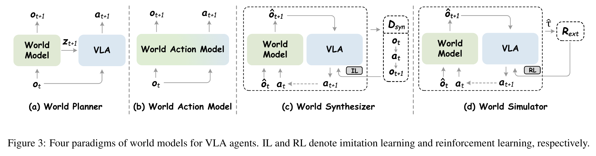

Wentao Tan1, Lei Zhu1, Bowen Wang1, Enci Xie1, Baixu Ji1, Zengrong Lin1, Wenjie Yang1, Jingjing Li2, and Heng Tao Shen1
1School of Computer Science and Technology, Tongji University
2School of Computer Science and Engineering, UESTC
January 27, 2026

_发布于 2026 年 1 月 27 日 - CC-BY 4.0 - https://doi.org/10.36227/techrxiv.176948355.54623875/v1 - TechRxiv 上发布的电子预印本是未经同行评审的初步报告。它们不应被_

# **迈向通用具身人工智能：面向视觉-语言-动作智能体的世界模型综述（Towards Generalist Embodied AI: A Survey on World Models for VLA Agents）**

Wentao Tan1, Lei Zhu1\*, Bowen Wang1, Enci Xie1, Baixu Ji1, Zengrong Lin1, Wenjie Yang1, Jingjing Li2, Heng Tao Shen1
1同济大学计算机科学与技术学院
2电子科技大学计算机科学与工程学院
{tan.wt.lucky, leizhu0608, wbw1090809192}@gmail.com,
{elect, baixuji, zengronglin, blankyang, shenhengtao}@tongji.edu.cn,
lijin117@yeah.net

# Abstract

**视觉-语言-动作（Vision-Language-Action, VLA）模型** 是实现通用具身人工智能（Embodied AI）的关键里程碑。然而，它们通常难以精确捕捉物理动态、验证计划的可执行性以及克服数据稀缺问题。为应对这些局限， **世界模型（World Models）** 被引入作为未来预测器，其整合了丰富的物理先验知识，以有效引导 VLA 智能体生成物理上可行的动作。尽管这一范式正成为一个关键的研究方向，但目前该领域缺乏系统的综述。因此，我们提出了首篇专门针对 VLA 智能体世界模型的综述。我们提出了一个统一的分类法，将现有方法组织为四种范式： **世界规划器（World Planner）** 、 **世界动作模型（World Action Model）** 、 **世界合成器（World Synthesizer）** 和 **世界模拟器（World Simulator）** ，并回顾了它们各自的发展轨迹。此外，我们总结了支撑未来研究的 **基础模型（Foundation Models）** 、 **基准测试（Benchmarks）** 和 **评估指标（Evaluation Metrics）** 生态系统。最后，我们指出了关键挑战和前景方向，以促进面向通用 VLA 智能体的世界模型的发展。

# 1 引言（Introduction）

**背景（Background）** 。通用具身智能体（General-purpose embodied agents）的最新进展已转向 **视觉-语言-动作（Vision-Language-Action, VLA）** 架构 [Ma et al., 2024]，这是迈向 **人工通用智能（Artificial General Intelligence, AGI）** 的一个关键里程碑。与局限于特定任务和场景的传统视觉策略不同，VLA 智能体集成了 **大型语言模型（Large Language Models, LLMs）** [Touvron et al., 2023] 及其多模态变体，以利用互联网规模的知识，将高层语义指令与低层控制策略对齐。这种语义基础使机器人能够遵循开放式指令并在开放世界环境中泛化。虽然 LLMs 作为离散的世界模型，为 VLA 智能体提供了以文本为中心的推理能力，但由于离散文本生成的限制，它们难以捕捉连续的物理动态。

> 图 1 | VLA 智能体的世界模型概览。该集成赋予 VLA 智能体高保真仿真、长时域前瞻和可扩展数据生成的能力。

为了应对这一局限， **具身世界模型（Embodied world models）** [Liu et al., 2024] 通过预测连续的未来状态来模拟复杂环境的时空演化。因此，这些模型充当了 **预测合成（Predictive synthesis）** [Liao et al., 2025; Guo et al., 2025b] 的高效仿真器，以及规划可执行动作的基础模型 [Wu et al., 2024; Cen et al., 2025b]。

**定义：面向 VLA 的世界模型（Definition: World Models for VLA）** 。这一方向旨在将世界模型视为通用未来预测器，以促进通用型 VLA 智能体 [Zitkovich et al., 2023] 的发展。此定义将其与传统范式区分开来： **面向策略的世界模型（World models for policy）** [Hafner et al., 2025] 通过预测性环境仿真建立了一个通用的决策框架，而 **面向机器人操作的世界模型（World models for robotic manipulation）** [Zhang et al., 2025c] 则将该范式专门化以处理接触丰富的操作任务。与此不同，本主题将研究重点转向大规模基础模型，围绕可扩展的世界动态和 VLA 智能体，旨在建立一个超越孤立技能的具身智能通用框架。

**动机：为何需要面向 VLA 的世界模型？（Motivation: Why World Models for VLA?）** 尽管 VLA 模型在任务泛化方面表现出色，但在现实世界部署中仍面临显著差距。首先，它们存在 **物理幻觉（Physical hallucination）** ，即生成的动作缺乏物理基础。其次，尽管 LLMs 提供了长时域规划能力，但它们本质上无法验证抽象策略的物理可执行性。最后，高质量机器人数据的稀缺性以及现实世界 **强化学习（Reinforcement Learning, RL）** 固有的安全风险严重限制了泛化能力。

> 图 2 | VLA 智能体世界模型的分类法。我们将现有工作分为世界规划器、世界动作模型、世界仿真器和世界合成器。时间线追溯了从 2023 年的初步探索到 2025 年的爆发式增长。这种快速增长，尤其体现在世界仿真器和世界合成器上，得益于生成模型的快速发展。

世界模型可以通过模拟物理后果来验证计划可行性，并为可扩展训练提供安全仿真环境，从而缓解这些问题。

**发展趋势（Development Trends）** 。我们将面向 VLA 智能体的世界模型分为四种范式： **世界规划器（World planner）** 、 **世界动作模型（World action model）** 、 **世界合成器（World synthesizer）** 和 **世界仿真器（World simulator）** 。早期发展主要集中在规划器和动作模型上，以增强推理和控制能力。最近，在视频生成模型兴起的推动下，研究已转向合成器和仿真器。这些新兴范式利用高保真视频合成，为模仿学习生成可扩展数据，并为强化学习提供安全环境，从而有效缓解数据稀缺和安全约束。

**与现有综述的对比（Compared with Existing Surveys）** 。近期的综述通常分为宽泛的具身人工智能（Embodied AI）和具体的机器人操作（Robotic manipulation）。关于具身人工智能的综述 [Liu et al., 2024] 优先考虑通用规划和导航，而关于机器人操作的综述 [Zhang et al., 2025c] 则侧重于通用机器人策略。相比之下，本综述聚焦于面向 VLA 的世界模型，这是一个新兴且具有高潜力的方向，它建立在大型基础模型之上，旨在以通用能力处理开放式场景。我们系统地涵盖了详细的一级和二级分类法、基础模型、评估指标、基准测试和未来方向，旨在为未来研究提供基础性参考。

**贡献（Contributions）** 。为了系统地组织这一新兴领域，我们提出了首个以 VLA 智能体世界模型为中心的全面综述。我们的贡献总结如下：

- **一级分类法（Primary Taxonomy）** ：我们提出了首个统一的分类法，将现有方法划分为四个不同的范式：世界规划器、世界动作模型、世界合成器和世界仿真器。
- **二级分类法（Secondary Taxonomy）** ：我们为每个范式建立了详细的二级分类法，连贯地回顾了每个分支的发展历程和代表性工作。
- **生态系统与评估（Ecosystem and Evaluation）** ：我们总结了基础模型的生态系统、评估指标和基准测试。然后，我们提供了关于 CALVIN 和 LIBERO 基准测试的定量性能报告，以建立一个参考基线。
- **未来方向（Future Directions）** ：我们指出了根本性挑战，并概述了未来研究的有前景视角，以促进通用型 VLA 智能体的发展。

# 2 预备知识（Preliminaries）

**视觉-语言-动作模型（Vision-Language-Action Model, VLA Model）** 。与基本的任务专用策略不同， **视觉-语言-动作模型（VLA models）** $\pi_{\theta}$ 采用预训练的 **视觉-语言模型（Vision-Language Models, VLMs）** 作为骨干网络，以获取丰富的语义先验和推理能力。虽然这些模型通过将指令 **落地（grounding）** 为轨迹，展现出有前景的 **开放世界泛化（open-world generalization）** 能力，但它们往往难以将高层次的语义理解转化为物理上一致的控制信号。因此，有效桥接 **多模态推理（multimodal reasoning）** 与 **低层执行（low-level execution）** 仍然是实现通用机器人控制的一个关键瓶颈。

**世界模型（World Model）** 。 **世界模型（World model）** $\mathcal {W}_{\phi}$ 通过近似 **转移分布（transition distribution）** $P ( s_{t + 1} \ \mathbf {\bar {|}} \ s_{t} , \cdot )$ 来捕捉环境动态。它采用 **生成式骨干网络（generative backbones）** 来建模复杂场景的 **时空演化（spatiotemporal evolution）** ，在给定多模态上下文条件下合成高保真的未来状态。通过从大规模数据中 **提炼（distilling）** 潜在的物理规律，$\mathcal {W}_{\phi}$ 能够生成物理上一致的动作。

# 3 面向 VLA 的世界模型分类法（Taxonomy of World Models for VLA）

在本节中，我们提出一个统一的分类法来组织面向 **视觉-语言-动作（VLA）** 智能体的世界模型，将现有方法分为四种范式（图 3）： **世界动作模型（World Action Model）** 、 **世界规划器（World Planner）** 、 **世界合成器（World Synthesizer）** 和 **世界模拟器（World Simulator）** 。对于每种范式，我们提供其正式定义、细粒度的二级分类，并在第 3.1 至 3.4 节中对近期发展进行全面综述。为简洁起见，以下公式中省略了历史和文本指令的显式表示，假设世界模型 $\mathcal {W}_{\phi}$ 和 VLA 模型 $\pi_{\theta}$ 均隐式地以它们为条件。

> (a) 世界规划器（World Planner）

> (b) 世界动作模型（World Action Model）

> (c) 世界合成器（World Synthesizer）

> (d) 世界模拟器（World Simulator）

图 3：面向 VLA 智能体的世界模型的四种范式。IL 和 RL 分别表示模仿学习（Imitation Learning）和强化学习（Reinforcement Learning）。

# 3.1 World Planner（世界规划器）

**定义（Definition）** 。该范式采用 **世界模型（World Model）** $\mathcal {W}_{\phi}$ 作为前向动力学模型，以显式的未来观测或潜在特征的形式合成未来指导，从而为 **策略（Policy）** $\pi_{\theta}$ 提供语义条件：

$$
\max _{\theta} \mathbb {E}_{z_{t + 1} \sim \mathcal {W}_{\phi} (\cdot | o_{t})} \left[ \sum_ {t} \log \pi_ {\theta} \left(a_{t + 1} \mid o_{t}, z_{t + 1}\right) \right]. \tag {1}
$$

表 1 | 世界规划器的分类法。Para. 表示规划范式：显式（Exp.）、隐式（Imp.）或混合（Hyb.）。Signal 表示指导信号：预测图像（Pred. Image）、潜在嵌入（Embedding）或混合。

| Para. |   Signal    | Methods                                   |
| :---: | :---------: | :---------------------------------------- |
| Exp.  | Pred. Image | UniPi, SuSIE, GR-MG, Vidar, 3D-VLA, FLIP  |
| Imp.  |  Embedding  | V-JEPA 2, PIVOT-R                         |
| Exp.  |  Embedding  | VPP, MinD, TriVLA, GO-1, Genie Envisioner |
| Hyb.  |   Hybrid    | MoWM                                      |

**演进（Evolution）** 。与缺乏物理前瞻性的标准 **多模态大语言模型（Multimodal Large Language Models, MLLMs）** 不同，世界模型作为规划器，确保行动基于预测的物理动力学而非仅仅是语义关联（表 1）。一些工作将规划视为高保真视频生成任务。例如，UniPi [Du et al., 2023]、SuSIE [Black et al., 2023]、GR-MG [Li et al., 2025b]、Vidar [Feng et al., 2025]、3D-VLA [Zhen et al., 2024] 和 FLIP [Gao et al., 2025] 利用图像/视频扩散模型合成像素级的未来状态，随后由 **逆动力学模型（Inverse Dynamics Model）** $\pi_{\theta} ( a_{t + 1} \mid z_{t} , z_{t + 1} )$ 处理以生成动作。为了减轻像素级合成中与动力学无关的视觉细节（如光照和纹理）的干扰，后续工作如 V-JEPA 2 [Assran et al., 2025] 和 PIVOT-R [Zhang et al., 2024] 已转向无需重建图像的隐式规划。这些方法采用表征模型直接在潜在空间内预测未来状态，以促进动作推导。

尽管存在向隐式建模发展的趋势， **视频扩散模型（Video Diffusion Models, VDMs）** 由于其捕获复杂世界动力学的卓越能力，仍然是主流骨干网络，为规划提供丰富的潜在信号。与早期依赖显式图像重建来推导动作的方法不同，当前方法将像素级合成视为一个代理任务，从去噪过程中提炼世界动力学，并利用潜在特征来指导策略。具体而言，VPP [Hu et al., 2025]、MinD [Chi et al., 2025]、TriVLA [Liu et al., 2025] 和 Genie Envisioner [Liao et al., 2025] 利用此类潜在嵌入来为基于扩散的策略提供条件。GO-1 [Team, 2025a] 的离散潜在表示进一步增强了该范式的可扩展性。

这一演进催生了混合基础架构，如 MoWM [Shang et al., 2025]，它结合了不同的动态先验以简化动作推导过程。总体而言，这一趋势标志着从基于 MLLM 的离散规划向利用学习到的动力学为复杂任务服务的、作为主动规划器的世界模型的转变。

# 3.2 世界动作模型（World Action Model）

**定义（Definition）** 。该范式采用 **生成式建模（Generative modeling）** 来近似未来观测与动作的联合分布，基于给定上下文预测视觉与控制的耦合动态：

$$
\max _{\phi} \mathbb {E}_{\tau \sim \mathcal {D}} \left[ \sum_ {t} \log \mathcal {W}_{\phi} \left(o_{t + 1}, a_{t + 1} \mid o_{t}\right) \right]. \tag {2}
$$

表 2 | 世界动作模型的分类法。Para. 表示建模范式：自回归（Autoregressive, AR）或基于扩散（Diffusion-based, Diff.）。Mechanism 表示实现策略：视频预训练、推理或离散/实值建模等。

| Para.     | Mechanism      | Methods                       |
| :-------- | :------------- | :---------------------------- |
| **AR.**   | Video Pretrain | GR-1, HMA, UniVLA, GR-2       |
|           | Unified        | WorldVLA, RynnVLA-002, UP-VLA |
|           | Foresight      | Seer, F1, GR-MG, PAR          |
|           | Reason         | FlowVLA, CoT-VLA, DreamVLA    |
| **Diff.** | Discrete       | UD-VLA, dVLA                  |
|           | Real-valued    | DUST, FLARE                   |

**演进（Evolution）** 。 **世界动作模型（World action models）** 将图像预测与动作生成整合在一个统一框架内，融入环境动态以为策略提供物理基础（表 2）。通过构建未来观测与动作的联合分布模型，它确保动作在语义上对齐且在物理上受约束，从而在长视野任务中保持时空一致性。

得益于 **多模态大型语言模型（Multimodal Large Language Models, MLLMs）** 的可扩展性， **自回归（Autoregressive, AR）** 范式最初成为世界动作建模的基础方法。开创性工作如 GR-1 [Wu et al., 2024]、HMA [Wang et al., 2025b]、UniVLA [Wang et al., 2025c] 和 GR-2 [Cheang et al., 2024] 利用大规模 **视频预训练（Video pretraining）** 来对物理动态进行时序建模。WorldVLA [Cen et al., 2025b]、RynnVLA-002 [Cen et al., 2025a] 和 UP-VLA [Zhang et al., 2025b] 将动作与观测整合到一个统一的 **词元流（Token stream）** 中，通过端到端序列建模确保具身一致性。为了强化物理基础，Seer [Tian et al., 2025]、F1 [Lv et al., 2025]、GR-MG [Li et al., 2025b] 和 PAR [Song et al., 2025] 直接采用 **预测性前瞻（Predictive foresight）** ，基于想象的未来状态来指导动作执行。此外， **推理增强（Reasoning-augmented）** 方法如 FlowVLA [Zhong et al., 2025] 和 CoT-VLA [Zhao et al., 2025] 采用 **多模态思维链（Multimodal chain-of-thought）** 来结构化决策过程。DreamVLA [Zhang et al., 2025d] 则利用包括深度和语义在内的多模态世界知识预测来增强物理推理。

尽管自回归多模态建模是有效的，但它们本质上受到 **量化损失（Quantization loss）** 和 **多步复合误差（Multi-step compounding errors）** 的限制，这推动研究焦点转向基于 **扩散（Diffusion）** 的世界动作模型。像 UD-VLA [Chen et al., 2025] 和 dVLA [Wen et al., 2025] 这样的 **离散扩散（Discrete diffusion）** 框架整合了 **迭代精炼（Iterative refinement）** 以提升词元生成质量；而像 DUST [Won et al., 2025] 和 FLARE [Zheng et al., 2025] 这样的 **实值（Real-valued）** 方法则利用 **联合扩散机制（Joint diffusion mechanisms）** 来实现高精度控制，有效缓解了与动作离散化相关的信息损失。总体而言，这一演进朝着 **联合环境-动作建模（Joint environment-action modeling）** 方向发展，利用学习到的动态来强化动作生成的物理基础。

# 3.3 World Synthesizer（世界合成器）

**定义** 。该范式通过一个联合生成器 $\mathcal {G}_{\theta , \phi}$ 合成交错的 **观测-动作轨迹（observation-action trajectories）** $\hat {\tau}$，从而构建一个可扩展的数据引擎以支持 **模仿学习（imitation learning）** ：

$$
\mathcal {D}_{\mathrm {s y n}} \triangleq \left\{\hat {\tau} \sim p \left(o_{0}\right) \prod_ {t} \mathcal {G}_{\theta , \phi} \left(\hat {o}_{t + 1}, a_{t + 1} \mid \hat {o}_{t}\right) \right\}, \tag {3}
$$

其中 $\mathcal {G}_{\theta , \phi}$ 根据条件依赖结构进行分解：

- **(i) 动作条件型（Action-conditioned）** ：$\mathcal {G}_{\theta , \phi} = \mathcal {W}_{\phi} ( \hat {o}_{t + 1} \ |$ $\hat {o}_{t} , a_{t} \in \partial \pi_{\theta} \left( a_{t + 1} \enspace \middle | \enspace \hat {o}_{t + 1} \right)$，即根据来自 **推演策略（rollout policy）** $\pi_{\theta}$ 的动作来预测条件化的观测。
- **(ii) 无动作型（Action-free）** ：$\mathcal {G}_{\theta , \phi} =$ $\mathcal {W}_{\phi} ( \hat {o}_{t + 1} \mid \hat {o}_{t} ) \mathcal {T}_{\psi} ( a_{t + 1} \mid \hat {o}_{t} , \hat {o}_{t + 1} )$，其中 **逆动力学模型（inverse dynamics）** $\mathcal {T}_{\psi}$ 从由 $\mathcal {W}_{\phi}$ 生成的视觉轨迹中推断出动作。

**演进** 。 **世界模型（World models）** 正在演变为用于 **策略学习（policy learning）** 的可扩展数据引擎（表 3）。例如，Wrist-World [Qian et al., 2025] 专注于为 **自我中心预见（egocentric foresight）** 增加腕部视角以增强现有视角。其他框架则旨在合成交错的观测-动作轨迹，以克服数据稀缺性并扩展 **视觉语言动作模型（Vision-Language-Action, VLA）** 的能力。具体来说，Genie Envisioner [Liao et al., 2025] 和 Ctrl-World [Guo et al., 2025b] 采用 **动作条件型世界模型（action-conditioned world models）** ，基于特定的动作序列推演出未来的观测。相比之下，DreamGen [Jang et al., 2025] 和 GigaWorld-0 [Team, 2025b] 则首先合成视觉轨迹，然后通过逆动力学推断出潜在的动作。

**表 3：世界合成器的分类。Para. 表示合成范式：视角增强（View Aug.）或生成式数据管道（Gen. Data）。Mechanism 表示生成策略：腕部视角预见、动作条件型或无动作型合成。**

表 3 | 世界合成器的分类。
| Para. | Mechanism | Methods |
| :-----: | :-----: | :-----: |
| View Aug. | Wrist-view Foresight | WristWorld |
| Gen. Data | Action-conditioned | Genie Envisioner, Ctrl-World |
| | Action-free | DreamGen, GigaWorld-0 |

# 3.4 世界模拟器（World Simulator）

**定义（Definition）** 。该范式使用 **动作条件世界模型（action-conditioned world model）** $\mathcal {W}_{\phi}$ 作为虚拟模拟器来生成合成的未来状态。通过与外部奖励评估器集成，它能够通过优化对想象结果的期望奖励来实现策略改进：

$$
\max _{\theta} \mathbb {E}_{\substack {a \sim \pi_ {\theta} (\cdot | o) \\ \hat {\sigma} \sim \mathcal {W}_{\phi} (\cdot | o, a)}} \left[ \mathcal {R}_{\text {ext}} (\hat {\sigma}, a) \right]. \tag{4}
$$

**表 4：世界模拟器的分类法。Para. 表示模拟范式：评估器（Eva.）、强化学习（RL）或测试时适应（TTA）。Mechanism 表示实现策略：任务成功、稀疏/稠密奖励。**

表 4 | 世界模拟器的分类法。
| Para. | Mechanism | Methods |
| :-----: | :-----: | :-----: |
| Eva. | Task Success | WorldGym, Genie Envisioner |
| RL | Sparse Reward | World4RL, WMPO, Prophet |
| RL | Dense Reward | World-Env, VLA-RFT, RoboScape-R, SRPO, NORA-1.5 |
| TTA | - | VLA-Reasoner, AdaPower |

**演进（Evolution）** 。世界模型越来越多地作为交互式虚拟环境运行，以支持闭环策略改进和验证，从而克服现实世界中的约束，例如 **强化学习（Reinforcement Learning, RL）** 中的数据稀缺和操作风险（表 4）。其中一个分支仅将世界模型视为评估器来评估 **视觉语言动作模型（Vision-Language-Action, VLA）** 。例如，WorldGym [Quevedo 等人, 2025] 和 Genie Envisioner [Liao 等人, 2025] 采用动作条件视频生成来自动评估任务成功率。除了静态评估，世界模型还进一步充当训练模拟器，为策略改进提供合成反馈。反馈机制已从 World4RL [Jiang 等人, 2025] 的稀疏结果监督，演进到 World-Env [Xiao 等人, 2025] 和 SRPO [Fei 等人, 2025] 中发现的更密集的指导，这些方法利用逐步奖励或潜在距离优化。除此之外，NORA-1.5 [Hung 等人, 2025] 通过在 DPO [Rafailov 等人, 2023] 框架内整合 V-JEPA 2 [Assran 等人, 2025] 特征，进一步增强了 **对齐（alignment）** 。为了解决物理合理性，包括 WMPO [Zhu 等人, 2025]、VLA-RFT [Li 等人, 2025a] 和 RoboScape-R [Tang 等人, 2025] 在内的几种方法采用了 GRPO [Shao 等人, 2024] 来确保 **轨迹一致性（trajectory consistency）** 。在此基础上，Prophet [Zhang 等人, 2025a] 引入了流-动作-GRPO 来细化奖励分配。最后，世界模型通过 VLA-Reasoner [Guo 等人, 2025a] 中的 **蒙特卡洛树搜索（Monte Carlo Tree Search, MCTS）** 规划或 AdaPower [Huang 等人, 2025] 中的测试时训练来支持 **测试时适应（test-time adaptation, TTA）** ，允许模型通过动态更新来优化决策。总之，通过为自主改进提供一条安全且可扩展的路径，世界模型代表了未来 **具身智能体（embodied agents）** 的关键基础。

**表 5：作为 VLA 系统世界模型的基础模型概览。Params. 表示模型参数。Methods 列出了利用这些模型的代表性应用。**

表 5 | 作为 VLA 系统世界模型的基础模型概览。
| Model | Params. | Methods |
| :-----: | :-----: | :-----: |
| **Image/Video Generation Models** |
| iVideoGPT | 0.6B | VLA-RFT, VLA-Reasoner |
| NOVA | 0.6B | PAR |
| OpenSora | 0.7B | WMPO |
| InstructPix2Pix | 1B | SuSIE, GR-MG |
| WAN2.1 | 1.3B | WristWorld, DreamGen |
| DynamiCrafter | 1.4B | MinD |
| Stable Video Diffusion | 1.5B | TriVLA, Ctrl-World, MoWM, HMA, VPP |
| Cosmos-Predict2 | 2B | AdaPower, Prophet |
| **Unified Understanding and Generation Models** |
| Show-o | 1.3B | UP-VLA |
| VILA-U | 7B | CoT-VLA |
| Chameleon | 7B | WorldVLA, RynnVLA-002 |
| MMaDA | 8B | dVLA |
| Emu3 | 8.5B | FlowVLA, UniVLA, UD-VLA |
| **Representation Models** |
| V-JEPA 2 | 1B | NORA-1.5, MoWM, SRPO |

# 4 基础模型（Foundation Models）

我们将支撑 **视觉-语言-动作智能体（Vision-Language-Action Agents, VLA Agents）** 世界模型的基础骨干网络分为三种范式： **图像/视频生成模型（Image/Video Generation Models）** 、 **统一理解与生成模型（Unified Understanding and Generation Models）** 以及 **表征模型（Representation Models）** （表 5）。

**图像/视频生成模型** （例如，WAN2.1 [Wang et al., 2025a]、Stable Video Diffusion [Blattmann et al., 2023]）充当 **想象引擎（Imagination Engine）** ，在文本、图像或动作条件下对未来视频演化进行建模。这些模型的规模从轻量级（0.6B 参数）到标准规模（2B 参数）不等，能够捕捉复杂的物理动态以生成可控视频。

**统一理解与生成模型** （例如，Emu3 [Wang et al., 2024]）将感知与生成整合在单一框架内。与仅限于文本输出的标准 **多模态大语言模型（Multimodal Large Language Models, MLLMs）** 不同，它们原生支持图像生成，从而能够为多模态任务同时进行指令推理和视觉生成规划。

**表征模型** 将感官输入编码为紧凑、可迁移的状态表征，而非生成像素。通过提取关键的结构和时序特征，诸如 V-JEPA 2 [Assran et al., 2025] 等方法显著提升了 **样本效率（Sample Efficiency）** 和 **鲁棒性（Robustness）** 。

表 6：不同方法在 LIBERO 基准测试上的比较。报告了成功率 $( \% )$，最佳结果以 **粗体** 标出。

| 方法           | Spatial | Object | Goal | Long | Avg. |
| :------------- | :-----: | :----: | :--: | :--: | :--: |
| World-Env      |  87.6   |  86.6  | 86.4 | 57.8 | 79.6 |
| VLA-Reasoner   |  91.2   |  90.6  | 82.4 | 59.8 | 81.0 |
| CoT-VLA        |  87.5   |  91.6  | 87.6 | 69.0 | 81.1 |
| WorldVLA       |  87.6   |  96.2  | 83.4 | 60.0 | 81.8 |
| TriVLA         |  91.2   |  93.8  | 89.8 | 73.2 | 87.0 |
| FlowVLA        |  93.2   |  95.0  | 91.6 | 72.6 | 88.1 |
| VLA-RFT        |  94.4   |  94.4  | 95.4 | 80.2 | 91.1 |
| SRPO (Offline) |  92.5   |  96.8  | 92.0 | 88.7 | 92.5 |
| DreamVLA       |  97.5   |  94.0  | 89.5 | 89.5 | 92.6 |
| UD-VLA         |  94.1   |  95.7  | 91.2 | 89.6 | 92.7 |
| UniVLA         |  95.4   |  98.8  | 93.6 | 94.0 | 95.5 |
| dVLA           |  97.4   |  97.9  | 98.2 | 92.2 | 96.4 |
| RynnVLA-002    |  99.0   |  99.8  | 96.4 | 94.4 | 97.4 |
| SRPO (Online)  |  98.8   | 100.0  | 99.4 | 98.6 | 99.2 |

表 7：不同方法在 CALVIN ABC $ \mathrm {D}$ 基准测试上的比较，展示了成功率 $( \% )$ 和连续完成指令的平均数量（Avg. Len.）。最佳结果以 **粗体** 标出。

| 方法     | 连续完成任务数量 |      |      |      |      | Avg. Len. ↑ |
| :------- | :--------------: | :--: | :--: | :--: | :--: | :---------: |
|          |        1         |  2   |  3   |  4   |  5   |             |
| GR-1     |       85.4       | 71.2 | 59.6 | 49.7 | 40.1 |    3.06     |
| GR-MG    |       96.8       | 89.3 | 81.5 | 72.7 | 64.4 |    4.04     |
| UP-VLA   |       92.8       | 86.5 | 81.5 | 76.9 | 69.9 |    4.08     |
| MoWM     |       94.3       | 87.3 | 81.2 | 75.0 | 67.5 |    4.10     |
| Seer     |       96.3       | 91.6 | 86.1 | 80.3 | 74.0 |    4.28     |
| VPP      |       95.7       | 91.2 | 86.3 | 81.0 | 75.0 |    4.29     |
| TriVLA   |       96.8       | 92.4 | 86.8 | 83.2 | 81.8 |    4.37     |
| UniVLA   |       98.9       | 94.8 | 89.0 | 82.8 | 75.1 |    4.41     |
| DreamVLA |       98.2       | 94.6 | 89.5 | 83.4 | 78.1 |    4.44     |

# 5 评估指标（Evaluation Metrics）

我们将用于 **视觉-语言-动作智能体（Vision-Language-Action agents, VLA agents）** 的世界模型（World models）的评估指标分为四类范式： **视频生成质量（Video Generation Quality）** 、 **流精度（Flow Accuracy）** 、 **机器人任务（Robot Tasks）** 和 **基准指标（Benchmark Metrics）** （表 8）。

**视频生成质量指标（Video Generation Quality Metrics）** 通过结合低层次的重建保真度（例如， **峰值信噪比（Peak Signal-to-Noise Ratio, PSNR）** 、 **结构相似性指数（Structural Similarity Index Measure, SSIM）** ）和高层次的感知真实性（例如， **学习感知图像块相似度（Learned Perceptual Image Patch Similarity, LPIPS）** 、 **弗雷歇视频距离（Fréchet Video Distance, FVD）** ）来评估生成的视频。这些指标量化了从像素级误差到深度特征距离的性能表现，为模型合成合理且连贯的未来状态的能力提供了基础验证。

**表 8：用于面向 VLA 系统的世界模型的评估指标概览。Abbr. 列出缩写。Freq. 表示在相关工作中的使用频率。Tr. 表示最优趋势（▲ 表示越高越好，▼ 表示越低越好）。GT 表示对真实值（Ground Truth）的依赖。Methods 列出了采用这些指标的代表性应用。**

表 8 | 用于面向 VLA 系统的世界模型的评估指标概览。
| 指标（Metric） | 缩写（Abbr.） | 频率 趋势（Freq. Tr.） | 描述（Description） | 依赖真实值（GT） | 应用方法（Methods） |
| :--- | :--- | :---: | :--- | :---: | :--- |
| **视频生成质量（Video Generation Quality）** |
| 均方误差（Mean Squared Error） | MSE | ★★▼ | 通过计算平均平方像素误差来评估重建保真度。 | ✓ | VLA-RFT, GR-MG |
| 峰值信噪比（Peak Signal-to-Noise Ratio） | PSNR | ★★▲ | 使用峰值信号与噪声的对数比来评估重建质量。 | ✓ | WristWorld, Ctrl-World |
| 结构相似性指数（Structural Similarity Index Measure） | SSIM | ★★▲ | 通过分析亮度、对比度和结构来评估感知相似性。 | ✓ | WristWorld, Ctrl-World |
| 学习感知图像块相似度（Learned Perceptual Image Patch Similarity） | LPIPS | ★★▼ | 通过计算深度特征之间的距离来评估感知相似性。 | ✓ | WristWorld, Ctrl-World |
| 弗雷歇初始距离（Fréchet Inception Distance） | FID | ★★▼ | 通过测量图像分布之间的弗雷歇距离来评估真实性。 | ✓ | Ctrl-World, World4RL |
| 弗雷歇视频距离（Fréchet Video Distance） | FVD | ★★▼ | 通过测量视频分布之间的弗雷歇距离来评估真实性。 | ✓ | Ctrl-World, World4RL |
| **流精度（Flow Accuracy）** |
| 平均距离误差（Average Distance Error） | ADE | ★▼ | 通过计算所有查询点的平均像素级流距离来评估流精度。 | ✓ | FLIP |
| 小于阈值比率（Less Than Delta Ratio） | LTDR | ★▲ | 通过计算在距离阈值内的点的平均百分比来评估流精度。 | ✓ | FLIP |
| 端点误差（End Point Error） | EPE | ★▼ | 通过测量与端点误差的大小一致性来评估流精度。 | ✓ | Prophet |
| **机器人任务（Robot Tasks）** |
| 成功率（Success Rate） | SR | ★★▲ | 通过计算达到目标的试验百分比来评估策略质量。 | × | NORA-1.5, F1 |
| 平均任务进度（Average Task Progress） | - | ★★▲ | 通过测量子任务完成的平均进度来评估长时程任务。 | × | VPP, DreamVLA |
| **基准指标（Benchmark Metrics）** |
| 进度奖励基准（Progress Reward Benchmark） | - | ★- | 通过测量与进度（SC/Mono）和目标区分度（MMD/JS/SMD）的一致性来评估奖励质量。 | - | SRPO |
| VBench | - | ★- | 通过测量时间质量、逐帧质量、语义、风格和整体一致性来评估视频生成质量。 | - | Vidar |
| PAI-Bench-Predict-Text2World | PBench | ★- | 通过测量质量得分和领域得分来评估文本到世界生成性能。 | - | GigaWorld-0 |
| EWMBench | - | ★- | 通过测量场景、运动和语义质量来评估物理场景模拟。 | - | Genie Envisioner |
| DreamGen Bench | - | ★- | 通过评估指令遵循和物理对齐来评估可控视频生成。 | - | DreamGen, GigaWorld-0 |

**流精度指标（Flow Accuracy Metrics）** 通过结合时间运动一致性和空间轨迹精度（例如， **平均距离误差（Average Distance Error, ADE）** 、 **端点误差（End Point Error, EPE）** ）来测量生成的动态。通过量化从瞬时光流误差到累积轨迹偏差的性能，这些指标确保了动态场景所需的物理一致性。

**机器人任务指标（Robot Task Metrics）** 通过结合二元目标达成（例如， **成功率（Success Rate, SR）** ）和连续执行进度（例如， **平均任务进度（Average Task Progress）** ）来评估 VLA 性能。这些指标测量策略的执行结果，以验证世界模型对成功机器人动作的贡献程度。

**基准指标（Benchmark Metrics）** 通过结合整体生成质量和控制精度来关注模型的整体能力。这些框架整合了从基本物理一致性到复杂语义对齐的评估，建立了一个统一的标准来评估模型在不同场景下的泛化能力。

# 6 基准测试（Benchmarks）

为了系统性地评估 **视觉语言动作（Vision-Language-Action, VLA）** 智能体中的 **世界模型（World Models）** ，我们将现有基准测试分为 **仿真环境（Simulation Environments）** 和 **真实世界数据集（Real-world Datasets）** （表 9）。

**仿真 vs. 真实世界（Simulation vs. Real-world）** 。这两种环境之间的区别定义了世界模型评估的范围。仿真提供了一个可控、可扩展的环境，适合评估 **世界规划器（World Planners）** 和 **世界动作模型（World Action Models）** 的决策能力。然而，它对于 **世界合成器（World Synthesizers）** 或 **模拟器（Simulators）** 来说是不够的。由于这些生成范式侧重于缓解真实世界数据稀缺性和机器人本体探索的安全风险，它们的验证需要真实世界的视觉真实性和动力学特性，以确保其模拟高保真、物理一致未来的能力。

**时间跨度（Temporal Horizon）** 。任务持续时间决定了世界模型所需的预测稳定性。像 Meta-World 这样的基准测试专注于原子化的、短时间跨度的任务，足以学习即时物理规律。相比之下，LIBERO 和 Droid 则针对涉及多阶段操作的长时间跨度场景。这些挑战要求世界模型在更长的时间线上保持时间一致性和因果推理能力。

**环境泛化（Environmental Generalization）** 。空间复杂性以及场景、物体和任务的多样性是评估世界模型鲁棒性的主要指标。基准测试的范围从结构化的桌面设置到杂乱的室内环境。为了弥合现实差距，近期的数据集优先考虑多样化的资产库和任务分布，而非原始轨迹数量，从而挑战世界模型在分布外场景下的泛化能力。

**在仿真基准测试上的性能（Performance on Simulation Benchmarks）** 。如表 6 和表 7 所示，当前用于 VLA 智能体的世界模型在 LIBERO 和 CALVIN $\mathbf {A B C}  \mathbf {D}$ 基准测试上已达到接近饱和的水平。值得注意的是，表现最佳的方法，如 SRPO（在线）和 DreamVLA，分别实现了 $99.2\%$ 的成功率和 4.44 的平均任务长度。这种高水平的熟练度表明，这些仿真环境已不足以充分验证具身智能在真实世界物理环境中的真正复杂性。

表 9 | 面向 VLA 系统的世界模型所用基准测试概览。LH. 表示长时间跨度设置。Config. 包括固定式和移动式单臂（S-Arm）设置。相机视角分为外中心（Exo.）、自我中心（Ego.）和腕部安装（Wrist）。符号 # 表示对应条目的数量。符号 s 表示技能的数量。
| Benchmark | Domain | LH. | Config. | Platform | Camera | # Traj. | # Scenes | # Obj. | # Tasks |
| :--- | :--- | :--- | :--- | :--- | :--- | :--- | :--- | :--- | :--- |
| **Simulation Environments** |
| LIBERO | Tabletop | ✓ | Fixed S-Arm | Franka Panda | Exo., Wrist | 6.5k | 20 | - | 130 |
| CALVIN | Tabletop | ✓ | Fixed S-Arm | Franka Panda | Exo., Wrist | 24k | 4 | 7 | 34 |
| RLBench | Tabletop | ✓ | Fixed S-Arm | Franka Panda | Exo., Wrist | 1.8k | 1 | 28 | 100 |
| ManiSkill 2 | Indoor | X | Fixed S-Arm | Franka Panda | Exo., Wrist | 30k+ | - | 2,144 | 20 |
| Meta-World | Tabletop | X | Fixed S-Arm | Sawyer | Exo. | 25k | 1 | - | 50 |
| RoboCasa | Indoor | ✓ | Mobile S-Arm | Franka Panda | Exo., Wrist | 100k+ | 120 | 2.5k | 100 |
| SimplerEnv | Indoor | ✓ | Fixed S-Arm | Google Robot, Widow X | Exo., Ego. | - | - | - | 8 |
| **Real-World Datasets** |
| BridgeData | Tabletop | X | Fixed S-Arm | WidowX | Exo., Wrist | 60k | 24 | 100+ | 13s |
| Droid | Indoor | ✓ | Fixed S-Arm | Franka Panda | Exo., Wrist | 76k | 564 | - | 86 |
| RT-1 | Indoor | ✓ | Mobile S-Arm | Google Robot | Ego. | 130k | - | 17 | 744 |
| OXE | Hybrid | ✓ | Hybrid | 22 Types | Hybrid | 1M+ | - | - | 160k+ |

# 7 Future Directions（未来方向）

尽管近期取得了进展，但要实现 **可泛化且物理基础扎实的世界模型（generalizable and physically grounded world models）** ，仍有若干关键挑战亟待解决。

- **物理一致性（Physical Consistency）** ：整合显式的物理约束与长时程因果推理，以抑制幻觉和误差累积。有效的缓解策略包括：可微物理先验、因果学习以及反事实推理。
- **时空（4D）感知（Spatiotemporal (4D) Perception）** ：旨在通过将控制信号与底层的三维环境演化交织，超越以二维为中心的感知范式。为了捕捉长时程内的细粒度几何变换，研究应聚焦于诸如动态高斯溅射、持久点跟踪以及神经占据场等技术。
- **安全性与可靠性（Safety and Reliability）** ：要求世界模型充当一个高保真模拟器，在物理执行发生前预测潜在危险，同时需考虑几何约束、不确定性量化与可解释性。
- **长时程预见（Long-horizon Foresight）** ：指模型在扩展的推理过程中，持续保持对物体属性、空间关系和任务目标的正确理解的能力。潜在方法包括：分层时间抽象、子目标分解以及记忆增强机制。
- **失败感知动力学（Failure-Aware Dynamics）** ：旨在纠正仅依赖成功演示数据所产生的过度乐观偏差，可考虑的方法包括：使用负样本的对比学习、从次优数据中进行离线学习，以及基于误差的轨迹合成。

# 8 Conclusion（结论）

本文综述了用于 **视觉-语言-动作智能体（Vision-Language-Action agents, VLA agents）** 的世界模型，建立了一个包含 **世界规划器（world planner）** 、 **世界动作模型（world action model）** 、 **世界合成器（world synthesizer）** 和 **世界模拟器（world simulator）** 的分类体系。我们详细阐述了它们的次级分类与发展历史、底层 **基础模型（foundation models）** 的生态系统，以及在仿真和现实世界设置中多样化的评估指标与基准。尽管当前方法已提升了 VLA 智能体的物理基础，但实现泛化和物理一致性所需的底层世界模型仍不成熟。为推动该领域发展，未来研究的有前景方向包括解决 **物理与时空感知（physical and spatiotemporal perception）** 、 **长时程推理（long-horizon reasoning）** 以及 **可靠性（reliability）** 等方面的挑战。

# 参考文献（References）

- [Assran 等人, 2025] Mido Assran, Adrien Bardes, David Fan 等。V-JEPA 2：自监督视频模型实现理解、预测与规划。arXiv 预印本 arXiv:2506.09985，2025。
- [Black 等人, 2023] Kevin Black, Mitsuhiko Nakamoto, Pranav Atreya 等。使用预训练图像编辑扩散模型进行零样本机器人操作。收录于 NeurIPS 研讨会，2023。
- [Blattmann 等人, 2023] Andreas Blattmann, Tim Dockhorn, Sumith Kulal 等。稳定视频扩散：将潜在视频扩散模型扩展至大型数据集。arXiv 预印本 arXiv:2311.15127，2023。
- [Cen 等人, 2025a] Jun Cen, Siteng Huang, Yuqian Yuan 等。Rynnvla-002：统一的视觉-语言-动作与世界模型。arXiv 预印本 arXiv:2511.17502，2025。
- [Cen 等人, 2025b] Jun Cen, Chaohui Yu, Hangjie Yuan 等。Worldvla：迈向自回归动作世界模型。arXiv 预印本 arXiv:2506.21539，2025。
- [Cheang 等人, 2024] Chilam Cheang, Guangzeng Chen, Ya Jing 等。GR-2：一个具备网络规模知识的生成式视频-语言-动作模型，用于机器人操作。arXiv 预印本 arXiv:2410.06158，2024。
- [Chen 等人, 2025] Jiayi Chen, Wenxuan Song, Pengxiang Ding 等。统一扩散 VLA：通过联合离散去噪扩散过程的视觉-语言-动作模型。arXiv 预印本 arXiv:2511.01718，2025。
- [Chi 等人, 2025] Xiaowei Chi, Kuangzhi Ge, Jiaming Liu 等。Mind：通过分层世界模型实现统一的视觉想象与控制。arXiv 预印本 arXiv:2506.18897，2025。
- [Du 等人, 2023] Yilun Du, Sherry Yang, Bo Dai 等。通过文本引导视频生成学习通用策略。收录于 NeurIPS，2023。
- [Fei 等人, 2025] Senyu Fei, Siyin Wang, Li Ji 等。Srpo：视觉-语言-动作模型的自参考策略优化。arXiv 预印本 arXiv:2511.15605，2025。
- [Feng 等人, 2025] Yao Feng, Hengkai Tan, Xinyi Mao 等。Vidar：用于通用双手操作的具身视频扩散模型。arXiv 预印本 arXiv:2507.12898，2025。
- [Gao 等人, 2025] Chongkai Gao, Haozhuo Zhang, Zhixuan Xu 等。FLIP：作为通用操作世界模型的以流为中心的生成式规划。收录于 ICLR，2025。
- [Guo 等人, 2025a] Wenkai Guo, Guanxing Lu, Haoyuan Deng 等。Vla-reasoner：通过在线蒙特卡洛树搜索赋能视觉-语言-动作模型进行推理。arXiv 预印本 arXiv:2509.22643，2025。
- [Guo 等人, 2025b] Yanjiang Guo, Lucy Xiaoyang Shi, Jianyu Chen 等。Ctrl-world：一个用于机器人操作的可控生成世界模型。arXiv 预印本 arXiv:2510.10125，2025。

- [Hafner 等人, 2025] Danijar Hafner, Jurgis Pasukonis, Jimmy Ba 等。通过世界模型掌握多样化控制任务。《自然（Nature）》，640(8059):647–653，2025 年。
- [Hu 等人, 2025] Yucheng Hu, Yanjiang Guo, Pengchao Wang 等。视频预测策略：一种具有预测性视觉表征的通才机器人策略。发表于 ICML（国际机器学习大会），2025 年。
- [Huang 等人, 2025] Yuhang Huang, Shilong Zou, Jiazhao Zhang 等。Adapower：为预测性操作特化世界基础模型。arXiv 预印本 arXiv:2512.03538，2025 年。
- [Hung 等人, 2025] Chia-Yu Hung, Navonil Majumder, Haoyuan Deng 等。Nora-1.5：一个使用世界模型和基于动作的偏好奖励训练的视觉-语言-动作模型。arXiv 预印本 arXiv:2511.14659，2025 年。
- [Jang 等人, 2025] Joel Jang, Seonghyeon Ye, Zongyu Lin 等。Dreamgen：通过视频世界模型解锁机器人学习中的泛化能力。arXiv 预印本 arXiv:2505.12705，2025 年。
- [Jiang 等人, 2025] Zhennan Jiang, Kai Liu, Yuxin Qin 等。World4rl：用于机器人操作强化学习策略优化的扩散世界模型。arXiv 预印本 arXiv:2509.19080，2025 年。
- [Li 等人, 2025a] Hengtao Li, Pengxiang Ding, Runze Suo 等。VLA-RFT：在世界模拟器中使用已验证奖励进行视觉-语言-动作强化微调。arXiv 预印本 arXiv:2510.00406，2025 年。
- [Li 等人, 2025b] Peiyan Li, Hongtao Wu, Yan Huang 等。GR-MG：通过多模态目标条件策略利用部分标注数据。《IEEE 机器人与自动化快报（IEEE RA-L）》，10(2):1912–1919，2025 年。
- [Liao 等人, 2025] Yue Liao, Pengfei Zhou, Siyuan Huang 等。Genie envisioner：一个用于机器人操作的统一世界基础平台。arXiv 预印本 arXiv:2508.05635，2025 年。
- [Liu 等人, 2024] Yang Liu, Weixing Chen, Yongjie Bai 等。对齐网络空间与物理世界：具身人工智能（Embodied AI）全面综述。arXiv 预印本 arXiv:2407.06886，2024 年。
- [Liu 等人, 2025] Zhenyang Liu, Yongchong Gu, Sixiao Zheng 等。Trivla：一个基于三重系统的统一视觉-语言-动作模型，用于通用机器人控制。arXiv 预印本 arXiv:2507.01424，2025 年。
- [Lv 等人, 2025] Qi Lv, Weijie Kong, Hao Li 等。F1：一个连接理解、生成与动作的视觉-语言-动作模型。arXiv 预印本 arXiv:2509.06951，2025 年。
- [Ma 等人, 2024] Yueen Ma, Zixing Song, Yuzheng Zhuang 等。具身人工智能视觉-语言-动作模型综述。arXiv 预印本 arXiv:2405.14093，2024 年。
- [Qian 等人, 2025] Zezhong Qian, Xiaowei Chi, Yuming Li 等。Wristworld：通过 4D 世界模型生成用于机器人操作的手腕视图。arXiv 预印本 arXiv:2510.07313，2025 年。

- [Quevedo et al., 2025] Julian Quevedo, Ansh Kumar Sharma, Yixiang Sun, 等. Worldgym: World model as an environment for policy evaluation. arXiv preprint arXiv:2506.00613, 2025.
- [Rafailov et al., 2023] Rafael Rafailov, Archit Sharma, Eric Mitchell, 等. Direct preference optimization: Your language model is secretly a reward model. In NeurIPS, 2023.
- [Shang et al., 2025] Yu Shang, Yangcheng Yu, Xin Zhang, 等. Mowm: Mixture-of-world-models for embodied planning via latent-to-pixel feature modulation. arXiv preprint arXiv:2509.21797, 2025.
- [Shao et al., 2024] Zhihong Shao, Peiyi Wang, Qihao Zhu, 等. Deepseekmath: Pushing the limits of mathematical reasoning in open language models. arXiv preprint arXiv:2402.03300, 2024.
- [Song et al., 2025] Zijian Song, Sihan Qin, Tianshui Chen, 等. Physical autoregressive model for robotic manipulation without action pretraining. arXiv preprint arXiv:2508.09822, 2025.
- [Tang et al., 2025] Yinzhou Tang, Yu Shang, Yinuo Chen, 等. Roboscape-r: Unified reward-observation world models for generalizable robotics training via rl. arXiv preprint arXiv:2512.03556, 2025.
- [Team, 2025a] AgiBot-World Team. Agibot world colosseo: A large-scale manipulation platform for scalable and intelligent embodied systems. arXiv preprint arXiv:2503.06669, 2025.
- [Team, 2025b] GigaWorld Team. Gigaworld-0: World models as data engine to empower embodied ai. arXiv preprint arXiv:2511.19861, 2025.
- [Tian et al., 2025] Yang Tian, Sizhe Yang, Jia Zeng, 等. Predictive inverse dynamics models are scalable learners for robotic manipulation. In ICLR, 2025.
- [Touvron et al., 2023] Hugo Touvron, Louis Martin, Kevin Stone, 等. Llama 2: Open foundation and fine-tuned chat models. arXiv preprint arXiv:2307.09288, 2023.
- [Wang et al., 2024] Xinlong Wang, Xiaosong Zhang, Zhengxiong Luo, 等. Emu3: Next-token prediction is all you need. arXiv preprint arXiv:2409.18869, 2024.
- [Wang et al., 2025a] Ang Wang, Baole Ai, Bin Wen, 等. Wan: Open and advanced large-scale video generative models. arXiv preprint arXiv:2503.20314, 2025.
- [Wang et al., 2025b] Lirui Wang, Kevin Zhao, Chaoqi Liu, 等. Learning real-world action-video dynamics with heterogeneous masked autoregression. arXiv preprint arXiv:2502.04296, 2025.
- [Wang et al., 2025c] Yuqi Wang, Xinghang Li, Wenxuan Wang, 等. Unified vision-language-action model. arXiv preprint arXiv:2506.19850, 2025.
- [Wen et al., 2025] Junjie Wen, Minjie Zhu, Jiaming Liu, 等. dvla: Diffusion vision-language-action model with multimodal chain-of-thought. arXiv preprint arXiv:2509.25681, 2025.
- [Won et al., 2025] John Won, Kyungmin Lee, Huiwon Jang, 等. Dual-stream diffusion for world-model augmented vision-language-action model. arXiv preprint arXiv:2510.27607, 2025.
- [Wu et al., 2024] Hongtao Wu, Ya Jing, Chilam Cheang, 等. Unleashing large-scale video generative pre-training for visual robot manipulation. In ICLR, 2024.
- [Xiao et al., 2025] Junjin Xiao, Yandan Yang, Xinyuan Chang, 等. World-env: Leveraging world model as a virtual environment for VLA post-training. arXiv preprint arXiv:2509.24948, 2025.
- [Zhang et al., 2024] Kaidong Zhang, Pengzhen Ren, Bingqian Lin, 等. PIVOT-R: primitive-driven waypointaware world model for robotic manipulation. In NeurIPS, 2024.
- [Zhang et al., 2025a] Jiahui Zhang, Ze Huang, Chun Gu, 等. Reinforcing action policies by prophesying. arXiv preprint arXiv:2511.20633, 2025.
- [Zhang et al., 2025b] Jianke Zhang, Yanjiang Guo, Yucheng Hu, 等. UP-VLA: A unified understanding and prediction model for embodied agent. In ICML, 2025.
- [Zhang et al., 2025c] Peng-Fei Zhang, Ying Cheng, Xiaofan Sun, 等. A step toward world models: A survey on robotic manipulation. arXiv preprint arXiv:2511.02097, 2025.
- [Zhang et al., 2025d] Wenyao Zhang, Hongsi Liu, Zekun Qi, 等. Dreamvla: A vision-language-action model dreamed with comprehensive world knowledge. arXiv preprint arXiv:2507.04447, 2025.
- [Zhao et al., 2025] Qingqing Zhao, Yao Lu, Moo Jin Kim, 等. Cot-vla: Visual chain-of-thought reasoning for vision-language-action models. In CVPR, pages 1702– 1713, 2025.
- [Zhen et al., 2024] Haoyu Zhen, Xiaowen Qiu, Peihao Chen, 等. 3d-vla: A 3d vision-language-action generative world model. In ICML, 2024.
- [Zheng et al., 2025] Ruijie Zheng, Jing Wang, Scott Reed, 等. FLARE: robot learning with implicit world modeling. arXiv preprint arXiv:2505.15659, 2025.
- [Zhong et al., 2025] Zhide Zhong, Haodong Yan, Junfeng Li, 等. Flowvla: Visual chain of thought-based motion reasoning for vision-language-action models. arXiv preprint arXiv:2508.18269, 2025.
- [Zhu et al., 2025] Fangqi Zhu, Zhengyang Yan, Zicong Hong, 等. Wmpo: World model-based policy optimization for vision-language-action models. arXiv preprint arXiv:2511.09515, 2025.
- [Zitkovich et al., 2023] Brianna Zitkovich, Tianhe Yu, Sichun Xu, 等. RT-2: vision-language-action models transfer web knowledge to robotic control. In CoRL, volume 229, pages 2165–2183, 2023.
