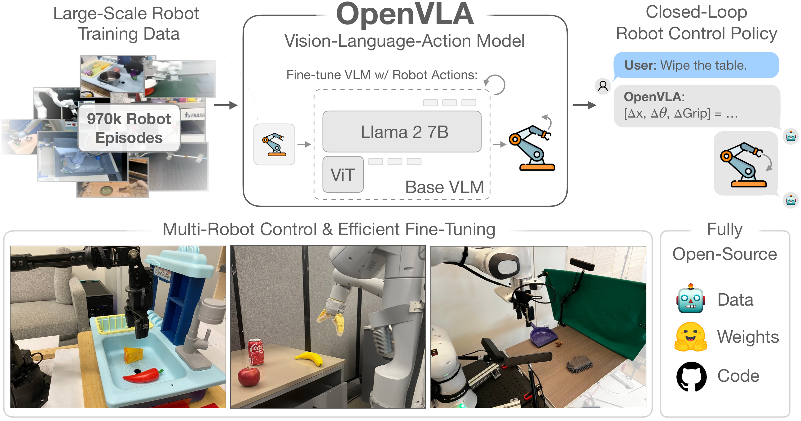

[表 3](#table-3)中列出了我们使用的数据混合。该混合主要遵循文献 [[5]]，并添加了少量额外数据集。

> 表 3：OpenVLA 训练数据混合，使用了来自 Open X-Embodiment 数据集 [[1]] 的数据集，遵循 [[5]] 并略有添加。

| OpenVLA 训练数据集混合（OpenVLA Training Dataset Mixture） |                                                                                                                                                 |
| :--------------------------------------------------------- | :---------------------------------------------------------------------------------------------------------------------------------------------- |
| Fractal [[92]]                                             | 12.7%                                                                                                                                           |
| Fractal [[92]]                                             | 12.7%                                                                                                                                           |
| Kuka [[45]]                                                | 12.7%                                                                                                                                           |
| Kuka [[45]]                                                | 12.7%                                                                                                                                           |
| Bridge[[47], [6]]                                          | 13.3%                                                                                                                                           |
| Bridge[[47], [6]]                                          | 13.3%                                                                                                                                           |
| Taco Play [[93], [94]]                                     | 3.0%                                                                                                                                            |
| Taco Play [[93], [94]]                                     | 3.0%                                                                                                                                            |
| Jaco Play [[95]]                                           | 0.4%                                                                                                                                            |
| Jaco Play [[95]]                                           | 0.4%                                                                                                                                            |
| Berkeley Cable Routing [[96]]                              | 0.2%                                                                                                                                            |
| Berkeley Cable Routing [[96]]                              | 0.2%                                                                                                                                            |
| Roboturk [[97]]                                            | 2.3%                                                                                                                                            |
| Roboturk [[97]]                                            | 2.3%                                                                                                                                            |
| Viola [[98]]                                               | 0.9%                                                                                                                                            |
| Viola [[98]]                                               | 0.9%                                                                                                                                            |
| Berkeley Autolab UR5 [[99]]                                | 1.2%                                                                                                                                            |
| Berkeley Autolab UR5 [[99]]                                | 1.2%                                                                                                                                            |
| Toto [[100]]                                               | 2.0%                                                                                                                                            |
| Toto [[100]]                                               | 2.0%                                                                                                                                            |
| Language Table [[101]]                                     | 4.4%                                                                                                                                            |
| Language Table [[101]]                                     | 4.4%                                                                                                                                            |
| Stanford Hydra Dataset [[102]]                             | 4.4%                                                                                                                                            |
| Stanford Hydra Dataset [[102]]                             | 4.4%                                                                                                                                            |
| Austin Buds Dataset [[103]]                                | 0.2%                                                                                                                                            |
| Austin Buds Dataset [[103]]                                | 0.2%                                                                                                                                            |
| NYU Franka Play Dataset [[104]]                            | 0.8%                                                                                                                                            |
| NYU Franka Play Dataset [[104]]                            | 0.8%                                                                                                                                            |
| Furniture Bench Dataset [[105]]                            | 2.4%                                                                                                                                            |
| Furniture Bench Dataset [[105]]                            | 2.4%                                                                                                                                            |
| UCSD Kitchen Dataset [[106]]                               | <0.1%                                                                                                                                           |
| UCSD Kitchen Dataset [[106]]                               | <0.1%                                                                                                                                           |
| Austin Sailor Dataset [[107]]                              | 2.2%                                                                                                                                            |
| Austin Sailor Dataset [[107]]                              | 2.2%                                                                                                                                            |
| Austin Sirius Dataset [[108]]                              | 1.7%                                                                                                                                            |
| Austin Sirius Dataset [[108]]                              | 1.7%                                                                                                                                            |
| DLR EDAN Shared Control [[109]]                            | <0.1%                                                                                                                                           |
| DLR EDAN Shared Control [[109]]                            | <0.1%                                                                                                                                           |
| IAMLab CMU Pickup Insert [[110]]                           | 0.9%                                                                                                                                            |
| IAMLab CMU Pickup Insert [[110]]                           | 0.9%                                                                                                                                            |
| UTAustin Mutex [[111]]                                     | 2.2%                                                                                                                                            |
| UTAustin Mutex [[111]]                                     | 2.2%                                                                                                                                            |
| Berkeley Fanuc Manipulation [[112]]                        | 0.7%                                                                                                                                            |
| Berkeley Fanuc Manipulation [[112]]                        | 0.7%                                                                                                                                            |
| CMU Stretch [[113]]                                        | 0.2%                                                                                                                                            |
| CMU Stretch [[113]]                                        | 0.2%                                                                                                                                            |
| BC-Z [[55]]                                                | 7.5%                                                                                                                                            |
| BC-Z [[55]]                                                | 7.5%                                                                                                                                            |
| FMB Dataset [[114]]                                        | 7.1%                                                                                                                                            |
| FMB Dataset [[114]]                                        | 7.1%                                                                                                                                            |
| DobbE [[115]]                                              | 1.4%                                                                                                                                            |
| DobbE [[115]]                                              | 1.4%                                                                                                                                            |
| DROID [[11]]                                               | 10.0%(^6^66由于学习进展缓慢（见[第 3.3 节](#section-3-3)），我们在训练的最后三分之一阶段移除了 DROID，并将其混合权重重新分配给所有其他数据集。) |
| DROID [[11]]                                               | 10.0%(^6^66由于学习进展缓慢（见[第 3.3 节](#section-3-3)），我们在训练的最后三分之一阶段移除了 DROID，并将其混合权重重新分配给所有其他数据集。) |

## 附录 B 评估任务与详细结果（Appendix B Evaluation Tasks and Detailed Results）

在本节中，我们将提供更多关于[第 5.1 节](#section-5-1)中讨论的 BridgeData V2 WidowX 和 Google 机器人评估的细节，以及[第 5.2 节](#section-5-2)中讨论的 Franka-Tabletop 和 Franka-DROID 微调评估的细节。

- [B.1 BridgeData V2 WidowX 评估详情（B.1 BridgeData V2 WidowX Evaluation Details）](#b1-bridgedata-v2-widowx-evaluation-details)
- [B.2 Google 机器人评估详情（B.2 Google Robot Evaluation Details）](#b2-google-robot-evaluation-details)
- [B.3 数据高效适应实验详情（B.3 Data-Efficient Adaptation Experiment Details）](#b3-data-efficient-adaptation-experiment-details)

### B.1 BridgeData V2 WidowX 评估详情（B.1 BridgeData V2 WidowX Evaluation Details）

这里我们专门关注在[第 5.1 节](#section-5-1)中讨论的 BridgeData V2 评估。

- [B.1.1 BridgeData V2 评估任务（B.1.1 BridgeData V2 Evaluation Tasks）](#b11-bridgedata-v2-evaluation-tasks)
- [B.1.2 评估任务与原始 BridgeData V2 训练数据的比较（B.1.2 Comparing Evaluation Tasks to Original BridgeData V2 Training Data）](#b12-comparing-evaluation-tasks-to-original-bridgedata-v2-training-data)
- [B.1.3 BridgeData V2 评估详细结果（B.1.3 Detailed BridgeData V2 Evaluation Results）](#b13-detailed-bridgedata-v2-evaluation-results)

#### B.1.1 BridgeData V2 评估任务（B.1.1 BridgeData V2 Evaluation Tasks）

如[第 5.1 节](#section-5-1)所述，我们在 17 个任务上评估每个通用机器人操作策略，每个任务进行 10 次试验。在本节中，我们提供任务类别和单个任务的详细信息。

[openvla_teaser](images/openvla_teaser.png)

> **图 6：BridgeData V2 WidowX 机器人评估任务。** 我们在 4 类分布外（Out-of-Distribution, OOD）泛化任务上评估每个通用机器人策略：视觉、运动、物理和语义（定义见[第 5.1 节](#section-5-1)）。每对图像展示了任务开始时的状态以及机器人完成任务后的一个示例结束状态。我们还通过固定初始状态并更改提示，严格评估了底部 3 行所示的 3 个任务中的 **语言基础（language grounding）** 能力，以测试策略是否能接近正确的目标物体。

我们总共评估了 5 个视觉泛化任务、2 个运动泛化任务、3 个物理泛化任务、4 个语义泛化任务和 3 个语言基础任务。需要注意的是，我们评估的所有任务都引入了某种形式的分布偏移，因为我们无法获取原始数据集中使用的确切物体（其他分布偏移自然产生，因为我们复现了一个最初在不同地点构建的真实世界测试环境；关于此类分布偏移的详细讨论，请参见[第 B.1.2 节](https://arxiv.org/html/2406.09246v3#A2.SS1.SSS2)）。所有 17 个任务均描绘于[图 6](https://arxiv.org/html/2406.09246v3#A2.F6)中。每次运行（rollout）被标记为失败（0）或成功（1）。在一些更困难的任务中，我们记录部分成功（0.5）；我们在以下任务描述中说明了获得部分分数的条件。

以下我们按照[图 6](https://arxiv.org/html/2406.09246v3#A2.F6)所示的顺序描述这 17 个任务：

- **1. 将茄子放入锅中（简单版本）** ：机器人的目标是拾取茄子并将其放入锅中。这是一个视觉泛化任务，因为我们使用了一个手工制作的纸锅，其外观与原始 BridgeData V2 训练数据集中使用的锅不同（因为我们无法获取原始锅具）。与所有其他 16 个任务不同，对于这个特定任务，我们在运行策略之前将机器人的末端执行器直接初始化在茄子上方；因此，我们称其为“将茄子放入锅中”任务的“简单版本”。
- **2. 将茄子放入锅中** ：此任务与上述描述相同，不同之处在于机器人的末端执行器并非直接初始化在茄子上方。相反，我们将其初始化为在所有运行中固定的位置，这意味着机器人必须先水平移动到茄子处才能进行操作。（注意：以下描述的所有其他任务同样适用此规则。）由于与上述相同的原因，这是一个视觉泛化任务。
- **3. 将杯子从台面放入水槽** ：机器人的目标是从厨房台面或沥水架上拾取粉色杯子，并将其放入右侧的水槽中。这是一个视觉泛化任务，因为我们使用的是粉色杯子而非蓝色杯子（原始 BridgeData V2 数据集中使用的是蓝色杯子，但我们发现我们评估的所有方法都无法可靠地操作它——很可能是因为杯子的颜色与水槽的颜色融为一体）。
- **4. 将茄子放入锅中（带干扰物）** ：此任务与“将茄子放入锅中”任务相同，但由于存在多个干扰物体而更加困难。由于与正常“将茄子放入锅中”任务中讨论的相同原因，这是一个视觉泛化任务，并且考虑到场景中存在未见过的干扰物，这一点更为突出。_当机器人向正确的目标物体移动时，奖励部分分数（1 分中的 0.5 分）。_
- **5. 将黄色玉米放在粉色盘子上** ：机器人的目标是拾取黄色玉米并将其放在粉色盘子上。由于场景中存在未见过的干扰物体（如水槽后部台面上的绿色恐龙），这是一个视觉泛化任务。_当机器人向正确的目标物体移动时，奖励部分分数（1 分中的 0.5 分）。_
- **6. 抬起茄子** ：机器人的目标是抓取茄子并将其抬起到空中。这是一个运动泛化任务，因为茄子被初始化为未见过的位置和/或朝向，机器人被迫超越其训练分布中的位置和/或朝向进行移动，并且通常需要执行长距离移动才能完成任务。（注意：在原始 BridgeData V2 演示中，此环境中未展示长距离移动；详情请参见[第 B.1.2 节](https://arxiv.org/html/2406.09246v3#A2.SS1.SSS2)。）我们发现，这个任务虽然看似简单，但对许多策略来说却具有欺骗性的挑战性。_当机器人与茄子接触时，奖励部分分数（1 分中的 0.5 分）。_
- **7. 将胡萝卜放在盘子上（带高度变化）** ：机器人的目标是拾取胡萝卜并将其放在黄色盘子上。这是一个运动泛化任务，因为盘子从其通常位于水槽底部的位置被抬高，机器人必须调整其轨迹以正确地将胡萝卜放在抬高的平台上（且在此过程中不碰倒盘子）。_当机器人抓取胡萝卜并用其触碰盘子时，奖励部分分数（1 分中的 0.5 分）。_
- **8. 将胡萝卜放在盘子上** ：此任务与上述任务相同，不同之处在于盘子处于其正常位置（在水槽底部或沥水架上）。我们认为这是一个物理泛化任务，因为此胡萝卜的尺寸和形状与原始 BridgeData V2 数据集中使用的胡萝卜不同（后者更短更窄）。（注意，上面列出的此任务的先前版本在技术上也是一个物理泛化任务，因为它涉及相同的胡萝卜，但我们将其归在“运动泛化”类别下，因为那是该任务的重点。）
- **9. 将锅扶正** ：机器人的目标是操作锅，使其在回合结束时在水槽中保持直立朝向。这是一个物理泛化任务，因为此锅的尺寸和形状与原始 BridgeData V2 训练演示中使用的锅不同（我们使用的锅更宽更短）。
- **10. 抬起 AAA 电池** ：机器人的目标仅仅是抓取 AAA 电池并将其抬起到空中。这被认为是一个物理泛化任务，因为与此环境中 BridgeData V2 训练演示中见过的目标物体相比，电池要小得多且薄得多；详情请参见[第 B.1.2 节](https://arxiv.org/html/2406.09246v3#A2.SS1.SSS2)。（注意，此目标物体在此环境的原始 BridgeData V2 演示中并不存在，因此这也是“语义泛化”的一个实例，但我们仅将其归类为“物理泛化”，因为这是此处的主要关注点。）
- **11. 将骷髅头放入沥水架** ：机器人的目标是抓取骷髅发条玩具并将其放入水槽左侧的黄色沥水架中。这是一个语义泛化任务，因为骷髅头是一个未见过的目标物体（未出现在 BridgeData V2 训练演示中）。
- **12. 抬起白色胶带** ：机器人的目标是抓取白色胶带卷并将其抬起到空中。这是一个语义泛化任务，因为白色胶带卷是一个未见过的目标物体（未出现在 BridgeData V2 训练演示中）。（注意，此任务也可能被视为“物理泛化”，因为其形状与此环境训练演示中见过的物体不同；大多数策略难以抓取具有这种环形结构的物体，它们通常将机器人的末端执行器直接移动到中心区域。）
- **13. 将紫色葡萄从锅中取出** ：机器人的目标是抓取位于钢锅内的紫色葡萄并将其从锅中取出（通过将其抬起和/或放在锅外的任何地方）。这是一个语义泛化任务，因为它是一个未见过的语言指令；机器人在原始 BridgeData V2 训练数据集中从未见过此任务。
- **14. 将蓝色杯子叠放在粉色杯子上** ：机器人的目标是抓取蓝色杯子并将其稳固地放在粉色杯子的顶部。这是一个语义泛化任务，因为它是一个未见过的语言指令；机器人在原始 BridgeData V2 训练数据集中在此环境中从未见过此任务。_当机器人抓取蓝色杯子并用蓝色杯子触碰粉色杯子时，奖励部分分数（1 分中的 0.5 分）。_
- **15. 将 {茄子, 红色瓶子} 放入锅中** ：这是一个语言基础任务。机器人的目标是将指定的目标物体放入锅中。茄子和红色瓶子都存在于场景中。我们进行配对评估：对于相同的初始状态，我们在一个回合中提示策略以茄子为目标，然后在下一个回合中以红色瓶子为目标。我们对每种方法用茄子测试 5 次，用红色瓶子测试 5 次，对两个目标物体使用相同的 5 组初始状态。_当机器人向正确的目标物体移动时，奖励部分分数（1 分中的 0.5 分）。_
- **16. 抬起 {奶酪, 红辣椒}** ：这是一个语言基础任务。机器人的目标是抓取并抬起指定的目标物体。我们按照上述任务中的描述进行配对评估。_当机器人向正确的目标物体移动时，奖励部分分数（1 分中的 0.5 分）。_
- **17. 将 {蓝色杯子, 粉色杯子} 放在盘子上** ：这是一个语言基础任务。机器人的目标是抓取指定的目标物体并将其放在盘子上。我们按照其他语言基础任务中的描述进行配对评估。_当机器人向正确的目标物体移动时，奖励部分分数（1 分中的 0.5 分）。_

#### B.1.2 评估任务与原始 BridgeData V2 训练数据的比较

我们在原始 BridgeData V2 数据集 [[6]] 中使用的水槽环境中进行评估。我们复现了该环境，以大致匹配原始 BridgeData V2 数据集中的环境，包括机器人相对于水槽的位置以及相机相对于场景的放置。由于原始数据集中缺乏这些位置的精确测量，我们无法复现 _精确的_ 环境设置，并且由于机器人、水槽和相机放置的细微差异，产生了自然的分布偏移。此外，由于我们在与收集训练演示不同的地点评估机器人策略，其他自然的分布偏移也随之产生。例如，光照条件和背景（例如，水槽后方可见区域）不可避免地与训练数据集中所见不同。再者，我们无法获取原始 BridgeData V2 数据集中使用的确切物体集合，因此训练时使用的物体与测试时使用的物体之间存在分布偏移。

尽管面临所有这些挑战，我们发现某些通用策略，如 OpenVLA 和 RT-2-X，仍然能够泛化并相当可靠地“开箱即用”地执行各种任务。其他通用策略，如 RT-1-X 和 Octo，也能完成一些任务，但在我们的 BridgeData V2 评估套件中测试更困难的泛化任务时，它们会遇到困难。

原始 BridgeData V2 数据集包含在此特定水槽环境中以下七个任务的演示：“将锅扶正”、“将胡萝卜放在盘子上”、“将杯子从台面（或沥水架）放入水槽”、“将茄子放入锅中”、“将刀放在砧板上”、“将勺子放入锅中”和“将杠杆转向正前方”。有关所有这些任务在原始数据集中的示例图像，请参见[图 7](https://arxiv.org/html/2406.09246v3#A2.F7)。请注意，在此环境中收集的所有训练演示的初始化方式为：在回合开始时，机器人的末端执行器直接定位在目标物体上方。（然而，这在 BridgeData V2 数据集的所有环境中并非如此；在其他一些环境中，机器人被初始化为距离目标物体较远的位置，因此它必须先水平移动到物体处才能进行操作。）

[openvla_teaser](images/openvla_teaser.png)

> **图 7（Figure 7）** ：原始 BridgeData V2 水槽环境任务。来自原始 BridgeData V2 数据集中水槽环境样本演示的图像显示，该环境中的所有演示初始化时， **机器人末端执行器（robot's end-effector）** 都直接定位在目标物体上方。请注意，这些初始状态与我们在 [图 6](https://arxiv.org/html/2406.09246v3#A2.F6) 所示的 BridgeData V2 评估任务中使用的初始状态不同。在我们的评估中，我们始终将机器人末端执行器初始化到水槽上方的一个固定位置，而不是直接定位在目标物体正上方（除了一项任务：“ **将茄子放入锅中（简易版）（Put Eggplant into Pot (Easy Version)）** ”）。

在我们的 BridgeData V2 评估套件中，只有一项任务——“将茄子放入锅中（简易版）”——的初始化方式是让机器人末端执行器悬停在目标物体正上方；在所有其他 16 项任务中，末端执行器都被初始化在水槽上方的一个固定位置，因此机器人必须水平移动以接近物体。这种初始条件，结合我们在评估套件中各种类型的 **分布外泛化（Out-of-Distribution Generalization, OOD Generalization）** 中引入的分布偏移，对通用策略提出了挑战，并要求高度的鲁棒性才能成功完成任务。因此，像 RT-1-X 和 Octo 这样的策略的成功率低于先前工作中报告的水平。然而，我们发现，尽管存在所有这些分布偏移和挑战，其他策略如 RT-2-X 和 OpenVLA 仍然取得了相对较强的性能。

#### B.1.3 BridgeData V2 详细评估结果

完整的 BridgeData V2 WidowX 评估结果见 [表 4](#table-4)。表中列出了 17 项任务中每种方法在 10 次试验中的成功次数。OpenVLA 在大多数任务中实现了最强的性能，并且在通用策略中拥有最高的总成功率。RT-2-X 也表现出良好的性能，优于 RT-1-X 和 Octo，尽管其表现不如 OpenVLA。RT-1-X 和 Octo 在这些泛化任务中普遍遇到困难。

> **表 4（Table 4）** ：BridgeData V2 WidowX 详细评估结果。我们报告了在 17 项任务的完整评估套件（在 [第 5.1 节](#section-5-1) 中讨论）上的性能，包括视觉/运动/物理/语义泛化任务以及 **语言接地任务（language grounding tasks）** 。请注意，某些任务可能存在 **部分成功（partial success）** （得分为 0.5）；详情见 [第 B.1.1 节](https://arxiv.org/html/2406.09246v3#A2.SS1.SSS1)。我们发现 OpenVLA 在大多数任务中表现最佳，总体性能最高，其次是 RT-2-X。另一方面，RT-1-X 和 Octo 在评估中表现挣扎，在多项任务中仅获得 0–2 次成功。所有任务的图示见 [图 6](https://arxiv.org/html/2406.09246v3#A2.F6)。

| Category     | Task                                   | # Trials | RT-1-X # Successes | Octo # Successes | RT-2-X # Successes | OpenVLA (ours) # Successes |
| ------------ | -------------------------------------- | -------- | ------------------ | ---------------- | ------------------ | -------------------------- |
| Category     | Task                                   | # Trials | RT-1-X # Successes | Octo # Successes | RT-2-X # Successes | OpenVLA (ours) # Successes |
| Category     | Task                                   | # Trials | RT-1-X # Successes | Octo # Successes | RT-2-X # Successes | OpenVLA (ours) # Successes |
| Category     | Task                                   | # Trials | RT-1-X # Successes | Octo # Successes | RT-2-X # Successes | OpenVLA (ours) # Successes |
| Category     | Task                                   | # Trials | RT-1-X # Successes | Octo # Successes | RT-2-X # Successes | OpenVLA (ours) # Successes |
| Category     | Task                                   | # Trials | RT-1-X # Successes | Octo # Successes | RT-2-X # Successes | OpenVLA (ours) # Successes |
| Category     | Task                                   | # Trials | RT-1-X # Successes | Octo # Successes | RT-2-X # Successes | OpenVLA (ours) # Successes |
| Visual gen   | Put Eggplant into Pot (Easy Version)   | 10       | 1                  | 5                | 7                  | 10                         |
| Visual gen   | Put Eggplant into Pot (Easy Version)   | 10       | 1                  | 5                | 7                  | 10                         |
| Visual gen   | Put Eggplant into Pot (Easy Version)   | 10       | 1                  | 5                | 7                  | 10                         |
| Visual gen   | Put Eggplant into Pot (Easy Version)   | 10       | 1                  | 5                | 7                  | 10                         |
| Visual gen   | Put Eggplant into Pot (Easy Version)   | 10       | 1                  | 5                | 7                  | 10                         |
| Visual gen   | Put Eggplant into Pot (Easy Version)   | 10       | 1                  | 5                | 7                  | 10                         |
| Visual gen   | Put Eggplant into Pot (Easy Version)   | 10       | 1                  | 5                | 7                  | 10                         |
| Visual gen   | Put Eggplant into Pot                  | 10       | 0                  | 1                | 5                  | 10                         |
| Visual gen   | Put Eggplant into Pot                  | 10       | 0                  | 1                | 5                  | 10                         |
| Visual gen   | Put Eggplant into Pot                  | 10       | 0                  | 1                | 5                  | 10                         |
| Visual gen   | Put Eggplant into Pot                  | 10       | 0                  | 1                | 5                  | 10                         |
| Visual gen   | Put Eggplant into Pot                  | 10       | 0                  | 1                | 5                  | 10                         |
| Visual gen   | Put Eggplant into Pot                  | 10       | 0                  | 1                | 5                  | 10                         |
| Visual gen   | Put Eggplant into Pot                  | 10       | 0                  | 1                | 5                  | 10                         |
| Visual gen   | Put Cup from Counter into Sink         | 10       | 1                  | 1                | 0                  | 7                          |
| Visual gen   | Put Cup from Counter into Sink         | 10       | 1                  | 1                | 0                  | 7                          |
| Visual gen   | Put Cup from Counter into Sink         | 10       | 1                  | 1                | 0                  | 7                          |
| Visual gen   | Put Cup from Counter into Sink         | 10       | 1                  | 1                | 0                  | 7                          |
| Visual gen   | Put Cup from Counter into Sink         | 10       | 1                  | 1                | 0                  | 7                          |
| Visual gen   | Put Cup from Counter into Sink         | 10       | 1                  | 1                | 0                  | 7                          |
| Visual gen   | Put Cup from Counter into Sink         | 10       | 1                  | 1                | 0                  | 7                          |
| Visual gen   | Put Eggplant into Pot (w/ Clutter)     | 10       | 1                  | 3.5              | 6                  | 7.5                        |
| Visual gen   | Put Eggplant into Pot (w/ Clutter)     | 10       | 1                  | 3.5              | 6                  | 7.5                        |
| Visual gen   | Put Eggplant into Pot (w/ Clutter)     | 10       | 1                  | 3.5              | 6                  | 7.5                        |
| Visual gen   | Put Eggplant into Pot (w/ Clutter)     | 10       | 1                  | 3.5              | 6                  | 7.5                        |
| Visual gen   | Put Eggplant into Pot (w/ Clutter)     | 10       | 1                  | 3.5              | 6                  | 7.5                        |
| Visual gen   | Put Eggplant into Pot (w/ Clutter)     | 10       | 1                  | 3.5              | 6                  | 7.5                        |
| Visual gen   | Put Eggplant into Pot (w/ Clutter)     | 10       | 1                  | 3.5              | 6                  | 7.5                        |
| Visual gen   | Put Yellow Corn on Pink Plate          | 10       | 1                  | 4                | 8                  | 9                          |
| Visual gen   | Put Yellow Corn on Pink Plate          | 10       | 1                  | 4                | 8                  | 9                          |
| Visual gen   | Put Yellow Corn on Pink Plate          | 10       | 1                  | 4                | 8                  | 9                          |
| Visual gen   | Put Yellow Corn on Pink Plate          | 10       | 1                  | 4                | 8                  | 9                          |
| Visual gen   | Put Yellow Corn on Pink Plate          | 10       | 1                  | 4                | 8                  | 9                          |
| Visual gen   | Put Yellow Corn on Pink Plate          | 10       | 1                  | 4                | 8                  | 9                          |
| Visual gen   | Put Yellow Corn on Pink Plate          | 10       | 1                  | 4                | 8                  | 9                          |
| Motion gen   | Lift Eggplant                          | 10       | 3                  | 0.5              | 6.5                | 7.5                        |
| Motion gen   | Lift Eggplant                          | 10       | 3                  | 0.5              | 6.5                | 7.5                        |
| Motion gen   | Lift Eggplant                          | 10       | 3                  | 0.5              | 6.5                | 7.5                        |
| Motion gen   | Lift Eggplant                          | 10       | 3                  | 0.5              | 6.5                | 7.5                        |
| Motion gen   | Lift Eggplant                          | 10       | 3                  | 0.5              | 6.5                | 7.5                        |
| Motion gen   | Lift Eggplant                          | 10       | 3                  | 0.5              | 6.5                | 7.5                        |
| Motion gen   | Lift Eggplant                          | 10       | 3                  | 0.5              | 6.5                | 7.5                        |
| Motion gen   | Put Carrot on Plate (w/ Height Change) | 10       | 2                  | 1                | 4.5                | 4.5                        |
| Motion gen   | Put Carrot on Plate (w/ Height Change) | 10       | 2                  | 1                | 4.5                | 4.5                        |
| Motion gen   | Put Carrot on Plate (w/ Height Change) | 10       | 2                  | 1                | 4.5                | 4.5                        |
| Motion gen   | Put Carrot on Plate (w/ Height Change) | 10       | 2                  | 1                | 4.5                | 4.5                        |
| Motion gen   | Put Carrot on Plate (w/ Height Change) | 10       | 2                  | 1                | 4.5                | 4.5                        |
| Motion gen   | Put Carrot on Plate (w/ Height Change) | 10       | 2                  | 1                | 4.5                | 4.5                        |
| Motion gen   | Put Carrot on Plate (w/ Height Change) | 10       | 2                  | 1                | 4.5                | 4.5                        |
| Physical gen | Put Carrot on Plate                    | 10       | 1                  | 0                | 1                  | 8                          |
| Physical gen | Put Carrot on Plate                    | 10       | 1                  | 0                | 1                  | 8                          |
| Physical gen | Put Carrot on Plate                    | 10       | 1                  | 0                | 1                  | 8                          |
| Physical gen | Put Carrot on Plate                    | 10       | 1                  | 0                | 1                  | 8                          |
| Physical gen | Put Carrot on Plate                    | 10       | 1                  | 0                | 1                  | 8                          |
| Physical gen | Put Carrot on Plate                    | 10       | 1                  | 0                | 1                  | 8                          |
| Physical gen | Put Carrot on Plate                    | 10       | 1                  | 0                | 1                  | 8                          |
| Physical gen | Flip Pot Upright                       | 10       | 2                  | 6                | 5                  | 8                          |
| Physical gen | Flip Pot Upright                       | 10       | 2                  | 6                | 5                  | 8                          |
| Physical gen | Flip Pot Upright                       | 10       | 2                  | 6                | 5                  | 8                          |
| Physical gen | Flip Pot Upright                       | 10       | 2                  | 6                | 5                  | 8                          |
| Physical gen | Flip Pot Upright                       | 10       | 2                  | 6                | 5                  | 8                          |
| Physical gen | Flip Pot Upright                       | 10       | 2                  | 6                | 5                  | 8                          |
| Physical gen | Flip Pot Upright                       | 10       | 2                  | 6                | 5                  | 8                          |
| Physical gen | Lift AAA Battery                       | 10       | 0                  | 0                | 2                  | 7                          |
| Physical gen | Lift AAA Battery                       | 10       | 0                  | 0                | 2                  | 7                          |
| Physical gen | Lift AAA Battery                       | 10       | 0                  | 0                | 2                  | 7                          |
| Physical gen | Lift AAA Battery                       | 10       | 0                  | 0                | 2                  | 7                          |
| Physical gen | Lift AAA Battery                       | 10       | 0                  | 0                | 2                  | 7                          |
| Physical gen | Lift AAA Battery                       | 10       | 0                  | 0                | 2                  | 7                          |
| Physical gen | Lift AAA Battery                       | 10       | 0                  | 0                | 2                  | 7                          |
| Semantic gen | Move Skull into Drying Rack            | 10       | 1                  | 0                | 5                  | 5                          |
| Semantic gen | Move Skull into Drying Rack            | 10       | 1                  | 0                | 5                  | 5                          |
| Semantic gen | Move Skull into Drying Rack            | 10       | 1                  | 0                | 5                  | 5                          |
| Semantic gen | Move Skull into Drying Rack            | 10       | 1                  | 0                | 5                  | 5                          |
| Semantic gen | Move Skull into Drying Rack            | 10       | 1                  | 0                | 5                  | 5                          |
| Semantic gen | Move Skull into Drying Rack            | 10       | 1                  | 0                | 5                  | 5                          |
| Semantic gen | Move Skull into Drying Rack            | 10       | 1                  | 0                | 5                  | 5                          |

{茄子，红色瓶子}放入锅中（Put {Eggplant, Red Bottle} into Pot） | 10 | 2.5 | 4 | 8.5 | 7.5 |
| 语言接地（Language grounding） | 将{茄子，红色瓶子}放入锅中（Put {Eggplant, Red Bottle} into Pot） | 10 | 2.5 | 4 | 8.5 | 7.5 |
| 语言接地（Language grounding） | 将{茄子，红色瓶子}放入锅中（Put {Eggplant, Red Bottle} into Pot） | 10 | 2.5 | 4 | 8.5 | 7.5 |
| 语言接地（Language grounding） | 将{茄子，红色瓶子}放入锅中（Put {Eggplant, Red Bottle} into Pot） | 10 | 2.5 | 4 | 8.5 | 7.5 |
| 语言接地（Language grounding） | 将{茄子，红色瓶子}放入锅中（Put {Eggplant, Red Bottle} into Pot） | 10 | 2.5 | 4 | 8.5 | 7.5 |
| 语言接地（Language grounding） | 将{茄子，红色瓶子}放入锅中（Put {Eggplant, Red Bottle} into Pot） | 10 | 2.5 | 4 | 8.5 | 7.5 |
| 语言接地（Language grounding） | 将{茄子，红色瓶子}放入锅中（Put {Eggplant, Red Bottle} into Pot） | 10 | 2.5 | 4 | 8.5 | 7.5 |
| 语言接地（Language grounding） | 抬起{奶酪，红辣椒}（Lift {Cheese, Red Chili Pepper}） | 10 | 1.5 | 2.5 | 8.5 | 10 |
| 语言接地（Language grounding） | 抬起{奶酪，红辣椒}（Lift {Cheese, Red Chili Pepper}） | 10 | 1.5 | 2.5 | 8.5 | 10 |
| 语言接地（Language grounding） | 抬起{奶酪，红辣椒}（Lift {Cheese, Red Chili Pepper}） | 10 | 1.5 | 2.5 | 8.5 | 10 |
| 语言接地（Language grounding） | 抬起{奶酪，红辣椒}（Lift {Cheese, Red Chili Pepper}） | 10 | 1.5 | 2.5 | 8.5 | 10 |
| 语言接地（Language grounding） | 抬起{奶酪，红辣椒}（Lift {Cheese, Red Chili Pepper}） | 10 | 1.5 | 2.5 | 8.5 | 10 |
| 语言接地（Language grounding） | 抬起{奶酪，红辣椒}（Lift {Cheese, Red Chili Pepper}） | 10 | 1.5 | 2.5 | 8.5 | 10 |
| 语言接地（Language grounding） | 抬起{奶酪，红辣椒}（Lift {Cheese, Red Chili Pepper}） | 10 | 1.5 | 2.5 | 8.5 | 10 |
| 语言接地（Language grounding） | 将{蓝色杯子，粉色杯子}放在盘子上（Put {Blue Cup, Pink Cup} on Plate） | 10 | 5 | 5.5 | 8.5 | 9.5 |
| 语言接地（Language grounding） | 将{蓝色杯子，粉色杯子}放在盘子上（Put {Blue Cup, Pink Cup} on Plate） | 10 | 5 | 5.5 | 8.5 | 9.5 |
| 语言接地（Language grounding） | 将{蓝色杯子，粉色杯子}放在盘子上（Put {Blue Cup, Pink Cup} on Plate） | 10 | 5 | 5.5 | 8.5 | 9.5 |
| 语言接地（Language grounding） | 将{蓝色杯子，粉色杯子}放在盘子上（Put {Blue Cup, Pink Cup} on Plate） | 10 | 5 | 5.5 | 8.5 | 9.5 |
| 语言接地（Language grounding） | 将{蓝色杯子，粉色杯子}放在盘子上（Put {Blue Cup, Pink Cup} on Plate） | 10 | 5 | 5.5 | 8.5 | 9.5 |
| 语言接地（Language grounding） | 将{蓝色杯子，粉色杯子}放在盘子上（Put {Blue Cup, Pink Cup} on Plate） | 10 | 5 | 5.5 | 8.5 | 9.5 |
| 语言接地（Language grounding） | 将{蓝色杯子，粉色杯子}放在盘子上（Put {Blue Cup, Pink Cup} on Plate） | 10 | 5 | 5.5 | 8.5 | 9.5 |
| | | 平均成功率（Mean Success Rate） | $18.5\pm2.7\%$ | $20.0\pm2.6\%$ | $50.6\pm3.5\%$ | $70.6\pm3.2\%$ |
| | | 平均成功率（Mean Success Rate） | $18.5\pm2.7\%$ | $20.0\pm2.6\%$ | $50.6\pm3.5\%$ | $70.6\pm3.2\%$ |
| | | 平均成功率（Mean Success Rate） | $18.5\pm2.7\%$ | $20.0\pm2.6\%$ | $50.6\pm3.5\%$ | $70.6\pm3.2\%$ |
| | | 平均成功率（Mean Success Rate） | $18.5\pm2.7\%$ | $20.0\pm2.6\%$ | $50.6\pm3.5\%$ | $70.6\pm3.2\%$ |
| | | 平均成功率（Mean Success Rate） | $18.5\pm2.7\%$ | $20.0\pm2.6\%$ | $50.6\pm3.5\%$ | $70.6\pm3.2\%$ |
| | | 平均成功率（Mean Success Rate） | $18.5\pm2.7\%$ | $20.0\pm2.6\%$ | $50.6\pm3.5\%$ | $70.6\pm3.2\%$ |
| | | 平均成功率（Mean Success Rate） | $18.5\pm2.7\%$ | $20.0\pm2.6\%$ | $50.6\pm3.5\%$ | $70.6\pm3.2\%$ |

[表 5](#table-5)中，我们提供了[表 2](#table-2)中总结的量化推理实验的完整评估结果。在这些评估中，我们在涵盖完整评估套件中所有任务类别的 8 个代表性 BridgeData V2 任务上测试了策略。

> 表 5：完整的量化推理结果。此处我们展示了[表 2](#table-2) 中结果的详细版本。

| 类别                            | 任务                     | 试验次数   | bfloat16 成功次数 | int8 成功次数   | int4 成功次数   |
| ------------------------------- | ------------------------ | ---------- | ----------------- | --------------- | --------------- |
| 视觉生成（Visual generation）   | 将茄子放入锅中（简易版） | 10         | 9                 | 7               | 9               |
| 视觉生成（Visual generation）   | 将茄子放入锅中（简易版） | 10         | 9                 | 7               | 9               |
| 视觉生成（Visual generation）   | 将茄子放入锅中（简易版） | 10         | 9                 | 7               | 9               |
| 视觉生成（Visual generation）   | 将茄子放入锅中（简易版） | 10         | 9                 | 7               | 9               |
| 视觉生成（Visual generation）   | 将茄子放入锅中（简易版） | 10         | 9                 | 7               | 9               |
| 视觉生成（Visual generation）   | 将茄子放入锅中（简易版） | 10         | 9                 | 7               | 9               |
| 视觉生成（Visual generation）   | 将茄子放入锅中           | 10         | 7                 | 7               | 7               |
| 视觉生成（Visual generation）   | 将茄子放入锅中           | 10         | 7                 | 7               | 7               |
| 视觉生成（Visual generation）   | 将茄子放入锅中           | 10         | 7                 | 7               | 7               |
| 视觉生成（Visual generation）   | 将茄子放入锅中           | 10         | 7                 | 7               | 7               |
| 视觉生成（Visual generation）   | 将茄子放入锅中           | 10         | 7                 | 7               | 7               |
| 视觉生成（Visual generation）   | 将茄子放入锅中           | 10         | 7                 | 7               | 7               |
| 视觉生成（Visual generation）   | 将杯子从台面放入水槽     | 10         | 5                 | 3               | 7               |
| 视觉生成（Visual generation）   | 将杯子从台面放入水槽     | 10         | 5                 | 3               | 7               |
| 视觉生成（Visual generation）   | 将杯子从台面放入水槽     | 10         | 5                 | 3               | 7               |
| 视觉生成（Visual generation）   | 将杯子从台面放入水槽     | 10         | 5                 | 3               | 7               |
| 视觉生成（Visual generation）   | 将杯子从台面放入水槽     | 10         | 5                 | 3               | 7               |
| 视觉生成（Visual generation）   | 将杯子从台面放入水槽     | 10         | 5                 | 3               | 7               |
| 运动生成（Motion generation）   | 拿起茄子                 | 10         | 6                 | 4               | 7.5             |
| 运动生成（Motion generation）   | 拿起茄子                 | 10         | 6                 | 4               | 7.5             |
| 运动生成（Motion generation）   | 拿起茄子                 | 10         | 6                 | 4               | 7.5             |
| 运动生成（Motion generation）   | 拿起茄子                 | 10         | 6                 | 4               | 7.5             |
| 运动生成（Motion generation）   | 拿起茄子                 | 10         | 6                 | 4               | 7.5             |
| 运动生成（Motion generation）   | 拿起茄子                 | 10         | 6                 | 4               | 7.5             |
| 物理生成（Physical generation） | 将胡萝卜放在盘子上       | 10         | 6                 | 5               | 7               |
| 物理生成（Physical generation） | 将胡萝卜放在盘子上       | 10         | 6                 | 5               | 7               |
| 物理生成（Physical generation） | 将胡萝卜放在盘子上       | 10         | 6                 | 5               | 7               |
| 物理生成（Physical generation） | 将胡萝卜放在盘子上       | 10         | 6                 | 5               | 7               |
| 物理生成（Physical generation） | 将胡萝卜放在盘子上       | 10         | 6                 | 5               | 7               |
| 物理生成（Physical generation） | 将胡萝卜放在盘子上       | 10         | 6                 | 5               | 7               |
| 物理生成（Physical generation） | 拿起 AAA 电池            | 10         | 7                 | 5               | 3               |
| 物理生成（Physical generation） | 拿起 AAA 电池            | 10         | 7                 | 5               | 3               |
| 物理生成（Physical generation） | 拿起 AAA 电池            | 10         | 7                 | 5               | 3               |
| 物理生成（Physical generation） | 拿起 AAA 电池            | 10         | 7                 | 5               | 3               |
| 物理生成（Physical generation） | 拿起 AAA 电池            | 10         | 7                 | 5               | 3               |
| 物理生成（Physical generation） | 拿起 AAA 电池            | 10         | 7                 | 5               | 3               |
| 语义生成（Semantic generation） | 从锅中取出紫葡萄         | 10         | 8                 | 8               | 9               |
| 语义生成（Semantic generation） | 从锅中取出紫葡萄         | 10         | 8                 | 8               | 9               |
| 语义生成（Semantic generation） | 从锅中取出紫葡萄         | 10         | 8                 | 8               | 9               |
| 语义生成（Semantic generation） | 从锅中取出紫葡萄         | 10         | 8                 | 8               | 9               |
| 语义生成（Semantic generation） | 从锅中取出紫葡萄         | 10         | 8                 | 8               | 9               |
| 语义生成（Semantic generation） | 从锅中取出紫葡萄         | 10         | 8                 | 8               | 9               |
| 语言接地（Language grounding）  | 将 {茄子, 红瓶} 放入锅中 | 10         | 9                 | 7.5             | 8               |
| 语言接地（Language grounding）  | 将 {茄子, 红瓶} 放入锅中 | 10         | 9                 | 7.5             | 8               |
| 语言接地（Language grounding）  | 将 {茄子, 红瓶} 放入锅中 | 10         | 9                 | 7.5             | 8               |
| 语言接地（Language grounding）  | 将 {茄子, 红瓶} 放入锅中 | 10         | 9                 | 7.5             | 8               |
| 语言接地（Language grounding）  | 将 {茄子, 红瓶} 放入锅中 | 10         | 9                 | 7.5             | 8               |
| 语言接地（Language grounding）  | 将 {茄子, 红瓶} 放入锅中 | 10         | 9                 | 7.5             | 8               |
|                                 |                          | 平均成功率 | 71.3 $\pm$ 4.8%   | 58.1 $\pm$ 5.1% | 71.9 $\pm$ 4.7% |
|                                 |                          | 平均成功率 | 71.3 $\pm$ 4.8%   | 58.1 $\pm$ 5.1% | 71.9 $\pm$ 4.7% |
|                                 |                          | 平均成功率 | 71.3 $\pm$ 4.8%   | 58.1 $\pm$ 5.1% | 71.9 $\pm$ 4.7% |
|                                 |                          | 平均成功率 | 71.3 $\pm$ 4.8%   | 58.1 $\pm$ 5.1% | 71.9 $\pm$ 4.7% |
|                                 |                          | 平均成功率 | 71.3 $\pm$ 4.8%   | 58.1 $\pm$ 5.1% | 71.9 $\pm$ 4.7% |
|                                 |                          | 平均成功率 | 71.3 $\pm$ 4.8%   | 58.1 $\pm$ 5.1% | 71.9 $\pm$ 4.7% |

### B.2 Google 机器人评估详情

在本节中，我们提供了[第 5.1 节](#section-5-1)中介绍的 Google 机器人评估的更多细节。

- [B.2.1 Google 机器人评估任务](#b21-google-robot-evaluation-tasks)
- [B.2.2 详细的 Google 机器人评估结果](#b22-detailed-google-robot-evaluation-results)

#### B.2.1 Google 机器人评估任务

[图 8](https://arxiv.org/html/2406.09246v3#A2.F8)\*\* 中描绘。每次 rollout 被标记为失败（0）或成功（1）。

我们描述这 12 个任务如下：

- **1. 拾取可乐罐（Pick Coke Can）（分布内）：** 机器人位于一个平台前，平台上有一罐可乐。机器人的目标是抓取并举起可乐罐。
- **2. 将苹果移至绿色罐附近（Move Apple near Green Can）（分布内）：** 机器人位于一个平台前，平台上有一个苹果和一个绿色汽水罐。机器人的目标是抓取苹果并将其移至绿色罐旁边。
- **3. 将蓝色薯片袋移至苹果附近（Move Blue Chip Bag near Apple）（分布内）：** 机器人位于一个平台前，平台上有一个蓝色薯片袋和一个苹果。机器人的目标是抓取蓝色薯片袋并将其移至苹果附近。
- **4. 将可乐罐直立放置（Place Coke Can Upright）（分布内）：** 机器人位于一个平台前，平台上有一罐可乐，且罐子横向侧放。机器人的目标是抓取可乐罐并将其调整为垂直位置。
- **5. 打开中间抽屉（Open Middle Drawer）（分布内）：** 机器人位于一组三个抽屉前。机器人的目标是抓住中间抽屉的把手并将抽屉拉开。
- **6. 将橙子移至棕色薯片袋附近（Move Orange near Brown Chip Bag）（OOD）：** 机器人位于一个平台前，平台上有一个棕色薯片袋和一个橙子。一块带有蓝天白云图案的桌布覆盖在物体下方的平台上。机器人的目标是抓取橙子并将其带到薯片袋旁边。此任务是 OOD，因为橙子是相对于训练数据集未见过的物体，且桌布是未见过的背景。（^7^77有关 Google 机器人评估中 OOD 条件的详细列表，请参见 Brohan 等人 [[7]] 的附录。）
- **7. 拾取百事可乐罐（Pick Pepsi Can）（OOD）：** 机器人位于一个平台前，平台上有一罐百事可乐。一块带有亮黄/棕色图案的桌布覆盖在罐子下方的平台上。机器人的目标是抓取并举起罐子。此任务是 OOD，因为百事可乐罐是未见过的物体，且桌布是未见过的背景。
- **8. 拾取香蕉（Pick Banana）（OOD）：** 机器人位于一个平台前，平台上有一个苹果、一罐可乐和一根香蕉。机器人的目标是抓取并举起香蕉。此任务是 OOD，因为香蕉是未见过的目标物体。
- **9. 拾取绿色杯子（Pick Green Cup）（OOD）：** 机器人位于一个平台前，平台上有一根香蕉、一罐百事可乐和一个绿色杯子。机器人的目标是抓取并举起绿色杯子。此任务是 OOD，因为场景中的所有物体在训练数据中都是未见过的。
- **10. 将苹果放在盘子上（Place Apple on Plate）（OOD）：** 机器人位于一个平台前，平台上有一个盘子和一个苹果。机器人的目标是抓取苹果并将其移到盘子上。此任务是 OOD，因为它是一个描述未见过的物体关系的新指令：训练演示仅涉及将苹果移至盘子 **附近** ，而非将其放置 **在** 盘子 **上** 。
- **11. 将香蕉放入平底锅中（Place Banana in Pan）（OOD）：** 机器人位于一个平台前，平台上有一个平底锅和一根香蕉。机器人的目标是抓取香蕉并将其移入平底锅中。此任务是 OOD，因为香蕉是未见过的目标物体，并且它是一个描述未见过的物体关系的新指令，如前一任务所述。
- **12. 将可乐罐移至泰勒·斯威夫特（Move Coke Can to Taylor Swift）（OOD）：** 机器人位于一个平台前，平台上有一罐可乐和三张不同名人的照片，包括泰勒·斯威夫特。机器人的目标是抓取罐子并将其移至泰勒·斯威夫特的照片处。此任务是 OOD，因为名人照片在机器人交互数据中是未见过的。

#### B.2.2 Google 机器人评估结果详情

**表 6（Table 6）：Google 机器人评估结果详情。** 我们报告了 **[第 5.1 节](#section-5-1)** 中讨论的 Google 机器人评估的完整结果。每个通用策略在 12 个任务上通过 60 次 rollout 进行评估，涵盖分布内和分布外（OOD）测试条件。在底部行，我们报告了每个策略的平均成功率 $\pm$ 标准误差（StdErr）。OpenVLA 和 RT-2-X 在总体上均显著优于 RT-1-X 和 Octo（由于误差条重叠，我们将两者的平均成功率加粗）。所有任务的图示请参见 **[图 8](https://arxiv.org/html/2406.09246v3#A2.F8)** 。

| Category        | Task                            | # Trials          | RT-1-X # Successes | Octo # Successes | RT-2-X # Successes | OpenVLA (ours) # Successes |
| --------------- | ------------------------------- | ----------------- | ------------------ | ---------------- | ------------------ | -------------------------- |
| Category        | Task                            | # Trials          | RT-1-X # Successes | Octo # Successes | RT-2-X # Successes | OpenVLA (ours) # Successes |
| Category        | Task                            | # Trials          | RT-1-X # Successes | Octo # Successes | RT-2-X # Successes | OpenVLA (ours) # Successes |
| Category        | Task                            | # Trials          | RT-1-X # Successes | Octo # Successes | RT-2-X # Successes | OpenVLA (ours) # Successes |
| Category        | Task                            | # Trials          | RT-1-X # Successes | Octo # Successes | RT-2-X # Successes | OpenVLA (ours) # Successes |
| Category        | Task                            | # Trials          | RT-1-X # Successes | Octo # Successes | RT-2-X # Successes | OpenVLA (ours) # Successes |
| Category        | Task                            | # Trials          | RT-1-X # Successes | Octo # Successes | RT-2-X # Successes | OpenVLA (ours) # Successes |
| In-distribution | Pick Coke Can                   | 5                 | 5                  | 1                | 5                  | 5                          |
| In-distribution | Pick Coke Can                   | 5                 | 5                  | 1                | 5                  | 5                          |
| In-distribution | Pick Coke Can                   | 5                 | 5                  | 1                | 5                  | 5                          |
| In-distribution | Pick Coke Can                   | 5                 | 5                  | 1                | 5                  | 5                          |
| In-distribution | Pick Coke Can                   | 5                 | 5                  | 1                | 5                  | 5                          |
| In-distribution | Pick Coke Can                   | 5                 | 5                  | 1                | 5                  | 5                          |
| In-distribution | Pick Coke Can                   | 5                 | 5                  | 1                | 5                  | 5                          |
| In-distribution | Move Apple near Green Can       | 5                 | 3                  | 3                | 3                  | 5                          |
| In-distribution | Move Apple near Green Can       | 5                 | 3                  | 3                | 3                  | 5                          |
| In-distribution | Move Apple near Green Can       | 5                 | 3                  | 3                | 3                  | 5                          |
| In-distribution | Move Apple near Green Can       | 5                 | 3                  | 3                | 3                  | 5                          |
| In-distribution | Move Apple near Green Can       | 5                 | 3                  | 3                | 3                  | 5                          |
| In-distribution | Move Apple near Green Can       | 5                 | 3                  | 3                | 3                  | 5                          |
| In-distribution | Move Apple near Green Can       | 5                 | 3                  | 3                | 3                  | 5                          |
| In-distribution | Move Blue Chip Bag near Apple   | 5                 | 0                  | 3                | 4                  | 5                          |
| In-distribution | Move Blue Chip Bag near Apple   | 5                 | 0                  | 3                | 4                  | 5                          |
| In-distribution | Move Blue Chip Bag near Apple   | 5                 | 0                  | 3                | 4                  | 5                          |
| In-distribution | Move Blue Chip Bag near Apple   | 5                 | 0                  | 3                | 4                  | 5                          |
| In-distribution | Move Blue Chip Bag near Apple   | 5                 | 0                  | 3                | 4                  | 5                          |
| In-distribution | Move Blue Chip Bag near Apple   | 5                 | 0                  | 3                | 4                  | 5                          |
| In-distribution | Move Blue Chip Bag near Apple   | 5                 | 0                  | 3                | 4                  | 5                          |
| In-distribution | Place Coke Can Upright          | 5                 | 0                  | 0                | 4                  | 4                          |
| In-distribution | Place Coke Can Upright          | 5                 | 0                  | 0                | 4                  | 4                          |
| In-distribution | Place Coke Can Upright          | 5                 | 0                  | 0                | 4                  | 4                          |
| In-distribution | Place Coke Can Upright          | 5                 | 0                  | 0                | 4                  | 4                          |
| In-distribution | Place Coke Can Upright          | 5                 | 0                  | 0                | 4                  | 4                          |
| In-distribution | Place Coke Can Upright          | 5                 | 0                  | 0                | 4                  | 4                          |
| In-distribution | Place Coke Can Upright          | 5                 | 0                  | 0                | 4                  | 4                          |
| In-distribution | Open Middle Drawer              | 5                 | 0                  | 4                | 2                  | 3                          |
| In-distribution | Open Middle Drawer              | 5                 | 0                  | 4                | 2                  | 3                          |
| In-distribution | Open Middle Drawer              | 5                 | 0                  | 4                | 2                  | 3                          |
| In-distribution | Open Middle Drawer              | 5                 | 0                  | 4                | 2                  | 3                          |
| In-distribution | Open Middle Drawer              | 5                 | 0                  | 4                | 2                  | 3                          |
| In-distribution | Open Middle Drawer              | 5                 | 0                  | 4                | 2                  | 3                          |
| In-distribution | Open Middle Drawer              | 5                 | 0                  | 4                | 2                  | 3                          |
| OOD             | Move Orange near Brown Chip Bag | 5                 | 1                  | 2                | 5                  | 5                          |
| OOD             | Move Orange near Brown Chip Bag | 5                 | 1                  | 2                | 5                  | 5                          |
| OOD             | Move Orange near Brown Chip Bag | 5                 | 1                  | 2                | 5                  | 5                          |
| OOD             | Move Orange near Brown Chip Bag | 5                 | 1                  | 2                | 5                  | 5                          |
| OOD             | Move Orange near Brown Chip Bag | 5                 | 1                  | 2                | 5                  | 5                          |
| OOD             | Move Orange near Brown Chip Bag | 5                 | 1                  | 2                | 5                  | 5                          |
| OOD             | Move Orange near Brown Chip Bag | 5                 | 1                  | 2                | 5                  | 5                          |
| OOD             | Pick Pepsi Can                  | 5                 | 3                  | 0                | 5                  | 4                          |
| OOD             | Pick Pepsi Can                  | 5                 | 3                  | 0                | 5                  | 4                          |
| OOD             | Pick Pepsi Can                  | 5                 | 3                  | 0                | 5                  | 4                          |
| OOD             | Pick Pepsi Can                  | 5                 | 3                  | 0                | 5                  | 4                          |
| OOD             | Pick Pepsi Can                  | 5                 | 3                  | 0                | 5                  | 4                          |
| OOD             | Pick Pepsi Can                  | 5                 | 3                  | 0                | 5                  | 4                          |
| OOD             | Pick Pepsi Can                  | 5                 | 3                  | 0                | 5                  | 4                          |
| OOD             | Pick Banana                     | 5                 | 5                  | 3                | 5                  | 5                          |
| OOD             | Pick Banana                     | 5                 | 5                  | 3                | 5                  | 5                          |
| OOD             | Pick Banana                     | 5                 | 5                  | 3                | 5                  | 5                          |
| OOD             | Pick Banana                     | 5                 | 5                  | 3                | 5                  | 5                          |
| OOD             | Pick Banana                     | 5                 | 5                  | 3                | 5                  | 5                          |
| OOD             | Pick Banana                     | 5                 | 5                  | 3                | 5                  | 5                          |
| OOD             | Pick Banana                     | 5                 | 5                  | 3                | 5                  | 5                          |
| OOD             | Pick Green Cup                  | 5                 | 1                  | 0                | 5                  | 5                          |
| OOD             | Pick Green Cup                  | 5                 | 1                  | 0                | 5                  | 5                          |
| OOD             | Pick Green Cup                  | 5                 | 1                  | 0                | 5                  | 5                          |
| OOD             | Pick Green Cup                  | 5                 | 1                  | 0                | 5                  | 5                          |
| OOD             | Pick Green Cup                  | 5                 | 1                  | 0                | 5                  | 5                          |
| OOD             | Pick Green Cup                  | 5                 | 1                  | 0                | 5                  | 5                          |
| OOD             | Pick Green Cup                  | 5                 | 1                  | 0                | 5                  | 5                          |
| OOD             | Place Apple on Plate            | 5                 | 0                  | 0                | 4                  | 4                          |
| OOD             | Place Apple on Plate            | 5                 | 0                  | 0                | 4                  | 4                          |
| OOD             | Place Apple on Plate            | 5                 | 0                  | 0                | 4                  | 4                          |
| OOD             | Place Apple on Plate            | 5                 | 0                  | 0                | 4                  | 4                          |
| OOD             | Place Apple on Plate            | 5                 | 0                  | 0                | 4                  | 4                          |
| OOD             | Place Apple on Plate            | 5                 | 0                  | 0                | 4                  | 4                          |
| OOD             | Place Apple on Plate            | 5                 | 0                  | 0                | 4                  | 4                          |
| OOD             | Place Banana in Pan             | 5                 | 0                  | 0                | 2                  | 4                          |
| OOD             | Place Banana in Pan             | 5                 | 0                  | 0                | 2                  | 4                          |
| OOD             | Place Banana in Pan             | 5                 | 0                  | 0                | 2                  | 4                          |
| OOD             | Place Banana in Pan             | 5                 | 0                  | 0                | 2                  | 4                          |
| OOD             | Place Banana in Pan             | 5                 | 0                  | 0                | 2                  | 4                          |
| OOD             | Place Banana in Pan             | 5                 | 0                  | 0                | 2                  | 4                          |
| OOD             | Place Banana in Pan             | 5                 | 0                  | 0                | 2                  | 4                          |
| OOD             | Move Coke Can near Taylor Swift | 5                 | 2                  | 0                | 3                  | 2                          |
| OOD             | Move Coke Can near Taylor Swift | 5                 | 2                  | 0                | 3                  | 2                          |
| OOD             | Move Coke Can near Taylor Swift | 5                 | 2                  | 0                | 3                  | 2                          |
| OOD             | Move Coke Can near Taylor Swift | 5                 | 2                  | 0                | 3                  | 2                          |
| OOD             | Move Coke Can near Taylor Swift | 5                 | 2                  | 0                | 3                  | 2                          |
| OOD             | Move Coke Can near Taylor Swift | 5                 | 2                  | 0                | 3                  | 2                          |
| OOD             | Move Coke Can near Taylor Swift | 5                 | 2                  | 0                | 3                  | 2                          |
|                 |                                 | Mean Success Rate | 33.3$\pm$6.1%      | 26.7$\pm$5.8%    | 78.3$\pm$5.4%      | 85.0$\pm$4.6%              |

[表 6](#table-6)所示。总体而言，我们发现 **RT-1-X** 和 **Octo** 在评估任务上遇到困难；在多个任务中，它们通常无法在五次尝试中取得一次成功。另一方面， **RT-2-X** 和 **OpenVLA** 表现出色，在五次尝试中每个任务至少完成两次；这两种 **视觉语言动作（Vision-Language Action, VLA）策略** 在此特定评估套件中表现相当。

### B.3 数据高效适应实验详情（Data-Efficient Adaptation Experiment Details）

在本节中，我们将提供[第 5.2 节](#section-5-2)中讨论的数据高效适应实验的更多细节，其中我们研究了微调后的 **OpenVLA** 策略在 **新机器人设置（new robot setups）** （如 **Franka-Tabletop** 和 **Franka-DROID** ）上的有效性。

- [B.3.1 Franka-Tabletop 和 Franka-DROID 任务（Franka-Tabletop and Franka-DROID Tasks）](#b31-franka-tabletop-and-franka-droid-tasks)
- [B.3.2 Franka-Tabletop 和 Franka-DROID 详细评估结果（Detailed Franka-Tabletop and Franka-DROID Evaluation Results）](#b32-detailed-franka-tabletop-and-franka-droid-evaluation-results)

#### B.3.1 Franka-Tabletop 和 Franka-DROID 任务（Franka-Tabletop and Franka-DROID Tasks）

我们收集了七个任务中每个任务的 10–150 次演示。前六个任务对应一个我们称之为“ **Franka-Tabletop** ”（安装在桌面上的 Franka Emika Panda 机器人）的机器人设置，最后一个任务对应一个我们称之为“ **Franka-DROID** ”的机器人设置。

在 **Franka-Tabletop** 设置中，六个任务中的前三个对应 **单指令任务（single-instruction tasks）** 且范围较窄，而后三个任务对应 **多指令任务（multi-instruction tasks）** ，其中场景中存在多个物体，机器人必须根据语言指令操作正确的物体。

> 图 9：Franka-Tabletop 微调任务。上图描绘了[第 5.2 节](#section-5-2)中数据高效适应实验使用的 Franka-Tabletop 任务，并在[图 9](https://arxiv.org/html/2406.09246v3#A2.F9)中详细描述。六个任务中的前三个（前三行）仅涉及单个指令，而后三个任务（后三行）涉及多个物体和指令（指令指定目标物体或目标位置）。第一列显示与训练数据分布匹配的样本初始状态，而第二列显示 **分布外（Out-of-Distribution, OOD）** 初始状态（例如，未见过的背景、目标物体、干扰物和物体位置/朝向）。[第 5.2 节](#section-5-2)中的每个策略在分布内任务上使用 10–12 次运行进行评估，在 OOD 任务上使用 5–6 次运行进行评估。

下面我们描述[图 9](https://arxiv.org/html/2406.09246v3#A2.F9)中所示的六个 **Franka-Tabletop** 任务中的每一个：

- 1.  **将胡萝卜放入碗中（Put Carrot in Bowl）** （单指令）：机器人的目标是抓取胡萝卜并将其放入碗中。我们为此任务收集了 50 次演示用于训练数据集，在每一幕中随机将胡萝卜和碗放置在桌面的不同位置。胡萝卜始终初始化在碗的左侧。评估期间，每次尝试记录为成功（1）或失败（0）；没有部分得分。
- 2.  **将玉米倒入锅中（Pour Corn into Pot）** （单指令）：机器人的目标是抓取红碗，移向钢锅，并将内容物（黄色玉米）倒入锅中。我们为此任务收集了 50 次演示用于训练数据集，在每一幕中随机将碗和锅放置在桌面的不同位置。碗始终初始化在锅的右侧。评估期间，每次尝试记录为成功（1）或失败（0）；没有部分得分。
- 3.  **将锅翻正（Flip Pot Upright）** （单指令）：机器人的目标是抓取钢锅（初始为垂直朝向），将其旋转至直立位置，并放回桌面。我们为此任务仅收集了 10 次演示用于训练数据集，随机将钢锅放置在桌面一小部分区域内的不同位置。评估期间，每次尝试记录为成功（1）、失败（0）或部分成功（0.5）。部分成功包括抓取锅但未将其翻正，或将其推倒至直立位置但未小心引导。机器人必须在幕结束时释放锅才能获得满分。
- 4.  **将<物体>移到盘子上（Move <object> onto Plate）** （多指令）：机器人的目标是抓取三个物体中的一个（取决于语言指令中指定的目标）并将其放在桌子右侧的盘子上。我们为此任务收集了 150 次演示用于训练数据集，随机将三个物体的不同组合放置在桌面上并选择一个作为目标。盘子始终初始化在桌子的右侧。评估期间，每次尝试记录为成功（1）、失败（0）或部分成功（0.5）。当机器人接触的第一个物体是正确目标物体（即语言指令中指定的物体）但机器人未完成任务时，记录为部分成功。
- 5.  **推倒<物体>（Knock <object> Over）** （多指令）：机器人的目标是接近三个物体中的一个（取决于语言指令中指定的目标）并推动它直到其倒下。我们为此任务收集了 70 次演示用于训练数据集，随机将三个物体的不同组合放置在桌面上并选择一个作为目标。评估期间，每次尝试记录为成功（1）、失败（0）或部分成功（0.5）。当机器人接触的第一个物体是正确目标物体（即语言指令中指定的物体）但机器人未完成任务时，记录为部分成功。
- 6.  **用毛巾盖住<物体>（Cover <object> with Towel）** （多指令）：机器人的目标是抓取蓝毛巾并将其放在三个物体中的一个上（取决于语言指令中指定的目标）。我们为此任务收集了 45 次演示用于训练数据集，随机将三个物体的不同组合放置在桌面上。评估期间，每次尝试记录为成功（1）、失败（0）或部分成功（0.5）。当机器人用毛巾接触的第一个物体是正确目标物体（即语言指令中指定的物体）但机器人未完成任务（例如，它将毛巾掉在桌子上而不是目标物体上）时，记录为部分成功。当毛巾的任何部分覆盖在目标物体的顶面上时给予满分，即物体无需完全被覆盖。

对于每个 **Franka-Tabletop** 任务，我们使用 10–12 次分布内试验和 5–6 次 OOD 泛化试验评估每种方法。分布内和 OOD 测试条件如[图 9](https://arxiv.org/html/2406.09246v3#A2.F9)（第二列）所示。

下面我们描述六个任务中每个任务的 OOD 测试条件：

- 1.  **将胡萝卜放入碗中（OOD）** ：用茄子（未见物体）替换胡萝卜。
- 2.  **将玉米倒入锅中（OOD）** ：未见过的棕色桌布覆盖桌面。
- 3.  **将锅翻正（OOD）** ：未见过的白色桌布覆盖桌面。
- 4.  **将<物体>移到盘子上（OOD）** ：一组三个未见物体放置在桌面上。
- 5.  **推倒<物体>（OOD）** ：两个未见干扰物体（红色塑料杯和棕色盒子）放置在一组三个已见物体后面。
- 6.  **用毛巾盖住<物体>（OOD）** ：桌子上的三个物体被倒置放置且位置未见。

最后，在 **Franka-DROID** 环境中，我们实验了一个任务及其变体： **擦桌子（Wipe Table）** （见[图 10](https://arxiv.org/html/2406.09246v3#A2.F10)）。在此任务中，机器人的目标是抓住刷子并将所有三个棕色小物体扫入簸箕。我们为此任务收集了 70 次演示用于训练数据集，变化所有物体的位置。

> 图 10：Franka-DROID 微调任务。此处所示的“擦桌子”任务是[第 5.2 节](#section-5-2)中数据高效适应实验使用的最终任务。左图显示分布内试验的初始条件。右图显示 OOD 试验，其中桌面上存在未见干扰物体。要完全完成任务，机器人必须抓住刷子并将所有三个物体扫入簸箕。

测试时，我们评估与训练数据匹配的分布内条件（[图 10](https://arxiv.org/html/2406.09246v3#A2.F10)，左），以及场景中桌面上也存在干扰物体的 OOD 条件（[图 10](https://arxiv.org/html/2406.09246v3#A2.F10)，右）。由于每次试验可能有多种结果，我们定义评分标准如下：每次试验的最高分为 2 分。如果机器人将所有三个物体扫入簸箕，策略获得满分 2 分。成功扫入一个或两个物体得 1 分。否则得 0 分。我们使用 18 次分布内试验和 12 次 OOD 试验评估每个策略，因此每个策略获得总分 60 分。

#### B.3.2 Franka-Tabletop 和 Franka-DROID 详细评估结果（Detailed Franka-Tabletop and Franka-DROID Evaluation Results）

**Franka-Tabletop** 和 **Franka-DROID** 评估的完整结果如[表 7](#table-7)所示。我们评估了[第 5.2 节](#section-5-2)中讨论的方法。我们发现 **Diffusion Policy** 在单指令 Franka-Tabletop 任务（例如“将胡萝卜放入碗中”和“将玉米倒入锅中”）上表现出色，优于其他方法。然而， **OpenVLA** 和 **Octo** 在更多样化的多指令任务（“将<物体>移到盘子上”、“推倒<物体>”和“用毛巾盖住<物体>”）中取得更高性能。在 **Franka-DROID** 环境中， **OpenVLA** 获得最佳结果。总体而言，我们发现 **OpenVLA** 在两项任务中实现了最高的平均性能。

> 表 7：详细数据高效适应实验结果。这里我们呈现了[图 4](#figure-4)中总结结果的完整细分。我们报告了在新机器人任务上从头训练的 **Diffusion Policy** 的性能，以及在相同数据上微调的通用策略的性能。每个策略都针对分布内和分布外（OOD）泛化条件进行测试（Franka-Tabletop 任务见[图 9](https://arxiv.org/html/2406.09246v3#A2.F9)，Franka-DROID 任务见[图 10](https://arxiv.org/html/2406.09246v3#A2.F10)）。我们发现没有单一策略在所有任务上表现最佳： **Diffusion Policy** 在单指令任务上实现高成功率，而 **OpenVLA** 和 **Octo** 在多样多指令任务上表现良好。然而，在总体性能方面， **OpenVLA** 在两个环境中获得了最高的平均成功率。

|                       |                                        | # trials | Diffusion Policy | Diffusion Policy (matched) | Octo  | OpenVLA (scratch) | OpenVLA (ours) |
| --------------------- | -------------------------------------- | -------- | ---------------- | -------------------------- | ----- | ----------------- | -------------- |
|                       |                                        | # trials | Diffusion Policy | Diffusion Policy (matched) | Octo  | OpenVLA (scratch) | OpenVLA (ours) |
|                       |                                        | # trials | Diffusion Policy | Diffusion Policy (matched) | Octo  | OpenVLA (scratch) | OpenVLA (ours) |
|                       |                                        | # trials | Diffusion Policy | Diffusion Policy (matched) | Octo  | OpenVLA (scratch) | OpenVLA (ours) |
|                       |                                        | # trials | Diffusion Policy | Diffusion Policy (matched) | Octo  | OpenVLA (scratch) | OpenVLA (ours) |
|                       |                                        | # trials | Diffusion Policy | Diffusion Policy (matched) | Octo  | OpenVLA (scratch) | OpenVLA (ours) |
|                       |                                        | # trials | Diffusion Policy | Diffusion Policy (matched) | Octo  | OpenVLA (scratch) | OpenVLA (ours) |
|                       |                                        | # trials | Diffusion Policy | Diffusion Policy (matched) | Octo  | OpenVLA (scratch) | OpenVLA (ours) |
| Franka-Tabletop (5Hz) | “Put Carrot in Bowl” (in-distribution) | 10       | 90.0%            | 80.0%                      | 40.0% | 70.0%             | 70.0%          |
| Franka-Tabletop (5Hz) | “Put Carrot in Bowl” (in-distribution) | 10       | 90.0%            | 80.0%                      | 40.0% | 70.0%             | 70.0%          |
| Franka-Tabletop (5Hz) | “Put Carrot in Bowl” (in-distribution) | 10       | 90.0%            | 80.0%                      | 40.0% | 70.0%             | 70.0%          |
| Franka-Tabletop (5Hz) | “Put Carrot in Bowl” (in-distribution) | 10       | 90.0%            | 80.0%                      | 40.0% | 70.0%             | 70.0%          |
| Franka-Tabletop (5Hz) | “Put Carrot in Bowl” (in-distribution) | 10       | 90.0%            | 80.0%                      | 40.0% | 70.0%             | 70.0%          |
| Franka-Tabletop (5Hz) | “Put Carrot in Bowl” (in-distribution) | 10       | 90.0%            | 80.0%                      | 40.0% | 70.0%             | 70.0%          |
| Franka-Tabletop (5Hz) | “Put Carrot in Bowl” (in-distribution) | 10       | 90.0%            | 80.0%                      | 40.0% | 70.0%             | 70.0%          |
| Franka-Tabletop (5Hz) | “Put Carrot in Bowl” (in-distribution) | 10       | 90.0%            | 80.0%                      | 40.0% | 70.0%             | 70.0%          |
|                       | “Put Carrot in Bowl” (OOD)             | 5        | 20.0%            | 0.0%                       | 20.0% | 0.0%              | 40.0%          |
|                       | “Put Carrot in Bowl” (OOD)             | 5        | 20.0%            | 0.0%                       | 20.0% | 0.0%              | 40.0%          |
|                       | “Put Carrot in Bowl” (OOD)             | 5        | 20.0%            | 0.0%                       | 20.0% | 0.0%              | 40.0%          |
|                       | “Put Carrot in Bowl” (OOD)             | 5        | 20.0%            | 0.0%                       | 20.0% | 0.0%              | 40.0%          |
|                       | “Put Carrot in Bowl” (OOD)             | 5        | 20.0%            | 0.0%                       | 20.0% | 0.0%              | 40.0%          |
|                       | “Put Carrot in Bowl” (OOD)             | 5        | 20.0%            | 0.0%                       | 20.0% | 0.0%              | 40.0%          |
|                       | “Put Carrot in Bowl” (OOD)             | 5        | 20.0%            | 0.0%                       | 20.0% | 0.0%              | 40.0%          |
|                       | “Put Carrot in Bowl” (OOD)             | 5        | 20.0%            | 0.0%                       | 20.0% | 0.0%              | 40.0%          |
|                       | “Pour Corn into Pot” (in-distribution) | 10       | 100.0%           | 90.0%                      | 0.0%  | 10.0%             | 50.0%          |
|                       | “Pour Corn into Pot” (in-distribution) | 10       | 100.0%           | 90.0%                      | 0.0%  | 10.0%             | 50.0%          |
|                       | “Pour Corn into Pot” (in-distribution) | 10       | 100.0%           | 90.0%                      | 0.0%  | 10.0%             | 50.0%          |
|                       | “Pour Corn into Pot” (in-distribution) | 10       | 100.0%           | 90.0%                      | 0.0%  | 10.0%             | 50.0%          |
|                       | “Pour Corn into Pot” (in-distribution) | 10       | 100.0%           | 90.0%                      | 0.0%  | 10.0%             | 50.0%          |
|                       | “Pour Corn into Pot” (in-distribution) | 10       | 100.0%           | 90.0%                      | 0.0%  | 10.0%             | 50.0%          |
|                       | “Pour Corn into Pot” (in-distribution) | 10       | 100.0%           | 90.0%                      | 0.0%  | 10.0%             | 50.0%          |
|                       | “Pour Corn into Pot” (in-distribution) | 10       | 100.0%           | 90.0%                      | 0.0%  | 10.0%             | 50.0%          |
|                       | “Pour Corn into Pot” (OOD)             | 5        | 80.0%            | 60.0%                      | 0.0%  | 20.0%             | 60.0%          |
|                       | “Pour Corn into Pot” (OOD)             | 5        | 80.0%            | 60.0%                      | 0.0%  | 20.0%             | 60.0%          |
|                       | “Pour Corn into Pot” (OOD)             | 5        | 80.0%            | 60.0%                      | 0.0%  | 20.0%             | 60.0%          |
|                       | “Pour Corn into Pot” (OOD)             | 5        | 80.0%            | 60.0%                      | 0.0%  | 20.0%             | 60.0%          |
|                       | “Pour Corn into Pot” (OOD)             | 5        | 80.0%            | 60.0%                      | 0.0%  | 20.0%             | 60.0%          |
|                       | “Pour Corn into Pot” (OOD)             | 5        | 80.0%            | 60.0%                      | 0.0%  | 20.0%             | 60.0%          |
|                       | “Pour Corn into Pot” (OOD)             | 5        | 80.0%            | 60.0%                      | 0.0%  | 20.0%             | 60.0%          |
|                       | “Pour Corn into Pot” (OOD)             | 5        | 80.0%            | 60.0%                      | 0.0%  | 20.0%             | 60.0%          |
|                       | “Flip Pot Upright” (in-distribution)   | 10       | 100.0%           | 85.0%                      | 40.0% | 85.0%             | 100.0%         |
|                       | “Flip Pot Upright” (in-distribution)   | 10       | 100.0%           | 85.0%                      | 40.0% | 85.0%             | 100.0%         |
|                       | “Flip Pot Upright” (in-distribution)   | 10       | 100.0%           | 85.0%                      | 40.0% | 85.0%             | 100.0%         |
|                       | “Flip Pot Upright” (in-distribution)   | 10       | 100.0%           | 85.0%                      | 40.0% | 85.0%             | 100.0%         |
|                       | “Flip Pot Upright” (in-distribution)   | 10       | 100.0%           | 85.0%                      | 40.0% | 85.0%             | 100.0%         |
|                       | “Flip Pot Upright” (in-distribution)   | 10       | 100.0%           | 85.0%                      | 40.0% | 85.0%             | 100.0%         |
|                       | “Flip Pot Upright” (in-distribution)   | 10       | 100.0%           | 85.0%                      | 40.0% | 85.0%             | 100.0%         |
|                       | “Flip Pot Upright” (in-distribution)   | 10       | 100.0%           | 85.0%                      | 40.0% | 85.0%             | 100.0%         |
|                       | “Flip Pot Upright” (OOD)               | 5        | 50.0%            | 20.0%                      | 0.0%  | 40.0%             | 80.0%          |
|                       | “Flip Pot Upright” (OOD)               | 5        | 50.0%            | 20.0%                      | 0.0%  | 40.0%             | 80.0%          |
|                       | “Flip Pot Upright” (OOD)               | 5        | 50.0%            | 20.0%                      | 0.0%  | 40.0%             | 80.0%          |
|                       | “Flip Pot Upright” (OOD)               | 5        | 50.0%            | 20.0%                      | 0.0%  | 40.0%             | 80.0%          |
|                       | “Flip Pot Upright” (OOD)               | 5        | 50.0%            | 20.0%                      | 0.0%  | 40.0%             | 80.0%          |
|                       | “Flip Pot Upright” (OOD)               | 5        | 50.0%            | 20.0%                      | 0.0%  | 40.0%             | 80.0%          |
|                       | “Flip Pot Upright” (OOD)               | 5        | 50.0%            | 20.0%                      | 0.0%  | 40.0%             | 80.0%          |

| | “Flip Pot Upright” (OOD) | 5 | 50.0% | 20.0% | 0.0% | 40.0% | 80.0% |
| | “Move <object> onto Plate” (in-distribution) | 12 | 25.0% | 25.0% | 41.7% | 8.3% | 75.0% |
| | “Move <object> onto Plate” (in-distribution) | 12 | 25.0% | 25.0% | 41.7% | 8.3% | 75.0% |
| | “Move <object> onto Plate” (in-distribution) | 12 | 25.0% | 25.0% | 41.7% | 8.3% | 75.0% |
| | “Move <object> onto Plate” (in-distribution) | 12 | 25.0% | 25.0% | 41.7% | 8.3% | 75.0% |
| | “Move <object> onto Plate” (in-distribution) | 12 | 25.0% | 25.0% | 41.7% | 8.3% | 75.0% |
| | “Move <object> onto Plate” (in-distribution) | 12 | 25.0% | 25.0% | 41.7% | 8.3% | 75.0% |
| | “Move <object> onto Plate” (in-distribution) | 12 | 25.0% | 25.0% | 41.7% | 8.3% | 75.0% |
| | “Move <object> onto Plate” (in-distribution) | 12 | 25.0% | 25.0% | 41.7% | 8.3% | 75.0% |
| | “Move <object> onto Plate” (OOD) | 6 | 8.3% | 33.3% | 8.3% | 33.3% | 58.3% |
| | “Move <object> onto Plate” (OOD) | 6 | 8.3% | 33.3% | 8.3% | 33.3% | 58.3% |
| | “Move <object> onto Plate” (OOD) | 6 | 8.3% | 33.3% | 8.3% | 33.3% | 58.3% |
| | “Move <object> onto Plate” (OOD) | 6 | 8.3% | 33.3% | 8.3% | 33.3% | 58.3% |
| | “Move <object> onto Plate” (OOD) | 6 | 8.3% | 33.3% | 8.3% | 33.3% | 58.3% |
| | “Move <object> onto Plate” (OOD) | 6 | 8.3% | 33.3% | 8.3% | 33.3% | 58.3% |
| | “Move <object> onto Plate” (OOD) | 6 | 8.3% | 33.3% | 8.3% | 33.3% | 58.3% |
| | “Move <object> onto Plate” (OOD) | 6 | 8.3% | 33.3% | 8.3% | 33.3% | 58.3% |
| | “Knock <object> Over” (in-distribution) | 12 | 33.3% | 25.0% | 83.3% | 75.0% | 75.0% |
| | “Knock <object> Over” (in-distribution) | 12 | 33.3% | 25.0% | 83.3% | 75.0% | 75.0% |
| | “Knock <object> Over” (in-distribution) | 12 | 33.3% | 25.0% | 83.3% | 75.0% | 75.0% |
| | “Knock <object> Over” (in-distribution) | 12 | 33.3% | 25.0% | 83.3% | 75.0% | 75.0% |
| | “Knock <object> Over” (in-distribution) | 12 | 33.3% | 25.0% | 83.3% | 75.0% | 75.0% |
| | “Knock <object> Over” (in-distribution) | 12 | 33.3% | 25.0% | 83.3% | 75.0% | 75.0% |
| | “Knock <object> Over” (in-distribution) | 12 | 33.3% | 25.0% | 83.3% | 75.0% | 75.0% |
| | “Knock <object> Over” (in-distribution) | 12 | 33.3% | 25.0% | 83.3% | 75.0% | 75.0% |
| | “Knock <object> Over” (OOD) | 6 | 16.7% | 16.7% | 33.3% | 58.3% | 83.3% |
| | “Knock <object> Over” (OOD) | 6 | 16.7% | 16.7% | 33.3% | 58.3% | 83.3% |
| | “Knock <object> Over” (OOD) | 6 | 16.7% | 16.7% | 33.3% | 58.3% | 83.3% |
| | “Knock <object> Over” (OOD) | 6 | 16.7% | 16.7% | 33.3% | 58.3% | 83.3% |
| | “Knock <object> Over” (OOD) | 6 | 16.7% | 16.7% | 33.3% | 58.3% | 83.3% |
| | “Knock <object> Over” (OOD) | 6 | 16.7% | 16.7% | 33.3% | 58.3% | 83.3% |
| | “Knock <object> Over” (OOD) | 6 | 16.7% | 16.7% | 33.3% | 58.3% | 83.3% |
| | “Knock <object> Over” (OOD) | 6 | 16.7% | 16.7% | 33.3% | 58.3% | 83.3% |
| | “Cover <object> with Towel” (in-distribution) | 12 | 16.7% | 20.8% | 91.7% | 41.7% | 50.0% |
| | “Cover <object> with Towel” (in-distribution) | 12 | 16.7% | 20.8% | 91.7% | 41.7% | 50.0% |
| | “Cover <object> with Towel” (in-distribution) | 12 | 16.7% | 20.8% | 91.7% | 41.7% | 50.0% |
| | “Cover <object> with Towel” (in-distribution) | 12 | 16.7% | 20.8% | 91.7% | 41.7% | 50.0% |
| | “Cover <object> with Towel” (in-distribution) | 12 | 16.7% | 20.8% | 91.7% | 41.7% | 50.0% |
| | “Cover <object> with Towel” (in-distribution) | 12 | 16.7% | 20.8% | 91.7% | 41.7% | 50.0% |
| | “Cover <object> with Towel” (in-distribution) | 12 | 16.7% | 20.8% | 91.7% | 41.7% | 50.0% |
| | “Cover <object> with Towel” (in-distribution) | 12 | 16.7% | 20.8% | 91.7% | 41.7% | 50.0% |
| | “Cover <object> with Towel” (OOD) | 6 | 16.7% | 33.3% | 91.7% | 50.0% | 50.0% |
| | “Cover <object> with Towel” (OOD) | 6 | 16.7% | 33.3% | 91.7% | 50.0% | 50.0% |
| | “Cover <object> with Towel” (OOD) | 6 | 16.7% | 33.3% | 91.7% | 50.0% | 50.0% |
| | “Cover <object> with Towel” (OOD) | 6 | 16.7% | 33.3% | 91.7% | 50.0% | 50.0% |
| | “Cover <object> with Towel” (OOD) | 6 | 16.7% | 33.3% | 91.7% | 50.0% | 50.0% |
| | “Cover <object> with Towel” (OOD) | 6 | 16.7% | 33.3% | 91.7% | 50.0% | 50.0% |
| | “Cover <object> with Towel” (OOD) | 6 | 16.7% | 33.3% | 91.7% | 50.0% | 50.0% |
| | “Cover <object> with Towel” (OOD) | 6 | 16.7% | 33.3% | 91.7% | 50.0% | 50.0% |
| | Average | | 48.5$\pm$4.9%    | 43.4$\pm$4.7%              | 43.4$\pm$4.4% | 43.4$\pm$4.6%     | 67.2$\pm$4.0%  |
|                       | Average                                       |          | 48.5$\pm$4.9%    | 43.4$\pm$4.7%              | 43.4$\pm$4.4% | 43.4$\pm$4.6%     | 67.2$\pm$4.0%  |
|                       | Average                                       |          | 48.5$\pm$4.9%    | 43.4$\pm$4.7%              | 43.4$\pm$4.4% | 43.4$\pm$4.6%     | 67.2$\pm$4.0% |

[表 8](#table-8)中，我们展示了[表 1](#table-1)中总结的 **参数高效微调（Parameter-Efficient Fine-Tuning, PEFT）** 实验结果的详细版本。在这些实验中，我们使用了两个 Franka-Tabletop 任务的代表性子集，包括分布内（in-distribution）和分布外（Out-Of-Distribution, OOD）变体：一个狭窄的单指令任务（“将胡萝卜放入碗中”）和一个多样化的多指令任务（“将<物体>移到盘子上”）。我们使用了与[第 5.2 节](#section-5-2)中相同数量的训练演示（分别为 50 和 150 个），这在[第 B.3.1 节](https://arxiv.org/html/2406.09246v3#A2.SS3.SSS1)中有详细说明。

> 表 8：详细的参数高效微调实验结果。此处我们呈现了[表 1](#table-1)中总结的详细任务性能结果。

|                       |                                              | # trials | Full FT       | Last layer only | Frozen vision | Sandwich      | LoRA, r=32    | LoRA, r=64    |
| --------------------- | -------------------------------------------- | -------- | ------------- | --------------- | ------------- | ------------- | ------------- | ------------- |
|                       |                                              | # trials | Full FT       | Last layer only | Frozen vision | Sandwich      | LoRA, r=32    | LoRA, r=64    |
|                       |                                              | # trials | Full FT       | Last layer only | Frozen vision | Sandwich      | LoRA, r=32    | LoRA, r=64    |
|                       |                                              | # trials | Full FT       | Last layer only | Frozen vision | Sandwich      | LoRA, r=32    | LoRA, r=64    |
|                       |                                              | # trials | Full FT       | Last layer only | Frozen vision | Sandwich      | LoRA, r=32    | LoRA, r=64    |
|                       |                                              | # trials | Full FT       | Last layer only | Frozen vision | Sandwich      | LoRA, r=32    | LoRA, r=64    |
|                       |                                              | # trials | Full FT       | Last layer only | Frozen vision | Sandwich      | LoRA, r=32    | LoRA, r=64    |
|                       |                                              | # trials | Full FT       | Last layer only | Frozen vision | Sandwich      | LoRA, r=32    | LoRA, r=64    |
|                       |                                              | # trials | Full FT       | Last layer only | Frozen vision | Sandwich      | LoRA, r=32    | LoRA, r=64    |
| Franka-Tabletop (5Hz) | “Put Carrot in Bowl” (in-distribution)       | 10       | 90.0          | 40.0            | 40.0          | 90.0          | 60.0          | 90.0          |
| Franka-Tabletop (5Hz) | “Put Carrot in Bowl” (in-distribution)       | 10       | 90.0          | 40.0            | 40.0          | 90.0          | 60.0          | 90.0          |
| Franka-Tabletop (5Hz) | “Put Carrot in Bowl” (in-distribution)       | 10       | 90.0          | 40.0            | 40.0          | 90.0          | 60.0          | 90.0          |
| Franka-Tabletop (5Hz) | “Put Carrot in Bowl” (in-distribution)       | 10       | 90.0          | 40.0            | 40.0          | 90.0          | 60.0          | 90.0          |
| Franka-Tabletop (5Hz) | “Put Carrot in Bowl” (in-distribution)       | 10       | 90.0          | 40.0            | 40.0          | 90.0          | 60.0          | 90.0          |
| Franka-Tabletop (5Hz) | “Put Carrot in Bowl” (in-distribution)       | 10       | 90.0          | 40.0            | 40.0          | 90.0          | 60.0          | 90.0          |
| Franka-Tabletop (5Hz) | “Put Carrot in Bowl” (in-distribution)       | 10       | 90.0          | 40.0            | 40.0          | 90.0          | 60.0          | 90.0          |
| Franka-Tabletop (5Hz) | “Put Carrot in Bowl” (in-distribution)       | 10       | 90.0          | 40.0            | 40.0          | 90.0          | 60.0          | 90.0          |
| Franka-Tabletop (5Hz) | “Put Carrot in Bowl” (in-distribution)       | 10       | 90.0          | 40.0            | 40.0          | 90.0          | 60.0          | 90.0          |
|                       | “Put Carrot in Bowl” (OOD)                   | 5        | 40.0          | 0.0             | 40.0          | 0.0           | 60.0          | 40.0          |
|                       | “Put Carrot in Bowl” (OOD)                   | 5        | 40.0          | 0.0             | 40.0          | 0.0           | 60.0          | 40.0          |
|                       | “Put Carrot in Bowl” (OOD)                   | 5        | 40.0          | 0.0             | 40.0          | 0.0           | 60.0          | 40.0          |
|                       | “Put Carrot in Bowl” (OOD)                   | 5        | 40.0          | 0.0             | 40.0          | 0.0           | 60.0          | 40.0          |
|                       | “Put Carrot in Bowl” (OOD)                   | 5        | 40.0          | 0.0             | 40.0          | 0.0           | 60.0          | 40.0          |
|                       | “Put Carrot in Bowl” (OOD)                   | 5        | 40.0          | 0.0             | 40.0          | 0.0           | 60.0          | 40.0          |
|                       | “Put Carrot in Bowl” (OOD)                   | 5        | 40.0          | 0.0             | 40.0          | 0.0           | 60.0          | 40.0          |
|                       | “Put Carrot in Bowl” (OOD)                   | 5        | 40.0          | 0.0             | 40.0          | 0.0           | 60.0          | 40.0          |
|                       | “Put Carrot in Bowl” (OOD)                   | 5        | 40.0          | 0.0             | 40.0          | 0.0           | 60.0          | 40.0          |
|                       | “Move <object> onto Plate” (in-distribution) | 12       | 79.2          | 33.3            | 50.0          | 75.0          | 75.0          | 62.5          |
|                       | “Move <object> onto Plate” (in-distribution) | 12       | 79.2          | 33.3            | 50.0          | 75.0          | 75.0          | 62.5          |
|                       | “Move <object> onto Plate” (in-distribution) | 12       | 79.2          | 33.3            | 50.0          | 75.0          | 75.0          | 62.5          |
|                       | “Move <object> onto Plate” (in-distribution) | 12       | 79.2          | 33.3            | 50.0          | 75.0          | 75.0          | 62.5          |
|                       | “Move <object> onto Plate” (in-distribution) | 12       | 79.2          | 33.3            | 50.0          | 75.0          | 75.0          | 62.5          |
|                       | “Move <object> onto Plate” (in-distribution) | 12       | 79.2          | 33.3            | 50.0          | 75.0          | 75.0          | 62.5          |
|                       | “Move <object> onto Plate” (in-distribution) | 12       | 79.2          | 33.3            | 50.0          | 75.0          | 75.0          | 62.5          |
|                       | “Move <object> onto Plate” (in-distribution) | 12       | 79.2          | 33.3            | 50.0          | 75.0          | 75.0          | 62.5          |
|                       | “Move <object> onto Plate” (in-distribution) | 12       | 79.2          | 33.3            | 50.0          | 75.0          | 75.0          | 62.5          |
|                       | “Move <object> onto Plate” (OOD)             | 6        | 41.7          | 33.3            | 58.3          | 41.7          | 75.0          | 66.7          |
|                       | “Move <object> onto Plate” (OOD)             | 6        | 41.7          | 33.3            | 58.3          | 41.7          | 75.0          | 66.7          |
|                       | “Move <object> onto Plate” (OOD)             | 6        | 41.7          | 33.3            | 58.3          | 41.7          | 75.0          | 66.7          |
|                       | “Move <object> onto Plate” (OOD)             | 6        | 41.7          | 33.3            | 58.3          | 41.7          | 75.0          | 66.7          |
|                       | “Move <object> onto Plate” (OOD)             | 6        | 41.7          | 33.3            | 58.3          | 41.7          | 75.0          | 66.7          |
|                       | “Move <object> onto Plate” (OOD)             | 6        | 41.7          | 33.3            | 58.3          | 41.7          | 75.0          | 66.7          |
|                       | “Move <object> onto Plate” (OOD)             | 6        | 41.7          | 33.3            | 58.3          | 41.7          | 75.0          | 66.7          |
|                       | “Move <object> onto Plate” (OOD)             | 6        | 41.7          | 33.3            | 58.3          | 41.7          | 75.0          | 66.7          |
|                       | “Move <object> onto Plate” (OOD)             | 6        | 41.7          | 33.3            | 58.3          | 41.7          | 75.0          | 66.7          |
|                       | Average                                      |          | 69.7$\pm$7.2% | 30.3$\pm$6.1%   | 47.0$\pm$6.9% | 62.1$\pm$7.9% | 68.2$\pm$7.5% | 68.2$\pm$7.8% |
|                       | Average                                      |          | 69.7$\pm$7.2% | 30.3$\pm$6.1%   | 47.0$\pm$6.9% | 62.1$\pm$7.9% | 68.2$\pm$7.5% | 68.2$\pm$7.8% |
|                       | Average                                      |          | 69.7$\pm$7.2% | 30.3$\pm$6.1%   | 47.0$\pm$6.9% | 62.1$\pm$7.9% | 68.2$\pm$7.5% | 68.2$\pm$7.8% |
|                       | Average                                      |          | 69.7$\pm$7.2% | 30.3$\pm$6.1%   | 47.0$\pm$6.9% | 62.1$\pm$7.9% | 68.2$\pm$7.5% | 68.2$\pm$7.8% |
|                       | Average                                      |          | 69.7$\pm$7.2% | 30.3$\pm$6.1%   | 47.0$\pm$6.9% | 62.1$\pm$7.9% | 68.2$\pm$7.5% | 68.2$\pm$7.8% |
|                       | Average                                      |          | 69.7$\pm$7.2% | 30.3$\pm$6.1%   | 47.0$\pm$6.9% | 62.1$\pm$7.9% | 68.2$\pm$7.5% | 68.2$\pm$7.8% |

[第 5.1 节](#section-5-1)中讨论过。如前所述，OpenVLA 在比 RT-2-X 更大的 OpenX 数据子集上进行预训练，并使用融合的 SigLIP-DinoV2 视觉主干，而非单一的视觉编码器。然而，除了这些因素，我们认为 OpenVLA 在 BridgeData V2 评估中相对于 RT-2-X 的显著改进（如[图 2](#figure-2)所示）也源于对 Bridge 数据集更仔细的预处理。

在开发 OpenVLA 模型期间，我们发现 BridgeData V2 数据集的原始版本包含许多动作全为零（无操作）的转换。例如，在每个演示中，第一个时间步记录的动作真值就是全零动作。因此，在未经任何数据预处理的原始数据集上训练一个高度表达性的 **视觉-语言动作模型（Vision-Language-Action model, VLA）** 会导致策略在评估中频繁预测全零动作并陷入停滞。因此，我们在训练 OpenVLA 模型时，简单地过滤掉了每个演示中的第一个转换，这足以在大多数情况下缓解停滞行为。

然而，RT-2-X 模型在训练时未进行此类数据预处理，因此如果部署时未修改模型查询过程，它常常会遭受上述停滞行为——这会严重恶化执行性能。由于这是一个专有模型，我们无法重新训练（例如，使用我们预处理的 BridgeData V2 数据集版本），我们通过简单地查询模型的 **第二最可能动作** 来缓解此问题，因为第一最可能动作通常是全零，而第二最可能动作则不是。（请注意，这与 RT-2-X 模型开发者在 Open X-Embodiment 实验 [[1]] 中报告的 BridgeData V2 评估所应用的变通方法相同。）这一变通方法使得 RT-2-X 在 BridgeData V2 评估中的性能大幅提升——尽管我们认为，与在预处理版本的数据集上重新训练模型相比，这仍然不是最优的。

我们还尝试了 **动态** 查询 RT-2-X，即先采样第一最可能动作，如果它是全零，则再采样第二最可能动作。然而，我们通过实验发现，动态查询的性能比始终简单地查询第二最可能动作更差。我们假设这是由于动态查询引起的机器人动力学变化：在轨迹中间暂停以重新查询模型，会因查询流程中不可忽略的延迟而导致机器人运动轻微中断，从而造成细微的性能下降。因此，我们报告了 RT-2-X 在始终查询第二最可能动作时的性能，正如 Open X-Embodiment 项目 [[1]] 中所做的那样。

## 附录 D 额外实验与消融研究

在本节中，我们进行了几项额外实验，以分析 OpenVLA 模型架构和训练方案中各个组件的影响，并为本文先前章节中的主张提供定量证据。我们旨在回答以下问题：

- 1. OpenX 训练有多重要，它如何影响 OpenVLA 的性能（[第 D.1 节](https://arxiv.org/html/2406.09246v3#A4.SS1)）？
- 2. 与仅使用 SigLIP 视觉编码器相比，使用融合的 SigLIP-DinoV2 视觉编码器对 OpenVLA 的性能有何影响（[第 D.2 节](https://arxiv.org/html/2406.09246v3#A4.SS2)）？
- 3. 在 OpenVLA 中是微调还是冻结视觉编码器更好（[第 D.3 节](https://arxiv.org/html/2406.09246v3#A4.SS3)）？
- 4. 当策略性能与模型推理速度解耦时，[第 5.3 节](#section-5-3)中讨论的量化推理结果如何变化（[第 D.4 节](https://arxiv.org/html/2406.09246v3#A4.SS4)）？

我们将在以下章节中依次讨论针对上述每个问题的实验设置和结果。

- [D.1 OpenX 训练数据消融实验](#d1-openx-training-data-ablation-experiments)
- [D.2 双视觉编码器与单视觉编码器实验](#d2-dual-vs-single-vision-encoder-experiments)
- [D.3 微调与冻结视觉编码器实验](#d3-fine-tuned-vs-frozen-vision-encoder-experiments)
- [D.4 额外量化推理实验：解耦策略性能与模型推理速度](#d4-additional-quantized-inference-experiments-disentangling-policy-performance-and-model-inference-speed)

### D.1 OpenX 训练数据消融实验

如[第 3.3 节](#section-3-3)所述，OpenVLA 在来自 Open X-Embodiment 数据集 [[1]]（OpenX）的大型机器人具身、场景和任务数据集上进行训练。在本节中，我们对 OpenX 混合数据进行消融，并仅在一个机器人数据集上训练 VLA 策略，以评估 OpenX 训练对策略性能的影响。请注意，我们已经在微调机制中观察到消融 OpenX 训练的负面影响，如[第 5.2 节](#section-5-2)所述（参见 OpenVLA（从头训练）），但我们在本节中讨论在另一个机器人具身上的额外实验，以提供更多支持性证据。

**实验设置与任务** 。我们将原始的 OpenVLA 模型与 OpenVLA-Bridge 进行比较，后者是通过采用与 OpenVLA 相同的预训练 **视觉语言模型（Vision-Language Model, VLM）** （Prismatic VLM [[44]]）并仅对 BridgeData V2 [[6]] 进行微调而生成的，而非[附录 A](#appendix-a)中讨论的整个 OpenX 训练混合数据。我们在[第 B.1.1 节](https://arxiv.org/html/2406.09246v3#A2.SS1.SSS1)讨论的 BridgeData V2 WidowX 机器人评估套件中选取 8 个代表性任务的子集上评估 OpenVLA 和 OpenVLA-Bridge。任务列于[表 9](#table-9)中。

[表 9](#table-9)所示。通过比较 OpenVLA 与 OpenVLA-Bridge，我们发现性能急剧下降（绝对成功率降低 30%），这证明了 **OpenX 预训练（OpenX pretraining）** 对最终策略性能的重要性。尽管语言基础（language grounding）性能未受影响，但我们观察到所有泛化类别中的性能均有所下降。这一结果表明，OpenX 训练混合中场景、物体和任务的 **高度多样性** 对于解锁 OpenVLA 模型改进的泛化能力至关重要。

> **表 9：BridgeData V2 WidowX 消融实验结果** 。我们在 8 个代表性任务的子集上评估了各种方法，以评估 OpenVLA 模型架构和训练方案中不同组件的重要性。OpenVLA-Bridge 是不进行 OpenX 训练的 OpenVLA 版本（仅使用 BridgeData V2 训练），而 OpenVLA-Bridge-SigLIP 进一步通过移除 DinoV2 编码器来消融融合视觉主干（其视觉主干仅由 SigLIP 编码器组成）。我们观察到，OpenX 训练和融合视觉编码器均能提升策略性能，但前者的影响远大于后者。

| 类别（Category）               | 任务（Task）                                                     | 试验次数（# Trials）                | OpenVLA 成功次数（# Successes） | OpenVLA-Bridge 成功次数（# Successes） | OpenVLA-Bridge-SigLIP 成功次数（# Successes） |
| :----------------------------- | :--------------------------------------------------------------- | :---------------------------------- | :------------------------------ | :------------------------------------- | :-------------------------------------------- |
| 视觉泛化（Visual gen）         | 将茄子放入锅中（简易版）（Put Eggplant into Pot (Easy Version)） | 10                                  | 10                              | 8                                      | 8                                             |
| 视觉泛化（Visual gen）         | 将茄子放入锅中（Put Eggplant into Pot）                          | 10                                  | 10                              | 2                                      | 3                                             |
| 视觉泛化（Visual gen）         | 将杯子从台面放入水槽（Put Cup from Counter into Sink）           | 10                                  | 7                               | 4                                      | 2                                             |
| 运动泛化（Motion gen）         | 举起茄子（Lift Eggplant）                                        | 10                                  | 7.5                             | 5.5                                    | 6.5                                           |
| 物理泛化（Physical gen）       | 将胡萝卜放在盘子上（Put Carrot on Plate）                        | 10                                  | 8                               | 4                                      | 1                                             |
| 物理泛化（Physical gen）       | 举起 AAA 电池（Lift AAA Battery）                                | 10                                  | 7                               | 2                                      | 2                                             |
| 语义泛化（Semantic gen）       | 将紫葡萄从锅中取出（Take Purple Grapes out of Pot）              | 10                                  | 4                               | 3                                      | 3                                             |
| 语言基础（Language grounding） | 将{茄子，红瓶}放入锅中（Put {Eggplant, Red Bottle} into Pot）    | 10                                  | 7.5                             | 8                                      | 7                                             |
|                                |                                                                  | **平均成功率（Mean Success Rate）** | **76.3 $\pm$ 4.8%**             | **45.6 $\pm$ 5.6%**                    | **40.6 $\pm$ 5.5%**                           |

### D.2 双视觉编码器与单视觉编码器实验（Dual vs. Single Vision Encoder Experiments）

OpenVLA 模型架构包含一个融合视觉主干，它结合了 **SigLIP** [[9]] 和 **DinoV2** [[25]] 编码器。在本节中，我们对 DinoV2 组件进行消融，以评估使用双视觉编码器的重要性。

**实验设置与任务（Experimental setup and tasks）** 。我们实例化了一个模型 **OpenVLA-Bridge-SigLIP** ，它是 OpenVLA 的一个版本，仅使用 BridgeData V2 训练，并且视觉主干仅由 SigLIP 编码器组成。我们将此模型与上一节（[第 D.1 节](https://arxiv.org/html/2406.09246v3#A4.SS1)）讨论的 OpenVLA-Bridge 模型进行比较，后者与原始 OpenVLA 模型共享相同的架构，并且仅使用 Bridge 机器人数据进行训练。因此，OpenVLA-Bridge-SigLIP 与 OpenVLA-Bridge 的唯一区别在于前者在视觉主干中省略了 DinoV2 编码器。我们在上一节描述的相同 8 个 Bridge 任务子集上评估这些模型。

**结果（Results）** 。双视觉编码器消融实验的结果如[表 9](#table-9)所示。从 OpenVLA-Bridge 到 OpenVLA-Bridge-SigLIP 的性能下降表明，在视觉主干中额外包含 DinoV2 编码器可以提升策略性能。然而，此处 5% 的性能下降不如消融 OpenX 训练时观察到的 30% 性能下降显著。DinoV2 所代表的低层次空间特征似乎仅在部分情况下有助于泛化。

[第 3.4 节](#section-3-4)所述，先前关于 **视觉语言模型（Vision-Language Models, VLMs）** 的研究观察到，冻结视觉编码器比微调其参数能获得更高的性能 [[44]]。然而，在训练 OpenVLA 时，我们微调了模型中的所有 70 亿个参数，包括 SigLIP-DinoV2 视觉主干网络，因为我们在开发早期就发现，微调视觉编码器能产生性能更高的 **视觉语言动作模型（Vision-Language Action models, VLAs）** ——这一发现在各种预训练的 VLMs 和模型架构中均成立。我们在下文讨论这些发现的细节。

**实验设置与任务** 。在本节中，我们报告了通过微调来自 Prismatic VLMs [[44]] 代码库的两个不同预训练模型在 BridgeData V2 上产生的两种 VLA 策略的性能。这两个预训练模型分别命名为 SigLIP ViT-SO 224px 和 LLaVa v1.5 7B（Reproduction）；关于它们的架构和训练混合的详细信息，请参阅 Karamcheti 等人 [[44]] 的工作。我们在[表 10](#table-10) 所示的各种 Bridge 任务上评估了这两种策略。请注意，这里的评估配置与之前讨论的 Bridge 评估不同，因此结果不能直接与其他类似实验的结果进行比较。

**结果** 。微调与冻结视觉编码器实验的结果如[表 10](#table-10) 所示。我们发现，对于测试的两种 VLAs，微调视觉编码器在各种任务上都带来了显著更高的成功率。从定性角度看，在某些情况下，部署冻结视觉编码器策略会导致不稳定的机器人行为，这些行为明显不是最优的。因此，我们在开发早期就决定不再对冻结视觉编码器进行进一步的实验。

> 表 10：微调与冻结视觉编码器实验结果。我们评估了在基于 Prismatic VLMs [[44]] 代码库中两个不同预训练 VLMs 构建的两种 VLA 策略中，微调（“Fine-Tuned”）与冻结视觉编码器（“Frozen Vision”）的性能。此处展示的 BridgeData V2 WidowX 任务是在本工作中其他 Bridge 实验使用的相同水槽环境中执行的（然而，这里的初始环境配置不同，因为这些评估是在项目的早期阶段进行的）。我们发现，微调视觉编码器对于获得良好的策略性能至关重要。某些冻结视觉编码器的评估由于性能极差（接近零）和机器人行为不稳定而被中止。在同时测试了冻结视觉和微调方法的评估中，微调视觉编码器带来了 80.0% 的平均成功率，而保持冻结则为 46.7% 的平均成功率。

|                          |            | SigLIP ViT-SO 224px | LLaVa v1.5 7B (Reproduction) |                     |                 |
| ------------------------ | ---------- | ------------------- | ---------------------------- | ------------------- | --------------- |
| 任务                     | 试验次数   | 冻结视觉 # 成功次数 | 微调 # 成功次数              | 冻结视觉 # 成功次数 | 微调 # 成功次数 |
| 将茄子放入锅中           | 10         | 7                   | 10                           | 5                   | 9               |
| 将玉米放在盘子上         | 10         | 10                  | 9                            | 0                   | 9               |
|                          | 平均成功率 | 85                  | 95                           | 25                  | 90              |
| 将{茄子, 红瓶}放入锅中   | 4          | 2                   | 4                            | –                   | 3               |
| 将{蓝杯, 粉杯}放在盘子上 | 4          | 0                   | 0                            | –                   | 0               |
| 拿起{奶酪, 红辣椒}       | 4          | 0                   | 3                            | –                   | 2               |
| 将{草莓, 青柠}放入锅中   | 4          | 1                   | 0                            | –                   | 3               |
| 移动{寿司, 葡萄}         | 4          | 3                   | 4                            | –                   | 3               |
|                          | 平均成功率 | 30                  | 55                           | –                   | 55              |

### D.4 额外的量化推理实验：解耦策略性能与模型推理速度（Additional Quantized Inference Experiments: Disentangling Policy Performance and Model Inference Speed）

[第 5.3 节](#section-5-3)中，我们评估了 OpenVLA 在推理时采用不同精度级别的情况：半精度（bfloat16）、8 位量化（8-bit quantization）和 4 位量化（4-bit quantization）。与其他两种方法相比，8 位量化导致 BridgeData V2 性能较低，我们假设性能下降是由 8 位量化中使用的操作导致的模型推理速度较低引起的。在本节中，我们进行实验以评估这一说法的真实性。

具体而言，我们再次使用上述列出的三种不同精度级别评估 OpenVLA，但这次采用 **阻塞控制（blocking control）** 。换句话说，在策略预测下一个动作并由控制器执行之前，每个动作都在机器人上完全执行。这种方案控制了具有不同延迟量的方法之间的系统动态，从而允许我们测试策略动作预测的质量，独立于其预测速度。实际上，具有更高吞吐量的精度级别——bfloat16 和 4 位量化——被迫运行得更慢，以匹配使用 8 位精度部署 OpenVLA 时观察到的动态。因此，我们期望在阻塞控制下，OpenVLA 使用 8 位精度的性能与 bfloat16 和 4 位精度的性能相匹配。

**实验设置和任务** 。我们报告了 OpenVLA 在阻塞控制和量化推理下的性能，使用的是与[第 D.1 节](https://arxiv.org/html/2406.09246v3#A4.SS1)和[第 D.2 节](https://arxiv.org/html/2406.09246v3#A4.SS2)中相同的 8 个 BridgeData V2 任务子集。

**结果** 。带有阻塞控制的量化推理实验结果如[表 11](#table-11)所示。与[表 2](#table-2)中因推理速度低导致 8 位量化性能最差不同，这里我们观察到，由于我们使用阻塞控制进行评估以消除不同推理速度对任务性能的影响，8 位量化的性能与 bfloat16 精度和 4 位量化相当。这证实了我们关于先前实验（当使用非阻塞控制时）中推理速度对 8 位量化性能影响的假设。我们还看到，在使用最低精度 4 位时，没有显著的性能下降，正如[第 5.3 节](#section-5-3)中观察到的那样。

> 表 11：带有阻塞控制的量化推理实验结果。我们报告了 OpenVLA 在各种 BridgeData V2 WidowX 任务上的成功率（success rate）和标准误差（standard error），推理时采用 bfloat16 精度（默认方法）、8 位量化（int8）和 4 位量化（int4）。所有平均成功率都有重叠的误差条，这表明所有方法的性能相当。

| 类别     | 任务                     | 试验次数   | bfloat16 成功次数 | int8 成功次数   | int4 成功次数   |
| -------- | ------------------------ | ---------- | ----------------- | --------------- | --------------- |
| 类别     | 任务                     | 试验次数   | bfloat16 成功次数 | int8 成功次数   | int4 成功次数   |
| 类别     | 任务                     | 试验次数   | bfloat16 成功次数 | int8 成功次数   | int4 成功次数   |
| 类别     | 任务                     | 试验次数   | bfloat16 成功次数 | int8 成功次数   | int4 成功次数   |
| 类别     | 任务                     | 试验次数   | bfloat16 成功次数 | int8 成功次数   | int4 成功次数   |
| 类别     | 任务                     | 试验次数   | bfloat16 成功次数 | int8 成功次数   | int4 成功次数   |
| 视觉生成 | 将茄子放入锅中（简易版） | 10         | 10                | 10              | 10              |
| 视觉生成 | 将茄子放入锅中（简易版） | 10         | 10                | 10              | 10              |
| 视觉生成 | 将茄子放入锅中（简易版） | 10         | 10                | 10              | 10              |
| 视觉生成 | 将茄子放入锅中（简易版） | 10         | 10                | 10              | 10              |
| 视觉生成 | 将茄子放入锅中（简易版） | 10         | 10                | 10              | 10              |
| 视觉生成 | 将茄子放入锅中（简易版） | 10         | 10                | 10              | 10              |
| 视觉生成 | 将茄子放入锅中           | 10         | 9                 | 10              | 10              |
| 视觉生成 | 将茄子放入锅中           | 10         | 9                 | 10              | 10              |
| 视觉生成 | 将茄子放入锅中           | 10         | 9                 | 10              | 10              |
| 视觉生成 | 将茄子放入锅中           | 10         | 9                 | 10              | 10              |
| 视觉生成 | 将茄子放入锅中           | 10         | 9                 | 10              | 10              |
| 视觉生成 | 将茄子放入锅中           | 10         | 9                 | 10              | 10              |
| 视觉生成 | 将杯子从柜台放入水槽     | 10         | 5                 | 5               | 3               |
| 视觉生成 | 将杯子从柜台放入水槽     | 10         | 5                 | 5               | 3               |
| 视觉生成 | 将杯子从柜台放入水槽     | 10         | 5                 | 5               | 3               |
| 视觉生成 | 将杯子从柜台放入水槽     | 10         | 5                 | 5               | 3               |
| 视觉生成 | 将杯子从柜台放入水槽     | 10         | 5                 | 5               | 3               |
| 视觉生成 | 将杯子从柜台放入水槽     | 10         | 5                 | 5               | 3               |
| 运动生成 | 提起茄子                 | 10         | 8                 | 7               | 7.5             |
| 运动生成 | 提起茄子                 | 10         | 8                 | 7               | 7.5             |
| 运动生成 | 提起茄子                 | 10         | 8                 | 7               | 7.5             |
| 运动生成 | 提起茄子                 | 10         | 8                 | 7               | 7.5             |
| 运动生成 | 提起茄子                 | 10         | 8                 | 7               | 7.5             |
| 运动生成 | 提起茄子                 | 10         | 8                 | 7               | 7.5             |
| 物理生成 | 将胡萝卜放在盘子上       | 10         | 10                | 10              | 10              |
| 物理生成 | 将胡萝卜放在盘子上       | 10         | 10                | 10              | 10              |
| 物理生成 | 将胡萝卜放在盘子上       | 10         | 10                | 10              | 10              |
| 物理生成 | 将胡萝卜放在盘子上       | 10         | 10                | 10              | 10              |
| 物理生成 | 将胡萝卜放在盘子上       | 10         | 10                | 10              | 10              |
| 物理生成 | 将胡萝卜放在盘子上       | 10         | 10                | 10              | 10              |
| 物理生成 | 提起 AAA 电池            | 10         | 3                 | 6               | 4               |
| 物理生成 | 提起 AAA 电池            | 10         | 3                 | 6               | 4               |
| 物理生成 | 提起 AAA 电池            | 10         | 3                 | 6               | 4               |
| 物理生成 | 提起 AAA 电池            | 10         | 3                 | 6               | 4               |
| 物理生成 | 提起 AAA 电池            | 10         | 3                 | 6               | 4               |
| 物理生成 | 提起 AAA 电池            | 10         | 3                 | 6               | 4               |
| 语义生成 | 从锅中取出紫葡萄         | 10         | 2                 | 2               | 2               |
| 语义生成 | 从锅中取出紫葡萄         | 10         | 2                 | 2               | 2               |
| 语义生成 | 从锅中取出紫葡萄         | 10         | 2                 | 2               | 2               |
| 语义生成 | 从锅中取出紫葡萄         | 10         | 2                 | 2               | 2               |
| 语义生成 | 从锅中取出紫葡萄         | 10         | 2                 | 2               | 2               |
| 语义生成 | 从锅中取出紫葡萄         | 10         | 2                 | 2               | 2               |
| 语言接地 | 将{茄子，红瓶}放入锅中   | 10         | 9                 | 9.5             | 8.5             |
| 语言接地 | 将{茄子，红瓶}放入锅中   | 10         | 9                 | 9.5             | 8.5             |
| 语言接地 | 将{茄子，红瓶}放入锅中   | 10         | 9                 | 9.5             | 8.5             |
| 语言接地 | 将{茄子，红瓶}放入锅中   | 10         | 9                 | 9.5             | 8.5             |
| 语言接地 | 将{茄子，红瓶}放入锅中   | 10         | 9                 | 9.5             | 8.5             |
| 语言接地 | 将{茄子，红瓶}放入锅中   | 10         | 9                 | 9.5             | 8.5             |
|          |                          | 平均成功率 | 70.0 $\pm$ 5.1%   | 74.4 $\pm$ 4.9% | 68.8 $\pm$ 5.2% |
|          |                          | 平均成功率 | 70.0 $\pm$ 5.1%   | 74.4 $\pm$ 4.9% | 68.8 $\pm$ 5.2% |
|          |                          | 平均成功率 | 70.0 $\pm$ 5.1%   | 74.4 $\pm$ 4.9% | 68.8 $\pm$ 5.2% |
|          |                          | 平均成功率 | 70.0 $\pm$ 5.1%   | 74.4 $\pm$ 4.9% | 68.8 $\pm$ 5.2% |
|          |                          | 平均成功率 | 70.0 $\pm$ 5.1%   | 74.4 $\pm$ 4.9% | 68.8 $\pm$ 5.2% |
|          |                          | 平均成功率 | 70.0 $\pm$ 5.1%   | 74.4 $\pm$ 4.9% | 68.8 $\pm$ 5.2% |

[第 5.2 节](#section-5-2) 和 [第 5.3 节](#section-5-3) 中的先前讨论集中于将 **OpenVLA** 适配到新颖的 **现实世界** 机器人设置和任务。本节探讨将 OpenVLA 适配到 **模拟** 机器人设置和任务，特别是利用 **LIBERO 基准（LIBERO benchmark）** [[116]]。我们在模拟中的实验提供了两个关键优势：

- 1.  **展示多功能性** ：我们表明，尽管 OpenVLA 仅使用现实世界机器人数据进行预训练，但它能有效适应模拟领域，克服现实世界与模拟环境及动力学之间的潜在差异。
- 2.  **增强可访问性和可复现性** ：将 OpenVLA 集成到公开可用的模拟平台中，使我们的模型对其他研究者更具可访问性，特别是那些可能无法使用机器人硬件的研究者。此外，模拟实验比现实世界实验更容易复现。

我们在 [第 E.1 节](https://arxiv.org/html/2406.09246v3#A5.SS1) 讨论实验设置，在 [第 E.2 节](https://arxiv.org/html/2406.09246v3#A5.SS2) 讨论结果。我们随 OpenVLA 代码库一同发布了复现实验所需的材料。

- [E.1 LIBERO 模拟实验设置](#e1-libero-simulation-experimental-setup)
- [E.2 LIBERO 模拟实验结果](#e2-libero-simulation-experimental-results)

### E.1 LIBERO 模拟实验设置

**模拟设置与任务** 。 **LIBERO 基准（LIBERO benchmark）** [[116]] 包含四个为研究机器人操作中的终身学习而设计的任务套件，因此原论文研究了向前和向后迁移到各种任务的情况。在我们的实验中，我们仅专注于对目标任务套件进行 **监督微调（Supervised Fine-tuning）** ，测量通过 **行为克隆（Behavioral Cloning）** 在各种任务成功演示上训练的不同策略的性能。

我们使用以下四个任务套件进行实验，每个套件包含 10 个任务，每个任务有 50 个人类遥操作演示：

- **LIBERO-Spatial** 包含相同的对象集但不同的布局，测试模型对空间关系的理解。
- **LIBERO-Object** 包含相同的场景布局但不同的对象，测试模型对对象类型的理解。
- **LIBERO-Goal** 包含相同的对象和布局但不同的任务目标，测试模型对不同面向任务行为的认知。
- **LIBERO-Long** （也称为 **LIBERO-10** ）包含具有多样化对象、布局和任务的 **长时程（Long-horizon）** 任务。

我们对上述每个训练数据集进行了以下修改：

- 1. 为适应需要更高分辨率图像（如 $256\times 256$ 像素或 $224\times 224$ 像素）的方法，我们将所有演示重新生成为 $256\times 256$ 像素的更高分辨率。最初，基准提供的数据集由 $128\times 128$ 像素的图像组成。我们发现，简单地将这些图像上采样到 $256\times 256$ 像素会导致图像质量不佳。因此，我们选择从更高分辨率的图像开始，这些图像可以根据需要下采样，确保在各种分辨率要求下都有更高的图像质量。这些更高分辨率的图像是通过使用提供的人类收集演示中存储的动作逐步运行模拟环境，并保存模拟器渲染的图像而获得的。
- 2. 我们从数据集中过滤掉所有“无操作（no-op）”动作，即平移和旋转分量幅度接近零且不改变机器人夹爪状态的动作。我们发现，对于像 OpenVLA 这样高度表达性的单步策略，这个简单的数据清理步骤至关重要，否则它们会学习模仿这些无操作动作，从而在评估期间在某些状态下无限期地冻结。
- 3. 我们在训练和测试时将所有第三人称图像旋转 180 度，因为我们观察到 LIBERO 环境返回的图像在我们的硬件上是倒置的。
- 4. 由于我们通过 **模仿学习（Imitation Learning）** 训练策略，这期望演示是成功的，因此我们在相应的模拟环境中重放所有演示，并过滤掉未能完成任务（由环境的成功标准确定）的演示。结果，我们从 500 个 LIBERO-Spatial 演示中移除了 68 个，从 500 个 LIBERO-Object 演示中移除了 46 个，从 500 个 LIBERO-Goal 演示中移除了 72 个，从 500 个 LIBERO-Long 演示中移除了 121 个。
- 5. 对于我们比较中的所有方法，我们仅使用静态的第三人称相机图像；我们不使用原始数据集中额外提供的手腕相机图像。这是为了进行公平比较，因为 OpenVLA 的视觉输入仅包含第三人称相机图像。

  **比较方法** 。我们比较的方法包括从头开始训练的 **Diffusion Policy** （^8^ 我们使用 DROID 数据集论文 [[11]] 中描述的 Diffusion Policy 实现，该实现将动作生成条件化于任务标签的 **DistilBERT** [[117]] 语言嵌入。）[[3]]、在目标数据集上微调的 **Octo** [[5]]，以及如 [第 5.3 节](#section-5-3) 所述通过 **LoRA** （$r=32$）在目标数据集上微调的 **OpenVLA** 。每个策略都在上述每个任务套件上独立训练（而不是在四个套件组合上训练单个策略）。所有策略都使用相同的演示集进行训练，因此所有方法都受益于上述数据清理步骤。

  **评估细节** 。为确保实验结果方差较低，所有方法在每个任务套件上评估 500 次试验，报告的性能是三个随机种子（每个统计量总计 1500 次试验）的平均成功率。尽管我们如前所述修改了训练数据集，但我们没有改变测试环境，而是使用原始 LIBERO 基准提供的相同初始环境配置。

### E.2 LIBERO 模拟实验结果

我们在 [表 12](#table-12) 中呈现 LIBERO 实验结果。重要的是，我们观察到 OpenVLA 可以有效地适应 LIBERO 模拟环境中的任务，因为它在测试方法中获得了最高的平均成功率和排名。然而，我们发现，OpenVLA 与其他方法之间的总体差距比 [第 5.2 节](#section-5-2) 中讨论的现实世界微调实验中的差距更小。我们将此归因于 OpenVLA 仅使用现实世界机器人数据进行预训练，没有使用模拟数据，这表明由于模拟与现实世界环境及动力学之间的领域差距，在模拟机器人任务上微调模型可能不如在现实世界任务上微调有效。我们在 Octo（另一种在大量现实世界机器人数据上预训练的策略）获得的结果中看到了这一观点的证据，相对于从头开始训练的简单强基线（如 Diffusion Policy），Octo 在整体性能上也仅实现了小幅提升。我们预期，如果将模拟数据添加到预训练数据混合中，预训练和微调方法的性能增益将会增加。

> **表 12** ：LIBERO 模拟基准结果。我们报告了 LIBERO 基准中四个任务套件上每种方法的成功率（SR）和标准误差，取三个随机种子（每个种子 500 次试验）的平均值。此外，我们展示了每种方法在每个任务套件内的排名，其中排名 1 表示套件中最强的方法，排名 3 表示最弱的方法。（平均排名值得注意，因为它表明哪种方法可能最适合作为各种任务的默认方法；它比平均成功率更具信息性，后者未按单个任务套件难度进行归一化。）总体而言，我们发现微调的 OpenVLA 实现了最高的平均成功率和排名，其次是微调的 Octo，然后是从头开始训练的 Diffusion Policy。

|                               | LIBERO-Spatial  | LIBERO-Object       | LIBERO-Goal     | LIBERO-Long         | Average         |                     |                 |                     |                 |                     |
| ----------------------------- | --------------- | ------------------- | --------------- | ------------------- | --------------- | ------------------- | --------------- | ------------------- | --------------- | ------------------- |
|                               | LIBERO-Spatial  | LIBERO-Object       | LIBERO-Goal     | LIBERO-Long         | Average         |                     |                 |                     |                 |                     |
|                               | LIBERO-Spatial  | LIBERO-Object       | LIBERO-Goal     | LIBERO-Long         | Average         |                     |                 |                     |                 |                     |
|                               | LIBERO-Spatial  | LIBERO-Object       | LIBERO-Goal     | LIBERO-Long         | Average         |                     |                 |                     |                 |                     |
|                               | LIBERO-Spatial  | LIBERO-Object       | LIBERO-Goal     | LIBERO-Long         | Average         |                     |                 |                     |                 |                     |
|                               | LIBERO-Spatial  | LIBERO-Object       | LIBERO-Goal     | LIBERO-Long         | Average         |                     |                 |                     |                 |                     |
|                               | SR ($\uparrow$) | Rank ($\downarrow$) | SR ($\uparrow$) | Rank ($\downarrow$) | SR ($\uparrow$) | Rank ($\downarrow$) | SR ($\uparrow$) | Rank ($\downarrow$) | SR ($\uparrow$) | Rank ($\downarrow$) |
|                               | SR ($\uparrow$) | Rank ($\downarrow$) | SR ($\uparrow$) | Rank ($\downarrow$) | SR ($\uparrow$) | Rank ($\downarrow$) | SR ($\uparrow$) | Rank ($\downarrow$) | SR ($\uparrow$) | Rank ($\downarrow$) |
|                               | SR ($\uparrow$) | Rank ($\downarrow$) | SR ($\uparrow$) | Rank ($\downarrow$) | SR ($\uparrow$) | Rank ($\downarrow$) | SR ($\uparrow$) | Rank ($\downarrow$) | SR ($\uparrow$) | Rank ($\downarrow$) |
|                               | SR ($\uparrow$) | Rank ($\downarrow$) | SR ($\uparrow$) | Rank ($\downarrow$) | SR ($\uparrow$) | Rank ($\downarrow$) | SR ($\uparrow$) | Rank ($\downarrow$) | SR ($\uparrow$) | Rank ($\downarrow$) |
|                               | SR ($\uparrow$) | Rank ($\downarrow$) | SR ($\uparrow$) | Rank ($\downarrow$) | SR ($\uparrow$) | Rank ($\downarrow$) | SR ($\uparrow$) | Rank ($\downarrow$) | SR ($\uparrow$) | Rank ($\downarrow$) |
|                               | SR ($\uparrow$) | Rank ($\downarrow$) | SR ($\uparrow$) | Rank ($\downarrow$) | SR ($\uparrow$) | Rank ($\downarrow$) | SR ($\uparrow$) | Rank ($\downarrow$) | SR ($\uparrow$) | Rank ($\downarrow$) |
|                               | SR ($\uparrow$) | Rank ($\downarrow$) | SR ($\uparrow$) | Rank ($\downarrow$) | SR ($\uparrow$) | Rank ($\downarrow$) | SR ($\uparrow$) | Rank ($\downarrow$) | SR ($\uparrow$) | Rank ($\downarrow$) |
|                               | SR ($\uparrow$) | Rank ($\downarrow$) | SR ($\uparrow$) | Rank ($\downarrow$) | SR ($\uparrow$) | Rank ($\downarrow$) | SR ($\uparrow$) | Rank ($\downarrow$) | SR ($\uparrow$) | Rank ($\downarrow$) |
|                               | SR ($\uparrow$) | Rank ($\downarrow$) | SR ($\uparrow$) | Rank ($\downarrow$) | SR ($\uparrow$) | Rank ($\downarrow$) | SR ($\uparrow$) | Rank ($\downarrow$) | SR ($\uparrow$) | Rank ($\downarrow$) |
|                               | SR ($\uparrow$) | Rank ($\downarrow$) | SR ($\uparrow$) | Rank ($\downarrow$) | SR ($\uparrow$) | Rank ($\downarrow$) | SR ($\uparrow$) | Rank ($\downarrow$) | SR ($\uparrow$) | Rank ($\downarrow$) |
|                               | SR ($\uparrow$) | Rank ($\downarrow$) | SR ($\uparrow$) | Rank ($\downarrow$) | SR ($\uparrow$) | Rank ($\downarrow$) | SR ($\uparrow$) | Rank ($\downarrow$) | SR ($\uparrow$) | Rank ($\downarrow$) |
| Diffusion Policy from scratch | 78.3 $\pm$ 1.1% | 3                   | 92.5 $\pm$ 0.7% | 1                   | 68.3 $\pm$ 1.2% | 3                   | 50.5 $\pm$ 1.3% | 3                   | 72.4 $\pm$ 0.7% | 2.5                 |
| Diffusion Policy from scratch | 78.3 $\pm$ 1.1% | 3                   | 92.5 $\pm$ 0.7% | 1                   | 68.3 $\pm$ 1.2% | 3                   | 50.5 $\pm$ 1.3% | 3                   | 72.4 $\pm$ 0.7% | 2.5                 |
| Diffusion Policy from scratch | 78.3 $\pm$ 1.1% | 3                   | 92.5 $\pm$ 0.7% | 1                   | 68.3 $\pm$ 1.2% | 3                   | 50.5 $\pm$ 1.3% | 3                   | 72.4 $\pm$ 0.7% | 2.5                 |
| Diffusion Policy from scratch | 78.3 $\pm$ 1.1% | 3                   | 92.5 $\pm$ 0.7% | 1                   | 68.3 $\pm$ 1.2% | 3                   | 50.5 $\pm$ 1.3% | 3                   | 72.4 $\pm$ 0.7% | 2.5                 |
| Diffusion Policy from scratch | 78.3 $\pm$ 1.1% | 3                   | 92.5 $\pm$ 0.7% | 1                   | 68.3 $\pm$ 1.2% | 3                   | 50.5 $\pm$ 1.3% | 3                   | 72.4 $\pm$ 0.7% | 2.5                 |
| Diffusion Policy from scratch | 78.3 $\pm$ 1.1% | 3                   | 92.5 $\pm$ 0.7% | 1                   | 68.3 $\pm$ 1.2% | 3                   | 50.5 $\pm$ 1.3% | 3                   | 72.4 $\pm$ 0.7% | 2.5                 |
| Diffusion Policy from scratch | 78.3 $\pm$ 1.1% | 3                   | 92.5 $\pm$ 0.7% | 1                   | 68.3 $\pm$ 1.2% | 3                   | 50.5 $\pm$ 1.3% | 3                   | 72.4 $\pm$ 0.7% | 2.5                 |
| Diffusion Policy from scratch | 78.3 $\pm$ 1.1% | 3                   | 92.5 $\pm$ 0.7% | 1                   | 68.3 $\pm$ 1.2% | 3                   | 50.5 $\pm$ 1.3% | 3                   | 72.4 $\pm$ 0.7% | 2.5                 |
| Diffusion Policy from scratch | 78.3 $\pm$ 1.1% | 3                   | 92.5 $\pm$ 0.7% | 1                   | 68.3 $\pm$ 1.2% | 3                   | 50.5 $\pm$ 1.3% | 3                   | 72.4 $\pm$ 0.7% | 2.5                 |
| Diffusion Policy from scratch | 78.3 $\pm$ 1.1% | 3                   | 92.5 $\pm$ 0.7% | 1                   | 68.3 $\pm$ 1.2% | 3                   | 50.5 $\pm$ 1.3% | 3                   | 72.4 $\pm$ 0.7% | 2.5                 |
| Diffusion Policy from scratch | 78.3 $\pm$ 1.1% | 3                   | 92.5 $\pm$ 0.7% | 1                   | 68.3 $\pm$ 1.2% | 3                   | 50.5 $\pm$ 1.3% | 3                   | 72.4 $\pm$ 0.7% | 2.5                 |
| Octo fine-tuned               | 78.9 $\pm$ 1.0% | 2                   | 85.7 $\pm$ 0.9% | 3                   | 84.6 $\pm$ 0.9% | 1                   | 51.1 $\pm$ 1.3% | 2                   | 75.1 $\pm$ 0.6% | 2                   |
| Octo fine-tuned               | 78.9 $\pm$ 1.0% | 2                   | 85.7 $\pm$ 0.9% | 3                   | 84.6 $\pm$ 0.9% | 1                   | 51.1 $\pm$ 1.3% | 2                   | 75.1 $\pm$ 0.6% | 2                   |
| Octo fine-tuned               | 78.9 $\pm$ 1.0% | 2                   | 85.7 $\pm$ 0.9% | 3                   | 84.6 $\pm$ 0.9% | 1                   | 51.1 $\pm$ 1.3% | 2                   | 75.1 $\pm$ 0.6% | 2                   |
| Octo fine-tuned               | 78.9 $\pm$ 1.0% | 2                   | 85.7 $\pm$ 0.9% | 3                   | 84.6 $\pm$ 0.9% | 1                   | 51.1 $\pm$ 1.3% | 2                   | 75.1 $\pm$ 0.6% | 2                   |
| Octo fine-tuned               | 78.9 $\pm$ 1.0% | 2                   | 85.7 $\pm$ 0.9% | 3                   | 84.6 $\pm$ 0.9% | 1                   | 51.1 $\pm$ 1.3% | 2                   | 75.1 $\pm$ 0.6% | 2                   |
| Octo fine-tuned               | 78.9 $\pm$ 1.0% | 2                   | 85.7 $\pm$ 0.9% | 3                   | 84.6 $\pm$ 0.9% | 1                   | 51.1 $\pm$ 1.3% | 2                   | 75.1 $\pm$ 0.6% | 2                   |
| Octo fine-tuned               | 78.9 $\pm$ 1.0% | 2                   | 85.7 $\pm$ 0.9% | 3                   | 84.6 $\pm$ 0.9% | 1                   | 51.1 $\pm$ 1.3% | 2                   | 75.1 $\pm$ 0.6% | 2                   |
| Octo fine-tuned               | 78.9 $\pm$ 1.0% | 2                   | 85.7 $\pm$ 0.9% | 3                   | 84.6 $\pm$ 0.9% | 1                   | 51.1 $\pm$ 1.3% | 2                   | 75.1 $\pm$ 0.6% | 2                   |

| Octo fine-tuned | 78.9 $\pm$ 1.0% | 2 | 85.7 $\pm$ 0.9% | 3 | 84.6 $\pm$ 0.9% | 1 | 51.1 $\pm$ 1.3% | 2 | 75.1 $\pm$ 0.6% | 2 |
| Octo fine-tuned | 78.9 $\pm$ 1.0% | 2 | 85.7 $\pm$ 0.9% | 3 | 84.6 $\pm$ 0.9% | 1 | 51.1 $\pm$ 1.3% | 2 | 75.1 $\pm$ 0.6% | 2 |
| Octo fine-tuned | 78.9 $\pm$ 1.0% | 2 | 85.7 $\pm$ 0.9% | 3 | 84.6 $\pm$ 0.9% | 1 | 51.1 $\pm$ 1.3% | 2 | 75.1 $\pm$ 0.6% | 2 |
| OpenVLA fine-tuned (ours) | 84.7 $\pm$ 0.9% | 1 | 88.4 $\pm$ 0.8% | 2 | 79.2 $\pm$ 1.0% | 2 | 53.7 $\pm$ 1.3% | 1 | 76.5 $\pm$ 0.6% | 1.5 |
| OpenVLA fine-tuned (ours) | 84.7 $\pm$ 0.9% | 1 | 88.4 $\pm$ 0.8% | 2 | 79.2 $\pm$ 1.0% | 2 | 53.7 $\pm$ 1.3% | 1 | 76.5 $\pm$ 0.6% | 1.5 |
| OpenVLA fine-tuned (ours) | 84.7 $\pm$ 0.9% | 1 | 88.4 $\pm$ 0.8% | 2 | 79.2 $\pm$ 1.0% | 2 | 53.7 $\pm$ 1.3% | 1 | 76.5 $\pm$ 0.6% | 1.5 |
| OpenVLA fine-tuned (ours) | 84.7 $\pm$ 0.9% | 1 | 88.4 $\pm$ 0.8% | 2 | 79.2 $\pm$ 1.0% | 2 | 53.7 $\pm$ 1.3% | 1 | 76.5 $\pm$ 0.6% | 1.5 |
| OpenVLA fine-tuned (ours) | 84.7 $\pm$ 0.9% | 1 | 88.4 $\pm$ 0.8% | 2 | 79.2 $\pm$ 1.0% | 2 | 53.7 $\pm$ 1.3% | 1 | 76.5 $\pm$ 0.6% | 1.5 |
| OpenVLA fine-tuned (ours) | 84.7 $\pm$ 0.9% | 1 | 88.4 $\pm$ 0.8% | 2 | 79.2 $\pm$ 1.0% | 2 | 53.7 $\pm$ 1.3% | 1 | 76.5 $\pm$ 0.6% | 1.5 |
| OpenVLA fine-tuned (ours) | 84.7 $\pm$ 0.9% | 1 | 88.4 $\pm$ 0.8% | 2 | 79.2 $\pm$ 1.0% | 2 | 53.7 $\pm$ 1.3% | 1 | 76.5 $\pm$ 0.6% | 1.5 |
| OpenVLA fine-tuned (ours) | 84.7 $\pm$ 0.9% | 1 | 88.4 $\pm$ 0.8% | 2 | 79.2 $\pm$ 1.0% | 2 | 53.7 $\pm$ 1.3% | 1 | 76.5 $\pm$ 0.6% | 1.5 |
| OpenVLA fine-tuned (ours) | 84.7 $\pm$ 0.9% | 1 | 88.4 $\pm$ 0.8% | 2 | 79.2 $\pm$ 1.0% | 2 | 53.7 $\pm$ 1.3% | 1 | 76.5 $\pm$ 0.6% | 1.5 |
| OpenVLA fine-tuned (ours) | 84.7 $\pm$ 0.9% | 1 | 88.4 $\pm$ 0.8% | 2 | 79.2 $\pm$ 1.0% | 2 | 53.7 $\pm$ 1.3% | 1 | 76.5 $\pm$ 0.6% | 1.5 |
| OpenVLA fine-tuned (ours) | 84.7 $\pm$ 0.9% | 1 | 88.4 $\pm$ 0.8% | 2 | 79.2 $\pm$ 1.0% | 2 | 53.7 $\pm$ 1.3% | 1 | 76.5 $\pm$ 0.6% | 1.5 |
