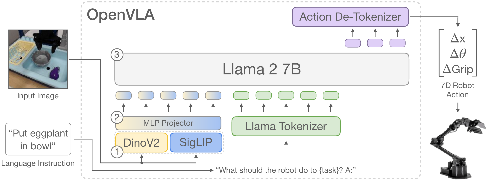

# Title: OpenVLA: An Open-Source Vision-Language-Action Model

- ArXiv: 2406.09246
- Authors: Moo Jin Kim, Karl Pertsch, Siddharth Karamcheti, Ted Xiao, Ashwin Balakrishna, Suraj Nair, Rafael Rafailov, Ethan Foster, Grace Lam, Pannag Sanketi, Quan Vuong, Thomas Kollar, Benjamin Burchfiel, Russ Tedrake, Dorsa Sadigh, Sergey Levine, Percy Liang, Chelsea Finn
- Sections: 41
- Estimated tokens: 65.0k

[摘要（Abstract）](#abstract)

- [1 引言（Introduction）](#1-introduction)
- [2 相关工作（Related Work）](#2-related-work)
  - [视觉条件语言模型（Visually-Conditioned Language Models）](#visually-conditioned-language-models)
  - [通用机器人策略（Generalist Robot Policies）](#generalist-robot-policies)
  - [视觉-语言-动作模型（Vision-Language-Action Models）](#vision-language-action-models)
- [3 OpenVLA 模型（The OpenVLA Model）](#3-the-openvla-model)
  - [3.1 预备知识：视觉-语言模型（Preliminaries: Vision-Language Models）](#31-preliminaries-vision-language-models)
  - [3.2 OpenVLA 训练流程（OpenVLA Training Procedure）](#32-openvla-training-procedure)
  - [3.3 训练数据（Training Data）](#33-training-data)
  - [3.4 OpenVLA 设计决策（OpenVLA Design Decisions）](#34-openvla-design-decisions)
  - [3.5 训练与推理基础设施（Infrastructure for Training and Inference）](#35-infrastructure-for-training-and-inference)
- [4 OpenVLA 代码库（The OpenVLA Codebase）](#4-the-openvla-codebase)
- [5 实验（Experiments）](#5-experiments)
  - [5.1 在多个机器人平台上的直接评估（Direct Evaluations on Multiple Robot Platforms）](#51-direct-evaluations-on-multiple-robot-platforms)
  - [5.2 对新机器人设置的数据高效适应（Data-Efficient Adaptation to New Robot Setups）](#52-data-efficient-adaptation-to-new-robot-setups)
  - [5.3 参数高效微调（Parameter-Efficient Fine-Tuning）](#53-parameter-efficient-fine-tuning)
  - [5.4 通过量化实现内存高效推理（Memory-Efficient Inference via Quantization）](#54-memory-efficient-inference-via-quantization)
- [6 讨论与局限性（Discussion and Limitations）](#6-discussion-and-limitations)
  - [致谢（Acknowledgments）](#acknowledgments)

## 摘要（Abstract）

在互联网规模的视觉-语言数据和多样化机器人演示数据上联合预训练的大型策略，有潜力改变我们教授机器人新技能的方式：我们无需从头开始训练新行为，而是可以微调此类 **视觉-语言-动作模型（Vision-Language-Action Models, VLAs）** ，以获得用于视觉运动控制的鲁棒、可泛化的策略。然而，VLAs 在机器人领域的广泛应用一直面临挑战，原因在于：1) 现有的 VLAs 大多是封闭且公众无法访问的；2) 先前的工作未能探索为适应新任务而高效微调 VLAs 的方法，而这正是推广应用的关键组成部分。为应对这些挑战，我们提出了 **OpenVLA** ，这是一个拥有 70 亿参数的开源 VLA，在包含 97 万条真实世界机器人演示的多样化数据集上训练而成。OpenVLA 基于 **Llama 2** 语言模型，并结合了一个融合了 **DINOv2** 和 **SigLIP** 预训练特征的视觉编码器。得益于增加的数据多样性和新的模型组件，OpenVLA 在通用操作任务上表现出色，在 29 个任务和多个机器人本体上，其绝对任务成功率比 RT-2-X（550 亿参数）等封闭模型高出 16.5%，而参数量仅为后者的 1/7。我们进一步证明，可以有效地针对新设置微调 OpenVLA，尤其是在涉及多个对象的多任务环境中表现出强大的泛化能力和语言基础能力，并且比从头开始的模仿学习方法（如 **扩散策略（Diffusion Policy）** ）高出 20.4%。我们还探索了计算效率；作为另一项贡献，我们展示了 OpenVLA 可以通过现代 **低秩适应（Low-Rank Adaptation, LoRA）** 方法在消费级 GPU 上进行微调，并通过 **量化（Quantization）** 实现高效部署，而不会影响下游成功率。最后，我们发布了模型检查点、微调笔记本以及我们的 PyTorch 代码库，该代码库内置了对在 **Open X-Embodiment** 数据集上大规模训练 VLAs 的支持。

## 1 引言（Introduction）

机器人操作学习策略的一个关键弱点是其无法泛化到训练数据之外：虽然为单个技能或语言指令训练的现有策略有能力将行为外推到新的初始条件（如物体位置或光照）[[2], [3]]，但它们对场景干扰物或新物体缺乏鲁棒性 [[4], [5]]，并且难以执行未见过的任务指令 [[6], [7]]。然而，在机器人领域之外，现有的视觉和语言基础模型，如 **CLIP** [[8]]、 **SigLIP** [[9]] 和 **Llama 2** [[10]]，能够实现这些类型的泛化甚至更多，这源于其互联网规模预训练数据集所捕获的先验知识。虽然为机器人领域复制这种规模的预训练仍然是一个开放的挑战——即使是最大的机器人操作数据集 [[1], [11]] 也只有 10 万到 100 万个样本——但这种不平衡性暗示了一个机会：利用现有的视觉和语言基础模型作为核心构建块，来训练能够泛化到训练数据之外的对象、场景和任务的机器人策略。

为实现这一目标，现有工作探索了将预训练的语言和视觉-语言模型集成用于机器人表征学习 [[12], [13], [14]]，以及作为任务规划和执行的模块化系统组件 [[15], [16]]。最近，它们被直接用于学习用于控制的 **视觉-语言-动作模型（VLAs）** [[7], [1], [17], [18]]。VLAs 提供了将预训练的视觉和语言基础模型用于机器人领域的直接实例化，直接微调 **视觉条件语言模型（Visually-Conditioned Language Models, VLMs）** ，如 **PaLI** [[19], [20]]，以生成机器人控制动作。通过建立在互联网规模数据上训练的强基础模型之上，诸如 **RT-2** [[7]] 等 VLAs 展示了令人印象深刻的鲁棒性结果，以及泛化到新物体和任务的能力，为通用机器人策略树立了新标准。然而，有两个关键原因阻碍了现有 VLAs 的广泛使用：1) 当前模型 [[7], [1], [17], [18]] 是封闭的，对模型架构、训练流程和数据混合的了解有限；2) 现有工作没有提供将 VLAs 部署和适应到新机器人、环境和任务的最佳实践——尤其是在商用硬件（例如，消费级 GPU）上。我们认为，为了为未来的研究和开发奠定坚实的基础，机器人领域需要支持有效微调和适应的开源通用 VLAs，类似于围绕开源语言模型 [[21], [22], [23], [24]] 的现有生态系统。

为此，我们提出了 **OpenVLA** ，这是一个拥有 70 亿参数的开源 VLA，为通用机器人操作策略确立了新的技术水平。(^1^11OpenVLA 使用多个预训练的模型组件： **SigLIP** [[9]] 和 **DinoV2** [[25]] 视觉编码器，以及 **Llama 2** [[10]] 语言模型主干。对于这三个模型，权重是开放的，但其训练数据和代码并非全部开放。我们在这些组件之上发布了用于复现 OpenVLA 的训练数据、代码和模型权重。) OpenVLA 由一个预训练的视觉条件语言模型主干组成，该主干捕获多粒度的视觉特征，并在一个包含 97 万条机器人操作轨迹的大型多样化数据集（来自 **Open-X Embodiment** [[1]] 数据集）上进行了微调——该数据集涵盖了广泛的机器人本体、任务和场景。得益于增加的数据多样性和新的模型组件，OpenVLA 在 WidowX 和 Google Robot 本体上的 29 个评估任务中，其绝对成功率比拥有 550 亿参数的 **RT-2-X** 模型 [[7], [1]]（先前最先进的 VLA）高出 16.5%。我们还研究了 VLAs 的高效微调策略，这是先前工作中未探索过的新贡献，涵盖了 7 个不同的操作任务，行为范围从物体拾取放置到清洁桌面。我们发现，微调后的 OpenVLA 策略明显优于微调后的预训练策略，如 **Octo** [[5]]。与使用 **扩散策略（Diffusion Policy）** [[3]] 从头开始的模仿学习相比，微调后的 OpenVLA 在涉及多对象多任务环境中将语言基础到行为的任务上显示出显著改进。基于这些结果，我们首次证明了利用 **低秩适应（LoRA）** [[26]] 和 **模型量化（Model Quantization）** [[27]] 的计算高效微调方法的有效性，这些方法有助于在消费级 GPU（而非大型服务器节点）上适应 OpenVLA 模型，且不影响性能。作为最终贡献，我们开源了所有模型、部署和微调笔记本，以及用于大规模训练 VLAs 的 OpenVLA 代码库，希望这些资源能够支持未来探索和适应机器人领域 VLAs 的工作。

## 2 相关工作（Related Work）

- [视觉条件语言模型（Visually-Conditioned Language Models）](#visually-conditioned-language-models)
- [通用机器人策略（Generalist Robot Policies）](#generalist-robot-policies)
- [视觉-语言-动作模型（Vision-Language-Action Models）](#vision-language-action-models)

##### 视觉条件语言模型（Visually-Conditioned Language Models）

**视觉条件语言模型（VLMs）** 在互联网规模数据上训练，以从输入图像和语言提示生成自然语言，已被应用于从视觉问答 [[28], [29], [30], [31]] 到物体定位 [[32], [33]] 的无数应用中。推动近期 VLMs 发展的关键进展之一是模型架构，它将来自预训练视觉编码器 [[8], [9], [25]] 的特征与预训练语言模型 [[10], [23], [34], [35], [36]] 的特征桥接起来，直接建立在计算机视觉和自然语言建模的进步之上，以创建强大的多模态模型。虽然早期工作探索了视觉和语言特征之间交叉注意的各种架构 [[37], [38], [39], [40], [41]]，但新的开源 VLMs [[42], [43], [20], [44]] 已经收敛于一种更简单的“ **补丁即词元（patch-as-token）** ”方法，其中来自预训练视觉变换器的补丁特征被视为词元，然后被投影到语言模型的输入空间中。这种简单性使得可以轻松地将现有用于大规模训练语言模型的工具重新用于 VLM 训练。我们在工作中利用这些工具来扩展 VLA 训练，并特别使用 Karamcheti 等人 [[44]] 的 VLMs 作为我们的预训练主干，因为它们是从多分辨率视觉特征训练的，融合了来自 **DINOv2** [[25]] 的低级空间信息和来自 **SigLIP** [[9]] 的高级语义，以助于视觉泛化。

##### 通用机器人策略（Generalist Robot Policies）

机器人领域的一个近期趋势是致力于在大型多样化机器人数据集 [[50], [51], [45], [52], [53], [54], [55], [6], [2], [56], [49], [11], [1]] 上训练多任务“通用”机器人策略 [[45], [46], [47], [6], [2], [48], [49]]，这些数据集涵盖了许多不同的机器人本体 [[57], [53], [58], [59], [60], [61], [62], [63], [64], [65], [1], [5], [66]]。值得注意的是， **Octo** [[5]] 训练了一个通用策略，可以开箱即用地控制多个机器人，并允许灵活地微调到新的机器人设置。这些方法与 OpenVLA 的一个关键区别在于模型架构。像 Octo 这样的先前工作通常将预训练组件（如语言嵌入或视觉编码器）与从头开始初始化的额外模型组件组合在一起 [[6], [2], [5]]，在策略训练过程中学习将它们“缝合”在一起。与这些工作不同，OpenVLA 采用了一种更端到端的方法，直接微调 VLMs，通过将机器人动作视为语言模型词汇表中的词元来生成它们。我们的实验评估表明，这种简单但可扩展的流程显著提升了性能，并超越了先前通用策略的泛化能力。

##### 视觉-语言-动作模型（Vision-Language-Action Models）

许多工作探索了将 VLMs 用于机器人领域，例如用于视觉状态表征 [[12], [13]]、物体检测 [[67]]、高层规划 [[16]] 以及提供反馈信号 [[68], [69], [70], [71]]。其他工作将 VLMs 直接集成到端到端的视觉运动操作策略中 [[14], [15]]，但在策略架构中加入了显著的结构或需要校准的相机，这限制了其适用性。一些近期工作探索了与我们类似的方案，并直接微调大型预训练 VLMs 来预测机器人动作 [[7], [1], [72], [73], [17], [18], [74]]。此类模型通常被称为 **视觉-语言-动作模型（VLAs）** ，因为它们将机器人控制动作直接融合到 VLM 主干中。这有三个关键好处：(1) 它在大型互联网规模视觉-语言数据集上执行预训练视觉和语言组件的对齐；(2) 使用通用架构（而非为机器人控制定制的架构）使我们能够利用现代 VLM 训练 [[75], [76], [77]] 背后的可扩展基础设施，并以最少的代码修改扩展到训练数十亿参数的策略；(3) 它为机器人领域从 VLMs 的快速改进中受益提供了直接途径。现有的 VLA 工作要么专注于在单个机器人或模拟设置中训练和评估 [[72], [73], [78], [74]]，因此缺乏通用性，要么是封闭的，不支持高效微调到新的机器人设置 [[7], [1], [17], [18]]。

最密切相关的是， **RT-2-X** [[1]] 在 **Open X-Embodiment** 数据集上训练了一个 550 亿参数的 VLA 策略，并展示了最先进的通用操作策略性能。然而，我们的工作在多个重要方面与 RT-2-X 不同：(1) 通过将强大的开源 VLM 主干与更丰富的机器人预训练数据集相结合，OpenVLA 在我们的实验中优于 RT-2-X，同时规模小一个数量级；(2) 我们深入研究了 OpenVLA 模型对新目标设置的微调，而 RT-2-X 没有研究微调设置；(3) 我们首次证明了现代参数高效微调和量化方法对 VLAs 的有效性；(4) OpenVLA 是第一个开源的通用 VLA，因此支持未来关于 VLA 训练、数据混合、目标和推理的研究。

[[1]] 的 97 万次机器人演示上进行训练。围绕开发 VLA 模型的最佳实践存在许多很大程度上尚未探索的问题，例如，用于训练的最佳模型主干、数据集和超参数是什么。下面，我们详细阐述开发 OpenVLA 的方法并总结我们的关键经验。具体来说，我们首先简要概述构成 OpenVLA 骨干的现代 **视觉语言模型（Vision-Language Models, VLMs）** （[第 3.1 节](#section-3-1)）；然后描述我们的基本训练方案和数据集（[第 3.2 节](#section-3-2) 和 [第 3.3 节](#section-3-3)）；讨论关键设计决策（[第 3.4 节](#section-3-4)）；并提供用于训练和推理的基础设施详情（[第 3.5 节](#section-3-5)）。

> 图 1：OpenVLA 模型架构。给定图像观察和语言指令，模型预测 7 维机器人控制动作。该架构由三个关键组件组成：(1) 一个视觉编码器，拼接 Dino V2 [[25]] 和 SigLIP [[79]] 特征，(2) 一个将视觉特征映射到语言嵌入空间的投影器，以及 (3) LLM 主干，即一个拥有 70 亿参数的 Llama 2 大型语言模型 [[10]]。

- [3.1 预备知识：视觉语言模型（3.1 Preliminaries: Vision-Language Models）](#31-preliminaries-vision-language-models)
- [3.2 OpenVLA 训练流程（3.2 OpenVLA Training Procedure）](#32-openvla-training-procedure)
- [3.3 训练数据（3.3 Training Data）](#33-training-data)
- [3.4 OpenVLA 设计决策（3.4 OpenVLA Design Decisions）](#34-openvla-design-decisions)
- [3.5 训练与推理基础设施（3.5 Infrastructure for Training and Inference）](#35-infrastructure-for-training-and-inference)

### 3.1 预备知识：视觉语言模型（3.1 Preliminaries: Vision-Language Models）

大多数近期 VLMs [[42], [43], [20], [44]] 的架构由三个主要部分组成（参见 [图 1](#figure-1)）：(1) 一个将图像输入映射到若干“图像块嵌入”的视觉编码器，(2) 一个接收视觉编码器的输出嵌入并将其映射到语言模型输入空间的投影器，以及 (3) 一个大型语言模型（Large Language Model, LLM）主干。在 VLM 训练期间，模型使用下一文本词元预测目标，在从各种互联网来源整理的配对或交错的视觉和语言数据上进行端到端训练。

在这项工作中，我们基于 **Prismatic-7B VLM [[44]]** 构建。Prismatic 遵循上述相同的标准架构，包含一个 6 亿参数的视觉编码器、一个小的 2 层 MLP 投影器和一个 70 亿参数的 Llama 2 语言模型主干 [[10]]。值得注意的是，Prismatic 使用了一个 **双部分** 视觉编码器，由预训练的 SigLIP [[79]] 和 DinoV2 [[25]] 模型组成。输入图像块分别通过两个编码器，并将得到的特征向量在通道维度上进行拼接。与更常用的视觉编码器（如仅使用 CLIP [[80]] 或仅使用 SigLIP 的编码器）相比，添加 DinoV2 特征已被证明有助于改进空间推理 [[44]]，这对于机器人控制尤其有益。

SigLIP、DinoV2 和 Llama 2 未发布其训练数据的详细信息，这些数据可能分别包含来自互联网的数万亿词元的图像-文本、仅图像和仅文本数据。Prismatic VLM 在这些组件之上使用 LLaVA 1.5 数据混合 [[43]] 进行微调，该混合数据总共包含来自开源数据集 [[81], [82], [29], [83], [42]] 的大约 100 万个图像-文本和仅文本数据样本。

### 3.2 OpenVLA 训练流程（3.2 OpenVLA Training Procedure）

为了训练 OpenVLA，我们针对机器人动作预测微调了一个预训练的 Prismatic-7B VLM 主干（参见 [图 1](#figure-1)）。我们将动作预测问题表述为一个“视觉-语言”任务，其中输入观察图像和自然语言任务指令被映射到一串预测的机器人动作 [[7]]。为了使 VLM 的语言模型主干能够预测机器人动作，我们通过将连续的机器人动作映射到语言模型分词器使用的离散词元，在 LLM 的输出空间中表示这些动作。遵循 Brohan 等人 [[7]] 的方法，我们将机器人动作的每个维度分别离散化为 256 个区间中的一个。对于每个动作维度，我们将区间宽度设置为均匀划分训练数据中动作的第 1 分位数和第 99 分位数之间的间隔。使用分位数而不是 Brohan 等人 [[7]] 使用的最小-最大边界，使我们能够忽略数据中的异常动作，否则这些异常动作可能会极大地扩展离散化区间并降低我们动作离散化的有效粒度。

使用这种离散化方法，对于一个 $N$ 维机器人动作，我们得到 N 个离散整数 $\in[0\dots 255]$。不幸的是，OpenVLA 语言主干使用的分词器，即 Llama 分词器 [[10]]，仅为微调期间新引入的词元保留了 100 个“特殊词元”，这对于我们动作离散化的 256 个词元来说太少了。相反，我们再次选择简单性，遵循 Brohan 等人 [[7]] 的方法，直接用我们的动作词元覆盖 Llama 分词器词汇表中 **使用最少的** 256 个词元（对应于最后 256 个词元）。一旦动作被处理成一系列词元，OpenVLA 就使用标准的下一词元预测目标进行训练，仅评估预测动作词元上的交叉熵损失。我们在 [第 3.4 节](#section-3-4) 讨论实现此训练流程的关键设计决策。接下来，我们描述用于 OpenVLA 训练的机器人数据集。

### 3.3 训练数据（3.3 Training Data）

构建 OpenVLA 训练数据集的目标是捕捉机器人本体、场景和任务的高度多样性。这使得最终模型能够开箱即用地控制各种机器人， **并且** 允许对新机器人设置进行高效微调。我们利用 **Open X-Embodiment 数据集 [[1]]（OpenX）** 作为基础来整理我们的训练数据集。截至撰写本文时，完整的 OpenX 数据集包含超过 70 个独立的机器人数据集，拥有超过 200 万条机器人轨迹，这些数据在一个大型社区努力中被汇集成了一个连贯且易于使用的数据格式。为了使在此数据上的训练变得可行，我们对原始数据集应用了多个数据整理步骤。

这种整理的目标是确保 (1) 所有训练数据集具有一致的输入和输出空间，以及 (2) 最终训练混合中本体、任务和场景的平衡组合。(^2^22Octo [[5]] 展示了在具有异构感官输入的数据集上进行训练。虽然非常有前景，但我们将 VLA 在异构传感器模态和动作空间上的训练研究留待未来工作。) 为了解决 (1)，我们遵循 [[1], [5]]，将我们的训练数据集限制为仅包含至少有一个第三人称摄像头并使用单臂末端执行器控制的操控数据集。对于 (2)，我们利用 Octo [[5]] 的数据混合权重来处理所有通过第一轮筛选的数据集。Octo 启发式地降低或移除多样性较低的数据集的权重，并提高任务和场景多样性较大的数据集的权重；详见 Octo Model Team 等人 [[5]]。

我们还尝试将自 Octo 发布以来添加到 OpenX 数据集的一些额外数据集纳入我们的训练混合中，包括 **DROID 数据集 [[11]]** ，尽管采用了保守的 10% 混合权重。在实践中，我们发现 DROID 上的动作词元准确率在整个训练过程中一直很低，这表明未来可能需要更大的混合权重或模型来适应其多样性。为了不损害最终模型的质量，我们在最后三分之一的训练中从数据混合中移除了 DROID。我们在 [附录 A](#appendix-a) 中提供了所用数据集和混合权重的完整概述。

### 3.4 OpenVLA 设计决策（3.4 OpenVLA Design Decisions）

在开发 OpenVLA 模型时，我们在开始最终模型训练运行之前，在较小规模的实验中探索了各种设计决策。具体来说，我们在 BridgeData V2 [[6]] 上训练和评估 OpenVLA 模型进行初始实验，而不是在完整的 OpenX 混合上进行训练，以提高迭代速度并降低计算成本。我们在下面总结了从这些探索中获得的关键经验。

**VLM 主干** 。最初，我们尝试了多个 VLM 主干。除了 Prismatic [[44]]，我们还测试了微调 **IDEFICS-1 [[84]]** 和 **LLaVA [[85]]** 用于机器人动作预测。我们发现 LLaVA 和 IDEFICS-1 在场景中只有一个物体的任务上表现相当，但 LLaVA 在涉及场景中多个物体并需要策略操控 **正确** 物体（即语言指令中指定的物体）的任务中表现出更强的语言基础。具体来说，在 BridgeData V2 水槽环境中的五个语言基础任务上平均，LLaVA 的绝对成功率比 IDEFICS-1 提高了 35%。微调后的 Prismatic VLM 策略取得了进一步的改进，在简单的单物体任务和多物体语言基础任务上，其绝对成功率比 LLaVA 策略高出约 10%。我们将这种性能差异归因于融合的 SigLIP-DinoV2 主干提供的改进的空间推理能力（参见 [第 3.1 节](#section-3-1)）。除了性能提升之外，Prismatic 还提供了一个模块化且易于使用的代码库，因此我们最终选择它作为 OpenVLA 模型的主干。

**图像分辨率** 。输入图像的分辨率对 VLA 训练的计算需求有显著影响，因为更高分辨率的图像会产生更多的图像块词元，从而导致更长的上下文长度，这会以二次方增加训练计算量。我们比较了输入为 $224\times 224$ 像素和 $384\times 384$ 像素的 VLA，但在我们的评估中没有发现性能差异，而后者的训练时间要长 3 倍。因此，我们为最终的 OpenVLA 模型选择了 $224\times 224$ 像素的分辨率。请注意，在许多 VLM 基准测试中，提高分辨率确实能提高性能 [[44], [86], [87]]，但我们（尚未）在 VLA 中看到这种趋势。

**微调视觉编码器** 。关于 VLMs 的先前工作发现，在 VLM 训练期间冻结视觉编码器通常会导致更高的性能 [[44]]。直观地说，冻结的视觉编码器可能更好地保留从其互联网规模的预训练中学到的鲁棒特征。然而，我们发现，在 VLA 训练期间微调视觉编码器对于良好的 VLA 性能至关重要。我们假设预训练的视觉主干可能无法捕捉到关于场景重要部分的足够精细的空间细节，以实现精确的机器人控制。

**训练轮数** 。典型的 LLM 或 VLM 训练运行最多只在其训练数据集上完成一到两个轮次。相比之下，我们发现对于 VLA 训练来说，显著多次遍历训练数据集非常重要，真实机器人性能持续提高，直到训练动作词元准确率超过 95%。我们最终的训练运行在其训练数据集上完成了 27 个轮次。

**学习率** 。我们为 VLA 训练在多个数量级上扫描了学习率，并使用固定的 2e-5 学习率（与 VLM 预训练期间使用的学习率相同 [[44]]）获得了最佳结果。我们没有发现学习率预热能带来好处。

### 3.5 训练与推理基础设施（3.5 Infrastructure for Training and Inference）

最终的 OpenVLA 模型在一个由 64 个 A100 GPU 组成的集群上训练了 14 天，总计 21,500 A100-小时，批大小为 2048。在推理期间，OpenVLA 以 bfloat16 精度（即未量化）加载时需要 15GB GPU 内存，在一个 NVIDIA RTX 4090 GPU 上以大约 6Hz 的频率运行（未使用编译、推测解码或其他推理加速技巧）。我们可以通过量化进一步减少 OpenVLA 在推理期间的内存占用，而不会影响真实世界机器人任务中的性能，如 [第 5.4 节](#section-5-4) 所示。我们在 [图 5](#figure-5) 中报告了在各种消费级和服务器级 GPU 上的推理速度。为了方便起见，我们实现了一个远程 VLA 推理服务器，允许将动作预测实时远程流式传输到机器人——消除了需要访问强大的本地计算设备来控制机器人的要求。我们将此远程推理解决方案作为我们开源代码发布的一部分发布（[第 4 节](#section-4)）。

[https://openvla.github.io](https://openvla.github.io)）。它支持从在单个 GPU 上微调 VLA 模型，到在多节点 GPU 集群上训练数十亿参数的 VLA 模型，并支持现代大型 Transformer 模型训练技术，例如 **自动混合精度（Automatic Mixed Precision, AMP, PyTorch [[75]]）** 、 **FlashAttention [[76]]** 以及 **全分片数据并行（Fully Sharded Data Parallelism, FSDP, Zhao et al. [[77]]）** 。开箱即用，OpenVLA 代码库完全支持在 **Open X 数据集（Open X dataset）** 上进行训练，与 HuggingFace 的 [[21]] AutoModel 类集成，并支持 **LoRA 微调（LoRA fine-tuning）** [[26]] 和 **量化模型推理（Quantized model inference）** [[88], [27]]。

## 5 实验（Experiments）

我们实验评估的目标是测试 OpenVLA 作为强大的 **开箱即用（out-of-the-box）** 多机器人控制策略的能力，以及作为微调以适应新机器人任务的良好初始化的能力。具体来说，我们旨在回答以下问题：

- 1. 在评估多个机器人和各种类型的泛化能力时，OpenVLA 与先前的通用机器人策略相比如何？
- 2. OpenVLA 能否在新的机器人设置和任务上被有效微调，与最先进的 **数据高效模仿学习（Data-efficient imitation learning）** 方法相比如何？
- 3. 我们能否使用 **参数高效微调（Parameter-efficient fine-tuning）** 和量化来降低 OpenVLA 模型训练和推理的计算需求，使其更易于使用？性能与计算之间的权衡是什么？

- [5.1 在多个机器人平台上的直接评估](#51-direct-evaluations-on-multiple-robot-platforms)
- [5.2 对新机器人设置的数据高效适应](#52-data-efficient-adaptation-to-new-robot-setups)
- [5.3 参数高效微调](#53-parameter-efficient-fine-tuning)
- [5.4 通过量化实现内存高效推理](#54-memory-efficient-inference-via-quantization)

### 5.1 在多个机器人平台上的直接评估（Direct Evaluations on Multiple Robot Platforms）

> **图 2（Figure 2）** ：BridgeData V2 WidowX 机器人评估任务与结果。我们在涵盖多个泛化维度的综合任务套件上评估 OpenVLA 和先前最先进的通用机器人策略，以及专门评估语言条件能力的任务。OpenVLA 实现了最高的整体性能，甚至在除语义泛化外的所有类别中都优于闭源模型 RT-2-X。每个方法的平均成功率 $\pm$ 标准误差（StdErr）是基于总共 170 次运行（rollouts）计算的。详细结果请参见 [表 4](#table-4)。

**机器人设置与任务（Robot Setups and Tasks）** 。我们在两种机器人实体上评估 OpenVLA 的“开箱即用”性能：来自 BridgeData V2 评估 [[6]] 的 WidowX 机器人（见 LABEL:fig:teaser，左图）以及来自 RT-1 和 RT-2 评估 [[2], [7]] 的移动操作机器人（“Google 机器人”；见 LABEL:fig:teaser，中图）。这两个平台在先前工作中被广泛用于评估通用机器人策略 [[2], [7], [1], [5]]。我们在每个环境中定义了一套全面的评估任务，涵盖了各种泛化维度，例如视觉（未见过的背景、干扰物、物体的颜色/外观）；运动（未见过的物体位置/方向）；物理（未见过的物体大小/形状）；以及语义（未见过的目标物体、指令和来自互联网的概念）泛化。我们还在包含多个物体的场景中评估语言条件能力，测试策略是否能按照用户提示操作正确的目标物体。BridgeData V2 和 Google 机器人评估中的示例任务图像分别见 [图 2](#figure-2) 和 [图 3](#figure-3) 的底行。总体而言，我们在 BridgeData V2 实验中为每种方法评估了 170 次运行（17 个任务，每个任务 10 次尝试），在 Google 机器人实验中评估了 60 次运行（12 个任务，每个任务 5 次尝试）。所有任务的详细分类及其与训练数据的差异见 [附录 B](#appendix-b)。本节及后续部分的所有评估均采用 A/B 评估方式，使用相同的任务和相同的初始机器人及物体状态集，以确保公平比较。

**对比方法（Comparisons）** 。我们将 OpenVLA 的性能与三种先前的通用操作策略进行比较：RT-1-X [[1]]、RT-2-X [[1]] 和 Octo [[5]]。RT-1-X（3500 万参数）和 Octo（9300 万参数）是在 OpenX 数据集的子集上从头开始训练的 Transformer 策略；Octo 是开源操作策略中最先进的模型。RT-2-X（550 亿参数）是一种最先进的闭源 VLA，它利用了互联网预训练的视觉和语言骨干网络。

BridgeData V2 评估的结果总结在 [图 2](#figure-2) 中，Google 机器人评估的结果总结在 [图 3](#figure-3) 中（按任务细分的详细结果见附录中的 [表 4](#table-4) 和 [表 6](#table-6)）。我们发现 RT-1-X 和 Octo 在测试任务上表现不佳，经常无法操作正确的物体，尤其是在存在干扰物的情况下，有时甚至导致机器人手臂无目的地摆动。请注意，我们的评估测试了比先前工作中更大的泛化程度，以挑战互联网预训练的 VLA 模型。因此，没有互联网预训练的模型性能较低是预期的。RT-2-X 明显优于 RT-1-X 和 Octo，证明了大型预训练 VLM 对机器人学的益处。

> **图 3（Figure 3）** ：Google 机器人评估结果。我们在 RT-1 和 RT-2 评估 [[2], [7]] 中使用的移动操作器上，评估通用机器人策略在分布内（in-distribution）和分布外（Out-of-Distribution, OOD）任务上的表现。我们发现 OpenVLA 和 RT-2-X 取得了相当的性能，并且总体上显著优于 RT-1-X 和 Octo。每个方法的平均成功率 $\pm$ 标准误差（StdErr）是基于总共 60 次运行（rollouts）计算的。详细结果请参见 [表 6](#table-6)。

值得注意的是，尽管 OpenVLA 的参数量小一个数量级（70 亿 vs. 550 亿参数），但它在 Google 机器人评估中与 RT-2-X 表现相当，在 BridgeData V2 评估中则显著优于 RT-2-X。从定性角度看，我们发现 RT-2-X 和 OpenVLA 都表现出比其他测试模型明显更鲁棒的行为，例如在存在干扰物时接近正确的物体、正确调整机器人末端执行器的方向以与目标物体的方向对齐，甚至能从错误中恢复，例如不牢固地抓取物体（定性运行示例见 [https://openvla.github.io](https://openvla.github.io)）。如 [图 2](#figure-2) 所示，RT-2-X 在语义泛化任务中取得了更高的性能，这是预期的，因为它使用了更大规模的互联网预训练数据，并且与机器人动作数据和互联网预训练数据共同微调，以更好地保留预训练知识，而不是像 OpenVLA 那样仅在机器人数据上微调。然而，在 BridgeData V2 和 Google 机器人评估的所有其他任务类别中，OpenVLA 表现相当或更好。性能差异可归因于多种因素的综合作用：我们为 OpenVLA 策划了更大的训练数据集，包含 97 万条轨迹（vs. RT-2-X 的 35 万条）；我们对训练数据集进行了更仔细的清洗，例如，过滤掉了 Bridge 数据集中的所有零动作（详细讨论见 [附录 C](#appendix-c)）；并且 OpenVLA 使用了融合的视觉编码器，结合了预训练的语义 **和** 空间特征。这些组件的消融分析见 [附录 D](#appendix-d)。

### 5.2 对新机器人设置的数据高效适应（Data-Efficient Adaptation to New Robot Setups）

虽然先前的工作主要集中于直接“开箱即用”地评估 VLA [[16], [7], [1]]，但将 VLA 模型有效 **微调（fine-tuning）** 到新任务和机器人设置上在很大程度上尚未被探索，而这对于其广泛采用至关重要。在本节中，我们研究 OpenVLA 快速适应新的 **真实世界（real-world）** 机器人设置的能力。（仿真中的微调实验见 [附录 E](#appendix-e)。）

**机器人设置与任务（Robot setups and tasks）** 。我们测试了 OpenVLA 模型的一个简单微调方案：使用包含 10 到 150 次目标任务演示的小型数据集，对所有模型参数进行 **全量微调（full fine-tuning）** （见 [图 4](#figure-4)；我们在 [第 5.3 节](#section-5-3) 中探索参数高效微调方法）。我们在两种设置中测试 OpenVLA：Franka-Tabletop，一个固定的、安装在桌面上的 Franka Emika Panda 7 自由度机器人手臂；以及 Franka-DROID，来自最近发布的 DROID 数据集 [[11]] 的 Franka 机器人手臂设置，安装在可移动的站立式办公桌上。这两种设置分别使用 5Hz 和 15 Hz 的非阻塞控制器。我们选择 Franka 机器人手臂作为微调实验的目标实体，因为它们在机器人学习社区中被广泛使用，因此很可能是 OpenVLA 微调的“目标”。我们在具有不同控制频率的设置上进行测试，以检验 OpenVLA 在一系列用例中的适用性。

[表 7](#table-7)。

**比较。** 我们与 **扩散策略（Diffusion Policy）** [[3]]（一种最先进的数据高效模仿学习方法，从头开始训练）进行比较。我们还与 **扩散策略（匹配版）（Diffusion Policy (matched)）** 进行比较，这是扩散策略的一个版本，其输入和输出规范与 OpenVLA 相匹配。(^3^33完整的扩散策略使用包含图像和本体感知状态的两步观测历史，并通过预测未来 $T$ 个动作块并以开环方式执行前 $X$ 个动作（在预测下一个块之前）来执行 **后退时域控制（Receding Horizon Control）** （对于 15Hz 控制，我们像 DROID 先前工作 [[11]] 中那样设置 $T=16, X=8$；对于 5Hz 控制，我们将块大小减少到 $T=8, X=3$）。它也是[第 5.2 节](#section-5-2)中唯一预测 **绝对** 笛卡尔坐标来控制机器人的方法；所有其他方法都使用 **相对** 位置控制。扩散策略（匹配版）使用单张图像作为输入，没有本体感知信息，没有观测历史，并且预测单个相对位置控制动作，不进行动作分块。) 此外，我们评估了在目标数据集上微调的 **Octo** [[5]]，因为它是目前支持微调的最佳通用策略（RT-2-X 的微调不通过其推理 API 支持）。我们还在相同的目标数据集上微调了 OpenVLA，得到的策略记为 **OpenVLA** 。最后，作为消融实验，我们与 **OpenVLA（从头微调）（OpenVLA (scratch)）** 进行比较，其中我们直接在目标机器人配置上微调底层基础 Prismatic VLM（视觉语言模型）——而不是微调经过 OpenX 预训练的 OpenVLA 模型——以评估大规模机器人预训练的益处。

我们在[图 4](#figure-4) 中展示了结果（按任务细分见附录，[表 7](#table-7)）。我们发现，在诸如“将胡萝卜放入碗中”和“将玉米倒入锅中”等较狭窄的单指令任务上，两种版本的扩散策略都与通用策略 Octo 和 OpenVLA 相当或更优，但预训练的通用策略在场景涉及多个物体且需要语言条件的更多样化的微调任务中表现更好。Octo 和 OpenVLA 的 **OpenX 预训练（OpenX pretraining）** 使模型能够更好地适应这些语言基础（language grounding）很重要的多样化任务；我们在 OpenVLA（从头微调）的较低性能中看到了这方面的证据。

总体而言，我们发现 **OpenVLA 实现了最高的平均性能** 。值得注意的是，大多数先前工作仅在 **狭窄的单指令** 任务 **或** 多样化的多指令任务中实现强大性能，导致成功率差异很大。 **OpenVLA 是唯一在所有测试任务中至少达到 50% 成功率的方法** ，这表明它可以成为模仿学习任务的一个强有力的默认选项，特别是当这些任务涉及多种语言指令时。对于较狭窄但高度灵巧的任务，扩散策略仍然显示出更平滑、更精确的轨迹；结合扩散策略中实现的 **动作分块（action chunking）** 和 **时间平滑（temporal smoothing）** 可能有助于 OpenVLA 达到相同水平的灵巧度，这可能是未来工作的一个有前景的方向（关于当前局限性的详细讨论见[第 6 节](#section-6)）。

### 5.3 参数高效微调（Parameter-Efficient Fine-Tuning）

上一节中 OpenVLA 的 **全量微调（Full fine-tuning）** 运行使用了 8 块 A100 GPU，每个任务 5-15 小时（取决于数据集大小）以达到高性能。虽然这比 VLA 预训练所需的计算量少得多，但在本节中，我们探索了计算和参数效率更高的微调方法，并研究了它们的有效性。

> **表 1：参数高效微调评估。** **LoRA（Low-Rank Adaptation）微调** 实现了最佳的性能-计算权衡，在仅训练模型 1.4% 参数的情况下，匹配了全量微调的性能。平均成功率 $\pm$ 标准误（StdErr）是根据每种方法在选定的 Franka-Tabletop 任务上的 33 次运行计算得出的（详情见[表 8](#table-8)）。^∗：使用 FSDP [[77]] 分片到 2 块 GPU 上。

| 策略           | 成功率           | 训练参数 ($\times 10^{6}$) | VRAM (批次 16) |
| -------------- | ---------------- | -------------------------- | -------------- |
| 全量微调       | 69.7 $\pm$ 7.2 % | 7,188.1                    | 163.3 GB\*     |
| 仅最后一层     | 30.3 $\pm$ 6.1 % | 465.1                      | 51.4 GB        |
| 冻结视觉编码器 | 47.0 $\pm$ 6.9 % | 6,760.4                    | 156.2 GB\*     |
| 三明治微调     | 62.1 $\pm$ 7.9 % | 914.2                      | 64.0 GB        |
| LoRA, 秩=32    | 68.2 $\pm$ 7.5%  | 97.6                       | 59.7 GB        |
| LoRA, 秩=64    | 68.2 $\pm$ 7.8%  | 195.2                      | 60.5 GB        |

具体来说，我们比较了以下微调方法： **全量微调（Full fine-tuning）** 在微调期间更新所有权重，如[第 5.2 节](#section-5-2)所述； **仅最后一层（Last layer only）** 仅微调 OpenVLA 的 Transformer 主干网络的最后一层和词元嵌入矩阵； **冻结视觉编码器（Frozen vision）** 冻结视觉编码器但微调所有权重； **三明治微调（Sandwich fine-tuning）** 解冻视觉编码器、词元嵌入矩阵和最后一层；以及 **LoRA** 使用 Hu 等人 [[26]] 流行的 **低秩自适应（Low-Rank Adaptation）** 技术，具有多个秩值 $r$，应用于模型的所有线性层。

[表 1](#table-1)中报告了多个 **Franka-Tabletop** 任务的微调成功率，以及训练参数量和 GPU 内存需求。(^4^44在[第 5.3 节](#section-5-3)和[第 5.4 节](#section-5-4)中，我们实验了一个版本的 **OpenVLA 模型（OpenVLA model）** ，该模型使用较小的机器人数据混合（与 Octo 相同的 OpenX 数据集混合）进行预训练，并且架构略小，仅使用 **SigLIP** [[79]] 视觉主干，而不是融合的 **DinoSigLIP** 编码器。我们发现，这种更简单的架构在微调任务和“开箱即用”任务中仍然实现了强大的性能。) 我们发现，仅微调网络的最后一层或冻结视觉编码器会导致性能不佳，这表明将视觉特征进一步适应目标场景至关重要。相比之下，“ **三明治微调（sandwich fine-tuning）** ”实现了更好的性能，因为它微调了视觉编码器，并且由于不微调完整的 LLM 主干，消耗的 GPU 内存更少。最后， **LoRA** 在性能和训练内存消耗之间实现了最佳权衡，优于“三明治微调”，并匹配了完全微调的性能，同时仅微调了 1.4% 的参数。我们发现 LoRA 的秩对策略性能影响可忽略不计，因此建议使用默认秩 $r=32$。使用 LoRA，我们可以在 **单张** A100 GPU 上在 10-15 小时内对新任务微调 OpenVLA——与完全微调相比，计算量减少了 8 倍。

### 5.4 通过量化实现内存高效推理

> 图 5：OpenVLA 在不同 GPU 上的推理速度。bfloat16 和 int4 量化均实现了高吞吐量，尤其是在具有 Ada Lovelace 架构的 GPU（RTX 4090、H100）上。使用现代 LLM 推理框架如 **TensorRT-LLM** [[89]] 可以进一步加速。$\spadesuit$：模型分片在两个 GPU 上以适配内存。

| 精度     | 桥接成功率      | VRAM    |
| -------- | --------------- | ------- |
| 精度     | 桥接成功率      | VRAM    |
| 精度     | 桥接成功率      | VRAM    |
| bfloat16 | 71.3 $\pm$ 4.8% | 16.8 GB |
| bfloat16 | 71.3 $\pm$ 4.8% | 16.8 GB |
| bfloat16 | 71.3 $\pm$ 4.8% | 16.8 GB |
| int8     | 58.1 $\pm$ 5.1% | 10.2 GB |
| int8     | 58.1 $\pm$ 5.1% | 10.2 GB |
| int8     | 58.1 $\pm$ 5.1% | 10.2 GB |
| int4     | 71.9 $\pm$ 4.7% | 7.0 GB  |
| int4     | 71.9 $\pm$ 4.7% | 7.0 GB  |
| int4     | 71.9 $\pm$ 4.7% | 7.0 GB  |

> 表：表 2：量化推理的性能。4 位量化匹配了 bfloat16 推理（我们的默认方法）的性能，同时将 GPU 内存占用减少了一半以上。平均成功率 $\pm$ 标准误差在 8 个代表性的 **BridgeData V2** 任务 [[6]] 上计算，每个方法 80 次 rollout（详见[表 5](#table-5)）。

OpenVLA 是一个 70 亿参数的模型，在推理时比先前的开源通用策略（如 Octo，其参数量 $<$ 1 亿）消耗更多内存。我们遵循 LLM 服务的最佳实践，以 bfloat16 精度保存和加载 OpenVLA 进行推理（我们的默认方法），这将内存占用减半，使我们能够在仅 16GB GPU 内存的 GPU 上服务 OpenVLA。在本节中，我们测试是否可以通过使用为服务 LLMs 开发的现代量化技术 [[88], [27]]，进一步减少策略推理所需的内存，并扩大 **VLA 策略（Vision-Language-Action policies）** 的可访问性。这些方法以较低精度加载网络权重，从而以可能降低的推理速度和准确性为代价，换取减少的内存需求。

具体来说，我们研究了在 8 个代表性的 BridgeData V2 任务上以 8 位和 4 位精度服务 OpenVLA 模型。我们在[表 2](#table-2)中报告了内存占用和 rollout 性能。我们还在[图 5](#figure-5)中报告了在各种消费级和服务器级 GPU 上可达到的控制频率。我们观察到，由于增加的量化操作开销，8 位量化在大多数 GPU 上减慢了推理速度。4 位推理实现了更高的吞吐量，因为减少的 GPU 内存传输补偿了量化开销。

由于推理速度降低，我们观察到 8 位量化导致性能显著下降：在我们用于评估的 A5000 GPU 上，我们只能以 1.2Hz 运行模型，这与 BridgeData V2 任务中使用的 5Hz 非阻塞控制器的训练数据集相比，显著改变了系统动力学。(^5^55我们将性能损失归因于低推理速度，因为当在训练数据上离线评估时，8 位和 4 位量化都实现了与 bfloat16 推理相当的词元准确性。支持细节见[第 D.4 节](https://arxiv.org/html/2406.09246v3#A4.SS4)。) 值得注意的是，4 位量化尽管需要不到一半的 GPU 内存，但实现了与 bfloat16 半精度推理相似的性能。4 位量化模型可以在 A5000 上以 3Hz 运行，从而更接近数据收集期间的系统动力学。

## 6 讨论与局限性

在这项工作中，我们提出了 OpenVLA，这是一个最先进的开源 **视觉-语言-动作模型（vision-language-action model）** ，能够开箱即用地实现强大的跨具身机器人控制性能。我们还证明了 OpenVLA 可以通过参数高效微调技术轻松适应新的机器人设置。

当前的 OpenVLA 模型有几个局限性。首先，它目前仅支持单图像观测。实际上，现实世界的机器人设置是异构的，具有广泛可能的感官输入 [[5]]。扩展 OpenVLA 以支持多图像和本体感觉输入以及观测历史是未来工作的重要方向。探索使用在 **交错** 图像和文本数据上预训练的 **VLMs** 可能有助于这种灵活输入的 VLA 微调。

其次，提高 OpenVLA 的推理吞吐量对于实现高频控制设置（如以 50Hz 运行的 **ALOHA** [[90]]）的 VLA 控制至关重要。这也将使我们能够在比本工作中研究的更灵巧、双手操作任务上测试 VLAs。探索使用动作分块或替代推理时优化技术（如 **推测解码（speculative decoding）** [[91]]）提供了潜在的补救措施。

此外，还有进一步性能改进的空间。虽然 OpenVLA 优于先前的通用策略，但在测试任务上尚未提供非常高的可靠性，通常成功率 <90%。

最后，由于计算限制，许多 VLA 设计问题仍未充分探索：基础 VLM 的大小对 VLA 性能有何影响？在机器人动作预测数据和互联网规模的视觉-语言数据上进行联合训练是否会显著提高 VLA 性能？哪些视觉特征最适合 VLA 模型？我们希望 OpenVLA 模型和代码库的发布将使社区能够共同研究这些问题。

- [致谢](#acknowledgments)

#### 致谢

我们感谢丰田研究院为开展这项研究提供了重要的资金和计算资源。我们还感谢斯坦福基础模型研究中心提供了额外的计算资源，以及 Google DeepMind 为我们评估提供了 RT-2-X API 的 alpha 访问权限。我们感谢大众汽车、Physical Intelligence、ONR 资助 N00014-22-1-2621 和 N00014-22-1-2293、国家科学基金会通过 IIS-2246811 以及 DARPA ANSR 的额外支持。
