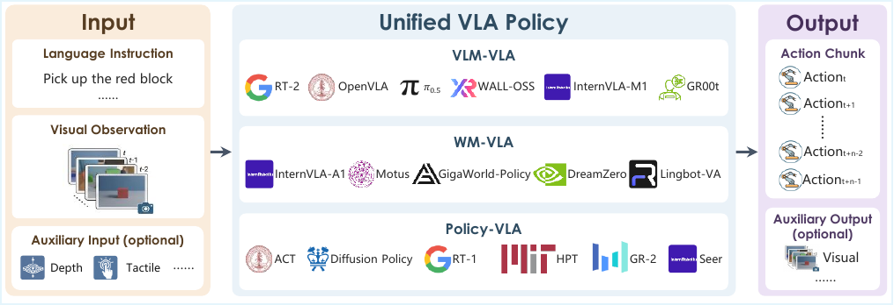
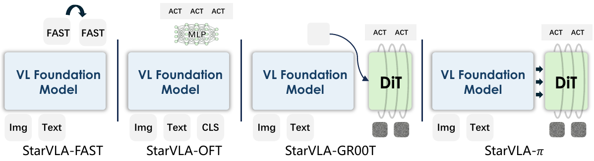

# Title: StarVLA: A Lego-like Codebase for Vision-Language-Action Model Developing
- ArXiv: 2604.05014
- Authors: StarVLA Community
- Sections: 62
- Estimated tokens: 45.6k

[摘要（Abstract）](#abstract)
- [1 引言（Introduction）](#1-introduction)
  - [碎片化阻碍了系统性探索。](#fragmentation-hinders-systematic-exploration)
  - [StarVLA：一个用于探索具身智能的统一平台。](#starvla-a-unified-platform-for-exploring-embodied-intelligence)
  - [一个广义的 VLA 视角。](#a-generalized-vla-perspective)
- [2 VLA 系统的统一框架（Unified Framework for VLA Systems）](#2-unified-framework-for-vla-systems)
  - [VLA 系统的抽象。](#abstraction-of-vla-systems)
  - [2.1 背景：用于具身智能的视觉语言基础模型（Background: VL Foundation Models for Embodied Intelligence）](#21-background-vl-foundation-models-for-embodied-intelligence)
  - [2.2 在视觉语言基础模型上构建 VLA 框架（Building VLA Frameworks on VL Foundation Models）](#22-building-vla-frameworks-on-vl-foundation-models)
    - [统一的输入/输出接口。](#unified-io-interface)
    - [组合式框架。](#compositional-framework)
  - [2.3 代表性的 VLA 实例（Representative VLA Instantiations）](#23-representative-vla-instantiations)
- [3 模型训练与测试的统一系统流程（Unified System Pipeline for Model Training and Testing）](#3-unified-system-pipeline-for-model-training-and-testing)
  - [3.1 训练范式（Training Paradigms）](#31-training-paradigms)
    - [3.1.1 用于行为克隆的监督学习（Supervised Learning for Behavior Cloning）](#311-supervised-learning-for-behavior-cloning)
      - [优化设置。](#optimization-setup)
    - [3.1.2 用于具身推理的多目标协同训练（Multi-Objective Co-Training for Embodied Reasoning）](#312-multi-objective-co-training-for-embodied-reasoning)
      - [双加载器多目标训练方案。](#dual-loader-multi-objective-training-scheme)
    - [3.1.3 使用机器人数据混合进行跨具身协同训练（Cross-Embodiment Co-Training with Robot Data Mixtures）](#313-cross-embodiment-co-training-with-robot-data-mixtures)
    - [3.1.4 强化学习微调（Reinforcement Learning Fine-Tuning）](#314-reinforcement-learning-fine-tuning)
  - [3.2 评估与部署（Evaluation and Deployment）](#32-evaluation-and-deployment)
    - [3.2.1 跨基准的统一服务器-客户端评估（Unified Server-Client Evaluation Across Benchmarks）](#321-unified-server-client-evaluation-across-benchmarks)
      - [推理接口。](#inference-interface)
      - [基准特定的适配器。](#benchmark-specific-adapters)
    - [3.2.2 在真实机器人上的部署（Deployment on Real Robots）](#322-deployment-on-real-robots)
      - [部署接口。](#deployment-interface)
- [4 多基准集成（Multiple Benchmark Integration）](#4-multiple-benchmark-integration)
  - [4.1 统一的基准集成接口（Unified Benchmark Integration Interface）](#41-unified-benchmark-integration-interface)
  - [4.2 支持的基准套件（Supported Benchmark Suite）](#42-supported-benchmark-suite)
- [5 单基准训练示例（Single-Benchmark Training Examples）](#5-single-benchmark-training-examples)
  - [5.1 LIBERO 上的结果（Results on LIBERO）](#51-results-on-libero)
    - [训练数据格式。](#training-data-format)
    - [训练设置。](#training-setup)
    - [评估协议。](#evaluation-protocol)
    - [结果与分析。](#results-and-analysis)
  - [5.2 SimplerEnv 上的结果（Results on SimplerEnv）](#52-results-on-simplerenv)
    - [训练设置。](#training-setup)
    - [评估协议。](#evaluation-protocol)
    - [结果。](#results)
  - [5.3 RoboCasa-GR1 上的结果（Results on RoboCasa-GR1）](#53-results-on-robocasa-gr1)
    - [训练设置。](#training-setup)
    - [评估协议。](#evaluation-protocol)
    - [结果。](#results)
  - [5.4 Robotwin 2.0 上的结果（Results on Robotwin 2.0）](#54-results-on-robotwin-20)
    - [训练设置。](#training-setup)
    - [评估协议。](#evaluation-protocol)
    - [结果。](#results)
- [6 多模态协同训练示例（Multimodal Co-Training Examples）](#6-multimodal-co-training-examples)
  - [6.1 实验设置（Experimental Setup）](#61-experimental-setup)
  - [6.2 多模态协同训练的主要结果（Main Results for Multimodal Co-training）](#62-main-results-for-multimodal-co-training)
- [7 跨基准训练示例（Cross-Benchmark Training Examples）](#7-cross-benchmark-training-examples)
  - [7.1 实验设置（Experimental Setups）](#71-experimental-setups)
  - [7.2 作为通用模型的主要结果（Main Results as a Generalist）](#72-main-results-as-a-generalist)
- [8 计算效率（Computation Efficiency）](#8-computation-efficiency)
  - [实验设置。](#experimental-setup)
  - [效率指标。](#efficiency-metrics)
  - [8.1 单节点训练效率（Single-Node Training Efficiency）](#81-single-node-training-efficiency)
  - [8.2 多节点扩展效率（Multi-Node Scaling Efficiency）](#82-multi-node-scaling-efficiency)

## 摘要（Abstract）

构建通用 **具身智能体（embodied agents）** 需要整合感知、语言理解和行动能力，这些正是基于多模态基础模型的 **视觉-语言-动作（Vision-Language-Action, VLA）** 方法所解决的核心能力，包括近期在 **视觉语言模型（vision-language models）** 和 **世界模型（world models）** 方面的进展。尽管进展迅速，但 VLA 方法在互不兼容的架构、代码库和评估协议之间仍然呈现碎片化，阻碍了原则性比较和可复现性。我们提出了  **StarVLA** ，一个用于 VLA 研究的开源代码库。StarVLA 从三个方面应对这些挑战。首先，它提供了一个模块化的 **主干网络-动作头（backbone–action-head）** 架构，该架构同时支持  **VLM 主干网络（VLM backbones）** （例如 Qwen-VL）和 **世界模型主干网络（world-model backbones）** （例如 Cosmos），以及四种代表性的动作解码范式，所有这些都置于一个共享的抽象之下，其中主干网络和动作头可以各自独立替换。其次，它提供了可复用的训练策略，包括 **跨具身学习（cross-embodiment learning）** 和 **多模态协同训练（multimodal co-training）** ，这些策略在支持的范式中一致适用。第三，它通过一个支持仿真和真实机器人部署的统一评估接口，集成了主要基准测试，包括  **LIBERO** 、 **SimplerEnv** 、 **RoboTwin 2.0** 、 **RoboCasa-GR1**  和  **BEHAVIOR-1K** 。StarVLA 还提供了简单、完全可复现的单基准训练方案，尽管数据工程最少，但使用 VLM 和世界模型主干网络在多个基准上已经达到或超越了先前的方法。据我们所知，StarVLA 是目前最全面的开源 VLA 框架之一，我们期望它能降低复现现有方法和原型开发新方法的门槛。StarVLA 正在积极维护和扩展；随着项目发展，我们将更新本报告。代码和文档可在 [github.com/starVLA/starVLA](https://github.com/starVLA/starVLA) 获取。

[2023](#ref-34); Bai et al., [2025a](#ref-267); Gao et al., [2025](#ref-253)）。为实现这一目标， **视觉-语言-动作模型（Vision-Language-Action models, VLA models）**  已成为主导范式，并呈现出多样化的设计选择。现有方法可大致分为两类： ***基于视觉语言模型的方法（VLM-based methods）** *，该方法重新利用语言模型的表征能力进行动作解码；以及 ***基于世界模型的方法（world-model-based methods）** *，该方法采用生成式架构来联合建模动作分布和未来观测。尽管这两个方向都展现出巨大潜力，但它们通常各自独立发展，拥有不同的代码库、接口假设和评估协议，这使得系统性地比较它们并理解不同设计选择之间的权衡变得具有挑战性。

- [碎片化阻碍系统性探索。](#fragmentation-hinders-systematic-exploration)
- [StarVLA：一个用于探索具身智能的统一平台。](#starvla-a-unified-platform-for-exploring-embodied-intelligence)
- [广义的 VLA 视角。](#a-generalized-vla-perspective)

##### 碎片化阻碍系统性探索。

尽管取得了这些进展，VLA 研究仍在多个层面受到碎片化的阻碍。在架构层面，现有方法（Kim et al., [2025](#ref-175); Brohan et al., [2022](#ref-43), [2023](#ref-44); Bjorck et al., [2025](#ref-164); Black et al., [2024](#ref-106); Intelligence et al., [2025b](#ref-306); Wu et al., [2026](#ref-263); Li et al., [2026](#ref-222)）采用了多样化的动作解码设计，从 VLM 原生方法（自回归分词、并行回归）到基于生成模型的方法（扩散模型、流匹配），使得跨范式家族的系统性比较变得困难。在系统层面，方法发布时通常对模型架构、数据处理和训练流程有紧密耦合的假设，限制了组件在不同项目间的复用。在评估层面，结果报告在互不相交的基准测试子集上，且协议不一致，使得公平比较难以实现。这些问题共同为 VLA 研究创造了一个“巴别塔”，使得想法难以比较、复现或重组。我们将这种碎片化归因于缺乏一个统一的 VLA 系统抽象。现有代码库（Bjorck et al., [2025](#ref-164); Black et al., [2024](#ref-106)）大多是方法特定的，不支持（i）跨不同动作解码范式的模块化组合，（ii）跨异构数据源的可复用训练，或（iii）跨基准测试和具身形态的标准化评估与部署。

##### StarVLA：一个用于探索具身智能的统一平台。

我们介绍  **StarVLA** ，这是一个开源研究平台，它将基于 VLM 和基于世界模型的 VLA 范式统一到一个模块化框架中。其核心设计是  ***骨干网络-动作头分解（backbone–action-head decomposition）** *，其中一个共享的视觉-语言骨干网络对场景和指令进行编码，一个可插拔的动作头将得到的表征映射为运动指令。这种表述足够灵活，可以支持广泛的现有方法，包括自回归分词、并行回归、流匹配去噪和双系统推理，其重新实现达到或部分超过了报告的性能。在实践中，StarVLA 提供三个核心能力：

-  **统一的 VLA 框架** ：StarVLA 在共享的骨干-动作头抽象下实现了四种代表性范式（第 [2](#section-2) 节）：StarVLA-FAST（自回归分词）、StarVLA-OFT（并行回归）、StarVLA-$\pi$（流匹配去噪）和 StarVLA-GR00T（双系统推理）。关键在于，VLM 骨干网络（例如 Qwen3-VL）和世界模型骨干网络（例如 Cosmos-Predict2）都作为即插即用的替代方案得到支持，使得在相同的训练和评估条件下直接比较基于 VLM 和基于世界模型的研究路径成为可能。所有变体共享相同的数据接口和下游基础设施；只有骨干网络或动作头不同，使研究人员能够在保持其他所有条件不变的情况下，隔离任何单一设计选择的影响。
-  **灵活的训练方案** ：StarVLA 将跨具身形态学习和多模态协同训练视为可复用的、与范式无关的配置，而非方法特定的附加组件。相同的训练基础设施支持监督动作学习、与网络规模视觉-语言数据的协同训练以保持多模态推理能力，以及跨异构机器人数据集的跨具身形态预训练。每个方案均统一适用于所有支持的范式，使得研究训练策略如何与不同架构选择相互作用变得直接明了。
-  **广泛的基准测试集成** ：StarVLA 通过统一的服务器-客户端测试接口集成了五个主流基准测试（LIBERO、SimplerEnv、RoboTwin 2.0、RoboCasa-GR1 和 BEHAVIOR-1K），实现了跨环境和具身形态的受控比较。对于每个基准测试，我们提供了简单、完全可复现的训练方案，仅需最少的数据工程，即可在 VLM 和世界模型骨干网络下实现有竞争力或最先进的性能，降低了社区在此基础上构建的门槛。相同的接口支持仿真评估和真实机器人部署，无需更改代码，弥合了研究探索与实际部署之间的差距。

为了将 StarVLA 置于现有生态系统中，我们在表 [1](#table-1) 中将其与代表性的开源 VLA 系统在关键能力上进行了比较。据我们所知，StarVLA 是首个将这些能力统一在一个接口内的平台。利用该框架实现的受控比较，StarVLA 在 VLM 和世界模型骨干网络下，在多个基准测试上取得了有竞争力、甚至在某些情况下是最先进的性能，表明该平台不仅是一个研究工具包，也是一个强大、易于复现的基线提供者。

> 表 1：代表性开源 VLA 系统比较。模块化动作头：动作头在共享骨干网络上即插即用。模块化 VLM：支持交换 VLM 骨干网络。模块化 WA：支持世界模型作为 VL 骨干网络。混合数据源：内置混合数据加载器用于异构数据源。开源多模态协同训练：开源多模态协同训练支持。开源跨具身协同训练：开源跨具身形态协同训练支持。仿真基准数量：集成的带有评估代码的仿真基准测试数量。多基准协同训练：将所有基准测试联合训练到一个模型中。

| 框架 | 模块化动作头 | 模块化 VLM | 模块化 WA | 混合数据源 | 开源多模态协同训练 | 开源跨具身协同训练 | 基准数量 | 多基准协同训练 |
| --- | --- | --- | --- | --- | --- | --- | --- | --- |
| OpenPI Intelligence et al. ([2025b](#ref-306)) | ✗ | ✗ | ✗ | ✗ | ✗ | ✗ | 2 | ✗ |
| Isaac-GR00T Bjorck et al. ([2025](#ref-164)) | ✗ | ✗ | ✗ | ✓ | ✗ | ✓ | 6 | ✗ |
| OpenVLA-OFT Kim et al. ([2025](#ref-175)) | ✗ | ✗ | ✗ | ✗ | ✗ | ✓ | 1 | ✗ |
| Dexbotic Contributors ([2025](#ref-307)) | ✗ | ✓ | ✗ | ✗ | ✓ | ✗ | 5 | ✗ |
| X-VLA Zheng et al. ([2025a](#ref-159)) | ✗ | ✗ | ✗ | ✓ | ✗ | ✓ | 5 | ✗ |
| StarVLA (Ours) | ✓ | ✓ | ✓ | ✓ | ✓ | ✓ | 7 | ✓ |

##### 广义的 VLA 视角。

除了其工程实用性，StarVLA 还为统一多样化的 VLA 方法提供了一个更广阔的视角。经验上，我们发现单一的骨干-动作头抽象可以容纳基于 VLM 的解码、基于生成模型的解码以及双系统架构，所有这些都在共享的数据管道、训练循环和评估协议内实现。这一观察表明，基于 VLM 和基于世界模型的方法或许不应被理解为根本不同的范式，而应视为一个共同结构框架内的变体，主要区别在于辅助学习信号的形式（例如，语言对齐的推理或未来观测预测）。我们称之为  ***广义 VLA（generalized VLA）** * 视角。这并非纯粹的概念观点，而是源于 StarVLA 实现的实际统一：当基础设施的差异被最小化时，潜在的共性变得更加明显。我们希望这一视角能鼓励对机器人基础模型进行更系统性和累积性的探索。

[VLA 系统的抽象。](#abstraction-of-vla-systems)
- [2.1 背景：具身智能的视觉-语言基础模型（Background: VL Foundation Models for Embodied Intelligence）](#21-background-vl-foundation-models-for-embodied-intelligence)
- [2.2 在视觉-语言基础模型上构建 VLA 框架（Building VLA Frameworks on VL Foundation Models）](#22-building-vla-frameworks-on-vl-foundation-models)
- [2.3 代表性 VLA 实例化（Representative VLA Instantiations）](#23-representative-vla-instantiations)

##### VLA 系统的抽象（Abstraction of VLA systems）。

除了系统级抽象，我们还引入了 VLA 模型的统一 **以策略为中心的表述（policy-centric formulation）** 。先前的工作通常区分基于 **视觉语言模型（Vision-Language Models, VLMs）** 的策略（VLA）和基于 **世界模型（World Models, WMs）** 的方法；在此，我们将它们置于一个以动作生成为中心的共同视角下。

>  **图 1** ：StarVLA 采用的统一 VLA 表述的概念视图。策略 $\pi$ 将视觉观测和语言指令映射到未来的动作块。训练目标分解为 $\mathcal{L}=\mathcal{L}_{\mathrm{action}}+\mathcal{L}_{\mathrm{aux}}$，其中不同的模型族对应于 $\mathcal{L}_{\mathrm{aux}}$ 的不同形式。

如图 [1](#figure-1) 所示，我们将 VLA 系统建模为一个将 **视觉-语言（Vision-Language, VL）** 输入映射到未来 **动作（Action, A）** 序列和可选辅助输出的策略：

$$
\pi(\mathbf{a}_{t:t+k},\mathbf{y}_{\mathrm{aux}}\mid\mathbf{x}_{\leq t},\ell),(1)
$$

其中：

- $\mathbf{x}_{\leq t}=\{o^{\mathrm{vis}}_{\leq t},o^{\mathrm{depth}}_{\leq t},o^{\mathrm{tactile}}_{\leq t},\ldots\}$ 表示截至时间 $t$ 的多模态观测历史，可能包括视觉观测、深度图、触觉反馈、本体感觉状态或其他传感器模态；
- $\ell$ 是描述任务的语言指令；
- $\mathbf{a}_{t:t+k}$ 表示从时间 $t$ 到 $t+k$ 的预测 $k$ 步动作块；
- $\mathbf{y}_{\mathrm{aux}}$ 表示未来时间范围内的可选辅助输出，例如预测的未来视觉观测 $o^{\mathrm{vis}}_{t+1:t+k}$、中间语言推理或子目标描述 $\ell_{\mathrm{plan}}$，或其他模态预测。

这种表述抽象掉了中间表示，并在存在时隐式地对潜在预测进行边缘化，使得直接策略和基于模型的方法都能在一个通用接口下表达。

训练目标采用以下通用形式：

$$
\mathcal{L}\;=\;\mathcal{L}_{\mathrm{action}}\;+\;\mathcal{L}_{\mathrm{aux}},(2)
$$

其中 $\mathcal{L}_{\mathrm{action}}$ 监督预测的动作，而 $\mathcal{L}_{\mathrm{aux}}$ 充当塑造学习表示的归纳偏置。不同的 VLA 范式随后可以被解释为此表述的实例化，具有不同的学习信号：

-  **直接 VLA 建模（Direct VLA Modeling）**  设 $\mathcal{L}_{\mathrm{aux}}=0$，仅优化动作。
-  **基于 VLM 的 VLA（VLM-based VLA）**  引入语言对齐的辅助目标，例如子任务规划、空间基础或结构化推理监督，要求模型生成语言词元作为辅助输出。
-  **基于 WM 的 VLA（WM-based VLA）**  包含未来观测预测（例如图像或视频），作为辅助目标或支持动作生成的隐式潜在结构，其中模型必须预测视觉状态作为辅助输出。

在这种视角下，看似不同的范式，如基于 VLM 的、基于世界模型的和直接策略，都可以被理解为具有不同归纳偏置的共享策略表述的变体。这种视角简化了比较，同时与逐步执行和多步开环控制都保持兼容。

### 2.1 背景：具身智能的视觉-语言基础模型（Background: VL Foundation Models for Embodied Intelligence）

具身智能体持续与物理世界交互，其中视觉是感知场景结构、物体身份、空间关系和交互可供性的主要模态。

 **视觉-语言基础模型（Vision-language foundation models）** 。视觉的这种核心作用推动了视觉表示学习的进步，从监督模型如 ResNet (He et al., [2016](#ref-240)) 和 Vision Transformers (Dosovitskiy et al., [2021](#ref-241))，到可扩展的自监督方法 (Oquab et al., [2023](#ref-63)) 以及捕捉时间结构的视频预训练。在这些骨干网络基础上，语言对齐预训练 (Radford et al., [2021](#ref-242); Zhai et al., [2023](#ref-243)) 实现了共享的视觉-语言表示，而可提示系统如 SAM (Kirillov et al., [2023](#ref-246); Liu et al., [2023b](#ref-247)) 扩展了开放世界感知。与指令调优的 VLMs (Liu et al., [2023a](#ref-248); Chen et al., [2023](#ref-249); Karamcheti et al., [2024](#ref-196); Bai et al., [2025b](#ref-250); OpenAI, [2024](#ref-251); Gemini Team, Google, [2024](#ref-252)) 和生成式视频模型 (Gao et al., [2025](#ref-253); Google DeepMind, [2025](#ref-254)) 一起，这些进展显著增强了感知基础。然而，仅有感知是不够的：具身智能体还必须对语言条件化的目标进行推理，并预测动作下的环境动态。现有模型并非天生为动作生成或视觉运动控制而设计 (Zhao et al., [2023](#ref-145); Dhariwal and Nichol, [2021](#ref-140); Ze et al., [2024](#ref-73))。

 **用于机器人感知和推理的视觉-语言建模（Vision-language modeling for robotic perception and reasoning）** 。视觉-语言预训练将感知基础建立在语言之上，为任务规范和高层推理提供了可扩展的接口 (Radford et al., [2021](#ref-242); Zhai et al., [2023](#ref-243))。扩展这一范式， **视觉-语言-动作（Vision-Language-Action, VLA）模型** 结合动作监督，以统一感知、语言和控制 (Brohan et al., [2022](#ref-43), [2023](#ref-44); Kim et al., [2024](#ref-113); Black et al., [2024](#ref-106); Intelligence et al., [2025a](#ref-288); Bjorck et al., [2025](#ref-164))。早期工作 (Nair et al., [2022](#ref-244); Xiao et al., [2022](#ref-245)) 表明，强大的视觉先验改善了控制，而 VLA 模型通过行为克隆或策略学习直接将观测和指令映射到动作。通过将大规模语义知识迁移到控制中，它们改善了指令遵循和跨任务泛化能力，通常优于先前的机器人策略 (Zhao et al., [2023](#ref-145); Chi et al., [2024a](#ref-321); Ze et al., [2024](#ref-73))。近期工作将这些模型扩展到人形移动操作 (Wei et al., [2026](#ref-215))。为保持推理能力，后续方法探索了多模态协同训练 (Driess et al., [2025](#ref-308); Ye et al., [2026a](#ref-337); Chen et al., [2025c](#ref-294); Zeng et al., [2024](#ref-279); Yang et al., [2025c](#ref-278); Zhou et al., [2025](#ref-200))，而其他工作则扩展了遥操作数据集 (Collaboration et al., [2023](#ref-64); Khazatsky et al., [2024](#ref-61); Wu et al., [2024](#ref-335); AgiBot, [2025](#ref-330); Ebert et al., [2021](#ref-57); Duan et al., [2024](#ref-22))。然而，这些数据集在任务、语言和场景多样性方面仍然有限 (Shi et al., [2025](#ref-137); Chi et al., [2024b](#ref-338))，这推动了便携式数据收集 (Generalist AI, [2025](#ref-336); Liu et al., [2024b](#ref-172); Chi et al., [2024b](#ref-338))。同时，紧密耦合的流程阻碍了可复现性、模块化和可扩展性，凸显了对统一框架的需求。

## 基于视频的世界模型用于机器人动力学与交互

与基于语言的规模化方法正交， **基于视频的世界模型（video-based world models）** 通过视觉预测学习物理动力学。视频比静态数据更有效地捕捉运动、接触和因果关系。早期方法通过预测性潜在建模增强 **视觉语言动作（Vision-Language-Action, VLA）** 策略（Zheng et al., [2025b](#ref-236); Bjorck et al., [2025](#ref-164); Ye et al., [2025](#ref-284)），而大规模视频预训练使得仅需少量机器人数据即可进行规划（Assran et al., [2025](#ref-223); Jang et al., [2025](#ref-238)）。后续工作将视频视为主要的策略基底，要么统一策略、仿真与评估，要么将规划与控制解耦（Du et al., [2023](#ref-265); Ko et al., [2024](#ref-266); Pai et al., [2025](#ref-220); Chen et al., [2025a](#ref-224)）。 **动作条件化世界模型（action-conditioned world models）** 进一步支持策略评估与改进：想象的推演实现了强大的性能（Wu et al., [2023](#ref-233)），而近期的系统则支持反事实回放与安全性评估（1X World Model Team, [2025](#ref-229); Team et al., [2025](#ref-239)）。其他方法使用可控世界模型进行轨迹生成、强化学习或可扩展的数据合成（Guo et al., [2025](#ref-230); Jiang et al., [2026](#ref-232); GigaWorld Team et al., [2025](#ref-237); GigaBrain Team et al., [2026](#ref-231); Qiu et al., [2026](#ref-234)）。近期工作通过将动作与价值预测集成到预训练的视频模型中，或联合学习动力学与控制，强调因果一致性、可控性和闭环效率（Kim et al., [2026](#ref-235); Li et al., [2026](#ref-222); Cai et al., [2026](#ref-299); Gao et al., [2026](#ref-228); Zhu et al., [2025](#ref-217); Yuan et al., [2025](#ref-218)）。一些方法将联合视频-动作预测公式化为策略学习，或分析测试时想象与协同训练带来的收益（Ye et al., [2026b](#ref-219); Yuan et al., [2026](#ref-225)）。此外，人类视频提供了可扩展的运动先验，以自我为中心的流程使得行为能够在不同任务和具身形态间迁移（Hoque et al., [2025](#ref-227); Yang et al., [2025b](#ref-216); Zheng et al., [2026](#ref-226)）。

上述视觉语言预训练和基于视频的世界建模沿着互补但基本分散的轴扩展了具身智能，这促使 StarVLA 的设计选择将方法间应变化的部分与在训练、评估和部署中应保持稳定的部分分离开来。

### 2.2 在视觉语言基础模型上构建 VLA 框架

尽管上述调研的基础模型提供了强大的视觉语言表征，但它们并非原生为动作生成而设计。StarVLA 的一个关键设计目标是使这些 **视觉语言（Vision-Language, VL）基础模型**  *VLA-ready*：我们提供了一个统一的输入/输出接口契约和一个组合式架构，允许在相同的 VL 骨干模型之上灵活组合多种动作解码策略。

- [统一 I/O 接口。](#unified-io-interface)
- [组合式框架。](#compositional-framework)

##### 统一 I/O 接口。

StarVLA 中的所有框架模块都继承自一个共同的基类，并暴露两个共享 **统一输入/输出（I/O）接口** 的方法：训练和推理都消耗原始的、环境级别的观测数据，与机器人在部署时接收到的数据完全相同。

- forward({raw images, str, ...}) $\rightarrow$ {raw images, str, ...}：训练入口点。它接收一批原始样本，每个样本包含多视角 RGB 图像、一条自然语言指令和一个动作块，并返回一个损失字典。
- predict_action({raw images, str, ...}) $\rightarrow$ {normalized_actions, ...}：推理入口点。它接受相同的观测格式（减去真实动作），并返回预测的动作块。

通过刻意采用这种统一的 I/O 接口，其中训练输入镜像真实的部署观测，而不是依赖经过大量预处理的数据加载器张量，我们最小化了训练/测试分布不匹配，这是 VLA 系统中常见的性能无声下降的来源。

这一设计选择反映了机器人部署的一个更深层的不变性：无论不同的 VL 基础模型如何预训练——它们采用何种分词方案、如何调整图像大小或分区、在预训练期间优化何种辅助目标——在推理时，每个模型最终都必须接受物理机器人提供的相同原始传感器流，并产生可执行的运动指令。统一的 I/O 接口将这种*部署时不变性*编码为系统的一等契约，确保任何推理路径能够消费原始观测的 VL 模型都能立即与 StarVLA 兼容，而无需用户逆向工程或复制模型特定的预处理流程。至关重要的是，这种不变性驱动的原则自然地延伸到内部架构，如下所述。

##### 组合式框架。

在内部应用相同的原则，我们将每个 VLA 方法分解为两个通过标准化表征契约连接的、明确分离的组件：一个 **VL 骨干模型** （例如 Qwen2.5-VL, z），它消费原始多模态观测并通过一个共同的输出规范暴露隐藏状态表征；以及一个 **可插拔的动作头** ，它通过相应的输入规范读取这些表征并将其转换为运动指令。每个框架都通过相同的两步组合（首先加载骨干模型，然后附加动作头）来组装自身，两个组件都通过 YAML 声明式配置。由于外部系统边界（原始观测 $\to$ 动作）和内部骨干-头边界（多模态输入 $\to$ 隐藏状态 $\to$ 动作）都由标准化契约管理，StarVLA 实现了*双向模块化*：骨干模型和动作头可以各自独立替换，而不影响对方或任何周围的基础设施。

这种模块化为 VLA 开发的不同阶段提供了灵活性。对于研究人员，它支持在多个方向上进行快速实验。新的动作解码范式可以通过实现并注册一个动作头模块来原型化，而新的视觉语言骨干模型——例如指令调优的 **视觉语言模型（Vision-Language Models, VLMs）** （如 Qwen2.5-VL (Bai et al., [2025b](#ref-250)), InternVL (Cai et al., [2026](#ref-299))）或视频原生模型（如 Cosmos (Kim et al., [2026](#ref-235))）——可以通过一个符合共享表征接口的轻量级适配器集成。一旦集成，这些骨干模型就可以在不同的动作头上进行评估，而无需针对每种方法进行修改。对于训练基础设施，标准化接口使得大部分上游和下游堆栈（例如训练流水线、基准测试工具和部署服务）在很大程度上可以*与骨干模型和动作头无关*，从而减少了在引入新范式或模型时对方法特定代码路径的需求。对于部署，在不同骨干模型或动作范式之间切换可以通过配置更改来处理，而无需代码级别的修改。

### 2.3 代表性的 VLA 实例化

在这种统一抽象下，我们实现了涵盖当前 VLA 文献中主要动作解码家族的四种范式，如图 [2](#figure-2) 所示。所有变体共享相同的 VL 骨干模型、相同的基类和相同的 forward/predict_action 契约，仅在*它们如何从骨干模型的表征中提取动作*方面有所不同：

> 图 2：在统一接口下，StarVLA 中将视觉语言模型适配为视觉语言动作框架的四种代表性方法（FAST, OFT, $\pi$, 和 GR00T）概述。

- StarVLA-FAST ($\pi_{\text{fast}}$)：将 FAST 分词器（Pertsch et al., [2025](#ref-162)）附加到 VL 骨干模型，并使用 LLM 自身的词汇空间，通过 **下一词元预测（next-token prediction）**  *自回归地*生成离散动作词元。
- StarVLA-OFT：附加一个轻量级 MLP，读取预定义动作词元的隐藏状态，并*并行回归*连续动作（L1 损失），遵循 OpenVLA-OFT (Kim et al., [2025](#ref-175))——这是可插拔头的最简单形式。
- StarVLA-$\pi$ ($\pi_{0}$)：集成了一个层间交叉 DiT 流匹配动作专家，通过交叉注意力以多层 VL 隐藏状态为条件，并通过迭代*去噪*预测连续动作，遵循 $\pi_{0}$ (Black et al., [2024](#ref-106))。
- StarVLA-GR00T：采用双系统设计，其中 VL 骨干模型作为*系统 2*（慢速推理），而基于 DiT 的流匹配模块作为*系统 1*（快速动作生成），与 GR00T N1.5 (Bjorck et al., [2025](#ref-164)) 一致。此变体表明，即使是根本不同的推理时计算模式也可以在相同接口下共存。

这一系列方法，从 VLM 原生解码（自回归分词、并行回归）到与世界模型架构共享的基于生成模型的解码（迭代流匹配去噪、双系统推理），表明所提出的组合式架构和统一接口具有广泛的适用性。添加更多范式仅需实现并注册一个新的动作头；骨干模型、训练循环和评估流水线保持不变。

## 3 模型训练与测试的统一系统流程（Unified System Pipeline for Model Training and Testing）

 **StarVLA**  代码库支持多种实用的  **视觉语言动作（Vision-Language-Action, VLA）**  策略训练方案，范围涵盖在下游机器人数据集上进行标准的 **监督微调（Supervised Fine-Tuning, SFT）** ，到与 **视觉语言模型（Vision-Language Models, VLM）**  网络数据进行多目标协同训练，以及在混合机器人具身形态上进行跨具身协同训练。所有训练流程均通过基于 Accelerate + DeepSpeed 构建的显式 PyTorch 循环实现，以支持分布式执行，同时在不同方法间保持了统一的 YAML 配置接口。图 [3](#figure-3) 总结了支持的训练模式以及数据流如何连接到统一模型框架。

>  **图 3：StarVLA 框架概览。**  我们提出了一个统一且模块化的流程，将异构数据源、可插拔的数据加载器和灵活的数据表示与标准化的模型前向接口连接起来。该框架支持多种视觉语言基础模型和 VLA 架构，实现了端到端的训练与部署。

- [3.1 训练范式（Training Paradigms）](#31-training-paradigms)
- [3.2 评估与部署（Evaluation and Deployment）](#32-evaluation-and-deployment)

### 3.1 训练范式（Training Paradigms）

- [3.1.1 用于行为克隆的监督学习（Supervised Learning for Behavior Cloning）](#311-supervised-learning-for-behavior-cloning)
- [3.1.2 用于具身推理的多目标协同训练（Multi-Objective Co-Training for Embodied Reasoning）](#312-multi-objective-co-training-for-embodied-reasoning)
- [3.1.3 使用机器人数据混合的跨具身协同训练（Cross-Embodiment Co-Training with Robot Data Mixtures）](#313-cross-embodiment-co-training-with-robot-data-mixtures)
- [3.1.4 强化学习微调（Reinforcement Learning Fine-Tuning）](#314-reinforcement-learning-fine-tuning)

#### 3.1.1 用于行为克隆的监督学习（Supervised Learning for Behavior Cloning）

最直接的训练模式是仅使用机器人数据的监督学习，即训练策略模型根据观测和语言指令预测连续动作。在我们的代码库中，此训练路径在 `starVLA/training/train_starvla.py` 中实现。其目标是框架 `forward()` 方法返回的动作建模损失（例如，输出字典中的 `action_loss`）。

- [优化设置（Optimization setup）](#optimization-setup)

##### 优化设置（Optimization setup）

我们支持 (i)  **全参数微调**  和 (ii) 通过 `trainer.freeze_modules`（逗号分隔的模块路径） **选择性冻结子模块** 。为了稳定异构组件间的训练，优化器可以使用具有不同学习率的多个参数组（例如，为 `qwen_vl_interface` 和动作模型设置独立的学习率），这些参数组通过 `trainer.learning_rate` 配置。训练使用 `bfloat16` 自动混合精度、梯度累积、梯度裁剪以及带有最小学习率的余弦调度器。

#### 3.1.2 用于具身推理的多目标协同训练（Multi-Objective Co-Training for Embodied Reasoning）

仅使用机器人数据的 SFT 可能导致  **VLM 骨干网络**  过度特化于狭窄的指令分布。为了在学习动作预测的同时保持通用的视觉推理和语言基础能力， **StarVLA**  支持一种协同训练方案，该方案将机器人动作学习与多模态网络数据上的  **VLM 损失**  交错进行。此模式在 `starVLA/training/train_starvla_cotrain.py` 中实现。

- [双加载器多目标训练方案（Dual-loader multi-objective training scheme）](#dual-loader-multi-objective-training-scheme)

##### 双加载器多目标训练方案（Dual-loader multi-objective training scheme）

协同训练使用两个数据加载器（VLA 和 VLM），并在每个优化步骤中执行两次前向/反向传播：(i) 通过框架 `forward()` 进行  **VLA 前向传播**  以获取 `action_loss`，以及 (ii) 通过 `qwen_vl_interface` 进行  **VLM 前向传播**  以获取语言建模损失。VLM 损失通过配置文件中的 `trainer.loss_scale.vlm` 进行缩放，从而在动作学习和 VLM 能力保持之间实现可控的权衡。

#### 3.1.3 使用机器人数据混合的跨具身协同训练（Cross-Embodiment Co-Training with Robot Data Mixtures）

为了支持 **跨具身泛化** ，代码库提供了一个统一的  **LeRobot**  混合数据集接口，允许在具有不同具身形态、动作约定和相机设置的异构机器人数据集上进行训练。在配置中，用户通过 `datasets.vla_data.data_mix` 选择一个命名的混合数据集，该数据集映射到一个（数据集名称，采样权重，机器人类型）元组列表。在运行时，该混合数据集被实例化为一个 `LeRobotMixtureDataset`，它根据指定的权重跨数据集采样轨迹，并根据机器人类型跟踪具身形态标签。这种设计使得“跨具身预训练”成为一种可操作的配置选择，而非定制的训练脚本。

#### 3.1.4 强化学习微调（Reinforcement Learning Fine-Tuning）

除了监督和协同训练方案外，我们计划支持 **强化学习（Reinforcement Learning, RL）微调** ，作为同一框架抽象的扩展，并与  **RLinf**  项目（[https://github.com/RLinf/RLinf](https://github.com/RLinf/RLinf)）合作。在撰写本文时，RL 微调是一项正在进行的集成工作；当前公开的代码库专注于监督和协同训练流程，以构建一个强大的机器人基础模型。

### 3.2 评估与部署（Evaluation and Deployment）

- [3.2.1 跨基准的统一服务器-客户端评估（Unified Server-Client Evaluation Across Benchmarks）](#321-unified-server-client-evaluation-across-benchmarks)
- [3.2.2 在真实机器人上的部署（Deployment on Real Robots）](#322-deployment-on-real-robots)

#### 3.2.1 跨基准的统一服务器-客户端评估（Unified Server-Client Evaluation Across Benchmarks）

 **StarVLA**  采用了一种轻量级的服务器-客户端测试抽象，使得基准测试端的评估代码能够保持接近官方实现，而模型端的推理则被标准化。在实践中，一个检查点通过 `baseframework.from_pretrained()` 加载，并在  **StarVLA**  运行时环境中托管为一个轻量级的 WebSocket 策略服务器。基准测试评估器（可能位于具有其自身模拟器依赖的不同 conda 环境中）通过一个小的客户端包装器与模型交互，而不是直接导入框架代码。这种解耦对于诸如  **LIBERO** 、 **SimplerEnv**  和  **RoboTwin**  等基准测试特别有用，它们的官方评估器各自带有不同的依赖栈和控制循环。

- [推理接口（Inference interface）](#inference-interface)
- [基准特定适配器（Benchmark-specific adapters）](#benchmark-specific-adapters)

##### 推理接口（Inference interface）

所有框架变体都暴露相同的推理入口点 `Framework.predict_action()`，服务器以最小的路由逻辑将传入的有效载荷字典转发给此方法。基准测试端的客户端将观测数据打包成一个单一的字典，通常包含图像（单视图或多视图 RGB 观测）、`lang`（任务指令）以及可选字段，如状态、时间戳或回合元数据。有效载荷使用  **msgpack**  序列化并发送到策略服务器，服务器返回一个包含模型输出（如 `normalized_actions`）的字典。由于通信契约与动作头无关，从  **OFT**  切换到  **FAST** 、$\pi$ 或  **GR00T**  不需要修改基准测试代码。

##### 基准特定适配器（Benchmark-specific adapters）

在  **StarVLA**  中，基准测试的差异被隔离在轻量级的接口文件中，例如 `model2libero_interface.py`、`model2simpler_interface.py` 和 `model2robotwin_interface.py`。这些适配器将原始环境观测转换为通用的  **StarVLA**  示例格式，并将返回的动作后处理为基准测试的原生控制 API。典型的职责包括：将图像调整到训练分辨率、从检查点目录读取 `dataset_statistics.json` 以进行动作反归一化、将分块的归一化预测转换为可执行动作、应用动作集成，以及处理基准特定的约定，如粘性夹爪或增量/相对-绝对动作转换。这种设计使得核心策略服务器与基准无关，同时能在每个官方协议下保持忠实的评估。

#### 3.2.2 在真实机器人上的部署（Deployment on Real Robots）

相同的客户端-服务器契约也支持真实机器人或托管基准测试的部署。在此设置中，机器人控制器扮演基准测试客户端的角色：它捕获相机观测数据，组装与模拟中使用的相同示例字典，查询远程策略服务器，并在硬件上执行返回的动作。因此，控制循环、安全逻辑和设备特定的中间件保持在  **StarVLA**  模型运行时之外，而模型服务保持不变。

- [部署接口（Deployment interface）](#deployment-interface)

##### 部署接口（Deployment interface）

这种分离使得部署的侵入性大大降低。模型栈可以保持在面向 GPU 的推理环境中，而机器人端进程则可以保持与供应商 SDK、ROS 节点或托管评估平台（如  **RoboChallenge** ）的集成。更重要的是，只要客户端以约定的字典格式提供观测数据，并应用适当的基准或机器人特定的后处理，完全相同的检查点就可以在模拟和真实机器人设置中重复使用。从这个意义上说， **StarVLA**  将部署视为同一测试范式的延续，而非独立的工程路径。

[4.1 统一基准集成接口（Unified Benchmark Integration Interface）](#41-统一基准集成接口unified-benchmark-integration-interface)
- [4.2 支持的基准套件（Supported Benchmark Suite）](#42-支持的基准套件supported-benchmark-suite)

### 4.1 统一基准集成接口（Unified Benchmark Integration Interface）

 **StarVLA** 旨在通过以下方式，在多样化的基准套件中提供*简单且可复现的基线*：(i) 尽可能遵循每个基准的官方训练和评估工作流程，仅进行最少的数据工程和环境特定修改；(ii) 标准化策略端接口。具体而言，所有 StarVLA 变体都暴露一个统一的轻量级 WebSocket 服务，使得不同的基准测试运行器能够与一个共享的推理端点进行交互。这种设计促进了无缝集成，并简化了扩展到其他基准的过程。

为了便于复现，StarVLA 为基准接入定义了一个统一的集成接口。具体来说，每个基准集成围绕三个对齐的组件构建：(i) 一个包含已保存的 `config.yaml` 和 `dataset_statistics.json` 的检查点包；(ii) 一个可运行的训练入口（位于 `examples/<BENCH>/train_files/` 下的 YAML 配置和启动脚本）；(iii) 一个可运行的评估工作流，用于启动策略服务器并调用官方基准评估器（通常位于 `examples/<BENCH>/eval_files/` 下）。这种设计确保了特定于基准的工作流程保持可复现性，同时在跨环境中保持一致的策略接口。

### 4.2 支持的基准套件（Supported Benchmark Suite）

StarVLA 集成了一套多样化的操作基准，涵盖不同的模拟器、具身形式和协议，包括  **LIBERO** 、 **SimplerEnv** 、 **RoboTwin 2.0** 、 **RoboCasa GR1 桌面任务** 和  **BEHAVIOR-1K** 。实验部分报告了在每个基准官方评估协议下的详细结果和比较。

 **LIBERO** 。 **LIBERO** （Liu 等人，[2024a](#ref-56)）是一个广泛使用的用于语言条件机器人操作和终身机器人学习的基准。它包含 130 个操作任务，分为四个套件： **空间（Spatial）** 、 **物体（Object）** 、 **目标（Goal）**  和  **长程（Long）** ，每个套件针对不同形式的泛化，包括空间变化、以物体为中心的操作、目标条件执行和长程依赖。标准训练协议为每个任务使用 50 个演示，总共产生约 6.5K 条轨迹。LIBERO 提供了一个标准化的评估协议，并作为指令跟随、组合泛化和多任务策略学习的综合测试平台。

 **LIBERO-Plus** 。 **LIBERO-Plus** （Fei 等人，[2025](#ref-259)）是一个基于 LIBERO 构建的面向鲁棒性的基准，用于系统评估视觉-语言-动作模型在分布偏移下的泛化能力。它通过引入七个因素的扰动来扩展原始基准，包括物体布局、相机视角、机器人初始状态、语言指令、光照、背景纹理和传感器噪声。最终的基准是一个仅用于测试的评估集，包含 10,030 个任务，涵盖 7 个扰动因素和 21 个底层组件。

 **SimplerEnv** 。 **SimplerEnv** （Li 等人，[2024b](#ref-25)）是一个基于模拟的评估基准，设计作为真实世界机器人评估的可扩展代理。它提供了对应于常见真实机器人平台的标准化模拟环境，包括 WidowX（BridgeData V2）和 Google Robot（RT 系列）设置。该基准定义了固定的评估协议，如 **视觉匹配（Visual Matching）** 和 **变体聚合（Variant Aggregation）** ，以及标准化的成功率聚合规则。虽然它没有指定固定的任务数量或数据集大小，但它被广泛用于在可复现的模拟条件下评估在真实世界数据上训练的策略，先前的工作已显示模拟性能与真实世界性能之间存在强相关性。

 **RoboCasa-GR1** 。 **RoboCasa-GR1** （Nasiriany 等人，[2024](#ref-20); Bjorck 等人，[2025](#ref-164)）是一个基于 RoboCasa 模拟框架构建的桌面操作基准，常用于评估类人形操作策略。与标准的单臂设置相比，它引入了更复杂的具身形式和涉及铰接物体与多阶段任务的家庭交互场景。该基准包含 24 个任务，每个任务约有 1,000 个演示，总共产生约 24K 条轨迹。

 **RoboTwin 2.0** 。 **RoboTwin 2.0** （Chen 等人，[2025b](#ref-326)）是一个用于双手机器人操作的大规模基准，专注于跨多样场景的双臂协调。它包含 50 个任务，有两种评估设置： **干净（clean）**  和 **随机化（randomized）** 。每个任务包括 50 个干净演示和 500 个随机化演示，每个任务产生约 550 条轨迹，总共 27.5K 条轨迹。随机化数据通过结构化域随机化生成，包括场景杂乱、背景、桌面高度和光照的变化，为协调性和鲁棒性提供了一个具有挑战性的测试平台。对于评估，每个任务在每个设置下测试 100 个回合。总共，这导致 50 个任务 $\times$ 2 种设置 $\times$ 100 个回合，等于 10,000 次评估试验。

 **BEHAVIOR-1K** 。 **BEHAVIOR-1K** （Li 等人，[2023](#ref-19)）是一个面向以人为中心的具身人工智能的大规模基准，围绕日常活动构建。它在 50 个交互场景中定义了 1,000 项活动，包含超过 9,000 个物体，涵盖家庭、办公室和餐厅等环境。基于 OmniGibson 构建，它支持刚体、可变形物体和液体的真实物理，并强调需要感知、导航和操作的长程交互。一个活跃的评估设置是  **BEHAVIOR 挑战赛（BEHAVIOR Challenge）** ，它从活动集中选择 50 个家庭任务，并提供 10,000 个遥操作演示（超过 1,200 小时），每个任务发布 200 个演示用于训练。对于评估，每个任务包括 20 个具有不同初始条件的额外实例，其中 10 个用于报告，每个实例在固定超时下评估一次。性能通过所有任务的平均任务成功率来衡量，并根据目标完成情况给予部分积分。

 **CALVIN** 。 **CALVIN** （Mees 等人，[2022](#ref-9)）是一个用于长程语言条件操作的基准，旨在评估单个策略是否能够根据视觉观察执行自然语言指令序列。它包含四个环境（A、B、C 和 D）和 34 个涉及铰接物体和有状态场景元素（如抽屉、滑动门、灯和开关）的操作任务。标准评估遵循  **ABC$\rightarrow$D**  设置，其中策略在 A–C 上训练，并在 D 上使用 1,000 个长度为 5 的任务序列进行测试。性能通过成功完成的子任务序列的平均长度来报告。

## 5 单基准训练示例（Single-Benchmark Training Examples）

在本节中，我们报告*单基准监督微调（Supervised Fine-Tuning, SFT）结果*，以在官方评估协议下建立透明、可复现的参考点。为了向社区提供尽可能干净的基线，我们特意避免任何 VLA 特定的预训练（例如，大规模机器人预训练混合）、数据增强或在线精炼技术（如  **DAgger** ）。每个模型都从公开发布的视觉-语言预训练权重初始化，并仅在基准的标准演示数据集上进行微调。这些最小假设的结果可作为未来研究的可靠*锚点*：它们使得衡量额外预训练数据、增强策略或协同训练方案的边际价值变得直接明了。

- [5.1 LIBERO 上的结果（Results on LIBERO）](#51-libero-上的结果results-on-libero)
- [5.2 SimplerEnv 上的结果（Results on SimplerEnv）](#52-simplerenv-上的结果results-on-simplerenv)
- [5.3 RoboCasa-GR1 上的结果（Results on RoboCasa-GR1）](#53-robocasa-gr1-上的结果results-on-robocasa-gr1)
- [5.4 Robotwin 2.0 上的结果（Results on Robotwin 20）](#54-robotwin-20-上的结果results-on-robotwin-20)

### 5.1 LIBERO 上的结果（Results on LIBERO）

 **LIBERO** （Liu 等人，[2024a](#ref-56)）是一个广泛使用的桌面操作基准，包含四个难度递增的任务套件： **空间（Spatial）** 、 **物体（Object）** 、 **目标（Goal）**  和  **长程（Long）** 。我们将其作为我们单基准流程的第一个工作示例，并逐步介绍每个步骤——数据加载、训练和评估——以便读者能够完全复现我们的数字。

- [训练数据格式（Training data format）](#训练数据格式training-data-format)
- [训练设置（Training setup）](#训练设置training-setup)
- [评估协议（Evaluation protocol）](#评估协议evaluation-protocol)
- [结果与分析（Results and analysis）](#结果与分析results-and-analysis)

##### 训练数据格式（Training data format）

为了保持一个简单且可复现的基线，我们采用最少的数据工程，并遵循基准的原生模式。

-  **输入** ：直接从 LeRobot 格式数据集加载的原始样本字典，包含主（第三人称）RGB 视图和腕部相机 RGB 视图。对于此基线，我们不使用本体感知状态、历史堆叠或图像增强。
-  **输出** ：一个连续末端执行器（End-Effector, EEF）控制动作向量，遵循 LIBERO 动作定义，其中动作分块（action chunking）$=8$。

##### 训练设置（Training setup）

我们使用分布式训练（通过 accelerate + DeepSpeed ZeRO-2）在 8 个 A100 GPU 上训练 LIBERO 基线。除非另有说明，每个设备的批量大小为 16，训练运行 100K 优化步。检查点每 10K 步保存一次，训练期间进行定期日志记录和评估。为了透明性和精确的可复现性（完整的命令行、YAML 配置和环境变量），我们在 `examples/LIBERO/train_files/` 下提供了完整的训练脚本。我们使用相应的 LeRobot 格式数据集在四个 LIBERO 套件（Spatial、Object、Goal 和 LIBERO-10）上联合训练一个单一策略：它们作为公共集合在 [https://huggingface.co/collections/IPEC-COMMUNITY/libero-benchmark-dataset](https://huggingface.co/collections/IPEC-COMMUNITY/libero-benchmark-dataset) 上可用。

##### 评估协议（Evaluation protocol）

我们使用官方的 LIBERO 评估脚本在四个套件（Spatial、Object、Goal 和 LIBERO-Long）上进行评估，并报告成功率。我们定期评估检查点（默认每 10K 步），并报告达到最佳平均成功率的最早检查点。对于每个套件，我们运行 10 个任务，每个任务 50 个回合（总共 500 次试验），并报告所有试验的平均成功率。为了确保在不修改基准逻辑的情况下可复现，我们在 `examples/LIBERO/eval_files/` 下提供了完整的评估脚本和启动说明。

##### 结果与分析（Results and analysis）

[2](#table-2) 总结了  **LIBERO**  基准性能。仅使用 30K 步（约 10 个轮次）， **StarVLA**  就已经达到或超越了多个已发布的强劲基线。例如， **OpenVLA-OFT**  训练了 175K 步（223 个轮次）以达到 97.1% 的平均成功率，而  **StarVLA-OFT**  仅用其 $\frac{1}{6}$ 的步数和 $\frac{1}{23}$ 的轮次，就分别达到了 96.6%（使用  **Qwen3-VL-4B** ）和 95.8%（使用  **Cosmos-Predict2-2B** ）。$\pi_{0}$+FAST 和  **GR00T-N1.5**  分别获得 85.5% 和 86.5% 的分数，均显著低于我们的变体。值得注意的是，将 **视觉语言（Vision-Language, VL）**  骨干网络从  **Qwen3-VL-4B**  替换为  **Cosmos-Predict2-2B**  能获得可比的性能（所有动作头的平均成功率 $\geq$95.2%），这表明  **StarVLA**  能够很好地泛化到不同的 VL 骨干网络上。这些比较表明， **StarVLA**  流程在  **LIBERO**  上具有很高的数据效率。

> 表 2：不同  **视觉语言动作模型（Vision-Language-Action, VLA）**  在  **LIBERO**  上的比较。我们为所有 4 个套件训练一个策略。所有分数均为每个任务套件（10 个任务 × 50 个回合）500 次试验的平均值。

| Model | Steps | Epochs | Spatial | Object | Goal | Long | Avg |
| --- | --- | --- | --- | --- | --- | --- | --- |
| $\pi_{0}$+FAST Pertsch et al. ([2025](#ref-162)) | - | - | 96.4 | 96.8 | 88.6 | 60.2 | 85.5 |
| OpenVLA-OFT Kim et al. ([2025](#ref-175)) | 175K | 223 | 97.6 | 98.4 | 97.9 | 94.5 | 97.1 |
| $\pi_{0}$ | - | - | 96.8 | 98.8 | 95.8 | 85.2 | 94.1 |
| GR00T-N1.5 Bjorck et al. ([2025](#ref-164)) | 20K | 203 | 92.0 | 92.0 | 86.0 | 76.0 | 86.5 |
| VL = Qwen3-VL-4B |  |  |  |  |  |  |  |
| StarVLA-FAST | 30K | 9.54 | 97.3 | 97.4 | 96.3 | 90.6 | 95.4 |
| StarVLA-OFT | 30K | 9.54 | 97.8 | 98.6 | 96.2 | 93.8 | 96.6 |
| StarVLA-$\pi$ | 30K | 9.54 | 98.8 | 99.6 | 95.8 | 88.4 | 95.7 |
| StarVLA-GR00T | 30K | 9.54 | 97.8 | 98.8 | 97.4 | 92.0 | 96.5 |
| VL = Cosmos-Predict2-2B |  |  |  |  |  |  |  |
| StarVLA-OFT | 30K | 9.54 | 98.6 | 97.6 | 95.0 | 91.8 | 95.8 |
| StarVLA-$\pi$ | 30K | 9.54 | 98.9 | 98.3 | 94.4 | 90.4 | 95.5 |
| StarVLA-GR00T | 30K | 9.54 | 97.4 | 98.0 | 95.1 | 90.4 | 95.2 |

### 5.2 SimplerEnv 上的结果

- [训练设置。](#training-setup)
- [评估协议。](#evaluation-protocol)
- [结果。](#results)

##### 训练设置。

所有模型均使用 **全参数微调（full-parameter fine-tuning）**  在 16 个 A100 GPU 上进行分布式训练。除非另有说明，每个设备的批量大小为 16，训练运行 100K 个优化步。每 10K 步保存一次检查点，并在训练期间进行定期日志记录和评估。为了透明度和精确的可复现性（完整的命令行、YAML 配置和环境变量），我们在 `examples/SimplerEnv/train_files/` 下提供了完整的训练脚本。我们在  **LeRobot**  格式的 Bridge 和 Fractal 数据集的合并混合上训练  **SimplerEnv**  基线：[https://huggingface.co/datasets/IPEC-COMMUNITY/bridge_orig_lerobot](https://huggingface.co/datasets/IPEC-COMMUNITY/bridge_orig_lerobot) 和 [https://huggingface.co/datasets/IPEC-COMMUNITY/fractal20220817_data_lerobot](https://huggingface.co/datasets/IPEC-COMMUNITY/fractal20220817_data_lerobot)。

##### 评估协议。

我们使用官方的  **SimplerEnv**  评估工作流程进行评估，并报告任务成功率。我们在两种标准的  **SimplerEnv**  设置下呈现详细的每任务结果：(i) 表 [3](#table-3) 中带 **视觉匹配（Visual Matching, VM）**  的 WidowX 机器人，以及 (ii) 表 [4](#table-4) 中的 Google Robot。我们严格遵循官方协议进行每任务重复/回合和成功率聚合，不修改基准逻辑。由于  **SimplerEnv**  评估可能表现出显著的方差，我们对每个报告设置运行五次（每次重新运行完整的官方评估）并报告平均成功率。为了确保在不修改基准逻辑情况下的可复现性，我们在 `examples/SimplerEnv/eval_files/` 下提供了完整的评估脚本和启动说明。

##### 结果。

表 [3](#table-3) 和 [4](#table-4) 总结了  **SimplerEnv**  的性能。在 WidowX（VM）上，使用  **Qwen3-VL-4B**  的  **StarVLA**  实现了强劲的平均成功率（高达 65.3%），而  **Cosmos-Predict2-2B**  骨干网络也提供了有竞争力的结果（高达 61.6%），这证实了  **StarVLA**  能够泛化到不同的 VL 骨干网络上。两种配置在最具结构化的任务上都表现出一致的高性能，而在物体放置任务上仍存在差距。在 Google Robot 上， **StarVLA**  在视觉匹配设置下与近期强劲基线相比具有竞争力或更优，并且在 **变体聚合（Variant Aggregation）**  设置下仍保持可比性，这表明该策略能够在标准化的仿真评估设置之间稳健地迁移。

> 表 3： **SimplerEnv**  WidowX 基准（视觉匹配）的详细结果。步数表示优化步数；所有数字均为成功率（%）。

| WidowX Robot | Method | Steps | Put Spoon on Towel | Put Carrot on Plate | Stack Green Block on Yellow Block | Put Eggplant in Yellow Basket | Average |
| --- | --- | --- | --- | --- | --- | --- | --- |
| SIMPLERENV Visual Matching | RT-1-X Brohan et al. ([2022](#ref-43)) | - | 0.0 | 4.2 | 0.0 | 0.0 | 1.1 |
| Octo-Base Octo Model Team et al. ([2024](#ref-53)) | - | 15.8 | 12.5 | 0.0 | 41.7 | 17.5 |  |
| Octo-Small Octo Model Team et al. ([2024](#ref-53)) | - | 41.7 | 8.2 | 0.0 | 56.7 | 26.7 |  |
| OpenVLA Kim et al. ([2024](#ref-113)) | - | 4.2 | 0.0 | 0.0 | 12.5 | 4.2 |  |
| CogACT Li et al. ([2024a](#ref-134)) | - | 71.7 | 50.8 | 15.0 | 67.5 | 51.3 |  |
| SpatialVLA Qu et al. ([2025](#ref-290)) | - | 16.7 | 25.0 | 29.2 | 100.0 | 42.7 |  |
| $\pi_{0}$ Black et al. ([2024](#ref-106)) | - | 29.1 | 0.0 | 16.6 | 62.5 | 27.1 |  |
| $\pi_{0}$-FAST Pertsch et al. ([2025](#ref-162)) | - | 29.1 | 21.9 | 10.8 | 66.6 | 48.3 |  |
| GR00T N1.5 Bjorck et al. ([2025](#ref-164)) | - | 75.3 | 54.3 | 57.0 | 61.3 | 61.9 |  |
| Magma Yang et al. ([2025a](#ref-177)) | - | 37.5 | 31.0 | 12.7 | 60.5 | 35.8 |  |
| VL = Qwen3-VL-4B |  |  |  |  |  |  |  |
| StarVLA-FAST | 15K | 18.8 | 31.3 | 4.2 | 71.9 | 31.6 |  |
| StarVLA-OFT | 65K | 90.3 | 38.5 | 29.7 | 100.0 | 64.6 |  |
| StarVLA-$\pi$ | 40K | 78.1 | 46.9 | 30.2 | 88.5 | 60.9 |  |
| StarVLA-GR00T | 20K | 83.0 | 59.4 | 18.8 | 100.0 | 65.3 |  |
| VL = Cosmos-Predict2-2B |  |  |  |  |  |  |  |
| StarVLA-OFT | 30K | 66.8 | 62.6 | 25.3 | 90.2 | 61.2 |  |
| StarVLA-$\pi$ | 30K | 81.4 | 55.2 | 25.1 | 73.0 | 58.7 |  |
| StarVLA-GR00T | 30K | 80.4 | 65.4 | 20.0 | 80.6 | 61.6 |  |

> 表 4： **SimplerEnv**  Google Robot 基准的详细结果。数字为官方报告值，除非标有 $*$（表示我们的重新实现）。由于在此平台上的评估成本较高，我们报告使用  **Qwen3-VL-4B**  的  **StarVLA-OFT**  作为代表性配置。

[2022](#ref-43)) | 85.7 | 44.2 | 73.0 | 6.5 | 52.4 |
| 视觉匹配（Visual Matching） | RT-1 Brohan 等人 ([2022](#ref-43)) | 85.7 | 44.2 | 73.0 | 6.5 | 52.4 |
| 视觉匹配（Visual Matching） | RT-1 Brohan 等人 ([2022](#ref-43)) | 85.7 | 44.2 | 73.0 | 6.5 | 52.4 |
| 视觉匹配（Visual Matching） | RT-1 Brohan 等人 ([2022](#ref-43)) | 85.7 | 44.2 | 73.0 | 6.5 | 52.4 |
| 视觉匹配（Visual Matching） | RT-1 Brohan 等人 ([2022](#ref-43)) | 85.7 | 44.2 | 73.0 | 6.5 | 52.4 |
| 视觉匹配（Visual Matching） | RT-1 Brohan 等人 ([2022](#ref-43)) | 85.7 | 44.2 | 73.0 | 6.5 | 52.4 |
| 视觉匹配（Visual Matching） | RT-1 Brohan 等人 ([2022](#ref-43)) | 85.7 | 44.2 | 73.0 | 6.5 | 52.4 |
| RT-1-X Collaboration 等人 ([2023](#ref-64)) | 56.7 | 31.7 | 59.7 | 21.3 | 42.4 |  |
| RT-1-X Collaboration 等人 ([2023](#ref-64)) | 56.7 | 31.7 | 59.7 | 21.3 | 42.4 |  |
| RT-1-X Collaboration 等人 ([2023](#ref-64)) | 56.7 | 31.7 | 59.7 | 21.3 | 42.4 |  |
| RT-1-X Collaboration 等人 ([2023](#ref-64)) | 56.7 | 31.7 | 59.7 | 21.3 | 42.4 |  |
| RT-1-X Collaboration 等人 ([2023](#ref-64)) | 56.7 | 31.7 | 59.7 | 21.3 | 42.4 |  |
| RT-1-X Collaboration 等人 ([2023](#ref-64)) | 56.7 | 31.7 | 59.7 | 21.3 | 42.4 |  |
| RT-2-X Brohan 等人 ([2023](#ref-44)) | 78.7 | 77.9 | 25.0 | 3.7 | 46.3 |  |
| RT-2-X Brohan 等人 ([2023](#ref-44)) | 78.7 | 77.9 | 25.0 | 3.7 | 46.3 |  |
| RT-2-X Brohan 等人 ([2023](#ref-44)) | 78.7 | 77.9 | 25.0 | 3.7 | 46.3 |  |
| RT-2-X Brohan 等人 ([2023](#ref-44)) | 78.7 | 77.9 | 25.0 | 3.7 | 46.3 |  |
| RT-2-X Brohan 等人 ([2023](#ref-44)) | 78.7 | 77.9 | 25.0 | 3.7 | 46.3 |  |
| RT-2-X Brohan 等人 ([2023](#ref-44)) | 78.7 | 77.9 | 25.0 | 3.7 | 46.3 |  |
| OpenVLA Kim 等人 ([2024](#ref-113)) | 18.0 | 56.3 | 63.0 | 0.0 | 34.3 |  |
| OpenVLA Kim 等人 ([2024](#ref-113)) | 18.0 | 56.3 | 63.0 | 0.0 | 34.3 |  |
| OpenVLA Kim 等人 ([2024](#ref-113)) | 18.0 | 56.3 | 63.0 | 0.0 | 34.3 |  |
| OpenVLA Kim 等人 ([2024](#ref-113)) | 18.0 | 56.3 | 63.0 | 0.0 | 34.3 |  |
| OpenVLA Kim 等人 ([2024](#ref-113)) | 18.0 | 56.3 | 63.0 | 0.0 | 34.3 |  |
| OpenVLA Kim 等人 ([2024](#ref-113)) | 18.0 | 56.3 | 63.0 | 0.0 | 34.3 |  |
| CogACT Li 等人 ([2024a](#ref-134)) | 91.3 | 85.0 | 71.8 | 50.9 | 74.8 |  |
| CogACT Li 等人 ([2024a](#ref-134)) | 91.3 | 85.0 | 71.8 | 50.9 | 74.8 |  |
| CogACT Li 等人 ([2024a](#ref-134)) | 91.3 | 85.0 | 71.8 | 50.9 | 74.8 |  |
| CogACT Li 等人 ([2024a](#ref-134)) | 91.3 | 85.0 | 71.8 | 50.9 | 74.8 |  |
| CogACT Li 等人 ([2024a](#ref-134)) | 91.3 | 85.0 | 71.8 | 50.9 | 74.8 |  |
| CogACT Li 等人 ([2024a](#ref-134)) | 91.3 | 85.0 | 71.8 | 50.9 | 74.8 |  |
| SpatialVLA Qu 等人 ([2025](#ref-290)) | 86.0 | 77.9 | 57.4 | - | 75.1 |  |
| SpatialVLA Qu 等人 ([2025](#ref-290)) | 86.0 | 77.9 | 57.4 | - | 75.1 |  |
| SpatialVLA Qu 等人 ([2025](#ref-290)) | 86.0 | 77.9 | 57.4 | - | 75.1 |  |
| SpatialVLA Qu 等人 ([2025](#ref-290)) | 86.0 | 77.9 | 57.4 | - | 75.1 |  |
| SpatialVLA Qu 等人 ([2025](#ref-290)) | 86.0 | 77.9 | 57.4 | - | 75.1 |  |
| SpatialVLA Qu 等人 ([2025](#ref-290)) | 86.0 | 77.9 | 57.4 | - | 75.1 |  |
| $\pi_{0}$ Black 等人 ([2024](#ref-106)) | 72.7 | 65.3 | 38.3 | - | 58.8 |  |
| $\pi_{0}$ Black 等人 ([2024](#ref-106)) | 72.7 | 65.3 | 38.3 | - | 58.8 |  |
| $\pi_{0}$ Black 等人 ([2024](#ref-106)) | 72.7 | 65.3 | 38.3 | - | 58.8 |  |
| $\pi_{0}$ Black 等人 ([2024](#ref-106)) | 72.7 | 65.3 | 38.3 | - | 58.8 |  |
| $\pi_{0}$ Black 等人 ([2024](#ref-106)) | 72.7 | 65.3 | 38.3 | - | 58.8 |  |
| $\pi_{0}$ Black 等人 ([2024](#ref-106)) | 72.7 | 65.3 | 38.3 | - | 58.8 |  |
| $\pi_{0}$-FAST Pertsch 等人 ([2025](#ref-162)) | 75.3 | 67.5 | 42.9 | - | 61.9 |  |
| $\pi_{0}$-FAST Pertsch 等人 ([2025](#ref-162)) | 75.3 | 67.5 | 42.9 | - | 61.9 |  |
| $\pi_{0}$-FAST Pertsch 等人 ([2025](#ref-162)) | 75.3 | 67.5 | 42.9 | - | 61.9 |  |
| $\pi_{0}$-FAST Pertsch 等人 ([2025](#ref-162)) | 75.3 | 67.5 | 42.9 | - | 61.9 |  |
| $\pi_{0}$-FAST Pertsch 等人 ([2025](#ref-162)) | 75.3 | 67.5 | 42.9 | - | 61.9 |  |
| $\pi_{0}$-FAST Pertsch 等人 ([2025](#ref-162)) | 75.3 | 67.5 | 42.9 | - | 61.9 |  |
| GR00T N1.5^∗ Bjorck 等人 ([2025](#ref-164)) | 51.7 | 54.0 | 27.8 | 7.4 | 35.2 |  |
| GR00T N1.5^∗ Bjorck 等人 ([2025](#ref-164)) | 51.7 | 54.0 | 27.8 | 7.4 | 35.2 |  |
| GR00T N1.5^∗ Bjorck 等人 ([2025](#ref-164)) | 51.7 | 54.0 | 27.8 | 7.4 | 35.2 |  |
| GR00T N1.5^∗ Bjorck 等人 ([2025](#ref-164)) | 51.7 | 54.0 | 27.8 | 7.4 | 35.2 |  |
| GR00T N1.5^∗ Bjorck 等人 ([2025](#ref-164)) | 51.7 | 54.0 | 27.8 | 7.4 | 35.2 |  |
| GR00T N1.5^∗ Bjorck 等人 ([2025](#ref-164)) | 51.7 | 54.0 | 27.8 | 7.4 | 35.2 |  |
| Magma Yang 等人 ([2025a](#ref-177)) | 83.7 | 65.4 | 56.0 | 6.4 | 52.9 |  |
| Magma Yang 等人 ([2025a](#ref-177)) | 83.7 | 65.4 | 56.0 | 6.4 | 52.9 |  |
| Magma Yang 等人 ([2025a](#ref-177)) | 83.7 | 65.4 | 56.0 | 6.4 | 52.9 |  |
| Magma Yang 等人 ([2025a](#ref-177)) | 83.7 | 65.4 | 56.0 | 6.4 | 52.9 |  |
| Magma Yang 等人 ([2025a](#ref-177)) | 83.7 | 65.4 | 56.0 | 6.4 | 52.9 |  |
| Magma Yang 等人 ([2025a](#ref-177)) | 83.7 | 65.4 | 56.0 | 6.4 | 52.9 |  |

[2022](#ref-43)) | 89.8 | 50.0 | 32.3 | 2.6 | 43.7 |
| 变体聚合（Variant Aggregation） | RT-1 Brohan 等人 ([2022](#ref-43)) | 89.8 | 50.0 | 32.3 | 2.6 | 43.7 |
| 变体聚合（Variant Aggregation） | RT-1 Brohan 等人 ([2022](#ref-43)) | 89.8 | 50.0 | 32.3 | 2.6 | 43.7 |
| 变体聚合（Variant Aggregation） | RT-1 Brohan 等人 ([2022](#ref-43)) | 89.8 | 50.0 | 32.3 | 2.6 | 43.7 |
| 变体聚合（Variant Aggregation） | RT-1 Brohan 等人 ([2022](#ref-43)) | 89.8 | 50.0 | 32.3 | 2.6 | 43.7 |
| 变体聚合（Variant Aggregation） | RT-1 Brohan 等人 ([2022](#ref-43)) | 89.8 | 50.0 | 32.3 | 2.6 | 43.7 |
| 变体聚合（Variant Aggregation） | RT-1 Brohan 等人 ([2022](#ref-43)) | 89.8 | 50.0 | 32.3 | 2.6 | 43.7 |
| RT-1-X Collaboration 等人 ([2023](#ref-64)) | 49.0 | 32.3 | 29.4 | 10.1 | 30.2 |  |
| RT-1-X Collaboration 等人 ([2023](#ref-64)) | 49.0 | 32.3 | 29.4 | 10.1 | 30.2 |  |
| RT-1-X Collaboration 等人 ([2023](#ref-64)) | 49.0 | 32.3 | 29.4 | 10.1 | 30.2 |  |
| RT-1-X Collaboration 等人 ([2023](#ref-64)) | 49.0 | 32.3 | 29.4 | 10.1 | 30.2 |  |
| RT-1-X Collaboration 等人 ([2023](#ref-64)) | 49.0 | 32.3 | 29.4 | 10.1 | 30.2 |  |
| RT-1-X Collaboration 等人 ([2023](#ref-64)) | 49.0 | 32.3 | 29.4 | 10.1 | 30.2 |  |
| RT-2-X Brohan 等人 ([2023](#ref-44)) | 82.3 | 79.2 | 35.3 | 20.6 | 54.4 |  |
| RT-2-X Brohan 等人 ([2023](#ref-44)) | 82.3 | 79.2 | 35.3 | 20.6 | 54.4 |  |
| RT-2-X Brohan 等人 ([2023](#ref-44)) | 82.3 | 79.2 | 35.3 | 20.6 | 54.4 |  |
| RT-2-X Brohan 等人 ([2023](#ref-44)) | 82.3 | 79.2 | 35.3 | 20.6 | 54.4 |  |
| RT-2-X Brohan 等人 ([2023](#ref-44)) | 82.3 | 79.2 | 35.3 | 20.6 | 54.4 |  |
| RT-2-X Brohan 等人 ([2023](#ref-44)) | 82.3 | 79.2 | 35.3 | 20.6 | 54.4 |  |
| OpenVLA Kim 等人 ([2024](#ref-113)) | 60.8 | 67.7 | 28.8 | 0.0 | 39.3 |  |
| OpenVLA Kim 等人 ([2024](#ref-113)) | 60.8 | 67.7 | 28.8 | 0.0 | 39.3 |  |
| OpenVLA Kim 等人 ([2024](#ref-113)) | 60.8 | 67.7 | 28.8 | 0.0 | 39.3 |  |
| OpenVLA Kim 等人 ([2024](#ref-113)) | 60.8 | 67.7 | 28.8 | 0.0 | 39.3 |  |
| OpenVLA Kim 等人 ([2024](#ref-113)) | 60.8 | 67.7 | 28.8 | 0.0 | 39.3 |  |
| OpenVLA Kim 等人 ([2024](#ref-113)) | 60.8 | 67.7 | 28.8 | 0.0 | 39.3 |  |
| CogACT Li 等人 ([2024a](#ref-134)) | 89.6 | 80.8 | 28.3 | 46.6 | 61.3 |  |
| CogACT Li 等人 ([2024a](#ref-134)) | 89.6 | 80.8 | 28.3 | 46.6 | 61.3 |  |
| CogACT Li 等人 ([2024a](#ref-134)) | 89.6 | 80.8 | 28.3 | 46.6 | 61.3 |  |
| CogACT Li 等人 ([2024a](#ref-134)) | 89.6 | 80.8 | 28.3 | 46.6 | 61.3 |  |
| CogACT Li 等人 ([2024a](#ref-134)) | 89.6 | 80.8 | 28.3 | 46.6 | 61.3 |  |
| CogACT Li 等人 ([2024a](#ref-134)) | 89.6 | 80.8 | 28.3 | 46.6 | 61.3 |  |
| SpatialVLA Qu 等人 ([2025](#ref-290)) | 88.0 | 82.5 | 41.8 | - | 70.7 |  |
| SpatialVLA Qu 等人 ([2025](#ref-290)) | 88.0 | 82.5 | 41.8 | - | 70.7 |  |
| SpatialVLA Qu 等人 ([2025](#ref-290)) | 88.0 | 82.5 | 41.8 | - | 70.7 |  |
| SpatialVLA Qu 等人 ([2025](#ref-290)) | 88.0 | 82.5 | 41.8 | - | 70.7 |  |
| SpatialVLA Qu 等人 ([2025](#ref-290)) | 88.0 | 82.5 | 41.8 | - | 70.7 |  |
| SpatialVLA Qu 等人 ([2025](#ref-290)) | 88.0 | 82.5 | 41.8 | - | 70.7 |  |
| $\pi_{0}$ Black 等人 ([2024](#ref-106)) | 75.2 | 63.7 | 25.6 | - | 54.8 |  |
| $\pi_{0}$ Black 等人 ([2024](#ref-106)) | 75.2 | 63.7 | 25.6 | - | 54.8 |  |
| $\pi_{0}$ Black 等人 ([2024](#ref-106)) | 75.2 | 63.7 | 25.6 | - | 54.8 |  |
| $\pi_{0}$ Black 等人 ([2024](#ref-106)) | 75.2 | 63.7 | 25.6 | - | 54.8 |  |
| $\pi_{0}$ Black 等人 ([2024](#ref-106)) | 75.2 | 63.7 | 25.6 | - | 54.8 |  |
| $\pi_{0}$ Black 等人 ([2024](#ref-106)) | 75.2 | 63.7 | 25.6 | - | 54.8 |  |
| $\pi_{0}$-FAST Pertsch 等人 ([2025](#ref-162)) | 77.6 | 68.2 | 31.3 | - | 59.0 |  |
| $\pi_{0}$-FAST Pertsch 等人 ([2025](#ref-162)) | 77.6 | 68.2 | 31.3 | - | 59.0 |  |
| $\pi_{0}$-FAST Pertsch 等人 ([2025](#ref-162)) | 77.6 | 68.2 | 31.3 | - | 59.0 |  |
| $\pi_{0}$-FAST Pertsch 等人 ([2025](#ref-162)) | 77.6 | 68.2 | 31.3 | - | 59.0 |  |
| $\pi_{0}$-FAST Pertsch 等人 ([2025](#ref-162)) | 77.6 | 68.2 | 31.3 | - | 59.0 |  |
| $\pi_{0}$-FAST Pertsch 等人 ([2025](#ref-162)) | 77.6 | 68.2 | 31.3 | - | 59.0 |  |
| GR00T N1.5 Bjorck 等人 ([2025](#ref-164)) | 69.3 | 68.7 | 35.8 | 4.0 | 44.5 |  |
| GR00T N1.5 Bjorck 等人 ([2025](#ref-164)) | 69.3 | 68.7 | 35.8 | 4.0 | 44.5 |  |
| GR00T N1.5 Bjorck 等人 ([2025](#ref-164)) | 69.3 | 68.7 | 35.8 | 4.0 | 44.5 |  |
| GR00T N1.5 Bjorck 等人 ([2025](#ref-164)) | 69.3 | 68.7 | 35.8 | 4.0 | 44.5 |  |
| GR00T N1.5 Bjorck 等人 ([2025](#ref-164)) | 69.3 | 68.7 | 35.8 | 4.0 | 44.5 |  |
| GR00T N1.5 Bjorck 等人 ([2025](#ref-164)) | 69.3 | 68.7 | 35.8 | 4.0 | 44.5 |  |
| Magma Yang 等人 ([2025a](#ref-177)) | 68.8 | 65.7 | 53.4 | 18.5 | 51.6 |  |
| Magma Yang 等人 ([2025a](#ref-177)) | 68.8 | 65.7 | 53.4 | 18.5 | 51.6 |  |
| Magma Yang 等人 ([2025a](#ref-177)) | 68.8 | 65.7 | 53.4 | 18.5 | 51.6 |  |
| Magma Yang 等人 ([2025a](#ref-177)) | 68.8 | 65.7 | 53.4 | 18.5 | 51.6 |  |
| Magma Yang 等人 ([2025a](#ref-177)) | 68.8 | 65.7 | 53.4 | 18.5 | 51.6 |  |
| Magma Yang 等人 ([2025a](#ref-177)) | 68.8 | 65.7 | 53.4 | 18.5 | 51.6 |  |

[2025a](#ref-177)) | 68.8 | 65.7 | 53.4 | 18.5 | 51.6 |  |
| Magma Yang et al. ([2025a](#ref-177)) | 68.8 | 65.7 | 53.4 | 18.5 | 51.6 |  |
| Magma Yang et al.

### 5.3 RoboCasa-GR1 上的结果（Results on RoboCasa-GR1）

- [训练设置（Training setup）。](#training-setup)
- [评估协议（Evaluation protocol）。](#evaluation-protocol)
- [结果（Results）。](#results)

##### 训练设置（Training setup）。

我们在 16 块 A100 GPU 上使用分布式全参数微调（distributed full-parameter fine-tuning）来训练 RoboCasa-GR1 基线模型。除非另有说明，每个设备的批次大小（batch size）为 16，训练最多运行 100K 个优化步（optimization steps）。每 10K 步保存一次检查点（checkpoint），并在训练期间进行定期日志记录和评估。对于专家设置（specialist setting），我们使用官方的 RoboCasa-GR1 桌面版发布，并仅在此基准测试的所有 24 个任务上联合训练一个模型。这保持了策略架构（policy architecture）固定，同时将 RoboCasa 视为一个多任务人形机器人风格的操作套件（multi-task humanoid-style manipulation suite），而不是 24 个独立的单任务运行。

##### 评估协议（Evaluation protocol）。

我们遵循官方的 RoboCasa-GR1 评估工作流程，并报告 24 个任务的平均成功率（average success rate）。对于本节中的架构比较（architecture comparison），每个模型在每个任务上使用 50 次 rollout 进行评估。表 [6](#table-6) 进一步报告了代表性基线（representative baselines）和  **StarVLA**  变体（StarVLA variants）的任务级成功率（task-level success rates）。

##### 结果（Results）。

表 [5](#table-5) 总结了单基准设置（single-benchmark setting）下的平均 RoboCasa-GR1 性能。该基准测试明显比  **LIBERO**  和  **SimplerEnv**  更难，并且动作头（action head）的选择影响更大：离散的  **StarVLA-FAST**  基线达到 39.0%，而连续动作变体（continuous-action variants）提升至 43.9–48.8%。在  **StarVLA**  变体中， **StarVLA-OFT**  表现最佳，平均成功率为 48.8%，略高于  **StarVLA-GR00T** （47.8%），并超过 $\pi_{0.5}$ 11.8 个百分点。详细的任务级结果报告在表 [6](#table-6) 中。我们将跨基准通用模型结果（cross-benchmark generalist results）推迟到第 [7](#section-7) 节。

> 表 5：单基准训练设置（single-benchmark training setting）下 RoboCasa-GR1（24 个任务）的平均成功率（Average success rate）。

| Method | Avg (%) | Method | Avg (%) |
| --- | --- | --- | --- |
| Method | Avg (%) | Method | Avg (%) |
| Method | Avg (%) | Method | Avg (%) |
| Method | Avg (%) | Method | Avg (%) |
| $\pi_{0.5}$ Intelligence et al. ([2025b](#ref-306)) | 37.0 | GR00T-N1.6 Bjorck et al. ([2025](#ref-164)) | 47.6 |
| $\pi_{0.5}$ Intelligence et al. ([2025b](#ref-306)) | 37.0 | GR00T-N1.6 Bjorck et al. ([2025](#ref-164)) | 47.6 |
| $\pi_{0.5}$ Intelligence et al. ([2025b](#ref-306)) | 37.0 | GR00T-N1.6 Bjorck et al. ([2025](#ref-164)) | 47.6 |
| $\pi_{0.5}$ Intelligence et al. ([2025b](#ref-306)) | 37.0 | GR00T-N1.6 Bjorck et al. ([2025](#ref-164)) | 47.6 |
| StarVLA-FAST | 39.0 | StarVLA-$\pi$ | 43.9 |
| StarVLA-FAST | 39.0 | StarVLA-$\pi$ | 43.9 |
| StarVLA-FAST | 39.0 | StarVLA-$\pi$ | 43.9 |
| StarVLA-FAST | 39.0 | StarVLA-$\pi$ | 43.9 |
| StarVLA-GR00T | 47.8 | StarVLA-OFT | 48.8 |
| StarVLA-GR00T | 47.8 | StarVLA-OFT | 48.8 |
| StarVLA-GR00T | 47.8 | StarVLA-OFT | 48.8 |
| StarVLA-GR00T | 47.8 | StarVLA-OFT | 48.8 |

[训练设置。](#training-setup)
- [评估协议。](#evaluation-protocol)
- [结果。](#results)

##### 训练设置。

我们使用 48 块 A100 GPU 进行分布式训练（通过 accelerate + DeepSpeed ZeRO-2）来训练  **RoboTwin 2.0**  基线模型。除非另有说明，每设备批处理大小为 4，训练运行 150K 优化步。每 10K 步保存一次检查点，并在训练期间进行定期日志记录和评估。为了透明性和精确的可复现性（完整的命令行、YAML 配置和环境变量），我们在 `examples/Robotwin/train_files/` 下提供了完整的训练脚本。我们在 LeRobot 格式的官方干净和随机化数据集上训练 RoboTwin 2.0 基线模型：[https://huggingface.co/datasets/StarVLA/RoboTwin-Clean](https://huggingface.co/datasets/StarVLA/RoboTwin-Clean) 和 [https://huggingface.co/datasets/StarVLA/RoboTwin-Randomized](https://huggingface.co/datasets/StarVLA/RoboTwin-Randomized)。

##### 评估协议。

我们使用官方的 RoboTwin 2.0 评估脚本对 50 个任务进行评估，并报告成功率。我们定期评估检查点（默认每 10K 步），并报告达到最佳平均成功率的最早检查点。对于每个测试套件，我们在干净和随机化条件下对每个任务运行 50 个任务，每个任务 100 个 episode（总计 10000 次试验），并报告所有试验的平均成功率。为了确保在不修改基准逻辑的情况下可复现，我们在 `examples/Robotwin/eval_files/` 下提供了完整的评估脚本和启动说明。

##### 结果。

表 [7](#table-7) 总结了 RoboTwin 基线模型的性能。在  **Qwen3-VL-4B**  骨干网络下，所有四种  **StarVLA**  变体在作为单一统一策略对 50 个任务进行训练时，均取得了强劲的平均成功率，这表明我们的端到端基线流程（数据 → 训练 → 评估）是可靠且可复现的。

> 表 7：RoboTwin 2.0 基准测试的详细结果。我们在此平台上报告了不同的 StarVLA 模型架构。

| Method | Clean | Random | Method | Clean | Random |
| --- | --- | --- | --- | --- | --- |
| Method | Clean | Random | Method | Clean | Random |
| Method | Clean | Random | Method | Clean | Random |
| Method | Clean | Random | Method | Clean | Random |
| Method | Clean | Random | Method | Clean | Random |
| Method | Clean | Random | Method | Clean | Random |
| $\pi_{0}$ Black et al. ([2024](#ref-106)) | 65.9 | 58.4 | $\pi_{0.5}$ Intelligence et al. ([2025b](#ref-306)) | 82.7 | 76.8 |
| $\pi_{0}$ Black et al. ([2024](#ref-106)) | 65.9 | 58.4 | $\pi_{0.5}$ Intelligence et al. ([2025b](#ref-306)) | 82.7 | 76.8 |
| $\pi_{0}$ Black et al. ([2024](#ref-106)) | 65.9 | 58.4 | $\pi_{0.5}$ Intelligence et al. ([2025b](#ref-306)) | 82.7 | 76.8 |
| $\pi_{0}$ Black et al. ([2024](#ref-106)) | 65.9 | 58.4 | $\pi_{0.5}$ Intelligence et al. ([2025b](#ref-306)) | 82.7 | 76.8 |
| $\pi_{0}$ Black et al. ([2024](#ref-106)) | 65.9 | 58.4 | $\pi_{0.5}$ Intelligence et al. ([2025b](#ref-306)) | 82.7 | 76.8 |
| $\pi_{0}$ Black et al. ([2024](#ref-106)) | 65.9 | 58.4 | $\pi_{0.5}$ Intelligence et al. ([2025b](#ref-306)) | 82.7 | 76.8 |
| X-VLA Zheng et al. ([2025a](#ref-159)) | 72.9 | 72.8 | Lingbot-VLA Wu et al. ([2026](#ref-263)) | 88.6 | 86.7 |
| X-VLA Zheng et al. ([2025a](#ref-159)) | 72.9 | 72.8 | Lingbot-VLA Wu et al. ([2026](#ref-263)) | 88.6 | 86.7 |
| X-VLA Zheng et al. ([2025a](#ref-159)) | 72.9 | 72.8 | Lingbot-VLA Wu et al. ([2026](#ref-263)) | 88.6 | 86.7 |
| X-VLA Zheng et al. ([2025a](#ref-159)) | 72.9 | 72.8 | Lingbot-VLA Wu et al. ([2026](#ref-263)) | 88.6 | 86.7 |
| X-VLA Zheng et al. ([2025a](#ref-159)) | 72.9 | 72.8 | Lingbot-VLA Wu et al. ([2026](#ref-263)) | 88.6 | 86.7 |
| X-VLA Zheng et al. ([2025a](#ref-159)) | 72.9 | 72.8 | Lingbot-VLA Wu et al. ([2026](#ref-263)) | 88.6 | 86.7 |
| StarVLA-FAST | 72.5 | 83.2 | StarVLA-OFT | 88.2 | 88.3 |
| StarVLA-FAST | 72.5 | 83.2 | StarVLA-OFT | 88.2 | 88.3 |
| StarVLA-FAST | 72.5 | 83.2 | StarVLA-OFT | 88.2 | 88.3 |
| StarVLA-FAST | 72.5 | 83.2 | StarVLA-OFT | 88.2 | 88.3 |
| StarVLA-FAST | 72.5 | 83.2 | StarVLA-OFT | 88.2 | 88.3 |
| StarVLA-FAST | 72.5 | 83.2 | StarVLA-OFT | 88.2 | 88.3 |
| StarVLA-GR00T | 88.0 | 88.5 | StarVLA-$\pi$ | 88.1 | 88.8 |
| StarVLA-GR00T | 88.0 | 88.5 | StarVLA-$\pi$ | 88.1 | 88.8 |
| StarVLA-GR00T | 88.0 | 88.5 | StarVLA-$\pi$ | 88.1 | 88.8 |
| StarVLA-GR00T | 88.0 | 88.5 | StarVLA-$\pi$ | 88.1 | 88.8 |
| StarVLA-GR00T | 88.0 | 88.5 | StarVLA-$\pi$ | 88.1 | 88.8 |
| StarVLA-GR00T | 88.0 | 88.5 | StarVLA-$\pi$ | 88.1 | 88.8 |

## 6 多模态协同训练示例（Multimodal Co-Training Examples）

除了基于单一基准的监督微调外， **StarVLA**  原生支持  ***多模态协同训练（multimodal co-training）** *，其中 **视觉语言模型（Vision-Language Model, VLM）** 骨干网络在机器人动作数据和辅助视觉语言任务（例如，空间定位、视觉问答和图像描述）上联合优化。其动机是双重的：(i) 仅针对动作进行微调会迅速降低预训练的多模态表征质量，损害指令理解和空间推理能力；(ii) 与精心策划的辅助数据进行协同训练，可以使感知与控制的优化动态对齐，从而获得性能更优的策略。

当一个预训练的 VLM 仅针对动作预测进行微调时，它往往会在数千步内“遗忘”预训练的视觉和语言能力。这表现为 **物体定位（object grounding）** 、 **指令跟随（instruction following）**  和 **场景理解（scene understanding）**  能力下降，而这些能力是鲁棒操作的前提。与多模态定位数据进行协同训练，通过维持与感知相关路径的梯度流，可以抵消这种遗忘。

- [6.1 实验设置（Experimental Setup）](#61-实验设置experimental-setup)
- [6.2 多模态协同训练的主要结果（Main Results for Multimodal Co-training）](#62-多模态协同训练的主要结果main-results-for-multimodal-co-training)

### 6.1 实验设置（Experimental Setup）

 **协同训练设置** 。 **StarVLA**  在训练期间为混合异构数据源提供了内置支持。用户可以在单个配置文件中指定动作数据集和 VLM 风格问答数据集的任意组合；该框架透明地处理跨数据类型的 **分词（tokenization）** 、 **损失掩码（loss masking）**  和 **梯度累积（gradient accumulation）** 。这使得复现协同训练方案变得简单直接，例如，将  **OXE**  动作数据与  **RefCOCO**  空间定位或  **LLaVA**  风格的视觉问答数据混合，而无需修改训练循环。

 **评估与基线** 。为了说明其效果，我们总结了一项基于  **StarVLA**  代码库的空间引导协同训练研究（Ye 等人，[2026a](#ref-337)）。该研究比较了三种训练策略：(1)  ***朴素 VLA（Vanilla VLA）** *，仅对动作数据进行微调；(2)  ***朴素协同训练 VLA（Vanilla co-training VLA）** *，在空间定位和动作数据上联合优化；(3)  ***空间引导训练 VLA（Spatially guided training VLA）** *，在协同训练中额外加入了空间预训练和空间提示。

### 6.2 多模态协同训练的主要结果（Main Results for Multimodal Co-training）

图 [4](#figure-4) 可视化了训练步数中空间感知（以 RefCOCO-g 上的 IoU@0.5 衡量）与操作性能（WidowX 成功率）之间的相互作用。朴素 VLA 遭受了快速的感知退化：RefCOCO-g 性能在 20K 步内降至接近随机水平。朴素协同训练部分保留了感知能力，但表现出不稳定的振荡。空间引导的  **StarVLA** （ **ST4VLA** （Ye 等人，[2026a](#ref-337)））变体实现了最佳平衡，在达到强大操作成功率的同时，保持了原始定位性能的 ${\sim}70\%$。

> 图 4：不同协同训练策略下的感知-动作协同优化动态（基于 StarVLA 的空间引导协同训练研究 ST4VLA（Ye 等人，[2026a](#ref-337)）复现）。从左到右：(a) 空间定位性能（RefCOCO-g 上的 IoU@0.5）；(b) 操作成功率（WidowX）；(c) 朴素协同训练与空间引导协同训练下，空间定位目标与动作目标之间的梯度子空间对齐度（PSS）。

表 [8](#table-8) 进一步量化了协同训练对多模态理解、空间定位和机器人操作的影响。与朴素 VLA 相比，朴素协同训练在恢复多模态能力的同时，已经提高了操作性能（Google Robot VM +4.1%，WidowX +6.4%）。空间引导的  **StarVLA**  变体进一步提升了结果，在 Google Robot VM/VA 上达到 84.6%/75.9%，在 WidowX 上达到 73.2%，同时保持了强大的空间定位能力（RefCOCO-g 上 IoU@0.5 为 71.2）。

> 表 8：协同训练策略对多模态理解、空间定位和机器人操作的影响（来自基于 StarVLA 的空间引导协同训练研究 Ye 等人（[2026a](#ref-337)））。

|  | 多模态理解 | 空间定位 | 机器人操作 |  |  |  |  |  |
| --- | --- | --- | --- | --- | --- | --- | --- | --- |
| 训练策略 | MME | MMVet | TextVQA | POPE Acc | RefCOCO-g IoU@0.5 | RoboRefIt Acc@0.5 | Google Robot VM / VA | WidowX VM |
| Vanilla VLA | – | – | – | – | – | – | 66.1 / 63.5 | 54.7 |
| + Co-training | 1106 | 19.2 | 20.5 | 78.0 | 47.1 | 66.7 | 70.2 / 66.5 | 61.1 |
| + Spatially guided | 1374 | 23.0 | 28.4 | 84.6 | 68.1 | 72.5 | 78.8 / 70.0 | 67.4 |
| + Spatially pretrained | 1411 | 23.3 | 28.6 | 86.2 | 71.2 | 74.3 | 84.6 / 75.9 | 73.2 |

 **要点总结** 。这些结果表明， **StarVLA**  的协同训练基础设施相较于仅针对动作的微调，能够实现显著的性能提升。通过在策略学习过程中保持多模态理解能力，协同训练产生了更具泛化能力的智能体。关于空间引导协同训练的全面论述，包括完整的训练方案、梯度对齐分析和广泛的真实世界实验，我们建议读者参考基于  **StarVLA**  的研究论文  **ST4VLA** （Ye 等人，[2026a](#ref-337)）。

## 7 跨基准训练示例（Cross-Benchmark Training Examples）

基于第 [5](#section-5) 节中按基准划分的专家基线，我们接下来评估一个更严格的具身泛化设置：*一个模型在多个基准和机器人具身上联合训练*。 **StarVLA**  原生支持在统一框架下对异构数据集进行协同训练，这使得这种一体化设置成为通用 VLA 训练的自然案例研究。

> 表 9：通用模型与专家模型设置下的性能对比。专家模型代表在特定基准数据集上分别训练的多个模型，而通用模型代表在所有数据集上联合训练的单一模型。

| 设置 | 方法 | LIBERO | SimplerEnv | RoboTwin 2.0 | RoboCasa-GR1 |  |  |  |  |  |  |  |  |
| --- | --- | --- | --- | --- | --- | --- | --- | --- | --- | --- | --- | --- | --- |
| 空间 | 物体 | 目标 | 长程 | 平均 | WidowX | Google VA | Google VM | clean | clean^∗ | random^∗ | (24 个任务平均) |  |  |
| 专家模型 | $\pi_{0.5}$ | 98.8 | 98.2 | 98.0 | 92.4 | 96.9 | 46.9 | 68.4 | 72.7 | 60.2 | 82.7 | 76.8 | 37.0 |
| GR00T-N1.6 | 97.5 | 98.5 | 97.5 | 94.4 | 94.1 | 67.8 | 41.5 | 35.2 | – | – | – | 47.6 |  |
| StarVLA-$\pi$ | 98.0 | 99.2 | 98.2 | 93.6 | 98.1 | 65.9 | 72.8 | 76.6 | 50.8 | 88.1 | 88.8 | 48.9 |  |
| StarVLA-GR00T | 98.9 | 99.6 | 98.4 | 95.3 | 98.7 | 65.3 | 70.7 | 75.3 | 48.8 | 88.0 | 88.5 | 52.8 |  |
| StarVLA-OFT | 99.0 | 99.8 | 98.5 | 94.1 | 98.8 | 64.6 | 70.2 | 76.0 | 53.4 | 88.2 | 88.3 | 53.8 |  |
| 通用模型 | StarVLA | 98.7 | 99.7 | 98.6 | 94.2 | 97.8 | 70.2 | 73.8 | 79.3 | – | 88.7 | 87.8 | 57.3 |

 **现有评估模式** 。 **具身人工智能（Embodied AI）**  社区有一个共同的抱负：开发一个能够无缝操作于多样化任务、环境和机器人的通用智能体。然而，在实践中，研究格局仍然分散。许多最先进的系统是针对特定基准进行调整的，当转移到不同的环境或具身时，其性能可能会大幅下降。这使得衡量真正的泛化能力变得困难。

- [7.1 实验设置（Experimental Setups）](#71-实验设置experimental-setups)
- [7.2 作为通用模型的主要结果（Main Results as a Generalist）](#72-作为通用模型的主要结果main-results-as-a-generalist)

### 7.1 实验设置（Experimental Setups）

 **训练设置** 。在此设置中，我们在来自  **LIBERO** 、 **SimplerEnv** 、 **RoboTwin 2.0**  和  **RoboCasa-GR1**  的合并训练集上联合训练一个模型，然后根据其官方协议直接在每个基准上进行评估。不应用额外的基准特定微调。我们将学习率设置为 $1\times 10^{-4}$，总批次大小设置为 256，并在合并的基准数据集上联合训练。为了处理不同具身之间的动作空间差异，我们避免使用任务特定的动作头，而是应用一个简单的统一填充策略，将低自由度动作扩展到一个共享的 32 维动作向量。

 **作为通用模型的评估协议** 。测试泛化能力的一个实用方法是要求一个模型同时处理多样化的基准。遵循这一原则，我们在统一的跨基准设置下评估  **StarVLA** ，其中单一策略训练一次，并在多个测试套件上进行评估，无需进行基准特定微调。

 **基线** 。为了进一步证明我们方法的有效性和所提出设置的价值，我们报告了专家模型结果（模型仅在单个数据集上训练）和通用训练设置下的结果。除了与我们自己的模型比较外，我们还评估了几种最先进的方法，例如 $\pi_{0.5}$ 和  **GR00T-N1.6** 。

### 7.2 作为通用模型的主要结果（Main Results as a Generalist）

如表 [9](#table-9) 所示，我们将我们的通用模型（跨数据集联合训练）与按基准训练的专家模型进行比较。该通用模型在大多数基准上保持竞争力，并将 RoboCasa-GR1 的最佳专家平均性能（24 个任务平均）从 48.8% 提升至 57.3%。这些结果支持了在统一的训练/评估设置下，单一策略能够在任务和具身之间进行迁移的可行性。

 **要点总结**  本节侧重于直接的能力演示，而非消融分析： **StarVLA**  可以在异构、跨具身的基准数据集上联合训练，并产生一个在多样化评估套件中保持竞争力的单一模型。我们认为这证明了，一体化多基准训练是未来通用 VLA 系统进行大规模跨具身预训练的一条实用路径。

[https://github.com/starVLA/starVLA/issues/158](https://github.com/starVLA/starVLA/issues/158) 中收集的公开性能剖析测量数据所得到的训练效率。我们的目标是为实践者提供可操作的扩展指导，同时确保报告的指标与常见的分布式训练瓶颈（计算和通信）保持一致。

>  **表 10** ：单节点训练效率（8 $\times$ A100）。样本吞吐量由每 10 万步的测量时间和全局批次大小推导得出。

| Per-GPU batch | Global batch | Time / 100K steps | Seconds / step | Samples / s | GPU util |
| --- | --- | --- | --- | --- | --- |
| 2 | 16 | 19:32:17 | 0.703 | 22.7 | 74% |
| 4 | 32 | 24:35:59 | 0.886 | 36.1 | 89% |
| 8 | 64 | 31:25:38 | 1.131 | 56.6 | 92% |
| 16 | 128 | 49:15:53 | 1.774 | 72.2 | 91% |
| 24 | 192 | 66:47:02 | 2.404 | 79.9 | 96% |

>  **图 5** ：单个 8-GPU 节点上的每步延迟和吞吐量。 **左图** ：我们的方法在 A100 和 H200 上，每步延迟随每 GPU 批次大小的变化函数，与 LingBot-VLA 和 Dexbotic（两者均在 8×H200 上运行）进行比较。 **右图** ：在 8×A100 上，不同批次大小下的训练吞吐量和 GPU 利用率。

>  **表 11** ：多节点训练效率（每 GPU 批次大小 = 8）。“理想”扩展假设样本/秒从 8-GPU 基线线性增长。

| # GPUs | Global batch | Time / 100K steps | Seconds / step | Samples / s | Scaling eff. |
| --- | --- | --- | --- | --- | --- |
| 8 | 64 | 20:25:48 | 0.735 | 87.0 | 100% |
| 16 | 128 | 23:36:00 | 0.850 | 150.7 | 86.7% |
| 32 | 256 | 24:58:45 | 0.899 | 284.7 | 81.9% |
| 64 | 512 | 25:40:59 | 0.925 | 553.8 | 79.6% |
| 128 | 1024 | 25:35:26 | 0.921 | 1111.5 | 79.9% |
| 256 | 2048 | 25:51:41 | 0.931 | 2200.0 | 79.1% |

>  **图 6** ：多节点扩展效率。 **左图** ：由于节点间通信开销，每步延迟从 8 个 GPU 到 32 个 GPU 显著上升，随后在 64 到 256 个 GPU 之间趋于平稳。 **右图** ：测量的样本吞吐量与理想的线性扩展对比；在超过 32 个 GPU 后，并行效率稳定在 79–80% 左右。

[实验设置（Experimental setup）。](#experimental-setup)
- [效率指标（Efficiency metrics）。](#efficiency-metrics)
- [8.1 单节点训练效率（8.1 Single-Node Training Efficiency）](#81-single-node-training-efficiency)
- [8.2 多节点扩展效率（8.2 Multi-Node Scaling Efficiency）](#82-multi-node-scaling-efficiency)

##### 实验设置（Experimental setup）。

除非另有说明，所有测量均使用基于  **Qwen3-VL-4B**  骨干网络、在  **RoboCasa-GR1**  数据集上训练的  **StarVLA-GR00T**  模型，并在  **A100 80GB GPU**  上进行。我们报告每 10 万次优化步骤的挂钟时间，其中包含了分布式通信和系统开销。

##### 效率指标（Efficiency metrics）。

我们区分两种吞吐量概念：（i） **步骤吞吐量（step throughput）** （秒/步越低越好），以及（ii） **样本吞吐量（sample throughput）** （样本/秒越高越好），其中样本/秒的计算公式为 $\text{全局批次大小}/(\text{每步秒数})$。这种区分很重要，因为分布式扩展通常会降低步骤吞吐量（由于同步开销），同时增加样本吞吐量（由于更大的全局批次）。

### 8.1 单节点训练效率（8.1 Single-Node Training Efficiency）

表 [10](#table-10) 总结了在不同每 GPU 批次大小下进行的单节点扫描。我们省略了推导出的“24 小时”预测，重点关注直接测量的量及其隐含的样本吞吐量。

图 [5](#figure-5) 可视化了主要的权衡关系。较小的每 GPU 批次能带来更快的步骤时间（例如，批次大小为 2 时为 0.703 秒/步，而批次大小为 24 时为 2.404 秒/步），而较大的每 GPU 批次则以急剧增加的步骤延迟为代价，提高了样本吞吐量（从 22.7 样本/秒提升到 79.9 样本/秒）。

### 8.2 多节点扩展效率（8.2 Multi-Node Scaling Efficiency）

接下来，我们将每 GPU 批次大小固定为 8，并扩展 GPU 的数量。如表 [11](#table-11) 所示，由于节点间通信开销，每步时间从 0.735 秒（8 个 GPU）增加到 0.899 秒（32 个 GPU），然后在扩展到最多 256 个 GPU 时稳定在 $\sim$0.93 秒。尽管存在此开销，样本吞吐量仍从 87.0 样本/秒扩展到 2200.0 样本/秒，当训练目标是快速处理固定数量的数据时，这是相关的指标。

图 [6](#figure-6) 绘制了步骤延迟和样本吞吐量随 GPU 数量变化的曲线，并附有理想的线性参考线。结果突出了一个实用指南： **横向扩展对于数据量驱动的训练最为有益，而固定步骤的训练并不会因为使用更多 GPU 而变得更快** 。

 **要点** 。首先，节点间通信引入了一次性的延迟开销（从 0.735 秒/步增加到 0.93 秒/步），但通过更大的全局批次，样本吞吐量仍能接近线性扩展。其次，在单个节点上，适中的每 GPU 批次大小（例如 8）通常在步骤延迟和 GPU 利用率之间提供最佳平衡；非常大的批次（例如 24）虽然能最大化利用率（96%），但会使步骤延迟膨胀 $3.4$ 倍。第三，对于大规模训练，一旦系统扩展到超过 8 个节点（64 个 GPU），通信负担不再进一步增长，保持了 79–80% 的稳定扩展效率。这表明实践者可以放心地扩展到数百个 GPU，而不会产生额外的并行效率下降。

目录