# 标题：世界模型（World Models）

- ArXiv: 1803.10122
- 作者：David Ha, Jürgen Schmidhuber
- 章节：28
- 估计词元数：26.2k

## 目录

- [摘要（Abstract）](#abstract)
- [1 引言（Introduction）](#1-introduction)
- [2 智能体模型（Agent Model）](#2-agent-model)
  - [2.1 VAE (V) 模型](#21-vae-v-model)
  - [2.2 MDN-RNN (M) 模型](#22-mdn-rnn-m-model)
  - [2.3 控制器 (C) 模型](#23-controller-c-model)
  - [2.4 整合 V、M 和 C 模型](#24-putting-v-m-and-c-together)
- [3 赛车实验（Car Racing Experiment）](#3-car-racing-experiment)
  - [3.1 用于特征提取的世界模型](#31-world-model-for-feature-extraction)
  - [3.2 流程](#32-procedure)
  - [3.3 实验结果](#33-experiment-results)
  - [3.4 赛车梦境](#34-car-racing-dreams)
- [4 VizDoom 实验](#4-vizdoom-experiment)
  - [4.1 在梦境中学习](#41-learning-inside-of-a-dream)
  - [4.2 流程](#42-procedure)
  - [4.3 在梦境中训练](#43-training-inside-of-the-dream)
  - [4.4 将策略迁移到真实环境](#44-transfer-policy-to-actual-environment)
  - [4.5 欺骗世界模型](#45-cheating-the-world-model)
- [5 迭代训练流程（Iterative Training Procedure）](#5-iterative-training-procedure)
- [6 相关工作（Related Work）](#6-related-work)
- [7 讨论（Discussion）](#7-discussion)
- [致谢（Acknowledgements）](#acknowledgements)
- [附录 A（Appendix A Appendix）](#appendix-a-appendix)
  - [A.1 变分自编码器（Variational Autoencoder）](#a1-variational-autoencoder)
  - [A.2 循环神经网络（Recurrent Neural Network）](#a2-recurrent-neural-network)
  - [A.3 控制器（Controller）](#a3-controller)
  - [A.4 进化策略（Evolution Strategies）](#a4-evolution-strategies)
  - [A.5 DoomRNN](#a5-doomrnn)

## 摘要（Abstract）

我们探索为流行的 **强化学习（Reinforcement Learning, RL）** 环境构建生成式神经网络模型。我们的 **世界模型（World Model）** 可以通过无监督方式快速训练，以学习环境压缩后的空间和时间表征。通过使用从世界模型中提取的特征作为智能体的输入，我们可以训练一个非常紧凑且简单的策略来解决所需任务。我们甚至可以在世界模型生成的自身幻觉 **梦境（dream）** 中完全训练智能体，并将此策略迁移回真实环境。本文的交互式版本可在 [https://worldmodels.github.io](https://worldmodels.github.io) 获取。

<a id="section-1"></a>

## 1 引言（Introduction）

人类基于其有限的感官所能感知到的信息，发展出关于世界的心理模型。我们所做的决策和行动都基于这个内部模型。系统动力学之父杰伊·W·福雷斯特（Jay Wright Forrester）将心理模型描述为：

> 我们脑海中关于周围世界的图景，只是一个模型。没有人能在脑海中想象出整个世界、政府或国家的全部。他只有一些选定的概念及其之间的关系，并用这些来代表真实的系统。（Forrester, 1971）

<a id="figure-1"></a>


> **图 1** ：一个世界模型，源自斯科特·麦克劳德的《理解漫画》（McCloud, 1993; E, 2012）。

为了处理日常生活中涌入的大量信息，我们的大脑学会了这些信息在空间和时间方面的抽象表征。我们能够观察一个场景并记住其抽象描述（Cheang & Tsao, 2017; Quiroga et al., 2005）。证据也表明，我们在任何给定时刻的感知，都受到我们大脑基于内部模型对未来预测的支配（Nortmann et al., 2015; Gerrit et al., 2013）。

理解我们大脑内部预测模型的一种方式是，它可能不仅仅是泛泛地预测未来，而是预测给定我们当前运动动作下的未来感官数据（Keller et al., 2012; Leinweber et al., 2017）。我们能够本能地基于这个预测模型行动，并在面临危险时执行快速的反射行为（Mobbs et al., 2015），而无需有意识地规划行动方案。

以棒球为例。击球手只有几毫秒的时间来决定如何挥棒——这比视觉信号到达我们大脑所需的时间还要短。我们之所以能够击中时速 100 英里的快球，是因为我们能够本能地预测球何时、将去往何处。对于职业球员来说，这一切都是下意识发生的。他们的肌肉会根据其内部模型的预测，在正确的时间和位置反射性地挥动球棒（Gerrit et al., 2013）。他们可以基于对未来的预测快速行动，而无需有意识地推演可能的未来场景来制定计划（Hirshon, 2013）。

<a id="figure-2"></a>

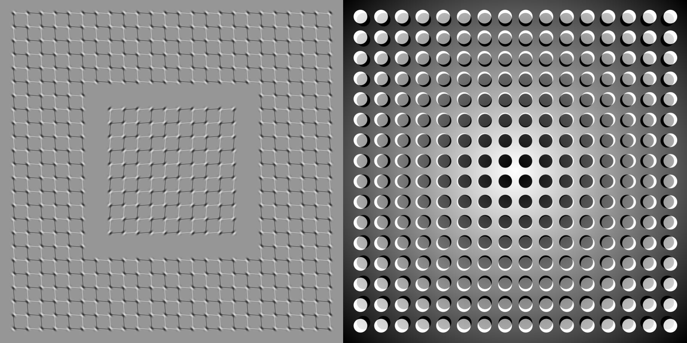

> **图 2** ：我们所看到的景象基于大脑对未来的预测（Kitaoka, 2002; Watanabe et al., 2018）。

在许多 **强化学习（Reinforcement Learning, RL）** 问题中（Kaelbling et al., 1996; Sutton & Barto, 1998; Wiering & van Otterlo, 2012），一个 **人工智能体（artificial agent）** 同样受益于对过去和现在状态的良好表征，以及对未来的良好预测模型（Werbos, 1987; Silver, 2017），最好是一个在通用计算机（如 **循环神经网络（Recurrent Neural Network, RNN）** ）上实现的强大预测模型（Schmidhuber, 1990a, b, 1991a）。

<a id="figure-3"></a>

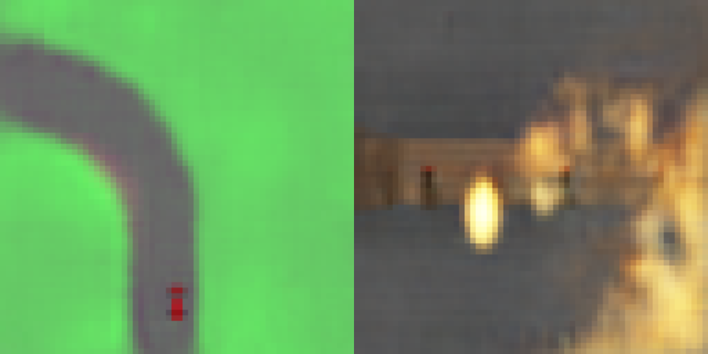

> **图 3** ：在这项工作中，我们为 OpenAI Gym 环境构建概率生成模型。基于 RNN 的世界模型使用从实际游戏环境中收集的观测记录进行训练。训练完世界模型后，我们可以用它们来模拟完整的环境，并用它们来训练智能体。

大型 RNN 是表达能力极强的模型，可以学习数据的丰富空间和时间表征。然而，文献中的许多 **无模型（model-free）** RL 方法通常只使用参数很少的小型神经网络。RL 算法常常受限于 **信用分配问题（credit assignment problem）** ，这使得传统的 RL 算法难以学习大型模型的数百万个权重，因此在实践中，通常使用较小的网络，因为它们在训练期间能更快地迭代到好的策略。

理想情况下，我们希望能够高效地训练基于 RNN 的大型智能体。 **反向传播算法（backpropagation algorithm）** （Linnainmaa, 1970; Kelley, 1960; Werbos, 1982）可以用来高效地训练大型神经网络。在这项工作中，我们研究如何训练一个大型神经网络(^1^11典型的无模型 RL 模型拥有大约 $10^{3}$ 到 $10^{6}$ 个模型参数。我们研究训练大约 $10^{7}$ 个参数的模型，与拥有 $10^{8}$ 甚至 $10^{9}$ 个参数的先进深度学习模型相比，这仍然相当小。原则上，如果我们想使用这些更大的网络，本文描述的方法可以利用它们。）来解决 RL 任务，方法是将智能体划分为一个大型的世界模型和一个小型的控制器模型。我们首先以无监督方式训练一个大型神经网络来学习智能体世界的模型，然后训练较小的控制器模型来学习使用这个世界模型执行任务。小型控制器让训练算法专注于小搜索空间上的信用分配问题，同时又不牺牲大型世界模型带来的容量和表达能力。通过让智能体在其世界模型的视角下进行训练，我们表明它可以学习到高度紧凑的策略来执行其任务。

尽管存在大量关于 **基于模型的强化学习（model-based reinforcement learning）** 的研究，但本文并非旨在综述该领域的现状（Arulkumaran et al., 2017; Schmidhuber, 2015b）。相反，本文的目标是从 1990-2015 年间一系列关于基于 RNN 的世界模型与控制器组合的论文中提炼几个关键概念（Schmidhuber, 1990a, b, 1991a, c, 2015a）。我们还将讨论文献中其他相关的工作，这些工作分享了学习世界模型并使用该模型训练智能体的类似思想。

在本文中，我们提出了一个简化的框架，可以用来通过实验演示这些论文中的一些关键概念，并为将这些思想有效应用于各种 RL 环境提供进一步的见解。在描述我们的方法和实验时，我们使用与《论学会思考：用于 RL 控制器和 RNN 世界模型新颖组合的算法信息论》（Schmidhuber, 2015a）中类似的术语和符号。

<a id="section-2"></a>

## 2 智能体模型（Agent Model）

我们提出一个受我们自身认知系统启发的简单模型。在此模型中，我们的智能体包含一个 **视觉感知组件（visual sensory component）** ，用于将其所见压缩成一个小的代表性编码。它还有一个 **记忆组件（memory component）** ，能够基于历史信息对未来编码进行预测。最后，我们的智能体包含一个 **决策组件（decision-making component）** ，它仅根据其视觉和记忆组件创建的表示来决定采取何种动作。

<a id="figure-4"></a>

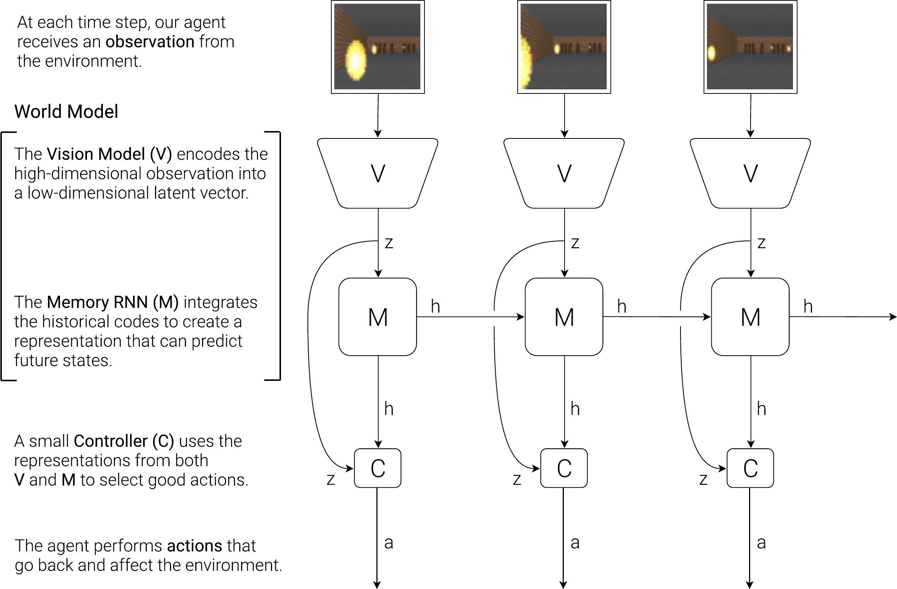

> 图 4：我们的智能体由三个紧密协作的组件构成：视觉（V）、记忆（M）和控制器（C）

- [2.1 VAE (V) 模型](#21-vae-v-model)
- [2.2 MDN-RNN (M) 模型](#22-mdn-rnn-m-model)
- [2.3 控制器 (C) 模型](#23-controller-c-model)
- [2.4 整合 V、M 和 C](#24-putting-v-m-and-c-together)

<a id="section-2-1"></a>

### 2.1 VAE (V) 模型

环境在每个时间步为我们的智能体提供一个高维输入观测。该输入通常是视频序列中的一帧二维图像。V 模型的作用是学习每个观测输入帧的抽象、压缩表示。

<a id="figure-5"></a>

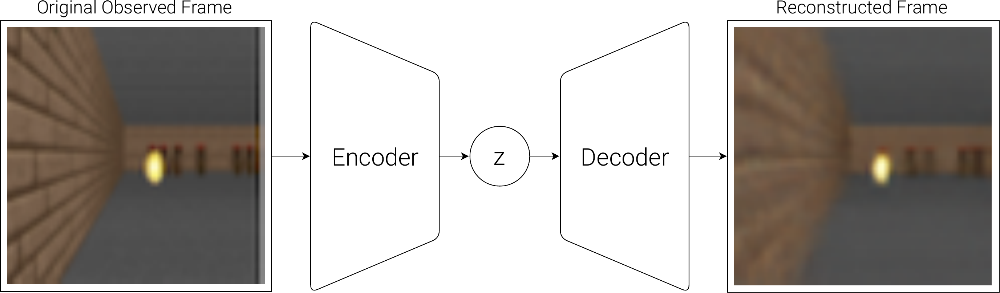

> 图 5：变分自编码器（Variational Autoencoder, VAE）的流程图。

在此，我们使用一个简单的 **变分自编码器（Variational Autoencoder, VAE）** （Kingma & Welling, 2013; Rezende et al., 2014）作为我们的 V 模型，将每个图像帧压缩成一个小的潜在向量 $z$。

<a id="section-2-2"></a>

### 2.2 MDN-RNN (M) 模型

虽然 V 模型的作用是压缩智能体在每个时间帧所看到的内容，但我们还希望压缩随时间发生的事件。为此，M 模型的作用是 **预测未来** 。M 模型充当一个预测模型，用于预测 V 预期将产生的未来 $z$ 向量。由于许多复杂环境本质上是随机的，我们训练我们的 **循环神经网络（Recurrent Neural Network, RNN）** 输出一个概率密度函数 $p(z)$，而不是对 $z$ 的确定性预测。

<a id="figure-6"></a>

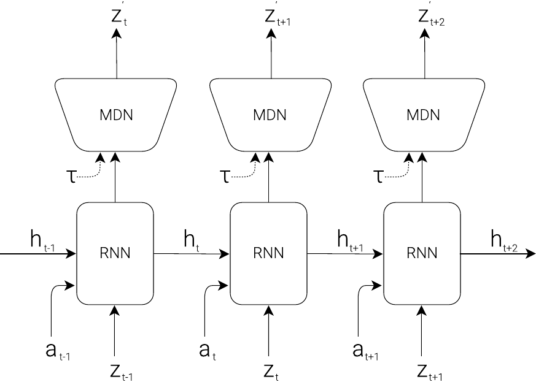

> 图 6：带有混合密度网络输出层的 RNN。该 MDN 输出用于采样下一个潜在向量 $z$ 预测的高斯混合分布的参数。

在我们的方法中，我们将 $p(z)$ 近似为一个 **高斯混合分布（Mixture of Gaussian distribution）** ，并训练 RNN 输出给定当前及过去可用信息时，下一个潜在向量 $z_{t+1}$ 的概率分布。

更具体地说，RNN 将对 $P(z_{t+1}\;|\;a_{t},z_{t},h_{t})$ 进行建模，其中 $a_{t}$ 是在时间 $t$ 采取的动作，$h_{t}$ 是 RNN 在时间 $t$ 的隐藏状态。在采样期间，我们可以调整一个 **温度参数（temperature parameter）** $\tau$ 来控制模型的不确定性，如（Ha & Eck, 2017）中所做的那样——我们稍后将发现调整 $\tau$ 对于训练我们的控制器很有用。

<a id="figure-7"></a>

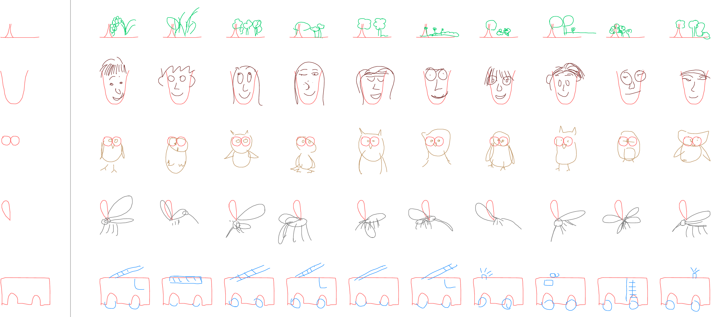

> 图 7：SketchRNN（Ha & Eck, 2017）是一个 MDN-RNN 的示例，用于预测草图绘制的下一个笔划。我们使用一个类似的模型来预测下一个潜在向量 $z_{t}$。

这种方法被称为 **混合密度网络（Mixture Density Network, MDN）** （Bishop, 1994）与 RNN 的结合（MDN-RNN）（Graves, 2013; Ha, 2017a），过去已应用于序列生成问题，例如生成手写体（Graves, 2013）和草图（Ha & Eck, 2017）。

<a id="section-2-3"></a>

### 2.3 控制器 (C) 模型

**控制器（Controller, C）** 模型负责确定在环境推演过程中要采取的行动方案，以最大化智能体的预期累积奖励。在我们的实验中，我们有意使 C 尽可能简单和小型，并与 V 和 M 分开训练，以便我们智能体的大部分复杂性存在于 **世界模型（world model）** （V 和 M）中。

C 是一个简单的单层线性模型，它在每个时间步直接将 $z_{t}$ 和 $h_{t}$ 映射到动作 $a_{t}$：

$$
a_{t}=W_{c}\;[z_{t}\;h_{t}]\;+b_{c}(1)
$$

在这个线性模型中，$W_{c}$ 和 $b_{c}$ 是将拼接后的输入向量 $[z_{t}\;h_{t}]$ 映射到输出动作向量 $a_{t}$ 的权重矩阵和偏置向量。

<a id="section-2-4"></a>

### 2.4 整合 V、M 和 C

以下流程图说明了 V、M 和 C 如何与环境交互：

<a id="figure-8"></a>

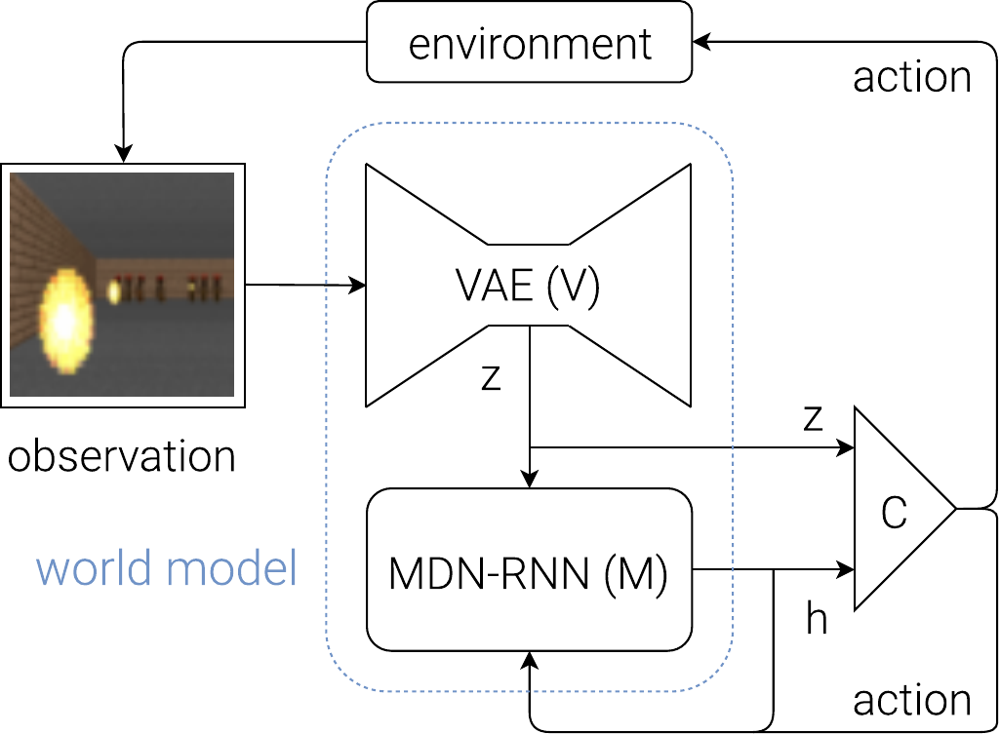

> 图 8：我们的智能体模型的流程图。原始观测首先在每个时间步 $t$ 由 V 处理以产生 $z_{t}$。C 的输入是这个潜在向量 $z_{t}$ 与 M 在每个时间步的隐藏状态 $h_{t}$ 的拼接。C 随后将输出一个用于运动控制的动作向量 $a_{t}$，并影响环境。然后 M 将当前的 $z_{t}$ 和动作 $a_{t}$ 作为输入，更新其自身的隐藏状态以产生将在时间 $t+1$ 使用的 $h_{t+1}$。

以下是在 OpenAI Gym（Brockman et al., 2016）环境中如何使用我们的智能体模型的伪代码：

```python
def rollout(controller):
    obs = env.reset()
    h = rnn.initial_state()
    done = False
    cumulative_reward = 0
    while not done:
        z = vae.encode(obs)
        a = controller.action([z, h])
        obs, reward, done = env.step(a)
        cumulative_reward += reward
        h = rnn.forward([z, a], h)
    return cumulative_reward
```

在给定的控制器 C 上运行此函数将返回一次推演过程中的累积奖励。

C 的这种极简设计也带来了重要的实际好处。深度学习的进步为我们提供了高效训练大型复杂模型的工具，前提是我们能定义一个表现良好、可微分的损失函数。我们的 V 和 M 模型旨在利用现代 GPU 加速器通过反向传播算法高效训练，因此我们希望模型的大部分复杂性和参数都位于 V 和 M 中。相比之下，线性模型 C 的参数数量是最少的。这种选择允许我们探索更非常规的方法来训练 C——例如，甚至可以使用 **进化策略（Evolution Strategies, ES）** （Rechenberg, 1973; Schwefel, 1977）来解决信用分配问题困难的更具挑战性的 **强化学习（Reinforcement Learning, RL）** 任务。

为了优化 C 的参数，我们选择了 **协方差矩阵自适应进化策略（Covariance-Matrix Adaptation Evolution Strategy, CMA-ES）** （Hansen, 2016; Hansen & Ostermeier, 2001）作为我们的优化算法，因为它已知在参数空间高达几千维的情况下表现良好。我们在单台机器上使用多个 CPU 核心并行运行环境的多次推演，来进化 C 的参数。

有关我们实验中使用的模型、训练过程和环境的更具体信息，请参阅附录部分。

<a id="section-3"></a>

## 3 Car Racing Experiment

In this section, we describe how we can train the Agent model described earlier to solve a car racing task. To our knowledge, our agent is the first known solution to achieve the score required to solve this task.(^2^22We find this task interesting because although it is not difficult to train an agent to wobble around randomly generated tracks and obtain a mediocre score, CarRacing-v0 defines solving as getting average reward of 900 over 100 consecutive trials, which means the agent can only afford very few driving mistakes.)

- [3.1 World Model for Feature Extraction](#31-world-model-for-feature-extraction)
- [3.2 Procedure](#32-procedure)
- [3.3 Experiment Results](#33-experiment-results)
- [3.4 Car Racing Dreams](#34-car-racing-dreams)

<a id="section-3-1"></a>

### 3.1 World Model for Feature Extraction

A predictive world model can help us extract useful representations of space and time. By using these features as inputs of a controller, we can train a compact and minimal controller to perform a continuous control task, such as learning to drive from pixel inputs for a top-down car racing environment called CarRacing-v0 (Klimov, 2016).

<a id="figure-9"></a>

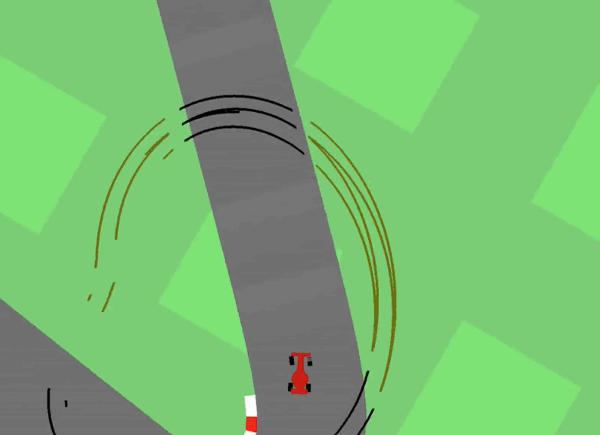

> Figure 9: Our agent learning to navigate in CarRacing-v0.

In this environment, the tracks are randomly generated for each trial, and our agent is rewarded for visiting as many tiles as possible in the least amount of time. The agent controls three continuous actions: steering left/right, acceleration, and brake.

To train our V model, we first collect a dataset of 10,000 random rollouts of the environment. We have first an agent acting randomly to explore the environment multiple times, and record the random actions $a_{t}$ taken and the resulting observations from the environment. We use this dataset to train V to learn a latent space of each frame observed. We train our VAE to encode each frame into low dimensional latent vector $z$ by minimizing the difference between a given frame and the reconstructed version of the frame produced by the decoder from $z$.

We can now use our trained V model to pre-process each frame at time $t$ into $z_{t}$ to train our M model. Using this pre-processed data, along with the recorded random actions $a_{t}$ taken, our MDN-RNN can now be trained to model $P(z_{t+1}\;|\;a_{t},z_{t},h_{t})$ as a mixture of Gaussians.(^3^33In principle, we can train both models together in an end-to-end manner, although we found that training each separately is more practical, and also achieves satisfactory results. Training each model only required less than an hour of computation time on a single GPU. We can also train individual VAE and MDN-RNN models without having to exhaustively tune hyperparameters.)

In this experiment, the world model (V and M) has no knowledge about the actual reward signals from the environment. Its task is simply to compress and predict the sequence of image frames observed. Only the Controller (C) Model has access to the reward information from the environment. Since there are a mere 867 parameters inside the linear controller model, evolutionary algorithms such as CMA-ES are well suited for this optimization task.

We can use the VAE to reconstruct each frame using $z_{t}$ at each time step to visualize the quality of the information the agent actually sees during a rollout. The figure below is a VAE model trained on screenshots from CarRacing-v0.

<a id="figure-10"></a>

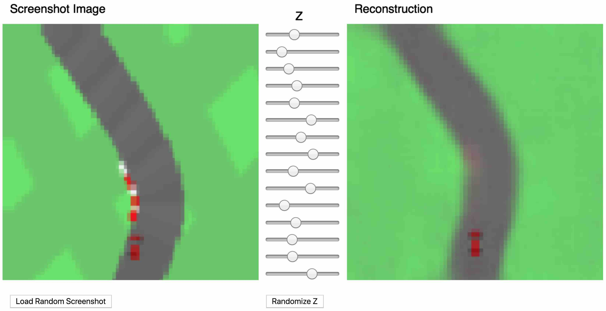

> Figure 10: Despite losing details during this lossy compression process, latent vector $z$ captures the essence of each image frame.

In the online version of this article, one can load randomly chosen screenshots to be encoded into a small latent vector $z$, which is used to reconstruct the original screenshot. One can also experiment with adjusting the values of the $z$ vector using the slider bars to see how it affects the reconstruction, or randomize $z$ to observe the space of possible screenshots.

<a id="section-3-2"></a>

### 3.2 Procedure

To summarize the Car Racing experiment, below are the steps taken:

- 1. Collect 10,000 rollouts from a random policy.
- 2. Train VAE (V) to encode frames into $z\in\mathcal{R}^{32}$.
- 3. Train MDN-RNN (M) to model $P(z_{t+1}\;|\;a_{t},z_{t},h_{t})$.
- 4. Define Controller (C) as $a_{t}=W_{c}\;[z_{t}\;h_{t}]\;+\;b_{c}$.
- 5. Use CMA-ES to solve for a $W_{c}$ and $b_{c}$ that maximizes the expected cumulative reward.

| Model      | Parameter Count |
| ---------- | --------------- |
| VAE        | 4,348,547       |
| MDN-RNN    | 422,368         |
| Controller | 867             |

<a id="section-3-3"></a>

### 3.3 Experiment Results

V Model Only

Training an agent to drive is not a difficult task if we have a good representation of the observation. Previous works (Hünermann, 2017; Bling, 2015; Lau, 2016) have shown that with a good set of hand-engineered information about the observation, such as LIDAR information, angles, positions and velocities, one can easily train a small feed-forward network to take this hand-engineered input and output a satisfactory navigation policy. For this reason, we first want to test our agent by handicapping C to only have access to V but not M, so we define our controller as $a_{t}=W_{c}\;z_{t}\;+\;b_{c}$.

<a id="figure-11"></a>

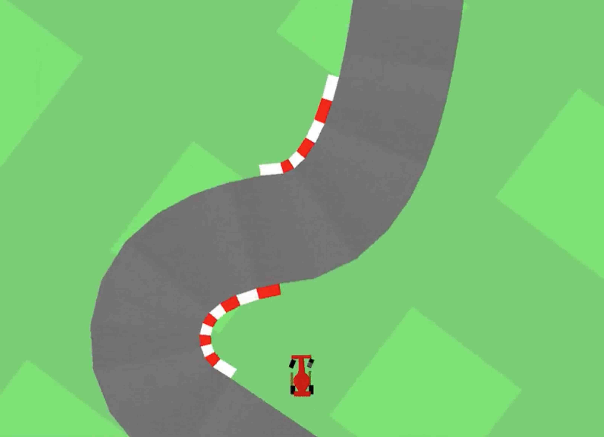

> Figure 11: Limiting our controller to see only $z_{t}$, but not $h_{t}$ results in wobbly and unstable driving behaviours.

Although the agent is still able to navigate the race track in this setting, we notice it wobbles around and misses the tracks on sharper corners. This handicapped agent achieved an average score of 632 $\pm$ 251 over 100 random trials, in line with the performance of other agents on OpenAI Gym’s leaderboard (Klimov, 2016) and traditional Deep RL methods such as A3C (Khan & Elibol, 2016; Jang et al., 2017). Adding a hidden layer to C’s policy network helps to improve the results to 788 $\pm$ 141, but not quite enough to solve this environment.

Full World Model (V and M)

The representation $z_{t}$ provided by our V model only captures a representation at a moment in time and does not have much predictive power. In contrast, M is trained to do one thing, and to do it really well, which is to predict $z_{t+1}$. Since M’s prediction of $z_{t+1}$ is produced from the RNN’s hidden state $h_{t}$ at time $t$, this vector is a good candidate for the set of learned features we can give to our agent. Combining $z_{t}$ with $h_{t}$ gives our controller C a good representation of both the current observation, and what to expect in the future.

<a id="figure-12"></a>

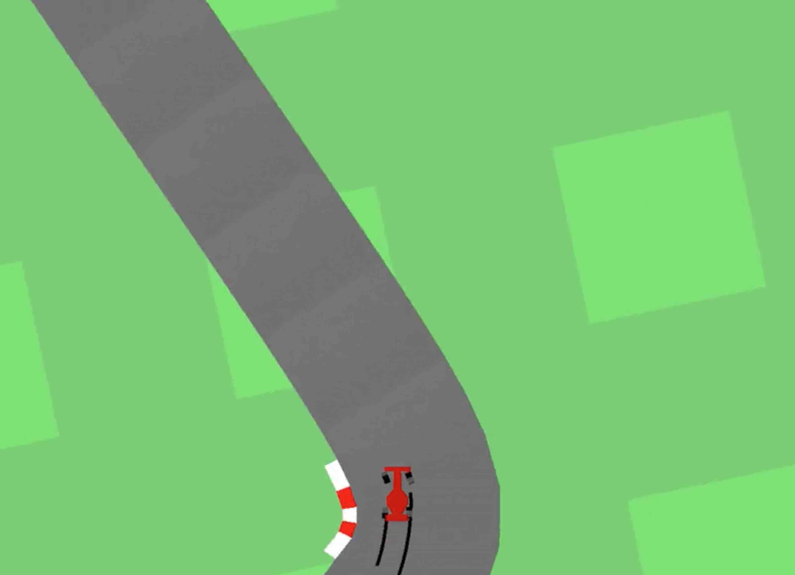

> Figure 12: Driving is more stable if we give our controller access to both $z_{t}$ and $h_{t}$.

We see that allowing the agent to access the both $z_{t}$ and $h_{t}$ greatly improves its driving capability. The driving is more stable, and the agent is able to seemingly attack the sharp corners effectively. Furthermore, we see that in making these fast reflexive driving decisions during a car race, the agent does not need to plan ahead and roll out hypothetical scenarios of the future. Since $h_{t}$ contain information about the probability distribution of the future, the agent can just query the RNN instinctively to guide its action decisions. Like a seasoned Formula One driver or the baseball player discussed earlier, the agent can instinctively predict when and where to navigate in the heat of the moment.

<a id="table-1"></a>

> Table 1: CarRacing-v0 scores achieved using various methods.

| Method                               | Avg. Score    |
| ------------------------------------ | ------------- |
| DQN (Prieur, 2017)                   | 343 $\pm$ 18  |
| A3C (continuous) (Jang et al., 2017) | 591 $\pm$ 45  |
| A3C (discrete) (Khan & Elibol, 2016) | 652 $\pm$ 10  |
| ceobillionaire (Gym Leaderboard)     | 838 $\pm$ 11  |
| V model                              | 632 $\pm$ 251 |
| V model with hidden layer            | 788 $\pm$ 141 |
| Full World Model                     | 906 $\pm$ 21  |

Our agent is able to achieve a score of 906 $\pm$ 21 over 100 random trials, effectively solving the task and obtaining new state of the art results. Previous attempts (Khan & Elibol, 2016; Jang et al., 2017) using Deep RL methods obtained average scores of 591–652 range, and the best reported solution on the leaderboard obtained an average score of 838 $\pm$ 11 over 100 random trials. Traditional Deep RL methods often require pre-processing of each frame, such as employing edge-detection (Jang et al., 2017), in addition to stacking a few recent frames (Khan & Elibol, 2016; Jang et al., 2017) into the input. In contrast, our world model takes in a stream of raw RGB pixel images and directly learns a spatial-temporal representation. To our knowledge, our method is the first reported solution to solve this task.

<a id="section-3-4"></a>

### 3.4 Car Racing Dreams

Since our world model is able to model the future, we are also able to have it come up with hypothetical car racing scenarios on its own. We can ask it to produce the probability distribution of $z_{t+1}$ given the current states, sample a $z_{t+1}$ and use this sample as the real observation. We can put our trained C back into this hallucinated environment generated by M. The following image from an interactive demo in the online version of this article shows how our world model can be used to hallucinate the car racing environment:

<a id="figure-13"></a>

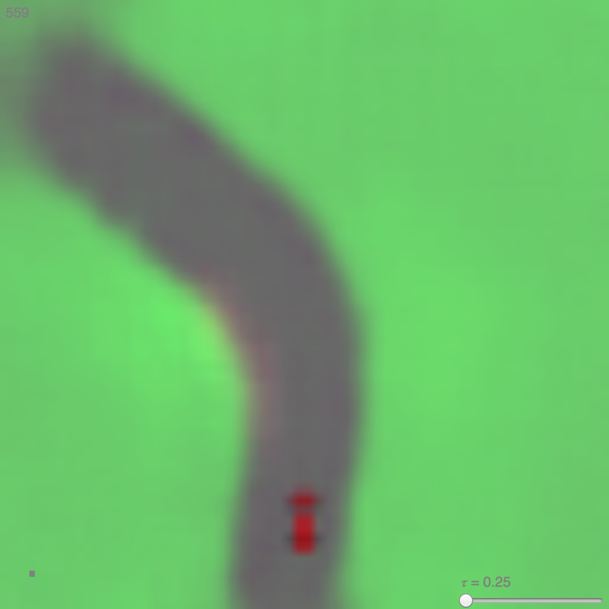

> Figure 13: Our agent driving inside of its own dream world. Here, we deploy our trained policy into a fake environment generated by the MDN-RNN, and rendered using the VAE’s decoder. In the demo, one can override the agent’s actions as well as adjust $\tau$ to control the uncertainty of the environment generated by M.

<a id="section-4"></a>

## 4 VizDoom 实验（VizDoom Experiment）

- [4.1 在梦境中学习（Learning Inside of a Dream）](#41-learning-inside-of-a-dream)
- [4.2 流程（Procedure）](#42-procedure)
- [4.3 在梦境中训练（Training Inside of the Dream）](#43-training-inside-of-the-dream)
- [4.4 将策略迁移到真实环境（Transfer Policy to Actual Environment）](#44-transfer-policy-to-actual-environment)
- [4.5 欺骗世界模型（Cheating the World Model）](#45-cheating-the-world-model)

<a id="section-4-1"></a>

### 4.1 在梦境中学习（Learning Inside of a Dream）

我们刚刚看到，在真实环境中学习到的策略似乎在梦境环境中也能部分发挥作用。这引出了一个疑问—— **我们能否训练智能体在其自身的梦境中学习，并将此策略迁移回真实环境？**

如果我们的 **世界模型（World Model）** 对于其目的足够精确，并且对于手头的问题足够完备，我们应该能够用这个世界模型替代真实环境。毕竟，我们的智能体并不直接观察现实，而只看到世界模型允许它看到的东西。在本实验中，我们在一个智能体的世界模型所产生的幻觉中进行训练，该模型被训练来模拟 VizDoom (Kempka et al., 2016) 环境。

<a id="figure-14"></a>

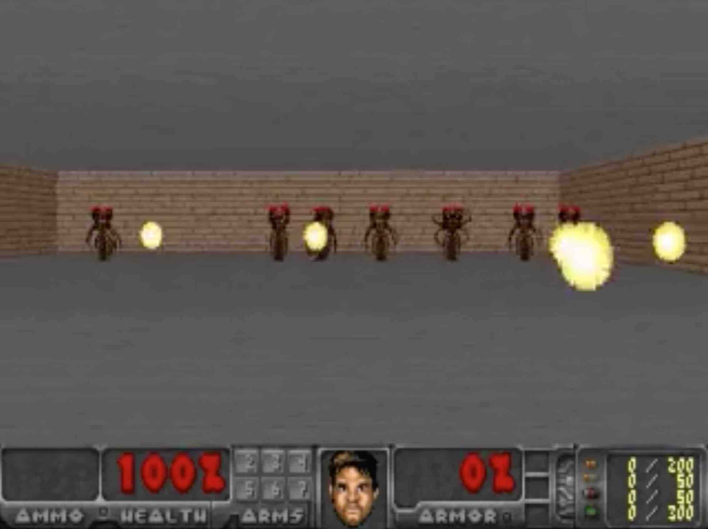

> 图 14：我们最终解决 VizDoom: Take Cover 任务的智能体。

智能体必须学会躲避从房间另一侧由怪物射出的、唯一目的就是杀死智能体的火球。该环境中没有明确的奖励，因此为了模拟自然选择，可以将累积奖励定义为智能体在一次推演（rollout）中设法存活的 **时间步数** 。每次环境推演最多运行 2100 个时间步（$\sim$ 60 秒），如果在连续 100 次推演中平均存活时间大于 750 个时间步（$\sim$ 20 秒），则认为任务已解决 (Paquette, 2016)。

<a id="section-4-2"></a>

### 4.2 流程（Procedure）

我们的 VizDoom 实验设置与 Car Racing 任务大体相同，只有几个关键区别。在 Car Racing 任务中，M 仅被训练来建模下一个 $z_{t}$。由于我们希望构建一个可以训练智能体的世界模型，因此这里的 M 模型除了预测下一帧 $z_{t}$ 外，还将预测智能体是否在下一帧死亡（作为一个二元事件 $done_{t}$，或简写为 $d_{t}$）。

由于 M 模型除了能预测下一个观测值外，还能预测 $done$ 状态，我们现在拥有了构建一个完整 **强化学习（Reinforcement Learning, RL）** 环境所需的所有要素。我们首先通过在我们的 M 模型上包装一个 gym.Env 接口来构建一个 OpenAI Gym 环境接口，就好像它是一个真实的 Gym 环境一样，然后在这个虚拟环境中训练我们的智能体，而不是使用真实环境。

在这个模拟中，我们不需要 V 模型在幻觉过程中编码任何真实的像素帧，因此我们的智能体将完全在一个 **潜在空间（latent space）** 环境中进行训练。正如我们将看到的，这具有许多优势。

这个虚拟环境具有与真实环境完全相同的接口，因此在智能体在虚拟环境中学习到满意的策略后，我们可以轻松地将此策略部署回真实环境，以观察策略的迁移效果如何。

总结 Take Cover 实验，步骤如下：

- 1. 从一个随机策略收集 10,000 次推演。
- 2. 训练 **变分自编码器（Variational Autoencoder, VAE）** (V) 将每一帧编码为一个潜在向量 $z\in\mathcal{R}^{64}$，并使用 V 将 (1) 中收集的图像转换为潜在空间表示。
- 3. 训练 **混合密度循环神经网络（Mixture Density Network Recurrent Neural Network, MDN-RNN）** (M) 来建模 $P(z_{t+1},d_{t+1}\;|\;a_{t},z_{t},h_{t})$。
- 4. 将 **控制器（Controller）** (C) 定义为 $a_{t}=W_{c}\;[z_{t}\;h_{t}]$。
- 5. 使用 **协方差矩阵自适应进化策略（Covariance Matrix Adaptation Evolution Strategy, CMA-ES）** 求解 $W_{c}$，以最大化虚拟环境内的预期存活时间。
- 6. 将 (5) 中学到的策略应用于真实环境。

| 模型       | 参数数量  |
| ---------- | --------- |
| VAE        | 4,446,915 |
| MDN-RNN    | 1,678,785 |
| Controller | 1,088     |

<a id="section-4-3"></a>

### 4.3 在梦境中训练（Training Inside of the Dream）

经过一些训练后，我们的控制器学会了在梦境环境中导航，并躲避由 M 生成的怪物发射的致命火球。我们的智能体在虚拟环境中取得了 $\sim$ 900 个时间步的分数。

<a id="figure-15"></a>

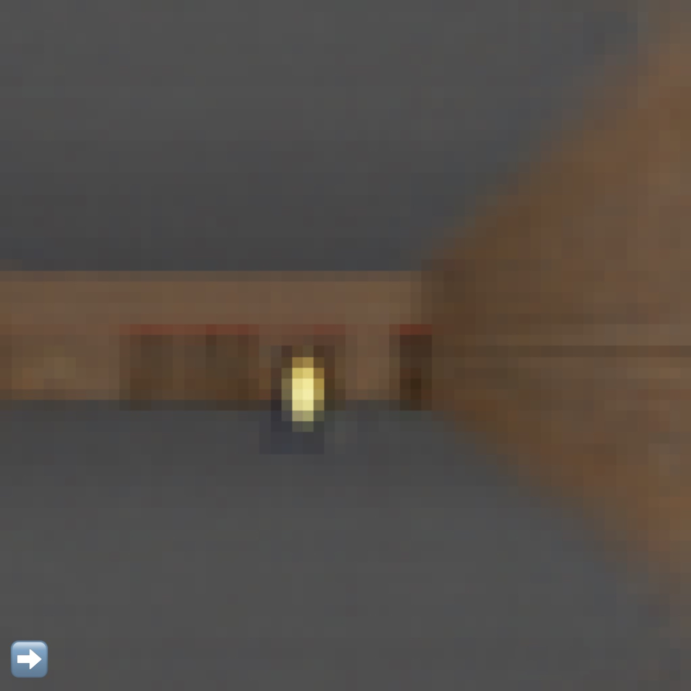

> 图 15：我们的智能体发现了一种躲避幻觉火球的策略。在本文的在线版本中，读者可以与此演示中的环境进行交互。

在这里，我们基于 **循环神经网络（Recurrent Neural Network, RNN）** 的世界模型被训练来模拟由人类程序员设计的完整游戏环境。通过仅从随机推演中收集的原始图像数据中学习，它学会了如何模拟游戏的基本方面——例如游戏逻辑、敌人行为、物理特性以及 3D 图形渲染。

例如，如果智能体选择向左的动作，M 模型学会将智能体向左移动，并相应地调整其对游戏状态的内部表示。如果智能体试图向任一方向移动过远，它还学会阻止智能体超出关卡两侧的墙壁。有时，M 模型需要跟踪从几个不同怪物射出的多个火球，并连贯地使它们沿着预定方向移动。它还必须检测智能体是否已被这些火球之一杀死。

然而，与真实游戏环境不同，我们注意到可以在虚拟环境中引入额外的 **不确定性（uncertainty）** ，从而使梦境环境中的游戏更具挑战性。我们可以通过在采样 $z_{t+1}$ 的过程中增加 **温度（temperature）** 参数 $\tau$ 来实现这一点。通过增加不确定性，我们的梦境环境变得比真实环境更困难。与真实游戏相比，火球的移动路径可能更随机、更不可预测。有时，智能体甚至可能仅仅因为纯粹的厄运而死亡，无法解释。

我们发现，在较高温度设置下表现良好的智能体通常在正常设置下表现更好。事实上，增加 $\tau$ 有助于防止我们的控制器利用世界模型的不完美之处——我们将在后面更深入地讨论这一点。

<a id="section-4-4"></a>

### 4.4 将策略迁移到真实环境（Transfer Policy to Actual Environment）

<a id="figure-16"></a>


> 图 16：将在梦境 RNN 环境中习得的策略部署回真实的 VizDoom 环境。

我们将 **在虚拟环境中训练的智能体** 取出，并在原始的 VizDoom 场景中测试其性能。在 100 次随机连续试验中，其得分约为 $\sim$ 1100 个时间步，远超过 750 个时间步的达标要求，也远高于在更困难的虚拟环境中获得的分数。

<a id="figure-17"></a>

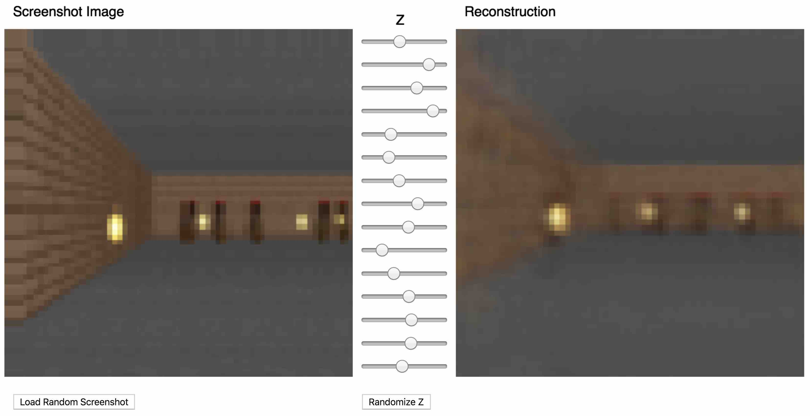

> 图 17：在线文章中的《毁灭战士》交互式 VAE。

我们可以看到，即使 **V 模型（V model）** 未能正确捕捉每一帧的所有细节（例如，准确识别怪物数量），智能体仍然能够利用习得的策略在真实环境中导航。由于虚拟环境从一开始就无法准确追踪怪物的确切数量，一个能够在噪声更大、更不确定的虚拟噩梦环境中生存的智能体，在原始、更清晰的环境中将会表现得更好。

<a id="section-4-5"></a>

### 4.5 欺骗世界模型（Cheating the World Model）

在我们童年时，可能遇到过一些利用游戏设计漏洞的方法（Wikipedia, 2017）。玩家会发现获取无限生命或健康值的方法，通过利用这些漏洞，他们可以轻松完成原本困难的游戏。然而，在这个过程中，他们可能放弃了学习游戏设计者所期望的、掌握游戏所需技能的机会。

例如，在我们最初的实验中，我们注意到智能体发现了一种 **对抗性策略（adversarial policy）** ，使其能够以某种方式移动，以至于在这个由 **M 模型（M model）** 控制的虚拟环境中，怪物在某些 rollout 中从未发射过一颗火球。即使有火球形成的迹象，智能体也会以一种神奇的方式移动来“熄灭”火球，仿佛它在环境中拥有超能力。

因为我们的 **世界模型（world model）** 只是环境的一个近似概率模型，它偶尔会产生不遵循真实环境物理规律的轨迹。正如我们之前所见，即使是真实环境中房间另一侧的怪物数量，世界模型也无法精确复现。就像一个孩子知道空中的物体会落到地面，也可能想象出飞越天空的不切实际的超级英雄。因此，我们的世界模型可以被控制器（controller）利用，即使这种利用在真实环境中并不存在。

并且，由于我们使用 M 模型为智能体生成虚拟梦境环境，我们也赋予了控制器访问 M 所有隐藏状态（hidden states）的权限。这实质上相当于授予智能体访问游戏引擎所有内部状态和内存的权限，而不仅仅是玩家能看到的游戏观测。因此，我们的智能体可以高效地探索直接操纵游戏引擎隐藏状态的方法，以最大化其期望累积奖励。这种在习得的动力学模型内部学习策略的方法的弱点是，我们的智能体可以轻易找到一种能够欺骗我们动力学模型的对抗性策略——它会找到一种在我们的动力学模型下看起来很好的策略，但在真实环境中会失败，通常是因为它访问了模型预测错误的区域，这些区域远离训练分布。

<a id="figure-18"></a>

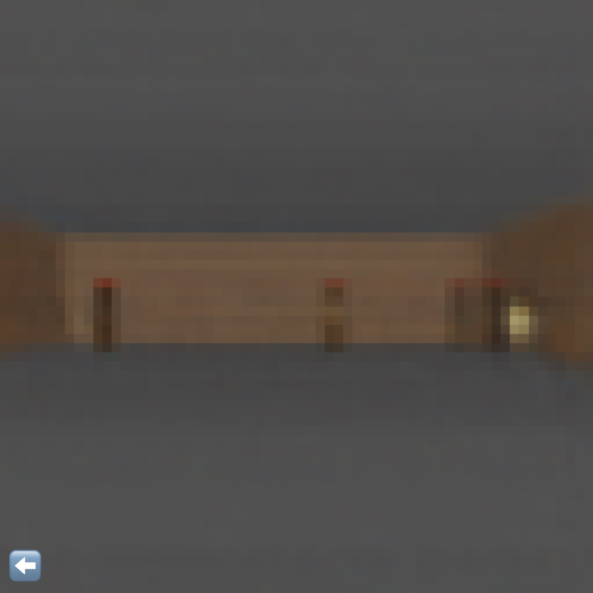

> 图 18：智能体发现了一种对抗性策略，可以在某些 rollout 中火球发射后自动将其“熄灭”。

这个弱点可能是许多先前工作虽然学习了 RL 环境的动力学模型，但并未真正使用这些模型完全替代真实环境的原因（Oh et al., 2015; Chiappa et al., 2017）。就像在（Schmidhuber, 1990a, b, 1991a）中提出的 M 模型一样，动力学模型是确定性的，如果模型不完美，就容易被智能体利用。使用贝叶斯模型，如 PILCO（Deisenroth & Rasmussen, 2011），通过不确定性估计在一定程度上帮助解决了这个问题，但并未完全解决。最近的工作（Nagabandi et al., 2017）将基于模型的方法与传统的无模型 RL 训练相结合，首先用习得的策略初始化策略网络，但随后必须依赖无模型方法在真实环境中微调该策略。

在《学会思考》（Learning to Think）（Schmidhuber, 2015a）中，RNN M 并不总是可靠的预测器是可以接受的。一个（可能基于进化的）RNN C 原则上可以学会忽略有缺陷的 M，或者为了任意计算目的（包括分层规划等）利用 M 的某些有用部分。然而，我们这里所做的并非如此——我们目前的方法仍然更接近一些较早的系统（Schmidhuber, 1990a, b, 1991a），其中 RNN M 被用于逐步预测和规划。但与早期工作不同的是，我们使用进化算法来训练 C（如同在《学会思考》中），而不是将传统 RL 与 RNN 结合，这兼具了简单性和通用性的优点。

为了使我们的 C 模型更难利用 M 模型的缺陷，我们选择使用 **MDN-RNN** 作为动力学模型，它对真实环境中可能结果的分布进行建模，而不仅仅是预测一个确定的未来。即使真实环境是确定性的，MDN-RNN 实际上也会将其近似为一个随机环境。这样做的好处是，允许我们在任何环境的、随机性更强的版本中训练 C 模型——我们可以简单地调整 **温度参数（temperature parameter）** $\tau$ 来控制 M 模型中的随机性程度，从而在真实性和可被利用性之间进行权衡。

考虑到用 VAE 模型编码的潜在空间只是一个单一的对角高斯分布，使用高斯混合模型可能看起来有些过度。然而，混合密度模型中的离散模式对于具有随机离散事件的环境非常有用，例如怪物决定发射火球还是保持不动。虽然单一对角高斯可能足以编码单个帧，但具有混合密度输出层的 RNN 更容易对具有离散随机状态的更复杂环境背后的逻辑进行建模。

例如，如果我们将温度参数设置为一个非常低的值 $\tau=0.1$，实际上就是用几乎等同于确定性 LSTM 的 M 模型来训练 C 模型，那么由于 **模式坍塌（mode collapse）** ，这个梦境环境中的怪物无论智能体做什么都不会发射火球。M 模型无法跳转到高斯混合模型中火球形成和发射的另一个模式。在这种梦境中学到的任何策略大多数时候都会获得 2100 的满分，但显然在释放到真实世界的严酷现实中时会失败，其表现甚至不如随机策略。

但再次注意，《学会思考》中更简单、更稳健的方法并不坚持使用 M 进行逐步规划。相反，C 可以学会为了任意计算目的使用 M 的子程序（M 权重矩阵的一部分），但当 M 无用且忽略 M 能带来更好性能时，C 也可以学会忽略 M。尽管如此，至少在我们目前的 C–M 变体中，M 的预测对于教导 C 至关重要，这更像是在一些早期的 C–M 系统（Schmidhuber, 1990a, b, 1991a）中，但结合了进化或黑盒优化。

通过将温度 $\tau$ 设为 M 模型的可调参数，我们可以看到在不同不确定性水平的幻觉虚拟环境中训练 C 模型的效果，以及它们迁移到真实环境的效果如何。我们实验了改变虚拟环境的温度，并观察在给定温度的虚拟环境中训练智能体后，在真实环境中进行 100 次随机 rollout 的平均得分：

<a id="table-2"></a>

> 表 2：不同温度设置下的“Take Cover”得分。

| 温度 $\tau$    | 虚拟环境得分   | 真实环境得分   |
| -------------- | -------------- | -------------- |
| 0.10           | 2086 $\pm$ 140 | 193 $\pm$ 58   |
| 0.50           | 2060 $\pm$ 277 | 196 $\pm$ 50   |
| 1.00           | 1145 $\pm$ 690 | 868 $\pm$ 511  |
| 1.15           | 918 $\pm$ 546  | 1092 $\pm$ 556 |
| 1.30           | 732 $\pm$ 269  | 753 $\pm$ 139  |
| 随机策略       | N/A            | $210\pm 108$   |
| Gym 排行榜最佳 | N/A            | $820\pm 58$    |

我们看到，虽然增加 M 模型的温度使得 C 模型更难找到对抗性策略，但将其增加过多会使虚拟环境对智能体来说过于困难而无法学到任何东西，因此在实践中它是一个我们可以调整的超参数。温度也影响智能体发现的策略类型。例如，虽然 $\tau=1.15$ 时获得的最佳得分是 1092 $\pm$ 556，但将 $\tau$ 略微提高到 1.30 会导致得分降低，但同时也产生了一种风险更低、回报方差更小的策略。作为对比，OpenAI Gym 排行榜（Paquette, 2016）上的最佳得分是 820 $\pm$ 58。

<a id="section-5"></a>

## 5 Iterative Training Procedure

In our experiments, the tasks are relatively simple, so a reasonable world model can be trained using a dataset collected from a random policy. But what if our environments become more sophisticated? In any difficult environment, only parts of the world are made available to the agent only after it learns how to strategically navigate through its world.

For more complicated tasks, an iterative training procedure is required. We need our agent to be able to explore its world, and constantly collect new observations so that its world model can be improved and refined over time. An iterative training procedure (Schmidhuber, 2015a) is as follows:

- 1. Initialize M, C with random model parameters.
- 2. Rollout to actual environment $N$ times. Save all actions $a_{t}$ and observations $x_{t}$ during rollouts to storage.
- 3. Train M to model $P(x_{t+1},r_{t+1},a_{t+1},d_{t+1}|x_{t},a_{t},h_{t})$ and train C to optimize expected rewards inside of M.
- 4. Go back to (2) if task has not been completed.

We have shown that one iteration of this training loop was enough to solve simple tasks. For more difficult tasks, we need our controller in Step 2 to actively explore parts of the environment that is beneficial to improve its world model. An exciting research direction is to look at ways to incorporate artificial curiosity and intrinsic motivation (Schmidhuber, 2010, 2006, 1991b; Pathak et al., 2017; Oudeyer et al., 2007) and information seeking (Schmidhuber et al., 1994; Gottlieb et al., 2013) abilities in an agent to encourage novel exploration (Lehman & Stanley, 2011). In particular, we can augment the reward function based on improvement in compression quality (Schmidhuber, 2010, 2006, 1991b, 2015a).

In the present approach, since M is a MDN-RNN that models a probability distribution for the next frame, if it does a poor job, then it means the agent has encountered parts of the world that it is not familiar with. Therefore we can adapt and reuse M’s training loss function to encourage curiosity. By flipping the sign of M’s loss function in the actual environment, the agent will be encouraged to explore parts of the world that it is not familiar with. The new data it collects may improve the world model.

The iterative training procedure requires the M model to not only predict the next observation $x$ and $done$, but also predict the action and reward for the next time step. This may be required for more difficult tasks. For instance, if our agent needs to learn complex motor skills to walk around its environment, the world model will learn to imitate its own C model that has already learned to walk. After difficult motor skills, such as walking, is absorbed into a large world model with lots of capacity, the smaller C model can rely on the motor skills already absorbed by the world model and focus on learning more higher level skills to navigate itself using the motor skills it had already learned.

<a id="figure-19"></a>

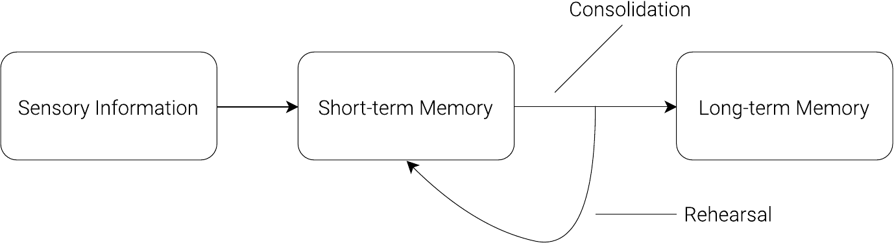

> Figure 19: How information becomes memory.

An interesting connection to the neuroscience literature is the work on hippocampal replay that examines how the brain replays recent experiences when an animal rests or sleeps. Replaying recent experiences plays an important role in memory consolidation (Foster, 2017) – where hippocampus-dependent memories become independent of the hippocampus over a period of time. As (Foster, 2017) puts it, replay is less like dreaming and more like thought. We invite readers to read Replay Comes of Age (Foster, 2017) for a detailed overview of replay from a neuroscience perspective with connections to theoretical reinforcement learning.

Iterative training could allow the C–M model to develop a natural hierarchical way to learn. Recent works about self-play in RL (Sukhbaatar et al., 2017; Bansal et al., 2017; Al-Shedivat et al., 2017) and PowerPlay (Schmidhuber, 2013; Srivastava et al., 2012) also explores methods that lead to a natural curriculum learning (Schmidhuber, 2002), and we feel this is one of the more exciting research areas of reinforcement learning.

<a id="section-6"></a>

## 6 Related Work

There is extensive literature on learning a dynamics model, and using this model to train a policy. Many concepts first explored in the 1980s for feed-forward neural networks (FNNs) (Werbos, 1987; Munro, 1987; Robinson & Fallside, 1989; Werbos, 1989; Nguyen & Widrow, 1989) and in the 1990s for RNNs (Schmidhuber, 1990a, b, 1991a, c) laid some of the groundwork for Learning to Think (Schmidhuber, 2015a). The more recent PILCO (Deisenroth & Rasmussen, 2011; Duvenaud, 2016; McAllister & Rasmussen, 2016) is a probabilistic model-based search policy method designed to solve difficult control problems. Using data collected from the environment, PILCO uses a Gaussian process (GP) model to learn the system dynamics, and then uses this model to sample many trajectories in order to train a controller to perform a desired task, such as swinging up a pendulum, or riding a unicycle.

<a id="figure-20"></a>

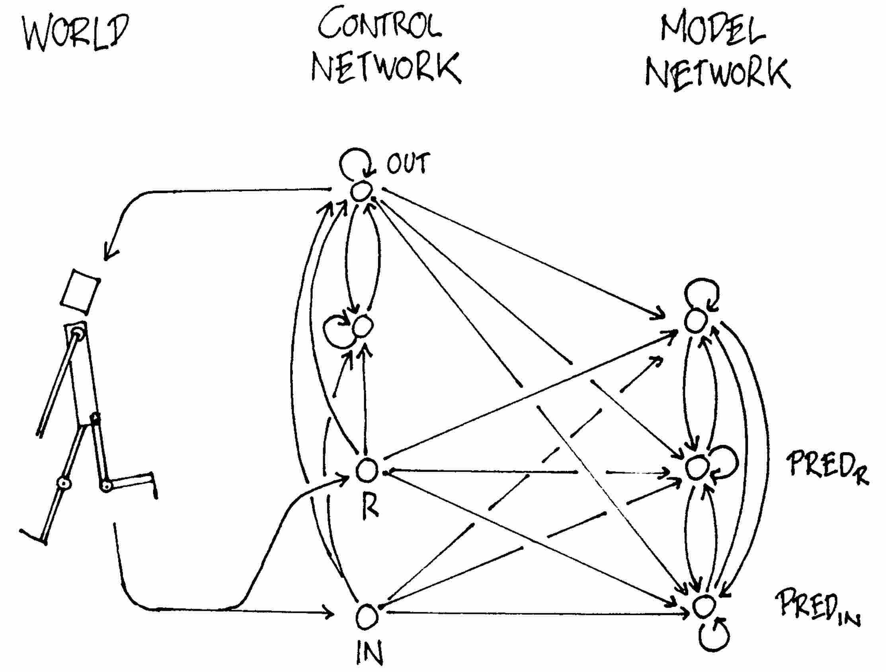

> Figure 20: A controller with internal RNN model of the world (Schmidhuber, 1990a).

While Gaussian processes work well with a small set of low dimension data, their computational complexity makes them difficult to scale up to model a large history of high dimensional observations. Other recent works (Gal et al., 2016; Depeweg et al., 2016) use Bayesian neural networks instead of GPs to learn a dynamics model. These methods have demonstrated promising results on challenging control tasks (Hein et al., 2017), where the states are known and well defined, and the observation is relatively low dimensional. Here we are interested in modelling dynamics observed from high dimensional visual data where our input is a sequence of raw pixel frames.

In robotic control applications, the ability to learn the dynamics of a system from observing only camera-based video inputs is a challenging but important problem. Early work on RL for active vision trained an FNN to take the current image frame of a video sequence to predict the next frame (Schmidhuber & Huber, 1991), and use this predictive model to train a fovea-shifting control network trying to find targets in a visual scene. To get around the difficulty of training a dynamical model to learn directly from high-dimensional pixel images, researchers explored using neural networks to first learn a compressed representation of the video frames. Recent work along these lines (Wahlström et al., 2014, 2015) was able to train controllers using the bottleneck hidden layer of an autoencoder as low-dimensional feature vectors to control a pendulum from pixel inputs. Learning a model of the dynamics from a compressed latent space enable RL algorithms to be much more data-efficient (Finn et al., 2015; Watter et al., 2015; Finn, 2017). We invite readers to watch Finn’s lecture on Model-Based RL (Finn, 2017) to learn more.

Video game environments are also popular in model-based RL research as a testbed for new ideas. (Matthew Guzdial, 2017) used a feed-forward convolutional neural network (CNN) to learn a forward simulation model of a video game. Learning to predict how different actions affect future states in the environment is useful for game-play agents, since if our agent can predict what happens in the future given its current state and action, it can simply select the best action that suits its goal. This has been demonstrated not only in early work (Nguyen & Widrow, 1989; Schmidhuber & Huber, 1991) (when compute was a million times more expensive than today) but also in recent studies (Dosovitskiy & Koltun, 2016) on several competitive VizDoom environments.

The works mentioned above use FNNs to predict the next video frame. We may want to use models that can capture longer term time dependencies. RNNs are powerful models suitable for sequence modelling (Graves, 2013). In a lecture called Hallucination with RNNs (Graves, 2015), Graves demonstrated the ability of RNNs to learn a probabilistic model of Atari game environments. He trained RNNs to learn the structure of such a game and then showed that they can hallucinate similar game levels on its own.

Using RNNs to develop internal models to reason about the future has been explored as early as 1990 in a paper called Making the World Differentiable (Schmidhuber, 1990a), and then further explored in (Schmidhuber, 1990b, 1991a, c). A more recent paper called Learning to Think (Schmidhuber, 2015a) presented a unifying framework for building a RNN-based general problem solver that can learn a world model of its environment and also learn to reason about the future using this model. Subsequent works have used RNN-based models to generate many frames into the future (Chiappa et al., 2017; Oh et al., 2015; Denton & Birodkar, 2017), and also as an internal model to reason about the future (Silver et al., 2016; Weber et al., 2017; Watters et al., 2017).

In this work, we used evolution strategies to train our controller, as it offers many benefits. For instance, we only need to provide the optimizer with the final cumulative reward, rather than the entire history. ES is also easy to parallelize – we can launch many instances of rollout with different solutions to many workers and quickly compute a set of cumulative rewards in parallel. Recent works (Fernando et al., 2017; Salimans et al., 2017; Ha, 2017b; Stanley & Clune, 2017) have confirmed that ES is a viable alternative to traditional Deep RL methods on many strong baselines.

Before the popularity of Deep RL methods (Mnih et al., 2013), evolution-based algorithms have been shown to be effective at solving RL tasks (Stanley & Miikkulainen, 2002; Gomez et al., 2008; Gomez & Schmidhuber, 2005; Gauci & Stanley, 2010; Sehnke et al., 2010; Miikkulainen, 2013). Evolution-based algorithms have even been able to solve difficult RL tasks from high dimensional pixel inputs (Koutnik et al., 2013; Hausknecht et al., 2013; Parker & Bryant, 2012). More recent works (Alvernaz & Togelius, 2017) combine VAE and ES, which is similar to our approach.

<a id="section-7"></a>

## 7 讨论（Discussion）

<a id="figure-21"></a>

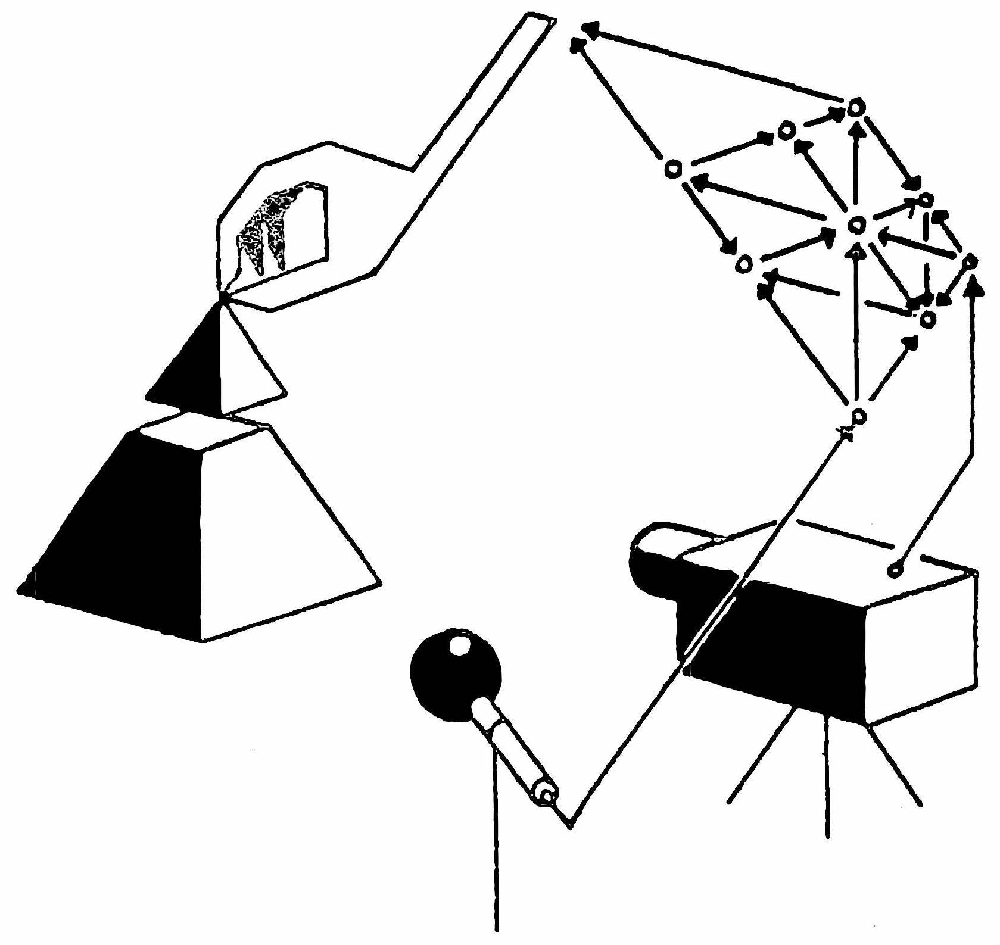

> **图 21** ：一幅古老的示意图（1990年），描绘了一个基于 **循环神经网络（Recurrent Neural Network, RNN）** 的控制器与环境交互的过程（Schmidhuber, 1990a）。

我们已经证明了在智能体自身的模拟 **潜在空间（latent space）** “梦境世界”中完全训练其执行任务的可能性。这种方法提供了许多实际优势。例如，运行计算密集型的游戏引擎需要使用大量计算资源将游戏状态渲染为图像帧，或计算与游戏不直接相关的物理过程。我们可能不希望在实际环境中浪费周期来训练智能体，而是可以在其模拟环境中任意多次地训练它。在现实世界中训练智能体成本更高，因此，通过增量训练来模拟现实的世界模型（world models）可能被证明对于将策略迁移回现实世界是有用的。我们的方法可以补充（Bousmalis et al., 2017; Higgins et al., 2017）中概述的 **模拟到现实（sim2real）** 方法。

此外，我们可以利用深度学习框架，在分布式环境中使用 **图形处理器（Graphics Processing Unit, GPU）** 来加速我们的世界模型模拟。将世界模型实现为一个完全可微的循环计算图还有一个好处，即我们或许能够直接在“梦境”中使用 **反向传播（backpropagation）** 算法训练智能体，通过微调其策略来最大化目标函数（Schmidhuber, 1990a, b, 1991a）。

选择使用 **变分自编码器（Variational Autoencoder, VAE）** 作为 V 模型并将其作为独立模型进行训练也存在局限性，因为它可能会编码与任务无关的观测部分。毕竟，根据定义，无监督学习无法知道哪些信息对当前任务有用。例如，它在《毁灭战士（Doom）》环境中重现了侧墙上不重要的详细砖块图案，但在《赛车（Car Racing）》环境中未能重现道路上与任务相关的瓷砖。通过与预测奖励的 M 模型联合训练，VAE 可能学会关注图像中与任务相关的区域，但这里的权衡是，如果不重新训练，我们可能无法有效地将 VAE 重用于新任务。

学习任务相关特征也与神经科学有联系。当接收到奖励时，初级感觉神经元会从抑制状态中释放，这表明它们通常学习的是任务相关特征，而不仅仅是任何特征，至少在成年期是如此（Pi et al., 2013）。

另一个值得关注的问题是我们世界模型的容量有限。虽然现代存储设备可以存储使用迭代训练过程生成的大量历史数据，但我们基于 **长短期记忆网络（Long Short-Term Memory, LSTM）** （Hochreiter & Schmidhuber, 1997; Gers et al., 2000）的世界模型可能无法在其权重连接中存储所有记录的信息。尽管人脑可以存储数十年甚至数百年的记忆（达到某种分辨率）（Bartol et al., 2015），但我们用反向传播训练的神经网络容量更为有限，并且受到诸如 **灾难性遗忘（catastrophic forgetting）** （Ratcliff, 1990; French, 1994; Kirkpatrick et al., 2016）等问题的困扰。如果我们希望智能体学会探索更复杂的世界，未来的工作可以探索用更高容量的模型（Shazeer et al., 2017; Ha et al., 2016; Suarez, 2017; van den Oord et al., 2016; Vaswani et al., 2017）替换小型 MDN-RNN 网络，或者引入外部记忆模块（Gemici et al., 2017）。

与早期基于 RNN 的 C–M 系统（Schmidhuber, 1990a, b, 1991a, c）类似，我们的系统也是逐时间步地模拟可能的未来，而没有利用类人的分层规划或抽象推理能力（这些能力通常会忽略无关的时空细节）。然而，更通用的 **学会思考（Learning To Think）** 方法（Schmidhuber, 2015a）并不局限于这种相当朴素的方法。相反，它允许一个循环的 C 学会寻址循环 M 的子程序，并以任意可计算的方式（例如，通过分层规划或其他利用 M 类程序权重矩阵部分的方式）重用它们来解决问题。C–M 方法的一个近期扩展—— **一个大型网络（One Big Net）** （Schmidhuber, 2018）——将 C 和 M 折叠成一个单一网络，并使用类似 **PowerPlay** （Schmidhuber, 2013; Srivastava et al., 2012）的行为回放（其中教师网络的行为被压缩到学生网络中（Schmidhuber, 1992））来避免在学习新技能时遗忘旧的预测和控制技能。这些更通用方法的实验将留待未来工作。

## Acknowledgements

We would like to thank Blake Richards, Kai Arulkumaran, Ankur Handa, Kory Mathewson, Kyle McDonald, Denny Britz, Elwin Ha and Natasha Jaques for their thoughtful feedback on this article, and for offering their valuable perspectives and insights from their areas of expertise.

The interactive online version of this article was built using [distill.pub](distill.pub)’s web technology. We would like to thank Chris Olah and the rest of the Distill editorial team for their valuable feedback and generous editorial support, in addition to supporting the use of their Distill technology.

The interative demos on [worldmodels.github.io](worldmodels.github.io) were all built using p5.js. Deploying all of these machine learning models in a web browser was made possible with deeplearn.js, a hardware-accelerated machine learning framework for the browser, developed by the People+AI Research Initiative (PAIR) team at Google. A special thanks goes to Nikhil Thorat and Daniel Smilkov for their help during the development process.

We would to extend our thanks to Alex Graves, Douglas Eck, Mike Schuster, Rajat Monga, Vincent Vanhoucke, Jeff Dean and the Google Brain team for helpful feedback and for encouraging us to explore this area of research. Experiments were performed on Ubuntu virtual machines provided by Google Cloud Platform. Any errors here are our own and do not reflect opinions of our proofreaders and colleagues.

<a id="appendix-a"></a>

## Appendix A Appendix

In this section we will describe in more details the models and training methods used in this work.

- [A.1 Variational Autoencoder](#a1-variational-autoencoder)
- [A.2 Recurrent Neural Network](#a2-recurrent-neural-network)
- [A.3 Controller](#a3-controller)
- [A.4 Evolution Strategies](#a4-evolution-strategies)
- [A.5 DoomRNN](#a5-doomrnn)

### A.1 Variational Autoencoder

<a id="figure-22"></a>

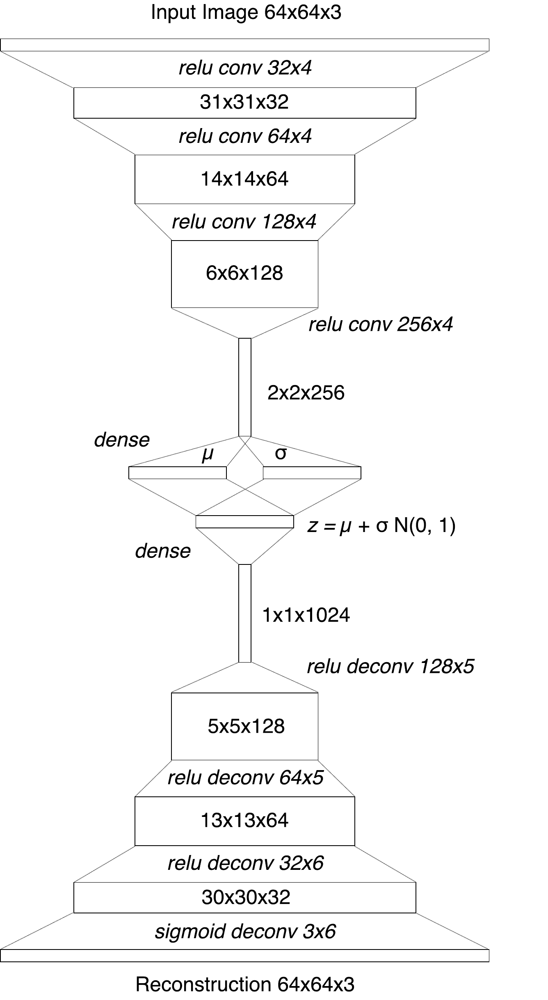

> Figure 22: Description of tensor shapes at each layer of ConvVAE.

We trained a Convolutional Variational Autoencoder (ConvVAE) model as the V Model of our agent. Unlike vanilla autoencoders, enforcing a Gaussian prior over the latent vector $z$ also limits the amount of information capacity for compressing each frame, but this Gaussian prior also makes the world model more robust to unrealistic $z$ vectors generated by the M Model.

As the environment may give us observations as high dimensional pixel images, we first resize each image to 64x64 pixels before and use this resized image as the V Model’s observation. Each pixel is stored as three floating point values between 0 and 1 to represent each of the RGB channels. The ConvVAE takes in this 64x64x3 input tensor and passes this data through 4 convolutional layers to encode it into low dimension vectors $\mu$ and $\sigma$, each of size $N_{z}$. The latent vector $z$ is sampled from the Gaussian prior $N(\mu,\sigma I)$. In the Car Racing task, $N_{z}$ is 32 while for the Doom task $N_{z}$ is 64. The latent vector $z$ is passed through 4 of deconvolution layers used to decode and reconstruct the image.

Each convolution and deconvolution layer uses a stride of 2. The layers are indicated in the diagram in Italics as Activation-type Output Channels x Filter Size. All convolutional and deconvolutional layers use relu activations except for the output layer as we need the output to be between 0 and 1. We trained the model for 1 epoch over the data collected from a random policy, using $L^{2}$ distance between the input image and the reconstruction to quantify the reconstruction loss we optimize for, in addition to KL loss.

### A.2 Recurrent Neural Network

For the M Model, we use an LSTM (Hochreiter & Schmidhuber, 1997) recurrent neural network combined with a Mixture Density Network (Bishop, 1994) as the output layer. We use this network to model the probability distribution of the next $z$ in the next time step as a Mixture of Gaussian distribution. This approach is very similar to (Graves, 2013) in the Unconditional Handwriting Generation section and also the decoder-only section of SketchRNN (Ha & Eck, 2017). The only difference in the approach used is that we did not model the correlation parameter between each element of $z$, and instead had the MDN-RNN output a diagonal covariance matrix of a factored Gaussian distribution.

<a id="figure-23"></a>

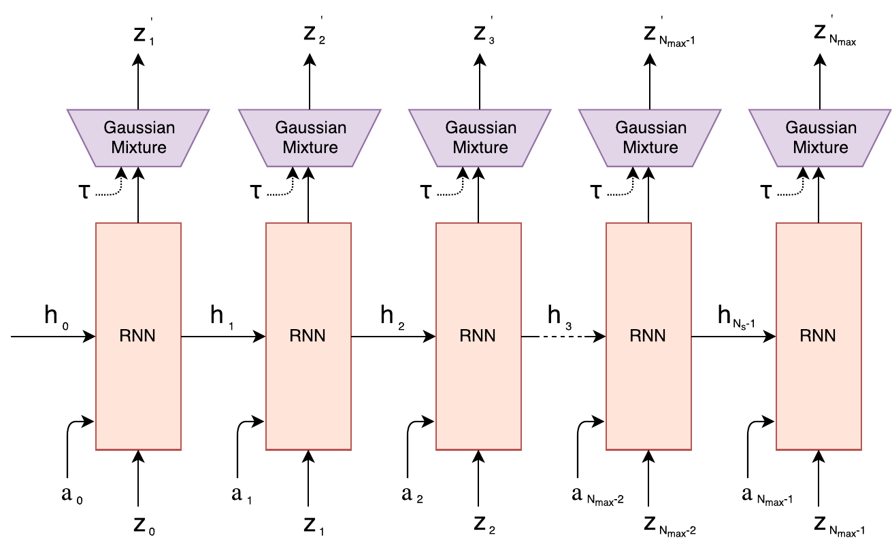

> Figure 23: MDN-RNN decoder similar to (Graves, 2013; Ha & Eck, 2017)

Unlike the handwriting and sketch generation works, rather than using the MDN-RNN to model the pdf of the next pen stroke, we model instead the pdf of the next latent vector $z$. We would sample from this pdf at each time step to generate the hallucinated environments. In the Doom task, we also also use the MDN-RNN to predict the probability of whether the agent has died in this frame. If that probability is above 50%, then we set done to be true in the virtual environment. Given that death is a low probability event at each time step, we find the cutoff approach to more stable compared to sampling from the Bernoulli distribution.

The MDN-RNNs were trained for 20 epochs on the data collected from a random policy agent. In the Car Racing task, the LSTM used 256 hidden units, while the Doom task used 512 hidden units. In both tasks, we used 5 Gaussian mixtures and did not model the correlation $\rho$ parameter, hence $z$ is sampled from a factored mixture of Gaussian distribution.

When training the MDN-RNN using teacher forcing from the recorded data, we store a pre-computed set of $\mu$ and $\sigma$ for each of the frames, and sample an input $z\sim N(\mu,\sigma)$ each time we construct a training batch, to prevent overfitting our MDN-RNN to a specific sampled $z$.

### A.3 Controller

For both environments, we applied $\tanh$ nonlinearities to clip and bound the action space to the appropriate ranges. For instance, in the Car Racing task, the steering wheel has a range from -1 to 1, the acceleration pedal from 0 to 1, and the brakes from 0 to 1. In the Doom environment, we converted the discrete actions into a continuous action space between -1 to 1, and divided this range into thirds to indicate whether the agent is moving left, staying where it is, or moving to the right. We would give the C Model a feature vector as its input, consisting of $z$ and the hidden state of the MDN-RNN. In the Car Racing task, this hidden state is the output vector $h$ of the LSTM, while for the Doom task it is both the cell vector $c$ and the output vector $h$ of the LSTM.

### A.4 Evolution Strategies

We used Covariance-Matrix Adaptation Evolution Strategy (CMA-ES) (Hansen, 2016) to evolve the weights for our C Model. Following the approach described in Evolving Stable Strategies (Ha, 2017b), we used a population size of 64, and had each agent perform the task 16 times with different initial random seeds. The fitness value for the agent is the average cumulative reward of the 16 random rollouts. The diagram below charts the best performer, worst performer, and mean fitness of the population of 64 agents at each generation:

<a id="figure-24"></a>

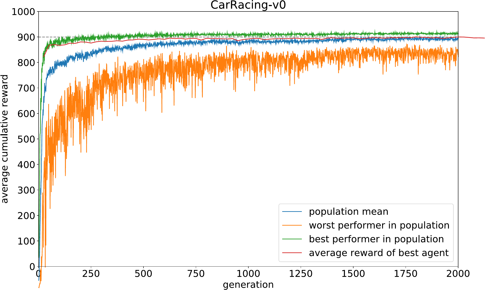

> Figure 24: Training of CarRacing-v0

Since the requirement of this environment is to have an agent achieve an average score above 900 over 100 random rollouts, we took the best performing agent at the end of every 25 generations, and tested that agent over 1024 random rollout scenarios to record this average on the red line. After 1800 generations, an agent was able to achieve an average score of 900.46 over 1024 random rollouts. We used 1024 random rollouts rather than 100 because each process of the 64 core machine had been configured to run 16 times already, effectively using a full generation of compute after every 25 generations to evaluate the best agent 1024 times. Below, we plot the results of same agent evaluated over 100 rollouts:

<a id="figure-25"></a>

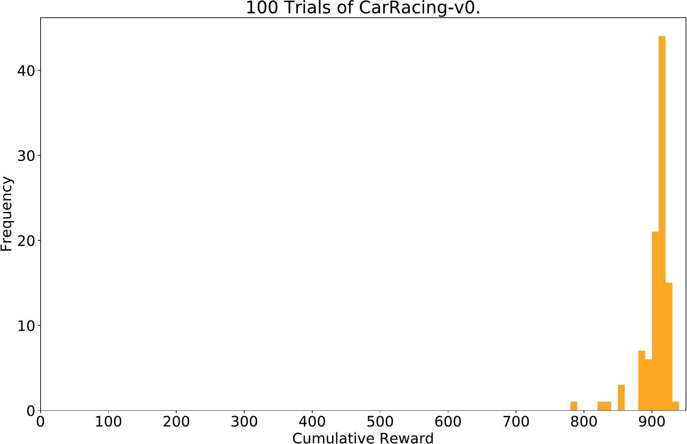

> Figure 25: Histogram of cumulative rewards. Score is 906 $\pm$ 21.

We also experimented with an agent that has access to only the $z$ vector from the VAE, and not letting it see the RNN’s hidden states. We tried 2 variations, where in the first variation, the C Model mapped $z$ directly to the action space $a$. In second variation, we attempted to add a hidden layer with 40 $tanh$ activations between $z$ and $a$, increasing the number of model parameters of the C Model to 1443, making it more comparable with the original setup.

<a id="figure-26"></a>

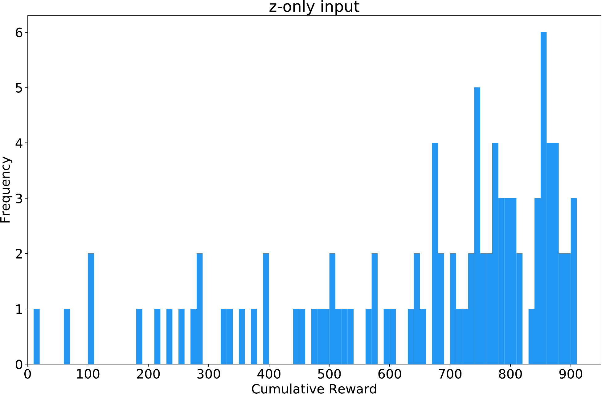

> Figure 26: When agent sees only $z_{t}$, score is 632 $\pm$ 251.

<a id="figure-27"></a>

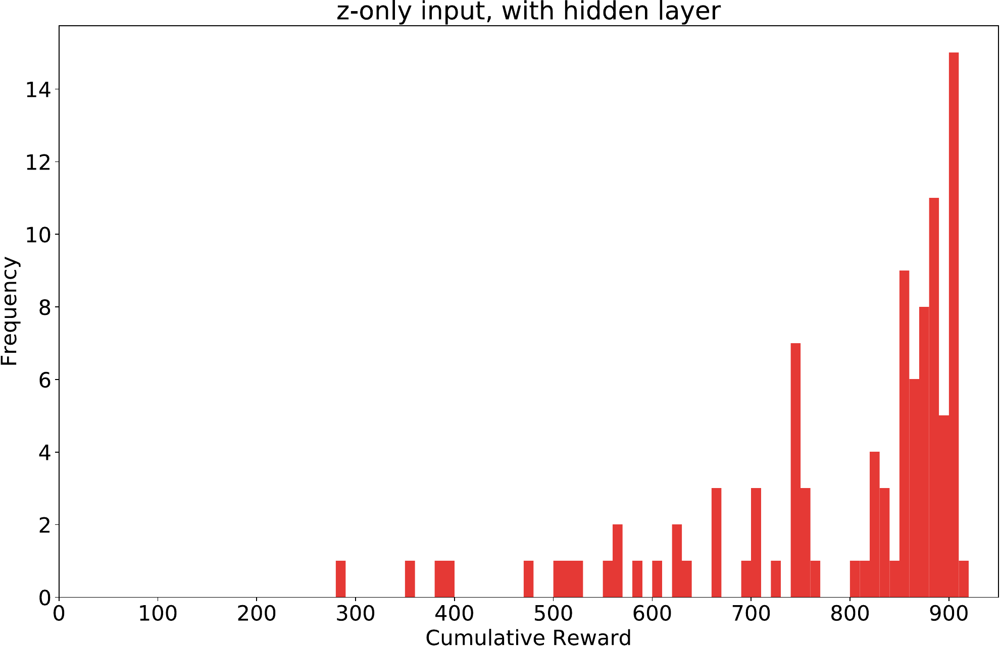

> Figure 27: When agent sees only $z_{t}$, with a hidden layer, score is 788 $\pm$ 141.

### A.5 DoomRNN

We conducted a similar experiment on the hallucinated Doom environment we called DoomRNN. Please note that we have not actually attempted to train our agent on the actual VizDoom environment, and had only used VizDoom for the purpose of collecting training data using a random policy. DoomRNN is more computationally efficient compared to VizDoom as it only operates in latent space without the need to render a screenshot at each time step, and does not require running the actual Doom game engine.

<a id="figure-28"></a>

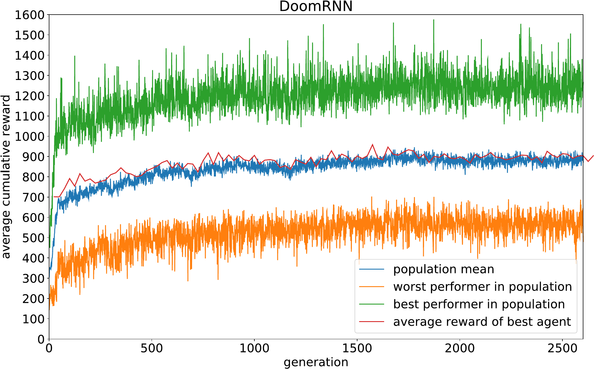

> Figure 28: Training of DoomRNN.

In the virtual DoomRNN environment we constructed, we increased the temperature slightly and used $\tau=1.15$ to make the agent learn in a more challenging environment. The best agent managed to obtain an average score of 959 over 1024 random rollouts (the highest score of the red line in the diagram). This same agent achieved an average score of 1092 $\pm$ 556 over 100 random rollouts when deployed to the actual DoomTakeCover-v0 (Paquette, 2016) environment.

<a id="figure-29"></a>

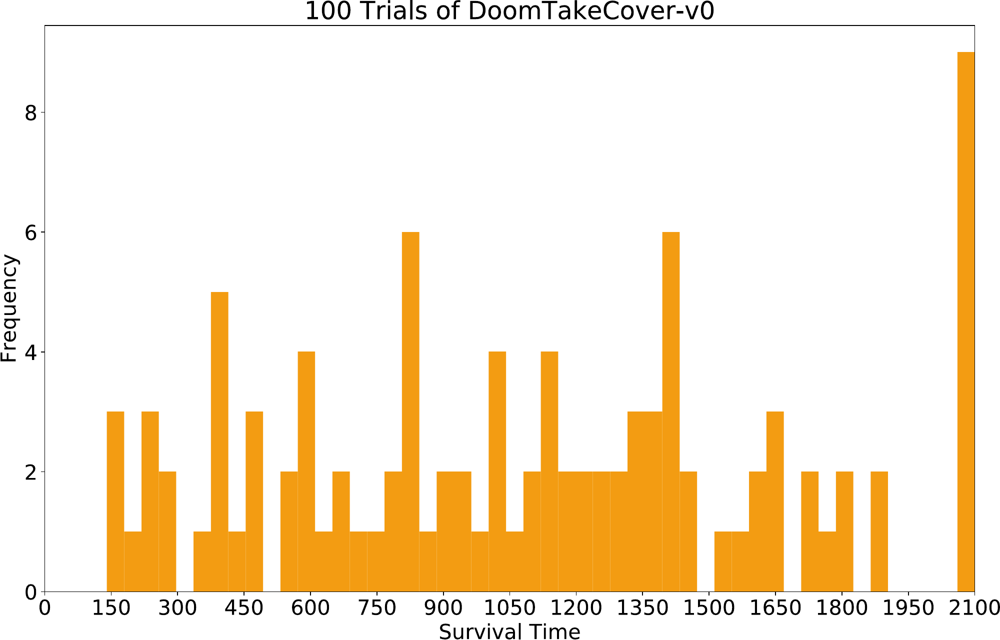

> Figure 29: Histogram of time steps survived in the actual VizDoom environment over 100 consecutive trials. Score is 1092 $\pm$ 556.
