# 迈向自主机器智能之路 版本 0.9.2， 2022-06-27

Yann LeCun 纽约大学库朗数学科学研究所 yann@cs.nyu.edu Meta - 基础人工智能研究院 yann@fb.com

2022 年 6 月 27 日

## 摘要（Abstract）

机器如何能像人类和动物一样高效地学习？机器如何能学会推理和规划？机器如何能在多个抽象层次上学习感知和行动计划的表征，使其能够在多个时间尺度上进行推理、预测和规划？本立场文件提出了一种用于构建 **自主智能智能体（autonomous Intelligent Agents）** 的架构和训练范式。它结合了诸如 **可配置的预测世界模型（Configurable Predictive World Model）** 、由 **内在动机（Intrinsic Motivation）** 驱动的行为，以及通过 **自监督学习（Self-Supervised Learning）** 训练的 **分层联合嵌入架构（Hierarchical Joint Embedding Architecture）** 等概念。

- **自主智能智能体（autonomous Intelligent Agents）**
- **可配置的预测世界模型（Configurable Predictive World Model）**
- 由内在动机（Intrinsic Motivation）驱动的行为
- 通过 **自监督学习（Self-Supervised Learning）** 训练的 **分层联合嵌入架构（Hierarchical Joint Embedding Architecture）**

关键词：人工智能（Artificial Intelligence），机器常识（Machine Common Sense），认知架构（Cognitive Architecture），深度学习（Deep Learning），自监督学习（Self-Supervised Learning），基于能量的模型（Energy-Based Model），世界模型（World Models），联合嵌入架构（Joint Embedding Architecture），内在动机（Intrinsic Motivation）。

## 1 序言（Prologue）

本文档并非传统意义上的技术或学术论文，而是一篇立场文件，阐述了我对迈向智能机器之路的愿景：**这些机器能更像动物和人类一样学习，能够推理和规划，并且其行为由内在目标驱动，而非由硬编码程序、外部监督或外部奖励驱动**。本文中描述的许多想法（几乎全部）都已被许多作者在不同背景下以不同形式阐述过。本文并不声称对其中任何想法拥有优先权，而是提出一个如何将它们组装成一个连贯整体的建议。特别是，本文指出了未来面临的挑战，并列出了一系列可能成功或不太可能成功的途径。

本文的写作尽可能少用术语，并尽可能少用数学先验知识，以期吸引包括神经科学（Neuroscience）、认知科学（Cognitive Science）和哲学（Philosophy）在内的广泛背景的读者，以及机器学习（Machine Learning）、机器人学（Robotics）和其他工程领域的读者。我希望本文能帮助阐明人工智能领域中的一些研究，这些研究的相关性有时难以被察觉。

## 2 引言（Introduction）

动物和人类展现出的学习能力以及对世界的理解，远非当前 **人工智能（Artificial Intelligence, AI）** 和 **机器学习（Machine Learning, ML）** 系统所能企及。

一个青少年如何能在约 20 小时的练习中学会开车？儿童如何能在接触量相对有限的情况下学会语言？为何大多数人类在面对许多从未遭遇过的情况时，都知道该如何行动？相比之下，为了确保可靠性，当前的机器学习系统需要进行海量试错训练，以确保即使在训练中最罕见的情境组合也能频繁出现。然而，即便在输入了来自人类专家的海量监督数据、经历了虚拟环境中数百万次的 **强化学习（Reinforcement Learning）** 试错、并由工程师将数百种行为硬编码其中之后，我们最优秀的机器学习系统在诸如驾驶等现实世界任务中，其可靠性仍与人类相距甚远。

答案或许在于人类和许多动物学习 **世界模型（world models）** 的能力，即关于世界如何运作的内在模型。

The answer may lie in the ability of humans and many animals to learn world models, internal models of how the world works.

当今人工智能研究必须应对三大主要挑战：

1.  **机器如何能够主要通过观察来学习表征世界、学习预测以及学习行动？**
    现实世界中的交互成本高昂且危险，智能体应尽可能通过非交互（即观察）来了解世界，从而最大限度地减少学习特定任务所需的高成本、高风险试错次数。

2.  **机器如何能够以与基于梯度的学习相兼容的方式进行推理和规划？**
    我们最优秀的学习方法依赖于估计和利用损失函数的梯度，这只能在可微分架构中实现，并且难以与基于逻辑的符号推理相协调。

3.  **机器如何能够以分层的方式、在多个抽象层次和多个时间尺度上，学习表征感知和行动规划？**
    人类和许多动物能够构想多层次的抽象概念，通过将复杂动作分解为一系列低层级动作，从而进行长期预测和长期规划。

本文提出了一种智能体架构，为上述三大挑战提供了可能的解决方案。

本文的主要贡献如下：

1.  一个整体的 **认知架构（cognitive architecture）** ，其中所有模块都是可微分的，且其中许多是可训练的（第 3 节，图 2）。
2.  **联合嵌入预测架构（Joint Embedding Predictive Architecture, JEPA）** 和 **分层联合嵌入预测架构（Hierarchical Joint Embedding Predictive Architecture, H-JEPA）** ：一种用于预测性世界模型的非生成式架构，能够学习表征的层次结构（第 4.4 和 4.6 节，图 12 和 15）。
3.  一种 **非对比自监督学习（non-contrastive self-supervised learning）** 范式，能够产生同时具备信息性和可预测性的表征（第 4.5 节，图 13）。
4.  一种将 H-JEPA 用作预测性世界模型基础，以进行不确定性下的分层规划的方法（第 4.7 节，图 16 和 17）。

性急的读者或许更愿意直接跳转到上述章节和图表。

### 2.1 学习世界模型（Learning World Models）

人类和非人类动物似乎能够通过观察以及通过一种与任务无关、无监督的方式，以难以想象的少量交互，学习关于世界如何运作的大量背景知识。可以假设，这种积累的知识可能构成了通常被称为 **常识（common sense）** 的基础。常识可以被看作是一组 **世界模型（world models）** 的集合，它们能告诉一个 **智能体（agent）** 什么是可能的、什么是合理的、什么是不可能的。利用这样的世界模型，动物可以用极少的尝试就学会新技能。它们可以预测自身行为的后果，可以进行推理、规划、探索，并想象问题的新解决方案。重要的是，在面对未知情况时，它们也能避免犯下危险的错误。

人类、动物和智能系统使用世界模型的观点在心理学中由来已久（Craik, 1943）[1]。使用 **前向模型（forward models）** ——将世界的下一个状态预测为当前状态和所考虑动作的函数——自 20 世纪 50 年代以来一直是 **最优控制（optimal control）** 的标准流程（Bryson and Ho, 1969）[2]，并被称为 **模型预测控制（model-predictive control）** 。在 **强化学习（reinforcement learning）** 中使用 **可微分世界模型（differentiable world models）** 长期被忽视，但正在复兴（例如参见（Levine, 2021）[3]）。

汽车的 **自动驾驶系统（self-driving system）** 可能需要数千次强化学习试验才能学会在转弯时开得太快会导致糟糕的结果，并学会减速以避免打滑。相比之下，人类可以利用他们对 **直觉物理（intuitive physics）** 的深刻了解来预测此类结果，并在学习新技能时很大程度上避免致命的行动路线。

常识知识不仅能让动物预测未来的结果，还能填补缺失的信息，无论是时间上还是空间上的。它使它们能产生与常识一致的 **感知（percepts）** 解释。当面对一个模糊的感知时，常识允许动物摒弃那些与其内部世界模型不一致的解释，并特别关注它，因为这可能表明一个危险的情况，也是一个学习更精细世界模型的机会。

我认为，设计能够让机器以无监督（或自监督）方式学习世界模型，并利用这些模型进行预测、推理和规划的 **学习范式（learning paradigms）** 与 **架构（architectures）** ，是当今 **人工智能（Artificial Intelligence, AI）** 和 **机器学习（Machine Learning, ML）** 的主要挑战之一。一个主要的技术障碍是如何设计能够处理预测中复杂不确定性的 **可训练世界模型（trainable world models）** 。

### 2.2 人类与动物学习模型的层次结构（Humans and Animals learn Hierarchies of Models）

人类和非人类动物在生命的最初几天、几周和几个月里，学习关于世界如何运作的基本知识。尽管大量此类知识被相当快速地习得，但这些知识似乎如此基础，以至于我们将其视为理所当然。在生命的最初几个月里，我们了解到世界是三维的。我们了解到，世界中的每一个光、声和触觉的来源都与我们存在距离。视觉感知中的每一点都有距离，这一事实是解释我们观察世界的视角如何从左眼切换到右眼，或头部移动时如何变化的最佳方式。 **视差运动（Parallax motion）** 使深度变得明显，这反过来又使 **客体（Object）** 的概念变得明显，同时也使物体可以遮挡更远物体这一事实变得明显。一旦客体的存在被确立，它们就可以根据其外观或行为自动分配到宽泛的类别中。在客体概念之上，我们获得了这样的知识：物体不会自发地出现、消失、改变形状或 **瞬间移动（Teleport）** ：它们平滑地移动，并且在任何时刻只能处于一个位置。一旦习得这些概念，就很容易了解到有些物体是静态的，有些具有可预测的轨迹（ **无生命物体（Inanimate objects）** ），有些以某种不可预测的方式运动（集体现象，如水、沙、风中的树叶等），而有些似乎遵循不同的规则（ **有生命物体（Animate objects）** ）。 **直觉物理学（Intuitive physics）** 的概念，如稳定性、重力、惯性等，可以在此基础上浮现。有生命物体对世界的影响（包括主体自身行为的影响）可用于推断 **因果关系（Cause-and-effect relationships）** ，在此之上可以习得语言和社会知识。

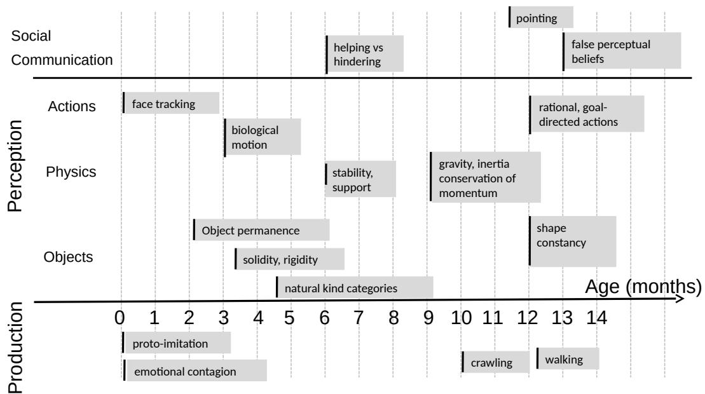

> 图 1 | 此图表（由 Emmanuel Dupoux 提供）显示了婴儿通常在什么年龄获得关于世界如何运作的各种概念。这与以下观点一致：抽象概念（例如物体受重力和惯性支配这一事实）是在不那么抽象的概念（如 **客体永久性（Object permanence）** 和将物体分配到宽泛类别）之上习得的。这些知识大部分主要通过观察获得，极少有直接干预，尤其是在最初的几周和几个月里。

图 1（由 Emmanuel Dupoux 提供）显示了婴儿似乎在什么年龄获得基本概念，如客体永久性、基本类别、直觉物理学等。更高抽象层次的概念似乎是在较低层次概念之上发展起来的。

凭借这种关于世界的知识，结合简单的 **硬连线行为（Hard-wired behaviors）** 和 **内在动机/目标（Intrinsic motivations/objectives）** ，动物可以快速学习新任务，预测其行为的后果并提前规划，预见成功的行动方案并避免危险情况。

但是，人类或动物的大脑能否包含生存所需的所有世界模型？本文的一个假设是，动物和人类在其 **前额叶皮层（Prefrontal cortex）** 的某个地方只有一个 **世界模型引擎（World model engine）** 。这个世界模型引擎可以根据当前任务进行动态配置。拥有一个单一的、可配置的世界模型引擎，而不是为每种情况配备一个单独的模型，关于世界如何运作的知识可以在不同任务间共享。这可能实现 **类比推理（Reasoning by analogy）** ，即将为一个情况配置的模型应用于另一个情况。

为了使论述具体化，我将直接深入描述所提出的模型。

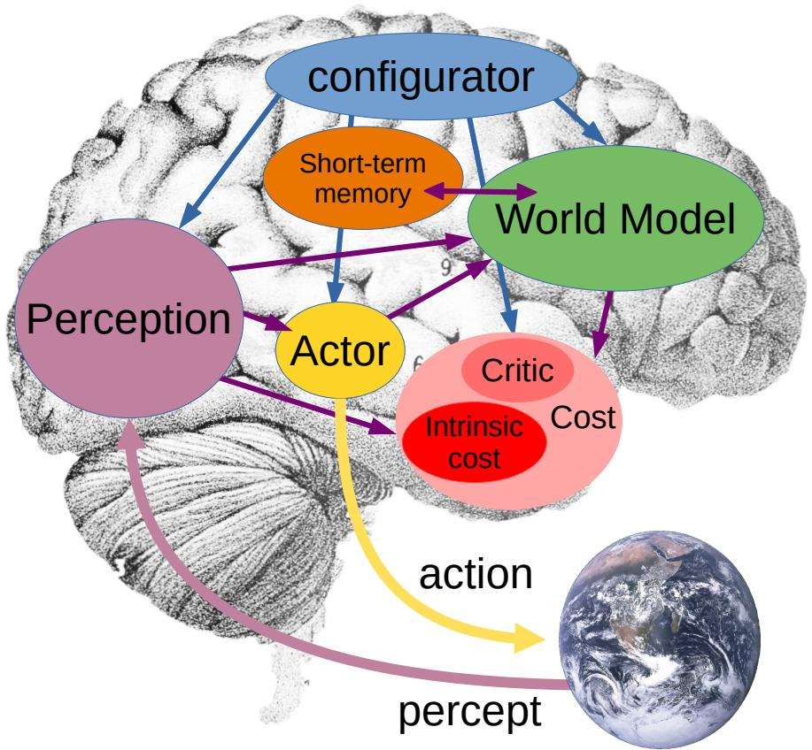

> 图 2 | 自主智能的系统架构。此模型中的所有模块都被假定为“ **可微分的（Differentiable）** ”，即一个模块（通过连接它们的箭头）馈入另一个模块时，可以获得 **成本（Cost）** 的 **标量输出（Scalar output）** 相对于其自身输出的 **梯度估计（Gradient estimates）** 。

- **配置器模块（Configurator module）** 从所有其他模块获取输入（为清晰起见未在图中表示）并配置它们以执行当前任务。
- **感知模块（Perception module）** 估计世界的当前状态。
- **世界模型模块（World model module）** 预测可能的未来世界状态，其作为由 **行动者（Actor）** 提出的想象动作序列的函数。
- **成本模块（Cost module）** 计算一个称为“ **能量（Energy）** ”的单一标量输出，用于衡量智能体的不适程度。它由两个子模块组成： **内在成本（Intrinsic cost）** ，它是不可变的（不可训练）并计算当前状态的即时能量（疼痛、愉悦、饥饿等）；以及 **评判器（Critic）** ，一个可训练的模块，用于预测内在成本的未来值。
- **短期记忆模块（Short-term memory module）** 跟踪当前和预测的世界状态以及相关的内在成本。
- **行动者模块（Actor module）** 计算动作序列的提议。世界模型和评判器计算可能的结果。行动者可以找到一个 **最优动作序列（Optimal action sequence）** ，以最小化估计的未来成本，并输出最优序列中的第一个动作。

详见第 3 节。

## 3 A Model Architecture for Autonomous Intelligence（自主智能体的模型架构）

所提出的自主智能体（Autonomous Intelligent Agent）架构如图 2 所示。

它由多个模块组成，其功能描述如下。其中一些模块可以 **动态配置（Configurable on the fly）** ，即它们的精确功能由 **配置器（Configurator）** 模块决定。配置器的作用是 **执行控制（Executive Control）** ：给定一个要执行的任务，它会为当前任务预先配置 **感知（Perception）** 、 **世界模型（World Model）** 、 **成本（Cost）** 和 **执行器（Actor）** 模块。配置器通过调节其馈入模块的参数来实现这一功能。

配置器模块（Configurator module）接收来自所有其他模块的输入，并通过调节它们的参数和注意力电路来为当前任务配置它们。特别是，配置器可以 **预置（Prime）** 感知、世界模型和成本模块，以实现特定目标。

感知模块（Perception module）接收来自传感器的信号，并估计世界的当前状态。对于给定任务，只有感知到的世界状态的一小部分是相关且有用的。感知模块可以以分层的方式、在多个抽象层次上表示世界状态。配置器会预置感知系统，使其从感知信息中提取出与当前任务相关的信息。

世界模型模块（World model module）构成了该架构中最复杂的部分。其作用是双重的：

- (1) 估计感知未提供的、关于世界状态的缺失信息；
- (2) 预测世界可能的未来状态。

世界模型可以预测世界的 **自然演化**，也可以预测由执行器模块提出的一系列动作所导致的未来世界状态。世界模型可以预测多个可能的世界状态，这些状态由 **潜变量（Latent Variables）** 参数化，这些变量代表了世界状态的不确定性。世界模型是世界相关方面的一种“模拟器”。世界状态的哪些方面是相关的，取决于当前任务。配置器会配置世界模型以处理当前情况。预测是在一个包含与当前任务相关信息的 **抽象表示空间（Abstract Representation Space）** 内进行的。理想情况下，世界模型将在多个抽象层次上操作世界状态的表示，使其能够在多个时间尺度上进行预测。

一个关键问题是，**世界模型（World model）** 必须能够表示世界状态的多种可能预测。自然界并非完全可预测。如果世界包含其他可能具有对抗性的智能体，这一点尤其正确。但即使世界只包含行为混沌或状态无法完全观测的无生命物体，这种情况也常常成立。

在构建所提出的架构时，有两个基本问题需要回答：

- (1) 如何让世界模型做出多个合理的预测并表征预测中的不确定性；
- (2) 如何训练世界模型。

成本模块（Cost module）以称为 **能量（Energy）** 的标量形式，测量智能体的“不适”程度。该能量是由两个子模块计算的两个能量项之和： **内在成本（Intrinsic Cost）** 模块和 **可训练评判器（Trainable Critic）** 模块。智能体的总体目标是采取行动，以保持在使平均能量最小化的状态中。

**内在成本模块（Intrinsic Cost module）** 是硬编码的（不可变、不可训练），它计算一个标量，即 **内在能量（intrinsic energy）** ，用于衡量智能体（Agent）的瞬时“不适感”——可以类比为疼痛（高内在能量）、愉悦（低或负的内在能量）、饥饿等。
该模块的输入是由感知模块（Perception module）产生的当前世界状态，或由世界模型（World model）预测的潜在未来状态。**智能体的最终目标是长期最小化内在成本。**
基本行为驱动力（basic behavioral drives）和内在动机（intrinsic motivations）就驻留于此。内在成本模块的设计决定了智能体行为的本质。 基本驱动力可以硬编码在此模块中。这可能包括：当站立时感觉“良好”（低能量）以激励腿式机器人行走，当影响世界状态时以激励能动性（Agency），当与人类互动时以激励社会行为，当感知到附近人类的喜悦时以激励共情（Empathy），当能量供应充足时（饥饿/饱腹感），当经历新情境时以激励好奇心和探索，当完成特定程序时，等等。相反，当面对痛苦情境或易于识别的危险情境（接近极热、火等），或当使用危险工具时，能量会很高。内在成本模块可以由配置器（Configurator）调节，以在不同时间驱动不同的行为。

**可训练评论家模块（Trainable Critic module）** 预测未来内在能量的估计值。与内在成本模块类似，其输入也是当前世界状态或世界模型预测的可能状态。为了训练，评论家从关联记忆模块（Associative memory module）中检索存储的过去状态及随后的内在成本，并训练自己根据前者预测后者。评论家模块的功能可以由配置器动态配置，以引导系统朝向特定子目标，作为更大任务的一部分。

由于成本模块的两个子模块都是可微分的，能量的梯度可以通过其他模块（特别是世界模型、执行器（Actor）和感知模块）进行反向传播，用于规划、推理和学习。

**短期记忆模块（Short-term memory module）** 存储关于世界过去、当前和未来状态的相关信息，以及相应的内在成本值。世界模型在时间上预测世界未来（或过去）状态时，以及在空间上补全缺失信息或修正关于当前世界状态的不一致信息时，会访问和更新短期记忆。世界模型可以向短期记忆发送查询并接收检索到的值，或存储新的状态值。评论家模块可以通过从记忆中检索过去状态和关联的内在成本进行训练。其架构可能与 **键值记忆网络（Key-Value Memory Networks）** [Miller et al., 2016] 类似。该模块可被视为在脊椎动物中扮演着与 **海马体（Hippocampus）** 相似的部分角色。

**执行器模块（Actor module）** 计算动作序列的提议，并向效应器（Effectors）输出动作。执行器向世界模型提议一个动作序列。世界模型根据该动作序列预测未来的世界状态序列，并将其馈送给成本模块。给定由成本模块定义的目标（由配置器配置），成本模块计算与提议动作序列相关的估计未来能量。由于执行器能够获取估计成本相对于提议动作序列的梯度，因此它可以使用基于梯度的方法计算一个最小化估计成本的最优动作序列。如果动作空间是离散的，则可以使用动态规划（Dynamic programming）来寻找最优动作序列。一旦优化完成，执行器向效应器输出第一个动作（或一个短动作序列）。这个过程类似于最优控制中的 **模型预测控制（Model-predictive control）** [Bryson and Ho, 1969]。

执行器可能包含两个组件：(1) 一个策略模块，直接从感知产生并从短期记忆中检索的世界状态估计中产生动作；(2) 如上所述的动作优化器（Action optimizer），用于模型预测控制。第一种模式类似于丹尼尔·卡尼曼（Daniel Kahneman）的“系统 1（System 1）”，而第二种模式类似于“系统 2（System 2）” [Kahneman, 2011]。

在下文中，我们将使用特定符号来表示架构图中的各个组件。简要说明见附录 8.3.3。

### 3.1 典型的感知-行动循环（Typical Perception-Action Loops）

模型在执行一个感知-行动片段（perception-action episode）时，可以采用两种可能的模式。第一种模式不涉及复杂的推理，而是直接从感知输出以及可能的短期记忆访问中产生一个行动。我们将其称为“模式-1（Mode-1）”，以类比卡尼曼（Kahneman）的“系统 1（System 1）”。第二种模式则通过世界模型（world model）和成本（cost）进行推理和规划。它类似于 **模型预测控制（Model-Predictive Control, MPC）** ——最优控制（optimal control）和机器人学（robotics）中的一个经典规划和推理范式。我们将其称为“模式-2（Mode-2）”，以类比卡尼曼的“系统 2（System 2）”。我们在此广义地使用“推理（reasoning）”一词，意指 **约束满足（constraint satisfaction）** （或 **能量最小化（energy minimization）** ）。许多类型的推理都可以被视为能量最小化的形式。

#### 3.1.1 模式-1：反应式行为（Mode-1: Reactive behavior）

模式-1 的感知-行动片段如图 3 所示。

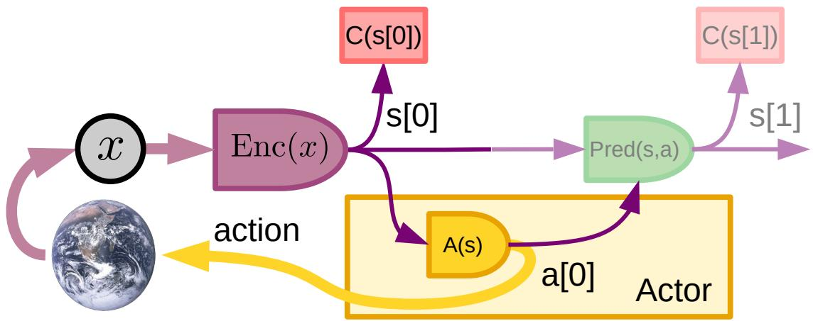

> **图 3：模式 1 感知-动作片段（Mode-1 perception-action episode）** 。感知模块估计世界状态 $s [0] = \operatorname {Enc} (x)$。执行器通过策略模块（Policy module）直接计算一个动作或短动作序列 $a [0] = A ( s [0] )$。

> 这个反应式过程既不使用世界模型，也不使用成本模块。成本模块计算初始状态的能量 $f [0] = \mathrm {C } ( s [0] )$，并将配对 $(s[0], f [0])$ 存储在短期记忆中。可选地，它也可以使用世界模型预测下一个状态 $s [ 1 ] = \operatorname { P r e d } ( s [0] , a [0] )$ 以及相关的能量 $f [0] = \mathrm { C } ( s [0] )$，以便当所采取动作产生的下一个观测可用时，可以调整世界模型。

感知模块（perception module）通过一个编码器模块（encoder module）提取世界状态的表示 $s[0] = \operatorname{Enc}(x)$，其中包含与当前任务相关的信息。策略模块（policy module）是行动者（actor）的一个组成部分，它根据状态产生一个行动 $a[0] = A(s[0])$。产生的行动被发送给效应器（effectors）。

策略模块的功能由配置器（configurator）调节，配置器根据当前任务对其进行配置。

策略模块实现的是一个纯粹的反应式策略（reactive policy），不涉及通过世界模型进行的刻意规划或预测。然而，其结构可能相当复杂。例如，除了状态 $s[0]$ 之外，策略模块可以访问短期记忆（short-term memory）以获取关于先前世界状态的更完整信息。它还可以利用短期记忆，根据当前状态进行关联检索（associative retrieval）以获取一个行动。

虽然成本模块（cost module）是可微分的（differentiable），但其输出 $f[0] = C(s[0])$ 会通过外部世界（external world）受到先前行动的间接影响。由于世界本身是不可微分的，因此无法通过“成本感知 ← 世界 $\longleftarrow$ 行动”这一链条从成本反向传播梯度（back-propagate gradients）。在这种模式下，成本 $f[0]$ 相对于行动的梯度只能通过向世界发送多个扰动行动（perturbed actions）来进行估计，但这种方法速度慢且具有潜在危险性。这一过程对应于 **强化学习（Reinforcement Learning）** 中的经典 **策略梯度方法（policy gradient methods）** 。

在模式-1 运行期间，系统可以选择性地调整世界模型。它让世界模型运行一步，预测下一个状态 $s[1]$，然后等待所采取行动产生的下一个感知（percept），并将观察到的世界状态用作预测器（predictor）的目标。

通过使用世界模型，智能体（agent）可以想象一系列行动过程，并预测其效果和结果，从而减少通过在外部世界中尝试多个行动并测量结果来进行昂贵且危险的搜索以寻找良好行动和策略的需求。

#### 3.1.2 Mode-2: reasoning and planning using the world model（模式 2：使用世界模型进行推理与规划）

图 4 描绘了模式 2 的一个典型感知-行动片段。

1.  **感知（Perception）** ：感知系统提取当前世界状态的表示 $s[0] = P(x)$。成本模块计算并存储与该状态相关的即时成本。
2.  **行动提议（Action proposal）** ：行动者（Actor）提出一个初始行动序列，供世界模型评估：$(a[0], \dots, a[t], \dots, a[T])$。
3.  **模拟（Simulation）** ：世界模型预测由提议的行动序列可能导致的一个或多个可能的世界状态表示序列：$(s[1], \ldots, s[t], \ldots, s[T])$。
4.  **评估（Evaluation）** ：成本模块根据预测的状态序列估计总成本，通常表示为时间步长的总和：
    $$F(x) = \sum_{t=1}^{T} C(s[t])$$
5.  **规划（Planning）** ：行动者提出一个成本更低的新行动序列。这可以通过基于梯度的过程实现，其中成本梯度通过计算图反向传播到行动变量。得到的最小成本行动序列记为 $(\check{a}[0], \dots, \check{a}[T])$。完整的优化可能需要迭代步骤 2-5。

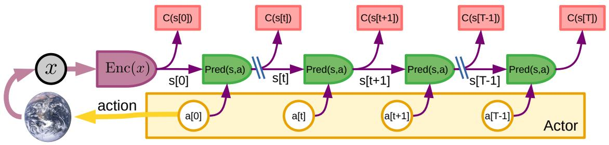

> 图 4 | 模式 2 感知-行动片段。感知模块估计世界状态 $s[0]$。行动者提出一个行动序列 $a[0], a[1], \dots, a[t], a[t+1], \dots, a[T]$。世界模型使用 $s[t+1] = \operatorname{Pred}(s[t], a[t])$ 递归地预测世界状态序列的估计值。成本 $C(\boldsymbol{s}[t])$ 计算序列中每个预测状态的能量，总能量是它们的和。通过优化或搜索过程，行动者推断出一个最小化总能量的行动序列。然后它将序列中的第一个行动（或前几个行动）发送给效应器。这实际上是一个经典的 **模型预测控制（Model-Predictive Control, MPC）** 与滚动时域规划的实例。由于成本和模型是可微的，可以像经典最优控制那样使用基于梯度的方法来搜索最优行动序列。由于总能量随时间可加，也可以使用 **动态规划（Dynamic Programming）** ，特别是在行动空间较小且离散化的情况下。来自内在成本和可训练评论家（Critic）的状态对（由编码器计算或预测器预测）及相应的能量被存储在短期记忆中，用于后续评论家的训练。

6.  **执行（Acting）** ：在收敛到一个低成本的行动序列后，行动者将低成本序列中的第一个行动（或前几个行动）发送给效应器。整个过程为下一个感知-行动片段重复。
7.  **记忆（Memory）** ：每次行动后，来自内在成本和评论家的状态及相关成本被存储在短期记忆中。这些配对数据稍后可用于训练或调整评论家。

这个过程本质上就是最优控制文献中已知的带有滚动时域的 **模型预测控制（Model-Predictive Control, MPC）** 。与经典最优控制的区别在于，世界模型和成本函数是学习得到的。

原则上，对于步骤 5，可以使用任何形式的优化策略。虽然当世界模型和成本表现良好时，基于梯度的优化方法可能很高效，但在行动-成本映射存在不连续性的情况下，可能需要使用其他优化策略，特别是在状态和/或行动空间可以离散化时。这些策略包括 **动态规划（Dynamic Programming）** 、 **组合优化（Combinatorial Optimization）** 、 **模拟退火（Simulated Annealing）** 和其他无梯度方法、启发式搜索技术（例如带剪枝的树搜索）等。

为简化起见，该过程是在确定性情况下描述的，即无需处理给定初始状态 $s[t]$ 和行动 $a[t]$ 可能导致对 $s[t+1]$ 的多种预测的可能性。在实际情况下，世界可能具有一定程度的不可预测性。单一初始状态和行动可能导致多种状态，原因可能是：世界本质上是随机的（ **偶然不确定性（Aleatoric Uncertainty）** ）；或者状态表示 $s[t]$ 包含关于真实世界状态的不完整信息（ **认知不确定性（Epistemic Uncertainty）** ）；或者由于训练数据有限、表示能力或计算约束，世界模型的预测精度不完美。

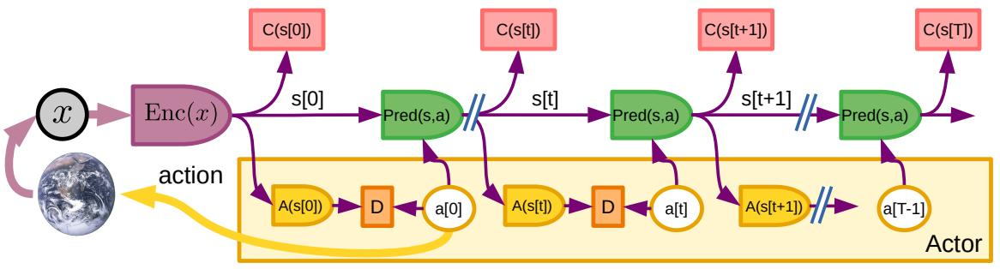

> 图 5 | 根据模式 2 推理结果训练反应式策略模块。使用模式 2 是繁重的，因为它为当前任务调动了智能体的所有资源。它涉及重复运行世界模型多个时间步。此图描述了如何训练一个策略模块 $A(s[t])$ 来近似模式 2 优化产生的行动。系统首先在模式 2 下运行，产生一个最优行动序列 $(\check{a}[0], \dots, \check{a}[T])$。然后调整策略模块的参数，以最小化最优行动与策略模块输出之间的散度 $D(\check{a}[t]), A(s[t]))$。这产生了一个执行 **摊销推理（Amortized Inference）** 的策略模块，并产生良好行动序列的近似。然后，该策略模块可用于在模式 1 中反应式地产生行动，或在模式 2 推理之前初始化行动序列，从而加速优化。

#### 3.1.3 从模式-2 到模式-1：学习新技能（From Mode-2 to Mode-1: Learning New Skills）

使用 **模式-2（Mode-2）** 是繁重的。智能体（Agent）只拥有一个世界模型“引擎”。它可以通过 **配置器（Configurator）** 针对当前任务进行配置，但它一次只能用于单个任务。因此，与人类类似，智能体一次只能专注于一项复杂任务。

**模式-1（Mode-1）** 则要轻松得多，因为它只需要通过 **策略模块（Policy module）** 进行一次前向计算。智能体可以拥有多个同时工作的策略模块，每个模块专门用于一组特定的任务。

图 5 描述的过程展示了如何训练一个策略模块 $A ( s [ t ] )$，使其能够产生由模式-2 推理得出的最优动作的近似值。系统在模式-2 下运行，产生一个最优动作序列 $( \check { a } [0] , \dots , \check { a } [ t ] , \dots , \check { a } [ T ] )$。然后，更新策略模块 $A ( s [ t ] )$ 的参数，以最小化其输出与该时刻最优动作之间的 **散度度量（Divergence measure）** $D ( \check { a } [ t ] , A ( s [ t ] ) )$。一旦训练得当，该策略模块便可用于在模式-1 中直接产生动作 $\tilde { a } [0] = A ( s [0] )$。它也可以在模式-2 优化之前，用于递归计算一个初始动作序列提议：

$$
s [ t + 1 ] = \operatorname * {P r e d} (s [ t ], a [ t ]) ; \quad \tilde {a} [ t + 1 ] = A (s [ t + 1 ])
$$

策略模块可以被视为在执行一种 **摊销推理（Amortized inference）** 。

这个过程使得智能体能够充分利用其世界模型和推理能力来获取新技能，然后这些技能被“编译”成一个 **反应式策略模块（Reactive policy module）** ，不再需要仔细的规划。

#### 3.1.4 作为能量最小化的推理（Reasoning as Energy Minimization）

在模式-2 中制定合适动作序列的过程可以被视为一种推理形式。这种推理形式基于使用世界模型的 **模拟（Simulation）** ，以及对动作序列的 **能量（Energy）** 进行优化。更一般地说，“动作”可以被视为表示从一个状态到下一个状态的抽象转换的 **潜变量（Latent variables）** 。这种通过模拟和优化进行的规划，可能构成了自然智能中最常见的那种推理。

人工智能中的许多经典推理形式实际上都可以表述为 **优化问题（Optimization problems）** （或 **约束满足问题（Constraint satisfaction problems）** ）。对于使用 **因子图（Factor graphs）** 和 **概率图模型（Probabilistic graphical models）** 进行的 **概率推理（Probabilistic inference）** 来说，情况确实如此。所提出的架构实际上就是一个因子图，其中的 **成本模块（Cost modules）** 是对数因子。但该架构所支持的推理类型超越了传统的逻辑和概率推理。它允许通过模拟和类比进行推理。

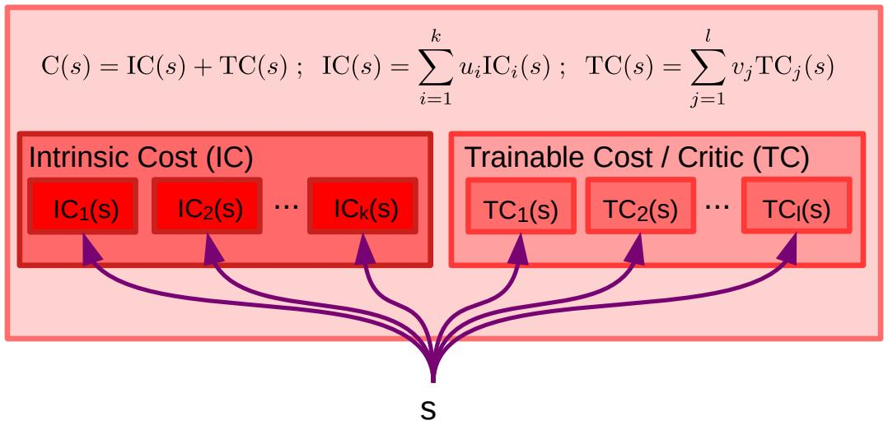

> 图 6 | 成本模块的架构。成本模块包括不可变的 **内在成本模块（Intrinsic Cost module）** ICi(s)（左）和可训练的 **评判器（Critic）** 或 **可训练成本（Trainable Cost）** TCj(s)（右）。IC 和 TC 都由多个子模块组成，其输出能量被线性组合。每个子模块赋予智能体一种特定的行为驱动力。线性组合中的权重 $u _ { i }$ 和 $v _ { j }$ 由配置器模块决定，使智能体能够在不同时间专注于不同的子目标。

### 3.2 作为行为驱动器的成本模块（The Cost Module as the Driver of Behavior）

成本模块的整体架构如图 6 所示。它由不可变的 **内在成本模块（Intrinsic Cost Module）** $\mathrm{IC}_i(s)$ 和可训练的 **评判器（Critic）** 或 **可训练成本（Trainable Cost）** $\mathrm{TC}_j(s)$ 组成。IC 和 TC 均由多个子模块构成，其输出能量被线性组合：

$$
C(s) = \mathrm{IC}(s) + \mathrm{TC}(s) \tag{1}
$$

$$
\mathrm{IC}(s) = \sum_{i=1}^{k} u_i \mathrm{IC}_i(s) \tag{2}
$$

$$
\mathrm{TC}(s) = \sum_{j=1}^{l} v_j \mathrm{TC}_j(s) \tag{3}
$$

每个子模块都为智能体（Agent）赋予一种特定的行为驱动力。线性组合中的权重 $u_i$ 和 $v_j$ 由 **配置器模块（Configurator Module）** 调节，使智能体能够在不同时间专注于不同的子目标。

**内在成本模块（Intrinsic Cost Module, IC）** 定义了智能体的基本行为本质。基本行为可以在此间接指定。

对于机器人而言，这些项将包括对应于“疼痛”、“饥饿”和“本能恐惧”的明显本体感觉测量，例如测量外力过载、危险的电、化学或热环境、功耗过高、电源能量储备水平过低等。

它们也可能包括帮助智能体学习基本技能或完成其任务的基本驱动力。例如，一个腿式机器人可能包含一个内在成本，驱使其站立和行走。这也可能包括社会性驱动力，例如寻求人类陪伴、发现与人类的互动和来自他们的赞扬是有益的，以及发现他们的痛苦是不愉快的（类似于社会性动物中的共情）。其他内在行为驱动力，如好奇心，或采取具有可观察影响的行动，也可能被包含进来，以最大化用于训练 **世界模型（World Model）** 的情境多样性（Gottlieb 等人，2013）。

IC 可以被视为扮演着类似于哺乳动物大脑中 **杏仁核（Amygdala）** 以及其他脊椎动物中类似结构的作用。

为了防止某种 **行为崩溃（Behavioral Collapse）** 或向不良行为的无控制漂移，IC 必须是不可变的，且不受学习（也不受外部修改）的影响。

**评判器（Critic, TC）** 的作用是双重的：(1) 以最小化使用繁重的世界模型来预测长期结果；(2) 允许配置器使智能体专注于使用学习到的成本来完成子目标。

通常，AI 智能体的行为本质可以通过四种方式指定：

1.  通过显式编程，在满足特定条件时激活特定行为。
2.  通过定义一个 **目标函数（Objective Function）** ，使得智能体通过寻找最小化该目标函数的动作序列来执行期望的行为。
3.  通过直接监督训练智能体以某种方式行动。智能体观察专家教师的动作，并训练一个 **模式-1 策略模块（Mode-1 Policy Module）** 来复现它。
4.  通过 **模仿学习（Imitation Learning）** 训练智能体。智能体观察专家教师，并推断出他们在行动时其行为似乎在优化的目标函数。这会产生一个用于 **模式-2 行为（Mode-2 Behavior）** 的评判器子模块。这个过程有时被称为 **逆强化学习（Inverse Reinforcement Learning）** 。

第二种方法在工程上比第一种简单得多，因为它只需要设计一个目标，而不是设计一个完整的行为。第二种方法也更稳健：预先设定的行为可能会因意外条件或环境变化而失效。有了一个目标，智能体可以调整其行为以适应意外条件和环境变化，以满足目标。第二种方法利用了智能体的学习和推理能力，以最小化由设计者硬编码的、可能很脆弱的先验知识量。

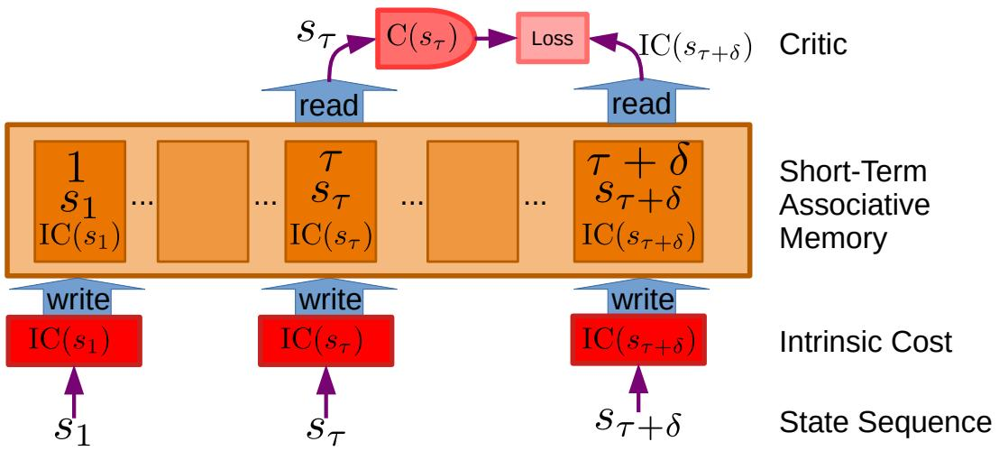

> 图 7 | 训练评判器。在规划阶段（Planning Episodes），内在成本模块将三元组（时间，状态，内在能量）：$(\tau, s_\tau, \mathrm{IC}(s_\tau))$ 存储到 **联想短期记忆（Associative Short-term Memory）** 中。在评判器训练阶段（Critic Training Episodes），评判器检索一个过去的状态向量 $s_\tau$，以及一个稍晚时间的内在能量 $\mathrm{IC}(s_{\tau+\delta})$。在最简单的场景中，评判器调整其参数以最小化目标 $\mathrm{IC}(s_{\tau+\delta})$ 与预测能量 $\mathrm{C}(s_\tau)$ 之间的 **散度度量（Divergence Measure）** 。在更复杂的方案中，它可能使用未来内在能量的组合作为目标。注意，状态序列可能包含关于智能体计划或采取的动作的信息。

### 3.3 训练评论家（Training the Critic）

一个核心问题是如何训练评论家（Critic）。

评论家的主要作用是预测内在能量（Intrinsic Energy）的未来值。为此，它使用短期记忆模块（Short-term Memory Module）。该模块是一个关联记忆（Associative Memory），内在成本模块（Intrinsic Cost Module）在其中存储三元组（时间，状态，内在能量）：$(\tau, s_{\tau}, IC(s_{\tau}))$。存储的状态和相应的内在能量可能对应于感知到的状态，也可能对应于世界模型（World Model）在模式-2（Mode-2）情节中想象的状态。给定一个时间 $\tau$，记忆可以检索出一个状态 $s_{\tau}$；给定一个时间 $\tau$ 或一个状态 $s_{\tau}$，记忆可以检索出一个能量 $IC(s_{\tau})$。通过合适的记忆架构，检索过程可能涉及键（Keys）和检索值（Retrieved Values）的插值。该过程如图 7 所示。

可以通过检索一个过去的状态向量 $s_{\tau}$ 以及一个稍晚时间的内在能量 $IC(s_{\tau+\delta})$ 来训练评论家预测未来的内在能量值。然后可以优化评论家的参数以最小化预测损失，例如 $|| IC(s_{\tau+\delta}) - TC(s_{\tau}) ||^{2}$。这是一个简单的场景。可以设计更复杂的方案来预测未来能量的期望值或其分布。请注意，状态向量可能包含关于行动者（Actor）采取或想象的动作的信息。

在一般层面上，这类似于 A2C 等强化学习方法中使用的评论家训练方法。

短期记忆可以实现为键值记忆网络（Key-Value Memory Network）中的记忆模块：将查询向量（Query Vector）与多个键向量（Key Vectors）进行比较，产生一个得分向量（Vector of Scores）。得分被归一化并用作系数，输出存储值（Stored Values）的线性组合。它可以被看作是一个能够进行插值的“软”关联记忆。它的一个优点是，通过合适的新键/值槽（Key/Value Slots）分配方案，它能够进行单次学习（One-shot Learning），同时可以在键之间进行插值，并且是端到端可微的（End-to-end Differentiable）。

## 4 设计与训练世界模型（Designing and Training the World Model）

可以说，为世界模型设计架构和训练范式是未来几十年人工智能取得真正进展的主要障碍。本提案的主要贡献之一，正是为世界模型提出了一种分层架构和一种训练程序，使其能够在预测中表示多种可能的结果。

训练世界模型是自监督学习（Self-Supervised Learning, SSL）的一个典型例子，其基本思想是模式补全（Pattern Completion）。对未来输入（或暂时未观察到的输入）的预测是模式补全的一个特例。在这项工作中，世界模型的主要目的被视为预测世界状态的未来表征（Representations）。

需要解决三个主要问题。首先，非常明显，世界模型的质量将在很大程度上取决于其在训练期间能够观察到的状态序列或（状态，动作，结果状态）三元组的多样性。其次，因为世界并非完全可预测，在给定一个世界状态表征和智能体的一个动作之后，可能存在多个合理的世界状态表征。世界模型必须能够有意义地表示这个可能无限的合理预测集合。第三，世界模型必须能够在不同的时间尺度和不同的抽象层次上进行预测。

第一个问题触及了围绕序列决策过程学习的主要问题之一：“训练集”的多样性取决于所采取的动作。这个问题将在下面的第 4.10 节讨论。

第二个问题更为严峻：世界并非完全可预测。因此，世界模型应该能够表示从给定状态和（可选的）一个动作出发的多个合理结果。这可能是本提案试图解决的最具挑战性的难题之一。这个问题将在下面的第 4.8 节讨论。

第三个问题涉及长期预测和规划问题。人类在抽象层面上规划复杂目标，并使用世界状态和动作的高层描述来进行预测。然后，高层目标被分解为更基本的子目标序列，利用世界模型的短期预测来产生低层动作。这种分解过程一直重复进行，直到毫秒级的肌肉控制，并由局部条件（Local Conditions）提供信息。关于世界模型如何在多个时间尺度和多个抽象层次上表示行动计划的问题，将在第 4.6 节讨论。

#### 4.1 Self-Supervised Learning（自监督学习）

**自监督学习（Self-Supervised Learning, SSL）** 是一种范式，其训练一个学习系统以捕获其输入之间的相互依赖关系。具体而言，这通常归结为训练一个系统，以告诉我们其输入的各个部分是否彼此一致。

例如，在视频预测场景中，系统被给予两个视频片段，并且必须告诉我们第二个视频片段在多大程度上是第一个片段的合理延续。在模式补全场景中，系统被给予输入的一部分（图像、文本、音频信号）以及针对输入其余部分的提议，并告诉我们该提议是否是第一部分的合理补全。在下文中，我们将用 $x$ 表示输入的已观测部分，用 $y$ 表示可能未观测的部分。

**重要的是，我们并不要求模型能够从 $x$ 预测 $y$。** 原因在于，可能存在无限多个 $y$ 与给定的 $x$ 兼容。在视频预测设置中，存在无限多个视频片段可以作为给定片段的合理延续。要明确表示所有合理预测的集合可能很困难，甚至难以处理。但仅仅要求系统告诉我们一个提议的 $y$ 是否与给定的 $x$ 兼容，似乎不那么麻烦。

一个通用的表述可以通过 **基于能量的模型（Energy-Based Models, EBM）** 框架来完成。系统是一个标量值函数 $F (x, y )$，当 $x$ 和 $y$ 兼容时产生低能量值，当它们不兼容时产生较高值。这一概念如图 8 所示。数据点是黑点。能量函数在数据点周围产生低能量值，在远离高数据密度区域的地方产生较高能量，如能量景观的等高线所象征的那样。EBM 的隐函数表述使系统能够表示多模态依赖关系，其中多个 $y$ 值与给定的 $x$ 兼容。与给定 $x$ 兼容的 $y$ 集合可能是一个单点、多个离散点、一个流形，或者是点和流形的集合。

为了启用 **模式-2 规划（Mode-2 planning）** ，应该训练一个预测性的世界模型来捕获过去和未来感知之间的依赖关系。它应该能够从过去和现在的表示中预测未来的表示。通用的学习原则如下：给定两个输入 $x$ 和 $y$，学习两个函数来计算表示 $s _ {x} = g _ {x} (x)$ 和 $s _ { y } = g _ { y } ( y )$，使得 (1) $s _ {x}$ 和 $s _ { y }$ 关于 $x$ 和 $y$ 的信息量最大化，并且 (2) $s _ { y }$ 可以很容易地从 $s _ {x}$ 预测出来。这一原则确保了在表示空间中使世界的演变可预测，与在表示中捕获尽可能多的关于世界状态的信息之间取得平衡。

通过对视频进行训练，这样的 **自监督学习（Self-Supervised Learning, SSL）** 系统能学习到哪些概念？我们的假设是，它可以习得一个关于世界如何运作的 **抽象概念（abstract concepts）** 层次结构。

学习一个 **小图像区域（small image region）** 的表征，使其能够从其在空间和时间上的邻近区域中被预测出来，这将促使系统提取图像中的局部边缘和轮廓，并检测视频中的运动轮廓。学习一种图像表征，使得从一个视角观察到的场景表征能够从另一个略有不同的视角观察到的同一场景的表征中被预测出来，这将促使系统隐式地表示一个 **深度图（depth map）** 。深度图是解释当相机轻微移动时场景视图如何变化的最简单方式。一旦学习了深度的概念，系统就能轻松识别 **遮挡边缘（occlusion edges）** ，以及属于一个 **刚体（rigid object）** 的区域的集体运动。 **三维（3D）** 物体的隐式表征可能会自发地出现。

一旦物体的概念在表征中出现，像 **物体恒存性（object permanence）** 这样的概念可能就变得容易学习：由于视差运动而消失在其它物体后面的物体总会重新出现。 **无生命物体（inanimate object）** 与 **有生命物体（animate object）** 的区分随之而来：无生命物体是那些其轨迹很容易预测的物体。通过训练系统在物体表征层面进行更长期的预测，诸如稳定性、重力、动量等 **直觉物理（intuitive physics）** 概念可能会随之而来。可以想象，通过在越来越抽象的表征层面和越来越长的时间尺度上进行预测，关于世界如何运作的越来越复杂的概念可以以一种 **分层（hierarchical）** 的方式被习得。

通过预测来学习抽象概念的想法由来已久，几十年来，认知科学、神经科学和人工智能领域的许多作者以各种方式阐述过。问题在于究竟如何实现。

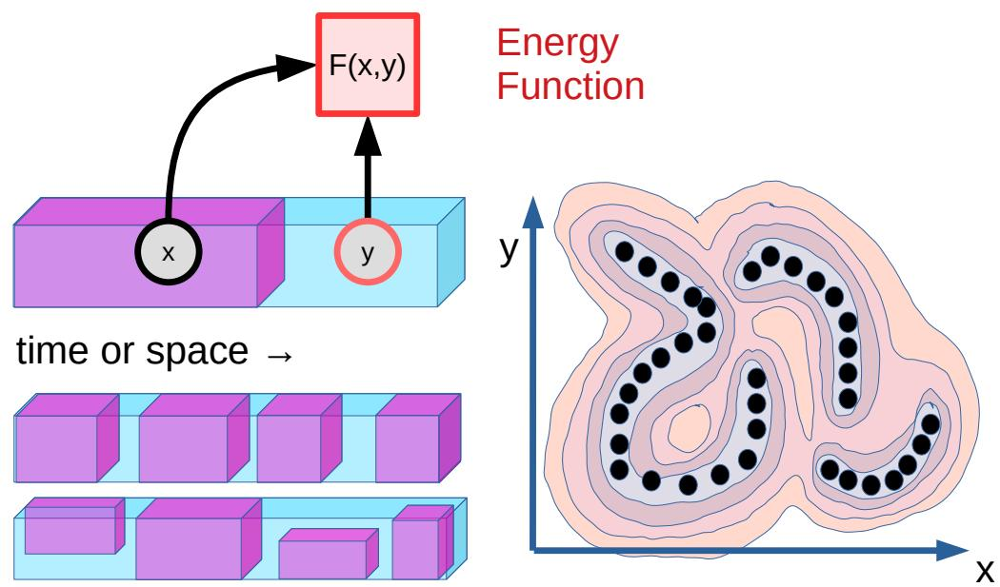

> 图 8 | **自监督学习（Self-Supervised Learning, SSL）** 与 **基于能量的模型（Energy-Based Models, EBM）** 。SSL 是一种学习范式，其中学习系统被训练来“填补空白”，或者更准确地说，是捕捉输入中已观测部分与可能未观测部分之间的依赖关系。部分输入信号被观测到，记为 $x$（粉色部分），另一部分输入信号可能被观测到也可能未被观测到，记为 $y$（蓝色部分）。在时间预测场景中，$x$ 代表过去和现在的观测，$y$ 代表未来的观测。在一般的模式补全场景中，输入的不同部分可能在不同时间被观测到或未被观测到。学习系统被训练通过一个标量值 **能量函数（energy function）** $F (x, y )$ 来捕捉 $x$ 和 $y$ 之间的依赖关系，当 $x$ 和 $y$ 一致或兼容时，该函数取低值，当 $x$ 和 $y$ 不一致或不兼容时，则取较高值。在视频预测场景中，如果视频片段 $y$ 是视频片段 $x$ 的一个合理延续，系统将产生一个较低的能量值。这种 **基于能量的模型（Energy-Based Model, EBM）** 的表述使系统能够表示 **多模态依赖关系（multi-modal dependencies）** ，其中 $y$ 的多个值（可能是一个无限集）可能与给定的 $x$ 兼容。在右侧面板中，展示了一个 **能量景观（energy landscape）** ，其中深色圆盘代表数据点，闭合线代表能量函数的 **等高线（contours）** （水平集）。

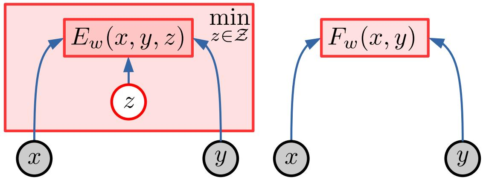

> 图 9 | **隐变量基于能量的模型（Latent-Variable Energy-Based Model, LVEBM）** 。为了评估 $x$ 和 $y$ 之间的兼容程度，一个 EBM 可能需要一个 **隐变量（latent variable）** $z$ 的帮助。隐变量可以被视为参数化了 $x$ 与一组兼容的 $y$ 之间可能的关系集合。隐变量代表了无法从 $x$ 中提取的关于 $y$ 的信息。例如，如果 $x$ 是一个物体的一个视图，而 $y$ 是同一物体的另一个视图，$z$ 可以参数化两个视图之间的相机位移。 **推断（Inference）** 在于找到使能量最小化的隐变量 $\check { z } = \mathrm { argmin } _ { z \in \mathcal { Z } } E _ { w } (x, y , z )$。得到的能量 $F _ { w } (x, y ) = E _ { w } (x, y , \check { z } )$ 仅依赖于 $x$ 和 $y$。在双视图示例中，推断找到了最能解释 $x$ 如何转换为 $y$ 的相机运动。

### 4.2 使用潜变量处理不确定性（Handling Uncertainty with Latent Variables）

如上所述，主要问题之一是使模型能够表示多种预测。这可能需要使用 **潜变量（Latent Variable）** 。潜变量是一种输入变量，其值不是被观测到的，而是被推断出来的。潜变量可以被视为对 $x$ 与一组兼容的 $y$ 之间可能关系的集合进行参数化。潜变量用于表示无法从 $x$ 中提取的关于 $y$ 的信息。

设想一个场景，其中 $x$ 是一个场景的照片，而 $y$ 是同一场景从略微不同视角拍摄的照片。要判断 $x$ 和 $y$ 是否确实是同一场景的视图，可能需要推断两个视图之间摄像机的位移。类似地，如果 $x$ 是一辆汽车驶近道路分叉口的图片，而 $y$ 是几秒钟后同一辆汽车在分叉口其中一个分支上的图片，那么 $x$ 和 $y$ 之间的兼容性取决于一个可以推断的二元潜变量：汽车是向左转还是向右转。

在时序预测场景中，潜变量代表了仅凭 $x$ 和过去的观测（过去）无法预测的关于 $y$（未来）的部分。它应包含所有对预测有用但不可观测或不可知的信息。我可能不知道我前面的司机会左转还是右转，加速还是刹车，但我可以用一个潜变量来表示这些选项。

一个 **潜变量能量基模型（Latent-variable Energy-Based Model, LVEBM）** 是一个依赖于 $x$、$y$ 和 $z$ 的参数化能量函数：$E _ { w } (x, y , z )$。当给定一对 $(x, y )$ 时，能量基模型的推断过程会找到一个使能量最小的潜变量 $z$ 的值：

$$
\check {z} = \underset {z \in \mathcal {Z}} {\operatorname {a r g m i n}} E _ {w} (x, y, z) \tag {4}
$$

这种通过最小化进行的潜变量推断允许我们从能量函数中消去 $z$：

$$
F _ {w} (x, y) = \min  _ {z \in \mathcal {Z}} E _ {w} (x, y, z) = E _ {w} (x, y, \check {z}) \tag {5}
$$

从技术上讲，$F _ { w } (x, y )$ 应被称为 **零温自由能（Zero-temperature Free Energy）** ，但我们将继续称其为能量。

### 4.3 基于能量的模型训练（Training Energy-Based Models）

在讨论 **基于能量的模型（Energy-Based Model, EBM）** 训练之前，必须指出，EBM 的定义本身并不涉及概率建模。尽管许多 EBM 可以轻松转化为概率模型（例如通过 **吉布斯分布（Gibbs distribution）** ），但这绝非必需。因此，能量函数被视为基本对象，并不假定其隐式地表示某个概率分布的未归一化对数。

训练一个 EBM 在于构建一个架构（例如一个深度神经网络）来计算由参数向量 $w$ 参数化的能量函数 $F _ { w } (x, y )$。训练过程必须寻找一个 $w$ 向量，为能量函数赋予正确的形状。对于训练集中给定的 $x$，一个训练良好的 $F _ { w } (x, y )$ 将为训练集中与 $x$ 相关联的 $y$ 值产生较低的能量，而为其他 $y$ 值产生较高的能量。

给定一个训练样本 $(x, y )$，训练一个 EBM 可归结为设计一个合适的损失泛函 $L (x, y , F _ { w } (x, y ) )$，该泛函可以直接表示为参数向量的函数 $L (x, y , w )$，并且最小化该损失将使训练样本的能量 $F _ { w } (x, y )$ 低于任何不同于 $y$ 的 $\hat { y }$ 的能量 $F _ { w } (x, \hat { y } )$。

使训练样本的能量变低是容易的：只需损失是能量的递增函数，且能量具有下界即可。

困难的问题在于如何确保不同于 $y$ 的 $\hat { y }$ 的能量高于 $y$ 的能量。如果没有特定的机制来确保每当 $\hat { y } \ne y$ 时 $F _ { w } (x, y ^ { \prime } ) > F _ { w } (x, y )$，能量景观（energy landscape）就可能发生 **塌缩（collapse）** ：对于给定的 $x$，能量景观可能变得“平坦”，对所有 $y$ 值赋予基本相同的能量。

哪些 EBM 架构容易发生塌缩？一个 EBM 是否容易塌缩取决于其架构。图 10 展示了一些标准架构，并指出了它们是否可能发生塌缩。

- 一个常规的预测性或确定性生成架构（图 10(a)）不会塌缩。对于任何 $x$，它产生一个单一的 $\tilde { y }$。当 $y = \tilde { y }$ 时，能量为零。任何不同于 $\tilde { y }$ 的 $y$ 都将具有更高的能量，只要 $D ( y , \tilde { y } )$ 在 $y$ 不同于 $\tilde { y }$ 时严格大于零。
- 一个生成式隐变量架构（非确定性生成）（图 10(b)）在隐变量具有过多信息容量时可能塌缩。当隐变量 $z$ 在集合 $\mathcal { Z }$ 上变化时，预测 $\tilde { y }$ 在集合 $\mathrm { P r e d } ( s _ {x} , \mathcal { Z } )$ 上变化，该集合必须与和 $x$ 兼容的 $y$ 的集合相匹配。如果 $\mathcal { Z }$ 过于“庞大”，那么低能量 $y$ 的区域可能大于高数据密度的区域。如果 $z$ 的维度与 $y$ 相同，系统很可能对整个 $y$ 空间赋予零能量。
- 一个 **自编码器（Auto-Encoder, AE）** （图 10(c)）在表示 $s _ { y }$ 具有过多信息容量时可能塌缩。例如，如果 $s _ { y }$ 的维度等于或高于...

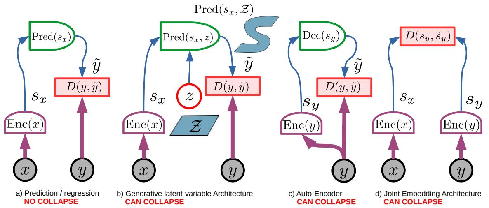

> 图 10 | 几种标准架构及其发生 **坍缩（Collapse）** 的能力。

(a) **确定性生成架构（Deterministic generative architecture）** ：不会坍缩，因为它只能产生单一输出。对于给定的 $x$，只有一个 $y$ 值可能具有零能量：$y = \bar { y }$。如果当 $y \ne \tilde { y }$ 时 $D ( u , \tilde { y } )$ 大于零，那么其他 $y$ 值将具有更高的能量。
(b) **非确定性生成架构（Non-deterministic generative architecture）** ：当 **隐变量（Latent variable）** $z$ 的信息容量过大时可能发生坍缩。如果对于给定的 $x$ 和所有 $y$，都存在一个 $\mathcal { L }$ 能产生零预测能量（例如，如果 $z$ 的维度与 $y$ 相同或更高），那么整个 $y$ 空间都将具有低能量。$z$ 的信息容量应恰好足够，使得在其集合上变化 $z$ 能为给定的 $x$ 产生所有合理的 $\ddot { y }$。
(c) **自编码器（Auto-encoder, AE）** ：如果系统学会了 **恒等函数（Identity function）** ，或者它能够正确重建一个比高数据密度区域大得多的 $y$ 空间区域，从而给一个过大的区域赋予低能量，则可能发生坍缩。
(d) **简单联合嵌入架构（Simple joint embedding architecture）** ：如果编码器忽略输入并产生恒定且相等的表示，或者编码器在空间上过于宽泛的区域保持不变，则可能发生坍缩。

对于 $y$，自编码器可能学会恒等函数，在整个 $y$ 空间上产生等于零的重建误差。

最后，当 $s _ {x}$ 和/或 $s _ { y }$ 携带的信息不足时， **联合嵌入架构（Joint Embedding Architecture, JEA）** （图 10(d)）可能发生坍缩。如果编码器忽略输入，并产生恒定且相等的编码 $s _ {x} = s _ { y }$，整个空间将具有零能量。

这些只是架构的几个例子。

我们如何设计损失函数来防止坍缩？有两种方法： **对比方法（Contrastive methods）** 和 **正则化方法（Regularized methods）** 。在下文中，我将论证对比方法存在缺陷，而从长远来看，正则化（非对比）方法更可能更受青睐。

对比方法在于使用一个 **损失泛函（Loss functional）** ，其最小化的效果是压低训练样本 $(x, y )$ 的能量，并拉高适当“幻觉”生成的 **对比样本（Contrastive samples）** $(x, \hat { y } )$ 的能量。对比样本 $\hat { y }$ 的选取应确保 **能量基模型（Energy-Based Model, EBM）** 将更高的能量分配给高数据密度区域之外的点。这转化为设计一个损失函数，它是 $F _ { w } (x, y )$ 的增函数，并且是 $F _ { w } (x, \hat { y } )$ 的减函数，至少当 $F _ { w } (x, \hat { y } )$ 没有足够高于 $F _ { w } (x, y )$ 时。存在许多这样的对比损失函数。

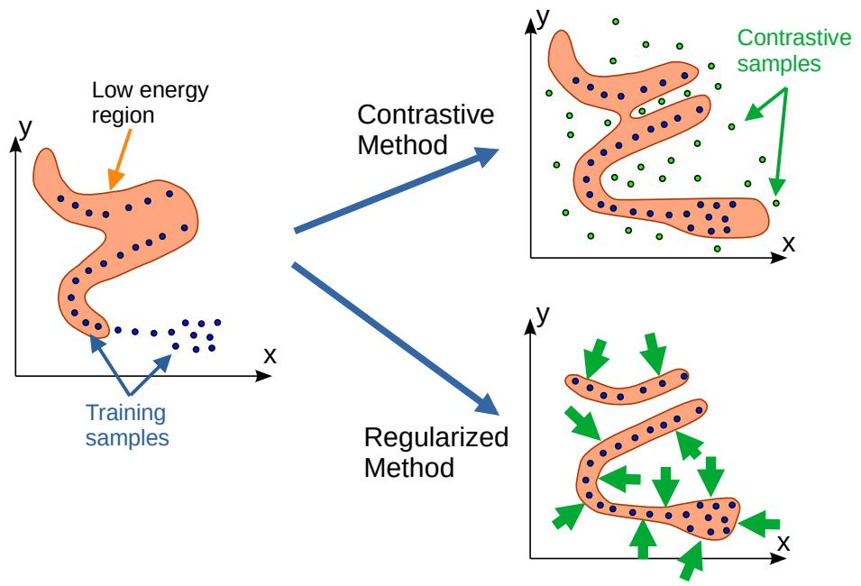

> 图 11 | 用于 EBM 训练的对比方法和正则化方法。左侧显示了能量景观的概念图。训练样本是蓝点。低能量区域以橙色显示（能量函数的一个水平集）。

**对比方法（Contrastive methods）** （右上）压低训练样本（蓝点）的能量，并拉高适当放置的对比样本（绿点）的能量。

**正则化方法（Regularized methods）** （右下）压低训练样本的能量，并使用一个 **正则化项（Regularizer term）** 来最小化低能量区域的体积。这种正则化的效果是，在能量函数灵活性允许的范围内，将高数据密度区域“收缩包裹”在低能量区域内。

**对比方法（Contrastive methods）** 的一个问题是，能量只会在放置了对比样本的地方被拉高。必须设计出能优先将对比样本放置在低能量区域的方法，这正是 **蒙特卡洛方法（Monte-Carlo methods）** 和 **马尔可夫链蒙特卡洛方法（Markov Chain Monte Carlo, MCMC）** 所做的事情。然而，对比方法的一个缺点是，为使能量曲面呈现良好形状所需的对比样本数量，可能会随着 $y$ 空间的维度呈指数级增长。

这些函数，有些接受单个三元组 $(x, y , \hat { y } )$，有些则需要一批 $y$ 的正样本值和对比值。

一个简单的对比损失函数示例如下：

$$
L (w, x, y, \hat {y}) = H \left(F _ {w} (x, y), F _ {w} (x, \hat {y}), m (y, \hat {y})\right) \tag {6}
$$

其中，$H$ 是 $F _ { w } (x, y )$ 的增函数，并且当 $F _ { w } (x, \hat { y } )$ 小于 $F _ { w } (x, y )$ 加上一个正的 **间隔函数（margin function）** $m ( y , \hat { y } )$ 时，$H$ 是 $F _ { w } (x, \hat { y } )$ 的减函数。此类损失的一个简单实例是 **距离相关铰链损失（distance-dependent hinge loss）** ：

$$
L (w, x, y, \hat {y}) = \left[ F _ {w} (x, y) - F _ {w} (x, \hat {y}) + \mu | | y - \hat {y} | | ^ {2} \right] ^ {+} \tag {7}
$$

其中 $[ a ] ^ { + }$ 在 $a$ 为正时等于 $a$，否则为零。这使得能量至少随着到 **数据流形（data manifold）** 的距离呈二次方增长。其他对比损失

**泛函（functionals）** 则考虑了多个对比样本：

$$
L (w, x, y, \hat {y} [ 1 ], \dots , \hat {y} [ K ]) = H (F _ {w} (x, y), F _ {w} (x, \hat {y} [ 1 ]), \dots , F _ {w} (x, \hat {y} [ K ])) \qquad \qquad (8)
$$

该函数必须是第一个参数的增函数，并且是所有其他参数的减函数。此类损失的一个例子是流行的 **InfoNCE（InfoNCE）** ：

$$
L (w, x, y, \hat {y} [ 1 ], \dots , \hat {y} [ K ]) = F _ {w} (x, y) + \log \left[ \exp (- F _ {w} (x, y)) + \sum_ {k = 1} ^ {K} \exp (- F _ {w} (x, \hat {y} [ k ])) \right] \quad (9)
$$

**对比方法（Contrastive methods）** 非常流行，尤其适用于使用配对数据进行训练的 **孪生网络架构（Siamese network architectures）** ，其中 $x$ 是 $y$ 的扭曲或损坏版本，而 $\hat { y }$ 是另一个随机（或适当选择的）训练样本。这包括诸如原始孪生网络（Siamese net）等方法，以及更近期的包括 DrLIM、PIRL、MoCO、SimCLR、CPT 等在内的其他方法。对比方法还包括一些经典方法，例如使用 **最大似然估计（Maximum Likelihood Estimation）** 训练但未自动归一化的概率模型。对比样本 $\hat { y }$ 通常使用 **蒙特卡洛方法（Monte Carlo methods）** 、 **马尔可夫链蒙特卡洛方法（Markov-Chain Monte Carlo methods）** 或其近似版本（如 **对比散度（Contrastive Divergence）** ）来生成。 **生成对抗网络（Generative Adversarial Networks, GANs）** 也可以被视为对比方法，其中 $\hat { y }$ 由可训练的生成器网络产生。 **去噪自编码器（Denoising Auto-Encoders, DAEs）** 及其特例 **掩码自编码器（Masked Auto-Encoders, MAEs）** 也是对比训练方法的例子，其中 $\hat { y }$ 是通过损坏干净的 $y$ 而生成的。关于各种对比方法的更详细讨论见附录 8.3.3。

但是，对比方法存在两个主要问题。首先，必须设计一个方案来生成或挑选合适的 $\hat { y }$。其次，当 $y$ 处于高维空间，并且如果 **能量基模型（Energy-Based Model, EBM）** 足够灵活，则可能需要非常大量的对比样本，以确保能量在局部数据分布未占据的所有维度上都更高。由于 **维度灾难（curse of dimensionality）** ，在最坏情况下，对比样本的数量可能随着表示维度的增加而呈指数级增长。这是我反对对比方法的主要原因。

从长远来看，用于 EBM 训练的 **正则化方法（Regularized methods）** 比对比方法更有前景，因为它们可以规避困扰对比方法的维度灾难。这些方法的核心是构建一个 **损失泛函（loss functional）** ，其作用是压低训练样本的能量，同时最小化模型关联低能量的 y 空间的体积。低能量区域的体积通过能量和/或损失中的正则化项来衡量。通过最小化这个正则化项并压低数据点的能量，低能量区域将“收缩包裹”高数据密度区域。非对比的正则化方法的主要优势在于，它们比对比方法更不容易受到维度灾难的影响。主要问题恰恰在于如何设计这种最小化体积的正则化器。答案在很大程度上取决于模型架构，这将在后续章节中讨论。然而，非对比方法早已存在。例子包括 **稀疏建模（sparse modeling）** 、 **稀疏自编码器（sparse auto-encoders）** 以及具有噪声潜在变量的自编码器，例如 **变分自编码器（Variational Auto-Encoder, VAE）** 。

需要注意的是，对比方法和正则化方法并非互斥，可以在同一模型上同时使用。

正则化方法如何应用于图 10(b-d) 的架构？

在 **潜在变量生成架构（latent-variable generative architecture）** 中，限制 $z$ 的信息容量将限制能够具有低能量的 $y$ 空间的体积。如果 $z$ 是离散的，有 $k$ 个可能值，那么 $y$ 空间中最多有 $k$ 个点的能量为零。如果 $\mathcal { Z }$ 是一个维度为 $d$ 的 **流形（manifold）** ，那么 $y$ 空间中能量为零的区域最多具有 $d$ 个维度。

类似地，在 **自编码器架构（auto-encoder architecture）** 中，限制 $s _ { y }$ 的信息容量将限制能够以低能量重建的 $y$ 空间的体积。

最后，在 **联合嵌入架构（Joint Embedding Architecture）** 中，最大化 $s _ {x}$ 包含的关于 $x$ 的信息以及 $s _ { y }$ 包含的关于 $y$ 的信息，将最小化能够具有低能量的 $y$ 空间的体积。

接下来，我们将重点讨论一种用于 **自监督学习（Self-Supervised Learning, SSL）** 的架构—— **联合嵌入预测架构（Joint Embedding Predictive Architectures, JEPA）** ，它可以看作是联合嵌入架构与潜在变量生成架构的结合。JEPA 是非生成式的，因为它实际上并不预测 $y$，而是从 $x$ 的表示 $s _ {x}$ 来预测 $y$ 的表示 $s _ { y }$。

### 4.4 Joint Embedding Predictive Architecture (JEPA)（联合嵌入预测架构）

本文的核心是 **联合嵌入预测架构（Joint Embedding Predictive Architecture, JEPA）** 。JEPA 并非生成式的，因为它不能轻易地用于从 $x$ 预测 $y$。它仅仅捕捉 $x$ 和 $y$ 之间的依赖关系，而不显式地生成 $y$ 的预测。

一个通用的 JEPA 如图 12 所示。两个变量 $x$ 和 $y$ 被送入两个编码器，产生两个表示 $s _ {x}$ 和 $s _ { y }$。这两个编码器可以不同。它们不需要具有相同的架构，也不需要共享参数。这使得 $x$ 和 $y$ 在本质上可以不同（例如视频和音频）。一个预测器模块从 $x$ 的表示预测 $y$ 的表示。预测器可能依赖于一个 **潜在变量（Latent variable）** $z$。能量（Energy）就是表示空间中的预测误差：

$$
E _ {w} (x, y, z) = D \left(s _ {y}, \operatorname {P r e d} \left(s _ {x}, z\right)\right) \tag {10}
$$

总能量通过对 $z$ 最小化得到：

$$
\check {z} = \underset {z \in \mathcal {Z}} {\operatorname {a r g m i n}} E _ {w} (x, y, z) = \underset {z \in \mathcal {Z}} {\operatorname {a r g m i n}} D \left(s _ {y}, \operatorname {P r e d} \left(s _ {x}, z\right)\right) \tag {11}
$$

$$
F _ {w} (x, y) = \min  _ {z \in \mathcal {Z}} E _ {w} (x, y, z) = D \left(s _ {y}, \operatorname {P r e d} \left(s _ {x}, \tilde {z}\right)\right) \tag {13}
$$

JEPA 的主要优势在于它在 **表示空间（Representation space）** 中进行预测，避免了预测 $y$ 的每一个细节。这得益于 $y$ 的编码器可以选择产生一个抽象表示，其中不相关的细节已被消除。

但是，JEPA 可以通过两种方式来表示与 $x$ 兼容的 $y$ 的多个可能值。第一种是 $y$ 编码器的 **不变性（Invariance）** 特性，第二种是潜在变量 $z$，如下所述。

**通过编码器不变性实现多模态（Multi-modality through encoder invariance）** ：编码器函数 $s _ { y } = \operatorname { E n c } ( y )$ 可能具有不变性。如果一个集合中的所有 $y$ 都映射到相同的 $s _ { y }$ 值，那么所有这些 $y$ 将具有相同的能量。使用 JEPA，我们失去了生成输出的能力，但获得了一种强大的方式来表征输入和输出之间的多模态依赖关系。

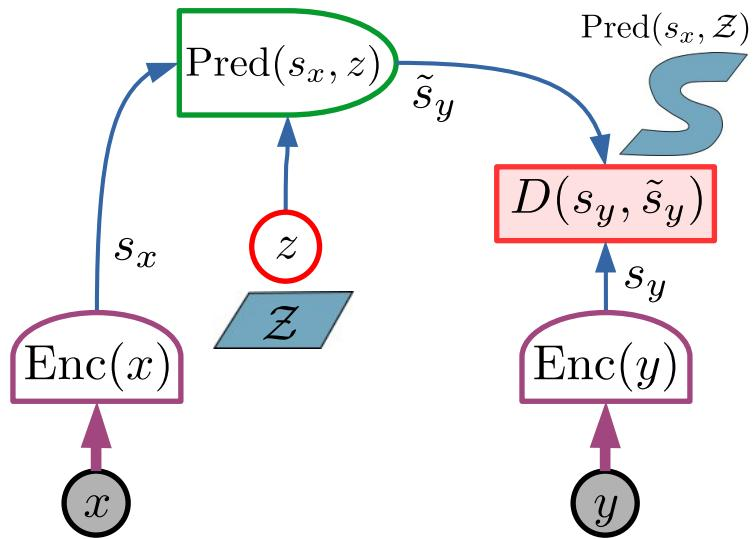

> 图 12 | **联合嵌入预测架构（Joint-Embedding Predictive Architecture, JEPA）** 包含两个编码分支。第一个分支计算 $s _ {x}$，即 $x$ 的表示；第二个分支计算 $s _ { y }$，即 $y$ 的表示。编码器不需要相同。一个预测器模块在潜在变量 $z$ 的可能帮助下，从 $s _ {x}$ 预测 $s _ { y }$。能量即为预测误差。JEPA 的简单变体可能不使用预测器（强制两个表示相等），或使用没有潜在变量的固定预测器，或使用简单的潜在变量（如离散变量）。

JEPA 的主要优势在于它在表示空间中进行预测，避免了预测 $y$ 的每一个细节，并允许编码器消除不相关的细节。更准确地说，这种架构在表示多模态依赖关系方面的主要优势是双重的：

1.  编码器函数 $s _ { y } = \operatorname { E n c } ( y )$ 可能具有不变性，使其对一组不同的 $y$ 产生相同的 $s _ { y }$。这使得能量在该集合上保持恒定，并允许模型捕捉复杂的多模态依赖关系。
2.  潜在变量 $z$，当在一个集合 $\mathcal { Z }$ 上变化时，可以产生一组合理的预测 $\operatorname { P r e d } ( s _ {x} , { \mathcal { Z } } ) = \{ { \tilde { s } } _ { y } = \operatorname { P r e d } ( s _ {x} , z ) \forall z \in { \mathcal { Z } } \}$。

如果 $x$ 是一段汽车接近道路分叉口的视频片段，$s _ {x}$ 和 $s _ { y }$ 可以分别表示汽车在分叉前和分叉后的位置、方向、速度和其他特征，忽略不相关的细节，如路边的树木或人行道的纹理。$z$ 可以表示汽车是驶向道路的左分支还是右分支。

**通过潜在变量预测器实现多模态（Multi-modality through latent variable predictor）** ：预测器可以使用潜在变量 $z$ 来捕捉预测 $s _ { y }$ 所必需但 $s _ {x}$ 中不存在的信息。当 $z$ 在一个集合 $\mathcal { Z }$ 上变化时，预测器会产生一组合理的预测 $\mathrm { P r e d } ( s _ {x} , \mathcal { Z } ) =$ $\{ \tilde { s } _ { y } = \mathrm { P r e d } ( s _ {x} , z ) \ \forall z \in \mathcal { Z } \}$。例如，如果 $x$ 是一段汽车接近道路分叉口的视频片段，$s _ {x}$ 和 $s _ { y }$ 可以分别表示汽车的过去和未来的位置、方向、速度和其他特征，忽略不相关的细节，如路边的树木或人行道的纹理。潜在变量 $z$ 可以是一个二元变量，指示汽车是驶向左侧分支（$z = 0$）还是右侧分支（$z = 1$）。如果汽车驶向左侧分支，值 $z = 0$ 将产生比 $z = 1$ 更低的能量 $D ( s _ { y } , \tilde { s } _ { y } )$。

### 4.5 训练 JEPA（Training a JEPA）

与任何 **基于能量的模型（Energy-Based Model, EBM）** 一样， **联合嵌入预测架构（Joint-Embedding Predictive Architecture, JEPA）** 可以使用 **对比方法（contrastive methods）** 进行训练。但是，如上所述，对比方法在高维情况下往往变得非常低效。这里相关的维度是 $s _ { y }$ 的维度，它可能比 $y$ 小得多，但对于高效训练来说仍然太高。

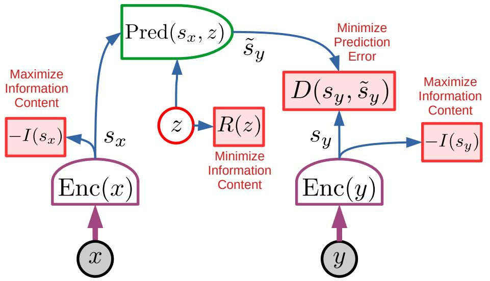

> 图 13 | JEPA 的非对比训练。

JEPA 的主要吸引力在于它们可以用 **非对比方法（non-contrastive methods）** 进行训练。这种训练的基本原则是：

1.  $s _ {x}$ 应包含关于 $x$ 的最大信息量；
2.  $s _ { y }$ 应包含关于 $y$ 的最大信息量；
3.  $s _ { y }$ 应易于从 $s _ {x}$ 预测；
4.  潜在变量 $z$ 应具有最小的信息量。

准则 1、2 和 4 共同防止了能量函数的 **坍塌（collapse）** 。用于 JEPA 训练的这种非对比准则的例子包括 **VICReg** 和 **Barlow Twins** 。

与每个 EBM 一样，JEPA 也可以用对比方法训练。但这样做会遇到 **维度灾难（curse of dimensionality）** ，并限制 $s _ { y }$ 的实际维度。

使 JEPA 特别有趣的是，我们可以设计非对比方法来训练它们。如第 4.3 节所述，非对比方法使用 **正则化器（regularizers）** 来衡量可以取低能量值的空间体积。对于 JEPA，这可以通过四个准则来实现，如图 13 所示：

1.  最大化 $s _ {x}$ 关于 $x$ 的信息量。
2.  最大化 $s _ { y }$ 关于 $y$ 的信息量。
3.  使 $s _ { y }$ 易于从 $s _ {x}$ 预测。
4.  最小化预测中使用的潜在变量 $z$ 的信息量。

准则 1 和 2 通过防止 **信息坍塌（informational collapse）** 来避免能量曲面变得平坦。它们确保 $s _ {x}$ 和 $s _ { y }$ 携带尽可能多的关于其输入的信息。没有这些准则，系统可能会选择使 $s _ {x}$ 和 $s _ { y }$ 为常数或信息量微弱，这将导致能量在输入空间的大片区域上为常数。

准则 3 由能量项 $D ( s _ { y } , \tilde { s } _ { y } )$ 强制执行，并确保在表示空间中 $y$ 可以从 $x$ 预测。

准则 4 通过迫使模型在预测 $s _ { y }$ 时尽可能少地借助潜在变量的帮助，来防止系统成为另一种信息坍塌的受害者。这种坍塌可以通过以下思想实验来理解：假设 $z$ 与 $s _ { y }$ 具有相同的维度。假设预测器是一个参数化函数（例如，一个神经网络），它可以选择忽略 $s _ {x}$，并简单地将 $z$ 复制到其输出 $\tilde { s } _ { y } = z$ 上。对于任何 $s _ { y }$，都可以设置 $\dot { z } = s _ { y }$，这将使能量 $D ( s _ { y } , \tilde { s } _ { y } )$ 为零。这对应于一个完全平坦且坍塌的能量曲面。

我们如何防止这种坍塌发生？

通过限制或最小化潜在变量的信息量。

如何实现这一点？

通过使 $z$ 离散化、低维化、稀疏化或添加噪声化，以及其他方法。

一些具体示例可能有助于直观理解这一现象。假设 $D ( s _ { y } , \tilde { s } _ { y } ) = | | s _ { y } - \tilde { s } _ { y } | | ^ { 2 }$，并且 $z$ 是离散的，具有 $K$ 个可能的整数值 $[0, K - 1 ]$。对于给定的 $x$，$\tilde { s } _ { y }$ 只能有 $K$ 个可能的值：

$$
\operatorname {P r e d} \left(s _ {x}, 0\right), \operatorname {P r e d} \left(s _ {x}, 1\right), \dots , \operatorname {P r e d} \left(s _ {x}, K - 1\right).
$$

因此，这些是 $s _ { y }$ 中能量为零的唯一可能值，且仅有 $K$ 个。考虑一个点 $s _ { y }$，它从 $\mathrm { P r e d } ( s _ {x} ,0)$ 出发，向 $\mathrm { P r e d } ( s _ {x} , 1 )$ 移动。其能量将从零开始，随着 $s _ { y }$ 远离 $\mathrm { P r e d } ( s _ {x} ,0)$ 而呈二次方增加，直到 $s _ { y }$。当 $s _ { y }$ 比 $\mathrm { P r e d } ( s _ {x} ,0)$ 更接近 $\mathrm { P r e d } ( s _ {x} , 1 )$ 时，能量将开始下降，并在 $s _ { y }$ 到达 $\mathrm { P r e d } ( s _ {x} , 1 )$ 时降为零。在表示空间中，能量将是 $K$ 个二次能量阱的最小值。

类似地，假设 $z$ 是一个向量，其维度 $d$ 低于 $\tilde { s } _ { y }$ 的维度。那么，假设 $\mathrm { P r e d } ( s _ {x} , z )$ 是 $z$ 的平滑函数，则可能的预测集合在 $s _ { y }$ 空间中至多是一个 $d$ 维流形。

更关键的是，假设能量函数通过一个关于 $z$ 的正则化项 $\begin{array} { r } { R ( z ) = \alpha \sum _ { i = 1 } ^ { d } | z _ { i } | } \end{array}$ 得到增强，即 $z$ 的 $L _ { 1 }$ 范数。这将驱使 $\check { z }$ 变得稀疏。与经典稀疏编码类似，这将导致低能量区域被近似为低维流形的并集（如果 $\mathrm { P r e d } ( s _ {x} , z )$ 在 $z$ 上是线性的，则是低维线性子空间的并集），其维度将被 $L _ { 1 }$ 正则化器最小化。

使 $z$ 成为从熵最大化的分布中采样的随机样本，也将产生适当的正则化效果。这是变分自编码器（Variational Auto-Encoders, VAE）及类似模型的基础。

关于能够最小化潜在变量信息含量的正则化器的更完整讨论超出了本文的范围。目前，我们可以提及四类方法：

- **离散化/量化** （例如 VQ-VAE (Walker et al., 2021) 中的方法）
- **维度/秩最小化** （例如隐式秩最小化自编码器（Implicit Rank-Minimizing AE, IRMAE）(Jing et al., 2020) 中的方法）
- **稀疏化** （例如线性稀疏建模 (Olshausen and Field, 1996)、LISTA (Gregor and LeCun, 2010b) 和非线性稀疏建模 (Evtimova and LeCun, 2022) 中的方法）
- **模糊化** （例如噪声自编码器（Noisy AE）(Doi et al., 2007)、变分自编码器（VAE）(Kingma and Welling, 2013) 以及控制问题中使用的变体 (Henaff et al., 2019)）

**联合嵌入预测架构（Joint-Embedding Predictive Architecture, JEPA）** 在表示空间中进行预测的能力，使其明显优于直接生成 $y$ 预测的生成模型。在视频预测场景中，预测未来每一帧的每个像素值基本上是不可能的。地毯纹理的细节、风中摇曳的树叶或池塘上的涟漪，都无法被准确预测，至少在长时间尺度上不行，并且不消耗巨大资源也无法做到。JEPA 的一个显著优势在于，它可以选择忽略不易预测的输入细节。然而， **准则 1** 和 **准则 2** 将确保被忽略细节的信息含量保持在最低水平。

我们如何实现准则 1 和 2？

换句话说，给定一个参数化的确定性编码函数 $s _ { y } = \mathrm { E n c } _ { w } ( y )$，我们如何最大化 $s _ { y }$ 的信息含量？

如果 $\operatorname { E n c } _ { w } ( y )$ 是可逆的，$s _ { y }$ 包含关于 $y$ 的所有信息，但这对于准则 3 来说可能是次优的，因为 $s _ { y }$ 将包含许多关于 $y$ 的不相关或难以预测的细节。更准确地说，如果函数 $\operatorname { E n c } _ { w } ( y )$ 是 **最小满射** 的，即映射到相同 $s _ { y }$ 的 $y$ 集合的体积最小，那么 $s _ { y }$ 关于 $y$ 的信息含量最大。同样的推理也适用于 $x$ 编码器。要将此准则转化为可微分的损失函数，我们需要做出一些假设。

#### 4.5.1 VICReg（Variance-Invariance-Covariance Regularization）

**VICReg（Variance-Invariance-Covariance Regularization）** 方法（Bardes 等人，2021）对 $s _ {x}$ 和 $s _ { y }$ 的分布做出了一些假设。其图示表示如图 14 所示。为了最大化 $s _ {x}$ 的信息量，VICReg 使用了以下两个子准则：(1) $s _ {x}$ 的各分量必须非常量；(2) $s _ {x}$ 的各分量必须尽可能相互独立。这是通过首先将 $s _ {x}$ 和 $s _ { y }$ 通过一个可训练的扩展模块（例如，一个有几层的神经网络）非线性映射到更高维的嵌入 $v _ {x}$ 和 $v _ { y }$，然后使用一个包含两个在批次样本上计算的可微分损失项的损失函数来近似的：

1.  **方差（Variance）** ：一个 **铰链损失（hinge loss）** ，用于维持 $s _ { y }$ 和 $v _ { y }$ 的每个分量在一个批次上的标准差高于某个阈值。
2.  **协方差（Covariance）** ：一个 **协方差损失（covariance loss）** ，旨在将 $v _ { y }$ 的不同分量对之间的协方差推向零。这起到了 **去相关（decorrelating）** $v _ { y }$ 各分量的效果，从而反过来使 $s _ { y }$ 的各分量在一定程度上相互独立。

相同的准则分别应用于 $s _ {x}$ 和 $v _ {x}$。

VICReg 的第三个准则是表示预测误差 $D ( s _ { y } , \tilde { s } _ { y } )$。在 VICReg 最简单的实现中，预测器是常数（等于恒等函数），这使得表示对将 $x$ 转换为 $y$ 的变换具有 **不变性（invariant）** 。在更复杂的版本中，预测器可能没有 **潜变量（latent variable）** ，或者可能依赖于一个潜变量，该变量可以是离散的、低维的或随机的。

当预测器使用一个其信息量必须最小化的潜变量时，第四个准则是必要的，例如一个维度接近或超过 $\tilde { s } _ { y }$ 的向量。

VICReg 用于学习不变表示的一个简单实例化包括：使 $x$ 和 $y$ 成为同一内容的不同视图（或扭曲版本），将预测器设置为恒等函数，并定义 $D ( s _ { y } , \tilde { s } _ { y } ) = D ( s _ { y } , s _ {x} ) = | | s _ { y } - s _ {x} | | ^ { 2 }$。

通过基于梯度的方法推断潜变量可能很繁重。但如附录 8.3.3 所述，使用 **摊销推断（amortized inference）** 可以大大降低计算成本。

对比方法确保了一个批次中不同输入的表示是不同的，而 VICReg 确保了一个批次中表示的不同分量是不同的。VICReg 是在分量层面进行对比，而传统的对比方法是在向量层面进行对比，这需要大量的对比样本。

但是，使用 VICReg 和类似的非对比方法训练的 **JEPA（Joint Embedding Predictive Architecture）** 最有前景的方面在于学习 **分层预测世界模型（hierarchical predictive world models）** ，我们将在下一节探讨这一点。

#### 4.5.2 引导联合嵌入预测架构学习“有用”表示

根据上述列出的训练准则， **联合嵌入预测架构（Joint-Embedding Predictive Architecture, JEPA）** 需要在表示的 **完整性（completeness）** 与 **可预测性（predictability）** 之间找到一个平衡点。哪些信息是可预测的、哪些信息未被表示，是由编码器和预测器的架构隐式决定的。这些架构共同确定了一种 **归纳偏置（inductive bias）** ，该偏置定义了哪些信息是可预测的，哪些不是。

然而，若能有一种方法引导系统偏向于学习包含与一类任务相关信息（useful）的表示，将会非常有用。这可以通过添加 **预测头（prediction heads）** 来实现。这些预测头以 $\tilde { s } _ { y }$ 作为输入，并经过训练来预测那些易于从数据中推导出且已知与任务相关的变量。

### 4.6 Hierarchical JEPA (H-JEPA) （分层联合嵌入预测架构）

以非对比方式训练的 **联合嵌入预测架构（Joint-Embedding Predictive Architecture, JEPA）** 模型，可能是我们学习能够习得相关抽象的世界模型的最佳工具。当使用 **VICReg（Variance-Invariance-Covariance Regularization）** 及类似准则进行训练时，一个 JEPA 可以选择训练其编码器以消除输入中不相关的细节，从而使表征更具可预测性。换句话说，JEPA 将学习使世界变得可预测的抽象表征。不可预测的细节将被编码器的 **不变性（invariance）** 属性消除，或者被推入预测器的 **潜变量（latent variable）** 中。由此被忽略的信息量将由训练准则和潜变量正则化器最小化。

需要指出的是， **生成式潜变量模型（generative latent-variable models）** 除了将不相关细节推入潜变量之外，无法消除它们。这是因为它们不产生关于 $y$ 的抽象（且不变的）表征。这就是我们反对使用生成式架构的原因。

JEPA 学习抽象的能力启发了对该架构的扩展，以处理多个时间尺度和多个抽象层次的预测。直观地说，低层表征包含大量关于输入的细节，可用于短期预测。但用相同水平的细节进行准确的长期预测可能很困难。相反，高层、抽象的表征可能支持长期预测，但代价是消除了大量细节。

让我们举一个具体的例子。当驾驶汽车时，给定未来几秒内方向盘和踏板上的一系列拟议动作，驾驶员可以准确预测其汽车在同一时期的轨迹。更长时间内的轨迹细节更难预测，因为它们可能依赖于其他车辆、交通信号灯、行人以及其他有些不可预测的外部事件。但驾驶员仍然可以在更高的抽象层次上做出准确的预测：忽略轨迹、其他车辆、交通信号灯等的细节，汽车很可能在一个可预测的时间范围内到达目的地。详细的轨迹将不会出现在这个层次的描述中。但在地图上绘制的近似轨迹是被表征的。一个离散的潜变量可以用来表示多个备选路线。

图 15 展示了一种用于多层次、多尺度世界状态预测的可能架构。变量 $x _ {0} ,x_ { 1 } ,x_ { 2 }$ 代表一系列观测值。第一层网络，记为 JEPA-1，使用低层表征进行短期预测。第二层网络 JEPA-2 使用高层表征进行更长期的预测。可以设想这种类型的架构具有多个层次，可能使用 **卷积（convolutional）** 和其他模块，并在层次之间使用 **时序池化（temporal pooling）** 来粗粒化表征并进行更长期的预测。训练可以逐层进行或全局进行，使用任何适用于 JEPA 的非对比方法。

我认为，在多个抽象层次上表征世界状态序列的能力对于智能行为至关重要。借助世界状态和动作的多层次表征，一个复杂任务可以被分解为一系列更详细的子任务，并在获知局部条件时实例化为动作序列。例如，规划一个复杂任务，如通勤上班，可以分解为开车去火车站、赶火车等。开车去火车站可以分解为走出房子、启动汽车和驾驶。走出房子需要站起来、走到门口、开门等。这种分解一直向下延伸到毫秒级的肌肉控制，而这些控制只有在感知到相关的环境条件（障碍物、交通信号灯、移动物体等）时才能被实例化。

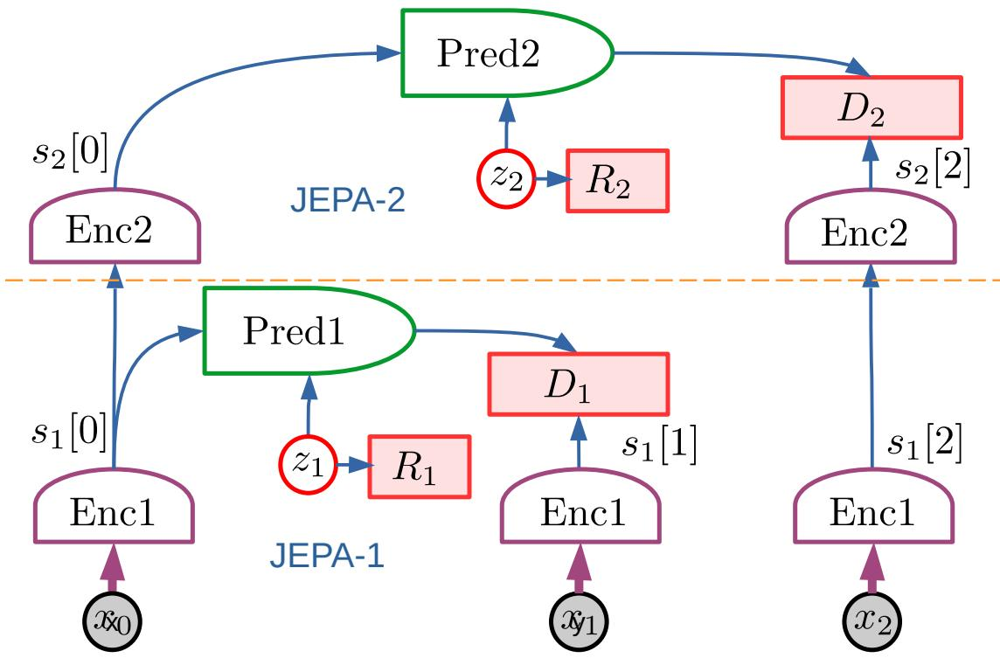

> 图 15 | 分层联合嵌入预测架构（Hierarchical JEPA, H-JEPA）。JEPA 学习能够进行准确预测的抽象表征的能力，使得分层堆叠成为可能。在此图中，JEPA-1 提取低层表征并进行短期预测。JEPA-2 将 JEPA-1 提取的表征作为输入，并提取更高层的表征，从而可以进行更长期的预测。更抽象的表征忽略了长期难以预测的输入细节，使它们能够用更粗略的世界状态描述来进行更长期的预测。

### 4.7 分层规划（Hierarchical Planning）

如果我们的世界模型（World Model）能够进行分层预测，那么它能否用于执行分层式的 **模式-2 推理（Mode-2 reasoning）** 与规划呢？

分层规划是一个困难的课题，解决方案很少，且大多数方案都要求预先定义动作的中间词汇表。但如果遵循深度学习（Deep Learning）的哲学，这些动作计划的中间表示也应该通过学习获得。

图 16 展示了一种可能的分层模式-2 规划架构，它可以利用多尺度世界模型（Multi-scale World Model）的层次结构特性。

感知（Percept）通过一个编码器（Encoder）级联被编码成多个抽象层次的表示：

$$
s [0] = \operatorname {Enc} 1 (x); s 2 [0] = \operatorname {Enc} 2 (s [ 0]); \dots \tag {14}
$$

预测在所有层次上进行。较高层次执行较长期的预测，而较低层次执行较短期的预测。整体任务由一个高层目标定义，在图中描绘为 $C ( s _ { 2 } [ 4 ] )$。顶层推断出一系列高层动作

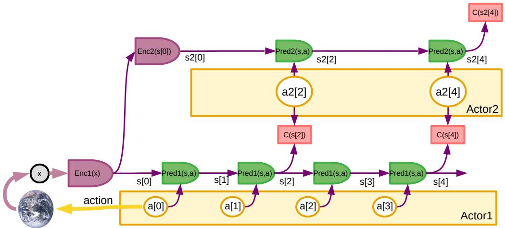

> 图 16 | 用于模式-2 分层规划的分层联合嵌入预测架构（Hierarchical Joint Embedding Predictive Architecture, Hierarchical JEPA）。
> 一个复杂任务由一个从高层世界状态表示计算出的高层代价（Cost）$C ( s 2 [ 4 ] )$ 定义。推断出一系列高层抽象动作 $( a 2 [ 2 ] , a 2 [ 4 ]$ ) 以最小化 $C ( s 2 [ 4 ] )$。推断出的抽象动作被馈送到低层代价模块 $C ( s [ 2 ] ) , C ( s [ 4 ] )$，这些模块为下层定义了子目标（Subgoal）。然后，下层推断出一个最小化子目标代价的动作序列。虽然这里只展示了一个两层层次结构，但将此概念扩展到多层是直接的。
> 此处描述的过程是顺序的、自上而下的，但更好的方法是对所有层中的动作执行联合优化（Joint Optimization）。

$( a 2 [ 2 ] , a 2 [ 4 ] )$ 以优化此目标。这些高层“动作”并非真实动作，而是低层预测状态的目标。可以将它们视为低层状态必须满足的条件，以确保高层预测的准确性。这些条件是否满足可以通过代价模块 $C ( s [ 2 ] )$ 和 $C ( s [ 4 ] )$ 来计算。它们接收一个低层状态 $s$ [2] 和一个高层条件 a2[2]，并测量该状态满足该条件的程度。定义了这些子目标后，低层就可以执行推理，并找到一个最小化中层子目标 $C ( s [ 2 ] )$ 和 $C ( s [ 4 ] )$ 的低层动作序列。

刚刚描述的过程是自上而下且贪婪的（Greedy）。但可以有利地迭代优化过程，从而联合优化高层和低层动作序列。代价模块可以由配置器（Configurator）根据当前情况进行配置。

**动作（Action）** 仅仅是需要由下层满足的条件，这一想法在控制理论（Control Theory）中实际上由来已久。例如，一个经典的比例伺服机构（Proportional Servomechanism）可以被视为被赋予了一个目标状态。一个二次代价（Quadratic Cost）测量了目标状态与当前状态之间的平方距离，而控制量（Control）则简单地与代价相对于动作变量的负梯度（Negative Gradient）成正比。

### 4.8 处理不确定性（Handling uncertainty）

现实世界并非完全可预测。对未来世界状态预测的不确定性可能源于多种原因：

- 世界本质上是随机的（ **偶然不确定性（aleatoric uncertainty）** ，类型 1）

图 17：用于不确定环境中模式 2（Mode-2）分层规划的 **分层联合嵌入预测架构（Hierarchical Joint Embedding Predictive Architecture, Hierarchical JEPA）** 。
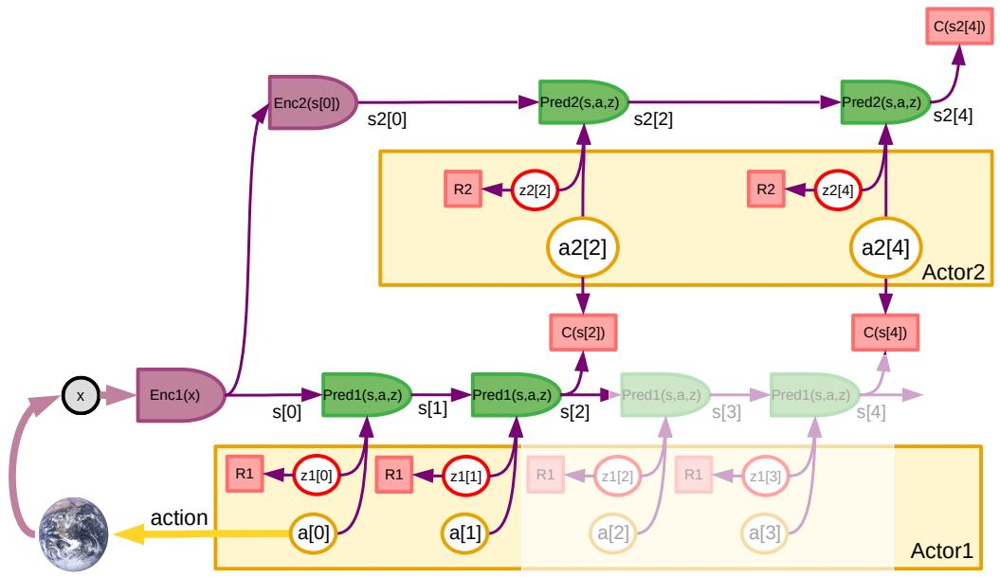

> 图 17 | 不确定环境中的分层规划。

现实环境并非完全可预测，即使使用高度抽象的表示也是如此。预测的不确定性可以通过带有 **隐变量（latent variables）** 的预测器来处理。隐变量（红色圆圈）包含了无法从先验观察中推导出的预测信息。必须对隐变量进行 **正则化（regularized）** ，以防止能量塌缩，并迫使系统尽可能在不依赖隐变量的情况下进行预测。
在规划时，隐变量从通过对正则化器应用 **吉布斯分布（Gibbs distribution）** 得到的分布中采样。每个样本都会导致不同的预测。为了生成一致的隐变量序列，正则化器的参数可以是先前状态和检索到的记忆的函数。
随着预测的进行，生成的状态轨迹数量可能呈指数级增长。如果每个隐变量有 $k$ 个可能的离散值，那么可能的轨迹数量将按 $k ^ { t }$ 增长，其中 $t$ 是时间步数。必须采用定向搜索和剪枝策略。有了多个预测轨迹，就可以计算出最优动作序列，以最小化平均成本，或者最小化成本的平均值和方差的组合，从而最小化风险。

- 世界是确定性的，但是 **混沌的（chaotic）** ，因此没有无限精确的感知就难以预测（偶然不确定性，类型 2）
- 世界是确定性的，但 **部分可观测（partially observable）** （偶然不确定性，类型 3）
- 世界是完全可观测的，但传感器只提供关于世界状态的部分信息（ **认知不确定性（epistemic uncertainty）** ，类型 1）
- 感知模块提取的世界状态表示不包含准确预测所需的完整信息（认知不确定性，类型 2）
- 世界模型因其表示能力的限制而不准确（ **有限理性（bounded rationality）** 或认知不确定性，类型 3）
- 世界模型因使用有限数据训练而不准确（认知不确定性，类型 4）

  **强化学习（Reinforcement Learning, RL）** 文献中的大部分内容都集中在处理环境的随机性上。通常从一开始就假设模型、评论家和策略必须表示分布。在本文工作中，我们将预测变量可能的随机性推入一个隐变量中，该隐变量可以被优化、预测或采样。这通常被称为机器学习（Machine Learning, ML）文献中的“ **重参数化技巧（reparameterization trick）** ”。我们在这里不需要使用这个技巧，因为我们将预测的隐变量参数化视为根本。

图 17 展示了存在不确定性时的一个分层规划片段。

在给定层级和时间步的预测，例如 $s_2[2]$，需要对应隐变量 $z_2[2]$ 的一个样本。该样本可能来自其负对数为正则化器 $R_2(z_2[2])$ 的分布。正则化器的参数可以是常数（例如固定的高斯分布），可以使用 **摊销推断（amortized inference）** 从当前可用数据中预测（例如，其参数由 $s_2^{\vert0\vert}$ 计算得出的多项式或高斯分布），或者由配置器产生。使用先前的预测来配置隐变量正则化器，会使系统偏向于生成“良好”的轨迹。

随着预测的进行，生成的状态轨迹数量可能呈指数级增长：如果每个隐变量有 $k$ 个可能的离散值，那么可能的轨迹数量将按 $k ^ { t }$ 增长，其中 $t$ 是时间步数。可以采用定向搜索和剪枝策略，就像经典的 **蒙特卡洛树搜索（Monte-Carlo Tree Search, MCTS）** 一样。对于连续隐变量的情况，可以从正则化器定义的连续分布中对隐变量进行采样。

给定所有隐变量的一个样本，可以推断出每个层级的最优动作序列。然而，预测过程可能需要对隐变量进行多次采样，以覆盖一组合理的结果。推理过程可以用于多次预测，以产生一个不仅能最小化期望成本，还能最小化期望成本不确定性的动作。

#### 4.8.1 世界模型架构（World Model Architecture）

**世界模型（World Model）** 架构的细节应取决于智能体（Agent）所处的环境类型。

在 **联合嵌入预测架构（Joint-Embedding Predictive Architecture, JEPA）** 中，最佳的模块架构很可能需要包含某种 **门控（Gating）** 或 **动态路由（Dynamic Routing）** 机制。

例如，处理视频中低层次、短期预测的最佳方法是提取简单的局部特征向量，并根据预测的运动，将这些特征向量从一帧“位移”到下一帧。 **潜在变量（Latent Variables）** 可以编码一个位移映射，该映射可以调制帧与帧之间的路由连接。

对于更高抽象层次的长期预测，相关的特征是 **对象（Objects）** 及其 **交互（Interactions）** 。其演化过程可能最适合用 **Transformer 架构（Transformer Architecture）** 来建模，该架构具有 **置换等变性（Equivariant to Permutation）** ，适合捕捉离散对象之间的交互（Vaswani 等人，2017；Carion 等人，2020；Battaglia 等人，2016）。

**将世界模型与自我模型分离** ：自然界是复杂且有些不可预测的，需要一个包含潜在变量的强大模型来解释这种不可预测性。

另一方面，智能体自身则相对更可预测：对 **效应器（Effector）** 的特定动作通常会产生一个可以确定性预测的运动。这表明智能体应该拥有一个独立的自我模型，或许不需要潜在变量（Sobal 等人，2022），因为动作对 **本体感觉（Proprioception）** 的影响，比外部世界的演化或动作对其的影响更容易预测。

反过来，智能体拥有的 **自我模型（Ego-Model）** 可以作为多智能体场景中其他智能体模型的模板。

### 4.9 跟踪世界状态（Keeping track of the state of the world）

传统上，深度学习架构中的模块通过向量或多维数组来通信状态。但是，当被建模对象的状态在时间步之间仅发生微小变化时，这往往是一种非常低效的方法。

智能体的一个典型动作只会修改世界状态的一小部分。如果一个瓶子正从厨房被移动到餐厅，那么瓶子、厨房和餐厅的状态将被修改。但世界的其余部分则不受影响。

这表明世界状态应保存在某种 **可写存储器（Writable Memory）** 中。每当事件发生时，只更新受事件影响的那部分世界状态存储器，其余部分保持不变。

为此，可以使用传统的 **键值关联存储器（Key-Value Associative Memory）** ，类似于在 **记忆增强网络（Memory-Augmented Networks）** （Bordes 等人，2015；Sukhbaatar 等人，2015；Miller 等人，2016）和 **实体网络（Entity Networks）** （Henaff 等人，2017）的背景下所提出的方法。

世界模型在给定时间步的输出是一组 **查询-值对（Query-Value Pairs）** $( q [ i ] , v [ i ] )$，用于修改世界状态存储器中的现有条目，或添加新条目。

给定一个查询 $q$，世界状态存储器返回：

$$
\operatorname {M e m} (q) = \sum_ {j} c _ {j} v _ {j} \tag {15}
$$

$$
\tilde {c} _ {j} = \operatorname {M a t c h} (k _ {j}, q) \tag {16}
$$

$$
c = \text {N o r m a l i z e} (\tilde {c}) \tag {17}
$$

其中，$k _ { j }$ 是 **键（Keys）** ，$v _ { j }$ 是存储的 **值（Stored Values）** ，函数 $\operatorname {M a t c h} ( k , q )$ 度量键与查询之间的 **差异度或非相似度（Divergence or Dissimilarity）** ，向量 $c$ 包含标量系数 $c _ { j }$，函数 $\text {N o r m a l i z e} ( \tilde { c } )$ 执行某种 **竞争性归一化或阈值化（Competitive Normalization or Thresholding）** ，例如常用的 $c _ { j } = \exp ( \tilde { c } _ { j } ) / [ \gamma + \sum _ { k } \exp ( \tilde { c } _ { k } ) ]$，其中 $\gamma$ 是一个正常数。

使用查询（或地址）$q$ 将值 $r$ 写入存储器，可以通过更新现有条目来完成：

$$
\tilde {c} _ {j} = \operatorname {M a t c h} \left(k _ {j}, q\right) \tag {18}
$$

$$
c = \text {N o r m a l i z e} (\tilde {c}) \tag {19}
$$

$$
v _ {j} = \operatorname {U p d a t e} \left(r, v _ {j}, c _ {j}\right) \tag {20}
$$

函数 $\operatorname {U p d a t e} ( r , v , c )$ 可以像 $c r + ( 1 - c ) v$ 一样简单。

如果查询与所有键都相距甚远，存储器可以分配一个新条目，其键为 $q$，对应的值为 $r$。上述示例归一化函数中的常数 $\gamma$ 可以作为可接受的键-查询差异度的阈值。

可以将每个条目视为代表世界中一个实体的状态。在上述瓶子的例子中，世界模型可能包含键 $k_{bottle}$、$k_{kitchen}$、$k_{dining-room}$，分别代表瓶子、厨房和餐厅。$v_{bottle}$ 的初始值将其位置编码为“厨房”，$v_{kitchen}$ 的初始值将其内容编码为包含瓶子，$v_{dining-room}$ 的初始值将其内容编码为不包含瓶子。事件发生后，位置和内容被更新。

所有这些操作都可以以 **可微分（Differentiable）** 的方式进行，因此允许通过它们 **反向传播梯度（Back-Propagate Gradients）** 。

### 4.10 数据流（Data Streams）

关于世界的许多知识可以通过纯粹的观察来学习。原则上，物理物体的运动定律可以从观察中推导出来，无需干预。但高效地训练一个 **世界模型（World Model）** 可能需要更主动或更具“能动性”的信息收集。

可以列出智能体（Agent）用来学习世界运作方式的五种信息收集模式：

1.  **被动观察（Passive observation）** ：智能体被动接收传感器数据流（例如视频、音频等）。
2.  **主动注视（Active foveation）** ：智能体接收一个数据流，其中注意力的焦点可以在不影响环境的情况下被引导。例如，在能够定向视觉和声音传感器的情况下观察一个场景，或者接收一个广角、高分辨率的视频和/或音频流，其中注意力的焦点可以被引导。
3.  **被动能动性（Passive agency）** ：观察另一个作用于环境的智能体所产生的感官流，从而能够推断智能体行为对环境状态的因果效应。
4.  **主动自我运动（Active egomotion）** ：智能体从真实或虚拟环境中接收感官流，其中传感器的位置可以在不显著影响环境的情况下被改变。这可能包括可操控的主动传感器（例如测距传感器、热传感器、化学传感器）以及触觉传感器。
5.  **主动能动性（Active agency）** ：受智能体自身行为影响的感官流。这使得建立 **因果模型（Causal Model）** 成为可能，智能体可以在其中学习预测其行为的后果。这种模式将 **探索-利用困境（Exploration-Exploitation Dilemma）** 推到了前台。

在复杂环境中，收集足够的被动数据以使世界模型捕捉到足够多的环境行为可能是不切实际的。模式 2、4 和 5 允许智能体收集能最大化其环境理解的信息。但要做到这一点，可能需要 **内在动机模块（Intrinsic Motivation Module）** 来驱动注意力、好奇心，并探索那些世界模型预测当前不精确或不确定的 **状态空间（State Space）** 角落。

主要的开放问题是：使用被动观察（模式 1、2、4）能学到多少，需要自我运动（模式 3）才能学到多少，以及需要完全能动性（模式 5）才能学到多少。

## 5 设计与训练执行器（Designing and Training the Actor）

执行器（Actor）模块的作用有三方面：

1.  在给定世界模型（World Model）对模式 2（Mode-2）动作的预测前提下，推断出能最小化成本（Cost）的最优动作序列。
2.  生成代表智能体（Agent）未知世界状态部分的潜在变量（Latent Variable）的多种配置。
3.  训练用于生成模式 1（Mode-1）动作的策略网络（Policy Network）。

动作（Action）与潜在变量在概念上没有区别。执行器必须探索这两组变量的配置。对于潜在变量，必须探索其配置以在不确定性下进行规划。对于动作变量，必须探索其配置以产生能最小化成本的最优配置。在对抗性场景（例如游戏）中，必须探索能最大化成本的潜在配置。实际上，执行器扮演着优化器（Optimizer）和探索器（Explorer）的角色。

当世界模型和成本函数表现良好时，执行器模块可以使用基于梯度（Gradient-based）的优化过程来推断最优动作序列。为此，它接收通过成本函数和展开的世界模型反向传播（Backpropagating）梯度计算出的成本梯度估计值，并利用这些估计值来更新动作序列。

当世界模型或成本函数表现不佳时，基于梯度的最优动作序列搜索可能会失败。在这种情况下，可以应用其他搜索/规划方法。如果动作空间是离散的或可以离散化，则可以使用动态规划（Dynamic Programming）方法或近似动态规划方法，例如束搜索（Beam Search）或蒙特卡洛树搜索（Monte-Carlo Tree Search）。实际上，在最优控制（Optimal Control）、机器人学或“经典”人工智能（Artificial Intelligence, AI）背景下开发的任何规划方法都可以在此背景下使用。

一旦通过规划/推断/优化过程获得了最优动作序列，就可以将这些动作作为目标来训练策略网络。随后，策略网络可用于快速执行动作，或者仅仅是在优化阶段之前将提议的动作序列初始化为一个良好的起点。可以为多个任务训练多个策略网络。

执行器还会生成潜在变量的配置。这些潜在变量代表智能体未知的那部分世界状态。理想情况下，执行器会系统地探索潜在变量的可能配置。理想情况下，潜在变量的正则化项（Regularizer），即图 17 中的 $R_1$ 和 $R_2$，应代表对数先验（Log-priors），从中可以对潜在变量进行采样。但类似于策略网络，可以设计一个潜在变量摊销推断（Latent Amortized Inference）模块来学习潜在变量的分布。良好的分布会产生合理的预测。该分布可能依赖于当时所有可用的变量。

## 6 设计配置器（Designing the Configurator）

**配置器（Configurator）** 是智能体（Agent）的主控制器。它接收来自所有其他模块的输入，并调制它们的参数和连接图。这种调制可以路由信号、激活子网络、聚焦注意力等。在 **预测器（Predictor）** 和 **感知编码器（Perception encoder）** 的上层是 **Transformer 模块（Transformer blocks）** 的场景下，配置器的输出可以构成这些 Transformer 模块的额外输入 **词元（Tokens）** ，从而调制它们的连接图和功能。

配置器模块之所以必要，有两个原因： **硬件复用（Hardware reuse）** 和 **知识共享（Knowledge sharing）** 。能够为多个任务复用同一电路有明显的优势，尤其是在任务可以顺序完成、且资源（例如参数内存）有限的情况下。但还有另一个优势： **知识复用（Knowledge reuse）** 。一个合理的假设是，为给定环境训练的 **世界模型（World model）** 只需稍作修改，即可用于一系列不同的任务。可以想象一个针对环境的“通用”世界模型，其中一小部分参数由配置器根据当前任务进行调制。这将比为每个技能分别建立世界模型更具数据效率和计算效率。缺点是智能体一次只能完成一项任务。

配置器可以通过调制不同层次的参数，为特定任务 **启动（Prime）** 感知模块。人类的感知系统可以被启动以执行特定任务，例如在杂乱的抽屉中检测物品、在森林中检测水果或猎物、阅读、计数特定事件、组装两个部件等。对于需要快速检测简单模式的任务，配置器可以调制 **卷积架构（Convolutional architecture）** 中低层网络的权重。对于涉及满足对象之间关系的任务（例如用螺丝组装两个部件），配置可以通过调制高层 Transformer 模块中的词元来完成。

世界模型的预测器部分必须能够根据当前任务执行多种功能。对于在低抽象层次进行短期预测的预测器，配置可能意味着动态信号路由。在低层次的 **视网膜拓扑特征阵列表示（Retinotopic feature array representation）** 中，预测可以简化为单个特征向量的局部位移，并伴随这些向量的微小变换。这可以通过局部门控/路由电路有利地实现。对于更高抽象层次的长期预测，可能更适合使用 Transformer 架构。Transformer 模块特别适用于涉及对象交互的、基于对象的推理。原因是 Transformer 模块的功能对于 **排列（Permutation）** 是 **等变的（Equivariant）** 。得益于这一特性，我们无需担心哪个对象被分配给哪个输入词元：结果将是相同的，并且与输入分配一致。基于模型的机器人学（Model-based robotics）的最新研究提出，在整条轨迹的层次上使用 Transformer，对注意力电路施加约束，以配置预测器用于因果预测或其他任务（Janner 等人，2021）。

方便的是，通过添加额外的输入词元，可以轻松配置 Transformer 模块的功能。这些额外的输入具有调制网络其余部分所用连接图的效果，从而允许指定广泛的输入-输出函数。

或许配置器最重要的功能是为智能体设定 **子目标（Subgoals）** ，并为此子目标配置 **成本模块（Cost module）** 。如第 3.2 节所述，使成本可配置的一种简单方法是调制基本成本子模块线性组合的权重。这可能适用于不可变的 **内在成本（Intrinsic Cost）** 子模块：允许对内在成本进行复杂的调制，可能会使智能体的基本驱动力难以控制，包括那些实现安全护栏的成本项。相比之下，可以设想更复杂的架构，允许成本的 **可训练评判器（Trainable Critic）** 部分被灵活调制。与预测器类似，如果高级成本被表述为一组期望的对象间关系（“螺母是否拧在螺丝上了？”），则可以使用经过训练的 Transformer 架构来衡量世界状态与待满足条件的偏离程度。与预测器一样，额外的词元输入可用于调制该函数。

一个悬而未决的问题是，配置器如何学会将一个复杂任务分解为一系列智能体可以单独完成的子目标。我将把这个问题留待未来研究。

## 7 相关工作（Related Work）

本文提出的大多数思想并非全新，它们已在 **认知科学（Cognitive Science）** 、 **神经科学（Neuroscience）** 、 **最优控制（Optimal Control）** 、 **机器人学（Robotics）** 、 **人工智能（Artificial Intelligence, AI）** 以及 **机器学习（Machine Learning）** ，特别是 **强化学习（Reinforcement Learning, RL）** 等领域，以各种形式被详尽讨论过。

本文的主要原创性贡献或许在于：

- **一个整体的认知架构** ，其中所有模块都是可微分的，且其中许多是可训练的。
- **H-JEPA** ：一种用于 **预测性世界模型（Predictive World Models）** 的非生成式分层架构，能够在多个抽象层次和多个时间尺度上学习表征。
- **一系列非对比的自监督学习范式** ，能够产生同时具备信息性和可预测性的表征。
- **一种将 H-JEPA 用作预测性世界模型基础的方法** ，用于在不确定性下进行分层规划。

下文试图将当前提案与相关的先前工作联系起来。鉴于提案的范围，参考文献不可能详尽无遗。

### 7.1 Trained World Models, Model-Predictive Control, Hierarchical PLanning（训练的世界模型、模型预测控制、分层规划）

在 **最优控制（Optimal Control）** 中使用模型的历史可以追溯到早期，例如 **凯利-布莱森方法（Kelley-Bryson method）** （参见（Bryson and Ho, 1969）及其中的参考文献，或综述（Morari and Lee, 1997））。一些方法允许进行 **在线系统辨识（Online System Identification）** （Richalet et al., 1978）。

使用 **神经网络（Neural Networks）** 学习用于控制的模型是一个古老的想法，可以追溯到 20 世纪 90 年代初（Jordan and Rumelhart, 1992; Narendra and Parthasarathy, 1990; Miller et al., 1995）。

在最优控制的背景下，学习一个类似 **模式 1（Mode-1）** 的策略网络被称为 **直接逆控制（Direct Inverse Control）** 。

在 **强化学习（Reinforcement Learning）** 的背景下，使用预测模型对动作进行 **模式 2（Mode-2）** 风格的推断也是一个古老的想法，例如 **萨顿的 Dyna 架构（Sutton's Dyna architecture）** （Sutton, 1991）。关于广泛的综述，请参见（Bertsekas, 2019）。

可学习模型的想法最近在各种背景下重新引起了人们的兴趣（Ha and Schmidhuber, 2018b; Ha and Schmidhuber, 2018a; Hafner et al., 2018; Hafner et al., 2020）（关于 **基于模型的强化学习（Model-based Reinforcement Learning）** 的最新综述，请参见（Moerland et al., 2020））。

学习 **世界模型（World Models）** 在 **机器人学（Robotics）** 背景下尤为重要，特别是在抓取和操作任务中，因为 **样本效率（Sample Efficiency）** 至关重要，而仿真往往不准确。事实上，由于经典的强化学习方法在现实世界应用中需要过多的试验，一些有趣的控制学习模型进展源于基于 **机器学习（Machine Learning, ML）** 的机器人研究（Agrawal et al., 2016; Finn and Levine, 2017; Chua et al., 2018; Srinivas et al., 2018; Yu et al., 2020; Yarats et al., 2021）。关于最近的综述，请参见（Levine, 2021）及其中的参考文献。

一个困难的场景是主要输入是视觉信息，必须从视频中学习世界模型。早期尝试从简单视频训练不含 **潜变量（Latent Variables）** 的预测模型，产生了模糊的预测（Lerer et al., 2016）。为了处理预测中的 **不确定性（Uncertainty）** ，可以使用各种类型的潜变量模型，例如 **生成对抗网络（Generative Adversarial Networks, GAN）** （Goodfellow et al., 2014）、 **变分自编码器（Variational Auto-Encoders, VAE）** （Kingma and Welling, 2013）和 **矢量量化 VAE（Vector-Quantized VAE, VQ-VAE）** （van den Oord et al., 2017）。这些方法的变体已被应用于视频预测，并有助于表示 **多模态输出（Multimodal Outputs）** 和减少模糊度，例如使用 GAN（Mathieu et al., 2015; Luc et al., 2020）、VAE（Babaeizadeh et al., 2017; Denton and Fergus, 2018; Henaff et al., 2019）或 VQ-VAE（Walker et al., 2021）。尽管这些方法中有许多尚未应用于控制问题，但有些已被应用于自动驾驶的车辆轨迹预测（Henaff et al., 2019; Mercat et al., 2020），或各种机器人控制任务（Oh et al., 2015; Fragkiadaki et al., 2015; Agrawal et al., 2016; Finn et al., 2016; Nagabandi et al., 2017; Babaeizadeh et al., 2017; Srinivas et al., 2018）。与所提出的 **联合嵌入预测架构（Joint Embedding Predictive Architecture, JEPA）** 不同，这些模型是 **生成式的（Generative）** 。如何表示预测中的不确定性这一关键问题仍然存在。

**正则化潜变量模型（Regularized Latent-Variable Models）** 的替代方案是 **对比方法（Contrastive Methods）** ，例如 **对比预测编码（Contrastive Predictive Coding, CPC）** （H´enaff et al., 2019），它已被应用于通过视频预测学习视觉表示（van den Oord et al., 2018）。

为解决 **多模态/模糊性（multimodality/blurriness）** 问题，其他研究提出了在 **表征空间（representation spaces）** 中进行视频预测的方法。在一些工作中，表征空间是通过在监督模式下训练得到的视觉流程获得的，例如用于执行 **语义分割（semantic segmentation）** （Luc 等人，2017；Luc 等人，2018）。遗憾的是，对预训练视觉流程的要求降低了这些方法通过观察学习 **世界模型（world models）** 的通用性。

与 **联合嵌入预测架构（Joint-Embedding Predictive Architecture, JEPA）** 思路类似，已有研究提出自动学习视频帧的表征，以便于预测。这些方案通常局限于学习低级特征，并常通过解码器进行 **重构（reconstruction）** 以防止 **表征坍缩（collapse）** （Goroshin 等人，2015a；Srivastava 等人，2015）。一些作者提出利用 **时间不变性（或一致性）（temporal invariance/consistency）** 来分离图像区域的内容与其 **实例化参数（instantiation parameters）** （Wiskott 和 Sejnowski，2002；Gregor 和 LeCun，2010a；Goroshin 等人，2015b）。

至少有一项近期工作将 **非对比自监督学习（non-contrastive Self-Supervised Learning, SSL）** 方法应用于机器人控制的 **联合嵌入架构（joint embedding architecture）** ，并取得了一定成功（Pari 等人，2021；？）。

应用于联合嵌入与预测的 **对比方法（contrastive methods）** 已在 **语音识别（speech recognition）** 中成功应用（Baevski 等人，2020）（关于 SSL 在语音领域的近期综述，参见 Mohamed 等人，2022）。

为进行 **状态轨迹预测（state trajectory predictions）** ，近期研究（包括本文）提倡使用 **Transformer** 。Transformer 非常适合表示交互中离散对象的动态特性，并已成功应用于汽车轨迹预测（Mercat 等人，2020）。

一个有趣的提议是 **轨迹 Transformer（trajectory transformer）** 架构，其中 Transformer 接收整个 **回合（episode）** 中预测状态的序列作为输入（Janner 等人，2021）。可以约束 **注意力模式（pattern of attention）** ，迫使系统仅关注过去信息，从而以 **因果方式（causal manner）** 运行（不查看未来），并训练其根据先前观察或预测的状态、动作及成本来预测下一个状态、动作和成本。

**分层规划（hierarchical planning）** 在很大程度上仍是一个未解决的问题。Wayne 和 Abbott 提出了一种架构，使用一组训练好的 **前向模型（forward models）** 来为下层指定 **中间目标（intermediate goals）** （Wayne 和 Abbott，2014）。一些近期研究根据 **位姿参数（pose parameters）** 为机器人指定中间目标（Gehring 等人，2021）。一个更近期的提议是 **Director 系统（Director system）** （Hafner 等人，2022），它包含一个通过 **强化学习（reinforcement learning）** 端到端训练的分层世界模型与规划架构。

在机器人学背景下，已有研究探讨了利用 **内在动机（intrinsic motivation）** 训练智能体的思想（Gottlieb 等人，2013）。 **内在成本（Intrinsic Cost）** 的存在提供了一种可微分且高效的方式，来引导智能体遵循特定行为并学习特定技能。

### 7.2 基于能量的模型与联合嵌入架构（Energy-Based Models and Joint-Embedding Architectures）

对许多作者而言， **基于能量的模型（Energy-Based Model, EBM）** 指的是其分布为能量函数的归一化负指数的概率模型。

在本文中，EBM 指代一个更广泛的模型类别，这些模型将能量函数视为基础，并通过学习直接操控其能量景观（energy landscape）。过去已提出了许多直接操控能量的方法。事实上，所有传统的基于优化的学习方法都可以被解释为基于能量的方法（LeCun 等人，2006）[1]。特别是，用于结构预测问题的判别式训练方法可以被表述为 EBM（LeCun 等人，1998；LeCun 等人，2006）[2, 1]。

大多数用于无监督或自监督学习的 EBM 方法都是 **对比式（contrastive）** 的。最早的例子是 **玻尔兹曼机（Boltzmann Machine）** （Hinton 和 Sejnowski，1983）[3]，它是一个通过对比方式进行训练的、基于能量的概率生成模型。

使用对比方法和互信息最大化方法训练的 **联合嵌入架构（Joint Embedding Architectures, JEA）** 有着悠久的历史。第一个 **非对比式（non-contrastive）** JEA 是（Becker 和 Hinton，1992）[4]，它基于最大化来自两个分支（它们观察同一场景的不同视图）的表征之间的互信息度量。或许第一个用于 JEA 的对比方法是所谓的“ **孪生网络（Siamese Network）** ”（Bromley 等人，1994）[5]。该方法以对比方式进行训练，目的是验证手写笔输入板上的签名。

JEA 的思想在十多年里基本未被触及，直到它在我所在课题组（Chopra 等人，2005；Hadsell 等人，2006）[6, 7] 以及 Geoffrey Hinton 的课题组（Goldberger 等人，2005）[8] 的一系列论文中得以复兴。在深度学习复兴之后，一些论文将 JEA 用于细粒度识别，包括人脸识别（Taigman 等人，2014）[9]。

随着 **自监督学习（Self-Supervised Learning, SSL）** 方法的出现，使用对比方式训练的 JEA 在过去几年中呈爆炸式增长，出现了诸如 PIRL（Misra 和 Maaten，2020）[10]、MoCo 和 MoCo-v2（He 等人，2020；Chen 等人，2020b）[11, 12] 以及 SimCLR（Chen 等人，2020a）[13] 等方法。

一些方法可以被视为“ **蒸馏（distillation）** ”方法，其中孪生网络的一个分支是教师（teacher），其输出被用作另一个分支的目标。这包括将输出向量量化到离散聚类原型的方法（参见（Caron 等人，2020）[14] 及其前身）。

近年来，出现了一些新的非对比方法，例如 BYOL（Grill 等人，2020）[15]。但本提案所倡导的这类非对比方法，通过最大化嵌入（embeddings）的信息内容来防止 **表征坍缩（collapse）** 。这包括 Barlow Twins（Zbontar 等人，2021）[16]、VICReg（Bardes 等人，2021）[17]、基于白化（whitening）的方法（Ermolov 等人，2021）[18] 以及最大编码率缩减方法（Maximum Coding Rate Reduction）（参见（Dai 等人，2022）[19] 及其中的参考文献）。

### 7.3 人类与动物认知（Human and animal cognition）

与人类学习相比，当前机器学习方法的局限性是显而易见的 [1, 2]。

幼儿能快速学习抽象概念 [3]，并建立起允许他们进行导航、形成目标以及规划复杂动作序列以实现这些目标的模型 [4–7]。

在认知科学中，大脑构建预测性世界模型的观点很常见，并启发了在机器中重现这一过程的尝试 [8, 9]。一些研究工作致力于构建视频数据集，以测试机器和婴儿的直觉物理常识 [10]。

规划能力是人类智能中被深入研究的一个特征 [11]。有证据表明，人们会为规划构建世界的简化表征，其中不相关的细节被抽象掉 [12]。

意识是一个相当具有推测性的话题，这源于定义意识本身的困难。我不会推测所提架构的某个版本是否可能拥有一种可类比于意识的属性，而只会提及德阿纳（Dehaene）及其合作者的工作，他们提出了两种他们称之为 C1 和 C2 的意识类型。C1 主要与注意力的调制相关，而 C2 则需要一种自我监控能力，这可能类似于本提案中配置器（Configurator）模块需要完成的功能 [13]。

## 8 讨论、局限性与更广泛的意义（Discussion, Limitations, Broader Relevance）

构建本提案的认知架构，实例化所有细节，并使该系统能够处理非平凡任务，将不是一项容易的工作。通往成功的道路很可能布满无法预见的障碍。可能需要许多年才能解决所有问题。

### 8.1 所提模型缺少什么？（What is missing from the Proposed Model?）

要将所提架构实例化并转化为一个功能系统，还需要进行大量艰苦的工作。在所提架构的规范内，可能会出现看似无法解决的缺陷和陷阱。

第一个问题是，能否从视频中构建并训练一个分层联合嵌入预测架构（Hierarchical Joint Embedding Predictive Architecture, Hierarchical JEPA）。它能否学会 4.1 节中提到的那种抽象概念层次结构？

关于联合嵌入预测架构（JEPA）的一个相对开放的问题是，如何精确地正则化潜在变量（Latent Variable）以最小化其信息内容。已经提出了多种可能的机制：使潜在变量离散化、低维化、稀疏化或随机化。但目前尚不清楚哪种方法最终会是最好的。

当前的提案并未规定执行器（Actor）推断潜在变量实例化和最优动作序列的具体方式。虽然所有模块的可微性原则上使得使用基于梯度的优化来推断最优动作序列成为可能，但优化问题在实践中可能非常困难。特别是，当动作空间是离散的，或者从动作到成本的函数高度不平滑时，基于梯度的方法可能无效，需要使用其他（无梯度）搜索方法（动态规划、置信传播、蒙特卡洛树搜索、可满足性问题求解等）。

在模式-2（Mode-2）规划/推理中实例化潜在变量的多种配置，可能需要本提案中未描述的额外机制。人类似乎天生具备一种能力，能够自发地在感知的多种解释之间循环，正如内克尔立方体（Necker cube）和其他具有多种同等合理解释的视错觉所展示的那样。在本模型的背景下，对一个模糊感知的不同解释可能由潜在变量的不同取值来表示。虽然可以设想多种探索机制来系统地探索可能的潜在变量值空间，但本文并未描述此类机制。

本提案未指定各个模块架构的细节。例如，预测器（Predictor）可能在其微架构中需要某种动态路由和门控电路。处理低级表征的预测器可能需要专门化，以表示短期内可能发生的表征的小型变换。处理更高级别表征的预测器模块可能需要更通用的架构来操纵对象及其关系。但本提案中并未具体说明这些。

类似地，短期记忆（Short-term Memory）的精确架构和功能，以及如何用它来表示关于世界状态的信念，都还有些模糊。最初的记忆网络（Memory Network）系统及其后继者包含这样的思想：神经网络可以使用关联记忆（Associative Memory）作为工作记忆（Working Memory），在计算周期之间存储和检索关于世界状态的信念 [14, 15]。但是，让这样的架构适用于复杂的规划和控制可能被证明是困难的。

在当前提案所有最不为人理解的方面中，配置器（Configurator）模块是最神秘的。特别是，在规划复杂任务时，配置器应该识别子目标序列，并配置智能体（Agent）依次完成这些子目标。具体如何做到这一点并未被指明。

这仅仅是一份可预见问题的清单，但随着所提系统的实例被构建出来，许多问题和难题将不可避免地浮出水面。

**参考文献**

1. Lake, B. M., Ullman, T. D., Tenenbaum, J. B. & Gershman, S. J. Building machines that learn and think like people. _Behav. Brain Sci._ **40** , e253 (2017).
2. Zaadnoordijk, L., Besold, T. R. & Hunnius, S. The next step in developmental robotics: What can we learn from infant cognition? _IEEE Trans. Cogn. Dev. Syst._ **14** , 4–13 (2022).
3. Murphy, G. L. _The Big Book of Concepts_. (MIT Press, 2002).
4. Gopnik, A. & Meltzoff, A. N. _Words, Thoughts, and Theories_. (MIT Press, 1997).
5. Spelke, E. S. & Kinzler, K. D. Core knowledge. _Dev. Sci._ **10** , 89–96 (2007).
6. Carey, S. _The Origin of Concepts_. (Oxford University Press, 2009).
7. Gopnik, A., Sobel, D. M., Schulz, L. E. & Glymour, C. Causal learning mechanisms in very young children: Two-, three-, and four-year-olds infer causal relations from patterns of variation and covariation. _Dev. Psychol._ **37** , 620–629 (2001).
8. Lake, B. M., Salakhutdinov, R. & Tenenbaum, J. B. Human-level concept learning through probabilistic program induction. _Science_ **350** , 1332–1338 (2015).
9. Orhan, A. E., Gupta, V. V. & Lake, B. M. Self-supervised learning through the eyes of a child. _Adv. Neural Inf. Process. Syst._ **33** , 9960–9971 (2020).
10. Riochet, R., Castro, M. N., Bernard, M., Lerer, A. & Fergus, R. IntPhys: A benchmark for visual intuitive physics understanding. _IEEE Trans. Pattern Anal. Mach. Intell._ **44** , 501–512 (2022).
11. Mattar, M. G. & Lengyel, M. Planning in the brain. _Neuron_ **110** , 914–934 (2022).
12. Ho, M. K., Abel, D., Correa, C. G., Littman, M. L., Cohen, J. D. & Griffiths, T. L. People construct simplified mental representations to plan. _Nature_ **606** , 129–136 (2022).
13. Dehaene, S., Lau, H. & Kouider, S. What is consciousness, and could machines have it? _Science_ **358** , 486–492 (2017).
14. Bordes, A., Usunier, N., Garcia-Duran, A., Weston, J. & Yakhnenko, O. Translating embeddings for modeling multi-relational data. _Adv. Neural Inf. Process. Syst._ **26** , 2787–2795 (2013).
15. Sukhbaatar, S., Weston, J., Fergus, R. & others. End-to-end memory networks. _Adv. Neural Inf. Process. Syst._ **28** , 2440–2448 (2015).

### 8.2 Broader Relevance of the Proposed Approach （所提方法的更广泛相关性）

尽管所提出的架构并非专门为模拟人类和其他动物的自主智能、推理和学习而设计，但我们仍可以从中发现一些相似之处。

以下内容带有一定的推测性，旨在将启发本项工作的认知科学与神经科学中的一些概念联系起来。

#### 8.2.1 Could this Architecture be the Basis of a Model of Animal Intelligence? （该架构能否成为动物智能模型的基础？）

所提出架构中的许多模块在哺乳动物大脑中都有执行类似功能的对应结构。

- **感知模块（Perception module）** 对应于大脑皮层的视觉、听觉及其他感觉区域，以及一些联合区。
- **世界模型（World model）** 和 **评判器（Critic）** 对应于前额叶皮层的各个部分。
- **内在成本模块（Intrinsic cost module）** 对应于基底神经节中涉及奖赏（包括杏仁核）的结构。
- **可训练的评判器（Trainable critic）** 可能对应于前额叶皮层中参与奖赏预测的部分。
- **短期记忆（Short-term memory）** 的功能与已知的海马体功能有所重叠。
- **配置器（Configurator）** 可能对应于前额叶皮层中执行执行控制并调节注意力的结构。
- **执行器（Actor）** 汇集了前运动皮层中负责制定和编码运动计划的区域。

**预测性世界模型（Predictive world model）** 的概念长期以来一直是认知科学中的一个突出概念，而 **预测编码（Predictive coding）** 的概念也一直是神经科学中的一个突出概念。 **联合嵌入预测架构（Joint-Embedding Predictive Architecture, JEPA）** 及其对应的 **非样本对比自监督学习方法（Non-sample-contrastive self-supervised learning method）** 在某种程度上与预测编码和高效编码的思想是一致的。

所提出的架构拥有一个单一的世界模型引擎，该引擎可由配置器根据当前任务进行配置。我认为，这不仅可以通过硬件复用带来计算优势，还能让知识在多个任务间共享。人脑中存在一个单一、可配置的世界模型引擎的假说，或许可以解释为何人类一次基本上只能执行一项“有意识”的推理和规划任务。一个高度推测性的想法是： **意识（Consciousness）** 的错觉可能是大脑中一个类似配置器的模块的副作用，该模块监督大脑其余部分的功能，并为其配置当前任务。或许，如果大脑足够大，能够容纳许多独立的、不可配置的世界模型，那么配置器就不再必要，意识的错觉也会随之消失。

动物和人类的情感基础是什么？瞬时情感（例如疼痛、愉悦、饥饿等）可能是大脑结构作用的结果，这些结构的作用类似于所提架构中的 **内在成本模块（Intrinsic Cost module）** 。其他情感，如恐惧或兴奋，则可能是大脑结构对结果进行预期的产物，这些结构的功能类似于 **可训练的评判器（Trainable Critic）** 。

一个通过搜索最优行动来驱动智能体行为的成本模块的存在表明，本文所提出的这类自主智能体将不可避免地拥有情感的等价物。与动物和人类类似， **机器情感（Machine emotions）** 将是内在成本或来自可训练评判器的结果预期的产物。

#### 8.2.2 Could this be a Path towards Machine Common Sense? （这会是通往机器常识的路径吗？）

一个普遍持有的观点是，当前没有任何人工智能系统具备任何程度的 **常识（Common sense）** ，甚至达不到家猫所表现出的水平。动物似乎能够获取足够多的关于世界如何运作的背景知识，从而表现出一定程度的常识。相比之下，人工智能系统，即使通过自监督模式（例如从文本）进行（预）训练，似乎也表现出非常有限的常识水平，使其显得有些脆弱。

例如， **大型语言模型（Large Language Models, LLMs）** 似乎拥有从书面文本中提取的惊人庞大的背景知识。但人类的大部分常识知识并未在任何文本中体现，而是源于我们与物理世界的互动。由于 LLMs 没有对底层现实的直接经验，它们所表现出的那种常识知识非常浅薄，并且可能与现实脱节。

对常识的一种可能的定义是：利用世界模型来填补空白的能力，例如预测未来，或者更普遍地，填补那些无法从感知或记忆中获得的关于世界的信息。根据这一定义，常识是一种从一组世界模型或从一个可配置以处理当前情况的单一模型引擎中涌现出来的能力。这种对常识的看法完全属于“ **具身智能（Grounded intelligence）** ”的阵营：常识是一组从低抽象层级到高抽象层级的模型集合，一直延伸到通过语言获得的知识。

应用于可配置的 **分层联合嵌入预测架构（Hierarchical Joint-Embedding Predictive Architecture, H-JEPA）** 的 **自监督学习（Self-Supervised Learning, SSL）** 能否构成机器常识的基础？一个经过适当训练和配置的 H-JEPA 能否嵌入足够的预测性知识，并捕捉到足够多的关于世界的依赖关系，从而表现出一定程度的常识？

我推测，常识可能源于学习那些能够捕捉世界中观测的 **自洽性（Self-consistency）** 和 **相互依赖性（Mutual dependencies）** 的世界模型，这使得智能体能够填补缺失的信息并检测其世界模型的违反情况。

### 8.3 Is it all about scaling? Is reward really enough?（一切皆关乎规模吗？奖励真的足够吗？）

本节回顾了近年来提出的几种通往人类水平智能的潜在路径。用于预测文本和其他模态的大型 **Transformer 架构（Transformer architectures）** 所展现出的惊人能力，使得一些人声称我们仅仅需要扩大这些模型的规模即可（Brown 等人，2020；Brown 等人，2020）。 **强化学习（Reinforcement Learning, RL）** 在游戏和其他简单环境中展现出的惊人能力，则使得另一些人声称奖励就足够了（Silver 等人，2021）。最后，当前 **深度学习（Deep Learning）** 系统在推理方面的局限性，使得一些人声称深度学习系统需要被硬连线电路增强，以实现符号操作（Marcus 和 Davis，2019）。

#### 8.3.1 Scaling is not enough（规模扩大是不够的）

**大型语言模型（Large Language Models, LLMs）** ，更广泛地说，采用某种形式的 **生成式自监督学习（Generative Self-Supervised Learning, SSL）** 训练的大规模 Transformer 架构，在捕捉文本中蕴含的知识方面取得了惊人的成功。这在人工智能（Artificial Intelligence, AI）社区引发了一场辩论：人类水平的 AI 是否可以通过扩大这些架构的规模来实现。我在这场辩论中的立场是，我不相信扩大规模就足够了，主要有两个原因。

首先，当前的模型处理的是“ **词元化（Tokenized）** ”数据，并且是生成式的。每种输入模态都必须被转换为编码为向量的“ **词元（Tokens）** ”序列（或集合）。这对于文本（它本身就是离散词元的序列）效果很好，但对于视频这样的连续、高维信号则不太适合。用于 LLM 风格模型的 SSL 训练类型，可以看作是一种特殊的 **无隐变量生成模型（Latent-free Generative Model）** ，采用一种特殊的 **对比方法（Contrastive Method）** 进行训练，称为 **去噪自编码器（Denoising Auto-Encoder, DAE）** （Vincent 等人，2010），或者在这种情况下是 **掩码自编码器（Masked Auto-Encoder, MAE）** （Devlin 等人，2018）。因此，它们受到生成模型、无隐变量模型和对比方法的局限性的制约。生成模型难以表示连续空间中的复杂不确定性。LLMs 通过仅处理来自有限集合的离散对象（例如，词典中的单词）来简化预测中不确定性的表示。表示对一个被预测单词的不确定性，归结为生成一个向量，其分量是词典中每个单词（或离散词元）的分数或概率。但这种方法不适用于高维连续模态，例如视频。为了表示此类数据，有必要像在 **JEPA（Joint-Embedding Predictive Architecture，联合嵌入预测架构）** 中那样，通过一个 **编码器（Encoder）** 消除关于待建模变量的无关信息。此外，信号的高维性也阻碍了通过归一化分布来表示不确定性。

其次，当前的模型仅能进行非常有限的推理形式。这些模型中缺乏抽象的 **隐变量（Latent Variables）** ，这阻碍了对一个感知的多种解释进行探索，也阻碍了为达成目标而寻找最优行动方案。事实上，在此类模型中动态指定一个目标基本上是不可能的。

#### 8.3.2 Reward is not enough（奖励是不够的）

所提出的架构旨在最小化系统为了学习一项任务需要在现实世界中采取的行动次数。它通过学习一个 **世界模型（World Model）** 来实现这一点，该模型尽可能多地捕捉关于世界的知识，而无需在现实世界中采取行动。它使用 **内在成本（Intrinsic Costs）** ，这些成本是测量或预测的世界状态的可微函数。这使得该提议更类似于 **最优控制（Optimal Control）** ，而非强化学习。在所提出的模型中，大部分学习发生在世界模型（感知编码器和预测器）的层面。在此背景下， **强化学习（Reinforcement Learning, RL）** 的作用是什么？

在大多数 RL 设置中， **奖励（Reward）** （或 **成本（Cost）** ，即负奖励）是由环境提供给智能体的。换句话说， **内在成本模块（Intrinsic Cost Module）** 就是环境本身，因此是一个未知函数。该函数的值可以通过观察世界状态、采取一个行动并观察所得奖励来探测。奖励相对于行动或状态的 **梯度（Gradient）** 是未知的，必须像在 **策略梯度方法（Policy Gradient Methods）** 中那样，通过多次行动试验来估计。在 **演员-评论家方法（Actor-Critic Methods）** 中，奖励函数由一个 **评论家模块（Critic Module）** 近似，该模块被训练来近似奖励的期望未来值。评论家提供了奖励函数的可微近似。

但是， **无模型强化学习（Model-free RL）** 的样本效率极低，至少与人类和动物的学习相比是如此，需要非常大量的试验才能学习一项技能。标量奖励为学习系统提供的是低信息量的反馈。因此，一个纯粹的 RL 系统需要非常大量的试验才能学习即使是相对简单的任务。 **基于模型的强化学习（Model-based RL）** 显然具有显著提高样本效率的潜力。但问题变成了如何训练世界模型：是通过采取行动和获得奖励来训练，还是通过预测世界状态来训练？在后一种情况下，奖励显然是不够的：系统中的大部分参数被训练来预测世界中的大量观测。与 Silver 等人最近一篇立场论文的标题（Silver 等人，2021）相反，奖励在这种场景中扮演的角色相对次要。

#### 8.3.3 我们是否需要符号进行推理？（Do We Need Symbols for Reasoning?）

在所提出的架构中，如第 3.1.4 节所述， **推理（reasoning）** 可归结为 **行动者（actor）** 通过使用各种 **搜索方法（search methods）** 来寻找 **动作（actions）** 和 **潜变量（latent variables）** 的合适组合，从而实现 **能量最小化（energy minimization）** 或 **约束满足（constraint satisfaction）** 。

如果动作和潜变量是连续的，并且 **预测器（predictor）** 和 **成本模块（cost modules）** 是可微的且行为相对良好，则可以使用 **基于梯度的搜索方法（gradient-based search methods）** 来执行搜索。但也可能存在这样的情况：预测器的输出随动作的变化而快速变化，并且动作空间本质上是 **不连续的（discontinuous）** 。这很可能发生在 **高层次抽象（high levels of abstractions）** 中，此时选择更可能是 **定性的（qualitative）** 。例如，对于一辆 **自动驾驶汽车（self-driving car）** ，一个高层决策可能对应于“在岔路口左转或右转”，而其低层版本则是一系列车轮转角。

如果动作空间是 **离散的（discrete）** 且 **基数（cardinality）** 较小，行动者可以使用 **穷举搜索方法（exhaustive search methods）** 。如果动作集的基数（以及因此产生的 **分支因子（branching factor）** ）过大，行动者可能不得不诉诸于 **启发式搜索方法（heuristic search methods）** ，包括 **蒙特卡洛树搜索（Monte-Carlo Tree Search, MCTS）** 或其他 **无梯度方法（gradient-free methods）** 。如果 **成本函数（cost function）** 满足 **贝尔曼方程（Bellman’s equations）** ，则可以使用 **动态规划（dynamic programming）** 。

然而，基于梯度的搜索方法相对于无梯度搜索方法的效率优势，促使我们去寻找方法，让 **世界模型训练过程（world-model training procedure）** 能够发现 **层次化表征（hierarchical representations）** ，使得 **规划/推理问题（planning/reasoning problem）** 构成一个原本离散问题的 **连续松弛（continuous relaxation）** 。

一个遗留的问题是： **此处提出的推理类型，是否能够涵盖人类和动物所能进行的所有形式的推理？**

## Acknowledgments（致谢）

本文中的思想是多年来与众多人士交流的结晶。在此无法一一列举。

我将列出其中一些尤为突出的人士：莱昂·博图（Léon Bottou）、约书亚·本吉奥（Yoshua Bengio）、杰弗里·辛顿（Geoffrey Hinton）、罗布·弗格斯（Rob Fergus）和吉滕德拉·马利克（Jitendra Malick）；埃马纽埃尔·迪普（Emmanuel Dupoux）和斯坦尼斯拉斯·德阿纳（Stanislas Dehaene）；米卡埃尔·埃纳夫（Mikael Henaff）、阿尔弗雷多·坎齐亚尼（Alfredo Canziani）和尼古拉·卡里翁（Nicolas Carion）（纽约大学）；李静（Li Jing）、陈宇北（Yubei Chen）、兰德尔·巴莱斯特里罗（Randall Balestriero）和斯特凡·德尼（Stéphane Deny）（FAIR）；弗拉德·索巴尔（Vlad Sobal）、朱家琛（Jiachen Zhu）和卡特里娜·埃夫蒂莫娃（Katrina Evtimova）（纽约大学）。

感谢以下同事对稿件提出的宝贵意见：奥利维尔·德拉洛（Olivier Delalleau）、夏谷（Gus Xia）、约书亚·本吉奥（Yoshua Bengio）和埃马纽埃尔·迪普（Emmanuel Dupoux）。

## 参考文献（References）

- Agrawal, P., Nair, A., Abbeel, P., Malik, J., and Levine, S. (2016). Learning to poke by poking: Experiential learning of intuitive physics. CoRR, abs/1606.07419.
- Babaeizadeh, M., Finn, C., Erhan, D., Campbell, R. H., and Levine, S. (2017). Stochastic variational video prediction. CoRR, abs/1710.11252.
- Baevski, A., Zhou, Y., Mohamed, A., and Auli, M. (2020). wav2vec 2.0: A framework for self-supervised learning of speech representations. In Larochelle, H., Ranzato, M., Hadsell, R., Balcan, M., and Lin, H., editors, Advances in Neural Information Processing Systems, volume 33, pages 12449–12460. Curran Associates, Inc.
- Bardes, A., Ponce, J., and LeCun, Y. (2021). Vicreg: Variance-invariance-covariance regularization for self-supervised learning. In International Conference on Learning Representations (ICLR 2022). arXiv preprint arXiv:2105.04906.
- Battaglia, P., Pascanu, R., Lai, M., Jimenez Rezende, D., et al. (2016). Interaction networks for learning about objects, relations and physics. Advances in neural information processing systems, 29.
- Becker, S. and Hinton, G. E. (1992). Self-organizing neural network that discovers surfaces in random-dot stereograms. Nature, 355(6356):161–163.
- Bertsekas, D. (2019). Reinforcement learning and optimal control. Athena Scientific.
- Bordes, A., Usunier, N., Chopra, S., and Weston, J. (2015). Large-scale simple question answering with memory networks. arXiv:1506.02075.
- Bromley, J., Guyon, I., LeCun, Y., Sackinger, E., and Shah, R. (1994). Signature verification using a “siamese” time delay neural network. In NeurIPS.
- Brown, T., Mann, B., Ryder, N., Subbiah, M., Kaplan, J. D., Dhariwal, P., Neelakantan, A., Shyam, P., Sastry, G., Askell, A., Agarwal, S., Herbert-Voss, A., Krueger, G., Henighan, T., Child, R., Ramesh, A., Ziegler, D., Wu, J., Winter, C., Hesse, C., Chen, M., Sigler, E., Litwin, M., Gray, S., Chess, B., Clark, J., Berner, C., McCandlish, S., Radford, A., Sutskever, I., and Amodei, D. (2020). Language models are fewshot learners. In Larochelle, H., Ranzato, M., Hadsell, R., Balcan, M., and Lin, H., editors, Advances in Neural Information Processing Systems, volume 33, pages 1877– 1901. Curran Associates, Inc.
- Bryson, A. and Ho, Y. (1969). Applied optimal control. Blaisdell, Waltham, MA.
- Carey, S. (2009). The Origin of Concepts. Oxford University Press, New York, New York, USA.
- Carion, N., Massa, F., Synnaeve, G., Usunier, N., Kirillov, A., and Zagoruyko, S. (2020). End-to-end object detection with transformers. In 16th European Conference, Glasgow, UK (ECCV 2020), page 213–229.

Caron, M., Misra, I., Mairal, J., Goyal, P., Bojanowski, P., and Joulin, A. (2020). 通过对比聚类分配进行视觉特征的无监督学习。载于《神经信息处理系统进展》。

Carreira-Perpiñán, M. A. and Hinton, G. (2005). 关于对比散度学习。载于 Cowell, R. G. and Ghahramani, Z. (编)，《第十届人工智能与统计学国际研讨会论文集》，《机器学习研究论文集》第 R5 卷，第 33–40 页。PMLR。由 PMLR 于 2021 年 3 月 30 日重新发布。

Chen, T., Kornblith, S., Swersky, K., Norouzi, M., and Hinton, G. (2020a). 大型自监督模型是强大的半监督学习器。载于 NeurIPS。

Chen, X., Fan, H., Girshick, R., and He, K. (2020b). 使用动量对比学习改进基线。arXiv 预印本 arXiv:2003.04297。

Chopra, S., Hadsell, R., and LeCun, Y. (2005). 以判别方式学习相似性度量，应用于人脸验证。载于《2005 年 IEEE 计算机学会计算机视觉与模式识别会议（CVPR'05）》，第 1 卷，第 539–546 页。IEEE。

Chua, K., Calandra, R., McAllister, R., and Levine, S. (2018). 使用概率动力学模型在少量试验中进行深度强化学习。CoRR, abs/1805.12114。

Craik, K. J. W. (1943). 解释的本质。大学出版社，麦克米伦。

Dai, X., Tong, S., Li, M., Wu, Z., Psenka, M., Chan, K. H. R., Zhai, P., Yu, Y., Yuan, X., Shum, H.-Y., and Ma, Y. (2022). Ctrl：通过最小最大化率约简实现到 LDR 的闭环转录。《熵》，24(4):456。

Dehaene, S., Lau, H., and Kouider, S. (2021). 什么是意识，机器能有意识吗？《机器人、人工智能与人类》，第 43–56 页。

Denton, E. and Fergus, R. (2018). 使用学习先验的随机视频生成。arXiv 预印本 arXiv 1802.07687。

Devlin, J., Chang, M.-W., Lee, K., and Toutanova, K. (2018). Bert：用于语言理解的深度双向 Transformer 预训练。arXiv 预印本 arXiv:1810.04805。

Doi, E., Balcan, D. C., and Lewicki, M. S. (2007). 噪声过完备信道上的鲁棒编码。《IEEE 图像处理汇刊》，16(2):442–452。

Ermolov, A., Siarohin, A., Sangineto, E., and Sebe, N. (2021). 用于自监督表示学习的白化。

Evtimova, K. and LeCun, Y. (2022). 使用方差正则化的多层解码器稀疏编码。arXiv:2112.09214。

Finn, C., Goodfellow, I. J., and Levine, S. (2016). 通过视频预测进行物理交互的无监督学习。CoRR, abs/1605.07157。

- Finn, C. and Levine, S. (2017). Deep visual foresight for planning robot motion. In 2017 IEEE International Conference on Robotics and Automation (ICRA), pages 2786–2793. IEEE.
- Fragkiadaki, K., Agrawal, P., Levine, S., and Malik, J. (2015). Learning visual predictive models of physics for playing billiards. CoRR, abs/1511.07404.
- Gehring, J., Synnaeve, G., Krause, A., and Usunier, N. (2021). Hierarchical skills for efficient exploration. Advances in Neural Information Processing Systems, 34:11553–11564.
- Goldberger, J., S.Roweis, Hinton, G., and Salakhutdinov, R. (2005). Neighbourhood components analysis. In Saul, L. K., Weiss, Y., and Bottou, L., editors, Advances in Neural Information Processing Systems 17, pages 513–520. MIT Press, Cambridge, MA.
- Goodfellow, I., Pouget-Abadie, J., Mirza, M., Xu, B., Warde-Farley, D., Ozair, S., Courville, A., and Bengio, Y. (2014). Generative adversarial nets. In Advances in Neural Information Processing Systems, pages 2672–2680.
- Gopnik, A. and Meltzoff, A. N. (1997). Words, Thoughts, and Theories. MIT Press, Cambridge, MA.
- Gopnik, A., Meltzoff, A. N., and Kuhl, P. K. (2001). The Scientist in the Crib: What Early Learning Tells Us About the Mind. Perennial, New York, NY.
- Goroshin, R., Bruna, J., Tompson, J., Eigen, D., and LeCun, Y. (2015a). Unsupervised feature learning from temporal data. In International Conference on Computer Vision (ICCV 2015).
- Goroshin, R., Mathieu, M., and LeCun, Y. (2015b). Learning to linearize under uncertainty. In Advances in Neural Information Processing Systems (NIPS 2015), volume 28.
- Gottlieb, J., Oudeyer, P. Y., Lopes, M., and Baranes, A. (2013). Information-seeking, curiosity, and attention: Computational and neural mechanisms. Trends in Cognitive Sciences, 17:585–593.
- Gregor, K. and LeCun, Y. (2010a). Emergence of complex-like cells in a temporal product network with local receptive fields. arXiv preprint arXiv:1006.0448.
- Gregor, K. and LeCun, Y. (2010b). Learning fast approximations of sparse coding. In Proc. International Conference on Machine learning (ICML’10).
- Grill, J.-B., Strub, F., Altch´e, F., Tallec, C., Richemond, P. H., Buchatskaya, E., Doersch, C., Pires, B. A., Guo, Z. D., Azar, M. G., Piot, B., Kavukcuoglu, K., Munos, R., and Valko, M. (2020). Bootstrap your own latent: A new approach to self-supervised learning. In NeurIPS.
- Ha, D. and Schmidhuber, J. (2018a). Recurrent world models facilitate policy evolution. In Bengio, S., Wallach, H., Larochelle, H., Grauman, K., Cesa-Bianchi, N., and Garnett, R., editors, Advances in Neural Information Processing Systems, volume 31.
- Ha, D. and Schmidhuber, J. (2018b). World models. arXiv preprint arXiv:1803.10122.
- Hadsell, R., Chopra, S., and LeCun, Y. (2006). Dimensionality reduction by learning an invariant mapping. In CVPR.
- Hafner, D., Lee, K.-H., Fischer, I., and Abbeel, P. (2022). Deep hierarchical planning from pixels. arXiv preprint arXiv:2206.04114.
- Hafner, D., Lillicrap, T., Fischer, I., Villegas, R., Ha, D., Lee, H., and Davidson, J. (2018). Learning latent dynamics for planning from pixels. arXiv 1811.04551.
- Hafner, D., Lillicrap, T., Norouzi, M., and Ba, J. (2020). Mastering atari with discrete world models. arXiv preprint arXiv:2010.02193.
- He, K., Fan, H., Wu, Y., Xie, S., and Girshick, R. (2020). Momentum contrast for unsupervised visual representation learning. In CVPR.
- Henaff, M., Canziani, A., and LeCun, Y. (2019). Model-predictive policy learning with uncertainty regularization for driving in dense traffic. In ICLR-19. arXiv:1901.02705.
- Henaff, M., Weston, J., Szlam, A., Bordes, A., and LeCun, Y. (2017). Tracking the world state with recurrent entity networks. In International Conference on Learning Representations (ICLR 2017).
- Hinton, G. and Sejnowski, T. (1983). Optimal perceptual inference. In Proceedings of the IEEE Conference on Computer Vision and Pattern Recognition, pages 448–453, Washington 1983. IEEE, New York.
- Ho, M. K., Abel, D., Correa, C. G., Littman, M. L., Cohen, J. D., and Griffiths, T. L. (2022). People construct simplified mental representations to plan. Nature, 606(7912):129–136.
- H´enaff, O. J., Srinivas, A., De Fauw, J., Razavi, A., Doersch, C., Eslami, S. M. A., and van den Oord, A. (2019). Data-efficient image recognition with contrastive predictive coding. In ICML.
- Janner, M., Li, Q., and Levine, S. (2021). Offline reinforcement learning as one big sequence modeling problem. In Advances in Neural Information Processing Systems.
- Jing, L., Zbontar, J., et al. (2020). Implicit rank-minimizing autoencoder. Advances in Neural Information Processing Systems, 33:14736–14746.
- Jordan, M. I. and Rumelhart, D. E. (1992). Forward models: Supervised learning with a distal teacher. Cognitive science, 16(3):307–354.
- Kahneman, D. (2011). Thinking, fast and slow. Macmillan.
- Kingma, D. P. and Welling, M. (2013). Auto-encoding variational bayes. arXiv preprint arXiv:1312.6114.
- Lake, B. M., Ullman, T. D., Tenenbaum, J. B., and Gershman, S. J. (2017a). Building machines that learn and think like people. Behavioral and brain sciences, 40.

Lake, B. M., Ullman, T. D., Tenenbaum, J. B., and Gershman, S. J. (2017b). Building machines that learn and think like people. Behavioral and Brain Sciences, 40:E253.
LeCun, Y., Bottou, L., Bengio, Y., and Haffner, P. (1998). Gradient-based learning applied to document recognition. Proceedings of the IEEE, 86(11):2278–2324.
LeCun, Y., Chopra, S., Hadsell, R., Ranzato, M., and Huang, F. (2006). A tutorial on energy-based learning. In Bakir, G., Hofman, T., Sch¨olkopf, B., Smola, A., and Taskar, B., editors, Predicting Structured Data. MIT Press.
Lerer, A., Gross, S., and Fergus, R. (2016). Learning physical intuition of block towers by example. In Proceedings of the 33nd International Conference on Machine Learning, ICML 2016, New York City, NY, USA, June 19-24, 2016, pages 430–438.
Levine, S. (2021). Understanding the world through action. arXiv:2110.12543. https: //arxiv.org/abs/2110.12543.
Luc, P., Clark, A., Dieleman, S., Casas, D. d. L., Doron, Y., Cassirer, A., and Simonyan, K. (2020). Transformation-based adversarial video prediction on large-scale data. arXiv preprint arXiv:2003.04035.
Luc, P., Couprie, C., Lecun, Y., and Verbeek, J. (2018). Predicting future instance segmentation by forecasting convolutional features. In Proceedings of the european conference on computer vision (ECCV), pages 584–599.
Luc, P., Neverova, N., Couprie, C., Verbeek, J., and LeCun, Y. (2017). Predicting deeper into the future of semantic segmentation. In Proceedings of the IEEE international conference on computer vision, pages 648–657.
Marcus, G. and Davis, E. (2019). Rebooting AI: Building artificial intelligence we can trust. Vintage.
Mathieu, M., Couprie, C., and LeCun, Y. (2015). Deep multi-scale video prediction beyond mean square error. In ICLR 16. arXiv preprint arXiv:1511.05440.
Mattar, M. G. and Lengyel, M. (2022). Planning in the brain. Neuron, 110(6):914–934.
Mercat, J., Gilles, T., El Zoghby, N., Sandou, G., Beauvois, D., and Gil, G. P. (2020). Multihead attention for multi-modal joint vehicle motion forecasting. In 2020 IEEE International Conference on Robotics and Automation (ICRA), pages 9638–9644. IEEE.
Miller, A. H., Fisch, A., Dodge, J., Karimi, A.-H., Bordes, A., and Weston, J. (2016). Key-value memory networks for directly reading documents. In EMNLP-16.
Miller, W. T., Sutton, R. S., and Werbos, P. J. (1995). Neural networks for control. MIT press.
Misra, I. and Maaten, L. v. d. (2020). Self-supervised learning of pretext-invariant representations. In CVPR.

Moerland, Thomas, M., Broekens, J., and Jonker, Catholijn, M. (2020). Model-based reinforcement learning: A survey. arXiv:2006.16712. https://arxiv.org/abs/2006. 16712.
Mohamed, A., Lee, H.-y., Borgholt, L., Havtorn, J. D., Edin, J., Igel, C., Kirchhoff, K., Li, S.-W., Livescu, K., Maaløe, L., et al. (2022). Self-supervised speech representation learning: A review. arXiv preprint arXiv:2205.10643.
Morari, M. and Lee, J. H. (1997). Model predictive control: Past, present and future. Computers and Chemical Engineering, 23:667–682.
Murphy, G. L. (2002). The Big Book of Concepts. MIT Press, Cambridge, MA.
Nagabandi, A., Kahn, G., Fearing, R. S., and Levine, S. (2017). Neural network dynamics for model-based deep reinforcement learning with model-free fine-tuning. CoRR, abs/1708.02596.
Narendra, K. and Parthasarathy, K. (1990). Identification and control of dynamical systems using neural networks. IEEE Transactions on neural networks, 1(1):4–27.
Oh, J., Guo, X., Lee, H., Lewis, R. L., and Singh, S. (2015). Action-conditional video prediction using deep networks in atari games. Advances in neural information processing systems, 28.
Olshausen, B. A. and Field, D. J. (1996). Emergence of simple-cell receptive field properties by learning a sparse code for natural images. Nature, 381(6583):607–609.
Orhan, E., Gupta, V., and Lake, B. M. (2020). Self-supervised learning through the eyes of a child. Advances in Neural Information Processing Systems, 33:9960–9971.
Pari, J., Shafiullah, N. M., Arunachalam, S. P., and Pinto, L. (2021). The surprising effectiveness of representation learning for visual imitation. In Robotics Science and Systems 2022. arXiv preprint arXiv:2112.01511.
Richalet, J., Rault, A., Testud, J. L., and Papon, J. (1978). Model predictive heuristic control: Applications to industrial processes. Automatica, 14(5):413–428.
Riochet, R., Castro, M. Y., Bernard, M., Lerer, A., Fergus, R., Izard, V., and Dupoux, E. (2019). Intphys: A benchmark for visual intuitive physics reasoning. arXiv:1803.07616.
Silver, D., Singh, S., Precup, D., and Sutton, R. S. (2021). Reward is enough. Artificial Intelligence, 299:103535.
Sobal, V., Canziani, A., Carion, N., Cho, K., and LeCun, Y. (2022). Separating the world and ego models for self-driving. arXiv:2204.07184.
Spelke, E. S. and Kinzler, K. D. (2007). Core knowledge. Developmental Science, 10:89–96.
Srinivas, A., Jabri, A., Abbeel, P., Levine, S., and Finn, C. (2018). Universal planning networks. CoRR, abs/1804.00645.

Srivastava, N., Mansimov, E., and Salakhudinov, R. (2015). Unsupervised learning of video representations using lstms. In Bach, F. and Blei, D., editors, Proceedings of the 32nd International Conference on Machine Learning, volume 37 of Proceedings of Machine Learning Research, pages 843–852, Lille, France. PMLR.
Sukhbaatar, S., Weston, J., Fergus, R., et al. (2015). End-to-end memory networks. Advances in neural information processing systems, 28.
Sutton, R. S. (1991). Dyna, an integrated architecture for learning, planning, and reacting. ACM Sigart Bulletin, 2(4):160–163.
Taigman, Y., Yang, M., Ranzato, M., and Wolf, L. (2014). Deepface: Closing the gap to human-level performance in face verification. In Proceedings of the IEEE conference on computer vision and pattern recognition, pages 1701–1708.
van den Oord, A., Li, Y., and Vinyals, O. (2018). Representation learning with contrastive predictive coding. arXiv preprint arXiv:1807.03748.
van den Oord, A., Vinyals, O., and Kavukcuoglu, K. (2017). Neural discrete representation learning. In Guyon, I., Luxburg, U. V., Bengio, S., Wallach, H., Fergus, R., Vishwanathan, S., and Garnett, R., editors, Advances in Neural Information Processing Systems, volume 30.
Vaswani, A., Shazeer, N., Parmar, N., Uszkoreit, J., Jones, L., Gomez, A. N., Kaiser, L., and Polosukhin, I. (2017). Attention is all you need. Advances in neural information processing systems, 30.
Vincent, P., Larochelle, H., Lajoie, I., Bengio, Y., Manzagol, P.-A., and Bottou, L. (2010). Stacked denoising autoencoders: Learning useful representations in a deep network with a local denoising criterion. Journal of machine learning research, 11(12).
Walker, J., Razavi, A., and Oord, A. v. d. (2021). Predicting video with vqvae. arXiv preprint arXiv:2103.01950.
Wayne, G. and Abbott, L. (2014). Hierarchical control using networks trained with higherlevel forward models. Neural Computation, 26(10):2163–2193.
Wiskott, L. and Sejnowski, T. J. (2002). Slow feature analysis: Unsupervised learning of invariances. Neural computation, 14(4):715–770.
Yarats, D., Kostrikov, I., and Fergus, R. (2021). Image augmentation is all you need: Regularizing deep reinforcement learning from pixels. In ICLR.
Yu, T., Thomas, G., Yu, L., Ermon, S., Zou, J., Levine, S., Finn, C., and Ma, T. (2020). Mopo: Model-based offline policy optimization. arXiv preprint arXiv:2005.13239.
Zaadnoordijk, L., Besold, T., and Cusack, R. (2022). Lessons from infant learning for unsupervised machine learning. Nature Machine Intelligence, 4:510–520.

Zbontar, J., Jing, L., Misra, I., LeCun, Y., and Deny, S. (2021). Barlow twins: Selfsupervised learning via redundancy reduction. In International Conference on Machine Learning, pages 12310–12320. PMLR.

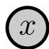

> 图 1 | 观测变量（Observed variable）。

Srivastava, N., Mansimov, E., and Salakhudinov, R. (2015). Unsupervised learning of video representations using lstms. In Bach, F. and Blei, D., editors, Proceedings of the 32nd International Conference on Machine Learning, volume 37 of Proceedings of Machine Learning Research, pages 843–852, Lille, France. PMLR.
Sukhbaatar, S., Weston, J., Fergus, R., et al. (2015). End-to-end memory networks. Advances in neural information processing systems, 28.
Sutton, R. S. (1991). Dyna, an integrated architecture for learning, planning, and reacting. ACM Sigart Bulletin, 2(4):160–163.
Taigman, Y., Yang, M., Ranzato, M., and Wolf, L. (2014). Deepface: Closing the gap to human-level performance in face verification. In Proceedings of the IEEE conference on computer vision and pattern recognition, pages 1701–1708.
van den Oord, A., Li, Y., and Vinyals, O. (2018). Representation learning with contrastive predictive coding. arXiv preprint arXiv:1807.03748.
van den Oord, A., Vinyals, O., and Kavukcuoglu, K. (2017). Neural discrete representation learning. In Guyon, I., Luxburg, U. V., Bengio, S., Wallach, H., Fergus, R., Vishwanathan, S., and Garnett, R., editors, Advances in Neural Information Processing Systems, volume 30.
Vaswani, A., Shazeer, N., Parmar, N., Uszkoreit, J., Jones, L., Gomez, A. N., Kaiser, L., and Polosukhin, I. (2017). Attention is all you need. Advances in neural information processing systems, 30.
Vincent, P., Larochelle, H., Lajoie, I., Bengio, Y., Manzagol, P.-A., and Bottou, L. (2010). Stacked denoising autoencoders: Learning useful representations in a deep network with a local denoising criterion. Journal of machine learning research, 11(12).
Walker, J., Razavi, A., and Oord, A. v. d. (2021). Predicting video with vqvae. arXiv preprint arXiv:2103.01950.
Wayne, G. and Abbott, L. (2014). Hierarchical control using networks trained with higherlevel forward models. Neural Computation, 26(10):2163–2193.
Wiskott, L. and Sejnowski, T. J. (2002). Slow feature analysis: Unsupervised learning of invariances. Neural computation, 14(4):715–770.
Yarats, D., Kostrikov, I., and Fergus, R. (2021). Image augmentation is all you need: Regularizing deep reinforcement learning from pixels. In ICLR.
Yu, T., Thomas, G., Yu, L., Ermon, S., Zou, J., Levine, S., Finn, C., and Ma, T. (2020). Mopo: Model-based offline policy optimization. arXiv preprint arXiv:2005.13239.
Zaadnoordijk, L., Besold, T., and Cusack, R. (2022). Lessons from infant learning for unsupervised machine learning. Nature Machine Intelligence, 4:510–520.

Zbontar, J., Jing, L., Misra, I., LeCun, Y., and Deny, S. (2021). Barlow twins: Selfsupervised learning via redundancy reduction. In International Conference on Machine Learning, pages 12310–12320. PMLR.

## 附录：符号与标记（Appendix: Symbols and Notations）

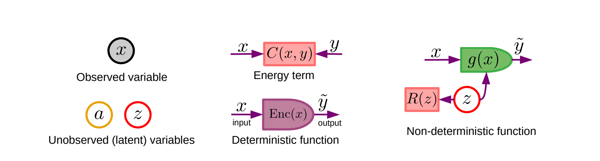

> **图 18（Figure 18）** ：架构图中使用的符号。

架构图使用绘制 **因子图（Factor graphs）** 时常用的符号——圆形表示变量，矩形表示因子——外加圆角矩形表示确定性函数。实心圆代表 **观测变量（Observed variables）** ，或是确定性函数的输出变量。

空心圆代表 **潜在变量（Latent variables）** ，即必须通过最小化某种成本来推断，或从某个分布中采样的变量。

红色矩形代表 **能量项（Energy terms）** 。这些模块具有一个隐含的标量输出，该输出会以相加的方式贡献给系统的总能量。这与因子图使用的惯例类似。圆角矩形代表 **确定性函数（Deterministic functions）** ，它可以有一个或多个输入。给定一组输入，其输出被假定为易于计算且是唯一的。该函数通常被假定为可微分的，并且可能包含可训练参数。

**非确定性函数（Non-deterministic functions）** 的表示方式如右图所示。它们由一个确定性函数 $g (x, z )$ 构成，该函数的一个输入是一个潜在变量 $z$。该潜在变量被视为在一个正则化能量项 $R ( z )$ 的 **水平集（Level set）** 内变化。当 $z$ 在水平集 $\mathcal { Z } _ { h } = \{ z | R ( z ) < h \}$ 内变化时，输出 $\tilde { y }$ 将在集合 $\mathcal { V } _ { h } = \{ y | y = g (x, z ) , \forall z \in \mathcal { Z } _ { h } \}$ 上变化。

在某些情况下，能量项可以转化为概率分布（参见正文）。

本文中的架构图使用图 18 所示的符号。

我们使用的符号与 **因子图（Factor Graph）** 的表示有些相似：用圆圈表示变量，用矩形表示因子。然而，存在两个主要区别。首先，这里的因子代表 **加性能量项（Additive Energy Terms）** ，而非乘性的概率因子。其次，我们使用了一个额外的符号——圆角矩形，来表示具有从输入到输出的明确方向性的 **确定性函数（Deterministic Functions）** 。

更精确地说：

- **实心圆** 表示 **观测变量（Observed Variables）** ，或是确定性函数的输出变量。
- **空心圆** 表示 **隐变量（Latent Variables）** ，即必须通过最小化某个成本、在一个集合上变化或从一个分布中采样来推断的变量。
- **红色矩形** 表示 **能量项（Energy Terms）** 。这些模块有一个隐含的标量输出，该输出会以相加的方式贡献给系统的总能量。
- **圆角矩形** 表示 **确定性函数（Deterministic Functions）** ，它可以有一个或多个输入。给定一组输入，其输出被假定为易于计算且唯一的。该函数通常被假定为可微的，并且可能包含可训练参数。这样的模块通常实现为 **深度神经网络（Deep Neural Net）** 。

非确定性函数没有专用的符号，但必须表示为确定性函数、能量模块和隐变量的组合。图 18 右侧展示了一个例子。一个非确定性函数由一个确定性函数 $\tilde { y } = g (x, z )$ 表示，其输出依赖于一个隐变量 $z$。该隐变量被馈送到一个 **正则化能量项（Regularizing Energy Term）** $R ( z )$ 中。我们首先将 $\mathcal { Z } _ { h }$ 定义为 $z$ 的 **水平集（Level Set）** ，即满足 $R ( z )$ 小于阈值 $h$ 的 $z$ 的集合：

$$
\mathcal {Z} _ {h} = \{z / R (z) <   h \} \tag {21}
$$

当 $z$ 在 $\mathcal { Z } _ { h }$ 上变化时，输出将在以下集合上变化：

$$
\mathcal {Y} _ {h} = \{y | y = g (x, z), \forall z \in \mathcal {Z} _ {h} \} \tag {22}
$$

在某些情况下，这种设置可用于表示 **概率分布（Probability Distributions）** 。首先，使用 **吉布斯-玻尔兹曼公式（Gibbs-Boltzmann Formula）** 将能量项转换为概率分布：

$$
P (z) = \frac {\exp (- R (z))}{\int_ {z ^ {\prime}} \exp (- R \left(z ^ {\prime}\right))} \tag {23}
$$

从这个分布中抽取隐变量意味着 $y$ 上的一个分布：

$$
P (y | x) = \int_ {z} \delta (y - g (x, z)) P (z) \tag {24}
$$

其中 $\delta ( )$ 是 **狄拉克 δ 函数（Dirac Delta Function）** 。

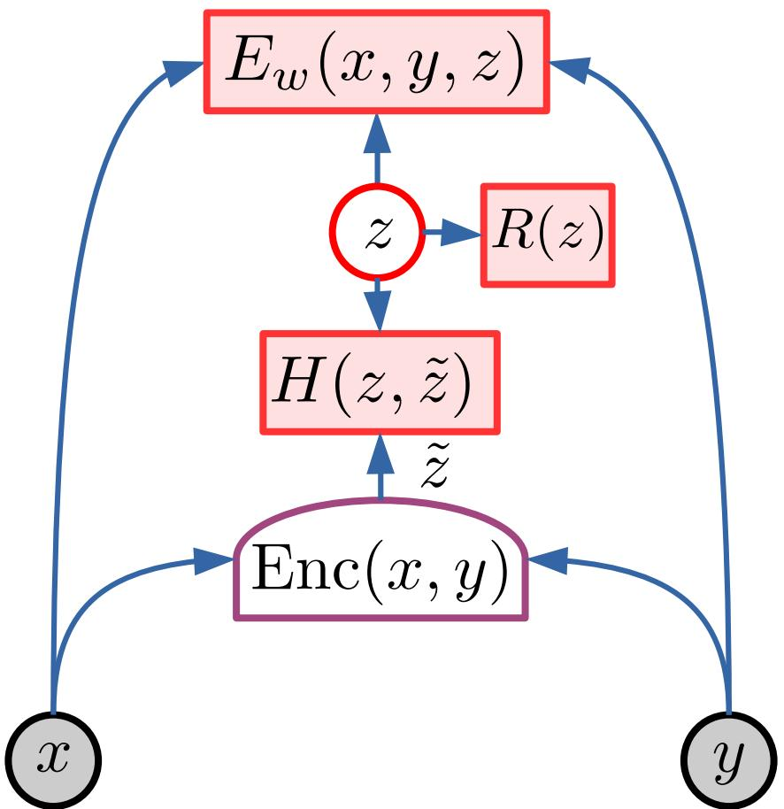

> 图 19 | 使用 **能量基模型（Energy-Based Model, EBM）** 的 **摊销推断（Amortized Inference）** 。训练一个编码器来产生 $\tilde { z } = \mathrm { E n c } ( s _ {x} , y )$，以近似于最小化能量 $\check { z } = \underset { { z } \in { \mathcal { Z } } } { \mathrm { a r g m i n } } _ { z \in { \mathcal { Z } } } E _ { w } (x, y , z )$ 的隐变量值。正则化器 $R ( z )$ 起着限制 $z$ 所包含的关于 $y$ 的信息的关键作用。这一点在这里尤其重要，因为系统可以访问 $y$，并且可能通过编码器携带关于 $y$ 的完整信息来“作弊”。

## 附录：潜变量的摊销推断（Amortized Inference for Latent Variables）

在 **潜变量模型（Latent Variable Models）** 中进行推断，本质上就是执行以下优化问题：

$$
\check { z } = \underset { { z } \in { \mathcal { Z } } } { \mathrm { a r g m i n } } _ { z \in { \mathcal { Z } } } E _ { w } (x, y , z )
$$

当 $z$ 是连续变量时，通常最好通过 **基于梯度的优化（Gradient-based Optimization）** 来完成。这种方法涉及通过模型将梯度反向传播至 $z$，并迭代多次。在 **生成式架构（Generative Architectures）** 中，这可能代价高昂，因为需要穿过解码器和预测器进行反向传播。降低推断成本的一种方法是使用 **摊销推断（Amortized Inference）** 。其核心思想是训练一个 **神经网络（Neural Network）** 来预测推断优化问题的近似解。

该架构如图 20 所示。训练一个编码器 $\tilde { z } = \operatorname { E n c } ( s _ {x} , y )$，以最小化编码器输出与最优潜变量 ${ \check { z } } \ = \ \mathrm { a r g m i n } _ { z \in { \mathcal Z } } E _ { w } (x, y , z )$ 之间的 **散度度量（Divergence Measure）** $H ( \check { z } , \tilde { z } )$。训练完成后，预测值 $\tilde { z }$ 可用作 $\check { z }$ 的估计值，或作为推断优化的初始值。

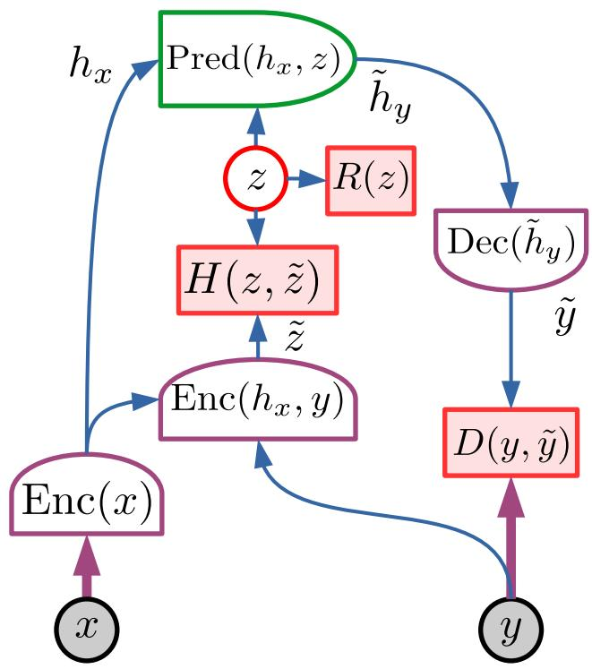

> 图 20 | 采用 **正则化生成式潜变量能量基模型（Regularized Generative Latent-Variable EBM, GLVEBM）** 架构的摊销推断。训练一个编码器来生成 $\tilde { z } = \operatorname { E n c } ( s _ {x} , y )$，以近似最小化能量的值 $\check { z }$。 **正则化器（Regularizer）** $R ( z )$ 起着至关重要的作用，即限制 $z$ 所包含的关于 $y$ 的信息。这一点在此尤为重要，因为系统可以访问 $y$，并可能通过编码器携带关于 $y$ 的完整信息来“作弊”。

正则化器 $R ( z )$ 在此比在常规推断情况下更为重要，因为预测通路可以访问 $y$，并可能通过编码器携带关于 $y$ 的完整信息来“作弊”。如果没有一个限制信息的正则化器，这将导致 **能量函数（Energy Function）** 崩溃，因为它将允许完美地重建任何 $y$。正则化器的作用正是最小化 $\check { z }$ 可能包含的关于 $y$ 的信息。

**变分自编码器（Variational Auto-Encoders, VAEs）** 和 **LISTA 风格稀疏自编码器（LISTA-style Sparse Auto-Encoders）** 都属于采用摊销推断的正则化 GLVEBM 家族。这些模型大多是无条件的，既不包含 $x$，也不包含 $\operatorname { E n c } (x)$ 模块。

## 附录：用于 **能量基模型（Energy-Based Model, EBM）** 对比训练的损失函数

关于 **对比方法（Contrastive methods）** 可以讨论的内容很多。表 1 列出了一些对比方法的示例，以及它们选取对比样本 $\hat { y }$ 的策略和损失函数。

表中的第 1-2 行是 **精确最大似然方法（Exact maximum likelihood methods）** 。它们假设对数配分函数的梯度可以被精确计算。第 2-4 行是 **近似最大似然方法（Approximate maximum likelihood methods）** 。第 5-10 行在概率框架内无法解释。

**第 1 行** ：当需要将能量转化为概率分布时，会使用离散 $y$ 的 **最大条件似然（Maximum Conditional Likelihood）** 。通过 **吉布斯公式（Gibbs formula）** $P ( y |x) =$ $\exp ( - F _ { w } (x, y ) ) / \textstyle \sum _ { y ^ { \prime } \in \mathcal { V } } \exp ( - F _ { w } (x, y ^ { \prime } )$ 实现。损失函数是 **负对数条件似然（Negative log conditional likelihood）** 。当 $y$ 是有限集合内的离散变量（例如用于分类）时，这是主流方法。

**第 2 行和第 3 行** ：任何需要产生概率估计的模型都会使用 **最大条件似然（Maximum Conditional Likelihood）** 。第 2 行仅适用于 **易处理模型（Tractable models）** ，其中对比项（或其梯度）中的积分可以解析计算。第 3 行适用于积分难以处理、其梯度必须通过 **蒙特卡洛采样方法（Monte Carlo sampling methods）** 近似的情况。这归结为设计从模型的吉布斯分布 $P _ { w } ( y |x) = \exp ( - \beta F _ { w } (x, y ) / \int _ { y ^ { \prime } } \exp ( - \beta F _ { w } (x, y ^ { \prime } )$ 中采样 $\hat { y }$ 值的好方法。

**第 4 行** ： **对比散度（Contrastive Divergence）** 。第 3 行中的 **马尔可夫链蒙特卡洛（Markov Chain Monte Carlo, MCMC）** 采样方法可能需要很长时间才能达到 **混合（Mix）** 。可以从一个训练样本开始，让马尔可夫链演化一小段时间，然后接受或拒绝生成的样本，以满足 **细致平衡（Detailed balance）** （Carreira-Perpiñán and Hinton, 2005）[1]。

**第 5 行** ： **成对铰链损失（Pairwise hinge loss）** ，也称为 **三元组损失（Triplet loss）** ，驱使正确输出的能量至少比对比输出的能量低一个边界 $m ( y , \hat { y } )$，该边界可能随着 $y$ 和 $\hat { y }$ 之间的某种散度度量而增长。难点在于找到能量低且具有“威胁性”的合适对比样本，这个任务有时被称为 **困难负样本挖掘（Hard negative mining）** 。

**第 6-8 行** ： **最小铰链损失（Min-hinge loss）** 、 **平方铰链损失（Square-hinge loss）** 、 **平方指数损失（Square-exp loss）** 。假设能量有下界。最小化正确输出的能量，并将对比输出的能量推高至一个边界，对于第 6 行和第 7 行，该边界等于 $m ( y , \hat { y } )$，对于第 8 行则为无穷大。

**第 8 行** ： **逻辑损失（Logistic loss）** 。与成对铰链损失类似，逻辑损失最大化对比输出与正确输出之间的能量差。与成对铰链损失不同的是，该差异被推向无穷大，但推动的力会迅速减小。

## 附录：用于 **能量基模型（Energy-Based Model, EBM）** 对比训练的损失函数

关于 **对比方法（Contrastive methods）** 可以讨论的内容很多。表 1 列出了一些对比方法的示例，以及它们选取对比样本 $\hat { y }$ 的策略和损失函数。

表中的第 1-2 行是 **精确最大似然方法（Exact maximum likelihood methods）** 。它们假设对数配分函数的梯度可以被精确计算。第 2-4 行是 **近似最大似然方法（Approximate maximum likelihood methods）** 。第 5-10 行在概率框架内无法解释。

**第 1 行** ：当需要将能量转化为概率分布时，会使用离散 $y$ 的 **最大条件似然（Maximum Conditional Likelihood）** 。通过 **吉布斯公式（Gibbs formula）** $P ( y |x) =$ $\exp ( - F _ { w } (x, y ) ) / \textstyle \sum _ { y ^ { \prime } \in \mathcal { V } } \exp ( - F _ { w } (x, y ^ { \prime } )$ 实现。损失函数是 **负对数条件似然（Negative log conditional likelihood）** 。当 $y$ 是有限集合内的离散变量（例如用于分类）时，这是主流方法。

**第 2 行和第 3 行** ：任何需要产生概率估计的模型都会使用 **最大条件似然（Maximum Conditional Likelihood）** 。第 2 行仅适用于 **易处理模型（Tractable models）** ，其中对比项（或其梯度）中的积分可以解析计算。第 3 行适用于积分难以处理、其梯度必须通过 **蒙特卡洛采样方法（Monte Carlo sampling methods）** 近似的情况。这归结为设计从模型的吉布斯分布 $P _ { w } ( y |x) = \exp ( - \beta F _ { w } (x, y ) / \int _ { y ^ { \prime } } \exp ( - \beta F _ { w } (x, y ^ { \prime } )$ 中采样 $\hat { y }$ 值的好方法。

**第 4 行** ： **对比散度（Contrastive Divergence）** 。第 3 行中的 **马尔可夫链蒙特卡洛（Markov Chain Monte Carlo, MCMC）** 采样方法可能需要很长时间才能达到 **混合（Mix）** 。可以从一个训练样本开始，让马尔可夫链演化一小段时间，然后接受或拒绝生成的样本，以满足 **细致平衡（Detailed balance）** （Carreira-Perpiñán and Hinton, 2005）[1]。

**第 5 行** ： **成对铰链损失（Pairwise hinge loss）** ，也称为 **三元组损失（Triplet loss）** ，驱使正确输出的能量至少比对比输出的能量低一个边界 $m ( y , \hat { y } )$，该边界可能随着 $y$ 和 $\hat { y }$ 之间的某种散度度量而增长。难点在于找到能量低且具有“威胁性”的合适对比样本，这个任务有时被称为 **困难负样本挖掘（Hard negative mining）** 。

**第 6-8 行** ： **最小铰链损失（Min-hinge loss）** 、 **平方铰链损失（Square-hinge loss）** 、 **平方指数损失（Square-exp loss）** 。假设能量有下界。最小化正确输出的能量，并将对比输出的能量推高至一个边界，对于第 6 行和第 7 行，该边界等于 $m ( y , \hat { y } )$，对于第 8 行则为无穷大。

**第 8 行** ： **逻辑损失（Logistic loss）** 。与成对铰链损失类似，逻辑损失最大化对比输出与正确输出之间的能量差。与成对铰链损失不同的是，该差异被推向无穷大，但推动的力会迅速减小。

**第 9 行：生成对抗网络（Generative Adversarial Network, GAN）** 。 **生成对抗网络（GAN）** 与其他对比方法的不同之处在于其生成对比样本的方式。对比样本由一个生成器网络（Generator network）产生，该生成器被训练为优先生成那些根据模型判断具有低能量（Low energy）的样本。原则上，可以使用任何损失函数（Loss function），只要它随着正确输出的能量增加而增加，并随着对比样本的能量减少而减少。

**第 10 行：去噪自编码器（Denoising Auto-Encoder）** 。 **去噪自编码器（Denoising Auto-Encoder, DAE）** 通过破坏训练样本的输出来生成对比样本。破坏可以通过添加噪声或掩盖部分输出来实现。能量函数是重构误差（Reconstruction error），

因此，能量在数据流形（Data manifold）上被训练为零，并随着 $\hat { y }$ 在数据流形上远离 $y$ 而随着 $D ( y , \hat { y } )$ 增长。

**表 1（Table 1）** ：用于训练基于能量的模型（Energy-based models）的对比方法及损失函数列表。它们都使用包含两项的损失函数：一项用于压低训练样本的能量，另一项用于拉高一个或多个对比样本的能量。

表 1 | 用于训练基于能量模型的对比方法及损失函数列表。
| | 方法 | 能量 | ŷ 生成 | 损失 |
| :---: | :--- | :--- | :--- | :--- |
| 1 | 最大似然估计（Maximum Likelihood） | 离散 y | 穷举 | $F_w(x,y) + \log \sum_{y' \in y} \exp(-F_w(x,y'))$ |
| 2 | 最大似然估计（Maximum Likelihood） | 易处理 | 穷举 | $F_w(x,y) + \log \int_{y' \in y} \exp(-F_w(x,y'))$ |
| 3 | 最大似然估计（Maximum likelihood） | 任意 | 蒙特卡洛或马尔可夫链蒙特卡洛 | $F_w(x,y) - F_w(x,\hat{y})$ |
| 4 | 对比散度（Contrastive Divergence） | 任意 | 截断马尔可夫链蒙特卡洛 | $F_w(x,y) - F_w(x,\hat{y})$ |
| 5 | 成对合页损失（Pairwise Hinge） | 任意 | 最具冒犯性 | $[F_w(x,y) - F_w(x,\hat{y}) + m(y,\hat{y})]_+$ |
| 6 | 最小合页损失（Min-Hinge） | 正 | 最具冒犯性 | $F_w(x,y) + [m(y,\hat{y}) - F_w(x,\hat{y})]_+$ |
| 6 | 平方合页损失（Square-Hinge） | 散度 | 最具冒犯性 | $F_w(x,y)^2 + ([m(y,\hat{y}) - F_w(x,\hat{y})]_+^2$ |
| 7 | 平方指数损失（Square-Exp） | 任意 | 最具冒犯性 | $F_w(x,y)^2 + \exp(-\beta F_w(x,\hat{y}))$ |
| 8 | 逻辑损失（Logistic） | 任意 | 最具冒犯性 | $\log(1 + \exp(F_w(x,y) - F_w(x,\hat{y}))$ |
| 9 | 生成对抗网络（GAN） | 任意 | $\hat{y} = g_u(z)$ | $H(F_w(x,y), F_w(x,\hat{y}), m(y,\hat{y}))$ |
| 10 | 去噪自编码器（Denoising AE） | $D(y, g_w(y))$ | $\hat{y} = N(y)$ | $D(y, g_w(\hat{y}))$ |

它们的区别在于生成对比样本所采用的策略以及损失函数的具体形式。

当模型需要产生概率估计时，会使用精确或近似的 **最大似然估计（Maximum Likelihood）** 方法（第 1-4 行）。当第二项难以处理时，其梯度可以通过 **蒙特卡洛方法（Monte-Carlo methods）** 来近似，这可以看作是产生 $\hat { y }$ 的特定方式。许多用于联合嵌入架构（Joint embedding architectures）（如孪生网络（Siamese nets））的对比自监督方法使用第 1 行（InfoNCE）。

许多对比方法（第 5-8 行）基于寻找一个“极具冒犯性”的 $\hat { y }$，这意味着它与期望的 $y$ 不同，但模型却赋予其较低的能量。$y$ 和 $\hat { y }$ 的能量对被送入一个损失函数，该函数将前者推向低值，将后者推向高值。这可以通过多种损失函数实现，包括 **合页损失（Hinge loss）** 。

**生成对抗网络（GANs）** （第 9 行）是一种对比方法，其中对比样本由一个生成器网络产生，该网络的输入是一个随机向量。生成器被训练为产生那些当前被模型赋予低能量、但本应被赋予高能量的样本。

**去噪自编码器（Denoising Auto-Encoders）** （第 10 行）对训练样本施加一个破坏过程以产生对比样本 $\hat { y } = N ( y )$。能量函数是重构误差 $F _ { w } ( y ) = D ( y , g _ { w } ( y ) )$，其中 $D ( )$ 是一个对称散度度量，$g _ { w } ( y )$ 是一个参数化函数。通过训练 $g _ { w } ( \cdot )$ 将 $\hat { y }$ 映射到 $y$，$\hat { y }$ 的能量被训练为等于 $D ( \hat { y } , y )$，而 $y$ 的能量则被训练为零。
