# Title: Making Offline RL Online: Collaborative World Models for Offline Visual Reinforcement Learning

- ArXiv: 2305.15260
- Authors: Qi Wang, Junming Yang, Yunbo Wang, Xin Jin, Wenjun Zeng, Xiaokang Yang, Ningbo Institute of Digital Twin, Eastern Institute of Technology, China, School of Computer Science and Engineering, Southeast University, China
- Sections: 49
- Estimated tokens: 22.7k

## Contents

- 1 Introduction
- 2 Problem Setup
- 3 Method
  - 3.1 Offline-to-Online State Alignment
    - Source model pretraining.
    - State alignment.
  - 3.2 Online-to-Offline Reward Alignment
  - 3.3 Min-Max Value Constraint
- 4 Experiments
  - 4.1 Experimental Setups
    - Datasets.
    - Compared methods.
  - 4.2 Cross-Task Experiments on Meta-World
    - Main results.
    - Results with a random source domain.
    - Results with multiple source domains.
  - 4.3 Cross-Environments: Meta-World to RoboDesk
  - 4.4 Cross-Dynamics Experiments on DMC
  - 4.5 Further Analyses
    - Ablation studies.
    - Can CoWorld address value overestimation?
    - Dependence of CoWorld to domain similarities.
    - Comparison to jointly training one world model across domains.
    - Hyperparameter sensitivity.
- 5 Related Work
- 6 Conclusions and Limitations
- Acknowledgments
- References
- Appendix
- Appendix A Model Details
  - A.1 Framework of CoWorld
  - A.2 World Model
  - A.3 Behavior Learning
  - A.4 Hyperparameters
- Appendix B Additional Quantitative and Qualitative Results
  - B.1 Visualizations on Policy Evaluation
  - B.2 Quantitative Results on DMC Medium-Expert Dataset
  - B.3 Quantitative Results on Meta-World
  - B.4 Effect of Latent Space Alignment
  - B.5 Additional Results on the Realistic Sim2Real Setup
  - B.6 Comparison with Pre-trained Foundation Model R3M
  - B.7 Training Efficiency
- Appendix C Multi-Source CoWorld
- Appendix D Source and Target Domains
  - Meta-World.
  - RoboDesk.
  - DeepMind Control.
- Appendix E Compared Methods
- Appendix F Broader Impacts

## Abstract

###### Abstract

Training offline RL models using visual inputs poses two significant challenges, i.e., the overfitting problem in representation learning and the overestimation bias for expected future rewards. Recent work has attempted to alleviate the overestimation bias by encouraging conservative behaviors. This paper, in contrast, tries to build more flexible constraints for value estimation without impeding the exploration of potential advantages. The key idea is to leverage off-the-shelf RL simulators, which can be easily interacted with in an online manner, as the “test bed” for offline policies. To enable effective online-to-offline knowledge transfer, we introduce CoWorld, a model-based RL approach that mitigates cross-domain discrepancies in state and reward spaces. Experimental results demonstrate the effectiveness of CoWorld, outperforming existing RL approaches by large margins.

## 1 Introduction

Learning control policies with visual observations can be challenging due to high interaction costs with the physical world.
Offline reinforcement learning (RL) is a promising approach to address this challenge [11, 21, 37, 3, 65].
However, the direct use of current offline RL algorithms in visual control tasks presents two primary difficulties.
Initially, offline visual RL is more prone to overfitting issues during representation learning, as it involves extracting hidden states from the limited, high-dimensional visual inputs.
Moreover, like its state-space counterpart, offline visual RL is susceptible to the challenge of value overestimation, as we observe from existing methods [22, 16].

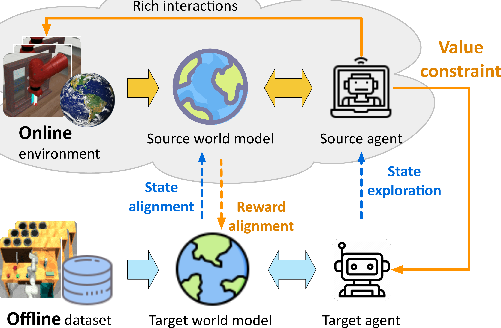

> Figure 1: Our approach for offline visual RL.

Improving offline visual RL remains an under-explored research area.
We aim to balance between overestimating and over-conservatism of the value function to avoid excessively penalizing the estimated values beyond the offline data distribution.
Intuitively, _we should not overly constrain the exploration with potential advantages._
Our basic idea, as illustrated in Figure [1](#figure-1), is to leverage readily available online simulators for related (not necessarily identical) visual control tasks as auxiliary source domains, so that we can frame offline visual RL as an offline-online-offline transfer learning problem to learn mildly conservative policies.

We present a novel model-based transfer RL approach called Collaborative World Models (CoWorld).
Specifically, we train separate world models and RL agents for source and target domains, each with domain-specific parameters. To mitigate discrepancies between the world models, we introduce a novel representation learning scheme comprising two iterative training stages. These stages, as shown in Figure [1](#figure-1), facilitate the alignment of latent state distributions (offline to online) and reward functions (online to offline), respectively.
By doing so, the source domain critic can serve as an online “test bed” for assessing the target offline policy. It is also more “knowledgeable” as it can actively interact with the online environment and gather rich information.
Another benefit of the domain-collaborative world models is the ability to alleviate overfitting issues of offline representation learning, leading to more generalizable latent states derived from limited offline visual data.

For behavior learning in the offline dataset, we exploit the knowledge from the source model and introduce a mild regularization term to the training objective of the target domain critic model.
This regularization term encourages the source critic to reevaluate the target policy. As illustrated in Figure [2](#figure-2), it allows for flexible constraint on overestimated values of trajectories that receive low values from the “knowledgeable” source critic. Conversely, if a policy yields high values from the source critic, we prefer to retain the original estimation by the offline agent.
This approach is feasible because the source critic has been aligned with the target domain during world model learning.

We showcase the effectiveness of CoWorld in offline visual control tasks across the Meta-World, RoboDesk, and DeepMind Control benchmarks. Our approach is shown to be readily extendable to scenarios with multiple source domains. It effectively addresses value overestimation by transferring knowledge from auxiliary domains, even in the presence of diverse physical dynamics, action spaces, reward scales, and visual appearances.
In summary, our work brings the following contributions:

- •
  We innovatively frame offline visual RL as a domain transfer problem. The fundamental idea is to harness cross-domain knowledge to tackle representation overfitting and value overestimation in offline visual control tasks.
- •
  We present CoWorld, a method that follows the offline-online-offline paradigm, incorporating specific techniques of world model alignment and flexible value constraints.

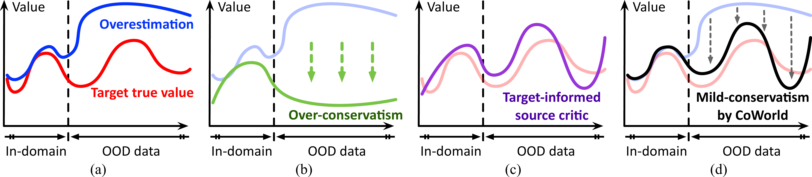

> Figure 2: To address value overestimation in offline RL (a), we can directly penalize the estimated values beyond the distribution of offline data, which may hinder the agent’s exploration of potential states with high rewards (b). Unlike existing methods, CoWorld trains a cross-domain critic model in an online auxiliary domain to reassess the offline policy (c), and regularizes the target values with flexible constraints (d). The feasibility of this approach lies in the domain alignment techniques during the world model learning stage.

## 2 Problem Setup

We consider offline visual reinforcement learning as a partially observable Markov decision process (POMDP) that aims to maximize the cumulative reward in a fixed target dataset $\mathcal{B}^{(T)}$.
We specifically focus on scenarios where auxiliary environments are accessible, enabling rich interactions and efficient online data collection.
The goal is to improve the offline performance of the target POMDP $\left\langle\mathcal{O}^{(T)},\mathcal{A}^{(T)},\mathcal{T}^{(T)},\mathcal{R}^
{(T)},\gamma^{(T)}\right\rangle$ through knowledge transfer from the source POMDPs $\left\langle\mathcal{O}^{(S)},\mathcal{A}^{(S)},\mathcal{T}^{(S)},\mathcal{R}^
{(S)},\gamma^{(S)}\right\rangle$.
These notations respectively denote the space of visual observations, the space of actions, the state transition probabilities, the reward function, and the discount factor.

> Table 1: RoboDesk (target domain) vs. Meta-World (auxiliary source domain).

|              | Source: Meta-World         | Target: RoboDesk           | Similarity / Difference    |
| ------------ | -------------------------- | -------------------------- | -------------------------- |
| Task         | Window Close               | Open Slide                 | Related manipulation tasks |
| Dynamics     | Simulated Sawyer robot arm | Simulated Franka robot arm | Different                  |
| Action space | Box(-1, 1, (4,), float64)  | Box(-1, 1, (5,), float32)  | Different                  |
| Reward scale | [0, 1]                     | [0, 10]                    | Different                  |
| Observation  | Right-view images          | Top-view images            | Different view points      |

For example, in one of our experiments, we employ RoboDesk as the offline target domain and various tasks from Meta-World as the source domains.
As illustrated in Table [1](#table-1), these two environments present notable distinctions in physical dynamics, action spaces, reward definitions, and visual appearances as the observed images are from different camera views.
Our priority is to address domain discrepancies to enable cross-domain behavior learning.

## 3 Method

In this section, we present the technical details of CoWorld, which consists of a pair of world models $\{\mathcal{M}_{\phi^{\prime}},\mathcal{M}_{\phi}\}$, actor networks $\{\pi_{\psi^{\prime}},\pi_{\psi}\}$, and critic networks $\{v_{\xi^{\prime}},v_{\xi}\}$, where $\{\phi,\psi,\xi\}$ and $\{\phi^{\prime},\psi^{\prime},\xi^{\prime}\}$ are respectively target and source domain parameters.
As potential cross-domain discrepancies may exist in all elements of $\{\mathcal{O},\mathcal{A},\mathcal{T},\mathcal{R}\}$, the entire training process is organized into three iterative stages, following an offline-online-offline transfer learning framework:

- A)
  Offline-to-online state alignment: Train the offline world model $\mathcal{M}_{\phi}$ by aligning its state space with that of the source world model $\mathcal{M}_{\phi^{\prime}}$.
- B)
  Online-to-offline reward alignment: Train $\mathcal{M}_{\phi^{\prime}}$ and $\{\pi_{\psi^{\prime}},v_{\xi^{\prime}}\}$ in the online environment by incorporating the target reward information.
- C)
  Online-to-offline value constraint: Train the target offline-domain agent $\{\pi_{\psi},v_{\xi}\}$ with value constraints provided by the source critic $v_{\xi^{\prime}}$.

### 3.1 Offline-to-Online State Alignment

#### Source model pretraining.

We start with a source domain warm-up phase employing a model-based actor-critic method known as DreamerV2 [16].
To facilitate cross-domain knowledge transfer, we additionally introduce a state alignment module, which is denoted as $g(\cdot)$ and implemented using the softmax operation.
The world model $\mathcal{M}_{\phi^{\prime}}$ consists of the following components:

$$
Recurrent transition: \displaystyle h_{t}^{(S)}=f_{\phi^{\prime}}(h_{t-1}^{(S)},z_{t-1}^{(S)},a_{t-1}^{(S)}) Image encoding: \displaystyle{e}_{t}^{(S)}=e_{\phi^{\prime}}(o_{t}^{(S)}) (1) Posterior state: \displaystyle z_{t}^{(S)}\sim q_{\phi^{\prime}}(h_{t}^{(S)},{e}_{t}^{(S)}) Prior state: \displaystyle\hat{z}_{t}^{(S)}\sim p_{\phi^{\prime}}(h_{t}^{(S)}) Reconstruction: \displaystyle\hat{o}_{t}^{(S)}\sim p_{\phi^{\prime}}(h_{t}^{(S)},z_{t}^{(S)}) Reward prediction: \displaystyle\hat{r}_{t}^{(S)}\sim r_{\phi^{\prime}}(h_{t}^{(S)},z_{t}^{(S)}) Discount factor: \displaystyle\hat{\gamma}^{(S)}_{t}\sim p_{\phi^{\prime}}(h_{t}^{(S)},z_{t}^{( S)}) State alignment target: \displaystyle s_{t}^{(S)}=g({e}_{t}^{(S)}),
$$

where $\phi^{\prime}$ represents the combined parameters of the world model.
We train $\mathcal{M}_{\phi^{\prime}}$ on the dynamically expanded source domain experience replay buffer $\mathcal{B}^{(S)}$ by minimizing

$$
\displaystyle\mathcal{L}(\phi^{\prime})= \displaystyle\mathbb{E}_{q_{\phi^{\prime}}}\Big{[}\sum_{t=1}^{N}\underbrace{- \ln p_{\phi^{\prime}}(o_{t}^{(S)}\mid h_{t}^{(S)},z_{t}^{(S)})}_{\text{image reconstruction}}\underbrace{-\ln r_{\phi^{\prime}}(r_{t}^{(S)}\mid h_{t}^{(S)} ,z_{t}^{(S)})}_{\text{reward prediction}}\underbrace{-\ln p_{\phi^{\prime}}( \gamma_{t}^{(S)}\mid h_{t}^{(S)},z_{t}^{(S)})}_{\text{discount prediction}} (2) \displaystyle\underbrace{+\ \mathrm{KL}\left[q_{\phi^{\prime}}(z_{t}^{(S)}\mid h _{t}^{(S)},o_{t}^{(S)})\ \|\ p_{\phi^{\prime}}(\hat{z}_{t}^{(S)}\mid h_{t}^{(S )})\right]}_{\text{KL divergence}}\Big{]}.
$$

We train the source actor $\pi_{\psi^{\prime}}(\hat{z}_{t})$ and critic $v_{\xi^{\prime}}(\hat{z}_{t})$ with the respective objectives of maximizing and estimating the expected future rewards $\mathbb{E}_{p_{\phi^{\prime}},p_{\psi^{\prime}}}[\sum_{\tau\geq t}\hat{\gamma}
_{\tau-t}\hat{r}_{\tau}]$ generated by $\mathcal{M}_{\phi^{\prime}}$. Please refer to Appendix [A.3](https://arxiv.org/html/2305.15260v4#A1.SS3) for more details.
We deploy $\pi_{\psi^{\prime}}$ to interact with the auxiliary environment and collect new data for further world model training.

#### State alignment.

A straightforward transfer learning solution is to train the target agent in the offline dataset upon the checkpoints of the source agent. However, it may suffer from a potential mismatch issue due to the discrepancy in tasks, visual observations, physical dynamics, and action spaces across various domains.
This becomes more severe when the online data is collected from environments that differ from the offline dataset (e.g., Meta-World $\rightarrow$ RoboDesk).
We tackle this issue by separating the parameters of the source and the target agents while explicitly aligning their latent state spaces.
Concretely, the target world model $\mathcal{M}_{\phi}$ has an identical network architecture to the source model $\mathcal{M}_{\phi^{\prime}}$.
We feed the same target domain observations sampled from $\mathcal{B}^{(T)}$ into these models and close the distance of $e_{\phi^{\prime}}(o_{t}^{(T)})$ and $e_{\phi}(o_{t}^{(T)})$.
We optimize $\mathcal{M}_{\phi}$ by minimizing

$$
\displaystyle\mathcal{L}(\phi) \displaystyle=\mathbb{E}_{q_{\phi}}\Big{[}\sum_{t=1}^{N}\underbrace{-\ln p_{\phi}(o_{t}^{(T)}\mid h_{t}^{(T)},z_{t}^{(T)})}_{\text{image reconstruction}} \underbrace{-\ln r_{\phi}(r_{t}^{(T)}\mid h_{t}^{(T)},z_{t}^{(T)})}_{\text{reward prediction}}\underbrace{-\ln p_{\phi}(\gamma_{t}^{(T)}\mid h_{t}^{(T)}, z_{t}^{(T)})}_{\text{discount prediction}} (3) \displaystyle\underbrace{+\ \beta_{1}\mathrm{KL}\left[q_{\phi}(z_{t}^{(T)}\mid h _{t}^{(T)},o_{t}^{(T)})\|\ p_{\phi}(\hat{z}_{t}^{(T)}\mid h_{t}^{(T)})\right]} _{\text{KL divergence}}\underbrace{+\ \beta_{2}\mathrm{KL}\left[\texttt{sg}(g( e_{\phi^{\prime}}(o_{t}^{(T)})))\ \|\ g(e_{\phi}(o_{t}^{(T)}))\right]}_{\text{domain alignment loss}}\Big{]},
$$

where sg($\cdot$) indicates gradient stopping and we use the encoding from the source model as the state alignment target.
As the source world model can actively interact with the online environment and gather rich information, it keeps the target world model from overfitting the offline data.
The importance of this loss term is governed by $\beta_{2}$. We examine its sensitivity in the experiments.

**Algorithm 1 The training scheme of CoWorld.**

- 1: Require: Offline dataset $\mathcal{B}^{(T)}$ .
- 2: Initialize: Parameters of the source model $\{\phi^{\prime},\psi^{\prime},\xi^{\prime}\}$ and the target model $\{\phi,\psi,\xi\}$ .
- 3: Pretrain the source agent and collect a replay buffer $\mathcal{B}^{(S)}$ .
- 4: while not converged do
- 5: for each step in $\{1:K_{1}\}$ do $\triangleright$ In the offline domain
- 6: Sample $\{(o_{t}^{(T)},a_{t}^{(T)},r_{t}^{(T)})\}_{t=1}^{N}\sim\mathcal{B}^{(T)}$ .
- 7: Train the target world model $\mathcal{M}_{\phi}$ using Eq. ( 3 ). $\triangleright$ Offline-to-online state alignment
- 8: Generate $\{(z_{i}^{(T)},a_{i}^{(T)})\}_{i=t}^{t+H}$ using $\pi_{\psi}$ and $\mathcal{M}_{\phi}$ . $\triangleright$ Behavior learning with constraint
- 9: Train the critic $v_{\xi}$ using Eq. ( 6 ) over $\{(z_{i}^{(T)},a_{i}^{(T)})\}_{i=t}^{t+H}$ .
- 10: Train the actor $\pi_{\psi}$ using Eq. ( 7 ) over $\{(z_{i}^{(T)},a_{i}^{(T)})\}_{i=t}^{t+H}$ .
- 11: end for
- 12: for each step in $\{1:K_{2}\}$ do $\triangleright$ In the online domain
- 13: Sample $\{(o_{t}^{(S)},a_{t}^{(S)},r_{t}^{(S)})\}_{t=1}^{N}\sim\mathcal{B}^{(S)}$ .
- 14: Sample $\{(o_{t}^{(T)},a_{t}^{(T)},r_{t}^{(T)})\}_{t=1}^{N}\sim\mathcal{B}^{(T)}$ . $\triangleright$ Online-to-offline reward alignment
- 15: Relabel the source rewards $\{\tilde{r}_{t}^{(S)}\}_{t=1}^{N}$ using Eq. ( LABEL:eq:corrected_reward ).
- 16: Train $\mathcal{M}_{\phi^{\prime}}$ using Eq. ( 2 ) combined with Eq. ( 5 ).
- 17: Generate $\{(z_{i}^{(S)},a_{i}^{(S)})\}_{i=t}^{t+H}$ using $\pi_{\psi^{\prime}}$ and $\mathcal{M}_{\phi^{\prime}}$ . $\triangleright$ Source domain behavior learning
- 18: Train $\pi_{\psi^{\prime}}$ and $v_{\xi^{\prime}}$ over the imagined $\{(z_{i}^{(S)},a_{i}^{(S)})\}_{i=t}^{t+H}$ .
- 19: Use $\pi_{\psi^{\prime}}$ to collect new source data and append $\mathcal{B}^{(S)}$ .
- 20: end for
- 21: end while

### 3.2 Online-to-Offline Reward Alignment

To enable the source agent to value the target policy, it is essential to provide it with prior knowledge of the offline task.
To achieve this, we train the source reward predictor $r_{\phi^{\prime}}(\cdot)$ using mixed data from both of the replay buffers $\mathcal{B}^{(S)}$ and $\mathcal{B}^{(T)}$.
Through the behavior learning on source domain imaginations, the target-informed reward predictor enables the source RL agent to assess the imagined states produced by the target model and provide a flexible constraint to target value estimation (as we will discuss in Section [3.3](#section-3-3)).

Specifically, we first sample a target domain data trajectory $\{(o_{t}^{(T)},a_{t}^{(T)},r_{t}^{(T)})\}_{t=1}^{T}$ from $\mathcal{B}^{(T)}$ (Line 14 in Alg. [1](#algorithm-1)).
We then use the source world model parametrized by $\phi^{\prime}$ to extract corresponding latent states and relabel the target-informed source reward (Line 15 in Alg. [1](#algorithm-1)):

$$
\displaystyle\tilde{h}_{t}=f_{\phi^{\prime}}(\tilde{h}_{t-1},\tilde{z}_{t-1},a _{t-1}^{(T)}) \displaystyle\tilde{e}_{t}=e_{\phi^{\prime}}(o_{t}^{(T)}) (4) \displaystyle\tilde{z}_{t}\sim q_{\phi^{\prime}}(\tilde{h}_{t},\tilde{e}_{t}) \displaystyle\tilde{r}_{t}^{(S)}=(1-k)\cdot r_{\phi^{\prime}}(\tilde{h}_{t}, \tilde{z}_{t})+k\cdot r^{(T)}_{t},
$$

where $k$ is the target-informed reward factor, which acts as a balance between the true target reward $r^{(T)}_{t}$ and the output of the source reward predictor ${r}_{\phi^{\prime}}(\cdot)$ provided with target states.
It is crucial to emphasize that using the target data as inputs to compute ${r}_{\phi^{\prime}}(\cdot)$ is feasible due to the alignment of the target state space with the source state space.

We jointly use the relabeled reward $\tilde{r}_{t}^{(S)}$ and the original source domain reward $r_{t}^{(S)}$ sampled from $\mathcal{B}^{(S)}$ to train the source reward predictor. This training is achieved by minimizing a maximum likelihood estimation (MLE) loss:

$$
\displaystyle\mathcal{L}_{r}(\phi^{\prime})=\ \eta\cdot\mathbb{E}_{\mathcal{B} ^{(S)}}\Big{[}\sum_{t=1}^{N}-\ln r_{\phi^{\prime}}(r_{t}^{(S)}|h_{t}^{(S)},z_{t}^{(S)})\Big{]}+(1-\eta)\mathbb{E}_{\mathcal{B}^{(T)}}\Big{[}\sum_{t=1}^{N}- \ln r_{\phi^{\prime}}(\tilde{r}_{t}^{(S)}|h_{t}^{(T)},z_{t}^{(T)})\Big{]},(5)
$$

where the second term measures the negative log-likelihood of observing the relabelled source reward $\tilde{r}_{t}^{(S)}$.
$\eta$ represents a hyperparameter that gradually decreases from $1$ to $0.1$ throughout this training stage.
Intuitively, $\eta$ controls the progressive adaptation of the well-trained source reward predictor to the target domain with limited target reward supervision.
We integrate Eq. ([5](https://arxiv.org/html/2305.15260v4#S3.E5)) into Eq. ([2](https://arxiv.org/html/2305.15260v4#S3.E2)) to train the entire world model $\mathcal{M}_{\phi^{\prime}}$ for the source domain agent (Line 16 in Alg. [1](#algorithm-1)) and subsequently perform behavior learning to enable the source critic to assess the target policy (Lines 17-19 in Alg. [1](#algorithm-1)).

### 3.3 Min-Max Value Constraint

In the behavior learning phase of the target agent (Lines 8-10 of Alg. [1](#algorithm-1)), we mitigate value overestimation in the offline dataset by introducing a min-max regularization term to the objective function of the target critic model $v_{\xi}$.
Initially, we use the auxiliary source critic $v_{\xi^{\prime}}$ to estimate the value function of the imagined target states.
Following that, we train $v_{\xi}$ by additionally _minimizing the maximum value_ among the estimates provided by source and target critics:

$$
\displaystyle\mathcal{L}(\xi)=\ \mathbb{E}_{p_{\phi},p_{\psi}}\Big{[}\sum^{H-1}_{t=1}\underbrace{\frac{1}{2}\left(v_{\xi}(\hat{z}_{t}^{(T)})-\texttt{sg}\big {(}V_{t}^{(T)}\big{)}\right)^{2}}_{\text{value regression}}+\ \underbrace{\alpha\max\left(v_{\xi}(\hat{z}_{t}^{(T)}),\ \texttt{sg}\big{(}v_{\xi^{\prime}}(\hat{z}_{t}^{(T)})\big{)}\right)}_{\text{value constraint}}\Big{]},(6)
$$

where $V_{t}^{(T)}$ incorporates a weighted average of reward information over an $n$-step future horizon.
The first term in the provided loss function fits cumulative value estimates (whose specific formulation can be located in Appendix [A.3](https://arxiv.org/html/2305.15260v4#A1.SS3)), while the second term regularizes the overestimated values for out-of-distribution data in a mildly conservative way.
The hyperparameter $\alpha$ represents the importance of the value constraint.
The sg($\cdot$) operator indicates that we stop the gradient to keep the source critic from being influenced by the regularization term.

This approach provides flexibly conservative value estimations, finding a balance between mitigating overestimation and avoiding excessive conservatism in the value function.
When the target critic overestimates the value function, the source critic is less vulnerable to the value overestimation problem as it is trained with rich interaction data. Thus, it is possible to observe $v_{\xi}(\hat{z}_{t}^{(T)})>v_{\xi^{\prime}}(\hat{z}_{t}^{(T)})$, and our approach is designed to decrease the output of $v_{\xi}$ to the output of $v_{\xi^{\prime}}$. This prevents the target critic from overestimating the true value.
Conversely, when the source critic produces greater values in $v_{\xi^{\prime}}(\hat{z}_{t}^{(T)})$, the min-max regularization term does not contribute to the training of the target critic $v_{\xi}$. This encourages the exploration of potentially advantageous states within the imaginations of the target world model.
In line with DreamerV2 [16],
we train the target actor $\pi_{\psi}$ by maximizing a REINFORCE objective function with entropy regularization, allowing the gradients to backpropagate directly through the learned dynamics:

$$
\displaystyle\mathcal{L}(\psi)=\mathbb{E}_{p_{\phi},p_{\psi}}\sum_{t=1}^{H-1}( \underbrace{\beta\mathrm{H}[a_{t}^{(T)}\mid\hat{z}_{t}^{(T)}]}_{\text{entropy regularization}}+\underbrace{\rho V_{t}^{(T)}}_{\text{dynamics backprop}}+ \underbrace{(1-\rho)\ln\pi_{\psi}(\hat{a}_{t}^{(T)}\mid\hat{z}_{t}^{(T)}) \texttt{sg}(V_{t}^{(T)}-v_{\xi}(\hat{z}_{t}^{(T)})}_{\text{REINFORCE}}).(7)
$$

As previously mentioned, $V_{t}^{(T)}$ involves a weighted average of reward information over an $n$-step future horizon, with detailed formulation provided in Appendix [A.3](https://arxiv.org/html/2305.15260v4#A1.SS3).

Furthermore, it is crucial to note that CoWorld can readily be extended to scenarios with multiple source domains by adaptively selecting a useful task as the auxiliary domain. This extension is easily achieved by measuring the distance of the latent states between the target domain and each source domain.
For technical details of the adaptive source domain selection, please refer to Appendix [C](#appendix-c).

## 4 Experiments

> Table 2: Mean episode returns and standard deviations of $10$ episodes over $3$ seeds on Meta-World.

| Model                  | BP$\rightarrow\text{DC}^{*}$ | DC $\rightarrow$ BP | BT$\rightarrow$ WC | BP$\rightarrow$ HP | WC$\rightarrow$ DC | HP$\rightarrow$ BT | Avg. |
| ---------------------- | ---------------------------- | ------------------- | ------------------ | ------------------ | ------------------ | ------------------ | ---- |
| Offline DV2            | 2143$\pm$579                 | 3142$\pm$533        | 3921$\pm$752       | 278$\pm$128        | 3899$\pm$679       | 3002$\pm$346       | 2730 |
| DrQ + BC               | 567$\pm$19                   | 587$\pm$68          | 623$\pm$85         | 1203$\pm$234       | 134$\pm$64         | 642$\pm$99         | 626  |
| CQL                    | 1984$\pm$13                  | 867$\pm$330         | 683$\pm$268        | 988$\pm$39         | 577$\pm$121        | 462$\pm$67         | 927  |
| CURL                   | 1972$\pm$11                  | 51$\pm$17           | 281$\pm$73         | 986$\pm$47         | 366$\pm$52         | 189$\pm$10         | 641  |
| LOMPO                  | 2883$\pm$183                 | 446$\pm$458         | 2983$\pm$569       | 2230$\pm$223       | 2756$\pm$331       | 1961$\pm$287       | 1712 |
| DV2 Finetune           | 3500$\pm$414                 | 2456$\pm$661        | 3467$\pm$1031      | 3702$\pm$451       | 4273$\pm$1327      | 3499$\pm$713       | 3781 |
| DV2 Finetune + EWC     | 1566$\pm$723                 | 167$\pm$86          | 978$\pm$772        | 528$\pm$334        | 2048$\pm$1034      | 224$\pm$147        | 918  |
| LOMPO Finetune         | 259$\pm$191                  | 95$\pm$53           | 142$\pm$70         | 332$\pm$452        | 3698$\pm$1615      | 224$\pm$88         | 792  |
| CoWorld (Best-Source)  | 3967$\pm$312                 | 3623$\pm$543        | 4521$\pm$367       | 4570$\pm$677       | 4845$\pm$14        | 3889$\pm$159       | 4241 |
| CoWorld (Multi-Source) | 3864$\pm$352                 | 3573$\pm$541        | 4507$\pm$59        | 4460$\pm$783       | 4678$\pm$137       | 3626$\pm$275       | 4094 |

### 4.1 Experimental Setups

#### Datasets.

We evaluate CoWorld across three visual control environments, i.e., Meta-World [54], RoboDesk [18], and DeepMind Control Suite (DMC) [47], including both cross-task and cross-environment setups (Meta-World $\rightarrow$ RoboDesk).
Inspired by D4RL [9], we build offline datasets of medium-replay quality using DreamerV2 [16].
The datasets comprise all the samples in the replay buffer collected during the training process until the policy attains medium-level performance, defined as achieving $1/3$ of the maximum score that the DreamerV2 agent can achieve.
Please refer to Appendix [B.2](https://arxiv.org/html/2305.15260v4#A2.SS2) for further results of CoWorld trained with medium-expert offline data.

#### Compared methods.

We compare CoWorld with both model-based and model-free RL approaches, including Offline DV2 [25], DrQ+BC [25], CQL [25],
CURL [22], and LOMPO [39].
In addition, we introduce the DV2 Finetune method, which involves taking a DreamerV2 [16] model pretrained in the online source domain and subsequently finetuning it in the offline target dataset.
Furthermore, DV2 Finetune can be integrated with the continual learning method, Elastic Weight Consolidation (EWC) [19], to regularize the model for preserving source domain knowledge, i.e., Finetune+EWC. Please refer to Appendix [E](#appendix-e) for more details.

### 4.2 Cross-Task Experiments on Meta-World

Meta-World is an open-source simulated benchmark designed for solving a wide range of robot manipulation tasks. We select $6$ tasks as either the offline dataset or potential candidates for the online auxiliary domain. These tasks include: Door Close ($\textbf{DC}^{*}$), Button Press (BP), Window Close (WC), Handle Press (HP), Drawer Close (DC), Button Topdown (BT).

#### Main results.

As shown in Table [2](#table-2), we compare the results of CoWorld with other models on Meta-World. CoWorld achieves the best performance in all $6$ tasks. Notably, it outperforms Offline DV2 [25], a method also built upon DreamerV2 and specifically designed for offline visual RL.
For the online-to-offline finetuning models, DV2 Finetune achieves the second-best results by leveraging transferred knowledge from the auxiliary source domain.
However, we observe that its performance experiences a notable decline in scenarios (e.g., Meta-World $\rightarrow$ RoboDesk) involving significant data distribution shifts between the source and the target domains in visual observation, physical dynamics, reward definition, or even the action space of the robots.
Another important baseline model is DV2 Finetune+EWC, which focuses on mitigating the catastrophic forgetting of the knowledge obtained in source domain pretraining. Nevertheless, without additional model designs for domain adaptation, retaining source domain knowledge may eventually lead to a decrease in performance in the target domain.
The LOMPO model suffers from the negative transfer effect when incorporating a source pretraining stage. It achieves an average return of $1{,}712$ when it is trained from scratch in the offline domain while achieving an average return of $792$ for online-to-offline finetuning. It implies that a naïve transfer learning method may degenerate the target performance due to unexpected bias.

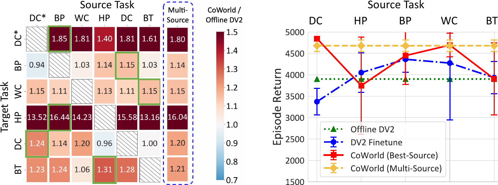

> Figure 3: Left: The value in each grid indicates the ratio of returns achieved by CoWorld compared to Offline DV2. Highlighted grids represent the top-performing source domain. Right: Returns on Drawer Close (DC\*) with different source domains, where the multi-source CoWorld (yellow line) is shown to automatically discover (i.e., Door Close) as the source domain and achieve comparable results with the top-performing single-source CoWorld (red line).

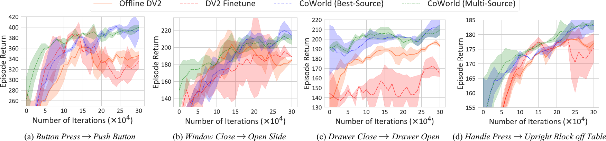

> Figure 4: Quantitative results in domain transfer scenarios of Meta-World $\rightarrow$ RoboDesk.

#### Results with a random source domain.

Given that we present the best-source results in Table [2](#table-2), where we manually select one source task from Meta-World, one may cast doubt on the influence of domain discrepancies between the auxiliary environment and the target offline dataset.
In Figure [3](#figure-3) (Left), the transfer matrix of CoWorld among the $6$ tasks of Meta-World is presented, where values greater than $1$ indicate positive domain transfer effects. Notably, there are challenging cases with weakly related source and target tasks. In the majority of cases ($26$ out of $30$), CoWorld outperforms Offline DV2, as illustrated in the heatmap.

#### Results with multiple source domains.

It is crucial to note that CoWorld can be easily extended to scenarios with multiple source domains by adaptively selecting a useful task as the auxiliary domain.
From Table [2](#table-2), we can see that the multi-source CoWorld achieves comparable results to the models trained with manually designated online simulators.
In Figure [3](#figure-3) (Left), multi-source CoWorld achieves positive improvements over Offline DV2 in all cases, approaching the best results of models using each source task as the auxiliary domain.
In Figure [3](#figure-3) (Right), it also consistently outperforms the DV2 Finetune baseline model.
These results demonstrate our approach’s ability to execute without strict assumptions about domain similarity and its ability to automatically identify a useful online simulator from a set of both related and less related source domains.

### 4.3 Cross-Environments: Meta-World to RoboDesk

To explore cross-environment transfer with more significant domain gaps, we employ four tasks from RoboDesk to construct individual offline datasets, i.e., Push Button, Open Slide, Drawer Open, Upright Block off Table.
These tasks require handling randomly positioned objects with image inputs.
Table [1](#table-1) presents the differences between the two environments in physical dynamics, action space, reward definitions, and visual appearances.

Figure [4](#figure-4) presents quantitative comparisons, where CoWorld outperforms Offline DV2 and DV2 Finetune by large margins.
For the best-source experiments, we manually select one source domain from Meta-World.
For the multi-source experiments, we jointly use all Meta-World tasks as the source domains.
In contrast to prior findings, directly finetuning the source world model in this cross-environment setup, where there are more pronounced domain discrepancies, does not result in significant improvements in the final performance.
In comparison, CoWorld more successfully addresses these challenges by leveraging domain-specific world models and RL agents, and explicitly aligning the state and reward spaces across domains.
We also showcase the performance of multi-source CoWorld, which achieves comparable results to the best-source model that exclusively uses our designated source domain.

### 4.4 Cross-Dynamics Experiments on DMC

DMC is a widely explored benchmark for continuous control. We use the Walker and Cheetah as the base agents and make modifications to the environment to create a set of $8$ distinct tasks, i.e., Walker Walk (WW), Walker Downhill (WD), Walker Uphill (WU), Walker Nofoot (WN), Cheetah Run (CR), Cheetah Downhill (CD), Cheetah Uphill (CU), Cheetah Nopaw (CN).
Particularly, Walker Nofoot is a task in which we cannot control the right foot of the Walker agent. Cheetah Nopaw is a task in which we cannot control the front paw of the Cheetah agent.

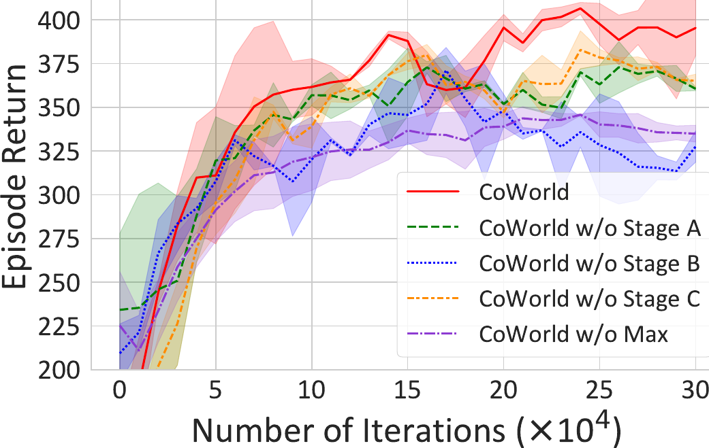

> (a) Meta-World $\rightarrow$ RoboDesk (Push Green Button)

> Table 3: Mean rewards and standard deviations of $10$ episodes in offline DMC over $3$ seeds.

| Model          | WW $\rightarrow$ WD | WW $\rightarrow$ WU | WW $\rightarrow$ WN | CR $\rightarrow$ CD | CR $\rightarrow$ CU | CR $\rightarrow$ CN | Avg. |
| -------------- | ------------------- | ------------------- | ------------------- | ------------------- | ------------------- | ------------------- | ---- |
| Offline DV2    | 435$\pm$22          | 139$\pm$4           | 214$\pm$4           | 243$\pm$7           | 3$\pm$1             | 51$\pm$4            | 181  |
| DrQ+BC         | 291$\pm$ 10         | 299$\pm$15          | 318$\pm$40          | 663$\pm$15          | 202$\pm$12          | 132$\pm$33          | 355  |
| CQL            | $46\pm$19           | 64$\pm$32           | 29$\pm$2            | 2$\pm$1             | 52 $\pm$57          | 111$\pm$157         | 51   |
| CURL           | 43$\pm$5            | 21$\pm$3            | 23$\pm$3            | 26$\pm$7            | 4$\pm$2             | 11$\pm$4            | 21   |
| LOMPO          | 462$\pm$87          | 260$\pm$21          | 460$\pm$9           | 395$\pm$52          | 46$\pm$19           | 120$\pm$4           | 291  |
| DV2 Finetune   | 379$\pm$23          | 354$\pm$29          | 407$\pm$37          | 702$\pm$41          | 208$\pm$22          | 454$\pm$82          | 417  |
| LOMPO Finetune | 209$\pm$21          | 141$\pm$27          | 212$\pm$9           | 142$\pm$29          | 17$\pm$11           | 105$\pm$12          | 137  |
| CoWorld        | 629$\pm$9           | 407$\pm$141         | 426$\pm$32          | 745$\pm$28          | 225$\pm$20          | 493$\pm$10          | 488  |

We apply the proposed multi-source domain selection method to build the domain transfer settings shown in Table [3](#table-3). It is worth noting that CoWorld outperforms the other compared models in $5$ out of $6$ DMC offline datasets, and achieves the second-best performance in the remaining task. On average, it outperforms Offline DV2 by $169.6\%$ and outperforms DrQ+BC by $37.5\%$. Corresponding qualitative comparisons can be found in Appendix [B.1](https://arxiv.org/html/2305.15260v4#A2.SS1).

### 4.5 Further Analyses

#### Ablation studies.

We conduct a series of ablation studies to validate the effectiveness of state space alignment (Stage A), reward alignment (Stage B), and min-max value constraint (Stage C).
We show corresponding results on the offline Push Green Button dataset from RoboDesk in Figure [5(a)](https://arxiv.org/html/2305.15260v4#S4.F5.sf1). The performance experiences a significant decline when we abandon each training stage in CoWorld.

#### Can CoWorld address value overestimation?

We evaluate the values estimated by the critic network of CoWorld on the offline Meta-World datasets when the training process is finished.
In Figure [5(b)](https://arxiv.org/html/2305.15260v4#S4.F5.sf2), we compute the cumulative value predictions throughout $500$ steps.
The true value is determined by calculating the discounted sum of the actual rewards obtained by the actor in the same $500$-steps period.
We observe that existing approaches, including Offline DV2 and CQL, often overestimate the value functions in the offline setup.
The baseline model “CoWorld w/o Max” is a variant of CoWorld that incorporates a brute-force constraint on the critic loss. It reformulates Eq. ([6](https://arxiv.org/html/2305.15260v4#S3.E6)) as $\sum^{H-1}_{t=1}\frac{1}{2}(v_{\xi}(\hat{z}_{t})-\texttt{sg}(V_{t}))^{2}+
\alpha v_{\xi}(\hat{z}_{t})$. As observed, this model tends to underestimate the true value function, which can potentially result in overly conservative policies as a consequence.
In contrast, the values estimated by CoWorld are notably more accurate and more akin to the true values.

#### Dependence of CoWorld to domain similarities.

We further investigate the dependence of CoWorld on domain similarity from the perspectives of different observation spaces and reward spaces.
We first explore how CoWorld performs when we only have source domains with significantly distinct observation spaces from the target domain.
As illustrated in Table [4](#table-4), the agent receives low-dimensional state inputs in the source domain (Meta-World) and high-dimensional images in the target domain (RoboDesk).
We can see that CoWorld outperforms Offline DV2 by $13.3\%$ and $34.0\%$ due to the ability to leverage low-dimensional source data effectively.
Notably, the finetuning method (DV2 Finetune) is not applicable in this scenario.
In Table [5](#table-5), we also observe that CoWorld benefits from a source domain, even with a significantly different reward signal.
Unlike previous experiments, we use a sparse reward function for the source Meta-World tasks. It is set to $500$ only upon task completion and remains 0 0 before that.
The experimental results demonstrate that although excessively sparse rewards can hinder the training process, CoWorld still achieves an average performance gain of $6.6\%$ compared to DV2 Finetune under the same setting.

#### Comparison to jointly training one world model across domains.

Notably, CoWorld is implemented with separate world models for the source and target domains.
Alternatively, we can employ a jointly trained world model across various domains for more efficient memory usage.
In Table [6](#table-6), we compare the results from the original CoWorld and “Multi-Task DV2”.
Multi-Task DV2 involves training DreamerV2 on both offline and online data with a joint world model and separate actor-critic models.
CoWorld consistently performs better.
Intuitively, using separate world models allows the source and target domains to have different physical dynamics, observation spaces, or reward formations, as the scenarios shown in Table [4](#table-4) and Table [5](#table-5).

> Table 4: Experiments with significantly distinct observation spaces across domains. We use low-dimensional state data as inputs for the RL agents in the source domain and high-dimensional image observations in the target domain. MW represents Meta-World and RD stands for RoboDesk.

| Method      | MW: Button Press $\rightarrow$ RD: Push Button | MW: Window Close $\rightarrow$ RD: Open Slide |
| ----------- | ---------------------------------------------- | --------------------------------------------- |
| Offline DV2 | 347 $\pm$ 24                                   | 156 $\pm$ 46                                  |
| CoWorld     | 393 $\pm$ 64                                   | 209 $\pm$ 43                                  |

> Table 5: Experiments with significantly distinct reward formations across domains. We use sparse rewards in the source domain while maintaining the dense rewards in the target domain.

| Method       | MW: Button Press $\rightarrow$ RD: Push Button | MW: Window Close $\rightarrow$ RD: Open Slide |
| ------------ | ---------------------------------------------- | --------------------------------------------- |
| DV2 Finetune | 314 $\pm$ 51                                   | 173 $\pm$ 39                                  |
| CoWorld      | 335 $\pm$ 28                                   | 184 $\pm$ 32                                  |

> Table 6: Comparison to jointly training one world model across domains (Multi-Task DV2).

| Method         | MW: Button Press $\rightarrow$ RD: Push Button | MW: Window Close $\rightarrow$ RD: Open Slide |
| -------------- | ---------------------------------------------- | --------------------------------------------- |
| Multi-Task DV2 | 342 $\pm$ 29                                   | 173 $\pm$ 22                                  |
| CoWorld        | 428 $\pm$ 42                                   | 202 $\pm$ 19                                  |

#### Hyperparameter sensitivity.

We conduct sensitivity analyses on Meta-World (DC $\rightarrow$ BP).
From Figure [6](#figure-6), we observe that when $\beta_{2}$ for the domain KL loss is too small, the state alignment between the source and target encoders becomes insufficient, hampering the transfer learning process. Conversely, if $\beta_{2}$ is too large, the target encoder becomes excessively influenced by the source encoder, resulting in a decline in performance.
We also find that the target-informed reward factor $k$ plays a crucial role in balancing the influence of source data and target reward information, which achieves a consistent improvement over DV2 Finetune ($2456\pm 661$) in the range of $[0.1,0.7]$.
Moreover, we discover that the hyperparameter $\alpha$ for the target value constraint performs well within $[1,3]$, while an excessively larger $\alpha$ may result in value over-conservatism in the target critic.

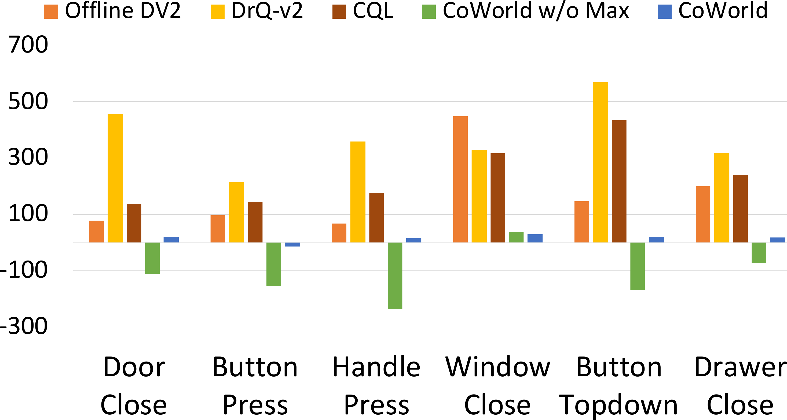

> Figure 6: Sensitivity analysis of the hyperparameters on Meta-World (DC $\rightarrow$ BP).

## 5 Related Work

Learning control policies from images is critical in real-world applications.
Existing approaches can be grouped by the use of model-free [22, 41, 44, 48, 36] or model-based [15, 14, 16, 43, 35, 13, 28, 29, 61, 51] RL algorithms.
In offline RL, agents leverage pre-collected offline data to optimize policies and encounter challenges associated with value overestimation [23].
Previous methods mainly suggest taking actions that were previously present in the offline dataset or learning conservative value estimations [11, 21, 4, 55, 53, 40].
Recent approaches have introduced specific techniques to address the challenges associated with offline visual RL [27, 7, 23, 2, 39, 52, 43, 57, 5, 25].
Rafailov et al. [39] proposed to handle high-dimensional observations with latent dynamics models and uncertainty quantification.
Cho et al. [5] proposed synthesizing the raw observation data to append the training buffer, aiming to mitigate the issue of overfitting.
In a related study, Lu et al. [25] established a competitive offline visual RL model based on DreamerV2 [16], so that we use it as a significant baseline of our approach.

Our work is also related to transfer RL, which is known as to utilize the knowledge learned in past tasks to facilitate learning in unseen tasks [64, 42, 58, 45, 59, 8, 49, 46, 12, 20, 38, 24, 33].
Most existing approaches related to offline dataset + simulator focus on the offline-to-online setup, where the policy is initially pretrained on the offline dataset and then finetuned and deployed on an interactive environment [33, 60, 56, 63]. These methods aim to bridge the gap between offline and online learning and facilitate fast adaptation of the model to the online environment. In contrast, we explore the online-to-offline setup, which provides a new remedy for the value over-estimation problem.
Additionally, Niu et al. [34] introduces a dynamics-aware hybrid offline-and-online framework to integrate offline datasets and online simulators for policy optimization. Unlike CoWorld, this method primarily focuses on low-dimensional MDPs and cannot be directly used in visual control tasks.
In the context of visual RL, CtrlFormer [31] learns a transferable state representation via a sample-efficient vision Transformer.
APV [43] executes action-free world model pretraining on source-domain videos and finetunes the model on downstream tasks.
Choreographer [28] builds a model-based agent that exploits its world model to learn and adapt skills in imaginations, the learned skills are adapted to new domains using a meta-controller.
VIP [26] presents a self-supervised, goal-conditioned value-function objective, which enables the use of unlabeled video data for model pertaining.
Unlike previous methods, we handle offline visual RL using auxiliary simulators, mitigating the value overestimation issues with co-trained world models.

## 6 Conclusions and Limitations

In this paper, we proposed a transfer RL method named CoWorld, which mainly tackles the difficulty in representation learning and value estimation in offline visual RL.
The key idea is to exploit accessible online environments to train an auxiliary RL agent to offer additional value assessment.
To address the domain discrepancies and to improve the offline policy, we present specific technical contributions of cross-domain state alignment, reward alignment, and min-max value constraint.
CoWorld demonstrates competitive results across three RL benchmarks.
An unsolved problem of CoWorld is the increased computational complexity associated with the training phase in auxiliary domains (see Appendix [B.7](https://arxiv.org/html/2305.15260v4#A2.SS7)). It is valuable to improve the training efficiency in future research.

## Acknowledgments

This work was supported by the National Natural Science Foundation of China (Grant No. 62250062, 62106144, 62302246), the Shanghai Municipal Science and Technology Major Project (No. 2021SHZDZX0102), the Fundamental Research Funds for the Central Universities, and the CCF-Tencent Rhino-Bird Open Research Fund.
This work was also supported by the Natural Science Foundation of Zhejiang Province, China (No. LQ23F010008), the High-Performance Computing Center at Eastern Institute of Technology (Ningbo), and the Ningbo Institute of Digital Twin.

## References

- [1]
  Brian M Adams, Harvey T Banks, Hee-Dae Kwon, and Hien T Tran.
  Dynamic multidrug therapies for hiv: Optimal and sti control approaches.
  Mathematical Biosciences & Engineering, 1(2):223–241, 2004.
- [2]
  Rishabh Agarwal, Dale Schuurmans, and Mohammad Norouzi.
  An optimistic perspective on offline reinforcement learning.
  In ICML, pages 104–114, 2020.
- [3]
  Huayu Chen, Cheng Lu, Chengyang Ying, Hang Su, and Jun Zhu.
  Offline reinforcement learning via high-fidelity generative behavior modeling.
  In ICLR, 2023.
- [4]
  Xi Chen, Ali Ghadirzadeh, Tianhe Yu, Jianhao Wang, Alex Yuan Gao, Wenzhe Li, Liang Bin, Chelsea Finn, and Chongjie Zhang.
  Lapo: Latent-variable advantage-weighted policy optimization for offline reinforcement learning.
  In NeurIPS, volume 35, pages 36902–36913, 2022.
- [5]
  Daesol Cho, Dongseok Shim, and H Jin Kim.
  S2p: State-conditioned image synthesis for data augmentation in offline reinforcement learning.
  In NeurIPS, 2022.
- [6]
  Djork-Arné Clevert, Thomas Unterthiner, and Sepp Hochreiter.
  Fast and accurate deep network learning by exponential linear units (elus).
  arXiv preprint arXiv:1511.07289, 2015.
- [7]
  Sudeep Dasari, Frederik Ebert, Stephen Tian, Suraj Nair, Bernadette Bucher, Karl Schmeckpeper, Siddharth Singh, Sergey Levine, and Chelsea Finn.
  Robonet: Large-scale multi-robot learning.
  In CoRL, 2019.
- [8]
  Benjamin Eysenbach, Swapnil Asawa, Shreyas Chaudhari, Sergey Levine, and Ruslan Salakhutdinov.
  Off-dynamics reinforcement learning: Training for transfer with domain classifiers.
  In ICLR, 2021.
- [9]
  Justin Fu, Aviral Kumar, Ofir Nachum, George Tucker, and Sergey Levine.
  D4rl: Datasets for deep data-driven reinforcement learning.
  arXiv preprint arXiv:2004.07219, 2020.
- [10]
  Scott Fujimoto and Shixiang Shane Gu.
  A minimalist approach to offline reinforcement learning.
  In NeurIPS, 2021.
- [11]
  Scott Fujimoto, David Meger, and Doina Precup.
  Off-policy deep reinforcement learning without exploration.
  In ICML, pages 2052–2062, 2019.
- [12]
  Dibya Ghosh, Chethan Bhateja, and Sergey Levine.
  Reinforcement learning from passive data via latent intentions.
  arXiv preprint arXiv:2304.04782, 2023.
- [13]
  Danijar Hafner, Kuang-Huei Lee, Ian Fischer, and Pieter Abbeel.
  Deep hierarchical planning from pixels.
  arXiv preprint arXiv:2206.04114, 2022.
- [14]
  Danijar Hafner, Timothy Lillicrap, Jimmy Ba, and Mohammad Norouzi.
  Dream to control: Learning behaviors by latent imagination.
  In ICLR, 2020.
- [15]
  Danijar Hafner, Timothy Lillicrap, Ian Fischer, Ruben Villegas, David Ha, Honglak Lee, and James Davidson.
  Learning latent dynamics for planning from pixels.
  In ICML, pages 2555–2565, 2019.
- [16]
  Danijar Hafner, Timothy Lillicrap, Mohammad Norouzi, and Jimmy Ba.
  Mastering atari with discrete world models.
  In ICLR, 2021.
- [17]
  William Hua, Hongyuan Mei, Sarah Zohar, Magali Giral, and Yanxun Xu.
  Personalized dynamic treatment regimes in continuous time: a bayesian approach for optimizing clinical decisions with timing.
  Bayesian Analysis, 17(3):849–878, 2022.
- [18]
  Harini Kannan, Danijar Hafner, Chelsea Finn, and Dumitru Erhan.
  Robodesk: A multi-task reinforcement learning benchmark.
  [https://github.com/google-research/robodesk](https://github.com/google-research/robodesk), 2021.
- [19]
  James Kirkpatrick, Razvan Pascanu, Neil Rabinowitz, Joel Veness, Guillaume Desjardins, Andrei A Rusu, Kieran Milan, John Quan, Tiago Ramalho, Agnieszka Grabska-Barwinska, et al.
  Overcoming catastrophic forgetting in neural networks.
  Proceedings of the national academy of sciences, 114(13):3521–3526, 2017.
- [20]
  Aviral Kumar, Rishabh Agarwal, Xinyang Geng, George Tucker, and Sergey Levine.
  Offline q-learning on diverse multi-task data both scales and generalizes.
  In ICLR, 2023.
- [21]
  Aviral Kumar, Aurick Zhou, George Tucker, and Sergey Levine.
  Conservative q-learning for offline reinforcement learning.
  In NeurIPS, volume 33, pages 1179–1191, 2020.
- [22]
  Michael Laskin, Aravind Srinivas, and Pieter Abbeel.
  Curl: Contrastive unsupervised representations for reinforcement learning.
  In ICML, pages 5639–5650, 2020.
- [23]
  Sergey Levine, Aviral Kumar, George Tucker, and Justin Fu.
  Offline reinforcement learning: Tutorial, review, and perspectives on open problems.
  arXiv preprint arXiv:2005.01643, 2020.
- [24]
  Xin Liu, Yaran Chen, Haoran Li, Boyu Li, and Dongbin Zhao.
  Cross-domain random pre-training with prototypes for reinforcement learning.
  arXiv preprint arXiv:2302.05614, 2023.
- [25]
  Cong Lu, Philip J Ball, Tim GJ Rudner, Jack Parker-Holder, Michael A Osborne, and Yee Whye Teh.
  Challenges and opportunities in offline reinforcement learning from visual observations.
  Transactions on Machine Learning Research, 2023.
- [26]
  Yecheng Jason Ma, Shagun Sodhani, Dinesh Jayaraman, Osbert Bastani, Vikash Kumar, and Amy Zhang.
  Vip: Towards universal visual reward and representation via value-implicit pre-training.
  In ICLR, 2023.
- [27]
  Ajay Mandlekar, Jonathan Booher, Max Spero, Albert Tung, Anchit Gupta, Yuke Zhu, Animesh Garg, Silvio Savarese, and Li Fei-Fei.
  Scaling robot supervision to hundreds of hours with roboturk: Robotic manipulation dataset through human reasoning and dexterity.
  In IROS, pages 1048–1055, 2019.
- [28]
  Pietro Mazzaglia, Tim Verbelen, Bart Dhoedt, Alexandre Lacoste, and Sai Rajeswar.
  Choreographer: Learning and adapting skills in imagination.
  In ICLR, 2023.
- [29]
  Vincent Micheli, Eloi Alonso, and François Fleuret.
  Transformers are sample efficient world models.
  In ICLR, 2023.
- [30]
  Zhiyu Mou, Yusen Huo, Rongquan Bai, Mingzhou Xie, Chuan Yu, Jian Xu, and Bo Zheng.
  Sustainable online reinforcement learning for auto-bidding.
  In NeurIPS, volume 35, pages 2651–2663, 2022.
- [31]
  Yao Mark Mu, Shoufa Chen, Mingyu Ding, Jianyu Chen, Runjian Chen, and Ping Luo.
  Ctrlformer: Learning transferable state representation for visual control via transformer.
  In ICML, pages 16043–16061, 2022.
- [32]
  Suraj Nair, Aravind Rajeswaran, Vikash Kumar, Chelsea Finn, and Abhinav Gupta.
  R3m: A universal visual representation for robot manipulation.
  arXiv preprint arXiv:2203.12601, 2022.
- [33]
  Mitsuhiko Nakamoto, Yuexiang Zhai, Anikait Singh, Max Sobol Mark, Yi Ma, Chelsea Finn, Aviral Kumar, and Sergey Levine.
  Cal-ql: Calibrated offline rl pre-training for efficient online fine-tuning.
  arXiv preprint arXiv:2303.05479, 2023.
- [34]
  Haoyi Niu, Yiwen Qiu, Ming Li, Guyue Zhou, Jianming HU, Xianyuan Zhan, et al.
  When to trust your simulator: Dynamics-aware hybrid offline-and-online reinforcement learning.
  In NeurIPS, volume 35, pages 36599–36612, 2022.
- [35]
  Minting Pan, Xiangming Zhu, Yunbo Wang, and Xiaokang Yang.
  Iso-dream: Isolating and leveraging noncontrollable visual dynamics in world models.
  In NeurIPS, volume 35, pages 23178–23191, 2022.
- [36]
  Simone Parisi, Aravind Rajeswaran, Senthil Purushwalkam, and Abhinav Gupta.
  The unsurprising effectiveness of pre-trained vision models for control.
  In ICML, pages 17359–17371, 2022.
- [37]
  Han Qi, Yi Su, Aviral Kumar, and Sergey Levine.
  Data-driven offline decision-making via invariant representation learning.
  In NeurIPS, 2022.
- [38]
  Rafael Rafailov, Kyle Beltran Hatch, Victor Kolev, John D Martin, Mariano Phielipp, and Chelsea Finn.
  MOTO: Offline pre-training to online fine-tuning for model-based robot learning.
  In 7th Annual Conference on Robot Learning, 2023.
- [39]
  Rafael Rafailov, Tianhe Yu, Aravind Rajeswaran, and Chelsea Finn.
  Offline reinforcement learning from images with latent space models.
  In Proceedings of Machine Learning Research, pages 1154–1168, 2021.
- [40]
  Marc Rigter, Bruno Lacerda, and Nick Hawes.
  Rambo-rl: Robust adversarial model-based offline reinforcement learning.
  In NeurIPS, 2022.
- [41]
  Max Schwarzer, Nitarshan Rajkumar, Michael Noukhovitch, Ankesh Anand, Laurent Charlin, R Devon Hjelm, Philip Bachman, and Aaron C Courville.
  Pretraining representations for data-efficient reinforcement learning.
  In NeurIPS, volume 34, pages 12686–12699, 2021.
- [42]
  Ramanan Sekar, Oleh Rybkin, Kostas Daniilidis, Pieter Abbeel, Danijar Hafner, and Deepak Pathak.
  Planning to explore via self-supervised world models.
  In ICML, pages 8583–8592, 2020.
- [43]
  Younggyo Seo, Kimin Lee, Stephen L James, and Pieter Abbeel.
  Reinforcement learning with action-free pre-training from videos.
  In ICML, pages 19561–19579, 2022.
- [44]
  Adam Stooke, Kimin Lee, Pieter Abbeel, and Michael Laskin.
  Decoupling representation learning from reinforcement learning.
  In ICML, pages 9870–9879, 2021.
- [45]
  Yanchao Sun, Xiangyu Yin, and Furong Huang.
  Temple: Learning template of transitions for sample efficient multi-task rl.
  In AAAI, volume 35, pages 9765–9773, 2021.
- [46]
  Yanchao Sun, Ruijie Zheng, Xiyao Wang, Andrew Cohen, and Furong Huang.
  Transfer rl across observation feature spaces via model-based regularization.
  In ICLR, 2022.
- [47]
  Yuval Tassa, Yotam Doron, Alistair Muldal, Tom Erez, Yazhe Li, Diego de Las Casas, David Budden, Abbas Abdolmaleki, Josh Merel, Andrew Lefrancq, et al.
  Deepmind control suite.
  arXiv preprint arXiv:1801.00690, 2018.
- [48]
  Tete Xiao, Ilija Radosavovic, Trevor Darrell, and Jitendra Malik.
  Masked visual pre-training for motor control.
  arXiv preprint arXiv:2203.06173, 2022.
- [49]
  Mengjiao Yang and Ofir Nachum.
  Representation matters: offline pretraining for sequential decision making.
  In ICML, pages 11784–11794, 2021.
- [50]
  Denis Yarats, Rob Fergus, Alessandro Lazaric, and Lerrel Pinto.
  Mastering visual continuous control: Improved data-augmented reinforcement learning.
  arXiv preprint arXiv:2107.09645, 2021.
- [51]
  Chengyang Ying, Zhongkai Hao, Xinning Zhou, Hang Su, Songming Liu, Jialian Li, Dong Yan, and Jun Zhu.
  Reward informed dreamer for task generalization in reinforcement learning.
  arXiv preprint arXiv:2303.05092, 2023.
- [52]
  Tianhe Yu, Aviral Kumar, Yevgen Chebotar, Karol Hausman, Chelsea Finn, and Sergey Levine.
  How to leverage unlabeled data in offline reinforcement learning.
  In ICML, pages 25611–25635, 2022.
- [53]
  Tianhe Yu, Aviral Kumar, Rafael Rafailov, Aravind Rajeswaran, Sergey Levine, and Chelsea Finn.
  Combo: Conservative offline model-based policy optimization.
  In NeurIPS, volume 34, pages 28954–28967, 2021.
- [54]
  Tianhe Yu, Deirdre Quillen, Zhanpeng He, Ryan Julian, Karol Hausman, Chelsea Finn, and Sergey Levine.
  Meta-world: A benchmark and evaluation for multi-task and meta reinforcement learning.
  In CoRL, 2019.
- [55]
  Tianhe Yu, Garrett Thomas, Lantao Yu, Stefano Ermon, James Y Zou, Sergey Levine, Chelsea Finn, and Tengyu Ma.
  Mopo: Model-based offline policy optimization.
  In NeurIPS, volume 33, pages 14129–14142, 2020.
- [56]
  Zishun Yu and Xinhua Zhang.
  Actor-critic alignment for offline-to-online reinforcement learning.
  In ICML, pages 40452–40474, 2023.
- [57]
  Hongyu Zang, Xin Li, Jie Yu, Chen Liu, Riashat Islam, Remi Tachet Des Combes, and Romain Laroche.
  Behavior prior representation learning for offline reinforcement learning.
  In ICLR, 2023.
- [58]
  Amy Zhang, Clare Lyle, Shagun Sodhani, Angelos Filos, Marta Kwiatkowska, Joelle Pineau, Yarin Gal, and Doina Precup.
  Invariant causal prediction for block mdps.
  In ICML, pages 11214–11224, 2020.
- [59]
  Amy Zhang, Rowan McAllister, Roberto Calandra, Yarin Gal, and Sergey Levine.
  Learning invariant representations for reinforcement learning without reconstruction.
  In ICLR, 2021.
- [60]
  Haichao Zhang, We Xu, and Haonan Yu.
  Policy expansion for bridging offline-to-online reinforcement learning.
  In ICLR, 2023.
- [61]
  Wendong Zhang, Geng Chen, Xiangming Zhu, Siyu Gao, Yunbo Wang, and Xiaokang Yang.
  Predictive experience replay for continual visual control and forecasting.
  arXiv preprint arXiv:2303.06572, 2023.
- [62]
  Zhiyue Zhang, Hongyuan Mei, and Yanxun Xu.
  Continuous-time decision transformer for healthcare applications.
  In International Conference on Artificial Intelligence and Statistics, pages 6245–6262. PMLR, 2023.
- [63]
  Han Zheng, Xufang Luo, Pengfei Wei, Xuan Song, Dongsheng Li, and Jing Jiang.
  Adaptive policy learning for offline-to-online reinforcement learning.
  In AAAI, volume 37, pages 11372–11380, 2023.
- [64]
  Zhuangdi Zhu, Kaixiang Lin, Anil K Jain, and Jiayu Zhou.
  Transfer learning in deep reinforcement learning: A survey.
  arXiv preprint arXiv:2009.07888, 2020.
- [65]
  Zifeng Zhuang, Kun Lei, Jinxin Liu, Donglin Wang, and Yilang Guo.
  Behavior proximal policy optimization.
  In ICLR, 2023.

## Appendix

In this appendix, we provide the following supplementary materials:
([A](#appendix-a)) Details of the proposed model, including further descriptions of the learning schemes, the notations, the world model architecture, the behavior learning objective functions, and hyperparameters.
([B](#appendix-b)) Additional experimental results, including visualization of the learned policy, quantitative results on offline datasets with mixed data quality, comparison to using a pre-trained foundation model such as R3M, and computational efficiency.
([C](#appendix-c)) Implementation details of the multi-source CoWorld model and further empirical analysis on the selected source domain.
([D](#appendix-d)) Detailed setups of the source and target domains.
([E](#appendix-e)) Details of the compared methods.
([F](#appendix-f)) Potential social impacts of the proposed method.

## Appendix A Model Details

### A.1 Framework of CoWorld

As illustrated in Figure [7](https://arxiv.org/html/2305.15260v4#A1.F7), the entire training process of CoWorld comprises three iterative stages: offline-to-online state alignment (Stage A), online-to-offline reward alignment (Stage B), and online-to-offline value constraint (Stage C).
First, we feed the same target domain observations sampled from $\mathcal{B}^{(T)}$ into the encoders and close the distance of $e_{\phi^{\prime}}(o_{t}^{(T)})$ and $e_{\phi}(o_{t}^{(T)})$ in Stage A.
Second, in Stage B, the source reward predictor $r_{\phi^{\prime}}(\cdot)$ is trained with mixed data from both of the replay buffers $\mathcal{B}^{(S)}$ and $\mathcal{B}^{(T)}$. Notably, when we sample data from $\mathcal{B}^{(T)}$, the reward will be relabelled as the target-informed source reward.
Finally, we introduce a min-max value constraint using the source critic to the target critic in Stage C.

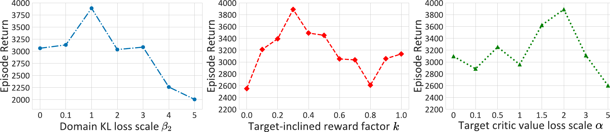

> Figure 7: CoWorld uses an auxiliary online environment to build a policy “test bed” that is aware of offline domain information. This, in turn, can guide the visual RL agent in the offline domain to learn a mildly-conservative policy, striking a balance between value overestimation and over-conservatism.

For notations, we use the superscript $S$ and $T$ to represent data from the source and target domains. Additionally, subscripts $(\phi^{\prime},\psi^{\prime},\xi^{\prime})$ and $(\phi,\psi,\xi)$ are employed to distinguish model parameters for different domains. The notations of source and target domains are summarised in Table [7](#table-7).

> Table 7: Notations of the source and target domains.

| Domains              | Model Parameters                                                          | Data                                                                                                                       |
| -------------------- | ------------------------------------------------------------------------- | -------------------------------------------------------------------------------------------------------------------------- |
| Source/Online ($S$)  | World model $\phi^{\prime}$, Actor $\psi^{\prime}$, Critic $\xi^{\prime}$ | Raw data $(o_{t}^{(S)},a_{t}^{(S)},r_{t}^{(S)})$, Relabeled reward with infomation from both domains $\tilde{r}_{t}^{(S)}$ |
| Target/Offline ($T$) | World model $\phi$, Actor $\psi$, Critic $\xi$                            | Raw data $(o_{t}^{(T)},a_{t}^{(T)},r_{t}^{(T)})$                                                                           |

### A.2 World Model

We adopt the framework of the world model used in  [16].
The image encoder is a Convolutional Neural Network (CNN).
The image predictor is a transposed CNN and the transition, reward, and discount factor predictors are Multi-Layer Perceptrons (MLPs).
The discount factor predictor serves as an estimate of the probability that an episode will conclude while learning behavior based on model predictions.
The encoder and decoder take $64\times 64$ images as inputs.

### A.3 Behavior Learning

For the behavior learning of CoWorld, we use the actor-critic method from DreamerV2 [16].
The $\lambda$-target $V_{t}^{(T)}$ in Eq. ([6](https://arxiv.org/html/2305.15260v4#S3.E6)) is defined as follows:

$$
V_{t}^{(T)}\doteq\hat{r}^{(T)}_{t}+\hat{\gamma}_{t}^{(T)}\begin{cases}(1- \lambda)v_{\xi}\left(\hat{z}_{t+1}^{(T)}\right)+\lambda V_{t+1}^{(T)}&\text{if}t<H\\ v_{\xi}\left(\hat{z}_{H}^{(T)}\right)&\text{if}t=H\end{cases},(8)
$$

where $\lambda$ is set to $0.95$ for considering more on long horizon targets.
The actor and critic are both MLPs with ELU activations [6].
The target actor and critic are trained with guidance from the source critic and regress the $\lambda$-return with a squared loss.
The world model is fixed during behavior learning.
The source actor and critic are:

$$
Source Actor: \displaystyle\hat{a}_{t}^{(S)}\sim\pi_{\psi^{\prime}}(\hat{a}_{t}^{(S)}|\hat{z}_{t}^{(S)}) (9) Source Critic: \displaystyle v_{\xi^{\prime}}(\hat{z}_{t}^{(S)})\approx\mathbb{E}_{p_{\phi^{\prime}},p_{\psi^{\prime}}}\Big{[}\textstyle\sum_{\tau\geq t}\hat{\gamma}_{\tau-t}^{(S)}\hat{r}_{\tau}^{(S)}\Big{]}.
$$

We train the source actor $\pi_{\psi^{\prime}}$ by maximizing

$$
\displaystyle\mathcal{L}(\psi^{\prime})=\ \mathbb{E}_{p_{\phi^{\prime}},p_{\psi^{\prime}}}\Big{[}\sum_{t=1}^{H-1}(\underbrace{\beta\mathrm{H}\left[a_{t}^ {(S)}\mid\hat{z}_{t}^{(S)}\right]}_{\text{entropy regularization}}+\underbrace {\rho V_{t}^{(S)}}_{\text{dynamics backprop}} (10) \displaystyle+\underbrace{(1-\rho)\ln\pi_{\psi^{\prime}}(\hat{a}_{t}^{(S)}\mid \hat{z}_{t}^{(S)})\texttt{sg}(V_{t}^{(S)}-v_{\xi^{\prime}}(\hat{z}_{t}^{(S)}))}_{\text{REINFORCE}}\Big{]}.
$$

The source critic $v_{\xi^{\prime}}$ is optimized
by minimizing

$$
\displaystyle\mathcal{L}(\xi^{\prime})=\mathbb{E}_{p_{\phi^{\prime}},p_{\psi^{\prime}}}\Big{[}\sum_{t=1}^{H-1}\frac{1}{2}\left(v_{\xi^{\prime}}\left(\hat{z} _{t}^{(S)}\right)-\texttt{sg}\left(V_{t}^{(S)}\right)\right)^{2}\Big{]}.(11)
$$

### A.4 Hyperparameters

The hyperparameters of CoWorld are shown in Table [8](#table-8).

> Table 8: Hyperparameters of CoWorld.

| Name                            | Notation    | Value                 |                 |
| ------------------------------- | ----------- | --------------------- | --------------- |
| Co-training                     |             | Meta-World / RoboDesk | DMC             |
| Domain KL loss scale            | $\beta_{2}$ | $1$                   | $1.5$           |
| Target-informed reward factor   | $k$         | $0.3$                 | $0.9$           |
| Target critic value loss scale  | $\alpha$    | $2$                   | 1               |
| Source domain update iterations | $K_{1}$     | $2\cdot 10^{4}$       | $2\cdot 10^{4}$ |
| Target domain update iterations | $K_{2}$     | $5\cdot 10^{4}$       | $2\cdot 10^{4}$ |
| World Model                     |             |                       |                 |
| Dataset size                    | —           | $2\cdot 10^{6}$       |                 |
| Batch size                      | $B$         | 50                    |                 |
| Sequence length                 | $L$         | 50                    |                 |
| KL loss scale                   | $\beta_{1}$ | 1                     |                 |
| Discrete latent dimensions      | —           | 32                    |                 |
| Discrete latent classes         | —           | 32                    |                 |
| RSSM number of units            | —           | 600                   |                 |
| World model learning rate       | —           | $2\cdot 10^{-4}$      |                 |
| Behavior Learning               |             |                       |                 |
| Imagination horizon             | $H$         | 15                    |                 |
| Discount                        | $\gamma$    | 0.995                 |                 |
| $\lambda$-target                | $\lambda$   | 0.95                  |                 |
| Actor learning rate             | —           | $4\cdot 10^{-5}$      |                 |
| Critic learning rate            | —           | $1\cdot 10^{-4}$      |                 |

## Appendix B Additional Quantitative and Qualitative Results

### B.1 Visualizations on Policy Evaluation

We evaluate the trained agent of different models on the Meta-World and DMC tasks and select the first $45$ frames for comparison.
Figure [8](https://arxiv.org/html/2305.15260v4#A2.F8) and Figure [9](https://arxiv.org/html/2305.15260v4#A2.F9) present examples of performing the learned policies of different models on DMC and Meta-World respectively.

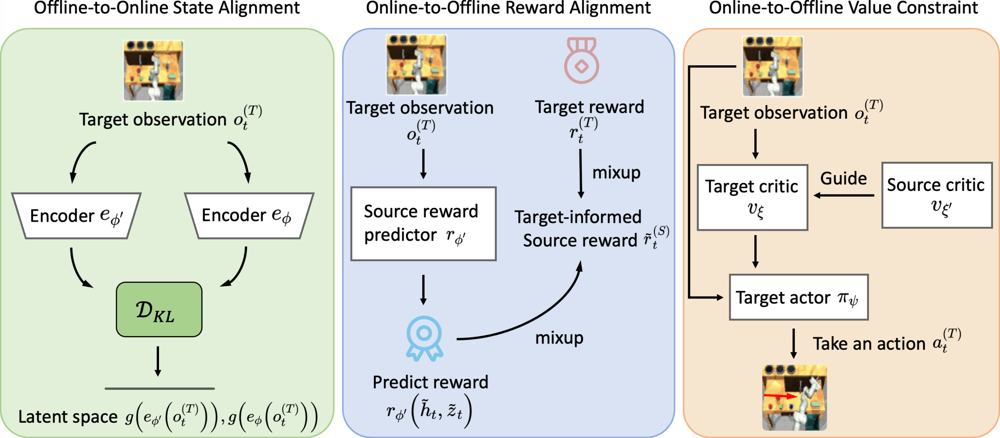

> (a) Policy evaluation on the DMC Walker Downhill task

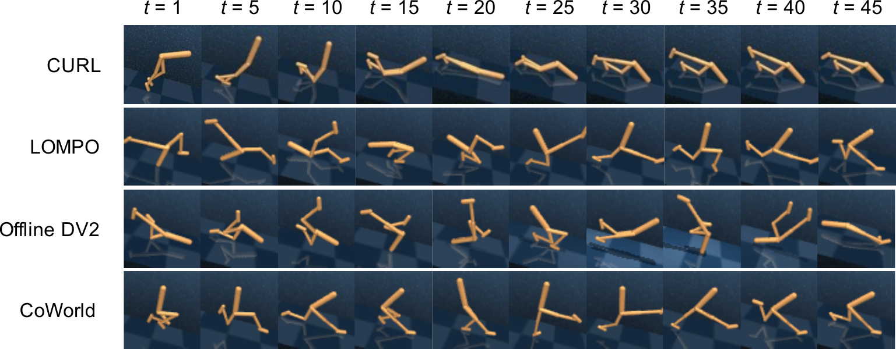

> Figure 9: Policy evaluation on the Meta-World Button Topdown task. The model-free method CURL cannot complete the task (green box). CoWorld achieves better performance and finishes the task in fewer steps (red box) than Offline DV2 (blue box).

### B.2 Quantitative Results on DMC Medium-Expert Dataset

Similar to the data collection strategy of the medium-replay dataset, we build offline datasets with medium-expert quality using a DreamerV2 agent.
The medium-expert dataset comprises all the samples in the replay buffer during the training process until the policy attains expert-level performance, defined as achieving the maximum score that the DreamerV2 agent can achieve. As shown in Table [9](#table-9), CoWorld outperforms other baselines on the DMC medium-expert dataset in most tasks.

> Table 9: Performance on DMC medium-expert dataset. We report the mean rewards and standard deviations of $10$ episodes over $3$ seeds.

| Model       | WW $\rightarrow$ WD | WW $\rightarrow$ WU | WW $\rightarrow$ WN | CR $\rightarrow$ CD | CR $\rightarrow$ CU | CR $\rightarrow$ CN | Avg. |
| ----------- | ------------------- | ------------------- | ------------------- | ------------------- | ------------------- | ------------------- | ---- |
| Offline DV2 | $450\pm 24$         | $141\pm 1$          | $214\pm 8$          | $248\pm 9$          | 3$\pm 0$            | $48\pm 3$           | 184  |
| DrQ+BC      | 808$\pm$47          | 762$\pm$61          | 808$\pm$45          | 862$\pm$13          | 454$\pm$12          | 730$\pm$17          | 737  |
| LOMPO       | 548$\pm$245         | 449$\pm$117         | 688$\pm$97          | 174$\pm$29          | 19$\pm$10           | 113$\pm$35          | 332  |
| Finetune    | 784$\pm$46          | 671$\pm$65          | 851$\pm$91          | 858$\pm$9           | 428$\pm$49          | 833$\pm$7           | 738  |
| CoWorld     | 848$\pm$9           | 774$\pm$29          | 919$\pm$7           | 871$\pm$13          | 475$\pm$16          | 844$\pm$1           | 789  |

### B.3 Quantitative Results on Meta-World

Figure [10(a)](https://arxiv.org/html/2305.15260v4#A2.F10.sf1) compares the performance of different models on Meta-World.
DV2 Finetune demonstrates better performance in the initial training phase, thanks to its direct access to the source environment.
Instead, CoWorld introduces auxiliary source value guidance to assist the training of the target agent.
In the final phase of training, the source value guidance is more effective, and then CoWorld outperforms DV2 Finetune.
Figure [10(b)](https://arxiv.org/html/2305.15260v4#A2.F10.sf2) presents the ablation studies of CoWorld conducted on Meta-World, highlighting the effectiveness and necessity of each training stage.

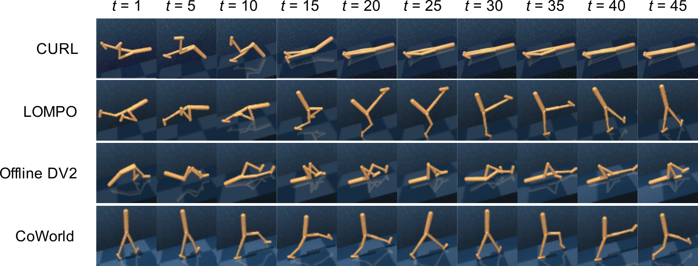

> (a) Comparison with other baselines

### B.4 Effect of Latent Space Alignment

We feed the same observations into the source and target encoder of CoWorld and then use the t-distributed stochastic neighbor embedding (t-SNE) method to visualize the latent states.
As shown in Figure [11](https://arxiv.org/html/2305.15260v4#A2.F11), the representation learning alignment bridges the gap between the hidden state distributions of the source encoder and target encoder.

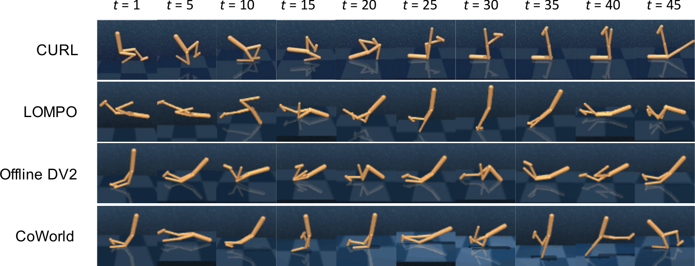

> (a) Latent space before alignment

### B.5 Additional Results on the Realistic Sim2Real Setup

Due to the limitation in experimental resources, we are unable to conduct experiments with real robots. We make efforts to construct a more realistic sim2real setup. The experiment is conducted with the identical robot control task for both the source and target domains. We manually introduce two types of noise into the visual observation and action space of the target domain, trying to mimic the complex and noisy real-world scenes.

- •
  Visual noise: We modify the original DeepMind Control environment by replacing the static background with dynamic backgrounds of random real-world videos.
- •
  Action noise: We add Gaussian noises $n_{t}$ sampled from $\mathcal{N}(0,1)$ to every dimension of the action in Meta-World and RoboDesk, which originally ranges in (-1,1). This mimics scenarios where the offline dataset is collected using a low-cost (less inaccurate) real robot.

As shown in Table [10](#table-10), we compare CoWorld with the finetuned DreamerV2 model on this new setup. We apply noise of three magnitudes, $w\sim\{0.1,1,5\}$, in the Meta-World Button Topdown task, leading to noisy actions of $a_{t}^{\text{real}}=a_{t}+w\cdot n_{t}$.

> Table 10: Results with more significant domain gaps.

| Target Domain                       | CoWorld | DV2 Finetune |
| ----------------------------------- | ------- | ------------ |
| DMC Walker Walk                     | 544     | 457          |
| DMC Cheetah Run                     | 296     | 220          |
| RoboDesk Push Green ($w=1$)         | 406     | 358          |
| Meta-World Button Topdown ($w=0.1$) | 3752    | 2693         |
| Meta-World Button Topdown ($w=1$)   | 3567    | 3104         |
| Meta-World Button Topdown ($w=5$)   | 951     | 670          |

From the above results, it is evident that CoWorld consistently outperforms the naive finetuning method in this ‘sim2real’ setup. Importantly, we assess the model under more challenging setups, with more significant domain gaps, as illustrated in Table [1](#table-1).

### B.6 Comparison with Pre-trained Foundation Model R3M

R3M [32] is pretrained on Ego4D human video dataset and facilitates efficient learning of downstream robotic tasks. R3M is shown to be a competitive model, particularly in its ability to transfer representations across domains with diverse visual inputs. For model comparison, we leverage the pre-trained weights of R3M from the official repository to initialize the representation model. We then perform policy optimization based on it for downstream tasks in the Meta-World environment. We respectively employ expert data, sourced from the official repository, alongside our own data, which is collected from scratch with mixed data quality. And DV2 Finetune is also pretrained in a related task and finetuned on the offline dataset. As demonstrated in Table [11](#table-11), our approach outperforms the R3M / DV2 fine-tuning model.

> Table 11: Comparison of CoWorld with using a pre-trained foundation model, R3M.

|                      | CoWorld | R3M (expert data) | R3M (our data) | DV2 Finetune |
| -------------------- | ------- | ----------------- | -------------- | ------------ |
| Button Press Topdown | 3889    | 1609              | 311            | 3499         |
| Drawer Close         | 4845    | N/A               | 4616           | 4273         |
| Handle Press         | 4570    | N/A               | 1603           | 3702         |

It is important to note that:

- •
  Despite its generalizable representations, R3M is NOT specifically designed to solve the value overestimation problem, which is fundamental in offline RL. In contrast, our approach not only aligns state representations across domains but also effectively tackles the issue of value overestimation, and therefore achieves better performance.
- •
  The fine-tuning process of R3M necessitates expert demonstrations for high-quality imitation learning. However, its performance empirically deteriorates when applied to the offline dataset of the medium-replay data.
- •
  The pre-training process of R3M typically takes around $5$ days on a V100 GPU, while the entire training procedure of our approach takes only about $2$ days on a 3090 GPU.

### B.7 Training Efficiency

As shown in Table [12](#table-12), we evaluate the training/inference time on Meta-World (Handle Press $\rightarrow$ Button Topdown) using a single RTX 3090 GPU.
Empirically, CoWorld achieves convergence ($90\%$ of the highest returns) in approximately $14$ hours; while it costs DV2 Finetune about $13$ hours. These results indicate that CoWorld requires a comparable training wall-clock time to DV2 Finetune, while consistently maintaining better performance in terms of returns after model convergence.

> Table 12: Runtime comparisons evaluated on Meta-World (HP $\rightarrow$ BT).

| Model            | # Training iterations | Training time | Inference time per episode |
| ---------------- | --------------------- | ------------- | -------------------------- |
| Offline DV2      | 300k                  | 2054 min      | 2.95 sec                   |
| DrQ+BC           | 300k                  | 200 min       | 2.28 sec                   |
| CQL              | 300k                  | 405 min       | 1.88 sec                   |
| CURL             | 300k                  | 434 min       | 2.99 sec                   |
| LOMPO            | 100k                  | 1626 min      | 4.98 sec                   |
| DV2 Finetune     | 460k                  | 1933 min      | 6.63 sec                   |
| DV2 Finetune+EWC | 460k                  | 1533 min      | 5.58 sec                   |
| CoWorld          | 460k                  | 3346 min      | 4.47 sec                   |

## Appendix C Multi-Source CoWorld

The key idea of multi-source CoWorld is to allocate a set of one-hot weights $\omega_{t}^{i=1:M}$ to candidate source domains by calculating their KL divergence in the latent state space to the target domain, where $i\in[1,M]$ is the index of each source domain. This procedure includes the following steps:

- 1.  World models pretraining:
      We pretrain a world model for each source domain and target domain individually.
- 2.  Domain distance measurement:
      At each training step in the target domain, we measure the KL divergence between the latent states of the target domain, produced by $e_{\phi}(o_{t}^{(T)})$, and corresponding states in each source domain, produced by $e_{\phi^{\prime}_{i}}(o_{t}^{(T)})$. Here, $e^{(T)}_{\phi}$ is the encoder of the target world model, and $e_{\phi^{\prime}_{i}}$ is the encoder of the world model for the source domain $i$.
- 3.  Auxiliary domain identification: We dynamically identify the closest source domain with the smallest KL divergence. We set $\omega_{t}^{i=1:M}$ as a one-hot vector, where $\omega_{t}^{i}=1$ indicates the selected auxiliary domain.
- 4.  Rest of training: With the one-hot weights, we continue the rest of the proposed online-to-offline training approach. During representation learning, we adaptively align the target state space to the selected online simulator by rewriting the domain alignment loss term in Eq. ([3](https://arxiv.org/html/2305.15260v4#S3.E3)) as

$$
\mathcal{L}_{\text{M-S}}=\beta_{2}\sum_{i=1}^{M}\omega_{i}\mathrm{KL}\left[ \texttt{sg}(g(e_{\phi^{\prime}}(o_{t}^{(T)})))\ \|\ g(e_{\phi}(o_{t}^{(T)})) \right].(12)
$$

To evaluate the effectiveness of the multi-source adaptive selection algorithm, we conducted experiments on Meta-World and RoboDesk Benchmark. For each target task, two source tasks are used, including the CoWorld best-performing task and the CoWorld worst-performing task. Additionally, the sub-optimal source task is added for some target tasks.

As shown in Table [13](#table-13), multi-source CoWorld can adaptively select the best source task for most multi-source problems to ensure adequate knowledge transfer.
The performance of multi-source CoWorld is reported in Table [2](#table-2).
CoWorld flexibly adapts to the transfer learning scenarios with multiple source domains, achieving comparable results to the model that exclusively uses our manually designated auxiliary simulator as the source domain (best-source). This study significantly improves the applicability of CoWorld in broader scenarios.

> Table 13: The source domain automatically selected by Multi-Source CoWorld. MW represents Meta-World and RD stands for RoboDesk.

| Target domain               | Selected source domain |
| --------------------------- | ---------------------- |
| MW: Door Close              | MW: Drawer Close       |
| MW: Button Press            | MW: Handle Press       |
| MW: Window Close            | MW: Button Topdown     |
| MW: Handle Press            | MW: Button Press       |
| MW: Button Topdown          | MW: Handle Press       |
| MW: Drawer Close            | MW: Door Close         |
| RD: Push Button             | MW: Button Press       |
| RD: Open Slide              | MW: Window Close       |
| RD: Drawer Open             | MW: Drawer Close       |
| RD: Upright Block off Table | MW: Handle Press    |

## Appendix D Source and Target Domains

#### Meta-World.

For the Meta-World environment, we adopt robotic control tasks with complex visual dynamics.
For instance, the Door Close task requires the agent to close a door with a revolving joint while randomizing the door positions, and the Handle Press task involves pressing a handle down while randomizing the handle positions.
To evaluate the performance of CoWorld on these tasks, we compare it with several baselines in six visual RL transfer tasks.

#### RoboDesk.

We select Meta-World as the source domain and RoboDesk as the target domain. Notably, there exists a significant domain gap between these two environments.
The visual observations, physical dynamics, and action spaces of the two environments are different.
First, Meta-World adopts a side viewpoint, while RoboDesk uses a top viewpoint.
Further, the action space of Meta-World is $4$ dimensional, while that in RoboDesk is $5$-dimensional.
Considering these differences, the Meta-World $\rightarrow$ RoboDesk benchmark presents a challenging transfer learning problem.

#### DeepMind Control.

We train the source agents in standard DMC environments and train the target agents in modified DMC environments. Walker Uphill and Cheetah Uphill represent tasks in which the ground has a $15^{\circ}$ uphill slope. Walker Downhill and Cheetah Downhill represent the tasks in which the plane has a $15^{\circ}$ downhill slope.
We evaluate the model in six tasks with different source domains and target domains.

We assume that there exist notable distinctions between the source and target domains (see Table [1](#table-1)).
This assumption can be softened by our proposed approach that mitigates domain discrepancies between distinct source and target MDPs.
Our experiments reveal that the CoWorld method exhibits a notable tolerance to inter-domain differences in visual observation, physical dynamics, reward definition, or even the action space of the robots. This characteristic makes it more convenient to choose an auxiliary simulator based on the type of robot. For example:

- •
  When the target domain involves a robotic arm (e.g., RoboDesk), an existing robotic arm simulation environment (e.g., Meta-World) can be leveraged as the source domain.
- •
  In scenarios with legged robots, environments like DeepMind Control with Humanoid tasks can serve as suitable auxiliary simulators.
- •
  For target domains related to autonomous driving, simulators like CARLA can be used.

## Appendix E Compared Methods

We compare CoWorld with several widely used model-based and model-free offline methods.

- •
  Offline DV2 [25]:
  A model-based RL method that modifies DreamerV2 [16] to offline setting, and adds a reward penalty corresponding to the mean disagreement of the dynamics ensemble.
- •
  DrQ+BC [25]:
  It modifies the policy loss term in DrQ-v2 [50] to match the loss given in [10].
- •
  CQL [25]:
  It is a framework for offline RL that learns a Q-function that guarantees a lower bound for the expected policy value than the actual policy value. We add the CQL regularizers to the Q-function update of DrQ-v2 [21].
- •
  CURL [22]:
  It is a model-free RL approach that extracts high-level features from raw pixels utilizing contrastive learning.
- •
  LOMPO [39]: An offline model-based RL algorithm that handles high-dimensional observations with latent dynamics models and uncertainty quantification.
- •
  LOMPO Finetune: It pretrains a LOMPO agent [39] with source domain data and subsequently finetunes the pretrained agent in the offline target domain.
- •
  DV2 Finetune: It pretrains a DreamerV2 agent [16] in the online source domain and subsequently finetunes the pretrained agent in the offline target domain. Notably, Meta-World $\rightarrow$ RoboDesk tasks’ action space is inconsistent, and we can’t finetune directly. Instead, we use the maximum action space of both environments as the shared policy output dimension. For Meta-World and Meta-World $\rightarrow$ RoboDesk transfer tasks, we pretrain the agent for $160$k steps and finetune it $300$k steps. For DMC transfer tasks, we pretrain the agent for $600$k steps and finetune it for $600$k steps.
- •
  DV2 Finetune+EWC: It modifies the DV2 Finetune method with EWC [19] to regularize the model for retaining knowledge from the online source domain. The steps of pretraining and finetuning are consistent with DV2 Finetune.

## Appendix F Broader Impacts

CoWorld is a transfer learning method that may benefit future research in the field of offline RL, model-based RL, and visual RL.
Beyond the realm of reinforcement learning, this approach holds great potential to contribute to various domains such as robotics and autonomous driving.

In real-world scenarios of healthcare applications, Zhang et al. [62] employed offline RL algorithms to train policies using a large amount of historical dataset, determining the follow-up schedules and tacrolimus dosages in Kidney Transplantation and HIV. There are also corresponding simulators [17, 1] designed by medical domain experts, with parameters learned from real-world data.

Another practical use of the proposed setup is advertising bidding, where direct interactions with real online advertising systems for training are challenging. A recent solution involves constructing a simulated bidding environment based on historical bidding logs for interactive training, such as [30], and mitigating the inherent differences between the virtual advertising environment and real-world advertising systems. Therefore, in many real-world scenarios, it is possible to optimize the policies learned from offline datasets with simulators.

A potential negative social impact of our method is the introduction of existing biases from the additional domain. If the training data used to develop our algorithm contains biases, the model may learn those biases, leading to unfair outcomes in decision-making processes. It’s crucial to carefully address biases in both data and algorithmic design to mitigate these negative social impacts.
