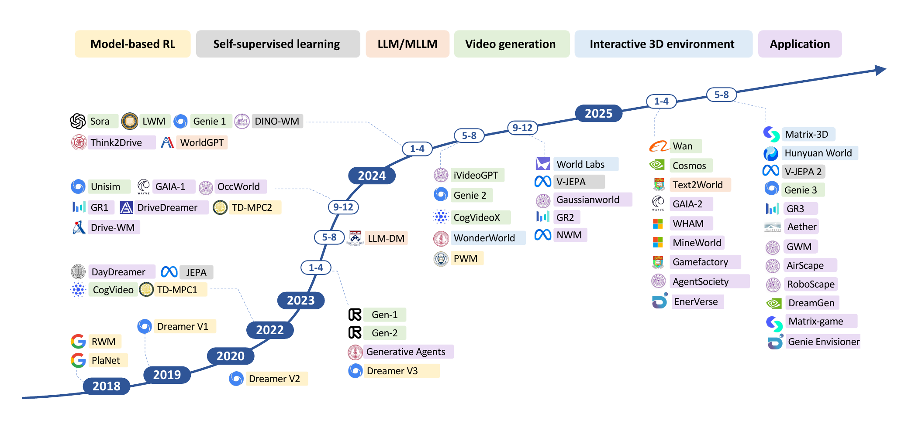
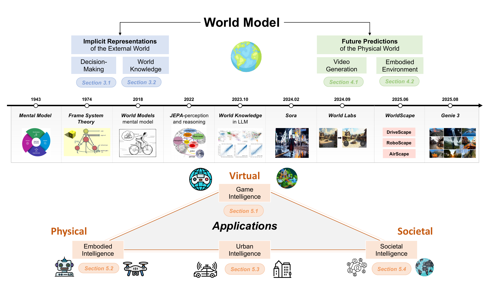
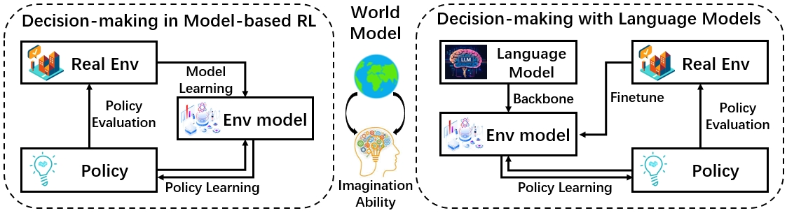
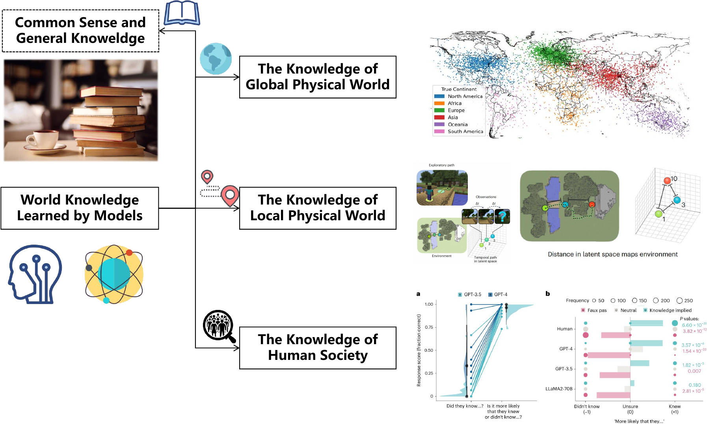
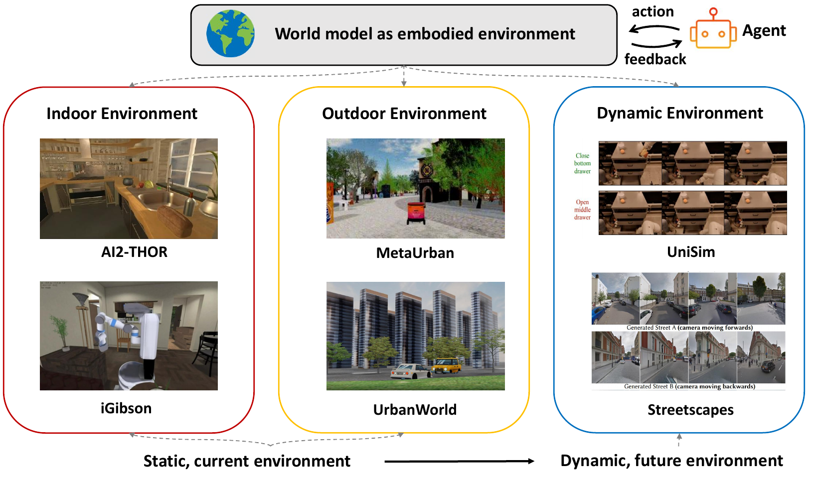
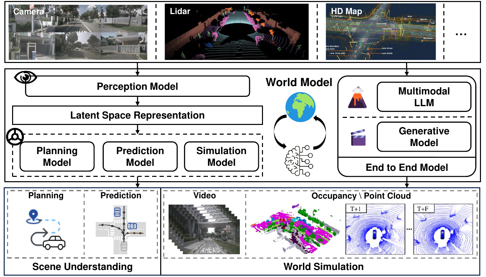
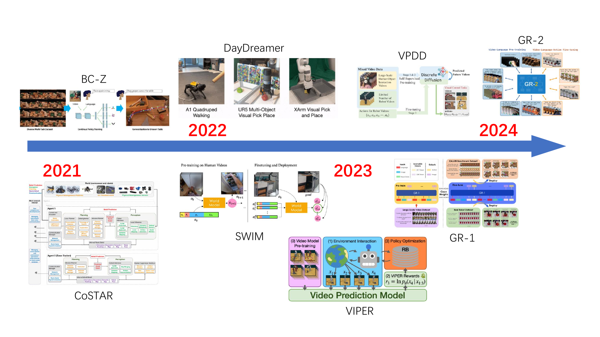
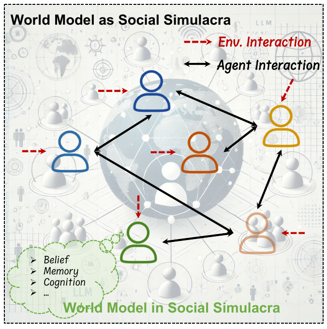

# Title: Understanding World or Predicting Future? A Comprehensive Survey of World Models

- ArXiv: 2411.14499
- Authors: Jingtao Ding, , Yunke Zhang, , Yu Shang, , Jie Feng, , Yuheng Zhang, , Zefang Zong, , Yuan Yuan, , Hongyuan Su, , Nian Li, , Jinghua Piao, , Yucheng Deng, Nicholas Sukiennik, Chen Gao, Fengli Xu, Yong Li, China
- Sections: 47
- Estimated tokens: 73.8k

## Contents

- 1. Introduction
- 2. Background and Categorization
  - 2.1. History and Current Development
  - 2.2. Evolving Concept from Multiple Domains
  - 2.3. Categorization
- 3. Implicit Representation of the External World
  - 3.1. World Model in Decision-Making
    - 3.1.1. World model in model-based RL
    - 3.1.2. World model with language backbone
  - 3.2. World Knowledge Learned by Models
    - 3.2.1. Knowledge of the Global Physical World
    - 3.2.2. Knowledge of the Local Physical World
    - 3.2.3. Knowledge of the Human Society
- 4. Future Prediction of the Physical World
  - 4.1. World Model as Video Generation
    - 4.1.1. Towards Video World Models
    - 4.1.2. Capabilities of Video World Models
  - 4.2. World Model as Embodied Environment
    - 4.2.1. Indoor Environments
    - 4.2.2. Outdoor Environments
    - 4.2.3. Dynamic Environments
- 5. Application Domains
  - 5.1. Game Intelligence
  - 5.2. Embodied Intelligence
    - 5.2.1. Learning Implicit Representation
    - 5.2.2. Predicting Future States of the Environment
    - 5.2.3. From Simulation to Real World
  - 5.3. Urban Intelligence
    - 5.3.1. Autonomous Driving
    - 5.3.2. Autonomous Logistics
    - 5.3.3. Urban Analytics
  - 5.4. Societal Intelligence
    - 5.4.1. Building Social Simulacra Mirroring Real-world Society.
    - 5.4.2. Agent’s Understanding of External World in Social Simulacra
  - 5.5. Functions of World Models
- 6. Open Problems and Future Directions
  - 6.1. Physical Rules and Counterfactual Simulation
  - 6.2. Enriching the Social Dimension
  - 6.3. Benchmarks
  - 6.4. Bridging Simulation and Reality with Embodied Intelligence
  - 6.5. Simulation Efficiency
  - 6.6. Ethical and Safety Concerns
- 7. Conclusion
- References
- Appendix A Related survey
- Appendix B Figures and tables
- Appendix C Update History

## Abstract

###### Abstract.

The concept of world models has garnered significant attention due to advancements in multimodal large language models such as GPT-4 and video generation models such as Sora, which are central to the pursuit of artificial general intelligence. This survey offers a comprehensive review of the literature on world models. Generally, world models are regarded as tools for either understanding the present state of the world or predicting its future dynamics. This review presents a systematic categorization of world models, emphasizing two primary functions: (1) constructing internal representations to understand the mechanisms of the world, and (2) predicting future states to simulate and guide decision-making. Initially, we examine the current progress in these two categories. We then explore the application of world models in key domains, including generative games, autonomous driving, robotics, and social simulacra, with a focus on how each domain utilizes these aspects. Finally, we outline key challenges and provide insights into potential future research directions. We summarize the representative papers along with their code repositories in [https://github.com/tsinghua-fib-lab/World-Model](https://github.com/tsinghua-fib-lab/World-Model).

## 1. Introduction

The scientific community has long aspired to develop a unified model that can replicate its fundamental dynamics of the world in pursuit of Artificial General Intelligence (AGI) (lecun2022path,). In 2024, the emergence of multimodal large language models (LLMs) and video generation models like Sora (sora2024,) has intensified discussions surrounding such World Models. While these models demonstrate an emerging capacity to capture aspects of world knowledge–such as Sora’s generated videos, which appear to perfectly adhere to physical laws–questions persist regarding whether they truly qualify as comprehensive world models. Therefore, a systematic review of recent advancements, applications, and future directions in world model research is both timely and essential as we look toward new breakthroughs in the era of artificial intelligence (AI).

The definition of a world model remains a subject of ongoing debate, generally divided into two primary perspectives: understanding the world and predicting the future. As depicted in Figure [2](#figure-2), early work by Ha and Schmidhuber (ha2018world,) focused on abstracting the external world to gain a deep understanding of its underlying mechanisms. In contrast, LeCun (lecun2022path,) argued that a world model should not only perceive and model the real world but also possess the capacity to envision possible future states to inform decision-making. Video generation models such as Sora represent an approach that concentrates on simulating future world evolution and thus align more closely with the predictive aspect of world models. This raises the question of whether a world model should prioritize understanding the present or forecasting future states. In this paper, we provide a comprehensive review of the literature from both perspectives, highlighting key approaches and challenges.

The potential applications of world models span a wide array of fields, each with distinct requirements for understanding and predictive capabilities. In autonomous driving, for example, world models need to perceive road conditions in real-time (yolop_2022,; teichmann2018multinetrealtimejointsemantic,) and accurately predict their evolution (ngiam2021scene,; shi2022motion,; zhou2023query,), with a particular focus on immediate environmental awareness and forecasting of complex trends. For robotics, world models are essential for tasks such as navigation (shah2023gnm,), object detection (wang2024repvit,), and task planning (hafner2019learning,), requiring a precise understanding of external dynamics (gao2023s,) and the ability to generate interactive and embodied environments (park2023generative,). In the realm of simulation of virtual social systems, world models must capture and predict more abstract behavioral dynamics, such as social interactions and human decision-making processes. Thus, a comprehensive review of advancements in these capabilities, alongside an exploration of future research directions and trends, is both timely and essential.

Existing surveys on world models can generally be classified into two categories, as shown in Table [S1](#table-1). The first category primarily focuses on describing the application of world models in specific fields such as video processing and generation (cho2024sora,; zhu2024sora,), autonomous driving (guan2024world,; li2024data,; yan2024forging,), and agent-based applications (zhu2024sora,). The second category (mai2024efficient,) concentrates on the technological transitions from multi-modal models, which are capable of processing data across various modalities, to world models. However, these papers often lack a systematic examination of what precisely constitutes a world model and what different real-world applications require from these models. In this article, we aim to formally define and categorize world models, review recent technical progress, and explore their extensive applications.

The main contributions of this survey can be summarized as follows: (1) We present a novel categorization system for world models structured around two primary functions: constructing implicit representations to understand the mechanism of the external world and predicting future states of the external world. The first category focuses on the development of models that learn and internalize world knowledge to support subsequent decision-making, while the latter emphasizes enhancing predictive and simulative capabilities in the physical world from visual perceptions. (2) Based on this categorization, we classify how various key application areas, including generative games, autonomous driving, robots, and social simulacra, emphasize different aspects of world models. (3) We highlight future research directions and trends of world models that can adapt to a broader spectrum of practical applications.

The remainder of this paper is organized as follows. In Section [2](#section-2), we introduce the background of the world model and propose our categorization system. Section [3](#section-3) and Section [4](#section-4) elaborate on the details of current research progress on two categories of world models, respectively. Section [5](#section-5) covers applications of the world model in three key research fields. Section [6](#section-6) outlines open problems and future directions of world models.

## 2. Background and Categorization

> Figure 1. The roadmap of world models in deep learning era.

### 2.1. History and Current Development

In this section, we explore the evolving concepts of world models in the literature and categorize efforts to construct world models into two distinct branches: internal representation and future prediction.

Pre Deep Learning Era. The concept of building an internal model of the world has a long history in AI, dating back to foundational work such as Marvin Minsky’s frame representation in the 1960s (minsky1974framework,), designed to systematically capture structured knowledge about the world. In the context of reinforcement learning, world models emerged as a fundamental component of model-based approaches, where agents construct explicit representations of their environment’s dynamics. Early work in this domain focused on learning transition models that could predict the next state given the current state and action (sutton1990integrated,), enabling agents to perform planning and simulate potential action sequences before execution. These environment models were typically represented using tabular methods or simple parametric functions, laying the groundwork for more sophisticated world modeling approaches that would emerge with the advent of deep learning.

Model-based Reinforcement Learning.
Ha et al. (ha2018recurrent,; ha2018world,) significantly revived and popularized the term “world model” in 2018 by proposing a recurrent neural-network-based implicit model for learning latent representations. This line of research aligns with the psychological theory of “mental models” (johnson1983mental,)(^1^11[https://plato.stanford.edu/entries/mental-representation/](https://plato.stanford.edu/entries/mental-representation/)), which posits that humans perceive the external world by abstracting it into simplified elements and relationships—an underlying philosophical principle reflected in both frames and world models.
This principle suggests that our understanding of the world, when viewed from a cognitive perspective, typically involves constructing abstract representations that capture essential patterns without requiring exhaustive detail. Building upon this conceptual framework, the authors introduce an agent module inspired by the human cognitive system, as illustrated in Figure [2](#figure-2). In this recurrent world model (RWM), the agent receives feedback from the real-world environment, which is then transformed into a series of inputs that train the model. This model is adept at simulating potential outcomes following specific actions within the external environment. Essentially, it creates a mental simulation of potential future world evolutions, with decisions made based on the predicted outcomes of these states. This methodology closely mirrors the model-based reinforcement learning method, where both strategies involve the model generating internal representations of the external world to facilitate navigation through and resolution of various decision-making tasks.
Following this conceptual foundation, subsequent developments have further advanced world model architectures, including Google DeepMind’s Dreamer series (hafner2019dream,; hafner2020mastering,; hafner2025mastering,), which has demonstrated the scalability and effectiveness of learned world representations across increasingly complex domains.

Self-supervised Learning.
In the visionary article on the development of autonomous machine intelligence in 2022 (lecun2022path,), Yann LeCun introduced the Joint Embedding Predictive Architecture (JEPA), a framework mirroring the human brain’s structure. As illustrated in Figure [2](#figure-2), JEPA comprises a perception module that processes sensory data (i.e., an encoder), followed by a cognitive module (i.e., a predictor) that evaluates this information, effectively embodying the world model. This model allows the brain to assess actions and determine the most suitable responses for real-world applications.
A key innovation of JEPA lies in its self-supervised learning paradigm, which enables the system to learn rich representations of the world without relying on extensive labeled data. Rather than predicting raw sensory inputs in pixel space, JEPA learns to predict abstract representations in a latent embedding space, making the learning process more efficient and robust. This approach allows the model to capture semantic relationships and causal structures in the data while avoiding the computational burden and potential pitfalls of pixel-level prediction, such as focusing on irrelevant details or noise.
LeCun’s framework is particularly intriguing due to its incorporation of the dual-system concept, mirroring ”fast” and ”slow” thinking. System 1 involves intuitive, instinctive reactions: quick decisions made without explicit world model consultation, such as instinctively dodging an oncoming person. In contrast, System 2 employs deliberate, calculated reasoning that leverages the learned world model to consider future states. It extends beyond immediate sensory input, simulating potential future scenarios through the self-supervised representations, like predicting events in a room over the next ten minutes and adjusting actions accordingly. This level of foresight requires constructing a world model that can effectively guide decisions based on the anticipated dynamics and evolution of the environment.
In this framework, the world model is essential for understanding and representing the external world through self-supervised learning of latent variables, which capture key information while filtering out redundancies. This approach allows for a highly efficient, minimalistic representation of the world, facilitating optimal decision-making and planning for future scenarios. Building upon these principles, recent implementations such as V-JEPA (bardes2024revisiting,) and V-JEPA2 (assran2025v,) have demonstrated the practical viability of video-based self-supervised learning, showing how JEPA architectures can learn rich spatiotemporal representations from unlabeled video data for downstream vision tasks.

Large Language Models.
”The limits of my language mean the limits of my world.”—Ludwig Wittgenstein. This profound observation finds particular relevance in the context of large language models, which learn fundamental principles of world operation through textual data that can be leveraged to construct comprehensive world models. Recent research has demonstrated that LLMs trained on vast corpora naturally acquire latent world knowledge, including spatial and temporal understanding, enabling them to make sophisticated predictions about real-world scenarios (gurnee2023language,; manvi2023geollm,). This capability has been harnessed for model-based task planning, where pre-trained language models serve as the foundation for constructing world models that can reason about complex sequential tasks (guan2023leveraging,). The integration of multimodal capabilities further enhances world modeling potential. Multimodal Large Language Models (MLLMs) can process and integrate information across visual, textual, and other sensory modalities, creating richer and more comprehensive world representations (ge2024worldgpt,).
Understanding how these models process, represent, and utilize world knowledge remains crucial for developing more effective world models that can bridge the gap between linguistic knowledge and real-world understanding (yang2025thinking,).

Video Generation.
Video generation has emerged as the predominant approach to world modeling in contemporary AI research. Unlike earlier implicit world representations, these models explicitly generate visual sequences that demonstrate understanding of temporal dynamics, spatial consistency, and physical laws. Powered by advanced generative techniques such as diffusion modeling and transformer architectures, recent video generation models including Sora (sora2024,), Keling (keling2024,), and Gen-2 (runway2023,) take text instructions or real-world visual data as input and produce high-quality video sequences. These models demonstrate exceptional world modeling capabilities, including maintaining consistency in 3D video simulations, producing physically plausible outcomes, and simulating complex digital environments.
The sophistication of these approaches suggests they model underlying real-world dynamics rather than merely generating visually appealing content. This represents a fundamental shift toward world models that can actively simulate and predict how environments evolve over time. Recent developments have further advanced this paradigm, with Cosmos (agarwal2025cosmos,) achieving breakthrough performance in physics law adherence and Genie 3 (genie3,) enabling real-time interaction capabilities for controllable world simulation.

Interactive 3D Environments.
Interactive 3D scene generation represents another important paradigm in world modeling, focusing on creating immersive 3D worlds that enable spatial exploration and user interaction within virtual environments. Representative work such as Wonderworld demonstrates the capability to generate interactive 3D scenes from a single 2D image (yu2025wonderworld,), showcasing the potential for creating explorable virtual worlds from minimal input. This approach emphasizes spatial consistency, geometric understanding, and real-time responsiveness to user navigation and interaction. Recent advances have significantly expanded these capabilities, with Matrix-3D achieving wide-coverage omnidirectional explorable 3D world generation through panoramic 3D reconstruction (yang2025matrix,), and HunyuanWorld 1.0 enabling immersive 360° experiences through semantically layered 3D mesh representations that provide seamless compatibility with existing computer graphics pipelines (team2025hunyuanworld,).

Applications.
World models have rapidly expanded across diverse application domains since 2023. In autonomous driving, foundational works such as GAIA-1 and Drive-WM established approaches for modeling vehicle interactions and environmental dynamics in complex traffic scenarios (hu2023gaia,; wang2023drivingfuturemultiviewvisual,). The robotics domain has similarly advanced, exemplified by DayDreamer in 2023 (wu2023daydreamer,) and continuing with recent developments in 2025 for robotic manipulation tasks (lu2025gwm,).
Navigation applications have emerged with robot path planning (bar2025navigation,) extending to six-degree-of-freedom aerial agents (zhao2025airscape,). Gaming represents a particularly promising domain, with landmark work on world and human action models (WHAM) demonstrating how world models can create dynamic, responsive virtual environments (kanervisto2025world,). At the larger scale, agent-based social simulation leverages world models to understand complex societal dynamics and human interactions, offering computational insights into real-world social phenomena (piao2025agentsociety,).

### 2.2. Evolving Concept from Multiple Domains

The concept of world models in artificial intelligence has deep psychological roots that extend far beyond contemporary machine learning. Understanding these foundational connections reveals how modern AI world models represent a computational realization of fundamental cognitive principles that have been studied for decades across multiple disciplines.

The psychological concept of mental models was first articulated by Scottish psychologist Kenneth Craik in his seminal work ”The Nature of Explanation” (1943), where he proposed that ”the mind constructs small-scale models of reality” to predict and understand external events (craik1943nature,). Craik’s insight was that human cognition fundamentally operates by creating internal representations that capture the essential structure and dynamics of the external world, enabling predictive reasoning and adaptive behavior.

This foundational concept was systematically developed and formalized by British psychologist Philip Nicholas Johnson-Laird in the 1980s through his Mental Models Theory. In his influential work ”Mental Models: Towards a Cognitive Science of Language, Inference, and Consciousness” (1983), Johnson-Laird demonstrated that human reasoning operates through the construction and manipulation of mental models—internal representations that preserve the structural relationships of the situations they represent (johnson1983mental,). According to this theory, when humans engage in deductive reasoning, inductive inference, or counterfactual thinking, they mentally simulate different scenarios by constructing and testing alternative models of possible worlds.

Johnson-Laird’s framework established several key principles that directly parallel contemporary AI world models: mental models are finite representations of potentially infinite domains, they capture structural relationships rather than superficial details, and they enable predictive simulation of alternative scenarios. These principles have become fundamental to understanding how both human and artificial agents can efficiently represent and reason about complex environments.

> Figure 2. The overall framework of this survey. We systematically define the essential purpose of a world model as understanding the dynamics of the external world and predicting future scenarios. The timeline illustrates the development of key definitions and applications.

### 2.3. Categorization

Whether focusing on learning internal representations of the external world or simulating its operational principles, these concepts coalesce into a shared consensus: the essential purpose of a world model is to understand the dynamics of the world and compute the next state with certainty (or with some guarantee), which empowers the model to extrapolate longer-horizon evolution and to support downstream decision-making and planning. From this perspective, we conduct a thorough examination of recent advancements in world models, analyzing them through the following lenses, as depicted in Figure [2](#figure-2).

- •
  Implicit representation of the external world (Section [3](#section-3)): This research category constructs a model of environmental change to enable more informed decision-making, ultimately aiming to predict the evolution of future states. It fosters an implicit comprehension by transforming external realities into a model that represents these elements as latent variables. Furthermore, with the advent of large language models (LLMs), efforts previously concentrated on traditional decision-making tasks have been significantly enhanced by the detailed descriptive power of these models regarding world knowledge. We further focus on the integration of world knowledge into existing models.
- •
  Future predictions of the external world (Section [4](#section-4)): We initially explore generative models that simulate the external world, primarily using visual video data. These works emphasize the realness of generated videos that mirror future states of the physical world. As recent advancements shift focus toward developing a truly interactive physical world, we further investigate the transition from visual to spatial representations and from video to embodiment. This includes comprehensive coverage of studies related to the generation of embodied environments that mirror the external world.
- •
  Applications of world models (Section [5](#section-5)): World models have demonstrated wide-ranging applications across diverse domains, spanning game intelligence, embodied agents, urban systems, and societal modeling. These domains—represented respectively by generative games, robotics, autonomous driving, and social simulacra—illustrate how world models bridge perception, reasoning, and imagination across both virtual and physical environments. We explore how the integration of world models in these domains advances theoretical understanding and practical innovation alike, underscoring their transformative potential in shaping intelligent systems.

## 3. Implicit Representation of the External World

This section examines how world models enable informed decision-making by representing the environment as latent variables. Section [3.1](#section-3-1) focuses on the world models in model-based RL (MBRL), while Section [3.2](#section-3-2) explores the integration of world knowledge into advanced AI models, especially LLMs, enhancing real-world task performance.

### 3.1. World Model in Decision-Making

In decision-making tasks, understanding the environment is the major task in setting a foundation for optimized policy generation. As such, the world model in decision-making should include a comprehensive understanding of the environment. It enables us to take hypothetical actions without affecting the real environment, facilitating a low trial-and-error cost. In literature, research on how to learn and utilize the world model was initially proposed in the field of model-based RL. Furthermore, recent progress on LLM and MLLM also provide comprehensive backbones for world model construction. With language serving as a more general representation, language-based world models can be adapted to more generalized tasks. The two schemes of leveraging world models in decision-making tasks are shown in Figure [3](#figure-3).

> Figure 3. Two schemes of utilizing world model in decision-making.

#### 3.1.1. World model in model-based RL

In decision-making, the concept of the world model largely refers to the environment model in MBRL. A decision-making problem is typically formulated as a Markov Decision Process (MDP), denoted with a tuple $(S,A,M,R,\gamma)$, where $S,A,\gamma$ denotes the state space, action space and the discount factor each. The world model here consists of $M$, the state transition dynamics and $R$, the reward function. Since the reward function is defined in most cases, the key task of MBRL is to learn and utilize the transition dynamics, which can further support policy optimization.

World Model Learning. To learn an accurate world model, the most straightforward approach is to leverage the mean squared prediction error on each one-step transitions (kurutach2018model,; luo2018algorithmic,; janner2019trust,; rajeswaran2020game,; janner2021offline,),

$$
(1) \min_{\theta}\mathbb{E}_{s^{\prime}\sim M^{*}(\cdot|s,a)}[||s^{\prime}-M_{\theta}(s,a)||^{2}_{2}],
$$

where $M^{*}$ is the real transition dynamics used to collect trajectory data and $M_{\theta}$ is the parameterized transition to learn. Apart from directly utilizing the deterministic transition model, Chua et al.(chua2018deep,) further model the aleatoric uncertainty with the probabilistic transition model. The objective is to minimize the KL divergence between the transition models,

$$
(2) \min_{\theta}\mathbb{E}_{s^{\prime}\sim M{*}(\cdot|s,a)}[log(\frac{M^{*}(s^{\prime}|s,a)}{M_{\theta}(s^{\prime}|s,a)})].
$$

In both settings, the phase of the world model learning task can be transformed into a supervised learning task. The learning labels are the trajectories derived from real interaction environments, also called the simulation data (luo2024survey,).

For high-dimensional environments, representation learning is essential for effective world-model training in MBRL. Early work by Ha and Schmidhuber(ha2018recurrent,) reconstructs images through an autoencoder–latent-state pipeline, whereas Hafner et al. (hafner2019dream,; hafner2020mastering,) couple a visual encoder with latent dynamics to master pixel-based control tasks. Their latest iteration, DreamerV3(hafner2025mastering,), adds robust normalization and balancing techniques, solving over 150 tasks—including diamond collection in Minecraft—without human data or domain-specific tuning. Memory-centric extensions such as Recall-to-Imaging by Samsami et al.(samsami2024mastering,) further enhance long-horizon reasoning. A complementary trend is unified model learning via next-token prediction with transformer architectures, as shown by Janner et al. (janner2021offline,) and expanded by Schubert et al. (schubert2023generalist,). Further, Georgiev et al. (georgievpwm,) train a large off-policy multi-task world model whose smooth latent dynamics enable efficient per-task policy learning with first-order gradients, achieving strong scalability and performance without online planning.
Recent work by Jonathan Richens et al.(richens2025general,) further reinforces the necessity of world models, showing that any agent capable of generalizing to multi-step goal-directed tasks must have learned a predictive model of its environment, with the world model emerging from the agent’s policy. This insight aligns with the ongoing trend of incorporating predictive modeling into reinforcement learning to handle more complex and goal-oriented tasks.

Policy Generation with World Model. With an ideally optimized world model, one most straightforward way to generate a corresponding policy is model predictive control (MPC)(kouvaritakis2016model,). MPC plans an optimized sequence of actions given the model as follows:

$$
(3) \max_{a_{t:t+\tau}}\mathbb{E}_{s_{t^{\prime}+1}\sim p(s_{t^{\prime}+1}|s_{t^{\prime}},a_{t^{\prime}})}[\sum^{t+\tau}_{t^{\prime}=t}r(s_{t^{\prime}},a_{t^{\prime}})],
$$

where $\tau$ denotes the planning horizon. Nagabandi et al.(nagabandi2018neural,) adopt a simple Monte Carlo method to sample action sequences. Rather than sampling actions uniformly, Chua et al.(chua2018deep,) propose a new probabilistic algorithm that ensembles with trajectory sampling. Further literature also improves the optimization efficiency by leveraging the world model usage (hafner2019dream,; yu2016derivative,; hu2017sequential,; wang2019exploring,). Hansen et al.(hansentd,) introduced an improved model-based RL algorithm called TD-MPC2 that integrates trajectory optimization within the latent space of a learned implicit world model. It achieves strong performance across diverse continuous control tasks and demonstrates scalability by training large agents with hundreds of millions of parameters across multiple domains.

Another popular approach to generating world model policies is the Monte Carlo Tree Search (MCTS). By maintaining a search tree where each node refers to a state evaluated by a predefined value function, actions will be chosen such that the agent can be processed to a state with a higher value. AlphaGo and AlphaGo Zero are two significant applications using MCTS in discrete action space (silver2016mastering,; silver2017mastering,). Moerland et al. (moerland2018a0c,) extended MCTS to solve decision problems in continuous action space. Oh et al. (oh2017value,) proposed a value prediction network that applies MCTS to the learned model to search for actions based on value and reward predictions.

#### 3.1.2. World model with language backbone

The rapid growth of language models, especially LLM and MLLM, benefits development in many related applications. With language serving as a universal representation backbone, language-based world models have shown their potential in many decision-making tasks.

Direct Action Generation via LLM World Models.
LLM is capable of directly generating actions in decision-making tasks based on corresponding constructed world models. For example, in the navigation scenarios, Yang et al. (yang2023probabilistic,) transfer pre-trained text-to-video models to domain-specific tasks for robot control, successfully annotating robot manipulation with text instructions as LLM outputs. Zhou et al. (zhou2024robodreamer,) further learn a compositional world model by factorizing the video generation process. Such a method enables a strong few-shot transfer ability to unseen tasks.

Besides training or fine-tuning specialized language-based world models, LLMs and MLLMs can be directly deployed to understand the world environment in decision-making tasks. For example, Long et al. (long2024discuss,) propose a multi-expert scheme to handle visual language navigation tasks. They construct a standardized discussion process where eight LLM-based experts participate to generate the final movement decision. An abstract world model is constructed from the discussion and further imagination (of future states) of the experts to support action generation. Zhao et al. (zhao2024over,) further combine LLMs and open-vocabulary detection to construct the relationship between multi-modal signals and key information in navigation. They propose an omni-graph to capture the structure of the local space as the world model for the navigation task. Meanwhile, Yang et al. (yang2024rila,) utilize an LLM-based imaginative assistant to infer the global semantic graph as the world model based on the environment perception, and another reflective planner to directly generate actions.

Recent works have continued to enhance this paradigm by addressing specific challenges, such as those found in web navigation, as exemplified by the research on web agents (chae2024web,; qiao2024agent,). Chae et al. (chae2024web,) developed a World-model-augmented (WMA) agent that improves web navigation by predicting action outcomes via a novel transition-focused observation abstraction, addressing complex issues like irreversible actions such as purchasing non-refundable flight tickets. Similarly, Qiao et al. (qiao2024agent,) proposed a parametric World Knowledge Model (WKM) that provides agents with both prior global knowledge and dynamic local knowledge, effectively mitigating common problems like blind trial-and-error and hallucinatory actions.

Modular Usage of LLM World Models.
Although taking LLM outputs as actions directly is straightforward in application and deployment, the decision quality in such a scheme heavily relies on the reasoning ability of the LLM itself.
Although this year has witnessed the large potential of LLM reasoning capability (xu2025towards,), it can be further improved by integrating LLM-based world models as modules with external model-based verifiers or other effective planning algorithms (kambhampati2024position,).

Guan et al.(guan2023leveraging,) extract explicit world models by prompting GPT-4 to generate and iteratively refine PDDL domain descriptions, then pair these models with off-the-shelf planners, yielding good planning performance with much less human intervention.
Xiang et al.(xiang2024language,) deploys an embodied agent in a world model, the simulator of VirtualHome (puig2018virtualhome,), where the corresponding embodied knowledge is injected into LLMs. To better plan and complete specific goals, they propose a goal-conditioned planning schema where Monte Carlo Tree Search (MCTS) is utilized to search for the true embodied task goal. Lin et al.(lin2024learningmodelworldlanguage,) introduce an agent, Dynalang, which learns a multimodal world model to predict future text and image representations, and which learns to act from imagined model rollouts. The policy learning stage utilizes an actor-critic algorithm purely based on the previously generated multimodal representations. Liu et al. (liu2024reasonfutureactnow,) further cast reasoning in LLMs as learning and planning in Bayesian adaptive Markov decision processes (MDPs). LLMs, like the world model, perform in an in-context manner within the actor-critic updates of MDPs. The proposed RAFA framework shows significantly increased performance in multiple complex reasoning tasks and environments, such as ALFWorld (shridhar2020alfworld,).

This modular approach has also been successfully applied to specific domains, such as web navigation. Gu et al. (gu2024your,) proposed WebDreamer, a model-based planning framework that uses a specialized LLM as a world model to simulate actions, achieving competitive performance with significantly higher efficiency than tree-search methods on the web. In a different approach, Tang et al. (tang2024worldcoder,) introduced WorldCoder, a model-based agent that builds and refines its world model by writing and editing a Python program, demonstrating greater sample and compute efficiency than existing methods.

### 3.2. World Knowledge Learned by Models

> Table 1. Overview of recent works in world knowledge learned by models.

| Category                                                        | Methods/Model                         | Year&Venue      | Modality        | Content       |
| --------------------------------------------------------------- | ------------------------------------- | --------------- | --------------- | ------------- |
| Category                                                        | Methods/Model                         | Year&Venue      | Modality        | Content       |
| Category                                                        | Methods/Model                         | Year&Venue      | Modality        | Content       |
| Category                                                        | Methods/Model                         | Year&Venue      | Modality        | Content       |
| Category                                                        | Methods/Model                         | Year&Venue      | Modality        | Content       |
| Common Sense & General Knowledge                                | KoLA (yu2023kola,)                    | 2024 ICLR       | Language        | Benchmark     |
| Common Sense & General Knowledge                                | KoLA (yu2023kola,)                    | 2024 ICLR       | Language        | Benchmark     |
| Common Sense & General Knowledge                                | KoLA (yu2023kola,)                    | 2024 ICLR       | Language        | Benchmark     |
| Common Sense & General Knowledge                                | KoLA (yu2023kola,)                    | 2024 ICLR       | Language        | Benchmark     |
| Common Sense & General Knowledge                                | KoLA (yu2023kola,)                    | 2024 ICLR       | Language        | Benchmark     |
| EWOK (ivanova2024elements,)                                     | 2024 arxiv                            | Language        | Benchmark       |               |
| EWOK (ivanova2024elements,)                                     | 2024 arxiv                            | Language        | Benchmark       |               |
| EWOK (ivanova2024elements,)                                     | 2024 arxiv                            | Language        | Benchmark       |               |
| EWOK (ivanova2024elements,)                                     | 2024 arxiv                            | Language        | Benchmark       |               |
| Geometry of Concepts (li2024geometryconceptssparseautoencoder,) | 2024 arxiv                            | Language        | Analysis        |               |
| Geometry of Concepts (li2024geometryconceptssparseautoencoder,) | 2024 arxiv                            | Language        | Analysis        |               |
| Geometry of Concepts (li2024geometryconceptssparseautoencoder,) | 2024 arxiv                            | Language        | Analysis        |               |
| Geometry of Concepts (li2024geometryconceptssparseautoencoder,) | 2024 arxiv                            | Language        | Analysis        |               |
| BLEnD (myung2024blend,)                                         | 2024 NeurIPS                          | Language        | Benchmark       |               |
| BLEnD (myung2024blend,)                                         | 2024 NeurIPS                          | Language        | Benchmark       |               |
| BLEnD (myung2024blend,)                                         | 2024 NeurIPS                          | Language        | Benchmark       |               |
| BLEnD (myung2024blend,)                                         | 2024 NeurIPS                          | Language        | Benchmark       |               |
| PIGEON (lan2025open,)                                           | 2025 ACL Findings                     | Language        | Prediction      |               |
| PIGEON (lan2025open,)                                           | 2025 ACL Findings                     | Language        | Prediction      |               |
| PIGEON (lan2025open,)                                           | 2025 ACL Findings                     | Language        | Prediction      |               |
| PIGEON (lan2025open,)                                           | 2025 ACL Findings                     | Language        | Prediction      |               |
| LocalGPT (lan2025benchmarking,)                                 | 2025 KDD                              | Language        | Benchmark       |               |
| LocalGPT (lan2025benchmarking,)                                 | 2025 KDD                              | Language        | Benchmark       |               |
| LocalGPT (lan2025benchmarking,)                                 | 2025 KDD                              | Language        | Benchmark       |               |
| LocalGPT (lan2025benchmarking,)                                 | 2025 KDD                              | Language        | Benchmark       |               |
| Knowledge of Global Physcial World                              | Space&Time (gurnee2023language,)      | 2024 ICLR       | Language        | Analysis      |
| Knowledge of Global Physcial World                              | Space&Time (gurnee2023language,)      | 2024 ICLR       | Language        | Analysis      |
| Knowledge of Global Physcial World                              | Space&Time (gurnee2023language,)      | 2024 ICLR       | Language        | Analysis      |
| Knowledge of Global Physcial World                              | Space&Time (gurnee2023language,)      | 2024 ICLR       | Language        | Analysis      |
| Knowledge of Global Physcial World                              | Space&Time (gurnee2023language,)      | 2024 ICLR       | Language        | Analysis      |
| GeoLLM (manvi2023geollm,)                                       | 2024 ICLR                             | Language        | Understanding   |               |
| GeoLLM (manvi2023geollm,)                                       | 2024 ICLR                             | Language        | Understanding   |               |
| GeoLLM (manvi2023geollm,)                                       | 2024 ICLR                             | Language        | Understanding   |               |
| GeoLLM (manvi2023geollm,)                                       | 2024 ICLR                             | Language        | Understanding   |               |
| GeoLLM-Bias (manvi2024large,)                                   | 2024 ICML                             | Language        | Understanding   |               |
| GeoLLM-Bias (manvi2024large,)                                   | 2024 ICML                             | Language        | Understanding   |               |
| GeoLLM-Bias (manvi2024large,)                                   | 2024 ICML                             | Language        | Understanding   |               |
| GeoLLM-Bias (manvi2024large,)                                   | 2024 ICML                             | Language        | Understanding   |               |
| GPT4GEO (roberts2023gpt4geo,)                                   | 2023 NeurIPS(FMDM)                    | Language        | Benchmark       |               |
| GPT4GEO (roberts2023gpt4geo,)                                   | 2023 NeurIPS(FMDM)                    | Language        | Benchmark       |               |
| GPT4GEO (roberts2023gpt4geo,)                                   | 2023 NeurIPS(FMDM)                    | Language        | Benchmark       |               |
| GPT4GEO (roberts2023gpt4geo,)                                   | 2023 NeurIPS(FMDM)                    | Language        | Benchmark       |               |
| CityGPT (feng2024citygpt,)                                      | 2025 KDD                              | Language        | Understanding   |               |
| CityGPT (feng2024citygpt,)                                      | 2025 KDD                              | Language        | Understanding   |               |
| CityGPT (feng2024citygpt,)                                      | 2025 KDD                              | Language        | Understanding   |               |
| CityGPT (feng2024citygpt,)                                      | 2025 KDD                              | Language        | Understanding   |               |
| CityBench (feng2024citybench,)                                  | 2025 KDD                              | Language&Vision | Benchmark       |               |
| CityBench (feng2024citybench,)                                  | 2025 KDD                              | Language&Vision | Benchmark       |               |
| CityBench (feng2024citybench,)                                  | 2025 KDD                              | Language&Vision | Benchmark       |               |
| CityBench (feng2024citybench,)                                  | 2025 KDD                              | Language&Vision | Benchmark       |               |
| UrbanLLaVA (feng2025urbanllava,)                                | 2025 ICCV                             | Language&Vision | Understanding   |               |
| UrbanLLaVA (feng2025urbanllava,)                                | 2025 ICCV                             | Language&Vision | Understanding   |               |
| UrbanLLaVA (feng2025urbanllava,)                                | 2025 ICCV                             | Language&Vision | Understanding   |               |
| UrbanLLaVA (feng2025urbanllava,)                                | 2025 ICCV                             | Language&Vision | Understanding   |               |
| GPS-To-Image (feng2025gps,)                                     | 2025 CVPR                             | Vision          | Generation      |               |
| GPS-To-Image (feng2025gps,)                                     | 2025 CVPR                             | Vision          | Generation      |               |
| GPS-To-Image (feng2025gps,)                                     | 2025 CVPR                             | Vision          | Generation      |               |
| GPS-To-Image (feng2025gps,)                                     | 2025 CVPR                             | Vision          | Generation      |               |
| Ai’s Blind Spots (beneduce2025ai,)                              | 2025 arxiv                            | vision          | Generation      |               |
| Ai’s Blind Spots (beneduce2025ai,)                              | 2025 arxiv                            | vision          | Generation      |               |
| Ai’s Blind Spots (beneduce2025ai,)                              | 2025 arxiv                            | vision          | Generation      |               |
| Ai’s Blind Spots (beneduce2025ai,)                              | 2025 arxiv                            | vision          | Generation      |               |
| AgentMove (feng2025agentmove,)                                  | 2025 NAACL                            | Language        | Prediction      |               |
| AgentMove (feng2025agentmove,)                                  | 2025 NAACL                            | Language        | Prediction      |               |
| AgentMove (feng2025agentmove,)                                  | 2025 NAACL                            | Language        | Prediction      |               |
| AgentMove (feng2025agentmove,)                                  | 2025 NAACL                            | Language        | Prediction      |               |
|                                                                 | GLOBE (li2025recognition,)            | 2025 arxiv      | Language&Vision | Understanding |
|                                                                 | GLOBE (li2025recognition,)            | 2025 arxiv      | Language&Vision | Understanding |
|                                                                 | GLOBE (li2025recognition,)            | 2025 arxiv      | Language&Vision | Understanding |
|                                                                 | GLOBE (li2025recognition,)            | 2025 arxiv      | Language&Vision | Understanding |
|                                                                 | GLOBE (li2025recognition,)            | 2025 arxiv      | Language&Vision | Understanding |
| Knowledge of Local Physical World                               | Predictive (gornet2024automated,)     | 2024 NMI        | Vision          | Learning      |
| Knowledge of Local Physical World                               | Predictive (gornet2024automated,)     | 2024 NMI        | Vision          | Learning      |
| Knowledge of Local Physical World                               | Predictive (gornet2024automated,)     | 2024 NMI        | Vision          | Learning      |
| Knowledge of Local Physical World                               | Predictive (gornet2024automated,)     | 2024 NMI        | Vision          | Learning      |
| Knowledge of Local Physical World                               | Predictive (gornet2024automated,)     | 2024 NMI        | Vision          | Learning      |
| Emergent (jinemergent,)                                         | 2024 ICML                             | Language        | Learning        |               |
| Emergent (jinemergent,)                                         | 2024 ICML                             | Language        | Learning        |               |
| Emergent (jinemergent,)                                         | 2024 ICML                             | Language        | Learning        |               |
| Emergent (jinemergent,)                                         | 2024 ICML                             | Language        | Learning        |               |
| E2WM (xiang2024language,)                                       | 2023 NeurIPS                          | Language        | Learning        |               |
| E2WM (xiang2024language,)                                       | 2023 NeurIPS                          | Language        | Learning        |               |
| E2WM (xiang2024language,)                                       | 2023 NeurIPS                          | Language        | Learning        |               |
| E2WM (xiang2024language,)                                       | 2023 NeurIPS                          | Language        | Learning        |               |
| Dynalang (lin2024learningmodelworldlanguage,)                   | 2024 ICML                             | Language&Vision | Learning        |               |
| Dynalang (lin2024learningmodelworldlanguage,)                   | 2024 ICML                             | Language&Vision | Learning        |               |
| Dynalang (lin2024learningmodelworldlanguage,)                   | 2024 ICML                             | Language&Vision | Learning        |               |
| Dynalang (lin2024learningmodelworldlanguage,)                   | 2024 ICML                             | Language&Vision | Learning        |               |
| WM-ABench (gao2025vision,)                                      | 2025 ACL Findings                     | Vision          | Benchmark       |               |
| WM-ABench (gao2025vision,)                                      | 2025 ACL Findings                     | Vision          | Benchmark       |               |
| WM-ABench (gao2025vision,)                                      | 2025 ACL Findings                     | Vision          | Benchmark       |               |
| WM-ABench (gao2025vision,)                                      | 2025 ACL Findings                     | Vision          | Benchmark       |               |
| Spatial457 (spatiallm,)                                         | 2025 CVPR                             | Vision          | Benchmark       |               |
| Spatial457 (spatiallm,)                                         | 2025 CVPR                             | Vision          | Benchmark       |               |
| Spatial457 (spatiallm,)                                         | 2025 CVPR                             | Vision          | Benchmark       |               |
| Spatial457 (spatiallm,)                                         | 2025 CVPR                             | Vision          | Benchmark       |               |
|                                                                 | Thinking in Space (yang2025thinking,) | 2025 CVPR       | Vision          | Benchmark     |
|                                                                 | Thinking in Space (yang2025thinking,) | 2025 CVPR       | Vision          | Benchmark     |
|                                                                 | Thinking in Space (yang2025thinking,) | 2025 CVPR       | Vision          | Benchmark     |
|                                                                 | Thinking in Space (yang2025thinking,) | 2025 CVPR       | Vision          | Benchmark     |
|                                                                 | Thinking in Space (yang2025thinking,) | 2025 CVPR       | Vision          | Benchmark     |
| Knowledge of Human Society                                      | Testing ToM (strachan2024testing,)    | 2024 NHB        | Language        | Benchmark     |
| Knowledge of Human Society                                      | Testing ToM (strachan2024testing,)    | 2024 NHB        | Language        | Benchmark     |
| Knowledge of Human Society                                      | Testing ToM (strachan2024testing,)    | 2024 NHB        | Language        | Benchmark     |
| Knowledge of Human Society                                      | Testing ToM (strachan2024testing,)    | 2024 NHB        | Language        | Benchmark     |
| Knowledge of Human Society                                      | Testing ToM (strachan2024testing,)    | 2024 NHB        | Language        | Benchmark     |
| High-order ToM (street2024llms,)                                | 2024 arxiv                            | Language        | Benchmark       |               |
| High-order ToM (street2024llms,)                                | 2024 arxiv                            | Language        | Benchmark       |               |
| High-order ToM (street2024llms,)                                | 2024 arxiv                            | Language        | Benchmark       |               |
| High-order ToM (street2024llms,)                                | 2024 arxiv                            | Language        | Benchmark       |               |
| COKE (wu-etal-2024-coke,)                                       | 2024 ACL                              | Language        | Learning        |               |
| COKE (wu-etal-2024-coke,)                                       | 2024 ACL                              | Language        | Learning        |               |
| COKE (wu-etal-2024-coke,)                                       | 2024 ACL                              | Language        | Learning        |               |
| COKE (wu-etal-2024-coke,)                                       | 2024 ACL                              | Language        | Learning        |               |
| MuMA-ToM (shi2024muma,)                                         | 2024 ACL                              | Language&Vision | Benchmark       |               |
| MuMA-ToM (shi2024muma,)                                         | 2024 ACL                              | Language&Vision | Benchmark       |               |
| MuMA-ToM (shi2024muma,)                                         | 2024 ACL                              | Language&Vision | Benchmark       |               |
| MuMA-ToM (shi2024muma,)                                         | 2024 ACL                              | Language&Vision | Benchmark       |               |
| SimToM (wilf2023thinktwiceperspectivetakingimproves,)           | 2024 ACL                              | Language        | Learning        |               |
| SimToM (wilf2023thinktwiceperspectivetakingimproves,)           | 2024 ACL                              | Language        | Learning        |               |
| SimToM (wilf2023thinktwiceperspectivetakingimproves,)           | 2024 ACL                              | Language        | Learning        |               |
| SimToM (wilf2023thinktwiceperspectivetakingimproves,)           | 2024 ACL                              | Language        | Learning        |               |
| EAI (mozikov2024eai,)                                           | 2024 NeurIPS                          | Language        | Benchmark       |               |
| EAI (mozikov2024eai,)                                           | 2024 NeurIPS                          | Language        | Benchmark       |               |
| EAI (mozikov2024eai,)                                           | 2024 NeurIPS                          | Language        | Benchmark       |               |
| EAI (mozikov2024eai,)                                           | 2024 NeurIPS                          | Language        | Benchmark       |               |
| LLM-ToM (kosinski2024evaluating,)                               | 2024 PNAS                             | Lanauge         | Benchmark       |               |
| LLM-ToM (kosinski2024evaluating,)                               | 2024 PNAS                             | Lanauge         | Benchmark       |               |
| LLM-ToM (kosinski2024evaluating,)                               | 2024 PNAS                             | Lanauge         | Benchmark       |               |
| LLM-ToM (kosinski2024evaluating,)                               | 2024 PNAS                             | Lanauge         | Benchmark       |               |
| SafeWorld (yin2024safeworld,)                                   | 2024 NeurIPS                          | Lanuage         | Benchmark       |               |
| SafeWorld (yin2024safeworld,)                                   | 2024 NeurIPS                          | Lanuage         | Benchmark       |               |
| SafeWorld (yin2024safeworld,)                                   | 2024 NeurIPS                          | Lanuage         | Benchmark       |               |
| SafeWorld (yin2024safeworld,)                                   | 2024 NeurIPS                          | Lanuage         | Benchmark       |               |
| 100 languages (vayani2025all,)                                  | 2025 CVPR                             | Language        | Benchmark       |               |
| 100 languages (vayani2025all,)                                  | 2025 CVPR                             | Language        | Benchmark       |               |
| 100 languages (vayani2025all,)                                  | 2025 CVPR                             | Language        | Benchmark       |               |
| 100 languages (vayani2025all,)                                  | 2025 CVPR                             | Language        | Benchmark       |               |

> Figure 4. World knowledge in large language models for world model.

After pretraining on large-scale web text and books (touvron2023llama,; chatgpt,), large language models attain extensive knowledge about the real world and common sense relevant to daily life. This embedded knowledge is considered crucial for their remarkable ability to generalize and perform effectively in real-world tasks. For instance, researchers leverage the common sense of large language models for task planning (zhao2024large,), robot control (huang2022inner,), and image understanding (liu2024visual,). Furthermore, Li et al.(li2024geometryconceptssparseautoencoder,) discover brain-like structures of world knowledge embedded in the high-dimensional vectors that represent the universe of concepts in large language models. Also, Li et al.(li2024vision,) demonstrate that language models partially converge towards representations isomorphic to those of vision models. Building upon this extensive knowledge of human daily life (myung2024blend,), LLMs have been successfully applied in real-world scenarios. For example, by leveraging this prior knowledge to provide semantic information for everyday human activities, they have proven effective in domains such as local life services (lan2025benchmarking,; lan2025open,).

Unlike common sense and general knowledge, we focus on world knowledge within large language models from the perspective of a world model. As shown in Figure [4](#figure-4), based on objects and spatial scope, the world knowledge in the large language models can be categorized into three parts: 1) knowledge of the global physical world; 2) knowledge of the local physical world; and 3) knowledge of human society. We summarize recent works in Table [1](#table-1).

#### 3.2.1. Knowledge of the Global Physical World

We first introduce research focused on analyzing and understanding the knowledge of the global physical world.
Gurnee et al. (gurnee2023language,) present the first evidence that large language models genuinely acquire spatial and temporal knowledge of the world, rather than merely collecting superficial statistics. They identify distinct ”spatial neurons” and ”temporal neurons” in LLama2 (touvron2023llama,), suggesting that the model learns linear representations of space and time across multiple scales. Distinct from previous observations focused on embedding space, Manvi et al.(manvi2023geollm,; manvi2024large,) develop effective prompts about textual address to extract intuitive real-world knowledge about the geospatial space and successfully improve the performance of the model in various downstream geospatial prediction tasks.

While large language models do acquire some implicit knowledge of the real world (gurnee2023language,; li2024geometryconceptssparseautoencoder,), the quality of this knowledge remains questionable (roberts2023gpt4geo,; feng2024citygpt,). For example, Feng et al. (feng2024citygpt,; feng2025urbanllava,) find that the urban knowledge embedded in large language models is often coarse and inaccurate. To address this, they propose an effective framework to improve the acquisition of urban knowledge of specific cities in large language models. Building on the global geospatial knowledge embedded in LLMs, researchers are now applying this prior world knowledge to overcome the generalization challenges faced by previous methods, for instance, AgentMove (feng2025agentmove,) for global mobility prediction, GPS-to-Image (feng2025gps,; beneduce2025ai,) for generating geographically-aware and stylistically-controllable images, and GLOBE for knowledge based image geo-localization (li2025recognition,).

From a long-term perspective, we can see that although large language models have demonstrated the ability to capture certain aspects of real-world knowledge (gurnee2023language,; li2024geometryconceptssparseautoencoder,; roberts2023gpt4geo,), it is clear that further efforts are needed to enhance this knowledge to enable broader and more reliable real-world applications (feng2025survey,).

#### 3.2.2. Knowledge of the Local Physical World

Unlike the knowledge of the global physical world, the local physical world represents the primary environment for human daily life and most real-world tasks. Therefore, understanding and modeling the local physical world is a more critical topic for building a comprehensive world model. We first introduce the concept of the cognitive map (tolman1948cognitive,), which refers to the mental representation that humans form to navigate and understand their environment, including spatial relationships and landmarks. Although initially developed to explain human learning processes, researchers have discovered similar structures in large language models (li2024geometryconceptssparseautoencoder,) and have leveraged these insights to enhance the efficiency and performance of artificial models in learning and understanding the physical world.

Recent studies explore actively encouraging models to learn abstract knowledge through cognitive map-like processes across various environments. For example, Cornet et al. (gornet2024automated,) show that in a simplified Minecraft world, visual predictive coding lets an agent build a spatial cognitive map purely from pixels. Once trained, the latent map encodes its metric distance to any target, enabling accurate rollout of future observations. Lin et al. (lin2024learningmodelworldlanguage,) investigate teaching models to understand the game environments through a world model learning procedure, specifically by predicting the subsequent frame of the environment. In this way, the model can generate better actions in dynamic environments. Moreover, Jin et al. (jinemergent,) find that language models can learn the emergent representations of program semantics by predicting the next token. Recently, researchers (gao2025vision,; spatiallm,; yang2025thinking,) have extended these studies to more realistic settings, revealing a substantial gap in the ability of large language model-based methods to construct precise models, even for simple local environments.

#### 3.2.3. Knowledge of the Human Society

Beyond the physical world, understanding human society is another crucial aspect of world models. David Premack and Guy Woodruff proposed the Theory of Mind (premack1978does,), which was later developed to explain how individuals infer the mental states of others around them. Recent works have extensively explored how large language models develop and demonstrate this social world model (sap2022neural,; strachan2024testing,; kosinski2024evaluating,). Sap et al. (sap2022neural,) conduct an investigation focusing on evaluating the performance of large language models across various Theory of Mind tasks to determine whether their human-like behaviors reflect genuine comprehension of social rules and implicit knowledge. Strachan et al. (strachan2024testing,) conduct a comparative analysis between human and LLM performance on diverse Theory of Mind abilities, such as understanding false beliefs and recognizing irony. While their findings demonstrate the potential of GPT-4 in these tasks, they also identify its limitations, particularly in detecting faux pas.

Beyond inferring individual mental states, researchers are also investigating how LLMs model the broader, underlying rules of human society. For instance, Mozikov et al. (mozikov2024eai,) investigated how emotional factors influence ethical judgment and decision-making in LLMs, underscoring the need for robust mechanisms to ensure consistent ethical standards. Other works have explored the capacity of these models to navigate the complexities of a globalized world. Yin et al. (yin2024safeworld,), for example, evaluated LLMs on their ability to generate responses that are not only helpful but also culturally sensitive and legally compliant across diverse global contexts. Similarly, Vayani (vayani2025all,) conducted a large-scale evaluation of LLMs across a hundred culturally diverse languages, highlighting the importance of linguistic diversity in the development of truly global social models.

While these studies demonstrate the great potential of LLMs in modeling the social world, they also reveal significant limitations when these models must handle complex social situations. To address these shortcomings and enhance LLMs’ Theory of Mind abilities for complex, real-world applications, researchers have proposed several innovative methods. For instance, Wu et al. (wu-etal-2024-coke,) introduced COKE, a framework that constructs a knowledge graph to help LLMs explicitly apply Theory of Mind through cognitive chains. Additionally, Alex et al. (wilf2023thinktwiceperspectivetakingimproves,) developed SimToM, a two-stage prompting framework designed to improve the performance of large language models on Theory of Mind tasks.

## 4. Future Prediction of the Physical World

### 4.1. World Model as Video Generation

The integration of video generation into world models marks a significant leap forward in the field of environment modeling (sora2024,). Traditional world models primarily focused on predicting discrete or static future states (ha2018world,; lecun2022path,). However, by generating video-like simulations that capture continuous spatial and temporal dynamics, world models (sora2024,; yang2024worldgpt,) have evolved to address more complex, dynamic environments. This breakthrough in video generation has pushed the capabilities of world models to a new level.

#### 4.1.1. Towards Video World Models

A video world model is a computational framework designed to simulate and predict the future state of the world by processing past observations and potential actions within a visual context (sora2024,). This concept builds on the broader idea of world models, which strive to capture the dynamics of an environment and enable machines to predict how the world will evolve over time. In the case of a video world model, the focus is on generating sequences of visual frames that represent these evolving states.

Sora (sora2024,) is a large-scale video generation model designed for high-quality, temporally consistent video sequences up to one minute long, based on various multimodal inputs. It leverages neural network architectures to produce visually coherent simulations that often align with real-world physical principles, like light reflection or melting. These capabilities suggest Sora’s potential as a world simulator, predicting future states based on initial conditions and parameters. However, despite its impressive video generation, Sora has significant limitations in fully understanding and simulating the external world. A key limitation is its causal reasoning ability (zhu2024sora,; cho2024sora,), restricting it to passively generating sequences without actively predicting how actions might alter events. Furthermore, Sora struggles to consistently reproduce correct physical laws (kang2024far,), failing to accurately simulate complex physics like object behavior under forces, fluid dynamics, or light interactions.

Following the success of Sora in generating high-quality videos, the past two years have witnessed the emergence of several large-scale video generative base models, such as OpenSora (zheng2024open,), CogVideoX (yang2024cogvideox,), and Wan (wan2025wan,). These models, through the pre-training of more efficient VAEs and extensive pre-training on large-scale video datasets, exhibit strong visual generation capabilities and serve as foundational components for world models. Further advancing this field, Cosmos (agarwal2025cosmos,) introduces a dedicated video generation base model for physical world simulation, achieving new breakthroughs in physical law adherence and understanding by pre-training on massive real-world physics videos and exploring both diffusion and auto-regressive architectures. Concurrently, Genie 2 (parkerholder2024genie2,) and Genie 3 (genie3,) focus on video generation in gaming scenarios, with Genie 2 specifically designing an auto-regressive diffusion architecture for interactive video generation that supports following external action instructions. Beyond these specific models, continuous progress is being made in key technical challenges including long-duration generation (yin2023nuwa,; liu2024world,; hu2023gaia,; henschel2025streamingt2v,), interactive generation (zhen20243d,; xiang2024pandora,; yang2023learning,; yang2024video,; wu2024ivideogpt,; zhang2025physdreamer,; jain2024peekaboo,; xiang2024pandora,; team2025aether,; mao2025yume,; bar2025navigation,), and physical law adherence (yang2024worldgpt,; cai2023diffdreamer,; ren2024consisti2v,; shang2025roboscape,).
Researchers are increasingly shifting focus from basic, user-uncontrolled video generation towards interactive simulations that replicate real-world decision spaces to facilitate decision-making. Moreover, the concept of world models has expanded beyond pure imagination, finding application in diverse scenario-specific simulations (liu2024world,; wang2024worlddreamer,; bruce2024genie,; mendonca2023structured,; hu2023gaia,; wang2023drivedreamer,; bogdoll2023muvo,; min2023uniworld,), encompassing natural environments, games, autonomous driving, and robotics.

> Table 2. Overview of recent models in video generation across various categories, which summarizes key models in long-term video generation, multi-modal learning, interactive video generation, temporal consistency, and diverse environment modeling.

| Category             | Model                                    | Description                                                                                                                  | Technique              |
| -------------------- | ---------------------------------------- | ---------------------------------------------------------------------------------------------------------------------------- | ---------------------- |
| Category             | Model                                    | Description                                                                                                                  | Technique              |
| Category             | Model                                    | Description                                                                                                                  | Technique              |
| Category             | Model                                    | Description                                                                                                                  | Technique              |
| Long-term            | NUWA-XL (yin2023nuwa,)                   | “Coarse-to-fine” Diffusion over Diffusion architecture for long video generation.                                            | Diffusion              |
| Long-term            | NUWA-XL (yin2023nuwa,)                   | “Coarse-to-fine” Diffusion over Diffusion architecture for long video generation.                                            | Diffusion              |
| Long-term            | NUWA-XL (yin2023nuwa,)                   | “Coarse-to-fine” Diffusion over Diffusion architecture for long video generation.                                            | Diffusion              |
| Long-term            | NUWA-XL (yin2023nuwa,)                   | “Coarse-to-fine” Diffusion over Diffusion architecture for long video generation.                                            | Diffusion              |
|                      | LWM (liu2024world,)                      | Training large transformers on long video and language sequences.                                                            | Transformer            |
|                      | LWM (liu2024world,)                      | Training large transformers on long video and language sequences.                                                            | Transformer            |
|                      | LWM (liu2024world,)                      | Training large transformers on long video and language sequences.                                                            | Transformer            |
|                      | LWM (liu2024world,)                      | Training large transformers on long video and language sequences.                                                            | Transformer            |
|                      | GAIA-1 (hu2023gaia,)                     | Generative world model predicting driving scenarios for autonomous driving.                                                  | Transformer, Diffusion |
|                      | GAIA-1 (hu2023gaia,)                     | Generative world model predicting driving scenarios for autonomous driving.                                                  | Transformer, Diffusion |
|                      | GAIA-1 (hu2023gaia,)                     | Generative world model predicting driving scenarios for autonomous driving.                                                  | Transformer, Diffusion |
|                      | GAIA-1 (hu2023gaia,)                     | Generative world model predicting driving scenarios for autonomous driving.                                                  | Transformer, Diffusion |
|                      | StreamingT2V (henschel2025streamingt2v,) | An autoregressive text-to-video model equipped with long/short-term memory blocks.                                           | Diffusion              |
|                      | StreamingT2V (henschel2025streamingt2v,) | An autoregressive text-to-video model equipped with long/short-term memory blocks.                                           | Diffusion              |
|                      | StreamingT2V (henschel2025streamingt2v,) | An autoregressive text-to-video model equipped with long/short-term memory blocks.                                           | Diffusion              |
|                      | StreamingT2V (henschel2025streamingt2v,) | An autoregressive text-to-video model equipped with long/short-term memory blocks.                                           | Diffusion              |
| Multimodal           | 3D-VLA (zhen20243d,)                     | Integrates 3D perception, reasoning, and action in a world model for embodied AI.                                            | Diffusion              |
| Multimodal           | 3D-VLA (zhen20243d,)                     | Integrates 3D perception, reasoning, and action in a world model for embodied AI.                                            | Diffusion              |
| Multimodal           | 3D-VLA (zhen20243d,)                     | Integrates 3D perception, reasoning, and action in a world model for embodied AI.                                            | Diffusion              |
| Multimodal           | 3D-VLA (zhen20243d,)                     | Integrates 3D perception, reasoning, and action in a world model for embodied AI.                                            | Diffusion              |
|                      | Pandora (xiang2024pandora,)              | World-state simulation and real-time control with free-text actions.                                                         | LLM                    |
|                      | Pandora (xiang2024pandora,)              | World-state simulation and real-time control with free-text actions.                                                         | LLM                    |
|                      | Pandora (xiang2024pandora,)              | World-state simulation and real-time control with free-text actions.                                                         | LLM                    |
|                      | Pandora (xiang2024pandora,)              | World-state simulation and real-time control with free-text actions.                                                         | LLM                    |
|                      | Genie (bruce2024genie,)                  | Generative model from text, images, and sketches.                                                                            | Transformer            |
|                      | Genie (bruce2024genie,)                  | Generative model from text, images, and sketches.                                                                            | Transformer            |
|                      | Genie (bruce2024genie,)                  | Generative model from text, images, and sketches.                                                                            | Transformer            |
|                      | Genie (bruce2024genie,)                  | Generative model from text, images, and sketches.                                                                            | Transformer            |
| Interactive          | UniSim (yang2023learning,)               | Simulates real-world interactions for vision-language and RL training.                                                       | Diffusion, RL          |
| Interactive          | UniSim (yang2023learning,)               | Simulates real-world interactions for vision-language and RL training.                                                       | Diffusion, RL          |
| Interactive          | UniSim (yang2023learning,)               | Simulates real-world interactions for vision-language and RL training.                                                       | Diffusion, RL          |
| Interactive          | UniSim (yang2023learning,)               | Simulates real-world interactions for vision-language and RL training.                                                       | Diffusion, RL          |
|                      | VideoDecision(yang2024video,)            | Extends video models to real-world tasks like planning and RL.                                                               | Transformer, Diffusion |
|                      | VideoDecision(yang2024video,)            | Extends video models to real-world tasks like planning and RL.                                                               | Transformer, Diffusion |
|                      | VideoDecision(yang2024video,)            | Extends video models to real-world tasks like planning and RL.                                                               | Transformer, Diffusion |
|                      | VideoDecision(yang2024video,)            | Extends video models to real-world tasks like planning and RL.                                                               | Transformer, Diffusion |
|                      | iVideoGPT (wu2024ivideogpt,)             | Combines visual, action, and reward signals for interactive world modeling.                                                  | Transformer            |
|                      | iVideoGPT (wu2024ivideogpt,)             | Combines visual, action, and reward signals for interactive world modeling.                                                  | Transformer            |
|                      | iVideoGPT (wu2024ivideogpt,)             | Combines visual, action, and reward signals for interactive world modeling.                                                  | Transformer            |
|                      | iVideoGPT (wu2024ivideogpt,)             | Combines visual, action, and reward signals for interactive world modeling.                                                  | Transformer            |
|                      | PEEKABOO (jain2024peekaboo,)             | Enhances interactivity with spatiotemporal control without extra training.                                                   | Diffusion Transformer  |
|                      | PEEKABOO (jain2024peekaboo,)             | Enhances interactivity with spatiotemporal control without extra training.                                                   | Diffusion Transformer  |
|                      | PEEKABOO (jain2024peekaboo,)             | Enhances interactivity with spatiotemporal control without extra training.                                                   | Diffusion Transformer  |
|                      | PEEKABOO (jain2024peekaboo,)             | Enhances interactivity with spatiotemporal control without extra training.                                                   | Diffusion Transformer  |
|                      | Aether (team2025aether,)                 | Utilizes camera trajectories as geometry-aware actions, enabling accurate action-conditioned prediction and visual planning. | Diffusion              |
|                      | Aether (team2025aether,)                 | Utilizes camera trajectories as geometry-aware actions, enabling accurate action-conditioned prediction and visual planning. | Diffusion              |
|                      | Aether (team2025aether,)                 | Utilizes camera trajectories as geometry-aware actions, enabling accurate action-conditioned prediction and visual planning. | Diffusion              |
|                      | Aether (team2025aether,)                 | Utilizes camera trajectories as geometry-aware actions, enabling accurate action-conditioned prediction and visual planning. | Diffusion              |
|                      | Yume (mao2025yume,)                      | Enhances streaming interactive world generation following continuous keyboard inputs.                                        | Diffusion              |
|                      | Yume (mao2025yume,)                      | Enhances streaming interactive world generation following continuous keyboard inputs.                                        | Diffusion              |
|                      | Yume (mao2025yume,)                      | Enhances streaming interactive world generation following continuous keyboard inputs.                                        | Diffusion              |
|                      | Yume (mao2025yume,)                      | Enhances streaming interactive world generation following continuous keyboard inputs.                                        | Diffusion              |
|                      | NWM (bar2025navigation,)                 | Achieves controllable video generation based on past observations and navigation actions.                                    | Diffusion              |
|                      | NWM (bar2025navigation,)                 | Achieves controllable video generation based on past observations and navigation actions.                                    | Diffusion              |
|                      | NWM (bar2025navigation,)                 | Achieves controllable video generation based on past observations and navigation actions.                                    | Diffusion              |
|                      | NWM (bar2025navigation,)                 | Achieves controllable video generation based on past observations and navigation actions.                                    | Diffusion              |
| Consistency          | WorldGPT (yang2024worldgpt,)             | Improves temporal consistency and action smoothness with multimodal learning and refined key frame generation.               | Diffusion              |
| Consistency          | WorldGPT (yang2024worldgpt,)             | Improves temporal consistency and action smoothness with multimodal learning and refined key frame generation.               | Diffusion              |
| Consistency          | WorldGPT (yang2024worldgpt,)             | Improves temporal consistency and action smoothness with multimodal learning and refined key frame generation.               | Diffusion              |
| Consistency          | WorldGPT (yang2024worldgpt,)             | Improves temporal consistency and action smoothness with multimodal learning and refined key frame generation.               | Diffusion              |
|                      | DiffDreamer (cai2023diffdreamer,)        | Long-range scene extrapolation with improved consistency.                                                                    | Diffusion              |
|                      | DiffDreamer (cai2023diffdreamer,)        | Long-range scene extrapolation with improved consistency.                                                                    | Diffusion              |
|                      | DiffDreamer (cai2023diffdreamer,)        | Long-range scene extrapolation with improved consistency.                                                                    | Diffusion              |
|                      | DiffDreamer (cai2023diffdreamer,)        | Long-range scene extrapolation with improved consistency.                                                                    | Diffusion              |
|                      | ConsistI2V (ren2024consisti2v,)          | Enhances visual consistency in image-to-video generation.                                                                    | Diffusion              |
|                      | ConsistI2V (ren2024consisti2v,)          | Enhances visual consistency in image-to-video generation.                                                                    | Diffusion              |
|                      | ConsistI2V (ren2024consisti2v,)          | Enhances visual consistency in image-to-video generation.                                                                    | Diffusion              |
|                      | ConsistI2V (ren2024consisti2v,)          | Enhances visual consistency in image-to-video generation.                                                                    | Diffusion              |
|                      | WorldMem (xiao2025worldmem,)             | Enhances long-term consistent world simulation with an integrated memory mechanism.                                          | Diffusion              |
|                      | WorldMem (xiao2025worldmem,)             | Enhances long-term consistent world simulation with an integrated memory mechanism.                                          | Diffusion              |
|                      | WorldMem (xiao2025worldmem,)             | Enhances long-term consistent world simulation with an integrated memory mechanism.                                          | Diffusion              |
|                      | WorldMem (xiao2025worldmem,)             | Enhances long-term consistent world simulation with an integrated memory mechanism.                                          | Diffusion              |
| Diverse environments | WorldDreamer (wang2024worlddreamer,)     | World model capturing dynamic elements across diverse scenarios.                                                             | Transformer            |
| Diverse environments | WorldDreamer (wang2024worlddreamer,)     | World model capturing dynamic elements across diverse scenarios.                                                             | Transformer            |
| Diverse environments | WorldDreamer (wang2024worlddreamer,)     | World model capturing dynamic elements across diverse scenarios.                                                             | Transformer            |
| Diverse environments | WorldDreamer (wang2024worlddreamer,)     | World model capturing dynamic elements across diverse scenarios.                                                             | Transformer            |
|                      | Genie (bruce2024genie,)                  | Unsupervised generative model for action-controllable virtual environments.                                                  | Transformer            |
|                      | Genie (bruce2024genie,)                  | Unsupervised generative model for action-controllable virtual environments.                                                  | Transformer            |
|                      | Genie (bruce2024genie,)                  | Unsupervised generative model for action-controllable virtual environments.                                                  | Transformer            |
|                      | Genie (bruce2024genie,)                  | Unsupervised generative model for action-controllable virtual environments.                                                  | Transformer            |
|                      | MUVO (bogdoll2023muvo,)                  | Multimodal world model using camera and lidar data.                                                                          | Transformer            |
|                      | MUVO (bogdoll2023muvo,)                  | Multimodal world model using camera and lidar data.                                                                          | Transformer            |
|                      | MUVO (bogdoll2023muvo,)                  | Multimodal world model using camera and lidar data.                                                                          | Transformer            |
|                      | MUVO (bogdoll2023muvo,)                  | Multimodal world model using camera and lidar data.                                                                          | Transformer            |
|                      | UniWorld (min2023uniworld,)              | 3D detection and motion prediction in autonomous driving.                                                                    | Transformer            |
|                      | UniWorld (min2023uniworld,)              | 3D detection and motion prediction in autonomous driving.                                                                    | Transformer            |
|                      | UniWorld (min2023uniworld,)              | 3D detection and motion prediction in autonomous driving.                                                                    | Transformer            |
|                      | UniWorld (min2023uniworld,)              | 3D detection and motion prediction in autonomous driving.                                                                    | Transformer            |

#### 4.1.2. Capabilities of Video World Models

Despite the ongoing debate about whether models like Sora can be considered full-fledged world models, there is no doubt that video world models hold tremendous potential for advancing environment simulation and prediction (zhu2024sora,; cho2024sora,; kang2024far,). These models can offer a powerful approach to understanding and interacting with complex environments by generating realistic, dynamic video sequences. To achieve this level of sophistication, this section outlines the key capabilities that video world models must possess to set them apart from traditional video generation models.

Long-Term Predictive Ability. A robust video world model should be capable of making long-term predictions that adhere to the dynamic rules of the environment over an extended period. This capability allows the model to simulate how a scenario evolves, ensuring that the generated video sequences remain consistent with the temporal progression of the real world. Although Sora has achieved the generation of minute-long video sequences with high-quality temporal coherence, it is still far from being able to simulate complex, long-term dynamics found in real-world environments. Recent efforts have explored extending video lengths to capture longer-term dependencies and improve temporal consistency (yin2023nuwa,; liu2024world,; hu2023gaia,).

Multi-Modal Integration. In addition to language-guided video generation, video world models are increasingly integrating other modalities, such as images and actions, to enhance realism and interactivity (zhen20243d,; xiang2024pandora,). The integration of multiple modalities allows for richer simulations that better capture the complexity of real-world environments, improving both the accuracy and diversity of generated scenarios.

Interactivity. Another critical capability of video world models is their potential for controllability and interactivity. An ideal model should not only generate realistic simulations but also allow for interaction with the environment. This interactivity involves simulating the consequences of different actions and providing feedback, enabling the model to be used in applications requiring dynamic decision-making. Recent work is focusing on enhancing control over the simulations, allowing for more user-guided exploration of scenarios (yang2024video,; wu2024ivideogpt,).

Diverse Environments. Finally, video world models are being adapted to a variety of scenario-specific simulations, including natural environments, autonomous driving, and gaming. These models are evolving beyond basic video generation to replicate real-world dynamics and support a wide range of applications (liu2024world,; wang2024worlddreamer,; bruce2024genie,).

### 4.2. World Model as Embodied Environment

The development of world models for embodied environments is crucial for simulating and predicting how agents interact with and adapt to the external world. Initially, generative models focused on simulating visual aspects of the world, using video data to capture dynamic changes in the environment. More recently, the focus has shifted towards creating fully interactive and embodied simulations. These models not only represent the visual elements of the world but also incorporate spatial and physical interactions that more accurately reflect real-world dynamics. By integrating spatial representations and transitioning from video-based simulations to immersive, embodied environments, world models can now provide a more comprehensive platform for developing agents capable of interacting with complex real-world environments.

World models as embodied environments can be divided into three categories: indoor, outdoor, and dynamic environments, as shown in Figure [5](#figure-5), and the relevant works are summarized in Table [3](#table-3).
It can be summarized that most current works focus on developing static, existing indoor and outdoor embodied environments.
An emerging trend is to predict the dynamic, future world through generative models producing first-person, dynamic video-based simulation environments.
Such environments can offer flexible and realistic feedback for training embodied agents, enabling them to interact with ever-changing environments and improve their generalization ability.

> Table 3. Comparison of existing works on world models as embodied environments, including indoor, outdoor, and dynamic environments. In the ‘Modality’ column, ‘V’ refers to vision, ‘L’ refers to lidar, ‘T’ refers to text, and ‘A’ refers to audio. In the ‘Num of Scenes’ column, ‘-’ means no reported data, and ‘Arbitrary’ means the method can support generating any number of scenes.

| Type         | Name                                 | Environment                         | Year | Num of Scenes | Modality | Physics | 3D Assets |
| ------------ | ------------------------------------ | ----------------------------------- | ---- | ------------- | -------- | ------- | --------- |
| Type         | Name                                 | Environment                         | Year | Num of Scenes | Modality | Physics | 3D Assets |
| Type         | Name                                 | Environment                         | Year | Num of Scenes | Modality | Physics | 3D Assets |
| Type         | Name                                 | Environment                         | Year | Num of Scenes | Modality | Physics | 3D Assets |
| Type         | Name                                 | Environment                         | Year | Num of Scenes | Modality | Physics | 3D Assets |
| Type         | Name                                 | Environment                         | Year | Num of Scenes | Modality | Physics | 3D Assets |
| Type         | Name                                 | Environment                         | Year | Num of Scenes | Modality | Physics | 3D Assets |
| Type         | Name                                 | Environment                         | Year | Num of Scenes | Modality | Physics | 3D Assets |
| Indoor       | AI2-THOR (kolve2017ai2,)             | Home                                | 2017 | 120           | V        | ✓       | ✓         |
| Indoor       | AI2-THOR (kolve2017ai2,)             | Home                                | 2017 | 120           | V        | ✓       | ✓         |
| Indoor       | AI2-THOR (kolve2017ai2,)             | Home                                | 2017 | 120           | V        | ✓       | ✓         |
| Indoor       | AI2-THOR (kolve2017ai2,)             | Home                                | 2017 | 120           | V        | ✓       | ✓         |
| Indoor       | AI2-THOR (kolve2017ai2,)             | Home                                | 2017 | 120           | V        | ✓       | ✓         |
| Indoor       | AI2-THOR (kolve2017ai2,)             | Home                                | 2017 | 120           | V        | ✓       | ✓         |
| Indoor       | AI2-THOR (kolve2017ai2,)             | Home                                | 2017 | 120           | V        | ✓       | ✓         |
| Indoor       | AI2-THOR (kolve2017ai2,)             | Home                                | 2017 | 120           | V        | ✓       | ✓         |
| Indoor       | Matterport 3D (Matterport3D,)        | Home                                | 2018 | 90            | V        | ✗       | ✗         |
| Indoor       | Matterport 3D (Matterport3D,)        | Home                                | 2018 | 90            | V        | ✗       | ✗         |
| Indoor       | Matterport 3D (Matterport3D,)        | Home                                | 2018 | 90            | V        | ✗       | ✗         |
| Indoor       | Matterport 3D (Matterport3D,)        | Home                                | 2018 | 90            | V        | ✗       | ✗         |
| Indoor       | Matterport 3D (Matterport3D,)        | Home                                | 2018 | 90            | V        | ✗       | ✗         |
| Indoor       | Matterport 3D (Matterport3D,)        | Home                                | 2018 | 90            | V        | ✗       | ✗         |
| Indoor       | Matterport 3D (Matterport3D,)        | Home                                | 2018 | 90            | V        | ✗       | ✗         |
| Indoor       | Matterport 3D (Matterport3D,)        | Home                                | 2018 | 90            | V        | ✗       | ✗         |
| Indoor       | Virtual Home (puig2018virtualhome,)  | Home                                | 2018 | 50            | V        | ✓       | ✓         |
| Indoor       | Virtual Home (puig2018virtualhome,)  | Home                                | 2018 | 50            | V        | ✓       | ✓         |
| Indoor       | Virtual Home (puig2018virtualhome,)  | Home                                | 2018 | 50            | V        | ✓       | ✓         |
| Indoor       | Virtual Home (puig2018virtualhome,)  | Home                                | 2018 | 50            | V        | ✓       | ✓         |
| Indoor       | Virtual Home (puig2018virtualhome,)  | Home                                | 2018 | 50            | V        | ✓       | ✓         |
| Indoor       | Virtual Home (puig2018virtualhome,)  | Home                                | 2018 | 50            | V        | ✓       | ✓         |
| Indoor       | Virtual Home (puig2018virtualhome,)  | Home                                | 2018 | 50            | V        | ✓       | ✓         |
| Indoor       | Virtual Home (puig2018virtualhome,)  | Home                                | 2018 | 50            | V        | ✓       | ✓         |
| Indoor       | Habitat (savva2019habitat,)          | Home                                | 2019 | -             | V        | ✓       | ✓         |
| Indoor       | Habitat (savva2019habitat,)          | Home                                | 2019 | -             | V        | ✓       | ✓         |
| Indoor       | Habitat (savva2019habitat,)          | Home                                | 2019 | -             | V        | ✓       | ✓         |
| Indoor       | Habitat (savva2019habitat,)          | Home                                | 2019 | -             | V        | ✓       | ✓         |
| Indoor       | Habitat (savva2019habitat,)          | Home                                | 2019 | -             | V        | ✓       | ✓         |
| Indoor       | Habitat (savva2019habitat,)          | Home                                | 2019 | -             | V        | ✓       | ✓         |
| Indoor       | Habitat (savva2019habitat,)          | Home                                | 2019 | -             | V        | ✓       | ✓         |
| Indoor       | Habitat (savva2019habitat,)          | Home                                | 2019 | -             | V        | ✓       | ✓         |
| Indoor       | SAPIEN (xiang2020sapien,)            | Home                                | 2020 | 46            | V        | ✓       | ✓         |
| Indoor       | SAPIEN (xiang2020sapien,)            | Home                                | 2020 | 46            | V        | ✓       | ✓         |
| Indoor       | SAPIEN (xiang2020sapien,)            | Home                                | 2020 | 46            | V        | ✓       | ✓         |
| Indoor       | SAPIEN (xiang2020sapien,)            | Home                                | 2020 | 46            | V        | ✓       | ✓         |
| Indoor       | SAPIEN (xiang2020sapien,)            | Home                                | 2020 | 46            | V        | ✓       | ✓         |
| Indoor       | SAPIEN (xiang2020sapien,)            | Home                                | 2020 | 46            | V        | ✓       | ✓         |
| Indoor       | SAPIEN (xiang2020sapien,)            | Home                                | 2020 | 46            | V        | ✓       | ✓         |
| Indoor       | SAPIEN (xiang2020sapien,)            | Home                                | 2020 | 46            | V        | ✓       | ✓         |
| Indoor       | iGibson (shen2021igibson,)           | Home                                | 2021 | 15            | V, L     | ✓       | ✓         |
| Indoor       | iGibson (shen2021igibson,)           | Home                                | 2021 | 15            | V, L     | ✓       | ✓         |
| Indoor       | iGibson (shen2021igibson,)           | Home                                | 2021 | 15            | V, L     | ✓       | ✓         |
| Indoor       | iGibson (shen2021igibson,)           | Home                                | 2021 | 15            | V, L     | ✓       | ✓         |
| Indoor       | iGibson (shen2021igibson,)           | Home                                | 2021 | 15            | V, L     | ✓       | ✓         |
| Indoor       | iGibson (shen2021igibson,)           | Home                                | 2021 | 15            | V, L     | ✓       | ✓         |
| Indoor       | iGibson (shen2021igibson,)           | Home                                | 2021 | 15            | V, L     | ✓       | ✓         |
| Indoor       | iGibson (shen2021igibson,)           | Home                                | 2021 | 15            | V, L     | ✓       | ✓         |
| Indoor       | AVLEN (paul2022avlen,)               | Home                                | 2022 | 85            | V, T, A  | ✓       | ✓         |
| Indoor       | AVLEN (paul2022avlen,)               | Home                                | 2022 | 85            | V, T, A  | ✓       | ✓         |
| Indoor       | AVLEN (paul2022avlen,)               | Home                                | 2022 | 85            | V, T, A  | ✓       | ✓         |
| Indoor       | AVLEN (paul2022avlen,)               | Home                                | 2022 | 85            | V, T, A  | ✓       | ✓         |
| Indoor       | AVLEN (paul2022avlen,)               | Home                                | 2022 | 85            | V, T, A  | ✓       | ✓         |
| Indoor       | AVLEN (paul2022avlen,)               | Home                                | 2022 | 85            | V, T, A  | ✓       | ✓         |
| Indoor       | AVLEN (paul2022avlen,)               | Home                                | 2022 | 85            | V, T, A  | ✓       | ✓         |
| Indoor       | AVLEN (paul2022avlen,)               | Home                                | 2022 | 85            | V, T, A  | ✓       | ✓         |
| Indoor       | ProcTHOR (deitke2022️,)               | Home                                | 2022 | Arbitrary     | V        | ✓       | ✓         |
| Indoor       | ProcTHOR (deitke2022️,)               | Home                                | 2022 | Arbitrary     | V        | ✓       | ✓         |
| Indoor       | ProcTHOR (deitke2022️,)               | Home                                | 2022 | Arbitrary     | V        | ✓       | ✓         |
| Indoor       | ProcTHOR (deitke2022️,)               | Home                                | 2022 | Arbitrary     | V        | ✓       | ✓         |
| Indoor       | ProcTHOR (deitke2022️,)               | Home                                | 2022 | Arbitrary     | V        | ✓       | ✓         |
| Indoor       | ProcTHOR (deitke2022️,)               | Home                                | 2022 | Arbitrary     | V        | ✓       | ✓         |
| Indoor       | ProcTHOR (deitke2022️,)               | Home                                | 2022 | Arbitrary     | V        | ✓       | ✓         |
| Indoor       | ProcTHOR (deitke2022️,)               | Home                                | 2022 | Arbitrary     | V        | ✓       | ✓         |
| Indoor       | Holodeck (yang2024holodeck,)         | Home                                | 2024 | Arbitrary     | V        | ✓       | ✓         |
| Indoor       | Holodeck (yang2024holodeck,)         | Home                                | 2024 | Arbitrary     | V        | ✓       | ✓         |
| Indoor       | Holodeck (yang2024holodeck,)         | Home                                | 2024 | Arbitrary     | V        | ✓       | ✓         |
| Indoor       | Holodeck (yang2024holodeck,)         | Home                                | 2024 | Arbitrary     | V        | ✓       | ✓         |
| Indoor       | Holodeck (yang2024holodeck,)         | Home                                | 2024 | Arbitrary     | V        | ✓       | ✓         |
| Indoor       | Holodeck (yang2024holodeck,)         | Home                                | 2024 | Arbitrary     | V        | ✓       | ✓         |
| Indoor       | Holodeck (yang2024holodeck,)         | Home                                | 2024 | Arbitrary     | V        | ✓       | ✓         |
| Indoor       | Holodeck (yang2024holodeck,)         | Home                                | 2024 | Arbitrary     | V        | ✓       | ✓         |
| Indoor       | AnyHome (fu2025anyhome,)             | Home                                | 2024 | Arbitrary     | V        | ✓       | ✓         |
| Indoor       | AnyHome (fu2025anyhome,)             | Home                                | 2024 | Arbitrary     | V        | ✓       | ✓         |
| Indoor       | AnyHome (fu2025anyhome,)             | Home                                | 2024 | Arbitrary     | V        | ✓       | ✓         |
| Indoor       | AnyHome (fu2025anyhome,)             | Home                                | 2024 | Arbitrary     | V        | ✓       | ✓         |
| Indoor       | AnyHome (fu2025anyhome,)             | Home                                | 2024 | Arbitrary     | V        | ✓       | ✓         |
| Indoor       | AnyHome (fu2025anyhome,)             | Home                                | 2024 | Arbitrary     | V        | ✓       | ✓         |
| Indoor       | AnyHome (fu2025anyhome,)             | Home                                | 2024 | Arbitrary     | V        | ✓       | ✓         |
| Indoor       | AnyHome (fu2025anyhome,)             | Home                                | 2024 | Arbitrary     | V        | ✓       | ✓         |
| Indoor       | LEGENT (cheng2024legent,)            | Home                                | 2024 | Arbitrary     | V, T     | ✓       | ✓         |
| Indoor       | LEGENT (cheng2024legent,)            | Home                                | 2024 | Arbitrary     | V, T     | ✓       | ✓         |
| Indoor       | LEGENT (cheng2024legent,)            | Home                                | 2024 | Arbitrary     | V, T     | ✓       | ✓         |
| Indoor       | LEGENT (cheng2024legent,)            | Home                                | 2024 | Arbitrary     | V, T     | ✓       | ✓         |
| Indoor       | LEGENT (cheng2024legent,)            | Home                                | 2024 | Arbitrary     | V, T     | ✓       | ✓         |
| Indoor       | LEGENT (cheng2024legent,)            | Home                                | 2024 | Arbitrary     | V, T     | ✓       | ✓         |
| Indoor       | LEGENT (cheng2024legent,)            | Home                                | 2024 | Arbitrary     | V, T     | ✓       | ✓         |
| Indoor       | LEGENT (cheng2024legent,)            | Home                                | 2024 | Arbitrary     | V, T     | ✓       | ✓         |
| Indoor       | TDW (gan2020threedworld,)            | Home                                | 2021 | -             | V, A     | ✓       | ✓         |
| Indoor       | TDW (gan2020threedworld,)            | Home                                | 2021 | -             | V, A     | ✓       | ✓         |
| Indoor       | TDW (gan2020threedworld,)            | Home                                | 2021 | -             | V, A     | ✓       | ✓         |
| Indoor       | TDW (gan2020threedworld,)            | Home                                | 2021 | -             | V, A     | ✓       | ✓         |
| Indoor       | TDW (gan2020threedworld,)            | Home                                | 2021 | -             | V, A     | ✓       | ✓         |
| Indoor       | TDW (gan2020threedworld,)            | Home                                | 2021 | -             | V, A     | ✓       | ✓         |
| Indoor       | TDW (gan2020threedworld,)            | Home                                | 2021 | -             | V, A     | ✓       | ✓         |
| Indoor       | TDW (gan2020threedworld,)            | Home                                | 2021 | -             | V, A     | ✓       | ✓         |
| In & Outdoor | GRUTopia (wang2024grutopia,)         | Home, City                          | 2024 | 100k          | V, T     | ✓       | ✓         |
| In & Outdoor | GRUTopia (wang2024grutopia,)         | Home, City                          | 2024 | 100k          | V, T     | ✓       | ✓         |
| In & Outdoor | GRUTopia (wang2024grutopia,)         | Home, City                          | 2024 | 100k          | V, T     | ✓       | ✓         |
| In & Outdoor | GRUTopia (wang2024grutopia,)         | Home, City                          | 2024 | 100k          | V, T     | ✓       | ✓         |
| In & Outdoor | GRUTopia (wang2024grutopia,)         | Home, City                          | 2024 | 100k          | V, T     | ✓       | ✓         |
| In & Outdoor | GRUTopia (wang2024grutopia,)         | Home, City                          | 2024 | 100k          | V, T     | ✓       | ✓         |
| In & Outdoor | GRUTopia (wang2024grutopia,)         | Home, City                          | 2024 | 100k          | V, T     | ✓       | ✓         |
| In & Outdoor | GRUTopia (wang2024grutopia,)         | Home, City                          | 2024 | 100k          | V, T     | ✓       | ✓         |
| Outdoor      | MineDOJO (fan2022minedojo,)          | Game                                | 2022 | -             | V        | ✗       | ✗         |
| Outdoor      | MineDOJO (fan2022minedojo,)          | Game                                | 2022 | -             | V        | ✗       | ✗         |
| Outdoor      | MineDOJO (fan2022minedojo,)          | Game                                | 2022 | -             | V        | ✗       | ✗         |
| Outdoor      | MineDOJO (fan2022minedojo,)          | Game                                | 2022 | -             | V        | ✗       | ✗         |
| Outdoor      | MineDOJO (fan2022minedojo,)          | Game                                | 2022 | -             | V        | ✗       | ✗         |
| Outdoor      | MineDOJO (fan2022minedojo,)          | Game                                | 2022 | -             | V        | ✗       | ✗         |
| Outdoor      | MineDOJO (fan2022minedojo,)          | Game                                | 2022 | -             | V        | ✗       | ✗         |
| Outdoor      | MineDOJO (fan2022minedojo,)          | Game                                | 2022 | -             | V        | ✗       | ✗         |
| Outdoor      | MetaUrban (wu2024metaurban,)         | City                                | 2024 | 13800         | V, L     | ✓       | ✓         |
| Outdoor      | MetaUrban (wu2024metaurban,)         | City                                | 2024 | 13800         | V, L     | ✓       | ✓         |
| Outdoor      | MetaUrban (wu2024metaurban,)         | City                                | 2024 | 13800         | V, L     | ✓       | ✓         |
| Outdoor      | MetaUrban (wu2024metaurban,)         | City                                | 2024 | 13800         | V, L     | ✓       | ✓         |
| Outdoor      | MetaUrban (wu2024metaurban,)         | City                                | 2024 | 13800         | V, L     | ✓       | ✓         |
| Outdoor      | MetaUrban (wu2024metaurban,)         | City                                | 2024 | 13800         | V, L     | ✓       | ✓         |
| Outdoor      | MetaUrban (wu2024metaurban,)         | City                                | 2024 | 13800         | V, L     | ✓       | ✓         |
| Outdoor      | MetaUrban (wu2024metaurban,)         | City                                | 2024 | 13800         | V, L     | ✓       | ✓         |
| Outdoor      | UrbanWorld (shang2024urbanworld,)    | City Building                       | 2024 | Arbitrary     | V        | ✓       | ✓         |
| Outdoor      | UrbanWorld (shang2024urbanworld,)    | City Building                       | 2024 | Arbitrary     | V        | ✓       | ✓         |
| Outdoor      | UrbanWorld (shang2024urbanworld,)    | City Building                       | 2024 | Arbitrary     | V        | ✓       | ✓         |
| Outdoor      | UrbanWorld (shang2024urbanworld,)    | City Building                       | 2024 | Arbitrary     | V        | ✓       | ✓         |
| Outdoor      | UrbanWorld (shang2024urbanworld,)    | City Building                       | 2024 | Arbitrary     | V        | ✓       | ✓         |
| Outdoor      | UrbanWorld (shang2024urbanworld,)    | City Building                       | 2024 | Arbitrary     | V        | ✓       | ✓         |
| Outdoor      | UrbanWorld (shang2024urbanworld,)    | City Building                       | 2024 | Arbitrary     | V        | ✓       | ✓         |
| Outdoor      | UrbanWorld (shang2024urbanworld,)    | City Building                       | 2024 | Arbitrary     | V        | ✓       | ✓         |
| Outdoor      | EmbodiedCity (gao2024embodiedcity,)  | City                                | 2024 | 87.1k         | V, T     | ✓       | ✓         |
| Outdoor      | EmbodiedCity (gao2024embodiedcity,)  | City                                | 2024 | 87.1k         | V, T     | ✓       | ✓         |
| Outdoor      | EmbodiedCity (gao2024embodiedcity,)  | City                                | 2024 | 87.1k         | V, T     | ✓       | ✓         |
| Outdoor      | EmbodiedCity (gao2024embodiedcity,)  | City                                | 2024 | 87.1k         | V, T     | ✓       | ✓         |
| Outdoor      | EmbodiedCity (gao2024embodiedcity,)  | City                                | 2024 | 87.1k         | V, T     | ✓       | ✓         |
| Outdoor      | EmbodiedCity (gao2024embodiedcity,)  | City                                | 2024 | 87.1k         | V, T     | ✓       | ✓         |
| Outdoor      | EmbodiedCity (gao2024embodiedcity,)  | City                                | 2024 | 87.1k         | V, T     | ✓       | ✓         |
| Outdoor      | EmbodiedCity (gao2024embodiedcity,)  | City                                | 2024 | 87.1k         | V, T     | ✓       | ✓         |
| Dynamic      | UniSim (yanglearning,)               | Home, City, Simulation              | 2023 | Arbitrary     | V, T     | ✗       | ✗         |
| Dynamic      | UniSim (yanglearning,)               | Home, City, Simulation              | 2023 | Arbitrary     | V, T     | ✗       | ✗         |
| Dynamic      | UniSim (yanglearning,)               | Home, City, Simulation              | 2023 | Arbitrary     | V, T     | ✗       | ✗         |
| Dynamic      | UniSim (yanglearning,)               | Home, City, Simulation              | 2023 | Arbitrary     | V, T     | ✗       | ✗         |
| Dynamic      | UniSim (yanglearning,)               | Home, City, Simulation              | 2023 | Arbitrary     | V, T     | ✗       | ✗         |
| Dynamic      | UniSim (yanglearning,)               | Home, City, Simulation              | 2023 | Arbitrary     | V, T     | ✗       | ✗         |
| Dynamic      | UniSim (yanglearning,)               | Home, City, Simulation              | 2023 | Arbitrary     | V, T     | ✗       | ✗         |
| Dynamic      | UniSim (yanglearning,)               | Home, City, Simulation              | 2023 | Arbitrary     | V, T     | ✗       | ✗         |
| Dynamic      | Streetscapes (deng2024streetscapes,) | Street View                         | 2024 | Arbitrary     | V, T     | ✗       | ✗         |
| Dynamic      | Streetscapes (deng2024streetscapes,) | Street View                         | 2024 | Arbitrary     | V, T     | ✗       | ✗         |
| Dynamic      | Streetscapes (deng2024streetscapes,) | Street View                         | 2024 | Arbitrary     | V, T     | ✗       | ✗         |
| Dynamic      | Streetscapes (deng2024streetscapes,) | Street View                         | 2024 | Arbitrary     | V, T     | ✗       | ✗         |
| Dynamic      | Streetscapes (deng2024streetscapes,) | Street View                         | 2024 | Arbitrary     | V, T     | ✗       | ✗         |
| Dynamic      | Streetscapes (deng2024streetscapes,) | Street View                         | 2024 | Arbitrary     | V, T     | ✗       | ✗         |
| Dynamic      | Streetscapes (deng2024streetscapes,) | Street View                         | 2024 | Arbitrary     | V, T     | ✗       | ✗         |
| Dynamic      | Streetscapes (deng2024streetscapes,) | Street View                         | 2024 | Arbitrary     | V, T     | ✗       | ✗         |
| Dynamic      | AVID (rigter2024avid,)               | Home, Game                          | 2024 | Arbitrary     | V, T     | ✗       | ✗         |
| Dynamic      | AVID (rigter2024avid,)               | Home, Game                          | 2024 | Arbitrary     | V, T     | ✗       | ✗         |
| Dynamic      | AVID (rigter2024avid,)               | Home, Game                          | 2024 | Arbitrary     | V, T     | ✗       | ✗         |
| Dynamic      | AVID (rigter2024avid,)               | Home, Game                          | 2024 | Arbitrary     | V, T     | ✗       | ✗         |
| Dynamic      | AVID (rigter2024avid,)               | Home, Game                          | 2024 | Arbitrary     | V, T     | ✗       | ✗         |
| Dynamic      | AVID (rigter2024avid,)               | Home, Game                          | 2024 | Arbitrary     | V, T     | ✗       | ✗         |
| Dynamic      | AVID (rigter2024avid,)               | Home, Game                          | 2024 | Arbitrary     | V, T     | ✗       | ✗         |
| Dynamic      | AVID (rigter2024avid,)               | Home, Game                          | 2024 | Arbitrary     | V, T     | ✗       | ✗         |
| Dynamic      | EVA (chi2024eva,)                    | Home, Simulation                    | 2024 | Arbitrary     | V, T     | ✗       | ✗         |
| Dynamic      | EVA (chi2024eva,)                    | Home, Simulation                    | 2024 | Arbitrary     | V, T     | ✗       | ✗         |
| Dynamic      | EVA (chi2024eva,)                    | Home, Simulation                    | 2024 | Arbitrary     | V, T     | ✗       | ✗         |
| Dynamic      | EVA (chi2024eva,)                    | Home, Simulation                    | 2024 | Arbitrary     | V, T     | ✗       | ✗         |
| Dynamic      | EVA (chi2024eva,)                    | Home, Simulation                    | 2024 | Arbitrary     | V, T     | ✗       | ✗         |
| Dynamic      | EVA (chi2024eva,)                    | Home, Simulation                    | 2024 | Arbitrary     | V, T     | ✗       | ✗         |
| Dynamic      | EVA (chi2024eva,)                    | Home, Simulation                    | 2024 | Arbitrary     | V, T     | ✗       | ✗         |
| Dynamic      | EVA (chi2024eva,)                    | Home, Simulation                    | 2024 | Arbitrary     | V, T     | ✗       | ✗         |
| Dynamic      | Pandora (xiang2024pandora,)          | Home, Game, Simulation, Street View | 2024 | Arbitrary     | V, T     | ✗       | ✗         |
| Dynamic      | Pandora (xiang2024pandora,)          | Home, Game, Simulation, Street View | 2024 | Arbitrary     | V, T     | ✗       | ✗         |
| Dynamic      | Pandora (xiang2024pandora,)          | Home, Game, Simulation, Street View | 2024 | Arbitrary     | V, T     | ✗       | ✗         |
| Dynamic      | Pandora (xiang2024pandora,)          | Home, Game, Simulation, Street View | 2024 | Arbitrary     | V, T     | ✗       | ✗         |
| Dynamic      | Pandora (xiang2024pandora,)          | Home, Game, Simulation, Street View | 2024 | Arbitrary     | V, T     | ✗       | ✗         |
| Dynamic      | Pandora (xiang2024pandora,)          | Home, Game, Simulation, Street View | 2024 | Arbitrary     | V, T     | ✗       | ✗         |
| Dynamic      | Pandora (xiang2024pandora,)          | Home, Game, Simulation, Street View | 2024 | Arbitrary     | V, T     | ✗       | ✗         |
| Dynamic      | Pandora (xiang2024pandora,)          | Home, Game, Simulation, Street View | 2024 | Arbitrary     | V, T     | ✗       | ✗         |
| Dynamic      | Roboscape (shang2025roboscape,)      | Home                                | 2025 | Arbitrary     | V, T     | ✓       | ✗         |
| Dynamic      | Roboscape (shang2025roboscape,)      | Home                                | 2025 | Arbitrary     | V, T     | ✓       | ✗         |
| Dynamic      | Roboscape (shang2025roboscape,)      | Home                                | 2025 | Arbitrary     | V, T     | ✓       | ✗         |
| Dynamic      | Roboscape (shang2025roboscape,)      | Home                                | 2025 | Arbitrary     | V, T     | ✓       | ✗         |
| Dynamic      | Roboscape (shang2025roboscape,)      | Home                                | 2025 | Arbitrary     | V, T     | ✓       | ✗         |
| Dynamic      | Roboscape (shang2025roboscape,)      | Home                                | 2025 | Arbitrary     | V, T     | ✓       | ✗         |
| Dynamic      | Roboscape (shang2025roboscape,)      | Home                                | 2025 | Arbitrary     | V, T     | ✓       | ✗         |
| Dynamic      | Roboscape (shang2025roboscape,)      | Home                                | 2025 | Arbitrary     | V, T     | ✓       | ✗         |
| Dynamic      | TesserAct (zhen2025tesseract,)       | Home                                | 2025 | Arbitrary     | V, T     | ✓       | ✗         |
| Dynamic      | TesserAct (zhen2025tesseract,)       | Home                                | 2025 | Arbitrary     | V, T     | ✓       | ✗         |
| Dynamic      | TesserAct (zhen2025tesseract,)       | Home                                | 2025 | Arbitrary     | V, T     | ✓       | ✗         |
| Dynamic      | TesserAct (zhen2025tesseract,)       | Home                                | 2025 | Arbitrary     | V, T     | ✓       | ✗         |
| Dynamic      | TesserAct (zhen2025tesseract,)       | Home                                | 2025 | Arbitrary     | V, T     | ✓       | ✗         |
| Dynamic      | TesserAct (zhen2025tesseract,)       | Home                                | 2025 | Arbitrary     | V, T     | ✓       | ✗         |
| Dynamic      | TesserAct (zhen2025tesseract,)       | Home                                | 2025 | Arbitrary     | V, T     | ✓       | ✗         |
| Dynamic      | TesserAct (zhen2025tesseract,)       | Home                                | 2025 | Arbitrary     | V, T     | ✓       | ✗         |
| Dynamic      | Aether (team2025aether,)             | Home, Street View                   | 2025 | Arbitrary     | V, T     | ✓       | ✗         |
| Dynamic      | Aether (team2025aether,)             | Home, Street View                   | 2025 | Arbitrary     | V, T     | ✓       | ✗         |
| Dynamic      | Aether (team2025aether,)             | Home, Street View                   | 2025 | Arbitrary     | V, T     | ✓       | ✗         |
| Dynamic      | Aether (team2025aether,)             | Home, Street View                   | 2025 | Arbitrary     | V, T     | ✓       | ✗         |
| Dynamic      | Aether (team2025aether,)             | Home, Street View                   | 2025 | Arbitrary     | V, T     | ✓       | ✗         |
| Dynamic      | Aether (team2025aether,)             | Home, Street View                   | 2025 | Arbitrary     | V, T     | ✓       | ✗         |
| Dynamic      | Aether (team2025aether,)             | Home, Street View                   | 2025 | Arbitrary     | V, T     | ✓       | ✗         |
| Dynamic      | Aether (team2025aether,)             | Home, Street View                   | 2025 | Arbitrary     | V, T     | ✓       | ✗         |
| Dynamic      | Deepverse (chen2025deepverse,)       | Home, Simulation, Street View       | 2025 | Arbitrary     | V, T     | ✓       | ✗         |
| Dynamic      | Deepverse (chen2025deepverse,)       | Home, Simulation, Street View       | 2025 | Arbitrary     | V, T     | ✓       | ✗         |
| Dynamic      | Deepverse (chen2025deepverse,)       | Home, Simulation, Street View       | 2025 | Arbitrary     | V, T     | ✓       | ✗         |
| Dynamic      | Deepverse (chen2025deepverse,)       | Home, Simulation, Street View       | 2025 | Arbitrary     | V, T     | ✓       | ✗         |
| Dynamic      | Deepverse (chen2025deepverse,)       | Home, Simulation, Street View       | 2025 | Arbitrary     | V, T     | ✓       | ✗         |
| Dynamic      | Deepverse (chen2025deepverse,)       | Home, Simulation, Street View       | 2025 | Arbitrary     | V, T     | ✓       | ✗         |
| Dynamic      | Deepverse (chen2025deepverse,)       | Home, Simulation, Street View       | 2025 | Arbitrary     | V, T     | ✓       | ✗         |
| Dynamic      | Deepverse (chen2025deepverse,)       | Home, Simulation, Street View       | 2025 | Arbitrary     | V, T     | ✓       | ✗         |

#### 4.2.1. Indoor Environments

Indoor environments offer controlled, structured scenarios where agents can perform detailed, task-specific actions such as object manipulation, navigation, and real-time interaction with users (gao2024alexa,; paul2022avlen,; kolve2017ai2,; shen2021igibson,; Matterport3D,; puig2018virtualhome,; savva2019habitat,; xiang2020sapien,).
Early works on establishing indoor environments like AI2-THOR (kolve2017ai2,) and Matterport 3D (Matterport3D,) focus on providing only visual information. These works build indoor environments by providing photorealistic settings where agents can practice visual navigation and engage in interactive tasks that mimic real-life home activities. These environments emphasize the importance of using visual-based reinforcement learning techniques that allow agents to optimize their decision-making based on environmental cues. By simulating real-world tasks like cooking or cleaning, these platforms assess an agent’s capacity to generalize learned behaviors across different types of spaces and objects.
A line of further works contributes toward expanding the data modalities of the provided environments. Among these, iGibson (shen2021igibson,) introduces Lidar observation as additional signal feedback, contributing to more accurate environment perception of agents.
AVLEN (paul2022avlen,) further supplements audio signals allowing agents to execute tasks such as object manipulation and navigation in household-like settings. The challenge here lies in enabling agents to understand and act on multimodal input including vision, language, and sound within a constrained space.
Adding a social dimension, environments like GRUtopia (wang2024grutopia,) introduce agents to spaces where they must navigate and interact with both objects and NPCs. Here, agents need to understand social dynamics, such as positioning and task sharing, which requires more advanced forms of interaction modeling. The inclusion of social interaction modules in these settings demonstrates how agents can be trained to balance human-like social behaviors with task performance.
More recently, with the development of LLMs, some works (cheng2024legent,; yang2024holodeck,; fu2025anyhome,) seek to provide a flexible environment generation pipeline, supporting the generation of arbitrary indoor environments with language instructions.

> Figure 5. Classification of world models as interactive embodied environments, including indoor, outdoor and dynamic environments. The modeling of the outside world is evolving from constructing static, current environments to predicting dynamic, future environments.

#### 4.2.2. Outdoor Environments

In contrast to indoor environments, creating outdoor environments (wang2024grutopia,; gan2020threedworld,; wu2024metaurban,; shang2024urbanworld,; fan2022minedojo,) faces greater challenges due to their larger scale and increased variability. Some existing works focus on urban environments, such as MetaUrban (wu2024metaurban,), where agents are deployed to navigate in large-scale urban environments, where they encounter challenges like dynamically changing traffic, varied building structures, and social interactions with other entities. These tasks often require the use of context-aware navigation algorithms that allow agents to adjust their trajectories and behaviors based on the layout and conditions of the environment.
However, the environments in MetaUrban are created by retrieving and organizing 3D assets from existing libraries.
Recently, utilizing advanced generative techniques, UrbanWorld (shang2024urbanworld,) significantly enhances the scope of outdoor environments, using 3D generative models to create complex, customizable urban spaces that allow for more diverse urban scenarios. This shift from static asset-based environments to generative ones ensures that agents are exposed to a wider variety of tasks, from navigating unfamiliar street layouts to interacting with new types of objects or structures.
In addition to the above real open-world generation works, there are also some virtual open-world platforms like MineDOJO (fan2022minedojo,) that extend these challenges even further by simulating procedurally generated, sandbox-like environments. These platforms, inspired by the open-ended world of Minecraft, push agents to engage in tasks like resource collection, construction, and survival, demanding continuous exploration and adaptive learning. In such environments, agents are motivated to seek out new information and adapt their behavior to finish given tasks. Training in such environments can help agents learn knowledge across a broad range of tasks and terrains, enabling them to operate effectively in various outdoor environments.

#### 4.2.3. Dynamic Environments

Dynamic environments mark a significant evolution from traditional, static simulators by utilizing generative models to create flexible, real-time simulations. Unlike predefined environments that require manual adjustments, these models allow for the dynamic creation of a wide variety of scenarios, enabling agents to experience diverse, first-person perspectives. This shift provides agents with richer, more varied training experiences, improving their adaptability and generalization in complex, unpredictable real-world situations.
A representative work is UniSim (yanglearning,), which dynamically generates robot manipulation video sequences based on input conditions like spatial movements, textual commands, and camera parameters. Leveraging multimodal data from 3D simulations, real-world robot actions, and internet media, this system generates varied, realistic environments where agents can practice tasks like object manipulation and navigation. The key advantage of this approach is its flexibility, allowing agents to adapt to various scenarios without the limitations of static physical environments.
Pandora (xiang2024pandora,) expands the dynamic environment generation from robot actions in Unisim to wider domains including human and robot actions in both indoor and outdoor scenes.
Another subsequent work, AVID (rigter2024avid,) builds on UniSim by conditioning on actions and modifying noise predictions from a pre-trained diffusion model to generate action-driven visual sequences for dynamic environment generation.
Beyond the video diffusion-based framework of Unisim, EVA (chi2024eva,) introduces an additional vision-language model for embodied video anticipation, producing more consistent embodied video predictions.
As for the generation of open-world dynamic environments, Streetscapes (deng2024streetscapes,) employs autoregressive video diffusion models to simulate urban environments where agents must navigate dynamic challenges like changing weather and traffic. These environments offer consistently coherent, yet flexible, urban settings, exposing agents to real-world-like variability.
The core trend in dynamic environments is the use of generative world models that provide scalable, adaptable simulations. This approach significantly reduces the manual effort required for environment setup, allowing agents to train across a diverse range of scenarios quickly. Moreover, the focus on first-person training closely mimics real-world decision-making, enhancing the agents’ ability to adapt to evolving situations. These advances are key in developing embodied environments supporting agent learning in complex, dynamic scenarios.

Given the above developments, it is evident that world models as embodied environments have made significant advances in simulating the environmental transition of the real world. Current research predominantly focuses on developing indoor, static environments, with notable efforts expanding to large-scale outdoor and dynamic simulation environments. A promising direction is to construct dynamic environments, which can provide first-person, action-conditioned future world prediction, enabling agents to better adapt to unseen conditions. Simultaneously, recent advancements in building dynamic embodied worlds emphasize the integration of physical constraints. For instance, Aether (team2025aether,) enhances geometric knowledge learning by employing camera trajectories as action-driven RGB-D video generation. TesserAct (zhen2025tesseract,) further incorporates normal maps as physical constraints for video generation. Roboscape (shang2025roboscape,) integrates depth maps and keypoint dynamics during video generation to learn and produce more realistic motions and spatial structures. Additionally, Deepverse (chen2025deepverse,) proposes incorporating geometric predictions from previous timesteps into current predictions conditioned on actions. These methods collectively enhance the realism and physical adherence of the dynamic world, thereby creating more authentic and reliable simulated environments for embodied agents.

## 5. Application Domains

### 5.1. Game Intelligence

Gaming environments represent an ideal testbed for world model research, offering controlled yet complex domains that demand a sophisticated understanding of physics, causality, and interactive dynamics. Unlike real-world applications where ground truth is often ambiguous or inaccessible, games provide well-defined rule systems and clear action-consequence relationships that enable precise evaluation of world model capabilities.

More importantly, world model technologies are fundamentally transforming game development and player experiences in unprecedented ways. Traditional game development relies on manually coded rules, pre-designed assets, and scripted interactions that constrain creative possibilities and require extensive development resources. World models offer a paradigm shift toward generative game systems that can autonomously create new content, adapt dynamically to player behavior, and enable emergent gameplay experiences that were previously impossible to achieve through conventional programming approaches.

Recent developments demonstrate three critical capability dimensions in gaming applications:

Interactivity. The ability to respond appropriately to user inputs represents a fundamental requirement for gaming world models. GameNGen demonstrates this capability by creating a fully neural game engine that enables real-time interaction with complex environments, running at 20 frames per second while maintaining stable gameplay over extended sessions (valevski2024diffusion,). Similarly, GameGen-X introduces a specialized module to incorporate game-related multi-modal control signals, unifying character interaction and scene content control for the first time in video generation (che2024gamegen,). Matrix-Game advances this further by training an over 17 billion parameter model capable of precise control over both character actions and camera movements through fine-grained keyboard and mouse action annotations (zhang2025matrix,).

Consistency. Maintaining coherent game states across temporal sequences poses significant challenges for generative models. Recent research tackles both numerical consistency (ensuring gameplay mechanics correctly reflect score changes and quantitative elements) and spatial consistency (preventing jarring scene transitions) in games (chen2025model,). MineWorld addresses consistency through visual-action autoregressive transformers that learn rich representations of game states and action-state relationships simultaneously (guo2025mineworld,). The model’s parallel decoding algorithm enables real-time generation while maintaining temporal coherence across extended gameplay sequences. WHAM (World and Human Action Model) further exemplifies this advancement by generating consistent and diverse gameplay sequences while persisting user modifications—capabilities identified as critical for supporting creative practices in game development (kanervisto2025world,).

Generalization Across Diverse Environments. The ability to adapt across varied gaming scenarios and environments represents perhaps the most challenging dimension. GameFactory addresses this through scene-generalizable action control, leveraging open-domain generative priors from pre-trained video diffusion models to create entirely new games beyond fixed styles and scenes (yu2025gamefactory,). Recent work further creates a ”generative infinite game” that transcends traditional finite, hard-coded systems (li2024unbounded,). Using specialized distilled LLMs for dynamic game mechanic generation and dynamic regional image prompt adapters for consistent visual generation, the system enables open-ended mechanics that can emerge naturally from the underlying generative models. The exploration-driven approach in virtual environments demonstrates another path toward generalization, where exploration agents rely entirely on world model uncertainty to deliver diverse training data, adapting easily to new environments without environment-specific rewards (savov2025exploration,).

### 5.2. Embodied Intelligence

Embodied intelligence focuses on creating agents that can perceive, understand, and interact effectively with the complex physical world. A central challenge in this domain is equipping robots with the ability to reason about their environment’s dynamics to support robust, real-time decision-making. World models have emerged as a transformative paradigm that directly addresses this need, empowering robots with the critical ability to perceive, predict, and act effectively. This progress is driven in part by advances in neural architectures (vaswani2017attention,; ho2020denoising,) and learning algorithms (schulman2017proximal,; rafailov2024direct,), which enable robots to build implicit representations that capture key aspects of the external world. Complementarily, prediction models (finn2016unsupervised,; finn2017deep,) offer the ability to forecast future environmental states, moving beyond static abstractions to support anticipatory and adaptive behavior. Together, these capabilities make it increasingly feasible for robots to learn directly from real-world interactions. In Table [4](#table-4), we summarize the core learning tasks involved in constructing world models for robotics, categorized according to the three major perspectives outlined above (typical examples shown in Figure  [S1](https://arxiv.org/html/2411.14499v4#A2.F1)).

#### 5.2.1. Learning Implicit Representation

Traditional robotic tasks (e.g., object grasping) are typically performed in highly structured environments where the critical components are explicitly modeled (kleeberger2020survey,; durrant2006simultaneous,), eliminating the need for the robot to independently learn or adapt its understanding of the world.
However, when the robot is deployed in unfamiliar environments, especially those in which key features or dynamics have not been explicitly modeled, tasks that were previously successful may fail as the robot struggles to generalize to these unknown features (mnih2015human,; kahn2017uncertainty,).
Thus, enabling a robot to learn an implicit representation of its environment is a crucial first step toward achieving intelligence.

To help a robot understand the objects in the world, visual models such as convolutional neural networks (CNNs) (lecun1998gradient,; krizhevsky2012imagenet,; girshick2014rich,) and vision transformers (ViT) (dosovitskiy2020image,; wang2024repvit,) integrate visual characteristics of entities into representations, making it possible for robots to recognize critical objects for tasks.
RoboCraft (shi2024robocraft,) transfers visual observation into particles and captures the structure of the underlying system through a graph neural network.
Moreover, other attempts are made for the sensing of physical 3D space.
PointNet (qi2017pointnet,; qian2022pointnext,) first encodes the unstructured 3D point clouds with asymmetrical functions, capturing the spatial characteristics of the environment.
A recent work (gornet2024automated,) assembles observations acquired along local exploratory paths into a global representation of the physical space within its latent space, enabling robots to tail and approach specific targets.
SpatialLM (spatiallm,) further advances this direction by processing raw 3D point clouds into structured 3D scene representations with semantic labels, enhancing spatial reasoning for complex tasks in robotics and autonomous driving.
With the advancement of language comprehension in LLMs (touvron2023llama,; brown2020language,; du2022glam,), a novel paradigm for enabling robots to capture task intentions involves describing the task in textual form and then obtaining a textual representation through LLMs (mu2023clarifygpt,; gestrin2024nl2plan,; hua2024gensim2,; wang2023gensim,).
BC-Z (jang2022bc,) utilizes language representations as task representations, enhancing the multi-task performance of robots.
Text2Motion (lin2023text2motion,) splits the natural language instruction into task-level and motion-level plans with LLM to handle complex sequential manipulation tasks.

> Table 4. Core learning tasks involved in constructing world models for robotics.

|                                          | Task                           | Model                             | Year              | Input       | Backbone    |
| ---------------------------------------- | ------------------------------ | --------------------------------- | ----------------- | ----------- | ----------- |
|                                          | Task                           | Model                             | Year              | Input       | Backbone    |
|                                          | Task                           | Model                             | Year              | Input       | Backbone    |
|                                          | Task                           | Model                             | Year              | Input       | Backbone    |
|                                          | Task                           | Model                             | Year              | Input       | Backbone    |
|                                          | Task                           | Model                             | Year              | Input       | Backbone    |
| Learning Inner Representation      | Visual Representation       | CNN (lecun1998gradient,)          | 1998              | Image       | CNN         |
| Learning Inner Representation      | Visual Representation       | CNN (lecun1998gradient,)          | 1998              | Image       | CNN         |
| Learning Inner Representation      | Visual Representation       | CNN (lecun1998gradient,)          | 1998              | Image       | CNN         |
| Learning Inner Representation      | Visual Representation       | CNN (lecun1998gradient,)          | 1998              | Image       | CNN         |
| Learning Inner Representation      | Visual Representation       | CNN (lecun1998gradient,)          | 1998              | Image       | CNN         |
| Learning Inner Representation      | Visual Representation       | CNN (lecun1998gradient,)          | 1998              | Image       | CNN         |
| ViT (dosovitskiy2020image,)              | 2020                           | Image                             | Transformer       |             |             |
| ViT (dosovitskiy2020image,)              | 2020                           | Image                             | Transformer       |             |             |
| ViT (dosovitskiy2020image,)              | 2020                           | Image                             | Transformer       |             |             |
| ViT (dosovitskiy2020image,)              | 2020                           | Image                             | Transformer       |             |             |
| RoboCraft (shi2024robocraft,)            | 2024                           | Image                             | GNN               |             |             |
| RoboCraft (shi2024robocraft,)            | 2024                           | Image                             | GNN               |             |             |
| RoboCraft (shi2024robocraft,)            | 2024                           | Image                             | GNN               |             |             |
| RoboCraft (shi2024robocraft,)            | 2024                           | Image                             | GNN               |             |             |
| 3D Representation                     | PointNet (qi2017pointnet,)     | 2017                              | 3D point clouds   | MLP         |             |
| 3D Representation                     | PointNet (qi2017pointnet,)     | 2017                              | 3D point clouds   | MLP         |             |
| 3D Representation                     | PointNet (qi2017pointnet,)     | 2017                              | 3D point clouds   | MLP         |             |
| 3D Representation                     | PointNet (qi2017pointnet,)     | 2017                              | 3D point clouds   | MLP         |             |
| 3D Representation                     | PointNet (qi2017pointnet,)     | 2017                              | 3D point clouds   | MLP         |             |
| Predictive Coding (gornet2024automated,) | 2024                           | Image                             | ResNet            |             |             |
| Predictive Coding (gornet2024automated,) | 2024                           | Image                             | ResNet            |             |             |
| Predictive Coding (gornet2024automated,) | 2024                           | Image                             | ResNet            |             |             |
| Predictive Coding (gornet2024automated,) | 2024                           | Image                             | ResNet            |             |             |
| SpatialLM (spatiallm,)                   | 2025                           | 3D point clouds                   | MLLM              |             |             |
| SpatialLM (spatiallm,)                   | 2025                           | 3D point clouds                   | MLLM              |             |             |
| SpatialLM (spatiallm,)                   | 2025                           | 3D point clouds                   | MLLM              |             |             |
| SpatialLM (spatiallm,)                   | 2025                           | 3D point clouds                   | MLLM              |             |             |
| Task Representation                   | BC-Z (jang2022bc,)             | 2022                              | Text& Video       | LLM& ResNet |             |
| Task Representation                   | BC-Z (jang2022bc,)             | 2022                              | Text& Video       | LLM& ResNet |             |
| Task Representation                   | BC-Z (jang2022bc,)             | 2022                              | Text& Video       | LLM& ResNet |             |
| Task Representation                   | BC-Z (jang2022bc,)             | 2022                              | Text& Video       | LLM& ResNet |             |
| Task Representation                   | BC-Z (jang2022bc,)             | 2022                              | Text& Video       | LLM& ResNet |             |
| Text2Motion (lin2023text2motion,)        | 2023                           | Text                              | LLM               |             |             |
| Text2Motion (lin2023text2motion,)        | 2023                           | Text                              | LLM               |             |             |
| Text2Motion (lin2023text2motion,)        | 2023                           | Text                              | LLM               |             |             |
| Text2Motion (lin2023text2motion,)        | 2023                           | Text                              | LLM               |             |             |
| Gensim (wang2023gensim,)                 | 2023                           | Text                              | LLM               |             |             |
| Gensim (wang2023gensim,)                 | 2023                           | Text                              | LLM               |             |             |
| Gensim (wang2023gensim,)                 | 2023                           | Text                              | LLM               |             |             |
| Gensim (wang2023gensim,)                 | 2023                           | Text                              | LLM               |             |             |
| Predicting Future Environment      | Video Prediction            | UniPi (du2024learning,)           | 2024              | Video       | Diffusion   |
| Predicting Future Environment      | Video Prediction            | UniPi (du2024learning,)           | 2024              | Video       | Diffusion   |
| Predicting Future Environment      | Video Prediction            | UniPi (du2024learning,)           | 2024              | Video       | Diffusion   |
| Predicting Future Environment      | Video Prediction            | UniPi (du2024learning,)           | 2024              | Video       | Diffusion   |
| Predicting Future Environment      | Video Prediction            | UniPi (du2024learning,)           | 2024              | Video       | Diffusion   |
| Predicting Future Environment      | Video Prediction            | UniPi (du2024learning,)           | 2024              | Video       | Diffusion   |
| VIPER (escontrela2024video,)             | 2024                           | Video                             | Transformer       |             |             |
| VIPER (escontrela2024video,)             | 2024                           | Video                             | Transformer       |             |             |
| VIPER (escontrela2024video,)             | 2024                           | Video                             | Transformer       |             |             |
| VIPER (escontrela2024video,)             | 2024                           | Video                             | Transformer       |             |             |
| GR-2 (cheang2024gr,)                     | 2024                           | Text & Video                      | Transformer       |             |             |
| GR-2 (cheang2024gr,)                     | 2024                           | Text & Video                      | Transformer       |             |             |
| GR-2 (cheang2024gr,)                     | 2024                           | Text & Video                      | Transformer       |             |             |
| GR-2 (cheang2024gr,)                     | 2024                           | Text & Video                      | Transformer       |             |             |
|                                          | IRASim (zhu2024irasim,)        | 2024                              | Trajectory        | Diffusion   |             |
|                                          | IRASim (zhu2024irasim,)        | 2024                              | Trajectory        | Diffusion   |             |
|                                          | IRASim (zhu2024irasim,)        | 2024                              | Trajectory        | Diffusion   |             |
|                                          | IRASim (zhu2024irasim,)        | 2024                              | Trajectory        | Diffusion   |             |
|                                          | IRASim (zhu2024irasim,)        | 2024                              | Trajectory        | Diffusion   |             |
|                                          |                                | VPP (hu2024video,)                | 2024              | Text        | Diffusion   |
|                                          |                                | VPP (hu2024video,)                | 2024              | Text        | Diffusion   |
|                                          |                                | VPP (hu2024video,)                | 2024              | Text        | Diffusion   |
|                                          |                                | VPP (hu2024video,)                | 2024              | Text        | Diffusion   |
|                                          |                                | VPP (hu2024video,)                | 2024              | Text        | Diffusion   |
|                                          |                                | VPP (hu2024video,)                | 2024              | Text        | Diffusion   |
|                                          |                                | DreamGen (jang2025dreamgen,)      | 2025              | Text        | Diffusion   |
|                                          |                                | DreamGen (jang2025dreamgen,)      | 2025              | Text        | Diffusion   |
|                                          |                                | DreamGen (jang2025dreamgen,)      | 2025              | Text        | Diffusion   |
|                                          |                                | DreamGen (jang2025dreamgen,)      | 2025              | Text        | Diffusion   |
|                                          |                                | DreamGen (jang2025dreamgen,)      | 2025              | Text        | Diffusion   |
|                                          |                                | DreamGen (jang2025dreamgen,)      | 2025              | Text        | Diffusion   |
|                                          |                                | Roboscape (shang2025roboscape,)   | 2025              | Trajectory  | Transformer |
|                                          |                                | Roboscape (shang2025roboscape,)   | 2025              | Trajectory  | Transformer |
|                                          |                                | Roboscape (shang2025roboscape,)   | 2025              | Trajectory  | Transformer |
|                                          |                                | Roboscape (shang2025roboscape,)   | 2025              | Trajectory  | Transformer |
|                                          |                                | Roboscape (shang2025roboscape,)   | 2025              | Trajectory  | Transformer |
|                                          |                                | Roboscape (shang2025roboscape,)   | 2025              | Trajectory  | Transformer |
|                                          |                                | EVAC (jiang2025enerverse,)        | 2025              | Trajectory  | Diffusion   |
|                                          |                                | EVAC (jiang2025enerverse,)        | 2025              | Trajectory  | Diffusion   |
|                                          |                                | EVAC (jiang2025enerverse,)        | 2025              | Trajectory  | Diffusion   |
|                                          |                                | EVAC (jiang2025enerverse,)        | 2025              | Trajectory  | Diffusion   |
|                                          |                                | EVAC (jiang2025enerverse,)        | 2025              | Trajectory  | Diffusion   |
|                                          |                                | EVAC (jiang2025enerverse,)        | 2025              | Trajectory  | Diffusion   |
|                                          |                                | Genie Envisioner (liao2025genie,) | 2025              | Text        | Diffusion   |
|                                          |                                | Genie Envisioner (liao2025genie,) | 2025              | Text        | Diffusion   |
|                                          |                                | Genie Envisioner (liao2025genie,) | 2025              | Text        | Diffusion   |
|                                          |                                | Genie Envisioner (liao2025genie,) | 2025              | Text        | Diffusion   |
|                                          |                                | Genie Envisioner (liao2025genie,) | 2025              | Text        | Diffusion   |
|                                          |                                | Genie Envisioner (liao2025genie,) | 2025              | Text        | Diffusion   |
|                                          |                                | Vidar (feng2025generalist,)       | 2025              | Text        | Diffusion   |
|                                          |                                | Vidar (feng2025generalist,)       | 2025              | Text        | Diffusion   |
|                                          |                                | Vidar (feng2025generalist,)       | 2025              | Text        | Diffusion   |
|                                          |                                | Vidar (feng2025generalist,)       | 2025              | Text        | Diffusion   |
|                                          |                                | Vidar (feng2025generalist,)       | 2025              | Text        | Diffusion   |
|                                          |                                | Vidar (feng2025generalist,)       | 2025              | Text        | Diffusion   |
|                                          |                                | V-JEPA 2 (assran2025v,)           | 2025              | Trajectory  | Transformer |
|                                          |                                | V-JEPA 2 (assran2025v,)           | 2025              | Trajectory  | Transformer |
|                                          |                                | V-JEPA 2 (assran2025v,)           | 2025              | Trajectory  | Transformer |
|                                          |                                | V-JEPA 2 (assran2025v,)           | 2025              | Trajectory  | Transformer |
|                                          |                                | V-JEPA 2 (assran2025v,)           | 2025              | Trajectory  | Transformer |
|                                          |                                | V-JEPA 2 (assran2025v,)           | 2025              | Trajectory  | Transformer |
| Real-world Planning                   | Real-World Adaptation       | DayDreamer (wu2023daydreamer,)    | 2023              | Video       | RSSM        |
| Real-world Planning                   | Real-World Adaptation       | DayDreamer (wu2023daydreamer,)    | 2023              | Video       | RSSM        |
| Real-world Planning                   | Real-World Adaptation       | DayDreamer (wu2023daydreamer,)    | 2023              | Video       | RSSM        |
| Real-world Planning                   | Real-World Adaptation       | DayDreamer (wu2023daydreamer,)    | 2023              | Video       | RSSM        |
| Real-world Planning                   | Real-World Adaptation       | DayDreamer (wu2023daydreamer,)    | 2023              | Video       | RSSM        |
| Real-world Planning                   | Real-World Adaptation       | DayDreamer (wu2023daydreamer,)    | 2023              | Video       | RSSM        |
| SWIM (mendonca2023structured,)           | 2023                           | Video                             | Transfer Learning |             |             |
| SWIM (mendonca2023structured,)           | 2023                           | Video                             | Transfer Learning |             |             |
| SWIM (mendonca2023structured,)           | 2023                           | Video                             | Transfer Learning |             |             |
| SWIM (mendonca2023structured,)           | 2023                           | Video                             | Transfer Learning |             |             |
| CoSTAR (agha2021nebula,)                 | 2021                           | Multimodal                        | Belief Space      |             |             |
| CoSTAR (agha2021nebula,)                 | 2021                           | Multimodal                        | Belief Space      |             |             |
| CoSTAR (agha2021nebula,)                 | 2021                           | Multimodal                        | Belief Space      |             |             |
| CoSTAR (agha2021nebula,)                 | 2021                           | Multimodal                        | Belief Space      |             |             |
| Evaluation                               | OpenEQA (majumdar2024openeqa,) | 2024                              | Image& Text       | LLM         |             |
| Evaluation                               | OpenEQA (majumdar2024openeqa,) | 2024                              | Image& Text       | LLM         |             |
| Evaluation                               | OpenEQA (majumdar2024openeqa,) | 2024                              | Image& Text       | LLM         |             |
| Evaluation                               | OpenEQA (majumdar2024openeqa,) | 2024                              | Image& Text       | LLM         |             |
| Evaluation                               | OpenEQA (majumdar2024openeqa,) | 2024                              | Image& Text       | LLM         |             |

#### 5.2.2. Predicting Future States of the Environment

World models are at the forefront of robotic research, primarily enabling advancements across three application areas: synthetic data generation, action guidance through imagined futures, and environment simulation for policy evaluation.

First, embodied world models can synthesize high-quality robot action videos to augment real-world collected data, thereby enhancing the training of downstream robotic policy models. For instance, DreamGen (jang2025dreamgen,) proposes a four-stage pipeline to generate neural trajectories, a form of synthetic robot data derived from video world models. This approach significantly boosts robotic operation success and generalization in Vision-Language-Action (VLA) model training, particularly for contact-rich tasks. Roboscape (shang2025roboscape,) integrates physical laws during video generation, leading to synthetic data with improved motion plausibility and spatial accuracy, which in turn yields substantial gains when incorporated into VLA training. EVAC (jiang2025enerverse,) improves generalization by expanding training data with diverse failure trajectories, utilizing a multi-level action-conditioning mechanism and ray map encoding for dynamic multi-view image generation, effectively serving as both a data engine and an evaluator by augmenting human-collected trajectories.

Second, embodied world models guide robot action generation by leveraging imagined future observations. A key recent insight is the use of generative video models—particularly those leveraging diffusion (esser2023structure,; chi2023diffusion,; black2023zero,; helearning,) and transformer architectures (yu2023magvit,; yan2021videogpt,)—to implicitly learn environmental dynamics directly from visual data. For instance, UniPi (du2024learning,) explicitly frames action prediction as a video generation problem, conditioning a constrained diffusion model on the current state to visualize future scenarios. Similarly, VIPER (escontrela2024video,) employs a pretrained autoregressive transformer to guide robotic actions, effectively leveraging rich representations learned from expert demonstration videos. Moreover, models like GR-2 (cheang2024gr,) benefit from the vast scale of internet videos to establish robust priors, subsequently fine-tuning on specific robotics tasks to generate accurate image predictions and action trajectories. VPP (hu2024video,) learns robot actions by fine-tuning a video generation model based on text instructions, subsequently deriving actions from an inverse dynamics model conditioned on visual representations. Similarly, Genie Envisioner (liao2025genie,) leverages a pretrained embodied video generation foundation model, connected with a lightweight parallel flow-matching action model that translates language-conditioned visual latent features into fine-grained, low-latency motor commands. Vidar (feng2025generalist,) proposes a two-stage framework for robotic action prediction, combining large-scale, diffusion-based video pre-training with a novel masked inverse dynamics model. Distinctly, V-JEPA 2 (assran2025v,) models world state transitions in a latent space and performs action planning through Model Predictive Control (MPC), which involves extensive sampling of possible action trajectories and selecting the optimal one based on energy optimization.

Third, embodied world models can function as environment simulators for policy evaluation. IRASim (zhu2024irasim,) and Roboscape (shang2025roboscape,) both leverage world models for trajectory-to-video generation tasks, starting from an initial given frame. Their demonstrated high correlation between policy model evaluation in the world model and in real environments indicates that the learned world models accurately capture world transition dynamics. GE-Sim (liao2025genie,) also exemplifies this by designing a closed-loop interaction between a policy and a world model, enabling scalable and flexible simulation without requiring manual environment modeling.

Collectively, these methods demonstrate the profound promise of generative, vision-centric world modeling as a foundation for anticipatory robotic control and simulation. This significantly enhances robots’ capabilities to reason about future states and improve long-term task performance.

#### 5.2.3. From Simulation to Real World

Deep reinforcement learning has demonstrated remarkable capabilities in robotics, enabling autonomous performance in complex tasks such as stable locomotion (smith2022walk,; kumar2021rma,), precise object manipulation (yu2022se,; dogar2019multi,), and intricate activities like tying shoelaces (aldaco2024aloha,). However, its practicality remains significantly limited by low sample efficiency. For instance, training a robot to solve a Rubik’s Cube in the real world can require tens of thousands of simulated years (akkaya2019solving,). Consequently, most robot training is conducted within simulation environments, leveraging distributed training techniques to enhance efficiency (rudin2022learning,; ha2020learning,). Unfortunately, due to discrepancies between simulations and real-world conditions, policies trained in simulation often fail when directly transferred to physical robots, particularly in complex or novel environments.

A pivotal recent insight is that world models can effectively bridge this simulation-to-reality gap by learning generalized representations of real-world dynamics. For example, NeBula (agha2021nebula,) constructs a structured belief space that enables reasoning and rapid adaptation across diverse robot morphologies and unstructured environments. DayDreamer (wu2023daydreamer,) further demonstrates the capability of generalized world models, allowing robots to directly learn locomotion in real-world environments within hours, significantly reducing the reliance on extensive simulations. Additionally, SWIM (mendonca2023structured,) highlights the power of human-video-based learning combined with minimal real-world fine-tuning, enabling task generalization with less than 30 minutes of interaction. These examples illustrate that by building robust, real-world-oriented internal representations, world models substantially narrow the gap between simulation and reality, facilitating rapid adaptation and generalization in robotics.

### 5.3. Urban Intelligence

#### 5.3.1. Autonomous Driving

In recent years, with the rapid advancement of vision-based generative models (ho2020denoising,; song2020score,; videoworldsimulators2024,) and multimodal large language models (liu2023llava; achiam2023gpt4,), world models have attracted growing interest in the field of autonomous driving.
The modern autonomous driving pipeline is typically divided into four key components: perception, prediction, planning, and control. Among these, the perception and prediction stages correspond to driving scene understanding—i.e., learning an implicit representation of the vehicle’s external environment. In parallel, recent surveys (guan2024world,) highlight the emergence of end-to-end world simulators that learn to simulate realistic driving environments based on multimodal inputs—such as images, point clouds, trajectories, and language—and then generate future states to support downstream tasks like planning and decision-making. These two perspectives align well with our earlier categorization of world models, and in the following, we detail their applications and developments within the autonomous driving domain accordingly.

> Figure 6. Application of world model in autonomous driving.

Learning Implicit Representations.
Autonomous vehicles typically utilize cameras, radar, and lidar to perceive the real world, gathering information through images, video data, and point cloud data. In the initial decision-making paradigm (chen2019modelfreedeepreinforcementlearning,; Saxena_2020,), models often take perceptual data as input and directly output motion planning results for the autonomous vehicle. Conversely, when humans operate vehicles, they typically observe and predict the current and future states of other traffic participants to determine their own driving strategies (survey_trajpre_2022,). Thus, learning the implicit representation of the world through perceptual data and predicting the future states of the surrounding environment is a crucial step in enhancing the decision-making reliability of autonomous vehicles. We consider this process as it manifests in how autonomous vehicles learn a world model in latent space.

As shown in the left half of Figure [6](#figure-6), before the advent of multimodal large models and end-to-end autonomous driving technologies (hu2023planningorientedautonomousdriving,), the perception and prediction tasks of autonomous vehicles were typically assigned to distinct modules, each trained on their respective tasks and datasets. The perception module processed data from images, point clouds, and other sources to accomplish tasks such as object detection and map segmentation, projecting the perceived world into an abstract geometric space. Furthermore, the prediction module would typically operate within these geometric spaces to forecast the future states of the surrounding environment, including the trajectories and motions of traffic participants.

> Table 5. Comparison of existing works in scene understanding and world simulation.

|                                                                     | Task                                                       | Work                              | Year            | Data Modality                | Technique             | Task Description   |
| ------------------------------------------------------------------- | ---------------------------------------------------------- | --------------------------------- | --------------- | ---------------------------- | --------------------- | ------------------ |
|                                                                     | Task                                                       | Work                              | Year            | Data Modality                | Technique             | Task Description   |
|                                                                     | Task                                                       | Work                              | Year            | Data Modality                | Technique             | Task Description   |
|                                                                     | Task                                                       | Work                              | Year            | Data Modality                | Technique             | Task Description   |
|                                                                     | Task                                                       | Work                              | Year            | Data Modality                | Technique             | Task Description   |
|                                                                     | Task                                                       | Work                              | Year            | Data Modality                | Technique             | Task Description   |
|                                                                     | Task                                                       | Work                              | Year            | Data Modality                | Technique             | Task Description   |
| Driving Scene Understanding                                      | Perception                                                 | Faster r-cnn (NIPS2015_14bfa6bb,) | 2015            | Camera                       | CNN                   | Obeject Detection  |
| Driving Scene Understanding                                      | Perception                                                 | Faster r-cnn (NIPS2015_14bfa6bb,) | 2015            | Camera                       | CNN                   | Obeject Detection  |
| Driving Scene Understanding                                      | Perception                                                 | Faster r-cnn (NIPS2015_14bfa6bb,) | 2015            | Camera                       | CNN                   | Obeject Detection  |
| Driving Scene Understanding                                      | Perception                                                 | Faster r-cnn (NIPS2015_14bfa6bb,) | 2015            | Camera                       | CNN                   | Obeject Detection  |
| Driving Scene Understanding                                      | Perception                                                 | Faster r-cnn (NIPS2015_14bfa6bb,) | 2015            | Camera                       | CNN                   | Obeject Detection  |
| Driving Scene Understanding                                      | Perception                                                 | Faster r-cnn (NIPS2015_14bfa6bb,) | 2015            | Camera                       | CNN                   | Obeject Detection  |
| Driving Scene Understanding                                      | Perception                                                 | Faster r-cnn (NIPS2015_14bfa6bb,) | 2015            | Camera                       | CNN                   | Obeject Detection  |
| Pointnet (qi2017pointnetdeephierarchicalfeature,)                   | 2017                                                       | Lidar                             | MLP             | 3D Classification            |                       |                    |
| Pointnet (qi2017pointnetdeephierarchicalfeature,)                   | 2017                                                       | Lidar                             | MLP             | 3D Classification            |                       |                    |
| Pointnet (qi2017pointnetdeephierarchicalfeature,)                   | 2017                                                       | Lidar                             | MLP             | 3D Classification            |                       |                    |
| Pointnet (qi2017pointnetdeephierarchicalfeature,)                   | 2017                                                       | Lidar                             | MLP             | 3D Classification            |                       |                    |
| Pointnet (qi2017pointnetdeephierarchicalfeature,)                   | 2017                                                       | Lidar                             | MLP             | 3D Classification            |                       |                    |
| MultiNet (teichmann2018multinetrealtimejointsemantic,)              | 2018                                                       | Camera                            | CNN             | Semantic Segmentation        |                       |                    |
| MultiNet (teichmann2018multinetrealtimejointsemantic,)              | 2018                                                       | Camera                            | CNN             | Semantic Segmentation        |                       |                    |
| MultiNet (teichmann2018multinetrealtimejointsemantic,)              | 2018                                                       | Camera                            | CNN             | Semantic Segmentation        |                       |                    |
| MultiNet (teichmann2018multinetrealtimejointsemantic,)              | 2018                                                       | Camera                            | CNN             | Semantic Segmentation        |                       |                    |
| MultiNet (teichmann2018multinetrealtimejointsemantic,)              | 2018                                                       | Camera                            | CNN             | Semantic Segmentation        |                       |                    |
| OmniDet (kumar2023omnidetsurroundviewcameras,)                      | 2021                                                       | Camera                            | CNN & Attention | Multi-task Visual Perception |                       |                    |
| OmniDet (kumar2023omnidetsurroundviewcameras,)                      | 2021                                                       | Camera                            | CNN & Attention | Multi-task Visual Perception |                       |                    |
| OmniDet (kumar2023omnidetsurroundviewcameras,)                      | 2021                                                       | Camera                            | CNN & Attention | Multi-task Visual Perception |                       |                    |
| OmniDet (kumar2023omnidetsurroundviewcameras,)                      | 2021                                                       | Camera                            | CNN & Attention | Multi-task Visual Perception |                       |                    |
| OmniDet (kumar2023omnidetsurroundviewcameras,)                      | 2021                                                       | Camera                            | CNN & Attention | Multi-task Visual Perception |                       |                    |
| YOLOP (yolop_2022,)                                                 | 2022                                                       | Camera                            | CNN             | Object Detection             |                       |                    |
| YOLOP (yolop_2022,)                                                 | 2022                                                       | Camera                            | CNN             | Object Detection             |                       |                    |
| YOLOP (yolop_2022,)                                                 | 2022                                                       | Camera                            | CNN             | Object Detection             |                       |                    |
| YOLOP (yolop_2022,)                                                 | 2022                                                       | Camera                            | CNN             | Object Detection             |                       |                    |
| YOLOP (yolop_2022,)                                                 | 2022                                                       | Camera                            | CNN             | Object Detection             |                       |                    |
| BEVFormer (li2022bevformer,)                                        | 2022                                                       | Camera                            | Attention       | 3D Visual Perception         |                       |                    |
| BEVFormer (li2022bevformer,)                                        | 2022                                                       | Camera                            | Attention       | 3D Visual Perception         |                       |                    |
| BEVFormer (li2022bevformer,)                                        | 2022                                                       | Camera                            | Attention       | 3D Visual Perception         |                       |                    |
| BEVFormer (li2022bevformer,)                                        | 2022                                                       | Camera                            | Attention       | 3D Visual Perception         |                       |                    |
| BEVFormer (li2022bevformer,)                                        | 2022                                                       | Camera                            | Attention       | 3D Visual Perception         |                       |                    |
| Transfusion (bai2022transfusion,)                                   | 2022                                                       | Camera & Lidar                    | Transformer     | 3D Object Detection          |                       |                    |
| Transfusion (bai2022transfusion,)                                   | 2022                                                       | Camera & Lidar                    | Transformer     | 3D Object Detection          |                       |                    |
| Transfusion (bai2022transfusion,)                                   | 2022                                                       | Camera & Lidar                    | Transformer     | 3D Object Detection          |                       |                    |
| Transfusion (bai2022transfusion,)                                   | 2022                                                       | Camera & Lidar                    | Transformer     | 3D Object Detection          |                       |                    |
| Transfusion (bai2022transfusion,)                                   | 2022                                                       | Camera & Lidar                    | Transformer     | 3D Object Detection          |                       |                    |
| Prediction                                                          | Wayformer (nayakanti2022wayformermotionforecastingsimple,) | 2022                              | Geometric Space | Attention                    | Trajectory Prediction |                    |
| Prediction                                                          | Wayformer (nayakanti2022wayformermotionforecastingsimple,) | 2022                              | Geometric Space | Attention                    | Trajectory Prediction |                    |
| Prediction                                                          | Wayformer (nayakanti2022wayformermotionforecastingsimple,) | 2022                              | Geometric Space | Attention                    | Trajectory Prediction |                    |
| Prediction                                                          | Wayformer (nayakanti2022wayformermotionforecastingsimple,) | 2022                              | Geometric Space | Attention                    | Trajectory Prediction |                    |
| Prediction                                                          | Wayformer (nayakanti2022wayformermotionforecastingsimple,) | 2022                              | Geometric Space | Attention                    | Trajectory Prediction |                    |
| Prediction                                                          | Wayformer (nayakanti2022wayformermotionforecastingsimple,) | 2022                              | Geometric Space | Attention                    | Trajectory Prediction |                    |
| MTR (shi2022motion,)                                                | 2022                                                       | Geometric Space                   | Transformer     | Trajectory Prediction        |                       |                    |
| MTR (shi2022motion,)                                                | 2022                                                       | Geometric Space                   | Transformer     | Trajectory Prediction        |                       |                    |
| MTR (shi2022motion,)                                                | 2022                                                       | Geometric Space                   | Transformer     | Trajectory Prediction        |                       |                    |
| MTR (shi2022motion,)                                                | 2022                                                       | Geometric Space                   | Transformer     | Trajectory Prediction        |                       |                    |
| MTR (shi2022motion,)                                                | 2022                                                       | Geometric Space                   | Transformer     | Trajectory Prediction        |                       |                    |
| QCNet (zhou2023query,)                                              | 2023                                                       | Geometric Space                   | Transformer     | Trajectory Prediction        |                       |                    |
| QCNet (zhou2023query,)                                              | 2023                                                       | Geometric Space                   | Transformer     | Trajectory Prediction        |                       |                    |
| QCNet (zhou2023query,)                                              | 2023                                                       | Geometric Space                   | Transformer     | Trajectory Prediction        |                       |                    |
| QCNet (zhou2023query,)                                              | 2023                                                       | Geometric Space                   | Transformer     | Trajectory Prediction        |                       |                    |
| QCNet (zhou2023query,)                                              | 2023                                                       | Geometric Space                   | Transformer     | Trajectory Prediction        |                       |                    |
| HPTR (zhang2023realtimemotionpredictionheterogeneous,)              | 2023                                                       | Geometric Space                   | Transformer     | Trajectory Prediction        |                       |                    |
| HPTR (zhang2023realtimemotionpredictionheterogeneous,)              | 2023                                                       | Geometric Space                   | Transformer     | Trajectory Prediction        |                       |                    |
| HPTR (zhang2023realtimemotionpredictionheterogeneous,)              | 2023                                                       | Geometric Space                   | Transformer     | Trajectory Prediction        |                       |                    |
| HPTR (zhang2023realtimemotionpredictionheterogeneous,)              | 2023                                                       | Geometric Space                   | Transformer     | Trajectory Prediction        |                       |                    |
| HPTR (zhang2023realtimemotionpredictionheterogeneous,)              | 2023                                                       | Geometric Space                   | Transformer     | Trajectory Prediction        |                       |                    |
| Jiang et al. (jiang2023motiondiffusercontrollablemultiagentmotion,) | 2023                                                       | Geometric Space                   | Diffusion       | Trajectory Prediction        |                       |                    |
| Jiang et al. (jiang2023motiondiffusercontrollablemultiagentmotion,) | 2023                                                       | Geometric Space                   | Diffusion       | Trajectory Prediction        |                       |                    |
| Jiang et al. (jiang2023motiondiffusercontrollablemultiagentmotion,) | 2023                                                       | Geometric Space                   | Diffusion       | Trajectory Prediction        |                       |                    |
| Jiang et al. (jiang2023motiondiffusercontrollablemultiagentmotion,) | 2023                                                       | Geometric Space                   | Diffusion       | Trajectory Prediction        |                       |                    |
| Jiang et al. (jiang2023motiondiffusercontrollablemultiagentmotion,) | 2023                                                       | Geometric Space                   | Diffusion       | Trajectory Prediction        |                       |                    |
| End to End Scene Understanding                                | UniAD (hu2023planningorientedautonomousdriving,)           | 2023                              | Camera          | Transformer                  | Motion Planning       |                    |
| End to End Scene Understanding                                | UniAD (hu2023planningorientedautonomousdriving,)           | 2023                              | Camera          | Transformer                  | Motion Planning       |                    |
| End to End Scene Understanding                                | UniAD (hu2023planningorientedautonomousdriving,)           | 2023                              | Camera          | Transformer                  | Motion Planning       |                    |
| End to End Scene Understanding                                | UniAD (hu2023planningorientedautonomousdriving,)           | 2023                              | Camera          | Transformer                  | Motion Planning       |                    |
| End to End Scene Understanding                                | UniAD (hu2023planningorientedautonomousdriving,)           | 2023                              | Camera          | Transformer                  | Motion Planning       |                    |
| End to End Scene Understanding                                | UniAD (hu2023planningorientedautonomousdriving,)           | 2023                              | Camera          | Transformer                  | Motion Planning       |                    |
| TOKEN (tian2024tokenizeworldobjectlevelknowledge,)                  | 2024                                                       | Camera                            | MLLM            | Motion Planning              |                       |                    |
| TOKEN (tian2024tokenizeworldobjectlevelknowledge,)                  | 2024                                                       | Camera                            | MLLM            | Motion Planning              |                       |                    |
| TOKEN (tian2024tokenizeworldobjectlevelknowledge,)                  | 2024                                                       | Camera                            | MLLM            | Motion Planning              |                       |                    |
| TOKEN (tian2024tokenizeworldobjectlevelknowledge,)                  | 2024                                                       | Camera                            | MLLM            | Motion Planning              |                       |                    |
| TOKEN (tian2024tokenizeworldobjectlevelknowledge,)                  | 2024                                                       | Camera                            | MLLM            | Motion Planning              |                       |                    |
| OmniDrive (kumar2023omnidetsurroundviewcameras,)                    | 2024                                                       | Camera                            | MLLM            | Motion Planning              |                       |                    |
| OmniDrive (kumar2023omnidetsurroundviewcameras,)                    | 2024                                                       | Camera                            | MLLM            | Motion Planning              |                       |                    |
| OmniDrive (kumar2023omnidetsurroundviewcameras,)                    | 2024                                                       | Camera                            | MLLM            | Motion Planning              |                       |                    |
| OmniDrive (kumar2023omnidetsurroundviewcameras,)                    | 2024                                                       | Camera                            | MLLM            | Motion Planning              |                       |                    |
| OmniDrive (kumar2023omnidetsurroundviewcameras,)                    | 2024                                                       | Camera                            | MLLM            | Motion Planning              |                       |                    |
| Driving World Simulation                                         | Motion Simulation                                       | SUMO (SUMO2018,)                  | 2000            | Geometric Space              | Rule-based            | Traffic Simulation |
| Driving World Simulation                                         | Motion Simulation                                       | SUMO (SUMO2018,)                  | 2000            | Geometric Space              | Rule-based            | Traffic Simulation |
| Driving World Simulation                                         | Motion Simulation                                       | SUMO (SUMO2018,)                  | 2000            | Geometric Space              | Rule-based            | Traffic Simulation |
| Driving World Simulation                                         | Motion Simulation                                       | SUMO (SUMO2018,)                  | 2000            | Geometric Space              | Rule-based            | Traffic Simulation |
| Driving World Simulation                                         | Motion Simulation                                       | SUMO (SUMO2018,)                  | 2000            | Geometric Space              | Rule-based            | Traffic Simulation |
| Driving World Simulation                                         | Motion Simulation                                       | SUMO (SUMO2018,)                  | 2000            | Geometric Space              | Rule-based            | Traffic Simulation |
| Driving World Simulation                                         | Motion Simulation                                       | SUMO (SUMO2018,)                  | 2000            | Geometric Space              | Rule-based            | Traffic Simulation |
| Metadrive (li2022metadrive,)                                        | 2022                                                       | Geometric Space                   | Data-driven     | Traffic Simulation           |                       |                    |
| Metadrive (li2022metadrive,)                                        | 2022                                                       | Geometric Space                   | Data-driven     | Traffic Simulation           |                       |                    |
| Metadrive (li2022metadrive,)                                        | 2022                                                       | Geometric Space                   | Data-driven     | Traffic Simulation           |                       |                    |
| Metadrive (li2022metadrive,)                                        | 2022                                                       | Geometric Space                   | Data-driven     | Traffic Simulation           |                       |                    |
| Metadrive (li2022metadrive,)                                        | 2022                                                       | Geometric Space                   | Data-driven     | Traffic Simulation           |                       |                    |
| Trafficbots (zhang2023trafficbots,)                                 | 2023                                                       | Geometric Space                   | Transformer     | Traffic Simulation           |                       |                    |
| Trafficbots (zhang2023trafficbots,)                                 | 2023                                                       | Geometric Space                   | Transformer     | Traffic Simulation           |                       |                    |
| Trafficbots (zhang2023trafficbots,)                                 | 2023                                                       | Geometric Space                   | Transformer     | Traffic Simulation           |                       |                    |
| Trafficbots (zhang2023trafficbots,)                                 | 2023                                                       | Geometric Space                   | Transformer     | Traffic Simulation           |                       |                    |
| Trafficbots (zhang2023trafficbots,)                                 | 2023                                                       | Geometric Space                   | Transformer     | Traffic Simulation           |                       |                    |
| Waymax (gulino2024waymax,)                                          | 2024                                                       | Geometric Space                   | Data-driven     | Traffic Simulation           |                       |                    |
| Waymax (gulino2024waymax,)                                          | 2024                                                       | Geometric Space                   | Data-driven     | Traffic Simulation           |                       |                    |
| Waymax (gulino2024waymax,)                                          | 2024                                                       | Geometric Space                   | Data-driven     | Traffic Simulation           |                       |                    |
| Waymax (gulino2024waymax,)                                          | 2024                                                       | Geometric Space                   | Data-driven     | Traffic Simulation           |                       |                    |
| Waymax (gulino2024waymax,)                                          | 2024                                                       | Geometric Space                   | Data-driven     | Traffic Simulation           |                       |                    |
| End to End Sensor Simulation                                  | GAIA-1 (hu2023gaia1generativeworldmodel,)                  | 2023                              | Camera          | Transformer                  | Video Generation      |                    |
| End to End Sensor Simulation                                  | GAIA-1 (hu2023gaia1generativeworldmodel,)                  | 2023                              | Camera          | Transformer                  | Video Generation      |                    |
| End to End Sensor Simulation                                  | GAIA-1 (hu2023gaia1generativeworldmodel,)                  | 2023                              | Camera          | Transformer                  | Video Generation      |                    |
| End to End Sensor Simulation                                  | GAIA-1 (hu2023gaia1generativeworldmodel,)                  | 2023                              | Camera          | Transformer                  | Video Generation      |                    |
| End to End Sensor Simulation                                  | GAIA-1 (hu2023gaia1generativeworldmodel,)                  | 2023                              | Camera          | Transformer                  | Video Generation      |                    |
| End to End Sensor Simulation                                  | GAIA-1 (hu2023gaia1generativeworldmodel,)                  | 2023                              | Camera          | Transformer                  | Video Generation      |                    |
| DriveDreamer (wang2023drivedreamerrealworlddrivenworldmodels,)      | 2023                                                       | Camera                            | Diffusion       | Video Generation             |                       |                    |
| DriveDreamer (wang2023drivedreamerrealworlddrivenworldmodels,)      | 2023                                                       | Camera                            | Diffusion       | Video Generation             |                       |                    |
| DriveDreamer (wang2023drivedreamerrealworlddrivenworldmodels,)      | 2023                                                       | Camera                            | Diffusion       | Video Generation             |                       |                    |
| DriveDreamer (wang2023drivedreamerrealworlddrivenworldmodels,)      | 2023                                                       | Camera                            | Diffusion       | Video Generation             |                       |                    |
| DriveDreamer (wang2023drivedreamerrealworlddrivenworldmodels,)      | 2023                                                       | Camera                            | Diffusion       | Video Generation             |                       |                    |
| Drive-WM (wang2023drivingfuturemultiviewvisual,)                    | 2023                                                       | Camera                            | Diffusion       | Video Generation             |                       |                    |
| Drive-WM (wang2023drivingfuturemultiviewvisual,)                    | 2023                                                       | Camera                            | Diffusion       | Video Generation             |                       |                    |
| Drive-WM (wang2023drivingfuturemultiviewvisual,)                    | 2023                                                       | Camera                            | Diffusion       | Video Generation             |                       |                    |
| Drive-WM (wang2023drivingfuturemultiviewvisual,)                    | 2023                                                       | Camera                            | Diffusion       | Video Generation             |                       |                    |
| Drive-WM (wang2023drivingfuturemultiviewvisual,)                    | 2023                                                       | Camera                            | Diffusion       | Video Generation             |                       |                    |
| OccWorld (zheng2023occworld,)                                       | 2023                                                       | Occupancy                         | Attention       | Occupancy Generation         |                       |                    |
| OccWorld (zheng2023occworld,)                                       | 2023                                                       | Occupancy                         | Attention       | Occupancy Generation         |                       |                    |
| OccWorld (zheng2023occworld,)                                       | 2023                                                       | Occupancy                         | Attention       | Occupancy Generation         |                       |                    |
| OccWorld (zheng2023occworld,)                                       | 2023                                                       | Occupancy                         | Attention       | Occupancy Generation         |                       |                    |
| OccWorld (zheng2023occworld,)                                       | 2023                                                       | Occupancy                         | Attention       | Occupancy Generation         |                       |                    |
| OccSora (wang2024occsora,)                                          | 2024                                                       | Occupancy                         | Diffusion       | Occupancy Generation         |                       |                    |
| OccSora (wang2024occsora,)                                          | 2024                                                       | Occupancy                         | Diffusion       | Occupancy Generation         |                       |                    |
| OccSora (wang2024occsora,)                                          | 2024                                                       | Occupancy                         | Diffusion       | Occupancy Generation         |                       |                    |
| OccSora (wang2024occsora,)                                          | 2024                                                       | Occupancy                         | Diffusion       | Occupancy Generation         |                       |                    |
| OccSora (wang2024occsora,)                                          | 2024                                                       | Occupancy                         | Diffusion       | Occupancy Generation         |                       |                    |
| Vista (gao2024vista,)                                               | 2024                                                       | Camera                            | Diffusion       | Video Generation             |                       |                    |
| Vista (gao2024vista,)                                               | 2024                                                       | Camera                            | Diffusion       | Video Generation             |                       |                    |
| Vista (gao2024vista,)                                               | 2024                                                       | Camera                            | Diffusion       | Video Generation             |                       |                    |
| Vista (gao2024vista,)                                               | 2024                                                       | Camera                            | Diffusion       | Video Generation             |                       |                    |
| Vista (gao2024vista,)                                               | 2024                                                       | Camera                            | Diffusion       | Video Generation             |                       |                    |
| Copilot4D (zhang2024copilot4dlearningunsupervisedworld,)            | 2024                                                       | Lidar                             | Diffusion       | Point Cloud Generation       |                       |                    |
| Copilot4D (zhang2024copilot4dlearningunsupervisedworld,)            | 2024                                                       | Lidar                             | Diffusion       | Point Cloud Generation       |                       |                    |
| Copilot4D (zhang2024copilot4dlearningunsupervisedworld,)            | 2024                                                       | Lidar                             | Diffusion       | Point Cloud Generation       |                       |                    |
| Copilot4D (zhang2024copilot4dlearningunsupervisedworld,)            | 2024                                                       | Lidar                             | Diffusion       | Point Cloud Generation       |                       |                    |
| Copilot4D (zhang2024copilot4dlearningunsupervisedworld,)            | 2024                                                       | Lidar                             | Diffusion       | Point Cloud Generation       |                       |                    |

The processing of perceptual data is closely tied to the evolution of deep learning technologies, as shown in Table [5](#table-5). Pointnet (qi2017pointnetdeephierarchicalfeature,), introduced in 2017, was the first to employ deep learning methods for processing point cloud data. As convolutional neural networks advanced, perception techniques based on image data, exemplified by YOLOP (yolop_2022,) and MultiNet (teichmann2018multinetrealtimejointsemantic,), emerged and excelled in driving scene understanding tasks (He2019Mgnet,; vu2022hybridnetsendtoendperceptionnetwork,; kumar2023omnidetsurroundviewcameras,; zhou2022matrixvtefficientmulticamerabev,). In recent years, the transformer architecture has gained prominence in natural language processing, and this technology has also been applied to image data understanding. BEVFormer (li2022bevformer,) utilizes the attention mechanism to integrate images from multiple camera angles, constructing an abstract geometric space from a bird’s-eye view, and achieving state-of-the-art results in various tasks, including object detection. Additionally, Transfusion (bai2022transfusion,) enhances perceptual accuracy by fusing lidar and camera data through a cross-attention approach. Building on the perceptual results, a series of techniques such as RNNs (altche2017lstm,; zyner2019naturalistic,; kawasaki2020multimodal,), CNNs (phan2020covernet,; cui2019cnn,; chou2020predicting,), and Transformers (huang2022multi,; ngiam2021scene,; shi2022motion,; zhou2023query,) have been employed to encode historical scene information and predict the future behaviors of traffic participants.

With the emergence and rapid development of multimodal large language models in recent years, many efforts have sought to apply the general scene understanding capabilities of these models to the field of autonomous driving. TOKEN (tian2024tokenizeworldobjectlevelknowledge,) tokenizes the whole traffic scene into object-level knowledge, using the reasoning ability of the language model to handle the long-tail prediction and planning problems, OmniDrive (kumar2023omnidetsurroundviewcameras,) sets up llm-based agents and covers multiple tasks including scene description, counterfactual reasoning and decision making through visual question-answering.

World Simulators.
As shown in Table [5](#table-5), before the emergence of multimodal large models and vision-based generative models, traffic scenario simulations are often conducted in geometric spaces. The scene data on which these simulations rely is typically collected by the perception modules of autonomous vehicles or constructed manually. These simulations represent future states of the scenario in the form of geometric trajectories (SUMO2018,; li2022metadrive,; gulino2024waymax,; zhang2023trafficbots,), which require further modeling and rendering to produce outputs suitable for vehicle perception. The cascading of multiple modules often results in information loss and increases the complexity of simulations, making scenario control more challenging. Furthermore, realistic scene rendering typically requires substantial computational resources, which limits the efficiency of virtual traffic scenario generation.

Using diffusion-based video generation models as a world model partially addresses the aforementioned issues. By training on large-scale traffic scenario datasets, diffusion models can directly generate camera perception data that closely resembles reality. Additionally, the inherent controllability of diffusion models, combined with text-image alignment methods like CLIP (radford2021learningtransferablevisualmodels,), enables users to exert control over scenario generation in a straightforward manner. The GAIA-1 (hu2023gaia1generativeworldmodel,) and DriveDreamer series  (wang2023drivedreamerrealworlddrivenworldmodels,; zhao2024drivedreamer2llmenhancedworldmodels,) are among the first to employ this method for constructing world models. Building on this foundation, Drive-WM (wang2023drivingfuturemultiviewvisual,) introduces closed-loop control for planning tasks, while Vista (gao2024vista,) focuses on improving the resolution of generated results and extending prediction duration. In addition to methods that predict future states in video space, many other works have explored different forms of vehicle perception data. OccWorld (zheng2023occworld,) and OccSora (wang2024occsora,) predict the future state of the world by forecasting 3D occupancy grids, whereas Copilot4D (zhang2024copilot4dlearningunsupervisedworld,) constructs a world model by predicting changes in radar point cloud data. Compared to video data, these types of features better reflect the spatial characteristics of traffic scenarios.

> Table 6. Applications of World Models in Autonomous Logistics and Urban Analytics

| Category                               | Sub-category                   | Paper                      | Year   | Venue |
| -------------------------------------- | ------------------------------ | -------------------------- | ------ | ----- |
| Category                               | Sub-category                   | Paper                      | Year   | Venue |
| Category                               | Sub-category                   | Paper                      | Year   | Venue |
| Category                               | Sub-category                   | Paper                      | Year   | Venue |
| Category                               | Sub-category                   | Paper                      | Year   | Venue |
| Autonomous Logistics                   | Micromobility                  | NWM (bar2025navigation,)   | 2025   | CVPR  |
| Autonomous Logistics                   | Micromobility                  | NWM (bar2025navigation,)   | 2025   | CVPR  |
| Autonomous Logistics                   | Micromobility                  | NWM (bar2025navigation,)   | 2025   | CVPR  |
| Autonomous Logistics                   | Micromobility                  | NWM (bar2025navigation,)   | 2025   | CVPR  |
| Autonomous Logistics                   | Micromobility                  | NWM (bar2025navigation,)   | 2025   | CVPR  |
| URBAN-SIM (wu2025towards,)             | 2025                           | CVPR                       |        |       |
| URBAN-SIM (wu2025towards,)             | 2025                           | CVPR                       |        |       |
| URBAN-SIM (wu2025towards,)             | 2025                           | CVPR                       |        |       |
| Vid2Sim (xie2025vid2sim,)              | 2025                           | CVPR                       |        |       |
| Vid2Sim (xie2025vid2sim,)              | 2025                           | CVPR                       |        |       |
| Vid2Sim (xie2025vid2sim,)              | 2025                           | CVPR                       |        |       |
| CityWalker (liu2025citywalker,)        | 2025                           | CVPR                       |        |       |
| CityWalker (liu2025citywalker,)        | 2025                           | CVPR                       |        |       |
| CityWalker (liu2025citywalker,)        | 2025                           | CVPR                       |        |       |
| Aerial                                 | AirScape (zhao2025airscape,)   | 2025                       | ACM MM |       |
| Aerial                                 | AirScape (zhao2025airscape,)   | 2025                       | ACM MM |       |
| Aerial                                 | AirScape (zhao2025airscape,)   | 2025                       | ACM MM |       |
| Aerial                                 | AirScape (zhao2025airscape,)   | 2025                       | ACM MM |       |
| CityNavAgent (zhang2025citynavagent,)  | 2025                           | ACL                        |        |       |
| CityNavAgent (zhang2025citynavagent,)  | 2025                           | ACL                        |        |       |
| CityNavAgent (zhang2025citynavagent,)  | 2025                           | ACL                        |        |       |
| CityEQA (zhao2025cityeqa,)             | 2025                           | EMNLP                      |        |       |
| CityEQA (zhao2025cityeqa,)             | 2025                           | EMNLP                      |        |       |
| CityEQA (zhao2025cityeqa,)             | 2025                           | EMNLP                      |        |       |
| UrbanVideo-Bench (zhao2025urbanvideo,) | 2025                           | ACL                        |        |       |
| UrbanVideo-Bench (zhao2025urbanvideo,) | 2025                           | ACL                        |        |       |
| UrbanVideo-Bench (zhao2025urbanvideo,) | 2025                           | ACL                        |        |       |
| Urban Analytics                        | Knowledge                      | CityGPT (feng2024citygpt,) | 2025   | KDD   |
| Urban Analytics                        | Knowledge                      | CityGPT (feng2024citygpt,) | 2025   | KDD   |
| Urban Analytics                        | Knowledge                      | CityGPT (feng2024citygpt,) | 2025   | KDD   |
| Urban Analytics                        | Knowledge                      | CityGPT (feng2024citygpt,) | 2025   | KDD   |
| Urban Analytics                        | Knowledge                      | CityGPT (feng2024citygpt,) | 2025   | KDD   |
| UrbanLLaVA (feng2025urbanllava,)       | 2025                           | ICCV                       |        |       |
| UrbanLLaVA (feng2025urbanllava,)       | 2025                           | ICCV                       |        |       |
| UrbanLLaVA (feng2025urbanllava,)       | 2025                           | ICCV                       |        |       |
| GeoLLM (manvi2023geollm,)              | 2024                           | ICLR                       |        |       |
| GeoLLM (manvi2023geollm,)              | 2024                           | ICLR                       |        |       |
| GeoLLM (manvi2023geollm,)              | 2024                           | ICLR                       |        |       |
| Prediction                             | GPS-to-Image (feng2025gps,)    | 2025                       | CVPR   |       |
| Prediction                             | GPS-to-Image (feng2025gps,)    | 2025                       | CVPR   |       |
| Prediction                             | GPS-to-Image (feng2025gps,)    | 2025                       | CVPR   |       |
| Prediction                             | GPS-to-Image (feng2025gps,)    | 2025                       | CVPR   |       |
| AI’s Blind Spots (beneduce2025ai,)     | 2025                           | arXiv                      |        |       |
| AI’s Blind Spots (beneduce2025ai,)     | 2025                           | arXiv                      |        |       |
| AI’s Blind Spots (beneduce2025ai,)     | 2025                           | arXiv                      |        |       |
| Understanding                          | AgentMove (feng2025agentmove,) | 2025                       | NAACL  |       |
| Understanding                          | AgentMove (feng2025agentmove,) | 2025                       | NAACL  |       |
| Understanding                          | AgentMove (feng2025agentmove,) | 2025                       | NAACL  |       |
| Understanding                          | AgentMove (feng2025agentmove,) | 2025                       | NAACL  |       |
| CAMS (du2025cams,)                     | 2025                           | arXiv                      |        |       |
| CAMS (du2025cams,)                     | 2025                           | arXiv                      |        |       |
| CAMS (du2025cams,)                     | 2025                           | arXiv                      |        |       |
| PIGEON (lan2025open,)                  | 2025                           | ACL                        |        |       |
| PIGEON (lan2025open,)                  | 2025                           | ACL                        |        |       |
| PIGEON (lan2025open,)                  | 2025                           | ACL                        |        |       |

#### 5.3.2. Autonomous Logistics

This section introduces the application of world models in the autonomous logistics for urban scenario, primarily focusing on two areas: 1) miniature mobile logistics vehicles and 2) low-altitude aerial vehicles. In the research of both domains, we will introduce specific work from the perspectives of both understanding and prediction, which are shown in Table [6](#table-6).

In the context of miniature mobile logistics vehicles, which represent an extension of autonomous driving into embodied intelligence scenarios, there is a need to cope with more complex surrounding environments and human-robot interactions. The core task is navigation, which involves comprehending the surrounding world to achieve more efficient and safer movement and interaction. In terms of understanding, studies like Vid2Sim (xie2025vid2sim,) and CityWalker (liu2025citywalker,) leverage the vast amount of videos available on the internet to understand diverse environments and interaction scenarios among movement. This understanding is then used to train the robot’s navigation policy, aiming for strong generalization and controllability. In terms of predicting the future, two typical paradigms exist. The first involves constructing a realistic physical simulator (dosovitskiy2017carla,; wu2025towards,) to generate diverse scenarios. Through large-scale training in this virtual environment, the robot’s capabilities are enhanced and then applied to the real world. The other paradigm is based on an interactive and controllable world model (bar2025navigation,) derived from video generation models. This model generates potential future scenes that the robot might encounter based on its actions, specifically its trajectory, thereby enhancing its generalized navigation capabilities in a variety of scenarios.

Regarding low-altitude aerial vehicles, the vast majority of current work focuses on applications in understanding, particularly in scene comprehension and navigation (zhao2025cityeqa,; zhao2025urbanvideo,; zhang2025citynavagent,), while applications in prediction (zhao2025airscape,) are still in their nascent stages. In the realm of understanding, a typical paradigm involves comprehending the current urban scene and its key elements from images (zhao2025cityeqa,) or videos (zhao2025urbanvideo,). This provides sufficient support for subsequent tasks such as navigation (zhang2025citynavagent,). Understanding diverse and complex urban scenes relies on strong prior knowledge of the urban environment, especially the rich world knowledge and common sense derived from large language models (achiam2023gpt4,). In the domain of generation, AirScape (zhao2025airscape,) stands as the first world model for low-altitude aerial vehicles. It enables the prediction of future scenes based on the aerial’s actions while maintaining physical and spatiotemporal consistency. This provides a new approach and environment for the efficient training and task resolution of low-altitude aerial vehicles in the future.

#### 5.3.3. Urban Analytics

In this section, we primarily introduce the application of world models in Urban Analytics. Building on the premise mentioned in Section 3.2 that large language models have already learned worldly geographical knowledge (feng2024citygpt,; manvi2023geollm,), we will introduce relevant work from the perspectives of both understanding and prediction. Related works are summarized in Table [6](#table-6).

In terms of understanding, on one hand, concerning the environment, multimodal large language models such as UrbanLLaVA (feng2025urbanllava,) leverage the rich world knowledge embedded within models to perform generalizable tasks like urban scene recognition and comprehension (feng2024citybench,). On the other hand, regarding human behavior within the environment, AgentMove (feng2025agentmove,) and CAMS (du2025cams,) utilize existing or specifically enhanced urban geospatial knowledge within models (feng2024citygpt,) to model human mobility patterns. Meanwhile, PIGEON (lan2025benchmarking,) draws upon the common sense knowledge of large language models to understand daily human needs and their corresponding behaviors, thereby achieving accurate understanding and prediction even for infrequent scenarios.

In terms of prediction, GPS-to-Image (feng2025gps,) attempts to use GPS signals to control the style and scene of generated images, demonstrating the feasibility of using models to grasp the relationship between geographical location and urban scenery. However, researchers (beneduce2025ai,) have further discovered that existing image generation models still have significant room for improvement in accurately distinguishing the cultural styles and scenic characteristics of different geographical locations.

Overall, the application of world models in urban analytics is still relatively limited, indicating substantial potential for future applications.

### 5.4. Societal Intelligence

Societal intelligence is the collective ability of a society to sense its environment, reason about possible futures, and coordinate actions toward shared goals (levy1997collective,; malone2015handbook,; malone2018superminds,). It emerges from the interactions among individuals, institutions, and their surroundings (epstein2012generative,). One effective way to operationalize societal intelligence in silico is through social simulacra (park2022social,), which are virtual social computing systems populated by diverse agents capable of realistic, human-like behaviors. Traditionally, such systems have been constructed using expert-defined rules (schelling1971dynamic,; brock1998heterogeneous,), which encode domain knowledge into explicit behavior specifications, or through reinforcement learning (zheng2022ai,), which optimizes agent strategies via trial-and-error in simulated environments. While effective in certain contexts, these approaches often lead to overly simplistic dynamics or limited interpretability. The advent of LLMs offers a transformative foundation for creating richer and more convincing simulacra, enabling both the reproduction of stylized facts (li2024econagent,) and the generation of credible predictions (piao2025agentsociety,).

In this survey, we examine world models within the framework of societal intelligence from two complementary perspectives. First, social simulacra can function as an explicit world model that mirrors real-world societies, providing a structured environment in which societal intelligence can emerge. Second, agents in simulacra can develop implicit world models through interaction, forming internal representations of the external environment that guide their decisions and social behaviors. These two perspectives—mirroring real-world society and understanding the external world—structure the following subsections. Table [7](#table-7) summarizes representative works across both perspectives.

> Table 7. Representative works of LLM-driven social simulacra from two perspectives: mirroring real-world society and understanding the external world.

|                                                | Representative work                     | Simulation focus     | Role of world model          |
| ---------------------------------------------- | --------------------------------------- | -------------------- | ---------------------------- |
|                                                | Representative work                     | Simulation focus     | Role of world model          |
|                                                | Representative work                     | Simulation focus     | Role of world model          |
|                                                | Representative work                     | Simulation focus     | Role of world model          |
| Mirroring Real-world Society                   | Generative Agents (park2023generative,) | Daily social life    | Stylized facts               |
| Mirroring Real-world Society                   | Generative Agents (park2023generative,) | Daily social life    | Stylized facts               |
| Mirroring Real-world Society                   | Generative Agents (park2023generative,) | Daily social life    | Stylized facts               |
| Mirroring Real-world Society                   | Generative Agents (park2023generative,) | Daily social life    | Stylized facts               |
| AI Town (park2023generative,)                  | Sandbox community                       | Stylized facts       |                              |
| AI Town (park2023generative,)                  | Sandbox community                       | Stylized facts       |                              |
| AI Town (park2023generative,)                  | Sandbox community                       | Stylized facts       |                              |
| S3 (gao2023s,)                                 | Social networks                         | Predictions          |                              |
| S3 (gao2023s,)                                 | Social networks                         | Predictions          |                              |
| S3 (gao2023s,)                                 | Social networks                         | Predictions          |                              |
| Papachristou et al. (papachristou2024network,) | Network formation                       | Stylized facts       |                              |
| Papachristou et al. (papachristou2024network,) | Network formation                       | Stylized facts       |                              |
| Papachristou et al. (papachristou2024network,) | Network formation                       | Stylized facts       |                              |
| Xu et al. (xu2023exploring,)                   | Social games                            | Strategic patterns   |                              |
| Xu et al. (xu2023exploring,)                   | Social games                            | Strategic patterns   |                              |
| Xu et al. (xu2023exploring,)                   | Social games                            | Strategic patterns   |                              |
| EconAgent (li2024econagent,)                   | Macroeconomics                          | Stylized facts       |                              |
| EconAgent (li2024econagent,)                   | Macroeconomics                          | Stylized facts       |                              |
| EconAgent (li2024econagent,)                   | Macroeconomics                          | Stylized facts       |                              |
| SRAP-Agent (ji2024srap,)                       | Resource allocation                     | Stylized facts       |                              |
| SRAP-Agent (ji2024srap,)                       | Resource allocation                     | Stylized facts       |                              |
| SRAP-Agent (ji2024srap,)                       | Resource allocation                     | Stylized facts       |                              |
| Project Sid (al2024project,)                   | Collective rules                        | Stylized facts       |                              |
| Project Sid (al2024project,)                   | Collective rules                        | Stylized facts       |                              |
| Project Sid (al2024project,)                   | Collective rules                        | Stylized facts       |                              |
| OASIS (yangoasis,)                             | Social media                            | Stylized facts       |                              |
| OASIS (yangoasis,)                             | Social media                            | Stylized facts       |                              |
| OASIS (yangoasis,)                             | Social media                            | Stylized facts       |                              |
| GenSim (tanggensim,)                           | Social media                            | Stylized facts       |                              |
| GenSim (tanggensim,)                           | Social media                            | Stylized facts       |                              |
| GenSim (tanggensim,)                           | Social media                            | Stylized facts       |                              |
|                                                | YuLan-OneSim (wang2025yulan,)           | General platform     | Stylized facts               |
|                                                | YuLan-OneSim (wang2025yulan,)           | General platform     | Stylized facts               |
|                                                | YuLan-OneSim (wang2025yulan,)           | General platform     | Stylized facts               |
|                                                | YuLan-OneSim (wang2025yulan,)           | General platform     | Stylized facts               |
|                                                | AgentSociety (piao2025agentsociety,)    | General platform     | Stylized facts & predictions |
|                                                | AgentSociety (piao2025agentsociety,)    | General platform     | Stylized facts & predictions |
|                                                | AgentSociety (piao2025agentsociety,)    | General platform     | Stylized facts & predictions |
|                                                | AgentSociety (piao2025agentsociety,)    | General platform     | Stylized facts & predictions |
|                                                | SocioVerse (zhang2025socioverse,)       | General platform     | Stylized facts & predictions |
|                                                | SocioVerse (zhang2025socioverse,)       | General platform     | Stylized facts & predictions |
|                                                | SocioVerse (zhang2025socioverse,)       | General platform     | Stylized facts & predictions |
|                                                | SocioVerse (zhang2025socioverse,)       | General platform     | Stylized facts & predictions |
| Understanding the External World               | Agent-Pro (zhang2024agent,)             | Interactive games    | Belief formation             |
| Understanding the External World               | Agent-Pro (zhang2024agent,)             | Interactive games    | Belief formation             |
| Understanding the External World               | Agent-Pro (zhang2024agent,)             | Interactive games    | Belief formation             |
| Understanding the External World               | Agent-Pro (zhang2024agent,)             | Interactive games    | Belief formation             |
| Zhang et al. (zhang2023exploring,)             | Collaboration tasks                     | Reflection & debate  |                              |
| Zhang et al. (zhang2023exploring,)             | Collaboration tasks                     | Reflection & debate  |                              |
| Zhang et al. (zhang2023exploring,)             | Collaboration tasks                     | Reflection & debate  |                              |
| GovSim (piatti2024cooperate,)                  | Resource sustainability                 | Collective cognition |                              |
| GovSim (piatti2024cooperate,)                  | Resource sustainability                 | Collective cognition |                              |
| GovSim (piatti2024cooperate,)                  | Resource sustainability                 | Collective cognition |                              |
| AgentGroupChat (gu2024agent,)                  | Group deliberation                      | Belief & memory      |                              |
| AgentGroupChat (gu2024agent,)                  | Group deliberation                      | Belief & memory      |                              |
| AgentGroupChat (gu2024agent,)                  | Group deliberation                      | Belief & memory      |                              |

#### 5.4.1. Building Social Simulacra Mirroring Real-world Society.

With the rapid development of LLM agents, building realistic social simulation systems has become increasingly feasible. A well-known example is AI Town (park2023generative,), a sandbox environment composed of generative agents that exhibit believable individual behaviors and, at the group level, produce emergent dynamics resembling those in real communities. These systems illustrate how social simulacra can serve as explicit world models, providing environments where societal intelligence—collective sensing, reasoning, and coordination—can be observed and studied.

In social networks, S3 (gao2023s,) shows that LLM agents can reproduce realistic patterns of information diffusion, capturing the dynamics of public events as they unfold. Papachristou et al. (papachristou2024network,) further highlight the spontaneous formation of network structures among agents, mirroring the self-organization of human societies. Such works reveal how simulacra embody the adaptive and communicative aspects of societal intelligence in digital form. Beyond networks, LLM agents have demonstrated the capacity to model higher-order reasoning in strategic interactions. Xu et al. (xu2023exploring,) show that agents in social deduction games like Werewolf display strategic behaviors such as deception and confrontation, reflecting cognitive and competitive dimensions of societal intelligence. In economics and resource allocation, LLM-based agents enable bottom-up modeling of macro-level outcomes from micro-level reasoning. EconAgent (li2024econagent,) reproduces macroeconomic trends emerging from individual decision-making, SRAP-Agent (ji2024srap,) evaluates policy effects in resource allocation, and Project Sid (al2024project,) explores collective responses to taxation rules. These examples illustrate how societal intelligence can manifest as aggregate patterns in economic systems.

More recently, research has shifted toward large-scale platforms that generalize across multiple domains. Among them, AgentSociety (piao2025agentsociety,) stands out as the most advanced effort to date, providing a large-scale and versatile environment for examining polarization, policy interventions, and other phenomena central to societal intelligence. Building on this direction, platforms such as GenSim (tanggensim,), YuLan-OneSim (wang2025yulan,), OASIS (yangoasis,), and SocioVerse (zhang2025socioverse,) further extend the vision by integrating diverse social contexts and scaling simulations to thousands or even millions of agents.

Together, these studies demonstrate that LLM-driven social simulacra can serve as explicit world models of human societies, enabling systematic investigations of societal intelligence across social, strategic, and economic domains.

#### 5.4.2. Agent’s Understanding of External World in Social Simulacra

Beyond mirroring societies at the macro level, social simulacra also enable the study of how agents form internal representations of their environment. Through interaction, LLM agents accumulate experiences, store them as memory, and transform them into implicit world models. These models provide the cognitive substrate for societal intelligence, allowing agents not only to recall past interactions but also to reason about other agents and the broader environment when making decisions (zhang2024survey,).

Several works demonstrate how implicit world models emerge in practice. Agent-Pro (zhang2024agent,) transforms interaction histories into structured beliefs, which then guide subsequent decision-making and strategy updates. These beliefs reflect an agent’s understanding of others and connect directly to Theory of Mind capabilities discussed in Section [3.2](#section-3-2). Zhang et al. (zhang2023exploring,) further extend this direction by introducing reflection and debate mechanisms from social psychology to improve collaboration in multi-agent tasks.

At the collective level, GovSim (piatti2024cooperate,) investigates whether sustainable cooperation can arise in a society of LLM agents. In this setup, each agent gathers information about shared resources and the behavioral strategies of peers through dialogue, forming higher-level insights about the external environment. These insights amount to implicit representations of the world model that underpin group-level societal intelligence. Another application is Interactive Group Chat (gu2024agent,), which explores human-like deliberation across scenarios such as inheritance disputes and court debates. Here, agents leverage memory and reasoning to produce strategies and social dynamics that closely resemble real human interactions.

### 5.5. Functions of World Models

At their core, world models are designed to receive external commands or actions and model the dynamic state transitions of an environment. Their functionalities can be broadly categorized into two main roles: acting as cloud-based environments and serving as edge-side agent brains. Cloud-based world models typically manifest as video generation systems, synthesizing large volumes of high-quality video data driven by text or action trajectories. This generated data can function as a data engine, augmenting real-world data for training policy models (e.g., VLA and VLN models). Furthermore, cloud-based world models can act as environments within reinforcement learning, interacting with agents to facilitate evolutionary learning in a virtual setting. This capability significantly reduces the cost and risks associated with real-world interactions, proving especially critical in domains like autonomous driving. Additionally, cloud-based world models can serve as policy evaluators, outputting observation sequences through interaction with policy models, thereby enabling the assessment of policy model performance. In contrast, world models acting as edge-side agent brains often do not require low-level visual generation. Instead, they can compress world states within a latent space; for example, V-JEPA 2 (assran2025v,) trains a latent space world model that enables on-device action planning through model predictive control. Alternatively, a two-stage approach (hu2024video,) can be employed, where the world model first processes visual observations, which are then converted into executable actions.

## 6. Open Problems and Future Directions

The recent advance of hyper-realistic generative AI has brought a lot of attention to development of the world model, with particular focus on the multi-modal big models like Sora (sora2024,). Despite the rapid innovation, there are also a lot of important open problems that remain to be solved.

### 6.1. Physical Rules and Counterfactual Simulation

A key objective of world models is to capture the causal structure of their environments – especially the underlying physical rules – so they can reason about counterfactuals beyond the data distribution (pearl2009causal,). This capacity is crucial for handling rare, mission-critical events (e.g., autonomous-driving corner cases (feng2023dense,)) and for narrowing sim-to-real gaps. Recent progress raises the question of whether large-scale, purely data-driven generative models can acquire such rules from raw visual data alone. While transformer- and diffusion-based video generators such as Sora (sora2024,) produce strikingly realistic sequences, studies reveal persistent physical-law failures – e.g., inaccurate gravity, fluid, or thermal dynamics (wang2023newton,).

Hybrid approaches that explicitly embed physics are emerging as promising alternatives. Genesis(Genesis,) illustrates this direction by unifying fast, photo-realistic rendering with a re-engineered universal physics core, allowing language-conditioned data generation grounded in first-principles simulation. PhysGen(liu2024physgen,) takes a similar stance at the image-to-video level: it couples a rigid-body simulator with a diffusion refiner, enabling controllable, physically plausible motion from a single image. Complementarily, soft-constraint hybrids enforce physics via learning-time priors. physics-informed diffusion introduces PDE-based residual losses that penalize violations of governing equations while preserving generative flexibility (bastek2025physicsinformed,). Such “hard+soft” designs improve controllability and interpretability without sacrificing realism.

Complementary diagnostic work underscores why such hybrids are needed. Kang et al.(kang2024far,) show that scaling diffusion video models yields perfect in-distribution fidelity yet breaks down on out-of-distribution or combinatorial tests, indicating “case-based” rather than rule-based generalization. Motamed et al.(motamed2025generative,) reach a similar conclusion with the Physics-IQ benchmark: current video generators achieve visual realism but largely fail on tasks requiring understanding of optics, fluid dynamics, or magnetism. In parallel, first-principles benchmarks have begun to operationalize “physical fidelity” as a measurable axis: T2VPhysBench (guo2025t2vphysbench,) evaluates adherence to core physical laws (including Newtonian mechanics and conservation principles) and documents systematic violations across leading text-to-video systems, while VBench-2.0 (zheng2025vbench,) explicitly introduces _Physics_ and _Commonsense_ as standard evaluation dimensions for video generation.

Taken together, the evidence suggests that data-driven scaling alone is insufficient to recover robust physical laws. Integrating explicit simulators – or otherwise enforcing physical priors (shi2022learning,) – remains a promising path toward world models that generalize to unseen counterfactual scenarios while retaining interpretability and transparency.

### 6.2. Enriching the Social Dimension

Simulating the physical elements alone is not sufficient for an advanced world model, since human behavior and social interaction also play a crucial role in many important scenarios (gao2024large,; yuan2025learning,; gong2025behavegpt,). For example, the behavior of urban dwellers is particularly important for building world models of the urban environment (batty2024digital,; xu2023urban,). Previous work shows that the human-like commonsense reasoning capabilities of LLMs provide a unique opportunity to simulate realistic human behavior with generative agents (park2023generative,). However, designing autonomous agents that can simulate realistic and comprehensive human behavior and social interactions remains an open problem.
Recent studies suggest that theories of human behavior patterns and cognitive processes can inform the design of agentic workflows, which in turn enhance the human behavior simulation capabilities of LLMs (shao2024beyond,; park2023generative,), representing an important direction for future research. In addition, the evaluation of the realism of generated human behavior still largely relies on subjective human assessment, which is challenging to scale up to a large-scale world model. Developing a reliable and scalable evaluation scheme will be another future research direction that can enrich the social dimension of the world model.

### 6.3. Benchmarks

> Table 8. Representative benchmarks for evaluating world models.

| Category                          | Benchmark                              | Scope & highlights                                                                                            |
| --------------------------------- | -------------------------------------- | ------------------------------------------------------------------------------------------------------------- |
| Category                          | Benchmark                              | Scope & highlights                                                                                            |
| Category                          | Benchmark                              | Scope & highlights                                                                                            |
| Video-centric world simulation | WorldSimBench (qin2024worldsimbench,)  | Sandbox/driving/manipulation; links human preference to _action-level consistency_                            |
| Video-centric world simulation | WorldSimBench (qin2024worldsimbench,)  | Sandbox/driving/manipulation; links human preference to _action-level consistency_                            |
| Video-centric world simulation | WorldSimBench (qin2024worldsimbench,)  | Sandbox/driving/manipulation; links human preference to _action-level consistency_                            |
|                                   | WorldScore (duan2025worldscore,)       | 3,000 camera-specified scenes; decomposes _controllability/quality/dynamics_; compares 3D/4D/video generators |
|                                   | WorldScore (duan2025worldscore,)       | 3,000 camera-specified scenes; decomposes _controllability/quality/dynamics_; compares 3D/4D/video generators |
|                                   | WorldScore (duan2025worldscore,)       | 3,000 camera-specified scenes; decomposes _controllability/quality/dynamics_; compares 3D/4D/video generators |
|                                   | VBench (huang2024vbench,)              | General T2V/V2V; automatic axes: _temporal consistency_, stability, prompt adherence                          |
|                                   | VBench (huang2024vbench,)              | General T2V/V2V; automatic axes: _temporal consistency_, stability, prompt adherence                          |
|                                   | VBench (huang2024vbench,)              | General T2V/V2V; automatic axes: _temporal consistency_, stability, prompt adherence                          |
|                                   | VBench-2.0 (zheng2025vbench,)          | General T2V/V2V; _intrinsic faithfulness_: physics, commonsense, human fidelity, controllability              |
|                                   | VBench-2.0 (zheng2025vbench,)          | General T2V/V2V; _intrinsic faithfulness_: physics, commonsense, human fidelity, controllability              |
|                                   | VBench-2.0 (zheng2025vbench,)          | General T2V/V2V; _intrinsic faithfulness_: physics, commonsense, human fidelity, controllability              |
|                                   | T2V-CompBench (sun2025t2vcompbench,)   | Compositional T2V; tests _binding_ of attributes/actions/relations with camera motion                         |
|                                   | T2V-CompBench (sun2025t2vcompbench,)   | Compositional T2V; tests _binding_ of attributes/actions/relations with camera motion                         |
|                                   | T2V-CompBench (sun2025t2vcompbench,)   | Compositional T2V; tests _binding_ of attributes/actions/relations with camera motion                         |
| Physical & spatial reasoning   | PhysBench (chow2025physbench,)         | 10k video–image–text triplets; probes _properties/relations/dynamics_ gaps in VLMs                            |
| Physical & spatial reasoning   | PhysBench (chow2025physbench,)         | 10k video–image–text triplets; probes _properties/relations/dynamics_ gaps in VLMs                            |
| Physical & spatial reasoning   | PhysBench (chow2025physbench,)         | 10k video–image–text triplets; probes _properties/relations/dynamics_ gaps in VLMs                            |
|                                   | UrbanVideo-Bench (zhao2025urbanvideo,) | 5.2k urban egocentric clips (16 tasks); _recall, navigation, causal reasoning_                                |
|                                   | UrbanVideo-Bench (zhao2025urbanvideo,) | 5.2k urban egocentric clips (16 tasks); _recall, navigation, causal reasoning_                                |
|                                   | UrbanVideo-Bench (zhao2025urbanvideo,) | 5.2k urban egocentric clips (16 tasks); _recall, navigation, causal reasoning_                                |
|                                   | Physics-IQ (motamed2025generative,)    | Five domains (solids/fluids/optics/thermo/magnetism); _law adherence vs. perceived realism_                   |
|                                   | Physics-IQ (motamed2025generative,)    | Five domains (solids/fluids/optics/thermo/magnetism); _law adherence vs. perceived realism_                   |
|                                   | Physics-IQ (motamed2025generative,)    | Five domains (solids/fluids/optics/thermo/magnetism); _law adherence vs. perceived realism_                   |
|                                   | T2VPhysBench (guo2025t2vphysbench,)    | Text-to-video; first-principles checklist of _12 core laws_                                                   |
|                                   | T2VPhysBench (guo2025t2vphysbench,)    | Text-to-video; first-principles checklist of _12 core laws_                                                   |
|                                   | T2VPhysBench (guo2025t2vphysbench,)    | Text-to-video; first-principles checklist of _12 core laws_                                                   |
|                                   | VideoPhy (bansal2025videophy,)         | Action-centric prompts; _semantic adherence_ & _physical commonsense_; rule attribution                       |
|                                   | VideoPhy (bansal2025videophy,)         | Action-centric prompts; _semantic adherence_ & _physical commonsense_; rule attribution                       |
|                                   | VideoPhy (bansal2025videophy,)         | Action-centric prompts; _semantic adherence_ & _physical commonsense_; rule attribution                       |
|                                   | Basic Spatial Abilities (xu2025bsa,)   | Psychometric framing; five spatial skills (perception/relations/orientation/rotation/visualization)           |
|                                   | Basic Spatial Abilities (xu2025bsa,)   | Psychometric framing; five spatial skills (perception/relations/orientation/rotation/visualization)           |
|                                   | Basic Spatial Abilities (xu2025bsa,)   | Psychometric framing; five spatial skills (perception/relations/orientation/rotation/visualization)           |
| Embodied decision making       | EAI (li2024embodied,)                  | LLM-based agents; module-level (goal/subgoal/action/transition) evaluation; error taxonomy                    |
| Embodied decision making       | EAI (li2024embodied,)                  | LLM-based agents; module-level (goal/subgoal/action/transition) evaluation; error taxonomy                    |
| Embodied decision making       | EAI (li2024embodied,)                  | LLM-based agents; module-level (goal/subgoal/action/transition) evaluation; error taxonomy                    |
|                                   | EWMBench (yue2025ewmbench,)            | AgiBotWorld manipulation/navigation; _scene consistency_, _motion correctness_, semantic alignment            |
|                                   | EWMBench (yue2025ewmbench,)            | AgiBotWorld manipulation/navigation; _scene consistency_, _motion correctness_, semantic alignment            |
|                                   | EWMBench (yue2025ewmbench,)            | AgiBotWorld manipulation/navigation; _scene consistency_, _motion correctness_, semantic alignment            |
|                                   | WPE (quevedo2025evaluating,)           | Policy evaluation in world model vs. real/sim; _sequence-/part-level correspondence_ under identical actions  |
|                                   | WPE (quevedo2025evaluating,)           | Policy evaluation in world model vs. real/sim; _sequence-/part-level correspondence_ under identical actions  |
|                                   | WPE (quevedo2025evaluating,)           | Policy evaluation in world model vs. real/sim; _sequence-/part-level correspondence_ under identical actions  |
|                                   | RoboScape (shang2025roboscape,)        | Physics-informed embodied world model; _policy lift_ & _sim-to-real gap_ (data-engine role)                   |
|                                   | RoboScape (shang2025roboscape,)        | Physics-informed embodied world model; _policy lift_ & _sim-to-real gap_ (data-engine role)                   |
|                                   | RoboScape (shang2025roboscape,)        | Physics-informed embodied world model; _policy lift_ & _sim-to-real gap_ (data-engine role)                   |

Benchmarking world models is both necessary and challenging. Because the community pursues divergent goals—learning internal representations vs. predicting future worlds—with heterogeneous technical approaches (e.g., LLM agents, video diffusion) and wide-ranging application domains (autonomous driving, robotics, social simulation), there is no single canonical task or metric. Nevertheless, several recent efforts illustrate how carefully designed testbeds can expose the specific gaps that prevent current models from becoming reliable world simulators, as summarized in Table [8](#table-8).

Video-centric world simulation. WorldSimBench links perceptual quality to control by pairing human preferences with action-level consistency across sandbox, driving, and manipulation settings (qin2024worldsimbench,); WorldScore complements this with a camera-specified protocol that decomposes performance into controllability, visual quality, and dynamics over 3,000 scenes, enabling head-to-head comparisons among 3D/4D and video generators (duan2025worldscore,). VBench operationalizes largely automatic axes—temporal consistency, subject/background stability, and prompt adherence (huang2024vbench,)—while VBench-2.0 elevates _intrinsic faithfulness_ (physics, commonsense, human fidelity, controllability) to separate “looking real” from “acting like a world” (zheng2025vbench,). Compositional stress tests arrive via T2V-CompBench, which measures binding among attributes, actions, relations, and camera motion using MLLM-, detection-, and tracking-based metrics (sun2025t2vcompbench,).

Physical and spatial reasoning. Beyond appearance, world models must respect physical law and support spatial competence. PhysBench (10k video–image–text triplets) reveals systematic gaps in object properties, relations, and dynamics for modern VLMs (chow2025physbench,); UrbanVideo-Bench (5.2k drone clips, 16 task types) diagnoses deficits in recall, navigation, and causal reasoning in long egocentric streams (zhao2025urbanvideo,). Law-centric suites sharpen the picture: Physics-IQ evaluates five domains (solid/fluid mechanics, optics, thermodynamics, magnetism), finding physical understanding largely decoupled from perceived realism (motamed2025generative,); T2VPhysBench provides a first-principles checklist of 12 core laws for text-to-video systems (guo2025t2vphysbench,). On the generative side, VideoPhy quantifies _semantic adherence_ and _physical commonsense_ under action-centric prompts, attributing errors to concrete rules (e.g., support, inertia, continuity) (bansal2025videophy,). A complementary psychometric framing anchors five Basic Spatial Abilities—perception, relations, orientation, mental rotation, visualization—revealing geometry/rotation weaknesses across 13 VLMs and supplying calibrated tasks for progress tracking (xu2025bsa,).

Embodied decision making. When world models are embedded in control loops, aggregate success rates obscure process failures. The Embodied Agent Interface (EAI) standardizes four LLM-based modules—goal interpretation, subgoal decomposition, action sequencing, transition modeling—and reports fine-grained error taxonomies (e.g., hallucination, affordance, planning) (li2024embodied,). EWMBench tests embodied world models on scene consistency, motion correctness (physics-/task-consistent trajectories), and semantic alignment using AgiBot World data, explicitly tying video plausibility to action preconditions and affordances (yue2025ewmbench,). A role-centered view evaluates models as _environments_: WPE compares rollouts under identical action sequences in the model versus real videos/simulators, reporting sequence- and part-level correspondences (quevedo2025evaluating,); physics-informed world models such as RoboScape assess the _data-engine_ role by measuring policy lift and sim-to-real gap when training on model-generated experience (shang2025roboscape,).

Despite these advances, benchmarking world models remains an open challenge. Future work should focus on building more diverse and realistic benchmarks to rigorously test generalization capabilities. Additionally, standardizing evaluation protocols will be key to improving comparability and robustness assessments across environments.

### 6.4. Bridging Simulation and Reality with Embodied Intelligence

The world model has long been envisioned as a critical step towards developing embodied intelligence (savva2019habitat,). It can serve as a powerful simulator that creates comprehensive elements of the environment and models realistic relationships between them. Such an environment can facilitate embodied agents to learn through interaction with a simulated environment, reducing the need for supervision data. To achieve this goal, improving the multi-modal, multi-task, and 3D capacities of generative AI models has become an important research problem for developing general world models for embodied agents. Moreover, closing the simulation-to-reality gaps (hofer2021sim2real,) has been a long-standing research problem for embodied environment simulators, and it is therefore important to transfer the trained embodied intelligence from the simulation environment to the physical world. Collecting more fine-grained sensory data is also a critical step toward this goal, which can be facilitated through the interface of embodied agents. Therefore, an interesting future research direction is to create self-reinforcing loops to harness the synergy power of generative world models and embodied agents.

### 6.5. Simulation Efficiency

Ensuring high simulation efficiency of world models is important for many applications. For example, number of frames per second is a key metric for high quality for learning sophisticated drone manipulating AIs. The popular transformer architecture of most big generative AIs poses a huge challenge for high-speed simulation because its autoregressive nature can only generate one token at a time. Several strategies are proposed to accelerate the inference of large generative models, such as incorporating big and small generative models (shang2024defint,) and distilling big models (shao2024beyond,). More holistic solutions include building a simulation platform that optimally schedule LLM requests (yan2024opencity,).
High computation cost is also a problem for classic physics simulators when they are tasked to simulate large and complex systems. Previous research finds deep learning models like graph neural networks can be used to efficiently approximate physical systems (sanchez2020learning,). Therefore, an important research direction will be to explore the synergy between smaller deep learning models and big generative AI models. Additionally, the overall improvement from underlying hardware to programming platform and AI models is also needed to achieve substantial speedup.

### 6.6. Ethical and Safety Concerns

Data Privacy. The recent trend of building world models with big generative AIs raises significant concerns of privacy risk, largely due to the massive and often opaque training data (yao2024survey,). Extensive research effort is devoted to assessing the risk of inferring private information with big generative AIs like LLM (li2024llm,), which could be especially sensitive in the context of video generation models. To be compliant with privacy regulations like GDPR (tamburri2020design,), it is important to improve the transparency of the life cycle of generative AIs, helping the public understand how data is collected, stored, and used in these AI models.

Simulating Unsafe Scenario. The incredibly intelligent power of generative AIs makes safeguarding their access a paramount task. Previous studies on LLMs found they can be misled to generate unsafe content with adversarial prompting (kumar2023certifying,; inan2023llama,). The risk of unsafe use of world models can be even larger. Adversarial users might leverage such techniques to simulate harmful scenarios, reducing the cost of planning illegal and unethical activities. Therefore, an important future research direction is to safeguard the usage of world models.

Accountability. The ability to generate hyper-realistic text, images, and videos has caused severe social problems of spreading misinformation and disinformation. For example, the emergence of deepfake technology gives rise to large-scale misuses that have widespread negative effects on social, economic, and political systems (westerlund2019emergence,). Thus, detecting AI-generated content has been a key research problem in addressing these risks (rana2022deepfake,). However, this problem is becoming increasingly challenging due to the advance of generative AIs, and it will be even more difficult with the arrival of a world model that can generate consistent, multi-dimensional output. Technology like watermarking could help improve the accountability of world model usage (dathathri2024scalable,). More research attention, as well as legal solutions, are needed to improve the accountability of world model usage.

## 7. Conclusion

Understanding the world and predicting the future have been long-standing objectives for scientists developing artificial generative intelligence, underscoring the significance of constructing world models across various domains. This paper presents the first comprehensive survey of world models that systematically explores their two primary functionalities: implicit representations and future predictions of the external world. We provide an extensive summary of existing research on these core functions, with particular emphasis on world models in decision-making, world knowledge learned by models, world models as video generation, and world models as embodied environments. Additionally, we review progress in key applications of world models, including generative games, robotics, autonomous driving, and social simulacra. Finally, recognizing the unresolved challenges in this rapidly evolving field, we highlight open problems and propose promising research directions with the hope of stimulating further investigation in this burgeoning area.

## References

- [1]
  Josh Achiam, Steven Adler, Sandhini Agarwal, Lama Ahmad, Ilge Akkaya,
  Florencia Leoni Aleman, Diogo Almeida, Janko Altenschmidt, Sam Altman,
  Shyamal Anadkat, et al.
  Gpt-4 technical report.
  arXiv preprint arXiv:2303.08774, 2023.
- [2]
  Niket Agarwal, Arslan Ali, Maciej Bala, Yogesh Balaji, Erik Barker, Tiffany
  Cai, Prithvijit Chattopadhyay, Yongxin Chen, Yin Cui, Yifan Ding, et al.
  Cosmos world foundation model platform for physical ai.
  arXiv preprint arXiv:2501.03575, 2025.
- [3]
  Ali Agha, Kyohei Otsu, Benjamin Morrell, David D Fan, Rohan Thakker, Angel
  Santamaria-Navarro, Sung-Kyun Kim, Amanda Bouman, Xianmei Lei, Jeffrey
  Edlund, et al.
  Nebula: Quest for robotic autonomy in challenging environments; team
  costar at the darpa subterranean challenge.
  arXiv preprint arXiv:2103.11470, 2021.
- [4]
  Ilge Akkaya, Marcin Andrychowicz, Maciek Chociej, Mateusz Litwin, Bob McGrew,
  Arthur Petron, Alex Paino, Matthias Plappert, Glenn Powell, Raphael Ribas,
  et al.
  Solving rubik’s cube with a robot hand.
  arXiv preprint arXiv:1910.07113, 2019.
- [5]
  Altera AL, Andrew Ahn, Nic Becker, Stephanie Carroll, Nico Christie, Manuel
  Cortes, Arda Demirci, Melissa Du, Frankie Li, Shuying Luo, et al.
  Project sid: Many-agent simulations toward ai civilization.
  arXiv preprint arXiv:2411.00114, 2024.
- [6]
  Jorge Aldaco, Travis Armstrong, Robert Baruch, Jeff Bingham, Sanky Chan,
  Kenneth Draper, Debidatta Dwibedi, Chelsea Finn, Pete Florence, Spencer
  Goodrich, et al.
  Aloha 2: An enhanced low-cost hardware for bimanual teleoperation.
  arXiv preprint arXiv:2405.02292, 2024.
- [7]
  Florent Altché and Arnaud de La Fortelle.
  An lstm network for highway trajectory prediction.
  In 2017 IEEE 20th international conference on intelligent
  transportation systems (ITSC), pages 353–359. IEEE, 2017.
- [8]
  Mido Assran, Adrien Bardes, David Fan, Quentin Garrido, Russell Howes, Matthew
  Muckley, Ammar Rizvi, Claire Roberts, Koustuv Sinha, Artem Zholus, et al.
  V-jepa 2: Self-supervised video models enable understanding,
  prediction and planning.
  arXiv preprint arXiv:2506.09985, 2025.
- [9]
  Genesis Authors.
  Genesis: A generative and universal physics engine for robotics and
  beyond, December 2024.
- [10]
  Xuyang Bai, Zeyu Hu, Xinge Zhu, Qingqiu Huang, Yilun Chen, Hongbo Fu, and
  Chiew-Lan Tai.
  Transfusion: Robust lidar-camera fusion for 3d object detection with
  transformers.
  In Proceedings of the IEEE/CVF conference on computer vision and
  pattern recognition, pages 1090–1099, 2022.
- [11]
  Philip J. Ball, Jakob Bauer, Frank Belletti, Bethanie Brownfield, Ariel Ephrat,
  Shlomi Fruchter, Agrim Gupta, Kristian Holsheimer, Aleksander Holynski, Jiri
  Hron, Christos Kaplanis, Marjorie Limont, Matt McGill, Yanko Oliveira, Jack
  Parker-Holder, Frank Perbet, Guy Scully, Jeremy Shar, Stephen Spencer, Omer
  Tov, Ruben Villegas, Emma Wang, Jessica Yung, Cip Baetu, Jordi Berbel, David
  Bridson, Jake Bruce, Gavin Buttimore, Sarah Chakera, Bilva Chandra, Paul
  Collins, Alex Cullum, Bogdan Damoc, Vibha Dasagi, Maxime Gazeau, Charles
  Gbadamosi, Woohyun Han, Ed Hirst, Ashyana Kachra, Lucie Kerley, Kristian
  Kjems, Eva Knoepfel, Vika Koriakin, Jessica Lo, Cong Lu, Zeb Mehring, Alex
  Moufarek, Henna Nandwani, Valeria Oliveira, Fabio Pardo, Jane Park, Andrew
  Pierson, Ben Poole, Helen Ran, Tim Salimans, Manuel Sanchez, Igor Saprykin,
  Amy Shen, Sailesh Sidhwani, Duncan Smith, Joe Stanton, Hamish Tomlinson,
  Dimple Vijaykumar, Luyu Wang, Piers Wingfield, Nat Wong, Keyang Xu,
  Christopher Yew, Nick Young, Vadim Zubov, Douglas Eck, Dumitru Erhan, Koray
  Kavukcuoglu, Demis Hassabis, Zoubin Gharamani, Raia Hadsell, Aäron
  van den Oord, Inbar Mosseri, Adrian Bolton, Satinder Singh, and Tim
  Rocktäschel.
  Genie 3: A new frontier for world models.

2025.

- [12]
  Hritik Bansal, Zongyu Lin, Tianyi Xie, Zeshun Zong, Michal Yarom, Yonatan
  Bitton, Chenfanfu Jiang, Yizhou Sun, Kai-Wei Chang, and Aditya Grover.
  Videophy: Evaluating physical commonsense for video generation.
  In The Thirteenth International Conference on Learning
  Representations, 2025.
- [13]
  Amir Bar, Gaoyue Zhou, Danny Tran, Trevor Darrell, and Yann LeCun.
  Navigation world models.
  In Proceedings of the Computer Vision and Pattern Recognition
  Conference, pages 15791–15801, 2025.
- [14]
  Adrien Bardes, Quentin Garrido, Jean Ponce, Xinlei Chen, Michael Rabbat, Yann
  LeCun, Mahmoud Assran, and Nicolas Ballas.
  Revisiting feature prediction for learning visual representations
  from video.
  arXiv preprint arXiv:2404.08471, 2024.
- [15]
  Jan-Hendrik Bastek, WaiChing Sun, and Dennis Kochmann.
  Physics-informed diffusion models.
  In The Thirteenth International Conference on Learning
  Representations, 2025.
- [16]
  Michael Batty.
  Digital twins in city planning.
  Nature Computational Science, 4(3):192–199, 2024.
- [17]
  Ciro Beneduce, Massimiliano Luca, and Bruno Lepri.
  Ai’s blind spots: Geographic knowledge and diversity deficit in
  generated urban scenario.
  arXiv preprint arXiv:2506.16898, 2025.
- [18]
  Kevin Black, Mitsuhiko Nakamoto, Pranav Atreya, Homer Walke, Chelsea Finn,
  Aviral Kumar, and Sergey Levine.
  Zero-shot robotic manipulation with pretrained image-editing
  diffusion models.
  arXiv preprint arXiv:2310.10639, 2023.
- [19]
  Daniel Bogdoll, Yitian Yang, and J Marius Zöllner.
  Muvo: A multimodal generative world model for autonomous driving with
  geometric representations.
  arXiv e-prints, pages arXiv–2311, 2023.
- [20]
  William A Brock and Cars H Hommes.
  Heterogeneous beliefs and routes to chaos in a simple asset pricing
  model.
  Journal of Economic dynamics and Control, 22(8-9):1235–1274,

1998.

- [21]
  Tim Brooks, Bill Peebles, Connor Holmes, Will DePue, Yufei Guo, Li Jing, David
  Schnurr, Joe Taylor, Troy Luhman, Eric Luhman, Clarence Ng, Ricky Wang, and
  Aditya Ramesh.
  Video generation models as world simulators.

2024.

- [22]
  Tom Brown, Benjamin Mann, Nick Ryder, Melanie Subbiah, Jared D Kaplan, Prafulla
  Dhariwal, Arvind Neelakantan, Pranav Shyam, Girish Sastry, Amanda Askell,
  et al.
  Language models are few-shot learners.
  Advances in neural information processing systems,
  33:1877–1901, 2020.
- [23]
  Jake Bruce, Michael D Dennis, Ashley Edwards, Jack Parker-Holder, Yuge Shi,
  Edward Hughes, Matthew Lai, Aditi Mavalankar, Richie Steigerwald, Chris Apps,
  et al.
  Genie: Generative interactive environments.
  In Forty-first International Conference on Machine Learning,

2024.

- [24]
  Shengqu Cai, Eric Ryan Chan, Songyou Peng, Mohamad Shahbazi, Anton Obukhov, Luc
  Van Gool, and Gordon Wetzstein.
  Diffdreamer: Towards consistent unsupervised single-view scene
  extrapolation with conditional diffusion models.
  In Proceedings of the IEEE/CVF International Conference on
  Computer Vision, pages 2139–2150, 2023.
- [25]
  Hyungjoo Chae, Namyoung Kim, Kai Tzu-iunn Ong, Minju Gwak, Gwanwoo Song, Jihoon
  Kim, Sunghwan Kim, Dongha Lee, and Jinyoung Yeo.
  Web agents with world models: Learning and leveraging environment
  dynamics in web navigation.
  arXiv preprint arXiv:2410.13232, 2024.
- [26]
  Angel Chang, Angela Dai, Thomas Funkhouser, Maciej Halber, Matthias Niessner,
  Manolis Savva, Shuran Song, Andy Zeng, and Yinda Zhang.
  Matterport3d: Learning from rgb-d data in indoor environments.
  International Conference on 3D Vision (3DV), 2017.
- [27]
  Haoxuan Che, Xuanhua He, Quande Liu, Cheng Jin, and Hao Chen.
  Gamegen-x: Interactive open-world game video generation.
  arXiv preprint arXiv:2411.00769, 2024.
- [28]
  Chi-Lam Cheang, Guangzeng Chen, Ya Jing, Tao Kong, Hang Li, Yifeng Li, Yuxiao
  Liu, Hongtao Wu, Jiafeng Xu, Yichu Yang, et al.
  Gr-2: A generative video-language-action model with web-scale
  knowledge for robot manipulation.
  arXiv preprint arXiv:2410.06158, 2024.
- [29]
  Jianyu Chen, Bodi Yuan, and Masayoshi Tomizuka.
  Model-free deep reinforcement learning for urban autonomous driving,

2019.

- [30]
  Jingye Chen, Yuzhong Zhao, Yupan Huang, Lei Cui, Li Dong, Tengchao Lv, Qifeng
  Chen, and Furu Wei.
  Model as a game: On numerical and spatial consistency for generative
  games.
  arXiv preprint arXiv:2503.21172, 2025.
- [31]
  Junyi Chen, Haoyi Zhu, Xianglong He, Yifan Wang, Jianjun Zhou, Wenzheng Chang,
  Yang Zhou, Zizun Li, Zhoujie Fu, Jiangmiao Pang, et al.
  Deepverse: 4d autoregressive video generation as a world model.
  arXiv preprint arXiv:2506.01103, 2025.
- [32]
  Zhili Cheng, Zhitong Wang, Jinyi Hu, Shengding Hu, An Liu, Yuge Tu, Pengkai Li,
  Lei Shi, Zhiyuan Liu, and Maosong Sun.
  Legent: Open platform for embodied agents.
  arXiv preprint arXiv:2404.18243, 2024.
- [33]
  Cheng Chi, Zhenjia Xu, Siyuan Feng, Eric Cousineau, Yilun Du, Benjamin
  Burchfiel, Russ Tedrake, and Shuran Song.
  Diffusion policy: Visuomotor policy learning via action diffusion.
  The International Journal of Robotics Research, page
  02783649241273668, 2023.
- [34]
  Xiaowei Chi, Hengyuan Zhang, Chun-Kai Fan, Xingqun Qi, Rongyu Zhang, Anthony
  Chen, Chi-min Chan, Wei Xue, Wenhan Luo, Shanghang Zhang, et al.
  Eva: An embodied world model for future video anticipation.
  arXiv preprint arXiv:2410.15461, 2024.
- [35]
  Joseph Cho, Fachrina Dewi Puspitasari, Sheng Zheng, Jingyao Zheng, Lik-Hang
  Lee, Tae-Ho Kim, Choong Seon Hong, and Chaoning Zhang.
  Sora as an agi world model? a complete survey on text-to-video
  generation.
  arXiv preprint arXiv:2403.05131, 2024.
- [36]
  Fang-Chieh Chou, Tsung-Han Lin, Henggang Cui, Vladan Radosavljevic, Thi Nguyen,
  Tzu-Kuo Huang, Matthew Niedoba, Jeff Schneider, and Nemanja Djuric.
  Predicting motion of vulnerable road users using high-definition maps
  and efficient convnets.
  In 2020 IEEE Intelligent Vehicles Symposium (IV), pages
  1655–1662. IEEE, 2020.
- [37]
  Wei Chow, Jiageng Mao, Boyi Li, Daniel Seita, Vitor Guizilini, and Yue Wang.
  Physbench: Benchmarking and enhancing vision-language models for
  physical world understanding.
  arXiv preprint arXiv:2501.16411, 2025.
- [38]
  Kurtland Chua, Roberto Calandra, Rowan McAllister, and Sergey Levine.
  Deep reinforcement learning in a handful of trials using
  probabilistic dynamics models.
  Advances in neural information processing systems, 31, 2018.
- [39]
  Kenneth James Williams Craik.
  The nature of explanation.

1943.

- [40]
  Henggang Cui, Vladan Radosavljevic, Fang-Chieh Chou, Tsung-Han Lin, Thi Nguyen,
  Tzu-Kuo Huang, Jeff Schneider, and Nemanja Djuric.
  Multimodal trajectory predictions for autonomous driving using deep
  convolutional networks.
  In 2019 international conference on robotics and automation
  (icra), pages 2090–2096. IEEE, 2019.
- [41]
  Sumanth Dathathri, Abigail See, Sumedh Ghaisas, Po-Sen Huang, Rob McAdam,
  Johannes Welbl, Vandana Bachani, Alex Kaskasoli, Robert Stanforth, Tatiana
  Matejovicova, et al.
  Scalable watermarking for identifying large language model outputs.
  Nature, 634(8035):818–823, 2024.
- [42]
  Matt Deitke, Eli VanderBilt, Alvaro Herrasti, Luca Weihs, Kiana Ehsani, Jordi
  Salvador, Winson Han, Eric Kolve, Aniruddha Kembhavi, and Roozbeh Mottaghi.
  Procthor: Large-scale embodied ai using procedural generation.
  Advances in Neural Information Processing Systems,
  35:5982–5994, 2022.
- [43]
  Boyang Deng, Richard Tucker, Zhengqi Li, Leonidas Guibas, Noah Snavely, and
  Gordon Wetzstein.
  Streetscapes: Large-scale consistent street view generation using
  autoregressive video diffusion.
  In ACM SIGGRAPH 2024 Conference Papers, pages 1–11, 2024.
- [44]
  Mehmet Dogar, Andrew Spielberg, Stuart Baker, and Daniela Rus.
  Multi-robot grasp planning for sequential assembly operations.
  Autonomous Robots, 43:649–664, 2019.
- [45]
  Alexey Dosovitskiy.
  An image is worth 16x16 words: Transformers for image recognition at
  scale.
  arXiv preprint arXiv:2010.11929, 2020.
- [46]
  Alexey Dosovitskiy, German Ros, Felipe Codevilla, Antonio Lopez, and Vladlen
  Koltun.
  Carla: An open urban driving simulator.
  In Conference on robot learning, pages 1–16. PMLR, 2017.
- [47]
  Nan Du, Yanping Huang, Andrew M Dai, Simon Tong, Dmitry Lepikhin, Yuanzhong Xu,
  Maxim Krikun, Yanqi Zhou, Adams Wei Yu, Orhan Firat, et al.
  Glam: Efficient scaling of language models with mixture-of-experts.
  In International Conference on Machine Learning, pages
  5547–5569. PMLR, 2022.
- [48]
  Yilun Du, Sherry Yang, Bo Dai, Hanjun Dai, Ofir Nachum, Josh Tenenbaum, Dale
  Schuurmans, and Pieter Abbeel.
  Learning universal policies via text-guided video generation.
  Advances in Neural Information Processing Systems, 36, 2024.
- [49]
  Yuwei Du, Jie Feng, Jian Yuan, and Yong Li.
  Cams: A citygpt-powered agentic framework for urban human mobility
  simulation.
  arXiv preprint arXiv:2506.13599, 2025.
- [50]
  Haoyi Duan, Hong-Xing Yu, Sirui Chen, Li Fei-Fei, and Jiajun Wu.
  Worldscore: A unified evaluation benchmark for world generation.
  arXiv preprint arXiv:2504.00983, 2025.
- [51]
  Hugh Durrant-Whyte and Tim Bailey.
  Simultaneous localization and mapping: part i.
  IEEE robotics & automation magazine, 13(2):99–110, 2006.
- [52]
  Joshua M Epstein.
  Generative social science: Studies in agent-based computational
  modeling.
  In Generative Social Science. Princeton University Press, 2012.
- [53]
  Alejandro Escontrela, Ademi Adeniji, Wilson Yan, Ajay Jain, Xue Bin Peng, Ken
  Goldberg, Youngwoon Lee, Danijar Hafner, and Pieter Abbeel.
  Video prediction models as rewards for reinforcement learning.
  Advances in Neural Information Processing Systems, 36, 2024.
- [54]
  Patrick Esser, Johnathan Chiu, Parmida Atighehchian, Jonathan Granskog, and
  Anastasis Germanidis.
  Structure and content-guided video synthesis with diffusion models.
  In Proceedings of the IEEE/CVF International Conference on
  Computer Vision, pages 7346–7356, 2023.
- [55]
  Linxi Fan, Guanzhi Wang, Yunfan Jiang, Ajay Mandlekar, Yuncong Yang, Haoyi Zhu,
  Andrew Tang, De-An Huang, Yuke Zhu, and Anima Anandkumar.
  Minedojo: Building open-ended embodied agents with internet-scale
  knowledge.
  Advances in Neural Information Processing Systems,
  35:18343–18362, 2022.
- [56]
  Chao Feng, Ziyang Chen, Aleksander Holynski, Alexei A Efros, and Andrew Owens.
  Gps as a control signal for image generation.
  In Proceedings of the Computer Vision and Pattern Recognition
  Conference, pages 2766–2778, 2025.
- [57]
  Jie Feng, Yuwei Du, Tianhui Liu, Siqi Guo, Yuming Lin, and Yong Li.
  Citygpt: Empowering urban spatial cognition of large language models.
  arXiv preprint arXiv:2406.13948, 2024.
- [58]
  Jie Feng, Yuwei Du, Jie Zhao, and Yong Li.
  Agentmove: A large language model based agentic framework for
  zero-shot next location prediction.
  In Proceedings of the 2025 Conference of the Nations of the
  Americas Chapter of the Association for Computational Linguistics: Human
  Language Technologies (Volume 1: Long Papers), pages 1322–1338, 2025.
- [59]
  Jie Feng, Shengyuan Wang, Tianhui Liu, Yanxin Xi, and Yong Li.
  Urbanllava: A multi-modal large language model for urban intelligence
  with spatial reasoning and understanding.
  arXiv preprint arXiv:2506.23219, 2025.
- [60]
  Jie Feng, Jinwei Zeng, Qingyue Long, Hongyi Chen, Jie Zhao, Yanxin Xi, Zhilun
  Zhou, Yuan Yuan, Shengyuan Wang, Qingbin Zeng, et al.
  A survey of large language model-powered spatial intelligence across
  scales: Advances in embodied agents, smart cities, and earth science.
  arXiv preprint arXiv:2504.09848, 2025.
- [61]
  Jie Feng, Jun Zhang, Junbo Yan, Xin Zhang, Tianjian Ouyang, Tianhui Liu, Yuwei
  Du, Siqi Guo, and Yong Li.
  Citybench: Evaluating the capabilities of large language model as
  world model.
  arXiv preprint arXiv:2406.13945, 2024.
- [62]
  Shuo Feng, Haowei Sun, Xintao Yan, Haojie Zhu, Zhengxia Zou, Shengyin Shen, and
  Henry X Liu.
  Dense reinforcement learning for safety validation of autonomous
  vehicles.
  Nature, 615(7953):620–627, 2023.
- [63]
  Yao Feng, Hengkai Tan, Xinyi Mao, Guodong Liu, Shuhe Huang, Chendong Xiang,
  Hang Su, and Jun Zhu.
  Generalist bimanual manipulation via foundation video diffusion
  models.
  arXiv preprint arXiv:2507.12898, 2025.
- [64]
  Chelsea Finn, Ian Goodfellow, and Sergey Levine.
  Unsupervised learning for physical interaction through video
  prediction.
  Advances in neural information processing systems, 29, 2016.
- [65]
  Chelsea Finn and Sergey Levine.
  Deep visual foresight for planning robot motion.
  In 2017 IEEE International Conference on Robotics and Automation
  (ICRA), pages 2786–2793. IEEE, 2017.
- [66]
  Rao Fu, Zehao Wen, Zichen Liu, and Srinath Sridhar.
  Anyhome: Open-vocabulary generation of structured and textured 3d
  homes.
  In European Conference on Computer Vision, pages 52–70.
  Springer, 2025.
- [67]
  Chuang Gan, Jeremy Schwartz, Seth Alter, Damian Mrowca, Martin Schrimpf, James
  Traer, Julian De Freitas, Jonas Kubilius, Abhishek Bhandwaldar, Nick Haber,
  et al.
  Threedworld: A platform for interactive multi-modal physical
  simulation.
  arXiv preprint arXiv:2007.04954, 2020.
- [68]
  Chen Gao, Xiaochong Lan, Nian Li, Yuan Yuan, Jingtao Ding, Zhilun Zhou, Fengli
  Xu, and Yong Li.
  Large language models empowered agent-based modeling and simulation:
  A survey and perspectives.
  Humanities and Social Sciences Communications, 11(1):1–24,

2024.

- [69]
  Chen Gao, Xiaochong Lan, Zhihong Lu, Jinzhu Mao, Jinghua Piao, Huandong Wang,
  Depeng Jin, and Yong Li.
  S3: Social-network simulation system with large language
  model-empowered agents.
  arXiv preprint arXiv:2307.14984, 2023.
- [70]
  Chen Gao, Baining Zhao, Weichen Zhang, Jinzhu Mao, Jun Zhang, Zhiheng Zheng,
  Fanhang Man, Jianjie Fang, Zile Zhou, Jinqiang Cui, et al.
  Embodiedcity: A benchmark platform for embodied agent in real-world
  city environment.
  arXiv preprint arXiv:2410.09604, 2024.
- [71]
  Qiaozi Gao, Govind Thattai, Suhaila Shakiah, Xiaofeng Gao, Shreyas Pansare,
  Vasu Sharma, Gaurav Sukhatme, Hangjie Shi, Bofei Yang, Desheng Zhang, et al.
  Alexa arena: A user-centric interactive platform for embodied ai.
  Advances in Neural Information Processing Systems, 36, 2024.
- [72]
  Qiyue Gao, Xinyu Pi, Kevin Liu, Junrong Chen, Ruolan Yang, Xinqi Huang, Xinyu
  Fang, Lu Sun, Gautham Kishore, Bo Ai, et al.
  Do vision-language models have internal world models? towards an
  atomic evaluation.
  arXiv preprint arXiv:2506.21876, 2025.
- [73]
  Shenyuan Gao, Jiazhi Yang, Li Chen, Kashyap Chitta, Yihang Qiu, Andreas Geiger,
  Jun Zhang, and Hongyang Li.
  Vista: A generalizable driving world model with high fidelity and
  versatile controllability.
  arXiv preprint arXiv:2405.17398, 2024.
- [74]
  Zhiqi Ge, Hongzhe Huang, Mingze Zhou, Juncheng Li, Guoming Wang, Siliang Tang,
  and Yueting Zhuang.
  Worldgpt: Empowering llm as multimodal world model.
  In Proceedings of the 32nd ACM International Conference on
  Multimedia, pages 7346–7355, 2024.
- [75]
  Ignat Georgiev, Varun Giridhar, Nicklas Hansen, and Animesh Garg.
  Pwm: Policy learning with multi-task world models.
  In The Thirteenth International Conference on Learning
  Representations, 2025.
- [76]
  Elliot Gestrin, Marco Kuhlmann, and Jendrik Seipp.
  Nl2plan: Robust llm-driven planning from minimal text descriptions.
  arXiv preprint arXiv:2405.04215, 2024.
- [77]
  Ross Girshick, Jeff Donahue, Trevor Darrell, and Jitendra Malik.
  Rich feature hierarchies for accurate object detection and semantic
  segmentation.
  In Proceedings of the IEEE conference on computer vision and
  pattern recognition, pages 580–587, 2014.
- [78]
  Jiahui Gong, Jingtao Ding, Fanjin Meng, Chen Yang, Hong Chen, Zuojian Wang,
  Haisheng Lu, and Yong Li.
  Behavegpt: A foundation model for large-scale user behavior modeling.
  arXiv preprint arXiv:2505.17631, 2025.
- [79]
  James Gornet and Matt Thomson.
  Automated construction of cognitive maps with visual predictive
  coding.
  Nature Machine Intelligence, 6(7):820–833, 2024.
- [80]
  Yu Gu, Kai Zhang, Yuting Ning, Boyuan Zheng, Boyu Gou, Tianci Xue, Cheng Chang,
  Sanjari Srivastava, Yanan Xie, Peng Qi, et al.
  Is your llm secretly a world model of the internet? model-based
  planning for web agents.
  arXiv preprint arXiv:2411.06559, 2024.
- [81]
  Zhouhong Gu, Xiaoxuan Zhu, Haoran Guo, Lin Zhang, Yin Cai, Hao Shen, Jiangjie
  Chen, Zheyu Ye, Yifei Dai, Yan Gao, et al.
  Agent group chat: An interactive group chat simulacra for better
  eliciting collective emergent behavior.
  arXiv preprint arXiv:2403.13433, 2024.
- [82]
  Lin Guan, Karthik Valmeekam, Sarath Sreedharan, and Subbarao Kambhampati.
  Leveraging pre-trained large language models to construct and utilize
  world models for model-based task planning.
  Advances in Neural Information Processing Systems,
  36:79081–79094, 2023.
- [83]
  Yanchen Guan, Haicheng Liao, Zhenning Li, Jia Hu, Runze Yuan, Yunjian Li,
  Guohui Zhang, and Chengzhong Xu.
  World models for autonomous driving: An initial survey.
  IEEE Transactions on Intelligent Vehicles, 2024.
- [84]
  Cole Gulino, Justin Fu, Wenjie Luo, George Tucker, Eli Bronstein, Yiren Lu,
  Jean Harb, Xinlei Pan, Yan Wang, Xiangyu Chen, et al.
  Waymax: An accelerated, data-driven simulator for large-scale
  autonomous driving research.
  Advances in Neural Information Processing Systems, 36, 2024.
- [85]
  Junliang Guo, Yang Ye, Tianyu He, Haoyu Wu, Yushu Jiang, Tim Pearce, and Jiang
  Bian.
  Mineworld: a real-time and open-source interactive world model on
  minecraft.
  arXiv preprint arXiv:2504.08388, 2025.
- [86]
  Xuyang Guo, Jiayan Huo, Zhenmei Shi, Zhao Song, Jiahao Zhang, and Jiale Zhao.
  T2vphysbench: A first-principles benchmark for physical consistency
  in text-to-video generation.
  arXiv preprint arXiv:2505.00337, 2025.
- [87]
  Wes Gurnee and Max Tegmark.
  Language models represent space and time.
  In The Twelfth International Conference on Learning
  Representations, 2024.
- [88]
  David Ha and Jürgen Schmidhuber.
  Recurrent world models facilitate policy evolution.
  Advances in neural information processing systems, 31, 2018.
- [89]
  David Ha and Jürgen Schmidhuber.
  World models.
  arXiv preprint arXiv:1803.10122, 2018.
- [90]
  Sehoon Ha, Peng Xu, Zhenyu Tan, Sergey Levine, and Jie Tan.
  Learning to walk in the real world with minimal human effort.
  arXiv preprint arXiv:2002.08550, 2020.
- [91]
  Danijar Hafner, Timothy Lillicrap, Jimmy Ba, and Mohammad Norouzi.
  Dream to control: Learning behaviors by latent imagination.
  arXiv preprint arXiv:1912.01603, 2019.
- [92]
  Danijar Hafner, Timothy Lillicrap, Ian Fischer, Ruben Villegas, David Ha,
  Honglak Lee, and James Davidson.
  Learning latent dynamics for planning from pixels.
  In International conference on machine learning, pages
  2555–2565. PMLR, 2019.
- [93]
  Danijar Hafner, Timothy Lillicrap, Mohammad Norouzi, and Jimmy Ba.
  Mastering atari with discrete world models.
  arXiv preprint arXiv:2010.02193, 2020.
- [94]
  Danijar Hafner, Jurgis Pasukonis, Jimmy Ba, and Timothy Lillicrap.
  Mastering diverse control tasks through world models.
  Nature, pages 1–7, 2025.
- [95]
  Nicklas Hansen, Hao Su, and Xiaolong Wang.
  Td-mpc2: Scalable, robust world models for continuous control.
  In The Twelfth International Conference on Learning
  Representations, 2024.
- [96]
  Haoran He, Chenjia Bai, Ling Pan, Weinan Zhang, Bin Zhao, and Xuelong Li.
  Learning an actionable discrete diffusion policy via large-scale
  actionless video pre-training.
  In The Thirty-eighth Annual Conference on Neural Information
  Processing Systems, 2024.
- [97]
  Juncai He and Jinchao Xu.
  Mgnet: A unified framework of multigrid and convolutional neural
  network.
  Science China Mathematics, 62(7):1331–1354, May 2019.
- [98]
  Roberto Henschel, Levon Khachatryan, Hayk Poghosyan, Daniil Hayrapetyan, Vahram
  Tadevosyan, Zhangyang Wang, Shant Navasardyan, and Humphrey Shi.
  Streamingt2v: Consistent, dynamic, and extendable long video
  generation from text.
  In Proceedings of the Computer Vision and Pattern Recognition
  Conference, pages 2568–2577, 2025.
- [99]
  Jonathan Ho, Ajay Jain, and Pieter Abbeel.
  Denoising diffusion probabilistic models.
  Advances in neural information processing systems,
  33:6840–6851, 2020.
- [100]
  Sebastian Höfer, Kostas Bekris, Ankur Handa, Juan Camilo Gamboa, Melissa
  Mozifian, Florian Golemo, Chris Atkeson, Dieter Fox, Ken Goldberg, John
  Leonard, et al.
  Sim2real in robotics and automation: Applications and challenges.
  IEEE transactions on automation science and engineering,
  18(2):398–400, 2021.
- [101]
  Anthony Hu, Lloyd Russell, Hudson Yeo, Zak Murez, George Fedoseev, Alex
  Kendall, Jamie Shotton, and Gianluca Corrado.
  Gaia-1: A generative world model for autonomous driving.
  arXiv preprint arXiv:2309.17080, 2023.
- [102]
  Anthony Hu, Lloyd Russell, Hudson Yeo, Zak Murez, George Fedoseev, Alex
  Kendall, Jamie Shotton, and Gianluca Corrado.
  Gaia-1: A generative world model for autonomous driving, 2023.
- [103]
  Yi-Qi Hu, Hong Qian, and Yang Yu.
  Sequential classification-based optimization for direct policy
  search.
  In Proceedings of the AAAI Conference on Artificial
  Intelligence, volume 31, 2017.
- [104]
  Yihan Hu, Jiazhi Yang, Li Chen, Keyu Li, Chonghao Sima, Xizhou Zhu, Siqi Chai,
  Senyao Du, Tianwei Lin, Wenhai Wang, Lewei Lu, Xiaosong Jia, Qiang Liu,
  Jifeng Dai, Yu Qiao, and Hongyang Li.
  Planning-oriented autonomous driving, 2023.
- [105]
  Yucheng Hu, Yanjiang Guo, Pengchao Wang, Xiaoyu Chen, Yen-Jen Wang, Jianke
  Zhang, Koushil Sreenath, Chaochao Lu, and Jianyu Chen.
  Video prediction policy: A generalist robot policy with predictive
  visual representations.
  arXiv preprint arXiv:2412.14803, 2024.
- [106]
  Pu Hua, Minghuan Liu, Annabella Macaluso, Yunfeng Lin, Weinan Zhang, Huazhe Xu,
  and Lirui Wang.
  Gensim2: Scaling robot data generation with multi-modal and reasoning
  llms.
  arXiv preprint arXiv:2410.03645, 2024.
- [107]
  Wenlong Huang, Fei Xia, Ted Xiao, Harris Chan, Jacky Liang, Pete Florence, Andy
  Zeng, Jonathan Tompson, Igor Mordatch, Yevgen Chebotar, et al.
  Inner monologue: Embodied reasoning through planning with language
  models.
  arXiv preprint arXiv:2207.05608, 2022.
- [108]
  Yanjun Huang, Jiatong Du, Ziru Yang, Zewei Zhou, Lin Zhang, and Hong Chen.
  A survey on trajectory-prediction methods for autonomous driving.
  IEEE Transactions on Intelligent Vehicles, 7(3):652–674, 2022.
- [109]
  Zhiyu Huang, Xiaoyu Mo, and Chen Lv.
  Multi-modal motion prediction with transformer-based neural network
  for autonomous driving.
  In 2022 International Conference on Robotics and Automation
  (ICRA), pages 2605–2611. IEEE, 2022.
- [110]
  Ziqi Huang, Yinan He, Jiashuo Yu, Fan Zhang, Chenyang Si, Yuming Jiang, Yuanhan
  Zhang, Tianxing Wu, Qingyang Jin, Nattapol Chanpaisit, Yaohui Wang, Xinyuan
  Chen, Limin Wang, Dahua Lin, Yu Qiao, and Ziwei Liu.
  Vbench: Comprehensive benchmark suite for video generative models.
  In Proceedings of the IEEE/CVF Conference on Computer Vision and
  Pattern Recognition (CVPR), pages 21807–21818, June 2024.
- [111]
  Hakan Inan, Kartikeya Upasani, Jianfeng Chi, Rashi Rungta, Krithika Iyer,
  Yuning Mao, Michael Tontchev, Qing Hu, Brian Fuller, Davide Testuggine,
  et al.
  Llama guard: Llm-based input-output safeguard for human-ai
  conversations.
  arXiv preprint arXiv:2312.06674, 2023.
- [112]
  Anna A Ivanova, Aalok Sathe, Benjamin Lipkin, Unnathi Kumar, Setayesh Radkani,
  Thomas H Clark, Carina Kauf, Jennifer Hu, RT Pramod, Gabriel Grand, et al.
  Elements of world knowledge (ewok): A cognition-inspired framework
  for evaluating basic world knowledge in language models.
  arXiv preprint arXiv:2405.09605, 2024.
- [113]
  Yash Jain, Anshul Nasery, Vibhav Vineet, and Harkirat Behl.
  Peekaboo: Interactive video generation via masked-diffusion.
  In Proceedings of the IEEE/CVF Conference on Computer Vision and
  Pattern Recognition, pages 8079–8088, 2024.
- [114]
  Eric Jang, Alex Irpan, Mohi Khansari, Daniel Kappler, Frederik Ebert, Corey
  Lynch, Sergey Levine, and Chelsea Finn.
  Bc-z: Zero-shot task generalization with robotic imitation learning.
  In Conference on Robot Learning, pages 991–1002. PMLR, 2022.
- [115]
  Joel Jang, Seonghyeon Ye, Zongyu Lin, Jiannan Xiang, Johan Bjorck, Yu Fang,
  Fengyuan Hu, Spencer Huang, Kaushil Kundalia, Yen-Chen Lin, et al.
  Dreamgen: Unlocking generalization in robot learning through video
  world models.
  arXiv preprint arXiv:2505.12705, 2025.
- [116]
  Michael Janner, Justin Fu, Marvin Zhang, and Sergey Levine.
  When to trust your model: Model-based policy optimization.
  Advances in neural information processing systems, 32, 2019.
- [117]
  Michael Janner, Qiyang Li, and Sergey Levine.
  Offline reinforcement learning as one big sequence modeling problem.
  Advances in neural information processing systems,
  34:1273–1286, 2021.
- [118]
  Jiarui Ji, Yang Li, Hongtao Liu, Zhicheng Du, Zhewei Wei, Weiran Shen, Qi Qi,
  and Yankai Lin.
  Srap-agent: Simulating and optimizing scarce resource allocation
  policy with llm-based agent.
  arXiv preprint arXiv:2410.14152, 2024.
- [119]
  Chiyu Max Jiang, Andre Cornman, Cheolho Park, Ben Sapp, Yin Zhou, and Dragomir
  Anguelov.
  Motiondiffuser: Controllable multi-agent motion prediction using
  diffusion, 2023.
- [120]
  Yuxin Jiang, Shengcong Chen, Siyuan Huang, Liliang Chen, Pengfei Zhou, Yue
  Liao, Xindong He, Chiming Liu, Hongsheng Li, Maoqing Yao, et al.
  Enerverse-ac: Envisioning embodied environments with action
  condition.
  arXiv preprint arXiv:2505.09723, 2025.
- [121]
  Charles Jin and Martin Rinard.
  Emergent representations of program semantics in language models
  trained on programs.
  In Forty-first International Conference on Machine Learning,

2024.

- [122]
  Philip Nicholas Johnson-Laird.
  Mental models: Towards a cognitive science of language,
  inference, and consciousness.
  Number 6. Harvard University Press, 1983.
- [123]
  Gregory Kahn, Adam Villaflor, Vitchyr Pong, Pieter Abbeel, and Sergey Levine.
  Uncertainty-aware reinforcement learning for collision avoidance.
  arXiv preprint arXiv:1702.01182, 2017.
- [124]
  Subbarao Kambhampati, Karthik Valmeekam, Lin Guan, Mudit Verma, Kaya Stechly,
  Siddhant Bhambri, Lucas Paul Saldyt, and Anil B Murthy.
  Position: Llms can’t plan, but can help planning in llm-modulo
  frameworks.
  In Forty-first International Conference on Machine Learning,

2024.

- [125]
  Anssi Kanervisto, Dave Bignell, Linda Yilin Wen, Martin Grayson, Raluca
  Georgescu, Sergio Valcarcel Macua, Shan Zheng Tan, Tabish Rashid, Tim Pearce,
  Yuhan Cao, et al.
  World and human action models towards gameplay ideation.
  Nature, 638(8051):656–663, 2025.
- [126]
  Bingyi Kang, Yang Yue, Rui Lu, Zhijie Lin, Yang Zhao, Kaixin Wang, Gao Huang,
  and Jiashi Feng.
  How far is video generation from world model: A physical law
  perspective.
  arXiv preprint arXiv:2411.02385, 2024.
- [127]
  Atsushi Kawasaki and Akihito Seki.
  Multimodal trajectory predictions for urban environments using
  geometric relationships between a vehicle and lanes.
  In 2020 IEEE International Conference on Robotics and Automation
  (ICRA), pages 9203–9209. IEEE, 2020.
- [128]
  Kilian Kleeberger, Richard Bormann, Werner Kraus, and Marco F Huber.
  A survey on learning-based robotic grasping.
  Current Robotics Reports, 1:239–249, 2020.
- [129]
  Eric Kolve, Roozbeh Mottaghi, Winson Han, Eli VanderBilt, Luca Weihs, Alvaro
  Herrasti, Matt Deitke, Kiana Ehsani, Daniel Gordon, Yuke Zhu, et al.
  Ai2-thor: An interactive 3d environment for visual ai.
  arXiv preprint arXiv:1712.05474, 2017.
- [130]
  Michal Kosinski.
  Evaluating large language models in theory of mind tasks.
  Proceedings of the National Academy of Sciences,
  121(45):e2405460121, 2024.
- [131]
  Basil Kouvaritakis and Mark Cannon.
  Model predictive control.
  Switzerland: Springer International Publishing, 38:13–56,

2016.

- [132]
  Alex Krizhevsky, Ilya Sutskever, and Geoffrey E Hinton.
  Imagenet classification with deep convolutional neural networks.
  Advances in neural information processing systems, 25, 2012.
- [133]
  Kuaishou.
  Kling ai: Next-generation ai creative studio.
  [https://www.klingai.com/global/](https://www.klingai.com/global/), 2024.
  (Accessed on 06/05/2025).
- [134]
  Aounon Kumar, Chirag Agarwal, Suraj Srinivas, Soheil Feizi, and Hima Lakkaraju.
  Certifying llm safety against adversarial prompting.
  arXiv preprint arXiv:2309.02705, 2023.
- [135]
  Ashish Kumar, Zipeng Fu, Deepak Pathak, and Jitendra Malik.
  Rma: Rapid motor adaptation for legged robots.
  arXiv preprint arXiv:2107.04034, 2021.
- [136]
  Varun Ravi Kumar, Senthil Yogamani, Hazem Rashed, Ganesh Sistu, Christian Witt,
  Isabelle Leang, Stefan Milz, and Patrick Mäder.
  Omnidet: Surround view cameras based multi-task visual perception
  network for autonomous driving, 2023.
- [137]
  Thanard Kurutach, Ignasi Clavera, Yan Duan, Aviv Tamar, and Pieter Abbeel.
  Model-ensemble trust-region policy optimization.
  arXiv preprint arXiv:1802.10592, 2018.
- [138]
  Xiaochong Lan, Jie Feng, Jiahuan Lei, Xinlei Shi, and Yong Li.
  Localgpt: Benchmarking and advancing large language models for local
  life services.
  In Proceedings of the 31st ACM SIGKDD Conference on Knowledge
  Discovery and Data Mining V. 2, pages 4566–4577, 2025.
- [139]
  Xiaochong Lan, Jie Feng, Yizhou Sun, Chen Gao, Jiahuan Lei, Xinlei Shi,
  Hengliang Luo, and Yong Li.
  Open-set living need prediction with large language models.
  Findings of the Association for Computational Linguistics: ACL
  2025, 2025.
- [140]
  Yann LeCun.
  A path towards autonomous machine intelligence version 0.9. 2,
  2022-06-27.
  Open Review, 62(1):1–62, 2022.
- [141]
  Yann LeCun, Léon Bottou, Yoshua Bengio, and Patrick Haffner.
  Gradient-based learning applied to document recognition.
  Proceedings of the IEEE, 86(11):2278–2324, 1998.
- [142]
  Pierre Lévy.
  Collective intelligence: Mankind’s emerging world in
  cyberspace.
  Perseus books, 1997.
- [143]
  Jiaang Li, Yova Kementchedjhieva, Constanza Fierro, and Anders Søgaard.
  Do vision and language models share concepts? a vector space
  alignment study.
  Transactions of the Association for Computational Linguistics,
  12:1232–1249, 2024.
- [144]
  Jialu Li, Yuanzhen Li, Neal Wadhwa, Yael Pritch, David E Jacobs, Michael
  Rubinstein, Mohit Bansal, and Nataniel Ruiz.
  Unbounded: A generative infinite game of character life simulation.
  arXiv preprint arXiv:2410.18975, 2024.
- [145]
  Lincan Li, Wei Shao, Wei Dong, Yijun Tian, Qiming Zhang, Kaixiang Yang, and
  Wenjie Zhang.
  Data-centric evolution in autonomous driving: A comprehensive survey
  of big data system, data mining, and closed-loop technologies.
  arXiv preprint arXiv:2401.12888, 2024.
- [146]
  Ling Li, Yao Zhou, Yuxuan Liang, Fugee Tsung, and Jiaheng Wei.
  Recognition through reasoning: Reinforcing image geo-localization
  with large vision-language models.
  arXiv preprint arXiv:2506.14674, 2025.
- [147]
  Manling Li, Shiyu Zhao, Qineng Wang, Kangrui Wang, Yu Zhou, Sanjana Srivastava,
  Cem Gokmen, Tony Lee, Erran Li Li, Ruohan Zhang, et al.
  Embodied agent interface: Benchmarking llms for embodied decision
  making.
  Advances in Neural Information Processing Systems,
  37:100428–100534, 2024.
- [148]
  Nian Li, Chen Gao, Mingyu Li, Yong Li, and Qingmin Liao.
  Econagent: large language model-empowered agents for simulating
  macroeconomic activities.
  In Proceedings of the 62nd Annual Meeting of the Association for
  Computational Linguistics (Volume 1: Long Papers), pages 15523–15536, 2024.
- [149]
  Qinbin Li, Junyuan Hong, Chulin Xie, Jeffrey Tan, Rachel Xin, Junyi Hou, Xavier
  Yin, Zhun Wang, Dan Hendrycks, Zhangyang Wang, et al.
  Llm-pbe: Assessing data privacy in large language models.
  arXiv preprint arXiv:2408.12787, 2024.
- [150]
  Quanyi Li, Zhenghao Peng, Lan Feng, Qihang Zhang, Zhenghai Xue, and Bolei Zhou.
  Metadrive: Composing diverse driving scenarios for generalizable
  reinforcement learning.
  IEEE transactions on pattern analysis and machine intelligence,
  45(3):3461–3475, 2022.
- [151]
  Yuxiao Li, Eric J. Michaud, David D. Baek, Joshua Engels, Xiaoqing Sun, and Max
  Tegmark.
  The geometry of concepts: Sparse autoencoder feature structure, 2024.
- [152]
  Zhiqi Li, Wenhai Wang, Hongyang Li, Enze Xie, Chonghao Sima, Tong Lu, Yu Qiao,
  and Jifeng Dai.
  Bevformer: Learning bird’s-eye-view representation from
  multi-camera images via spatiotemporal transformers.
  arXiv preprint arXiv:2203.17270, 2022.
- [153]
  Yue Liao, Pengfei Zhou, Siyuan Huang, Donglin Yang, Shengcong Chen, Yuxin
  Jiang, Yue Hu, Jingbin Cai, Si Liu, Jianlan Luo, et al.
  Genie envisioner: A unified world foundation platform for robotic
  manipulation.
  arXiv preprint arXiv:2508.05635, 2025.
- [154]
  Jessy Lin, Yuqing Du, Olivia Watkins, Danijar Hafner, Pieter Abbeel, Dan Klein,
  and Anca Dragan.
  Learning to model the world with language, 2024.
- [155]
  Kevin Lin, Christopher Agia, Toki Migimatsu, Marco Pavone, and Jeannette Bohg.
  Text2motion: From natural language instructions to feasible plans.
  Autonomous Robots, 47(8):1345–1365, 2023.
- [156]
  Hao Liu, Wilson Yan, Matei Zaharia, and Pieter Abbeel.
  World model on million-length video and language with ringattention.
  arXiv preprint arXiv:2402.08268, 2024.
- [157]
  Haotian Liu, Chunyuan Li, Qingyang Wu, and Yong Jae Lee.
  Visual instruction tuning.
  Advances in neural information processing systems, 36, 2024.
- [158]
  Shaowei Liu, Zhongzheng Ren, Saurabh Gupta, and Shenlong Wang.
  Physgen: Rigid-body physics-grounded image-to-video generation.
  In European Conference on Computer Vision, pages 360–378.
  Springer, 2024.
- [159]
  Xinhao Liu, Jintong Li, Yicheng Jiang, Niranjan Sujay, Zhicheng Yang, Juexiao
  Zhang, John Abanes, Jing Zhang, and Chen Feng.
  Citywalker: Learning embodied urban navigation from web-scale videos.
  In Proceedings of the Computer Vision and Pattern Recognition
  Conference, pages 6875–6885, 2025.
- [160]
  Zhihan Liu, Hao Hu, Shenao Zhang, Hongyi Guo, Shuqi Ke, Boyi Liu, and Zhaoran
  Wang.
  Reason for future, act for now: A principled framework for autonomous
  llm agents with provable sample efficiency, 2024.
- [161]
  Yuxing Long, Xiaoqi Li, Wenzhe Cai, and Hao Dong.
  Discuss before moving: Visual language navigation via multi-expert
  discussions.
  In 2024 IEEE International Conference on Robotics and Automation
  (ICRA), pages 17380–17387. IEEE, 2024.
- [162]
  Pablo Alvarez Lopez, Michael Behrisch, Laura Bieker-Walz, Jakob Erdmann,
  Yun-Pang Flötteröd, Robert Hilbrich, Leonhard Lücken, Johannes
  Rummel, Peter Wagner, and Evamarie Wießner.
  Microscopic traffic simulation using sumo.
  In The 21st IEEE International Conference on Intelligent
  Transportation Systems. IEEE, 2018.
- [163]
  Guanxing Lu, Baoxiong Jia, Puhao Li, Yixin Chen, Ziwei Wang, Yansong Tang, and
  Siyuan Huang.
  Gwm: Towards scalable gaussian world models for robotic manipulation.
  arXiv preprint arXiv:2508.17600, 2025.
- [164]
  Fan-Ming Luo, Tian Xu, Hang Lai, Xiong-Hui Chen, Weinan Zhang, and Yang Yu.
  A survey on model-based reinforcement learning.
  Science China Information Sciences, 67(2):121101, 2024.
- [165]
  Yuping Luo, Huazhe Xu, Yuanzhi Li, Yuandong Tian, Trevor Darrell, and Tengyu
  Ma.
  Algorithmic framework for model-based deep reinforcement learning
  with theoretical guarantees.
  arXiv preprint arXiv:1807.03858, 2018.
- [166]
  Xinji Mai, Zeng Tao, Junxiong Lin, Haoran Wang, Yang Chang, Yanlan Kang, Yan
  Wang, and Wenqiang Zhang.
  From efficient multimodal models to world models: A survey.
  arXiv preprint arXiv:2407.00118, 2024.
- [167]
  Arjun Majumdar, Anurag Ajay, Xiaohan Zhang, Pranav Putta, Sriram Yenamandra,
  Mikael Henaff, Sneha Silwal, Paul Mcvay, Oleksandr Maksymets, Sergio Arnaud,
  et al.
  Openeqa: Embodied question answering in the era of foundation models.
  In Proceedings of the IEEE/CVF Conference on Computer Vision and
  Pattern Recognition, pages 16488–16498, 2024.
- [168]
  Thomas W Malone.
  Superminds: The surprising power of people and computers
  thinking together.
  Little, Brown Spark, 2018.
- [169]
  Thomas W Malone and Michael Bernstein.
  Handbook of collective intelligence.
  MIT press, 2015.
- [170]
  Rohin Manvi, Samar Khanna, Marshall Burke, David Lobell, and Stefano Ermon.
  Large language models are geographically biased.
  arXiv preprint arXiv:2402.02680, 2024.
- [171]
  Rohin Manvi, Samar Khanna, Gengchen Mai, Marshall Burke, David Lobell, and
  Stefano Ermon.
  Geollm: Extracting geospatial knowledge from large language models.
  arXiv preprint arXiv:2310.06213, 2023.
- [172]
  Xiaofeng Mao, Shaoheng Lin, Zhen Li, Chuanhao Li, Wenshuo Peng, Tong He,
  Jiangmiao Pang, Mingmin Chi, Yu Qiao, and Kaipeng Zhang.
  Yume: An interactive world generation model.
  arXiv preprint arXiv:2507.17744, 2025.
- [173]
  Russell Mendonca, Shikhar Bahl, and Deepak Pathak.
  Structured world models from human videos.
  arXiv preprint arXiv:2308.10901, 2023.
- [174]
  Chen Min, Dawei Zhao, Liang Xiao, Yiming Nie, and Bin Dai.
  Uniworld: Autonomous driving pre-training via world models.
  arXiv preprint arXiv:2308.07234, 2023.
- [175]
  Marvin Minsky.
  A framework for representing knowledge, 1974.
- [176]
  Volodymyr Mnih, Koray Kavukcuoglu, David Silver, Andrei A Rusu, Joel Veness,
  Marc G Bellemare, Alex Graves, Martin Riedmiller, Andreas K Fidjeland, Georg
  Ostrovski, et al.
  Human-level control through deep reinforcement learning.
  nature, 518(7540):529–533, 2015.
- [177]
  Thomas M Moerland, Joost Broekens, Aske Plaat, and Catholijn M Jonker.
  A0c: Alpha zero in continuous action space.
  arXiv preprint arXiv:1805.09613, 2018.
- [178]
  Saman Motamed, Laura Culp, Kevin Swersky, Priyank Jaini, and Robert Geirhos.
  Do generative video models learn physical principles from watching
  videos?
  arXiv preprint arXiv:2501.09038, 2025.
- [179]
  Mikhail Mozikov, Nikita Severin, Valeria Bodishtianu, Maria Glushanina, Ivan
  Nasonov, Daniil Orekhov, Pekhotin Vladislav, Ivan Makovetskiy, Mikhail
  Baklashkin, Vasily Lavrentyev, et al.
  Eai: Emotional decision-making of llms in strategic games and ethical
  dilemmas.
  Advances in Neural Information Processing Systems,
  37:53969–54002, 2024.
- [180]
  Fangwen Mu, Lin Shi, Song Wang, Zhuohao Yu, Binquan Zhang, Chenxue Wang,
  Shichao Liu, and Qing Wang.
  Clarifygpt: Empowering llm-based code generation with intention
  clarification.
  arXiv preprint arXiv:2310.10996, 2023.
- [181]
  Junho Myung, Nayeon Lee, Yi Zhou, Jiho Jin, Rifki Putri, Dimosthenis Antypas,
  Hsuvas Borkakoty, Eunsu Kim, Carla Perez-Almendros, Abinew Ali Ayele, et al.
  Blend: A benchmark for llms on everyday knowledge in diverse cultures
  and languages.
  Advances in Neural Information Processing Systems,
  37:78104–78146, 2024.
- [182]
  Anusha Nagabandi, Gregory Kahn, Ronald S Fearing, and Sergey Levine.
  Neural network dynamics for model-based deep reinforcement learning
  with model-free fine-tuning.
  In 2018 IEEE international conference on robotics and automation
  (ICRA), pages 7559–7566. IEEE, 2018.
- [183]
  Nigamaa Nayakanti, Rami Al-Rfou, Aurick Zhou, Kratarth Goel, Khaled S. Refaat,
  and Benjamin Sapp.
  Wayformer: Motion forecasting via simple & efficient attention
  networks, 2022.
- [184]
  Jiquan Ngiam, Benjamin Caine, Vijay Vasudevan, Zhengdong Zhang, Hao-Tien Lewis
  Chiang, Jeffrey Ling, Rebecca Roelofs, Alex Bewley, Chenxi Liu, Ashish
  Venugopal, et al.
  Scene transformer: A unified multi-task model for behavior prediction
  and planning.
  arXiv preprint arXiv:2106.08417, 2(7), 2021.
- [185]
  Junhyuk Oh, Satinder Singh, and Honglak Lee.
  Value prediction network.
  Advances in neural information processing systems, 30, 2017.
- [186]
  OpenAI.
  Introducing chatgpt.
  [https://openai.com/blog/chatgpt](https://openai.com/blog/chatgpt), 2022.
  (Accessed on 06/05/2025).
- [187]
  OpenAI.
  Sora: Creating video from text.
  [https://openai.com/sora](https://openai.com/sora), 2024.
  (Accessed on 06/05/2025).
- [188]
  Marios Papachristou and Yuan Yuan.
  Network formation and dynamics among multi-llms.
  arXiv preprint arXiv:2402.10659, 2024.
- [189]
  Joon Sung Park, Joseph O’Brien, Carrie Jun Cai, Meredith Ringel Morris, Percy
  Liang, and Michael S Bernstein.
  Generative agents: Interactive simulacra of human behavior.
  In Proceedings of the 36th Annual ACM Symposium on User
  Interface Software and Technology, pages 1–22, 2023.
- [190]
  Joon Sung Park, Lindsay Popowski, Carrie Cai, Meredith Ringel Morris, Percy
  Liang, and Michael S Bernstein.
  Social simulacra: Creating populated prototypes for social computing
  systems.
  In Proceedings of the 35th Annual ACM Symposium on User
  Interface Software and Technology, pages 1–18, 2022.
- [191]
  Jack Parker-Holder, Philip Ball, Jake Bruce, Vibhavari Dasagi, Kristian
  Holsheimer, Christos Kaplanis, Alexandre Moufarek, Guy Scully, Jeremy Shar,
  Jimmy Shi, Stephen Spencer, Jessica Yung, Michael Dennis, Sultan Kenjeyev,
  Shangbang Long, Vlad Mnih, Harris Chan, Maxime Gazeau, Bonnie Li, Fabio
  Pardo, Luyu Wang, Lei Zhang, Frederic Besse, Tim Harley, Anna Mitenkova, Jane
  Wang, Jeff Clune, Demis Hassabis, Raia Hadsell, Adrian Bolton, Satinder
  Singh, and Tim Rocktäschel.
  Genie 2: A large-scale foundation world model.

2024.

- [192]
  Sudipta Paul, Amit Roy-Chowdhury, and Anoop Cherian.
  Avlen: Audio-visual-language embodied navigation in 3d environments.
  Advances in Neural Information Processing Systems,
  35:6236–6249, 2022.
- [193]
  Judea Pearl.
  Causal inference in statistics: An overview.

2009.

- [194]
  Tung Phan-Minh, Elena Corina Grigore, Freddy A Boulton, Oscar Beijbom, and
  Eric M Wolff.
  Covernet: Multimodal behavior prediction using trajectory sets.
  In Proceedings of the IEEE/CVF conference on computer vision and
  pattern recognition, pages 14074–14083, 2020.
- [195]
  Jinghua Piao, Yuwei Yan, Jun Zhang, Nian Li, Junbo Yan, Xiaochong Lan, Zhihong
  Lu, Zhiheng Zheng, Jing Yi Wang, Di Zhou, et al.
  Agentsociety: Large-scale simulation of llm-driven generative agents
  advances understanding of human behaviors and society.
  arXiv preprint arXiv:2502.08691, 2025.
- [196]
  Giorgio Piatti, Zhijing Jin, Max Kleiman-Weiner, Bernhard Schölkopf,
  Mrinmaya Sachan, and Rada Mihalcea.
  Cooperate or collapse: Emergence of sustainability behaviors in a
  society of llm agents.
  arXiv preprint arXiv:2404.16698, 2024.
- [197]
  David Premack and Guy Woodruff.
  Does the chimpanzee have a theory of mind?
  Behavioral and brain sciences, 1(4):515–526, 1978.
- [198]
  Xavier Puig, Kevin Ra, Marko Boben, Jiaman Li, Tingwu Wang, Sanja Fidler, and
  Antonio Torralba.
  Virtualhome: Simulating household activities via programs.
  In Proceedings of the IEEE conference on computer vision and
  pattern recognition, pages 8494–8502, 2018.
- [199]
  Charles R Qi, Hao Su, Kaichun Mo, and Leonidas J Guibas.
  Pointnet: Deep learning on point sets for 3d classification and
  segmentation.
  In Proceedings of the IEEE conference on computer vision and
  pattern recognition, pages 652–660, 2017.
- [200]
  Charles R. Qi, Li Yi, Hao Su, and Leonidas J. Guibas.
  Pointnet++: Deep hierarchical feature learning on point sets in a
  metric space, 2017.
- [201]
  Guocheng Qian, Yuchen Li, Houwen Peng, Jinjie Mai, Hasan Hammoud, Mohamed
  Elhoseiny, and Bernard Ghanem.
  Pointnext: Revisiting pointnet++ with improved training and scaling
  strategies.
  Advances in neural information processing systems,
  35:23192–23204, 2022.
- [202]
  Shuofei Qiao, Runnan Fang, Ningyu Zhang, Yuqi Zhu, Xiang Chen, Shumin Deng,
  Yong Jiang, Pengjun Xie, Fei Huang, and Huajun Chen.
  Agent planning with world knowledge model.
  Advances in Neural Information Processing Systems,
  37:114843–114871, 2024.
- [203]
  Yiran Qin, Zhelun Shi, Jiwen Yu, Xijun Wang, Enshen Zhou, Lijun Li, Zhenfei
  Yin, Xihui Liu, Lu Sheng, Jing Shao, et al.
  Worldsimbench: Towards video generation models as world simulators.
  arXiv preprint arXiv:2410.18072, 2024.
- [204]
  Julian Quevedo, Percy Liang, and Sherry Yang.
  Evaluating robot policies in a world model.
  arXiv preprint arXiv:2506.00613, 2025.
- [205]
  Alec Radford, Jong Wook Kim, Chris Hallacy, Aditya Ramesh, Gabriel Goh,
  Sandhini Agarwal, Girish Sastry, Amanda Askell, Pamela Mishkin, Jack Clark,
  Gretchen Krueger, and Ilya Sutskever.
  Learning transferable visual models from natural language
  supervision, 2021.
- [206]
  Rafael Rafailov, Archit Sharma, Eric Mitchell, Christopher D Manning, Stefano
  Ermon, and Chelsea Finn.
  Direct preference optimization: Your language model is secretly a
  reward model.
  Advances in Neural Information Processing Systems, 36, 2024.
- [207]
  Aravind Rajeswaran, Igor Mordatch, and Vikash Kumar.
  A game theoretic framework for model based reinforcement learning.
  In International conference on machine learning, pages
  7953–7963. PMLR, 2020.
- [208]
  Md Shohel Rana, Mohammad Nur Nobi, Beddhu Murali, and Andrew H Sung.
  Deepfake detection: A systematic literature review.
  IEEE access, 10:25494–25513, 2022.
- [209]
  Shaoqing Ren, Kaiming He, Ross Girshick, and Jian Sun.
  Faster r-cnn: Towards real-time object detection with region proposal
  networks.
  In C. Cortes, N. Lawrence, D. Lee, M. Sugiyama, and R. Garnett,
  editors, Advances in Neural Information Processing Systems, volume 28.
  Curran Associates, Inc., 2015.
- [210]
  Weiming Ren, Huan Yang, Ge Zhang, Cong Wei, Xinrun Du, Wenhao Huang, and Wenhu
  Chen.
  Consisti2v: Enhancing visual consistency for image-to-video
  generation.
  arXiv preprint arXiv:2402.04324, 2024.
- [211]
  Jonathan Richens, David Abel, Alexis Bellot, and Tom Everitt.
  General agents need world models.
  arXiv preprint arXiv:2506.01622, 2025.
- [212]
  Marc Rigter, Tarun Gupta, Agrin Hilmkil, and Chao Ma.
  Avid: Adapting video diffusion models to world models.
  arXiv preprint arXiv:2410.12822, 2024.
- [213]
  Jonathan Roberts, Timo Lüddecke, Sowmen Das, Kai Han, and Samuel Albanie.
  Gpt4geo: How a language model sees the world’s geography.
  arXiv preprint arXiv:2306.00020, 2023.
- [214]
  Nikita Rudin, David Hoeller, Philipp Reist, and Marco Hutter.
  Learning to walk in minutes using massively parallel deep
  reinforcement learning.
  In Conference on Robot Learning, pages 91–100. PMLR, 2022.
- [215]
  Runway.
  Runway gen-2.
  [https://runwayml.com/product](https://runwayml.com/product), 2025.
  (Accessed on 06/05/2025).
- [216]
  Mohammad Reza Samsami, Artem Zholus, Janarthanan Rajendran, and Sarath Chandar.
  Mastering memory tasks with world models.
  arXiv preprint arXiv:2403.04253, 2024.
- [217]
  Alvaro Sanchez-Gonzalez, Jonathan Godwin, Tobias Pfaff, Rex Ying, Jure
  Leskovec, and Peter Battaglia.
  Learning to simulate complex physics with graph networks.
  In International conference on machine learning, pages
  8459–8468. PMLR, 2020.
- [218]
  Maarten Sap, Ronan LeBras, Daniel Fried, and Yejin Choi.
  Neural theory-of-mind? on the limits of social intelligence in large
  lms.
  arXiv preprint arXiv:2210.13312, 2022.
- [219]
  Nedko Savov, Naser Kazemi, Mohammad Mahdi, Danda Pani Paudel, Xi Wang, and Luc
  Van Gool.
  Exploration-driven generative interactive environments.
  In Proceedings of the Computer Vision and Pattern Recognition
  Conference, pages 27597–27607, 2025.
- [220]
  Manolis Savva, Abhishek Kadian, Oleksandr Maksymets, Yili Zhao, Erik Wijmans,
  Bhavana Jain, Julian Straub, Jia Liu, Vladlen Koltun, Jitendra Malik, et al.
  Habitat: A platform for embodied ai research.
  In Proceedings of the IEEE/CVF international conference on
  computer vision, pages 9339–9347, 2019.
- [221]
  Dhruv Mauria Saxena, Sangjae Bae, Alireza Nakhaei, Kikuo Fujimura, and Maxim
  Likhachev.
  Driving in dense traffic with model-free reinforcement learning.
  In 2020 IEEE International Conference on Robotics and Automation
  (ICRA). IEEE, May 2020.
- [222]
  Thomas C Schelling.
  Dynamic models of segregation.
  Journal of mathematical sociology, 1(2):143–186, 1971.
- [223]
  Ingmar Schubert, Jingwei Zhang, Jake Bruce, Sarah Bechtle, Emilio Parisotto,
  Martin Riedmiller, Jost Tobias Springenberg, Arunkumar Byravan, Leonard
  Hasenclever, and Nicolas Heess.
  A generalist dynamics model for control.
  arXiv preprint arXiv:2305.10912, 2023.
- [224]
  John Schulman, Filip Wolski, Prafulla Dhariwal, Alec Radford, and Oleg Klimov.
  Proximal policy optimization algorithms.
  arXiv preprint arXiv:1707.06347, 2017.
- [225]
  Dhruv Shah, Ajay Sridhar, Arjun Bhorkar, Noriaki Hirose, and Sergey Levine.
  Gnm: A general navigation model to drive any robot.
  In 2023 IEEE International Conference on Robotics and Automation
  (ICRA), pages 7226–7233. IEEE, 2023.
- [226]
  Yu Shang, Jiansheng Chen, Hangyu Fan, Jingtao Ding, Jie Feng, and Yong Li.
  Urbanworld: An urban world model for 3d city generation.
  arXiv preprint arXiv:2407.11965, 2024.
- [227]
  Yu Shang, Yu Li, Fengli Xu, and Yong Li.
  Defint: A default-interventionist framework for efficient reasoning
  with hybrid large language models.
  arXiv preprint arXiv:2402.02563, 2024.
- [228]
  Yu Shang, Xin Zhang, Yinzhou Tang, Lei Jin, Chen Gao, Wei Wu, and Yong Li.
  Roboscape: Physics-informed embodied world model.
  NeurIPS, 2025.
- [229]
  Chenyang Shao, Fengli Xu, Bingbing Fan, Jingtao Ding, Yuan Yuan, Meng Wang, and
  Yong Li.
  Beyond imitation: Generating human mobility from context-aware
  reasoning with large language models.
  arXiv preprint arXiv:2402.09836, 2024.
- [230]
  Bokui Shen, Fei Xia, Chengshu Li, Roberto Martín-Martín, Linxi Fan,
  Guanzhi Wang, Claudia Pérez-D’Arpino, Shyamal Buch, Sanjana Srivastava,
  Lyne Tchapmi, et al.
  igibson 1.0: A simulation environment for interactive tasks in large
  realistic scenes.
  In 2021 IEEE/RSJ International Conference on Intelligent Robots
  and Systems (IROS), pages 7520–7527. IEEE, 2021.
- [231]
  Haochen Shi, Huazhe Xu, Zhiao Huang, Yunzhu Li, and Jiajun Wu.
  Robocraft: Learning to see, simulate, and shape elasto-plastic
  objects in 3d with graph networks.
  The International Journal of Robotics Research, 43(4):533–549,

2024.

- [232]
  Haojun Shi, Suyu Ye, Xinyu Fang, Chuanyang Jin, Layla Isik, Yen-Ling Kuo, and
  Tianmin Shu.
  Muma-tom: Multi-modal multi-agent theory of mind.
  arXiv preprint arXiv:2408.12574, 2024.
- [233]
  Hongzhi Shi, Jingtao Ding, Yufan Cao, Li Liu, Yong Li, et al.
  Learning symbolic models for graph-structured physical mechanism.
  In The Eleventh International Conference on Learning
  Representations, 2022.
- [234]
  Shaoshuai Shi, Li Jiang, Dengxin Dai, and Bernt Schiele.
  Motion transformer with global intention localization and local
  movement refinement.
  Advances in Neural Information Processing Systems,
  35:6531–6543, 2022.
- [235]
  Mohit Shridhar, Xingdi Yuan, Marc-Alexandre Côté, Yonatan Bisk, Adam
  Trischler, and Matthew Hausknecht.
  Alfworld: Aligning text and embodied environments for interactive
  learning.
  arXiv preprint arXiv:2010.03768, 2020.
- [236]
  David Silver, Aja Huang, Chris J Maddison, Arthur Guez, Laurent Sifre, George
  Van Den Driessche, Julian Schrittwieser, Ioannis Antonoglou, Veda
  Panneershelvam, Marc Lanctot, et al.
  Mastering the game of go with deep neural networks and tree search.
  nature, 529(7587):484–489, 2016.
- [237]
  David Silver, Julian Schrittwieser, Karen Simonyan, Ioannis Antonoglou, Aja
  Huang, Arthur Guez, Thomas Hubert, Lucas Baker, Matthew Lai, Adrian Bolton,
  et al.
  Mastering the game of go without human knowledge.
  nature, 550(7676):354–359, 2017.
- [238]
  Laura Smith, Ilya Kostrikov, and Sergey Levine.
  A walk in the park: Learning to walk in 20 minutes with model-free
  reinforcement learning.
  arXiv preprint arXiv:2208.07860, 2022.
- [239]
  Yang Song, Jascha Sohl-Dickstein, Diederik P Kingma, Abhishek Kumar, Stefano
  Ermon, and Ben Poole.
  Score-based generative modeling through stochastic differential
  equations.
  arXiv preprint arXiv:2011.13456, 2020.
- [240]
  James WA Strachan, Dalila Albergo, Giulia Borghini, Oriana Pansardi, Eugenio
  Scaliti, Saurabh Gupta, Krati Saxena, Alessandro Rufo, Stefano Panzeri, Guido
  Manzi, et al.
  Testing theory of mind in large language models and humans.
  Nature Human Behaviour, pages 1–11, 2024.
- [241]
  Winnie Street, John Oliver Siy, Geoff Keeling, Adrien Baranes, Benjamin
  Barnett, Michael McKibben, Tatenda Kanyere, Alison Lentz, Robin IM Dunbar,
  et al.
  Llms achieve adult human performance on higher-order theory of mind
  tasks.
  arXiv preprint arXiv:2405.18870, 2024.
- [242]
  Kaiyue Sun, Kaiyi Huang, Xian Liu, Yue Wu, Zihan Xu, Zhenguo Li, and Xihui Liu.
  T2v-compbench: A comprehensive benchmark for compositional
  text-to-video generation.
  In Proceedings of the IEEE/CVF Conference on Computer Vision and
  Pattern Recognition (CVPR), pages 8406–8416, June 2025.
- [243]
  Richard S Sutton.
  Integrated architectures for learning, planning, and reacting based
  on approximating dynamic programming.
  In Machine learning proceedings 1990, pages 216–224. Elsevier,

1990.

- [244]
  Damian A Tamburri.
  Design principles for the general data protection regulation (gdpr):
  A formal concept analysis and its evaluation.
  Information Systems, 91:101469, 2020.
- [245]
  Hao Tang, Darren Key, and Kevin Ellis.
  Worldcoder, a model-based llm agent: Building world models by writing
  code and interacting with the environment.
  Advances in Neural Information Processing Systems,
  37:70148–70212, 2024.
- [246]
  Jiakai Tang, Heyang Gao, Xuchen Pan, Lei Wang, Haoran Tan, Dawei Gao, Yushuo
  Chen, Xu Chen, Yankai Lin, Yaliang Li, et al.
  Gensim: A general social simulation platform with large language
  model based agents.
- [247]
  Aether Team, Haoyi Zhu, Yifan Wang, Jianjun Zhou, Wenzheng Chang, Yang Zhou,
  Zizun Li, Junyi Chen, Chunhua Shen, Jiangmiao Pang, et al.
  Aether: Geometric-aware unified world modeling.
  arXiv preprint arXiv:2503.18945, 2025.
- [248]
  HunyuanWorld Team, Zhenwei Wang, Yuhao Liu, Junta Wu, Zixiao Gu, Haoyuan Wang,
  Xuhui Zuo, Tianyu Huang, Wenhuan Li, Sheng Zhang, et al.
  Hunyuanworld 1.0: Generating immersive, explorable, and interactive
  3d worlds from words or pixels.
  arXiv preprint arXiv:2507.21809, 2025.
- [249]
  ManyCore Research Team.
  Spatiallm: Large language model for spatial understanding.
  [https://github.com/manycore-research/SpatialLM](https://github.com/manycore-research/SpatialLM), 2025.
- [250]
  Marvin Teichmann, Michael Weber, Marius Zoellner, Roberto Cipolla, and Raquel
  Urtasun.
  Multinet: Real-time joint semantic reasoning for autonomous driving,

2018.

- [251]
  Ran Tian, Boyi Li, Xinshuo Weng, Yuxiao Chen, Edward Schmerling, Yue Wang,
  Boris Ivanovic, and Marco Pavone.
  Tokenize the world into object-level knowledge to address long-tail
  events in autonomous driving, 2024.
- [252]
  Edward C Tolman.
  Cognitive maps in rats and men.
  Psychological review, 55(4):189, 1948.
- [253]
  Hugo Touvron, Thibaut Lavril, Gautier Izacard, Xavier Martinet, Marie-Anne
  Lachaux, Timothée Lacroix, Baptiste Rozière, Naman Goyal, Eric
  Hambro, Faisal Azhar, et al.
  Llama: Open and efficient foundation language models.
  arXiv preprint arXiv:2302.13971, 2023.
- [254]
  Dani Valevski, Yaniv Leviathan, Moab Arar, and Shlomi Fruchter.
  Diffusion models are real-time game engines.
  arXiv preprint arXiv:2408.14837, 2024.
- [255]
  A Vaswani.
  Attention is all you need.
  Advances in Neural Information Processing Systems, 2017.
- [256]
  Ashmal Vayani, Dinura Dissanayake, Hasindri Watawana, Noor Ahsan, Nevasini
  Sasikumar, Omkar Thawakar, Henok Biadglign Ademtew, Yahya Hmaiti, Amandeep
  Kumar, Kartik Kukreja, et al.
  All languages matter: Evaluating lmms on culturally diverse 100
  languages.
  In Proceedings of the Computer Vision and Pattern Recognition
  Conference, pages 19565–19575, 2025.
- [257]
  Dat Vu, Bao Ngo, and Hung Phan.
  Hybridnets: End-to-end perception network, 2022.
- [258]
  Team Wan, Ang Wang, Baole Ai, Bin Wen, Chaojie Mao, Chen-Wei Xie, Di Chen,
  Feiwu Yu, Haiming Zhao, Jianxiao Yang, et al.
  Wan: Open and advanced large-scale video generative models.
  arXiv preprint arXiv:2503.20314, 2025.
- [259]
  Ao Wang, Hui Chen, Zijia Lin, Jungong Han, and Guiguang Ding.
  Repvit: Revisiting mobile cnn from vit perspective.
  In Proceedings of the IEEE/CVF Conference on Computer Vision and
  Pattern Recognition, pages 15909–15920, 2024.
- [260]
  Hanqing Wang, Jiahe Chen, Wensi Huang, Qingwei Ben, Tai Wang, Boyu Mi, Tao
  Huang, Siheng Zhao, Yilun Chen, Sizhe Yang, et al.
  Grutopia: Dream general robots in a city at scale.
  arXiv preprint arXiv:2407.10943, 2024.
- [261]
  Lei Wang, Heyang Gao, Xiaohe Bo, Xu Chen, and Ji-Rong Wen.
  Yulan-onesim: Towards the next generation of social simulator with
  large language models.
  arXiv preprint arXiv:2505.07581, 2025.
- [262]
  Lening Wang, Wenzhao Zheng, Yilong Ren, Han Jiang, Zhiyong Cui, Haiyang Yu, and
  Jiwen Lu.
  Occsora: 4d occupancy generation models as world simulators for
  autonomous driving.
  arXiv preprint arXiv:2405.20337, 2024.
- [263]
  Lirui Wang, Yiyang Ling, Zhecheng Yuan, Mohit Shridhar, Chen Bao, Yuzhe Qin,
  Bailin Wang, Huazhe Xu, and Xiaolong Wang.
  Gensim: Generating robotic simulation tasks via large language
  models.
  arXiv preprint arXiv:2310.01361, 2023.
- [264]
  Tingwu Wang and Jimmy Ba.
  Exploring model-based planning with policy networks.
  arXiv preprint arXiv:1906.08649, 2019.
- [265]
  Xiaofeng Wang, Zheng Zhu, Guan Huang, Xinze Chen, Jiagang Zhu, and Jiwen Lu.
  Drivedreamer: Towards real-world-driven world models for autonomous
  driving.
  arXiv preprint arXiv:2309.09777, 2023.
- [266]
  Xiaofeng Wang, Zheng Zhu, Guan Huang, Xinze Chen, Jiagang Zhu, and Jiwen Lu.
  Drivedreamer: Towards real-world-driven world models for autonomous
  driving, 2023.
- [267]
  Xiaofeng Wang, Zheng Zhu, Guan Huang, Boyuan Wang, Xinze Chen, and Jiwen Lu.
  Worlddreamer: Towards general world models for video generation via
  predicting masked tokens.
  arXiv preprint arXiv:2401.09985, 2024.
- [268]
  Yi Ru Wang, Jiafei Duan, Dieter Fox, and Siddhartha Srinivasa.
  Newton: Are large language models capable of physical reasoning?
  arXiv preprint arXiv:2310.07018, 2023.
- [269]
  Yuqi Wang, Jiawei He, Lue Fan, Hongxin Li, Yuntao Chen, and Zhaoxiang Zhang.
  Driving into the future: Multiview visual forecasting and planning
  with world model for autonomous driving, 2023.
- [270]
  Mika Westerlund.
  The emergence of deepfake technology: A review.
  Technology innovation management review, 9(11), 2019.
- [271]
  Alex Wilf, Sihyun Shawn Lee, Paul Pu Liang, and Louis-Philippe Morency.
  Think twice: Perspective-taking improves large language models’
  theory-of-mind capabilities, 2023.
- [272]
  Dong Wu, Man-Wen Liao, Wei-Tian Zhang, Xing-Gang Wang, Xiang Bai, Wen-Qing
  Cheng, and Wen-Yu Liu.
  Yolop: You only look once for panoptic driving perception.
  Machine Intelligence Research, 19(6):550–562, November 2022.
- [273]
  Jialong Wu, Shaofeng Yin, Ningya Feng, Xu He, Dong Li, Jianye Hao, and
  Mingsheng Long.
  ivideogpt: Interactive videogpts are scalable world models.
  arXiv preprint arXiv:2405.15223, 2024.
- [274]
  Jincenzi Wu, Zhuang Chen, Jiawen Deng, Sahand Sabour, Helen Meng, and Minlie
  Huang.
  Coke: A cognitive knowledge graph for machine theory of mind.
  arXiv preprint arXiv:2305.05390, 2024.
- [275]
  Philipp Wu, Alejandro Escontrela, Danijar Hafner, Pieter Abbeel, and Ken
  Goldberg.
  Daydreamer: World models for physical robot learning.
  In Conference on robot learning, pages 2226–2240. PMLR, 2023.
- [276]
  Wayne Wu, Honglin He, Yiran Wang, Chenda Duan, Jack He, Zhizheng Liu, Quanyi
  Li, and Bolei Zhou.
  Metaurban: A simulation platform for embodied ai in urban spaces.
  arXiv preprint arXiv:2407.08725, 2024.
- [277]
  Wayne Wu, Honglin He, Chaoyuan Zhang, Jack He, Seth Z Zhao, Ran Gong, Quanyi
  Li, and Bolei Zhou.
  Towards autonomous micromobility through scalable urban simulation.
  In Proceedings of the Computer Vision and Pattern Recognition
  Conference, pages 27553–27563, 2025.
- [278]
  Fanbo Xiang, Yuzhe Qin, Kaichun Mo, Yikuan Xia, Hao Zhu, Fangchen Liu, Minghua
  Liu, Hanxiao Jiang, Yifu Yuan, He Wang, et al.
  Sapien: A simulated part-based interactive environment.
  In Proceedings of the IEEE/CVF conference on computer vision and
  pattern recognition, pages 11097–11107, 2020.
- [279]
  Jiannan Xiang, Guangyi Liu, Yi Gu, Qiyue Gao, Yuting Ning, Yuheng Zha, Zeyu
  Feng, Tianhua Tao, Shibo Hao, Yemin Shi, et al.
  Pandora: Towards general world model with natural language actions
  and video states.
  arXiv preprint arXiv:2406.09455, 2024.
- [280]
  Jiannan Xiang, Tianhua Tao, Yi Gu, Tianmin Shu, Zirui Wang, Zichao Yang, and
  Zhiting Hu.
  Language models meet world models: Embodied experiences enhance
  language models.
  Advances in neural information processing systems, 36, 2024.
- [281]
  Zeqi Xiao, Yushi Lan, Yifan Zhou, Wenqi Ouyang, Shuai Yang, Yanhong Zeng, and
  Xingang Pan.
  Worldmem: Long-term consistent world simulation with memory.
  arXiv preprint arXiv:2504.12369, 2025.
- [282]
  Ziyang Xie, Zhizheng Liu, Zhenghao Peng, Wayne Wu, and Bolei Zhou.
  Vid2sim: Realistic and interactive simulation from video for urban
  navigation.
  In Proceedings of the Computer Vision and Pattern Recognition
  Conference, pages 1581–1591, 2025.
- [283]
  Fengli Xu, Qianyue Hao, Zefang Zong, Jingwei Wang, Yunke Zhang, Jingyi Wang,
  Xiaochong Lan, Jiahui Gong, Tianjian Ouyang, Fanjin Meng, et al.
  Towards large reasoning models: A survey of reinforced reasoning with
  large language models.
  arXiv preprint arXiv:2501.09686, 2025.
- [284]
  Fengli Xu, Jun Zhang, Chen Gao, Jie Feng, and Yong Li.
  Urban generative intelligence (ugi): A foundational platform for
  agents in embodied city environment.
  arXiv preprint arXiv:2312.11813, 2023.
- [285]
  Wenrui Xu, Dalin Lyu, Weihang Wang, Jie Feng, Chen Gao, and Yong Li.
  Defining and evaluating visual language models’ basic spatial
  abilities: A perspective from psychometrics.
  In Wanxiang Che, Joyce Nabende, Ekaterina Shutova, and Mohammad Taher
  Pilehvar, editors, Proceedings of the 63rd Annual Meeting of the
  Association for Computational Linguistics (Volume 1: Long Papers), pages
  11571–11590, Vienna, Austria, July 2025. Association for Computational
  Linguistics.
- [286]
  Yuzhuang Xu, Shuo Wang, Peng Li, Fuwen Luo, Xiaolong Wang, Weidong Liu, and
  Yang Liu.
  Exploring large language models for communication games: An empirical
  study on werewolf.
  arXiv preprint arXiv:2309.04658, 2023.
- [287]
  Wilson Yan, Yunzhi Zhang, Pieter Abbeel, and Aravind Srinivas.
  Videogpt: Video generation using vq-vae and transformers.
  arXiv preprint arXiv:2104.10157, 2021.
- [288]
  Xu Yan, Haiming Zhang, Yingjie Cai, Jingming Guo, Weichao Qiu, Bin Gao,
  Kaiqiang Zhou, Yue Zhao, Huan Jin, Jiantao Gao, et al.
  Forging vision foundation models for autonomous driving: Challenges,
  methodologies, and opportunities.
  arXiv preprint arXiv:2401.08045, 2024.
- [289]
  Yuwei Yan, Qingbin Zeng, Zhiheng Zheng, Jingzhe Yuan, Jie Feng, Jun Zhang,
  Fengli Xu, and Yong Li.
  Opencity: A scalable platform to simulate urban activities with
  massive llm agents.
  arXiv preprint arXiv:2410.21286, 2024.
- [290]
  Deshun Yang, Luhui Hu, Yu Tian, Zihao Li, Chris Kelly, Bang Yang, Cindy Yang,
  and Yuexian Zou.
  Worldgpt: a sora-inspired video ai agent as rich world models from
  text and image inputs.
  arXiv preprint arXiv:2403.07944, 2024.
- [291]
  Jihan Yang, Shusheng Yang, Anjali W Gupta, Rilyn Han, Li Fei-Fei, and Saining
  Xie.
  Thinking in space: How multimodal large language models see,
  remember, and recall spaces.
  In Proceedings of the Computer Vision and Pattern Recognition
  Conference, pages 10632–10643, 2025.
- [292]
  Mengjiao Yang, Yilun Du, Bo Dai, Dale Schuurmans, Joshua B Tenenbaum, and
  Pieter Abbeel.
  Probabilistic adaptation of text-to-video models.
  arXiv preprint arXiv:2306.01872, 2023.
- [293]
  Mengjiao Yang, Yilun Du, Kamyar Ghasemipour, Jonathan Tompson, Dale Schuurmans,
  and Pieter Abbeel.
  Learning interactive real-world simulators.
  arXiv preprint arXiv:2310.06114, 2023.
- [294]
  Sherry Yang, Yilun Du, Seyed Kamyar Seyed Ghasemipour, Jonathan Tompson,
  Leslie Pack Kaelbling, Dale Schuurmans, and Pieter Abbeel.
  Learning interactive real-world simulators.
  In The Twelfth International Conference on Learning
  Representations, 2024.
- [295]
  Sherry Yang, Jacob Walker, Jack Parker-Holder, Yilun Du, Jake Bruce, Andre
  Barreto, Pieter Abbeel, and Dale Schuurmans.
  Video as the new language for real-world decision making.
  arXiv preprint arXiv:2402.17139, 2024.
- [296]
  Yue Yang, Fan-Yun Sun, Luca Weihs, Eli VanderBilt, Alvaro Herrasti, Winson Han,
  Jiajun Wu, Nick Haber, Ranjay Krishna, Lingjie Liu, et al.
  Holodeck: Language guided generation of 3d embodied ai environments.
  In Proceedings of the IEEE/CVF Conference on Computer Vision and
  Pattern Recognition, pages 16227–16237, 2024.
- [297]
  Zeyuan Yang, Jiageng Liu, Peihao Chen, Anoop Cherian, Tim K Marks, Jonathan
  Le Roux, and Chuang Gan.
  Rila: Reflective and imaginative language agent for zero-shot
  semantic audio-visual navigation.
  In Proceedings of the IEEE/CVF Conference on Computer Vision and
  Pattern Recognition, pages 16251–16261, 2024.
- [298]
  Zhongqi Yang, Wenhang Ge, Yuqi Li, Jiaqi Chen, Haoyuan Li, Mengyin An, Fei
  Kang, Hua Xue, Baixin Xu, Yuyang Yin, et al.
  Matrix-3d: Omnidirectional explorable 3d world generation.
  arXiv preprint arXiv:2508.08086, 2025.
- [299]
  Zhuoyi Yang, Jiayan Teng, Wendi Zheng, Ming Ding, Shiyu Huang, Jiazheng Xu,
  Yuanming Yang, Wenyi Hong, Xiaohan Zhang, Guanyu Feng, et al.
  Cogvideox: Text-to-video diffusion models with an expert transformer.
  arXiv preprint arXiv:2408.06072, 2024.
- [300]
  Ziyi Yang, Zaibin Zhang, Zirui Zheng, Yuxian Jiang, Ziyue Gan, Zhiyu Wang,
  Zijian Ling, Martin Ma, Bowen Dong, Prateek Gupta, et al.
  Oasis: Open agents social interaction simulations on a large scale.
- [301]
  Yifan Yao, Jinhao Duan, Kaidi Xu, Yuanfang Cai, Zhibo Sun, and Yue Zhang.
  A survey on large language model (llm) security and privacy: The
  good, the bad, and the ugly.
  High-Confidence Computing, page 100211, 2024.
- [302]
  Da Yin, Haoyi Qiu, Kung-Hsiang Huang, Kai-Wei Chang, and Nanyun Peng.
  Safeworld: Geo-diverse safety alignment.
  Advances in Neural Information Processing Systems,
  37:128734–128768, 2024.
- [303]
  Shengming Yin, Chenfei Wu, Huan Yang, Jianfeng Wang, Xiaodong Wang, Minheng Ni,
  Zhengyuan Yang, Linjie Li, Shuguang Liu, Fan Yang, et al.
  Nuwa-xl: Diffusion over diffusion for extremely long video
  generation.
  arXiv preprint arXiv:2303.12346, 2023.
- [304]
  Hong-Xing Yu, Haoyi Duan, Charles Herrmann, William T Freeman, and Jiajun Wu.
  Wonderworld: Interactive 3d scene generation from a single image.
  In Proceedings of the Computer Vision and Pattern Recognition
  Conference, pages 5916–5926, 2025.
- [305]
  Jifan Yu, Xiaozhi Wang, Shangqing Tu, Shulin Cao, Daniel Zhang-Li, Xin Lv, Hao
  Peng, Zijun Yao, Xiaohan Zhang, Hanming Li, et al.
  Kola: Carefully benchmarking world knowledge of large language
  models.
  arXiv preprint arXiv:2306.09296, 2023.
- [306]
  Jiwen Yu, Yiran Qin, Xintao Wang, Pengfei Wan, Di Zhang, and Xihui Liu.
  Gamefactory: Creating new games with generative interactive videos.
  arXiv preprint arXiv:2501.08325, 2025.
- [307]
  Lijun Yu, Yong Cheng, Kihyuk Sohn, José Lezama, Han Zhang, Huiwen Chang,
  Alexander G Hauptmann, Ming-Hsuan Yang, Yuan Hao, Irfan Essa, et al.
  Magvit: Masked generative video transformer.
  In Proceedings of the IEEE/CVF Conference on Computer Vision and
  Pattern Recognition, pages 10459–10469, 2023.
- [308]
  Sheng Yu, Di-Hua Zhai, Yuanqing Xia, Haoran Wu, and Jun Liao.
  Se-resunet: A novel robotic grasp detection method.
  IEEE Robotics and Automation Letters, 7(2):5238–5245, 2022.
- [309]
  Yang Yu, Hong Qian, and Yi-Qi Hu.
  Derivative-free optimization via classification.
  In Proceedings of the AAAI Conference on Artificial
  Intelligence, volume 30, 2016.
- [310]
  Yuan Yuan, Jingtao Ding, Depeng Jin, and Yong Li.
  Learning the complexity of urban mobility with deep generative
  network.
  PNAS nexus, 4(5):pgaf081, 2025.
- [311]
  Hu Yue, Siyuan Huang, Yue Liao, Shengcong Chen, Pengfei Zhou, Liliang Chen,
  Maoqing Yao, and Guanghui Ren.
  Ewmbench: Evaluating scene, motion, and semantic quality in embodied
  world models.
  arXiv preprint arXiv:2505.09694, 2025.
- [312]
  Jintian Zhang, Xin Xu, and Shumin Deng.
  Exploring collaboration mechanisms for llm agents: A social
  psychology view.
  arXiv preprint arXiv:2310.02124, 2023.
- [313]
  Lunjun Zhang, Yuwen Xiong, Ze Yang, Sergio Casas, Rui Hu, and Raquel Urtasun.
  Copilot4d: Learning unsupervised world models for autonomous driving
  via discrete diffusion, 2024.
- [314]
  Tianyuan Zhang, Hong-Xing Yu, Rundi Wu, Brandon Y Feng, Changxi Zheng, Noah
  Snavely, Jiajun Wu, and William T Freeman.
  Physdreamer: Physics-based interaction with 3d objects via video
  generation.
  In European Conference on Computer Vision, pages 388–406.
  Springer, 2025.
- [315]
  Weichen Zhang, Chen Gao, Shiquan Yu, Ruiying Peng, Baining Zhao, Qian Zhang,
  Jinqiang Cui, Xinlei Chen, and Yong Li.
  Citynavagent: Aerial vision-and-language navigation with hierarchical
  semantic planning and global memory.
  ACL, 2025.
- [316]
  Wenqi Zhang, Ke Tang, Hai Wu, Mengna Wang, Yongliang Shen, Guiyang Hou, Zeqi
  Tan, Peng Li, Yueting Zhuang, and Weiming Lu.
  Agent-pro: Learning to evolve via policy-level reflection and
  optimization.
  arXiv preprint arXiv:2402.17574, 2024.
- [317]
  Xinnong Zhang, Jiayu Lin, Xinyi Mou, Shiyue Yang, Xiawei Liu, Libo Sun, Hanjia
  Lyu, Yihang Yang, Weihong Qi, Yue Chen, et al.
  Socioverse: A world model for social simulation powered by llm agents
  and a pool of 10 million real-world users.
  arXiv preprint arXiv:2504.10157, 2025.
- [318]
  Yifan Zhang, Chunli Peng, Boyang Wang, Puyi Wang, Qingcheng Zhu, Fei Kang, Biao
  Jiang, Zedong Gao, Eric Li, Yang Liu, et al.
  Matrix-game: Interactive world foundation model.
  arXiv preprint arXiv:2506.18701, 2025.
- [319]
  Zeyu Zhang, Xiaohe Bo, Chen Ma, Rui Li, Xu Chen, Quanyu Dai, Jieming Zhu,
  Zhenhua Dong, and Ji-Rong Wen.
  A survey on the memory mechanism of large language model based
  agents.
  arXiv preprint arXiv:2404.13501, 2024.
- [320]
  Zhejun Zhang, Alexander Liniger, Dengxin Dai, Fisher Yu, and Luc Van Gool.
  Trafficbots: Towards world models for autonomous driving simulation
  and motion prediction.
  In 2023 IEEE International Conference on Robotics and Automation
  (ICRA), pages 1522–1529. IEEE, 2023.
- [321]
  Zhejun Zhang, Alexander Liniger, Christos Sakaridis, Fisher Yu, and Luc Van
  Gool.
  Real-time motion prediction via heterogeneous polyline transformer
  with relative pose encoding, 2023.
- [322]
  Baining Zhao, Jianjie Fang, Zichao Dai, Ziyou Wang, Jirong Zha, Weichen Zhang,
  Chen Gao, Yue Wang, Jinqiang Cui, Xinlei Chen, and other.
  Urbanvideo-bench: Benchmarking vision-language models on embodied
  intelligence with video data in urban spaces.
  In Proceedings of the 63rd Annual Meeting of the Association for
  Computational Linguistics (Volume 1: Long Papers), 2025.
- [323]
  Baining Zhao, Rongze Tang, Mingyuan Jia, Ziyou Wang, Fanhang Man, Xin Zhang,
  Yu Shang, Weichen Zhang, Wei Wu, Chen Gao, et al.
  Airscape: An aerial generative world model with motion
  controllability.
  In Proceedings of the 33rd ACM International Conference on
  Multimedia, pages 12519–12528, 2025.
- [324]
  Ganlong Zhao, Guanbin Li, Weikai Chen, and Yizhou Yu.
  Over-nav: Elevating iterative vision-and-language navigation with
  open-vocabulary detection and structured representation.
  In Proceedings of the IEEE/CVF Conference on Computer Vision and
  Pattern Recognition, pages 16296–16306, 2024.
- [325]
  Guosheng Zhao, Xiaofeng Wang, Zheng Zhu, Xinze Chen, Guan Huang, Xiaoyi Bao,
  and Xingang Wang.
  Drivedreamer-2: Llm-enhanced world models for diverse driving video
  generation, 2024.
- [326]
  Yong Zhao, Kai Xu, Zhengqiu Zhu, Yue Hu, Zhiheng Zheng, Yingfeng Chen, Yatai
  Ji, Chen Gao, Yong Li, and Jincai Huang.
  Cityeqa: A hierarchical llm agent on embodied question answering
  benchmark in city space.
  In Proceedings of the 2017 Conference on Empirical Methods in
  Natural Language Processing, 2025.
- [327]
  Zirui Zhao, Wee Sun Lee, and David Hsu.
  Large language models as commonsense knowledge for large-scale task
  planning.
  Advances in Neural Information Processing Systems, 36, 2024.
- [328]
  Haoyu Zhen, Xiaowen Qiu, Peihao Chen, Jincheng Yang, Xin Yan, Yilun Du, Yining
  Hong, and Chuang Gan.
  3d-vla: A 3d vision-language-action generative world model.
  arXiv preprint arXiv:2403.09631, 2024.
- [329]
  Haoyu Zhen, Qiao Sun, Hongxin Zhang, Junyan Li, Siyuan Zhou, Yilun Du, and
  Chuang Gan.
  Tesseract: learning 4d embodied world models.
  arXiv preprint arXiv:2504.20995, 2025.
- [330]
  Dian Zheng, Ziqi Huang, Hongbo Liu, Kai Zou, Yinan He, Fan Zhang, Yuanhan
  Zhang, Jingwen He, Wei-Shi Zheng, Yu Qiao, et al.
  Vbench-2.0: Advancing video generation benchmark suite for intrinsic
  faithfulness.
  arXiv preprint arXiv:2503.21755, 2025.
- [331]
  Stephan Zheng, Alexander Trott, Sunil Srinivasa, David C Parkes, and Richard
  Socher.
  The ai economist: Taxation policy design via two-level deep
  multiagent reinforcement learning.
  Science advances, 8(18):eabk2607, 2022.
- [332]
  Wenzhao Zheng, Weiliang Chen, Yuanhui Huang, Borui Zhang, Yueqi Duan, and Jiwen
  Lu.
  Occworld: Learning a 3d occupancy world model for autonomous driving.
  arXiv preprint arXiv:2311.16038, 2023.
- [333]
  Zangwei Zheng, Xiangyu Peng, Tianji Yang, Chenhui Shen, Shenggui Li, Hongxin
  Liu, Yukun Zhou, Tianyi Li, and Yang You.
  Open-sora: Democratizing efficient video production for all.
  arXiv preprint arXiv:2412.20404, 2024.
- [334]
  Hongyu Zhou, Zheng Ge, Zeming Li, and Xiangyu Zhang.
  Matrixvt: Efficient multi-camera to bev transformation for 3d
  perception, 2022.
- [335]
  Siyuan Zhou, Yilun Du, Jiaben Chen, Yandong Li, Dit-Yan Yeung, and Chuang Gan.
  Robodreamer: Learning compositional world models for robot
  imagination.
  arXiv preprint arXiv:2404.12377, 2024.
- [336]
  Zikang Zhou, Jianping Wang, Yung-Hui Li, and Yu-Kai Huang.
  Query-centric trajectory prediction.
  In Proceedings of the IEEE/CVF Conference on Computer Vision and
  Pattern Recognition, pages 17863–17873, 2023.
- [337]
  Fangqi Zhu, Hongtao Wu, Song Guo, Yuxiao Liu, Chilam Cheang, and Tao Kong.
  Irasim: Learning interactive real-robot action simulators.
  arXiv preprint arXiv:2406.14540, 2024.
- [338]
  Zheng Zhu, Xiaofeng Wang, Wangbo Zhao, Chen Min, Nianchen Deng, Min Dou, Yuqi
  Wang, Botian Shi, Kai Wang, Chi Zhang, et al.
  Is sora a world simulator? a comprehensive survey on general world
  models and beyond.
  arXiv preprint arXiv:2405.03520, 2024.
- [339]
  Alex Zyner, Stewart Worrall, and Eduardo Nebot.
  Naturalistic driver intention and path prediction using recurrent
  neural networks.
  IEEE transactions on intelligent transportation systems,
  21(4):1584–1594, 2019.

## Appendix A Related survey

> Table S1. Comparison with existing surveys. This paper focuses on a comprehensive overview of the systematic definition and the capabilities of world models.

| Survey | Venue and Year  | Main Focus                  | Deficiency                            |
| ------ | --------------- | --------------------------- | ------------------------------------- |
| Survey | Venue and Year  | Main Focus                  | Deficiency                            |
| Survey | Venue and Year  | Main Focus                  | Deficiency                            |
| Survey | Venue and Year  | Main Focus                  | Deficiency                            |
| [338]  | Arxiv, 2024     | General world model         | Limited to discussion on applications |
| [338]  | Arxiv, 2024     | General world model         | Limited to discussion on applications |
| [338]  | Arxiv, 2024     | General world model         | Limited to discussion on applications |
| [338]  | Arxiv, 2024     | General world model         | Limited to discussion on applications |
| [166]  | Arxiv, 2024     | Efficient multimodal models | Limited to discussion on techniques   |
| [166]  | Arxiv, 2024     | Efficient multimodal models | Limited to discussion on techniques   |
| [166]  | Arxiv, 2024     | Efficient multimodal models | Limited to discussion on techniques   |
| [166]  | Arxiv, 2024     | Efficient multimodal models | Limited to discussion on techniques   |
| [35]   | Arxiv, 2024     | Text-to-video generation    | Limited scope                         |
| [35]   | Arxiv, 2024     | Text-to-video generation    | Limited scope                         |
| [35]   | Arxiv, 2024     | Text-to-video generation    | Limited scope                         |
| [35]   | Arxiv, 2024     | Text-to-video generation    | Limited scope                         |
| [83]   | IEEE T-IV, 2024 | Autonomous driving          | Limited scope                         |
| [83]   | IEEE T-IV, 2024 | Autonomous driving          | Limited scope                         |
| [83]   | IEEE T-IV, 2024 | Autonomous driving          | Limited scope                         |
| [83]   | IEEE T-IV, 2024 | Autonomous driving          | Limited scope                         |
| [145]  | Arxiv, 2024     | Autonomous driving          | Limited scope                         |
| [145]  | Arxiv, 2024     | Autonomous driving          | Limited scope                         |
| [145]  | Arxiv, 2024     | Autonomous driving          | Limited scope                         |
| [145]  | Arxiv, 2024     | Autonomous driving          | Limited scope                         |
| [288]  | Arxiv, 2024     | Autonomous driving          | Limited scope                         |
| [288]  | Arxiv, 2024     | Autonomous driving          | Limited scope                         |
| [288]  | Arxiv, 2024     | Autonomous driving          | Limited scope                         |
| [288]  | Arxiv, 2024     | Autonomous driving          | Limited scope                         |

## Appendix B Figures and tables

> Figure S1. The development of the robotic world model.

> Figure S2. World model and social simulacra.

## Appendix C Update History

- - 2025.09.09: published version for ACM Computing Survey.
- - 2025.11.10: rewrite Sec. [2](#section-2) (History and Current Development), summarize the roadmap of world models in the deep learning era (Fig. [2](#figure-2)), reorganize application domains in Sec. [5](#section-5), update recent papers.
